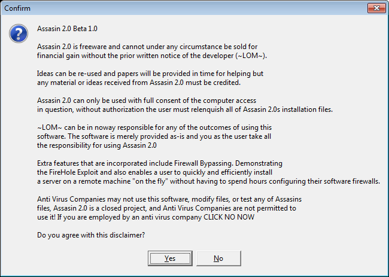

#  - 3e9af26f221309f94b8a8881dda957efbda07d07cdbdb89004951c4ac32dfc7d.exe
## Informations
| Label | Value |
| :--- | ---: |
| Executable Name | 3e9af26f221309f94b8a8881dda957efbda07d07cdbdb89004951c4ac32dfc7d.exe |
| Product Name |  |
| Version Number |  |
| Description |  |
| Company Name |  |
| Copyright |  |
| Trademarks |  |
| Last Edition | 24/09/2014 11:03:12 |
| Size | 677376 |
| SHA1 🔎 | [0076819C6BC21524B8B031112FD27002CEA8B39D](https://www.virustotal.com/gui/search/0076819C6BC21524B8B031112FD27002CEA8B39D) |
| Language |  |
## Static Analysis
<details>
<summary>Manalyze</summary>
<p>

```

* Manalyze 0.9 *

-------------------------------------------------------------------------------
C:/Users/IEUser/Desktop/net6.0/Malwares/3e9af26f221309f94b8a8881dda957efbda07d07cdbdb89004951c4ac32dfc7d.exe
-------------------------------------------------------------------------------

Summary:
--------
Architecture:       IMAGE_FILE_MACHINE_I386
Subsystem:          IMAGE_SUBSYSTEM_WINDOWS_GUI
Compilation Date:   1992-Jun-19 22:22:17
Detected languages: Dutch - Netherlands
                    English - United States

DOS Header:
-----------
e_magic:    MZ
e_cblp:     0x0050
e_cp:       0x0002
e_crlc:     0x0000
e_cparhdr:  0x0004
e_minalloc: 0x000F
e_maxalloc: 0xFFFF
e_ss:       0x0000
e_sp:       0x00B8
e_csum:     0x0000
e_ip:       0x0000
e_cs:       0x0000
e_ovno:     0x001A
e_oemid:    0x0000
e_oeminfo:  0x0000
e_lfanew:   0x00000100

PE Header:
----------
Signature:            PE
Machine:              IMAGE_FILE_MACHINE_I386
NumberofSections:     3
TimeDateStamp:        1992-Jun-19 22:22:17
PointerToSymbolTable: 0x00000000
NumberOfSymbols:      0
SizeOfOptionalHeader: 0x00E0
Characteristics:      IMAGE_FILE_32BIT_MACHINE
                      IMAGE_FILE_BYTES_REVERSED_HI
                      IMAGE_FILE_BYTES_REVERSED_LO
                      IMAGE_FILE_EXECUTABLE_IMAGE
                      IMAGE_FILE_LINE_NUMS_STRIPPED
                      IMAGE_FILE_LOCAL_SYMS_STRIPPED
                      IMAGE_FILE_RELOCS_STRIPPED

Image Optional Header:
----------------------
Magic:                   PE32
LinkerVersion:           2.0
SizeOfCode:              0x000A3000
SizeOfInitializedData:   0x00003000
SizeOfUninitializedData: 0x008D5000
AddressOfEntryPoint:     0x009781E0 (Section: UPX1)
BaseOfCode:              0x008D6000
BaseOfData:              0x00979000
ImageBase:               0x00400000
SectionAlignment:        0x00001000
FileAlignment:           0x00000200
OperatingSystemVersion:  4.0
ImageVersion:            0.0
SubsystemVersion:        4.0
Win32VersionValue:       0
SizeOfImage:             0x0097C000
SizeOfHeaders:           0x00001000
Checksum:                0x00000000
Subsystem:               IMAGE_SUBSYSTEM_WINDOWS_GUI
SizeofStackReserve:      0x00100000
SizeofStackCommit:       0x00004000
SizeofHeapReserve:       0x00100000
SizeofHeapCommit:        0x00001000
LoaderFlags:             0x00000000
NumberOfRvaAndSizes:     16

Sections:
---------
UPX0:
    VirtualSize:          0x008D5000
    VirtualAddress:       0x00001000
    SizeOfRawData:        0x00000000
    PointerToRawData:     0x00000400
    PointerToRelocations: 0x00000000
    PointerToLineNumbers: 0x00000000
    NumberOfLineNumbers:  0
    NumberOfRelocations:  0
    Characteristics:      IMAGE_SCN_CNT_UNINITIALIZED_DATA
                          IMAGE_SCN_MEM_EXECUTE
                          IMAGE_SCN_MEM_READ
                          IMAGE_SCN_MEM_WRITE

UPX1:
    VirtualSize:          0x000A3000
    VirtualAddress:       0x008D6000
    SizeOfRawData:        0x000A2400
    PointerToRawData:     0x00000400
    PointerToRelocations: 0x00000000
    PointerToLineNumbers: 0x00000000
    NumberOfLineNumbers:  0
    NumberOfRelocations:  0
    Characteristics:      IMAGE_SCN_CNT_INITIALIZED_DATA
                          IMAGE_SCN_MEM_EXECUTE
                          IMAGE_SCN_MEM_READ
                          IMAGE_SCN_MEM_WRITE
    Entropy:              7.91021

.rsrc:
    VirtualSize:          0x00003000
    VirtualAddress:       0x00979000
    SizeOfRawData:        0x00002E00
    PointerToRawData:     0x000A2800
    PointerToRelocations: 0x00000000
    PointerToLineNumbers: 0x00000000
    NumberOfLineNumbers:  0
    NumberOfRelocations:  0
    Characteristics:      IMAGE_SCN_CNT_INITIALIZED_DATA
                          IMAGE_SCN_MEM_READ
                          IMAGE_SCN_MEM_WRITE
    Entropy:              3.49904


Imports:
--------
KERNEL32.DLL: LoadLibraryA
              GetProcAddress
              ExitProcess
advapi32.dll: RegCloseKey
comctl32.dll: ImageList_Add
comdlg32.dll: ChooseColorA
gdi32.dll:    SaveDC
msacm32.dll:  acmStreamSize
ole32.dll:    OleDraw
oleaut32.dll: VariantCopy
shell32.dll:  ExtractIconA
user32.dll:   GetDC
version.dll:  VerQueryValueA
winmm.dll:    waveOutOpen
winspool.drv: OpenPrinterA
wsock32.dll:  send

Resources:
----------
EXCEPT:
    Type:          MAD
    Language:      UNKNOWN
    Codepage:      UNKNOWN
    Size:          75328
    TimeDateStamp: 1980-Jan-01 00:00:00
    Entropy:       0

1:
    Type:          RT_CURSOR
    Language:      UNKNOWN
    Codepage:      UNKNOWN
    Size:          308
    TimeDateStamp: 2003-Feb-16 14:09:50
    Entropy:       0

2:
    Type:          RT_CURSOR
    Language:      UNKNOWN
    Codepage:      UNKNOWN
    Size:          308
    TimeDateStamp: 2003-Feb-16 14:09:50
    Entropy:       0

3:
    Type:          RT_CURSOR
    Language:      UNKNOWN
    Codepage:      UNKNOWN
    Size:          308
    TimeDateStamp: 2003-Feb-16 14:09:50
    Entropy:       0

4:
    Type:          RT_CURSOR
    Language:      UNKNOWN
    Codepage:      UNKNOWN
    Size:          308
    TimeDateStamp: 2003-Feb-16 14:09:50
    Entropy:       0

5:
    Type:          RT_CURSOR
    Language:      UNKNOWN
    Codepage:      UNKNOWN
    Size:          308
    TimeDateStamp: 2003-Feb-16 14:09:50
    Entropy:       0

6:
    Type:          RT_CURSOR
    Language:      UNKNOWN
    Codepage:      UNKNOWN
    Size:          308
    TimeDateStamp: 2003-Feb-16 14:09:50
    Entropy:       0

7:
    Type:          RT_CURSOR
    Language:      UNKNOWN
    Codepage:      UNKNOWN
    Size:          308
    TimeDateStamp: 2003-Feb-16 14:09:50
    Entropy:       0

BBABORT:
    Type:          RT_BITMAP
    Language:      UNKNOWN
    Codepage:      UNKNOWN
    Size:          464
    TimeDateStamp: 2003-Feb-16 14:09:50
    Entropy:       0

BBALL:
    Type:          RT_BITMAP
    Language:      UNKNOWN
    Codepage:      UNKNOWN
    Size:          484
    TimeDateStamp: 2003-Feb-16 14:09:50
    Entropy:       0

BBCANCEL:
    Type:          RT_BITMAP
    Language:      UNKNOWN
    Codepage:      UNKNOWN
    Size:          464
    TimeDateStamp: 2003-Feb-16 14:09:50
    Entropy:       0

BBCLOSE:
    Type:          RT_BITMAP
    Language:      UNKNOWN
    Codepage:      UNKNOWN
    Size:          464
    TimeDateStamp: 2003-Feb-16 14:09:50
    Entropy:       0

BBHELP:
    Type:          RT_BITMAP
    Language:      UNKNOWN
    Codepage:      UNKNOWN
    Size:          464
    TimeDateStamp: 2003-Feb-16 14:09:50
    Entropy:       0

BBIGNORE:
    Type:          RT_BITMAP
    Language:      UNKNOWN
    Codepage:      UNKNOWN
    Size:          464
    TimeDateStamp: 2003-Feb-16 14:09:50
    Entropy:       0

BBNO:
    Type:          RT_BITMAP
    Language:      UNKNOWN
    Codepage:      UNKNOWN
    Size:          464
    TimeDateStamp: 2003-Feb-16 14:09:50
    Entropy:       0

BBOK:
    Type:          RT_BITMAP
    Language:      UNKNOWN
    Codepage:      UNKNOWN
    Size:          464
    TimeDateStamp: 2003-Feb-16 14:09:50
    Entropy:       0

BBRETRY:
    Type:          RT_BITMAP
    Language:      UNKNOWN
    Codepage:      UNKNOWN
    Size:          464
    TimeDateStamp: 2003-Feb-16 14:09:50
    Entropy:       0

BBYES:
    Type:          RT_BITMAP
    Language:      UNKNOWN
    Codepage:      UNKNOWN
    Size:          464
    TimeDateStamp: 2003-Feb-16 14:09:50
    Entropy:       0

MEICANTCONTINUE:
    Type:          RT_BITMAP
    Language:      UNKNOWN
    Codepage:      UNKNOWN
    Size:          1064
    TimeDateStamp: 2003-Feb-16 14:09:50
    Entropy:       0

MEICLOSE:
    Type:          RT_BITMAP
    Language:      UNKNOWN
    Codepage:      UNKNOWN
    Size:          1064
    TimeDateStamp: 2003-Feb-16 14:09:50
    Entropy:       0

MEICONTINUE:
    Type:          RT_BITMAP
    Language:      UNKNOWN
    Codepage:      UNKNOWN
    Size:          1064
    TimeDateStamp: 2003-Feb-16 14:09:50
    Entropy:       0

MEIMAIL:
    Type:          RT_BITMAP
    Language:      UNKNOWN
    Codepage:      UNKNOWN
    Size:          1064
    TimeDateStamp: 2003-Feb-16 14:09:50
    Entropy:       0

MEIRESTART:
    Type:          RT_BITMAP
    Language:      UNKNOWN
    Codepage:      UNKNOWN
    Size:          1064
    TimeDateStamp: 2003-Feb-16 14:09:50
    Entropy:       0

MEISAVE:
    Type:          RT_BITMAP
    Language:      UNKNOWN
    Codepage:      UNKNOWN
    Size:          1064
    TimeDateStamp: 2003-Feb-16 14:09:50
    Entropy:       0

MEISHOW:
    Type:          RT_BITMAP
    Language:      UNKNOWN
    Codepage:      UNKNOWN
    Size:          1064
    TimeDateStamp: 2003-Feb-16 14:09:50
    Entropy:       0

MSN:
    Type:          RT_BITMAP
    Language:      Dutch - Netherlands
    Codepage:      UNKNOWN
    Size:          1288
    TimeDateStamp: 2003-Feb-16 14:09:50
    Entropy:       0

PREVIEWGLYPH:
    Type:          RT_BITMAP
    Language:      UNKNOWN
    Codepage:      UNKNOWN
    Size:          232
    TimeDateStamp: 2003-Feb-16 14:09:50
    Entropy:       0

1 (#2):
    Type:          RT_ICON
    Language:      English - United States
    Codepage:      UNKNOWN
    Size:          872
    TimeDateStamp: 2003-Feb-16 14:09:50
    Entropy:       3.32044

2 (#2):
    Type:          RT_ICON
    Language:      English - United States
    Codepage:      UNKNOWN
    Size:          3240
    TimeDateStamp: 2003-Feb-16 14:09:50
    Entropy:       2.52625

DLGTEMPLATE:
    Type:          RT_DIALOG
    Language:      UNKNOWN
    Codepage:      UNKNOWN
    Size:          82
    TimeDateStamp: 2003-Feb-16 14:09:50
    Entropy:       0

4080:
    Type:          RT_STRING
    Language:      UNKNOWN
    Codepage:      UNKNOWN
    Size:          980
    TimeDateStamp: 2003-Feb-16 14:09:50
    Entropy:       0

4081:
    Type:          RT_STRING
    Language:      UNKNOWN
    Codepage:      UNKNOWN
    Size:          1100
    TimeDateStamp: 2003-Feb-16 14:09:50
    Entropy:       0

4082:
    Type:          RT_STRING
    Language:      UNKNOWN
    Codepage:      UNKNOWN
    Size:          1012
    TimeDateStamp: 2003-Feb-16 14:09:50
    Entropy:       0

4083:
    Type:          RT_STRING
    Language:      UNKNOWN
    Codepage:      UNKNOWN
    Size:          712
    TimeDateStamp: 2003-Feb-16 14:09:50
    Entropy:       0

4084:
    Type:          RT_STRING
    Language:      UNKNOWN
    Codepage:      UNKNOWN
    Size:          224
    TimeDateStamp: 2003-Feb-16 14:09:50
    Entropy:       0

4085:
    Type:          RT_STRING
    Language:      UNKNOWN
    Codepage:      UNKNOWN
    Size:          300
    TimeDateStamp: 2003-Feb-16 14:09:50
    Entropy:       0

4086:
    Type:          RT_STRING
    Language:      UNKNOWN
    Codepage:      UNKNOWN
    Size:          680
    TimeDateStamp: 2003-Feb-16 14:09:50
    Entropy:       0

4087:
    Type:          RT_STRING
    Language:      UNKNOWN
    Codepage:      UNKNOWN
    Size:          1084
    TimeDateStamp: 2003-Feb-16 14:09:50
    Entropy:       0

4088:
    Type:          RT_STRING
    Language:      UNKNOWN
    Codepage:      UNKNOWN
    Size:          944
    TimeDateStamp: 2003-Feb-16 14:09:50
    Entropy:       0

4089:
    Type:          RT_STRING
    Language:      UNKNOWN
    Codepage:      UNKNOWN
    Size:          924
    TimeDateStamp: 2003-Feb-16 14:09:50
    Entropy:       0

4090:
    Type:          RT_STRING
    Language:      UNKNOWN
    Codepage:      UNKNOWN
    Size:          924
    TimeDateStamp: 2003-Feb-16 14:09:50
    Entropy:       0

4091:
    Type:          RT_STRING
    Language:      UNKNOWN
    Codepage:      UNKNOWN
    Size:          716
    TimeDateStamp: 2003-Feb-16 14:09:50
    Entropy:       0

4092:
    Type:          RT_STRING
    Language:      UNKNOWN
    Codepage:      UNKNOWN
    Size:          220
    TimeDateStamp: 2003-Feb-16 14:09:50
    Entropy:       0

4093:
    Type:          RT_STRING
    Language:      UNKNOWN
    Codepage:      UNKNOWN
    Size:          284
    TimeDateStamp: 2003-Feb-16 14:09:50
    Entropy:       0

4094:
    Type:          RT_STRING
    Language:      UNKNOWN
    Codepage:      UNKNOWN
    Size:          848
    TimeDateStamp: 2003-Feb-16 14:09:50
    Entropy:       0

4095:
    Type:          RT_STRING
    Language:      UNKNOWN
    Codepage:      UNKNOWN
    Size:          880
    TimeDateStamp: 2003-Feb-16 14:09:50
    Entropy:       0

4096:
    Type:          RT_STRING
    Language:      UNKNOWN
    Codepage:      UNKNOWN
    Size:          760
    TimeDateStamp: 2003-Feb-16 14:09:50
    Entropy:       0

DVCLAL:
    Type:          RT_RCDATA
    Language:      UNKNOWN
    Codepage:      UNKNOWN
    Size:          16
    TimeDateStamp: 2003-Feb-16 14:09:50
    Entropy:       0

PACKAGEINFO:
    Type:          RT_RCDATA
    Language:      UNKNOWN
    Codepage:      UNKNOWN
    Size:          1752
    TimeDateStamp: 2003-Feb-16 14:09:50
    Entropy:       0

TABOUT_FORM1:
    Type:          RT_RCDATA
    Language:      UNKNOWN
    Codepage:      UNKNOWN
    Size:          46186
    TimeDateStamp: 2003-Feb-16 14:09:50
    Entropy:       0

TATTEMPTFORM1:
    Type:          RT_RCDATA
    Language:      UNKNOWN
    Codepage:      UNKNOWN
    Size:          6491
    TimeDateStamp: 2003-Feb-16 14:09:50
    Entropy:       0

TAUDIOFORM1:
    Type:          RT_RCDATA
    Language:      UNKNOWN
    Codepage:      UNKNOWN
    Size:          7469
    TimeDateStamp: 2003-Feb-16 14:09:50
    Entropy:       0

TCHATFORM1:
    Type:          RT_RCDATA
    Language:      UNKNOWN
    Codepage:      UNKNOWN
    Size:          8383
    TimeDateStamp: 2003-Feb-16 14:09:50
    Entropy:       0

TCONNECTIONFORM1:
    Type:          RT_RCDATA
    Language:      UNKNOWN
    Codepage:      UNKNOWN
    Size:          11747
    TimeDateStamp: 2003-Feb-16 14:09:50
    Entropy:       0

TCONNECTIONPROMPTFORM1:
    Type:          RT_RCDATA
    Language:      UNKNOWN
    Codepage:      UNKNOWN
    Size:          89080
    TimeDateStamp: 2003-Feb-16 14:09:50
    Entropy:       0

TDIRECT_FORM1:
    Type:          RT_RCDATA
    Language:      UNKNOWN
    Codepage:      UNKNOWN
    Size:          6812
    TimeDateStamp: 2003-Feb-16 14:09:50
    Entropy:       0

TEDITSERVERFORM1:
    Type:          RT_RCDATA
    Language:      UNKNOWN
    Codepage:      UNKNOWN
    Size:          136889
    TimeDateStamp: 2003-Feb-16 14:09:50
    Entropy:       0

TEXEKILLERFORM1:
    Type:          RT_RCDATA
    Language:      UNKNOWN
    Codepage:      UNKNOWN
    Size:          2169
    TimeDateStamp: 2003-Feb-16 14:09:50
    Entropy:       0

TFINDFILESFORM1:
    Type:          RT_RCDATA
    Language:      UNKNOWN
    Codepage:      UNKNOWN
    Size:          14056
    TimeDateStamp: 2003-Feb-16 14:09:50
    Entropy:       0

TFTPFORM1:
    Type:          RT_RCDATA
    Language:      UNKNOWN
    Codepage:      UNKNOWN
    Size:          38523
    TimeDateStamp: 2003-Feb-16 14:09:50
    Entropy:       0

TFUNFACTORYADD_FORM1:
    Type:          RT_RCDATA
    Language:      UNKNOWN
    Codepage:      UNKNOWN
    Size:          3743
    TimeDateStamp: 2003-Feb-16 14:09:50
    Entropy:       0

TFUNFACTORY_FORM1:
    Type:          RT_RCDATA
    Language:      UNKNOWN
    Codepage:      UNKNOWN
    Size:          22310
    TimeDateStamp: 2003-Feb-16 14:09:50
    Entropy:       0

TFUNFORM1:
    Type:          RT_RCDATA
    Language:      UNKNOWN
    Codepage:      UNKNOWN
    Size:          118880
    TimeDateStamp: 2003-Feb-16 14:09:50
    Entropy:       0

TGLOBALCOMMAND_FORM1:
    Type:          RT_RCDATA
    Language:      UNKNOWN
    Codepage:      UNKNOWN
    Size:          5298
    TimeDateStamp: 2003-Feb-16 14:09:50
    Entropy:       7.87221

TIEXPLOREFORM1:
    Type:          RT_RCDATA
    Language:      UNKNOWN
    Codepage:      UNKNOWN
    Size:          9568
    TimeDateStamp: 2003-Feb-16 14:09:50
    Entropy:       7.88348

TKEYLOGFORM1:
    Type:          RT_RCDATA
    Language:      UNKNOWN
    Codepage:      UNKNOWN
    Size:          11576
    TimeDateStamp: 2003-Feb-16 14:09:50
    Entropy:       7.90532

TMAINFORM1:
    Type:          RT_RCDATA
    Language:      UNKNOWN
    Codepage:      UNKNOWN
    Size:          88638
    TimeDateStamp: 2003-Feb-16 14:09:50
    Entropy:       7.91923

TMOREFUN_FORM1:
    Type:          RT_RCDATA
    Language:      UNKNOWN
    Codepage:      UNKNOWN
    Size:          87058
    TimeDateStamp: 2003-Feb-16 14:09:50
    Entropy:       7.91551

TOPTIONSFORM1:
    Type:          RT_RCDATA
    Language:      UNKNOWN
    Codepage:      UNKNOWN
    Size:          1362
    TimeDateStamp: 2003-Feb-16 14:09:50
    Entropy:       7.75352

TPCBEEP_FORM1:
    Type:          RT_RCDATA
    Language:      UNKNOWN
    Codepage:      UNKNOWN
    Size:          17020
    TimeDateStamp: 2003-Feb-16 14:09:50
    Entropy:       7.85701

TPHP_FORM1:
    Type:          RT_RCDATA
    Language:      UNKNOWN
    Codepage:      UNKNOWN
    Size:          4858
    TimeDateStamp: 2003-Feb-16 14:09:50
    Entropy:       7.86208

TPLUGINFORM1:
    Type:          RT_RCDATA
    Language:      UNKNOWN
    Codepage:      UNKNOWN
    Size:          12594
    TimeDateStamp: 2003-Feb-16 14:09:50
    Entropy:       7.90066

TPORTADDFORM1:
    Type:          RT_RCDATA
    Language:      UNKNOWN
    Codepage:      UNKNOWN
    Size:          1682
    TimeDateStamp: 2003-Feb-16 14:09:50
    Entropy:       7.79119

TPORTCHAIN_FORM1:
    Type:          RT_RCDATA
    Language:      UNKNOWN
    Codepage:      UNKNOWN
    Size:          7245
    TimeDateStamp: 2003-Feb-16 14:09:50
    Entropy:       7.87701

TPORTREDIRECTFORM1:
    Type:          RT_RCDATA
    Language:      UNKNOWN
    Codepage:      UNKNOWN
    Size:          19801
    TimeDateStamp: 2003-Feb-16 14:09:50
    Entropy:       7.90525

TPORTTUNNELADDFORM1:
    Type:          RT_RCDATA
    Language:      UNKNOWN
    Codepage:      UNKNOWN
    Size:          1821
    TimeDateStamp: 2003-Feb-16 14:09:50
    Entropy:       7.79662

TPROCESSLISTFORM1:
    Type:          RT_RCDATA
    Language:      UNKNOWN
    Codepage:      UNKNOWN
    Size:          16561
    TimeDateStamp: 2003-Feb-16 14:09:50
    Entropy:       7.91421

TREGISTRYFORM1:
    Type:          RT_RCDATA
    Language:      UNKNOWN
    Codepage:      UNKNOWN
    Size:          32746
    TimeDateStamp: 2003-Feb-16 14:09:50
    Entropy:       7.90999

TRUNFORM1:
    Type:          RT_RCDATA
    Language:      UNKNOWN
    Codepage:      UNKNOWN
    Size:          10683
    TimeDateStamp: 2003-Feb-16 14:09:50
    Entropy:       7.88339

TSCANNER_FORM1:
    Type:          RT_RCDATA
    Language:      UNKNOWN
    Codepage:      UNKNOWN
    Size:          13540
    TimeDateStamp: 2003-Feb-16 14:09:50
    Entropy:       7.87473

TSCREENSHOTFORM1:
    Type:          RT_RCDATA
    Language:      UNKNOWN
    Codepage:      UNKNOWN
    Size:          12613
    TimeDateStamp: 2003-Feb-16 14:09:50
    Entropy:       7.84492

TSERVEROPENFORM1:
    Type:          RT_RCDATA
    Language:      UNKNOWN
    Codepage:      UNKNOWN
    Size:          87388
    TimeDateStamp: 2003-Feb-16 14:09:50
    Entropy:       7.85711

TSERVERSETTINGSFORM1:
    Type:          RT_RCDATA
    Language:      UNKNOWN
    Codepage:      UNKNOWN
    Size:          16185
    TimeDateStamp: 2003-Feb-16 14:09:50
    Entropy:       7.64946

TSETTINGSFORM1:
    Type:          RT_RCDATA
    Language:      UNKNOWN
    Codepage:      UNKNOWN
    Size:          88342
    TimeDateStamp: 2003-Feb-16 14:09:50
    Entropy:       7.82524

TSPLASHFORM1:
    Type:          RT_RCDATA
    Language:      UNKNOWN
    Codepage:      UNKNOWN
    Size:          48595
    TimeDateStamp: 2003-Feb-16 14:09:50
    Entropy:       7.81229

TSYSINFOFORM1:
    Type:          RT_RCDATA
    Language:      UNKNOWN
    Codepage:      UNKNOWN
    Size:          5049
    TimeDateStamp: 2003-Feb-16 14:09:50
    Entropy:       7.75899

TTASKLISTFORM1:
    Type:          RT_RCDATA
    Language:      UNKNOWN
    Codepage:      UNKNOWN
    Size:          13185
    TimeDateStamp: 2003-Feb-16 14:09:50
    Entropy:       7.72579

TWEBCAMFORM1:
    Type:          RT_RCDATA
    Language:      UNKNOWN
    Codepage:      UNKNOWN
    Size:          18737
    TimeDateStamp: 2003-Feb-16 14:09:50
    Entropy:       7.73239

32761:
    Type:          RT_GROUP_CURSOR
    Language:      UNKNOWN
    Codepage:      UNKNOWN
    Size:          20
    TimeDateStamp: 2003-Feb-16 14:09:50
    Entropy:       4.32193

32762:
    Type:          RT_GROUP_CURSOR
    Language:      UNKNOWN
    Codepage:      UNKNOWN
    Size:          20
    TimeDateStamp: 2003-Feb-16 14:09:50
    Entropy:       4.22193

32763:
    Type:          RT_GROUP_CURSOR
    Language:      UNKNOWN
    Codepage:      UNKNOWN
    Size:          20
    TimeDateStamp: 2003-Feb-16 14:09:50
    Entropy:       4.32193

32764:
    Type:          RT_GROUP_CURSOR
    Language:      UNKNOWN
    Codepage:      UNKNOWN
    Size:          20
    TimeDateStamp: 2003-Feb-16 14:09:50
    Entropy:       4.12193

32765:
    Type:          RT_GROUP_CURSOR
    Language:      UNKNOWN
    Codepage:      UNKNOWN
    Size:          20
    TimeDateStamp: 2003-Feb-16 14:09:50
    Entropy:       4.22193

32766:
    Type:          RT_GROUP_CURSOR
    Language:      UNKNOWN
    Codepage:      UNKNOWN
    Size:          20
    TimeDateStamp: 2003-Feb-16 14:09:50
    Entropy:       4.08418

32767:
    Type:          RT_GROUP_CURSOR
    Language:      UNKNOWN
    Codepage:      UNKNOWN
    Size:          20
    TimeDateStamp: 2003-Feb-16 14:09:50
    Entropy:       4.22193

MAINICON:
    Type:              RT_GROUP_ICON
    Language:          English - United States
    Codepage:          UNKNOWN
    Size:              34
    TimeDateStamp:     2003-Feb-16 14:09:50
    Entropy:           2.40927
    Detected Filetype: Icon file


[ SUSPICIOUS ] PEiD Signature:
    UPX -> www.upx.sourceforge.net

[ SUSPICIOUS ] The PE is packed with UPX
    Unusual section name found: UPX0
    Section UPX0 is both writable and executable.
    Unusual section name found: UPX1
    Section UPX1 is both writable and executable.
    The PE's resources are bigger than it is.

The PE contains common functions which appear in legitimate applications.
    [!] The program may be hiding some of its imports:
        LoadLibraryA
        GetProcAddress
    Can access the registry:
        RegCloseKey

[ SUSPICIOUS ] The PE header may have been manually modified.
    Resource TGLOBALCOMMAND_FORM1 is possibly compressed or encrypted.
    Resource TIEXPLOREFORM1 is possibly compressed or encrypted.
    Resource TKEYLOGFORM1 is possibly compressed or encrypted.
    Resource TMAINFORM1 is possibly compressed or encrypted.
    Resource TMOREFUN_FORM1 is possibly compressed or encrypted.
    Resource TOPTIONSFORM1 is possibly compressed or encrypted.
    Resource TPCBEEP_FORM1 is possibly compressed or encrypted.
    Resource TPHP_FORM1 is possibly compressed or encrypted.
    Resource TPLUGINFORM1 is possibly compressed or encrypted.
    Resource TPORTADDFORM1 is possibly compressed or encrypted.
    Resource TPORTCHAIN_FORM1 is possibly compressed or encrypted.
    Resource TPORTREDIRECTFORM1 is possibly compressed or encrypted.
    Resource TPORTTUNNELADDFORM1 is possibly compressed or encrypted.
    Resource TPROCESSLISTFORM1 is possibly compressed or encrypted.
    Resource TREGISTRYFORM1 is possibly compressed or encrypted.
    Resource TRUNFORM1 is possibly compressed or encrypted.
    Resource TSCANNER_FORM1 is possibly compressed or encrypted.
    Resource TSCREENSHOTFORM1 is possibly compressed or encrypted.
    Resource TSERVEROPENFORM1 is possibly compressed or encrypted.
    Resource TSERVERSETTINGSFORM1 is possibly compressed or encrypted.
    Resource TSETTINGSFORM1 is possibly compressed or encrypted.
    Resource TSPLASHFORM1 is possibly compressed or encrypted.
    Resource TSYSINFOFORM1 is possibly compressed or encrypted.
    Resource TTASKLISTFORM1 is possibly compressed or encrypted.
    Resource TWEBCAMFORM1 is possibly compressed or encrypted.
    The resource timestamps differ from the PE header:
        2003-Feb-16 14:09:50
    Resources amount for 185.233% of the executable.

The following exploit mitigation techniques have been detected
    Stack Canary: disabled
    SafeSEH: disabled
    ASLR: disabled
    DEP: disabled
    CFG: disabled


```

</p>
</details>

## Screenshots
### Confirm
 
