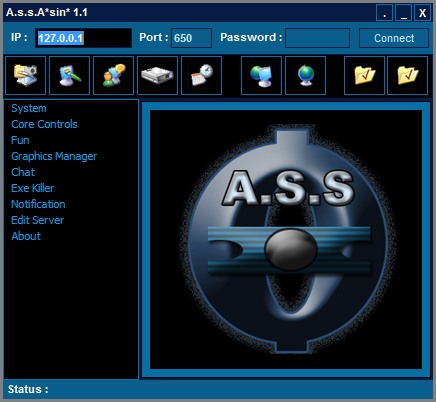

#  - 0f7bd3750419db57d2073001dfa8188c8d35825ed525bfd233abc546b5610fdb.exe
## Informations
| Label | Value |
| :--- | ---: |
| Executable Name | 0f7bd3750419db57d2073001dfa8188c8d35825ed525bfd233abc546b5610fdb.exe |
| Product Name |  |
| Version Number |  |
| Description |  |
| Company Name |  |
| Copyright |  |
| Trademarks |  |
| Last Edition | 24/09/2014 11:03:12 |
| Size | 390144 |
| SHA1 🔎 | [0C8E9BE0B7BF566A10C2AFE093E80FBF00A22AF8](https://www.virustotal.com/gui/search/0C8E9BE0B7BF566A10C2AFE093E80FBF00A22AF8) |
| Language |  |
## Static Analysis
<details>
<summary>Manalyze</summary>
<p>

```

* Manalyze 0.9 *

-------------------------------------------------------------------------------
C:/Users/IEUser/Desktop/net6.0/Malwares/0f7bd3750419db57d2073001dfa8188c8d35825ed525bfd233abc546b5610fdb.exe
-------------------------------------------------------------------------------

Summary:
--------
Architecture:       IMAGE_FILE_MACHINE_I386
Subsystem:          IMAGE_SUBSYSTEM_WINDOWS_GUI
Compilation Date:   1992-Jun-19 22:22:17
Detected languages: English - United States

DOS Header:
-----------
e_magic:    MZ
e_cblp:     0x0050
e_cp:       0x0002
e_crlc:     0x0000
e_cparhdr:  0x0004
e_minalloc: 0x000F
e_maxalloc: 0xFFFF
e_ss:       0x0000
e_sp:       0x00B8
e_csum:     0x0000
e_ip:       0x0000
e_cs:       0x0000
e_ovno:     0x001A
e_oemid:    0x0000
e_oeminfo:  0x0000
e_lfanew:   0x00000100

PE Header:
----------
Signature:            PE
Machine:              IMAGE_FILE_MACHINE_I386
NumberofSections:     3
TimeDateStamp:        1992-Jun-19 22:22:17
PointerToSymbolTable: 0x00000000
NumberOfSymbols:      0
SizeOfOptionalHeader: 0x00E0
Characteristics:      IMAGE_FILE_32BIT_MACHINE
                      IMAGE_FILE_BYTES_REVERSED_HI
                      IMAGE_FILE_BYTES_REVERSED_LO
                      IMAGE_FILE_EXECUTABLE_IMAGE
                      IMAGE_FILE_LINE_NUMS_STRIPPED
                      IMAGE_FILE_LOCAL_SYMS_STRIPPED
                      IMAGE_FILE_RELOCS_STRIPPED

Image Optional Header:
----------------------
Magic:                   PE32
LinkerVersion:           2.0
SizeOfCode:              0x0005D000
SizeOfInitializedData:   0x00003000
SizeOfUninitializedData: 0x000AD000
AddressOfEntryPoint:     0x0010A560 (Section: UPX1)
BaseOfCode:              0x000AE000
BaseOfData:              0x0010B000
ImageBase:               0x00400000
SectionAlignment:        0x00001000
FileAlignment:           0x00000200
OperatingSystemVersion:  4.0
ImageVersion:            0.0
SubsystemVersion:        4.0
Win32VersionValue:       0
SizeOfImage:             0x0010E000
SizeOfHeaders:           0x00001000
Checksum:                0x00000000
Subsystem:               IMAGE_SUBSYSTEM_WINDOWS_GUI
SizeofStackReserve:      0x00100000
SizeofStackCommit:       0x00004000
SizeofHeapReserve:       0x00100000
SizeofHeapCommit:        0x00001000
LoaderFlags:             0x00000000
NumberOfRvaAndSizes:     16

Sections:
---------
UPX0:
    VirtualSize:          0x000AD000
    VirtualAddress:       0x00001000
    SizeOfRawData:        0x00000000
    PointerToRawData:     0x00000400
    PointerToRelocations: 0x00000000
    PointerToLineNumbers: 0x00000000
    NumberOfLineNumbers:  0
    NumberOfRelocations:  0
    Characteristics:      IMAGE_SCN_CNT_UNINITIALIZED_DATA
                          IMAGE_SCN_MEM_EXECUTE
                          IMAGE_SCN_MEM_READ
                          IMAGE_SCN_MEM_WRITE

UPX1:
    VirtualSize:          0x0005D000
    VirtualAddress:       0x000AE000
    SizeOfRawData:        0x0005C800
    PointerToRawData:     0x00000400
    PointerToRelocations: 0x00000000
    PointerToLineNumbers: 0x00000000
    NumberOfLineNumbers:  0
    NumberOfRelocations:  0
    Characteristics:      IMAGE_SCN_CNT_INITIALIZED_DATA
                          IMAGE_SCN_MEM_EXECUTE
                          IMAGE_SCN_MEM_READ
                          IMAGE_SCN_MEM_WRITE
    Entropy:              7.92508

.rsrc:
    VirtualSize:          0x00003000
    VirtualAddress:       0x0010B000
    SizeOfRawData:        0x00002800
    PointerToRawData:     0x0005CC00
    PointerToRelocations: 0x00000000
    PointerToLineNumbers: 0x00000000
    NumberOfLineNumbers:  0
    NumberOfRelocations:  0
    Characteristics:      IMAGE_SCN_CNT_INITIALIZED_DATA
                          IMAGE_SCN_MEM_READ
                          IMAGE_SCN_MEM_WRITE
    Entropy:              4.10286


Imports:
--------
KERNEL32.DLL: LoadLibraryA
              GetProcAddress
              ExitProcess
advapi32.dll: RegFlushKey
comctl32.dll: ImageList_Add
comdlg32.dll: GetSaveFileNameA
gdi32.dll:    SaveDC
oleaut32.dll: VariantCopy
shell32.dll:  ShellExecuteA
user32.dll:   GetDC
version.dll:  VerQueryValueA
winspool.drv: OpenPrinterA
wsock32.dll:  send

Resources:
----------
1:
    Type:          RT_CURSOR
    Language:      UNKNOWN
    Codepage:      UNKNOWN
    Size:          308
    TimeDateStamp: 2002-Aug-01 19:58:26
    Entropy:       7.15209

2:
    Type:          RT_CURSOR
    Language:      UNKNOWN
    Codepage:      UNKNOWN
    Size:          308
    TimeDateStamp: 2002-Aug-01 19:58:26
    Entropy:       7.12576

3:
    Type:          RT_CURSOR
    Language:      UNKNOWN
    Codepage:      UNKNOWN
    Size:          308
    TimeDateStamp: 2002-Aug-01 19:58:26
    Entropy:       7.13584

4:
    Type:          RT_CURSOR
    Language:      UNKNOWN
    Codepage:      UNKNOWN
    Size:          308
    TimeDateStamp: 2002-Aug-01 19:58:26
    Entropy:       6.99213

5:
    Type:          RT_CURSOR
    Language:      UNKNOWN
    Codepage:      UNKNOWN
    Size:          308
    TimeDateStamp: 2002-Aug-01 19:58:26
    Entropy:       7.09869

6:
    Type:          RT_CURSOR
    Language:      UNKNOWN
    Codepage:      UNKNOWN
    Size:          308
    TimeDateStamp: 2002-Aug-01 19:58:26
    Entropy:       7.17207

7:
    Type:          RT_CURSOR
    Language:      UNKNOWN
    Codepage:      UNKNOWN
    Size:          308
    TimeDateStamp: 2002-Aug-01 19:58:26
    Entropy:       7.15478

BBABORT:
    Type:          RT_BITMAP
    Language:      UNKNOWN
    Codepage:      UNKNOWN
    Size:          464
    TimeDateStamp: 2002-Aug-01 19:58:26
    Entropy:       7.41501

BBALL:
    Type:          RT_BITMAP
    Language:      UNKNOWN
    Codepage:      UNKNOWN
    Size:          484
    TimeDateStamp: 2002-Aug-01 19:58:26
    Entropy:       7.38881

BBCANCEL:
    Type:          RT_BITMAP
    Language:      UNKNOWN
    Codepage:      UNKNOWN
    Size:          464
    TimeDateStamp: 2002-Aug-01 19:58:26
    Entropy:       7.4115

BBCLOSE:
    Type:          RT_BITMAP
    Language:      UNKNOWN
    Codepage:      UNKNOWN
    Size:          464
    TimeDateStamp: 2002-Aug-01 19:58:26
    Entropy:       7.46374

BBHELP:
    Type:          RT_BITMAP
    Language:      UNKNOWN
    Codepage:      UNKNOWN
    Size:          464
    TimeDateStamp: 2002-Aug-01 19:58:26
    Entropy:       7.45765

BBIGNORE:
    Type:          RT_BITMAP
    Language:      UNKNOWN
    Codepage:      UNKNOWN
    Size:          464
    TimeDateStamp: 2002-Aug-01 19:58:26
    Entropy:       7.52664

BBNO:
    Type:          RT_BITMAP
    Language:      UNKNOWN
    Codepage:      UNKNOWN
    Size:          464
    TimeDateStamp: 2002-Aug-01 19:58:26
    Entropy:       7.43718

BBOK:
    Type:          RT_BITMAP
    Language:      UNKNOWN
    Codepage:      UNKNOWN
    Size:          464
    TimeDateStamp: 2002-Aug-01 19:58:26
    Entropy:       7.34003

BBRETRY:
    Type:          RT_BITMAP
    Language:      UNKNOWN
    Codepage:      UNKNOWN
    Size:          464
    TimeDateStamp: 2002-Aug-01 19:58:26
    Entropy:       7.44088

BBYES:
    Type:          RT_BITMAP
    Language:      UNKNOWN
    Codepage:      UNKNOWN
    Size:          464
    TimeDateStamp: 2002-Aug-01 19:58:26
    Entropy:       7.42606

PREVIEWGLYPH:
    Type:          RT_BITMAP
    Language:      UNKNOWN
    Codepage:      UNKNOWN
    Size:          232
    TimeDateStamp: 2002-Aug-01 19:58:26
    Entropy:       7.01407

1 (#2):
    Type:          RT_ICON
    Language:      English - United States
    Codepage:      UNKNOWN
    Size:          3752
    TimeDateStamp: 2002-Aug-01 19:58:26
    Entropy:       3.52194

DLGTEMPLATE:
    Type:          RT_DIALOG
    Language:      UNKNOWN
    Codepage:      UNKNOWN
    Size:          82
    TimeDateStamp: 2002-Aug-01 19:58:26
    Entropy:       5.73536

4082:
    Type:          RT_STRING
    Language:      UNKNOWN
    Codepage:      UNKNOWN
    Size:          472
    TimeDateStamp: 2002-Aug-01 19:58:26
    Entropy:       7.48179

4083:
    Type:          RT_STRING
    Language:      UNKNOWN
    Codepage:      UNKNOWN
    Size:          1104
    TimeDateStamp: 2002-Aug-01 19:58:26
    Entropy:       7.72868

4084:
    Type:          RT_STRING
    Language:      UNKNOWN
    Codepage:      UNKNOWN
    Size:          320
    TimeDateStamp: 2002-Aug-01 19:58:26
    Entropy:       7.27255

4085:
    Type:          RT_STRING
    Language:      UNKNOWN
    Codepage:      UNKNOWN
    Size:          232
    TimeDateStamp: 2002-Aug-01 19:58:26
    Entropy:       6.94114

4086:
    Type:          RT_STRING
    Language:      UNKNOWN
    Codepage:      UNKNOWN
    Size:          312
    TimeDateStamp: 2002-Aug-01 19:58:26
    Entropy:       7.23141

4087:
    Type:          RT_STRING
    Language:      UNKNOWN
    Codepage:      UNKNOWN
    Size:          920
    TimeDateStamp: 2002-Aug-01 19:58:26
    Entropy:       7.6795

4088:
    Type:          RT_STRING
    Language:      UNKNOWN
    Codepage:      UNKNOWN
    Size:          1000
    TimeDateStamp: 2002-Aug-01 19:58:26
    Entropy:       7.67792

4089:
    Type:          RT_STRING
    Language:      UNKNOWN
    Codepage:      UNKNOWN
    Size:          932
    TimeDateStamp: 2002-Aug-01 19:58:26
    Entropy:       7.65754

4090:
    Type:          RT_STRING
    Language:      UNKNOWN
    Codepage:      UNKNOWN
    Size:          904
    TimeDateStamp: 2002-Aug-01 19:58:26
    Entropy:       7.68343

4091:
    Type:          RT_STRING
    Language:      UNKNOWN
    Codepage:      UNKNOWN
    Size:          920
    TimeDateStamp: 2002-Aug-01 19:58:26
    Entropy:       7.70898

4092:
    Type:          RT_STRING
    Language:      UNKNOWN
    Codepage:      UNKNOWN
    Size:          240
    TimeDateStamp: 2002-Aug-01 19:58:26
    Entropy:       6.98399

4093:
    Type:          RT_STRING
    Language:      UNKNOWN
    Codepage:      UNKNOWN
    Size:          192
    TimeDateStamp: 2002-Aug-01 19:58:26
    Entropy:       6.82296

4094:
    Type:          RT_STRING
    Language:      UNKNOWN
    Codepage:      UNKNOWN
    Size:          740
    TimeDateStamp: 2002-Aug-01 19:58:26
    Entropy:       7.63196

4095:
    Type:          RT_STRING
    Language:      UNKNOWN
    Codepage:      UNKNOWN
    Size:          884
    TimeDateStamp: 2002-Aug-01 19:58:26
    Entropy:       7.68999

4096:
    Type:          RT_STRING
    Language:      UNKNOWN
    Codepage:      UNKNOWN
    Size:          692
    TimeDateStamp: 2002-Aug-01 19:58:26
    Entropy:       7.61352

DVCLAL:
    Type:          RT_RCDATA
    Language:      UNKNOWN
    Codepage:      UNKNOWN
    Size:          16
    TimeDateStamp: 2002-Aug-01 19:58:26
    Entropy:       3.875

PACKAGEINFO:
    Type:          RT_RCDATA
    Language:      UNKNOWN
    Codepage:      UNKNOWN
    Size:          1656
    TimeDateStamp: 2002-Aug-01 19:58:26
    Entropy:       7.80103

TABOUT_FORM1:
    Type:          RT_RCDATA
    Language:      UNKNOWN
    Codepage:      UNKNOWN
    Size:          1245
    TimeDateStamp: 2002-Aug-01 19:58:26
    Entropy:       7.71279

TCHATMANAGER_FORM1:
    Type:          RT_RCDATA
    Language:      UNKNOWN
    Codepage:      UNKNOWN
    Size:          1442
    TimeDateStamp: 2002-Aug-01 19:58:26
    Entropy:       7.73706

TCHATOPTIONSMANAGER_FORM1:
    Type:          RT_RCDATA
    Language:      UNKNOWN
    Codepage:      UNKNOWN
    Size:          4801
    TimeDateStamp: 2002-Aug-01 19:58:26
    Entropy:       7.86892

TEDITSERVERMANAGER_FORM1:
    Type:          RT_RCDATA
    Language:      UNKNOWN
    Codepage:      UNKNOWN
    Size:          1939
    TimeDateStamp: 2002-Aug-01 19:58:26
    Entropy:       7.79285

TEXEMANAGER_FORM1:
    Type:          RT_RCDATA
    Language:      UNKNOWN
    Codepage:      UNKNOWN
    Size:          2541
    TimeDateStamp: 2002-Aug-01 19:58:26
    Entropy:       7.7732

TFILEMANAGER_FORM1:
    Type:          RT_RCDATA
    Language:      UNKNOWN
    Codepage:      UNKNOWN
    Size:          8429
    TimeDateStamp: 2002-Aug-01 19:58:26
    Entropy:       7.90069

TFORM1:
    Type:          RT_RCDATA
    Language:      UNKNOWN
    Codepage:      UNKNOWN
    Size:          77207
    TimeDateStamp: 2002-Aug-01 19:58:26
    Entropy:       7.91388

TFUN1_FORM1:
    Type:          RT_RCDATA
    Language:      UNKNOWN
    Codepage:      UNKNOWN
    Size:          6661
    TimeDateStamp: 2002-Aug-01 19:58:26
    Entropy:       7.84194

TGFXMANAGER_FORM1:
    Type:          RT_RCDATA
    Language:      UNKNOWN
    Codepage:      UNKNOWN
    Size:          2509
    TimeDateStamp: 2002-Aug-01 19:58:26
    Entropy:       7.79549

TIEXPLORERMANAGER_FORM1:
    Type:          RT_RCDATA
    Language:      UNKNOWN
    Codepage:      UNKNOWN
    Size:          2685
    TimeDateStamp: 2002-Aug-01 19:58:26
    Entropy:       7.84678

TIMAGE_FORM1:
    Type:          RT_RCDATA
    Language:      UNKNOWN
    Codepage:      UNKNOWN
    Size:          1275
    TimeDateStamp: 2002-Aug-01 19:58:26
    Entropy:       7.69988

TKEYMANAGER_FORM1:
    Type:          RT_RCDATA
    Language:      UNKNOWN
    Codepage:      UNKNOWN
    Size:          3960
    TimeDateStamp: 2002-Aug-01 19:58:26
    Entropy:       7.86995

TKEYPLUGIN_FORM1:
    Type:          RT_RCDATA
    Language:      UNKNOWN
    Codepage:      UNKNOWN
    Size:          2293
    TimeDateStamp: 2002-Aug-01 19:58:26
    Entropy:       7.76697

TKEYSLOGGED_FORM1:
    Type:          RT_RCDATA
    Language:      UNKNOWN
    Codepage:      UNKNOWN
    Size:          6116
    TimeDateStamp: 2002-Aug-01 19:58:26
    Entropy:       7.81317

TLANMANAGER_FORM1:
    Type:          RT_RCDATA
    Language:      UNKNOWN
    Codepage:      UNKNOWN
    Size:          3377
    TimeDateStamp: 2002-Aug-01 19:58:26
    Entropy:       7.7883

TMESSAGEMANAGER_FORM1:
    Type:          RT_RCDATA
    Language:      UNKNOWN
    Codepage:      UNKNOWN
    Size:          5293
    TimeDateStamp: 2002-Aug-01 19:58:26
    Entropy:       7.78672

TNETWORKMANAGER_FORM1:
    Type:          RT_RCDATA
    Language:      UNKNOWN
    Codepage:      UNKNOWN
    Size:          3386
    TimeDateStamp: 2002-Aug-01 19:58:26
    Entropy:       7.76059

TNOTIFYMANAGER_FORM1:
    Type:          RT_RCDATA
    Language:      UNKNOWN
    Codepage:      UNKNOWN
    Size:          4853
    TimeDateStamp: 2002-Aug-01 19:58:26
    Entropy:       7.81896

TNOTIFYOPTIONSMANAGER_FORM1:
    Type:          RT_RCDATA
    Language:      UNKNOWN
    Codepage:      UNKNOWN
    Size:          5038
    TimeDateStamp: 2002-Aug-01 19:58:26
    Entropy:       7.79392

TPASSADD_FORM1:
    Type:          RT_RCDATA
    Language:      UNKNOWN
    Codepage:      UNKNOWN
    Size:          3790
    TimeDateStamp: 2002-Aug-01 19:58:26
    Entropy:       7.71699

TPHPMANAGER_FORM1:
    Type:          RT_RCDATA
    Language:      UNKNOWN
    Codepage:      UNKNOWN
    Size:          2236
    TimeDateStamp: 2002-Aug-01 19:58:26
    Entropy:       7.61673

TPORTADD_FORM1:
    Type:          RT_RCDATA
    Language:      UNKNOWN
    Codepage:      UNKNOWN
    Size:          3677
    TimeDateStamp: 2002-Aug-01 19:58:26
    Entropy:       7.74513

TPORTMANAGER_FORM1:
    Type:          RT_RCDATA
    Language:      UNKNOWN
    Codepage:      UNKNOWN
    Size:          1629
    TimeDateStamp: 2002-Aug-01 19:58:26
    Entropy:       7.64966

TPROCESSMANAGER_FORM1:
    Type:          RT_RCDATA
    Language:      UNKNOWN
    Codepage:      UNKNOWN
    Size:          2496
    TimeDateStamp: 2002-Aug-01 19:58:26
    Entropy:       7.60276

TREGISTRYMANAGER_FORM1:
    Type:          RT_RCDATA
    Language:      UNKNOWN
    Codepage:      UNKNOWN
    Size:          5205
    TimeDateStamp: 2002-Aug-01 19:58:26
    Entropy:       7.63712

TSCREENMANAGER_FORM1:
    Type:          RT_RCDATA
    Language:      UNKNOWN
    Codepage:      UNKNOWN
    Size:          3299
    TimeDateStamp: 2002-Aug-01 19:58:26
    Entropy:       7.62863

TSERVEREDITMANAGER_FORM1:
    Type:          RT_RCDATA
    Language:      UNKNOWN
    Codepage:      UNKNOWN
    Size:          5864
    TimeDateStamp: 2002-Aug-01 19:58:26
    Entropy:       7.66539

TSERVERLANMANAGER_FORM1:
    Type:          RT_RCDATA
    Language:      UNKNOWN
    Codepage:      UNKNOWN
    Size:          5484
    TimeDateStamp: 2002-Aug-01 19:58:26
    Entropy:       7.64674

TSERVEROTHERMANAGER_FORM1:
    Type:          RT_RCDATA
    Language:      UNKNOWN
    Codepage:      UNKNOWN
    Size:          2591
    TimeDateStamp: 2002-Aug-01 19:58:26
    Entropy:       7.61503

TSERVERSETTINGSMANAGER_FORM1:
    Type:          RT_RCDATA
    Language:      UNKNOWN
    Codepage:      UNKNOWN
    Size:          6619
    TimeDateStamp: 2002-Aug-01 19:58:26
    Entropy:       7.6637

TSYSTEMINFO_FORM1:
    Type:          RT_RCDATA
    Language:      UNKNOWN
    Codepage:      UNKNOWN
    Size:          1240
    TimeDateStamp: 2002-Aug-01 19:58:26
    Entropy:       7.52339

TTASKMANAGER_FORM1:
    Type:          RT_RCDATA
    Language:      UNKNOWN
    Codepage:      UNKNOWN
    Size:          4726
    TimeDateStamp: 2002-Aug-01 19:58:26
    Entropy:       7.66823

TTEMPLATE_FORM1:
    Type:          RT_RCDATA
    Language:      UNKNOWN
    Codepage:      UNKNOWN
    Size:          1281
    TimeDateStamp: 2002-Aug-01 19:58:26
    Entropy:       7.55548

TWEBCAMMANAGER_FORM1:
    Type:          RT_RCDATA
    Language:      UNKNOWN
    Codepage:      UNKNOWN
    Size:          4320
    TimeDateStamp: 2002-Aug-01 19:58:26
    Entropy:       7.76755

32761:
    Type:          RT_GROUP_CURSOR
    Language:      UNKNOWN
    Codepage:      UNKNOWN
    Size:          20
    TimeDateStamp: 2002-Aug-01 19:58:26
    Entropy:       3.88418

32762:
    Type:          RT_GROUP_CURSOR
    Language:      UNKNOWN
    Codepage:      UNKNOWN
    Size:          20
    TimeDateStamp: 2002-Aug-01 19:58:26
    Entropy:       4.22193

32763:
    Type:          RT_GROUP_CURSOR
    Language:      UNKNOWN
    Codepage:      UNKNOWN
    Size:          20
    TimeDateStamp: 2002-Aug-01 19:58:26
    Entropy:       4.12193

32764:
    Type:          RT_GROUP_CURSOR
    Language:      UNKNOWN
    Codepage:      UNKNOWN
    Size:          20
    TimeDateStamp: 2002-Aug-01 19:58:26
    Entropy:       4.08418

32765:
    Type:          RT_GROUP_CURSOR
    Language:      UNKNOWN
    Codepage:      UNKNOWN
    Size:          20
    TimeDateStamp: 2002-Aug-01 19:58:26
    Entropy:       4.22193

32766:
    Type:          RT_GROUP_CURSOR
    Language:      UNKNOWN
    Codepage:      UNKNOWN
    Size:          20
    TimeDateStamp: 2002-Aug-01 19:58:26
    Entropy:       3.92193

32767:
    Type:          RT_GROUP_CURSOR
    Language:      UNKNOWN
    Codepage:      UNKNOWN
    Size:          20
    TimeDateStamp: 2002-Aug-01 19:58:26
    Entropy:       3.92193

MAINICON:
    Type:              RT_GROUP_ICON
    Language:          English - United States
    Codepage:          UNKNOWN
    Size:              20
    TimeDateStamp:     2002-Aug-01 19:58:26
    Entropy:           1.91924
    Detected Filetype: Icon file


[ SUSPICIOUS ] PEiD Signature:
    UPX -> www.upx.sourceforge.net
    UPX Protector v1.0x (2)

[ SUSPICIOUS ] The PE is packed with UPX
    Unusual section name found: UPX0
    Section UPX0 is both writable and executable.
    Unusual section name found: UPX1
    Section UPX1 is both writable and executable.

The PE contains common functions which appear in legitimate applications.
    [!] The program may be hiding some of its imports:
        LoadLibraryA
        GetProcAddress
    Can access the registry:
        RegFlushKey
    Possibly launches other programs:
        ShellExecuteA

[ SUSPICIOUS ] The PE header may have been manually modified.
    Resource 1 is possibly compressed or encrypted.
    Resource 2 is possibly compressed or encrypted.
    Resource 3 is possibly compressed or encrypted.
    Resource 5 is possibly compressed or encrypted.
    Resource 6 is possibly compressed or encrypted.
    Resource 7 is possibly compressed or encrypted.
    Resource BBABORT is possibly compressed or encrypted.
    Resource BBALL is possibly compressed or encrypted.
    Resource BBCANCEL is possibly compressed or encrypted.
    Resource BBCLOSE is possibly compressed or encrypted.
    Resource BBHELP is possibly compressed or encrypted.
    Resource BBIGNORE is possibly compressed or encrypted.
    Resource BBNO is possibly compressed or encrypted.
    Resource BBOK is possibly compressed or encrypted.
    Resource BBRETRY is possibly compressed or encrypted.
    Resource BBYES is possibly compressed or encrypted.
    Resource PREVIEWGLYPH is possibly compressed or encrypted.
    Resource 4082 is possibly compressed or encrypted.
    Resource 4083 is possibly compressed or encrypted.
    Resource 4084 is possibly compressed or encrypted.
    Resource 4086 is possibly compressed or encrypted.
    Resource 4087 is possibly compressed or encrypted.
    Resource 4088 is possibly compressed or encrypted.
    Resource 4089 is possibly compressed or encrypted.
    Resource 4090 is possibly compressed or encrypted.
    Resource 4091 is possibly compressed or encrypted.
    Resource 4094 is possibly compressed or encrypted.
    Resource 4095 is possibly compressed or encrypted.
    Resource 4096 is possibly compressed or encrypted.
    Resource PACKAGEINFO is possibly compressed or encrypted.
    Resource TABOUT_FORM1 is possibly compressed or encrypted.
    Resource TCHATMANAGER_FORM1 is possibly compressed or encrypted.
    Resource TCHATOPTIONSMANAGER_FORM1 is possibly compressed or encrypted.
    Resource TEDITSERVERMANAGER_FORM1 is possibly compressed or encrypted.
    Resource TEXEMANAGER_FORM1 is possibly compressed or encrypted.
    Resource TFILEMANAGER_FORM1 is possibly compressed or encrypted.
    Resource TFORM1 is possibly compressed or encrypted.
    Resource TFUN1_FORM1 is possibly compressed or encrypted.
    Resource TGFXMANAGER_FORM1 is possibly compressed or encrypted.
    Resource TIEXPLORERMANAGER_FORM1 is possibly compressed or encrypted.
    Resource TIMAGE_FORM1 is possibly compressed or encrypted.
    Resource TKEYMANAGER_FORM1 is possibly compressed or encrypted.
    Resource TKEYPLUGIN_FORM1 is possibly compressed or encrypted.
    Resource TKEYSLOGGED_FORM1 is possibly compressed or encrypted.
    Resource TLANMANAGER_FORM1 is possibly compressed or encrypted.
    Resource TMESSAGEMANAGER_FORM1 is possibly compressed or encrypted.
    Resource TNETWORKMANAGER_FORM1 is possibly compressed or encrypted.
    Resource TNOTIFYMANAGER_FORM1 is possibly compressed or encrypted.
    Resource TNOTIFYOPTIONSMANAGER_FORM1 is possibly compressed or encrypted.
    Resource TPASSADD_FORM1 is possibly compressed or encrypted.
    Resource TPHPMANAGER_FORM1 is possibly compressed or encrypted.
    Resource TPORTADD_FORM1 is possibly compressed or encrypted.
    Resource TPORTMANAGER_FORM1 is possibly compressed or encrypted.
    Resource TPROCESSMANAGER_FORM1 is possibly compressed or encrypted.
    Resource TREGISTRYMANAGER_FORM1 is possibly compressed or encrypted.
    Resource TSCREENMANAGER_FORM1 is possibly compressed or encrypted.
    Resource TSERVEREDITMANAGER_FORM1 is possibly compressed or encrypted.
    Resource TSERVERLANMANAGER_FORM1 is possibly compressed or encrypted.
    Resource TSERVEROTHERMANAGER_FORM1 is possibly compressed or encrypted.
    Resource TSERVERSETTINGSMANAGER_FORM1 is possibly compressed or encrypted.
    Resource TSYSTEMINFO_FORM1 is possibly compressed or encrypted.
    Resource TTASKMANAGER_FORM1 is possibly compressed or encrypted.
    Resource TTEMPLATE_FORM1 is possibly compressed or encrypted.
    Resource TWEBCAMMANAGER_FORM1 is possibly compressed or encrypted.
    The resource timestamps differ from the PE header:
        2002-Aug-01 19:58:26

The following exploit mitigation techniques have been detected
    Stack Canary: disabled
    SafeSEH: disabled
    ASLR: disabled
    DEP: disabled
    CFG: disabled


```

</p>
</details>

## Screenshots
### gly
 
