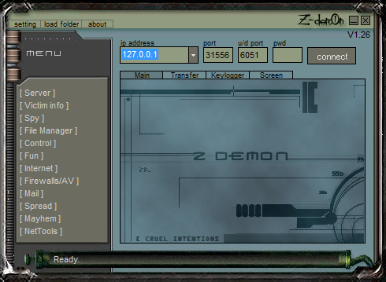

#  - Z-dem0n.exe
## Informations
| Label | Value |
| :--- | ---: |
| Executable Name | Z-dem0n.exe |
| Product Name |  |
| Version Number |  |
| Description |  |
| Company Name |  |
| Copyright |  |
| Trademarks |  |
| Last Edition | 23/03/2003 21:58:46 |
| Size | 497664 |
| SHA1 🔎 | [1E68F8B2743D8BB45655302788281C77CFBC0ECF](https://www.virustotal.com/gui/search/1E68F8B2743D8BB45655302788281C77CFBC0ECF) |
| Language |  |
## Static Analysis
<details>
<summary>Manalyze</summary>
<p>

```

* Manalyze 0.9 *

-------------------------------------------------------------------------------
C:/Users/IEUser/Desktop/net6.0/Malwares/Z-Demon v1.26/Z-Demon v1.26/Z-dem0n.exe
-------------------------------------------------------------------------------

Summary:
--------
Architecture:       IMAGE_FILE_MACHINE_I386
Subsystem:          IMAGE_SUBSYSTEM_WINDOWS_GUI
Compilation Date:   1992-Jun-19 22:22:17
Detected languages: Thai - Thailand

DOS Header:
-----------
e_magic:    MZ
e_cblp:     0x0050
e_cp:       0x0002
e_crlc:     0x0000
e_cparhdr:  0x0004
e_minalloc: 0x000F
e_maxalloc: 0xFFFF
e_ss:       0x0000
e_sp:       0x00B8
e_csum:     0x0000
e_ip:       0x0000
e_cs:       0x0000
e_ovno:     0x001A
e_oemid:    0x0000
e_oeminfo:  0x0000
e_lfanew:   0x00000100

PE Header:
----------
Signature:            PE
Machine:              IMAGE_FILE_MACHINE_I386
NumberofSections:     3
TimeDateStamp:        1992-Jun-19 22:22:17
PointerToSymbolTable: 0x00000000
NumberOfSymbols:      0
SizeOfOptionalHeader: 0x00E0
Characteristics:      IMAGE_FILE_32BIT_MACHINE
                      IMAGE_FILE_BYTES_REVERSED_HI
                      IMAGE_FILE_BYTES_REVERSED_LO
                      IMAGE_FILE_EXECUTABLE_IMAGE
                      IMAGE_FILE_LINE_NUMS_STRIPPED
                      IMAGE_FILE_LOCAL_SYMS_STRIPPED
                      IMAGE_FILE_RELOCS_STRIPPED

Image Optional Header:
----------------------
Magic:                   PE32
LinkerVersion:           2.0
SizeOfCode:              0x00077000
SizeOfInitializedData:   0x00003000
SizeOfUninitializedData: 0x000F5000
AddressOfEntryPoint:     0x0016C600 (Section: UPX1)
BaseOfCode:              0x000F6000
BaseOfData:              0x0016D000
ImageBase:               0x00400000
SectionAlignment:        0x00001000
FileAlignment:           0x00000200
OperatingSystemVersion:  4.0
ImageVersion:            0.0
SubsystemVersion:        4.0
Win32VersionValue:       0
SizeOfImage:             0x00170000
SizeOfHeaders:           0x00001000
Checksum:                0x00000000
Subsystem:               IMAGE_SUBSYSTEM_WINDOWS_GUI
SizeofStackReserve:      0x00100000
SizeofStackCommit:       0x00004000
SizeofHeapReserve:       0x00100000
SizeofHeapCommit:        0x00001000
LoaderFlags:             0x00000000
NumberOfRvaAndSizes:     16

Sections:
---------
UPX0:
    VirtualSize:          0x000F5000
    VirtualAddress:       0x00001000
    SizeOfRawData:        0x00000000
    PointerToRawData:     0x00000400
    PointerToRelocations: 0x00000000
    PointerToLineNumbers: 0x00000000
    NumberOfLineNumbers:  0
    NumberOfRelocations:  0
    Characteristics:      IMAGE_SCN_CNT_UNINITIALIZED_DATA
                          IMAGE_SCN_MEM_EXECUTE
                          IMAGE_SCN_MEM_READ
                          IMAGE_SCN_MEM_WRITE

UPX1:
    VirtualSize:          0x00077000
    VirtualAddress:       0x000F6000
    SizeOfRawData:        0x00076800
    PointerToRawData:     0x00000400
    PointerToRelocations: 0x00000000
    PointerToLineNumbers: 0x00000000
    NumberOfLineNumbers:  0
    NumberOfRelocations:  0
    Characteristics:      IMAGE_SCN_CNT_INITIALIZED_DATA
                          IMAGE_SCN_MEM_EXECUTE
                          IMAGE_SCN_MEM_READ
                          IMAGE_SCN_MEM_WRITE
    Entropy:              7.92058

.rsrc:
    VirtualSize:          0x00003000
    VirtualAddress:       0x0016D000
    SizeOfRawData:        0x00002C00
    PointerToRawData:     0x00076C00
    PointerToRelocations: 0x00000000
    PointerToLineNumbers: 0x00000000
    NumberOfLineNumbers:  0
    NumberOfRelocations:  0
    Characteristics:      IMAGE_SCN_CNT_INITIALIZED_DATA
                          IMAGE_SCN_MEM_READ
                          IMAGE_SCN_MEM_WRITE
    Entropy:              4.26497


Imports:
--------
KERNEL32.DLL: LoadLibraryA
              GetProcAddress
              ExitProcess
advapi32.dll: RegFlushKey
comctl32.dll: ImageList_Add
comdlg32.dll: ChooseColorA
gdi32.dll:    Pie
oleaut32.dll: VariantCopy
shell32.dll:  ShellExecuteA
user32.dll:   GetDC
version.dll:  VerQueryValueA
winspool.drv: OpenPrinterA
wsock32.dll:  send

Resources:
----------
1:
    Type:          RT_CURSOR
    Language:      UNKNOWN
    Codepage:      UNKNOWN
    Size:          308
    TimeDateStamp: 2003-Mar-23 22:58:46
    Entropy:       7.1017

2:
    Type:          RT_CURSOR
    Language:      UNKNOWN
    Codepage:      UNKNOWN
    Size:          308
    TimeDateStamp: 2003-Mar-23 22:58:46
    Entropy:       6.784

3:
    Type:          RT_CURSOR
    Language:      UNKNOWN
    Codepage:      UNKNOWN
    Size:          308
    TimeDateStamp: 2003-Mar-23 22:58:46
    Entropy:       7.12604

4:
    Type:          RT_CURSOR
    Language:      UNKNOWN
    Codepage:      UNKNOWN
    Size:          308
    TimeDateStamp: 2003-Mar-23 22:58:46
    Entropy:       7.1842

5:
    Type:          RT_CURSOR
    Language:      UNKNOWN
    Codepage:      UNKNOWN
    Size:          308
    TimeDateStamp: 2003-Mar-23 22:58:46
    Entropy:       6.89077

6:
    Type:          RT_CURSOR
    Language:      UNKNOWN
    Codepage:      UNKNOWN
    Size:          308
    TimeDateStamp: 2003-Mar-23 22:58:46
    Entropy:       7.11383

7:
    Type:          RT_CURSOR
    Language:      UNKNOWN
    Codepage:      UNKNOWN
    Size:          308
    TimeDateStamp: 2003-Mar-23 22:58:46
    Entropy:       7.14392

BBABORT:
    Type:          RT_BITMAP
    Language:      UNKNOWN
    Codepage:      UNKNOWN
    Size:          464
    TimeDateStamp: 2003-Mar-23 22:58:46
    Entropy:       7.43341

BBALL:
    Type:          RT_BITMAP
    Language:      UNKNOWN
    Codepage:      UNKNOWN
    Size:          484
    TimeDateStamp: 2003-Mar-23 22:58:46
    Entropy:       7.41667

BBCANCEL:
    Type:          RT_BITMAP
    Language:      UNKNOWN
    Codepage:      UNKNOWN
    Size:          464
    TimeDateStamp: 2003-Mar-23 22:58:46
    Entropy:       7.41203

BBCLOSE:
    Type:          RT_BITMAP
    Language:      UNKNOWN
    Codepage:      UNKNOWN
    Size:          464
    TimeDateStamp: 2003-Mar-23 22:58:46
    Entropy:       7.36733

BBHELP:
    Type:          RT_BITMAP
    Language:      UNKNOWN
    Codepage:      UNKNOWN
    Size:          464
    TimeDateStamp: 2003-Mar-23 22:58:46
    Entropy:       7.45424

BBIGNORE:
    Type:          RT_BITMAP
    Language:      UNKNOWN
    Codepage:      UNKNOWN
    Size:          464
    TimeDateStamp: 2003-Mar-23 22:58:46
    Entropy:       7.49336

BBNO:
    Type:          RT_BITMAP
    Language:      UNKNOWN
    Codepage:      UNKNOWN
    Size:          464
    TimeDateStamp: 2003-Mar-23 22:58:46
    Entropy:       7.50243

BBOK:
    Type:          RT_BITMAP
    Language:      UNKNOWN
    Codepage:      UNKNOWN
    Size:          464
    TimeDateStamp: 2003-Mar-23 22:58:46
    Entropy:       7.45481

BBRETRY:
    Type:          RT_BITMAP
    Language:      UNKNOWN
    Codepage:      UNKNOWN
    Size:          464
    TimeDateStamp: 2003-Mar-23 22:58:46
    Entropy:       7.41305

BBYES:
    Type:          RT_BITMAP
    Language:      UNKNOWN
    Codepage:      UNKNOWN
    Size:          464
    TimeDateStamp: 2003-Mar-23 22:58:46
    Entropy:       7.4556

FLATDOWN:
    Type:          RT_BITMAP
    Language:      UNKNOWN
    Codepage:      UNKNOWN
    Size:          124
    TimeDateStamp: 2003-Mar-23 22:58:46
    Entropy:       6.40976

FLATUP:
    Type:          RT_BITMAP
    Language:      UNKNOWN
    Codepage:      UNKNOWN
    Size:          124
    TimeDateStamp: 2003-Mar-23 22:58:46
    Entropy:       6.39759

PREVIEWGLYPH:
    Type:          RT_BITMAP
    Language:      UNKNOWN
    Codepage:      UNKNOWN
    Size:          232
    TimeDateStamp: 2003-Mar-23 22:58:46
    Entropy:       7.05338

1 (#2):
    Type:          RT_ICON
    Language:      Thai - Thailand
    Codepage:      UNKNOWN
    Size:          2216
    TimeDateStamp: 2003-Mar-23 22:58:46
    Entropy:       6.07431

DLGTEMPLATE:
    Type:          RT_DIALOG
    Language:      UNKNOWN
    Codepage:      UNKNOWN
    Size:          82
    TimeDateStamp: 2003-Mar-23 22:58:46
    Entropy:       6.05566

4075:
    Type:          RT_STRING
    Language:      UNKNOWN
    Codepage:      UNKNOWN
    Size:          244
    TimeDateStamp: 2003-Mar-23 22:58:46
    Entropy:       7.0267

4076:
    Type:          RT_STRING
    Language:      UNKNOWN
    Codepage:      UNKNOWN
    Size:          988
    TimeDateStamp: 2003-Mar-23 22:58:46
    Entropy:       7.64839

4077:
    Type:          RT_STRING
    Language:      UNKNOWN
    Codepage:      UNKNOWN
    Size:          1044
    TimeDateStamp: 2003-Mar-23 22:58:46
    Entropy:       7.73897

4078:
    Type:          RT_STRING
    Language:      UNKNOWN
    Codepage:      UNKNOWN
    Size:          1004
    TimeDateStamp: 2003-Mar-23 22:58:46
    Entropy:       7.71105

4079:
    Type:          RT_STRING
    Language:      UNKNOWN
    Codepage:      UNKNOWN
    Size:          780
    TimeDateStamp: 2003-Mar-23 22:58:46
    Entropy:       7.69316

4080:
    Type:          RT_STRING
    Language:      UNKNOWN
    Codepage:      UNKNOWN
    Size:          880
    TimeDateStamp: 2003-Mar-23 22:58:46
    Entropy:       7.70728

4081:
    Type:          RT_STRING
    Language:      UNKNOWN
    Codepage:      UNKNOWN
    Size:          1088
    TimeDateStamp: 2003-Mar-23 22:58:46
    Entropy:       7.74605

4082:
    Type:          RT_STRING
    Language:      UNKNOWN
    Codepage:      UNKNOWN
    Size:          1052
    TimeDateStamp: 2003-Mar-23 22:58:46
    Entropy:       7.70054

4083:
    Type:          RT_STRING
    Language:      UNKNOWN
    Codepage:      UNKNOWN
    Size:          688
    TimeDateStamp: 2003-Mar-23 22:58:46
    Entropy:       7.62086

4084:
    Type:          RT_STRING
    Language:      UNKNOWN
    Codepage:      UNKNOWN
    Size:          224
    TimeDateStamp: 2003-Mar-23 22:58:46
    Entropy:       6.91208

4085:
    Type:          RT_STRING
    Language:      UNKNOWN
    Codepage:      UNKNOWN
    Size:          404
    TimeDateStamp: 2003-Mar-23 22:58:46
    Entropy:       7.47408

4086:
    Type:          RT_STRING
    Language:      UNKNOWN
    Codepage:      UNKNOWN
    Size:          588
    TimeDateStamp: 2003-Mar-23 22:58:46
    Entropy:       7.57064

4087:
    Type:          RT_STRING
    Language:      UNKNOWN
    Codepage:      UNKNOWN
    Size:          1052
    TimeDateStamp: 2003-Mar-23 22:58:46
    Entropy:       7.72128

4088:
    Type:          RT_STRING
    Language:      UNKNOWN
    Codepage:      UNKNOWN
    Size:          988
    TimeDateStamp: 2003-Mar-23 22:58:46
    Entropy:       7.69595

4089:
    Type:          RT_STRING
    Language:      UNKNOWN
    Codepage:      UNKNOWN
    Size:          896
    TimeDateStamp: 2003-Mar-23 22:58:46
    Entropy:       7.67668

4090:
    Type:          RT_STRING
    Language:      UNKNOWN
    Codepage:      UNKNOWN
    Size:          976
    TimeDateStamp: 2003-Mar-23 22:58:46
    Entropy:       7.61972

4091:
    Type:          RT_STRING
    Language:      UNKNOWN
    Codepage:      UNKNOWN
    Size:          956
    TimeDateStamp: 2003-Mar-23 22:58:46
    Entropy:       7.7218

4092:
    Type:          RT_STRING
    Language:      UNKNOWN
    Codepage:      UNKNOWN
    Size:          228
    TimeDateStamp: 2003-Mar-23 22:58:46
    Entropy:       7.0422

4093:
    Type:          RT_STRING
    Language:      UNKNOWN
    Codepage:      UNKNOWN
    Size:          188
    TimeDateStamp: 2003-Mar-23 22:58:46
    Entropy:       6.77444

4094:
    Type:          RT_STRING
    Language:      UNKNOWN
    Codepage:      UNKNOWN
    Size:          780
    TimeDateStamp: 2003-Mar-23 22:58:46
    Entropy:       7.66366

4095:
    Type:          RT_STRING
    Language:      UNKNOWN
    Codepage:      UNKNOWN
    Size:          884
    TimeDateStamp: 2003-Mar-23 22:58:46
    Entropy:       7.6246

4096:
    Type:          RT_STRING
    Language:      UNKNOWN
    Codepage:      UNKNOWN
    Size:          692
    TimeDateStamp: 2003-Mar-23 22:58:46
    Entropy:       7.6035

DVCLAL:
    Type:          RT_RCDATA
    Language:      UNKNOWN
    Codepage:      UNKNOWN
    Size:          16
    TimeDateStamp: 2003-Mar-23 22:58:46
    Entropy:       4

PACKAGEINFO:
    Type:          RT_RCDATA
    Language:      UNKNOWN
    Codepage:      UNKNOWN
    Size:          2648
    TimeDateStamp: 2003-Mar-23 22:58:46
    Entropy:       7.83254

TFRMABOUT:
    Type:          RT_RCDATA
    Language:      UNKNOWN
    Codepage:      UNKNOWN
    Size:          29297
    TimeDateStamp: 2003-Mar-23 22:58:46
    Entropy:       7.91097

TFRMCLIENTMAIN:
    Type:          RT_RCDATA
    Language:      UNKNOWN
    Codepage:      UNKNOWN
    Size:          40713
    TimeDateStamp: 2003-Mar-23 22:58:46
    Entropy:       7.91941

TFRMCONTROL_CLIPBOARD:
    Type:          RT_RCDATA
    Language:      UNKNOWN
    Codepage:      UNKNOWN
    Size:          2230
    TimeDateStamp: 2003-Mar-23 22:58:46
    Entropy:       7.81796

TFRMCONTROL_CLOCK:
    Type:          RT_RCDATA
    Language:      UNKNOWN
    Codepage:      UNKNOWN
    Size:          1921
    TimeDateStamp: 2003-Mar-23 22:58:46
    Entropy:       7.8301

TFRMCONTROL_FIREWALLSAV:
    Type:          RT_RCDATA
    Language:      UNKNOWN
    Codepage:      UNKNOWN
    Size:          1991
    TimeDateStamp: 2003-Mar-23 22:58:46
    Entropy:       7.75939

TFRMCONTROL_FIREWALLSAVKILLLIST:
    Type:          RT_RCDATA
    Language:      UNKNOWN
    Codepage:      UNKNOWN
    Size:          6803
    TimeDateStamp: 2003-Mar-23 22:58:46
    Entropy:       7.79651

TFRMCONTROL_KEYBOARD:
    Type:          RT_RCDATA
    Language:      UNKNOWN
    Codepage:      UNKNOWN
    Size:          4364
    TimeDateStamp: 2003-Mar-23 22:58:46
    Entropy:       7.86711

TFRMCONTROL_MOUSE:
    Type:          RT_RCDATA
    Language:      UNKNOWN
    Codepage:      UNKNOWN
    Size:          4181
    TimeDateStamp: 2003-Mar-23 22:58:46
    Entropy:       7.86012

TFRMCONTROL_POWER:
    Type:          RT_RCDATA
    Language:      UNKNOWN
    Codepage:      UNKNOWN
    Size:          4313
    TimeDateStamp: 2003-Mar-23 22:58:46
    Entropy:       7.86723

TFRMCONTROL_RESOLUTION:
    Type:          RT_RCDATA
    Language:      UNKNOWN
    Codepage:      UNKNOWN
    Size:          1455
    TimeDateStamp: 2003-Mar-23 22:58:46
    Entropy:       7.80033

TFRMCONTROL_SCREENSAVER:
    Type:          RT_RCDATA
    Language:      UNKNOWN
    Codepage:      UNKNOWN
    Size:          1469
    TimeDateStamp: 2003-Mar-23 22:58:46
    Entropy:       7.72696

TFRMCONTROL_SIMULATION:
    Type:          RT_RCDATA
    Language:      UNKNOWN
    Codepage:      UNKNOWN
    Size:          730
    TimeDateStamp: 2003-Mar-23 22:58:46
    Entropy:       7.51539

TFRMCONTROL_SIMULATION_MAIN:
    Type:          RT_RCDATA
    Language:      UNKNOWN
    Codepage:      UNKNOWN
    Size:          9127
    TimeDateStamp: 2003-Mar-23 22:58:46
    Entropy:       7.88404

TFRMCONTROL_SIMULATION_SCR:
    Type:          RT_RCDATA
    Language:      UNKNOWN
    Codepage:      UNKNOWN
    Size:          8659
    TimeDateStamp: 2003-Mar-23 22:58:46
    Entropy:       7.87189

TFRMFILEMANAGER_BROWSE:
    Type:          RT_RCDATA
    Language:      UNKNOWN
    Codepage:      UNKNOWN
    Size:          32031
    TimeDateStamp: 2003-Mar-23 22:58:46
    Entropy:       7.8913

TFRMFILEMANAGER_FTP:
    Type:          RT_RCDATA
    Language:      UNKNOWN
    Codepage:      UNKNOWN
    Size:          2621
    TimeDateStamp: 2003-Mar-23 22:58:46
    Entropy:       7.84845

TFRMFILEMANAGER_SEARCH:
    Type:          RT_RCDATA
    Language:      UNKNOWN
    Codepage:      UNKNOWN
    Size:          3287
    TimeDateStamp: 2003-Mar-23 22:58:46
    Entropy:       7.82656

TFRMFUN_CHAT:
    Type:          RT_RCDATA
    Language:      UNKNOWN
    Codepage:      UNKNOWN
    Size:          3280
    TimeDateStamp: 2003-Mar-23 22:58:46
    Entropy:       7.81581

TFRMFUN_DESKTOP:
    Type:          RT_RCDATA
    Language:      UNKNOWN
    Codepage:      UNKNOWN
    Size:          9645
    TimeDateStamp: 2003-Mar-23 22:58:46
    Entropy:       7.87437

TFRMFUN_LIGHTS:
    Type:          RT_RCDATA
    Language:      UNKNOWN
    Codepage:      UNKNOWN
    Size:          3025
    TimeDateStamp: 2003-Mar-23 22:58:46
    Entropy:       7.84353

TFRMFUN_MESSAGEBOX:
    Type:          RT_RCDATA
    Language:      UNKNOWN
    Codepage:      UNKNOWN
    Size:          14106
    TimeDateStamp: 2003-Mar-23 22:58:46
    Entropy:       7.87853

TFRMFUN_PRINTER:
    Type:          RT_RCDATA
    Language:      UNKNOWN
    Codepage:      UNKNOWN
    Size:          3614
    TimeDateStamp: 2003-Mar-23 22:58:46
    Entropy:       7.74259

TFRMFUN_SCREEN:
    Type:          RT_RCDATA
    Language:      UNKNOWN
    Codepage:      UNKNOWN
    Size:          2401
    TimeDateStamp: 2003-Mar-23 22:58:46
    Entropy:       7.78065

TFRMFUN_WRITE:
    Type:          RT_RCDATA
    Language:      UNKNOWN
    Codepage:      UNKNOWN
    Size:          4585
    TimeDateStamp: 2003-Mar-23 22:58:46
    Entropy:       7.84604

TFRMINTERNET_IEFAVORITES:
    Type:          RT_RCDATA
    Language:      UNKNOWN
    Codepage:      UNKNOWN
    Size:          1905
    TimeDateStamp: 2003-Mar-23 22:58:46
    Entropy:       7.78013

TFRMINTERNET_IEHISTORY:
    Type:          RT_RCDATA
    Language:      UNKNOWN
    Codepage:      UNKNOWN
    Size:          1905
    TimeDateStamp: 2003-Mar-23 22:58:46
    Entropy:       7.83073

TFRMINTERNET_OPTIONS:
    Type:          RT_RCDATA
    Language:      UNKNOWN
    Codepage:      UNKNOWN
    Size:          3936
    TimeDateStamp: 2003-Mar-23 22:58:46
    Entropy:       7.85602

TFRMINTERNET_PORTREDIRECT:
    Type:          RT_RCDATA
    Language:      UNKNOWN
    Codepage:      UNKNOWN
    Size:          2874
    TimeDateStamp: 2003-Mar-23 22:58:46
    Entropy:       7.76695

TFRMINTERNET_URLHISTORY:
    Type:          RT_RCDATA
    Language:      UNKNOWN
    Codepage:      UNKNOWN
    Size:          1446
    TimeDateStamp: 2003-Mar-23 22:58:46
    Entropy:       7.66766

TFRMIPSCANNER:
    Type:          RT_RCDATA
    Language:      UNKNOWN
    Codepage:      UNKNOWN
    Size:          5185
    TimeDateStamp: 2003-Mar-23 22:58:46
    Entropy:       7.8067

TFRMMAIL_MAILBOX:
    Type:          RT_RCDATA
    Language:      UNKNOWN
    Codepage:      UNKNOWN
    Size:          1883
    TimeDateStamp: 2003-Mar-23 22:58:46
    Entropy:       7.73693

TFRMMAIL_SENDMAIL:
    Type:          RT_RCDATA
    Language:      UNKNOWN
    Codepage:      UNKNOWN
    Size:          5234
    TimeDateStamp: 2003-Mar-23 22:58:46
    Entropy:       7.80099

TFRMMAYHEM_DEL:
    Type:          RT_RCDATA
    Language:      UNKNOWN
    Codepage:      UNKNOWN
    Size:          2096
    TimeDateStamp: 2003-Mar-23 22:58:46
    Entropy:       7.6212

TFRMMAYHEM_KILLERS:
    Type:          RT_RCDATA
    Language:      UNKNOWN
    Codepage:      UNKNOWN
    Size:          1499
    TimeDateStamp: 2003-Mar-23 22:58:46
    Entropy:       7.71674

TFRMNETWORK_LAN:
    Type:          RT_RCDATA
    Language:      UNKNOWN
    Codepage:      UNKNOWN
    Size:          11391
    TimeDateStamp: 2003-Mar-23 22:58:46
    Entropy:       7.83482

TFRMPING:
    Type:          RT_RCDATA
    Language:      UNKNOWN
    Codepage:      UNKNOWN
    Size:          3502
    TimeDateStamp: 2003-Mar-23 22:58:46
    Entropy:       7.74895

TFRMPORTSCANNER:
    Type:          RT_RCDATA
    Language:      UNKNOWN
    Codepage:      UNKNOWN
    Size:          3184
    TimeDateStamp: 2003-Mar-23 22:58:46
    Entropy:       7.72735

TFRMPORTSTAT:
    Type:          RT_RCDATA
    Language:      UNKNOWN
    Codepage:      UNKNOWN
    Size:          1099
    TimeDateStamp: 2003-Mar-23 22:58:46
    Entropy:       7.56236

TFRMSERVER_INFO:
    Type:          RT_RCDATA
    Language:      UNKNOWN
    Codepage:      UNKNOWN
    Size:          2054
    TimeDateStamp: 2003-Mar-23 22:58:46
    Entropy:       7.72167

TFRMSERVER_OPTIONS:
    Type:          RT_RCDATA
    Language:      UNKNOWN
    Codepage:      UNKNOWN
    Size:          1596
    TimeDateStamp: 2003-Mar-23 22:58:46
    Entropy:       7.63133

TFRMSETTINGS:
    Type:              RT_RCDATA
    Language:          UNKNOWN
    Codepage:          UNKNOWN
    Size:              4052
    TimeDateStamp:     2003-Mar-23 22:58:46
    Entropy:           7.77701
    Detected Filetype: E-mail

TFRMSPREAD_LAN:
    Type:          RT_RCDATA
    Language:      UNKNOWN
    Codepage:      UNKNOWN
    Size:          2240
    TimeDateStamp: 2003-Mar-23 22:58:46
    Entropy:       7.59706

TFRMSPREAD_MAIL:
    Type:          RT_RCDATA
    Language:      UNKNOWN
    Codepage:      UNKNOWN
    Size:          10061
    TimeDateStamp: 2003-Mar-23 22:58:46
    Entropy:       7.64993

TFRMSPY_CAPMENU:
    Type:          RT_RCDATA
    Language:      UNKNOWN
    Codepage:      UNKNOWN
    Size:          1107
    TimeDateStamp: 2003-Mar-23 22:58:46
    Entropy:       7.46082

TFRMSPY_CAPTURE:
    Type:          RT_RCDATA
    Language:      UNKNOWN
    Codepage:      UNKNOWN
    Size:          32197
    TimeDateStamp: 2003-Mar-23 22:58:46
    Entropy:       7.7358

TFRMSPY_DOSREDIRECT:
    Type:          RT_RCDATA
    Language:      UNKNOWN
    Codepage:      UNKNOWN
    Size:          1462
    TimeDateStamp: 2003-Mar-23 22:58:46
    Entropy:       7.62995

TFRMSPY_ICQ:
    Type:          RT_RCDATA
    Language:      UNKNOWN
    Codepage:      UNKNOWN
    Size:          1680
    TimeDateStamp: 2003-Mar-23 22:58:46
    Entropy:       7.61731

TFRMSPY_KEYLOGGER:
    Type:          RT_RCDATA
    Language:      UNKNOWN
    Codepage:      UNKNOWN
    Size:          4599
    TimeDateStamp: 2003-Mar-23 22:58:46
    Entropy:       7.67674

TFRMSPY_PASSWORDS:
    Type:          RT_RCDATA
    Language:      UNKNOWN
    Codepage:      UNKNOWN
    Size:          2055
    TimeDateStamp: 2003-Mar-23 22:58:46
    Entropy:       7.62175

TFRMSPY_RUNNINGTASKS:
    Type:          RT_RCDATA
    Language:      UNKNOWN
    Codepage:      UNKNOWN
    Size:          5279
    TimeDateStamp: 2003-Mar-23 22:58:46
    Entropy:       7.72556

TFRMSPY_WEBCAM:
    Type:          RT_RCDATA
    Language:      UNKNOWN
    Codepage:      UNKNOWN
    Size:          8794
    TimeDateStamp: 2003-Mar-23 22:58:46
    Entropy:       7.85025

TFRMTRACE:
    Type:          RT_RCDATA
    Language:      UNKNOWN
    Codepage:      UNKNOWN
    Size:          2787
    TimeDateStamp: 2003-Mar-23 22:58:46
    Entropy:       7.65811

TFRMTRANSFER:
    Type:          RT_RCDATA
    Language:      UNKNOWN
    Codepage:      UNKNOWN
    Size:          6996
    TimeDateStamp: 2003-Mar-23 22:58:46
    Entropy:       7.6413

TFRMVICTIM_EMAILDETAILS:
    Type:          RT_RCDATA
    Language:      UNKNOWN
    Codepage:      UNKNOWN
    Size:          1713
    TimeDateStamp: 2003-Mar-23 22:58:46
    Entropy:       7.6777

TFRMVICTIM_NETWORKDETAILS:
    Type:          RT_RCDATA
    Language:      UNKNOWN
    Codepage:      UNKNOWN
    Size:          1718
    TimeDateStamp: 2003-Mar-23 22:58:46
    Entropy:       7.69343

TFRMVICTIM_NETWORKDETAILS2:
    Type:          RT_RCDATA
    Language:      UNKNOWN
    Codepage:      UNKNOWN
    Size:          1721
    TimeDateStamp: 2003-Mar-23 22:58:46
    Entropy:       7.57782

TFRMVICTIM_OSDETAILS:
    Type:          RT_RCDATA
    Language:      UNKNOWN
    Codepage:      UNKNOWN
    Size:          1703
    TimeDateStamp: 2003-Mar-23 22:58:46
    Entropy:       7.58244

TFRMVICTIM_PCDETAILS:
    Type:          RT_RCDATA
    Language:      UNKNOWN
    Codepage:      UNKNOWN
    Size:          1704
    TimeDateStamp: 2003-Mar-23 22:58:46
    Entropy:       7.61287

TFRMWHOIS:
    Type:          RT_RCDATA
    Language:      UNKNOWN
    Codepage:      UNKNOWN
    Size:          2312
    TimeDateStamp: 2003-Mar-23 22:58:46
    Entropy:       7.66648

32761:
    Type:          RT_GROUP_CURSOR
    Language:      UNKNOWN
    Codepage:      UNKNOWN
    Size:          20
    TimeDateStamp: 2003-Mar-23 22:58:46
    Entropy:       4.22193

32762:
    Type:          RT_GROUP_CURSOR
    Language:      UNKNOWN
    Codepage:      UNKNOWN
    Size:          20
    TimeDateStamp: 2003-Mar-23 22:58:46
    Entropy:       3.88418

32763:
    Type:          RT_GROUP_CURSOR
    Language:      UNKNOWN
    Codepage:      UNKNOWN
    Size:          20
    TimeDateStamp: 2003-Mar-23 22:58:46
    Entropy:       3.62193

32764:
    Type:          RT_GROUP_CURSOR
    Language:      UNKNOWN
    Codepage:      UNKNOWN
    Size:          20
    TimeDateStamp: 2003-Mar-23 22:58:46
    Entropy:       4.32193

32765:
    Type:          RT_GROUP_CURSOR
    Language:      UNKNOWN
    Codepage:      UNKNOWN
    Size:          20
    TimeDateStamp: 2003-Mar-23 22:58:46
    Entropy:       4.32193

32766:
    Type:          RT_GROUP_CURSOR
    Language:      UNKNOWN
    Codepage:      UNKNOWN
    Size:          20
    TimeDateStamp: 2003-Mar-23 22:58:46
    Entropy:       4.22193

32767:
    Type:          RT_GROUP_CURSOR
    Language:      UNKNOWN
    Codepage:      UNKNOWN
    Size:          20
    TimeDateStamp: 2003-Mar-23 22:58:46
    Entropy:       4.22193

MAINICON:
    Type:              RT_GROUP_ICON
    Language:          Thai - Thailand
    Codepage:          UNKNOWN
    Size:              20
    TimeDateStamp:     2003-Mar-23 22:58:46
    Entropy:           1.81924
    Detected Filetype: Icon file


[ SUSPICIOUS ] PEiD Signature:
    UPX -> www.upx.sourceforge.net

[ SUSPICIOUS ] The PE is packed with UPX
    Unusual section name found: UPX0
    Section UPX0 is both writable and executable.
    Unusual section name found: UPX1
    Section UPX1 is both writable and executable.

The PE contains common functions which appear in legitimate applications.
    [!] The program may be hiding some of its imports:
        LoadLibraryA
        GetProcAddress
    Can access the registry:
        RegFlushKey
    Possibly launches other programs:
        ShellExecuteA

[ SUSPICIOUS ] The PE header may have been manually modified.
    Resource 1 is possibly compressed or encrypted.
    Resource 3 is possibly compressed or encrypted.
    Resource 4 is possibly compressed or encrypted.
    Resource 6 is possibly compressed or encrypted.
    Resource 7 is possibly compressed or encrypted.
    Resource BBABORT is possibly compressed or encrypted.
    Resource BBALL is possibly compressed or encrypted.
    Resource BBCANCEL is possibly compressed or encrypted.
    Resource BBCLOSE is possibly compressed or encrypted.
    Resource BBHELP is possibly compressed or encrypted.
    Resource BBIGNORE is possibly compressed or encrypted.
    Resource BBNO is possibly compressed or encrypted.
    Resource BBOK is possibly compressed or encrypted.
    Resource BBRETRY is possibly compressed or encrypted.
    Resource BBYES is possibly compressed or encrypted.
    Resource PREVIEWGLYPH is possibly compressed or encrypted.
    Resource 4075 is possibly compressed or encrypted.
    Resource 4076 is possibly compressed or encrypted.
    Resource 4077 is possibly compressed or encrypted.
    Resource 4078 is possibly compressed or encrypted.
    Resource 4079 is possibly compressed or encrypted.
    Resource 4080 is possibly compressed or encrypted.
    Resource 4081 is possibly compressed or encrypted.
    Resource 4082 is possibly compressed or encrypted.
    Resource 4083 is possibly compressed or encrypted.
    Resource 4085 is possibly compressed or encrypted.
    Resource 4086 is possibly compressed or encrypted.
    Resource 4087 is possibly compressed or encrypted.
    Resource 4088 is possibly compressed or encrypted.
    Resource 4089 is possibly compressed or encrypted.
    Resource 4090 is possibly compressed or encrypted.
    Resource 4091 is possibly compressed or encrypted.
    Resource 4092 is possibly compressed or encrypted.
    Resource 4094 is possibly compressed or encrypted.
    Resource 4095 is possibly compressed or encrypted.
    Resource 4096 is possibly compressed or encrypted.
    Resource PACKAGEINFO is possibly compressed or encrypted.
    Resource TFRMABOUT is possibly compressed or encrypted.
    Resource TFRMCLIENTMAIN is possibly compressed or encrypted.
    Resource TFRMCONTROL_CLIPBOARD is possibly compressed or encrypted.
    Resource TFRMCONTROL_CLOCK is possibly compressed or encrypted.
    Resource TFRMCONTROL_FIREWALLSAV is possibly compressed or encrypted.
    Resource TFRMCONTROL_FIREWALLSAVKILLLIST is possibly compressed or encrypted.
    Resource TFRMCONTROL_KEYBOARD is possibly compressed or encrypted.
    Resource TFRMCONTROL_MOUSE is possibly compressed or encrypted.
    Resource TFRMCONTROL_POWER is possibly compressed or encrypted.
    Resource TFRMCONTROL_RESOLUTION is possibly compressed or encrypted.
    Resource TFRMCONTROL_SCREENSAVER is possibly compressed or encrypted.
    Resource TFRMCONTROL_SIMULATION is possibly compressed or encrypted.
    Resource TFRMCONTROL_SIMULATION_MAIN is possibly compressed or encrypted.
    Resource TFRMCONTROL_SIMULATION_SCR is possibly compressed or encrypted.
    Resource TFRMFILEMANAGER_BROWSE is possibly compressed or encrypted.
    Resource TFRMFILEMANAGER_FTP is possibly compressed or encrypted.
    Resource TFRMFILEMANAGER_SEARCH is possibly compressed or encrypted.
    Resource TFRMFUN_CHAT is possibly compressed or encrypted.
    Resource TFRMFUN_DESKTOP is possibly compressed or encrypted.
    Resource TFRMFUN_LIGHTS is possibly compressed or encrypted.
    Resource TFRMFUN_MESSAGEBOX is possibly compressed or encrypted.
    Resource TFRMFUN_PRINTER is possibly compressed or encrypted.
    Resource TFRMFUN_SCREEN is possibly compressed or encrypted.
    Resource TFRMFUN_WRITE is possibly compressed or encrypted.
    Resource TFRMINTERNET_IEFAVORITES is possibly compressed or encrypted.
    Resource TFRMINTERNET_IEHISTORY is possibly compressed or encrypted.
    Resource TFRMINTERNET_OPTIONS is possibly compressed or encrypted.
    Resource TFRMINTERNET_PORTREDIRECT is possibly compressed or encrypted.
    Resource TFRMINTERNET_URLHISTORY is possibly compressed or encrypted.
    Resource TFRMIPSCANNER is possibly compressed or encrypted.
    Resource TFRMMAIL_MAILBOX is possibly compressed or encrypted.
    Resource TFRMMAIL_SENDMAIL is possibly compressed or encrypted.
    Resource TFRMMAYHEM_DEL is possibly compressed or encrypted.
    Resource TFRMMAYHEM_KILLERS is possibly compressed or encrypted.
    Resource TFRMNETWORK_LAN is possibly compressed or encrypted.
    Resource TFRMPING is possibly compressed or encrypted.
    Resource TFRMPORTSCANNER is possibly compressed or encrypted.
    Resource TFRMPORTSTAT is possibly compressed or encrypted.
    Resource TFRMSERVER_INFO is possibly compressed or encrypted.
    Resource TFRMSERVER_OPTIONS is possibly compressed or encrypted.
    Resource TFRMSPREAD_LAN is possibly compressed or encrypted.
    Resource TFRMSPREAD_MAIL is possibly compressed or encrypted.
    Resource TFRMSPY_CAPMENU is possibly compressed or encrypted.
    Resource TFRMSPY_CAPTURE is possibly compressed or encrypted.
    Resource TFRMSPY_DOSREDIRECT is possibly compressed or encrypted.
    Resource TFRMSPY_ICQ is possibly compressed or encrypted.
    Resource TFRMSPY_KEYLOGGER is possibly compressed or encrypted.
    Resource TFRMSPY_PASSWORDS is possibly compressed or encrypted.
    Resource TFRMSPY_RUNNINGTASKS is possibly compressed or encrypted.
    Resource TFRMSPY_WEBCAM is possibly compressed or encrypted.
    Resource TFRMTRACE is possibly compressed or encrypted.
    Resource TFRMTRANSFER is possibly compressed or encrypted.
    Resource TFRMVICTIM_EMAILDETAILS is possibly compressed or encrypted.
    Resource TFRMVICTIM_NETWORKDETAILS is possibly compressed or encrypted.
    Resource TFRMVICTIM_NETWORKDETAILS2 is possibly compressed or encrypted.
    Resource TFRMVICTIM_OSDETAILS is possibly compressed or encrypted.
    Resource TFRMVICTIM_PCDETAILS is possibly compressed or encrypted.
    Resource TFRMWHOIS is possibly compressed or encrypted.
    The resource timestamps differ from the PE header:
        2003-Mar-23 22:58:46

The following exploit mitigation techniques have been detected
    Stack Canary: disabled
    SafeSEH: disabled
    ASLR: disabled
    DEP: disabled
    CFG: disabled


```

</p>
</details>

## Screenshots
### frmClientMain
 
