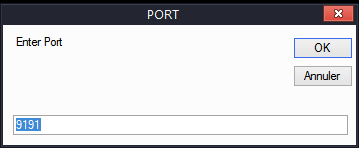

# EngRat v0.1.0B - EngRat v0.1.0B.exe
## Informations
| Label | Value |
| :--- | ---: |
| Executable Name | EngRat v0.1.0B.exe |
| Product Name | EngRat v0.1.0B |
| Version Number | 1.0.0.0 |
| Description | EngRat v0.1.0B |
| Company Name |  |
| Copyright | Copyright ©  2013 |
| Trademarks |  |
| Last Edition | 19/08/2022 03:21:22 |
| Size | 5199872 |
| SHA1 🔎 | [28B93871F2B2E507D931B1EA9C6D35A8F5D0A787](https://www.virustotal.com/gui/search/28B93871F2B2E507D931B1EA9C6D35A8F5D0A787) |
| Language | Langue neutre |
## Static Analysis
<details>
<summary>Manalyze</summary>
<p>

```

* Manalyze 0.9 *

-------------------------------------------------------------------------------
C:/Users/aTest/Desktop/net6.0/Malwares/Malwares/RAT/EngRat v0.1.0B/EngRat v0.1.0B.exe
-------------------------------------------------------------------------------

Summary:
--------
Architecture:     IMAGE_FILE_MACHINE_I386
Subsystem:        IMAGE_SUBSYSTEM_WINDOWS_GUI
Compilation Date: 2015-May-01 16:48:26
Debug artifacts:  C:\Users\EGY\Desktop\EngRat v0.1.0B Src\Cleint\EngRat v0.1 B\obj\Debug\EngRat v0.1.0B.pdb
FileDescription:  EngRat v0.1.0B
FileVersion:      1.0.0.0
InternalName:     EngRat v0.1.0B.exe
LegalCopyright:   Copyright ┬®  2013
OriginalFilename: EngRat v0.1.0B.exe
ProductName:      EngRat v0.1.0B
ProductVersion:   1.0.0.0
Assembly Version: 1.0.0.0

DOS Header:
-----------
e_magic:    MZ
e_cblp:     0x0090
e_cp:       0x0003
e_crlc:     0x0000
e_cparhdr:  0x0004
e_minalloc: 0x0000
e_maxalloc: 0xFFFF
e_ss:       0x0000
e_sp:       0x00B8
e_csum:     0x0000
e_ip:       0x0000
e_cs:       0x0000
e_ovno:     0x0000
e_oemid:    0x0000
e_oeminfo:  0x0000
e_lfanew:   0x00000080

PE Header:
----------
Signature:            PE
Machine:              IMAGE_FILE_MACHINE_I386
NumberofSections:     4
TimeDateStamp:        2015-May-01 16:48:26
PointerToSymbolTable: 0x00000000
NumberOfSymbols:      0
SizeOfOptionalHeader: 0x00E0
Characteristics:      IMAGE_FILE_32BIT_MACHINE
                      IMAGE_FILE_EXECUTABLE_IMAGE

Image Optional Header:
----------------------
Magic:                   PE32
LinkerVersion:           11.0
SizeOfCode:              0x004AF800
SizeOfInitializedData:   0x00045C00
SizeOfUninitializedData: 0x00000000
AddressOfEntryPoint:     0x004B17BE (Section: .text)
BaseOfCode:              0x00002000
BaseOfData:              0x004B2000
ImageBase:               0x00400000
SectionAlignment:        0x00002000
FileAlignment:           0x00000200
OperatingSystemVersion:  4.0
ImageVersion:            0.0
SubsystemVersion:        4.0
Win32VersionValue:       0
SizeOfImage:             0x004FC000
SizeOfHeaders:           0x00000400
Checksum:                0x00000000
Subsystem:               IMAGE_SUBSYSTEM_WINDOWS_GUI
DllCharacteristics:      IMAGE_DLLCHARACTERISTICS_DYNAMIC_BASE
                         IMAGE_DLLCHARACTERISTICS_NO_SEH
                         IMAGE_DLLCHARACTERISTICS_NX_COMPAT
                         IMAGE_DLLCHARACTERISTICS_TERMINAL_SERVER_AWARE
SizeofStackReserve:      0x00100000
SizeofStackCommit:       0x00001000
SizeofHeapReserve:       0x00100000
SizeofHeapCommit:        0x00001000
LoaderFlags:             0x00000000
NumberOfRvaAndSizes:     16

Sections:
---------
.text:
    VirtualSize:          0x004AF7C4
    VirtualAddress:       0x00002000
    SizeOfRawData:        0x004AF800
    PointerToRawData:     0x00000400
    PointerToRelocations: 0x00000000
    PointerToLineNumbers: 0x00000000
    NumberOfLineNumbers:  0
    NumberOfRelocations:  0
    Characteristics:      IMAGE_SCN_CNT_CODE
                          IMAGE_SCN_MEM_EXECUTE
                          IMAGE_SCN_MEM_READ
    Entropy:              5.61313

.sdata:
    VirtualSize:          0x0000008E
    VirtualAddress:       0x004B2000
    SizeOfRawData:        0x00000200
    PointerToRawData:     0x004AFC00
    PointerToRelocations: 0x00000000
    PointerToLineNumbers: 0x00000000
    NumberOfLineNumbers:  0
    NumberOfRelocations:  0
    Characteristics:      IMAGE_SCN_CNT_INITIALIZED_DATA
                          IMAGE_SCN_MEM_READ
                          IMAGE_SCN_MEM_WRITE
    Entropy:              2.06853

.rsrc:
    VirtualSize:          0x00045780
    VirtualAddress:       0x004B4000
    SizeOfRawData:        0x00045800
    PointerToRawData:     0x004AFE00
    PointerToRelocations: 0x00000000
    PointerToLineNumbers: 0x00000000
    NumberOfLineNumbers:  0
    NumberOfRelocations:  0
    Characteristics:      IMAGE_SCN_CNT_INITIALIZED_DATA
                          IMAGE_SCN_MEM_READ
    Entropy:              5.52434

.reloc:
    VirtualSize:          0x0000000C
    VirtualAddress:       0x004FA000
    SizeOfRawData:        0x00000200
    PointerToRawData:     0x004F5600
    PointerToRelocations: 0x00000000
    PointerToLineNumbers: 0x00000000
    NumberOfLineNumbers:  0
    NumberOfRelocations:  0
    Characteristics:      IMAGE_SCN_CNT_INITIALIZED_DATA
                          IMAGE_SCN_MEM_DISCARDABLE
                          IMAGE_SCN_MEM_READ
    Entropy:              0.10191


Imports:
--------
mscoree.dll: _CorExeMain

Resources:
----------
2:
    Type:              RT_ICON
    Language:          UNKNOWN
    Codepage:          UNKNOWN
    Size:              4363
    TimeDateStamp:     1980-Jan-01 00:00:00
    Entropy:           7.86448
    Detected Filetype: PNG graphic file

3:
    Type:              RT_ICON
    Language:          UNKNOWN
    Codepage:          UNKNOWN
    Size:              11110
    TimeDateStamp:     1980-Jan-01 00:00:00
    Entropy:           7.83388
    Detected Filetype: PNG graphic file

4:
    Type:              RT_ICON
    Language:          UNKNOWN
    Codepage:          UNKNOWN
    Size:              23995
    TimeDateStamp:     1980-Jan-01 00:00:00
    Entropy:           7.97571
    Detected Filetype: PNG graphic file

5:
    Type:          RT_ICON
    Language:      UNKNOWN
    Codepage:      UNKNOWN
    Size:          296
    TimeDateStamp: 1980-Jan-01 00:00:00
    Entropy:       4.60903

6:
    Type:          RT_ICON
    Language:      UNKNOWN
    Codepage:      UNKNOWN
    Size:          488
    TimeDateStamp: 1980-Jan-01 00:00:00
    Entropy:       4.79571

7:
    Type:          RT_ICON
    Language:      UNKNOWN
    Codepage:      UNKNOWN
    Size:          744
    TimeDateStamp: 1980-Jan-01 00:00:00
    Entropy:       4.89805

8:
    Type:          RT_ICON
    Language:      UNKNOWN
    Codepage:      UNKNOWN
    Size:          1640
    TimeDateStamp: 1980-Jan-01 00:00:00
    Entropy:       4.17626

9:
    Type:          RT_ICON
    Language:      UNKNOWN
    Codepage:      UNKNOWN
    Size:          2664
    TimeDateStamp: 1980-Jan-01 00:00:00
    Entropy:       4.13224

10:
    Type:          RT_ICON
    Language:      UNKNOWN
    Codepage:      UNKNOWN
    Size:          3560
    TimeDateStamp: 1980-Jan-01 00:00:00
    Entropy:       3.78795

11:
    Type:          RT_ICON
    Language:      UNKNOWN
    Codepage:      UNKNOWN
    Size:          5864
    TimeDateStamp: 1980-Jan-01 00:00:00
    Entropy:       3.77497

12:
    Type:          RT_ICON
    Language:      UNKNOWN
    Codepage:      UNKNOWN
    Size:          10344
    TimeDateStamp: 1980-Jan-01 00:00:00
    Entropy:       3.39035

13:
    Type:          RT_ICON
    Language:      UNKNOWN
    Codepage:      UNKNOWN
    Size:          1384
    TimeDateStamp: 1980-Jan-01 00:00:00
    Entropy:       4.07934

14:
    Type:          RT_ICON
    Language:      UNKNOWN
    Codepage:      UNKNOWN
    Size:          1736
    TimeDateStamp: 1980-Jan-01 00:00:00
    Entropy:       5.74456

15:
    Type:          RT_ICON
    Language:      UNKNOWN
    Codepage:      UNKNOWN
    Size:          2216
    TimeDateStamp: 1980-Jan-01 00:00:00
    Entropy:       5.96436

16:
    Type:          RT_ICON
    Language:      UNKNOWN
    Codepage:      UNKNOWN
    Size:          3752
    TimeDateStamp: 1980-Jan-01 00:00:00
    Entropy:       5.48355

17:
    Type:          RT_ICON
    Language:      UNKNOWN
    Codepage:      UNKNOWN
    Size:          5672
    TimeDateStamp: 1980-Jan-01 00:00:00
    Entropy:       4.95186

18:
    Type:          RT_ICON
    Language:      UNKNOWN
    Codepage:      UNKNOWN
    Size:          7112
    TimeDateStamp: 1980-Jan-01 00:00:00
    Entropy:       4.78503

19:
    Type:          RT_ICON
    Language:      UNKNOWN
    Codepage:      UNKNOWN
    Size:          11432
    TimeDateStamp: 1980-Jan-01 00:00:00
    Entropy:       4.61572

20:
    Type:          RT_ICON
    Language:      UNKNOWN
    Codepage:      UNKNOWN
    Size:          19496
    TimeDateStamp: 1980-Jan-01 00:00:00
    Entropy:       4.21857

21:
    Type:          RT_ICON
    Language:      UNKNOWN
    Codepage:      UNKNOWN
    Size:          1128
    TimeDateStamp: 1980-Jan-01 00:00:00
    Entropy:       4.96294

22:
    Type:          RT_ICON
    Language:      UNKNOWN
    Codepage:      UNKNOWN
    Size:          2440
    TimeDateStamp: 1980-Jan-01 00:00:00
    Entropy:       5.05457

23:
    Type:          RT_ICON
    Language:      UNKNOWN
    Codepage:      UNKNOWN
    Size:          4264
    TimeDateStamp: 1980-Jan-01 00:00:00
    Entropy:       4.65237

24:
    Type:          RT_ICON
    Language:      UNKNOWN
    Codepage:      UNKNOWN
    Size:          9640
    TimeDateStamp: 1980-Jan-01 00:00:00
    Entropy:       4.566

25:
    Type:          RT_ICON
    Language:      UNKNOWN
    Codepage:      UNKNOWN
    Size:          16936
    TimeDateStamp: 1980-Jan-01 00:00:00
    Entropy:       4.18964

26:
    Type:          RT_ICON
    Language:      UNKNOWN
    Codepage:      UNKNOWN
    Size:          21640
    TimeDateStamp: 1980-Jan-01 00:00:00
    Entropy:       4.09541

27:
    Type:          RT_ICON
    Language:      UNKNOWN
    Codepage:      UNKNOWN
    Size:          38056
    TimeDateStamp: 1980-Jan-01 00:00:00
    Entropy:       4.17837

28:
    Type:          RT_ICON
    Language:      UNKNOWN
    Codepage:      UNKNOWN
    Size:          67624
    TimeDateStamp: 1980-Jan-01 00:00:00
    Entropy:       3.97804

32512:
    Type:              RT_GROUP_ICON
    Language:          UNKNOWN
    Codepage:          UNKNOWN
    Size:              384
    TimeDateStamp:     1980-Jan-01 00:00:00
    Entropy:           3.44407
    Detected Filetype: Icon file

1:
    Type:          RT_VERSION
    Language:      UNKNOWN
    Codepage:      UNKNOWN
    Size:          736
    TimeDateStamp: 1980-Jan-01 00:00:00
    Entropy:       3.29636

1 (#2):
    Type:          RT_MANIFEST
    Language:      UNKNOWN
    Codepage:      UNKNOWN
    Size:          2259
    TimeDateStamp: 1980-Jan-01 00:00:00
    Entropy:       4.94474


Version Info:
-------------
Resource LangID: UNKNOWN
VS_VERSION_INFO:
    Signature:           0xFEEF04BD
    StructVersion:       0x00010000
    FileVersion:         1.0.0.0
    ProductVersion:      1.0.0.0
    FileFlags:           (EMPTY)
    FileOs:              VOS_DOS_WINDOWS32
                         VOS_NT_WINDOWS32
                         VOS__WINDOWS32
    FileType:            VFT_APP
    Language:            UNKNOWN
    FileDescription:     EngRat v0.1.0B
    FileVersion (#2):    1.0.0.0
    InternalName:        EngRat v0.1.0B.exe
    LegalCopyright:      Copyright ┬®  2013
    OriginalFilename:    EngRat v0.1.0B.exe
    ProductName:         EngRat v0.1.0B
    ProductVersion (#2): 1.0.0.0
    Assembly Version:    1.0.0.0


Debug Info:
-----------
IMAGE_DEBUG_TYPE_CODEVIEW:
    Characteristics:  0
    TimeDateStamp:    2015-May-01 16:48:26
    Version:          0.0
    SizeofData:       114
    AddressOfRawData: 0x004B201C
    PointerToRawData: 0x004AFC1C
    Referenced File:  C:\Users\EGY\Desktop\EngRat v0.1.0B Src\Cleint\EngRat v0.1 B\obj\Debug\EngRat v0.1.0B.pdb


Matching compiler(s):
    Microsoft Visual C# v7.0 / Basic .NET
    .NET executable -> Microsoft

[ SUSPICIOUS ] Strings found in the binary may indicate undesirable behavior:
    May have dropper capabilities:
        %TEMP%
    Contains domain names:
        Adfoc.us

[ SUSPICIOUS ] 
    Unusual section name found: .sdata

The following exploit mitigation techniques have been detected
    Stack Canary: disabled
    SafeSEH: disabled
    ASLR: enabled
    DEP: enabled
    CFG: disabled


```

</p>
</details>

## Screenshots
### PORT
 
