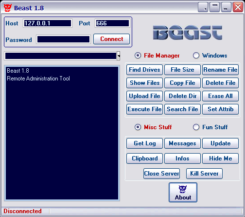

#  - 919bdf78f15d7bc5656f50a0ddcbf146726be0f79802d182ecc34cdc3ad2e004.exe
## Informations
| Label | Value |
| :--- | ---: |
| Executable Name | 919bdf78f15d7bc5656f50a0ddcbf146726be0f79802d182ecc34cdc3ad2e004.exe |
| Product Name |  |
| Version Number |  |
| Description |  |
| Company Name |  |
| Copyright |  |
| Trademarks |  |
| Last Edition | 24/09/2014 11:07:52 |
| Size | 640512 |
| SHA1 🔎 | [492452F7D86B9665FE86115B6EB5DAE15D0076F4](https://www.virustotal.com/gui/search/492452F7D86B9665FE86115B6EB5DAE15D0076F4) |
| Language |  |
## Static Analysis
<details>
<summary>Manalyze</summary>
<p>

```

* Manalyze 0.9 *

-------------------------------------------------------------------------------
C:/Users/IEUser/Desktop/net6.0/Malwares/919bdf78f15d7bc5656f50a0ddcbf146726be0f79802d182ecc34cdc3ad2e004.exe
-------------------------------------------------------------------------------

Summary:
--------
Architecture:       IMAGE_FILE_MACHINE_I386
Subsystem:          IMAGE_SUBSYSTEM_WINDOWS_GUI
Compilation Date:   1992-Jun-19 22:22:17
Detected languages: English - United States
                    Romanian - Romania
                    Russian - Russia

DOS Header:
-----------
e_magic:    MZ
e_cblp:     0x0050
e_cp:       0x0002
e_crlc:     0x0000
e_cparhdr:  0x0004
e_minalloc: 0x000F
e_maxalloc: 0xFFFF
e_ss:       0x0000
e_sp:       0x00B8
e_csum:     0x0000
e_ip:       0x0000
e_cs:       0x0000
e_ovno:     0x001A
e_oemid:    0x0000
e_oeminfo:  0x0000
e_lfanew:   0x00000100

PE Header:
----------
Signature:            PE
Machine:              IMAGE_FILE_MACHINE_I386
NumberofSections:     10
TimeDateStamp:        1992-Jun-19 22:22:17
PointerToSymbolTable: 0x00000000
NumberOfSymbols:      0
SizeOfOptionalHeader: 0x00E0
Characteristics:      IMAGE_FILE_32BIT_MACHINE
                      IMAGE_FILE_BYTES_REVERSED_HI
                      IMAGE_FILE_BYTES_REVERSED_LO
                      IMAGE_FILE_EXECUTABLE_IMAGE
                      IMAGE_FILE_LINE_NUMS_STRIPPED
                      IMAGE_FILE_LOCAL_SYMS_STRIPPED

Image Optional Header:
----------------------
Magic:                   PE32
LinkerVersion:           2.0
SizeOfCode:              0x000FB600
SizeOfInitializedData:   0x00085200
SizeOfUninitializedData: 0x00000000
AddressOfEntryPoint:     0x00187001 (Section: .data)
BaseOfCode:              0x00001000
BaseOfData:              0x000FD000
ImageBase:               0x00400000
SectionAlignment:        0x00001000
FileAlignment:           0x00000200
OperatingSystemVersion:  4.0
ImageVersion:            0.0
SubsystemVersion:        4.0
Win32VersionValue:       0
SizeOfImage:             0x0018A000
SizeOfHeaders:           0x00000400
Checksum:                0x00000000
Subsystem:               IMAGE_SUBSYSTEM_WINDOWS_GUI
SizeofStackReserve:      0x00100000
SizeofStackCommit:       0x00004000
SizeofHeapReserve:       0x00100000
SizeofHeapCommit:        0x00001000
LoaderFlags:             0x00000000
NumberOfRvaAndSizes:     16

Sections:
---------
CODE:
    VirtualSize:          0x000FC000
    VirtualAddress:       0x00001000
    SizeOfRawData:        0x0005AE00
    PointerToRawData:     0x00000400
    PointerToRelocations: 0x00000000
    PointerToLineNumbers: 0x00000000
    NumberOfLineNumbers:  0
    NumberOfRelocations:  0
    Characteristics:      IMAGE_SCN_CNT_INITIALIZED_DATA
                          IMAGE_SCN_MEM_READ
                          IMAGE_SCN_MEM_WRITE
    Entropy:              7.99937

DATA:
    VirtualSize:          0x00003000
    VirtualAddress:       0x000FD000
    SizeOfRawData:        0x00001000
    PointerToRawData:     0x0005B200
    PointerToRelocations: 0x00000000
    PointerToLineNumbers: 0x00000000
    NumberOfLineNumbers:  0
    NumberOfRelocations:  0
    Characteristics:      IMAGE_SCN_CNT_INITIALIZED_DATA
                          IMAGE_SCN_MEM_READ
                          IMAGE_SCN_MEM_WRITE
    Entropy:              7.78513

BSS:
    VirtualSize:          0x00002000
    VirtualAddress:       0x00100000
    SizeOfRawData:        0x00000000
    PointerToRawData:     0x0005C200
    PointerToRelocations: 0x00000000
    PointerToLineNumbers: 0x00000000
    NumberOfLineNumbers:  0
    NumberOfRelocations:  0
    Characteristics:      IMAGE_SCN_CNT_INITIALIZED_DATA
                          IMAGE_SCN_MEM_READ
                          IMAGE_SCN_MEM_WRITE

.idata:
    VirtualSize:          0x00003000
    VirtualAddress:       0x00102000
    SizeOfRawData:        0x00001000
    PointerToRawData:     0x0005C200
    PointerToRelocations: 0x00000000
    PointerToLineNumbers: 0x00000000
    NumberOfLineNumbers:  0
    NumberOfRelocations:  0
    Characteristics:      IMAGE_SCN_CNT_INITIALIZED_DATA
                          IMAGE_SCN_MEM_READ
                          IMAGE_SCN_MEM_WRITE
    Entropy:              7.94486

.tls:
    VirtualSize:          0x00001000
    VirtualAddress:       0x00105000
    SizeOfRawData:        0x00000000
    PointerToRawData:     0x0005D200
    PointerToRelocations: 0x00000000
    PointerToLineNumbers: 0x00000000
    NumberOfLineNumbers:  0
    NumberOfRelocations:  0
    Characteristics:      IMAGE_SCN_CNT_INITIALIZED_DATA
                          IMAGE_SCN_MEM_READ
                          IMAGE_SCN_MEM_WRITE

.rdata:
    VirtualSize:          0x00001000
    VirtualAddress:       0x00106000
    SizeOfRawData:        0x00000200
    PointerToRawData:     0x0005D200
    PointerToRelocations: 0x00000000
    PointerToLineNumbers: 0x00000000
    NumberOfLineNumbers:  0
    NumberOfRelocations:  0
    Characteristics:      IMAGE_SCN_CNT_INITIALIZED_DATA
                          IMAGE_SCN_MEM_READ
                          IMAGE_SCN_MEM_WRITE
    Entropy:              0.79209

.reloc:
    VirtualSize:          0x0000F000
    VirtualAddress:       0x00107000
    SizeOfRawData:        0x00000000
    PointerToRawData:     0x0005D400
    PointerToRelocations: 0x00000000
    PointerToLineNumbers: 0x00000000
    NumberOfLineNumbers:  0
    NumberOfRelocations:  0
    Characteristics:      IMAGE_SCN_CNT_INITIALIZED_DATA
                          IMAGE_SCN_MEM_READ
                          IMAGE_SCN_MEM_WRITE

.rsrc:
    VirtualSize:          0x00071000
    VirtualAddress:       0x00116000
    SizeOfRawData:        0x0003DC00
    PointerToRawData:     0x0005D400
    PointerToRelocations: 0x00000000
    PointerToLineNumbers: 0x00000000
    NumberOfLineNumbers:  0
    NumberOfRelocations:  0
    Characteristics:      IMAGE_SCN_CNT_INITIALIZED_DATA
                          IMAGE_SCN_MEM_READ
                          IMAGE_SCN_MEM_WRITE
    Entropy:              7.97945

.data:
    VirtualSize:          0x00002000
    VirtualAddress:       0x00187000
    SizeOfRawData:        0x00001600
    PointerToRawData:     0x0009B000
    PointerToRelocations: 0x00000000
    PointerToLineNumbers: 0x00000000
    NumberOfLineNumbers:  0
    NumberOfRelocations:  0
    Characteristics:      IMAGE_SCN_CNT_INITIALIZED_DATA
                          IMAGE_SCN_MEM_READ
                          IMAGE_SCN_MEM_WRITE
    Entropy:              5.44884

.adata:
    VirtualSize:          0x00001000
    VirtualAddress:       0x00189000
    SizeOfRawData:        0x00000000
    PointerToRawData:     0x0009C600
    PointerToRelocations: 0x00000000
    PointerToLineNumbers: 0x00000000
    NumberOfLineNumbers:  0
    NumberOfRelocations:  0
    Characteristics:      IMAGE_SCN_CNT_INITIALIZED_DATA
                          IMAGE_SCN_MEM_READ
                          IMAGE_SCN_MEM_WRITE


Imports:
--------
kernel32.dll: GetProcAddress
              GetModuleHandleA
              LoadLibraryA

Resources:
----------
A:
    Type:          EXEFILE
    Language:      English - United States
    Codepage:      UNKNOWN
    Size:          196608
    TimeDateStamp: 2002-Nov-05 21:27:56
    Entropy:       7.99867

I0:
    Type:          IC
    Language:      English - United States
    Codepage:      UNKNOWN
    Size:          766
    TimeDateStamp: 2002-Nov-05 21:27:56
    Entropy:       7.7252

I1:
    Type:          IC
    Language:      English - United States
    Codepage:      UNKNOWN
    Size:          766
    TimeDateStamp: 2002-Nov-05 21:27:56
    Entropy:       7.7531

I2:
    Type:          IC
    Language:      English - United States
    Codepage:      UNKNOWN
    Size:          766
    TimeDateStamp: 2002-Nov-05 21:27:56
    Entropy:       7.75566

I3:
    Type:          IC
    Language:      English - United States
    Codepage:      UNKNOWN
    Size:          766
    TimeDateStamp: 2002-Nov-05 21:27:56
    Entropy:       7.7024

I4:
    Type:          IC
    Language:      English - United States
    Codepage:      UNKNOWN
    Size:          766
    TimeDateStamp: 2002-Nov-05 21:27:56
    Entropy:       7.76022

I5:
    Type:          IC
    Language:      English - United States
    Codepage:      UNKNOWN
    Size:          766
    TimeDateStamp: 2002-Nov-05 21:27:56
    Entropy:       7.68455

I6:
    Type:          IC
    Language:      English - United States
    Codepage:      UNKNOWN
    Size:          766
    TimeDateStamp: 2002-Nov-05 21:27:56
    Entropy:       7.72399

I7:
    Type:          IC
    Language:      English - United States
    Codepage:      UNKNOWN
    Size:          766
    TimeDateStamp: 2002-Nov-05 21:27:56
    Entropy:       7.69651

1:
    Type:          RT_CURSOR
    Language:      UNKNOWN
    Codepage:      UNKNOWN
    Size:          308
    TimeDateStamp: 2002-Nov-05 21:27:56
    Entropy:       7.24742

2:
    Type:          RT_CURSOR
    Language:      UNKNOWN
    Codepage:      UNKNOWN
    Size:          308
    TimeDateStamp: 2002-Nov-05 21:27:56
    Entropy:       7.27225

3:
    Type:          RT_CURSOR
    Language:      UNKNOWN
    Codepage:      UNKNOWN
    Size:          308
    TimeDateStamp: 2002-Nov-05 21:27:56
    Entropy:       7.23973

4:
    Type:          RT_CURSOR
    Language:      UNKNOWN
    Codepage:      UNKNOWN
    Size:          308
    TimeDateStamp: 2002-Nov-05 21:27:56
    Entropy:       7.19441

5:
    Type:          RT_CURSOR
    Language:      UNKNOWN
    Codepage:      UNKNOWN
    Size:          308
    TimeDateStamp: 2002-Nov-05 21:27:56
    Entropy:       7.25827

6:
    Type:          RT_CURSOR
    Language:      UNKNOWN
    Codepage:      UNKNOWN
    Size:          308
    TimeDateStamp: 2002-Nov-05 21:27:56
    Entropy:       7.29365

7:
    Type:          RT_CURSOR
    Language:      UNKNOWN
    Codepage:      UNKNOWN
    Size:          308
    TimeDateStamp: 2002-Nov-05 21:27:56
    Entropy:       7.24497

BBABORT:
    Type:          RT_BITMAP
    Language:      UNKNOWN
    Codepage:      UNKNOWN
    Size:          464
    TimeDateStamp: 2002-Nov-05 21:27:56
    Entropy:       7.51924

BBALL:
    Type:          RT_BITMAP
    Language:      UNKNOWN
    Codepage:      UNKNOWN
    Size:          484
    TimeDateStamp: 2002-Nov-05 21:27:56
    Entropy:       7.50221

BBCANCEL:
    Type:          RT_BITMAP
    Language:      UNKNOWN
    Codepage:      UNKNOWN
    Size:          464
    TimeDateStamp: 2002-Nov-05 21:27:56
    Entropy:       7.44907

BBCLOSE:
    Type:          RT_BITMAP
    Language:      UNKNOWN
    Codepage:      UNKNOWN
    Size:          464
    TimeDateStamp: 2002-Nov-05 21:27:56
    Entropy:       7.54382

BBHELP:
    Type:          RT_BITMAP
    Language:      UNKNOWN
    Codepage:      UNKNOWN
    Size:          464
    TimeDateStamp: 2002-Nov-05 21:27:56
    Entropy:       7.50823

BBIGNORE:
    Type:          RT_BITMAP
    Language:      UNKNOWN
    Codepage:      UNKNOWN
    Size:          464
    TimeDateStamp: 2002-Nov-05 21:27:56
    Entropy:       7.56122

BBNO:
    Type:          RT_BITMAP
    Language:      UNKNOWN
    Codepage:      UNKNOWN
    Size:          464
    TimeDateStamp: 2002-Nov-05 21:27:56
    Entropy:       7.47062

BBOK:
    Type:          RT_BITMAP
    Language:      UNKNOWN
    Codepage:      UNKNOWN
    Size:          464
    TimeDateStamp: 2002-Nov-05 21:27:56
    Entropy:       7.48441

BBRETRY:
    Type:          RT_BITMAP
    Language:      UNKNOWN
    Codepage:      UNKNOWN
    Size:          464
    TimeDateStamp: 2002-Nov-05 21:27:56
    Entropy:       7.5801

BBYES:
    Type:          RT_BITMAP
    Language:      UNKNOWN
    Codepage:      UNKNOWN
    Size:          464
    TimeDateStamp: 2002-Nov-05 21:27:56
    Entropy:       7.50424

PREVIEWGLYPH:
    Type:          RT_BITMAP
    Language:      UNKNOWN
    Codepage:      UNKNOWN
    Size:          232
    TimeDateStamp: 2002-Nov-05 21:27:56
    Entropy:       7.07967

TE_BTN_ABORT:
    Type:          RT_BITMAP
    Language:      UNKNOWN
    Codepage:      UNKNOWN
    Size:          360
    TimeDateStamp: 2002-Nov-05 21:27:56
    Entropy:       7.41706

TE_BTN_ALL:
    Type:          RT_BITMAP
    Language:      UNKNOWN
    Codepage:      UNKNOWN
    Size:          360
    TimeDateStamp: 2002-Nov-05 21:27:56
    Entropy:       7.46343

TE_BTN_CANCEL:
    Type:          RT_BITMAP
    Language:      UNKNOWN
    Codepage:      UNKNOWN
    Size:          360
    TimeDateStamp: 2002-Nov-05 21:27:56
    Entropy:       7.45634

TE_BTN_CLOSE:
    Type:          RT_BITMAP
    Language:      UNKNOWN
    Codepage:      UNKNOWN
    Size:          360
    TimeDateStamp: 2002-Nov-05 21:27:56
    Entropy:       7.40232

TE_BTN_HELP:
    Type:          RT_BITMAP
    Language:      UNKNOWN
    Codepage:      UNKNOWN
    Size:          360
    TimeDateStamp: 2002-Nov-05 21:27:56
    Entropy:       7.45963

TE_BTN_IGNORE:
    Type:          RT_BITMAP
    Language:      UNKNOWN
    Codepage:      UNKNOWN
    Size:          360
    TimeDateStamp: 2002-Nov-05 21:27:56
    Entropy:       7.42182

TE_BTN_NO:
    Type:          RT_BITMAP
    Language:      UNKNOWN
    Codepage:      UNKNOWN
    Size:          360
    TimeDateStamp: 2002-Nov-05 21:27:56
    Entropy:       7.41553

TE_BTN_OK:
    Type:          RT_BITMAP
    Language:      UNKNOWN
    Codepage:      UNKNOWN
    Size:          360
    TimeDateStamp: 2002-Nov-05 21:27:56
    Entropy:       7.39211

TE_BTN_RETRY:
    Type:          RT_BITMAP
    Language:      UNKNOWN
    Codepage:      UNKNOWN
    Size:          360
    TimeDateStamp: 2002-Nov-05 21:27:56
    Entropy:       7.36286

TE_BTN_YES:
    Type:          RT_BITMAP
    Language:      UNKNOWN
    Codepage:      UNKNOWN
    Size:          360
    TimeDateStamp: 2002-Nov-05 21:27:56
    Entropy:       7.35336

TE_FORM_CLOSE:
    Type:          RT_BITMAP
    Language:      UNKNOWN
    Codepage:      UNKNOWN
    Size:          232
    TimeDateStamp: 2002-Nov-05 21:27:56
    Entropy:       7.06357

TE_FORM_MAXIMIZE:
    Type:          RT_BITMAP
    Language:      UNKNOWN
    Codepage:      UNKNOWN
    Size:          232
    TimeDateStamp: 2002-Nov-05 21:27:56
    Entropy:       7.20264

TE_FORM_MINIMIZE:
    Type:          RT_BITMAP
    Language:      UNKNOWN
    Codepage:      UNKNOWN
    Size:          308
    TimeDateStamp: 2002-Nov-05 21:27:56
    Entropy:       7.29397

TE_FORM_MOVE:
    Type:          RT_BITMAP
    Language:      UNKNOWN
    Codepage:      UNKNOWN
    Size:          232
    TimeDateStamp: 2002-Nov-05 21:27:56
    Entropy:       6.97562

TE_FORM_RESTORE:
    Type:          RT_BITMAP
    Language:      UNKNOWN
    Codepage:      UNKNOWN
    Size:          232
    TimeDateStamp: 2002-Nov-05 21:27:56
    Entropy:       7.10228

TE_FORM_ROLLUP:
    Type:          RT_BITMAP
    Language:      Russian - Russia
    Codepage:      UNKNOWN
    Size:          232
    TimeDateStamp: 2002-Nov-05 21:27:56
    Entropy:       6.87325

TE_FORM_SIZE:
    Type:          RT_BITMAP
    Language:      UNKNOWN
    Codepage:      UNKNOWN
    Size:          232
    TimeDateStamp: 2002-Nov-05 21:27:56
    Entropy:       6.99496

TE_FORM_TRAY:
    Type:          RT_BITMAP
    Language:      Russian - Russia
    Codepage:      UNKNOWN
    Size:          232
    TimeDateStamp: 2002-Nov-05 21:27:56
    Entropy:       7.03174

TE_LIST_TRUETYPE:
    Type:          RT_BITMAP
    Language:      UNKNOWN
    Codepage:      UNKNOWN
    Size:          200
    TimeDateStamp: 2002-Nov-05 21:27:56
    Entropy:       6.98856

TE_SPIN_DOWN:
    Type:          RT_BITMAP
    Language:      English - United States
    Codepage:      UNKNOWN
    Size:          152
    TimeDateStamp: 2002-Nov-05 21:27:56
    Entropy:       6.68859

TE_SPIN_UP:
    Type:          RT_BITMAP
    Language:      English - United States
    Codepage:      UNKNOWN
    Size:          152
    TimeDateStamp: 2002-Nov-05 21:27:56
    Entropy:       6.6804

1 (#2):
    Type:          RT_ICON
    Language:      Romanian - Romania
    Codepage:      UNKNOWN
    Size:          296
    TimeDateStamp: 2002-Nov-05 21:27:56
    Entropy:       2.83694

2 (#2):
    Type:          RT_ICON
    Language:      Romanian - Romania
    Codepage:      UNKNOWN
    Size:          744
    TimeDateStamp: 2002-Nov-05 21:27:56
    Entropy:       2.82019

DLGTEMPLATE:
    Type:          RT_DIALOG
    Language:      UNKNOWN
    Codepage:      UNKNOWN
    Size:          82
    TimeDateStamp: 2002-Nov-05 21:27:56
    Entropy:       6.16243

4078:
    Type:          RT_STRING
    Language:      UNKNOWN
    Codepage:      UNKNOWN
    Size:          1144
    TimeDateStamp: 2002-Nov-05 21:27:56
    Entropy:       7.78481

4079:
    Type:          RT_STRING
    Language:      UNKNOWN
    Codepage:      UNKNOWN
    Size:          120
    TimeDateStamp: 2002-Nov-05 21:27:56
    Entropy:       6.47764

4080:
    Type:          RT_STRING
    Language:      UNKNOWN
    Codepage:      UNKNOWN
    Size:          260
    TimeDateStamp: 2002-Nov-05 21:27:56
    Entropy:       7.11728

4081:
    Type:          RT_STRING
    Language:      UNKNOWN
    Codepage:      UNKNOWN
    Size:          312
    TimeDateStamp: 2002-Nov-05 21:27:56
    Entropy:       7.37203

4082:
    Type:          RT_STRING
    Language:      UNKNOWN
    Codepage:      UNKNOWN
    Size:          1184
    TimeDateStamp: 2002-Nov-05 21:27:56
    Entropy:       7.81288

4083:
    Type:          RT_STRING
    Language:      UNKNOWN
    Codepage:      UNKNOWN
    Size:          732
    TimeDateStamp: 2002-Nov-05 21:27:56
    Entropy:       7.68619

4084:
    Type:          RT_STRING
    Language:      UNKNOWN
    Codepage:      UNKNOWN
    Size:          220
    TimeDateStamp: 2002-Nov-05 21:27:56
    Entropy:       7.12886

4085:
    Type:          RT_STRING
    Language:      UNKNOWN
    Codepage:      UNKNOWN
    Size:          396
    TimeDateStamp: 2002-Nov-05 21:27:56
    Entropy:       7.46953

4086:
    Type:          RT_STRING
    Language:      UNKNOWN
    Codepage:      UNKNOWN
    Size:          628
    TimeDateStamp: 2002-Nov-05 21:27:56
    Entropy:       7.66679

4087:
    Type:          RT_STRING
    Language:      UNKNOWN
    Codepage:      UNKNOWN
    Size:          964
    TimeDateStamp: 2002-Nov-05 21:27:56
    Entropy:       7.75687

4088:
    Type:          RT_STRING
    Language:      UNKNOWN
    Codepage:      UNKNOWN
    Size:          964
    TimeDateStamp: 2002-Nov-05 21:27:56
    Entropy:       7.77862

4089:
    Type:          RT_STRING
    Language:      UNKNOWN
    Codepage:      UNKNOWN
    Size:          968
    TimeDateStamp: 2002-Nov-05 21:27:56
    Entropy:       7.75356

4090:
    Type:          RT_STRING
    Language:      UNKNOWN
    Codepage:      UNKNOWN
    Size:          1024
    TimeDateStamp: 2002-Nov-05 21:27:56
    Entropy:       7.80308

4091:
    Type:          RT_STRING
    Language:      UNKNOWN
    Codepage:      UNKNOWN
    Size:          872
    TimeDateStamp: 2002-Nov-05 21:27:56
    Entropy:       7.70746

4092:
    Type:          RT_STRING
    Language:      UNKNOWN
    Codepage:      UNKNOWN
    Size:          224
    TimeDateStamp: 2002-Nov-05 21:27:56
    Entropy:       7.06038

4093:
    Type:          RT_STRING
    Language:      UNKNOWN
    Codepage:      UNKNOWN
    Size:          188
    TimeDateStamp: 2002-Nov-05 21:27:56
    Entropy:       6.91869

4094:
    Type:          RT_STRING
    Language:      UNKNOWN
    Codepage:      UNKNOWN
    Size:          804
    TimeDateStamp: 2002-Nov-05 21:27:56
    Entropy:       7.70337

4095:
    Type:          RT_STRING
    Language:      UNKNOWN
    Codepage:      UNKNOWN
    Size:          916
    TimeDateStamp: 2002-Nov-05 21:27:56
    Entropy:       7.78555

4096:
    Type:          RT_STRING
    Language:      UNKNOWN
    Codepage:      UNKNOWN
    Size:          708
    TimeDateStamp: 2002-Nov-05 21:27:56
    Entropy:       7.68133

DESCRIPTION:
    Type:          RT_RCDATA
    Language:      UNKNOWN
    Codepage:      UNKNOWN
    Size:          68
    TimeDateStamp: 2002-Nov-05 21:27:56
    Entropy:       5.80055

DVCLAL:
    Type:          RT_RCDATA
    Language:      UNKNOWN
    Codepage:      UNKNOWN
    Size:          16
    TimeDateStamp: 2002-Nov-05 21:27:56
    Entropy:       4

PACKAGEINFO:
    Type:          RT_RCDATA
    Language:      UNKNOWN
    Codepage:      UNKNOWN
    Size:          1504
    TimeDateStamp: 2002-Nov-05 21:27:56
    Entropy:       7.86947

TFORM0:
    Type:          RT_RCDATA
    Language:      UNKNOWN
    Codepage:      UNKNOWN
    Size:          7447
    TimeDateStamp: 2002-Nov-05 21:27:56
    Entropy:       7.97511

TFORM1:
    Type:          RT_RCDATA
    Language:      UNKNOWN
    Codepage:      UNKNOWN
    Size:          23921
    TimeDateStamp: 2002-Nov-05 21:27:56
    Entropy:       7.28545

TFORM2:
    Type:          RT_RCDATA
    Language:      UNKNOWN
    Codepage:      UNKNOWN
    Size:          7571
    TimeDateStamp: 2002-Nov-05 21:27:56
    Entropy:       0

TFORM3:
    Type:          RT_RCDATA
    Language:      UNKNOWN
    Codepage:      UNKNOWN
    Size:          9319
    TimeDateStamp: 2002-Nov-05 21:27:56
    Entropy:       0

TFORM4:
    Type:          RT_RCDATA
    Language:      UNKNOWN
    Codepage:      UNKNOWN
    Size:          4625
    TimeDateStamp: 2002-Nov-05 21:27:56
    Entropy:       0

TFORM5:
    Type:          RT_RCDATA
    Language:      UNKNOWN
    Codepage:      UNKNOWN
    Size:          28878
    TimeDateStamp: 2002-Nov-05 21:27:56
    Entropy:       0

TFORM6:
    Type:          RT_RCDATA
    Language:      UNKNOWN
    Codepage:      UNKNOWN
    Size:          21930
    TimeDateStamp: 2002-Nov-05 21:27:56
    Entropy:       0

XP_MAIN:
    Type:          RT_RCDATA
    Language:      English - United States
    Codepage:      UNKNOWN
    Size:          36490
    TimeDateStamp: 2002-Nov-05 21:27:56
    Entropy:       0

XP_MAIN1:
    Type:          RT_RCDATA
    Language:      English - United States
    Codepage:      UNKNOWN
    Size:          29255
    TimeDateStamp: 2002-Nov-05 21:27:56
    Entropy:       0

XP_METAL_MAIN:
    Type:          RT_RCDATA
    Language:      English - United States
    Codepage:      UNKNOWN
    Size:          27470
    TimeDateStamp: 2002-Nov-05 21:27:56
    Entropy:       0

XP_METAL_MAIN1:
    Type:          RT_RCDATA
    Language:      English - United States
    Codepage:      UNKNOWN
    Size:          27837
    TimeDateStamp: 2002-Nov-05 21:27:56
    Entropy:       0

32761:
    Type:          RT_GROUP_CURSOR
    Language:      UNKNOWN
    Codepage:      UNKNOWN
    Size:          20
    TimeDateStamp: 2002-Nov-05 21:27:56
    Entropy:       0

32762:
    Type:          RT_GROUP_CURSOR
    Language:      UNKNOWN
    Codepage:      UNKNOWN
    Size:          20
    TimeDateStamp: 2002-Nov-05 21:27:56
    Entropy:       0

32763:
    Type:          RT_GROUP_CURSOR
    Language:      UNKNOWN
    Codepage:      UNKNOWN
    Size:          20
    TimeDateStamp: 2002-Nov-05 21:27:56
    Entropy:       0

32764:
    Type:          RT_GROUP_CURSOR
    Language:      UNKNOWN
    Codepage:      UNKNOWN
    Size:          20
    TimeDateStamp: 2002-Nov-05 21:27:56
    Entropy:       0

32765:
    Type:          RT_GROUP_CURSOR
    Language:      UNKNOWN
    Codepage:      UNKNOWN
    Size:          20
    TimeDateStamp: 2002-Nov-05 21:27:56
    Entropy:       0

32766:
    Type:          RT_GROUP_CURSOR
    Language:      UNKNOWN
    Codepage:      UNKNOWN
    Size:          20
    TimeDateStamp: 2002-Nov-05 21:27:56
    Entropy:       0

32767:
    Type:          RT_GROUP_CURSOR
    Language:      UNKNOWN
    Codepage:      UNKNOWN
    Size:          20
    TimeDateStamp: 2002-Nov-05 21:27:56
    Entropy:       0

MAINICON:
    Type:              RT_GROUP_ICON
    Language:          Romanian - Romania
    Codepage:          UNKNOWN
    Size:              34
    TimeDateStamp:     2002-Nov-05 21:27:56
    Entropy:           2.37086
    Detected Filetype: Icon file


TLS Callbacks:
--------------
StartAddressOfRawData: 0x00505000
EndAddressOfRawData:   0x00505014
AddressOfIndex:        0x00500710
AddressOfCallbacks:    0x00506010
SizeOfZeroFill:        0x00000000
Characteristics:       IMAGE_SCN_TYPE_REG
Callbacks:             (EMPTY)

[ SUSPICIOUS ] PEiD Signature:
    ASPack v2.12

[ SUSPICIOUS ] The PE is packed with Aspack or Armadillo
    Unusual section name found: .adata
    The PE only has 3 import(s).

The PE contains common functions which appear in legitimate applications.
    [!] The program may be hiding some of its imports:
        GetProcAddress
        LoadLibraryA

[ SUSPICIOUS ] The PE header may have been manually modified.
    Resource A is possibly compressed or encrypted.
    Resource I0 is possibly compressed or encrypted.
    Resource I1 is possibly compressed or encrypted.
    Resource I2 is possibly compressed or encrypted.
    Resource I3 is possibly compressed or encrypted.
    Resource I4 is possibly compressed or encrypted.
    Resource I5 is possibly compressed or encrypted.
    Resource I6 is possibly compressed or encrypted.
    Resource I7 is possibly compressed or encrypted.
    Resource 1 is possibly compressed or encrypted.
    Resource 2 is possibly compressed or encrypted.
    Resource 3 is possibly compressed or encrypted.
    Resource 4 is possibly compressed or encrypted.
    Resource 5 is possibly compressed or encrypted.
    Resource 6 is possibly compressed or encrypted.
    Resource 7 is possibly compressed or encrypted.
    Resource BBABORT is possibly compressed or encrypted.
    Resource BBALL is possibly compressed or encrypted.
    Resource BBCANCEL is possibly compressed or encrypted.
    Resource BBCLOSE is possibly compressed or encrypted.
    Resource BBHELP is possibly compressed or encrypted.
    Resource BBIGNORE is possibly compressed or encrypted.
    Resource BBNO is possibly compressed or encrypted.
    Resource BBOK is possibly compressed or encrypted.
    Resource BBRETRY is possibly compressed or encrypted.
    Resource BBYES is possibly compressed or encrypted.
    Resource PREVIEWGLYPH is possibly compressed or encrypted.
    Resource TE_BTN_ABORT is possibly compressed or encrypted.
    Resource TE_BTN_ALL is possibly compressed or encrypted.
    Resource TE_BTN_CANCEL is possibly compressed or encrypted.
    Resource TE_BTN_CLOSE is possibly compressed or encrypted.
    Resource TE_BTN_HELP is possibly compressed or encrypted.
    Resource TE_BTN_IGNORE is possibly compressed or encrypted.
    Resource TE_BTN_NO is possibly compressed or encrypted.
    Resource TE_BTN_OK is possibly compressed or encrypted.
    Resource TE_BTN_RETRY is possibly compressed or encrypted.
    Resource TE_BTN_YES is possibly compressed or encrypted.
    Resource TE_FORM_CLOSE is possibly compressed or encrypted.
    Resource TE_FORM_MAXIMIZE is possibly compressed or encrypted.
    Resource TE_FORM_MINIMIZE is possibly compressed or encrypted.
    Resource TE_FORM_RESTORE is possibly compressed or encrypted.
    Resource TE_FORM_TRAY is possibly compressed or encrypted.
    Resource 4078 is possibly compressed or encrypted.
    Resource 4080 is possibly compressed or encrypted.
    Resource 4081 is possibly compressed or encrypted.
    Resource 4082 is possibly compressed or encrypted.
    Resource 4083 is possibly compressed or encrypted.
    Resource 4084 is possibly compressed or encrypted.
    Resource 4085 is possibly compressed or encrypted.
    Resource 4086 is possibly compressed or encrypted.
    Resource 4087 is possibly compressed or encrypted.
    Resource 4088 is possibly compressed or encrypted.
    Resource 4089 is possibly compressed or encrypted.
    Resource 4090 is possibly compressed or encrypted.
    Resource 4091 is possibly compressed or encrypted.
    Resource 4092 is possibly compressed or encrypted.
    Resource 4094 is possibly compressed or encrypted.
    Resource 4095 is possibly compressed or encrypted.
    Resource 4096 is possibly compressed or encrypted.
    Resource PACKAGEINFO is possibly compressed or encrypted.
    Resource TFORM0 is possibly compressed or encrypted.
    Resource TFORM1 is possibly compressed or encrypted.
    The resource timestamps differ from the PE header:
        2002-Nov-05 21:27:56

The following exploit mitigation techniques have been detected
    Stack Canary: disabled
    SafeSEH: disabled
    ASLR: disabled
    DEP: disabled
    CFG: disabled


```

</p>
</details>

## Screenshots
### Beast1.8
 
