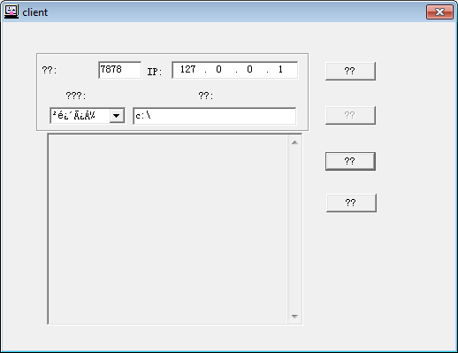

# client 应用程序 - Backdoor.Win32.Mysock.a-6ff313cb14d5dd189ab5faafc5b6d6a36a6de0d712921fabc9f15ce3e6b64c8d.exe
## Informations
| Label | Value |
| :--- | ---: |
| Executable Name | Backdoor.Win32.Mysock.a-6ff313cb14d5dd189ab5faafc5b6d6a36a6de0d712921fabc9f15ce3e6b64c8d.exe |
| Product Name | client 应用程序 |
| Version Number | 1, 0, 0, 1 |
| Description | client Microsoft 基础类应用程序 |
| Company Name |  |
| Copyright | 版权所有 (C) 2002 |
| Trademarks |  |
| Last Edition | 14/06/2012 09:46:06 |
| Size | 204800 |
| SHA1 🔎 | [4AB381042553F4ED2AB65DF8D3E8C3384AEE9FD1](https://www.virustotal.com/gui/search/4AB381042553F4ED2AB65DF8D3E8C3384AEE9FD1) |
| Language | Chinese (Simplified, PRC) |
## Static Analysis
<details>
<summary>Manalyze</summary>
<p>

```

* Manalyze 0.9 *

-------------------------------------------------------------------------------
C:/Users/IEUser/Desktop/net6.0/Malwares/Backdoor.Win32.Mysock.a-6ff313cb14d5dd189ab5faafc5b6d6a36a6de0d712921fabc9f15ce3e6b64c8d.exe
-------------------------------------------------------------------------------

Summary:
--------
Architecture:       IMAGE_FILE_MACHINE_I386
Subsystem:          IMAGE_SUBSYSTEM_WINDOWS_GUI
Compilation Date:   2002-Jun-28 03:42:47
Detected languages: Chinese - PRC
FileDescription:    client Microsoft 基础类应用程序
FileVersion:        1, 0, 0, 1
InternalName:       client
LegalCopyright:     版权所有 (C) 2002
OriginalFilename:   client.EXE
ProductName:        client 应用程序
ProductVersion:     1, 0, 0, 1

DOS Header:
-----------
e_magic:    MZ
e_cblp:     0x0090
e_cp:       0x0003
e_crlc:     0x0000
e_cparhdr:  0x0004
e_minalloc: 0x0000
e_maxalloc: 0xFFFF
e_ss:       0x0000
e_sp:       0x00B8
e_csum:     0x0000
e_ip:       0x0000
e_cs:       0x0000
e_ovno:     0x0000
e_oemid:    0x0000
e_oeminfo:  0x0000
e_lfanew:   0x000000E8

PE Header:
----------
Signature:            PE
Machine:              IMAGE_FILE_MACHINE_I386
NumberofSections:     4
TimeDateStamp:        2002-Jun-28 03:42:47
PointerToSymbolTable: 0x00000000
NumberOfSymbols:      0
SizeOfOptionalHeader: 0x00E0
Characteristics:      IMAGE_FILE_32BIT_MACHINE
                      IMAGE_FILE_EXECUTABLE_IMAGE
                      IMAGE_FILE_LINE_NUMS_STRIPPED
                      IMAGE_FILE_LOCAL_SYMS_STRIPPED
                      IMAGE_FILE_RELOCS_STRIPPED

Image Optional Header:
----------------------
Magic:                   PE32
LinkerVersion:           6.0
SizeOfCode:              0x00022000
SizeOfInitializedData:   0x00013000
SizeOfUninitializedData: 0x00000000
AddressOfEntryPoint:     0x00009BC1 (Section: .text)
BaseOfCode:              0x00001000
BaseOfData:              0x00023000
ImageBase:               0x00400000
SectionAlignment:        0x00001000
FileAlignment:           0x00001000
OperatingSystemVersion:  4.0
ImageVersion:            0.0
SubsystemVersion:        4.0
Win32VersionValue:       0
SizeOfImage:             0x00036000
SizeOfHeaders:           0x00001000
Checksum:                0x00000000
Subsystem:               IMAGE_SUBSYSTEM_WINDOWS_GUI
SizeofStackReserve:      0x00100000
SizeofStackCommit:       0x00001000
SizeofHeapReserve:       0x00100000
SizeofHeapCommit:        0x00001000
LoaderFlags:             0x00000000
NumberOfRvaAndSizes:     16

Sections:
---------
.text:
    VirtualSize:          0x00021877
    VirtualAddress:       0x00001000
    SizeOfRawData:        0x00022000
    PointerToRawData:     0x00001000
    PointerToRelocations: 0x00000000
    PointerToLineNumbers: 0x00000000
    NumberOfLineNumbers:  0
    NumberOfRelocations:  0
    Characteristics:      IMAGE_SCN_CNT_CODE
                          IMAGE_SCN_MEM_EXECUTE
                          IMAGE_SCN_MEM_READ
    Entropy:              6.5463

.rdata:
    VirtualSize:          0x00008F66
    VirtualAddress:       0x00023000
    SizeOfRawData:        0x00009000
    PointerToRawData:     0x00023000
    PointerToRelocations: 0x00000000
    PointerToLineNumbers: 0x00000000
    NumberOfLineNumbers:  0
    NumberOfRelocations:  0
    Characteristics:      IMAGE_SCN_CNT_INITIALIZED_DATA
                          IMAGE_SCN_MEM_READ
    Entropy:              4.76764

.data:
    VirtualSize:          0x00006408
    VirtualAddress:       0x0002C000
    SizeOfRawData:        0x00003000
    PointerToRawData:     0x0002C000
    PointerToRelocations: 0x00000000
    PointerToLineNumbers: 0x00000000
    NumberOfLineNumbers:  0
    NumberOfRelocations:  0
    Characteristics:      IMAGE_SCN_CNT_INITIALIZED_DATA
                          IMAGE_SCN_MEM_READ
                          IMAGE_SCN_MEM_WRITE
    Entropy:              3.25103

.rsrc:
    VirtualSize:          0x00002AC0
    VirtualAddress:       0x00033000
    SizeOfRawData:        0x00003000
    PointerToRawData:     0x0002F000
    PointerToRelocations: 0x00000000
    PointerToLineNumbers: 0x00000000
    NumberOfLineNumbers:  0
    NumberOfRelocations:  0
    Characteristics:      IMAGE_SCN_CNT_INITIALIZED_DATA
                          IMAGE_SCN_MEM_READ
    Entropy:              4.36056


Imports:
--------
KERNEL32.dll: GetTimeZoneInformation
              UnhandledExceptionFilter
              GetACP
              FreeEnvironmentStringsW
              GetEnvironmentStrings
              FreeEnvironmentStringsA
              SetHandleCount
              GetStdHandle
              GetFileType
              HeapDestroy
              GetEnvironmentStringsW
              VirtualFree
              VirtualAlloc
              RaiseException
              HeapSize
              HeapCreate
              SetUnhandledExceptionFilter
              GetStringTypeA
              GetStringTypeW
              IsBadReadPtr
              IsBadCodePtr
              HeapReAlloc
              SetStdHandle
              CompareStringA
              CompareStringW
              SetEnvironmentVariableA
              HeapAlloc
              ExitProcess
              HeapFree
              TerminateProcess
              RtlUnwind
              GetCommandLineA
              GetStartupInfoA
              FormatMessageA
              FileTimeToSystemTime
              GetTickCount
              FileTimeToLocalFileTime
              GetOEMCP
              SetErrorMode
              GetCPInfo
              GetFileTime
              GetFileSize
              GetFileAttributesA
              GetVolumeInformationA
              GetFullPathNameA
              IsBadWritePtr
              LCMapStringA
              FindFirstFileA
              WideCharToMultiByte
              lstrlenA
              InterlockedDecrement
              InterlockedIncrement
              GlobalUnlock
              GlobalFree
              LockResource
              FindResourceA
              LoadResource
              CloseHandle
              GetModuleFileNameA
              GlobalLock
              GlobalAlloc
              GlobalDeleteAtom
              lstrcmpA
              lstrcmpiA
              GetCurrentThread
              FindClose
              SetEndOfFile
              GetProfileStringA
              UnlockFile
              LockFile
              FlushFileBuffers
              SetFilePointer
              WriteFile
              ReadFile
              CreateFileA
              GetCurrentProcess
              DuplicateHandle
              GetThreadLocale
              SizeofResource
              GetProcessVersion
              GetLastError
              WritePrivateProfileStringA
              GlobalFlags
              lstrcpynA
              TlsGetValue
              LocalReAlloc
              TlsSetValue
              EnterCriticalSection
              GlobalReAlloc
              LeaveCriticalSection
              TlsFree
              GlobalHandle
              DeleteCriticalSection
              TlsAlloc
              InitializeCriticalSection
              LocalFree
              LocalAlloc
              MulDiv
              LoadLibraryA
              GetVersion
              lstrcatA
              GlobalGetAtomNameA
              GlobalAddAtomA
              GlobalFindAtomA
              lstrcpyA
              GetModuleHandleA
              GetProcAddress
              SetLastError
              FreeLibrary
              MultiByteToWideChar
              LCMapStringW
              GetCurrentThreadId
USER32.dll:   InvalidateRect
              InflateRect
              RegisterClipboardFormatA
              PostThreadMessageA
              CopyAcceleratorTableA
              CharNextA
              GetSysColorBrush
              PtInRect
              GetClassNameA
              GetDesktopWindow
              LoadCursorA
              GrayStringA
              DrawTextA
              TabbedTextOutA
              EndPaint
              BeginPaint
              GetWindowDC
              ReleaseDC
              GetDC
              DestroyMenu
              LoadStringA
              wvsprintfA
              ShowWindow
              MoveWindow
              SetWindowTextA
              IsDialogMessageA
              UpdateWindow
              SendDlgItemMessageA
              MapWindowPoints
              GetSysColor
              SetFocus
              CopyRect
              GetTopWindow
              WinHelpA
              wsprintfA
              GetClassInfoA
              RegisterClassA
              GetMenu
              GetMenuItemCount
              SetRect
              GetMenuItemID
              GetWindowTextLengthA
              GetWindowTextA
              GetDlgCtrlID
              DefWindowProcA
              CreateWindowExA
              GetClassLongA
              SetPropA
              UnhookWindowsHookEx
              GetPropA
              CallWindowProcA
              RemovePropA
              GetMessageTime
              GetMessagePos
              GetForegroundWindow
              SetForegroundWindow
              SetWindowLongA
              RegisterWindowMessageA
              OffsetRect
              IntersectRect
              SystemParametersInfoA
              GetWindowPlacement
              GetWindowRect
              KillTimer
              WaitMessage
              MapDialogRect
              SetWindowPos
              GetWindow
              SetWindowContextHelpId
              EndDialog
              SetActiveWindow
              IsWindow
              GetNextDlgGroupItem
              CharUpperA
              MessageBeep
              AdjustWindowRectEx
              ScreenToClient
              GetSubMenu
              CreateDialogIndirectParamA
              DestroyWindow
              GetDlgItem
              GetMenuCheckMarkDimensions
              LoadBitmapA
              GetMenuState
              ModifyMenuA
              SetMenuItemBitmaps
              CheckMenuItem
              EnableMenuItem
              GetFocus
              GetNextDlgTabItem
              GetMessageA
              TranslateMessage
              DispatchMessageA
              GetActiveWindow
              GetKeyState
              CallNextHookEx
              ValidateRect
              IsWindowVisible
              PeekMessageA
              GetCursorPos
              SetWindowsHookExA
              GetParent
              GetLastActivePopup
              IsWindowEnabled
              GetWindowLongA
              MessageBoxA
              SetCursor
              PostQuitMessage
              PostMessageA
              EnableWindow
              SetTimer
              IsIconic
              GetSystemMetrics
              GetClientRect
              DrawIcon
              GetSystemMenu
              AppendMenuA
              SendMessageA
              LoadIconA
              GetCapture
              IsChild
              ClientToScreen
              UnregisterClassA
              HideCaret
              ShowCaret
              ExcludeUpdateRgn
              DrawFocusRect
              DefDlgProcA
              IsWindowUnicode
GDI32.dll:    DeleteObject
              GetDeviceCaps
              GetViewportExtEx
              GetWindowExtEx
              CreateSolidBrush
              PtVisible
              RectVisible
              TextOutA
              ExtTextOutA
              Escape
              PatBlt
              GetTextColor
              GetBkColor
              DPtoLP
              LPtoDP
              GetMapMode
              CreateDIBitmap
              CreateCompatibleDC
              BitBlt
              GetTextExtentPointA
              IntersectClipRect
              ScaleWindowExtEx
              SetWindowExtEx
              SetViewportExtEx
              OffsetViewportOrgEx
              ScaleViewportExtEx
              SetMapMode
              SetViewportOrgEx
              SetBkMode
              GetStockObject
              SelectObject
              SaveDC
              RestoreDC
              GetObjectA
              SetBkColor
              DeleteDC
              CreateBitmap
              GetClipBox
              SetTextColor
comdlg32.dll: GetFileTitleA
WINSPOOL.DRV: DocumentPropertiesA
              ClosePrinter
              OpenPrinterA
ADVAPI32.dll: RegCloseKey
              RegCreateKeyExA
              RegOpenKeyExA
              RegSetValueExA
COMCTL32.dll: #17
oledlg.dll:   #8
ole32.dll:    CLSIDFromProgID
              CLSIDFromString
              CoGetClassObject
              StgOpenStorageOnILockBytes
              StgCreateDocfileOnILockBytes
              CreateILockBytesOnHGlobal
              CoTaskMemFree
              CoTaskMemAlloc
              OleInitialize
              OleUninitialize
              CoFreeUnusedLibraries
              CoRegisterMessageFilter
              CoRevokeClassObject
              OleFlushClipboard
              OleIsCurrentClipboard
OLEPRO32.DLL: #253
OLEAUT32.dll: #7
              #6
              #150
              #2
              #12
              #10
              #185
              #9
              #4
WSOCK32.dll:  #111
              #3
              #4
              #20
              #17
              #23
              #12
              #101
              #19
              #16
              #52
              #116
              #8
              #9
              #2
              #10
              #1
              #112
              #115

Resources:
----------
2:
    Type:          RT_CURSOR
    Language:      Chinese - PRC
    Codepage:      UNKNOWN
    Size:          308
    TimeDateStamp: 1980-Jan-01 00:00:00
    Entropy:       3.02695

3:
    Type:          RT_CURSOR
    Language:      Chinese - PRC
    Codepage:      UNKNOWN
    Size:          180
    TimeDateStamp: 1980-Jan-01 00:00:00
    Entropy:       2.74274

26567:
    Type:          RT_BITMAP
    Language:      Chinese - PRC
    Codepage:      UNKNOWN
    Size:          1508
    TimeDateStamp: 1980-Jan-01 00:00:00
    Entropy:       4.09838

30994:
    Type:          RT_BITMAP
    Language:      Chinese - PRC
    Codepage:      UNKNOWN
    Size:          184
    TimeDateStamp: 1980-Jan-01 00:00:00
    Entropy:       2.23666

30995:
    Type:          RT_BITMAP
    Language:      Chinese - PRC
    Codepage:      UNKNOWN
    Size:          364
    TimeDateStamp: 1980-Jan-01 00:00:00
    Entropy:       2.20022

30996:
    Type:          RT_BITMAP
    Language:      Chinese - PRC
    Codepage:      UNKNOWN
    Size:          324
    TimeDateStamp: 1980-Jan-01 00:00:00
    Entropy:       2.87621

1:
    Type:          RT_ICON
    Language:      Chinese - PRC
    Codepage:      UNKNOWN
    Size:          2216
    TimeDateStamp: 1980-Jan-01 00:00:00
    Entropy:       2.74746

100:
    Type:          RT_DIALOG
    Language:      Chinese - PRC
    Codepage:      UNKNOWN
    Size:          226
    TimeDateStamp: 1980-Jan-01 00:00:00
    Entropy:       3.44285

102:
    Type:          RT_DIALOG
    Language:      Chinese - PRC
    Codepage:      UNKNOWN
    Size:          600
    TimeDateStamp: 1980-Jan-01 00:00:00
    Entropy:       3.28151

30721:
    Type:          RT_DIALOG
    Language:      Chinese - PRC
    Codepage:      UNKNOWN
    Size:          226
    TimeDateStamp: 1980-Jan-01 00:00:00
    Entropy:       3.38941

7:
    Type:          RT_STRING
    Language:      Chinese - PRC
    Codepage:      UNKNOWN
    Size:          100
    TimeDateStamp: 1980-Jan-01 00:00:00
    Entropy:       3.51208

3841:
    Type:          RT_STRING
    Language:      Chinese - PRC
    Codepage:      UNKNOWN
    Size:          80
    TimeDateStamp: 1980-Jan-01 00:00:00
    Entropy:       3.68399

3842:
    Type:          RT_STRING
    Language:      Chinese - PRC
    Codepage:      UNKNOWN
    Size:          44
    TimeDateStamp: 1980-Jan-01 00:00:00
    Entropy:       1.37932

3843:
    Type:          RT_STRING
    Language:      Chinese - PRC
    Codepage:      UNKNOWN
    Size:          120
    TimeDateStamp: 1980-Jan-01 00:00:00
    Entropy:       5.07447

3857:
    Type:          RT_STRING
    Language:      Chinese - PRC
    Codepage:      UNKNOWN
    Size:          452
    TimeDateStamp: 1980-Jan-01 00:00:00
    Entropy:       6.10651

3858:
    Type:          RT_STRING
    Language:      Chinese - PRC
    Codepage:      UNKNOWN
    Size:          298
    TimeDateStamp: 1980-Jan-01 00:00:00
    Entropy:       5.07121

3859:
    Type:          RT_STRING
    Language:      Chinese - PRC
    Codepage:      UNKNOWN
    Size:          326
    TimeDateStamp: 1980-Jan-01 00:00:00
    Entropy:       5.85681

3865:
    Type:          RT_STRING
    Language:      Chinese - PRC
    Codepage:      UNKNOWN
    Size:          64
    TimeDateStamp: 1980-Jan-01 00:00:00
    Entropy:       3.16865

3866:
    Type:          RT_STRING
    Language:      Chinese - PRC
    Codepage:      UNKNOWN
    Size:          100
    TimeDateStamp: 1980-Jan-01 00:00:00
    Entropy:       4.15663

3867:
    Type:          RT_STRING
    Language:      Chinese - PRC
    Codepage:      UNKNOWN
    Size:          472
    TimeDateStamp: 1980-Jan-01 00:00:00
    Entropy:       5.71189

3868:
    Type:          RT_STRING
    Language:      Chinese - PRC
    Codepage:      UNKNOWN
    Size:          276
    TimeDateStamp: 1980-Jan-01 00:00:00
    Entropy:       5.40365

3869:
    Type:          RT_STRING
    Language:      Chinese - PRC
    Codepage:      UNKNOWN
    Size:          36
    TimeDateStamp: 1980-Jan-01 00:00:00
    Entropy:       0.903812

30977:
    Type:              RT_GROUP_CURSOR
    Language:          Chinese - PRC
    Codepage:          UNKNOWN
    Size:              34
    TimeDateStamp:     1980-Jan-01 00:00:00
    Entropy:           2.17349
    Detected Filetype: Cursor file

128:
    Type:              RT_GROUP_ICON
    Language:          Chinese - PRC
    Codepage:          UNKNOWN
    Size:              20
    TimeDateStamp:     1980-Jan-01 00:00:00
    Entropy:           1.81924
    Detected Filetype: Icon file

1 (#2):
    Type:          RT_VERSION
    Language:      Chinese - PRC
    Codepage:      UNKNOWN
    Size:          732
    TimeDateStamp: 1980-Jan-01 00:00:00
    Entropy:       3.53299

102 (#2):
    Type:          UNKNOWN
    Language:      Chinese - PRC
    Codepage:      UNKNOWN
    Size:          87
    TimeDateStamp: 1980-Jan-01 00:00:00
    Entropy:       4.15357


Version Info:
-------------
Resource LangID: Chinese - PRC
VS_VERSION_INFO:
    Signature:           0xFEEF04BD
    StructVersion:       0x00010000
    FileVersion:         1.0.0.1
    ProductVersion:      1.0.0.1
    FileFlags:           (EMPTY)
    FileOs:              VOS_DOS_WINDOWS32
                         VOS_NT_WINDOWS32
                         VOS__WINDOWS32
    FileType:            VFT_APP
    Language:            Chinese - PRC
    FileDescription:     client Microsoft 基础类应用程序
    FileVersion (#2):    1, 0, 0, 1
    InternalName:        client
    LegalCopyright:      版权所有 (C) 2002
    OriginalFilename:    client.EXE
    ProductName:         client 应用程序
    ProductVersion (#2): 1, 0, 0, 1


RICH Header:
------------
XOR Key:                                   0xA357AF68
Unmarked objects:                          0
19 (8022):                                 37
Unmarked objects (#2):                     56
19 (8034):                                 21
Total imports:                             481
14 (7299):                                 27
C objects (VS98 build 8168):               137
C++ objects (VS98 build 8168):             97
Resource objects (VS98 cvtres build 1720): 1

Matching compiler(s):
    Microsoft Visual C++ 6.0 - 8.0
    Microsoft Visual C++
    Microsoft Visual C++ v6.0
    Microsoft Visual C++ v5.0/v6.0 (MFC)

[ MALICIOUS ] The PE contains functions mostly used by malware.
    [!] The program may be hiding some of its imports:
        LoadLibraryA
        GetProcAddress
    Can access the registry:
        RegCloseKey
        RegCreateKeyExA
        RegOpenKeyExA
        RegSetValueExA
    Uses functions commonly found in keyloggers:
        GetForegroundWindow
        CallNextHookEx
    Enumerates local disk drives:
        GetVolumeInformationA
    Can take screenshots:
        GetDC
        CreateCompatibleDC
        BitBlt

The following exploit mitigation techniques have been detected
    Stack Canary: disabled
    SafeSEH: disabled
    ASLR: disabled
    DEP: disabled
    CFG: disabled


```

</p>
</details>

## Screenshots
### client
 
