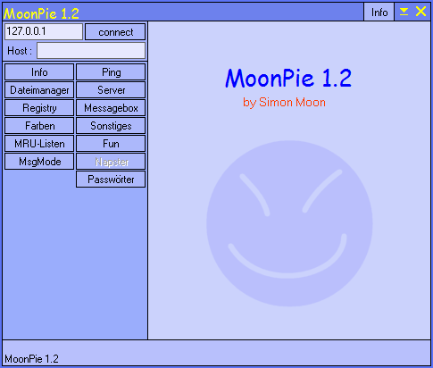

# MoonPie - Backdoor.Win32.MoonPie.12-f2b31c3a6d1ec4d6fe5a78202e1ddee8192be9e1f5c0c79fcaf885392745ed59.exe
## Informations
| Label | Value |
| :--- | ---: |
| Executable Name | Backdoor.Win32.MoonPie.12-f2b31c3a6d1ec4d6fe5a78202e1ddee8192be9e1f5c0c79fcaf885392745ed59.exe |
| Product Name | MoonPie |
| Version Number | 1.2.0.145 |
| Description | MoonPie-Client |
| Company Name |  |
| Copyright | 2000 by Simon Moon |
| Trademarks |  |
| Last Edition | 14/06/2012 09:46:00 |
| Size | 988160 |
| SHA1 🔎 | [4D52E53177DFC78D096A195EDE94E3C6C6F8C14B](https://www.virustotal.com/gui/search/4D52E53177DFC78D096A195EDE94E3C6C6F8C14B) |
| Language | German (Germany) |
## Static Analysis
<details>
<summary>Manalyze</summary>
<p>

```

* Manalyze 0.9 *

-------------------------------------------------------------------------------
C:/Users/IEUser/Desktop/net6.0/Malwares/Backdoor.Win32.MoonPie.12-f2b31c3a6d1ec4d6fe5a78202e1ddee8192be9e1f5c0c79fcaf885392745ed59.exe
-------------------------------------------------------------------------------

Summary:
--------
Architecture:       IMAGE_FILE_MACHINE_I386
Subsystem:          IMAGE_SUBSYSTEM_WINDOWS_GUI
Compilation Date:   1992-Jun-19 22:22:17
Detected languages: German - Germany
                    Italian - Italy
CompanyName:        
FileDescription:    MoonPie-Client
FileVersion:        1.2.0.145
InternalName:       MoonPie
LegalCopyright:     2000 by Simon Moon
LegalTrademarks:    
OriginalFilename:   moonpie.exe
ProductName:        MoonPie
ProductVersion:     1.0.0.0
Webseite:           http://simonmoon.tsx.org
E-Mail:             simon.moon@extended.de

DOS Header:
-----------
e_magic:    MZ
e_cblp:     0x0050
e_cp:       0x0002
e_crlc:     0x0000
e_cparhdr:  0x0004
e_minalloc: 0x000F
e_maxalloc: 0xFFFF
e_ss:       0x0000
e_sp:       0x00B8
e_csum:     0x0000
e_ip:       0x0000
e_cs:       0x0000
e_ovno:     0x001A
e_oemid:    0x0000
e_oeminfo:  0x0000
e_lfanew:   0x00000100

PE Header:
----------
Signature:            PE
Machine:              IMAGE_FILE_MACHINE_I386
NumberofSections:     8
TimeDateStamp:        1992-Jun-19 22:22:17
PointerToSymbolTable: 0x00000000
NumberOfSymbols:      0
SizeOfOptionalHeader: 0x00E0
Characteristics:      IMAGE_FILE_32BIT_MACHINE
                      IMAGE_FILE_BYTES_REVERSED_HI
                      IMAGE_FILE_BYTES_REVERSED_LO
                      IMAGE_FILE_EXECUTABLE_IMAGE
                      IMAGE_FILE_LINE_NUMS_STRIPPED
                      IMAGE_FILE_LOCAL_SYMS_STRIPPED
                      IMAGE_FILE_RELOCS_STRIPPED

Image Optional Header:
----------------------
Magic:                   PE32
LinkerVersion:           2.0
SizeOfCode:              0x0008F200
SizeOfInitializedData:   0x00061E00
SizeOfUninitializedData: 0x00000000
AddressOfEntryPoint:     0x00090158 (Section: CODE)
BaseOfCode:              0x00001000
BaseOfData:              0x00091000
ImageBase:               0x00400000
SectionAlignment:        0x00001000
FileAlignment:           0x00000200
OperatingSystemVersion:  1.0
ImageVersion:            0.0
SubsystemVersion:        4.0
Win32VersionValue:       0
SizeOfImage:             0x000FC000
SizeOfHeaders:           0x00000400
Checksum:                0x00000000
Subsystem:               IMAGE_SUBSYSTEM_WINDOWS_GUI
SizeofStackReserve:      0x00100000
SizeofStackCommit:       0x00004000
SizeofHeapReserve:       0x00100000
SizeofHeapCommit:        0x00001000
LoaderFlags:             0x00000000
NumberOfRvaAndSizes:     16

Sections:
---------
CODE:
    VirtualSize:          0x0008F1D8
    VirtualAddress:       0x00001000
    SizeOfRawData:        0x0008F200
    PointerToRawData:     0x00000400
    PointerToRelocations: 0x00000000
    PointerToLineNumbers: 0x00000000
    NumberOfLineNumbers:  0
    NumberOfRelocations:  0
    Characteristics:      IMAGE_SCN_CNT_CODE
                          IMAGE_SCN_MEM_EXECUTE
                          IMAGE_SCN_MEM_READ
    Entropy:              6.53078

DATA:
    VirtualSize:          0x0000288C
    VirtualAddress:       0x00091000
    SizeOfRawData:        0x00002A00
    PointerToRawData:     0x0008F600
    PointerToRelocations: 0x00000000
    PointerToLineNumbers: 0x00000000
    NumberOfLineNumbers:  0
    NumberOfRelocations:  0
    Characteristics:      IMAGE_SCN_CNT_INITIALIZED_DATA
                          IMAGE_SCN_MEM_READ
                          IMAGE_SCN_MEM_WRITE
    Entropy:              4.4823

BSS:
    VirtualSize:          0x00005AF1
    VirtualAddress:       0x00094000
    SizeOfRawData:        0x00000000
    PointerToRawData:     0x00092000
    PointerToRelocations: 0x00000000
    PointerToLineNumbers: 0x00000000
    NumberOfLineNumbers:  0
    NumberOfRelocations:  0
    Characteristics:      IMAGE_SCN_MEM_READ
                          IMAGE_SCN_MEM_WRITE

.idata:
    VirtualSize:          0x00002588
    VirtualAddress:       0x0009A000
    SizeOfRawData:        0x00002600
    PointerToRawData:     0x00092000
    PointerToRelocations: 0x00000000
    PointerToLineNumbers: 0x00000000
    NumberOfLineNumbers:  0
    NumberOfRelocations:  0
    Characteristics:      IMAGE_SCN_CNT_INITIALIZED_DATA
                          IMAGE_SCN_MEM_READ
                          IMAGE_SCN_MEM_WRITE
    Entropy:              5.01425

.tls:
    VirtualSize:          0x00000014
    VirtualAddress:       0x0009D000
    SizeOfRawData:        0x00000000
    PointerToRawData:     0x00094600
    PointerToRelocations: 0x00000000
    PointerToLineNumbers: 0x00000000
    NumberOfLineNumbers:  0
    NumberOfRelocations:  0
    Characteristics:      IMAGE_SCN_MEM_READ
                          IMAGE_SCN_MEM_WRITE

.rdata:
    VirtualSize:          0x00000018
    VirtualAddress:       0x0009E000
    SizeOfRawData:        0x00000200
    PointerToRawData:     0x00094600
    PointerToRelocations: 0x00000000
    PointerToLineNumbers: 0x00000000
    NumberOfLineNumbers:  0
    NumberOfRelocations:  0
    Characteristics:      IMAGE_SCN_CNT_INITIALIZED_DATA
                          IMAGE_SCN_MEM_READ
                          IMAGE_SCN_MEM_SHARED
    Entropy:              0.204488

.reloc:
    VirtualSize:          0x00008D74
    VirtualAddress:       0x0009F000
    SizeOfRawData:        0x00008E00
    PointerToRawData:     0x00094800
    PointerToRelocations: 0x00000000
    PointerToLineNumbers: 0x00000000
    NumberOfLineNumbers:  0
    NumberOfRelocations:  0
    Characteristics:      IMAGE_SCN_CNT_INITIALIZED_DATA
                          IMAGE_SCN_MEM_READ
                          IMAGE_SCN_MEM_SHARED
    Entropy:              0

.rsrc:
    VirtualSize:          0x00053E00
    VirtualAddress:       0x000A8000
    SizeOfRawData:        0x00053E00
    PointerToRawData:     0x0009D600
    PointerToRelocations: 0x00000000
    PointerToLineNumbers: 0x00000000
    NumberOfLineNumbers:  0
    NumberOfRelocations:  0
    Characteristics:      IMAGE_SCN_CNT_INITIALIZED_DATA
                          IMAGE_SCN_MEM_READ
                          IMAGE_SCN_MEM_SHARED
    Entropy:              4.94457


Imports:
--------
KERNEL32.DLL:      GetCurrentThreadId
                   DeleteCriticalSection
                   LeaveCriticalSection
                   EnterCriticalSection
                   InitializeCriticalSection
                   VirtualFree
                   VirtualAlloc
                   LocalFree
                   LocalAlloc
                   InterlockedDecrement
                   InterlockedIncrement
                   VirtualQuery
                   WideCharToMultiByte
                   MultiByteToWideChar
                   lstrlenA
                   lstrcpynA
                   lstrcpyA
                   LoadLibraryExA
                   GetThreadLocale
                   GetStartupInfoA
                   GetProcAddress
                   GetModuleHandleA
                   GetModuleFileNameA
                   GetLocaleInfoA
                   GetLastError
                   GetCommandLineA
                   FreeLibrary
                   FindFirstFileA
                   FindClose
                   ExitProcess
                   WriteFile
                   UnhandledExceptionFilter
                   SetFilePointer
                   SetEndOfFile
                   RtlUnwind
                   ReadFile
                   RaiseException
                   GetStdHandle
                   GetFileSize
                   GetFileType
                   CreateFileA
                   CloseHandle
KERNEL32.DLL (#2): GetCurrentThreadId
                   DeleteCriticalSection
                   LeaveCriticalSection
                   EnterCriticalSection
                   InitializeCriticalSection
                   VirtualFree
                   VirtualAlloc
                   LocalFree
                   LocalAlloc
                   InterlockedDecrement
                   InterlockedIncrement
                   VirtualQuery
                   WideCharToMultiByte
                   MultiByteToWideChar
                   lstrlenA
                   lstrcpynA
                   lstrcpyA
                   LoadLibraryExA
                   GetThreadLocale
                   GetStartupInfoA
                   GetProcAddress
                   GetModuleHandleA
                   GetModuleFileNameA
                   GetLocaleInfoA
                   GetLastError
                   GetCommandLineA
                   FreeLibrary
                   FindFirstFileA
                   FindClose
                   ExitProcess
                   WriteFile
                   UnhandledExceptionFilter
                   SetFilePointer
                   SetEndOfFile
                   RtlUnwind
                   ReadFile
                   RaiseException
                   GetStdHandle
                   GetFileSize
                   GetFileType
                   CreateFileA
                   CloseHandle
KERNEL32.DLL (#3): GetCurrentThreadId
                   DeleteCriticalSection
                   LeaveCriticalSection
                   EnterCriticalSection
                   InitializeCriticalSection
                   VirtualFree
                   VirtualAlloc
                   LocalFree
                   LocalAlloc
                   InterlockedDecrement
                   InterlockedIncrement
                   VirtualQuery
                   WideCharToMultiByte
                   MultiByteToWideChar
                   lstrlenA
                   lstrcpynA
                   lstrcpyA
                   LoadLibraryExA
                   GetThreadLocale
                   GetStartupInfoA
                   GetProcAddress
                   GetModuleHandleA
                   GetModuleFileNameA
                   GetLocaleInfoA
                   GetLastError
                   GetCommandLineA
                   FreeLibrary
                   FindFirstFileA
                   FindClose
                   ExitProcess
                   WriteFile
                   UnhandledExceptionFilter
                   SetFilePointer
                   SetEndOfFile
                   RtlUnwind
                   ReadFile
                   RaiseException
                   GetStdHandle
                   GetFileSize
                   GetFileType
                   CreateFileA
                   CloseHandle
advapi32.dll:      RegQueryValueExA
                   RegOpenKeyExA
                   RegCloseKey
advapi32.dll (#2): RegQueryValueExA
                   RegOpenKeyExA
                   RegCloseKey
comctl32.dll:      ImageList_SetIconSize
                   ImageList_GetIconSize
                   ImageList_Write
                   ImageList_Read
                   ImageList_GetDragImage
                   ImageList_DragShowNolock
                   ImageList_SetDragCursorImage
                   ImageList_DragMove
                   ImageList_DragLeave
                   ImageList_DragEnter
                   ImageList_EndDrag
                   ImageList_BeginDrag
                   ImageList_GetIcon
                   ImageList_Remove
                   ImageList_DrawEx
                   ImageList_Replace
                   ImageList_Draw
                   ImageList_GetBkColor
                   ImageList_SetBkColor
                   ImageList_ReplaceIcon
                   ImageList_Add
                   ImageList_GetImageCount
                   ImageList_Destroy
                   ImageList_Create
                   InitCommonControls
comdlg32.dll:      ChooseFontA
                   ChooseColorA
                   GetSaveFileNameA
                   GetOpenFileNameA
gdi32.dll:         UnrealizeObject
                   StretchBlt
                   SetWindowOrgEx
                   SetWinMetaFileBits
                   SetViewportOrgEx
                   SetTextColor
                   SetStretchBltMode
                   SetROP2
                   SetPixel
                   SetMapMode
                   SetEnhMetaFileBits
                   SetDIBColorTable
                   SetBrushOrgEx
                   SetBkMode
                   SetBkColor
                   SelectPalette
                   SelectObject
                   SaveDC
                   RoundRect
                   RestoreDC
                   Rectangle
                   RectVisible
                   RealizePalette
                   Polyline
                   Polygon
                   PlayEnhMetaFile
                   PatBlt
                   MoveToEx
                   MaskBlt
                   LineTo
                   LPtoDP
                   IntersectClipRect
                   GetWindowOrgEx
                   GetWinMetaFileBits
                   GetTextMetricsA
                   GetTextExtentPoint32A
                   GetSystemPaletteEntries
                   GetStockObject
                   GetPixel
                   GetPaletteEntries
                   GetObjectA
                   GetEnhMetaFilePaletteEntries
                   GetEnhMetaFileHeader
                   GetEnhMetaFileBits
                   GetDeviceCaps
                   GetDIBits
                   GetDIBColorTable
                   GetDCOrgEx
                   GetCurrentPositionEx
                   GetClipBox
                   GetBrushOrgEx
                   GetBitmapBits
                   GdiFlush
                   ExtTextOutA
                   ExcludeClipRect
                   EndPage
                   EndDoc
                   Ellipse
                   DeleteObject
                   DeleteEnhMetaFile
                   DeleteDC
                   CreateSolidBrush
                   CreatePenIndirect
                   CreatePalette
                   CreateICA
                   CreateHalftonePalette
                   CreateFontIndirectA
                   CreateDIBitmap
                   CreateDIBSection
                   CreateDCA
                   CreateCompatibleDC
                   CreateCompatibleBitmap
                   CreateBrushIndirect
                   CreateBitmap
                   CopyEnhMetaFileA
                   BitBlt
ole32.dll:         CoUninitialize
                   CoInitialize
                   IsEqualGUID
oleaut32.dll:      GetErrorInfo
                   SysFreeString
oleaut32.dll (#2): GetErrorInfo
                   SysFreeString
shell32.dll:       Shell_NotifyIconA
                   ShellExecuteA
user32.dll:        WindowFromPoint
                   WinHelpA
                   WaitMessage
                   UpdateWindow
                   UnregisterClassA
                   UnhookWindowsHookEx
                   TranslateMessage
                   TranslateMDISysAccel
                   TrackPopupMenu
                   SystemParametersInfoA
                   ShowWindow
                   ShowScrollBar
                   ShowOwnedPopups
                   ShowCursor
                   SetWindowsHookExA
                   SetWindowTextA
                   SetWindowPos
                   SetWindowPlacement
                   SetWindowLongA
                   SetTimer
                   SetScrollRange
                   SetScrollPos
                   SetScrollInfo
                   SetRect
                   SetPropA
                   SetParent
                   SetMenuItemInfoA
                   SetMenu
                   SetForegroundWindow
                   SetFocus
                   SetCursor
                   SetClassLongA
                   SetCapture
                   SetActiveWindow
                   SendMessageA
                   SendDlgItemMessageA
                   ScrollWindow
                   ScreenToClient
                   RemovePropA
                   RemoveMenu
                   ReleaseDC
                   ReleaseCapture
                   RegisterWindowMessageA
                   RegisterClipboardFormatA
                   RegisterClassA
                   PtInRect
                   PostQuitMessage
                   PostMessageA
                   PeekMessageA
                   OffsetRect
                   OemToCharA
                   MessageBoxA
                   MapWindowPoints
                   MapVirtualKeyA
                   LoadStringA
                   LoadKeyboardLayoutA
                   LoadIconA
                   LoadCursorA
                   LoadBitmapA
                   KillTimer
                   IsZoomed
                   IsWindowVisible
                   IsWindowEnabled
                   IsWindow
                   IsRectEmpty
                   IsIconic
                   IsDialogMessageA
                   IsChild
                   InvalidateRect
                   IntersectRect
                   InsertMenuItemA
                   InsertMenuA
                   InflateRect
                   GetWindowThreadProcessId
                   GetWindowTextA
                   GetWindowRect
                   GetWindowPlacement
                   GetWindowLongA
                   GetWindowDC
                   GetTopWindow
                   GetSystemMetrics
                   GetSystemMenu
                   GetSysColor
                   GetSubMenu
                   GetScrollRange
                   GetScrollPos
                   GetScrollInfo
                   GetPropA
                   GetParent
                   GetWindow
                   GetMessagePos
                   GetMenuStringA
                   GetMenuState
                   GetMenuItemInfoA
                   GetMenuItemID
                   GetMenuItemCount
                   GetMenu
                   GetLastActivePopup
                   GetKeyboardState
                   GetKeyboardLayoutList
                   GetKeyboardLayout
                   GetKeyState
                   GetKeyNameTextA
                   GetIconInfo
                   GetForegroundWindow
                   GetFocus
                   GetDlgItem
                   GetDesktopWindow
                   GetDCEx
                   GetDC
                   GetCursorPos
                   GetCursor
                   GetClipboardData
                   GetClientRect
                   GetClassNameA
                   GetClassInfoA
                   GetCapture
                   GetActiveWindow
                   FrameRect
                   FindWindowA
                   FillRect
                   EqualRect
                   EnumWindows
                   EnumThreadWindows
                   EndPaint
                   EnableWindow
                   EnableScrollBar
                   EnableMenuItem
                   DrawTextA
                   DrawMenuBar
                   DrawIconEx
                   DrawIcon
                   DrawFrameControl
                   DrawFocusRect
                   DrawEdge
                   DispatchMessageA
                   DestroyWindow
                   DestroyMenu
                   DestroyIcon
                   DestroyCursor
                   DeleteMenu
                   DefWindowProcA
                   DefMDIChildProcA
                   DefFrameProcA
                   CreateWindowExA
                   CreatePopupMenu
                   CreateMenu
                   CreateIcon
                   ClientToScreen
                   ChildWindowFromPoint
                   CheckMenuItem
                   CallWindowProcA
                   CallNextHookEx
                   BeginPaint
                   CharLowerBuffA
                   CharLowerA
                   AdjustWindowRectEx
                   ActivateKeyboardLayout
user32.dll (#2):   WindowFromPoint
                   WinHelpA
                   WaitMessage
                   UpdateWindow
                   UnregisterClassA
                   UnhookWindowsHookEx
                   TranslateMessage
                   TranslateMDISysAccel
                   TrackPopupMenu
                   SystemParametersInfoA
                   ShowWindow
                   ShowScrollBar
                   ShowOwnedPopups
                   ShowCursor
                   SetWindowsHookExA
                   SetWindowTextA
                   SetWindowPos
                   SetWindowPlacement
                   SetWindowLongA
                   SetTimer
                   SetScrollRange
                   SetScrollPos
                   SetScrollInfo
                   SetRect
                   SetPropA
                   SetParent
                   SetMenuItemInfoA
                   SetMenu
                   SetForegroundWindow
                   SetFocus
                   SetCursor
                   SetClassLongA
                   SetCapture
                   SetActiveWindow
                   SendMessageA
                   SendDlgItemMessageA
                   ScrollWindow
                   ScreenToClient
                   RemovePropA
                   RemoveMenu
                   ReleaseDC
                   ReleaseCapture
                   RegisterWindowMessageA
                   RegisterClipboardFormatA
                   RegisterClassA
                   PtInRect
                   PostQuitMessage
                   PostMessageA
                   PeekMessageA
                   OffsetRect
                   OemToCharA
                   MessageBoxA
                   MapWindowPoints
                   MapVirtualKeyA
                   LoadStringA
                   LoadKeyboardLayoutA
                   LoadIconA
                   LoadCursorA
                   LoadBitmapA
                   KillTimer
                   IsZoomed
                   IsWindowVisible
                   IsWindowEnabled
                   IsWindow
                   IsRectEmpty
                   IsIconic
                   IsDialogMessageA
                   IsChild
                   InvalidateRect
                   IntersectRect
                   InsertMenuItemA
                   InsertMenuA
                   InflateRect
                   GetWindowThreadProcessId
                   GetWindowTextA
                   GetWindowRect
                   GetWindowPlacement
                   GetWindowLongA
                   GetWindowDC
                   GetTopWindow
                   GetSystemMetrics
                   GetSystemMenu
                   GetSysColor
                   GetSubMenu
                   GetScrollRange
                   GetScrollPos
                   GetScrollInfo
                   GetPropA
                   GetParent
                   GetWindow
                   GetMessagePos
                   GetMenuStringA
                   GetMenuState
                   GetMenuItemInfoA
                   GetMenuItemID
                   GetMenuItemCount
                   GetMenu
                   GetLastActivePopup
                   GetKeyboardState
                   GetKeyboardLayoutList
                   GetKeyboardLayout
                   GetKeyState
                   GetKeyNameTextA
                   GetIconInfo
                   GetForegroundWindow
                   GetFocus
                   GetDlgItem
                   GetDesktopWindow
                   GetDCEx
                   GetDC
                   GetCursorPos
                   GetCursor
                   GetClipboardData
                   GetClientRect
                   GetClassNameA
                   GetClassInfoA
                   GetCapture
                   GetActiveWindow
                   FrameRect
                   FindWindowA
                   FillRect
                   EqualRect
                   EnumWindows
                   EnumThreadWindows
                   EndPaint
                   EnableWindow
                   EnableScrollBar
                   EnableMenuItem
                   DrawTextA
                   DrawMenuBar
                   DrawIconEx
                   DrawIcon
                   DrawFrameControl
                   DrawFocusRect
                   DrawEdge
                   DispatchMessageA
                   DestroyWindow
                   DestroyMenu
                   DestroyIcon
                   DestroyCursor
                   DeleteMenu
                   DefWindowProcA
                   DefMDIChildProcA
                   DefFrameProcA
                   CreateWindowExA
                   CreatePopupMenu
                   CreateMenu
                   CreateIcon
                   ClientToScreen
                   ChildWindowFromPoint
                   CheckMenuItem
                   CallWindowProcA
                   CallNextHookEx
                   BeginPaint
                   CharLowerBuffA
                   CharLowerA
                   AdjustWindowRectEx
                   ActivateKeyboardLayout
winspool.drv:      OpenPrinterA
                   EnumPrintersA
                   DocumentPropertiesA
                   ClosePrinter
wsock32.dll:       WSACleanup
                   WSAStartup
                   WSAGetLastError
                   WSACancelAsyncRequest
                   WSAAsyncGetServByName
                   WSAAsyncGetHostByName
                   WSAAsyncSelect
                   getservbyname
                   gethostbyname
                   socket
                   setsockopt
                   send
                   recv
                   ntohs
                   listen
                   ioctlsocket
                   inet_ntoa
                   inet_addr
                   htons
                   getsockname
                   getpeername
                   connect
                   closesocket
                   bind
                   accept

Resources:
----------
1:
    Type:          RT_CURSOR
    Language:      UNKNOWN
    Codepage:      UNKNOWN
    Size:          308
    TimeDateStamp: 2001-Jan-09 21:26:12
    Entropy:       2.6633

2:
    Type:          RT_CURSOR
    Language:      UNKNOWN
    Codepage:      UNKNOWN
    Size:          308
    TimeDateStamp: 2001-Jan-09 21:26:12
    Entropy:       2.80231

3:
    Type:          RT_CURSOR
    Language:      UNKNOWN
    Codepage:      UNKNOWN
    Size:          308
    TimeDateStamp: 2001-Jan-09 21:26:12
    Entropy:       3.00046

4:
    Type:          RT_CURSOR
    Language:      UNKNOWN
    Codepage:      UNKNOWN
    Size:          308
    TimeDateStamp: 2001-Jan-09 21:26:12
    Entropy:       2.56318

5:
    Type:          RT_CURSOR
    Language:      UNKNOWN
    Codepage:      UNKNOWN
    Size:          308
    TimeDateStamp: 2001-Jan-09 21:26:12
    Entropy:       2.6949

6:
    Type:          RT_CURSOR
    Language:      UNKNOWN
    Codepage:      UNKNOWN
    Size:          308
    TimeDateStamp: 2001-Jan-09 21:26:12
    Entropy:       2.62527

7:
    Type:          RT_CURSOR
    Language:      UNKNOWN
    Codepage:      UNKNOWN
    Size:          308
    TimeDateStamp: 2001-Jan-09 21:26:12
    Entropy:       2.91604

BBABORT:
    Type:          RT_BITMAP
    Language:      UNKNOWN
    Codepage:      UNKNOWN
    Size:          464
    TimeDateStamp: 2001-Jan-09 21:26:12
    Entropy:       2.92079

BBALL:
    Type:          RT_BITMAP
    Language:      UNKNOWN
    Codepage:      UNKNOWN
    Size:          484
    TimeDateStamp: 2001-Jan-09 21:26:12
    Entropy:       3.16995

BBCANCEL:
    Type:          RT_BITMAP
    Language:      UNKNOWN
    Codepage:      UNKNOWN
    Size:          464
    TimeDateStamp: 2001-Jan-09 21:26:12
    Entropy:       2.92079

BBCLOSE:
    Type:          RT_BITMAP
    Language:      UNKNOWN
    Codepage:      UNKNOWN
    Size:          464
    TimeDateStamp: 2001-Jan-09 21:26:12
    Entropy:       3.68492

BBHELP:
    Type:          RT_BITMAP
    Language:      UNKNOWN
    Codepage:      UNKNOWN
    Size:          464
    TimeDateStamp: 2001-Jan-09 21:26:12
    Entropy:       2.88085

BBIGNORE:
    Type:          RT_BITMAP
    Language:      UNKNOWN
    Codepage:      UNKNOWN
    Size:          464
    TimeDateStamp: 2001-Jan-09 21:26:12
    Entropy:       3.29718

BBNO:
    Type:          RT_BITMAP
    Language:      UNKNOWN
    Codepage:      UNKNOWN
    Size:          464
    TimeDateStamp: 2001-Jan-09 21:26:12
    Entropy:       3.58804

BBOK:
    Type:          RT_BITMAP
    Language:      UNKNOWN
    Codepage:      UNKNOWN
    Size:          464
    TimeDateStamp: 2001-Jan-09 21:26:12
    Entropy:       2.67459

BBRETRY:
    Type:          RT_BITMAP
    Language:      UNKNOWN
    Codepage:      UNKNOWN
    Size:          464
    TimeDateStamp: 2001-Jan-09 21:26:12
    Entropy:       3.53344

BBYES:
    Type:          RT_BITMAP
    Language:      UNKNOWN
    Codepage:      UNKNOWN
    Size:          464
    TimeDateStamp: 2001-Jan-09 21:26:12
    Entropy:       2.67459

BKCOLOR:
    Type:          RT_BITMAP
    Language:      Italian - Italy
    Codepage:      UNKNOWN
    Size:          360
    TimeDateStamp: 2001-Jan-09 21:26:12
    Entropy:       3.07275

DROPDOWN:
    Type:          RT_BITMAP
    Language:      Italian - Italy
    Codepage:      UNKNOWN
    Size:          124
    TimeDateStamp: 2001-Jan-09 21:26:12
    Entropy:       1.93994

FRCOLOR:
    Type:          RT_BITMAP
    Language:      Italian - Italy
    Codepage:      UNKNOWN
    Size:          360
    TimeDateStamp: 2001-Jan-09 21:26:12
    Entropy:       2.65594

LNCOLOR:
    Type:          RT_BITMAP
    Language:      Italian - Italy
    Codepage:      UNKNOWN
    Size:          360
    TimeDateStamp: 2001-Jan-09 21:26:12
    Entropy:       2.82707

PREVIEWGLYPH:
    Type:          RT_BITMAP
    Language:      UNKNOWN
    Codepage:      UNKNOWN
    Size:          232
    TimeDateStamp: 2001-Jan-09 21:26:12
    Entropy:       2.85172

1 (#2):
    Type:          RT_ICON
    Language:      German - Germany
    Codepage:      UNKNOWN
    Size:          296
    TimeDateStamp: 2001-Jan-09 21:26:12
    Entropy:       2.66378

2 (#2):
    Type:          RT_ICON
    Language:      German - Germany
    Codepage:      UNKNOWN
    Size:          1384
    TimeDateStamp: 2001-Jan-09 21:26:12
    Entropy:       3.93007

3 (#2):
    Type:          RT_ICON
    Language:      German - Germany
    Codepage:      UNKNOWN
    Size:          744
    TimeDateStamp: 2001-Jan-09 21:26:12
    Entropy:       2.39311

4 (#2):
    Type:          RT_ICON
    Language:      German - Germany
    Codepage:      UNKNOWN
    Size:          2216
    TimeDateStamp: 2001-Jan-09 21:26:12
    Entropy:       3.36253

DLGTEMPLATE:
    Type:          RT_DIALOG
    Language:      UNKNOWN
    Codepage:      UNKNOWN
    Size:          82
    TimeDateStamp: 2001-Jan-09 21:26:12
    Entropy:       2.5627

4082:
    Type:          RT_STRING
    Language:      UNKNOWN
    Codepage:      UNKNOWN
    Size:          260
    TimeDateStamp: 2001-Jan-09 21:26:12
    Entropy:       3.03336

4083:
    Type:          RT_STRING
    Language:      UNKNOWN
    Codepage:      UNKNOWN
    Size:          1320
    TimeDateStamp: 2001-Jan-09 21:26:12
    Entropy:       3.32218

4084:
    Type:          RT_STRING
    Language:      UNKNOWN
    Codepage:      UNKNOWN
    Size:          896
    TimeDateStamp: 2001-Jan-09 21:26:12
    Entropy:       3.36274

4085:
    Type:          RT_STRING
    Language:      UNKNOWN
    Codepage:      UNKNOWN
    Size:          244
    TimeDateStamp: 2001-Jan-09 21:26:12
    Entropy:       3.12535

4086:
    Type:          RT_STRING
    Language:      UNKNOWN
    Codepage:      UNKNOWN
    Size:          304
    TimeDateStamp: 2001-Jan-09 21:26:12
    Entropy:       3.16052

4087:
    Type:          RT_STRING
    Language:      UNKNOWN
    Codepage:      UNKNOWN
    Size:          440
    TimeDateStamp: 2001-Jan-09 21:26:12
    Entropy:       3.23161

4088:
    Type:          RT_STRING
    Language:      UNKNOWN
    Codepage:      UNKNOWN
    Size:          1480
    TimeDateStamp: 2001-Jan-09 21:26:12
    Entropy:       3.26833

4089:
    Type:          RT_STRING
    Language:      UNKNOWN
    Codepage:      UNKNOWN
    Size:          1372
    TimeDateStamp: 2001-Jan-09 21:26:12
    Entropy:       3.2599

4090:
    Type:          RT_STRING
    Language:      UNKNOWN
    Codepage:      UNKNOWN
    Size:          1160
    TimeDateStamp: 2001-Jan-09 21:26:12
    Entropy:       3.24743

4091:
    Type:          RT_STRING
    Language:      UNKNOWN
    Codepage:      UNKNOWN
    Size:          1040
    TimeDateStamp: 2001-Jan-09 21:26:12
    Entropy:       3.26026

4092:
    Type:          RT_STRING
    Language:      UNKNOWN
    Codepage:      UNKNOWN
    Size:          220
    TimeDateStamp: 2001-Jan-09 21:26:12
    Entropy:       2.9258

4093:
    Type:          RT_STRING
    Language:      UNKNOWN
    Codepage:      UNKNOWN
    Size:          184
    TimeDateStamp: 2001-Jan-09 21:26:12
    Entropy:       2.77586

4094:
    Type:          RT_STRING
    Language:      UNKNOWN
    Codepage:      UNKNOWN
    Size:          892
    TimeDateStamp: 2001-Jan-09 21:26:12
    Entropy:       3.37233

4095:
    Type:          RT_STRING
    Language:      UNKNOWN
    Codepage:      UNKNOWN
    Size:          956
    TimeDateStamp: 2001-Jan-09 21:26:12
    Entropy:       3.38833

4096:
    Type:          RT_STRING
    Language:      UNKNOWN
    Codepage:      UNKNOWN
    Size:          884
    TimeDateStamp: 2001-Jan-09 21:26:12
    Entropy:       3.2784

DVCLAL:
    Type:          RT_RCDATA
    Language:      UNKNOWN
    Codepage:      UNKNOWN
    Size:          16
    TimeDateStamp: 2001-Jan-09 21:26:12
    Entropy:       4

PACKAGEINFO:
    Type:          RT_RCDATA
    Language:      UNKNOWN
    Codepage:      UNKNOWN
    Size:          768
    TimeDateStamp: 2001-Jan-09 21:26:12
    Entropy:       5.29212

TFORM1:
    Type:          RT_RCDATA
    Language:      UNKNOWN
    Codepage:      UNKNOWN
    Size:          301896
    TimeDateStamp: 2001-Jan-09 21:26:12
    Entropy:       4.63778

TINFOFORM:
    Type:          RT_RCDATA
    Language:      UNKNOWN
    Codepage:      UNKNOWN
    Size:          2873
    TimeDateStamp: 2001-Jan-09 21:26:12
    Entropy:       5.54251

TNMSHOW:
    Type:          RT_RCDATA
    Language:      UNKNOWN
    Codepage:      UNKNOWN
    Size:          7742
    TimeDateStamp: 2001-Jan-09 21:26:12
    Entropy:       6.38038

TSCRSHOT:
    Type:          RT_RCDATA
    Language:      UNKNOWN
    Codepage:      UNKNOWN
    Size:          747
    TimeDateStamp: 2001-Jan-09 21:26:12
    Entropy:       5.51873

32761:
    Type:              RT_GROUP_CURSOR
    Language:          UNKNOWN
    Codepage:          UNKNOWN
    Size:              20
    TimeDateStamp:     2001-Jan-09 21:26:12
    Entropy:           1.83876
    Detected Filetype: Cursor file

32762:
    Type:              RT_GROUP_CURSOR
    Language:          UNKNOWN
    Codepage:          UNKNOWN
    Size:              20
    TimeDateStamp:     2001-Jan-09 21:26:12
    Entropy:           1.91924
    Detected Filetype: Cursor file

32763:
    Type:              RT_GROUP_CURSOR
    Language:          UNKNOWN
    Codepage:          UNKNOWN
    Size:              20
    TimeDateStamp:     2001-Jan-09 21:26:12
    Entropy:           2.01924
    Detected Filetype: Cursor file

32764:
    Type:              RT_GROUP_CURSOR
    Language:          UNKNOWN
    Codepage:          UNKNOWN
    Size:              20
    TimeDateStamp:     2001-Jan-09 21:26:12
    Entropy:           2.01924
    Detected Filetype: Cursor file

32765:
    Type:              RT_GROUP_CURSOR
    Language:          UNKNOWN
    Codepage:          UNKNOWN
    Size:              20
    TimeDateStamp:     2001-Jan-09 21:26:12
    Entropy:           2.01924
    Detected Filetype: Cursor file

32766:
    Type:              RT_GROUP_CURSOR
    Language:          UNKNOWN
    Codepage:          UNKNOWN
    Size:              20
    TimeDateStamp:     2001-Jan-09 21:26:12
    Entropy:           2.01924
    Detected Filetype: Cursor file

32767:
    Type:              RT_GROUP_CURSOR
    Language:          UNKNOWN
    Codepage:          UNKNOWN
    Size:              20
    TimeDateStamp:     2001-Jan-09 21:26:12
    Entropy:           2.01924
    Detected Filetype: Cursor file

MAINICON:
    Type:              RT_GROUP_ICON
    Language:          German - Germany
    Codepage:          UNKNOWN
    Size:              62
    TimeDateStamp:     2001-Jan-09 21:26:12
    Entropy:           2.64576
    Detected Filetype: Icon file

1 (#3):
    Type:          RT_VERSION
    Language:      German - Germany
    Codepage:      UNKNOWN
    Size:          856
    TimeDateStamp: 2001-Jan-09 21:26:12
    Entropy:       3.33002


Version Info:
-------------
Resource LangID: German - Germany
VS_VERSION_INFO:
    Signature:           0xFEEF04BD
    StructVersion:       0x00010000
    FileVersion:         1.2.0.145
    ProductVersion:      1.2.0.145
    FileFlags:           (EMPTY)
    FileOs:              VOS_DOS_WINDOWS32
                         VOS_NT_WINDOWS32
                         VOS__WINDOWS32
    FileType:            VFT_APP
    Language:            German - Germany
    CompanyName:         
    FileDescription:     MoonPie-Client
    FileVersion (#2):    1.2.0.145
    InternalName:        MoonPie
    LegalCopyright:      2000 by Simon Moon
    LegalTrademarks:     
    OriginalFilename:    moonpie.exe
    ProductName:         MoonPie
    ProductVersion (#2): 1.0.0.0
    Webseite:            http://simonmoon.tsx.org
    E-Mail:              simon.moon@extended.de


TLS Callbacks:
--------------
StartAddressOfRawData: 0x0049D000
EndAddressOfRawData:   0x0049D014
AddressOfIndex:        0x004944D4
AddressOfCallbacks:    0x0049E010
SizeOfZeroFill:        0x00000000
Characteristics:       IMAGE_SCN_TYPE_REG
Callbacks:             (EMPTY)

Matching compiler(s):
    Borland Delphi 5 -> Portions Copyright (c) 1983,99 Borland (h)

Interesting strings found in the binary:
    Contains domain names:
        extended.de
        http://simonmoon.tsx.org
        http://www.netmastersllc.com
        netmastersllc.com
        simonmoon.tsx.org
        www.netmastersllc.com

[ MALICIOUS ] The PE contains functions mostly used by malware.
    [!] The program may be hiding some of its imports:
        LoadLibraryExA
        GetProcAddress
        LoadLibraryA
    Functions which can be used for anti-debugging purposes:
        FindWindowA
    Code injection capabilities (PowerLoader):
        GetWindowLongA
        FindWindowA
    Can access the registry:
        RegQueryValueExA
        RegOpenKeyExA
        RegCloseKey
        RegSetValueExA
        RegFlushKey
        RegCreateKeyExA
    Possibly launches other programs:
        ShellExecuteA
    Uses functions commonly found in keyloggers:
        MapVirtualKeyA
        GetForegroundWindow
        CallNextHookEx
    Can take screenshots:
        CreateCompatibleDC
        BitBlt
        GetDCEx
        GetDC
        FindWindowA
    Reads the contents of the clipboard:
        GetClipboardData

[ SUSPICIOUS ] The PE header may have been manually modified.
    The resource timestamps differ from the PE header:
        2001-Jan-09 21:26:12

The following exploit mitigation techniques have been detected
    Stack Canary: disabled
    SafeSEH: disabled
    ASLR: disabled
    DEP: disabled
    CFG: disabled


```

</p>
</details>

## Screenshots
### MoonPie
 
