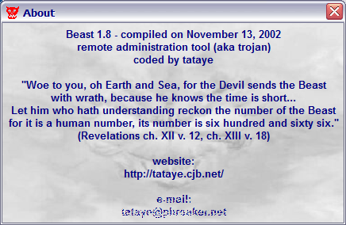
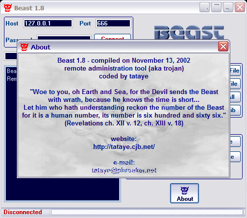

#  - 4254e96fd39dc9d6e48ea6097770d2b413694d1459c8fcf425d58811560a3f11.exe
## Informations
| Label | Value |
| :--- | ---: |
| Executable Name | 4254e96fd39dc9d6e48ea6097770d2b413694d1459c8fcf425d58811560a3f11.exe |
| Product Name |  |
| Version Number |  |
| Description |  |
| Company Name |  |
| Copyright |  |
| Trademarks |  |
| Last Edition | 24/09/2014 11:07:50 |
| Size | 632832 |
| SHA1 🔎 | [4E01D14F14342990E33B2F4F2BFD397E5EC40B9F](https://www.virustotal.com/gui/search/4E01D14F14342990E33B2F4F2BFD397E5EC40B9F) |
| Language |  |
## Static Analysis
<details>
<summary>Manalyze</summary>
<p>

```

* Manalyze 0.9 *

-------------------------------------------------------------------------------
C:/Users/IEUser/Desktop/net6.0/Malwares/4254e96fd39dc9d6e48ea6097770d2b413694d1459c8fcf425d58811560a3f11.exe
-------------------------------------------------------------------------------

Summary:
--------
Architecture:       IMAGE_FILE_MACHINE_I386
Subsystem:          IMAGE_SUBSYSTEM_WINDOWS_GUI
Compilation Date:   1992-Jun-19 22:22:17
Detected languages: English - United States
                    Romanian - Romania
                    Russian - Russia

DOS Header:
-----------
e_magic:    MZ
e_cblp:     0x0050
e_cp:       0x0002
e_crlc:     0x0000
e_cparhdr:  0x0004
e_minalloc: 0x000F
e_maxalloc: 0xFFFF
e_ss:       0x0000
e_sp:       0x00B8
e_csum:     0x0000
e_ip:       0x0000
e_cs:       0x0000
e_ovno:     0x001A
e_oemid:    0x0000
e_oeminfo:  0x0000
e_lfanew:   0x00000100

PE Header:
----------
Signature:            PE
Machine:              IMAGE_FILE_MACHINE_I386
NumberofSections:     10
TimeDateStamp:        1992-Jun-19 22:22:17
PointerToSymbolTable: 0x00000000
NumberOfSymbols:      0
SizeOfOptionalHeader: 0x00E0
Characteristics:      IMAGE_FILE_32BIT_MACHINE
                      IMAGE_FILE_BYTES_REVERSED_HI
                      IMAGE_FILE_BYTES_REVERSED_LO
                      IMAGE_FILE_EXECUTABLE_IMAGE
                      IMAGE_FILE_LINE_NUMS_STRIPPED
                      IMAGE_FILE_LOCAL_SYMS_STRIPPED

Image Optional Header:
----------------------
Magic:                   PE32
LinkerVersion:           2.0
SizeOfCode:              0x000F3A00
SizeOfInitializedData:   0x00085600
SizeOfUninitializedData: 0x00000000
AddressOfEntryPoint:     0x00180001 (Section: .data)
BaseOfCode:              0x00001000
BaseOfData:              0x000F5000
ImageBase:               0x00400000
SectionAlignment:        0x00001000
FileAlignment:           0x00000200
OperatingSystemVersion:  4.0
ImageVersion:            0.0
SubsystemVersion:        4.0
Win32VersionValue:       0
SizeOfImage:             0x00183000
SizeOfHeaders:           0x00000400
Checksum:                0x00000000
Subsystem:               IMAGE_SUBSYSTEM_WINDOWS_GUI
SizeofStackReserve:      0x00100000
SizeofStackCommit:       0x00004000
SizeofHeapReserve:       0x00100000
SizeofHeapCommit:        0x00001000
LoaderFlags:             0x00000000
NumberOfRvaAndSizes:     16

Sections:
---------
CODE:
    VirtualSize:          0x000F4000
    VirtualAddress:       0x00001000
    SizeOfRawData:        0x00058800
    PointerToRawData:     0x00000400
    PointerToRelocations: 0x00000000
    PointerToLineNumbers: 0x00000000
    NumberOfLineNumbers:  0
    NumberOfRelocations:  0
    Characteristics:      IMAGE_SCN_CNT_INITIALIZED_DATA
                          IMAGE_SCN_MEM_READ
                          IMAGE_SCN_MEM_WRITE
    Entropy:              7.99949

DATA:
    VirtualSize:          0x00003000
    VirtualAddress:       0x000F5000
    SizeOfRawData:        0x00001000
    PointerToRawData:     0x00058C00
    PointerToRelocations: 0x00000000
    PointerToLineNumbers: 0x00000000
    NumberOfLineNumbers:  0
    NumberOfRelocations:  0
    Characteristics:      IMAGE_SCN_CNT_INITIALIZED_DATA
                          IMAGE_SCN_MEM_READ
                          IMAGE_SCN_MEM_WRITE
    Entropy:              7.8725

BSS:
    VirtualSize:          0x00002000
    VirtualAddress:       0x000F8000
    SizeOfRawData:        0x00000000
    PointerToRawData:     0x00059C00
    PointerToRelocations: 0x00000000
    PointerToLineNumbers: 0x00000000
    NumberOfLineNumbers:  0
    NumberOfRelocations:  0
    Characteristics:      IMAGE_SCN_CNT_INITIALIZED_DATA
                          IMAGE_SCN_MEM_READ
                          IMAGE_SCN_MEM_WRITE

.idata:
    VirtualSize:          0x00003000
    VirtualAddress:       0x000FA000
    SizeOfRawData:        0x00001000
    PointerToRawData:     0x00059C00
    PointerToRelocations: 0x00000000
    PointerToLineNumbers: 0x00000000
    NumberOfLineNumbers:  0
    NumberOfRelocations:  0
    Characteristics:      IMAGE_SCN_CNT_INITIALIZED_DATA
                          IMAGE_SCN_MEM_READ
                          IMAGE_SCN_MEM_WRITE
    Entropy:              7.94288

.tls:
    VirtualSize:          0x00001000
    VirtualAddress:       0x000FD000
    SizeOfRawData:        0x00000000
    PointerToRawData:     0x0005AC00
    PointerToRelocations: 0x00000000
    PointerToLineNumbers: 0x00000000
    NumberOfLineNumbers:  0
    NumberOfRelocations:  0
    Characteristics:      IMAGE_SCN_CNT_INITIALIZED_DATA
                          IMAGE_SCN_MEM_READ
                          IMAGE_SCN_MEM_WRITE

.rdata:
    VirtualSize:          0x00001000
    VirtualAddress:       0x000FE000
    SizeOfRawData:        0x00000200
    PointerToRawData:     0x0005AC00
    PointerToRelocations: 0x00000000
    PointerToLineNumbers: 0x00000000
    NumberOfLineNumbers:  0
    NumberOfRelocations:  0
    Characteristics:      IMAGE_SCN_CNT_INITIALIZED_DATA
                          IMAGE_SCN_MEM_READ
                          IMAGE_SCN_MEM_WRITE
    Entropy:              0.204488

.reloc:
    VirtualSize:          0x0000F000
    VirtualAddress:       0x000FF000
    SizeOfRawData:        0x00000000
    PointerToRawData:     0x0005AE00
    PointerToRelocations: 0x00000000
    PointerToLineNumbers: 0x00000000
    NumberOfLineNumbers:  0
    NumberOfRelocations:  0
    Characteristics:      IMAGE_SCN_CNT_INITIALIZED_DATA
                          IMAGE_SCN_MEM_READ
                          IMAGE_SCN_MEM_WRITE

.rsrc:
    VirtualSize:          0x00072000
    VirtualAddress:       0x0010E000
    SizeOfRawData:        0x0003E200
    PointerToRawData:     0x0005AE00
    PointerToRelocations: 0x00000000
    PointerToLineNumbers: 0x00000000
    NumberOfLineNumbers:  0
    NumberOfRelocations:  0
    Characteristics:      IMAGE_SCN_CNT_INITIALIZED_DATA
                          IMAGE_SCN_MEM_READ
                          IMAGE_SCN_MEM_WRITE
    Entropy:              7.98092

.data:
    VirtualSize:          0x00002000
    VirtualAddress:       0x00180000
    SizeOfRawData:        0x00001800
    PointerToRawData:     0x00099000
    PointerToRelocations: 0x00000000
    PointerToLineNumbers: 0x00000000
    NumberOfLineNumbers:  0
    NumberOfRelocations:  0
    Characteristics:      IMAGE_SCN_CNT_INITIALIZED_DATA
                          IMAGE_SCN_MEM_READ
                          IMAGE_SCN_MEM_WRITE
    Entropy:              5.7673

.adata:
    VirtualSize:          0x00001000
    VirtualAddress:       0x00182000
    SizeOfRawData:        0x00000000
    PointerToRawData:     0x0009A800
    PointerToRelocations: 0x00000000
    PointerToLineNumbers: 0x00000000
    NumberOfLineNumbers:  0
    NumberOfRelocations:  0
    Characteristics:      IMAGE_SCN_CNT_INITIALIZED_DATA
                          IMAGE_SCN_MEM_READ
                          IMAGE_SCN_MEM_WRITE


Imports:
--------
kernel32.dll:      GetProcAddress
                   GetModuleHandleA
                   LoadLibraryA
user32.dll:        GetKeyboardType
advapi32.dll:      RegQueryValueExA
oleaut32.dll:      SysFreeString
advapi32.dll (#2): RegQueryValueExA
version.dll:       VerQueryValueA
gdi32.dll:         UnrealizeObject
user32.dll (#2):   GetKeyboardType
oleaut32.dll (#2): SysFreeString
ole32.dll:         CreateStreamOnHGlobal
oleaut32.dll (#3): SysFreeString
comctl32.dll:      ImageList_SetIconSize
imm32.dll:         ImmSetCompositionWindow
winspool.drv:      OpenPrinterA
shell32.dll:       Shell_NotifyIconA
comdlg32.dll:      GetOpenFileNameA
wsock32.dll:       WSACleanup
winmm.dll:         timeGetTime

Resources:
----------
A:
    Type:          EXEFILE
    Language:      Romanian - Romania
    Codepage:      UNKNOWN
    Size:          198656
    TimeDateStamp: 2002-Nov-14 09:43:36
    Entropy:       7.99871

I0:
    Type:          IC
    Language:      English - United States
    Codepage:      UNKNOWN
    Size:          766
    TimeDateStamp: 2002-Nov-14 09:43:36
    Entropy:       7.73984

I1:
    Type:          IC
    Language:      English - United States
    Codepage:      UNKNOWN
    Size:          766
    TimeDateStamp: 2002-Nov-14 09:43:36
    Entropy:       7.74926

I2:
    Type:          IC
    Language:      English - United States
    Codepage:      UNKNOWN
    Size:          766
    TimeDateStamp: 2002-Nov-14 09:43:36
    Entropy:       7.70055

I3:
    Type:          IC
    Language:      English - United States
    Codepage:      UNKNOWN
    Size:          766
    TimeDateStamp: 2002-Nov-14 09:43:36
    Entropy:       7.7299

I4:
    Type:          IC
    Language:      English - United States
    Codepage:      UNKNOWN
    Size:          766
    TimeDateStamp: 2002-Nov-14 09:43:36
    Entropy:       7.77284

I5:
    Type:          IC
    Language:      English - United States
    Codepage:      UNKNOWN
    Size:          766
    TimeDateStamp: 2002-Nov-14 09:43:36
    Entropy:       7.64505

I6:
    Type:          IC
    Language:      English - United States
    Codepage:      UNKNOWN
    Size:          766
    TimeDateStamp: 2002-Nov-14 09:43:36
    Entropy:       7.68661

I7:
    Type:          IC
    Language:      English - United States
    Codepage:      UNKNOWN
    Size:          766
    TimeDateStamp: 2002-Nov-14 09:43:36
    Entropy:       7.74879

1:
    Type:          RT_CURSOR
    Language:      UNKNOWN
    Codepage:      UNKNOWN
    Size:          308
    TimeDateStamp: 2002-Nov-14 09:43:36
    Entropy:       7.26584

2:
    Type:          RT_CURSOR
    Language:      UNKNOWN
    Codepage:      UNKNOWN
    Size:          308
    TimeDateStamp: 2002-Nov-14 09:43:36
    Entropy:       7.16513

3:
    Type:          RT_CURSOR
    Language:      UNKNOWN
    Codepage:      UNKNOWN
    Size:          308
    TimeDateStamp: 2002-Nov-14 09:43:36
    Entropy:       7.25604

4:
    Type:          RT_CURSOR
    Language:      UNKNOWN
    Codepage:      UNKNOWN
    Size:          308
    TimeDateStamp: 2002-Nov-14 09:43:36
    Entropy:       7.24978

5:
    Type:          RT_CURSOR
    Language:      UNKNOWN
    Codepage:      UNKNOWN
    Size:          308
    TimeDateStamp: 2002-Nov-14 09:43:36
    Entropy:       7.2043

6:
    Type:          RT_CURSOR
    Language:      UNKNOWN
    Codepage:      UNKNOWN
    Size:          308
    TimeDateStamp: 2002-Nov-14 09:43:36
    Entropy:       7.21295

7:
    Type:          RT_CURSOR
    Language:      UNKNOWN
    Codepage:      UNKNOWN
    Size:          308
    TimeDateStamp: 2002-Nov-14 09:43:36
    Entropy:       7.29022

BBABORT:
    Type:          RT_BITMAP
    Language:      UNKNOWN
    Codepage:      UNKNOWN
    Size:          464
    TimeDateStamp: 2002-Nov-14 09:43:36
    Entropy:       7.45852

BBALL:
    Type:          RT_BITMAP
    Language:      UNKNOWN
    Codepage:      UNKNOWN
    Size:          484
    TimeDateStamp: 2002-Nov-14 09:43:36
    Entropy:       7.54623

BBCANCEL:
    Type:          RT_BITMAP
    Language:      UNKNOWN
    Codepage:      UNKNOWN
    Size:          464
    TimeDateStamp: 2002-Nov-14 09:43:36
    Entropy:       7.47056

BBCLOSE:
    Type:          RT_BITMAP
    Language:      UNKNOWN
    Codepage:      UNKNOWN
    Size:          464
    TimeDateStamp: 2002-Nov-14 09:43:36
    Entropy:       7.53513

BBHELP:
    Type:          RT_BITMAP
    Language:      UNKNOWN
    Codepage:      UNKNOWN
    Size:          464
    TimeDateStamp: 2002-Nov-14 09:43:36
    Entropy:       7.54242

BBIGNORE:
    Type:          RT_BITMAP
    Language:      UNKNOWN
    Codepage:      UNKNOWN
    Size:          464
    TimeDateStamp: 2002-Nov-14 09:43:36
    Entropy:       7.55449

BBNO:
    Type:          RT_BITMAP
    Language:      UNKNOWN
    Codepage:      UNKNOWN
    Size:          464
    TimeDateStamp: 2002-Nov-14 09:43:36
    Entropy:       7.53182

BBOK:
    Type:          RT_BITMAP
    Language:      UNKNOWN
    Codepage:      UNKNOWN
    Size:          464
    TimeDateStamp: 2002-Nov-14 09:43:36
    Entropy:       7.54883

BBRETRY:
    Type:          RT_BITMAP
    Language:      UNKNOWN
    Codepage:      UNKNOWN
    Size:          464
    TimeDateStamp: 2002-Nov-14 09:43:36
    Entropy:       7.44081

BBYES:
    Type:          RT_BITMAP
    Language:      UNKNOWN
    Codepage:      UNKNOWN
    Size:          464
    TimeDateStamp: 2002-Nov-14 09:43:36
    Entropy:       7.47299

PREVIEWGLYPH:
    Type:          RT_BITMAP
    Language:      UNKNOWN
    Codepage:      UNKNOWN
    Size:          232
    TimeDateStamp: 2002-Nov-14 09:43:36
    Entropy:       7.13422

TE_BTN_ABORT:
    Type:          RT_BITMAP
    Language:      UNKNOWN
    Codepage:      UNKNOWN
    Size:          360
    TimeDateStamp: 2002-Nov-14 09:43:36
    Entropy:       7.34886

TE_BTN_ALL:
    Type:          RT_BITMAP
    Language:      UNKNOWN
    Codepage:      UNKNOWN
    Size:          360
    TimeDateStamp: 2002-Nov-14 09:43:36
    Entropy:       7.33831

TE_BTN_CANCEL:
    Type:          RT_BITMAP
    Language:      UNKNOWN
    Codepage:      UNKNOWN
    Size:          360
    TimeDateStamp: 2002-Nov-14 09:43:36
    Entropy:       7.37228

TE_BTN_CLOSE:
    Type:          RT_BITMAP
    Language:      UNKNOWN
    Codepage:      UNKNOWN
    Size:          360
    TimeDateStamp: 2002-Nov-14 09:43:36
    Entropy:       7.47339

TE_BTN_HELP:
    Type:          RT_BITMAP
    Language:      UNKNOWN
    Codepage:      UNKNOWN
    Size:          360
    TimeDateStamp: 2002-Nov-14 09:43:36
    Entropy:       7.37353

TE_BTN_IGNORE:
    Type:          RT_BITMAP
    Language:      UNKNOWN
    Codepage:      UNKNOWN
    Size:          360
    TimeDateStamp: 2002-Nov-14 09:43:36
    Entropy:       7.36595

TE_BTN_NO:
    Type:          RT_BITMAP
    Language:      UNKNOWN
    Codepage:      UNKNOWN
    Size:          360
    TimeDateStamp: 2002-Nov-14 09:43:36
    Entropy:       7.35841

TE_BTN_OK:
    Type:          RT_BITMAP
    Language:      UNKNOWN
    Codepage:      UNKNOWN
    Size:          360
    TimeDateStamp: 2002-Nov-14 09:43:36
    Entropy:       7.34048

TE_BTN_RETRY:
    Type:          RT_BITMAP
    Language:      UNKNOWN
    Codepage:      UNKNOWN
    Size:          360
    TimeDateStamp: 2002-Nov-14 09:43:36
    Entropy:       7.45131

TE_BTN_YES:
    Type:          RT_BITMAP
    Language:      UNKNOWN
    Codepage:      UNKNOWN
    Size:          360
    TimeDateStamp: 2002-Nov-14 09:43:36
    Entropy:       7.42336

TE_FORM_CLOSE:
    Type:          RT_BITMAP
    Language:      UNKNOWN
    Codepage:      UNKNOWN
    Size:          232
    TimeDateStamp: 2002-Nov-14 09:43:36
    Entropy:       6.99997

TE_FORM_MAXIMIZE:
    Type:          RT_BITMAP
    Language:      UNKNOWN
    Codepage:      UNKNOWN
    Size:          232
    TimeDateStamp: 2002-Nov-14 09:43:36
    Entropy:       7.04519

TE_FORM_MINIMIZE:
    Type:          RT_BITMAP
    Language:      UNKNOWN
    Codepage:      UNKNOWN
    Size:          308
    TimeDateStamp: 2002-Nov-14 09:43:36
    Entropy:       7.26617

TE_FORM_MOVE:
    Type:          RT_BITMAP
    Language:      UNKNOWN
    Codepage:      UNKNOWN
    Size:          232
    TimeDateStamp: 2002-Nov-14 09:43:36
    Entropy:       6.96657

TE_FORM_RESTORE:
    Type:          RT_BITMAP
    Language:      UNKNOWN
    Codepage:      UNKNOWN
    Size:          232
    TimeDateStamp: 2002-Nov-14 09:43:36
    Entropy:       7.09366

TE_FORM_ROLLUP:
    Type:          RT_BITMAP
    Language:      Russian - Russia
    Codepage:      UNKNOWN
    Size:          232
    TimeDateStamp: 2002-Nov-14 09:43:36
    Entropy:       6.88898

TE_FORM_SIZE:
    Type:          RT_BITMAP
    Language:      UNKNOWN
    Codepage:      UNKNOWN
    Size:          232
    TimeDateStamp: 2002-Nov-14 09:43:36
    Entropy:       7.13579

TE_FORM_TRAY:
    Type:          RT_BITMAP
    Language:      Russian - Russia
    Codepage:      UNKNOWN
    Size:          232
    TimeDateStamp: 2002-Nov-14 09:43:36
    Entropy:       7.07159

TE_LIST_TRUETYPE:
    Type:          RT_BITMAP
    Language:      UNKNOWN
    Codepage:      UNKNOWN
    Size:          200
    TimeDateStamp: 2002-Nov-14 09:43:36
    Entropy:       6.91297

TE_SPIN_DOWN:
    Type:          RT_BITMAP
    Language:      English - United States
    Codepage:      UNKNOWN
    Size:          152
    TimeDateStamp: 2002-Nov-14 09:43:36
    Entropy:       6.56346

TE_SPIN_UP:
    Type:          RT_BITMAP
    Language:      English - United States
    Codepage:      UNKNOWN
    Size:          152
    TimeDateStamp: 2002-Nov-14 09:43:36
    Entropy:       6.73303

1 (#2):
    Type:          RT_ICON
    Language:      Romanian - Romania
    Codepage:      UNKNOWN
    Size:          296
    TimeDateStamp: 2002-Nov-14 09:43:36
    Entropy:       2.83694

2 (#2):
    Type:          RT_ICON
    Language:      Romanian - Romania
    Codepage:      UNKNOWN
    Size:          744
    TimeDateStamp: 2002-Nov-14 09:43:36
    Entropy:       2.82019

DLGTEMPLATE:
    Type:          RT_DIALOG
    Language:      UNKNOWN
    Codepage:      UNKNOWN
    Size:          82
    TimeDateStamp: 2002-Nov-14 09:43:36
    Entropy:       5.97329

4075:
    Type:          RT_STRING
    Language:      UNKNOWN
    Codepage:      UNKNOWN
    Size:          940
    TimeDateStamp: 2002-Nov-14 09:43:36
    Entropy:       7.75355

4076:
    Type:          RT_STRING
    Language:      UNKNOWN
    Codepage:      UNKNOWN
    Size:          284
    TimeDateStamp: 2002-Nov-14 09:43:36
    Entropy:       7.23241

4077:
    Type:          RT_STRING
    Language:      UNKNOWN
    Codepage:      UNKNOWN
    Size:          236
    TimeDateStamp: 2002-Nov-14 09:43:36
    Entropy:       7.02969

4078:
    Type:          RT_STRING
    Language:      UNKNOWN
    Codepage:      UNKNOWN
    Size:          312
    TimeDateStamp: 2002-Nov-14 09:43:36
    Entropy:       7.33168

4079:
    Type:          RT_STRING
    Language:      UNKNOWN
    Codepage:      UNKNOWN
    Size:          412
    TimeDateStamp: 2002-Nov-14 09:43:36
    Entropy:       7.42879

4080:
    Type:          RT_STRING
    Language:      UNKNOWN
    Codepage:      UNKNOWN
    Size:          516
    TimeDateStamp: 2002-Nov-14 09:43:36
    Entropy:       7.59305

4081:
    Type:          RT_STRING
    Language:      UNKNOWN
    Codepage:      UNKNOWN
    Size:          268
    TimeDateStamp: 2002-Nov-14 09:43:36
    Entropy:       7.15216

4082:
    Type:          RT_STRING
    Language:      UNKNOWN
    Codepage:      UNKNOWN
    Size:          848
    TimeDateStamp: 2002-Nov-14 09:43:36
    Entropy:       7.73293

4083:
    Type:          RT_STRING
    Language:      UNKNOWN
    Codepage:      UNKNOWN
    Size:          488
    TimeDateStamp: 2002-Nov-14 09:43:36
    Entropy:       7.53747

4084:
    Type:          RT_STRING
    Language:      UNKNOWN
    Codepage:      UNKNOWN
    Size:          236
    TimeDateStamp: 2002-Nov-14 09:43:36
    Entropy:       7.24102

4085:
    Type:          RT_STRING
    Language:      UNKNOWN
    Codepage:      UNKNOWN
    Size:          424
    TimeDateStamp: 2002-Nov-14 09:43:36
    Entropy:       7.48978

4086:
    Type:          RT_STRING
    Language:      UNKNOWN
    Codepage:      UNKNOWN
    Size:          736
    TimeDateStamp: 2002-Nov-14 09:43:36
    Entropy:       7.63892

4087:
    Type:          RT_STRING
    Language:      UNKNOWN
    Codepage:      UNKNOWN
    Size:          1012
    TimeDateStamp: 2002-Nov-14 09:43:36
    Entropy:       7.76514

4088:
    Type:          RT_STRING
    Language:      UNKNOWN
    Codepage:      UNKNOWN
    Size:          936
    TimeDateStamp: 2002-Nov-14 09:43:36
    Entropy:       7.73577

4089:
    Type:          RT_STRING
    Language:      UNKNOWN
    Codepage:      UNKNOWN
    Size:          960
    TimeDateStamp: 2002-Nov-14 09:43:36
    Entropy:       7.80364

4090:
    Type:          RT_STRING
    Language:      UNKNOWN
    Codepage:      UNKNOWN
    Size:          1108
    TimeDateStamp: 2002-Nov-14 09:43:36
    Entropy:       7.81006

4091:
    Type:          RT_STRING
    Language:      UNKNOWN
    Codepage:      UNKNOWN
    Size:          432
    TimeDateStamp: 2002-Nov-14 09:43:36
    Entropy:       7.47735

4092:
    Type:          RT_STRING
    Language:      UNKNOWN
    Codepage:      UNKNOWN
    Size:          236
    TimeDateStamp: 2002-Nov-14 09:43:36
    Entropy:       7.06833

4093:
    Type:          RT_STRING
    Language:      UNKNOWN
    Codepage:      UNKNOWN
    Size:          484
    TimeDateStamp: 2002-Nov-14 09:43:36
    Entropy:       7.53023

4094:
    Type:          RT_STRING
    Language:      UNKNOWN
    Codepage:      UNKNOWN
    Size:          1012
    TimeDateStamp: 2002-Nov-14 09:43:36
    Entropy:       7.76232

4095:
    Type:          RT_STRING
    Language:      UNKNOWN
    Codepage:      UNKNOWN
    Size:          820
    TimeDateStamp: 2002-Nov-14 09:43:36
    Entropy:       7.76178

4096:
    Type:          RT_STRING
    Language:      UNKNOWN
    Codepage:      UNKNOWN
    Size:          692
    TimeDateStamp: 2002-Nov-14 09:43:36
    Entropy:       7.6812

DVCLAL:
    Type:          RT_RCDATA
    Language:      UNKNOWN
    Codepage:      UNKNOWN
    Size:          16
    TimeDateStamp: 2002-Nov-14 09:43:36
    Entropy:       4

PACKAGEINFO:
    Type:          RT_RCDATA
    Language:      UNKNOWN
    Codepage:      UNKNOWN
    Size:          1536
    TimeDateStamp: 2002-Nov-14 09:43:36
    Entropy:       7.87347

TFORM0:
    Type:          RT_RCDATA
    Language:      UNKNOWN
    Codepage:      UNKNOWN
    Size:          7447
    TimeDateStamp: 2002-Nov-14 09:43:36
    Entropy:       7.97645

TFORM1:
    Type:          RT_RCDATA
    Language:      UNKNOWN
    Codepage:      UNKNOWN
    Size:          23618
    TimeDateStamp: 2002-Nov-14 09:43:36
    Entropy:       7.2921

TFORM2:
    Type:          RT_RCDATA
    Language:      UNKNOWN
    Codepage:      UNKNOWN
    Size:          7571
    TimeDateStamp: 2002-Nov-14 09:43:36
    Entropy:       0

TFORM3:
    Type:          RT_RCDATA
    Language:      UNKNOWN
    Codepage:      UNKNOWN
    Size:          9320
    TimeDateStamp: 2002-Nov-14 09:43:36
    Entropy:       0

TFORM4:
    Type:          RT_RCDATA
    Language:      UNKNOWN
    Codepage:      UNKNOWN
    Size:          4625
    TimeDateStamp: 2002-Nov-14 09:43:36
    Entropy:       0

TFORM5:
    Type:          RT_RCDATA
    Language:      UNKNOWN
    Codepage:      UNKNOWN
    Size:          28875
    TimeDateStamp: 2002-Nov-14 09:43:36
    Entropy:       0

TFORM6:
    Type:          RT_RCDATA
    Language:      UNKNOWN
    Codepage:      UNKNOWN
    Size:          21888
    TimeDateStamp: 2002-Nov-14 09:43:36
    Entropy:       0

XP_MAIN:
    Type:          RT_RCDATA
    Language:      English - United States
    Codepage:      UNKNOWN
    Size:          36490
    TimeDateStamp: 2002-Nov-14 09:43:36
    Entropy:       0

XP_MAIN1:
    Type:          RT_RCDATA
    Language:      English - United States
    Codepage:      UNKNOWN
    Size:          29255
    TimeDateStamp: 2002-Nov-14 09:43:36
    Entropy:       0

XP_METAL_MAIN:
    Type:          RT_RCDATA
    Language:      English - United States
    Codepage:      UNKNOWN
    Size:          27470
    TimeDateStamp: 2002-Nov-14 09:43:36
    Entropy:       0

XP_METAL_MAIN1:
    Type:          RT_RCDATA
    Language:      English - United States
    Codepage:      UNKNOWN
    Size:          27837
    TimeDateStamp: 2002-Nov-14 09:43:36
    Entropy:       0

32761:
    Type:          RT_GROUP_CURSOR
    Language:      UNKNOWN
    Codepage:      UNKNOWN
    Size:          20
    TimeDateStamp: 2002-Nov-14 09:43:36
    Entropy:       0

32762:
    Type:          RT_GROUP_CURSOR
    Language:      UNKNOWN
    Codepage:      UNKNOWN
    Size:          20
    TimeDateStamp: 2002-Nov-14 09:43:36
    Entropy:       0

32763:
    Type:          RT_GROUP_CURSOR
    Language:      UNKNOWN
    Codepage:      UNKNOWN
    Size:          20
    TimeDateStamp: 2002-Nov-14 09:43:36
    Entropy:       0

32764:
    Type:          RT_GROUP_CURSOR
    Language:      UNKNOWN
    Codepage:      UNKNOWN
    Size:          20
    TimeDateStamp: 2002-Nov-14 09:43:36
    Entropy:       0

32765:
    Type:          RT_GROUP_CURSOR
    Language:      UNKNOWN
    Codepage:      UNKNOWN
    Size:          20
    TimeDateStamp: 2002-Nov-14 09:43:36
    Entropy:       0

32766:
    Type:          RT_GROUP_CURSOR
    Language:      UNKNOWN
    Codepage:      UNKNOWN
    Size:          20
    TimeDateStamp: 2002-Nov-14 09:43:36
    Entropy:       0

32767:
    Type:          RT_GROUP_CURSOR
    Language:      UNKNOWN
    Codepage:      UNKNOWN
    Size:          20
    TimeDateStamp: 2002-Nov-14 09:43:36
    Entropy:       0

MAINICON:
    Type:              RT_GROUP_ICON
    Language:          Romanian - Romania
    Codepage:          UNKNOWN
    Size:              34
    TimeDateStamp:     2002-Nov-14 09:43:36
    Entropy:           2.37086
    Detected Filetype: Icon file


TLS Callbacks:
--------------
StartAddressOfRawData: 0x004FD000
EndAddressOfRawData:   0x004FD014
AddressOfIndex:        0x004F50A4
AddressOfCallbacks:    0x004FE010
SizeOfZeroFill:        0x00000000
Characteristics:       IMAGE_SCN_TYPE_REG
Callbacks:             (EMPTY)

[ SUSPICIOUS ] PEiD Signature:
    ASPack v2.12

[ SUSPICIOUS ] The PE is packed with Aspack or Armadillo
    Unusual section name found: .adata

The PE contains common functions which appear in legitimate applications.
    [!] The program may be hiding some of its imports:
        GetProcAddress
        LoadLibraryA
    Can access the registry:
        RegQueryValueExA

[ SUSPICIOUS ] The PE header may have been manually modified.
    Resource A is possibly compressed or encrypted.
    Resource I0 is possibly compressed or encrypted.
    Resource I1 is possibly compressed or encrypted.
    Resource I2 is possibly compressed or encrypted.
    Resource I3 is possibly compressed or encrypted.
    Resource I4 is possibly compressed or encrypted.
    Resource I5 is possibly compressed or encrypted.
    Resource I6 is possibly compressed or encrypted.
    Resource I7 is possibly compressed or encrypted.
    Resource 1 is possibly compressed or encrypted.
    Resource 2 is possibly compressed or encrypted.
    Resource 3 is possibly compressed or encrypted.
    Resource 4 is possibly compressed or encrypted.
    Resource 5 is possibly compressed or encrypted.
    Resource 6 is possibly compressed or encrypted.
    Resource 7 is possibly compressed or encrypted.
    Resource BBABORT is possibly compressed or encrypted.
    Resource BBALL is possibly compressed or encrypted.
    Resource BBCANCEL is possibly compressed or encrypted.
    Resource BBCLOSE is possibly compressed or encrypted.
    Resource BBHELP is possibly compressed or encrypted.
    Resource BBIGNORE is possibly compressed or encrypted.
    Resource BBNO is possibly compressed or encrypted.
    Resource BBOK is possibly compressed or encrypted.
    Resource BBRETRY is possibly compressed or encrypted.
    Resource BBYES is possibly compressed or encrypted.
    Resource PREVIEWGLYPH is possibly compressed or encrypted.
    Resource TE_BTN_ABORT is possibly compressed or encrypted.
    Resource TE_BTN_ALL is possibly compressed or encrypted.
    Resource TE_BTN_CANCEL is possibly compressed or encrypted.
    Resource TE_BTN_CLOSE is possibly compressed or encrypted.
    Resource TE_BTN_HELP is possibly compressed or encrypted.
    Resource TE_BTN_IGNORE is possibly compressed or encrypted.
    Resource TE_BTN_NO is possibly compressed or encrypted.
    Resource TE_BTN_OK is possibly compressed or encrypted.
    Resource TE_BTN_RETRY is possibly compressed or encrypted.
    Resource TE_BTN_YES is possibly compressed or encrypted.
    Resource TE_FORM_MAXIMIZE is possibly compressed or encrypted.
    Resource TE_FORM_MINIMIZE is possibly compressed or encrypted.
    Resource TE_FORM_RESTORE is possibly compressed or encrypted.
    Resource TE_FORM_SIZE is possibly compressed or encrypted.
    Resource TE_FORM_TRAY is possibly compressed or encrypted.
    Resource 4075 is possibly compressed or encrypted.
    Resource 4076 is possibly compressed or encrypted.
    Resource 4077 is possibly compressed or encrypted.
    Resource 4078 is possibly compressed or encrypted.
    Resource 4079 is possibly compressed or encrypted.
    Resource 4080 is possibly compressed or encrypted.
    Resource 4081 is possibly compressed or encrypted.
    Resource 4082 is possibly compressed or encrypted.
    Resource 4083 is possibly compressed or encrypted.
    Resource 4084 is possibly compressed or encrypted.
    Resource 4085 is possibly compressed or encrypted.
    Resource 4086 is possibly compressed or encrypted.
    Resource 4087 is possibly compressed or encrypted.
    Resource 4088 is possibly compressed or encrypted.
    Resource 4089 is possibly compressed or encrypted.
    Resource 4090 is possibly compressed or encrypted.
    Resource 4091 is possibly compressed or encrypted.
    Resource 4092 is possibly compressed or encrypted.
    Resource 4093 is possibly compressed or encrypted.
    Resource 4094 is possibly compressed or encrypted.
    Resource 4095 is possibly compressed or encrypted.
    Resource 4096 is possibly compressed or encrypted.
    Resource PACKAGEINFO is possibly compressed or encrypted.
    Resource TFORM0 is possibly compressed or encrypted.
    Resource TFORM1 is possibly compressed or encrypted.
    The resource timestamps differ from the PE header:
        2002-Nov-14 09:43:36

The following exploit mitigation techniques have been detected
    Stack Canary: disabled
    SafeSEH: disabled
    ASLR: disabled
    DEP: disabled
    CFG: disabled


```

</p>
</details>

## Screenshots
### About
 
### Beast1.8
 
