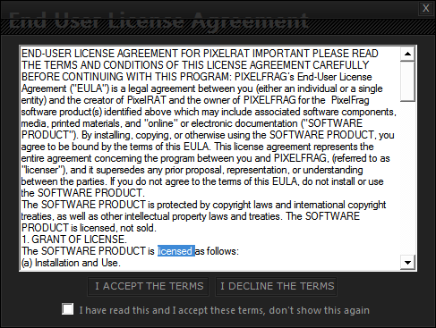

# WindowsApplication37 - PixelRAT 1.9.exe
## Informations
| Label | Value |
| :--- | ---: |
| Executable Name | PixelRAT 1.9.exe |
| Product Name | WindowsApplication37 |
| Version Number | 1.0.0.0 |
| Description | WindowsApplication37 |
| Company Name |  |
| Copyright | Copyright ©  2010 |
| Trademarks |  |
| Last Edition | 19/08/2022 03:21:22 |
| Size | 1605120 |
| SHA1 🔎 | [592B13BD7A509B3F2472B28020E3690A95046695](https://www.virustotal.com/gui/search/592B13BD7A509B3F2472B28020E3690A95046695) |
| Language | Langue neutre |
## Static Analysis
<details>
<summary>Manalyze</summary>
<p>

```

* Manalyze 0.9 *

-------------------------------------------------------------------------------
C:/Users/aTest/Desktop/net6.0/Malwares/Malwares/RAT/PixelRAT 1.9/PixelRAT 1.9.exe
-------------------------------------------------------------------------------

Summary:
--------
Architecture:     IMAGE_FILE_MACHINE_I386
Subsystem:        IMAGE_SUBSYSTEM_WINDOWS_GUI
Compilation Date: 2010-Aug-10 22:38:21
FileDescription:  WindowsApplication37
FileVersion:      1.0.0.0
InternalName:     RemoteDesktop.exe
LegalCopyright:   Copyright ┬®  2010
OriginalFilename: RemoteDesktop.exe
ProductName:      WindowsApplication37
ProductVersion:   1.0.0.0
Assembly Version: 1.0.0.0

DOS Header:
-----------
e_magic:    MZ
e_cblp:     0x0090
e_cp:       0x0003
e_crlc:     0x0000
e_cparhdr:  0x0004
e_minalloc: 0x0000
e_maxalloc: 0xFFFF
e_ss:       0x0000
e_sp:       0x00B8
e_csum:     0x0000
e_ip:       0x0000
e_cs:       0x0000
e_ovno:     0x0000
e_oemid:    0x0000
e_oeminfo:  0x0000
e_lfanew:   0x00000080

PE Header:
----------
Signature:            PE
Machine:              IMAGE_FILE_MACHINE_I386
NumberofSections:     3
TimeDateStamp:        2010-Aug-10 22:38:21
PointerToSymbolTable: 0x00000000
NumberOfSymbols:      0
SizeOfOptionalHeader: 0x00E0
Characteristics:      IMAGE_FILE_32BIT_MACHINE
                      IMAGE_FILE_EXECUTABLE_IMAGE
                      IMAGE_FILE_LINE_NUMS_STRIPPED
                      IMAGE_FILE_LOCAL_SYMS_STRIPPED

Image Optional Header:
----------------------
Magic:                   PE32
LinkerVersion:           8.0
SizeOfCode:              0x0016D600
SizeOfInitializedData:   0x0001A600
SizeOfUninitializedData: 0x00000000
AddressOfEntryPoint:     0x00045190 (Section: .text)
BaseOfCode:              0x0001E000
BaseOfData:              0x00002000
ImageBase:               0x00400000
SectionAlignment:        0x00002000
FileAlignment:           0x00000200
OperatingSystemVersion:  4.0
ImageVersion:            0.0
SubsystemVersion:        4.0
Win32VersionValue:       0
SizeOfImage:             0x0018E000
SizeOfHeaders:           0x00000200
Checksum:                0x00192566
Subsystem:               IMAGE_SUBSYSTEM_WINDOWS_GUI
SizeofStackReserve:      0x00100000
SizeofStackCommit:       0x00001000
SizeofHeapReserve:       0x00100000
SizeofHeapCommit:        0x00001000
LoaderFlags:             0x00000000
NumberOfRvaAndSizes:     16

Sections:
---------
.rsrc:
    VirtualSize:          0x0001A2C8
    VirtualAddress:       0x00002000
    SizeOfRawData:        0x0001A400
    PointerToRawData:     0x00000200
    PointerToRelocations: 0x00000000
    PointerToLineNumbers: 0x00000000
    NumberOfLineNumbers:  0
    NumberOfRelocations:  0
    Characteristics:      IMAGE_SCN_CNT_INITIALIZED_DATA
                          IMAGE_SCN_MEM_READ
    Entropy:              2.74026

.text:
    VirtualSize:          0x0016D5B0
    VirtualAddress:       0x0001E000
    SizeOfRawData:        0x0016D600
    PointerToRawData:     0x0001A600
    PointerToRelocations: 0x00000000
    PointerToLineNumbers: 0x00000000
    NumberOfLineNumbers:  0
    NumberOfRelocations:  0
    Characteristics:      IMAGE_SCN_CNT_CODE
                          IMAGE_SCN_MEM_EXECUTE
                          IMAGE_SCN_MEM_READ
    Entropy:              5.16382

.reloc:
    VirtualSize:          0x0000000C
    VirtualAddress:       0x0018C000
    SizeOfRawData:        0x00000200
    PointerToRawData:     0x00187C00
    PointerToRelocations: 0x00000000
    PointerToLineNumbers: 0x00000000
    NumberOfLineNumbers:  0
    NumberOfRelocations:  0
    Characteristics:      IMAGE_SCN_CNT_INITIALIZED_DATA
                          IMAGE_SCN_MEM_DISCARDABLE
                          IMAGE_SCN_MEM_READ
    Entropy:              0.122276


Imports:
--------
mscoree.dll: _CorExeMain

Resources:
----------
2:
    Type:          RT_ICON
    Language:      UNKNOWN
    Codepage:      UNKNOWN
    Size:          105640
    TimeDateStamp: 1980-Jan-01 00:00:00
    Entropy:       2.64934

32512:
    Type:              RT_GROUP_ICON
    Language:          UNKNOWN
    Codepage:          UNKNOWN
    Size:              20
    TimeDateStamp:     1980-Jan-01 00:00:00
    Entropy:           2.16096
    Detected Filetype: Icon file

1:
    Type:          RT_VERSION
    Language:      UNKNOWN
    Codepage:      UNKNOWN
    Size:          752
    TimeDateStamp: 1980-Jan-01 00:00:00
    Entropy:       3.31932

1 (#2):
    Type:          RT_MANIFEST
    Language:      UNKNOWN
    Codepage:      UNKNOWN
    Size:          490
    TimeDateStamp: 1980-Jan-01 00:00:00
    Entropy:       5.00112


Version Info:
-------------
Resource LangID: UNKNOWN
VS_VERSION_INFO:
    Signature:           0xFEEF04BD
    StructVersion:       0x00010000
    FileVersion:         1.0.0.0
    ProductVersion:      1.0.0.0
    FileFlags:           (EMPTY)
    FileOs:              VOS_DOS_WINDOWS32
                         VOS_NT_WINDOWS32
                         VOS__WINDOWS32
    FileType:            VFT_APP
    Language:            UNKNOWN
    FileDescription:     WindowsApplication37
    FileVersion (#2):    1.0.0.0
    InternalName:        RemoteDesktop.exe
    LegalCopyright:      Copyright ┬®  2010
    OriginalFilename:    RemoteDesktop.exe
    ProductName:         WindowsApplication37
    ProductVersion (#2): 1.0.0.0
    Assembly Version:    1.0.0.0


[ SUSPICIOUS ] Strings found in the binary may indicate undesirable behavior:
    Contains references to system / monitoring tools:
        taskmgr.exe
    Contains references to internet browsers:
        iexplore.exe
        signons.sqlite
    May have dropper capabilities:
        CurrentVersion\Run
    Miscellaneous malware strings:
        virus
    Contains domain names:
        Www.pixelfrag.com
        checkip.dyndns.org
        dyndns.org
        dynupdate.no-ip.com
        google.com
        http://checkip.dyndns.org
        http://checkip.dyndns.org/
        http://dynupdate.no-ip.com
        http://dynupdate.no-ip.com/dns?username
        http://whatismyip.com
        http://www.google.com
        http://www.google.com/
        http://www.no-ip.com
        http://www.no-ip.com/legal/tos
        http://www.pixelfrag.com
        http://www.pixelfrag.com/pixelrat/md5hashchecker.txt
        http://www.pixelfrag.com/pixelrat/news.php
        http://www.smartassembly.com
        no-ip.com
        pixelfrag.com
        smartassembly.com
        whatismyip.com
        www.google.com
        www.no-ip.com
        www.pixelfrag.com
        www.smartassembly.com
        www.youtube.com
        youtube.com

The following exploit mitigation techniques have been detected
    Stack Canary: disabled
    SafeSEH: disabled
    ASLR: disabled
    DEP: disabled
    CFG: disabled


```

</p>
</details>

## Screenshots
### Form7
 
