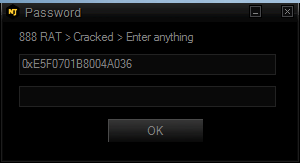

#  - 888 RAT Private .exe
## Informations
| Label | Value |
| :--- | ---: |
| Executable Name | 888 RAT Private .exe |
| Product Name |  |
| Version Number |  |
| Description |  |
| Company Name |  |
| Copyright |  |
| Trademarks |  |
| Last Edition | 19/08/2022 03:21:22 |
| Size | 7376384 |
| SHA1 🔎 | [5C4650913D7CF08BE7AD775446FD3C40E1AF4C01](https://www.virustotal.com/gui/search/5C4650913D7CF08BE7AD775446FD3C40E1AF4C01) |
| MD5 | D41D8CD98F00B204E9800998ECF8427E |
| Language | Anglais (Royaume-Uni) |
## Static Analysis
<details>
<summary>Manalyze</summary>
<p>

```

* Manalyze 0.9 *

-------------------------------------------------------------------------------
C:/Users/aTest/Desktop/net6.0/Malwares/Malwares/RAT/888 RAT Private - Cracked/888 RAT Private .exe
-------------------------------------------------------------------------------

Summary:
--------
Architecture:       IMAGE_FILE_MACHINE_I386
Subsystem:          IMAGE_SUBSYSTEM_WINDOWS_GUI
Compilation Date:   2016-Dec-23 06:10:54
Detected languages: English - United Kingdom

DOS Header:
-----------
e_magic:    MZ
e_cblp:     0x0090
e_cp:       0x0003
e_crlc:     0x0000
e_cparhdr:  0x0004
e_minalloc: 0x0000
e_maxalloc: 0xFFFF
e_ss:       0x0000
e_sp:       0x00B8
e_csum:     0x0000
e_ip:       0x0000
e_cs:       0x0000
e_ovno:     0x0000
e_oemid:    0x0000
e_oeminfo:  0x0000
e_lfanew:   0x00000110

PE Header:
----------
Signature:            PE
Machine:              IMAGE_FILE_MACHINE_I386
NumberofSections:     5
TimeDateStamp:        2016-Dec-23 06:10:54
PointerToSymbolTable: 0x00000000
NumberOfSymbols:      0
SizeOfOptionalHeader: 0x00E0
Characteristics:      IMAGE_FILE_32BIT_MACHINE
                      IMAGE_FILE_EXECUTABLE_IMAGE
                      IMAGE_FILE_LARGE_ADDRESS_AWARE

Image Optional Header:
----------------------
Magic:                   PE32
LinkerVersion:           12.0
SizeOfCode:              0x0008DE00
SizeOfInitializedData:   0x0067AC00
SizeOfUninitializedData: 0x00000000
AddressOfEntryPoint:     0x00027F4A (Section: .text)
BaseOfCode:              0x00001000
BaseOfData:              0x0008F000
ImageBase:               0x00400000
SectionAlignment:        0x00001000
FileAlignment:           0x00000200
OperatingSystemVersion:  5.1
ImageVersion:            0.0
SubsystemVersion:        5.1
Win32VersionValue:       0
SizeOfImage:             0x00710000
SizeOfHeaders:           0x00000400
Checksum:                0x0070F254
Subsystem:               IMAGE_SUBSYSTEM_WINDOWS_GUI
DllCharacteristics:      IMAGE_DLLCHARACTERISTICS_DYNAMIC_BASE
                         IMAGE_DLLCHARACTERISTICS_TERMINAL_SERVER_AWARE
SizeofStackReserve:      0x00400000
SizeofStackCommit:       0x00001000
SizeofHeapReserve:       0x00400000
SizeofHeapCommit:        0x00001000
LoaderFlags:             0x00000000
NumberOfRvaAndSizes:     16

Sections:
---------
.text:
    VirtualSize:          0x0008DD2E
    VirtualAddress:       0x00001000
    SizeOfRawData:        0x0008DE00
    PointerToRawData:     0x00000400
    PointerToRelocations: 0x00000000
    PointerToLineNumbers: 0x00000000
    NumberOfLineNumbers:  0
    NumberOfRelocations:  0
    Characteristics:      IMAGE_SCN_CNT_CODE
                          IMAGE_SCN_MEM_EXECUTE
                          IMAGE_SCN_MEM_READ
    Entropy:              6.67588

.rdata:
    VirtualSize:          0x0002E10E
    VirtualAddress:       0x0008F000
    SizeOfRawData:        0x0002E200
    PointerToRawData:     0x0008E200
    PointerToRelocations: 0x00000000
    PointerToLineNumbers: 0x00000000
    NumberOfLineNumbers:  0
    NumberOfRelocations:  0
    Characteristics:      IMAGE_SCN_CNT_INITIALIZED_DATA
                          IMAGE_SCN_MEM_READ
    Entropy:              5.76073

.data:
    VirtualSize:          0x00008F74
    VirtualAddress:       0x000BE000
    SizeOfRawData:        0x00005200
    PointerToRawData:     0x000BC400
    PointerToRelocations: 0x00000000
    PointerToLineNumbers: 0x00000000
    NumberOfLineNumbers:  0
    NumberOfRelocations:  0
    Characteristics:      IMAGE_SCN_CNT_INITIALIZED_DATA
                          IMAGE_SCN_MEM_READ
                          IMAGE_SCN_MEM_WRITE
    Entropy:              1.19881

.rsrc:
    VirtualSize:          0x006404BF
    VirtualAddress:       0x000C7000
    SizeOfRawData:        0x00640600
    PointerToRawData:     0x000C1600
    PointerToRelocations: 0x00000000
    PointerToLineNumbers: 0x00000000
    NumberOfLineNumbers:  0
    NumberOfRelocations:  0
    Characteristics:      IMAGE_SCN_CNT_INITIALIZED_DATA
                          IMAGE_SCN_MEM_READ
    Entropy:              7.9997

.reloc:
    VirtualSize:          0x00007130
    VirtualAddress:       0x00708000
    SizeOfRawData:        0x00007200
    PointerToRawData:     0x00701C00
    PointerToRelocations: 0x00000000
    PointerToLineNumbers: 0x00000000
    NumberOfLineNumbers:  0
    NumberOfRelocations:  0
    Characteristics:      IMAGE_SCN_CNT_INITIALIZED_DATA
                          IMAGE_SCN_MEM_DISCARDABLE
                          IMAGE_SCN_MEM_READ
    Entropy:              6.78238


Imports:
--------
WSOCK32.dll:  #116
              #23
              #12
              #21
              #15
              #17
              #10
              #9
              #115
              #151
              #18
              #1
              #13
              #2
              #3
              #111
              #16
              #20
              #19
              #11
              #52
              #57
              #4
VERSION.dll:  GetFileVersionInfoW
              GetFileVersionInfoSizeW
              VerQueryValueW
WINMM.dll:    timeGetTime
              waveOutSetVolume
              mciSendStringW
COMCTL32.dll: ImageList_ReplaceIcon
              ImageList_Destroy
              ImageList_Remove
              ImageList_SetDragCursorImage
              ImageList_BeginDrag
              ImageList_DragEnter
              ImageList_DragLeave
              ImageList_EndDrag
              ImageList_DragMove
              InitCommonControlsEx
              ImageList_Create
MPR.dll:      WNetUseConnectionW
              WNetCancelConnection2W
              WNetGetConnectionW
              WNetAddConnection2W
WININET.dll:  InternetQueryDataAvailable
              InternetCloseHandle
              InternetOpenW
              InternetSetOptionW
              InternetCrackUrlW
              HttpQueryInfoW
              InternetQueryOptionW
              HttpOpenRequestW
              HttpSendRequestW
              FtpOpenFileW
              FtpGetFileSize
              InternetOpenUrlW
              InternetReadFile
              InternetConnectW
PSAPI.DLL:    GetProcessMemoryInfo
IPHLPAPI.DLL: IcmpCreateFile
              IcmpCloseHandle
              IcmpSendEcho
USERENV.dll:  DestroyEnvironmentBlock
              UnloadUserProfile
              CreateEnvironmentBlock
              LoadUserProfileW
UxTheme.dll:  IsThemeActive
KERNEL32.dll: DuplicateHandle
              CreateThread
              WaitForSingleObject
              HeapAlloc
              GetProcessHeap
              HeapFree
              Sleep
              GetCurrentThreadId
              MultiByteToWideChar
              MulDiv
              GetVersionExW
              IsWow64Process
              GetSystemInfo
              FreeLibrary
              LoadLibraryA
              GetProcAddress
              SetErrorMode
              GetModuleFileNameW
              WideCharToMultiByte
              lstrcpyW
              lstrlenW
              GetModuleHandleW
              QueryPerformanceCounter
              VirtualFreeEx
              OpenProcess
              VirtualAllocEx
              WriteProcessMemory
              ReadProcessMemory
              CreateFileW
              SetFilePointerEx
              SetEndOfFile
              ReadFile
              WriteFile
              FlushFileBuffers
              TerminateProcess
              CreateToolhelp32Snapshot
              Process32FirstW
              Process32NextW
              SetFileTime
              GetFileAttributesW
              FindFirstFileW
              SetCurrentDirectoryW
              GetLongPathNameW
              GetShortPathNameW
              DeleteFileW
              FindNextFileW
              CopyFileExW
              MoveFileW
              CreateDirectoryW
              RemoveDirectoryW
              SetSystemPowerState
              QueryPerformanceFrequency
              FindResourceW
              LoadResource
              LockResource
              SizeofResource
              EnumResourceNamesW
              OutputDebugStringW
              GetTempPathW
              GetTempFileNameW
              DeviceIoControl
              GetLocalTime
              CompareStringW
              GetCurrentProcess
              EnterCriticalSection
              LeaveCriticalSection
              GetStdHandle
              CreatePipe
              InterlockedExchange
              TerminateThread
              LoadLibraryExW
              FindResourceExW
              CopyFileW
              VirtualFree
              FormatMessageW
              GetExitCodeProcess
              GetPrivateProfileStringW
              WritePrivateProfileStringW
              GetPrivateProfileSectionW
              WritePrivateProfileSectionW
              GetPrivateProfileSectionNamesW
              FileTimeToLocalFileTime
              FileTimeToSystemTime
              SystemTimeToFileTime
              LocalFileTimeToFileTime
              GetDriveTypeW
              GetDiskFreeSpaceExW
              GetDiskFreeSpaceW
              GetVolumeInformationW
              SetVolumeLabelW
              CreateHardLinkW
              SetFileAttributesW
              CreateEventW
              SetEvent
              GetEnvironmentVariableW
              SetEnvironmentVariableW
              GlobalLock
              GlobalUnlock
              GlobalAlloc
              GetFileSize
              GlobalFree
              GlobalMemoryStatusEx
              Beep
              GetSystemDirectoryW
              HeapReAlloc
              HeapSize
              GetComputerNameW
              GetWindowsDirectoryW
              GetCurrentProcessId
              GetProcessIoCounters
              CreateProcessW
              GetProcessId
              SetPriorityClass
              LoadLibraryW
              VirtualAlloc
              IsDebuggerPresent
              GetCurrentDirectoryW
              lstrcmpiW
              DecodePointer
              GetLastError
              RaiseException
              InitializeCriticalSectionAndSpinCount
              DeleteCriticalSection
              InterlockedDecrement
              InterlockedIncrement
              GetCurrentThread
              CloseHandle
              GetFullPathNameW
              EncodePointer
              ExitProcess
              GetModuleHandleExW
              ExitThread
              GetSystemTimeAsFileTime
              ResumeThread
              GetCommandLineW
              IsProcessorFeaturePresent
              IsValidCodePage
              GetACP
              GetOEMCP
              GetCPInfo
              SetLastError
              UnhandledExceptionFilter
              SetUnhandledExceptionFilter
              TlsAlloc
              TlsGetValue
              TlsSetValue
              TlsFree
              GetStartupInfoW
              GetStringTypeW
              SetStdHandle
              GetFileType
              GetConsoleCP
              GetConsoleMode
              RtlUnwind
              ReadConsoleW
              GetTimeZoneInformation
              GetDateFormatW
              GetTimeFormatW
              LCMapStringW
              GetEnvironmentStringsW
              FreeEnvironmentStringsW
              WriteConsoleW
              FindClose
              SetEnvironmentVariableA
USER32.dll:   AdjustWindowRectEx
              CopyImage
              SetWindowPos
              GetCursorInfo
              RegisterHotKey
              ClientToScreen
              GetKeyboardLayoutNameW
              IsCharAlphaW
              IsCharAlphaNumericW
              IsCharLowerW
              IsCharUpperW
              GetMenuStringW
              GetSubMenu
              GetCaretPos
              IsZoomed
              MonitorFromPoint
              GetMonitorInfoW
              SetWindowLongW
              SetLayeredWindowAttributes
              FlashWindow
              GetClassLongW
              TranslateAcceleratorW
              IsDialogMessageW
              GetSysColor
              InflateRect
              DrawFocusRect
              DrawTextW
              FrameRect
              DrawFrameControl
              FillRect
              PtInRect
              DestroyAcceleratorTable
              CreateAcceleratorTableW
              SetCursor
              GetWindowDC
              GetSystemMetrics
              GetActiveWindow
              CharNextW
              wsprintfW
              RedrawWindow
              DrawMenuBar
              DestroyMenu
              SetMenu
              GetWindowTextLengthW
              CreateMenu
              IsDlgButtonChecked
              DefDlgProcW
              CallWindowProcW
              ReleaseCapture
              SetCapture
              CreateIconFromResourceEx
              mouse_event
              ExitWindowsEx
              SetActiveWindow
              FindWindowExW
              EnumThreadWindows
              SetMenuDefaultItem
              InsertMenuItemW
              IsMenu
              TrackPopupMenuEx
              GetCursorPos
              DeleteMenu
              SetRect
              GetMenuItemID
              GetMenuItemCount
              SetMenuItemInfoW
              GetMenuItemInfoW
              SetForegroundWindow
              IsIconic
              FindWindowW
              MonitorFromRect
              keybd_event
              SendInput
              GetAsyncKeyState
              SetKeyboardState
              GetKeyboardState
              GetKeyState
              VkKeyScanW
              LoadStringW
              DialogBoxParamW
              MessageBeep
              EndDialog
              SendDlgItemMessageW
              GetDlgItem
              SetWindowTextW
              CopyRect
              ReleaseDC
              GetDC
              EndPaint
              BeginPaint
              GetClientRect
              GetMenu
              DestroyWindow
              EnumWindows
              GetDesktopWindow
              IsWindow
              IsWindowEnabled
              IsWindowVisible
              EnableWindow
              InvalidateRect
              GetWindowLongW
              GetWindowThreadProcessId
              AttachThreadInput
              GetFocus
              GetWindowTextW
              ScreenToClient
              SendMessageTimeoutW
              EnumChildWindows
              CharUpperBuffW
              GetParent
              GetDlgCtrlID
              SendMessageW
              MapVirtualKeyW
              PostMessageW
              GetWindowRect
              SetUserObjectSecurity
              CloseDesktop
              CloseWindowStation
              OpenDesktopW
              SetProcessWindowStation
              GetProcessWindowStation
              OpenWindowStationW
              GetUserObjectSecurity
              MessageBoxW
              DefWindowProcW
              SetClipboardData
              EmptyClipboard
              CountClipboardFormats
              CloseClipboard
              GetClipboardData
              IsClipboardFormatAvailable
              OpenClipboard
              BlockInput
              GetMessageW
              LockWindowUpdate
              DispatchMessageW
              TranslateMessage
              PeekMessageW
              UnregisterHotKey
              CheckMenuRadioItem
              CharLowerBuffW
              MoveWindow
              SetFocus
              PostQuitMessage
              KillTimer
              CreatePopupMenu
              RegisterWindowMessageW
              SetTimer
              ShowWindow
              CreateWindowExW
              RegisterClassExW
              LoadIconW
              LoadCursorW
              GetSysColorBrush
              GetForegroundWindow
              MessageBoxA
              DestroyIcon
              SystemParametersInfoW
              LoadImageW
              GetClassNameW
GDI32.dll:    StrokePath
              DeleteObject
              GetTextExtentPoint32W
              ExtCreatePen
              GetDeviceCaps
              EndPath
              SetPixel
              CloseFigure
              CreateCompatibleBitmap
              CreateCompatibleDC
              SelectObject
              StretchBlt
              GetDIBits
              LineTo
              AngleArc
              MoveToEx
              Ellipse
              DeleteDC
              GetPixel
              CreateDCW
              GetStockObject
              GetTextFaceW
              CreateFontW
              SetTextColor
              PolyDraw
              BeginPath
              Rectangle
              SetViewportOrgEx
              GetObjectW
              SetBkMode
              RoundRect
              SetBkColor
              CreatePen
              CreateSolidBrush
              StrokeAndFillPath
COMDLG32.dll: GetOpenFileNameW
              GetSaveFileNameW
ADVAPI32.dll: GetAce
              RegEnumValueW
              RegDeleteValueW
              RegDeleteKeyW
              RegEnumKeyExW
              RegSetValueExW
              RegOpenKeyExW
              RegCloseKey
              RegQueryValueExW
              RegConnectRegistryW
              InitializeSecurityDescriptor
              InitializeAcl
              AdjustTokenPrivileges
              OpenThreadToken
              OpenProcessToken
              LookupPrivilegeValueW
              DuplicateTokenEx
              CreateProcessAsUserW
              CreateProcessWithLogonW
              GetLengthSid
              CopySid
              LogonUserW
              AllocateAndInitializeSid
              CheckTokenMembership
              RegCreateKeyExW
              FreeSid
              GetTokenInformation
              GetSecurityDescriptorDacl
              GetAclInformation
              AddAce
              SetSecurityDescriptorDacl
              GetUserNameW
              InitiateSystemShutdownExW
SHELL32.dll:  DragQueryPoint
              ShellExecuteExW
              DragQueryFileW
              SHEmptyRecycleBinW
              SHGetPathFromIDListW
              SHBrowseForFolderW
              SHCreateShellItem
              SHGetDesktopFolder
              SHGetSpecialFolderLocation
              SHGetFolderPathW
              SHFileOperationW
              ExtractIconExW
              Shell_NotifyIconW
              ShellExecuteW
              DragFinish
ole32.dll:    CoTaskMemAlloc
              CoTaskMemFree
              CLSIDFromString
              ProgIDFromCLSID
              CLSIDFromProgID
              OleSetMenuDescriptor
              MkParseDisplayName
              OleSetContainedObject
              CoCreateInstance
              IIDFromString
              StringFromGUID2
              CreateStreamOnHGlobal
              OleInitialize
              OleUninitialize
              CoInitialize
              CoUninitialize
              GetRunningObjectTable
              CoGetInstanceFromFile
              CoGetObject
              CoSetProxyBlanket
              CoCreateInstanceEx
              CoInitializeSecurity
OLEAUT32.dll: #183
              #11
              #3
              #6
              #38
              #39
              #24
              #23
              #37
              #41
              #411
              #163
              #32
              #146
              #12
              #7
              #185
              #220
              #77
              #10
              #9
              #418
              #164
              #442
              #443
              #186
              #31
              #2
              #8

Resources:
----------
1:
    Type:          RT_ICON
    Language:      English - United Kingdom
    Codepage:      Latin 1 / Western European
    Size:          296
    TimeDateStamp: 1980-Jan-01 00:00:00
    Entropy:       3.66371

2:
    Type:          RT_ICON
    Language:      English - United Kingdom
    Codepage:      Latin 1 / Western European
    Size:          296
    TimeDateStamp: 1980-Jan-01 00:00:00
    Entropy:       2.05883

3:
    Type:          RT_ICON
    Language:      English - United Kingdom
    Codepage:      Latin 1 / Western European
    Size:          296
    TimeDateStamp: 1980-Jan-01 00:00:00
    Entropy:       2.25499

4:
    Type:          RT_ICON
    Language:      English - United Kingdom
    Codepage:      UNKNOWN
    Size:          4264
    TimeDateStamp: 1980-Jan-01 00:00:00
    Entropy:       3.61947

166:
    Type:          RT_MENU
    Language:      English - United Kingdom
    Codepage:      Latin 1 / Western European
    Size:          80
    TimeDateStamp: 1980-Jan-01 00:00:00
    Entropy:       2.68292

7:
    Type:          RT_STRING
    Language:      English - United Kingdom
    Codepage:      Latin 1 / Western European
    Size:          1428
    TimeDateStamp: 1980-Jan-01 00:00:00
    Entropy:       3.34702

8:
    Type:          RT_STRING
    Language:      English - United Kingdom
    Codepage:      Latin 1 / Western European
    Size:          1674
    TimeDateStamp: 1980-Jan-01 00:00:00
    Entropy:       3.2817

9:
    Type:          RT_STRING
    Language:      English - United Kingdom
    Codepage:      Latin 1 / Western European
    Size:          1168
    TimeDateStamp: 1980-Jan-01 00:00:00
    Entropy:       3.28849

10:
    Type:          RT_STRING
    Language:      English - United Kingdom
    Codepage:      Latin 1 / Western European
    Size:          1532
    TimeDateStamp: 1980-Jan-01 00:00:00
    Entropy:       3.28373

11:
    Type:          RT_STRING
    Language:      English - United Kingdom
    Codepage:      Latin 1 / Western European
    Size:          1628
    TimeDateStamp: 1980-Jan-01 00:00:00
    Entropy:       3.26322

12:
    Type:          RT_STRING
    Language:      English - United Kingdom
    Codepage:      Latin 1 / Western European
    Size:          1126
    TimeDateStamp: 1980-Jan-01 00:00:00
    Entropy:       3.25812

313:
    Type:          RT_STRING
    Language:      English - United Kingdom
    Codepage:      Latin 1 / Western European
    Size:          344
    TimeDateStamp: 1980-Jan-01 00:00:00
    Entropy:       3.08572

SCRIPT:
    Type:          RT_RCDATA
    Language:      UNKNOWN
    Codepage:      Latin 1 / Western European
    Size:          6538259
    TimeDateStamp: 1980-Jan-01 00:00:00
    Entropy:       7.99997

99:
    Type:              RT_GROUP_ICON
    Language:          English - United Kingdom
    Codepage:          Latin 1 / Western European
    Size:              20
    TimeDateStamp:     1980-Jan-01 00:00:00
    Entropy:           1.71664
    Detected Filetype: Icon file

162:
    Type:              RT_GROUP_ICON
    Language:          English - United Kingdom
    Codepage:          Latin 1 / Western European
    Size:              20
    TimeDateStamp:     1980-Jan-01 00:00:00
    Entropy:           2.02322
    Detected Filetype: Icon file

164:
    Type:              RT_GROUP_ICON
    Language:          English - United Kingdom
    Codepage:          Latin 1 / Western European
    Size:              20
    TimeDateStamp:     1980-Jan-01 00:00:00
    Entropy:           1.84274
    Detected Filetype: Icon file

169:
    Type:              RT_GROUP_ICON
    Language:          English - United Kingdom
    Codepage:          Latin 1 / Western European
    Size:              20
    TimeDateStamp:     1980-Jan-01 00:00:00
    Entropy:           2.02322
    Detected Filetype: Icon file

1 (#2):
    Type:          RT_VERSION
    Language:      English - United Kingdom
    Codepage:      Latin 1 / Western European
    Size:          220
    TimeDateStamp: 1980-Jan-01 00:00:00
    Entropy:       2.77862

1 (#3):
    Type:          RT_MANIFEST
    Language:      English - United Kingdom
    Codepage:      Latin 1 / Western European
    Size:          1007
    TimeDateStamp: 1980-Jan-01 00:00:00
    Entropy:       5.40026


Version Info:
-------------
Resource LangID: English - United Kingdom
VS_VERSION_INFO:
    Signature:      0xFEEF04BD
    StructVersion:  0x00010000
    FileVersion:    0.0.0.0
    ProductVersion: 0.0.0.0
    FileFlags:      (EMPTY)
    FileOs:         VOS_DOS_WINDOWS32
                    VOS_NT_WINDOWS32
                    VOS__WINDOWS32
    FileType:       VFT_APP
    Language:       English - United Kingdom


Debug Info:
-----------
IMAGE_DEBUG_TYPE_RESERVED:
    Characteristics:  0
    TimeDateStamp:    2015-Sep-18 14:02:32
    Version:          0.0
    SizeofData:       4
    AddressOfRawData: 0x000B5438
    PointerToRawData: 0x000B4638


Load Configuration:
-------------------
Size:                          72
TimeDateStamp:                 1970-Jan-01 00:00:00
Version:                       0.0
GlobalFlagsClear:              (EMPTY)
GlobalFlagsSet:                (EMPTY)
CriticalSectionDefaultTimeout: 0
DeCommitFreeBlockThreshold:    0x00000000
DeCommitTotalFreeThreshold:    0x00000000
LockPrefixTable:               0x00000000
MaximumAllocationSize:         0x00000000
VirtualMemoryThreshold:        0x00000000
ProcessAffinityMask:           0x00000000
ProcessHeapFlags:              (EMPTY)
CSDVersion:                    0
Reserved1:                     0x0000
EditList:                      0x00000000
SecurityCookie:                0x004BED50
SEHandlerTable:                0x00000000
SEHandlerCount:                0

RICH Header:
------------
XOR Key:                               0xC1FC1252
Unmarked objects:                      0
C++ objects (20806):                   2
199 (41118):                           1
ASM objects (VS2013 build 21005):      51
C objects (VS2013 build 21005):        177
C++ objects (VS2013 build 21005):      53
C objects (VS2008 SP1 build 30729):    9
Imports (VS2008 SP1 build 30729):      37
Total imports:                         544
234 (VS2013 UPD5 build 40629):         80
ASM objects (VS2013 UPD5 build 40629): 1
Resource objects (VS2013 build 21005): 1
151:                                   1
Linker (VS2013 UPD5 build 40629):      1

Matching compiler(s):
    Microsoft Visual C++ 6.0 - 8.0

[ SUSPICIOUS ] Strings found in the binary may indicate undesirable behavior:
    Is an AutoIT compiled script:
        AutoIt Error
        reserved for AutoIt internal use

Cryptographic algorithms detected in the binary:
    Uses constants related to CRC32

[ MALICIOUS ] The PE contains functions mostly used by malware.
    [!] The program may be hiding some of its imports:
        LoadLibraryA
        GetProcAddress
        LoadLibraryExW
        LoadLibraryW
    Functions which can be used for anti-debugging purposes:
        CreateToolhelp32Snapshot
        FindWindowW
    Code injection capabilities:
        OpenProcess
        VirtualAllocEx
        WriteProcessMemory
        VirtualAlloc
    Code injection capabilities (PowerLoader):
        FindWindowW
        GetWindowLongW
    Can access the registry:
        RegisterHotKey
        RegEnumValueW
        RegDeleteValueW
        RegDeleteKeyW
        RegEnumKeyExW
        RegSetValueExW
        RegOpenKeyExW
        RegCloseKey
        RegQueryValueExW
        RegCreateKeyExW
    Possibly launches other programs:
        CreateProcessW
        CreateProcessAsUserW
        CreateProcessWithLogonW
        ShellExecuteW
    Can create temporary files:
        CreateFileW
        GetTempPathW
    Uses functions commonly found in keyloggers:
        GetAsyncKeyState
        AttachThreadInput
        MapVirtualKeyW
        GetForegroundWindow
    Has Internet access capabilities:
        InternetQueryDataAvailable
        InternetCloseHandle
        InternetOpenW
        InternetSetOptionW
        InternetCrackUrlW
        InternetQueryOptionW
        InternetOpenUrlW
        InternetReadFile
        InternetConnectW
    Functions related to the privilege level:
        AdjustTokenPrivileges
        OpenProcessToken
        DuplicateTokenEx
        CheckTokenMembership
    Enumerates local disk drives:
        GetDriveTypeW
        GetVolumeInformationW
    Manipulates other processes:
        OpenProcess
        WriteProcessMemory
        ReadProcessMemory
        Process32FirstW
        Process32NextW
    Can take screenshots:
        FindWindowW
        GetDC
        CreateCompatibleDC
    Reads the contents of the clipboard:
        GetClipboardData
    Can shut the system down or lock the screen:
        ExitWindowsEx
        InitiateSystemShutdownExW

[ SUSPICIOUS ] The PE is possibly a dropper.
    Resource SCRIPT is possibly compressed or encrypted.
    Resources amount for 88.847% of the executable.

The following exploit mitigation techniques have been detected
    Stack Canary: enabled
    SafeSEH: enabled (0 registered handlers)
    ASLR: enabled
    DEP: disabled
    CFG: disabled


```

</p>
</details>

## Screenshots
### Password
 
