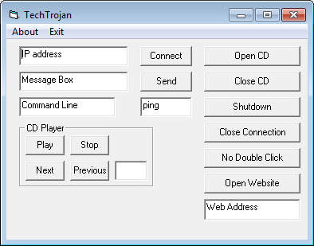

# client - Backdoor.Win32.VB.fn-56912638079d39e15d7491ad38038093619e15c9f37325343485b71243403c26.exe
## Informations
| Label | Value |
| :--- | ---: |
| Executable Name | Backdoor.Win32.VB.fn-56912638079d39e15d7491ad38038093619e15c9f37325343485b71243403c26.exe |
| Product Name | client |
| Version Number | 1.00 |
| Description |  |
| Company Name | Student |
| Copyright |  |
| Trademarks |  |
| Last Edition | 14/06/2012 09:50:10 |
| Size | 32768 |
| SHA1 🔎 | [5F56F7A9402D811FBFB5096EC1E41548717F3B30](https://www.virustotal.com/gui/search/5F56F7A9402D811FBFB5096EC1E41548717F3B30) |
| Language | English (United States) |
## Static Analysis
<details>
<summary>Manalyze</summary>
<p>

```

* Manalyze 0.9 *

-------------------------------------------------------------------------------
C:/Users/IEUser/Desktop/net6.0/Malwares/Backdoor.Win32.VB.fn-56912638079d39e15d7491ad38038093619e15c9f37325343485b71243403c26.exe
-------------------------------------------------------------------------------

Summary:
--------
Architecture:       IMAGE_FILE_MACHINE_I386
Subsystem:          IMAGE_SUBSYSTEM_WINDOWS_GUI
Compilation Date:   2002-Dec-26 13:33:34
Detected languages: English - United States
CompanyName:        Student
ProductName:        client
FileVersion:        1.00
ProductVersion:     1.00
InternalName:       client
OriginalFilename:   client.exe

DOS Header:
-----------
e_magic:    MZ
e_cblp:     0x0090
e_cp:       0x0003
e_crlc:     0x0000
e_cparhdr:  0x0004
e_minalloc: 0x0000
e_maxalloc: 0xFFFF
e_ss:       0x0000
e_sp:       0x00B8
e_csum:     0x0000
e_ip:       0x0000
e_cs:       0x0000
e_ovno:     0x0000
e_oemid:    0x0000
e_oeminfo:  0x0000
e_lfanew:   0x000000C8

PE Header:
----------
Signature:            PE
Machine:              IMAGE_FILE_MACHINE_I386
NumberofSections:     3
TimeDateStamp:        2002-Dec-26 13:33:34
PointerToSymbolTable: 0x00000000
NumberOfSymbols:      0
SizeOfOptionalHeader: 0x00E0
Characteristics:      IMAGE_FILE_32BIT_MACHINE
                      IMAGE_FILE_EXECUTABLE_IMAGE
                      IMAGE_FILE_LINE_NUMS_STRIPPED
                      IMAGE_FILE_LOCAL_SYMS_STRIPPED
                      IMAGE_FILE_RELOCS_STRIPPED

Image Optional Header:
----------------------
Magic:                   PE32
LinkerVersion:           6.0
SizeOfCode:              0x00005000
SizeOfInitializedData:   0x00003000
SizeOfUninitializedData: 0x00000000
AddressOfEntryPoint:     0x00001358 (Section: .text)
BaseOfCode:              0x00001000
BaseOfData:              0x00006000
ImageBase:               0x00400000
SectionAlignment:        0x00001000
FileAlignment:           0x00001000
OperatingSystemVersion:  4.0
ImageVersion:            1.0
SubsystemVersion:        4.0
Win32VersionValue:       0
SizeOfImage:             0x00009000
SizeOfHeaders:           0x00001000
Checksum:                0x00016EB0
Subsystem:               IMAGE_SUBSYSTEM_WINDOWS_GUI
SizeofStackReserve:      0x00100000
SizeofStackCommit:       0x00001000
SizeofHeapReserve:       0x00100000
SizeofHeapCommit:        0x00001000
LoaderFlags:             0x00000000
NumberOfRvaAndSizes:     16

Sections:
---------
.text:
    VirtualSize:          0x00004798
    VirtualAddress:       0x00001000
    SizeOfRawData:        0x00005000
    PointerToRawData:     0x00001000
    PointerToRelocations: 0x00000000
    PointerToLineNumbers: 0x00000000
    NumberOfLineNumbers:  0
    NumberOfRelocations:  0
    Characteristics:      IMAGE_SCN_CNT_CODE
                          IMAGE_SCN_MEM_EXECUTE
                          IMAGE_SCN_MEM_READ
    Entropy:              4.91682

.data:
    VirtualSize:          0x00001234
    VirtualAddress:       0x00006000
    SizeOfRawData:        0x00001000
    PointerToRawData:     0x00006000
    PointerToRelocations: 0x00000000
    PointerToLineNumbers: 0x00000000
    NumberOfLineNumbers:  0
    NumberOfRelocations:  0
    Characteristics:      IMAGE_SCN_CNT_INITIALIZED_DATA
                          IMAGE_SCN_MEM_READ
                          IMAGE_SCN_MEM_WRITE
    Entropy:              0

.rsrc:
    VirtualSize:          0x000008C8
    VirtualAddress:       0x00008000
    SizeOfRawData:        0x00001000
    PointerToRawData:     0x00007000
    PointerToRelocations: 0x00000000
    PointerToLineNumbers: 0x00000000
    NumberOfLineNumbers:  0
    NumberOfRelocations:  0
    Characteristics:      IMAGE_SCN_CNT_INITIALIZED_DATA
                          IMAGE_SCN_MEM_READ
    Entropy:              1.9002


Imports:
--------
MSVBVM60.DLL: __vbaStrI2
              _CIcos
              _adj_fptan
              __vbaStrI4
              __vbaFreeVar
              __vbaLateIdCall
              __vbaFreeVarList
              _adj_fdiv_m64
              __vbaFreeObjList
              _adj_fprem1
              __vbaStrCat
              __vbaSetSystemError
              __vbaHresultCheckObj
              _adj_fdiv_m32
              __vbaObjSet
              _adj_fdiv_m16i
              _adj_fdivr_m16i
              #598
              _CIsin
              __vbaChkstk
              EVENT_SINK_AddRef
              DllFunctionCall
              _adj_fpatan
              EVENT_SINK_Release
              #600
              _CIsqrt
              EVENT_SINK_QueryInterface
              __vbaExceptHandler
              _adj_fprem
              _adj_fdivr_m64
              __vbaFPException
              __vbaStrVarVal
              __vbaVarCat
              _CIlog
              __vbaErrorOverflow
              __vbaNew2
              _adj_fdiv_m32i
              _adj_fdivr_m32i
              __vbaFreeStrList
              _adj_fdivr_m32
              _adj_fdiv_r
              #100
              __vbaStrToAnsi
              #613
              _CIatan
              __vbaStrMove
              _allmul
              __vbaLateIdSt
              _CItan
              _CIexp
              __vbaFreeObj
              __vbaFreeStr

Resources:
----------
30001:
    Type:          RT_ICON
    Language:      UNKNOWN
    Codepage:      Unicode (UTF 16LE)
    Size:          304
    TimeDateStamp: 2002-Dec-26 13:33:34
    Entropy:       2.57965

30002:
    Type:          RT_ICON
    Language:      UNKNOWN
    Codepage:      Unicode (UTF 16LE)
    Size:          744
    TimeDateStamp: 2002-Dec-26 13:33:34
    Entropy:       1.76987

30003:
    Type:          RT_ICON
    Language:      UNKNOWN
    Codepage:      Unicode (UTF 16LE)
    Size:          296
    TimeDateStamp: 2002-Dec-26 13:33:34
    Entropy:       2.07177

1:
    Type:              RT_GROUP_ICON
    Language:          UNKNOWN
    Codepage:          Unicode (UTF 16LE)
    Size:              48
    TimeDateStamp:     2002-Dec-26 13:33:34
    Entropy:           2.97836
    Detected Filetype: Icon file

1 (#2):
    Type:          RT_VERSION
    Language:      English - United States
    Codepage:      Unicode (UTF 16LE)
    Size:          520
    TimeDateStamp: 2002-Dec-26 13:33:34
    Entropy:       3.07879


Version Info:
-------------
Resource LangID: English - United States
VS_VERSION_INFO:
    Signature:           0xFEEF04BD
    StructVersion:       0x00010000
    FileVersion:         1.0.0.0
    ProductVersion:      1.0.0.0
    FileFlags:           (EMPTY)
    FileOs:              VOS_DOS_WINDOWS32
                         VOS_NT_WINDOWS32
                         VOS__WINDOWS32
    FileType:            VFT_APP
    Language:            English - United States
    CompanyName:         Student
    ProductName:         client
    FileVersion (#2):    1.00
    ProductVersion (#2): 1.00
    InternalName:        client
    OriginalFilename:    client.exe


RICH Header:
------------
XOR Key:          0x88CEA841
Unmarked objects: 0
14 (7299):        1
9 (8041):         3
13 (8169):        1

Matching compiler(s):
    Microsoft Visual Basic 5.0
    Microsoft Visual Basic v5.0/v6.0
    Microsoft Visual Basic v5.0 - v6.0
    Microsoft Visual Basic v6.0

Interesting strings found in the binary:
    Contains domain names:
        hotmail.com

The following exploit mitigation techniques have been detected
    Stack Canary: disabled
    SafeSEH: disabled
    ASLR: disabled
    DEP: disabled
    CFG: disabled


```

</p>
</details>

## Screenshots
### TechTrojan
 
