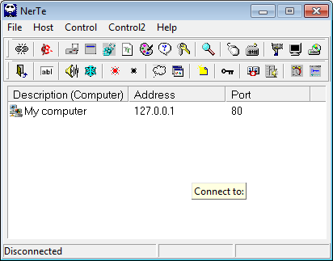

# NerTe - Backdoor.Win32.NerTe.76-f797f374931f575acc79d607a0b99115a73972c5529dcbe74846709f9a3ed275.exe
## Informations
| Label | Value |
| :--- | ---: |
| Executable Name | Backdoor.Win32.NerTe.76-f797f374931f575acc79d607a0b99115a73972c5529dcbe74846709f9a3ed275.exe |
| Product Name | NerTe |
| Version Number | 7.6.0.0 |
| Description | Remote administratio & monitoring tool |
| Company Name | NerTe |
| Copyright |  |
| Trademarks |  |
| Last Edition | 14/06/2012 09:46:08 |
| Size | 1670144 |
| SHA1 🔎 | [7335B2BA3F741AC4D211FA20FB0875849E37A7E7](https://www.virustotal.com/gui/search/7335B2BA3F741AC4D211FA20FB0875849E37A7E7) |
| Language | English (United States) |
## Static Analysis
<details>
<summary>Manalyze</summary>
<p>

```

* Manalyze 0.9 *

-------------------------------------------------------------------------------
C:/Users/IEUser/Desktop/net6.0/Malwares/Backdoor.Win32.NerTe.76-f797f374931f575acc79d607a0b99115a73972c5529dcbe74846709f9a3ed275.exe
-------------------------------------------------------------------------------

Summary:
--------
Architecture:       IMAGE_FILE_MACHINE_I386
Subsystem:          IMAGE_SUBSYSTEM_WINDOWS_GUI
Compilation Date:   1992-Jun-19 22:22:17
Detected languages: Danish - Denmark
                    English - United States
                    Lithuanian - Lithuania
                    Russian - Russia
CompanyName:        NerTe
FileDescription:    Remote administratio & monitoring tool
FileVersion:        7.6.0.0
InternalName:       
LegalCopyright:     
LegalTrademarks:    
OriginalFilename:   nerte76.exe
ProductName:        NerTe
ProductVersion:     7.6

DOS Header:
-----------
e_magic:    MZ
e_cblp:     0x0050
e_cp:       0x0002
e_crlc:     0x0000
e_cparhdr:  0x0004
e_minalloc: 0x000F
e_maxalloc: 0xFFFF
e_ss:       0x0000
e_sp:       0x00B8
e_csum:     0x0000
e_ip:       0x0000
e_cs:       0x0000
e_ovno:     0x001A
e_oemid:    0x0000
e_oeminfo:  0x0000
e_lfanew:   0x00000100

PE Header:
----------
Signature:            PE
Machine:              IMAGE_FILE_MACHINE_I386
NumberofSections:     8
TimeDateStamp:        1992-Jun-19 22:22:17
PointerToSymbolTable: 0x00000000
NumberOfSymbols:      0
SizeOfOptionalHeader: 0x00E0
Characteristics:      IMAGE_FILE_32BIT_MACHINE
                      IMAGE_FILE_BYTES_REVERSED_HI
                      IMAGE_FILE_BYTES_REVERSED_LO
                      IMAGE_FILE_EXECUTABLE_IMAGE
                      IMAGE_FILE_LINE_NUMS_STRIPPED
                      IMAGE_FILE_LOCAL_SYMS_STRIPPED

Image Optional Header:
----------------------
Magic:                   PE32
LinkerVersion:           2.0
SizeOfCode:              0x000FF800
SizeOfInitializedData:   0x00098000
SizeOfUninitializedData: 0x00000000
AddressOfEntryPoint:     0x001004B0 (Section: CODE)
BaseOfCode:              0x00001000
BaseOfData:              0x00101000
ImageBase:               0x00400000
SectionAlignment:        0x00001000
FileAlignment:           0x00000200
OperatingSystemVersion:  1.0
ImageVersion:            0.0
SubsystemVersion:        4.0
Win32VersionValue:       0
SizeOfImage:             0x0019F000
SizeOfHeaders:           0x00000400
Checksum:                0x00000000
Subsystem:               IMAGE_SUBSYSTEM_WINDOWS_GUI
SizeofStackReserve:      0x00100000
SizeofStackCommit:       0x00004000
SizeofHeapReserve:       0x00100000
SizeofHeapCommit:        0x00001000
LoaderFlags:             0x00000000
NumberOfRvaAndSizes:     16

Sections:
---------
CODE:
    VirtualSize:          0x000FF65C
    VirtualAddress:       0x00001000
    SizeOfRawData:        0x000FF800
    PointerToRawData:     0x00000400
    PointerToRelocations: 0x00000000
    PointerToLineNumbers: 0x00000000
    NumberOfLineNumbers:  0
    NumberOfRelocations:  0
    Characteristics:      IMAGE_SCN_CNT_CODE
                          IMAGE_SCN_MEM_EXECUTE
                          IMAGE_SCN_MEM_READ
    Entropy:              6.50481

DATA:
    VirtualSize:          0x00002020
    VirtualAddress:       0x00101000
    SizeOfRawData:        0x00002200
    PointerToRawData:     0x000FFC00
    PointerToRelocations: 0x00000000
    PointerToLineNumbers: 0x00000000
    NumberOfLineNumbers:  0
    NumberOfRelocations:  0
    Characteristics:      IMAGE_SCN_CNT_INITIALIZED_DATA
                          IMAGE_SCN_MEM_READ
                          IMAGE_SCN_MEM_WRITE
    Entropy:              4.41046

BSS:
    VirtualSize:          0x000012C5
    VirtualAddress:       0x00104000
    SizeOfRawData:        0x00000000
    PointerToRawData:     0x00101E00
    PointerToRelocations: 0x00000000
    PointerToLineNumbers: 0x00000000
    NumberOfLineNumbers:  0
    NumberOfRelocations:  0
    Characteristics:      IMAGE_SCN_MEM_READ
                          IMAGE_SCN_MEM_WRITE

.idata:
    VirtualSize:          0x00002A04
    VirtualAddress:       0x00106000
    SizeOfRawData:        0x00002C00
    PointerToRawData:     0x00101E00
    PointerToRelocations: 0x00000000
    PointerToLineNumbers: 0x00000000
    NumberOfLineNumbers:  0
    NumberOfRelocations:  0
    Characteristics:      IMAGE_SCN_CNT_INITIALIZED_DATA
                          IMAGE_SCN_MEM_READ
                          IMAGE_SCN_MEM_WRITE
    Entropy:              4.82338

.tls:
    VirtualSize:          0x00000014
    VirtualAddress:       0x00109000
    SizeOfRawData:        0x00000000
    PointerToRawData:     0x00104A00
    PointerToRelocations: 0x00000000
    PointerToLineNumbers: 0x00000000
    NumberOfLineNumbers:  0
    NumberOfRelocations:  0
    Characteristics:      IMAGE_SCN_MEM_READ
                          IMAGE_SCN_MEM_WRITE

.rdata:
    VirtualSize:          0x00000018
    VirtualAddress:       0x0010A000
    SizeOfRawData:        0x00000200
    PointerToRawData:     0x00104A00
    PointerToRelocations: 0x00000000
    PointerToLineNumbers: 0x00000000
    NumberOfLineNumbers:  0
    NumberOfRelocations:  0
    Characteristics:      IMAGE_SCN_CNT_INITIALIZED_DATA
                          IMAGE_SCN_MEM_READ
                          IMAGE_SCN_MEM_SHARED
    Entropy:              0.204488

.reloc:
    VirtualSize:          0x00010070
    VirtualAddress:       0x0010B000
    SizeOfRawData:        0x00010200
    PointerToRawData:     0x00104C00
    PointerToRelocations: 0x00000000
    PointerToLineNumbers: 0x00000000
    NumberOfLineNumbers:  0
    NumberOfRelocations:  0
    Characteristics:      IMAGE_SCN_CNT_INITIALIZED_DATA
                          IMAGE_SCN_MEM_READ
                          IMAGE_SCN_MEM_SHARED
    Entropy:              6.66858

.rsrc:
    VirtualSize:          0x00082E00
    VirtualAddress:       0x0011C000
    SizeOfRawData:        0x00082E00
    PointerToRawData:     0x00114E00
    PointerToRelocations: 0x00000000
    PointerToLineNumbers: 0x00000000
    NumberOfLineNumbers:  0
    NumberOfRelocations:  0
    Characteristics:      IMAGE_SCN_CNT_INITIALIZED_DATA
                          IMAGE_SCN_MEM_READ
                          IMAGE_SCN_MEM_SHARED
    Entropy:              5.04847


Imports:
--------
kernel32.dll:      GetCurrentThreadId
                   DeleteCriticalSection
                   LeaveCriticalSection
                   EnterCriticalSection
                   InitializeCriticalSection
                   VirtualFree
                   VirtualAlloc
                   LocalFree
                   LocalAlloc
                   InterlockedDecrement
                   InterlockedIncrement
                   VirtualQuery
                   WideCharToMultiByte
                   SetCurrentDirectoryA
                   MultiByteToWideChar
                   lstrlenA
                   lstrcpynA
                   lstrcpyA
                   LoadLibraryExA
                   GetThreadLocale
                   GetStartupInfoA
                   GetProcAddress
                   GetModuleHandleA
                   GetModuleFileNameA
                   GetLocaleInfoA
                   GetLastError
                   GetCurrentDirectoryA
                   GetCommandLineA
                   FreeLibrary
                   FindFirstFileA
                   FindClose
                   ExitProcess
                   ExitThread
                   CreateThread
                   WriteFile
                   UnhandledExceptionFilter
                   SetFilePointer
                   SetEndOfFile
                   RtlUnwind
                   ReadFile
                   RaiseException
                   GetStdHandle
                   GetFileSize
                   GetSystemTime
                   GetFileType
                   CreateFileA
                   CloseHandle
user32.dll:        GetKeyboardType
                   LoadStringA
                   MessageBoxA
                   CharNextA
advapi32.dll:      RegQueryValueExA
                   RegOpenKeyExA
                   RegCloseKey
oleaut32.dll:      VariantChangeTypeEx
                   VariantCopyInd
                   VariantClear
                   SysStringLen
                   SysFreeString
                   SysReAllocStringLen
                   SysAllocStringLen
kernel32.dll (#2): GetCurrentThreadId
                   DeleteCriticalSection
                   LeaveCriticalSection
                   EnterCriticalSection
                   InitializeCriticalSection
                   VirtualFree
                   VirtualAlloc
                   LocalFree
                   LocalAlloc
                   InterlockedDecrement
                   InterlockedIncrement
                   VirtualQuery
                   WideCharToMultiByte
                   SetCurrentDirectoryA
                   MultiByteToWideChar
                   lstrlenA
                   lstrcpynA
                   lstrcpyA
                   LoadLibraryExA
                   GetThreadLocale
                   GetStartupInfoA
                   GetProcAddress
                   GetModuleHandleA
                   GetModuleFileNameA
                   GetLocaleInfoA
                   GetLastError
                   GetCurrentDirectoryA
                   GetCommandLineA
                   FreeLibrary
                   FindFirstFileA
                   FindClose
                   ExitProcess
                   ExitThread
                   CreateThread
                   WriteFile
                   UnhandledExceptionFilter
                   SetFilePointer
                   SetEndOfFile
                   RtlUnwind
                   ReadFile
                   RaiseException
                   GetStdHandle
                   GetFileSize
                   GetSystemTime
                   GetFileType
                   CreateFileA
                   CloseHandle
advapi32.dll (#2): RegQueryValueExA
                   RegOpenKeyExA
                   RegCloseKey
kernel32.dll (#3): GetCurrentThreadId
                   DeleteCriticalSection
                   LeaveCriticalSection
                   EnterCriticalSection
                   InitializeCriticalSection
                   VirtualFree
                   VirtualAlloc
                   LocalFree
                   LocalAlloc
                   InterlockedDecrement
                   InterlockedIncrement
                   VirtualQuery
                   WideCharToMultiByte
                   SetCurrentDirectoryA
                   MultiByteToWideChar
                   lstrlenA
                   lstrcpynA
                   lstrcpyA
                   LoadLibraryExA
                   GetThreadLocale
                   GetStartupInfoA
                   GetProcAddress
                   GetModuleHandleA
                   GetModuleFileNameA
                   GetLocaleInfoA
                   GetLastError
                   GetCurrentDirectoryA
                   GetCommandLineA
                   FreeLibrary
                   FindFirstFileA
                   FindClose
                   ExitProcess
                   ExitThread
                   CreateThread
                   WriteFile
                   UnhandledExceptionFilter
                   SetFilePointer
                   SetEndOfFile
                   RtlUnwind
                   ReadFile
                   RaiseException
                   GetStdHandle
                   GetFileSize
                   GetSystemTime
                   GetFileType
                   CreateFileA
                   CloseHandle
mpr.dll:           WNetGetConnectionA
version.dll:       VerQueryValueA
                   GetFileVersionInfoSizeA
                   GetFileVersionInfoA
gdi32.dll:         UnrealizeObject
                   StretchBlt
                   SetWindowOrgEx
                   SetWindowExtEx
                   SetWinMetaFileBits
                   SetViewportOrgEx
                   SetViewportExtEx
                   SetTextColor
                   SetStretchBltMode
                   SetROP2
                   SetPixel
                   SetMapMode
                   SetEnhMetaFileBits
                   SetDIBColorTable
                   SetBrushOrgEx
                   SetBkMode
                   SetBkColor
                   SelectPalette
                   SelectObject
                   SelectClipRgn
                   SaveDC
                   RestoreDC
                   Rectangle
                   RectVisible
                   RealizePalette
                   Polyline
                   PolyPolyline
                   PlayEnhMetaFile
                   Pie
                   PatBlt
                   MoveToEx
                   MaskBlt
                   LineTo
                   IntersectClipRect
                   GetWindowOrgEx
                   GetWinMetaFileBits
                   GetTextMetricsA
                   GetTextExtentPointA
                   GetTextExtentPoint32A
                   GetTextColor
                   GetSystemPaletteEntries
                   GetStockObject
                   GetRgnBox
                   GetPixel
                   GetPaletteEntries
                   GetObjectA
                   GetEnhMetaFilePaletteEntries
                   GetEnhMetaFileHeader
                   GetEnhMetaFileBits
                   GetDeviceCaps
                   GetDIBits
                   GetDIBColorTable
                   GetDCOrgEx
                   GetCurrentPositionEx
                   GetClipRgn
                   GetClipBox
                   GetBrushOrgEx
                   GetBitmapBits
                   GdiFlush
                   ExtTextOutA
                   ExtCreatePen
                   ExcludeClipRect
                   EnumFontFamiliesExA
                   Ellipse
                   DeleteObject
                   DeleteEnhMetaFile
                   DeleteDC
                   CreateSolidBrush
                   CreateRectRgnIndirect
                   CreateRectRgn
                   CreatePenIndirect
                   CreatePalette
                   CreateHalftonePalette
                   CreateFontIndirectA
                   CreateDIBitmap
                   CreateDIBSection
                   CreateCompatibleDC
                   CreateCompatibleBitmap
                   CreateBrushIndirect
                   CreateBitmap
                   CopyEnhMetaFileA
                   CombineRgn
                   BitBlt
user32.dll (#2):   GetKeyboardType
                   LoadStringA
                   MessageBoxA
                   CharNextA
ole32.dll:         IsEqualGUID
comctl32.dll:      ImageList_SetIconSize
                   ImageList_GetIconSize
                   ImageList_Write
                   ImageList_Read
                   ImageList_GetDragImage
                   ImageList_DragShowNolock
                   ImageList_SetDragCursorImage
                   ImageList_DragMove
                   ImageList_DragLeave
                   ImageList_DragEnter
                   ImageList_EndDrag
                   ImageList_BeginDrag
                   ImageList_GetIcon
                   ImageList_Remove
                   ImageList_DrawEx
                   ImageList_Replace
                   ImageList_Draw
                   ImageList_GetBkColor
                   ImageList_SetBkColor
                   ImageList_ReplaceIcon
                   ImageList_Add
                   ImageList_GetImageCount
                   ImageList_Destroy
                   ImageList_Create
                   InitCommonControls
shell32.dll:       Shell_NotifyIconA
                   ShellExecuteA
                   DragQueryFileA
                   DragFinish
                   DragAcceptFiles
shell32.dll (#2):  Shell_NotifyIconA
                   ShellExecuteA
                   DragQueryFileA
                   DragFinish
                   DragAcceptFiles
comdlg32.dll:      ChooseColorA
                   GetSaveFileNameA
                   GetOpenFileNameA
wsock32.dll:       WSACleanup
                   WSAStartup
                   WSAGetLastError
                   WSACancelAsyncRequest
                   WSAAsyncGetServByName
                   WSAAsyncGetHostByName
                   WSAAsyncSelect
                   getservbyname
                   gethostbyname
                   socket
                   send
                   recv
                   ntohs
                   listen
                   ioctlsocket
                   inet_ntoa
                   inet_addr
                   htons
                   getpeername
                   connect
                   closesocket
                   bind
kernel32.dll (#4): GetCurrentThreadId
                   DeleteCriticalSection
                   LeaveCriticalSection
                   EnterCriticalSection
                   InitializeCriticalSection
                   VirtualFree
                   VirtualAlloc
                   LocalFree
                   LocalAlloc
                   InterlockedDecrement
                   InterlockedIncrement
                   VirtualQuery
                   WideCharToMultiByte
                   SetCurrentDirectoryA
                   MultiByteToWideChar
                   lstrlenA
                   lstrcpynA
                   lstrcpyA
                   LoadLibraryExA
                   GetThreadLocale
                   GetStartupInfoA
                   GetProcAddress
                   GetModuleHandleA
                   GetModuleFileNameA
                   GetLocaleInfoA
                   GetLastError
                   GetCurrentDirectoryA
                   GetCommandLineA
                   FreeLibrary
                   FindFirstFileA
                   FindClose
                   ExitProcess
                   ExitThread
                   CreateThread
                   WriteFile
                   UnhandledExceptionFilter
                   SetFilePointer
                   SetEndOfFile
                   RtlUnwind
                   ReadFile
                   RaiseException
                   GetStdHandle
                   GetFileSize
                   GetSystemTime
                   GetFileType
                   CreateFileA
                   CloseHandle

Resources:
----------
1:
    Type:          RT_CURSOR
    Language:      UNKNOWN
    Codepage:      UNKNOWN
    Size:          308
    TimeDateStamp: 2001-Nov-08 21:43:54
    Entropy:       2.6633

2:
    Type:          RT_CURSOR
    Language:      UNKNOWN
    Codepage:      UNKNOWN
    Size:          308
    TimeDateStamp: 2001-Nov-08 21:43:54
    Entropy:       2.80231

3:
    Type:          RT_CURSOR
    Language:      UNKNOWN
    Codepage:      UNKNOWN
    Size:          308
    TimeDateStamp: 2001-Nov-08 21:43:54
    Entropy:       3.00046

4:
    Type:          RT_CURSOR
    Language:      UNKNOWN
    Codepage:      UNKNOWN
    Size:          308
    TimeDateStamp: 2001-Nov-08 21:43:54
    Entropy:       2.56318

5:
    Type:          RT_CURSOR
    Language:      UNKNOWN
    Codepage:      UNKNOWN
    Size:          308
    TimeDateStamp: 2001-Nov-08 21:43:54
    Entropy:       2.6949

6:
    Type:          RT_CURSOR
    Language:      UNKNOWN
    Codepage:      UNKNOWN
    Size:          308
    TimeDateStamp: 2001-Nov-08 21:43:54
    Entropy:       2.62527

7:
    Type:          RT_CURSOR
    Language:      UNKNOWN
    Codepage:      UNKNOWN
    Size:          308
    TimeDateStamp: 2001-Nov-08 21:43:54
    Entropy:       2.91604

BBABORT:
    Type:          RT_BITMAP
    Language:      UNKNOWN
    Codepage:      UNKNOWN
    Size:          464
    TimeDateStamp: 2001-Nov-08 21:43:54
    Entropy:       2.92079

BBALL:
    Type:          RT_BITMAP
    Language:      UNKNOWN
    Codepage:      UNKNOWN
    Size:          484
    TimeDateStamp: 2001-Nov-08 21:43:54
    Entropy:       3.16995

BBCANCEL:
    Type:          RT_BITMAP
    Language:      UNKNOWN
    Codepage:      UNKNOWN
    Size:          464
    TimeDateStamp: 2001-Nov-08 21:43:54
    Entropy:       2.92079

BBCLOSE:
    Type:          RT_BITMAP
    Language:      UNKNOWN
    Codepage:      UNKNOWN
    Size:          464
    TimeDateStamp: 2001-Nov-08 21:43:54
    Entropy:       3.68492

BBHELP:
    Type:          RT_BITMAP
    Language:      UNKNOWN
    Codepage:      UNKNOWN
    Size:          464
    TimeDateStamp: 2001-Nov-08 21:43:54
    Entropy:       2.88085

BBIGNORE:
    Type:          RT_BITMAP
    Language:      UNKNOWN
    Codepage:      UNKNOWN
    Size:          464
    TimeDateStamp: 2001-Nov-08 21:43:54
    Entropy:       3.29718

BBNO:
    Type:          RT_BITMAP
    Language:      UNKNOWN
    Codepage:      UNKNOWN
    Size:          464
    TimeDateStamp: 2001-Nov-08 21:43:54
    Entropy:       3.58804

BBOK:
    Type:          RT_BITMAP
    Language:      UNKNOWN
    Codepage:      UNKNOWN
    Size:          464
    TimeDateStamp: 2001-Nov-08 21:43:54
    Entropy:       2.67459

BBRETRY:
    Type:          RT_BITMAP
    Language:      UNKNOWN
    Codepage:      UNKNOWN
    Size:          464
    TimeDateStamp: 2001-Nov-08 21:43:54
    Entropy:       3.53344

BBYES:
    Type:          RT_BITMAP
    Language:      UNKNOWN
    Codepage:      UNKNOWN
    Size:          464
    TimeDateStamp: 2001-Nov-08 21:43:54
    Entropy:       2.67459

CDROM:
    Type:          RT_BITMAP
    Language:      UNKNOWN
    Codepage:      UNKNOWN
    Size:          192
    TimeDateStamp: 2001-Nov-08 21:43:54
    Entropy:       2.78825

CHECKBOX:
    Type:          RT_BITMAP
    Language:      Russian - Russia
    Codepage:      UNKNOWN
    Size:          19208
    TimeDateStamp: 2001-Nov-08 21:43:54
    Entropy:       3.20591

CLOSEDFOLDER:
    Type:          RT_BITMAP
    Language:      UNKNOWN
    Codepage:      UNKNOWN
    Size:          224
    TimeDateStamp: 2001-Nov-08 21:43:54
    Entropy:       3.01477

CURRENTFOLDER:
    Type:          RT_BITMAP
    Language:      UNKNOWN
    Codepage:      UNKNOWN
    Size:          224
    TimeDateStamp: 2001-Nov-08 21:43:54
    Entropy:       2.97986

DEVICEFONT:
    Type:          RT_BITMAP
    Language:      Russian - Russia
    Codepage:      UNKNOWN
    Size:          208
    TimeDateStamp: 2001-Nov-08 21:43:54
    Entropy:       2.6948

EXECUTABLE:
    Type:          RT_BITMAP
    Language:      UNKNOWN
    Codepage:      UNKNOWN
    Size:          224
    TimeDateStamp: 2001-Nov-08 21:43:54
    Entropy:       2.96393

FLOPPY:
    Type:          RT_BITMAP
    Language:      UNKNOWN
    Codepage:      UNKNOWN
    Size:          192
    TimeDateStamp: 2001-Nov-08 21:43:54
    Entropy:       2.63812

HARD:
    Type:          RT_BITMAP
    Language:      UNKNOWN
    Codepage:      UNKNOWN
    Size:          192
    TimeDateStamp: 2001-Nov-08 21:43:54
    Entropy:       2.62043

KNOWNFILE:
    Type:          RT_BITMAP
    Language:      UNKNOWN
    Codepage:      UNKNOWN
    Size:          224
    TimeDateStamp: 2001-Nov-08 21:43:54
    Entropy:       2.83217

NETWORK:
    Type:          RT_BITMAP
    Language:      UNKNOWN
    Codepage:      UNKNOWN
    Size:          192
    TimeDateStamp: 2001-Nov-08 21:43:54
    Entropy:       2.73457

OPENFOLDER:
    Type:          RT_BITMAP
    Language:      UNKNOWN
    Codepage:      UNKNOWN
    Size:          224
    TimeDateStamp: 2001-Nov-08 21:43:54
    Entropy:       3.0519

PREVIEWGLYPH:
    Type:          RT_BITMAP
    Language:      UNKNOWN
    Codepage:      UNKNOWN
    Size:          232
    TimeDateStamp: 2001-Nov-08 21:43:54
    Entropy:       2.85172

RAM:
    Type:          RT_BITMAP
    Language:      UNKNOWN
    Codepage:      UNKNOWN
    Size:          192
    TimeDateStamp: 2001-Nov-08 21:43:54
    Entropy:       2.73213

SPINDOWN:
    Type:          RT_BITMAP
    Language:      UNKNOWN
    Codepage:      UNKNOWN
    Size:          152
    TimeDateStamp: 2001-Nov-08 21:43:54
    Entropy:       2.08498

SPINUP:
    Type:          RT_BITMAP
    Language:      UNKNOWN
    Codepage:      UNKNOWN
    Size:          152
    TimeDateStamp: 2001-Nov-08 21:43:54
    Entropy:       2.08498

TFILESEARCH:
    Type:          RT_BITMAP
    Language:      Danish - Denmark
    Codepage:      UNKNOWN
    Size:          392
    TimeDateStamp: 2001-Nov-08 21:43:54
    Entropy:       3.27819

TTFONT:
    Type:          RT_BITMAP
    Language:      Russian - Russia
    Codepage:      UNKNOWN
    Size:          208
    TimeDateStamp: 2001-Nov-08 21:43:54
    Entropy:       2.70473

UNKNOWNFILE:
    Type:          RT_BITMAP
    Language:      UNKNOWN
    Codepage:      UNKNOWN
    Size:          224
    TimeDateStamp: 2001-Nov-08 21:43:54
    Entropy:       2.50975

1 (#2):
    Type:          RT_ICON
    Language:      Lithuanian - Lithuania
    Codepage:      UNKNOWN
    Size:          744
    TimeDateStamp: 2001-Nov-08 21:43:54
    Entropy:       2.76885

2 (#2):
    Type:          RT_ICON
    Language:      Lithuanian - Lithuania
    Codepage:      UNKNOWN
    Size:          3240
    TimeDateStamp: 2001-Nov-08 21:43:54
    Entropy:       1.72305

3 (#2):
    Type:          RT_ICON
    Language:      Lithuanian - Lithuania
    Codepage:      UNKNOWN
    Size:          3240
    TimeDateStamp: 2001-Nov-08 21:43:54
    Entropy:       1.81015

4 (#2):
    Type:          RT_ICON
    Language:      Lithuanian - Lithuania
    Codepage:      UNKNOWN
    Size:          2600
    TimeDateStamp: 2001-Nov-08 21:43:54
    Entropy:       1.70182

5 (#2):
    Type:          RT_ICON
    Language:      Lithuanian - Lithuania
    Codepage:      UNKNOWN
    Size:          3240
    TimeDateStamp: 2001-Nov-08 21:43:54
    Entropy:       1.54899

6 (#2):
    Type:          RT_ICON
    Language:      Lithuanian - Lithuania
    Codepage:      UNKNOWN
    Size:          3240
    TimeDateStamp: 2001-Nov-08 21:43:54
    Entropy:       1.55017

7 (#2):
    Type:          RT_ICON
    Language:      Lithuanian - Lithuania
    Codepage:      UNKNOWN
    Size:          3240
    TimeDateStamp: 2001-Nov-08 21:43:54
    Entropy:       1.5501

8:
    Type:          RT_ICON
    Language:      Lithuanian - Lithuania
    Codepage:      UNKNOWN
    Size:          2632
    TimeDateStamp: 2001-Nov-08 21:43:54
    Entropy:       1.495

9:
    Type:          RT_ICON
    Language:      Lithuanian - Lithuania
    Codepage:      UNKNOWN
    Size:          2920
    TimeDateStamp: 2001-Nov-08 21:43:54
    Entropy:       1.64368

10:
    Type:          RT_ICON
    Language:      Lithuanian - Lithuania
    Codepage:      UNKNOWN
    Size:          3112
    TimeDateStamp: 2001-Nov-08 21:43:54
    Entropy:       1.65524

11:
    Type:          RT_ICON
    Language:      Lithuanian - Lithuania
    Codepage:      UNKNOWN
    Size:          3240
    TimeDateStamp: 2001-Nov-08 21:43:54
    Entropy:       0.943282

12:
    Type:          RT_ICON
    Language:      Lithuanian - Lithuania
    Codepage:      UNKNOWN
    Size:          2644
    TimeDateStamp: 2001-Nov-08 21:43:54
    Entropy:       1.40969

13:
    Type:          RT_ICON
    Language:      Lithuanian - Lithuania
    Codepage:      UNKNOWN
    Size:          2280
    TimeDateStamp: 2001-Nov-08 21:43:54
    Entropy:       1.65988

14:
    Type:          RT_ICON
    Language:      Lithuanian - Lithuania
    Codepage:      UNKNOWN
    Size:          2440
    TimeDateStamp: 2001-Nov-08 21:43:54
    Entropy:       1.73357

15:
    Type:          RT_ICON
    Language:      Lithuanian - Lithuania
    Codepage:      UNKNOWN
    Size:          3112
    TimeDateStamp: 2001-Nov-08 21:43:54
    Entropy:       1.47843

16:
    Type:          RT_ICON
    Language:      Lithuanian - Lithuania
    Codepage:      UNKNOWN
    Size:          3240
    TimeDateStamp: 2001-Nov-08 21:43:54
    Entropy:       1.41216

17:
    Type:          RT_ICON
    Language:      Lithuanian - Lithuania
    Codepage:      UNKNOWN
    Size:          3240
    TimeDateStamp: 2001-Nov-08 21:43:54
    Entropy:       1.5191

18:
    Type:          RT_ICON
    Language:      Lithuanian - Lithuania
    Codepage:      UNKNOWN
    Size:          1832
    TimeDateStamp: 2001-Nov-08 21:43:54
    Entropy:       1.28066

19:
    Type:          RT_ICON
    Language:      Lithuanian - Lithuania
    Codepage:      UNKNOWN
    Size:          3240
    TimeDateStamp: 2001-Nov-08 21:43:54
    Entropy:       1.58

20:
    Type:          RT_ICON
    Language:      Lithuanian - Lithuania
    Codepage:      UNKNOWN
    Size:          2200
    TimeDateStamp: 2001-Nov-08 21:43:54
    Entropy:       1.92331

DLGTEMPLATE:
    Type:          RT_DIALOG
    Language:      UNKNOWN
    Codepage:      UNKNOWN
    Size:          82
    TimeDateStamp: 2001-Nov-08 21:43:54
    Entropy:       2.5627

4080:
    Type:          RT_STRING
    Language:      UNKNOWN
    Codepage:      UNKNOWN
    Size:          216
    TimeDateStamp: 2001-Nov-08 21:43:54
    Entropy:       3.01478

4081:
    Type:          RT_STRING
    Language:      UNKNOWN
    Codepage:      UNKNOWN
    Size:          1204
    TimeDateStamp: 2001-Nov-08 21:43:54
    Entropy:       3.19787

4082:
    Type:          RT_STRING
    Language:      UNKNOWN
    Codepage:      UNKNOWN
    Size:          936
    TimeDateStamp: 2001-Nov-08 21:43:54
    Entropy:       3.23186

4083:
    Type:          RT_STRING
    Language:      UNKNOWN
    Codepage:      UNKNOWN
    Size:          760
    TimeDateStamp: 2001-Nov-08 21:43:54
    Entropy:       3.30227

4084:
    Type:          RT_STRING
    Language:      UNKNOWN
    Codepage:      UNKNOWN
    Size:          440
    TimeDateStamp: 2001-Nov-08 21:43:54
    Entropy:       3.25307

4085:
    Type:          RT_STRING
    Language:      UNKNOWN
    Codepage:      UNKNOWN
    Size:          232
    TimeDateStamp: 2001-Nov-08 21:43:54
    Entropy:       3.10555

4086:
    Type:          RT_STRING
    Language:      UNKNOWN
    Codepage:      UNKNOWN
    Size:          716
    TimeDateStamp: 2001-Nov-08 21:43:54
    Entropy:       3.22557

4087:
    Type:          RT_STRING
    Language:      UNKNOWN
    Codepage:      UNKNOWN
    Size:          332
    TimeDateStamp: 2001-Nov-08 21:43:54
    Entropy:       3.17533

4088:
    Type:          RT_STRING
    Language:      UNKNOWN
    Codepage:      UNKNOWN
    Size:          1180
    TimeDateStamp: 2001-Nov-08 21:43:54
    Entropy:       3.23549

4089:
    Type:          RT_STRING
    Language:      UNKNOWN
    Codepage:      UNKNOWN
    Size:          896
    TimeDateStamp: 2001-Nov-08 21:43:54
    Entropy:       3.22635

4090:
    Type:          RT_STRING
    Language:      UNKNOWN
    Codepage:      UNKNOWN
    Size:          1064
    TimeDateStamp: 2001-Nov-08 21:43:54
    Entropy:       3.20905

4091:
    Type:          RT_STRING
    Language:      UNKNOWN
    Codepage:      UNKNOWN
    Size:          616
    TimeDateStamp: 2001-Nov-08 21:43:54
    Entropy:       3.14782

4092:
    Type:          RT_STRING
    Language:      UNKNOWN
    Codepage:      UNKNOWN
    Size:          216
    TimeDateStamp: 2001-Nov-08 21:43:54
    Entropy:       2.97746

4093:
    Type:          RT_STRING
    Language:      UNKNOWN
    Codepage:      UNKNOWN
    Size:          232
    TimeDateStamp: 2001-Nov-08 21:43:54
    Entropy:       3.01412

4094:
    Type:          RT_STRING
    Language:      UNKNOWN
    Codepage:      UNKNOWN
    Size:          828
    TimeDateStamp: 2001-Nov-08 21:43:54
    Entropy:       3.22182

4095:
    Type:          RT_STRING
    Language:      UNKNOWN
    Codepage:      UNKNOWN
    Size:          928
    TimeDateStamp: 2001-Nov-08 21:43:54
    Entropy:       3.22759

4096:
    Type:          RT_STRING
    Language:      UNKNOWN
    Codepage:      UNKNOWN
    Size:          692
    TimeDateStamp: 2001-Nov-08 21:43:54
    Entropy:       3.18142

DVCLAL:
    Type:          RT_RCDATA
    Language:      UNKNOWN
    Codepage:      UNKNOWN
    Size:          16
    TimeDateStamp: 2001-Nov-08 21:43:54
    Entropy:       4

PACKAGEINFO:
    Type:          RT_RCDATA
    Language:      UNKNOWN
    Codepage:      UNKNOWN
    Size:          1284
    TimeDateStamp: 2001-Nov-08 21:43:54
    Entropy:       5.33985

TABOUT:
    Type:          RT_RCDATA
    Language:      UNKNOWN
    Codepage:      UNKNOWN
    Size:          2403
    TimeDateStamp: 2001-Nov-08 21:43:54
    Entropy:       5.57023

TABOUTBOX:
    Type:          RT_RCDATA
    Language:      UNKNOWN
    Codepage:      UNKNOWN
    Size:          22709
    TimeDateStamp: 2001-Nov-08 21:43:54
    Entropy:       4.20837

TCAPTURE:
    Type:          RT_RCDATA
    Language:      UNKNOWN
    Codepage:      UNKNOWN
    Size:          2056
    TimeDateStamp: 2001-Nov-08 21:43:54
    Entropy:       5.47162

TCASHED:
    Type:          RT_RCDATA
    Language:      UNKNOWN
    Codepage:      UNKNOWN
    Size:          636
    TimeDateStamp: 2001-Nov-08 21:43:54
    Entropy:       5.45266

TCLIPBOARD1:
    Type:          RT_RCDATA
    Language:      UNKNOWN
    Codepage:      UNKNOWN
    Size:          962
    TimeDateStamp: 2001-Nov-08 21:43:54
    Entropy:       5.45403

TCOLORMNG:
    Type:          RT_RCDATA
    Language:      UNKNOWN
    Codepage:      UNKNOWN
    Size:          16551
    TimeDateStamp: 2001-Nov-08 21:43:54
    Entropy:       5.53469

TCOMPRESS:
    Type:          RT_RCDATA
    Language:      UNKNOWN
    Codepage:      UNKNOWN
    Size:          1028
    TimeDateStamp: 2001-Nov-08 21:43:54
    Entropy:       5.45668

TCURSORS:
    Type:          RT_RCDATA
    Language:      UNKNOWN
    Codepage:      UNKNOWN
    Size:          45746
    TimeDateStamp: 2001-Nov-08 21:43:54
    Entropy:       2.43927

TFILEATTRIB:
    Type:          RT_RCDATA
    Language:      UNKNOWN
    Codepage:      UNKNOWN
    Size:          1169
    TimeDateStamp: 2001-Nov-08 21:43:54
    Entropy:       5.50759

TFILEMNG:
    Type:          RT_RCDATA
    Language:      UNKNOWN
    Codepage:      UNKNOWN
    Size:          18480
    TimeDateStamp: 2001-Nov-08 21:43:54
    Entropy:       4.69428

TFILETYPE:
    Type:          RT_RCDATA
    Language:      UNKNOWN
    Codepage:      UNKNOWN
    Size:          1583
    TimeDateStamp: 2001-Nov-08 21:43:54
    Entropy:       5.52718

TFINDHOST:
    Type:          RT_RCDATA
    Language:      UNKNOWN
    Codepage:      UNKNOWN
    Size:          2749
    TimeDateStamp: 2001-Nov-08 21:43:54
    Entropy:       5.53019

TFONTMNG:
    Type:          RT_RCDATA
    Language:      UNKNOWN
    Codepage:      UNKNOWN
    Size:          25605
    TimeDateStamp: 2001-Nov-08 21:43:54
    Entropy:       5.67302

TFORM1:
    Type:          RT_RCDATA
    Language:      UNKNOWN
    Codepage:      UNKNOWN
    Size:          73056
    TimeDateStamp: 2001-Nov-08 21:43:54
    Entropy:       4.36288

TGETINFO:
    Type:          RT_RCDATA
    Language:      UNKNOWN
    Codepage:      UNKNOWN
    Size:          744
    TimeDateStamp: 2001-Nov-08 21:43:54
    Entropy:       5.49441

TINFO:
    Type:          RT_RCDATA
    Language:      UNKNOWN
    Codepage:      UNKNOWN
    Size:          46548
    TimeDateStamp: 2001-Nov-08 21:43:54
    Entropy:       4.91568

TKEYSPY:
    Type:          RT_RCDATA
    Language:      UNKNOWN
    Codepage:      UNKNOWN
    Size:          1727
    TimeDateStamp: 2001-Nov-08 21:43:54
    Entropy:       5.52757

TMESSAGEMNG:
    Type:          RT_RCDATA
    Language:      UNKNOWN
    Codepage:      UNKNOWN
    Size:          70531
    TimeDateStamp: 2001-Nov-08 21:43:54
    Entropy:       2.74824

TMOUSEINRECT:
    Type:          RT_RCDATA
    Language:      UNKNOWN
    Codepage:      UNKNOWN
    Size:          1513
    TimeDateStamp: 2001-Nov-08 21:43:54
    Entropy:       5.53455

TNEWHOST:
    Type:          RT_RCDATA
    Language:      UNKNOWN
    Codepage:      UNKNOWN
    Size:          1934
    TimeDateStamp: 2001-Nov-08 21:43:54
    Entropy:       5.57339

TNEWREG:
    Type:          RT_RCDATA
    Language:      UNKNOWN
    Codepage:      UNKNOWN
    Size:          790
    TimeDateStamp: 2001-Nov-08 21:43:54
    Entropy:       5.47242

TPASSWORDS:
    Type:          RT_RCDATA
    Language:      UNKNOWN
    Codepage:      UNKNOWN
    Size:          1222
    TimeDateStamp: 2001-Nov-08 21:43:54
    Entropy:       5.55274

TPROXY:
    Type:          RT_RCDATA
    Language:      UNKNOWN
    Codepage:      UNKNOWN
    Size:          2001
    TimeDateStamp: 2001-Nov-08 21:43:54
    Entropy:       5.49592

TREGISTRATION:
    Type:          RT_RCDATA
    Language:      UNKNOWN
    Codepage:      UNKNOWN
    Size:          1010
    TimeDateStamp: 2001-Nov-08 21:43:54
    Entropy:       5.5096

TREGISTRYMNG:
    Type:          RT_RCDATA
    Language:      UNKNOWN
    Codepage:      UNKNOWN
    Size:          3502
    TimeDateStamp: 2001-Nov-08 21:43:54
    Entropy:       5.61027

TREMAP:
    Type:          RT_RCDATA
    Language:      UNKNOWN
    Codepage:      UNKNOWN
    Size:          1062
    TimeDateStamp: 2001-Nov-08 21:43:54
    Entropy:       5.49588

TRESTRICTIONS:
    Type:          RT_RCDATA
    Language:      UNKNOWN
    Codepage:      UNKNOWN
    Size:          39251
    TimeDateStamp: 2001-Nov-08 21:43:54
    Entropy:       5.79761

TRESUME:
    Type:          RT_RCDATA
    Language:      UNKNOWN
    Codepage:      UNKNOWN
    Size:          1111
    TimeDateStamp: 2001-Nov-08 21:43:54
    Entropy:       5.47719

TSCRIPT:
    Type:          RT_RCDATA
    Language:      UNKNOWN
    Codepage:      UNKNOWN
    Size:          5684
    TimeDateStamp: 2001-Nov-08 21:43:54
    Entropy:       5.74608

TSCRIPTCOM:
    Type:          RT_RCDATA
    Language:      UNKNOWN
    Codepage:      UNKNOWN
    Size:          1340
    TimeDateStamp: 2001-Nov-08 21:43:54
    Entropy:       5.59818

TSEARCHFILE:
    Type:          RT_RCDATA
    Language:      UNKNOWN
    Codepage:      UNKNOWN
    Size:          2884
    TimeDateStamp: 2001-Nov-08 21:43:54
    Entropy:       5.55052

TSERVERSETUP:
    Type:          RT_RCDATA
    Language:      UNKNOWN
    Codepage:      UNKNOWN
    Size:          2763
    TimeDateStamp: 2001-Nov-08 21:43:54
    Entropy:       5.67147

TSETPASS:
    Type:          RT_RCDATA
    Language:      UNKNOWN
    Codepage:      UNKNOWN
    Size:          1384
    TimeDateStamp: 2001-Nov-08 21:43:54
    Entropy:       5.53396

TSETTINGS:
    Type:          RT_RCDATA
    Language:      UNKNOWN
    Codepage:      UNKNOWN
    Size:          1310
    TimeDateStamp: 2001-Nov-08 21:43:54
    Entropy:       5.46692

TSPEAKER:
    Type:          RT_RCDATA
    Language:      UNKNOWN
    Codepage:      UNKNOWN
    Size:          4171
    TimeDateStamp: 2001-Nov-08 21:43:54
    Entropy:       5.53756

TSYSTEMDATE:
    Type:          RT_RCDATA
    Language:      UNKNOWN
    Codepage:      UNKNOWN
    Size:          1865
    TimeDateStamp: 2001-Nov-08 21:43:54
    Entropy:       5.52164

TVOLOMUCONTROL:
    Type:          RT_RCDATA
    Language:      UNKNOWN
    Codepage:      UNKNOWN
    Size:          1786
    TimeDateStamp: 2001-Nov-08 21:43:54
    Entropy:       5.5124

TWINAMPMNG:
    Type:          RT_RCDATA
    Language:      UNKNOWN
    Codepage:      UNKNOWN
    Size:          7766
    TimeDateStamp: 2001-Nov-08 21:43:54
    Entropy:       5.5837

TWINDOWSMNG:
    Type:          RT_RCDATA
    Language:      UNKNOWN
    Codepage:      UNKNOWN
    Size:          7402
    TimeDateStamp: 2001-Nov-08 21:43:54
    Entropy:       5.41612

TWORAREA1:
    Type:          RT_RCDATA
    Language:      UNKNOWN
    Codepage:      UNKNOWN
    Size:          1504
    TimeDateStamp: 2001-Nov-08 21:43:54
    Entropy:       5.53992

32761:
    Type:              RT_GROUP_CURSOR
    Language:          UNKNOWN
    Codepage:          UNKNOWN
    Size:              20
    TimeDateStamp:     2001-Nov-08 21:43:54
    Entropy:           1.83876
    Detected Filetype: Cursor file

32762:
    Type:              RT_GROUP_CURSOR
    Language:          UNKNOWN
    Codepage:          UNKNOWN
    Size:              20
    TimeDateStamp:     2001-Nov-08 21:43:54
    Entropy:           1.91924
    Detected Filetype: Cursor file

32763:
    Type:              RT_GROUP_CURSOR
    Language:          UNKNOWN
    Codepage:          UNKNOWN
    Size:              20
    TimeDateStamp:     2001-Nov-08 21:43:54
    Entropy:           2.01924
    Detected Filetype: Cursor file

32764:
    Type:              RT_GROUP_CURSOR
    Language:          UNKNOWN
    Codepage:          UNKNOWN
    Size:              20
    TimeDateStamp:     2001-Nov-08 21:43:54
    Entropy:           2.01924
    Detected Filetype: Cursor file

32765:
    Type:              RT_GROUP_CURSOR
    Language:          UNKNOWN
    Codepage:          UNKNOWN
    Size:              20
    TimeDateStamp:     2001-Nov-08 21:43:54
    Entropy:           2.01924
    Detected Filetype: Cursor file

32766:
    Type:              RT_GROUP_CURSOR
    Language:          UNKNOWN
    Codepage:          UNKNOWN
    Size:              20
    TimeDateStamp:     2001-Nov-08 21:43:54
    Entropy:           2.01924
    Detected Filetype: Cursor file

32767:
    Type:              RT_GROUP_CURSOR
    Language:          UNKNOWN
    Codepage:          UNKNOWN
    Size:              20
    TimeDateStamp:     2001-Nov-08 21:43:54
    Entropy:           2.01924
    Detected Filetype: Cursor file

MAINICON:
    Type:              RT_GROUP_ICON
    Language:          Lithuanian - Lithuania
    Codepage:          UNKNOWN
    Size:              20
    TimeDateStamp:     2001-Nov-08 21:43:54
    Entropy:           2.16096
    Detected Filetype: Icon file

P06:
    Type:              RT_GROUP_ICON
    Language:          Lithuanian - Lithuania
    Codepage:          UNKNOWN
    Size:              20
    TimeDateStamp:     2001-Nov-08 21:43:54
    Entropy:           2.0815
    Detected Filetype: Icon file

P07:
    Type:              RT_GROUP_ICON
    Language:          Lithuanian - Lithuania
    Codepage:          UNKNOWN
    Size:              20
    TimeDateStamp:     2001-Nov-08 21:43:54
    Entropy:           2.0815
    Detected Filetype: Icon file

P08:
    Type:              RT_GROUP_ICON
    Language:          Lithuanian - Lithuania
    Codepage:          UNKNOWN
    Size:              20
    TimeDateStamp:     2001-Nov-08 21:43:54
    Entropy:           2.1815
    Detected Filetype: Icon file

P09:
    Type:              RT_GROUP_ICON
    Language:          Lithuanian - Lithuania
    Codepage:          UNKNOWN
    Size:              20
    TimeDateStamp:     2001-Nov-08 21:43:54
    Entropy:           2.0815
    Detected Filetype: Icon file

P10:
    Type:              RT_GROUP_ICON
    Language:          Lithuanian - Lithuania
    Codepage:          UNKNOWN
    Size:              20
    TimeDateStamp:     2001-Nov-08 21:43:54
    Entropy:           2.0815
    Detected Filetype: Icon file

P11:
    Type:              RT_GROUP_ICON
    Language:          Lithuanian - Lithuania
    Codepage:          UNKNOWN
    Size:              20
    TimeDateStamp:     2001-Nov-08 21:43:54
    Entropy:           2.0815
    Detected Filetype: Icon file

P12:
    Type:              RT_GROUP_ICON
    Language:          Lithuanian - Lithuania
    Codepage:          UNKNOWN
    Size:              20
    TimeDateStamp:     2001-Nov-08 21:43:54
    Entropy:           2.1815
    Detected Filetype: Icon file

P13:
    Type:              RT_GROUP_ICON
    Language:          Lithuanian - Lithuania
    Codepage:          UNKNOWN
    Size:              20
    TimeDateStamp:     2001-Nov-08 21:43:54
    Entropy:           2.0815
    Detected Filetype: Icon file

P14:
    Type:              RT_GROUP_ICON
    Language:          Lithuanian - Lithuania
    Codepage:          UNKNOWN
    Size:              20
    TimeDateStamp:     2001-Nov-08 21:43:54
    Entropy:           2.1815
    Detected Filetype: Icon file

P15:
    Type:              RT_GROUP_ICON
    Language:          Lithuanian - Lithuania
    Codepage:          UNKNOWN
    Size:              20
    TimeDateStamp:     2001-Nov-08 21:43:54
    Entropy:           2.0815
    Detected Filetype: Icon file

P16:
    Type:              RT_GROUP_ICON
    Language:          Lithuanian - Lithuania
    Codepage:          UNKNOWN
    Size:              20
    TimeDateStamp:     2001-Nov-08 21:43:54
    Entropy:           2.1815
    Detected Filetype: Icon file

P17:
    Type:              RT_GROUP_ICON
    Language:          Lithuanian - Lithuania
    Codepage:          UNKNOWN
    Size:              20
    TimeDateStamp:     2001-Nov-08 21:43:54
    Entropy:           2.1815
    Detected Filetype: Icon file

P18:
    Type:              RT_GROUP_ICON
    Language:          Lithuanian - Lithuania
    Codepage:          UNKNOWN
    Size:              20
    TimeDateStamp:     2001-Nov-08 21:43:54
    Entropy:           2.1815
    Detected Filetype: Icon file

P19:
    Type:              RT_GROUP_ICON
    Language:          Lithuanian - Lithuania
    Codepage:          UNKNOWN
    Size:              20
    TimeDateStamp:     2001-Nov-08 21:43:54
    Entropy:           2.1815
    Detected Filetype: Icon file

P20:
    Type:              RT_GROUP_ICON
    Language:          Lithuanian - Lithuania
    Codepage:          UNKNOWN
    Size:              20
    TimeDateStamp:     2001-Nov-08 21:43:54
    Entropy:           2.0815
    Detected Filetype: Icon file

P21:
    Type:              RT_GROUP_ICON
    Language:          Lithuanian - Lithuania
    Codepage:          UNKNOWN
    Size:              20
    TimeDateStamp:     2001-Nov-08 21:43:54
    Entropy:           2.0815
    Detected Filetype: Icon file

P22:
    Type:              RT_GROUP_ICON
    Language:          Lithuanian - Lithuania
    Codepage:          UNKNOWN
    Size:              20
    TimeDateStamp:     2001-Nov-08 21:43:54
    Entropy:           2.1815
    Detected Filetype: Icon file

P23:
    Type:              RT_GROUP_ICON
    Language:          Lithuanian - Lithuania
    Codepage:          UNKNOWN
    Size:              20
    TimeDateStamp:     2001-Nov-08 21:43:54
    Entropy:           2.0815
    Detected Filetype: Icon file

P24:
    Type:              RT_GROUP_ICON
    Language:          Lithuanian - Lithuania
    Codepage:          UNKNOWN
    Size:              20
    TimeDateStamp:     2001-Nov-08 21:43:54
    Entropy:           2.1815
    Detected Filetype: Icon file

1 (#3):
    Type:          RT_VERSION
    Language:      Lithuanian - Lithuania
    Codepage:      UNKNOWN
    Size:          704
    TimeDateStamp: 2001-Nov-08 21:43:54
    Entropy:       3.23557


Version Info:
-------------
Resource LangID: Lithuanian - Lithuania
VS_VERSION_INFO:
    Signature:           0xFEEF04BD
    StructVersion:       0x00010000
    FileVersion:         7.6.0.0
    ProductVersion:      7.6.0.0
    FileFlags:           (EMPTY)
    FileOs:              VOS_DOS_WINDOWS32
                         VOS_NT_WINDOWS32
                         VOS__WINDOWS32
    FileType:            VFT_APP
    Language:            English - United States
    CompanyName:         NerTe
    FileDescription:     Remote administratio & monitoring tool
    FileVersion (#2):    7.6.0.0
    InternalName:        
    LegalCopyright:      
    LegalTrademarks:     
    OriginalFilename:    nerte76.exe
    ProductName:         NerTe
    ProductVersion (#2): 7.6


TLS Callbacks:
--------------
StartAddressOfRawData: 0x00509000
EndAddressOfRawData:   0x00509014
AddressOfIndex:        0x005044D0
AddressOfCallbacks:    0x0050A010
SizeOfZeroFill:        0x00000000
Characteristics:       IMAGE_SCN_TYPE_REG
Callbacks:             (EMPTY)

Matching compiler(s):
    Borland Delphi 5 -> Portions Copyright (c) 1983,99 Borland (h)

[ SUSPICIOUS ] Strings found in the binary may indicate undesirable behavior:
    Miscellaneous malware strings:
        Virus
    Contains domain names:
        Codefield.com
        home.microsoft.com
        http://home.microsoft.com
        http://home.microsoft.com/access/allinone.asp.
        http://nerte.free-hosting.lt
        microsoft.com

[ MALICIOUS ] The PE contains functions mostly used by malware.
    [!] The program may be hiding some of its imports:
        LoadLibraryExA
        GetProcAddress
        LoadLibraryA
    Functions which can be used for anti-debugging purposes:
        FindWindowA
    Code injection capabilities (PowerLoader):
        GetWindowLongA
        FindWindowA
    Can access the registry:
        RegQueryValueExA
        RegOpenKeyExA
        RegCloseKey
        RegSetValueExA
        RegFlushKey
        RegCreateKeyExA
    Possibly launches other programs:
        ShellExecuteA
    Uses functions commonly found in keyloggers:
        MapVirtualKeyA
        GetForegroundWindow
        CallNextHookEx
    Enumerates local disk drives:
        GetVolumeInformationA
        GetDriveTypeA
    Can take screenshots:
        CreateCompatibleDC
        BitBlt
        GetDCEx
        GetDC
        FindWindowA
    Reads the contents of the clipboard:
        GetClipboardData

[ SUSPICIOUS ] The PE header may have been manually modified.
    The resource timestamps differ from the PE header:
        2001-Nov-08 21:43:54

The following exploit mitigation techniques have been detected
    Stack Canary: disabled
    SafeSEH: disabled
    ASLR: disabled
    DEP: disabled
    CFG: disabled


```

</p>
</details>

## Screenshots
### Connect to:
 
### NerTe
 
