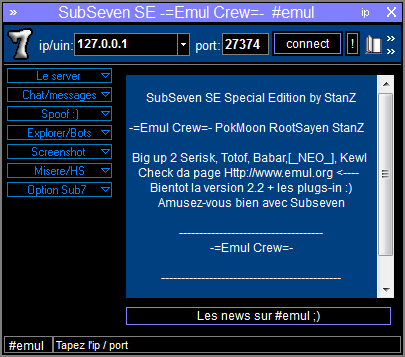

#  - subseven.exe
## Informations
| Label | Value |
| :--- | ---: |
| Executable Name | subseven.exe |
| Product Name |  |
| Version Number |  |
| Description |  |
| Company Name |  |
| Copyright |  |
| Trademarks |  |
| Last Edition | 06/08/2000 05:12:06 |
| Size | 625664 |
| SHA1 🔎 | [73B78F9830795C17D859C123F33DA09346B5769D](https://www.virustotal.com/gui/search/73B78F9830795C17D859C123F33DA09346B5769D) |
| Language |  |
## Static Analysis
<details>
<summary>Manalyze</summary>
<p>

```

* Manalyze 0.9 *

-------------------------------------------------------------------------------
C:/Users/IEUser/Desktop/net6.0/Malwares/SubSeven7Fr/subseven.exe
-------------------------------------------------------------------------------

Summary:
--------
Architecture:       IMAGE_FILE_MACHINE_I386
Subsystem:          IMAGE_SUBSYSTEM_WINDOWS_GUI
Compilation Date:   1992-Jun-19 22:22:17
Detected languages: English - United States

DOS Header:
-----------
e_magic:    MZ
e_cblp:     0x0050
e_cp:       0x0002
e_crlc:     0x0000
e_cparhdr:  0x0004
e_minalloc: 0x000F
e_maxalloc: 0xFFFF
e_ss:       0x0000
e_sp:       0x00B8
e_csum:     0x0000
e_ip:       0x0000
e_cs:       0x0000
e_ovno:     0x001A
e_oemid:    0x0000
e_oeminfo:  0x0000
e_lfanew:   0x00000100

PE Header:
----------
Signature:            PE
Machine:              IMAGE_FILE_MACHINE_I386
NumberofSections:     3
TimeDateStamp:        1992-Jun-19 22:22:17
PointerToSymbolTable: 0x00000000
NumberOfSymbols:      0
SizeOfOptionalHeader: 0x00E0
Characteristics:      IMAGE_FILE_32BIT_MACHINE
                      IMAGE_FILE_BYTES_REVERSED_HI
                      IMAGE_FILE_BYTES_REVERSED_LO
                      IMAGE_FILE_EXECUTABLE_IMAGE
                      IMAGE_FILE_LINE_NUMS_STRIPPED
                      IMAGE_FILE_LOCAL_SYMS_STRIPPED
                      IMAGE_FILE_RELOCS_STRIPPED

Image Optional Header:
----------------------
Magic:                   PE32
LinkerVersion:           2.0
SizeOfCode:              0x00096000
SizeOfInitializedData:   0x00004000
SizeOfUninitializedData: 0x00150000
AddressOfEntryPoint:     0x001E63C0 (Section: UPX1)
BaseOfCode:              0x00151000
BaseOfData:              0x001E7000
ImageBase:               0x00400000
SectionAlignment:        0x00001000
FileAlignment:           0x00000200
OperatingSystemVersion:  1.0
ImageVersion:            0.0
SubsystemVersion:        4.0
Win32VersionValue:       0
SizeOfImage:             0x001EB000
SizeOfHeaders:           0x00000400
Checksum:                0x00000000
Subsystem:               IMAGE_SUBSYSTEM_WINDOWS_GUI
SizeofStackReserve:      0x00100000
SizeofStackCommit:       0x00004000
SizeofHeapReserve:       0x00100000
SizeofHeapCommit:        0x00001000
LoaderFlags:             0x00000000
NumberOfRvaAndSizes:     16

Sections:
---------
UPX0:
    VirtualSize:          0x00150000
    VirtualAddress:       0x00001000
    SizeOfRawData:        0x00000000
    PointerToRawData:     0x00000400
    PointerToRelocations: 0x00000000
    PointerToLineNumbers: 0x00000000
    NumberOfLineNumbers:  0
    NumberOfRelocations:  0
    Characteristics:      IMAGE_SCN_CNT_UNINITIALIZED_DATA
                          IMAGE_SCN_MEM_EXECUTE
                          IMAGE_SCN_MEM_READ
                          IMAGE_SCN_MEM_WRITE

UPX1:
    VirtualSize:          0x00096000
    VirtualAddress:       0x00151000
    SizeOfRawData:        0x00095600
    PointerToRawData:     0x00000400
    PointerToRelocations: 0x00000000
    PointerToLineNumbers: 0x00000000
    NumberOfLineNumbers:  0
    NumberOfRelocations:  0
    Characteristics:      IMAGE_SCN_CNT_INITIALIZED_DATA
                          IMAGE_SCN_MEM_EXECUTE
                          IMAGE_SCN_MEM_READ
                          IMAGE_SCN_MEM_WRITE
    Entropy:              7.92289

.rsrc:
    VirtualSize:          0x00004000
    VirtualAddress:       0x001E7000
    SizeOfRawData:        0x00003200
    PointerToRawData:     0x00095A00
    PointerToRelocations: 0x00000000
    PointerToLineNumbers: 0x00000000
    NumberOfLineNumbers:  0
    NumberOfRelocations:  0
    Characteristics:      IMAGE_SCN_CNT_INITIALIZED_DATA
                          IMAGE_SCN_MEM_READ
                          IMAGE_SCN_MEM_WRITE
    Entropy:              3.50158


Imports:
--------
KERNEL32.DLL: LoadLibraryA
              GetProcAddress
              ExitProcess
advapi32.dll: RegCloseKey
comctl32.dll: ImageList_Add
comdlg32.dll: ChooseFontA
gdi32.dll:    Pie
ICQMAPI.dll:  ICQAPIUtil_FreeUser
ole32.dll:    OleDraw
oleaut32.dll: VariantClear
shell32.dll:  #155
user32.dll:   GetDC
winmm.dll:    PlaySoundA
winspool.drv: OpenPrinterA
wsock32.dll:  send

Resources:
----------
WAVE_1:
    Type:          WAVE
    Language:      UNKNOWN
    Codepage:      UNKNOWN
    Size:          6512
    TimeDateStamp: 2000-Apr-12 19:43:46
    Entropy:       7.88594

1:
    Type:          RT_CURSOR
    Language:      UNKNOWN
    Codepage:      UNKNOWN
    Size:          308
    TimeDateStamp: 2000-Apr-12 19:43:46
    Entropy:       7.23847

2:
    Type:          RT_CURSOR
    Language:      UNKNOWN
    Codepage:      UNKNOWN
    Size:          308
    TimeDateStamp: 2000-Apr-12 19:43:46
    Entropy:       7.22683

3:
    Type:          RT_CURSOR
    Language:      UNKNOWN
    Codepage:      UNKNOWN
    Size:          308
    TimeDateStamp: 2000-Apr-12 19:43:46
    Entropy:       7.21282

4:
    Type:          RT_CURSOR
    Language:      UNKNOWN
    Codepage:      UNKNOWN
    Size:          308
    TimeDateStamp: 2000-Apr-12 19:43:46
    Entropy:       7.27543

5:
    Type:          RT_CURSOR
    Language:      UNKNOWN
    Codepage:      UNKNOWN
    Size:          308
    TimeDateStamp: 2000-Apr-12 19:43:46
    Entropy:       7.20241

6:
    Type:          RT_CURSOR
    Language:      UNKNOWN
    Codepage:      UNKNOWN
    Size:          308
    TimeDateStamp: 2000-Apr-12 19:43:46
    Entropy:       7.10619

7:
    Type:          RT_CURSOR
    Language:      UNKNOWN
    Codepage:      UNKNOWN
    Size:          308
    TimeDateStamp: 2000-Apr-12 19:43:46
    Entropy:       7.19474

8:
    Type:          RT_CURSOR
    Language:      UNKNOWN
    Codepage:      UNKNOWN
    Size:          308
    TimeDateStamp: 2000-Apr-12 19:43:46
    Entropy:       7.12003

9:
    Type:          RT_CURSOR
    Language:      UNKNOWN
    Codepage:      UNKNOWN
    Size:          308
    TimeDateStamp: 2000-Apr-12 19:43:46
    Entropy:       7.2223

10:
    Type:          RT_CURSOR
    Language:      UNKNOWN
    Codepage:      UNKNOWN
    Size:          308
    TimeDateStamp: 2000-Apr-12 19:43:46
    Entropy:       7.04957

11:
    Type:          RT_CURSOR
    Language:      UNKNOWN
    Codepage:      UNKNOWN
    Size:          308
    TimeDateStamp: 2000-Apr-12 19:43:46
    Entropy:       6.89612

AD_HRL:
    Type:          RT_BITMAP
    Language:      UNKNOWN
    Codepage:      UNKNOWN
    Size:          152
    TimeDateStamp: 2000-Apr-12 19:43:46
    Entropy:       6.65987

AD_HTB:
    Type:          RT_BITMAP
    Language:      UNKNOWN
    Codepage:      UNKNOWN
    Size:          232
    TimeDateStamp: 2000-Apr-12 19:43:46
    Entropy:       6.93394

AD_VRL:
    Type:          RT_BITMAP
    Language:      UNKNOWN
    Codepage:      UNKNOWN
    Size:          168
    TimeDateStamp: 2000-Apr-12 19:43:46
    Entropy:       6.68521

AD_VTB:
    Type:          RT_BITMAP
    Language:      UNKNOWN
    Codepage:      UNKNOWN
    Size:          184
    TimeDateStamp: 2000-Apr-12 19:43:46
    Entropy:       6.35685

BBABORT:
    Type:          RT_BITMAP
    Language:      UNKNOWN
    Codepage:      UNKNOWN
    Size:          464
    TimeDateStamp: 2000-Apr-12 19:43:46
    Entropy:       7.26741

BBALL:
    Type:          RT_BITMAP
    Language:      UNKNOWN
    Codepage:      UNKNOWN
    Size:          484
    TimeDateStamp: 2000-Apr-12 19:43:46
    Entropy:       7.19648

BBCANCEL:
    Type:          RT_BITMAP
    Language:      UNKNOWN
    Codepage:      UNKNOWN
    Size:          464
    TimeDateStamp: 2000-Apr-12 19:43:46
    Entropy:       7.39517

BBCLOSE:
    Type:          RT_BITMAP
    Language:      UNKNOWN
    Codepage:      UNKNOWN
    Size:          464
    TimeDateStamp: 2000-Apr-12 19:43:46
    Entropy:       7.32318

BBHELP:
    Type:          RT_BITMAP
    Language:      UNKNOWN
    Codepage:      UNKNOWN
    Size:          464
    TimeDateStamp: 2000-Apr-12 19:43:46
    Entropy:       7.39862

BBIGNORE:
    Type:          RT_BITMAP
    Language:      UNKNOWN
    Codepage:      UNKNOWN
    Size:          464
    TimeDateStamp: 2000-Apr-12 19:43:46
    Entropy:       7.41718

BBNO:
    Type:          RT_BITMAP
    Language:      UNKNOWN
    Codepage:      UNKNOWN
    Size:          464
    TimeDateStamp: 2000-Apr-12 19:43:46
    Entropy:       7.46528

BBOK:
    Type:          RT_BITMAP
    Language:      UNKNOWN
    Codepage:      UNKNOWN
    Size:          464
    TimeDateStamp: 2000-Apr-12 19:43:46
    Entropy:       7.45987

BBRETRY:
    Type:          RT_BITMAP
    Language:      UNKNOWN
    Codepage:      UNKNOWN
    Size:          464
    TimeDateStamp: 2000-Apr-12 19:43:46
    Entropy:       7.44054

BBYES:
    Type:          RT_BITMAP
    Language:      UNKNOWN
    Codepage:      UNKNOWN
    Size:          464
    TimeDateStamp: 2000-Apr-12 19:43:46
    Entropy:       7.46347

BTN_FILL:
    Type:          RT_BITMAP
    Language:      UNKNOWN
    Codepage:      UNKNOWN
    Size:          1288
    TimeDateStamp: 2000-Apr-12 19:43:46
    Entropy:       7.70715

BUTTON:
    Type:          RT_BITMAP
    Language:      UNKNOWN
    Codepage:      UNKNOWN
    Size:          760
    TimeDateStamp: 2000-Apr-12 19:43:46
    Entropy:       7.67649

CDROM:
    Type:          RT_BITMAP
    Language:      UNKNOWN
    Codepage:      UNKNOWN
    Size:          192
    TimeDateStamp: 2000-Apr-12 19:43:46
    Entropy:       6.82159

CHECK_IMAGES:
    Type:          RT_BITMAP
    Language:      UNKNOWN
    Codepage:      UNKNOWN
    Size:          1976
    TimeDateStamp: 2000-Apr-12 19:43:46
    Entropy:       7.78782

CLOSEDFOLDER:
    Type:          RT_BITMAP
    Language:      UNKNOWN
    Codepage:      UNKNOWN
    Size:          224
    TimeDateStamp: 2000-Apr-12 19:43:46
    Entropy:       7.04325

CLOSE_BTN:
    Type:          RT_BITMAP
    Language:      UNKNOWN
    Codepage:      UNKNOWN
    Size:          1080
    TimeDateStamp: 2000-Apr-12 19:43:46
    Entropy:       7.7175

CURRENTFOLDER:
    Type:          RT_BITMAP
    Language:      UNKNOWN
    Codepage:      UNKNOWN
    Size:          224
    TimeDateStamp: 2000-Apr-12 19:43:46
    Entropy:       6.99131

DEVICE_FNT:
    Type:          RT_BITMAP
    Language:      UNKNOWN
    Codepage:      UNKNOWN
    Size:          248
    TimeDateStamp: 2000-Apr-12 19:43:46
    Entropy:       7.01489

EXECUTABLE:
    Type:          RT_BITMAP
    Language:      UNKNOWN
    Codepage:      UNKNOWN
    Size:          224
    TimeDateStamp: 2000-Apr-12 19:43:46
    Entropy:       7.01074

FLOPPY:
    Type:          RT_BITMAP
    Language:      UNKNOWN
    Codepage:      UNKNOWN
    Size:          192
    TimeDateStamp: 2000-Apr-12 19:43:46
    Entropy:       6.8776

HARD:
    Type:          RT_BITMAP
    Language:      UNKNOWN
    Codepage:      UNKNOWN
    Size:          192
    TimeDateStamp: 2000-Apr-12 19:43:46
    Entropy:       6.88291

IP_BTN:
    Type:          RT_BITMAP
    Language:      UNKNOWN
    Codepage:      UNKNOWN
    Size:          2320
    TimeDateStamp: 2000-Apr-12 19:43:46
    Entropy:       7.81882

KNOWNFILE:
    Type:          RT_BITMAP
    Language:      UNKNOWN
    Codepage:      UNKNOWN
    Size:          224
    TimeDateStamp: 2000-Apr-12 19:43:46
    Entropy:       6.9762

MAIN:
    Type:          RT_BITMAP
    Language:      UNKNOWN
    Codepage:      UNKNOWN
    Size:          44144
    TimeDateStamp: 2000-Apr-12 19:43:46
    Entropy:       7.90812

MIN_BTN:
    Type:          RT_BITMAP
    Language:      UNKNOWN
    Codepage:      UNKNOWN
    Size:          1080
    TimeDateStamp: 2000-Apr-12 19:43:46
    Entropy:       7.74151

NETWORK:
    Type:          RT_BITMAP
    Language:      UNKNOWN
    Codepage:      UNKNOWN
    Size:          192
    TimeDateStamp: 2000-Apr-12 19:43:46
    Entropy:       6.69192

OPENFOLDER:
    Type:          RT_BITMAP
    Language:      UNKNOWN
    Codepage:      UNKNOWN
    Size:          224
    TimeDateStamp: 2000-Apr-12 19:43:46
    Entropy:       6.67149

RAM:
    Type:          RT_BITMAP
    Language:      UNKNOWN
    Codepage:      UNKNOWN
    Size:          192
    TimeDateStamp: 2000-Apr-12 19:43:46
    Entropy:       6.71742

RXSPINDOWN:
    Type:          RT_BITMAP
    Language:      UNKNOWN
    Codepage:      UNKNOWN
    Size:          72
    TimeDateStamp: 2000-Apr-12 19:43:46
    Entropy:       5.76007

RXSPINUP:
    Type:          RT_BITMAP
    Language:      UNKNOWN
    Codepage:      UNKNOWN
    Size:          72
    TimeDateStamp: 2000-Apr-12 19:43:46
    Entropy:       5.77736

SPINDOWN:
    Type:          RT_BITMAP
    Language:      UNKNOWN
    Codepage:      UNKNOWN
    Size:          152
    TimeDateStamp: 2000-Apr-12 19:43:46
    Entropy:       6.71316

SPINUP:
    Type:          RT_BITMAP
    Language:      UNKNOWN
    Codepage:      UNKNOWN
    Size:          152
    TimeDateStamp: 2000-Apr-12 19:43:46
    Entropy:       6.50843

TRUETYPE_FNT:
    Type:          RT_BITMAP
    Language:      UNKNOWN
    Codepage:      UNKNOWN
    Size:          248
    TimeDateStamp: 2000-Apr-12 19:43:46
    Entropy:       6.93689

UNKNOWNFILE:
    Type:          RT_BITMAP
    Language:      UNKNOWN
    Codepage:      UNKNOWN
    Size:          224
    TimeDateStamp: 2000-Apr-12 19:43:46
    Entropy:       6.90344

W95_HRL:
    Type:          RT_BITMAP
    Language:      UNKNOWN
    Codepage:      UNKNOWN
    Size:          168
    TimeDateStamp: 2000-Apr-12 19:43:46
    Entropy:       6.76563

W95_HTB:
    Type:          RT_BITMAP
    Language:      UNKNOWN
    Codepage:      UNKNOWN
    Size:          308
    TimeDateStamp: 2000-Apr-12 19:43:46
    Entropy:       7.15268

W95_VRL:
    Type:          RT_BITMAP
    Language:      UNKNOWN
    Codepage:      UNKNOWN
    Size:          144
    TimeDateStamp: 2000-Apr-12 19:43:46
    Entropy:       6.4891

W95_VTB:
    Type:          RT_BITMAP
    Language:      UNKNOWN
    Codepage:      UNKNOWN
    Size:          284
    TimeDateStamp: 2000-Apr-12 19:43:46
    Entropy:       7.13835

WINDOW:
    Type:          RT_BITMAP
    Language:      UNKNOWN
    Codepage:      UNKNOWN
    Size:          5320
    TimeDateStamp: 2000-Apr-12 19:43:46
    Entropy:       7.8688

1001:
    Type:          RT_BITMAP
    Language:      English - United States
    Codepage:      UNKNOWN
    Size:          232
    TimeDateStamp: 2000-Apr-12 19:43:46
    Entropy:       6.89875

1002:
    Type:          RT_BITMAP
    Language:      UNKNOWN
    Codepage:      UNKNOWN
    Size:          232
    TimeDateStamp: 2000-Apr-12 19:43:46
    Entropy:       6.99769

1005:
    Type:          RT_BITMAP
    Language:      UNKNOWN
    Codepage:      UNKNOWN
    Size:          112
    TimeDateStamp: 2000-Apr-12 19:43:46
    Entropy:       6.23469

1 (#2):
    Type:          RT_ICON
    Language:      English - United States
    Codepage:      UNKNOWN
    Size:          1384
    TimeDateStamp: 2000-Apr-12 19:43:46
    Entropy:       2.03506

2 (#2):
    Type:          RT_ICON
    Language:      English - United States
    Codepage:      UNKNOWN
    Size:          2216
    TimeDateStamp: 2000-Apr-12 19:43:46
    Entropy:       2.63245

3819:
    Type:          RT_STRING
    Language:      UNKNOWN
    Codepage:      UNKNOWN
    Size:          548
    TimeDateStamp: 2000-Apr-12 19:43:46
    Entropy:       7.51277

3829:
    Type:          RT_STRING
    Language:      UNKNOWN
    Codepage:      UNKNOWN
    Size:          472
    TimeDateStamp: 2000-Apr-12 19:43:46
    Entropy:       7.45433

3830:
    Type:          RT_STRING
    Language:      UNKNOWN
    Codepage:      UNKNOWN
    Size:          44
    TimeDateStamp: 2000-Apr-12 19:43:46
    Entropy:       5.0958

4074:
    Type:          RT_STRING
    Language:      UNKNOWN
    Codepage:      UNKNOWN
    Size:          136
    TimeDateStamp: 2000-Apr-12 19:43:46
    Entropy:       6.57442

4075:
    Type:          RT_STRING
    Language:      UNKNOWN
    Codepage:      UNKNOWN
    Size:          800
    TimeDateStamp: 2000-Apr-12 19:43:46
    Entropy:       7.67814

4076:
    Type:          RT_STRING
    Language:      UNKNOWN
    Codepage:      UNKNOWN
    Size:          1156
    TimeDateStamp: 2000-Apr-12 19:43:46
    Entropy:       7.77431

4077:
    Type:          RT_STRING
    Language:      UNKNOWN
    Codepage:      UNKNOWN
    Size:          832
    TimeDateStamp: 2000-Apr-12 19:43:46
    Entropy:       7.59592

4078:
    Type:          RT_STRING
    Language:      UNKNOWN
    Codepage:      UNKNOWN
    Size:          556
    TimeDateStamp: 2000-Apr-12 19:43:46
    Entropy:       7.28483

4079:
    Type:          RT_STRING
    Language:      UNKNOWN
    Codepage:      UNKNOWN
    Size:          528
    TimeDateStamp: 2000-Apr-12 19:43:46
    Entropy:       7.2933

4080:
    Type:          RT_STRING
    Language:      UNKNOWN
    Codepage:      UNKNOWN
    Size:          536
    TimeDateStamp: 2000-Apr-12 19:43:46
    Entropy:       7.39808

4081:
    Type:          RT_STRING
    Language:      UNKNOWN
    Codepage:      UNKNOWN
    Size:          1088
    TimeDateStamp: 2000-Apr-12 19:43:46
    Entropy:       7.62158

4082:
    Type:          RT_STRING
    Language:      UNKNOWN
    Codepage:      UNKNOWN
    Size:          1000
    TimeDateStamp: 2000-Apr-12 19:43:46
    Entropy:       7.64205

4083:
    Type:          RT_STRING
    Language:      UNKNOWN
    Codepage:      UNKNOWN
    Size:          688
    TimeDateStamp: 2000-Apr-12 19:43:46
    Entropy:       7.56082

4084:
    Type:          RT_STRING
    Language:      UNKNOWN
    Codepage:      UNKNOWN
    Size:          212
    TimeDateStamp: 2000-Apr-12 19:43:46
    Entropy:       6.82866

4085:
    Type:          RT_STRING
    Language:      UNKNOWN
    Codepage:      UNKNOWN
    Size:          400
    TimeDateStamp: 2000-Apr-12 19:43:46
    Entropy:       7.36786

4086:
    Type:          RT_STRING
    Language:      UNKNOWN
    Codepage:      UNKNOWN
    Size:          476
    TimeDateStamp: 2000-Apr-12 19:43:46
    Entropy:       7.47726

4087:
    Type:          RT_STRING
    Language:      UNKNOWN
    Codepage:      UNKNOWN
    Size:          780
    TimeDateStamp: 2000-Apr-12 19:43:46
    Entropy:       7.58599

4088:
    Type:          RT_STRING
    Language:      UNKNOWN
    Codepage:      UNKNOWN
    Size:          1000
    TimeDateStamp: 2000-Apr-12 19:43:46
    Entropy:       7.71106

4089:
    Type:          RT_STRING
    Language:      UNKNOWN
    Codepage:      UNKNOWN
    Size:          888
    TimeDateStamp: 2000-Apr-12 19:43:46
    Entropy:       7.6698

4090:
    Type:          RT_STRING
    Language:      UNKNOWN
    Codepage:      UNKNOWN
    Size:          1032
    TimeDateStamp: 2000-Apr-12 19:43:46
    Entropy:       7.71048

4091:
    Type:          RT_STRING
    Language:      UNKNOWN
    Codepage:      UNKNOWN
    Size:          548
    TimeDateStamp: 2000-Apr-12 19:43:46
    Entropy:       7.45395

4092:
    Type:          RT_STRING
    Language:      UNKNOWN
    Codepage:      UNKNOWN
    Size:          228
    TimeDateStamp: 2000-Apr-12 19:43:46
    Entropy:       6.93818

4093:
    Type:          RT_STRING
    Language:      UNKNOWN
    Codepage:      UNKNOWN
    Size:          352
    TimeDateStamp: 2000-Apr-12 19:43:46
    Entropy:       7.23118

4094:
    Type:          RT_STRING
    Language:      UNKNOWN
    Codepage:      UNKNOWN
    Size:          888
    TimeDateStamp: 2000-Apr-12 19:43:46
    Entropy:       7.64809

4095:
    Type:          RT_STRING
    Language:      UNKNOWN
    Codepage:      UNKNOWN
    Size:          812
    TimeDateStamp: 2000-Apr-12 19:43:46
    Entropy:       7.63772

4096:
    Type:          RT_STRING
    Language:      UNKNOWN
    Codepage:      UNKNOWN
    Size:          788
    TimeDateStamp: 2000-Apr-12 19:43:46
    Entropy:       7.62649

DVCLAL:
    Type:          RT_RCDATA
    Language:      UNKNOWN
    Codepage:      UNKNOWN
    Size:          16
    TimeDateStamp: 2000-Apr-12 19:43:46
    Entropy:       3.875

PACKAGEINFO:
    Type:          RT_RCDATA
    Language:      UNKNOWN
    Codepage:      UNKNOWN
    Size:          1988
    TimeDateStamp: 2000-Apr-12 19:43:46
    Entropy:       7.79702

RCDATA_1:
    Type:          RT_RCDATA
    Language:      UNKNOWN
    Codepage:      UNKNOWN
    Size:          5994
    TimeDateStamp: 2000-Apr-12 19:43:46
    Entropy:       7.861

RCDATA_2:
    Type:          RT_RCDATA
    Language:      UNKNOWN
    Codepage:      UNKNOWN
    Size:          11264
    TimeDateStamp: 2000-Apr-12 19:43:46
    Entropy:       7.89726

TABOUT:
    Type:          RT_RCDATA
    Language:      UNKNOWN
    Codepage:      UNKNOWN
    Size:          2497
    TimeDateStamp: 2000-Apr-12 19:43:46
    Entropy:       7.78924

TADDPORT:
    Type:          RT_RCDATA
    Language:      UNKNOWN
    Codepage:      UNKNOWN
    Size:          1671
    TimeDateStamp: 2000-Apr-12 19:43:46
    Entropy:       7.72077

TADDRESSBOOK:
    Type:          RT_RCDATA
    Language:      UNKNOWN
    Codepage:      UNKNOWN
    Size:          7104
    TimeDateStamp: 2000-Apr-12 19:43:46
    Entropy:       7.86264

TAIMFORM:
    Type:          RT_RCDATA
    Language:      UNKNOWN
    Codepage:      UNKNOWN
    Size:          4204
    TimeDateStamp: 2000-Apr-12 19:43:46
    Entropy:       7.8522

TANIM:
    Type:          RT_RCDATA
    Language:      UNKNOWN
    Codepage:      UNKNOWN
    Size:          492
    TimeDateStamp: 2000-Apr-12 19:43:46
    Entropy:       7.39949

TBOOKMARKS:
    Type:          RT_RCDATA
    Language:      UNKNOWN
    Codepage:      UNKNOWN
    Size:          1746
    TimeDateStamp: 2000-Apr-12 19:43:46
    Entropy:       7.75619

TCLIENTCHAT:
    Type:          RT_RCDATA
    Language:      UNKNOWN
    Codepage:      UNKNOWN
    Size:          1677
    TimeDateStamp: 2000-Apr-12 19:43:46
    Entropy:       7.7864

TDISPINFO:
    Type:          RT_RCDATA
    Language:      UNKNOWN
    Codepage:      UNKNOWN
    Size:          1965
    TimeDateStamp: 2000-Apr-12 19:43:46
    Entropy:       7.7906

TDLG:
    Type:          RT_RCDATA
    Language:      UNKNOWN
    Codepage:      UNKNOWN
    Size:          1471
    TimeDateStamp: 2000-Apr-12 19:43:46
    Entropy:       7.77053

TFILEM:
    Type:          RT_RCDATA
    Language:      UNKNOWN
    Codepage:      UNKNOWN
    Size:          5187
    TimeDateStamp: 2000-Apr-12 19:43:46
    Entropy:       7.8718

TFINDFILES:
    Type:          RT_RCDATA
    Language:      UNKNOWN
    Codepage:      UNKNOWN
    Size:          1860
    TimeDateStamp: 2000-Apr-12 19:43:46
    Entropy:       7.79569

TFORM1:
    Type:          RT_RCDATA
    Language:      UNKNOWN
    Codepage:      UNKNOWN
    Size:          236
    TimeDateStamp: 2000-Apr-12 19:43:46
    Entropy:       7.03193

TGETNEWPATH:
    Type:          RT_RCDATA
    Language:      UNKNOWN
    Codepage:      UNKNOWN
    Size:          1505
    TimeDateStamp: 2000-Apr-12 19:43:46
    Entropy:       7.79095

TGETTEXTFORM:
    Type:          RT_RCDATA
    Language:      UNKNOWN
    Codepage:      UNKNOWN
    Size:          1434
    TimeDateStamp: 2000-Apr-12 19:43:46
    Entropy:       7.80286

TICQFORM:
    Type:          RT_RCDATA
    Language:      UNKNOWN
    Codepage:      UNKNOWN
    Size:          5644
    TimeDateStamp: 2000-Apr-12 19:43:46
    Entropy:       7.90037

TINTRO:
    Type:          RT_RCDATA
    Language:      UNKNOWN
    Codepage:      UNKNOWN
    Size:          183306
    TimeDateStamp: 2000-Apr-12 19:43:46
    Entropy:       7.9113

TIPTOOL:
    Type:          RT_RCDATA
    Language:      UNKNOWN
    Codepage:      UNKNOWN
    Size:          2671
    TimeDateStamp: 2000-Apr-12 19:43:46
    Entropy:       7.78972

TKEYLOGGER:
    Type:          RT_RCDATA
    Language:      UNKNOWN
    Codepage:      UNKNOWN
    Size:          2487
    TimeDateStamp: 2000-Apr-12 19:43:46
    Entropy:       7.40683

TMAINFORM:
    Type:          RT_RCDATA
    Language:      UNKNOWN
    Codepage:      UNKNOWN
    Size:          137471
    TimeDateStamp: 2000-Apr-12 19:43:46
    Entropy:       7.9252

TMSGFORM:
    Type:          RT_RCDATA
    Language:      UNKNOWN
    Codepage:      UNKNOWN
    Size:          1233
    TimeDateStamp: 2000-Apr-12 19:43:46
    Entropy:       7.55728

TMSNFORM:
    Type:          RT_RCDATA
    Language:      UNKNOWN
    Codepage:      UNKNOWN
    Size:          3458
    TimeDateStamp: 2000-Apr-12 19:43:46
    Entropy:       7.71675

TNMSHOW:
    Type:          RT_RCDATA
    Language:      UNKNOWN
    Codepage:      UNKNOWN
    Size:          7037
    TimeDateStamp: 2000-Apr-12 19:43:46
    Entropy:       7.78393

TNONSTOPFORM:
    Type:          RT_RCDATA
    Language:      UNKNOWN
    Codepage:      UNKNOWN
    Size:          2670
    TimeDateStamp: 2000-Apr-12 19:43:46
    Entropy:       7.78035

TOUTPAGESDIALOG:
    Type:          RT_RCDATA
    Language:      UNKNOWN
    Codepage:      UNKNOWN
    Size:          1985
    TimeDateStamp: 2000-Apr-12 19:43:46
    Entropy:       7.71372

TPASS:
    Type:          RT_RCDATA
    Language:      UNKNOWN
    Codepage:      UNKNOWN
    Size:          1896
    TimeDateStamp: 2000-Apr-12 19:43:46
    Entropy:       7.68844

TPOPUP:
    Type:          RT_RCDATA
    Language:      UNKNOWN
    Codepage:      UNKNOWN
    Size:          1792
    TimeDateStamp: 2000-Apr-12 19:43:46
    Entropy:       7.67363

TPROCM:
    Type:          RT_RCDATA
    Language:      UNKNOWN
    Codepage:      UNKNOWN
    Size:          2006
    TimeDateStamp: 2000-Apr-12 19:43:46
    Entropy:       7.79288

TREGEDIT:
    Type:          RT_RCDATA
    Language:      UNKNOWN
    Codepage:      UNKNOWN
    Size:          4003
    TimeDateStamp: 2000-Apr-12 19:43:46
    Entropy:       7.74485

TSHORTCUTFORM:
    Type:          RT_RCDATA
    Language:      UNKNOWN
    Codepage:      UNKNOWN
    Size:          2483
    TimeDateStamp: 2000-Apr-12 19:43:46
    Entropy:       7.74403

TSHOWIMG:
    Type:          RT_RCDATA
    Language:      UNKNOWN
    Codepage:      UNKNOWN
    Size:          1260
    TimeDateStamp: 2000-Apr-12 19:43:46
    Entropy:       7.53414

TSNIFFLOG:
    Type:          RT_RCDATA
    Language:      UNKNOWN
    Codepage:      UNKNOWN
    Size:          1897
    TimeDateStamp: 2000-Apr-12 19:43:46
    Entropy:       7.69553

TTHEMATRIX:
    Type:          RT_RCDATA
    Language:      UNKNOWN
    Codepage:      UNKNOWN
    Size:          2165
    TimeDateStamp: 2000-Apr-12 19:43:46
    Entropy:       7.69988

TVICTIMCHAT:
    Type:          RT_RCDATA
    Language:      UNKNOWN
    Codepage:      UNKNOWN
    Size:          1664
    TimeDateStamp: 2000-Apr-12 19:43:46
    Entropy:       7.56735

TWEBCAM:
    Type:          RT_RCDATA
    Language:      UNKNOWN
    Codepage:      UNKNOWN
    Size:          2044
    TimeDateStamp: 2000-Apr-12 19:43:46
    Entropy:       7.63969

TWINM:
    Type:          RT_RCDATA
    Language:      UNKNOWN
    Codepage:      UNKNOWN
    Size:          2498
    TimeDateStamp: 2000-Apr-12 19:43:46
    Entropy:       7.72843

RX_DRAGCUR:
    Type:          RT_GROUP_CURSOR
    Language:      UNKNOWN
    Codepage:      UNKNOWN
    Size:          20
    TimeDateStamp: 2000-Apr-12 19:43:46
    Entropy:       4.22193

RX_HANDCUR:
    Type:          RT_GROUP_CURSOR
    Language:      UNKNOWN
    Codepage:      UNKNOWN
    Size:          20
    TimeDateStamp: 2000-Apr-12 19:43:46
    Entropy:       4.22193

1003:
    Type:          RT_GROUP_CURSOR
    Language:      UNKNOWN
    Codepage:      UNKNOWN
    Size:          20
    TimeDateStamp: 2000-Apr-12 19:43:46
    Entropy:       4.12193

1006:
    Type:          RT_GROUP_CURSOR
    Language:      UNKNOWN
    Codepage:      UNKNOWN
    Size:          20
    TimeDateStamp: 2000-Apr-12 19:43:46
    Entropy:       4.32193

32761:
    Type:          RT_GROUP_CURSOR
    Language:      UNKNOWN
    Codepage:      UNKNOWN
    Size:          20
    TimeDateStamp: 2000-Apr-12 19:43:46
    Entropy:       4.12193

32762:
    Type:          RT_GROUP_CURSOR
    Language:      UNKNOWN
    Codepage:      UNKNOWN
    Size:          20
    TimeDateStamp: 2000-Apr-12 19:43:46
    Entropy:       4.22193

32763:
    Type:          RT_GROUP_CURSOR
    Language:      UNKNOWN
    Codepage:      UNKNOWN
    Size:          20
    TimeDateStamp: 2000-Apr-12 19:43:46
    Entropy:       4.12193

32764:
    Type:          RT_GROUP_CURSOR
    Language:      UNKNOWN
    Codepage:      UNKNOWN
    Size:          20
    TimeDateStamp: 2000-Apr-12 19:43:46
    Entropy:       4.12193

32765:
    Type:          RT_GROUP_CURSOR
    Language:      UNKNOWN
    Codepage:      UNKNOWN
    Size:          20
    TimeDateStamp: 2000-Apr-12 19:43:46
    Entropy:       4.32193

32766:
    Type:          RT_GROUP_CURSOR
    Language:      UNKNOWN
    Codepage:      UNKNOWN
    Size:          20
    TimeDateStamp: 2000-Apr-12 19:43:46
    Entropy:       4.12193

32767:
    Type:          RT_GROUP_CURSOR
    Language:      UNKNOWN
    Codepage:      UNKNOWN
    Size:          20
    TimeDateStamp: 2000-Apr-12 19:43:46
    Entropy:       4.32193

MAINICON:
    Type:              RT_GROUP_ICON
    Language:          English - United States
    Codepage:          UNKNOWN
    Size:              34
    TimeDateStamp:     2000-Apr-12 19:43:46
    Entropy:           2.32824
    Detected Filetype: Icon file


[ SUSPICIOUS ] PEiD Signature:
    UPX -> www.upx.sourceforge.net

[ SUSPICIOUS ] The PE is packed with UPX
    Unusual section name found: UPX0
    Section UPX0 is both writable and executable.
    Unusual section name found: UPX1
    Section UPX1 is both writable and executable.

The PE contains common functions which appear in legitimate applications.
    [!] The program may be hiding some of its imports:
        LoadLibraryA
        GetProcAddress
    Can access the registry:
        RegCloseKey

[ SUSPICIOUS ] The PE header may have been manually modified.
    Resource WAVE_1 is possibly compressed or encrypted.
    Resource 1 is possibly compressed or encrypted.
    Resource 2 is possibly compressed or encrypted.
    Resource 3 is possibly compressed or encrypted.
    Resource 4 is possibly compressed or encrypted.
    Resource 5 is possibly compressed or encrypted.
    Resource 6 is possibly compressed or encrypted.
    Resource 7 is possibly compressed or encrypted.
    Resource 8 is possibly compressed or encrypted.
    Resource 9 is possibly compressed or encrypted.
    Resource 10 is possibly compressed or encrypted.
    Resource BBABORT is possibly compressed or encrypted.
    Resource BBALL is possibly compressed or encrypted.
    Resource BBCANCEL is possibly compressed or encrypted.
    Resource BBCLOSE is possibly compressed or encrypted.
    Resource BBHELP is possibly compressed or encrypted.
    Resource BBIGNORE is possibly compressed or encrypted.
    Resource BBNO is possibly compressed or encrypted.
    Resource BBOK is possibly compressed or encrypted.
    Resource BBRETRY is possibly compressed or encrypted.
    Resource BBYES is possibly compressed or encrypted.
    Resource BTN_FILL is possibly compressed or encrypted.
    Resource BUTTON is possibly compressed or encrypted.
    Resource CHECK_IMAGES is possibly compressed or encrypted.
    Resource CLOSEDFOLDER is possibly compressed or encrypted.
    Resource CLOSE_BTN is possibly compressed or encrypted.
    Resource DEVICE_FNT is possibly compressed or encrypted.
    Resource EXECUTABLE is possibly compressed or encrypted.
    Resource IP_BTN is possibly compressed or encrypted.
    Resource MAIN is possibly compressed or encrypted.
    Resource MIN_BTN is possibly compressed or encrypted.
    Resource W95_HTB is possibly compressed or encrypted.
    Resource W95_VTB is possibly compressed or encrypted.
    Resource WINDOW is possibly compressed or encrypted.
    Resource 3819 is possibly compressed or encrypted.
    Resource 3829 is possibly compressed or encrypted.
    Resource 4075 is possibly compressed or encrypted.
    Resource 4076 is possibly compressed or encrypted.
    Resource 4077 is possibly compressed or encrypted.
    Resource 4078 is possibly compressed or encrypted.
    Resource 4079 is possibly compressed or encrypted.
    Resource 4080 is possibly compressed or encrypted.
    Resource 4081 is possibly compressed or encrypted.
    Resource 4082 is possibly compressed or encrypted.
    Resource 4083 is possibly compressed or encrypted.
    Resource 4085 is possibly compressed or encrypted.
    Resource 4086 is possibly compressed or encrypted.
    Resource 4087 is possibly compressed or encrypted.
    Resource 4088 is possibly compressed or encrypted.
    Resource 4089 is possibly compressed or encrypted.
    Resource 4090 is possibly compressed or encrypted.
    Resource 4091 is possibly compressed or encrypted.
    Resource 4093 is possibly compressed or encrypted.
    Resource 4094 is possibly compressed or encrypted.
    Resource 4095 is possibly compressed or encrypted.
    Resource 4096 is possibly compressed or encrypted.
    Resource PACKAGEINFO is possibly compressed or encrypted.
    Resource RCDATA_1 is possibly compressed or encrypted.
    Resource RCDATA_2 is possibly compressed or encrypted.
    Resource TABOUT is possibly compressed or encrypted.
    Resource TADDPORT is possibly compressed or encrypted.
    Resource TADDRESSBOOK is possibly compressed or encrypted.
    Resource TAIMFORM is possibly compressed or encrypted.
    Resource TANIM is possibly compressed or encrypted.
    Resource TBOOKMARKS is possibly compressed or encrypted.
    Resource TCLIENTCHAT is possibly compressed or encrypted.
    Resource TDISPINFO is possibly compressed or encrypted.
    Resource TDLG is possibly compressed or encrypted.
    Resource TFILEM is possibly compressed or encrypted.
    Resource TFINDFILES is possibly compressed or encrypted.
    Resource TFORM1 is possibly compressed or encrypted.
    Resource TGETNEWPATH is possibly compressed or encrypted.
    Resource TGETTEXTFORM is possibly compressed or encrypted.
    Resource TICQFORM is possibly compressed or encrypted.
    Resource TINTRO is possibly compressed or encrypted.
    Resource TIPTOOL is possibly compressed or encrypted.
    Resource TKEYLOGGER is possibly compressed or encrypted.
    Resource TMAINFORM is possibly compressed or encrypted.
    Resource TMSGFORM is possibly compressed or encrypted.
    Resource TMSNFORM is possibly compressed or encrypted.
    Resource TNMSHOW is possibly compressed or encrypted.
    Resource TNONSTOPFORM is possibly compressed or encrypted.
    Resource TOUTPAGESDIALOG is possibly compressed or encrypted.
    Resource TPASS is possibly compressed or encrypted.
    Resource TPOPUP is possibly compressed or encrypted.
    Resource TPROCM is possibly compressed or encrypted.
    Resource TREGEDIT is possibly compressed or encrypted.
    Resource TSHORTCUTFORM is possibly compressed or encrypted.
    Resource TSHOWIMG is possibly compressed or encrypted.
    Resource TSNIFFLOG is possibly compressed or encrypted.
    Resource TTHEMATRIX is possibly compressed or encrypted.
    Resource TVICTIMCHAT is possibly compressed or encrypted.
    Resource TWEBCAM is possibly compressed or encrypted.
    Resource TWINM is possibly compressed or encrypted.
    The resource timestamps differ from the PE header:
        2000-Apr-12 19:43:46
    Resources amount for 83.5297% of the executable.

The following exploit mitigation techniques have been detected
    Stack Canary: disabled
    SafeSEH: disabled
    ASLR: disabled
    DEP: disabled
    CFG: disabled


```

</p>
</details>

## Screenshots
### SubSeven
 
