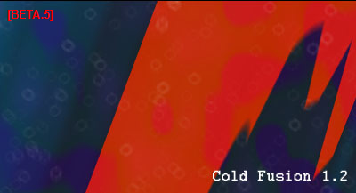

#  - client.exe
## Informations
| Label | Value |
| :--- | ---: |
| Executable Name | client.exe |
| Product Name |  |
| Version Number |  |
| Description |  |
| Company Name |  |
| Copyright |  |
| Trademarks |  |
| Last Edition | 14/02/2005 16:52:24 |
| Size | 669696 |
| SHA1 🔎 | [75F8551BA1BBDF768491490CEAF90B1404F1ECAC](https://www.virustotal.com/gui/search/75F8551BA1BBDF768491490CEAF90B1404F1ECAC) |
| Language |  |
## Static Analysis
<details>
<summary>Manalyze</summary>
<p>

```

* Manalyze 0.9 *

-------------------------------------------------------------------------------
C:/Users/IEUser/Desktop/net6.0/Malwares/Cold Fusion v1.2/Cold Fusion v1.2/client.exe
-------------------------------------------------------------------------------

Summary:
--------
Architecture:       IMAGE_FILE_MACHINE_I386
Subsystem:          IMAGE_SUBSYSTEM_WINDOWS_GUI
Compilation Date:   1992-Jun-19 22:22:17
Detected languages: Dutch - Netherlands
                    Portuguese - Portugal

DOS Header:
-----------
e_magic:    MZ
e_cblp:     0x0050
e_cp:       0x0002
e_crlc:     0x0000
e_cparhdr:  0x0004
e_minalloc: 0x000F
e_maxalloc: 0xFFFF
e_ss:       0x0000
e_sp:       0x00B8
e_csum:     0x0000
e_ip:       0x0000
e_cs:       0x0000
e_ovno:     0x001A
e_oemid:    0x0000
e_oeminfo:  0x0000
e_lfanew:   0x00000100

PE Header:
----------
Signature:            PE
Machine:              IMAGE_FILE_MACHINE_I386
NumberofSections:     3
TimeDateStamp:        1992-Jun-19 22:22:17
PointerToSymbolTable: 0x00000000
NumberOfSymbols:      0
SizeOfOptionalHeader: 0x00E0
Characteristics:      IMAGE_FILE_32BIT_MACHINE
                      IMAGE_FILE_BYTES_REVERSED_HI
                      IMAGE_FILE_BYTES_REVERSED_LO
                      IMAGE_FILE_EXECUTABLE_IMAGE
                      IMAGE_FILE_LINE_NUMS_STRIPPED
                      IMAGE_FILE_LOCAL_SYMS_STRIPPED
                      IMAGE_FILE_RELOCS_STRIPPED

Image Optional Header:
----------------------
Magic:                   PE32
LinkerVersion:           2.0
SizeOfCode:              0x000A2000
SizeOfInitializedData:   0x00002000
SizeOfUninitializedData: 0x000E5000
AddressOfEntryPoint:     0x00187950 (Section: UPX1)
BaseOfCode:              0x000E6000
BaseOfData:              0x00188000
ImageBase:               0x00400000
SectionAlignment:        0x00001000
FileAlignment:           0x00000200
OperatingSystemVersion:  4.0
ImageVersion:            0.0
SubsystemVersion:        4.0
Win32VersionValue:       0
SizeOfImage:             0x0018A000
SizeOfHeaders:           0x00001000
Checksum:                0x00000000
Subsystem:               IMAGE_SUBSYSTEM_WINDOWS_GUI
SizeofStackReserve:      0x00100000
SizeofStackCommit:       0x00004000
SizeofHeapReserve:       0x00100000
SizeofHeapCommit:        0x00001000
LoaderFlags:             0x00000000
NumberOfRvaAndSizes:     16

Sections:
---------
UPX0:
    VirtualSize:          0x000E5000
    VirtualAddress:       0x00001000
    SizeOfRawData:        0x00000000
    PointerToRawData:     0x00000400
    PointerToRelocations: 0x00000000
    PointerToLineNumbers: 0x00000000
    NumberOfLineNumbers:  0
    NumberOfRelocations:  0
    Characteristics:      IMAGE_SCN_CNT_UNINITIALIZED_DATA
                          IMAGE_SCN_MEM_EXECUTE
                          IMAGE_SCN_MEM_READ
                          IMAGE_SCN_MEM_WRITE

UPX1:
    VirtualSize:          0x000A2000
    VirtualAddress:       0x000E6000
    SizeOfRawData:        0x000A1C00
    PointerToRawData:     0x00000400
    PointerToRelocations: 0x00000000
    PointerToLineNumbers: 0x00000000
    NumberOfLineNumbers:  0
    NumberOfRelocations:  0
    Characteristics:      IMAGE_SCN_CNT_INITIALIZED_DATA
                          IMAGE_SCN_MEM_EXECUTE
                          IMAGE_SCN_MEM_READ
                          IMAGE_SCN_MEM_WRITE
    Entropy:              7.94486

.rsrc:
    VirtualSize:          0x00002000
    VirtualAddress:       0x00188000
    SizeOfRawData:        0x00001800
    PointerToRawData:     0x000A2000
    PointerToRelocations: 0x00000000
    PointerToLineNumbers: 0x00000000
    NumberOfLineNumbers:  0
    NumberOfRelocations:  0
    Characteristics:      IMAGE_SCN_CNT_INITIALIZED_DATA
                          IMAGE_SCN_MEM_READ
                          IMAGE_SCN_MEM_WRITE
    Entropy:              3.72734


Imports:
--------
KERNEL32.DLL: LoadLibraryA
              GetProcAddress
              ExitProcess
advapi32.dll: RegFlushKey
comctl32.dll: ImageList_Add
comdlg32.dll: GetSaveFileNameA
gdi32.dll:    Pie
ole32.dll:    OleDraw
oleaut32.dll: VariantCopy
shell32.dll:  DragFinish
user32.dll:   GetDC
version.dll:  VerQueryValueA
wininet.dll:  FtpPutFileA
winmm.dll:    PlaySoundA
wsock32.dll:  send

Resources:
----------
CLICK:
    Type:          WAVE
    Language:      UNKNOWN
    Codepage:      UNKNOWN
    Size:          10534
    TimeDateStamp: 2005-Feb-14 17:52:22
    Entropy:       7.89079

CLICK_SOFT:
    Type:          WAVE
    Language:      UNKNOWN
    Codepage:      UNKNOWN
    Size:          1404
    TimeDateStamp: 2005-Feb-14 17:52:22
    Entropy:       7.70209

CONNECTION:
    Type:          WAVE
    Language:      UNKNOWN
    Codepage:      UNKNOWN
    Size:          55490
    TimeDateStamp: 2005-Feb-14 17:52:22
    Entropy:       7.915

DISCONNECT:
    Type:          WAVE
    Language:      UNKNOWN
    Codepage:      UNKNOWN
    Size:          9126
    TimeDateStamp: 2005-Feb-14 17:52:22
    Entropy:       7.85586

INITIALIZE:
    Type:          WAVE
    Language:      UNKNOWN
    Codepage:      UNKNOWN
    Size:          31150
    TimeDateStamp: 2005-Feb-14 17:52:22
    Entropy:       7.90512

READY:
    Type:          WAVE
    Language:      UNKNOWN
    Codepage:      UNKNOWN
    Size:          57540
    TimeDateStamp: 2005-Feb-14 17:52:22
    Entropy:       7.90525

STARTSIN:
    Type:          WAVE
    Language:      UNKNOWN
    Codepage:      UNKNOWN
    Size:          49196
    TimeDateStamp: 2005-Feb-14 17:52:22
    Entropy:       7.90398

TRANSFCOMP:
    Type:          WAVE
    Language:      UNKNOWN
    Codepage:      UNKNOWN
    Size:          25704
    TimeDateStamp: 2005-Feb-14 17:52:22
    Entropy:       7.9107

1:
    Type:          RT_CURSOR
    Language:      UNKNOWN
    Codepage:      UNKNOWN
    Size:          308
    TimeDateStamp: 2005-Feb-14 17:52:22
    Entropy:       7.10402

2:
    Type:          RT_CURSOR
    Language:      UNKNOWN
    Codepage:      UNKNOWN
    Size:          308
    TimeDateStamp: 2005-Feb-14 17:52:22
    Entropy:       7.19633

3:
    Type:          RT_CURSOR
    Language:      UNKNOWN
    Codepage:      UNKNOWN
    Size:          308
    TimeDateStamp: 2005-Feb-14 17:52:22
    Entropy:       7.2056

4:
    Type:          RT_CURSOR
    Language:      UNKNOWN
    Codepage:      UNKNOWN
    Size:          308
    TimeDateStamp: 2005-Feb-14 17:52:22
    Entropy:       7.12219

5:
    Type:          RT_CURSOR
    Language:      UNKNOWN
    Codepage:      UNKNOWN
    Size:          308
    TimeDateStamp: 2005-Feb-14 17:52:22
    Entropy:       7.20613

6:
    Type:          RT_CURSOR
    Language:      UNKNOWN
    Codepage:      UNKNOWN
    Size:          308
    TimeDateStamp: 2005-Feb-14 17:52:22
    Entropy:       7.26617

7:
    Type:          RT_CURSOR
    Language:      UNKNOWN
    Codepage:      UNKNOWN
    Size:          308
    TimeDateStamp: 2005-Feb-14 17:52:22
    Entropy:       7.22818

BBABORT:
    Type:          RT_BITMAP
    Language:      UNKNOWN
    Codepage:      UNKNOWN
    Size:          464
    TimeDateStamp: 2005-Feb-14 17:52:22
    Entropy:       7.30222

BBALL:
    Type:          RT_BITMAP
    Language:      UNKNOWN
    Codepage:      UNKNOWN
    Size:          484
    TimeDateStamp: 2005-Feb-14 17:52:22
    Entropy:       7.38148

BBCANCEL:
    Type:          RT_BITMAP
    Language:      UNKNOWN
    Codepage:      UNKNOWN
    Size:          464
    TimeDateStamp: 2005-Feb-14 17:52:22
    Entropy:       7.39933

BBCLOSE:
    Type:          RT_BITMAP
    Language:      UNKNOWN
    Codepage:      UNKNOWN
    Size:          464
    TimeDateStamp: 2005-Feb-14 17:52:22
    Entropy:       7.38392

BBHELP:
    Type:          RT_BITMAP
    Language:      UNKNOWN
    Codepage:      UNKNOWN
    Size:          464
    TimeDateStamp: 2005-Feb-14 17:52:22
    Entropy:       7.34047

BBIGNORE:
    Type:          RT_BITMAP
    Language:      UNKNOWN
    Codepage:      UNKNOWN
    Size:          464
    TimeDateStamp: 2005-Feb-14 17:52:22
    Entropy:       7.41177

BBNO:
    Type:          RT_BITMAP
    Language:      UNKNOWN
    Codepage:      UNKNOWN
    Size:          464
    TimeDateStamp: 2005-Feb-14 17:52:22
    Entropy:       7.31854

BBOK:
    Type:          RT_BITMAP
    Language:      UNKNOWN
    Codepage:      UNKNOWN
    Size:          464
    TimeDateStamp: 2005-Feb-14 17:52:22
    Entropy:       7.44444

BBRETRY:
    Type:          RT_BITMAP
    Language:      UNKNOWN
    Codepage:      UNKNOWN
    Size:          464
    TimeDateStamp: 2005-Feb-14 17:52:22
    Entropy:       7.40886

BBYES:
    Type:          RT_BITMAP
    Language:      UNKNOWN
    Codepage:      UNKNOWN
    Size:          464
    TimeDateStamp: 2005-Feb-14 17:52:22
    Entropy:       7.44245

MSN:
    Type:          RT_BITMAP
    Language:      Dutch - Netherlands
    Codepage:      UNKNOWN
    Size:          1288
    TimeDateStamp: 2005-Feb-14 17:52:22
    Entropy:       7.78055

PREVIEWGLYPH:
    Type:          RT_BITMAP
    Language:      UNKNOWN
    Codepage:      UNKNOWN
    Size:          232
    TimeDateStamp: 2005-Feb-14 17:52:22
    Entropy:       7.06665

1 (#2):
    Type:          RT_ICON
    Language:      Portuguese - Portugal
    Codepage:      UNKNOWN
    Size:          744
    TimeDateStamp: 2005-Feb-14 17:52:22
    Entropy:       3.18763

DLGTEMPLATE:
    Type:          RT_DIALOG
    Language:      UNKNOWN
    Codepage:      UNKNOWN
    Size:          82
    TimeDateStamp: 2005-Feb-14 17:52:22
    Entropy:       5.97329

4077:
    Type:          RT_STRING
    Language:      UNKNOWN
    Codepage:      UNKNOWN
    Size:          1140
    TimeDateStamp: 2005-Feb-14 17:52:22
    Entropy:       7.74301

4078:
    Type:          RT_STRING
    Language:      UNKNOWN
    Codepage:      UNKNOWN
    Size:          1024
    TimeDateStamp: 2005-Feb-14 17:52:22
    Entropy:       7.68166

4079:
    Type:          RT_STRING
    Language:      UNKNOWN
    Codepage:      UNKNOWN
    Size:          468
    TimeDateStamp: 2005-Feb-14 17:52:22
    Entropy:       7.37499

4080:
    Type:          RT_STRING
    Language:      UNKNOWN
    Codepage:      UNKNOWN
    Size:          384
    TimeDateStamp: 2005-Feb-14 17:52:22
    Entropy:       7.32646

4081:
    Type:          RT_STRING
    Language:      UNKNOWN
    Codepage:      UNKNOWN
    Size:          488
    TimeDateStamp: 2005-Feb-14 17:52:22
    Entropy:       7.31663

4082:
    Type:          RT_STRING
    Language:      UNKNOWN
    Codepage:      UNKNOWN
    Size:          940
    TimeDateStamp: 2005-Feb-14 17:52:22
    Entropy:       7.61879

4083:
    Type:          RT_STRING
    Language:      UNKNOWN
    Codepage:      UNKNOWN
    Size:          188
    TimeDateStamp: 2005-Feb-14 17:52:22
    Entropy:       6.79311

4084:
    Type:          RT_STRING
    Language:      UNKNOWN
    Codepage:      UNKNOWN
    Size:          268
    TimeDateStamp: 2005-Feb-14 17:52:22
    Entropy:       7.14052

4085:
    Type:          RT_STRING
    Language:      UNKNOWN
    Codepage:      UNKNOWN
    Size:          440
    TimeDateStamp: 2005-Feb-14 17:52:22
    Entropy:       7.44592

4086:
    Type:          RT_STRING
    Language:      UNKNOWN
    Codepage:      UNKNOWN
    Size:          1168
    TimeDateStamp: 2005-Feb-14 17:52:22
    Entropy:       7.71787

4087:
    Type:          RT_STRING
    Language:      UNKNOWN
    Codepage:      UNKNOWN
    Size:          956
    TimeDateStamp: 2005-Feb-14 17:52:22
    Entropy:       7.69614

4088:
    Type:          RT_STRING
    Language:      UNKNOWN
    Codepage:      UNKNOWN
    Size:          980
    TimeDateStamp: 2005-Feb-14 17:52:22
    Entropy:       7.71832

4089:
    Type:          RT_STRING
    Language:      UNKNOWN
    Codepage:      UNKNOWN
    Size:          900
    TimeDateStamp: 2005-Feb-14 17:52:22
    Entropy:       7.64089

4090:
    Type:          RT_STRING
    Language:      UNKNOWN
    Codepage:      UNKNOWN
    Size:          920
    TimeDateStamp: 2005-Feb-14 17:52:22
    Entropy:       7.72529

4091:
    Type:          RT_STRING
    Language:      UNKNOWN
    Codepage:      UNKNOWN
    Size:          228
    TimeDateStamp: 2005-Feb-14 17:52:22
    Entropy:       6.92143

4092:
    Type:          RT_STRING
    Language:      UNKNOWN
    Codepage:      UNKNOWN
    Size:          188
    TimeDateStamp: 2005-Feb-14 17:52:22
    Entropy:       6.77183

4093:
    Type:          RT_STRING
    Language:      UNKNOWN
    Codepage:      UNKNOWN
    Size:          756
    TimeDateStamp: 2005-Feb-14 17:52:22
    Entropy:       7.62147

4094:
    Type:          RT_STRING
    Language:      UNKNOWN
    Codepage:      UNKNOWN
    Size:          1072
    TimeDateStamp: 2005-Feb-14 17:52:22
    Entropy:       7.69544

4095:
    Type:          RT_STRING
    Language:      UNKNOWN
    Codepage:      UNKNOWN
    Size:          816
    TimeDateStamp: 2005-Feb-14 17:52:22
    Entropy:       7.6974

4096:
    Type:          RT_STRING
    Language:      UNKNOWN
    Codepage:      UNKNOWN
    Size:          788
    TimeDateStamp: 2005-Feb-14 17:52:22
    Entropy:       7.50451

DVCLAL:
    Type:          RT_RCDATA
    Language:      UNKNOWN
    Codepage:      UNKNOWN
    Size:          16
    TimeDateStamp: 2005-Feb-14 17:52:22
    Entropy:       4

PACKAGEINFO:
    Type:          RT_RCDATA
    Language:      UNKNOWN
    Codepage:      UNKNOWN
    Size:          1072
    TimeDateStamp: 2005-Feb-14 17:52:22
    Entropy:       7.63487

TCOLD_CLENT:
    Type:          RT_RCDATA
    Language:      UNKNOWN
    Codepage:      UNKNOWN
    Size:          142018
    TimeDateStamp: 2005-Feb-14 17:52:22
    Entropy:       7.94858

TFORM10:
    Type:          RT_RCDATA
    Language:      UNKNOWN
    Codepage:      UNKNOWN
    Size:          39918
    TimeDateStamp: 2005-Feb-14 17:52:22
    Entropy:       7.88437

TFORM11:
    Type:          RT_RCDATA
    Language:      UNKNOWN
    Codepage:      UNKNOWN
    Size:          3963
    TimeDateStamp: 2005-Feb-14 17:52:22
    Entropy:       7.86962

TFORM12:
    Type:          RT_RCDATA
    Language:      UNKNOWN
    Codepage:      UNKNOWN
    Size:          25285
    TimeDateStamp: 2005-Feb-14 17:52:22
    Entropy:       7.86262

TFORM13:
    Type:          RT_RCDATA
    Language:      UNKNOWN
    Codepage:      UNKNOWN
    Size:          544
    TimeDateStamp: 2005-Feb-14 17:52:22
    Entropy:       7.55307

TFORM2:
    Type:          RT_RCDATA
    Language:      UNKNOWN
    Codepage:      UNKNOWN
    Size:          5872
    TimeDateStamp: 2005-Feb-14 17:52:22
    Entropy:       7.88847

TFORM3:
    Type:          RT_RCDATA
    Language:      UNKNOWN
    Codepage:      UNKNOWN
    Size:          1230
    TimeDateStamp: 2005-Feb-14 17:52:22
    Entropy:       7.76659

TFORM4:
    Type:          RT_RCDATA
    Language:      UNKNOWN
    Codepage:      UNKNOWN
    Size:          1831
    TimeDateStamp: 2005-Feb-14 17:52:22
    Entropy:       7.81632

TFORM5:
    Type:          RT_RCDATA
    Language:      UNKNOWN
    Codepage:      UNKNOWN
    Size:          5493
    TimeDateStamp: 2005-Feb-14 17:52:22
    Entropy:       7.86131

TFORM7:
    Type:          RT_RCDATA
    Language:      UNKNOWN
    Codepage:      UNKNOWN
    Size:          1076
    TimeDateStamp: 2005-Feb-14 17:52:22
    Entropy:       7.65353

TFORM8:
    Type:          RT_RCDATA
    Language:      UNKNOWN
    Codepage:      UNKNOWN
    Size:          15359
    TimeDateStamp: 2005-Feb-14 17:52:22
    Entropy:       7.91668

TFORM9:
    Type:          RT_RCDATA
    Language:      UNKNOWN
    Codepage:      UNKNOWN
    Size:          1661
    TimeDateStamp: 2005-Feb-14 17:52:22
    Entropy:       7.81675

TFRMFILEMANAGER:
    Type:          RT_RCDATA
    Language:      UNKNOWN
    Codepage:      UNKNOWN
    Size:          79532
    TimeDateStamp: 2005-Feb-14 17:52:22
    Entropy:       7.8926

TSPLASH:
    Type:          RT_RCDATA
    Language:      UNKNOWN
    Codepage:      UNKNOWN
    Size:          26619
    TimeDateStamp: 2005-Feb-14 17:52:22
    Entropy:       7.81289

32761:
    Type:          RT_GROUP_CURSOR
    Language:      UNKNOWN
    Codepage:      UNKNOWN
    Size:          20
    TimeDateStamp: 2005-Feb-14 17:52:22
    Entropy:       4.22193

32762:
    Type:          RT_GROUP_CURSOR
    Language:      UNKNOWN
    Codepage:      UNKNOWN
    Size:          20
    TimeDateStamp: 2005-Feb-14 17:52:22
    Entropy:       4.12193

32763:
    Type:          RT_GROUP_CURSOR
    Language:      UNKNOWN
    Codepage:      UNKNOWN
    Size:          20
    TimeDateStamp: 2005-Feb-14 17:52:22
    Entropy:       3.92193

32764:
    Type:          RT_GROUP_CURSOR
    Language:      UNKNOWN
    Codepage:      UNKNOWN
    Size:          20
    TimeDateStamp: 2005-Feb-14 17:52:22
    Entropy:       4.32193

32765:
    Type:          RT_GROUP_CURSOR
    Language:      UNKNOWN
    Codepage:      UNKNOWN
    Size:          20
    TimeDateStamp: 2005-Feb-14 17:52:22
    Entropy:       3.54644

32766:
    Type:          RT_GROUP_CURSOR
    Language:      UNKNOWN
    Codepage:      UNKNOWN
    Size:          20
    TimeDateStamp: 2005-Feb-14 17:52:22
    Entropy:       3.58418

32767:
    Type:          RT_GROUP_CURSOR
    Language:      UNKNOWN
    Codepage:      UNKNOWN
    Size:          20
    TimeDateStamp: 2005-Feb-14 17:52:22
    Entropy:       4.12193

MAINICON:
    Type:              RT_GROUP_ICON
    Language:          Portuguese - Portugal
    Codepage:          UNKNOWN
    Size:              20
    TimeDateStamp:     2005-Feb-14 17:52:22
    Entropy:           2.16096
    Detected Filetype: Icon file


[ SUSPICIOUS ] PEiD Signature:
    UPX -> www.upx.sourceforge.net

[ SUSPICIOUS ] The PE is packed with UPX
    Unusual section name found: UPX0
    Section UPX0 is both writable and executable.
    Unusual section name found: UPX1
    Section UPX1 is both writable and executable.

The PE contains common functions which appear in legitimate applications.
    [!] The program may be hiding some of its imports:
        LoadLibraryA
        GetProcAddress
    Can access the registry:
        RegFlushKey

[ SUSPICIOUS ] The PE header may have been manually modified.
    Resource CLICK is possibly compressed or encrypted.
    Resource CLICK_SOFT is possibly compressed or encrypted.
    Resource CONNECTION is possibly compressed or encrypted.
    Resource DISCONNECT is possibly compressed or encrypted.
    Resource INITIALIZE is possibly compressed or encrypted.
    Resource READY is possibly compressed or encrypted.
    Resource STARTSIN is possibly compressed or encrypted.
    Resource TRANSFCOMP is possibly compressed or encrypted.
    Resource 1 is possibly compressed or encrypted.
    Resource 2 is possibly compressed or encrypted.
    Resource 3 is possibly compressed or encrypted.
    Resource 4 is possibly compressed or encrypted.
    Resource 5 is possibly compressed or encrypted.
    Resource 6 is possibly compressed or encrypted.
    Resource 7 is possibly compressed or encrypted.
    Resource BBABORT is possibly compressed or encrypted.
    Resource BBALL is possibly compressed or encrypted.
    Resource BBCANCEL is possibly compressed or encrypted.
    Resource BBCLOSE is possibly compressed or encrypted.
    Resource BBHELP is possibly compressed or encrypted.
    Resource BBIGNORE is possibly compressed or encrypted.
    Resource BBNO is possibly compressed or encrypted.
    Resource BBOK is possibly compressed or encrypted.
    Resource BBRETRY is possibly compressed or encrypted.
    Resource BBYES is possibly compressed or encrypted.
    Resource MSN is possibly compressed or encrypted.
    Resource PREVIEWGLYPH is possibly compressed or encrypted.
    Resource 4077 is possibly compressed or encrypted.
    Resource 4078 is possibly compressed or encrypted.
    Resource 4079 is possibly compressed or encrypted.
    Resource 4080 is possibly compressed or encrypted.
    Resource 4081 is possibly compressed or encrypted.
    Resource 4082 is possibly compressed or encrypted.
    Resource 4084 is possibly compressed or encrypted.
    Resource 4085 is possibly compressed or encrypted.
    Resource 4086 is possibly compressed or encrypted.
    Resource 4087 is possibly compressed or encrypted.
    Resource 4088 is possibly compressed or encrypted.
    Resource 4089 is possibly compressed or encrypted.
    Resource 4090 is possibly compressed or encrypted.
    Resource 4093 is possibly compressed or encrypted.
    Resource 4094 is possibly compressed or encrypted.
    Resource 4095 is possibly compressed or encrypted.
    Resource 4096 is possibly compressed or encrypted.
    Resource PACKAGEINFO is possibly compressed or encrypted.
    Resource TCOLD_CLENT is possibly compressed or encrypted.
    Resource TFORM10 is possibly compressed or encrypted.
    Resource TFORM11 is possibly compressed or encrypted.
    Resource TFORM12 is possibly compressed or encrypted.
    Resource TFORM13 is possibly compressed or encrypted.
    Resource TFORM2 is possibly compressed or encrypted.
    Resource TFORM3 is possibly compressed or encrypted.
    Resource TFORM4 is possibly compressed or encrypted.
    Resource TFORM5 is possibly compressed or encrypted.
    Resource TFORM7 is possibly compressed or encrypted.
    Resource TFORM8 is possibly compressed or encrypted.
    Resource TFORM9 is possibly compressed or encrypted.
    Resource TFRMFILEMANAGER is possibly compressed or encrypted.
    Resource TSPLASH is possibly compressed or encrypted.
    The resource timestamps differ from the PE header:
        2005-Feb-14 17:52:22
    Resources amount for 91.8427% of the executable.

The following exploit mitigation techniques have been detected
    Stack Canary: disabled
    SafeSEH: disabled
    ASLR: disabled
    DEP: disabled
    CFG: disabled


```

</p>
</details>

## Screenshots
### splash
 
