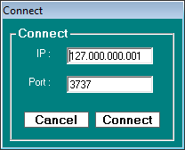

# Project1 - Backdoor.Win32.Helios.14-83e7f8462caddc315efc3a83b1bfcef04e41d1d938ee3976a513524cb1293aea.exe
## Informations
| Label | Value |
| :--- | ---: |
| Executable Name | Backdoor.Win32.Helios.14-83e7f8462caddc315efc3a83b1bfcef04e41d1d938ee3976a513524cb1293aea.exe |
| Product Name | Project1 |
| Version Number | 1.00 |
| Description |  |
| Company Name | Atlas Copco |
| Copyright |  |
| Trademarks |  |
| Last Edition | 2012-06-14 09:44:36 |
| Size | 44544 |
| SHA1 🔎 | [8E18E7C906602DC0637BE8A69C9FBFC969ADA7BA](https://www.virustotal.com/gui/search/8E18E7C906602DC0637BE8A69C9FBFC969ADA7BA) |
| Language | English (United States) |
## Static Analysis
<details>
<summary>Manalyze</summary>
<p>

```

* Manalyze 0.9 *

-------------------------------------------------------------------------------
C:/Users/IEUser/Desktop/net6.0/Malwares/Backdoor.Win32.Helios.14-83e7f8462caddc315efc3a83b1bfcef04e41d1d938ee3976a513524cb1293aea.exe
-------------------------------------------------------------------------------

Summary:
--------
Architecture:       IMAGE_FILE_MACHINE_I386
Subsystem:          IMAGE_SUBSYSTEM_WINDOWS_GUI
Compilation Date:   2002-Jul-03 11:16:58
Detected languages: English - United States
CompanyName:        Atlas Copco
ProductName:        Project1
FileVersion:        1.00
ProductVersion:     1.00
InternalName:       Client
OriginalFilename:   Client.exe

DOS Header:
-----------
e_magic:    MZ
e_cblp:     0x0090
e_cp:       0x0003
e_crlc:     0x0000
e_cparhdr:  0x0004
e_minalloc: 0x0000
e_maxalloc: 0xFFFF
e_ss:       0x0000
e_sp:       0x00B8
e_csum:     0x0000
e_ip:       0x0000
e_cs:       0x0000
e_ovno:     0x0000
e_oemid:    0x0000
e_oeminfo:  0x0000
e_lfanew:   0x000000B8

PE Header:
----------
Signature:            PE
Machine:              IMAGE_FILE_MACHINE_I386
NumberofSections:     3
TimeDateStamp:        2002-Jul-03 11:16:58
PointerToSymbolTable: 0x00000000
NumberOfSymbols:      0
SizeOfOptionalHeader: 0x00E0
Characteristics:      IMAGE_FILE_32BIT_MACHINE
                      IMAGE_FILE_EXECUTABLE_IMAGE
                      IMAGE_FILE_LINE_NUMS_STRIPPED
                      IMAGE_FILE_LOCAL_SYMS_STRIPPED
                      IMAGE_FILE_RELOCS_STRIPPED

Image Optional Header:
----------------------
Magic:                   PE32
LinkerVersion:           6.0
SizeOfCode:              0x0000A000
SizeOfInitializedData:   0x00001000
SizeOfUninitializedData: 0x0002D000
AddressOfEntryPoint:     0x00037D00 (Section: UPX1)
BaseOfCode:              0x0002E000
BaseOfData:              0x00038000
ImageBase:               0x00400000
SectionAlignment:        0x00001000
FileAlignment:           0x00000200
OperatingSystemVersion:  4.0
ImageVersion:            1.0
SubsystemVersion:        4.0
Win32VersionValue:       0
SizeOfImage:             0x00039000
SizeOfHeaders:           0x00001000
Checksum:                0x00000000
Subsystem:               IMAGE_SUBSYSTEM_WINDOWS_GUI
SizeofStackReserve:      0x00100000
SizeofStackCommit:       0x00001000
SizeofHeapReserve:       0x00100000
SizeofHeapCommit:        0x00001000
LoaderFlags:             0x00000000
NumberOfRvaAndSizes:     16

Sections:
---------
UPX0:
    VirtualSize:          0x0002D000
    VirtualAddress:       0x00001000
    SizeOfRawData:        0x00000000
    PointerToRawData:     0x00000400
    PointerToRelocations: 0x00000000
    PointerToLineNumbers: 0x00000000
    NumberOfLineNumbers:  0
    NumberOfRelocations:  0
    Characteristics:      IMAGE_SCN_CNT_UNINITIALIZED_DATA
                          IMAGE_SCN_MEM_EXECUTE
                          IMAGE_SCN_MEM_READ
                          IMAGE_SCN_MEM_WRITE

UPX1:
    VirtualSize:          0x0000A000
    VirtualAddress:       0x0002E000
    SizeOfRawData:        0x0000A000
    PointerToRawData:     0x00000400
    PointerToRelocations: 0x00000000
    PointerToLineNumbers: 0x00000000
    NumberOfLineNumbers:  0
    NumberOfRelocations:  0
    Characteristics:      IMAGE_SCN_CNT_INITIALIZED_DATA
                          IMAGE_SCN_MEM_EXECUTE
                          IMAGE_SCN_MEM_READ
                          IMAGE_SCN_MEM_WRITE
    Entropy:              7.81059

.rsrc:
    VirtualSize:          0x00001000
    VirtualAddress:       0x00038000
    SizeOfRawData:        0x00000A00
    PointerToRawData:     0x0000A400
    PointerToRelocations: 0x00000000
    PointerToLineNumbers: 0x00000000
    NumberOfLineNumbers:  0
    NumberOfRelocations:  0
    Characteristics:      IMAGE_SCN_CNT_INITIALIZED_DATA
                          IMAGE_SCN_MEM_READ
                          IMAGE_SCN_MEM_WRITE
    Entropy:              3.14364


Imports:
--------
KERNEL32.DLL: LoadLibraryA
              GetProcAddress
              ExitProcess
MSVBVM60.DLL: #581

Resources:
----------
30001:
    Type:          RT_ICON
    Language:      UNKNOWN
    Codepage:      Unicode (UTF 16LE)
    Size:          304
    TimeDateStamp: 2002-Jul-03 11:16:58
    Entropy:       2.57965

30002:
    Type:          RT_ICON
    Language:      UNKNOWN
    Codepage:      Unicode (UTF 16LE)
    Size:          744
    TimeDateStamp: 2002-Jul-03 11:16:58
    Entropy:       1.76987

30003:
    Type:          RT_ICON
    Language:      UNKNOWN
    Codepage:      Unicode (UTF 16LE)
    Size:          296
    TimeDateStamp: 2002-Jul-03 11:16:58
    Entropy:       2.07177

1:
    Type:              RT_GROUP_ICON
    Language:          UNKNOWN
    Codepage:          Unicode (UTF 16LE)
    Size:              48
    TimeDateStamp:     2002-Jul-03 11:16:58
    Entropy:           2.97836
    Detected Filetype: Icon file

1 (#2):
    Type:          RT_VERSION
    Language:      English - United States
    Codepage:      Unicode (UTF 16LE)
    Size:          532
    TimeDateStamp: 2002-Jul-03 11:16:58
    Entropy:       3.1336


Version Info:
-------------
Resource LangID: English - United States
VS_VERSION_INFO:
    Signature:           0xFEEF04BD
    StructVersion:       0x00010000
    FileVersion:         1.0.0.0
    ProductVersion:      1.0.0.0
    FileFlags:           (EMPTY)
    FileOs:              VOS_DOS_WINDOWS32
                         VOS_NT_WINDOWS32
                         VOS__WINDOWS32
    FileType:            VFT_APP
    Language:            English - United States
    CompanyName:         Atlas Copco
    ProductName:         Project1
    FileVersion (#2):    1.00
    ProductVersion (#2): 1.00
    InternalName:        Client
    OriginalFilename:    Client.exe


RICH Header:
------------
XOR Key:          0x886973F3
Unmarked objects: 0
13 (8169):        1

[ SUSPICIOUS ] PEiD Signature:
    UPX -> www.upx.sourceforge.net

[ SUSPICIOUS ] The PE is packed with UPX
    Unusual section name found: UPX0
    Section UPX0 is both writable and executable.
    Unusual section name found: UPX1
    Section UPX1 is both writable and executable.
    The PE only has 4 import(s).

The PE contains common functions which appear in legitimate applications.
    [!] The program may be hiding some of its imports:
        LoadLibraryA
        GetProcAddress

The following exploit mitigation techniques have been detected
    Stack Canary: disabled
    SafeSEH: disabled
    ASLR: disabled
    DEP: disabled
    CFG: disabled


```

</p>
</details>

## Screenshots
### Connect
 
### HelioS Client
 
