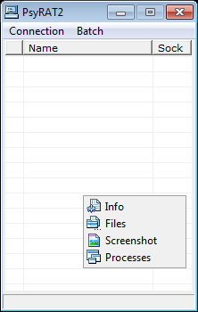

# PsyRAT - Backdoor.Win32.PsyRat.20-9d8660d805284aad460ca3ead451237b161f32e5f26a5c9b3a560b208d13a38f.exe
## Informations
| Label | Value |
| :--- | ---: |
| Executable Name | Backdoor.Win32.PsyRat.20-9d8660d805284aad460ca3ead451237b161f32e5f26a5c9b3a560b208d13a38f.exe |
| Product Name | PsyRAT |
| Version Number | 2.0.0.6 |
| Description | PsyRAT |
| Company Name | Psyphen |
| Copyright |  |
| Trademarks |  |
| Last Edition | 14/06/2012 09:46:56 |
| Size | 814592 |
| SHA1 🔎 | [97D5A7626B94EF1425B918A4F8BAAE85FAE28149](https://www.virustotal.com/gui/search/97D5A7626B94EF1425B918A4F8BAAE85FAE28149) |
| Language | English (United States) |
## Static Analysis
<details>
<summary>Manalyze</summary>
<p>

```

* Manalyze 0.9 *

-------------------------------------------------------------------------------
C:/Users/IEUser/Desktop/net6.0/Malwares/Backdoor.Win32.PsyRat.20-9d8660d805284aad460ca3ead451237b161f32e5f26a5c9b3a560b208d13a38f.exe
-------------------------------------------------------------------------------

Summary:
--------
Architecture:       IMAGE_FILE_MACHINE_I386
Subsystem:          IMAGE_SUBSYSTEM_WINDOWS_GUI
Compilation Date:   2005-Sep-12 12:07:53
Detected languages: English - United States
CompanyName:        Psyphen
FileDescription:    PsyRAT
FileVersion:        2.0.0.6
InternalName:       
LegalCopyright:     
LegalTrademarks:    
OriginalFilename:   psyrat.exe
ProductName:        PsyRAT
ProductVersion:     2.0.0.0
Comments:           

DOS Header:
-----------
e_magic:    MZ
e_cblp:     0x0050
e_cp:       0x0002
e_crlc:     0x0000
e_cparhdr:  0x0004
e_minalloc: 0x000F
e_maxalloc: 0xFFFF
e_ss:       0x0000
e_sp:       0x00B8
e_csum:     0x0000
e_ip:       0x0000
e_cs:       0x0000
e_ovno:     0x001A
e_oemid:    0x0000
e_oeminfo:  0x0000
e_lfanew:   0x00000200

PE Header:
----------
Signature:            PE
Machine:              IMAGE_FILE_MACHINE_I386
NumberofSections:     8
TimeDateStamp:        2005-Sep-12 12:07:53
PointerToSymbolTable: 0x00000000
NumberOfSymbols:      0
SizeOfOptionalHeader: 0x00E0
Characteristics:      IMAGE_FILE_32BIT_MACHINE
                      IMAGE_FILE_DEBUG_STRIPPED
                      IMAGE_FILE_EXECUTABLE_IMAGE
                      IMAGE_FILE_LINE_NUMS_STRIPPED
                      IMAGE_FILE_LOCAL_SYMS_STRIPPED

Image Optional Header:
----------------------
Magic:                   PE32
LinkerVersion:           5.0
SizeOfCode:              0x000A0000
SizeOfInitializedData:   0x000AF000
SizeOfUninitializedData: 0x00000000
AddressOfEntryPoint:     0x000013F8 (Section: .text)
BaseOfCode:              0x00001000
BaseOfData:              0x000A1000
ImageBase:               0x00400000
SectionAlignment:        0x00001000
FileAlignment:           0x00000200
OperatingSystemVersion:  4.0
ImageVersion:            0.0
SubsystemVersion:        4.0
Win32VersionValue:       0
SizeOfImage:             0x00173000
SizeOfHeaders:           0x00000600
Checksum:                0x00000000
Subsystem:               IMAGE_SUBSYSTEM_WINDOWS_GUI
SizeofStackReserve:      0x00100000
SizeofStackCommit:       0x00002000
SizeofHeapReserve:       0x00100000
SizeofHeapCommit:        0x00001000
LoaderFlags:             0x00000000
NumberOfRvaAndSizes:     16

Sections:
---------
.text:
    VirtualSize:          0x000A0000
    VirtualAddress:       0x00001000
    SizeOfRawData:        0x0009F400
    PointerToRawData:     0x00000600
    PointerToRelocations: 0x00000000
    PointerToLineNumbers: 0x00000000
    NumberOfLineNumbers:  0
    NumberOfRelocations:  0
    Characteristics:      IMAGE_SCN_CNT_CODE
                          IMAGE_SCN_MEM_EXECUTE
                          IMAGE_SCN_MEM_READ
    Entropy:              6.55496

.data:
    VirtualSize:          0x000AF000
    VirtualAddress:       0x000A1000
    SizeOfRawData:        0x00008400
    PointerToRawData:     0x0009FA00
    PointerToRelocations: 0x00000000
    PointerToLineNumbers: 0x00000000
    NumberOfLineNumbers:  0
    NumberOfRelocations:  0
    Characteristics:      IMAGE_SCN_CNT_INITIALIZED_DATA
                          IMAGE_SCN_MEM_READ
                          IMAGE_SCN_MEM_WRITE
    Entropy:              5.02771

.tls:
    VirtualSize:          0x00001000
    VirtualAddress:       0x00150000
    SizeOfRawData:        0x00000200
    PointerToRawData:     0x000A7E00
    PointerToRelocations: 0x00000000
    PointerToLineNumbers: 0x00000000
    NumberOfLineNumbers:  0
    NumberOfRelocations:  0
    Characteristics:      IMAGE_SCN_CNT_INITIALIZED_DATA
                          IMAGE_SCN_MEM_READ
                          IMAGE_SCN_MEM_WRITE
    Entropy:              0

.rdata:
    VirtualSize:          0x00001000
    VirtualAddress:       0x00151000
    SizeOfRawData:        0x00000200
    PointerToRawData:     0x000A8000
    PointerToRelocations: 0x00000000
    PointerToLineNumbers: 0x00000000
    NumberOfLineNumbers:  0
    NumberOfRelocations:  0
    Characteristics:      IMAGE_SCN_CNT_INITIALIZED_DATA
                          IMAGE_SCN_MEM_READ
                          IMAGE_SCN_MEM_SHARED
    Entropy:              0.170146

.idata:
    VirtualSize:          0x00003000
    VirtualAddress:       0x00152000
    SizeOfRawData:        0x00002600
    PointerToRawData:     0x000A8200
    PointerToRelocations: 0x00000000
    PointerToLineNumbers: 0x00000000
    NumberOfLineNumbers:  0
    NumberOfRelocations:  0
    Characteristics:      IMAGE_SCN_CNT_INITIALIZED_DATA
                          IMAGE_SCN_MEM_READ
    Entropy:              5.19836

.edata:
    VirtualSize:          0x00001000
    VirtualAddress:       0x00155000
    SizeOfRawData:        0x00000400
    PointerToRawData:     0x000AA800
    PointerToRelocations: 0x00000000
    PointerToLineNumbers: 0x00000000
    NumberOfLineNumbers:  0
    NumberOfRelocations:  0
    Characteristics:      IMAGE_SCN_CNT_INITIALIZED_DATA
                          IMAGE_SCN_MEM_READ
    Entropy:              4.27596

.rsrc:
    VirtualSize:          0x00012000
    VirtualAddress:       0x00156000
    SizeOfRawData:        0x00011A00
    PointerToRawData:     0x000AAC00
    PointerToRelocations: 0x00000000
    PointerToLineNumbers: 0x00000000
    NumberOfLineNumbers:  0
    NumberOfRelocations:  0
    Characteristics:      IMAGE_SCN_CNT_INITIALIZED_DATA
                          IMAGE_SCN_MEM_READ
    Entropy:              4.27905

.reloc:
    VirtualSize:          0x0000B000
    VirtualAddress:       0x00168000
    SizeOfRawData:        0x0000A800
    PointerToRawData:     0x000BC600
    PointerToRelocations: 0x00000000
    PointerToLineNumbers: 0x00000000
    NumberOfLineNumbers:  0
    NumberOfRelocations:  0
    Characteristics:      IMAGE_SCN_CNT_INITIALIZED_DATA
                          IMAGE_SCN_MEM_READ
                          IMAGE_SCN_MEM_SHARED
    Entropy:              6.64353


Imports:
--------
ADVAPI32.DLL: RegCloseKey
              RegOpenKeyExA
              RegQueryValueExA
KERNEL32.DLL: CloseHandle
              CompareStringA
              CreateEventA
              CreateFileA
              CreateThread
              DeleteCriticalSection
              EnterCriticalSection
              EnumCalendarInfoA
              ExitProcess
              FileTimeToDosDateTime
              FileTimeToLocalFileTime
              FindClose
              FindFirstFileA
              FindResourceA
              FormatMessageA
              FreeLibrary
              FreeResource
              GetACP
              GetCPInfo
              GetCommandLineA
              GetCurrentProcessId
              GetCurrentThreadId
              GetDateFormatA
              GetDiskFreeSpaceA
              GetEnvironmentStrings
              GetFileSize
              GetFileType
              GetLastError
              GetLocalTime
              GetLocaleInfoA
              GetModuleFileNameA
              GetModuleHandleA
              GetOEMCP
              GetProcAddress
              GetProcessHeap
              GetStartupInfoA
              GetStdHandle
              GetStringTypeExA
              GetStringTypeW
              GetSystemInfo
              GetThreadLocale
              GetTickCount
              GetVersion
              GetVersionExA
              GlobalAddAtomA
              GlobalAlloc
              GlobalDeleteAtom
              GlobalFindAtomA
              GlobalFree
              GlobalHandle
              GlobalLock
              GlobalReAlloc
              GlobalUnlock
              HeapAlloc
              HeapFree
              InitializeCriticalSection
              InterlockedDecrement
              InterlockedIncrement
              LeaveCriticalSection
              LoadLibraryA
              LoadLibraryExA
              LoadResource
              LocalAlloc
              LocalFree
              LockResource
              MulDiv
              MultiByteToWideChar
              RaiseException
              ReadFile
              ResetEvent
              ResumeThread
              RtlUnwind
              SetConsoleCtrlHandler
              SetEndOfFile
              SetErrorMode
              SetEvent
              SetFilePointer
              SetHandleCount
              SetLastError
              SetThreadLocale
              SizeofResource
              Sleep
              SuspendThread
              TerminateThread
              TlsAlloc
              TlsFree
              TlsGetValue
              TlsSetValue
              UnhandledExceptionFilter
              VirtualAlloc
              VirtualFree
              VirtualQuery
              WaitForSingleObject
              WideCharToMultiByte
              WriteFile
              lstrcmpA
              lstrcpyA
              lstrcpynA
              lstrlenA
VERSION.DLL:  GetFileVersionInfoA
              GetFileVersionInfoSizeA
              VerQueryValueA
WSOCK32.DLL:  #116
              #115
              #1
              #3
              #8
              #9
              #13
              #16
              #19
              #23
              #2
COMCTL32.DLL: ImageList_Add
              ImageList_BeginDrag
              ImageList_Create
              ImageList_Destroy
              ImageList_DragEnter
              ImageList_DragLeave
              ImageList_DragMove
              ImageList_DragShowNolock
              ImageList_Draw
              ImageList_DrawEx
              ImageList_EndDrag
              ImageList_GetBkColor
              ImageList_GetDragImage
              ImageList_GetIconSize
              ImageList_GetImageCount
              ImageList_Read
              ImageList_Remove
              ImageList_ReplaceIcon
              ImageList_SetBkColor
              ImageList_SetDragCursorImage
              ImageList_SetIconSize
              ImageList_Write
              #17
COMDLG32.DLL: GetOpenFileNameA
GDI32.DLL:    BitBlt
              CombineRgn
              CopyEnhMetaFileA
              CreateBitmap
              CreateBrushIndirect
              CreateCompatibleBitmap
              CreateCompatibleDC
              CreateDIBSection
              CreateDIBitmap
              CreateFontIndirectA
              CreateHalftonePalette
              CreatePalette
              CreatePenIndirect
              CreateRectRgn
              CreateSolidBrush
              DeleteDC
              DeleteEnhMetaFile
              DeleteObject
              ExcludeClipRect
              ExtTextOutA
              GdiFlush
              GetBitmapBits
              GetBrushOrgEx
              GetClipBox
              GetCurrentPositionEx
              GetDCOrgEx
              GetDIBColorTable
              GetDIBits
              GetDeviceCaps
              GetEnhMetaFileBits
              GetEnhMetaFileHeader
              GetEnhMetaFilePaletteEntries
              GetObjectA
              GetPaletteEntries
              GetPixel
              GetRgnBox
              GetStockObject
              GetSystemPaletteEntries
              GetTextExtentPoint32A
              GetTextExtentPointA
              GetTextMetricsA
              GetWinMetaFileBits
              GetWindowOrgEx
              IntersectClipRect
              LineTo
              MaskBlt
              MoveToEx
              PatBlt
              PlayEnhMetaFile
              RealizePalette
              RectVisible
              Rectangle
              RestoreDC
              SaveDC
              SelectObject
              SelectPalette
              SetBkColor
              SetBkMode
              SetBrushOrgEx
              SetDIBColorTable
              SetEnhMetaFileBits
              SetPixel
              SetROP2
              SetStretchBltMode
              SetTextColor
              SetViewportOrgEx
              SetWinMetaFileBits
              SetWindowOrgEx
              StretchBlt
              UnrealizeObject
USER32.DLL:   ActivateKeyboardLayout
              AdjustWindowRectEx
              BeginPaint
              CallNextHookEx
              CallWindowProcA
              CharLowerA
              CharLowerBuffA
              CharNextA
              CharUpperBuffA
              CheckMenuItem
              ChildWindowFromPoint
              ClientToScreen
              CloseClipboard
              CreateIcon
              CreateMenu
              CreatePopupMenu
              CreateWindowExA
              DefFrameProcA
              DefMDIChildProcA
              DefWindowProcA
              DeleteMenu
              DestroyCursor
              DestroyIcon
              DestroyMenu
              DestroyWindow
              DispatchMessageA
              DrawEdge
              DrawFocusRect
              DrawFrameControl
              DrawIcon
              DrawIconEx
              DrawMenuBar
              DrawTextA
              EmptyClipboard
              EnableMenuItem
              EnableScrollBar
              EnableWindow
              EndPaint
              EnumThreadWindows
              EnumWindows
              EqualRect
              FillRect
              FindWindowA
              FrameRect
              GetActiveWindow
              GetCapture
              GetClassInfoA
              GetClassNameA
              GetClientRect
              GetClipboardData
              GetCursor
              GetCursorPos
              GetDC
              GetDCEx
              GetDesktopWindow
              GetDlgItem
              GetFocus
              GetForegroundWindow
              GetIconInfo
              GetKeyNameTextA
              GetKeyState
              GetKeyboardLayout
              GetKeyboardLayoutList
              GetKeyboardState
              GetKeyboardType
              GetLastActivePopup
              GetMenu
              GetMenuItemCount
              GetMenuItemID
              GetMenuItemInfoA
              GetMenuState
              GetMenuStringA
              GetMessagePos
              GetParent
              GetPropA
              GetScrollInfo
              GetScrollPos
              GetScrollRange
              GetSubMenu
              GetSystemMenu
              GetSystemMetrics
              GetTopWindow
              GetWindow
              GetWindowDC
              GetWindowLongA
              GetWindowPlacement
              GetWindowRect
              GetWindowTextA
              GetWindowThreadProcessId
              InflateRect
              InsertMenuA
              InsertMenuItemA
              IntersectRect
              InvalidateRect
              IsChild
              IsDialogMessageA
              IsIconic
              IsRectEmpty
              IsWindow
              IsWindowEnabled
              IsWindowVisible
              IsZoomed
              KillTimer
              LoadBitmapA
              LoadCursorA
              LoadIconA
              LoadKeyboardLayoutA
              LoadStringA
              MapVirtualKeyA
              MapWindowPoints
              MessageBeep
              MessageBoxA
              OemToCharA
              OffsetRect
              OpenClipboard
              PeekMessageA
              PostMessageA
              PostQuitMessage
              PtInRect
              RedrawWindow
              RegisterClassA
              RegisterClipboardFormatA
              RegisterWindowMessageA
              ReleaseCapture
              ReleaseDC
              RemoveMenu
              RemovePropA
              ScreenToClient
              ScrollWindow
              SendMessageA
              SetActiveWindow
              SetCapture
              SetClassLongA
              SetClipboardData
              SetCursor
              SetFocus
              SetForegroundWindow
              SetMenu
              SetMenuItemInfoA
              SetPropA
              SetRect
              SetScrollInfo
              SetScrollPos
              SetScrollRange
              SetTimer
              SetWindowLongA
              SetWindowPlacement
              SetWindowPos
              SetWindowTextA
              SetWindowsHookExA
              ShowCursor
              ShowOwnedPopups
              ShowScrollBar
              ShowWindow
              SystemParametersInfoA
              TrackPopupMenu
              TranslateMDISysAccel
              TranslateMessage
              UnhookWindowsHookEx
              UnregisterClassA
              UpdateWindow
              WaitMessage
              WinHelpA
              WindowFromPoint
              wsprintfA
              GetSysColor
OLEAUT32.DLL: #15
              #25
              #20
              #19
              #148
              #26
              #40
              #4
              #6
              #5
              #12
              #9
              #10
              #11
              #8

Exports:
--------
__GetExceptDLLinfo:
    Ordinal: 1
    Address: 0x00001451

@@Unit1@Initialize:
    Ordinal: 2
    Address: 0x00003BEC

@@Unit1@Finalize:
    Ordinal: 3
    Address: 0x00003BFC

@@Unit3@Initialize:
    Ordinal: 4
    Address: 0x00004248

@@Unit3@Finalize:
    Ordinal: 5
    Address: 0x00004258

@@Unit4@Initialize:
    Ordinal: 6
    Address: 0x00007868

@@Unit4@Finalize:
    Ordinal: 7
    Address: 0x00007878

@@Unit5@Initialize:
    Ordinal: 8
    Address: 0x00007BA8

@@Unit5@Finalize:
    Ordinal: 9
    Address: 0x00007BB8

@@Unit6@Initialize:
    Ordinal: 10
    Address: 0x00007CF8

@@Unit6@Finalize:
    Ordinal: 11
    Address: 0x00007D08

@@Unit7@Initialize:
    Ordinal: 12
    Address: 0x00007E40

@@Unit7@Finalize:
    Ordinal: 13
    Address: 0x00007E50

@@Unit8@Initialize:
    Ordinal: 14
    Address: 0x00007F88

@@Unit8@Finalize:
    Ordinal: 15
    Address: 0x00007F98

@@Unit9@Initialize:
    Ordinal: 16
    Address: 0x000086B8

@@Unit9@Finalize:
    Ordinal: 17
    Address: 0x000086C8

@@Unit10@Initialize:
    Ordinal: 18
    Address: 0x00008C44

@@Unit10@Finalize:
    Ordinal: 19
    Address: 0x00008C54

___CPPdebugHook:
    Ordinal: 20
    Address: 0x000A1098

_Form1:
    Ordinal: 21
    Address: 0x000A9360

_Form3:
    Ordinal: 22
    Address: 0x000C9810

_Form4:
    Ordinal: 23
    Address: 0x000E9C24

_frUpload:
    Ordinal: 24
    Address: 0x0010A830

_frRename:
    Ordinal: 25
    Address: 0x0010A838

_frMove:
    Ordinal: 26
    Address: 0x0010A840

_frCopy:
    Ordinal: 27
    Address: 0x0010A848

_Form9:
    Ordinal: 28
    Address: 0x0010A85C

_Form10:
    Ordinal: 29
    Address: 0x0012AC74


Resources:
----------
1:
    Type:          RT_CURSOR
    Language:      UNKNOWN
    Codepage:      UNKNOWN
    Size:          308
    TimeDateStamp: 2005-Sep-12 07:07:54
    Entropy:       2.6633

2:
    Type:          RT_CURSOR
    Language:      UNKNOWN
    Codepage:      UNKNOWN
    Size:          308
    TimeDateStamp: 2005-Sep-12 07:07:54
    Entropy:       2.80231

3:
    Type:          RT_CURSOR
    Language:      UNKNOWN
    Codepage:      UNKNOWN
    Size:          308
    TimeDateStamp: 2005-Sep-12 07:07:54
    Entropy:       3.00046

4:
    Type:          RT_CURSOR
    Language:      UNKNOWN
    Codepage:      UNKNOWN
    Size:          308
    TimeDateStamp: 2005-Sep-12 07:07:54
    Entropy:       2.56318

5:
    Type:          RT_CURSOR
    Language:      UNKNOWN
    Codepage:      UNKNOWN
    Size:          308
    TimeDateStamp: 2005-Sep-12 07:07:54
    Entropy:       2.6949

6:
    Type:          RT_CURSOR
    Language:      UNKNOWN
    Codepage:      UNKNOWN
    Size:          308
    TimeDateStamp: 2005-Sep-12 07:07:54
    Entropy:       2.62527

7:
    Type:          RT_CURSOR
    Language:      UNKNOWN
    Codepage:      UNKNOWN
    Size:          308
    TimeDateStamp: 2005-Sep-12 07:07:54
    Entropy:       2.91604

BBABORT:
    Type:          RT_BITMAP
    Language:      UNKNOWN
    Codepage:      UNKNOWN
    Size:          464
    TimeDateStamp: 2005-Sep-12 07:07:54
    Entropy:       2.92079

BBALL:
    Type:          RT_BITMAP
    Language:      UNKNOWN
    Codepage:      UNKNOWN
    Size:          484
    TimeDateStamp: 2005-Sep-12 07:07:54
    Entropy:       3.16995

BBCANCEL:
    Type:          RT_BITMAP
    Language:      UNKNOWN
    Codepage:      UNKNOWN
    Size:          464
    TimeDateStamp: 2005-Sep-12 07:07:54
    Entropy:       2.92079

BBCLOSE:
    Type:          RT_BITMAP
    Language:      UNKNOWN
    Codepage:      UNKNOWN
    Size:          464
    TimeDateStamp: 2005-Sep-12 07:07:54
    Entropy:       3.68492

BBHELP:
    Type:          RT_BITMAP
    Language:      UNKNOWN
    Codepage:      UNKNOWN
    Size:          464
    TimeDateStamp: 2005-Sep-12 07:07:54
    Entropy:       2.88085

BBIGNORE:
    Type:          RT_BITMAP
    Language:      UNKNOWN
    Codepage:      UNKNOWN
    Size:          464
    TimeDateStamp: 2005-Sep-12 07:07:54
    Entropy:       3.29718

BBNO:
    Type:          RT_BITMAP
    Language:      UNKNOWN
    Codepage:      UNKNOWN
    Size:          464
    TimeDateStamp: 2005-Sep-12 07:07:54
    Entropy:       3.58804

BBOK:
    Type:          RT_BITMAP
    Language:      UNKNOWN
    Codepage:      UNKNOWN
    Size:          464
    TimeDateStamp: 2005-Sep-12 07:07:54
    Entropy:       2.67459

BBRETRY:
    Type:          RT_BITMAP
    Language:      UNKNOWN
    Codepage:      UNKNOWN
    Size:          464
    TimeDateStamp: 2005-Sep-12 07:07:54
    Entropy:       3.53344

BBYES:
    Type:          RT_BITMAP
    Language:      UNKNOWN
    Codepage:      UNKNOWN
    Size:          464
    TimeDateStamp: 2005-Sep-12 07:07:54
    Entropy:       2.67459

PREVIEWGLYPH:
    Type:          RT_BITMAP
    Language:      UNKNOWN
    Codepage:      UNKNOWN
    Size:          232
    TimeDateStamp: 2005-Sep-12 07:07:54
    Entropy:       2.85172

1 (#2):
    Type:          RT_ICON
    Language:      English - United States
    Codepage:      UNKNOWN
    Size:          872
    TimeDateStamp: 2005-Sep-12 07:07:54
    Entropy:       4.26356

2 (#2):
    Type:          RT_ICON
    Language:      English - United States
    Codepage:      UNKNOWN
    Size:          3240
    TimeDateStamp: 2005-Sep-12 07:07:54
    Entropy:       3.93195

DLGTEMPLATE:
    Type:          RT_DIALOG
    Language:      UNKNOWN
    Codepage:      UNKNOWN
    Size:          82
    TimeDateStamp: 2005-Sep-12 07:07:54
    Entropy:       2.5627

4083:
    Type:          RT_STRING
    Language:      UNKNOWN
    Codepage:      UNKNOWN
    Size:          828
    TimeDateStamp: 2005-Sep-12 07:07:54
    Entropy:       3.27602

4084:
    Type:          RT_STRING
    Language:      UNKNOWN
    Codepage:      UNKNOWN
    Size:          188
    TimeDateStamp: 2005-Sep-12 07:07:54
    Entropy:       3.0117

4085:
    Type:          RT_STRING
    Language:      UNKNOWN
    Codepage:      UNKNOWN
    Size:          268
    TimeDateStamp: 2005-Sep-12 07:07:54
    Entropy:       3.09515

4086:
    Type:          RT_STRING
    Language:      UNKNOWN
    Codepage:      UNKNOWN
    Size:          452
    TimeDateStamp: 2005-Sep-12 07:07:54
    Entropy:       3.1989

4087:
    Type:          RT_STRING
    Language:      UNKNOWN
    Codepage:      UNKNOWN
    Size:          1144
    TimeDateStamp: 2005-Sep-12 07:07:54
    Entropy:       3.22637

4088:
    Type:          RT_STRING
    Language:      UNKNOWN
    Codepage:      UNKNOWN
    Size:          852
    TimeDateStamp: 2005-Sep-12 07:07:54
    Entropy:       3.26677

4089:
    Type:          RT_STRING
    Language:      UNKNOWN
    Codepage:      UNKNOWN
    Size:          236
    TimeDateStamp: 2005-Sep-12 07:07:54
    Entropy:       2.94991

4090:
    Type:          RT_STRING
    Language:      UNKNOWN
    Codepage:      UNKNOWN
    Size:          208
    TimeDateStamp: 2005-Sep-12 07:07:54
    Entropy:       2.94916

4091:
    Type:          RT_STRING
    Language:      UNKNOWN
    Codepage:      UNKNOWN
    Size:          668
    TimeDateStamp: 2005-Sep-12 07:07:54
    Entropy:       3.24887

4092:
    Type:          RT_STRING
    Language:      UNKNOWN
    Codepage:      UNKNOWN
    Size:          1032
    TimeDateStamp: 2005-Sep-12 07:07:54
    Entropy:       3.19021

4093:
    Type:          RT_STRING
    Language:      UNKNOWN
    Codepage:      UNKNOWN
    Size:          940
    TimeDateStamp: 2005-Sep-12 07:07:54
    Entropy:       3.24919

4094:
    Type:          RT_STRING
    Language:      UNKNOWN
    Codepage:      UNKNOWN
    Size:          708
    TimeDateStamp: 2005-Sep-12 07:07:54
    Entropy:       3.20941

4095:
    Type:          RT_STRING
    Language:      UNKNOWN
    Codepage:      UNKNOWN
    Size:          932
    TimeDateStamp: 2005-Sep-12 07:07:54
    Entropy:       3.21756

4096:
    Type:          RT_STRING
    Language:      UNKNOWN
    Codepage:      UNKNOWN
    Size:          1084
    TimeDateStamp: 2005-Sep-12 07:07:54
    Entropy:       3.21779

DVCLAL:
    Type:          RT_RCDATA
    Language:      UNKNOWN
    Codepage:      UNKNOWN
    Size:          16
    TimeDateStamp: 2005-Sep-12 07:07:54
    Entropy:       4

TFORM1:
    Type:          RT_RCDATA
    Language:      UNKNOWN
    Codepage:      UNKNOWN
    Size:          22859
    TimeDateStamp: 2005-Sep-12 07:07:54
    Entropy:       3.74207

TFORM10:
    Type:          RT_RCDATA
    Language:      UNKNOWN
    Codepage:      UNKNOWN
    Size:          776
    TimeDateStamp: 2005-Sep-12 07:07:54
    Entropy:       5.50848

TFORM2:
    Type:          RT_RCDATA
    Language:      UNKNOWN
    Codepage:      UNKNOWN
    Size:          718
    TimeDateStamp: 2005-Sep-12 07:07:54
    Entropy:       5.47764

TFORM3:
    Type:          RT_RCDATA
    Language:      UNKNOWN
    Codepage:      UNKNOWN
    Size:          936
    TimeDateStamp: 2005-Sep-12 07:07:54
    Entropy:       5.45436

TFORM4:
    Type:          RT_RCDATA
    Language:      UNKNOWN
    Codepage:      UNKNOWN
    Size:          19754
    TimeDateStamp: 2005-Sep-12 07:07:54
    Entropy:       3.4784

TFORM9:
    Type:          RT_RCDATA
    Language:      UNKNOWN
    Codepage:      UNKNOWN
    Size:          613
    TimeDateStamp: 2005-Sep-12 07:07:54
    Entropy:       5.51507

TFRCOPY:
    Type:          RT_RCDATA
    Language:      UNKNOWN
    Codepage:      UNKNOWN
    Size:          341
    TimeDateStamp: 2005-Sep-12 07:07:54
    Entropy:       5.16142

TFRMOVE:
    Type:          RT_RCDATA
    Language:      UNKNOWN
    Codepage:      UNKNOWN
    Size:          345
    TimeDateStamp: 2005-Sep-12 07:07:54
    Entropy:       5.17113

TFRRENAME:
    Type:          RT_RCDATA
    Language:      UNKNOWN
    Codepage:      UNKNOWN
    Size:          352
    TimeDateStamp: 2005-Sep-12 07:07:54
    Entropy:       5.17747

TFRUPLOAD:
    Type:          RT_RCDATA
    Language:      UNKNOWN
    Codepage:      UNKNOWN
    Size:          563
    TimeDateStamp: 2005-Sep-12 07:07:54
    Entropy:       5.26355

32761:
    Type:              RT_GROUP_CURSOR
    Language:          UNKNOWN
    Codepage:          UNKNOWN
    Size:              20
    TimeDateStamp:     2005-Sep-12 07:07:54
    Entropy:           1.83876
    Detected Filetype: Cursor file

32762:
    Type:              RT_GROUP_CURSOR
    Language:          UNKNOWN
    Codepage:          UNKNOWN
    Size:              20
    TimeDateStamp:     2005-Sep-12 07:07:54
    Entropy:           1.91924
    Detected Filetype: Cursor file

32763:
    Type:              RT_GROUP_CURSOR
    Language:          UNKNOWN
    Codepage:          UNKNOWN
    Size:              20
    TimeDateStamp:     2005-Sep-12 07:07:54
    Entropy:           2.01924
    Detected Filetype: Cursor file

32764:
    Type:              RT_GROUP_CURSOR
    Language:          UNKNOWN
    Codepage:          UNKNOWN
    Size:              20
    TimeDateStamp:     2005-Sep-12 07:07:54
    Entropy:           2.01924
    Detected Filetype: Cursor file

32765:
    Type:              RT_GROUP_CURSOR
    Language:          UNKNOWN
    Codepage:          UNKNOWN
    Size:              20
    TimeDateStamp:     2005-Sep-12 07:07:54
    Entropy:           2.01924
    Detected Filetype: Cursor file

32766:
    Type:              RT_GROUP_CURSOR
    Language:          UNKNOWN
    Codepage:          UNKNOWN
    Size:              20
    TimeDateStamp:     2005-Sep-12 07:07:54
    Entropy:           2.01924
    Detected Filetype: Cursor file

32767:
    Type:              RT_GROUP_CURSOR
    Language:          UNKNOWN
    Codepage:          UNKNOWN
    Size:              20
    TimeDateStamp:     2005-Sep-12 07:07:54
    Entropy:           2.01924
    Detected Filetype: Cursor file

MAINICON:
    Type:              RT_GROUP_ICON
    Language:          English - United States
    Codepage:          UNKNOWN
    Size:              34
    TimeDateStamp:     2005-Sep-12 07:07:54
    Entropy:           2.40927
    Detected Filetype: Icon file

1 (#3):
    Type:          RT_VERSION
    Language:      English - United States
    Codepage:      UNKNOWN
    Size:          684
    TimeDateStamp: 2005-Sep-12 07:07:54
    Entropy:       3.2305


Version Info:
-------------
Resource LangID: English - United States
VS_VERSION_INFO:
    Signature:           0xFEEF04BD
    StructVersion:       0x00010000
    FileVersion:         2.0.0.6
    ProductVersion:      2.0.0.6
    FileFlags:           VS_FF_PRERELEASE
    FileOs:              VOS_DOS_WINDOWS32
                         VOS_NT_WINDOWS32
                         VOS__WINDOWS32
    FileType:            VFT_APP
    Language:            English - United States
    CompanyName:         Psyphen
    FileDescription:     PsyRAT
    FileVersion (#2):    2.0.0.6
    InternalName:        
    LegalCopyright:      
    LegalTrademarks:     
    OriginalFilename:    psyrat.exe
    ProductName:         PsyRAT
    ProductVersion (#2): 2.0.0.0
    Comments:            


TLS Callbacks:
--------------
StartAddressOfRawData: 0x00550000
EndAddressOfRawData:   0x005500B4
AddressOfIndex:        0x004A933C
AddressOfCallbacks:    0x00551010
SizeOfZeroFill:        0x00000000
Characteristics:       IMAGE_SCN_TYPE_REG
Callbacks:             (EMPTY)

Matching compiler(s):
    Microsoft Visual C++ v6.0 DLL
    Borland C++ DLL
    MASM/TASM - sig1(h)
    Borland C++ for Win32 1999

[ MALICIOUS ] The PE contains functions mostly used by malware.
    [!] The program may be hiding some of its imports:
        GetProcAddress
        LoadLibraryA
        LoadLibraryExA
    Functions which can be used for anti-debugging purposes:
        FindWindowA
    Code injection capabilities (PowerLoader):
        FindWindowA
        GetWindowLongA
    Can access the registry:
        RegCloseKey
        RegOpenKeyExA
        RegQueryValueExA
    Uses functions commonly found in keyloggers:
        CallNextHookEx
        GetForegroundWindow
        MapVirtualKeyA
    Can take screenshots:
        BitBlt
        CreateCompatibleDC
        FindWindowA
        GetDC
        GetDCEx
    Reads the contents of the clipboard:
        GetClipboardData

The PE's resources present abnormal characteristics.
    The binary may have been compiled on a machine in the UTC-5 timezone.

The following exploit mitigation techniques have been detected
    Stack Canary: disabled
    SafeSEH: disabled
    ASLR: disabled
    DEP: disabled
    CFG: disabled


```

</p>
</details>

## Screenshots
### PsyRAT2
 
