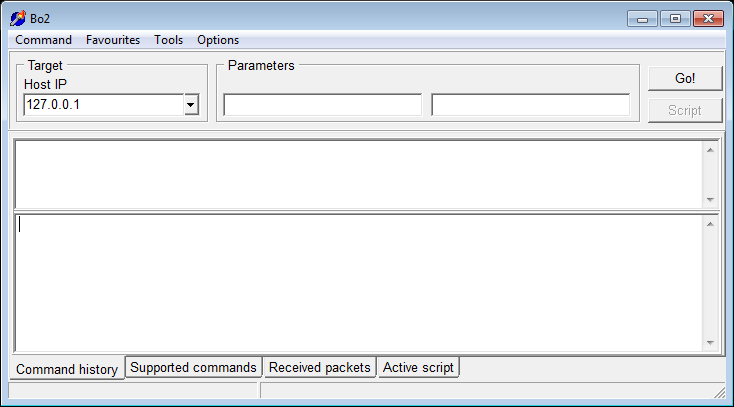

#  - Backdoor.Win32.BO2-45539d88ea78d56bfb5ab9842a84fcf00fbaf83a0469eaf5e16c7c8042a2240c.exe
## Informations
| Label | Value |
| :--- | ---: |
| Executable Name | Backdoor.Win32.BO2-45539d88ea78d56bfb5ab9842a84fcf00fbaf83a0469eaf5e16c7c8042a2240c.exe |
| Product Name |  |
| Version Number |  |
| Description |  |
| Company Name |  |
| Copyright |  |
| Trademarks |  |
| Last Edition | 14/06/2012 09:42:46 |
| Size | 489984 |
| SHA1 🔎 | [9A40D1B0A6A83167D353587181678D16E7C3455F](https://www.virustotal.com/gui/search/9A40D1B0A6A83167D353587181678D16E7C3455F) |
| Language |  |
## Static Analysis
<details>
<summary>Manalyze</summary>
<p>

```

* Manalyze 0.9 *

-------------------------------------------------------------------------------
C:/Users/IEUser/Desktop/net6.0/Malwares/Backdoor.Win32.BO2-45539d88ea78d56bfb5ab9842a84fcf00fbaf83a0469eaf5e16c7c8042a2240c.exe
-------------------------------------------------------------------------------

Summary:
--------
Architecture:       IMAGE_FILE_MACHINE_I386
Subsystem:          IMAGE_SUBSYSTEM_WINDOWS_GUI
Compilation Date:   2001-Aug-24 15:00:00
Detected languages: Spanish - Spain (International sort)

DOS Header:
-----------
e_magic:    MZ
e_cblp:     0x0090
e_cp:       0x0003
e_crlc:     0x0000
e_cparhdr:  0x0004
e_minalloc: 0x0000
e_maxalloc: 0xFFFF
e_ss:       0x0000
e_sp:       0x00B8
e_csum:     0x0000
e_ip:       0x0000
e_cs:       0x0000
e_ovno:     0x0000
e_oemid:    0x0000
e_oeminfo:  0x0000
e_lfanew:   0x00000080

PE Header:
----------
Signature:            PE
Machine:              IMAGE_FILE_MACHINE_I386
NumberofSections:     5
TimeDateStamp:        2001-Aug-24 15:00:00
PointerToSymbolTable: 0x00000000
NumberOfSymbols:      0
SizeOfOptionalHeader: 0x00E0
Characteristics:      IMAGE_FILE_32BIT_MACHINE
                      IMAGE_FILE_EXECUTABLE_IMAGE
                      IMAGE_FILE_LINE_NUMS_STRIPPED
                      IMAGE_FILE_LOCAL_SYMS_STRIPPED
                      IMAGE_FILE_RELOCS_STRIPPED

Image Optional Header:
----------------------
Magic:                   PE32
LinkerVersion:           2.0
SizeOfCode:              0x00008200
SizeOfInitializedData:   0x00001200
SizeOfUninitializedData: 0x00000400
AddressOfEntryPoint:     0x000011F0 (Section: .text)
BaseOfCode:              0x00001000
BaseOfData:              0x00009000
ImageBase:               0x00400000
SectionAlignment:        0x00001000
FileAlignment:           0x00000200
OperatingSystemVersion:  4.0
ImageVersion:            1.0
SubsystemVersion:        4.0
Win32VersionValue:       0
SizeOfImage:             0x00013000
SizeOfHeaders:           0x00000400
Checksum:                0x00000000
Subsystem:               IMAGE_SUBSYSTEM_WINDOWS_GUI
SizeofStackReserve:      0x02000000
SizeofStackCommit:       0x00001000
SizeofHeapReserve:       0x00100000
SizeofHeapCommit:        0x00001000
LoaderFlags:             0x00000000
NumberOfRvaAndSizes:     16

Sections:
---------
.text:
    VirtualSize:          0x00007670
    VirtualAddress:       0x00001000
    SizeOfRawData:        0x00007800
    PointerToRawData:     0x00000400
    PointerToRelocations: 0x00000000
    PointerToLineNumbers: 0x00000000
    NumberOfLineNumbers:  0
    NumberOfRelocations:  0
    Characteristics:      IMAGE_SCN_CNT_CODE
                          IMAGE_SCN_MEM_EXECUTE
                          IMAGE_SCN_MEM_READ
    Entropy:              6.20228

.data:
    VirtualSize:          0x0000022C
    VirtualAddress:       0x00009000
    SizeOfRawData:        0x00000400
    PointerToRawData:     0x00007C00
    PointerToRelocations: 0x00000000
    PointerToLineNumbers: 0x00000000
    NumberOfLineNumbers:  0
    NumberOfRelocations:  0
    Characteristics:      IMAGE_SCN_CNT_INITIALIZED_DATA
                          IMAGE_SCN_MEM_READ
                          IMAGE_SCN_MEM_WRITE
    Entropy:              1.36047

.bss:
    VirtualSize:          0x00000224
    VirtualAddress:       0x0000A000
    SizeOfRawData:        0x00000000
    PointerToRawData:     0x00000000
    PointerToRelocations: 0x00000000
    PointerToLineNumbers: 0x00000000
    NumberOfLineNumbers:  0
    NumberOfRelocations:  0
    Characteristics:      IMAGE_SCN_CNT_UNINITIALIZED_DATA
                          IMAGE_SCN_MEM_READ
                          IMAGE_SCN_MEM_WRITE

.idata:
    VirtualSize:          0x000008E4
    VirtualAddress:       0x0000B000
    SizeOfRawData:        0x00000A00
    PointerToRawData:     0x00008000
    PointerToRelocations: 0x00000000
    PointerToLineNumbers: 0x00000000
    NumberOfLineNumbers:  0
    NumberOfRelocations:  0
    Characteristics:      IMAGE_SCN_CNT_INITIALIZED_DATA
                          IMAGE_SCN_MEM_READ
                          IMAGE_SCN_MEM_WRITE
    Entropy:              4.33531

.rsrc:
    VirtualSize:          0x00006600
    VirtualAddress:       0x0000C000
    SizeOfRawData:        0x00006600
    PointerToRawData:     0x00008A00
    PointerToRelocations: 0x00000000
    PointerToLineNumbers: 0x00000000
    NumberOfLineNumbers:  0
    NumberOfRelocations:  0
    Characteristics:      IMAGE_SCN_CNT_INITIALIZED_DATA
                          IMAGE_SCN_MEM_READ
                          IMAGE_SCN_MEM_SHARED
    Entropy:              5.26693


Imports:
--------
ADVAPI32.DLL: CloseServiceHandle
              CreateServiceA
              DeleteService
              OpenSCManagerA
              OpenServiceA
              RegCloseKey
              RegCreateKeyExA
              RegSetValueExA
              RegisterServiceCtrlHandlerA
              SetServiceStatus
              StartServiceA
              StartServiceCtrlDispatcherA
KERNEL32.dll: ExitProcess
              FindClose
              FindFirstFileA
              FindNextFileA
              FlushFileBuffers
              GetCommandLineA
              GetCurrentDirectoryA
              GetDriveTypeA
              GetFileAttributesA
              CloseHandle
              GetFileTime
              GetLastError
              GetModuleFileNameA
              GetModuleHandleA
              GetProcAddress
              GetStartupInfoA
              GetTempPathA
              GetVersionExA
              GetWindowsDirectoryA
              CopyFileA
              InterlockedIncrement
              LoadLibraryA
              CreateFileA
              ReadFile
              ReleaseMutex
              SetEndOfFile
              SetFileAttributesA
              SetFilePointer
              SetFileTime
              CreateMutexA
              SetUnhandledExceptionFilter
              Sleep
              TlsAlloc
              TlsGetValue
              TlsSetValue
              CreateProcessA
              WaitForSingleObject
              WriteFile
msvcrt.dll:   _assert
              _cexit
              _fileno
              _fmode
              _fpreset
              _iob
              _setmode
              __getmainargs
              abort
              atexit
              fprintf
              free
              __p__environ
              malloc
              memcpy
              memset
              rand
              signal
              srand
              strcat
              strcmp
              strcpy
              time
              __set_app_type

Resources:
----------
1:
    Type:          RT_CURSOR
    Language:      UNKNOWN
    Codepage:      UNKNOWN
    Size:          308
    TimeDateStamp: 1998-Nov-29 03:40:24
    Entropy:       2.6633

2:
    Type:          RT_CURSOR
    Language:      UNKNOWN
    Codepage:      UNKNOWN
    Size:          308
    TimeDateStamp: 1998-Nov-29 03:40:24
    Entropy:       2.80231

3:
    Type:          RT_CURSOR
    Language:      UNKNOWN
    Codepage:      UNKNOWN
    Size:          308
    TimeDateStamp: 1998-Nov-29 03:40:24
    Entropy:       3.00046

4:
    Type:          RT_CURSOR
    Language:      UNKNOWN
    Codepage:      UNKNOWN
    Size:          308
    TimeDateStamp: 1998-Nov-29 03:40:24
    Entropy:       2.56318

5:
    Type:          RT_CURSOR
    Language:      UNKNOWN
    Codepage:      UNKNOWN
    Size:          308
    TimeDateStamp: 1998-Nov-29 03:40:24
    Entropy:       2.6949

6:
    Type:          RT_CURSOR
    Language:      UNKNOWN
    Codepage:      UNKNOWN
    Size:          308
    TimeDateStamp: 1998-Nov-29 03:40:24
    Entropy:       2.62527

7:
    Type:          RT_CURSOR
    Language:      UNKNOWN
    Codepage:      UNKNOWN
    Size:          308
    TimeDateStamp: 1998-Nov-29 03:40:24
    Entropy:       2.91604

1 (#2):
    Type:          RT_ICON
    Language:      Spanish - Spain (International sort)
    Codepage:      UNKNOWN
    Size:          744
    TimeDateStamp: 1998-Nov-29 03:40:24
    Entropy:       4.04237

4084:
    Type:          RT_STRING
    Language:      UNKNOWN
    Codepage:      UNKNOWN
    Size:          1020
    TimeDateStamp: 1998-Nov-29 03:40:24
    Entropy:       3.23178

4085:
    Type:          RT_STRING
    Language:      UNKNOWN
    Codepage:      UNKNOWN
    Size:          820
    TimeDateStamp: 1998-Nov-29 03:40:24
    Entropy:       3.21603

4086:
    Type:          RT_STRING
    Language:      UNKNOWN
    Codepage:      UNKNOWN
    Size:          212
    TimeDateStamp: 1998-Nov-29 03:40:24
    Entropy:       3.13114

4087:
    Type:          RT_STRING
    Language:      UNKNOWN
    Codepage:      UNKNOWN
    Size:          404
    TimeDateStamp: 1998-Nov-29 03:40:24
    Entropy:       3.24582

4088:
    Type:          RT_STRING
    Language:      UNKNOWN
    Codepage:      UNKNOWN
    Size:          1124
    TimeDateStamp: 1998-Nov-29 03:40:24
    Entropy:       3.1727

4089:
    Type:          RT_STRING
    Language:      UNKNOWN
    Codepage:      UNKNOWN
    Size:          984
    TimeDateStamp: 1998-Nov-29 03:40:24
    Entropy:       3.22772

4090:
    Type:          RT_STRING
    Language:      UNKNOWN
    Codepage:      UNKNOWN
    Size:          996
    TimeDateStamp: 1998-Nov-29 03:40:24
    Entropy:       3.21425

4091:
    Type:          RT_STRING
    Language:      UNKNOWN
    Codepage:      UNKNOWN
    Size:          912
    TimeDateStamp: 1998-Nov-29 03:40:24
    Entropy:       3.1561

4092:
    Type:          RT_STRING
    Language:      UNKNOWN
    Codepage:      UNKNOWN
    Size:          236
    TimeDateStamp: 1998-Nov-29 03:40:24
    Entropy:       2.94991

4093:
    Type:          RT_STRING
    Language:      UNKNOWN
    Codepage:      UNKNOWN
    Size:          208
    TimeDateStamp: 1998-Nov-29 03:40:24
    Entropy:       2.94916

4094:
    Type:          RT_STRING
    Language:      UNKNOWN
    Codepage:      UNKNOWN
    Size:          676
    TimeDateStamp: 1998-Nov-29 03:40:24
    Entropy:       3.24388

4095:
    Type:          RT_STRING
    Language:      UNKNOWN
    Codepage:      UNKNOWN
    Size:          860
    TimeDateStamp: 1998-Nov-29 03:40:24
    Entropy:       3.24062

4096:
    Type:          RT_STRING
    Language:      UNKNOWN
    Codepage:      UNKNOWN
    Size:          692
    TimeDateStamp: 1998-Nov-29 03:40:24
    Entropy:       3.18591

DVCLAL:
    Type:          RT_RCDATA
    Language:      UNKNOWN
    Codepage:      UNKNOWN
    Size:          16
    TimeDateStamp: 1998-Nov-29 03:40:24
    Entropy:       4

PACKAGEINFO:
    Type:          RT_RCDATA
    Language:      UNKNOWN
    Codepage:      UNKNOWN
    Size:          496
    TimeDateStamp: 1998-Nov-29 03:40:24
    Entropy:       5.22105

TFRMMAIN:
    Type:          RT_RCDATA
    Language:      UNKNOWN
    Codepage:      UNKNOWN
    Size:          4433
    TimeDateStamp: 1998-Nov-29 03:40:24
    Entropy:       5.55862

TNMSHOW:
    Type:          RT_RCDATA
    Language:      UNKNOWN
    Codepage:      UNKNOWN
    Size:          7037
    TimeDateStamp: 1998-Nov-29 03:40:24
    Entropy:       6.30862

32761:
    Type:              RT_GROUP_CURSOR
    Language:          UNKNOWN
    Codepage:          UNKNOWN
    Size:              20
    TimeDateStamp:     1998-Nov-29 03:40:24
    Entropy:           1.83876
    Detected Filetype: Cursor file

32762:
    Type:              RT_GROUP_CURSOR
    Language:          UNKNOWN
    Codepage:          UNKNOWN
    Size:              20
    TimeDateStamp:     1998-Nov-29 03:40:24
    Entropy:           1.91924
    Detected Filetype: Cursor file

32763:
    Type:              RT_GROUP_CURSOR
    Language:          UNKNOWN
    Codepage:          UNKNOWN
    Size:              20
    TimeDateStamp:     1998-Nov-29 03:40:24
    Entropy:           2.01924
    Detected Filetype: Cursor file

32764:
    Type:              RT_GROUP_CURSOR
    Language:          UNKNOWN
    Codepage:          UNKNOWN
    Size:              20
    TimeDateStamp:     1998-Nov-29 03:40:24
    Entropy:           2.01924
    Detected Filetype: Cursor file

32765:
    Type:              RT_GROUP_CURSOR
    Language:          UNKNOWN
    Codepage:          UNKNOWN
    Size:              20
    TimeDateStamp:     1998-Nov-29 03:40:24
    Entropy:           2.01924
    Detected Filetype: Cursor file

32766:
    Type:              RT_GROUP_CURSOR
    Language:          UNKNOWN
    Codepage:          UNKNOWN
    Size:              20
    TimeDateStamp:     1998-Nov-29 03:40:24
    Entropy:           2.01924
    Detected Filetype: Cursor file

32767:
    Type:              RT_GROUP_CURSOR
    Language:          UNKNOWN
    Codepage:          UNKNOWN
    Size:              20
    TimeDateStamp:     1998-Nov-29 03:40:24
    Entropy:           2.01924
    Detected Filetype: Cursor file

MAINICON:
    Type:              RT_GROUP_ICON
    Language:          Spanish - Spain (International sort)
    Codepage:          UNKNOWN
    Size:              20
    TimeDateStamp:     1998-Nov-29 03:40:24
    Entropy:           2.06096
    Detected Filetype: Icon file


Matching compiler(s):
    Dev-C++ v4

Interesting strings found in the binary:
    Contains domain names:
        geocities.com
        http://www.netmastersllc.com
        netmastersllc.com
        www.geocities.com
        www.netmastersllc.com

[ SUSPICIOUS ] The PE contains functions most legitimate programs don't use.
    [!] The program may be hiding some of its imports:
        GetProcAddress
        LoadLibraryA
    Can access the registry:
        RegCloseKey
        RegCreateKeyExA
        RegSetValueExA
    Possibly launches other programs:
        CreateProcessA
    Can create temporary files:
        GetTempPathA
        CreateFileA
    Interacts with services:
        CreateServiceA
        DeleteService
        OpenSCManagerA
        OpenServiceA
    Enumerates local disk drives:
        GetDriveTypeA

[ SUSPICIOUS ] The PE header may have been manually modified.
    The resource timestamps differ from the PE header:
        1998-Nov-29 03:40:24

The following exploit mitigation techniques have been detected
    Stack Canary: disabled
    SafeSEH: disabled
    ASLR: disabled
    DEP: disabled
    CFG: disabled

[ SUSPICIOUS ] The file contains overlay data.
    428544 bytes of data starting at offset 0xf000.
    Overlay data amounts for 87.4608% of the executable.


```

</p>
</details>

## Screenshots
### Bo2
 
