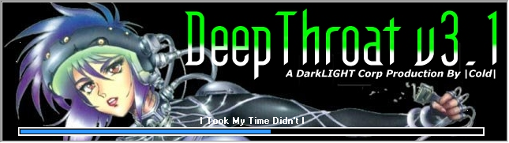

# DeepThroat v3.1 Client - DTv3.1 Client.exe
## Informations
| Label | Value |
| :--- | ---: |
| Executable Name | DTv3.1 Client.exe |
| Product Name | DeepThroat v3.1 Client |
| Version Number | 3.1.0.9 |
| Description | DeepThroat v3.1 Client |
| Company Name | DarkLIGHT Corp |
| Copyright | '98 - '99 DarkLIGHT Corp |
| Trademarks |  |
| Last Edition | 05/09/1999 22:03:30 |
| Size | 652800 |
| SHA1 🔎 | [A106E1BE73A8B41735D42EFD38B6EBC77089710B](https://www.virustotal.com/gui/search/A106E1BE73A8B41735D42EFD38B6EBC77089710B) |
| Language | English (United Kingdom) |
## Static Analysis
<details>
<summary>Manalyze</summary>
<p>

```

* Manalyze 0.9 *

-------------------------------------------------------------------------------
C:/Users/IEUser/Desktop/net6.0/Malwares/DeepThroat v3.1.0/DeepThroat v3.1.0/DTv3.1 Client.exe
-------------------------------------------------------------------------------

Summary:
--------
Architecture:       IMAGE_FILE_MACHINE_I386
Subsystem:          IMAGE_SUBSYSTEM_WINDOWS_GUI
Compilation Date:   1992-Jun-19 22:22:17
Detected languages: English - United Kingdom
                    English - United States
CompanyName:        DarkLIGHT Corp
FileDescription:    DeepThroat v3.1 Client
FileVersion:        3.1.0.9
InternalName:       v3.1 client
LegalCopyright:     '98 - '99 DarkLIGHT Corp
LegalTrademarks:    
OriginalFilename:   
ProductName:        DeepThroat v3.1 Client
ProductVersion:     3.1.0
Comments:           It rules

DOS Header:
-----------
e_magic:    MZ
e_cblp:     0x0050
e_cp:       0x0002
e_crlc:     0x0000
e_cparhdr:  0x0004
e_minalloc: 0x000F
e_maxalloc: 0xFFFF
e_ss:       0x0000
e_sp:       0x00B8
e_csum:     0x0000
e_ip:       0x0000
e_cs:       0x0000
e_ovno:     0x001A
e_oemid:    0x0000
e_oeminfo:  0x0000
e_lfanew:   0x00000100

PE Header:
----------
Signature:            PE
Machine:              IMAGE_FILE_MACHINE_I386
NumberofSections:     9
TimeDateStamp:        1992-Jun-19 22:22:17
PointerToSymbolTable: 0x00000000
NumberOfSymbols:      0
SizeOfOptionalHeader: 0x00E0
Characteristics:      IMAGE_FILE_32BIT_MACHINE
                      IMAGE_FILE_BYTES_REVERSED_HI
                      IMAGE_FILE_BYTES_REVERSED_LO
                      IMAGE_FILE_EXECUTABLE_IMAGE
                      IMAGE_FILE_LINE_NUMS_STRIPPED
                      IMAGE_FILE_LOCAL_SYMS_STRIPPED

Image Optional Header:
----------------------
Magic:                   PE32
LinkerVersion:           2.0
SizeOfCode:              0x000BBE00
SizeOfInitializedData:   0x00121A00
SizeOfUninitializedData: 0x00000000
AddressOfEntryPoint:     0x00051716 (Section: CODE)
BaseOfCode:              0x00001000
BaseOfData:              0x000BD000
ImageBase:               0x00400000
SectionAlignment:        0x00001000
FileAlignment:           0x00000200
OperatingSystemVersion:  1.0
ImageVersion:            0.0
SubsystemVersion:        4.0
Win32VersionValue:       0
SizeOfImage:             0x001F2000
SizeOfHeaders:           0x00000400
Checksum:                0x00000000
Subsystem:               IMAGE_SUBSYSTEM_WINDOWS_GUI
SizeofStackReserve:      0x00100000
SizeofStackCommit:       0x00004000
SizeofHeapReserve:       0x00100000
SizeofHeapCommit:        0x00001000
LoaderFlags:             0x00000000
NumberOfRvaAndSizes:     16

Sections:
---------
CODE:
    VirtualSize:          0x000BC000
    VirtualAddress:       0x00001000
    SizeOfRawData:        0x00050800
    PointerToRawData:     0x00000400
    PointerToRelocations: 0x00000000
    PointerToLineNumbers: 0x00000000
    NumberOfLineNumbers:  0
    NumberOfRelocations:  0
    Characteristics:      IMAGE_SCN_CNT_INITIALIZED_DATA
                          IMAGE_SCN_MEM_READ
                          IMAGE_SCN_MEM_WRITE
    Entropy:              7.94098

DATA:
    VirtualSize:          0x00003000
    VirtualAddress:       0x000BD000
    SizeOfRawData:        0x00001200
    PointerToRawData:     0x00050C00
    PointerToRelocations: 0x00000000
    PointerToLineNumbers: 0x00000000
    NumberOfLineNumbers:  0
    NumberOfRelocations:  0
    Characteristics:      IMAGE_SCN_CNT_INITIALIZED_DATA
                          IMAGE_SCN_MEM_READ
                          IMAGE_SCN_MEM_WRITE
    Entropy:              7.66748

BSS:
    VirtualSize:          0x0000E000
    VirtualAddress:       0x000C0000
    SizeOfRawData:        0x00000000
    PointerToRawData:     0x00051E00
    PointerToRelocations: 0x00000000
    PointerToLineNumbers: 0x00000000
    NumberOfLineNumbers:  0
    NumberOfRelocations:  0
    Characteristics:      IMAGE_SCN_CNT_INITIALIZED_DATA
                          IMAGE_SCN_MEM_READ
                          IMAGE_SCN_MEM_WRITE

.idata:
    VirtualSize:          0x00003000
    VirtualAddress:       0x000CE000
    SizeOfRawData:        0x00001200
    PointerToRawData:     0x00051E00
    PointerToRelocations: 0x00000000
    PointerToLineNumbers: 0x00000000
    NumberOfLineNumbers:  0
    NumberOfRelocations:  0
    Characteristics:      IMAGE_SCN_CNT_INITIALIZED_DATA
                          IMAGE_SCN_MEM_READ
                          IMAGE_SCN_MEM_WRITE
    Entropy:              7.50421

.tls:
    VirtualSize:          0x00001000
    VirtualAddress:       0x000D1000
    SizeOfRawData:        0x00000000
    PointerToRawData:     0x00053000
    PointerToRelocations: 0x00000000
    PointerToLineNumbers: 0x00000000
    NumberOfLineNumbers:  0
    NumberOfRelocations:  0
    Characteristics:      IMAGE_SCN_CNT_INITIALIZED_DATA
                          IMAGE_SCN_MEM_READ
                          IMAGE_SCN_MEM_WRITE

.rdata:
    VirtualSize:          0x00001000
    VirtualAddress:       0x000D2000
    SizeOfRawData:        0x00000200
    PointerToRawData:     0x00053000
    PointerToRelocations: 0x00000000
    PointerToLineNumbers: 0x00000000
    NumberOfLineNumbers:  0
    NumberOfRelocations:  0
    Characteristics:      IMAGE_SCN_CNT_INITIALIZED_DATA
                          IMAGE_SCN_MEM_READ
                          IMAGE_SCN_MEM_WRITE
    Entropy:              0.199108

.reloc:
    VirtualSize:          0x0000C000
    VirtualAddress:       0x000D3000
    SizeOfRawData:        0x00000000
    PointerToRawData:     0x00053200
    PointerToRelocations: 0x00000000
    PointerToLineNumbers: 0x00000000
    NumberOfLineNumbers:  0
    NumberOfRelocations:  0
    Characteristics:      IMAGE_SCN_CNT_INITIALIZED_DATA
                          IMAGE_SCN_MEM_READ
                          IMAGE_SCN_MEM_WRITE

.rsrc:
    VirtualSize:          0x00111000
    VirtualAddress:       0x000DF000
    SizeOfRawData:        0x0004AC00
    PointerToRawData:     0x00053200
    PointerToRelocations: 0x00000000
    PointerToLineNumbers: 0x00000000
    NumberOfLineNumbers:  0
    NumberOfRelocations:  0
    Characteristics:      IMAGE_SCN_CNT_INITIALIZED_DATA
                          IMAGE_SCN_MEM_READ
                          IMAGE_SCN_MEM_WRITE
    Entropy:              7.88729

.data\x00\xbb:
    VirtualSize:          0x00002000
    VirtualAddress:       0x001F0000
    SizeOfRawData:        0x00001800
    PointerToRawData:     0x0009DE00
    PointerToRelocations: 0x00000000
    PointerToLineNumbers: 0x00000000
    NumberOfLineNumbers:  0
    NumberOfRelocations:  0
    Characteristics:      IMAGE_SCN_CNT_INITIALIZED_DATA
                          IMAGE_SCN_MEM_READ
                          IMAGE_SCN_MEM_WRITE
    Entropy:              4.77701


Imports:
--------
kernel32.dll: GetProcAddress
              GetModuleHandleA
              LoadLibraryA
user32.dll:   GetKeyboardType
advapi32.dll: RegQueryValueExA
oleaut32.dll: VariantChangeTypeEx
version.dll:  VerQueryValueA
gdi32.dll:    UnrealizeObject
ole32.dll:    RevokeDragDrop
comctl32.dll: ImageList_GetImageInfo
winspool.drv: OpenPrinterA
comdlg32.dll: ChooseFontA
wsock32.dll:  WSACleanup
shell32.dll:  Shell_NotifyIconA
ws2_32.dll:   WSAStartup
winmm.dll:    sndPlaySoundA

Resources:
----------
MY_FONT:
    Type:          ANYOL2
    Language:      English - United Kingdom
    Codepage:      UNKNOWN
    Size:          79280
    TimeDateStamp: 1999-Sep-05 22:03:28
    Entropy:       7.89362

1:
    Type:          RT_CURSOR
    Language:      UNKNOWN
    Codepage:      UNKNOWN
    Size:          308
    TimeDateStamp: 1999-Sep-05 22:03:28
    Entropy:       7.02524

2:
    Type:          RT_CURSOR
    Language:      UNKNOWN
    Codepage:      UNKNOWN
    Size:          308
    TimeDateStamp: 1999-Sep-05 22:03:28
    Entropy:       7.14767

3:
    Type:          RT_CURSOR
    Language:      UNKNOWN
    Codepage:      UNKNOWN
    Size:          308
    TimeDateStamp: 1999-Sep-05 22:03:28
    Entropy:       7.17589

4:
    Type:          RT_CURSOR
    Language:      UNKNOWN
    Codepage:      UNKNOWN
    Size:          308
    TimeDateStamp: 1999-Sep-05 22:03:28
    Entropy:       7.1607

5:
    Type:          RT_CURSOR
    Language:      UNKNOWN
    Codepage:      UNKNOWN
    Size:          308
    TimeDateStamp: 1999-Sep-05 22:03:28
    Entropy:       7.15194

6:
    Type:          RT_CURSOR
    Language:      UNKNOWN
    Codepage:      UNKNOWN
    Size:          308
    TimeDateStamp: 1999-Sep-05 22:03:28
    Entropy:       7.25114

7:
    Type:          RT_CURSOR
    Language:      UNKNOWN
    Codepage:      UNKNOWN
    Size:          308
    TimeDateStamp: 1999-Sep-05 22:03:28
    Entropy:       7.16362

BBABORT:
    Type:          RT_BITMAP
    Language:      UNKNOWN
    Codepage:      UNKNOWN
    Size:          464
    TimeDateStamp: 1999-Sep-05 22:03:28
    Entropy:       7.36848

BBALL:
    Type:          RT_BITMAP
    Language:      UNKNOWN
    Codepage:      UNKNOWN
    Size:          484
    TimeDateStamp: 1999-Sep-05 22:03:28
    Entropy:       7.50024

BBCANCEL:
    Type:          RT_BITMAP
    Language:      UNKNOWN
    Codepage:      UNKNOWN
    Size:          464
    TimeDateStamp: 1999-Sep-05 22:03:28
    Entropy:       7.40016

BBCLOSE:
    Type:          RT_BITMAP
    Language:      UNKNOWN
    Codepage:      UNKNOWN
    Size:          464
    TimeDateStamp: 1999-Sep-05 22:03:28
    Entropy:       7.38298

BBHELP:
    Type:          RT_BITMAP
    Language:      UNKNOWN
    Codepage:      UNKNOWN
    Size:          464
    TimeDateStamp: 1999-Sep-05 22:03:28
    Entropy:       7.35834

BBIGNORE:
    Type:          RT_BITMAP
    Language:      UNKNOWN
    Codepage:      UNKNOWN
    Size:          464
    TimeDateStamp: 1999-Sep-05 22:03:28
    Entropy:       7.46178

BBNO:
    Type:          RT_BITMAP
    Language:      UNKNOWN
    Codepage:      UNKNOWN
    Size:          464
    TimeDateStamp: 1999-Sep-05 22:03:28
    Entropy:       7.4515

BBOK:
    Type:          RT_BITMAP
    Language:      UNKNOWN
    Codepage:      UNKNOWN
    Size:          464
    TimeDateStamp: 1999-Sep-05 22:03:28
    Entropy:       7.34977

BBRETRY:
    Type:          RT_BITMAP
    Language:      UNKNOWN
    Codepage:      UNKNOWN
    Size:          464
    TimeDateStamp: 1999-Sep-05 22:03:28
    Entropy:       7.38304

BBYES:
    Type:          RT_BITMAP
    Language:      UNKNOWN
    Codepage:      UNKNOWN
    Size:          464
    TimeDateStamp: 1999-Sep-05 22:03:28
    Entropy:       7.37854

SPINDOWN:
    Type:          RT_BITMAP
    Language:      UNKNOWN
    Codepage:      UNKNOWN
    Size:          152
    TimeDateStamp: 1999-Sep-05 22:03:28
    Entropy:       6.56843

SPINUP:
    Type:          RT_BITMAP
    Language:      UNKNOWN
    Codepage:      UNKNOWN
    Size:          152
    TimeDateStamp: 1999-Sep-05 22:03:28
    Entropy:       6.51771

TMFTP:
    Type:          RT_BITMAP
    Language:      English - United States
    Codepage:      UNKNOWN
    Size:          392
    TimeDateStamp: 1999-Sep-05 22:03:28
    Entropy:       7.29363

TMFTPLISTVIEW:
    Type:          RT_BITMAP
    Language:      UNKNOWN
    Codepage:      UNKNOWN
    Size:          392
    TimeDateStamp: 1999-Sep-05 22:03:28
    Entropy:       7.36544

TMFTPMESSAGER:
    Type:          RT_BITMAP
    Language:      UNKNOWN
    Codepage:      UNKNOWN
    Size:          392
    TimeDateStamp: 1999-Sep-05 22:03:28
    Entropy:       7.31315

TMFTPTREEVIEW:
    Type:          RT_BITMAP
    Language:      UNKNOWN
    Codepage:      UNKNOWN
    Size:          392
    TimeDateStamp: 1999-Sep-05 22:03:28
    Entropy:       7.26217

1 (#2):
    Type:          RT_ICON
    Language:      English - United Kingdom
    Codepage:      UNKNOWN
    Size:          2216
    TimeDateStamp: 1999-Sep-05 22:03:28
    Entropy:       4.09317

4077:
    Type:          RT_STRING
    Language:      UNKNOWN
    Codepage:      UNKNOWN
    Size:          64
    TimeDateStamp: 1999-Sep-05 22:03:28
    Entropy:       5.6757

4078:
    Type:          RT_STRING
    Language:      UNKNOWN
    Codepage:      UNKNOWN
    Size:          1004
    TimeDateStamp: 1999-Sep-05 22:03:28
    Entropy:       7.66409

4079:
    Type:          RT_STRING
    Language:      UNKNOWN
    Codepage:      UNKNOWN
    Size:          580
    TimeDateStamp: 1999-Sep-05 22:03:28
    Entropy:       7.41329

4080:
    Type:          RT_STRING
    Language:      UNKNOWN
    Codepage:      UNKNOWN
    Size:          544
    TimeDateStamp: 1999-Sep-05 22:03:28
    Entropy:       7.47711

4081:
    Type:          RT_STRING
    Language:      UNKNOWN
    Codepage:      UNKNOWN
    Size:          548
    TimeDateStamp: 1999-Sep-05 22:03:28
    Entropy:       7.4702

4082:
    Type:          RT_STRING
    Language:      UNKNOWN
    Codepage:      UNKNOWN
    Size:          840
    TimeDateStamp: 1999-Sep-05 22:03:28
    Entropy:       7.59491

4083:
    Type:          RT_STRING
    Language:      UNKNOWN
    Codepage:      UNKNOWN
    Size:          1076
    TimeDateStamp: 1999-Sep-05 22:03:28
    Entropy:       7.64498

4084:
    Type:          RT_STRING
    Language:      UNKNOWN
    Codepage:      UNKNOWN
    Size:          660
    TimeDateStamp: 1999-Sep-05 22:03:28
    Entropy:       7.54604

4085:
    Type:          RT_STRING
    Language:      UNKNOWN
    Codepage:      UNKNOWN
    Size:          220
    TimeDateStamp: 1999-Sep-05 22:03:28
    Entropy:       7.00701

4086:
    Type:          RT_STRING
    Language:      UNKNOWN
    Codepage:      UNKNOWN
    Size:          404
    TimeDateStamp: 1999-Sep-05 22:03:28
    Entropy:       7.30191

4087:
    Type:          RT_STRING
    Language:      UNKNOWN
    Codepage:      UNKNOWN
    Size:          568
    TimeDateStamp: 1999-Sep-05 22:03:28
    Entropy:       7.46611

4088:
    Type:          RT_STRING
    Language:      UNKNOWN
    Codepage:      UNKNOWN
    Size:          964
    TimeDateStamp: 1999-Sep-05 22:03:28
    Entropy:       7.63649

4089:
    Type:          RT_STRING
    Language:      UNKNOWN
    Codepage:      UNKNOWN
    Size:          872
    TimeDateStamp: 1999-Sep-05 22:03:28
    Entropy:       7.6547

4090:
    Type:          RT_STRING
    Language:      UNKNOWN
    Codepage:      UNKNOWN
    Size:          1060
    TimeDateStamp: 1999-Sep-05 22:03:28
    Entropy:       7.6112

4091:
    Type:          RT_STRING
    Language:      UNKNOWN
    Codepage:      UNKNOWN
    Size:          580
    TimeDateStamp: 1999-Sep-05 22:03:28
    Entropy:       7.47164

4092:
    Type:          RT_STRING
    Language:      UNKNOWN
    Codepage:      UNKNOWN
    Size:          220
    TimeDateStamp: 1999-Sep-05 22:03:28
    Entropy:       6.90794

4093:
    Type:          RT_STRING
    Language:      UNKNOWN
    Codepage:      UNKNOWN
    Size:          272
    TimeDateStamp: 1999-Sep-05 22:03:28
    Entropy:       7.07961

4094:
    Type:          RT_STRING
    Language:      UNKNOWN
    Codepage:      UNKNOWN
    Size:          836
    TimeDateStamp: 1999-Sep-05 22:03:28
    Entropy:       7.59794

4095:
    Type:          RT_STRING
    Language:      UNKNOWN
    Codepage:      UNKNOWN
    Size:          876
    TimeDateStamp: 1999-Sep-05 22:03:28
    Entropy:       7.60239

4096:
    Type:          RT_STRING
    Language:      UNKNOWN
    Codepage:      UNKNOWN
    Size:          788
    TimeDateStamp: 1999-Sep-05 22:03:28
    Entropy:       7.52291

DVCLAL:
    Type:          RT_RCDATA
    Language:      UNKNOWN
    Codepage:      UNKNOWN
    Size:          16
    TimeDateStamp: 1999-Sep-05 22:03:28
    Entropy:       4

PACKAGEINFO:
    Type:          RT_RCDATA
    Language:      UNKNOWN
    Codepage:      UNKNOWN
    Size:          896
    TimeDateStamp: 1999-Sep-05 22:03:28
    Entropy:       7.52753

TABOUTF:
    Type:          RT_RCDATA
    Language:      UNKNOWN
    Codepage:      UNKNOWN
    Size:          46917
    TimeDateStamp: 1999-Sep-05 22:03:28
    Entropy:       7.92916

TCONTO:
    Type:          RT_RCDATA
    Language:      UNKNOWN
    Codepage:      UNKNOWN
    Size:          3679
    TimeDateStamp: 1999-Sep-05 22:03:28
    Entropy:       7.76298

TCREATDIR:
    Type:          RT_RCDATA
    Language:      UNKNOWN
    Codepage:      UNKNOWN
    Size:          6475
    TimeDateStamp: 1999-Sep-05 22:03:28
    Entropy:       7.78293

TFORM1:
    Type:          RT_RCDATA
    Language:      UNKNOWN
    Codepage:      UNKNOWN
    Size:          34844
    TimeDateStamp: 1999-Sep-05 22:03:28
    Entropy:       7.83277

TFRMSAVER:
    Type:          RT_RCDATA
    Language:      UNKNOWN
    Codepage:      UNKNOWN
    Size:          1306
    TimeDateStamp: 1999-Sep-05 22:03:28
    Entropy:       7.63487

TFTPCLIENT:
    Type:          RT_RCDATA
    Language:      UNKNOWN
    Codepage:      UNKNOWN
    Size:          80444
    TimeDateStamp: 1999-Sep-05 22:03:28
    Entropy:       7.88125

TFTPP:
    Type:          RT_RCDATA
    Language:      UNKNOWN
    Codepage:      UNKNOWN
    Size:          5965
    TimeDateStamp: 1999-Sep-05 22:03:28
    Entropy:       7.78237

TKEYLISTEN:
    Type:          RT_RCDATA
    Language:      UNKNOWN
    Codepage:      UNKNOWN
    Size:          4207
    TimeDateStamp: 1999-Sep-05 22:03:28
    Entropy:       7.75485

TNMSHOW:
    Type:          RT_RCDATA
    Language:      UNKNOWN
    Codepage:      UNKNOWN
    Size:          7037
    TimeDateStamp: 1999-Sep-05 22:03:28
    Entropy:       7.76491

TOPTIONS:
    Type:          RT_RCDATA
    Language:      UNKNOWN
    Codepage:      UNKNOWN
    Size:          48049
    TimeDateStamp: 1999-Sep-05 22:03:28
    Entropy:       6.76853

TOUTPAGESDIALOG:
    Type:          RT_RCDATA
    Language:      UNKNOWN
    Codepage:      UNKNOWN
    Size:          1985
    TimeDateStamp: 1999-Sep-05 22:03:28
    Entropy:       0

TREMDIR:
    Type:          RT_RCDATA
    Language:      UNKNOWN
    Codepage:      UNKNOWN
    Size:          6176
    TimeDateStamp: 1999-Sep-05 22:03:28
    Entropy:       0

TREMOTEF:
    Type:          RT_RCDATA
    Language:      UNKNOWN
    Codepage:      UNKNOWN
    Size:          606106
    TimeDateStamp: 1999-Sep-05 22:03:28
    Entropy:       0

TRENAMEF:
    Type:          RT_RCDATA
    Language:      UNKNOWN
    Codepage:      UNKNOWN
    Size:          6373
    TimeDateStamp: 1999-Sep-05 22:03:28
    Entropy:       0

TSCANRES:
    Type:          RT_RCDATA
    Language:      UNKNOWN
    Codepage:      UNKNOWN
    Size:          55336
    TimeDateStamp: 1999-Sep-05 22:03:28
    Entropy:       0

TSPLASHSCREEN:
    Type:          RT_RCDATA
    Language:      UNKNOWN
    Codepage:      UNKNOWN
    Size:          70842
    TimeDateStamp: 1999-Sep-05 22:03:28
    Entropy:       0

TSRVCONF:
    Type:          RT_RCDATA
    Language:      UNKNOWN
    Codepage:      UNKNOWN
    Size:          19409
    TimeDateStamp: 1999-Sep-05 22:03:28
    Entropy:       0

32761:
    Type:          RT_GROUP_CURSOR
    Language:      UNKNOWN
    Codepage:      UNKNOWN
    Size:          20
    TimeDateStamp: 1999-Sep-05 22:03:28
    Entropy:       0

32762:
    Type:          RT_GROUP_CURSOR
    Language:      UNKNOWN
    Codepage:      UNKNOWN
    Size:          20
    TimeDateStamp: 1999-Sep-05 22:03:28
    Entropy:       0

32763:
    Type:          RT_GROUP_CURSOR
    Language:      UNKNOWN
    Codepage:      UNKNOWN
    Size:          20
    TimeDateStamp: 1999-Sep-05 22:03:28
    Entropy:       0

32764:
    Type:          RT_GROUP_CURSOR
    Language:      UNKNOWN
    Codepage:      UNKNOWN
    Size:          20
    TimeDateStamp: 1999-Sep-05 22:03:28
    Entropy:       0

32765:
    Type:          RT_GROUP_CURSOR
    Language:      UNKNOWN
    Codepage:      UNKNOWN
    Size:          20
    TimeDateStamp: 1999-Sep-05 22:03:28
    Entropy:       0

32766:
    Type:          RT_GROUP_CURSOR
    Language:      UNKNOWN
    Codepage:      UNKNOWN
    Size:          20
    TimeDateStamp: 1999-Sep-05 22:03:28
    Entropy:       0

32767:
    Type:          RT_GROUP_CURSOR
    Language:      UNKNOWN
    Codepage:      UNKNOWN
    Size:          20
    TimeDateStamp: 1999-Sep-05 22:03:28
    Entropy:       0

MAINICON:
    Type:              RT_GROUP_ICON
    Language:          English - United Kingdom
    Codepage:          UNKNOWN
    Size:              20
    TimeDateStamp:     1999-Sep-05 22:03:28
    Entropy:           1.81924
    Detected Filetype: Icon file

1 (#3):
    Type:          RT_VERSION
    Language:      English - United Kingdom
    Codepage:      UNKNOWN
    Size:          824
    TimeDateStamp: 1999-Sep-05 22:03:28
    Entropy:       3.35284


Version Info:
-------------
Resource LangID: English - United Kingdom
VS_VERSION_INFO:
    Signature:           0xFEEF04BD
    StructVersion:       0x00010000
    FileVersion:         3.1.0.9
    ProductVersion:      3.1.0.9
    FileFlags:           (EMPTY)
    FileOs:              VOS_DOS_WINDOWS32
                         VOS_NT_WINDOWS32
                         VOS__WINDOWS32
    FileType:            VFT_APP
    Language:            English - United Kingdom
    CompanyName:         DarkLIGHT Corp
    FileDescription:     DeepThroat v3.1 Client
    FileVersion (#2):    3.1.0.9
    InternalName:        v3.1 client
    LegalCopyright:      '98 - '99 DarkLIGHT Corp
    LegalTrademarks:     
    OriginalFilename:    
    ProductName:         DeepThroat v3.1 Client
    ProductVersion (#2): 3.1.0
    Comments:            It rules


TLS Callbacks:
--------------
StartAddressOfRawData: 0x004D1000
EndAddressOfRawData:   0x004D1010
AddressOfIndex:        0x004C04D0
AddressOfCallbacks:    0x004D2010
SizeOfZeroFill:        0x00000000
Characteristics:       IMAGE_SCN_TYPE_REG
Callbacks:             (EMPTY)

[ SUSPICIOUS ] The PE is possibly packed.
    Unusual section name found: .data\x00\xbb
    The PE's resources are bigger than it is.

[ SUSPICIOUS ] The PE contains functions most legitimate programs don't use.
    [!] The program may be hiding some of its imports:
        GetProcAddress
        LoadLibraryA
    Can access the registry:
        RegQueryValueExA
    Leverages the raw socket API to access the Internet:
        WSAStartup

[ SUSPICIOUS ] The PE header may have been manually modified.
    Resource MY_FONT is possibly compressed or encrypted.
    Resource 1 is possibly compressed or encrypted.
    Resource 2 is possibly compressed or encrypted.
    Resource 3 is possibly compressed or encrypted.
    Resource 4 is possibly compressed or encrypted.
    Resource 5 is possibly compressed or encrypted.
    Resource 6 is possibly compressed or encrypted.
    Resource 7 is possibly compressed or encrypted.
    Resource BBABORT is possibly compressed or encrypted.
    Resource BBALL is possibly compressed or encrypted.
    Resource BBCANCEL is possibly compressed or encrypted.
    Resource BBCLOSE is possibly compressed or encrypted.
    Resource BBHELP is possibly compressed or encrypted.
    Resource BBIGNORE is possibly compressed or encrypted.
    Resource BBNO is possibly compressed or encrypted.
    Resource BBOK is possibly compressed or encrypted.
    Resource BBRETRY is possibly compressed or encrypted.
    Resource BBYES is possibly compressed or encrypted.
    Resource TMFTP is possibly compressed or encrypted.
    Resource TMFTPLISTVIEW is possibly compressed or encrypted.
    Resource TMFTPMESSAGER is possibly compressed or encrypted.
    Resource TMFTPTREEVIEW is possibly compressed or encrypted.
    Resource 4078 is possibly compressed or encrypted.
    Resource 4079 is possibly compressed or encrypted.
    Resource 4080 is possibly compressed or encrypted.
    Resource 4081 is possibly compressed or encrypted.
    Resource 4082 is possibly compressed or encrypted.
    Resource 4083 is possibly compressed or encrypted.
    Resource 4084 is possibly compressed or encrypted.
    Resource 4085 is possibly compressed or encrypted.
    Resource 4086 is possibly compressed or encrypted.
    Resource 4087 is possibly compressed or encrypted.
    Resource 4088 is possibly compressed or encrypted.
    Resource 4089 is possibly compressed or encrypted.
    Resource 4090 is possibly compressed or encrypted.
    Resource 4091 is possibly compressed or encrypted.
    Resource 4093 is possibly compressed or encrypted.
    Resource 4094 is possibly compressed or encrypted.
    Resource 4095 is possibly compressed or encrypted.
    Resource 4096 is possibly compressed or encrypted.
    Resource PACKAGEINFO is possibly compressed or encrypted.
    Resource TABOUTF is possibly compressed or encrypted.
    Resource TCONTO is possibly compressed or encrypted.
    Resource TCREATDIR is possibly compressed or encrypted.
    Resource TFORM1 is possibly compressed or encrypted.
    Resource TFRMSAVER is possibly compressed or encrypted.
    Resource TFTPCLIENT is possibly compressed or encrypted.
    Resource TFTPP is possibly compressed or encrypted.
    Resource TKEYLISTEN is possibly compressed or encrypted.
    Resource TNMSHOW is possibly compressed or encrypted.
    The resource timestamps differ from the PE header:
        1999-Sep-05 22:03:28
    Resources amount for 170.068% of the executable.

The following exploit mitigation techniques have been detected
    Stack Canary: disabled
    SafeSEH: disabled
    ASLR: disabled
    DEP: disabled
    CFG: disabled


```

</p>
</details>

## Screenshots
### SplashScreen
 
