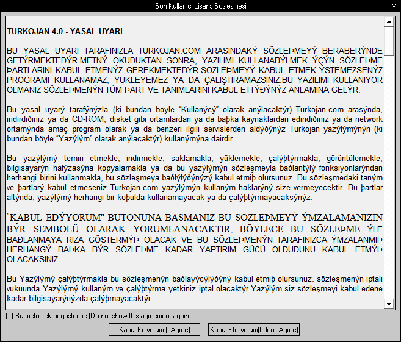

#  - Client.exe
## Informations
| Label | Value |
| :--- | ---: |
| Executable Name | Client.exe |
| Product Name |  |
| Version Number |  |
| Description |  |
| Company Name |  |
| Copyright |  |
| Trademarks |  |
| Last Edition | 19/08/2022 03:21:22 |
| Size | 1305600 |
| SHA1 🔎 | [A34059CF770EFA6202076A06868EE631E9419F87](https://www.virustotal.com/gui/search/A34059CF770EFA6202076A06868EE631E9419F87) |
| MD5 | D41D8CD98F00B204E9800998ECF8427E |
| Language |  |
## Static Analysis
<details>
<summary>Manalyze</summary>
<p>

```

* Manalyze 0.9 *

-------------------------------------------------------------------------------
C:/Users/aTest/Desktop/net6.0/Malwares/Malwares/RAT/Turkojan 4.0 Gold/Client.exe
-------------------------------------------------------------------------------

Summary:
--------
Architecture:       IMAGE_FILE_MACHINE_I386
Subsystem:          IMAGE_SUBSYSTEM_WINDOWS_GUI
Compilation Date:   1992-Jun-19 22:22:17
Detected languages: English - United States

DOS Header:
-----------
e_magic:    MZ
e_cblp:     0x0050
e_cp:       0x0002
e_crlc:     0x0000
e_cparhdr:  0x0004
e_minalloc: 0x000F
e_maxalloc: 0xFFFF
e_ss:       0x0000
e_sp:       0x00B8
e_csum:     0x0000
e_ip:       0x0000
e_cs:       0x0000
e_ovno:     0x001A
e_oemid:    0x0000
e_oeminfo:  0x0000
e_lfanew:   0x00000100

PE Header:
----------
Signature:            PE
Machine:              IMAGE_FILE_MACHINE_I386
NumberofSections:     3
TimeDateStamp:        1992-Jun-19 22:22:17
PointerToSymbolTable: 0x00000000
NumberOfSymbols:      0
SizeOfOptionalHeader: 0x00E0
Characteristics:      IMAGE_FILE_32BIT_MACHINE
                      IMAGE_FILE_BYTES_REVERSED_HI
                      IMAGE_FILE_BYTES_REVERSED_LO
                      IMAGE_FILE_EXECUTABLE_IMAGE
                      IMAGE_FILE_LINE_NUMS_STRIPPED
                      IMAGE_FILE_LOCAL_SYMS_STRIPPED
                      IMAGE_FILE_RELOCS_STRIPPED

Image Optional Header:
----------------------
Magic:                   PE32
LinkerVersion:           2.0
SizeOfCode:              0x0013C000
SizeOfInitializedData:   0x00003000
SizeOfUninitializedData: 0x00190000
AddressOfEntryPoint:     0x002CCB70 (Section: )
BaseOfCode:              0x00191000
BaseOfData:              0x002CD000
ImageBase:               0x00400000
SectionAlignment:        0x00001000
FileAlignment:           0x00000200
OperatingSystemVersion:  4.0
ImageVersion:            0.0
SubsystemVersion:        4.0
Win32VersionValue:       0
SizeOfImage:             0x002D0000
SizeOfHeaders:           0x00001000
Checksum:                0x00000000
Subsystem:               IMAGE_SUBSYSTEM_WINDOWS_GUI
SizeofStackReserve:      0x00100000
SizeofStackCommit:       0x00004000
SizeofHeapReserve:       0x00100000
SizeofHeapCommit:        0x00001000
LoaderFlags:             0x00000000
NumberOfRvaAndSizes:     16

Sections:
---------
:
    VirtualSize:          0x00190000
    VirtualAddress:       0x00001000
    SizeOfRawData:        0x00000000
    PointerToRawData:     0x00000400
    PointerToRelocations: 0x00000000
    PointerToLineNumbers: 0x00000000
    NumberOfLineNumbers:  0
    NumberOfRelocations:  0
    Characteristics:      IMAGE_SCN_CNT_UNINITIALIZED_DATA
                          IMAGE_SCN_MEM_EXECUTE
                          IMAGE_SCN_MEM_READ
                          IMAGE_SCN_MEM_WRITE

 (#2):
    VirtualSize:          0x0013C000
    VirtualAddress:       0x00191000
    SizeOfRawData:        0x0013BE00
    PointerToRawData:     0x00000400
    PointerToRelocations: 0x00000000
    PointerToLineNumbers: 0x00000000
    NumberOfLineNumbers:  0
    NumberOfRelocations:  0
    Characteristics:      IMAGE_SCN_CNT_INITIALIZED_DATA
                          IMAGE_SCN_MEM_EXECUTE
                          IMAGE_SCN_MEM_READ
                          IMAGE_SCN_MEM_WRITE
    Entropy:              7.86308

.rsrc:
    VirtualSize:          0x00003000
    VirtualAddress:       0x002CD000
    SizeOfRawData:        0x00002A00
    PointerToRawData:     0x0013C200
    PointerToRelocations: 0x00000000
    PointerToLineNumbers: 0x00000000
    NumberOfLineNumbers:  0
    NumberOfRelocations:  0
    Characteristics:      IMAGE_SCN_CNT_INITIALIZED_DATA
                          IMAGE_SCN_MEM_READ
                          IMAGE_SCN_MEM_WRITE
    Entropy:              3.65202


Imports:
--------
KERNEL32.DLL: LoadLibraryA
              GetProcAddress
              VirtualProtect
              VirtualAlloc
              VirtualFree
              ExitProcess
advapi32.dll: RegFlushKey
comctl32.dll: ImageList_Add
comdlg32.dll: GetSaveFileNameA
gdi32.dll:    Pie
ole32.dll:    CoInitialize
oleaut32.dll: VariantCopy
shell32.dll:  ShellExecuteA
user32.dll:   GetDC
version.dll:  VerQueryValueA
winmm.dll:    waveOutOpen
winspool.drv: OpenPrinterA
wsock32.dll:  send

Resources:
----------
1:
    Type:          RT_CURSOR
    Language:      UNKNOWN
    Codepage:      UNKNOWN
    Size:          308
    TimeDateStamp: 2008-Mar-02 23:53:54
    Entropy:       0

2:
    Type:          RT_CURSOR
    Language:      UNKNOWN
    Codepage:      UNKNOWN
    Size:          308
    TimeDateStamp: 2008-Mar-02 23:53:54
    Entropy:       0

3:
    Type:          RT_CURSOR
    Language:      UNKNOWN
    Codepage:      UNKNOWN
    Size:          308
    TimeDateStamp: 2008-Mar-02 23:53:54
    Entropy:       0

4:
    Type:          RT_CURSOR
    Language:      UNKNOWN
    Codepage:      UNKNOWN
    Size:          308
    TimeDateStamp: 2008-Mar-02 23:53:54
    Entropy:       0

5:
    Type:          RT_CURSOR
    Language:      UNKNOWN
    Codepage:      UNKNOWN
    Size:          308
    TimeDateStamp: 2008-Mar-02 23:53:54
    Entropy:       0

6:
    Type:          RT_CURSOR
    Language:      UNKNOWN
    Codepage:      UNKNOWN
    Size:          308
    TimeDateStamp: 2008-Mar-02 23:53:54
    Entropy:       0

7:
    Type:          RT_CURSOR
    Language:      UNKNOWN
    Codepage:      UNKNOWN
    Size:          308
    TimeDateStamp: 2008-Mar-02 23:53:54
    Entropy:       0

BBABORT:
    Type:          RT_BITMAP
    Language:      UNKNOWN
    Codepage:      UNKNOWN
    Size:          464
    TimeDateStamp: 2008-Mar-02 23:53:54
    Entropy:       0

BBALL:
    Type:          RT_BITMAP
    Language:      UNKNOWN
    Codepage:      UNKNOWN
    Size:          484
    TimeDateStamp: 2008-Mar-02 23:53:54
    Entropy:       0

BBCANCEL:
    Type:          RT_BITMAP
    Language:      UNKNOWN
    Codepage:      UNKNOWN
    Size:          464
    TimeDateStamp: 2008-Mar-02 23:53:54
    Entropy:       0

BBCLOSE:
    Type:          RT_BITMAP
    Language:      UNKNOWN
    Codepage:      UNKNOWN
    Size:          464
    TimeDateStamp: 2008-Mar-02 23:53:54
    Entropy:       0

BBHELP:
    Type:          RT_BITMAP
    Language:      UNKNOWN
    Codepage:      UNKNOWN
    Size:          464
    TimeDateStamp: 2008-Mar-02 23:53:54
    Entropy:       0

BBIGNORE:
    Type:          RT_BITMAP
    Language:      UNKNOWN
    Codepage:      UNKNOWN
    Size:          464
    TimeDateStamp: 2008-Mar-02 23:53:54
    Entropy:       0

BBNO:
    Type:          RT_BITMAP
    Language:      UNKNOWN
    Codepage:      UNKNOWN
    Size:          464
    TimeDateStamp: 2008-Mar-02 23:53:54
    Entropy:       0

BBOK:
    Type:          RT_BITMAP
    Language:      UNKNOWN
    Codepage:      UNKNOWN
    Size:          464
    TimeDateStamp: 2008-Mar-02 23:53:54
    Entropy:       0

BBRETRY:
    Type:          RT_BITMAP
    Language:      UNKNOWN
    Codepage:      UNKNOWN
    Size:          464
    TimeDateStamp: 2008-Mar-02 23:53:54
    Entropy:       0

BBYES:
    Type:          RT_BITMAP
    Language:      UNKNOWN
    Codepage:      UNKNOWN
    Size:          464
    TimeDateStamp: 2008-Mar-02 23:53:54
    Entropy:       0

FLATDOWN:
    Type:          RT_BITMAP
    Language:      UNKNOWN
    Codepage:      UNKNOWN
    Size:          124
    TimeDateStamp: 2008-Mar-02 23:53:54
    Entropy:       0

FLATUP:
    Type:          RT_BITMAP
    Language:      UNKNOWN
    Codepage:      UNKNOWN
    Size:          124
    TimeDateStamp: 2008-Mar-02 23:53:54
    Entropy:       0

MSN:
    Type:          RT_BITMAP
    Language:      English - United States
    Codepage:      UNKNOWN
    Size:          1624
    TimeDateStamp: 2008-Mar-02 23:53:54
    Entropy:       0

PREVIEWGLYPH:
    Type:          RT_BITMAP
    Language:      UNKNOWN
    Codepage:      UNKNOWN
    Size:          232
    TimeDateStamp: 2008-Mar-02 23:53:54
    Entropy:       0

SPINDOWN:
    Type:          RT_BITMAP
    Language:      UNKNOWN
    Codepage:      UNKNOWN
    Size:          152
    TimeDateStamp: 2008-Mar-02 23:53:54
    Entropy:       0

SPINUP:
    Type:          RT_BITMAP
    Language:      UNKNOWN
    Codepage:      UNKNOWN
    Size:          152
    TimeDateStamp: 2008-Mar-02 23:53:54
    Entropy:       0

1 (#2):
    Type:          RT_ICON
    Language:      English - United States
    Codepage:      UNKNOWN
    Size:          2216
    TimeDateStamp: 2008-Mar-02 23:53:54
    Entropy:       3.46921

DLGTEMPLATE:
    Type:          RT_DIALOG
    Language:      UNKNOWN
    Codepage:      UNKNOWN
    Size:          82
    TimeDateStamp: 2008-Mar-02 23:53:54
    Entropy:       0

4068:
    Type:          RT_STRING
    Language:      UNKNOWN
    Codepage:      UNKNOWN
    Size:          120
    TimeDateStamp: 2008-Mar-02 23:53:54
    Entropy:       0

4069:
    Type:          RT_STRING
    Language:      UNKNOWN
    Codepage:      UNKNOWN
    Size:          928
    TimeDateStamp: 2008-Mar-02 23:53:54
    Entropy:       0

4070:
    Type:          RT_STRING
    Language:      UNKNOWN
    Codepage:      UNKNOWN
    Size:          1112
    TimeDateStamp: 2008-Mar-02 23:53:54
    Entropy:       0

4071:
    Type:          RT_STRING
    Language:      UNKNOWN
    Codepage:      UNKNOWN
    Size:          876
    TimeDateStamp: 2008-Mar-02 23:53:54
    Entropy:       0

4072:
    Type:          RT_STRING
    Language:      UNKNOWN
    Codepage:      UNKNOWN
    Size:          944
    TimeDateStamp: 2008-Mar-02 23:53:54
    Entropy:       0

4073:
    Type:          RT_STRING
    Language:      UNKNOWN
    Codepage:      UNKNOWN
    Size:          832
    TimeDateStamp: 2008-Mar-02 23:53:54
    Entropy:       0

4074:
    Type:          RT_STRING
    Language:      UNKNOWN
    Codepage:      UNKNOWN
    Size:          728
    TimeDateStamp: 2008-Mar-02 23:53:54
    Entropy:       0

4075:
    Type:          RT_STRING
    Language:      UNKNOWN
    Codepage:      UNKNOWN
    Size:          880
    TimeDateStamp: 2008-Mar-02 23:53:54
    Entropy:       0

4076:
    Type:          RT_STRING
    Language:      UNKNOWN
    Codepage:      UNKNOWN
    Size:          868
    TimeDateStamp: 2008-Mar-02 23:53:54
    Entropy:       0

4077:
    Type:          RT_STRING
    Language:      UNKNOWN
    Codepage:      UNKNOWN
    Size:          1108
    TimeDateStamp: 2008-Mar-02 23:53:54
    Entropy:       0

4078:
    Type:          RT_STRING
    Language:      UNKNOWN
    Codepage:      UNKNOWN
    Size:          776
    TimeDateStamp: 2008-Mar-02 23:53:54
    Entropy:       0

4079:
    Type:          RT_STRING
    Language:      UNKNOWN
    Codepage:      UNKNOWN
    Size:          460
    TimeDateStamp: 2008-Mar-02 23:53:54
    Entropy:       0

4080:
    Type:          RT_STRING
    Language:      UNKNOWN
    Codepage:      UNKNOWN
    Size:          392
    TimeDateStamp: 2008-Mar-02 23:53:54
    Entropy:       0

4081:
    Type:          RT_STRING
    Language:      UNKNOWN
    Codepage:      UNKNOWN
    Size:          432
    TimeDateStamp: 2008-Mar-02 23:53:54
    Entropy:       0

4082:
    Type:          RT_STRING
    Language:      UNKNOWN
    Codepage:      UNKNOWN
    Size:          1072
    TimeDateStamp: 2008-Mar-02 23:53:54
    Entropy:       0

4083:
    Type:          RT_STRING
    Language:      UNKNOWN
    Codepage:      UNKNOWN
    Size:          192
    TimeDateStamp: 2008-Mar-02 23:53:54
    Entropy:       0

4084:
    Type:          RT_STRING
    Language:      UNKNOWN
    Codepage:      UNKNOWN
    Size:          260
    TimeDateStamp: 2008-Mar-02 23:53:54
    Entropy:       0

4085:
    Type:          RT_STRING
    Language:      UNKNOWN
    Codepage:      UNKNOWN
    Size:          360
    TimeDateStamp: 2008-Mar-02 23:53:54
    Entropy:       0

4086:
    Type:          RT_STRING
    Language:      UNKNOWN
    Codepage:      UNKNOWN
    Size:          1080
    TimeDateStamp: 2008-Mar-02 23:53:54
    Entropy:       0

4087:
    Type:          RT_STRING
    Language:      UNKNOWN
    Codepage:      UNKNOWN
    Size:          964
    TimeDateStamp: 2008-Mar-02 23:53:54
    Entropy:       0

4088:
    Type:          RT_STRING
    Language:      UNKNOWN
    Codepage:      UNKNOWN
    Size:          940
    TimeDateStamp: 2008-Mar-02 23:53:54
    Entropy:       0

4089:
    Type:          RT_STRING
    Language:      UNKNOWN
    Codepage:      UNKNOWN
    Size:          900
    TimeDateStamp: 2008-Mar-02 23:53:54
    Entropy:       0

4090:
    Type:          RT_STRING
    Language:      UNKNOWN
    Codepage:      UNKNOWN
    Size:          920
    TimeDateStamp: 2008-Mar-02 23:53:54
    Entropy:       0

4091:
    Type:          RT_STRING
    Language:      UNKNOWN
    Codepage:      UNKNOWN
    Size:          228
    TimeDateStamp: 2008-Mar-02 23:53:54
    Entropy:       0

4092:
    Type:          RT_STRING
    Language:      UNKNOWN
    Codepage:      UNKNOWN
    Size:          188
    TimeDateStamp: 2008-Mar-02 23:53:54
    Entropy:       0

4093:
    Type:          RT_STRING
    Language:      UNKNOWN
    Codepage:      UNKNOWN
    Size:          756
    TimeDateStamp: 2008-Mar-02 23:53:54
    Entropy:       0

4094:
    Type:          RT_STRING
    Language:      UNKNOWN
    Codepage:      UNKNOWN
    Size:          1072
    TimeDateStamp: 2008-Mar-02 23:53:54
    Entropy:       0

4095:
    Type:          RT_STRING
    Language:      UNKNOWN
    Codepage:      UNKNOWN
    Size:          816
    TimeDateStamp: 2008-Mar-02 23:53:54
    Entropy:       0

4096:
    Type:          RT_STRING
    Language:      UNKNOWN
    Codepage:      UNKNOWN
    Size:          788
    TimeDateStamp: 2008-Mar-02 23:53:54
    Entropy:       0

DVCLAL:
    Type:          RT_RCDATA
    Language:      UNKNOWN
    Codepage:      UNKNOWN
    Size:          16
    TimeDateStamp: 2008-Mar-02 23:53:54
    Entropy:       0

LISANS:
    Type:          RT_RCDATA
    Language:      English - United States
    Codepage:      UNKNOWN
    Size:          40417
    TimeDateStamp: 2008-Mar-02 23:53:54
    Entropy:       0

PACKAGEINFO:
    Type:          RT_RCDATA
    Language:      UNKNOWN
    Codepage:      UNKNOWN
    Size:          2912
    TimeDateStamp: 2008-Mar-02 23:53:54
    Entropy:       0

TFRMANTLASMA:
    Type:          RT_RCDATA
    Language:      UNKNOWN
    Codepage:      UNKNOWN
    Size:          2364
    TimeDateStamp: 2008-Mar-02 23:53:54
    Entropy:       0

TFRMAUDIO:
    Type:          RT_RCDATA
    Language:      UNKNOWN
    Codepage:      UNKNOWN
    Size:          4781
    TimeDateStamp: 2008-Mar-02 23:53:54
    Entropy:       0

TFRMAYARLAR:
    Type:          RT_RCDATA
    Language:      UNKNOWN
    Codepage:      UNKNOWN
    Size:          4921
    TimeDateStamp: 2008-Mar-02 23:53:54
    Entropy:       0

TFRMBLOCKSITE:
    Type:          RT_RCDATA
    Language:      UNKNOWN
    Codepage:      UNKNOWN
    Size:          13725
    TimeDateStamp: 2008-Mar-02 23:53:54
    Entropy:       0

TFRMBUY:
    Type:          RT_RCDATA
    Language:      UNKNOWN
    Codepage:      UNKNOWN
    Size:          3887
    TimeDateStamp: 2008-Mar-02 23:53:54
    Entropy:       0

TFRMCHAT:
    Type:          RT_RCDATA
    Language:      UNKNOWN
    Codepage:      UNKNOWN
    Size:          3697
    TimeDateStamp: 2008-Mar-02 23:53:54
    Entropy:       0

TFRMCLIPBOARD:
    Type:          RT_RCDATA
    Language:      UNKNOWN
    Codepage:      UNKNOWN
    Size:          8685
    TimeDateStamp: 2008-Mar-02 23:53:54
    Entropy:       0

TFRMCREDITS:
    Type:          RT_RCDATA
    Language:      UNKNOWN
    Codepage:      UNKNOWN
    Size:          1540
    TimeDateStamp: 2008-Mar-02 23:53:54
    Entropy:       0

TFRMEDITOR:
    Type:          RT_RCDATA
    Language:      UNKNOWN
    Codepage:      UNKNOWN
    Size:          34310
    TimeDateStamp: 2008-Mar-02 23:53:54
    Entropy:       0

TFRMEXPLORER:
    Type:          RT_RCDATA
    Language:      UNKNOWN
    Codepage:      UNKNOWN
    Size:          7251
    TimeDateStamp: 2008-Mar-02 23:53:54
    Entropy:       0

TFRMFIND:
    Type:          RT_RCDATA
    Language:      UNKNOWN
    Codepage:      UNKNOWN
    Size:          10592
    TimeDateStamp: 2008-Mar-02 23:53:54
    Entropy:       0

TFRMFUN:
    Type:          RT_RCDATA
    Language:      UNKNOWN
    Codepage:      UNKNOWN
    Size:          34683
    TimeDateStamp: 2008-Mar-02 23:53:54
    Entropy:       0

TFRMIMSNIFFOFF:
    Type:          RT_RCDATA
    Language:      UNKNOWN
    Codepage:      UNKNOWN
    Size:          6083
    TimeDateStamp: 2008-Mar-02 23:53:54
    Entropy:       0

TFRMIMSNIFFON:
    Type:          RT_RCDATA
    Language:      UNKNOWN
    Codepage:      UNKNOWN
    Size:          7581
    TimeDateStamp: 2008-Mar-02 23:53:54
    Entropy:       0

TFRMINFORMATION:
    Type:          RT_RCDATA
    Language:      UNKNOWN
    Codepage:      UNKNOWN
    Size:          40895
    TimeDateStamp: 2008-Mar-02 23:53:54
    Entropy:       0

TFRMINSAPPS:
    Type:          RT_RCDATA
    Language:      UNKNOWN
    Codepage:      UNKNOWN
    Size:          5863
    TimeDateStamp: 2008-Mar-02 23:53:54
    Entropy:       0

TFRMKEYBOARD:
    Type:          RT_RCDATA
    Language:      UNKNOWN
    Codepage:      UNKNOWN
    Size:          24453
    TimeDateStamp: 2008-Mar-02 23:53:54
    Entropy:       0

TFRMLOGGER:
    Type:          RT_RCDATA
    Language:      UNKNOWN
    Codepage:      UNKNOWN
    Size:          7573
    TimeDateStamp: 2008-Mar-02 23:53:54
    Entropy:       0

TFRMMAIN:
    Type:          RT_RCDATA
    Language:      UNKNOWN
    Codepage:      UNKNOWN
    Size:          367620
    TimeDateStamp: 2008-Mar-02 23:53:54
    Entropy:       0

TFRMMANAGER:
    Type:          RT_RCDATA
    Language:      UNKNOWN
    Codepage:      UNKNOWN
    Size:          103953
    TimeDateStamp: 2008-Mar-02 23:53:54
    Entropy:       7.9172

TFRMMESSAGES:
    Type:          RT_RCDATA
    Language:      UNKNOWN
    Codepage:      UNKNOWN
    Size:          4135
    TimeDateStamp: 2008-Mar-02 23:53:54
    Entropy:       7.7258

TFRMMOUSE:
    Type:          RT_RCDATA
    Language:      UNKNOWN
    Codepage:      UNKNOWN
    Size:          20574
    TimeDateStamp: 2008-Mar-02 23:53:54
    Entropy:       7.82646

TFRMMSGBOX:
    Type:          RT_RCDATA
    Language:      UNKNOWN
    Codepage:      UNKNOWN
    Size:          22166
    TimeDateStamp: 2008-Mar-02 23:53:54
    Entropy:       7.80852

TFRMNEWFOL:
    Type:          RT_RCDATA
    Language:      UNKNOWN
    Codepage:      UNKNOWN
    Size:          3120
    TimeDateStamp: 2008-Mar-02 23:53:54
    Entropy:       7.64922

TFRMNEWFOLDER:
    Type:          RT_RCDATA
    Language:      UNKNOWN
    Codepage:      UNKNOWN
    Size:          4956
    TimeDateStamp: 2008-Mar-02 23:53:54
    Entropy:       7.7014

TFRMNOTEPAD:
    Type:          RT_RCDATA
    Language:      UNKNOWN
    Codepage:      UNKNOWN
    Size:          1762
    TimeDateStamp: 2008-Mar-02 23:53:54
    Entropy:       7.65567

TFRMOFFLOGGER:
    Type:          RT_RCDATA
    Language:      UNKNOWN
    Codepage:      UNKNOWN
    Size:          6090
    TimeDateStamp: 2008-Mar-02 23:53:54
    Entropy:       7.72534

TFRMOPENCHAT:
    Type:          RT_RCDATA
    Language:      UNKNOWN
    Codepage:      UNKNOWN
    Size:          4321
    TimeDateStamp: 2008-Mar-02 23:53:54
    Entropy:       7.69918

TFRMPASSWORDS:
    Type:          RT_RCDATA
    Language:      UNKNOWN
    Codepage:      UNKNOWN
    Size:          13942
    TimeDateStamp: 2008-Mar-02 23:53:54
    Entropy:       7.73725

TFRMREGISTRYCREATE:
    Type:          RT_RCDATA
    Language:      UNKNOWN
    Codepage:      UNKNOWN
    Size:          5695
    TimeDateStamp: 2008-Mar-02 23:53:54
    Entropy:       7.70869

TFRMREGISTRYEDITOR:
    Type:          RT_RCDATA
    Language:      UNKNOWN
    Codepage:      UNKNOWN
    Size:          23908
    TimeDateStamp: 2008-Mar-02 23:53:54
    Entropy:       7.75696

TFRMREMOTECONTROL:
    Type:          RT_RCDATA
    Language:      UNKNOWN
    Codepage:      UNKNOWN
    Size:          15088
    TimeDateStamp: 2008-Mar-02 23:53:54
    Entropy:       7.76213

TFRMREMOTEDOWNLOAD:
    Type:          RT_RCDATA
    Language:      UNKNOWN
    Codepage:      UNKNOWN
    Size:          6236
    TimeDateStamp: 2008-Mar-02 23:53:54
    Entropy:       7.71308

TFRMRENAME:
    Type:          RT_RCDATA
    Language:      UNKNOWN
    Codepage:      UNKNOWN
    Size:          3126
    TimeDateStamp: 2008-Mar-02 23:53:54
    Entropy:       7.76518

TFRMSCREEN:
    Type:          RT_RCDATA
    Language:      UNKNOWN
    Codepage:      UNKNOWN
    Size:          7225
    TimeDateStamp: 2008-Mar-02 23:53:54
    Entropy:       7.73925

TFRMSERVICES:
    Type:          RT_RCDATA
    Language:      UNKNOWN
    Codepage:      UNKNOWN
    Size:          11079
    TimeDateStamp: 2008-Mar-02 23:53:54
    Entropy:       7.7904

TFRMSETTINGS:
    Type:          RT_RCDATA
    Language:      UNKNOWN
    Codepage:      UNKNOWN
    Size:          8826
    TimeDateStamp: 2008-Mar-02 23:53:54
    Entropy:       7.61444

TFRMSHELL:
    Type:          RT_RCDATA
    Language:      UNKNOWN
    Codepage:      UNKNOWN
    Size:          1647
    TimeDateStamp: 2008-Mar-02 23:53:54
    Entropy:       7.5093

TFRMSHUTDOWN:
    Type:          RT_RCDATA
    Language:      UNKNOWN
    Codepage:      UNKNOWN
    Size:          9042
    TimeDateStamp: 2008-Mar-02 23:53:54
    Entropy:       7.63249

TFRMSTREAM:
    Type:          RT_RCDATA
    Language:      UNKNOWN
    Codepage:      UNKNOWN
    Size:          11331
    TimeDateStamp: 2008-Mar-02 23:53:54
    Entropy:       7.6442

TFRMSUPPORT:
    Type:          RT_RCDATA
    Language:      UNKNOWN
    Codepage:      UNKNOWN
    Size:          3451
    TimeDateStamp: 2008-Mar-02 23:53:54
    Entropy:       7.72249

TFRMTASKLIST:
    Type:          RT_RCDATA
    Language:      UNKNOWN
    Codepage:      UNKNOWN
    Size:          20219
    TimeDateStamp: 2008-Mar-02 23:53:54
    Entropy:       7.76718

TFRMTERMINATE:
    Type:          RT_RCDATA
    Language:      UNKNOWN
    Codepage:      UNKNOWN
    Size:          8077
    TimeDateStamp: 2008-Mar-02 23:53:54
    Entropy:       7.78782

TFRMTEST:
    Type:          RT_RCDATA
    Language:      UNKNOWN
    Codepage:      UNKNOWN
    Size:          3774
    TimeDateStamp: 2008-Mar-02 23:53:54
    Entropy:       7.74737

TFRMTRANSFER:
    Type:          RT_RCDATA
    Language:      UNKNOWN
    Codepage:      UNKNOWN
    Size:          2924
    TimeDateStamp: 2008-Mar-02 23:53:54
    Entropy:       7.82227

TTHUMB:
    Type:          RT_RCDATA
    Language:      UNKNOWN
    Codepage:      UNKNOWN
    Size:          1272
    TimeDateStamp: 2008-Mar-02 23:53:54
    Entropy:       7.55238

X01:
    Type:          RT_RCDATA
    Language:      English - United States
    Codepage:      UNKNOWN
    Size:          236544
    TimeDateStamp: 2008-Mar-02 23:53:54
    Entropy:       7.72997

X02:
    Type:          RT_RCDATA
    Language:      English - United States
    Codepage:      UNKNOWN
    Size:          33280
    TimeDateStamp: 2008-Mar-02 23:53:54
    Entropy:       7.73588

X95:
    Type:          RT_RCDATA
    Language:      English - United States
    Codepage:      UNKNOWN
    Size:          269312
    TimeDateStamp: 2008-Mar-02 23:53:54
    Entropy:       7.74135

X96:
    Type:          RT_RCDATA
    Language:      English - United States
    Codepage:      UNKNOWN
    Size:          17321
    TimeDateStamp: 2008-Mar-02 23:53:54
    Entropy:       7.73021

32761:
    Type:          RT_GROUP_CURSOR
    Language:      UNKNOWN
    Codepage:      UNKNOWN
    Size:          20
    TimeDateStamp: 2008-Mar-02 23:53:54
    Entropy:       4.32193

32762:
    Type:          RT_GROUP_CURSOR
    Language:      UNKNOWN
    Codepage:      UNKNOWN
    Size:          20
    TimeDateStamp: 2008-Mar-02 23:53:54
    Entropy:       4.22193

32763:
    Type:          RT_GROUP_CURSOR
    Language:      UNKNOWN
    Codepage:      UNKNOWN
    Size:          20
    TimeDateStamp: 2008-Mar-02 23:53:54
    Entropy:       4.32193

32764:
    Type:          RT_GROUP_CURSOR
    Language:      UNKNOWN
    Codepage:      UNKNOWN
    Size:          20
    TimeDateStamp: 2008-Mar-02 23:53:54
    Entropy:       4.22193

32765:
    Type:          RT_GROUP_CURSOR
    Language:      UNKNOWN
    Codepage:      UNKNOWN
    Size:          20
    TimeDateStamp: 2008-Mar-02 23:53:54
    Entropy:       3.92193

32766:
    Type:          RT_GROUP_CURSOR
    Language:      UNKNOWN
    Codepage:      UNKNOWN
    Size:          20
    TimeDateStamp: 2008-Mar-02 23:53:54
    Entropy:       4.32193

32767:
    Type:          RT_GROUP_CURSOR
    Language:      UNKNOWN
    Codepage:      UNKNOWN
    Size:          20
    TimeDateStamp: 2008-Mar-02 23:53:54
    Entropy:       4.22193

MAINICON:
    Type:              RT_GROUP_ICON
    Language:          English - United States
    Codepage:          UNKNOWN
    Size:              20
    TimeDateStamp:     2008-Mar-02 23:53:54
    Entropy:           1.81924
    Detected Filetype: Icon file


[ SUSPICIOUS ] PEiD Signature:
    UPX V2.00-V2.90 -> Markus Oberhumer &amp; Laszlo Molnar &amp; John Reiser
    UPX v2.0 -> Markus, Laszlo & Reiser (h)
    UPX 2.00-3.0X -> Markus Oberhumer &amp; Laszlo Molnar &amp; John Reiser
    UPX -> www.upx.sourceforge.net
    UPX V2.00-V2.90 -> Markus Oberhumer & Laszlo Molnar & John Reiser
    UPX 2.00-3.0X -> Markus Oberhumer & Laszlo Molnar & John Reiser

[ SUSPICIOUS ] The PE is possibly packed.
    Unusual section name found: 
    Section  is both writable and executable.
    Unusual section name found: 
    Section  is both writable and executable.
    The PE's resources are bigger than it is.

[ SUSPICIOUS ] The PE contains functions most legitimate programs don't use.
    [!] The program may be hiding some of its imports:
        LoadLibraryA
        GetProcAddress
    Can access the registry:
        RegFlushKey
    Possibly launches other programs:
        ShellExecuteA
    Memory manipulation functions often used by packers:
        VirtualProtect
        VirtualAlloc

[ SUSPICIOUS ] The PE header may have been manually modified.
    Resource TFRMMANAGER is possibly compressed or encrypted.
    Resource TFRMMESSAGES is possibly compressed or encrypted.
    Resource TFRMMOUSE is possibly compressed or encrypted.
    Resource TFRMMSGBOX is possibly compressed or encrypted.
    Resource TFRMNEWFOL is possibly compressed or encrypted.
    Resource TFRMNEWFOLDER is possibly compressed or encrypted.
    Resource TFRMNOTEPAD is possibly compressed or encrypted.
    Resource TFRMOFFLOGGER is possibly compressed or encrypted.
    Resource TFRMOPENCHAT is possibly compressed or encrypted.
    Resource TFRMPASSWORDS is possibly compressed or encrypted.
    Resource TFRMREGISTRYCREATE is possibly compressed or encrypted.
    Resource TFRMREGISTRYEDITOR is possibly compressed or encrypted.
    Resource TFRMREMOTECONTROL is possibly compressed or encrypted.
    Resource TFRMREMOTEDOWNLOAD is possibly compressed or encrypted.
    Resource TFRMRENAME is possibly compressed or encrypted.
    Resource TFRMSCREEN is possibly compressed or encrypted.
    Resource TFRMSERVICES is possibly compressed or encrypted.
    Resource TFRMSETTINGS is possibly compressed or encrypted.
    Resource TFRMSHELL is possibly compressed or encrypted.
    Resource TFRMSHUTDOWN is possibly compressed or encrypted.
    Resource TFRMSTREAM is possibly compressed or encrypted.
    Resource TFRMSUPPORT is possibly compressed or encrypted.
    Resource TFRMTASKLIST is possibly compressed or encrypted.
    Resource TFRMTERMINATE is possibly compressed or encrypted.
    Resource TFRMTEST is possibly compressed or encrypted.
    Resource TFRMTRANSFER is possibly compressed or encrypted.
    Resource TTHUMB is possibly compressed or encrypted.
    Resource X01 is possibly compressed or encrypted.
    Resource X02 is possibly compressed or encrypted.
    Resource X95 is possibly compressed or encrypted.
    Resource X96 is possibly compressed or encrypted.
    The resource timestamps differ from the PE header:
        2008-Mar-02 23:53:54
    Resources amount for 118.79% of the executable.

The following exploit mitigation techniques have been detected
    Stack Canary: disabled
    SafeSEH: disabled
    ASLR: disabled
    DEP: disabled
    CFG: disabled


```

</p>
</details>

## Screenshots
### frmAntlasma
 
