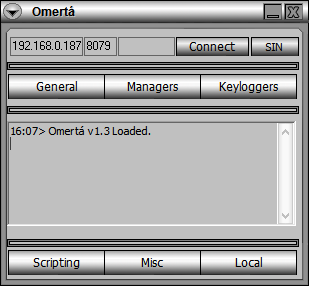

# Omertá - Omerta.exe
## Informations
| Label | Value |
| :--- | ---: |
| Executable Name | Omerta.exe |
| Product Name | Omertá |
| Version Number | 1.02 |
| Description |  |
| Company Name |  Splinter - Splinter Security |
| Copyright |  |
| Trademarks |  |
| Last Edition | 12/10/2005 23:10:18 |
| Size | 708096 |
| SHA1 🔎 | [A562A5B7617B1F1F59A0BD37927A813F54E5297A](https://www.virustotal.com/gui/search/A562A5B7617B1F1F59A0BD37927A813F54E5297A) |
| MD5 | D41D8CD98F00B204E9800998ECF8427E |
| Language | Anglais (États-Unis) |
## Static Analysis
<details>
<summary>Manalyze</summary>
<p>

```

* Manalyze 0.9 *

-------------------------------------------------------------------------------
C:/Users/aTest/Desktop/net6.0/Malwares/Malwares/RAT/Omerta.exe
-------------------------------------------------------------------------------

Summary:
--------
Architecture:       IMAGE_FILE_MACHINE_I386
Subsystem:          IMAGE_SUBSYSTEM_WINDOWS_GUI
Compilation Date:   2005-Oct-12 22:10:16
Detected languages: English - United Kingdom
                    English - United States
Comments:           Omertá
CompanyName:         Splinter - Splinter Security
ProductName:        Omertá
FileVersion:        1.02
ProductVersion:     1.02
InternalName:       Omerta
OriginalFilename:   Omerta.exe

DOS Header:
-----------
e_magic:    MZ
e_cblp:     0x0090
e_cp:       0x0003
e_crlc:     0x0000
e_cparhdr:  0x0004
e_minalloc: 0x0000
e_maxalloc: 0xFFFF
e_ss:       0x0000
e_sp:       0x00B8
e_csum:     0x0000
e_ip:       0x0000
e_cs:       0x0000
e_ovno:     0x0000
e_oemid:    0x0000
e_oeminfo:  0x0000
e_lfanew:   0x000000B8

PE Header:
----------
Signature:            PE
Machine:              IMAGE_FILE_MACHINE_I386
NumberofSections:     5
TimeDateStamp:        2005-Oct-12 22:10:16
PointerToSymbolTable: 0x00000000
NumberOfSymbols:      0
SizeOfOptionalHeader: 0x00E0
Characteristics:      IMAGE_FILE_32BIT_MACHINE
                      IMAGE_FILE_EXECUTABLE_IMAGE
                      IMAGE_FILE_LINE_NUMS_STRIPPED
                      IMAGE_FILE_LOCAL_SYMS_STRIPPED
                      IMAGE_FILE_RELOCS_STRIPPED

Image Optional Header:
----------------------
Magic:                   PE32
LinkerVersion:           6.2
SizeOfCode:              0x000B9000
SizeOfInitializedData:   0x00122000
SizeOfUninitializedData: 0x00000000
AddressOfEntryPoint:     0x001DC001 (Section: .aspack)
BaseOfCode:              0x00001000
BaseOfData:              0x000BA000
ImageBase:               0x00400000
SectionAlignment:        0x00001000
FileAlignment:           0x00000200
OperatingSystemVersion:  4.0
ImageVersion:            1.2
SubsystemVersion:        4.0
Win32VersionValue:       0
SizeOfImage:             0x001DF000
SizeOfHeaders:           0x00001000
Checksum:                0x001D262F
Subsystem:               IMAGE_SUBSYSTEM_WINDOWS_GUI
SizeofStackReserve:      0x00100000
SizeofStackCommit:       0x00001000
SizeofHeapReserve:       0x00100000
SizeofHeapCommit:        0x00001000
LoaderFlags:             0x00000000
NumberOfRvaAndSizes:     16

Sections:
---------
.text:
    VirtualSize:          0x000B9000
    VirtualAddress:       0x00001000
    SizeOfRawData:        0x00022000
    PointerToRawData:     0x00001000
    PointerToRelocations: 0x00000000
    PointerToLineNumbers: 0x00000000
    NumberOfLineNumbers:  0
    NumberOfRelocations:  0
    Characteristics:      IMAGE_SCN_CNT_INITIALIZED_DATA
                          IMAGE_SCN_MEM_READ
                          IMAGE_SCN_MEM_WRITE
    Entropy:              7.99785

.data:
    VirtualSize:          0x00011000
    VirtualAddress:       0x000BA000
    SizeOfRawData:        0x00000200
    PointerToRawData:     0x00023000
    PointerToRelocations: 0x00000000
    PointerToLineNumbers: 0x00000000
    NumberOfLineNumbers:  0
    NumberOfRelocations:  0
    Characteristics:      IMAGE_SCN_CNT_INITIALIZED_DATA
                          IMAGE_SCN_MEM_READ
                          IMAGE_SCN_MEM_WRITE
    Entropy:              0.581224

.rsrc:
    VirtualSize:          0x00111000
    VirtualAddress:       0x000CB000
    SizeOfRawData:        0x00088600
    PointerToRawData:     0x00023200
    PointerToRelocations: 0x00000000
    PointerToLineNumbers: 0x00000000
    NumberOfLineNumbers:  0
    NumberOfRelocations:  0
    Characteristics:      IMAGE_SCN_CNT_INITIALIZED_DATA
                          IMAGE_SCN_MEM_READ
                          IMAGE_SCN_MEM_WRITE
    Entropy:              7.99874

.aspack:
    VirtualSize:          0x00002000
    VirtualAddress:       0x001DC000
    SizeOfRawData:        0x00001600
    PointerToRawData:     0x000AB800
    PointerToRelocations: 0x00000000
    PointerToLineNumbers: 0x00000000
    NumberOfLineNumbers:  0
    NumberOfRelocations:  0
    Characteristics:      IMAGE_SCN_CNT_INITIALIZED_DATA
                          IMAGE_SCN_MEM_READ
                          IMAGE_SCN_MEM_WRITE
    Entropy:              5.73109

.rsrc (#2):
    VirtualSize:          0x00001000
    VirtualAddress:       0x001DE000
    SizeOfRawData:        0x00000000
    PointerToRawData:     0x000ACE00
    PointerToRelocations: 0x00000000
    PointerToLineNumbers: 0x00000000
    NumberOfLineNumbers:  0
    NumberOfRelocations:  0
    Characteristics:      IMAGE_SCN_CNT_INITIALIZED_DATA
                          IMAGE_SCN_MEM_READ
                          IMAGE_SCN_MEM_WRITE


Imports:
--------
kernel32.dll: GetProcAddress
              GetModuleHandleA
              LoadLibraryA
msvbvm60.dll: __vbaVarSub

Resources:
----------
I:
    Type:          CUSTOM
    Language:      English - United Kingdom
    Codepage:      Unicode (UTF 16LE)
    Size:          343996
    TimeDateStamp: 2005-Oct-12 22:10:16
    Entropy:       0

OMERTASKIN:
    Type:          CUSTOM
    Language:      English - United Kingdom
    Codepage:      Unicode (UTF 16LE)
    Size:          402432
    TimeDateStamp: 2005-Oct-12 22:10:16
    Entropy:       7.99365

SETTINGS:
    Type:          CUSTOM
    Language:      English - United Kingdom
    Codepage:      Unicode (UTF 16LE)
    Size:          632
    TimeDateStamp: 2005-Oct-12 22:10:16
    Entropy:       7.72785

UPX:
    Type:          CUSTOM
    Language:      English - United Kingdom
    Codepage:      Unicode (UTF 16LE)
    Size:          126464
    TimeDateStamp: 2005-Oct-12 22:10:16
    Entropy:       0

101:
    Type:          CUSTOM
    Language:      English - United States
    Codepage:      Unicode (UTF 16LE)
    Size:          241664
    TimeDateStamp: 2005-Oct-12 22:10:16
    Entropy:       7.99815

30001:
    Type:          RT_ICON
    Language:      UNKNOWN
    Codepage:      Unicode (UTF 16LE)
    Size:          744
    TimeDateStamp: 2005-Oct-12 22:10:16
    Entropy:       2.8871

1:
    Type:              RT_GROUP_ICON
    Language:          UNKNOWN
    Codepage:          Unicode (UTF 16LE)
    Size:              20
    TimeDateStamp:     2005-Oct-12 22:10:16
    Entropy:           2.55772
    Detected Filetype: Icon file

1 (#2):
    Type:          RT_VERSION
    Language:      English - United States
    Codepage:      Unicode (UTF 16LE)
    Size:          604
    TimeDateStamp: 2005-Oct-12 22:10:16
    Entropy:       3.19933


Version Info:
-------------
Resource LangID: English - United States
VS_VERSION_INFO:
    Signature:           0xFEEF04BD
    StructVersion:       0x00010000
    FileVersion:         1.2.0.0
    ProductVersion:      1.2.0.0
    FileFlags:           (EMPTY)
    FileOs:              VOS_DOS_WINDOWS32
                         VOS_NT_WINDOWS32
                         VOS__WINDOWS32
    FileType:            VFT_APP
    Language:            English - United States
    Comments:            Omertá
    CompanyName:          Splinter - Splinter Security
    ProductName:         Omertá
    FileVersion (#2):    1.02
    ProductVersion (#2): 1.02
    InternalName:        Omerta
    OriginalFilename:    Omerta.exe


RICH Header:
------------
XOR Key:          0x8ACD8739
Unmarked objects: 0
14 (7299):        1
9 (8041):         38
13 (8169):        1

[ SUSPICIOUS ] The PE is packed with Aspack
    Unusual section name found: .aspack
    The PE only has 4 import(s).
    The PE's resources are bigger than it is.

The PE contains common functions which appear in legitimate applications.
    [!] The program may be hiding some of its imports:
        GetProcAddress
        LoadLibraryA

[ SUSPICIOUS ] The PE is possibly a dropper.
    Resource OMERTASKIN is possibly compressed or encrypted.
    Resource SETTINGS is possibly compressed or encrypted.
    Resource 101 is possibly compressed or encrypted.
    Resources amount for 157.684% of the executable.

The following exploit mitigation techniques have been detected
    Stack Canary: disabled
    SafeSEH: disabled
    ASLR: disabled
    DEP: disabled
    CFG: disabled


```

</p>
</details>

## Screenshots
### Omertá
 
