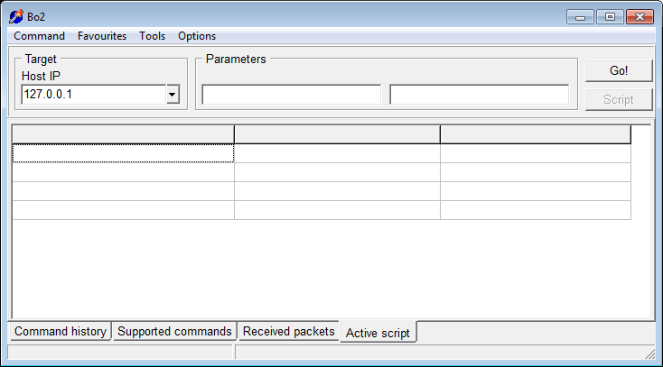

#  - Backdoor.Win32.BO2-45539d88ea78d56bfb5ab9842a84fcf00fbaf83a0469eaf5e16c7c8042a2240c.exe
## Informations
| Label | Value |
| :--- | ---: |
| Executable Name | Backdoor.Win32.BO2-45539d88ea78d56bfb5ab9842a84fcf00fbaf83a0469eaf5e16c7c8042a2240c.exe |
| Product Name |  |
| Version Number |  |
| Description |  |
| Company Name |  |
| Copyright |  |
| Trademarks |  |
| Last Edition | 14/06/2012 09:42:46 |
| Size | 453632 |
| SHA1 🔎 | [B0A7FAD5EB23B290C60880360003CE954B132027](https://www.virustotal.com/gui/search/B0A7FAD5EB23B290C60880360003CE954B132027) |
| Language |  |
## Static Analysis
<details>
<summary>Manalyze</summary>
<p>

```

* Manalyze 0.9 *

-------------------------------------------------------------------------------
C:/Users/IEUser/Desktop/net6.0/Malwares/Backdoor.Win32.BO2-45539d88ea78d56bfb5ab9842a84fcf00fbaf83a0469eaf5e16c7c8042a2240c.exe
-------------------------------------------------------------------------------

Summary:
--------
Architecture:       IMAGE_FILE_MACHINE_I386
Subsystem:          IMAGE_SUBSYSTEM_WINDOWS_GUI
Compilation Date:   1992-Jun-19 22:22:17
Detected languages: Spanish - Spain (International sort)

DOS Header:
-----------
e_magic:    MZ
e_cblp:     0x0050
e_cp:       0x0002
e_crlc:     0x0000
e_cparhdr:  0x0004
e_minalloc: 0x000F
e_maxalloc: 0xFFFF
e_ss:       0x0000
e_sp:       0x00B8
e_csum:     0x0000
e_ip:       0x0000
e_cs:       0x0000
e_ovno:     0x001A
e_oemid:    0x0000
e_oeminfo:  0x0000
e_lfanew:   0x00000100

PE Header:
----------
Signature:            PE
Machine:              IMAGE_FILE_MACHINE_I386
NumberofSections:     8
TimeDateStamp:        1992-Jun-19 22:22:17
PointerToSymbolTable: 0x00000000
NumberOfSymbols:      0
SizeOfOptionalHeader: 0x00E0
Characteristics:      IMAGE_FILE_32BIT_MACHINE
                      IMAGE_FILE_BYTES_REVERSED_HI
                      IMAGE_FILE_BYTES_REVERSED_LO
                      IMAGE_FILE_EXECUTABLE_IMAGE
                      IMAGE_FILE_LINE_NUMS_STRIPPED
                      IMAGE_FILE_LOCAL_SYMS_STRIPPED

Image Optional Header:
----------------------
Magic:                   PE32
LinkerVersion:           2.0
SizeOfCode:              0x0005E400
SizeOfInitializedData:   0x00010400
SizeOfUninitializedData: 0x00000000
AddressOfEntryPoint:     0x0005F210 (Section: CODE)
BaseOfCode:              0x00001000
BaseOfData:              0x00060000
ImageBase:               0x00400000
SectionAlignment:        0x00001000
FileAlignment:           0x00000200
OperatingSystemVersion:  1.0
ImageVersion:            0.0
SubsystemVersion:        4.0
Win32VersionValue:       0
SizeOfImage:             0x00075000
SizeOfHeaders:           0x00000400
Checksum:                0x00000000
Subsystem:               IMAGE_SUBSYSTEM_WINDOWS_GUI
SizeofStackReserve:      0x00100000
SizeofStackCommit:       0x00004000
SizeofHeapReserve:       0x00100000
SizeofHeapCommit:        0x00001000
LoaderFlags:             0x00000000
NumberOfRvaAndSizes:     16

Sections:
---------
CODE:
    VirtualSize:          0x0005E258
    VirtualAddress:       0x00001000
    SizeOfRawData:        0x0005E400
    PointerToRawData:     0x00000400
    PointerToRelocations: 0x00000000
    PointerToLineNumbers: 0x00000000
    NumberOfLineNumbers:  0
    NumberOfRelocations:  0
    Characteristics:      IMAGE_SCN_CNT_CODE
                          IMAGE_SCN_MEM_EXECUTE
                          IMAGE_SCN_MEM_READ
    Entropy:              6.50892

DATA:
    VirtualSize:          0x00000FBC
    VirtualAddress:       0x00060000
    SizeOfRawData:        0x00001000
    PointerToRawData:     0x0005E800
    PointerToRelocations: 0x00000000
    PointerToLineNumbers: 0x00000000
    NumberOfLineNumbers:  0
    NumberOfRelocations:  0
    Characteristics:      IMAGE_SCN_CNT_INITIALIZED_DATA
                          IMAGE_SCN_MEM_READ
                          IMAGE_SCN_MEM_WRITE
    Entropy:              4.01045

BSS:
    VirtualSize:          0x00000A59
    VirtualAddress:       0x00061000
    SizeOfRawData:        0x00000000
    PointerToRawData:     0x0005F800
    PointerToRelocations: 0x00000000
    PointerToLineNumbers: 0x00000000
    NumberOfLineNumbers:  0
    NumberOfRelocations:  0
    Characteristics:      IMAGE_SCN_MEM_READ
                          IMAGE_SCN_MEM_WRITE

.idata:
    VirtualSize:          0x00002322
    VirtualAddress:       0x00062000
    SizeOfRawData:        0x00002400
    PointerToRawData:     0x0005F800
    PointerToRelocations: 0x00000000
    PointerToLineNumbers: 0x00000000
    NumberOfLineNumbers:  0
    NumberOfRelocations:  0
    Characteristics:      IMAGE_SCN_CNT_INITIALIZED_DATA
                          IMAGE_SCN_MEM_READ
                          IMAGE_SCN_MEM_WRITE
    Entropy:              4.94934

.tls:
    VirtualSize:          0x00000010
    VirtualAddress:       0x00065000
    SizeOfRawData:        0x00000000
    PointerToRawData:     0x00061C00
    PointerToRelocations: 0x00000000
    PointerToLineNumbers: 0x00000000
    NumberOfLineNumbers:  0
    NumberOfRelocations:  0
    Characteristics:      IMAGE_SCN_MEM_READ
                          IMAGE_SCN_MEM_WRITE

.rdata:
    VirtualSize:          0x00000018
    VirtualAddress:       0x00066000
    SizeOfRawData:        0x00000200
    PointerToRawData:     0x00061C00
    PointerToRelocations: 0x00000000
    PointerToLineNumbers: 0x00000000
    NumberOfLineNumbers:  0
    NumberOfRelocations:  0
    Characteristics:      IMAGE_SCN_CNT_INITIALIZED_DATA
                          IMAGE_SCN_MEM_READ
                          IMAGE_SCN_MEM_SHARED
    Entropy:              0.200582

.reloc:
    VirtualSize:          0x00006790
    VirtualAddress:       0x00067000
    SizeOfRawData:        0x00006800
    PointerToRawData:     0x00061E00
    PointerToRelocations: 0x00000000
    PointerToLineNumbers: 0x00000000
    NumberOfLineNumbers:  0
    NumberOfRelocations:  0
    Characteristics:      IMAGE_SCN_CNT_INITIALIZED_DATA
                          IMAGE_SCN_MEM_READ
                          IMAGE_SCN_MEM_SHARED
    Entropy:              6.643

.rsrc:
    VirtualSize:          0x00006600
    VirtualAddress:       0x0006E000
    SizeOfRawData:        0x00006600
    PointerToRawData:     0x00068600
    PointerToRelocations: 0x00000000
    PointerToLineNumbers: 0x00000000
    NumberOfLineNumbers:  0
    NumberOfRelocations:  0
    Characteristics:      IMAGE_SCN_CNT_INITIALIZED_DATA
                          IMAGE_SCN_MEM_READ
                          IMAGE_SCN_MEM_SHARED
    Entropy:              5.27138


Imports:
--------
kernel32.dll:      GetCurrentThreadId
                   DeleteCriticalSection
                   LeaveCriticalSection
                   EnterCriticalSection
                   InitializeCriticalSection
                   VirtualFree
                   VirtualAlloc
                   LocalFree
                   LocalAlloc
                   InterlockedDecrement
                   InterlockedIncrement
                   VirtualQuery
                   WideCharToMultiByte
                   MultiByteToWideChar
                   lstrlenA
                   lstrcpyA
                   LoadLibraryExA
                   GetThreadLocale
                   GetStartupInfoA
                   GetModuleFileNameA
                   GetLocaleInfoA
                   GetLastError
                   GetCommandLineA
                   FreeLibrary
                   ExitProcess
                   WriteFile
                   SetFilePointer
                   SetEndOfFile
                   RtlUnwind
                   ReadFile
                   RaiseException
                   GetStdHandle
                   GetFileSize
                   GetFileType
                   CreateFileA
                   CloseHandle
user32.dll:        GetKeyboardType
                   LoadStringA
                   MessageBoxA
advapi32.dll:      RegQueryValueExA
                   RegOpenKeyExA
                   RegCloseKey
oleaut32.dll:      VariantChangeTypeEx
                   VariantCopyInd
                   VariantClear
                   SysStringLen
                   SysFreeString
                   SysReAllocStringLen
                   SysAllocStringLen
kernel32.dll (#2): GetCurrentThreadId
                   DeleteCriticalSection
                   LeaveCriticalSection
                   EnterCriticalSection
                   InitializeCriticalSection
                   VirtualFree
                   VirtualAlloc
                   LocalFree
                   LocalAlloc
                   InterlockedDecrement
                   InterlockedIncrement
                   VirtualQuery
                   WideCharToMultiByte
                   MultiByteToWideChar
                   lstrlenA
                   lstrcpyA
                   LoadLibraryExA
                   GetThreadLocale
                   GetStartupInfoA
                   GetModuleFileNameA
                   GetLocaleInfoA
                   GetLastError
                   GetCommandLineA
                   FreeLibrary
                   ExitProcess
                   WriteFile
                   SetFilePointer
                   SetEndOfFile
                   RtlUnwind
                   ReadFile
                   RaiseException
                   GetStdHandle
                   GetFileSize
                   GetFileType
                   CreateFileA
                   CloseHandle
advapi32.dll (#2): RegQueryValueExA
                   RegOpenKeyExA
                   RegCloseKey
kernel32.dll (#3): GetCurrentThreadId
                   DeleteCriticalSection
                   LeaveCriticalSection
                   EnterCriticalSection
                   InitializeCriticalSection
                   VirtualFree
                   VirtualAlloc
                   LocalFree
                   LocalAlloc
                   InterlockedDecrement
                   InterlockedIncrement
                   VirtualQuery
                   WideCharToMultiByte
                   MultiByteToWideChar
                   lstrlenA
                   lstrcpyA
                   LoadLibraryExA
                   GetThreadLocale
                   GetStartupInfoA
                   GetModuleFileNameA
                   GetLocaleInfoA
                   GetLastError
                   GetCommandLineA
                   FreeLibrary
                   ExitProcess
                   WriteFile
                   SetFilePointer
                   SetEndOfFile
                   RtlUnwind
                   ReadFile
                   RaiseException
                   GetStdHandle
                   GetFileSize
                   GetFileType
                   CreateFileA
                   CloseHandle
gdi32.dll:         UnrealizeObject
                   StretchBlt
                   SetWindowOrgEx
                   SetWindowExtEx
                   SetWinMetaFileBits
                   SetViewportOrgEx
                   SetViewportExtEx
                   SetTextColor
                   SetStretchBltMode
                   SetROP2
                   SetPixel
                   SetMapMode
                   SetEnhMetaFileBits
                   SetDIBColorTable
                   SetBrushOrgEx
                   SetBkMode
                   SetBkColor
                   SelectPalette
                   SelectObject
                   SaveDC
                   RestoreDC
                   RectVisible
                   RealizePalette
                   Polyline
                   PolyPolyline
                   PlayEnhMetaFile
                   PatBlt
                   MoveToEx
                   MaskBlt
                   LineTo
                   IntersectClipRect
                   GetWindowOrgEx
                   GetWinMetaFileBits
                   GetTextMetricsA
                   GetTextExtentPointA
                   GetSystemPaletteEntries
                   GetStockObject
                   GetPixel
                   GetPaletteEntries
                   GetObjectA
                   GetEnhMetaFilePaletteEntries
                   GetEnhMetaFileHeader
                   GetEnhMetaFileBits
                   GetDeviceCaps
                   GetDIBits
                   GetDIBColorTable
                   GetDCOrgEx
                   GetCurrentPositionEx
                   GetClipBox
                   GetBrushOrgEx
                   GetBitmapBits
                   ExtTextOutA
                   ExtCreatePen
                   ExcludeClipRect
                   EnumFontsA
                   EnumFontFamiliesExA
                   EndPage
                   EndDoc
                   DeleteObject
                   DeleteEnhMetaFile
                   DeleteDC
                   CreateSolidBrush
                   CreateRectRgn
                   CreatePenIndirect
                   CreatePalette
                   CreateICA
                   CreateHalftonePalette
                   CreateFontIndirectA
                   CreateDIBitmap
                   CreateDIBSection
                   CreateDCA
                   CreateCompatibleDC
                   CreateCompatibleBitmap
                   CreateBrushIndirect
                   CreateBitmap
                   CopyEnhMetaFileA
                   BitBlt
user32.dll (#2):   GetKeyboardType
                   LoadStringA
                   MessageBoxA
ole32.dll:         IsEqualGUID
comctl32.dll:      ImageList_GetImageInfo
                   ImageList_SetIconSize
                   ImageList_GetIconSize
                   ImageList_Read
                   ImageList_GetDragImage
                   ImageList_DragShowNolock
                   ImageList_SetDragCursorImage
                   ImageList_DragMove
                   ImageList_DragLeave
                   ImageList_DragEnter
                   ImageList_EndDrag
                   ImageList_BeginDrag
                   ImageList_Remove
                   ImageList_DrawEx
                   ImageList_Draw
                   ImageList_GetBkColor
                   ImageList_SetBkColor
                   ImageList_ReplaceIcon
                   ImageList_Add
                   ImageList_GetImageCount
                   ImageList_Destroy
                   ImageList_Create
                   InitCommonControls
winspool.drv:      OpenPrinterA
                   EnumPrintersA
                   DocumentPropertiesA
                   ClosePrinter
comdlg32.dll:      ChooseFontA
                   GetOpenFileNameA
wsock32.dll:       WSACleanup
                   WSAStartup
                   WSAGetLastError
                   WSAAsyncGetHostByName
                   WSAAsyncSelect
                   socket
                   setsockopt
                   sendto
                   recvfrom
                   inet_addr
                   htons
                   closesocket
                   bind
kernel32.dll (#4): GetCurrentThreadId
                   DeleteCriticalSection
                   LeaveCriticalSection
                   EnterCriticalSection
                   InitializeCriticalSection
                   VirtualFree
                   VirtualAlloc
                   LocalFree
                   LocalAlloc
                   InterlockedDecrement
                   InterlockedIncrement
                   VirtualQuery
                   WideCharToMultiByte
                   MultiByteToWideChar
                   lstrlenA
                   lstrcpyA
                   LoadLibraryExA
                   GetThreadLocale
                   GetStartupInfoA
                   GetModuleFileNameA
                   GetLocaleInfoA
                   GetLastError
                   GetCommandLineA
                   FreeLibrary
                   ExitProcess
                   WriteFile
                   SetFilePointer
                   SetEndOfFile
                   RtlUnwind
                   ReadFile
                   RaiseException
                   GetStdHandle
                   GetFileSize
                   GetFileType
                   CreateFileA
                   CloseHandle

Resources:
----------
1:
    Type:          RT_CURSOR
    Language:      UNKNOWN
    Codepage:      UNKNOWN
    Size:          308
    TimeDateStamp: 1998-Nov-29 03:40:24
    Entropy:       2.6633

2:
    Type:          RT_CURSOR
    Language:      UNKNOWN
    Codepage:      UNKNOWN
    Size:          308
    TimeDateStamp: 1998-Nov-29 03:40:24
    Entropy:       2.80231

3:
    Type:          RT_CURSOR
    Language:      UNKNOWN
    Codepage:      UNKNOWN
    Size:          308
    TimeDateStamp: 1998-Nov-29 03:40:24
    Entropy:       3.00046

4:
    Type:          RT_CURSOR
    Language:      UNKNOWN
    Codepage:      UNKNOWN
    Size:          308
    TimeDateStamp: 1998-Nov-29 03:40:24
    Entropy:       2.56318

5:
    Type:          RT_CURSOR
    Language:      UNKNOWN
    Codepage:      UNKNOWN
    Size:          308
    TimeDateStamp: 1998-Nov-29 03:40:24
    Entropy:       2.6949

6:
    Type:          RT_CURSOR
    Language:      UNKNOWN
    Codepage:      UNKNOWN
    Size:          308
    TimeDateStamp: 1998-Nov-29 03:40:24
    Entropy:       2.62527

7:
    Type:          RT_CURSOR
    Language:      UNKNOWN
    Codepage:      UNKNOWN
    Size:          308
    TimeDateStamp: 1998-Nov-29 03:40:24
    Entropy:       2.91604

1 (#2):
    Type:          RT_ICON
    Language:      Spanish - Spain (International sort)
    Codepage:      UNKNOWN
    Size:          744
    TimeDateStamp: 1998-Nov-29 03:40:24
    Entropy:       4.04237

4084:
    Type:          RT_STRING
    Language:      UNKNOWN
    Codepage:      UNKNOWN
    Size:          1020
    TimeDateStamp: 1998-Nov-29 03:40:24
    Entropy:       3.23178

4085:
    Type:          RT_STRING
    Language:      UNKNOWN
    Codepage:      UNKNOWN
    Size:          820
    TimeDateStamp: 1998-Nov-29 03:40:24
    Entropy:       3.21603

4086:
    Type:          RT_STRING
    Language:      UNKNOWN
    Codepage:      UNKNOWN
    Size:          212
    TimeDateStamp: 1998-Nov-29 03:40:24
    Entropy:       3.13114

4087:
    Type:          RT_STRING
    Language:      UNKNOWN
    Codepage:      UNKNOWN
    Size:          404
    TimeDateStamp: 1998-Nov-29 03:40:24
    Entropy:       3.24582

4088:
    Type:          RT_STRING
    Language:      UNKNOWN
    Codepage:      UNKNOWN
    Size:          1124
    TimeDateStamp: 1998-Nov-29 03:40:24
    Entropy:       3.1727

4089:
    Type:          RT_STRING
    Language:      UNKNOWN
    Codepage:      UNKNOWN
    Size:          984
    TimeDateStamp: 1998-Nov-29 03:40:24
    Entropy:       3.22772

4090:
    Type:          RT_STRING
    Language:      UNKNOWN
    Codepage:      UNKNOWN
    Size:          996
    TimeDateStamp: 1998-Nov-29 03:40:24
    Entropy:       3.21425

4091:
    Type:          RT_STRING
    Language:      UNKNOWN
    Codepage:      UNKNOWN
    Size:          912
    TimeDateStamp: 1998-Nov-29 03:40:24
    Entropy:       3.1561

4092:
    Type:          RT_STRING
    Language:      UNKNOWN
    Codepage:      UNKNOWN
    Size:          236
    TimeDateStamp: 1998-Nov-29 03:40:24
    Entropy:       2.94991

4093:
    Type:          RT_STRING
    Language:      UNKNOWN
    Codepage:      UNKNOWN
    Size:          208
    TimeDateStamp: 1998-Nov-29 03:40:24
    Entropy:       2.94916

4094:
    Type:          RT_STRING
    Language:      UNKNOWN
    Codepage:      UNKNOWN
    Size:          676
    TimeDateStamp: 1998-Nov-29 03:40:24
    Entropy:       3.24388

4095:
    Type:          RT_STRING
    Language:      UNKNOWN
    Codepage:      UNKNOWN
    Size:          860
    TimeDateStamp: 1998-Nov-29 03:40:24
    Entropy:       3.24062

4096:
    Type:          RT_STRING
    Language:      UNKNOWN
    Codepage:      UNKNOWN
    Size:          692
    TimeDateStamp: 1998-Nov-29 03:40:24
    Entropy:       3.18591

DVCLAL:
    Type:          RT_RCDATA
    Language:      UNKNOWN
    Codepage:      UNKNOWN
    Size:          16
    TimeDateStamp: 1998-Nov-29 03:40:24
    Entropy:       4

PACKAGEINFO:
    Type:          RT_RCDATA
    Language:      UNKNOWN
    Codepage:      UNKNOWN
    Size:          496
    TimeDateStamp: 1998-Nov-29 03:40:24
    Entropy:       5.22105

TFRMMAIN:
    Type:          RT_RCDATA
    Language:      UNKNOWN
    Codepage:      UNKNOWN
    Size:          4433
    TimeDateStamp: 1998-Nov-29 03:40:24
    Entropy:       5.55862

TNMSHOW:
    Type:          RT_RCDATA
    Language:      UNKNOWN
    Codepage:      UNKNOWN
    Size:          7037
    TimeDateStamp: 1998-Nov-29 03:40:24
    Entropy:       6.30862

32761:
    Type:              RT_GROUP_CURSOR
    Language:          UNKNOWN
    Codepage:          UNKNOWN
    Size:              20
    TimeDateStamp:     1998-Nov-29 03:40:24
    Entropy:           1.83876
    Detected Filetype: Cursor file

32762:
    Type:              RT_GROUP_CURSOR
    Language:          UNKNOWN
    Codepage:          UNKNOWN
    Size:              20
    TimeDateStamp:     1998-Nov-29 03:40:24
    Entropy:           1.91924
    Detected Filetype: Cursor file

32763:
    Type:              RT_GROUP_CURSOR
    Language:          UNKNOWN
    Codepage:          UNKNOWN
    Size:              20
    TimeDateStamp:     1998-Nov-29 03:40:24
    Entropy:           2.01924
    Detected Filetype: Cursor file

32764:
    Type:              RT_GROUP_CURSOR
    Language:          UNKNOWN
    Codepage:          UNKNOWN
    Size:              20
    TimeDateStamp:     1998-Nov-29 03:40:24
    Entropy:           2.01924
    Detected Filetype: Cursor file

32765:
    Type:              RT_GROUP_CURSOR
    Language:          UNKNOWN
    Codepage:          UNKNOWN
    Size:              20
    TimeDateStamp:     1998-Nov-29 03:40:24
    Entropy:           2.01924
    Detected Filetype: Cursor file

32766:
    Type:              RT_GROUP_CURSOR
    Language:          UNKNOWN
    Codepage:          UNKNOWN
    Size:              20
    TimeDateStamp:     1998-Nov-29 03:40:24
    Entropy:           2.01924
    Detected Filetype: Cursor file

32767:
    Type:              RT_GROUP_CURSOR
    Language:          UNKNOWN
    Codepage:          UNKNOWN
    Size:              20
    TimeDateStamp:     1998-Nov-29 03:40:24
    Entropy:           2.01924
    Detected Filetype: Cursor file

MAINICON:
    Type:              RT_GROUP_ICON
    Language:          Spanish - Spain (International sort)
    Codepage:          UNKNOWN
    Size:              20
    TimeDateStamp:     1998-Nov-29 03:40:24
    Entropy:           2.06096
    Detected Filetype: Icon file


TLS Callbacks:
--------------
StartAddressOfRawData: 0x00465000
EndAddressOfRawData:   0x00465010
AddressOfIndex:        0x004614D0
AddressOfCallbacks:    0x00466010
SizeOfZeroFill:        0x00000000
Characteristics:       IMAGE_SCN_TYPE_REG
Callbacks:             (EMPTY)

Matching compiler(s):
    Borland Delphi 3 -> Portions Copyright (c) 1983,97 Borland (h)

Interesting strings found in the binary:
    Contains domain names:
        geocities.com
        http://www.netmastersllc.com
        netmastersllc.com
        www.geocities.com
        www.netmastersllc.com

[ MALICIOUS ] The PE contains functions mostly used by malware.
    [!] The program may be hiding some of its imports:
        LoadLibraryExA
        LoadLibraryA
        GetProcAddress
    Functions which can be used for anti-debugging purposes:
        FindWindowA
    Code injection capabilities (PowerLoader):
        GetWindowLongA
        FindWindowA
    Can access the registry:
        RegQueryValueExA
        RegOpenKeyExA
        RegCloseKey
    Uses functions commonly found in keyloggers:
        MapVirtualKeyA
        GetForegroundWindow
        CallNextHookEx
    Can take screenshots:
        CreateCompatibleDC
        BitBlt
        GetDCEx
        GetDC
        FindWindowA
    Reads the contents of the clipboard:
        GetClipboardData

[ SUSPICIOUS ] The PE header may have been manually modified.
    The resource timestamps differ from the PE header:
        1998-Nov-29 03:40:24

The following exploit mitigation techniques have been detected
    Stack Canary: disabled
    SafeSEH: disabled
    ASLR: disabled
    DEP: disabled
    CFG: disabled


```

</p>
</details>

## Screenshots
### Bo2
 
