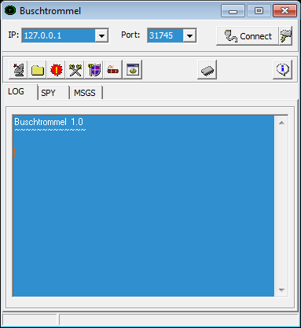

# Buschtrommel - Backdoor.Win32.Bushtrommel.exe
## Informations
| Label | Value |
| :--- | ---: |
| Executable Name | Backdoor.Win32.Bushtrommel.exe |
| Product Name | Buschtrommel |
| Version Number | 1.0.0.9 |
| Description | Remote Administration Tool |
| Company Name | OMEGA - Software |
| Copyright | Natok |
| Trademarks | Natok warengruppe |
| Last Edition | 14/06/2012 09:42:56 |
| Size | 697856 |
| SHA1 🔎 | [B32DF4675E314459FD65D90EF3B5E42A50F4EC6C](https://www.virustotal.com/gui/search/B32DF4675E314459FD65D90EF3B5E42A50F4EC6C) |
| Language | German (Germany) |
## Static Analysis
<details>
<summary>Manalyze</summary>
<p>

```

* Manalyze 0.9 *

-------------------------------------------------------------------------------
C:/Users/IEUser/Desktop/net6.0/Malwares/Backdoor.Win32.Bushtrommel.exe
-------------------------------------------------------------------------------

Summary:
--------
Architecture:       IMAGE_FILE_MACHINE_I386
Subsystem:          IMAGE_SUBSYSTEM_WINDOWS_GUI
Compilation Date:   1992-Jun-19 22:22:17
Detected languages: English - United Kingdom
                    German - Germany
                    Russian - Russia
CompanyName:        OMEGA - Software
FileDescription:    Remote Administration Tool
FileVersion:        1.0.0.9
InternalName:       911
LegalCopyright:     Natok
LegalTrademarks:    Natok warengruppe
OriginalFilename:   Buschtrommel.exe
ProductName:        Buschtrommel
ProductVersion:     1.0.0.0

DOS Header:
-----------
e_magic:    MZ
e_cblp:     0x0050
e_cp:       0x0002
e_crlc:     0x0000
e_cparhdr:  0x0004
e_minalloc: 0x000F
e_maxalloc: 0xFFFF
e_ss:       0x0000
e_sp:       0x00B8
e_csum:     0x0000
e_ip:       0x0000
e_cs:       0x0000
e_ovno:     0x001A
e_oemid:    0x0000
e_oeminfo:  0x0000
e_lfanew:   0x00000100

PE Header:
----------
Signature:            PE
Machine:              IMAGE_FILE_MACHINE_I386
NumberofSections:     8
TimeDateStamp:        1992-Jun-19 22:22:17
PointerToSymbolTable: 0x00000000
NumberOfSymbols:      0
SizeOfOptionalHeader: 0x00E0
Characteristics:      IMAGE_FILE_32BIT_MACHINE
                      IMAGE_FILE_BYTES_REVERSED_HI
                      IMAGE_FILE_BYTES_REVERSED_LO
                      IMAGE_FILE_EXECUTABLE_IMAGE
                      IMAGE_FILE_LINE_NUMS_STRIPPED
                      IMAGE_FILE_LOCAL_SYMS_STRIPPED

Image Optional Header:
----------------------
Magic:                   PE32
LinkerVersion:           2.0
SizeOfCode:              0x00079800
SizeOfInitializedData:   0x00030A00
SizeOfUninitializedData: 0x00000000
AddressOfEntryPoint:     0x0007A594 (Section: CODE)
BaseOfCode:              0x00001000
BaseOfData:              0x0007B000
ImageBase:               0x00400000
SectionAlignment:        0x00001000
FileAlignment:           0x00000200
OperatingSystemVersion:  1.0
ImageVersion:            0.0
SubsystemVersion:        4.0
Win32VersionValue:       0
SizeOfImage:             0x000B5000
SizeOfHeaders:           0x00000400
Checksum:                0x00000000
Subsystem:               IMAGE_SUBSYSTEM_WINDOWS_GUI
SizeofStackReserve:      0x00100000
SizeofStackCommit:       0x00004000
SizeofHeapReserve:       0x00100000
SizeofHeapCommit:        0x00001000
LoaderFlags:             0x00000000
NumberOfRvaAndSizes:     16

Sections:
---------
CODE:
    VirtualSize:          0x00079658
    VirtualAddress:       0x00001000
    SizeOfRawData:        0x00079800
    PointerToRawData:     0x00000400
    PointerToRelocations: 0x00000000
    PointerToLineNumbers: 0x00000000
    NumberOfLineNumbers:  0
    NumberOfRelocations:  0
    Characteristics:      IMAGE_SCN_CNT_CODE
                          IMAGE_SCN_MEM_EXECUTE
                          IMAGE_SCN_MEM_READ
    Entropy:              6.52693

DATA:
    VirtualSize:          0x000019DC
    VirtualAddress:       0x0007B000
    SizeOfRawData:        0x00001A00
    PointerToRawData:     0x00079C00
    PointerToRelocations: 0x00000000
    PointerToLineNumbers: 0x00000000
    NumberOfLineNumbers:  0
    NumberOfRelocations:  0
    Characteristics:      IMAGE_SCN_CNT_INITIALIZED_DATA
                          IMAGE_SCN_MEM_READ
                          IMAGE_SCN_MEM_WRITE
    Entropy:              4.68428

BSS:
    VirtualSize:          0x00005D41
    VirtualAddress:       0x0007D000
    SizeOfRawData:        0x00000000
    PointerToRawData:     0x0007B600
    PointerToRelocations: 0x00000000
    PointerToLineNumbers: 0x00000000
    NumberOfLineNumbers:  0
    NumberOfRelocations:  0
    Characteristics:      IMAGE_SCN_MEM_READ
                          IMAGE_SCN_MEM_WRITE

.idata:
    VirtualSize:          0x000023E2
    VirtualAddress:       0x00083000
    SizeOfRawData:        0x00002400
    PointerToRawData:     0x0007B600
    PointerToRelocations: 0x00000000
    PointerToLineNumbers: 0x00000000
    NumberOfLineNumbers:  0
    NumberOfRelocations:  0
    Characteristics:      IMAGE_SCN_CNT_INITIALIZED_DATA
                          IMAGE_SCN_MEM_READ
                          IMAGE_SCN_MEM_WRITE
    Entropy:              4.94661

.tls:
    VirtualSize:          0x00000014
    VirtualAddress:       0x00086000
    SizeOfRawData:        0x00000000
    PointerToRawData:     0x0007DA00
    PointerToRelocations: 0x00000000
    PointerToLineNumbers: 0x00000000
    NumberOfLineNumbers:  0
    NumberOfRelocations:  0
    Characteristics:      IMAGE_SCN_MEM_READ
                          IMAGE_SCN_MEM_WRITE

.rdata:
    VirtualSize:          0x00000018
    VirtualAddress:       0x00087000
    SizeOfRawData:        0x00000200
    PointerToRawData:     0x0007DA00
    PointerToRelocations: 0x00000000
    PointerToLineNumbers: 0x00000000
    NumberOfLineNumbers:  0
    NumberOfRelocations:  0
    Characteristics:      IMAGE_SCN_CNT_INITIALIZED_DATA
                          IMAGE_SCN_MEM_READ
                          IMAGE_SCN_MEM_SHARED
    Entropy:              0.20692

.reloc:
    VirtualSize:          0x00007B24
    VirtualAddress:       0x00088000
    SizeOfRawData:        0x00007C00
    PointerToRawData:     0x0007DC00
    PointerToRelocations: 0x00000000
    PointerToLineNumbers: 0x00000000
    NumberOfLineNumbers:  0
    NumberOfRelocations:  0
    Characteristics:      IMAGE_SCN_CNT_INITIALIZED_DATA
                          IMAGE_SCN_MEM_READ
                          IMAGE_SCN_MEM_SHARED
    Entropy:              6.64215

.rsrc:
    VirtualSize:          0x00024E00
    VirtualAddress:       0x00090000
    SizeOfRawData:        0x00024E00
    PointerToRawData:     0x00085800
    PointerToRelocations: 0x00000000
    PointerToLineNumbers: 0x00000000
    NumberOfLineNumbers:  0
    NumberOfRelocations:  0
    Characteristics:      IMAGE_SCN_CNT_INITIALIZED_DATA
                          IMAGE_SCN_MEM_READ
                          IMAGE_SCN_MEM_SHARED
    Entropy:              4.85216


Imports:
--------
kernel32.dll:      GetCurrentThreadId
                   DeleteCriticalSection
                   LeaveCriticalSection
                   EnterCriticalSection
                   InitializeCriticalSection
                   VirtualFree
                   VirtualAlloc
                   LocalFree
                   LocalAlloc
                   InterlockedDecrement
                   InterlockedIncrement
                   VirtualQuery
                   WideCharToMultiByte
                   MultiByteToWideChar
                   lstrlenA
                   lstrcpynA
                   lstrcpyA
                   LoadLibraryExA
                   GetThreadLocale
                   GetStartupInfoA
                   GetProcAddress
                   GetModuleHandleA
                   GetModuleFileNameA
                   GetLocaleInfoA
                   GetLastError
                   GetCommandLineA
                   FreeLibrary
                   FindFirstFileA
                   FindClose
                   ExitProcess
                   WriteFile
                   UnhandledExceptionFilter
                   SetFilePointer
                   SetEndOfFile
                   RtlUnwind
                   ReadFile
                   RaiseException
                   GetStdHandle
                   GetFileSize
                   GetFileType
                   CreateFileA
                   CloseHandle
user32.dll:        GetKeyboardType
                   LoadStringA
                   MessageBoxA
                   CharNextA
advapi32.dll:      RegQueryValueExA
                   RegOpenKeyExA
                   RegCloseKey
oleaut32.dll:      VariantChangeTypeEx
                   VariantCopyInd
                   VariantClear
                   SysStringLen
                   SysFreeString
                   SysReAllocStringLen
                   SysAllocStringLen
kernel32.dll (#2): GetCurrentThreadId
                   DeleteCriticalSection
                   LeaveCriticalSection
                   EnterCriticalSection
                   InitializeCriticalSection
                   VirtualFree
                   VirtualAlloc
                   LocalFree
                   LocalAlloc
                   InterlockedDecrement
                   InterlockedIncrement
                   VirtualQuery
                   WideCharToMultiByte
                   MultiByteToWideChar
                   lstrlenA
                   lstrcpynA
                   lstrcpyA
                   LoadLibraryExA
                   GetThreadLocale
                   GetStartupInfoA
                   GetProcAddress
                   GetModuleHandleA
                   GetModuleFileNameA
                   GetLocaleInfoA
                   GetLastError
                   GetCommandLineA
                   FreeLibrary
                   FindFirstFileA
                   FindClose
                   ExitProcess
                   WriteFile
                   UnhandledExceptionFilter
                   SetFilePointer
                   SetEndOfFile
                   RtlUnwind
                   ReadFile
                   RaiseException
                   GetStdHandle
                   GetFileSize
                   GetFileType
                   CreateFileA
                   CloseHandle
advapi32.dll (#2): RegQueryValueExA
                   RegOpenKeyExA
                   RegCloseKey
kernel32.dll (#3): GetCurrentThreadId
                   DeleteCriticalSection
                   LeaveCriticalSection
                   EnterCriticalSection
                   InitializeCriticalSection
                   VirtualFree
                   VirtualAlloc
                   LocalFree
                   LocalAlloc
                   InterlockedDecrement
                   InterlockedIncrement
                   VirtualQuery
                   WideCharToMultiByte
                   MultiByteToWideChar
                   lstrlenA
                   lstrcpynA
                   lstrcpyA
                   LoadLibraryExA
                   GetThreadLocale
                   GetStartupInfoA
                   GetProcAddress
                   GetModuleHandleA
                   GetModuleFileNameA
                   GetLocaleInfoA
                   GetLastError
                   GetCommandLineA
                   FreeLibrary
                   FindFirstFileA
                   FindClose
                   ExitProcess
                   WriteFile
                   UnhandledExceptionFilter
                   SetFilePointer
                   SetEndOfFile
                   RtlUnwind
                   ReadFile
                   RaiseException
                   GetStdHandle
                   GetFileSize
                   GetFileType
                   CreateFileA
                   CloseHandle
version.dll:       VerQueryValueA
                   GetFileVersionInfoSizeA
                   GetFileVersionInfoA
gdi32.dll:         UnrealizeObject
                   StretchBlt
                   SetWindowOrgEx
                   SetWinMetaFileBits
                   SetViewportOrgEx
                   SetTextColor
                   SetStretchBltMode
                   SetROP2
                   SetPixel
                   SetMapMode
                   SetEnhMetaFileBits
                   SetDIBColorTable
                   SetBrushOrgEx
                   SetBkMode
                   SetBkColor
                   SelectPalette
                   SelectObject
                   SaveDC
                   RestoreDC
                   Rectangle
                   RectVisible
                   RealizePalette
                   Polyline
                   PlayEnhMetaFile
                   PatBlt
                   MoveToEx
                   MaskBlt
                   LineTo
                   LPtoDP
                   IntersectClipRect
                   GetWindowOrgEx
                   GetWinMetaFileBits
                   GetTextMetricsA
                   GetTextExtentPointA
                   GetTextExtentPoint32A
                   GetSystemPaletteEntries
                   GetStockObject
                   GetPixel
                   GetPaletteEntries
                   GetObjectA
                   GetEnhMetaFilePaletteEntries
                   GetEnhMetaFileHeader
                   GetEnhMetaFileBits
                   GetDeviceCaps
                   GetDIBits
                   GetDIBColorTable
                   GetDCOrgEx
                   GetCurrentPositionEx
                   GetClipBox
                   GetBrushOrgEx
                   GetBitmapBits
                   GdiFlush
                   ExtTextOutA
                   ExcludeClipRect
                   DeleteObject
                   DeleteEnhMetaFile
                   DeleteDC
                   CreateSolidBrush
                   CreatePenIndirect
                   CreatePalette
                   CreateHalftonePalette
                   CreateFontIndirectA
                   CreateDIBitmap
                   CreateDIBSection
                   CreateCompatibleDC
                   CreateCompatibleBitmap
                   CreateBrushIndirect
                   CreateBitmap
                   CopyEnhMetaFileA
                   BitBlt
user32.dll (#2):   GetKeyboardType
                   LoadStringA
                   MessageBoxA
                   CharNextA
ole32.dll:         CoUninitialize
                   CoInitialize
                   IsEqualGUID
oleaut32.dll (#2): VariantChangeTypeEx
                   VariantCopyInd
                   VariantClear
                   SysStringLen
                   SysFreeString
                   SysReAllocStringLen
                   SysAllocStringLen
comctl32.dll:      ImageList_SetIconSize
                   ImageList_GetIconSize
                   ImageList_Write
                   ImageList_Read
                   ImageList_GetDragImage
                   ImageList_DragShowNolock
                   ImageList_SetDragCursorImage
                   ImageList_DragMove
                   ImageList_DragLeave
                   ImageList_DragEnter
                   ImageList_EndDrag
                   ImageList_BeginDrag
                   ImageList_GetIcon
                   ImageList_Remove
                   ImageList_DrawEx
                   ImageList_Replace
                   ImageList_Draw
                   ImageList_GetBkColor
                   ImageList_SetBkColor
                   ImageList_ReplaceIcon
                   ImageList_Add
                   ImageList_GetImageCount
                   ImageList_Destroy
                   ImageList_Create
                   InitCommonControls
shell32.dll:       Shell_NotifyIconA
comdlg32.dll:      GetSaveFileNameA
                   GetOpenFileNameA
wsock32.dll:       WSACleanup
                   WSAStartup
                   WSAGetLastError
                   WSACancelAsyncRequest
                   WSAAsyncGetServByName
                   WSAAsyncGetHostByName
                   WSAAsyncSelect
                   getservbyname
                   gethostbyname
                   socket
                   send
                   recv
                   ntohs
                   listen
                   ioctlsocket
                   inet_ntoa
                   inet_addr
                   htons
                   getpeername
                   connect
                   closesocket
                   bind

Resources:
----------
1:
    Type:          RT_CURSOR
    Language:      UNKNOWN
    Codepage:      UNKNOWN
    Size:          308
    TimeDateStamp: 2001-May-01 15:44:34
    Entropy:       2.6633

2:
    Type:          RT_CURSOR
    Language:      UNKNOWN
    Codepage:      UNKNOWN
    Size:          308
    TimeDateStamp: 2001-May-01 15:44:34
    Entropy:       2.80231

3:
    Type:          RT_CURSOR
    Language:      UNKNOWN
    Codepage:      UNKNOWN
    Size:          308
    TimeDateStamp: 2001-May-01 15:44:34
    Entropy:       3.00046

4:
    Type:          RT_CURSOR
    Language:      UNKNOWN
    Codepage:      UNKNOWN
    Size:          308
    TimeDateStamp: 2001-May-01 15:44:34
    Entropy:       2.56318

5:
    Type:          RT_CURSOR
    Language:      UNKNOWN
    Codepage:      UNKNOWN
    Size:          308
    TimeDateStamp: 2001-May-01 15:44:34
    Entropy:       2.6949

6:
    Type:          RT_CURSOR
    Language:      UNKNOWN
    Codepage:      UNKNOWN
    Size:          308
    TimeDateStamp: 2001-May-01 15:44:34
    Entropy:       2.62527

7:
    Type:          RT_CURSOR
    Language:      UNKNOWN
    Codepage:      UNKNOWN
    Size:          308
    TimeDateStamp: 2001-May-01 15:44:34
    Entropy:       2.91604

BBABORT:
    Type:          RT_BITMAP
    Language:      UNKNOWN
    Codepage:      UNKNOWN
    Size:          464
    TimeDateStamp: 2001-May-01 15:44:34
    Entropy:       2.92079

BBALL:
    Type:          RT_BITMAP
    Language:      UNKNOWN
    Codepage:      UNKNOWN
    Size:          484
    TimeDateStamp: 2001-May-01 15:44:34
    Entropy:       3.16995

BBCANCEL:
    Type:          RT_BITMAP
    Language:      UNKNOWN
    Codepage:      UNKNOWN
    Size:          464
    TimeDateStamp: 2001-May-01 15:44:34
    Entropy:       2.92079

BBCLOSE:
    Type:          RT_BITMAP
    Language:      UNKNOWN
    Codepage:      UNKNOWN
    Size:          464
    TimeDateStamp: 2001-May-01 15:44:34
    Entropy:       3.68492

BBHELP:
    Type:          RT_BITMAP
    Language:      UNKNOWN
    Codepage:      UNKNOWN
    Size:          464
    TimeDateStamp: 2001-May-01 15:44:34
    Entropy:       2.88085

BBIGNORE:
    Type:          RT_BITMAP
    Language:      UNKNOWN
    Codepage:      UNKNOWN
    Size:          464
    TimeDateStamp: 2001-May-01 15:44:34
    Entropy:       3.29718

BBNO:
    Type:          RT_BITMAP
    Language:      UNKNOWN
    Codepage:      UNKNOWN
    Size:          464
    TimeDateStamp: 2001-May-01 15:44:34
    Entropy:       3.58804

BBOK:
    Type:          RT_BITMAP
    Language:      UNKNOWN
    Codepage:      UNKNOWN
    Size:          464
    TimeDateStamp: 2001-May-01 15:44:34
    Entropy:       2.67459

BBRETRY:
    Type:          RT_BITMAP
    Language:      UNKNOWN
    Codepage:      UNKNOWN
    Size:          464
    TimeDateStamp: 2001-May-01 15:44:34
    Entropy:       3.53344

BBYES:
    Type:          RT_BITMAP
    Language:      UNKNOWN
    Codepage:      UNKNOWN
    Size:          464
    TimeDateStamp: 2001-May-01 15:44:34
    Entropy:       2.67459

OFFICE_1:
    Type:          RT_BITMAP
    Language:      English - United Kingdom
    Codepage:      UNKNOWN
    Size:          1184
    TimeDateStamp: 2001-May-01 15:44:34
    Entropy:       3.09218

OFFICE_10:
    Type:          RT_BITMAP
    Language:      English - United Kingdom
    Codepage:      UNKNOWN
    Size:          1244
    TimeDateStamp: 2001-May-01 15:44:34
    Entropy:       2.8992

OFFICE_11:
    Type:          RT_BITMAP
    Language:      English - United Kingdom
    Codepage:      UNKNOWN
    Size:          1244
    TimeDateStamp: 2001-May-01 15:44:34
    Entropy:       3.03005

OFFICE_12:
    Type:          RT_BITMAP
    Language:      English - United Kingdom
    Codepage:      UNKNOWN
    Size:          1244
    TimeDateStamp: 2001-May-01 15:44:34
    Entropy:       3.03098

OFFICE_13:
    Type:          RT_BITMAP
    Language:      English - United Kingdom
    Codepage:      UNKNOWN
    Size:          1244
    TimeDateStamp: 2001-May-01 15:44:34
    Entropy:       2.999

OFFICE_14:
    Type:          RT_BITMAP
    Language:      English - United Kingdom
    Codepage:      UNKNOWN
    Size:          1244
    TimeDateStamp: 2001-May-01 15:44:34
    Entropy:       3.01074

OFFICE_15:
    Type:          RT_BITMAP
    Language:      English - United Kingdom
    Codepage:      UNKNOWN
    Size:          1244
    TimeDateStamp: 2001-May-01 15:44:34
    Entropy:       3.00518

OFFICE_16:
    Type:          RT_BITMAP
    Language:      English - United Kingdom
    Codepage:      UNKNOWN
    Size:          1244
    TimeDateStamp: 2001-May-01 15:44:34
    Entropy:       2.96112

OFFICE_17:
    Type:          RT_BITMAP
    Language:      English - United Kingdom
    Codepage:      UNKNOWN
    Size:          1320
    TimeDateStamp: 2001-May-01 15:44:34
    Entropy:       2.85379

OFFICE_18:
    Type:          RT_BITMAP
    Language:      English - United Kingdom
    Codepage:      UNKNOWN
    Size:          1320
    TimeDateStamp: 2001-May-01 15:44:34
    Entropy:       2.81039

OFFICE_19:
    Type:          RT_BITMAP
    Language:      English - United Kingdom
    Codepage:      UNKNOWN
    Size:          1320
    TimeDateStamp: 2001-May-01 15:44:34
    Entropy:       2.83258

OFFICE_2:
    Type:          RT_BITMAP
    Language:      English - United Kingdom
    Codepage:      UNKNOWN
    Size:          1184
    TimeDateStamp: 2001-May-01 15:44:34
    Entropy:       3.04666

OFFICE_20:
    Type:          RT_BITMAP
    Language:      English - United Kingdom
    Codepage:      UNKNOWN
    Size:          1320
    TimeDateStamp: 2001-May-01 15:44:34
    Entropy:       2.83845

OFFICE_21:
    Type:          RT_BITMAP
    Language:      English - United Kingdom
    Codepage:      UNKNOWN
    Size:          1304
    TimeDateStamp: 2001-May-01 15:44:34
    Entropy:       3.05919

OFFICE_22:
    Type:          RT_BITMAP
    Language:      English - United Kingdom
    Codepage:      UNKNOWN
    Size:          1304
    TimeDateStamp: 2001-May-01 15:44:34
    Entropy:       2.97465

OFFICE_23:
    Type:          RT_BITMAP
    Language:      English - United Kingdom
    Codepage:      UNKNOWN
    Size:          1304
    TimeDateStamp: 2001-May-01 15:44:34
    Entropy:       3.01948

OFFICE_24:
    Type:          RT_BITMAP
    Language:      English - United Kingdom
    Codepage:      UNKNOWN
    Size:          1304
    TimeDateStamp: 2001-May-01 15:44:34
    Entropy:       3.0555

OFFICE_3:
    Type:          RT_BITMAP
    Language:      English - United Kingdom
    Codepage:      UNKNOWN
    Size:          1184
    TimeDateStamp: 2001-May-01 15:44:34
    Entropy:       3.07961

OFFICE_4:
    Type:          RT_BITMAP
    Language:      English - United Kingdom
    Codepage:      UNKNOWN
    Size:          1184
    TimeDateStamp: 2001-May-01 15:44:34
    Entropy:       3.10231

OFFICE_5:
    Type:          RT_BITMAP
    Language:      English - United Kingdom
    Codepage:      UNKNOWN
    Size:          1304
    TimeDateStamp: 2001-May-01 15:44:34
    Entropy:       3.2834

OFFICE_6:
    Type:          RT_BITMAP
    Language:      English - United Kingdom
    Codepage:      UNKNOWN
    Size:          1304
    TimeDateStamp: 2001-May-01 15:44:34
    Entropy:       3.10314

OFFICE_7:
    Type:          RT_BITMAP
    Language:      English - United Kingdom
    Codepage:      UNKNOWN
    Size:          1304
    TimeDateStamp: 2001-May-01 15:44:34
    Entropy:       3.2449

OFFICE_8:
    Type:          RT_BITMAP
    Language:      English - United Kingdom
    Codepage:      UNKNOWN
    Size:          1304
    TimeDateStamp: 2001-May-01 15:44:34
    Entropy:       3.23565

OFFICE_9:
    Type:          RT_BITMAP
    Language:      English - United Kingdom
    Codepage:      UNKNOWN
    Size:          1244
    TimeDateStamp: 2001-May-01 15:44:34
    Entropy:       2.9762

1 (#2):
    Type:          RT_ICON
    Language:      German - Germany
    Codepage:      UNKNOWN
    Size:          744
    TimeDateStamp: 2001-May-01 15:44:34
    Entropy:       1.85703

4083:
    Type:          RT_STRING
    Language:      UNKNOWN
    Codepage:      UNKNOWN
    Size:          1200
    TimeDateStamp: 2001-May-01 15:44:34
    Entropy:       3.32332

4084:
    Type:          RT_STRING
    Language:      UNKNOWN
    Codepage:      UNKNOWN
    Size:          1484
    TimeDateStamp: 2001-May-01 15:44:34
    Entropy:       3.25142

4085:
    Type:          RT_STRING
    Language:      UNKNOWN
    Codepage:      UNKNOWN
    Size:          424
    TimeDateStamp: 2001-May-01 15:44:34
    Entropy:       3.31902

4086:
    Type:          RT_STRING
    Language:      UNKNOWN
    Codepage:      UNKNOWN
    Size:          276
    TimeDateStamp: 2001-May-01 15:44:34
    Entropy:       3.07034

4087:
    Type:          RT_STRING
    Language:      UNKNOWN
    Codepage:      UNKNOWN
    Size:          472
    TimeDateStamp: 2001-May-01 15:44:34
    Entropy:       3.20972

4088:
    Type:          RT_STRING
    Language:      UNKNOWN
    Codepage:      UNKNOWN
    Size:          1328
    TimeDateStamp: 2001-May-01 15:44:34
    Entropy:       3.28302

4089:
    Type:          RT_STRING
    Language:      UNKNOWN
    Codepage:      UNKNOWN
    Size:          1344
    TimeDateStamp: 2001-May-01 15:44:34
    Entropy:       3.25817

4090:
    Type:          RT_STRING
    Language:      UNKNOWN
    Codepage:      UNKNOWN
    Size:          1376
    TimeDateStamp: 2001-May-01 15:44:34
    Entropy:       3.23108

4091:
    Type:          RT_STRING
    Language:      UNKNOWN
    Codepage:      UNKNOWN
    Size:          1092
    TimeDateStamp: 2001-May-01 15:44:34
    Entropy:       3.26766

4092:
    Type:          RT_STRING
    Language:      UNKNOWN
    Codepage:      UNKNOWN
    Size:          228
    TimeDateStamp: 2001-May-01 15:44:34
    Entropy:       2.92669

4093:
    Type:          RT_STRING
    Language:      UNKNOWN
    Codepage:      UNKNOWN
    Size:          184
    TimeDateStamp: 2001-May-01 15:44:34
    Entropy:       2.80605

4094:
    Type:          RT_STRING
    Language:      UNKNOWN
    Codepage:      UNKNOWN
    Size:          888
    TimeDateStamp: 2001-May-01 15:44:34
    Entropy:       3.37702

4095:
    Type:          RT_STRING
    Language:      UNKNOWN
    Codepage:      UNKNOWN
    Size:          928
    TimeDateStamp: 2001-May-01 15:44:34
    Entropy:       3.39108

4096:
    Type:          RT_STRING
    Language:      UNKNOWN
    Codepage:      UNKNOWN
    Size:          832
    TimeDateStamp: 2001-May-01 15:44:34
    Entropy:       3.28586

DVCLAL:
    Type:          RT_RCDATA
    Language:      UNKNOWN
    Codepage:      UNKNOWN
    Size:          16
    TimeDateStamp: 2001-May-01 15:44:34
    Entropy:       4

PACKAGEINFO:
    Type:          RT_RCDATA
    Language:      UNKNOWN
    Codepage:      UNKNOWN
    Size:          644
    TimeDateStamp: 2001-May-01 15:44:34
    Entropy:       5.23964

TABOUTFORM:
    Type:          RT_RCDATA
    Language:      UNKNOWN
    Codepage:      UNKNOWN
    Size:          14850
    TimeDateStamp: 2001-May-01 15:44:34
    Entropy:       7.88424

TCLIENTFORM:
    Type:          RT_RCDATA
    Language:      UNKNOWN
    Codepage:      UNKNOWN
    Size:          55410
    TimeDateStamp: 2001-May-01 15:44:34
    Entropy:       3.21509

TFORM1:
    Type:          RT_RCDATA
    Language:      UNKNOWN
    Codepage:      UNKNOWN
    Size:          1907
    TimeDateStamp: 2001-May-01 15:44:34
    Entropy:       5.53829

TFORM2:
    Type:          RT_RCDATA
    Language:      UNKNOWN
    Codepage:      UNKNOWN
    Size:          11439
    TimeDateStamp: 2001-May-01 15:44:34
    Entropy:       5.4797

TFORM3:
    Type:          RT_RCDATA
    Language:      UNKNOWN
    Codepage:      UNKNOWN
    Size:          7095
    TimeDateStamp: 2001-May-01 15:44:34
    Entropy:       5.52633

TFORM4:
    Type:          RT_RCDATA
    Language:      UNKNOWN
    Codepage:      UNKNOWN
    Size:          3887
    TimeDateStamp: 2001-May-01 15:44:34
    Entropy:       5.32828

32761:
    Type:              RT_GROUP_CURSOR
    Language:          UNKNOWN
    Codepage:          UNKNOWN
    Size:              20
    TimeDateStamp:     2001-May-01 15:44:34
    Entropy:           1.83876
    Detected Filetype: Cursor file

32762:
    Type:              RT_GROUP_CURSOR
    Language:          UNKNOWN
    Codepage:          UNKNOWN
    Size:              20
    TimeDateStamp:     2001-May-01 15:44:34
    Entropy:           1.91924
    Detected Filetype: Cursor file

32763:
    Type:              RT_GROUP_CURSOR
    Language:          UNKNOWN
    Codepage:          UNKNOWN
    Size:              20
    TimeDateStamp:     2001-May-01 15:44:34
    Entropy:           2.01924
    Detected Filetype: Cursor file

32764:
    Type:              RT_GROUP_CURSOR
    Language:          UNKNOWN
    Codepage:          UNKNOWN
    Size:              20
    TimeDateStamp:     2001-May-01 15:44:34
    Entropy:           2.01924
    Detected Filetype: Cursor file

32765:
    Type:              RT_GROUP_CURSOR
    Language:          UNKNOWN
    Codepage:          UNKNOWN
    Size:              20
    TimeDateStamp:     2001-May-01 15:44:34
    Entropy:           2.01924
    Detected Filetype: Cursor file

32766:
    Type:              RT_GROUP_CURSOR
    Language:          UNKNOWN
    Codepage:          UNKNOWN
    Size:              20
    TimeDateStamp:     2001-May-01 15:44:34
    Entropy:           2.01924
    Detected Filetype: Cursor file

32767:
    Type:              RT_GROUP_CURSOR
    Language:          UNKNOWN
    Codepage:          UNKNOWN
    Size:              20
    TimeDateStamp:     2001-May-01 15:44:34
    Entropy:           2.01924
    Detected Filetype: Cursor file

MAINICON:
    Type:              RT_GROUP_ICON
    Language:          German - Germany
    Codepage:          UNKNOWN
    Size:              20
    TimeDateStamp:     2001-May-01 15:44:34
    Entropy:           2.16096
    Detected Filetype: Icon file

1 (#3):
    Type:          RT_VERSION
    Language:      Russian - Russia
    Codepage:      UNKNOWN
    Size:          784
    TimeDateStamp: 2001-May-01 15:44:34
    Entropy:       3.343


Version Info:
-------------
Resource LangID: Russian - Russia
VS_VERSION_INFO:
    Signature:           0xFEEF04BD
    StructVersion:       0x00010000
    FileVersion:         1.0.0.9
    ProductVersion:      1.0.0.9
    FileFlags:           (EMPTY)
    FileOs:              VOS_DOS_WINDOWS32
                         VOS_NT_WINDOWS32
                         VOS__WINDOWS32
    FileType:            VFT_APP
    Language:            German - Germany
    CompanyName:         OMEGA - Software
    FileDescription:     Remote Administration Tool
    FileVersion (#2):    1.0.0.9
    InternalName:        911
    LegalCopyright:      Natok
    LegalTrademarks:     Natok warengruppe
    OriginalFilename:    Buschtrommel.exe
    ProductName:         Buschtrommel
    ProductVersion (#2): 1.0.0.0


TLS Callbacks:
--------------
StartAddressOfRawData: 0x00486000
EndAddressOfRawData:   0x00486014
AddressOfIndex:        0x0047D4D4
AddressOfCallbacks:    0x00487010
SizeOfZeroFill:        0x00000000
Characteristics:       IMAGE_SCN_TYPE_REG
Callbacks:             (EMPTY)

Matching compiler(s):
    Borland Delphi 5 -> Portions Copyright (c) 1983,99 Borland (h)

[ MALICIOUS ] The PE contains functions mostly used by malware.
    [!] The program may be hiding some of its imports:
        LoadLibraryExA
        GetProcAddress
        LoadLibraryA
    Functions which can be used for anti-debugging purposes:
        FindWindowA
    Code injection capabilities (PowerLoader):
        GetWindowLongA
        FindWindowA
    Can access the registry:
        RegQueryValueExA
        RegOpenKeyExA
        RegCloseKey
    Uses functions commonly found in keyloggers:
        MapVirtualKeyA
        GetForegroundWindow
        CallNextHookEx
    Can take screenshots:
        CreateCompatibleDC
        BitBlt
        GetDCEx
        GetDC
        FindWindowA
    Reads the contents of the clipboard:
        GetClipboardData

[ SUSPICIOUS ] The PE header may have been manually modified.
    Resource TABOUTFORM is possibly compressed or encrypted.
    The resource timestamps differ from the PE header:
        2001-May-01 15:44:34

The following exploit mitigation techniques have been detected
    Stack Canary: disabled
    SafeSEH: disabled
    ASLR: disabled
    DEP: disabled
    CFG: disabled


```

</p>
</details>

## Screenshots
### Buschtrommel
 
