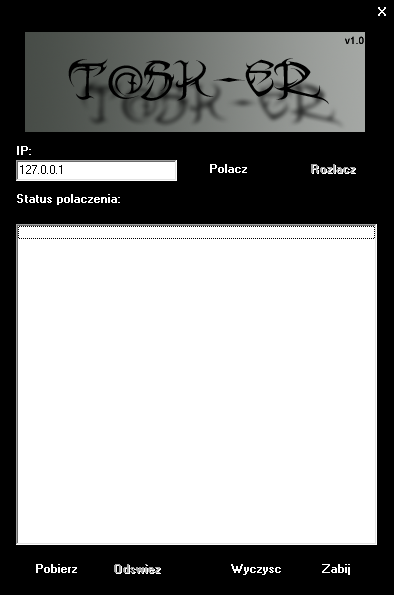

#  - Backdoor.Win32.Delf.rm-d039efff0c42a6f9071548cecad7c7794db86492e7b7e58fb34a84cabdd71657.exe
## Informations
| Label | Value |
| :--- | ---: |
| Executable Name | Backdoor.Win32.Delf.rm-d039efff0c42a6f9071548cecad7c7794db86492e7b7e58fb34a84cabdd71657.exe |
| Product Name |  |
| Version Number |  |
| Description |  |
| Company Name |  |
| Copyright |  |
| Trademarks |  |
| Last Edition | 2012-06-14 09:43:44 |
| Size | 593408 |
| SHA1 🔎 | [B38261252EC679DA7AACCD7494E7CE6B8049AC3B](https://www.virustotal.com/gui/search/B38261252EC679DA7AACCD7494E7CE6B8049AC3B) |
| Language |  |
## Static Analysis
<details>
<summary>Manalyze</summary>
<p>

```

* Manalyze 0.9 *

-------------------------------------------------------------------------------
C:/Users/IEUser/Desktop/net6.0/Malwares/Backdoor.Win32.Delf.rm-d039efff0c42a6f9071548cecad7c7794db86492e7b7e58fb34a84cabdd71657.exe
-------------------------------------------------------------------------------

Summary:
--------
Architecture:       IMAGE_FILE_MACHINE_I386
Subsystem:          IMAGE_SUBSYSTEM_WINDOWS_GUI
Compilation Date:   1992-Jun-19 22:22:17
Detected languages: Polish - Poland

DOS Header:
-----------
e_magic:    MZ
e_cblp:     0x0050
e_cp:       0x0002
e_crlc:     0x0000
e_cparhdr:  0x0004
e_minalloc: 0x000F
e_maxalloc: 0xFFFF
e_ss:       0x0000
e_sp:       0x00B8
e_csum:     0x0000
e_ip:       0x0000
e_cs:       0x0000
e_ovno:     0x001A
e_oemid:    0x0000
e_oeminfo:  0x0000
e_lfanew:   0x00000100

PE Header:
----------
Signature:            PE
Machine:              IMAGE_FILE_MACHINE_I386
NumberofSections:     8
TimeDateStamp:        1992-Jun-19 22:22:17
PointerToSymbolTable: 0x00000000
NumberOfSymbols:      0
SizeOfOptionalHeader: 0x00E0
Characteristics:      IMAGE_FILE_32BIT_MACHINE
                      IMAGE_FILE_BYTES_REVERSED_HI
                      IMAGE_FILE_BYTES_REVERSED_LO
                      IMAGE_FILE_EXECUTABLE_IMAGE
                      IMAGE_FILE_LINE_NUMS_STRIPPED
                      IMAGE_FILE_LOCAL_SYMS_STRIPPED

Image Optional Header:
----------------------
Magic:                   PE32
LinkerVersion:           2.0
SizeOfCode:              0x0005E200
SizeOfInitializedData:   0x00032800
SizeOfUninitializedData: 0x00000000
AddressOfEntryPoint:     0x0005EFC0 (Section: CODE)
BaseOfCode:              0x00001000
BaseOfData:              0x00060000
ImageBase:               0x00400000
SectionAlignment:        0x00001000
FileAlignment:           0x00000200
OperatingSystemVersion:  4.0
ImageVersion:            0.0
SubsystemVersion:        4.0
Win32VersionValue:       0
SizeOfImage:             0x00097000
SizeOfHeaders:           0x00000400
Checksum:                0x00000000
Subsystem:               IMAGE_SUBSYSTEM_WINDOWS_GUI
SizeofStackReserve:      0x00100000
SizeofStackCommit:       0x00004000
SizeofHeapReserve:       0x00100000
SizeofHeapCommit:        0x00001000
LoaderFlags:             0x00000000
NumberOfRvaAndSizes:     16

Sections:
---------
CODE:
    VirtualSize:          0x0005E020
    VirtualAddress:       0x00001000
    SizeOfRawData:        0x0005E200
    PointerToRawData:     0x00000400
    PointerToRelocations: 0x00000000
    PointerToLineNumbers: 0x00000000
    NumberOfLineNumbers:  0
    NumberOfRelocations:  0
    Characteristics:      IMAGE_SCN_CNT_CODE
                          IMAGE_SCN_MEM_EXECUTE
                          IMAGE_SCN_MEM_READ
    Entropy:              6.52469

DATA:
    VirtualSize:          0x00001340
    VirtualAddress:       0x00060000
    SizeOfRawData:        0x00001400
    PointerToRawData:     0x0005E600
    PointerToRelocations: 0x00000000
    PointerToLineNumbers: 0x00000000
    NumberOfLineNumbers:  0
    NumberOfRelocations:  0
    Characteristics:      IMAGE_SCN_CNT_INITIALIZED_DATA
                          IMAGE_SCN_MEM_READ
                          IMAGE_SCN_MEM_WRITE
    Entropy:              4.0381

BSS:
    VirtualSize:          0x00000DB1
    VirtualAddress:       0x00062000
    SizeOfRawData:        0x00000000
    PointerToRawData:     0x0005FA00
    PointerToRelocations: 0x00000000
    PointerToLineNumbers: 0x00000000
    NumberOfLineNumbers:  0
    NumberOfRelocations:  0
    Characteristics:      IMAGE_SCN_MEM_READ
                          IMAGE_SCN_MEM_WRITE

.idata:
    VirtualSize:          0x000022FE
    VirtualAddress:       0x00063000
    SizeOfRawData:        0x00002400
    PointerToRawData:     0x0005FA00
    PointerToRelocations: 0x00000000
    PointerToLineNumbers: 0x00000000
    NumberOfLineNumbers:  0
    NumberOfRelocations:  0
    Characteristics:      IMAGE_SCN_CNT_INITIALIZED_DATA
                          IMAGE_SCN_MEM_READ
                          IMAGE_SCN_MEM_WRITE
    Entropy:              4.88682

.tls:
    VirtualSize:          0x00000014
    VirtualAddress:       0x00066000
    SizeOfRawData:        0x00000000
    PointerToRawData:     0x00061E00
    PointerToRelocations: 0x00000000
    PointerToLineNumbers: 0x00000000
    NumberOfLineNumbers:  0
    NumberOfRelocations:  0
    Characteristics:      IMAGE_SCN_MEM_READ
                          IMAGE_SCN_MEM_WRITE

.rdata:
    VirtualSize:          0x00000018
    VirtualAddress:       0x00067000
    SizeOfRawData:        0x00000200
    PointerToRawData:     0x00061E00
    PointerToRelocations: 0x00000000
    PointerToLineNumbers: 0x00000000
    NumberOfLineNumbers:  0
    NumberOfRelocations:  0
    Characteristics:      IMAGE_SCN_CNT_INITIALIZED_DATA
                          IMAGE_SCN_MEM_READ
                          IMAGE_SCN_MEM_SHARED
    Entropy:              0.184151

.reloc:
    VirtualSize:          0x00006F40
    VirtualAddress:       0x00068000
    SizeOfRawData:        0x00007000
    PointerToRawData:     0x00062000
    PointerToRelocations: 0x00000000
    PointerToLineNumbers: 0x00000000
    NumberOfLineNumbers:  0
    NumberOfRelocations:  0
    Characteristics:      IMAGE_SCN_CNT_INITIALIZED_DATA
                          IMAGE_SCN_MEM_READ
                          IMAGE_SCN_MEM_SHARED
    Entropy:              6.64846

.rsrc:
    VirtualSize:          0x00027E00
    VirtualAddress:       0x0006F000
    SizeOfRawData:        0x00027E00
    PointerToRawData:     0x00069000
    PointerToRelocations: 0x00000000
    PointerToLineNumbers: 0x00000000
    NumberOfLineNumbers:  0
    NumberOfRelocations:  0
    Characteristics:      IMAGE_SCN_CNT_INITIALIZED_DATA
                          IMAGE_SCN_MEM_READ
                          IMAGE_SCN_MEM_SHARED
    Entropy:              5.77349


Imports:
--------
kernel32.dll:      DeleteCriticalSection
                   LeaveCriticalSection
                   EnterCriticalSection
                   InitializeCriticalSection
                   VirtualFree
                   VirtualAlloc
                   LocalFree
                   LocalAlloc
                   GetVersion
                   GetCurrentThreadId
                   InterlockedDecrement
                   InterlockedIncrement
                   VirtualQuery
                   WideCharToMultiByte
                   MultiByteToWideChar
                   lstrlenA
                   lstrcpynA
                   LoadLibraryExA
                   GetThreadLocale
                   GetStartupInfoA
                   GetProcAddress
                   GetModuleHandleA
                   GetModuleFileNameA
                   GetLocaleInfoA
                   GetCommandLineA
                   FreeLibrary
                   FindFirstFileA
                   FindClose
                   ExitProcess
                   WriteFile
                   UnhandledExceptionFilter
                   RtlUnwind
                   RaiseException
                   GetStdHandle
user32.dll:        GetKeyboardType
                   LoadStringA
                   MessageBoxA
                   CharNextA
advapi32.dll:      RegQueryValueExA
                   RegOpenKeyExA
                   RegCloseKey
oleaut32.dll:      SysFreeString
                   SysReAllocStringLen
                   SysAllocStringLen
kernel32.dll (#2): DeleteCriticalSection
                   LeaveCriticalSection
                   EnterCriticalSection
                   InitializeCriticalSection
                   VirtualFree
                   VirtualAlloc
                   LocalFree
                   LocalAlloc
                   GetVersion
                   GetCurrentThreadId
                   InterlockedDecrement
                   InterlockedIncrement
                   VirtualQuery
                   WideCharToMultiByte
                   MultiByteToWideChar
                   lstrlenA
                   lstrcpynA
                   LoadLibraryExA
                   GetThreadLocale
                   GetStartupInfoA
                   GetProcAddress
                   GetModuleHandleA
                   GetModuleFileNameA
                   GetLocaleInfoA
                   GetCommandLineA
                   FreeLibrary
                   FindFirstFileA
                   FindClose
                   ExitProcess
                   WriteFile
                   UnhandledExceptionFilter
                   RtlUnwind
                   RaiseException
                   GetStdHandle
advapi32.dll (#2): RegQueryValueExA
                   RegOpenKeyExA
                   RegCloseKey
kernel32.dll (#3): DeleteCriticalSection
                   LeaveCriticalSection
                   EnterCriticalSection
                   InitializeCriticalSection
                   VirtualFree
                   VirtualAlloc
                   LocalFree
                   LocalAlloc
                   GetVersion
                   GetCurrentThreadId
                   InterlockedDecrement
                   InterlockedIncrement
                   VirtualQuery
                   WideCharToMultiByte
                   MultiByteToWideChar
                   lstrlenA
                   lstrcpynA
                   LoadLibraryExA
                   GetThreadLocale
                   GetStartupInfoA
                   GetProcAddress
                   GetModuleHandleA
                   GetModuleFileNameA
                   GetLocaleInfoA
                   GetCommandLineA
                   FreeLibrary
                   FindFirstFileA
                   FindClose
                   ExitProcess
                   WriteFile
                   UnhandledExceptionFilter
                   RtlUnwind
                   RaiseException
                   GetStdHandle
version.dll:       VerQueryValueA
                   GetFileVersionInfoSizeA
                   GetFileVersionInfoA
gdi32.dll:         UnrealizeObject
                   StretchBlt
                   SetWindowOrgEx
                   SetWinMetaFileBits
                   SetViewportOrgEx
                   SetTextColor
                   SetStretchBltMode
                   SetROP2
                   SetPixel
                   SetEnhMetaFileBits
                   SetDIBColorTable
                   SetBrushOrgEx
                   SetBkMode
                   SetBkColor
                   SelectPalette
                   SelectObject
                   SaveDC
                   RestoreDC
                   Rectangle
                   RectVisible
                   RealizePalette
                   PlayEnhMetaFile
                   PatBlt
                   MoveToEx
                   MaskBlt
                   LineTo
                   IntersectClipRect
                   GetWindowOrgEx
                   GetWinMetaFileBits
                   GetTextMetricsA
                   GetTextExtentPointA
                   GetTextExtentPoint32A
                   GetSystemPaletteEntries
                   GetStockObject
                   GetPixel
                   GetPaletteEntries
                   GetObjectA
                   GetEnhMetaFilePaletteEntries
                   GetEnhMetaFileHeader
                   GetEnhMetaFileBits
                   GetDeviceCaps
                   GetDIBits
                   GetDIBColorTable
                   GetDCOrgEx
                   GetCurrentPositionEx
                   GetClipBox
                   GetBrushOrgEx
                   GetBitmapBits
                   ExcludeClipRect
                   DeleteObject
                   DeleteEnhMetaFile
                   DeleteDC
                   CreateSolidBrush
                   CreatePenIndirect
                   CreatePalette
                   CreateHalftonePalette
                   CreateFontIndirectA
                   CreateDIBitmap
                   CreateDIBSection
                   CreateCompatibleDC
                   CreateCompatibleBitmap
                   CreateBrushIndirect
                   CreateBitmap
                   CopyEnhMetaFileA
                   BitBlt
user32.dll (#2):   GetKeyboardType
                   LoadStringA
                   MessageBoxA
                   CharNextA
kernel32.dll (#4): DeleteCriticalSection
                   LeaveCriticalSection
                   EnterCriticalSection
                   InitializeCriticalSection
                   VirtualFree
                   VirtualAlloc
                   LocalFree
                   LocalAlloc
                   GetVersion
                   GetCurrentThreadId
                   InterlockedDecrement
                   InterlockedIncrement
                   VirtualQuery
                   WideCharToMultiByte
                   MultiByteToWideChar
                   lstrlenA
                   lstrcpynA
                   LoadLibraryExA
                   GetThreadLocale
                   GetStartupInfoA
                   GetProcAddress
                   GetModuleHandleA
                   GetModuleFileNameA
                   GetLocaleInfoA
                   GetCommandLineA
                   FreeLibrary
                   FindFirstFileA
                   FindClose
                   ExitProcess
                   WriteFile
                   UnhandledExceptionFilter
                   RtlUnwind
                   RaiseException
                   GetStdHandle
oleaut32.dll (#2): SysFreeString
                   SysReAllocStringLen
                   SysAllocStringLen
comctl32.dll:      ImageList_SetIconSize
                   ImageList_GetIconSize
                   ImageList_Write
                   ImageList_Read
                   ImageList_GetDragImage
                   ImageList_DragShowNolock
                   ImageList_SetDragCursorImage
                   ImageList_DragMove
                   ImageList_DragLeave
                   ImageList_DragEnter
                   ImageList_EndDrag
                   ImageList_BeginDrag
                   ImageList_Remove
                   ImageList_DrawEx
                   ImageList_Replace
                   ImageList_Draw
                   ImageList_GetBkColor
                   ImageList_SetBkColor
                   ImageList_ReplaceIcon
                   ImageList_Add
                   ImageList_GetImageCount
                   ImageList_Destroy
                   ImageList_Create
wsock32.dll:       WSACleanup
                   WSAStartup
                   WSAGetLastError
                   WSACancelAsyncRequest
                   WSAAsyncGetServByName
                   WSAAsyncGetHostByName
                   WSAAsyncSelect
                   getservbyname
                   gethostbyname
                   socket
                   send
                   recv
                   ntohs
                   listen
                   ioctlsocket
                   inet_addr
                   htons
                   connect
                   closesocket
                   bind

Resources:
----------
1:
    Type:          RT_CURSOR
    Language:      UNKNOWN
    Codepage:      UNKNOWN
    Size:          308
    TimeDateStamp: 2003-Jan-02 20:08:32
    Entropy:       2.6633

2:
    Type:          RT_CURSOR
    Language:      UNKNOWN
    Codepage:      UNKNOWN
    Size:          308
    TimeDateStamp: 2003-Jan-02 20:08:32
    Entropy:       2.80231

3:
    Type:          RT_CURSOR
    Language:      UNKNOWN
    Codepage:      UNKNOWN
    Size:          308
    TimeDateStamp: 2003-Jan-02 20:08:32
    Entropy:       3.00046

4:
    Type:          RT_CURSOR
    Language:      UNKNOWN
    Codepage:      UNKNOWN
    Size:          308
    TimeDateStamp: 2003-Jan-02 20:08:32
    Entropy:       2.56318

5:
    Type:          RT_CURSOR
    Language:      UNKNOWN
    Codepage:      UNKNOWN
    Size:          308
    TimeDateStamp: 2003-Jan-02 20:08:32
    Entropy:       2.6949

6:
    Type:          RT_CURSOR
    Language:      UNKNOWN
    Codepage:      UNKNOWN
    Size:          308
    TimeDateStamp: 2003-Jan-02 20:08:32
    Entropy:       2.62527

7:
    Type:          RT_CURSOR
    Language:      UNKNOWN
    Codepage:      UNKNOWN
    Size:          308
    TimeDateStamp: 2003-Jan-02 20:08:32
    Entropy:       2.91604

BBABORT:
    Type:          RT_BITMAP
    Language:      UNKNOWN
    Codepage:      UNKNOWN
    Size:          464
    TimeDateStamp: 2003-Jan-02 20:08:32
    Entropy:       2.92079

BBALL:
    Type:          RT_BITMAP
    Language:      UNKNOWN
    Codepage:      UNKNOWN
    Size:          484
    TimeDateStamp: 2003-Jan-02 20:08:32
    Entropy:       3.16995

BBCANCEL:
    Type:          RT_BITMAP
    Language:      UNKNOWN
    Codepage:      UNKNOWN
    Size:          464
    TimeDateStamp: 2003-Jan-02 20:08:32
    Entropy:       2.92079

BBCLOSE:
    Type:          RT_BITMAP
    Language:      UNKNOWN
    Codepage:      UNKNOWN
    Size:          464
    TimeDateStamp: 2003-Jan-02 20:08:32
    Entropy:       3.68492

BBHELP:
    Type:          RT_BITMAP
    Language:      UNKNOWN
    Codepage:      UNKNOWN
    Size:          464
    TimeDateStamp: 2003-Jan-02 20:08:32
    Entropy:       2.88085

BBIGNORE:
    Type:          RT_BITMAP
    Language:      UNKNOWN
    Codepage:      UNKNOWN
    Size:          464
    TimeDateStamp: 2003-Jan-02 20:08:32
    Entropy:       3.29718

BBNO:
    Type:          RT_BITMAP
    Language:      UNKNOWN
    Codepage:      UNKNOWN
    Size:          464
    TimeDateStamp: 2003-Jan-02 20:08:32
    Entropy:       3.58804

BBOK:
    Type:          RT_BITMAP
    Language:      UNKNOWN
    Codepage:      UNKNOWN
    Size:          464
    TimeDateStamp: 2003-Jan-02 20:08:32
    Entropy:       2.67459

BBRETRY:
    Type:          RT_BITMAP
    Language:      UNKNOWN
    Codepage:      UNKNOWN
    Size:          464
    TimeDateStamp: 2003-Jan-02 20:08:32
    Entropy:       3.53344

BBYES:
    Type:          RT_BITMAP
    Language:      UNKNOWN
    Codepage:      UNKNOWN
    Size:          464
    TimeDateStamp: 2003-Jan-02 20:08:32
    Entropy:       2.67459

PREVIEWGLYPH:
    Type:          RT_BITMAP
    Language:      UNKNOWN
    Codepage:      UNKNOWN
    Size:          232
    TimeDateStamp: 2003-Jan-02 20:08:32
    Entropy:       2.85172

1 (#2):
    Type:          RT_ICON
    Language:      Polish - Poland
    Codepage:      UNKNOWN
    Size:          744
    TimeDateStamp: 2003-Jan-02 20:08:32
    Entropy:       1.65335

DLGTEMPLATE:
    Type:          RT_DIALOG
    Language:      UNKNOWN
    Codepage:      UNKNOWN
    Size:          82
    TimeDateStamp: 2003-Jan-02 20:08:32
    Entropy:       2.5627

4080:
    Type:          RT_STRING
    Language:      UNKNOWN
    Codepage:      UNKNOWN
    Size:          436
    TimeDateStamp: 2003-Jan-02 20:08:32
    Entropy:       3.29671

4081:
    Type:          RT_STRING
    Language:      UNKNOWN
    Codepage:      UNKNOWN
    Size:          468
    TimeDateStamp: 2003-Jan-02 20:08:32
    Entropy:       3.28099

4082:
    Type:          RT_STRING
    Language:      UNKNOWN
    Codepage:      UNKNOWN
    Size:          236
    TimeDateStamp: 2003-Jan-02 20:08:32
    Entropy:       3.08102

4083:
    Type:          RT_STRING
    Language:      UNKNOWN
    Codepage:      UNKNOWN
    Size:          980
    TimeDateStamp: 2003-Jan-02 20:08:32
    Entropy:       3.22821

4084:
    Type:          RT_STRING
    Language:      UNKNOWN
    Codepage:      UNKNOWN
    Size:          232
    TimeDateStamp: 2003-Jan-02 20:08:32
    Entropy:       3.0831

4085:
    Type:          RT_STRING
    Language:      UNKNOWN
    Codepage:      UNKNOWN
    Size:          248
    TimeDateStamp: 2003-Jan-02 20:08:32
    Entropy:       3.14262

4086:
    Type:          RT_STRING
    Language:      UNKNOWN
    Codepage:      UNKNOWN
    Size:          296
    TimeDateStamp: 2003-Jan-02 20:08:32
    Entropy:       3.12859

4087:
    Type:          RT_STRING
    Language:      UNKNOWN
    Codepage:      UNKNOWN
    Size:          1136
    TimeDateStamp: 2003-Jan-02 20:08:32
    Entropy:       3.24011

4088:
    Type:          RT_STRING
    Language:      UNKNOWN
    Codepage:      UNKNOWN
    Size:          880
    TimeDateStamp: 2003-Jan-02 20:08:32
    Entropy:       3.19706

4089:
    Type:          RT_STRING
    Language:      UNKNOWN
    Codepage:      UNKNOWN
    Size:          960
    TimeDateStamp: 2003-Jan-02 20:08:32
    Entropy:       3.23244

4090:
    Type:          RT_STRING
    Language:      UNKNOWN
    Codepage:      UNKNOWN
    Size:          1056
    TimeDateStamp: 2003-Jan-02 20:08:32
    Entropy:       3.24132

4091:
    Type:          RT_STRING
    Language:      UNKNOWN
    Codepage:      UNKNOWN
    Size:          240
    TimeDateStamp: 2003-Jan-02 20:08:32
    Entropy:       2.8942

4092:
    Type:          RT_STRING
    Language:      UNKNOWN
    Codepage:      UNKNOWN
    Size:          216
    TimeDateStamp: 2003-Jan-02 20:08:32
    Entropy:       2.9852

4093:
    Type:          RT_STRING
    Language:      UNKNOWN
    Codepage:      UNKNOWN
    Size:          628
    TimeDateStamp: 2003-Jan-02 20:08:32
    Entropy:       3.25766

4094:
    Type:          RT_STRING
    Language:      UNKNOWN
    Codepage:      UNKNOWN
    Size:          984
    TimeDateStamp: 2003-Jan-02 20:08:32
    Entropy:       3.20379

4095:
    Type:          RT_STRING
    Language:      UNKNOWN
    Codepage:      UNKNOWN
    Size:          884
    TimeDateStamp: 2003-Jan-02 20:08:32
    Entropy:       3.23377

4096:
    Type:          RT_STRING
    Language:      UNKNOWN
    Codepage:      UNKNOWN
    Size:          728
    TimeDateStamp: 2003-Jan-02 20:08:32
    Entropy:       3.16623

DVCLAL:
    Type:          RT_RCDATA
    Language:      UNKNOWN
    Codepage:      UNKNOWN
    Size:          16
    TimeDateStamp: 2003-Jan-02 20:08:32
    Entropy:       4

PACKAGEINFO:
    Type:          RT_RCDATA
    Language:      UNKNOWN
    Codepage:      UNKNOWN
    Size:          640
    TimeDateStamp: 2003-Jan-02 20:08:32
    Entropy:       5.29014

TFORM1:
    Type:          RT_RCDATA
    Language:      UNKNOWN
    Codepage:      UNKNOWN
    Size:          139755
    TimeDateStamp: 2003-Jan-02 20:08:32
    Entropy:       5.82456

TFORM2:
    Type:          RT_RCDATA
    Language:      UNKNOWN
    Codepage:      UNKNOWN
    Size:          1424
    TimeDateStamp: 2003-Jan-02 20:08:32
    Entropy:       5.67064

32761:
    Type:              RT_GROUP_CURSOR
    Language:          UNKNOWN
    Codepage:          UNKNOWN
    Size:              20
    TimeDateStamp:     2003-Jan-02 20:08:32
    Entropy:           1.83876
    Detected Filetype: Cursor file

32762:
    Type:              RT_GROUP_CURSOR
    Language:          UNKNOWN
    Codepage:          UNKNOWN
    Size:              20
    TimeDateStamp:     2003-Jan-02 20:08:32
    Entropy:           1.91924
    Detected Filetype: Cursor file

32763:
    Type:              RT_GROUP_CURSOR
    Language:          UNKNOWN
    Codepage:          UNKNOWN
    Size:              20
    TimeDateStamp:     2003-Jan-02 20:08:32
    Entropy:           2.01924
    Detected Filetype: Cursor file

32764:
    Type:              RT_GROUP_CURSOR
    Language:          UNKNOWN
    Codepage:          UNKNOWN
    Size:              20
    TimeDateStamp:     2003-Jan-02 20:08:32
    Entropy:           2.01924
    Detected Filetype: Cursor file

32765:
    Type:              RT_GROUP_CURSOR
    Language:          UNKNOWN
    Codepage:          UNKNOWN
    Size:              20
    TimeDateStamp:     2003-Jan-02 20:08:32
    Entropy:           2.01924
    Detected Filetype: Cursor file

32766:
    Type:              RT_GROUP_CURSOR
    Language:          UNKNOWN
    Codepage:          UNKNOWN
    Size:              20
    TimeDateStamp:     2003-Jan-02 20:08:32
    Entropy:           2.01924
    Detected Filetype: Cursor file

32767:
    Type:              RT_GROUP_CURSOR
    Language:          UNKNOWN
    Codepage:          UNKNOWN
    Size:              20
    TimeDateStamp:     2003-Jan-02 20:08:32
    Entropy:           2.01924
    Detected Filetype: Cursor file

MAINICON:
    Type:              RT_GROUP_ICON
    Language:          Polish - Poland
    Codepage:          UNKNOWN
    Size:              20
    TimeDateStamp:     2003-Jan-02 20:08:32
    Entropy:           2.16096
    Detected Filetype: Icon file


TLS Callbacks:
--------------
StartAddressOfRawData: 0x00466000
EndAddressOfRawData:   0x00466014
AddressOfIndex:        0x0046009C
AddressOfCallbacks:    0x00467010
SizeOfZeroFill:        0x00000000
Characteristics:       IMAGE_SCN_TYPE_REG
Callbacks:             (EMPTY)

Interesting strings found in the binary:
    Contains domain names:
        haker.com
        poprostu.net
        www.haker.com

[ MALICIOUS ] The PE contains functions mostly used by malware.
    [!] The program may be hiding some of its imports:
        LoadLibraryExA
        GetProcAddress
        LoadLibraryA
    Functions which can be used for anti-debugging purposes:
        FindWindowA
    Code injection capabilities (PowerLoader):
        GetWindowLongA
        FindWindowA
    Can access the registry:
        RegQueryValueExA
        RegOpenKeyExA
        RegCloseKey
    Uses functions commonly found in keyloggers:
        MapVirtualKeyA
        GetForegroundWindow
        CallNextHookEx
    Can take screenshots:
        CreateCompatibleDC
        BitBlt
        GetDCEx
        GetDC
        FindWindowA
    Reads the contents of the clipboard:
        GetClipboardData

[ SUSPICIOUS ] The PE header may have been manually modified.
    The resource timestamps differ from the PE header:
        2003-Jan-02 20:08:32

The following exploit mitigation techniques have been detected
    Stack Canary: disabled
    SafeSEH: disabled
    ASLR: disabled
    DEP: disabled
    CFG: disabled


```

</p>
</details>

## Screenshots
### Form1
 
