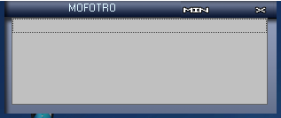

# MofoTro - MofoTro 1.7 Beta.exe
## Informations
| Label | Value |
| :--- | ---: |
| Executable Name | MofoTro 1.7 Beta.exe |
| Product Name | MofoTro |
| Version Number | 1.00 |
| Description | MofoTro Beta 1.7 |
| Company Name |  CM2-B1- Productions |
| Copyright |  |
| Trademarks |  |
| Last Edition | 29/04/2006 19:17:42 |
| Size | 1299637 |
| SHA1 🔎 | [BCF7C3ECEC5B2BEC9CE13D0E4A0C3EC10BA1A2E3](https://www.virustotal.com/gui/search/BCF7C3ECEC5B2BEC9CE13D0E4A0C3EC10BA1A2E3) |
| Language | Anglais (États-Unis) |
## Static Analysis
<details>
<summary>Manalyze</summary>
<p>

```

* Manalyze 0.9 *

-------------------------------------------------------------------------------
C:/Users/aTest/Desktop/net6.0/Malwares/Malwares/RAT/MofoTro Beta 1.7/MofoTro 1.7 Beta.exe
-------------------------------------------------------------------------------

Summary:
--------
Architecture:       IMAGE_FILE_MACHINE_I386
Subsystem:          IMAGE_SUBSYSTEM_WINDOWS_GUI
Compilation Date:   2006-Apr-30 02:17:41
Detected languages: English - United States
CompanyName:         CM2-B1- Productions
FileDescription:    MofoTro Beta 1.7
ProductName:        MofoTro
FileVersion:        1.00
ProductVersion:     1.00
InternalName:       MofoTro 1.7 Beta
OriginalFilename:   MofoTro 1.7 Beta.exe

DOS Header:
-----------
e_magic:    MZ
e_cblp:     0x0090
e_cp:       0x0003
e_crlc:     0x0000
e_cparhdr:  0x0004
e_minalloc: 0x0000
e_maxalloc: 0xFFFF
e_ss:       0x0000
e_sp:       0x00B8
e_csum:     0x0000
e_ip:       0x0000
e_cs:       0x0000
e_ovno:     0x0000
e_oemid:    0x0000
e_oeminfo:  0x0000
e_lfanew:   0x000000B0

PE Header:
----------
Signature:            PE
Machine:              IMAGE_FILE_MACHINE_I386
NumberofSections:     4
TimeDateStamp:        2006-Apr-30 02:17:41
PointerToSymbolTable: 0x00000000
NumberOfSymbols:      0
SizeOfOptionalHeader: 0x00E0
Characteristics:      IMAGE_FILE_32BIT_MACHINE
                      IMAGE_FILE_EXECUTABLE_IMAGE
                      IMAGE_FILE_LINE_NUMS_STRIPPED
                      IMAGE_FILE_LOCAL_SYMS_STRIPPED
                      IMAGE_FILE_RELOCS_STRIPPED

Image Optional Header:
----------------------
Magic:                   PE32
LinkerVersion:           6.0
SizeOfCode:              0x0015A2FD
SizeOfInitializedData:   0x0011A2FD
SizeOfUninitializedData: 0x00000000
AddressOfEntryPoint:     0x00275046 (Section: .petite)
BaseOfCode:              0x00001000
BaseOfData:              0x0015B000
ImageBase:               0x00400000
SectionAlignment:        0x00001000
FileAlignment:           0x00000200
OperatingSystemVersion:  4.0
ImageVersion:            1.0
SubsystemVersion:        4.0
Win32VersionValue:       0
SizeOfImage:             0x00276000
SizeOfHeaders:           0x00000400
Checksum:                0x0027A232
Subsystem:               IMAGE_SUBSYSTEM_WINDOWS_GUI
SizeofStackReserve:      0x00100000
SizeofStackCommit:       0x00001000
SizeofHeapReserve:       0x00100000
SizeofHeapCommit:        0x00001000
LoaderFlags:             0x00000000
NumberOfRvaAndSizes:     16

Sections:
---------
:
    VirtualSize:          0x0015A000
    VirtualAddress:       0x00001000
    SizeOfRawData:        0x0002B200
    PointerToRawData:     0x00000800
    PointerToRelocations: 0x00000000
    PointerToLineNumbers: 0x00000000
    NumberOfLineNumbers:  0
    NumberOfRelocations:  0
    Characteristics:      IMAGE_SCN_CNT_CODE
                          IMAGE_SCN_MEM_EXECUTE
                          IMAGE_SCN_MEM_READ
                          IMAGE_SCN_MEM_WRITE
    Entropy:              7.91223

 (#2):
    VirtualSize:          0x00008000
    VirtualAddress:       0x0015B000
    SizeOfRawData:        0x00000000
    PointerToRawData:     0x00000000
    PointerToRelocations: 0x00000000
    PointerToLineNumbers: 0x00000000
    NumberOfLineNumbers:  0
    NumberOfRelocations:  0
    Characteristics:      IMAGE_SCN_CNT_INITIALIZED_DATA
                          IMAGE_SCN_MEM_READ
                          IMAGE_SCN_MEM_WRITE

.rsrc:
    VirtualSize:          0x00112000
    VirtualAddress:       0x00163000
    SizeOfRawData:        0x00111AB5
    PointerToRawData:     0x0002BA00
    PointerToRelocations: 0x00000000
    PointerToLineNumbers: 0x00000000
    NumberOfLineNumbers:  0
    NumberOfRelocations:  0
    Characteristics:      IMAGE_SCN_CNT_INITIALIZED_DATA
                          IMAGE_SCN_MEM_READ
    Entropy:              6.66518

.petite:
    VirtualSize:          0x000002FD
    VirtualAddress:       0x00275000
    SizeOfRawData:        0x00000400
    PointerToRawData:     0x00000400
    PointerToRelocations: 0x00000000
    PointerToLineNumbers: 0x00000000
    NumberOfLineNumbers:  0
    NumberOfRelocations:  0
    Characteristics:      IMAGE_SCN_CNT_CODE
                          IMAGE_SCN_CNT_INITIALIZED_DATA
                          IMAGE_SCN_MEM_DISCARDABLE
                          IMAGE_SCN_MEM_EXECUTE
                          IMAGE_SCN_MEM_READ
                          IMAGE_SCN_MEM_WRITE
    Entropy:              4.6684


Imports:
--------
MSVBVM60.DLL: #619
user32.dll:   MessageBoxA
              wsprintfA
kernel32.dll: ExitProcess
              LoadLibraryA
              GetProcAddress
              VirtualProtect
              GlobalAlloc
              GlobalFree
              GetModuleHandleA

Resources:
----------
105:
    Type:          CREDITS
    Language:      English - United States
    Codepage:      Unicode (UTF 16LE)
    Size:          671
    TimeDateStamp: 2006-Apr-30 02:17:41
    Entropy:       4.82415

101:
    Type:              RESHACK
    Language:          English - United States
    Codepage:          Unicode (UTF 16LE)
    Size:              881664
    TimeDateStamp:     2006-Apr-30 02:17:41
    Entropy:           6.55525
    Detected Filetype: PE Executable

101 (#2):
    Type:              SERVER
    Language:          English - United States
    Codepage:          Unicode (UTF 16LE)
    Size:              106496
    TimeDateStamp:     2006-Apr-30 02:17:41
    Entropy:           4.69285
    Detected Filetype: PE Executable

102:
    Type:              UPX
    Language:          English - United States
    Codepage:          Unicode (UTF 16LE)
    Size:              126464
    TimeDateStamp:     2006-Apr-30 02:17:41
    Entropy:           7.90218
    Detected Filetype: PE Executable

30001:
    Type:          RT_ICON
    Language:      UNKNOWN
    Codepage:      Unicode (UTF 16LE)
    Size:          1384
    TimeDateStamp: 2006-Apr-30 02:17:41
    Entropy:       5.13289

30002:
    Type:          RT_ICON
    Language:      UNKNOWN
    Codepage:      Unicode (UTF 16LE)
    Size:          2216
    TimeDateStamp: 2006-Apr-30 02:17:41
    Entropy:       6.6027

7:
    Type:          RT_STRING
    Language:      English - United States
    Codepage:      Unicode (UTF 16LE)
    Size:          652
    TimeDateStamp: 2006-Apr-30 02:17:41
    Entropy:       3.14113

1:
    Type:              RT_GROUP_ICON
    Language:          UNKNOWN
    Codepage:          Unicode (UTF 16LE)
    Size:              34
    TimeDateStamp:     2006-Apr-30 02:17:41
    Entropy:           2.74894
    Detected Filetype: Icon file

1 (#2):
    Type:          RT_VERSION
    Language:      English - United States
    Codepage:      Unicode (UTF 16LE)
    Size:          664
    TimeDateStamp: 2006-Apr-30 02:17:41
    Entropy:       3.23573


Version Info:
-------------
Resource LangID: English - United States
VS_VERSION_INFO:
    Signature:           0xFEEF04BD
    StructVersion:       0x00010000
    FileVersion:         1.0.0.0
    ProductVersion:      1.0.0.0
    FileFlags:           (EMPTY)
    FileOs:              VOS_DOS_WINDOWS32
                         VOS_NT_WINDOWS32
                         VOS__WINDOWS32
    FileType:            VFT_APP
    Language:            English - United States
    CompanyName:          CM2-B1- Productions
    FileDescription:     MofoTro Beta 1.7
    ProductName:         MofoTro
    FileVersion (#2):    1.00
    ProductVersion (#2): 1.00
    InternalName:        MofoTro 1.7 Beta
    OriginalFilename:    MofoTro 1.7 Beta.exe


RICH Header:
------------
XOR Key:                  0x8869808D
Unmarked objects:         0
13 (VS98 SP6 build 8804): 1

Matching compiler(s):
    Microsoft Visual Basic 5.0
    Borland Delphi 3 -> Portions Copyright (c) 1983,97 Borland (h)
    Microsoft Visual Basic v5.0 - v6.0
    Microsoft Visual Basic v6.0

[ SUSPICIOUS ] PEiD Signature:
    Petite 2.1
    UPX -> www.upx.sourceforge.net

[ SUSPICIOUS ] Strings found in the binary may indicate undesirable behavior:
    May have dropper capabilities:
        CurrentVersion\Run
        Programs\StartUp
    Contains another PE executable:
        This program cannot be run in DOS mode.
    Miscellaneous malware strings:
        cmd.exe
    Contains domain names:
        http://rpi.net.au
        http://rpi.net.au/
        http://upx.sf.net
        rpi.net.au
        splintersecurity.com
        upx.sf.net
        www.splintersecurity.com

[ SUSPICIOUS ] This PE is packed with Petite
    Unusual section name found: 
    Section  is both writable and executable.
    Unusual section name found: 
    Unusual section name found: .petite
    Section .petite is both writable and executable.

The PE contains common functions which appear in legitimate applications.
    [!] The program may be hiding some of its imports:
        LoadLibraryA
        GetProcAddress

[ MALICIOUS ] The PE is possibly a dropper.
    Resource 101 detected as a PE Executable.
    Resource 101 detected as a PE Executable.
    Resource 102 detected as a PE Executable.
    Resources amount for 86.1968% of the executable.

The following exploit mitigation techniques have been detected
    Stack Canary: disabled
    SafeSEH: disabled
    ASLR: disabled
    DEP: disabled
    CFG: disabled


```

</p>
</details>

## Screenshots
### MOFOTRO
 
