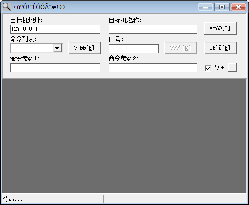

#  - Backdoor.Win32.G_Door.k-81cc302ad09ac33f730d83d0d586d5d765cd8a40a7774f3f158ff52ddcb79b53.exe
## Informations
| Label | Value |
| :--- | ---: |
| Executable Name | Backdoor.Win32.G_Door.k-81cc302ad09ac33f730d83d0d586d5d765cd8a40a7774f3f158ff52ddcb79b53.exe |
| Product Name |  |
| Version Number | 1.0.0.0 |
| Description | Glacier client |
| Company Name | 西安电子科技大学 |
| Copyright |  |
| Trademarks |  |
| Last Edition | 14/06/2012 09:44:14 |
| Size | 548864 |
| SHA1 🔎 | [BD19CEE0384C793098C86015675C030324FDB32A](https://www.virustotal.com/gui/search/BD19CEE0384C793098C86015675C030324FDB32A) |
| Language | Chinese (Simplified, PRC) |
## Static Analysis
<details>
<summary>Manalyze</summary>
<p>

```

* Manalyze 0.9 *

-------------------------------------------------------------------------------
C:/Users/IEUser/Desktop/net6.0/Malwares/Backdoor.Win32.G_Door.k-81cc302ad09ac33f730d83d0d586d5d765cd8a40a7774f3f158ff52ddcb79b53.exe
-------------------------------------------------------------------------------

Summary:
--------
Architecture:       IMAGE_FILE_MACHINE_I386
Subsystem:          IMAGE_SUBSYSTEM_WINDOWS_GUI
Compilation Date:   1999-Jul-24 17:25:46
Detected languages: Chinese - PRC
CompanyName:        西安电子科技大学
FileDescription:    Glacier client
FileVersion:        1.0.0.0
InternalName:       Glacier client
LegalCopyright:     
LegalTrademarks:    
OriginalFilename:   
ProductName:        
ProductVersion:     1.0.0.0
Comments:           若现实它能教人更加勇敢，就让我在地狱里等待天堂。

DOS Header:
-----------
e_magic:    MZ
e_cblp:     0x0050
e_cp:       0x0002
e_crlc:     0x0000
e_cparhdr:  0x0004
e_minalloc: 0x000F
e_maxalloc: 0xFFFF
e_ss:       0x0000
e_sp:       0x00B8
e_csum:     0x0000
e_ip:       0x0000
e_cs:       0x0000
e_ovno:     0x001A
e_oemid:    0x0000
e_oeminfo:  0x0000
e_lfanew:   0x00000200

PE Header:
----------
Signature:            PE
Machine:              IMAGE_FILE_MACHINE_I386
NumberofSections:     8
TimeDateStamp:        1999-Jul-24 17:25:46
PointerToSymbolTable: 0x00000000
NumberOfSymbols:      0
SizeOfOptionalHeader: 0x00E0
Characteristics:      IMAGE_FILE_32BIT_MACHINE
                      IMAGE_FILE_BYTES_REVERSED_HI
                      IMAGE_FILE_BYTES_REVERSED_LO
                      IMAGE_FILE_EXECUTABLE_IMAGE
                      IMAGE_FILE_LINE_NUMS_STRIPPED
                      IMAGE_FILE_LOCAL_SYMS_STRIPPED

Image Optional Header:
----------------------
Magic:                   PE32
LinkerVersion:           2.0
SizeOfCode:              0x0005C000
SizeOfInitializedData:   0x0000C000
SizeOfUninitializedData: 0x00000000
AddressOfEntryPoint:     0x00001000 (Section: .text)
BaseOfCode:              0x00001000
BaseOfData:              0x0005D000
ImageBase:               0x00400000
SectionAlignment:        0x00001000
FileAlignment:           0x00000200
OperatingSystemVersion:  1.0
ImageVersion:            0.0
SubsystemVersion:        4.0
Win32VersionValue:       0
SizeOfImage:             0x0008E000
SizeOfHeaders:           0x00000400
Checksum:                0x00000000
Subsystem:               IMAGE_SUBSYSTEM_WINDOWS_GUI
SizeofStackReserve:      0x00100000
SizeofStackCommit:       0x00002000
SizeofHeapReserve:       0x00100000
SizeofHeapCommit:        0x00001000
LoaderFlags:             0x00000000
NumberOfRvaAndSizes:     16

Sections:
---------
.text:
    VirtualSize:          0x0005C000
    VirtualAddress:       0x00001000
    SizeOfRawData:        0x0005C000
    PointerToRawData:     0x00000600
    PointerToRelocations: 0x00000049
    PointerToLineNumbers: 0x0000001B
    NumberOfLineNumbers:  0
    NumberOfRelocations:  0
    Characteristics:      IMAGE_SCN_CNT_CODE
                          IMAGE_SCN_MEM_EXECUTE
                          IMAGE_SCN_MEM_READ
    Entropy:              6.46379

.data:
    VirtualSize:          0x0000C000
    VirtualAddress:       0x0005D000
    SizeOfRawData:        0x00007800
    PointerToRawData:     0x0005C600
    PointerToRelocations: 0xB016A7C0
    PointerToLineNumbers: 0xB016A814
    NumberOfLineNumbers:  45078
    NumberOfRelocations:  43048
    Characteristics:      IMAGE_SCN_CNT_INITIALIZED_DATA
                          IMAGE_SCN_MEM_READ
                          IMAGE_SCN_MEM_WRITE
    Entropy:              4.80078

.tls:
    VirtualSize:          0x00001000
    VirtualAddress:       0x00069000
    SizeOfRawData:        0x00000200
    PointerToRawData:     0x00063E00
    PointerToRelocations: 0x00000001
    PointerToLineNumbers: 0x00000011
    NumberOfLineNumbers:  0
    NumberOfRelocations:  302
    Characteristics:      IMAGE_SCN_CNT_INITIALIZED_DATA
                          IMAGE_SCN_MEM_READ
                          IMAGE_SCN_MEM_WRITE
    Entropy:              0

.rdata:
    VirtualSize:          0x00001000
    VirtualAddress:       0x0006A000
    SizeOfRawData:        0x00000200
    PointerToRawData:     0x00064000
    PointerToRelocations: 0x0000D951
    PointerToLineNumbers: 0x02B457DC
    NumberOfLineNumbers:  693
    NumberOfRelocations:  56824
    Characteristics:      IMAGE_SCN_CNT_INITIALIZED_DATA
                          IMAGE_SCN_MEM_READ
                          IMAGE_SCN_MEM_SHARED
    Entropy:              0.197438

.idata:
    VirtualSize:          0x00003000
    VirtualAddress:       0x0006B000
    SizeOfRawData:        0x00002800
    PointerToRawData:     0x00064200
    PointerToRelocations: 0xB0033DDC
    PointerToLineNumbers: 0xB00342B0
    NumberOfLineNumbers:  45059
    NumberOfRelocations:  17096
    Characteristics:      IMAGE_SCN_CNT_INITIALIZED_DATA
                          IMAGE_SCN_MEM_READ
    Entropy:              5.29977

.edata:
    VirtualSize:          0x00001000
    VirtualAddress:       0x0006E000
    SizeOfRawData:        0x00000800
    PointerToRawData:     0x00066A00
    PointerToRelocations: 0x00000000
    PointerToLineNumbers: 0x0000104B
    NumberOfLineNumbers:  0
    NumberOfRelocations:  0
    Characteristics:      IMAGE_SCN_CNT_INITIALIZED_DATA
                          IMAGE_SCN_MEM_READ
    Entropy:              5.33973

.rsrc:
    VirtualSize:          0x00018000
    VirtualAddress:       0x0006F000
    SizeOfRawData:        0x00017E00
    PointerToRawData:     0x00067200
    PointerToRelocations: 0x00000016
    PointerToLineNumbers: 0x00000000
    NumberOfLineNumbers:  684
    NumberOfRelocations:  29208
    Characteristics:      IMAGE_SCN_CNT_INITIALIZED_DATA
                          IMAGE_SCN_MEM_READ
    Entropy:              4.55388

.reloc:
    VirtualSize:          0x00007000
    VirtualAddress:       0x00087000
    SizeOfRawData:        0x00007000
    PointerToRawData:     0x0007F000
    PointerToRelocations: 0x0006E1D6
    PointerToLineNumbers: 0x00000001
    NumberOfLineNumbers:  0
    NumberOfRelocations:  43
    Characteristics:      IMAGE_SCN_CNT_INITIALIZED_DATA
                          IMAGE_SCN_MEM_READ
                          IMAGE_SCN_MEM_SHARED
    Entropy:              6.61809


Imports:
--------
ADVAPI32.dll: RegCloseKey
              RegOpenKeyExA
              RegQueryValueExA
KERNEL32.dll: CloseHandle
              CompareStringA
              CreateEventA
              CreateFileA
              CreateThread
              DeleteCriticalSection
              DeleteFileA
              EnterCriticalSection
              EnumCalendarInfoA
              ExitProcess
              ExitThread
              FileTimeToDosDateTime
              FileTimeToLocalFileTime
              FindClose
              FindFirstFileA
              FindResourceA
              FormatMessageA
              FreeLibrary
              FreeResource
              GetACP
              GetCPInfo
              GetCommandLineA
              GetComputerNameA
              GetCurrentProcessId
              GetCurrentThreadId
              GetDateFormatA
              GetEnvironmentStrings
              GetExitCodeProcess
              GetExitCodeThread
              GetFileAttributesA
              GetFileSize
              GetFileType
              GetLastError
              GetLocalTime
              GetLocaleInfoA
              GetModuleFileNameA
              GetModuleHandleA
              GetOEMCP
              GetPrivateProfileStringA
              GetProcAddress
              GetProfileStringA
              GetStartupInfoA
              GetStdHandle
              GetStringTypeW
              GetSystemInfo
              GetThreadLocale
              GetVersion
              GetVersionExA
              GlobalAddAtomA
              GlobalAlloc
              GlobalDeleteAtom
              GlobalFree
              GlobalLock
              GlobalReAlloc
              GlobalUnlock
              InitializeCriticalSection
              LeaveCriticalSection
              LoadLibraryA
              LoadLibraryExA
              LoadResource
              LocalAlloc
              LocalFree
              LockResource
              MulDiv
              MultiByteToWideChar
              OpenProcess
              RaiseException
              ReadFile
              ResetEvent
              ResumeThread
              RtlUnwind
              SetConsoleCtrlHandler
              SetEndOfFile
              SetErrorMode
              SetEvent
              SetFilePointer
              SetHandleCount
              SetThreadLocale
              SetThreadPriority
              SizeofResource
              Sleep
              TerminateProcess
              TlsAlloc
              TlsFree
              TlsGetValue
              TlsSetValue
              UnhandledExceptionFilter
              VirtualAlloc
              VirtualFree
              VirtualQuery
              WaitForSingleObject
              WideCharToMultiByte
              WinExec
              WriteFile
              WritePrivateProfileStringA
              lstrcmpA
              lstrcpyA
              lstrcpynA
              lstrlenA
              GlobalHandle
WSOCK32.dll:  WSAAsyncGetHostByName
              WSAAsyncSelect
              WSACleanup
              WSAGetLastError
              WSAStartup
              accept
              closesocket
              connect
              gethostbyname
              getservbyname
              getsockopt
              htons
              inet_addr
              ioctlsocket
              listen
              ntohs
              recv
              select
              send
              setsockopt
              socket
              bind
WINSPOOL.DRV: ClosePrinter
              DocumentPropertiesA
              EnumPrintersA
              OpenPrinterA
COMCTL32.dll: ImageList_Add
              ImageList_BeginDrag
              ImageList_Create
              ImageList_Destroy
              ImageList_DragEnter
              ImageList_DragLeave
              ImageList_DragMove
              ImageList_DragShowNolock
              ImageList_Draw
              ImageList_EndDrag
              ImageList_GetBkColor
              ImageList_GetDragImage
              ImageList_GetIconSize
              ImageList_GetImageCount
              ImageList_GetImageInfo
              ImageList_Read
              ImageList_Remove
              ImageList_Replace
              ImageList_ReplaceIcon
              ImageList_SetBkColor
              ImageList_SetDragCursorImage
              ImageList_SetIconSize
              InitCommonControls
              ImageList_DrawEx
COMDLG32.dll: ChooseColorA
              ChooseFontA
              GetOpenFileNameA
              GetSaveFileNameA
GDI32.dll:    BitBlt
              CopyEnhMetaFileA
              CreateBitmap
              CreateBrushIndirect
              CreateCompatibleBitmap
              CreateCompatibleDC
              CreateDCA
              CreateDIBSection
              CreateDIBitmap
              CreateFontIndirectA
              CreateHalftonePalette
              CreateICA
              CreatePalette
              CreatePenIndirect
              CreateRectRgn
              CreateSolidBrush
              DeleteDC
              DeleteEnhMetaFile
              DeleteObject
              EndDoc
              EndPage
              EnumFontFamiliesExA
              EnumFontsA
              ExcludeClipRect
              GetBitmapBits
              GetBrushOrgEx
              GetClipBox
              GetCurrentPositionEx
              GetDIBColorTable
              GetDIBits
              GetDeviceCaps
              GetEnhMetaFileBits
              GetEnhMetaFileHeader
              GetEnhMetaFilePaletteEntries
              GetObjectA
              GetPaletteEntries
              GetPixel
              GetStockObject
              GetSystemPaletteEntries
              GetTextExtentPointA
              GetTextMetricsA
              GetWinMetaFileBits
              GetWindowOrgEx
              IntersectClipRect
              MaskBlt
              MoveToEx
              PatBlt
              PlayEnhMetaFile
              Polyline
              RealizePalette
              RectVisible
              Rectangle
              RestoreDC
              SaveDC
              SelectObject
              SelectPalette
              SetBkColor
              SetBkMode
              SetBrushOrgEx
              SetDIBColorTable
              SetEnhMetaFileBits
              SetPixel
              SetROP2
              SetStretchBltMode
              SetTextColor
              SetViewportOrgEx
              SetWinMetaFileBits
              SetWindowOrgEx
              StretchBlt
              TextOutA
              UnrealizeObject
SHELL32.dll:  ShellExecuteA
              Shell_NotifyIconA
USER32.dll:   ActivateKeyboardLayout
              AdjustWindowRectEx
              BeginPaint
              CallNextHookEx
              CallWindowProcA
              CharLowerA
              CharLowerBuffA
              CheckMenuItem
              ClientToScreen
              CreateIcon
              CreateMenu
              CreatePopupMenu
              CreateWindowExA
              DefFrameProcA
              DefMDIChildProcA
              DefWindowProcA
              DeleteMenu
              DestroyCursor
              DestroyIcon
              DestroyMenu
              DestroyWindow
              DispatchMessageA
              DrawEdge
              DrawFocusRect
              DrawFrameControl
              DrawIcon
              DrawIconEx
              DrawMenuBar
              DrawTextA
              EnableMenuItem
              EnableWindow
              EndPaint
              EnumThreadWindows
              EnumWindows
              EqualRect
              FillRect
              FindWindowA
              FrameRect
              GetActiveWindow
              GetCapture
              GetClassInfoA
              GetClientRect
              GetClipboardData
              GetCursor
              GetCursorPos
              GetDC
              GetDCEx
              GetDesktopWindow
              GetDlgItem
              GetFocus
              GetForegroundWindow
              GetIconInfo
              GetKeyNameTextA
              GetKeyState
              GetKeyboardLayout
              GetKeyboardLayoutList
              GetKeyboardType
              GetLastActivePopup
              GetMenu
              GetMenuItemCount
              GetMenuState
              GetMenuStringA
              GetParent
              GetPropA
              GetScrollPos
              GetSubMenu
              GetSysColor
              GetSystemMenu
              GetSystemMetrics
              GetWindow
              GetWindowDC
              GetWindowLongA
              GetWindowPlacement
              GetWindowRect
              GetWindowRgn
              GetWindowTextA
              GetWindowThreadProcessId
              InflateRect
              InsertMenuA
              InsertMenuItemA
              IntersectRect
              InvalidateRect
              IsDialogMessageA
              IsIconic
              IsRectEmpty
              IsWindow
              IsWindowEnabled
              IsWindowVisible
              IsZoomed
              KillTimer
              LoadCursorA
              LoadIconA
              LoadImageA
              LoadStringA
              MapVirtualKeyA
              MapWindowPoints
              MessageBoxA
              MsgWaitForMultipleObjects
              OemToCharA
              OffsetRect
              PeekMessageA
              PostMessageA
              PostQuitMessage
              PtInRect
              RegisterClassA
              RegisterWindowMessageA
              ReleaseCapture
              ReleaseDC
              RemoveMenu
              RemovePropA
              ScreenToClient
              ScrollWindow
              SendDlgItemMessageA
              SendMessageA
              SetActiveWindow
              SetCapture
              SetCursor
              SetFocus
              SetForegroundWindow
              SetMenu
              SetParent
              SetPropA
              SetRect
              SetScrollInfo
              SetScrollPos
              SetTimer
              SetWindowLongA
              SetWindowPlacement
              SetWindowPos
              SetWindowRgn
              SetWindowTextA
              SetWindowsHookExA
              ShowCursor
              ShowOwnedPopups
              ShowWindow
              SystemParametersInfoA
              TrackPopupMenu
              TranslateMDISysAccel
              TranslateMessage
              UnhookWindowsHookEx
              UnregisterClassA
              UpdateWindow
              WaitMessage
              WinHelpA
              WindowFromPoint
OLEAUT32.dll: SysAllocStringLen
              SysFreeString
              SysReAllocStringLen
              SysStringLen
              VariantChangeTypeEx
              VariantClear
              VariantCopyInd

Exports:
--------
@About@C5_4:
    Ordinal: 1
    Address: 0x00007778

@About@C5_5:
    Ordinal: 2
    Address: 0x00007788

@Classes@TComponent@UpdateRegistry$qqr4boolx17System@AnsiStringxt2:
    Ordinal: 3
    Address: 0x00006A40

@Classes@TComponent@UpdateRegistry$qqr4boolx17System@AnsiStringxt2 (#2):
    Ordinal: 4
    Address: 0x00008068

@Classes@TComponent@UpdateRegistry$qqr4boolx17System@AnsiStringxt2 (#3):
    Ordinal: 5
    Address: 0x000075D4

@Classes@TComponent@UpdateRegistry$qqr4boolx17System@AnsiStringxt2 (#4):
    Ordinal: 6
    Address: 0x00007CFC

@Classes@THandleStream@$bdtr$qqrv:
    Ordinal: 7
    Address: 0x00006ED4

@Classes@TStream@$bdtr$qqrv:
    Ordinal: 8
    Address: 0x00007038

@Client@C4_4:
    Ordinal: 9
    Address: 0x000072C8

@Client@C4_5:
    Ordinal: 10
    Address: 0x000072E0

@Forms@TForm@$bctr$qqrp18Classes@TComponent:
    Ordinal: 11
    Address: 0x00007350

@Forms@TForm@$bctr$qqrp18Classes@TComponent (#2):
    Ordinal: 12
    Address: 0x00007F18

@Forms@TForm@$bctr$qqrp18Classes@TComponent (#3):
    Ordinal: 13
    Address: 0x000016B0

@Forms@TForm@$bctr$qqrp18Classes@TComponent (#4):
    Ordinal: 14
    Address: 0x000077F0

@Forms@TForm@$bdtr$qqrv:
    Ordinal: 15
    Address: 0x00008134

@Forms@TForm@$bdtr$qqrv (#2):
    Ordinal: 16
    Address: 0x00007DC8

@Forms@TForm@$bdtr$qqrv (#3):
    Ordinal: 17
    Address: 0x000076A0

@Forms@TForm@$bdtr$qqrv (#4):
    Ordinal: 18
    Address: 0x00006B6C

@Inifiles@TCustomIniFile@$bdtr$qqrv:
    Ordinal: 19
    Address: 0x00006D14

@Inifiles@TIniFile@$bctr$qqrx17System@AnsiString:
    Ordinal: 20
    Address: 0x00001DC4

@Inifiles@TIniFile@$bdtr$qqrv:
    Ordinal: 21
    Address: 0x00006C48

@Showimage@C6_4:
    Ordinal: 22
    Address: 0x00007EA0

@Showimage@C6_5:
    Ordinal: 23
    Address: 0x00007EB0

@Splash@C7_4:
    Ordinal: 24
    Address: 0x0000820C

@Splash@C7_5:
    Ordinal: 25
    Address: 0x0000821C

@System@%DelphiInterface$t14Forms@IOleForm%@$bdtr$qqrv:
    Ordinal: 26
    Address: 0x0000818C

@System@%DelphiInterface$t14Forms@IOleForm%@$bdtr$qqrv (#2):
    Ordinal: 27
    Address: 0x000076F8

@System@%DelphiInterface$t14Forms@IOleForm%@$bdtr$qqrv (#3):
    Ordinal: 28
    Address: 0x00007E20

@System@%DelphiInterface$t14Forms@IOleForm%@$bdtr$qqrv (#4):
    Ordinal: 29
    Address: 0x00006F88

@System@%DelphiInterface$t8IUnknown%@$bdtr$qqrv:
    Ordinal: 30
    Address: 0x00007738

@System@%DelphiInterface$t8IUnknown%@$bdtr$qqrv (#2):
    Ordinal: 31
    Address: 0x00007288

@System@%DelphiInterface$t8IUnknown%@$bdtr$qqrv (#3):
    Ordinal: 32
    Address: 0x000081CC

@System@%DelphiInterface$t8IUnknown%@$bdtr$qqrv (#4):
    Ordinal: 33
    Address: 0x00007E60

@System@AnsiString@$bctr$qqrv:
    Ordinal: 34
    Address: 0x00001628

@System@AnsiString@$bctr$qqrv (#2):
    Ordinal: 35
    Address: 0x00007A04

@System@AnsiString@c_str$xqqrv:
    Ordinal: 36
    Address: 0x00001E70

@Sysutils@Exception@$bdtr$qqrv:
    Ordinal: 37
    Address: 0x0000147C

_AboutForm:
    Ordinal: 38
    Address: 0x0006467C

_MainForm:
    Ordinal: 39
    Address: 0x00064674

_ShowImageForm:
    Ordinal: 40
    Address: 0x00064684

_SplashForm:
    Ordinal: 41
    Address: 0x0006468C

__GetExceptDLLinfo:
    Ordinal: 42
    Address: 0x00001056

___CPPdebugHook:
    Ordinal: 43
    Address: 0x0005D324


Resources:
----------
1:
    Type:          RT_CURSOR
    Language:      UNKNOWN
    Codepage:      UNKNOWN
    Size:          308
    TimeDateStamp: 1999-Jul-24 13:25:48
    Entropy:       2.6633

2:
    Type:          RT_CURSOR
    Language:      UNKNOWN
    Codepage:      UNKNOWN
    Size:          308
    TimeDateStamp: 1999-Jul-24 13:25:48
    Entropy:       2.80231

3:
    Type:          RT_CURSOR
    Language:      UNKNOWN
    Codepage:      UNKNOWN
    Size:          308
    TimeDateStamp: 1999-Jul-24 13:25:48
    Entropy:       3.00046

4:
    Type:          RT_CURSOR
    Language:      UNKNOWN
    Codepage:      UNKNOWN
    Size:          308
    TimeDateStamp: 1999-Jul-24 13:25:48
    Entropy:       2.56318

5:
    Type:          RT_CURSOR
    Language:      UNKNOWN
    Codepage:      UNKNOWN
    Size:          308
    TimeDateStamp: 1999-Jul-24 13:25:48
    Entropy:       2.6949

6:
    Type:          RT_CURSOR
    Language:      UNKNOWN
    Codepage:      UNKNOWN
    Size:          308
    TimeDateStamp: 1999-Jul-24 13:25:48
    Entropy:       2.62527

7:
    Type:          RT_CURSOR
    Language:      UNKNOWN
    Codepage:      UNKNOWN
    Size:          308
    TimeDateStamp: 1999-Jul-24 13:25:48
    Entropy:       2.91604

BBABORT:
    Type:          RT_BITMAP
    Language:      UNKNOWN
    Codepage:      UNKNOWN
    Size:          464
    TimeDateStamp: 1999-Jul-24 13:25:48
    Entropy:       2.92079

BBALL:
    Type:          RT_BITMAP
    Language:      UNKNOWN
    Codepage:      UNKNOWN
    Size:          484
    TimeDateStamp: 1999-Jul-24 13:25:48
    Entropy:       3.16995

BBCANCEL:
    Type:          RT_BITMAP
    Language:      UNKNOWN
    Codepage:      UNKNOWN
    Size:          464
    TimeDateStamp: 1999-Jul-24 13:25:48
    Entropy:       2.92079

BBCLOSE:
    Type:          RT_BITMAP
    Language:      UNKNOWN
    Codepage:      UNKNOWN
    Size:          464
    TimeDateStamp: 1999-Jul-24 13:25:48
    Entropy:       3.68492

BBHELP:
    Type:          RT_BITMAP
    Language:      UNKNOWN
    Codepage:      UNKNOWN
    Size:          464
    TimeDateStamp: 1999-Jul-24 13:25:48
    Entropy:       2.88085

BBIGNORE:
    Type:          RT_BITMAP
    Language:      UNKNOWN
    Codepage:      UNKNOWN
    Size:          464
    TimeDateStamp: 1999-Jul-24 13:25:48
    Entropy:       3.29718

BBNO:
    Type:          RT_BITMAP
    Language:      UNKNOWN
    Codepage:      UNKNOWN
    Size:          464
    TimeDateStamp: 1999-Jul-24 13:25:48
    Entropy:       3.58804

BBOK:
    Type:          RT_BITMAP
    Language:      UNKNOWN
    Codepage:      UNKNOWN
    Size:          464
    TimeDateStamp: 1999-Jul-24 13:25:48
    Entropy:       2.67459

BBRETRY:
    Type:          RT_BITMAP
    Language:      UNKNOWN
    Codepage:      UNKNOWN
    Size:          464
    TimeDateStamp: 1999-Jul-24 13:25:48
    Entropy:       3.53344

BBYES:
    Type:          RT_BITMAP
    Language:      UNKNOWN
    Codepage:      UNKNOWN
    Size:          464
    TimeDateStamp: 1999-Jul-24 13:25:48
    Entropy:       2.67459

PREVIEWGLYPH:
    Type:          RT_BITMAP
    Language:      UNKNOWN
    Codepage:      UNKNOWN
    Size:          232
    TimeDateStamp: 1999-Jul-24 13:25:48
    Entropy:       2.85172

1 (#2):
    Type:          RT_ICON
    Language:      Chinese - PRC
    Codepage:      UNKNOWN
    Size:          296
    TimeDateStamp: 1999-Jul-24 13:25:48
    Entropy:       2.58174

DLGTEMPLATE:
    Type:          RT_DIALOG
    Language:      UNKNOWN
    Codepage:      UNKNOWN
    Size:          82
    TimeDateStamp: 1999-Jul-24 13:25:48
    Entropy:       2.5627

4080:
    Type:          RT_STRING
    Language:      UNKNOWN
    Codepage:      UNKNOWN
    Size:          84
    TimeDateStamp: 1999-Jul-24 13:25:48
    Entropy:       1.94779

4081:
    Type:          RT_STRING
    Language:      UNKNOWN
    Codepage:      UNKNOWN
    Size:          240
    TimeDateStamp: 1999-Jul-24 13:25:48
    Entropy:       2.96358

4082:
    Type:          RT_STRING
    Language:      UNKNOWN
    Codepage:      UNKNOWN
    Size:          192
    TimeDateStamp: 1999-Jul-24 13:25:48
    Entropy:       2.80205

4083:
    Type:          RT_STRING
    Language:      UNKNOWN
    Codepage:      UNKNOWN
    Size:          680
    TimeDateStamp: 1999-Jul-24 13:25:48
    Entropy:       3.25848

4084:
    Type:          RT_STRING
    Language:      UNKNOWN
    Codepage:      UNKNOWN
    Size:          920
    TimeDateStamp: 1999-Jul-24 13:25:48
    Entropy:       3.23513

4085:
    Type:          RT_STRING
    Language:      UNKNOWN
    Codepage:      UNKNOWN
    Size:          692
    TimeDateStamp: 1999-Jul-24 13:25:48
    Entropy:       3.18982

4086:
    Type:          RT_STRING
    Language:      UNKNOWN
    Codepage:      UNKNOWN
    Size:          812
    TimeDateStamp: 1999-Jul-24 13:25:48
    Entropy:       3.28975

4087:
    Type:          RT_STRING
    Language:      UNKNOWN
    Codepage:      UNKNOWN
    Size:          232
    TimeDateStamp: 1999-Jul-24 13:25:48
    Entropy:       3.08282

4088:
    Type:          RT_STRING
    Language:      UNKNOWN
    Codepage:      UNKNOWN
    Size:          232
    TimeDateStamp: 1999-Jul-24 13:25:48
    Entropy:       3.07219

4089:
    Type:          RT_STRING
    Language:      UNKNOWN
    Codepage:      UNKNOWN
    Size:          348
    TimeDateStamp: 1999-Jul-24 13:25:48
    Entropy:       3.17911

4090:
    Type:          RT_STRING
    Language:      UNKNOWN
    Codepage:      UNKNOWN
    Size:          824
    TimeDateStamp: 1999-Jul-24 13:25:48
    Entropy:       3.2162

4091:
    Type:          RT_STRING
    Language:      UNKNOWN
    Codepage:      UNKNOWN
    Size:          1028
    TimeDateStamp: 1999-Jul-24 13:25:48
    Entropy:       3.25857

4092:
    Type:          RT_STRING
    Language:      UNKNOWN
    Codepage:      UNKNOWN
    Size:          968
    TimeDateStamp: 1999-Jul-24 13:25:48
    Entropy:       3.19557

4093:
    Type:          RT_STRING
    Language:      UNKNOWN
    Codepage:      UNKNOWN
    Size:          916
    TimeDateStamp: 1999-Jul-24 13:25:48
    Entropy:       3.17856

4094:
    Type:          RT_STRING
    Language:      UNKNOWN
    Codepage:      UNKNOWN
    Size:          624
    TimeDateStamp: 1999-Jul-24 13:25:48
    Entropy:       3.33374

4095:
    Type:          RT_STRING
    Language:      UNKNOWN
    Codepage:      UNKNOWN
    Size:          524
    TimeDateStamp: 1999-Jul-24 13:25:48
    Entropy:       3.22833

4096:
    Type:          RT_STRING
    Language:      UNKNOWN
    Codepage:      UNKNOWN
    Size:          572
    TimeDateStamp: 1999-Jul-24 13:25:48
    Entropy:       3.21818

DVCLAL:
    Type:          RT_RCDATA
    Language:      UNKNOWN
    Codepage:      UNKNOWN
    Size:          16
    TimeDateStamp: 1999-Jul-24 13:25:48
    Entropy:       4

TABOUTFORM:
    Type:          RT_RCDATA
    Language:      UNKNOWN
    Codepage:      UNKNOWN
    Size:          47700
    TimeDateStamp: 1999-Jul-24 13:25:48
    Entropy:       2.36768

TMAINFORM:
    Type:          RT_RCDATA
    Language:      UNKNOWN
    Codepage:      UNKNOWN
    Size:          7907
    TimeDateStamp: 1999-Jul-24 13:25:48
    Entropy:       5.98163

TNMSHOW:
    Type:          RT_RCDATA
    Language:      UNKNOWN
    Codepage:      UNKNOWN
    Size:          1232
    TimeDateStamp: 1999-Jul-24 13:25:48
    Entropy:       5.67155

TSHOWIMAGEFORM:
    Type:          RT_RCDATA
    Language:      UNKNOWN
    Codepage:      UNKNOWN
    Size:          1320
    TimeDateStamp: 1999-Jul-24 13:25:48
    Entropy:       5.74029

TSPLASHFORM:
    Type:          RT_RCDATA
    Language:      UNKNOWN
    Codepage:      UNKNOWN
    Size:          17870
    TimeDateStamp: 1999-Jul-24 13:25:48
    Entropy:       4.83847

32761:
    Type:              RT_GROUP_CURSOR
    Language:          UNKNOWN
    Codepage:          UNKNOWN
    Size:              20
    TimeDateStamp:     1999-Jul-24 13:25:48
    Entropy:           1.83876
    Detected Filetype: Cursor file

32762:
    Type:              RT_GROUP_CURSOR
    Language:          UNKNOWN
    Codepage:          UNKNOWN
    Size:              20
    TimeDateStamp:     1999-Jul-24 13:25:48
    Entropy:           1.91924
    Detected Filetype: Cursor file

32763:
    Type:              RT_GROUP_CURSOR
    Language:          UNKNOWN
    Codepage:          UNKNOWN
    Size:              20
    TimeDateStamp:     1999-Jul-24 13:25:48
    Entropy:           2.01924
    Detected Filetype: Cursor file

32764:
    Type:              RT_GROUP_CURSOR
    Language:          UNKNOWN
    Codepage:          UNKNOWN
    Size:              20
    TimeDateStamp:     1999-Jul-24 13:25:48
    Entropy:           2.01924
    Detected Filetype: Cursor file

32765:
    Type:              RT_GROUP_CURSOR
    Language:          UNKNOWN
    Codepage:          UNKNOWN
    Size:              20
    TimeDateStamp:     1999-Jul-24 13:25:48
    Entropy:           2.01924
    Detected Filetype: Cursor file

32766:
    Type:              RT_GROUP_CURSOR
    Language:          UNKNOWN
    Codepage:          UNKNOWN
    Size:              20
    TimeDateStamp:     1999-Jul-24 13:25:48
    Entropy:           2.01924
    Detected Filetype: Cursor file

32767:
    Type:              RT_GROUP_CURSOR
    Language:          UNKNOWN
    Codepage:          UNKNOWN
    Size:              20
    TimeDateStamp:     1999-Jul-24 13:25:48
    Entropy:           2.01924
    Detected Filetype: Cursor file

MAINICON:
    Type:              RT_GROUP_ICON
    Language:          Chinese - PRC
    Codepage:          UNKNOWN
    Size:              20
    TimeDateStamp:     1999-Jul-24 13:25:48
    Entropy:           2.07724
    Detected Filetype: Icon file

1 (#3):
    Type:          RT_VERSION
    Language:      Chinese - PRC
    Codepage:      UNKNOWN
    Size:          748
    TimeDateStamp: 1999-Jul-24 13:25:48
    Entropy:       3.69031


Version Info:
-------------
Resource LangID: Chinese - PRC
VS_VERSION_INFO:
    Signature:           0xFEEF04BD
    StructVersion:       0x00010000
    FileVersion:         1.0.0.0
    ProductVersion:      1.0.0.0
    FileFlags:           (EMPTY)
    FileOs:              VOS_DOS_WINDOWS32
                         VOS_NT_WINDOWS32
                         VOS__WINDOWS32
    FileType:            VFT_APP
    Language:            Chinese - PRC
    CompanyName:         西安电子科技大学
    FileDescription:     Glacier client
    FileVersion (#2):    1.0.0.0
    InternalName:        Glacier client
    LegalCopyright:      
    LegalTrademarks:     
    OriginalFilename:    
    ProductName:         
    ProductVersion (#2): 1.0.0.0
    Comments:            若现实它能教人更加勇敢，就让我在地狱里等待天堂。


TLS Callbacks:
--------------
StartAddressOfRawData: 0x00469000
EndAddressOfRawData:   0x004690B8
AddressOfIndex:        0x00464654
AddressOfCallbacks:    0x0046A010
SizeOfZeroFill:        0x00000000
Characteristics:       IMAGE_SCN_TYPE_REG
Callbacks:             (EMPTY)

Matching compiler(s):
    Borland Delphi 3 -> Portions Copyright (c) 1983,97 Borland (h)
    Borland C / Borland Builder

Interesting strings found in the binary:
    Contains domain names:
        http://www.netmastersllc.com
        netmastersllc.com
        www.netmastersllc.com

[ MALICIOUS ] The PE contains functions mostly used by malware.
    [!] The program may be hiding some of its imports:
        GetProcAddress
        LoadLibraryA
        LoadLibraryExA
    Functions which can be used for anti-debugging purposes:
        FindWindowA
    Code injection capabilities (PowerLoader):
        FindWindowA
        GetWindowLongA
    Can access the registry:
        RegCloseKey
        RegOpenKeyExA
        RegQueryValueExA
    Possibly launches other programs:
        WinExec
        ShellExecuteA
    Uses functions commonly found in keyloggers:
        CallNextHookEx
        GetForegroundWindow
        MapVirtualKeyA
    Manipulates other processes:
        OpenProcess
    Can take screenshots:
        BitBlt
        CreateCompatibleDC
        FindWindowA
        GetDC
        GetDCEx
    Reads the contents of the clipboard:
        GetClipboardData

The PE's resources present abnormal characteristics.
    The binary may have been compiled on a machine in the UTC-4 timezone.

The following exploit mitigation techniques have been detected
    Stack Canary: disabled
    SafeSEH: disabled
    ASLR: disabled
    DEP: disabled
    CFG: disabled


```

</p>
</details>

## Screenshots
### ±ùºÓ£¨ÊÔÓð棩
 
