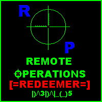

#  - Remote Operations REDEEMER.exe
## Informations
| Label | Value |
| :--- | ---: |
| Executable Name | Remote Operations REDEEMER.exe |
| Product Name |  |
| Version Number |  |
| Description |  |
| Company Name |  |
| Copyright |  |
| Trademarks |  |
| Last Edition | 19/08/2022 03:21:22 |
| Size | 1494016 |
| SHA1 🔎 | [C419B9BE3B93DD19D4A1F6C212FD776A67BE36E6](https://www.virustotal.com/gui/search/C419B9BE3B93DD19D4A1F6C212FD776A67BE36E6) |
| Language |  |
## Static Analysis
<details>
<summary>Manalyze</summary>
<p>

```

* Manalyze 0.9 *

-------------------------------------------------------------------------------
C:/Users/aTest/Desktop/net6.0/Malwares/Malwares/RAT/Remote Operations 2.4/Remote Operations REDEEMER.exe
-------------------------------------------------------------------------------

Summary:
--------
Architecture:       IMAGE_FILE_MACHINE_I386
Subsystem:          IMAGE_SUBSYSTEM_WINDOWS_GUI
Compilation Date:   2002-Oct-27 21:51:52
Detected languages: English - United States

DOS Header:
-----------
e_magic:    MZ
e_cblp:     0x0050
e_cp:       0x0002
e_crlc:     0x0000
e_cparhdr:  0x0004
e_minalloc: 0x000F
e_maxalloc: 0xFFFF
e_ss:       0x0000
e_sp:       0x00B8
e_csum:     0x0000
e_ip:       0x0000
e_cs:       0x0000
e_ovno:     0x001A
e_oemid:    0x0000
e_oeminfo:  0x0000
e_lfanew:   0x00000200

PE Header:
----------
Signature:            PE
Machine:              IMAGE_FILE_MACHINE_I386
NumberofSections:     8
TimeDateStamp:        2002-Oct-27 21:51:52
PointerToSymbolTable: 0x00000000
NumberOfSymbols:      0
SizeOfOptionalHeader: 0x00E0
Characteristics:      IMAGE_FILE_32BIT_MACHINE
                      IMAGE_FILE_DEBUG_STRIPPED
                      IMAGE_FILE_EXECUTABLE_IMAGE
                      IMAGE_FILE_LINE_NUMS_STRIPPED
                      IMAGE_FILE_LOCAL_SYMS_STRIPPED

Image Optional Header:
----------------------
Magic:                   PE32
LinkerVersion:           5.0
SizeOfCode:              0x000D6000
SizeOfInitializedData:   0x0001E000
SizeOfUninitializedData: 0x00000000
AddressOfEntryPoint:     0x00001000 (Section: .text)
BaseOfCode:              0x00001000
BaseOfData:              0x000D7000
ImageBase:               0x00400000
SectionAlignment:        0x00001000
FileAlignment:           0x00000200
OperatingSystemVersion:  4.0
ImageVersion:            0.0
SubsystemVersion:        4.0
Win32VersionValue:       0
SizeOfImage:             0x00176000
SizeOfHeaders:           0x00000600
Checksum:                0x00000000
Subsystem:               IMAGE_SUBSYSTEM_WINDOWS_GUI
SizeofStackReserve:      0x00100000
SizeofStackCommit:       0x00002000
SizeofHeapReserve:       0x00100000
SizeofHeapCommit:        0x00001000
LoaderFlags:             0x00000000
NumberOfRvaAndSizes:     16

Sections:
---------
.text:
    VirtualSize:          0x000D6000
    VirtualAddress:       0x00001000
    SizeOfRawData:        0x000D5C00
    PointerToRawData:     0x00000600
    PointerToRelocations: 0x00000000
    PointerToLineNumbers: 0x00000000
    NumberOfLineNumbers:  0
    NumberOfRelocations:  0
    Characteristics:      IMAGE_SCN_CNT_CODE
                          IMAGE_SCN_MEM_EXECUTE
                          IMAGE_SCN_MEM_READ
    Entropy:              6.47413

.data:
    VirtualSize:          0x0001E000
    VirtualAddress:       0x000D7000
    SizeOfRawData:        0x00019400
    PointerToRawData:     0x000D6200
    PointerToRelocations: 0x00000000
    PointerToLineNumbers: 0x00000000
    NumberOfLineNumbers:  0
    NumberOfRelocations:  0
    Characteristics:      IMAGE_SCN_CNT_INITIALIZED_DATA
                          IMAGE_SCN_MEM_READ
                          IMAGE_SCN_MEM_WRITE
    Entropy:              4.99113

.tls:
    VirtualSize:          0x00001000
    VirtualAddress:       0x000F5000
    SizeOfRawData:        0x00000200
    PointerToRawData:     0x000EF600
    PointerToRelocations: 0x00000000
    PointerToLineNumbers: 0x00000000
    NumberOfLineNumbers:  0
    NumberOfRelocations:  0
    Characteristics:      IMAGE_SCN_CNT_INITIALIZED_DATA
                          IMAGE_SCN_MEM_READ
                          IMAGE_SCN_MEM_WRITE
    Entropy:              0

.rdata:
    VirtualSize:          0x00001000
    VirtualAddress:       0x000F6000
    SizeOfRawData:        0x00000200
    PointerToRawData:     0x000EF800
    PointerToRelocations: 0x00000000
    PointerToLineNumbers: 0x00000000
    NumberOfLineNumbers:  0
    NumberOfRelocations:  0
    Characteristics:      IMAGE_SCN_CNT_INITIALIZED_DATA
                          IMAGE_SCN_MEM_READ
                          IMAGE_SCN_MEM_SHARED
    Entropy:              0.204488

.idata:
    VirtualSize:          0x00003000
    VirtualAddress:       0x000F7000
    SizeOfRawData:        0x00002C00
    PointerToRawData:     0x000EFA00
    PointerToRelocations: 0x00000000
    PointerToLineNumbers: 0x00000000
    NumberOfLineNumbers:  0
    NumberOfRelocations:  0
    Characteristics:      IMAGE_SCN_CNT_INITIALIZED_DATA
                          IMAGE_SCN_MEM_READ
    Entropy:              5.17253

.edata:
    VirtualSize:          0x00006000
    VirtualAddress:       0x000FA000
    SizeOfRawData:        0x00005A00
    PointerToRawData:     0x000F2600
    PointerToRelocations: 0x00000000
    PointerToLineNumbers: 0x00000000
    NumberOfLineNumbers:  0
    NumberOfRelocations:  0
    Characteristics:      IMAGE_SCN_CNT_INITIALIZED_DATA
                          IMAGE_SCN_MEM_READ
    Entropy:              5.8461

.rsrc:
    VirtualSize:          0x00067000
    VirtualAddress:       0x00100000
    SizeOfRawData:        0x00066200
    PointerToRawData:     0x000F8000
    PointerToRelocations: 0x00000000
    PointerToLineNumbers: 0x00000000
    NumberOfLineNumbers:  0
    NumberOfRelocations:  0
    Characteristics:      IMAGE_SCN_CNT_INITIALIZED_DATA
                          IMAGE_SCN_MEM_READ
    Entropy:              3.63587

.reloc:
    VirtualSize:          0x0000F000
    VirtualAddress:       0x00167000
    SizeOfRawData:        0x0000EA00
    PointerToRawData:     0x0015E200
    PointerToRelocations: 0x00000000
    PointerToLineNumbers: 0x00000000
    NumberOfLineNumbers:  0
    NumberOfRelocations:  0
    Characteristics:      IMAGE_SCN_CNT_INITIALIZED_DATA
                          IMAGE_SCN_MEM_READ
                          IMAGE_SCN_MEM_SHARED
    Entropy:              6.60107


Imports:
--------
WSOCK32.DLL:  #103
              #107
              #101
              #108
              #116
              #111
              #112
              #115
              #1
              #3
              #4
              #52
              #57
              #55
              #6
              #9
              #10
              #11
              #12
              #13
              #15
              #16
              #17
              #18
              #19
              #20
              #21
              #23
              #2
ADVAPI32.DLL: RegCloseKey
              RegOpenKeyExA
              RegQueryValueExA
KERNEL32.DLL: CloseHandle
              CompareStringA
              CreateEventA
              CreateFileA
              CreateThread
              DeleteCriticalSection
              DeleteFileA
              EnterCriticalSection
              EnumCalendarInfoA
              ExitProcess
              ExitThread
              FileTimeToDosDateTime
              FileTimeToLocalFileTime
              FindClose
              FindFirstFileA
              FindNextFileA
              FindResourceA
              FormatMessageA
              FreeLibrary
              FreeResource
              GetACP
              GetCPInfo
              GetCommandLineA
              GetCurrentDirectoryA
              GetCurrentProcessId
              GetCurrentThreadId
              GetDiskFreeSpaceA
              GetDriveTypeA
              GetEnvironmentStrings
              GetEnvironmentVariableA
              GetExitCodeThread
              GetFileAttributesA
              GetFileSize
              GetFileType
              GetFullPathNameA
              GetLastError
              GetLocalTime
              GetLocaleInfoA
              GetLogicalDrives
              GetModuleFileNameA
              GetModuleHandleA
              GetOEMCP
              GetProcAddress
              GetProcessHeap
              GetStartupInfoA
              GetStdHandle
              GetStringTypeW
              GetSystemInfo
              GetThreadLocale
              GetTickCount
              GetVersion
              GetVersionExA
              GetVolumeInformationA
              GlobalAddAtomA
              GlobalAlloc
              GlobalDeleteAtom
              GlobalFree
              GlobalHandle
              GlobalLock
              GlobalReAlloc
              GlobalUnlock
              HeapAlloc
              HeapFree
              InitializeCriticalSection
              InterlockedDecrement
              InterlockedIncrement
              LCMapStringA
              LeaveCriticalSection
              LoadLibraryA
              LoadLibraryExA
              LoadResource
              LocalAlloc
              LocalFree
              LockResource
              MulDiv
              MultiByteToWideChar
              RaiseException
              ReadFile
              ResumeThread
              RtlUnwind
              SetConsoleCtrlHandler
              SetCurrentDirectoryA
              SetEndOfFile
              SetEnvironmentVariableA
              SetErrorMode
              SetEvent
              SetFilePointer
              SetHandleCount
              SetLastError
              SetThreadLocale
              SizeofResource
              Sleep
              SuspendThread
              TlsAlloc
              TlsFree
              TlsGetValue
              TlsSetValue
              UnhandledExceptionFilter
              VirtualAlloc
              VirtualFree
              VirtualQuery
              WaitForSingleObject
              WideCharToMultiByte
              WriteFile
              lstrcmpA
              lstrcpyA
              lstrcpynA
              lstrlenA
MPR.DLL:      WNetGetConnectionA
VERSION.DLL:  GetFileVersionInfoA
              GetFileVersionInfoSizeA
              VerQueryValueA
COMCTL32.DLL: ImageList_Add
              ImageList_BeginDrag
              ImageList_Create
              ImageList_Destroy
              ImageList_DragEnter
              ImageList_DragLeave
              ImageList_DragMove
              ImageList_DragShowNolock
              ImageList_Draw
              ImageList_EndDrag
              ImageList_GetBkColor
              ImageList_GetDragImage
              ImageList_GetIcon
              ImageList_GetIconSize
              ImageList_GetImageCount
              ImageList_Read
              ImageList_Remove
              ImageList_Replace
              ImageList_ReplaceIcon
              ImageList_SetBkColor
              ImageList_SetDragCursorImage
              ImageList_SetIconSize
              ImageList_Write
              #17
              ImageList_DrawEx
GDI32.DLL:    BitBlt
              CombineRgn
              CopyEnhMetaFileA
              CreateBitmap
              CreateBrushIndirect
              CreateCompatibleBitmap
              CreateCompatibleDC
              CreateDIBSection
              CreateDIBitmap
              CreateFontIndirectA
              CreateHalftonePalette
              CreatePalette
              CreatePenIndirect
              CreateRectRgn
              CreateSolidBrush
              DeleteDC
              DeleteEnhMetaFile
              DeleteObject
              Ellipse
              ExcludeClipRect
              ExtCreatePen
              ExtTextOutA
              GdiFlush
              GetBitmapBits
              GetBrushOrgEx
              GetClipBox
              GetCurrentPositionEx
              GetDCOrgEx
              GetDIBColorTable
              GetDIBits
              GetDeviceCaps
              GetEnhMetaFileBits
              GetEnhMetaFileHeader
              GetEnhMetaFilePaletteEntries
              GetObjectA
              GetPaletteEntries
              GetPixel
              GetRgnBox
              GetStockObject
              GetSystemPaletteEntries
              GetTextExtentPoint32A
              GetTextExtentPointA
              GetTextMetricsA
              GetWinMetaFileBits
              GetWindowOrgEx
              IntersectClipRect
              LineTo
              MaskBlt
              MoveToEx
              PatBlt
              Pie
              PlayEnhMetaFile
              PolyPolyline
              Polyline
              RealizePalette
              RectVisible
              Rectangle
              RestoreDC
              SaveDC
              SelectObject
              SelectPalette
              SetBkColor
              SetBkMode
              SetBrushOrgEx
              SetDIBColorTable
              SetEnhMetaFileBits
              SetMapMode
              SetPixel
              SetROP2
              SetStretchBltMode
              SetTextColor
              SetViewportExtEx
              SetViewportOrgEx
              SetWinMetaFileBits
              SetWindowExtEx
              SetWindowOrgEx
              StretchBlt
              UnrealizeObject
SHELL32.DLL:  ShellExecuteA
              Shell_NotifyIconA
USER32.DLL:   ActivateKeyboardLayout
              AdjustWindowRectEx
              BeginPaint
              CallNextHookEx
              CallWindowProcA
              CharLowerA
              CharLowerBuffA
              CharNextA
              CharUpperBuffA
              CheckMenuItem
              ChildWindowFromPoint
              ClientToScreen
              CloseClipboard
              CreateIcon
              CreateMenu
              CreatePopupMenu
              CreateWindowExA
              DefFrameProcA
              DefMDIChildProcA
              DefWindowProcA
              DeleteMenu
              DestroyCursor
              DestroyIcon
              DestroyMenu
              DestroyWindow
              DispatchMessageA
              DrawEdge
              DrawFocusRect
              DrawFrameControl
              DrawIcon
              DrawIconEx
              DrawMenuBar
              DrawTextA
              EmptyClipboard
              EnableMenuItem
              EnableScrollBar
              EnableWindow
              EndPaint
              EnumClipboardFormats
              EnumThreadWindows
              EnumWindows
              EqualRect
              FillRect
              FindWindowA
              FrameRect
              GetActiveWindow
              GetCapture
              GetClassInfoA
              GetClassNameA
              GetClientRect
              GetClipboardData
              GetCursor
              GetCursorPos
              GetDC
              GetDCEx
              GetDesktopWindow
              GetDoubleClickTime
              GetFocus
              GetForegroundWindow
              GetIconInfo
              GetKeyNameTextA
              GetKeyState
              GetKeyboardLayout
              GetKeyboardLayoutList
              GetKeyboardState
              GetKeyboardType
              GetLastActivePopup
              GetMenu
              GetMenuItemCount
              GetMenuItemID
              GetMenuItemInfoA
              GetMenuState
              GetMenuStringA
              GetMessagePos
              GetMessageTime
              GetParent
              GetPropA
              GetScrollInfo
              GetScrollPos
              GetScrollRange
              GetSubMenu
              GetSysColor
              GetSystemMetrics
              GetTopWindow
              GetWindow
              GetWindowDC
              GetWindowLongA
              GetWindowPlacement
              GetWindowRect
              GetWindowTextA
              GetWindowThreadProcessId
              InflateRect
              InsertMenuA
              InsertMenuItemA
              IntersectRect
              InvalidateRect
              IsCharAlphaA
              IsCharAlphaNumericA
              IsChild
              IsDialogMessageA
              IsIconic
              IsRectEmpty
              IsWindow
              IsWindowEnabled
              IsWindowVisible
              IsZoomed
              KillTimer
              LoadBitmapA
              LoadCursorA
              LoadIconA
              LoadKeyboardLayoutA
              LoadStringA
              MapVirtualKeyA
              MapWindowPoints
              MessageBeep
              MessageBoxA
              MsgWaitForMultipleObjects
              OemToCharA
              OffsetRect
              OpenClipboard
              PeekMessageA
              PostMessageA
              PostQuitMessage
              PtInRect
              RedrawWindow
              RegisterClassA
              RegisterClipboardFormatA
              RegisterWindowMessageA
              ReleaseCapture
              ReleaseDC
              RemoveMenu
              RemovePropA
              ScreenToClient
              ScrollWindow
              ScrollWindowEx
              SendMessageA
              SetActiveWindow
              SetCapture
              SetClassLongA
              SetClipboardData
              SetCursor
              SetFocus
              SetForegroundWindow
              SetKeyboardState
              SetMenu
              SetMenuItemInfoA
              SetPropA
              SetRect
              SetScrollInfo
              SetScrollPos
              SetScrollRange
              SetTimer
              SetWindowLongA
              SetWindowPlacement
              SetWindowPos
              SetWindowTextA
              SetWindowsHookExA
              ShowCursor
              ShowOwnedPopups
              ShowScrollBar
              ShowWindow
              SystemParametersInfoA
              TrackPopupMenu
              TranslateMDISysAccel
              TranslateMessage
              UnhookWindowsHookEx
              UnionRect
              UnregisterClassA
              UpdateWindow
              ValidateRect
              WaitMessage
              WinHelpA
              WindowFromPoint
              wsprintfA
              GetSystemMenu
WINMM.DLL:    mciGetErrorStringA
              mciSendCommandA
OLE32.DLL:    CoInitialize
              CoUninitialize
              IsEqualGUID
OLEAUT32.DLL: GetErrorInfo
              SysAllocStringLen
              SysFreeString
              SysReAllocStringLen
              SysStringLen
              VariantChangeTypeEx
              VariantClear
              VariantCopyInd
              VariantInit

Exports:
--------
__GetExceptDLLinfo:
    Ordinal: 1
    Address: 0x00001059

@@Gui@Initialize:
    Ordinal: 2
    Address: 0x0000CBA4

@@Gui@Finalize:
    Ordinal: 3
    Address: 0x0000CBB4

@@Clistatus@Initialize:
    Ordinal: 4
    Address: 0x0000CFC8

@@Clistatus@Finalize:
    Ordinal: 5
    Address: 0x0000CFD8

@@L33tsav@Initialize:
    Ordinal: 6
    Address: 0x0000D2E0

@@L33tsav@Finalize:
    Ordinal: 7
    Address: 0x0000D2F0

@@L33tview@Initialize:
    Ordinal: 8
    Address: 0x0000D448

@@L33tview@Finalize:
    Ordinal: 9
    Address: 0x0000D458

@@L33tload@Initialize:
    Ordinal: 10
    Address: 0x0000D6C8

@@L33tload@Finalize:
    Ordinal: 11
    Address: 0x0000D6D8

@@C2s@Initialize:
    Ordinal: 12
    Address: 0x0000DB78

@@C2s@Finalize:
    Ordinal: 13
    Address: 0x0000DB88

@@Probe@Initialize:
    Ordinal: 14
    Address: 0x000113CC

@@Probe@Finalize:
    Ordinal: 15
    Address: 0x000113DC

@@Ren@Initialize:
    Ordinal: 16
    Address: 0x00011618

@@Ren@Finalize:
    Ordinal: 17
    Address: 0x00011628

@@Dl@Initialize:
    Ordinal: 18
    Address: 0x00011818

@@Dl@Finalize:
    Ordinal: 19
    Address: 0x00011828

@@Lf@Initialize:
    Ordinal: 20
    Address: 0x00011960

@@Lf@Finalize:
    Ordinal: 21
    Address: 0x00011970

@@Player@Initialize:
    Ordinal: 22
    Address: 0x00011CE4

@@Player@Finalize:
    Ordinal: 23
    Address: 0x00011CF4

@@Msa@Initialize:
    Ordinal: 24
    Address: 0x000126F4

@@Msa@Finalize:
    Ordinal: 25
    Address: 0x00012704

@@Blindreg@Initialize:
    Ordinal: 26
    Address: 0x0001283C

@@Blindreg@Finalize:
    Ordinal: 27
    Address: 0x0001284C

@@Sysres@Initialize:
    Ordinal: 28
    Address: 0x00012994

@@Sysres@Finalize:
    Ordinal: 29
    Address: 0x000129A4

@@Processes@Initialize:
    Ordinal: 30
    Address: 0x00012D38

@@Processes@Finalize:
    Ordinal: 31
    Address: 0x00012D48

@@Regeditor@Initialize:
    Ordinal: 32
    Address: 0x00013EAC

@@Regeditor@Finalize:
    Ordinal: 33
    Address: 0x00013EBC

@@Fulllog@Initialize:
    Ordinal: 34
    Address: 0x00013FF4

@@Fulllog@Finalize:
    Ordinal: 35
    Address: 0x00014004

@@Helper@Initialize:
    Ordinal: 36
    Address: 0x0001413C

@@Helper@Finalize:
    Ordinal: 37
    Address: 0x0001414C

@@Serverpass@Initialize:
    Ordinal: 38
    Address: 0x000143F8

@@Serverpass@Finalize:
    Ordinal: 39
    Address: 0x00014408

@@Comalias@Initialize:
    Ordinal: 40
    Address: 0x00014E4C

@@Comalias@Finalize:
    Ordinal: 41
    Address: 0x00014E5C

@@Rom@Initialize:
    Ordinal: 42
    Address: 0x000161A8

@@Rom@Finalize:
    Ordinal: 43
    Address: 0x000161B8

@@Roping@Initialize:
    Ordinal: 44
    Address: 0x00016994

@@Roping@Finalize:
    Ordinal: 45
    Address: 0x000169A4

@@Localinfo@Initialize:
    Ordinal: 46
    Address: 0x00016AE0

@@Localinfo@Finalize:
    Ordinal: 47
    Address: 0x00016AF0

@@Ros@Initialize:
    Ordinal: 48
    Address: 0x00017008

@@Ros@Finalize:
    Ordinal: 49
    Address: 0x00017018

@@Portcheck@Initialize:
    Ordinal: 50
    Address: 0x00017164

@@Portcheck@Finalize:
    Ordinal: 51
    Address: 0x00017174

@@Kl@Initialize:
    Ordinal: 52
    Address: 0x00019A3C

@@Kl@Finalize:
    Ordinal: 53
    Address: 0x00019A4C

@@Conversion@Initialize:
    Ordinal: 54
    Address: 0x0001A9C0

@@Conversion@Finalize:
    Ordinal: 55
    Address: 0x0001A9D0

@@Ascii@Initialize:
    Ordinal: 56
    Address: 0x0001AD1C

@@Ascii@Finalize:
    Ordinal: 57
    Address: 0x0001AD2C

@@Splash@Initialize:
    Ordinal: 58
    Address: 0x0001ADBC

@@Splash@Finalize:
    Ordinal: 59
    Address: 0x0001ADCC

@@Localhost@Initialize:
    Ordinal: 60
    Address: 0x00091B10

@@Localhost@Finalize:
    Ordinal: 61
    Address: 0x00091B20

@@Terraint@Initialize:
    Ordinal: 62
    Address: 0x000921E4

@@Terraint@Finalize:
    Ordinal: 63
    Address: 0x000921F4

@@Visspy@Initialize:
    Ordinal: 64
    Address: 0x00092470

@@Visspy@Finalize:
    Ordinal: 65
    Address: 0x00092480

@@Terrainter@Initialize:
    Ordinal: 66
    Address: 0x00094BF0

@@Terrainter@Finalize:
    Ordinal: 67
    Address: 0x00094C00

@Ccalendr@Register$qqrv:
    Ordinal: 68
    Address: 0x00094C10

@TCCalendar@$bctr$qqrp18Classes@TComponent:
    Ordinal: 69
    Address: 0x00094CAC

@TCCalendar@Change$qqrv:
    Ordinal: 70
    Address: 0x00094E70

@TCCalendar@Click$qqrv:
    Ordinal: 71
    Address: 0x00094E9C

@TCCalendar@IsLeapYear$qqri:
    Ordinal: 72
    Address: 0x00094F68

@TCCalendar@DaysPerMonth$qqrii:
    Ordinal: 73
    Address: 0x00094FB4

@TCCalendar@DaysThisMonth$qqrv:
    Ordinal: 74
    Address: 0x00095004

@TCCalendar@DrawCell$qqriirx13Windows@TRect42System@%Set$t14Grids@Grids__3$iuc$0$iuc$2%:
    Ordinal: 75
    Address: 0x0009503C

@TCCalendar@GetCellText$qqrii:
    Ordinal: 76
    Address: 0x00095164

@TCCalendar@SelectCell$qqrii:
    Ordinal: 77
    Address: 0x000952C4

@TCCalendar@SeTCCalendarDate$qqr16System@TDateTime:
    Ordinal: 78
    Address: 0x00095384

@TCCalendar@StoreCalendarDate$qqrv:
    Ordinal: 79
    Address: 0x000953DC

@TCCalendar@GetDateElement$qqri:
    Ordinal: 80
    Address: 0x000953F8

@TCCalendar@SetDateElement$qqrii:
    Ordinal: 81
    Address: 0x00095458

@TCCalendar@SetStartOfWeek$qqrs:
    Ordinal: 82
    Address: 0x00095540

@TCCalendar@SetUseCurrentDate$qqro:
    Ordinal: 83
    Address: 0x00095598

@TCCalendar@ChangeMonth$qqri:
    Ordinal: 84
    Address: 0x000955E4

@TCCalendar@PrevMonth$qqrv:
    Ordinal: 85
    Address: 0x00095700

@TCCalendar@NextMonth$qqrv:
    Ordinal: 86
    Address: 0x00095718

@TCCalendar@NextYear$qqrv:
    Ordinal: 87
    Address: 0x00095730

@TCCalendar@PrevYear$qqrv:
    Ordinal: 88
    Address: 0x000957AC

@TCCalendar@UpdateCalendar$qqrv:
    Ordinal: 89
    Address: 0x00095828

@TCCalendar@WMSize$qqrr16Messages@TWMSize:
    Ordinal: 90
    Address: 0x00095910

@$xp$10TCCalendar:
    Ordinal: 91
    Address: 0x000959F8

@TCCalendar@Dispatch$qqrpv:
    Ordinal: 92
    Address: 0x00095FA4

@$xp$20Controls@TAnchorKind:
    Ordinal: 93
    Address: 0x000962FC

@@Ccalendr@Initialize:
    Ordinal: 94
    Address: 0x00096334

@@Ccalendr@Finalize:
    Ordinal: 95
    Address: 0x00096344

@Cdiroutl@TCDirectoryOutline@$bctr$qqrp18Classes@TComponent:
    Ordinal: 96
    Address: 0x00096354

@Cdiroutl@TCDirectoryOutline@AssignCaseProc$qqrv:
    Ordinal: 97
    Address: 0x000964B4

@Cdiroutl@TCDirectoryOutline@BuildOneLevel$qqrl:
    Ordinal: 98
    Address: 0x000964FC

@Cdiroutl@TCDirectoryOutline@BuildTree$qqrv:
    Ordinal: 99
    Address: 0x000969D0

@Cdiroutl@TCDirectoryOutline@BuildSubTree$qqrl:
    Ordinal: 100
    Address: 0x00096AC0

@Cdiroutl@TCDirectoryOutline@Change$qqrv:
    Ordinal: 101
    Address: 0x00096B20

@Cdiroutl@TCDirectoryOutline@Click$qqrv:
    Ordinal: 102
    Address: 0x00096B4C

@Cdiroutl@TCDirectoryOutline@CreateWnd$qqrv:
    Ordinal: 103
    Address: 0x00096BBC

@Cdiroutl@TCDirectoryOutline@Expand$qqri:
    Ordinal: 104
    Address: 0x00096CAC

@Cdiroutl@TCDirectoryOutline@Loaded$qqrv:
    Ordinal: 105
    Address: 0x00096CE8

@Cdiroutl@TCDirectoryOutline@ForceCase$qqrrx17System@AnsiString:
    Ordinal: 106
    Address: 0x00096D24

@Cdiroutl@TCDirectoryOutline@SetDirectory$qqr17System@AnsiString:
    Ordinal: 107
    Address: 0x00096DDC

@Cdiroutl@TCDirectoryOutline@SetDrive$qqrc:
    Ordinal: 108
    Address: 0x00096F90

@Cdiroutl@TCDirectoryOutline@DriveToInt$qqrc:
    Ordinal: 109
    Address: 0x0009709C

@Cdiroutl@TCDirectoryOutline@SetTextCase$qqr18Cdiroutl@TTextCase:
    Ordinal: 110
    Address: 0x00097110

@Cdiroutl@TCDirectoryOutline@CurDir$qv:
    Ordinal: 111
    Address: 0x000971D8

@Cdiroutl@TCDirectoryOutline@GetChildNamed$qqrrx17System@AnsiStringl:
    Ordinal: 112
    Address: 0x000972F4

@Cdiroutl@TCDirectoryOutline@WalkTree$qqrrx17System@AnsiString:
    Ordinal: 113
    Address: 0x00097494

@Cdiroutl@Register$qqrv:
    Ordinal: 114
    Address: 0x000977A4

@$xp$27Cdiroutl@TCDirectoryOutline:
    Ordinal: 115
    Address: 0x00097908

@$xp$22Outline@TOutlineOption:
    Ordinal: 116
    Address: 0x000982A0

@$xp$20Controls@TAnchorKind (#2):
    Ordinal: 117
    Address: 0x000982F4

@@Cdiroutl@Initialize:
    Ordinal: 118
    Address: 0x0009832C

@@Cdiroutl@Finalize:
    Ordinal: 119
    Address: 0x0009833C

@Cgauges@Register$qqrv:
    Ordinal: 120
    Address: 0x0009834C

@TCGauge@$bctr$qqrp18Classes@TComponent:
    Ordinal: 121
    Address: 0x0009851C

@TCGauge@GetPercentDone$qqrv:
    Ordinal: 122
    Address: 0x0009865C

@TCGauge@Paint$qqrv:
    Ordinal: 123
    Address: 0x00098694

@TCGauge@PaintBackground$qqrp16Graphics@TBitmap:
    Ordinal: 124
    Address: 0x00098BB0

@TCGauge@PaintAsText$qqrp16Graphics@TBitmaprx13Windows@TRect:
    Ordinal: 125
    Address: 0x00098C30

@TCGauge@PaintAsNothing$qqrp16Graphics@TBitmaprx13Windows@TRect:
    Ordinal: 126
    Address: 0x00098E3C

@TCGauge@PaintAsBar$qqrp16Graphics@TBitmaprx13Windows@TRect:
    Ordinal: 127
    Address: 0x00098E78

@TCGauge@PaintAsPie$qqrp16Graphics@TBitmaprx13Windows@TRect:
    Ordinal: 128
    Address: 0x00098FE0

@TCGauge@PaintAsNeedle$qqrp16Graphics@TBitmaprx13Windows@TRect:
    Ordinal: 129
    Address: 0x000991B0

@TCGauge@SeTCGaugeKind$qqr11TCGaugeKind:
    Ordinal: 130
    Address: 0x000993D0

@TCGauge@SetShowText$qqro:
    Ordinal: 131
    Address: 0x00099404

@TCGauge@SetBorderStyle$qqr22Forms@TFormBorderStyle:
    Ordinal: 132
    Address: 0x00099438

@TCGauge@SetForeColor$qqr15Graphics@TColor:
    Ordinal: 133
    Address: 0x0009946C

@TCGauge@SetBackColor$qqr15Graphics@TColor:
    Ordinal: 134
    Address: 0x000994A0

@TCGauge@SetMinValue$qqrl:
    Ordinal: 135
    Address: 0x000994D4

@TCGauge@SetMaxValue$qqrl:
    Ordinal: 136
    Address: 0x0009964C

@TCGauge@SetProgress$qqrl:
    Ordinal: 137
    Address: 0x00099748

@TCGauge@AddProgress$qqrl:
    Ordinal: 138
    Address: 0x000997C8

@$xp$7TCGauge:
    Ordinal: 139
    Address: 0x00099968

@$xp$20Controls@TAnchorKind (#3):
    Ordinal: 140
    Address: 0x00099E18

@@Cgauges@Initialize:
    Ordinal: 141
    Address: 0x00099EC0

@@Cgauges@Finalize:
    Ordinal: 142
    Address: 0x00099ED0

@Cgrid@Register$qqrv:
    Ordinal: 143
    Address: 0x00099EE0

@TCColorGrid@$bctr$qqrp18Classes@TComponent:
    Ordinal: 144
    Address: 0x00099F4C

@TCColorGrid@CreateWnd$qqrv:
    Ordinal: 145
    Address: 0x0009A0A4

@TCColorGrid@DrawSquare$qqrio:
    Ordinal: 146
    Address: 0x0009A0DC

@TCColorGrid@DrawFgBg$qqrv:
    Ordinal: 147
    Address: 0x0009A38C

@TCColorGrid@EnableForeground$qqro:
    Ordinal: 148
    Address: 0x0009A7E0

@TCColorGrid@EnableBackground$qqro:
    Ordinal: 149
    Address: 0x0009A84C

@TCColorGrid@GetForegroundColor$qqrv:
    Ordinal: 150
    Address: 0x0009A8B8

@TCColorGrid@GetBackgroundColor$qqrv:
    Ordinal: 151
    Address: 0x0009A928

@TCColorGrid@WMSetFocus$qqrr20Messages@TWMSetFocus:
    Ordinal: 152
    Address: 0x0009A998

@TCColorGrid@WMKillFocus$qqrr21Messages@TWMKillFocus:
    Ordinal: 153
    Address: 0x0009A9D0

@TCColorGrid@KeyDown$qqrrus46System@%Set$t18Classes@Classes__1$iuc$0$iuc$6%:
    Ordinal: 154
    Address: 0x0009AA08

@TCColorGrid@WMGetDlgCode$qqrr20Messages@TWMNoParams:
    Ordinal: 155
    Address: 0x0009AD44

@TCColorGrid@WMSize$qqrr16Messages@TWMSize:
    Ordinal: 156
    Address: 0x0009AD60

@TCColorGrid@CMCtl3DChanged$qqrr17Messages@TMessage:
    Ordinal: 157
    Address: 0x0009AD7C

@TCColorGrid@MouseDown$qqr21Controls@TMouseButton46System@%Set$t18Classes@Classes__1$iuc$0$iuc$6%ii:
    Ordinal: 158
    Address: 0x0009AD94

@TCColorGrid@MouseMove$qqr46System@%Set$t18Classes@Classes__1$iuc$0$iuc$6%ii:
    Ordinal: 159
    Address: 0x0009AF00

@TCColorGrid@MouseUp$qqr21Controls@TMouseButton46System@%Set$t18Classes@Classes__1$iuc$0$iuc$6%ii:
    Ordinal: 160
    Address: 0x0009AF74

@TCColorGrid@Paint$qqrv:
    Ordinal: 161
    Address: 0x0009AFC0

@TCColorGrid@SetBackgroundIndex$qqri:
    Ordinal: 162
    Address: 0x0009B054

@TCColorGrid@SetForegroundIndex$qqri:
    Ordinal: 163
    Address: 0x0009B130

@TCColorGrid@SetGridOrdering$qqr13TGridOrdering:
    Ordinal: 164
    Address: 0x0009B20C

@TCColorGrid@SetSelection$qqri:
    Ordinal: 165
    Address: 0x0009B274

@TCColorGrid@SquareFromPos$qqrii:
    Ordinal: 166
    Address: 0x0009B2D4

@TCColorGrid@UpdateCellSizes$qqro:
    Ordinal: 167
    Address: 0x0009B360

@TCColorGrid@Change$qqrv:
    Ordinal: 168
    Address: 0x0009B418

@$xp$11TCColorGrid:
    Ordinal: 169
    Address: 0x0009B49C

@TCColorGrid@Dispatch$qqrpv:
    Ordinal: 170
    Address: 0x0009B9C4

@$xp$20Controls@TAnchorKind (#4):
    Ordinal: 171
    Address: 0x0009BADC

@@Cgrid@Initialize:
    Ordinal: 172
    Address: 0x0009BB14

@@Cgrid@Finalize:
    Ordinal: 173
    Address: 0x0009BB24

@Cspin@Register$qqrv:
    Ordinal: 174
    Address: 0x0009BB34

@Cspin@TCSpinButton@$bctr$qqrp18Classes@TComponent:
    Ordinal: 175
    Address: 0x0009BBB4

@Cspin@TCSpinButton@CreateButton$qqrv:
    Ordinal: 176
    Address: 0x0009BCF8

@Cspin@TCSpinButton@AdjustSize$qqrrit1:
    Ordinal: 177
    Address: 0x0009BDE0

@Cspin@TCSpinButton@SetBounds$qqriiii:
    Ordinal: 178
    Address: 0x0009BE6C

@Cspin@TCSpinButton@WMSize$qqrr16Messages@TWMSize:
    Ordinal: 179
    Address: 0x0009BEB0

@Cspin@TCSpinButton@WMSetFocus$qqrr20Messages@TWMSetFocus:
    Ordinal: 180
    Address: 0x0009BF24

@Cspin@TCSpinButton@WMKillFocus$qqrr21Messages@TWMKillFocus:
    Ordinal: 181
    Address: 0x0009BF58

@Cspin@TCSpinButton@KeyDown$qqrrus46System@%Set$t18Classes@Classes__1$iuc$0$iuc$6%:
    Ordinal: 182
    Address: 0x0009BFD8

@Cspin@TCSpinButton@BtnMouseDown$qqrp14System@TObject21Controls@TMouseButton46System@%Set$t18Classes@Classes__1$iuc$0$iuc$6%ii:
    Ordinal: 183
    Address: 0x0009C090

@Cspin@TCSpinButton@BtnClick$qqrp14System@TObject:
    Ordinal: 184
    Address: 0x0009C16C

@Cspin@TCSpinButton@SetFocusBtn$qqrp23Cspin@TTimerSpeedButton:
    Ordinal: 185
    Address: 0x0009C1D0

@Cspin@TCSpinButton@WMGetDlgCode$qqrr20Messages@TWMNoParams:
    Ordinal: 186
    Address: 0x0009C268

@Cspin@TCSpinButton@Loaded$qqrv:
    Ordinal: 187
    Address: 0x0009C284

@Cspin@TCSpinButton@GetUpGlyph$qqrv:
    Ordinal: 188
    Address: 0x0009C2E4

@Cspin@TCSpinButton@SetUpGlyph$qqrp16Graphics@TBitmap:
    Ordinal: 189
    Address: 0x0009C308

@Cspin@TCSpinButton@GetDownGlyph$qqrv:
    Ordinal: 190
    Address: 0x0009C378

@Cspin@TCSpinButton@SetDownGlyph$qqrp16Graphics@TBitmap:
    Ordinal: 191
    Address: 0x0009C39C

@Cspin@TCSpinEdit@$bctr$qqrp18Classes@TComponent:
    Ordinal: 192
    Address: 0x0009C40C

@Cspin@TCSpinEdit@$bdtr$qqrv:
    Ordinal: 193
    Address: 0x0009C5A4

@Cspin@TCSpinEdit@GetChildren$qqrynpqqrp18Classes@TComponent$vp18Classes@TComponent:
    Ordinal: 194
    Address: 0x0009C660

@Cspin@TCSpinEdit@KeyDown$qqrrus46System@%Set$t18Classes@Classes__1$iuc$0$iuc$6%:
    Ordinal: 195
    Address: 0x0009C674

@Cspin@TCSpinEdit@KeyPress$qqrrc:
    Ordinal: 196
    Address: 0x0009C6C8

@Cspin@TCSpinEdit@IsValidChar$qqrc:
    Ordinal: 197
    Address: 0x0009C70C

@Cspin@TCSpinEdit@CreateParams$qqrr22Controls@TCreateParams:
    Ordinal: 198
    Address: 0x0009C798

@Cspin@TCSpinEdit@CreateWnd$qqrv:
    Ordinal: 199
    Address: 0x0009C7C0

@Cspin@TCSpinEdit@SetEditRect$qqrv:
    Ordinal: 200
    Address: 0x0009C7DC

@Cspin@TCSpinEdit@WMSize$qqrr16Messages@TWMSize:
    Ordinal: 201
    Address: 0x0009C870

@Cspin@TCSpinEdit@GetMinHeight$qqrv:
    Ordinal: 202
    Address: 0x0009C940

@Cspin@TCSpinEdit@UpClick$qqrp14System@TObject:
    Ordinal: 203
    Address: 0x0009C9E4

@Cspin@TCSpinEdit@DownClick$qqrp14System@TObject:
    Ordinal: 204
    Address: 0x0009CA24

@Cspin@TCSpinEdit@WMPaste$qqrr20Messages@TWMNoParams:
    Ordinal: 205
    Address: 0x0009CA64

@Cspin@TCSpinEdit@WMCut$qqrr20Messages@TWMNoParams:
    Ordinal: 206
    Address: 0x0009CA8C

@Cspin@TCSpinEdit@CMExit$qqrr20Messages@TWMNoParams:
    Ordinal: 207
    Address: 0x0009CAB4

@Cspin@TCSpinEdit@GetValue$qqrv:
    Ordinal: 208
    Address: 0x0009CAF8

@Cspin@TCSpinEdit@SetValue$qqrl:
    Ordinal: 209
    Address: 0x0009CBC4

@Cspin@TCSpinEdit@CheckValue$qqrl:
    Ordinal: 210
    Address: 0x0009CC20

@Cspin@TCSpinEdit@CMEnter$qqrr20Messages@TWMNoParams:
    Ordinal: 211
    Address: 0x0009CC84

@Cspin@TTimerSpeedButton@$bctr$qqrp18Classes@TComponent:
    Ordinal: 212
    Address: 0x0009CD10

@Cspin@TTimerSpeedButton@$bdtr$qqrv:
    Ordinal: 213
    Address: 0x0009CDCC

@Cspin@TTimerSpeedButton@MouseDown$qqr21Controls@TMouseButton46System@%Set$t18Classes@Classes__1$iuc$0$iuc$6%ii:
    Ordinal: 214
    Address: 0x0009CE80

@Cspin@TTimerSpeedButton@MouseUp$qqr21Controls@TMouseButton46System@%Set$t18Classes@Classes__1$iuc$0$iuc$6%ii:
    Ordinal: 215
    Address: 0x0009CF90

@Cspin@TTimerSpeedButton@TimerExpired$qqrp14System@TObject:
    Ordinal: 216
    Address: 0x0009CFD8

@Cspin@TTimerSpeedButton@Paint$qqrv:
    Ordinal: 217
    Address: 0x0009D078

@$xp$23Cspin@TTimerSpeedButton:
    Ordinal: 218
    Address: 0x0009D2B8

@$xp$16Cspin@TCSpinEdit:
    Ordinal: 219
    Address: 0x0009D2E4

@Cspin@TCSpinEdit@Dispatch$qqrpv:
    Ordinal: 220
    Address: 0x0009D894

@$xp$18Cspin@TCSpinButton:
    Ordinal: 221
    Address: 0x0009D920

@Cspin@TCSpinButton@Dispatch$qqrpv:
    Ordinal: 222
    Address: 0x0009DD08

@Cspin@TCSpinButton@$bdtr$qqrv:
    Ordinal: 223
    Address: 0x0009DD70

@$xp$20Controls@TAnchorKind (#5):
    Ordinal: 224
    Address: 0x0009DE88

@@Cspin@Initialize:
    Ordinal: 225
    Address: 0x0009DEC0

@@Cspin@Finalize:
    Ordinal: 226
    Address: 0x0009DED0

@TPerformanceGraph@$bctr$qqrp18Classes@TComponent:
    Ordinal: 227
    Address: 0x0009DEE0

@TPerformanceGraph@GetBandCount$qqrv:
    Ordinal: 228
    Address: 0x0009E0E4

@TPerformanceGraph@$bdtr$qqrv:
    Ordinal: 229
    Address: 0x0009E120

@TPerformanceGraph@Initialize$qqrl:
    Ordinal: 230
    Address: 0x0009E1BC

@TPerformanceGraph@Paint$qqrv:
    Ordinal: 231
    Address: 0x0009E43C

@TPerformanceGraph@SetGraphKind$qqr10TGraphKind:
    Ordinal: 232
    Address: 0x0009E4C4

@TPerformanceGraph@SetForeColor$qqr15Graphics@TColor:
    Ordinal: 233
    Address: 0x0009E4F8

@TPerformanceGraph@SetBackColor$qqr15Graphics@TColor:
    Ordinal: 234
    Address: 0x0009E52C

@TPerformanceGraph@SetGridSize$qqrl:
    Ordinal: 235
    Address: 0x0009E560

@TPerformanceGraph@SetStepSize$qqrl:
    Ordinal: 236
    Address: 0x0009E5A0

@TPerformanceGraph@SetScale$qqrl:
    Ordinal: 237
    Address: 0x0009E5E8

@TPerformanceGraph@RoundUp$qqrll:
    Ordinal: 238
    Address: 0x0009E654

@TPerformanceGraph@SetGradient$qqrl:
    Ordinal: 239
    Address: 0x0009E688

@TPerformanceGraph@SetGridlines$qqro:
    Ordinal: 240
    Address: 0x0009E6BC

@TPerformanceGraph@SetPenWidth$qqrl:
    Ordinal: 241
    Address: 0x0009E6F0

@TPerformanceGraph@PaintBar$qqr15Graphics@TColorll:
    Ordinal: 242
    Address: 0x0009E73C

@TPerformanceGraph@PaintLine$qqr15Graphics@TColorll:
    Ordinal: 243
    Address: 0x0009E824

@TPerformanceGraph@DataPoint$qqr15Graphics@TColorl:
    Ordinal: 244
    Address: 0x0009E920

@TPerformanceGraph@ScrollGraph$qqrv:
    Ordinal: 245
    Address: 0x0009EBB4

@TPerformanceGraph@DisplayPoints$qqrl:
    Ordinal: 246
    Address: 0x0009ED6C

@TPerformanceGraph@LastY$qqri:
    Ordinal: 247
    Address: 0x0009EED8

@TPerformanceGraph@ReallocHistory$qqrv:
    Ordinal: 248
    Address: 0x0009EF00

@TPerformanceGraph@FirstY$qqrv:
    Ordinal: 249
    Address: 0x0009F02C

@TPerformanceGraph@NextY$qqri:
    Ordinal: 250
    Address: 0x0009F040

@TPerformanceGraph@Update$qqrv:
    Ordinal: 251
    Address: 0x0009F07C

@TPerformanceGraph@ShiftY$qqrv:
    Ordinal: 252
    Address: 0x0009F180

@TPerformanceGraph@Replay$qqrv:
    Ordinal: 253
    Address: 0x0009F208

@Perfgrap@Register$qqrv:
    Ordinal: 254
    Address: 0x0009F304

@$xp$17TPerformanceGraph:
    Ordinal: 255
    Address: 0x0009F7F0

@$xp$20Controls@TAnchorKind (#6):
    Ordinal: 256
    Address: 0x0009FAA0

@@Perfgrap@Initialize:
    Ordinal: 257
    Address: 0x0009FAD8

@@Perfgrap@Finalize:
    Ordinal: 258
    Address: 0x0009FAE8

@TTrayIcon@$bctr$qqrp18Classes@TComponent:
    Ordinal: 259
    Address: 0x0009FAF8

@TTrayIcon@$bdtr$qqrv:
    Ordinal: 260
    Address: 0x0009FCFC

@TTrayIcon@Notification$qqrp18Classes@TComponent18Classes@TOperation:
    Ordinal: 261
    Address: 0x0009FE34

@TTrayIcon@Loaded$qqrv:
    Ordinal: 262
    Address: 0x0009FE90

@TTrayIcon@SetVisible$qqro:
    Ordinal: 263
    Address: 0x0009FF14

@TTrayIcon@SetHint$qqr17System@AnsiString:
    Ordinal: 264
    Address: 0x000A01E4

@TTrayIcon@SetHide$qqro:
    Ordinal: 265
    Address: 0x000A029C

@TTrayIcon@GetAnimateInterval$qqrv:
    Ordinal: 266
    Address: 0x000A02B8

@TTrayIcon@SetAnimateInterval$qqri:
    Ordinal: 267
    Address: 0x000A02D0

@TTrayIcon@GetAnimate$qqrv:
    Ordinal: 268
    Address: 0x000A02F4

@TTrayIcon@SetAnimate$qqro:
    Ordinal: 269
    Address: 0x000A0308

@TTrayIcon@EndSession$qqrv:
    Ordinal: 270
    Address: 0x000A0370

@TTrayIcon@ShiftState$qv:
    Ordinal: 271
    Address: 0x000A0388

@TTrayIcon@DoMessage$qqrr17Messages@TMessage:
    Ordinal: 272
    Address: 0x000A0458

@TTrayIcon@ShowMenu$qqrv:
    Ordinal: 273
    Address: 0x000A0770

@TTrayIcon@DoClick$qqrv:
    Ordinal: 274
    Address: 0x000A084C

@TTrayIcon@DoDblClick$qqrv:
    Ordinal: 275
    Address: 0x000A08A0

@TTrayIcon@DoMouseMove$qqr46System@%Set$t18Classes@Classes__1$iuc$0$iuc$6%ii:
    Ordinal: 276
    Address: 0x000A08F4

@TTrayIcon@DoMouseDown$qqr21Controls@TMouseButton46System@%Set$t18Classes@Classes__1$iuc$0$iuc$6%ii:
    Ordinal: 277
    Address: 0x000A0938

@TTrayIcon@DoMouseUp$qqr21Controls@TMouseButton46System@%Set$t18Classes@Classes__1$iuc$0$iuc$6%ii:
    Ordinal: 278
    Address: 0x000A09A8

@TTrayIcon@DoOnAnimate$qqrp14System@TObject:
    Ordinal: 279
    Address: 0x000A0A18

@TTrayIcon@Minimize$qqrv:
    Ordinal: 280
    Address: 0x000A0A70

@TTrayIcon@Restore$qqrv:
    Ordinal: 281
    Address: 0x000A0ABC

@TTrayIcon@Update$qqrv:
    Ordinal: 282
    Address: 0x000A0B18

@TTrayIcon@SetIconIndex$qqri:
    Ordinal: 283
    Address: 0x000A0B64

@TTrayIcon@ApplicationHookProc$qqrr17Messages@TMessage:
    Ordinal: 284
    Address: 0x000A0BB4

@TTrayIcon@SetDefaultIcon$qqrv:
    Ordinal: 285
    Address: 0x000A0BFC

@TTrayIcon@GetHandle$qqrv:
    Ordinal: 286
    Address: 0x000A0C2C

@Trayicon@Register$qqrv:
    Ordinal: 287
    Address: 0x000A0C3C

@$xp$9TTrayIcon:
    Ordinal: 288
    Address: 0x000A119C

@@Trayicon@Initialize:
    Ordinal: 289
    Address: 0x000A1638

@@Trayicon@Finalize:
    Ordinal: 290
    Address: 0x000A1648

@$xp$19Psock@THandlerEvent:
    Ordinal: 291
    Address: 0x000A1694

@$xp$17Psock@PSocketList:
    Ordinal: 292
    Address: 0x000A16BA

@$xp$20Psock@PSocketAddress:
    Ordinal: 293
    Address: 0x000A16BA

@$xp$19Psock@PProtocolInfo:
    Ordinal: 294
    Address: 0x000A16BA

@$xp$17Psock@PServerInfo:
    Ordinal: 295
    Address: 0x000A16BA

@$xp$15Psock@PHostInfo:
    Ordinal: 296
    Address: 0x000A16BA

@$xp$14Psock@PWSAData:
    Ordinal: 297
    Address: 0x000A16BA

@$xp$16Psock@TTimeValue:
    Ordinal: 298
    Address: 0x000A16BA

@$xp$20Psock@TSocketAddress:
    Ordinal: 299
    Address: 0x000A16BA

@$xp$19Psock@TProtocolInfo:
    Ordinal: 300
    Address: 0x000A16BA

@$xp$17Psock@TServerInfo:
    Ordinal: 301
    Address: 0x000A16BA

@$xp$15Psock@THostInfo:
    Ordinal: 302
    Address: 0x000A16BA

@$xp$10Psock@PINT:
    Ordinal: 303
    Address: 0x000A16BA

@$xp$12Psock@PPChar:
    Ordinal: 304
    Address: 0x000A16BA

@$xp$15Psock@PPLongInt:
    Ordinal: 305
    Address: 0x000A16BA

@$xp$14Psock@PLongint:
    Ordinal: 306
    Address: 0x000A16BA

@$xp$16Psock@PTimeValue:
    Ordinal: 307
    Address: 0x000A16BA

@$xp$17Psock@TSocketList:
    Ordinal: 308
    Address: 0x000A16BA

@$xp$16Psock@TPowersock:
    Ordinal: 309
    Address: 0x000A16BC

@Psock@TNMReg@:
    Ordinal: 310
    Address: 0x000A18B8

@$xp$23Psock@PTNMGeneralServer:
    Ordinal: 311
    Address: 0x000A1870

@$xp$12Psock@TNMReg:
    Ordinal: 312
    Address: 0x000A18C4

@$xp$19Psock@TOnErrorEvent:
    Ordinal: 313
    Address: 0x000A18E4

@$xp$21Psock@TOnHostResolved:
    Ordinal: 314
    Address: 0x000A1928

@$xp$15Psock@TOnStatus:
    Ordinal: 315
    Address: 0x000A1954

@Psock@ESockError@:
    Ordinal: 316
    Address: 0x000A19D0

@$xp$16Psock@ESockError:
    Ordinal: 317
    Address: 0x000A19E0

@Psock@EAbortError@:
    Ordinal: 318
    Address: 0x000A1A4C

@$xp$17Psock@EAbortError:
    Ordinal: 319
    Address: 0x000A1A5C

@Psock@TThreadTimer@:
    Ordinal: 320
    Address: 0x000A1AC8

@$xp$18Psock@TThreadTimer:
    Ordinal: 321
    Address: 0x000A1B14

@Psock@TPowersock@:
    Ordinal: 322
    Address: 0x000A1BE8

@Psock@TNMGeneralServer@:
    Ordinal: 323
    Address: 0x000A1CB0

@$xp$22Psock@TNMGeneralServer:
    Ordinal: 324
    Address: 0x000A1D10

@Psock@InstantiateServethread@:
    Ordinal: 325
    Address: 0x000A1DAC

@$xp$28Psock@InstantiateServethread:
    Ordinal: 326
    Address: 0x000A1DD0

@Psock@TPowersock@$bctr$qqrp18Classes@TComponent:
    Ordinal: 327
    Address: 0x000A1DFC

@Psock@TPowersock@$bdtr$qqrv:
    Ordinal: 328
    Address: 0x000A1EE4

@Psock@TPowersock@Connect$qqrv:
    Ordinal: 329
    Address: 0x000A1FD0

@Psock@TPowersock@Disconnect$qqrv:
    Ordinal: 330
    Address: 0x000A23BC

@Psock@TPowersock@CertifyConnect$qqrv:
    Ordinal: 331
    Address: 0x000A23F0

@Psock@TPowersock@Cancel$qqrv:
    Ordinal: 332
    Address: 0x000A24B8

@Psock@TPowersock@SendBuffer$qqrpcus:
    Ordinal: 333
    Address: 0x000A24E8

@Psock@TPowersock@Write$qqr17System@AnsiString:
    Ordinal: 334
    Address: 0x000A2668

@Psock@TPowersock@Writeln$qqr17System@AnsiString:
    Ordinal: 335
    Address: 0x000A26E4

@Psock@TPowersock@Read$qqrus:
    Ordinal: 336
    Address: 0x000A2768

@Psock@TPowersock@ReadLn$qqrv:
    Ordinal: 337
    Address: 0x000A2944

@Psock@TPowersock@Transaction$qqrx17System@AnsiString:
    Ordinal: 338
    Address: 0x000A2BBC

@Psock@TPowersock@SendFile$qqr17System@AnsiString:
    Ordinal: 339
    Address: 0x000A2D1C

@Psock@TPowersock@SendStream$qqrp15Classes@TStream:
    Ordinal: 340
    Address: 0x000A2F18

@Psock@TPowersock@AppendFile$qqr17System@AnsiString:
    Ordinal: 341
    Address: 0x000A30D8

@Psock@TPowersock@CaptureFile$qqr17System@AnsiString:
    Ordinal: 342
    Address: 0x000A32AC

@Psock@TPowersock@CaptureStream$qqrp15Classes@TStreami:
    Ordinal: 343
    Address: 0x000A34C0

@Psock@TPowersock@CaptureString$qqrr17System@AnsiStringi:
    Ordinal: 344
    Address: 0x000A36A8

@Psock@TPowersock@FilterHeader$qqrp19Classes@TFileStream:
    Ordinal: 345
    Address: 0x000A38C4

@Psock@TPowersock@Listen$qqro:
    Ordinal: 346
    Address: 0x000A399C

@Psock@TPowersock@Accept$qqrv:
    Ordinal: 347
    Address: 0x000A3A80

@Psock@TPowersock@SocketErrorStr$qqrus:
    Ordinal: 348
    Address: 0x000A3C08

@Psock@TPowersock@TimerFired$qqrp14System@TObject:
    Ordinal: 349
    Address: 0x000A3D30

@Psock@TPowersock@TimerOn$qqrv:
    Ordinal: 350
    Address: 0x000A3D78

@Psock@TPowersock@TimerOff$qqrv:
    Ordinal: 351
    Address: 0x000A3DD0

@Psock@TPowersock@InitWinsock$qqrv:
    Ordinal: 352
    Address: 0x000A3E04

@Psock@TPowersock@Wndproc$qqrr17Messages@TMessage:
    Ordinal: 353
    Address: 0x000A41C4

@Psock@TPowersock@RequestCloseSocket$qqrv:
    Ordinal: 354
    Address: 0x000A4324

@Psock@TPowersock@GetLastErrorNo$qqrv:
    Ordinal: 355
    Address: 0x000A441C

@Psock@TPowersock@SetLastErrorNo$qqri:
    Ordinal: 356
    Address: 0x000A445C

@Psock@TPowersock@ErrorManager$qqrus:
    Ordinal: 357
    Address: 0x000A44A0

@Psock@TPowersock@SetWSAError$qqrus17System@AnsiString:
    Ordinal: 358
    Address: 0x000A456C

@Psock@TPowersock@StatusMessage$qqruc17System@AnsiString:
    Ordinal: 359
    Address: 0x000A4644

@Psock@TPowersock@DataAvailable$qqrv:
    Ordinal: 360
    Address: 0x000A46EC

@Psock@TPowersock@ClearInput$qqrv:
    Ordinal: 361
    Address: 0x000A4738

@Psock@TPowersock@ResolveRemoteHost$qqrv:
    Ordinal: 362
    Address: 0x000A479C

@Psock@TPowersock@Abort$qqrv:
    Ordinal: 363
    Address: 0x000A4998

@Psock@TPowersock@Close$qqrui:
    Ordinal: 364
    Address: 0x000A49C4

@Psock@TPowersock@GetRemoteIP$qqrv:
    Ordinal: 365
    Address: 0x000A49FC

@Psock@TPowersock@GetLocalIP$qqrv:
    Ordinal: 366
    Address: 0x000A4A44

@Psock@TPowersock@GetLocalAddress$qqrv:
    Ordinal: 367
    Address: 0x000A4B2C

@Psock@TPowersock@GetPortString$qqrv:
    Ordinal: 368
    Address: 0x000A4B88

@Psock@TThreadTimer@$bctr$qqrp18Classes@TComponent:
    Ordinal: 369
    Address: 0x000A4BFC

@Psock@TThreadTimer@$bdtr$qqrv:
    Ordinal: 370
    Address: 0x000A4C48

@Psock@TThreadTimer@Wndproc$qqrr17Messages@TMessage:
    Ordinal: 371
    Address: 0x000A4C84

@Psock@TThreadTimer@UpdateTimer$qqrv:
    Ordinal: 372
    Address: 0x000A4CF4

@Psock@TThreadTimer@SetEnabled$qqro:
    Ordinal: 373
    Address: 0x000A4D58

@Psock@TThreadTimer@SetInterval$qqrui:
    Ordinal: 374
    Address: 0x000A4D68

@Psock@TThreadTimer@SetOnTimer$qqrynpqqrp14System@TObject$v:
    Ordinal: 375
    Address: 0x000A4D78

@Psock@TThreadTimer@Timer$qqrv:
    Ordinal: 376
    Address: 0x000A4D90

@Psock@TNMGeneralServer@$bctr$qqrp18Classes@TComponent:
    Ordinal: 377
    Address: 0x000A4DA4

@Psock@TNMGeneralServer@$bdtr$qqrv:
    Ordinal: 378
    Address: 0x000A4E1C

@Psock@TNMGeneralServer@Connect$qqrv:
    Ordinal: 379
    Address: 0x000A4EB8

@Psock@TNMGeneralServer@Loaded$qqrv:
    Ordinal: 380
    Address: 0x000A4EBC

@Psock@TNMGeneralServer@Abort$qqrv:
    Ordinal: 381
    Address: 0x000A4EF4

@Psock@TNMGeneralServer@ServerAccept$qqrp14System@TObject:
    Ordinal: 382
    Address: 0x000A4F68

@Psock@TNMGeneralServer@Serve$qqrv:
    Ordinal: 383
    Address: 0x000A4FF0

@Psock@InstantiateServethread@$bctr$qqrp18Classes@TComponentus:
    Ordinal: 384
    Address: 0x000A4FF4

@Psock@InstantiateServethread@$bdtr$qqrv:
    Ordinal: 385
    Address: 0x000A5154

@Psock@InstantiateServethread@Execute$qqrv:
    Ordinal: 386
    Address: 0x000A5214

@Psock@NthWord$qqr17System@AnsiStringci:
    Ordinal: 387
    Address: 0x000A5250

@Psock@NthPos$qqr17System@AnsiStringci:
    Ordinal: 388
    Address: 0x000A533C

@Psock@StreamLn$qqrp15Classes@TStream17System@AnsiString:
    Ordinal: 389
    Address: 0x000A53C4

@Psock@PsockAllocateHWnd$qqrp14System@TObject:
    Ordinal: 390
    Address: 0x000A54E0

@Psock@TmrAllocateHWnd$qqrp14System@TObject:
    Ordinal: 391
    Address: 0x000A55E8

@Psock@Finalization$qqrv:
    Ordinal: 392
    Address: 0x000A567C

@Psock@initialization$qqrv:
    Ordinal: 393
    Address: 0x000A56AC

@$xp$17Nmstrm@TStrmEvent:
    Ordinal: 394
    Address: 0x000A56C4

@Nmstrm@TNMStrm@:
    Ordinal: 395
    Address: 0x000A5750

@$xp$14Nmstrm@TNMStrm:
    Ordinal: 396
    Address: 0x000A57B4

@Nmstrm@TNMStrmServ@:
    Ordinal: 397
    Address: 0x000A58B8

@$xp$18Nmstrm@TNMStrmServ:
    Ordinal: 398
    Address: 0x000A5910

@Nmstrm@TNMStrm@$bctr$qqrp18Classes@TComponent:
    Ordinal: 399
    Address: 0x000A5950

@Nmstrm@TNMStrm@PostIt$qqrpx15Classes@TStream:
    Ordinal: 400
    Address: 0x000A5990

@Nmstrm@TNMStrm@Abort$qqrv:
    Ordinal: 401
    Address: 0x000A5ADC

@Nmstrm@TNMStrmServ@$bctr$qqrp18Classes@TComponent:
    Ordinal: 402
    Address: 0x000A5AF8

@Nmstrm@TNMStrmServ@Serve$qqrv:
    Ordinal: 403
    Address: 0x000A5B38

@Nmstrm@Finalization$qqrv:
    Ordinal: 404
    Address: 0x000A5CBC

@Nmstrm@initialization$qqrv:
    Ordinal: 405
    Address: 0x000A5CEC

@$xp$19Nmftp@TFirewallType:
    Ordinal: 406
    Address: 0x000A5CF8

@Nmftp@TFTPDirectoryList@:
    Ordinal: 407
    Address: 0x000A5D78

@$xp$23Nmftp@TFTPDirectoryList:
    Ordinal: 408
    Address: 0x000A5D94

@Nmftp@TFTPUnixList@:
    Ordinal: 409
    Address: 0x000A5E08

@$xp$18Nmftp@TFTPUnixList:
    Ordinal: 410
    Address: 0x000A5E20

@Nmftp@TFTPNETWAREList@:
    Ordinal: 411
    Address: 0x000A5E8C

@$xp$21Nmftp@TFTPNETWAREList:
    Ordinal: 412
    Address: 0x000A5EA4

@Nmftp@TFTPDOSList@:
    Ordinal: 413
    Address: 0x000A5F14

@$xp$17Nmftp@TFTPDOSList:
    Ordinal: 414
    Address: 0x000A5F28

@Nmftp@TFTPVMSList@:
    Ordinal: 415
    Address: 0x000A5F94

@$xp$17Nmftp@TFTPVMSList:
    Ordinal: 416
    Address: 0x000A5FA8

@Nmftp@TFTPMVSList@:
    Ordinal: 417
    Address: 0x000A6014

@$xp$17Nmftp@TFTPMVSList:
    Ordinal: 418
    Address: 0x000A6028

@Nmftp@TFTPVMList@:
    Ordinal: 419
    Address: 0x000A6094

@$xp$16Nmftp@TFTPVMList:
    Ordinal: 420
    Address: 0x000A60A8

@Nmftp@TFTPMACOSList@:
    Ordinal: 421
    Address: 0x000A6114

@$xp$19Nmftp@TFTPMACOSList:
    Ordinal: 422
    Address: 0x000A612C

@Nmftp@TFTPAS400List@:
    Ordinal: 423
    Address: 0x000A619C

@$xp$19Nmftp@TFTPAS400List:
    Ordinal: 424
    Address: 0x000A61B4

@Nmftp@TFTPOTHERList@:
    Ordinal: 425
    Address: 0x000A6224

@$xp$19Nmftp@TFTPOTHERList:
    Ordinal: 426
    Address: 0x000A623C

@$xp$14Nmftp@TCmdType:
    Ordinal: 427
    Address: 0x000A6264

@Nmftp@FTPException@:
    Ordinal: 428
    Address: 0x000A6380

@$xp$18Nmftp@FTPException:
    Ordinal: 429
    Address: 0x000A6394

@$xp$19Nmftp@TFailureEvent:
    Ordinal: 430
    Address: 0x000A63B8

@$xp$19Nmftp@TSuccessEvent:
    Ordinal: 431
    Address: 0x000A63F4

@$xp$23Nmftp@TUnsupportedEvent:
    Ordinal: 432
    Address: 0x000A6420

@$xp$17Nmftp@TNMListItem:
    Ordinal: 433
    Address: 0x000A6450

@Nmftp@TNMFTP@:
    Ordinal: 434
    Address: 0x000A64BC

@$xp$12Nmftp@TNMFTP:
    Ordinal: 435
    Address: 0x000A6538

@Nmftp@TFTPDirectoryList@$bctr$qqrv:
    Ordinal: 436
    Address: 0x000A68F8

@Nmftp@TFTPDirectoryList@$bdtr$qqrv:
    Ordinal: 437
    Address: 0x000A696C

@Nmftp@TFTPDirectoryList@ParseLine$qqr17System@AnsiString:
    Ordinal: 438
    Address: 0x000A69E4

@Nmftp@TFTPDirectoryList@Clear$qqrv:
    Ordinal: 439
    Address: 0x000A6AF8

@Nmftp@TFTPUnixList@ParseLine$qqr17System@AnsiString:
    Ordinal: 440
    Address: 0x000A6B20

@Nmftp@TFTPNETWAREList@ParseLine$qqr17System@AnsiString:
    Ordinal: 441
    Address: 0x000A6C50

@Nmftp@TFTPDOSList@ParseLine$qqr17System@AnsiString:
    Ordinal: 442
    Address: 0x000A6D80

@Nmftp@TFTPVMSList@ParseLine$qqr17System@AnsiString:
    Ordinal: 443
    Address: 0x000A6EB0

@Nmftp@TFTPMVSList@ParseLine$qqr17System@AnsiString:
    Ordinal: 444
    Address: 0x000A6FE0

@Nmftp@TFTPVMList@ParseLine$qqr17System@AnsiString:
    Ordinal: 445
    Address: 0x000A7110

@Nmftp@TFTPMACOSList@ParseLine$qqr17System@AnsiString:
    Ordinal: 446
    Address: 0x000A7240

@Nmftp@TFTPAS400List@ParseLine$qqr17System@AnsiString:
    Ordinal: 447
    Address: 0x000A7370

@Nmftp@TFTPOTHERList@ParseLine$qqr17System@AnsiString:
    Ordinal: 448
    Address: 0x000A7430

@Nmftp@TNMFTP@$bctr$qqrp18Classes@TComponent:
    Ordinal: 449
    Address: 0x000A7560

@Nmftp@TNMFTP@$bdtr$qqrv:
    Ordinal: 450
    Address: 0x000A75D8

@Nmftp@TNMFTP@Disconnect$qqrv:
    Ordinal: 451
    Address: 0x000A7620

@Nmftp@TNMFTP@Connect$qqrv:
    Ordinal: 452
    Address: 0x000A7740

@Nmftp@TNMFTP@DoCommand$qqr17System@AnsiString:
    Ordinal: 453
    Address: 0x000A7C04

@Nmftp@TNMFTP@ChangeDir$qqr17System@AnsiString:
    Ordinal: 454
    Address: 0x000A7E9C

@Nmftp@TNMFTP@Rename$qqr17System@AnsiStringt1:
    Ordinal: 455
    Address: 0x000A7F14

@Nmftp@TNMFTP@Delete$qqr17System@AnsiString:
    Ordinal: 456
    Address: 0x000A8158

@Nmftp@TNMFTP@MakeDirectory$qqr17System@AnsiString:
    Ordinal: 457
    Address: 0x000A81D0

@Nmftp@TNMFTP@RemoveDir$qqr17System@AnsiString:
    Ordinal: 458
    Address: 0x000A8248

@Nmftp@TNMFTP@UploadUnique$qqr17System@AnsiString:
    Ordinal: 459
    Address: 0x000A82C0

@Nmftp@TNMFTP@List$qqrv:
    Ordinal: 460
    Address: 0x000A87A0

@Nmftp@TNMFTP@Upload$qqr17System@AnsiStringt1:
    Ordinal: 461
    Address: 0x000A9248

@Nmftp@TNMFTP@UploadRestore$qqr17System@AnsiStringt1i:
    Ordinal: 462
    Address: 0x000A9920

@Nmftp@TNMFTP@Download$qqr17System@AnsiStringt1:
    Ordinal: 463
    Address: 0x000AA078

@Nmftp@TNMFTP@DownloadRestore$qqr17System@AnsiStringt1:
    Ordinal: 464
    Address: 0x000AA834

@Nmftp@TNMFTP@UploadAppend$qqr17System@AnsiStringt1:
    Ordinal: 465
    Address: 0x000AB02C

@Nmftp@TNMFTP@GetCurrentDir$qqrv:
    Ordinal: 466
    Address: 0x000AB6A0

@Nmftp@TNMFTP@Mode$qqri:
    Ordinal: 467
    Address: 0x000AB6D4

@Nmftp@TNMFTP@GetBytesRcvd$qqrv:
    Ordinal: 468
    Address: 0x000AB734

@Nmftp@TNMFTP@GetBytesSent$qqrv:
    Ordinal: 469
    Address: 0x000AB744

@Nmftp@TNMFTP@GetBytesTotal$qqr17System@AnsiString:
    Ordinal: 470
    Address: 0x000AB754

@Nmftp@TNMFTP@Abort$qqrv:
    Ordinal: 471
    Address: 0x000AB8D4

@Nmftp@TNMFTP@Transaction$qqrx17System@AnsiString:
    Ordinal: 472
    Address: 0x000AB8E8

@Nmftp@TNMFTP@ReadExtraLines$qqr17System@AnsiString:
    Ordinal: 473
    Address: 0x000AB948

@Nmftp@TNMFTP@Nlist$qqrv:
    Ordinal: 474
    Address: 0x000AB9B4

@Nmftp@TNMFTP@Reinitialize$qqrv:
    Ordinal: 475
    Address: 0x000ABE64

@Nmftp@TNMFTP@Allocate$qqri:
    Ordinal: 476
    Address: 0x000ABE80

@Nmftp@TNMFTP@CheckRead$qqrp14System@TObject:
    Ordinal: 477
    Address: 0x000ABEF8

@Nmftp@TNMFTP@Flush$qqrv:
    Ordinal: 478
    Address: 0x000ABEFC

@Nmftp@Finalization$qqrv:
    Ordinal: 479
    Address: 0x000ABF98

@Nmftp@initialization$qqrv:
    Ordinal: 480
    Address: 0x000ABFC8

___CPPdebugHook:
    Ordinal: 481
    Address: 0x000D761C

@TCCalendar@:
    Ordinal: 482
    Address: 0x000E8FE4

@Cdiroutl@TCDirectoryOutline@APointer:
    Ordinal: 483
    Address: 0x000E9110

@Cdiroutl@TCDirectoryOutline@:
    Ordinal: 484
    Address: 0x000E97D0

@TCGauge@:
    Ordinal: 485
    Address: 0x000E9CEC

@TCColorGrid@:
    Ordinal: 486
    Address: 0x000E9EFC

@Cspin@TTimerSpeedButton@:
    Ordinal: 487
    Address: 0x000EA27C

@Cspin@TCSpinEdit@:
    Ordinal: 488
    Address: 0x000EA370

@Cspin@TCSpinButton@:
    Ordinal: 489
    Address: 0x000EA4CC

@TPerformanceGraph@:
    Ordinal: 490
    Address: 0x000EA8A0

@TTrayIcon@:
    Ordinal: 491
    Address: 0x000EACCC

@Psock@WinsockMessage:
    Ordinal: 492
    Address: 0x000EAD40

_Form1:
    Ordinal: 493
    Address: 0x000F02B0

_Form2:
    Ordinal: 494
    Address: 0x000F02B8

_Form3:
    Ordinal: 495
    Address: 0x000F02C0

_Form4:
    Ordinal: 496
    Address: 0x000F02C8

_Form5:
    Ordinal: 497
    Address: 0x000F02D0

_Form6:
    Ordinal: 498
    Address: 0x000F02D8

_Form7:
    Ordinal: 499
    Address: 0x000F02E0

_Form8:
    Ordinal: 500
    Address: 0x000F02E8

_Download:
    Ordinal: 501
    Address: 0x000F02F0

_Form10:
    Ordinal: 502
    Address: 0x000F02F8

_ROP:
    Ordinal: 503
    Address: 0x000F0300

_MSAForm:
    Ordinal: 504
    Address: 0x000F0308

_BReg:
    Ordinal: 505
    Address: 0x000F0310

_SystemRes:
    Ordinal: 506
    Address: 0x000F0318

_ProcessForm:
    Ordinal: 507
    Address: 0x000F0320

_Regedit:
    Ordinal: 508
    Address: 0x000F0328

_Log:
    Ordinal: 509
    Address: 0x000F0330

_Help:
    Ordinal: 510
    Address: 0x000F0338

_PW:
    Ordinal: 511
    Address: 0x000F0340

_ComAl:
    Ordinal: 512
    Address: 0x000F0348

_RoMail:
    Ordinal: 513
    Address: 0x000F0350

_ROPingForm:
    Ordinal: 514
    Address: 0x000F0358

_Info:
    Ordinal: 515
    Address: 0x000F0390

_ROScan:
    Ordinal: 516
    Address: 0x000F0398

_CheckList:
    Ordinal: 517
    Address: 0x000F03A0

_KeySpy:
    Ordinal: 518
    Address: 0x000F03A8

_Conv:
    Ordinal: 519
    Address: 0x000F03B0

_AsciiForm:
    Ordinal: 520
    Address: 0x000F03B8

_SplashScreen:
    Ordinal: 521
    Address: 0x000F03C0

_LocalH:
    Ordinal: 522
    Address: 0x000F0E40

_AboutBox:
    Ordinal: 523
    Address: 0x000F0E48

_Terra:
    Ordinal: 524
    Address: 0x000F0E4C

_VisualSpy:
    Ordinal: 525
    Address: 0x000F0E58

@Cdiroutl@TCDirectoryOutline@InvalidIndex:
    Ordinal: 526
    Address: 0x000F0E68

@Cdiroutl@TCDirectoryOutline@RootIndex:
    Ordinal: 527
    Address: 0x000F0E6C


Resources:
----------
1:
    Type:          RT_CURSOR
    Language:      UNKNOWN
    Codepage:      UNKNOWN
    Size:          308
    TimeDateStamp: 2002-Oct-27 21:51:54
    Entropy:       2.6633

2:
    Type:          RT_CURSOR
    Language:      UNKNOWN
    Codepage:      UNKNOWN
    Size:          308
    TimeDateStamp: 2002-Oct-27 21:51:54
    Entropy:       2.80231

3:
    Type:          RT_CURSOR
    Language:      UNKNOWN
    Codepage:      UNKNOWN
    Size:          308
    TimeDateStamp: 2002-Oct-27 21:51:54
    Entropy:       3.00046

4:
    Type:          RT_CURSOR
    Language:      UNKNOWN
    Codepage:      UNKNOWN
    Size:          308
    TimeDateStamp: 2002-Oct-27 21:51:54
    Entropy:       2.56318

5:
    Type:          RT_CURSOR
    Language:      UNKNOWN
    Codepage:      UNKNOWN
    Size:          308
    TimeDateStamp: 2002-Oct-27 21:51:54
    Entropy:       2.6949

6:
    Type:          RT_CURSOR
    Language:      UNKNOWN
    Codepage:      UNKNOWN
    Size:          308
    TimeDateStamp: 2002-Oct-27 21:51:54
    Entropy:       2.62527

7:
    Type:          RT_CURSOR
    Language:      UNKNOWN
    Codepage:      UNKNOWN
    Size:          308
    TimeDateStamp: 2002-Oct-27 21:51:54
    Entropy:       2.91604

BBABORT:
    Type:          RT_BITMAP
    Language:      UNKNOWN
    Codepage:      UNKNOWN
    Size:          464
    TimeDateStamp: 2002-Oct-27 21:51:54
    Entropy:       2.92079

BBALL:
    Type:          RT_BITMAP
    Language:      UNKNOWN
    Codepage:      UNKNOWN
    Size:          484
    TimeDateStamp: 2002-Oct-27 21:51:54
    Entropy:       3.16995

BBCANCEL:
    Type:          RT_BITMAP
    Language:      UNKNOWN
    Codepage:      UNKNOWN
    Size:          464
    TimeDateStamp: 2002-Oct-27 21:51:54
    Entropy:       2.92079

BBCLOSE:
    Type:          RT_BITMAP
    Language:      UNKNOWN
    Codepage:      UNKNOWN
    Size:          464
    TimeDateStamp: 2002-Oct-27 21:51:54
    Entropy:       3.68492

BBHELP:
    Type:          RT_BITMAP
    Language:      UNKNOWN
    Codepage:      UNKNOWN
    Size:          464
    TimeDateStamp: 2002-Oct-27 21:51:54
    Entropy:       2.88085

BBIGNORE:
    Type:          RT_BITMAP
    Language:      UNKNOWN
    Codepage:      UNKNOWN
    Size:          464
    TimeDateStamp: 2002-Oct-27 21:51:54
    Entropy:       3.29718

BBNO:
    Type:          RT_BITMAP
    Language:      UNKNOWN
    Codepage:      UNKNOWN
    Size:          464
    TimeDateStamp: 2002-Oct-27 21:51:54
    Entropy:       3.58804

BBOK:
    Type:          RT_BITMAP
    Language:      UNKNOWN
    Codepage:      UNKNOWN
    Size:          464
    TimeDateStamp: 2002-Oct-27 21:51:54
    Entropy:       2.67459

BBRETRY:
    Type:          RT_BITMAP
    Language:      UNKNOWN
    Codepage:      UNKNOWN
    Size:          464
    TimeDateStamp: 2002-Oct-27 21:51:54
    Entropy:       3.53344

BBYES:
    Type:          RT_BITMAP
    Language:      UNKNOWN
    Codepage:      UNKNOWN
    Size:          464
    TimeDateStamp: 2002-Oct-27 21:51:54
    Entropy:       2.67459

CDROM:
    Type:          RT_BITMAP
    Language:      UNKNOWN
    Codepage:      UNKNOWN
    Size:          192
    TimeDateStamp: 2002-Oct-27 21:51:54
    Entropy:       2.78825

CLOSED:
    Type:          RT_BITMAP
    Language:      UNKNOWN
    Codepage:      UNKNOWN
    Size:          216
    TimeDateStamp: 2002-Oct-27 21:51:54
    Entropy:       2.70807

CLOSEDFOLDER:
    Type:          RT_BITMAP
    Language:      UNKNOWN
    Codepage:      UNKNOWN
    Size:          224
    TimeDateStamp: 2002-Oct-27 21:51:54
    Entropy:       3.01477

CL_MPBACK:
    Type:          RT_BITMAP
    Language:      UNKNOWN
    Codepage:      UNKNOWN
    Size:          296
    TimeDateStamp: 2002-Oct-27 21:51:54
    Entropy:       3.02457

CL_MPEJECT:
    Type:          RT_BITMAP
    Language:      UNKNOWN
    Codepage:      UNKNOWN
    Size:          296
    TimeDateStamp: 2002-Oct-27 21:51:54
    Entropy:       2.84895

CL_MPNEXT:
    Type:          RT_BITMAP
    Language:      UNKNOWN
    Codepage:      UNKNOWN
    Size:          296
    TimeDateStamp: 2002-Oct-27 21:51:54
    Entropy:       2.84479

CL_MPPAUSE:
    Type:          RT_BITMAP
    Language:      UNKNOWN
    Codepage:      UNKNOWN
    Size:          232
    TimeDateStamp: 2002-Oct-27 21:51:54
    Entropy:       3.11386

CL_MPPLAY:
    Type:          RT_BITMAP
    Language:      UNKNOWN
    Codepage:      UNKNOWN
    Size:          296
    TimeDateStamp: 2002-Oct-27 21:51:54
    Entropy:       2.53843

CL_MPPREV:
    Type:          RT_BITMAP
    Language:      UNKNOWN
    Codepage:      UNKNOWN
    Size:          296
    TimeDateStamp: 2002-Oct-27 21:51:54
    Entropy:       2.69381

CL_MPRECORD:
    Type:          RT_BITMAP
    Language:      UNKNOWN
    Codepage:      UNKNOWN
    Size:          208
    TimeDateStamp: 2002-Oct-27 21:51:54
    Entropy:       3.00173

CL_MPSTEP:
    Type:          RT_BITMAP
    Language:      UNKNOWN
    Codepage:      UNKNOWN
    Size:          296
    TimeDateStamp: 2002-Oct-27 21:51:54
    Entropy:       2.82596

CL_MPSTOP:
    Type:          RT_BITMAP
    Language:      UNKNOWN
    Codepage:      UNKNOWN
    Size:          296
    TimeDateStamp: 2002-Oct-27 21:51:54
    Entropy:       2.71401

CURRENTFOLDER:
    Type:          RT_BITMAP
    Language:      UNKNOWN
    Codepage:      UNKNOWN
    Size:          224
    TimeDateStamp: 2002-Oct-27 21:51:54
    Entropy:       2.97986

DI_MPBACK:
    Type:          RT_BITMAP
    Language:      UNKNOWN
    Codepage:      UNKNOWN
    Size:          296
    TimeDateStamp: 2002-Oct-27 21:51:54
    Entropy:       2.6952

DI_MPEJECT:
    Type:          RT_BITMAP
    Language:      UNKNOWN
    Codepage:      UNKNOWN
    Size:          296
    TimeDateStamp: 2002-Oct-27 21:51:54
    Entropy:       2.54697

DI_MPNEXT:
    Type:          RT_BITMAP
    Language:      UNKNOWN
    Codepage:      UNKNOWN
    Size:          296
    TimeDateStamp: 2002-Oct-27 21:51:54
    Entropy:       2.58769

DI_MPPAUSE:
    Type:          RT_BITMAP
    Language:      UNKNOWN
    Codepage:      UNKNOWN
    Size:          232
    TimeDateStamp: 2002-Oct-27 21:51:54
    Entropy:       2.65923

DI_MPPLAY:
    Type:          RT_BITMAP
    Language:      UNKNOWN
    Codepage:      UNKNOWN
    Size:          296
    TimeDateStamp: 2002-Oct-27 21:51:54
    Entropy:       2.28924

DI_MPPREV:
    Type:          RT_BITMAP
    Language:      UNKNOWN
    Codepage:      UNKNOWN
    Size:          296
    TimeDateStamp: 2002-Oct-27 21:51:54
    Entropy:       2.69381

DI_MPRECORD:
    Type:          RT_BITMAP
    Language:      UNKNOWN
    Codepage:      UNKNOWN
    Size:          208
    TimeDateStamp: 2002-Oct-27 21:51:54
    Entropy:       2.69136

DI_MPSTEP:
    Type:          RT_BITMAP
    Language:      UNKNOWN
    Codepage:      UNKNOWN
    Size:          296
    TimeDateStamp: 2002-Oct-27 21:51:54
    Entropy:       2.56887

DI_MPSTOP:
    Type:          RT_BITMAP
    Language:      UNKNOWN
    Codepage:      UNKNOWN
    Size:          296
    TimeDateStamp: 2002-Oct-27 21:51:54
    Entropy:       2.38849

EN_MPBACK:
    Type:          RT_BITMAP
    Language:      UNKNOWN
    Codepage:      UNKNOWN
    Size:          296
    TimeDateStamp: 2002-Oct-27 21:51:54
    Entropy:       2.68396

EN_MPEJECT:
    Type:          RT_BITMAP
    Language:      UNKNOWN
    Codepage:      UNKNOWN
    Size:          296
    TimeDateStamp: 2002-Oct-27 21:51:54
    Entropy:       2.47619

EN_MPNEXT:
    Type:          RT_BITMAP
    Language:      UNKNOWN
    Codepage:      UNKNOWN
    Size:          296
    TimeDateStamp: 2002-Oct-27 21:51:54
    Entropy:       2.49139

EN_MPPAUSE:
    Type:          RT_BITMAP
    Language:      UNKNOWN
    Codepage:      UNKNOWN
    Size:          232
    TimeDateStamp: 2002-Oct-27 21:51:54
    Entropy:       2.81646

EN_MPPLAY:
    Type:          RT_BITMAP
    Language:      UNKNOWN
    Codepage:      UNKNOWN
    Size:          296
    TimeDateStamp: 2002-Oct-27 21:51:54
    Entropy:       2.18621

EN_MPPREV:
    Type:          RT_BITMAP
    Language:      UNKNOWN
    Codepage:      UNKNOWN
    Size:          296
    TimeDateStamp: 2002-Oct-27 21:51:54
    Entropy:       2.35464

EN_MPRECORD:
    Type:          RT_BITMAP
    Language:      UNKNOWN
    Codepage:      UNKNOWN
    Size:          208
    TimeDateStamp: 2002-Oct-27 21:51:54
    Entropy:       2.50832

EN_MPSTEP:
    Type:          RT_BITMAP
    Language:      UNKNOWN
    Codepage:      UNKNOWN
    Size:          296
    TimeDateStamp: 2002-Oct-27 21:51:54
    Entropy:       2.47257

EN_MPSTOP:
    Type:          RT_BITMAP
    Language:      UNKNOWN
    Codepage:      UNKNOWN
    Size:          296
    TimeDateStamp: 2002-Oct-27 21:51:54
    Entropy:       2.2127

EXECUTABLE:
    Type:          RT_BITMAP
    Language:      UNKNOWN
    Codepage:      UNKNOWN
    Size:          224
    TimeDateStamp: 2002-Oct-27 21:51:54
    Entropy:       2.96393

FLOPPY:
    Type:          RT_BITMAP
    Language:      UNKNOWN
    Codepage:      UNKNOWN
    Size:          192
    TimeDateStamp: 2002-Oct-27 21:51:54
    Entropy:       2.63812

HARD:
    Type:          RT_BITMAP
    Language:      UNKNOWN
    Codepage:      UNKNOWN
    Size:          192
    TimeDateStamp: 2002-Oct-27 21:51:54
    Entropy:       2.62043

KNOWNFILE:
    Type:          RT_BITMAP
    Language:      UNKNOWN
    Codepage:      UNKNOWN
    Size:          224
    TimeDateStamp: 2002-Oct-27 21:51:54
    Entropy:       2.83217

LEAF:
    Type:          RT_BITMAP
    Language:      UNKNOWN
    Codepage:      UNKNOWN
    Size:          216
    TimeDateStamp: 2002-Oct-27 21:51:54
    Entropy:       2.33359

MINUS:
    Type:          RT_BITMAP
    Language:      UNKNOWN
    Codepage:      UNKNOWN
    Size:          216
    TimeDateStamp: 2002-Oct-27 21:51:54
    Entropy:       1.99608

NETWORK:
    Type:          RT_BITMAP
    Language:      UNKNOWN
    Codepage:      UNKNOWN
    Size:          192
    TimeDateStamp: 2002-Oct-27 21:51:54
    Entropy:       2.73457

OPEN:
    Type:          RT_BITMAP
    Language:      UNKNOWN
    Codepage:      UNKNOWN
    Size:          216
    TimeDateStamp: 2002-Oct-27 21:51:54
    Entropy:       2.86451

OPENFOLDER:
    Type:          RT_BITMAP
    Language:      UNKNOWN
    Codepage:      UNKNOWN
    Size:          224
    TimeDateStamp: 2002-Oct-27 21:51:54
    Entropy:       3.0519

PLUS:
    Type:          RT_BITMAP
    Language:      UNKNOWN
    Codepage:      UNKNOWN
    Size:          216
    TimeDateStamp: 2002-Oct-27 21:51:54
    Entropy:       2.33259

RAM:
    Type:          RT_BITMAP
    Language:      UNKNOWN
    Codepage:      UNKNOWN
    Size:          192
    TimeDateStamp: 2002-Oct-27 21:51:54
    Entropy:       2.73213

SPINDOWN:
    Type:          RT_BITMAP
    Language:      UNKNOWN
    Codepage:      UNKNOWN
    Size:          152
    TimeDateStamp: 2002-Oct-27 21:51:54
    Entropy:       1.99291

SPINUP:
    Type:          RT_BITMAP
    Language:      UNKNOWN
    Codepage:      UNKNOWN
    Size:          152
    TimeDateStamp: 2002-Oct-27 21:51:54
    Entropy:       1.99291

TCCALENDAR:
    Type:          RT_BITMAP
    Language:      English - United States
    Codepage:      UNKNOWN
    Size:          392
    TimeDateStamp: 2002-Oct-27 21:51:54
    Entropy:       2.85255

TCCOLORGRID:
    Type:          RT_BITMAP
    Language:      English - United States
    Codepage:      UNKNOWN
    Size:          392
    TimeDateStamp: 2002-Oct-27 21:51:54
    Entropy:       3.64547

TCDIRECTORYOUTLINE:
    Type:          RT_BITMAP
    Language:      English - United States
    Codepage:      UNKNOWN
    Size:          392
    TimeDateStamp: 2002-Oct-27 21:51:54
    Entropy:       2.97399

TCGAUGE:
    Type:          RT_BITMAP
    Language:      English - United States
    Codepage:      UNKNOWN
    Size:          392
    TimeDateStamp: 2002-Oct-27 21:51:54
    Entropy:       3.06891

TCSPINBUTTON:
    Type:          RT_BITMAP
    Language:      English - United States
    Codepage:      UNKNOWN
    Size:          392
    TimeDateStamp: 2002-Oct-27 21:51:54
    Entropy:       2.90574

TCSPINEDIT:
    Type:          RT_BITMAP
    Language:      English - United States
    Codepage:      UNKNOWN
    Size:          392
    TimeDateStamp: 2002-Oct-27 21:51:54
    Entropy:       3.21944

TPERFORMANCEGRAPH:
    Type:          RT_BITMAP
    Language:      English - United States
    Codepage:      UNKNOWN
    Size:          392
    TimeDateStamp: 2002-Oct-27 21:51:54
    Entropy:       2.82985

TTRAYICON:
    Type:          RT_BITMAP
    Language:      English - United States
    Codepage:      UNKNOWN
    Size:          392
    TimeDateStamp: 2002-Oct-27 21:51:54
    Entropy:       2.83712

UNKNOWNFILE:
    Type:          RT_BITMAP
    Language:      UNKNOWN
    Codepage:      UNKNOWN
    Size:          224
    TimeDateStamp: 2002-Oct-27 21:51:54
    Entropy:       2.50975

1 (#2):
    Type:          RT_ICON
    Language:      English - United States
    Codepage:      UNKNOWN
    Size:          744
    TimeDateStamp: 2002-Oct-27 21:51:54
    Entropy:       1.45704

1 (#3):
    Type:          RT_STRING
    Language:      English - United States
    Codepage:      UNKNOWN
    Size:          208
    TimeDateStamp: 2002-Oct-27 21:51:54
    Entropy:       2.77227

4081:
    Type:          RT_STRING
    Language:      UNKNOWN
    Codepage:      UNKNOWN
    Size:          64
    TimeDateStamp: 2002-Oct-27 21:51:54
    Entropy:       1.74878

4082:
    Type:          RT_STRING
    Language:      UNKNOWN
    Codepage:      UNKNOWN
    Size:          312
    TimeDateStamp: 2002-Oct-27 21:51:54
    Entropy:       3.11157

4083:
    Type:          RT_STRING
    Language:      UNKNOWN
    Codepage:      UNKNOWN
    Size:          236
    TimeDateStamp: 2002-Oct-27 21:51:54
    Entropy:       3.01309

4084:
    Type:          RT_STRING
    Language:      UNKNOWN
    Codepage:      UNKNOWN
    Size:          540
    TimeDateStamp: 2002-Oct-27 21:51:54
    Entropy:       3.27358

4085:
    Type:          RT_STRING
    Language:      UNKNOWN
    Codepage:      UNKNOWN
    Size:          836
    TimeDateStamp: 2002-Oct-27 21:51:54
    Entropy:       3.21886

4086:
    Type:          RT_STRING
    Language:      UNKNOWN
    Codepage:      UNKNOWN
    Size:          780
    TimeDateStamp: 2002-Oct-27 21:51:54
    Entropy:       3.19702

4087:
    Type:          RT_STRING
    Language:      UNKNOWN
    Codepage:      UNKNOWN
    Size:          872
    TimeDateStamp: 2002-Oct-27 21:51:54
    Entropy:       3.22206

4088:
    Type:          RT_STRING
    Language:      UNKNOWN
    Codepage:      UNKNOWN
    Size:          960
    TimeDateStamp: 2002-Oct-27 21:51:54
    Entropy:       3.25162

4089:
    Type:          RT_STRING
    Language:      UNKNOWN
    Codepage:      UNKNOWN
    Size:          388
    TimeDateStamp: 2002-Oct-27 21:51:54
    Entropy:       3.29504

4090:
    Type:          RT_STRING
    Language:      UNKNOWN
    Codepage:      UNKNOWN
    Size:          236
    TimeDateStamp: 2002-Oct-27 21:51:54
    Entropy:       3.11287

4091:
    Type:          RT_STRING
    Language:      UNKNOWN
    Codepage:      UNKNOWN
    Size:          632
    TimeDateStamp: 2002-Oct-27 21:51:54
    Entropy:       3.19725

4092:
    Type:          RT_STRING
    Language:      UNKNOWN
    Codepage:      UNKNOWN
    Size:          604
    TimeDateStamp: 2002-Oct-27 21:51:54
    Entropy:       3.20211

4093:
    Type:          RT_STRING
    Language:      UNKNOWN
    Codepage:      UNKNOWN
    Size:          704
    TimeDateStamp: 2002-Oct-27 21:51:54
    Entropy:       3.25013

4094:
    Type:          RT_STRING
    Language:      UNKNOWN
    Codepage:      UNKNOWN
    Size:          1028
    TimeDateStamp: 2002-Oct-27 21:51:54
    Entropy:       3.22605

4095:
    Type:          RT_STRING
    Language:      UNKNOWN
    Codepage:      UNKNOWN
    Size:          904
    TimeDateStamp: 2002-Oct-27 21:51:54
    Entropy:       3.23136

4096:
    Type:          RT_STRING
    Language:      UNKNOWN
    Codepage:      UNKNOWN
    Size:          968
    TimeDateStamp: 2002-Oct-27 21:51:54
    Entropy:       3.15137

DVCLAL:
    Type:          RT_RCDATA
    Language:      UNKNOWN
    Codepage:      UNKNOWN
    Size:          16
    TimeDateStamp: 2002-Oct-27 21:51:54
    Entropy:       4

TABOUTBOX:
    Type:          RT_RCDATA
    Language:      UNKNOWN
    Codepage:      UNKNOWN
    Size:          2156
    TimeDateStamp: 2002-Oct-27 21:51:54
    Entropy:       4.9661

TASCIIFORM:
    Type:          RT_RCDATA
    Language:      UNKNOWN
    Codepage:      UNKNOWN
    Size:          1034
    TimeDateStamp: 2002-Oct-27 21:51:54
    Entropy:       5.41712

TBREG:
    Type:          RT_RCDATA
    Language:      UNKNOWN
    Codepage:      UNKNOWN
    Size:          831
    TimeDateStamp: 2002-Oct-27 21:51:54
    Entropy:       5.6836

TCHECKLIST:
    Type:          RT_RCDATA
    Language:      UNKNOWN
    Codepage:      UNKNOWN
    Size:          327
    TimeDateStamp: 2002-Oct-27 21:51:54
    Entropy:       5.37178

TCOMAL:
    Type:          RT_RCDATA
    Language:      UNKNOWN
    Codepage:      UNKNOWN
    Size:          1159
    TimeDateStamp: 2002-Oct-27 21:51:54
    Entropy:       5.50072

TCONV:
    Type:          RT_RCDATA
    Language:      UNKNOWN
    Codepage:      UNKNOWN
    Size:          1831
    TimeDateStamp: 2002-Oct-27 21:51:54
    Entropy:       5.50856

TDOWNLOAD:
    Type:          RT_RCDATA
    Language:      UNKNOWN
    Codepage:      UNKNOWN
    Size:          607
    TimeDateStamp: 2002-Oct-27 21:51:54
    Entropy:       5.49273

TFORM1:
    Type:          RT_RCDATA
    Language:      UNKNOWN
    Codepage:      UNKNOWN
    Size:          180684
    TimeDateStamp: 2002-Oct-27 21:51:54
    Entropy:       3.68727

TFORM10:
    Type:          RT_RCDATA
    Language:      UNKNOWN
    Codepage:      UNKNOWN
    Size:          443
    TimeDateStamp: 2002-Oct-27 21:51:54
    Entropy:       5.45381

TFORM2:
    Type:          RT_RCDATA
    Language:      UNKNOWN
    Codepage:      UNKNOWN
    Size:          1004
    TimeDateStamp: 2002-Oct-27 21:51:54
    Entropy:       5.45008

TFORM3:
    Type:          RT_RCDATA
    Language:      UNKNOWN
    Codepage:      UNKNOWN
    Size:          1224
    TimeDateStamp: 2002-Oct-27 21:51:54
    Entropy:       5.48522

TFORM4:
    Type:          RT_RCDATA
    Language:      UNKNOWN
    Codepage:      UNKNOWN
    Size:          722
    TimeDateStamp: 2002-Oct-27 21:51:54
    Entropy:       5.50189

TFORM5:
    Type:          RT_RCDATA
    Language:      UNKNOWN
    Codepage:      UNKNOWN
    Size:          1521
    TimeDateStamp: 2002-Oct-27 21:51:54
    Entropy:       5.50626

TFORM6:
    Type:          RT_RCDATA
    Language:      UNKNOWN
    Codepage:      UNKNOWN
    Size:          1953
    TimeDateStamp: 2002-Oct-27 21:51:54
    Entropy:       5.56532

TFORM7:
    Type:          RT_RCDATA
    Language:      UNKNOWN
    Codepage:      UNKNOWN
    Size:          11200
    TimeDateStamp: 2002-Oct-27 21:51:54
    Entropy:       4.46177

TFORM8:
    Type:          RT_RCDATA
    Language:      UNKNOWN
    Codepage:      UNKNOWN
    Size:          900
    TimeDateStamp: 2002-Oct-27 21:51:54
    Entropy:       5.47382

THELP:
    Type:          RT_RCDATA
    Language:      UNKNOWN
    Codepage:      UNKNOWN
    Size:          469
    TimeDateStamp: 2002-Oct-27 21:51:54
    Entropy:       5.44414

TINFO:
    Type:          RT_RCDATA
    Language:      UNKNOWN
    Codepage:      UNKNOWN
    Size:          244
    TimeDateStamp: 2002-Oct-27 21:51:54
    Entropy:       5.44799

TKEYSPY:
    Type:          RT_RCDATA
    Language:      UNKNOWN
    Codepage:      UNKNOWN
    Size:          2952
    TimeDateStamp: 2002-Oct-27 21:51:54
    Entropy:       4.73168

TLOCALH:
    Type:          RT_RCDATA
    Language:      UNKNOWN
    Codepage:      UNKNOWN
    Size:          468
    TimeDateStamp: 2002-Oct-27 21:51:54
    Entropy:       5.39099

TLOG:
    Type:          RT_RCDATA
    Language:      UNKNOWN
    Codepage:      UNKNOWN
    Size:          501
    TimeDateStamp: 2002-Oct-27 21:51:54
    Entropy:       5.46485

TMSAFORM:
    Type:          RT_RCDATA
    Language:      UNKNOWN
    Codepage:      UNKNOWN
    Size:          3947
    TimeDateStamp: 2002-Oct-27 21:51:54
    Entropy:       5.49868

TNMSHOW:
    Type:          RT_RCDATA
    Language:      UNKNOWN
    Codepage:      UNKNOWN
    Size:          7654
    TimeDateStamp: 2002-Oct-27 21:51:54
    Entropy:       6.37144

TPROCESSFORM:
    Type:          RT_RCDATA
    Language:      UNKNOWN
    Codepage:      UNKNOWN
    Size:          1383
    TimeDateStamp: 2002-Oct-27 21:51:54
    Entropy:       5.53412

TPW:
    Type:          RT_RCDATA
    Language:      UNKNOWN
    Codepage:      UNKNOWN
    Size:          779
    TimeDateStamp: 2002-Oct-27 21:51:54
    Entropy:       5.54495

TREGEDIT:
    Type:          RT_RCDATA
    Language:      UNKNOWN
    Codepage:      UNKNOWN
    Size:          6480
    TimeDateStamp: 2002-Oct-27 21:51:54
    Entropy:       5.53476

TROMAIL:
    Type:          RT_RCDATA
    Language:      UNKNOWN
    Codepage:      UNKNOWN
    Size:          1890
    TimeDateStamp: 2002-Oct-27 21:51:54
    Entropy:       5.45169

TROP:
    Type:          RT_RCDATA
    Language:      UNKNOWN
    Codepage:      UNKNOWN
    Size:          6830
    TimeDateStamp: 2002-Oct-27 21:51:54
    Entropy:       4.33589

TROPINGFORM:
    Type:          RT_RCDATA
    Language:      UNKNOWN
    Codepage:      UNKNOWN
    Size:          1443
    TimeDateStamp: 2002-Oct-27 21:51:54
    Entropy:       5.54368

TROSCAN:
    Type:          RT_RCDATA
    Language:      UNKNOWN
    Codepage:      UNKNOWN
    Size:          2000
    TimeDateStamp: 2002-Oct-27 21:51:54
    Entropy:       5.47903

TSPLASHSCREEN:
    Type:          RT_RCDATA
    Language:      UNKNOWN
    Codepage:      UNKNOWN
    Size:          120485
    TimeDateStamp: 2002-Oct-27 21:51:54
    Entropy:       0.364719

TSYSTEMRES:
    Type:          RT_RCDATA
    Language:      UNKNOWN
    Codepage:      UNKNOWN
    Size:          557
    TimeDateStamp: 2002-Oct-27 21:51:54
    Entropy:       5.39946

TTERRA:
    Type:          RT_RCDATA
    Language:      UNKNOWN
    Codepage:      UNKNOWN
    Size:          8793
    TimeDateStamp: 2002-Oct-27 21:51:54
    Entropy:       4.66542

TVISUALSPY:
    Type:          RT_RCDATA
    Language:      UNKNOWN
    Codepage:      UNKNOWN
    Size:          3127
    TimeDateStamp: 2002-Oct-27 21:51:54
    Entropy:       4.85155

32761:
    Type:              RT_GROUP_CURSOR
    Language:          UNKNOWN
    Codepage:          UNKNOWN
    Size:              20
    TimeDateStamp:     2002-Oct-27 21:51:54
    Entropy:           1.83876
    Detected Filetype: Cursor file

32762:
    Type:              RT_GROUP_CURSOR
    Language:          UNKNOWN
    Codepage:          UNKNOWN
    Size:              20
    TimeDateStamp:     2002-Oct-27 21:51:54
    Entropy:           1.91924
    Detected Filetype: Cursor file

32763:
    Type:              RT_GROUP_CURSOR
    Language:          UNKNOWN
    Codepage:          UNKNOWN
    Size:              20
    TimeDateStamp:     2002-Oct-27 21:51:54
    Entropy:           2.01924
    Detected Filetype: Cursor file

32764:
    Type:              RT_GROUP_CURSOR
    Language:          UNKNOWN
    Codepage:          UNKNOWN
    Size:              20
    TimeDateStamp:     2002-Oct-27 21:51:54
    Entropy:           2.01924
    Detected Filetype: Cursor file

32765:
    Type:              RT_GROUP_CURSOR
    Language:          UNKNOWN
    Codepage:          UNKNOWN
    Size:              20
    TimeDateStamp:     2002-Oct-27 21:51:54
    Entropy:           2.01924
    Detected Filetype: Cursor file

32766:
    Type:              RT_GROUP_CURSOR
    Language:          UNKNOWN
    Codepage:          UNKNOWN
    Size:              20
    TimeDateStamp:     2002-Oct-27 21:51:54
    Entropy:           2.01924
    Detected Filetype: Cursor file

32767:
    Type:              RT_GROUP_CURSOR
    Language:          UNKNOWN
    Codepage:          UNKNOWN
    Size:              20
    TimeDateStamp:     2002-Oct-27 21:51:54
    Entropy:           2.01924
    Detected Filetype: Cursor file

MAINICON:
    Type:              RT_GROUP_ICON
    Language:          English - United States
    Codepage:          UNKNOWN
    Size:              20
    TimeDateStamp:     2002-Oct-27 21:51:54
    Entropy:           2.16096
    Detected Filetype: Icon file


TLS Callbacks:
--------------
StartAddressOfRawData: 0x004F5000
EndAddressOfRawData:   0x004F50B8
AddressOfIndex:        0x004F0298
AddressOfCallbacks:    0x004F6010
SizeOfZeroFill:        0x00000000
Characteristics:       IMAGE_SCN_TYPE_REG
Callbacks:             (EMPTY)

Matching compiler(s):
    Borland C++ DLL
    Borland Delphi 5 -> Portions Copyright (c) 1983,99 Borland (h)
    MASM/TASM - sig1(h)
    Borland C++ for Win32 1999

Interesting strings found in the binary:
    Contains domain names:
        0catch.com
        domain.com
        hacked.tripod.com
        hotmail.com
        http://remote-operations.0catch.com
        http://uve_just_been_hacked.tripod.com
        http://www.netmastersllc.com
        netmastersllc.com
        operations.0catch.com
        remote-operations.0catch.com
        tripod.com
        www.netmastersllc.com

[ MALICIOUS ] The PE contains functions mostly used by malware.
    [!] The program may be hiding some of its imports:
        GetProcAddress
        LoadLibraryA
        LoadLibraryExA
    Functions which can be used for anti-debugging purposes:
        FindWindowA
    Code injection capabilities (PowerLoader):
        FindWindowA
        GetWindowLongA
    Can access the registry:
        RegCloseKey
        RegOpenKeyExA
        RegQueryValueExA
    Possibly launches other programs:
        ShellExecuteA
    Uses functions commonly found in keyloggers:
        CallNextHookEx
        GetForegroundWindow
        MapVirtualKeyA
    Enumerates local disk drives:
        GetDriveTypeA
        GetVolumeInformationA
    Can take screenshots:
        BitBlt
        CreateCompatibleDC
        FindWindowA
        GetDC
        GetDCEx
    Reads the contents of the clipboard:
        GetClipboardData

The following exploit mitigation techniques have been detected
    Stack Canary: disabled
    SafeSEH: disabled
    ASLR: disabled
    DEP: disabled
    CFG: disabled


```

</p>
</details>

## Screenshots
### SplashScreen
 
