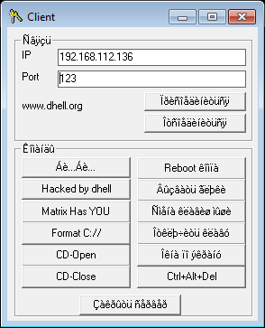

# Project1 - Backdoor.Win32.Freeze.b-da0c2c7bdfbb96dcbe3275bd56b946a80f852962b43564760185c41bf8603e3b.exe
## Informations
| Label | Value |
| :--- | ---: |
| Executable Name | Backdoor.Win32.Freeze.b-da0c2c7bdfbb96dcbe3275bd56b946a80f852962b43564760185c41bf8603e3b.exe |
| Product Name | Project1 |
| Version Number | 1.00 |
| Description |  |
| Company Name | Павел Николаевич |
| Copyright |  |
| Trademarks |  |
| Last Edition | 2012-06-14 09:44:10 |
| Size | 49152 |
| SHA1 🔎 | [C8D31B1BD3E8F2B177C7AE48ABFB1CF7B79C6066](https://www.virustotal.com/gui/search/C8D31B1BD3E8F2B177C7AE48ABFB1CF7B79C6066) |
| Language | English (United States) |
## Static Analysis
<details>
<summary>Manalyze</summary>
<p>

```

* Manalyze 0.9 *

-------------------------------------------------------------------------------
C:/Users/IEUser/Desktop/net6.0/Malwares/Backdoor.Win32.Freeze.b-da0c2c7bdfbb96dcbe3275bd56b946a80f852962b43564760185c41bf8603e3b.exe
-------------------------------------------------------------------------------

Summary:
--------
Architecture:       IMAGE_FILE_MACHINE_I386
Subsystem:          IMAGE_SUBSYSTEM_WINDOWS_GUI
Compilation Date:   2002-Apr-30 08:58:32
Detected languages: English - United States
CompanyName:        Павел Николаевич
ProductName:        Project1
FileVersion:        1.00
ProductVersion:     1.00
InternalName:       MyCenter
OriginalFilename:   MyCenter.exe

DOS Header:
-----------
e_magic:    MZ
e_cblp:     0x0090
e_cp:       0x0003
e_crlc:     0x0000
e_cparhdr:  0x0004
e_minalloc: 0x0000
e_maxalloc: 0xFFFF
e_ss:       0x0000
e_sp:       0x00B8
e_csum:     0x0000
e_ip:       0x0000
e_cs:       0x0000
e_ovno:     0x0000
e_oemid:    0x0000
e_oeminfo:  0x0000
e_lfanew:   0x000000C0

PE Header:
----------
Signature:            PE
Machine:              IMAGE_FILE_MACHINE_I386
NumberofSections:     3
TimeDateStamp:        2002-Apr-30 08:58:32
PointerToSymbolTable: 0x00000000
NumberOfSymbols:      0
SizeOfOptionalHeader: 0x00E0
Characteristics:      IMAGE_FILE_32BIT_MACHINE
                      IMAGE_FILE_EXECUTABLE_IMAGE
                      IMAGE_FILE_LINE_NUMS_STRIPPED
                      IMAGE_FILE_LOCAL_SYMS_STRIPPED
                      IMAGE_FILE_RELOCS_STRIPPED

Image Optional Header:
----------------------
Magic:                   PE32
LinkerVersion:           6.0
SizeOfCode:              0x00007000
SizeOfInitializedData:   0x00004000
SizeOfUninitializedData: 0x00000000
AddressOfEntryPoint:     0x000012AC (Section: .text)
BaseOfCode:              0x00001000
BaseOfData:              0x00008000
ImageBase:               0x00400000
SectionAlignment:        0x00001000
FileAlignment:           0x00001000
OperatingSystemVersion:  4.0
ImageVersion:            1.0
SubsystemVersion:        4.0
Win32VersionValue:       0
SizeOfImage:             0x0000C000
SizeOfHeaders:           0x00001000
Checksum:                0x0000D39F
Subsystem:               IMAGE_SUBSYSTEM_WINDOWS_GUI
SizeofStackReserve:      0x00100000
SizeofStackCommit:       0x00001000
SizeofHeapReserve:       0x00100000
SizeofHeapCommit:        0x00001000
LoaderFlags:             0x00000000
NumberOfRvaAndSizes:     16

Sections:
---------
.text:
    VirtualSize:          0x000060B8
    VirtualAddress:       0x00001000
    SizeOfRawData:        0x00007000
    PointerToRawData:     0x00001000
    PointerToRelocations: 0x00000000
    PointerToLineNumbers: 0x00000000
    NumberOfLineNumbers:  0
    NumberOfRelocations:  0
    Characteristics:      IMAGE_SCN_CNT_CODE
                          IMAGE_SCN_MEM_EXECUTE
                          IMAGE_SCN_MEM_READ
    Entropy:              4.54951

.data:
    VirtualSize:          0x00000AB0
    VirtualAddress:       0x00008000
    SizeOfRawData:        0x00001000
    PointerToRawData:     0x00008000
    PointerToRelocations: 0x00000000
    PointerToLineNumbers: 0x00000000
    NumberOfLineNumbers:  0
    NumberOfRelocations:  0
    Characteristics:      IMAGE_SCN_CNT_INITIALIZED_DATA
                          IMAGE_SCN_MEM_READ
                          IMAGE_SCN_MEM_WRITE
    Entropy:              0

.rsrc:
    VirtualSize:          0x00002B94
    VirtualAddress:       0x00009000
    SizeOfRawData:        0x00003000
    PointerToRawData:     0x00009000
    PointerToRelocations: 0x00000000
    PointerToLineNumbers: 0x00000000
    NumberOfLineNumbers:  0
    NumberOfRelocations:  0
    Characteristics:      IMAGE_SCN_CNT_INITIALIZED_DATA
                          IMAGE_SCN_MEM_READ
    Entropy:              3.74547


Imports:
--------
MSVBVM60.DLL: _CIcos
              _adj_fptan
              __vbaFreeVar
              __vbaLateIdCall
              __vbaStrVarMove
              _adj_fdiv_m64
              __vbaFreeObjList
              _adj_fprem1
              __vbaHresultCheckObj
              _adj_fdiv_m32
              __vbaObjSet
              _adj_fdiv_m16i
              _adj_fdivr_m16i
              _CIsin
              __vbaChkstk
              EVENT_SINK_AddRef
              DllFunctionCall
              _adj_fpatan
              __vbaLateIdCallLd
              EVENT_SINK_Release
              _CIsqrt
              EVENT_SINK_QueryInterface
              __vbaExceptHandler
              _adj_fprem
              _adj_fdivr_m64
              __vbaFPException
              __vbaI2Var
              _CIlog
              _adj_fdiv_m32i
              _adj_fdivr_m32i
              __vbaI4Str
              _adj_fdivr_m32
              _adj_fdiv_r
              #100
              _CIatan
              __vbaStrMove
              _allmul
              __vbaLateIdSt
              _CItan
              _CIexp
              __vbaFreeObj
              __vbaFreeStr

Resources:
----------
30001:
    Type:          RT_ICON
    Language:      UNKNOWN
    Codepage:      Unicode (UTF 16LE)
    Size:          3752
    TimeDateStamp: 2002-Apr-30 08:58:32
    Entropy:       3.42506

30002:
    Type:          RT_ICON
    Language:      UNKNOWN
    Codepage:      Unicode (UTF 16LE)
    Size:          2216
    TimeDateStamp: 2002-Apr-30 08:58:32
    Entropy:       3.48479

30003:
    Type:          RT_ICON
    Language:      UNKNOWN
    Codepage:      Unicode (UTF 16LE)
    Size:          1384
    TimeDateStamp: 2002-Apr-30 08:58:32
    Entropy:       3.15983

30004:
    Type:          RT_ICON
    Language:      UNKNOWN
    Codepage:      Unicode (UTF 16LE)
    Size:          296
    TimeDateStamp: 2002-Apr-30 08:58:32
    Entropy:       2.85882

30005:
    Type:          RT_ICON
    Language:      UNKNOWN
    Codepage:      Unicode (UTF 16LE)
    Size:          744
    TimeDateStamp: 2002-Apr-30 08:58:32
    Entropy:       3.36144

30006:
    Type:          RT_ICON
    Language:      UNKNOWN
    Codepage:      Unicode (UTF 16LE)
    Size:          1640
    TimeDateStamp: 2002-Apr-30 08:58:32
    Entropy:       3.18188

1:
    Type:              RT_GROUP_ICON
    Language:          UNKNOWN
    Codepage:          Unicode (UTF 16LE)
    Size:              92
    TimeDateStamp:     2002-Apr-30 08:58:32
    Entropy:           3.26218
    Detected Filetype: Icon file

1 (#2):
    Type:          RT_VERSION
    Language:      English - United States
    Codepage:      Unicode (UTF 16LE)
    Size:          552
    TimeDateStamp: 2002-Apr-30 08:58:32
    Entropy:       3.35141


Version Info:
-------------
Resource LangID: English - United States
VS_VERSION_INFO:
    Signature:           0xFEEF04BD
    StructVersion:       0x00010000
    FileVersion:         1.0.0.0
    ProductVersion:      1.0.0.0
    FileFlags:           (EMPTY)
    FileOs:              VOS_DOS_WINDOWS32
                         VOS_NT_WINDOWS32
                         VOS__WINDOWS32
    FileType:            VFT_APP
    Language:            English - United States
    CompanyName:         Павел Николаевич
    ProductName:         Project1
    FileVersion (#2):    1.00
    ProductVersion (#2): 1.00
    InternalName:        MyCenter
    OriginalFilename:    MyCenter.exe


RICH Header:
------------
XOR Key:          0x88AA2A9D
Unmarked objects: 0
14 (7299):        1
9 (8041):         2
13 (8169):        1

Matching compiler(s):
    Microsoft Visual Basic v5.0/v6.0
    Microsoft Visual Basic v5.0 - v6.0
    Microsoft Visual Basic v6.0

[ SUSPICIOUS ] Strings found in the binary may indicate undesirable behavior:
    Miscellaneous malware strings:
        BACKDOOR
        VIRUS
    Contains domain names:
        dhell.org
        www.dhell.org

The following exploit mitigation techniques have been detected
    Stack Canary: disabled
    SafeSEH: disabled
    ASLR: disabled
    DEP: disabled
    CFG: disabled


```

</p>
</details>

## Screenshots
### Client
 
