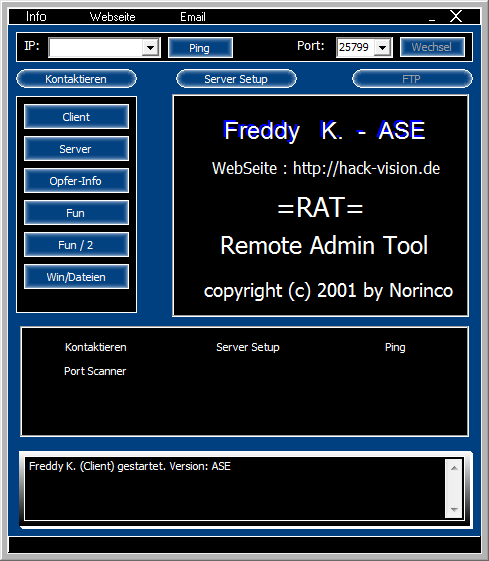
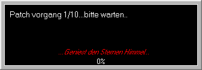

#  - Backdoor.Win32.Freddy.2001-aa304370f1e371a42147fa5dbf66b44a9cb5d44b9029ad466a24632370a15e5b.exe
## Informations
| Label | Value |
| :--- | ---: |
| Executable Name | Backdoor.Win32.Freddy.2001-aa304370f1e371a42147fa5dbf66b44a9cb5d44b9029ad466a24632370a15e5b.exe |
| Product Name |  |
| Version Number | 1.0.0.86 |
| Description |  |
| Company Name | Norinco |
| Copyright | Windooooooof |
| Trademarks |  |
| Last Edition | 14/06/2012 09:44:10 |
| Size | 2937856 |
| SHA1 🔎 | [CC315D9D3830F8924196BB30A03001C5C6B4C300](https://www.virustotal.com/gui/search/CC315D9D3830F8924196BB30A03001C5C6B4C300) |
| Language | German (Germany) |
## Static Analysis
<details>
<summary>Manalyze</summary>
<p>

```

* Manalyze 0.9 *

-------------------------------------------------------------------------------
C:/Users/IEUser/Desktop/net6.0/Malwares/Backdoor.Win32.Freddy.2001-aa304370f1e371a42147fa5dbf66b44a9cb5d44b9029ad466a24632370a15e5b.exe
-------------------------------------------------------------------------------

Summary:
--------
Architecture:       IMAGE_FILE_MACHINE_I386
Subsystem:          IMAGE_SUBSYSTEM_WINDOWS_GUI
Compilation Date:   1992-Jun-19 22:22:17
Detected languages: French - France
                    German - Germany
                    Russian - Russia
CompanyName:        Norinco
FileDescription:    
FileVersion:        1.0.0.86
InternalName:       Freddy K
LegalCopyright:     Windooooooof
LegalTrademarks:    
OriginalFilename:   
ProductName:        
ProductVersion:     ASE
Comments:           XXX

DOS Header:
-----------
e_magic:    MZ
e_cblp:     0x0050
e_cp:       0x0002
e_crlc:     0x0000
e_cparhdr:  0x0004
e_minalloc: 0x000F
e_maxalloc: 0xFFFF
e_ss:       0x0000
e_sp:       0x00B8
e_csum:     0x0000
e_ip:       0x0000
e_cs:       0x0000
e_ovno:     0x001A
e_oemid:    0x0000
e_oeminfo:  0x0000
e_lfanew:   0x00000100

PE Header:
----------
Signature:            PE
Machine:              IMAGE_FILE_MACHINE_I386
NumberofSections:     8
TimeDateStamp:        1992-Jun-19 22:22:17
PointerToSymbolTable: 0x00000000
NumberOfSymbols:      0
SizeOfOptionalHeader: 0x00E0
Characteristics:      IMAGE_FILE_32BIT_MACHINE
                      IMAGE_FILE_BYTES_REVERSED_HI
                      IMAGE_FILE_BYTES_REVERSED_LO
                      IMAGE_FILE_EXECUTABLE_IMAGE
                      IMAGE_FILE_LINE_NUMS_STRIPPED
                      IMAGE_FILE_LOCAL_SYMS_STRIPPED
                      IMAGE_FILE_RELOCS_STRIPPED

Image Optional Header:
----------------------
Magic:                   PE32
LinkerVersion:           2.0
SizeOfCode:              0x00103000
SizeOfInitializedData:   0x001CA000
SizeOfUninitializedData: 0x00000000
AddressOfEntryPoint:     0x00103DB0 (Section: CODE)
BaseOfCode:              0x00001000
BaseOfData:              0x00104000
ImageBase:               0x00400000
SectionAlignment:        0x00001000
FileAlignment:           0x00000200
OperatingSystemVersion:  1.0
ImageVersion:            0.0
SubsystemVersion:        4.0
Win32VersionValue:       0
SizeOfImage:             0x002E4000
SizeOfHeaders:           0x00001000
Checksum:                0x00000000
Subsystem:               IMAGE_SUBSYSTEM_WINDOWS_GUI
SizeofStackReserve:      0x00100000
SizeofStackCommit:       0x00004000
SizeofHeapReserve:       0x00100000
SizeofHeapCommit:        0x00001000
LoaderFlags:             0x00000000
NumberOfRvaAndSizes:     16

Sections:
---------
CODE:
    VirtualSize:          0x00102F60
    VirtualAddress:       0x00001000
    SizeOfRawData:        0x00103000
    PointerToRawData:     0x00000400
    PointerToRelocations: 0x00000000
    PointerToLineNumbers: 0x00000000
    NumberOfLineNumbers:  0
    NumberOfRelocations:  0
    Characteristics:      IMAGE_SCN_CNT_CODE
                          IMAGE_SCN_MEM_EXECUTE
                          IMAGE_SCN_MEM_READ
    Entropy:              6.51591

DATA:
    VirtualSize:          0x0000CF80
    VirtualAddress:       0x00104000
    SizeOfRawData:        0x0000D000
    PointerToRawData:     0x00103400
    PointerToRelocations: 0x00000000
    PointerToLineNumbers: 0x00000000
    NumberOfLineNumbers:  0
    NumberOfRelocations:  0
    Characteristics:      IMAGE_SCN_CNT_INITIALIZED_DATA
                          IMAGE_SCN_MEM_READ
                          IMAGE_SCN_MEM_WRITE
    Entropy:              2.09387

BSS:
    VirtualSize:          0x000126ED
    VirtualAddress:       0x00111000
    SizeOfRawData:        0x00000000
    PointerToRawData:     0x00110400
    PointerToRelocations: 0x00000000
    PointerToLineNumbers: 0x00000000
    NumberOfLineNumbers:  0
    NumberOfRelocations:  0
    Characteristics:      IMAGE_SCN_MEM_READ
                          IMAGE_SCN_MEM_WRITE

.idata:
    VirtualSize:          0x00002A06
    VirtualAddress:       0x00124000
    SizeOfRawData:        0x00002C00
    PointerToRawData:     0x00110400
    PointerToRelocations: 0x00000000
    PointerToLineNumbers: 0x00000000
    NumberOfLineNumbers:  0
    NumberOfRelocations:  0
    Characteristics:      IMAGE_SCN_CNT_INITIALIZED_DATA
                          IMAGE_SCN_MEM_READ
                          IMAGE_SCN_MEM_WRITE
    Entropy:              4.82505

.tls:
    VirtualSize:          0x00000014
    VirtualAddress:       0x00127000
    SizeOfRawData:        0x00000000
    PointerToRawData:     0x00113000
    PointerToRelocations: 0x00000000
    PointerToLineNumbers: 0x00000000
    NumberOfLineNumbers:  0
    NumberOfRelocations:  0
    Characteristics:      IMAGE_SCN_MEM_READ
                          IMAGE_SCN_MEM_WRITE

.rdata:
    VirtualSize:          0x00000018
    VirtualAddress:       0x00128000
    SizeOfRawData:        0x00000200
    PointerToRawData:     0x00113000
    PointerToRelocations: 0x00000000
    PointerToLineNumbers: 0x00000000
    NumberOfLineNumbers:  0
    NumberOfRelocations:  0
    Characteristics:      IMAGE_SCN_CNT_INITIALIZED_DATA
                          IMAGE_SCN_MEM_READ
                          IMAGE_SCN_MEM_SHARED
    Entropy:              0.20692

.reloc:
    VirtualSize:          0x000104CC
    VirtualAddress:       0x00129000
    SizeOfRawData:        0x00010600
    PointerToRawData:     0x00113200
    PointerToRelocations: 0x00000000
    PointerToLineNumbers: 0x00000000
    NumberOfLineNumbers:  0
    NumberOfRelocations:  0
    Characteristics:      IMAGE_SCN_CNT_INITIALIZED_DATA
                          IMAGE_SCN_MEM_READ
                          IMAGE_SCN_MEM_SHARED
    Entropy:              0

.rsrc:
    VirtualSize:          0x001A9C00
    VirtualAddress:       0x0013A000
    SizeOfRawData:        0x001A9C00
    PointerToRawData:     0x00123800
    PointerToRelocations: 0x00000000
    PointerToLineNumbers: 0x00000000
    NumberOfLineNumbers:  0
    NumberOfRelocations:  0
    Characteristics:      IMAGE_SCN_CNT_INITIALIZED_DATA
                          IMAGE_SCN_MEM_READ
                          IMAGE_SCN_MEM_SHARED
    Entropy:              6.42851


Imports:
--------
KERNEL32.DLL:      lstrcpyA
                   lstrcmpA
                   WritePrivateProfileStringA
                   WriteFile
                   WinExec
                   WaitForSingleObject
                   VirtualQuery
                   VirtualAlloc
                   SuspendThread
                   Sleep
                   SizeofResource
                   SetThreadLocale
                   SetFilePointer
                   SetEvent
                   SetErrorMode
                   SetEndOfFile
                   ResumeThread
                   ReadFile
                   QueryPerformanceFrequency
                   QueryPerformanceCounter
                   OutputDebugStringA
                   MultiByteToWideChar
                   MulDiv
                   LockResource
                   LoadResource
                   LoadLibraryA
                   LeaveCriticalSection
                   InitializeCriticalSection
                   GlobalUnlock
                   GlobalReAlloc
                   GlobalHandle
                   GlobalLock
                   GlobalFree
                   GlobalDeleteAtom
                   GlobalAlloc
                   GlobalAddAtomA
                   GetVersionExA
                   GetVersion
                   GetTimeZoneInformation
                   GetTickCount
                   GetThreadLocale
                   GetTempPathA
                   GetTempFileNameA
                   GetSystemInfo
                   GetShortPathNameA
                   GetProcAddress
                   GetPrivateProfileStringA
                   GetModuleHandleA
                   GetModuleFileNameA
                   GetLocaleInfoA
                   GetLocalTime
                   GetLastError
                   GetFullPathNameA
                   GetFileSize
                   GetFileAttributesA
                   GetExitCodeThread
                   GetDiskFreeSpaceA
                   GetDateFormatA
                   GetCurrentThreadId
                   GetCurrentProcessId
                   GetCPInfo
                   FreeResource
                   FreeLibrary
                   FormatMessageA
                   FindResourceA
                   FindNextFileA
                   FindFirstFileA
                   FindClose
                   FileTimeToLocalFileTime
                   FileTimeToDosDateTime
                   EnumCalendarInfoA
                   EnterCriticalSection
                   DeleteFileA
                   DeleteCriticalSection
                   CreateThread
                   CreateFileA
                   CreateEventA
                   CreateDirectoryA
                   CompareStringA
                   CloseHandle
KERNEL32.DLL (#2): lstrcpyA
                   lstrcmpA
                   WritePrivateProfileStringA
                   WriteFile
                   WinExec
                   WaitForSingleObject
                   VirtualQuery
                   VirtualAlloc
                   SuspendThread
                   Sleep
                   SizeofResource
                   SetThreadLocale
                   SetFilePointer
                   SetEvent
                   SetErrorMode
                   SetEndOfFile
                   ResumeThread
                   ReadFile
                   QueryPerformanceFrequency
                   QueryPerformanceCounter
                   OutputDebugStringA
                   MultiByteToWideChar
                   MulDiv
                   LockResource
                   LoadResource
                   LoadLibraryA
                   LeaveCriticalSection
                   InitializeCriticalSection
                   GlobalUnlock
                   GlobalReAlloc
                   GlobalHandle
                   GlobalLock
                   GlobalFree
                   GlobalDeleteAtom
                   GlobalAlloc
                   GlobalAddAtomA
                   GetVersionExA
                   GetVersion
                   GetTimeZoneInformation
                   GetTickCount
                   GetThreadLocale
                   GetTempPathA
                   GetTempFileNameA
                   GetSystemInfo
                   GetShortPathNameA
                   GetProcAddress
                   GetPrivateProfileStringA
                   GetModuleHandleA
                   GetModuleFileNameA
                   GetLocaleInfoA
                   GetLocalTime
                   GetLastError
                   GetFullPathNameA
                   GetFileSize
                   GetFileAttributesA
                   GetExitCodeThread
                   GetDiskFreeSpaceA
                   GetDateFormatA
                   GetCurrentThreadId
                   GetCurrentProcessId
                   GetCPInfo
                   FreeResource
                   FreeLibrary
                   FormatMessageA
                   FindResourceA
                   FindNextFileA
                   FindFirstFileA
                   FindClose
                   FileTimeToLocalFileTime
                   FileTimeToDosDateTime
                   EnumCalendarInfoA
                   EnterCriticalSection
                   DeleteFileA
                   DeleteCriticalSection
                   CreateThread
                   CreateFileA
                   CreateEventA
                   CreateDirectoryA
                   CompareStringA
                   CloseHandle
KERNEL32.DLL (#3): lstrcpyA
                   lstrcmpA
                   WritePrivateProfileStringA
                   WriteFile
                   WinExec
                   WaitForSingleObject
                   VirtualQuery
                   VirtualAlloc
                   SuspendThread
                   Sleep
                   SizeofResource
                   SetThreadLocale
                   SetFilePointer
                   SetEvent
                   SetErrorMode
                   SetEndOfFile
                   ResumeThread
                   ReadFile
                   QueryPerformanceFrequency
                   QueryPerformanceCounter
                   OutputDebugStringA
                   MultiByteToWideChar
                   MulDiv
                   LockResource
                   LoadResource
                   LoadLibraryA
                   LeaveCriticalSection
                   InitializeCriticalSection
                   GlobalUnlock
                   GlobalReAlloc
                   GlobalHandle
                   GlobalLock
                   GlobalFree
                   GlobalDeleteAtom
                   GlobalAlloc
                   GlobalAddAtomA
                   GetVersionExA
                   GetVersion
                   GetTimeZoneInformation
                   GetTickCount
                   GetThreadLocale
                   GetTempPathA
                   GetTempFileNameA
                   GetSystemInfo
                   GetShortPathNameA
                   GetProcAddress
                   GetPrivateProfileStringA
                   GetModuleHandleA
                   GetModuleFileNameA
                   GetLocaleInfoA
                   GetLocalTime
                   GetLastError
                   GetFullPathNameA
                   GetFileSize
                   GetFileAttributesA
                   GetExitCodeThread
                   GetDiskFreeSpaceA
                   GetDateFormatA
                   GetCurrentThreadId
                   GetCurrentProcessId
                   GetCPInfo
                   FreeResource
                   FreeLibrary
                   FormatMessageA
                   FindResourceA
                   FindNextFileA
                   FindFirstFileA
                   FindClose
                   FileTimeToLocalFileTime
                   FileTimeToDosDateTime
                   EnumCalendarInfoA
                   EnterCriticalSection
                   DeleteFileA
                   DeleteCriticalSection
                   CreateThread
                   CreateFileA
                   CreateEventA
                   CreateDirectoryA
                   CompareStringA
                   CloseHandle
advapi32.dll:      RegSetValueExA
                   RegQueryValueExA
                   RegQueryInfoKeyA
                   RegOpenKeyExA
                   RegFlushKey
                   RegEnumValueA
                   RegEnumKeyExA
                   RegDeleteValueA
                   RegDeleteKeyA
                   RegCreateKeyExA
                   RegCloseKey
advapi32.dll (#2): RegSetValueExA
                   RegQueryValueExA
                   RegQueryInfoKeyA
                   RegOpenKeyExA
                   RegFlushKey
                   RegEnumValueA
                   RegEnumKeyExA
                   RegDeleteValueA
                   RegDeleteKeyA
                   RegCreateKeyExA
                   RegCloseKey
comctl32.dll:      ImageList_SetIconSize
                   ImageList_GetIconSize
                   ImageList_Write
                   ImageList_Read
                   ImageList_GetDragImage
                   ImageList_DragShowNolock
                   ImageList_SetDragCursorImage
                   ImageList_DragMove
                   ImageList_DragLeave
                   ImageList_DragEnter
                   ImageList_EndDrag
                   ImageList_BeginDrag
                   ImageList_GetIcon
                   ImageList_Remove
                   ImageList_DrawEx
                   ImageList_Replace
                   ImageList_Draw
                   ImageList_GetBkColor
                   ImageList_SetBkColor
                   ImageList_ReplaceIcon
                   ImageList_Add
                   ImageList_GetImageCount
                   ImageList_Destroy
                   ImageList_Create
                   InitCommonControls
comdlg32.dll:      GetSaveFileNameA
                   GetOpenFileNameA
gdi32.dll:         UnrealizeObject
                   StretchBlt
                   SetWindowOrgEx
                   SetWinMetaFileBits
                   SetViewportOrgEx
                   SetTextColor
                   SetStretchBltMode
                   SetROP2
                   SetPixel
                   SetMapMode
                   SetEnhMetaFileBits
                   SetDIBColorTable
                   SetBrushOrgEx
                   SetBkMode
                   SetBkColor
                   SelectPalette
                   SelectObject
                   SelectClipRgn
                   SaveDC
                   RoundRect
                   RestoreDC
                   Rectangle
                   RectVisible
                   RectInRegion
                   RealizePalette
                   PtInRegion
                   Polyline
                   Polygon
                   PlayEnhMetaFile
                   PatBlt
                   OffsetRgn
                   MoveToEx
                   MaskBlt
                   LineTo
                   LPtoDP
                   IntersectClipRect
                   GetWindowOrgEx
                   GetWinMetaFileBits
                   GetViewportOrgEx
                   GetTextMetricsA
                   GetTextExtentPointA
                   GetTextExtentPoint32A
                   GetSystemPaletteEntries
                   GetStockObject
                   GetPixel
                   GetPaletteEntries
                   GetObjectA
                   GetMapMode
                   GetEnhMetaFilePaletteEntries
                   GetEnhMetaFileHeader
                   GetEnhMetaFileBits
                   GetDeviceCaps
                   GetDIBits
                   GetDIBColorTable
                   GetDCOrgEx
                   GetCurrentPositionEx
                   GetClipBox
                   GetBrushOrgEx
                   GetBitmapBits
                   GdiFlush
                   FillRgn
                   ExtTextOutA
                   ExcludeClipRect
                   Ellipse
                   DeleteObject
                   DeleteEnhMetaFile
                   DeleteDC
                   DPtoLP
                   CreateSolidBrush
                   CreateRoundRectRgn
                   CreateRectRgnIndirect
                   CreateRectRgn
                   CreatePolygonRgn
                   CreatePenIndirect
                   CreatePalette
                   CreateHalftonePalette
                   CreateFontIndirectA
                   CreateEllipticRgn
                   CreateDIBitmap
                   CreateDIBSection
                   CreateCompatibleDC
                   CreateCompatibleBitmap
                   CreateBrushIndirect
                   CreateBitmap
                   CopyEnhMetaFileA
                   CombineRgn
                   BitBlt
ole32.dll:         CoUninitialize
                   CoInitialize
                   IsEqualGUID
oleaut32.dll:      GetErrorInfo
                   SysFreeString
oleaut32.dll (#2): GetErrorInfo
                   SysFreeString
shell32.dll:       Shell_NotifyIconA
                   ShellExecuteA
user32.dll:        WindowFromPoint
                   WinHelpA
                   WaitMessage
                   UpdateWindow
                   UnregisterClassA
                   UnionRect
                   UnhookWindowsHookEx
                   TranslateMessage
                   TranslateMDISysAccel
                   TrackPopupMenu
                   SystemParametersInfoA
                   ShowWindow
                   ShowScrollBar
                   ShowOwnedPopups
                   ShowCursor
                   ShowCaret
                   SetWindowRgn
                   SetWindowsHookExA
                   SetWindowTextA
                   SetWindowPos
                   SetWindowPlacement
                   SetWindowLongA
                   SetTimer
                   SetScrollRange
                   SetScrollPos
                   SetScrollInfo
                   SetRect
                   SetPropA
                   SetParent
                   SetMenuItemInfoA
                   SetMenu
                   SetKeyboardState
                   SetForegroundWindow
                   SetFocus
                   SetCursor
                   SetClipboardData
                   SetClassLongA
                   SetCapture
                   SetActiveWindow
                   SendMessageA
                   ScrollWindow
                   ScreenToClient
                   RemovePropA
                   RemoveMenu
                   ReleaseDC
                   ReleaseCapture
                   RegisterWindowMessageA
                   RegisterClipboardFormatA
                   RegisterClassA
                   RedrawWindow
                   PtInRect
                   PostQuitMessage
                   PostMessageA
                   PeekMessageA
                   OpenClipboard
                   OffsetRect
                   OemToCharA
                   MsgWaitForMultipleObjects
                   MessageBoxA
                   MessageBeep
                   MapWindowPoints
                   MapVirtualKeyA
                   LoadStringA
                   LoadKeyboardLayoutA
                   LoadImageA
                   LoadIconA
                   LoadCursorA
                   LoadBitmapA
                   KillTimer
                   IsZoomed
                   IsWindowVisible
                   IsWindowEnabled
                   IsWindow
                   IsRectEmpty
                   IsIconic
                   IsDialogMessageA
                   IsChild
                   IsCharAlphaNumericA
                   IsCharAlphaA
                   InvalidateRect
                   IntersectRect
                   InsertMenuItemA
                   InsertMenuA
                   InflateRect
                   HideCaret
                   GetWindowThreadProcessId
                   GetWindowTextA
                   GetWindowRgn
                   GetWindowRect
                   GetWindowPlacement
                   GetWindowLongA
                   GetWindowDC
                   GetTopWindow
                   GetSystemMetrics
                   GetSystemMenu
                   GetSysColor
                   GetSubMenu
                   GetScrollRange
                   GetScrollPos
                   GetScrollInfo
                   GetPropA
                   GetParent
                   GetWindow
                   GetMenuStringA
                   GetMenuState
                   GetMenuItemInfoA
                   GetMenuItemID
                   GetMenuItemCount
                   GetMenu
                   GetLastActivePopup
                   GetKeyboardState
                   GetKeyboardLayoutList
                   GetKeyboardLayout
                   GetKeyState
                   GetKeyNameTextA
                   GetIconInfo
                   GetForegroundWindow
                   GetFocus
                   GetDlgItem
                   GetDesktopWindow
                   GetDCEx
                   GetDC
                   GetCursorPos
                   GetCursor
                   GetClipboardData
                   GetClientRect
                   GetClassInfoA
                   GetCapture
                   GetActiveWindow
                   FrameRect
                   FindWindowA
                   FillRect
                   EqualRect
                   EnumWindows
                   EnumThreadWindows
                   EnumClipboardFormats
                   EndPaint
                   EndDeferWindowPos
                   EnableWindow
                   EnableScrollBar
                   EnableMenuItem
                   EmptyClipboard
                   DrawTextA
                   DrawMenuBar
                   DrawIconEx
                   DrawIcon
                   DrawFrameControl
                   DrawFocusRect
                   DrawEdge
                   DispatchMessageA
                   DestroyWindow
                   DestroyMenu
                   DestroyIcon
                   DestroyCursor
                   DeleteMenu
                   DeferWindowPos
                   DefWindowProcA
                   DefMDIChildProcA
                   DefFrameProcA
                   CreateWindowExA
                   CreatePopupMenu
                   CreateMenu
                   CreateIcon
                   CopyImage
                   CloseClipboard
                   ClientToScreen
                   CheckMenuItem
                   CallWindowProcA
                   CallNextHookEx
                   BeginPaint
                   BeginDeferWindowPos
                   CharNextA
                   CharLowerBuffA
                   CharLowerA
                   CharUpperBuffA
                   AdjustWindowRectEx
                   ActivateKeyboardLayout
user32.dll (#2):   WindowFromPoint
                   WinHelpA
                   WaitMessage
                   UpdateWindow
                   UnregisterClassA
                   UnionRect
                   UnhookWindowsHookEx
                   TranslateMessage
                   TranslateMDISysAccel
                   TrackPopupMenu
                   SystemParametersInfoA
                   ShowWindow
                   ShowScrollBar
                   ShowOwnedPopups
                   ShowCursor
                   ShowCaret
                   SetWindowRgn
                   SetWindowsHookExA
                   SetWindowTextA
                   SetWindowPos
                   SetWindowPlacement
                   SetWindowLongA
                   SetTimer
                   SetScrollRange
                   SetScrollPos
                   SetScrollInfo
                   SetRect
                   SetPropA
                   SetParent
                   SetMenuItemInfoA
                   SetMenu
                   SetKeyboardState
                   SetForegroundWindow
                   SetFocus
                   SetCursor
                   SetClipboardData
                   SetClassLongA
                   SetCapture
                   SetActiveWindow
                   SendMessageA
                   ScrollWindow
                   ScreenToClient
                   RemovePropA
                   RemoveMenu
                   ReleaseDC
                   ReleaseCapture
                   RegisterWindowMessageA
                   RegisterClipboardFormatA
                   RegisterClassA
                   RedrawWindow
                   PtInRect
                   PostQuitMessage
                   PostMessageA
                   PeekMessageA
                   OpenClipboard
                   OffsetRect
                   OemToCharA
                   MsgWaitForMultipleObjects
                   MessageBoxA
                   MessageBeep
                   MapWindowPoints
                   MapVirtualKeyA
                   LoadStringA
                   LoadKeyboardLayoutA
                   LoadImageA
                   LoadIconA
                   LoadCursorA
                   LoadBitmapA
                   KillTimer
                   IsZoomed
                   IsWindowVisible
                   IsWindowEnabled
                   IsWindow
                   IsRectEmpty
                   IsIconic
                   IsDialogMessageA
                   IsChild
                   IsCharAlphaNumericA
                   IsCharAlphaA
                   InvalidateRect
                   IntersectRect
                   InsertMenuItemA
                   InsertMenuA
                   InflateRect
                   HideCaret
                   GetWindowThreadProcessId
                   GetWindowTextA
                   GetWindowRgn
                   GetWindowRect
                   GetWindowPlacement
                   GetWindowLongA
                   GetWindowDC
                   GetTopWindow
                   GetSystemMetrics
                   GetSystemMenu
                   GetSysColor
                   GetSubMenu
                   GetScrollRange
                   GetScrollPos
                   GetScrollInfo
                   GetPropA
                   GetParent
                   GetWindow
                   GetMenuStringA
                   GetMenuState
                   GetMenuItemInfoA
                   GetMenuItemID
                   GetMenuItemCount
                   GetMenu
                   GetLastActivePopup
                   GetKeyboardState
                   GetKeyboardLayoutList
                   GetKeyboardLayout
                   GetKeyState
                   GetKeyNameTextA
                   GetIconInfo
                   GetForegroundWindow
                   GetFocus
                   GetDlgItem
                   GetDesktopWindow
                   GetDCEx
                   GetDC
                   GetCursorPos
                   GetCursor
                   GetClipboardData
                   GetClientRect
                   GetClassInfoA
                   GetCapture
                   GetActiveWindow
                   FrameRect
                   FindWindowA
                   FillRect
                   EqualRect
                   EnumWindows
                   EnumThreadWindows
                   EnumClipboardFormats
                   EndPaint
                   EndDeferWindowPos
                   EnableWindow
                   EnableScrollBar
                   EnableMenuItem
                   EmptyClipboard
                   DrawTextA
                   DrawMenuBar
                   DrawIconEx
                   DrawIcon
                   DrawFrameControl
                   DrawFocusRect
                   DrawEdge
                   DispatchMessageA
                   DestroyWindow
                   DestroyMenu
                   DestroyIcon
                   DestroyCursor
                   DeleteMenu
                   DeferWindowPos
                   DefWindowProcA
                   DefMDIChildProcA
                   DefFrameProcA
                   CreateWindowExA
                   CreatePopupMenu
                   CreateMenu
                   CreateIcon
                   CopyImage
                   CloseClipboard
                   ClientToScreen
                   CheckMenuItem
                   CallWindowProcA
                   CallNextHookEx
                   BeginPaint
                   BeginDeferWindowPos
                   CharNextA
                   CharLowerBuffA
                   CharLowerA
                   CharUpperBuffA
                   AdjustWindowRectEx
                   ActivateKeyboardLayout
version.dll:       VerQueryValueA
                   GetFileVersionInfoSizeA
                   GetFileVersionInfoA
winmm.dll:         PlaySoundA
wsock32.dll:       WSACleanup
                   WSAStartup
                   WSAGetLastError
                   WSACancelAsyncRequest
                   WSAAsyncGetServByName
                   WSAAsyncGetHostByName
                   WSAAsyncSelect
                   getservbyname
                   gethostbyname
                   socket
                   setsockopt
                   send
                   recv
                   ntohs
                   listen
                   ioctlsocket
                   inet_ntoa
                   inet_addr
                   htons
                   getsockname
                   connect
                   closesocket
                   bind
                   accept

Resources:
----------
KL:
    Type:                   WAVE
    Language:               German - Germany
    Codepage:               UNKNOWN
    Size:                   1192
    TimeDateStamp:          2001-Oct-15 21:38:10
    Entropy:                5.15335
    Detected Filetype:      WAV Resource Interchange File Format
    Detected Filetype (#2): Windows animated cursor

1:
    Type:          RT_CURSOR
    Language:      UNKNOWN
    Codepage:      UNKNOWN
    Size:          308
    TimeDateStamp: 2001-Oct-15 21:38:10
    Entropy:       2.51103

2:
    Type:          RT_CURSOR
    Language:      UNKNOWN
    Codepage:      UNKNOWN
    Size:          308
    TimeDateStamp: 2001-Oct-15 21:38:10
    Entropy:       2.80231

3:
    Type:          RT_CURSOR
    Language:      UNKNOWN
    Codepage:      UNKNOWN
    Size:          308
    TimeDateStamp: 2001-Oct-15 21:38:10
    Entropy:       3.00046

4:
    Type:          RT_CURSOR
    Language:      UNKNOWN
    Codepage:      UNKNOWN
    Size:          308
    TimeDateStamp: 2001-Oct-15 21:38:10
    Entropy:       2.56318

5:
    Type:          RT_CURSOR
    Language:      UNKNOWN
    Codepage:      UNKNOWN
    Size:          308
    TimeDateStamp: 2001-Oct-15 21:38:10
    Entropy:       2.6949

6:
    Type:          RT_CURSOR
    Language:      UNKNOWN
    Codepage:      UNKNOWN
    Size:          308
    TimeDateStamp: 2001-Oct-15 21:38:10
    Entropy:       2.62527

7:
    Type:          RT_CURSOR
    Language:      UNKNOWN
    Codepage:      UNKNOWN
    Size:          308
    TimeDateStamp: 2001-Oct-15 21:38:10
    Entropy:       2.91604

8:
    Type:          RT_CURSOR
    Language:      UNKNOWN
    Codepage:      UNKNOWN
    Size:          308
    TimeDateStamp: 2001-Oct-15 21:38:10
    Entropy:       2.31558

9:
    Type:          RT_CURSOR
    Language:      UNKNOWN
    Codepage:      UNKNOWN
    Size:          308
    TimeDateStamp: 2001-Oct-15 21:38:10
    Entropy:       2.06473

10:
    Type:          RT_CURSOR
    Language:      UNKNOWN
    Codepage:      UNKNOWN
    Size:          308
    TimeDateStamp: 2001-Oct-15 21:38:10
    Entropy:       2.6633

BBABORT:
    Type:          RT_BITMAP
    Language:      UNKNOWN
    Codepage:      UNKNOWN
    Size:          464
    TimeDateStamp: 2001-Oct-15 21:38:10
    Entropy:       2.92079

BBALL:
    Type:          RT_BITMAP
    Language:      UNKNOWN
    Codepage:      UNKNOWN
    Size:          484
    TimeDateStamp: 2001-Oct-15 21:38:10
    Entropy:       3.16995

BBCANCEL:
    Type:          RT_BITMAP
    Language:      UNKNOWN
    Codepage:      UNKNOWN
    Size:          464
    TimeDateStamp: 2001-Oct-15 21:38:10
    Entropy:       2.92079

BBCLOSE:
    Type:          RT_BITMAP
    Language:      UNKNOWN
    Codepage:      UNKNOWN
    Size:          464
    TimeDateStamp: 2001-Oct-15 21:38:10
    Entropy:       3.68492

BBHELP:
    Type:          RT_BITMAP
    Language:      UNKNOWN
    Codepage:      UNKNOWN
    Size:          464
    TimeDateStamp: 2001-Oct-15 21:38:10
    Entropy:       2.88085

BBIGNORE:
    Type:          RT_BITMAP
    Language:      UNKNOWN
    Codepage:      UNKNOWN
    Size:          464
    TimeDateStamp: 2001-Oct-15 21:38:10
    Entropy:       3.29718

BBNO:
    Type:          RT_BITMAP
    Language:      UNKNOWN
    Codepage:      UNKNOWN
    Size:          464
    TimeDateStamp: 2001-Oct-15 21:38:10
    Entropy:       3.58804

BBOK:
    Type:          RT_BITMAP
    Language:      UNKNOWN
    Codepage:      UNKNOWN
    Size:          464
    TimeDateStamp: 2001-Oct-15 21:38:10
    Entropy:       2.67459

BBRETRY:
    Type:          RT_BITMAP
    Language:      UNKNOWN
    Codepage:      UNKNOWN
    Size:          464
    TimeDateStamp: 2001-Oct-15 21:38:10
    Entropy:       3.53344

BBYES:
    Type:          RT_BITMAP
    Language:      UNKNOWN
    Codepage:      UNKNOWN
    Size:          464
    TimeDateStamp: 2001-Oct-15 21:38:10
    Entropy:       2.67459

CDROM:
    Type:          RT_BITMAP
    Language:      UNKNOWN
    Codepage:      UNKNOWN
    Size:          192
    TimeDateStamp: 2001-Oct-15 21:38:10
    Entropy:       2.78825

CHECK_IMAGES:
    Type:          RT_BITMAP
    Language:      UNKNOWN
    Codepage:      UNKNOWN
    Size:          1976
    TimeDateStamp: 2001-Oct-15 21:38:10
    Entropy:       3.65043

CLOSEDFOLDER:
    Type:          RT_BITMAP
    Language:      UNKNOWN
    Codepage:      UNKNOWN
    Size:          224
    TimeDateStamp: 2001-Oct-15 21:38:10
    Entropy:       3.01477

CURRENTFOLDER:
    Type:          RT_BITMAP
    Language:      UNKNOWN
    Codepage:      UNKNOWN
    Size:          224
    TimeDateStamp: 2001-Oct-15 21:38:10
    Entropy:       2.97986

EXECUTABLE:
    Type:          RT_BITMAP
    Language:      UNKNOWN
    Codepage:      UNKNOWN
    Size:          224
    TimeDateStamp: 2001-Oct-15 21:38:10
    Entropy:       2.96393

FLATDOWN:
    Type:          RT_BITMAP
    Language:      UNKNOWN
    Codepage:      UNKNOWN
    Size:          124
    TimeDateStamp: 2001-Oct-15 21:38:10
    Entropy:       1.93994

FLATUP:
    Type:          RT_BITMAP
    Language:      UNKNOWN
    Codepage:      UNKNOWN
    Size:          124
    TimeDateStamp: 2001-Oct-15 21:38:10
    Entropy:       1.93994

FLOPPY:
    Type:          RT_BITMAP
    Language:      UNKNOWN
    Codepage:      UNKNOWN
    Size:          192
    TimeDateStamp: 2001-Oct-15 21:38:10
    Entropy:       2.63812

HARD:
    Type:          RT_BITMAP
    Language:      UNKNOWN
    Codepage:      UNKNOWN
    Size:          192
    TimeDateStamp: 2001-Oct-15 21:38:10
    Entropy:       2.62043

KNOWNFILE:
    Type:          RT_BITMAP
    Language:      UNKNOWN
    Codepage:      UNKNOWN
    Size:          224
    TimeDateStamp: 2001-Oct-15 21:38:10
    Entropy:       2.83217

KSE_CLOSE:
    Type:          RT_BITMAP
    Language:      UNKNOWN
    Codepage:      UNKNOWN
    Size:          232
    TimeDateStamp: 2001-Oct-15 21:38:10
    Entropy:       2.13328

KSE_MAXIMIZE:
    Type:          RT_BITMAP
    Language:      UNKNOWN
    Codepage:      UNKNOWN
    Size:          232
    TimeDateStamp: 2001-Oct-15 21:38:10
    Entropy:       2.1297

KSE_MINIMIZE:
    Type:          RT_BITMAP
    Language:      UNKNOWN
    Codepage:      UNKNOWN
    Size:          308
    TimeDateStamp: 2001-Oct-15 21:38:10
    Entropy:       1.96968

KSE_MOVE:
    Type:          RT_BITMAP
    Language:      UNKNOWN
    Codepage:      UNKNOWN
    Size:          232
    TimeDateStamp: 2001-Oct-15 21:38:10
    Entropy:       2.25869

KSE_RESTORE:
    Type:          RT_BITMAP
    Language:      UNKNOWN
    Codepage:      UNKNOWN
    Size:          232
    TimeDateStamp: 2001-Oct-15 21:38:10
    Entropy:       2.26783

KSE_ROLLUP:
    Type:          RT_BITMAP
    Language:      Russian - Russia
    Codepage:      UNKNOWN
    Size:          232
    TimeDateStamp: 2001-Oct-15 21:38:10
    Entropy:       1.87159

KSE_TRAY:
    Type:          RT_BITMAP
    Language:      Russian - Russia
    Codepage:      UNKNOWN
    Size:          232
    TimeDateStamp: 2001-Oct-15 21:38:10
    Entropy:       1.84331

KSR_SIZE:
    Type:          RT_BITMAP
    Language:      UNKNOWN
    Codepage:      UNKNOWN
    Size:          232
    TimeDateStamp: 2001-Oct-15 21:38:10
    Entropy:       2.10762

NETWORK:
    Type:          RT_BITMAP
    Language:      UNKNOWN
    Codepage:      UNKNOWN
    Size:          192
    TimeDateStamp: 2001-Oct-15 21:38:10
    Entropy:       2.73457

OPENFOLDER:
    Type:          RT_BITMAP
    Language:      UNKNOWN
    Codepage:      UNKNOWN
    Size:          224
    TimeDateStamp: 2001-Oct-15 21:38:10
    Entropy:       3.0519

PREVIEWGLYPH:
    Type:          RT_BITMAP
    Language:      UNKNOWN
    Codepage:      UNKNOWN
    Size:          232
    TimeDateStamp: 2001-Oct-15 21:38:10
    Entropy:       2.85172

RAM:
    Type:          RT_BITMAP
    Language:      UNKNOWN
    Codepage:      UNKNOWN
    Size:          192
    TimeDateStamp: 2001-Oct-15 21:38:10
    Entropy:       2.73213

THUMB_DOWN_DISABLED:
    Type:          RT_BITMAP
    Language:      UNKNOWN
    Codepage:      UNKNOWN
    Size:          1172
    TimeDateStamp: 2001-Oct-15 21:38:10
    Entropy:       2.79169

THUMB_DOWN_ENABLED:
    Type:          RT_BITMAP
    Language:      UNKNOWN
    Codepage:      UNKNOWN
    Size:          1172
    TimeDateStamp: 2001-Oct-15 21:38:10
    Entropy:       2.64835

THUMB_LEFT_DISABLED:
    Type:          RT_BITMAP
    Language:      UNKNOWN
    Codepage:      UNKNOWN
    Size:          1184
    TimeDateStamp: 2001-Oct-15 21:38:10
    Entropy:       2.77786

THUMB_LEFT_ENABLED:
    Type:          RT_BITMAP
    Language:      UNKNOWN
    Codepage:      UNKNOWN
    Size:          1184
    TimeDateStamp: 2001-Oct-15 21:38:10
    Entropy:       2.63495

THUMB_RIGHT_DISABLED:
    Type:          RT_BITMAP
    Language:      UNKNOWN
    Codepage:      UNKNOWN
    Size:          1184
    TimeDateStamp: 2001-Oct-15 21:38:10
    Entropy:       2.77786

THUMB_RIGHT_ENABLED:
    Type:          RT_BITMAP
    Language:      UNKNOWN
    Codepage:      UNKNOWN
    Size:          1184
    TimeDateStamp: 2001-Oct-15 21:38:10
    Entropy:       2.63495

THUMB_UP_DISABLED:
    Type:          RT_BITMAP
    Language:      UNKNOWN
    Codepage:      UNKNOWN
    Size:          1172
    TimeDateStamp: 2001-Oct-15 21:38:10
    Entropy:       2.79169

THUMB_UP_ENABLED:
    Type:          RT_BITMAP
    Language:      UNKNOWN
    Codepage:      UNKNOWN
    Size:          1172
    TimeDateStamp: 2001-Oct-15 21:38:10
    Entropy:       2.64835

TLCDSCREEN:
    Type:          RT_BITMAP
    Language:      French - France
    Codepage:      UNKNOWN
    Size:          332
    TimeDateStamp: 2001-Oct-15 21:38:10
    Entropy:       3.1862

UNKNOWNFILE:
    Type:          RT_BITMAP
    Language:      UNKNOWN
    Codepage:      UNKNOWN
    Size:          224
    TimeDateStamp: 2001-Oct-15 21:38:10
    Entropy:       2.50975

1 (#2):
    Type:          RT_ICON
    Language:      German - Germany
    Codepage:      UNKNOWN
    Size:          3752
    TimeDateStamp: 2001-Oct-15 21:38:10
    Entropy:       2.38782

DLGTEMPLATE:
    Type:          RT_DIALOG
    Language:      UNKNOWN
    Codepage:      UNKNOWN
    Size:          82
    TimeDateStamp: 2001-Oct-15 21:38:10
    Entropy:       2.5627

3829:
    Type:          RT_STRING
    Language:      UNKNOWN
    Codepage:      UNKNOWN
    Size:          472
    TimeDateStamp: 2001-Oct-15 21:38:10
    Entropy:       3.35534

3830:
    Type:          RT_STRING
    Language:      UNKNOWN
    Codepage:      UNKNOWN
    Size:          44
    TimeDateStamp: 2001-Oct-15 21:38:10
    Entropy:       1.07875

4075:
    Type:          RT_STRING
    Language:      UNKNOWN
    Codepage:      UNKNOWN
    Size:          92
    TimeDateStamp: 2001-Oct-15 21:38:10
    Entropy:       2.16025

4076:
    Type:          RT_STRING
    Language:      UNKNOWN
    Codepage:      UNKNOWN
    Size:          468
    TimeDateStamp: 2001-Oct-15 21:38:10
    Entropy:       3.29062

4077:
    Type:          RT_STRING
    Language:      UNKNOWN
    Codepage:      UNKNOWN
    Size:          1160
    TimeDateStamp: 2001-Oct-15 21:38:10
    Entropy:       3.23767

4078:
    Type:          RT_STRING
    Language:      UNKNOWN
    Codepage:      UNKNOWN
    Size:          916
    TimeDateStamp: 2001-Oct-15 21:38:10
    Entropy:       3.13672

4079:
    Type:          RT_STRING
    Language:      UNKNOWN
    Codepage:      UNKNOWN
    Size:          920
    TimeDateStamp: 2001-Oct-15 21:38:10
    Entropy:       3.16431

4080:
    Type:          RT_STRING
    Language:      UNKNOWN
    Codepage:      UNKNOWN
    Size:          600
    TimeDateStamp: 2001-Oct-15 21:38:10
    Entropy:       3.24302

4081:
    Type:          RT_STRING
    Language:      UNKNOWN
    Codepage:      UNKNOWN
    Size:          1052
    TimeDateStamp: 2001-Oct-15 21:38:10
    Entropy:       3.26676

4082:
    Type:          RT_STRING
    Language:      UNKNOWN
    Codepage:      UNKNOWN
    Size:          1624
    TimeDateStamp: 2001-Oct-15 21:38:10
    Entropy:       3.2748

4083:
    Type:          RT_STRING
    Language:      UNKNOWN
    Codepage:      UNKNOWN
    Size:          1172
    TimeDateStamp: 2001-Oct-15 21:38:10
    Entropy:       3.29711

4084:
    Type:          RT_STRING
    Language:      UNKNOWN
    Codepage:      UNKNOWN
    Size:          736
    TimeDateStamp: 2001-Oct-15 21:38:10
    Entropy:       3.33282

4085:
    Type:          RT_STRING
    Language:      UNKNOWN
    Codepage:      UNKNOWN
    Size:          260
    TimeDateStamp: 2001-Oct-15 21:38:10
    Entropy:       3.15498

4086:
    Type:          RT_STRING
    Language:      UNKNOWN
    Codepage:      UNKNOWN
    Size:          544
    TimeDateStamp: 2001-Oct-15 21:38:10
    Entropy:       3.34449

4087:
    Type:          RT_STRING
    Language:      UNKNOWN
    Codepage:      UNKNOWN
    Size:          792
    TimeDateStamp: 2001-Oct-15 21:38:10
    Entropy:       3.25458

4088:
    Type:          RT_STRING
    Language:      UNKNOWN
    Codepage:      UNKNOWN
    Size:          1536
    TimeDateStamp: 2001-Oct-15 21:38:10
    Entropy:       3.22903

4089:
    Type:          RT_STRING
    Language:      UNKNOWN
    Codepage:      UNKNOWN
    Size:          1036
    TimeDateStamp: 2001-Oct-15 21:38:10
    Entropy:       3.33189

4090:
    Type:          RT_STRING
    Language:      UNKNOWN
    Codepage:      UNKNOWN
    Size:          1468
    TimeDateStamp: 2001-Oct-15 21:38:10
    Entropy:       3.25364

4091:
    Type:          RT_STRING
    Language:      UNKNOWN
    Codepage:      UNKNOWN
    Size:          756
    TimeDateStamp: 2001-Oct-15 21:38:10
    Entropy:       3.19079

4092:
    Type:          RT_STRING
    Language:      UNKNOWN
    Codepage:      UNKNOWN
    Size:          216
    TimeDateStamp: 2001-Oct-15 21:38:10
    Entropy:       2.96364

4093:
    Type:          RT_STRING
    Language:      UNKNOWN
    Codepage:      UNKNOWN
    Size:          416
    TimeDateStamp: 2001-Oct-15 21:38:10
    Entropy:       3.33247

4094:
    Type:          RT_STRING
    Language:      UNKNOWN
    Codepage:      UNKNOWN
    Size:          976
    TimeDateStamp: 2001-Oct-15 21:38:10
    Entropy:       3.33423

4095:
    Type:          RT_STRING
    Language:      UNKNOWN
    Codepage:      UNKNOWN
    Size:          828
    TimeDateStamp: 2001-Oct-15 21:38:10
    Entropy:       3.37575

4096:
    Type:          RT_STRING
    Language:      UNKNOWN
    Codepage:      UNKNOWN
    Size:          1020
    TimeDateStamp: 2001-Oct-15 21:38:10
    Entropy:       3.23245

DVCLAL:
    Type:          RT_RCDATA
    Language:      UNKNOWN
    Codepage:      UNKNOWN
    Size:          16
    TimeDateStamp: 2001-Oct-15 21:38:10
    Entropy:       4

PACKAGEINFO:
    Type:          RT_RCDATA
    Language:      UNKNOWN
    Codepage:      UNKNOWN
    Size:          2376
    TimeDateStamp: 2001-Oct-15 21:38:10
    Entropy:       5.42877

TCLIENTFORM:
    Type:          RT_RCDATA
    Language:      UNKNOWN
    Codepage:      UNKNOWN
    Size:          122634
    TimeDateStamp: 2001-Oct-15 21:38:10
    Entropy:       4.66786

TFORM2:
    Type:          RT_RCDATA
    Language:      UNKNOWN
    Codepage:      UNKNOWN
    Size:          236
    TimeDateStamp: 2001-Oct-15 21:38:10
    Entropy:       5.45314

TFORM3:
    Type:          RT_RCDATA
    Language:      UNKNOWN
    Codepage:      UNKNOWN
    Size:          1120
    TimeDateStamp: 2001-Oct-15 21:38:10
    Entropy:       5.56795

TFRMMESSAGE:
    Type:          RT_RCDATA
    Language:      UNKNOWN
    Codepage:      UNKNOWN
    Size:          6378
    TimeDateStamp: 2001-Oct-15 21:38:10
    Entropy:       5.3067

THELP:
    Type:          RT_RCDATA
    Language:      UNKNOWN
    Codepage:      UNKNOWN
    Size:          911
    TimeDateStamp: 2001-Oct-15 21:38:10
    Entropy:       5.49456

TINFO:
    Type:          RT_RCDATA
    Language:      UNKNOWN
    Codepage:      UNKNOWN
    Size:          12866
    TimeDateStamp: 2001-Oct-15 21:38:10
    Entropy:       4.77255

TLIVESHOW:
    Type:          RT_RCDATA
    Language:      UNKNOWN
    Codepage:      UNKNOWN
    Size:          1102
    TimeDateStamp: 2001-Oct-15 21:38:10
    Entropy:       5.58112

TMAINFORM:
    Type:          RT_RCDATA
    Language:      UNKNOWN
    Codepage:      UNKNOWN
    Size:          6067
    TimeDateStamp: 2001-Oct-15 21:38:10
    Entropy:       5.53136

TNMSHOW:
    Type:          RT_RCDATA
    Language:      UNKNOWN
    Codepage:      UNKNOWN
    Size:          7742
    TimeDateStamp: 2001-Oct-15 21:38:10
    Entropy:       6.38038

TPASS:
    Type:          RT_RCDATA
    Language:      UNKNOWN
    Codepage:      UNKNOWN
    Size:          1669
    TimeDateStamp: 2001-Oct-15 21:38:10
    Entropy:       5.46489

TPATCHEN:
    Type:          RT_RCDATA
    Language:      UNKNOWN
    Codepage:      UNKNOWN
    Size:          1646
    TimeDateStamp: 2001-Oct-15 21:38:10
    Entropy:       5.48811

TSETUP:
    Type:          RT_RCDATA
    Language:      UNKNOWN
    Codepage:      UNKNOWN
    Size:          34094
    TimeDateStamp: 2001-Oct-15 21:38:10
    Entropy:       5.45748

TSTART:
    Type:          RT_RCDATA
    Language:      UNKNOWN
    Codepage:      UNKNOWN
    Size:          983
    TimeDateStamp: 2001-Oct-15 21:38:10
    Entropy:       5.53974

TTEST:
    Type:          RT_RCDATA
    Language:      UNKNOWN
    Codepage:      UNKNOWN
    Size:          1835
    TimeDateStamp: 2001-Oct-15 21:38:10
    Entropy:       5.50217

XP_MAIN:
    Type:              RT_RCDATA
    Language:          Russian - Russia
    Codepage:          UNKNOWN
    Size:              212838
    TimeDateStamp:     2001-Oct-15 21:38:10
    Entropy:           4.97777
    Detected Filetype: Bitmap graphic

XP_MAIN1:
    Type:              RT_RCDATA
    Language:          Russian - Russia
    Codepage:          UNKNOWN
    Size:              255834
    TimeDateStamp:     2001-Oct-15 21:38:10
    Entropy:           3.84266
    Detected Filetype: Bitmap graphic

150:
    Type:              RT_RCDATA
    Language:          German - Germany
    Codepage:          UNKNOWN
    Size:              24576
    TimeDateStamp:     2001-Oct-15 21:38:10
    Entropy:           7.53441
    Detected Filetype: PE Executable

160:
    Type:              RT_RCDATA
    Language:          German - Germany
    Codepage:          UNKNOWN
    Size:              24576
    TimeDateStamp:     2001-Oct-15 21:38:10
    Entropy:           7.51495
    Detected Filetype: PE Executable

170:
    Type:              RT_RCDATA
    Language:          German - Germany
    Codepage:          UNKNOWN
    Size:              24576
    TimeDateStamp:     2001-Oct-15 21:38:10
    Entropy:           7.5087
    Detected Filetype: PE Executable

180:
    Type:              RT_RCDATA
    Language:          German - Germany
    Codepage:          UNKNOWN
    Size:              24576
    TimeDateStamp:     2001-Oct-15 21:38:10
    Entropy:           7.49672
    Detected Filetype: PE Executable

181:
    Type:              RT_RCDATA
    Language:          German - Germany
    Codepage:          UNKNOWN
    Size:              24576
    TimeDateStamp:     2001-Oct-15 21:38:10
    Entropy:           7.51106
    Detected Filetype: PE Executable

182:
    Type:              RT_RCDATA
    Language:          German - Germany
    Codepage:          UNKNOWN
    Size:              24576
    TimeDateStamp:     2001-Oct-15 21:38:10
    Entropy:           7.50986
    Detected Filetype: PE Executable

183:
    Type:              RT_RCDATA
    Language:          German - Germany
    Codepage:          UNKNOWN
    Size:              24576
    TimeDateStamp:     2001-Oct-15 21:38:10
    Entropy:           7.51837
    Detected Filetype: PE Executable

190:
    Type:              RT_RCDATA
    Language:          German - Germany
    Codepage:          UNKNOWN
    Size:              755200
    TimeDateStamp:     2001-Oct-15 21:38:10
    Entropy:           6.61199
    Detected Filetype: PE Executable

195:
    Type:              RT_RCDATA
    Language:          German - Germany
    Codepage:          UNKNOWN
    Size:              89600
    TimeDateStamp:     2001-Oct-15 21:38:10
    Entropy:           7.87643
    Detected Filetype: PE Executable

RX_DRAGCUR:
    Type:              RT_GROUP_CURSOR
    Language:          UNKNOWN
    Codepage:          UNKNOWN
    Size:              20
    TimeDateStamp:     2001-Oct-15 21:38:10
    Entropy:           1.83876
    Detected Filetype: Cursor file

RX_HANDCUR:
    Type:              RT_GROUP_CURSOR
    Language:          UNKNOWN
    Codepage:          UNKNOWN
    Size:              20
    TimeDateStamp:     2001-Oct-15 21:38:10
    Entropy:           2.01924
    Detected Filetype: Cursor file

1077:
    Type:              RT_GROUP_CURSOR
    Language:          UNKNOWN
    Codepage:          UNKNOWN
    Size:              20
    TimeDateStamp:     2001-Oct-15 21:38:10
    Entropy:           2.01924
    Detected Filetype: Cursor file

32761:
    Type:              RT_GROUP_CURSOR
    Language:          UNKNOWN
    Codepage:          UNKNOWN
    Size:              20
    TimeDateStamp:     2001-Oct-15 21:38:10
    Entropy:           2.01924
    Detected Filetype: Cursor file

32762:
    Type:              RT_GROUP_CURSOR
    Language:          UNKNOWN
    Codepage:          UNKNOWN
    Size:              20
    TimeDateStamp:     2001-Oct-15 21:38:10
    Entropy:           1.91924
    Detected Filetype: Cursor file

32763:
    Type:              RT_GROUP_CURSOR
    Language:          UNKNOWN
    Codepage:          UNKNOWN
    Size:              20
    TimeDateStamp:     2001-Oct-15 21:38:10
    Entropy:           2.01924
    Detected Filetype: Cursor file

32764:
    Type:              RT_GROUP_CURSOR
    Language:          UNKNOWN
    Codepage:          UNKNOWN
    Size:              20
    TimeDateStamp:     2001-Oct-15 21:38:10
    Entropy:           2.01924
    Detected Filetype: Cursor file

32765:
    Type:              RT_GROUP_CURSOR
    Language:          UNKNOWN
    Codepage:          UNKNOWN
    Size:              20
    TimeDateStamp:     2001-Oct-15 21:38:10
    Entropy:           2.01924
    Detected Filetype: Cursor file

32766:
    Type:              RT_GROUP_CURSOR
    Language:          UNKNOWN
    Codepage:          UNKNOWN
    Size:              20
    TimeDateStamp:     2001-Oct-15 21:38:10
    Entropy:           2.01924
    Detected Filetype: Cursor file

32767:
    Type:              RT_GROUP_CURSOR
    Language:          UNKNOWN
    Codepage:          UNKNOWN
    Size:              20
    TimeDateStamp:     2001-Oct-15 21:38:10
    Entropy:           2.01924
    Detected Filetype: Cursor file

MAINICON:
    Type:              RT_GROUP_ICON
    Language:          German - Germany
    Codepage:          UNKNOWN
    Size:              20
    TimeDateStamp:     2001-Oct-15 21:38:10
    Entropy:           1.91924
    Detected Filetype: Icon file

1 (#3):
    Type:          RT_VERSION
    Language:      Russian - Russia
    Codepage:      UNKNOWN
    Size:          680
    TimeDateStamp: 2001-Oct-15 21:38:10
    Entropy:       3.19522


Version Info:
-------------
Resource LangID: Russian - Russia
VS_VERSION_INFO:
    Signature:           0xFEEF04BD
    StructVersion:       0x00010000
    FileVersion:         1.0.0.86
    ProductVersion:      1.0.0.86
    FileFlags:           (EMPTY)
    FileOs:              VOS_DOS_WINDOWS32
                         VOS_NT_WINDOWS32
                         VOS__WINDOWS32
    FileType:            VFT_APP
    Language:            German - Germany
    CompanyName:         Norinco
    FileDescription:     
    FileVersion (#2):    1.0.0.86
    InternalName:        Freddy K
    LegalCopyright:      Windooooooof
    LegalTrademarks:     
    OriginalFilename:    
    ProductName:         
    ProductVersion (#2): ASE
    Comments:            XXX


TLS Callbacks:
--------------
StartAddressOfRawData: 0x00527000
EndAddressOfRawData:   0x00527014
AddressOfIndex:        0x005114D4
AddressOfCallbacks:    0x00528010
SizeOfZeroFill:        0x00000000
Characteristics:       IMAGE_SCN_TYPE_REG
Callbacks:             (EMPTY)

Matching compiler(s):
    Borland Delphi 5 -> Portions Copyright (c) 1983,99 Borland (h)

[ SUSPICIOUS ] PEiD Signature:
    UPX -> www.upx.sourceforge.net
    D1S1G v1.1 beta --> D1N

[ SUSPICIOUS ] Strings found in the binary may indicate undesirable behavior:
    Contains references to security software:
        ANTS.EXE
        AVCONSOL.EXE
        AVP.EXE
        AVP32.EXE
        AVPCC.EXE
        AVPM.EXE
        FRW.EXE
        ICLOAD95.EXE
        ICLOADNT.EXE
        ICMON.EXE
        ICSUPP95.EXE
        ICSUPPNT.EXE
        IFACE.EXE
        LockDown2000.exe
        VSECOMR.EXE
        VSHWIN32.EXE
        VSSTAT.EXE
        WEBSCANX.EXE
        WrAdmin.exe
        WrCtrl.exe
        _AVP32.EXE
        _AVPCC.EXE
        _AVPM.EXE
        atwatch.exe
        blackd.exe
        blackice.exe
        espwatch.exe
        iamapp.exe
        jammer.exe
        lookout.exe
        minilog.exe
        taumon.exe
        tca.exe
        vsmon.exe
        zapro.exe
        zonealarm.exe
    Tries to detect virtualized environments:
        Hardware\DESCRIPTION\System
        Hardware\Description\System
    May have dropper capabilities:
        CurrentVersion\Run
    Contains another PE executable:
        This program cannot be run in DOS mode.
    Miscellaneous malware strings:
        Backdoor
    Contains domain names:
        client.com
        hack-info.de
        hack-vision.de
        http://come.to
        http://hack-vision.de
        http://thecondor.net
        http://upx.sf.net
        http://upx.tsx.org
        http://wwp.icq.com
        http://wwp.icq.com/scripts/WWPMsg.dll?from
        http://www.hack-info.de
        http://www.hack-info.de/
        http://www.netmastersllc.com
        mail.gmx.de
        mail.world4you.com
        netmastersllc.com
        thecondor.net
        upx.sf.net
        upx.tsx.org
        vision.de
        world4you.com
        wwp.icq.com
        www.hack-info.de
        www.netmastersllc.com

[ MALICIOUS ] The PE contains functions mostly used by malware.
    [!] The program may be hiding some of its imports:
        LoadLibraryA
        GetProcAddress
        LoadLibraryExA
    Functions which can be used for anti-debugging purposes:
        FindWindowA
    Code injection capabilities (PowerLoader):
        GetWindowLongA
        FindWindowA
    Can access the registry:
        RegSetValueExA
        RegQueryValueExA
        RegQueryInfoKeyA
        RegOpenKeyExA
        RegFlushKey
        RegEnumValueA
        RegEnumKeyExA
        RegDeleteValueA
        RegDeleteKeyA
        RegCreateKeyExA
        RegCloseKey
    Possibly launches other programs:
        WinExec
        ShellExecuteA
    Can create temporary files:
        GetTempPathA
        CreateFileA
    Uses functions commonly found in keyloggers:
        MapVirtualKeyA
        GetForegroundWindow
        CallNextHookEx
    Can take screenshots:
        CreateCompatibleDC
        BitBlt
        GetDCEx
        GetDC
        FindWindowA
    Reads the contents of the clipboard:
        GetClipboardData

[ MALICIOUS ] The PE header may have been manually modified.
    Resource 150 detected as a PE Executable.
    Resource 160 detected as a PE Executable.
    Resource 170 detected as a PE Executable.
    Resource 180 detected as a PE Executable.
    Resource 181 detected as a PE Executable.
    Resource 182 detected as a PE Executable.
    Resource 183 detected as a PE Executable.
    Resource 190 detected as a PE Executable.
    Resource 195 detected as a PE Executable.
    The resource timestamps differ from the PE header:
        2001-Oct-15 21:38:10

The following exploit mitigation techniques have been detected
    Stack Canary: disabled
    SafeSEH: disabled
    ASLR: disabled
    DEP: disabled
    CFG: disabled


```

</p>
</details>

## Screenshots
### war
 
### ...patchen
 
