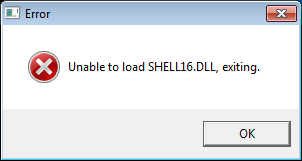

#  - LithiumServer.exe
## Informations
| Label | Value |
| :--- | ---: |
| Executable Name | LithiumServer.exe |
| Product Name |  |
| Version Number |  |
| Description |  |
| Company Name |  |
| Copyright |  |
| Trademarks |  |
| Last Edition | 10/04/2004 14:17:40 |
| Size | 40090 |
| SHA1 🔎 | [D4A6D6A73774E49D46C8EF37D6CB24F2BD43E419](https://www.virustotal.com/gui/search/D4A6D6A73774E49D46C8EF37D6CB24F2BD43E419) |
| Language |  |
## Static Analysis
<details>
<summary>Manalyze</summary>
<p>

```

* Manalyze 0.9 *

-------------------------------------------------------------------------------
C:/Users/IEUser/Desktop/net6.0/Malwares/Lithium v1.03/Lithium v1.03/LithiumServer.exe
-------------------------------------------------------------------------------

Summary:
--------
Architecture:     IMAGE_FILE_MACHINE_I386
Subsystem:        IMAGE_SUBSYSTEM_WINDOWS_GUI
Compilation Date: 2002-Oct-27 19:42:01

DOS Header:
-----------
e_magic:    MZ
e_cblp:     0x0090
e_cp:       0x0003
e_crlc:     0x0000
e_cparhdr:  0x0004
e_minalloc: 0x0000
e_maxalloc: 0xFFFF
e_ss:       0x0000
e_sp:       0x00B8
e_csum:     0x0000
e_ip:       0x0000
e_cs:       0x0000
e_ovno:     0x0000
e_oemid:    0x0000
e_oeminfo:  0x0000
e_lfanew:   0x000000D8

PE Header:
----------
Signature:            PE
Machine:              IMAGE_FILE_MACHINE_I386
NumberofSections:     3
TimeDateStamp:        2002-Oct-27 19:42:01
PointerToSymbolTable: 0x00000000
NumberOfSymbols:      0
SizeOfOptionalHeader: 0x00E0
Characteristics:      IMAGE_FILE_32BIT_MACHINE
                      IMAGE_FILE_EXECUTABLE_IMAGE
                      IMAGE_FILE_LINE_NUMS_STRIPPED
                      IMAGE_FILE_LOCAL_SYMS_STRIPPED
                      IMAGE_FILE_RELOCS_STRIPPED

Image Optional Header:
----------------------
Magic:                   PE32
LinkerVersion:           6.0
SizeOfCode:              0x00007200
SizeOfInitializedData:   0x00002200
SizeOfUninitializedData: 0x00000000
AddressOfEntryPoint:     0x00006A06 (Section: .text)
BaseOfCode:              0x00001000
BaseOfData:              0x00009000
ImageBase:               0x00400000
SectionAlignment:        0x00001000
FileAlignment:           0x00000200
OperatingSystemVersion:  4.0
ImageVersion:            0.0
SubsystemVersion:        4.0
Win32VersionValue:       0
SizeOfImage:             0x0000C000
SizeOfHeaders:           0x00000400
Checksum:                0x00000000
Subsystem:               IMAGE_SUBSYSTEM_WINDOWS_GUI
SizeofStackReserve:      0x00100000
SizeofStackCommit:       0x00001000
SizeofHeapReserve:       0x00100000
SizeofHeapCommit:        0x00001000
LoaderFlags:             0x00000000
NumberOfRvaAndSizes:     16

Sections:
---------
.text:
    VirtualSize:          0x000070C4
    VirtualAddress:       0x00001000
    SizeOfRawData:        0x00007200
    PointerToRawData:     0x00000400
    PointerToRelocations: 0x00000000
    PointerToLineNumbers: 0x00000000
    NumberOfLineNumbers:  0
    NumberOfRelocations:  0
    Characteristics:      IMAGE_SCN_CNT_CODE
                          IMAGE_SCN_MEM_EXECUTE
                          IMAGE_SCN_MEM_READ
    Entropy:              6.24116

.rdata:
    VirtualSize:          0x00000F4A
    VirtualAddress:       0x00009000
    SizeOfRawData:        0x00001000
    PointerToRawData:     0x00007600
    PointerToRelocations: 0x00000000
    PointerToLineNumbers: 0x00000000
    NumberOfLineNumbers:  0
    NumberOfRelocations:  0
    Characteristics:      IMAGE_SCN_CNT_INITIALIZED_DATA
                          IMAGE_SCN_MEM_READ
    Entropy:              5.09743

.data:
    VirtualSize:          0x000011B2
    VirtualAddress:       0x0000A000
    SizeOfRawData:        0x00001000
    PointerToRawData:     0x00008600
    PointerToRelocations: 0x00000000
    PointerToLineNumbers: 0x00000000
    NumberOfLineNumbers:  0
    NumberOfRelocations:  0
    Characteristics:      IMAGE_SCN_CNT_INITIALIZED_DATA
                          IMAGE_SCN_MEM_READ
                          IMAGE_SCN_MEM_WRITE
    Entropy:              4.76769


Imports:
--------
KERNEL32.dll: FreeLibrary
              GetModuleHandleA
              CreateThread
              DuplicateHandle
              GetCurrentProcess
              SetStdHandle
              CreatePipe
              GetStdHandle
              GetVolumeInformationA
              GetDiskFreeSpaceExA
              GetDriveTypeA
              GetLogicalDrives
              SetErrorMode
              Process32Next
              Process32First
              SetPriorityClass
              Module32Next
              Module32First
              CreateToolhelp32Snapshot
              CopyFileA
              MoveFileA
              DeleteFileA
              CreateDirectoryA
              GetLastError
              FindClose
              FindNextFileA
              FindFirstFileA
              SetFilePointer
              Sleep
              lstrlenA
              GlobalFree
              GlobalAlloc
              GetProcAddress
              ExitProcess
              GetCommandLineA
              SetFileTime
              GetFileTime
              SetThreadPriority
              GetCurrentThread
              GetVersionExA
              GetSystemDirectoryA
              GetModuleFileNameA
              LoadLibraryA
              WaitForSingleObject
              EnterCriticalSection
              LeaveCriticalSection
              DeleteCriticalSection
              OpenProcess
              TerminateProcess
              TerminateThread
              InitializeCriticalSection
              GetTickCount
              GetEnvironmentVariableA
              CreateProcessA
              ReadFile
              CreateFileA
              CloseHandle
              GetFileSize
              WriteFile
USER32.dll:   RegisterClassExA
              CreateWindowExA
              GetMessageA
              DispatchMessageA
              DestroyWindow
              DefWindowProcA
              SetTimer
              GetWindowLongA
              GetWindow
              IsWindowVisible
              RegisterWindowMessageA
              CallNextHookEx
              GetActiveWindow
              GetKeyNameTextA
              GetKeyboardState
              ToAscii
              PostMessageA
              GetDesktopWindow
              EnumWindows
              EnableWindow
              ShowWindow
              PeekMessageA
              GetForegroundWindow
              SetForegroundWindow
              SetWindowTextA
              MessageBoxExA
              ExitWindowsEx
              IsIconic
              keybd_event
              MapVirtualKeyA
              VkKeyScanA
              UnhookWindowsHookEx
              SetWindowsHookExA
              GetWindowTextA
              wsprintfA
              BringWindowToTop
ADVAPI32.dll: RegEnumValueA
              OpenProcessToken
              LookupPrivilegeValueA
              AdjustTokenPrivileges
              RegOpenKeyA
              RegDeleteValueA
              RegCloseKey
              RegOpenKeyExA
              RegSetValueExA
              RegQueryValueExA
              RegCreateKeyExA
              RegDeleteKeyA
              RegQueryInfoKeyA
              RegEnumKeyExA
WININET.dll:  InternetOpenA
              InternetOpenUrlA
              InternetReadFile
              InternetCloseHandle
MPR.dll:      WNetEnumResourceA
              WNetCloseEnum
              WNetOpenEnumA
SHELL32.dll:  SHFileOperationA
              ShellExecuteA
MSVCRT.dll:   memcmp
              atol
              __CxxFrameHandler
              free
              strcat
              strcmp
              realloc
              memmove
              srand
              malloc
              memcpy
              strlen
              ??3@YAXPAX@Z
              ??2@YAPAXI@Z
              strcpy
              rand
              memset
WSOCK32.dll:  #19
              #9
              #13
              #6
              #2
              #23
              #11
              #3
              #151
              #18
              #1
              #16
              #20
              #10
              #52
              #57
              #101
              #17
              #116
              #115
              #4

RICH Header:
------------
XOR Key:                               0x0302E5F7
Unmarked objects:                      0
14 (7299):                             3
Linker (8047):                         2
Unmarked objects (#2):                 6
Total imports:                         154
19 (8034):                             13
C++ objects (VC++ 6.0 SP5 build 8804): 9

Matching compiler(s):
    MASM/TASM - sig1(h)

[ SUSPICIOUS ] Strings found in the binary may indicate undesirable behavior:
    Tries to detect virtualized environments:
        Hardware\Description\System
    May have dropper capabilities:
        CurrentVersion\Run
    Contains domain names:
        web.icq.com

[ SUSPICIOUS ] The PE is packed or was manually edited.
    The number of imports reported in the RICH header is inconsistent.

[ MALICIOUS ] The PE contains functions mostly used by malware.
    [!] The program may be hiding some of its imports:
        GetProcAddress
        LoadLibraryA
    Functions which can be used for anti-debugging purposes:
        CreateToolhelp32Snapshot
    Can access the registry:
        RegEnumValueA
        RegOpenKeyA
        RegDeleteValueA
        RegCloseKey
        RegOpenKeyExA
        RegSetValueExA
        RegQueryValueExA
        RegCreateKeyExA
        RegDeleteKeyA
        RegQueryInfoKeyA
        RegEnumKeyExA
    Possibly launches other programs:
        CreateProcessA
        ShellExecuteA
    Uses functions commonly found in keyloggers:
        CallNextHookEx
        GetForegroundWindow
        MapVirtualKeyA
    Has Internet access capabilities:
        InternetOpenA
        InternetOpenUrlA
        InternetReadFile
        InternetCloseHandle
    Functions related to the privilege level:
        OpenProcessToken
        AdjustTokenPrivileges
    Enumerates local disk drives:
        GetVolumeInformationA
        GetDriveTypeA
    Manipulates other processes:
        Process32Next
        Process32First
        OpenProcess
    Can shut the system down or lock the screen:
        ExitWindowsEx

The following exploit mitigation techniques have been detected
    Stack Canary: disabled
    SafeSEH: disabled
    ASLR: disabled
    DEP: disabled
    CFG: disabled

[ SUSPICIOUS ] The file contains overlay data.
    1690 bytes of data starting at offset 0x9600.
    The overlay data has an entropy of 7.64313 and is possibly compressed or encrypted.


```

</p>
</details>

## Screenshots
### Error
 
