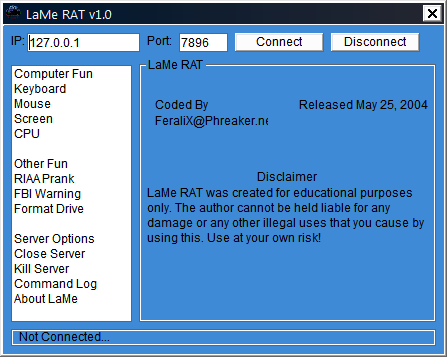
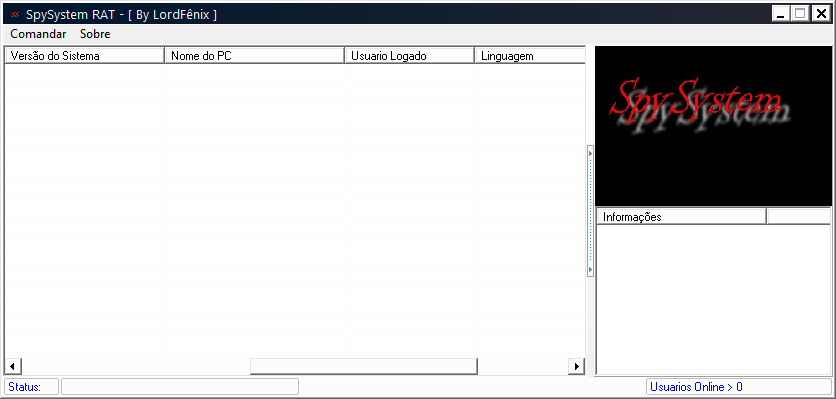
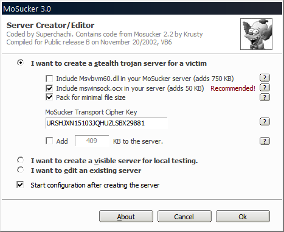

# Complete Control Add-in for MiniMo - Complete Control.exe
## Informations
| Label | Value |
| :--- | ---: |
| Executable Name | Complete Control.exe |
| Product Name | Complete Control Add-in for MiniMo |
| Version Number | 1.00 |
| Description | Complete Control Add-in for MiniMo |
| Company Name | MiniMo |
| Copyright | by Superchachi 2004 |
| Trademarks | by Superchachi 2004 |
| Last Edition | 01/05/2004 13:13:08 |
| Size | 77824 |
| SHA1 🔎 | [6A176D098B92EAB336D3D09A41905D46376AC15B](https://www.virustotal.com/gui/search/6A176D098B92EAB336D3D09A41905D46376AC15B) |
| MD5 | D41D8CD98F00B204E9800998ECF8427E |
| Language | Anglais (États-Unis) |
## Static Analysis
<details><summary>Manalyze</summary><p> ```* Manalyze 0.9 *

-------------------------------------------------------------------------------
C:/Users/aTest/Desktop/net6.0/Malwares/MiniMo Public 0.7/addins/Complete Control.exe
-------------------------------------------------------------------------------

Summary:
--------
Architecture:       IMAGE_FILE_MACHINE_I386
Subsystem:          IMAGE_SUBSYSTEM_WINDOWS_GUI
Compilation Date:   2004-May-01 19:13:07
Detected languages: English - United States
Comments:           Complete Control Add-in for MiniMo
CompanyName:        MiniMo
FileDescription:    Complete Control Add-in for MiniMo
LegalCopyright:     by Superchachi 2004
LegalTrademarks:    by Superchachi 2004
ProductName:        Complete Control Add-in for MiniMo
FileVersion:        1.00
ProductVersion:     1.00
InternalName:       Complete Control
OriginalFilename:   Complete Control.exe

DOS Header:
-----------
e_magic:    MZ
e_cblp:     0x0090
e_cp:       0x0003
e_crlc:     0x0000
e_cparhdr:  0x0004
e_minalloc: 0x0000
e_maxalloc: 0xFFFF
e_ss:       0x0000
e_sp:       0x00B8
e_csum:     0x0000
e_ip:       0x0000
e_cs:       0x0000
e_ovno:     0x0000
e_oemid:    0x0000
e_oeminfo:  0x0000
e_lfanew:   0x000000B8

PE Header:
----------
Signature:            PE
Machine:              IMAGE_FILE_MACHINE_I386
NumberofSections:     3
TimeDateStamp:        2004-May-01 19:13:07
PointerToSymbolTable: 0x00000000
NumberOfSymbols:      0
SizeOfOptionalHeader: 0x00E0
Characteristics:      IMAGE_FILE_32BIT_MACHINE
                      IMAGE_FILE_EXECUTABLE_IMAGE
                      IMAGE_FILE_LINE_NUMS_STRIPPED
                      IMAGE_FILE_LOCAL_SYMS_STRIPPED
                      IMAGE_FILE_RELOCS_STRIPPED

Image Optional Header:
----------------------
Magic:                   PE32
LinkerVersion:           6.0
SizeOfCode:              0x0000E000
SizeOfInitializedData:   0x00004000
SizeOfUninitializedData: 0x00000000
AddressOfEntryPoint:     0x00001274 (Section: .text)
BaseOfCode:              0x00001000
BaseOfData:              0x0000F000
ImageBase:               0x00400000
SectionAlignment:        0x00001000
FileAlignment:           0x00001000
OperatingSystemVersion:  4.0
ImageVersion:            1.0
SubsystemVersion:        4.0
Win32VersionValue:       0
SizeOfImage:             0x00013000
SizeOfHeaders:           0x00001000
Checksum:                0x0001894B
Subsystem:               IMAGE_SUBSYSTEM_WINDOWS_GUI
SizeofStackReserve:      0x00100000
SizeofStackCommit:       0x00001000
SizeofHeapReserve:       0x00100000
SizeofHeapCommit:        0x00001000
LoaderFlags:             0x00000000
NumberOfRvaAndSizes:     16

Sections:
---------
.text:
    VirtualSize:          0x0000D648
    VirtualAddress:       0x00001000
    SizeOfRawData:        0x0000E000
    PointerToRawData:     0x00001000
    PointerToRelocations: 0x00000000
    PointerToLineNumbers: 0x00000000
    NumberOfLineNumbers:  0
    NumberOfRelocations:  0
    Characteristics:      IMAGE_SCN_CNT_CODE
                          IMAGE_SCN_MEM_EXECUTE
                          IMAGE_SCN_MEM_READ
    Entropy:              6.84566

.data:
    VirtualSize:          0x00000A94
    VirtualAddress:       0x0000F000
    SizeOfRawData:        0x00001000
    PointerToRawData:     0x0000F000
    PointerToRelocations: 0x00000000
    PointerToLineNumbers: 0x00000000
    NumberOfLineNumbers:  0
    NumberOfRelocations:  0
    Characteristics:      IMAGE_SCN_CNT_INITIALIZED_DATA
                          IMAGE_SCN_MEM_READ
                          IMAGE_SCN_MEM_WRITE
    Entropy:              0

.rsrc:
    VirtualSize:          0x0000220C
    VirtualAddress:       0x00010000
    SizeOfRawData:        0x00003000
    PointerToRawData:     0x00010000
    PointerToRelocations: 0x00000000
    PointerToLineNumbers: 0x00000000
    NumberOfLineNumbers:  0
    NumberOfRelocations:  0
    Characteristics:      IMAGE_SCN_CNT_INITIALIZED_DATA
                          IMAGE_SCN_MEM_READ
    Entropy:              4.17376


Imports:
--------
MSVBVM60.DLL: _CIcos
              _adj_fptan
              __vbaFreeVar
              __vbaEnd
              __vbaFreeVarList
              _adj_fdiv_m64
              __vbaFreeObjList
              _adj_fprem1
              __vbaSetSystemError
              __vbaHresultCheckObj
              _adj_fdiv_m32
              __vbaForEachCollObj
              __vbaExitProc
              __vbaObjSet
              __vbaOnError
              #595
              _adj_fdiv_m16i
              _adj_fdivr_m16i
              _CIsin
              __vbaNextEachCollObj
              __vbaChkstk
              EVENT_SINK_AddRef
              __vbaI2I4
              DllFunctionCall
              _adj_fpatan
              EVENT_SINK_Release
              _CIsqrt
              EVENT_SINK_QueryInterface
              __vbaExceptHandler
              _adj_fprem
              _adj_fdivr_m64
              __vbaFPException
              __vbaCheckType
              _CIlog
              __vbaNew2
              _adj_fdiv_m32i
              _adj_fdivr_m32i
              __vbaStrCopy
              _adj_fdivr_m32
              _adj_fdiv_r
              #685
              #100
              __vbaI4Var
              __vbaVarDup
              __vbaLateMemCallLd
              _CIatan
              _allmul
              _CItan
              _CIexp
              __vbaFreeStr
              __vbaFreeObj

Resources:
----------
30001:
    Type:          RT_ICON
    Language:      UNKNOWN
    Codepage:      Unicode (UTF 16LE)
    Size:          1384
    TimeDateStamp: 2004-May-01 19:13:07
    Entropy:       5.19397

30002:
    Type:          RT_ICON
    Language:      UNKNOWN
    Codepage:      Unicode (UTF 16LE)
    Size:          2216
    TimeDateStamp: 2004-May-01 19:13:07
    Entropy:       5.2134

30003:
    Type:          RT_ICON
    Language:      UNKNOWN
    Codepage:      Unicode (UTF 16LE)
    Size:          3752
    TimeDateStamp: 2004-May-01 19:13:07
    Entropy:       5.26775

1:
    Type:              RT_GROUP_ICON
    Language:          UNKNOWN
    Codepage:          Unicode (UTF 16LE)
    Size:              48
    TimeDateStamp:     2004-May-01 19:13:07
    Entropy:           2.942
    Detected Filetype: Icon file

1 (#2):
    Type:          RT_VERSION
    Language:      English - United States
    Codepage:      Unicode (UTF 16LE)
    Size:          980
    TimeDateStamp: 2004-May-01 19:13:07
    Entropy:       3.28116


Version Info:
-------------
Resource LangID: English - United States
VS_VERSION_INFO:
    Signature:           0xFEEF04BD
    StructVersion:       0x00010000
    FileVersion:         1.0.0.0
    ProductVersion:      1.0.0.0
    FileFlags:           (EMPTY)
    FileOs:              VOS_DOS_WINDOWS32
                         VOS_NT_WINDOWS32
                         VOS__WINDOWS32
    FileType:            VFT_APP
    Language:            English - United States
    Comments:            Complete Control Add-in for MiniMo
    CompanyName:         MiniMo
    FileDescription:     Complete Control Add-in for MiniMo
    LegalCopyright:      by Superchachi 2004
    LegalTrademarks:     by Superchachi 2004
    ProductName:         Complete Control Add-in for MiniMo
    FileVersion (#2):    1.00
    ProductVersion (#2): 1.00
    InternalName:        Complete Control
    OriginalFilename:    Complete Control.exe


RICH Header:
------------
XOR Key:                  0x88AA42CF
Unmarked objects:         0
14 (7299):                1
9 (8783):                 2
13 (VS98 SP6 build 8804): 1

Matching compiler(s):
    Microsoft Visual Basic 5.0
    Microsoft Visual Basic v5.0/v6.0
    Microsoft Visual Basic v5.0 - v6.0

[ SUSPICIOUS ] Strings found in the binary may indicate undesirable behavior:
    Contains references to system / monitoring tools:
        Control.exe
    May have dropper capabilities:
        CurrentControlSet\Services

The following exploit mitigation techniques have been detected
    Stack Canary: disabled
    SafeSEH: disabled
    ASLR: disabled
    DEP: disabled
    CFG: disabled


```
 </p></details>## Screenshots
### Complete Control Add-in
 
#  - Client210.exe
## Informations
| Label | Value |
| :--- | ---: |
| Executable Name | Client210.exe |
| Product Name |  |
| Version Number |  |
| Description |  |
| Company Name |  |
| Copyright |  |
| Trademarks |  |
| Last Edition | 01/11/2004 12:19:34 |
| Size | 534528 |
| SHA1 🔎 | [676BB1B83822DC52D92D6E2D954B52F4990F4879](https://www.virustotal.com/gui/search/676BB1B83822DC52D92D6E2D954B52F4990F4879) |
| MD5 | D41D8CD98F00B204E9800998ECF8427E |
| Language |  |
## Static Analysis
<details><summary>Manalyze</summary><p> ```* Manalyze 0.9 *

-------------------------------------------------------------------------------
C:/Users/aTest/Desktop/net6.0/Malwares/Malwares/RAT/Client210.exe
-------------------------------------------------------------------------------

Summary:
--------
Architecture:       IMAGE_FILE_MACHINE_I386
Subsystem:          IMAGE_SUBSYSTEM_WINDOWS_GUI
Compilation Date:   1992-Jun-19 22:22:17
Detected languages: English - United Kingdom

DOS Header:
-----------
e_magic:    MZ
e_cblp:     0x0050
e_cp:       0x0002
e_crlc:     0x0000
e_cparhdr:  0x0004
e_minalloc: 0x000F
e_maxalloc: 0xFFFF
e_ss:       0x0000
e_sp:       0x00B8
e_csum:     0x0000
e_ip:       0x0000
e_cs:       0x0000
e_ovno:     0x001A
e_oemid:    0x0000
e_oeminfo:  0x0000
e_lfanew:   0x00000100

PE Header:
----------
Signature:            PE
Machine:              IMAGE_FILE_MACHINE_I386
NumberofSections:     3
TimeDateStamp:        1992-Jun-19 22:22:17
PointerToSymbolTable: 0x00000000
NumberOfSymbols:      0
SizeOfOptionalHeader: 0x00E0
Characteristics:      IMAGE_FILE_32BIT_MACHINE
                      IMAGE_FILE_BYTES_REVERSED_HI
                      IMAGE_FILE_BYTES_REVERSED_LO
                      IMAGE_FILE_EXECUTABLE_IMAGE
                      IMAGE_FILE_LINE_NUMS_STRIPPED
                      IMAGE_FILE_LOCAL_SYMS_STRIPPED
                      IMAGE_FILE_RELOCS_STRIPPED

Image Optional Header:
----------------------
Magic:                   PE32
LinkerVersion:           2.0
SizeOfCode:              0x00080000
SizeOfInitializedData:   0x00003000
SizeOfUninitializedData: 0x0012B000
AddressOfEntryPoint:     0x001AB580 (Section: UPX1)
BaseOfCode:              0x0012C000
BaseOfData:              0x001AC000
ImageBase:               0x00400000
SectionAlignment:        0x00001000
FileAlignment:           0x00000200
OperatingSystemVersion:  1.0
ImageVersion:            0.0
SubsystemVersion:        4.0
Win32VersionValue:       0
SizeOfImage:             0x001AF000
SizeOfHeaders:           0x00001000
Checksum:                0x00000000
Subsystem:               IMAGE_SUBSYSTEM_WINDOWS_GUI
SizeofStackReserve:      0x00100000
SizeofStackCommit:       0x00004000
SizeofHeapReserve:       0x00100000
SizeofHeapCommit:        0x00001000
LoaderFlags:             0x00000000
NumberOfRvaAndSizes:     16

Sections:
---------
UPX0:
    VirtualSize:          0x0012B000
    VirtualAddress:       0x00001000
    SizeOfRawData:        0x00000000
    PointerToRawData:     0x00000400
    PointerToRelocations: 0x00000000
    PointerToLineNumbers: 0x00000000
    NumberOfLineNumbers:  0
    NumberOfRelocations:  0
    Characteristics:      IMAGE_SCN_CNT_UNINITIALIZED_DATA
                          IMAGE_SCN_MEM_EXECUTE
                          IMAGE_SCN_MEM_READ
                          IMAGE_SCN_MEM_WRITE

UPX1:
    VirtualSize:          0x00080000
    VirtualAddress:       0x0012C000
    SizeOfRawData:        0x0007F800
    PointerToRawData:     0x00000400
    PointerToRelocations: 0x00000000
    PointerToLineNumbers: 0x00000000
    NumberOfLineNumbers:  0
    NumberOfRelocations:  0
    Characteristics:      IMAGE_SCN_CNT_INITIALIZED_DATA
                          IMAGE_SCN_MEM_EXECUTE
                          IMAGE_SCN_MEM_READ
                          IMAGE_SCN_MEM_WRITE
    Entropy:              7.93254

.rsrc:
    VirtualSize:          0x00003000
    VirtualAddress:       0x001AC000
    SizeOfRawData:        0x00002C00
    PointerToRawData:     0x0007FC00
    PointerToRelocations: 0x00000000
    PointerToLineNumbers: 0x00000000
    NumberOfLineNumbers:  0
    NumberOfRelocations:  0
    Characteristics:      IMAGE_SCN_CNT_INITIALIZED_DATA
                          IMAGE_SCN_MEM_READ
                          IMAGE_SCN_MEM_WRITE
    Entropy:              3.85722


Imports:
--------
KERNEL32.DLL: LoadLibraryA
              GetProcAddress
              ExitProcess
advapi32.dll: RegCloseKey
comctl32.dll: ImageList_Add
comdlg32.dll: ChooseFontA
gdi32.dll:    Pie
ole32.dll:    OleDraw
oleaut32.dll: GetErrorInfo
shell32.dll:  DragFinish
user32.dll:   GetDC
version.dll:  VerQueryValueA
wininet.dll:  InternetOpenA
winspool.drv: OpenPrinterA
wsock32.dll:  send

Resources:
----------
1:
    Type:          RT_CURSOR
    Language:      UNKNOWN
    Codepage:      UNKNOWN
    Size:          308
    TimeDateStamp: 2004-Nov-01 13:19:32
    Entropy:       0

2:
    Type:          RT_CURSOR
    Language:      UNKNOWN
    Codepage:      UNKNOWN
    Size:          308
    TimeDateStamp: 2004-Nov-01 13:19:32
    Entropy:       0

3:
    Type:          RT_CURSOR
    Language:      UNKNOWN
    Codepage:      UNKNOWN
    Size:          308
    TimeDateStamp: 2004-Nov-01 13:19:32
    Entropy:       0

4:
    Type:          RT_CURSOR
    Language:      UNKNOWN
    Codepage:      UNKNOWN
    Size:          308
    TimeDateStamp: 2004-Nov-01 13:19:32
    Entropy:       0

5:
    Type:          RT_CURSOR
    Language:      UNKNOWN
    Codepage:      UNKNOWN
    Size:          308
    TimeDateStamp: 2004-Nov-01 13:19:32
    Entropy:       0

6:
    Type:          RT_CURSOR
    Language:      UNKNOWN
    Codepage:      UNKNOWN
    Size:          308
    TimeDateStamp: 2004-Nov-01 13:19:32
    Entropy:       0

7:
    Type:          RT_CURSOR
    Language:      UNKNOWN
    Codepage:      UNKNOWN
    Size:          308
    TimeDateStamp: 2004-Nov-01 13:19:32
    Entropy:       0

8:
    Type:          RT_CURSOR
    Language:      UNKNOWN
    Codepage:      UNKNOWN
    Size:          308
    TimeDateStamp: 2004-Nov-01 13:19:32
    Entropy:       0

BBABORT:
    Type:          RT_BITMAP
    Language:      UNKNOWN
    Codepage:      UNKNOWN
    Size:          464
    TimeDateStamp: 2004-Nov-01 13:19:32
    Entropy:       0

BBALL:
    Type:          RT_BITMAP
    Language:      UNKNOWN
    Codepage:      UNKNOWN
    Size:          484
    TimeDateStamp: 2004-Nov-01 13:19:32
    Entropy:       0

BBCANCEL:
    Type:          RT_BITMAP
    Language:      UNKNOWN
    Codepage:      UNKNOWN
    Size:          464
    TimeDateStamp: 2004-Nov-01 13:19:32
    Entropy:       0

BBCLOSE:
    Type:          RT_BITMAP
    Language:      UNKNOWN
    Codepage:      UNKNOWN
    Size:          464
    TimeDateStamp: 2004-Nov-01 13:19:32
    Entropy:       0

BBHELP:
    Type:          RT_BITMAP
    Language:      UNKNOWN
    Codepage:      UNKNOWN
    Size:          464
    TimeDateStamp: 2004-Nov-01 13:19:32
    Entropy:       0

BBIGNORE:
    Type:          RT_BITMAP
    Language:      UNKNOWN
    Codepage:      UNKNOWN
    Size:          464
    TimeDateStamp: 2004-Nov-01 13:19:32
    Entropy:       0

BBNO:
    Type:          RT_BITMAP
    Language:      UNKNOWN
    Codepage:      UNKNOWN
    Size:          464
    TimeDateStamp: 2004-Nov-01 13:19:32
    Entropy:       0

BBOK:
    Type:          RT_BITMAP
    Language:      UNKNOWN
    Codepage:      UNKNOWN
    Size:          464
    TimeDateStamp: 2004-Nov-01 13:19:32
    Entropy:       0

BBRETRY:
    Type:          RT_BITMAP
    Language:      UNKNOWN
    Codepage:      UNKNOWN
    Size:          464
    TimeDateStamp: 2004-Nov-01 13:19:32
    Entropy:       0

BBYES:
    Type:          RT_BITMAP
    Language:      UNKNOWN
    Codepage:      UNKNOWN
    Size:          464
    TimeDateStamp: 2004-Nov-01 13:19:32
    Entropy:       0

FLATDOWN:
    Type:          RT_BITMAP
    Language:      UNKNOWN
    Codepage:      UNKNOWN
    Size:          124
    TimeDateStamp: 2004-Nov-01 13:19:32
    Entropy:       0

FLATUP:
    Type:          RT_BITMAP
    Language:      UNKNOWN
    Codepage:      UNKNOWN
    Size:          124
    TimeDateStamp: 2004-Nov-01 13:19:32
    Entropy:       0

TBTBEEPER:
    Type:          RT_BITMAP
    Language:      UNKNOWN
    Codepage:      UNKNOWN
    Size:          246
    TimeDateStamp: 2004-Nov-01 13:19:32
    Entropy:       0

1 (#2):
    Type:          RT_ICON
    Language:      English - United Kingdom
    Codepage:      UNKNOWN
    Size:          872
    TimeDateStamp: 2004-Nov-01 13:19:32
    Entropy:       2.95633

2 (#2):
    Type:          RT_ICON
    Language:      English - United Kingdom
    Codepage:      UNKNOWN
    Size:          3240
    TimeDateStamp: 2004-Nov-01 13:19:32
    Entropy:       2.99388

4078:
    Type:          RT_STRING
    Language:      UNKNOWN
    Codepage:      UNKNOWN
    Size:          268
    TimeDateStamp: 2004-Nov-01 13:19:32
    Entropy:       0

4079:
    Type:          RT_STRING
    Language:      UNKNOWN
    Codepage:      UNKNOWN
    Size:          264
    TimeDateStamp: 2004-Nov-01 13:19:32
    Entropy:       0

4080:
    Type:          RT_STRING
    Language:      UNKNOWN
    Codepage:      UNKNOWN
    Size:          588
    TimeDateStamp: 2004-Nov-01 13:19:32
    Entropy:       0

4081:
    Type:          RT_STRING
    Language:      UNKNOWN
    Codepage:      UNKNOWN
    Size:          1336
    TimeDateStamp: 2004-Nov-01 13:19:32
    Entropy:       0

4082:
    Type:          RT_STRING
    Language:      UNKNOWN
    Codepage:      UNKNOWN
    Size:          1200
    TimeDateStamp: 2004-Nov-01 13:19:32
    Entropy:       0

4083:
    Type:          RT_STRING
    Language:      UNKNOWN
    Codepage:      UNKNOWN
    Size:          972
    TimeDateStamp: 2004-Nov-01 13:19:32
    Entropy:       0

4084:
    Type:          RT_STRING
    Language:      UNKNOWN
    Codepage:      UNKNOWN
    Size:          632
    TimeDateStamp: 2004-Nov-01 13:19:32
    Entropy:       0

4085:
    Type:          RT_STRING
    Language:      UNKNOWN
    Codepage:      UNKNOWN
    Size:          220
    TimeDateStamp: 2004-Nov-01 13:19:32
    Entropy:       0

4086:
    Type:          RT_STRING
    Language:      UNKNOWN
    Codepage:      UNKNOWN
    Size:          312
    TimeDateStamp: 2004-Nov-01 13:19:32
    Entropy:       0

4087:
    Type:          RT_STRING
    Language:      UNKNOWN
    Codepage:      UNKNOWN
    Size:          588
    TimeDateStamp: 2004-Nov-01 13:19:32
    Entropy:       0

4088:
    Type:          RT_STRING
    Language:      UNKNOWN
    Codepage:      UNKNOWN
    Size:          1052
    TimeDateStamp: 2004-Nov-01 13:19:32
    Entropy:       0

4089:
    Type:          RT_STRING
    Language:      UNKNOWN
    Codepage:      UNKNOWN
    Size:          880
    TimeDateStamp: 2004-Nov-01 13:19:32
    Entropy:       0

4090:
    Type:          RT_STRING
    Language:      UNKNOWN
    Codepage:      UNKNOWN
    Size:          988
    TimeDateStamp: 2004-Nov-01 13:19:32
    Entropy:       0

4091:
    Type:          RT_STRING
    Language:      UNKNOWN
    Codepage:      UNKNOWN
    Size:          472
    TimeDateStamp: 2004-Nov-01 13:19:32
    Entropy:       0

4092:
    Type:          RT_STRING
    Language:      UNKNOWN
    Codepage:      UNKNOWN
    Size:          236
    TimeDateStamp: 2004-Nov-01 13:19:32
    Entropy:       0

4093:
    Type:          RT_STRING
    Language:      UNKNOWN
    Codepage:      UNKNOWN
    Size:          396
    TimeDateStamp: 2004-Nov-01 13:19:32
    Entropy:       0

4094:
    Type:          RT_STRING
    Language:      UNKNOWN
    Codepage:      UNKNOWN
    Size:          836
    TimeDateStamp: 2004-Nov-01 13:19:32
    Entropy:       0

4095:
    Type:          RT_STRING
    Language:      UNKNOWN
    Codepage:      UNKNOWN
    Size:          812
    TimeDateStamp: 2004-Nov-01 13:19:32
    Entropy:       0

4096:
    Type:          RT_STRING
    Language:      UNKNOWN
    Codepage:      UNKNOWN
    Size:          788
    TimeDateStamp: 2004-Nov-01 13:19:32
    Entropy:       0

DESCRIPTION:
    Type:          RT_RCDATA
    Language:      UNKNOWN
    Codepage:      UNKNOWN
    Size:          20
    TimeDateStamp: 2004-Nov-01 13:19:32
    Entropy:       0

DVCLAL:
    Type:          RT_RCDATA
    Language:      UNKNOWN
    Codepage:      UNKNOWN
    Size:          16
    TimeDateStamp: 2004-Nov-01 13:19:32
    Entropy:       0

PACKAGEINFO:
    Type:          RT_RCDATA
    Language:      UNKNOWN
    Codepage:      UNKNOWN
    Size:          1604
    TimeDateStamp: 2004-Nov-01 13:19:32
    Entropy:       0

TFORMADDRESSBOOK:
    Type:          RT_RCDATA
    Language:      UNKNOWN
    Codepage:      UNKNOWN
    Size:          3864
    TimeDateStamp: 2004-Nov-01 13:19:32
    Entropy:       0

TFORMCGI:
    Type:          RT_RCDATA
    Language:      UNKNOWN
    Codepage:      UNKNOWN
    Size:          5427
    TimeDateStamp: 2004-Nov-01 13:19:32
    Entropy:       0

TFORMCGIFILTER:
    Type:          RT_RCDATA
    Language:      UNKNOWN
    Codepage:      UNKNOWN
    Size:          2487
    TimeDateStamp: 2004-Nov-01 13:19:32
    Entropy:       0

TFORMCHAT:
    Type:          RT_RCDATA
    Language:      UNKNOWN
    Codepage:      UNKNOWN
    Size:          6025
    TimeDateStamp: 2004-Nov-01 13:19:32
    Entropy:       0

TFORMCHATSPY:
    Type:          RT_RCDATA
    Language:      UNKNOWN
    Codepage:      UNKNOWN
    Size:          21213
    TimeDateStamp: 2004-Nov-01 13:19:32
    Entropy:       0

TFORMCONNECTION:
    Type:          RT_RCDATA
    Language:      UNKNOWN
    Codepage:      UNKNOWN
    Size:          13015
    TimeDateStamp: 2004-Nov-01 13:19:32
    Entropy:       0

TFORMCONSOLE:
    Type:          RT_RCDATA
    Language:      UNKNOWN
    Codepage:      UNKNOWN
    Size:          7323
    TimeDateStamp: 2004-Nov-01 13:19:32
    Entropy:       0

TFORMDIRECTORY:
    Type:          RT_RCDATA
    Language:      UNKNOWN
    Codepage:      UNKNOWN
    Size:          1834
    TimeDateStamp: 2004-Nov-01 13:19:32
    Entropy:       7.72085

TFORMDISKINFO:
    Type:          RT_RCDATA
    Language:      UNKNOWN
    Codepage:      UNKNOWN
    Size:          52607
    TimeDateStamp: 2004-Nov-01 13:19:32
    Entropy:       7.91694

TFORMDOCKER:
    Type:          RT_RCDATA
    Language:      UNKNOWN
    Codepage:      UNKNOWN
    Size:          3350
    TimeDateStamp: 2004-Nov-01 13:19:32
    Entropy:       7.85776

TFORMDOSREDIRECT:
    Type:          RT_RCDATA
    Language:      UNKNOWN
    Codepage:      UNKNOWN
    Size:          1089
    TimeDateStamp: 2004-Nov-01 13:19:32
    Entropy:       7.60955

TFORMDOWNLOADDIR:
    Type:          RT_RCDATA
    Language:      UNKNOWN
    Codepage:      UNKNOWN
    Size:          3413
    TimeDateStamp: 2004-Nov-01 13:19:32
    Entropy:       7.83629

TFORMDOWNLOADDIROPT:
    Type:          RT_RCDATA
    Language:      UNKNOWN
    Codepage:      UNKNOWN
    Size:          2839
    TimeDateStamp: 2004-Nov-01 13:19:32
    Entropy:       7.74579

TFORMDOWNLOADER:
    Type:          RT_RCDATA
    Language:      UNKNOWN
    Codepage:      UNKNOWN
    Size:          9397
    TimeDateStamp: 2004-Nov-01 13:19:32
    Entropy:       7.8862

TFORMEDITFILE:
    Type:          RT_RCDATA
    Language:      UNKNOWN
    Codepage:      UNKNOWN
    Size:          3138
    TimeDateStamp: 2004-Nov-01 13:19:32
    Entropy:       7.85558

TFORMFILEATTRIBUTES:
    Type:          RT_RCDATA
    Language:      UNKNOWN
    Codepage:      UNKNOWN
    Size:          2634
    TimeDateStamp: 2004-Nov-01 13:19:32
    Entropy:       7.81572

TFORMFILEMANAGER:
    Type:          RT_RCDATA
    Language:      UNKNOWN
    Codepage:      UNKNOWN
    Size:          23068
    TimeDateStamp: 2004-Nov-01 13:19:32
    Entropy:       7.90999

TFORMFILESEARCH:
    Type:          RT_RCDATA
    Language:      UNKNOWN
    Codepage:      UNKNOWN
    Size:          7677
    TimeDateStamp: 2004-Nov-01 13:19:32
    Entropy:       7.8817

TFORMFOLDERPROPS:
    Type:          RT_RCDATA
    Language:      UNKNOWN
    Codepage:      UNKNOWN
    Size:          2043
    TimeDateStamp: 2004-Nov-01 13:19:32
    Entropy:       7.82787

TFORMIPSCAN:
    Type:          RT_RCDATA
    Language:      UNKNOWN
    Codepage:      UNKNOWN
    Size:          4029
    TimeDateStamp: 2004-Nov-01 13:19:32
    Entropy:       7.80042

TFORMIPTOOL:
    Type:          RT_RCDATA
    Language:      UNKNOWN
    Codepage:      UNKNOWN
    Size:          2849
    TimeDateStamp: 2004-Nov-01 13:19:32
    Entropy:       7.85524

TFORMKEYLOGGER:
    Type:          RT_RCDATA
    Language:      UNKNOWN
    Codepage:      UNKNOWN
    Size:          10998
    TimeDateStamp: 2004-Nov-01 13:19:32
    Entropy:       7.90029

TFORMKEYPARSE:
    Type:          RT_RCDATA
    Language:      UNKNOWN
    Codepage:      UNKNOWN
    Size:          3692
    TimeDateStamp: 2004-Nov-01 13:19:32
    Entropy:       7.87863

TFORMMAIN:
    Type:          RT_RCDATA
    Language:      UNKNOWN
    Codepage:      UNKNOWN
    Size:          283290
    TimeDateStamp: 2004-Nov-01 13:19:32
    Entropy:       7.91205

TFORMMAPDRIVE:
    Type:          RT_RCDATA
    Language:      UNKNOWN
    Codepage:      UNKNOWN
    Size:          2297
    TimeDateStamp: 2004-Nov-01 13:19:32
    Entropy:       7.67177

TFORMMATRIX:
    Type:          RT_RCDATA
    Language:      UNKNOWN
    Codepage:      UNKNOWN
    Size:          3247
    TimeDateStamp: 2004-Nov-01 13:19:32
    Entropy:       7.78341

TFORMPASSWORD:
    Type:          RT_RCDATA
    Language:      UNKNOWN
    Codepage:      UNKNOWN
    Size:          1631
    TimeDateStamp: 2004-Nov-01 13:19:32
    Entropy:       7.71286

TFORMPLUGIN:
    Type:          RT_RCDATA
    Language:      UNKNOWN
    Codepage:      UNKNOWN
    Size:          1353
    TimeDateStamp: 2004-Nov-01 13:19:32
    Entropy:       7.53747

TFORMPROCESS:
    Type:          RT_RCDATA
    Language:      UNKNOWN
    Codepage:      UNKNOWN
    Size:          4760
    TimeDateStamp: 2004-Nov-01 13:19:32
    Entropy:       7.69996

TFORMREGEDIT:
    Type:          RT_RCDATA
    Language:      UNKNOWN
    Codepage:      UNKNOWN
    Size:          6935
    TimeDateStamp: 2004-Nov-01 13:19:32
    Entropy:       7.73491

TFORMREGFAVS:
    Type:          RT_RCDATA
    Language:      UNKNOWN
    Codepage:      UNKNOWN
    Size:          1912
    TimeDateStamp: 2004-Nov-01 13:19:32
    Entropy:       7.66278

TFORMREGOPTIONS:
    Type:          RT_RCDATA
    Language:      UNKNOWN
    Codepage:      UNKNOWN
    Size:          3507
    TimeDateStamp: 2004-Nov-01 13:19:32
    Entropy:       7.78923

TFORMSCREEN:
    Type:          RT_RCDATA
    Language:      UNKNOWN
    Codepage:      UNKNOWN
    Size:          11385
    TimeDateStamp: 2004-Nov-01 13:19:32
    Entropy:       7.79338

TFORMSENDKEY:
    Type:          RT_RCDATA
    Language:      UNKNOWN
    Codepage:      UNKNOWN
    Size:          2905
    TimeDateStamp: 2004-Nov-01 13:19:32
    Entropy:       7.60992

TFORMSERVICE:
    Type:          RT_RCDATA
    Language:      UNKNOWN
    Codepage:      UNKNOWN
    Size:          3632
    TimeDateStamp: 2004-Nov-01 13:19:32
    Entropy:       7.65931

TFORMTASKS:
    Type:          RT_RCDATA
    Language:      UNKNOWN
    Codepage:      UNKNOWN
    Size:          11457
    TimeDateStamp: 2004-Nov-01 13:19:32
    Entropy:       7.84667

TFORMTRANSFER:
    Type:          RT_RCDATA
    Language:      UNKNOWN
    Codepage:      UNKNOWN
    Size:          15002
    TimeDateStamp: 2004-Nov-01 13:19:32
    Entropy:       7.88734

TFORMTRANSFERDONE:
    Type:          RT_RCDATA
    Language:      UNKNOWN
    Codepage:      UNKNOWN
    Size:          1579
    TimeDateStamp: 2004-Nov-01 13:19:32
    Entropy:       7.76589

TFORMWEBCAM:
    Type:          RT_RCDATA
    Language:      UNKNOWN
    Codepage:      UNKNOWN
    Size:          3940
    TimeDateStamp: 2004-Nov-01 13:19:32
    Entropy:       7.70581

TNMSHOW:
    Type:          RT_RCDATA
    Language:      UNKNOWN
    Codepage:      UNKNOWN
    Size:          7654
    TimeDateStamp: 2004-Nov-01 13:19:32
    Entropy:       7.8688

TEE_CURSOR_HAND:
    Type:          RT_GROUP_CURSOR
    Language:      UNKNOWN
    Codepage:      UNKNOWN
    Size:          20
    TimeDateStamp: 2004-Nov-01 13:19:32
    Entropy:       4.22193

32761:
    Type:          RT_GROUP_CURSOR
    Language:      UNKNOWN
    Codepage:      UNKNOWN
    Size:          20
    TimeDateStamp: 2004-Nov-01 13:19:32
    Entropy:       4.32193

32762:
    Type:          RT_GROUP_CURSOR
    Language:      UNKNOWN
    Codepage:      UNKNOWN
    Size:          20
    TimeDateStamp: 2004-Nov-01 13:19:32
    Entropy:       4.22193

32763:
    Type:          RT_GROUP_CURSOR
    Language:      UNKNOWN
    Codepage:      UNKNOWN
    Size:          20
    TimeDateStamp: 2004-Nov-01 13:19:32
    Entropy:       4.22193

32764:
    Type:          RT_GROUP_CURSOR
    Language:      UNKNOWN
    Codepage:      UNKNOWN
    Size:          20
    TimeDateStamp: 2004-Nov-01 13:19:32
    Entropy:       3.98418

32765:
    Type:          RT_GROUP_CURSOR
    Language:      UNKNOWN
    Codepage:      UNKNOWN
    Size:          20
    TimeDateStamp: 2004-Nov-01 13:19:32
    Entropy:       4.22193

32766:
    Type:          RT_GROUP_CURSOR
    Language:      UNKNOWN
    Codepage:      UNKNOWN
    Size:          20
    TimeDateStamp: 2004-Nov-01 13:19:32
    Entropy:       4.22193

32767:
    Type:          RT_GROUP_CURSOR
    Language:      UNKNOWN
    Codepage:      UNKNOWN
    Size:          20
    TimeDateStamp: 2004-Nov-01 13:19:32
    Entropy:       4.22193

MAINICON:
    Type:              RT_GROUP_ICON
    Language:          English - United Kingdom
    Codepage:          UNKNOWN
    Size:              34
    TimeDateStamp:     2004-Nov-01 13:19:32
    Entropy:           2.40927
    Detected Filetype: Icon file


[ SUSPICIOUS ] PEiD Signature:
    UPX -> www.upx.sourceforge.net

[ SUSPICIOUS ] The PE is packed with UPX
    Unusual section name found: UPX0
    Section UPX0 is both writable and executable.
    Unusual section name found: UPX1
    Section UPX1 is both writable and executable.
    The PE's resources are bigger than it is.

The PE contains common functions which appear in legitimate applications.
    [!] The program may be hiding some of its imports:
        LoadLibraryA
        GetProcAddress
    Can access the registry:
        RegCloseKey
    Has Internet access capabilities:
        InternetOpenA

[ SUSPICIOUS ] The PE header may have been manually modified.
    Resource TFORMDIRECTORY is possibly compressed or encrypted.
    Resource TFORMDISKINFO is possibly compressed or encrypted.
    Resource TFORMDOCKER is possibly compressed or encrypted.
    Resource TFORMDOSREDIRECT is possibly compressed or encrypted.
    Resource TFORMDOWNLOADDIR is possibly compressed or encrypted.
    Resource TFORMDOWNLOADDIROPT is possibly compressed or encrypted.
    Resource TFORMDOWNLOADER is possibly compressed or encrypted.
    Resource TFORMEDITFILE is possibly compressed or encrypted.
    Resource TFORMFILEATTRIBUTES is possibly compressed or encrypted.
    Resource TFORMFILEMANAGER is possibly compressed or encrypted.
    Resource TFORMFILESEARCH is possibly compressed or encrypted.
    Resource TFORMFOLDERPROPS is possibly compressed or encrypted.
    Resource TFORMIPSCAN is possibly compressed or encrypted.
    Resource TFORMIPTOOL is possibly compressed or encrypted.
    Resource TFORMKEYLOGGER is possibly compressed or encrypted.
    Resource TFORMKEYPARSE is possibly compressed or encrypted.
    Resource TFORMMAIN is possibly compressed or encrypted.
    Resource TFORMMAPDRIVE is possibly compressed or encrypted.
    Resource TFORMMATRIX is possibly compressed or encrypted.
    Resource TFORMPASSWORD is possibly compressed or encrypted.
    Resource TFORMPLUGIN is possibly compressed or encrypted.
    Resource TFORMPROCESS is possibly compressed or encrypted.
    Resource TFORMREGEDIT is possibly compressed or encrypted.
    Resource TFORMREGFAVS is possibly compressed or encrypted.
    Resource TFORMREGOPTIONS is possibly compressed or encrypted.
    Resource TFORMSCREEN is possibly compressed or encrypted.
    Resource TFORMSENDKEY is possibly compressed or encrypted.
    Resource TFORMSERVICE is possibly compressed or encrypted.
    Resource TFORMTASKS is possibly compressed or encrypted.
    Resource TFORMTRANSFER is possibly compressed or encrypted.
    Resource TFORMTRANSFERDONE is possibly compressed or encrypted.
    Resource TFORMWEBCAM is possibly compressed or encrypted.
    Resource TNMSHOW is possibly compressed or encrypted.
    The resource timestamps differ from the PE header:
        2004-Nov-01 13:19:32
    Resources amount for 109.798% of the executable.

The following exploit mitigation techniques have been detected
    Stack Canary: disabled
    SafeSEH: disabled
    ASLR: disabled
    DEP: disabled
    CFG: disabled


```
 </p></details>## Screenshots
### Theef v.2.10
 
#  - Editserver210.exe
## Informations
| Label | Value |
| :--- | ---: |
| Executable Name | Editserver210.exe |
| Product Name |  |
| Version Number |  |
| Description |  |
| Company Name |  |
| Copyright |  |
| Trademarks |  |
| Last Edition | 01/11/2004 12:23:14 |
| Size | 241152 |
| SHA1 🔎 | [1E82D85DA5ED2423207CBFB47CD45CC179EEF232](https://www.virustotal.com/gui/search/1E82D85DA5ED2423207CBFB47CD45CC179EEF232) |
| MD5 | D41D8CD98F00B204E9800998ECF8427E |
| Language |  |
## Static Analysis
<details><summary>Manalyze</summary><p> ```* Manalyze 0.9 *

-------------------------------------------------------------------------------
C:/Users/aTest/Desktop/net6.0/Malwares/Malwares/RAT/Editserver210.exe
-------------------------------------------------------------------------------

Summary:
--------
Architecture:       IMAGE_FILE_MACHINE_I386
Subsystem:          IMAGE_SUBSYSTEM_WINDOWS_GUI
Compilation Date:   1992-Jun-19 22:22:17
Detected languages: English - United Kingdom

DOS Header:
-----------
e_magic:    MZ
e_cblp:     0x0050
e_cp:       0x0002
e_crlc:     0x0000
e_cparhdr:  0x0004
e_minalloc: 0x000F
e_maxalloc: 0xFFFF
e_ss:       0x0000
e_sp:       0x00B8
e_csum:     0x0000
e_ip:       0x0000
e_cs:       0x0000
e_ovno:     0x001A
e_oemid:    0x0000
e_oeminfo:  0x0000
e_lfanew:   0x00000100

PE Header:
----------
Signature:            PE
Machine:              IMAGE_FILE_MACHINE_I386
NumberofSections:     3
TimeDateStamp:        1992-Jun-19 22:22:17
PointerToSymbolTable: 0x00000000
NumberOfSymbols:      0
SizeOfOptionalHeader: 0x00E0
Characteristics:      IMAGE_FILE_32BIT_MACHINE
                      IMAGE_FILE_BYTES_REVERSED_HI
                      IMAGE_FILE_BYTES_REVERSED_LO
                      IMAGE_FILE_EXECUTABLE_IMAGE
                      IMAGE_FILE_LINE_NUMS_STRIPPED
                      IMAGE_FILE_LOCAL_SYMS_STRIPPED
                      IMAGE_FILE_RELOCS_STRIPPED

Image Optional Header:
----------------------
Magic:                   PE32
LinkerVersion:           2.0
SizeOfCode:              0x0003A000
SizeOfInitializedData:   0x00002000
SizeOfUninitializedData: 0x00095000
AddressOfEntryPoint:     0x000CF190 (Section: UPX1)
BaseOfCode:              0x00096000
BaseOfData:              0x000D0000
ImageBase:               0x00400000
SectionAlignment:        0x00001000
FileAlignment:           0x00000200
OperatingSystemVersion:  1.0
ImageVersion:            0.0
SubsystemVersion:        4.0
Win32VersionValue:       0
SizeOfImage:             0x000D2000
SizeOfHeaders:           0x00001000
Checksum:                0x00000000
Subsystem:               IMAGE_SUBSYSTEM_WINDOWS_GUI
SizeofStackReserve:      0x00100000
SizeofStackCommit:       0x00004000
SizeofHeapReserve:       0x00100000
SizeofHeapCommit:        0x00001000
LoaderFlags:             0x00000000
NumberOfRvaAndSizes:     16

Sections:
---------
UPX0:
    VirtualSize:          0x00095000
    VirtualAddress:       0x00001000
    SizeOfRawData:        0x00000000
    PointerToRawData:     0x00000400
    PointerToRelocations: 0x00000000
    PointerToLineNumbers: 0x00000000
    NumberOfLineNumbers:  0
    NumberOfRelocations:  0
    Characteristics:      IMAGE_SCN_CNT_UNINITIALIZED_DATA
                          IMAGE_SCN_MEM_EXECUTE
                          IMAGE_SCN_MEM_READ
                          IMAGE_SCN_MEM_WRITE

UPX1:
    VirtualSize:          0x0003A000
    VirtualAddress:       0x00096000
    SizeOfRawData:        0x00039400
    PointerToRawData:     0x00000400
    PointerToRelocations: 0x00000000
    PointerToLineNumbers: 0x00000000
    NumberOfLineNumbers:  0
    NumberOfRelocations:  0
    Characteristics:      IMAGE_SCN_CNT_INITIALIZED_DATA
                          IMAGE_SCN_MEM_EXECUTE
                          IMAGE_SCN_MEM_READ
                          IMAGE_SCN_MEM_WRITE
    Entropy:              7.92972

.rsrc:
    VirtualSize:          0x00002000
    VirtualAddress:       0x000D0000
    SizeOfRawData:        0x00001600
    PointerToRawData:     0x00039800
    PointerToRelocations: 0x00000000
    PointerToLineNumbers: 0x00000000
    NumberOfLineNumbers:  0
    NumberOfRelocations:  0
    Characteristics:      IMAGE_SCN_CNT_INITIALIZED_DATA
                          IMAGE_SCN_MEM_READ
                          IMAGE_SCN_MEM_WRITE
    Entropy:              4.23119


Imports:
--------
KERNEL32.DLL: LoadLibraryA
              GetProcAddress
              ExitProcess
advapi32.dll: RegCloseKey
comctl32.dll: ImageList_Add
comdlg32.dll: GetSaveFileNameA
gdi32.dll:    SaveDC
ole32.dll:    IsEqualGUID
oleaut32.dll: VariantClear
shell32.dll:  ShellExecuteA
user32.dll:   GetDC
version.dll:  VerQueryValueA

Resources:
----------
1:
    Type:          RT_CURSOR
    Language:      UNKNOWN
    Codepage:      UNKNOWN
    Size:          308
    TimeDateStamp: 2004-Nov-01 13:23:14
    Entropy:       0

2:
    Type:          RT_CURSOR
    Language:      UNKNOWN
    Codepage:      UNKNOWN
    Size:          308
    TimeDateStamp: 2004-Nov-01 13:23:14
    Entropy:       0

3:
    Type:          RT_CURSOR
    Language:      UNKNOWN
    Codepage:      UNKNOWN
    Size:          308
    TimeDateStamp: 2004-Nov-01 13:23:14
    Entropy:       0

4:
    Type:          RT_CURSOR
    Language:      UNKNOWN
    Codepage:      UNKNOWN
    Size:          308
    TimeDateStamp: 2004-Nov-01 13:23:14
    Entropy:       0

5:
    Type:          RT_CURSOR
    Language:      UNKNOWN
    Codepage:      UNKNOWN
    Size:          308
    TimeDateStamp: 2004-Nov-01 13:23:14
    Entropy:       0

6:
    Type:          RT_CURSOR
    Language:      UNKNOWN
    Codepage:      UNKNOWN
    Size:          308
    TimeDateStamp: 2004-Nov-01 13:23:14
    Entropy:       0

7:
    Type:          RT_CURSOR
    Language:      UNKNOWN
    Codepage:      UNKNOWN
    Size:          308
    TimeDateStamp: 2004-Nov-01 13:23:14
    Entropy:       0

BBABORT:
    Type:          RT_BITMAP
    Language:      UNKNOWN
    Codepage:      UNKNOWN
    Size:          464
    TimeDateStamp: 2004-Nov-01 13:23:14
    Entropy:       0

BBALL:
    Type:          RT_BITMAP
    Language:      UNKNOWN
    Codepage:      UNKNOWN
    Size:          484
    TimeDateStamp: 2004-Nov-01 13:23:14
    Entropy:       0

BBCANCEL:
    Type:          RT_BITMAP
    Language:      UNKNOWN
    Codepage:      UNKNOWN
    Size:          464
    TimeDateStamp: 2004-Nov-01 13:23:14
    Entropy:       0

BBCLOSE:
    Type:          RT_BITMAP
    Language:      UNKNOWN
    Codepage:      UNKNOWN
    Size:          464
    TimeDateStamp: 2004-Nov-01 13:23:14
    Entropy:       0

BBHELP:
    Type:          RT_BITMAP
    Language:      UNKNOWN
    Codepage:      UNKNOWN
    Size:          464
    TimeDateStamp: 2004-Nov-01 13:23:14
    Entropy:       0

BBIGNORE:
    Type:          RT_BITMAP
    Language:      UNKNOWN
    Codepage:      UNKNOWN
    Size:          464
    TimeDateStamp: 2004-Nov-01 13:23:14
    Entropy:       0

BBNO:
    Type:          RT_BITMAP
    Language:      UNKNOWN
    Codepage:      UNKNOWN
    Size:          464
    TimeDateStamp: 2004-Nov-01 13:23:14
    Entropy:       0

BBOK:
    Type:          RT_BITMAP
    Language:      UNKNOWN
    Codepage:      UNKNOWN
    Size:          464
    TimeDateStamp: 2004-Nov-01 13:23:14
    Entropy:       0

BBRETRY:
    Type:          RT_BITMAP
    Language:      UNKNOWN
    Codepage:      UNKNOWN
    Size:          464
    TimeDateStamp: 2004-Nov-01 13:23:14
    Entropy:       0

BBYES:
    Type:          RT_BITMAP
    Language:      UNKNOWN
    Codepage:      UNKNOWN
    Size:          464
    TimeDateStamp: 2004-Nov-01 13:23:14
    Entropy:       0

1 (#2):
    Type:          RT_ICON
    Language:      English - United Kingdom
    Codepage:      UNKNOWN
    Size:          2216
    TimeDateStamp: 2004-Nov-01 13:23:14
    Entropy:       4.46033

4084:
    Type:          RT_STRING
    Language:      UNKNOWN
    Codepage:      UNKNOWN
    Size:          856
    TimeDateStamp: 2004-Nov-01 13:23:14
    Entropy:       0

4085:
    Type:          RT_STRING
    Language:      UNKNOWN
    Codepage:      UNKNOWN
    Size:          444
    TimeDateStamp: 2004-Nov-01 13:23:14
    Entropy:       0

4086:
    Type:          RT_STRING
    Language:      UNKNOWN
    Codepage:      UNKNOWN
    Size:          232
    TimeDateStamp: 2004-Nov-01 13:23:14
    Entropy:       0

4087:
    Type:          RT_STRING
    Language:      UNKNOWN
    Codepage:      UNKNOWN
    Size:          332
    TimeDateStamp: 2004-Nov-01 13:23:14
    Entropy:       0

4088:
    Type:          RT_STRING
    Language:      UNKNOWN
    Codepage:      UNKNOWN
    Size:          712
    TimeDateStamp: 2004-Nov-01 13:23:14
    Entropy:       0

4089:
    Type:          RT_STRING
    Language:      UNKNOWN
    Codepage:      UNKNOWN
    Size:          1028
    TimeDateStamp: 2004-Nov-01 13:23:14
    Entropy:       0

4090:
    Type:          RT_STRING
    Language:      UNKNOWN
    Codepage:      UNKNOWN
    Size:          980
    TimeDateStamp: 2004-Nov-01 13:23:14
    Entropy:       0

4091:
    Type:          RT_STRING
    Language:      UNKNOWN
    Codepage:      UNKNOWN
    Size:          644
    TimeDateStamp: 2004-Nov-01 13:23:14
    Entropy:       0

4092:
    Type:          RT_STRING
    Language:      UNKNOWN
    Codepage:      UNKNOWN
    Size:          216
    TimeDateStamp: 2004-Nov-01 13:23:14
    Entropy:       0

4093:
    Type:          RT_STRING
    Language:      UNKNOWN
    Codepage:      UNKNOWN
    Size:          188
    TimeDateStamp: 2004-Nov-01 13:23:14
    Entropy:       0

4094:
    Type:          RT_STRING
    Language:      UNKNOWN
    Codepage:      UNKNOWN
    Size:          836
    TimeDateStamp: 2004-Nov-01 13:23:14
    Entropy:       0

4095:
    Type:          RT_STRING
    Language:      UNKNOWN
    Codepage:      UNKNOWN
    Size:          928
    TimeDateStamp: 2004-Nov-01 13:23:14
    Entropy:       0

4096:
    Type:          RT_STRING
    Language:      UNKNOWN
    Codepage:      UNKNOWN
    Size:          728
    TimeDateStamp: 2004-Nov-01 13:23:14
    Entropy:       0

DESCRIPTION:
    Type:          RT_RCDATA
    Language:      UNKNOWN
    Codepage:      UNKNOWN
    Size:          20
    TimeDateStamp: 2004-Nov-01 13:23:14
    Entropy:       0

DVCLAL:
    Type:          RT_RCDATA
    Language:      UNKNOWN
    Codepage:      UNKNOWN
    Size:          16
    TimeDateStamp: 2004-Nov-01 13:23:14
    Entropy:       0

PACKAGEINFO:
    Type:          RT_RCDATA
    Language:      UNKNOWN
    Codepage:      UNKNOWN
    Size:          768
    TimeDateStamp: 2004-Nov-01 13:23:14
    Entropy:       0

TFORMCOMMANDS:
    Type:          RT_RCDATA
    Language:      UNKNOWN
    Codepage:      UNKNOWN
    Size:          3809
    TimeDateStamp: 2004-Nov-01 13:23:14
    Entropy:       0

TFORMEVENT:
    Type:          RT_RCDATA
    Language:      UNKNOWN
    Codepage:      UNKNOWN
    Size:          3107
    TimeDateStamp: 2004-Nov-01 13:23:14
    Entropy:       0

TFORMVARS:
    Type:          RT_RCDATA
    Language:      UNKNOWN
    Codepage:      UNKNOWN
    Size:          2585
    TimeDateStamp: 2004-Nov-01 13:23:14
    Entropy:       7.64171

32761:
    Type:          RT_GROUP_CURSOR
    Language:      UNKNOWN
    Codepage:      UNKNOWN
    Size:          20
    TimeDateStamp: 2004-Nov-01 13:23:14
    Entropy:       3.78418

32762:
    Type:          RT_GROUP_CURSOR
    Language:      UNKNOWN
    Codepage:      UNKNOWN
    Size:          20
    TimeDateStamp: 2004-Nov-01 13:23:14
    Entropy:       4.22193

32763:
    Type:          RT_GROUP_CURSOR
    Language:      UNKNOWN
    Codepage:      UNKNOWN
    Size:          20
    TimeDateStamp: 2004-Nov-01 13:23:14
    Entropy:       4.02193

32764:
    Type:          RT_GROUP_CURSOR
    Language:      UNKNOWN
    Codepage:      UNKNOWN
    Size:          20
    TimeDateStamp: 2004-Nov-01 13:23:14
    Entropy:       4.32193

32765:
    Type:          RT_GROUP_CURSOR
    Language:      UNKNOWN
    Codepage:      UNKNOWN
    Size:          20
    TimeDateStamp: 2004-Nov-01 13:23:14
    Entropy:       4.12193

32766:
    Type:          RT_GROUP_CURSOR
    Language:      UNKNOWN
    Codepage:      UNKNOWN
    Size:          20
    TimeDateStamp: 2004-Nov-01 13:23:14
    Entropy:       4.12193

32767:
    Type:          RT_GROUP_CURSOR
    Language:      UNKNOWN
    Codepage:      UNKNOWN
    Size:          20
    TimeDateStamp: 2004-Nov-01 13:23:14
    Entropy:       4.02193

MAINICON:
    Type:              RT_GROUP_ICON
    Language:          English - United Kingdom
    Codepage:          UNKNOWN
    Size:              20
    TimeDateStamp:     2004-Nov-01 13:23:14
    Entropy:           1.81924
    Detected Filetype: Icon file


[ SUSPICIOUS ] PEiD Signature:
    UPX -> www.upx.sourceforge.net

Cryptographic algorithms detected in the binary:
    Uses constants related to MD5

[ SUSPICIOUS ] The PE is packed with UPX
    Unusual section name found: UPX0
    Section UPX0 is both writable and executable.
    Unusual section name found: UPX1
    Section UPX1 is both writable and executable.

The PE contains common functions which appear in legitimate applications.
    [!] The program may be hiding some of its imports:
        LoadLibraryA
        GetProcAddress
    Can access the registry:
        RegCloseKey
    Possibly launches other programs:
        ShellExecuteA

[ SUSPICIOUS ] The PE header may have been manually modified.
    Resource TFORMVARS is possibly compressed or encrypted.
    The resource timestamps differ from the PE header:
        2004-Nov-01 13:23:14

The following exploit mitigation techniques have been detected
    Stack Canary: disabled
    SafeSEH: disabled
    ASLR: disabled
    DEP: disabled
    CFG: disabled


```
 </p></details>## Screenshots
### Theef v.2.10 Editserver
 
#  - ARCTIC R.A.T.exe
## Informations
| Label | Value |
| :--- | ---: |
| Executable Name | ARCTIC R.A.T.exe |
| Product Name |  |
| Version Number | 1.0.0.0 |
| Description |  |
| Company Name |  |
| Copyright |  |
| Trademarks |  |
| Last Edition | 02/04/2010 21:38:18 |
| Size | 2134016 |
| SHA1 🔎 | [5281D19A96EF4488CA9C10D24555BA435A4A4F71](https://www.virustotal.com/gui/search/5281D19A96EF4488CA9C10D24555BA435A4A4F71) |
| MD5 | D41D8CD98F00B204E9800998ECF8427E |
| Language | Allemand (Allemagne) |
## Static Analysis
<details><summary>Manalyze</summary><p> ```* Manalyze 0.9 *

-------------------------------------------------------------------------------
C:/Users/aTest/Desktop/net6.0/Malwares/Arctic R.A.T. 0.0.1 Alpha/ARCTIC R.A.T.exe
-------------------------------------------------------------------------------

Summary:
--------
Architecture:       IMAGE_FILE_MACHINE_I386
Subsystem:          IMAGE_SUBSYSTEM_WINDOWS_GUI
Compilation Date:   1992-Jun-19 22:22:17
Detected languages: German - Germany
                    Russian - Russia
CompanyName:        
FileDescription:    
FileVersion:        1.0.0.0
InternalName:       
LegalCopyright:     
LegalTrademarks:    
OriginalFilename:   
ProductName:        
ProductVersion:     0.1
Comments:           

DOS Header:
-----------
e_magic:    MZ
e_cblp:     0x0050
e_cp:       0x0002
e_crlc:     0x0000
e_cparhdr:  0x0004
e_minalloc: 0x000F
e_maxalloc: 0xFFFF
e_ss:       0x0000
e_sp:       0x00B8
e_csum:     0x0000
e_ip:       0x0000
e_cs:       0x0000
e_ovno:     0x001A
e_oemid:    0x0000
e_oeminfo:  0x0000
e_lfanew:   0x00000100

PE Header:
----------
Signature:            PE
Machine:              IMAGE_FILE_MACHINE_I386
NumberofSections:     8
TimeDateStamp:        1992-Jun-19 22:22:17
PointerToSymbolTable: 0x00000000
NumberOfSymbols:      0
SizeOfOptionalHeader: 0x00E0
Characteristics:      IMAGE_FILE_32BIT_MACHINE
                      IMAGE_FILE_BYTES_REVERSED_HI
                      IMAGE_FILE_BYTES_REVERSED_LO
                      IMAGE_FILE_EXECUTABLE_IMAGE
                      IMAGE_FILE_LINE_NUMS_STRIPPED
                      IMAGE_FILE_LOCAL_SYMS_STRIPPED

Image Optional Header:
----------------------
Magic:                   PE32
LinkerVersion:           2.0
SizeOfCode:              0x0012BA00
SizeOfInitializedData:   0x000DD200
SizeOfUninitializedData: 0x00000000
AddressOfEntryPoint:     0x0012C94C (Section: CODE)
BaseOfCode:              0x00001000
BaseOfData:              0x0012D000
ImageBase:               0x00400000
SectionAlignment:        0x00001000
FileAlignment:           0x00000200
OperatingSystemVersion:  4.0
ImageVersion:            0.0
SubsystemVersion:        4.0
Win32VersionValue:       0
SizeOfImage:             0x00210000
SizeOfHeaders:           0x00000400
Checksum:                0x00000000
Subsystem:               IMAGE_SUBSYSTEM_WINDOWS_GUI
SizeofStackReserve:      0x00100000
SizeofStackCommit:       0x00004000
SizeofHeapReserve:       0x00100000
SizeofHeapCommit:        0x00001000
LoaderFlags:             0x00000000
NumberOfRvaAndSizes:     16

Sections:
---------
CODE:
    VirtualSize:          0x0012BA00
    VirtualAddress:       0x00001000
    SizeOfRawData:        0x0012BA00
    PointerToRawData:     0x00000400
    PointerToRelocations: 0x00000000
    PointerToLineNumbers: 0x00000000
    NumberOfLineNumbers:  0
    NumberOfRelocations:  0
    Characteristics:      IMAGE_SCN_CNT_CODE
                          IMAGE_SCN_MEM_EXECUTE
                          IMAGE_SCN_MEM_READ
    Entropy:              6.53565

DATA:
    VirtualSize:          0x000057AC
    VirtualAddress:       0x0012D000
    SizeOfRawData:        0x00005800
    PointerToRawData:     0x0012BE00
    PointerToRelocations: 0x00000000
    PointerToLineNumbers: 0x00000000
    NumberOfLineNumbers:  0
    NumberOfRelocations:  0
    Characteristics:      IMAGE_SCN_CNT_INITIALIZED_DATA
                          IMAGE_SCN_MEM_READ
                          IMAGE_SCN_MEM_WRITE
    Entropy:              6.41401

BSS:
    VirtualSize:          0x0000125D
    VirtualAddress:       0x00133000
    SizeOfRawData:        0x00000000
    PointerToRawData:     0x00131600
    PointerToRelocations: 0x00000000
    PointerToLineNumbers: 0x00000000
    NumberOfLineNumbers:  0
    NumberOfRelocations:  0
    Characteristics:      IMAGE_SCN_MEM_READ
                          IMAGE_SCN_MEM_WRITE

.idata:
    VirtualSize:          0x00002824
    VirtualAddress:       0x00135000
    SizeOfRawData:        0x00002A00
    PointerToRawData:     0x00131600
    PointerToRelocations: 0x00000000
    PointerToLineNumbers: 0x00000000
    NumberOfLineNumbers:  0
    NumberOfRelocations:  0
    Characteristics:      IMAGE_SCN_CNT_INITIALIZED_DATA
                          IMAGE_SCN_MEM_READ
                          IMAGE_SCN_MEM_WRITE
    Entropy:              4.78718

.tls:
    VirtualSize:          0x00000010
    VirtualAddress:       0x00138000
    SizeOfRawData:        0x00000000
    PointerToRawData:     0x00134000
    PointerToRelocations: 0x00000000
    PointerToLineNumbers: 0x00000000
    NumberOfLineNumbers:  0
    NumberOfRelocations:  0
    Characteristics:      IMAGE_SCN_MEM_READ
                          IMAGE_SCN_MEM_WRITE

.rdata:
    VirtualSize:          0x00000018
    VirtualAddress:       0x00139000
    SizeOfRawData:        0x00000200
    PointerToRawData:     0x00134000
    PointerToRelocations: 0x00000000
    PointerToLineNumbers: 0x00000000
    NumberOfLineNumbers:  0
    NumberOfRelocations:  0
    Characteristics:      IMAGE_SCN_CNT_INITIALIZED_DATA
                          IMAGE_SCN_MEM_READ
                          IMAGE_SCN_MEM_SHARED
    Entropy:              0.20692

.reloc:
    VirtualSize:          0x0001077C
    VirtualAddress:       0x0013A000
    SizeOfRawData:        0x00010800
    PointerToRawData:     0x00134200
    PointerToRelocations: 0x00000000
    PointerToLineNumbers: 0x00000000
    NumberOfLineNumbers:  0
    NumberOfRelocations:  0
    Characteristics:      IMAGE_SCN_CNT_INITIALIZED_DATA
                          IMAGE_SCN_MEM_READ
                          IMAGE_SCN_MEM_SHARED
    Entropy:              6.66979

.rsrc:
    VirtualSize:          0x000C44B9
    VirtualAddress:       0x0014B000
    SizeOfRawData:        0x000C4600
    PointerToRawData:     0x00144A00
    PointerToRelocations: 0x00000000
    PointerToLineNumbers: 0x00000000
    NumberOfLineNumbers:  0
    NumberOfRelocations:  0
    Characteristics:      IMAGE_SCN_CNT_INITIALIZED_DATA
                          IMAGE_SCN_MEM_READ
                          IMAGE_SCN_MEM_SHARED
    Entropy:              6.76889


Imports:
--------
kernel32.dll:      DeleteCriticalSection
                   LeaveCriticalSection
                   EnterCriticalSection
                   InitializeCriticalSection
                   VirtualFree
                   VirtualAlloc
                   LocalFree
                   LocalAlloc
                   GetVersion
                   GetCurrentThreadId
                   InterlockedDecrement
                   InterlockedIncrement
                   VirtualQuery
                   WideCharToMultiByte
                   MultiByteToWideChar
                   lstrlenA
                   lstrcpynA
                   LoadLibraryExA
                   GetThreadLocale
                   GetStartupInfoA
                   GetProcAddress
                   GetModuleHandleA
                   GetModuleFileNameA
                   GetLocaleInfoA
                   GetLastError
                   GetCommandLineA
                   FreeLibrary
                   FindFirstFileA
                   FindClose
                   ExitProcess
                   ExitThread
                   CreateThread
                   WriteFile
                   UnhandledExceptionFilter
                   SetFilePointer
                   SetEndOfFile
                   RtlUnwind
                   ReadFile
                   RaiseException
                   GetStdHandle
                   GetFileSize
                   GetFileType
                   CreateFileA
                   CloseHandle
user32.dll:        GetKeyboardType
                   LoadStringA
                   MessageBoxA
                   CharNextA
advapi32.dll:      RegQueryValueExA
                   RegOpenKeyExA
                   RegCloseKey
oleaut32.dll:      SysFreeString
                   SysReAllocStringLen
                   SysAllocStringLen
kernel32.dll (#2): DeleteCriticalSection
                   LeaveCriticalSection
                   EnterCriticalSection
                   InitializeCriticalSection
                   VirtualFree
                   VirtualAlloc
                   LocalFree
                   LocalAlloc
                   GetVersion
                   GetCurrentThreadId
                   InterlockedDecrement
                   InterlockedIncrement
                   VirtualQuery
                   WideCharToMultiByte
                   MultiByteToWideChar
                   lstrlenA
                   lstrcpynA
                   LoadLibraryExA
                   GetThreadLocale
                   GetStartupInfoA
                   GetProcAddress
                   GetModuleHandleA
                   GetModuleFileNameA
                   GetLocaleInfoA
                   GetLastError
                   GetCommandLineA
                   FreeLibrary
                   FindFirstFileA
                   FindClose
                   ExitProcess
                   ExitThread
                   CreateThread
                   WriteFile
                   UnhandledExceptionFilter
                   SetFilePointer
                   SetEndOfFile
                   RtlUnwind
                   ReadFile
                   RaiseException
                   GetStdHandle
                   GetFileSize
                   GetFileType
                   CreateFileA
                   CloseHandle
advapi32.dll (#2): RegQueryValueExA
                   RegOpenKeyExA
                   RegCloseKey
kernel32.dll (#3): DeleteCriticalSection
                   LeaveCriticalSection
                   EnterCriticalSection
                   InitializeCriticalSection
                   VirtualFree
                   VirtualAlloc
                   LocalFree
                   LocalAlloc
                   GetVersion
                   GetCurrentThreadId
                   InterlockedDecrement
                   InterlockedIncrement
                   VirtualQuery
                   WideCharToMultiByte
                   MultiByteToWideChar
                   lstrlenA
                   lstrcpynA
                   LoadLibraryExA
                   GetThreadLocale
                   GetStartupInfoA
                   GetProcAddress
                   GetModuleHandleA
                   GetModuleFileNameA
                   GetLocaleInfoA
                   GetLastError
                   GetCommandLineA
                   FreeLibrary
                   FindFirstFileA
                   FindClose
                   ExitProcess
                   ExitThread
                   CreateThread
                   WriteFile
                   UnhandledExceptionFilter
                   SetFilePointer
                   SetEndOfFile
                   RtlUnwind
                   ReadFile
                   RaiseException
                   GetStdHandle
                   GetFileSize
                   GetFileType
                   CreateFileA
                   CloseHandle
version.dll:       VerQueryValueA
                   GetFileVersionInfoSizeA
                   GetFileVersionInfoA
gdi32.dll:         UnrealizeObject
                   StretchBlt
                   SetWindowOrgEx
                   SetWinMetaFileBits
                   SetViewportOrgEx
                   SetTextColor
                   SetStretchBltMode
                   SetROP2
                   SetPixelV
                   SetPixel
                   SetEnhMetaFileBits
                   SetDIBColorTable
                   SetBrushOrgEx
                   SetBkMode
                   SetBkColor
                   SelectPalette
                   SelectObject
                   SelectClipRgn
                   SaveDC
                   RoundRect
                   RestoreDC
                   Rectangle
                   RectVisible
                   RealizePalette
                   Polyline
                   PlayEnhMetaFile
                   Pie
                   PatBlt
                   MoveToEx
                   MaskBlt
                   LineTo
                   IntersectClipRect
                   GetWindowOrgEx
                   GetWinMetaFileBits
                   GetViewportOrgEx
                   GetTextMetricsA
                   GetTextExtentPointA
                   GetTextExtentPoint32A
                   GetSystemPaletteEntries
                   GetStockObject
                   GetPixel
                   GetPaletteEntries
                   GetObjectA
                   GetEnhMetaFilePaletteEntries
                   GetEnhMetaFileHeader
                   GetEnhMetaFileBits
                   GetDeviceCaps
                   GetDIBits
                   GetDIBColorTable
                   GetDCOrgEx
                   GetCurrentPositionEx
                   GetClipBox
                   GetBrushOrgEx
                   GetBitmapDimensionEx
                   GetBitmapBits
                   GdiFlush
                   ExtTextOutA
                   ExcludeClipRect
                   Ellipse
                   DeleteObject
                   DeleteEnhMetaFile
                   DeleteDC
                   CreateSolidBrush
                   CreateRectRgn
                   CreatePenIndirect
                   CreatePen
                   CreatePalette
                   CreateHalftonePalette
                   CreateFontIndirectW
                   CreateFontIndirectA
                   CreateDIBitmap
                   CreateDIBSection
                   CreateCompatibleDC
                   CreateCompatibleBitmap
                   CreateBrushIndirect
                   CreateBitmap
                   CopyEnhMetaFileA
                   CombineRgn
                   BitBlt
user32.dll (#2):   GetKeyboardType
                   LoadStringA
                   MessageBoxA
                   CharNextA
kernel32.dll (#4): DeleteCriticalSection
                   LeaveCriticalSection
                   EnterCriticalSection
                   InitializeCriticalSection
                   VirtualFree
                   VirtualAlloc
                   LocalFree
                   LocalAlloc
                   GetVersion
                   GetCurrentThreadId
                   InterlockedDecrement
                   InterlockedIncrement
                   VirtualQuery
                   WideCharToMultiByte
                   MultiByteToWideChar
                   lstrlenA
                   lstrcpynA
                   LoadLibraryExA
                   GetThreadLocale
                   GetStartupInfoA
                   GetProcAddress
                   GetModuleHandleA
                   GetModuleFileNameA
                   GetLocaleInfoA
                   GetLastError
                   GetCommandLineA
                   FreeLibrary
                   FindFirstFileA
                   FindClose
                   ExitProcess
                   ExitThread
                   CreateThread
                   WriteFile
                   UnhandledExceptionFilter
                   SetFilePointer
                   SetEndOfFile
                   RtlUnwind
                   ReadFile
                   RaiseException
                   GetStdHandle
                   GetFileSize
                   GetFileType
                   CreateFileA
                   CloseHandle
oleaut32.dll (#2): SysFreeString
                   SysReAllocStringLen
                   SysAllocStringLen
ole32.dll:         CoTaskMemAlloc
                   CoCreateInstance
                   CoUninitialize
                   CoInitialize
comctl32.dll:      ImageList_SetIconSize
                   ImageList_GetIconSize
                   ImageList_Write
                   ImageList_Read
                   ImageList_GetDragImage
                   ImageList_DragShowNolock
                   ImageList_SetDragCursorImage
                   ImageList_DragMove
                   ImageList_DragLeave
                   ImageList_DragEnter
                   ImageList_EndDrag
                   ImageList_BeginDrag
                   ImageList_GetIcon
                   ImageList_Remove
                   ImageList_DrawEx
                   ImageList_Replace
                   ImageList_Draw
                   ImageList_GetBkColor
                   ImageList_SetBkColor
                   ImageList_ReplaceIcon
                   ImageList_Add
                   ImageList_GetImageCount
                   ImageList_Destroy
                   ImageList_Create
                   InitCommonControls
shell32.dll:       ShellExecuteA
                   SHGetFileInfoA
comdlg32.dll:      GetSaveFileNameA
                   GetOpenFileNameA

Resources:
----------
1:
    Type:          RT_CURSOR
    Language:      UNKNOWN
    Codepage:      UNKNOWN
    Size:          308
    TimeDateStamp: 2010-Apr-02 21:38:16
    Entropy:       2.6633

2:
    Type:          RT_CURSOR
    Language:      UNKNOWN
    Codepage:      UNKNOWN
    Size:          308
    TimeDateStamp: 2010-Apr-02 21:38:16
    Entropy:       2.80231

3:
    Type:          RT_CURSOR
    Language:      UNKNOWN
    Codepage:      UNKNOWN
    Size:          308
    TimeDateStamp: 2010-Apr-02 21:38:16
    Entropy:       3.00046

4:
    Type:          RT_CURSOR
    Language:      UNKNOWN
    Codepage:      UNKNOWN
    Size:          308
    TimeDateStamp: 2010-Apr-02 21:38:16
    Entropy:       2.56318

5:
    Type:          RT_CURSOR
    Language:      UNKNOWN
    Codepage:      UNKNOWN
    Size:          308
    TimeDateStamp: 2010-Apr-02 21:38:16
    Entropy:       2.6949

6:
    Type:          RT_CURSOR
    Language:      UNKNOWN
    Codepage:      UNKNOWN
    Size:          308
    TimeDateStamp: 2010-Apr-02 21:38:16
    Entropy:       2.62527

7:
    Type:          RT_CURSOR
    Language:      UNKNOWN
    Codepage:      UNKNOWN
    Size:          308
    TimeDateStamp: 2010-Apr-02 21:38:16
    Entropy:       2.91604

BBABORT:
    Type:          RT_BITMAP
    Language:      UNKNOWN
    Codepage:      UNKNOWN
    Size:          464
    TimeDateStamp: 2010-Apr-02 21:38:16
    Entropy:       2.92079

BBALL:
    Type:          RT_BITMAP
    Language:      UNKNOWN
    Codepage:      UNKNOWN
    Size:          484
    TimeDateStamp: 2010-Apr-02 21:38:16
    Entropy:       3.16995

BBCANCEL:
    Type:          RT_BITMAP
    Language:      UNKNOWN
    Codepage:      UNKNOWN
    Size:          464
    TimeDateStamp: 2010-Apr-02 21:38:16
    Entropy:       2.92079

BBCLOSE:
    Type:          RT_BITMAP
    Language:      UNKNOWN
    Codepage:      UNKNOWN
    Size:          464
    TimeDateStamp: 2010-Apr-02 21:38:16
    Entropy:       3.68492

BBHELP:
    Type:          RT_BITMAP
    Language:      UNKNOWN
    Codepage:      UNKNOWN
    Size:          464
    TimeDateStamp: 2010-Apr-02 21:38:16
    Entropy:       2.88085

BBIGNORE:
    Type:          RT_BITMAP
    Language:      UNKNOWN
    Codepage:      UNKNOWN
    Size:          464
    TimeDateStamp: 2010-Apr-02 21:38:16
    Entropy:       3.29718

BBNO:
    Type:          RT_BITMAP
    Language:      UNKNOWN
    Codepage:      UNKNOWN
    Size:          464
    TimeDateStamp: 2010-Apr-02 21:38:16
    Entropy:       3.58804

BBOK:
    Type:          RT_BITMAP
    Language:      UNKNOWN
    Codepage:      UNKNOWN
    Size:          464
    TimeDateStamp: 2010-Apr-02 21:38:16
    Entropy:       2.67459

BBRETRY:
    Type:          RT_BITMAP
    Language:      UNKNOWN
    Codepage:      UNKNOWN
    Size:          464
    TimeDateStamp: 2010-Apr-02 21:38:16
    Entropy:       3.53344

BBYES:
    Type:          RT_BITMAP
    Language:      UNKNOWN
    Codepage:      UNKNOWN
    Size:          464
    TimeDateStamp: 2010-Apr-02 21:38:16
    Entropy:       2.67459

CDROM:
    Type:          RT_BITMAP
    Language:      UNKNOWN
    Codepage:      UNKNOWN
    Size:          192
    TimeDateStamp: 2010-Apr-02 21:38:16
    Entropy:       2.78825

CLOSEDFOLDER:
    Type:          RT_BITMAP
    Language:      UNKNOWN
    Codepage:      UNKNOWN
    Size:          224
    TimeDateStamp: 2010-Apr-02 21:38:16
    Entropy:       3.01477

CURRENTFOLDER:
    Type:          RT_BITMAP
    Language:      UNKNOWN
    Codepage:      UNKNOWN
    Size:          224
    TimeDateStamp: 2010-Apr-02 21:38:16
    Entropy:       2.97986

EXECUTABLE:
    Type:          RT_BITMAP
    Language:      UNKNOWN
    Codepage:      UNKNOWN
    Size:          224
    TimeDateStamp: 2010-Apr-02 21:38:16
    Entropy:       2.96393

FLOPPY:
    Type:          RT_BITMAP
    Language:      UNKNOWN
    Codepage:      UNKNOWN
    Size:          192
    TimeDateStamp: 2010-Apr-02 21:38:16
    Entropy:       2.63812

HARD:
    Type:          RT_BITMAP
    Language:      UNKNOWN
    Codepage:      UNKNOWN
    Size:          192
    TimeDateStamp: 2010-Apr-02 21:38:16
    Entropy:       2.62043

KNOWNFILE:
    Type:          RT_BITMAP
    Language:      UNKNOWN
    Codepage:      UNKNOWN
    Size:          224
    TimeDateStamp: 2010-Apr-02 21:38:16
    Entropy:       2.83217

NETWORK:
    Type:          RT_BITMAP
    Language:      UNKNOWN
    Codepage:      UNKNOWN
    Size:          192
    TimeDateStamp: 2010-Apr-02 21:38:16
    Entropy:       2.73457

OPENFOLDER:
    Type:          RT_BITMAP
    Language:      UNKNOWN
    Codepage:      UNKNOWN
    Size:          224
    TimeDateStamp: 2010-Apr-02 21:38:16
    Entropy:       3.0519

PREVIEWGLYPH:
    Type:          RT_BITMAP
    Language:      UNKNOWN
    Codepage:      UNKNOWN
    Size:          232
    TimeDateStamp: 2010-Apr-02 21:38:16
    Entropy:       2.85172

RAM:
    Type:          RT_BITMAP
    Language:      UNKNOWN
    Codepage:      UNKNOWN
    Size:          192
    TimeDateStamp: 2010-Apr-02 21:38:16
    Entropy:       2.73213

UNKNOWNFILE:
    Type:          RT_BITMAP
    Language:      UNKNOWN
    Codepage:      UNKNOWN
    Size:          224
    TimeDateStamp: 2010-Apr-02 21:38:16
    Entropy:       2.50975

1 (#2):
    Type:          RT_ICON
    Language:      German - Germany
    Codepage:      UNKNOWN
    Size:          1128
    TimeDateStamp: 2010-Apr-02 21:38:16
    Entropy:       6.01992

2 (#2):
    Type:          RT_ICON
    Language:      German - Germany
    Codepage:      UNKNOWN
    Size:          4264
    TimeDateStamp: 2010-Apr-02 21:38:16
    Entropy:       6.45317

3 (#2):
    Type:          RT_ICON
    Language:      German - Germany
    Codepage:      UNKNOWN
    Size:          9640
    TimeDateStamp: 2010-Apr-02 21:38:16
    Entropy:       6.55248

4 (#2):
    Type:          RT_ICON
    Language:      German - Germany
    Codepage:      UNKNOWN
    Size:          16936
    TimeDateStamp: 2010-Apr-02 21:38:16
    Entropy:       6.58252

DLGTEMPLATE:
    Type:          RT_DIALOG
    Language:      UNKNOWN
    Codepage:      UNKNOWN
    Size:          82
    TimeDateStamp: 2010-Apr-02 21:38:16
    Entropy:       2.5627

3682:
    Type:          RT_STRING
    Language:      UNKNOWN
    Codepage:      UNKNOWN
    Size:          76
    TimeDateStamp: 2010-Apr-02 21:38:16
    Entropy:       2.04342

3683:
    Type:          RT_STRING
    Language:      UNKNOWN
    Codepage:      UNKNOWN
    Size:          146
    TimeDateStamp: 2010-Apr-02 21:38:16
    Entropy:       2.80433

3684:
    Type:          RT_STRING
    Language:      UNKNOWN
    Codepage:      UNKNOWN
    Size:          390
    TimeDateStamp: 2010-Apr-02 21:38:16
    Entropy:       3.47221

3685:
    Type:          RT_STRING
    Language:      UNKNOWN
    Codepage:      UNKNOWN
    Size:          462
    TimeDateStamp: 2010-Apr-02 21:38:16
    Entropy:       3.39032

3686:
    Type:          RT_STRING
    Language:      UNKNOWN
    Codepage:      UNKNOWN
    Size:          304
    TimeDateStamp: 2010-Apr-02 21:38:16
    Entropy:       3.08845

3687:
    Type:          RT_STRING
    Language:      UNKNOWN
    Codepage:      UNKNOWN
    Size:          126
    TimeDateStamp: 2010-Apr-02 21:38:16
    Entropy:       2.8845

3688:
    Type:          RT_STRING
    Language:      UNKNOWN
    Codepage:      UNKNOWN
    Size:          36
    TimeDateStamp: 2010-Apr-02 21:38:16
    Entropy:       0.545897

4073:
    Type:          RT_STRING
    Language:      UNKNOWN
    Codepage:      UNKNOWN
    Size:          292
    TimeDateStamp: 2010-Apr-02 21:38:16
    Entropy:       2.99687

4074:
    Type:          RT_STRING
    Language:      UNKNOWN
    Codepage:      UNKNOWN
    Size:          1020
    TimeDateStamp: 2010-Apr-02 21:38:16
    Entropy:       3.23666

4075:
    Type:          RT_STRING
    Language:      UNKNOWN
    Codepage:      UNKNOWN
    Size:          892
    TimeDateStamp: 2010-Apr-02 21:38:16
    Entropy:       3.1351

4076:
    Type:          RT_STRING
    Language:      UNKNOWN
    Codepage:      UNKNOWN
    Size:          944
    TimeDateStamp: 2010-Apr-02 21:38:16
    Entropy:       3.1462

4077:
    Type:          RT_STRING
    Language:      UNKNOWN
    Codepage:      UNKNOWN
    Size:          632
    TimeDateStamp: 2010-Apr-02 21:38:16
    Entropy:       3.26899

4078:
    Type:          RT_STRING
    Language:      UNKNOWN
    Codepage:      UNKNOWN
    Size:          892
    TimeDateStamp: 2010-Apr-02 21:38:16
    Entropy:       3.30871

4079:
    Type:          RT_STRING
    Language:      UNKNOWN
    Codepage:      UNKNOWN
    Size:          1172
    TimeDateStamp: 2010-Apr-02 21:38:16
    Entropy:       3.25506

4080:
    Type:          RT_STRING
    Language:      UNKNOWN
    Codepage:      UNKNOWN
    Size:          472
    TimeDateStamp: 2010-Apr-02 21:38:16
    Entropy:       3.28876

4081:
    Type:          RT_STRING
    Language:      UNKNOWN
    Codepage:      UNKNOWN
    Size:          408
    TimeDateStamp: 2010-Apr-02 21:38:16
    Entropy:       3.26172

4082:
    Type:          RT_STRING
    Language:      UNKNOWN
    Codepage:      UNKNOWN
    Size:          372
    TimeDateStamp: 2010-Apr-02 21:38:16
    Entropy:       3.18487

4083:
    Type:          RT_STRING
    Language:      UNKNOWN
    Codepage:      UNKNOWN
    Size:          832
    TimeDateStamp: 2010-Apr-02 21:38:16
    Entropy:       3.2383

4084:
    Type:          RT_STRING
    Language:      UNKNOWN
    Codepage:      UNKNOWN
    Size:          212
    TimeDateStamp: 2010-Apr-02 21:38:16
    Entropy:       3.13114

4085:
    Type:          RT_STRING
    Language:      UNKNOWN
    Codepage:      UNKNOWN
    Size:          272
    TimeDateStamp: 2010-Apr-02 21:38:16
    Entropy:       3.13655

4086:
    Type:          RT_STRING
    Language:      UNKNOWN
    Codepage:      UNKNOWN
    Size:          588
    TimeDateStamp: 2010-Apr-02 21:38:16
    Entropy:       3.24962

4087:
    Type:          RT_STRING
    Language:      UNKNOWN
    Codepage:      UNKNOWN
    Size:          1056
    TimeDateStamp: 2010-Apr-02 21:38:16
    Entropy:       3.22196

4088:
    Type:          RT_STRING
    Language:      UNKNOWN
    Codepage:      UNKNOWN
    Size:          916
    TimeDateStamp: 2010-Apr-02 21:38:16
    Entropy:       3.21849

4089:
    Type:          RT_STRING
    Language:      UNKNOWN
    Codepage:      UNKNOWN
    Size:          924
    TimeDateStamp: 2010-Apr-02 21:38:16
    Entropy:       3.21742

4090:
    Type:          RT_STRING
    Language:      UNKNOWN
    Codepage:      UNKNOWN
    Size:          1032
    TimeDateStamp: 2010-Apr-02 21:38:16
    Entropy:       3.23587

4091:
    Type:          RT_STRING
    Language:      UNKNOWN
    Codepage:      UNKNOWN
    Size:          236
    TimeDateStamp: 2010-Apr-02 21:38:16
    Entropy:       2.94991

4092:
    Type:          RT_STRING
    Language:      UNKNOWN
    Codepage:      UNKNOWN
    Size:          208
    TimeDateStamp: 2010-Apr-02 21:38:16
    Entropy:       2.94916

4093:
    Type:          RT_STRING
    Language:      UNKNOWN
    Codepage:      UNKNOWN
    Size:          668
    TimeDateStamp: 2010-Apr-02 21:38:16
    Entropy:       3.24887

4094:
    Type:          RT_STRING
    Language:      UNKNOWN
    Codepage:      UNKNOWN
    Size:          1000
    TimeDateStamp: 2010-Apr-02 21:38:16
    Entropy:       3.2102

4095:
    Type:          RT_STRING
    Language:      UNKNOWN
    Codepage:      UNKNOWN
    Size:          884
    TimeDateStamp: 2010-Apr-02 21:38:16
    Entropy:       3.24206

4096:
    Type:          RT_STRING
    Language:      UNKNOWN
    Codepage:      UNKNOWN
    Size:          760
    TimeDateStamp: 2010-Apr-02 21:38:16
    Entropy:       3.13068

ACGL:
    Type:              RT_RCDATA
    Language:          Russian - Russia
    Codepage:          UNKNOWN
    Size:              3263
    TimeDateStamp:     2010-Apr-02 21:38:16
    Entropy:           7.88637
    Detected Filetype: PNG graphic file

ACSHDA:
    Type:              RT_RCDATA
    Language:          Russian - Russia
    Codepage:          UNKNOWN
    Size:              3361
    TimeDateStamp:     2010-Apr-02 21:38:16
    Entropy:           7.88605
    Detected Filetype: PNG graphic file

ACSHDI:
    Type:              RT_RCDATA
    Language:          Russian - Russia
    Codepage:          UNKNOWN
    Size:              3293
    TimeDateStamp:     2010-Apr-02 21:38:16
    Entropy:           7.88447
    Detected Filetype: PNG graphic file

DVCLAL:
    Type:          RT_RCDATA
    Language:      UNKNOWN
    Codepage:      UNKNOWN
    Size:          16
    TimeDateStamp: 2010-Apr-02 21:38:16
    Entropy:       4

PACKAGEINFO:
    Type:          RT_RCDATA
    Language:      UNKNOWN
    Codepage:      UNKNOWN
    Size:          1696
    TimeDateStamp: 2010-Apr-02 21:38:16
    Entropy:       5.339

SERVER:
    Type:              RT_RCDATA
    Language:          UNKNOWN
    Codepage:          UNKNOWN
    Size:              133632
    TimeDateStamp:     1980-Jan-01 00:00:00
    Entropy:           6.62234
    Detected Filetype: PE Executable

TCLIENT:
    Type:          RT_RCDATA
    Language:      UNKNOWN
    Codepage:      UNKNOWN
    Size:          287092
    TimeDateStamp: 2010-Apr-02 21:38:16
    Entropy:       4.70934

TFCREATESERVER:
    Type:          RT_RCDATA
    Language:      UNKNOWN
    Codepage:      UNKNOWN
    Size:          26409
    TimeDateStamp: 2010-Apr-02 21:38:16
    Entropy:       6.85219

TFORM_SETTINGS:
    Type:          RT_RCDATA
    Language:      UNKNOWN
    Codepage:      UNKNOWN
    Size:          2900
    TimeDateStamp: 2010-Apr-02 21:38:16
    Entropy:       5.55949

TNOTIFICATION:
    Type:          RT_RCDATA
    Language:      UNKNOWN
    Codepage:      UNKNOWN
    Size:          1333
    TimeDateStamp: 2010-Apr-02 21:38:16
    Entropy:       5.51104

TPROCESSES:
    Type:          RT_RCDATA
    Language:      UNKNOWN
    Codepage:      UNKNOWN
    Size:          8668
    TimeDateStamp: 2010-Apr-02 21:38:16
    Entropy:       6.9405

UPX:
    Type:              RT_RCDATA
    Language:          UNKNOWN
    Codepage:          UNKNOWN
    Size:              266240
    TimeDateStamp:     1980-Jan-01 00:00:00
    Entropy:           7.9938
    Detected Filetype: PE Executable

32761:
    Type:              RT_GROUP_CURSOR
    Language:          UNKNOWN
    Codepage:          UNKNOWN
    Size:              20
    TimeDateStamp:     2010-Apr-02 21:38:16
    Entropy:           1.83876
    Detected Filetype: Cursor file

32762:
    Type:              RT_GROUP_CURSOR
    Language:          UNKNOWN
    Codepage:          UNKNOWN
    Size:              20
    TimeDateStamp:     2010-Apr-02 21:38:16
    Entropy:           1.91924
    Detected Filetype: Cursor file

32763:
    Type:              RT_GROUP_CURSOR
    Language:          UNKNOWN
    Codepage:          UNKNOWN
    Size:              20
    TimeDateStamp:     2010-Apr-02 21:38:16
    Entropy:           2.01924
    Detected Filetype: Cursor file

32764:
    Type:              RT_GROUP_CURSOR
    Language:          UNKNOWN
    Codepage:          UNKNOWN
    Size:              20
    TimeDateStamp:     2010-Apr-02 21:38:16
    Entropy:           2.01924
    Detected Filetype: Cursor file

32765:
    Type:              RT_GROUP_CURSOR
    Language:          UNKNOWN
    Codepage:          UNKNOWN
    Size:              20
    TimeDateStamp:     2010-Apr-02 21:38:16
    Entropy:           2.01924
    Detected Filetype: Cursor file

32766:
    Type:              RT_GROUP_CURSOR
    Language:          UNKNOWN
    Codepage:          UNKNOWN
    Size:              20
    TimeDateStamp:     2010-Apr-02 21:38:16
    Entropy:           2.01924
    Detected Filetype: Cursor file

32767:
    Type:              RT_GROUP_CURSOR
    Language:          UNKNOWN
    Codepage:          UNKNOWN
    Size:              20
    TimeDateStamp:     2010-Apr-02 21:38:16
    Entropy:           2.01924
    Detected Filetype: Cursor file

MAINICON:
    Type:              RT_GROUP_ICON
    Language:          German - Germany
    Codepage:          UNKNOWN
    Size:              62
    TimeDateStamp:     2010-Apr-02 21:38:16
    Entropy:           2.62308
    Detected Filetype: Icon file

1 (#3):
    Type:          RT_VERSION
    Language:      German - Germany
    Codepage:      UNKNOWN
    Size:          620
    TimeDateStamp: 2010-Apr-02 21:38:16
    Entropy:       3.0515

1 (#4):
    Type:          RT_MANIFEST
    Language:      UNKNOWN
    Codepage:      UNKNOWN
    Size:          581
    TimeDateStamp: 2010-Apr-02 21:38:16
    Entropy:       4.95218


Version Info:
-------------
Resource LangID: German - Germany
VS_VERSION_INFO:
    Signature:           0xFEEF04BD
    StructVersion:       0x00010000
    FileVersion:         1.0.0.0
    ProductVersion:      1.0.0.0
    FileFlags:           (EMPTY)
    FileOs:              VOS_DOS_WINDOWS32
                         VOS_NT_WINDOWS32
                         VOS__WINDOWS32
    FileType:            VFT_APP
    Language:            German - Germany
    CompanyName:         
    FileDescription:     
    FileVersion (#2):    1.0.0.0
    InternalName:        
    LegalCopyright:      
    LegalTrademarks:     
    OriginalFilename:    
    ProductName:         
    ProductVersion (#2): 0.1
    Comments:            


TLS Callbacks:
--------------
StartAddressOfRawData: 0x00538000
EndAddressOfRawData:   0x00538010
AddressOfIndex:        0x0052D0A0
AddressOfCallbacks:    0x00539010
SizeOfZeroFill:        0x00000000
Characteristics:       IMAGE_SCN_TYPE_REG
Callbacks:             (EMPTY)

[ SUSPICIOUS ] PEiD Signature:
    UPX V2.00-V2.90 -> Markus Oberhumer &amp; Laszlo Molnar &amp; John Reiser
    UPX v2.0 -> Markus, Laszlo & Reiser (h)
    UPX 2.00-3.0X -> Markus Oberhumer &amp; Laszlo Molnar &amp; John Reiser
    UPX -> www.upx.sourceforge.net
    UPX V2.00-V2.90 -> Markus Oberhumer & Laszlo Molnar & John Reiser
    UPX 2.00-3.0X -> Markus Oberhumer & Laszlo Molnar & John Reiser

[ SUSPICIOUS ] Strings found in the binary may indicate undesirable behavior:
    May have dropper capabilities:
        %temp%
        CurrentVersion\Run
    Contains another PE executable:
        This program cannot be run in DOS mode.
    Contains domain names:
        http://scenecoderz.cc
        http://upx.sf.net
        upx.sf.net

Cryptographic algorithms detected in the binary:
    Uses constants related to CRC32

[ MALICIOUS ] The PE contains functions mostly used by malware.
    [!] The program may be hiding some of its imports:
        LoadLibraryExA
        GetProcAddress
        LoadLibraryA
    Functions which can be used for anti-debugging purposes:
        FindWindowA
    Code injection capabilities (PowerLoader):
        GetWindowLongA
        FindWindowA
    Can access the registry:
        RegQueryValueExA
        RegOpenKeyExA
        RegCloseKey
    Possibly launches other programs:
        ShellExecuteA
    Can create temporary files:
        CreateFileA
        GetTempPathA
    Uses functions commonly found in keyloggers:
        MapVirtualKeyA
        GetForegroundWindow
        CallNextHookEx
    Can take screenshots:
        CreateCompatibleDC
        BitBlt
        GetDCEx
        GetDC
        FindWindowA
    Reads the contents of the clipboard:
        GetClipboardData

[ MALICIOUS ] The PE header may have been manually modified.
    Resource SERVER detected as a PE Executable.
    Resource UPX detected as a PE Executable.
    The resource timestamps differ from the PE header:
        2010-Apr-02 21:38:16

The following exploit mitigation techniques have been detected
    Stack Canary: disabled
    SafeSEH: disabled
    ASLR: disabled
    DEP: disabled
    CFG: disabled


```
 </p></details>## Screenshots
### Arctic R.A.T. 0.0.1 Alpha
 
#  - CyberGate v1.03.0.exe
## Informations
| Label | Value |
| :--- | ---: |
| Executable Name | CyberGate v1.03.0.exe |
| Product Name |  |
| Version Number |  |
| Description |  |
| Company Name |  |
| Copyright |  |
| Trademarks |  |
| Last Edition | 03/03/2010 04:44:03 |
| Size | 4512256 |
| SHA1 🔎 | [45EF10B4C98C964256E437EFB33E44DAD7F99606](https://www.virustotal.com/gui/search/45EF10B4C98C964256E437EFB33E44DAD7F99606) |
| MD5 | D41D8CD98F00B204E9800998ECF8427E |
| Language |  |
## Static Analysis
<details><summary>Manalyze</summary><p> ```* Manalyze 0.9 *

-------------------------------------------------------------------------------
C:/Users/aTest/Desktop/net6.0/Malwares/CyberGate v1.03.0.exe
-------------------------------------------------------------------------------

Summary:
--------
Architecture:       IMAGE_FILE_MACHINE_I386
Subsystem:          IMAGE_SUBSYSTEM_WINDOWS_GUI
Compilation Date:   1992-Jun-19 22:22:17
Detected languages: English - United States

DOS Header:
-----------
e_magic:    MZ
e_cblp:     0x0050
e_cp:       0x0002
e_crlc:     0x0000
e_cparhdr:  0x0004
e_minalloc: 0x000F
e_maxalloc: 0xFFFF
e_ss:       0x0000
e_sp:       0x00B8
e_csum:     0x0000
e_ip:       0x0000
e_cs:       0x0000
e_ovno:     0x001A
e_oemid:    0x0000
e_oeminfo:  0x0000
e_lfanew:   0x00000100

PE Header:
----------
Signature:            PE
Machine:              IMAGE_FILE_MACHINE_I386
NumberofSections:     8
TimeDateStamp:        1992-Jun-19 22:22:17
PointerToSymbolTable: 0x00000000
NumberOfSymbols:      0
SizeOfOptionalHeader: 0x00E0
Characteristics:      IMAGE_FILE_32BIT_MACHINE
                      IMAGE_FILE_BYTES_REVERSED_HI
                      IMAGE_FILE_BYTES_REVERSED_LO
                      IMAGE_FILE_EXECUTABLE_IMAGE
                      IMAGE_FILE_LINE_NUMS_STRIPPED
                      IMAGE_FILE_LOCAL_SYMS_STRIPPED

Image Optional Header:
----------------------
Magic:                   PE32
LinkerVersion:           2.0
SizeOfCode:              0x00130200
SizeOfInitializedData:   0x0031D400
SizeOfUninitializedData: 0x00000000
AddressOfEntryPoint:     0x00130DF8 (Section: CODE)
BaseOfCode:              0x00001000
BaseOfData:              0x00132000
ImageBase:               0x00400000
SectionAlignment:        0x00001000
FileAlignment:           0x00000200
OperatingSystemVersion:  4.0
ImageVersion:            0.0
SubsystemVersion:        4.0
Win32VersionValue:       0
SizeOfImage:             0x0053A000
SizeOfHeaders:           0x00000400
Checksum:                0x00000000
Subsystem:               IMAGE_SUBSYSTEM_WINDOWS_GUI
SizeofStackReserve:      0x00100000
SizeofStackCommit:       0x00004000
SizeofHeapReserve:       0x00100000
SizeofHeapCommit:        0x00001000
LoaderFlags:             0x00000000
NumberOfRvaAndSizes:     16

Sections:
---------
CODE:
    VirtualSize:          0x0013008C
    VirtualAddress:       0x00001000
    SizeOfRawData:        0x00130200
    PointerToRawData:     0x00000400
    PointerToRelocations: 0x00000000
    PointerToLineNumbers: 0x00000000
    NumberOfLineNumbers:  0
    NumberOfRelocations:  0
    Characteristics:      IMAGE_SCN_CNT_CODE
                          IMAGE_SCN_MEM_EXECUTE
                          IMAGE_SCN_MEM_READ
    Entropy:              6.51856

DATA:
    VirtualSize:          0x00006EE4
    VirtualAddress:       0x00132000
    SizeOfRawData:        0x00007000
    PointerToRawData:     0x00130600
    PointerToRelocations: 0x00000000
    PointerToLineNumbers: 0x00000000
    NumberOfLineNumbers:  0
    NumberOfRelocations:  0
    Characteristics:      IMAGE_SCN_CNT_INITIALIZED_DATA
                          IMAGE_SCN_MEM_READ
                          IMAGE_SCN_MEM_WRITE
    Entropy:              6.22446

BSS:
    VirtualSize:          0x000E7F11
    VirtualAddress:       0x00139000
    SizeOfRawData:        0x00000000
    PointerToRawData:     0x00137600
    PointerToRelocations: 0x00000000
    PointerToLineNumbers: 0x00000000
    NumberOfLineNumbers:  0
    NumberOfRelocations:  0
    Characteristics:      IMAGE_SCN_MEM_READ
                          IMAGE_SCN_MEM_WRITE

.idata:
    VirtualSize:          0x00002D72
    VirtualAddress:       0x00221000
    SizeOfRawData:        0x00002E00
    PointerToRawData:     0x00137600
    PointerToRelocations: 0x00000000
    PointerToLineNumbers: 0x00000000
    NumberOfLineNumbers:  0
    NumberOfRelocations:  0
    Characteristics:      IMAGE_SCN_CNT_INITIALIZED_DATA
                          IMAGE_SCN_MEM_READ
                          IMAGE_SCN_MEM_WRITE
    Entropy:              5.0026

.tls:
    VirtualSize:          0x00000010
    VirtualAddress:       0x00224000
    SizeOfRawData:        0x00000000
    PointerToRawData:     0x0013A400
    PointerToRelocations: 0x00000000
    PointerToLineNumbers: 0x00000000
    NumberOfLineNumbers:  0
    NumberOfRelocations:  0
    Characteristics:      IMAGE_SCN_MEM_READ
                          IMAGE_SCN_MEM_WRITE

.rdata:
    VirtualSize:          0x00000018
    VirtualAddress:       0x00225000
    SizeOfRawData:        0x00000200
    PointerToRawData:     0x0013A400
    PointerToRelocations: 0x00000000
    PointerToLineNumbers: 0x00000000
    NumberOfLineNumbers:  0
    NumberOfRelocations:  0
    Characteristics:      IMAGE_SCN_CNT_INITIALIZED_DATA
                          IMAGE_SCN_MEM_READ
                          IMAGE_SCN_MEM_SHARED
    Entropy:              0.20692

.reloc:
    VirtualSize:          0x00014614
    VirtualAddress:       0x00226000
    SizeOfRawData:        0x00014800
    PointerToRawData:     0x0013A600
    PointerToRelocations: 0x00000000
    PointerToLineNumbers: 0x00000000
    NumberOfLineNumbers:  0
    NumberOfRelocations:  0
    Characteristics:      IMAGE_SCN_CNT_INITIALIZED_DATA
                          IMAGE_SCN_MEM_READ
                          IMAGE_SCN_MEM_SHARED
    Entropy:              6.66951

.rsrc:
    VirtualSize:          0x002FEC00
    VirtualAddress:       0x0023B000
    SizeOfRawData:        0x002FEC00
    PointerToRawData:     0x0014EE00
    PointerToRelocations: 0x00000000
    PointerToLineNumbers: 0x00000000
    NumberOfLineNumbers:  0
    NumberOfRelocations:  0
    Characteristics:      IMAGE_SCN_CNT_INITIALIZED_DATA
                          IMAGE_SCN_MEM_READ
                          IMAGE_SCN_MEM_SHARED
    Entropy:              6.17404


Imports:
--------
kernel32.dll:      DeleteCriticalSection
                   LeaveCriticalSection
                   EnterCriticalSection
                   InitializeCriticalSection
                   VirtualFree
                   VirtualAlloc
                   LocalFree
                   LocalAlloc
                   GetTickCount
                   QueryPerformanceCounter
                   GetVersion
                   GetCurrentThreadId
                   InterlockedDecrement
                   InterlockedIncrement
                   VirtualQuery
                   WideCharToMultiByte
                   SetCurrentDirectoryA
                   MultiByteToWideChar
                   lstrlenA
                   lstrcpynA
                   LoadLibraryExA
                   GetThreadLocale
                   GetStartupInfoA
                   GetProcAddress
                   GetModuleHandleA
                   GetModuleFileNameA
                   GetLocaleInfoA
                   GetLastError
                   GetCurrentDirectoryA
                   GetCommandLineA
                   FreeLibrary
                   FindFirstFileA
                   FindClose
                   ExitProcess
                   ExitThread
                   CreateThread
                   WriteFile
                   UnhandledExceptionFilter
                   SetFilePointer
                   SetEndOfFile
                   RtlUnwind
                   ReadFile
                   RaiseException
                   GetStdHandle
                   GetFileSize
                   GetFileType
                   CreateFileA
                   CloseHandle
user32.dll:        GetKeyboardType
                   LoadStringA
                   MessageBoxA
                   CharNextA
advapi32.dll:      RegQueryValueExA
                   RegOpenKeyExA
                   RegCloseKey
oleaut32.dll:      SysFreeString
                   SysReAllocStringLen
                   SysAllocStringLen
kernel32.dll (#2): DeleteCriticalSection
                   LeaveCriticalSection
                   EnterCriticalSection
                   InitializeCriticalSection
                   VirtualFree
                   VirtualAlloc
                   LocalFree
                   LocalAlloc
                   GetTickCount
                   QueryPerformanceCounter
                   GetVersion
                   GetCurrentThreadId
                   InterlockedDecrement
                   InterlockedIncrement
                   VirtualQuery
                   WideCharToMultiByte
                   SetCurrentDirectoryA
                   MultiByteToWideChar
                   lstrlenA
                   lstrcpynA
                   LoadLibraryExA
                   GetThreadLocale
                   GetStartupInfoA
                   GetProcAddress
                   GetModuleHandleA
                   GetModuleFileNameA
                   GetLocaleInfoA
                   GetLastError
                   GetCurrentDirectoryA
                   GetCommandLineA
                   FreeLibrary
                   FindFirstFileA
                   FindClose
                   ExitProcess
                   ExitThread
                   CreateThread
                   WriteFile
                   UnhandledExceptionFilter
                   SetFilePointer
                   SetEndOfFile
                   RtlUnwind
                   ReadFile
                   RaiseException
                   GetStdHandle
                   GetFileSize
                   GetFileType
                   CreateFileA
                   CloseHandle
advapi32.dll (#2): RegQueryValueExA
                   RegOpenKeyExA
                   RegCloseKey
kernel32.dll (#3): DeleteCriticalSection
                   LeaveCriticalSection
                   EnterCriticalSection
                   InitializeCriticalSection
                   VirtualFree
                   VirtualAlloc
                   LocalFree
                   LocalAlloc
                   GetTickCount
                   QueryPerformanceCounter
                   GetVersion
                   GetCurrentThreadId
                   InterlockedDecrement
                   InterlockedIncrement
                   VirtualQuery
                   WideCharToMultiByte
                   SetCurrentDirectoryA
                   MultiByteToWideChar
                   lstrlenA
                   lstrcpynA
                   LoadLibraryExA
                   GetThreadLocale
                   GetStartupInfoA
                   GetProcAddress
                   GetModuleHandleA
                   GetModuleFileNameA
                   GetLocaleInfoA
                   GetLastError
                   GetCurrentDirectoryA
                   GetCommandLineA
                   FreeLibrary
                   FindFirstFileA
                   FindClose
                   ExitProcess
                   ExitThread
                   CreateThread
                   WriteFile
                   UnhandledExceptionFilter
                   SetFilePointer
                   SetEndOfFile
                   RtlUnwind
                   ReadFile
                   RaiseException
                   GetStdHandle
                   GetFileSize
                   GetFileType
                   CreateFileA
                   CloseHandle
version.dll:       VerQueryValueA
                   GetFileVersionInfoSizeA
                   GetFileVersionInfoA
gdi32.dll:         UnrealizeObject
                   StretchDIBits
                   StretchBlt
                   StartPage
                   StartDocA
                   SetWindowOrgEx
                   SetWinMetaFileBits
                   SetViewportOrgEx
                   SetTextColor
                   SetStretchBltMode
                   SetROP2
                   SetPixel
                   SetMapMode
                   SetEnhMetaFileBits
                   SetDIBColorTable
                   SetBrushOrgEx
                   SetBkMode
                   SetBkColor
                   SetAbortProc
                   SelectPalette
                   SelectObject
                   SelectClipRgn
                   SaveDC
                   RestoreDC
                   Rectangle
                   RectVisible
                   RealizePalette
                   Polyline
                   PlayEnhMetaFile
                   PatBlt
                   MoveToEx
                   MaskBlt
                   LineTo
                   IntersectClipRect
                   GetWindowOrgEx
                   GetWinMetaFileBits
                   GetTextMetricsA
                   GetTextExtentPointA
                   GetTextExtentPoint32A
                   GetSystemPaletteEntries
                   GetStockObject
                   GetPixel
                   GetPaletteEntries
                   GetObjectA
                   GetEnhMetaFilePaletteEntries
                   GetEnhMetaFileHeader
                   GetEnhMetaFileBits
                   GetDeviceCaps
                   GetDIBits
                   GetDIBColorTable
                   GetDCOrgEx
                   GetCurrentPositionEx
                   GetClipBox
                   GetBrushOrgEx
                   GetBitmapBits
                   GdiFlush
                   ExtTextOutA
                   ExcludeClipRect
                   EndPage
                   EndDoc
                   DeleteObject
                   DeleteEnhMetaFile
                   DeleteDC
                   CreateSolidBrush
                   CreateRectRgn
                   CreatePenIndirect
                   CreatePalette
                   CreateICA
                   CreateHalftonePalette
                   CreateFontIndirectA
                   CreateDIBitmap
                   CreateDIBSection
                   CreateDCA
                   CreateCompatibleDC
                   CreateCompatibleBitmap
                   CreateBrushIndirect
                   CreateBitmap
                   CopyEnhMetaFileA
                   BitBlt
user32.dll (#2):   GetKeyboardType
                   LoadStringA
                   MessageBoxA
                   CharNextA
ole32.dll:         CLSIDFromString
kernel32.dll (#4): DeleteCriticalSection
                   LeaveCriticalSection
                   EnterCriticalSection
                   InitializeCriticalSection
                   VirtualFree
                   VirtualAlloc
                   LocalFree
                   LocalAlloc
                   GetTickCount
                   QueryPerformanceCounter
                   GetVersion
                   GetCurrentThreadId
                   InterlockedDecrement
                   InterlockedIncrement
                   VirtualQuery
                   WideCharToMultiByte
                   SetCurrentDirectoryA
                   MultiByteToWideChar
                   lstrlenA
                   lstrcpynA
                   LoadLibraryExA
                   GetThreadLocale
                   GetStartupInfoA
                   GetProcAddress
                   GetModuleHandleA
                   GetModuleFileNameA
                   GetLocaleInfoA
                   GetLastError
                   GetCurrentDirectoryA
                   GetCommandLineA
                   FreeLibrary
                   FindFirstFileA
                   FindClose
                   ExitProcess
                   ExitThread
                   CreateThread
                   WriteFile
                   UnhandledExceptionFilter
                   SetFilePointer
                   SetEndOfFile
                   RtlUnwind
                   ReadFile
                   RaiseException
                   GetStdHandle
                   GetFileSize
                   GetFileType
                   CreateFileA
                   CloseHandle
oleaut32.dll (#2): SysFreeString
                   SysReAllocStringLen
                   SysAllocStringLen
ole32.dll (#2):    CLSIDFromString
comctl32.dll:      ImageList_SetIconSize
                   ImageList_GetIconSize
                   ImageList_Write
                   ImageList_Read
                   ImageList_GetDragImage
                   ImageList_DragShowNolock
                   ImageList_SetDragCursorImage
                   ImageList_DragMove
                   ImageList_DragLeave
                   ImageList_DragEnter
                   ImageList_EndDrag
                   ImageList_BeginDrag
                   ImageList_GetIcon
                   ImageList_Remove
                   ImageList_DrawEx
                   ImageList_Replace
                   ImageList_Draw
                   ImageList_GetBkColor
                   ImageList_SetBkColor
                   ImageList_ReplaceIcon
                   ImageList_Add
                   ImageList_GetImageCount
                   ImageList_Destroy
                   ImageList_Create
                   InitCommonControls
winspool.drv:      OpenPrinterA
                   EnumPrintersA
                   DocumentPropertiesA
                   ClosePrinter
shell32.dll:       Shell_NotifyIconA
                   ShellExecuteA
                   SHGetFileInfoA
                   SHAppBarMessage
wininet.dll:       InternetWriteFile
                   InternetReadFile
                   InternetOpenUrlA
                   InternetOpenA
                   InternetConnectA
                   InternetCloseHandle
                   FtpSetCurrentDirectoryA
                   FtpOpenFileA
comdlg32.dll:      ChooseColorA
                   GetSaveFileNameA
                   GetOpenFileNameA
wsock32.dll:       WSACleanup
                   WSAStartup
                   gethostbyname
                   ntohl
                   inet_ntoa
                   inet_addr
winmm.dll:         waveOutWrite
                   waveOutUnprepareHeader
                   waveOutReset
                   waveOutPrepareHeader
                   waveOutOpen
                   waveOutClose
                   PlaySoundA
msacm32.dll:       acmStreamUnprepareHeader
                   acmStreamPrepareHeader
                   acmStreamSize
                   acmStreamClose
                   acmStreamOpen

Resources:
----------
AUUPG:
    Type:              AUUPG
    Language:          English - United States
    Codepage:          UNKNOWN
    Size:              10752
    TimeDateStamp:     2010-Mar-02 22:44:04
    Entropy:           7.22148
    Detected Filetype: PE Executable

FUNCOES:
    Type:              FUNCOESFILE
    Language:          English - United States
    Codepage:          UNKNOWN
    Size:              107520
    TimeDateStamp:     2010-Mar-02 22:44:04
    Entropy:           7.86686
    Detected Filetype: PE Executable

GEOIP:
    Type:          GEOIPFILE
    Language:      English - United States
    Codepage:      UNKNOWN
    Size:          877738
    TimeDateStamp: 2010-Mar-02 22:44:04
    Entropy:       5.84884

IMAGE:
    Type:              IMAGEFILE
    Language:          English - United States
    Codepage:          UNKNOWN
    Size:              1446
    TimeDateStamp:     2010-Mar-02 22:44:04
    Entropy:           6.26208
    Detected Filetype: JPEG graphic file

SETTINGS2:
    Type:          LANGUAGEFILE
    Language:      English - United States
    Codepage:      UNKNOWN
    Size:          14810
    TimeDateStamp: 2010-Mar-02 22:44:04
    Entropy:       5.09298

PROFILES:
    Type:          PROFILEFILE
    Language:      English - United States
    Codepage:      UNKNOWN
    Size:          1283
    TimeDateStamp: 2010-Mar-02 22:44:04
    Entropy:       4.9133

RK:
    Type:              RKFILE
    Language:          English - United States
    Codepage:          UNKNOWN
    Size:              10752
    TimeDateStamp:     2010-Mar-02 22:44:04
    Entropy:           6.9922
    Detected Filetype: PE Executable

SERVER:
    Type:              SERVERFILE
    Language:          English - United States
    Codepage:          UNKNOWN
    Size:              118272
    TimeDateStamp:     2010-Mar-02 22:44:04
    Entropy:           7.8829
    Detected Filetype: PE Executable

SETTINGS:
    Type:          SETTINGSFILE
    Language:      English - United States
    Codepage:      UNKNOWN
    Size:          1580
    TimeDateStamp: 2010-Mar-02 22:44:04
    Entropy:       4.63793

SOUND:
    Type:                   SOUNDFILE
    Language:               English - United States
    Codepage:               UNKNOWN
    Size:                   13128
    TimeDateStamp:          2010-Mar-02 22:44:04
    Entropy:                5.9595
    Detected Filetype:      WAV Resource Interchange File Format
    Detected Filetype (#2): Windows animated cursor

SQLITE3:
    Type:              SQLITE3FILE
    Language:          English - United States
    Codepage:          UNKNOWN
    Size:              175104
    TimeDateStamp:     2010-Mar-02 22:44:04
    Entropy:           7.89296
    Detected Filetype: PE Executable

STUB:
    Type:              STUBFILE
    Language:          English - United States
    Codepage:          UNKNOWN
    Size:              56320
    TimeDateStamp:     2010-Mar-02 22:44:04
    Entropy:           6.32934
    Detected Filetype: PE Executable

UPX:
    Type:              UPXFILE
    Language:          English - United States
    Codepage:          UNKNOWN
    Size:              261120
    TimeDateStamp:     2010-Mar-02 22:44:04
    Entropy:           7.99251
    Detected Filetype: PE Executable

1:
    Type:          RT_CURSOR
    Language:      UNKNOWN
    Codepage:      UNKNOWN
    Size:          308
    TimeDateStamp: 2010-Mar-02 22:44:04
    Entropy:       2.6633

2:
    Type:          RT_CURSOR
    Language:      UNKNOWN
    Codepage:      UNKNOWN
    Size:          308
    TimeDateStamp: 2010-Mar-02 22:44:04
    Entropy:       2.80231

3:
    Type:          RT_CURSOR
    Language:      UNKNOWN
    Codepage:      UNKNOWN
    Size:          308
    TimeDateStamp: 2010-Mar-02 22:44:04
    Entropy:       3.00046

4:
    Type:          RT_CURSOR
    Language:      UNKNOWN
    Codepage:      UNKNOWN
    Size:          308
    TimeDateStamp: 2010-Mar-02 22:44:04
    Entropy:       2.56318

5:
    Type:          RT_CURSOR
    Language:      UNKNOWN
    Codepage:      UNKNOWN
    Size:          308
    TimeDateStamp: 2010-Mar-02 22:44:04
    Entropy:       2.6949

6:
    Type:          RT_CURSOR
    Language:      UNKNOWN
    Codepage:      UNKNOWN
    Size:          308
    TimeDateStamp: 2010-Mar-02 22:44:04
    Entropy:       2.62527

7:
    Type:          RT_CURSOR
    Language:      UNKNOWN
    Codepage:      UNKNOWN
    Size:          308
    TimeDateStamp: 2010-Mar-02 22:44:04
    Entropy:       2.91604

BBABORT:
    Type:          RT_BITMAP
    Language:      UNKNOWN
    Codepage:      UNKNOWN
    Size:          464
    TimeDateStamp: 2010-Mar-02 22:44:04
    Entropy:       2.92079

BBALL:
    Type:          RT_BITMAP
    Language:      UNKNOWN
    Codepage:      UNKNOWN
    Size:          484
    TimeDateStamp: 2010-Mar-02 22:44:04
    Entropy:       3.16995

BBCANCEL:
    Type:          RT_BITMAP
    Language:      UNKNOWN
    Codepage:      UNKNOWN
    Size:          464
    TimeDateStamp: 2010-Mar-02 22:44:04
    Entropy:       2.92079

BBCLOSE:
    Type:          RT_BITMAP
    Language:      UNKNOWN
    Codepage:      UNKNOWN
    Size:          464
    TimeDateStamp: 2010-Mar-02 22:44:04
    Entropy:       3.68492

BBHELP:
    Type:          RT_BITMAP
    Language:      UNKNOWN
    Codepage:      UNKNOWN
    Size:          464
    TimeDateStamp: 2010-Mar-02 22:44:04
    Entropy:       2.88085

BBIGNORE:
    Type:          RT_BITMAP
    Language:      UNKNOWN
    Codepage:      UNKNOWN
    Size:          464
    TimeDateStamp: 2010-Mar-02 22:44:04
    Entropy:       3.29718

BBNO:
    Type:          RT_BITMAP
    Language:      UNKNOWN
    Codepage:      UNKNOWN
    Size:          464
    TimeDateStamp: 2010-Mar-02 22:44:04
    Entropy:       3.58804

BBOK:
    Type:          RT_BITMAP
    Language:      UNKNOWN
    Codepage:      UNKNOWN
    Size:          464
    TimeDateStamp: 2010-Mar-02 22:44:04
    Entropy:       2.67459

BBRETRY:
    Type:          RT_BITMAP
    Language:      UNKNOWN
    Codepage:      UNKNOWN
    Size:          464
    TimeDateStamp: 2010-Mar-02 22:44:04
    Entropy:       3.53344

BBYES:
    Type:          RT_BITMAP
    Language:      UNKNOWN
    Codepage:      UNKNOWN
    Size:          464
    TimeDateStamp: 2010-Mar-02 22:44:04
    Entropy:       2.67459

PREVIEWGLYPH:
    Type:          RT_BITMAP
    Language:      UNKNOWN
    Codepage:      UNKNOWN
    Size:          232
    TimeDateStamp: 2010-Mar-02 22:44:04
    Entropy:       2.85172

SPINDOWN:
    Type:          RT_BITMAP
    Language:      UNKNOWN
    Codepage:      UNKNOWN
    Size:          152
    TimeDateStamp: 2010-Mar-02 22:44:04
    Entropy:       2.08498

SPINUP:
    Type:          RT_BITMAP
    Language:      UNKNOWN
    Codepage:      UNKNOWN
    Size:          152
    TimeDateStamp: 2010-Mar-02 22:44:04
    Entropy:       2.08498

1 (#2):
    Type:          RT_ICON
    Language:      English - United States
    Codepage:      UNKNOWN
    Size:          1640
    TimeDateStamp: 2010-Mar-02 22:44:04
    Entropy:       2.45756

2 (#2):
    Type:          RT_ICON
    Language:      English - United States
    Codepage:      UNKNOWN
    Size:          744
    TimeDateStamp: 2010-Mar-02 22:44:04
    Entropy:       2.64454

3 (#2):
    Type:          RT_ICON
    Language:      English - United States
    Codepage:      UNKNOWN
    Size:          3752
    TimeDateStamp: 2010-Mar-02 22:44:04
    Entropy:       1.87684

4 (#2):
    Type:          RT_ICON
    Language:      English - United States
    Codepage:      UNKNOWN
    Size:          2216
    TimeDateStamp: 2010-Mar-02 22:44:04
    Entropy:       1.66506

5 (#2):
    Type:          RT_ICON
    Language:      English - United States
    Codepage:      UNKNOWN
    Size:          1384
    TimeDateStamp: 2010-Mar-02 22:44:04
    Entropy:       0.995147

6 (#2):
    Type:          RT_ICON
    Language:      English - United States
    Codepage:      UNKNOWN
    Size:          9640
    TimeDateStamp: 2010-Mar-02 22:44:04
    Entropy:       4.14435

7 (#2):
    Type:          RT_ICON
    Language:      English - United States
    Codepage:      UNKNOWN
    Size:          4264
    TimeDateStamp: 2010-Mar-02 22:44:04
    Entropy:       4.48569

8:
    Type:          RT_ICON
    Language:      English - United States
    Codepage:      UNKNOWN
    Size:          1128
    TimeDateStamp: 2010-Mar-02 22:44:04
    Entropy:       5.94519

DLGTEMPLATE:
    Type:          RT_DIALOG
    Language:      UNKNOWN
    Codepage:      UNKNOWN
    Size:          82
    TimeDateStamp: 2010-Mar-02 22:44:04
    Entropy:       2.5627

2563:
    Type:          RT_STRING
    Language:      English - United States
    Codepage:      UNKNOWN
    Size:          382
    TimeDateStamp: 2010-Mar-02 22:44:04
    Entropy:       3.39231

2564:
    Type:          RT_STRING
    Language:      English - United States
    Codepage:      UNKNOWN
    Size:          680
    TimeDateStamp: 2010-Mar-02 22:44:04
    Entropy:       3.44893

2565:
    Type:          RT_STRING
    Language:      English - United States
    Codepage:      UNKNOWN
    Size:          1358
    TimeDateStamp: 2010-Mar-02 22:44:04
    Entropy:       3.18433

2566:
    Type:          RT_STRING
    Language:      English - United States
    Codepage:      UNKNOWN
    Size:          244
    TimeDateStamp: 2010-Mar-02 22:44:04
    Entropy:       3.62067

2567:
    Type:          RT_STRING
    Language:      English - United States
    Codepage:      UNKNOWN
    Size:          598
    TimeDateStamp: 2010-Mar-02 22:44:04
    Entropy:       3.95946

2568:
    Type:          RT_STRING
    Language:      English - United States
    Codepage:      UNKNOWN
    Size:          1638
    TimeDateStamp: 2010-Mar-02 22:44:04
    Entropy:       3.71061

2569:
    Type:          RT_STRING
    Language:      English - United States
    Codepage:      UNKNOWN
    Size:          192
    TimeDateStamp: 2010-Mar-02 22:44:04
    Entropy:       2.86454

2570:
    Type:          RT_STRING
    Language:      English - United States
    Codepage:      UNKNOWN
    Size:          680
    TimeDateStamp: 2010-Mar-02 22:44:04
    Entropy:       3.52152

2571:
    Type:          RT_STRING
    Language:      English - United States
    Codepage:      UNKNOWN
    Size:          1614
    TimeDateStamp: 2010-Mar-02 22:44:04
    Entropy:       3.26934

2572:
    Type:          RT_STRING
    Language:      English - United States
    Codepage:      UNKNOWN
    Size:          156
    TimeDateStamp: 2010-Mar-02 22:44:04
    Entropy:       2.83211

2573:
    Type:          RT_STRING
    Language:      English - United States
    Codepage:      UNKNOWN
    Size:          754
    TimeDateStamp: 2010-Mar-02 22:44:04
    Entropy:       3.44506

2574:
    Type:          RT_STRING
    Language:      English - United States
    Codepage:      UNKNOWN
    Size:          1804
    TimeDateStamp: 2010-Mar-02 22:44:04
    Entropy:       3.29609

2576:
    Type:          RT_STRING
    Language:      English - United States
    Codepage:      UNKNOWN
    Size:          710
    TimeDateStamp: 2010-Mar-02 22:44:04
    Entropy:       3.44266

2577:
    Type:          RT_STRING
    Language:      English - United States
    Codepage:      UNKNOWN
    Size:          1508
    TimeDateStamp: 2010-Mar-02 22:44:04
    Entropy:       3.28332

2579:
    Type:          RT_STRING
    Language:      English - United States
    Codepage:      UNKNOWN
    Size:          768
    TimeDateStamp: 2010-Mar-02 22:44:04
    Entropy:       3.3628

2580:
    Type:          RT_STRING
    Language:      English - United States
    Codepage:      UNKNOWN
    Size:          1708
    TimeDateStamp: 2010-Mar-02 22:44:04
    Entropy:       3.52522

2581:
    Type:          RT_STRING
    Language:      English - United States
    Codepage:      UNKNOWN
    Size:          214
    TimeDateStamp: 2010-Mar-02 22:44:04
    Entropy:       2.83119

2582:
    Type:          RT_STRING
    Language:      English - United States
    Codepage:      UNKNOWN
    Size:          690
    TimeDateStamp: 2010-Mar-02 22:44:04
    Entropy:       3.40553

2583:
    Type:          RT_STRING
    Language:      English - United States
    Codepage:      UNKNOWN
    Size:          1152
    TimeDateStamp: 2010-Mar-02 22:44:04
    Entropy:       3.35177

2584:
    Type:          RT_STRING
    Language:      English - United States
    Codepage:      UNKNOWN
    Size:          824
    TimeDateStamp: 2010-Mar-02 22:44:04
    Entropy:       3.11508

2585:
    Type:          RT_STRING
    Language:      English - United States
    Codepage:      UNKNOWN
    Size:          526
    TimeDateStamp: 2010-Mar-02 22:44:04
    Entropy:       3.29407

2586:
    Type:          RT_STRING
    Language:      English - United States
    Codepage:      UNKNOWN
    Size:          1040
    TimeDateStamp: 2010-Mar-02 22:44:04
    Entropy:       3.27324

2587:
    Type:          RT_STRING
    Language:      English - United States
    Codepage:      UNKNOWN
    Size:          1258
    TimeDateStamp: 2010-Mar-02 22:44:04
    Entropy:       3.13244

2588:
    Type:          RT_STRING
    Language:      English - United States
    Codepage:      UNKNOWN
    Size:          344
    TimeDateStamp: 2010-Mar-02 22:44:04
    Entropy:       3.20883

2589:
    Type:          RT_STRING
    Language:      English - United States
    Codepage:      UNKNOWN
    Size:          704
    TimeDateStamp: 2010-Mar-02 22:44:04
    Entropy:       3.45468

2590:
    Type:          RT_STRING
    Language:      English - United States
    Codepage:      UNKNOWN
    Size:          1400
    TimeDateStamp: 2010-Mar-02 22:44:04
    Entropy:       3.114

2591:
    Type:          RT_STRING
    Language:      English - United States
    Codepage:      UNKNOWN
    Size:          224
    TimeDateStamp: 2010-Mar-02 22:44:04
    Entropy:       2.98158

2592:
    Type:          RT_STRING
    Language:      English - United States
    Codepage:      UNKNOWN
    Size:          518
    TimeDateStamp: 2010-Mar-02 22:44:04
    Entropy:       3.53351

2593:
    Type:          RT_STRING
    Language:      English - United States
    Codepage:      UNKNOWN
    Size:          1354
    TimeDateStamp: 2010-Mar-02 22:44:04
    Entropy:       3.22273

2594:
    Type:          RT_STRING
    Language:      English - United States
    Codepage:      UNKNOWN
    Size:          182
    TimeDateStamp: 2010-Mar-02 22:44:04
    Entropy:       2.9149

2595:
    Type:          RT_STRING
    Language:      English - United States
    Codepage:      UNKNOWN
    Size:          584
    TimeDateStamp: 2010-Mar-02 22:44:04
    Entropy:       3.53463

2596:
    Type:          RT_STRING
    Language:      English - United States
    Codepage:      UNKNOWN
    Size:          1832
    TimeDateStamp: 2010-Mar-02 22:44:04
    Entropy:       3.26688

2597:
    Type:          RT_STRING
    Language:      English - United States
    Codepage:      UNKNOWN
    Size:          116
    TimeDateStamp: 2010-Mar-02 22:44:04
    Entropy:       2.57467

2598:
    Type:          RT_STRING
    Language:      English - United States
    Codepage:      UNKNOWN
    Size:          590
    TimeDateStamp: 2010-Mar-02 22:44:04
    Entropy:       3.44427

2599:
    Type:          RT_STRING
    Language:      English - United States
    Codepage:      UNKNOWN
    Size:          1594
    TimeDateStamp: 2010-Mar-02 22:44:04
    Entropy:       3.27801

2601:
    Type:          RT_STRING
    Language:      English - United States
    Codepage:      UNKNOWN
    Size:          670
    TimeDateStamp: 2010-Mar-02 22:44:04
    Entropy:       3.45986

2602:
    Type:          RT_STRING
    Language:      English - United States
    Codepage:      UNKNOWN
    Size:          1362
    TimeDateStamp: 2010-Mar-02 22:44:04
    Entropy:       3.31574

2604:
    Type:          RT_STRING
    Language:      English - United States
    Codepage:      UNKNOWN
    Size:          716
    TimeDateStamp: 2010-Mar-02 22:44:04
    Entropy:       3.93378

2605:
    Type:          RT_STRING
    Language:      English - United States
    Codepage:      UNKNOWN
    Size:          1528
    TimeDateStamp: 2010-Mar-02 22:44:04
    Entropy:       3.81581

2606:
    Type:          RT_STRING
    Language:      English - United States
    Codepage:      UNKNOWN
    Size:          252
    TimeDateStamp: 2010-Mar-02 22:44:04
    Entropy:       3.51482

2607:
    Type:          RT_STRING
    Language:      English - United States
    Codepage:      UNKNOWN
    Size:          662
    TimeDateStamp: 2010-Mar-02 22:44:04
    Entropy:       3.67335

2608:
    Type:          RT_STRING
    Language:      English - United States
    Codepage:      UNKNOWN
    Size:          1042
    TimeDateStamp: 2010-Mar-02 22:44:04
    Entropy:       3.59712

2609:
    Type:          RT_STRING
    Language:      English - United States
    Codepage:      UNKNOWN
    Size:          704
    TimeDateStamp: 2010-Mar-02 22:44:04
    Entropy:       3.45144

2610:
    Type:          RT_STRING
    Language:      English - United States
    Codepage:      UNKNOWN
    Size:          474
    TimeDateStamp: 2010-Mar-02 22:44:04
    Entropy:       3.57351

2611:
    Type:          RT_STRING
    Language:      English - United States
    Codepage:      UNKNOWN
    Size:          840
    TimeDateStamp: 2010-Mar-02 22:44:04
    Entropy:       3.70227

2612:
    Type:          RT_STRING
    Language:      English - United States
    Codepage:      UNKNOWN
    Size:          1134
    TimeDateStamp: 2010-Mar-02 22:44:04
    Entropy:       3.44362

2613:
    Type:          RT_STRING
    Language:      English - United States
    Codepage:      UNKNOWN
    Size:          374
    TimeDateStamp: 2010-Mar-02 22:44:04
    Entropy:       3.41298

2614:
    Type:          RT_STRING
    Language:      English - United States
    Codepage:      UNKNOWN
    Size:          698
    TimeDateStamp: 2010-Mar-02 22:44:04
    Entropy:       3.71931

2615:
    Type:          RT_STRING
    Language:      English - United States
    Codepage:      UNKNOWN
    Size:          1570
    TimeDateStamp: 2010-Mar-02 22:44:04
    Entropy:       3.38946

2616:
    Type:          RT_STRING
    Language:      English - United States
    Codepage:      UNKNOWN
    Size:          296
    TimeDateStamp: 2010-Mar-02 22:44:04
    Entropy:       3.14852

2617:
    Type:          RT_STRING
    Language:      English - United States
    Codepage:      UNKNOWN
    Size:          614
    TimeDateStamp: 2010-Mar-02 22:44:04
    Entropy:       3.62786

2618:
    Type:          RT_STRING
    Language:      English - United States
    Codepage:      UNKNOWN
    Size:          1642
    TimeDateStamp: 2010-Mar-02 22:44:04
    Entropy:       3.35169

2619:
    Type:          RT_STRING
    Language:      English - United States
    Codepage:      UNKNOWN
    Size:          190
    TimeDateStamp: 2010-Mar-02 22:44:04
    Entropy:       2.89415

2620:
    Type:          RT_STRING
    Language:      English - United States
    Codepage:      UNKNOWN
    Size:          682
    TimeDateStamp: 2010-Mar-02 22:44:04
    Entropy:       3.48585

2621:
    Type:          RT_STRING
    Language:      English - United States
    Codepage:      UNKNOWN
    Size:          1578
    TimeDateStamp: 2010-Mar-02 22:44:04
    Entropy:       3.26858

2622:
    Type:          RT_STRING
    Language:      English - United States
    Codepage:      UNKNOWN
    Size:          144
    TimeDateStamp: 2010-Mar-02 22:44:04
    Entropy:       2.63293

2623:
    Type:          RT_STRING
    Language:      English - United States
    Codepage:      UNKNOWN
    Size:          704
    TimeDateStamp: 2010-Mar-02 22:44:04
    Entropy:       3.41916

2624:
    Type:          RT_STRING
    Language:      English - United States
    Codepage:      UNKNOWN
    Size:          1802
    TimeDateStamp: 2010-Mar-02 22:44:04
    Entropy:       3.16506

2626:
    Type:          RT_STRING
    Language:      English - United States
    Codepage:      UNKNOWN
    Size:          702
    TimeDateStamp: 2010-Mar-02 22:44:04
    Entropy:       3.42107

2627:
    Type:          RT_STRING
    Language:      English - United States
    Codepage:      UNKNOWN
    Size:          1780
    TimeDateStamp: 2010-Mar-02 22:44:04
    Entropy:       3.22004

2629:
    Type:          RT_STRING
    Language:      English - United States
    Codepage:      UNKNOWN
    Size:          298
    TimeDateStamp: 2010-Mar-02 22:44:04
    Entropy:       5.4839

2630:
    Type:          RT_STRING
    Language:      English - United States
    Codepage:      UNKNOWN
    Size:          568
    TimeDateStamp: 2010-Mar-02 22:44:04
    Entropy:       6.05949

2631:
    Type:          RT_STRING
    Language:      English - United States
    Codepage:      UNKNOWN
    Size:          88
    TimeDateStamp: 2010-Mar-02 22:44:04
    Entropy:       4.13807

2632:
    Type:          RT_STRING
    Language:      English - United States
    Codepage:      UNKNOWN
    Size:          276
    TimeDateStamp: 2010-Mar-02 22:44:04
    Entropy:       5.35118

2633:
    Type:          RT_STRING
    Language:      English - United States
    Codepage:      UNKNOWN
    Size:          370
    TimeDateStamp: 2010-Mar-02 22:44:04
    Entropy:       5.93033

2634:
    Type:          RT_STRING
    Language:      English - United States
    Codepage:      UNKNOWN
    Size:          242
    TimeDateStamp: 2010-Mar-02 22:44:04
    Entropy:       5.73024

2635:
    Type:          RT_STRING
    Language:      English - United States
    Codepage:      UNKNOWN
    Size:          502
    TimeDateStamp: 2010-Mar-02 22:44:04
    Entropy:       3.3366

2636:
    Type:          RT_STRING
    Language:      English - United States
    Codepage:      UNKNOWN
    Size:          934
    TimeDateStamp: 2010-Mar-02 22:44:04
    Entropy:       3.33669

2637:
    Type:          RT_STRING
    Language:      English - United States
    Codepage:      UNKNOWN
    Size:          1016
    TimeDateStamp: 2010-Mar-02 22:44:04
    Entropy:       3.18209

2638:
    Type:          RT_STRING
    Language:      English - United States
    Codepage:      UNKNOWN
    Size:          360
    TimeDateStamp: 2010-Mar-02 22:44:04
    Entropy:       3.17418

2639:
    Type:          RT_STRING
    Language:      English - United States
    Codepage:      UNKNOWN
    Size:          806
    TimeDateStamp: 2010-Mar-02 22:44:04
    Entropy:       3.31688

2640:
    Type:          RT_STRING
    Language:      English - United States
    Codepage:      UNKNOWN
    Size:          1580
    TimeDateStamp: 2010-Mar-02 22:44:04
    Entropy:       3.09891

2641:
    Type:          RT_STRING
    Language:      English - United States
    Codepage:      UNKNOWN
    Size:          242
    TimeDateStamp: 2010-Mar-02 22:44:04
    Entropy:       3.11412

2642:
    Type:          RT_STRING
    Language:      English - United States
    Codepage:      UNKNOWN
    Size:          542
    TimeDateStamp: 2010-Mar-02 22:44:04
    Entropy:       3.57724

2643:
    Type:          RT_STRING
    Language:      English - United States
    Codepage:      UNKNOWN
    Size:          1498
    TimeDateStamp: 2010-Mar-02 22:44:04
    Entropy:       3.33253

2644:
    Type:          RT_STRING
    Language:      English - United States
    Codepage:      UNKNOWN
    Size:          178
    TimeDateStamp: 2010-Mar-02 22:44:04
    Entropy:       3.05255

2645:
    Type:          RT_STRING
    Language:      English - United States
    Codepage:      UNKNOWN
    Size:          590
    TimeDateStamp: 2010-Mar-02 22:44:04
    Entropy:       3.78143

2646:
    Type:          RT_STRING
    Language:      English - United States
    Codepage:      UNKNOWN
    Size:          1078
    TimeDateStamp: 2010-Mar-02 22:44:04
    Entropy:       3.57684

2647:
    Type:          RT_STRING
    Language:      English - United States
    Codepage:      UNKNOWN
    Size:          110
    TimeDateStamp: 2010-Mar-02 22:44:04
    Entropy:       2.40293

2648:
    Type:          RT_STRING
    Language:      English - United States
    Codepage:      UNKNOWN
    Size:          566
    TimeDateStamp: 2010-Mar-02 22:44:04
    Entropy:       3.47868

2649:
    Type:          RT_STRING
    Language:      English - United States
    Codepage:      UNKNOWN
    Size:          1472
    TimeDateStamp: 2010-Mar-02 22:44:04
    Entropy:       3.25002

2651:
    Type:          RT_STRING
    Language:      English - United States
    Codepage:      UNKNOWN
    Size:          732
    TimeDateStamp: 2010-Mar-02 22:44:04
    Entropy:       3.72635

2652:
    Type:          RT_STRING
    Language:      English - United States
    Codepage:      UNKNOWN
    Size:          1688
    TimeDateStamp: 2010-Mar-02 22:44:04
    Entropy:       3.55827

4072:
    Type:          RT_STRING
    Language:      UNKNOWN
    Codepage:      UNKNOWN
    Size:          496
    TimeDateStamp: 2010-Mar-02 22:44:04
    Entropy:       3.21927

4073:
    Type:          RT_STRING
    Language:      UNKNOWN
    Codepage:      UNKNOWN
    Size:          1032
    TimeDateStamp: 2010-Mar-02 22:44:04
    Entropy:       3.23053

4074:
    Type:          RT_STRING
    Language:      UNKNOWN
    Codepage:      UNKNOWN
    Size:          988
    TimeDateStamp: 2010-Mar-02 22:44:04
    Entropy:       3.14033

4075:
    Type:          RT_STRING
    Language:      UNKNOWN
    Codepage:      UNKNOWN
    Size:          804
    TimeDateStamp: 2010-Mar-02 22:44:04
    Entropy:       3.16527

4076:
    Type:          RT_STRING
    Language:      UNKNOWN
    Codepage:      UNKNOWN
    Size:          740
    TimeDateStamp: 2010-Mar-02 22:44:04
    Entropy:       3.2989

4077:
    Type:          RT_STRING
    Language:      UNKNOWN
    Codepage:      UNKNOWN
    Size:          1024
    TimeDateStamp: 2010-Mar-02 22:44:04
    Entropy:       3.32606

4078:
    Type:          RT_STRING
    Language:      UNKNOWN
    Codepage:      UNKNOWN
    Size:          1032
    TimeDateStamp: 2010-Mar-02 22:44:04
    Entropy:       3.12615

4079:
    Type:          RT_STRING
    Language:      UNKNOWN
    Codepage:      UNKNOWN
    Size:          480
    TimeDateStamp: 2010-Mar-02 22:44:04
    Entropy:       3.31387

4080:
    Type:          RT_STRING
    Language:      UNKNOWN
    Codepage:      UNKNOWN
    Size:          408
    TimeDateStamp: 2010-Mar-02 22:44:04
    Entropy:       3.26777

4081:
    Type:          RT_STRING
    Language:      UNKNOWN
    Codepage:      UNKNOWN
    Size:          344
    TimeDateStamp: 2010-Mar-02 22:44:04
    Entropy:       3.17977

4082:
    Type:          RT_STRING
    Language:      UNKNOWN
    Codepage:      UNKNOWN
    Size:          1112
    TimeDateStamp: 2010-Mar-02 22:44:04
    Entropy:       3.20167

4083:
    Type:          RT_STRING
    Language:      UNKNOWN
    Codepage:      UNKNOWN
    Size:          248
    TimeDateStamp: 2010-Mar-02 22:44:04
    Entropy:       3.16178

4084:
    Type:          RT_STRING
    Language:      UNKNOWN
    Codepage:      UNKNOWN
    Size:          248
    TimeDateStamp: 2010-Mar-02 22:44:04
    Entropy:       3.14262

4085:
    Type:          RT_STRING
    Language:      UNKNOWN
    Codepage:      UNKNOWN
    Size:          296
    TimeDateStamp: 2010-Mar-02 22:44:04
    Entropy:       3.12859

4086:
    Type:          RT_STRING
    Language:      UNKNOWN
    Codepage:      UNKNOWN
    Size:          1044
    TimeDateStamp: 2010-Mar-02 22:44:04
    Entropy:       3.21935

4087:
    Type:          RT_STRING
    Language:      UNKNOWN
    Codepage:      UNKNOWN
    Size:          1024
    TimeDateStamp: 2010-Mar-02 22:44:04
    Entropy:       3.21118

4088:
    Type:          RT_STRING
    Language:      UNKNOWN
    Codepage:      UNKNOWN
    Size:          944
    TimeDateStamp: 2010-Mar-02 22:44:04
    Entropy:       3.19259

4089:
    Type:          RT_STRING
    Language:      UNKNOWN
    Codepage:      UNKNOWN
    Size:          896
    TimeDateStamp: 2010-Mar-02 22:44:04
    Entropy:       3.25936

4090:
    Type:          RT_STRING
    Language:      UNKNOWN
    Codepage:      UNKNOWN
    Size:          924
    TimeDateStamp: 2010-Mar-02 22:44:04
    Entropy:       3.24395

4091:
    Type:          RT_STRING
    Language:      UNKNOWN
    Codepage:      UNKNOWN
    Size:          228
    TimeDateStamp: 2010-Mar-02 22:44:04
    Entropy:       3.01073

4092:
    Type:          RT_STRING
    Language:      UNKNOWN
    Codepage:      UNKNOWN
    Size:          188
    TimeDateStamp: 2010-Mar-02 22:44:04
    Entropy:       2.80014

4093:
    Type:          RT_STRING
    Language:      UNKNOWN
    Codepage:      UNKNOWN
    Size:          756
    TimeDateStamp: 2010-Mar-02 22:44:04
    Entropy:       3.25916

4094:
    Type:          RT_STRING
    Language:      UNKNOWN
    Codepage:      UNKNOWN
    Size:          1072
    TimeDateStamp: 2010-Mar-02 22:44:04
    Entropy:       3.23131

4095:
    Type:          RT_STRING
    Language:      UNKNOWN
    Codepage:      UNKNOWN
    Size:          824
    TimeDateStamp: 2010-Mar-02 22:44:04
    Entropy:       3.24232

4096:
    Type:          RT_STRING
    Language:      UNKNOWN
    Codepage:      UNKNOWN
    Size:          804
    TimeDateStamp: 2010-Mar-02 22:44:04
    Entropy:       3.13344

DVCLAL:
    Type:          RT_RCDATA
    Language:      UNKNOWN
    Codepage:      UNKNOWN
    Size:          16
    TimeDateStamp: 2010-Mar-02 22:44:04
    Entropy:       4

PACKAGEINFO:
    Type:          RT_RCDATA
    Language:      UNKNOWN
    Codepage:      UNKNOWN
    Size:          2684
    TimeDateStamp: 2010-Mar-02 22:44:04
    Entropy:       5.42843

TAUAUTOUPGRADERPASSWORDFORM:
    Type:          RT_RCDATA
    Language:      UNKNOWN
    Codepage:      UNKNOWN
    Size:          1751
    TimeDateStamp: 2010-Mar-02 22:44:04
    Entropy:       5.39194

TAUAUTOUPGRADERUPGRADEMESSAGEFORM:
    Type:          RT_RCDATA
    Language:      UNKNOWN
    Codepage:      UNKNOWN
    Size:          1503
    TimeDateStamp: 2010-Mar-02 22:44:04
    Entropy:       5.20952

TAUAUTOUPGRADERWIZARDFORM:
    Type:          RT_RCDATA
    Language:      UNKNOWN
    Codepage:      UNKNOWN
    Size:          15269
    TimeDateStamp: 2010-Mar-02 22:44:04
    Entropy:       3.21365

TFORM1:
    Type:          RT_RCDATA
    Language:      UNKNOWN
    Codepage:      UNKNOWN
    Size:          1650
    TimeDateStamp: 2010-Mar-02 22:44:04
    Entropy:       5.5951

TFORMAUDIO:
    Type:          RT_RCDATA
    Language:      UNKNOWN
    Codepage:      UNKNOWN
    Size:          1133
    TimeDateStamp: 2010-Mar-02 22:44:04
    Entropy:       5.53519

TFORMBINDFILES:
    Type:          RT_RCDATA
    Language:      UNKNOWN
    Codepage:      UNKNOWN
    Size:          2426
    TimeDateStamp: 2010-Mar-02 22:44:04
    Entropy:       5.59996

TFORMCHAT:
    Type:          RT_RCDATA
    Language:      UNKNOWN
    Codepage:      UNKNOWN
    Size:          1698
    TimeDateStamp: 2010-Mar-02 22:44:04
    Entropy:       5.57833

TFORMCHATSETTINGS:
    Type:          RT_RCDATA
    Language:      UNKNOWN
    Codepage:      UNKNOWN
    Size:          2567
    TimeDateStamp: 2010-Mar-02 22:44:04
    Entropy:       5.52281

TFORMCREATESERVER:
    Type:          RT_RCDATA
    Language:      UNKNOWN
    Codepage:      UNKNOWN
    Size:          115915
    TimeDateStamp: 2010-Mar-02 22:44:04
    Entropy:       5.90142

TFORMDESKTOP:
    Type:          RT_RCDATA
    Language:      UNKNOWN
    Codepage:      UNKNOWN
    Size:          2526
    TimeDateStamp: 2010-Mar-02 22:44:04
    Entropy:       5.53837

TFORMDISCLAIMER:
    Type:          RT_RCDATA
    Language:      UNKNOWN
    Codepage:      UNKNOWN
    Size:          33982
    TimeDateStamp: 2010-Mar-02 22:44:04
    Entropy:       4.82382

TFORMFILEMANAGER:
    Type:          RT_RCDATA
    Language:      UNKNOWN
    Codepage:      UNKNOWN
    Size:          119300
    TimeDateStamp: 2010-Mar-02 22:44:04
    Entropy:       1.65484

TFORMFTPSETTINGS:
    Type:          RT_RCDATA
    Language:      UNKNOWN
    Codepage:      UNKNOWN
    Size:          1404
    TimeDateStamp: 2010-Mar-02 22:44:04
    Entropy:       5.45309

TFORMFUNCOESDIVERSAS:
    Type:          RT_RCDATA
    Language:      UNKNOWN
    Codepage:      UNKNOWN
    Size:          8141
    TimeDateStamp: 2010-Mar-02 22:44:04
    Entropy:       5.55161

TFORMIDIOMAS:
    Type:          RT_RCDATA
    Language:      UNKNOWN
    Codepage:      UNKNOWN
    Size:          453
    TimeDateStamp: 2010-Mar-02 22:44:04
    Entropy:       5.41784

TFORMINFO:
    Type:          RT_RCDATA
    Language:      UNKNOWN
    Codepage:      UNKNOWN
    Size:          88409
    TimeDateStamp: 2010-Mar-02 22:44:04
    Entropy:       1.99163

TFORMKEYLOGGER:
    Type:          RT_RCDATA
    Language:      UNKNOWN
    Codepage:      UNKNOWN
    Size:          1766
    TimeDateStamp: 2010-Mar-02 22:44:04
    Entropy:       5.48562

TFORMLISTARDISPOSITIVOS:
    Type:          RT_RCDATA
    Language:      UNKNOWN
    Codepage:      UNKNOWN
    Size:          948
    TimeDateStamp: 2010-Mar-02 22:44:04
    Entropy:       5.43528

TFORMMD5:
    Type:          RT_RCDATA
    Language:      UNKNOWN
    Codepage:      UNKNOWN
    Size:          805
    TimeDateStamp: 2010-Mar-02 22:44:04
    Entropy:       5.48303

TFORMOPCOESEXTRAS:
    Type:          RT_RCDATA
    Language:      UNKNOWN
    Codepage:      UNKNOWN
    Size:          241400
    TimeDateStamp: 2010-Mar-02 22:44:04
    Entropy:       5.18156

TFORMPASSWORDS:
    Type:          RT_RCDATA
    Language:      UNKNOWN
    Codepage:      UNKNOWN
    Size:          1544
    TimeDateStamp: 2010-Mar-02 22:44:04
    Entropy:       5.53025

TFORMPG:
    Type:          RT_RCDATA
    Language:      UNKNOWN
    Codepage:      UNKNOWN
    Size:          2382
    TimeDateStamp: 2010-Mar-02 22:44:04
    Entropy:       5.58064

TFORMPORTAS:
    Type:          RT_RCDATA
    Language:      UNKNOWN
    Codepage:      UNKNOWN
    Size:          1769
    TimeDateStamp: 2010-Mar-02 22:44:04
    Entropy:       5.59862

TFORMPRINCIPAL:
    Type:          RT_RCDATA
    Language:      UNKNOWN
    Codepage:      UNKNOWN
    Size:          698640
    TimeDateStamp: 2010-Mar-02 22:44:04
    Entropy:       4.95981

TFORMREG:
    Type:          RT_RCDATA
    Language:      UNKNOWN
    Codepage:      UNKNOWN
    Size:          1105
    TimeDateStamp: 2010-Mar-02 22:44:04
    Entropy:       5.52049

TFORMREGISTRY:
    Type:          RT_RCDATA
    Language:      UNKNOWN
    Codepage:      UNKNOWN
    Size:          2596
    TimeDateStamp: 2010-Mar-02 22:44:04
    Entropy:       5.61831

TFORMSEARCHFILES:
    Type:          RT_RCDATA
    Language:      UNKNOWN
    Codepage:      UNKNOWN
    Size:          860
    TimeDateStamp: 2010-Mar-02 22:44:04
    Entropy:       5.45451

TFORMSEARCHKEYLOGGER:
    Type:          RT_RCDATA
    Language:      UNKNOWN
    Codepage:      UNKNOWN
    Size:          835
    TimeDateStamp: 2010-Mar-02 22:44:04
    Entropy:       5.44618

TFORMSHELL:
    Type:          RT_RCDATA
    Language:      UNKNOWN
    Codepage:      UNKNOWN
    Size:          1340
    TimeDateStamp: 2010-Mar-02 22:44:04
    Entropy:       5.59724

TFORMURLREDIRECTOR:
    Type:          RT_RCDATA
    Language:      UNKNOWN
    Codepage:      UNKNOWN
    Size:          699
    TimeDateStamp: 2010-Mar-02 22:44:04
    Entropy:       5.49498

TFORMVISUALIZARLOGS:
    Type:          RT_RCDATA
    Language:      UNKNOWN
    Codepage:      UNKNOWN
    Size:          475
    TimeDateStamp: 2010-Mar-02 22:44:04
    Entropy:       5.4783

TFORMWEBCAM:
    Type:          RT_RCDATA
    Language:      UNKNOWN
    Codepage:      UNKNOWN
    Size:          2064
    TimeDateStamp: 2010-Mar-02 22:44:04
    Entropy:       5.5187

32761:
    Type:              RT_GROUP_CURSOR
    Language:          UNKNOWN
    Codepage:          UNKNOWN
    Size:              20
    TimeDateStamp:     2010-Mar-02 22:44:04
    Entropy:           1.83876
    Detected Filetype: Cursor file

32762:
    Type:              RT_GROUP_CURSOR
    Language:          UNKNOWN
    Codepage:          UNKNOWN
    Size:              20
    TimeDateStamp:     2010-Mar-02 22:44:04
    Entropy:           1.91924
    Detected Filetype: Cursor file

32763:
    Type:              RT_GROUP_CURSOR
    Language:          UNKNOWN
    Codepage:          UNKNOWN
    Size:              20
    TimeDateStamp:     2010-Mar-02 22:44:04
    Entropy:           2.01924
    Detected Filetype: Cursor file

32764:
    Type:              RT_GROUP_CURSOR
    Language:          UNKNOWN
    Codepage:          UNKNOWN
    Size:              20
    TimeDateStamp:     2010-Mar-02 22:44:04
    Entropy:           2.01924
    Detected Filetype: Cursor file

32765:
    Type:              RT_GROUP_CURSOR
    Language:          UNKNOWN
    Codepage:          UNKNOWN
    Size:              20
    TimeDateStamp:     2010-Mar-02 22:44:04
    Entropy:           2.01924
    Detected Filetype: Cursor file

32766:
    Type:              RT_GROUP_CURSOR
    Language:          UNKNOWN
    Codepage:          UNKNOWN
    Size:              20
    TimeDateStamp:     2010-Mar-02 22:44:04
    Entropy:           2.01924
    Detected Filetype: Cursor file

32767:
    Type:              RT_GROUP_CURSOR
    Language:          UNKNOWN
    Codepage:          UNKNOWN
    Size:              20
    TimeDateStamp:     2010-Mar-02 22:44:04
    Entropy:           2.01924
    Detected Filetype: Cursor file

MAINICON:
    Type:              RT_GROUP_ICON
    Language:          English - United States
    Codepage:          UNKNOWN
    Size:              118
    TimeDateStamp:     2010-Mar-02 22:44:04
    Entropy:           2.82385
    Detected Filetype: Icon file

1 (#3):
    Type:          RT_MANIFEST
    Language:      UNKNOWN
    Codepage:      UNKNOWN
    Size:          581
    TimeDateStamp: 2010-Mar-02 22:44:04
    Entropy:       4.95218


TLS Callbacks:
--------------
StartAddressOfRawData: 0x00624000
EndAddressOfRawData:   0x00624010
AddressOfIndex:        0x005320C4
AddressOfCallbacks:    0x00625010
SizeOfZeroFill:        0x00000000
Characteristics:       IMAGE_SCN_TYPE_REG
Callbacks:             (EMPTY)

[ SUSPICIOUS ] PEiD Signature:
    UPX V2.00-V2.90 -> Markus Oberhumer &amp; Laszlo Molnar &amp; John Reiser
    UPX v2.0 -> Markus, Laszlo & Reiser (h)
    UPX 2.00-3.0X -> Markus Oberhumer &amp; Laszlo Molnar &amp; John Reiser
    UPX -> www.upx.sourceforge.net
    UPX V2.00-V2.90 -> Markus Oberhumer & Laszlo Molnar & John Reiser
    UPX 2.00-3.0X -> Markus Oberhumer & Laszlo Molnar & John Reiser

[ SUSPICIOUS ] Strings found in the binary may indicate undesirable behavior:
    Contains references to internet browsers:
        iexplore.exe
    Looks for VMWare presence:
        VMWare
    Looks for Sandboxie presence:
        SbieDll.dll
    Looks for VirtualPC presence:
        0f 3f 07 0b 
    Looks for VirtualBox presence:
        VBoxService
    May have dropper capabilities:
        %temp%
        CurrentVersion\Run
    Contains another PE executable:
        This program cannot be run in DOS mode.
    Miscellaneous malware strings:
        CWSandbox
    Contains domain names:
        Example.no-ip.com
        HackHound.org
        Indetectables.net
        adress.com
        client.com
        cyber-sec.org
        dyndns.org
        dynupdate.no-ip.com
        example.com
        ftp.client.com
        ftp.server.com
        google.com
        http://cyber-sec.org
        http://dynupdate.no-ip.com
        http://dynupdate.no-ip.com/dns?username
        http://upx.sf.net
        http://www.example.com
        http://www.example.com/server.exe
        http://www.google.com
        http://www.ip-adress.com
        http://www.ip-adress.com/
        http://www.no-ip.com
        http://www.no-ip.com/legal/tos
        http://www.server.com
        http://www.server.com/sqlite3.dll
        http://www.url.com
        http://www.url.com/
        ip-adress.com
        members.dyndns.org
        no-ip.com
        server.com
        upx.sf.net
        www.example.com
        www.google.com
        www.ip-adress.com
        www.no-ip.com
        www.server.com
        www.url.com

Cryptographic algorithms detected in the binary:
    Uses constants related to CRC32
    Uses constants related to MD5

[ MALICIOUS ] The PE contains functions mostly used by malware.
    [!] The program may be hiding some of its imports:
        LoadLibraryExA
        GetProcAddress
        LoadLibraryA
    Functions which can be used for anti-debugging purposes:
        FindWindowA
    Code injection capabilities (PowerLoader):
        GetWindowLongA
        FindWindowA
    Can access the registry:
        RegQueryValueExA
        RegOpenKeyExA
        RegCloseKey
    Possibly launches other programs:
        ShellExecuteA
    Can create temporary files:
        CreateFileA
        GetTempPathA
        CreateFileW
    Uses functions commonly found in keyloggers:
        MapVirtualKeyA
        GetForegroundWindow
        GetAsyncKeyState
        CallNextHookEx
    Has Internet access capabilities:
        InternetWriteFile
        InternetReadFile
        InternetOpenUrlA
        InternetOpenA
        InternetConnectA
        InternetCloseHandle
    Can take screenshots:
        CreateCompatibleDC
        BitBlt
        GetDCEx
        GetDC
        FindWindowA
    Reads the contents of the clipboard:
        GetClipboardData

[ MALICIOUS ] The PE header may have been manually modified.
    Resource AUUPG detected as a PE Executable.
    Resource FUNCOES detected as a PE Executable.
    Resource RK detected as a PE Executable.
    Resource SERVER detected as a PE Executable.
    Resource SQLITE3 detected as a PE Executable.
    Resource STUB detected as a PE Executable.
    Resource UPX detected as a PE Executable.
    The resource timestamps differ from the PE header:
        2010-Mar-02 22:44:04

The following exploit mitigation techniques have been detected
    Stack Canary: disabled
    SafeSEH: disabled
    ASLR: disabled
    DEP: disabled
    CFG: disabled


```
 </p></details>## Screenshots
### CyberGate Disclaimer
 
# Lost door® - Lost Door V4.3.1.exe
## Informations
| Label | Value |
| :--- | ---: |
| Executable Name | Lost Door V4.3.1.exe |
| Product Name | Lost door® |
| Version Number | 4.03 |
| Description | By OussamiO |
| Company Name | Hackers®Insides |
| Copyright | Hackers®Inside |
| Trademarks | Lost door® |
| Last Edition | 04/04/2010 15:35:32 |
| Size | 2399232 |
| SHA1 🔎 | [AD383AF065BD5FF8EDBE4FFC0D0ACC24500AF99D](https://www.virustotal.com/gui/search/AD383AF065BD5FF8EDBE4FFC0D0ACC24500AF99D) |
| MD5 | D41D8CD98F00B204E9800998ECF8427E |
| Language | Anglais (États-Unis) |
## Static Analysis
<details><summary>Manalyze</summary><p> ```* Manalyze 0.9 *

-------------------------------------------------------------------------------
C:/Users/aTest/Desktop/net6.0/Malwares/Lost Door v4.3.1/Lost Door V4.3.1.exe
-------------------------------------------------------------------------------

Summary:
--------
Architecture:       IMAGE_FILE_MACHINE_I386
Subsystem:          IMAGE_SUBSYSTEM_WINDOWS_GUI
Compilation Date:   2010-Apr-04 13:31:22
Detected languages: Arabic - Tunisia
                    Arabic - U.A.E.
                    English - United States
                    French - France
Comments:           By OussamiO
CompanyName:        Hackers®Insides
FileDescription:    By OussamiO
LegalCopyright:     Hackers®Inside
LegalTrademarks:    Lost door®
ProductName:        Lost door®
FileVersion:        4.03
ProductVersion:     4.03
InternalName:       Lost Door V4.3.1
OriginalFilename:   Lost Door V4.3.1.exe

DOS Header:
-----------
e_magic:    MZ
e_cblp:     0x0090
e_cp:       0x0003
e_crlc:     0x0000
e_cparhdr:  0x0004
e_minalloc: 0x0000
e_maxalloc: 0xFFFF
e_ss:       0x0000
e_sp:       0x00B8
e_csum:     0x0000
e_ip:       0x0000
e_cs:       0x0000
e_ovno:     0x0000
e_oemid:    0x0000
e_oeminfo:  0x0000
e_lfanew:   0x000000C8

PE Header:
----------
Signature:            PE
Machine:              IMAGE_FILE_MACHINE_I386
NumberofSections:     3
TimeDateStamp:        2010-Apr-04 13:31:22
PointerToSymbolTable: 0x00000000
NumberOfSymbols:      0
SizeOfOptionalHeader: 0x00E0
Characteristics:      IMAGE_FILE_32BIT_MACHINE
                      IMAGE_FILE_EXECUTABLE_IMAGE
                      IMAGE_FILE_LINE_NUMS_STRIPPED
                      IMAGE_FILE_LOCAL_SYMS_STRIPPED
                      IMAGE_FILE_RELOCS_STRIPPED

Image Optional Header:
----------------------
Magic:                   PE32
LinkerVersion:           6.3
SizeOfCode:              0x00244000
SizeOfInitializedData:   0x00006000
SizeOfUninitializedData: 0x0058D000
AddressOfEntryPoint:     0x007D1760 (Section: text)
BaseOfCode:              0x0058E000
BaseOfData:              0x007D2000
ImageBase:               0x00400000
SectionAlignment:        0x00001000
FileAlignment:           0x00000200
OperatingSystemVersion:  4.0
ImageVersion:            4.3
SubsystemVersion:        4.0
Win32VersionValue:       0
SizeOfImage:             0x007D8000
SizeOfHeaders:           0x00001000
Checksum:                0x00000000
Subsystem:               IMAGE_SUBSYSTEM_WINDOWS_GUI
SizeofStackReserve:      0x00100000
SizeofStackCommit:       0x00001000
SizeofHeapReserve:       0x00100000
SizeofHeapCommit:        0x00001000
LoaderFlags:             0x00000000
NumberOfRvaAndSizes:     16

Sections:
---------
code:
    VirtualSize:          0x0058D000
    VirtualAddress:       0x00001000
    SizeOfRawData:        0x00000000
    PointerToRawData:     0x00000400
    PointerToRelocations: 0x00000000
    PointerToLineNumbers: 0x00000000
    NumberOfLineNumbers:  0
    NumberOfRelocations:  0
    Characteristics:      IMAGE_SCN_CNT_UNINITIALIZED_DATA
                          IMAGE_SCN_MEM_EXECUTE
                          IMAGE_SCN_MEM_READ
                          IMAGE_SCN_MEM_WRITE

text:
    VirtualSize:          0x00244000
    VirtualAddress:       0x0058E000
    SizeOfRawData:        0x00243A00
    PointerToRawData:     0x00000400
    PointerToRelocations: 0x00000000
    PointerToLineNumbers: 0x00000000
    NumberOfLineNumbers:  0
    NumberOfRelocations:  0
    Characteristics:      IMAGE_SCN_CNT_INITIALIZED_DATA
                          IMAGE_SCN_MEM_EXECUTE
                          IMAGE_SCN_MEM_READ
                          IMAGE_SCN_MEM_WRITE
    Entropy:              7.87903

.rsrc:
    VirtualSize:          0x00006000
    VirtualAddress:       0x007D2000
    SizeOfRawData:        0x00005E00
    PointerToRawData:     0x00243E00
    PointerToRelocations: 0x00000000
    PointerToLineNumbers: 0x00000000
    NumberOfLineNumbers:  0
    NumberOfRelocations:  0
    Characteristics:      IMAGE_SCN_CNT_INITIALIZED_DATA
                          IMAGE_SCN_MEM_READ
                          IMAGE_SCN_MEM_WRITE
    Entropy:              6.15694


Imports:
--------
KERNEL32.DLL: LoadLibraryA
              GetProcAddress
              VirtualProtect
              VirtualAlloc
              VirtualFree
              ExitProcess
MSVBVM60.DLL: #581

Resources:
----------
101:
    Type:          CUSTOM
    Language:      French - France
    Codepage:      Unicode (UTF 16LE)
    Size:          84992
    TimeDateStamp: 2010-Apr-04 13:31:21
    Entropy:       7.88024

102:
    Type:          CUSTOM
    Language:      Arabic - Tunisia
    Codepage:      Unicode (UTF 16LE)
    Size:          11264
    TimeDateStamp: 2010-Apr-04 13:31:21
    Entropy:       7.68934

103:
    Type:          CUSTOM
    Language:      Arabic - Tunisia
    Codepage:      Unicode (UTF 16LE)
    Size:          196572
    TimeDateStamp: 2010-Apr-04 13:31:21
    Entropy:       7.92262

104:
    Type:          CUSTOM
    Language:      Arabic - Tunisia
    Codepage:      Unicode (UTF 16LE)
    Size:          119384
    TimeDateStamp: 2010-Apr-04 13:31:21
    Entropy:       7.71676

105:
    Type:          CUSTOM
    Language:      Arabic - Tunisia
    Codepage:      Unicode (UTF 16LE)
    Size:          271016
    TimeDateStamp: 2010-Apr-04 13:31:21
    Entropy:       7.79756

106:
    Type:          CUSTOM
    Language:      Arabic - Tunisia
    Codepage:      Unicode (UTF 16LE)
    Size:          119384
    TimeDateStamp: 2010-Apr-04 13:31:21
    Entropy:       7.74925

107:
    Type:          CUSTOM
    Language:      Arabic - Tunisia
    Codepage:      Unicode (UTF 16LE)
    Size:          24640
    TimeDateStamp: 2010-Apr-04 13:31:21
    Entropy:       7.58934

108:
    Type:          CUSTOM
    Language:      Arabic - Tunisia
    Codepage:      Unicode (UTF 16LE)
    Size:          104492
    TimeDateStamp: 2010-Apr-04 13:31:21
    Entropy:       7.66862

109:
    Type:          CUSTOM
    Language:      Arabic - Tunisia
    Codepage:      Unicode (UTF 16LE)
    Size:          43764
    TimeDateStamp: 2010-Apr-04 13:31:21
    Entropy:       7.66503

110:
    Type:          CUSTOM
    Language:      French - France
    Codepage:      Unicode (UTF 16LE)
    Size:          2884
    TimeDateStamp: 2010-Apr-04 13:31:21
    Entropy:       7.77778

1:
    Type:          RT_CURSOR
    Language:      French - France
    Codepage:      Unicode (UTF 16LE)
    Size:          308
    TimeDateStamp: 2010-Apr-04 13:31:21
    Entropy:       6.93568

101 (#2):
    Type:          RT_BITMAP
    Language:      French - France
    Codepage:      Unicode (UTF 16LE)
    Size:          67872
    TimeDateStamp: 2010-Apr-04 13:31:21
    Entropy:       7.73635

1 (#2):
    Type:          RT_ICON
    Language:      Arabic - U.A.E.
    Codepage:      Unicode (UTF 16LE)
    Size:          2216
    TimeDateStamp: 2010-Apr-04 13:31:21
    Entropy:       7.61218

2:
    Type:          RT_ICON
    Language:      Arabic - U.A.E.
    Codepage:      Unicode (UTF 16LE)
    Size:          2216
    TimeDateStamp: 2010-Apr-04 13:31:21
    Entropy:       7.72792

3:
    Type:          RT_ICON
    Language:      Arabic - U.A.E.
    Codepage:      Unicode (UTF 16LE)
    Size:          2216
    TimeDateStamp: 2010-Apr-04 13:31:21
    Entropy:       7.7306

4:
    Type:          RT_ICON
    Language:      Arabic - U.A.E.
    Codepage:      Unicode (UTF 16LE)
    Size:          2216
    TimeDateStamp: 2010-Apr-04 13:31:21
    Entropy:       7.74585

5:
    Type:          RT_ICON
    Language:      Arabic - U.A.E.
    Codepage:      Unicode (UTF 16LE)
    Size:          2216
    TimeDateStamp: 2010-Apr-04 13:31:21
    Entropy:       7.61972

6:
    Type:          RT_ICON
    Language:      Arabic - U.A.E.
    Codepage:      Unicode (UTF 16LE)
    Size:          2216
    TimeDateStamp: 2010-Apr-04 13:31:21
    Entropy:       7.58184

7:
    Type:          RT_ICON
    Language:      Arabic - U.A.E.
    Codepage:      Unicode (UTF 16LE)
    Size:          2216
    TimeDateStamp: 2010-Apr-04 13:31:21
    Entropy:       7.67303

8:
    Type:          RT_ICON
    Language:      Arabic - U.A.E.
    Codepage:      Unicode (UTF 16LE)
    Size:          2216
    TimeDateStamp: 2010-Apr-04 13:31:21
    Entropy:       7.5976

9:
    Type:          RT_ICON
    Language:      Arabic - U.A.E.
    Codepage:      Unicode (UTF 16LE)
    Size:          2216
    TimeDateStamp: 2010-Apr-04 13:31:21
    Entropy:       7.63857

10:
    Type:          RT_ICON
    Language:      Arabic - U.A.E.
    Codepage:      Unicode (UTF 16LE)
    Size:          2216
    TimeDateStamp: 2010-Apr-04 13:31:21
    Entropy:       7.60433

30001:
    Type:          RT_ICON
    Language:      UNKNOWN
    Codepage:      Unicode (UTF 16LE)
    Size:          20580
    TimeDateStamp: 2010-Apr-04 13:31:21
    Entropy:       6.47668

101 (#3):
    Type:          RT_GROUP_CURSOR
    Language:      Arabic - Tunisia
    Codepage:      Unicode (UTF 16LE)
    Size:          20
    TimeDateStamp: 2010-Apr-04 13:31:21
    Entropy:       4.22193

1 (#3):
    Type:              RT_GROUP_ICON
    Language:          UNKNOWN
    Codepage:          Unicode (UTF 16LE)
    Size:              20
    TimeDateStamp:     2010-Apr-04 13:31:21
    Entropy:           2.42322
    Detected Filetype: Icon file

101 (#4):
    Type:          RT_GROUP_ICON
    Language:      Arabic - U.A.E.
    Codepage:      Unicode (UTF 16LE)
    Size:          20
    TimeDateStamp: 2010-Apr-04 13:31:21
    Entropy:       4.02193

102 (#2):
    Type:          RT_GROUP_ICON
    Language:      Arabic - U.A.E.
    Codepage:      Unicode (UTF 16LE)
    Size:          20
    TimeDateStamp: 2010-Apr-04 13:31:21
    Entropy:       4.22193

103 (#2):
    Type:          RT_GROUP_ICON
    Language:      Arabic - U.A.E.
    Codepage:      Unicode (UTF 16LE)
    Size:          20
    TimeDateStamp: 2010-Apr-04 13:31:21
    Entropy:       4.12193

104 (#2):
    Type:          RT_GROUP_ICON
    Language:      Arabic - U.A.E.
    Codepage:      Unicode (UTF 16LE)
    Size:          20
    TimeDateStamp: 2010-Apr-04 13:31:21
    Entropy:       4.32193

105 (#2):
    Type:          RT_GROUP_ICON
    Language:      Arabic - U.A.E.
    Codepage:      Unicode (UTF 16LE)
    Size:          20
    TimeDateStamp: 2010-Apr-04 13:31:21
    Entropy:       4.12193

106 (#2):
    Type:          RT_GROUP_ICON
    Language:      Arabic - U.A.E.
    Codepage:      Unicode (UTF 16LE)
    Size:          20
    TimeDateStamp: 2010-Apr-04 13:31:21
    Entropy:       4.22193

107 (#2):
    Type:          RT_GROUP_ICON
    Language:      Arabic - U.A.E.
    Codepage:      Unicode (UTF 16LE)
    Size:          20
    TimeDateStamp: 2010-Apr-04 13:31:21
    Entropy:       4.22193

108 (#2):
    Type:          RT_GROUP_ICON
    Language:      Arabic - U.A.E.
    Codepage:      Unicode (UTF 16LE)
    Size:          20
    TimeDateStamp: 2010-Apr-04 13:31:21
    Entropy:       4.32193

109 (#2):
    Type:          RT_GROUP_ICON
    Language:      Arabic - U.A.E.
    Codepage:      Unicode (UTF 16LE)
    Size:          20
    TimeDateStamp: 2010-Apr-04 13:31:21
    Entropy:       4.22193

110 (#2):
    Type:          RT_GROUP_ICON
    Language:      Arabic - U.A.E.
    Codepage:      Unicode (UTF 16LE)
    Size:          20
    TimeDateStamp: 2010-Apr-04 13:31:21
    Entropy:       4.12193

1 (#4):
    Type:          RT_VERSION
    Language:      English - United States
    Codepage:      Unicode (UTF 16LE)
    Size:          828
    TimeDateStamp: 2010-Apr-04 13:31:21
    Entropy:       3.31688


Version Info:
-------------
Resource LangID: English - United States
VS_VERSION_INFO:
    Signature:           0xFEEF04BD
    StructVersion:       0x00010000
    FileVersion:         4.3.0.0
    ProductVersion:      4.3.0.0
    FileFlags:           (EMPTY)
    FileOs:              VOS_DOS_WINDOWS32
                         VOS_NT_WINDOWS32
                         VOS__WINDOWS32
    FileType:            VFT_APP
    Language:            English - United States
    Comments:            By OussamiO
    CompanyName:         Hackers®Insides
    FileDescription:     By OussamiO
    LegalCopyright:      Hackers®Inside
    LegalTrademarks:     Lost door®
    ProductName:         Lost door®
    FileVersion (#2):    4.03
    ProductVersion (#2): 4.03
    InternalName:        Lost Door V4.3.1
    OriginalFilename:    Lost Door V4.3.1.exe


RICH Header:
------------
XOR Key:          0x88CEA841
Unmarked objects: 0
14 (7299):        1
9 (8041):         67
13 (8169):        1

[ SUSPICIOUS ] PEiD Signature:
    UPX V2.00-V2.90 -> Markus Oberhumer &amp; Laszlo Molnar &amp; John Reiser
    UPX v2.0 -> Markus, Laszlo & Reiser (h)
    UPX -> www.upx.sourceforge.net
    UPX V2.00-V2.90 -> Markus Oberhumer & Laszlo Molnar & John Reiser

[ SUSPICIOUS ] The PE is possibly packed.
    Unusual section name found: code
    Section code is both writable and executable.
    Unusual section name found: text
    Section text is both writable and executable.
    The PE only has 7 import(s).

[ SUSPICIOUS ] The PE contains functions most legitimate programs don't use.
    [!] The program may be hiding some of its imports:
        LoadLibraryA
        GetProcAddress
    Memory manipulation functions often used by packers:
        VirtualProtect
        VirtualAlloc

The PE's resources present abnormal characteristics.
    Resource 101 is possibly compressed or encrypted.
    Resource 102 is possibly compressed or encrypted.
    Resource 103 is possibly compressed or encrypted.
    Resource 104 is possibly compressed or encrypted.
    Resource 105 is possibly compressed or encrypted.
    Resource 106 is possibly compressed or encrypted.
    Resource 107 is possibly compressed or encrypted.
    Resource 108 is possibly compressed or encrypted.
    Resource 109 is possibly compressed or encrypted.
    Resource 110 is possibly compressed or encrypted.
    Resource 101 is possibly compressed or encrypted.
    Resource 1 is possibly compressed or encrypted.
    Resource 2 is possibly compressed or encrypted.
    Resource 3 is possibly compressed or encrypted.
    Resource 4 is possibly compressed or encrypted.
    Resource 5 is possibly compressed or encrypted.
    Resource 6 is possibly compressed or encrypted.
    Resource 7 is possibly compressed or encrypted.
    Resource 8 is possibly compressed or encrypted.
    Resource 9 is possibly compressed or encrypted.
    Resource 10 is possibly compressed or encrypted.

The following exploit mitigation techniques have been detected
    Stack Canary: disabled
    SafeSEH: disabled
    ASLR: disabled
    DEP: disabled
    CFG: disabled


```
 </p></details>## Screenshots
### Lost Door
 
#  - CyberGate v1.04.8.exe
## Informations
| Label | Value |
| :--- | ---: |
| Executable Name | CyberGate v1.04.8.exe |
| Product Name |  |
| Version Number |  |
| Description |  |
| Company Name |  |
| Copyright |  |
| Trademarks |  |
| Last Edition | 04/04/2010 18:00:28 |
| Size | 2256491 |
| SHA1 🔎 | [5F7283B97FCBD34CF78E1473C9DB5F16A6DF80FD](https://www.virustotal.com/gui/search/5F7283B97FCBD34CF78E1473C9DB5F16A6DF80FD) |
| MD5 | D41D8CD98F00B204E9800998ECF8427E |
| Language |  |
## Static Analysis
<details><summary>Manalyze</summary><p> ```* Manalyze 0.9 *

-------------------------------------------------------------------------------
C:/Users/aTest/Desktop/net6.0/Malwares/CyberGate v1.04.8/CyberGate v1.04.8.exe
-------------------------------------------------------------------------------

Summary:
--------
Architecture:       IMAGE_FILE_MACHINE_I386
Subsystem:          IMAGE_SUBSYSTEM_WINDOWS_GUI
Compilation Date:   1992-Jun-19 22:22:17
Detected languages: English - United States
                    Russian - Russia

DOS Header:
-----------
e_magic:    MZ
e_cblp:     0x0090
e_cp:       0x0003
e_crlc:     0x0000
e_cparhdr:  0x0004
e_minalloc: 0x0000
e_maxalloc: 0xFFFF
e_ss:       0x0000
e_sp:       0x00B8
e_csum:     0x0000
e_ip:       0x0000
e_cs:       0x0000
e_ovno:     0x0000
e_oemid:    0x0000
e_oeminfo:  0x0000
e_lfanew:   0x000000B0

PE Header:
----------
Signature:            PE
Machine:              IMAGE_FILE_MACHINE_I386
NumberofSections:     2
TimeDateStamp:        1992-Jun-19 22:22:17
PointerToSymbolTable: 0x00000000
NumberOfSymbols:      0
SizeOfOptionalHeader: 0x00E0
Characteristics:      IMAGE_FILE_32BIT_MACHINE
                      IMAGE_FILE_BYTES_REVERSED_HI
                      IMAGE_FILE_BYTES_REVERSED_LO
                      IMAGE_FILE_EXECUTABLE_IMAGE
                      IMAGE_FILE_LINE_NUMS_STRIPPED
                      IMAGE_FILE_LOCAL_SYMS_STRIPPED

Image Optional Header:
----------------------
Magic:                   PE32
LinkerVersion:           5.0
SizeOfCode:              0x00000000
SizeOfInitializedData:   0x00000000
SizeOfUninitializedData: 0x00000000
AddressOfEntryPoint:     0x00001000 (Section: .ASPack)
BaseOfCode:              0x00001000
BaseOfData:              0x00567000
ImageBase:               0x00400000
SectionAlignment:        0x00001000
FileAlignment:           0x00000200
OperatingSystemVersion:  4.0
ImageVersion:            0.0
SubsystemVersion:        4.0
Win32VersionValue:       0
SizeOfImage:             0x00791AC9
SizeOfHeaders:           0x00000200
Checksum:                0x00000000
Subsystem:               IMAGE_SUBSYSTEM_WINDOWS_GUI
SizeofStackReserve:      0x00100000
SizeofStackCommit:       0x00001000
SizeofHeapReserve:       0x00100000
SizeofHeapCommit:        0x00001000
LoaderFlags:             0x00000000
NumberOfRvaAndSizes:     16

Sections:
---------
.ASPack:
    VirtualSize:          0x00566000
    VirtualAddress:       0x00001000
    SizeOfRawData:        0x00000200
    PointerToRawData:     0x00000200
    PointerToRelocations: 0x00000000
    PointerToLineNumbers: 0x00000000
    NumberOfLineNumbers:  0
    NumberOfRelocations:  0
    Characteristics:      IMAGE_SCN_CNT_CODE
                          IMAGE_SCN_MEM_EXECUTE
                          IMAGE_SCN_MEM_READ
                          IMAGE_SCN_MEM_SHARED
                          IMAGE_SCN_MEM_WRITE
    Entropy:              0.554923

.ASPack (#2):
    VirtualSize:          0x0022AAC9
    VirtualAddress:       0x00567000
    SizeOfRawData:        0x00226A6B
    PointerToRawData:     0x00000400
    PointerToRelocations: 0x00000000
    PointerToLineNumbers: 0x00000000
    NumberOfLineNumbers:  0
    NumberOfRelocations:  0
    Characteristics:      IMAGE_SCN_CNT_CODE
                          IMAGE_SCN_MEM_EXECUTE
                          IMAGE_SCN_MEM_READ
                          IMAGE_SCN_MEM_WRITE
    Entropy:              7.86582


Imports:
--------
kernel32.dll: LoadLibraryA
              GetProcAddress
              VirtualAlloc
              VirtualProtect
              VirtualFree
              GetModuleHandleA

Resources:
----------
AUUPG:
    Type:          AUUPG
    Language:      English - United States
    Codepage:      UNKNOWN
    Size:          10752
    TimeDateStamp: 2010-Apr-04 11:58:42
    Entropy:       0

FUNCOES:
    Type:          FUNCOESFILE
    Language:      English - United States
    Codepage:      UNKNOWN
    Size:          107520
    TimeDateStamp: 2010-Apr-04 11:58:42
    Entropy:       0

GEOIP:
    Type:          GEOIPFILE
    Language:      English - United States
    Codepage:      UNKNOWN
    Size:          877738
    TimeDateStamp: 2010-Apr-04 11:58:42
    Entropy:       0

IMAGE:
    Type:          IMAGEFILE
    Language:      English - United States
    Codepage:      UNKNOWN
    Size:          1446
    TimeDateStamp: 2010-Apr-04 11:58:42
    Entropy:       0

SETTINGS2:
    Type:          LANGUAGEFILE
    Language:      English - United States
    Codepage:      UNKNOWN
    Size:          15415
    TimeDateStamp: 2010-Apr-04 11:58:42
    Entropy:       0

PROFILES:
    Type:          PROFILEFILE
    Language:      English - United States
    Codepage:      UNKNOWN
    Size:          1283
    TimeDateStamp: 2010-Apr-04 11:58:42
    Entropy:       0

RK:
    Type:          RKFILE
    Language:      English - United States
    Codepage:      UNKNOWN
    Size:          10752
    TimeDateStamp: 2010-Apr-04 11:58:42
    Entropy:       0

SERVER:
    Type:          SERVERFILE
    Language:      English - United States
    Codepage:      UNKNOWN
    Size:          118784
    TimeDateStamp: 2010-Apr-04 11:58:42
    Entropy:       0

SETTINGS:
    Type:          SETTINGSFILE
    Language:      English - United States
    Codepage:      UNKNOWN
    Size:          1817
    TimeDateStamp: 2010-Apr-04 11:58:42
    Entropy:       0

SOUND:
    Type:          SOUNDFILE
    Language:      English - United States
    Codepage:      UNKNOWN
    Size:          13128
    TimeDateStamp: 2010-Apr-04 11:58:42
    Entropy:       0

SQLITE3:
    Type:          SQLITE3FILE
    Language:      English - United States
    Codepage:      UNKNOWN
    Size:          175104
    TimeDateStamp: 2010-Apr-04 11:58:42
    Entropy:       0

STUB:
    Type:          STUBFILE
    Language:      English - United States
    Codepage:      UNKNOWN
    Size:          55296
    TimeDateStamp: 2010-Apr-04 11:58:42
    Entropy:       0

UPX:
    Type:          UPXFILE
    Language:      English - United States
    Codepage:      UNKNOWN
    Size:          261120
    TimeDateStamp: 2010-Apr-04 11:58:42
    Entropy:       0

1:
    Type:          RT_CURSOR
    Language:      UNKNOWN
    Codepage:      UNKNOWN
    Size:          308
    TimeDateStamp: 2010-Apr-04 11:58:42
    Entropy:       0

2:
    Type:          RT_CURSOR
    Language:      UNKNOWN
    Codepage:      UNKNOWN
    Size:          308
    TimeDateStamp: 2010-Apr-04 11:58:42
    Entropy:       0

3:
    Type:          RT_CURSOR
    Language:      UNKNOWN
    Codepage:      UNKNOWN
    Size:          308
    TimeDateStamp: 2010-Apr-04 11:58:42
    Entropy:       0

4:
    Type:          RT_CURSOR
    Language:      UNKNOWN
    Codepage:      UNKNOWN
    Size:          308
    TimeDateStamp: 2010-Apr-04 11:58:42
    Entropy:       0

5:
    Type:          RT_CURSOR
    Language:      UNKNOWN
    Codepage:      UNKNOWN
    Size:          308
    TimeDateStamp: 2010-Apr-04 11:58:42
    Entropy:       0

6:
    Type:          RT_CURSOR
    Language:      UNKNOWN
    Codepage:      UNKNOWN
    Size:          308
    TimeDateStamp: 2010-Apr-04 11:58:42
    Entropy:       0

7:
    Type:          RT_CURSOR
    Language:      UNKNOWN
    Codepage:      UNKNOWN
    Size:          308
    TimeDateStamp: 2010-Apr-04 11:58:42
    Entropy:       0

BBABORT:
    Type:          RT_BITMAP
    Language:      UNKNOWN
    Codepage:      UNKNOWN
    Size:          464
    TimeDateStamp: 2010-Apr-04 11:58:42
    Entropy:       0

BBALL:
    Type:          RT_BITMAP
    Language:      UNKNOWN
    Codepage:      UNKNOWN
    Size:          484
    TimeDateStamp: 2010-Apr-04 11:58:42
    Entropy:       0

BBCANCEL:
    Type:          RT_BITMAP
    Language:      UNKNOWN
    Codepage:      UNKNOWN
    Size:          464
    TimeDateStamp: 2010-Apr-04 11:58:42
    Entropy:       0

BBCLOSE:
    Type:          RT_BITMAP
    Language:      UNKNOWN
    Codepage:      UNKNOWN
    Size:          464
    TimeDateStamp: 2010-Apr-04 11:58:42
    Entropy:       0

BBHELP:
    Type:          RT_BITMAP
    Language:      UNKNOWN
    Codepage:      UNKNOWN
    Size:          464
    TimeDateStamp: 2010-Apr-04 11:58:42
    Entropy:       0

BBIGNORE:
    Type:          RT_BITMAP
    Language:      UNKNOWN
    Codepage:      UNKNOWN
    Size:          464
    TimeDateStamp: 2010-Apr-04 11:58:42
    Entropy:       0

BBNO:
    Type:          RT_BITMAP
    Language:      UNKNOWN
    Codepage:      UNKNOWN
    Size:          464
    TimeDateStamp: 2010-Apr-04 11:58:42
    Entropy:       0

BBOK:
    Type:          RT_BITMAP
    Language:      UNKNOWN
    Codepage:      UNKNOWN
    Size:          464
    TimeDateStamp: 2010-Apr-04 11:58:42
    Entropy:       0

BBRETRY:
    Type:          RT_BITMAP
    Language:      UNKNOWN
    Codepage:      UNKNOWN
    Size:          464
    TimeDateStamp: 2010-Apr-04 11:58:42
    Entropy:       0

BBYES:
    Type:          RT_BITMAP
    Language:      UNKNOWN
    Codepage:      UNKNOWN
    Size:          464
    TimeDateStamp: 2010-Apr-04 11:58:42
    Entropy:       0

PREVIEWGLYPH:
    Type:          RT_BITMAP
    Language:      UNKNOWN
    Codepage:      UNKNOWN
    Size:          232
    TimeDateStamp: 2010-Apr-04 11:58:42
    Entropy:       0

SPINDOWN:
    Type:          RT_BITMAP
    Language:      UNKNOWN
    Codepage:      UNKNOWN
    Size:          152
    TimeDateStamp: 2010-Apr-04 11:58:42
    Entropy:       0

SPINUP:
    Type:          RT_BITMAP
    Language:      UNKNOWN
    Codepage:      UNKNOWN
    Size:          152
    TimeDateStamp: 2010-Apr-04 11:58:42
    Entropy:       0

TCOOLBAREX:
    Type:          RT_BITMAP
    Language:      Russian - Russia
    Codepage:      UNKNOWN
    Size:          392
    TimeDateStamp: 2010-Apr-04 11:58:42
    Entropy:       0

TLISTVIEWEX:
    Type:          RT_BITMAP
    Language:      Russian - Russia
    Codepage:      UNKNOWN
    Size:          392
    TimeDateStamp: 2010-Apr-04 11:58:42
    Entropy:       0

1 (#2):
    Type:          RT_ICON
    Language:      English - United States
    Codepage:      UNKNOWN
    Size:          1640
    TimeDateStamp: 2010-Apr-04 11:58:42
    Entropy:       2.45756

2 (#2):
    Type:          RT_ICON
    Language:      English - United States
    Codepage:      UNKNOWN
    Size:          744
    TimeDateStamp: 2010-Apr-04 11:58:42
    Entropy:       2.64454

3 (#2):
    Type:          RT_ICON
    Language:      English - United States
    Codepage:      UNKNOWN
    Size:          3752
    TimeDateStamp: 2010-Apr-04 11:58:42
    Entropy:       1.87684

4 (#2):
    Type:          RT_ICON
    Language:      English - United States
    Codepage:      UNKNOWN
    Size:          2216
    TimeDateStamp: 2010-Apr-04 11:58:42
    Entropy:       1.66506

5 (#2):
    Type:          RT_ICON
    Language:      English - United States
    Codepage:      UNKNOWN
    Size:          1384
    TimeDateStamp: 2010-Apr-04 11:58:42
    Entropy:       0.995147

6 (#2):
    Type:          RT_ICON
    Language:      English - United States
    Codepage:      UNKNOWN
    Size:          9640
    TimeDateStamp: 2010-Apr-04 11:58:42
    Entropy:       4.14435

7 (#2):
    Type:          RT_ICON
    Language:      English - United States
    Codepage:      UNKNOWN
    Size:          4264
    TimeDateStamp: 2010-Apr-04 11:58:42
    Entropy:       4.48569

8:
    Type:          RT_ICON
    Language:      English - United States
    Codepage:      UNKNOWN
    Size:          1128
    TimeDateStamp: 2010-Apr-04 11:58:42
    Entropy:       5.94519

DLGTEMPLATE:
    Type:          RT_DIALOG
    Language:      UNKNOWN
    Codepage:      UNKNOWN
    Size:          82
    TimeDateStamp: 2010-Apr-04 11:58:42
    Entropy:       0

2563:
    Type:          RT_STRING
    Language:      English - United States
    Codepage:      UNKNOWN
    Size:          382
    TimeDateStamp: 2010-Apr-04 11:58:42
    Entropy:       0

2564:
    Type:          RT_STRING
    Language:      English - United States
    Codepage:      UNKNOWN
    Size:          680
    TimeDateStamp: 2010-Apr-04 11:58:42
    Entropy:       0

2565:
    Type:          RT_STRING
    Language:      English - United States
    Codepage:      UNKNOWN
    Size:          1358
    TimeDateStamp: 2010-Apr-04 11:58:42
    Entropy:       0

2566:
    Type:          RT_STRING
    Language:      English - United States
    Codepage:      UNKNOWN
    Size:          244
    TimeDateStamp: 2010-Apr-04 11:58:42
    Entropy:       0

2567:
    Type:          RT_STRING
    Language:      English - United States
    Codepage:      UNKNOWN
    Size:          598
    TimeDateStamp: 2010-Apr-04 11:58:42
    Entropy:       0

2568:
    Type:          RT_STRING
    Language:      English - United States
    Codepage:      UNKNOWN
    Size:          1638
    TimeDateStamp: 2010-Apr-04 11:58:42
    Entropy:       0

2569:
    Type:          RT_STRING
    Language:      English - United States
    Codepage:      UNKNOWN
    Size:          192
    TimeDateStamp: 2010-Apr-04 11:58:42
    Entropy:       0

2570:
    Type:          RT_STRING
    Language:      English - United States
    Codepage:      UNKNOWN
    Size:          680
    TimeDateStamp: 2010-Apr-04 11:58:42
    Entropy:       0

2571:
    Type:          RT_STRING
    Language:      English - United States
    Codepage:      UNKNOWN
    Size:          1614
    TimeDateStamp: 2010-Apr-04 11:58:42
    Entropy:       0

2572:
    Type:          RT_STRING
    Language:      English - United States
    Codepage:      UNKNOWN
    Size:          156
    TimeDateStamp: 2010-Apr-04 11:58:42
    Entropy:       0

2573:
    Type:          RT_STRING
    Language:      English - United States
    Codepage:      UNKNOWN
    Size:          754
    TimeDateStamp: 2010-Apr-04 11:58:42
    Entropy:       0

2574:
    Type:          RT_STRING
    Language:      English - United States
    Codepage:      UNKNOWN
    Size:          1804
    TimeDateStamp: 2010-Apr-04 11:58:42
    Entropy:       0

2576:
    Type:          RT_STRING
    Language:      English - United States
    Codepage:      UNKNOWN
    Size:          710
    TimeDateStamp: 2010-Apr-04 11:58:42
    Entropy:       0

2577:
    Type:          RT_STRING
    Language:      English - United States
    Codepage:      UNKNOWN
    Size:          1508
    TimeDateStamp: 2010-Apr-04 11:58:42
    Entropy:       0

2579:
    Type:          RT_STRING
    Language:      English - United States
    Codepage:      UNKNOWN
    Size:          768
    TimeDateStamp: 2010-Apr-04 11:58:42
    Entropy:       0

2580:
    Type:          RT_STRING
    Language:      English - United States
    Codepage:      UNKNOWN
    Size:          1708
    TimeDateStamp: 2010-Apr-04 11:58:42
    Entropy:       0

2581:
    Type:          RT_STRING
    Language:      English - United States
    Codepage:      UNKNOWN
    Size:          214
    TimeDateStamp: 2010-Apr-04 11:58:42
    Entropy:       0

2582:
    Type:          RT_STRING
    Language:      English - United States
    Codepage:      UNKNOWN
    Size:          690
    TimeDateStamp: 2010-Apr-04 11:58:42
    Entropy:       0

2583:
    Type:          RT_STRING
    Language:      English - United States
    Codepage:      UNKNOWN
    Size:          1152
    TimeDateStamp: 2010-Apr-04 11:58:42
    Entropy:       0

2584:
    Type:          RT_STRING
    Language:      English - United States
    Codepage:      UNKNOWN
    Size:          824
    TimeDateStamp: 2010-Apr-04 11:58:42
    Entropy:       0

2585:
    Type:          RT_STRING
    Language:      English - United States
    Codepage:      UNKNOWN
    Size:          526
    TimeDateStamp: 2010-Apr-04 11:58:42
    Entropy:       0

2586:
    Type:          RT_STRING
    Language:      English - United States
    Codepage:      UNKNOWN
    Size:          1040
    TimeDateStamp: 2010-Apr-04 11:58:42
    Entropy:       0

2587:
    Type:          RT_STRING
    Language:      English - United States
    Codepage:      UNKNOWN
    Size:          1258
    TimeDateStamp: 2010-Apr-04 11:58:42
    Entropy:       0

2588:
    Type:          RT_STRING
    Language:      English - United States
    Codepage:      UNKNOWN
    Size:          344
    TimeDateStamp: 2010-Apr-04 11:58:42
    Entropy:       0

2589:
    Type:          RT_STRING
    Language:      English - United States
    Codepage:      UNKNOWN
    Size:          704
    TimeDateStamp: 2010-Apr-04 11:58:42
    Entropy:       0

2590:
    Type:          RT_STRING
    Language:      English - United States
    Codepage:      UNKNOWN
    Size:          1400
    TimeDateStamp: 2010-Apr-04 11:58:42
    Entropy:       0

2591:
    Type:          RT_STRING
    Language:      English - United States
    Codepage:      UNKNOWN
    Size:          224
    TimeDateStamp: 2010-Apr-04 11:58:42
    Entropy:       0

2592:
    Type:          RT_STRING
    Language:      English - United States
    Codepage:      UNKNOWN
    Size:          518
    TimeDateStamp: 2010-Apr-04 11:58:42
    Entropy:       0

2593:
    Type:          RT_STRING
    Language:      English - United States
    Codepage:      UNKNOWN
    Size:          1354
    TimeDateStamp: 2010-Apr-04 11:58:42
    Entropy:       0

2594:
    Type:          RT_STRING
    Language:      English - United States
    Codepage:      UNKNOWN
    Size:          182
    TimeDateStamp: 2010-Apr-04 11:58:42
    Entropy:       0

2595:
    Type:          RT_STRING
    Language:      English - United States
    Codepage:      UNKNOWN
    Size:          584
    TimeDateStamp: 2010-Apr-04 11:58:42
    Entropy:       0

2596:
    Type:          RT_STRING
    Language:      English - United States
    Codepage:      UNKNOWN
    Size:          1832
    TimeDateStamp: 2010-Apr-04 11:58:42
    Entropy:       0

2597:
    Type:          RT_STRING
    Language:      English - United States
    Codepage:      UNKNOWN
    Size:          116
    TimeDateStamp: 2010-Apr-04 11:58:42
    Entropy:       0

2598:
    Type:          RT_STRING
    Language:      English - United States
    Codepage:      UNKNOWN
    Size:          590
    TimeDateStamp: 2010-Apr-04 11:58:42
    Entropy:       0

2599:
    Type:          RT_STRING
    Language:      English - United States
    Codepage:      UNKNOWN
    Size:          1594
    TimeDateStamp: 2010-Apr-04 11:58:42
    Entropy:       0

2601:
    Type:          RT_STRING
    Language:      English - United States
    Codepage:      UNKNOWN
    Size:          670
    TimeDateStamp: 2010-Apr-04 11:58:42
    Entropy:       0

2602:
    Type:          RT_STRING
    Language:      English - United States
    Codepage:      UNKNOWN
    Size:          1362
    TimeDateStamp: 2010-Apr-04 11:58:42
    Entropy:       0

2604:
    Type:          RT_STRING
    Language:      English - United States
    Codepage:      UNKNOWN
    Size:          716
    TimeDateStamp: 2010-Apr-04 11:58:42
    Entropy:       0

2605:
    Type:          RT_STRING
    Language:      English - United States
    Codepage:      UNKNOWN
    Size:          1528
    TimeDateStamp: 2010-Apr-04 11:58:42
    Entropy:       0

2606:
    Type:          RT_STRING
    Language:      English - United States
    Codepage:      UNKNOWN
    Size:          252
    TimeDateStamp: 2010-Apr-04 11:58:42
    Entropy:       0

2607:
    Type:          RT_STRING
    Language:      English - United States
    Codepage:      UNKNOWN
    Size:          662
    TimeDateStamp: 2010-Apr-04 11:58:42
    Entropy:       0

2608:
    Type:          RT_STRING
    Language:      English - United States
    Codepage:      UNKNOWN
    Size:          1042
    TimeDateStamp: 2010-Apr-04 11:58:42
    Entropy:       0

2609:
    Type:          RT_STRING
    Language:      English - United States
    Codepage:      UNKNOWN
    Size:          704
    TimeDateStamp: 2010-Apr-04 11:58:42
    Entropy:       0

2610:
    Type:          RT_STRING
    Language:      English - United States
    Codepage:      UNKNOWN
    Size:          474
    TimeDateStamp: 2010-Apr-04 11:58:42
    Entropy:       0

2611:
    Type:          RT_STRING
    Language:      English - United States
    Codepage:      UNKNOWN
    Size:          840
    TimeDateStamp: 2010-Apr-04 11:58:42
    Entropy:       0

2612:
    Type:          RT_STRING
    Language:      English - United States
    Codepage:      UNKNOWN
    Size:          1134
    TimeDateStamp: 2010-Apr-04 11:58:42
    Entropy:       0

2613:
    Type:          RT_STRING
    Language:      English - United States
    Codepage:      UNKNOWN
    Size:          374
    TimeDateStamp: 2010-Apr-04 11:58:42
    Entropy:       0

2614:
    Type:          RT_STRING
    Language:      English - United States
    Codepage:      UNKNOWN
    Size:          698
    TimeDateStamp: 2010-Apr-04 11:58:42
    Entropy:       0

2615:
    Type:          RT_STRING
    Language:      English - United States
    Codepage:      UNKNOWN
    Size:          1570
    TimeDateStamp: 2010-Apr-04 11:58:42
    Entropy:       0

2616:
    Type:          RT_STRING
    Language:      English - United States
    Codepage:      UNKNOWN
    Size:          296
    TimeDateStamp: 2010-Apr-04 11:58:42
    Entropy:       0

2617:
    Type:          RT_STRING
    Language:      English - United States
    Codepage:      UNKNOWN
    Size:          614
    TimeDateStamp: 2010-Apr-04 11:58:42
    Entropy:       0

2618:
    Type:          RT_STRING
    Language:      English - United States
    Codepage:      UNKNOWN
    Size:          1642
    TimeDateStamp: 2010-Apr-04 11:58:42
    Entropy:       0

2619:
    Type:          RT_STRING
    Language:      English - United States
    Codepage:      UNKNOWN
    Size:          190
    TimeDateStamp: 2010-Apr-04 11:58:42
    Entropy:       0

2620:
    Type:          RT_STRING
    Language:      English - United States
    Codepage:      UNKNOWN
    Size:          682
    TimeDateStamp: 2010-Apr-04 11:58:42
    Entropy:       0

2621:
    Type:          RT_STRING
    Language:      English - United States
    Codepage:      UNKNOWN
    Size:          1578
    TimeDateStamp: 2010-Apr-04 11:58:42
    Entropy:       0

2622:
    Type:          RT_STRING
    Language:      English - United States
    Codepage:      UNKNOWN
    Size:          144
    TimeDateStamp: 2010-Apr-04 11:58:42
    Entropy:       0

2623:
    Type:          RT_STRING
    Language:      English - United States
    Codepage:      UNKNOWN
    Size:          704
    TimeDateStamp: 2010-Apr-04 11:58:42
    Entropy:       0

2624:
    Type:          RT_STRING
    Language:      English - United States
    Codepage:      UNKNOWN
    Size:          1802
    TimeDateStamp: 2010-Apr-04 11:58:42
    Entropy:       0

2626:
    Type:          RT_STRING
    Language:      English - United States
    Codepage:      UNKNOWN
    Size:          702
    TimeDateStamp: 2010-Apr-04 11:58:42
    Entropy:       0

2627:
    Type:          RT_STRING
    Language:      English - United States
    Codepage:      UNKNOWN
    Size:          1780
    TimeDateStamp: 2010-Apr-04 11:58:42
    Entropy:       0

2629:
    Type:          RT_STRING
    Language:      English - United States
    Codepage:      UNKNOWN
    Size:          298
    TimeDateStamp: 2010-Apr-04 11:58:42
    Entropy:       0

2630:
    Type:          RT_STRING
    Language:      English - United States
    Codepage:      UNKNOWN
    Size:          568
    TimeDateStamp: 2010-Apr-04 11:58:42
    Entropy:       0

2631:
    Type:          RT_STRING
    Language:      English - United States
    Codepage:      UNKNOWN
    Size:          88
    TimeDateStamp: 2010-Apr-04 11:58:42
    Entropy:       0

2632:
    Type:          RT_STRING
    Language:      English - United States
    Codepage:      UNKNOWN
    Size:          276
    TimeDateStamp: 2010-Apr-04 11:58:42
    Entropy:       0

2633:
    Type:          RT_STRING
    Language:      English - United States
    Codepage:      UNKNOWN
    Size:          370
    TimeDateStamp: 2010-Apr-04 11:58:42
    Entropy:       0

2634:
    Type:          RT_STRING
    Language:      English - United States
    Codepage:      UNKNOWN
    Size:          242
    TimeDateStamp: 2010-Apr-04 11:58:42
    Entropy:       0

2635:
    Type:          RT_STRING
    Language:      English - United States
    Codepage:      UNKNOWN
    Size:          502
    TimeDateStamp: 2010-Apr-04 11:58:42
    Entropy:       0

2636:
    Type:          RT_STRING
    Language:      English - United States
    Codepage:      UNKNOWN
    Size:          934
    TimeDateStamp: 2010-Apr-04 11:58:42
    Entropy:       0

2637:
    Type:          RT_STRING
    Language:      English - United States
    Codepage:      UNKNOWN
    Size:          1016
    TimeDateStamp: 2010-Apr-04 11:58:42
    Entropy:       0

2638:
    Type:          RT_STRING
    Language:      English - United States
    Codepage:      UNKNOWN
    Size:          360
    TimeDateStamp: 2010-Apr-04 11:58:42
    Entropy:       0

2639:
    Type:          RT_STRING
    Language:      English - United States
    Codepage:      UNKNOWN
    Size:          806
    TimeDateStamp: 2010-Apr-04 11:58:42
    Entropy:       0

2640:
    Type:          RT_STRING
    Language:      English - United States
    Codepage:      UNKNOWN
    Size:          1580
    TimeDateStamp: 2010-Apr-04 11:58:42
    Entropy:       0

2641:
    Type:          RT_STRING
    Language:      English - United States
    Codepage:      UNKNOWN
    Size:          242
    TimeDateStamp: 2010-Apr-04 11:58:42
    Entropy:       0

2642:
    Type:          RT_STRING
    Language:      English - United States
    Codepage:      UNKNOWN
    Size:          542
    TimeDateStamp: 2010-Apr-04 11:58:42
    Entropy:       0

2643:
    Type:          RT_STRING
    Language:      English - United States
    Codepage:      UNKNOWN
    Size:          1498
    TimeDateStamp: 2010-Apr-04 11:58:42
    Entropy:       0

2644:
    Type:          RT_STRING
    Language:      English - United States
    Codepage:      UNKNOWN
    Size:          178
    TimeDateStamp: 2010-Apr-04 11:58:42
    Entropy:       0

2645:
    Type:          RT_STRING
    Language:      English - United States
    Codepage:      UNKNOWN
    Size:          590
    TimeDateStamp: 2010-Apr-04 11:58:42
    Entropy:       0

2646:
    Type:          RT_STRING
    Language:      English - United States
    Codepage:      UNKNOWN
    Size:          1078
    TimeDateStamp: 2010-Apr-04 11:58:42
    Entropy:       0

2647:
    Type:          RT_STRING
    Language:      English - United States
    Codepage:      UNKNOWN
    Size:          110
    TimeDateStamp: 2010-Apr-04 11:58:42
    Entropy:       0

2648:
    Type:          RT_STRING
    Language:      English - United States
    Codepage:      UNKNOWN
    Size:          566
    TimeDateStamp: 2010-Apr-04 11:58:42
    Entropy:       0

2649:
    Type:          RT_STRING
    Language:      English - United States
    Codepage:      UNKNOWN
    Size:          1472
    TimeDateStamp: 2010-Apr-04 11:58:42
    Entropy:       0

2651:
    Type:          RT_STRING
    Language:      English - United States
    Codepage:      UNKNOWN
    Size:          732
    TimeDateStamp: 2010-Apr-04 11:58:42
    Entropy:       0

2652:
    Type:          RT_STRING
    Language:      English - United States
    Codepage:      UNKNOWN
    Size:          1688
    TimeDateStamp: 2010-Apr-04 11:58:42
    Entropy:       0

4066:
    Type:          RT_STRING
    Language:      UNKNOWN
    Codepage:      UNKNOWN
    Size:          304
    TimeDateStamp: 2010-Apr-04 11:58:42
    Entropy:       0

4067:
    Type:          RT_STRING
    Language:      UNKNOWN
    Codepage:      UNKNOWN
    Size:          576
    TimeDateStamp: 2010-Apr-04 11:58:42
    Entropy:       0

4068:
    Type:          RT_STRING
    Language:      UNKNOWN
    Codepage:      UNKNOWN
    Size:          516
    TimeDateStamp: 2010-Apr-04 11:58:42
    Entropy:       0

4069:
    Type:          RT_STRING
    Language:      UNKNOWN
    Codepage:      UNKNOWN
    Size:          744
    TimeDateStamp: 2010-Apr-04 11:58:42
    Entropy:       0

4070:
    Type:          RT_STRING
    Language:      UNKNOWN
    Codepage:      UNKNOWN
    Size:          504
    TimeDateStamp: 2010-Apr-04 11:58:42
    Entropy:       0

4071:
    Type:          RT_STRING
    Language:      UNKNOWN
    Codepage:      UNKNOWN
    Size:          364
    TimeDateStamp: 2010-Apr-04 11:58:42
    Entropy:       0

4072:
    Type:          RT_STRING
    Language:      UNKNOWN
    Codepage:      UNKNOWN
    Size:          784
    TimeDateStamp: 2010-Apr-04 11:58:42
    Entropy:       0

4073:
    Type:          RT_STRING
    Language:      UNKNOWN
    Codepage:      UNKNOWN
    Size:          1032
    TimeDateStamp: 2010-Apr-04 11:58:42
    Entropy:       0

4074:
    Type:          RT_STRING
    Language:      UNKNOWN
    Codepage:      UNKNOWN
    Size:          952
    TimeDateStamp: 2010-Apr-04 11:58:42
    Entropy:       0

4075:
    Type:          RT_STRING
    Language:      UNKNOWN
    Codepage:      UNKNOWN
    Size:          776
    TimeDateStamp: 2010-Apr-04 11:58:42
    Entropy:       0

4076:
    Type:          RT_STRING
    Language:      UNKNOWN
    Codepage:      UNKNOWN
    Size:          764
    TimeDateStamp: 2010-Apr-04 11:58:42
    Entropy:       0

4077:
    Type:          RT_STRING
    Language:      UNKNOWN
    Codepage:      UNKNOWN
    Size:          1108
    TimeDateStamp: 2010-Apr-04 11:58:42
    Entropy:       0

4078:
    Type:          RT_STRING
    Language:      UNKNOWN
    Codepage:      UNKNOWN
    Size:          848
    TimeDateStamp: 2010-Apr-04 11:58:42
    Entropy:       0

4079:
    Type:          RT_STRING
    Language:      UNKNOWN
    Codepage:      UNKNOWN
    Size:          464
    TimeDateStamp: 2010-Apr-04 11:58:42
    Entropy:       0

4080:
    Type:          RT_STRING
    Language:      UNKNOWN
    Codepage:      UNKNOWN
    Size:          364
    TimeDateStamp: 2010-Apr-04 11:58:42
    Entropy:       0

4081:
    Type:          RT_STRING
    Language:      UNKNOWN
    Codepage:      UNKNOWN
    Size:          592
    TimeDateStamp: 2010-Apr-04 11:58:42
    Entropy:       0

4082:
    Type:          RT_STRING
    Language:      UNKNOWN
    Codepage:      UNKNOWN
    Size:          920
    TimeDateStamp: 2010-Apr-04 11:58:42
    Entropy:       0

4083:
    Type:          RT_STRING
    Language:      UNKNOWN
    Codepage:      UNKNOWN
    Size:          188
    TimeDateStamp: 2010-Apr-04 11:58:42
    Entropy:       0

4084:
    Type:          RT_STRING
    Language:      UNKNOWN
    Codepage:      UNKNOWN
    Size:          268
    TimeDateStamp: 2010-Apr-04 11:58:42
    Entropy:       0

4085:
    Type:          RT_STRING
    Language:      UNKNOWN
    Codepage:      UNKNOWN
    Size:          440
    TimeDateStamp: 2010-Apr-04 11:58:42
    Entropy:       0

4086:
    Type:          RT_STRING
    Language:      UNKNOWN
    Codepage:      UNKNOWN
    Size:          1056
    TimeDateStamp: 2010-Apr-04 11:58:42
    Entropy:       0

4087:
    Type:          RT_STRING
    Language:      UNKNOWN
    Codepage:      UNKNOWN
    Size:          964
    TimeDateStamp: 2010-Apr-04 11:58:42
    Entropy:       0

4088:
    Type:          RT_STRING
    Language:      UNKNOWN
    Codepage:      UNKNOWN
    Size:          948
    TimeDateStamp: 2010-Apr-04 11:58:42
    Entropy:       0

4089:
    Type:          RT_STRING
    Language:      UNKNOWN
    Codepage:      UNKNOWN
    Size:          916
    TimeDateStamp: 2010-Apr-04 11:58:42
    Entropy:       0

4090:
    Type:          RT_STRING
    Language:      UNKNOWN
    Codepage:      UNKNOWN
    Size:          924
    TimeDateStamp: 2010-Apr-04 11:58:42
    Entropy:       0

4091:
    Type:          RT_STRING
    Language:      UNKNOWN
    Codepage:      UNKNOWN
    Size:          228
    TimeDateStamp: 2010-Apr-04 11:58:42
    Entropy:       0

4092:
    Type:          RT_STRING
    Language:      UNKNOWN
    Codepage:      UNKNOWN
    Size:          188
    TimeDateStamp: 2010-Apr-04 11:58:42
    Entropy:       0

4093:
    Type:          RT_STRING
    Language:      UNKNOWN
    Codepage:      UNKNOWN
    Size:          756
    TimeDateStamp: 2010-Apr-04 11:58:42
    Entropy:       0

4094:
    Type:          RT_STRING
    Language:      UNKNOWN
    Codepage:      UNKNOWN
    Size:          1072
    TimeDateStamp: 2010-Apr-04 11:58:42
    Entropy:       0

4095:
    Type:          RT_STRING
    Language:      UNKNOWN
    Codepage:      UNKNOWN
    Size:          824
    TimeDateStamp: 2010-Apr-04 11:58:42
    Entropy:       0

4096:
    Type:          RT_STRING
    Language:      UNKNOWN
    Codepage:      UNKNOWN
    Size:          804
    TimeDateStamp: 2010-Apr-04 11:58:42
    Entropy:       0

DVCLAL:
    Type:          RT_RCDATA
    Language:      UNKNOWN
    Codepage:      UNKNOWN
    Size:          16
    TimeDateStamp: 2010-Apr-04 11:58:42
    Entropy:       0

PACKAGEINFO:
    Type:          RT_RCDATA
    Language:      UNKNOWN
    Codepage:      UNKNOWN
    Size:          2796
    TimeDateStamp: 2010-Apr-04 11:58:42
    Entropy:       0

TABOUTDIALOG:
    Type:          RT_RCDATA
    Language:      UNKNOWN
    Codepage:      UNKNOWN
    Size:          673
    TimeDateStamp: 2010-Apr-04 11:58:42
    Entropy:       0

TAUAUTOUPGRADERPASSWORDFORM:
    Type:          RT_RCDATA
    Language:      UNKNOWN
    Codepage:      UNKNOWN
    Size:          1751
    TimeDateStamp: 2010-Apr-04 11:58:42
    Entropy:       0

TAUAUTOUPGRADERUPGRADEMESSAGEFORM:
    Type:          RT_RCDATA
    Language:      UNKNOWN
    Codepage:      UNKNOWN
    Size:          1503
    TimeDateStamp: 2010-Apr-04 11:58:42
    Entropy:       0

TAUAUTOUPGRADERWIZARDFORM:
    Type:          RT_RCDATA
    Language:      UNKNOWN
    Codepage:      UNKNOWN
    Size:          15269
    TimeDateStamp: 2010-Apr-04 11:58:42
    Entropy:       0

TFORM1:
    Type:          RT_RCDATA
    Language:      UNKNOWN
    Codepage:      UNKNOWN
    Size:          1650
    TimeDateStamp: 2010-Apr-04 11:58:42
    Entropy:       0

TFORMADDGROUP:
    Type:          RT_RCDATA
    Language:      UNKNOWN
    Codepage:      UNKNOWN
    Size:          673
    TimeDateStamp: 2010-Apr-04 11:58:42
    Entropy:       0

TFORMAUDIO:
    Type:          RT_RCDATA
    Language:      UNKNOWN
    Codepage:      UNKNOWN
    Size:          1133
    TimeDateStamp: 2010-Apr-04 11:58:42
    Entropy:       0

TFORMBINDFILES:
    Type:          RT_RCDATA
    Language:      UNKNOWN
    Codepage:      UNKNOWN
    Size:          2426
    TimeDateStamp: 2010-Apr-04 11:58:42
    Entropy:       0

TFORMCHAT:
    Type:          RT_RCDATA
    Language:      UNKNOWN
    Codepage:      UNKNOWN
    Size:          1698
    TimeDateStamp: 2010-Apr-04 11:58:42
    Entropy:       0

TFORMCHATSETTINGS:
    Type:          RT_RCDATA
    Language:      UNKNOWN
    Codepage:      UNKNOWN
    Size:          2567
    TimeDateStamp: 2010-Apr-04 11:58:42
    Entropy:       0

TFORMCREATESERVER:
    Type:          RT_RCDATA
    Language:      UNKNOWN
    Codepage:      UNKNOWN
    Size:          115769
    TimeDateStamp: 2010-Apr-04 11:58:42
    Entropy:       0

TFORMDESKTOP:
    Type:          RT_RCDATA
    Language:      UNKNOWN
    Codepage:      UNKNOWN
    Size:          2526
    TimeDateStamp: 2010-Apr-04 11:58:42
    Entropy:       0

TFORMDISCLAIMER:
    Type:          RT_RCDATA
    Language:      UNKNOWN
    Codepage:      UNKNOWN
    Size:          33982
    TimeDateStamp: 2010-Apr-04 11:58:42
    Entropy:       0

TFORMFILEMANAGER:
    Type:          RT_RCDATA
    Language:      UNKNOWN
    Codepage:      UNKNOWN
    Size:          119300
    TimeDateStamp: 2010-Apr-04 11:58:42
    Entropy:       0

TFORMFTPSETTINGS:
    Type:          RT_RCDATA
    Language:      UNKNOWN
    Codepage:      UNKNOWN
    Size:          1404
    TimeDateStamp: 2010-Apr-04 11:58:42
    Entropy:       0

TFORMFUNCOESDIVERSAS:
    Type:          RT_RCDATA
    Language:      UNKNOWN
    Codepage:      UNKNOWN
    Size:          8141
    TimeDateStamp: 2010-Apr-04 11:58:42
    Entropy:       0

TFORMIDIOMAS:
    Type:          RT_RCDATA
    Language:      UNKNOWN
    Codepage:      UNKNOWN
    Size:          453
    TimeDateStamp: 2010-Apr-04 11:58:42
    Entropy:       0

TFORMINFO:
    Type:          RT_RCDATA
    Language:      UNKNOWN
    Codepage:      UNKNOWN
    Size:          88399
    TimeDateStamp: 2010-Apr-04 11:58:42
    Entropy:       0

TFORMKEYLOGGER:
    Type:          RT_RCDATA
    Language:      UNKNOWN
    Codepage:      UNKNOWN
    Size:          1766
    TimeDateStamp: 2010-Apr-04 11:58:42
    Entropy:       0

TFORMLISTARDISPOSITIVOS:
    Type:          RT_RCDATA
    Language:      UNKNOWN
    Codepage:      UNKNOWN
    Size:          948
    TimeDateStamp: 2010-Apr-04 11:58:42
    Entropy:       0

TFORMMD5:
    Type:          RT_RCDATA
    Language:      UNKNOWN
    Codepage:      UNKNOWN
    Size:          805
    TimeDateStamp: 2010-Apr-04 11:58:42
    Entropy:       0

TFORMNETTOOLS:
    Type:          RT_RCDATA
    Language:      UNKNOWN
    Codepage:      UNKNOWN
    Size:          20032
    TimeDateStamp: 2010-Apr-04 11:58:42
    Entropy:       0

TFORMOPCOESEXTRAS:
    Type:          RT_RCDATA
    Language:      UNKNOWN
    Codepage:      UNKNOWN
    Size:          241400
    TimeDateStamp: 2010-Apr-04 11:58:42
    Entropy:       0

TFORMPASSWORDS:
    Type:          RT_RCDATA
    Language:      UNKNOWN
    Codepage:      UNKNOWN
    Size:          1544
    TimeDateStamp: 2010-Apr-04 11:58:42
    Entropy:       0

TFORMPG:
    Type:          RT_RCDATA
    Language:      UNKNOWN
    Codepage:      UNKNOWN
    Size:          2382
    TimeDateStamp: 2010-Apr-04 11:58:42
    Entropy:       0

TFORMPORTAS:
    Type:          RT_RCDATA
    Language:      UNKNOWN
    Codepage:      UNKNOWN
    Size:          1742
    TimeDateStamp: 2010-Apr-04 11:58:42
    Entropy:       0

TFORMPRINCIPAL:
    Type:          RT_RCDATA
    Language:      UNKNOWN
    Codepage:      UNKNOWN
    Size:          731812
    TimeDateStamp: 2010-Apr-04 11:58:42
    Entropy:       0

TFORMREG:
    Type:          RT_RCDATA
    Language:      UNKNOWN
    Codepage:      UNKNOWN
    Size:          1105
    TimeDateStamp: 2010-Apr-04 11:58:42
    Entropy:       0

TFORMREGISTRY:
    Type:          RT_RCDATA
    Language:      UNKNOWN
    Codepage:      UNKNOWN
    Size:          2596
    TimeDateStamp: 2010-Apr-04 11:58:42
    Entropy:       0

TFORMSEARCHFILES:
    Type:          RT_RCDATA
    Language:      UNKNOWN
    Codepage:      UNKNOWN
    Size:          860
    TimeDateStamp: 2010-Apr-04 11:58:42
    Entropy:       0

TFORMSEARCHKEYLOGGER:
    Type:          RT_RCDATA
    Language:      UNKNOWN
    Codepage:      UNKNOWN
    Size:          835
    TimeDateStamp: 2010-Apr-04 11:58:42
    Entropy:       0

TFORMSHELL:
    Type:          RT_RCDATA
    Language:      UNKNOWN
    Codepage:      UNKNOWN
    Size:          1340
    TimeDateStamp: 2010-Apr-04 11:58:42
    Entropy:       0

TFORMURLREDIRECTOR:
    Type:          RT_RCDATA
    Language:      UNKNOWN
    Codepage:      UNKNOWN
    Size:          699
    TimeDateStamp: 2010-Apr-04 11:58:42
    Entropy:       0

TFORMVISUALIZARLOGS:
    Type:          RT_RCDATA
    Language:      UNKNOWN
    Codepage:      UNKNOWN
    Size:          475
    TimeDateStamp: 2010-Apr-04 11:58:42
    Entropy:       0

TFORMWEBCAM:
    Type:          RT_RCDATA
    Language:      UNKNOWN
    Codepage:      UNKNOWN
    Size:          2064
    TimeDateStamp: 2010-Apr-04 11:58:42
    Entropy:       0

TOPTIONSDIALOG:
    Type:          RT_RCDATA
    Language:      UNKNOWN
    Codepage:      UNKNOWN
    Size:          1163
    TimeDateStamp: 2010-Apr-04 11:58:42
    Entropy:       0

32761:
    Type:          RT_GROUP_CURSOR
    Language:      UNKNOWN
    Codepage:      UNKNOWN
    Size:          20
    TimeDateStamp: 2010-Apr-04 11:58:42
    Entropy:       0

32762:
    Type:          RT_GROUP_CURSOR
    Language:      UNKNOWN
    Codepage:      UNKNOWN
    Size:          20
    TimeDateStamp: 2010-Apr-04 11:58:42
    Entropy:       0

32763:
    Type:          RT_GROUP_CURSOR
    Language:      UNKNOWN
    Codepage:      UNKNOWN
    Size:          20
    TimeDateStamp: 2010-Apr-04 11:58:42
    Entropy:       0

32764:
    Type:          RT_GROUP_CURSOR
    Language:      UNKNOWN
    Codepage:      UNKNOWN
    Size:          20
    TimeDateStamp: 2010-Apr-04 11:58:42
    Entropy:       0

32765:
    Type:          RT_GROUP_CURSOR
    Language:      UNKNOWN
    Codepage:      UNKNOWN
    Size:          20
    TimeDateStamp: 2010-Apr-04 11:58:42
    Entropy:       0

32766:
    Type:          RT_GROUP_CURSOR
    Language:      UNKNOWN
    Codepage:      UNKNOWN
    Size:          20
    TimeDateStamp: 2010-Apr-04 11:58:42
    Entropy:       0

32767:
    Type:          RT_GROUP_CURSOR
    Language:      UNKNOWN
    Codepage:      UNKNOWN
    Size:          20
    TimeDateStamp: 2010-Apr-04 11:58:42
    Entropy:       0

MAINICON:
    Type:              RT_GROUP_ICON
    Language:          English - United States
    Codepage:          UNKNOWN
    Size:              118
    TimeDateStamp:     2010-Apr-04 11:58:42
    Entropy:           2.82385
    Detected Filetype: Icon file

1 (#3):
    Type:          RT_MANIFEST
    Language:      UNKNOWN
    Codepage:      UNKNOWN
    Size:          581
    TimeDateStamp: 2010-Apr-04 11:58:42
    Entropy:       4.95218


TLS Callbacks:
--------------
StartAddressOfRawData: 0x00640000
EndAddressOfRawData:   0x00640010
AddressOfIndex:        0x0054B0C4
AddressOfCallbacks:    0x00641010
SizeOfZeroFill:        0x00000000
Characteristics:       IMAGE_SCN_TYPE_REG
Callbacks:             (EMPTY)

RICH Header:
------------
XOR Key:          0x9B930419
Unmarked objects: 0
19 (8078):        8
18 (8444):        1

[ SUSPICIOUS ] PEiD Signature:
    ASPack v2.12

Cryptographic algorithms detected in the binary:
    Uses constants related to MD5

[ SUSPICIOUS ] The PE is packed with Aspack
    Unusual section name found: .ASPack
    Section .ASPack is both writable and executable.
    Unusual section name found: .ASPack
    Section .ASPack is both writable and executable.
    The PE only has 6 import(s).
    The PE's resources are bigger than it is.

[ SUSPICIOUS ] The PE contains functions most legitimate programs don't use.
    [!] The program may be hiding some of its imports:
        LoadLibraryA
        GetProcAddress
    Memory manipulation functions often used by packers:
        VirtualAlloc
        VirtualProtect

[ SUSPICIOUS ] The PE header may have been manually modified.
    The resource timestamps differ from the PE header:
        2010-Apr-04 11:58:42
    Resources amount for 141.312% of the executable.

The following exploit mitigation techniques have been detected
    Stack Canary: disabled
    SafeSEH: disabled
    ASLR: disabled
    DEP: disabled
    CFG: disabled


```
 </p></details>## Screenshots
### CyberGate Disclaimer
 
#  - Connector.exe
## Informations
| Label | Value |
| :--- | ---: |
| Executable Name | Connector.exe |
| Product Name |  |
| Version Number |  |
| Description |  |
| Company Name |  |
| Copyright |  |
| Trademarks |  |
| Last Edition | 05/06/2005 19:47:58 |
| Size | 249344 |
| SHA1 🔎 | [9D9F9109864E991A9F6FC1855205DE2D4E424352](https://www.virustotal.com/gui/search/9D9F9109864E991A9F6FC1855205DE2D4E424352) |
| MD5 | D41D8CD98F00B204E9800998ECF8427E |
| Language |  |
## Static Analysis
<details><summary>Manalyze</summary><p> ```* Manalyze 0.9 *

-------------------------------------------------------------------------------
C:/Users/aTest/Desktop/net6.0/Malwares/Connector.exe
-------------------------------------------------------------------------------

Summary:
--------
Architecture:       IMAGE_FILE_MACHINE_I386
Subsystem:          IMAGE_SUBSYSTEM_WINDOWS_GUI
Compilation Date:   1992-Jun-19 22:22:17
Detected languages: German - Germany

DOS Header:
-----------
e_magic:    MZ
e_cblp:     0x0050
e_cp:       0x0002
e_crlc:     0x0000
e_cparhdr:  0x0004
e_minalloc: 0x000F
e_maxalloc: 0xFFFF
e_ss:       0x0000
e_sp:       0x00B8
e_csum:     0x0000
e_ip:       0x0000
e_cs:       0x0000
e_ovno:     0x001A
e_oemid:    0x0000
e_oeminfo:  0x0000
e_lfanew:   0x00000100

PE Header:
----------
Signature:            PE
Machine:              IMAGE_FILE_MACHINE_I386
NumberofSections:     3
TimeDateStamp:        1992-Jun-19 22:22:17
PointerToSymbolTable: 0x00000000
NumberOfSymbols:      0
SizeOfOptionalHeader: 0x00E0
Characteristics:      IMAGE_FILE_32BIT_MACHINE
                      IMAGE_FILE_BYTES_REVERSED_HI
                      IMAGE_FILE_BYTES_REVERSED_LO
                      IMAGE_FILE_EXECUTABLE_IMAGE
                      IMAGE_FILE_LINE_NUMS_STRIPPED
                      IMAGE_FILE_LOCAL_SYMS_STRIPPED
                      IMAGE_FILE_RELOCS_STRIPPED

Image Optional Header:
----------------------
Magic:                   PE32
LinkerVersion:           2.0
SizeOfCode:              0x0003B000
SizeOfInitializedData:   0x00002000
SizeOfUninitializedData: 0x00060000
AddressOfEntryPoint:     0x0009BA30 (Section: UPX1)
BaseOfCode:              0x00061000
BaseOfData:              0x0009C000
ImageBase:               0x00400000
SectionAlignment:        0x00001000
FileAlignment:           0x00000200
OperatingSystemVersion:  4.0
ImageVersion:            0.0
SubsystemVersion:        4.0
Win32VersionValue:       0
SizeOfImage:             0x0009E000
SizeOfHeaders:           0x00001000
Checksum:                0x00000000
Subsystem:               IMAGE_SUBSYSTEM_WINDOWS_GUI
SizeofStackReserve:      0x00100000
SizeofStackCommit:       0x00004000
SizeofHeapReserve:       0x00100000
SizeofHeapCommit:        0x00001000
LoaderFlags:             0x00000000
NumberOfRvaAndSizes:     16

Sections:
---------
UPX0:
    VirtualSize:          0x00060000
    VirtualAddress:       0x00001000
    SizeOfRawData:        0x00000000
    PointerToRawData:     0x00000400
    PointerToRelocations: 0x00000000
    PointerToLineNumbers: 0x00000000
    NumberOfLineNumbers:  0
    NumberOfRelocations:  0
    Characteristics:      IMAGE_SCN_CNT_UNINITIALIZED_DATA
                          IMAGE_SCN_MEM_EXECUTE
                          IMAGE_SCN_MEM_READ
                          IMAGE_SCN_MEM_WRITE

UPX1:
    VirtualSize:          0x0003B000
    VirtualAddress:       0x00061000
    SizeOfRawData:        0x0003AC00
    PointerToRawData:     0x00000400
    PointerToRelocations: 0x00000000
    PointerToLineNumbers: 0x00000000
    NumberOfLineNumbers:  0
    NumberOfRelocations:  0
    Characteristics:      IMAGE_SCN_CNT_INITIALIZED_DATA
                          IMAGE_SCN_MEM_EXECUTE
                          IMAGE_SCN_MEM_READ
                          IMAGE_SCN_MEM_WRITE
    Entropy:              7.92569

.rsrc:
    VirtualSize:          0x00002000
    VirtualAddress:       0x0009C000
    SizeOfRawData:        0x00001E00
    PointerToRawData:     0x0003B000
    PointerToRelocations: 0x00000000
    PointerToLineNumbers: 0x00000000
    NumberOfLineNumbers:  0
    NumberOfRelocations:  0
    Characteristics:      IMAGE_SCN_CNT_INITIALIZED_DATA
                          IMAGE_SCN_MEM_READ
                          IMAGE_SCN_MEM_WRITE
    Entropy:              4.02034


Imports:
--------
KERNEL32.DLL: LoadLibraryA
              GetProcAddress
              ExitProcess
advapi32.dll: RegCloseKey
comctl32.dll: ImageList_Add
gdi32.dll:    SaveDC
oleaut32.dll: VariantCopy
user32.dll:   GetDC
version.dll:  VerQueryValueA
winmm.dll:    sndPlaySoundA
wsock32.dll:  send

Resources:
----------
1:
    Type:          RT_CURSOR
    Language:      UNKNOWN
    Codepage:      UNKNOWN
    Size:          308
    TimeDateStamp: 2005-Jun-05 19:47:58
    Entropy:       7.29087

2:
    Type:          RT_CURSOR
    Language:      UNKNOWN
    Codepage:      UNKNOWN
    Size:          308
    TimeDateStamp: 2005-Jun-05 19:47:58
    Entropy:       7.25305

3:
    Type:          RT_CURSOR
    Language:      UNKNOWN
    Codepage:      UNKNOWN
    Size:          308
    TimeDateStamp: 2005-Jun-05 19:47:58
    Entropy:       7.19692

4:
    Type:          RT_CURSOR
    Language:      UNKNOWN
    Codepage:      UNKNOWN
    Size:          308
    TimeDateStamp: 2005-Jun-05 19:47:58
    Entropy:       7.24211

5:
    Type:          RT_CURSOR
    Language:      UNKNOWN
    Codepage:      UNKNOWN
    Size:          308
    TimeDateStamp: 2005-Jun-05 19:47:58
    Entropy:       7.19061

6:
    Type:          RT_CURSOR
    Language:      UNKNOWN
    Codepage:      UNKNOWN
    Size:          308
    TimeDateStamp: 2005-Jun-05 19:47:58
    Entropy:       7.18771

7:
    Type:          RT_CURSOR
    Language:      UNKNOWN
    Codepage:      UNKNOWN
    Size:          308
    TimeDateStamp: 2005-Jun-05 19:47:58
    Entropy:       7.32228

BBABORT:
    Type:          RT_BITMAP
    Language:      UNKNOWN
    Codepage:      UNKNOWN
    Size:          464
    TimeDateStamp: 2005-Jun-05 19:47:58
    Entropy:       7.45014

BBALL:
    Type:          RT_BITMAP
    Language:      UNKNOWN
    Codepage:      UNKNOWN
    Size:          484
    TimeDateStamp: 2005-Jun-05 19:47:58
    Entropy:       7.56124

BBCANCEL:
    Type:          RT_BITMAP
    Language:      UNKNOWN
    Codepage:      UNKNOWN
    Size:          464
    TimeDateStamp: 2005-Jun-05 19:47:58
    Entropy:       7.43953

BBCLOSE:
    Type:          RT_BITMAP
    Language:      UNKNOWN
    Codepage:      UNKNOWN
    Size:          464
    TimeDateStamp: 2005-Jun-05 19:47:58
    Entropy:       7.49883

BBHELP:
    Type:          RT_BITMAP
    Language:      UNKNOWN
    Codepage:      UNKNOWN
    Size:          464
    TimeDateStamp: 2005-Jun-05 19:47:58
    Entropy:       7.50077

BBIGNORE:
    Type:          RT_BITMAP
    Language:      UNKNOWN
    Codepage:      UNKNOWN
    Size:          464
    TimeDateStamp: 2005-Jun-05 19:47:58
    Entropy:       7.4933

BBNO:
    Type:          RT_BITMAP
    Language:      UNKNOWN
    Codepage:      UNKNOWN
    Size:          464
    TimeDateStamp: 2005-Jun-05 19:47:58
    Entropy:       7.4941

BBOK:
    Type:          RT_BITMAP
    Language:      UNKNOWN
    Codepage:      UNKNOWN
    Size:          464
    TimeDateStamp: 2005-Jun-05 19:47:58
    Entropy:       7.35357

BBRETRY:
    Type:          RT_BITMAP
    Language:      UNKNOWN
    Codepage:      UNKNOWN
    Size:          464
    TimeDateStamp: 2005-Jun-05 19:47:58
    Entropy:       7.43319

BBYES:
    Type:          RT_BITMAP
    Language:      UNKNOWN
    Codepage:      UNKNOWN
    Size:          464
    TimeDateStamp: 2005-Jun-05 19:47:58
    Entropy:       7.4787

CL_MPBACK:
    Type:          RT_BITMAP
    Language:      UNKNOWN
    Codepage:      UNKNOWN
    Size:          296
    TimeDateStamp: 2005-Jun-05 19:47:58
    Entropy:       7.12792

CL_MPEJECT:
    Type:          RT_BITMAP
    Language:      UNKNOWN
    Codepage:      UNKNOWN
    Size:          296
    TimeDateStamp: 2005-Jun-05 19:47:58
    Entropy:       7.15462

CL_MPNEXT:
    Type:          RT_BITMAP
    Language:      UNKNOWN
    Codepage:      UNKNOWN
    Size:          296
    TimeDateStamp: 2005-Jun-05 19:47:58
    Entropy:       7.19778

CL_MPPAUSE:
    Type:          RT_BITMAP
    Language:      UNKNOWN
    Codepage:      UNKNOWN
    Size:          232
    TimeDateStamp: 2005-Jun-05 19:47:58
    Entropy:       7.05549

CL_MPPLAY:
    Type:          RT_BITMAP
    Language:      UNKNOWN
    Codepage:      UNKNOWN
    Size:          296
    TimeDateStamp: 2005-Jun-05 19:47:58
    Entropy:       7.15234

CL_MPPREV:
    Type:          RT_BITMAP
    Language:      UNKNOWN
    Codepage:      UNKNOWN
    Size:          296
    TimeDateStamp: 2005-Jun-05 19:47:58
    Entropy:       7.006

CL_MPRECORD:
    Type:          RT_BITMAP
    Language:      UNKNOWN
    Codepage:      UNKNOWN
    Size:          208
    TimeDateStamp: 2005-Jun-05 19:47:58
    Entropy:       6.87865

CL_MPSTEP:
    Type:          RT_BITMAP
    Language:      UNKNOWN
    Codepage:      UNKNOWN
    Size:          296
    TimeDateStamp: 2005-Jun-05 19:47:58
    Entropy:       7.01702

CL_MPSTOP:
    Type:          RT_BITMAP
    Language:      UNKNOWN
    Codepage:      UNKNOWN
    Size:          296
    TimeDateStamp: 2005-Jun-05 19:47:58
    Entropy:       7.21548

DI_MPBACK:
    Type:          RT_BITMAP
    Language:      UNKNOWN
    Codepage:      UNKNOWN
    Size:          296
    TimeDateStamp: 2005-Jun-05 19:47:58
    Entropy:       7.06361

DI_MPEJECT:
    Type:          RT_BITMAP
    Language:      UNKNOWN
    Codepage:      UNKNOWN
    Size:          296
    TimeDateStamp: 2005-Jun-05 19:47:58
    Entropy:       7.17337

DI_MPNEXT:
    Type:          RT_BITMAP
    Language:      UNKNOWN
    Codepage:      UNKNOWN
    Size:          296
    TimeDateStamp: 2005-Jun-05 19:47:58
    Entropy:       7.12739

DI_MPPAUSE:
    Type:          RT_BITMAP
    Language:      UNKNOWN
    Codepage:      UNKNOWN
    Size:          232
    TimeDateStamp: 2005-Jun-05 19:47:58
    Entropy:       6.94271

DI_MPPLAY:
    Type:          RT_BITMAP
    Language:      UNKNOWN
    Codepage:      UNKNOWN
    Size:          296
    TimeDateStamp: 2005-Jun-05 19:47:58
    Entropy:       7.1437

DI_MPPREV:
    Type:          RT_BITMAP
    Language:      UNKNOWN
    Codepage:      UNKNOWN
    Size:          296
    TimeDateStamp: 2005-Jun-05 19:47:58
    Entropy:       7.12072

DI_MPRECORD:
    Type:          RT_BITMAP
    Language:      UNKNOWN
    Codepage:      UNKNOWN
    Size:          208
    TimeDateStamp: 2005-Jun-05 19:47:58
    Entropy:       6.97559

DI_MPSTEP:
    Type:          RT_BITMAP
    Language:      UNKNOWN
    Codepage:      UNKNOWN
    Size:          296
    TimeDateStamp: 2005-Jun-05 19:47:58
    Entropy:       7.11276

DI_MPSTOP:
    Type:          RT_BITMAP
    Language:      UNKNOWN
    Codepage:      UNKNOWN
    Size:          296
    TimeDateStamp: 2005-Jun-05 19:47:58
    Entropy:       7.18887

EN_MPBACK:
    Type:          RT_BITMAP
    Language:      UNKNOWN
    Codepage:      UNKNOWN
    Size:          296
    TimeDateStamp: 2005-Jun-05 19:47:58
    Entropy:       7.17956

EN_MPEJECT:
    Type:          RT_BITMAP
    Language:      UNKNOWN
    Codepage:      UNKNOWN
    Size:          296
    TimeDateStamp: 2005-Jun-05 19:47:58
    Entropy:       7.18755

EN_MPNEXT:
    Type:          RT_BITMAP
    Language:      UNKNOWN
    Codepage:      UNKNOWN
    Size:          296
    TimeDateStamp: 2005-Jun-05 19:47:58
    Entropy:       7.11464

EN_MPPAUSE:
    Type:          RT_BITMAP
    Language:      UNKNOWN
    Codepage:      UNKNOWN
    Size:          232
    TimeDateStamp: 2005-Jun-05 19:47:58
    Entropy:       7.07273

EN_MPPLAY:
    Type:          RT_BITMAP
    Language:      UNKNOWN
    Codepage:      UNKNOWN
    Size:          296
    TimeDateStamp: 2005-Jun-05 19:47:58
    Entropy:       7.18357

EN_MPPREV:
    Type:          RT_BITMAP
    Language:      UNKNOWN
    Codepage:      UNKNOWN
    Size:          296
    TimeDateStamp: 2005-Jun-05 19:47:58
    Entropy:       7.25534

EN_MPRECORD:
    Type:          RT_BITMAP
    Language:      UNKNOWN
    Codepage:      UNKNOWN
    Size:          208
    TimeDateStamp: 2005-Jun-05 19:47:58
    Entropy:       6.90816

EN_MPSTEP:
    Type:          RT_BITMAP
    Language:      UNKNOWN
    Codepage:      UNKNOWN
    Size:          296
    TimeDateStamp: 2005-Jun-05 19:47:58
    Entropy:       7.25644

EN_MPSTOP:
    Type:          RT_BITMAP
    Language:      UNKNOWN
    Codepage:      UNKNOWN
    Size:          296
    TimeDateStamp: 2005-Jun-05 19:47:58
    Entropy:       7.10146

PREVIEWGLYPH:
    Type:          RT_BITMAP
    Language:      UNKNOWN
    Codepage:      UNKNOWN
    Size:          232
    TimeDateStamp: 2005-Jun-05 19:47:58
    Entropy:       6.94299

1 (#2):
    Type:          RT_ICON
    Language:      German - Germany
    Codepage:      UNKNOWN
    Size:          2216
    TimeDateStamp: 2005-Jun-05 19:47:58
    Entropy:       4.0467

DLGTEMPLATE:
    Type:          RT_DIALOG
    Language:      UNKNOWN
    Codepage:      UNKNOWN
    Size:          82
    TimeDateStamp: 2005-Jun-05 19:47:58
    Entropy:       5.89091

4080:
    Type:          RT_STRING
    Language:      UNKNOWN
    Codepage:      UNKNOWN
    Size:          528
    TimeDateStamp: 2005-Jun-05 19:47:58
    Entropy:       7.34729

4081:
    Type:          RT_STRING
    Language:      UNKNOWN
    Codepage:      UNKNOWN
    Size:          540
    TimeDateStamp: 2005-Jun-05 19:47:58
    Entropy:       7.54094

4082:
    Type:          RT_STRING
    Language:      UNKNOWN
    Codepage:      UNKNOWN
    Size:          340
    TimeDateStamp: 2005-Jun-05 19:47:58
    Entropy:       7.25074

4083:
    Type:          RT_STRING
    Language:      UNKNOWN
    Codepage:      UNKNOWN
    Size:          1000
    TimeDateStamp: 2005-Jun-05 19:47:58
    Entropy:       7.64236

4084:
    Type:          RT_STRING
    Language:      UNKNOWN
    Codepage:      UNKNOWN
    Size:          444
    TimeDateStamp: 2005-Jun-05 19:47:58
    Entropy:       7.42378

4085:
    Type:          RT_STRING
    Language:      UNKNOWN
    Codepage:      UNKNOWN
    Size:          280
    TimeDateStamp: 2005-Jun-05 19:47:58
    Entropy:       7.17465

4086:
    Type:          RT_STRING
    Language:      UNKNOWN
    Codepage:      UNKNOWN
    Size:          424
    TimeDateStamp: 2005-Jun-05 19:47:58
    Entropy:       7.43472

4087:
    Type:          RT_STRING
    Language:      UNKNOWN
    Codepage:      UNKNOWN
    Size:          1460
    TimeDateStamp: 2005-Jun-05 19:47:58
    Entropy:       7.78555

4088:
    Type:          RT_STRING
    Language:      UNKNOWN
    Codepage:      UNKNOWN
    Size:          1216
    TimeDateStamp: 2005-Jun-05 19:47:58
    Entropy:       7.78349

4089:
    Type:          RT_STRING
    Language:      UNKNOWN
    Codepage:      UNKNOWN
    Size:          1144
    TimeDateStamp: 2005-Jun-05 19:47:58
    Entropy:       7.69165

4090:
    Type:          RT_STRING
    Language:      UNKNOWN
    Codepage:      UNKNOWN
    Size:          1424
    TimeDateStamp: 2005-Jun-05 19:47:58
    Entropy:       7.76495

4091:
    Type:          RT_STRING
    Language:      UNKNOWN
    Codepage:      UNKNOWN
    Size:          568
    TimeDateStamp: 2005-Jun-05 19:47:58
    Entropy:       7.45755

4092:
    Type:          RT_STRING
    Language:      UNKNOWN
    Codepage:      UNKNOWN
    Size:          228
    TimeDateStamp: 2005-Jun-05 19:47:58
    Entropy:       6.92027

4093:
    Type:          RT_STRING
    Language:      UNKNOWN
    Codepage:      UNKNOWN
    Size:          556
    TimeDateStamp: 2005-Jun-05 19:47:58
    Entropy:       7.52748

4094:
    Type:          RT_STRING
    Language:      UNKNOWN
    Codepage:      UNKNOWN
    Size:          1248
    TimeDateStamp: 2005-Jun-05 19:47:58
    Entropy:       7.69519

4095:
    Type:          RT_STRING
    Language:      UNKNOWN
    Codepage:      UNKNOWN
    Size:          872
    TimeDateStamp: 2005-Jun-05 19:47:58
    Entropy:       7.65626

4096:
    Type:          RT_STRING
    Language:      UNKNOWN
    Codepage:      UNKNOWN
    Size:          832
    TimeDateStamp: 2005-Jun-05 19:47:58
    Entropy:       7.71159

DVCLAL:
    Type:          RT_RCDATA
    Language:      UNKNOWN
    Codepage:      UNKNOWN
    Size:          16
    TimeDateStamp: 2005-Jun-05 19:47:58
    Entropy:       3.875

PACKAGEINFO:
    Type:          RT_RCDATA
    Language:      UNKNOWN
    Codepage:      UNKNOWN
    Size:          860
    TimeDateStamp: 2005-Jun-05 19:47:58
    Entropy:       7.68177

TFORM1:
    Type:          RT_RCDATA
    Language:      UNKNOWN
    Codepage:      UNKNOWN
    Size:          33613
    TimeDateStamp: 2005-Jun-05 19:47:58
    Entropy:       7.90133

32761:
    Type:          RT_GROUP_CURSOR
    Language:      UNKNOWN
    Codepage:      UNKNOWN
    Size:          20
    TimeDateStamp: 2005-Jun-05 19:47:58
    Entropy:       4.08418

32762:
    Type:          RT_GROUP_CURSOR
    Language:      UNKNOWN
    Codepage:      UNKNOWN
    Size:          20
    TimeDateStamp: 2005-Jun-05 19:47:58
    Entropy:       4.22193

32763:
    Type:          RT_GROUP_CURSOR
    Language:      UNKNOWN
    Codepage:      UNKNOWN
    Size:          20
    TimeDateStamp: 2005-Jun-05 19:47:58
    Entropy:       4.22193

32764:
    Type:          RT_GROUP_CURSOR
    Language:      UNKNOWN
    Codepage:      UNKNOWN
    Size:          20
    TimeDateStamp: 2005-Jun-05 19:47:58
    Entropy:       4.22193

32765:
    Type:          RT_GROUP_CURSOR
    Language:      UNKNOWN
    Codepage:      UNKNOWN
    Size:          20
    TimeDateStamp: 2005-Jun-05 19:47:58
    Entropy:       4.12193

32766:
    Type:          RT_GROUP_CURSOR
    Language:      UNKNOWN
    Codepage:      UNKNOWN
    Size:          20
    TimeDateStamp: 2005-Jun-05 19:47:58
    Entropy:       3.92193

32767:
    Type:          RT_GROUP_CURSOR
    Language:      UNKNOWN
    Codepage:      UNKNOWN
    Size:          20
    TimeDateStamp: 2005-Jun-05 19:47:58
    Entropy:       4.12193

MAINICON:
    Type:              RT_GROUP_ICON
    Language:          German - Germany
    Codepage:          UNKNOWN
    Size:              20
    TimeDateStamp:     2005-Jun-05 19:47:58
    Entropy:           1.81924
    Detected Filetype: Icon file


[ SUSPICIOUS ] PEiD Signature:
    UPX -> www.upx.sourceforge.net
    UPX Protector v1.0x (2)

[ SUSPICIOUS ] The PE is packed with UPX
    Unusual section name found: UPX0
    Section UPX0 is both writable and executable.
    Unusual section name found: UPX1
    Section UPX1 is both writable and executable.

The PE contains common functions which appear in legitimate applications.
    [!] The program may be hiding some of its imports:
        LoadLibraryA
        GetProcAddress
    Can access the registry:
        RegCloseKey

[ SUSPICIOUS ] The PE header may have been manually modified.
    Resource 1 is possibly compressed or encrypted.
    Resource 2 is possibly compressed or encrypted.
    Resource 3 is possibly compressed or encrypted.
    Resource 4 is possibly compressed or encrypted.
    Resource 5 is possibly compressed or encrypted.
    Resource 6 is possibly compressed or encrypted.
    Resource 7 is possibly compressed or encrypted.
    Resource BBABORT is possibly compressed or encrypted.
    Resource BBALL is possibly compressed or encrypted.
    Resource BBCANCEL is possibly compressed or encrypted.
    Resource BBCLOSE is possibly compressed or encrypted.
    Resource BBHELP is possibly compressed or encrypted.
    Resource BBIGNORE is possibly compressed or encrypted.
    Resource BBNO is possibly compressed or encrypted.
    Resource BBOK is possibly compressed or encrypted.
    Resource BBRETRY is possibly compressed or encrypted.
    Resource BBYES is possibly compressed or encrypted.
    Resource CL_MPBACK is possibly compressed or encrypted.
    Resource CL_MPEJECT is possibly compressed or encrypted.
    Resource CL_MPNEXT is possibly compressed or encrypted.
    Resource CL_MPPAUSE is possibly compressed or encrypted.
    Resource CL_MPPLAY is possibly compressed or encrypted.
    Resource CL_MPPREV is possibly compressed or encrypted.
    Resource CL_MPSTEP is possibly compressed or encrypted.
    Resource CL_MPSTOP is possibly compressed or encrypted.
    Resource DI_MPBACK is possibly compressed or encrypted.
    Resource DI_MPEJECT is possibly compressed or encrypted.
    Resource DI_MPNEXT is possibly compressed or encrypted.
    Resource DI_MPPLAY is possibly compressed or encrypted.
    Resource DI_MPPREV is possibly compressed or encrypted.
    Resource DI_MPSTEP is possibly compressed or encrypted.
    Resource DI_MPSTOP is possibly compressed or encrypted.
    Resource EN_MPBACK is possibly compressed or encrypted.
    Resource EN_MPEJECT is possibly compressed or encrypted.
    Resource EN_MPNEXT is possibly compressed or encrypted.
    Resource EN_MPPAUSE is possibly compressed or encrypted.
    Resource EN_MPPLAY is possibly compressed or encrypted.
    Resource EN_MPPREV is possibly compressed or encrypted.
    Resource EN_MPSTEP is possibly compressed or encrypted.
    Resource EN_MPSTOP is possibly compressed or encrypted.
    Resource 4080 is possibly compressed or encrypted.
    Resource 4081 is possibly compressed or encrypted.
    Resource 4082 is possibly compressed or encrypted.
    Resource 4083 is possibly compressed or encrypted.
    Resource 4084 is possibly compressed or encrypted.
    Resource 4085 is possibly compressed or encrypted.
    Resource 4086 is possibly compressed or encrypted.
    Resource 4087 is possibly compressed or encrypted.
    Resource 4088 is possibly compressed or encrypted.
    Resource 4089 is possibly compressed or encrypted.
    Resource 4090 is possibly compressed or encrypted.
    Resource 4091 is possibly compressed or encrypted.
    Resource 4093 is possibly compressed or encrypted.
    Resource 4094 is possibly compressed or encrypted.
    Resource 4095 is possibly compressed or encrypted.
    Resource 4096 is possibly compressed or encrypted.
    Resource PACKAGEINFO is possibly compressed or encrypted.
    Resource TFORM1 is possibly compressed or encrypted.
    The resource timestamps differ from the PE header:
        2005-Jun-05 19:47:58

The following exploit mitigation techniques have been detected
    Stack Canary: disabled
    SafeSEH: disabled
    ASLR: disabled
    DEP: disabled
    CFG: disabled


```
 </p></details>## Screenshots
### Y3k Connector
 
#  - Client_10.exe
## Informations
| Label | Value |
| :--- | ---: |
| Executable Name | Client_10.exe |
| Product Name |  |
| Version Number | 1.0.0.0 |
| Description |  |
| Company Name |  |
| Copyright |  |
| Trademarks |  |
| Last Edition | 06/06/2005 16:23:14 |
| Size | 393728 |
| SHA1 🔎 | [27B82426DCAF9074B1C6F36B703ECB9D25AF1775](https://www.virustotal.com/gui/search/27B82426DCAF9074B1C6F36B703ECB9D25AF1775) |
| MD5 | D41D8CD98F00B204E9800998ECF8427E |
| Language | Allemand (Allemagne) |
## Static Analysis
<details><summary>Manalyze</summary><p> ```* Manalyze 0.9 *

-------------------------------------------------------------------------------
C:/Users/aTest/Desktop/net6.0/Malwares/Client_10.exe
-------------------------------------------------------------------------------

Summary:
--------
Architecture:       IMAGE_FILE_MACHINE_I386
Subsystem:          IMAGE_SUBSYSTEM_WINDOWS_GUI
Compilation Date:   1992-Jun-19 22:22:17
Detected languages: Arabic - Saudi Arabia
                    German - Germany
CompanyName:        
FileDescription:    
FileVersion:        1.0.0.0
InternalName:       
LegalCopyright:     
LegalTrademarks:    
OriginalFilename:   
ProductName:        
ProductVersion:     1.0.0.0

DOS Header:
-----------
e_magic:    MZ
e_cblp:     0x0050
e_cp:       0x0002
e_crlc:     0x0000
e_cparhdr:  0x0004
e_minalloc: 0x000F
e_maxalloc: 0xFFFF
e_ss:       0x0000
e_sp:       0x00B8
e_csum:     0x0000
e_ip:       0x0000
e_cs:       0x0000
e_ovno:     0x001A
e_oemid:    0x0000
e_oeminfo:  0x0000
e_lfanew:   0x00000100

PE Header:
----------
Signature:            PE
Machine:              IMAGE_FILE_MACHINE_I386
NumberofSections:     3
TimeDateStamp:        1992-Jun-19 22:22:17
PointerToSymbolTable: 0x00000000
NumberOfSymbols:      0
SizeOfOptionalHeader: 0x00E0
Characteristics:      IMAGE_FILE_32BIT_MACHINE
                      IMAGE_FILE_BYTES_REVERSED_HI
                      IMAGE_FILE_BYTES_REVERSED_LO
                      IMAGE_FILE_EXECUTABLE_IMAGE
                      IMAGE_FILE_LINE_NUMS_STRIPPED
                      IMAGE_FILE_LOCAL_SYMS_STRIPPED
                      IMAGE_FILE_RELOCS_STRIPPED

Image Optional Header:
----------------------
Magic:                   PE32
LinkerVersion:           2.0
SizeOfCode:              0x0005F000
SizeOfInitializedData:   0x00002000
SizeOfUninitializedData: 0x000D0000
AddressOfEntryPoint:     0x0012F1A0 (Section: UPX1)
BaseOfCode:              0x000D1000
BaseOfData:              0x00130000
ImageBase:               0x00400000
SectionAlignment:        0x00001000
FileAlignment:           0x00000200
OperatingSystemVersion:  4.0
ImageVersion:            0.0
SubsystemVersion:        4.0
Win32VersionValue:       0
SizeOfImage:             0x00132000
SizeOfHeaders:           0x00001000
Checksum:                0x00000000
Subsystem:               IMAGE_SUBSYSTEM_WINDOWS_GUI
SizeofStackReserve:      0x00100000
SizeofStackCommit:       0x00004000
SizeofHeapReserve:       0x00100000
SizeofHeapCommit:        0x00001000
LoaderFlags:             0x00000000
NumberOfRvaAndSizes:     16

Sections:
---------
UPX0:
    VirtualSize:          0x000D0000
    VirtualAddress:       0x00001000
    SizeOfRawData:        0x00000000
    PointerToRawData:     0x00000400
    PointerToRelocations: 0x00000000
    PointerToLineNumbers: 0x00000000
    NumberOfLineNumbers:  0
    NumberOfRelocations:  0
    Characteristics:      IMAGE_SCN_CNT_UNINITIALIZED_DATA
                          IMAGE_SCN_MEM_EXECUTE
                          IMAGE_SCN_MEM_READ
                          IMAGE_SCN_MEM_WRITE

UPX1:
    VirtualSize:          0x0005F000
    VirtualAddress:       0x000D1000
    SizeOfRawData:        0x0005E400
    PointerToRawData:     0x00000400
    PointerToRelocations: 0x00000000
    PointerToLineNumbers: 0x00000000
    NumberOfLineNumbers:  0
    NumberOfRelocations:  0
    Characteristics:      IMAGE_SCN_CNT_INITIALIZED_DATA
                          IMAGE_SCN_MEM_EXECUTE
                          IMAGE_SCN_MEM_READ
                          IMAGE_SCN_MEM_WRITE
    Entropy:              7.92419

.rsrc:
    VirtualSize:          0x00002000
    VirtualAddress:       0x00130000
    SizeOfRawData:        0x00001A00
    PointerToRawData:     0x0005E800
    PointerToRelocations: 0x00000000
    PointerToLineNumbers: 0x00000000
    NumberOfLineNumbers:  0
    NumberOfRelocations:  0
    Characteristics:      IMAGE_SCN_CNT_INITIALIZED_DATA
                          IMAGE_SCN_MEM_READ
                          IMAGE_SCN_MEM_WRITE
    Entropy:              3.57659


Imports:
--------
KERNEL32.DLL: LoadLibraryA
              GetProcAddress
              ExitProcess
advapi32.dll: RegCloseKey
comctl32.dll: ImageList_Add
comdlg32.dll: GetSaveFileNameA
gdi32.dll:    SaveDC
ole32.dll:    CoInitialize
oleaut32.dll: VariantCopy
shell32.dll:  ShellExecuteA
URLMON.DLL:   URLDownloadToFileA
user32.dll:   GetDC
version.dll:  VerQueryValueA
wsock32.dll:  send

Resources:
----------
1:
    Type:          RT_CURSOR
    Language:      UNKNOWN
    Codepage:      UNKNOWN
    Size:          308
    TimeDateStamp: 2005-Jun-06 16:23:12
    Entropy:       0

2:
    Type:          RT_CURSOR
    Language:      UNKNOWN
    Codepage:      UNKNOWN
    Size:          308
    TimeDateStamp: 2005-Jun-06 16:23:12
    Entropy:       0

3:
    Type:          RT_CURSOR
    Language:      UNKNOWN
    Codepage:      UNKNOWN
    Size:          308
    TimeDateStamp: 2005-Jun-06 16:23:12
    Entropy:       0

4:
    Type:          RT_CURSOR
    Language:      UNKNOWN
    Codepage:      UNKNOWN
    Size:          308
    TimeDateStamp: 2005-Jun-06 16:23:12
    Entropy:       0

5:
    Type:          RT_CURSOR
    Language:      UNKNOWN
    Codepage:      UNKNOWN
    Size:          308
    TimeDateStamp: 2005-Jun-06 16:23:12
    Entropy:       0

6:
    Type:          RT_CURSOR
    Language:      UNKNOWN
    Codepage:      UNKNOWN
    Size:          308
    TimeDateStamp: 2005-Jun-06 16:23:12
    Entropy:       0

7:
    Type:          RT_CURSOR
    Language:      UNKNOWN
    Codepage:      UNKNOWN
    Size:          308
    TimeDateStamp: 2005-Jun-06 16:23:12
    Entropy:       0

BBABORT:
    Type:          RT_BITMAP
    Language:      UNKNOWN
    Codepage:      UNKNOWN
    Size:          464
    TimeDateStamp: 2005-Jun-06 16:23:12
    Entropy:       0

BBALL:
    Type:          RT_BITMAP
    Language:      UNKNOWN
    Codepage:      UNKNOWN
    Size:          484
    TimeDateStamp: 2005-Jun-06 16:23:12
    Entropy:       0

BBCANCEL:
    Type:          RT_BITMAP
    Language:      UNKNOWN
    Codepage:      UNKNOWN
    Size:          464
    TimeDateStamp: 2005-Jun-06 16:23:12
    Entropy:       0

BBCLOSE:
    Type:          RT_BITMAP
    Language:      UNKNOWN
    Codepage:      UNKNOWN
    Size:          464
    TimeDateStamp: 2005-Jun-06 16:23:12
    Entropy:       0

BBHELP:
    Type:          RT_BITMAP
    Language:      UNKNOWN
    Codepage:      UNKNOWN
    Size:          464
    TimeDateStamp: 2005-Jun-06 16:23:12
    Entropy:       0

BBIGNORE:
    Type:          RT_BITMAP
    Language:      UNKNOWN
    Codepage:      UNKNOWN
    Size:          464
    TimeDateStamp: 2005-Jun-06 16:23:12
    Entropy:       0

BBNO:
    Type:          RT_BITMAP
    Language:      UNKNOWN
    Codepage:      UNKNOWN
    Size:          464
    TimeDateStamp: 2005-Jun-06 16:23:12
    Entropy:       0

BBOK:
    Type:          RT_BITMAP
    Language:      UNKNOWN
    Codepage:      UNKNOWN
    Size:          464
    TimeDateStamp: 2005-Jun-06 16:23:12
    Entropy:       0

BBRETRY:
    Type:          RT_BITMAP
    Language:      UNKNOWN
    Codepage:      UNKNOWN
    Size:          464
    TimeDateStamp: 2005-Jun-06 16:23:12
    Entropy:       0

BBYES:
    Type:          RT_BITMAP
    Language:      UNKNOWN
    Codepage:      UNKNOWN
    Size:          464
    TimeDateStamp: 2005-Jun-06 16:23:12
    Entropy:       0

PREVIEWGLYPH:
    Type:          RT_BITMAP
    Language:      UNKNOWN
    Codepage:      UNKNOWN
    Size:          232
    TimeDateStamp: 2005-Jun-06 16:23:12
    Entropy:       0

THUMB_DOWN_DISABLED:
    Type:          RT_BITMAP
    Language:      UNKNOWN
    Codepage:      UNKNOWN
    Size:          1172
    TimeDateStamp: 2005-Jun-06 16:23:12
    Entropy:       0

THUMB_DOWN_ENABLED:
    Type:          RT_BITMAP
    Language:      UNKNOWN
    Codepage:      UNKNOWN
    Size:          1172
    TimeDateStamp: 2005-Jun-06 16:23:12
    Entropy:       0

THUMB_LEFT_DISABLED:
    Type:          RT_BITMAP
    Language:      UNKNOWN
    Codepage:      UNKNOWN
    Size:          1184
    TimeDateStamp: 2005-Jun-06 16:23:12
    Entropy:       0

THUMB_LEFT_ENABLED:
    Type:          RT_BITMAP
    Language:      UNKNOWN
    Codepage:      UNKNOWN
    Size:          1184
    TimeDateStamp: 2005-Jun-06 16:23:12
    Entropy:       0

THUMB_RIGHT_DISABLED:
    Type:          RT_BITMAP
    Language:      UNKNOWN
    Codepage:      UNKNOWN
    Size:          1184
    TimeDateStamp: 2005-Jun-06 16:23:12
    Entropy:       0

THUMB_RIGHT_ENABLED:
    Type:          RT_BITMAP
    Language:      UNKNOWN
    Codepage:      UNKNOWN
    Size:          1184
    TimeDateStamp: 2005-Jun-06 16:23:12
    Entropy:       0

THUMB_UP_DISABLED:
    Type:          RT_BITMAP
    Language:      UNKNOWN
    Codepage:      UNKNOWN
    Size:          1172
    TimeDateStamp: 2005-Jun-06 16:23:12
    Entropy:       0

THUMB_UP_ENABLED:
    Type:          RT_BITMAP
    Language:      UNKNOWN
    Codepage:      UNKNOWN
    Size:          1172
    TimeDateStamp: 2005-Jun-06 16:23:12
    Entropy:       0

1 (#2):
    Type:          RT_ICON
    Language:      German - Germany
    Codepage:      UNKNOWN
    Size:          744
    TimeDateStamp: 2005-Jun-06 16:23:12
    Entropy:       2.36303

DLGTEMPLATE:
    Type:          RT_DIALOG
    Language:      UNKNOWN
    Codepage:      UNKNOWN
    Size:          82
    TimeDateStamp: 2005-Jun-06 16:23:12
    Entropy:       0

4079:
    Type:          RT_STRING
    Language:      UNKNOWN
    Codepage:      UNKNOWN
    Size:          324
    TimeDateStamp: 2005-Jun-06 16:23:12
    Entropy:       0

4080:
    Type:          RT_STRING
    Language:      UNKNOWN
    Codepage:      UNKNOWN
    Size:          604
    TimeDateStamp: 2005-Jun-06 16:23:12
    Entropy:       0

4081:
    Type:          RT_STRING
    Language:      UNKNOWN
    Codepage:      UNKNOWN
    Size:          520
    TimeDateStamp: 2005-Jun-06 16:23:12
    Entropy:       0

4082:
    Type:          RT_STRING
    Language:      UNKNOWN
    Codepage:      UNKNOWN
    Size:          260
    TimeDateStamp: 2005-Jun-06 16:23:12
    Entropy:       0

4083:
    Type:          RT_STRING
    Language:      UNKNOWN
    Codepage:      UNKNOWN
    Size:          1472
    TimeDateStamp: 2005-Jun-06 16:23:12
    Entropy:       0

4084:
    Type:          RT_STRING
    Language:      UNKNOWN
    Codepage:      UNKNOWN
    Size:          316
    TimeDateStamp: 2005-Jun-06 16:23:12
    Entropy:       0

4085:
    Type:          RT_STRING
    Language:      UNKNOWN
    Codepage:      UNKNOWN
    Size:          296
    TimeDateStamp: 2005-Jun-06 16:23:12
    Entropy:       0

4086:
    Type:          RT_STRING
    Language:      UNKNOWN
    Codepage:      UNKNOWN
    Size:          400
    TimeDateStamp: 2005-Jun-06 16:23:12
    Entropy:       0

4087:
    Type:          RT_STRING
    Language:      UNKNOWN
    Codepage:      UNKNOWN
    Size:          1656
    TimeDateStamp: 2005-Jun-06 16:23:12
    Entropy:       0

4088:
    Type:          RT_STRING
    Language:      UNKNOWN
    Codepage:      UNKNOWN
    Size:          1128
    TimeDateStamp: 2005-Jun-06 16:23:12
    Entropy:       0

4089:
    Type:          RT_STRING
    Language:      UNKNOWN
    Codepage:      UNKNOWN
    Size:          1216
    TimeDateStamp: 2005-Jun-06 16:23:12
    Entropy:       0

4090:
    Type:          RT_STRING
    Language:      UNKNOWN
    Codepage:      UNKNOWN
    Size:          1416
    TimeDateStamp: 2005-Jun-06 16:23:12
    Entropy:       0

4091:
    Type:          RT_STRING
    Language:      UNKNOWN
    Codepage:      UNKNOWN
    Size:          420
    TimeDateStamp: 2005-Jun-06 16:23:12
    Entropy:       0

4092:
    Type:          RT_STRING
    Language:      UNKNOWN
    Codepage:      UNKNOWN
    Size:          228
    TimeDateStamp: 2005-Jun-06 16:23:12
    Entropy:       0

4093:
    Type:          RT_STRING
    Language:      UNKNOWN
    Codepage:      UNKNOWN
    Size:          612
    TimeDateStamp: 2005-Jun-06 16:23:12
    Entropy:       0

4094:
    Type:          RT_STRING
    Language:      UNKNOWN
    Codepage:      UNKNOWN
    Size:          1248
    TimeDateStamp: 2005-Jun-06 16:23:12
    Entropy:       0

4095:
    Type:          RT_STRING
    Language:      UNKNOWN
    Codepage:      UNKNOWN
    Size:          872
    TimeDateStamp: 2005-Jun-06 16:23:12
    Entropy:       0

4096:
    Type:          RT_STRING
    Language:      UNKNOWN
    Codepage:      UNKNOWN
    Size:          832
    TimeDateStamp: 2005-Jun-06 16:23:12
    Entropy:       0

DVCLAL:
    Type:          RT_RCDATA
    Language:      UNKNOWN
    Codepage:      UNKNOWN
    Size:          16
    TimeDateStamp: 2005-Jun-06 16:23:12
    Entropy:       0

PACKAGEINFO:
    Type:          RT_RCDATA
    Language:      UNKNOWN
    Codepage:      UNKNOWN
    Size:          1112
    TimeDateStamp: 2005-Jun-06 16:23:12
    Entropy:       0

TFORM1:
    Type:          RT_RCDATA
    Language:      UNKNOWN
    Codepage:      UNKNOWN
    Size:          1755
    TimeDateStamp: 2005-Jun-06 16:23:12
    Entropy:       0

TFORM2:
    Type:          RT_RCDATA
    Language:      UNKNOWN
    Codepage:      UNKNOWN
    Size:          16488
    TimeDateStamp: 2005-Jun-06 16:23:12
    Entropy:       0

TFORM3:
    Type:          RT_RCDATA
    Language:      UNKNOWN
    Codepage:      UNKNOWN
    Size:          16706
    TimeDateStamp: 2005-Jun-06 16:23:12
    Entropy:       0

TFORM4:
    Type:          RT_RCDATA
    Language:      UNKNOWN
    Codepage:      UNKNOWN
    Size:          1124
    TimeDateStamp: 2005-Jun-06 16:23:12
    Entropy:       0

TFORM5:
    Type:          RT_RCDATA
    Language:      UNKNOWN
    Codepage:      UNKNOWN
    Size:          2243
    TimeDateStamp: 2005-Jun-06 16:23:12
    Entropy:       0

TFORM6:
    Type:          RT_RCDATA
    Language:      UNKNOWN
    Codepage:      UNKNOWN
    Size:          2692
    TimeDateStamp: 2005-Jun-06 16:23:12
    Entropy:       0

TFORM7:
    Type:          RT_RCDATA
    Language:      UNKNOWN
    Codepage:      UNKNOWN
    Size:          2509
    TimeDateStamp: 2005-Jun-06 16:23:12
    Entropy:       0

TFORM8:
    Type:          RT_RCDATA
    Language:      UNKNOWN
    Codepage:      UNKNOWN
    Size:          2558
    TimeDateStamp: 2005-Jun-06 16:23:12
    Entropy:       0

TFRMAOUT:
    Type:          RT_RCDATA
    Language:      UNKNOWN
    Codepage:      UNKNOWN
    Size:          324
    TimeDateStamp: 2005-Jun-06 16:23:12
    Entropy:       0

TFRMCAPTURESCREEN:
    Type:          RT_RCDATA
    Language:      UNKNOWN
    Codepage:      UNKNOWN
    Size:          14980
    TimeDateStamp: 2005-Jun-06 16:23:12
    Entropy:       0

TFRMFILEMANAGER:
    Type:          RT_RCDATA
    Language:      UNKNOWN
    Codepage:      UNKNOWN
    Size:          29314
    TimeDateStamp: 2005-Jun-06 16:23:12
    Entropy:       7.90088

TFRMMAIN:
    Type:          RT_RCDATA
    Language:      UNKNOWN
    Codepage:      UNKNOWN
    Size:          319294
    TimeDateStamp: 2005-Jun-06 16:23:12
    Entropy:       7.92288

TFRMMESSAGE:
    Type:          RT_RCDATA
    Language:      UNKNOWN
    Codepage:      UNKNOWN
    Size:          6400
    TimeDateStamp: 2005-Jun-06 16:23:12
    Entropy:       7.77516

TFRMPROCESSES:
    Type:          RT_RCDATA
    Language:      UNKNOWN
    Codepage:      UNKNOWN
    Size:          16921
    TimeDateStamp: 2005-Jun-06 16:23:12
    Entropy:       7.84509

32761:
    Type:          RT_GROUP_CURSOR
    Language:      UNKNOWN
    Codepage:      UNKNOWN
    Size:          20
    TimeDateStamp: 2005-Jun-06 16:23:12
    Entropy:       4.22193

32762:
    Type:          RT_GROUP_CURSOR
    Language:      UNKNOWN
    Codepage:      UNKNOWN
    Size:          20
    TimeDateStamp: 2005-Jun-06 16:23:12
    Entropy:       4.22193

32763:
    Type:          RT_GROUP_CURSOR
    Language:      UNKNOWN
    Codepage:      UNKNOWN
    Size:          20
    TimeDateStamp: 2005-Jun-06 16:23:12
    Entropy:       4.12193

32764:
    Type:          RT_GROUP_CURSOR
    Language:      UNKNOWN
    Codepage:      UNKNOWN
    Size:          20
    TimeDateStamp: 2005-Jun-06 16:23:12
    Entropy:       4.32193

32765:
    Type:          RT_GROUP_CURSOR
    Language:      UNKNOWN
    Codepage:      UNKNOWN
    Size:          20
    TimeDateStamp: 2005-Jun-06 16:23:12
    Entropy:       4.32193

32766:
    Type:          RT_GROUP_CURSOR
    Language:      UNKNOWN
    Codepage:      UNKNOWN
    Size:          20
    TimeDateStamp: 2005-Jun-06 16:23:12
    Entropy:       4.22193

32767:
    Type:          RT_GROUP_CURSOR
    Language:      UNKNOWN
    Codepage:      UNKNOWN
    Size:          20
    TimeDateStamp: 2005-Jun-06 16:23:12
    Entropy:       4.32193

MAINICON:
    Type:              RT_GROUP_ICON
    Language:          German - Germany
    Codepage:          UNKNOWN
    Size:              20
    TimeDateStamp:     2005-Jun-06 16:23:12
    Entropy:           2.16096
    Detected Filetype: Icon file

1 (#3):
    Type:          RT_VERSION
    Language:      Arabic - Saudi Arabia
    Codepage:      UNKNOWN
    Size:          600
    TimeDateStamp: 2005-Jun-06 16:23:12
    Entropy:       3.06782


Version Info:
-------------
Resource LangID: Arabic - Saudi Arabia
VS_VERSION_INFO:
    Signature:           0xFEEF04BD
    StructVersion:       0x00010000
    FileVersion:         1.0.0.0
    ProductVersion:      1.0.0.0
    FileFlags:           (EMPTY)
    FileOs:              VOS_DOS_WINDOWS32
                         VOS_NT_WINDOWS32
                         VOS__WINDOWS32
    FileType:            VFT_APP
    Language:            German - Germany
    CompanyName:         
    FileDescription:     
    FileVersion (#2):    1.0.0.0
    InternalName:        
    LegalCopyright:      
    LegalTrademarks:     
    OriginalFilename:    
    ProductName:         
    ProductVersion (#2): 1.0.0.0


[ SUSPICIOUS ] PEiD Signature:
    UPX -> www.upx.sourceforge.net

[ SUSPICIOUS ] The PE is packed with UPX
    Unusual section name found: UPX0
    Section UPX0 is both writable and executable.
    Unusual section name found: UPX1
    Section UPX1 is both writable and executable.
    The PE's resources are bigger than it is.

The PE contains common functions which appear in legitimate applications.
    [!] The program may be hiding some of its imports:
        LoadLibraryA
        GetProcAddress
    Can access the registry:
        RegCloseKey
    Possibly launches other programs:
        ShellExecuteA
    Has Internet access capabilities:
        URLDownloadToFileA

[ SUSPICIOUS ] The PE header may have been manually modified.
    Resource TFRMFILEMANAGER is possibly compressed or encrypted.
    Resource TFRMMAIN is possibly compressed or encrypted.
    Resource TFRMMESSAGE is possibly compressed or encrypted.
    Resource TFRMPROCESSES is possibly compressed or encrypted.
    The resource timestamps differ from the PE header:
        2005-Jun-06 16:23:12
    Resources amount for 118.436% of the executable.

The following exploit mitigation techniques have been detected
    Stack Canary: disabled
    SafeSEH: disabled
    ASLR: disabled
    DEP: disabled
    CFG: disabled


```
 </p></details>## Screenshots
### Client
 
#  - EditSrv.exe
## Informations
| Label | Value |
| :--- | ---: |
| Executable Name | EditSrv.exe |
| Product Name |  |
| Version Number |  |
| Description |  |
| Company Name |  |
| Copyright |  |
| Trademarks |  |
| Last Edition | 06/06/2005 18:38:10 |
| Size | 236032 |
| SHA1 🔎 | [7AE653EF2D97E6A5017633D31BB8C66BA70DC7DB](https://www.virustotal.com/gui/search/7AE653EF2D97E6A5017633D31BB8C66BA70DC7DB) |
| MD5 | D41D8CD98F00B204E9800998ECF8427E |
| Language |  |
## Static Analysis
<details><summary>Manalyze</summary><p> ```* Manalyze 0.9 *

-------------------------------------------------------------------------------
C:/Users/aTest/Desktop/net6.0/Malwares/EditSrv.exe
-------------------------------------------------------------------------------

Summary:
--------
Architecture:       IMAGE_FILE_MACHINE_I386
Subsystem:          IMAGE_SUBSYSTEM_WINDOWS_GUI
Compilation Date:   1992-Jun-19 22:22:17
Detected languages: German - Germany

DOS Header:
-----------
e_magic:    MZ
e_cblp:     0x0050
e_cp:       0x0002
e_crlc:     0x0000
e_cparhdr:  0x0004
e_minalloc: 0x000F
e_maxalloc: 0xFFFF
e_ss:       0x0000
e_sp:       0x00B8
e_csum:     0x0000
e_ip:       0x0000
e_cs:       0x0000
e_ovno:     0x001A
e_oemid:    0x0000
e_oeminfo:  0x0000
e_lfanew:   0x00000100

PE Header:
----------
Signature:            PE
Machine:              IMAGE_FILE_MACHINE_I386
NumberofSections:     3
TimeDateStamp:        1992-Jun-19 22:22:17
PointerToSymbolTable: 0x00000000
NumberOfSymbols:      0
SizeOfOptionalHeader: 0x00E0
Characteristics:      IMAGE_FILE_32BIT_MACHINE
                      IMAGE_FILE_BYTES_REVERSED_HI
                      IMAGE_FILE_BYTES_REVERSED_LO
                      IMAGE_FILE_EXECUTABLE_IMAGE
                      IMAGE_FILE_LINE_NUMS_STRIPPED
                      IMAGE_FILE_LOCAL_SYMS_STRIPPED
                      IMAGE_FILE_RELOCS_STRIPPED

Image Optional Header:
----------------------
Magic:                   PE32
LinkerVersion:           2.0
SizeOfCode:              0x00039000
SizeOfInitializedData:   0x00001000
SizeOfUninitializedData: 0x0005B000
AddressOfEntryPoint:     0x00094380 (Section: UPX1)
BaseOfCode:              0x0005C000
BaseOfData:              0x00095000
ImageBase:               0x00400000
SectionAlignment:        0x00001000
FileAlignment:           0x00000200
OperatingSystemVersion:  4.0
ImageVersion:            0.0
SubsystemVersion:        4.0
Win32VersionValue:       0
SizeOfImage:             0x00096000
SizeOfHeaders:           0x00001000
Checksum:                0x00000000
Subsystem:               IMAGE_SUBSYSTEM_WINDOWS_GUI
SizeofStackReserve:      0x00100000
SizeofStackCommit:       0x00004000
SizeofHeapReserve:       0x00100000
SizeofHeapCommit:        0x00001000
LoaderFlags:             0x00000000
NumberOfRvaAndSizes:     16

Sections:
---------
UPX0:
    VirtualSize:          0x0005B000
    VirtualAddress:       0x00001000
    SizeOfRawData:        0x00000000
    PointerToRawData:     0x00000400
    PointerToRelocations: 0x00000000
    PointerToLineNumbers: 0x00000000
    NumberOfLineNumbers:  0
    NumberOfRelocations:  0
    Characteristics:      IMAGE_SCN_CNT_UNINITIALIZED_DATA
                          IMAGE_SCN_MEM_EXECUTE
                          IMAGE_SCN_MEM_READ
                          IMAGE_SCN_MEM_WRITE

UPX1:
    VirtualSize:          0x00039000
    VirtualAddress:       0x0005C000
    SizeOfRawData:        0x00038600
    PointerToRawData:     0x00000400
    PointerToRelocations: 0x00000000
    PointerToLineNumbers: 0x00000000
    NumberOfLineNumbers:  0
    NumberOfRelocations:  0
    Characteristics:      IMAGE_SCN_CNT_INITIALIZED_DATA
                          IMAGE_SCN_MEM_EXECUTE
                          IMAGE_SCN_MEM_READ
                          IMAGE_SCN_MEM_WRITE
    Entropy:              7.91708

.rsrc:
    VirtualSize:          0x00001000
    VirtualAddress:       0x00095000
    SizeOfRawData:        0x00001000
    PointerToRawData:     0x00038A00
    PointerToRelocations: 0x00000000
    PointerToLineNumbers: 0x00000000
    NumberOfLineNumbers:  0
    NumberOfRelocations:  0
    Characteristics:      IMAGE_SCN_CNT_INITIALIZED_DATA
                          IMAGE_SCN_MEM_READ
                          IMAGE_SCN_MEM_WRITE
    Entropy:              3.32297


Imports:
--------
KERNEL32.DLL: LoadLibraryA
              GetProcAddress
              ExitProcess
advapi32.dll: RegCloseKey
comctl32.dll: ImageList_Add
comdlg32.dll: GetOpenFileNameA
gdi32.dll:    SaveDC
oleaut32.dll: VariantCopy
shell32.dll:  ShellExecuteA
user32.dll:   GetDC
version.dll:  VerQueryValueA

Resources:
----------
1:
    Type:          RT_CURSOR
    Language:      UNKNOWN
    Codepage:      UNKNOWN
    Size:          308
    TimeDateStamp: 2005-Jun-06 18:38:10
    Entropy:       7.09098

2:
    Type:          RT_CURSOR
    Language:      UNKNOWN
    Codepage:      UNKNOWN
    Size:          308
    TimeDateStamp: 2005-Jun-06 18:38:10
    Entropy:       7.05842

3:
    Type:          RT_CURSOR
    Language:      UNKNOWN
    Codepage:      UNKNOWN
    Size:          308
    TimeDateStamp: 2005-Jun-06 18:38:10
    Entropy:       6.99535

4:
    Type:          RT_CURSOR
    Language:      UNKNOWN
    Codepage:      UNKNOWN
    Size:          308
    TimeDateStamp: 2005-Jun-06 18:38:10
    Entropy:       7.03681

5:
    Type:          RT_CURSOR
    Language:      UNKNOWN
    Codepage:      UNKNOWN
    Size:          308
    TimeDateStamp: 2005-Jun-06 18:38:10
    Entropy:       7.17011

6:
    Type:          RT_CURSOR
    Language:      UNKNOWN
    Codepage:      UNKNOWN
    Size:          308
    TimeDateStamp: 2005-Jun-06 18:38:10
    Entropy:       7.09184

7:
    Type:          RT_CURSOR
    Language:      UNKNOWN
    Codepage:      UNKNOWN
    Size:          308
    TimeDateStamp: 2005-Jun-06 18:38:10
    Entropy:       7.09171

BBABORT:
    Type:          RT_BITMAP
    Language:      UNKNOWN
    Codepage:      UNKNOWN
    Size:          464
    TimeDateStamp: 2005-Jun-06 18:38:10
    Entropy:       7.34393

BBALL:
    Type:          RT_BITMAP
    Language:      UNKNOWN
    Codepage:      UNKNOWN
    Size:          484
    TimeDateStamp: 2005-Jun-06 18:38:10
    Entropy:       7.35704

BBCANCEL:
    Type:          RT_BITMAP
    Language:      UNKNOWN
    Codepage:      UNKNOWN
    Size:          464
    TimeDateStamp: 2005-Jun-06 18:38:10
    Entropy:       7.26781

BBCLOSE:
    Type:          RT_BITMAP
    Language:      UNKNOWN
    Codepage:      UNKNOWN
    Size:          464
    TimeDateStamp: 2005-Jun-06 18:38:10
    Entropy:       7.35315

BBHELP:
    Type:          RT_BITMAP
    Language:      UNKNOWN
    Codepage:      UNKNOWN
    Size:          464
    TimeDateStamp: 2005-Jun-06 18:38:10
    Entropy:       7.33151

BBIGNORE:
    Type:          RT_BITMAP
    Language:      UNKNOWN
    Codepage:      UNKNOWN
    Size:          464
    TimeDateStamp: 2005-Jun-06 18:38:10
    Entropy:       7.32912

BBNO:
    Type:          RT_BITMAP
    Language:      UNKNOWN
    Codepage:      UNKNOWN
    Size:          464
    TimeDateStamp: 2005-Jun-06 18:38:10
    Entropy:       7.31952

BBOK:
    Type:          RT_BITMAP
    Language:      UNKNOWN
    Codepage:      UNKNOWN
    Size:          464
    TimeDateStamp: 2005-Jun-06 18:38:10
    Entropy:       7.27282

BBRETRY:
    Type:          RT_BITMAP
    Language:      UNKNOWN
    Codepage:      UNKNOWN
    Size:          464
    TimeDateStamp: 2005-Jun-06 18:38:10
    Entropy:       7.39483

BBYES:
    Type:          RT_BITMAP
    Language:      UNKNOWN
    Codepage:      UNKNOWN
    Size:          464
    TimeDateStamp: 2005-Jun-06 18:38:10
    Entropy:       7.27108

PREVIEWGLYPH:
    Type:          RT_BITMAP
    Language:      UNKNOWN
    Codepage:      UNKNOWN
    Size:          232
    TimeDateStamp: 2005-Jun-06 18:38:10
    Entropy:       6.79811

1 (#2):
    Type:          RT_ICON
    Language:      German - Germany
    Codepage:      UNKNOWN
    Size:          296
    TimeDateStamp: 2005-Jun-06 18:38:10
    Entropy:       2.77175

DLGTEMPLATE:
    Type:          RT_DIALOG
    Language:      UNKNOWN
    Codepage:      UNKNOWN
    Size:          82
    TimeDateStamp: 2005-Jun-06 18:38:10
    Entropy:       5.72275

4080:
    Type:          RT_STRING
    Language:      UNKNOWN
    Codepage:      UNKNOWN
    Size:          352
    TimeDateStamp: 2005-Jun-06 18:38:10
    Entropy:       7.18604

4081:
    Type:          RT_STRING
    Language:      UNKNOWN
    Codepage:      UNKNOWN
    Size:          692
    TimeDateStamp: 2005-Jun-06 18:38:10
    Entropy:       7.44086

4082:
    Type:          RT_STRING
    Language:      UNKNOWN
    Codepage:      UNKNOWN
    Size:          532
    TimeDateStamp: 2005-Jun-06 18:38:10
    Entropy:       7.37984

4083:
    Type:          RT_STRING
    Language:      UNKNOWN
    Codepage:      UNKNOWN
    Size:          272
    TimeDateStamp: 2005-Jun-06 18:38:10
    Entropy:       6.99671

4084:
    Type:          RT_STRING
    Language:      UNKNOWN
    Codepage:      UNKNOWN
    Size:          1176
    TimeDateStamp: 2005-Jun-06 18:38:10
    Entropy:       7.57226

4085:
    Type:          RT_STRING
    Language:      UNKNOWN
    Codepage:      UNKNOWN
    Size:          252
    TimeDateStamp: 2005-Jun-06 18:38:10
    Entropy:       6.99452

4086:
    Type:          RT_STRING
    Language:      UNKNOWN
    Codepage:      UNKNOWN
    Size:          316
    TimeDateStamp: 2005-Jun-06 18:38:10
    Entropy:       7.12442

4087:
    Type:          RT_STRING
    Language:      UNKNOWN
    Codepage:      UNKNOWN
    Size:          624
    TimeDateStamp: 2005-Jun-06 18:38:10
    Entropy:       7.37126

4088:
    Type:          RT_STRING
    Language:      UNKNOWN
    Codepage:      UNKNOWN
    Size:          1600
    TimeDateStamp: 2005-Jun-06 18:38:10
    Entropy:       7.6116

4089:
    Type:          RT_STRING
    Language:      UNKNOWN
    Codepage:      UNKNOWN
    Size:          1088
    TimeDateStamp: 2005-Jun-06 18:38:10
    Entropy:       7.5717

4090:
    Type:          RT_STRING
    Language:      UNKNOWN
    Codepage:      UNKNOWN
    Size:          1328
    TimeDateStamp: 2005-Jun-06 18:38:10
    Entropy:       7.5785

4091:
    Type:          RT_STRING
    Language:      UNKNOWN
    Codepage:      UNKNOWN
    Size:          728
    TimeDateStamp: 2005-Jun-06 18:38:10
    Entropy:       7.44308

4092:
    Type:          RT_STRING
    Language:      UNKNOWN
    Codepage:      UNKNOWN
    Size:          224
    TimeDateStamp: 2005-Jun-06 18:38:10
    Entropy:       6.92901

4093:
    Type:          RT_STRING
    Language:      UNKNOWN
    Codepage:      UNKNOWN
    Size:          504
    TimeDateStamp: 2005-Jun-06 18:38:10
    Entropy:       7.23652

4094:
    Type:          RT_STRING
    Language:      UNKNOWN
    Codepage:      UNKNOWN
    Size:          1200
    TimeDateStamp: 2005-Jun-06 18:38:10
    Entropy:       7.6191

4095:
    Type:          RT_STRING
    Language:      UNKNOWN
    Codepage:      UNKNOWN
    Size:          936
    TimeDateStamp: 2005-Jun-06 18:38:10
    Entropy:       7.50558

4096:
    Type:          RT_STRING
    Language:      UNKNOWN
    Codepage:      UNKNOWN
    Size:          832
    TimeDateStamp: 2005-Jun-06 18:38:10
    Entropy:       7.50908

DVCLAL:
    Type:          RT_RCDATA
    Language:      UNKNOWN
    Codepage:      UNKNOWN
    Size:          16
    TimeDateStamp: 2005-Jun-06 18:38:10
    Entropy:       3.875

PACKAGEINFO:
    Type:          RT_RCDATA
    Language:      UNKNOWN
    Codepage:      UNKNOWN
    Size:          864
    TimeDateStamp: 2005-Jun-06 18:38:10
    Entropy:       7.43692

TFORM1:
    Type:          RT_RCDATA
    Language:      UNKNOWN
    Codepage:      UNKNOWN
    Size:          2518
    TimeDateStamp: 2005-Jun-06 18:38:10
    Entropy:       7.63665

TMAINFORM:
    Type:          RT_RCDATA
    Language:      UNKNOWN
    Codepage:      UNKNOWN
    Size:          7308
    TimeDateStamp: 2005-Jun-06 18:38:10
    Entropy:       7.67402

TSTARTUPFORM:
    Type:          RT_RCDATA
    Language:      UNKNOWN
    Codepage:      UNKNOWN
    Size:          1890
    TimeDateStamp: 2005-Jun-06 18:38:10
    Entropy:       7.62626

32761:
    Type:          RT_GROUP_CURSOR
    Language:      UNKNOWN
    Codepage:      UNKNOWN
    Size:          20
    TimeDateStamp: 2005-Jun-06 18:38:10
    Entropy:       4.02193

32762:
    Type:          RT_GROUP_CURSOR
    Language:      UNKNOWN
    Codepage:      UNKNOWN
    Size:          20
    TimeDateStamp: 2005-Jun-06 18:38:10
    Entropy:       4.32193

32763:
    Type:          RT_GROUP_CURSOR
    Language:      UNKNOWN
    Codepage:      UNKNOWN
    Size:          20
    TimeDateStamp: 2005-Jun-06 18:38:10
    Entropy:       4.12193

32764:
    Type:          RT_GROUP_CURSOR
    Language:      UNKNOWN
    Codepage:      UNKNOWN
    Size:          20
    TimeDateStamp: 2005-Jun-06 18:38:10
    Entropy:       4.22193

32765:
    Type:          RT_GROUP_CURSOR
    Language:      UNKNOWN
    Codepage:      UNKNOWN
    Size:          20
    TimeDateStamp: 2005-Jun-06 18:38:10
    Entropy:       4.08418

32766:
    Type:          RT_GROUP_CURSOR
    Language:      UNKNOWN
    Codepage:      UNKNOWN
    Size:          20
    TimeDateStamp: 2005-Jun-06 18:38:10
    Entropy:       4.22193

32767:
    Type:          RT_GROUP_CURSOR
    Language:      UNKNOWN
    Codepage:      UNKNOWN
    Size:          20
    TimeDateStamp: 2005-Jun-06 18:38:10
    Entropy:       4.12193

MAINICON:
    Type:              RT_GROUP_ICON
    Language:          German - Germany
    Codepage:          UNKNOWN
    Size:              20
    TimeDateStamp:     2005-Jun-06 18:38:10
    Entropy:           1.84274
    Detected Filetype: Icon file


[ SUSPICIOUS ] PEiD Signature:
    UPX -> www.upx.sourceforge.net
    UPX Protector v1.0x (2)

Cryptographic algorithms detected in the binary:
    Uses constants related to MD5
    Uses constants related to SHA1

[ SUSPICIOUS ] The PE is packed with UPX
    Unusual section name found: UPX0
    Section UPX0 is both writable and executable.
    Unusual section name found: UPX1
    Section UPX1 is both writable and executable.

The PE contains common functions which appear in legitimate applications.
    [!] The program may be hiding some of its imports:
        LoadLibraryA
        GetProcAddress
    Can access the registry:
        RegCloseKey
    Possibly launches other programs:
        ShellExecuteA

[ SUSPICIOUS ] The PE header may have been manually modified.
    Resource 1 is possibly compressed or encrypted.
    Resource 2 is possibly compressed or encrypted.
    Resource 4 is possibly compressed or encrypted.
    Resource 5 is possibly compressed or encrypted.
    Resource 6 is possibly compressed or encrypted.
    Resource 7 is possibly compressed or encrypted.
    Resource BBABORT is possibly compressed or encrypted.
    Resource BBALL is possibly compressed or encrypted.
    Resource BBCANCEL is possibly compressed or encrypted.
    Resource BBCLOSE is possibly compressed or encrypted.
    Resource BBHELP is possibly compressed or encrypted.
    Resource BBIGNORE is possibly compressed or encrypted.
    Resource BBNO is possibly compressed or encrypted.
    Resource BBOK is possibly compressed or encrypted.
    Resource BBRETRY is possibly compressed or encrypted.
    Resource BBYES is possibly compressed or encrypted.
    Resource 4080 is possibly compressed or encrypted.
    Resource 4081 is possibly compressed or encrypted.
    Resource 4082 is possibly compressed or encrypted.
    Resource 4084 is possibly compressed or encrypted.
    Resource 4086 is possibly compressed or encrypted.
    Resource 4087 is possibly compressed or encrypted.
    Resource 4088 is possibly compressed or encrypted.
    Resource 4089 is possibly compressed or encrypted.
    Resource 4090 is possibly compressed or encrypted.
    Resource 4091 is possibly compressed or encrypted.
    Resource 4093 is possibly compressed or encrypted.
    Resource 4094 is possibly compressed or encrypted.
    Resource 4095 is possibly compressed or encrypted.
    Resource 4096 is possibly compressed or encrypted.
    Resource PACKAGEINFO is possibly compressed or encrypted.
    Resource TFORM1 is possibly compressed or encrypted.
    Resource TMAINFORM is possibly compressed or encrypted.
    Resource TSTARTUPFORM is possibly compressed or encrypted.
    The resource timestamps differ from the PE header:
        2005-Jun-06 18:38:10

The following exploit mitigation techniques have been detected
    Stack Canary: disabled
    SafeSEH: disabled
    ASLR: disabled
    DEP: disabled
    CFG: disabled


```
 </p></details>## Screenshots
### Y3k Rat 2k5 Edit Server
 
#  - SrvIconChange.exe
## Informations
| Label | Value |
| :--- | ---: |
| Executable Name | SrvIconChange.exe |
| Product Name |  |
| Version Number |  |
| Description |  |
| Company Name |  |
| Copyright |  |
| Trademarks |  |
| Last Edition | 06/06/2005 21:15:28 |
| Size | 241152 |
| SHA1 🔎 | [9789841D41BCEDF5033CD895FF723FDC5E999F19](https://www.virustotal.com/gui/search/9789841D41BCEDF5033CD895FF723FDC5E999F19) |
| MD5 | D41D8CD98F00B204E9800998ECF8427E |
| Language |  |
## Static Analysis
<details><summary>Manalyze</summary><p> ```* Manalyze 0.9 *

-------------------------------------------------------------------------------
C:/Users/aTest/Desktop/net6.0/Malwares/SrvIconChange.exe
-------------------------------------------------------------------------------

Summary:
--------
Architecture:       IMAGE_FILE_MACHINE_I386
Subsystem:          IMAGE_SUBSYSTEM_WINDOWS_GUI
Compilation Date:   1992-Jun-19 22:22:17
Detected languages: German - Germany

DOS Header:
-----------
e_magic:    MZ
e_cblp:     0x0050
e_cp:       0x0002
e_crlc:     0x0000
e_cparhdr:  0x0004
e_minalloc: 0x000F
e_maxalloc: 0xFFFF
e_ss:       0x0000
e_sp:       0x00B8
e_csum:     0x0000
e_ip:       0x0000
e_cs:       0x0000
e_ovno:     0x001A
e_oemid:    0x0000
e_oeminfo:  0x0000
e_lfanew:   0x00000100

PE Header:
----------
Signature:            PE
Machine:              IMAGE_FILE_MACHINE_I386
NumberofSections:     3
TimeDateStamp:        1992-Jun-19 22:22:17
PointerToSymbolTable: 0x00000000
NumberOfSymbols:      0
SizeOfOptionalHeader: 0x00E0
Characteristics:      IMAGE_FILE_32BIT_MACHINE
                      IMAGE_FILE_BYTES_REVERSED_HI
                      IMAGE_FILE_BYTES_REVERSED_LO
                      IMAGE_FILE_EXECUTABLE_IMAGE
                      IMAGE_FILE_LINE_NUMS_STRIPPED
                      IMAGE_FILE_LOCAL_SYMS_STRIPPED
                      IMAGE_FILE_RELOCS_STRIPPED

Image Optional Header:
----------------------
Magic:                   PE32
LinkerVersion:           2.0
SizeOfCode:              0x00039000
SizeOfInitializedData:   0x00003000
SizeOfUninitializedData: 0x00056000
AddressOfEntryPoint:     0x0008F240 (Section: UPX1)
BaseOfCode:              0x00057000
BaseOfData:              0x00090000
ImageBase:               0x00400000
SectionAlignment:        0x00001000
FileAlignment:           0x00000200
OperatingSystemVersion:  4.0
ImageVersion:            0.0
SubsystemVersion:        4.0
Win32VersionValue:       0
SizeOfImage:             0x00093000
SizeOfHeaders:           0x00001000
Checksum:                0x00000000
Subsystem:               IMAGE_SUBSYSTEM_WINDOWS_GUI
SizeofStackReserve:      0x00100000
SizeofStackCommit:       0x00004000
SizeofHeapReserve:       0x00100000
SizeofHeapCommit:        0x00001000
LoaderFlags:             0x00000000
NumberOfRvaAndSizes:     16

Sections:
---------
UPX0:
    VirtualSize:          0x00056000
    VirtualAddress:       0x00001000
    SizeOfRawData:        0x00000000
    PointerToRawData:     0x00000400
    PointerToRelocations: 0x00000000
    PointerToLineNumbers: 0x00000000
    NumberOfLineNumbers:  0
    NumberOfRelocations:  0
    Characteristics:      IMAGE_SCN_CNT_UNINITIALIZED_DATA
                          IMAGE_SCN_MEM_EXECUTE
                          IMAGE_SCN_MEM_READ
                          IMAGE_SCN_MEM_WRITE

UPX1:
    VirtualSize:          0x00039000
    VirtualAddress:       0x00057000
    SizeOfRawData:        0x00038400
    PointerToRawData:     0x00000400
    PointerToRelocations: 0x00000000
    PointerToLineNumbers: 0x00000000
    NumberOfLineNumbers:  0
    NumberOfRelocations:  0
    Characteristics:      IMAGE_SCN_CNT_INITIALIZED_DATA
                          IMAGE_SCN_MEM_EXECUTE
                          IMAGE_SCN_MEM_READ
                          IMAGE_SCN_MEM_WRITE
    Entropy:              7.92599

.rsrc:
    VirtualSize:          0x00003000
    VirtualAddress:       0x00090000
    SizeOfRawData:        0x00002600
    PointerToRawData:     0x00038800
    PointerToRelocations: 0x00000000
    PointerToLineNumbers: 0x00000000
    NumberOfLineNumbers:  0
    NumberOfRelocations:  0
    Characteristics:      IMAGE_SCN_CNT_INITIALIZED_DATA
                          IMAGE_SCN_MEM_READ
                          IMAGE_SCN_MEM_WRITE
    Entropy:              5.1311


Imports:
--------
KERNEL32.DLL: LoadLibraryA
              GetProcAddress
              ExitProcess
advapi32.dll: RegCloseKey
comctl32.dll: ImageList_Add
comdlg32.dll: GetOpenFileNameA
gdi32.dll:    SaveDC
oleaut32.dll: VariantCopy
user32.dll:   GetDC
version.dll:  VerQueryValueA

Resources:
----------
1:
    Type:          RT_CURSOR
    Language:      UNKNOWN
    Codepage:      UNKNOWN
    Size:          308
    TimeDateStamp: 2005-Jun-06 21:15:28
    Entropy:       7.21626

2:
    Type:          RT_CURSOR
    Language:      UNKNOWN
    Codepage:      UNKNOWN
    Size:          308
    TimeDateStamp: 2005-Jun-06 21:15:28
    Entropy:       7.24946

3:
    Type:          RT_CURSOR
    Language:      UNKNOWN
    Codepage:      UNKNOWN
    Size:          308
    TimeDateStamp: 2005-Jun-06 21:15:28
    Entropy:       7.2584

4:
    Type:          RT_CURSOR
    Language:      UNKNOWN
    Codepage:      UNKNOWN
    Size:          308
    TimeDateStamp: 2005-Jun-06 21:15:28
    Entropy:       7.2669

5:
    Type:          RT_CURSOR
    Language:      UNKNOWN
    Codepage:      UNKNOWN
    Size:          308
    TimeDateStamp: 2005-Jun-06 21:15:28
    Entropy:       7.23316

6:
    Type:          RT_CURSOR
    Language:      UNKNOWN
    Codepage:      UNKNOWN
    Size:          308
    TimeDateStamp: 2005-Jun-06 21:15:28
    Entropy:       7.19388

7:
    Type:          RT_CURSOR
    Language:      UNKNOWN
    Codepage:      UNKNOWN
    Size:          308
    TimeDateStamp: 2005-Jun-06 21:15:28
    Entropy:       7.13253

BBABORT:
    Type:          RT_BITMAP
    Language:      UNKNOWN
    Codepage:      UNKNOWN
    Size:          464
    TimeDateStamp: 2005-Jun-06 21:15:28
    Entropy:       7.37614

BBALL:
    Type:          RT_BITMAP
    Language:      UNKNOWN
    Codepage:      UNKNOWN
    Size:          484
    TimeDateStamp: 2005-Jun-06 21:15:28
    Entropy:       7.47584

BBCANCEL:
    Type:          RT_BITMAP
    Language:      UNKNOWN
    Codepage:      UNKNOWN
    Size:          464
    TimeDateStamp: 2005-Jun-06 21:15:28
    Entropy:       7.47191

BBCLOSE:
    Type:          RT_BITMAP
    Language:      UNKNOWN
    Codepage:      UNKNOWN
    Size:          464
    TimeDateStamp: 2005-Jun-06 21:15:28
    Entropy:       7.47822

BBHELP:
    Type:          RT_BITMAP
    Language:      UNKNOWN
    Codepage:      UNKNOWN
    Size:          464
    TimeDateStamp: 2005-Jun-06 21:15:28
    Entropy:       7.46806

BBIGNORE:
    Type:          RT_BITMAP
    Language:      UNKNOWN
    Codepage:      UNKNOWN
    Size:          464
    TimeDateStamp: 2005-Jun-06 21:15:28
    Entropy:       7.35621

BBNO:
    Type:          RT_BITMAP
    Language:      UNKNOWN
    Codepage:      UNKNOWN
    Size:          464
    TimeDateStamp: 2005-Jun-06 21:15:28
    Entropy:       7.30942

BBOK:
    Type:          RT_BITMAP
    Language:      UNKNOWN
    Codepage:      UNKNOWN
    Size:          464
    TimeDateStamp: 2005-Jun-06 21:15:28
    Entropy:       7.39663

BBRETRY:
    Type:          RT_BITMAP
    Language:      UNKNOWN
    Codepage:      UNKNOWN
    Size:          464
    TimeDateStamp: 2005-Jun-06 21:15:28
    Entropy:       7.3837

BBYES:
    Type:          RT_BITMAP
    Language:      UNKNOWN
    Codepage:      UNKNOWN
    Size:          464
    TimeDateStamp: 2005-Jun-06 21:15:28
    Entropy:       7.3667

PREVIEWGLYPH:
    Type:          RT_BITMAP
    Language:      UNKNOWN
    Codepage:      UNKNOWN
    Size:          232
    TimeDateStamp: 2005-Jun-06 21:15:28
    Entropy:       7.0151

1 (#2):
    Type:          RT_ICON
    Language:      German - Germany
    Codepage:      UNKNOWN
    Size:          872
    TimeDateStamp: 2005-Jun-06 21:15:28
    Entropy:       3.94228

2 (#2):
    Type:          RT_ICON
    Language:      German - Germany
    Codepage:      UNKNOWN
    Size:          2040
    TimeDateStamp: 2005-Jun-06 21:15:28
    Entropy:       5.45974

3 (#2):
    Type:          RT_ICON
    Language:      German - Germany
    Codepage:      UNKNOWN
    Size:          3240
    TimeDateStamp: 2005-Jun-06 21:15:28
    Entropy:       4.46773

DLGTEMPLATE:
    Type:          RT_DIALOG
    Language:      UNKNOWN
    Codepage:      UNKNOWN
    Size:          82
    TimeDateStamp: 2005-Jun-06 21:15:28
    Entropy:       5.80732

4080:
    Type:          RT_STRING
    Language:      UNKNOWN
    Codepage:      UNKNOWN
    Size:          324
    TimeDateStamp: 2005-Jun-06 21:15:28
    Entropy:       7.10426

4081:
    Type:          RT_STRING
    Language:      UNKNOWN
    Codepage:      UNKNOWN
    Size:          528
    TimeDateStamp: 2005-Jun-06 21:15:28
    Entropy:       7.45648

4082:
    Type:          RT_STRING
    Language:      UNKNOWN
    Codepage:      UNKNOWN
    Size:          456
    TimeDateStamp: 2005-Jun-06 21:15:28
    Entropy:       7.44817

4083:
    Type:          RT_STRING
    Language:      UNKNOWN
    Codepage:      UNKNOWN
    Size:          340
    TimeDateStamp: 2005-Jun-06 21:15:28
    Entropy:       7.19949

4084:
    Type:          RT_STRING
    Language:      UNKNOWN
    Codepage:      UNKNOWN
    Size:          972
    TimeDateStamp: 2005-Jun-06 21:15:28
    Entropy:       7.6517

4085:
    Type:          RT_STRING
    Language:      UNKNOWN
    Codepage:      UNKNOWN
    Size:          280
    TimeDateStamp: 2005-Jun-06 21:15:28
    Entropy:       7.23319

4086:
    Type:          RT_STRING
    Language:      UNKNOWN
    Codepage:      UNKNOWN
    Size:          388
    TimeDateStamp: 2005-Jun-06 21:15:28
    Entropy:       7.31897

4087:
    Type:          RT_STRING
    Language:      UNKNOWN
    Codepage:      UNKNOWN
    Size:          880
    TimeDateStamp: 2005-Jun-06 21:15:28
    Entropy:       7.67908

4088:
    Type:          RT_STRING
    Language:      UNKNOWN
    Codepage:      UNKNOWN
    Size:          1596
    TimeDateStamp: 2005-Jun-06 21:15:28
    Entropy:       7.78712

4089:
    Type:          RT_STRING
    Language:      UNKNOWN
    Codepage:      UNKNOWN
    Size:          1088
    TimeDateStamp: 2005-Jun-06 21:15:28
    Entropy:       7.71875

4090:
    Type:          RT_STRING
    Language:      UNKNOWN
    Codepage:      UNKNOWN
    Size:          1316
    TimeDateStamp: 2005-Jun-06 21:15:28
    Entropy:       7.78436

4091:
    Type:          RT_STRING
    Language:      UNKNOWN
    Codepage:      UNKNOWN
    Size:          728
    TimeDateStamp: 2005-Jun-06 21:15:28
    Entropy:       7.65171

4092:
    Type:          RT_STRING
    Language:      UNKNOWN
    Codepage:      UNKNOWN
    Size:          224
    TimeDateStamp: 2005-Jun-06 21:15:28
    Entropy:       6.95234

4093:
    Type:          RT_STRING
    Language:      UNKNOWN
    Codepage:      UNKNOWN
    Size:          504
    TimeDateStamp: 2005-Jun-06 21:15:28
    Entropy:       7.40706

4094:
    Type:          RT_STRING
    Language:      UNKNOWN
    Codepage:      UNKNOWN
    Size:          1200
    TimeDateStamp: 2005-Jun-06 21:15:28
    Entropy:       7.67083

4095:
    Type:          RT_STRING
    Language:      UNKNOWN
    Codepage:      UNKNOWN
    Size:          936
    TimeDateStamp: 2005-Jun-06 21:15:28
    Entropy:       7.69538

4096:
    Type:          RT_STRING
    Language:      UNKNOWN
    Codepage:      UNKNOWN
    Size:          832
    TimeDateStamp: 2005-Jun-06 21:15:28
    Entropy:       7.66139

DVCLAL:
    Type:          RT_RCDATA
    Language:      UNKNOWN
    Codepage:      UNKNOWN
    Size:          16
    TimeDateStamp: 2005-Jun-06 21:15:28
    Entropy:       4

PACKAGEINFO:
    Type:          RT_RCDATA
    Language:      UNKNOWN
    Codepage:      UNKNOWN
    Size:          728
    TimeDateStamp: 2005-Jun-06 21:15:28
    Entropy:       7.52661

TFORM1:
    Type:          RT_RCDATA
    Language:      UNKNOWN
    Codepage:      UNKNOWN
    Size:          17423
    TimeDateStamp: 2005-Jun-06 21:15:28
    Entropy:       7.84895

32761:
    Type:          RT_GROUP_CURSOR
    Language:      UNKNOWN
    Codepage:      UNKNOWN
    Size:          20
    TimeDateStamp: 2005-Jun-06 21:15:28
    Entropy:       4.02193

32762:
    Type:          RT_GROUP_CURSOR
    Language:      UNKNOWN
    Codepage:      UNKNOWN
    Size:          20
    TimeDateStamp: 2005-Jun-06 21:15:28
    Entropy:       4.08418

32763:
    Type:          RT_GROUP_CURSOR
    Language:      UNKNOWN
    Codepage:      UNKNOWN
    Size:          20
    TimeDateStamp: 2005-Jun-06 21:15:28
    Entropy:       4.12193

32764:
    Type:          RT_GROUP_CURSOR
    Language:      UNKNOWN
    Codepage:      UNKNOWN
    Size:          20
    TimeDateStamp: 2005-Jun-06 21:15:28
    Entropy:       3.82193

32765:
    Type:          RT_GROUP_CURSOR
    Language:      UNKNOWN
    Codepage:      UNKNOWN
    Size:          20
    TimeDateStamp: 2005-Jun-06 21:15:28
    Entropy:       4.12193

32766:
    Type:          RT_GROUP_CURSOR
    Language:      UNKNOWN
    Codepage:      UNKNOWN
    Size:          20
    TimeDateStamp: 2005-Jun-06 21:15:28
    Entropy:       4.22193

32767:
    Type:          RT_GROUP_CURSOR
    Language:      UNKNOWN
    Codepage:      UNKNOWN
    Size:          20
    TimeDateStamp: 2005-Jun-06 21:15:28
    Entropy:       4.22193

MAINICON:
    Type:              RT_GROUP_ICON
    Language:          German - Germany
    Codepage:          UNKNOWN
    Size:              48
    TimeDateStamp:     2005-Jun-06 21:15:28
    Entropy:           2.6013
    Detected Filetype: Icon file


[ SUSPICIOUS ] PEiD Signature:
    UPX -> www.upx.sourceforge.net
    UPX Protector v1.0x (2)

[ SUSPICIOUS ] The PE is packed with UPX
    Unusual section name found: UPX0
    Section UPX0 is both writable and executable.
    Unusual section name found: UPX1
    Section UPX1 is both writable and executable.

The PE contains common functions which appear in legitimate applications.
    [!] The program may be hiding some of its imports:
        LoadLibraryA
        GetProcAddress
    Can access the registry:
        RegCloseKey

[ SUSPICIOUS ] The PE header may have been manually modified.
    Resource 1 is possibly compressed or encrypted.
    Resource 2 is possibly compressed or encrypted.
    Resource 3 is possibly compressed or encrypted.
    Resource 4 is possibly compressed or encrypted.
    Resource 5 is possibly compressed or encrypted.
    Resource 6 is possibly compressed or encrypted.
    Resource 7 is possibly compressed or encrypted.
    Resource BBABORT is possibly compressed or encrypted.
    Resource BBALL is possibly compressed or encrypted.
    Resource BBCANCEL is possibly compressed or encrypted.
    Resource BBCLOSE is possibly compressed or encrypted.
    Resource BBHELP is possibly compressed or encrypted.
    Resource BBIGNORE is possibly compressed or encrypted.
    Resource BBNO is possibly compressed or encrypted.
    Resource BBOK is possibly compressed or encrypted.
    Resource BBRETRY is possibly compressed or encrypted.
    Resource BBYES is possibly compressed or encrypted.
    Resource PREVIEWGLYPH is possibly compressed or encrypted.
    Resource 4080 is possibly compressed or encrypted.
    Resource 4081 is possibly compressed or encrypted.
    Resource 4082 is possibly compressed or encrypted.
    Resource 4083 is possibly compressed or encrypted.
    Resource 4084 is possibly compressed or encrypted.
    Resource 4085 is possibly compressed or encrypted.
    Resource 4086 is possibly compressed or encrypted.
    Resource 4087 is possibly compressed or encrypted.
    Resource 4088 is possibly compressed or encrypted.
    Resource 4089 is possibly compressed or encrypted.
    Resource 4090 is possibly compressed or encrypted.
    Resource 4091 is possibly compressed or encrypted.
    Resource 4093 is possibly compressed or encrypted.
    Resource 4094 is possibly compressed or encrypted.
    Resource 4095 is possibly compressed or encrypted.
    Resource 4096 is possibly compressed or encrypted.
    Resource PACKAGEINFO is possibly compressed or encrypted.
    Resource TFORM1 is possibly compressed or encrypted.
    The resource timestamps differ from the PE header:
        2005-Jun-06 21:15:28

The following exploit mitigation techniques have been detected
    Stack Canary: disabled
    SafeSEH: disabled
    ASLR: disabled
    DEP: disabled
    CFG: disabled


```
 </p></details>## Screenshots
### Y3k Icon Changer
 
#  - Beast2.07.exe
## Informations
| Label | Value |
| :--- | ---: |
| Executable Name | Beast2.07.exe |
| Product Name |  |
| Version Number |  |
| Description |  |
| Company Name |  |
| Copyright |  |
| Trademarks |  |
| Last Edition | 06/08/2004 09:15:42 |
| Size | 761344 |
| SHA1 🔎 | [89241198D39D4EDD9FFDDB45DF2742A1778FCBDF](https://www.virustotal.com/gui/search/89241198D39D4EDD9FFDDB45DF2742A1778FCBDF) |
| MD5 | D41D8CD98F00B204E9800998ECF8427E |
| Language |  |
## Static Analysis
<details><summary>Manalyze</summary><p> ```* Manalyze 0.9 *

-------------------------------------------------------------------------------
C:/Users/aTest/Desktop/net6.0/Malwares/Beast2.07.exe
-------------------------------------------------------------------------------

Summary:
--------
Architecture:       IMAGE_FILE_MACHINE_I386
Subsystem:          IMAGE_SUBSYSTEM_WINDOWS_GUI
Compilation Date:   1992-Jun-19 22:22:17
Detected languages: English - United States
                    Russian - Russia

DOS Header:
-----------
e_magic:    MZ
e_cblp:     0x0050
e_cp:       0x0002
e_crlc:     0x0000
e_cparhdr:  0x0004
e_minalloc: 0x000F
e_maxalloc: 0xFFFF
e_ss:       0x0000
e_sp:       0x00B8
e_csum:     0x0000
e_ip:       0x0000
e_cs:       0x0000
e_ovno:     0x001A
e_oemid:    0x0000
e_oeminfo:  0x0000
e_lfanew:   0x00000100

PE Header:
----------
Signature:            PE
Machine:              IMAGE_FILE_MACHINE_I386
NumberofSections:     10
TimeDateStamp:        1992-Jun-19 22:22:17
PointerToSymbolTable: 0x00000000
NumberOfSymbols:      0
SizeOfOptionalHeader: 0x00E0
Characteristics:      IMAGE_FILE_32BIT_MACHINE
                      IMAGE_FILE_BYTES_REVERSED_HI
                      IMAGE_FILE_BYTES_REVERSED_LO
                      IMAGE_FILE_EXECUTABLE_IMAGE
                      IMAGE_FILE_LINE_NUMS_STRIPPED
                      IMAGE_FILE_LOCAL_SYMS_STRIPPED

Image Optional Header:
----------------------
Magic:                   PE32
LinkerVersion:           2.0
SizeOfCode:              0x0013C200
SizeOfInitializedData:   0x000DE600
SizeOfUninitializedData: 0x00000000
AddressOfEntryPoint:     0x00224001 (Section: .aspack)
BaseOfCode:              0x00001000
BaseOfData:              0x0013E000
ImageBase:               0x00400000
SectionAlignment:        0x00001000
FileAlignment:           0x00000200
OperatingSystemVersion:  4.0
ImageVersion:            0.0
SubsystemVersion:        4.0
Win32VersionValue:       0
SizeOfImage:             0x00228000
SizeOfHeaders:           0x00000400
Checksum:                0x00000000
Subsystem:               IMAGE_SUBSYSTEM_WINDOWS_GUI
SizeofStackReserve:      0x00100000
SizeofStackCommit:       0x00004000
SizeofHeapReserve:       0x00100000
SizeofHeapCommit:        0x00001000
LoaderFlags:             0x00000000
NumberOfRvaAndSizes:     16

Sections:
---------
CODE:
    VirtualSize:          0x0013D000
    VirtualAddress:       0x00001000
    SizeOfRawData:        0x0006C000
    PointerToRawData:     0x00000400
    PointerToRelocations: 0x00000000
    PointerToLineNumbers: 0x00000000
    NumberOfLineNumbers:  0
    NumberOfRelocations:  0
    Characteristics:      IMAGE_SCN_CNT_INITIALIZED_DATA
                          IMAGE_SCN_MEM_READ
                          IMAGE_SCN_MEM_WRITE
    Entropy:              7.99941

DATA:
    VirtualSize:          0x00005000
    VirtualAddress:       0x0013E000
    SizeOfRawData:        0x00001A00
    PointerToRawData:     0x0006C400
    PointerToRelocations: 0x00000000
    PointerToLineNumbers: 0x00000000
    NumberOfLineNumbers:  0
    NumberOfRelocations:  0
    Characteristics:      IMAGE_SCN_CNT_INITIALIZED_DATA
                          IMAGE_SCN_MEM_READ
                          IMAGE_SCN_MEM_WRITE
    Entropy:              7.83112

BSS:
    VirtualSize:          0x00003000
    VirtualAddress:       0x00143000
    SizeOfRawData:        0x00000000
    PointerToRawData:     0x0006DE00
    PointerToRelocations: 0x00000000
    PointerToLineNumbers: 0x00000000
    NumberOfLineNumbers:  0
    NumberOfRelocations:  0
    Characteristics:      IMAGE_SCN_CNT_INITIALIZED_DATA
                          IMAGE_SCN_MEM_READ
                          IMAGE_SCN_MEM_WRITE

.idata:
    VirtualSize:          0x00004000
    VirtualAddress:       0x00146000
    SizeOfRawData:        0x00001200
    PointerToRawData:     0x0006DE00
    PointerToRelocations: 0x00000000
    PointerToLineNumbers: 0x00000000
    NumberOfLineNumbers:  0
    NumberOfRelocations:  0
    Characteristics:      IMAGE_SCN_CNT_INITIALIZED_DATA
                          IMAGE_SCN_MEM_READ
                          IMAGE_SCN_MEM_WRITE
    Entropy:              7.76766

.tls:
    VirtualSize:          0x00001000
    VirtualAddress:       0x0014A000
    SizeOfRawData:        0x00000000
    PointerToRawData:     0x0006F000
    PointerToRelocations: 0x00000000
    PointerToLineNumbers: 0x00000000
    NumberOfLineNumbers:  0
    NumberOfRelocations:  0
    Characteristics:      IMAGE_SCN_CNT_INITIALIZED_DATA
                          IMAGE_SCN_MEM_READ
                          IMAGE_SCN_MEM_WRITE

.rdata:
    VirtualSize:          0x00001000
    VirtualAddress:       0x0014B000
    SizeOfRawData:        0x00000200
    PointerToRawData:     0x0006F000
    PointerToRelocations: 0x00000000
    PointerToLineNumbers: 0x00000000
    NumberOfLineNumbers:  0
    NumberOfRelocations:  0
    Characteristics:      IMAGE_SCN_CNT_INITIALIZED_DATA
                          IMAGE_SCN_MEM_READ
                          IMAGE_SCN_MEM_WRITE
    Entropy:              0.210826

.reloc:
    VirtualSize:          0x00016000
    VirtualAddress:       0x0014C000
    SizeOfRawData:        0x00000000
    PointerToRawData:     0x0006F200
    PointerToRelocations: 0x00000000
    PointerToLineNumbers: 0x00000000
    NumberOfLineNumbers:  0
    NumberOfRelocations:  0
    Characteristics:      IMAGE_SCN_CNT_INITIALIZED_DATA
                          IMAGE_SCN_MEM_READ
                          IMAGE_SCN_MEM_WRITE

.rsrc:
    VirtualSize:          0x000C2000
    VirtualAddress:       0x00162000
    SizeOfRawData:        0x00048800
    PointerToRawData:     0x0006F200
    PointerToRelocations: 0x00000000
    PointerToLineNumbers: 0x00000000
    NumberOfLineNumbers:  0
    NumberOfRelocations:  0
    Characteristics:      IMAGE_SCN_CNT_INITIALIZED_DATA
                          IMAGE_SCN_MEM_READ
                          IMAGE_SCN_MEM_WRITE
    Entropy:              7.96622

.aspack:
    VirtualSize:          0x00003000
    VirtualAddress:       0x00224000
    SizeOfRawData:        0x00002400
    PointerToRawData:     0x000B7A00
    PointerToRelocations: 0x00000000
    PointerToLineNumbers: 0x00000000
    NumberOfLineNumbers:  0
    NumberOfRelocations:  0
    Characteristics:      IMAGE_SCN_CNT_INITIALIZED_DATA
                          IMAGE_SCN_MEM_READ
                          IMAGE_SCN_MEM_WRITE
    Entropy:              5.33956

.adata:
    VirtualSize:          0x00001000
    VirtualAddress:       0x00227000
    SizeOfRawData:        0x00000000
    PointerToRawData:     0x000B9E00
    PointerToRelocations: 0x00000000
    PointerToLineNumbers: 0x00000000
    NumberOfLineNumbers:  0
    NumberOfRelocations:  0
    Characteristics:      IMAGE_SCN_CNT_INITIALIZED_DATA
                          IMAGE_SCN_MEM_READ
                          IMAGE_SCN_MEM_WRITE


Imports:
--------
kernel32.dll:      GetProcAddress
                   GetModuleHandleA
                   LoadLibraryA
user32.dll:        GetKeyboardType
advapi32.dll:      RegQueryValueExA
oleaut32.dll:      SysFreeString
advapi32.dll (#2): RegQueryValueExA
version.dll:       VerQueryValueA
gdi32.dll:         UnrealizeObject
user32.dll (#2):   GetKeyboardType
oleaut32.dll (#2): SysFreeString
ole32.dll:         CoTaskMemAlloc
comctl32.dll:      ImageList_SetIconSize
imm32.dll:         ImmSetCompositionWindow
winspool.drv:      OpenPrinterA
shell32.dll:       Shell_NotifyIconA
wininet.dll:       InternetOpenUrlA
shell32.dll (#2):  Shell_NotifyIconA
comdlg32.dll:      GetSaveFileNameA
wsock32.dll:       WSACleanup
iphlpapi.dll:      GetNetworkParams
wininet.dll (#2):  InternetOpenUrlA
winmm.dll:         PlaySoundA

Resources:
----------
DL:
    Type:          DLL
    Language:      English - United States
    Codepage:      UNKNOWN
    Size:          31232
    TimeDateStamp: 2004-Aug-07 09:15:40
    Entropy:       7.99279

ZIP:
    Type:          DLL
    Language:      English - United States
    Codepage:      UNKNOWN
    Size:          51200
    TimeDateStamp: 2004-Aug-07 09:15:40
    Entropy:       7.99618

A:
    Type:          EXEFILE
    Language:      English - United States
    Codepage:      UNKNOWN
    Size:          18497
    TimeDateStamp: 2004-Aug-07 09:15:40
    Entropy:       7.98981

B:
    Type:          EXEFILE
    Language:      English - United States
    Codepage:      UNKNOWN
    Size:          5445
    TimeDateStamp: 2004-Aug-07 09:15:40
    Entropy:       7.96377

DIAL:
    Type:          EXEFILE
    Language:      English - United States
    Codepage:      UNKNOWN
    Size:          10321
    TimeDateStamp: 2004-Aug-07 09:15:40
    Entropy:       7.97894

I:
    Type:          EXEFILE
    Language:      English - United States
    Codepage:      UNKNOWN
    Size:          12333
    TimeDateStamp: 2004-Aug-07 09:15:40
    Entropy:       7.98495

P:
    Type:          EXEFILE
    Language:      English - United States
    Codepage:      UNKNOWN
    Size:          15360
    TimeDateStamp: 2004-Aug-07 09:15:40
    Entropy:       7.98317

S:
    Type:          EXEFILE
    Language:      English - United States
    Codepage:      UNKNOWN
    Size:          30720
    TimeDateStamp: 2004-Aug-07 09:15:40
    Entropy:       7.99388

I0:
    Type:          IC
    Language:      English - United States
    Codepage:      UNKNOWN
    Size:          766
    TimeDateStamp: 2004-Aug-07 09:15:40
    Entropy:       7.72476

I1:
    Type:          IC
    Language:      English - United States
    Codepage:      UNKNOWN
    Size:          766
    TimeDateStamp: 2004-Aug-07 09:15:40
    Entropy:       7.72559

I10:
    Type:          IC
    Language:      English - United States
    Codepage:      UNKNOWN
    Size:          766
    TimeDateStamp: 2004-Aug-07 09:15:40
    Entropy:       7.7012

I11:
    Type:          IC
    Language:      English - United States
    Codepage:      UNKNOWN
    Size:          766
    TimeDateStamp: 2004-Aug-07 09:15:40
    Entropy:       7.72613

I12:
    Type:          IC
    Language:      English - United States
    Codepage:      UNKNOWN
    Size:          766
    TimeDateStamp: 2004-Aug-07 09:15:40
    Entropy:       7.69855

I13:
    Type:          IC
    Language:      English - United States
    Codepage:      UNKNOWN
    Size:          766
    TimeDateStamp: 2004-Aug-07 09:15:40
    Entropy:       7.73802

I14:
    Type:          IC
    Language:      English - United States
    Codepage:      UNKNOWN
    Size:          766
    TimeDateStamp: 2004-Aug-07 09:15:40
    Entropy:       7.74581

I15:
    Type:          IC
    Language:      English - United States
    Codepage:      UNKNOWN
    Size:          766
    TimeDateStamp: 2004-Aug-07 09:15:40
    Entropy:       7.70327

I16:
    Type:          IC
    Language:      English - United States
    Codepage:      UNKNOWN
    Size:          766
    TimeDateStamp: 2004-Aug-07 09:15:40
    Entropy:       7.68702

I17:
    Type:          IC
    Language:      English - United States
    Codepage:      UNKNOWN
    Size:          766
    TimeDateStamp: 2004-Aug-07 09:15:40
    Entropy:       7.69006

I18:
    Type:          IC
    Language:      English - United States
    Codepage:      UNKNOWN
    Size:          766
    TimeDateStamp: 2004-Aug-07 09:15:40
    Entropy:       7.70876

I2:
    Type:          IC
    Language:      English - United States
    Codepage:      UNKNOWN
    Size:          766
    TimeDateStamp: 2004-Aug-07 09:15:40
    Entropy:       7.72699

I3:
    Type:          IC
    Language:      English - United States
    Codepage:      UNKNOWN
    Size:          766
    TimeDateStamp: 2004-Aug-07 09:15:40
    Entropy:       7.72231

I4:
    Type:          IC
    Language:      English - United States
    Codepage:      UNKNOWN
    Size:          766
    TimeDateStamp: 2004-Aug-07 09:15:40
    Entropy:       7.75712

I5:
    Type:          IC
    Language:      English - United States
    Codepage:      UNKNOWN
    Size:          766
    TimeDateStamp: 2004-Aug-07 09:15:40
    Entropy:       7.73474

I6:
    Type:          IC
    Language:      English - United States
    Codepage:      UNKNOWN
    Size:          766
    TimeDateStamp: 2004-Aug-07 09:15:40
    Entropy:       7.71663

I7:
    Type:          IC
    Language:      English - United States
    Codepage:      UNKNOWN
    Size:          766
    TimeDateStamp: 2004-Aug-07 09:15:40
    Entropy:       7.67937

I8:
    Type:          IC
    Language:      English - United States
    Codepage:      UNKNOWN
    Size:          766
    TimeDateStamp: 2004-Aug-07 09:15:40
    Entropy:       7.74612

I9:
    Type:          IC
    Language:      English - United States
    Codepage:      UNKNOWN
    Size:          766
    TimeDateStamp: 2004-Aug-07 09:15:40
    Entropy:       7.7281

L1:
    Type:          TXTFILE
    Language:      English - United States
    Codepage:      UNKNOWN
    Size:          607
    TimeDateStamp: 2004-Aug-07 09:15:40
    Entropy:       7.62075

L2:
    Type:          TXTFILE
    Language:      English - United States
    Codepage:      UNKNOWN
    Size:          4523
    TimeDateStamp: 2004-Aug-07 09:15:40
    Entropy:       7.95606

LOG:
    Type:          TXTFILE
    Language:      English - United States
    Codepage:      UNKNOWN
    Size:          2199
    TimeDateStamp: 2004-Aug-07 09:15:40
    Entropy:       7.90044

W:
    Type:          WAVE
    Language:      English - United States
    Codepage:      UNKNOWN
    Size:          3064
    TimeDateStamp: 2004-Aug-07 09:15:40
    Entropy:       7.93741

W1:
    Type:          WAVE
    Language:      English - United States
    Codepage:      UNKNOWN
    Size:          126
    TimeDateStamp: 2004-Aug-07 09:15:40
    Entropy:       6.65982

1:
    Type:          RT_CURSOR
    Language:      UNKNOWN
    Codepage:      UNKNOWN
    Size:          308
    TimeDateStamp: 2004-Aug-07 09:15:40
    Entropy:       7.32611

2:
    Type:          RT_CURSOR
    Language:      UNKNOWN
    Codepage:      UNKNOWN
    Size:          308
    TimeDateStamp: 2004-Aug-07 09:15:40
    Entropy:       7.34605

3:
    Type:          RT_CURSOR
    Language:      UNKNOWN
    Codepage:      UNKNOWN
    Size:          308
    TimeDateStamp: 2004-Aug-07 09:15:40
    Entropy:       7.30823

4:
    Type:          RT_CURSOR
    Language:      UNKNOWN
    Codepage:      UNKNOWN
    Size:          308
    TimeDateStamp: 2004-Aug-07 09:15:40
    Entropy:       7.23157

5:
    Type:          RT_CURSOR
    Language:      UNKNOWN
    Codepage:      UNKNOWN
    Size:          308
    TimeDateStamp: 2004-Aug-07 09:15:40
    Entropy:       7.25628

6:
    Type:          RT_CURSOR
    Language:      UNKNOWN
    Codepage:      UNKNOWN
    Size:          308
    TimeDateStamp: 2004-Aug-07 09:15:40
    Entropy:       7.24052

7:
    Type:          RT_CURSOR
    Language:      UNKNOWN
    Codepage:      UNKNOWN
    Size:          308
    TimeDateStamp: 2004-Aug-07 09:15:40
    Entropy:       7.28556

BBABORT:
    Type:          RT_BITMAP
    Language:      UNKNOWN
    Codepage:      UNKNOWN
    Size:          464
    TimeDateStamp: 2004-Aug-07 09:15:40
    Entropy:       7.59501

BBALL:
    Type:          RT_BITMAP
    Language:      UNKNOWN
    Codepage:      UNKNOWN
    Size:          484
    TimeDateStamp: 2004-Aug-07 09:15:40
    Entropy:       7.54657

BBCANCEL:
    Type:          RT_BITMAP
    Language:      UNKNOWN
    Codepage:      UNKNOWN
    Size:          464
    TimeDateStamp: 2004-Aug-07 09:15:40
    Entropy:       7.55586

BBCLOSE:
    Type:          RT_BITMAP
    Language:      UNKNOWN
    Codepage:      UNKNOWN
    Size:          464
    TimeDateStamp: 2004-Aug-07 09:15:40
    Entropy:       7.52206

BBHELP:
    Type:          RT_BITMAP
    Language:      UNKNOWN
    Codepage:      UNKNOWN
    Size:          464
    TimeDateStamp: 2004-Aug-07 09:15:40
    Entropy:       7.53668

BBIGNORE:
    Type:          RT_BITMAP
    Language:      UNKNOWN
    Codepage:      UNKNOWN
    Size:          464
    TimeDateStamp: 2004-Aug-07 09:15:40
    Entropy:       7.53599

BBNO:
    Type:          RT_BITMAP
    Language:      UNKNOWN
    Codepage:      UNKNOWN
    Size:          464
    TimeDateStamp: 2004-Aug-07 09:15:40
    Entropy:       7.56475

BBOK:
    Type:          RT_BITMAP
    Language:      UNKNOWN
    Codepage:      UNKNOWN
    Size:          464
    TimeDateStamp: 2004-Aug-07 09:15:40
    Entropy:       7.49852

BBRETRY:
    Type:          RT_BITMAP
    Language:      UNKNOWN
    Codepage:      UNKNOWN
    Size:          464
    TimeDateStamp: 2004-Aug-07 09:15:40
    Entropy:       7.59668

BBYES:
    Type:          RT_BITMAP
    Language:      UNKNOWN
    Codepage:      UNKNOWN
    Size:          464
    TimeDateStamp: 2004-Aug-07 09:15:40
    Entropy:       7.49509

PREVIEWGLYPH:
    Type:          RT_BITMAP
    Language:      UNKNOWN
    Codepage:      UNKNOWN
    Size:          232
    TimeDateStamp: 2004-Aug-07 09:15:40
    Entropy:       7.02046

TE_BTN_ABORT:
    Type:          RT_BITMAP
    Language:      UNKNOWN
    Codepage:      UNKNOWN
    Size:          360
    TimeDateStamp: 2004-Aug-07 09:15:40
    Entropy:       7.41798

TE_BTN_ALL:
    Type:          RT_BITMAP
    Language:      UNKNOWN
    Codepage:      UNKNOWN
    Size:          360
    TimeDateStamp: 2004-Aug-07 09:15:40
    Entropy:       7.29715

TE_BTN_CANCEL:
    Type:          RT_BITMAP
    Language:      UNKNOWN
    Codepage:      UNKNOWN
    Size:          360
    TimeDateStamp: 2004-Aug-07 09:15:40
    Entropy:       7.36807

TE_BTN_CLOSE:
    Type:          RT_BITMAP
    Language:      UNKNOWN
    Codepage:      UNKNOWN
    Size:          360
    TimeDateStamp: 2004-Aug-07 09:15:40
    Entropy:       7.35636

TE_BTN_HELP:
    Type:          RT_BITMAP
    Language:      UNKNOWN
    Codepage:      UNKNOWN
    Size:          360
    TimeDateStamp: 2004-Aug-07 09:15:40
    Entropy:       7.42671

TE_BTN_IGNORE:
    Type:          RT_BITMAP
    Language:      UNKNOWN
    Codepage:      UNKNOWN
    Size:          360
    TimeDateStamp: 2004-Aug-07 09:15:40
    Entropy:       7.39868

TE_BTN_NO:
    Type:          RT_BITMAP
    Language:      UNKNOWN
    Codepage:      UNKNOWN
    Size:          360
    TimeDateStamp: 2004-Aug-07 09:15:40
    Entropy:       7.35788

TE_BTN_OK:
    Type:          RT_BITMAP
    Language:      UNKNOWN
    Codepage:      UNKNOWN
    Size:          360
    TimeDateStamp: 2004-Aug-07 09:15:40
    Entropy:       7.44174

TE_BTN_RETRY:
    Type:          RT_BITMAP
    Language:      UNKNOWN
    Codepage:      UNKNOWN
    Size:          360
    TimeDateStamp: 2004-Aug-07 09:15:40
    Entropy:       7.39534

TE_BTN_YES:
    Type:          RT_BITMAP
    Language:      UNKNOWN
    Codepage:      UNKNOWN
    Size:          360
    TimeDateStamp: 2004-Aug-07 09:15:40
    Entropy:       7.40414

TE_FORM_CLOSE:
    Type:          RT_BITMAP
    Language:      UNKNOWN
    Codepage:      UNKNOWN
    Size:          232
    TimeDateStamp: 2004-Aug-07 09:15:40
    Entropy:       7.07316

TE_FORM_MAXIMIZE:
    Type:          RT_BITMAP
    Language:      UNKNOWN
    Codepage:      UNKNOWN
    Size:          232
    TimeDateStamp: 2004-Aug-07 09:15:40
    Entropy:       7.06368

TE_FORM_MINIMIZE:
    Type:          RT_BITMAP
    Language:      UNKNOWN
    Codepage:      UNKNOWN
    Size:          308
    TimeDateStamp: 2004-Aug-07 09:15:40
    Entropy:       7.2056

TE_FORM_MOVE:
    Type:          RT_BITMAP
    Language:      UNKNOWN
    Codepage:      UNKNOWN
    Size:          232
    TimeDateStamp: 2004-Aug-07 09:15:40
    Entropy:       7.17564

TE_FORM_RESTORE:
    Type:          RT_BITMAP
    Language:      UNKNOWN
    Codepage:      UNKNOWN
    Size:          232
    TimeDateStamp: 2004-Aug-07 09:15:40
    Entropy:       7.06682

TE_FORM_ROLLUP:
    Type:          RT_BITMAP
    Language:      Russian - Russia
    Codepage:      UNKNOWN
    Size:          232
    TimeDateStamp: 2004-Aug-07 09:15:40
    Entropy:       7.01027

TE_FORM_SIZE:
    Type:          RT_BITMAP
    Language:      UNKNOWN
    Codepage:      UNKNOWN
    Size:          232
    TimeDateStamp: 2004-Aug-07 09:15:40
    Entropy:       7.13139

TE_FORM_TRAY:
    Type:          RT_BITMAP
    Language:      Russian - Russia
    Codepage:      UNKNOWN
    Size:          232
    TimeDateStamp: 2004-Aug-07 09:15:40
    Entropy:       7.13422

TE_LIST_TRUETYPE:
    Type:          RT_BITMAP
    Language:      UNKNOWN
    Codepage:      UNKNOWN
    Size:          200
    TimeDateStamp: 2004-Aug-07 09:15:40
    Entropy:       6.94366

TE_SPIN_DOWN:
    Type:          RT_BITMAP
    Language:      English - United States
    Codepage:      UNKNOWN
    Size:          152
    TimeDateStamp: 2004-Aug-07 09:15:40
    Entropy:       6.52159

TE_SPIN_UP:
    Type:          RT_BITMAP
    Language:      English - United States
    Codepage:      UNKNOWN
    Size:          152
    TimeDateStamp: 2004-Aug-07 09:15:40
    Entropy:       6.67543

1 (#2):
    Type:          RT_ICON
    Language:      English - United States
    Codepage:      UNKNOWN
    Size:          2216
    TimeDateStamp: 2004-Aug-07 09:15:40
    Entropy:       4.60809

2 (#2):
    Type:          RT_ICON
    Language:      English - United States
    Codepage:      UNKNOWN
    Size:          1384
    TimeDateStamp: 2004-Aug-07 09:15:40
    Entropy:       3.65542

DLGTEMPLATE:
    Type:          RT_DIALOG
    Language:      UNKNOWN
    Codepage:      UNKNOWN
    Size:          82
    TimeDateStamp: 2004-Aug-07 09:15:40
    Entropy:       5.9489

4074:
    Type:          RT_STRING
    Language:      UNKNOWN
    Codepage:      UNKNOWN
    Size:          440
    TimeDateStamp: 2004-Aug-07 09:15:40
    Entropy:       7.54652

4075:
    Type:          RT_STRING
    Language:      UNKNOWN
    Codepage:      UNKNOWN
    Size:          204
    TimeDateStamp: 2004-Aug-07 09:15:40
    Entropy:       6.88854

4076:
    Type:          RT_STRING
    Language:      UNKNOWN
    Codepage:      UNKNOWN
    Size:          244
    TimeDateStamp: 2004-Aug-07 09:15:40
    Entropy:       7.07405

4077:
    Type:          RT_STRING
    Language:      UNKNOWN
    Codepage:      UNKNOWN
    Size:          516
    TimeDateStamp: 2004-Aug-07 09:15:40
    Entropy:       7.52505

4078:
    Type:          RT_STRING
    Language:      UNKNOWN
    Codepage:      UNKNOWN
    Size:          628
    TimeDateStamp: 2004-Aug-07 09:15:40
    Entropy:       7.59057

4079:
    Type:          RT_STRING
    Language:      UNKNOWN
    Codepage:      UNKNOWN
    Size:          472
    TimeDateStamp: 2004-Aug-07 09:15:40
    Entropy:       7.46935

4080:
    Type:          RT_STRING
    Language:      UNKNOWN
    Codepage:      UNKNOWN
    Size:          408
    TimeDateStamp: 2004-Aug-07 09:15:40
    Entropy:       7.44151

4081:
    Type:          RT_STRING
    Language:      UNKNOWN
    Codepage:      UNKNOWN
    Size:          372
    TimeDateStamp: 2004-Aug-07 09:15:40
    Entropy:       7.43443

4082:
    Type:          RT_STRING
    Language:      UNKNOWN
    Codepage:      UNKNOWN
    Size:          864
    TimeDateStamp: 2004-Aug-07 09:15:40
    Entropy:       7.75812

4083:
    Type:          RT_STRING
    Language:      UNKNOWN
    Codepage:      UNKNOWN
    Size:          212
    TimeDateStamp: 2004-Aug-07 09:15:40
    Entropy:       7.14177

4084:
    Type:          RT_STRING
    Language:      UNKNOWN
    Codepage:      UNKNOWN
    Size:          372
    TimeDateStamp: 2004-Aug-07 09:15:40
    Entropy:       6.4425

4085:
    Type:          RT_STRING
    Language:      UNKNOWN
    Codepage:      UNKNOWN
    Size:          440
    TimeDateStamp: 2004-Aug-07 09:15:40
    Entropy:       7.52943

4086:
    Type:          RT_STRING
    Language:      UNKNOWN
    Codepage:      UNKNOWN
    Size:          1076
    TimeDateStamp: 2004-Aug-07 09:15:40
    Entropy:       7.82265

4087:
    Type:          RT_STRING
    Language:      UNKNOWN
    Codepage:      UNKNOWN
    Size:          956
    TimeDateStamp: 2004-Aug-07 09:15:40
    Entropy:       7.78161

4088:
    Type:          RT_STRING
    Language:      UNKNOWN
    Codepage:      UNKNOWN
    Size:          908
    TimeDateStamp: 2004-Aug-07 09:15:40
    Entropy:       7.76472

4089:
    Type:          RT_STRING
    Language:      UNKNOWN
    Codepage:      UNKNOWN
    Size:          928
    TimeDateStamp: 2004-Aug-07 09:15:40
    Entropy:       7.76296

4090:
    Type:          RT_STRING
    Language:      UNKNOWN
    Codepage:      UNKNOWN
    Size:          1036
    TimeDateStamp: 2004-Aug-07 09:15:40
    Entropy:       7.83142

4091:
    Type:          RT_STRING
    Language:      UNKNOWN
    Codepage:      UNKNOWN
    Size:          240
    TimeDateStamp: 2004-Aug-07 09:15:40
    Entropy:       7.14111

4092:
    Type:          RT_STRING
    Language:      UNKNOWN
    Codepage:      UNKNOWN
    Size:          192
    TimeDateStamp: 2004-Aug-07 09:15:40
    Entropy:       6.89195

4093:
    Type:          RT_STRING
    Language:      UNKNOWN
    Codepage:      UNKNOWN
    Size:          728
    TimeDateStamp: 2004-Aug-07 09:15:40
    Entropy:       7.71241

4094:
    Type:          RT_STRING
    Language:      UNKNOWN
    Codepage:      UNKNOWN
    Size:          1068
    TimeDateStamp: 2004-Aug-07 09:15:40
    Entropy:       7.79111

4095:
    Type:          RT_STRING
    Language:      UNKNOWN
    Codepage:      UNKNOWN
    Size:          820
    TimeDateStamp: 2004-Aug-07 09:15:40
    Entropy:       7.73874

4096:
    Type:          RT_STRING
    Language:      UNKNOWN
    Codepage:      UNKNOWN
    Size:          756
    TimeDateStamp: 2004-Aug-07 09:15:40
    Entropy:       7.72178

DVCLAL:
    Type:          RT_RCDATA
    Language:      UNKNOWN
    Codepage:      UNKNOWN
    Size:          16
    TimeDateStamp: 2004-Aug-07 09:15:40
    Entropy:       4

PACKAGEINFO:
    Type:          RT_RCDATA
    Language:      UNKNOWN
    Codepage:      UNKNOWN
    Size:          1904
    TimeDateStamp: 2004-Aug-07 09:15:40
    Entropy:       7.89116

TFORM1:
    Type:          RT_RCDATA
    Language:      UNKNOWN
    Codepage:      UNKNOWN
    Size:          47954
    TimeDateStamp: 2004-Aug-07 09:15:40
    Entropy:       7.99551

TFORM10:
    Type:          RT_RCDATA
    Language:      UNKNOWN
    Codepage:      UNKNOWN
    Size:          2576
    TimeDateStamp: 2004-Aug-07 09:15:40
    Entropy:       7.91876

TFORM11:
    Type:          RT_RCDATA
    Language:      UNKNOWN
    Codepage:      UNKNOWN
    Size:          2050
    TimeDateStamp: 2004-Aug-07 09:15:40
    Entropy:       7.90192

TFORM12:
    Type:          RT_RCDATA
    Language:      UNKNOWN
    Codepage:      UNKNOWN
    Size:          121016
    TimeDateStamp: 2004-Aug-07 09:15:40
    Entropy:       5.95215

TFORM13:
    Type:          RT_RCDATA
    Language:      UNKNOWN
    Codepage:      UNKNOWN
    Size:          6741
    TimeDateStamp: 2004-Aug-07 09:15:40
    Entropy:       0

TFORM14:
    Type:          RT_RCDATA
    Language:      UNKNOWN
    Codepage:      UNKNOWN
    Size:          4416
    TimeDateStamp: 2004-Aug-07 09:15:40
    Entropy:       0

TFORM15:
    Type:          RT_RCDATA
    Language:      UNKNOWN
    Codepage:      UNKNOWN
    Size:          9960
    TimeDateStamp: 2004-Aug-07 09:15:40
    Entropy:       0

TFORM16:
    Type:          RT_RCDATA
    Language:      UNKNOWN
    Codepage:      UNKNOWN
    Size:          9736
    TimeDateStamp: 2004-Aug-07 09:15:40
    Entropy:       0

TFORM17:
    Type:          RT_RCDATA
    Language:      UNKNOWN
    Codepage:      UNKNOWN
    Size:          3845
    TimeDateStamp: 2004-Aug-07 09:15:40
    Entropy:       0

TFORM18:
    Type:          RT_RCDATA
    Language:      UNKNOWN
    Codepage:      UNKNOWN
    Size:          1011
    TimeDateStamp: 2004-Aug-07 09:15:40
    Entropy:       0

TFORM19:
    Type:          RT_RCDATA
    Language:      UNKNOWN
    Codepage:      UNKNOWN
    Size:          20612
    TimeDateStamp: 2004-Aug-07 09:15:40
    Entropy:       0

TFORM2:
    Type:          RT_RCDATA
    Language:      UNKNOWN
    Codepage:      UNKNOWN
    Size:          8033
    TimeDateStamp: 2004-Aug-07 09:15:40
    Entropy:       0

TFORM20:
    Type:          RT_RCDATA
    Language:      UNKNOWN
    Codepage:      UNKNOWN
    Size:          3486
    TimeDateStamp: 2004-Aug-07 09:15:40
    Entropy:       0

TFORM21:
    Type:          RT_RCDATA
    Language:      UNKNOWN
    Codepage:      UNKNOWN
    Size:          2799
    TimeDateStamp: 2004-Aug-07 09:15:40
    Entropy:       0

TFORM22:
    Type:          RT_RCDATA
    Language:      UNKNOWN
    Codepage:      UNKNOWN
    Size:          2367
    TimeDateStamp: 2004-Aug-07 09:15:40
    Entropy:       0

TFORM23:
    Type:          RT_RCDATA
    Language:      UNKNOWN
    Codepage:      UNKNOWN
    Size:          2977
    TimeDateStamp: 2004-Aug-07 09:15:40
    Entropy:       0

TFORM24:
    Type:          RT_RCDATA
    Language:      UNKNOWN
    Codepage:      UNKNOWN
    Size:          6047
    TimeDateStamp: 2004-Aug-07 09:15:40
    Entropy:       0

TFORM25:
    Type:          RT_RCDATA
    Language:      UNKNOWN
    Codepage:      UNKNOWN
    Size:          8003
    TimeDateStamp: 2004-Aug-07 09:15:40
    Entropy:       0

TFORM26:
    Type:          RT_RCDATA
    Language:      UNKNOWN
    Codepage:      UNKNOWN
    Size:          1961
    TimeDateStamp: 2004-Aug-07 09:15:40
    Entropy:       0

TFORM27:
    Type:          RT_RCDATA
    Language:      UNKNOWN
    Codepage:      UNKNOWN
    Size:          2603
    TimeDateStamp: 2004-Aug-07 09:15:40
    Entropy:       0

TFORM28:
    Type:          RT_RCDATA
    Language:      UNKNOWN
    Codepage:      UNKNOWN
    Size:          7454
    TimeDateStamp: 2004-Aug-07 09:15:40
    Entropy:       0

TFORM29:
    Type:          RT_RCDATA
    Language:      UNKNOWN
    Codepage:      UNKNOWN
    Size:          2053
    TimeDateStamp: 2004-Aug-07 09:15:40
    Entropy:       0

TFORM3:
    Type:          RT_RCDATA
    Language:      UNKNOWN
    Codepage:      UNKNOWN
    Size:          1895
    TimeDateStamp: 2004-Aug-07 09:15:40
    Entropy:       0

TFORM30:
    Type:          RT_RCDATA
    Language:      UNKNOWN
    Codepage:      UNKNOWN
    Size:          17214
    TimeDateStamp: 2004-Aug-07 09:15:40
    Entropy:       0

TFORM31:
    Type:          RT_RCDATA
    Language:      UNKNOWN
    Codepage:      UNKNOWN
    Size:          8106
    TimeDateStamp: 2004-Aug-07 09:15:40
    Entropy:       0

TFORM32:
    Type:          RT_RCDATA
    Language:      UNKNOWN
    Codepage:      UNKNOWN
    Size:          4115
    TimeDateStamp: 2004-Aug-07 09:15:40
    Entropy:       0

TFORM33:
    Type:          RT_RCDATA
    Language:      UNKNOWN
    Codepage:      UNKNOWN
    Size:          4014
    TimeDateStamp: 2004-Aug-07 09:15:40
    Entropy:       0

TFORM34:
    Type:          RT_RCDATA
    Language:      UNKNOWN
    Codepage:      UNKNOWN
    Size:          2046
    TimeDateStamp: 2004-Aug-07 09:15:40
    Entropy:       0

TFORM35:
    Type:          RT_RCDATA
    Language:      UNKNOWN
    Codepage:      UNKNOWN
    Size:          4742
    TimeDateStamp: 2004-Aug-07 09:15:40
    Entropy:       0

TFORM36:
    Type:          RT_RCDATA
    Language:      UNKNOWN
    Codepage:      UNKNOWN
    Size:          3710
    TimeDateStamp: 2004-Aug-07 09:15:40
    Entropy:       0

TFORM37:
    Type:          RT_RCDATA
    Language:      UNKNOWN
    Codepage:      UNKNOWN
    Size:          6079
    TimeDateStamp: 2004-Aug-07 09:15:40
    Entropy:       0

TFORM38:
    Type:          RT_RCDATA
    Language:      UNKNOWN
    Codepage:      UNKNOWN
    Size:          3522
    TimeDateStamp: 2004-Aug-07 09:15:40
    Entropy:       0

TFORM39:
    Type:          RT_RCDATA
    Language:      UNKNOWN
    Codepage:      UNKNOWN
    Size:          1939
    TimeDateStamp: 2004-Aug-07 09:15:40
    Entropy:       0

TFORM4:
    Type:          RT_RCDATA
    Language:      UNKNOWN
    Codepage:      UNKNOWN
    Size:          2378
    TimeDateStamp: 2004-Aug-07 09:15:40
    Entropy:       0

TFORM40:
    Type:          RT_RCDATA
    Language:      UNKNOWN
    Codepage:      UNKNOWN
    Size:          1727
    TimeDateStamp: 2004-Aug-07 09:15:40
    Entropy:       0

TFORM5:
    Type:          RT_RCDATA
    Language:      UNKNOWN
    Codepage:      UNKNOWN
    Size:          45681
    TimeDateStamp: 2004-Aug-07 09:15:40
    Entropy:       0

TFORM6:
    Type:          RT_RCDATA
    Language:      UNKNOWN
    Codepage:      UNKNOWN
    Size:          22207
    TimeDateStamp: 2004-Aug-07 09:15:40
    Entropy:       0

TFORM7:
    Type:          RT_RCDATA
    Language:      UNKNOWN
    Codepage:      UNKNOWN
    Size:          6727
    TimeDateStamp: 2004-Aug-07 09:15:40
    Entropy:       0

TFORM8:
    Type:          RT_RCDATA
    Language:      UNKNOWN
    Codepage:      UNKNOWN
    Size:          2579
    TimeDateStamp: 2004-Aug-07 09:15:40
    Entropy:       0

TFORM9:
    Type:          RT_RCDATA
    Language:      UNKNOWN
    Codepage:      UNKNOWN
    Size:          10885
    TimeDateStamp: 2004-Aug-07 09:15:40
    Entropy:       0

XP_MAIN:
    Type:          RT_RCDATA
    Language:      English - United States
    Codepage:      UNKNOWN
    Size:          36490
    TimeDateStamp: 2004-Aug-07 09:15:40
    Entropy:       0

XP_MAIN1:
    Type:          RT_RCDATA
    Language:      English - United States
    Codepage:      UNKNOWN
    Size:          29255
    TimeDateStamp: 2004-Aug-07 09:15:40
    Entropy:       0

XP_METAL_MAIN:
    Type:          RT_RCDATA
    Language:      English - United States
    Codepage:      UNKNOWN
    Size:          27470
    TimeDateStamp: 2004-Aug-07 09:15:40
    Entropy:       0

XP_METAL_MAIN1:
    Type:          RT_RCDATA
    Language:      English - United States
    Codepage:      UNKNOWN
    Size:          27837
    TimeDateStamp: 2004-Aug-07 09:15:40
    Entropy:       0

32761:
    Type:          RT_GROUP_CURSOR
    Language:      UNKNOWN
    Codepage:      UNKNOWN
    Size:          20
    TimeDateStamp: 2004-Aug-07 09:15:40
    Entropy:       0

32762:
    Type:          RT_GROUP_CURSOR
    Language:      UNKNOWN
    Codepage:      UNKNOWN
    Size:          20
    TimeDateStamp: 2004-Aug-07 09:15:40
    Entropy:       0

32763:
    Type:          RT_GROUP_CURSOR
    Language:      UNKNOWN
    Codepage:      UNKNOWN
    Size:          20
    TimeDateStamp: 2004-Aug-07 09:15:40
    Entropy:       0

32764:
    Type:          RT_GROUP_CURSOR
    Language:      UNKNOWN
    Codepage:      UNKNOWN
    Size:          20
    TimeDateStamp: 2004-Aug-07 09:15:40
    Entropy:       0

32765:
    Type:          RT_GROUP_CURSOR
    Language:      UNKNOWN
    Codepage:      UNKNOWN
    Size:          20
    TimeDateStamp: 2004-Aug-07 09:15:40
    Entropy:       0

32766:
    Type:          RT_GROUP_CURSOR
    Language:      UNKNOWN
    Codepage:      UNKNOWN
    Size:          20
    TimeDateStamp: 2004-Aug-07 09:15:40
    Entropy:       0

32767:
    Type:          RT_GROUP_CURSOR
    Language:      UNKNOWN
    Codepage:      UNKNOWN
    Size:          20
    TimeDateStamp: 2004-Aug-07 09:15:40
    Entropy:       0

MAINICON:
    Type:              RT_GROUP_ICON
    Language:          English - United States
    Codepage:          UNKNOWN
    Size:              34
    TimeDateStamp:     2004-Aug-07 09:15:40
    Entropy:           2.32824
    Detected Filetype: Icon file


TLS Callbacks:
--------------
StartAddressOfRawData: 0x0054A000
EndAddressOfRawData:   0x0054A014
AddressOfIndex:        0x0053E0C4
AddressOfCallbacks:    0x0054B010
SizeOfZeroFill:        0x00000000
Characteristics:       IMAGE_SCN_TYPE_REG
Callbacks:             (EMPTY)

[ SUSPICIOUS ] PEiD Signature:
    ASPack v2.12

[ SUSPICIOUS ] The PE is packed with Aspack or Armadillo
    Unusual section name found: .aspack
    Unusual section name found: .adata
    The PE's resources are bigger than it is.

The PE contains common functions which appear in legitimate applications.
    [!] The program may be hiding some of its imports:
        GetProcAddress
        LoadLibraryA
    Can access the registry:
        RegQueryValueExA
        RegSetValueExA
    Has Internet access capabilities:
        InternetOpenUrlA
        InternetCheckConnectionA

[ SUSPICIOUS ] The PE header may have been manually modified.
    Resource DL is possibly compressed or encrypted.
    Resource ZIP is possibly compressed or encrypted.
    Resource A is possibly compressed or encrypted.
    Resource B is possibly compressed or encrypted.
    Resource DIAL is possibly compressed or encrypted.
    Resource I is possibly compressed or encrypted.
    Resource P is possibly compressed or encrypted.
    Resource S is possibly compressed or encrypted.
    Resource I0 is possibly compressed or encrypted.
    Resource I1 is possibly compressed or encrypted.
    Resource I10 is possibly compressed or encrypted.
    Resource I11 is possibly compressed or encrypted.
    Resource I12 is possibly compressed or encrypted.
    Resource I13 is possibly compressed or encrypted.
    Resource I14 is possibly compressed or encrypted.
    Resource I15 is possibly compressed or encrypted.
    Resource I16 is possibly compressed or encrypted.
    Resource I17 is possibly compressed or encrypted.
    Resource I18 is possibly compressed or encrypted.
    Resource I2 is possibly compressed or encrypted.
    Resource I3 is possibly compressed or encrypted.
    Resource I4 is possibly compressed or encrypted.
    Resource I5 is possibly compressed or encrypted.
    Resource I6 is possibly compressed or encrypted.
    Resource I7 is possibly compressed or encrypted.
    Resource I8 is possibly compressed or encrypted.
    Resource I9 is possibly compressed or encrypted.
    Resource L1 is possibly compressed or encrypted.
    Resource L2 is possibly compressed or encrypted.
    Resource LOG is possibly compressed or encrypted.
    Resource W is possibly compressed or encrypted.
    Resource 1 is possibly compressed or encrypted.
    Resource 2 is possibly compressed or encrypted.
    Resource 3 is possibly compressed or encrypted.
    Resource 4 is possibly compressed or encrypted.
    Resource 5 is possibly compressed or encrypted.
    Resource 6 is possibly compressed or encrypted.
    Resource 7 is possibly compressed or encrypted.
    Resource BBABORT is possibly compressed or encrypted.
    Resource BBALL is possibly compressed or encrypted.
    Resource BBCANCEL is possibly compressed or encrypted.
    Resource BBCLOSE is possibly compressed or encrypted.
    Resource BBHELP is possibly compressed or encrypted.
    Resource BBIGNORE is possibly compressed or encrypted.
    Resource BBNO is possibly compressed or encrypted.
    Resource BBOK is possibly compressed or encrypted.
    Resource BBRETRY is possibly compressed or encrypted.
    Resource BBYES is possibly compressed or encrypted.
    Resource PREVIEWGLYPH is possibly compressed or encrypted.
    Resource TE_BTN_ABORT is possibly compressed or encrypted.
    Resource TE_BTN_ALL is possibly compressed or encrypted.
    Resource TE_BTN_CANCEL is possibly compressed or encrypted.
    Resource TE_BTN_CLOSE is possibly compressed or encrypted.
    Resource TE_BTN_HELP is possibly compressed or encrypted.
    Resource TE_BTN_IGNORE is possibly compressed or encrypted.
    Resource TE_BTN_NO is possibly compressed or encrypted.
    Resource TE_BTN_OK is possibly compressed or encrypted.
    Resource TE_BTN_RETRY is possibly compressed or encrypted.
    Resource TE_BTN_YES is possibly compressed or encrypted.
    Resource TE_FORM_CLOSE is possibly compressed or encrypted.
    Resource TE_FORM_MAXIMIZE is possibly compressed or encrypted.
    Resource TE_FORM_MINIMIZE is possibly compressed or encrypted.
    Resource TE_FORM_MOVE is possibly compressed or encrypted.
    Resource TE_FORM_RESTORE is possibly compressed or encrypted.
    Resource TE_FORM_ROLLUP is possibly compressed or encrypted.
    Resource TE_FORM_SIZE is possibly compressed or encrypted.
    Resource TE_FORM_TRAY is possibly compressed or encrypted.
    Resource 4074 is possibly compressed or encrypted.
    Resource 4076 is possibly compressed or encrypted.
    Resource 4077 is possibly compressed or encrypted.
    Resource 4078 is possibly compressed or encrypted.
    Resource 4079 is possibly compressed or encrypted.
    Resource 4080 is possibly compressed or encrypted.
    Resource 4081 is possibly compressed or encrypted.
    Resource 4082 is possibly compressed or encrypted.
    Resource 4083 is possibly compressed or encrypted.
    Resource 4085 is possibly compressed or encrypted.
    Resource 4086 is possibly compressed or encrypted.
    Resource 4087 is possibly compressed or encrypted.
    Resource 4088 is possibly compressed or encrypted.
    Resource 4089 is possibly compressed or encrypted.
    Resource 4090 is possibly compressed or encrypted.
    Resource 4091 is possibly compressed or encrypted.
    Resource 4093 is possibly compressed or encrypted.
    Resource 4094 is possibly compressed or encrypted.
    Resource 4095 is possibly compressed or encrypted.
    Resource 4096 is possibly compressed or encrypted.
    Resource PACKAGEINFO is possibly compressed or encrypted.
    Resource TFORM1 is possibly compressed or encrypted.
    Resource TFORM10 is possibly compressed or encrypted.
    Resource TFORM11 is possibly compressed or encrypted.
    The resource timestamps differ from the PE header:
        2004-Aug-07 09:15:40
    Resources amount for 102.613% of the executable.

The following exploit mitigation techniques have been detected
    Stack Canary: disabled
    SafeSEH: disabled
    ASLR: disabled
    DEP: disabled
    CFG: disabled


```
 </p></details>## Screenshots
### Beast 2.07
 
# PaiN RAT - PaiNRAT.exe
## Informations
| Label | Value |
| :--- | ---: |
| Executable Name | PaiNRAT.exe |
| Product Name | PaiN RAT |
| Version Number | 0.1.0.0 |
| Description | PaiN RAT 0.1 |
| Company Name | Kill3r7 |
| Copyright |  |
| Trademarks |  |
| Last Edition | 06/08/2008 23:55:12 |
| Size | 1387008 |
| SHA1 🔎 | [83E8C5A4E6DE39C50B6922954B58CE97C5F477ED](https://www.virustotal.com/gui/search/83E8C5A4E6DE39C50B6922954B58CE97C5F477ED) |
| MD5 | D41D8CD98F00B204E9800998ECF8427E |
| Language | Arabe (Égypte) |
## Static Analysis
<details><summary>Manalyze</summary><p> ```* Manalyze 0.9 *

-------------------------------------------------------------------------------
C:/Users/aTest/Desktop/net6.0/Malwares/painrat0.1Beta9/PaiN RAT 0.1 Beta 9/PaiNRAT.exe
-------------------------------------------------------------------------------

Summary:
--------
Architecture:       IMAGE_FILE_MACHINE_I386
Subsystem:          IMAGE_SUBSYSTEM_WINDOWS_GUI
Compilation Date:   1970-Jan-01 00:00:00
Detected languages: Arabic - Egypt
                    German - Germany
CompanyName:        Kill3r7
FileDescription:    PaiN RAT 0.1
FileVersion:        0.1.0.0
InternalName:       
LegalCopyright:     
LegalTrademarks:    
OriginalFilename:   
ProductName:        PaiN RAT
ProductVersion:     1.0.0.0
Comments:           

DOS Header:
-----------
e_magic:    MZ
e_cblp:     0x0050
e_cp:       0x0002
e_crlc:     0x0000
e_cparhdr:  0x0004
e_minalloc: 0x000F
e_maxalloc: 0xFFFF
e_ss:       0x0000
e_sp:       0x00B8
e_csum:     0x0000
e_ip:       0x0000
e_cs:       0x0000
e_ovno:     0x001A
e_oemid:    0x0000
e_oeminfo:  0x0000
e_lfanew:   0x00000080

PE Header:
----------
Signature:            PE
Machine:              IMAGE_FILE_MACHINE_I386
NumberofSections:     7
TimeDateStamp:        1970-Jan-01 00:00:00
PointerToSymbolTable: 0x00000000
NumberOfSymbols:      0
SizeOfOptionalHeader: 0x00E0
Characteristics:      IMAGE_FILE_32BIT_MACHINE
                      IMAGE_FILE_BYTES_REVERSED_HI
                      IMAGE_FILE_BYTES_REVERSED_LO
                      IMAGE_FILE_EXECUTABLE_IMAGE
                      IMAGE_FILE_LINE_NUMS_STRIPPED
                      IMAGE_FILE_LOCAL_SYMS_STRIPPED

Image Optional Header:
----------------------
Magic:                   PE32
LinkerVersion:           0.0
SizeOfCode:              0x00122400
SizeOfInitializedData:   0x000E2000
SizeOfUninitializedData: 0x00000000
AddressOfEntryPoint:     0x0020BE00 (Section: .rsrc)
BaseOfCode:              0x00001000
BaseOfData:              0x00001000
ImageBase:               0x00400000
SectionAlignment:        0x00001000
FileAlignment:           0x00000200
OperatingSystemVersion:  4.0
ImageVersion:            0.0
SubsystemVersion:        4.0
Win32VersionValue:       0
SizeOfImage:             0x0020E000
SizeOfHeaders:           0x00000400
Checksum:                0x00000000
Subsystem:               IMAGE_SUBSYSTEM_WINDOWS_GUI
SizeofStackReserve:      0x00100000
SizeofStackCommit:       0x00004000
SizeofHeapReserve:       0x00100000
SizeofHeapCommit:        0x00001000
LoaderFlags:             0x00000000
NumberOfRvaAndSizes:     16

Sections:
---------
:
    VirtualSize:          0x00122354
    VirtualAddress:       0x00001000
    SizeOfRawData:        0x00082000
    PointerToRawData:     0x00000400
    PointerToRelocations: 0x00000000
    PointerToLineNumbers: 0x00000000
    NumberOfLineNumbers:  0
    NumberOfRelocations:  0
    Characteristics:      IMAGE_SCN_CNT_CODE
                          IMAGE_SCN_MEM_EXECUTE
                          IMAGE_SCN_MEM_READ
                          IMAGE_SCN_MEM_WRITE
    Entropy:              7.9181

 (#2):
    VirtualSize:          0x00005728
    VirtualAddress:       0x00124000
    SizeOfRawData:        0x00005800
    PointerToRawData:     0x00082400
    PointerToRelocations: 0x00000000
    PointerToLineNumbers: 0x00000000
    NumberOfLineNumbers:  0
    NumberOfRelocations:  0
    Characteristics:      IMAGE_SCN_CNT_INITIALIZED_DATA
                          IMAGE_SCN_MEM_EXECUTE
                          IMAGE_SCN_MEM_READ
                          IMAGE_SCN_MEM_WRITE
    Entropy:              4.80089

 (#3):
    VirtualSize:          0x000024F5
    VirtualAddress:       0x0012A000
    SizeOfRawData:        0x00000000
    PointerToRawData:     0x00087C00
    PointerToRelocations: 0x00000000
    PointerToLineNumbers: 0x00000000
    NumberOfLineNumbers:  0
    NumberOfRelocations:  0
    Characteristics:      IMAGE_SCN_MEM_EXECUTE
                          IMAGE_SCN_MEM_READ
                          IMAGE_SCN_MEM_WRITE

 (#4):
    VirtualSize:          0x00002C22
    VirtualAddress:       0x0012D000
    SizeOfRawData:        0x00002E00
    PointerToRawData:     0x00087C00
    PointerToRelocations: 0x00000000
    PointerToLineNumbers: 0x00000000
    NumberOfLineNumbers:  0
    NumberOfRelocations:  0
    Characteristics:      IMAGE_SCN_CNT_INITIALIZED_DATA
                          IMAGE_SCN_MEM_EXECUTE
                          IMAGE_SCN_MEM_READ
                          IMAGE_SCN_MEM_WRITE
    Entropy:              5.08476

 (#5):
    VirtualSize:          0x00000010
    VirtualAddress:       0x00130000
    SizeOfRawData:        0x00000000
    PointerToRawData:     0x0008AA00
    PointerToRelocations: 0x00000000
    PointerToLineNumbers: 0x00000000
    NumberOfLineNumbers:  0
    NumberOfRelocations:  0
    Characteristics:      IMAGE_SCN_MEM_EXECUTE
                          IMAGE_SCN_MEM_READ
                          IMAGE_SCN_MEM_WRITE

 (#6):
    VirtualSize:          0x00015000
    VirtualAddress:       0x00131000
    SizeOfRawData:        0x00000200
    PointerToRawData:     0x0008AA00
    PointerToRelocations: 0x00000000
    PointerToLineNumbers: 0x00000000
    NumberOfLineNumbers:  0
    NumberOfRelocations:  0
    Characteristics:      IMAGE_SCN_CNT_INITIALIZED_DATA
                          IMAGE_SCN_MEM_EXECUTE
                          IMAGE_SCN_MEM_READ
                          IMAGE_SCN_MEM_WRITE
    Entropy:              0.164765

.rsrc:
    VirtualSize:          0x000C7E00
    VirtualAddress:       0x00146000
    SizeOfRawData:        0x000C7E00
    PointerToRawData:     0x0008AC00
    PointerToRelocations: 0x00000000
    PointerToLineNumbers: 0x00000000
    NumberOfLineNumbers:  0
    NumberOfRelocations:  0
    Characteristics:      IMAGE_SCN_CNT_INITIALIZED_DATA
                          IMAGE_SCN_MEM_EXECUTE
                          IMAGE_SCN_MEM_READ
                          IMAGE_SCN_MEM_WRITE
    Entropy:              6.405


Imports:
--------
kernel32.dll: LoadLibraryA
              GetProcAddress

Resources:
----------
1:
    Type:          RT_CURSOR
    Language:      German - Germany
    Codepage:      UNKNOWN
    Size:          308
    TimeDateStamp: 2008-Aug-06 23:53:56
    Entropy:       2.51103

2:
    Type:          RT_CURSOR
    Language:      UNKNOWN
    Codepage:      UNKNOWN
    Size:          308
    TimeDateStamp: 2008-Aug-06 23:53:56
    Entropy:       2.80231

3:
    Type:          RT_CURSOR
    Language:      UNKNOWN
    Codepage:      UNKNOWN
    Size:          308
    TimeDateStamp: 2008-Aug-06 23:53:56
    Entropy:       3.00046

4:
    Type:          RT_CURSOR
    Language:      UNKNOWN
    Codepage:      UNKNOWN
    Size:          308
    TimeDateStamp: 2008-Aug-06 23:53:56
    Entropy:       2.56318

5:
    Type:          RT_CURSOR
    Language:      UNKNOWN
    Codepage:      UNKNOWN
    Size:          308
    TimeDateStamp: 2008-Aug-06 23:53:56
    Entropy:       2.6949

6:
    Type:          RT_CURSOR
    Language:      UNKNOWN
    Codepage:      UNKNOWN
    Size:          308
    TimeDateStamp: 2008-Aug-06 23:53:56
    Entropy:       2.62527

7:
    Type:          RT_CURSOR
    Language:      UNKNOWN
    Codepage:      UNKNOWN
    Size:          308
    TimeDateStamp: 2008-Aug-06 23:53:56
    Entropy:       2.91604

8:
    Type:          RT_CURSOR
    Language:      German - Germany
    Codepage:      UNKNOWN
    Size:          308
    TimeDateStamp: 2008-Aug-06 23:53:56
    Entropy:       2.31558

9:
    Type:          RT_CURSOR
    Language:      UNKNOWN
    Codepage:      UNKNOWN
    Size:          308
    TimeDateStamp: 2008-Aug-06 23:53:56
    Entropy:       2.6633

BBABORT:
    Type:          RT_BITMAP
    Language:      UNKNOWN
    Codepage:      UNKNOWN
    Size:          464
    TimeDateStamp: 2008-Aug-06 23:53:56
    Entropy:       2.92079

BBALL:
    Type:          RT_BITMAP
    Language:      UNKNOWN
    Codepage:      UNKNOWN
    Size:          484
    TimeDateStamp: 2008-Aug-06 23:53:56
    Entropy:       3.16995

BBCANCEL:
    Type:          RT_BITMAP
    Language:      UNKNOWN
    Codepage:      UNKNOWN
    Size:          464
    TimeDateStamp: 2008-Aug-06 23:53:56
    Entropy:       2.92079

BBCLOSE:
    Type:          RT_BITMAP
    Language:      UNKNOWN
    Codepage:      UNKNOWN
    Size:          464
    TimeDateStamp: 2008-Aug-06 23:53:56
    Entropy:       3.68492

BBHELP:
    Type:          RT_BITMAP
    Language:      UNKNOWN
    Codepage:      UNKNOWN
    Size:          464
    TimeDateStamp: 2008-Aug-06 23:53:56
    Entropy:       2.88085

BBIGNORE:
    Type:          RT_BITMAP
    Language:      UNKNOWN
    Codepage:      UNKNOWN
    Size:          464
    TimeDateStamp: 2008-Aug-06 23:53:56
    Entropy:       3.29718

BBNO:
    Type:          RT_BITMAP
    Language:      UNKNOWN
    Codepage:      UNKNOWN
    Size:          464
    TimeDateStamp: 2008-Aug-06 23:53:56
    Entropy:       3.58804

BBOK:
    Type:          RT_BITMAP
    Language:      UNKNOWN
    Codepage:      UNKNOWN
    Size:          464
    TimeDateStamp: 2008-Aug-06 23:53:56
    Entropy:       2.67459

BBRETRY:
    Type:          RT_BITMAP
    Language:      UNKNOWN
    Codepage:      UNKNOWN
    Size:          464
    TimeDateStamp: 2008-Aug-06 23:53:56
    Entropy:       3.53344

BBYES:
    Type:          RT_BITMAP
    Language:      UNKNOWN
    Codepage:      UNKNOWN
    Size:          464
    TimeDateStamp: 2008-Aug-06 23:53:56
    Entropy:       2.67459

PREVIEWGLYPH:
    Type:          RT_BITMAP
    Language:      UNKNOWN
    Codepage:      UNKNOWN
    Size:          232
    TimeDateStamp: 2008-Aug-06 23:53:56
    Entropy:       2.85172

SPINDOWN:
    Type:          RT_BITMAP
    Language:      UNKNOWN
    Codepage:      UNKNOWN
    Size:          152
    TimeDateStamp: 2008-Aug-06 23:53:56
    Entropy:       2.08498

SPINUP:
    Type:          RT_BITMAP
    Language:      UNKNOWN
    Codepage:      UNKNOWN
    Size:          152
    TimeDateStamp: 2008-Aug-06 23:53:56
    Entropy:       2.08498

1 (#2):
    Type:          RT_ICON
    Language:      Arabic - Egypt
    Codepage:      UNKNOWN
    Size:          1128
    TimeDateStamp: 2008-Aug-06 23:53:56
    Entropy:       3.93943

2 (#2):
    Type:          RT_ICON
    Language:      Arabic - Egypt
    Codepage:      UNKNOWN
    Size:          4264
    TimeDateStamp: 2008-Aug-06 23:53:56
    Entropy:       3.62139

3 (#2):
    Type:          RT_ICON
    Language:      Arabic - Egypt
    Codepage:      UNKNOWN
    Size:          9640
    TimeDateStamp: 2008-Aug-06 23:53:56
    Entropy:       3.37905

4 (#2):
    Type:          RT_ICON
    Language:      Arabic - Egypt
    Codepage:      UNKNOWN
    Size:          16936
    TimeDateStamp: 2008-Aug-06 23:53:56
    Entropy:       3.25967

5 (#2):
    Type:          RT_ICON
    Language:      Arabic - Egypt
    Codepage:      UNKNOWN
    Size:          21640
    TimeDateStamp: 2008-Aug-06 23:53:56
    Entropy:       3.18512

6 (#2):
    Type:          RT_ICON
    Language:      Arabic - Egypt
    Codepage:      UNKNOWN
    Size:          67624
    TimeDateStamp: 2008-Aug-06 23:53:56
    Entropy:       3.06961

DLGTEMPLATE:
    Type:          RT_DIALOG
    Language:      UNKNOWN
    Codepage:      UNKNOWN
    Size:          82
    TimeDateStamp: 2008-Aug-06 23:53:56
    Entropy:       2.5627

4060:
    Type:          RT_STRING
    Language:      UNKNOWN
    Codepage:      UNKNOWN
    Size:          476
    TimeDateStamp: 2008-Aug-06 23:53:56
    Entropy:       3.11531

4061:
    Type:          RT_STRING
    Language:      UNKNOWN
    Codepage:      UNKNOWN
    Size:          584
    TimeDateStamp: 2008-Aug-06 23:53:56
    Entropy:       3.27518

4062:
    Type:          RT_STRING
    Language:      UNKNOWN
    Codepage:      UNKNOWN
    Size:          608
    TimeDateStamp: 2008-Aug-06 23:53:56
    Entropy:       3.18825

4063:
    Type:          RT_STRING
    Language:      UNKNOWN
    Codepage:      UNKNOWN
    Size:          320
    TimeDateStamp: 2008-Aug-06 23:53:56
    Entropy:       3.20032

4064:
    Type:          RT_STRING
    Language:      UNKNOWN
    Codepage:      UNKNOWN
    Size:          336
    TimeDateStamp: 2008-Aug-06 23:53:56
    Entropy:       3.17117

4065:
    Type:          RT_STRING
    Language:      UNKNOWN
    Codepage:      UNKNOWN
    Size:          256
    TimeDateStamp: 2008-Aug-06 23:53:56
    Entropy:       3.08423

4066:
    Type:          RT_STRING
    Language:      UNKNOWN
    Codepage:      UNKNOWN
    Size:          1092
    TimeDateStamp: 2008-Aug-06 23:53:56
    Entropy:       3.16947

4067:
    Type:          RT_STRING
    Language:      UNKNOWN
    Codepage:      UNKNOWN
    Size:          1876
    TimeDateStamp: 2008-Aug-06 23:53:56
    Entropy:       3.29375

4068:
    Type:          RT_STRING
    Language:      UNKNOWN
    Codepage:      UNKNOWN
    Size:          2100
    TimeDateStamp: 2008-Aug-06 23:53:56
    Entropy:       3.24447

4069:
    Type:          RT_STRING
    Language:      UNKNOWN
    Codepage:      UNKNOWN
    Size:          2376
    TimeDateStamp: 2008-Aug-06 23:53:56
    Entropy:       3.24375

4070:
    Type:          RT_STRING
    Language:      UNKNOWN
    Codepage:      UNKNOWN
    Size:          1812
    TimeDateStamp: 2008-Aug-06 23:53:56
    Entropy:       3.25984

4071:
    Type:          RT_STRING
    Language:      UNKNOWN
    Codepage:      UNKNOWN
    Size:          1308
    TimeDateStamp: 2008-Aug-06 23:53:56
    Entropy:       3.45945

4072:
    Type:          RT_STRING
    Language:      UNKNOWN
    Codepage:      UNKNOWN
    Size:          3052
    TimeDateStamp: 2008-Aug-06 23:53:56
    Entropy:       3.24739

4073:
    Type:          RT_STRING
    Language:      UNKNOWN
    Codepage:      UNKNOWN
    Size:          1020
    TimeDateStamp: 2008-Aug-06 23:53:56
    Entropy:       3.23666

4074:
    Type:          RT_STRING
    Language:      UNKNOWN
    Codepage:      UNKNOWN
    Size:          892
    TimeDateStamp: 2008-Aug-06 23:53:56
    Entropy:       3.1351

4075:
    Type:          RT_STRING
    Language:      UNKNOWN
    Codepage:      UNKNOWN
    Size:          944
    TimeDateStamp: 2008-Aug-06 23:53:56
    Entropy:       3.1462

4076:
    Type:          RT_STRING
    Language:      UNKNOWN
    Codepage:      UNKNOWN
    Size:          616
    TimeDateStamp: 2008-Aug-06 23:53:56
    Entropy:       3.21809

4077:
    Type:          RT_STRING
    Language:      UNKNOWN
    Codepage:      UNKNOWN
    Size:          928
    TimeDateStamp: 2008-Aug-06 23:53:56
    Entropy:       3.31204

4078:
    Type:          RT_STRING
    Language:      UNKNOWN
    Codepage:      UNKNOWN
    Size:          1136
    TimeDateStamp: 2008-Aug-06 23:53:56
    Entropy:       3.29944

4079:
    Type:          RT_STRING
    Language:      UNKNOWN
    Codepage:      UNKNOWN
    Size:          632
    TimeDateStamp: 2008-Aug-06 23:53:56
    Entropy:       3.19248

4080:
    Type:          RT_STRING
    Language:      UNKNOWN
    Codepage:      UNKNOWN
    Size:          512
    TimeDateStamp: 2008-Aug-06 23:53:56
    Entropy:       3.23018

4081:
    Type:          RT_STRING
    Language:      UNKNOWN
    Codepage:      UNKNOWN
    Size:          248
    TimeDateStamp: 2008-Aug-06 23:53:56
    Entropy:       3.11761

4082:
    Type:          RT_STRING
    Language:      UNKNOWN
    Codepage:      UNKNOWN
    Size:          904
    TimeDateStamp: 2008-Aug-06 23:53:56
    Entropy:       3.22334

4083:
    Type:          RT_STRING
    Language:      UNKNOWN
    Codepage:      UNKNOWN
    Size:          588
    TimeDateStamp: 2008-Aug-06 23:53:56
    Entropy:       3.23507

4084:
    Type:          RT_STRING
    Language:      UNKNOWN
    Codepage:      UNKNOWN
    Size:          232
    TimeDateStamp: 2008-Aug-06 23:53:56
    Entropy:       3.10555

4085:
    Type:          RT_STRING
    Language:      UNKNOWN
    Codepage:      UNKNOWN
    Size:          300
    TimeDateStamp: 2008-Aug-06 23:53:56
    Entropy:       3.15845

4086:
    Type:          RT_STRING
    Language:      UNKNOWN
    Codepage:      UNKNOWN
    Size:          728
    TimeDateStamp: 2008-Aug-06 23:53:56
    Entropy:       3.24045

4087:
    Type:          RT_STRING
    Language:      UNKNOWN
    Codepage:      UNKNOWN
    Size:          1044
    TimeDateStamp: 2008-Aug-06 23:53:56
    Entropy:       3.22357

4088:
    Type:          RT_STRING
    Language:      UNKNOWN
    Codepage:      UNKNOWN
    Size:          952
    TimeDateStamp: 2008-Aug-06 23:53:56
    Entropy:       3.23469

4089:
    Type:          RT_STRING
    Language:      UNKNOWN
    Codepage:      UNKNOWN
    Size:          940
    TimeDateStamp: 2008-Aug-06 23:53:56
    Entropy:       3.21991

4090:
    Type:          RT_STRING
    Language:      UNKNOWN
    Codepage:      UNKNOWN
    Size:          980
    TimeDateStamp: 2008-Aug-06 23:53:56
    Entropy:       3.252

4091:
    Type:          RT_STRING
    Language:      UNKNOWN
    Codepage:      UNKNOWN
    Size:          244
    TimeDateStamp: 2008-Aug-06 23:53:56
    Entropy:       2.94341

4092:
    Type:          RT_STRING
    Language:      UNKNOWN
    Codepage:      UNKNOWN
    Size:          196
    TimeDateStamp: 2008-Aug-06 23:53:56
    Entropy:       2.8794

4093:
    Type:          RT_STRING
    Language:      UNKNOWN
    Codepage:      UNKNOWN
    Size:          704
    TimeDateStamp: 2008-Aug-06 23:53:56
    Entropy:       3.24527

4094:
    Type:          RT_STRING
    Language:      UNKNOWN
    Codepage:      UNKNOWN
    Size:          1056
    TimeDateStamp: 2008-Aug-06 23:53:56
    Entropy:       3.23324

4095:
    Type:          RT_STRING
    Language:      UNKNOWN
    Codepage:      UNKNOWN
    Size:          816
    TimeDateStamp: 2008-Aug-06 23:53:56
    Entropy:       3.23637

4096:
    Type:          RT_STRING
    Language:      UNKNOWN
    Codepage:      UNKNOWN
    Size:          788
    TimeDateStamp: 2008-Aug-06 23:53:56
    Entropy:       3.12118

DVCLAL:
    Type:          RT_RCDATA
    Language:      UNKNOWN
    Codepage:      UNKNOWN
    Size:          16
    TimeDateStamp: 2008-Aug-06 23:53:56
    Entropy:       3.75

PACKAGEINFO:
    Type:          RT_RCDATA
    Language:      UNKNOWN
    Codepage:      UNKNOWN
    Size:          2404
    TimeDateStamp: 2008-Aug-06 23:53:56
    Entropy:       5.42295

TFORMCONTROL:
    Type:          RT_RCDATA
    Language:      UNKNOWN
    Codepage:      UNKNOWN
    Size:          294861
    TimeDateStamp: 2008-Aug-06 23:53:56
    Entropy:       7.43088

TFORMDISCLAIMER:
    Type:          RT_RCDATA
    Language:      UNKNOWN
    Codepage:      UNKNOWN
    Size:          10870
    TimeDateStamp: 2008-Aug-06 23:53:56
    Entropy:       5.28593

TFORMID:
    Type:          RT_RCDATA
    Language:      UNKNOWN
    Codepage:      UNKNOWN
    Size:          2354
    TimeDateStamp: 2008-Aug-06 23:53:56
    Entropy:       5.45699

TFORMMAIN:
    Type:          RT_RCDATA
    Language:      UNKNOWN
    Codepage:      UNKNOWN
    Size:          329412
    TimeDateStamp: 2008-Aug-06 23:53:56
    Entropy:       6.32179

TFORMREG:
    Type:          RT_RCDATA
    Language:      UNKNOWN
    Codepage:      UNKNOWN
    Size:          930
    TimeDateStamp: 2008-Aug-06 23:53:56
    Entropy:       5.48465

JVDRAGCURSOR:
    Type:              RT_GROUP_CURSOR
    Language:          German - Germany
    Codepage:          UNKNOWN
    Size:              20
    TimeDateStamp:     2008-Aug-06 23:53:56
    Entropy:           1.83876
    Detected Filetype: Cursor file

JVHANDCURSOR:
    Type:              RT_GROUP_CURSOR
    Language:          German - Germany
    Codepage:          UNKNOWN
    Size:              20
    TimeDateStamp:     2008-Aug-06 23:53:56
    Entropy:           2.01924
    Detected Filetype: Cursor file

32761:
    Type:              RT_GROUP_CURSOR
    Language:          UNKNOWN
    Codepage:          UNKNOWN
    Size:              20
    TimeDateStamp:     2008-Aug-06 23:53:56
    Entropy:           2.01924
    Detected Filetype: Cursor file

32762:
    Type:              RT_GROUP_CURSOR
    Language:          UNKNOWN
    Codepage:          UNKNOWN
    Size:              20
    TimeDateStamp:     2008-Aug-06 23:53:56
    Entropy:           1.91924
    Detected Filetype: Cursor file

32763:
    Type:              RT_GROUP_CURSOR
    Language:          UNKNOWN
    Codepage:          UNKNOWN
    Size:              20
    TimeDateStamp:     2008-Aug-06 23:53:56
    Entropy:           2.01924
    Detected Filetype: Cursor file

32764:
    Type:              RT_GROUP_CURSOR
    Language:          UNKNOWN
    Codepage:          UNKNOWN
    Size:              20
    TimeDateStamp:     2008-Aug-06 23:53:56
    Entropy:           2.01924
    Detected Filetype: Cursor file

32765:
    Type:              RT_GROUP_CURSOR
    Language:          UNKNOWN
    Codepage:          UNKNOWN
    Size:              20
    TimeDateStamp:     2008-Aug-06 23:53:56
    Entropy:           2.01924
    Detected Filetype: Cursor file

32766:
    Type:              RT_GROUP_CURSOR
    Language:          UNKNOWN
    Codepage:          UNKNOWN
    Size:              20
    TimeDateStamp:     2008-Aug-06 23:53:56
    Entropy:           2.01924
    Detected Filetype: Cursor file

32767:
    Type:              RT_GROUP_CURSOR
    Language:          UNKNOWN
    Codepage:          UNKNOWN
    Size:              20
    TimeDateStamp:     2008-Aug-06 23:53:56
    Entropy:           2.01924
    Detected Filetype: Cursor file

MAINICON:
    Type:              RT_GROUP_ICON
    Language:          Arabic - Egypt
    Codepage:          UNKNOWN
    Size:              90
    TimeDateStamp:     2008-Aug-06 23:53:56
    Entropy:           2.93166
    Detected Filetype: Icon file

1 (#3):
    Type:          RT_VERSION
    Language:      Arabic - Egypt
    Codepage:      UNKNOWN
    Size:          680
    TimeDateStamp: 2008-Aug-06 23:53:56
    Entropy:       3.20058

1 (#4):
    Type:          RT_MANIFEST
    Language:      UNKNOWN
    Codepage:      UNKNOWN
    Size:          581
    TimeDateStamp: 2008-Aug-06 23:53:56
    Entropy:       4.95218


Version Info:
-------------
Resource LangID: Arabic - Egypt
VS_VERSION_INFO:
    Signature:           0xFEEF04BD
    StructVersion:       0x00010000
    FileVersion:         0.1.0.0
    ProductVersion:      0.1.0.0
    FileFlags:           VS_FF_PRERELEASE
    FileOs:              VOS_DOS_WINDOWS32
                         VOS_NT_WINDOWS32
                         VOS__WINDOWS32
    FileType:            VFT_APP
    Language:            Arabic - Egypt
    CompanyName:         Kill3r7
    FileDescription:     PaiN RAT 0.1
    FileVersion (#2):    0.1.0.0
    InternalName:        
    LegalCopyright:      
    LegalTrademarks:     
    OriginalFilename:    
    ProductName:         PaiN RAT
    ProductVersion (#2): 1.0.0.0
    Comments:            


TLS Callbacks:
--------------
StartAddressOfRawData: 0x00530000
EndAddressOfRawData:   0x00530010
AddressOfIndex:        0x005240C4
AddressOfCallbacks:    0x00531010
SizeOfZeroFill:        0x00000000
Characteristics:       IMAGE_SCN_TYPE_REG
Callbacks:             (EMPTY)

[ SUSPICIOUS ] Strings found in the binary may indicate undesirable behavior:
    Looks for VMWare presence:
        VMWare
    May have dropper capabilities:
        CurrentVersion\Run
    Contains obfuscated function names:
        43 61 70 54 76 6b 67 45 60 60 76 61 77 77 
        48 6b 65 60 48 6d 66 76 65 76 7d 
    Miscellaneous malware strings:
        CWSandBox
    Contains domain names:
        HackTheDarkness.com
        Hotmail.com
        dHackTheDarkness.com
        famfamfam.com
        ftp://127.0.0.1
        google.com
        hackhound.org
        http://127.0.0.1
        http://www.somehomst.com
        http://www.somehomst.com/newserver.exe
        http://www.somewebhost.com
        http://www.somewebhost.com/file.zip
        http://www.somewebhost.com/update.exe
        inkscape.org
        projectrat.net
        somehomst.com
        somewebhost.com
        www.famfamfam.com
        www.google.com
        www.hackhound.org
        www.inkscape.org
        www.somehomst.com
        www.somewebhost.com
        zHackTheDarkness.com

Cryptographic algorithms detected in the binary:
    Uses constants related to TEA

[ SUSPICIOUS ] The PE is possibly packed.
    Unusual section name found: 
    Section  is both writable and executable.
    Unusual section name found: 
    Section  is both writable and executable.
    Unusual section name found: 
    Section  is both writable and executable.
    Unusual section name found: 
    Section  is both writable and executable.
    Unusual section name found: 
    Section  is both writable and executable.
    Unusual section name found: 
    Section  is both writable and executable.
    Section .rsrc is both writable and executable.
    The PE only has 2 import(s).

The PE contains common functions which appear in legitimate applications.
    [!] The program may be hiding some of its imports:
        LoadLibraryA
        GetProcAddress

[ SUSPICIOUS ] The PE header may have been manually modified.
    Resource TFORMCONTROL is possibly compressed or encrypted.
    The resource timestamps differ from the PE header:
        2008-Aug-06 23:53:56

The following exploit mitigation techniques have been detected
    Stack Canary: disabled
    SafeSEH: disabled
    ASLR: disabled
    DEP: disabled
    CFG: disabled


```
 </p></details>## Screenshots
### PaiN RAT 0.1
 
#  - Deeper 1.0 Beta9.exe
## Informations
| Label | Value |
| :--- | ---: |
| Executable Name | Deeper 1.0 Beta9.exe |
| Product Name |  |
| Version Number |  |
| Description |  |
| Company Name |  |
| Copyright |  |
| Trademarks |  |
| Last Edition | 08/12/2009 03:40:22 |
| Size | 1667072 |
| SHA1 🔎 | [A307E022BD0833B5DC3BE4FB029AC0EEBC0E954A](https://www.virustotal.com/gui/search/A307E022BD0833B5DC3BE4FB029AC0EEBC0E954A) |
| MD5 | D41D8CD98F00B204E9800998ECF8427E |
| Language | Anglais (États-Unis) |
## Static Analysis
<details><summary>Manalyze</summary><p> ```* Manalyze 0.9 *

-------------------------------------------------------------------------------
C:/Users/aTest/Desktop/net6.0/Malwares/Deeper 1.0 Beta9/Deeper 1.0 Beta9.exe
-------------------------------------------------------------------------------

Summary:
--------
Architecture:       IMAGE_FILE_MACHINE_I386
Subsystem:          IMAGE_SUBSYSTEM_WINDOWS_GUI
Compilation Date:   2009-Dec-08 02:40:22
Detected languages: Arabic - Egypt
                    English - United States
CompanyName:        binaryEvil
ProductName:        Deeper
ProductVersion:     1.0.9
InternalName:       Deeper 1.0 Beta9
OriginalFilename:   Deeper 1.0 Beta9.exe

DOS Header:
-----------
e_magic:    MZ
e_cblp:     0x0090
e_cp:       0x0003
e_crlc:     0x0000
e_cparhdr:  0x0004
e_minalloc: 0x0000
e_maxalloc: 0xFFFF
e_ss:       0x0000
e_sp:       0x00B8
e_csum:     0x0000
e_ip:       0x0000
e_cs:       0x0000
e_ovno:     0x0000
e_oemid:    0x0000
e_oeminfo:  0x0000
e_lfanew:   0x000000C0

PE Header:
----------
Signature:            PE
Machine:              IMAGE_FILE_MACHINE_I386
NumberofSections:     3
TimeDateStamp:        2009-Dec-08 02:40:22
PointerToSymbolTable: 0x00000000
NumberOfSymbols:      0
SizeOfOptionalHeader: 0x00E0
Characteristics:      IMAGE_FILE_32BIT_MACHINE
                      IMAGE_FILE_EXECUTABLE_IMAGE
                      IMAGE_FILE_LINE_NUMS_STRIPPED
                      IMAGE_FILE_LOCAL_SYMS_STRIPPED
                      IMAGE_FILE_RELOCS_STRIPPED

Image Optional Header:
----------------------
Magic:                   PE32
LinkerVersion:           6.0
SizeOfCode:              0x00148000
SizeOfInitializedData:   0x0005C000
SizeOfUninitializedData: 0x00000000
AddressOfEntryPoint:     0x00004688 (Section: .text)
BaseOfCode:              0x00001000
BaseOfData:              0x00149000
ImageBase:               0x00400000
SectionAlignment:        0x00001000
FileAlignment:           0x00001000
OperatingSystemVersion:  4.0
ImageVersion:            1.0
SubsystemVersion:        4.0
Win32VersionValue:       0
SizeOfImage:             0x001A5000
SizeOfHeaders:           0x00001000
Checksum:                0x001A2668
Subsystem:               IMAGE_SUBSYSTEM_WINDOWS_GUI
SizeofStackReserve:      0x00100000
SizeofStackCommit:       0x00001000
SizeofHeapReserve:       0x00100000
SizeofHeapCommit:        0x00001000
LoaderFlags:             0x00000000
NumberOfRvaAndSizes:     16

Sections:
---------
.text:
    VirtualSize:          0x00147838
    VirtualAddress:       0x00001000
    SizeOfRawData:        0x00148000
    PointerToRawData:     0x00001000
    PointerToRelocations: 0x00000000
    PointerToLineNumbers: 0x00000000
    NumberOfLineNumbers:  0
    NumberOfRelocations:  0
    Characteristics:      IMAGE_SCN_CNT_CODE
                          IMAGE_SCN_MEM_EXECUTE
                          IMAGE_SCN_MEM_READ
    Entropy:              6.1906

.data:
    VirtualSize:          0x0000E870
    VirtualAddress:       0x00149000
    SizeOfRawData:        0x00001000
    PointerToRawData:     0x00149000
    PointerToRelocations: 0x00000000
    PointerToLineNumbers: 0x00000000
    NumberOfLineNumbers:  0
    NumberOfRelocations:  0
    Characteristics:      IMAGE_SCN_CNT_INITIALIZED_DATA
                          IMAGE_SCN_MEM_READ
                          IMAGE_SCN_MEM_WRITE
    Entropy:              0

.rsrc:
    VirtualSize:          0x0004C362
    VirtualAddress:       0x00158000
    SizeOfRawData:        0x0004D000
    PointerToRawData:     0x0014A000
    PointerToRelocations: 0x00000000
    PointerToLineNumbers: 0x00000000
    NumberOfLineNumbers:  0
    NumberOfRelocations:  0
    Characteristics:      IMAGE_SCN_CNT_INITIALIZED_DATA
                          IMAGE_SCN_MEM_READ
    Entropy:              4.96749


Imports:
--------
MSVBVM60.DLL: EVENT_SINK_GetIDsOfNames
              __vbaVarTstGt
              __vbaVarSub
              __vbaStrI2
              _CIcos
              _adj_fptan
              __vbaVarMove
              __vbaStrI4
              __vbaVarVargNofree
              __vbaAryMove
              __vbaFreeVar
              __vbaLateIdCall
              __vbaStrVarMove
              __vbaLenBstr
              #696
              __vbaPut3
              __vbaEnd
              __vbaFreeVarList
              _adj_fdiv_m64
              #698
              EVENT_SINK_Invoke
              __vbaRaiseEvent
              __vbaFreeObjList
              #516
              __vbaStrErrVarCopy
              _adj_fprem1
              __vbaRecAnsiToUni
              #518
              __vbaCopyBytes
              __vbaVarCmpNe
              __vbaStrCat
              __vbaLsetFixstr
              #660
              __vbaRecDestruct
              __vbaSetSystemError
              __vbaHresultCheckObj
              __vbaLenVar
              _adj_fdiv_m32
              #666
              __vbaAryVar
              Zombie_GetTypeInfo
              __vbaAryDestruct
              __vbaLateMemSt
              __vbaVarIndexLoadRefLock
              #593
              __vbaExitProc
              __vbaStrBool
              __vbaVarForInit
              #300
              #594
              #301
              #595
              __vbaObjSet
              __vbaOnError
              _adj_fdiv_m16i
              __vbaObjSetAddref
              _adj_fdivr_m16i
              #598
              __vbaVarIndexLoad
              __vbaFpR4
              #306
              #520
              #307
              __vbaFpR8
              __vbaVarTstLt
              __vbaBoolVarNull
              __vbaRefVarAry
              _CIsin
              #631
              __vbaLateMemStAd
              __vbaVarCmpGt
              #525
              #632
              __vbaChkstk
              #526
              __vbaFileClose
              EVENT_SINK_AddRef
              #528
              __vbaGenerateBoundsError
              __vbaGet3
              __vbaStrCmp
              __vbaAryConstruct2
              __vbaVarTstEq
              __vbaObjVar
              __vbaI2I4
              DllFunctionCall
              __vbaVarOr
              __vbaCastObjVar
              _adj_fpatan
              __vbaR4Var
              __vbaFixstrConstruct
              __vbaLateIdCallLd
              Zombie_GetTypeInfoCount
              __vbaRedim
              __vbaStrR8
              __vbaRecUniToAnsi
              EVENT_SINK_Release
              __vbaNew
              __vbaUI1I2
              _CIsqrt
              __vbaVarAnd
              __vbaObjIs
              EVENT_SINK_QueryInterface
              __vbaVarMul
              __vbaExceptHandler
              #711
              __vbaPrintFile
              __vbaStrToUnicode
              #314
              #606
              _adj_fprem
              _adj_fdivr_m64
              #315
              __vbaVarDiv
              #607
              #316
              #608
              #531
              __vbaFPException
              #717
              __vbaInStrVar
              #319
              __vbaStrVarVal
              __vbaUbound
              __vbaVarCat
              __vbaI2Var
              #644
              #537
              #645
              _CIlog
              __vbaErrorOverflow
              __vbaFileOpen
              #570
              __vbaVar2Vec
              __vbaR8Str
              __vbaInStr
              #648
              __vbaNew2
              __vbaVarInt
              _adj_fdiv_m32i
              #572
              _adj_fdivr_m32i
              #573
              __vbaStrCopy
              __vbaI4Str
              #681
              __vbaVarNot
              __vbaFreeStrList
              _adj_fdivr_m32
              _adj_fdiv_r
              #685
              #578
              #100
              __vbaVarTstNe
              __vbaI4Var
              __vbaVarCmpEq
              __vbaVarAdd
              __vbaAryLock
              __vbaLateMemCall
              #320
              #612
              __vbaStrToAnsi
              __vbaVarDup
              #321
              #613
              __vbaFpI2
              __vbaVarTstGe
              __vbaVarLateMemCallLd
              #616
              __vbaFpI4
              __vbaVarCopy
              __vbaLateMemCallLd
              __vbaRecDestructAnsi
              #617
              _CIatan
              #618
              __vbaCastObj
              __vbaAryCopy
              __vbaStrMove
              #619
              __vbaStrVarCopy
              _allmul
              __vbaLateIdSt
              _CItan
              __vbaFPInt
              __vbaAryUnlock
              __vbaVarForNext
              _CIexp
              __vbaMidStmtBstr
              __vbaI4ErrVar
              __vbaFreeObj
              __vbaFreeStr
              #581

Resources:
----------
SOUNDS_DONE:
    Type:                   CUSTOM
    Language:               Arabic - Egypt
    Codepage:               Unicode (UTF 16LE)
    Size:                   72888
    TimeDateStamp:          2009-Dec-08 02:40:22
    Entropy:                4.60488
    Detected Filetype:      WAV Resource Interchange File Format
    Detected Filetype (#2): Windows animated cursor

SOUNDS_OFFLINE:
    Type:                   CUSTOM
    Language:               Arabic - Egypt
    Codepage:               Unicode (UTF 16LE)
    Size:                   21594
    TimeDateStamp:          2009-Dec-08 02:40:22
    Entropy:                4.67164
    Detected Filetype:      WAV Resource Interchange File Format
    Detected Filetype (#2): Windows animated cursor

SOUNDS_ONLINE:
    Type:                   CUSTOM
    Language:               Arabic - Egypt
    Codepage:               Unicode (UTF 16LE)
    Size:                   26714
    TimeDateStamp:          2009-Dec-08 02:40:22
    Entropy:                6.41061
    Detected Filetype:      WAV Resource Interchange File Format
    Detected Filetype (#2): Windows animated cursor

SOUNDS_PING:
    Type:                   CUSTOM
    Language:               Arabic - Egypt
    Codepage:               Unicode (UTF 16LE)
    Size:                   1114
    TimeDateStamp:          2009-Dec-08 02:40:22
    Entropy:                5.10642
    Detected Filetype:      WAV Resource Interchange File Format
    Detected Filetype (#2): Windows animated cursor

SOUNDS_STARTLISTEN:
    Type:                   CUSTOM
    Language:               Arabic - Egypt
    Codepage:               Unicode (UTF 16LE)
    Size:                   29910
    TimeDateStamp:          2009-Dec-08 02:40:22
    Entropy:                5.21629
    Detected Filetype:      WAV Resource Interchange File Format
    Detected Filetype (#2): Windows animated cursor

SOUNDS_STOPLISTEN:
    Type:                   CUSTOM
    Language:               Arabic - Egypt
    Codepage:               Unicode (UTF 16LE)
    Size:                   30934
    TimeDateStamp:          2009-Dec-08 02:40:22
    Entropy:                4.98413
    Detected Filetype:      WAV Resource Interchange File Format
    Detected Filetype (#2): Windows animated cursor

SOUNDS_TRANSFERRED:
    Type:                   CUSTOM
    Language:               Arabic - Egypt
    Codepage:               Unicode (UTF 16LE)
    Size:                   30902
    TimeDateStamp:          2009-Dec-08 02:40:22
    Entropy:                5.07638
    Detected Filetype:      WAV Resource Interchange File Format
    Detected Filetype (#2): Windows animated cursor

SOUNDS_WARNING:
    Type:                   CUSTOM
    Language:               Arabic - Egypt
    Codepage:               Unicode (UTF 16LE)
    Size:                   92252
    TimeDateStamp:          2009-Dec-08 02:40:22
    Entropy:                4.17959
    Detected Filetype:      WAV Resource Interchange File Format
    Detected Filetype (#2): Windows animated cursor

30001:
    Type:          RT_ICON
    Language:      UNKNOWN
    Codepage:      Unicode (UTF 16LE)
    Size:          3752
    TimeDateStamp: 2009-Dec-08 02:40:22
    Entropy:       6.41945

1:
    Type:              RT_GROUP_ICON
    Language:          UNKNOWN
    Codepage:          Unicode (UTF 16LE)
    Size:              20
    TimeDateStamp:     2009-Dec-08 02:40:22
    Entropy:           2.32322
    Detected Filetype: Icon file

1 (#2):
    Type:          RT_VERSION
    Language:      English - United States
    Codepage:      Unicode (UTF 16LE)
    Size:          524
    TimeDateStamp: 2009-Dec-08 02:40:22
    Entropy:       3.21513

1 (#3):
    Type:          RT_MANIFEST
    Language:      UNKNOWN
    Codepage:      UNKNOWN
    Size:          570
    TimeDateStamp: 1980-Jan-01 00:00:00
    Entropy:       4.9357


Version Info:
-------------
Resource LangID: English - United States
VS_VERSION_INFO:
    Signature:           0xFEEF04BD
    StructVersion:       0x00010000
    FileVersion:         1.0.0.9
    ProductVersion:      1.0.0.9
    FileFlags:           (EMPTY)
    FileOs:              VOS_DOS_WINDOWS32
                         VOS_NT_WINDOWS32
                         VOS__WINDOWS32
    FileType:            VFT_APP
    Language:            English - United States
    CompanyName:         binaryEvil
    ProductName:         Deeper
    ProductVersion (#2): 1.0.9
    InternalName:        Deeper 1.0 Beta9
    OriginalFilename:    Deeper 1.0 Beta9.exe


RICH Header:
------------
XOR Key:                  0x8ACE4D53
Unmarked objects:         0
14 (7299):                1
9 (8783):                 38
13 (VS98 SP6 build 8804): 1

Matching compiler(s):
    Microsoft Visual Basic v5.0/v6.0
    Microsoft Visual Basic v5.0 - v6.0

[ SUSPICIOUS ] Strings found in the binary may indicate undesirable behavior:
    May have dropper capabilities:
        %AllUsersProfile%
        %Temp%
        CurrentVersion\Run
    Contains domain names:
        HackHound.org
        binaryEvil.blogspot.com
        blogspot.com
        google.com
        hotmail.com
        http://www.google.com
        http://www.host.com
        http://www.host.com/file.extension
        http://www.host.com/server.exe
        www.HackHound.org
        www.google.com
        www.host.com

The following exploit mitigation techniques have been detected
    Stack Canary: disabled
    SafeSEH: disabled
    ASLR: disabled
    DEP: disabled
    CFG: disabled


```
 </p></details>## Screenshots
### Deeper 1.0 Beta9
 
#  - RemcosLoader.exe
## Informations
| Label | Value |
| :--- | ---: |
| Executable Name | RemcosLoader.exe |
| Product Name |  |
| Version Number |  |
| Description |  |
| Company Name |  |
| Copyright |  |
| Trademarks |  |
| Last Edition | 09/01/2017 10:53:12 |
| Size | 1839616 |
| SHA1 🔎 | [9A84EC696D0BD14D1CEB16FD68D48BAB9A42351E](https://www.virustotal.com/gui/search/9A84EC696D0BD14D1CEB16FD68D48BAB9A42351E) |
| MD5 | D41D8CD98F00B204E9800998ECF8427E |
| Language |  |
## Static Analysis
<details><summary>Manalyze</summary><p> ```* Manalyze 0.9 *

-------------------------------------------------------------------------------
C:/Users/aTest/Desktop/net6.0/Malwares/REMCOS v1.7 Professional/RemcosLoader.exe
-------------------------------------------------------------------------------

Summary:
--------
Architecture:       IMAGE_FILE_MACHINE_I386
Subsystem:          IMAGE_SUBSYSTEM_WINDOWS_GUI
Compilation Date:   2017-Jan-09 13:44:30
Detected languages: English - United States

DOS Header:
-----------
e_magic:    MZ
e_cblp:     0x0090
e_cp:       0x0003
e_crlc:     0x0000
e_cparhdr:  0x0004
e_minalloc: 0x0000
e_maxalloc: 0xFFFF
e_ss:       0x0000
e_sp:       0x00B8
e_csum:     0x0000
e_ip:       0x0000
e_cs:       0x0000
e_ovno:     0x0000
e_oemid:    0x0000
e_oeminfo:  0x0000
e_lfanew:   0x00000110

PE Header:
----------
Signature:            PE
Machine:              IMAGE_FILE_MACHINE_I386
NumberofSections:     8
TimeDateStamp:        2017-Jan-09 13:44:30
PointerToSymbolTable: 0x00000000
NumberOfSymbols:      0
SizeOfOptionalHeader: 0x00E0
Characteristics:      IMAGE_FILE_32BIT_MACHINE
                      IMAGE_FILE_EXECUTABLE_IMAGE

Image Optional Header:
----------------------
Magic:                   PE32
LinkerVersion:           14.0
SizeOfCode:              0x001C0A00
SizeOfInitializedData:   0x00000400
SizeOfUninitializedData: 0x00000000
AddressOfEntryPoint:     0x0039E710 (Section: .vmp1)
BaseOfCode:              0x00001000
BaseOfData:              0x0000C000
ImageBase:               0x00400000
SectionAlignment:        0x00001000
FileAlignment:           0x00000200
OperatingSystemVersion:  5.1
ImageVersion:            0.0
SubsystemVersion:        5.1
Win32VersionValue:       0
SizeOfImage:             0x003A1000
SizeOfHeaders:           0x00000400
Checksum:                0x00000000
Subsystem:               IMAGE_SUBSYSTEM_WINDOWS_GUI
DllCharacteristics:      IMAGE_DLLCHARACTERISTICS_DYNAMIC_BASE
                         IMAGE_DLLCHARACTERISTICS_NX_COMPAT
                         IMAGE_DLLCHARACTERISTICS_TERMINAL_SERVER_AWARE
SizeofStackReserve:      0x00100000
SizeofStackCommit:       0x00001000
SizeofHeapReserve:       0x00100000
SizeofHeapCommit:        0x00001000
LoaderFlags:             0x00000000
NumberOfRvaAndSizes:     16

Sections:
---------
.text:
    VirtualSize:          0x0000ABE7
    VirtualAddress:       0x00001000
    SizeOfRawData:        0x00000000
    PointerToRawData:     0x00000000
    PointerToRelocations: 0x00000000
    PointerToLineNumbers: 0x00000000
    NumberOfLineNumbers:  0
    NumberOfRelocations:  0
    Characteristics:      IMAGE_SCN_CNT_CODE
                          IMAGE_SCN_MEM_EXECUTE
                          IMAGE_SCN_MEM_READ

.rdata:
    VirtualSize:          0x0000597E
    VirtualAddress:       0x0000C000
    SizeOfRawData:        0x00000000
    PointerToRawData:     0x00000000
    PointerToRelocations: 0x00000000
    PointerToLineNumbers: 0x00000000
    NumberOfLineNumbers:  0
    NumberOfRelocations:  0
    Characteristics:      IMAGE_SCN_CNT_INITIALIZED_DATA
                          IMAGE_SCN_MEM_READ

.data:
    VirtualSize:          0x00001238
    VirtualAddress:       0x00012000
    SizeOfRawData:        0x00000000
    PointerToRawData:     0x00000000
    PointerToRelocations: 0x00000000
    PointerToLineNumbers: 0x00000000
    NumberOfLineNumbers:  0
    NumberOfRelocations:  0
    Characteristics:      IMAGE_SCN_CNT_INITIALIZED_DATA
                          IMAGE_SCN_MEM_READ
                          IMAGE_SCN_MEM_WRITE

.gfids:
    VirtualSize:          0x000000AC
    VirtualAddress:       0x00014000
    SizeOfRawData:        0x00000000
    PointerToRawData:     0x00000000
    PointerToRelocations: 0x00000000
    PointerToLineNumbers: 0x00000000
    NumberOfLineNumbers:  0
    NumberOfRelocations:  0
    Characteristics:      IMAGE_SCN_CNT_INITIALIZED_DATA
                          IMAGE_SCN_MEM_READ

.vmp0:
    VirtualSize:          0x001C8327
    VirtualAddress:       0x00015000
    SizeOfRawData:        0x00000000
    PointerToRawData:     0x00000000
    PointerToRelocations: 0x00000000
    PointerToLineNumbers: 0x00000000
    NumberOfLineNumbers:  0
    NumberOfRelocations:  0
    Characteristics:      IMAGE_SCN_CNT_CODE
                          IMAGE_SCN_CNT_INITIALIZED_DATA
                          IMAGE_SCN_MEM_EXECUTE
                          IMAGE_SCN_MEM_READ

.vmp1:
    VirtualSize:          0x001C0860
    VirtualAddress:       0x001DE000
    SizeOfRawData:        0x001C0A00
    PointerToRawData:     0x00000400
    PointerToRelocations: 0x00000000
    PointerToLineNumbers: 0x00000000
    NumberOfLineNumbers:  0
    NumberOfRelocations:  0
    Characteristics:      IMAGE_SCN_CNT_CODE
                          IMAGE_SCN_CNT_INITIALIZED_DATA
                          IMAGE_SCN_MEM_EXECUTE
                          IMAGE_SCN_MEM_READ
    Entropy:              7.98702

.reloc:
    VirtualSize:          0x00000088
    VirtualAddress:       0x0039F000
    SizeOfRawData:        0x00000200
    PointerToRawData:     0x001C0E00
    PointerToRelocations: 0x00000000
    PointerToLineNumbers: 0x00000000
    NumberOfLineNumbers:  0
    NumberOfRelocations:  0
    Characteristics:      IMAGE_SCN_CNT_INITIALIZED_DATA
                          IMAGE_SCN_MEM_READ
    Entropy:              1.59452

.rsrc:
    VirtualSize:          0x000001D5
    VirtualAddress:       0x003A0000
    SizeOfRawData:        0x00000200
    PointerToRawData:     0x001C1000
    PointerToRelocations: 0x00000000
    PointerToLineNumbers: 0x00000000
    NumberOfLineNumbers:  0
    NumberOfRelocations:  0
    Characteristics:      IMAGE_SCN_CNT_INITIALIZED_DATA
                          IMAGE_SCN_MEM_READ
    Entropy:              4.69445


Imports:
--------
KERNEL32.dll:      WriteProcessMemory
USER32.dll:        GetMessageW
PSAPI.DLL:         GetModuleFileNameExW
WTSAPI32.dll:      WTSSendMessageW
KERNEL32.dll (#2): WriteProcessMemory
USER32.dll (#2):   GetMessageW
ADVAPI32.dll:      RegQueryValueExA
KERNEL32.dll (#3): WriteProcessMemory
ADVAPI32.dll (#2): RegQueryValueExA

Resources:
----------
1:
    Type:          RT_MANIFEST
    Language:      English - United States
    Codepage:      UNKNOWN
    Size:          381
    TimeDateStamp: 1980-Jan-01 00:00:00
    Entropy:       4.91161


Load Configuration:
-------------------
Size:                          92
TimeDateStamp:                 1970-Jan-01 00:00:00
Version:                       0.0
GlobalFlagsClear:              (EMPTY)
GlobalFlagsSet:                (EMPTY)
CriticalSectionDefaultTimeout: 0
DeCommitFreeBlockThreshold:    0x00000000
DeCommitTotalFreeThreshold:    0x00000000
LockPrefixTable:               0x00000000
MaximumAllocationSize:         0x00000000
VirtualMemoryThreshold:        0x00000000
ProcessAffinityMask:           0x00000000
ProcessHeapFlags:              (EMPTY)
CSDVersion:                    0
Reserved1:                     0x0000
EditList:                      0x00000000
SecurityCookie:                0x00412004
SEHandlerTable:                0x0079E780
SEHandlerCount:                56

RICH Header:
------------
XOR Key:                                    0x7021210B
Unmarked objects:                           0
241 (40116):                                9
243 (40116):                                121
242 (40116):                                24
ASM objects (VS2015 UPD3 build 24123):      17
C++ objects (VS2015 UPD3 build 24123):      29
C objects (VS2015 UPD3 build 24123):        18
Imports (VS2008 SP1 build 30729):           7
Total imports:                              115
265 (VS2015 UPD3.1 build 24215):            2
Resource objects (VS2015 UPD3 build 24210): 1
151:                                        1
Linker (VS2015 UPD3.1 build 24215):         1

Interesting strings found in the binary:
    Contains domain names:
        crl.symauth.com
        http://pki-crl.symauth.com
        http://pki-crl.symauth.com/ca_219679623e6b4fa507d638cbeba72ecb/LatestCRL.crl07
        http://pki-crl.symauth.com/offlineca/TheInstituteofElectricalandElectronicsEngineersIncIEEERootCA.crl0
        http://pki-ocsp.symauth.com0
        pki-crl.symauth.com
        symauth.com

[ SUSPICIOUS ] This PE is packed with VMProtect
    Unusual section name found: .vmp0
    Unusual section name found: .vmp1

[ SUSPICIOUS ] The PE contains functions most legitimate programs don't use.
    Can access the registry:
        RegQueryValueExA
    Interacts with services:
        OpenSCManagerW
        EnumServicesStatusExW
        OpenServiceW
        QueryServiceConfigW
    Manipulates other processes:
        WriteProcessMemory

The following exploit mitigation techniques have been detected
    Stack Canary: enabled
    SafeSEH: enabled (56 registered handlers)
    ASLR: enabled
    DEP: enabled
    CFG: disabled


```
 </p></details>## Screenshots
### REMCOS Loader
 
# Charon - Charon.exe
## Informations
| Label | Value |
| :--- | ---: |
| Executable Name | Charon.exe |
| Product Name | Charon |
| Version Number | 1.00.0001 |
| Description | Charon Remote Administration Tool |
| Company Name | http://ssgroup.org |
| Copyright |  |
| Trademarks |  |
| Last Edition | 09/03/2006 15:00:30 |
| Size | 1290240 |
| SHA1 🔎 | [99EA74B37757049B08BDC148B0DE38A7B4DAD00B](https://www.virustotal.com/gui/search/99EA74B37757049B08BDC148B0DE38A7B4DAD00B) |
| MD5 | D41D8CD98F00B204E9800998ECF8427E |
| Language | Anglais (États-Unis) |
## Static Analysis
<details><summary>Manalyze</summary><p> ```* Manalyze 0.9 *

-------------------------------------------------------------------------------
C:/Users/aTest/Desktop/net6.0/Malwares/Malwares/RAT/Charon.exe
-------------------------------------------------------------------------------

Summary:
--------
Architecture:       IMAGE_FILE_MACHINE_I386
Subsystem:          IMAGE_SUBSYSTEM_WINDOWS_GUI
Compilation Date:   2006-Mar-09 16:00:28
Detected languages: English - United States
Comments:           Charon Remote Administration Tool
CompanyName:        http://ssgroup.org
FileDescription:    Charon Remote Administration Tool
ProductName:        Charon
FileVersion:        1.00.0001
ProductVersion:     1.00.0001
InternalName:       Charon
OriginalFilename:   Charon.exe

DOS Header:
-----------
e_magic:    MZ
e_cblp:     0x0090
e_cp:       0x0003
e_crlc:     0x0000
e_cparhdr:  0x0004
e_minalloc: 0x0000
e_maxalloc: 0xFFFF
e_ss:       0x0000
e_sp:       0x00B8
e_csum:     0x0000
e_ip:       0x0000
e_cs:       0x0000
e_ovno:     0x0000
e_oemid:    0x0000
e_oeminfo:  0x0000
e_lfanew:   0x000000B8

PE Header:
----------
Signature:            PE
Machine:              IMAGE_FILE_MACHINE_I386
NumberofSections:     5
TimeDateStamp:        2006-Mar-09 16:00:28
PointerToSymbolTable: 0x00000000
NumberOfSymbols:      0
SizeOfOptionalHeader: 0x00E0
Characteristics:      IMAGE_FILE_32BIT_MACHINE
                      IMAGE_FILE_EXECUTABLE_IMAGE
                      IMAGE_FILE_LINE_NUMS_STRIPPED
                      IMAGE_FILE_LOCAL_SYMS_STRIPPED
                      IMAGE_FILE_RELOCS_STRIPPED

Image Optional Header:
----------------------
Magic:                   PE32
LinkerVersion:           6.0
SizeOfCode:              0x000BB000
SizeOfInitializedData:   0x00214000
SizeOfUninitializedData: 0x00000000
AddressOfEntryPoint:     0x002D0001 (Section: .aspack)
BaseOfCode:              0x00001000
BaseOfData:              0x000BC000
ImageBase:               0x00400000
SectionAlignment:        0x00001000
FileAlignment:           0x00000200
OperatingSystemVersion:  4.0
ImageVersion:            1.0
SubsystemVersion:        4.0
Win32VersionValue:       0
SizeOfImage:             0x002D9000
SizeOfHeaders:           0x00001000
Checksum:                0x002C55E1
Subsystem:               IMAGE_SUBSYSTEM_WINDOWS_GUI
SizeofStackReserve:      0x00100000
SizeofStackCommit:       0x00001000
SizeofHeapReserve:       0x00100000
SizeofHeapCommit:        0x00001000
LoaderFlags:             0x00000000
NumberOfRvaAndSizes:     16

Sections:
---------
.text:
    VirtualSize:          0x000BB000
    VirtualAddress:       0x00001000
    SizeOfRawData:        0x00029A00
    PointerToRawData:     0x00001000
    PointerToRelocations: 0x00000000
    PointerToLineNumbers: 0x00000000
    NumberOfLineNumbers:  0
    NumberOfRelocations:  0
    Characteristics:      IMAGE_SCN_CNT_INITIALIZED_DATA
                          IMAGE_SCN_MEM_READ
                          IMAGE_SCN_MEM_WRITE
    Entropy:              7.99373

.data:
    VirtualSize:          0x0000A058
    VirtualAddress:       0x000BC000
    SizeOfRawData:        0x00000000
    PointerToRawData:     0x00000000
    PointerToRelocations: 0x00000000
    PointerToLineNumbers: 0x00000000
    NumberOfLineNumbers:  0
    NumberOfRelocations:  0
    Characteristics:      IMAGE_SCN_CNT_INITIALIZED_DATA
                          IMAGE_SCN_MEM_READ
                          IMAGE_SCN_MEM_WRITE

.rsrc:
    VirtualSize:          0x00209000
    VirtualAddress:       0x000C7000
    SizeOfRawData:        0x00108A00
    PointerToRawData:     0x0002AA00
    PointerToRelocations: 0x00000000
    PointerToLineNumbers: 0x00000000
    NumberOfLineNumbers:  0
    NumberOfRelocations:  0
    Characteristics:      IMAGE_SCN_CNT_INITIALIZED_DATA
                          IMAGE_SCN_MEM_READ
                          IMAGE_SCN_MEM_WRITE
    Entropy:              7.99973

.aspack:
    VirtualSize:          0x00008000
    VirtualAddress:       0x002D0000
    SizeOfRawData:        0x00007C00
    PointerToRawData:     0x00133400
    PointerToRelocations: 0x00000000
    PointerToLineNumbers: 0x00000000
    NumberOfLineNumbers:  0
    NumberOfRelocations:  0
    Characteristics:      IMAGE_SCN_CNT_INITIALIZED_DATA
                          IMAGE_SCN_MEM_READ
                          IMAGE_SCN_MEM_WRITE
    Entropy:              5.66522

.rsrc (#2):
    VirtualSize:          0x00001000
    VirtualAddress:       0x002D8000
    SizeOfRawData:        0x00000000
    PointerToRawData:     0x0013B000
    PointerToRelocations: 0x00000000
    PointerToLineNumbers: 0x00000000
    NumberOfLineNumbers:  0
    NumberOfRelocations:  0
    Characteristics:      IMAGE_SCN_CNT_INITIALIZED_DATA
                          IMAGE_SCN_MEM_READ
                          IMAGE_SCN_MEM_WRITE


Imports:
--------
kernel32.dll: GetProcAddress
              GetModuleHandleA
              LoadLibraryA
msvbvm60.dll: EVENT_SINK_GetIDsOfNames

Resources:
----------
I:
    Type:          CUSTOM
    Language:      English - United States
    Codepage:      Unicode (UTF 16LE)
    Size:          329216
    TimeDateStamp: 2006-Mar-09 16:00:28
    Entropy:       7.99941

STUB:
    Type:          CUSTOM
    Language:      English - United States
    Codepage:      Unicode (UTF 16LE)
    Size:          98304
    TimeDateStamp: 2006-Mar-09 16:00:28
    Entropy:       7.99786

UPX:
    Type:          CUSTOM
    Language:      English - United States
    Codepage:      Unicode (UTF 16LE)
    Size:          126464
    TimeDateStamp: 2006-Mar-09 16:00:28
    Entropy:       7.99798

101:
    Type:          CUSTOM
    Language:      English - United States
    Codepage:      Unicode (UTF 16LE)
    Size:          124688
    TimeDateStamp: 2006-Mar-09 16:00:28
    Entropy:       0

102:
    Type:          CUSTOM
    Language:      English - United States
    Codepage:      Unicode (UTF 16LE)
    Size:          140096
    TimeDateStamp: 2006-Mar-09 16:00:28
    Entropy:       0

103:
    Type:          CUSTOM
    Language:      English - United States
    Codepage:      Unicode (UTF 16LE)
    Size:          1077336
    TimeDateStamp: 2006-Mar-09 16:00:28
    Entropy:       7.93626

104:
    Type:          CUSTOM
    Language:      English - United States
    Codepage:      Unicode (UTF 16LE)
    Size:          1648
    TimeDateStamp: 2006-Mar-09 16:00:28
    Entropy:       7.88976

105:
    Type:          CUSTOM
    Language:      English - United States
    Codepage:      Unicode (UTF 16LE)
    Size:          203976
    TimeDateStamp: 2006-Mar-09 16:00:28
    Entropy:       7.99872

30001:
    Type:          RT_ICON
    Language:      UNKNOWN
    Codepage:      Unicode (UTF 16LE)
    Size:          3752
    TimeDateStamp: 2006-Mar-09 16:00:28
    Entropy:       5.18097

30002:
    Type:          RT_ICON
    Language:      UNKNOWN
    Codepage:      Unicode (UTF 16LE)
    Size:          2216
    TimeDateStamp: 2006-Mar-09 16:00:28
    Entropy:       4.54811

30003:
    Type:          RT_ICON
    Language:      UNKNOWN
    Codepage:      Unicode (UTF 16LE)
    Size:          1736
    TimeDateStamp: 2006-Mar-09 16:00:28
    Entropy:       3.86725

30004:
    Type:          RT_ICON
    Language:      UNKNOWN
    Codepage:      Unicode (UTF 16LE)
    Size:          1384
    TimeDateStamp: 2006-Mar-09 16:00:28
    Entropy:       2.87998

30005:
    Type:          RT_ICON
    Language:      UNKNOWN
    Codepage:      Unicode (UTF 16LE)
    Size:          9640
    TimeDateStamp: 2006-Mar-09 16:00:28
    Entropy:       5.28233

30006:
    Type:          RT_ICON
    Language:      UNKNOWN
    Codepage:      Unicode (UTF 16LE)
    Size:          4264
    TimeDateStamp: 2006-Mar-09 16:00:28
    Entropy:       5.31759

30007:
    Type:          RT_ICON
    Language:      UNKNOWN
    Codepage:      Unicode (UTF 16LE)
    Size:          2440
    TimeDateStamp: 2006-Mar-09 16:00:28
    Entropy:       5.45169

30008:
    Type:          RT_ICON
    Language:      UNKNOWN
    Codepage:      Unicode (UTF 16LE)
    Size:          1128
    TimeDateStamp: 2006-Mar-09 16:00:28
    Entropy:       5.10506

7:
    Type:          RT_STRING
    Language:      English - United States
    Codepage:      Unicode (UTF 16LE)
    Size:          1184
    TimeDateStamp: 2006-Mar-09 16:00:28
    Entropy:       0

8:
    Type:          RT_STRING
    Language:      English - United States
    Codepage:      Unicode (UTF 16LE)
    Size:          272
    TimeDateStamp: 2006-Mar-09 16:00:28
    Entropy:       0

1:
    Type:              RT_GROUP_ICON
    Language:          UNKNOWN
    Codepage:          Unicode (UTF 16LE)
    Size:              120
    TimeDateStamp:     2006-Mar-09 16:00:28
    Entropy:           3.23679
    Detected Filetype: Icon file

1 (#2):
    Type:          RT_VERSION
    Language:      English - United States
    Codepage:      Unicode (UTF 16LE)
    Size:          760
    TimeDateStamp: 2006-Mar-09 16:00:28
    Entropy:       3.25789


Version Info:
-------------
Resource LangID: English - United States
VS_VERSION_INFO:
    Signature:           0xFEEF04BD
    StructVersion:       0x00010000
    FileVersion:         1.0.0.1
    ProductVersion:      1.0.0.1
    FileFlags:           (EMPTY)
    FileOs:              VOS_DOS_WINDOWS32
                         VOS_NT_WINDOWS32
                         VOS__WINDOWS32
    FileType:            VFT_APP
    Language:            English - United States
    Comments:            Charon Remote Administration Tool
    CompanyName:         http://ssgroup.org
    FileDescription:     Charon Remote Administration Tool
    ProductName:         Charon
    FileVersion (#2):    1.00.0001
    ProductVersion (#2): 1.00.0001
    InternalName:        Charon
    OriginalFilename:    Charon.exe


RICH Header:
------------
XOR Key:          0x886973F3
Unmarked objects: 0
13 (8169):        1

Interesting strings found in the binary:
    Contains domain names:
        http://ssgroup.org
        ssgroup.org

[ SUSPICIOUS ] The PE is packed with Aspack
    Unusual section name found: .aspack
    The PE only has 4 import(s).
    The PE's resources are bigger than it is.

The PE contains common functions which appear in legitimate applications.
    [!] The program may be hiding some of its imports:
        GetProcAddress
        LoadLibraryA

[ SUSPICIOUS ] The PE is possibly a dropper.
    Resource I is possibly compressed or encrypted.
    Resource STUB is possibly compressed or encrypted.
    Resource UPX is possibly compressed or encrypted.
    Resource 103 is possibly compressed or encrypted.
    Resource 104 is possibly compressed or encrypted.
    Resource 105 is possibly compressed or encrypted.
    Resources amount for 165.134% of the executable.

The following exploit mitigation techniques have been detected
    Stack Canary: disabled
    SafeSEH: disabled
    ASLR: disabled
    DEP: disabled
    CFG: disabled


```
 </p></details>## Screenshots
### Charon - 0 servers online [Listening]
 
# Complete Control 2 Add-in for MiniMo - Complete Control 2.exe
## Informations
| Label | Value |
| :--- | ---: |
| Executable Name | Complete Control 2.exe |
| Product Name | Complete Control 2 Add-in for MiniMo |
| Version Number | 1.00 |
| Description | Complete Control 2 Add-in for MiniMo |
| Company Name | MiniMo |
| Copyright | by Superchachi 2004 |
| Trademarks | by Superchachi 2004 |
| Last Edition | 09/05/2004 13:15:40 |
| Size | 69632 |
| SHA1 🔎 | [ED7AFB5B144B80C5E4B98EF24D25B0E1C66EF968](https://www.virustotal.com/gui/search/ED7AFB5B144B80C5E4B98EF24D25B0E1C66EF968) |
| MD5 | D41D8CD98F00B204E9800998ECF8427E |
| Language | Anglais (États-Unis) |
## Static Analysis
<details><summary>Manalyze</summary><p> ```* Manalyze 0.9 *

-------------------------------------------------------------------------------
C:/Users/aTest/Desktop/net6.0/Malwares/MiniMo Public 0.7/addins/Complete Control 2.exe
-------------------------------------------------------------------------------

Summary:
--------
Architecture:       IMAGE_FILE_MACHINE_I386
Subsystem:          IMAGE_SUBSYSTEM_WINDOWS_GUI
Compilation Date:   2004-May-09 19:15:39
Detected languages: English - United States
Comments:           Complete Control 2 Add-in for MiniMo
CompanyName:        MiniMo
FileDescription:    Complete Control 2 Add-in for MiniMo
LegalCopyright:     by Superchachi 2004
LegalTrademarks:    by Superchachi 2004
ProductName:        Complete Control 2 Add-in for MiniMo
FileVersion:        1.00
ProductVersion:     1.00
InternalName:       Complete Control 2
OriginalFilename:   Complete Control 2.exe

DOS Header:
-----------
e_magic:    MZ
e_cblp:     0x0090
e_cp:       0x0003
e_crlc:     0x0000
e_cparhdr:  0x0004
e_minalloc: 0x0000
e_maxalloc: 0xFFFF
e_ss:       0x0000
e_sp:       0x00B8
e_csum:     0x0000
e_ip:       0x0000
e_cs:       0x0000
e_ovno:     0x0000
e_oemid:    0x0000
e_oeminfo:  0x0000
e_lfanew:   0x000000B8

PE Header:
----------
Signature:            PE
Machine:              IMAGE_FILE_MACHINE_I386
NumberofSections:     3
TimeDateStamp:        2004-May-09 19:15:39
PointerToSymbolTable: 0x00000000
NumberOfSymbols:      0
SizeOfOptionalHeader: 0x00E0
Characteristics:      IMAGE_FILE_32BIT_MACHINE
                      IMAGE_FILE_EXECUTABLE_IMAGE
                      IMAGE_FILE_LINE_NUMS_STRIPPED
                      IMAGE_FILE_LOCAL_SYMS_STRIPPED
                      IMAGE_FILE_RELOCS_STRIPPED

Image Optional Header:
----------------------
Magic:                   PE32
LinkerVersion:           6.0
SizeOfCode:              0x0000C000
SizeOfInitializedData:   0x00004000
SizeOfUninitializedData: 0x00000000
AddressOfEntryPoint:     0x0000129C (Section: .text)
BaseOfCode:              0x00001000
BaseOfData:              0x0000D000
ImageBase:               0x00400000
SectionAlignment:        0x00001000
FileAlignment:           0x00001000
OperatingSystemVersion:  4.0
ImageVersion:            1.0
SubsystemVersion:        4.0
Win32VersionValue:       0
SizeOfImage:             0x00011000
SizeOfHeaders:           0x00001000
Checksum:                0x0001EEBE
Subsystem:               IMAGE_SUBSYSTEM_WINDOWS_GUI
SizeofStackReserve:      0x00100000
SizeofStackCommit:       0x00001000
SizeofHeapReserve:       0x00100000
SizeofHeapCommit:        0x00001000
LoaderFlags:             0x00000000
NumberOfRvaAndSizes:     16

Sections:
---------
.text:
    VirtualSize:          0x0000BEC8
    VirtualAddress:       0x00001000
    SizeOfRawData:        0x0000C000
    PointerToRawData:     0x00001000
    PointerToRelocations: 0x00000000
    PointerToLineNumbers: 0x00000000
    NumberOfLineNumbers:  0
    NumberOfRelocations:  0
    Characteristics:      IMAGE_SCN_CNT_CODE
                          IMAGE_SCN_MEM_EXECUTE
                          IMAGE_SCN_MEM_READ
    Entropy:              6.84209

.data:
    VirtualSize:          0x00000A94
    VirtualAddress:       0x0000D000
    SizeOfRawData:        0x00001000
    PointerToRawData:     0x0000D000
    PointerToRelocations: 0x00000000
    PointerToLineNumbers: 0x00000000
    NumberOfLineNumbers:  0
    NumberOfRelocations:  0
    Characteristics:      IMAGE_SCN_CNT_INITIALIZED_DATA
                          IMAGE_SCN_MEM_READ
                          IMAGE_SCN_MEM_WRITE
    Entropy:              0

.rsrc:
    VirtualSize:          0x00002220
    VirtualAddress:       0x0000E000
    SizeOfRawData:        0x00003000
    PointerToRawData:     0x0000E000
    PointerToRelocations: 0x00000000
    PointerToLineNumbers: 0x00000000
    NumberOfLineNumbers:  0
    NumberOfRelocations:  0
    Characteristics:      IMAGE_SCN_CNT_INITIALIZED_DATA
                          IMAGE_SCN_MEM_READ
    Entropy:              3.97379


Imports:
--------
MSVBVM60.DLL: _CIcos
              _adj_fptan
              __vbaFreeVar
              __vbaStrVarMove
              __vbaFreeVarList
              __vbaEnd
              _adj_fdiv_m64
              __vbaFreeObjList
              _adj_fprem1
              __vbaSetSystemError
              __vbaHresultCheckObj
              _adj_fdiv_m32
              __vbaForEachCollObj
              __vbaExitProc
              __vbaObjSet
              __vbaOnError
              #595
              _adj_fdiv_m16i
              _adj_fdivr_m16i
              _CIsin
              __vbaNextEachCollObj
              __vbaChkstk
              EVENT_SINK_AddRef
              __vbaI2I4
              DllFunctionCall
              _adj_fpatan
              EVENT_SINK_Release
              _CIsqrt
              EVENT_SINK_QueryInterface
              __vbaExceptHandler
              _adj_fprem
              _adj_fdivr_m64
              #608
              __vbaFPException
              __vbaVarCat
              __vbaCheckType
              _CIlog
              __vbaNew2
              _adj_fdiv_m32i
              _adj_fdivr_m32i
              __vbaStrCopy
              _adj_fdivr_m32
              _adj_fdiv_r
              #685
              #100
              __vbaI4Var
              __vbaVarDup
              __vbaLateMemCallLd
              _CIatan
              __vbaStrMove
              _allmul
              _CItan
              _CIexp
              __vbaFreeStr
              __vbaFreeObj

Resources:
----------
30001:
    Type:          RT_ICON
    Language:      UNKNOWN
    Codepage:      Unicode (UTF 16LE)
    Size:          1384
    TimeDateStamp: 2004-May-09 19:15:39
    Entropy:       4.43555

30002:
    Type:          RT_ICON
    Language:      UNKNOWN
    Codepage:      Unicode (UTF 16LE)
    Size:          2216
    TimeDateStamp: 2004-May-09 19:15:39
    Entropy:       4.91082

30003:
    Type:          RT_ICON
    Language:      UNKNOWN
    Codepage:      Unicode (UTF 16LE)
    Size:          3752
    TimeDateStamp: 2004-May-09 19:15:39
    Entropy:       5.14528

1:
    Type:              RT_GROUP_ICON
    Language:          UNKNOWN
    Codepage:          Unicode (UTF 16LE)
    Size:              48
    TimeDateStamp:     2004-May-09 19:15:39
    Entropy:           2.942
    Detected Filetype: Icon file

1 (#2):
    Type:          RT_VERSION
    Language:      English - United States
    Codepage:      Unicode (UTF 16LE)
    Size:          1000
    TimeDateStamp: 2004-May-09 19:15:39
    Entropy:       3.29424


Version Info:
-------------
Resource LangID: English - United States
VS_VERSION_INFO:
    Signature:           0xFEEF04BD
    StructVersion:       0x00010000
    FileVersion:         1.0.0.0
    ProductVersion:      1.0.0.0
    FileFlags:           (EMPTY)
    FileOs:              VOS_DOS_WINDOWS32
                         VOS_NT_WINDOWS32
                         VOS__WINDOWS32
    FileType:            VFT_APP
    Language:            English - United States
    Comments:            Complete Control 2 Add-in for MiniMo
    CompanyName:         MiniMo
    FileDescription:     Complete Control 2 Add-in for MiniMo
    LegalCopyright:      by Superchachi 2004
    LegalTrademarks:     by Superchachi 2004
    ProductName:         Complete Control 2 Add-in for MiniMo
    FileVersion (#2):    1.00
    ProductVersion (#2): 1.00
    InternalName:        Complete Control 2
    OriginalFilename:    Complete Control 2.exe


RICH Header:
------------
XOR Key:                  0x88AA42CF
Unmarked objects:         0
14 (7299):                1
9 (8783):                 2
13 (VS98 SP6 build 8804): 1

Matching compiler(s):
    Microsoft Visual Basic v5.0/v6.0
    Microsoft Visual Basic v5.0 - v6.0

[ SUSPICIOUS ] Strings found in the binary may indicate undesirable behavior:
    Contains references to system / monitoring tools:
        rundll32.exe
    Contains domain names:
        hotmail.com
        http://www.hotmail.com
        www.hotmail.com

The following exploit mitigation techniques have been detected
    Stack Canary: disabled
    SafeSEH: disabled
    ASLR: disabled
    DEP: disabled
    CFG: disabled


```
 </p></details>## Screenshots
### Complete Control 2 MiniMo Add-in
 
#  - SubSeven.exe
## Informations
| Label | Value |
| :--- | ---: |
| Executable Name | SubSeven.exe |
| Product Name |  |
| Version Number |  |
| Description |  |
| Company Name |  |
| Copyright |  |
| Trademarks |  |
| Last Edition | 10/03/2010 03:02:38 |
| Size | 933376 |
| SHA1 🔎 | [738353879501F5AE283498589E73BEBE5663E82E](https://www.virustotal.com/gui/search/738353879501F5AE283498589E73BEBE5663E82E) |
| MD5 | D41D8CD98F00B204E9800998ECF8427E |
| Language |  |
## Static Analysis
<details><summary>Manalyze</summary><p> ```* Manalyze 0.9 *

-------------------------------------------------------------------------------
C:/Users/aTest/Desktop/net6.0/Malwares/SubSeven.exe
-------------------------------------------------------------------------------

Summary:
--------
Architecture:       IMAGE_FILE_MACHINE_I386
Subsystem:          IMAGE_SUBSYSTEM_WINDOWS_GUI
Compilation Date:   1992-Jun-19 22:22:17
Detected languages: English - Australia

DOS Header:
-----------
e_magic:    MZ
e_cblp:     0x0050
e_cp:       0x0002
e_crlc:     0x0000
e_cparhdr:  0x0004
e_minalloc: 0x000F
e_maxalloc: 0xFFFF
e_ss:       0x0000
e_sp:       0x00B8
e_csum:     0x0000
e_ip:       0x0000
e_cs:       0x0000
e_ovno:     0x001A
e_oemid:    0x0000
e_oeminfo:  0x0000
e_lfanew:   0x00000100

PE Header:
----------
Signature:            PE
Machine:              IMAGE_FILE_MACHINE_I386
NumberofSections:     10
TimeDateStamp:        1992-Jun-19 22:22:17
PointerToSymbolTable: 0x00000000
NumberOfSymbols:      0
SizeOfOptionalHeader: 0x00E0
Characteristics:      IMAGE_FILE_32BIT_MACHINE
                      IMAGE_FILE_BYTES_REVERSED_HI
                      IMAGE_FILE_BYTES_REVERSED_LO
                      IMAGE_FILE_EXECUTABLE_IMAGE
                      IMAGE_FILE_LINE_NUMS_STRIPPED
                      IMAGE_FILE_LOCAL_SYMS_STRIPPED

Image Optional Header:
----------------------
Magic:                   PE32
LinkerVersion:           2.0
SizeOfCode:              0x000FB000
SizeOfInitializedData:   0x0016E600
SizeOfUninitializedData: 0x00000000
AddressOfEntryPoint:     0x00290001 (Section: .aspack)
BaseOfCode:              0x00001000
BaseOfData:              0x000FC000
ImageBase:               0x00400000
SectionAlignment:        0x00001000
FileAlignment:           0x00000200
OperatingSystemVersion:  4.0
ImageVersion:            0.0
SubsystemVersion:        4.0
Win32VersionValue:       0
SizeOfImage:             0x00293000
SizeOfHeaders:           0x00000400
Checksum:                0x00000000
Subsystem:               IMAGE_SUBSYSTEM_WINDOWS_GUI
SizeofStackReserve:      0x00100000
SizeofStackCommit:       0x00004000
SizeofHeapReserve:       0x00100000
SizeofHeapCommit:        0x00001000
LoaderFlags:             0x00000000
NumberOfRvaAndSizes:     16

Sections:
---------
CODE:
    VirtualSize:          0x000FB000
    VirtualAddress:       0x00001000
    SizeOfRawData:        0x0005C600
    PointerToRawData:     0x00000400
    PointerToRelocations: 0x00000000
    PointerToLineNumbers: 0x00000000
    NumberOfLineNumbers:  0
    NumberOfRelocations:  0
    Characteristics:      IMAGE_SCN_CNT_INITIALIZED_DATA
                          IMAGE_SCN_MEM_READ
                          IMAGE_SCN_MEM_WRITE
    Entropy:              7.99942

DATA:
    VirtualSize:          0x00007000
    VirtualAddress:       0x000FC000
    SizeOfRawData:        0x00003C00
    PointerToRawData:     0x0005CA00
    PointerToRelocations: 0x00000000
    PointerToLineNumbers: 0x00000000
    NumberOfLineNumbers:  0
    NumberOfRelocations:  0
    Characteristics:      IMAGE_SCN_CNT_INITIALIZED_DATA
                          IMAGE_SCN_MEM_READ
                          IMAGE_SCN_MEM_WRITE
    Entropy:              7.97906

BSS:
    VirtualSize:          0x00022000
    VirtualAddress:       0x00103000
    SizeOfRawData:        0x00000000
    PointerToRawData:     0x00060600
    PointerToRelocations: 0x00000000
    PointerToLineNumbers: 0x00000000
    NumberOfLineNumbers:  0
    NumberOfRelocations:  0
    Characteristics:      IMAGE_SCN_CNT_INITIALIZED_DATA
                          IMAGE_SCN_MEM_READ
                          IMAGE_SCN_MEM_WRITE

.idata:
    VirtualSize:          0x00003000
    VirtualAddress:       0x00125000
    SizeOfRawData:        0x00001000
    PointerToRawData:     0x00060600
    PointerToRelocations: 0x00000000
    PointerToLineNumbers: 0x00000000
    NumberOfLineNumbers:  0
    NumberOfRelocations:  0
    Characteristics:      IMAGE_SCN_CNT_INITIALIZED_DATA
                          IMAGE_SCN_MEM_READ
                          IMAGE_SCN_MEM_WRITE
    Entropy:              7.9437

.tls:
    VirtualSize:          0x00001000
    VirtualAddress:       0x00128000
    SizeOfRawData:        0x00000000
    PointerToRawData:     0x00061600
    PointerToRelocations: 0x00000000
    PointerToLineNumbers: 0x00000000
    NumberOfLineNumbers:  0
    NumberOfRelocations:  0
    Characteristics:      IMAGE_SCN_CNT_INITIALIZED_DATA
                          IMAGE_SCN_MEM_READ
                          IMAGE_SCN_MEM_WRITE

.rdata:
    VirtualSize:          0x00001000
    VirtualAddress:       0x00129000
    SizeOfRawData:        0x00000200
    PointerToRawData:     0x00061600
    PointerToRelocations: 0x00000000
    PointerToLineNumbers: 0x00000000
    NumberOfLineNumbers:  0
    NumberOfRelocations:  0
    Characteristics:      IMAGE_SCN_CNT_INITIALIZED_DATA
                          IMAGE_SCN_MEM_READ
                          IMAGE_SCN_MEM_WRITE
    Entropy:              0.210826

.reloc:
    VirtualSize:          0x00011000
    VirtualAddress:       0x0012A000
    SizeOfRawData:        0x00000000
    PointerToRawData:     0x00061800
    PointerToRelocations: 0x00000000
    PointerToLineNumbers: 0x00000000
    NumberOfLineNumbers:  0
    NumberOfRelocations:  0
    Characteristics:      IMAGE_SCN_CNT_INITIALIZED_DATA
                          IMAGE_SCN_MEM_READ
                          IMAGE_SCN_MEM_WRITE

.rsrc:
    VirtualSize:          0x00155000
    VirtualAddress:       0x0013B000
    SizeOfRawData:        0x00080800
    PointerToRawData:     0x00061800
    PointerToRelocations: 0x00000000
    PointerToLineNumbers: 0x00000000
    NumberOfLineNumbers:  0
    NumberOfRelocations:  0
    Characteristics:      IMAGE_SCN_CNT_INITIALIZED_DATA
                          IMAGE_SCN_MEM_READ
                          IMAGE_SCN_MEM_WRITE
    Entropy:              7.99067

.aspack:
    VirtualSize:          0x00002000
    VirtualAddress:       0x00290000
    SizeOfRawData:        0x00001E00
    PointerToRawData:     0x000E2000
    PointerToRelocations: 0x00000000
    PointerToLineNumbers: 0x00000000
    NumberOfLineNumbers:  0
    NumberOfRelocations:  0
    Characteristics:      IMAGE_SCN_CNT_INITIALIZED_DATA
                          IMAGE_SCN_MEM_READ
                          IMAGE_SCN_MEM_WRITE
    Entropy:              5.40018

.adata:
    VirtualSize:          0x00001000
    VirtualAddress:       0x00292000
    SizeOfRawData:        0x00000000
    PointerToRawData:     0x000E3E00
    PointerToRelocations: 0x00000000
    PointerToLineNumbers: 0x00000000
    NumberOfLineNumbers:  0
    NumberOfRelocations:  0
    Characteristics:      IMAGE_SCN_CNT_INITIALIZED_DATA
                          IMAGE_SCN_MEM_READ
                          IMAGE_SCN_MEM_WRITE


Imports:
--------
kernel32.dll:      GetProcAddress
                   GetModuleHandleA
                   LoadLibraryA
user32.dll:        GetKeyboardType
advapi32.dll:      RegQueryValueExA
oleaut32.dll:      SysFreeString
advapi32.dll (#2): RegQueryValueExA
version.dll:       VerQueryValueA
gdi32.dll:         UnrealizeObject
user32.dll (#2):   GetKeyboardType
oleaut32.dll (#2): SysFreeString
ole32.dll:         CoTaskMemAlloc
comctl32.dll:      ImageList_SetIconSize
winspool.drv:      OpenPrinterA
shell32.dll:       Shell_NotifyIconA
wininet.dll:       InternetReadFile
comdlg32.dll:      ChooseColorA
borlndmm.dll:      @Borlndmm@SysGetMem$qqri
wsock32.dll:       WSACleanup
winmm.dll:         waveOutWrite
msacm32.dll:       acmStreamUnprepareHeader

Resources:
----------
F1:
    Type:          READ101
    Language:      UNKNOWN
    Codepage:      UNKNOWN
    Size:          65024
    TimeDateStamp: 2010-Mar-10 04:02:38
    Entropy:       7.9964

F2:
    Type:          READ101
    Language:      UNKNOWN
    Codepage:      UNKNOWN
    Size:          38400
    TimeDateStamp: 2010-Mar-10 04:02:38
    Entropy:       7.99494

F3:
    Type:          READ101
    Language:      UNKNOWN
    Codepage:      UNKNOWN
    Size:          43520
    TimeDateStamp: 2010-Mar-10 04:02:38
    Entropy:       7.99506

F4:
    Type:          READ101
    Language:      UNKNOWN
    Codepage:      UNKNOWN
    Size:          128000
    TimeDateStamp: 2010-Mar-10 04:02:38
    Entropy:       7.99834

F5:
    Type:          READ101
    Language:      UNKNOWN
    Codepage:      UNKNOWN
    Size:          52736
    TimeDateStamp: 2010-Mar-10 04:02:38
    Entropy:       7.99539

F6:
    Type:          READ101
    Language:      UNKNOWN
    Codepage:      UNKNOWN
    Size:          50176
    TimeDateStamp: 2010-Mar-10 04:02:38
    Entropy:       7.9939

1:
    Type:          RT_CURSOR
    Language:      UNKNOWN
    Codepage:      UNKNOWN
    Size:          308
    TimeDateStamp: 2010-Mar-10 04:02:38
    Entropy:       7.12252

2:
    Type:          RT_CURSOR
    Language:      UNKNOWN
    Codepage:      UNKNOWN
    Size:          308
    TimeDateStamp: 2010-Mar-10 04:02:38
    Entropy:       7.14606

3:
    Type:          RT_CURSOR
    Language:      UNKNOWN
    Codepage:      UNKNOWN
    Size:          308
    TimeDateStamp: 2010-Mar-10 04:02:38
    Entropy:       7.29373

4:
    Type:          RT_CURSOR
    Language:      UNKNOWN
    Codepage:      UNKNOWN
    Size:          308
    TimeDateStamp: 2010-Mar-10 04:02:38
    Entropy:       7.31803

5:
    Type:          RT_CURSOR
    Language:      UNKNOWN
    Codepage:      UNKNOWN
    Size:          308
    TimeDateStamp: 2010-Mar-10 04:02:38
    Entropy:       7.27637

6:
    Type:          RT_CURSOR
    Language:      UNKNOWN
    Codepage:      UNKNOWN
    Size:          308
    TimeDateStamp: 2010-Mar-10 04:02:38
    Entropy:       7.28969

7:
    Type:          RT_CURSOR
    Language:      UNKNOWN
    Codepage:      UNKNOWN
    Size:          308
    TimeDateStamp: 2010-Mar-10 04:02:38
    Entropy:       7.24369

8:
    Type:          RT_CURSOR
    Language:      UNKNOWN
    Codepage:      UNKNOWN
    Size:          308
    TimeDateStamp: 2010-Mar-10 04:02:38
    Entropy:       7.2272

9:
    Type:          RT_CURSOR
    Language:      UNKNOWN
    Codepage:      UNKNOWN
    Size:          308
    TimeDateStamp: 2010-Mar-10 04:02:38
    Entropy:       7.25191

BBABORT:
    Type:          RT_BITMAP
    Language:      UNKNOWN
    Codepage:      UNKNOWN
    Size:          464
    TimeDateStamp: 2010-Mar-10 04:02:38
    Entropy:       7.48693

BBALL:
    Type:          RT_BITMAP
    Language:      UNKNOWN
    Codepage:      UNKNOWN
    Size:          484
    TimeDateStamp: 2010-Mar-10 04:02:38
    Entropy:       7.55828

BBCANCEL:
    Type:          RT_BITMAP
    Language:      UNKNOWN
    Codepage:      UNKNOWN
    Size:          464
    TimeDateStamp: 2010-Mar-10 04:02:38
    Entropy:       7.55449

BBCLOSE:
    Type:          RT_BITMAP
    Language:      UNKNOWN
    Codepage:      UNKNOWN
    Size:          464
    TimeDateStamp: 2010-Mar-10 04:02:38
    Entropy:       7.43622

BBHELP:
    Type:          RT_BITMAP
    Language:      UNKNOWN
    Codepage:      UNKNOWN
    Size:          464
    TimeDateStamp: 2010-Mar-10 04:02:38
    Entropy:       7.34793

BBIGNORE:
    Type:          RT_BITMAP
    Language:      UNKNOWN
    Codepage:      UNKNOWN
    Size:          464
    TimeDateStamp: 2010-Mar-10 04:02:38
    Entropy:       7.4748

BBNO:
    Type:          RT_BITMAP
    Language:      UNKNOWN
    Codepage:      UNKNOWN
    Size:          464
    TimeDateStamp: 2010-Mar-10 04:02:38
    Entropy:       7.36168

BBOK:
    Type:          RT_BITMAP
    Language:      UNKNOWN
    Codepage:      UNKNOWN
    Size:          464
    TimeDateStamp: 2010-Mar-10 04:02:38
    Entropy:       7.42865

BBRETRY:
    Type:          RT_BITMAP
    Language:      UNKNOWN
    Codepage:      UNKNOWN
    Size:          464
    TimeDateStamp: 2010-Mar-10 04:02:38
    Entropy:       7.40132

BBYES:
    Type:          RT_BITMAP
    Language:      UNKNOWN
    Codepage:      UNKNOWN
    Size:          464
    TimeDateStamp: 2010-Mar-10 04:02:38
    Entropy:       7.43711

FLATDOWN:
    Type:          RT_BITMAP
    Language:      UNKNOWN
    Codepage:      UNKNOWN
    Size:          124
    TimeDateStamp: 2010-Mar-10 04:02:38
    Entropy:       6.53271

FLATUP:
    Type:          RT_BITMAP
    Language:      UNKNOWN
    Codepage:      UNKNOWN
    Size:          124
    TimeDateStamp: 2010-Mar-10 04:02:38
    Entropy:       6.55097

PREVIEWGLYPH:
    Type:          RT_BITMAP
    Language:      UNKNOWN
    Codepage:      UNKNOWN
    Size:          232
    TimeDateStamp: 2010-Mar-10 04:02:38
    Entropy:       7.12391

THUMB_DOWN_DISABLED:
    Type:          RT_BITMAP
    Language:      UNKNOWN
    Codepage:      UNKNOWN
    Size:          1172
    TimeDateStamp: 2010-Mar-10 04:02:38
    Entropy:       7.81678

THUMB_DOWN_ENABLED:
    Type:          RT_BITMAP
    Language:      UNKNOWN
    Codepage:      UNKNOWN
    Size:          1172
    TimeDateStamp: 2010-Mar-10 04:02:38
    Entropy:       7.76201

THUMB_LEFT_DISABLED:
    Type:          RT_BITMAP
    Language:      UNKNOWN
    Codepage:      UNKNOWN
    Size:          1184
    TimeDateStamp: 2010-Mar-10 04:02:38
    Entropy:       7.80208

THUMB_LEFT_ENABLED:
    Type:          RT_BITMAP
    Language:      UNKNOWN
    Codepage:      UNKNOWN
    Size:          1184
    TimeDateStamp: 2010-Mar-10 04:02:38
    Entropy:       7.75377

THUMB_RIGHT_DISABLED:
    Type:          RT_BITMAP
    Language:      UNKNOWN
    Codepage:      UNKNOWN
    Size:          1184
    TimeDateStamp: 2010-Mar-10 04:02:38
    Entropy:       7.73843

THUMB_RIGHT_ENABLED:
    Type:          RT_BITMAP
    Language:      UNKNOWN
    Codepage:      UNKNOWN
    Size:          1184
    TimeDateStamp: 2010-Mar-10 04:02:38
    Entropy:       7.80737

THUMB_UP_DISABLED:
    Type:          RT_BITMAP
    Language:      UNKNOWN
    Codepage:      UNKNOWN
    Size:          1172
    TimeDateStamp: 2010-Mar-10 04:02:38
    Entropy:       7.74198

THUMB_UP_ENABLED:
    Type:          RT_BITMAP
    Language:      UNKNOWN
    Codepage:      UNKNOWN
    Size:          1172
    TimeDateStamp: 2010-Mar-10 04:02:38
    Entropy:       7.77744

1 (#2):
    Type:          RT_ICON
    Language:      English - Australia
    Codepage:      UNKNOWN
    Size:          2216
    TimeDateStamp: 2010-Mar-10 04:02:38
    Entropy:       3.47825

DLGTEMPLATE:
    Type:          RT_DIALOG
    Language:      UNKNOWN
    Codepage:      UNKNOWN
    Size:          82
    TimeDateStamp: 2010-Mar-10 04:02:38
    Entropy:       6.13804

3829:
    Type:          RT_STRING
    Language:      UNKNOWN
    Codepage:      UNKNOWN
    Size:          472
    TimeDateStamp: 2010-Mar-10 04:02:38
    Entropy:       7.50519

3830:
    Type:          RT_STRING
    Language:      UNKNOWN
    Codepage:      UNKNOWN
    Size:          44
    TimeDateStamp: 2010-Mar-10 04:02:38
    Entropy:       5.32307

4075:
    Type:          RT_STRING
    Language:      UNKNOWN
    Codepage:      UNKNOWN
    Size:          668
    TimeDateStamp: 2010-Mar-10 04:02:38
    Entropy:       7.65458

4076:
    Type:          RT_STRING
    Language:      UNKNOWN
    Codepage:      UNKNOWN
    Size:          952
    TimeDateStamp: 2010-Mar-10 04:02:38
    Entropy:       7.74796

4077:
    Type:          RT_STRING
    Language:      UNKNOWN
    Codepage:      UNKNOWN
    Size:          816
    TimeDateStamp: 2010-Mar-10 04:02:38
    Entropy:       7.74832

4078:
    Type:          RT_STRING
    Language:      UNKNOWN
    Codepage:      UNKNOWN
    Size:          784
    TimeDateStamp: 2010-Mar-10 04:02:38
    Entropy:       7.73153

4079:
    Type:          RT_STRING
    Language:      UNKNOWN
    Codepage:      UNKNOWN
    Size:          464
    TimeDateStamp: 2010-Mar-10 04:02:38
    Entropy:       7.50061

4080:
    Type:          RT_STRING
    Language:      UNKNOWN
    Codepage:      UNKNOWN
    Size:          364
    TimeDateStamp: 2010-Mar-10 04:02:38
    Entropy:       7.22911

4081:
    Type:          RT_STRING
    Language:      UNKNOWN
    Codepage:      UNKNOWN
    Size:          592
    TimeDateStamp: 2010-Mar-10 04:02:38
    Entropy:       7.66064

4082:
    Type:          RT_STRING
    Language:      UNKNOWN
    Codepage:      UNKNOWN
    Size:          888
    TimeDateStamp: 2010-Mar-10 04:02:38
    Entropy:       7.77884

4083:
    Type:          RT_STRING
    Language:      UNKNOWN
    Codepage:      UNKNOWN
    Size:          284
    TimeDateStamp: 2010-Mar-10 04:02:38
    Entropy:       7.21537

4084:
    Type:          RT_STRING
    Language:      UNKNOWN
    Codepage:      UNKNOWN
    Size:          232
    TimeDateStamp: 2010-Mar-10 04:02:38
    Entropy:       6.75183

4085:
    Type:          RT_STRING
    Language:      UNKNOWN
    Codepage:      UNKNOWN
    Size:          312
    TimeDateStamp: 2010-Mar-10 04:02:38
    Entropy:       7.2337

4086:
    Type:          RT_STRING
    Language:      UNKNOWN
    Codepage:      UNKNOWN
    Size:          872
    TimeDateStamp: 2010-Mar-10 04:02:38
    Entropy:       7.67123

4087:
    Type:          RT_STRING
    Language:      UNKNOWN
    Codepage:      UNKNOWN
    Size:          1028
    TimeDateStamp: 2010-Mar-10 04:02:38
    Entropy:       7.82375

4088:
    Type:          RT_STRING
    Language:      UNKNOWN
    Codepage:      UNKNOWN
    Size:          892
    TimeDateStamp: 2010-Mar-10 04:02:38
    Entropy:       7.76495

4089:
    Type:          RT_STRING
    Language:      UNKNOWN
    Codepage:      UNKNOWN
    Size:          912
    TimeDateStamp: 2010-Mar-10 04:02:38
    Entropy:       7.79245

4090:
    Type:          RT_STRING
    Language:      UNKNOWN
    Codepage:      UNKNOWN
    Size:          972
    TimeDateStamp: 2010-Mar-10 04:02:38
    Entropy:       7.79728

4091:
    Type:          RT_STRING
    Language:      UNKNOWN
    Codepage:      UNKNOWN
    Size:          244
    TimeDateStamp: 2010-Mar-10 04:02:38
    Entropy:       7.04136

4092:
    Type:          RT_STRING
    Language:      UNKNOWN
    Codepage:      UNKNOWN
    Size:          196
    TimeDateStamp: 2010-Mar-10 04:02:38
    Entropy:       6.76635

4093:
    Type:          RT_STRING
    Language:      UNKNOWN
    Codepage:      UNKNOWN
    Size:          704
    TimeDateStamp: 2010-Mar-10 04:02:38
    Entropy:       7.67431

4094:
    Type:          RT_STRING
    Language:      UNKNOWN
    Codepage:      UNKNOWN
    Size:          1056
    TimeDateStamp: 2010-Mar-10 04:02:38
    Entropy:       7.69713

4095:
    Type:          RT_STRING
    Language:      UNKNOWN
    Codepage:      UNKNOWN
    Size:          816
    TimeDateStamp: 2010-Mar-10 04:02:38
    Entropy:       7.68214

4096:
    Type:          RT_STRING
    Language:      UNKNOWN
    Codepage:      UNKNOWN
    Size:          788
    TimeDateStamp: 2010-Mar-10 04:02:38
    Entropy:       7.69553

DVCLAL:
    Type:          RT_RCDATA
    Language:      UNKNOWN
    Codepage:      UNKNOWN
    Size:          16
    TimeDateStamp: 2010-Mar-10 04:02:38
    Entropy:       4

PACKAGEINFO:
    Type:          RT_RCDATA
    Language:      UNKNOWN
    Codepage:      UNKNOWN
    Size:          2168
    TimeDateStamp: 2010-Mar-10 04:02:38
    Entropy:       7.84966

TAUDIO:
    Type:          RT_RCDATA
    Language:      UNKNOWN
    Codepage:      UNKNOWN
    Size:          2228
    TimeDateStamp: 2010-Mar-10 04:02:38
    Entropy:       7.8941

TBINARYMODAL:
    Type:          RT_RCDATA
    Language:      UNKNOWN
    Codepage:      UNKNOWN
    Size:          1894
    TimeDateStamp: 2010-Mar-10 04:02:38
    Entropy:       7.87665

TCOLUMNSMODAL:
    Type:          RT_RCDATA
    Language:      UNKNOWN
    Codepage:      UNKNOWN
    Size:          2886
    TimeDateStamp: 2010-Mar-10 04:02:38
    Entropy:       7.93714

TDESKTOP:
    Type:          RT_RCDATA
    Language:      UNKNOWN
    Codepage:      UNKNOWN
    Size:          3495
    TimeDateStamp: 2010-Mar-10 04:02:38
    Entropy:       7.94236

TDWORDMODAL:
    Type:          RT_RCDATA
    Language:      UNKNOWN
    Codepage:      UNKNOWN
    Size:          1921
    TimeDateStamp: 2010-Mar-10 04:02:38
    Entropy:       7.8747

TFILES:
    Type:          RT_RCDATA
    Language:      UNKNOWN
    Codepage:      UNKNOWN
    Size:          48437
    TimeDateStamp: 2010-Mar-10 04:02:38
    Entropy:       7.98311

TFRMABOUT:
    Type:          RT_RCDATA
    Language:      UNKNOWN
    Codepage:      UNKNOWN
    Size:          67366
    TimeDateStamp: 2010-Mar-10 04:02:38
    Entropy:       7.80269

TFRMDISCLAIMER:
    Type:          RT_RCDATA
    Language:      UNKNOWN
    Codepage:      UNKNOWN
    Size:          2534
    TimeDateStamp: 2010-Mar-10 04:02:38
    Entropy:       0

TFRMFUN:
    Type:          RT_RCDATA
    Language:      UNKNOWN
    Codepage:      UNKNOWN
    Size:          8719
    TimeDateStamp: 2010-Mar-10 04:02:38
    Entropy:       0

TFRMKEYLOGGER:
    Type:          RT_RCDATA
    Language:      UNKNOWN
    Codepage:      UNKNOWN
    Size:          3488
    TimeDateStamp: 2010-Mar-10 04:02:38
    Entropy:       0

TFRMPASSWORD:
    Type:          RT_RCDATA
    Language:      UNKNOWN
    Codepage:      UNKNOWN
    Size:          112205
    TimeDateStamp: 2010-Mar-10 04:02:38
    Entropy:       0

TFRMSRVOPTIONS:
    Type:          RT_RCDATA
    Language:      UNKNOWN
    Codepage:      UNKNOWN
    Size:          1640
    TimeDateStamp: 2010-Mar-10 04:02:38
    Entropy:       0

TFRMUNINSTALL:
    Type:          RT_RCDATA
    Language:      UNKNOWN
    Codepage:      UNKNOWN
    Size:          1715
    TimeDateStamp: 2010-Mar-10 04:02:38
    Entropy:       0

TMAIN:
    Type:          RT_RCDATA
    Language:      UNKNOWN
    Codepage:      UNKNOWN
    Size:          375629
    TimeDateStamp: 2010-Mar-10 04:02:38
    Entropy:       0

TNETWORK:
    Type:          RT_RCDATA
    Language:      UNKNOWN
    Codepage:      UNKNOWN
    Size:          3376
    TimeDateStamp: 2010-Mar-10 04:02:38
    Entropy:       0

TPOPUP:
    Type:          RT_RCDATA
    Language:      UNKNOWN
    Codepage:      UNKNOWN
    Size:          1301
    TimeDateStamp: 2010-Mar-10 04:02:38
    Entropy:       0

TPROCESSES:
    Type:          RT_RCDATA
    Language:      UNKNOWN
    Codepage:      UNKNOWN
    Size:          2291
    TimeDateStamp: 2010-Mar-10 04:02:38
    Entropy:       0

TREGISTRY:
    Type:          RT_RCDATA
    Language:      UNKNOWN
    Codepage:      UNKNOWN
    Size:          12725
    TimeDateStamp: 2010-Mar-10 04:02:38
    Entropy:       0

TSEARCH:
    Type:          RT_RCDATA
    Language:      UNKNOWN
    Codepage:      UNKNOWN
    Size:          40375
    TimeDateStamp: 2010-Mar-10 04:02:38
    Entropy:       0

TSERVICES:
    Type:          RT_RCDATA
    Language:      UNKNOWN
    Codepage:      UNKNOWN
    Size:          1912
    TimeDateStamp: 2010-Mar-10 04:02:38
    Entropy:       0

TSHELL:
    Type:          RT_RCDATA
    Language:      UNKNOWN
    Codepage:      UNKNOWN
    Size:          1477
    TimeDateStamp: 2010-Mar-10 04:02:38
    Entropy:       0

TSIN:
    Type:          RT_RCDATA
    Language:      UNKNOWN
    Codepage:      UNKNOWN
    Size:          260139
    TimeDateStamp: 2010-Mar-10 04:02:38
    Entropy:       0

TSNIFFER:
    Type:          RT_RCDATA
    Language:      UNKNOWN
    Codepage:      UNKNOWN
    Size:          1971
    TimeDateStamp: 2010-Mar-10 04:02:38
    Entropy:       0

TSTRINGMODAL:
    Type:          RT_RCDATA
    Language:      UNKNOWN
    Codepage:      UNKNOWN
    Size:          1826
    TimeDateStamp: 2010-Mar-10 04:02:38
    Entropy:       0

TTRAFFIC:
    Type:          RT_RCDATA
    Language:      UNKNOWN
    Codepage:      UNKNOWN
    Size:          1879
    TimeDateStamp: 2010-Mar-10 04:02:38
    Entropy:       0

TTRANSFERS:
    Type:          RT_RCDATA
    Language:      UNKNOWN
    Codepage:      UNKNOWN
    Size:          1336
    TimeDateStamp: 2010-Mar-10 04:02:38
    Entropy:       0

TTUNNEL:
    Type:          RT_RCDATA
    Language:      UNKNOWN
    Codepage:      UNKNOWN
    Size:          2743
    TimeDateStamp: 2010-Mar-10 04:02:38
    Entropy:       0

TWEBCAM:
    Type:          RT_RCDATA
    Language:      UNKNOWN
    Codepage:      UNKNOWN
    Size:          3479
    TimeDateStamp: 2010-Mar-10 04:02:38
    Entropy:       0

TWINDOW:
    Type:          RT_RCDATA
    Language:      UNKNOWN
    Codepage:      UNKNOWN
    Size:          1340
    TimeDateStamp: 2010-Mar-10 04:02:38
    Entropy:       0

RX_DRAGCUR:
    Type:          RT_GROUP_CURSOR
    Language:      UNKNOWN
    Codepage:      UNKNOWN
    Size:          20
    TimeDateStamp: 2010-Mar-10 04:02:38
    Entropy:       0

RX_HANDCUR:
    Type:          RT_GROUP_CURSOR
    Language:      UNKNOWN
    Codepage:      UNKNOWN
    Size:          20
    TimeDateStamp: 2010-Mar-10 04:02:38
    Entropy:       0

32761:
    Type:          RT_GROUP_CURSOR
    Language:      UNKNOWN
    Codepage:      UNKNOWN
    Size:          20
    TimeDateStamp: 2010-Mar-10 04:02:38
    Entropy:       0

32762:
    Type:          RT_GROUP_CURSOR
    Language:      UNKNOWN
    Codepage:      UNKNOWN
    Size:          20
    TimeDateStamp: 2010-Mar-10 04:02:38
    Entropy:       0

32763:
    Type:          RT_GROUP_CURSOR
    Language:      UNKNOWN
    Codepage:      UNKNOWN
    Size:          20
    TimeDateStamp: 2010-Mar-10 04:02:38
    Entropy:       0

32764:
    Type:          RT_GROUP_CURSOR
    Language:      UNKNOWN
    Codepage:      UNKNOWN
    Size:          20
    TimeDateStamp: 2010-Mar-10 04:02:38
    Entropy:       0

32765:
    Type:          RT_GROUP_CURSOR
    Language:      UNKNOWN
    Codepage:      UNKNOWN
    Size:          20
    TimeDateStamp: 2010-Mar-10 04:02:38
    Entropy:       0

32766:
    Type:          RT_GROUP_CURSOR
    Language:      UNKNOWN
    Codepage:      UNKNOWN
    Size:          20
    TimeDateStamp: 2010-Mar-10 04:02:38
    Entropy:       0

32767:
    Type:          RT_GROUP_CURSOR
    Language:      UNKNOWN
    Codepage:      UNKNOWN
    Size:          20
    TimeDateStamp: 2010-Mar-10 04:02:38
    Entropy:       0

MAINICON:
    Type:              RT_GROUP_ICON
    Language:          English - Australia
    Codepage:          UNKNOWN
    Size:              20
    TimeDateStamp:     2010-Mar-10 04:02:38
    Entropy:           2.06096
    Detected Filetype: Icon file


TLS Callbacks:
--------------
StartAddressOfRawData: 0x00528000
EndAddressOfRawData:   0x00528014
AddressOfIndex:        0x004FC09C
AddressOfCallbacks:    0x00529010
SizeOfZeroFill:        0x00000000
Characteristics:       IMAGE_SCN_TYPE_REG
Callbacks:             (EMPTY)

[ SUSPICIOUS ] PEiD Signature:
    ASPack v2.12

[ SUSPICIOUS ] The PE is packed with Aspack or Armadillo
    Unusual section name found: .aspack
    Unusual section name found: .adata
    The PE's resources are bigger than it is.

The PE contains common functions which appear in legitimate applications.
    [!] The program may be hiding some of its imports:
        GetProcAddress
        LoadLibraryA
    Can access the registry:
        RegQueryValueExA
        RegSetValueExA
    Has Internet access capabilities:
        InternetReadFile

[ SUSPICIOUS ] The PE header may have been manually modified.
    Resource F1 is possibly compressed or encrypted.
    Resource F2 is possibly compressed or encrypted.
    Resource F3 is possibly compressed or encrypted.
    Resource F4 is possibly compressed or encrypted.
    Resource F5 is possibly compressed or encrypted.
    Resource F6 is possibly compressed or encrypted.
    Resource 1 is possibly compressed or encrypted.
    Resource 2 is possibly compressed or encrypted.
    Resource 3 is possibly compressed or encrypted.
    Resource 4 is possibly compressed or encrypted.
    Resource 5 is possibly compressed or encrypted.
    Resource 6 is possibly compressed or encrypted.
    Resource 7 is possibly compressed or encrypted.
    Resource 8 is possibly compressed or encrypted.
    Resource 9 is possibly compressed or encrypted.
    Resource BBABORT is possibly compressed or encrypted.
    Resource BBALL is possibly compressed or encrypted.
    Resource BBCANCEL is possibly compressed or encrypted.
    Resource BBCLOSE is possibly compressed or encrypted.
    Resource BBHELP is possibly compressed or encrypted.
    Resource BBIGNORE is possibly compressed or encrypted.
    Resource BBNO is possibly compressed or encrypted.
    Resource BBOK is possibly compressed or encrypted.
    Resource BBRETRY is possibly compressed or encrypted.
    Resource BBYES is possibly compressed or encrypted.
    Resource PREVIEWGLYPH is possibly compressed or encrypted.
    Resource THUMB_DOWN_DISABLED is possibly compressed or encrypted.
    Resource THUMB_DOWN_ENABLED is possibly compressed or encrypted.
    Resource THUMB_LEFT_DISABLED is possibly compressed or encrypted.
    Resource THUMB_LEFT_ENABLED is possibly compressed or encrypted.
    Resource THUMB_RIGHT_DISABLED is possibly compressed or encrypted.
    Resource THUMB_RIGHT_ENABLED is possibly compressed or encrypted.
    Resource THUMB_UP_DISABLED is possibly compressed or encrypted.
    Resource THUMB_UP_ENABLED is possibly compressed or encrypted.
    Resource 3829 is possibly compressed or encrypted.
    Resource 4075 is possibly compressed or encrypted.
    Resource 4076 is possibly compressed or encrypted.
    Resource 4077 is possibly compressed or encrypted.
    Resource 4078 is possibly compressed or encrypted.
    Resource 4079 is possibly compressed or encrypted.
    Resource 4080 is possibly compressed or encrypted.
    Resource 4081 is possibly compressed or encrypted.
    Resource 4082 is possibly compressed or encrypted.
    Resource 4083 is possibly compressed or encrypted.
    Resource 4085 is possibly compressed or encrypted.
    Resource 4086 is possibly compressed or encrypted.
    Resource 4087 is possibly compressed or encrypted.
    Resource 4088 is possibly compressed or encrypted.
    Resource 4089 is possibly compressed or encrypted.
    Resource 4090 is possibly compressed or encrypted.
    Resource 4091 is possibly compressed or encrypted.
    Resource 4093 is possibly compressed or encrypted.
    Resource 4094 is possibly compressed or encrypted.
    Resource 4095 is possibly compressed or encrypted.
    Resource 4096 is possibly compressed or encrypted.
    Resource PACKAGEINFO is possibly compressed or encrypted.
    Resource TAUDIO is possibly compressed or encrypted.
    Resource TBINARYMODAL is possibly compressed or encrypted.
    Resource TCOLUMNSMODAL is possibly compressed or encrypted.
    Resource TDESKTOP is possibly compressed or encrypted.
    Resource TDWORDMODAL is possibly compressed or encrypted.
    Resource TFILES is possibly compressed or encrypted.
    Resource TFRMABOUT is possibly compressed or encrypted.
    The resource timestamps differ from the PE header:
        2010-Mar-10 04:02:38
    Resources amount for 148.66% of the executable.

The following exploit mitigation techniques have been detected
    Stack Canary: disabled
    SafeSEH: disabled
    ASLR: disabled
    DEP: disabled
    CFG: disabled


```
 </p></details>## Screenshots
### Connection View
 
# Project1 - Project1.exe
## Informations
| Label | Value |
| :--- | ---: |
| Executable Name | Project1.exe |
| Product Name | Project1 |
| Version Number | 1.00 |
| Description |  |
| Company Name | MorTal TeaM |
| Copyright |  |
| Trademarks |  |
| Last Edition | 11/06/2010 16:33:21 |
| Size | 49152 |
| SHA1 🔎 | [74CA8FA4EAE5BEC448B679B97CFE9A5FF874B83E](https://www.virustotal.com/gui/search/74CA8FA4EAE5BEC448B679B97CFE9A5FF874B83E) |
| MD5 | D41D8CD98F00B204E9800998ECF8427E |
| Language | Anglais (États-Unis) |
## Static Analysis
<details><summary>Manalyze</summary><p> ```* Manalyze 0.9 *

-------------------------------------------------------------------------------
C:/Users/aTest/Desktop/net6.0/Malwares/Client/Project1.exe
-------------------------------------------------------------------------------

Summary:
--------
Architecture:       IMAGE_FILE_MACHINE_I386
Subsystem:          IMAGE_SUBSYSTEM_WINDOWS_GUI
Compilation Date:   2010-Jun-11 13:33:21
Detected languages: English - United States
CompanyName:        MorTal TeaM
ProductName:        Project1
FileVersion:        1.00
ProductVersion:     1.00
InternalName:       Project1
OriginalFilename:   Project1.exe

DOS Header:
-----------
e_magic:    MZ
e_cblp:     0x0090
e_cp:       0x0003
e_crlc:     0x0000
e_cparhdr:  0x0004
e_minalloc: 0x0000
e_maxalloc: 0xFFFF
e_ss:       0x0000
e_sp:       0x00B8
e_csum:     0x0000
e_ip:       0x0000
e_cs:       0x0000
e_ovno:     0x0000
e_oemid:    0x0000
e_oeminfo:  0x0000
e_lfanew:   0x000000B8

PE Header:
----------
Signature:            PE
Machine:              IMAGE_FILE_MACHINE_I386
NumberofSections:     3
TimeDateStamp:        2010-Jun-11 13:33:21
PointerToSymbolTable: 0x00000000
NumberOfSymbols:      0
SizeOfOptionalHeader: 0x00E0
Characteristics:      IMAGE_FILE_32BIT_MACHINE
                      IMAGE_FILE_EXECUTABLE_IMAGE
                      IMAGE_FILE_LINE_NUMS_STRIPPED
                      IMAGE_FILE_LOCAL_SYMS_STRIPPED
                      IMAGE_FILE_RELOCS_STRIPPED

Image Optional Header:
----------------------
Magic:                   PE32
LinkerVersion:           6.0
SizeOfCode:              0x00009000
SizeOfInitializedData:   0x00002000
SizeOfUninitializedData: 0x00000000
AddressOfEntryPoint:     0x00001AE8 (Section: .text)
BaseOfCode:              0x00001000
BaseOfData:              0x0000A000
ImageBase:               0x00400000
SectionAlignment:        0x00001000
FileAlignment:           0x00001000
OperatingSystemVersion:  4.0
ImageVersion:            1.0
SubsystemVersion:        4.0
Win32VersionValue:       0
SizeOfImage:             0x0000C000
SizeOfHeaders:           0x00001000
Checksum:                0x0000EDE1
Subsystem:               IMAGE_SUBSYSTEM_WINDOWS_GUI
SizeofStackReserve:      0x00100000
SizeofStackCommit:       0x00001000
SizeofHeapReserve:       0x00100000
SizeofHeapCommit:        0x00001000
LoaderFlags:             0x00000000
NumberOfRvaAndSizes:     16

Sections:
---------
.text:
    VirtualSize:          0x00008CB0
    VirtualAddress:       0x00001000
    SizeOfRawData:        0x00009000
    PointerToRawData:     0x00001000
    PointerToRelocations: 0x00000000
    PointerToLineNumbers: 0x00000000
    NumberOfLineNumbers:  0
    NumberOfRelocations:  0
    Characteristics:      IMAGE_SCN_CNT_CODE
                          IMAGE_SCN_MEM_EXECUTE
                          IMAGE_SCN_MEM_READ
    Entropy:              5.00404

.data:
    VirtualSize:          0x00000AAC
    VirtualAddress:       0x0000A000
    SizeOfRawData:        0x00001000
    PointerToRawData:     0x0000A000
    PointerToRelocations: 0x00000000
    PointerToLineNumbers: 0x00000000
    NumberOfLineNumbers:  0
    NumberOfRelocations:  0
    Characteristics:      IMAGE_SCN_CNT_INITIALIZED_DATA
                          IMAGE_SCN_MEM_READ
                          IMAGE_SCN_MEM_WRITE
    Entropy:              0

.rsrc:
    VirtualSize:          0x000008DC
    VirtualAddress:       0x0000B000
    SizeOfRawData:        0x00001000
    PointerToRawData:     0x0000B000
    PointerToRelocations: 0x00000000
    PointerToLineNumbers: 0x00000000
    NumberOfLineNumbers:  0
    NumberOfRelocations:  0
    Characteristics:      IMAGE_SCN_CNT_INITIALIZED_DATA
                          IMAGE_SCN_MEM_READ
    Entropy:              1.93561


Imports:
--------
MSVBVM60.DLL: _CIcos
              _adj_fptan
              __vbaFreeVar
              __vbaLateIdCall
              __vbaFreeVarList
              _adj_fdiv_m64
              __vbaFreeObjList
              _adj_fprem1
              __vbaStrCat
              __vbaHresultCheckObj
              _adj_fdiv_m32
              __vbaAryVar
              __vbaAryDestruct
              __vbaOnError
              __vbaObjSet
              _adj_fdiv_m16i
              _adj_fdivr_m16i
              _CIsin
              __vbaChkstk
              EVENT_SINK_AddRef
              __vbaGenerateBoundsError
              __vbaStrCmp
              _adj_fpatan
              EVENT_SINK_Release
              _CIsqrt
              EVENT_SINK_QueryInterface
              __vbaExceptHandler
              #711
              _adj_fprem
              _adj_fdivr_m64
              __vbaFPException
              _CIlog
              _adj_fdiv_m32i
              _adj_fdivr_m32i
              __vbaStrCopy
              __vbaFreeStrList
              _adj_fdivr_m32
              _adj_fdiv_r
              #100
              __vbaVarDup
              _CIatan
              __vbaStrMove
              __vbaAryCopy
              _allmul
              __vbaLateIdSt
              _CItan
              _CIexp
              __vbaFreeObj
              __vbaFreeStr

Resources:
----------
30001:
    Type:          RT_ICON
    Language:      UNKNOWN
    Codepage:      Unicode (UTF 16LE)
    Size:          304
    TimeDateStamp: 2010-Jun-11 13:33:21
    Entropy:       2.57965

30002:
    Type:          RT_ICON
    Language:      UNKNOWN
    Codepage:      Unicode (UTF 16LE)
    Size:          744
    TimeDateStamp: 2010-Jun-11 13:33:21
    Entropy:       1.76987

30003:
    Type:          RT_ICON
    Language:      UNKNOWN
    Codepage:      Unicode (UTF 16LE)
    Size:          296
    TimeDateStamp: 2010-Jun-11 13:33:21
    Entropy:       2.07177

1:
    Type:              RT_GROUP_ICON
    Language:          UNKNOWN
    Codepage:          Unicode (UTF 16LE)
    Size:              48
    TimeDateStamp:     2010-Jun-11 13:33:21
    Entropy:           2.97836
    Detected Filetype: Icon file

1 (#2):
    Type:          RT_VERSION
    Language:      English - United States
    Codepage:      Unicode (UTF 16LE)
    Size:          540
    TimeDateStamp: 2010-Jun-11 13:33:21
    Entropy:       3.1577


Version Info:
-------------
Resource LangID: English - United States
VS_VERSION_INFO:
    Signature:           0xFEEF04BD
    StructVersion:       0x00010000
    FileVersion:         1.0.0.0
    ProductVersion:      1.0.0.0
    FileFlags:           (EMPTY)
    FileOs:              VOS_DOS_WINDOWS32
                         VOS_NT_WINDOWS32
                         VOS__WINDOWS32
    FileType:            VFT_APP
    Language:            English - United States
    CompanyName:         MorTal TeaM
    ProductName:         Project1
    FileVersion (#2):    1.00
    ProductVersion (#2): 1.00
    InternalName:        Project1
    OriginalFilename:    Project1.exe


RICH Header:
------------
XOR Key:          0x8897EBCB
Unmarked objects: 0
14 (7299):        1
9 (8041):         1
13 (8169):        1

Matching compiler(s):
    Microsoft Visual Basic 5.0
    Microsoft Visual Basic v5.0/v6.0
    Microsoft Visual Basic v5.0 - v6.0

Interesting strings found in the binary:
    Contains domain names:
        http://www.mortal-team.com
        http://www.site.com
        http://www.site.com/server.exe
        mortal-team.com
        www.mortal-team.com
        www.site.com

The following exploit mitigation techniques have been detected
    Stack Canary: disabled
    SafeSEH: disabled
    ASLR: disabled
    DEP: disabled
    CFG: disabled


```
 </p></details>## Screenshots
### NyTrojan RAT Source Code
 
#  - CyberGate v1.00.1.exe
## Informations
| Label | Value |
| :--- | ---: |
| Executable Name | CyberGate v1.00.1.exe |
| Product Name |  |
| Version Number |  |
| Description |  |
| Company Name |  |
| Copyright |  |
| Trademarks |  |
| Last Edition | 11/12/2009 14:22:22 |
| Size | 4112896 |
| SHA1 🔎 | [73AA0F2F0BB859025A340E6E2D7F8D33846F9AEC](https://www.virustotal.com/gui/search/73AA0F2F0BB859025A340E6E2D7F8D33846F9AEC) |
| MD5 | D41D8CD98F00B204E9800998ECF8427E |
| Language |  |
## Static Analysis
<details><summary>Manalyze</summary><p> ```* Manalyze 0.9 *

-------------------------------------------------------------------------------
C:/Users/aTest/Desktop/net6.0/Malwares/CyberGate v1.00.1/CyberGate v1.00.1.exe
-------------------------------------------------------------------------------

Summary:
--------
Architecture:       IMAGE_FILE_MACHINE_I386
Subsystem:          IMAGE_SUBSYSTEM_WINDOWS_GUI
Compilation Date:   1992-Jun-19 22:22:17
Detected languages: English - United States

DOS Header:
-----------
e_magic:    MZ
e_cblp:     0x0050
e_cp:       0x0002
e_crlc:     0x0000
e_cparhdr:  0x0004
e_minalloc: 0x000F
e_maxalloc: 0xFFFF
e_ss:       0x0000
e_sp:       0x00B8
e_csum:     0x0000
e_ip:       0x0000
e_cs:       0x0000
e_ovno:     0x001A
e_oemid:    0x0000
e_oeminfo:  0x0000
e_lfanew:   0x00000100

PE Header:
----------
Signature:            PE
Machine:              IMAGE_FILE_MACHINE_I386
NumberofSections:     8
TimeDateStamp:        1992-Jun-19 22:22:17
PointerToSymbolTable: 0x00000000
NumberOfSymbols:      0
SizeOfOptionalHeader: 0x00E0
Characteristics:      IMAGE_FILE_32BIT_MACHINE
                      IMAGE_FILE_BYTES_REVERSED_HI
                      IMAGE_FILE_BYTES_REVERSED_LO
                      IMAGE_FILE_EXECUTABLE_IMAGE
                      IMAGE_FILE_LINE_NUMS_STRIPPED
                      IMAGE_FILE_LOCAL_SYMS_STRIPPED

Image Optional Header:
----------------------
Magic:                   PE32
LinkerVersion:           2.0
SizeOfCode:              0x0011CA00
SizeOfInitializedData:   0x002CF400
SizeOfUninitializedData: 0x00000000
AddressOfEntryPoint:     0x0011D7B8 (Section: CODE)
BaseOfCode:              0x00001000
BaseOfData:              0x0011E000
ImageBase:               0x00400000
SectionAlignment:        0x00001000
FileAlignment:           0x00000200
OperatingSystemVersion:  4.0
ImageVersion:            0.0
SubsystemVersion:        4.0
Win32VersionValue:       0
SizeOfImage:             0x004D8000
SizeOfHeaders:           0x00000400
Checksum:                0x00000000
Subsystem:               IMAGE_SUBSYSTEM_WINDOWS_GUI
SizeofStackReserve:      0x00100000
SizeofStackCommit:       0x00004000
SizeofHeapReserve:       0x00100000
SizeofHeapCommit:        0x00001000
LoaderFlags:             0x00000000
NumberOfRvaAndSizes:     16

Sections:
---------
CODE:
    VirtualSize:          0x0011CA00
    VirtualAddress:       0x00001000
    SizeOfRawData:        0x0011CA00
    PointerToRawData:     0x00000400
    PointerToRelocations: 0x00000000
    PointerToLineNumbers: 0x00000000
    NumberOfLineNumbers:  0
    NumberOfRelocations:  0
    Characteristics:      IMAGE_SCN_CNT_CODE
                          IMAGE_SCN_MEM_EXECUTE
                          IMAGE_SCN_MEM_READ
    Entropy:              6.51983

DATA:
    VirtualSize:          0x00006C34
    VirtualAddress:       0x0011E000
    SizeOfRawData:        0x00006E00
    PointerToRawData:     0x0011CE00
    PointerToRelocations: 0x00000000
    PointerToLineNumbers: 0x00000000
    NumberOfLineNumbers:  0
    NumberOfRelocations:  0
    Characteristics:      IMAGE_SCN_CNT_INITIALIZED_DATA
                          IMAGE_SCN_MEM_READ
                          IMAGE_SCN_MEM_WRITE
    Entropy:              6.21773

BSS:
    VirtualSize:          0x000E7E71
    VirtualAddress:       0x00125000
    SizeOfRawData:        0x00000000
    PointerToRawData:     0x00123C00
    PointerToRelocations: 0x00000000
    PointerToLineNumbers: 0x00000000
    NumberOfLineNumbers:  0
    NumberOfRelocations:  0
    Characteristics:      IMAGE_SCN_MEM_READ
                          IMAGE_SCN_MEM_WRITE

.idata:
    VirtualSize:          0x00002BAA
    VirtualAddress:       0x0020D000
    SizeOfRawData:        0x00002C00
    PointerToRawData:     0x00123C00
    PointerToRelocations: 0x00000000
    PointerToLineNumbers: 0x00000000
    NumberOfLineNumbers:  0
    NumberOfRelocations:  0
    Characteristics:      IMAGE_SCN_CNT_INITIALIZED_DATA
                          IMAGE_SCN_MEM_READ
                          IMAGE_SCN_MEM_WRITE
    Entropy:              5.03116

.tls:
    VirtualSize:          0x00000010
    VirtualAddress:       0x00210000
    SizeOfRawData:        0x00000000
    PointerToRawData:     0x00126800
    PointerToRelocations: 0x00000000
    PointerToLineNumbers: 0x00000000
    NumberOfLineNumbers:  0
    NumberOfRelocations:  0
    Characteristics:      IMAGE_SCN_MEM_READ
                          IMAGE_SCN_MEM_WRITE

.rdata:
    VirtualSize:          0x00000018
    VirtualAddress:       0x00211000
    SizeOfRawData:        0x00000200
    PointerToRawData:     0x00126800
    PointerToRelocations: 0x00000000
    PointerToLineNumbers: 0x00000000
    NumberOfLineNumbers:  0
    NumberOfRelocations:  0
    Characteristics:      IMAGE_SCN_CNT_INITIALIZED_DATA
                          IMAGE_SCN_MEM_READ
                          IMAGE_SCN_MEM_SHARED
    Entropy:              0.164765

.reloc:
    VirtualSize:          0x00012F50
    VirtualAddress:       0x00212000
    SizeOfRawData:        0x00013000
    PointerToRawData:     0x00126A00
    PointerToRelocations: 0x00000000
    PointerToLineNumbers: 0x00000000
    NumberOfLineNumbers:  0
    NumberOfRelocations:  0
    Characteristics:      IMAGE_SCN_CNT_INITIALIZED_DATA
                          IMAGE_SCN_MEM_READ
                          IMAGE_SCN_MEM_SHARED
    Entropy:              6.67637

.rsrc:
    VirtualSize:          0x002B2800
    VirtualAddress:       0x00225000
    SizeOfRawData:        0x002B2800
    PointerToRawData:     0x00139A00
    PointerToRelocations: 0x00000000
    PointerToLineNumbers: 0x00000000
    NumberOfLineNumbers:  0
    NumberOfRelocations:  0
    Characteristics:      IMAGE_SCN_CNT_INITIALIZED_DATA
                          IMAGE_SCN_MEM_READ
                          IMAGE_SCN_MEM_SHARED
    Entropy:              6.33684


Imports:
--------
kernel32.dll:      DeleteCriticalSection
                   LeaveCriticalSection
                   EnterCriticalSection
                   InitializeCriticalSection
                   VirtualFree
                   VirtualAlloc
                   LocalFree
                   LocalAlloc
                   GetTickCount
                   QueryPerformanceCounter
                   GetVersion
                   GetCurrentThreadId
                   InterlockedDecrement
                   InterlockedIncrement
                   VirtualQuery
                   WideCharToMultiByte
                   MultiByteToWideChar
                   lstrlenA
                   lstrcpynA
                   LoadLibraryExA
                   GetThreadLocale
                   GetStartupInfoA
                   GetProcAddress
                   GetModuleHandleA
                   GetModuleFileNameA
                   GetLocaleInfoA
                   GetLastError
                   GetCommandLineA
                   FreeLibrary
                   FindFirstFileA
                   FindClose
                   ExitProcess
                   ExitThread
                   CreateThread
                   WriteFile
                   UnhandledExceptionFilter
                   SetFilePointer
                   SetEndOfFile
                   RtlUnwind
                   ReadFile
                   RaiseException
                   GetStdHandle
                   GetFileSize
                   GetFileType
                   CreateFileA
                   CloseHandle
user32.dll:        GetKeyboardType
                   LoadStringA
                   MessageBoxA
                   CharNextA
advapi32.dll:      RegQueryValueExA
                   RegOpenKeyExA
                   RegCloseKey
oleaut32.dll:      SysFreeString
                   SysReAllocStringLen
                   SysAllocStringLen
kernel32.dll (#2): DeleteCriticalSection
                   LeaveCriticalSection
                   EnterCriticalSection
                   InitializeCriticalSection
                   VirtualFree
                   VirtualAlloc
                   LocalFree
                   LocalAlloc
                   GetTickCount
                   QueryPerformanceCounter
                   GetVersion
                   GetCurrentThreadId
                   InterlockedDecrement
                   InterlockedIncrement
                   VirtualQuery
                   WideCharToMultiByte
                   MultiByteToWideChar
                   lstrlenA
                   lstrcpynA
                   LoadLibraryExA
                   GetThreadLocale
                   GetStartupInfoA
                   GetProcAddress
                   GetModuleHandleA
                   GetModuleFileNameA
                   GetLocaleInfoA
                   GetLastError
                   GetCommandLineA
                   FreeLibrary
                   FindFirstFileA
                   FindClose
                   ExitProcess
                   ExitThread
                   CreateThread
                   WriteFile
                   UnhandledExceptionFilter
                   SetFilePointer
                   SetEndOfFile
                   RtlUnwind
                   ReadFile
                   RaiseException
                   GetStdHandle
                   GetFileSize
                   GetFileType
                   CreateFileA
                   CloseHandle
advapi32.dll (#2): RegQueryValueExA
                   RegOpenKeyExA
                   RegCloseKey
kernel32.dll (#3): DeleteCriticalSection
                   LeaveCriticalSection
                   EnterCriticalSection
                   InitializeCriticalSection
                   VirtualFree
                   VirtualAlloc
                   LocalFree
                   LocalAlloc
                   GetTickCount
                   QueryPerformanceCounter
                   GetVersion
                   GetCurrentThreadId
                   InterlockedDecrement
                   InterlockedIncrement
                   VirtualQuery
                   WideCharToMultiByte
                   MultiByteToWideChar
                   lstrlenA
                   lstrcpynA
                   LoadLibraryExA
                   GetThreadLocale
                   GetStartupInfoA
                   GetProcAddress
                   GetModuleHandleA
                   GetModuleFileNameA
                   GetLocaleInfoA
                   GetLastError
                   GetCommandLineA
                   FreeLibrary
                   FindFirstFileA
                   FindClose
                   ExitProcess
                   ExitThread
                   CreateThread
                   WriteFile
                   UnhandledExceptionFilter
                   SetFilePointer
                   SetEndOfFile
                   RtlUnwind
                   ReadFile
                   RaiseException
                   GetStdHandle
                   GetFileSize
                   GetFileType
                   CreateFileA
                   CloseHandle
version.dll:       VerQueryValueA
                   GetFileVersionInfoSizeA
                   GetFileVersionInfoA
gdi32.dll:         UnrealizeObject
                   StretchDIBits
                   StretchBlt
                   SetWindowOrgEx
                   SetWinMetaFileBits
                   SetViewportOrgEx
                   SetTextColor
                   SetStretchBltMode
                   SetROP2
                   SetPixel
                   SetEnhMetaFileBits
                   SetDIBColorTable
                   SetBrushOrgEx
                   SetBkMode
                   SetBkColor
                   SelectPalette
                   SelectObject
                   SelectClipRgn
                   SaveDC
                   RestoreDC
                   Rectangle
                   RectVisible
                   RealizePalette
                   Polyline
                   PlayEnhMetaFile
                   PatBlt
                   MoveToEx
                   MaskBlt
                   LineTo
                   IntersectClipRect
                   GetWindowOrgEx
                   GetWinMetaFileBits
                   GetTextMetricsA
                   GetTextExtentPointA
                   GetTextExtentPoint32A
                   GetSystemPaletteEntries
                   GetStockObject
                   GetPixel
                   GetPaletteEntries
                   GetObjectA
                   GetEnhMetaFilePaletteEntries
                   GetEnhMetaFileHeader
                   GetEnhMetaFileBits
                   GetDeviceCaps
                   GetDIBits
                   GetDIBColorTable
                   GetDCOrgEx
                   GetCurrentPositionEx
                   GetClipBox
                   GetBrushOrgEx
                   GetBitmapBits
                   GdiFlush
                   ExtTextOutA
                   ExcludeClipRect
                   DeleteObject
                   DeleteEnhMetaFile
                   DeleteDC
                   CreateSolidBrush
                   CreateRectRgn
                   CreatePenIndirect
                   CreatePalette
                   CreateHalftonePalette
                   CreateFontIndirectA
                   CreateDIBitmap
                   CreateDIBSection
                   CreateCompatibleDC
                   CreateCompatibleBitmap
                   CreateBrushIndirect
                   CreateBitmap
                   CopyEnhMetaFileA
                   BitBlt
user32.dll (#2):   GetKeyboardType
                   LoadStringA
                   MessageBoxA
                   CharNextA
ole32.dll:         CLSIDFromString
kernel32.dll (#4): DeleteCriticalSection
                   LeaveCriticalSection
                   EnterCriticalSection
                   InitializeCriticalSection
                   VirtualFree
                   VirtualAlloc
                   LocalFree
                   LocalAlloc
                   GetTickCount
                   QueryPerformanceCounter
                   GetVersion
                   GetCurrentThreadId
                   InterlockedDecrement
                   InterlockedIncrement
                   VirtualQuery
                   WideCharToMultiByte
                   MultiByteToWideChar
                   lstrlenA
                   lstrcpynA
                   LoadLibraryExA
                   GetThreadLocale
                   GetStartupInfoA
                   GetProcAddress
                   GetModuleHandleA
                   GetModuleFileNameA
                   GetLocaleInfoA
                   GetLastError
                   GetCommandLineA
                   FreeLibrary
                   FindFirstFileA
                   FindClose
                   ExitProcess
                   ExitThread
                   CreateThread
                   WriteFile
                   UnhandledExceptionFilter
                   SetFilePointer
                   SetEndOfFile
                   RtlUnwind
                   ReadFile
                   RaiseException
                   GetStdHandle
                   GetFileSize
                   GetFileType
                   CreateFileA
                   CloseHandle
oleaut32.dll (#2): SysFreeString
                   SysReAllocStringLen
                   SysAllocStringLen
ole32.dll (#2):    CLSIDFromString
comctl32.dll:      ImageList_SetIconSize
                   ImageList_GetIconSize
                   ImageList_Write
                   ImageList_Read
                   ImageList_GetDragImage
                   ImageList_DragShowNolock
                   ImageList_SetDragCursorImage
                   ImageList_DragMove
                   ImageList_DragLeave
                   ImageList_DragEnter
                   ImageList_EndDrag
                   ImageList_BeginDrag
                   ImageList_GetIcon
                   ImageList_Remove
                   ImageList_DrawEx
                   ImageList_Replace
                   ImageList_Draw
                   ImageList_GetBkColor
                   ImageList_SetBkColor
                   ImageList_ReplaceIcon
                   ImageList_Add
                   ImageList_GetImageCount
                   ImageList_Destroy
                   ImageList_Create
                   InitCommonControls
shell32.dll:       Shell_NotifyIconA
                   ShellExecuteA
                   SHGetFileInfoA
                   SHAppBarMessage
wininet.dll:       InternetWriteFile
                   InternetReadFile
                   InternetOpenUrlA
                   InternetOpenA
                   InternetConnectA
                   InternetCloseHandle
                   FtpSetCurrentDirectoryA
                   FtpOpenFileA
comdlg32.dll:      ChooseColorA
                   GetSaveFileNameA
                   GetOpenFileNameA
wsock32.dll:       ntohl
                   inet_addr
winmm.dll:         waveOutWrite
                   waveOutUnprepareHeader
                   waveOutReset
                   waveOutPrepareHeader
                   waveOutOpen
                   waveOutClose
                   PlaySoundA
msacm32.dll:       acmStreamUnprepareHeader
                   acmStreamPrepareHeader
                   acmStreamSize
                   acmStreamClose
                   acmStreamOpen

Resources:
----------
FUNCOES:
    Type:              FUNCOESFILE
    Language:          English - United States
    Codepage:          UNKNOWN
    Size:              113152
    TimeDateStamp:     2009-Dec-11 15:22:24
    Entropy:           7.8915
    Detected Filetype: PE Executable

GEOIP:
    Type:          GEOIPFILE
    Language:      English - United States
    Codepage:      UNKNOWN
    Size:          877738
    TimeDateStamp: 2009-Dec-11 15:22:24
    Entropy:       5.84884

IMAGE:
    Type:              IMAGEFILE
    Language:          English - United States
    Codepage:          UNKNOWN
    Size:              9549
    TimeDateStamp:     2009-Dec-11 15:22:24
    Entropy:           7.90085
    Detected Filetype: JPEG graphic file

SETTINGS2:
    Type:          LANGUAGEFILE
    Language:      English - United States
    Codepage:      UNKNOWN
    Size:          13378
    TimeDateStamp: 2009-Dec-11 15:22:24
    Entropy:       5.07242

PROFILES:
    Type:          PROFILEFILE
    Language:      English - United States
    Codepage:      UNKNOWN
    Size:          1283
    TimeDateStamp: 2009-Dec-11 15:22:24
    Entropy:       4.9133

ROOTKIT:
    Type:              ROOTKITFILE
    Language:          English - United States
    Codepage:          UNKNOWN
    Size:              10752
    TimeDateStamp:     2009-Dec-11 15:22:24
    Entropy:           6.99722
    Detected Filetype: PE Executable

SERVER:
    Type:              SERVERFILE
    Language:          English - United States
    Codepage:          UNKNOWN
    Size:              118272
    TimeDateStamp:     2009-Dec-11 15:22:24
    Entropy:           7.87924
    Detected Filetype: PE Executable

SETTINGS:
    Type:          SETTINGSFILE
    Language:      English - United States
    Codepage:      UNKNOWN
    Size:          1523
    TimeDateStamp: 2009-Dec-11 15:22:24
    Entropy:       4.68448

SOUND:
    Type:                   SOUNDFILE
    Language:               English - United States
    Codepage:               UNKNOWN
    Size:                   13128
    TimeDateStamp:          2009-Dec-11 15:22:24
    Entropy:                5.9595
    Detected Filetype:      WAV Resource Interchange File Format
    Detected Filetype (#2): Windows animated cursor

SQLITE3:
    Type:              SQLITE3FILE
    Language:          English - United States
    Codepage:          UNKNOWN
    Size:              175104
    TimeDateStamp:     2009-Dec-11 15:22:24
    Entropy:           7.89296
    Detected Filetype: PE Executable

STUB:
    Type:              STUBFILE
    Language:          English - United States
    Codepage:          UNKNOWN
    Size:              56832
    TimeDateStamp:     2009-Dec-11 15:22:24
    Entropy:           6.30985
    Detected Filetype: PE Executable

UPX:
    Type:              UPXFILE
    Language:          English - United States
    Codepage:          UNKNOWN
    Size:              261120
    TimeDateStamp:     2009-Dec-11 15:22:24
    Entropy:           7.99251
    Detected Filetype: PE Executable

1:
    Type:          RT_CURSOR
    Language:      UNKNOWN
    Codepage:      UNKNOWN
    Size:          308
    TimeDateStamp: 2009-Dec-11 15:22:24
    Entropy:       2.6633

2:
    Type:          RT_CURSOR
    Language:      UNKNOWN
    Codepage:      UNKNOWN
    Size:          308
    TimeDateStamp: 2009-Dec-11 15:22:24
    Entropy:       2.80231

3:
    Type:          RT_CURSOR
    Language:      UNKNOWN
    Codepage:      UNKNOWN
    Size:          308
    TimeDateStamp: 2009-Dec-11 15:22:24
    Entropy:       3.00046

4:
    Type:          RT_CURSOR
    Language:      UNKNOWN
    Codepage:      UNKNOWN
    Size:          308
    TimeDateStamp: 2009-Dec-11 15:22:24
    Entropy:       2.56318

5:
    Type:          RT_CURSOR
    Language:      UNKNOWN
    Codepage:      UNKNOWN
    Size:          308
    TimeDateStamp: 2009-Dec-11 15:22:24
    Entropy:       2.6949

6:
    Type:          RT_CURSOR
    Language:      UNKNOWN
    Codepage:      UNKNOWN
    Size:          308
    TimeDateStamp: 2009-Dec-11 15:22:24
    Entropy:       2.62527

7:
    Type:          RT_CURSOR
    Language:      UNKNOWN
    Codepage:      UNKNOWN
    Size:          308
    TimeDateStamp: 2009-Dec-11 15:22:24
    Entropy:       2.91604

BBABORT:
    Type:          RT_BITMAP
    Language:      UNKNOWN
    Codepage:      UNKNOWN
    Size:          464
    TimeDateStamp: 2009-Dec-11 15:22:24
    Entropy:       2.92079

BBALL:
    Type:          RT_BITMAP
    Language:      UNKNOWN
    Codepage:      UNKNOWN
    Size:          484
    TimeDateStamp: 2009-Dec-11 15:22:24
    Entropy:       3.16995

BBCANCEL:
    Type:          RT_BITMAP
    Language:      UNKNOWN
    Codepage:      UNKNOWN
    Size:          464
    TimeDateStamp: 2009-Dec-11 15:22:24
    Entropy:       2.92079

BBCLOSE:
    Type:          RT_BITMAP
    Language:      UNKNOWN
    Codepage:      UNKNOWN
    Size:          464
    TimeDateStamp: 2009-Dec-11 15:22:24
    Entropy:       3.68492

BBHELP:
    Type:          RT_BITMAP
    Language:      UNKNOWN
    Codepage:      UNKNOWN
    Size:          464
    TimeDateStamp: 2009-Dec-11 15:22:24
    Entropy:       2.88085

BBIGNORE:
    Type:          RT_BITMAP
    Language:      UNKNOWN
    Codepage:      UNKNOWN
    Size:          464
    TimeDateStamp: 2009-Dec-11 15:22:24
    Entropy:       3.29718

BBNO:
    Type:          RT_BITMAP
    Language:      UNKNOWN
    Codepage:      UNKNOWN
    Size:          464
    TimeDateStamp: 2009-Dec-11 15:22:24
    Entropy:       3.58804

BBOK:
    Type:          RT_BITMAP
    Language:      UNKNOWN
    Codepage:      UNKNOWN
    Size:          464
    TimeDateStamp: 2009-Dec-11 15:22:24
    Entropy:       2.67459

BBRETRY:
    Type:          RT_BITMAP
    Language:      UNKNOWN
    Codepage:      UNKNOWN
    Size:          464
    TimeDateStamp: 2009-Dec-11 15:22:24
    Entropy:       3.53344

BBYES:
    Type:          RT_BITMAP
    Language:      UNKNOWN
    Codepage:      UNKNOWN
    Size:          464
    TimeDateStamp: 2009-Dec-11 15:22:24
    Entropy:       2.67459

PREVIEWGLYPH:
    Type:          RT_BITMAP
    Language:      UNKNOWN
    Codepage:      UNKNOWN
    Size:          232
    TimeDateStamp: 2009-Dec-11 15:22:24
    Entropy:       2.85172

1 (#2):
    Type:          RT_ICON
    Language:      English - United States
    Codepage:      UNKNOWN
    Size:          1640
    TimeDateStamp: 2009-Dec-11 15:22:24
    Entropy:       2.45756

2 (#2):
    Type:          RT_ICON
    Language:      English - United States
    Codepage:      UNKNOWN
    Size:          744
    TimeDateStamp: 2009-Dec-11 15:22:24
    Entropy:       2.64454

3 (#2):
    Type:          RT_ICON
    Language:      English - United States
    Codepage:      UNKNOWN
    Size:          3752
    TimeDateStamp: 2009-Dec-11 15:22:24
    Entropy:       1.87684

4 (#2):
    Type:          RT_ICON
    Language:      English - United States
    Codepage:      UNKNOWN
    Size:          2216
    TimeDateStamp: 2009-Dec-11 15:22:24
    Entropy:       1.66506

5 (#2):
    Type:          RT_ICON
    Language:      English - United States
    Codepage:      UNKNOWN
    Size:          1384
    TimeDateStamp: 2009-Dec-11 15:22:24
    Entropy:       0.995147

6 (#2):
    Type:          RT_ICON
    Language:      English - United States
    Codepage:      UNKNOWN
    Size:          9640
    TimeDateStamp: 2009-Dec-11 15:22:24
    Entropy:       4.14435

7 (#2):
    Type:          RT_ICON
    Language:      English - United States
    Codepage:      UNKNOWN
    Size:          4264
    TimeDateStamp: 2009-Dec-11 15:22:24
    Entropy:       4.48569

8:
    Type:          RT_ICON
    Language:      English - United States
    Codepage:      UNKNOWN
    Size:          1128
    TimeDateStamp: 2009-Dec-11 15:22:24
    Entropy:       5.94519

DLGTEMPLATE:
    Type:          RT_DIALOG
    Language:      UNKNOWN
    Codepage:      UNKNOWN
    Size:          82
    TimeDateStamp: 2009-Dec-11 15:22:24
    Entropy:       2.5627

4073:
    Type:          RT_STRING
    Language:      UNKNOWN
    Codepage:      UNKNOWN
    Size:          880
    TimeDateStamp: 2009-Dec-11 15:22:24
    Entropy:       3.29844

4074:
    Type:          RT_STRING
    Language:      UNKNOWN
    Codepage:      UNKNOWN
    Size:          1008
    TimeDateStamp: 2009-Dec-11 15:22:24
    Entropy:       3.17209

4075:
    Type:          RT_STRING
    Language:      UNKNOWN
    Codepage:      UNKNOWN
    Size:          944
    TimeDateStamp: 2009-Dec-11 15:22:24
    Entropy:       3.15323

4076:
    Type:          RT_STRING
    Language:      UNKNOWN
    Codepage:      UNKNOWN
    Size:          708
    TimeDateStamp: 2009-Dec-11 15:22:24
    Entropy:       3.24267

4077:
    Type:          RT_STRING
    Language:      UNKNOWN
    Codepage:      UNKNOWN
    Size:          856
    TimeDateStamp: 2009-Dec-11 15:22:24
    Entropy:       3.29892

4078:
    Type:          RT_STRING
    Language:      UNKNOWN
    Codepage:      UNKNOWN
    Size:          1120
    TimeDateStamp: 2009-Dec-11 15:22:24
    Entropy:       3.33269

4079:
    Type:          RT_STRING
    Language:      UNKNOWN
    Codepage:      UNKNOWN
    Size:          664
    TimeDateStamp: 2009-Dec-11 15:22:24
    Entropy:       3.16209

4080:
    Type:          RT_STRING
    Language:      UNKNOWN
    Codepage:      UNKNOWN
    Size:          516
    TimeDateStamp: 2009-Dec-11 15:22:24
    Entropy:       3.23754

4081:
    Type:          RT_STRING
    Language:      UNKNOWN
    Codepage:      UNKNOWN
    Size:          268
    TimeDateStamp: 2009-Dec-11 15:22:24
    Entropy:       3.12833

4082:
    Type:          RT_STRING
    Language:      UNKNOWN
    Codepage:      UNKNOWN
    Size:          852
    TimeDateStamp: 2009-Dec-11 15:22:24
    Entropy:       3.21758

4083:
    Type:          RT_STRING
    Language:      UNKNOWN
    Codepage:      UNKNOWN
    Size:          416
    TimeDateStamp: 2009-Dec-11 15:22:24
    Entropy:       3.22423

4084:
    Type:          RT_STRING
    Language:      UNKNOWN
    Codepage:      UNKNOWN
    Size:          236
    TimeDateStamp: 2009-Dec-11 15:22:24
    Entropy:       3.11287

4085:
    Type:          RT_STRING
    Language:      UNKNOWN
    Codepage:      UNKNOWN
    Size:          308
    TimeDateStamp: 2009-Dec-11 15:22:24
    Entropy:       3.1394

4086:
    Type:          RT_STRING
    Language:      UNKNOWN
    Codepage:      UNKNOWN
    Size:          900
    TimeDateStamp: 2009-Dec-11 15:22:24
    Entropy:       3.25762

4087:
    Type:          RT_STRING
    Language:      UNKNOWN
    Codepage:      UNKNOWN
    Size:          1024
    TimeDateStamp: 2009-Dec-11 15:22:24
    Entropy:       3.21118

4088:
    Type:          RT_STRING
    Language:      UNKNOWN
    Codepage:      UNKNOWN
    Size:          944
    TimeDateStamp: 2009-Dec-11 15:22:24
    Entropy:       3.19259

4089:
    Type:          RT_STRING
    Language:      UNKNOWN
    Codepage:      UNKNOWN
    Size:          896
    TimeDateStamp: 2009-Dec-11 15:22:24
    Entropy:       3.25936

4090:
    Type:          RT_STRING
    Language:      UNKNOWN
    Codepage:      UNKNOWN
    Size:          924
    TimeDateStamp: 2009-Dec-11 15:22:24
    Entropy:       3.24395

4091:
    Type:          RT_STRING
    Language:      UNKNOWN
    Codepage:      UNKNOWN
    Size:          228
    TimeDateStamp: 2009-Dec-11 15:22:24
    Entropy:       3.01073

4092:
    Type:          RT_STRING
    Language:      UNKNOWN
    Codepage:      UNKNOWN
    Size:          188
    TimeDateStamp: 2009-Dec-11 15:22:24
    Entropy:       2.80014

4093:
    Type:          RT_STRING
    Language:      UNKNOWN
    Codepage:      UNKNOWN
    Size:          756
    TimeDateStamp: 2009-Dec-11 15:22:24
    Entropy:       3.25916

4094:
    Type:          RT_STRING
    Language:      UNKNOWN
    Codepage:      UNKNOWN
    Size:          1072
    TimeDateStamp: 2009-Dec-11 15:22:24
    Entropy:       3.23131

4095:
    Type:          RT_STRING
    Language:      UNKNOWN
    Codepage:      UNKNOWN
    Size:          824
    TimeDateStamp: 2009-Dec-11 15:22:24
    Entropy:       3.24232

4096:
    Type:          RT_STRING
    Language:      UNKNOWN
    Codepage:      UNKNOWN
    Size:          804
    TimeDateStamp: 2009-Dec-11 15:22:24
    Entropy:       3.13344

DVCLAL:
    Type:          RT_RCDATA
    Language:      UNKNOWN
    Codepage:      UNKNOWN
    Size:          16
    TimeDateStamp: 2009-Dec-11 15:22:24
    Entropy:       4

PACKAGEINFO:
    Type:          RT_RCDATA
    Language:      UNKNOWN
    Codepage:      UNKNOWN
    Size:          2444
    TimeDateStamp: 2009-Dec-11 15:22:24
    Entropy:       5.42435

TFORM1:
    Type:          RT_RCDATA
    Language:      UNKNOWN
    Codepage:      UNKNOWN
    Size:          1487
    TimeDateStamp: 2009-Dec-11 15:22:24
    Entropy:       5.58485

TFORMAUDIO:
    Type:          RT_RCDATA
    Language:      UNKNOWN
    Codepage:      UNKNOWN
    Size:          1133
    TimeDateStamp: 2009-Dec-11 15:22:24
    Entropy:       5.53519

TFORMBINDFILES:
    Type:          RT_RCDATA
    Language:      UNKNOWN
    Codepage:      UNKNOWN
    Size:          2426
    TimeDateStamp: 2009-Dec-11 15:22:24
    Entropy:       5.59996

TFORMCHAT:
    Type:          RT_RCDATA
    Language:      UNKNOWN
    Codepage:      UNKNOWN
    Size:          1652
    TimeDateStamp: 2009-Dec-11 15:22:24
    Entropy:       5.57408

TFORMCHATSETTINGS:
    Type:          RT_RCDATA
    Language:      UNKNOWN
    Codepage:      UNKNOWN
    Size:          2567
    TimeDateStamp: 2009-Dec-11 15:22:24
    Entropy:       5.52281

TFORMCREATESERVER:
    Type:          RT_RCDATA
    Language:      UNKNOWN
    Codepage:      UNKNOWN
    Size:          115228
    TimeDateStamp: 2009-Dec-11 15:22:24
    Entropy:       5.89041

TFORMDESKTOP:
    Type:          RT_RCDATA
    Language:      UNKNOWN
    Codepage:      UNKNOWN
    Size:          2348
    TimeDateStamp: 2009-Dec-11 15:22:24
    Entropy:       5.51846

TFORMDISCLAIMER:
    Type:          RT_RCDATA
    Language:      UNKNOWN
    Codepage:      UNKNOWN
    Size:          9086
    TimeDateStamp: 2009-Dec-11 15:22:24
    Entropy:       5.35668

TFORMFILEMANAGER:
    Type:          RT_RCDATA
    Language:      UNKNOWN
    Codepage:      UNKNOWN
    Size:          69868
    TimeDateStamp: 2009-Dec-11 15:22:24
    Entropy:       4.41573

TFORMFTPSETTINGS:
    Type:          RT_RCDATA
    Language:      UNKNOWN
    Codepage:      UNKNOWN
    Size:          1404
    TimeDateStamp: 2009-Dec-11 15:22:24
    Entropy:       5.45309

TFORMFUNCOESDIVERSAS:
    Type:          RT_RCDATA
    Language:      UNKNOWN
    Codepage:      UNKNOWN
    Size:          8094
    TimeDateStamp: 2009-Dec-11 15:22:24
    Entropy:       5.55337

TFORMINFO:
    Type:          RT_RCDATA
    Language:      UNKNOWN
    Codepage:      UNKNOWN
    Size:          1522
    TimeDateStamp: 2009-Dec-11 15:22:24
    Entropy:       5.64354

TFORMKEYLOGGER:
    Type:          RT_RCDATA
    Language:      UNKNOWN
    Codepage:      UNKNOWN
    Size:          1339
    TimeDateStamp: 2009-Dec-11 15:22:24
    Entropy:       5.47373

TFORMLISTARDISPOSITIVOS:
    Type:          RT_RCDATA
    Language:      UNKNOWN
    Codepage:      UNKNOWN
    Size:          948
    TimeDateStamp: 2009-Dec-11 15:22:24
    Entropy:       5.43952

TFORMOPCOESEXTRAS:
    Type:          RT_RCDATA
    Language:      UNKNOWN
    Codepage:      UNKNOWN
    Size:          241424
    TimeDateStamp: 2009-Dec-11 15:22:24
    Entropy:       5.18178

TFORMPASSWORDS:
    Type:          RT_RCDATA
    Language:      UNKNOWN
    Codepage:      UNKNOWN
    Size:          1495
    TimeDateStamp: 2009-Dec-11 15:22:24
    Entropy:       5.51403

TFORMPORTAS:
    Type:          RT_RCDATA
    Language:      UNKNOWN
    Codepage:      UNKNOWN
    Size:          1638
    TimeDateStamp: 2009-Dec-11 15:22:24
    Entropy:       5.61899

TFORMPRINCIPAL:
    Type:          RT_RCDATA
    Language:      UNKNOWN
    Codepage:      UNKNOWN
    Size:          644395
    TimeDateStamp: 2009-Dec-11 15:22:24
    Entropy:       4.57077

TFORMREG:
    Type:          RT_RCDATA
    Language:      UNKNOWN
    Codepage:      UNKNOWN
    Size:          1105
    TimeDateStamp: 2009-Dec-11 15:22:24
    Entropy:       5.52049

TFORMREGISTRY:
    Type:          RT_RCDATA
    Language:      UNKNOWN
    Codepage:      UNKNOWN
    Size:          2596
    TimeDateStamp: 2009-Dec-11 15:22:24
    Entropy:       5.61774

TFORMSEARCHFILES:
    Type:          RT_RCDATA
    Language:      UNKNOWN
    Codepage:      UNKNOWN
    Size:          860
    TimeDateStamp: 2009-Dec-11 15:22:24
    Entropy:       5.4512

TFORMSEARCHKEYLOGGER:
    Type:          RT_RCDATA
    Language:      UNKNOWN
    Codepage:      UNKNOWN
    Size:          835
    TimeDateStamp: 2009-Dec-11 15:22:24
    Entropy:       5.44618

TFORMSHELL:
    Type:          RT_RCDATA
    Language:      UNKNOWN
    Codepage:      UNKNOWN
    Size:          1340
    TimeDateStamp: 2009-Dec-11 15:22:24
    Entropy:       5.59724

TFORMVISUALIZARLOGS:
    Type:          RT_RCDATA
    Language:      UNKNOWN
    Codepage:      UNKNOWN
    Size:          475
    TimeDateStamp: 2009-Dec-11 15:22:24
    Entropy:       5.4783

TFORMWEBCAM:
    Type:          RT_RCDATA
    Language:      UNKNOWN
    Codepage:      UNKNOWN
    Size:          1888
    TimeDateStamp: 2009-Dec-11 15:22:24
    Entropy:       5.50758

32761:
    Type:              RT_GROUP_CURSOR
    Language:          UNKNOWN
    Codepage:          UNKNOWN
    Size:              20
    TimeDateStamp:     2009-Dec-11 15:22:24
    Entropy:           1.83876
    Detected Filetype: Cursor file

32762:
    Type:              RT_GROUP_CURSOR
    Language:          UNKNOWN
    Codepage:          UNKNOWN
    Size:              20
    TimeDateStamp:     2009-Dec-11 15:22:24
    Entropy:           1.91924
    Detected Filetype: Cursor file

32763:
    Type:              RT_GROUP_CURSOR
    Language:          UNKNOWN
    Codepage:          UNKNOWN
    Size:              20
    TimeDateStamp:     2009-Dec-11 15:22:24
    Entropy:           2.01924
    Detected Filetype: Cursor file

32764:
    Type:              RT_GROUP_CURSOR
    Language:          UNKNOWN
    Codepage:          UNKNOWN
    Size:              20
    TimeDateStamp:     2009-Dec-11 15:22:24
    Entropy:           2.01924
    Detected Filetype: Cursor file

32765:
    Type:              RT_GROUP_CURSOR
    Language:          UNKNOWN
    Codepage:          UNKNOWN
    Size:              20
    TimeDateStamp:     2009-Dec-11 15:22:24
    Entropy:           2.01924
    Detected Filetype: Cursor file

32766:
    Type:              RT_GROUP_CURSOR
    Language:          UNKNOWN
    Codepage:          UNKNOWN
    Size:              20
    TimeDateStamp:     2009-Dec-11 15:22:24
    Entropy:           2.01924
    Detected Filetype: Cursor file

32767:
    Type:              RT_GROUP_CURSOR
    Language:          UNKNOWN
    Codepage:          UNKNOWN
    Size:              20
    TimeDateStamp:     2009-Dec-11 15:22:24
    Entropy:           2.01924
    Detected Filetype: Cursor file

MAINICON:
    Type:              RT_GROUP_ICON
    Language:          English - United States
    Codepage:          UNKNOWN
    Size:              118
    TimeDateStamp:     2009-Dec-11 15:22:24
    Entropy:           2.82385
    Detected Filetype: Icon file

1 (#3):
    Type:          RT_MANIFEST
    Language:      UNKNOWN
    Codepage:      UNKNOWN
    Size:          581
    TimeDateStamp: 2009-Dec-11 15:22:24
    Entropy:       4.95218


TLS Callbacks:
--------------
StartAddressOfRawData: 0x00610000
EndAddressOfRawData:   0x00610010
AddressOfIndex:        0x0051E0C4
AddressOfCallbacks:    0x00611010
SizeOfZeroFill:        0x00000000
Characteristics:       IMAGE_SCN_TYPE_REG
Callbacks:             (EMPTY)

[ SUSPICIOUS ] PEiD Signature:
    UPX V2.00-V2.90 -> Markus Oberhumer &amp; Laszlo Molnar &amp; John Reiser
    UPX v2.0 -> Markus, Laszlo & Reiser (h)
    UPX 2.00-3.0X -> Markus Oberhumer &amp; Laszlo Molnar &amp; John Reiser
    UPX -> www.upx.sourceforge.net
    UPX V2.00-V2.90 -> Markus Oberhumer & Laszlo Molnar & John Reiser
    UPX 2.00-3.0X -> Markus Oberhumer & Laszlo Molnar & John Reiser

[ SUSPICIOUS ] Strings found in the binary may indicate undesirable behavior:
    Contains references to internet browsers:
        chrome.exe
        firefox.exe
        iexplore.exe
    Looks for VMWare presence:
        VMWare
    Looks for Sandboxie presence:
        SbieDll.dll
    Looks for VirtualPC presence:
        0f 3f 07 0b 
    Looks for VirtualBox presence:
        VBoxService
    May have dropper capabilities:
        CurrentVersion\Run
    Contains another PE executable:
        This program cannot be run in DOS mode.
    Miscellaneous malware strings:
        CWSandbox
    Contains domain names:
        Example.no-ip.com
        HackHound.org
        Indetectables.net
        client.com
        dyndns.org
        dynupdate.no-ip.com
        example.com
        ftp.client.com
        ftp.server.com
        google.com
        http://dynupdate.no-ip.com
        http://dynupdate.no-ip.com/dns?username
        http://upx.sf.net
        http://www.example.com
        http://www.example.com/server.exe
        http://www.google.com
        http://www.no-ip.com
        http://www.no-ip.com/legal/tos
        http://www.server.com
        http://www.server.com/sqlite3.dll
        http://www.url.com
        http://www.url.com/
        members.dyndns.org
        no-ip.com
        server.com
        upx.sf.net
        www.example.com
        www.google.com
        www.no-ip.com
        www.server.com
        www.url.com

Cryptographic algorithms detected in the binary:
    Uses constants related to CRC32
    Uses constants related to MD5

[ MALICIOUS ] The PE contains functions mostly used by malware.
    [!] The program may be hiding some of its imports:
        LoadLibraryExA
        GetProcAddress
        LoadLibraryA
    Functions which can be used for anti-debugging purposes:
        FindWindowA
    Code injection capabilities (PowerLoader):
        GetWindowLongA
        FindWindowA
    Can access the registry:
        RegQueryValueExA
        RegOpenKeyExA
        RegCloseKey
    Possibly launches other programs:
        ShellExecuteA
    Can create temporary files:
        CreateFileA
        GetTempPathA
        CreateFileW
    Uses functions commonly found in keyloggers:
        MapVirtualKeyA
        GetForegroundWindow
        GetAsyncKeyState
        CallNextHookEx
    Has Internet access capabilities:
        InternetWriteFile
        InternetReadFile
        InternetOpenUrlA
        InternetOpenA
        InternetConnectA
        InternetCloseHandle
    Can take screenshots:
        CreateCompatibleDC
        BitBlt
        GetDCEx
        GetDC
        FindWindowA
    Reads the contents of the clipboard:
        GetClipboardData

[ MALICIOUS ] The PE header may have been manually modified.
    Resource FUNCOES detected as a PE Executable.
    Resource ROOTKIT detected as a PE Executable.
    Resource SERVER detected as a PE Executable.
    Resource SQLITE3 detected as a PE Executable.
    Resource STUB detected as a PE Executable.
    Resource UPX detected as a PE Executable.
    The resource timestamps differ from the PE header:
        2009-Dec-11 15:22:24

The following exploit mitigation techniques have been detected
    Stack Canary: disabled
    SafeSEH: disabled
    ASLR: disabled
    DEP: disabled
    CFG: disabled


```
 </p></details>## Screenshots
### CyberGate v1.00.0 - Disclaimer
 
# Poison Ivy - Poison Ivy 2.3.2.exe
## Informations
| Label | Value |
| :--- | ---: |
| Executable Name | Poison Ivy 2.3.2.exe |
| Product Name | Poison Ivy |
| Version Number | 2.3.2 |
| Description | Poison Ivy Remote Administration |
| Company Name |  |
| Copyright |  |
| Trademarks |  |
| Last Edition | 12/01/2008 22:12:18 |
| Size | 2141878 |
| SHA1 🔎 | [45419EB6D058766BB4D134BD567BC9EA02BA38B2](https://www.virustotal.com/gui/search/45419EB6D058766BB4D134BD567BC9EA02BA38B2) |
| MD5 | D41D8CD98F00B204E9800998ECF8427E |
| Language | Anglais (États-Unis) |
## Static Analysis
<details><summary>Manalyze</summary><p> ```* Manalyze 0.9 *

-------------------------------------------------------------------------------
C:/Users/aTest/Desktop/net6.0/Malwares/Poison Ivy 2.3.2.exe
-------------------------------------------------------------------------------

Summary:
--------
Architecture:       IMAGE_FILE_MACHINE_I386
Subsystem:          IMAGE_SUBSYSTEM_WINDOWS_GUI
Compilation Date:   1992-Jun-19 22:22:17
Detected languages: English - United States
                    French - France
                    German - Germany
                    Swedish - Sweden
TLS Callbacks:      19702 callback(s) detected.
FileDescription:    Poison Ivy Remote Administration
FileVersion:        2.3.2
InternalName:       PI
LegalCopyright:     
OriginalFilename:   PoisonIvy2.3.2.exe
ProductName:        Poison Ivy
ProductVersion:     2.3.2

DOS Header:
-----------
e_magic:    MZ
e_cblp:     0x0050
e_cp:       0x0002
e_crlc:     0x0000
e_cparhdr:  0x0004
e_minalloc: 0x000F
e_maxalloc: 0xFFFF
e_ss:       0x0000
e_sp:       0x00B8
e_csum:     0x0000
e_ip:       0x0000
e_cs:       0x0000
e_ovno:     0x001A
e_oemid:    0x0000
e_oeminfo:  0x0000
e_lfanew:   0x00000100

PE Header:
----------
Signature:            PE
Machine:              IMAGE_FILE_MACHINE_I386
NumberofSections:     9
TimeDateStamp:        1992-Jun-19 22:22:17
PointerToSymbolTable: 0x00000000
NumberOfSymbols:      0
SizeOfOptionalHeader: 0x00E0
Characteristics:      IMAGE_FILE_32BIT_MACHINE
                      IMAGE_FILE_BYTES_REVERSED_HI
                      IMAGE_FILE_BYTES_REVERSED_LO
                      IMAGE_FILE_EXECUTABLE_IMAGE
                      IMAGE_FILE_LINE_NUMS_STRIPPED
                      IMAGE_FILE_LOCAL_SYMS_STRIPPED

Image Optional Header:
----------------------
Magic:                   PE32
LinkerVersion:           2.0
SizeOfCode:              0x00161000
SizeOfInitializedData:   0x000A9000
SizeOfUninitializedData: 0x00000000
AddressOfEntryPoint:     0x00211060 (Section: GPPE)
BaseOfCode:              0x00001000
BaseOfData:              0x00162000
ImageBase:               0x00400000
SectionAlignment:        0x00001000
FileAlignment:           0x00000200
OperatingSystemVersion:  4.0
ImageVersion:            0.0
SubsystemVersion:        4.0
Win32VersionValue:       0
SizeOfImage:             0x00213000
SizeOfHeaders:           0x00000400
Checksum:                0x00000000
Subsystem:               IMAGE_SUBSYSTEM_WINDOWS_GUI
SizeofStackReserve:      0x00100000
SizeofStackCommit:       0x00004000
SizeofHeapReserve:       0x00100000
SizeofHeapCommit:        0x00001000
LoaderFlags:             0x00000000
NumberOfRvaAndSizes:     16

Sections:
---------
CODE:
    VirtualSize:          0x00160EC4
    VirtualAddress:       0x00001000
    SizeOfRawData:        0x00161000
    PointerToRawData:     0x00000400
    PointerToRelocations: 0x00000000
    PointerToLineNumbers: 0x00000000
    NumberOfLineNumbers:  0
    NumberOfRelocations:  0
    Characteristics:      IMAGE_SCN_CNT_CODE
                          IMAGE_SCN_MEM_EXECUTE
                          IMAGE_SCN_MEM_READ
                          IMAGE_SCN_MEM_WRITE
    Entropy:              7.97886

DATA:
    VirtualSize:          0x000036D8
    VirtualAddress:       0x00162000
    SizeOfRawData:        0x00003800
    PointerToRawData:     0x00161400
    PointerToRelocations: 0x00000000
    PointerToLineNumbers: 0x00000000
    NumberOfLineNumbers:  0
    NumberOfRelocations:  0
    Characteristics:      IMAGE_SCN_CNT_INITIALIZED_DATA
                          IMAGE_SCN_MEM_READ
                          IMAGE_SCN_MEM_WRITE
    Entropy:              7.82743

BSS:
    VirtualSize:          0x000014D9
    VirtualAddress:       0x00166000
    SizeOfRawData:        0x00000000
    PointerToRawData:     0x00164C00
    PointerToRelocations: 0x00000000
    PointerToLineNumbers: 0x00000000
    NumberOfLineNumbers:  0
    NumberOfRelocations:  0
    Characteristics:      IMAGE_SCN_MEM_READ
                          IMAGE_SCN_MEM_WRITE

.idata:
    VirtualSize:          0x000034F2
    VirtualAddress:       0x00168000
    SizeOfRawData:        0x00003600
    PointerToRawData:     0x00164C00
    PointerToRelocations: 0x00000000
    PointerToLineNumbers: 0x00000000
    NumberOfLineNumbers:  0
    NumberOfRelocations:  0
    Characteristics:      IMAGE_SCN_CNT_INITIALIZED_DATA
                          IMAGE_SCN_MEM_READ
                          IMAGE_SCN_MEM_WRITE
    Entropy:              7.93125

.tls:
    VirtualSize:          0x00000010
    VirtualAddress:       0x0016C000
    SizeOfRawData:        0x00000000
    PointerToRawData:     0x00168200
    PointerToRelocations: 0x00000000
    PointerToLineNumbers: 0x00000000
    NumberOfLineNumbers:  0
    NumberOfRelocations:  0
    Characteristics:      IMAGE_SCN_MEM_READ
                          IMAGE_SCN_MEM_WRITE

.rdata:
    VirtualSize:          0x00000018
    VirtualAddress:       0x0016D000
    SizeOfRawData:        0x00000200
    PointerToRawData:     0x00168200
    PointerToRelocations: 0x00000000
    PointerToLineNumbers: 0x00000000
    NumberOfLineNumbers:  0
    NumberOfRelocations:  0
    Characteristics:      IMAGE_SCN_CNT_INITIALIZED_DATA
                          IMAGE_SCN_MEM_READ
                          IMAGE_SCN_MEM_SHARED
                          IMAGE_SCN_MEM_WRITE
    Entropy:              6.98862

.reloc:
    VirtualSize:          0x000131EC
    VirtualAddress:       0x0016E000
    SizeOfRawData:        0x00013200
    PointerToRawData:     0x00168400
    PointerToRelocations: 0x00000000
    PointerToLineNumbers: 0x00000000
    NumberOfLineNumbers:  0
    NumberOfRelocations:  0
    Characteristics:      IMAGE_SCN_CNT_INITIALIZED_DATA
                          IMAGE_SCN_MEM_READ
                          IMAGE_SCN_MEM_SHARED
                          IMAGE_SCN_MEM_WRITE
    Entropy:              6.69769

.rsrc:
    VirtualSize:          0x0008EE00
    VirtualAddress:       0x00182000
    SizeOfRawData:        0x0008EE00
    PointerToRawData:     0x0017B600
    PointerToRelocations: 0x00000000
    PointerToLineNumbers: 0x00000000
    NumberOfLineNumbers:  0
    NumberOfRelocations:  0
    Characteristics:      IMAGE_SCN_CNT_INITIALIZED_DATA
                          IMAGE_SCN_MEM_READ
                          IMAGE_SCN_MEM_SHARED
    Entropy:              5.35401

GPPE:
    VirtualSize:          0x00002000
    VirtualAddress:       0x00211000
    SizeOfRawData:        0x00000AB6
    PointerToRawData:     0x0020A400
    PointerToRelocations: 0x00000000
    PointerToLineNumbers: 0x00000000
    NumberOfLineNumbers:  0
    NumberOfRelocations:  0
    Characteristics:      IMAGE_SCN_CNT_CODE
                          IMAGE_SCN_CNT_INITIALIZED_DATA
                          IMAGE_SCN_CNT_UNINITIALIZED_DATA
                          IMAGE_SCN_MEM_EXECUTE
                          IMAGE_SCN_MEM_READ
                          IMAGE_SCN_MEM_WRITE
    Entropy:              7.87195


Imports:
--------
kernel32.dll: LoadLibraryA
              GetProcAddress

Resources:
----------
1:
    Type:          RT_CURSOR
    Language:      UNKNOWN
    Codepage:      UNKNOWN
    Size:          308
    TimeDateStamp: 2008-Jan-12 23:11:52
    Entropy:       2.6633

2:
    Type:          RT_CURSOR
    Language:      UNKNOWN
    Codepage:      UNKNOWN
    Size:          308
    TimeDateStamp: 2008-Jan-12 23:11:52
    Entropy:       2.80231

3:
    Type:          RT_CURSOR
    Language:      UNKNOWN
    Codepage:      UNKNOWN
    Size:          308
    TimeDateStamp: 2008-Jan-12 23:11:52
    Entropy:       3.00046

4:
    Type:          RT_CURSOR
    Language:      UNKNOWN
    Codepage:      UNKNOWN
    Size:          308
    TimeDateStamp: 2008-Jan-12 23:11:52
    Entropy:       2.56318

5:
    Type:          RT_CURSOR
    Language:      UNKNOWN
    Codepage:      UNKNOWN
    Size:          308
    TimeDateStamp: 2008-Jan-12 23:11:52
    Entropy:       2.6949

6:
    Type:          RT_CURSOR
    Language:      UNKNOWN
    Codepage:      UNKNOWN
    Size:          308
    TimeDateStamp: 2008-Jan-12 23:11:52
    Entropy:       2.62527

7:
    Type:          RT_CURSOR
    Language:      UNKNOWN
    Codepage:      UNKNOWN
    Size:          308
    TimeDateStamp: 2008-Jan-12 23:11:52
    Entropy:       2.91604

8:
    Type:          RT_CURSOR
    Language:      German - Germany
    Codepage:      UNKNOWN
    Size:          748
    TimeDateStamp: 2008-Jan-12 23:11:52
    Entropy:       1.49923

9:
    Type:          RT_CURSOR
    Language:      German - Germany
    Codepage:      UNKNOWN
    Size:          748
    TimeDateStamp: 2008-Jan-12 23:11:52
    Entropy:       1.45949

10:
    Type:          RT_CURSOR
    Language:      German - Germany
    Codepage:      UNKNOWN
    Size:          748
    TimeDateStamp: 2008-Jan-12 23:11:52
    Entropy:       1.81975

11:
    Type:          RT_CURSOR
    Language:      German - Germany
    Codepage:      UNKNOWN
    Size:          748
    TimeDateStamp: 2008-Jan-12 23:11:52
    Entropy:       1.66016

12:
    Type:          RT_CURSOR
    Language:      German - Germany
    Codepage:      UNKNOWN
    Size:          308
    TimeDateStamp: 2008-Jan-12 23:11:52
    Entropy:       2.60176

13:
    Type:          RT_CURSOR
    Language:      German - Germany
    Codepage:      UNKNOWN
    Size:          308
    TimeDateStamp: 2008-Jan-12 23:11:52
    Entropy:       3.64948

14:
    Type:          RT_CURSOR
    Language:      German - Germany
    Codepage:      UNKNOWN
    Size:          748
    TimeDateStamp: 2008-Jan-12 23:11:52
    Entropy:       1.5425

15:
    Type:          RT_CURSOR
    Language:      German - Germany
    Codepage:      UNKNOWN
    Size:          748
    TimeDateStamp: 2008-Jan-12 23:11:52
    Entropy:       1.45949

16:
    Type:          RT_CURSOR
    Language:      German - Germany
    Codepage:      UNKNOWN
    Size:          748
    TimeDateStamp: 2008-Jan-12 23:11:52
    Entropy:       1.49062

17:
    Type:          RT_CURSOR
    Language:      German - Germany
    Codepage:      UNKNOWN
    Size:          748
    TimeDateStamp: 2008-Jan-12 23:11:52
    Entropy:       1.48021

18:
    Type:          RT_CURSOR
    Language:      German - Germany
    Codepage:      UNKNOWN
    Size:          748
    TimeDateStamp: 2008-Jan-12 23:11:52
    Entropy:       1.49923

19:
    Type:          RT_CURSOR
    Language:      German - Germany
    Codepage:      UNKNOWN
    Size:          748
    TimeDateStamp: 2008-Jan-12 23:11:52
    Entropy:       1.5425

BACKGROUND:
    Type:          RT_BITMAP
    Language:      Swedish - Sweden
    Codepage:      UNKNOWN
    Size:          30040
    TimeDateStamp: 2008-Jan-12 23:11:52
    Entropy:       1.05437

BBABORT:
    Type:          RT_BITMAP
    Language:      UNKNOWN
    Codepage:      UNKNOWN
    Size:          464
    TimeDateStamp: 2008-Jan-12 23:11:52
    Entropy:       2.92079

BBALL:
    Type:          RT_BITMAP
    Language:      UNKNOWN
    Codepage:      UNKNOWN
    Size:          484
    TimeDateStamp: 2008-Jan-12 23:11:52
    Entropy:       3.16995

BBCANCEL:
    Type:          RT_BITMAP
    Language:      UNKNOWN
    Codepage:      UNKNOWN
    Size:          464
    TimeDateStamp: 2008-Jan-12 23:11:52
    Entropy:       2.92079

BBCLOSE:
    Type:          RT_BITMAP
    Language:      UNKNOWN
    Codepage:      UNKNOWN
    Size:          464
    TimeDateStamp: 2008-Jan-12 23:11:52
    Entropy:       3.68492

BBHELP:
    Type:          RT_BITMAP
    Language:      UNKNOWN
    Codepage:      UNKNOWN
    Size:          464
    TimeDateStamp: 2008-Jan-12 23:11:52
    Entropy:       2.88085

BBIGNORE:
    Type:          RT_BITMAP
    Language:      UNKNOWN
    Codepage:      UNKNOWN
    Size:          464
    TimeDateStamp: 2008-Jan-12 23:11:52
    Entropy:       3.29718

BBNO:
    Type:          RT_BITMAP
    Language:      UNKNOWN
    Codepage:      UNKNOWN
    Size:          464
    TimeDateStamp: 2008-Jan-12 23:11:52
    Entropy:       3.58804

BBOK:
    Type:          RT_BITMAP
    Language:      UNKNOWN
    Codepage:      UNKNOWN
    Size:          464
    TimeDateStamp: 2008-Jan-12 23:11:52
    Entropy:       2.67459

BBRETRY:
    Type:          RT_BITMAP
    Language:      UNKNOWN
    Codepage:      UNKNOWN
    Size:          464
    TimeDateStamp: 2008-Jan-12 23:11:52
    Entropy:       3.53344

BBYES:
    Type:          RT_BITMAP
    Language:      UNKNOWN
    Codepage:      UNKNOWN
    Size:          464
    TimeDateStamp: 2008-Jan-12 23:11:52
    Entropy:       2.67459

BOOKMARKICONS:
    Type:          RT_BITMAP
    Language:      German - Germany
    Codepage:      UNKNOWN
    Size:          1104
    TimeDateStamp: 2008-Jan-12 23:11:52
    Entropy:       3.37111

MONBITMAP:
    Type:          RT_BITMAP
    Language:      French - France
    Codepage:      UNKNOWN
    Size:          200
    TimeDateStamp: 2008-Jan-12 23:11:52
    Entropy:       2.60287

PREVIEWGLYPH:
    Type:          RT_BITMAP
    Language:      UNKNOWN
    Codepage:      UNKNOWN
    Size:          232
    TimeDateStamp: 2008-Jan-12 23:11:52
    Entropy:       2.85172

SPINDOWN:
    Type:          RT_BITMAP
    Language:      UNKNOWN
    Codepage:      UNKNOWN
    Size:          152
    TimeDateStamp: 2008-Jan-12 23:11:52
    Entropy:       2.08498

SPINUP:
    Type:          RT_BITMAP
    Language:      UNKNOWN
    Codepage:      UNKNOWN
    Size:          152
    TimeDateStamp: 2008-Jan-12 23:11:52
    Entropy:       2.08498

VT_CHECK_DARK:
    Type:          RT_BITMAP
    Language:      UNKNOWN
    Codepage:      UNKNOWN
    Size:          3304
    TimeDateStamp: 2008-Jan-12 23:11:52
    Entropy:       2.98978

VT_CHECK_LIGHT:
    Type:          RT_BITMAP
    Language:      UNKNOWN
    Codepage:      UNKNOWN
    Size:          3304
    TimeDateStamp: 2008-Jan-12 23:11:52
    Entropy:       2.79742

VT_FLAT:
    Type:          RT_BITMAP
    Language:      UNKNOWN
    Codepage:      UNKNOWN
    Size:          3304
    TimeDateStamp: 2008-Jan-12 23:11:52
    Entropy:       2.61238

VT_MOVEALL:
    Type:          RT_BITMAP
    Language:      UNKNOWN
    Codepage:      UNKNOWN
    Size:          616
    TimeDateStamp: 2008-Jan-12 23:11:52
    Entropy:       2.02971

VT_MOVEEW:
    Type:          RT_BITMAP
    Language:      UNKNOWN
    Codepage:      UNKNOWN
    Size:          616
    TimeDateStamp: 2008-Jan-12 23:11:52
    Entropy:       1.73169

VT_MOVENS:
    Type:          RT_BITMAP
    Language:      UNKNOWN
    Codepage:      UNKNOWN
    Size:          616
    TimeDateStamp: 2008-Jan-12 23:11:52
    Entropy:       1.60551

VT_TICK_DARK:
    Type:          RT_BITMAP
    Language:      UNKNOWN
    Codepage:      UNKNOWN
    Size:          3304
    TimeDateStamp: 2008-Jan-12 23:11:52
    Entropy:       2.97639

VT_TICK_LIGHT:
    Type:          RT_BITMAP
    Language:      UNKNOWN
    Codepage:      UNKNOWN
    Size:          3304
    TimeDateStamp: 2008-Jan-12 23:11:52
    Entropy:       2.78382

VT_UTILITIES:
    Type:          RT_BITMAP
    Language:      UNKNOWN
    Codepage:      UNKNOWN
    Size:          3368
    TimeDateStamp: 2008-Jan-12 23:11:52
    Entropy:       2.90541

VT_XP:
    Type:          RT_BITMAP
    Language:      UNKNOWN
    Codepage:      UNKNOWN
    Size:          19242
    TimeDateStamp: 2008-Jan-12 23:11:52
    Entropy:       5.47313

VT_XPBUTTONMINUS:
    Type:          RT_BITMAP
    Language:      UNKNOWN
    Codepage:      UNKNOWN
    Size:          294
    TimeDateStamp: 2008-Jan-12 23:11:52
    Entropy:       4.76878

VT_XPBUTTONPLUS:
    Type:          RT_BITMAP
    Language:      UNKNOWN
    Codepage:      UNKNOWN
    Size:          294
    TimeDateStamp: 2008-Jan-12 23:11:52
    Entropy:       4.56804

1 (#2):
    Type:          RT_ICON
    Language:      Swedish - Sweden
    Codepage:      UNKNOWN
    Size:          9640
    TimeDateStamp: 2008-Jan-12 23:11:52
    Entropy:       4.64173

2 (#2):
    Type:          RT_ICON
    Language:      Swedish - Sweden
    Codepage:      UNKNOWN
    Size:          4264
    TimeDateStamp: 2008-Jan-12 23:11:52
    Entropy:       5.04578

3 (#2):
    Type:          RT_ICON
    Language:      Swedish - Sweden
    Codepage:      UNKNOWN
    Size:          1128
    TimeDateStamp: 2008-Jan-12 23:11:52
    Entropy:       5.01252

DLGTEMPLATE:
    Type:          RT_DIALOG
    Language:      UNKNOWN
    Codepage:      UNKNOWN
    Size:          82
    TimeDateStamp: 2008-Jan-12 23:11:52
    Entropy:       2.5627

4072:
    Type:          RT_STRING
    Language:      UNKNOWN
    Codepage:      UNKNOWN
    Size:          644
    TimeDateStamp: 2008-Jan-12 23:11:52
    Entropy:       3.3488

4073:
    Type:          RT_STRING
    Language:      UNKNOWN
    Codepage:      UNKNOWN
    Size:          892
    TimeDateStamp: 2008-Jan-12 23:11:52
    Entropy:       3.32272

4074:
    Type:          RT_STRING
    Language:      UNKNOWN
    Codepage:      UNKNOWN
    Size:          1092
    TimeDateStamp: 2008-Jan-12 23:11:52
    Entropy:       3.34149

4075:
    Type:          RT_STRING
    Language:      UNKNOWN
    Codepage:      UNKNOWN
    Size:          352
    TimeDateStamp: 2008-Jan-12 23:11:52
    Entropy:       3.18952

4076:
    Type:          RT_STRING
    Language:      UNKNOWN
    Codepage:      UNKNOWN
    Size:          1328
    TimeDateStamp: 2008-Jan-12 23:11:52
    Entropy:       3.20288

4077:
    Type:          RT_STRING
    Language:      UNKNOWN
    Codepage:      UNKNOWN
    Size:          984
    TimeDateStamp: 2008-Jan-12 23:11:52
    Entropy:       3.3439

4078:
    Type:          RT_STRING
    Language:      UNKNOWN
    Codepage:      UNKNOWN
    Size:          632
    TimeDateStamp: 2008-Jan-12 23:11:52
    Entropy:       3.19248

4079:
    Type:          RT_STRING
    Language:      UNKNOWN
    Codepage:      UNKNOWN
    Size:          512
    TimeDateStamp: 2008-Jan-12 23:11:52
    Entropy:       3.23018

4080:
    Type:          RT_STRING
    Language:      UNKNOWN
    Codepage:      UNKNOWN
    Size:          248
    TimeDateStamp: 2008-Jan-12 23:11:52
    Entropy:       3.11761

4081:
    Type:          RT_STRING
    Language:      UNKNOWN
    Codepage:      UNKNOWN
    Size:          904
    TimeDateStamp: 2008-Jan-12 23:11:52
    Entropy:       3.22334

4082:
    Type:          RT_STRING
    Language:      UNKNOWN
    Codepage:      UNKNOWN
    Size:          628
    TimeDateStamp: 2008-Jan-12 23:11:52
    Entropy:       3.24485

4083:
    Type:          RT_STRING
    Language:      UNKNOWN
    Codepage:      UNKNOWN
    Size:          232
    TimeDateStamp: 2008-Jan-12 23:11:52
    Entropy:       3.10551

4084:
    Type:          RT_STRING
    Language:      UNKNOWN
    Codepage:      UNKNOWN
    Size:          428
    TimeDateStamp: 2008-Jan-12 23:11:52
    Entropy:       3.2421

4085:
    Type:          RT_STRING
    Language:      UNKNOWN
    Codepage:      UNKNOWN
    Size:          648
    TimeDateStamp: 2008-Jan-12 23:11:52
    Entropy:       3.25262

4086:
    Type:          RT_STRING
    Language:      UNKNOWN
    Codepage:      UNKNOWN
    Size:          1040
    TimeDateStamp: 2008-Jan-12 23:11:52
    Entropy:       3.20759

4087:
    Type:          RT_STRING
    Language:      UNKNOWN
    Codepage:      UNKNOWN
    Size:          904
    TimeDateStamp: 2008-Jan-12 23:11:52
    Entropy:       3.21984

4088:
    Type:          RT_STRING
    Language:      UNKNOWN
    Codepage:      UNKNOWN
    Size:          1028
    TimeDateStamp: 2008-Jan-12 23:11:52
    Entropy:       3.16768

4089:
    Type:          RT_STRING
    Language:      UNKNOWN
    Codepage:      UNKNOWN
    Size:          972
    TimeDateStamp: 2008-Jan-12 23:11:52
    Entropy:       3.23043

4090:
    Type:          RT_STRING
    Language:      UNKNOWN
    Codepage:      UNKNOWN
    Size:          884
    TimeDateStamp: 2008-Jan-12 23:11:52
    Entropy:       3.25246

4091:
    Type:          RT_STRING
    Language:      UNKNOWN
    Codepage:      UNKNOWN
    Size:          224
    TimeDateStamp: 2008-Jan-12 23:11:52
    Entropy:       2.97649

4092:
    Type:          RT_STRING
    Language:      UNKNOWN
    Codepage:      UNKNOWN
    Size:          188
    TimeDateStamp: 2008-Jan-12 23:11:52
    Entropy:       2.76133

4093:
    Type:          RT_STRING
    Language:      UNKNOWN
    Codepage:      UNKNOWN
    Size:          872
    TimeDateStamp: 2008-Jan-12 23:11:52
    Entropy:       3.26968

4094:
    Type:          RT_STRING
    Language:      UNKNOWN
    Codepage:      UNKNOWN
    Size:          1028
    TimeDateStamp: 2008-Jan-12 23:11:52
    Entropy:       3.24454

4095:
    Type:          RT_STRING
    Language:      UNKNOWN
    Codepage:      UNKNOWN
    Size:          780
    TimeDateStamp: 2008-Jan-12 23:11:52
    Entropy:       3.19539

4096:
    Type:          RT_STRING
    Language:      UNKNOWN
    Codepage:      UNKNOWN
    Size:          804
    TimeDateStamp: 2008-Jan-12 23:11:52
    Entropy:       3.13344

ADDAUTOSTART:
    Type:          RT_RCDATA
    Language:      Swedish - Sweden
    Codepage:      UNKNOWN
    Size:          662
    TimeDateStamp: 2008-Jan-12 23:11:52
    Entropy:       5.05987

ADDHKLMSTART:
    Type:          RT_RCDATA
    Language:      Swedish - Sweden
    Codepage:      UNKNOWN
    Size:          161
    TimeDateStamp: 2008-Jan-12 23:11:52
    Entropy:       5.27254

BSDATA:
    Type:          RT_RCDATA
    Language:      Swedish - Sweden
    Codepage:      UNKNOWN
    Size:          132
    TimeDateStamp: 2008-Jan-12 23:11:52
    Entropy:       5.62716

COPYSERVER:
    Type:          RT_RCDATA
    Language:      Swedish - Sweden
    Codepage:      UNKNOWN
    Size:          522
    TimeDateStamp: 2008-Jan-12 23:11:52
    Entropy:       5.55164

CSERVERPROCESS:
    Type:          RT_RCDATA
    Language:      Swedish - Sweden
    Codepage:      UNKNOWN
    Size:          579
    TimeDateStamp: 2008-Jan-12 23:11:52
    Entropy:       5.03166

DVCLAL:
    Type:          RT_RCDATA
    Language:      UNKNOWN
    Codepage:      UNKNOWN
    Size:          16
    TimeDateStamp: 2008-Jan-12 23:11:52
    Entropy:       4

DYNPROXYSTEAL:
    Type:          RT_RCDATA
    Language:      Swedish - Sweden
    Codepage:      UNKNOWN
    Size:          264
    TimeDateStamp: 2008-Jan-12 23:11:52
    Entropy:       5.86627

GETPID:
    Type:          RT_RCDATA
    Language:      Swedish - Sweden
    Codepage:      UNKNOWN
    Size:          155
    TimeDateStamp: 2008-Jan-12 23:11:52
    Entropy:       4.55274

INJECT:
    Type:          RT_RCDATA
    Language:      Swedish - Sweden
    Codepage:      UNKNOWN
    Size:          60
    TimeDateStamp: 2008-Jan-12 23:11:52
    Entropy:       4.37406

INJSERVER:
    Type:          RT_RCDATA
    Language:      Swedish - Sweden
    Codepage:      UNKNOWN
    Size:          360
    TimeDateStamp: 2008-Jan-12 23:11:52
    Entropy:       5.20924

JOURNALLOGHOOK:
    Type:          RT_RCDATA
    Language:      Swedish - Sweden
    Codepage:      UNKNOWN
    Size:          590
    TimeDateStamp: 2008-Jan-12 23:11:52
    Entropy:       5.22021

KEYLOGTHREAD:
    Type:          RT_RCDATA
    Language:      Swedish - Sweden
    Codepage:      UNKNOWN
    Size:          230
    TimeDateStamp: 2008-Jan-12 23:11:52
    Entropy:       4.88835

MAINENTRY:
    Type:          RT_RCDATA
    Language:      Swedish - Sweden
    Codepage:      UNKNOWN
    Size:          197
    TimeDateStamp: 2008-Jan-12 23:11:52
    Entropy:       4.50726

PACKAGEINFO:
    Type:          RT_RCDATA
    Language:      UNKNOWN
    Codepage:      UNKNOWN
    Size:          1396
    TimeDateStamp: 2008-Jan-12 23:11:52
    Entropy:       5.42972

PEICON:
    Type:              RT_RCDATA
    Language:          Swedish - Sweden
    Codepage:          UNKNOWN
    Size:              2560
    TimeDateStamp:     2008-Jan-12 23:11:52
    Entropy:           1.26115
    Detected Filetype: PE Executable

PENORMAL:
    Type:              RT_RCDATA
    Language:          Swedish - Sweden
    Codepage:          UNKNOWN
    Size:              1536
    TimeDateStamp:     2008-Jan-12 23:11:52
    Entropy:           1.4288
    Detected Filetype: PE Executable

PERSISTTHREAD:
    Type:          RT_RCDATA
    Language:      Swedish - Sweden
    Codepage:      UNKNOWN
    Size:          394
    TimeDateStamp: 2008-Jan-12 23:11:52
    Entropy:       5.07905

PILIB:
    Type:              RT_RCDATA
    Language:          Swedish - Sweden
    Codepage:          UNKNOWN
    Size:              2588
    TimeDateStamp:     2008-Jan-12 23:11:52
    Entropy:           4.89695
    Detected Filetype: PE Executable

SHELLCODE:
    Type:          RT_RCDATA
    Language:      Swedish - Sweden
    Codepage:      UNKNOWN
    Size:          4639
    TimeDateStamp: 2008-Jan-12 23:11:52
    Entropy:       6.67314

TABOUTFORM:
    Type:          RT_RCDATA
    Language:      UNKNOWN
    Codepage:      UNKNOWN
    Size:          1452
    TimeDateStamp: 2008-Jan-12 23:11:52
    Entropy:       5.49315

TBINARYMODAL:
    Type:          RT_RCDATA
    Language:      UNKNOWN
    Codepage:      UNKNOWN
    Size:          3382
    TimeDateStamp: 2008-Jan-12 23:11:52
    Entropy:       4.73985

TBROWSEFOLDERS:
    Type:          RT_RCDATA
    Language:      UNKNOWN
    Codepage:      UNKNOWN
    Size:          15407
    TimeDateStamp: 2008-Jan-12 23:11:52
    Entropy:       4.01855

TBROWSEKEYS:
    Type:          RT_RCDATA
    Language:      UNKNOWN
    Codepage:      UNKNOWN
    Size:          6950
    TimeDateStamp: 2008-Jan-12 23:11:52
    Entropy:       3.43033

TCONFORM:
    Type:          RT_RCDATA
    Language:      UNKNOWN
    Codepage:      UNKNOWN
    Size:          95237
    TimeDateStamp: 2008-Jan-12 23:11:52
    Entropy:       5.20204

TDNSMODAL:
    Type:          RT_RCDATA
    Language:      UNKNOWN
    Codepage:      UNKNOWN
    Size:          15714
    TimeDateStamp: 2008-Jan-12 23:11:52
    Entropy:       3.13157

TDWORDMODAL:
    Type:          RT_RCDATA
    Language:      UNKNOWN
    Codepage:      UNKNOWN
    Size:          2593
    TimeDateStamp: 2008-Jan-12 23:11:52
    Entropy:       4.15877

TFILEEXFORMMODAL:
    Type:          RT_RCDATA
    Language:      UNKNOWN
    Codepage:      UNKNOWN
    Size:          2721
    TimeDateStamp: 2008-Jan-12 23:11:52
    Entropy:       5.14239

TFORM1:
    Type:          RT_RCDATA
    Language:      UNKNOWN
    Codepage:      UNKNOWN
    Size:          194410
    TimeDateStamp: 2008-Jan-12 23:11:52
    Entropy:       5.13688

TGLOBALNOTESMODAL:
    Type:          RT_RCDATA
    Language:      UNKNOWN
    Codepage:      UNKNOWN
    Size:          2701
    TimeDateStamp: 2008-Jan-12 23:11:52
    Entropy:       5.11414

TMULTISZMODAL:
    Type:          RT_RCDATA
    Language:      UNKNOWN
    Codepage:      UNKNOWN
    Size:          2233
    TimeDateStamp: 2008-Jan-12 23:11:52
    Entropy:       3.77265

TNOTESMODAL:
    Type:          RT_RCDATA
    Language:      UNKNOWN
    Codepage:      UNKNOWN
    Size:          2137
    TimeDateStamp: 2008-Jan-12 23:11:52
    Entropy:       4.74836

TPLUGINMODAL:
    Type:          RT_RCDATA
    Language:      UNKNOWN
    Codepage:      UNKNOWN
    Size:          3378
    TimeDateStamp: 2008-Jan-12 23:11:52
    Entropy:       4.83327

TPORTFORM:
    Type:          RT_RCDATA
    Language:      UNKNOWN
    Codepage:      UNKNOWN
    Size:          33193
    TimeDateStamp: 2008-Jan-12 23:11:52
    Entropy:       5.14056

TPROXYTRAFFIC:
    Type:          RT_RCDATA
    Language:      UNKNOWN
    Codepage:      UNKNOWN
    Size:          15376
    TimeDateStamp: 2008-Jan-12 23:11:52
    Entropy:       5.77929

TRELAYMODAL:
    Type:          RT_RCDATA
    Language:      UNKNOWN
    Codepage:      UNKNOWN
    Size:          6984
    TimeDateStamp: 2008-Jan-12 23:11:52
    Entropy:       5.77803

TSERVICEMODAL:
    Type:          RT_RCDATA
    Language:      UNKNOWN
    Codepage:      UNKNOWN
    Size:          3594
    TimeDateStamp: 2008-Jan-12 23:11:52
    Entropy:       4.99046

TSHAREMODAL:
    Type:          RT_RCDATA
    Language:      UNKNOWN
    Codepage:      UNKNOWN
    Size:          10261
    TimeDateStamp: 2008-Jan-12 23:11:52
    Entropy:       5.59423

TSTRINGMODAL:
    Type:          RT_RCDATA
    Language:      UNKNOWN
    Codepage:      UNKNOWN
    Size:          2228
    TimeDateStamp: 2008-Jan-12 23:11:52
    Entropy:       3.75122

TTERMSMODAL:
    Type:          RT_RCDATA
    Language:      UNKNOWN
    Codepage:      UNKNOWN
    Size:          10533
    TimeDateStamp: 2008-Jan-12 23:11:52
    Entropy:       5.29969

TWINCAPFORM:
    Type:          RT_RCDATA
    Language:      UNKNOWN
    Codepage:      UNKNOWN
    Size:          5350
    TimeDateStamp: 2008-Jan-12 23:11:52
    Entropy:       5.73855

VT_HEADERSPLIT:
    Type:              RT_GROUP_CURSOR
    Language:          UNKNOWN
    Codepage:          UNKNOWN
    Size:              20
    TimeDateStamp:     2008-Jan-12 23:11:52
    Entropy:           2.07095
    Detected Filetype: Cursor file

VT_MOVEALL (#2):
    Type:              RT_GROUP_CURSOR
    Language:          UNKNOWN
    Codepage:          UNKNOWN
    Size:              20
    TimeDateStamp:     2008-Jan-12 23:11:52
    Entropy:           2.07095
    Detected Filetype: Cursor file

VT_MOVEE:
    Type:              RT_GROUP_CURSOR
    Language:          UNKNOWN
    Codepage:          UNKNOWN
    Size:              20
    TimeDateStamp:     2008-Jan-12 23:11:52
    Entropy:           2.07095
    Detected Filetype: Cursor file

VT_MOVEEW (#2):
    Type:              RT_GROUP_CURSOR
    Language:          UNKNOWN
    Codepage:          UNKNOWN
    Size:              20
    TimeDateStamp:     2008-Jan-12 23:11:52
    Entropy:           2.07095
    Detected Filetype: Cursor file

VT_MOVEN:
    Type:              RT_GROUP_CURSOR
    Language:          UNKNOWN
    Codepage:          UNKNOWN
    Size:              20
    TimeDateStamp:     2008-Jan-12 23:11:52
    Entropy:           2.07095
    Detected Filetype: Cursor file

VT_MOVENE:
    Type:              RT_GROUP_CURSOR
    Language:          UNKNOWN
    Codepage:          UNKNOWN
    Size:              20
    TimeDateStamp:     2008-Jan-12 23:11:52
    Entropy:           1.97095
    Detected Filetype: Cursor file

VT_MOVENS (#2):
    Type:              RT_GROUP_CURSOR
    Language:          UNKNOWN
    Codepage:          UNKNOWN
    Size:              20
    TimeDateStamp:     2008-Jan-12 23:11:52
    Entropy:           2.07095
    Detected Filetype: Cursor file

VT_MOVENW:
    Type:              RT_GROUP_CURSOR
    Language:          UNKNOWN
    Codepage:          UNKNOWN
    Size:              20
    TimeDateStamp:     2008-Jan-12 23:11:52
    Entropy:           2.07095
    Detected Filetype: Cursor file

VT_MOVES:
    Type:              RT_GROUP_CURSOR
    Language:          UNKNOWN
    Codepage:          UNKNOWN
    Size:              20
    TimeDateStamp:     2008-Jan-12 23:11:52
    Entropy:           2.07095
    Detected Filetype: Cursor file

VT_MOVESE:
    Type:              RT_GROUP_CURSOR
    Language:          UNKNOWN
    Codepage:          UNKNOWN
    Size:              20
    TimeDateStamp:     2008-Jan-12 23:11:52
    Entropy:           2.46096
    Detected Filetype: Cursor file

VT_MOVESW:
    Type:              RT_GROUP_CURSOR
    Language:          UNKNOWN
    Codepage:          UNKNOWN
    Size:              20
    TimeDateStamp:     2008-Jan-12 23:11:52
    Entropy:           2.31924
    Detected Filetype: Cursor file

VT_MOVEW:
    Type:              RT_GROUP_CURSOR
    Language:          UNKNOWN
    Codepage:          UNKNOWN
    Size:              20
    TimeDateStamp:     2008-Jan-12 23:11:52
    Entropy:           2.07095
    Detected Filetype: Cursor file

32761:
    Type:              RT_GROUP_CURSOR
    Language:          UNKNOWN
    Codepage:          UNKNOWN
    Size:              20
    TimeDateStamp:     2008-Jan-12 23:11:52
    Entropy:           1.83876
    Detected Filetype: Cursor file

32762:
    Type:              RT_GROUP_CURSOR
    Language:          UNKNOWN
    Codepage:          UNKNOWN
    Size:              20
    TimeDateStamp:     2008-Jan-12 23:11:52
    Entropy:           1.91924
    Detected Filetype: Cursor file

32763:
    Type:              RT_GROUP_CURSOR
    Language:          UNKNOWN
    Codepage:          UNKNOWN
    Size:              20
    TimeDateStamp:     2008-Jan-12 23:11:52
    Entropy:           2.01924
    Detected Filetype: Cursor file

32764:
    Type:              RT_GROUP_CURSOR
    Language:          UNKNOWN
    Codepage:          UNKNOWN
    Size:              20
    TimeDateStamp:     2008-Jan-12 23:11:52
    Entropy:           2.01924
    Detected Filetype: Cursor file

32765:
    Type:              RT_GROUP_CURSOR
    Language:          UNKNOWN
    Codepage:          UNKNOWN
    Size:              20
    TimeDateStamp:     2008-Jan-12 23:11:52
    Entropy:           2.01924
    Detected Filetype: Cursor file

32766:
    Type:              RT_GROUP_CURSOR
    Language:          UNKNOWN
    Codepage:          UNKNOWN
    Size:              20
    TimeDateStamp:     2008-Jan-12 23:11:52
    Entropy:           2.01924
    Detected Filetype: Cursor file

32767:
    Type:              RT_GROUP_CURSOR
    Language:          UNKNOWN
    Codepage:          UNKNOWN
    Size:              20
    TimeDateStamp:     2008-Jan-12 23:11:52
    Entropy:           2.01924
    Detected Filetype: Cursor file

MAINICON:
    Type:              RT_GROUP_ICON
    Language:          Swedish - Sweden
    Codepage:          UNKNOWN
    Size:              48
    TimeDateStamp:     2008-Jan-12 23:11:52
    Entropy:           2.55963
    Detected Filetype: Icon file

1 (#3):
    Type:          RT_VERSION
    Language:      Swedish - Sweden
    Codepage:      UNKNOWN
    Size:          636
    TimeDateStamp: 2008-Jan-12 23:11:52
    Entropy:       3.27648

1 (#4):
    Type:          RT_MANIFEST
    Language:      UNKNOWN
    Codepage:      UNKNOWN
    Size:          581
    TimeDateStamp: 2008-Jan-12 23:11:52
    Entropy:       4.95218


Version Info:
-------------
Resource LangID: Swedish - Sweden
VS_VERSION_INFO:
    Signature:           0xFEEF04BD
    StructVersion:       0x00010000
    FileVersion:         2.3.2.0
    ProductVersion:      2.3.2.0
    FileFlags:           (EMPTY)
    FileOs:              VOS_DOS_WINDOWS32
                         VOS_NT_WINDOWS32
                         VOS__WINDOWS32
    FileType:            VFT_APP
    Language:            English - United States
    FileDescription:     Poison Ivy Remote Administration
    FileVersion (#2):    2.3.2
    InternalName:        PI
    LegalCopyright:      
    OriginalFilename:    PoisonIvy2.3.2.exe
    ProductName:         Poison Ivy
    ProductVersion (#2): 2.3.2


TLS Callbacks:
--------------
StartAddressOfRawData: 0x0056C000
EndAddressOfRawData:   0x0056C010
AddressOfIndex:        0x005620A4
AddressOfCallbacks:    0x0056D010
SizeOfZeroFill:        0x00000000
Characteristics:       IMAGE_SCN_TYPE_REG
Callbacks:             0x9C7B5A39
                       0x2200DFBE
                       0xA7866544
                       0x2D0BEAC9
                       0xB291704F
                       0x3816F5D4
                       0xBD9C7B5A
                       0x432100DF
                       0xC8A78665
                       0x4E2C0BEA
                       0xD3B29170
                       0x593716F5
                       0xCEAD8C6B
                       0x543211F0
                       0xD9B89776
                       0x5F3D1CFB
                       0xE4C3A281
                       0x6A482706
                       0xEFCEAD8C
                       0x75533211
                       0xFAD9B897
                       0x805E3D1C
                       0x05E4C3A2
                       0x8B694827
                       0x10EFCEAD
                       0x96745332
                       0x1BBAD978
                       0xA13F5EFD
                       0x16F5D4B3
                       0x9C7A5938
                       0x2100DFBE
                       0xA7856443
                       0x2C0BEAC9
                       0xB2906F4E
                       0x3716F5D4
                       0xBD9B7A59
                       0x422100DF
                       0xC8668524
                       0x4DEC0BAA
                       0xD371902F
                       0x58F716B5
                       0xDE7C9B3A
                       0x630221C0
                       0xE987A645
                       0x5E3D1CFB
                       0xE4C2A180
                       0x69482706
                       0xEFCDAC8B
                       0x741332D1
                       0xFA98B756
                       0x7F1E3DDC
                       0x05A3C261
                       0x8A2948E7
                       0x10AECD6C
                       0x953453F2
                       0x1BB9D877
                       0xA03F5EFD
                       0x26C4E382
                       0xAB4A6908
                       0x31CFEE8D
                       0x86654423
                       0x0CEAC9A8
                       0x91704F2E
                       0x17F5D4B3
                       0x9C7B5A39
                       0x2200DFBE
                       0xA7866544
                       0x2D0BEAC9
                       0xB291704F
                       0x3816F5D4
                       0xBD9C7B5A
                       0x432100DF
                       0xC8A78665
                       0x4E2C0BEA
                       0xD3B29170
                       0x593716F5
                       0xCEAD8C6B
                       0x543211F0
                       0xD9B89776
                       0x5F3D1CFB
                       0xE4C3A281
                       0x6A482706
                       0xEFCEAD8C
                       0x75533211
                       0xFAD9B897
                       0x805E3D1C
                       0x05E4C3A2
                       0x8B694827
                       0x10EFCEAD
                       0x96745332
                       0x1BBAD978
                       0xA13F5EFD
                       0x16F5D4B3
                       0x9C7A5938
                       0x2100DFBE
                       0xA7856443
                       0x2C0BEAC9
                       0xB2906F4E
                       0x3716F5D4
                       0xBD9B7A59
                       0x422100DF
                       0xC8668524
                       0x4DEC0BAA
                       0xD371902F
                       0x58F716B5
                       0xDE7C9B3A
                       0x630221C0
                       0xE987A645
                       0x5E3D1CFB
                       0xE4C2A180
                       0x69482706
                       0xEFCDAC8B
                       0x741332D1
                       0xFA98B756
                       0x7F1E3DDC
                       0x05A3C261
                       0x8A2948E7
                       0x10AECD6C
                       0x953453F2
                       0x1BB9D877
                       0xA03F5EFD
                       0x26C4E382
                       0xAB4A6908
                       0x31CFEE8D
                       0x00001000
                       0x00000170
                       0x30163000
                       0x303C3028
                       0x306C3054
                       0x30943080
                       0x30C830AC
                       0x30E430D4
                       0x310C30F4
                       0x3138312C
                       0x3140313C
                       0x31483144
                       0x3150314C
                       0x31603154
                       0x3180316D
                       0x31BF31B0
                       0x32053201
                       0x32213209
                       0x32343230
                       0x32583250
                       0x3260325C
                       0x32683264
                       0x3270326C
                       0x32783274
                       0x32AD3290
                       0x32C232BA
                       0x32D232CA
                       0x32E232DA
                       0x32F232EA
                       0x330232FA
                       0x3312330A
                       0x3322331A
                       0x3332332A
                       0x3342333A
                       0x3352334A
                       0x3362335A
                       0x3372336A
                       0x3382337A
                       0x3392338A
                       0x33A2339A
                       0x33B233AA
                       0x33C233BA
                       0x33D233CA
                       0x33E233DA
                       0x33F233EA
                       0x340233FA
                       0x3412340A
                       0x3422341A
                       0x3456342A
                       0x3466345E
                       0x3476346E
                       0x3486347E
                       0x3497348E
                       0x34C034B8
                       0x352F3528
                       0x36EE3677
                       0x3783373D
                       0x380C3796
                       0x38913850
                       0x38D138C5
                       0x397F38EC
                       0x3B0A3ACE
                       0x3B323B27
                       0x3B453B3D
                       0x3B593B4F
                       0x3B793B63
                       0x3B8D3B7F
                       0x3BAA3BA0
                       0x3BBE3BB0
                       0x3BCC3BC4
                       0x3BEA3BDE
                       0x3C053BF9
                       0x3C183C0D
                       0x3C2B3C1E
                       0x3C4B3C31
                       0x3C5C3C52
                       0x3C703C66
                       0x3C873C7C
                       0x3C9E3C98
                       0x3CB03CA6
                       0x3CD23CC7
                       0x3D0B3CF3
                       0x3D423D2A
                       0x3D8A3D4A
                       0x3DEF3DA0
                       0x3E2D3E0F
                       0x3F643F57
                       0x3F9D3F97
                       0x3FBF3FB6
                       0x3FD33FC8
                       0x3FE33FDC
                       0x3FF93FF2
                       0x00002000
                       0x000000DC
                       0x3074301B
                       0x3101307C
                       0x3124311F
                       0x3196312A
                       0x31AC319C
                       0x31FA31B5
                       0x32193203
                       0x324B323F
                       0x32863253
                       0x32CA32B0
                       0x32FD32F4
                       0x3315330D
                       0x3324331B
                       0x3330332B
                       0x33493336
                       0x33703352
                       0x337E3376
                       0x33AE33A8
                       0x33D833C0
                       0x33EC33E4
                       0x34123403
                       0x34423422
                       0x347E345A
                       0x348C3486
                       0x34C43492
                       0x350634E8
                       0x351C3516
                       0x35893524
                       0x359D3594
                       0x35B335A3
                       0x360D35BC
                       0x36243614
                       0x3634362E
                       0x3642363C
                       0x364F3648
                       0x37003659
                       0x37473729
                       0x375B3753
                       0x37BB37B5
                       0x37E737C3
                       0x382F3807
                       0x38613848
                       0x38FB38E6
                       0x39283908
                       0x3B863B79
                       0x3BA63B9E
                       0x3C2B3C22
                       0x3D973C79
                       0x3DC73DC0
                       0x3E9E3DCE
                       0x3EE63EB3
                       0x3F483F36
                       0x3F9F3F98
                       0x00003000
                       0x00000050
                       0x31A13019
                       0x31BD31AC
                       0x346131C6
                       0x34723469
                       0x36EB34F7
                       0x37143703
                       0x37483730
                       0x37653759
                       0x39ED39AE
                       0x3A1339FD
                       0x3A473A31
                       0x3A733A5E
                       0x3C413AAD
                       0x3EF33C9F
                       0x3F663F52
                       0x3F843F6E
                       0x3FAA3F9C
                       0x3FF23FBE
                       0x00004000
                       0x000000A8
                       0x301A300E
                       0x3038302E
                       0x307B304B
                       0x30B130A8
                       0x30EC30E3
                       0x31283121
                       0x31A1314A
                       0x323C322D
                       0x326E3245
                       0x32A93277
                       0x32D032B0
                       0x3363331F
                       0x34B7336F
                       0x34E634DF
                       0x352034FE
                       0x355C3554
                       0x35933567
                       0x35F335A8
                       0x361A3606
                       0x3652364E
                       0x365C3658
                       0x36683661
                       0x3676366E
                       0x371C3681
                       0x37503724
                       0x3778375B
                       0x37A73782
                       0x37BB37B1
                       0x37C937C3
                       0x37F237D7
                       0x38113807
                       0x38353816
                       0x383F383A
                       0x38753861
                       0x38E338DA
                       0x39163909
                       0x39393923
                       0x3998394C
                       0x3AF539A7
                       0x3E8B3B11
                       0x00005000
                       0x00000018
                       0x35723271
                       0x36B2357B
                       0x378A36BB
                       0x00003793
                       0x00006000
                       0x000000A4
                       0x31D53182
                       0x33A531E5
                       0x33E133C3
                       0x344933FB
                       0x3603346B
                       0x3618360D
                       0x362F3628
                       0x36923681
                       0x36D936D2
                       0x370936EB
                       0x371E3712
                       0x3A833725
                       0x3B2F3B06
                       0x3BD33BAA
                       0x3C7C3BFA
                       0x3CE73CC5
                       0x3CFA3CF3
                       0x3D0E3D04
                       0x3D363D25
                       0x3D4A3D43
                       0x3D543D4E
                       0x3D5E3D58
                       0x3D693D65
                       0x3D8C3D83
                       0x3DA13D95
                       0x3DD23DAB
                       0x3DF83DE7
                       0x3E0A3E02
                       0x3E1A3E12
                       0x3E4A3E22
                       0x3E823E74
                       0x3EA03E87
                       0x3EC13EB0
                       0x3EDE3ED2
                       0x3EE83EE3
                       0x3EF63EEF
                       0x3F173F00
                       0x3F303F23
                       0x00003F42
                       0x00007000
                       0x00000354
                       0x3057304B
                       0x30763064
                       0x3090307C
                       0x314030A1
                       0x315E3156
                       0x316E3166
                       0x317E3176
                       0x318E3186
                       0x319E3196
                       0x31AE31A6
                       0x31DE31D6
                       0x31EE31E6
                       0x31FE31F6
                       0x320E3206
                       0x321E3216
                       0x322E3226
                       0x323E3236
                       0x324E3246
                       0x325E3256
                       0x326E3266
                       0x327E3276
                       0x328E3286
                       0x329E3296
                       0x32AE32A6
                       0x32BE32B6
                       0x32CE32C6
                       0x32DE32D6
                       0x32EE32E6
                       0x32FE32F6
                       0x330E3306
                       0x331E3316
                       0x332E3326
                       0x333E3336
                       0x334E3346
                       0x335E3356
                       0x336E3366
                       0x337E3376
                       0x338E3386
                       0x339E3396
                       0x33AE33A6
                       0x33BE33B6
                       0x33CE33C6
                       0x33DE33D6
                       0x33EE33E6
                       0x33FE33F6
                       0x340E3406
                       0x341E3416
                       0x342E3426
                       0x343E3436
                       0x344E3446
                       0x345E3456
                       0x346E3466
                       0x347E3476
                       0x348E3486
                       0x349E3496
                       0x34AE34A6
                       0x34BE34B6
                       0x34CE34C6
                       0x34DE34D6
                       0x34EE34E6
                       0x34FE34F6
                       0x350E3506
                       0x351E3516
                       0x352E3526
                       0x353E3536
                       0x354E3546
                       0x355E3556
                       0x356E3566
                       0x357E3576
                       0x358E3586
                       0x359E3596
                       0x35AE35A6
                       0x35BE35B6
                       0x35CE35C6
                       0x35DE35D6
                       0x35EE35E6
                       0x35FE35F6
                       0x360E3606
                       0x361E3616
                       0x362E3626
                       0x363E3636
                       0x364E3646
                       0x365E3656
                       0x366E3666
                       0x367E3676
                       0x368E3686
                       0x369E3696
                       0x36AE36A6
                       0x36BE36B6
                       0x36CE36C6
                       0x36DE36D6
                       0x36EE36E6
                       0x36FE36F6
                       0x370E3706
                       0x371E3716
                       0x372E3726
                       0x373E3736
                       0x374E3746
                       0x375E3756
                       0x376E3766
                       0x377E3776
                       0x378E3786
                       0x379E3796
                       0x37AE37A6
                       0x37BE37B6
                       0x37CE37C6
                       0x37DE37D6
                       0x37EE37E6
                       0x37FE37F6
                       0x380E3806
                       0x381E3816
                       0x382E3826
                       0x383E3836
                       0x384E3846
                       0x385E3856
                       0x386E3866
                       0x387E3876
                       0x388E3886
                       0x389E3896
                       0x38AE38A6
                       0x38BE38B6
                       0x38CE38C6
                       0x38DE38D6
                       0x38EE38E6
                       0x38FE38F6
                       0x390E3906
                       0x391E3916
                       0x392E3926
                       0x393E3936
                       0x394E3946
                       0x395E3956
                       0x396E3966
                       0x397E3976
                       0x398E3986
                       0x399E3996
                       0x39AE39A6
                       0x39BE39B6
                       0x39CE39C6
                       0x39DE39D6
                       0x39EE39E6
                       0x39FE39F6
                       0x3A0E3A06
                       0x3A1E3A16
                       0x3A2E3A26
                       0x3A3E3A36
                       0x3A4E3A46
                       0x3A5E3A56
                       0x3A6E3A66
                       0x3A7E3A76
                       0x3A8E3A86
                       0x3A9E3A96
                       0x3AAE3AA6
                       0x3ABE3AB6
                       0x3ACE3AC6
                       0x3ADE3AD6
                       0x3AEE3AE6
                       0x3AFE3AF6
                       0x3B0E3B06
                       0x3B1E3B16
                       0x3B2E3B26
                       0x3B3E3B36
                       0x3B4E3B46
                       0x3B5E3B56
                       0x3B6E3B66
                       0x3B7E3B76
                       0x3B8E3B86
                       0x3B9E3B96
                       0x3BAE3BA6
                       0x3BBE3BB6
                       0x3BCE3BC6
                       0x3BDE3BD6
                       0x3BEE3BE6
                       0x3BFE3BF6
                       0x3C0E3C06
                       0x3C1E3C16
                       0x3C2E3C26
                       0x3C3E3C36
                       0x3C4E3C46
                       0x3C5E3C56
                       0x3C6E3C66
                       0x3C7E3C76
                       0x3C8E3C86
                       0x3C9E3C96
                       0x3CAE3CA6
                       0x3CBE3CB6
                       0x3CCE3CC6
                       0x3CDE3CD6
                       0x3CEE3CE6
                       0x3CFE3CF6
                       0x3D0E3D06
                       0x3D1E3D16
                       0x3D2E3D26
                       0x3D3E3D36
                       0x3D4E3D46
                       0x3D5E3D56
                       0x3D6E3D66
                       0x3D7E3D76
                       0x3D8E3D86
                       0x3D9E3D96
                       0x3DAE3DA6
                       0x3DBE3DB6
                       0x3DCE3DC6
                       0x3DDE3DD6
                       0x3DEE3DE6
                       0x3DFE3DF6
                       0x3E0E3E06
                       0x3E1E3E16
                       0x3E2E3E26
                       0x3E3E3E36
                       0x3E4E3E46
                       0x00003F52
                       0x00008000
                       0x0000039C
                       0x301C3017
                       0x30373028
                       0x31073043
                       0x31203113
                       0x313F3132
                       0x3158314B
                       0x3170316A
                       0x31803178
                       0x31903188
                       0x31A03198
                       0x31B031A8
                       0x31C031B8
                       0x31D031C8
                       0x31E031D8
                       0x31F031E8
                       0x320031F8
                       0x32103208
                       0x32203218
                       0x32303228
                       0x32403238
                       0x32503248
                       0x32603258
                       0x32703268
                       0x32803278
                       0x32903288
                       0x32A03298
                       0x32B032A8
                       0x32C032B8
                       0x32D032C8
                       0x32E032D8
                       0x32F032E8
                       0x330032F8
                       0x33103308
                       0x33203318
                       0x33303328
                       0x33403338
                       0x33503348
                       0x33603358
                       0x33703368
                       0x33803378
                       0x33903388
                       0x33A03398
                       0x33B033A8
                       0x33C033B8
                       0x33D033C8
                       0x33E033D8
                       0x33F033E8
                       0x340033F8
                       0x34103408
                       0x34203418
                       0x34303428
                       0x34403438
                       0x34503448
                       0x34603458
                       0x34703468
                       0x34803478
                       0x34903488
                       0x34AB349F
                       0x34CA34B8
                       0x34E034D0
                       0x350034EC
                       0x350C3508
                       0x35143510
                       0x351C3518
                       0x35243520
                       0x35363528
                       0x35683548
                       0x35743570
                       0x357C3578
                       0x35843580
                       0x358C3588
                       0x359C3590
                       0x35C435BC
                       0x35CC35C8
                       0x35D435D0
                       0x35DC35D8
                       0x35E435E0
                       0x361835F8
                       0x36243620
                       0x362C3628
                       0x36343630
                       0x363C3638
                       0x36543640
                       0x367C3674
                       0x36843680
                       0x368C3688
                       0x36943690
                       0x369C3698
                       0x36CC36AC
                       0x36D836D4
                       0x36E036DC
                       0x36E836E4
                       0x36F036EC
                       0x370436F4
                       0x372C3724
                       0x37343730
                       0x373C3738
                       0x37443740
                       0x374C3748
                       0x37843764
                       0x3790378C
                       0x37983794
                       0x37A0379C
                       0x37A837A4
                       0x37BC37AC
                       0x37E437DC
                       0x37EC37E8
                       0x37F437F0
                       0x37FC37F8
                       0x38043800
                       0x38343814
                       0x3840383C
                       0x38483844
                       0x3850384C
                       0x38583854
                       0x386C385C
                       0x3894388C
                       0x389C3898
                       0x38A438A0
                       0x38AC38A8
                       0x38B438B0
                       0x38E838C8
                       0x38F438F0
                       0x38FC38F8
                       0x39043900
                       0x390C3908
                       0x39203910
                       0x39483940
                       0x3950394C
                       0x39583954
                       0x3960395C
                       0x39683964
                       0x39983978
                       0x39A439A0
                       0x39AC39A8
                       0x39B439B0
                       0x39BC39B8
                       0x39D039C0
                       0x39F839F0
                       0x3A0039FC
                       0x3A083A04
                       0x3A103A0C
                       0x3A183A14
                       0x3A483A28
                       0x3A543A50
                       0x3A5C3A58
                       0x3A643A60
                       0x3A6C3A68
                       0x3A803A70
                       0x3AA83AA0
                       0x3AB03AAC
                       0x3AB83AB4
                       0x3AC03ABC
                       0x3AC83AC4
                       0x3AFC3ADC
                       0x3B083B04
                       0x3B103B0C
                       0x3B183B14
                       0x3B203B1C
                       0x3B383B24
                       0x3B603B58
                       0x3B683B64
                       0x3B703B6C
                       0x3B783B74
                       0x3B803B7C
                       0x3BB43B94
                       0x3BC03BBC
                       0x3BC83BC4
                       0x3BD03BCC
                       0x3BD83BD4
                       0x3BF43BDC
                       0x3C1C3C14
                       0x3C243C20
                       0x3C2C3C28
                       0x3C343C30
                       0x3C3C3C38
                       0x3C6C3C4C
                       0x3C783C74
                       0x3C803C7C
                       0x3C883C84
                       0x3C903C8C
                       0x3CA83C94
                       0x3CD03CC8
                       0x3CD83CD4
                       0x3CE03CDC
                       0x3CE83CE4
                       0x3CF03CEC
                       0x3D203D00
                       0x3D2C3D28
                       0x3D343D30
                       0x3D3C3D38
                       0x3D443D40
                       0x3D5C3D48
                       0x3D843D7C
                       0x3D8C3D88
                       0x3D943D90
                       0x3D9C3D98
                       0x3DA43DA0
                       0x3DDC3DBC
                       0x3DE83DE4
                       0x3DF03DEC
                       0x3DF83DF4
                       0x3E003DFC
                       0x3E183E04
                       0x3E403E38
                       0x3E483E44
                       0x3E503E4C
                       0x3E583E54
                       0x3E603E5C
                       0x3E943E74
                       0x3EA03E9C
                       0x3EA83EA4
                       0x3EB03EAC
                       0x3EB83EB4
                       0x3ECC3EBC
                       0x3EF43EEC
                       0x3EFC3EF8
                       0x3F043F00
                       0x3F0C3F08
                       0x3F143F10
                       0x3F393F2C
                       0x3F503F41
                       0x3F653F5D
                       0x3FA03F80
                       0x3FAC3FA8
                       0x3FB43FB0
                       0x3FBC3FB8
                       0x3FC43FC0
                       0x00003FC8
                       0x00009000
                       0x00000090
                       0x30243020
                       0x302C3028
                       0x30343030
                       0x30503038
                       0x3060305C
                       0x3084307C
                       0x308C3088
                       0x30943090
                       0x309C3098
                       0x30A430A0
                       0x311430F4
                       0x3132312A
                       0x31923150
                       0x31A0319A
                       0x31D331CB
                       0x31E531E0
                       0x34B131EB
                       0x35D23597
                       0x36CD3639
                       0x39623704
                       0x3A4939DD
                       0x3A643A59
                       0x3A763A71
                       0x3A903A80
                       0x3AA83A9B
                       0x3B363AAD
                       0x3B553B49
                       0x3B783B6C
                       0x3BD83BC7
                       0x3C353BEF
                       0x3E653C3D
                       0x3EB63E72
                       0x3F1E3EEA
                       0x00003F56
                       0x0000A000
                       0x00000060
                       0x32FB32E6
                       0x34753306
                       0x347D3479
                       0x34853481
                       0x348D3489
                       0x34953491
                       0x349D3499
                       0x34A534A1
                       0x34AD34A9
                       0x34B534B1
                       0x358534B9
                       0x364E358C
                       0x38453819
                       0x3855384D
                       0x3865385D
                       0x38F938CA
                       0x39183914
                       0x3920391C
                       0x3A613924
                       0x3B2C3B24
                       0x3EA73E92
                       0x00003FB2
                       0x0000B000
                       0x00000078
                       0x30533041
                       0x31BE30FB
                       0x32D13220
                       0x32F532EB
                       0x33A0335B
                       0x35353477
                       0x37FF3647
                       0x391C38E6
                       0x399A396D
                       0x3A4839FE
                       0x3A923A83
                       0x3B4F3B01
                       0x3C103B9D
                       0x3C543C17
                       0x3C5C3C58
                       0x3C643C60
                       0x3C6C3C68
                       0x3C743C70
                       0x3C7C3C78
                       0x3C843C80
                       0x3C8C3C88
                       0x3D793C90
                       0x3DF13D93
                       0x3E2C3E18
                       0x3E713E40
                       0x3EC63EB1
                       0x3FBD3EDB
                       0x00003FD1
                       0x0000C000
                       0x000000A8
                       0x305A301D
                       0x30B73097
                       0x30E030C8
                       0x31273113
                       0x3190315A
                       0x31D331BF
                       0x31F431E4
                       0x3216320A
                       0x32A73234
                       0x3353331C
                       0x345D336B
                       0x356A34B0
                       0x35B335AE
                       0x366E35F8
                       0x36A2368F
                       0x36E936AA
                       0x36FC36EE
                       0x374E371F
                       0x381B37FF
                       0x38783862
                       0x388A3885
                       0x38E7389C
                       0x391138FF
                       0x39553929
                       0x39B939A7
                       0x39E239D0
                       0x3A633A36
                       0x3AC13A90
                       0x3AEA3AD3
                       0x3BA53AFC
                       0x3C753C0D
                       0x3E223CE6
                       0x3E3F3E3A
                       0x3E6E3E4B
                       0x3EA03E9B
                       0x3EDF3EBA
                       0x3F4B3F11
                       0x3F7B3F55
                       0x3FB63F97
                       0x3FF23FC8
                       0x0000D000
                       0x00000104
                       0x30373006
                       0x30603046
                       0x30AD3072
                       0x30F530CD
                       0x3194315F
                       0x31BA31AD
                       0x31E231D3
                       0x321631FB
                       0x33233250
                       0x33683363
                       0x339A3370
                       0x33B433AB
                       0x34733469
                       0x34D834BD
                       0x352834E1
                       0x359A352F
                       0x365835C9
                       0x37203692
                       0x37593737
                       0x376E3767
                       0x378D3786
                       0x37B837A0
                       0x37DF37D7
                       0x382F37ED
                       0x3878384D
                       0x389B3887
                       0x38F538EE
                       0x39C83996
                       0x39F139E2
                       0x3ABF3AAD
                       0x3B1B3B09
                       0x3B7B3B2F
                       0x3BDC3BA7
                       0x3BFA3BEB
                       0x3C463C16
                       0x3C573C4D
                       0x3C643C5D
                       0x3C733C6E
                       0x3C7E3C79
                       0x3C893C84
                       0x3C963C8F
                       0x3CA13C9C
                       0x3CAC3CA7
                       0x3CB93CB2
                       0x3CCA3CBF
                       0x3CDB3CD2
                       0x3CED3CE7
                       0x3CFE3CF5
                       0x3D0F3D0A
                       0x3D213D18
                       0x3D333D2A
                       0x3D643D3C
                       0x3D763D6D
                       0x3D8D3D7C
                       0x3D9D3D98
                       0x3DC23DBA
                       0x3DEA3DCA
                       0x3E613E33
                       0x3EA13E84
                       0x3F0A3EEA
                       0x3F4E3F34
                       0x3FC43F6C
                       0x00003FE3
                       0x0000E000
                       0x000000BC
                       0x30683034
                       0x311C30B4
                       0x31893159
                       0x31C3319D
                       0x329231D7
                       0x332B32EE
                       0x34CF3488
                       0x352934FB
                       0x3559354D
                       0x357C3572
                       0x35983586
                       0x35B835AD
                       0x35C235BD
                       0x35E535CF
                       0x35FE35EC
                       0x36133603
                       0x3653361D
                       0x368E3671
                       0x36EC36A0
                       0x372B3702
                       0x37543739
                       0x3778375D
                       0x379E378B
                       0x37C237A7
                       0x37DE37D5
                       0x380B37FD
                       0x3842382A
                       0x385F384B
                       0x3881386D
                       0x38C1389F
                       0x38DE38D0
                       0x39233901
                       0x39423932
                       0x395F394A
                       0x39843967
                       0x3A6E3991
                       0x3B863B61
                       0x3BD43B9C
                       0x3BEA3BDB
                       0x3C0F3BF1
                       0x3C563C3D
                       0x3C863C76
                       0x3C973C91
                       0x3CA43C9F
                       0x00003E74
                       0x0000F000
                       0x00000294
                       0x3147312E
                       0x31CA3186
                       0x31FE31DB
                       0x323C3218
                       0x32443240
                       0x324C3248
                       0x32543250
                       0x325C3258
                       0x32643260
                       0x326C3268
                       0x32743270
                       0x327C3278
                       0x32843280
                       0x328C3288
                       0x32943290
                       0x329C3298
                       0x32A432A0
                       0x32AC32A8
                       0x32B432B0
                       0x32BC32B8
                       0x32C432C0
                       0x32CC32C8
                       0x32D432D0
                       0x32DC32D8
                       0x32E432E0
                       0x32EC32E8
                       0x32F432F0
                       0x32FC32F8
                       0x33043300
                       0x330C3308
                       0x33143310
                       0x331C3318
                       0x33283320
                       0x3334332C
                       0x33403338
                       0x334C3344
                       0x33583350
                       0x3364335C
                       0x33703368
                       0x337C3374
                       0x33883380
                       0x3394338C
                       0x33A03398
                       0x33AC33A4
                       0x33B833B0
                       0x33C433BC
                       0x33D033C8
                       0x33DC33D4
                       0x33E833E0
                       0x33F433EC
                       0x340033F8
                       0x340C3404
                       0x34183410
                       0x3424341C
                       0x34303428
                       0x343C3434
                       0x34483440
                       0x3454344C
                       0x34603458
                       0x346C3464
                       0x34783470
                       0x3484347C
                       0x34903488
                       0x349C3494
                       0x34A834A0
                       0x34B434AC
                       0x34C034B8
                       0x34CC34C4
                       0x34D834D0
                       0x34E434DC
                       0x34F034E8
                       0x34FC34F4
                       0x350F3500
                       0x3526351B
                       0x3545353A
                       0x355A354F
                       0x356F3564
                       0x35833579
                       0x35933589
                       0x35A33599
                       0x35B835AE
                       0x35CD35C3
                       0x35E235D8
                       0x35F735ED
                       0x360C3602
                       0x36203616
                       0x3634362A
                       0x3648363E
                       0x365C3652
                       0x36783666
                       0x369B368F
                       0x36AD36A3
                       0x36C036B8
                       0x36EB36C5
                       0x3712370A
                       0x3722371A
                       0x37BC3786
                       0x37F237C9
                       0x38353828
                       0x3894385E
                       0x38CA38A1
                       0x390D3900
                       0x396C3936
                       0x39A83979
                       0x39F839DE
                       0x3A6B3A2D
                       0x3ADB3A9D
                       0x3B4F3B0D
                       0x3B763B6E
                       0x3B863B7E
                       0x3B963B8E
                       0x3BA63B9E
                       0x3BEB3BDD
                       0x3BFB3BF0
                       0x3C063C01
                       0x3C173C11
                       0x3C273C1C
                       0x3C323C2D
                       0x3C433C3D
                       0x3C533C48
                       0x3C5E3C59
                       0x3C6F3C69
                       0x3C7F3C74
                       0x3C8A3C85
                       0x3C9B3C95
                       0x3CAB3CA0
                       0x3CB63CB1
                       0x3CC73CC1
                       0x3CD73CCC
                       0x3CE23CDD
                       0x3CF33CED
                       0x3D033CF8
                       0x3D0E3D09
                       0x3D1F3D19
                       0x3D2F3D24
                       0x3D3A3D35
                       0x3D4B3D45
                       0x3D5B3D50
                       0x3D663D61
                       0x3D773D71
                       0x3D873D7C
                       0x3D923D8D
                       0x3DA33D9D
                       0x3DB33DA8
                       0x3DBE3DB9
                       0x3EEB3DC9
                       0x3F043EF7
                       0x3F463F16
                       0x3F4E3F4A
                       0x3F743F66
                       0x3F943F78
                       0x3FA03F9C
                       0x3FA83FA4
                       0x3FB03FAC
                       0x3FB83FB4
                       0x3FC03FBC
                       0x3FC83FC4
                       0x3FD03FCC
                       0x3FD83FD4
                       0x3FE03FDC
                       0x3FE83FE4
                       0x3FF03FEC
                       0x3FF83FF4
                       0x00010000
                       0x00000198
                       0x30283010
                       0x3040302C
                       0x30683060
                       0x3070306C
                       0x30783074
                       0x3080307C
                       0x30883084
                       0x30C430A4
                       0x30D030CC
                       0x30D830D4
                       0x30E030DC
                       0x30E830E4
                       0x310830EC
                       0x31303128
                       0x31383134
                       0x3140313C
                       0x31483144
                       0x3150314C
                       0x318C316C
                       0x31983194
                       0x31A0319C
                       0x31A831A4
                       0x31B031AC
                       0x31D031B4
                       0x31F831F0
                       0x320031FC
                       0x32083204
                       0x3210320C
                       0x32183214
                       0x32543234
                       0x3260325C
                       0x32683264
                       0x3270326C
                       0x32783274
                       0x3298327C
                       0x32C032B8
                       0x32C832C4
                       0x32D032CC
                       0x32D832D4
                       0x32E032DC
                       0x33203300
                       0x332C3328
                       0x33343330
                       0x333C3338
                       0x33443340
                       0x33683348
                       0x33903388
                       0x33983394
                       0x33A0339C
                       0x33A833A4
                       0x33B033AC
                       0x33EC33CC
                       0x33F833F4
                       0x340033FC
                       0x34083404
                       0x3410340C
                       0x34343414
                       0x345C3454
                       0x34643460
                       0x346C3468
                       0x34743470
                       0x347C3478
                       0x34B83498
                       0x34C434C0
                       0x34CC34C8
                       0x34D434D0
                       0x34DC34D8
                       0x34FC34E0
                       0x3524351C
                       0x352C3528
                       0x35343530
                       0x353C3538
                       0x35443540
                       0x357B356D
                       0x35A1358A
                       0x360F35D3
                       0x3635361E
                       0x366B365D
                       0x3691367A
                       0x36BF36B1
                       0x36E536CE
                       0x37533717
                       0x37793762
                       0x37AF37A1
                       0x37D537BE
                       0x38893802
                       0x38B93898
                       0x38DF38C8
                       0x390538EE
                       0x392B3914
                       0x3951393A
                       0x39773960
                       0x399A3986
                       0x39BA39A9
                       0x39FB39EC
                       0x3A8D3A12
                       0x3AD63AB2
                       0x3B1B3B0D
                       0x3B413B2A
                       0x00003DB0
                       0x00011000
                       0x0000010C
                       0x30D930CB
                       0x31B931A0
                       0x31FC31D3
                       0x32483221
                       0x3294326D
                       0x32E032B9
                       0x33523305
                       0x344D337E
                       0x34553451
                       0x345D3459
                       0x34653461
                       0x346D3469
                       0x34753471
                       0x347D3479
                       0x34853481
                       0x348D3489
                       0x34953491
                       0x349D3499
                       0x34AD34A1
                       0x366C3648
                       0x370836C6
                       0x3757373E
                       0x37E0376F
                       0x380337FF
                       0x380B3807
                       0x3813380F
                       0x381B3817
                       0x3823381F
                       0x382B3827
                       0x3833382F
                       0x383B3837
                       0x3843383F
                       0x384B3847
                       0x3853384F
                       0x38E83863
                       0x3A273A23
                       0x3A2F3A2B
                       0x3A373A33
                       0x3A3F3A3B
                       0x3A473A43
                       0x3A4F3A4B
                       0x3A573A53
                       0x3A5F3A5B
                       0x3A673A63
                       0x3A6F3A6B
                       0x3A773A73
                       0x3C4C3AEC
                       0x3CFC3C78
                       0x3D933D28
                       0x3DB03D9A
                       0x3DB83DB4
                       0x3DC03DBC
                       0x3DC83DC4
                       0x3E153DD5
                       0x3E8E3E87
                       0x3EA93EA5
                       0x3EB13EAD
                       0x3EB93EB5
                       0x3EFA3EC3
                       0x3F6A3F63
                       0x3F863F82
                       0x3F8E3F8A
                       0x3F963F92
                       0x3FA73F9A
                       0x00003FE6
                       0x00012000
                       0x0000015C
                       0x307A3050
                       0x313330F1
                       0x31B5315B
                       0x320B31F2
                       0x32A43226
                       0x32C732C3
                       0x32CF32CB
                       0x32D732D3
                       0x32DF32DB
                       0x32E732E3
                       0x32EF32EB
                       0x32F732F3
                       0x32FF32FB
                       0x33073303
                       0x330F330B
                       0x33173313
                       0x33B03330
                       0x34EB34E7
                       0x34F334EF
                       0x34FB34F7
                       0x350334FF
                       0x350B3507
                       0x3513350F
                       0x351B3517
                       0x3523351F
                       0x352B3527
                       0x3533352F
                       0x353B3537
                       0x36ED35A2
                       0x377A3711
                       0x37F637BC
                       0x3827380F
                       0x38AA38A6
                       0x38B238AE
                       0x38BA38B6
                       0x38C238BE
                       0x38CA38C6
                       0x38D238CE
                       0x38DA38D6
                       0x38E238DE
                       0x38EA38E6
                       0x38F238EE
                       0x38FA38F6
                       0x39463909
                       0x3970395B
                       0x3A683985
                       0x3A703A6C
                       0x3A783A74
                       0x3A803A7C
                       0x3A883A84
                       0x3A903A8C
                       0x3A983A94
                       0x3AA03A9C
                       0x3AA83AA4
                       0x3AB03AAC
                       0x3AB83AB4
                       0x3AE63ABC
                       0x3B143AFD
                       0x3BF93B2B
                       0x3C843C1D
                       0x3D0A3CC8
                       0x3D3C3D23
                       0x3DC03DBC
                       0x3DC83DC4
                       0x3DD03DCC
                       0x3DD83DD4
                       0x3DE03DDC
                       0x3DE83DE4
                       0x3DF03DEC
                       0x3DF83DF4
                       0x3E003DFC
                       0x3E083E04
                       0x3E103E0C
                       0x3E813E24
                       0x3F9D3F99
                       0x3FA53FA1
                       0x3FAD3FA9
                       0x3FB53FB1
                       0x3FBD3FB9
                       0x3FC53FC1
                       0x3FCD3FC9
                       0x3FD53FD1
                       0x3FDD3FD9
                       0x3FE53FE1
                       0x3FED3FE9
                       0x00013000
                       0x0000013C
                       0x315A3036
                       0x3162315E
                       0x316A3166
                       0x3172316E
                       0x317A3176
                       0x3182317E
                       0x318A3186
                       0x3192318E
                       0x319A3196
                       0x31A2319E
                       0x31AA31A6
                       0x31BE31AE
                       0x32E43281
                       0x338E3308
                       0x343833EE
                       0x3493347A
                       0x352C34AC
                       0x35343530
                       0x353C3538
                       0x35443540
                       0x354C3548
                       0x35543550
                       0x355C3558
                       0x35643560
                       0x356C3568
                       0x35743570
                       0x357C3578
                       0x35943580
                       0x36FB36F7
                       0x370336FF
                       0x370B3707
                       0x3713370F
                       0x371B3717
                       0x3723371F
                       0x372B3727
                       0x3733372F
                       0x373B3737
                       0x3743373F
                       0x374B3747
                       0x389D3879
                       0x395638FB
                       0x39E239A0
                       0x3A1439FB
                       0x3A983A94
                       0x3AA03A9C
                       0x3AA83AA4
                       0x3AB03AAC
                       0x3AB83AB4
                       0x3AC03ABC
                       0x3AC83AC4
                       0x3AD03ACC
                       0x3AD83AD4
                       0x3AE03ADC
                       0x3AE83AE4
                       0x3B233AFC
                       0x3B923B35
                       0x3BC93BAD
                       0x3C043BE4
                       0x3C9D3C99
                       0x3CA53CA1
                       0x3CAD3CA9
                       0x3CB53CB1
                       0x3CBD3CB9
                       0x3CC53CC1
                       0x3CCD3CC9
                       0x3CD53CD1
                       0x3CDD3CD9
                       0x3CE53CE1
                       0x3CED3CE9
                       0x3D0C3CF8
                       0x3D8A3D6D
                       0x3DC43DA7
                       0x3E643DE3
                       0x3ECB3E9C
                       0x3EFC3EE6
                       0x3F943F5C
                       0x3FC43FAB
                       0x00014000
                       0x00000100
                       0x3029300C
                       0x307A3061
                       0x30E43091
                       0x31493114
                       0x31693165
                       0x3171316D
                       0x31793175
                       0x3181317D
                       0x31893185
                       0x3191318D
                       0x31993195
                       0x31A1319D
                       0x31A931A5
                       0x31B131AD
                       0x31B931B5
                       0x31E331CB
                       0x33FD33F9
                       0x34053401
                       0x340D3409
                       0x34153411
                       0x341D3419
                       0x34253421
                       0x342D3429
                       0x34353431
                       0x343D3439
                       0x34453441
                       0x344D3449
                       0x36893621
                       0x36B936A0
                       0x371136F4
                       0x375E3745
                       0x37B03775
                       0x381E37DB
                       0x3872383B
                       0x3892388E
                       0x389A3896
                       0x38A2389E
                       0x38AA38A6
                       0x38B238AE
                       0x38BA38B6
                       0x38C238BE
                       0x38CA38C6
                       0x38D238CE
                       0x38DA38D6
                       0x38E238DE
                       0x390C38F4
                       0x3B193B15
                       0x3B213B1D
                       0x3B293B25
                       0x3B313B2D
                       0x3B393B35
                       0x3B413B3D
                       0x3B493B45
                       0x3B513B4D
                       0x3B593B55
                       0x3B613B5D
                       0x3B693B65
                       0x3DD13D3D
                       0x3E153DEA
                       0x3EC93E6F
                       0x3F763F27
                       0x3FCF3FC1
                       0x00015000
                       0x0000007C
                       0x323E3217
                       0x33483328
                       0x33793360
                       0x33C23396
                       0x34363416
                       0x345C3454
                       0x34913476
                       0x34B43499
                       0x35F135B6
                       0x363C362B
                       0x3661364D
                       0x36693665
                       0x3671366D
                       0x36793675
                       0x3681367D
                       0x36893685
                       0x3844368D
                       0x389E388A
                       0x38E938CC
                       0x39C6392C
                       0x3A1C3A08
                       0x3A793A4A
                       0x3B1E3ABE
                       0x3B743B60
                       0x3DC83BA2
                       0x3DFF3DE7
                       0x3E863E17
                       0x3EB03E9D
                       0x3FD03EC2
                       0x00016000
                       0x00000080
                       0x30263017
                       0x33243044
                       0x33B5334D
                       0x35243423
                       0x36D4358B
                       0x38363793
                       0x38533845
                       0x38FD38C0
                       0x39443940
                       0x394C3948
                       0x39543950
                       0x395C3958
                       0x39643960
                       0x396C3968
                       0x3B2B3B0E
                       0x3B473B34
                       0x3BB83B87
                       0x3C8F3C37
                       0x3C973C93
                       0x3C9F3C9B
                       0x3CA73CA3
                       0x3CAF3CAB
                       0x3CB73CB3
                       0x3E283CBB
                       0x3E563E45
                       0x3E893E74
                       0x3EA33E9E
                       0x3ED03EB0
                       0x3EEF3EEA
                       0x00003FC1
                       0x00017000
                       0x00000178
                       0x302F3022
                       0x3050304A
                       0x30693064
                       0x316E3149
                       0x3186317B
                       0x31BD31A7
                       0x31DA31D5
                       0x321E320F
                       0x3236322B
                       0x32563249
                       0x32A3329E
                       0x32FB32BD
                       0x33133307
                       0x3323331D
                       0x3338332D
                       0x334C3342
                       0x3373335E
                       0x3387337F
                       0x33963391
                       0x33A0339B
                       0x33AB33A5
                       0x33B533B0
                       0x33C233BB
                       0x33CF33C8
                       0x33DC33D5
                       0x33E933E2
                       0x33F633EF
                       0x34183408
                       0x34283420
                       0x34383430
                       0x34483440
                       0x34583450
                       0x34683460
                       0x34783470
                       0x34883480
                       0x34983490
                       0x34A834A0
                       0x34B834B0
                       0x34C834C0
                       0x34D834D0
                       0x34E834E0
                       0x34F834F0
                       0x35083500
                       0x35183510
                       0x35283520
                       0x35383530
                       0x35483540
                       0x355F3550
                       0x3578356B
                       0x3590358A
                       0x35B835B0
                       0x35C035BC
                       0x35C835C4
                       0x35D035CC
                       0x35D835D4
                       0x360C35EC
                       0x36183614
                       0x3620361C
                       0x36283624
                       0x3630362C
                       0x368F3634
                       0x36EE3696
                       0x376D375A
                       0x37A537A1
                       0x37AD37A9
                       0x37B537B1
                       0x37BD37B9
                       0x37C537C1
                       0x37CD37C9
                       0x37D537D1
                       0x37DD37D9
                       0x37E537E1
                       0x383737E9
                       0x395A3953
                       0x39E63971
                       0x3A2A39ED
                       0x3A733A36
                       0x3A7B3A77
                       0x3A833A7F
                       0x3A8B3A87
                       0x3A933A8F
                       0x3A9B3A97
                       0x3AA33A9F
                       0x3AAB3AA7
                       0x3AB33AAF
                       0x3ABB3AB7
                       0x3C8B3C84
                       0x3CEE3CA2
                       0x3D343D1B
                       0x3D453D3E
                       0x3E243D8D
                       0x3EE53E39
                       0x00018000
                       0x000000C4
                       0x30FF30F8
                       0x31A63169
                       0x31DA31D3
                       0x328E31F3
                       0x330232FB
                       0x35423332
                       0x359A356B
                       0x366435C3
                       0x374C3717
                       0x384437ED
                       0x384C3848
                       0x38543850
                       0x38983858
                       0x3964390A
                       0x396C3968
                       0x39743970
                       0x39BA3978
                       0x3A043A00
                       0x3A0C3A08
                       0x3A143A10
                       0x3A933A72
                       0x3A9B3A97
                       0x3AA33A9F
                       0x3AF93AA7
                       0x3D8F3D83
                       0x3DA03D96
                       0x3DBD3DAB
                       0x3DD43DCE
                       0x3E0C3DEB
                       0x3E3C3E19
                       0x3E703E4D
                       0x3EA83E87
                       0x3ECA3EC2
                       0x3EDC3ED2
                       0x3F0E3EEA
                       0x3F1E3F16
                       0x3F2E3F26
                       0x3F3E3F36
                       0x3F4E3F46
                       0x3F5E3F56
                       0x3F6E3F66
                       0x3F7E3F76
                       0x3F8E3F86
                       0x3F9E3F96
                       0x3FCF3FC3
                       0x3FEE3FDC
                       0x00003FF4
                       0x00019000
                       0x000003D4
                       0x3040300D
                       0x30683059
                       0x30D83080
                       0x312C30E9
                       0x3144313E
                       0x31783160
                       0x31B03198
                       0x31DC31D5
                       0x320431FC
                       0x320C3208
                       0x32143210
                       0x321C3218
                       0x32243220
                       0x32583238
                       0x32643260
                       0x326C3268
                       0x32743270
                       0x327C3278
                       0x32983280
                       0x32C032B8
                       0x32C832C4
                       0x32D032CC
                       0x32D832D4
                       0x32E032DC
                       0x331432F4
                       0x3320331C
                       0x33283324
                       0x3330332C
                       0x33383334
                       0x334C333C
                       0x3374336C
                       0x337C3378
                       0x33843380
                       0x338C3388
                       0x33943390
                       0x33C433A4
                       0x33D033CC
                       0x33D833D4
                       0x33E033DC
                       0x33E833E4
                       0x33FC33EC
                       0x3424341C
                       0x342C3428
                       0x34343430
                       0x343C3438
                       0x34443440
                       0x34743454
                       0x3480347C
                       0x34883484
                       0x3490348C
                       0x34983494
                       0x34B0349C
                       0x34D834D0
                       0x34E034DC
                       0x34E834E4
                       0x34F034EC
                       0x34F834F4
                       0x352C350C
                       0x35383534
                       0x3540353C
                       0x35483544
                       0x3550354C
                       0x35643554
                       0x358C3584
                       0x35943590
                       0x359C3598
                       0x35A435A0
                       0x35AC35A8
                       0x35DC35BC
                       0x35E835E4
                       0x35F035EC
                       0x35F835F4
                       0x360035FC
                       0x361C3604
                       0x3644363C
                       0x364C3648
                       0x36543650
                       0x365C3658
                       0x36643660
                       0x36983678
                       0x36A436A0
                       0x36AC36A8
                       0x36B436B0
                       0x36BC36B8
                       0x36D436C0
                       0x36FC36F4
                       0x37043700
                       0x370C3708
                       0x37143710
                       0x371C3718
                       0x37543734
                       0x3760375C
                       0x37683764
                       0x3770376C
                       0x37783774
                       0x3780377C
                       0x37883784
                       0x3798378C
                       0x37C037B8
                       0x37C837C4
                       0x37D037CC
                       0x37D837D4
                       0x37E037DC
                       0x389C3898
                       0x38A438A0
                       0x38AC38A8
                       0x38B438B0
                       0x38BC38B8
                       0x38C438C0
                       0x38CC38C8
                       0x38D438D0
                       0x38DC38D8
                       0x38E438E0
                       0x390838FC
                       0x3928390C
                       0x39343930
                       0x393C3938
                       0x39443940
                       0x394C3948
                       0x39643950
                       0x398C3984
                       0x39943990
                       0x399C3998
                       0x39A439A0
                       0x39AC39A8
                       0x39C839B8
                       0x39D839D4
                       0x39E439E0
                       0x39EC39E8
                       0x39F439F0
                       0x39FC39F8
                       0x3A043A00
                       0x3A0C3A08
                       0x3A1A3A16
                       0x3A3D3A2C
                       0x3A793A41
                       0x3A813A7D
                       0x3AA83A99
                       0x3AB43AAC
                       0x3AC83AB8
                       0x3AD43AD0
                       0x3ADC3AD8
                       0x3AE43AE0
                       0x3AEC3AE8
                       0x3AF43AF0
                       0x3AFC3AF8
                       0x3B0E3B00
                       0x3B473B2C
                       0x3B5C3B4B
                       0x3B783B6C
                       0x3B843B7C
                       0x3B8C3B88
                       0x3B943B90
                       0x3B9C3B98
                       0x3BA43BA0
                       0x3BAC3BA8
                       0x3BB43BB0
                       0x3BBC3BB8
                       0x3BC43BC0
                       0x3BD23BCE
                       0x3BFD3BE8
                       0x3C143C01
                       0x3C243C20
                       0x3C343C30
                       0x3C403C3C
                       0x3C483C44
                       0x3C503C4C
                       0x3C583C54
                       0x3C603C5C
                       0x3C683C64
                       0x3C703C6C
                       0x3C783C74
                       0x3C803C7C
                       0x3C923C84
                       0x3CA83CA4
                       0x3CB03CAC
                       0x3CD13CC0
                       0x3CE83CD5
                       0x3D043CF8
                       0x3D103D08
                       0x3D183D14
                       0x3D203D1C
                       0x3D283D24
                       0x3D303D2C
                       0x3D383D34
                       0x3D403D3C
                       0x3D483D44
                       0x3D503D4C
                       0x3D583D54
                       0x3D783D60
                       0x3D923D8E
                       0x3DB93DA4
                       0x3DE83DDC
                       0x3DFC3DEC
                       0x3E083E04
                       0x3E103E0C
                       0x3E183E14
                       0x3E203E1C
                       0x3E283E24
                       0x3E303E2C
                       0x3E383E34
                       0x3E403E3C
                       0x3E483E44
                       0x3E503E4C
                       0x3E583E54
                       0x3E603E5C
                       0x3E683E64
                       0x3E703E6C
                       0x3E783E74
                       0x3E803E7C
                       0x3E883E84
                       0x3E903E8C
                       0x3E983E94
                       0x3EA03E9C
                       0x3EB23EA4
                       0x3ED23EC4
                       0x3EE83ED6
                       0x3F0C3F01
                       0x3F2C3F1C
                       0x3F383F34
                       0x3F403F3C
                       0x3F483F44
                       0x3F503F4C
                       0x3F583F54
                       0x3F603F5C
                       0x3F683F64
                       0x3F703F6C
                       0x3F783F74
                       0x3F803F7C
                       0x3F883F84
                       0x3F903F8C
                       0x3F983F94
                       0x3FA03F9C
                       0x3FA83FA4
                       0x3FB03FAC
                       0x3FB83FB4
                       0x3FC03FBC
                       0x3FC83FC4
                       0x3FD03FCC
                       0x3FD83FD4
                       0x3FE03FDC
                       0x3FE83FE4
                       0x3FFC3FEC
                       0x0001A000
                       0x00000314
                       0x3011300D
                       0x30443024
                       0x3050304C
                       0x30583054
                       0x3060305C
                       0x30683064
                       0x3070306C
                       0x30783074
                       0x3080307C
                       0x30883084
                       0x30A13094
                       0x30B830A5
                       0x30E030D8
                       0x30E830E4
                       0x30F030EC
                       0x30F830F4
                       0x310030FC
                       0x31083104
                       0x3110310C
                       0x31183114
                       0x3130311C
                       0x31583150
                       0x3160315C
                       0x31683164
                       0x3170316C
                       0x31783174
                       0x3180317C
                       0x31883184
                       0x3190318C
                       0x31A43194
                       0x31CC31C4
                       0x31D431D0
                       0x31DC31D8
                       0x31E431E0
                       0x31EC31E8
                       0x31F431F0
                       0x31FC31F8
                       0x32043200
                       0x32203208
                       0x32483240
                       0x3250324C
                       0x32583254
                       0x3260325C
                       0x32683264
                       0x3270326C
                       0x32783274
                       0x3280327C
                       0x32883284
                       0x32BC329C
                       0x32C832C4
                       0x32D032CC
                       0x32D832D4
                       0x32E032DC
                       0x32E832E4
                       0x32F032EC
                       0x32F832F4
                       0x330032FC
                       0x33D233CE
                       0x33DA33D6
                       0x33E233DE
                       0x33EA33E6
                       0x33F233EE
                       0x33FA33F6
                       0x340233FE
                       0x3428341A
                       0x3448342C
                       0x34543450
                       0x345C3458
                       0x34643460
                       0x346C3468
                       0x34743470
                       0x347C3478
                       0x34843480
                       0x348C3488
                       0x34943490
                       0x349C3498
                       0x34D034B0
                       0x34DC34D8
                       0x34E434E0
                       0x34EC34E8
                       0x34F434F0
                       0x350C34F8
                       0x3534352C
                       0x353C3538
                       0x35443540
                       0x354C3548
                       0x35543550
                       0x355C3558
                       0x35643560
                       0x357C3570
                       0x35983590
                       0x35A0359C
                       0x35A835A4
                       0x35B035AC
                       0x35B835B4
                       0x35C035BC
                       0x35C835C4
                       0x35D035CC
                       0x35D835D4
                       0x35E035DC
                       0x360035EE
                       0x3620360C
                       0x362C3628
                       0x36343630
                       0x363C3638
                       0x36443640
                       0x364C3648
                       0x36543650
                       0x365C3658
                       0x367C366A
                       0x36A4369C
                       0x36AC36A8
                       0x36B436B0
                       0x36BC36B8
                       0x36C436C0
                       0x36F036D0
                       0x36FC36F8
                       0x37043700
                       0x370C3708
                       0x37143710
                       0x371C3718
                       0x372C3720
                       0x37553740
                       0x37CA37C6
                       0x37D237CE
                       0x37DA37D6
                       0x37F637DE
                       0x38203812
                       0x382C3824
                       0x383C3830
                       0x38483840
                       0x3850384C
                       0x38583854
                       0x3860385C
                       0x38683864
                       0x3870386C
                       0x38783874
                       0x3880387C
                       0x38883884
                       0x3890388C
                       0x38983894
                       0x38D038A6
                       0x38D838D4
                       0x38E038DC
                       0x38E838E4
                       0x38F038EC
                       0x38F838F4
                       0x390038FC
                       0x39083904
                       0x391C390C
                       0x3930392C
                       0x395F3940
                       0x39A03980
                       0x39AC39A8
                       0x39B439B0
                       0x39BC39B8
                       0x39C439C0
                       0x39CC39C8
                       0x39D439D0
                       0x39DC39D8
                       0x39E439E0
                       0x3A0039E8
                       0x3A1C3A10
                       0x3A283A20
                       0x3A303A2C
                       0x3A383A34
                       0x3A403A3C
                       0x3A483A44
                       0x3A503A4C
                       0x3A583A54
                       0x3A603A5C
                       0x3A683A64
                       0x3A703A6C
                       0x3A783A74
                       0x3A803A7C
                       0x3A883A84
                       0x3A903A8C
                       0x3AAC3A98
                       0x3AC23ABE
                       0x3AF03AD4
                       0x3BC03BA0
                       0x3BCC3BC8
                       0x3BD43BD0
                       0x3BDC3BD8
                       0x3BE43BE0
                       0x3BF83BE8
                       0x3C203C18
                       0x3C283C24
                       0x3C303C2C
                       0x3C383C34
                       0x3C403C3C
                       0x3D613D52
                       0x3EA43D70
                       0x3EF93EF2
                       0x00003F1A
                       0x0001B000
                       0x000000F8
                       0x3092307B
                       0x31593099
                       0x31FE31C9
                       0x32273210
                       0x344B33AB
                       0x3468345B
                       0x34843479
                       0x34CD3497
                       0x351034E0
                       0x35903515
                       0x35E4359D
                       0x362235E9
                       0x364C363D
                       0x36843663
                       0x369E3691
                       0x36B836B3
                       0x370436F7
                       0x371E3713
                       0x37463730
                       0x3767374B
                       0x37813774
                       0x37983793
                       0x37C037B3
                       0x37DF37CD
                       0x380237E4
                       0x381E380F
                       0x38353830
                       0x38613854
                       0x3879386C
                       0x3890388B
                       0x38C838A8
                       0x38D438D0
                       0x38DC38D8
                       0x38E438E0
                       0x38EC38E8
                       0x394838F0
                       0x39733954
                       0x39BF3982
                       0x39EF39C4
                       0x3A3B39FE
                       0x3AE63A40
                       0x3AFA3AF0
                       0x3B133B03
                       0x3B2C3B22
                       0x3B4A3B41
                       0x3B7D3B5A
                       0x3BAF3B88
                       0x3BE43BD4
                       0x3C333C03
                       0x3D1A3C5E
                       0x3D8D3D28
                       0x3DC63DB9
                       0x3DE13DDA
                       0x3E2B3DFB
                       0x3E503E4B
                       0x3EA33E84
                       0x3F223EC0
                       0x3F4B3F32
                       0x3FBF3F5B
                       0x00003FDC
                       0x0001C000
                       0x00000090
                       0x30F0307A
                       0x312D3113
                       0x316C313F
                       0x31D93184
                       0x32D53258
                       0x33993328
                       0x347033D6
                       0x34783474
                       0x3480347C
                       0x34883484
                       0x35593549
                       0x366E3621
                       0x36E1367E
                       0x37713727
                       0x37E6379D
                       0x383F3823
                       0x38A23882
                       0x395F38E6
                       0x39CC3993
                       0x3A4339F4
                       0x3A7B3A58
                       0x3AC93AB0
                       0x3B193B00
                       0x3B703B53
                       0x3BDD3BAE
                       0x3C4A3C1F
                       0x3CA53C84
                       0x3CF83CE3
                       0x3D563D1B
                       0x3DCD3D93
                       0x3E1D3DE7
                       0x3E703E37
                       0x3EF23E8C
                       0x00003EF9
                       0x0001D000
                       0x0000006C
                       0x30CC3023
                       0x313F30FB
                       0x315D3146
                       0x31FD31A9
                       0x32753218
                       0x334A332E
                       0x33A6335A
                       0x34DD33DC
                       0x354C351E
                       0x36A435F4
                       0x370536BD
                       0x378D3760
                       0x3880381C
                       0x3953389C
                       0x3A1739B8
                       0x3C043A1E
                       0x3C693C1A
                       0x3CB33C86
                       0x3D173CCC
                       0x3DBE3D6F
                       0x3DD53DC7
                       0x3E8F3E27
                       0x3F023EDC
                       0x3F643F2B
                       0x3FF13F7A
                       0x0001E000
                       0x00000084
                       0x3042300E
                       0x30CC3092
                       0x312430F8
                       0x318A3150
                       0x326531A5
                       0x330632AD
                       0x338B3337
                       0x345533C8
                       0x350234F0
                       0x354E351F
                       0x35AB3564
                       0x35FD35C8
                       0x365B3617
                       0x36E13678
                       0x373E36FF
                       0x378B3763
                       0x37BA379D
                       0x381437E3
                       0x389E3877
                       0x38E338CD
                       0x395F3942
                       0x3A063993
                       0x3A913A40
                       0x3B5C3B03
                       0x3C1E3BB1
                       0x3CD13C9B
                       0x3D403CF0
                       0x3E383D58
                       0x3F1C3E71
                       0x3FE53F34
                       0x00003FFD
                       0x0001F000
                       0x00000094
                       0x316D3044
                       0x329C3295
                       0x32F432ED
                       0x33C03348
                       0x341A33C7
                       0x34523421
                       0x34DA3459
                       0x35733538
                       0x35A33583
                       0x35EC35DC
                       0x375D360B
                       0x37C737C0
                       0x382C3825
                       0x3A2A3843
                       0x3A563A3E
                       0x3B7B3A5D
                       0x3BAB3B9C
                       0x3C823BC2
                       0x3D0C3C89
                       0x3D2C3D18
                       0x3D383D34
                       0x3D403D3C
                       0x3D483D44
                       0x3D503D4C
                       0x3D583D54
                       0x3D6E3D66
                       0x3DA43D84
                       0x3DB03DAC
                       0x3DB83DB4
                       0x3DC03DBC
                       0x3DC83DC4
                       0x3DD03DCC
                       0x3EFE3EA3
                       0x3F763F2E
                       0x00003FB1
                       0x00020000
                       0x00000084
                       0x3077306A
                       0x30913082
                       0x30B830A8
                       0x30D530C5
                       0x318E315C
                       0x31CB31AE
                       0x31EA31D0
                       0x321931EF
                       0x32343225
                       0x32993294
                       0x32C832C0
                       0x331C32D7
                       0x33403321
                       0x336F3351
                       0x34893376
                       0x34E83499
                       0x35C435B5
                       0x3612360D
                       0x3659363D
                       0x370D36D8
                       0x380A372A
                       0x38E838E1
                       0x39523920
                       0x39FF3983
                       0x3A2D3A18
                       0x3B883ABA
                       0x3C673BE2
                       0x3D923CF2
                       0x3E8E3E4A
                       0x3EE93EC8
                       0x3F593F37
                       0x00021000
                       0x000000AC
                       0x302D3006
                       0x307E3043
                       0x30B63091
                       0x3183312D
                       0x32E03269
                       0x32F932E7
                       0x330132FD
                       0x33093305
                       0x3347330D
                       0x33633355
                       0x348E3371
                       0x34F334D9
                       0x358A3549
                       0x35A83591
                       0x35F835D3
                       0x361F3606
                       0x374736BA
                       0x376E374B
                       0x37A33772
                       0x38553827
                       0x38AF388A
                       0x3941391F
                       0x39B13985
                       0x39F039D0
                       0x39F839F4
                       0x3A0039FC
                       0x3A083A04
                       0x3A103A0C
                       0x3A183A14
                       0x3A203A1C
                       0x3A283A24
                       0x3A303A2C
                       0x3BB93A34
                       0x3C9F3C38
                       0x3D0B3CF3
                       0x3D263D18
                       0x3DFC3DE9
                       0x3E443E31
                       0x3F1B3EED
                       0x3FB63F36
                       0x3FD53FBB
                       0x00022000
                       0x000000C0
                       0x301D300F
                       0x30C63095
                       0x312930CD
                       0x31E331B4
                       0x32D43292
                       0x33D632F7
                       0x33FB33F7
                       0x340333FF
                       0x340B3407
                       0x3413340F
                       0x341B3417
                       0x3423341F
                       0x342B3427
                       0x3433342F
                       0x343B3437
                       0x3443343F
                       0x344B3447
                       0x356C3546
                       0x35BE3590
                       0x3668362E
                       0x36D136CA
                       0x379B36E8
                       0x38383819
                       0x38553848
                       0x38B138A1
                       0x3921390F
                       0x39563928
                       0x39983973
                       0x3A0A39E2
                       0x3A123A0E
                       0x3A1A3A16
                       0x3A223A1E
                       0x3A2A3A26
                       0x3A323A2E
                       0x3A3A3A36
                       0x3A423A3E
                       0x3A4A3A46
                       0x3A523A4E
                       0x3A5A3A56
                       0x3B8B3A5E
                       0x3BA93B92
                       0x3D343D24
                       0x3DDB3D82
                       0x3E3F3E02
                       0x3F303EA0
                       0x00003FAB
                       0x00023000
                       0x00000080
                       0x308F303C
                       0x31A930E9
                       0x32DD32AA
                       0x330C32F5
                       0x333C3328
                       0x338B336C
                       0x33F833AB
                       0x351F3427
                       0x3556353B
                       0x36C33571
                       0x3796373D
                       0x390C3893
                       0x3A5D396D
                       0x3AB43A6F
                       0x3B3F3B09
                       0x3BB33B82
                       0x3CDA3C14
                       0x3D403D37
                       0x3E1E3DE2
                       0x3E263E22
                       0x3E2E3E2A
                       0x3E363E32
                       0x3E3E3E3A
                       0x3E463E42
                       0x3E4E3E4A
                       0x3E563E52
                       0x3E5E3E5A
                       0x3ED13E62
                       0x3F2A3F03
                       0x3FBD3F95
                       0x00024000
                       0x000000B4
                       0x30283003
                       0x307F3051
                       0x30CA30A5
                       0x32053167
                       0x32843244
                       0x32FE32B5
                       0x3338331A
                       0x33AA3356
                       0x340533EF
                       0x349B3473
                       0x351D34EF
                       0x35B6357E
                       0x364835FE
                       0x37123697
                       0x37783739
                       0x37FD37D2
                       0x384E384A
                       0x38563852
                       0x385E385A
                       0x38663862
                       0x386E386A
                       0x38763872
                       0x387E387A
                       0x38863882
                       0x388E388A
                       0x391C3905
                       0x39563923
                       0x395E395A
                       0x39663962
                       0x396E396A
                       0x3ACC3972
                       0x3B2C3AFC
                       0x3B493B3C
                       0x3B703B60
                       0x3C363BE4
                       0x3C6A3C63
                       0x3CE73C86
                       0x3D2D3D11
                       0x3E543E2B
                       0x3F013E84
                       0x3F863F72
                       0x3FD53FC5
                       0x3FFB3FF1
                       0x00025000
                       0x0000009C
                       0x3011300B
                       0x302F3025
                       0x304D303D
                       0x30713065
                       0x309A307D
                       0x30BD30B6
                       0x30F030E3
                       0x310F30FF
                       0x31653158
                       0x31B23173
                       0x31EA31B7
                       0x320C3207
                       0x324D3236
                       0x32F43287
                       0x334F331A
                       0x336D3356
                       0x34573426
                       0x3475345E
                       0x34E134C5
                       0x3516350B
                       0x352F3523
                       0x35433539
                       0x35623551
                       0x35763570
                       0x3588357B
                       0x35AB35A6
                       0x35CA35C5
                       0x367D35E4
                       0x37223688
                       0x387F37F7
                       0x3977396C
                       0x3AA93AA3
                       0x3AC63AB9
                       0x3ADC3ACC
                       0x3BC93BC2
                       0x3C9D3C96
                       0x3D193D12
                       0x00026000
                       0x000001A0
                       0x32943032
                       0x336732FC
                       0x345133E5
                       0x34BB3480
                       0x361C35BA
                       0x3707367E
                       0x37463716
                       0x375D374B
                       0x37C237A3
                       0x37DB37CC
                       0x383A3814
                       0x38603842
                       0x386E3865
                       0x38893874
                       0x389D3897
                       0x38C338A8
                       0x38D138CB
                       0x393B3922
                       0x394E3947
                       0x39703958
                       0x3994398A
                       0x39A8399E
                       0x39C139B7
                       0x39EB39D3
                       0x3A0439F7
                       0x3A233A10
                       0x3A393A2F
                       0x3A4A3A40
                       0x3A5B3A51
                       0x3A783A68
                       0x3A883A80
                       0x3A983A90
                       0x3AA83AA0
                       0x3AB83AB0
                       0x3AC83AC0
                       0x3AD83AD0
                       0x3AE83AE0
                       0x3AF83AF0
                       0x3B083B00
                       0x3B183B10
                       0x3B283B20
                       0x3B383B30
                       0x3B483B40
                       0x3B583B50
                       0x3B683B60
                       0x3B783B70
                       0x3B883B80
                       0x3B983B90
                       0x3BA83BA0
                       0x3BB83BB0
                       0x3BC83BC0
                       0x3BD83BD0
                       0x3BE83BE0
                       0x3BF83BF0
                       0x3C083C00
                       0x3C183C10
                       0x3C283C20
                       0x3C383C30
                       0x3C483C40
                       0x3C583C50
                       0x3C683C60
                       0x3C783C70
                       0x3C883C80
                       0x3C983C90
                       0x3CA83CA0
                       0x3CB83CB0
                       0x3CC83CC0
                       0x3CD83CD0
                       0x3CE83CE0
                       0x3CF83CF0
                       0x3D083D00
                       0x3D183D10
                       0x3D283D20
                       0x3D383D30
                       0x3D483D40
                       0x3D583D50
                       0x3D683D60
                       0x3D783D70
                       0x3D883D80
                       0x3D983D90
                       0x3DA83DA0
                       0x3DB83DB0
                       0x3DC83DC0
                       0x3DE33DD7
                       0x3E023DF0
                       0x3E203E08
                       0x3E483E40
                       0x3E503E4C
                       0x3E583E54
                       0x3E603E5C
                       0x3E683E64
                       0x3E9C3E7C
                       0x3EA83EA4
                       0x3EB03EAC
                       0x3EB83EB4
                       0x3EC03EBC
                       0x3EE43EC4
                       0x3F283EFD
                       0x3F543F38
                       0x3FA43F6D
                       0x3FBC3FB6
                       0x00003FD4
                       0x00027000
                       0x00000358
                       0x303B3024
                       0x30FA30E0
                       0x316C315C
                       0x317C3178
                       0x31883184
                       0x3190318C
                       0x31983194
                       0x31A0319C
                       0x31A831A4
                       0x31B031AC
                       0x31CC31B8
                       0x31E531E1
                       0x320D31F8
                       0x323C3230
                       0x324C3240
                       0x32583250
                       0x3260325C
                       0x32683264
                       0x3270326C
                       0x32783274
                       0x3280327C
                       0x32923284
                       0x32A8329E
                       0x32B732B3
                       0x32CC32C8
                       0x32EA32D0
                       0x330A32F2
                       0x3312330E
                       0x332F332B
                       0x334A3333
                       0x3352334E
                       0x336E336A
                       0x33893372
                       0x3391338D
                       0x33BC33AC
                       0x33D433CC
                       0x33DC33D8
                       0x33E433E0
                       0x33EC33E8
                       0x33F433F0
                       0x33FC33F8
                       0x340C3400
                       0x341A3416
                       0x342F342B
                       0x344B3433
                       0x346A3453
                       0x3472346E
                       0x348E348A
                       0x34AC3492
                       0x34CC34BC
                       0x34D834D4
                       0x34E034DC
                       0x34E834E4
                       0x34F034EC
                       0x34F834F4
                       0x350034FC
                       0x3518350C
                       0x352D351C
                       0x35353531
                       0x3551354D
                       0x35703555
                       0x35903580
                       0x359C3598
                       0x35A435A0
                       0x35AC35A8
                       0x35B435B0
                       0x35BC35B8
                       0x35C435C0
                       0x35CC35C8
                       0x35DC35D0
                       0x35ED35E9
                       0x360635FE
                       0x3641361E
                       0x36603649
                       0x36803668
                       0x36C8369D
                       0x3743373F
                       0x374B3747
                       0x37963753
                       0x379E379A
                       0x37A637A2
                       0x37CC37BE
                       0x37DC37D0
                       0x37EC37E8
                       0x37F837F4
                       0x380037FC
                       0x38083804
                       0x3810380C
                       0x38183814
                       0x3820381C
                       0x38283824
                       0x3830382C
                       0x38383834
                       0x3840383C
                       0x38483844
                       0x3850384C
                       0x38583854
                       0x3860385C
                       0x38683864
                       0x3870386C
                       0x38783874
                       0x38903880
                       0x38A2389E
                       0x38EE38EA
                       0x38F638F2
                       0x391238FA
                       0x39243920
                       0x3930392C
                       0x3940393C
                       0x394C3948
                       0x39543950
                       0x395C3958
                       0x39643960
                       0x396C3968
                       0x39743970
                       0x39863978
                       0x39983994
                       0x39B639A8
                       0x39CC39BA
                       0x39F439EC
                       0x39FC39F8
                       0x3A043A00
                       0x3A0C3A08
                       0x3A143A10
                       0x3A2C3A18
                       0x3A543A4C
                       0x3A5C3A58
                       0x3A643A60
                       0x3A6C3A68
                       0x3A743A70
                       0x3A8C3A78
                       0x3AAC3A9C
                       0x3AB83AB4
                       0x3AC03ABC
                       0x3AC83AC4
                       0x3AD03ACC
                       0x3AD83AD4
                       0x3AE03ADC
                       0x3AE83AE4
                       0x3AF03AEC
                       0x3AF83AF4
                       0x3B003AFC
                       0x3B083B04
                       0x3B103B0C
                       0x3B183B14
                       0x3B203B1C
                       0x3B283B24
                       0x3B303B2C
                       0x3B383B34
                       0x3B573B48
                       0x3B6C3B5B
                       0x3B943B8C
                       0x3B9C3B98
                       0x3BA43BA0
                       0x3BAC3BA8
                       0x3BB43BB0
                       0x3BCC3BB8
                       0x3BEC3BDC
                       0x3BF83BF4
                       0x3C003BFC
                       0x3C083C04
                       0x3C103C0C
                       0x3C183C14
                       0x3C203C1C
                       0x3C283C24
                       0x3C303C2C
                       0x3C383C34
                       0x3C403C3C
                       0x3C483C44
                       0x3C503C4C
                       0x3C583C54
                       0x3C603C5C
                       0x3C683C64
                       0x3C703C6C
                       0x3C783C74
                       0x3C803C7C
                       0x3C903C84
                       0x3CA13C9D
                       0x3CD43CB4
                       0x3CE03CDC
                       0x3CE83CE4
                       0x3CF03CEC
                       0x3CF83CF4
                       0x3D003CFC
                       0x3D203D10
                       0x3D383D30
                       0x3D403D3C
                       0x3D483D44
                       0x3D503D4C
                       0x3D583D54
                       0x3D603D5C
                       0x3D683D64
                       0x3D703D6C
                       0x3D783D74
                       0x3D803D7C
                       0x3D883D84
                       0x3D903D8C
                       0x3D983D94
                       0x3DA03D9C
                       0x3DA83DA4
                       0x3DB03DAC
                       0x3DB83DB4
                       0x3DC83DBC
                       0x3DD73DD3
                       0x3DFC3DEE
                       0x3E243E1C
                       0x3E2C3E28
                       0x3E343E30
                       0x3E3C3E38
                       0x3E443E40
                       0x3FAF3F11
                       0x00003FF4
                       0x00028000
                       0x0000006C
                       0x30993046
                       0x310E30D8
                       0x31753143
                       0x31DA31B2
                       0x322031EA
                       0x323C322A
                       0x36CB325F
                       0x38D336DB
                       0x38FE38E3
                       0x39BE39B9
                       0x39D739C3
                       0x3A4E3A07
                       0x3A833A6B
                       0x3ACD3A94
                       0x3B3E3AEA
                       0x3B603B4E
                       0x3BC23BA4
                       0x3C593BCF
                       0x3CDE3C6A
                       0x3D033CE3
                       0x3EE83EE3
                       0x3F4E3F23
                       0x3F833F6B
                       0x3FB13F94
                       0x00003FCE
                       0x00029000
                       0x000000B4
                       0x30323022
                       0x30A23044
                       0x30CD30AF
                       0x31083103
                       0x31CF312A
                       0x320B31D4
                       0x324F3236
                       0x32783267
                       0x32A7328A
                       0x330E32FE
                       0x333E3320
                       0x33BF33B2
                       0x345B3456
                       0x34F034DC
                       0x351134FD
                       0x3532351E
                       0x354E3544
                       0x35EE3586
                       0x368B35FB
                       0x37513717
                       0x37E337A7
                       0x384C3822
                       0x387B3859
                       0x38E638AE
                       0x39853921
                       0x3A4239D6
                       0x3B3C3ABF
                       0x3B713B49
                       0x3B9D3B76
                       0x3BE83BAA
                       0x3C653C2F
                       0x3CC83CA0
                       0x3CF93CE8
                       0x3D143D05
                       0x3DA13D23
                       0x3DC43DBD
                       0x3F123E78
                       0x3F523F32
                       0x3F843F6C
                       0x3FA13F95
                       0x3FC13FAD
                       0x3FDE3FCF
                       0x00003FF5
                       0x0002A000
                       0x00000054
                       0x307A3022
                       0x30F13098
                       0x3171313F
                       0x327431FB
                       0x330D32BC
                       0x337A334A
                       0x34B533B7
                       0x36E1362E
                       0x3730371B
                       0x376B3753
                       0x38FD3782
                       0x3960393E
                       0x3A1A39F5
                       0x3B213A38
                       0x3BCD3B81
                       0x3D1E3C84
                       0x3D983D73
                       0x3DDB3DB8
                       0x3FDE3F92
                       0x0002B000
                       0x000000C8
                       0x30BB3079
                       0x320F31CE
                       0x330732A1
                       0x33AD339D
                       0x33D433C4
                       0x34523435
                       0x34963484
                       0x350F34B3
                       0x353E3521
                       0x35913578
                       0x35A43599
                       0x35CC35C4
                       0x35D435D0
                       0x35DC35D8
                       0x35E435E0
                       0x35EC35E8
                       0x35F435F0
                       0x35FC35F8
                       0x36493633
                       0x365F3652
                       0x3676366D
                       0x36913683
                       0x36A7369A
                       0x36BE36B5
                       0x36DF36CB
                       0x37AE376B
                       0x380A37BA
                       0x389D3847
                       0x393138DA
                       0x399C397B
                       0x39C439BC
                       0x39CC39C8
                       0x39D439D0
                       0x39DC39D8
                       0x39E439E0
                       0x3A203A11
                       0x3A3F3A2E
                       0x3ACA3A50
                       0x3BA03B96
                       0x3BAF3BAA
                       0x3BC03BB6
                       0x3BCF3BCA
                       0x3D553CE1
                       0x3DE73DBD
                       0x3E173E08
                       0x3EB33E31
                       0x3EFB3EEB
                       0x00003F12
                       0x0002C000
                       0x00000054
                       0x3047302A
                       0x309F3095
                       0x30B430AA
                       0x31593122
                       0x32063177
                       0x330E329B
                       0x33253317
                       0x3474343F
                       0x369A35AA
                       0x37DB3713
                       0x38C53848
                       0x3A0039C7
                       0x3A3A3A17
                       0x3A7D3A5F
                       0x3C9A3BAA
                       0x3E583D3A
                       0x3F383E8C
                       0x3FB73F67
                       0x00003FD7
                       0x0002D000
                       0x00000088
                       0x30AC300D
                       0x30CC30BC
                       0x30D830D4
                       0x30E030DC
                       0x30E830E4
                       0x30F030EC
                       0x30F830F4
                       0x310030FC
                       0x31083104
                       0x3120310C
                       0x31373133
                       0x315F314F
                       0x31B13196
                       0x31DC31D7
                       0x32133204
                       0x325A3255
                       0x334D32F9
                       0x339A335F
                       0x344A3438
                       0x35883564
                       0x368535DA
                       0x37253705
                       0x374F373F
                       0x37963779
                       0x383737B3
                       0x398F385D
                       0x3C273A11
                       0x3C6A3C5C
                       0x3DA83CA0
                       0x3E8E3E70
                       0x3EFC3EB8
                       0x00003FE9
                       0x0002E000
                       0x0000005C
                       0x3149307C
                       0x31D6317A
                       0x326931ED
                       0x3288327B
                       0x330232FD
                       0x33833377
                       0x34BD343F
                       0x35BE3599
                       0x365235E4
                       0x379436C7
                       0x390E37B3
                       0x3A933A64
                       0x3C8F3BF3
                       0x3CCB3CA3
                       0x3D033CEF
                       0x3D573D2B
                       0x3DB23D67
                       0x3DF03DE3
                       0x3E213E1C
                       0x3EDF3ED1
                       0x00003F6C
                       0x0002F000
                       0x00000044
                       0x308E3075
                       0x310230E7
                       0x319F3120
                       0x322331E6
                       0x32C73285
                       0x349B337C
                       0x34B734A2
                       0x38223781
                       0x389A387B
                       0x392138E8
                       0x3C823AE2
                       0x3DFB3D46
                       0x3EC73E6B
                       0x3FEE3F8F
                       0x00003FFE
                       0x00030000
                       0x00000160
                       0x308C3011
                       0x3144309C
                       0x31CE3154
                       0x322031EA
                       0x32573234
                       0x32733264
                       0x32C63291
                       0x32DA32D5
                       0x32F732F2
                       0x33113302
                       0x33303317
                       0x33583350
                       0x3360335C
                       0x33683364
                       0x3370336C
                       0x33783374
                       0x349C3424
                       0x34DD34CD
                       0x35FA35DC
                       0x3655363C
                       0x367F3673
                       0x3694368A
                       0x36AD369E
                       0x36C136B7
                       0x36D536CB
                       0x36EA36DF
                       0x36FE36F4
                       0x37133709
                       0x3730371E
                       0x37533742
                       0x376E375D
                       0x3786377A
                       0x37A73797
                       0x37BC37B1
                       0x37D137C6
                       0x37E237DB
                       0x37F337EC
                       0x380437FD
                       0x3813380E
                       0x381D3818
                       0x382C3827
                       0x38CC3831
                       0x39CF39C3
                       0x39EE39DC
                       0x3A1439F4
                       0x3A203A1C
                       0x3A283A24
                       0x3A303A2C
                       0x3A383A34
                       0x3A403A3C
                       0x3A483A44
                       0x3A5C3A4C
                       0x3A843A7C
                       0x3A8C3A88
                       0x3A943A90
                       0x3A9C3A98
                       0x3AA43AA0
                       0x3AAC3AA8
                       0x3AC43AB0
                       0x3AEC3AE4
                       0x3AF43AF0
                       0x3AFC3AF8
                       0x3B043B00
                       0x3B0C3B08
                       0x3B143B10
                       0x3BDE3B18
                       0x3C873C7B
                       0x3CA63C94
                       0x3CB63CAE
                       0x3CC83CBE
                       0x3CD63CCE
                       0x3CE63CDB
                       0x3D273D19
                       0x3D4A3D31
                       0x3D5A3D52
                       0x3D6A3D62
                       0x3D7A3D72
                       0x3D9A3D92
                       0x3DAA3DA2
                       0x3DBA3DB2
                       0x3DCA3DC2
                       0x3DDA3DD2
                       0x3DEA3DE2
                       0x3DFA3DF2
                       0x3E0A3E02
                       0x00003E12
                       0x00031000
                       0x00000134
                       0x350B34FF
                       0x352A3518
                       0x355C354A
                       0x35723565
                       0x3580357A
                       0x3592358C
                       0x35C935AB
                       0x35E235D4
                       0x36293621
                       0x363B362F
                       0x36AE3642
                       0x36BC36B6
                       0x36D036C8
                       0x36FF36F3
                       0x37483740
                       0x375A374E
                       0x37D33762
                       0x37E137DB
                       0x37FA37ED
                       0x382A3818
                       0x38793871
                       0x388B387F
                       0x38CF3893
                       0x38FA38DA
                       0x394D3945
                       0x395F3953
                       0x39A33967
                       0x39CE39AE
                       0x3A213A19
                       0x3A333A27
                       0x3A773A3B
                       0x3AA23A82
                       0x3AF53AED
                       0x3B073AFB
                       0x3B3C3B17
                       0x3C0D3B47
                       0x3C1D3C17
                       0x3C273C21
                       0x3C313C2B
                       0x3C3B3C35
                       0x3C453C3F
                       0x3C4F3C49
                       0x3C593C53
                       0x3C633C5D
                       0x3C7F3C67
                       0x3C983C8B
                       0x3CBF3CAA
                       0x3CD83CCB
                       0x3CF03CEA
                       0x3D283D03
                       0x3D5C3D39
                       0x3D983D73
                       0x3DD43DB1
                       0x3E143DEF
                       0x3E4C3E26
                       0x3E743E6C
                       0x3E7C3E78
                       0x3E843E80
                       0x3E8C3E88
                       0x3E943E90
                       0x3EBC3EB0
                       0x3ED83ED0
                       0x3EE03EDC
                       0x3EE83EE4
                       0x3EF03EEC
                       0x3EF83EF4
                       0x3FA73F06
                       0x3FAF3FAB
                       0x3FB73FB3
                       0x3FBF3FBB
                       0x3FC73FC3
                       0x3FCF3FCB
                       0x3FD73FD3
                       0x3FDF3FDB
                       0x00003FF7
                       0x00032000
                       0x00000124
                       0x30203013
                       0x302C3024
                       0x30483040
                       0x3050304C
                       0x30583054
                       0x3060305C
                       0x30683064
                       0x307E3076
                       0x309C3094
                       0x30AC30A4
                       0x30E030D4
                       0x30F430EA
                       0x311D30FE
                       0x31523148
                       0x3164315C
                       0x31EA3170
                       0x320831F9
                       0x32663257
                       0x32AE3299
                       0x32EC32D7
                       0x332C331A
                       0x343333E3
                       0x34F03443
                       0x353E3537
                       0x35893555
                       0x361435D5
                       0x363E3635
                       0x37103695
                       0x374D3717
                       0x38AC3868
                       0x38D938D2
                       0x39373915
                       0x3968395F
                       0x39E439C1
                       0x3A2139EB
                       0x3A633A40
                       0x3ABA3A6C
                       0x3B1D3AE6
                       0x3CA73B88
                       0x3CBB3CB3
                       0x3CD23CC5
                       0x3CEA3CE2
                       0x3CFA3CF2
                       0x3D0F3D02
                       0x3D283D1B
                       0x3D403D3A
                       0x3D683D60
                       0x3D703D6C
                       0x3D783D74
                       0x3D803D7C
                       0x3D883D84
                       0x3DA43D98
                       0x3DC03DB8
                       0x3DC83DC4
                       0x3DD03DCC
                       0x3DD83DD4
                       0x3DE03DDC
                       0x3E3C3DEE
                       0x3E5C3E50
                       0x3E7C3E70
                       0x3E983E90
                       0x3EA03E9C
                       0x3EA83EA4
                       0x3EB03EAC
                       0x3EB83EB4
                       0x3ECE3EC6
                       0x3F613ED6
                       0x3FD43FB1
                       0x3FE83FE4
                       0x3FF43FEC
                       0x00003FFC
                       0x00033000
                       0x000000F0
                       0x30043000
                       0x300C3008
                       0x30143010
                       0x301C3018
                       0x30243020
                       0x302C3028
                       0x30343030
                       0x3050303A
                       0x30723063
                       0x30983092
                       0x30B030AC
                       0x32B0325A
                       0x332932D2
                       0x337B3355
                       0x33A93392
                       0x344133C3
                       0x353134D3
                       0x3634361C
                       0x375E372A
                       0x380937EF
                       0x382B3820
                       0x38E93884
                       0x39423930
                       0x39F1399F
                       0x3A853A3B
                       0x3AF13AAF
                       0x3AFB3AF6
                       0x3BBF3BA4
                       0x3C5E3BDC
                       0x3C723C68
                       0x3C833C77
                       0x3C963C8F
                       0x3CBA3CA8
                       0x3CDE3CC5
                       0x3D063CF9
                       0x3D333D1F
                       0x3D433D3E
                       0x3D533D4E
                       0x3D633D5E
                       0x3D733D6E
                       0x3D8A3D81
                       0x3D943D8F
                       0x3DAB3DA2
                       0x3DB53DB0
                       0x3DCC3DC3
                       0x3DD63DD1
                       0x3DED3DE4
                       0x3DF73DF2
                       0x3E0E3E05
                       0x3E183E13
                       0x3E2F3E26
                       0x3E393E34
                       0x3E503E47
                       0x3E5A3E55
                       0x3E713E68
                       0x3FA73E76
                       0x3FC03FB3
                       0x3FE03FD2
                       0x00034000
                       0x00000264
                       0x30083000
                       0x3010300C
                       0x30183014
                       0x3020301C
                       0x30283024
                       0x3030302C
                       0x30643044
                       0x3070306C
                       0x30783074
                       0x3080307C
                       0x30883084
                       0x3090308C
                       0x31533094
                       0x316C315F
                       0x3188317E
                       0x31A13195
                       0x31B031AA
                       0x31C931BD
                       0x31DD31D6
                       0x31EB31E4
                       0x31F931F2
                       0x32073200
                       0x3215320E
                       0x3223321C
                       0x3231322A
                       0x323F3238
                       0x324D3246
                       0x325B3254
                       0x32693262
                       0x32773270
                       0x3285327E
                       0x3293328C
                       0x32A1329A
                       0x32AF32A8
                       0x32BD32B6
                       0x32CB32C4
                       0x32D932D2
                       0x32E732E0
                       0x32F532EE
                       0x330332FC
                       0x3311330A
                       0x331F3318
                       0x3331332C
                       0x334F334A
                       0x3368335C
                       0x338B3376
                       0x339D3398
                       0x33AF33AA
                       0x33C133BC
                       0x33D333CE
                       0x33E533E0
                       0x33F733F2
                       0x34093404
                       0x341B3416
                       0x342D3428
                       0x343F343A
                       0x3451344C
                       0x3463345E
                       0x34753470
                       0x34873482
                       0x34993494
                       0x34AB34A6
                       0x34BD34B8
                       0x34CF34CA
                       0x34E134DC
                       0x34F334EE
                       0x35053500
                       0x35173512
                       0x35293524
                       0x353B3536
                       0x354D3548
                       0x355F355A
                       0x3571356C
                       0x3583357E
                       0x35953590
                       0x35A735A2
                       0x35B935B4
                       0x35CB35C6
                       0x35DD35D8
                       0x35EF35EA
                       0x360135FC
                       0x3613360E
                       0x36253620
                       0x36373632
                       0x36493644
                       0x365B3656
                       0x366D3668
                       0x367F367A
                       0x3691368C
                       0x36A3369E
                       0x36B536B0
                       0x36C736C2
                       0x36E836D4
                       0x3AAA36ED
                       0x3ABD3AB3
                       0x3AE33AD7
                       0x3AF93AEB
                       0x3B133B01
                       0x3B303B26
                       0x3B473B3A
                       0x3B603B53
                       0x3B7F3B72
                       0x3B983B8B
                       0x3BB23BAA
                       0x3BC23BBA
                       0x3BD23BCA
                       0x3BEB3BDF
                       0x3C0A3BF8
                       0x3C233C17
                       0x3C423C30
                       0x3C523C4A
                       0x3C623C5A
                       0x3C7B3C6F
                       0x3C9A3C88
                       0x3CB33CA7
                       0x3CD23CC0
                       0x3CEB3CD8
                       0x3D1E3D0C
                       0x3D533D40
                       0x3D873D74
                       0x3DB23DAA
                       0x3DC73DBA
                       0x3DE03DD3
                       0x3DFA3DF2
                       0x3E0A3E02
                       0x3E1F3E12
                       0x3E383E2B
                       0x3E573E4A
                       0x3E703E63
                       0x3E883E82
                       0x3EA43E98
                       0x3EB03EA8
                       0x3EB83EB4
                       0x3EC03EBC
                       0x3EC83EC4
                       0x3ED03ECC
                       0x3ED83ED4
                       0x3EE03EDC
                       0x3EE83EE4
                       0x3EF03EEC
                       0x3EF83EF4
                       0x3F003EFC
                       0x3F083F04
                       0x3F103F0C
                       0x3F243F20
                       0x3F2C3F28
                       0x3F443F30
                       0x3F5B3F57
                       0x3F8B3F6B
                       0x3FD33FB1
                       0x00003FF4
                       0x00035000
                       0x000001D4
                       0x3188300E
                       0x31A0319B
                       0x31D831BC
                       0x31F431ED
                       0x3218320D
                       0x32583254
                       0x3268325C
                       0x3278326C
                       0x3284327C
                       0x328C3288
                       0x32943290
                       0x329C3298
                       0x32A432A0
                       0x32AC32A8
                       0x32B432B0
                       0x32BC32B8
                       0x32C432C0
                       0x32CC32C8
                       0x32D432D0
                       0x32DC32D8
                       0x32E432E0
                       0x32F632E8
                       0x330632FE
                       0x3316330E
                       0x332E332A
                       0x33363332
                       0x334C333A
                       0x3361335D
                       0x33963371
                       0x33B9339A
                       0x33DE33DA
                       0x34083400
                       0x34473425
                       0x348B346B
                       0x34D934B0
                       0x352C3505
                       0x35643554
                       0x3574356C
                       0x3580357C
                       0x35883584
                       0x3590358C
                       0x35983594
                       0x35A0359C
                       0x35A835A4
                       0x35B035AC
                       0x35B835B4
                       0x35C035BC
                       0x35C835C4
                       0x35D035CC
                       0x35D835D4
                       0x35E035DC
                       0x360035E8
                       0x36153611
                       0x36493628
                       0x36B23698
                       0x36C836B8
                       0x36E036D8
                       0x36E836E4
                       0x36F036EC
                       0x36F836F4
                       0x370036FC
                       0x37083704
                       0x3710370C
                       0x37183714
                       0x3720371C
                       0x37283724
                       0x3730372C
                       0x37383734
                       0x3740373C
                       0x37663754
                       0x377A376A
                       0x37BA379A
                       0x37E137C2
                       0x381E3804
                       0x38EF38DC
                       0x390438F4
                       0x39143910
                       0x3920391C
                       0x39283924
                       0x3930392C
                       0x39383934
                       0x3940393C
                       0x39483944
                       0x3950394C
                       0x39583954
                       0x3960395C
                       0x39683964
                       0x3970396C
                       0x39783974
                       0x3986397C
                       0x399C398A
                       0x39B139AD
                       0x39C539C1
                       0x39E439C9
                       0x3A383A06
                       0x3A553A46
                       0x3A733A63
                       0x3B023AFA
                       0x3B263B14
                       0x3B653B36
                       0x3BD43BC6
                       0x3C503C2E
                       0x3CFA3CE5
                       0x3D1A3D0C
                       0x3D413D2D
                       0x3DD23D5D
                       0x3DEC3DDA
                       0x3E0B3DFB
                       0x3E633E56
                       0x3E783E6B
                       0x3F583F54
                       0x3F603F5C
                       0x3F683F64
                       0x3F703F6C
                       0x00003F74
                       0x00036000
                       0x00000120
                       0x30BD30A1
                       0x30F030E5
                       0x3184312C
                       0x31B031A6
                       0x31C431BA
                       0x31E831CE
                       0x3273326B
                       0x32C332A1
                       0x32DE32D4
                       0x32F232E8
                       0x330832FC
                       0x338D3381
                       0x33A93396
                       0x34823407
                       0x354734D8
                       0x35A83587
                       0x368D3612
                       0x37443710
                       0x37AA3778
                       0x38353810
                       0x38833856
                       0x390138DB
                       0x3958392B
                       0x39D239AD
                       0x3A0F3A0A
                       0x3A5C3A1F
                       0x3A783A6C
                       0x3A843A7C
                       0x3A8C3A88
                       0x3A943A90
                       0x3A9C3A98
                       0x3AA43AA0
                       0x3AAC3AA8
                       0x3AB43AB0
                       0x3ABC3AB8
                       0x3AC43AC0
                       0x3ACC3AC8
                       0x3AD43AD0
                       0x3ADC3AD8
                       0x3AE43AE0
                       0x3AEC3AE8
                       0x3AF43AF0
                       0x3AFC3AF8
                       0x3B043B00
                       0x3B0C3B08
                       0x3B143B10
                       0x3B1C3B18
                       0x3B243B20
                       0x3B2C3B28
                       0x3B343B30
                       0x3B3C3B38
                       0x3B443B40
                       0x3B4C3B48
                       0x3B543B50
                       0x3B5C3B58
                       0x3B643B60
                       0x3B6C3B68
                       0x3B8C3B74
                       0x3BA73BA3
                       0x3C7A3C42
                       0x3CA13C8B
                       0x3CC23CB1
                       0x3CEE3CD3
                       0x3D803D74
                       0x3DDD3DB9
                       0x3E163DEB
                       0x3EB53E1B
                       0x3F063EFD
                       0x3F423F22
                       0x00003F81
                       0x00037000
                       0x00000210
                       0x30703053
                       0x3267307B
                       0x32803277
                       0x32FB3290
                       0x34093373
                       0x34713422
                       0x3519348A
                       0x35683536
                       0x35773572
                       0x35883581
                       0x35BD35A8
                       0x36083604
                       0x36143610
                       0x3620361C
                       0x362C3628
                       0x36383634
                       0x36443640
                       0x3650364C
                       0x365C3658
                       0x36683664
                       0x36743670
                       0x3680367C
                       0x368C3688
                       0x36983694
                       0x36A436A0
                       0x36B036AC
                       0x36CB36BF
                       0x36DD36D4
                       0x36F336E8
                       0x37163705
                       0x372D371E
                       0x37423737
                       0x37543747
                       0x37703764
                       0x377C3774
                       0x37843780
                       0x378C3788
                       0x37943790
                       0x379C3798
                       0x37A437A0
                       0x37AC37A8
                       0x37B437B0
                       0x37BC37B8
                       0x37C437C0
                       0x37CC37C8
                       0x37D437D0
                       0x37DC37D8
                       0x37E437E0
                       0x37EC37E8
                       0x37F437F0
                       0x37FC37F8
                       0x38043800
                       0x380C3808
                       0x38143810
                       0x381C3818
                       0x38243820
                       0x382C3828
                       0x383A3836
                       0x38543848
                       0x38693858
                       0x38893871
                       0x38953891
                       0x38CE38AB
                       0x38EF38D6
                       0x391538F7
                       0x395D393A
                       0x398C3980
                       0x39CF39A2
                       0x39F839D7
                       0x3A1A3A00
                       0x3A3E3A22
                       0x3A653A46
                       0x3A713A6D
                       0x3A903A88
                       0x3AB23AAA
                       0x3AD83AD0
                       0x3AF23ADC
                       0x3B143AFE
                       0x3B623B3D
                       0x3BAC3B87
                       0x3BF43BD0
                       0x3C403C1A
                       0x3C893C64
                       0x3CD83CAF
                       0x3D143CF2
                       0x3D803D2E
                       0x3DA03D90
                       0x3DAC3DA8
                       0x3DB43DB0
                       0x3DBC3DB8
                       0x3DC43DC0
                       0x3DCC3DC8
                       0x3DD43DD0
                       0x3DDC3DD8
                       0x3DE43DE0
                       0x3DEC3DE8
                       0x3DF43DF0
                       0x3DFC3DF8
                       0x3E043E00
                       0x3E0C3E08
                       0x3E143E10
                       0x3E1C3E18
                       0x3E243E20
                       0x3E2C3E28
                       0x3E343E30
                       0x3E3C3E38
                       0x3E443E40
                       0x3E4C3E48
                       0x3E543E50
                       0x3E643E58
                       0x3E743E70
                       0x3E8D3E85
                       0x3EAD3EA5
                       0x3EC73EB1
                       0x3EED3ECF
                       0x3F163EF5
                       0x3F363F1E
                       0x3F423F3E
                       0x3F613F59
                       0x3F813F79
                       0x3F9C3F85
                       0x3FB83FAC
                       0x3FC43FBC
                       0x3FCC3FC8
                       0x3FD43FD0
                       0x3FDC3FD8
                       0x3FE43FE0
                       0x3FEC3FE8
                       0x3FF43FF0
                       0x3FFC3FF8
                       0x00038000
                       0x000002AC
                       0x30043000
                       0x300C3008
                       0x30143010
                       0x3028301C
                       0x30383034
                       0x30513049
                       0x3073306B
                       0x3096308E
                       0x30C030B0
                       0x30D030CC
                       0x30DC30D8
                       0x30E430E0
                       0x30EC30E8
                       0x30F430F0
                       0x30FC30F8
                       0x31043100
                       0x310C3108
                       0x31143110
                       0x311C3118
                       0x31243120
                       0x312C3128
                       0x31343130
                       0x313C3138
                       0x31443140
                       0x314C3148
                       0x31543150
                       0x315C3158
                       0x31643160
                       0x316C3168
                       0x31743170
                       0x317C3178
                       0x31843180
                       0x318C3188
                       0x31943190
                       0x319C3198
                       0x31A431A0
                       0x31AC31A8
                       0x31B431B0
                       0x31BC31B8
                       0x31C431C0
                       0x31DC31D8
                       0x31E431E0
                       0x31EC31E8
                       0x320431F0
                       0x321A3216
                       0x323C322C
                       0x3254324C
                       0x325C3258
                       0x32643260
                       0x326C3268
                       0x32743270
                       0x327C3278
                       0x32843280
                       0x328C3288
                       0x32943290
                       0x329C3298
                       0x32A432A0
                       0x32AC32A8
                       0x32B432B0
                       0x32BC32B8
                       0x32C432C0
                       0x32CC32C8
                       0x32D432D0
                       0x32DC32D8
                       0x32E432E0
                       0x32EC32E8
                       0x32F432F0
                       0x32FC32F8
                       0x33043300
                       0x330C3308
                       0x33143310
                       0x331C3318
                       0x33243320
                       0x332C3328
                       0x33343330
                       0x333C3338
                       0x334C3340
                       0x335C3358
                       0x3375336D
                       0x3395338D
                       0x33B933B1
                       0x33D333BD
                       0x33FE33F6
                       0x3423341B
                       0x34483440
                       0x34713465
                       0x34903488
                       0x34B634AE
                       0x34D834D4
                       0x34E034DC
                       0x34FE34F6
                       0x35163502
                       0x353C351E
                       0x35483544
                       0x3564355C
                       0x358D3585
                       0x35CD35A8
                       0x361335F0
                       0x3635361F
                       0x3663365B
                       0x367A3667
                       0x36C4369B
                       0x36EF36C8
                       0x371536F7
                       0x373B371D
                       0x37603743
                       0x37893768
                       0x37AD3791
                       0x37B937B5
                       0x37D437D0
                       0x37F337D8
                       0x381537FB
                       0x3821381D
                       0x385D3837
                       0x387F3869
                       0x38D638AD
                       0x392038FB
                       0x396A3945
                       0x39B3398F
                       0x39F939D7
                       0x3A423A1A
                       0x3A8E3A68
                       0x3AD53AB2
                       0x3B213AFB
                       0x3B603B44
                       0x3BAD3BA9
                       0x3BB83BB1
                       0x3C043BD3
                       0x3C203C14
                       0x3C2C3C24
                       0x3C343C30
                       0x3C3C3C38
                       0x3C443C40
                       0x3C4C3C48
                       0x3C543C50
                       0x3C5C3C58
                       0x3C643C60
                       0x3C6C3C68
                       0x3C743C70
                       0x3C7C3C78
                       0x3C843C80
                       0x3C8C3C88
                       0x3C943C90
                       0x3C9C3C98
                       0x3CA43CA0
                       0x3CAC3CA8
                       0x3CB43CB0
                       0x3CBC3CB8
                       0x3CC43CC0
                       0x3CCC3CC8
                       0x3CD43CD0
                       0x3CDC3CD8
                       0x3CE43CE0
                       0x3CF83CF4
                       0x3D003CFC
                       0x3D143D04
                       0x3D273D23
                       0x3D403D38
                       0x3D7B3D58
                       0x3D9D3D83
                       0x3DA93DA5
                       0x3DC53DBD
                       0x3DE63DDE
                       0x3E263E04
                       0x3E4C3E2E
                       0x3E7A3E72
                       0x3E943E7E
                       0x3EB43E9C
                       0x3EFC3EDA
                       0x00039000
                       0x0000005C
                       0x30733069
                       0x32B7308A
                       0x342B32F4
                       0x34573447
                       0x34BB3497
                       0x34E634D7
                       0x35F034FD
                       0x364F3601
                       0x3689365C
                       0x39DA3738
                       0x39E239DE
                       0x39EA39E6
                       0x39F239EE
                       0x3C163B9C
                       0x3C7D3C3C
                       0x3CCB3CBC
                       0x3D643CE2
                       0x3D843D7E
                       0x3E2E3E26
                       0x3ED23E83
                       0x00003F9F
                       0x0003A000
                       0x00000084
                       0x30DA3008
                       0x31493107
                       0x3372328A
                       0x33E233D3
                       0x3A3C34E0
                       0x3B1F3AD8
                       0x3B8C3B45
                       0x3E8C3E84
                       0x3E9C3E94
                       0x3EAC3EA4
                       0x3EBC3EB4
                       0x3ECC3EC4
                       0x3EDC3ED4
                       0x3EEC3EE4
                       0x3EFC3EF4
                       0x3F0C3F04
                       0x3F1C3F14
                       0x3F2C3F24
                       0x3F3C3F34
                       0x3F4C3F44
                       0x3F5C3F54
                       0x3F6C3F64
                       0x3F7C3F74
                       0x3F8C3F84
                       0x3F9C3F94
                       0x3FAC3FA4
                       0x3FBC3FB4
                       0x3FCC3FC4
                       0x3FDC3FD4
                       0x3FEC3FE4
                       0x00003FF4
                       0x0003B000
                       0x000002C4
                       0x30043000
                       0x300C3008
                       0x30143010
                       0x301C3018
                       0x30243020
                       0x302C3028
                       0x30343030
                       0x303C3038
                       0x30443040
                       0x304C3048
                       0x30543050
                       0x305C3058
                       0x30643060
                       0x306C3068
                       0x30743070
                       0x307C3078
                       0x30843080
                       0x308C3088
                       0x30943090
                       0x309C3098
                       0x30A430A0
                       0x30AC30A8
                       0x30B430B0
                       0x30BC30B8
                       0x30C430C0
                       0x30CC30C8
                       0x30D430D0
                       0x30DC30D8
                       0x30E430E0
                       0x30EC30E8
                       0x30F430F0
                       0x30FC30F8
                       0x31043100
                       0x310C3108
                       0x31143110
                       0x311C3118
                       0x31243120
                       0x312C3128
                       0x31343130
                       0x313C3138
                       0x31443140
                       0x314C3148
                       0x31543150
                       0x315C3158
                       0x31643160
                       0x316C3168
                       0x31743170
                       0x318B317F
                       0x319D3192
                       0x31C231AF
                       0x31D431CA
                       0x31E431DF
                       0x31F831F0
                       0x32083200
                       0x32183210
                       0x32283220
                       0x32383230
                       0x32483240
                       0x32583250
                       0x326F3260
                       0x3288327B
                       0x32A0329A
                       0x32C032B0
                       0x32CC32C8
                       0x32D432D0
                       0x32DC32D8
                       0x32E432E0
                       0x32EC32E8
                       0x32F432F0
                       0x32FC32F8
                       0x33043300
                       0x33243314
                       0x334B3328
                       0x33CE3363
                       0x33FF33E0
                       0x345F3406
                       0x3492347B
                       0x350534C5
                       0x357A3546
                       0x35FF35E4
                       0x364A3643
                       0x36943661
                       0x36FB36C7
                       0x3752372C
                       0x378B376F
                       0x381837C8
                       0x389C384C
                       0x38DF38C2
                       0x39373918
                       0x399E3963
                       0x39C839BE
                       0x39D739D2
                       0x3A0C39EA
                       0x3A453A19
                       0x3A733A4E
                       0x3A863A7F
                       0x3AAA3A98
                       0x3ABD3AB2
                       0x3ACD3AC2
                       0x3B073AD4
                       0x3B203B13
                       0x3B383B32
                       0x3B943B54
                       0x3BD83BAF
                       0x3C143BF4
                       0x3C203C1C
                       0x3C283C24
                       0x3C303C2C
                       0x3C383C34
                       0x3C403C3C
                       0x3C483C44
                       0x3C503C4C
                       0x3C583C54
                       0x3C603C5C
                       0x3C683C64
                       0x3C703C6C
                       0x3C783C74
                       0x3C803C7C
                       0x3C883C84
                       0x3C903C8C
                       0x3C983C94
                       0x3CA03C9C
                       0x3CA83CA4
                       0x3CB03CAC
                       0x3CB83CB4
                       0x3CE43CD4
                       0x3CF43CF0
                       0x3D003CFC
                       0x3D083D04
                       0x3D103D0C
                       0x3D183D14
                       0x3D203D1C
                       0x3D283D24
                       0x3D303D2C
                       0x3D383D34
                       0x3D403D3C
                       0x3D483D44
                       0x3D503D4C
                       0x3D583D54
                       0x3D603D5C
                       0x3D683D64
                       0x3D703D6C
                       0x3D783D74
                       0x3D803D7C
                       0x3D883D84
                       0x3D903D8C
                       0x3D983D94
                       0x3DA03D9C
                       0x3DA83DA4
                       0x3DD23DAC
                       0x3DDA3DD6
                       0x3DE23DDE
                       0x3DEA3DE6
                       0x3DF23DEE
                       0x3DFA3DF6
                       0x3E023DFE
                       0x3E0A3E06
                       0x3E203E0E
                       0x3E363E32
                       0x3E4E3E46
                       0x3E6F3E67
                       0x3E943E8C
                       0x3EAE3E98
                       0x3ED13EBA
                       0x3EF73ED9
                       0x3F1C3EFF
                       0x3F3B3F24
                       0x3F433F3F
                       0x3F5D3F47
                       0x3F7F3F69
                       0x3F9E3F87
                       0x3FAA3FA6
                       0x3FC13FBD
                       0x3FDD3FC5
                       0x3FFE3FE5
                       0x0003C000
                       0x000001FC
                       0x301F3006
                       0x30273023
                       0x304B3043
                       0x30703068
                       0x30BA3091
                       0x30DE30C2
                       0x30EA30E6
                       0x31093101
                       0x312B3123
                       0x31513149
                       0x316B3155
                       0x318D3177
                       0x31D831B2
                       0x322431FE
                       0x329C323E
                       0x32B832AC
                       0x32C432BC
                       0x32CC32C8
                       0x32D432D0
                       0x32DC32D8
                       0x32E432E0
                       0x32EC32E8
                       0x32F432F0
                       0x32FC32F8
                       0x33043300
                       0x330C3308
                       0x33143310
                       0x331C3318
                       0x33243320
                       0x332C3328
                       0x33343330
                       0x333C3338
                       0x33443340
                       0x334C3348
                       0x33543350
                       0x335C3358
                       0x33643360
                       0x336C3368
                       0x33743370
                       0x337C3378
                       0x33843380
                       0x338C3388
                       0x33943390
                       0x339C3398
                       0x33A433A0
                       0x33AC33A8
                       0x33B433B0
                       0x33D233B8
                       0x33DA33D6
                       0x33E233DE
                       0x33EA33E6
                       0x33F233EE
                       0x340433F6
                       0x34153411
                       0x342D3425
                       0x344E3446
                       0x34683452
                       0x348B3474
                       0x34AC3497
                       0x34B434B0
                       0x34CE34B8
                       0x34F434D6
                       0x350034FC
                       0x35223516
                       0x353C3538
                       0x35443540
                       0x355C3558
                       0x35773560
                       0x3598357F
                       0x35B935A0
                       0x35DF35C5
                       0x35E735E3
                       0x360335EB
                       0x362C360B
                       0x365D3655
                       0x36783661
                       0x36983680
                       0x36BA36A0
                       0x36C236BE
                       0x36E536DD
                       0x370736FF
                       0x3721370B
                       0x37C93743
                       0x37E537DB
                       0x37FB37F1
                       0x3814380E
                       0x382D3820
                       0x38583848
                       0x38703868
                       0x38783874
                       0x3880387C
                       0x38883884
                       0x3890388C
                       0x38983894
                       0x38A0389C
                       0x38A838A4
                       0x38B038AC
                       0x38B838B4
                       0x38C038BC
                       0x38C838C4
                       0x38D038CC
                       0x38E438D4
                       0x38F838F4
                       0x39283908
                       0x39343930
                       0x393C3938
                       0x39443940
                       0x394C3948
                       0x39603950
                       0x39883980
                       0x3990398C
                       0x39983994
                       0x39A0399C
                       0x39A839A4
                       0x3B0639E1
                       0x3C0F3B9C
                       0x3C473C23
                       0x3C5B3C51
                       0x3CA43C9C
                       0x3CBE3CB2
                       0x3E783D0D
                       0x3E8C3E82
                       0x3EA73E95
                       0x3FD13EB7
                       0x3FED3FDE
                       0x0003D000
                       0x00000024
                       0x3392334E
                       0x39F739BB
                       0x3AA43A28
                       0x3AE13ABF
                       0x3B553B21
                       0x3C713B93
                       0x3DAB3C8C
                       0x0003E000
                       0x00000038
                       0x32163065
                       0x327F3225
                       0x332332E3
                       0x35693390
                       0x361F3604
                       0x366E3631
                       0x37C9376E
                       0x3C963BB5
                       0x3D273D04
                       0x3D9E3D6B
                       0x3DE63DB6
                       0x3F9D3E55
                       0x0003F000
                       0x0000016C
                       0x30943009
                       0x30A03098
                       0x30AC30A4
                       0x30B830B0
                       0x30C430BC
                       0x30D030C8
                       0x30DC30D4
                       0x30E830E0
                       0x30F430EC
                       0x310030F8
                       0x31133104
                       0x3133311F
                       0x314E3146
                       0x31733158
                       0x318C317F
                       0x31A4319E
                       0x31CC31C4
                       0x31D431D0
                       0x31DC31D8
                       0x31E431E0
                       0x31EC31E8
                       0x32103204
                       0x322C3224
                       0x32343230
                       0x323C3238
                       0x32443240
                       0x324C3248
                       0x32543250
                       0x325C3258
                       0x32643260
                       0x326C3268
                       0x32743270
                       0x327C3278
                       0x32843280
                       0x328C3288
                       0x32943290
                       0x329C3298
                       0x32A432A0
                       0x32CC32B2
                       0x32F432EC
                       0x32FC32F8
                       0x33043300
                       0x330C3308
                       0x33143310
                       0x331C3318
                       0x33243320
                       0x332C3328
                       0x33343330
                       0x333C3338
                       0x33443340
                       0x334C3348
                       0x33543350
                       0x335C3358
                       0x33643360
                       0x336C3368
                       0x342B33CE
                       0x348E344A
                       0x351D34BB
                       0x3577354E
                       0x3583357B
                       0x35D5359C
                       0x362F3606
                       0x363B3633
                       0x368D3654
                       0x36E736BE
                       0x36F336EB
                       0x3745370C
                       0x379F3776
                       0x37AB37A3
                       0x37F637C4
                       0x38563826
                       0x38B63886
                       0x391A38EA
                       0x398C394A
                       0x39DE39B4
                       0x3A0639F6
                       0x3AEA3AC0
                       0x3B713B25
                       0x3B993B89
                       0x3C5F3C28
                       0x3D5B3D54
                       0x3DA43D89
                       0x3E1F3DBA
                       0x3E593E3C
                       0x3EA73E8C
                       0x3F283EBD
                       0x3F623F45
                       0x3FAD3FA0
                       0x3FE13FBD
                       0x00040000
                       0x000002D8
                       0x30623016
                       0x309C307F
                       0x310630FF
                       0x317B316F
                       0x318D3182
                       0x31B2319F
                       0x31E331D7
                       0x31F531EA
                       0x321A3207
                       0x3247323B
                       0x3257324F
                       0x32743262
                       0x32933286
                       0x32A7329F
                       0x32B832B0
                       0x32DE32CB
                       0x32F032E4
                       0x330432F4
                       0x3310330C
                       0x33183314
                       0x3320331C
                       0x33283324
                       0x3330332C
                       0x33383334
                       0x3340333C
                       0x33483344
                       0x3350334C
                       0x33583354
                       0x33803366
                       0x339A3396
                       0x33CE33AC
                       0x341533F4
                       0x34A93440
                       0x34B234AE
                       0x34BC34B6
                       0x34DC34CC
                       0x34E834E4
                       0x34F034EC
                       0x34F834F4
                       0x350034FC
                       0x35083504
                       0x3510350C
                       0x35183514
                       0x3520351C
                       0x35283524
                       0x3530352C
                       0x355F3548
                       0x35753563
                       0x35A5359D
                       0x35E435C0
                       0x362C3628
                       0x36773630
                       0x3680367B
                       0x36A03690
                       0x36AC36A8
                       0x36B436B0
                       0x36BC36B8
                       0x36C436C0
                       0x36CC36C8
                       0x36D436D0
                       0x36DC36D8
                       0x36E436E0
                       0x36EC36E8
                       0x36F436F0
                       0x36FC36F8
                       0x37043700
                       0x370C3708
                       0x37143710
                       0x371C3718
                       0x37243720
                       0x37403728
                       0x375B3757
                       0x37E63770
                       0x37EE37EA
                       0x37FC37F2
                       0x381C380C
                       0x38283824
                       0x3830382C
                       0x38383834
                       0x3840383C
                       0x38483844
                       0x3850384C
                       0x38583854
                       0x3860385C
                       0x38683864
                       0x3870386C
                       0x38783874
                       0x3880387C
                       0x38883884
                       0x3890388C
                       0x38983894
                       0x38A0389C
                       0x38BC38A4
                       0x38D838D4
                       0x38F238EA
                       0x3913390B
                       0x3935392D
                       0x3975394F
                       0x3994397D
                       0x39B5399C
                       0x39D939BD
                       0x39FC39E1
                       0x3A043A00
                       0x3A293A08
                       0x3A4B3A31
                       0x3A983A6F
                       0x3AE43AC1
                       0x3B3E3B3A
                       0x3B483B42
                       0x3B683B58
                       0x3B743B70
                       0x3B7C3B78
                       0x3B843B80
                       0x3B8C3B88
                       0x3B943B90
                       0x3B9C3B98
                       0x3BA43BA0
                       0x3BAC3BA8
                       0x3BB43BB0
                       0x3BBC3BB8
                       0x3BEA3BD4
                       0x3C003BEE
                       0x3C203C10
                       0x3C2C3C28
                       0x3C343C30
                       0x3C3C3C38
                       0x3C443C40
                       0x3C4C3C48
                       0x3C543C50
                       0x3C5C3C58
                       0x3C643C60
                       0x3C6C3C68
                       0x3C743C70
                       0x3C7C3C78
                       0x3C843C80
                       0x3C8C3C88
                       0x3C943C90
                       0x3C9C3C98
                       0x3CA43CA0
                       0x3CAC3CA8
                       0x3CDB3CC4
                       0x3CF13CDF
                       0x3D123CF9
                       0x3D343D1A
                       0x3D563D3C
                       0x3D843D7C
                       0x3DA33D9B
                       0x3DC43DBC
                       0x3DE83DE0
                       0x3E083E00
                       0x3E273E23
                       0x3E2F3E2B
                       0x3E583E50
                       0x3E963E72
                       0x3EE03EBF
                       0x3F243F04
                       0x3F303F2C
                       0x3F383F34
                       0x3F403F3C
                       0x3F483F44
                       0x3F503F4C
                       0x3F583F54
                       0x3F603F5C
                       0x3F683F64
                       0x3F703F6C
                       0x3F783F74
                       0x3F803F7C
                       0x3F883F84
                       0x3F903F8C
                       0x3F983F94
                       0x3FA03F9C
                       0x3FA83FA4
                       0x3FB03FAC
                       0x3FB83FB4
                       0x3FC03FBC
                       0x3FC83FC4
                       0x3FD03FCC
                       0x3FD83FD4
                       0x3FE03FDC
                       0x00003FE4
                       0x00041000
                       0x00000088
                       0x30293007
                       0x32E5305F
                       0x33C832F1
                       0x341A33D6
                       0x3480343D
                       0x35AB34A6
                       0x35F235C6
                       0x36CB3676
                       0x37B4376B
                       0x37E437C3
                       0x380A37F3
                       0x389C388A
                       0x396938E0
                       0x3A2F3995
                       0x3A873A41
                       0x3BE13B0D
                       0x3C5F3C48
                       0x3CA43C90
                       0x3CF83CD5
                       0x3D483D16
                       0x3D6F3D57
                       0x3D9E3D8D
                       0x3E243E00
                       0x3E933E6A
                       0x3EC63EA6
                       0x3EF73ED7
                       0x3F103F03
                       0x3F283F22
                       0x3F6B3F67
                       0x3F8B3F70
                       0x3FD03FB8
                       0x00003FFC
                       0x00042000
                       0x00000328
                       0x305F305B
                       0x306C3067
                       0x30C030BC
                       0x30C830C4
                       0x30E430D8
                       0x30F030E8
                       0x30F830F4
                       0x310030FC
                       0x31083104
                       0x3110310C
                       0x31183114
                       0x3120311C
                       0x31283124
                       0x3130312C
                       0x31383134
                       0x3140313C
                       0x31483144
                       0x3150314C
                       0x31583154
                       0x3160315C
                       0x31683164
                       0x3170316C
                       0x31783174
                       0x3180317C
                       0x31883184
                       0x3190318C
                       0x31983194
                       0x31A0319C
                       0x31A831A4
                       0x31B031AC
                       0x31B831B4
                       0x31C031BC
                       0x31C831C4
                       0x31D031CC
                       0x31D831D4
                       0x31E031DC
                       0x31E831E4
                       0x320A3206
                       0x3212320E
                       0x321A3216
                       0x3222321E
                       0x322A3226
                       0x3232322E
                       0x325F3248
                       0x32743263
                       0x32943284
                       0x32A0329C
                       0x32A832A4
                       0x32B032AC
                       0x32B832B4
                       0x32C032BC
                       0x32C832C4
                       0x32D032CC
                       0x32D832D4
                       0x32E032DC
                       0x32E832E4
                       0x32F032EC
                       0x32F832F4
                       0x330032FC
                       0x33083304
                       0x3310330C
                       0x33183314
                       0x3320331C
                       0x33283324
                       0x3330332C
                       0x33383334
                       0x3340333C
                       0x33483344
                       0x3350334C
                       0x33583354
                       0x3360335C
                       0x33683364
                       0x3370336C
                       0x33783374
                       0x3380337C
                       0x33883384
                       0x3390338C
                       0x33A43394
                       0x33B933B5
                       0x33D233CA
                       0x33F233EA
                       0x340C33F6
                       0x342F3418
                       0x34553437
                       0x3478345D
                       0x34C0349D
                       0x34EF34E3
                       0x350D3505
                       0x35243511
                       0x3547352C
                       0x3568354F
                       0x358C3570
                       0x35B23594
                       0x35D635BA
                       0x360735FF
                       0x362C3624
                       0x3655364D
                       0x36793671
                       0x369F3697
                       0x36C836C0
                       0x36E336CC
                       0x370336EB
                       0x3727370B
                       0x372F372B
                       0x3752374A
                       0x37783770
                       0x3793378F
                       0x37BA37B2
                       0x37DC37D4
                       0x37FF37F7
                       0x38193803
                       0x3861383C
                       0x38AF388A
                       0x38F938D4
                       0x3942391E
                       0x398A3966
                       0x39CD39AC
                       0x3A1F39F7
                       0x3A6B3A45
                       0x3AB23A8F
                       0x3AFE3AD8
                       0x3B443B24
                       0x3B843B64
                       0x3BB83BAC
                       0x3BCC3BBC
                       0x3BD83BD4
                       0x3BE03BDC
                       0x3BE83BE4
                       0x3BF03BEC
                       0x3BF83BF4
                       0x3C003BFC
                       0x3C083C04
                       0x3C103C0C
                       0x3C223C14
                       0x3C4A3C38
                       0x3C5F3C4E
                       0x3C833C67
                       0x3CA33C8B
                       0x3CAF3CAB
                       0x3CCE3CC6
                       0x3CF73CEF
                       0x3D173D0F
                       0x3D363D2E
                       0x3D603D50
                       0x3D703D6C
                       0x3D7C3D78
                       0x3D843D80
                       0x3D8C3D88
                       0x3D943D90
                       0x3D9C3D98
                       0x3DA43DA0
                       0x3DAC3DA8
                       0x3DB43DB0
                       0x3DBC3DB8
                       0x3DC83DC0
                       0x3DEF3DDC
                       0x3E043DF3
                       0x3E643E5C
                       0x3E743E70
                       0x3E843E80
                       0x3E903E8C
                       0x3E983E94
                       0x3EA03E9C
                       0x3EA83EA4
                       0x3EB03EAC
                       0x3EB83EB4
                       0x3EC03EBC
                       0x3EC83EC4
                       0x3ED03ECC
                       0x3ED83ED4
                       0x3EE03EDC
                       0x3EE83EE4
                       0x3EF03EEC
                       0x3EF83EF4
                       0x3F003EFC
                       0x3F083F04
                       0x3F103F0C
                       0x3F183F14
                       0x3F203F1C
                       0x3F283F24
                       0x3F303F2C
                       0x3F383F34
                       0x3F403F3C
                       0x3F483F44
                       0x3F503F4C
                       0x3F583F54
                       0x3F603F5C
                       0x3F683F64
                       0x3F703F6C
                       0x3F783F74
                       0x3F803F7C
                       0x3F923F84
                       0x3FBE3FBA
                       0x3FC63FC2
                       0x3FCE3FCA
                       0x3FD63FD2
                       0x3FDE3FDA
                       0x3FE63FE2
                       0x3FEE3FEA
                       0x00003FF2
                       0x00043000
                       0x0000020C
                       0x301E3008
                       0x30343022
                       0x30863082
                       0x30A03090
                       0x30B830B0
                       0x30C030BC
                       0x30C830C4
                       0x30D030CC
                       0x30D830D4
                       0x30E030DC
                       0x30E830E4
                       0x30F030EC
                       0x30F830F4
                       0x310030FC
                       0x31083104
                       0x3110310C
                       0x31183114
                       0x3120311C
                       0x31283124
                       0x3130312C
                       0x31383134
                       0x3140313C
                       0x31483144
                       0x3150314C
                       0x31583154
                       0x3160315C
                       0x31683164
                       0x3170316C
                       0x31783174
                       0x3180317C
                       0x31883184
                       0x3190318C
                       0x31983194
                       0x31A0319C
                       0x31A831A4
                       0x31B031AC
                       0x31D031C0
                       0x31E531D4
                       0x320631ED
                       0x32313229
                       0x32513249
                       0x326B3255
                       0x328E3277
                       0x32B43296
                       0x32C032BC
                       0x32F932D4
                       0x333F331C
                       0x3361334B
                       0x336D3369
                       0x33883380
                       0x33AE33A6
                       0x33F033C7
                       0x341633F8
                       0x343B341E
                       0x34643443
                       0x3488346C
                       0x34943490
                       0x34B334AB
                       0x34D934D1
                       0x34FE34F6
                       0x35213519
                       0x35493541
                       0x3563354D
                       0x3585356F
                       0x35DB35AE
                       0x36253600
                       0x366E364A
                       0x36B33692
                       0x36FF36D9
                       0x37273723
                       0x3749372B
                       0x3792376C
                       0x37D737B8
                       0x38253814
                       0x38AF3898
                       0x38C038B4
                       0x38D438C4
                       0x38E038DC
                       0x38E838E4
                       0x38F038EC
                       0x38F838F4
                       0x390038FC
                       0x39083904
                       0x391A390C
                       0x393B392C
                       0x3950393F
                       0x39703960
                       0x397C3978
                       0x39843980
                       0x398C3988
                       0x39943990
                       0x399C3998
                       0x39A439A0
                       0x39C439B4
                       0x39DC39C8
                       0x3A2039F4
                       0x3A883A41
                       0x3AA43AA0
                       0x3ACC3AC4
                       0x3AD43AD0
                       0x3ADC3AD8
                       0x3AE43AE0
                       0x3AEC3AE8
                       0x3B4E3B00
                       0x3B563B52
                       0x3B943B5C
                       0x3B9C3B98
                       0x3BEB3BE7
                       0x3BF43BEF
                       0x3C393C35
                       0x3C443C3D
                       0x3C9A3C96
                       0x3CA43C9E
                       0x3CFA3CF6
                       0x3D043CFE
                       0x3D413D3D
                       0x3DB13D48
                       0x3DB93DB5
                       0x3DC13DBD
                       0x3E1D3DC8
                       0x3E2C3E25
                       0x3EA43EA0
                       0x3EAC3EA8
                       0x3F253EB0
                       0x3F313F2D
                       0x3FE13F38
                       0x3FE93FE5
                       0x3FF13FED
                       0x3FFC3FF5
                       0x00044000
                       0x00000288
                       0x3058304E
                       0x30683064
                       0x30783074
                       0x30843080
                       0x308C3088
                       0x30943090
                       0x309C3098
                       0x30A430A0
                       0x30AC30A8
                       0x30B430B0
                       0x30BC30B8
                       0x30C430C0
                       0x30CC30C8
                       0x30D430D0
                       0x30DC30D8
                       0x30E430E0
                       0x30EC30E8
                       0x30F430F0
                       0x30FC30F8
                       0x31043100
                       0x310C3108
                       0x31143110
                       0x311C3118
                       0x31243120
                       0x312C3128
                       0x31343130
                       0x313C3138
                       0x31443140
                       0x314C3148
                       0x31543150
                       0x315C3158
                       0x31643160
                       0x316C3168
                       0x31743170
                       0x317C3178
                       0x31843180
                       0x318C3188
                       0x31943190
                       0x319C3198
                       0x31AE31A0
                       0x31EC31E8
                       0x31F431F0
                       0x31FC31F8
                       0x32043200
                       0x320C3208
                       0x32143210
                       0x321C3218
                       0x32243220
                       0x322C3228
                       0x32343230
                       0x323C3238
                       0x32443240
                       0x326D3258
                       0x32843271
                       0x32A43294
                       0x32B032AC
                       0x32B832B4
                       0x32C032BC
                       0x32C832C4
                       0x32D032CC
                       0x32D832D4
                       0x32E032DC
                       0x32E832E4
                       0x32F032EC
                       0x32F832F4
                       0x330032FC
                       0x33083304
                       0x3310330C
                       0x33183314
                       0x3320331C
                       0x33283324
                       0x3330332C
                       0x33383334
                       0x3340333C
                       0x33483344
                       0x3350334C
                       0x33583354
                       0x3360335C
                       0x33683364
                       0x3370336C
                       0x33783374
                       0x3380337C
                       0x33883384
                       0x3390338C
                       0x33983394
                       0x33A0339C
                       0x33A833A4
                       0x33B033AC
                       0x33B833B4
                       0x33C033BC
                       0x33C833C4
                       0x33DC33CC
                       0x33EF33EB
                       0x34083400
                       0x34283420
                       0x3442342C
                       0x3467344A
                       0x348C346F
                       0x34B13494
                       0x34D634B9
                       0x34FA34DE
                       0x351F3502
                       0x3542352B
                       0x3568354A
                       0x358E3570
                       0x35963592
                       0x35BC35B4
                       0x35D435C0
                       0x35E035DC
                       0x35FC35F4
                       0x363D361A
                       0x36853662
                       0x36A73691
                       0x36B336AF
                       0x36CE36C6
                       0x36F636EE
                       0x37193711
                       0x37363732
                       0x3753373A
                       0x3779375B
                       0x37A43781
                       0x37D537CD
                       0x37FB37F3
                       0x38213819
                       0x3846383E
                       0x386F3867
                       0x3893388B
                       0x38D938AE
                       0x38FD38E1
                       0x39233905
                       0x392F392B
                       0x394E3946
                       0x3972396A
                       0x3995398D
                       0x39B839B0
                       0x39DA39D6
                       0x39F939DE
                       0x3A1B3A01
                       0x3A3E3A23
                       0x3A4A3A46
                       0x3A853A60
                       0x3AE73AB4
                       0x3B2F3B0A
                       0x3B513B3B
                       0x3B9E3B77
                       0x3BEB3BC2
                       0x3C3E3C17
                       0x3C8E3C69
                       0x3CD83CB3
                       0x3D203CFD
                       0x3D683D44
                       0x3DAE3D8C
                       0x3DF53DCF
                       0x3E443E1A
                       0x3E953E71
                       0x3EDC3EBA
                       0x3F283F02
                       0x3F723F4C
                       0x3FA03F98
                       0x3FDE3FB8
                       0x00045000
                       0x00000338
                       0x30143004
                       0x302C3024
                       0x30343030
                       0x303C3038
                       0x30443040
                       0x304C3048
                       0x30543050
                       0x305C3058
                       0x30643060
                       0x306C3068
                       0x30743070
                       0x307C3078
                       0x30843080
                       0x308C3088
                       0x30943090
                       0x309C3098
                       0x30A430A0
                       0x30AC30A8
                       0x30B430B0
                       0x30BC30B8
                       0x30C430C0
                       0x30CC30C8
                       0x30D430D0
                       0x30DC30D8
                       0x30E430E0
                       0x30EC30E8
                       0x30F430F0
                       0x30FC30F8
                       0x31043100
                       0x310C3108
                       0x31143110
                       0x313A3128
                       0x314F313E
                       0x316F3157
                       0x317B3177
                       0x31993191
                       0x31DC31B7
                       0x322231FF
                       0x3244322E
                       0x32633250
                       0x3289326B
                       0x3291328D
                       0x32AB32A7
                       0x32C532AF
                       0x32EB32CD
                       0x331432F3
                       0x3338331C
                       0x3340333C
                       0x3363335B
                       0x3384337C
                       0x33A3339B
                       0x33BE33A7
                       0x33C633C2
                       0x33E933E1
                       0x340B3403
                       0x3425340F
                       0x3473344E
                       0x34BC3498
                       0x350234E0
                       0x35493523
                       0x3593356F
                       0x35E035B9
                       0x360035F0
                       0x360C3608
                       0x36143610
                       0x361C3618
                       0x36243620
                       0x362C3628
                       0x36343630
                       0x365D3648
                       0x36743661
                       0x36943684
                       0x36A0369C
                       0x36A836A4
                       0x36B036AC
                       0x36B836B4
                       0x36C036BC
                       0x36C836C4
                       0x36F136DC
                       0x370836F5
                       0x374C3741
                       0x37B637B2
                       0x37BE37BA
                       0x383037C4
                       0x38383834
                       0x3840383C
                       0x38683860
                       0x3870386C
                       0x38783874
                       0x3880387C
                       0x38883884
                       0x3890388C
                       0x38BF38A0
                       0x38D838C8
                       0x38E838E4
                       0x38F438F0
                       0x38FC38F8
                       0x39043900
                       0x390C3908
                       0x39143910
                       0x391C3918
                       0x39243920
                       0x392C3928
                       0x39343930
                       0x393C3938
                       0x39443940
                       0x394C3948
                       0x39543950
                       0x395C3958
                       0x39643960
                       0x396C3968
                       0x39743970
                       0x397C3978
                       0x39843980
                       0x398C3988
                       0x39943990
                       0x399C3998
                       0x39A439A0
                       0x39AC39A8
                       0x39B439B0
                       0x39BC39B8
                       0x39C439C0
                       0x39CC39C8
                       0x39D439D0
                       0x39DC39D8
                       0x39E439E0
                       0x39EC39E8
                       0x39F439F0
                       0x39FC39F8
                       0x3A043A00
                       0x3A223A08
                       0x3A2A3A26
                       0x3A323A2E
                       0x3A3A3A36
                       0x3A423A3E
                       0x3A5C3A46
                       0x3A753A71
                       0x3A983A88
                       0x3AB03AA8
                       0x3AB83AB4
                       0x3AC03ABC
                       0x3AC83AC4
                       0x3AD03ACC
                       0x3AD83AD4
                       0x3AE03ADC
                       0x3AE83AE4
                       0x3AF03AEC
                       0x3AF83AF4
                       0x3B003AFC
                       0x3B083B04
                       0x3B103B0C
                       0x3B183B14
                       0x3B203B1C
                       0x3B283B24
                       0x3B303B2C
                       0x3B383B34
                       0x3B403B3C
                       0x3B483B44
                       0x3B503B4C
                       0x3B583B54
                       0x3B603B5C
                       0x3B683B64
                       0x3B703B6C
                       0x3B783B74
                       0x3B803B7C
                       0x3B883B84
                       0x3B903B8C
                       0x3B983B94
                       0x3BA03B9C
                       0x3BA83BA4
                       0x3BB03BAC
                       0x3BB83BB4
                       0x3BC03BBC
                       0x3BC83BC4
                       0x3BE73BD8
                       0x3BFC3BEB
                       0x3C1C3C04
                       0x3C403C24
                       0x3C4C3C48
                       0x3C6A3C62
                       0x3C8F3C87
                       0x3CB43CAC
                       0x3CD93CD1
                       0x3CFD3CF5
                       0x3D263D1A
                       0x3D453D3D
                       0x3D6B3D63
                       0x3D913D89
                       0x3DA93D95
                       0x3DB53DB1
                       0x3DEE3DC9
                       0x3E343E11
                       0x3E563E40
                       0x3E623E5E
                       0x3E7D3E75
                       0x3EA53E9D
                       0x3EE83EC6
                       0x3F123F0A
                       0x3F383F30
                       0x3F583F50
                       0x3F9D3F74
                       0x3FC33FA5
                       0x3FE93FCB
                       0x00003FF1
                       0x00046000
                       0x00000278
                       0x3016300E
                       0x303B3037
                       0x305B303F
                       0x307F3063
                       0x30A23087
                       0x30C730AA
                       0x30D330CF
                       0x30EE30EA
                       0x310D30F2
                       0x312F3115
                       0x313B3137
                       0x31743151
                       0x31A2319A
                       0x31E031BD
                       0x322E3209
                       0x32773253
                       0x32BD329B
                       0x330232DE
                       0x33493327
                       0x3395336F
                       0x33E033B9
                       0x3434340B
                       0x3488345E
                       0x34DE34B2
                       0x352C3504
                       0x35683549
                       0x35AC3585
                       0x35E035C5
                       0x362435FF
                       0x3661365D
                       0x36A63668
                       0x36B036AA
                       0x3723371F
                       0x372B3727
                       0x37403730
                       0x3750374C
                       0x375C3758
                       0x37643760
                       0x376C3768
                       0x37743770
                       0x377C3778
                       0x37843780
                       0x378C3788
                       0x37943790
                       0x379C3798
                       0x37A437A0
                       0x37AC37A8
                       0x37B437B0
                       0x37BC37B8
                       0x37C437C0
                       0x37CC37C8
                       0x37D437D0
                       0x37DC37D8
                       0x37E437E0
                       0x37EC37E8
                       0x37F437F0
                       0x37FC37F8
                       0x38043800
                       0x380C3808
                       0x38143810
                       0x381C3818
                       0x38243820
                       0x382C3828
                       0x38343830
                       0x383C3838
                       0x38543840
                       0x385C3858
                       0x38643860
                       0x386C3868
                       0x38933880
                       0x38A83897
                       0x38C838B8
                       0x38D438D0
                       0x38DC38D8
                       0x38E438E0
                       0x38EC38E8
                       0x38F438F0
                       0x38FC38F8
                       0x39043900
                       0x390C3908
                       0x39143910
                       0x391C3918
                       0x39243920
                       0x392C3928
                       0x39343930
                       0x393C3938
                       0x39443940
                       0x394C3948
                       0x39543950
                       0x395C3958
                       0x39643960
                       0x396C3968
                       0x39743970
                       0x397C3978
                       0x39843980
                       0x398C3988
                       0x39943990
                       0x399C3998
                       0x39A439A0
                       0x39AC39A8
                       0x39B439B0
                       0x39C439B8
                       0x39D539D1
                       0x39EE39E6
                       0x3A143A0C
                       0x3A2E3A18
                       0x3A523A36
                       0x3A763A5A
                       0x3A983A82
                       0x3AB73AA4
                       0x3AD53ABF
                       0x3AF33ADD
                       0x3B173AFB
                       0x3B3D3B1F
                       0x3B633B45
                       0x3B8C3B6B
                       0x3BB03B94
                       0x3BB83BB4
                       0x3BDB3BD3
                       0x3BF63BDF
                       0x3BFE3BFA
                       0x3C213C19
                       0x3C433C3B
                       0x3C673C5F
                       0x3C813C6B
                       0x3CA03C89
                       0x3CEC3CC5
                       0x3D373D15
                       0x3D7A3D59
                       0x3DC63DA0
                       0x3E043DEC
                       0x3E143E10
                       0x3E2C3E24
                       0x3E343E30
                       0x3E3C3E38
                       0x3E443E40
                       0x3E4C3E48
                       0x3E543E50
                       0x3E5C3E58
                       0x3E643E60
                       0x3E6C3E68
                       0x3E903E7A
                       0x3EA53EA1
                       0x3EBE3EB6
                       0x3EE23EDA
                       0x3F053EFD
                       0x3F273F1F
                       0x3F4C3F44
                       0x3F6F3F67
                       0x3FA83F8A
                       0x3FB03FAC
                       0x3FC83FB4
                       0x3FE43FD8
                       0x3FF03FE8
                       0x3FF83FF4
                       0x00003FFC
                       0x00047000
                       0x000001F4
                       0x30043000
                       0x300C3008
                       0x30143010
                       0x301C3018
                       0x30243020
                       0x302C3028
                       0x30343030
                       0x30403038
                       0x30663054
                       0x307C306A
                       0x308C3088
                       0x30A4309C
                       0x30AC30A8
                       0x30B430B0
                       0x30BC30B8
                       0x30C430C0
                       0x30CC30C8
                       0x30DE30D0
                       0x30FF30F0
                       0x31143103
                       0x31343124
                       0x3140313C
                       0x31483144
                       0x3150314C
                       0x31583154
                       0x3160315C
                       0x31683164
                       0x31883178
                       0x31A0318C
                       0x31B031AC
                       0x31C831C0
                       0x31D031CC
                       0x31D831D4
                       0x31E031DC
                       0x31E831E4
                       0x31F031EC
                       0x31F831F4
                       0x320031FC
                       0x32083204
                       0x32283216
                       0x323B3237
                       0x325C324C
                       0x3274326C
                       0x327C3278
                       0x32843280
                       0x328C3288
                       0x32943290
                       0x329C3298
                       0x32A432A0
                       0x32AC32A8
                       0x32B432B0
                       0x32BC32B8
                       0x32DC32CC
                       0x32F432E0
                       0x33303313
                       0x33503340
                       0x335C3358
                       0x33643360
                       0x336C3368
                       0x33743370
                       0x337C3378
                       0x33843380
                       0x33AA3398
                       0x33BF33AE
                       0x33E533C7
                       0x340B33ED
                       0x34303413
                       0x347C3449
                       0x34E03495
                       0x34F834F2
                       0x35383512
                       0x358C3550
                       0x35E035AB
                       0x363C3601
                       0x365C3656
                       0x36983694
                       0x36E7369C
                       0x36EF36EB
                       0x373536F4
                       0x373D3739
                       0x378F3744
                       0x37973793
                       0x37FE379C
                       0x38063802
                       0x3810380A
                       0x38543850
                       0x38A73858
                       0x38B438AB
                       0x3921391D
                       0x39293925
                       0x3934392D
                       0x396F396B
                       0x39C13974
                       0x39C939C5
                       0x3A3439D0
                       0x3A403A38
                       0x3A993A44
                       0x3AA83AA1
                       0x3B203B1C
                       0x3B283B24
                       0x3BB43B2C
                       0x3BBC3BB8
                       0x3BC43BC0
                       0x3C3D3BC8
                       0x3C493C45
                       0x3CE43C50
                       0x3CEC3CE8
                       0x3CF43CF0
                       0x3DA03CF8
                       0x3DA83DA4
                       0x3DB03DAC
                       0x3DB83DB4
                       0x3DF63DF2
                       0x3EC13DFC
                       0x3EC93EC5
                       0x3ED93ED5
                       0x3EE13EDD
                       0x3F3C3EE8
                       0x3F443F40
                       0x3FCF3F48
                       0x3FD73FD3
                       0x3FDF3FDB
                       0x00003FE4
                       0x00048000
                       0x000002C8
                       0x304A3046
                       0x3052304E
                       0x30A03058
                       0x30A830A4
                       0x30BC30AC
                       0x30CC30C8
                       0x30D830D4
                       0x30E030DC
                       0x30E830E4
                       0x30F030EC
                       0x30F830F4
                       0x310030FC
                       0x31083104
                       0x3110310C
                       0x31183114
                       0x3120311C
                       0x31283124
                       0x3130312C
                       0x31383134
                       0x3140313C
                       0x31483144
                       0x3150314C
                       0x31583154
                       0x3160315C
                       0x31683164
                       0x3170316C
                       0x31783174
                       0x3180317C
                       0x31883184
                       0x3190318C
                       0x31983194
                       0x31A0319C
                       0x31A831A4
                       0x31B031AC
                       0x31B831B4
                       0x31C031BC
                       0x31C831C4
                       0x31D031CC
                       0x31D831D4
                       0x31E031DC
                       0x31E831E4
                       0x31F031EC
                       0x31F831F4
                       0x320031FC
                       0x32083204
                       0x3210320C
                       0x32183214
                       0x3220321C
                       0x3262325E
                       0x326A3266
                       0x3272326E
                       0x327A3276
                       0x3282327E
                       0x328A3286
                       0x3292328E
                       0x329A3296
                       0x32A2329E
                       0x32AA32A6
                       0x32B232AE
                       0x32BA32B6
                       0x32C232BE
                       0x32CA32C6
                       0x32F532E0
                       0x330C32F9
                       0x332C331C
                       0x33383334
                       0x3340333C
                       0x33483344
                       0x3350334C
                       0x33583354
                       0x3360335C
                       0x33683364
                       0x3370336C
                       0x33783374
                       0x3380337C
                       0x33883384
                       0x3390338C
                       0x33983394
                       0x33A0339C
                       0x33A833A4
                       0x33B033AC
                       0x33B833B4
                       0x33C033BC
                       0x33C833C4
                       0x33D033CC
                       0x33D833D4
                       0x33E033DC
                       0x33E833E4
                       0x33F033EC
                       0x33F833F4
                       0x340033FC
                       0x34083404
                       0x3410340C
                       0x34183414
                       0x3420341C
                       0x34283424
                       0x3430342C
                       0x34383434
                       0x3440343C
                       0x34483444
                       0x3450344C
                       0x34583454
                       0x3460345C
                       0x34683464
                       0x3470346C
                       0x34783474
                       0x3480347C
                       0x349F3490
                       0x34B434A3
                       0x34D534BC
                       0x34F534DD
                       0x351734FD
                       0x3523351F
                       0x35413539
                       0x3566355E
                       0x358B3583
                       0x35B035A8
                       0x35D435CC
                       0x35FD35F1
                       0x361C3614
                       0x3642363A
                       0x36683660
                       0x368D3685
                       0x36A53691
                       0x36C736AD
                       0x36ED36CF
                       0x371336F5
                       0x371F371B
                       0x37583733
                       0x379E377B
                       0x37C037AA
                       0x37CC37C8
                       0x37E737DF
                       0x38103808
                       0x3833382B
                       0x3857384F
                       0x387F3877
                       0x38A2389A
                       0x38C738C3
                       0x38E738CB
                       0x390D38EF
                       0x39193915
                       0x3935392D
                       0x39793953
                       0x399D3981
                       0x39C139A5
                       0x39E439C9
                       0x3A0839EC
                       0x3A393A31
                       0x3A5F3A57
                       0x3A843A7C
                       0x3AAD3AA5
                       0x3AD13AC9
                       0x3AFD3AF5
                       0x3B253B1D
                       0x3B403B29
                       0x3B663B48
                       0x3B893B6E
                       0x3BAF3B91
                       0x3BB73BB3
                       0x3BDA3BD2
                       0x3C183BF4
                       0x3C243C20
                       0x3C693C3A
                       0x3CD23C9C
                       0x3D1A3CF5
                       0x3D3C3D26
                       0x3D8E3D64
                       0x3DDF3DBB
                       0x3E2F3E08
                       0x3E883E5A
                       0x3ECE3EA9
                       0x3F1F3EF3
                       0x3F693F44
                       0x3FB13F8E
                       0x3FF93FD5
                       0x00049000
                       0x00000318
                       0x303F301D
                       0x308A3060
                       0x30DB30B6
                       0x31243100
                       0x316B3147
                       0x31B23190
                       0x31FE31D8
                       0x32453222
                       0x3292326C
                       0x32D832B8
                       0x32E432E0
                       0x32EC32E8
                       0x32F432F0
                       0x32FC32F8
                       0x33043300
                       0x330C3308
                       0x33143310
                       0x331C3318
                       0x33243320
                       0x332C3328
                       0x33343330
                       0x333C3338
                       0x33443340
                       0x334C3348
                       0x33543350
                       0x335C3358
                       0x33643360
                       0x336C3368
                       0x33743370
                       0x337C3378
                       0x33843380
                       0x338C3388
                       0x33943390
                       0x33B03398
                       0x33D033C0
                       0x33DC33D8
                       0x33E433E0
                       0x33EC33E8
                       0x33F433F0
                       0x33FC33F8
                       0x34043400
                       0x340C3408
                       0x34143410
                       0x341C3418
                       0x34243420
                       0x342C3428
                       0x34523440
                       0x34673456
                       0x34B43488
                       0x34F434E4
                       0x350C3504
                       0x35143510
                       0x351C3518
                       0x35243520
                       0x352C3528
                       0x35343530
                       0x353C3538
                       0x35443540
                       0x354C3548
                       0x35543550
                       0x355C3558
                       0x35833570
                       0x35983587
                       0x35B835A8
                       0x35C435C0
                       0x35CC35C8
                       0x35D435D0
                       0x35DC35D8
                       0x35E435E0
                       0x35EC35E8
                       0x35F435F0
                       0x35FC35F8
                       0x36043600
                       0x360C3608
                       0x36143610
                       0x361C3618
                       0x36243620
                       0x362C3628
                       0x36343630
                       0x363C3638
                       0x36443640
                       0x364C3648
                       0x36543650
                       0x365C3658
                       0x36643660
                       0x36803668
                       0x369C3698
                       0x36BC36B0
                       0x36CC36C0
                       0x36D836D0
                       0x36E036DC
                       0x36E836E4
                       0x36F036EC
                       0x36F836F4
                       0x370036FC
                       0x37083704
                       0x3710370C
                       0x37183714
                       0x3720371C
                       0x37283724
                       0x3730372C
                       0x37383734
                       0x3740373C
                       0x37483744
                       0x3750374C
                       0x37583754
                       0x3760375C
                       0x37683764
                       0x3770376C
                       0x37783774
                       0x3780377C
                       0x37883784
                       0x3790378C
                       0x37983794
                       0x37A0379C
                       0x37A837A4
                       0x37B037AC
                       0x37B837B4
                       0x37C037BC
                       0x37C837C4
                       0x37D037CC
                       0x37D837D4
                       0x37E037DC
                       0x37E837E4
                       0x37F037EC
                       0x37F837F4
                       0x380037FC
                       0x38083804
                       0x382E3816
                       0x38363832
                       0x383E383A
                       0x38463842
                       0x3873385C
                       0x38883877
                       0x38B038A8
                       0x38B838B4
                       0x38C038BC
                       0x38C838C4
                       0x38D038CC
                       0x38D838D4
                       0x38E038DC
                       0x38E838E4
                       0x38F038EC
                       0x38F838F4
                       0x390038FC
                       0x39083904
                       0x3910390C
                       0x39183914
                       0x3920391C
                       0x39283924
                       0x3930392C
                       0x39383934
                       0x3940393C
                       0x39483944
                       0x3950394C
                       0x39583954
                       0x3960395C
                       0x39683964
                       0x39DF39D8
                       0x39FA39F2
                       0x3A093A04
                       0x3A803A70
                       0x3A983A90
                       0x3AA03A9C
                       0x3AA83AA4
                       0x3AB03AAC
                       0x3AB83AB4
                       0x3AC03ABC
                       0x3AC83AC4
                       0x3AD03ACC
                       0x3AD83AD4
                       0x3AE03ADC
                       0x3AE83AE4
                       0x3AF03AEC
                       0x3AF83AF4
                       0x3B003AFC
                       0x3B083B04
                       0x3B103B0C
                       0x3B183B14
                       0x3B203B1C
                       0x3B283B24
                       0x3B303B2C
                       0x3B383B34
                       0x3B593B48
                       0x3B783B5D
                       0x3BBD3B94
                       0x3C103BDF
                       0x3C723C3C
                       0x3CD43CBC
                       0x3D673D18
                       0x3DF53DC0
                       0x3E633E26
                       0x3EC63E7B
                       0x3F403F08
                       0x3FA63F78
                       0x3FFB3FE3
                       0x0004A000
                       0x0000005C
                       0x30883046
                       0x3138312E
                       0x316C314F
                       0x32673183
                       0x32AC3287
                       0x359132BB
                       0x35EC35C1
                       0x36C2369F
                       0x370436D1
                       0x37773738
                       0x37AE3789
                       0x381B37F8
                       0x386A382A
                       0x38EB38AC
                       0x393C38FD
                       0x3A5C39DA
                       0x3AF33A91
                       0x3BCF3B67
                       0x3DEC3D3B
                       0x3F133E4B
                       0x3FE23FCA
                       0x0004B000
                       0x00000038
                       0x315930B6
                       0x32463194
                       0x34033271
                       0x34833416
                       0x35F535E5
                       0x372D3695
                       0x38583769
                       0x38A3386C
                       0x3A4F394A
                       0x3C173ADB
                       0x3DC53CB2
                       0x3EAC3DD1
                       0x0004C000
                       0x00000048
                       0x318A3186
                       0x3192318E
                       0x319A3196
                       0x32063202
                       0x320E320A
                       0x32163212
                       0x355F34F1
                       0x3A51365C
                       0x3AB43A86
                       0x3C083B41
                       0x3C873C17
                       0x3D6F3D26
                       0x3D773D73
                       0x3D7F3D7B
                       0x3DE93D83
                       0x3FCC3EF6
                       0x0004D000
                       0x00000070
                       0x315F30A5
                       0x332F32F5
                       0x33AC3387
                       0x346F33C6
                       0x34FF347E
                       0x3671365D
                       0x370B36E8
                       0x37EC37D5
                       0x382F37FC
                       0x390A3901
                       0x39753918
                       0x3B7539DB
                       0x3BB43B80
                       0x3C273C0B
                       0x3C4D3C3E
                       0x3C953C76
                       0x3CBE3CA7
                       0x3CDC3CC5
                       0x3DF03DD6
                       0x3E113E02
                       0x3E2F3E20
                       0x3E4D3E3E
                       0x3E6A3E59
                       0x3E883E79
                       0x3EA83E97
                       0x00003F54
                       0x0004E000
                       0x0000002C
                       0x31573071
                       0x321231EA
                       0x32F032A6
                       0x34A533C7
                       0x39EA36FD
                       0x3B143AB2
                       0x3D4B3B76
                       0x3DE83DD8
                       0x3FC73F20
                       0x0004F000
                       0x0000001C
                       0x345433CE
                       0x380236AE
                       0x38A1387F
                       0x3B6138DD
                       0x00003C28
                       0x00050000
                       0x00000040
                       0x319D3002
                       0x341832F4
                       0x34373427
                       0x35D23590
                       0x35F835E9
                       0x37183642
                       0x37653728
                       0x37B837A9
                       0x38E037C8
                       0x39E439D4
                       0x3AB73A35
                       0x3B7A3ABE
                       0x3D6F3D3A
                       0x3E3F3D81
                       0x00051000
                       0x00000098
                       0x313230F4
                       0x32CA3153
                       0x334E32D8
                       0x340A33D5
                       0x34913418
                       0x38883508
                       0x39503940
                       0x39683960
                       0x3970396C
                       0x39783974
                       0x3980397C
                       0x39883984
                       0x3990398C
                       0x39983994
                       0x39A0399C
                       0x39A839A4
                       0x39B039AC
                       0x39B839B4
                       0x39C039BC
                       0x39C839C4
                       0x39D039CC
                       0x39D839D4
                       0x39E039DC
                       0x39E839E4
                       0x39F039EC
                       0x39F839F4
                       0x3A0039FC
                       0x3A083A04
                       0x3A363A20
                       0x3AAF3A3A
                       0x3C4B3ACA
                       0x3CCC3C7D
                       0x3D633D54
                       0x3E423D7A
                       0x3F553F38
                       0x00003FB3
                       0x00052000
                       0x0000007C
                       0x304E302D
                       0x310F30D7
                       0x315C314B
                       0x320131F2
                       0x323E3218
                       0x32AD3271
                       0x330432BE
                       0x332A3313
                       0x33813350
                       0x33D733B4
                       0x345333F7
                       0x34BC3489
                       0x34FF34DF
                       0x358D3548
                       0x35B1359B
                       0x35D735C5
                       0x37103644
                       0x37223718
                       0x37323728
                       0x375B3740
                       0x37B1376A
                       0x385337BC
                       0x38D93896
                       0x39643928
                       0x3B3239AA
                       0x3E8B3B77
                       0x3F933EEA
                       0x3FAE3FA5
                       0x3FD03FCA
                       0x00053000
                       0x00000050
                       0x3057303E
                       0x32C4322D
                       0x3653361E
                       0x36AD36A6
                       0x3720370B
                       0x374E3735
                       0x37AA3763
                       0x39EC37D9
                       0x3A9B3A3E
                       0x3AD73ACC
                       0x3D3B3D35
                       0x3DE93D47
                       0x3E1D3DF0
                       0x3E5B3E4B
                       0x3F103E7F
                       0x3F423F25
                       0x3FC33F66
                       0x00003FCC
                       0x00054000
                       0x000000A8
                       0x31B73112
                       0x33023264
                       0x33CC3394
                       0x345F33F6
                       0x34943468
                       0x34B434A4
                       0x34C034BC
                       0x34C834C4
                       0x34D034CC
                       0x34D834D4
                       0x34E034DC
                       0x34E834E4
                       0x34F034EC
                       0x34F834F4
                       0x350034FC
                       0x35083504
                       0x3510350C
                       0x35183514
                       0x3520351C
                       0x35283524
                       0x3530352C
                       0x35383534
                       0x3540353C
                       0x35483544
                       0x3550354C
                       0x35583554
                       0x3560355C
                       0x35683564
                       0x3570356C
                       0x35843574
                       0x35973593
                       0x37CA35CC
                       0x3AAC3AA8
                       0x3AB43AB0
                       0x3ABC3AB8
                       0x3B153B11
                       0x3B1D3B19
                       0x3B253B21
                       0x3D373D26
                       0x00003E1C
                       0x00055000
                       0x0000006C
                       0x322531F3
                       0x33953294
                       0x33AC339E
                       0x341A33EA
                       0x35A83588
                       0x369F35F7
                       0x385F383F
                       0x38E738E0
                       0x3A0439F9
                       0x3A913A68
                       0x3AD53AC5
                       0x3B0E3ADF
                       0x3B303B1F
                       0x3B593B42
                       0x3B773B60
                       0x3B953B7E
                       0x3CFB3CDA
                       0x3D1C3D0A
                       0x3D3A3D2B
                       0x3D553D49
                       0x3D6F3D60
                       0x3DB23D7E
                       0x3E383E28
                       0x3F143E67
                       0x00003FAD
                       0x00056000
                       0x00000038
                       0x31F03098
                       0x321F3205
                       0x328C3245
                       0x333132FE
                       0x3360333A
                       0x3458342F
                       0x3603352F
                       0x3704360F
                       0x3BBA3A3A
                       0x3D303C16
                       0x3F013EC5
                       0x3F783F12
                       0x00057000
                       0x00000028
                       0x30CA306C
                       0x329B3131
                       0x33683306
                       0x35A9354E
                       0x371235B9
                       0x3D6C38DA
                       0x3DAA3D7E
                       0x3F003ECD
                       0x00058000
                       0x00000038
                       0x3064300F
                       0x341030DB
                       0x36BE344A
                       0x3740371D
                       0x37FB37F7
                       0x380337FF
                       0x380B3807
                       0x397838C7
                       0x3C873A2D
                       0x3D153C97
                       0x3DEF3DCC
                       0x3F263E8F
                       0x00059000
                       0x00000064
                       0x33C13293
                       0x3524342E
                       0x379335AF
                       0x388137FE
                       0x38C138A2
                       0x399B38E0
                       0x3D4B3D47
                       0x3D533D4F
                       0x3D5B3D57
                       0x3D773D5F
                       0x3D883D84
                       0x3DAC3DA4
                       0x3DB43DB0
                       0x3DBC3DB8
                       0x3DC43DC0
                       0x3DCC3DC8
                       0x3E2C3E18
                       0x3E6D3E56
                       0x3E853E79
                       0x3E943E8E
                       0x3EAF3EA4
                       0x3EC23EB5
                       0x00003FF2
                       0x0005A000
                       0x00000058
                       0x31233022
                       0x31C93193
                       0x33D832BC
                       0x34A23431
                       0x352C3523
                       0x35AE356B
                       0x35ED35E5
                       0x366C3616
                       0x36CF36C4
                       0x3721371A
                       0x37C53794
                       0x387837D9
                       0x3976393E
                       0x3B583A40
                       0x3CC13CB9
                       0x3D233CE1
                       0x3DC53D94
                       0x3DFF3DD4
                       0x3E693E27
                       0x3FB13F13
                       0x0005B000
                       0x000001CC
                       0x302B301F
                       0x303B3033
                       0x304F3047
                       0x3060305A
                       0x3070306A
                       0x30923082
                       0x30B83098
                       0x30C430C0
                       0x30CC30C8
                       0x30D430D0
                       0x30DC30D8
                       0x30E430E0
                       0x32C230E8
                       0x32D432CC
                       0x338032D9
                       0x33E23388
                       0x349A344C
                       0x352634DE
                       0x358D356A
                       0x37DA35F3
                       0x384E37E1
                       0x38563852
                       0x385E385A
                       0x38663862
                       0x386E386A
                       0x38763872
                       0x387E387A
                       0x38863882
                       0x388E388A
                       0x38963892
                       0x389E389A
                       0x38A638A2
                       0x38AE38AA
                       0x38B638B2
                       0x38BE38BA
                       0x38C638C2
                       0x38CE38CA
                       0x38D638D2
                       0x38DE38DA
                       0x3BB938E2
                       0x3CE33C98
                       0x3CF63CEF
                       0x3D123D00
                       0x3D283D22
                       0x3D443D38
                       0x3D503D48
                       0x3D583D54
                       0x3D603D5C
                       0x3D683D64
                       0x3D703D6C
                       0x3D783D74
                       0x3D803D7C
                       0x3D883D84
                       0x3D903D8C
                       0x3D983D94
                       0x3DA03D9C
                       0x3DA83DA4
                       0x3DB03DAC
                       0x3DB83DB4
                       0x3DC03DBC
                       0x3DC83DC4
                       0x3DD03DCC
                       0x3DD83DD4
                       0x3DE03DDC
                       0x3DE83DE4
                       0x3DF03DEC
                       0x3DF83DF4
                       0x3E003DFC
                       0x3E083E04
                       0x3E103E0C
                       0x3E183E14
                       0x3E203E1C
                       0x3E283E24
                       0x3E303E2C
                       0x3E383E34
                       0x3E4A3E3C
                       0x3E523E4E
                       0x3E6C3E56
                       0x3E853E81
                       0x3EA83E98
                       0x3EC03EB8
                       0x3EC83EC4
                       0x3ED03ECC
                       0x3ED83ED4
                       0x3EE03EDC
                       0x3EE83EE4
                       0x3EF03EEC
                       0x3EF83EF4
                       0x3F003EFC
                       0x3F083F04
                       0x3F103F0C
                       0x3F183F14
                       0x3F203F1C
                       0x3F283F24
                       0x3F303F2C
                       0x3F383F34
                       0x3F403F3C
                       0x3F483F44
                       0x3F503F4C
                       0x3F583F54
                       0x3F603F5C
                       0x3F683F64
                       0x3F703F6C
                       0x3F783F74
                       0x3F803F7C
                       0x3F883F84
                       0x3F903F8C
                       0x3F983F94
                       0x3FA03F9C
                       0x3FA83FA4
                       0x3FBC3FAC
                       0x3FCF3FCB
                       0x3FE83FE0
                       0x0005C000
                       0x000002B0
                       0x30083000
                       0x3022300C
                       0x3045302E
                       0x304D3049
                       0x30673051
                       0x3073306F
                       0x308F3087
                       0x30B530AD
                       0x30CD30B9
                       0x30F030D5
                       0x31383115
                       0x3167315B
                       0x3185317D
                       0x319C3189
                       0x31C731A0
                       0x31F831F0
                       0x321E3216
                       0x3244323C
                       0x32693261
                       0x3292328A
                       0x32B632AE
                       0x32D132BA
                       0x32D932D5
                       0x32FC32F4
                       0x331E3316
                       0x33383322
                       0x335A3344
                       0x33A83383
                       0x33F233CD
                       0x343C3417
                       0x34843460
                       0x34C734A6
                       0x351534EF
                       0x355F353B
                       0x35AB3585
                       0x35EA35D0
                       0x36203610
                       0x3630362C
                       0x363C3638
                       0x36443640
                       0x364C3648
                       0x36543650
                       0x365C3658
                       0x36643660
                       0x366C3668
                       0x36743670
                       0x367C3678
                       0x36843680
                       0x368C3688
                       0x36943690
                       0x369C3698
                       0x36A436A0
                       0x36AC36A8
                       0x36B436B0
                       0x36BC36B8
                       0x36C436C0
                       0x36CC36C8
                       0x36D436D0
                       0x36DC36D8
                       0x36E436E0
                       0x36EC36E8
                       0x37043700
                       0x370C3708
                       0x37143710
                       0x372C3718
                       0x3742373E
                       0x37643754
                       0x377C3774
                       0x37843780
                       0x378C3788
                       0x37943790
                       0x379C3798
                       0x37A437A0
                       0x37AC37A8
                       0x37B437B0
                       0x37BC37B8
                       0x37C437C0
                       0x37CC37C8
                       0x37D437D0
                       0x37DC37D8
                       0x37E437E0
                       0x37EC37E8
                       0x37F437F0
                       0x37FC37F8
                       0x38043800
                       0x380C3808
                       0x38143810
                       0x381C3818
                       0x38243820
                       0x382C3828
                       0x383C3830
                       0x384C3848
                       0x3865385D
                       0x3885387D
                       0x38A938A1
                       0x38C338AD
                       0x38F238E6
                       0x390D3909
                       0x39153911
                       0x3933392B
                       0x394B3937
                       0x39713953
                       0x39B93996
                       0x39E839DC
                       0x3A0639FE
                       0x3A2D3A25
                       0x3A443A31
                       0x3A753A6D
                       0x3A9B3A93
                       0x3AC03AB8
                       0x3AE93AE1
                       0x3B0D3B05
                       0x3B353B2D
                       0x3B503B39
                       0x3B583B54
                       0x3B7E3B76
                       0x3B9F3B97
                       0x3BB93BA3
                       0x3BDC3BC1
                       0x3BFE3BE8
                       0x3C4C3C27
                       0x3C963C71
                       0x3CDE3CBA
                       0x3D2A3D04
                       0x3D753D4E
                       0x3DC23D9C
                       0x3E043DE8
                       0x3E443E34
                       0x3E543E50
                       0x3E603E5C
                       0x3E683E64
                       0x3E703E6C
                       0x3E783E74
                       0x3E803E7C
                       0x3E883E84
                       0x3E903E8C
                       0x3E983E94
                       0x3EA03E9C
                       0x3EA83EA4
                       0x3EB03EAC
                       0x3EB83EB4
                       0x3EC03EBC
                       0x3EC83EC4
                       0x3ED03ECC
                       0x3ED83ED4
                       0x3EE03EDC
                       0x3EE83EE4
                       0x3EF03EEC
                       0x3EF83EF4
                       0x3F003EFC
                       0x3F083F04
                       0x3F103F0C
                       0x3F183F14
                       0x3F203F1C
                       0x3F283F24
                       0x3F303F2C
                       0x3F383F34
                       0x3F403F3C
                       0x3F483F44
                       0x3F503F4C
                       0x3F583F54
                       0x3F603F5C
                       0x3F7A3F64
                       0x3F823F7E
                       0x3F8A3F86
                       0x3F923F8E
                       0x3FA83F96
                       0x3FBD3FB9
                       0x3FD63FCE
                       0x00003FF0
                       0x0005D000
                       0x000002F4
                       0x30103000
                       0x301C3018
                       0x30243020
                       0x302C3028
                       0x30343030
                       0x303C3038
                       0x30443040
                       0x304C3048
                       0x30543050
                       0x305C3058
                       0x30643060
                       0x306C3068
                       0x30743070
                       0x307C3078
                       0x30843080
                       0x308C3088
                       0x30943090
                       0x309C3098
                       0x30A430A0
                       0x30AC30A8
                       0x30B430B0
                       0x30BC30B8
                       0x30C430C0
                       0x30CC30C8
                       0x30D430D0
                       0x30DC30D8
                       0x30E430E0
                       0x30EC30E8
                       0x30F430F0
                       0x30FC30F8
                       0x31043100
                       0x310C3108
                       0x31143110
                       0x311C3118
                       0x312C3120
                       0x313B3137
                       0x3154314C
                       0x316E3158
                       0x31B63193
                       0x31DB31BE
                       0x320031E3
                       0x32243208
                       0x3249322C
                       0x326C3255
                       0x32923274
                       0x32B5329A
                       0x32C132BD
                       0x32DD32D5
                       0x330332FB
                       0x331B3307
                       0x33633340
                       0x33923386
                       0x33B033A8
                       0x33C733B4
                       0x33EF33CF
                       0x34333411
                       0x3457343B
                       0x347C345F
                       0x34AD34A5
                       0x34D334CB
                       0x34F934F1
                       0x351E3516
                       0x3547353F
                       0x356E3566
                       0x3592358A
                       0x35B535AD
                       0x35D035B9
                       0x35D835D4
                       0x35FB35F3
                       0x36193615
                       0x3634361D
                       0x3640363C
                       0x36793656
                       0x369B3685
                       0x36E936C4
                       0x3733370E
                       0x377B3757
                       0x37BE379D
                       0x380737E2
                       0x384F3829
                       0x38993875
                       0x38E838BF
                       0x39383903
                       0x39543948
                       0x39603958
                       0x39683964
                       0x3970396C
                       0x39783974
                       0x3980397C
                       0x39883984
                       0x3990398C
                       0x39983994
                       0x39A0399C
                       0x39A839A4
                       0x39B039AC
                       0x39B839B4
                       0x39C039BC
                       0x39C839C4
                       0x39D039CC
                       0x39D839D4
                       0x39E039DC
                       0x39E839E4
                       0x39F039EC
                       0x39F839F4
                       0x3A0039FC
                       0x3A083A04
                       0x3A103A0C
                       0x3A183A14
                       0x3A203A1C
                       0x3A283A24
                       0x3A303A2C
                       0x3A383A34
                       0x3A403A3C
                       0x3A483A44
                       0x3A503A4C
                       0x3A583A54
                       0x3A603A5C
                       0x3A683A64
                       0x3A703A6C
                       0x3A823A7E
                       0x3A8A3A86
                       0x3AAD3A9C
                       0x3AC43AB1
                       0x3AE43AD4
                       0x3AF03AEC
                       0x3AF83AF4
                       0x3B003AFC
                       0x3B083B04
                       0x3B103B0C
                       0x3B183B14
                       0x3B203B1C
                       0x3B283B24
                       0x3B303B2C
                       0x3B383B34
                       0x3B403B3C
                       0x3B483B44
                       0x3B503B4C
                       0x3B583B54
                       0x3B603B5C
                       0x3B683B64
                       0x3B703B6C
                       0x3B783B74
                       0x3B803B7C
                       0x3B883B84
                       0x3B903B8C
                       0x3B983B94
                       0x3BA03B9C
                       0x3BA83BA4
                       0x3BB03BAC
                       0x3BB83BB4
                       0x3BC03BBC
                       0x3BC83BC4
                       0x3BD03BCC
                       0x3BD83BD4
                       0x3BE03BDC
                       0x3BE83BE4
                       0x3BF03BEC
                       0x3BF83BF4
                       0x3C083BFC
                       0x3C173C13
                       0x3C303C28
                       0x3C503C48
                       0x3C743C6C
                       0x3C8E3C78
                       0x3CB33C96
                       0x3CD83CBB
                       0x3CFC3CE0
                       0x3D213D04
                       0x3D443D2D
                       0x3D6A3D4C
                       0x3D763D72
                       0x3D923D8A
                       0x3DB83DB0
                       0x3DD03DBC
                       0x3E183DF5
                       0x3E473E3B
                       0x3E653E5D
                       0x3E7C3E69
                       0x3EA43E84
                       0x3EE83EC6
                       0x3F083EF0
                       0x3F2C3F10
                       0x3F513F34
                       0x3F823F7A
                       0x3FA83FA0
                       0x3FCE3FC6
                       0x3FF33FEB
                       0x0005E000
                       0x00000360
                       0x301C3014
                       0x30403038
                       0x3063305B
                       0x30883080
                       0x30A3308C
                       0x30AB30A7
                       0x30CE30C6
                       0x30F030E8
                       0x310A30F4
                       0x31533130
                       0x3176315B
                       0x31A53199
                       0x31E431BB
                       0x322E3209
                       0x32773253
                       0x32BD329B
                       0x330232DE
                       0x33493327
                       0x3395336F
                       0x33DF33B9
                       0x34663408
                       0x3472346A
                       0x34C63478
                       0x34CE34CA
                       0x34E434D4
                       0x34FC34F4
                       0x35043500
                       0x350C3508
                       0x35143510
                       0x351C3518
                       0x35243520
                       0x352C3528
                       0x35343530
                       0x353C3538
                       0x35443540
                       0x354C3548
                       0x35543550
                       0x355C3558
                       0x35643560
                       0x356C3568
                       0x35743570
                       0x357C3578
                       0x35843580
                       0x358C3588
                       0x35943590
                       0x359C3598
                       0x35D435B8
                       0x35EC35D8
                       0x360835FC
                       0x3614360C
                       0x361C3618
                       0x36243620
                       0x362C3628
                       0x36343630
                       0x363C3638
                       0x36443640
                       0x364C3648
                       0x36543650
                       0x365C3658
                       0x36643660
                       0x366C3668
                       0x36743670
                       0x367C3678
                       0x36843680
                       0x368C3688
                       0x36943690
                       0x369C3698
                       0x36A436A0
                       0x36AC36A8
                       0x36B436B0
                       0x36BC36B8
                       0x36C436C0
                       0x36CC36C8
                       0x36D436D0
                       0x36DC36D8
                       0x36E436E0
                       0x36EC36E8
                       0x36F436F0
                       0x36FC36F8
                       0x37043700
                       0x370C3708
                       0x37143710
                       0x371C3718
                       0x37243720
                       0x372C3728
                       0x37343730
                       0x373C3738
                       0x37443740
                       0x37683764
                       0x3770376C
                       0x37783774
                       0x3780377C
                       0x37883784
                       0x3790378C
                       0x37A83794
                       0x37BE37BA
                       0x37ED37D0
                       0x38503844
                       0x38603854
                       0x386C3864
                       0x38743870
                       0x387C3878
                       0x38843880
                       0x388C3888
                       0x38943890
                       0x389C3898
                       0x38A438A0
                       0x38AC38A8
                       0x38B438B0
                       0x38BC38B8
                       0x38C438C0
                       0x38CC38C8
                       0x38D438D0
                       0x38DC38D8
                       0x38E438E0
                       0x38EC38E8
                       0x38F438F0
                       0x38FC38F8
                       0x39043900
                       0x390C3908
                       0x39143910
                       0x391C3918
                       0x39243920
                       0x392C3928
                       0x39343930
                       0x393C3938
                       0x39443940
                       0x394C3948
                       0x39543950
                       0x395C3958
                       0x39643960
                       0x396C3968
                       0x39743970
                       0x397C3978
                       0x39843980
                       0x398C3988
                       0x39943990
                       0x399C3998
                       0x39A439A0
                       0x39B639A8
                       0x39D439D0
                       0x39DC39D8
                       0x39E439E0
                       0x39EC39E8
                       0x3A153A00
                       0x3A2C3A19
                       0x3A4C3A3C
                       0x3A583A54
                       0x3A603A5C
                       0x3A683A64
                       0x3A703A6C
                       0x3A783A74
                       0x3A803A7C
                       0x3A883A84
                       0x3A903A8C
                       0x3A983A94
                       0x3AA03A9C
                       0x3AA83AA4
                       0x3AB03AAC
                       0x3AB83AB4
                       0x3AC03ABC
                       0x3AC83AC4
                       0x3AD03ACC
                       0x3AD83AD4
                       0x3AE03ADC
                       0x3AE83AE4
                       0x3AF03AEC
                       0x3AF83AF4
                       0x3B003AFC
                       0x3B083B04
                       0x3B103B0C
                       0x3B183B14
                       0x3B203B1C
                       0x3B283B24
                       0x3B303B2C
                       0x3B383B34
                       0x3B403B3C
                       0x3B483B44
                       0x3B503B4C
                       0x3B583B54
                       0x3B603B5C
                       0x3B683B64
                       0x3B703B6C
                       0x3B783B74
                       0x3B803B7C
                       0x3B883B84
                       0x3B903B8C
                       0x3BAF3BA0
                       0x3BC43BB3
                       0x3C123BEB
                       0x3C403C38
                       0x3C653C5D
                       0x3C8A3C82
                       0x3CAE3CA6
                       0x3CEB3CCB
                       0x3CF73CF3
                       0x3D193D0D
                       0x3D383D30
                       0x3D5B3D53
                       0x3D733D5F
                       0x3D993D7B
                       0x3DA53DA1
                       0x3DDE3DB9
                       0x3E243E01
                       0x3E583E4C
                       0x3E763E6E
                       0x3E8D3E7A
                       0x3ED13EAF
                       0x3F1A3EF6
                       0x3F3E3F22
                       0x3F6F3F67
                       0x3F953F8D
                       0x3FBB3FB3
                       0x3FE03FD8
                       0x0005F000
                       0x00000368
                       0x30093001
                       0x302D3025
                       0x30483031
                       0x30693050
                       0x3071306D
                       0x3094308C
                       0x30B230AE
                       0x30CD30B6
                       0x30D930D5
                       0x311230EF
                       0x3134311E
                       0x31813158
                       0x31CB31A6
                       0x321531F0
                       0x325E323A
                       0x32A43282
                       0x32E932C5
                       0x3330330E
                       0x337B3358
                       0x33C733A1
                       0x340833E8
                       0x34143410
                       0x341C3418
                       0x34243420
                       0x342C3428
                       0x34343430
                       0x343C3438
                       0x34443440
                       0x344C3448
                       0x34543450
                       0x345C3458
                       0x34643460
                       0x346C3468
                       0x34743470
                       0x347C3478
                       0x34843480
                       0x348C3488
                       0x34943490
                       0x349C3498
                       0x34A434A0
                       0x34AC34A8
                       0x34D434C4
                       0x34E434E0
                       0x34F034EC
                       0x34F834F4
                       0x350034FC
                       0x35083504
                       0x3510350C
                       0x35183514
                       0x3520351C
                       0x35283524
                       0x3530352C
                       0x35383534
                       0x3540353C
                       0x35483544
                       0x3550354C
                       0x35583554
                       0x3560355C
                       0x35683564
                       0x3570356C
                       0x35783574
                       0x3580357C
                       0x35883584
                       0x3590358C
                       0x35983594
                       0x35A0359C
                       0x35A835A4
                       0x35B035AC
                       0x35B835B4
                       0x35C035BC
                       0x35C835C4
                       0x35D035CC
                       0x35D835D4
                       0x35EA35DC
                       0x35F235EE
                       0x360C35F6
                       0x36243620
                       0x36483638
                       0x36583654
                       0x36643660
                       0x366C3668
                       0x36743670
                       0x367C3678
                       0x36843680
                       0x368C3688
                       0x36943690
                       0x369C3698
                       0x36A436A0
                       0x36AC36A8
                       0x36B436B0
                       0x36BC36B8
                       0x36C436C0
                       0x36CC36C8
                       0x36D436D0
                       0x36DC36D8
                       0x36E436E0
                       0x36EC36E8
                       0x36F436F0
                       0x36FC36F8
                       0x37043700
                       0x370C3708
                       0x37143710
                       0x371C3718
                       0x37243720
                       0x372C3728
                       0x37343730
                       0x373C3738
                       0x37443740
                       0x374C3748
                       0x37543750
                       0x376E376A
                       0x37763772
                       0x377E377A
                       0x37863782
                       0x37A13794
                       0x37B637A5
                       0x37D737BE
                       0x37E337DF
                       0x380537F9
                       0x383D381C
                       0x38453841
                       0x385F3849
                       0x38853867
                       0x38A7388D
                       0x38EF38CC
                       0x391E3912
                       0x393C3934
                       0x39533940
                       0x39A23979
                       0x39C739AA
                       0x39F039CF
                       0x3A1439F8
                       0x3A203A1C
                       0x3A3B3A37
                       0x3A5A3A3F
                       0x3A7C3A62
                       0x3A883A84
                       0x3AA63A9E
                       0x3ACD3AC1
                       0x3B0C3AE3
                       0x3B563B31
                       0x3B9E3B7A
                       0x3BE13BC0
                       0x3C2A3C05
                       0x3C723C4C
                       0x3CBC3C98
                       0x3D083CE2
                       0x3D543D25
                       0x3D703D64
                       0x3D7C3D74
                       0x3D843D80
                       0x3D8C3D88
                       0x3D943D90
                       0x3D9C3D98
                       0x3DA43DA0
                       0x3DAC3DA8
                       0x3DB43DB0
                       0x3DBC3DB8
                       0x3DC43DC0
                       0x3DCC3DC8
                       0x3DD43DD0
                       0x3DDC3DD8
                       0x3DE43DE0
                       0x3DEC3DE8
                       0x3DF43DF0
                       0x3DFC3DF8
                       0x3E043E00
                       0x3E0C3E08
                       0x3E143E10
                       0x3E1C3E18
                       0x3E243E20
                       0x3E2C3E28
                       0x3E343E30
                       0x3E3C3E38
                       0x3E443E40
                       0x3E4C3E48
                       0x3E543E50
                       0x3E5C3E58
                       0x3E643E60
                       0x3E6C3E68
                       0x3E823E70
                       0x3E8A3E86
                       0x3E923E8E
                       0x3EAC3E96
                       0x3EC53EC1
                       0x3EDE3ED6
                       0x3F083EF8
                       0x3F203F18
                       0x3F283F24
                       0x3F303F2C
                       0x3F383F34
                       0x3F403F3C
                       0x3F483F44
                       0x3F503F4C
                       0x3F583F54
                       0x3F603F5C
                       0x3F683F64
                       0x3F703F6C
                       0x3F783F74
                       0x3F803F7C
                       0x3F883F84
                       0x3F903F8C
                       0x3F983F94
                       0x3FA03F9C
                       0x3FA83FA4
                       0x3FB03FAC
                       0x3FB83FB4
                       0x3FC03FBC
                       0x3FC83FC4
                       0x3FD03FCC
                       0x3FD83FD4
                       0x3FE03FDC
                       0x3FE83FE4
                       0x3FF03FEC
                       0x3FF83FF4
                       0x00003FFC
                       0x00060000
                       0x00000254
                       0x30043000
                       0x300C3008
                       0x30143010
                       0x30333024
                       0x30483037
                       0x30693050
                       0x308D3071
                       0x30BB30B3
                       0x30D530BF
                       0x30F830E1
                       0x310030FC
                       0x311A3104
                       0x313C3126
                       0x31483144
                       0x3164315C
                       0x318A3182
                       0x31A2318E
                       0x31EA31C7
                       0x3219320D
                       0x3237322F
                       0x324E323B
                       0x327F3277
                       0x32A5329D
                       0x32CB32C3
                       0x32F032E8
                       0x33193311
                       0x333D3335
                       0x33583341
                       0x33783360
                       0x3380337C
                       0x33A3339B
                       0x33C533BD
                       0x33DF33C9
                       0x340233E7
                       0x3424340E
                       0x3472344D
                       0x34BB3497
                       0x350134DF
                       0x35463522
                       0x358D356B
                       0x35D935B3
                       0x362335FD
                       0x365C364C
                       0x366C3668
                       0x36783674
                       0x3680367C
                       0x36883684
                       0x3690368C
                       0x36983694
                       0x36A0369C
                       0x36A836A4
                       0x36B036AC
                       0x36B836B4
                       0x36C036BC
                       0x36C836C4
                       0x36D036CC
                       0x36D836D4
                       0x36E036DC
                       0x36E836E4
                       0x36F036EC
                       0x36F836F4
                       0x370036FC
                       0x37083704
                       0x3710370C
                       0x37183714
                       0x3720371C
                       0x37283724
                       0x3730372C
                       0x37383734
                       0x3740373C
                       0x37483744
                       0x3750374C
                       0x37583754
                       0x3760375C
                       0x37723764
                       0x377A3776
                       0x3790377E
                       0x37A637A2
                       0x37BF37B7
                       0x37E037D8
                       0x380437FC
                       0x381E3808
                       0x3841382A
                       0x38493845
                       0x3863384D
                       0x3885386F
                       0x3891388D
                       0x38AD38A5
                       0x38D338CB
                       0x38EB38D7
                       0x39333910
                       0x39623956
                       0x39803978
                       0x39973984
                       0x39C839C0
                       0x39EE39E6
                       0x3A143A0C
                       0x3A393A31
                       0x3A623A5A
                       0x3A863A7E
                       0x3AA13A8A
                       0x3AA93AA5
                       0x3ACC3AC4
                       0x3AEE3AE6
                       0x3B083AF2
                       0x3B2B3B10
                       0x3B4D3B37
                       0x3B9B3B76
                       0x3BE53BC0
                       0x3C2D3C09
                       0x3C703C4F
                       0x3CB93C94
                       0x3D013CDB
                       0x3D4B3D27
                       0x3D983D71
                       0x3E103DB4
                       0x3E5D3E59
                       0x3E683E61
                       0x3EC23EBE
                       0x3ECC3EC6
                       0x3F193F14
                       0x3F243F1D
                       0x3F343F30
                       0x3F443F40
                       0x3F503F4C
                       0x3F583F54
                       0x3F603F5C
                       0x3F683F64
                       0x3F703F6C
                       0x3F783F74
                       0x3F803F7C
                       0x3F883F84
                       0x3F903F8C
                       0x3F983F94
                       0x3FA03F9C
                       0x3FA83FA4
                       0x3FB03FAC
                       0x3FB83FB4
                       0x3FC03FBC
                       0x3FC83FC4
                       0x3FD03FCC
                       0x3FD83FD4
                       0x3FE03FDC
                       0x3FE83FE4
                       0x3FF03FEC
                       0x3FF83FF4
                       0x00003FFC
                       0x00061000
                       0x000002F8
                       0x30043000
                       0x300C3008
                       0x30143010
                       0x301C3018
                       0x30243020
                       0x302C3028
                       0x30343030
                       0x303C3038
                       0x30443040
                       0x304C3048
                       0x30543050
                       0x305C3058
                       0x30643060
                       0x306C3068
                       0x30A6307A
                       0x30AE30AA
                       0x30B630B2
                       0x30BE30BA
                       0x30C630C2
                       0x30CE30CA
                       0x30D630D2
                       0x30DE30DA
                       0x30E630E2
                       0x311030FC
                       0x31253114
                       0x3148312D
                       0x31683158
                       0x31743170
                       0x317C3178
                       0x31843180
                       0x318C3188
                       0x31943190
                       0x319C3198
                       0x31A431A0
                       0x31AC31A8
                       0x31B431B0
                       0x31BC31B8
                       0x31C431C0
                       0x31CC31C8
                       0x31D431D0
                       0x31DC31D8
                       0x31E431E0
                       0x31EC31E8
                       0x31F431F0
                       0x31FC31F8
                       0x32043200
                       0x320C3208
                       0x32143210
                       0x321C3218
                       0x32243220
                       0x322C3228
                       0x32343230
                       0x323C3238
                       0x32443240
                       0x324C3248
                       0x32543250
                       0x325C3258
                       0x32643260
                       0x326C3268
                       0x32743270
                       0x327C3278
                       0x32843280
                       0x328C3288
                       0x32A03290
                       0x32B232AE
                       0x32CB32C3
                       0x330A32E3
                       0x332A3312
                       0x33363332
                       0x3354334C
                       0x33793371
                       0x339E3396
                       0x33C233BA
                       0x33EB33DF
                       0x340A3402
                       0x34303428
                       0x34483434
                       0x346A3450
                       0x34903472
                       0x349C3498
                       0x34D534B0
                       0x351B34F8
                       0x353D3527
                       0x35663545
                       0x3572356E
                       0x35A73585
                       0x35D135C9
                       0x35F635F2
                       0x361735FA
                       0x3637361F
                       0x3686365D
                       0x36AC368E
                       0x36D236B4
                       0x36F736DA
                       0x372036FF
                       0x37443728
                       0x374C3748
                       0x3772376A
                       0x378D3776
                       0x37AE3795
                       0x37B637B2
                       0x37D937D1
                       0x37FB37F3
                       0x381E3816
                       0x38383822
                       0x385A3844
                       0x38A43883
                       0x38F038C9
                       0x393A3915
                       0x3984395F
                       0x39CC39A8
                       0x3A0F39EE
                       0x3A583A33
                       0x3AA23A7A
                       0x3AEE3AC8
                       0x3B383B12
                       0x3B883B78
                       0x3BA03B98
                       0x3BA83BA4
                       0x3BB03BAC
                       0x3BB83BB4
                       0x3BC03BBC
                       0x3BC83BC4
                       0x3BD03BCC
                       0x3BD83BD4
                       0x3BE03BDC
                       0x3BE83BE4
                       0x3BF03BEC
                       0x3BF83BF4
                       0x3C003BFC
                       0x3C083C04
                       0x3C103C0C
                       0x3C183C14
                       0x3C203C1C
                       0x3C283C24
                       0x3C303C2C
                       0x3C383C34
                       0x3C403C3C
                       0x3C663C54
                       0x3C7C3C6A
                       0x3C9C3C8C
                       0x3CA83CA4
                       0x3CB03CAC
                       0x3CB83CB4
                       0x3CC03CBC
                       0x3CC83CC4
                       0x3CD03CCC
                       0x3CD83CD4
                       0x3CE03CDC
                       0x3CE83CE4
                       0x3CF03CEC
                       0x3CF83CF4
                       0x3D003CFC
                       0x3D083D04
                       0x3D103D0C
                       0x3D183D14
                       0x3D203D1C
                       0x3D283D24
                       0x3D303D2C
                       0x3D383D34
                       0x3D403D3C
                       0x3D5C3D44
                       0x3D763D72
                       0x3D983D88
                       0x3DB03DA8
                       0x3DB83DB4
                       0x3DC03DBC
                       0x3DC83DC4
                       0x3DD03DCC
                       0x3DD83DD4
                       0x3DE03DDC
                       0x3DE83DE4
                       0x3DF03DEC
                       0x3DF83DF4
                       0x3E003DFC
                       0x3E083E04
                       0x3E103E0C
                       0x3E183E14
                       0x3E203E1C
                       0x3E283E24
                       0x3E303E2C
                       0x3E383E34
                       0x3E403E3C
                       0x3E483E44
                       0x3E503E4C
                       0x3E793E64
                       0x3EAC3E7D
                       0x3F713F0A
                       0x00062000
                       0x00000054
                       0x32C3311A
                       0x33793324
                       0x343433F8
                       0x34963447
                       0x35CD34D9
                       0x366B3657
                       0x38663758
                       0x394C3875
                       0x3A3C39BC
                       0x3A503A46
                       0x3C6C3C08
                       0x3E293D9C
                       0x3ED13E69
                       0x3F343F09
                       0x3F683F54
                       0x3F863F77
                       0x3FA43F95
                       0x3FEC3FAC
                       0x00003FF7
                       0x00063000
                       0x00000068
                       0x30803065
                       0x313A3126
                       0x32263190
                       0x3297325B
                       0x350F34DD
                       0x35A2355D
                       0x36E73640
                       0x37583749
                       0x37FE3780
                       0x38AD3890
                       0x38D838C5
                       0x391238E3
                       0x3963391C
                       0x3B30396D
                       0x3B793B5B
                       0x3C6B3C20
                       0x3D403D0F
                       0x3D663D4F
                       0x3DC43D96
                       0x3DEA3DD3
                       0x3E2F3E25
                       0x3E6D3E39
                       0x3EA43E93
                       0x00003F58
                       0x00064000
                       0x00000050
                       0x318B3163
                       0x32E83279
                       0x35913491
                       0x36CE35F3
                       0x36EC36E8
                       0x36F436F0
                       0x36FC36F8
                       0x37043700
                       0x370C3708
                       0x386F380F
                       0x3A4838EC
                       0x3B083A93
                       0x3BDD3B6A
                       0x3D073C00
                       0x3D643D16
                       0x3D933D84
                       0x3ECC3DA2
                       0x3FD83F1E
                       0x00065000
                       0x00000044
                       0x30AB3077
                       0x34073374
                       0x35F3346F
                       0x381137CF
                       0x384A383A
                       0x39A13992
                       0x39C539B6
                       0x3A673A34
                       0x3AD73A97
                       0x3B303AF4
                       0x3B803B3B
                       0x3D243BB1
                       0x3E443E2C
                       0x3F043EB5
                       0x3F863F5D
                       0x00066000
                       0x0000005C
                       0x31C93081
                       0x326C31E7
                       0x333C32DD
                       0x34273404
                       0x35273509
                       0x35EC3594
                       0x36B4366D
                       0x373F370B
                       0x379E377F
                       0x38BE387B
                       0x38E438CD
                       0x395A391D
                       0x39803969
                       0x39F439C8
                       0x3AEA3ACD
                       0x3BE63BAD
                       0x3C863C5C
                       0x3CCF3CC5
                       0x3D143CD9
                       0x3DF93D2B
                       0x3F6B3E39
                       0x00067000
                       0x00000040
                       0x33403059
                       0x339D3347
                       0x33DD33A4
                       0x349B33E4
                       0x354F3527
                       0x370535C9
                       0x37213713
                       0x3752373C
                       0x377B3761
                       0x379E378F
                       0x37BA37B2
                       0x391137F4
                       0x3CB33997
                       0x3EC33D93
                       0x00068000
                       0x00000120
                       0x30883024
                       0x31EC31B2
                       0x324C323D
                       0x327F3270
                       0x33733296
                       0x338C337F
                       0x33A4339E
                       0x33C433B4
                       0x33D033CC
                       0x33D833D4
                       0x33E033DC
                       0x33E833E4
                       0x33F033EC
                       0x33F833F4
                       0x340033FC
                       0x34083404
                       0x3410340C
                       0x34183414
                       0x3420341C
                       0x34283424
                       0x3430342C
                       0x34383434
                       0x3440343C
                       0x34613450
                       0x34763465
                       0x34DB347E
                       0x34F434E7
                       0x350C3506
                       0x35A835A4
                       0x35B035AC
                       0x35B835B4
                       0x35C035BC
                       0x35C835C4
                       0x35D035CC
                       0x35D835D4
                       0x35E035DC
                       0x35FC35E4
                       0x36343618
                       0x36443640
                       0x3660364C
                       0x366C3668
                       0x36743670
                       0x367C3678
                       0x36843680
                       0x36963688
                       0x36CC369E
                       0x37113706
                       0x3727371C
                       0x375B3734
                       0x37D337B7
                       0x37F837DF
                       0x384E381E
                       0x3864385A
                       0x388D3874
                       0x38F238B2
                       0x3987394D
                       0x399D3996
                       0x3A4A39D5
                       0x3AEE3AC1
                       0x3B143AF6
                       0x3B3B3B22
                       0x3B8A3B4F
                       0x3C4A3BAB
                       0x3CA73C99
                       0x3CD53CC1
                       0x3D673D06
                       0x3E5D3DA3
                       0x3F043EA8
                       0x3F6F3F47
                       0x00003FBD
                       0x00069000
                       0x000002AC
                       0x30653017
                       0x310030C8
                       0x315F313A
                       0x3172316B
                       0x3187317D
                       0x319B3191
                       0x31AF31A5
                       0x31D731C1
                       0x31ED31E3
                       0x31FC31F7
                       0x321D320B
                       0x3248322C
                       0x32753260
                       0x32DC32BC
                       0x32E832E4
                       0x32F032EC
                       0x32F832F4
                       0x330032FC
                       0x33083304
                       0x3310330C
                       0x33183314
                       0x3320331C
                       0x33283324
                       0x33493338
                       0x3360334D
                       0x33883380
                       0x3390338C
                       0x33983394
                       0x33A0339C
                       0x33A833A4
                       0x33B033AC
                       0x33B833B4
                       0x33C033BC
                       0x33C833C4
                       0x33D033CC
                       0x33F033D4
                       0x3410340C
                       0x34443424
                       0x3450344C
                       0x34583454
                       0x3460345C
                       0x34683464
                       0x3470346C
                       0x34783474
                       0x3480347C
                       0x34883484
                       0x3490348C
                       0x34983494
                       0x34D034B0
                       0x34DC34D8
                       0x34E434E0
                       0x34EC34E8
                       0x34F434F0
                       0x34FC34F8
                       0x35043500
                       0x350C3508
                       0x35143510
                       0x351C3518
                       0x35243520
                       0x35603540
                       0x356C3568
                       0x35743570
                       0x357C3578
                       0x35843580
                       0x358C3588
                       0x35943590
                       0x359C3598
                       0x35A435A0
                       0x35AC35A8
                       0x35B435B0
                       0x35BC35B8
                       0x35C435C0
                       0x35ED35D8
                       0x360435F1
                       0x362C3624
                       0x36343630
                       0x363C3638
                       0x36443640
                       0x364C3648
                       0x36543650
                       0x365C3658
                       0x36643660
                       0x366C3668
                       0x36743670
                       0x367C3678
                       0x36843680
                       0x36A03688
                       0x36C036B0
                       0x36CC36C8
                       0x36D436D0
                       0x36DC36D8
                       0x36E436E0
                       0x36EC36E8
                       0x36F436F0
                       0x36FC36F8
                       0x37143700
                       0x372C3728
                       0x37603740
                       0x376C3768
                       0x37743770
                       0x377C3778
                       0x37843780
                       0x378C3788
                       0x37943790
                       0x379C3798
                       0x37A437A0
                       0x37AC37A8
                       0x37B437B0
                       0x37BC37B8
                       0x37C437C0
                       0x37CC37C8
                       0x37D437D0
                       0x37DC37D8
                       0x37E437E0
                       0x37EC37E8
                       0x37F437F0
                       0x37FC37F8
                       0x38043800
                       0x3837381C
                       0x3874385C
                       0x38B13898
                       0x38FC38E4
                       0x39303918
                       0x395A3940
                       0x39973988
                       0x39BC399C
                       0x39DC39CC
                       0x39E839E4
                       0x39F039EC
                       0x39F839F4
                       0x3A0039FC
                       0x3A083A04
                       0x3A103A0C
                       0x3A183A14
                       0x3A463A30
                       0x3A5B3A4A
                       0x3A7F3A63
                       0x3AA23A87
                       0x3AC63AAA
                       0x3AEC3ACE
                       0x3B523B4E
                       0x3B5A3B56
                       0x3B643B5E
                       0x3BB93BB5
                       0x3BC13BBD
                       0x3C073BC8
                       0x3C0F3C0B
                       0x3C453C14
                       0x3C503C49
                       0x3CC33CBF
                       0x3CCB3CC7
                       0x3CD33CCF
                       0x3D253CD8
                       0x3D2D3D29
                       0x3D383D31
                       0x3D7C3D78
                       0x3DCC3D80
                       0x3DD43DD0
                       0x3DDC3DD8
                       0x3E353E31
                       0x3E3D3E39
                       0x3EBB3E44
                       0x3EC33EBF
                       0x3ECB3EC7
                       0x3ED43ECF
                       0x3F343F30
                       0x3F3C3F38
                       0x3F843F40
                       0x3F8C3F88
                       0x0006A000
                       0x00000444
                       0x30063002
                       0x30183012
                       0x30793075
                       0x3081307D
                       0x31023088
                       0x310A3106
                       0x3112310E
                       0x318A3118
                       0x3192318E
                       0x31A0319A
                       0x32083204
                       0x32143210
                       0x32693261
                       0x327C3270
                       0x328C3280
                       0x32983290
                       0x32A0329C
                       0x32A832A4
                       0x32B032AC
                       0x32B832B4
                       0x32C032BC
                       0x32C832C4
                       0x32D032CC
                       0x32D832D4
                       0x32E032DC
                       0x32E832E4
                       0x32F032EC
                       0x32F832F4
                       0x330032FC
                       0x33083304
                       0x3310330C
                       0x33183314
                       0x3320331C
                       0x33283324
                       0x3330332C
                       0x33383334
                       0x3340333C
                       0x33523344
                       0x33FA335A
                       0x340233FE
                       0x340A3406
                       0x3412340E
                       0x341A3416
                       0x3422341E
                       0x342A3426
                       0x3432342E
                       0x343A3436
                       0x3442343E
                       0x344A3446
                       0x3452344E
                       0x345A3456
                       0x3462345E
                       0x346A3466
                       0x3472346E
                       0x347A3476
                       0x3482347E
                       0x348A3486
                       0x3492348E
                       0x349A3496
                       0x34A2349E
                       0x34AA34A6
                       0x34B234AE
                       0x34BA34B6
                       0x34C234BE
                       0x34CA34C6
                       0x34D234CE
                       0x34DA34D6
                       0x34E234DE
                       0x34EA34E6
                       0x34F234EE
                       0x34FA34F6
                       0x350234FE
                       0x350A3506
                       0x3512350E
                       0x351A3516
                       0x3522351E
                       0x353E3530
                       0x35533542
                       0x3572355B
                       0x3590357A
                       0x35B03598
                       0x35D135B8
                       0x35F235D9
                       0x361135FE
                       0x363C3634
                       0x365A3640
                       0x36663662
                       0x36A03680
                       0x36AC36A8
                       0x36B436B0
                       0x36BC36B8
                       0x36C436C0
                       0x36CC36C8
                       0x36D436D0
                       0x36DC36D8
                       0x36E436E0
                       0x36EC36E8
                       0x36F436F0
                       0x36FC36F8
                       0x37043700
                       0x370C3708
                       0x37143710
                       0x371C3718
                       0x37243720
                       0x372C3728
                       0x37343730
                       0x373C3738
                       0x37443740
                       0x37773760
                       0x380037F0
                       0x3834381C
                       0x387D3864
                       0x38BA38A8
                       0x38D938C0
                       0x39203904
                       0x39543932
                       0x39643960
                       0x39743970
                       0x3980397C
                       0x39883984
                       0x3990398C
                       0x39983994
                       0x39A0399C
                       0x39A839A4
                       0x39B039AC
                       0x39B839B4
                       0x39C039BC
                       0x39C839C4
                       0x39D039CC
                       0x39D839D4
                       0x39E039DC
                       0x39E839E4
                       0x39F039EC
                       0x39F839F4
                       0x3A0039FC
                       0x3A083A04
                       0x3A103A0C
                       0x3A183A14
                       0x3A203A1C
                       0x3A283A24
                       0x3A303A2C
                       0x3A383A34
                       0x3A403A3C
                       0x3A483A44
                       0x3A503A4C
                       0x3A583A54
                       0x3A603A5C
                       0x3A723A64
                       0x3B563A7A
                       0x3B5E3B5A
                       0x3B663B62
                       0x3B6E3B6A
                       0x3B763B72
                       0x3B7E3B7A
                       0x3B863B82
                       0x3B8E3B8A
                       0x3B963B92
                       0x3B9E3B9A
                       0x3BA63BA2
                       0x3BAE3BAA
                       0x3BB63BB2
                       0x3BBE3BBA
                       0x3BC63BC2
                       0x3BCE3BCA
                       0x3BD63BD2
                       0x3BDE3BDA
                       0x3BE63BE2
                       0x3BEE3BEA
                       0x3BF63BF2
                       0x3BFE3BFA
                       0x3C063C02
                       0x3C0E3C0A
                       0x3C163C12
                       0x3C1E3C1A
                       0x3C263C22
                       0x3C2E3C2A
                       0x3C363C32
                       0x3C3E3C3A
                       0x3C463C42
                       0x3C4E3C4A
                       0x3C563C52
                       0x3C5E3C5A
                       0x3C663C62
                       0x3C6E3C6A
                       0x3C763C72
                       0x3C7E3C7A
                       0x3C863C82
                       0x3C8E3C8A
                       0x3C963C92
                       0x3C9E3C9A
                       0x3CA63CA2
                       0x3CAE3CAA
                       0x3CB63CB2
                       0x3CBE3CBA
                       0x3CC63CC2
                       0x3CCE3CCA
                       0x3CD63CD2
                       0x3CDE3CDA
                       0x3CE63CE2
                       0x3CEE3CEA
                       0x3CF63CF2
                       0x3D193D08
                       0x3D303D1D
                       0x3D4C3D40
                       0x3D583D50
                       0x3D603D5C
                       0x3D683D64
                       0x3D703D6C
                       0x3D783D74
                       0x3D803D7C
                       0x3D883D84
                       0x3D903D8C
                       0x3D983D94
                       0x3DA03D9C
                       0x3DA83DA4
                       0x3DB03DAC
                       0x3DB83DB4
                       0x3DC03DBC
                       0x3DC83DC4
                       0x3DD03DCC
                       0x3DD83DD4
                       0x3DE03DDC
                       0x3DE83DE4
                       0x3DF03DEC
                       0x3DF83DF4
                       0x3E003DFC
                       0x3E083E04
                       0x3E243E10
                       0x3E3D3E39
                       0x3E603E50
                       0x3E703E6C
                       0x3E7C3E78
                       0x3E843E80
                       0x3E8C3E88
                       0x3E943E90
                       0x3E9C3E98
                       0x3EA43EA0
                       0x3EAC3EA8
                       0x3EB43EB0
                       0x3EBC3EB8
                       0x3EC43EC0
                       0x3ECC3EC8
                       0x3ED43ED0
                       0x3EDC3ED8
                       0x3EE43EE0
                       0x3EEC3EE8
                       0x3EF43EF0
                       0x3EFC3EF8
                       0x3F043F00
                       0x3F0C3F08
                       0x3F143F10
                       0x3F1C3F18
                       0x3F243F20
                       0x3F2C3F28
                       0x3F343F30
                       0x3F3C3F38
                       0x3F443F40
                       0x3F4C3F48
                       0x3F543F50
                       0x3F5C3F58
                       0x3F643F60
                       0x3F803F6C
                       0x3F983F94
                       0x3FBC3FAC
                       0x3FCC3FC8
                       0x3FD83FD4
                       0x3FE03FDC
                       0x3FE83FE4
                       0x3FF03FEC
                       0x3FF83FF4
                       0x00003FFC
                       0x0006B000
                       0x0000031C
                       0x30043000
                       0x300C3008
                       0x30143010
                       0x301C3018
                       0x30243020
                       0x302C3028
                       0x30343030
                       0x303C3038
                       0x30443040
                       0x304C3048
                       0x30543050
                       0x305C3058
                       0x30643060
                       0x306C3068
                       0x30743070
                       0x307C3078
                       0x30843080
                       0x308C3088
                       0x30943090
                       0x309C3098
                       0x30A430A0
                       0x30AC30A8
                       0x30B430B0
                       0x30BC30B8
                       0x30C430C0
                       0x30CC30C8
                       0x30D430D0
                       0x30E630E2
                       0x30EE30EA
                       0x31113100
                       0x31283115
                       0x31483138
                       0x31543150
                       0x315C3158
                       0x31643160
                       0x316C3168
                       0x31743170
                       0x317C3178
                       0x31843180
                       0x318C3188
                       0x31943190
                       0x319C3198
                       0x31A431A0
                       0x31AC31A8
                       0x31B431B0
                       0x31DC31C8
                       0x31F431E0
                       0x32143204
                       0x3220321C
                       0x32283224
                       0x3230322C
                       0x32383234
                       0x3240323C
                       0x32483244
                       0x3250324C
                       0x32583254
                       0x3260325C
                       0x32683264
                       0x3270326C
                       0x32783274
                       0x3280327C
                       0x32A03290
                       0x32B532A4
                       0x32DE32DA
                       0x32FC32E2
                       0x3326331E
                       0x334D3345
                       0x338A3366
                       0x33CE33AB
                       0x33FC33F4
                       0x34343414
                       0x3440343C
                       0x34483444
                       0x3450344C
                       0x34583454
                       0x3508345C
                       0x3510350C
                       0x35183514
                       0x3520351C
                       0x35283524
                       0x3530352C
                       0x35383534
                       0x3554353C
                       0x35643560
                       0x35883580
                       0x3590358C
                       0x35983594
                       0x35A0359C
                       0x35A835A4
                       0x35B035AC
                       0x35B835B4
                       0x35C035BC
                       0x35C835C4
                       0x35D035CC
                       0x35E435D4
                       0x360C3604
                       0x36143610
                       0x361C3618
                       0x36243620
                       0x362C3628
                       0x36483638
                       0x36603658
                       0x36683664
                       0x3670366C
                       0x36783674
                       0x3680367C
                       0x36883684
                       0x3690368C
                       0x36983694
                       0x36A0369C
                       0x36A836A4
                       0x36B036AC
                       0x36B836B4
                       0x36C036BC
                       0x36C836C4
                       0x36D036CC
                       0x36D836D4
                       0x36E036DC
                       0x36E836E4
                       0x36F036EC
                       0x36F836F4
                       0x370036FC
                       0x37083704
                       0x3710370C
                       0x37183714
                       0x3720371C
                       0x37283724
                       0x3730372C
                       0x37383734
                       0x3740373C
                       0x37483744
                       0x3750374C
                       0x37583754
                       0x3760375C
                       0x37683764
                       0x3770376C
                       0x37A03788
                       0x37B837A4
                       0x37D837C8
                       0x37E437E0
                       0x37EC37E8
                       0x37F437F0
                       0x37FC37F8
                       0x38043800
                       0x380C3808
                       0x38143810
                       0x381C3818
                       0x38243820
                       0x382C3828
                       0x38343830
                       0x383C3838
                       0x38443840
                       0x384C3848
                       0x38543850
                       0x385C3858
                       0x38643860
                       0x386C3868
                       0x38743870
                       0x387C3878
                       0x38843880
                       0x388C3888
                       0x38943890
                       0x389C3898
                       0x38A438A0
                       0x38AC38A8
                       0x38B438B0
                       0x38BC38B8
                       0x38C438C0
                       0x38CC38C8
                       0x38D438D0
                       0x38DC38D8
                       0x38E438E0
                       0x38EC38E8
                       0x38F438F0
                       0x391C38F8
                       0x3943393F
                       0x397F3971
                       0x39CE39C6
                       0x39E539DD
                       0x3A063A00
                       0x3A753A3E
                       0x3A903A87
                       0x3AC53AB4
                       0x3C873C77
                       0x3CE23C9E
                       0x3D353D2C
                       0x3D4F3D3F
                       0x3D703D5B
                       0x3DA83D88
                       0x3DB43DB0
                       0x3DBC3DB8
                       0x3DC43DC0
                       0x3DCC3DC8
                       0x3DD43DD0
                       0x3DDC3DD8
                       0x3F833DE0
                       0x00003FEE
                       0x0006C000
                       0x0000010C
                       0x30623035
                       0x30AD3080
                       0x30F930BC
                       0x31343112
                       0x31683158
                       0x32AB31A7
                       0x35113330
                       0x35DA35A0
                       0x36273621
                       0x36463635
                       0x36DE368B
                       0x370C36F9
                       0x372C3716
                       0x37E337D1
                       0x382D37EE
                       0x38413837
                       0x385D384A
                       0x38AC3870
                       0x390B38F9
                       0x39813914
                       0x39C939BC
                       0x39DB39D2
                       0x3A3739F6
                       0x3A8E3A41
                       0x3AA33A96
                       0x3AB83AAA
                       0x3AC93AC3
                       0x3AEB3AE2
                       0x3B013AF3
                       0x3B103B06
                       0x3B2D3B1F
                       0x3B3F3B39
                       0x3B5D3B51
                       0x3B703B65
                       0x3B943B88
                       0x3BB53BA4
                       0x3BE43BC2
                       0x3C053BF1
                       0x3C273C0F
                       0x3C443C38
                       0x3C663C51
                       0x3C8F3C79
                       0x3CB63CAA
                       0x3CD03CBE
                       0x3D003CF7
                       0x3D293D09
                       0x3D3D3D33
                       0x3D673D62
                       0x3D7B3D71
                       0x3D8A3D81
                       0x3D9C3D97
                       0x3DAC3DA6
                       0x3E3A3DB4
                       0x3E573E4A
                       0x3E663E60
                       0x3E763E70
                       0x3E8C3E7E
                       0x3E9D3E91
                       0x3EAD3EA7
                       0x3ED63EB5
                       0x3EEF3EDE
                       0x3F303F0D
                       0x3F583F3E
                       0x3F853F77
                       0x3FCA3F94
                       0x0006D000
                       0x000000E8
                       0x308E3071
                       0x30AC30A4
                       0x30CC30BA
                       0x30E530DC
                       0x311A310E
                       0x3137312C
                       0x3144313C
                       0x3158314F
                       0x31693164
                       0x317C3174
                       0x319F3182
                       0x31B331AA
                       0x31D431C1
                       0x320031F1
                       0x32553223
                       0x326F3262
                       0x32833277
                       0x32973290
                       0x32A5329D
                       0x32C632BB
                       0x32E532DB
                       0x32F832EF
                       0x3310330B
                       0x3322331C
                       0x333B332A
                       0x33513346
                       0x336D3366
                       0x337B3373
                       0x338F3381
                       0x33A33395
                       0x33B733A9
                       0x33D633C2
                       0x347633E7
                       0x34F734E7
                       0x355C3535
                       0x35863581
                       0x35B335A3
                       0x360535EA
                       0x3630362B
                       0x36AB369C
                       0x36EF36EA
                       0x37DA3731
                       0x38ED38C2
                       0x39203900
                       0x398C3970
                       0x39F939D0
                       0x3A543A1E
                       0x3AB73A7F
                       0x3BD83BBA
                       0x3CA03BF6
                       0x3CBE3CAA
                       0x3CCF3CC3
                       0x3D143CE3
                       0x3E273D5C
                       0x3F6E3F3E
                       0x00003FC3
                       0x0006E000
                       0x00000044
                       0x31E730A7
                       0x346533EB
                       0x36113491
                       0x36443635
                       0x36F23670
                       0x37393730
                       0x37B73744
                       0x38AD38A7
                       0x38D638D0
                       0x3973391F
                       0x39E539AB
                       0x3A603A59
                       0x3BEC3BB3
                       0x3EBF3E9B
                       0x3F113ECE
                       0x0006F000
                       0x00000044
                       0x31B33166
                       0x320A31F2
                       0x323E3222
                       0x32643247
                       0x3283327C
                       0x32A3329A
                       0x32F432AD
                       0x331E32FD
                       0x377136BE
                       0x37DF37D2
                       0x39C537EE
                       0x3A6A39D5
                       0x3F383F01
                       0x3F513F43
                       0x00003FE2
                       0x00070000
                       0x00000038
                       0x30B330AA
                       0x326330C1
                       0x339C32D2
                       0x33EC33C4
                       0x36043414
                       0x361D360F
                       0x36B036A5
                       0x38B63838
                       0x3A94394B
                       0x3B5C3AA2
                       0x3CB03BA1
                       0x3D2F3CBE
                       0x00071000
                       0x00000088
                       0x30DA30AB
                       0x315630E9
                       0x317C3165
                       0x31F631B3
                       0x321D320B
                       0x326C3251
                       0x32BF328D
                       0x33F633E6
                       0x34B2347F
                       0x352F34CF
                       0x35373533
                       0x353F353B
                       0x35473543
                       0x35C9354B
                       0x37913765
                       0x383A3836
                       0x3842383E
                       0x384A3846
                       0x3852384E
                       0x391938ED
                       0x395B3957
                       0x3963395F
                       0x396B3967
                       0x3A86396F
                       0x3B8B3A8F
                       0x3C1C3C0C
                       0x3CF03C7A
                       0x3D7F3D1E
                       0x3E283D8F
                       0x3E7E3E66
                       0x3F563EDA
                       0x00003FC6
                       0x00072000
                       0x00000058
                       0x30C9300E
                       0x3274313E
                       0x334D3298
                       0x340F33F3
                       0x34793445
                       0x34EC34B3
                       0x353434FE
                       0x35733554
                       0x37833611
                       0x380537CA
                       0x381C380E
                       0x38B03858
                       0x396A38DB
                       0x3B51397F
                       0x3C1A3BBA
                       0x3C723C24
                       0x3C9C3C80
                       0x3E463CC2
                       0x3E593E4E
                       0x3FF33FEB
                       0x00073000
                       0x00000040
                       0x30D53006
                       0x325C318D
                       0x376636D5
                       0x3A583A4D
                       0x3B733B0E
                       0x3BA33B96
                       0x3C3A3BBE
                       0x3C643C45
                       0x3C973C82
                       0x3CC73CAA
                       0x3D243CFE
                       0x3D463D2F
                       0x3D953D66
                       0x00003F35
                       0x00074000
                       0x00000030
                       0x3094303E
                       0x311F30EB
                       0x31F1318A
                       0x32A73280
                       0x362B35AC
                       0x371D3709
                       0x38613834
                       0x38863877
                       0x38AC389D
                       0x3FCD3978
                       0x00075000
                       0x00000034
                       0x30CF3045
                       0x32BA3279
                       0x374932C1
                       0x38E93793
                       0x39B938F9
                       0x3ABB3A9E
                       0x3CC63C1D
                       0x3D2C3CCC
                       0x3EDD3D32
                       0x3FB93F90
                       0x00003FD3
                       0x00076000
                       0x0000005C
                       0x310A306F
                       0x34603340
                       0x34A73485
                       0x34CF34B8
                       0x354F34E0
                       0x36D336C6
                       0x37593713
                       0x37D137B2
                       0x381437EF
                       0x38C33860
                       0x392E38ED
                       0x3986394F
                       0x3A0039A3
                       0x3B013A96
                       0x3B4B3B39
                       0x3C703C31
                       0x3CA53C8E
                       0x3CDC3CAA
                       0x3E9D3E91
                       0x3EC13EB2
                       0x3F263EDB
                       0x00077000
                       0x00000040
                       0x32383193
                       0x32823256
                       0x33CC32A7
                       0x36053414
                       0x366B360C
                       0x39103690
                       0x39E539D3
                       0x3A633A17
                       0x3D6C3AA4
                       0x3E403DBF
                       0x3E963E78
                       0x3F343ECB
                       0x3F893F67
                       0x00003FB2
                       0x00078000
                       0x00000044
                       0x33413048
                       0x34A43480
                       0x356A355A
                       0x36533636
                       0x384C383C
                       0x3885386D
                       0x39583939
                       0x3BE43975
                       0x3C073BF6
                       0x3C373C1F
                       0x3C603C48
                       0x3DA43CF5
                       0x3E2B3E0D
                       0x3F7A3F14
                       0x3FF23FC2
                       0x00079000
                       0x00000088
                       0x30B0307E
                       0x30E030D0
                       0x31AA3173
                       0x32F931C4
                       0x33A03342
                       0x36A133CF
                       0x391F37D8
                       0x3B103A92
                       0x3BCE3BC9
                       0x3D173CD3
                       0x3D2B3D21
                       0x3D3F3D35
                       0x3DCE3D49
                       0x3ECE3DEB
                       0x3EF93EED
                       0x3F0D3F01
                       0x3F1E3F18
                       0x3F343F2A
                       0x3F463F3A
                       0x3F563F4B
                       0x3F603F5B
                       0x3F703F6B
                       0x3F803F75
                       0x3F8A3F85
                       0x3F9A3F95
                       0x3FAA3F9F
                       0x3FB43FAF
                       0x3FC43FBF
                       0x3FD43FC9
                       0x3FDE3FD9
                       0x3FEE3FE9
                       0x3FFE3FF3
                       0x0007A000
                       0x00000270
                       0x30083003
                       0x30203013
                       0x31433132
                       0x318B3157
                       0x31B03199
                       0x31D031C5
                       0x31EC31DB
                       0x321331FD
                       0x322A321B
                       0x323D3234
                       0x32523249
                       0x3267325E
                       0x32783273
                       0x328E3283
                       0x32A43299
                       0x32B732AF
                       0x32F732D7
                       0x330E3304
                       0x3328331F
                       0x33553348
                       0x3370335F
                       0x33853375
                       0x3396338C
                       0x33AC33A2
                       0x33C033B5
                       0x33D633CB
                       0x33EB33DD
                       0x33F533F0
                       0x340F33FF
                       0x3427341A
                       0x34BF34B3
                       0x34D534C6
                       0x34EA34E0
                       0x350634F4
                       0x3527351B
                       0x3549353F
                       0x355E3553
                       0x356E3563
                       0x357E3573
                       0x35953583
                       0x35B035A4
                       0x35C035B4
                       0x35CC35C4
                       0x35D435D0
                       0x35DC35D8
                       0x35E435E0
                       0x35EC35E8
                       0x35F435F0
                       0x35FC35F8
                       0x36043600
                       0x360C3608
                       0x36143610
                       0x361C3618
                       0x36243620
                       0x362C3628
                       0x36343630
                       0x36543642
                       0x365C3658
                       0x36783660
                       0x3692368E
                       0x36AB36A3
                       0x36C836AF
                       0x36E436D8
                       0x36F036E8
                       0x36F836F4
                       0x370036FC
                       0x37083704
                       0x3710370C
                       0x37183714
                       0x3720371C
                       0x37283724
                       0x3730372C
                       0x37383734
                       0x3740373C
                       0x37483744
                       0x375A3756
                       0x3762375E
                       0x378F3778
                       0x37A43793
                       0x37C437B4
                       0x37D037CC
                       0x37D837D4
                       0x37E037DC
                       0x37E837E4
                       0x37F037EC
                       0x37F837F4
                       0x380037FC
                       0x38083804
                       0x3810380C
                       0x38183814
                       0x3820381C
                       0x38283824
                       0x3830382C
                       0x38383834
                       0x3840383C
                       0x38483844
                       0x3850384C
                       0x38583854
                       0x3860385C
                       0x38683864
                       0x3870386C
                       0x38783874
                       0x3880387C
                       0x38983884
                       0x38AF38AB
                       0x38F438C0
                       0x38FC38F8
                       0x390C3908
                       0x391C3918
                       0x39283924
                       0x3930392C
                       0x39383934
                       0x3940393C
                       0x39483944
                       0x3950394C
                       0x39583954
                       0x3960395C
                       0x39683964
                       0x3970396C
                       0x39783974
                       0x3980397C
                       0x39883984
                       0x3990398C
                       0x39983994
                       0x39AE39A6
                       0x39C439B6
                       0x39DC39C8
                       0x39F339EF
                       0x3A243A04
                       0x3A303A2C
                       0x3A383A34
                       0x3A403A3C
                       0x3A483A44
                       0x3A503A4C
                       0x3A583A54
                       0x3A603A5C
                       0x3A683A64
                       0x3A703A6C
                       0x3A783A74
                       0x3A803A7C
                       0x3A883A84
                       0x3A903A8C
                       0x3A983A94
                       0x3AA03A9C
                       0x3AA83AA4
                       0x3AB03AAC
                       0x3AB83AB4
                       0x3AC03ABC
                       0x3B5B3AC4
                       0x3C5E3C24
                       0x3D133CB6
                       0x3D363D22
                       0x3EAD3E0F
                       0x3FB33F45
                       0x0007B000
                       0x000000D4
                       0x30543040
                       0x307C3068
                       0x30A43090
                       0x30CC30B8
                       0x30F430E0
                       0x32AF31DF
                       0x33393304
                       0x33CC3396
                       0x348E3432
                       0x354F34F2
                       0x360C35AD
                       0x37833669
                       0x387737AE
                       0x38903883
                       0x38AB38A2
                       0x38BB38B0
                       0x38CC38C0
                       0x38EC38E8
                       0x38F838F4
                       0x390038FC
                       0x39083904
                       0x3910390C
                       0x391C3914
                       0x3948392C
                       0x39993980
                       0x39D039B4
                       0x39EC39E0
                       0x39F839F0
                       0x3A0039FC
                       0x3A083A04
                       0x3A103A0C
                       0x3A183A14
                       0x3A203A1C
                       0x3A283A24
                       0x3A303A2C
                       0x3A383A34
                       0x3A403A3C
                       0x3A483A44
                       0x3A503A4C
                       0x3A583A54
                       0x3A643A5C
                       0x3A923A7C
                       0x3C003A96
                       0x3C323C0D
                       0x3C783C41
                       0x3CD83C94
                       0x3F293D51
                       0x3F693F40
                       0x3FA23F78
                       0x3FDE3FCE
                       0x3FFB3FEB
                       0x0007C000
                       0x00000080
                       0x305E3041
                       0x30AA309A
                       0x30DD30CD
                       0x317A313C
                       0x3297328B
                       0x333D32FB
                       0x335A334A
                       0x33933383
                       0x34473438
                       0x347B345E
                       0x34B33498
                       0x34E534C2
                       0x35303517
                       0x357A353F
                       0x381C3672
                       0x387B3828
                       0x38983888
                       0x38D138C1
                       0x39B33996
                       0x3A2439D0
                       0x3B8B3AD6
                       0x3BC43BB5
                       0x3D583BDB
                       0x3D7F3D68
                       0x3DBA3D8F
                       0x3E153DD7
                       0x3EDB3E8A
                       0x3F1A3EEB
                       0x3F413F2A
                       0x3FC43F6C
                       0x0007D000
                       0x00000248
                       0x310630D9
                       0x31563123
                       0x31933166
                       0x31CC31BC
                       0x327F326F
                       0x32C932AC
                       0x32F232EB
                       0x33A933A1
                       0x33B933B3
                       0x33D433C4
                       0x33EA33DF
                       0x340633FA
                       0x342E3424
                       0x34633435
                       0x3481346A
                       0x355B354F
                       0x357A3568
                       0x35A03580
                       0x35AC35A8
                       0x35B435B0
                       0x35BC35B8
                       0x35C435C0
                       0x35D835C8
                       0x361835F1
                       0x36683664
                       0x3670366C
                       0x36CF36CB
                       0x36DC36D7
                       0x37483744
                       0x37543750
                       0x37B637B2
                       0x37BE37BA
                       0x37E437C4
                       0x3828380C
                       0x38543834
                       0x3860385C
                       0x38683864
                       0x3870386C
                       0x38783874
                       0x3880387C
                       0x38883884
                       0x3890388C
                       0x38983894
                       0x38A0389C
                       0x38A838A4
                       0x38B038AC
                       0x38B838B4
                       0x38C038BC
                       0x38C838C4
                       0x38D038CC
                       0x38D838D4
                       0x38E038DC
                       0x38E838E4
                       0x38F038EC
                       0x38F838F4
                       0x3918390C
                       0x3928391C
                       0x3934392C
                       0x393C3938
                       0x39443940
                       0x394C3948
                       0x39543950
                       0x395C3958
                       0x39643960
                       0x396C3968
                       0x39743970
                       0x397C3978
                       0x39843980
                       0x398C3988
                       0x39943990
                       0x399C3998
                       0x39B239AA
                       0x39CE39CA
                       0x39D639D2
                       0x39DE39DA
                       0x39F039E2
                       0x3A0339FF
                       0x3A153A11
                       0x3A323A19
                       0x3A5E3A56
                       0x3A843A7C
                       0x3AAC3AA8
                       0x3AC93AB0
                       0x3AE93AD1
                       0x3AF53AF1
                       0x3B133B0B
                       0x3B2D3B17
                       0x3B553B35
                       0x3B773B5D
                       0x3B833B7F
                       0x3BA13B99
                       0x3BCA3BBE
                       0x3BF03BE4
                       0x3C0B3C03
                       0x3C283C0F
                       0x3C4C3C30
                       0x3C583C54
                       0x3C773C6F
                       0x3C913C7B
                       0x3CB33C9D
                       0x3D053CD8
                       0x3D3C3D30
                       0x3D4C3D40
                       0x3D583D50
                       0x3D603D5C
                       0x3D683D64
                       0x3D703D6C
                       0x3D783D74
                       0x3D803D7C
                       0x3D883D84
                       0x3D903D8C
                       0x3D983D94
                       0x3DA03D9C
                       0x3DA83DA4
                       0x3DB03DAC
                       0x3DC23DB4
                       0x3DD63DD2
                       0x3DE43DDA
                       0x3DF33DEF
                       0x3E243E01
                       0x3E443E34
                       0x3E503E4C
                       0x3E583E54
                       0x3E603E5C
                       0x3E683E64
                       0x3E703E6C
                       0x3E783E74
                       0x3E803E7C
                       0x3E883E84
                       0x3E903E8C
                       0x3E983E94
                       0x3EA03E9C
                       0x3EA83EA4
                       0x3EC73EB8
                       0x3ED93ECB
                       0x3EE13EDD
                       0x3F033EFF
                       0x3F2B3F07
                       0x3F4F3F33
                       0x3F5B3F57
                       0x3F7A3F72
                       0x3F9B3F93
                       0x3FBF3FB7
                       0x00003FE0
                       0x0007E000
                       0x00000110
                       0x30223004
                       0x305F3044
                       0x30A23084
                       0x310130EC
                       0x31183108
                       0x31303128
                       0x31383134
                       0x3140313C
                       0x31483144
                       0x3150314C
                       0x31583154
                       0x3160315C
                       0x31683164
                       0x3170316C
                       0x31783174
                       0x3180317C
                       0x31883184
                       0x3190318C
                       0x31A43194
                       0x31B831B4
                       0x31EA31C6
                       0x31F231EE
                       0x32143210
                       0x323C3218
                       0x32683260
                       0x3283326C
                       0x328B3287
                       0x32B132A9
                       0x32F232CA
                       0x331632FA
                       0x333F331E
                       0x33883365
                       0x33CC33AC
                       0x33D833D4
                       0x33E033DC
                       0x33E833E4
                       0x33F033EC
                       0x33F833F4
                       0x340033FC
                       0x34083404
                       0x34383418
                       0x34443440
                       0x344C3448
                       0x34543450
                       0x345C3458
                       0x34643460
                       0x346C3468
                       0x35A934F6
                       0x364C3639
                       0x367A365F
                       0x36F23695
                       0x37333720
                       0x376B3746
                       0x38243811
                       0x3855383C
                       0x38BD386E
                       0x38FF38EE
                       0x3A983A7E
                       0x3B033ACB
                       0x3B633B33
                       0x3BD03B93
                       0x3C373C03
                       0x3E433C6B
                       0x3E8A3E57
                       0x3F4C3F00
                       0x3FAC3F9B
                       0x0007F000
                       0x00000058
                       0x303D302B
                       0x30553049
                       0x306F3063
                       0x308A307E
                       0x30EA3096
                       0x310830FC
                       0x31203114
                       0x31E83176
                       0x324F322E
                       0x339B327D
                       0x344E3411
                       0x349D3474
                       0x34ED34A8
                       0x356A355D
                       0x36A735CD
                       0x37D2372C
                       0x3A6E381B
                       0x3B573A81
                       0x3E683D3F
                       0x3FFB3EB9
                       0x00080000
                       0x00000044
                       0x30E63034
                       0x337A312F
                       0x3463338D
                       0x3778364F
                       0x392337C9
                       0x39933989
                       0x39B0399D
                       0x39CD39BA
                       0x3B1D39D7
                       0x3B653B34
                       0x3C683C1E
                       0x3DA73CCD
                       0x3E283DE8
                       0x3EC93EA5
                       0x00003FB6
                       0x00081000
                       0x00000064
                       0x305B3049
                       0x310930C3
                       0x327D3257
                       0x331432ED
                       0x33AF3378
                       0x344D3430
                       0x371334B1
                       0x38453823
                       0x39793955
                       0x39E439B9
                       0x39F139E9
                       0x3A0B39F6
                       0x3A183A10
                       0x3A483A36
                       0x3AF93AC7
                       0x3B2C3B1F
                       0x3B4A3B3B
                       0x3B9B3B59
                       0x3CEA3C06
                       0x3D473D28
                       0x3E483E3A
                       0x3ED33E5F
                       0x3F773F08
                       0x00082000
                       0x00000058
                       0x31123109
                       0x313E3135
                       0x31883163
                       0x325B319C
                       0x333F327E
                       0x3438337D
                       0x34923447
                       0x360535A1
                       0x36943687
                       0x36CA36BD
                       0x36F136EC
                       0x371C3717
                       0x39463754
                       0x39933966
                       0x3A2B39C9
                       0x3AD23A36
                       0x3C073B5B
                       0x3ECD3EA8
                       0x3EED3ED9
                       0x3FFE3EF9
                       0x00083000
                       0x000001B8
                       0x30533020
                       0x31973182
                       0x32583242
                       0x32733264
                       0x32EA328D
                       0x331732FA
                       0x33663330
                       0x34053395
                       0x34223412
                       0x3452343C
                       0x34B33487
                       0x356234D0
                       0x3602358E
                       0x36463615
                       0x36C13694
                       0x370736DD
                       0x37A2378C
                       0x382C37B6
                       0x38403836
                       0x391A385D
                       0x39B23933
                       0x3A3B3A05
                       0x3A643A60
                       0x3A6C3A68
                       0x3A743A70
                       0x3A7C3A78
                       0x3A843A80
                       0x3A8C3A88
                       0x3A943A90
                       0x3A9C3A98
                       0x3AA43AA0
                       0x3AAC3AA8
                       0x3AB43AB0
                       0x3ABC3AB8
                       0x3AC43AC0
                       0x3ACC3AC8
                       0x3AD43AD0
                       0x3ADC3AD8
                       0x3AE43AE0
                       0x3AEC3AE8
                       0x3B033AF7
                       0x3B143B0A
                       0x3B283B1E
                       0x3B3D3B33
                       0x3B623B4F
                       0x3B743B6A
                       0x3B893B7E
                       0x3B993B8E
                       0x3BA83B9E
                       0x3BBE3BB4
                       0x3BCF3BC5
                       0x3BE03BD6
                       0x3C043BE8
                       0x3C483C22
                       0x3C683C58
                       0x3C743C70
                       0x3C7C3C78
                       0x3C843C80
                       0x3C8C3C88
                       0x3C943C90
                       0x3C9C3C98
                       0x3CCB3CB4
                       0x3CDD3CCF
                       0x3D023CE5
                       0x3D223D0A
                       0x3D463D2E
                       0x3D6F3D67
                       0x3D953D8D
                       0x3DB83DB0
                       0x3DD03DBC
                       0x3DF93DF1
                       0x3E183E10
                       0x3E383E30
                       0x3E773E54
                       0x3E9C3E7F
                       0x3EE43EB7
                       0x3F003EF4
                       0x3F0C3F04
                       0x3F143F10
                       0x3F1C3F18
                       0x3F243F20
                       0x3F2C3F28
                       0x3F343F30
                       0x3F3C3F38
                       0x3F443F40
                       0x3F4C3F48
                       0x3F543F50
                       0x3F5C3F58
                       0x3F643F60
                       0x3F6C3F68
                       0x3F743F70
                       0x3F7C3F78
                       0x3F843F80
                       0x3F8C3F88
                       0x3F943F90
                       0x3F9C3F98
                       0x3FA43FA0
                       0x3FAC3FA8
                       0x3FB43FB0
                       0x3FBC3FB8
                       0x3FC43FC0
                       0x3FCC3FC8
                       0x3FD43FD0
                       0x3FDC3FD8
                       0x3FE43FE0
                       0x3FEC3FE8
                       0x3FF43FF0
                       0x3FFC3FF8
                       0x00084000
                       0x00000248
                       0x30123000
                       0x301A3016
                       0x3022301E
                       0x30403026
                       0x305E305A
                       0x3074306C
                       0x309C3094
                       0x30DB30BC
                       0x313F3124
                       0x315C314C
                       0x316C3168
                       0x31783174
                       0x3180317C
                       0x31883184
                       0x3190318C
                       0x31983194
                       0x31A0319C
                       0x31A831A4
                       0x31B031AC
                       0x31B831B4
                       0x31C031BC
                       0x31C831C4
                       0x31D031CC
                       0x31D831D4
                       0x31E031DC
                       0x31E831E4
                       0x31F031EC
                       0x31F831F4
                       0x320031FC
                       0x32083204
                       0x3210320C
                       0x32183214
                       0x3220321C
                       0x32283224
                       0x3230322C
                       0x32383234
                       0x3240323C
                       0x32483244
                       0x3250324C
                       0x32583254
                       0x3260325C
                       0x32683264
                       0x32763272
                       0x32983288
                       0x32AA329C
                       0x32CA32B2
                       0x32D632D2
                       0x32F432EC
                       0x33343311
                       0x3359333C
                       0x337E3361
                       0x33A33386
                       0x33C733AB
                       0x33EC33CF
                       0x340F33F8
                       0x34353417
                       0x345B343D
                       0x347E3463
                       0x34C634A3
                       0x34F534E9
                       0x3513350B
                       0x352B3517
                       0x35373533
                       0x3553354B
                       0x356A3557
                       0x35973593
                       0x35C635BE
                       0x35EC35E4
                       0x3612360A
                       0x3637362F
                       0x36603658
                       0x3684367C
                       0x369F3688
                       0x36A736A3
                       0x36CA36C2
                       0x36EC36E4
                       0x370636F0
                       0x3738372C
                       0x377C374E
                       0x37CA37A5
                       0x381437EF
                       0x385E3839
                       0x38A63882
                       0x38E938C8
                       0x39373911
                       0x3981395D
                       0x39D339A8
                       0x3A1F39FC
                       0x3A6B3A45
                       0x3AA33A90
                       0x3AD23AC4
                       0x3B0D3AF4
                       0x3B5E3B44
                       0x3BA73B94
                       0x3BC43BAC
                       0x3C663C48
                       0x3CB63C9C
                       0x3CFF3CE4
                       0x3D653D2C
                       0x3D703D69
                       0x3DAF3DAB
                       0x3DEC3DB4
                       0x3E383DF0
                       0x3E413E3D
                       0x3E4C3E45
                       0x3E5C3E58
                       0x3E6C3E68
                       0x3E783E74
                       0x3E803E7C
                       0x3E883E84
                       0x3E903E8C
                       0x3E983E94
                       0x3EA03E9C
                       0x3EA83EA4
                       0x3EB03EAC
                       0x3EB83EB4
                       0x3EC03EBC
                       0x3EC83EC4
                       0x3ED03ECC
                       0x3ED83ED4
                       0x3EE03EDC
                       0x3EE83EE4
                       0x3EF03EEC
                       0x3EF83EF4
                       0x3F003EFC
                       0x3F083F04
                       0x3F103F0C
                       0x3F183F14
                       0x3F203F1C
                       0x3F283F24
                       0x3F303F2C
                       0x3F383F34
                       0x3F403F3C
                       0x3F483F44
                       0x3F503F4C
                       0x3F583F54
                       0x3F603F5C
                       0x3F683F64
                       0x3F703F6C
                       0x3F783F74
                       0x3F803F7C
                       0x3F883F84
                       0x3F9E3F96
                       0x00003FA6
                       0x00085000
                       0x00000304
                       0x302E302A
                       0x30363032
                       0x303E303A
                       0x30463042
                       0x304E304A
                       0x30563052
                       0x305E305A
                       0x30663062
                       0x306E306A
                       0x30763072
                       0x307E307A
                       0x30863082
                       0x308E308A
                       0x30963092
                       0x309E309A
                       0x30A630A2
                       0x30AE30AA
                       0x30B630B2
                       0x30BE30BA
                       0x30C630C2
                       0x30CE30CA
                       0x30D630D2
                       0x30DE30DA
                       0x30E630E2
                       0x30EE30EA
                       0x30F630F2
                       0x30FE30FA
                       0x31063102
                       0x310E310A
                       0x31163112
                       0x312C311A
                       0x3141313D
                       0x31603150
                       0x31783170
                       0x3180317C
                       0x31883184
                       0x3190318C
                       0x31983194
                       0x31A0319C
                       0x31A831A4
                       0x31B031AC
                       0x31B831B4
                       0x31C031BC
                       0x31C831C4
                       0x31D031CC
                       0x31D831D4
                       0x31E031DC
                       0x31E831E4
                       0x31F031EC
                       0x31F831F4
                       0x320031FC
                       0x32083204
                       0x3210320C
                       0x32183214
                       0x3220321C
                       0x32283224
                       0x3230322C
                       0x32383234
                       0x3240323C
                       0x32483244
                       0x3250324C
                       0x32583254
                       0x3260325C
                       0x32683264
                       0x3270326C
                       0x32783274
                       0x3280327C
                       0x32883284
                       0x3298328C
                       0x32A732A3
                       0x32BD32B5
                       0x32DE32D6
                       0x32FE32E2
                       0x331E3306
                       0x33433326
                       0x336D334B
                       0x33793375
                       0x3397338F
                       0x33B4339B
                       0x33E333D7
                       0x340233FA
                       0x34203406
                       0x342C3428
                       0x344E3446
                       0x3470346C
                       0x34783474
                       0x3492348E
                       0x349A3496
                       0x34B934B5
                       0x34C134BD
                       0x34E334DB
                       0x34FB34E7
                       0x35263503
                       0x3556352E
                       0x357C355E
                       0x35883584
                       0x35A4359C
                       0x35D135C5
                       0x35F635EE
                       0x36343611
                       0x36633657
                       0x36813679
                       0x36A6369E
                       0x36BD36AA
                       0x36C936C5
                       0x36E936E1
                       0x370236ED
                       0x372D3725
                       0x374D3731
                       0x37593755
                       0x3778376C
                       0x37993791
                       0x37B0379D
                       0x37E137D9
                       0x380237E5
                       0x382F382B
                       0x38533833
                       0x385F385B
                       0x387F3877
                       0x389A3883
                       0x38BF38A6
                       0x38C738C3
                       0x38E038CB
                       0x390D3905
                       0x39283911
                       0x3955394D
                       0x39753959
                       0x3981397D
                       0x399F3997
                       0x39B739A3
                       0x39C339BF
                       0x39E539DD
                       0x3A0239E9
                       0x3A273A0E
                       0x3A4D3A33
                       0x3A6F3A59
                       0x3A913A7B
                       0x3AB83A9D
                       0x3B0F3AE6
                       0x3B323B1B
                       0x3B573B3E
                       0x3B7B3B63
                       0x3BA23B87
                       0x3BEC3BC7
                       0x3C113BF8
                       0x3C363C1D
                       0x3C823C5A
                       0x3CA33C8E
                       0x3CD03CC4
                       0x3CF43CE8
                       0x3D193D0D
                       0x3D3B3D2F
                       0x3D613D55
                       0x3D873D7B
                       0x3DC63D9F
                       0x3E1A3DF1
                       0x3E3C3E26
                       0x3E5F3E48
                       0x3E903E84
                       0x3ECB3EA5
                       0x3F003EF0
                       0x3F103F0C
                       0x3F1C3F18
                       0x3F243F20
                       0x3F2C3F28
                       0x3F343F30
                       0x3F3C3F38
                       0x3F443F40
                       0x3F4C3F48
                       0x3F543F50
                       0x3F5C3F58
                       0x3F643F60
                       0x3F6C3F68
                       0x3F743F70
                       0x3F7C3F78
                       0x3F843F80
                       0x3F8C3F88
                       0x3F943F90
                       0x3F9C3F98
                       0x3FA43FA0
                       0x3FAC3FA8
                       0x3FB43FB0
                       0x3FBC3FB8
                       0x3FC43FC0
                       0x3FCC3FC8
                       0x3FD43FD0
                       0x3FDC3FD8
                       0x3FE43FE0
                       0x3FEC3FE8
                       0x3FF43FF0
                       0x3FFC3FF8
                       0x00086000
                       0x00000164
                       0x30043000
                       0x300C3008
                       0x30143010
                       0x301C3018
                       0x30243020
                       0x302C3028
                       0x30483044
                       0x3050304C
                       0x30583054
                       0x3060305C
                       0x30783064
                       0x3091308D
                       0x30A3309F
                       0x30C830A7
                       0x30F030E8
                       0x30F830F4
                       0x310030FC
                       0x31083104
                       0x3110310C
                       0x312C3120
                       0x31403130
                       0x314C3148
                       0x31543150
                       0x315C3158
                       0x31643160
                       0x316C3168
                       0x31743170
                       0x317C3178
                       0x31843180
                       0x318C3188
                       0x31943190
                       0x31A63198
                       0x31C531B8
                       0x31D831C9
                       0x31F831EF
                       0x32083204
                       0x32203218
                       0x32283224
                       0x3230322C
                       0x32383234
                       0x3240323C
                       0x32483244
                       0x3250324C
                       0x32583254
                       0x3260325C
                       0x32683264
                       0x3270326C
                       0x3286327E
                       0x3296328E
                       0x32A6329E
                       0x32CE32BC
                       0x32E132D2
                       0x333D32E9
                       0x335D3353
                       0x337D3367
                       0x33AD33A3
                       0x33DD33D4
                       0x33EC33E5
                       0x340233F4
                       0x341F340F
                       0x34523436
                       0x3462345A
                       0x34C034B9
                       0x34F434EB
                       0x350534FC
                       0x351C3515
                       0x352A3523
                       0x3543353B
                       0x35533549
                       0x35A43567
                       0x35D935C3
                       0x361335FD
                       0x36B2365E
                       0x376536EE
                       0x37D637A0
                       0x382A37FF
                       0x38503839
                       0x39A83907
                       0x3A0E39B1
                       0x3BA33A17
                       0x3CCC3BD5
                       0x3EB53EB1
                       0x3EBD3EB9
                       0x3EC53EC1
                       0x3ECD3EC9
                       0x3FF33ED1
                       0x00003FF9
                       0x00087000
                       0x00000070
                       0x310930EB
                       0x3135312F
                       0x31FE31ED
                       0x3260322F
                       0x32BF3291
                       0x3410339C
                       0x3434341E
                       0x354334BF
                       0x362F3553
                       0x37A836F7
                       0x3A583A13
                       0x3A963A7B
                       0x3BB83BA9
                       0x3C3C3BE3
                       0x3CA23C9A
                       0x3D423CF3
                       0x3D5C3D4D
                       0x3DA63D81
                       0x3DEC3DB2
                       0x3E153DFE
                       0x3E503E4B
                       0x3EFD3E6C
                       0x3F453F31
                       0x3F7A3F59
                       0x3F9C3F81
                       0x00003FC3
                       0x00088000
                       0x00000074
                       0x305C301A
                       0x30DB306F
                       0x313030EA
                       0x317E3179
                       0x323B31BF
                       0x32E2326A
                       0x333832FB
                       0x33DF335E
                       0x345D340D
                       0x34963471
                       0x361135C5
                       0x36513646
                       0x3664365E
                       0x367C366F
                       0x375B3687
                       0x3A5537FC
                       0x3B3C3B0C
                       0x3BC63BA9
                       0x3BEC3BD5
                       0x3D943CD0
                       0x3E443D9B
                       0x3E713E54
                       0x3EBD3E8A
                       0x3F4E3EEC
                       0x3F6B3F5B
                       0x3F9B3F85
                       0x3FF33FC7
                       0x00089000
                       0x00000078
                       0x30303010
                       0x32F4328E
                       0x34493401
                       0x34963467
                       0x360E35F8
                       0x365A3644
                       0x36B43686
                       0x374436C8
                       0x3936374E
                       0x395C3945
                       0x39913970
                       0x3AD939A0
                       0x3B823AFF
                       0x3CAD3C7E
                       0x3CE53CC5
                       0x3D0B3CF0
                       0x3D453D29
                       0x3D8A3D68
                       0x3DC73DB5
                       0x3DF83DE5
                       0x3E453E33
                       0x3E763E63
                       0x3EBD3EA5
                       0x3EE23ED0
                       0x3F123EFF
                       0x3F3F3F28
                       0x3F693F57
                       0x3F9A3F88
                       0x0008A000
                       0x00000088
                       0x30933012
                       0x309B3097
                       0x30A3309F
                       0x30AB30A7
                       0x311D30C7
                       0x31613137
                       0x321331EC
                       0x32CA32BF
                       0x336232E2
                       0x339F3384
                       0x33CB33B1
                       0x34613402
                       0x3538349C
                       0x35853576
                       0x365C35C3
                       0x368D3682
                       0x36A43695
                       0x36C636B8
                       0x36DD36CE
                       0x371036F0
                       0x372A371F
                       0x37643741
                       0x38A03847
                       0x38C438AA
                       0x3A0439F4
                       0x3A2A3A16
                       0x3AA93A67
                       0x3B913B68
                       0x3BEA3BAF
                       0x3CEC3C0F
                       0x3D723D03
                       0x00003FC3
                       0x0008B000
                       0x00000074
                       0x310E30AE
                       0x312E311C
                       0x324E3242
                       0x33853326
                       0x34B23393
                       0x35A43592
                       0x35CE35B9
                       0x384D35E0
                       0x387F3870
                       0x38A5388E
                       0x38F938D0
                       0x395C3940
                       0x39913978
                       0x3A1D3A02
                       0x3A763A5D
                       0x3B003AE4
                       0x3B353B1C
                       0x3BDD3BAB
                       0x3C2B3C10
                       0x3C6C3C50
                       0x3CA43C95
                       0x3D953D76
                       0x3DF73DEC
                       0x3E533E11
                       0x3E813E63
                       0x3F333F29
                       0x00003FE0
                       0x0008C000
                       0x0000008C
                       0x30943050
                       0x30CB30BC
                       0x313430E9
                       0x31833174
                       0x31BE31B1
                       0x31E331DB
                       0x31FA31EB
                       0x32143205
                       0x3236321E
                       0x3279324C
                       0x32FB3283
                       0x331D3318
                       0x333C332E
                       0x3365334E
                       0x337E336F
                       0x33BC339A
                       0x33DB33C1
                       0x34D93443
                       0x368E358E
                       0x38743857
                       0x38E938DA
                       0x39943906
                       0x3A9939D8
                       0x3D233B4A
                       0x3EB93DCD
                       0x3F253EE9
                       0x3F333F2E
                       0x3F543F3C
                       0x3F723F63
                       0x3F903F81
                       0x3FC73FBD
                       0x3FE43FD2
                       0x00003FF6
                       0x0008D000
                       0x000000AC
                       0x30283018
                       0x30EF3038
                       0x312730FB
                       0x313F3133
                       0x3157314B
                       0x318D3163
                       0x324C3234
                       0x32863273
                       0x32DB3294
                       0x340132F0
                       0x3491341B
                       0x34D834B7
                       0x35833541
                       0x3622360F
                       0x363A362A
                       0x37823646
                       0x379B378A
                       0x37B137A7
                       0x38A0389A
                       0x39CA38AB
                       0x3A903A8C
                       0x3A983A94
                       0x3AA03A9C
                       0x3CC53AA4
                       0x3D153CD5
                       0x3D913D62
                       0x3E2F3E24
                       0x3E543E3A
                       0x3E783E59
                       0x3EB43E82
                       0x3EF13EDF
                       0x3F123EFB
                       0x3F313F21
                       0x3F443F3E
                       0x3F5F3F59
                       0x3F7D3F6C
                       0x3F8E3F86
                       0x3FA13F9B
                       0x3FBA3FA9
                       0x3FCE3FC3
                       0x00003FDB
                       0x0008E000
                       0x000000B4
                       0x30AA309E
                       0x30B830B3
                       0x30CD30C4
                       0x30EA30D8
                       0x3151313F
                       0x31773156
                       0x31FE3188
                       0x32853280
                       0x32A43291
                       0x32B632A9
                       0x331332F6
                       0x33AA3392
                       0x33C633B9
                       0x33D433CB
                       0x33E933DA
                       0x33F333EE
                       0x34143405
                       0x34383425
                       0x346B3451
                       0x34F53499
                       0x35333514
                       0x35BC35A6
                       0x360835DC
                       0x371D3631
                       0x379E3786
                       0x37E837C1
                       0x37FC37F5
                       0x385C381B
                       0x39A03913
                       0x39A839A4
                       0x39B039AC
                       0x39B839B4
                       0x39C039BC
                       0x39C839C4
                       0x39D039CC
                       0x39D839D4
                       0x39E039DC
                       0x39E839E4
                       0x39F039EC
                       0x3CE439F4
                       0x3DF23D05
                       0x3F543E2C
                       0x00003F74
                       0x0008F000
                       0x00000060
                       0x31553142
                       0x3267319D
                       0x332732CD
                       0x33EA3333
                       0x366D3662
                       0x36D63696
                       0x371B3710
                       0x37813734
                       0x381F37C7
                       0x38AA3833
                       0x38E238BF
                       0x397F395A
                       0x3A453A0E
                       0x3A933A54
                       0x3C403AE1
                       0x3CA83C7B
                       0x3D353CE3
                       0x3D823D6C
                       0x3EA63E5C
                       0x3F173EB7
                       0x3F6A3F42
                       0x3FA43F82
                       0x00090000
                       0x00000128
                       0x305D3043
                       0x30B5307C
                       0x30CB30BD
                       0x310830EB
                       0x31B5311E
                       0x340633E0
                       0x34D43430
                       0x353534F7
                       0x36153599
                       0x366D365D
                       0x373F36DC
                       0x399737DE
                       0x39D039B0
                       0x3AB03A63
                       0x3B463B36
                       0x3B923B51
                       0x3BA13B9B
                       0x3BB83BB4
                       0x3BD33BC7
                       0x3BE93BDB
                       0x3BFC3BF1
                       0x3C1E3C0E
                       0x3C353C26
                       0x3C443C3F
                       0x3C823C7A
                       0x3C923C8A
                       0x3CA23C9A
                       0x3CB23CAA
                       0x3CC23CBA
                       0x3CD23CCA
                       0x3CE23CDA
                       0x3CF23CEA
                       0x3D023CFA
                       0x3D173D0A
                       0x3D303D23
                       0x3D483D42
                       0x3D583D50
                       0x3D733D67
                       0x3D923D80
                       0x3DB83D98
                       0x3DC43DC0
                       0x3DCC3DC8
                       0x3DD43DD0
                       0x3DDC3DD8
                       0x3DE43DE0
                       0x3E043DF4
                       0x3E1C3E14
                       0x3E243E20
                       0x3E2C3E28
                       0x3E343E30
                       0x3E3C3E38
                       0x3E443E40
                       0x3E4C3E48
                       0x3E543E50
                       0x3E5C3E58
                       0x3E643E60
                       0x3E6C3E68
                       0x3E743E70
                       0x3E7C3E78
                       0x3E843E80
                       0x3E8C3E88
                       0x3E943E90
                       0x3E9C3E98
                       0x3EB03EA0
                       0x3EC43EC0
                       0x3F983F78
                       0x3FA43FA0
                       0x3FAC3FA8
                       0x3FB43FB0
                       0x3FBC3FB8
                       0x3FD43FC0
                       0x00003FF6
                       0x00091000
                       0x00000050
                       0x30253016
                       0x30BC303C
                       0x31AB316B
                       0x32B031EA
                       0x33833351
                       0x355F3396
                       0x35F235AB
                       0x36363628
                       0x36763646
                       0x37503740
                       0x388F383A
                       0x390E38E7
                       0x392C3912
                       0x3B213979
                       0x3B5D3B4F
                       0x3E4F3BD8
                       0x3ED03ECC
                       0x00003EE2
                       0x00092000
                       0x00000038
                       0x30733052
                       0x311F30EC
                       0x31C63155
                       0x32633255
                       0x32F5327D
                       0x331D3303
                       0x33B033A7
                       0x37103709
                       0x3723371F
                       0x372B3727
                       0x395F372F
                       0x0000396B
                       0x00093000
                       0x00000034
                       0x345E3452
                       0x346C3465
                       0x347A3473
                       0x34883481
                       0x3496348F
                       0x3948349D
                       0x3A523A0B
                       0x3A603A59
                       0x3B693A67
                       0x3B773B70
                       0x3B853B7E
                       0x00094000
                       0x00000020
                       0x36703669
                       0x381C3813
                       0x3834382B
                       0x3AFD3AF4
                       0x3D413D38
                       0x00003D5B
                       0x00095000
                       0x0000001C
                       0x323C3002
                       0x3C353357
                       0x3D613C3E
                       0x3D773D6A
                       0x3F1C3F15
                       0x00096000
                       0x00000028
                       0x34E334C6
                       0x350634F1
                       0x391F350D
                       0x3A0E39BE
                       0x3A393A27
                       0x3A763A60
                       0x3B583A9E
                       0x00003F60
                       0x00097000
                       0x00000018
                       0x35D935CD
                       0x35F435EB
                       0x369D361C
                       0x36AB36A4
                       0x00098000
                       0x0000001C
                       0x380637FF
                       0x3828381F
                       0x3919382F
                       0x3E043920
                       0x3E343E21
                       0x00099000
                       0x00000010
                       0x316C3032
                       0x00003175
                       0x0009A000
                       0x0000004C
                       0x30993092
                       0x31273120
                       0x31683161
                       0x31E4319C
                       0x34043202
                       0x34DE34CB
                       0x350C34EE
                       0x35EE351E
                       0x36463638
                       0x3C4F36E4
                       0x3D033C59
                       0x3D503D21
                       0x3D893D5C
                       0x3DBB3D9C
                       0x3FBF3F32
                       0x3FD73FCE
                       0x00003FE6
                       0x0009B000
                       0x00000014
                       0x310F30AC
                       0x3127311E
                       0x00003136
                       0x0009C000
                       0x0000000C
                       0x00003862
                       0x0009D000
                       0x00000068
                       0x3562355E
                       0x356A3566
                       0x3572356E
                       0x357A3576
                       0x35A2357E
                       0x35AA35A6
                       0x35B235AE
                       0x35BA35B6
                       0x35C235BE
                       0x35CA35C6
                       0x35D235CE
                       0x35DA35D6
                       0x39BD39B3
                       0x39CB39C4
                       0x39EB39D6
                       0x3A2039F2
                       0x3A623A4D
                       0x3D0B3D04
                       0x3DE43D12
                       0x3EE43DF4
                       0x3EF83EE9
                       0x3F0C3EFD
                       0x3F203F11
                       0x00003F25
                       0x0009E000
                       0x00000028
                       0x30473043
                       0x304F304B
                       0x30573053
                       0x30EC305B
                       0x30F430F0
                       0x30FC30F8
                       0x31043100
                       0x00003DD2
                       0x0009F000
                       0x0000001C
                       0x34C434BD
                       0x34D234CB
                       0x34E034D9
                       0x3F8034E7
                       0x3F8E3F87
                       0x000A0000
                       0x0000001C
                       0x311E304E
                       0x365A3647
                       0x3746366A
                       0x37823764
                       0x00003E27
                       0x000A1000
                       0x0000004C
                       0x339B331B
                       0x33A3339F
                       0x33AB33A7
                       0x33B333AF
                       0x33E433D5
                       0x33FB33EB
                       0x34683432
                       0x347F346F
                       0x34EC34B6
                       0x350334F3
                       0x3D1B353E
                       0x3D7A3D25
                       0x3DB83D8F
                       0x3DF53DE3
                       0x3F163E1F
                       0x3F973F89
                       0x3FC53FBF
                       0x000A2000
                       0x00000028
                       0x332B32C9
                       0x33473340
                       0x33573350
                       0x33D033C7
                       0x33E933E0
                       0x34193410
                       0x3B5138EA
                       0x3E393BBD
                       0x000A3000
                       0x00000028
                       0x31B8316C
                       0x31D431C2
                       0x32FE31EA
                       0x3357334D
                       0x337F3369
                       0x3416340F
                       0x3426341F
                       0x3C63390D
                       0x000A4000
                       0x00000110
                       0x309B306D
                       0x30AF30A7
                       0x30C630B4
                       0x30EB30DF
                       0x310130F8
                       0x3113310E
                       0x3126311D
                       0x31383133
                       0x319D314A
                       0x31FE31D1
                       0x3249321A
                       0x32BD3289
                       0x330632EA
                       0x33833335
                       0x339C338F
                       0x33B633AE
                       0x33C633BE
                       0x33D633CE
                       0x33E633DE
                       0x33F633EE
                       0x340B33FE
                       0x34243417
                       0x343C3436
                       0x344C3444
                       0x34633454
                       0x347C346F
                       0x3494348E
                       0x34BC34B4
                       0x34C434C0
                       0x34CC34C8
                       0x34D434D0
                       0x34DC34D8
                       0x350C34EC
                       0x35183514
                       0x3520351C
                       0x35283524
                       0x3530352C
                       0x35483534
                       0x35683554
                       0x35743570
                       0x357C3578
                       0x35843580
                       0x358C3588
                       0x359E3590
                       0x367B35A6
                       0x36E536AB
                       0x3785373E
                       0x37EE37C3
                       0x380937FE
                       0x3819380E
                       0x3829381E
                       0x3839382E
                       0x3849383E
                       0x3859384E
                       0x39A23907
                       0x3A0939B9
                       0x3A293A16
                       0x3A453A3E
                       0x3CE23C97
                       0x3D193D10
                       0x3D563D4F
                       0x3E4A3E16
                       0x3E7C3E51
                       0x3F123E83
                       0x3F6F3F5A
                       0x3FAF3F82
                       0x000A5000
                       0x000001BC
                       0x30FD30A3
                       0x31053101
                       0x310D3109
                       0x31153111
                       0x311D3119
                       0x31253121
                       0x312D3129
                       0x31353131
                       0x313D3139
                       0x31AE3141
                       0x31BD31B7
                       0x31CE31C6
                       0x31E131D7
                       0x31F131E6
                       0x320931FA
                       0x322B321D
                       0x323F3237
                       0x324F3245
                       0x32613258
                       0x3278326B
                       0x32953283
                       0x32B332A6
                       0x32C032B9
                       0x32CB32C6
                       0x32D832D1
                       0x32E932E2
                       0x32F432EE
                       0x330D32FC
                       0x333A3332
                       0x33533347
                       0x33723360
                       0x33983378
                       0x33A433A0
                       0x33AC33A8
                       0x33B433B0
                       0x33BC33B8
                       0x33FB33C0
                       0x352D3449
                       0x35923536
                       0x35A6359C
                       0x35B735AB
                       0x35CA35C3
                       0x35EE35DC
                       0x360735FB
                       0x36263614
                       0x3638362C
                       0x3654364C
                       0x365C3658
                       0x36643660
                       0x366C3668
                       0x36743670
                       0x367C3678
                       0x36843680
                       0x368C3688
                       0x369E3690
                       0x36C036B4
                       0x36D436C4
                       0x36E036DC
                       0x36E836E4
                       0x36F036EC
                       0x36F836F4
                       0x370036FC
                       0x37083704
                       0x3710370C
                       0x37183714
                       0x3720371C
                       0x37283724
                       0x3730372C
                       0x37383734
                       0x3740373C
                       0x37483744
                       0x3750374C
                       0x37583754
                       0x3760375C
                       0x3784376E
                       0x37993795
                       0x38BE386A
                       0x3AF03989
                       0x3B173B09
                       0x3B713B31
                       0x3B993B7F
                       0x3BCF3BBB
                       0x3C263C13
                       0x3C5E3C3E
                       0x3CA03C92
                       0x3CDE3CBA
                       0x3D063CEC
                       0x3D2F3D22
                       0x3D3F3D39
                       0x3D4C3D47
                       0x3D5C3D57
                       0x3D6C3D61
                       0x3D763D71
                       0x3D863D81
                       0x3D963D8B
                       0x3E353E29
                       0x3E623E4C
                       0x3E933E87
                       0x3EA93E9B
                       0x3EBD3EB5
                       0x3EE23ED0
                       0x3EF43EEA
                       0x3F243F04
                       0x3F303F2C
                       0x3F383F34
                       0x3F403F3C
                       0x3F483F44
                       0x3F643F4C
                       0x3FAC3F88
                       0x000A6000
                       0x0000012C
                       0x301D3000
                       0x30423024
                       0x308A306C
                       0x312F3118
                       0x314E3134
                       0x31E231C4
                       0x32703250
                       0x32E032C8
                       0x33313314
                       0x336E3358
                       0x338F3374
                       0x33E233C8
                       0x34473420
                       0x34A73488
                       0x34F134D4
                       0x364A3634
                       0x36713650
                       0x36AE3694
                       0x36D036B4
                       0x380937F4
                       0x38313810
                       0x392A3910
                       0x394C3930
                       0x3A2D3A18
                       0x3A503A34
                       0x3A9C3A70
                       0x3ADC3ACC
                       0x3AF43AEC
                       0x3AFC3AF8
                       0x3B043B00
                       0x3B0C3B08
                       0x3B143B10
                       0x3B1C3B18
                       0x3B243B20
                       0x3B633B44
                       0x3B7C3B67
                       0x3BCE3BB0
                       0x3C643BE0
                       0x3C6C3C68
                       0x3C743C70
                       0x3C7C3C78
                       0x3CA03C94
                       0x3CAC3CA4
                       0x3CC83CC0
                       0x3CD03CCC
                       0x3CD83CD4
                       0x3CE03CDC
                       0x3CE83CE4
                       0x3D103CF6
                       0x3D503D27
                       0x3E2A3D64
                       0x3E323E2E
                       0x3E3A3E36
                       0x3E423E3E
                       0x3E4A3E46
                       0x3E523E4E
                       0x3E6E3E56
                       0x3E803E7C
                       0x3E9C3E88
                       0x3EA83EA4
                       0x3EB03EAC
                       0x3EB83EB4
                       0x3EC03EBC
                       0x3EC83EC4
                       0x3ED03ECC
                       0x3ED83ED4
                       0x3EE03EDC
                       0x3EE83EE4
                       0x3EFA3EEC
                       0x3F0A3F02
                       0x3FF03FEC
                       0x3FF83FF4
                       0x00003FFC
                       0x000A7000
                       0x00000274
                       0x30043000
                       0x300C3008
                       0x30143010
                       0x301C3018
                       0x30243020
                       0x302C3028
                       0x30343030
                       0x30503038
                       0x3088306C
                       0x30983094
                       0x30B430A0
                       0x30C030BC
                       0x30C830C4
                       0x30D030CC
                       0x30D830D4
                       0x30E030DC
                       0x30F630EE
                       0x31293110
                       0x313C3131
                       0x3198315D
                       0x31A831A4
                       0x31B831B4
                       0x31C431C0
                       0x31CC31C8
                       0x31D431D0
                       0x31DC31D8
                       0x31E431E0
                       0x31EC31E8
                       0x31F431F0
                       0x31FC31F8
                       0x32043200
                       0x320C3208
                       0x32143210
                       0x321C3218
                       0x32243220
                       0x322C3228
                       0x32343230
                       0x323C3238
                       0x32443240
                       0x324C3248
                       0x32543250
                       0x325C3258
                       0x32643260
                       0x326C3268
                       0x32743270
                       0x327C3278
                       0x32843280
                       0x328C3288
                       0x32943290
                       0x329C3298
                       0x32A432A0
                       0x32AC32A8
                       0x32B432B0
                       0x32BC32B8
                       0x32CE32C0
                       0x32E432E0
                       0x32EC32E8
                       0x33243308
                       0x33403328
                       0x33683360
                       0x3370336C
                       0x33783374
                       0x3380337C
                       0x33883384
                       0x33C2339C
                       0x340C33E8
                       0x345C3450
                       0x34703460
                       0x347C3478
                       0x34843480
                       0x348C3488
                       0x34943490
                       0x349C3498
                       0x34A434A0
                       0x34AC34A8
                       0x34B434B0
                       0x34BC34B8
                       0x34C434C0
                       0x34DA34D2
                       0x351034F8
                       0x35293514
                       0x354D3531
                       0x35593555
                       0x35783570
                       0x3590357C
                       0x35B735AF
                       0x35DC35D4
                       0x35FD35F5
                       0x361E3616
                       0x36413639
                       0x3664365C
                       0x3686367E
                       0x36A936A1
                       0x36CB36C3
                       0x370136E3
                       0x37203709
                       0x37403728
                       0x3770375F
                       0x37A0378D
                       0x37B037AC
                       0x37C037BC
                       0x37CC37C8
                       0x37D437D0
                       0x37DC37D8
                       0x37E437E0
                       0x37EC37E8
                       0x37F437F0
                       0x37FC37F8
                       0x38043800
                       0x380C3808
                       0x38143810
                       0x381C3818
                       0x38243820
                       0x383E3832
                       0x38713858
                       0x388C3875
                       0x38EC38A9
                       0x39B8390A
                       0x39D439CF
                       0x3A1C39F1
                       0x3AA43A38
                       0x3AC03AB4
                       0x3ACC3AC4
                       0x3AD43AD0
                       0x3ADC3AD8
                       0x3AE43AE0
                       0x3AEC3AE8
                       0x3AF43AF0
                       0x3AFC3AF8
                       0x3B043B00
                       0x3B0C3B08
                       0x3B143B10
                       0x3B1C3B18
                       0x3B283B20
                       0x3B473B38
                       0x3B603B4B
                       0x3B883B68
                       0x3BAD3B90
                       0x3BCF3BB5
                       0x3BEE3BD7
                       0x3C0F3BF6
                       0x3C303C17
                       0x3C383C34
                       0x3C5D3C55
                       0x3C7F3C77
                       0x3CC03C9C
                       0x3CE53CC8
                       0x3D0D3CED
                       0x3D303D15
                       0x3D683D41
                       0x3DD03D85
                       0x3E183DEE
                       0x3E7C3E2A
                       0x3E9C3E97
                       0x00003EAE
                       0x000A8000
                       0x00000198
                       0x32213208
                       0x32473228
                       0x329A3280
                       0x32D332B8
                       0x331E3304
                       0x339E3384
                       0x33DC33C0
                       0x341433F0
                       0x34303424
                       0x343C3434
                       0x34443440
                       0x344C3448
                       0x34543450
                       0x345C3458
                       0x34643460
                       0x34703468
                       0x349F3488
                       0x34B834A3
                       0x34E034C0
                       0x3516350E
                       0x353B3533
                       0x3588355C
                       0x35A83598
                       0x35B435B0
                       0x35BC35B8
                       0x35C435C0
                       0x35CC35C8
                       0x35D435D0
                       0x35DC35D8
                       0x35FB35EC
                       0x361435FF
                       0x361C3618
                       0x363E363A
                       0x36623642
                       0x366A3666
                       0x368E368A
                       0x36B43692
                       0x36BC36B8
                       0x36E836E4
                       0x371436EC
                       0x371C3718
                       0x374E374A
                       0x37723752
                       0x377A3776
                       0x379F379B
                       0x37BE37A3
                       0x37C637C2
                       0x37F937F5
                       0x382D37FD
                       0x38353831
                       0x38593855
                       0x3887385D
                       0x388F388B
                       0x38DD38C0
                       0x39283908
                       0x398F396C
                       0x39F139D0
                       0x3A353A18
                       0x3A8F3A70
                       0x3AEB3AC8
                       0x3B343B24
                       0x3B4C3B44
                       0x3B543B50
                       0x3B5C3B58
                       0x3B643B60
                       0x3B6C3B68
                       0x3B743B70
                       0x3B7C3B78
                       0x3B843B80
                       0x3B8C3B88
                       0x3B943B90
                       0x3B9C3B98
                       0x3BA43BA0
                       0x3BAC3BA8
                       0x3BB43BB0
                       0x3BBC3BB8
                       0x3BC43BC0
                       0x3BCC3BC8
                       0x3BD43BD0
                       0x3BDC3BD8
                       0x3BE43BE0
                       0x3BEC3BE8
                       0x3BF43BF0
                       0x3BFC3BF8
                       0x3C043C00
                       0x3C203C08
                       0x3C3B3C37
                       0x3CA63C50
                       0x3CB43CAE
                       0x3D2D3D25
                       0x3D383D31
                       0x3D843D7B
                       0x3DEE3DE6
                       0x3E3D3DF4
                       0x3E483E41
                       0x3EBF3EB7
                       0x3EC83EC3
                       0x3F2C3F24
                       0x3F753F30
                       0x00003F80
                       0x000A9000
                       0x00000118
                       0x30303024
                       0x30383034
                       0x3099303C
                       0x30A830A1
                       0x3142313A
                       0x314A3146
                       0x3154314E
                       0x320C3204
                       0x32143210
                       0x321C3218
                       0x32833220
                       0x32EE3290
                       0x32FC32F6
                       0x338C3380
                       0x341A3390
                       0x342A3422
                       0x3434342E
                       0x34AE34A6
                       0x34B834B2
                       0x3534352C
                       0x353C3538
                       0x35993591
                       0x362135A0
                       0x36293625
                       0x3631362D
                       0x363C3635
                       0x36AC36A8
                       0x36B436B0
                       0x36BC36B8
                       0x371B3717
                       0x3723371F
                       0x376C3728
                       0x37743770
                       0x37CF37CB
                       0x37D837D3
                       0x38363832
                       0x3840383A
                       0x38A1389D
                       0x394E38AC
                       0x39563952
                       0x3962395E
                       0x396C3966
                       0x39EA39E2
                       0x3A6139F0
                       0x3A703A69
                       0x3AD13ACD
                       0x3ADC3AD5
                       0x3B403B3C
                       0x3B483B44
                       0x3B8C3B88
                       0x3BD63B90
                       0x3C4D3BE0
                       0x3C603C59
                       0x3CB03CA7
                       0x3D2A3D1E
                       0x3D873D30
                       0x3D903D8B
                       0x3DE73DE3
                       0x3E5A3DEC
                       0x3E663E62
                       0x3F0E3E6C
                       0x3F163F12
                       0x3F223F1A
                       0x3F2A3F26
                       0x3FDE3F30
                       0x3FE63FE2
                       0x3FEE3FEA
                       0x3FFA3FF6
                       0x000AA000
                       0x0000030C
                       0x308C3000
                       0x309C3098
                       0x30FA30A0
                       0x310430FE
                       0x31AA31A6
                       0x31BA31B6
                       0x323131C0
                       0x32443235
                       0x32CE32CA
                       0x32E032DA
                       0x33553351
                       0x33EB3364
                       0x33F733EF
                       0x34863400
                       0x3492348A
                       0x34E1349C
                       0x34EC34E5
                       0x35593555
                       0x35683561
                       0x35B435AC
                       0x362A3626
                       0x36383632
                       0x36C236B6
                       0x36CC36C6
                       0x37493741
                       0x3754374D
                       0x37A737A3
                       0x381437AC
                       0x381C3818
                       0x38243820
                       0x38783874
                       0x3880387C
                       0x38CC38C8
                       0x391338D0
                       0x391C3917
                       0x39893985
                       0x3994398D
                       0x3A0D3A05
                       0x3A183A11
                       0x3A6E3A6A
                       0x3A783A72
                       0x3A883A84
                       0x3A983A94
                       0x3AA43AA0
                       0x3AAC3AA8
                       0x3AB43AB0
                       0x3ABC3AB8
                       0x3AC43AC0
                       0x3ACC3AC8
                       0x3AD43AD0
                       0x3ADC3AD8
                       0x3AE43AE0
                       0x3AEC3AE8
                       0x3AF43AF0
                       0x3AFC3AF8
                       0x3B043B00
                       0x3B0C3B08
                       0x3B143B10
                       0x3B1C3B18
                       0x3B243B20
                       0x3B2C3B28
                       0x3B343B30
                       0x3B3C3B38
                       0x3B443B40
                       0x3B4C3B48
                       0x3B543B50
                       0x3B5C3B58
                       0x3B643B60
                       0x3B6C3B68
                       0x3B743B70
                       0x3B7C3B78
                       0x3B843B80
                       0x3B8C3B88
                       0x3B943B90
                       0x3B9C3B98
                       0x3BA43BA0
                       0x3BAC3BA8
                       0x3BB43BB0
                       0x3BBC3BB8
                       0x3BC43BC0
                       0x3BCC3BC8
                       0x3BD43BD0
                       0x3BDC3BD8
                       0x3BE43BE0
                       0x3BEC3BE8
                       0x3BF43BF0
                       0x3BFC3BF8
                       0x3C043C00
                       0x3C0C3C08
                       0x3C143C10
                       0x3C1C3C18
                       0x3C243C20
                       0x3C2C3C28
                       0x3C343C30
                       0x3C3C3C38
                       0x3C443C40
                       0x3C4C3C48
                       0x3C543C50
                       0x3C5C3C58
                       0x3C643C60
                       0x3C6C3C68
                       0x3C743C70
                       0x3C7C3C78
                       0x3C843C80
                       0x3C8C3C88
                       0x3C943C90
                       0x3C9C3C98
                       0x3CA43CA0
                       0x3CAC3CA8
                       0x3CB43CB0
                       0x3CBC3CB8
                       0x3CC43CC0
                       0x3CCC3CC8
                       0x3CD43CD0
                       0x3CDC3CD8
                       0x3CE43CE0
                       0x3CEC3CE8
                       0x3CF43CF0
                       0x3CFC3CF8
                       0x3D043D00
                       0x3D0C3D08
                       0x3D143D10
                       0x3D1C3D18
                       0x3D243D20
                       0x3D2C3D28
                       0x3D343D30
                       0x3D3C3D38
                       0x3D443D40
                       0x3D4C3D48
                       0x3D543D50
                       0x3D5C3D58
                       0x3D643D60
                       0x3D6C3D68
                       0x3D743D70
                       0x3D7C3D78
                       0x3D843D80
                       0x3D8C3D88
                       0x3D943D90
                       0x3D9C3D98
                       0x3DA43DA0
                       0x3DAC3DA8
                       0x3DB43DB0
                       0x3DBC3DB8
                       0x3DC43DC0
                       0x3DCC3DC8
                       0x3DD43DD0
                       0x3DDC3DD8
                       0x3DE43DE0
                       0x3DEC3DE8
                       0x3DF43DF0
                       0x3DFC3DF8
                       0x3E043E00
                       0x3E0C3E08
                       0x3E143E10
                       0x3E1C3E18
                       0x3E243E20
                       0x3E2C3E28
                       0x3E343E30
                       0x3E3C3E38
                       0x3E443E40
                       0x3E4C3E48
                       0x3E543E50
                       0x3E5C3E58
                       0x3E643E60
                       0x3E6C3E68
                       0x3E743E70
                       0x3E7C3E78
                       0x3E843E80
                       0x3E8C3E88
                       0x3E943E90
                       0x3E9C3E98
                       0x3EAE3EA0
                       0x3EBE3EB6
                       0x3ECE3EC6
                       0x3EDE3ED6
                       0x3EEE3EE6
                       0x3EFE3EF6
                       0x3F8A3F06
                       0x3F923F8E
                       0x3F9A3F96
                       0x3FA23F9E
                       0x3FAA3FA6
                       0x3FB23FAE
                       0x3FBA3FB6
                       0x3FC23FBE
                       0x3FCA3FC6
                       0x3FD23FCE
                       0x3FDA3FD6
                       0x3FE23FDE
                       0x3FEA3FE6
                       0x3FF23FEE
                       0x3FFA3FF6
                       0x00003FFE
                       0x000AB000
                       0x0000049C
                       0x30063002
                       0x300E300A
                       0x30163012
                       0x301E301A
                       0x30263022
                       0x302E302A
                       0x30363032
                       0x303E303A
                       0x30463042
                       0x304E304A
                       0x30563052
                       0x305E305A
                       0x30663062
                       0x306E306A
                       0x30763072
                       0x3090307A
                       0x30AA30A6
                       0x30DE30C0
                       0x313F3128
                       0x31543144
                       0x316C3164
                       0x31743170
                       0x317C3178
                       0x31843180
                       0x318C3188
                       0x31943190
                       0x319C3198
                       0x31DA31BC
                       0x31F431DE
                       0x32143204
                       0x3220321C
                       0x32283224
                       0x3230322C
                       0x32383234
                       0x3240323C
                       0x32483244
                       0x3264324C
                       0x3280327C
                       0x329D3295
                       0x32C832C0
                       0x32EE32E6
                       0x3314330C
                       0x333B3333
                       0x3366335E
                       0x33943388
                       0x33A43398
                       0x33B033A8
                       0x33B833B4
                       0x33C033BC
                       0x33C833C4
                       0x33D033CC
                       0x33D833D4
                       0x33E033DC
                       0x33E833E4
                       0x33F033EC
                       0x33F833F4
                       0x340033FC
                       0x34083404
                       0x3410340C
                       0x34183414
                       0x3420341C
                       0x34283424
                       0x3430342C
                       0x34383434
                       0x3440343C
                       0x34483444
                       0x3450344C
                       0x34583454
                       0x3460345C
                       0x34683464
                       0x3470346C
                       0x34783474
                       0x3480347C
                       0x34883484
                       0x3490348C
                       0x34983494
                       0x34A0349C
                       0x34A834A4
                       0x34B034AC
                       0x34B834B4
                       0x34C034BC
                       0x34E834CE
                       0x34F034EC
                       0x34F834F4
                       0x350034FC
                       0x35103504
                       0x3521351D
                       0x35BE35BA
                       0x35C635C2
                       0x35CE35CA
                       0x35D635D2
                       0x35DE35DA
                       0x360435F6
                       0x36243608
                       0x3630362C
                       0x36383634
                       0x3640363C
                       0x36483644
                       0x3650364C
                       0x36583654
                       0x3660365C
                       0x36683664
                       0x3697367C
                       0x373F36BC
                       0x374B3743
                       0x3754374F
                       0x37E237DA
                       0x37EA37E6
                       0x388837F0
                       0x38943890
                       0x389C3898
                       0x3912390A
                       0x391C3916
                       0x39D839D4
                       0x39E439E0
                       0x39EC39E8
                       0x39F439F0
                       0x3A043A00
                       0x3A143A10
                       0x3A203A1C
                       0x3A283A24
                       0x3A303A2C
                       0x3A383A34
                       0x3A403A3C
                       0x3A483A44
                       0x3A503A4C
                       0x3A583A54
                       0x3A603A5C
                       0x3A683A64
                       0x3A703A6C
                       0x3A783A74
                       0x3A803A7C
                       0x3A883A84
                       0x3A903A8C
                       0x3A983A94
                       0x3AA03A9C
                       0x3AA83AA4
                       0x3AB03AAC
                       0x3AB83AB4
                       0x3AC03ABC
                       0x3AC83AC4
                       0x3AD03ACC
                       0x3AD83AD4
                       0x3AE03ADC
                       0x3AE83AE4
                       0x3AF03AEC
                       0x3AF83AF4
                       0x3B003AFC
                       0x3B083B04
                       0x3B103B0C
                       0x3B183B14
                       0x3B203B1C
                       0x3B283B24
                       0x3B303B2C
                       0x3B383B34
                       0x3B403B3C
                       0x3B483B44
                       0x3B503B4C
                       0x3B583B54
                       0x3B603B5C
                       0x3B683B64
                       0x3B703B6C
                       0x3B783B74
                       0x3B803B7C
                       0x3B883B84
                       0x3B903B8C
                       0x3B983B94
                       0x3BA03B9C
                       0x3BA83BA4
                       0x3BB03BAC
                       0x3BB83BB4
                       0x3BC03BBC
                       0x3BC83BC4
                       0x3BD03BCC
                       0x3BD83BD4
                       0x3BE03BDC
                       0x3BE83BE4
                       0x3BF03BEC
                       0x3BF83BF4
                       0x3C003BFC
                       0x3C083C04
                       0x3C103C0C
                       0x3C183C14
                       0x3C203C1C
                       0x3C283C24
                       0x3C303C2C
                       0x3C383C34
                       0x3C403C3C
                       0x3C483C44
                       0x3C503C4C
                       0x3C583C54
                       0x3C603C5C
                       0x3C683C64
                       0x3C703C6C
                       0x3C783C74
                       0x3C803C7C
                       0x3C883C84
                       0x3C903C8C
                       0x3C983C94
                       0x3CA03C9C
                       0x3CA83CA4
                       0x3CB03CAC
                       0x3CB83CB4
                       0x3CC03CBC
                       0x3CC83CC4
                       0x3CD03CCC
                       0x3CD83CD4
                       0x3CE03CDC
                       0x3CE83CE4
                       0x3CF03CEC
                       0x3CF83CF4
                       0x3D003CFC
                       0x3D083D04
                       0x3D103D0C
                       0x3D183D14
                       0x3D203D1C
                       0x3D283D24
                       0x3D303D2C
                       0x3D383D34
                       0x3D403D3C
                       0x3D483D44
                       0x3D503D4C
                       0x3D583D54
                       0x3D603D5C
                       0x3D683D64
                       0x3D703D6C
                       0x3D783D74
                       0x3D803D7C
                       0x3D883D84
                       0x3D903D8C
                       0x3D983D94
                       0x3DA03D9C
                       0x3DA83DA4
                       0x3DB03DAC
                       0x3DB83DB4
                       0x3DC03DBC
                       0x3DC83DC4
                       0x3DD03DCC
                       0x3DD83DD4
                       0x3DE03DDC
                       0x3DE83DE4
                       0x3DF03DEC
                       0x3DF83DF4
                       0x3E003DFC
                       0x3E083E04
                       0x3E103E0C
                       0x3E183E14
                       0x3E203E1C
                       0x3E283E24
                       0x3E303E2C
                       0x3E383E34
                       0x3E4A3E3C
                       0x3E743E56
                       0x3E963E92
                       0x3EBC3EAC
                       0x3ED43ECC
                       0x3EDC3ED8
                       0x3EE43EE0
                       0x3EEC3EE8
                       0x3EF43EF0
                       0x3EFC3EF8
                       0x3F043F00
                       0x3F0C3F08
                       0x3F143F10
                       0x3F1C3F18
                       0x3F243F20
                       0x3F2C3F28
                       0x3F343F30
                       0x3F3C3F38
                       0x3F443F40
                       0x3F4C3F48
                       0x3F543F50
                       0x3F5C3F58
                       0x3F643F60
                       0x3F6C3F68
                       0x3F743F70
                       0x3F7C3F78
                       0x3F843F80
                       0x3F8C3F88
                       0x3F943F90
                       0x3F9C3F98
                       0x3FA43FA0
                       0x3FAC3FA8
                       0x3FB43FB0
                       0x3FBC3FB8
                       0x3FC43FC0
                       0x3FCC3FC8
                       0x3FD43FD0
                       0x3FDC3FD8
                       0x3FE43FE0
                       0x3FEC3FE8
                       0x3FF43FF0
                       0x3FFC3FF8
                       0x000AC000
                       0x000002B4
                       0x30043000
                       0x300C3008
                       0x30143010
                       0x301C3018
                       0x30243020
                       0x302C3028
                       0x30343030
                       0x303C3038
                       0x30443040
                       0x304C3048
                       0x30543050
                       0x305C3058
                       0x30643060
                       0x306C3068
                       0x30743070
                       0x307C3078
                       0x30843080
                       0x308C3088
                       0x30943090
                       0x309C3098
                       0x30A430A0
                       0x30AC30A8
                       0x30B430B0
                       0x30BC30B8
                       0x30C430C0
                       0x30CC30C8
                       0x30D430D0
                       0x30DC30D8
                       0x30E430E0
                       0x30EC30E8
                       0x30F430F0
                       0x30FC30F8
                       0x31043100
                       0x310C3108
                       0x31143110
                       0x311C3118
                       0x31243120
                       0x312C3128
                       0x31343130
                       0x313C3138
                       0x31443140
                       0x314C3148
                       0x31543150
                       0x315C3158
                       0x31643160
                       0x316C3168
                       0x31743170
                       0x317C3178
                       0x31843180
                       0x318C3188
                       0x31943190
                       0x319C3198
                       0x31A431A0
                       0x31AC31A8
                       0x31B431B0
                       0x31BC31B8
                       0x31C431C0
                       0x31CC31C8
                       0x31D431D0
                       0x31DC31D8
                       0x31E431E0
                       0x31EC31E8
                       0x31F431F0
                       0x31FC31F8
                       0x32043200
                       0x320C3208
                       0x32143210
                       0x321C3218
                       0x32243220
                       0x322C3228
                       0x32343230
                       0x323C3238
                       0x32443240
                       0x324C3248
                       0x32543250
                       0x325C3258
                       0x32643260
                       0x326C3268
                       0x32743270
                       0x327C3278
                       0x32843280
                       0x328C3288
                       0x32943290
                       0x329C3298
                       0x32A432A0
                       0x32AC32A8
                       0x32B432B0
                       0x32BC32B8
                       0x32C432C0
                       0x32CC32C8
                       0x32D432D0
                       0x32DC32D8
                       0x32E432E0
                       0x32EC32E8
                       0x32F432F0
                       0x3324330C
                       0x333D3328
                       0x336E3366
                       0x338F3387
                       0x33AF33A7
                       0x33D333CB
                       0x33ED33D7
                       0x341933F5
                       0x346D3443
                       0x34A2349A
                       0x34C734BF
                       0x34F334EB
                       0x35233517
                       0x3542353A
                       0x3567355F
                       0x358C3584
                       0x35B135A9
                       0x35D535CD
                       0x35FA35F2
                       0x36203618
                       0x3646363E
                       0x366F3667
                       0x3695368D
                       0x36D936B3
                       0x370236E1
                       0x372D370A
                       0x37393735
                       0x3755374D
                       0x3776376E
                       0x379C3794
                       0x37B437A0
                       0x37E037BC
                       0x380C37E8
                       0x383F3837
                       0x3882385D
                       0x38CA38A7
                       0x391538F2
                       0x3961393E
                       0x39B13985
                       0x39E139D5
                       0x39FF39F7
                       0x3A163A03
                       0x3A373A1E
                       0x3A823A5F
                       0x3AAE3AA6
                       0x3ACF3AC7
                       0x3B283AF3
                       0x3B8C3B59
                       0x3BAD3B94
                       0x3BD03BB5
                       0x3BF43BD8
                       0x3C153BFC
                       0x3C3D3C1D
                       0x3C643C45
                       0x3C953C8D
                       0x3CBB3CB3
                       0x3CE13CD9
                       0x3D063CFE
                       0x3D2F3D27
                       0x3D4F3D4B
                       0x3D733D53
                       0x3D9E3D7B
                       0x3DD53DCD
                       0x3E043DFC
                       0x3E1F3E08
                       0x3E453E27
                       0x3E4D3E49
                       0x3E703E68
                       0x3E923E8A
                       0x3EB33EAF
                       0x3ED53EB7
                       0x3EE13EDD
                       0x3F1A3EF7
                       0x3F743F49
                       0x3FCA3F9F
                       0x00003FF1
                       0x000AD000
                       0x000001C8
                       0x3049301D
                       0x309D3075
                       0x30E430C0
                       0x31153109
                       0x3151312B
                       0x31A03178
                       0x31F431CB
                       0x3246321D
                       0x32A13273
                       0x32EF32CA
                       0x333C3317
                       0x338B3361
                       0x33D233AE
                       0x341A33F6
                       0x345D343C
                       0x34A83482
                       0x34FB34D1
                       0x354B3520
                       0x359D3571
                       0x35E735C1
                       0x363C3612
                       0x368C3668
                       0x36E136B5
                       0x373E370A
                       0x37913766
                       0x37E837BB
                       0x383A3813
                       0x389A386E
                       0x38F038C6
                       0x39443916
                       0x3992396D
                       0x39DC39B8
                       0x3A233A01
                       0x3A703A48
                       0x3ABC3A96
                       0x3B073AE0
                       0x3B523B2B
                       0x3BA03B7A
                       0x3BF33BC7
                       0x3C433C1D
                       0x3C8B3C66
                       0x3CD83CAE
                       0x3D283D02
                       0x3D763D4E
                       0x3DC83DA2
                       0x3DE83DD8
                       0x3DF43DF0
                       0x3DFC3DF8
                       0x3E043E00
                       0x3E0C3E08
                       0x3E143E10
                       0x3E1C3E18
                       0x3E243E20
                       0x3E2C3E28
                       0x3E343E30
                       0x3E3C3E38
                       0x3E443E40
                       0x3E4C3E48
                       0x3E543E50
                       0x3E5C3E58
                       0x3E643E60
                       0x3E6C3E68
                       0x3E743E70
                       0x3E7C3E78
                       0x3E843E80
                       0x3E8C3E88
                       0x3E943E90
                       0x3E9C3E98
                       0x3EA43EA0
                       0x3EAC3EA8
                       0x3EB43EB0
                       0x3EBC3EB8
                       0x3EC43EC0
                       0x3ECC3EC8
                       0x3ED43ED0
                       0x3EDC3ED8
                       0x3EE43EE0
                       0x3EEC3EE8
                       0x3EF43EF0
                       0x3EFC3EF8
                       0x3F043F00
                       0x3F0C3F08
                       0x3F143F10
                       0x3F1C3F18
                       0x3F243F20
                       0x3F2C3F28
                       0x3F343F30
                       0x3F3C3F38
                       0x3F443F40
                       0x3F4C3F48
                       0x3F543F50
                       0x3F5C3F58
                       0x3F643F60
                       0x3F6C3F68
                       0x3F743F70
                       0x3F7C3F78
                       0x3F843F80
                       0x3F8C3F88
                       0x3F943F90
                       0x3F9C3F98
                       0x3FA43FA0
                       0x3FAC3FA8
                       0x3FB43FB0
                       0x3FBC3FB8
                       0x3FC43FC0
                       0x3FCC3FC8
                       0x3FD43FD0
                       0x3FDC3FD8
                       0x3FE43FE0
                       0x3FEC3FE8
                       0x3FF43FF0
                       0x3FFC3FF8
                       0x000AE000
                       0x000001D0
                       0x30043000
                       0x300C3008
                       0x30143010
                       0x301C3018
                       0x30243020
                       0x302C3028
                       0x30343030
                       0x303C3038
                       0x30443040
                       0x304C3048
                       0x30543050
                       0x305C3058
                       0x30643060
                       0x306C3068
                       0x30743070
                       0x307C3078
                       0x30843080
                       0x308C3088
                       0x30943090
                       0x309C3098
                       0x30A430A0
                       0x30AC30A8
                       0x30B430B0
                       0x30BC30B8
                       0x30C430C0
                       0x30CC30C8
                       0x30D430D0
                       0x30DC30D8
                       0x30E430E0
                       0x30EC30E8
                       0x30F430F0
                       0x30FC30F8
                       0x31043100
                       0x310C3108
                       0x31143110
                       0x311C3118
                       0x31243120
                       0x312C3128
                       0x31343130
                       0x313C3138
                       0x31443140
                       0x314C3148
                       0x31543150
                       0x315C3158
                       0x31643160
                       0x316C3168
                       0x31743170
                       0x317C3178
                       0x31843180
                       0x318C3188
                       0x31943190
                       0x319C3198
                       0x31A431A0
                       0x31AC31A8
                       0x31B431B0
                       0x31BC31B8
                       0x31C431C0
                       0x31CC31C8
                       0x31D431D0
                       0x31DC31D8
                       0x31E431E0
                       0x31EC31E8
                       0x31F431F0
                       0x322C3210
                       0x32483230
                       0x32583250
                       0x32683260
                       0x32783270
                       0x32883280
                       0x32E432C4
                       0x32F032EC
                       0x32F832F4
                       0x330032FC
                       0x33083304
                       0x3324330C
                       0x334C3344
                       0x33543350
                       0x335C3358
                       0x33643360
                       0x336C3368
                       0x33743370
                       0x33A83388
                       0x33B433B0
                       0x33BC33B8
                       0x33C433C0
                       0x33CC33C8
                       0x33E433D0
                       0x340C3404
                       0x34143410
                       0x341C3418
                       0x34243420
                       0x342C3428
                       0x346B3444
                       0x34943474
                       0x34A0349C
                       0x34A834A4
                       0x34B034AC
                       0x34B834B4
                       0x34ED34BC
                       0x367F3673
                       0x370736C9
                       0x37C83746
                       0x385337FD
                       0x38973874
                       0x3A4F3A43
                       0x3A633A59
                       0x3ABA3AA0
                       0x3B1E3B0C
                       0x3B643B58
                       0x3B783B6E
                       0x3BC53BB3
                       0x3C1D3C01
                       0x3C653C34
                       0x00003C6A
                       0x000AF000
                       0x00000048
                       0x3063302B
                       0x30F030DE
                       0x382D3828
                       0x38563851
                       0x3C203C15
                       0x3C3A3C2D
                       0x3C5E3C49
                       0x3C793C65
                       0x3CB53C98
                       0x3CD23CCC
                       0x3DD13CEC
                       0x3DFB3DF6
                       0x3ECE3E15
                       0x3F063EE4
                       0x3F7A3F5B
                       0x3FC23F87
                       0x000B0000
                       0x00000130
                       0x310B30C9
                       0x31613151
                       0x31E33192
                       0x32673214
                       0x32773272
                       0x32863281
                       0x32A03290
                       0x32AF32A5
                       0x32D032BF
                       0x32E032D5
                       0x32FE32E6
                       0x330D3308
                       0x33303324
                       0x33483335
                       0x33573352
                       0x337A336E
                       0x3392337F
                       0x33A1339C
                       0x33C433B8
                       0x33DC33C9
                       0x33EB33E6
                       0x340E3402
                       0x34263413
                       0x34353430
                       0x3458344C
                       0x3470345D
                       0x347F347A
                       0x34A23496
                       0x34BA34A7
                       0x34C934C4
                       0x34EC34E0
                       0x34FB34F1
                       0x351E3509
                       0x35303523
                       0x3554354F
                       0x3572355F
                       0x35823577
                       0x359A3595
                       0x35B835A5
                       0x35C835BD
                       0x35E035DB
                       0x35F635EB
                       0x3769360A
                       0x377A3775
                       0x378B3786
                       0x379C3797
                       0x37AD37A8
                       0x37BE37B9
                       0x37CF37CA
                       0x37E037DB
                       0x37F137EC
                       0x380337FD
                       0x38193811
                       0x38383826
                       0x38E738D2
                       0x38FE38ED
                       0x390D3908
                       0x3923391A
                       0x393B3930
                       0x39503945
                       0x3961395C
                       0x3A36398A
                       0x3A8D3A5E
                       0x3AC53AAA
                       0x3AE03ADA
                       0x3B123AED
                       0x3B283B22
                       0x3B8E3B89
                       0x3B9D3B98
                       0x3BE43BBC
                       0x3C913C8C
                       0x3CC33CA9
                       0x3FE23FD9
                       0x3FF73FEC
                       0x000B1000
                       0x00000064
                       0x30AA3002
                       0x31673130
                       0x320131FC
                       0x32173212
                       0x32AE32A8
                       0x33333322
                       0x33D333AA
                       0x3423341A
                       0x34853472
                       0x364034A3
                       0x3697367E
                       0x382436D0
                       0x3859383B
                       0x38B23877
                       0x390B38E0
                       0x3A8B3958
                       0x3AFD3ABA
                       0x3BD13B1E
                       0x3C413BE8
                       0x3E1B3CB6
                       0x3EB83E80
                       0x3F993F30
                       0x3FC93FB8
                       0x000B2000
                       0x0000004C
                       0x3038302F
                       0x30D830C3
                       0x33343317
                       0x33743351
                       0x33F833A5
                       0x360F3441
                       0x36EF3656
                       0x37D43717
                       0x3B7D3B3B
                       0x3BE33B9A
                       0x3C223BF5
                       0x3DC83C27
                       0x3E9E3E17
                       0x3EEF3ED2
                       0x3F153F10
                       0x3F943F5D
                       0x00003FA9
                       0x000B3000
                       0x00000038
                       0x30653036
                       0x3311319A
                       0x34D8339A
                       0x370B34E1
                       0x37DE371D
                       0x3B8B3B4A
                       0x3C823C35
                       0x3CF83CC6
                       0x3D863D01
                       0x3DD73DAA
                       0x3EE23E04
                       0x3FC53EF5
                       0x000B4000
                       0x0000003C
                       0x30F430D7
                       0x312A3124
                       0x31A4314D
                       0x33F63278
                       0x350B33FD
                       0x371336FF
                       0x389F3897
                       0x3DD83DD2
                       0x3DF73DEA
                       0x3E0F3DFD
                       0x3EE03EB4
                       0x3F563EFF
                       0x3FDF3F91
                       0x000B5000
                       0x0000002C
                       0x303F3028
                       0x33F33240
                       0x39773637
                       0x3A5F39F7
                       0x3B473AF6
                       0x3DDE3DB0
                       0x3E363E0B
                       0x3E9E3E6C
                       0x3EE63EC2
                       0x000B6000
                       0x00000030
                       0x32773184
                       0x3475333B
                       0x36F035C0
                       0x3758373B
                       0x37EA3786
                       0x3BD13B79
                       0x3C143C0D
                       0x3CCD3C95
                       0x3EB73CFF
                       0x00003F06
                       0x000B7000
                       0x00000034
                       0x324431D5
                       0x352E344B
                       0x35733550
                       0x35CA35A3
                       0x37DF35D4
                       0x380437F3
                       0x3823380F
                       0x3EA1383E
                       0x3F183EAF
                       0x3FE73F23
                       0x00003FF5
                       0x000B8000
                       0x0000003C
                       0x305F3054
                       0x33E833C1
                       0x34063401
                       0x34283423
                       0x365B35A7
                       0x368F3660
                       0x3893369B
                       0x3A383969
                       0x3B453AF3
                       0x3B923B6E
                       0x3D483D38
                       0x3FA63EB5
                       0x00003FB9
                       0x000B9000
                       0x00000068
                       0x30093002
                       0x305E3057
                       0x30EA3087
                       0x3156313A
                       0x319F317C
                       0x32AC31C7
                       0x330732B3
                       0x34F3330E
                       0x351F3508
                       0x372A36FD
                       0x377B3774
                       0x395737B4
                       0x3A393A34
                       0x3C733B1B
                       0x3D403CF9
                       0x3DA73D8F
                       0x3E003DB2
                       0x3E5D3E18
                       0x3EB93E6F
                       0x3EDD3EC6
                       0x3EFB3EE4
                       0x3F193F02
                       0x3F873F3D
                       0x3FD73FA5
                       0x000BA000
                       0x0000001C
                       0x32843018
                       0x34063401
                       0x35DD35AB
                       0x364835E4
                       0x0000364D
                       0x000BB000
                       0x00000050
                       0x310130FC
                       0x323A321A
                       0x32E03259
                       0x32E832E4
                       0x32F032EC
                       0x32F832F4
                       0x330032FC
                       0x364F3613
                       0x36AC3682
                       0x381836B1
                       0x3905381D
                       0x3B26390A
                       0x3DE43C45
                       0x3E293E24
                       0x3E843E39
                       0x3E9E3E8E
                       0x3EB63EA3
                       0x00003FE5
                       0x000BC000
                       0x00000048
                       0x3220321B
                       0x344B3446
                       0x3539352E
                       0x37DD3544
                       0x3A483916
                       0x3C9E3A63
                       0x3CD53CC3
                       0x3CF83CE7
                       0x3D313D0A
                       0x3D4E3D47
                       0x3D763D72
                       0x3D7E3D7A
                       0x3D863D82
                       0x3DC43D91
                       0x3E283DF5
                       0x3E9E3E5B
                       0x000BD000
                       0x0000001C
                       0x3278311D
                       0x339932CD
                       0x37D6339E
                       0x384E3812
                       0x00003853
                       0x000BE000
                       0x00000068
                       0x31703152
                       0x31A7317E
                       0x31EB31B9
                       0x320531F0
                       0x33CC320A
                       0x33E833D1
                       0x34C133F1
                       0x35A33551
                       0x35DC35C3
                       0x376F3609
                       0x3ACE37A0
                       0x3AE43AD3
                       0x3B003AE9
                       0x3C073B57
                       0x3C1C3C11
                       0x3C4B3C27
                       0x3CA03C79
                       0x3E733E6E
                       0x3E843E7F
                       0x3E953E90
                       0x3EA63EA1
                       0x3EB73EB2
                       0x3EC83EC3
                       0x00003F84
                       0x000BF000
                       0x00000094
                       0x31AE3117
                       0x31B631B2
                       0x31BE31BA
                       0x31C631C2
                       0x31CE31CA
                       0x31D631D2
                       0x32FB31DA
                       0x33373300
                       0x334C3341
                       0x338D3382
                       0x340B3398
                       0x34443410
                       0x34ED3449
                       0x357B355E
                       0x360D3584
                       0x36153611
                       0x361D3619
                       0x36253621
                       0x362D3629
                       0x364E3631
                       0x37043653
                       0x37DA3709
                       0x37FA37DF
                       0x38F338A8
                       0x39683961
                       0x3991398D
                       0x39993995
                       0x39A1399D
                       0x39A939A5
                       0x39B139AD
                       0x39E839DC
                       0x3A1839F4
                       0x3A303A24
                       0x3E9C3A9C
                       0x00003FC3
                       0x000C0000
                       0x0000009C
                       0x305C3057
                       0x30EA30D5
                       0x310D30F6
                       0x312E3122
                       0x333831DF
                       0x3340333C
                       0x33483344
                       0x3350334C
                       0x33593354
                       0x34193414
                       0x34973492
                       0x34DB34D6
                       0x351F351A
                       0x3543353E
                       0x35D335C0
                       0x363D3638
                       0x368D366D
                       0x372B3692
                       0x3830382B
                       0x384A3841
                       0x385F385A
                       0x38D738D2
                       0x39B6394B
                       0x3A4139BB
                       0x3AA73A62
                       0x3AEB3AAC
                       0x3B233AF0
                       0x3B8B3B28
                       0x3BF33B90
                       0x3C433BF8
                       0x3C7B3C48
                       0x3C963C80
                       0x3CE13CBE
                       0x3DB03DAB
                       0x3DE33DC0
                       0x3DFF3DFA
                       0x3F233E23
                       0x000C1000
                       0x000000B8
                       0x3211303F
                       0x323B3221
                       0x328B3258
                       0x32DB3290
                       0x331332E0
                       0x332E3318
                       0x33A0339B
                       0x33C433B6
                       0x33E633E1
                       0x34D134AE
                       0x354A34F8
                       0x35FF35DD
                       0x362F3624
                       0x369E3634
                       0x36A836A3
                       0x370B3706
                       0x3721371C
                       0x376F376B
                       0x37773773
                       0x377F377B
                       0x37873783
                       0x37B3378B
                       0x37DD37D8
                       0x382A3825
                       0x38D338CF
                       0x38DB38D7
                       0x38E338DF
                       0x38EB38E7
                       0x38F338EF
                       0x39183913
                       0x39D739D2
                       0x3A393A34
                       0x3BE43B89
                       0x3C083BF6
                       0x3C543C3D
                       0x3C913C66
                       0x3CBA3CA8
                       0x3CE33CD4
                       0x3D0D3CFE
                       0x3D363D27
                       0x3D843D49
                       0x3EAD3EA8
                       0x3F013EFC
                       0x3F5A3F55
                       0x000C2000
                       0x0000005C
                       0x304A3045
                       0x3145305D
                       0x317F3159
                       0x31893184
                       0x32E132AC
                       0x33123301
                       0x33593332
                       0x35C73388
                       0x361735CE
                       0x36EC36E7
                       0x386F37F9
                       0x387F387A
                       0x389A3895
                       0x38C838C3
                       0x38DE38D9
                       0x396E3935
                       0x3A0E3A08
                       0x3A223A15
                       0x3B603A2D
                       0x3DD13BD6
                       0x3FF53E47
                       0x000C3000
                       0x00000074
                       0x301A3001
                       0x3107303B
                       0x31803173
                       0x330132F3
                       0x332E3313
                       0x3356333C
                       0x337A335B
                       0x33963388
                       0x3522339B
                       0x35593527
                       0x3615355E
                       0x39C2361A
                       0x3A2C3A02
                       0x3AD53A5F
                       0x3B853B78
                       0x3B953B90
                       0x3C3B3C00
                       0x3CEB3CA7
                       0x3D053D00
                       0x3D363D28
                       0x3D593D50
                       0x3DB53D6C
                       0x3E873E7E
                       0x3F6D3F28
                       0x3FAB3F7E
                       0x3FDA3FB6
                       0x00003FDF
                       0x000C4000
                       0x00000030
                       0x30593054
                       0x30DE30D9
                       0x30F430EF
                       0x31B1311F
                       0x31F531B6
                       0x34C431FA
                       0x356734E6
                       0x35A9356E
                       0x3E6635F2
                       0x00003E6B
                       0x000C5000
                       0x00000054
                       0x308E3041
                       0x30E430CC
                       0x32563236
                       0x338E3389
                       0x35153465
                       0x3560351A
                       0x35E535C5
                       0x396B383C
                       0x39953987
                       0x39CF39B5
                       0x39EB39D4
                       0x3AA13A71
                       0x3C373B90
                       0x3C613C5C
                       0x3CB03C75
                       0x3D8F3CD8
                       0x3E633E26
                       0x3EDD3E7C
                       0x00003EEB
                       0x000C6000
                       0x00000068
                       0x30A7309E
                       0x30D530D0
                       0x3241318D
                       0x3263325A
                       0x32CC32A6
                       0x32EA32DE
                       0x330132F6
                       0x34B13351
                       0x38D334BC
                       0x3B883B5A
                       0x3B903B8C
                       0x3B983B94
                       0x3BA03B9C
                       0x3BA83BA4
                       0x3BB13BAC
                       0x3BBD3BB7
                       0x3BC93BC3
                       0x3BD53BCF
                       0x3BE53BDB
                       0x3BF53BED
                       0x3E293E0D
                       0x3E453E3F
                       0x3EB13E4B
                       0x3FC63EB8
                       0x000C7000
                       0x00000064
                       0x30B8303A
                       0x31AA312C
                       0x32843217
                       0x333C32CB
                       0x3372336D
                       0x36633606
                       0x36DB3668
                       0x373736EB
                       0x3769373C
                       0x37AD37A6
                       0x3832380F
                       0x38693864
                       0x3996393F
                       0x39E0399D
                       0x3AC43AB4
                       0x3B153B10
                       0x3BCF3B42
                       0x3C763BD4
                       0x3D283C7B
                       0x3D723D2D
                       0x3E8F3D77
                       0x3F443E94
                       0x00003F54
                       0x000C8000
                       0x00000048
                       0x3080307B
                       0x3121311C
                       0x314A3145
                       0x322E3185
                       0x33513233
                       0x3433342E
                       0x36183613
                       0x376E3767
                       0x396B3841
                       0x3A0F39CB
                       0x3A1E3A19
                       0x3D3B3CCF
                       0x3DCA3D40
                       0x3F723DFB
                       0x3FA63F77
                       0x00003FB5
                       0x000C9000
                       0x00000050
                       0x300B3002
                       0x305A3055
                       0x316B30DF
                       0x3238322A
                       0x3264325F
                       0x327F327A
                       0x32ED32CD
                       0x33173309
                       0x3333332E
                       0x33C733A7
                       0x364E363F
                       0x366D365E
                       0x39983767
                       0x3C413C0A
                       0x3CFC3CED
                       0x3EDB3D5B
                       0x3EF23EE4
                       0x00003F3D
                       0x000CA000
                       0x00000074
                       0x30AC3091
                       0x31A030D5
                       0x33E7334F
                       0x3438340E
                       0x34BB34B6
                       0x35F53546
                       0x3668365F
                       0x36B73699
                       0x370136D4
                       0x37B8373E
                       0x386437EB
                       0x3A623869
                       0x3AD13AA7
                       0x3B2D3B28
                       0x3CDA3CC3
                       0x3CEE3CDF
                       0x3CFC3CF3
                       0x3D173D02
                       0x3D2B3D25
                       0x3D6E3D36
                       0x3D923D79
                       0x3DD83DC9
                       0x3DFD3DE7
                       0x3EF53E83
                       0x3F343F11
                       0x3F653F39
                       0x00003FA6
                       0x000CB000
                       0x00000030
                       0x30E530E0
                       0x32E43210
                       0x339632E9
                       0x36ED3672
                       0x38803876
                       0x391C38C5
                       0x3B9539DD
                       0x3C1E3BF0
                       0x3D4A3C68
                       0x3DBF3D9A
                       0x000CC000
                       0x00000080
                       0x30A830A3
                       0x30E630D8
                       0x312630F8
                       0x319C312B
                       0x31CE31A1
                       0x322231ED
                       0x32603227
                       0x3320327C
                       0x33693347
                       0x3383337E
                       0x3565343A
                       0x3595357F
                       0x35BB35B6
                       0x362135D9
                       0x365D3647
                       0x3683367E
                       0x371F36A1
                       0x373A3724
                       0x38FE3897
                       0x3A423A3D
                       0x3B103B04
                       0x3C633B15
                       0x3CAA3C72
                       0x3D2B3D0E
                       0x3D553D34
                       0x3DBF3D71
                       0x3DEA3DC4
                       0x3F313DEF
                       0x3FD23F4D
                       0x00003FD7
                       0x000CD000
                       0x00000048
                       0x311D3013
                       0x316F3141
                       0x31B33191
                       0x32183213
                       0x32663261
                       0x32A43281
                       0x32D932AB
                       0x32FC32E0
                       0x330E3309
                       0x3364335F
                       0x3403337F
                       0x34153410
                       0x346E3469
                       0x348D3488
                       0x3AC13498
                       0x3CF43B85
                       0x000CE000
                       0x00000048
                       0x318D3188
                       0x32933274
                       0x33453340
                       0x34753470
                       0x35353530
                       0x3564355D
                       0x367D3678
                       0x37793774
                       0x39263921
                       0x3A0C3A07
                       0x3AF73AF2
                       0x3BC13BBC
                       0x3C813C7C
                       0x3DAD3DA8
                       0x3EB13EAC
                       0x3F523F4D
                       0x000CF000
                       0x00000060
                       0x30D63015
                       0x31A53103
                       0x3211320C
                       0x33D933D2
                       0x34723460
                       0x34D23492
                       0x353A3512
                       0x355C354B
                       0x3594356D
                       0x364E3636
                       0x369F3675
                       0x37663749
                       0x38A9376B
                       0x3A213A11
                       0x3B063A7F
                       0x3B433B23
                       0x3BEF3B78
                       0x3CE13CC6
                       0x3CF93CE6
                       0x3D223D14
                       0x3E503D90
                       0x00003FEE
                       0x000D0000
                       0x00000024
                       0x38C533C4
                       0x3EBF3E87
                       0x3EC93EC4
                       0x3EF23EE9
                       0x3F653F31
                       0x3FEB3F8F
                       0x00003FF0
                       0x000D1000
                       0x00000074
                       0x30243007
                       0x313E312E
                       0x324731B5
                       0x32883268
                       0x32943290
                       0x329C3298
                       0x32A432A0
                       0x32AC32A8
                       0x32B432B0
                       0x32BC32B8
                       0x32C432C0
                       0x32CC32C8
                       0x32ED32E6
                       0x33373328
                       0x33483342
                       0x338D334D
                       0x34A433E5
                       0x34EA34DB
                       0x353D3516
                       0x363B3606
                       0x36693658
                       0x37D4370F
                       0x3B833808
                       0x3DCA3B99
                       0x3F5C3DCF
                       0x3FEF3F8D
                       0x00003FF4
                       0x000D2000
                       0x00000040
                       0x3012300B
                       0x314830A1
                       0x31A63157
                       0x332F330D
                       0x33ED3367
                       0x343233FC
                       0x363C362B
                       0x3671364D
                       0x36BE36A0
                       0x3A033824
                       0x3BFE3B78
                       0x3D1A3C0F
                       0x3DF93D75
                       0x3FBD3F5C
                       0x000D3000
                       0x00000048
                       0x310630BE
                       0x32E231DD
                       0x33A23301
                       0x340933FA
                       0x350B3424
                       0x36C03642
                       0x36E836D4
                       0x371036FC
                       0x374F3727
                       0x38383754
                       0x39933902
                       0x3B253AD6
                       0x3D133C9B
                       0x3E383D6A
                       0x3E913E6F
                       0x00003FA8
                       0x000D4000
                       0x00000084
                       0x3045300B
                       0x30B63087
                       0x30C730BC
                       0x30E130D4
                       0x316230EC
                       0x33173248
                       0x33E43384
                       0x3460341C
                       0x34B53492
                       0x363B355A
                       0x36A63647
                       0x371236D9
                       0x37AB3731
                       0x38483828
                       0x38AB3869
                       0x38F438D5
                       0x39193907
                       0x39873932
                       0x3A9E3A0C
                       0x3BE43ADB
                       0x3C9C3C5D
                       0x3CD03CC7
                       0x3CF83CEB
                       0x3D1F3D01
                       0x3D353D2C
                       0x3D5D3D50
                       0x3D843D66
                       0x3DA63D91
                       0x3DB23DAB
                       0x3F913DCB
                       0x3FFE3FC3
                       0x000D5000
                       0x000000D4
                       0x30313025
                       0x30563048
                       0x3079305F
                       0x30A93087
                       0x326730F7
                       0x32BA327F
                       0x33133302
                       0x33EB3398
                       0x34123404
                       0x343F3428
                       0x346D3456
                       0x34BB34A5
                       0x34EC34D4
                       0x35CC34FE
                       0x35E135D9
                       0x362B361E
                       0x366C363B
                       0x36A4368B
                       0x36E936B7
                       0x371736FE
                       0x37533734
                       0x37783762
                       0x37A83790
                       0x37CF37B7
                       0x380337E4
                       0x3839381A
                       0x38683850
                       0x388A3875
                       0x38CA38AC
                       0x38F938EB
                       0x39A0393A
                       0x39E239B8
                       0x3A3C3A0F
                       0x3A653A56
                       0x3AA53A74
                       0x3ADA3ACD
                       0x3B1C3AF3
                       0x3B6C3B57
                       0x3C543B9E
                       0x3CA03C6C
                       0x3CD63CB9
                       0x3D343D00
                       0x3D5F3D43
                       0x3DB23D7E
                       0x3DF53DC1
                       0x3E513E37
                       0x3E6F3E60
                       0x3ECB3E9A
                       0x3F073EEA
                       0x3FA33F69
                       0x3FF23FC2
                       0x000D6000
                       0x0000007C
                       0x303D300F
                       0x3599304B
                       0x360735C7
                       0x36743637
                       0x36E336A3
                       0x37643714
                       0x37BF379A
                       0x382737E4
                       0x38983863
                       0x38D638C0
                       0x38FE38EC
                       0x39EF39E2
                       0x3A1C39FF
                       0x3A513A2B
                       0x3AE33AA3
                       0x3B353AF7
                       0x3B763B49
                       0x3BDB3BCC
                       0x3C143C01
                       0x3CCB3CA3
                       0x3D533CDA
                       0x3D913D71
                       0x3DD53DB3
                       0x3E263E03
                       0x3E7D3E36
                       0x3EA83E9B
                       0x3F3F3F21
                       0x3F9A3F60
                       0x3FE53FB7
                       0x000D7000
                       0x00000108
                       0x317D316E
                       0x31993189
                       0x342833B4
                       0x3547352A
                       0x35E6358A
                       0x360135F5
                       0x381B3611
                       0x388C3833
                       0x398338A4
                       0x39BE39A0
                       0x3B293A05
                       0x3BD13BB7
                       0x3CBC3CB8
                       0x3CD33CC7
                       0x3CE83CDB
                       0x3CF93CF4
                       0x3D0A3D05
                       0x3D1F3D14
                       0x3D3B3D29
                       0x3D563D4E
                       0x3D683D61
                       0x3D7A3D70
                       0x3DD53D87
                       0x3DF43DE3
                       0x3E1D3E02
                       0x3E3F3E33
                       0x3E5E3E4C
                       0x3EC13E64
                       0x3EC93EC5
                       0x3EE03ED0
                       0x3EF03EEC
                       0x3EFC3EF8
                       0x3F043F00
                       0x3F0C3F08
                       0x3F143F10
                       0x3F1C3F18
                       0x3F243F20
                       0x3F2C3F28
                       0x3F343F30
                       0x3F3C3F38
                       0x3F443F40
                       0x3F4C3F48
                       0x3F543F50
                       0x3F5C3F58
                       0x3F643F60
                       0x3F6C3F68
                       0x3F743F70
                       0x3F7C3F78
                       0x3F843F80
                       0x3F8C3F88
                       0x3F943F90
                       0x3F9C3F98
                       0x3FA43FA0
                       0x3FAC3FA8
                       0x3FB43FB0
                       0x3FBC3FB8
                       0x3FC43FC0
                       0x3FCC3FC8
                       0x3FD43FD0
                       0x3FDC3FD8
                       0x3FE43FE0
                       0x3FEC3FE8
                       0x3FF43FF0
                       0x3FFC3FF8
                       0x000D8000
                       0x00000268
                       0x30043000
                       0x300C3008
                       0x30143010
                       0x301C3018
                       0x30243020
                       0x302C3028
                       0x30343030
                       0x303C3038
                       0x30443040
                       0x304C3048
                       0x30583050
                       0x30793068
                       0x3090307D
                       0x30EA30BE
                       0x32A331CB
                       0x3387337B
                       0x33A63394
                       0x34D13419
                       0x35133507
                       0x35323520
                       0x35483538
                       0x35583554
                       0x35643560
                       0x356C3568
                       0x35743570
                       0x357C3578
                       0x35843580
                       0x358C3588
                       0x35943590
                       0x359C3598
                       0x35A435A0
                       0x35AC35A8
                       0x35B435B0
                       0x35BC35B8
                       0x35C435C0
                       0x35CC35C8
                       0x35D435D0
                       0x35DC35D8
                       0x35E435E0
                       0x35EC35E8
                       0x35F435F0
                       0x35FC35F8
                       0x36043600
                       0x360C3608
                       0x36143610
                       0x361C3618
                       0x36243620
                       0x362C3628
                       0x36343630
                       0x363C3638
                       0x36443640
                       0x36583648
                       0x3660365C
                       0x36683664
                       0x36893678
                       0x369A368D
                       0x36BA36A2
                       0x36C636C2
                       0x36E436DC
                       0x370A3702
                       0x3722370E
                       0x372A3726
                       0x374A3746
                       0x376E374E
                       0x37B63793
                       0x37E537D9
                       0x382237FB
                       0x3848382A
                       0x38713850
                       0x38953879
                       0x38A1389D
                       0x38BC38B8
                       0x38DB38C0
                       0x38FD38E3
                       0x39053901
                       0x3923391F
                       0x39453927
                       0x3951394D
                       0x398D3967
                       0x39D739B2
                       0x3A1F39FB
                       0x3A623A41
                       0x3AAE3A88
                       0x3AE43AD4
                       0x3AF43AF0
                       0x3B003AFC
                       0x3B083B04
                       0x3B103B0C
                       0x3B183B14
                       0x3B203B1C
                       0x3B283B24
                       0x3B303B2C
                       0x3B383B34
                       0x3B403B3C
                       0x3B483B44
                       0x3B503B4C
                       0x3B583B54
                       0x3B603B5C
                       0x3B683B64
                       0x3B703B6C
                       0x3B783B74
                       0x3B803B7C
                       0x3B883B84
                       0x3B903B8C
                       0x3B983B94
                       0x3BA03B9C
                       0x3BA83BA4
                       0x3BB03BAC
                       0x3BB83BB4
                       0x3BC03BBC
                       0x3BC83BC4
                       0x3BD03BCC
                       0x3BD83BD4
                       0x3BE03BDC
                       0x3BE83BE4
                       0x3BF03BEC
                       0x3BF83BF4
                       0x3C003BFC
                       0x3C083C04
                       0x3C103C0C
                       0x3C2A3C26
                       0x3C323C2E
                       0x3C3A3C36
                       0x3C423C3E
                       0x3C5F3C50
                       0x3C703C63
                       0x3C7C3C78
                       0x3CB73C92
                       0x3CE23CDA
                       0x3CFA3CE6
                       0x3D203D02
                       0x3D2C3D28
                       0x3D653D40
                       0x3DB03D88
                       0x3DD23DBC
                       0x3DDE3DDA
                       0x3E153DF1
                       0x3E393E1D
                       0x3E7F3E5C
                       0x3EA53E87
                       0x3ECB3EAD
                       0x3EF03ED3
                       0x3F193EF8
                       0x3F3D3F21
                       0x3F603F45
                       0x3F6C3F68
                       0x3F873F83
                       0x3FA63F8B
                       0x3FC83FAE
                       0x3FD03FCC
                       0x3FF03FE8
                       0x00003FF4
                       0x000D9000
                       0x000000CC
                       0x302D300A
                       0x304F3039
                       0x30993074
                       0x30E230BE
                       0x31253104
                       0x316E3149
                       0x31B63190
                       0x320031DC
                       0x32383228
                       0x32483244
                       0x32543250
                       0x325C3258
                       0x32643260
                       0x326C3268
                       0x32743270
                       0x327C3278
                       0x32843280
                       0x328C3288
                       0x32943290
                       0x329C3298
                       0x32A432A0
                       0x32AC32A8
                       0x32B432B0
                       0x32BC32B8
                       0x32C432C0
                       0x32CC32C8
                       0x32D432D0
                       0x32DC32D8
                       0x32E432E0
                       0x32EC32E8
                       0x32F432F0
                       0x32FC32F8
                       0x330A3300
                       0x3324330E
                       0x333F333B
                       0x33733368
                       0x34153389
                       0x343C342C
                       0x35C23453
                       0x377E35E7
                       0x384D37B6
                       0x38C93852
                       0x394D38CE
                       0x39D539C9
                       0x3AF53AE4
                       0x3E193C45
                       0x3E6C3E27
                       0x3EC93E9B
                       0x3FAC3F9B
                       0x000DA000
                       0x00000104
                       0x3103304D
                       0x311C310F
                       0x3134312E
                       0x31483144
                       0x3154314C
                       0x3160315C
                       0x31683164
                       0x3170316C
                       0x31783174
                       0x3180317C
                       0x31883184
                       0x3190318C
                       0x31983194
                       0x31A0319C
                       0x31A831A4
                       0x31B031AC
                       0x31B831B4
                       0x31C031BC
                       0x31C831C4
                       0x31D031CC
                       0x31D831D4
                       0x31E031DC
                       0x31E831E4
                       0x31F031EC
                       0x31F831F4
                       0x320031FC
                       0x32083204
                       0x3210320C
                       0x32183214
                       0x3220321C
                       0x32283224
                       0x3230322C
                       0x32383234
                       0x3240323C
                       0x32483244
                       0x3250324C
                       0x32583254
                       0x3260325C
                       0x32683264
                       0x3270326C
                       0x33303276
                       0x33563341
                       0x33843375
                       0x33AC339A
                       0x33D833BF
                       0x340233EF
                       0x34353418
                       0x343D3439
                       0x34453441
                       0x344D3449
                       0x34633454
                       0x350D3467
                       0x356D3564
                       0x35D135C8
                       0x362D3618
                       0x36913681
                       0x371336E9
                       0x3813380E
                       0x392338B3
                       0x3A0A399C
                       0x3C223B91
                       0x3E813D8D
                       0x00003F03
                       0x000DB000
                       0x00000074
                       0x30173012
                       0x30D93093
                       0x31563128
                       0x33D331BF
                       0x346F33FC
                       0x34C83491
                       0x350B34EA
                       0x36523623
                       0x36E036BE
                       0x37393717
                       0x37E9375A
                       0x380937F9
                       0x382A381A
                       0x38D5383A
                       0x398C3941
                       0x3A0E39E7
                       0x3AE93ADD
                       0x3B023AF2
                       0x3B233B13
                       0x3C1F3B33
                       0x3C8B3C4D
                       0x3CD23C9A
                       0x3CF03CE1
                       0x3D513D34
                       0x3E783E3F
                       0x3EEF3E81
                       0x3F213F16
                       0x000DC000
                       0x0000012C
                       0x3083304E
                       0x30E730B0
                       0x311330F9
                       0x31D431A0
                       0x333832B4
                       0x337A3348
                       0x35083484
                       0x354A3518
                       0x37143582
                       0x374F3743
                       0x376E375C
                       0x37943774
                       0x37A0379C
                       0x37A837A4
                       0x37B037AC
                       0x37B837B4
                       0x37D037BC
                       0x37F837F0
                       0x380037FC
                       0x38083804
                       0x3810380C
                       0x38183814
                       0x3906384D
                       0x391A3910
                       0x392E391F
                       0x39403936
                       0x3957394B
                       0x3AFB3ADF
                       0x3B2D3B14
                       0x3B4B3B39
                       0x3B5F3B57
                       0x3B733B67
                       0x3B923B80
                       0x3BCF3B98
                       0x3BD83BD3
                       0x3C183C14
                       0x3C283C1C
                       0x3C383C2C
                       0x3C443C3C
                       0x3C4C3C48
                       0x3C543C50
                       0x3C5C3C58
                       0x3C643C60
                       0x3C6C3C68
                       0x3C743C70
                       0x3C7C3C78
                       0x3C843C80
                       0x3C8C3C88
                       0x3C943C90
                       0x3C9C3C98
                       0x3CA43CA0
                       0x3CCE3CB2
                       0x3CD63CD2
                       0x3CDE3CDA
                       0x3CE63CE2
                       0x3CEE3CEA
                       0x3D133D00
                       0x3D2C3D17
                       0x3D543D34
                       0x3D773D5C
                       0x3D9C3D7F
                       0x3DC43DA4
                       0x3DEE3DE6
                       0x3E0D3E05
                       0x3E303E28
                       0x3E4F3E47
                       0x3E753E6D
                       0x3EB53E91
                       0x3EE13ED9
                       0x3F303F07
                       0x3F773F52
                       0x3FC13F9D
                       0x00003FE7
                       0x000DD000
                       0x0000009C
                       0x3034300E
                       0x30823056
                       0x30DD30AE
                       0x3135310A
                       0x317C315C
                       0x31883184
                       0x3190318C
                       0x31983194
                       0x31A0319C
                       0x31DE31A4
                       0x33E93247
                       0x348E3444
                       0x356834D0
                       0x35F935B7
                       0x37AC37A2
                       0x37BB37B6
                       0x37D237CA
                       0x37E737DC
                       0x392937F3
                       0x395E393D
                       0x399E398B
                       0x39BF39AC
                       0x39D839CC
                       0x3A083A03
                       0x3A643A18
                       0x3ADC3AB0
                       0x3AF23AE0
                       0x3B093B04
                       0x3B743B1C
                       0x3C963BA3
                       0x3CE73CA5
                       0x3D213CFC
                       0x3D553D37
                       0x3D953D72
                       0x3E893DBB
                       0x3EC93EA0
                       0x3F5F3F18
                       0x000DE000
                       0x00000184
                       0x30EB30C6
                       0x31CA3199
                       0x322931CE
                       0x344833E0
                       0x34EB3479
                       0x351F34FB
                       0x369D3536
                       0x36CC36B3
                       0x36E736DA
                       0x370736F3
                       0x37243713
                       0x374E3740
                       0x377B375D
                       0x378F3787
                       0x37A33797
                       0x37C237B0
                       0x37E037D6
                       0x380837F8
                       0x38183814
                       0x38243820
                       0x382C3828
                       0x38343830
                       0x383C3838
                       0x38443840
                       0x384C3848
                       0x38543850
                       0x385C3858
                       0x38643860
                       0x386C3868
                       0x38743870
                       0x387C3878
                       0x38843880
                       0x388C3888
                       0x38943890
                       0x389C3898
                       0x38A438A0
                       0x38AC38A8
                       0x38B438B0
                       0x38BC38B8
                       0x38C438C0
                       0x38CC38C8
                       0x38D438D0
                       0x38DC38D8
                       0x38E438E0
                       0x38EC38E8
                       0x38F438F0
                       0x38FC38F8
                       0x39043900
                       0x390C3908
                       0x39143910
                       0x3930391C
                       0x39463942
                       0x395E3956
                       0x3A4139A7
                       0x3C6F3A5C
                       0x3C883C7B
                       0x3CA03C9A
                       0x3CBC3CB0
                       0x3CC83CC0
                       0x3CD03CCC
                       0x3CD83CD4
                       0x3CE03CDC
                       0x3CE83CE4
                       0x3CF03CEC
                       0x3CF83CF4
                       0x3D003CFC
                       0x3D083D04
                       0x3D103D0C
                       0x3D183D14
                       0x3D203D1C
                       0x3D283D24
                       0x3D303D2C
                       0x3D383D34
                       0x3D403D3C
                       0x3D483D44
                       0x3D503D4C
                       0x3D583D54
                       0x3D603D5C
                       0x3D683D64
                       0x3D703D6C
                       0x3D783D74
                       0x3D803D7C
                       0x3D883D84
                       0x3D903D8C
                       0x3D983D94
                       0x3DA03D9C
                       0x3DA83DA4
                       0x3DB03DAC
                       0x3DB83DB4
                       0x3DC43DBC
                       0x3DE53DD4
                       0x3E0B3DE9
                       0x3ED23E1B
                       0x3F6B3EFC
                       0x3FD83FC8
                       0x000DF000
                       0x0000015C
                       0x30A7301A
                       0x30C030B3
                       0x30D830D2
                       0x30F830E8
                       0x31043100
                       0x310C3108
                       0x31143110
                       0x311C3118
                       0x31243120
                       0x312C3128
                       0x31343130
                       0x313C3138
                       0x31443140
                       0x314C3148
                       0x31603150
                       0x31753171
                       0x3197318B
                       0x31B631A4
                       0x31DC31BC
                       0x32213204
                       0x3262324C
                       0x329C328C
                       0x32AC32A8
                       0x32B832B4
                       0x32C032BC
                       0x32C832C4
                       0x32D032CC
                       0x32D832D4
                       0x32E032DC
                       0x32E832E4
                       0x32F032EC
                       0x32F832F4
                       0x330032FC
                       0x33083304
                       0x3310330C
                       0x33183314
                       0x3320331C
                       0x33283324
                       0x3330332C
                       0x33383334
                       0x3340333C
                       0x33483344
                       0x3350334C
                       0x33583354
                       0x3360335C
                       0x336C3364
                       0x33943380
                       0x33AE3398
                       0x33D633B6
                       0x340133DE
                       0x34233409
                       0x3447342B
                       0x346C344F
                       0x348C3474
                       0x34AE3494
                       0x34D634CE
                       0x34F734EF
                       0x3513350F
                       0x351B3517
                       0x353D3531
                       0x355B3553
                       0x3575355F
                       0x3581357D
                       0x35BA3595
                       0x360035DD
                       0x3622360C
                       0x362E362A
                       0x36493641
                       0x366F3667
                       0x3694368C
                       0x36BD36B5
                       0x36E136D9
                       0x36FC36E5
                       0x37083704
                       0x3747371E
                       0x3791376C
                       0x37DA37B6
                       0x382437FE
                       0x386E384A
                       0x39023894
                       0x394C3929
                       0x3C4B3AEC
                       0x3C5D3C57
                       0x3E9F3E93
                       0x00003EA5
                       0x000E0000
                       0x000000FC
                       0x311A310E
                       0x338D3120
                       0x339F3399
                       0x389337EF
                       0x38AC389F
                       0x38C438BE
                       0x38D838D4
                       0x38E438DC
                       0x38F038EC
                       0x38F838F4
                       0x390038FC
                       0x39083904
                       0x3910390C
                       0x39183914
                       0x3920391C
                       0x39283924
                       0x3930392C
                       0x39383934
                       0x3940393C
                       0x39483944
                       0x3950394C
                       0x39583954
                       0x3960395C
                       0x39683964
                       0x3970396C
                       0x39783974
                       0x3980397C
                       0x39883984
                       0x3990398C
                       0x39983994
                       0x39A0399C
                       0x39A839A4
                       0x39B039AC
                       0x39B839B4
                       0x39C039BC
                       0x39C839C4
                       0x39D039CC
                       0x39D839D4
                       0x39E039DC
                       0x39E839E4
                       0x39F039EC
                       0x39F839F4
                       0x3A0039FC
                       0x3A843A06
                       0x3AAA3A97
                       0x3ACD3ABE
                       0x3AF63ADF
                       0x3B173B13
                       0x3B1F3B1B
                       0x3B273B23
                       0x3B3C3B2C
                       0x3B573B40
                       0x3D5B3CAB
                       0x3E1A3D7D
                       0x3EEB3EDF
                       0x3F0A3EF8
                       0x3F233F17
                       0x3F423F30
                       0x3F5B3F4F
                       0x3F7A3F68
                       0x00003F8B
                       0x000E1000
                       0x0000007C
                       0x30193006
                       0x30DA30D3
                       0x310230FE
                       0x310A3106
                       0x3112310E
                       0x311A3116
                       0x3122311E
                       0x319F3126
                       0x32FF31BE
                       0x3318330B
                       0x3337332A
                       0x33503343
                       0x336F3362
                       0x3388337B
                       0x33A7339A
                       0x33C033B3
                       0x33DF33D2
                       0x33F833EB
                       0x3417340A
                       0x34303423
                       0x344F3442
                       0x3468345B
                       0x3480347A
                       0x34B334A5
                       0x34CC34BF
                       0x356B34DE
                       0x368435B6
                       0x36AE3697
                       0x000036FD
                       0x000E5000
                       0x0000000C
                       0x00003082
                       0x000E7000
                       0x0000000C
                       0x00003CC7
                       0x000F2000
                       0x000001C0
                       0x357F3573
                       0x359E358C
                       0x35B735AB
                       0x35D635C4
                       0x35E835DC
                       0x360435FC
                       0x360C3608
                       0x36143610
                       0x361C3618
                       0x36243620
                       0x36363628
                       0x3646363E
                       0x3671364E
                       0x378C36AD
                       0x37EF37B7
                       0x382537FE
                       0x3844382F
                       0x38A3385F
                       0x393538C2
                       0x397A3958
                       0x3A3B39AB
                       0x3A4F3A47
                       0x3A613A57
                       0x3A7A3A70
                       0x3A9E3A8C
                       0x3ABC3AAB
                       0x3AD03ACC
                       0x3ADC3AD4
                       0x3AE83AE4
                       0x3AF03AEC
                       0x3AF83AF4
                       0x3B003AFC
                       0x3B083B04
                       0x3B103B0C
                       0x3B183B14
                       0x3B203B1C
                       0x3B283B24
                       0x3B303B2C
                       0x3B383B34
                       0x3B403B3C
                       0x3B483B44
                       0x3B503B4C
                       0x3B583B54
                       0x3B603B5C
                       0x3B683B64
                       0x3B703B6C
                       0x3B783B74
                       0x3B803B7C
                       0x3B883B84
                       0x3B903B8C
                       0x3B983B94
                       0x3BA03B9C
                       0x3BA83BA4
                       0x3BB03BAC
                       0x3BB83BB4
                       0x3BC03BBC
                       0x3BC83BC4
                       0x3BD03BCC
                       0x3BD83BD4
                       0x3BE03BDC
                       0x3BE83BE4
                       0x3BF03BEC
                       0x3BF83BF4
                       0x3C543BFE
                       0x3C793C75
                       0x3C813C7D
                       0x3C9B3C88
                       0x3CC93C9F
                       0x3CFD3CD4
                       0x3D233D1E
                       0x3D6F3D3E
                       0x3D823D7B
                       0x3DA63D94
                       0x3DB83DAC
                       0x3DCC3DBC
                       0x3DD83DD4
                       0x3DE03DDC
                       0x3DE83DE4
                       0x3DF03DEC
                       0x3DF83DF4
                       0x3E003DFC
                       0x3E083E04
                       0x3E103E0C
                       0x3E183E14
                       0x3E203E1C
                       0x3E283E24
                       0x3E303E2C
                       0x3E383E34
                       0x3E403E3C
                       0x3E483E44
                       0x3E503E4C
                       0x3E583E54
                       0x3E603E5C
                       0x3E683E64
                       0x3E703E6C
                       0x3E783E74
                       0x3E803E7C
                       0x3E923E84
                       0x3EBA3EA8
                       0x3ED33EBE
                       0x3EF33EDB
                       0x3EFF3EFB
                       0x3F1D3F15
                       0x3F433F3B
                       0x3F5B3F47
                       0x3F813F63
                       0x3FA33F8D
                       0x3FC73FAB
                       0x3FEB3FCF
                       0x00003FF3
                       0x000F3000
                       0x00000164
                       0x30193011
                       0x30413039
                       0x30583045
                       0x307B3060
                       0x309E3083
                       0x30BD30A6
                       0x30E330C5
                       0x310830EB
                       0x31313110
                       0x31553139
                       0x3178315D
                       0x319D3180
                       0x31A931A5
                       0x31C831C0
                       0x320631E3
                       0x3212320E
                       0x32503228
                       0x32683260
                       0x32783270
                       0x3280327C
                       0x32883284
                       0x3290328C
                       0x32983294
                       0x32A0329C
                       0x32A832A4
                       0x32B032AC
                       0x32B832B4
                       0x32C032BC
                       0x32C832C4
                       0x32D032CC
                       0x32D832D4
                       0x32E032DC
                       0x32E832E4
                       0x32F032EC
                       0x32F832F4
                       0x330032FC
                       0x33083304
                       0x33283310
                       0x333C3338
                       0x34E533F8
                       0x354D34F5
                       0x364E355D
                       0x37133688
                       0x3B793AFE
                       0x3BE43B88
                       0x3C8C3C12
                       0x3CF73C9B
                       0x3E333E27
                       0x3E523E40
                       0x3E683E58
                       0x3E703E6C
                       0x3E803E78
                       0x3E883E84
                       0x3E903E8C
                       0x3E983E94
                       0x3EA03E9C
                       0x3EA83EA4
                       0x3EB03EAC
                       0x3EB83EB4
                       0x3EC03EBC
                       0x3EC83EC4
                       0x3ED03ECC
                       0x3ED83ED4
                       0x3EE03EDC
                       0x3EE83EE4
                       0x3EF03EEC
                       0x3EF83EF4
                       0x3F003EFC
                       0x3F083F04
                       0x3F103F0C
                       0x3F183F14
                       0x3F203F1C
                       0x3F283F24
                       0x3F303F2C
                       0x3F383F34
                       0x3F403F3C
                       0x3F483F44
                       0x3F503F4C
                       0x3F583F54
                       0x3F603F5C
                       0x3F683F64
                       0x3F703F6C
                       0x3F783F74
                       0x3F803F7C
                       0x3F883F84
                       0x3F903F8C
                       0x3F9A3F94
                       0x000F4000
                       0x00000128
                       0x30C830B0
                       0x30F730DA
                       0x30FF30FB
                       0x31073103
                       0x311F310C
                       0x31BF3123
                       0x31D831CB
                       0x31F031EA
                       0x32CF3288
                       0x33DC3360
                       0x341533E7
                       0x367A35E8
                       0x37153696
                       0x3797376C
                       0x388937C0
                       0x3A1A39D3
                       0x3BD73BAC
                       0x3BF03BE3
                       0x3C083C02
                       0x3C303C28
                       0x3C383C34
                       0x3C403C3C
                       0x3C483C44
                       0x3C503C4C
                       0x3C703C64
                       0x3C803C74
                       0x3C8C3C84
                       0x3C943C90
                       0x3C9C3C98
                       0x3CA43CA0
                       0x3CAC3CA8
                       0x3CB43CB0
                       0x3CBC3CB8
                       0x3CC43CC0
                       0x3CCC3CC8
                       0x3CD43CD0
                       0x3CDC3CD8
                       0x3CE43CE0
                       0x3CEC3CE8
                       0x3CF43CF0
                       0x3CFC3CF8
                       0x3D043D00
                       0x3D0C3D08
                       0x3D143D10
                       0x3D1C3D18
                       0x3D243D20
                       0x3D2C3D28
                       0x3D343D30
                       0x3D3C3D38
                       0x3D443D40
                       0x3D4C3D48
                       0x3D543D50
                       0x3D5C3D58
                       0x3D643D60
                       0x3D6C3D68
                       0x3D743D70
                       0x3D7C3D78
                       0x3D843D80
                       0x3D8C3D88
                       0x3D943D90
                       0x3D9C3D98
                       0x3DA43DA0
                       0x3DB63DA8
                       0x3DE03DBE
                       0x3DE83DE4
                       0x3DF03DEC
                       0x3DF83DF4
                       0x3E003DFC
                       0x3E083E04
                       0x3E203E0C
                       0x3E393E35
                       0x3E6F3E64
                       0x000F5000
                       0x0000004C
                       0x30F330B3
                       0x3153312C
                       0x31E23181
                       0x32B83217
                       0x32E032BF
                       0x34043354
                       0x34D73447
                       0x37003678
                       0x37963770
                       0x37E237B5
                       0x388F3803
                       0x39E2393D
                       0x3AE03A3D
                       0x3BFF3B1B
                       0x3CC83C91
                       0x3F673E81
                       0x3FFA3F93
                       0x000F6000
                       0x00000160
                       0x30883026
                       0x31953123
                       0x31D731D0
                       0x33E83250
                       0x34CF34A6
                       0x35BC3578
                       0x36F336BB
                       0x377E3752
                       0x39D9383C
                       0x3AA93A59
                       0x3CDF3C4E
                       0x3CF83CEB
                       0x3D103D0A
                       0x3D383D30
                       0x3D403D3C
                       0x3D483D44
                       0x3D503D4C
                       0x3D583D54
                       0x3D843D74
                       0x3D943D90
                       0x3DA03D9C
                       0x3DA83DA4
                       0x3DB03DAC
                       0x3DB83DB4
                       0x3DC03DBC
                       0x3DC83DC4
                       0x3DD03DCC
                       0x3DD83DD4
                       0x3DE03DDC
                       0x3DE83DE4
                       0x3DF03DEC
                       0x3DF83DF4
                       0x3E003DFC
                       0x3E083E04
                       0x3E103E0C
                       0x3E183E14
                       0x3E203E1C
                       0x3E283E24
                       0x3E303E2C
                       0x3E383E34
                       0x3E403E3C
                       0x3E483E44
                       0x3E503E4C
                       0x3E583E54
                       0x3E603E5C
                       0x3E683E64
                       0x3E703E6C
                       0x3E783E74
                       0x3E803E7C
                       0x3E883E84
                       0x3E903E8C
                       0x3E983E94
                       0x3EA03E9C
                       0x3EA83EA4
                       0x3EB03EAC
                       0x3EB83EB4
                       0x3EC03EBC
                       0x3EDE3EDA
                       0x3EE63EE2
                       0x3EEE3EEA
                       0x3EF63EF2
                       0x3EFE3EFA
                       0x3F223F10
                       0x3F343F26
                       0x3F503F44
                       0x3F5C3F54
                       0x3F643F60
                       0x3F6C3F68
                       0x3F743F70
                       0x3F7C3F78
                       0x3F843F80
                       0x3F8C3F88
                       0x3F943F90
                       0x3F9C3F98
                       0x3FA43FA0
                       0x3FAC3FA8
                       0x3FB43FB0
                       0x3FBC3FB8
                       0x3FC43FC0
                       0x3FCC3FC8
                       0x3FD43FD0
                       0x3FDC3FD8
                       0x3FE43FE0
                       0x3FEC3FE8
                       0x3FF43FF0
                       0x3FFC3FF8
                       0x000F7000
                       0x000000BC
                       0x30043000
                       0x300C3008
                       0x30143010
                       0x301C3018
                       0x30243020
                       0x302C3028
                       0x30343030
                       0x303C3038
                       0x30443040
                       0x304C3048
                       0x30543050
                       0x305C3058
                       0x30643060
                       0x30D030CC
                       0x30D830D4
                       0x30E030DC
                       0x30E830E4
                       0x30F030EC
                       0x30F830F4
                       0x310030FC
                       0x31083104
                       0x3110310C
                       0x31183114
                       0x3120311C
                       0x31283124
                       0x3130312C
                       0x31383134
                       0x3140313C
                       0x31483144
                       0x3150314C
                       0x31583154
                       0x3160315C
                       0x31683164
                       0x3170316C
                       0x31783174
                       0x3180317C
                       0x31883184
                       0x319C318C
                       0x31B131AD
                       0x31C731BF
                       0x350931EC
                       0x35543537
                       0x35BD3573
                       0x3A30368A
                       0x3F7C3A46
                       0x000F8000
                       0x00000034
                       0x30493006
                       0x305D3053
                       0x30AC309F
                       0x320B31E4
                       0x34E132CB
                       0x37B934E8
                       0x37D037C2
                       0x37EA37E1
                       0x3E9237F8
                       0x3FD13E99
                       0x00003FD8
                       0x000F9000
                       0x00000020
                       0x3394336E
                       0x33F633CB
                       0x384437B6
                       0x387A3856
                       0x3B3E388D
                       0x3FB33B45
                       0x000FA000
                       0x00000050
                       0x30F430E4
                       0x31D93143
                       0x322231F9
                       0x32543232
                       0x33883362
                       0x37E437E0
                       0x37EC37E8
                       0x37F437F0
                       0x37FC37F8
                       0x394B3800
                       0x3953394F
                       0x395B3957
                       0x3963395F
                       0x396B3967
                       0x399C397C
                       0x3CDE3CD7
                       0x3D903D65
                       0x00003E84
                       0x000FB000
                       0x00000024
                       0x3789373E
                       0x383337D9
                       0x39B839B4
                       0x39C039BC
                       0x39C839C4
                       0x39D039CC
                       0x3BFE39D4
                       0x000FC000
                       0x00000034
                       0x335C313D
                       0x389E35BC
                       0x391D38D4
                       0x39DB39C1
                       0x3A2639F8
                       0x3A733A59
                       0x3ABE3A90
                       0x3C303BFA
                       0x3CD73C79
                       0x3E893CF2
                       0x00003ED5
                       0x000FD000
                       0x000001F4
                       0x30AF3094
                       0x31FE3191
                       0x34C033D7
                       0x3697368B
                       0x36B636A4
                       0x36DC36BC
                       0x36E836E4
                       0x36F036EC
                       0x36F836F4
                       0x370036FC
                       0x37183704
                       0x37643734
                       0x37C43786
                       0x380837E3
                       0x38843880
                       0x388C3888
                       0x38943890
                       0x38E838E4
                       0x38F038EC
                       0x39103900
                       0x391C3918
                       0x39243920
                       0x392C3928
                       0x39343930
                       0x393C3938
                       0x39443940
                       0x39643954
                       0x397C3968
                       0x39A13984
                       0x39CD39A9
                       0x39F339D5
                       0x3A1939FB
                       0x3A3A3A21
                       0x3A5E3A42
                       0x3A833A66
                       0x3AB53A8B
                       0x3AE03ABD
                       0x3B083AE8
                       0x3B273B10
                       0x3B553B2F
                       0x3B883B5D
                       0x3BB03BA8
                       0x3BB83BB4
                       0x3BC03BBC
                       0x3BC83BC4
                       0x3BD03BCC
                       0x3BD83BD4
                       0x3BE03BDC
                       0x3BE83BE4
                       0x3BF03BEC
                       0x3C263C08
                       0x3C363C2E
                       0x3CD03C40
                       0x3CD83CD4
                       0x3CE03CDC
                       0x3CEC3CE8
                       0x3D103D00
                       0x3D203D1C
                       0x3D303D2C
                       0x3D3C3D38
                       0x3D443D40
                       0x3D4C3D48
                       0x3D543D50
                       0x3D5C3D58
                       0x3D643D60
                       0x3D6C3D68
                       0x3D743D70
                       0x3D7C3D78
                       0x3D843D80
                       0x3D8C3D88
                       0x3D943D90
                       0x3D9C3D98
                       0x3DA43DA0
                       0x3DAC3DA8
                       0x3DB43DB0
                       0x3DBC3DB8
                       0x3DC43DC0
                       0x3DCC3DC8
                       0x3DD43DD0
                       0x3DDC3DD8
                       0x3DE43DE0
                       0x3DEC3DE8
                       0x3DF43DF0
                       0x3DFC3DF8
                       0x3E043E00
                       0x3E0C3E08
                       0x3E143E10
                       0x3E1C3E18
                       0x3E243E20
                       0x3E2C3E28
                       0x3E343E30
                       0x3E3C3E38
                       0x3E443E40
                       0x3E4C3E48
                       0x3E543E50
                       0x3E5C3E58
                       0x3E643E60
                       0x3E763E68
                       0x3E863E7E
                       0x3E963E8E
                       0x3ECE3E9E
                       0x3ED63ED2
                       0x3EDE3EDA
                       0x3EE63EE2
                       0x3EEE3EEA
                       0x3EF63EF2
                       0x3EFE3EFA
                       0x3F063F02
                       0x3F0E3F0A
                       0x3F163F12
                       0x3F483F30
                       0x3F603F4C
                       0x3F803F6C
                       0x3F8C3F88
                       0x3F943F90
                       0x3F9C3F98
                       0x3FA43FA0
                       0x3FAC3FA8
                       0x3FB43FB0
                       0x3FBC3FB8
                       0x3FC43FC0
                       0x3FD63FC8
                       0x3FF83FDE
                       0x000FE000
                       0x000000C8
                       0x30083000
                       0x30183010
                       0x30283020
                       0x30383030
                       0x30483040
                       0x30583050
                       0x30683060
                       0x30783070
                       0x30883080
                       0x30983090
                       0x30A830A0
                       0x30B830B0
                       0x30C830C0
                       0x30D830D0
                       0x30E830E0
                       0x30F830F0
                       0x31083100
                       0x31183110
                       0x31283120
                       0x31383130
                       0x31483140
                       0x317F317B
                       0x31873183
                       0x318F318B
                       0x31C13193
                       0x320131E1
                       0x32D9325C
                       0x33643304
                       0x342F33F2
                       0x34833461
                       0x359834E8
                       0x35CB35AF
                       0x366535E3
                       0x36C13688
                       0x375336E3
                       0x37D5378D
                       0x380337E4
                       0x391F383D
                       0x39E639CF
                       0x3A423A2B
                       0x3A993A8C
                       0x3AD93AB7
                       0x3B473AED
                       0x3B943B54
                       0x3CC33C51
                       0x3CCE3CC8
                       0x3D973CE3
                       0x3FD33E40
                       0x000FF000
                       0x00000060
                       0x3138307A
                       0x31643156
                       0x323B31C3
                       0x32CF32A6
                       0x32FC32DF
                       0x339F3356
                       0x33C533AE
                       0x34D334CF
                       0x34DB34D7
                       0x34E334DF
                       0x351534E7
                       0x352D3521
                       0x35663562
                       0x356E356A
                       0x35763572
                       0x35A5357A
                       0x35BD35B1
                       0x3653360C
                       0x372636A7
                       0x379A3788
                       0x3E7337E9
                       0x00003FC3
                       0x00100000
                       0x0000005C
                       0x30993001
                       0x314A3121
                       0x346B3252
                       0x36FC3483
                       0x37443740
                       0x374C3748
                       0x37543750
                       0x375C3758
                       0x37643760
                       0x376C3768
                       0x37743770
                       0x377C3778
                       0x37843780
                       0x378C3788
                       0x37943790
                       0x379C3798
                       0x37A437A0
                       0x37AC37A8
                       0x37B437B0
                       0x3F663F5C
                       0x3FF73FED
                       0x00101000
                       0x00000068
                       0x30493029
                       0x32323060
                       0x32BA329E
                       0x33483337
                       0x33953389
                       0x33F033E4
                       0x3470345F
                       0x350334CA
                       0x353A3512
                       0x35B23546
                       0x365E3649
                       0x3692366D
                       0x36BE36AF
                       0x371B370C
                       0x375D373C
                       0x37B5376C
                       0x3BAB3A26
                       0x3CCA3BEC
                       0x3D3F3D05
                       0x3DC33D82
                       0x3E5C3E3F
                       0x3ECB3E91
                       0x3F4B3EF8
                       0x3FF83FDB
                       0x00102000
                       0x00000048
                       0x321531C5
                       0x323B3224
                       0x333A331D
                       0x33923349
                       0x33DF33C1
                       0x345033EE
                       0x34FD34E8
                       0x35403519
                       0x356D355E
                       0x36153589
                       0x36473638
                       0x36963669
                       0x36DB36CC
                       0x3F6637F8
                       0x3FAB3F9C
                       0x00003FFA
                       0x00103000
                       0x0000001C
                       0x306E3035
                       0x31A230B8
                       0x33813323
                       0x342E33E4
                       0x3B6B3B14
                       0x00104000
                       0x00000024
                       0x315B3123
                       0x323B3192
                       0x32C432B1
                       0x334032D3
                       0x375536F5
                       0x38DF3783
                       0x00003972
                       0x00105000
                       0x00000034
                       0x39793505
                       0x3A9A3A8B
                       0x3ACF3AA0
                       0x3B0D3ADE
                       0x3C893BC6
                       0x3D023CB5
                       0x3D3B3D2C
                       0x3DE03D52
                       0x3E173E08
                       0x3E573E48
                       0x3F003EC8
                       0x00106000
                       0x00000044
                       0x30C0304B
                       0x31F231CD
                       0x32633225
                       0x32D23272
                       0x340F33D7
                       0x3447341E
                       0x347F3456
                       0x34F5348E
                       0x356B354D
                       0x38B138A6
                       0x38C438BE
                       0x392B38D3
                       0x3999395A
                       0x3A2839C4
                       0x3BCF3AA4
                       0x00107000
                       0x00000044
                       0x33C3334F
                       0x33CB33C7
                       0x33D333CF
                       0x33DB33D7
                       0x33E333DF
                       0x33EB33E7
                       0x38A733EF
                       0x391C3918
                       0x39243920
                       0x392C3928
                       0x39343930
                       0x393C3938
                       0x39443940
                       0x3F553E46
                       0x00003FA1
                       0x00108000
                       0x000000D8
                       0x32073203
                       0x320F320B
                       0x32173213
                       0x321F321B
                       0x32273223
                       0x322F322B
                       0x36A2369E
                       0x36AA36A6
                       0x36B236AE
                       0x36BA36B6
                       0x36C236BE
                       0x36CA36C6
                       0x3B033A7A
                       0x3B573B33
                       0x3B963B87
                       0x3BDA3BAD
                       0x3C1A3C0B
                       0x3D093C36
                       0x3D5C3D35
                       0x3D643D60
                       0x3D6C3D68
                       0x3D743D70
                       0x3D7C3D78
                       0x3D843D80
                       0x3D8C3D88
                       0x3D943D90
                       0x3D9C3D98
                       0x3DA43DA0
                       0x3DAC3DA8
                       0x3DB43DB0
                       0x3DBC3DB8
                       0x3DC43DC0
                       0x3DCC3DC8
                       0x3DD43DD0
                       0x3DDC3DD8
                       0x3DE43DE0
                       0x3DEC3DE8
                       0x3DF43DF0
                       0x3DFC3DF8
                       0x3E043E00
                       0x3E0C3E08
                       0x3E1B3E10
                       0x3E2E3E27
                       0x3E433E39
                       0x3E583E4E
                       0x3E753E63
                       0x3E8E3E86
                       0x3EBE3EA0
                       0x3EEC3ED0
                       0x3F793F64
                       0x3F9E3F80
                       0x00003FA4
                       0x00109000
                       0x00000210
                       0x30043000
                       0x300C3008
                       0x301C3018
                       0x302C3028
                       0x30383034
                       0x3040303C
                       0x30483044
                       0x3050304C
                       0x30583054
                       0x3060305C
                       0x30683064
                       0x3070306C
                       0x30783074
                       0x3080307C
                       0x30883084
                       0x3090308C
                       0x30983094
                       0x30A0309C
                       0x30A830A4
                       0x30B030AC
                       0x30B830B4
                       0x30C030BC
                       0x30C830C4
                       0x30D030CC
                       0x30D830D4
                       0x30E030DC
                       0x30E830E4
                       0x30F030EC
                       0x30F830F4
                       0x310030FC
                       0x31083104
                       0x3110310C
                       0x31183114
                       0x3120311C
                       0x31283124
                       0x3130312C
                       0x31383134
                       0x3140313C
                       0x31483144
                       0x3150314C
                       0x31583154
                       0x3160315C
                       0x31683164
                       0x3170316C
                       0x3186317E
                       0x31A631A2
                       0x31AE31AA
                       0x31B631B2
                       0x31BE31BA
                       0x31D831C2
                       0x31F031EC
                       0x322D3206
                       0x325F3257
                       0x32AA327D
                       0x331032DD
                       0x33373318
                       0x335B333F
                       0x3392338E
                       0x33B83396
                       0x340E33DE
                       0x342E3416
                       0x343A3436
                       0x345C3450
                       0x347B3473
                       0x34A13499
                       0x34C734BF
                       0x34DF34CB
                       0x35273504
                       0x3556354A
                       0x3574356C
                       0x358B3578
                       0x35CF35AD
                       0x35F135DB
                       0x363B3616
                       0x36843660
                       0x36CA36A8
                       0x370F36EB
                       0x37563734
                       0x37A2377C
                       0x37ED37C6
                       0x38413818
                       0x388D3867
                       0x38BE38B6
                       0x38E438DC
                       0x39093901
                       0x3932392A
                       0x3956394E
                       0x397B3973
                       0x3996397F
                       0x399E399A
                       0x39C139B9
                       0x39E339DB
                       0x39FD39E7
                       0x3A233A05
                       0x3A2B3A27
                       0x3A543A4C
                       0x3A763A72
                       0x3A993A7A
                       0x3ABD3AA1
                       0x3ADE3AC5
                       0x3B033AE6
                       0x3B0B3B07
                       0x3B313B29
                       0x3B543B4C
                       0x3B7B3B73
                       0x3BA53B9D
                       0x3BCD3BC5
                       0x3BF03BE8
                       0x3C173C0F
                       0x3C3F3C37
                       0x3C733C6B
                       0x3C993C91
                       0x3CBA3C9D
                       0x3CC23CBE
                       0x3CFE3CDC
                       0x3D063D02
                       0x3D2B3D23
                       0x3D6F3D4A
                       0x3DC13D96
                       0x3DEC3DE4
                       0x3E133E0B
                       0x3E373E2F
                       0x3E5E3E56
                       0x3E8A3E82
                       0x3EE23EB5
                       0x3F093EEA
                       0x3F343F11
                       0x3F853F59
                       0x3FB73FAF
                       0x3FDF3FD7
                       0x0010A000
                       0x00000258
                       0x3013300B
                       0x303A3032
                       0x30A930A5
                       0x30B130AD
                       0x30B930B5
                       0x30D530BD
                       0x30E830E4
                       0x310C3104
                       0x31143110
                       0x311C3118
                       0x31243120
                       0x312C3128
                       0x314C3140
                       0x31603150
                       0x316C3168
                       0x31743170
                       0x317C3178
                       0x31843180
                       0x318C3188
                       0x31943190
                       0x31BC31A2
                       0x31D631D2
                       0x31F031EC
                       0x321131F4
                       0x32193215
                       0x32393235
                       0x325B323D
                       0x3263325F
                       0x32863282
                       0x32A7328A
                       0x32AF32AB
                       0x32EC32CC
                       0x32FC32F4
                       0x330C3304
                       0x331C3314
                       0x332C3324
                       0x333C3334
                       0x334C3344
                       0x335C3354
                       0x336C3364
                       0x337C3374
                       0x338C3384
                       0x339C3394
                       0x33AC33A4
                       0x33BC33B4
                       0x33F033E4
                       0x340C3404
                       0x34143410
                       0x341C3418
                       0x34243420
                       0x342C3428
                       0x3499343A
                       0x34A1349D
                       0x34A934A5
                       0x34B134AD
                       0x34D834C9
                       0x34F834DC
                       0x35043500
                       0x350C3508
                       0x35143510
                       0x351C3518
                       0x356D3520
                       0x35753571
                       0x357D3579
                       0x35A43595
                       0x35C435A8
                       0x35D035CC
                       0x35D835D4
                       0x35E035DC
                       0x35E835E4
                       0x369F35EC
                       0x36A736A3
                       0x36AF36AB
                       0x36B736B3
                       0x36BF36BB
                       0x36C736C3
                       0x36E336CB
                       0x36F436F0
                       0x37183710
                       0x3720371C
                       0x37283724
                       0x3730372C
                       0x37383734
                       0x37703760
                       0x37F337B5
                       0x38103807
                       0x3853381D
                       0x387F387B
                       0x38873883
                       0x388F388B
                       0x38973893
                       0x389F389B
                       0x38A738A3
                       0x38AF38AB
                       0x38B738B3
                       0x38BF38BB
                       0x3A2E3A1E
                       0x3A663A56
                       0x3AB73A9A
                       0x3B1E3B0E
                       0x3B503B40
                       0x3BA13B84
                       0x3BE83BCA
                       0x3C083BF8
                       0x3C143C10
                       0x3C1C3C18
                       0x3C243C20
                       0x3C2C3C28
                       0x3C343C30
                       0x3C3C3C38
                       0x3C443C40
                       0x3C4C3C48
                       0x3C543C50
                       0x3C5C3C58
                       0x3C643C60
                       0x3C6C3C68
                       0x3C743C70
                       0x3C7C3C78
                       0x3C843C80
                       0x3C8C3C88
                       0x3C943C90
                       0x3C9C3C98
                       0x3CA43CA0
                       0x3CAC3CA8
                       0x3CB43CB0
                       0x3CBC3CB8
                       0x3CC43CC0
                       0x3CCC3CC8
                       0x3CD43CD0
                       0x3CDC3CD8
                       0x3CE43CE0
                       0x3CEC3CE8
                       0x3CF43CF0
                       0x3CFC3CF8
                       0x3D043D00
                       0x3D0C3D08
                       0x3D143D10
                       0x3D1C3D18
                       0x3D243D20
                       0x3D523D3C
                       0x3DAC3D56
                       0x3DC73DBE
                       0x3DEC3DD7
                       0x3E3C3E0C
                       0x3E713E59
                       0x3EA13E89
                       0x3EE53EB7
                       0x3FF03F72
                       0x0010B000
                       0x000000C0
                       0x30C230AF
                       0x30E830E4
                       0x30F030EC
                       0x30F830F4
                       0x310030FC
                       0x31083104
                       0x3110310C
                       0x31183114
                       0x3120311C
                       0x31283124
                       0x31423130
                       0x31663154
                       0x318A3178
                       0x31AE319C
                       0x31D231C0
                       0x31F631E4
                       0x32143205
                       0x32323223
                       0x32A03285
                       0x339932D4
                       0x33F333A6
                       0x34583410
                       0x3498346D
                       0x34B934AB
                       0x350A34C9
                       0x35943583
                       0x35B735AE
                       0x366E3638
                       0x36B53680
                       0x382E37AF
                       0x388F3864
                       0x3949390A
                       0x39963966
                       0x39E139D3
                       0x3A1B39FE
                       0x3AB93A4A
                       0x3B6A3B35
                       0x3C113BD9
                       0x3CAD3C93
                       0x3CED3CCF
                       0x3D293D0B
                       0x3DFE3D67
                       0x3E643E0D
                       0x3E8A3E73
                       0x3FC83F41
                       0x00003FD6
                       0x0010C000
                       0x0000006C
                       0x30923017
                       0x30DF30B2
                       0x31793154
                       0x323631AA
                       0x32A93241
                       0x32EF32D3
                       0x33FD337F
                       0x34563446
                       0x34D534AC
                       0x35513516
                       0x3642361E
                       0x372236CC
                       0x37833753
                       0x380937BC
                       0x3892383D
                       0x38F138C1
                       0x395A3928
                       0x39C63976
                       0x3A483A3F
                       0x3A943A84
                       0x3B8A3ADC
                       0x3BB43BA3
                       0x3C423BDD
                       0x3C683C4F
                       0x00003C73
                       0x0010D000
                       0x00000040
                       0x35AA3596
                       0x363035F6
                       0x36B4365D
                       0x37703714
                       0x37E3378D
                       0x381C37F3
                       0x38693853
                       0x38863876
                       0x396738F4
                       0x39A13984
                       0x3D733D2C
                       0x3E8C3DCB
                       0x3ED43E9B
                       0x3F5C3F1A
                       0x0010E000
                       0x00000140
                       0x30A3305A
                       0x311930CA
                       0x334E3278
                       0x346B33A8
                       0x353634F0
                       0x35923584
                       0x362835F0
                       0x372D36C5
                       0x37553746
                       0x3784375E
                       0x37B0378D
                       0x382537D2
                       0x386C382F
                       0x39773897
                       0x398F3983
                       0x39AC399A
                       0x39D139C5
                       0x3A0039E7
                       0x3A103A05
                       0x3A203A15
                       0x3A303A25
                       0x3A403A35
                       0x3A503A45
                       0x3A603A55
                       0x3A703A65
                       0x3B203A7D
                       0x3B343B30
                       0x3B403B38
                       0x3B4C3B48
                       0x3B543B50
                       0x3B5C3B58
                       0x3B643B60
                       0x3B6C3B68
                       0x3B743B70
                       0x3B7C3B78
                       0x3B843B80
                       0x3B8C3B88
                       0x3B943B90
                       0x3B9C3B98
                       0x3BA43BA0
                       0x3BAC3BA8
                       0x3BB43BB0
                       0x3BBC3BB8
                       0x3BC43BC0
                       0x3BCC3BC8
                       0x3BD43BD0
                       0x3BDC3BD8
                       0x3BE43BE0
                       0x3BEC3BE8
                       0x3BF43BF0
                       0x3BFC3BF8
                       0x3C043C00
                       0x3C0C3C08
                       0x3C143C10
                       0x3C1C3C18
                       0x3C243C20
                       0x3C2C3C28
                       0x3C343C30
                       0x3C3C3C38
                       0x3C443C40
                       0x3C4C3C48
                       0x3C543C50
                       0x3C5C3C58
                       0x3DFE3C62
                       0x3E2B3E16
                       0x3E563E43
                       0x3E823E6E
                       0x3EAB3E93
                       0x3ED53EC0
                       0x3F0F3EEE
                       0x3F173F13
                       0x3F1F3F1B
                       0x3F273F23
                       0x3F2F3F2B
                       0x3F453F34
                       0x3F893F49
                       0x3FA43F99
                       0x3FD73FAE
                       0x0010F000
                       0x000000EC
                       0x3027301A
                       0x304C302E
                       0x30B63060
                       0x314430F7
                       0x318A316B
                       0x31EE31B0
                       0x3210320B
                       0x323F323A
                       0x329F326C
                       0x32C032A4
                       0x339E338E
                       0x33B333A9
                       0x33CD33BE
                       0x33F233D4
                       0x345C3406
                       0x34EA349D
                       0x35303511
                       0x35943556
                       0x35B635B1
                       0x35E535E0
                       0x36453612
                       0x3666364A
                       0x371036E2
                       0x37613715
                       0x37A03766
                       0x37FF37A5
                       0x38373804
                       0x386B3852
                       0x3961387A
                       0x3A6D3966
                       0x3A933A80
                       0x3B873B78
                       0x3BA63B96
                       0x3BC73BB6
                       0x3BE73BD7
                       0x3C423C25
                       0x3D163CD6
                       0x3D503D26
                       0x3DA93D8C
                       0x3DFF3DF3
                       0x3E1E3E0C
                       0x3E343E24
                       0x3E4C3E44
                       0x3E543E50
                       0x3E5C3E58
                       0x3E643E60
                       0x3E6C3E68
                       0x3E743E70
                       0x3E7C3E78
                       0x3E843E80
                       0x3E8C3E88
                       0x3E943E90
                       0x3E9C3E98
                       0x3EB53EA8
                       0x3EC83EB9
                       0x3F963EED
                       0x3FB73FA5
                       0x00110000
                       0x000002E4
                       0x315C3092
                       0x31FD31C3
                       0x33333327
                       0x33523340
                       0x33683358
                       0x3378336C
                       0x33843380
                       0x338C3388
                       0x33943390
                       0x339C3398
                       0x33A433A0
                       0x33AC33A8
                       0x33B433B0
                       0x33BC33B8
                       0x33C433C0
                       0x33CC33C8
                       0x33D433D0
                       0x33DC33D8
                       0x33E433E0
                       0x33EC33E8
                       0x33F433F0
                       0x33FC33F8
                       0x34043400
                       0x340C3408
                       0x34143410
                       0x341C3418
                       0x34243420
                       0x342C3428
                       0x34343430
                       0x343C3438
                       0x34443440
                       0x344C3448
                       0x34543450
                       0x345C3458
                       0x34643460
                       0x346C3468
                       0x34743470
                       0x347C3478
                       0x34843480
                       0x348C3488
                       0x34943490
                       0x34FF349A
                       0x35073503
                       0x3510350B
                       0x35263522
                       0x354F3543
                       0x356E355C
                       0x35843574
                       0x358C3588
                       0x359C3594
                       0x35A435A0
                       0x35AC35A8
                       0x35B435B0
                       0x35BC35B8
                       0x35C435C0
                       0x35CC35C8
                       0x35D435D0
                       0x35DC35D8
                       0x35E435E0
                       0x35EC35E8
                       0x35F435F0
                       0x35FC35F8
                       0x36043600
                       0x360C3608
                       0x36143610
                       0x361C3618
                       0x36243620
                       0x362C3628
                       0x36343630
                       0x363C3638
                       0x36443640
                       0x364C3648
                       0x36543650
                       0x365C3658
                       0x36643660
                       0x366C3668
                       0x36743670
                       0x367C3678
                       0x36843680
                       0x368C3688
                       0x36943690
                       0x369C3698
                       0x36A436A0
                       0x36AC36A8
                       0x36B636B0
                       0x3728370C
                       0x3730372C
                       0x37463734
                       0x3777374A
                       0x37903783
                       0x37A837A2
                       0x37BC37B8
                       0x37C837C0
                       0x37D437D0
                       0x37DC37D8
                       0x37E437E0
                       0x37EC37E8
                       0x37F437F0
                       0x37FC37F8
                       0x38043800
                       0x380C3808
                       0x38143810
                       0x381C3818
                       0x38243820
                       0x382C3828
                       0x38343830
                       0x383C3838
                       0x38443840
                       0x384C3848
                       0x38543850
                       0x385C3858
                       0x38643860
                       0x386C3868
                       0x38743870
                       0x387C3878
                       0x38843880
                       0x388C3888
                       0x38943890
                       0x389C3898
                       0x38A438A0
                       0x38AC38A8
                       0x38B438B0
                       0x38BC38B8
                       0x38C438C0
                       0x38CC38C8
                       0x38D438D0
                       0x38DC38D8
                       0x38E438E0
                       0x397638EA
                       0x39A6398E
                       0x39D439B5
                       0x39DC39D8
                       0x39E439E0
                       0x39F939E8
                       0x3A2339FD
                       0x3A9D3A46
                       0x3AF73AB4
                       0x3B6E3B1A
                       0x3BD73B85
                       0x3C4B3C05
                       0x3C843C50
                       0x3CCF3CCA
                       0x3D433CF3
                       0x3D5C3D4F
                       0x3D743D6E
                       0x3D883D84
                       0x3D943D8C
                       0x3DA03D9C
                       0x3DA83DA4
                       0x3DB03DAC
                       0x3DB83DB4
                       0x3DC03DBC
                       0x3DC83DC4
                       0x3DD03DCC
                       0x3DD83DD4
                       0x3DE03DDC
                       0x3DE83DE4
                       0x3DF03DEC
                       0x3DF83DF4
                       0x3E003DFC
                       0x3E083E04
                       0x3E103E0C
                       0x3E183E14
                       0x3E203E1C
                       0x3E283E24
                       0x3E303E2C
                       0x3E383E34
                       0x3E403E3C
                       0x3E483E44
                       0x3E503E4C
                       0x3E583E54
                       0x3E603E5C
                       0x3E683E64
                       0x3E703E6C
                       0x3E783E74
                       0x3E803E7C
                       0x3E883E84
                       0x3E903E8C
                       0x3E983E94
                       0x3EA03E9C
                       0x3EA83EA4
                       0x3EB03EAC
                       0x00003EB6
                       0x00111000
                       0x0000014C
                       0x30213011
                       0x30473034
                       0x306C305A
                       0x30933081
                       0x30B730A8
                       0x30DF30CA
                       0x310D30F7
                       0x312E312A
                       0x31363132
                       0x313E313A
                       0x31463142
                       0x314E314A
                       0x31563152
                       0x3160315A
                       0x31753171
                       0x31AC3190
                       0x31ED31B8
                       0x32D3321F
                       0x32F032E3
                       0x3344331A
                       0x3398336E
                       0x33EC33C2
                       0x34403416
                       0x3494346A
                       0x34E834BE
                       0x353E3512
                       0x35FF3568
                       0x37A0371A
                       0x37D937BC
                       0x397E3961
                       0x39AD3989
                       0x3A303A05
                       0x3A763A69
                       0x3AD33A86
                       0x3B073B02
                       0x3B943B1E
                       0x3BC93BAA
                       0x3BF73BCE
                       0x3CB03C0C
                       0x3CEC3CCE
                       0x3D1C3D0A
                       0x3D563D38
                       0x3DF83D68
                       0x3EA33E5C
                       0x3EBC3EAF
                       0x3ED43ECE
                       0x3EE83EE4
                       0x3EF43EEC
                       0x3F003EFC
                       0x3F083F04
                       0x3F103F0C
                       0x3F183F14
                       0x3F203F1C
                       0x3F283F24
                       0x3F303F2C
                       0x3F383F34
                       0x3F403F3C
                       0x3F483F44
                       0x3F503F4C
                       0x3F583F54
                       0x3F603F5C
                       0x3F683F64
                       0x3F703F6C
                       0x3F783F74
                       0x3F803F7C
                       0x3F883F84
                       0x3F903F8C
                       0x3F983F94
                       0x3FA03F9C
                       0x3FA83FA4
                       0x3FB03FAC
                       0x3FB83FB4
                       0x3FC03FBC
                       0x3FC83FC4
                       0x3FD03FCC
                       0x3FD83FD4
                       0x3FE03FDC
                       0x3FE83FE4
                       0x3FF03FEC
                       0x3FF83FF4
                       0x00003FFC
                       0x00112000
                       0x0000009C
                       0x30043000
                       0x300C3008
                       0x30163010
                       0x32F032DF
                       0x33163303
                       0x333A3328
                       0x3366334F
                       0x338E337D
                       0x33B6339E
                       0x33E833D3
                       0x341B33FD
                       0x3446342E
                       0x346C3459
                       0x3491347F
                       0x34B634A3
                       0x34E034C9
                       0x350D34F6
                       0x354D3526
                       0x35553551
                       0x355D3559
                       0x35653561
                       0x356D3569
                       0x35783571
                       0x358F358B
                       0x3641361F
                       0x36E936C7
                       0x37B437A8
                       0x37CD37BD
                       0x37EE37DE
                       0x38B637FE
                       0x3AE938D3
                       0x3D443BBD
                       0x3D633D54
                       0x3E873DDE
                       0x3F2F3EA9
                       0x3FB93F51
                       0x3FD83FC9
                       0x00113000
                       0x000001E0
                       0x30B9306F
                       0x30D830C9
                       0x3198316F
                       0x31B731A8
                       0x326B3240
                       0x331B3281
                       0x333A332A
                       0x335B334B
                       0x33B5336B
                       0x345333D2
                       0x346C345F
                       0x3484347E
                       0x34983494
                       0x34A4349C
                       0x34B034AC
                       0x34B834B4
                       0x34C034BC
                       0x34C834C4
                       0x34D034CC
                       0x34D834D4
                       0x34E034DC
                       0x34E834E4
                       0x34F034EC
                       0x34F834F4
                       0x350034FC
                       0x35083504
                       0x3510350C
                       0x35183514
                       0x3520351C
                       0x35283524
                       0x3530352C
                       0x35383534
                       0x3540353C
                       0x35483544
                       0x3550354C
                       0x35583554
                       0x3560355C
                       0x35683564
                       0x3570356C
                       0x35783574
                       0x3580357C
                       0x35883584
                       0x3590358C
                       0x35983594
                       0x35A0359C
                       0x35A835A4
                       0x35B035AC
                       0x35B835B4
                       0x35C035BC
                       0x365335C6
                       0x368B3667
                       0x3693368F
                       0x369B3697
                       0x36A3369F
                       0x36BC36A8
                       0x36E236C0
                       0x370136F2
                       0x37533729
                       0x37DB377D
                       0x387C3841
                       0x38E738D7
                       0x391E38F4
                       0x39743948
                       0x39F639D9
                       0x3A633A57
                       0x3A823A70
                       0x3A983A88
                       0x3AA03A9C
                       0x3AB03AA8
                       0x3AB83AB4
                       0x3AC03ABC
                       0x3AC83AC4
                       0x3AD03ACC
                       0x3AD83AD4
                       0x3AE03ADC
                       0x3AE83AE4
                       0x3AF03AEC
                       0x3AF83AF4
                       0x3B003AFC
                       0x3B083B04
                       0x3B103B0C
                       0x3B183B14
                       0x3B203B1C
                       0x3B283B24
                       0x3B303B2C
                       0x3B383B34
                       0x3B403B3C
                       0x3B483B44
                       0x3B503B4C
                       0x3B583B54
                       0x3B603B5C
                       0x3B683B64
                       0x3B703B6C
                       0x3B783B74
                       0x3B803B7C
                       0x3B883B84
                       0x3B903B8C
                       0x3B983B94
                       0x3BA03B9C
                       0x3BA83BA4
                       0x3BB03BAC
                       0x3BB83BB4
                       0x3BC03BBC
                       0x3BCA3BC4
                       0x3C6B3C57
                       0x3C903C8C
                       0x3C983C94
                       0x3CA03C9C
                       0x3CA83CA4
                       0x3CBD3CB9
                       0x3D0D3CE5
                       0x3D5D3D35
                       0x3E4B3D85
                       0x3EF93E7A
                       0x3F183F09
                       0x3FA93F8C
                       0x3FEB3FDF
                       0x00003FF8
                       0x00114000
                       0x00000260
                       0x3010300A
                       0x30243020
                       0x30303028
                       0x303C3038
                       0x30443040
                       0x304C3048
                       0x30543050
                       0x305C3058
                       0x30643060
                       0x306C3068
                       0x30743070
                       0x307C3078
                       0x30843080
                       0x308C3088
                       0x30943090
                       0x309C3098
                       0x30A430A0
                       0x30AC30A8
                       0x30B430B0
                       0x30BC30B8
                       0x30C430C0
                       0x30CC30C8
                       0x30D430D0
                       0x30DC30D8
                       0x30E430E0
                       0x30EC30E8
                       0x30F430F0
                       0x30FC30F8
                       0x31043100
                       0x310C3108
                       0x31143110
                       0x311C3118
                       0x31243120
                       0x312C3128
                       0x31343130
                       0x313C3138
                       0x31443140
                       0x314C3148
                       0x33DE3152
                       0x340833F6
                       0x342F341E
                       0x3452344E
                       0x345A3456
                       0x3462345E
                       0x346A3466
                       0x3474346E
                       0x34893485
                       0x34AE34A9
                       0x3579351E
                       0x36593638
                       0x3683367E
                       0x370736AB
                       0x37203713
                       0x37383732
                       0x37483744
                       0x3750374C
                       0x37603758
                       0x37683764
                       0x3770376C
                       0x37783774
                       0x3780377C
                       0x37883784
                       0x3790378C
                       0x37983794
                       0x37A0379C
                       0x37A837A4
                       0x37B037AC
                       0x37B837B4
                       0x37C037BC
                       0x37C837C4
                       0x37D037CC
                       0x37D837D4
                       0x37E037DC
                       0x37E837E4
                       0x37F037EC
                       0x37F837F4
                       0x380037FC
                       0x38083804
                       0x3810380C
                       0x38183814
                       0x3820381C
                       0x38283824
                       0x3830382C
                       0x38383834
                       0x3840383C
                       0x38483844
                       0x3850384C
                       0x38583854
                       0x3860385C
                       0x38683864
                       0x3870386C
                       0x38823874
                       0x3927388C
                       0x395A3936
                       0x3964395E
                       0x397E397A
                       0x39B939AE
                       0x39EC39C4
                       0x3A3539F9
                       0x3A793A42
                       0x3A8C3A81
                       0x3A963A91
                       0x3AA33A9E
                       0x3AB03AA8
                       0x3AF23AB8
                       0x3B503B1E
                       0x3B9C3B7C
                       0x3D423D34
                       0x3D843D47
                       0x3DB13D89
                       0x3E573E4B
                       0x3E763E64
                       0x3E8C3E7C
                       0x3E9C3E90
                       0x3EA83EA4
                       0x3EB03EAC
                       0x3EB83EB4
                       0x3EC03EBC
                       0x3EC83EC4
                       0x3ED03ECC
                       0x3ED83ED4
                       0x3EE03EDC
                       0x3EE83EE4
                       0x3EF03EEC
                       0x3EF83EF4
                       0x3F003EFC
                       0x3F083F04
                       0x3F103F0C
                       0x3F183F14
                       0x3F203F1C
                       0x3F283F24
                       0x3F303F2C
                       0x3F383F34
                       0x3F403F3C
                       0x3F483F44
                       0x3F503F4C
                       0x3F583F54
                       0x3F603F5C
                       0x3F683F64
                       0x3F703F6C
                       0x3F783F74
                       0x3F803F7C
                       0x3F883F84
                       0x3F903F8C
                       0x3F983F94
                       0x3FA03F9C
                       0x3FA83FA4
                       0x3FB03FAC
                       0x3FB83FB4
                       0x00003FBE
                       0x00115000
                       0x000000DC
                       0x30093005
                       0x3014300D
                       0x30293025
                       0x304F3043
                       0x306E305C
                       0x30983074
                       0x30A830A4
                       0x30B030AC
                       0x30B830B4
                       0x30C430C0
                       0x30CC30C8
                       0x30D430D0
                       0x30DC30D8
                       0x30E430E0
                       0x30EC30E8
                       0x30F430F0
                       0x30FC30F8
                       0x31043100
                       0x310C3108
                       0x31143110
                       0x311C3118
                       0x31243120
                       0x312C3128
                       0x31343130
                       0x313C3138
                       0x31443140
                       0x314C3148
                       0x31543150
                       0x315C3158
                       0x31643160
                       0x316C3168
                       0x31743170
                       0x317C3178
                       0x31843180
                       0x318C3188
                       0x31943190
                       0x319C3198
                       0x31A431A0
                       0x31AC31A8
                       0x31B431B0
                       0x31BC31B8
                       0x31C431C0
                       0x31CC31C8
                       0x31D431D0
                       0x31EA31E2
                       0x31FA31F2
                       0x320A3202
                       0x321A3212
                       0x322A3222
                       0x323A3232
                       0x324A3242
                       0x325A3252
                       0x00003264
                       0x00116000
                       0x0000008C
                       0x3ACE3AB9
                       0x3AF53AE2
                       0x3B1B3B08
                       0x3B483B30
                       0x3B713B5E
                       0x3B973B84
                       0x3BBC3BA9
                       0x3BE43BCF
                       0x3C123BFE
                       0x3C3A3C26
                       0x3C663C52
                       0x3C8D3C7A
                       0x3CBC3CA1
                       0x3CE63CD1
                       0x3D093CF9
                       0x3D353D1D
                       0x3D643D4D
                       0x3D8A3D77
                       0x3DB13D9D
                       0x3DE03DCB
                       0x3E033DF1
                       0x3E2D3E19
                       0x3E583E43
                       0x3E803E6A
                       0x3EA63E92
                       0x3ED13EBB
                       0x3F033EE4
                       0x3F2B3F17
                       0x3F4E3F3D
                       0x3F783F62
                       0x3FA03F8B
                       0x3FCF3FB4
                       0x00003FE8
                       0x00117000
                       0x00000178
                       0x301B3001
                       0x30523035
                       0x30893074
                       0x30B2309B
                       0x30DB30C8
                       0x310A30F0
                       0x31383121
                       0x3160314D
                       0x31863173
                       0x31B0319C
                       0x31DC31C8
                       0x320E31F2
                       0x323F3222
                       0x32663255
                       0x329A327D
                       0x32C232AE
                       0x32EC32D6
                       0x33153302
                       0x334B3330
                       0x337C3365
                       0x33B0339B
                       0x33EB33C7
                       0x340F33FD
                       0x3441342A
                       0x346F3458
                       0x349B3486
                       0x34CB34B0
                       0x34F534E0
                       0x352C3513
                       0x35573540
                       0x357E356A
                       0x35A53592
                       0x35CE35BA
                       0x360235EB
                       0x362D361C
                       0x3655363F
                       0x36803669
                       0x36AC3694
                       0x36D436BE
                       0x36FF36E9
                       0x372B3715
                       0x37573741
                       0x3785376D
                       0x37B1379B
                       0x37E537CA
                       0x38173800
                       0x383E3828
                       0x385D384D
                       0x3881386E
                       0x38A0388E
                       0x38C738B3
                       0x38F438DD
                       0x391E3906
                       0x394B3937
                       0x3973395E
                       0x399E3989
                       0x39C639B3
                       0x39F139DB
                       0x3A193A06
                       0x3A3C3A2D
                       0x3A6E3A53
                       0x3A973A81
                       0x3ABE3AA6
                       0x3AFC3AE0
                       0x3B2C3B17
                       0x3B573B41
                       0x3B7F3B6B
                       0x3BB73B9D
                       0x3BE23BCC
                       0x3C123BFB
                       0x3C3E3C2B
                       0x3C6A3C55
                       0x3C983C84
                       0x3CC33CB0
                       0x3CED3CD5
                       0x3D133D01
                       0x3D3F3D27
                       0x3D693D55
                       0x3D913D7D
                       0x3DBC3DAA
                       0x3DF13DD6
                       0x3E1F3E09
                       0x3E513E37
                       0x3E893E6D
                       0x3EB93EA3
                       0x3EE73ECF
                       0x3F183F01
                       0x3F443F2E
                       0x3F703F5C
                       0x3F9C3F86
                       0x3FC73FB1
                       0x3FF43FDD
                       0x00118000
                       0x000000C4
                       0x3023300F
                       0x304F3039
                       0x307B3065
                       0x30AD3093
                       0x30DE30C8
                       0x310D30F4
                       0x31473129
                       0x317D3165
                       0x31A63191
                       0x31D631BD
                       0x320631ED
                       0x3232321B
                       0x3262324B
                       0x32913278
                       0x32BF32A8
                       0x32F132D7
                       0x33143310
                       0x331C3318
                       0x332F3320
                       0x33373333
                       0x333F333B
                       0x33473343
                       0x334F334B
                       0x33573353
                       0x335F335B
                       0x33673363
                       0x336F336B
                       0x33773373
                       0x337F337B
                       0x33873383
                       0x338F338B
                       0x33973393
                       0x33A0339B
                       0x33B233AE
                       0x34E833F7
                       0x373736E9
                       0x394A38FD
                       0x39AC396D
                       0x3A6C3A5A
                       0x3B4E3AA0
                       0x3BA23B60
                       0x3CAC3C36
                       0x3D1F3CDA
                       0x3D803D31
                       0x3E403E2E
                       0x3F223E74
                       0x3F703F34
                       0x00119000
                       0x000000B8
                       0x30E33004
                       0x313430F5
                       0x32A731C8
                       0x32F832B9
                       0x33ED338C
                       0x343433FF
                       0x34F434E2
                       0x35D63528
                       0x362E35E8
                       0x36463639
                       0x36783660
                       0x36A33688
                       0x373836CB
                       0x37D537C5
                       0x38F7387B
                       0x398D3911
                       0x39AB399D
                       0x39D339BF
                       0x39FB39E7
                       0x3A233A0F
                       0x3A4D3A37
                       0x3A8F3A6F
                       0x3ACF3AAF
                       0x3B0F3AEF
                       0x3B4F3B2F
                       0x3B8D3B6D
                       0x3BCD3BAD
                       0x3C0D3BED
                       0x3C4D3C2D
                       0x3C8D3C6D
                       0x3CCD3CAD
                       0x3D0D3CED
                       0x3D4D3D2D
                       0x3D8D3D6D
                       0x3DCD3DAD
                       0x3E0D3DED
                       0x3E4D3E2D
                       0x3E8D3E6D
                       0x3ECF3EAD
                       0x3F0D3EED
                       0x3F4D3F2D
                       0x3F8D3F6D
                       0x3FCD3FAD
                       0x00003FED
                       0x0011A000
                       0x0000003C
                       0x302D300D
                       0x306D304D
                       0x30AD308D
                       0x30EF30CF
                       0x312F310F
                       0x316F314F
                       0x31C5318E
                       0x36BA36B5
                       0x382E3819
                       0x389A383E
                       0x39E639D5
                       0x3DC73DB4
                       0x00003E3B
                       0x0011B000
                       0x00000090
                       0x364935C7
                       0x370E365A
                       0x3762375B
                       0x37D637D2
                       0x37DE37DA
                       0x37E637E2
                       0x37EE37EA
                       0x37F637F2
                       0x37FE37FA
                       0x38063802
                       0x380E380A
                       0x38163812
                       0x381E381A
                       0x38263822
                       0x382E382A
                       0x38363832
                       0x383E383A
                       0x38463842
                       0x384E384A
                       0x38563852
                       0x385E385A
                       0x38663862
                       0x386E386A
                       0x38763872
                       0x387E387A
                       0x38863882
                       0x388E388A
                       0x3AD13AC6
                       0x3C303B3C
                       0x3CBF3C81
                       0x3CEE3CDE
                       0x3EF73D64
                       0x3FC13F0A
                       0x3FEE3FDB
                       0x0011C000
                       0x00000070
                       0x319F307B
                       0x31CB31B5
                       0x323E31E1
                       0x33BE32CD
                       0x351D350A
                       0x35EE35D4
                       0x368E3601
                       0x37C837B2
                       0x37F437DE
                       0x38973851
                       0x3ADF3954
                       0x3BB53B5D
                       0x3C1E3BC7
                       0x3CD53C97
                       0x3D043CF4
                       0x3D943D5A
                       0x3E0B3E07
                       0x3E133E0F
                       0x3E1B3E17
                       0x3E233E1F
                       0x3E433E2E
                       0x3E683E58
                       0x3EF73EDE
                       0x3F223F09
                       0x3F3D3F32
                       0x3FFF3FAE
                       0x0011D000
                       0x00000050
                       0x32693253
                       0x3295327F
                       0x331E32AB
                       0x34623347
                       0x35BE3499
                       0x35FF35D6
                       0x3677361C
                       0x36E136A1
                       0x376F3757
                       0x37B03783
                       0x38FB37CD
                       0x3B1F3AA7
                       0x3BD03B92
                       0x3CC83C03
                       0x3D393CE7
                       0x3D673D4B
                       0x3DAE3D6D
                       0x00003DFA
                       0x0011E000
                       0x00000064
                       0x30E03087
                       0x31853131
                       0x3364327F
                       0x340733B4
                       0x34B33466
                       0x372F3590
                       0x37F337AC
                       0x3878384A
                       0x39B839AB
                       0x3A4B3A18
                       0x3A8A3A79
                       0x3AAF3A9C
                       0x3B923AE3
                       0x3BF33B9F
                       0x3C663C53
                       0x3CF43C9B
                       0x3D603D36
                       0x3DC23D8A
                       0x3E1D3DF5
                       0x3E913E50
                       0x3F303EA4
                       0x3FB03F43
                       0x00003FD0
                       0x0011F000
                       0x0000009C
                       0x30383025
                       0x30C6306D
                       0x3184315A
                       0x31ED31AE
                       0x33013264
                       0x33493314
                       0x343633A2
                       0x348A3460
                       0x35B03516
                       0x36763649
                       0x36A53695
                       0x3733371B
                       0x37F137ED
                       0x37F937F5
                       0x380137FD
                       0x38093805
                       0x3811380D
                       0x38193815
                       0x38B6381D
                       0x394A38CF
                       0x3A1A39D4
                       0x3A933A89
                       0x3ACA3AB1
                       0x3BD03BB2
                       0x3C7E3C16
                       0x3CF73CCA
                       0x3EAC3D3B
                       0x3EB43EB0
                       0x3EBC3EB8
                       0x3EC43EC0
                       0x3ECC3EC8
                       0x3ED43ED0
                       0x3EDC3ED8
                       0x3F063EFB
                       0x3FA73F53
                       0x3FE63FB2
                       0x3FFC3FF1
                       0x00120000
                       0x0000006C
                       0x30A6302B
                       0x30DA30CF
                       0x31A2315C
                       0x31D631CB
                       0x3247323D
                       0x327E3265
                       0x32D132C6
                       0x33B03392
                       0x341F33F6
                       0x348A342A
                       0x34FB34D6
                       0x358C3521
                       0x37B636A3
                       0x381237CF
                       0x38D93862
                       0x394738EC
                       0x3A273A14
                       0x3AB83A5F
                       0x3BAF3B5E
                       0x3C4E3BC2
                       0x3CDA3C61
                       0x3DD63CFA
                       0x3E213DE9
                       0x3F203E7A
                       0x00003F97
                       0x00121000
                       0x0000007C
                       0x321F3207
                       0x32493234
                       0x3273325E
                       0x329D3288
                       0x32B932B5
                       0x32C132BD
                       0x32C932C5
                       0x32D132CD
                       0x32E332D5
                       0x330D32F8
                       0x33373322
                       0x3361334C
                       0x33983383
                       0x33E533AD
                       0x349D343E
                       0x370334AF
                       0x37BC3716
                       0x37F137DE
                       0x38B23804
                       0x392538EE
                       0x395C3938
                       0x3BA93B97
                       0x3CB73CAC
                       0x3CF13CD4
                       0x3D2B3D0E
                       0x3D773D48
                       0x3DDA3DAF
                       0x3EAB3E41
                       0x3FF63ED6
                       0x00122000
                       0x0000003C
                       0x3087305F
                       0x30F030E6
                       0x31713159
                       0x331831E9
                       0x33B23351
                       0x37EA3464
                       0x399538CF
                       0x3A2F39CE
                       0x3D8F3AE1
                       0x3DFC3DB4
                       0x3E8A3E43
                       0x3F5A3ED1
                       0x00003FC2
                       0x00123000
                       0x0000007C
                       0x302B3003
                       0x30643040
                       0x313830E7
                       0x323F31F0
                       0x32EB3280
                       0x337A3333
                       0x34823465
                       0x35863574
                       0x35AE3598
                       0x361A35CB
                       0x36DB3677
                       0x371C370A
                       0x37C63746
                       0x38C43888
                       0x39E13961
                       0x3AD23A7E
                       0x3B5E3AF8
                       0x3BF33B8D
                       0x3CC73C73
                       0x3CFE3CE9
                       0x3D5A3D38
                       0x3DA93D6F
                       0x3DE03DCB
                       0x3E3C3E1A
                       0x3E8B3E51
                       0x3EC23EAD
                       0x3F373F15
                       0x3F5E3F4C
                       0x00003FBA
                       0x00124000
                       0x00000044
                       0x30C130AF
                       0x315530F9
                       0x33AE3352
                       0x3512341F
                       0x35B3359F
                       0x361E35FF
                       0x365F3623
                       0x36743664
                       0x36CA3679
                       0x36DF36CF
                       0x383937A8
                       0x39CF38A7
                       0x3A5239FD
                       0x3B8F3B7D
                       0x3FFE3BA1
                       0x00125000
                       0x00000074
                       0x3095306B
                       0x30D430AA
                       0x32473100
                       0x326B3259
                       0x33B23379
                       0x340533DC
                       0x34CD3451
                       0x35303506
                       0x36333614
                       0x36983686
                       0x36BA36B4
                       0x374736FB
                       0x388937F9
                       0x390638B2
                       0x395E3923
                       0x3A373A0E
                       0x3A7D3A5A
                       0x3AA53A95
                       0x3ADB3AB2
                       0x3B183AFF
                       0x3B6D3B48
                       0x3BA73B7D
                       0x3C103BE8
                       0x3CB53C3A
                       0x3D5F3CDE
                       0x3F8D3E25
                       0x00003FAC
                       0x00126000
                       0x00000020
                       0x3200319F
                       0x3308327A
                       0x34243396
                       0x354034B2
                       0x364035CE
                       0x36A7367E
                       0x00127000
                       0x00000078
                       0x3465344A
                       0x34823475
                       0x34CA34A6
                       0x351234EE
                       0x355A3536
                       0x35B2358E
                       0x35FA35D6
                       0x36443620
                       0x37023668
                       0x37F2371F
                       0x384B3834
                       0x386A385B
                       0x38B0388C
                       0x398938D4
                       0x39BB39A9
                       0x3A8639D8
                       0x3B323AEA
                       0x3B693B37
                       0x3B7F3B6E
                       0x3B9C3B8F
                       0x3BE43BC0
                       0x3C2C3C08
                       0x3C763C50
                       0x3CBB3C9A
                       0x3D093CDF
                       0x3D513D2D
                       0x3FCB3F7F
                       0x3FFA3FDD
                       0x00128000
                       0x0000006C
                       0x319C3149
                       0x32F831EC
                       0x330D3303
                       0x33583329
                       0x337F3369
                       0x33B43398
                       0x340E33D6
                       0x34A2347A
                       0x34CE34C9
                       0x352534FE
                       0x35CD354C
                       0x379B364A
                       0x38163803
                       0x3BB53BA5
                       0x3BEA3BD9
                       0x3C0A3BFA
                       0x3D883C17
                       0x3D9D3D93
                       0x3DCA3DBC
                       0x3E043DEB
                       0x3E6C3E3B
                       0x3EC73E85
                       0x3EFE3EEA
                       0x3F383F33
                       0x3FA73F76
                       0x00129000
                       0x0000008C
                       0x3058302D
                       0x30753068
                       0x311C309B
                       0x314F3137
                       0x322D321A
                       0x32CF3245
                       0x338232EC
                       0x33BE33B9
                       0x3421341C
                       0x347A346A
                       0x34AD3487
                       0x354A352D
                       0x360E3603
                       0x36273622
                       0x364C363C
                       0x3799365B
                       0x383237C7
                       0x38633850
                       0x387D3868
                       0x389A388D
                       0x38E438C0
                       0x39AC398F
                       0x3A693A32
                       0x3AC13A6E
                       0x3B283AC6
                       0x3B453B38
                       0x3BEB3B6B
                       0x3E2A3C08
                       0x3E473E3A
                       0x3E8F3E6B
                       0x3ED73EB3
                       0x3F1F3EFB
                       0x3F8A3F45
                       0x0012A000
                       0x00000090
                       0x3037302A
                       0x30543047
                       0x309C3078
                       0x30E430C2
                       0x312C3108
                       0x31743150
                       0x31BE3198
                       0x320231E2
                       0x32393217
                       0x328C325B
                       0x32EE32BD
                       0x3350331F
                       0x33B23381
                       0x342733E3
                       0x36D83444
                       0x36F536E8
                       0x373D3719
                       0x37853761
                       0x37CD37A9
                       0x381537F1
                       0x385D3839
                       0x38A73881
                       0x390E38CA
                       0x3A2E3A1E
                       0x3A643A3B
                       0x3BAB3AF9
                       0x3CDA3BC7
                       0x3DFA3DEA
                       0x3E713E09
                       0x3EB53E99
                       0x3EF43EC1
                       0x3F2A3F1E
                       0x3F7E3F54
                       0x00003F90
                       0x0012B000
                       0x000000A4
                       0x323331C7
                       0x326F325F
                       0x32A0327C
                       0x32EA32C4
                       0x333B331E
                       0x33C633B9
                       0x33E533D6
                       0x34A93409
                       0x34FF34C6
                       0x3530351D
                       0x35783535
                       0x35E535CE
                       0x36D83656
                       0x3714370F
                       0x37AB379F
                       0x37C837BB
                       0x381237EE
                       0x385A3836
                       0x39313912
                       0x39A43956
                       0x3A5E39C1
                       0x3AC73AB7
                       0x3B053AF0
                       0x3B1A3B10
                       0x3B443B30
                       0x3B913B5B
                       0x3BD43B9D
                       0x3C473BE6
                       0x3CEB3CBF
                       0x3D9A3D8B
                       0x3DE63DAC
                       0x3E1D3DEB
                       0x3E3D3E32
                       0x3E5D3E47
                       0x3E883E71
                       0x3E993E8F
                       0x3EFC3ECF
                       0x3F6F3F0E
                       0x00003FE7
                       0x0012C000
                       0x0000009C
                       0x30B33013
                       0x30DE30CE
                       0x31253110
                       0x31773140
                       0x31AE317C
                       0x31ED31D8
                       0x320231F8
                       0x322C3218
                       0x32793243
                       0x32BC3285
                       0x332F32CE
                       0x33E133B7
                       0x34A9340D
                       0x34E834C7
                       0x35273522
                       0x3574355F
                       0x3589357F
                       0x35B3359F
                       0x360D35CA
                       0x36653653
                       0x375036CF
                       0x381C377C
                       0x383B3836
                       0x38673862
                       0x38C93889
                       0x38F738CE
                       0x3ABE3914
                       0x3AD13ACC
                       0x3B163B06
                       0x3BDC3B25
                       0x3C6C3BF9
                       0x3CB93CA1
                       0x3D233CEB
                       0x3D933D5B
                       0x3E743DCB
                       0x3F633EA1
                       0x3FC03FAC
                       0x0012D000
                       0x00000080
                       0x305B3007
                       0x30B830A4
                       0x315730FF
                       0x31B431A0
                       0x326231FB
                       0x3281326D
                       0x329B3286
                       0x32B832AB
                       0x337232E1
                       0x346D343F
                       0x356A3511
                       0x3594356F
                       0x35B135A4
                       0x36B335D7
                       0x37D636D0
                       0x37F537E6
                       0x387F385B
                       0x39E638AB
                       0x3A6B3A0D
                       0x3B2D3AAC
                       0x3B613B3D
                       0x3B7E3B71
                       0x3BCC3BA5
                       0x3C1C3BF3
                       0x3D7B3C43
                       0x3E583DA4
                       0x3EAF3E9F
                       0x3EE23EBC
                       0x3FC13FA4
                       0x00003FFC
                       0x0012E000
                       0x00000074
                       0x30193009
                       0x304C3026
                       0x311B30FE
                       0x31663158
                       0x31A2316B
                       0x31C931A7
                       0x31E631D9
                       0x3277325A
                       0x3553334F
                       0x35BE3563
                       0x3783361D
                       0x39433922
                       0x395E3950
                       0x397C396D
                       0x3A9939A3
                       0x3B873B45
                       0x3BA33B95
                       0x3BC83BB1
                       0x3BFA3BDE
                       0x3C323C16
                       0x3C593C3F
                       0x3C823C75
                       0x3E143C95
                       0x3E953E7E
                       0x3F4A3EC4
                       0x3FA73F88
                       0x00003FB7
                       0x0012F000
                       0x00000090
                       0x30ED3060
                       0x30F530F1
                       0x30FD30F9
                       0x31053101
                       0x310D3109
                       0x31153111
                       0x311D3119
                       0x31B331A4
                       0x3276320D
                       0x330F32A7
                       0x33313319
                       0x33ED3344
                       0x342F33FE
                       0x34A1346F
                       0x34F334E1
                       0x3576355D
                       0x365935BC
                       0x36803670
                       0x36B6368D
                       0x375B373E
                       0x39AF398D
                       0x3A423A32
                       0x3A733A4F
                       0x3ABB3A97
                       0x3B033ADF
                       0x3B6E3B29
                       0x3D6D3D60
                       0x3D8A3D7D
                       0x3DD23DAE
                       0x3E1C3DF6
                       0x3F0F3EF2
                       0x3F913F84
                       0x3FAE3FA1
                       0x3FF63FD2
                       0x00130000
                       0x000000C4
                       0x3040301A
                       0x31333116
                       0x31B931AA
                       0x31CE31C4
                       0x31E031D9
                       0x320331EA
                       0x322F322A
                       0x32553245
                       0x32863262
                       0x32CE32AA
                       0x331832F2
                       0x337B333B
                       0x33F833BB
                       0x345E341E
                       0x34EA349B
                       0x35303503
                       0x35B6357A
                       0x35D835D3
                       0x36D835F4
                       0x36F636E3
                       0x371036FB
                       0x372D3720
                       0x37753751
                       0x37BF3799
                       0x38B23895
                       0x39A93985
                       0x39BE39B4
                       0x39D039C9
                       0x39FF39DD
                       0x3A493A24
                       0x3A883A6E
                       0x3AE83AB0
                       0x3B2E3B11
                       0x3B513B3D
                       0x3B913B6A
                       0x3BAC3B96
                       0x3BC93BBC
                       0x3C113BED
                       0x3C593C35
                       0x3CA33C7D
                       0x3D063CC6
                       0x3D863D46
                       0x3E123DC3
                       0x3E583E2B
                       0x3EDE3EA2
                       0x3F003EFB
                       0x00003F1C
                       0x00131000
                       0x000000A4
                       0x30AE3033
                       0x313830E7
                       0x31C53158
                       0x32523214
                       0x32813271
                       0x336032FB
                       0x34973487
                       0x352D34BA
                       0x35B3359C
                       0x363835C3
                       0x37273714
                       0x374D373A
                       0x37EC37AF
                       0x391338DC
                       0x39303923
                       0x397E3957
                       0x39CC39A5
                       0x3A1A39F3
                       0x3A7B3A54
                       0x3AC93AA2
                       0x3B193AF2
                       0x3BCB3B40
                       0x3D493BE8
                       0x3D513D4D
                       0x3D593D55
                       0x3D633D5D
                       0x3D753D6C
                       0x3D873D7E
                       0x3DAF3D97
                       0x3DD93DC0
                       0x3E023DF1
                       0x3E303E27
                       0x3E493E39
                       0x3E723E61
                       0x3EA53E8D
                       0x3ED13EB6
                       0x3EFA3EE9
                       0x3F5C3F13
                       0x3FB73F70
                       0x00132000
                       0x00000098
                       0x305C3013
                       0x30B73070
                       0x312F311F
                       0x3160313C
                       0x31A83184
                       0x31F231CC
                       0x32573241
                       0x329C327B
                       0x33C1339F
                       0x33D633CD
                       0x33F733E6
                       0x34383428
                       0x35313448
                       0x3577354E
                       0x368D3616
                       0x36DE36C1
                       0x36F736E7
                       0x37183708
                       0x37563728
                       0x37733763
                       0x37E837BA
                       0x380437ED
                       0x38D03821
                       0x390038E1
                       0x39293905
                       0x3ADE393E
                       0x3AFB3AEE
                       0x3B943B21
                       0x3DE23CFA
                       0x3E193E14
                       0x3E653E60
                       0x3ED33ECE
                       0x3EF43EE4
                       0x3F2A3F01
                       0x3F753F51
                       0x3FC33F9C
                       0x00133000
                       0x0000007C
                       0x3037300A
                       0x3100309B
                       0x351633E5
                       0x35453528
                       0x3782377D
                       0x390D38F4
                       0x39453935
                       0x39763952
                       0x3A00399C
                       0x3AF93AAD
                       0x3B013AFD
                       0x3B093B05
                       0x3B113B0D
                       0x3B193B15
                       0x3B283B1F
                       0x3B3A3B31
                       0x3B4C3B43
                       0x3B653B55
                       0x3B8E3B7D
                       0x3BB23BA2
                       0x3BFD3BD9
                       0x3C453C21
                       0x3C8F3C69
                       0x3CDA3CB6
                       0x3D243CFE
                       0x3E483D7F
                       0x3E653E55
                       0x3E983E72
                       0x3F673F4A
                       0x00134000
                       0x00000080
                       0x30793060
                       0x30B130A1
                       0x30E230BE
                       0x316C3108
                       0x31F131DC
                       0x324E322F
                       0x32C8325E
                       0x3330332C
                       0x33383334
                       0x3340333C
                       0x33483344
                       0x33623350
                       0x33813374
                       0x33EC33D8
                       0x340F33FB
                       0x3424341C
                       0x375A3516
                       0x37D837BA
                       0x3851382A
                       0x39C63987
                       0x3A233A04
                       0x3A853A33
                       0x3B1A3A95
                       0x3D923D48
                       0x3DF53DD8
                       0x3EB43E1C
                       0x3F2A3ECF
                       0x3F923F84
                       0x3FB33FA1
                       0x00003FE0
                       0x00135000
                       0x000000B0
                       0x3041301E
                       0x30F830E3
                       0x319B315F
                       0x320331C8
                       0x326C3230
                       0x32C5327C
                       0x32FE32DF
                       0x33853324
                       0x33BB339D
                       0x33E133CE
                       0x343F3404
                       0x34753457
                       0x349B3488
                       0x350234C7
                       0x3538351A
                       0x355E354B
                       0x35C5358A
                       0x360735DD
                       0x362D361A
                       0x36953665
                       0x36D736AD
                       0x36FD36EA
                       0x376A3735
                       0x382A37DD
                       0x3A3A3A1D
                       0x3A533A43
                       0x3A743A64
                       0x3AB23A84
                       0x3ACF3ABF
                       0x3B443B16
                       0x3B603B49
                       0x3C2B3B7D
                       0x3C483C3B
                       0x3CA43C80
                       0x3D393CD0
                       0x3D613D55
                       0x3DB13D87
                       0x3DE73DBD
                       0x3E233E11
                       0x3F393F28
                       0x3F5D3F58
                       0x3F963F81
                       0x00136000
                       0x0000008C
                       0x30333017
                       0x306D3056
                       0x308A307D
                       0x30D230AE
                       0x311A30F6
                       0x3164313E
                       0x32143188
                       0x336C3231
                       0x33EF33DF
                       0x35B734B8
                       0x35D435C4
                       0x360735E1
                       0x36F0367F
                       0x37DC376C
                       0x385337F9
                       0x3871385E
                       0x38893876
                       0x38A53895
                       0x38D638B2
                       0x3A3138FC
                       0x3B113A4E
                       0x3B3A3B31
                       0x3B5B3B4A
                       0x3B9C3B8C
                       0x3C643BAC
                       0x3C873C6C
                       0x3D103CA5
                       0x3E793D41
                       0x3E8E3E85
                       0x3EC33EB2
                       0x3F043EF4
                       0x3FEF3F14
                       0x00003FF7
                       0x00137000
                       0x00000080
                       0x30303012
                       0x30CC309B
                       0x328531D4
                       0x33BF3345
                       0x33E233CA
                       0x341833FD
                       0x34EA3447
                       0x351234FA
                       0x36D236A5
                       0x36FA36E2
                       0x383C380D
                       0x38C3389D
                       0x38E738CF
                       0x393A38F9
                       0x39BC3954
                       0x39D839C8
                       0x3A0939E5
                       0x3A533A2D
                       0x3B013A77
                       0x3BD53B1E
                       0x3BFE3BF5
                       0x3C1F3C0E
                       0x3C603C50
                       0x3D283C70
                       0x3D4B3D30
                       0x3D873D69
                       0x3DC33DA5
                       0x3E4C3DE1
                       0x3FDC3E7D
                       0x3FFF3FF6
                       0x00138000
                       0x00000088
                       0x3020300F
                       0x30613051
                       0x31133071
                       0x31513130
                       0x318E316D
                       0x31CB31AF
                       0x320F31FF
                       0x3298322E
                       0x343932C3
                       0x34E6343E
                       0x350334F6
                       0x357B3529
                       0x364A363D
                       0x3669365A
                       0x37633701
                       0x38263809
                       0x385E384E
                       0x388F386B
                       0x38D738B3
                       0x393138FD
                       0x39AA399A
                       0x39DB39B7
                       0x3A2339FF
                       0x3A8F3A49
                       0x3B1C3B04
                       0x3BC23B69
                       0x3D653C20
                       0x3D8E3D85
                       0x3DAF3D9E
                       0x3DF03DE0
                       0x3F213E00
                       0x00003F52
                       0x00139000
                       0x00000080
                       0x3158314B
                       0x31753168
                       0x31BD3199
                       0x320631E3
                       0x3298323E
                       0x33AC32B5
                       0x34203400
                       0x34393429
                       0x347B344A
                       0x349B348B
                       0x35E33562
                       0x36C43614
                       0x37583740
                       0x37DF3783
                       0x37F137EB
                       0x386E385C
                       0x3905387D
                       0x3938391B
                       0x39FD394B
                       0x3A123A09
                       0x3A473A36
                       0x3A883A78
                       0x3B503A98
                       0x3B733B58
                       0x3BAF3B91
                       0x3BEB3BCD
                       0x3C743C09
                       0x3E323CA5
                       0x3EFA3E67
                       0x3FD53F87
                       0x0013A000
                       0x00000080
                       0x314C308C
                       0x31733167
                       0x31903183
                       0x31DE31B7
                       0x322E3207
                       0x33AB32BC
                       0x352C3501
                       0x3549353C
                       0x35F0356F
                       0x362E3616
                       0x36F536D7
                       0x37AD370D
                       0x386037CA
                       0x389C3897
                       0x38FF38FA
                       0x39653955
                       0x39983972
                       0x3A583A3B
                       0x3B223B17
                       0x3B3A3B35
                       0x3B5F3B4F
                       0x3C873B6E
                       0x3D133CA4
                       0x3D313D1E
                       0x3D493D36
                       0x3D6D3D5D
                       0x3D9E3D7A
                       0x3EED3DC4
                       0x3FA73F0A
                       0x00003FDD
                       0x0013B000
                       0x000000C4
                       0x3047300E
                       0x30B730A2
                       0x310A30DE
                       0x3143311A
                       0x31633158
                       0x3186316D
                       0x31B1319A
                       0x31F331E7
                       0x323C322A
                       0x3318329D
                       0x33DE3344
                       0x33FF33ED
                       0x343E3439
                       0x34853470
                       0x349A3490
                       0x34C734B3
                       0x34E534DE
                       0x352534EF
                       0x35643552
                       0x364035C5
                       0x3706366C
                       0x37313721
                       0x37783763
                       0x37CA3793
                       0x380137CF
                       0x3840382B
                       0x3855384B
                       0x3882386E
                       0x38CF3899
                       0x391238DB
                       0x39853924
                       0x3A3A3A0D
                       0x3AFF3A66
                       0x3B4A3B23
                       0x3B8C3B87
                       0x3BD93BC4
                       0x3BEE3BE4
                       0x3C1B3C07
                       0x3C753C32
                       0x3CCD3CBB
                       0x3DBB3D37
                       0x3E813DE7
                       0x3EA03E9B
                       0x3ECC3EC7
                       0x3F2E3EEE
                       0x3F5C3F33
                       0x00003F79
                       0x0013C000
                       0x00000098
                       0x315E3129
                       0x31B9317B
                       0x31D831C4
                       0x31F231DD
                       0x320F3202
                       0x32C93238
                       0x332E32F6
                       0x33D6338C
                       0x341233EB
                       0x35083463
                       0x35E43525
                       0x36433614
                       0x36D2367C
                       0x370E36E7
                       0x374C3747
                       0x37813771
                       0x37B4378E
                       0x38803875
                       0x38D238B5
                       0x3A743A52
                       0x3AC43A79
                       0x3ADA3AD5
                       0x3B123B02
                       0x3B433B1F
                       0x3B8D3B67
                       0x3C1D3C00
                       0x3CF23CED
                       0x3D173D07
                       0x3D483D24
                       0x3D903D6C
                       0x3DDA3DB4
                       0x3ED13E0E
                       0x3EEB3ED6
                       0x3F083EFB
                       0x3F623F2E
                       0x00003FF7
                       0x0013D000
                       0x000000EC
                       0x30113006
                       0x303C301B
                       0x30913051
                       0x311430C6
                       0x3154313B
                       0x31A33179
                       0x31E131C1
                       0x32133203
                       0x330A3222
                       0x332C3327
                       0x33863348
                       0x33A53395
                       0x33C633B6
                       0x33E333D6
                       0x34463427
                       0x34793469
                       0x34AA3486
                       0x34F234CE
                       0x353C3518
                       0x35A03583
                       0x35E235C5
                       0x36B136AD
                       0x36B936B5
                       0x36C136BD
                       0x36D036C7
                       0x36E236D9
                       0x36FB36EB
                       0x37243713
                       0x3755373D
                       0x38503766
                       0x386B3860
                       0x38943884
                       0x38EE38D1
                       0x395D3916
                       0x39653961
                       0x396D3969
                       0x39753971
                       0x397D3979
                       0x39853981
                       0x398D3989
                       0x39953991
                       0x399D3999
                       0x39A539A1
                       0x39AD39A9
                       0x39B539B1
                       0x39D139BA
                       0x39FF39E8
                       0x3A2D3A16
                       0x3A5B3A44
                       0x3A893A72
                       0x3AB73AA0
                       0x3AE53ACE
                       0x3B0D3AF9
                       0x3B353B21
                       0x3B5D3B49
                       0x3EF63EE2
                       0x3FB53F2D
                       0x0013E000
                       0x00000088
                       0x330C304E
                       0x332A3318
                       0x33AA3388
                       0x33DF33D4
                       0x33FE33E8
                       0x343D3425
                       0x34513448
                       0x34F93467
                       0x35683558
                       0x35993575
                       0x35E135BD
                       0x36293605
                       0x36F1364F
                       0x37AA378C
                       0x37E637C8
                       0x381437F8
                       0x38443832
                       0x38FD38F3
                       0x39113907
                       0x394A3928
                       0x397D396D
                       0x3A4E398C
                       0x3B653AD7
                       0x3B953B7A
                       0x3BE13BC6
                       0x3C353C1A
                       0x3C813C66
                       0x3D1A3CBD
                       0x3DF63D51
                       0x3F8E3E24
                       0x3FB43F9E
                       0x00003FC8
                       0x0013F000
                       0x00000094
                       0x30C6305F
                       0x30EC30D6
                       0x31793100
                       0x32A63296
                       0x32D932B3
                       0x335B331E
                       0x338C3379
                       0x33A63391
                       0x33C333B6
                       0x340D33E7
                       0x34AB349D
                       0x34E334C6
                       0x35963579
                       0x37633743
                       0x377C376C
                       0x37BE378D
                       0x37DE37CE
                       0x389E3896
                       0x392438B9
                       0x3A393955
                       0x3A623A51
                       0x3B6F3B5F
                       0x3BA33B7C
                       0x3BF13BCA
                       0x3C413C1A
                       0x3D723CCE
                       0x3D8F3D82
                       0x3DD73DB3
                       0x3E423DFD
                       0x3EB13E99
                       0x3F573EC2
                       0x3F803F77
                       0x3FA13F90
                       0x3FE23FD2
                       0x00003FF2
                       0x00140000
                       0x00000090
                       0x30B230AA
                       0x30EB30CD
                       0x31743109
                       0x32B131A5
                       0x32CE32C1
                       0x331632F2
                       0x335E333A
                       0x33A63382
                       0x33F033CC
                       0x34343414
                       0x358B3476
                       0x35B435AB
                       0x35D535C4
                       0x36163606
                       0x36DE3626
                       0x370136E6
                       0x379D376C
                       0x399B3936
                       0x39B839AB
                       0x3A3B39F2
                       0x3B253AA1
                       0x3B663B5C
                       0x3BB53BB0
                       0x3C0E3C09
                       0x3C973C3E
                       0x3CC53CB5
                       0x3CF63CD2
                       0x3D3E3D1A
                       0x3D863D62
                       0x3DCE3DAA
                       0x3E163DF2
                       0x3E603E3A
                       0x3EC33E84
                       0x3F043EE4
                       0x00141000
                       0x00000088
                       0x3073304C
                       0x332D3085
                       0x343E33AD
                       0x350B34F6
                       0x357C351B
                       0x36133602
                       0x368E361B
                       0x36DD36C0
                       0x37573726
                       0x37703760
                       0x37A6377E
                       0x37C637B6
                       0x38453814
                       0x394A3945
                       0x3A6A3A5A
                       0x3AE23AB8
                       0x3C0A3BB1
                       0x3C383C28
                       0x3CC73C86
                       0x3D0E3CFE
                       0x3D233D19
                       0x3D443D2E
                       0x3D733D63
                       0x3DA73D80
                       0x3DF53DCE
                       0x3E433E1C
                       0x3E933E6A
                       0x3EE13EBA
                       0x3F2B3F08
                       0x3F843F54
                       0x3FD93FA9
                       0x00003FFE
                       0x00142000
                       0x000000C0
                       0x3053302E
                       0x30BE3061
                       0x30F130D3
                       0x310E3101
                       0x315C3135
                       0x31AA3183
                       0x31F831D1
                       0x32483221
                       0x3296326F
                       0x32DF32B9
                       0x33273307
                       0x337C3357
                       0x33D133AC
                       0x34263401
                       0x347B3456
                       0x34E63489
                       0x351B34FB
                       0x3538352B
                       0x3586355F
                       0x35D435AD
                       0x362235FB
                       0x3672364B
                       0x36BC3699
                       0x371536E5
                       0x37603737
                       0x37C73790
                       0x37E937E4
                       0x38AA3803
                       0x38ED38C4
                       0x39313909
                       0x39893969
                       0x3A253A15
                       0x3AA43A34
                       0x3C883B52
                       0x3CA53C98
                       0x3CFF3CCB
                       0x3DBA3D74
                       0x3E053E01
                       0x3E0D3E09
                       0x3E153E11
                       0x3E1D3E19
                       0x3EBF3EA1
                       0x3F523F28
                       0x3FAD3F9B
                       0x3FD53FCF
                       0x00003FEC
                       0x00143000
                       0x00000090
                       0x304F3016
                       0x3073305E
                       0x30913082
                       0x30AF30A0
                       0x30D030BE
                       0x329C3244
                       0x32C232AF
                       0x32EA32D7
                       0x35EE32FD
                       0x36B03680
                       0x373936F4
                       0x37A7376A
                       0x37D737B3
                       0x380137E3
                       0x3868381E
                       0x397E38FC
                       0x3A0039B8
                       0x3A713A45
                       0x3A793A75
                       0x3A813A7D
                       0x3A893A85
                       0x3A913A8D
                       0x3AAF3A95
                       0x3BDC3B86
                       0x3D4B3D0B
                       0x3D533D4F
                       0x3D5B3D57
                       0x3D633D5F
                       0x3D6B3D67
                       0x3E7F3D6F
                       0x3EF83EB4
                       0x3F6E3F3D
                       0x3FB73FAB
                       0x3FE73FDB
                       0x00144000
                       0x000000FC
                       0x30223005
                       0x3100306C
                       0x31BC3182
                       0x323E3204
                       0x325B324E
                       0x32A3327F
                       0x32ED32C9
                       0x33313311
                       0x34F033D8
                       0x354D3524
                       0x356A355D
                       0x35B2358E
                       0x35FA35D6
                       0x36443620
                       0x368C3668
                       0x36D436B0
                       0x371F36F8
                       0x3768373E
                       0x38063794
                       0x383D381D
                       0x38683856
                       0x38C2388E
                       0x38F938D9
                       0x39243912
                       0x397F394A
                       0x3999398E
                       0x39AE39A3
                       0x39D439BF
                       0x39F339E0
                       0x3A3139FE
                       0x3A793A41
                       0x3AB53A98
                       0x3AE53AD5
                       0x3B113AF3
                       0x3B543B37
                       0x3B733B59
                       0x3C1D3C19
                       0x3C253C21
                       0x3C2D3C29
                       0x3C353C31
                       0x3C3D3C39
                       0x3C453C41
                       0x3C4D3C49
                       0x3C553C51
                       0x3C5D3C59
                       0x3C653C61
                       0x3C6D3C69
                       0x3C753C71
                       0x3C7D3C79
                       0x3C853C81
                       0x3C8E3C89
                       0x3CBC3CA5
                       0x3CEA3CD3
                       0x3D183D01
                       0x3D463D2F
                       0x3D743D5D
                       0x3DA23D8B
                       0x3DD03DB9
                       0x3E343E20
                       0x3E5C3E48
                       0x00003E8A
                       0x00145000
                       0x00000114
                       0x30FA30A8
                       0x31923140
                       0x322A31D8
                       0x32C23270
                       0x330332F3
                       0x336D3312
                       0x33FA33A8
                       0x34923440
                       0x350B34EB
                       0x35243514
                       0x35663535
                       0x35863576
                       0x36A33662
                       0x397936D4
                       0x39983989
                       0x3A3839EC
                       0x3A573A48
                       0x3AD03A9B
                       0x3AEF3AE0
                       0x3B7F3B33
                       0x3BA83B9F
                       0x3BC93BB8
                       0x3C0A3BFA
                       0x3D033C1A
                       0x3E273D34
                       0x3E3A3E33
                       0x3E573E45
                       0x3E703E6A
                       0x3E803E7C
                       0x3E883E84
                       0x3E903E8C
                       0x3E9C3E98
                       0x3EA43EA0
                       0x3EAC3EA8
                       0x3EB43EB0
                       0x3EBC3EB8
                       0x3EC43EC0
                       0x3ECC3EC8
                       0x3ED43ED0
                       0x3EDC3ED8
                       0x3EE43EE0
                       0x3EEC3EE8
                       0x3EF43EF0
                       0x3EFC3EF8
                       0x3F043F00
                       0x3F0C3F08
                       0x3F143F10
                       0x3F1C3F18
                       0x3F243F20
                       0x3F2C3F28
                       0x3F343F30
                       0x3F3C3F38
                       0x3F443F40
                       0x3F4C3F48
                       0x3F543F50
                       0x3F5C3F58
                       0x3F643F60
                       0x3F6C3F68
                       0x3F743F70
                       0x3F7C3F78
                       0x3F843F80
                       0x3F8C3F88
                       0x3F943F90
                       0x3F9C3F98
                       0x3FA43FA0
                       0x3FAC3FA8
                       0x3FC43FBA
                       0x00146000
                       0x000000EC
                       0x32D332C3
                       0x32F932E6
                       0x3319330A
                       0x333D332A
                       0x33623350
                       0x3395337B
                       0x33C433B1
                       0x33EE33D9
                       0x341433FF
                       0x3441342C
                       0x346F345A
                       0x34A33489
                       0x34D534B9
                       0x350434ED
                       0x3530351A
                       0x35623547
                       0x358D3578
                       0x35BB35A2
                       0x35EC35D2
                       0x361A3603
                       0x364A3632
                       0x366E365C
                       0x369F3684
                       0x36D736BD
                       0x371336F1
                       0x371B3717
                       0x3723371F
                       0x372B3727
                       0x373F372F
                       0x37473743
                       0x374F374B
                       0x37573753
                       0x375F375B
                       0x37673763
                       0x376F376B
                       0x37773773
                       0x3780377B
                       0x3793378F
                       0x388C3842
                       0x3A0038C1
                       0x3A663A4C
                       0x3A843A75
                       0x3AAA3A8E
                       0x3AE33AB5
                       0x3BD63BA0
                       0x3C0C3BE5
                       0x3C623C44
                       0x3C953C6D
                       0x3CB23C9B
                       0x3D043CED
                       0x3DB03DA0
                       0x3E0C3DBF
                       0x3E623E44
                       0x3E953E6D
                       0x3EB23E9B
                       0x3F043EED
                       0x00003FA9
                       0x00147000
                       0x00000080
                       0x31353070
                       0x31B631A4
                       0x329831C8
                       0x334632E2
                       0x33F9336A
                       0x341E340B
                       0x343D3425
                       0x345E3453
                       0x346E3463
                       0x34943479
                       0x34AB34A1
                       0x34C234B5
                       0x34E334DC
                       0x36483527
                       0x367A365C
                       0x37B0370C
                       0x37EA37B5
                       0x381D37FA
                       0x38783865
                       0x38C638B3
                       0x399F38E5
                       0x3A2B39FB
                       0x3A7E3A4B
                       0x3AA23A95
                       0x3ACB3AAC
                       0x3C3B3C36
                       0x3DF43CDD
                       0x3E153E04
                       0x3EAF3E88
                       0x00003FAC
                       0x00148000
                       0x000000AC
                       0x30B1302F
                       0x312D30EA
                       0x3191318C
                       0x31EB31E0
                       0x321831F0
                       0x32393228
                       0x327B325A
                       0x330F329E
                       0x347A332C
                       0x352734F2
                       0x359C3575
                       0x35DA35B5
                       0x36213604
                       0x365D363E
                       0x3680366D
                       0x37833766
                       0x37C037B5
                       0x37E537CA
                       0x386937FA
                       0x3897386E
                       0x38B838A7
                       0x38FA38D9
                       0x393E391B
                       0x399E395F
                       0x3A253A16
                       0x3A463A35
                       0x3A663A56
                       0x3AB73A73
                       0x3BED3AE0
                       0x3C373C1A
                       0x3D0F3CFF
                       0x3D433D20
                       0x3E123D75
                       0x3E753E6A
                       0x3E853E80
                       0x3E9F3E8A
                       0x3EC53EB5
                       0x3EF73ED6
                       0x3F393F18
                       0x3F7D3F5A
                       0x3FCC3FAF
                       0x00149000
                       0x00000080
                       0x325F3164
                       0x32E932E2
                       0x32F832F0
                       0x33203318
                       0x340E33DE
                       0x34413424
                       0x345E344F
                       0x34A6346D
                       0x34DB34BE
                       0x350134ED
                       0x352E3513
                       0x361835B6
                       0x3630362B
                       0x372936B0
                       0x375B3739
                       0x37AF3785
                       0x37F137D9
                       0x38193801
                       0x3BE13903
                       0x3CB33C0D
                       0x3CE33CDF
                       0x3CEB3CE7
                       0x3CF33CEF
                       0x3CFB3CF7
                       0x3D033CFF
                       0x3D0B3D07
                       0x3D1F3D0F
                       0x3E273D36
                       0x3F733F0B
                       0x3FD33FCA
                       0x0014A000
                       0x000000B0
                       0x30333023
                       0x30653044
                       0x30BD3088
                       0x310530F5
                       0x313B3112
                       0x31BE3197
                       0x3250321B
                       0x331D32F8
                       0x335F3342
                       0x3389336E
                       0x33BB3398
                       0x33CE33C9
                       0x343233F7
                       0x34503441
                       0x348C345F
                       0x35D83594
                       0x364E361D
                       0x3697368B
                       0x36C736BB
                       0x370236E5
                       0x37E0374C
                       0x389C3862
                       0x39AF38E4
                       0x39B739B3
                       0x39BF39BB
                       0x39C739C3
                       0x39CF39CB
                       0x39D739D3
                       0x39DF39DB
                       0x3BDA3B4F
                       0x3C143C07
                       0x3C4E3C1F
                       0x3C943C5E
                       0x3CCE3CB1
                       0x3E243DD6
                       0x3E5B3E34
                       0x3EB13E94
                       0x3F133F04
                       0x3F323F22
                       0x3F533F42
                       0x3F733F63
                       0x3FCE3FB1
                       0x0014B000
                       0x00000084
                       0x310C30D4
                       0x3136311A
                       0x31AE319F
                       0x32BA328B
                       0x32DB32CA
                       0x331D32FC
                       0x33B73340
                       0x341C3413
                       0x34EB342A
                       0x370236EC
                       0x37723707
                       0x38A5381A
                       0x390B38FB
                       0x393D391C
                       0x3981395E
                       0x3AC139F8
                       0x3AFC3AEE
                       0x3B1A3B0B
                       0x3B6A3B63
                       0x3BC73B86
                       0x3C013BE6
                       0x3C213C13
                       0x3C593C47
                       0x3C8A3C67
                       0x3CB63CA0
                       0x3DE43CF8
                       0x3E6E3E4D
                       0x3EBF3E73
                       0x3F363F26
                       0x3F683F47
                       0x3FAC3F89
                       0x0014C000
                       0x000001E8
                       0x30663023
                       0x312C311C
                       0x32283157
                       0x331332F6
                       0x33723344
                       0x33E933A0
                       0x34433414
                       0x352734F8
                       0x35403533
                       0x35583552
                       0x356C3568
                       0x35783570
                       0x35843580
                       0x358C3588
                       0x35943590
                       0x359C3598
                       0x35A435A0
                       0x35AC35A8
                       0x35B435B0
                       0x35BC35B8
                       0x35C435C0
                       0x35CC35C8
                       0x35D435D0
                       0x35DC35D8
                       0x35E435E0
                       0x35EC35E8
                       0x35F435F0
                       0x35FC35F8
                       0x36043600
                       0x360C3608
                       0x36143610
                       0x361C3618
                       0x36243620
                       0x362C3628
                       0x36343630
                       0x363C3638
                       0x36443640
                       0x364C3648
                       0x36543650
                       0x365C3658
                       0x36643660
                       0x366C3668
                       0x36743670
                       0x367C3678
                       0x36843680
                       0x368C3688
                       0x36943690
                       0x36DB369A
                       0x370C36EC
                       0x37143710
                       0x371C3718
                       0x3732372E
                       0x376B3760
                       0x37BB379E
                       0x37E137CE
                       0x3848380D
                       0x38673857
                       0x38883878
                       0x38A63898
                       0x398238B5
                       0x399E3990
                       0x39D539C2
                       0x39F139E0
                       0x3A2F3A0D
                       0x3A613A48
                       0x3A833A78
                       0x3A9D3A92
                       0x3AB73AAC
                       0x3AD13AC6
                       0x3B023AE0
                       0x3B3A3B23
                       0x3B7D3B51
                       0x3B973B82
                       0x3BB13B9C
                       0x3BCB3BB6
                       0x3BE53BD0
                       0x3BFC3BEA
                       0x3D9B3C19
                       0x3DB43DA7
                       0x3DCC3DC6
                       0x3DE03DDC
                       0x3DEC3DE4
                       0x3DF83DF4
                       0x3E003DFC
                       0x3E083E04
                       0x3E103E0C
                       0x3E183E14
                       0x3E203E1C
                       0x3E283E24
                       0x3E303E2C
                       0x3E383E34
                       0x3E403E3C
                       0x3E483E44
                       0x3E503E4C
                       0x3E583E54
                       0x3E603E5C
                       0x3E683E64
                       0x3E703E6C
                       0x3E783E74
                       0x3E803E7C
                       0x3E883E84
                       0x3E903E8C
                       0x3E983E94
                       0x3EA03E9C
                       0x3EA83EA4
                       0x3EB03EAC
                       0x3EB83EB4
                       0x3EC03EBC
                       0x3EC83EC4
                       0x3ED03ECC
                       0x3ED83ED4
                       0x3EE03EDC
                       0x3EE83EE4
                       0x3EF03EEC
                       0x3EF83EF4
                       0x3F003EFC
                       0x3F083F04
                       0x3FA83F0E
                       0x3FD53FBF
                       0x3FFC3FEB
                       0x0014D000
                       0x000000DC
                       0x30243012
                       0x304D3049
                       0x30553051
                       0x305D3059
                       0x30683061
                       0x3083307F
                       0x30D230B0
                       0x3134312F
                       0x3165314D
                       0x320D317A
                       0x33013236
                       0x33623358
                       0x338A3377
                       0x33ED339A
                       0x346E340A
                       0x348C3479
                       0x34B734A1
                       0x351134C7
                       0x357B353E
                       0x35943587
                       0x360435A6
                       0x36243610
                       0x3630362C
                       0x36383634
                       0x3640363C
                       0x36483644
                       0x365A364C
                       0x366A3662
                       0x367A3672
                       0x368A3682
                       0x37603744
                       0x37B03772
                       0x392E37CC
                       0x398B397F
                       0x39A43992
                       0x39BC39B6
                       0x39E039D7
                       0x3A0139F9
                       0x3A113A09
                       0x3B923B8A
                       0x3BA23B9A
                       0x3BB23BAA
                       0x3BC23BBA
                       0x3BEB3BDB
                       0x3C373C14
                       0x3D453C85
                       0x3E803E62
                       0x3ECF3EA0
                       0x3EE53ED5
                       0x3F363F11
                       0x3F473F42
                       0x3F713F5F
                       0x00003FE4
                       0x0014E000
                       0x000000A4
                       0x303A300B
                       0x308C3069
                       0x313E30CB
                       0x31B4319E
                       0x31C931BE
                       0x31E031D5
                       0x31F731EC
                       0x32313211
                       0x32783258
                       0x32FC3291
                       0x335F3326
                       0x33B0336F
                       0x34923455
                       0x34C134B0
                       0x352234D3
                       0x358D355C
                       0x36473629
                       0x36963667
                       0x36AC369C
                       0x370E36D8
                       0x375F372E
                       0x37753765
                       0x37CF37A3
                       0x37EA37D9
                       0x37FB37F6
                       0x38913817
                       0x398A38A1
                       0x3A4A3A07
                       0x3AB33A6B
                       0x3B0A3AE6
                       0x3B7C3B4B
                       0x3C3D3BBC
                       0x3C8D3C6D
                       0x3D2C3D1A
                       0x3E693E31
                       0x3EA83E9C
                       0x3F9A3F84
                       0x3FB63FA8
                       0x00003FE5
                       0x0014F000
                       0x00000084
                       0x30723053
                       0x30CE308F
                       0x310330DC
                       0x319D315A
                       0x321E31CB
                       0x330F32D1
                       0x335B333B
                       0x33CF3381
                       0x341B33FB
                       0x35503449
                       0x35E0356A
                       0x36AB3626
                       0x3889383E
                       0x38B83895
                       0x38E038C4
                       0x390F3903
                       0x39533928
                       0x3982395F
                       0x39B1398E
                       0x39DD39BD
                       0x3A0939E9
                       0x3A233A15
                       0x3A5C3A2F
                       0x3A863A74
                       0x3AD03ABA
                       0x3AFA3AE8
                       0x3B3E3B28
                       0x3B593B4D
                       0x3BAB3B75
                       0x3F423C06
                       0x00003F94
                       0x00150000
                       0x000000A8
                       0x30C130B4
                       0x311A310D
                       0x31823175
                       0x31D831CB
                       0x323F3232
                       0x3287327A
                       0x32ED32E0
                       0x33463339
                       0x33A7337A
                       0x341133D5
                       0x348F342E
                       0x34ED34A1
                       0x3527350D
                       0x35803553
                       0x35D935BE
                       0x361335EB
                       0x36403626
                       0x36843666
                       0x373336B6
                       0x37683743
                       0x37863778
                       0x37F537BD
                       0x38423812
                       0x38B6387E
                       0x38F338E7
                       0x39583927
                       0x39953964
                       0x39BD39A1
                       0x3B9B3A12
                       0x3BBB3BA9
                       0x3C3B3C02
                       0x3C5E3C49
                       0x3CD33CA5
                       0x3D103CF2
                       0x3D883D42
                       0x3E073DD4
                       0x3E1F3E12
                       0x3E4F3E3B
                       0x3E7C3E5F
                       0x3F0C3E9F
                       0x00151000
                       0x000000DC
                       0x3167314B
                       0x32C432B4
                       0x330932C9
                       0x33433337
                       0x3359334E
                       0x336E3363
                       0x33833378
                       0x3398338D
                       0x33AD33A2
                       0x33C233B7
                       0x33D733CC
                       0x33FA33E9
                       0x34943488
                       0x349C3498
                       0x34A434A0
                       0x34B034A8
                       0x34B834B4
                       0x34C034BC
                       0x34C834C4
                       0x34D034CC
                       0x34D834D4
                       0x34E034DC
                       0x34E834E4
                       0x34F034EC
                       0x34F834F4
                       0x350034FC
                       0x35083504
                       0x3510350C
                       0x35183514
                       0x3520351C
                       0x35283524
                       0x3530352C
                       0x35383534
                       0x3540353C
                       0x35483544
                       0x3550354C
                       0x35583554
                       0x3560355C
                       0x35683564
                       0x3570356C
                       0x35783574
                       0x3580357C
                       0x35883584
                       0x3590358C
                       0x35983594
                       0x35A0359C
                       0x35A835A4
                       0x35B035AC
                       0x35B835B4
                       0x35C035BC
                       0x35D235C4
                       0x35E235DA
                       0x35F435EA
                       0x00152000
                       0x00000134
                       0x3523350F
                       0x35533537
                       0x3585356D
                       0x35AB359A
                       0x35D035BD
                       0x35F235E2
                       0x361D360A
                       0x36643641
                       0x36953679
                       0x36C336B2
                       0x36F336DB
                       0x3723370B
                       0x374D3738
                       0x377B3763
                       0x37A23793
                       0x37D137BB
                       0x37F237E9
                       0x38173803
                       0x3843382E
                       0x386B3857
                       0x3893387F
                       0x38B938A6
                       0x38E738CD
                       0x391A3901
                       0x39493930
                       0x3978395F
                       0x39A6398D
                       0x39D839BF
                       0x3A0739F0
                       0x3A393A20
                       0x3A6B3A52
                       0x3A9A3A81
                       0x3AC73AB0
                       0x3AF93AE0
                       0x3B293B12
                       0x3B523B3D
                       0x3B823B68
                       0x3BAF3B98
                       0x3BE13BC8
                       0x3C0C3BFA
                       0x3C403C26
                       0x3C753C5D
                       0x3C9F3C8C
                       0x3CCD3CAF
                       0x3CF83CE6
                       0x3D243D0E
                       0x3D553D3C
                       0x3D8B3D72
                       0x3DB83DA3
                       0x3DEC3DD2
                       0x3E1C3E04
                       0x3E4C3E31
                       0x3E7B3E65
                       0x3EAE3E92
                       0x3EBF3EB2
                       0x3EC73EC3
                       0x3ECF3ECB
                       0x3ED73ED3
                       0x3EDF3EDB
                       0x3EE73EE3
                       0x3EEF3EEB
                       0x3EF73EF3
                       0x3EFF3EFB
                       0x3F073F03
                       0x3F0F3F0B
                       0x3F173F13
                       0x3F1F3F1B
                       0x3F303F24
                       0x3F443F34
                       0x3F643F5C
                       0x3F783F70
                       0x3F903F84
                       0x3FB83F98
                       0x3FCD3FC8
                       0x00003FE2
                       0x00153000
                       0x0000015C
                       0x309A308E
                       0x30AF30A3
                       0x30D730BC
                       0x3148311F
                       0x318A3158
                       0x34463322
                       0x346E3454
                       0x348A3473
                       0x34A7349A
                       0x34B934AC
                       0x34C534C0
                       0x34D934D2
                       0x34EB34DE
                       0x34F734F2
                       0x350B3504
                       0x351D3510
                       0x35293524
                       0x353B3536
                       0x35493544
                       0x35623558
                       0x3570356B
                       0x3589357F
                       0x35973592
                       0x35B035A6
                       0x35BE35B9
                       0x35D935CD
                       0x35EB35DE
                       0x35F935F0
                       0x360D35FE
                       0x361E3619
                       0x3632362B
                       0x36443637
                       0x3650364B
                       0x3664365D
                       0x36763669
                       0x3689367E
                       0x36973692
                       0x36C036AB
                       0x36DC36D1
                       0x36EA36E5
                       0x371336FE
                       0x372F3724
                       0x373D3738
                       0x37663751
                       0x377B3776
                       0x378F3788
                       0x37A13794
                       0x37AD37A8
                       0x37BF37BA
                       0x37CD37C8
                       0x37E837DC
                       0x37FA37ED
                       0x380837FF
                       0x381C380D
                       0x382F3826
                       0x38433834
                       0x3854384F
                       0x38683861
                       0x387A386D
                       0x38863881
                       0x389A3893
                       0x38AC389F
                       0x38B838B3
                       0x38CC38C5
                       0x38DE38D1
                       0x38EA38E5
                       0x38FE38F7
                       0x39103903
                       0x391E3915
                       0x39323923
                       0x3943393E
                       0x39573950
                       0x3969395C
                       0x39753970
                       0x398A3982
                       0x39A83995
                       0x39C039AD
                       0x39DB39CB
                       0x3A1339E7
                       0x3A6C3A3C
                       0x3F5C3A89
                       0x3F833F6F
                       0x3FAA3F99
                       0x3FD23FBE
                       0x3FF73FE3
                       0x00154000
                       0x000000F8
                       0x30193008
                       0x303B302A
                       0x3063304F
                       0x308B3077
                       0x30A53094
                       0x30BF30AE
                       0x30D930C8
                       0x310330ED
                       0x31253114
                       0x314A3139
                       0x316F315B
                       0x31973183
                       0x31BF31AB
                       0x31E731D3
                       0x320C31FB
                       0x3231321D
                       0x32A33245
                       0x32DE32CA
                       0x33AD3328
                       0x340933EF
                       0x35D13413
                       0x365D35D6
                       0x36D23662
                       0x370436EA
                       0x373D371C
                       0x37B93752
                       0x389037BE
                       0x38B8389E
                       0x38D438BD
                       0x38F238E4
                       0x390D3908
                       0x3923391E
                       0x39393934
                       0x394F394A
                       0x39653960
                       0x39783972
                       0x398A397D
                       0x39953990
                       0x39A839A2
                       0x39BA39AD
                       0x39C539C0
                       0x39D839D2
                       0x39FE39DD
                       0x3A2B3A0B
                       0x3A9E3A91
                       0x3B133B06
                       0x3B413B34
                       0x3B8C3B7F
                       0x3BA93BA3
                       0x3BBB3BAE
                       0x3BC63BC1
                       0x3BD93BD3
                       0x3BEB3BDE
                       0x3BF63BF1
                       0x3C093C03
                       0x3C443C0E
                       0x3E563C61
                       0x3E923E6C
                       0x3EE23ED1
                       0x3FAF3EE7
                       0x00155000
                       0x00000114
                       0x30BB3080
                       0x3148310E
                       0x318D3153
                       0x323D3202
                       0x32A73287
                       0x32F932D5
                       0x335E3339
                       0x3374336D
                       0x3381337B
                       0x3395338B
                       0x33A9339F
                       0x33BD33B3
                       0x33D233C7
                       0x340D33F4
                       0x344E343E
                       0x3495347B
                       0x34B1349A
                       0x34CE34C1
                       0x34FA34D3
                       0x351D34FF
                       0x353E3522
                       0x355F3543
                       0x35823564
                       0x35943587
                       0x35A535A0
                       0x35BC35B2
                       0x35CE35C1
                       0x35DD35D8
                       0x360B35EA
                       0x36473618
                       0x36853654
                       0x36BB3692
                       0x373536C8
                       0x3747373A
                       0x3753374E
                       0x376B3760
                       0x377F3770
                       0x3794378F
                       0x37AF37A3
                       0x37C137B4
                       0x38373821
                       0x3864384E
                       0x3A4E3A49
                       0x3B053ADD
                       0x3B4F3B44
                       0x3B873B71
                       0x3BB33B9D
                       0x3BDF3BC9
                       0x3C0B3BF5
                       0x3C373C21
                       0x3C633C4D
                       0x3C8F3C79
                       0x3CB73CA5
                       0x3CD13CC2
                       0x3CE93CE3
                       0x3D213D00
                       0x3E4A3E3C
                       0x3E7C3E58
                       0x3E9C3E91
                       0x3ED33EB0
                       0x3F213F04
                       0x3F533F3B
                       0x3F6E3F5C
                       0x3F893F77
                       0x3FA43F92
                       0x3FBF3FAD
                       0x00003FE9
                       0x00156000
                       0x00000170
                       0x3040300B
                       0x33473306
                       0x343333CF
                       0x35D23497
                       0x360435EE
                       0x362D3617
                       0x365C3643
                       0x36903677
                       0x36CC36AE
                       0x370536EA
                       0x3731371B
                       0x374D3747
                       0x37673761
                       0x3781377B
                       0x37AB3795
                       0x37D437C1
                       0x380837ED
                       0x383A3821
                       0x38663850
                       0x3892387C
                       0x38BE38A8
                       0x38EA38D4
                       0x39213903
                       0x3952393C
                       0x396D3965
                       0x398C3987
                       0x39B339A3
                       0x39C439BE
                       0x39D639C9
                       0x39E139DC
                       0x39F639F0
                       0x3A0839FB
                       0x3A133A0E
                       0x3A263A20
                       0x3A383A2B
                       0x3A433A3E
                       0x3A563A50
                       0x3A683A5B
                       0x3A733A6E
                       0x3A863A80
                       0x3A983A8B
                       0x3AA33A9E
                       0x3AB63AB0
                       0x3AC83ABB
                       0x3AD33ACE
                       0x3AE63AE0
                       0x3AF83AEB
                       0x3B033AFE
                       0x3B163B10
                       0x3B2B3B1B
                       0x3B3E3B39
                       0x3B5C3B4E
                       0x3B713B61
                       0x3B843B7F
                       0x3B973B91
                       0x3BA93B9C
                       0x3BB43BAF
                       0x3BC93BC3
                       0x3BDB3BCE
                       0x3BE63BE1
                       0x3BF93BF3
                       0x3C0B3BFE
                       0x3C163C11
                       0x3C293C23
                       0x3C3B3C2E
                       0x3C463C41
                       0x3C593C53
                       0x3C6B3C5E
                       0x3C763C71
                       0x3C893C83
                       0x3C9B3C8E
                       0x3CA63CA1
                       0x3CB93CB3
                       0x3CCB3CBE
                       0x3CD63CD1
                       0x3CE93CE3
                       0x3CFB3CEE
                       0x3D063D01
                       0x3D193D13
                       0x3D2B3D1E
                       0x3D363D31
                       0x3D493D43
                       0x3D5B3D4E
                       0x3D663D61
                       0x3D883D7D
                       0x3DDF3DD4
                       0x3E133DEC
                       0x3E363E21
                       0x3E5B3E56
                       0x3E9D3E70
                       0x00157000
                       0x0000008C
                       0x33FA339B
                       0x3435340F
                       0x344D3445
                       0x345F345A
                       0x353F347F
                       0x36E235E5
                       0x36FD36F2
                       0x371E3707
                       0x375A372B
                       0x37BB37A8
                       0x37E037C2
                       0x384A37F4
                       0x38D8388B
                       0x391E38FF
                       0x39823944
                       0x39A4399F
                       0x39D339CE
                       0x3A2B3A00
                       0x3A4A3A45
                       0x3B323A66
                       0x3B4D3B42
                       0x3B623B57
                       0x3B873B69
                       0x3BF13B9B
                       0x3C7F3C32
                       0x3CC53CA6
                       0x3D293CEB
                       0x3D4B3D46
                       0x3D7A3D75
                       0x3DDA3DA7
                       0x3DFB3DDF
                       0x3ED93EAF
                       0x3F7B3F10
                       0x00158000
                       0x000000D4
                       0x31353118
                       0x31D5317B
                       0x322B3200
                       0x327B3253
                       0x332D32AF
                       0x33663361
                       0x342E3429
                       0x3575352C
                       0x35A13594
                       0x361635DB
                       0x37023688
                       0x37493724
                       0x382637E7
                       0x383E3831
                       0x387D385A
                       0x393638EA
                       0x396A3945
                       0x39B3396F
                       0x3A4F3A4A
                       0x3B213A61
                       0x3B413B31
                       0x3B533B4E
                       0x3B773B72
                       0x3B9B3B96
                       0x3BBF3BBA
                       0x3BE33BDE
                       0x3C073C02
                       0x3C4D3C48
                       0x3C713C6C
                       0x3C9C3C97
                       0x3CC03CBB
                       0x3CE73CE2
                       0x3D103D07
                       0x3D383D15
                       0x3D5A3D3D
                       0x3D683D63
                       0x3D8C3D87
                       0x3DCC3DC7
                       0x3E133E0E
                       0x3E3E3E39
                       0x3E623E5D
                       0x3E893E84
                       0x3EB03EAB
                       0x3EDB3ED6
                       0x3F033EFE
                       0x3F273F22
                       0x3F523F4D
                       0x3F763F71
                       0x3F9A3F95
                       0x3FBE3FB9
                       0x3FE53FE0
                       0x00159000
                       0x000000E8
                       0x300C3007
                       0x3033302E
                       0x305C3053
                       0x30803061
                       0x30A53085
                       0x30B330AE
                       0x30DB30D6
                       0x314A310C
                       0x316F314F
                       0x317D3178
                       0x31933189
                       0x31BE3198
                       0x359531DB
                       0x35B535A5
                       0x35D535D0
                       0x35F735F2
                       0x36193614
                       0x363B3636
                       0x365D3658
                       0x367E3679
                       0x36A536A0
                       0x36C936C4
                       0x36ED36E8
                       0x3714370F
                       0x373B3736
                       0x3762375D
                       0x37863781
                       0x37CD37C8
                       0x3830380C
                       0x38693840
                       0x38953890
                       0x38BC38B7
                       0x38E038DB
                       0x390438FF
                       0x39283923
                       0x394F394A
                       0x39763971
                       0x399A3995
                       0x39C139BC
                       0x39E339DE
                       0x3A053A00
                       0x3A293A24
                       0x3A4D3A48
                       0x3A713A6C
                       0x3A953A90
                       0x3AB93AB4
                       0x3AE03ADB
                       0x3B043AFF
                       0x3B2B3B26
                       0x3B473B42
                       0x3B6B3B66
                       0x3BD33BBD
                       0x3BF63BF1
                       0x3C093C04
                       0x3C3B3C1E
                       0x3FEE3FA4
                       0x0015A000
                       0x0000005C
                       0x30903032
                       0x319C3128
                       0x32D13214
                       0x32FB32EB
                       0x33113303
                       0x3386335B
                       0x33BE3393
                       0x33F633CB
                       0x34353430
                       0x348C3487
                       0x35F235ED
                       0x38863881
                       0x390C3907
                       0x394E393E
                       0x3A563979
                       0x3AD33A5B
                       0x3CAA3AD8
                       0x3DA43CAF
                       0x3F273DA9
                       0x3F8F3F2C
                       0x00003F94
                       0x0015B000
                       0x0000004C
                       0x30523006
                       0x30EA309E
                       0x31053100
                       0x34FA33AE
                       0x38BD37B2
                       0x39FD395D
                       0x3AE23A9D
                       0x3B253AF8
                       0x3B683B3B
                       0x3BA83B7E
                       0x3BE83BBE
                       0x3C093BFE
                       0x3CAD3C84
                       0x3CDF3CC5
                       0x3DF63D8E
                       0x3F033EEB
                       0x3F9C3F55
                       0x0015C000
                       0x00000060
                       0x30F830AB
                       0x315A3124
                       0x31953185
                       0x31D831CE
                       0x31F631F1
                       0x321631FB
                       0x32413231
                       0x327C3251
                       0x32A03286
                       0x32AA32A5
                       0x32E032C5
                       0x330032F0
                       0x33373327
                       0x33573347
                       0x33773367
                       0x33A03387
                       0x33D333B9
                       0x3484343A
                       0x352334CC
                       0x35AC356E
                       0x3F6735C9
                       0x3FA83F76
                       0x0015D000
                       0x0000011C
                       0x307E3007
                       0x31AD313F
                       0x31ED31D6
                       0x321731FD
                       0x322A3221
                       0x3241322F
                       0x32693264
                       0x32953289
                       0x32BA329A
                       0x32CF32CA
                       0x330832E1
                       0x331F330D
                       0x33473342
                       0x3363335E
                       0x33A43380
                       0x33C733BB
                       0x33D533D0
                       0x340A33E7
                       0x342F340F
                       0x3444343F
                       0x34883456
                       0x34C334B7
                       0x34DF34C8
                       0x350434E4
                       0x35193514
                       0x355D352B
                       0x3572356D
                       0x35B63584
                       0x35C735C2
                       0x35FB35EB
                       0x36123600
                       0x363A3635
                       0x3668365A
                       0x368D366D
                       0x369E3699
                       0x36D936BE
                       0x36EA36E5
                       0x3725370A
                       0x375E3754
                       0x376C3767
                       0x37A1377E
                       0x37CA37A6
                       0x37DB37D6
                       0x381637FB
                       0x38273822
                       0x38513847
                       0x385F385A
                       0x38A33871
                       0x38B438AF
                       0x38EF38D4
                       0x390038FB
                       0x392F3920
                       0x394F3934
                       0x397C3977
                       0x399E3990
                       0x39B739A3
                       0x39CA39C5
                       0x39EC39DE
                       0x3A0539F1
                       0x3A5B3A15
                       0x3A703A6B
                       0x3AA73A97
                       0x3AE53AD9
                       0x3B0A3AEA
                       0x3B1D3B14
                       0x3B2E3B22
                       0x3B3D3B38
                       0x3B823B50
                       0x3BE23B94
                       0x0015E000
                       0x0000008C
                       0x34E734D3
                       0x354534EC
                       0x359D3572
                       0x35FE35BC
                       0x37923749
                       0x381837CE
                       0x38373827
                       0x38583848
                       0x38CD3868
                       0x398238EA
                       0x39D239C2
                       0x3A3839FC
                       0x3B1E3A55
                       0x3B333B26
                       0x3B523B45
                       0x3B843B62
                       0x3BC43BAC
                       0x3BF43BDC
                       0x3C243C0C
                       0x3C543C3C
                       0x3C843C6C
                       0x3CC93C9C
                       0x3CF93CE1
                       0x3D293D11
                       0x3D593D41
                       0x3D893D71
                       0x3DB93DA1
                       0x3DE93DD1
                       0x3E193E01
                       0x3E493E31
                       0x3E793E61
                       0x3EA93E91
                       0x3EEF3ED6
                       0x0015F000
                       0x00000084
                       0x331E3306
                       0x3338332D
                       0x334D3342
                       0x3375335C
                       0x33AC33A7
                       0x341233C6
                       0x3425341D
                       0x34373432
                       0x3452343C
                       0x345F3457
                       0x35C3348F
                       0x35D635D1
                       0x362B3606
                       0x36993630
                       0x379F375B
                       0x38A6380A
                       0x38F738AB
                       0x3921391C
                       0x3AED39DA
                       0x3B593B4A
                       0x3B6E3B64
                       0x3B9E3B7D
                       0x3C153BC7
                       0x3C9E3C87
                       0x3CBD3CA3
                       0x3D1A3D15
                       0x3E6D3E2C
                       0x3F5F3ECC
                       0x3FAC3F97
                       0x3FCE3FB9
                       0x3FF03FDB
                       0x00160000
                       0x00000048
                       0x388C3884
                       0x38B33898
                       0x39AC38E1
                       0x39D939C0
                       0x3A8B39DE
                       0x3AD93AB0
                       0x3B1C3AFF
                       0x3B5E3B21
                       0x3BC63B8F
                       0x3BED3BDD
                       0x3C143BFE
                       0x3C2E3C19
                       0x3E2D3C79
                       0x3F0B3E32
                       0x3FDF3F10
                       0x3FF63FEB
                       0x00161000
                       0x00000394
                       0x300A3000
                       0x301E3014
                       0x30323028
                       0x3046303C
                       0x305A3050
                       0x306A3064
                       0x307A3074
                       0x308E3084
                       0x30AA3098
                       0x30C030BA
                       0x30D430D0
                       0x30E030D8
                       0x30EC30E8
                       0x30F430F0
                       0x30FC30F8
                       0x31043100
                       0x310C3108
                       0x31143110
                       0x311C3118
                       0x31243120
                       0x312C3128
                       0x31343130
                       0x313C3138
                       0x31443140
                       0x314C3148
                       0x31543150
                       0x315C3158
                       0x31643160
                       0x316C3168
                       0x31743170
                       0x317C3178
                       0x31843180
                       0x318C3188
                       0x31943190
                       0x319C3198
                       0x31A431A0
                       0x31AC31A8
                       0x31B431B0
                       0x31BC31B8
                       0x31C431C0
                       0x31CC31C8
                       0x31D431D0
                       0x31DC31D8
                       0x31E431E0
                       0x31EC31E8
                       0x31F431F0
                       0x31FC31F8
                       0x324F3202
                       0x327A3262
                       0x329B3289
                       0x32BC32B8
                       0x32C432C0
                       0x32D932C8
                       0x333232DD
                       0x3354334B
                       0x3369335C
                       0x33EA338D
                       0x33FB33F6
                       0x34103403
                       0x344F342D
                       0x34EC3463
                       0x351434F7
                       0x352D3519
                       0x354F354A
                       0x35703563
                       0x35B03593
                       0x366F3663
                       0x368E367C
                       0x36AE369B
                       0x36C436C0
                       0x36CC36C8
                       0x36D436D0
                       0x36DC36D8
                       0x36E436E0
                       0x36EC36E8
                       0x36F436F0
                       0x36FC36F8
                       0x37043700
                       0x370C3708
                       0x37143710
                       0x371C3718
                       0x37243720
                       0x372C3728
                       0x37343730
                       0x373C3738
                       0x37443740
                       0x374C3748
                       0x37543750
                       0x375C3758
                       0x37643760
                       0x376C3768
                       0x37743770
                       0x377C3778
                       0x37843780
                       0x378C3788
                       0x37943790
                       0x379C3798
                       0x37A437A0
                       0x37AC37A8
                       0x37B437B0
                       0x37BC37B8
                       0x37C437C0
                       0x37CC37C8
                       0x37D437D0
                       0x37DC37D8
                       0x37E437E0
                       0x37EC37E8
                       0x37F437F0
                       0x37FC37F8
                       0x38043800
                       0x380C3808
                       0x38143810
                       0x381C3818
                       0x38243820
                       0x382C3828
                       0x38343830
                       0x383C3838
                       0x38443840
                       0x384C3848
                       0x38543850
                       0x385C3858
                       0x38643860
                       0x386C3868
                       0x38743870
                       0x387C3878
                       0x38843880
                       0x388C3888
                       0x38943890
                       0x389C3898
                       0x38A438A0
                       0x38AC38A8
                       0x38B438B0
                       0x38BC38B8
                       0x38C438C0
                       0x38CC38C8
                       0x38D438D0
                       0x38DC38D8
                       0x38E438E0
                       0x38EC38E8
                       0x38F438F0
                       0x38FC38F8
                       0x39043900
                       0x390C3908
                       0x39143910
                       0x391C3918
                       0x39243920
                       0x392C3928
                       0x39343930
                       0x393C3938
                       0x39443940
                       0x394C3948
                       0x39543950
                       0x395C3958
                       0x39643960
                       0x396C3968
                       0x39743970
                       0x397C3978
                       0x39843980
                       0x398C3988
                       0x39943990
                       0x399C3998
                       0x39A439A0
                       0x39AC39A8
                       0x39B439B0
                       0x39BC39B8
                       0x39C439C0
                       0x39CC39C8
                       0x39D439D0
                       0x39DC39D8
                       0x39E439E0
                       0x39EC39E8
                       0x39F439F0
                       0x39FC39F8
                       0x3A043A00
                       0x3A0C3A08
                       0x3A143A10
                       0x3A1C3A18
                       0x3A243A20
                       0x3A2C3A28
                       0x3A343A30
                       0x3A3C3A38
                       0x3A443A40
                       0x3A4C3A48
                       0x3A543A50
                       0x3A5C3A58
                       0x3A643A60
                       0x3A6C3A68
                       0x3A743A70
                       0x3A7C3A78
                       0x3A843A80
                       0x3A8C3A88
                       0x3A983A90
                       0x3ABD3AB0
                       0x3ADD3ACB
                       0x3B293B0F
                       0x3B453B2E
                       0x3B573B4F
                       0x3B693B64
                       0x3B783B6E
                       0x3B8E3B7E
                       0x3BA33B99
                       0x3BBD3BAE
                       0x3BCC3BC3
                       0x3BDC3BD3
                       0x3BF33BE5
                       0x3C0A3BF8
                       0x3C153C10
                       0x3C2C3C1A
                       0x3C443C31
                       0x3C723C6C
                       0x3C823C77
                       0x3C9C3C8C
                       0x3CAD3CA3
                       0x3CBB3CB3
                       0x3CCA3CC0
                       0x3CEA3CE5
                       0x3D173D00
                       0x3D2A3D23
                       0x3D3D3D36
                       0x3D503D49
                       0x3D603D55
                       0x3D733D67
                       0x3D853D7A
                       0x3D923D8A
                       0x3DA23D9D
                       0x3DB43DAA
                       0x00003DC8
                       0x00162000
                       0x000001FC
                       0x30483044
                       0x3134304C
                       0x31443140
                       0x316C3168
                       0x31943190
                       0x319C3198
                       0x31A431A0
                       0x31AC31A8
                       0x31B431B0
                       0x31BC31B8
                       0x31C431C0
                       0x31CC31C8
                       0x31D431D0
                       0x31DC31D8
                       0x31E431E0
                       0x31EC31E8
                       0x31F431F0
                       0x31FC31F8
                       0x32043200
                       0x320C3208
                       0x32143210
                       0x321C3218
                       0x32243220
                       0x32683260
                       0x32783270
                       0x32883280
                       0x32983290
                       0x32A832A0
                       0x32B832B0
                       0x32C832C0
                       0x32D832D0
                       0x32E832E0
                       0x32F832F0
                       0x33083300
                       0x34FC34F8
                       0x35043500
                       0x350C3508
                       0x35143510
                       0x351C3518
                       0x35243520
                       0x352C3528
                       0x35343530
                       0x353C3538
                       0x35443540
                       0x35603548
                       0x35683564
                       0x365C363C
                       0x369C3694
                       0x36AC36A4
                       0x36BC36B4
                       0x36CC36C4
                       0x36DC36D4
                       0x36EC36E4
                       0x36FC36F4
                       0x370C3704
                       0x371C3714
                       0x372C3724
                       0x373C3734
                       0x374C3744
                       0x375C3754
                       0x376C3764
                       0x377C3774
                       0x378C3784
                       0x379C3794
                       0x37AC37A4
                       0x37BC37B4
                       0x37CC37C4
                       0x37DC37D4
                       0x37EC37E4
                       0x37FC37F4
                       0x380C3804
                       0x381C3814
                       0x382C3824
                       0x383C3834
                       0x384C3844
                       0x385C3854
                       0x386C3864
                       0x387C3874
                       0x388C3884
                       0x389C3894
                       0x38AC38A4
                       0x38BC38B4
                       0x3A343A30
                       0x3A3C3A38
                       0x3A483A44
                       0x3A503A4C
                       0x3A583A54
                       0x3A603A5C
                       0x3A683A64
                       0x3A703A6C
                       0x3A783A74
                       0x3A803A7C
                       0x3A883A84
                       0x3A903A8C
                       0x3A983A94
                       0x3C303C2C
                       0x3C383C34
                       0x3C403C3C
                       0x3C483C44
                       0x3C503C4C
                       0x3C5C3C58
                       0x3C643C60
                       0x3C6C3C68
                       0x3C743C70
                       0x3C7C3C78
                       0x3CCC3CC8
                       0x3CD43CD0
                       0x3CE03CD8
                       0x3CEC3CE4
                       0x3CF43CF0
                       0x3DC03CF8
                       0x3EB83EB4
                       0x3EC03EBC
                       0x3EC83EC4
                       0x3ED03ECC
                       0x3ED83ED4
                       0x3EE03EDC
                       0x3EE83EE4
                       0x3EF03EEC
                       0x3EF83EF4
                       0x3F003EFC
                       0x3F083F04
                       0x3F103F0C
                       0x3F183F14
                       0x00003F60
                       0x00163000
                       0x00000074
                       0x30883078
                       0x30983090
                       0x30A830A0
                       0x30B830B0
                       0x30C830C0
                       0x30D830D0
                       0x30E830E0
                       0x30F830F0
                       0x31083100
                       0x31183110
                       0x31283120
                       0x31CC3130
                       0x33B432B8
                       0x33E833D4
                       0x33F033EC
                       0x33F833F4
                       0x3D0C3D08
                       0x3D143D10
                       0x3DA83D6C
                       0x3DB83DB0
                       0x3DC83DC0
                       0x3DD83DD0
                       0x3DE83DE0
                       0x3DF83DF0
                       0x3E083E00
                       0x3E183E10
                       0x00003E20
                       0x00164000
                       0x00000110
                       0x30943074
                       0x36083604
                       0x3610360C
                       0x36183614
                       0x3620361C
                       0x3B103B0C
                       0x3B183B14
                       0x3B203B1C
                       0x3B283B24
                       0x3B303B2C
                       0x3B383B34
                       0x3B403B3C
                       0x3B483B44
                       0x3B503B4C
                       0x3B583B54
                       0x3B603B5C
                       0x3B683B64
                       0x3B703B6C
                       0x3B783B74
                       0x3B803B7C
                       0x3B883B84
                       0x3B903B8C
                       0x3B983B94
                       0x3BA03B9C
                       0x3BA83BA4
                       0x3BB03BAC
                       0x3BB83BB4
                       0x3BC03BBC
                       0x3BC83BC4
                       0x3BD03BCC
                       0x3BD83BD4
                       0x3BE03BDC
                       0x3BE83BE4
                       0x3BF03BEC
                       0x3BF83BF4
                       0x3C003BFC
                       0x3C083C04
                       0x3C103C0C
                       0x3C183C14
                       0x3C203C1C
                       0x3C743C24
                       0x3EC83EC4
                       0x3ED03ECC
                       0x3ED83ED4
                       0x3EE03EDC
                       0x3EE83EE4
                       0x3EF03EEC
                       0x3EF83EF4
                       0x3F003EFC
                       0x3F0C3F08
                       0x3F143F10
                       0x3F1C3F18
                       0x3F343F20
                       0x3F3C3F38
                       0x3F443F40
                       0x3F4C3F48
                       0x3F543F50
                       0x3F5C3F58
                       0x3F643F60
                       0x3F6C3F68
                       0x3F743F70
                       0x3F7C3F78
                       0x3F843F80
                       0x3F8C3F88
                       0x3FB03FAC
                       0x00003FB4
                       0x00165000
                       0x0000036C
                       0x30143010
                       0x301C3018
                       0x30243020
                       0x302C3028
                       0x30343030
                       0x303C3038
                       0x30443040
                       0x304C3048
                       0x30543050
                       0x305C3058
                       0x30643060
                       0x306C3068
                       0x30743070
                       0x307C3078
                       0x30843080
                       0x308C3088
                       0x30943090
                       0x309C3098
                       0x30A430A0
                       0x30AC30A8
                       0x30B430B0
                       0x30BC30B8
                       0x30C430C0
                       0x30CC30C8
                       0x30D430D0
                       0x30DC30D8
                       0x30E430E0
                       0x30EC30E8
                       0x30F430F0
                       0x30FC30F8
                       0x31043100
                       0x310C3108
                       0x31143110
                       0x311C3118
                       0x31243120
                       0x312C3128
                       0x31343130
                       0x313C3138
                       0x31443140
                       0x314C3148
                       0x31543150
                       0x315C3158
                       0x31643160
                       0x316C3168
                       0x31743170
                       0x317C3178
                       0x31843180
                       0x318C3188
                       0x31943190
                       0x319C3198
                       0x31A431A0
                       0x31AC31A8
                       0x31B431B0
                       0x31BC31B8
                       0x31C431C0
                       0x31CC31C8
                       0x31D431D0
                       0x31DC31D8
                       0x31E431E0
                       0x31EC31E8
                       0x31F431F0
                       0x31FC31F8
                       0x32043200
                       0x320C3208
                       0x32143210
                       0x321C3218
                       0x32243220
                       0x322C3228
                       0x32343230
                       0x323C3238
                       0x32443240
                       0x324C3248
                       0x32543250
                       0x325C3258
                       0x32643260
                       0x326C3268
                       0x32743270
                       0x327C3278
                       0x32843280
                       0x328C3288
                       0x32943290
                       0x329C3298
                       0x32A432A0
                       0x32AC32A8
                       0x32B432B0
                       0x32BC32B8
                       0x32C432C0
                       0x32CC32C8
                       0x32D432D0
                       0x32DC32D8
                       0x32E432E0
                       0x32EC32E8
                       0x32F432F0
                       0x32FC32F8
                       0x33043300
                       0x330C3308
                       0x33143310
                       0x331C3318
                       0x33243320
                       0x332C3328
                       0x33343330
                       0x333C3338
                       0x33443340
                       0x334C3348
                       0x33543350
                       0x335C3358
                       0x33643360
                       0x336C3368
                       0x33743370
                       0x337C3378
                       0x33843380
                       0x338C3388
                       0x33943390
                       0x339C3398
                       0x33A433A0
                       0x33AC33A8
                       0x33B433B0
                       0x33BC33B8
                       0x33C433C0
                       0x33CC33C8
                       0x33D433D0
                       0x33DC33D8
                       0x33E433E0
                       0x33EC33E8
                       0x33F433F0
                       0x33FC33F8
                       0x34043400
                       0x340C3408
                       0x34143410
                       0x341C3418
                       0x34243420
                       0x342C3428
                       0x34343430
                       0x343C3438
                       0x34443440
                       0x344C3448
                       0x34543450
                       0x345C3458
                       0x34643460
                       0x346C3468
                       0x34743470
                       0x347C3478
                       0x34843480
                       0x348C3488
                       0x34943490
                       0x349C3498
                       0x34A434A0
                       0x34AC34A8
                       0x34B434B0
                       0x34BC34B8
                       0x34C434C0
                       0x34CC34C8
                       0x34D434D0
                       0x34DC34D8
                       0x34E434E0
                       0x34EC34E8
                       0x34F434F0
                       0x34FC34F8
                       0x35043500
                       0x350C3508
                       0x35143510
                       0x351C3518
                       0x35243520
                       0x352C3528
                       0x35343530
                       0x353C3538
                       0x35443540
                       0x354C3548
                       0x35543550
                       0x355C3558
                       0x35643560
                       0x356C3568
                       0x35743570
                       0x357C3578
                       0x35843580
                       0x358C3588
                       0x35943590
                       0x359C3598
                       0x35A435A0
                       0x35AC35A8
                       0x35B435B0
                       0x35BC35B8
                       0x35C435C0
                       0x35CC35C8
                       0x35D435D0
                       0x35DC35D8
                       0x35E435E0
                       0x35EC35E8
                       0x35F435F0
                       0x35FC35F8
                       0x36043600
                       0x360C3608
                       0x36143610
                       0x361C3618
                       0x36243620
                       0x362C3628
                       0x36343630
                       0x363C3638
                       0x36443640
                       0x364C3648
                       0x36543650
                       0x365C3658
                       0x36643660
                       0x366C3668
                       0x36743670
                       0x367C3678
                       0x36843680
                       0x368C3688
                       0x36943690
                       0x369C3698
                       0x36A436A0
                       0x36AC36A8
                       0x36B436B0
                       0x36BC36B8
                       0x36C436C0
                       0x36CC36C8
                       0x36D436D0
                       0x0016D000
                       0x00000014
                       0x30043000
                       0x300C3008

[ SUSPICIOUS ] Strings found in the binary may indicate undesirable behavior:
    May have dropper capabilities:
        CurrentVersion\Run
    Contains another PE executable:
        This program cannot be run in DOS mode.

[ SUSPICIOUS ] The PE is possibly packed.
    Section CODE is both writable and executable.
    Unusual section name found: GPPE
    Section GPPE is both writable and executable.
    The PE only has 2 import(s).

The PE contains common functions which appear in legitimate applications.
    [!] The program may be hiding some of its imports:
        LoadLibraryA
        GetProcAddress

[ MALICIOUS ] The PE header may have been manually modified.
    Resource PEICON detected as a PE Executable.
    Resource PENORMAL detected as a PE Executable.
    Resource PILIB detected as a PE Executable.
    The resource timestamps differ from the PE header:
        2008-Jan-12 23:11:52

The following exploit mitigation techniques have been detected
    Stack Canary: disabled
    SafeSEH: disabled
    ASLR: disabled
    DEP: disabled
    CFG: disabled


```
 </p></details>## Screenshots
### Terms And Conditions EULA (9)
_2839d16060334f6a980956fe61d5a927.png) 
# Omertá - Omerta.exe
## Informations
| Label | Value |
| :--- | ---: |
| Executable Name | Omerta.exe |
| Product Name | Omertá |
| Version Number | 1.02 |
| Description |  |
| Company Name |  Splinter - Splinter Security |
| Copyright |  |
| Trademarks |  |
| Last Edition | 12/10/2005 23:10:18 |
| Size | 708096 |
| SHA1 🔎 | [A562A5B7617B1F1F59A0BD37927A813F54E5297A](https://www.virustotal.com/gui/search/A562A5B7617B1F1F59A0BD37927A813F54E5297A) |
| MD5 | D41D8CD98F00B204E9800998ECF8427E |
| Language | Anglais (États-Unis) |
## Static Analysis
<details><summary>Manalyze</summary><p> ```* Manalyze 0.9 *

-------------------------------------------------------------------------------
C:/Users/aTest/Desktop/net6.0/Malwares/Malwares/RAT/Omerta.exe
-------------------------------------------------------------------------------

Summary:
--------
Architecture:       IMAGE_FILE_MACHINE_I386
Subsystem:          IMAGE_SUBSYSTEM_WINDOWS_GUI
Compilation Date:   2005-Oct-12 22:10:16
Detected languages: English - United Kingdom
                    English - United States
Comments:           Omertá
CompanyName:         Splinter - Splinter Security
ProductName:        Omertá
FileVersion:        1.02
ProductVersion:     1.02
InternalName:       Omerta
OriginalFilename:   Omerta.exe

DOS Header:
-----------
e_magic:    MZ
e_cblp:     0x0090
e_cp:       0x0003
e_crlc:     0x0000
e_cparhdr:  0x0004
e_minalloc: 0x0000
e_maxalloc: 0xFFFF
e_ss:       0x0000
e_sp:       0x00B8
e_csum:     0x0000
e_ip:       0x0000
e_cs:       0x0000
e_ovno:     0x0000
e_oemid:    0x0000
e_oeminfo:  0x0000
e_lfanew:   0x000000B8

PE Header:
----------
Signature:            PE
Machine:              IMAGE_FILE_MACHINE_I386
NumberofSections:     5
TimeDateStamp:        2005-Oct-12 22:10:16
PointerToSymbolTable: 0x00000000
NumberOfSymbols:      0
SizeOfOptionalHeader: 0x00E0
Characteristics:      IMAGE_FILE_32BIT_MACHINE
                      IMAGE_FILE_EXECUTABLE_IMAGE
                      IMAGE_FILE_LINE_NUMS_STRIPPED
                      IMAGE_FILE_LOCAL_SYMS_STRIPPED
                      IMAGE_FILE_RELOCS_STRIPPED

Image Optional Header:
----------------------
Magic:                   PE32
LinkerVersion:           6.2
SizeOfCode:              0x000B9000
SizeOfInitializedData:   0x00122000
SizeOfUninitializedData: 0x00000000
AddressOfEntryPoint:     0x001DC001 (Section: .aspack)
BaseOfCode:              0x00001000
BaseOfData:              0x000BA000
ImageBase:               0x00400000
SectionAlignment:        0x00001000
FileAlignment:           0x00000200
OperatingSystemVersion:  4.0
ImageVersion:            1.2
SubsystemVersion:        4.0
Win32VersionValue:       0
SizeOfImage:             0x001DF000
SizeOfHeaders:           0x00001000
Checksum:                0x001D262F
Subsystem:               IMAGE_SUBSYSTEM_WINDOWS_GUI
SizeofStackReserve:      0x00100000
SizeofStackCommit:       0x00001000
SizeofHeapReserve:       0x00100000
SizeofHeapCommit:        0x00001000
LoaderFlags:             0x00000000
NumberOfRvaAndSizes:     16

Sections:
---------
.text:
    VirtualSize:          0x000B9000
    VirtualAddress:       0x00001000
    SizeOfRawData:        0x00022000
    PointerToRawData:     0x00001000
    PointerToRelocations: 0x00000000
    PointerToLineNumbers: 0x00000000
    NumberOfLineNumbers:  0
    NumberOfRelocations:  0
    Characteristics:      IMAGE_SCN_CNT_INITIALIZED_DATA
                          IMAGE_SCN_MEM_READ
                          IMAGE_SCN_MEM_WRITE
    Entropy:              7.99785

.data:
    VirtualSize:          0x00011000
    VirtualAddress:       0x000BA000
    SizeOfRawData:        0x00000200
    PointerToRawData:     0x00023000
    PointerToRelocations: 0x00000000
    PointerToLineNumbers: 0x00000000
    NumberOfLineNumbers:  0
    NumberOfRelocations:  0
    Characteristics:      IMAGE_SCN_CNT_INITIALIZED_DATA
                          IMAGE_SCN_MEM_READ
                          IMAGE_SCN_MEM_WRITE
    Entropy:              0.581224

.rsrc:
    VirtualSize:          0x00111000
    VirtualAddress:       0x000CB000
    SizeOfRawData:        0x00088600
    PointerToRawData:     0x00023200
    PointerToRelocations: 0x00000000
    PointerToLineNumbers: 0x00000000
    NumberOfLineNumbers:  0
    NumberOfRelocations:  0
    Characteristics:      IMAGE_SCN_CNT_INITIALIZED_DATA
                          IMAGE_SCN_MEM_READ
                          IMAGE_SCN_MEM_WRITE
    Entropy:              7.99874

.aspack:
    VirtualSize:          0x00002000
    VirtualAddress:       0x001DC000
    SizeOfRawData:        0x00001600
    PointerToRawData:     0x000AB800
    PointerToRelocations: 0x00000000
    PointerToLineNumbers: 0x00000000
    NumberOfLineNumbers:  0
    NumberOfRelocations:  0
    Characteristics:      IMAGE_SCN_CNT_INITIALIZED_DATA
                          IMAGE_SCN_MEM_READ
                          IMAGE_SCN_MEM_WRITE
    Entropy:              5.73109

.rsrc (#2):
    VirtualSize:          0x00001000
    VirtualAddress:       0x001DE000
    SizeOfRawData:        0x00000000
    PointerToRawData:     0x000ACE00
    PointerToRelocations: 0x00000000
    PointerToLineNumbers: 0x00000000
    NumberOfLineNumbers:  0
    NumberOfRelocations:  0
    Characteristics:      IMAGE_SCN_CNT_INITIALIZED_DATA
                          IMAGE_SCN_MEM_READ
                          IMAGE_SCN_MEM_WRITE


Imports:
--------
kernel32.dll: GetProcAddress
              GetModuleHandleA
              LoadLibraryA
msvbvm60.dll: __vbaVarSub

Resources:
----------
I:
    Type:          CUSTOM
    Language:      English - United Kingdom
    Codepage:      Unicode (UTF 16LE)
    Size:          343996
    TimeDateStamp: 2005-Oct-12 22:10:16
    Entropy:       0

OMERTASKIN:
    Type:          CUSTOM
    Language:      English - United Kingdom
    Codepage:      Unicode (UTF 16LE)
    Size:          402432
    TimeDateStamp: 2005-Oct-12 22:10:16
    Entropy:       7.99365

SETTINGS:
    Type:          CUSTOM
    Language:      English - United Kingdom
    Codepage:      Unicode (UTF 16LE)
    Size:          632
    TimeDateStamp: 2005-Oct-12 22:10:16
    Entropy:       7.72785

UPX:
    Type:          CUSTOM
    Language:      English - United Kingdom
    Codepage:      Unicode (UTF 16LE)
    Size:          126464
    TimeDateStamp: 2005-Oct-12 22:10:16
    Entropy:       0

101:
    Type:          CUSTOM
    Language:      English - United States
    Codepage:      Unicode (UTF 16LE)
    Size:          241664
    TimeDateStamp: 2005-Oct-12 22:10:16
    Entropy:       7.99815

30001:
    Type:          RT_ICON
    Language:      UNKNOWN
    Codepage:      Unicode (UTF 16LE)
    Size:          744
    TimeDateStamp: 2005-Oct-12 22:10:16
    Entropy:       2.8871

1:
    Type:              RT_GROUP_ICON
    Language:          UNKNOWN
    Codepage:          Unicode (UTF 16LE)
    Size:              20
    TimeDateStamp:     2005-Oct-12 22:10:16
    Entropy:           2.55772
    Detected Filetype: Icon file

1 (#2):
    Type:          RT_VERSION
    Language:      English - United States
    Codepage:      Unicode (UTF 16LE)
    Size:          604
    TimeDateStamp: 2005-Oct-12 22:10:16
    Entropy:       3.19933


Version Info:
-------------
Resource LangID: English - United States
VS_VERSION_INFO:
    Signature:           0xFEEF04BD
    StructVersion:       0x00010000
    FileVersion:         1.2.0.0
    ProductVersion:      1.2.0.0
    FileFlags:           (EMPTY)
    FileOs:              VOS_DOS_WINDOWS32
                         VOS_NT_WINDOWS32
                         VOS__WINDOWS32
    FileType:            VFT_APP
    Language:            English - United States
    Comments:            Omertá
    CompanyName:          Splinter - Splinter Security
    ProductName:         Omertá
    FileVersion (#2):    1.02
    ProductVersion (#2): 1.02
    InternalName:        Omerta
    OriginalFilename:    Omerta.exe


RICH Header:
------------
XOR Key:          0x8ACD8739
Unmarked objects: 0
14 (7299):        1
9 (8041):         38
13 (8169):        1

[ SUSPICIOUS ] The PE is packed with Aspack
    Unusual section name found: .aspack
    The PE only has 4 import(s).
    The PE's resources are bigger than it is.

The PE contains common functions which appear in legitimate applications.
    [!] The program may be hiding some of its imports:
        GetProcAddress
        LoadLibraryA

[ SUSPICIOUS ] The PE is possibly a dropper.
    Resource OMERTASKIN is possibly compressed or encrypted.
    Resource SETTINGS is possibly compressed or encrypted.
    Resource 101 is possibly compressed or encrypted.
    Resources amount for 157.684% of the executable.

The following exploit mitigation techniques have been detected
    Stack Canary: disabled
    SafeSEH: disabled
    ASLR: disabled
    DEP: disabled
    CFG: disabled


```
 </p></details>## Screenshots
### Omertá
 
#  - Deeper 1.0 Beta10 Fix1.exe
## Informations
| Label | Value |
| :--- | ---: |
| Executable Name | Deeper 1.0 Beta10 Fix1.exe |
| Product Name |  |
| Version Number |  |
| Description |  |
| Company Name |  |
| Copyright |  |
| Trademarks |  |
| Last Edition | 15/02/2010 01:32:01 |
| Size | 1900544 |
| SHA1 🔎 | [C7DFE6E4DDB71F1CF5A85A56C25F9517D411F189](https://www.virustotal.com/gui/search/C7DFE6E4DDB71F1CF5A85A56C25F9517D411F189) |
| MD5 | D41D8CD98F00B204E9800998ECF8427E |
| Language | Anglais (États-Unis) |
## Static Analysis
<details><summary>Manalyze</summary><p> ```* Manalyze 0.9 *

-------------------------------------------------------------------------------
C:/Users/aTest/Desktop/net6.0/Malwares/Deeper 1.0 Beta10 - Fix1/Deeper 1.0 Beta10 Fix1.exe
-------------------------------------------------------------------------------

Summary:
--------
Architecture:       IMAGE_FILE_MACHINE_I386
Subsystem:          IMAGE_SUBSYSTEM_WINDOWS_GUI
Compilation Date:   2010-Feb-15 00:32:01
Detected languages: Arabic - Egypt
                    English - United States
CompanyName:        binaryEvil
ProductName:        Deeper
ProductVersion:     1.00.10
InternalName:       Deeper 1.0 Beta10 Fix1
OriginalFilename:   Deeper 1.0 Beta10 Fix1.exe

DOS Header:
-----------
e_magic:    MZ
e_cblp:     0x0090
e_cp:       0x0003
e_crlc:     0x0000
e_cparhdr:  0x0004
e_minalloc: 0x0000
e_maxalloc: 0xFFFF
e_ss:       0x0000
e_sp:       0x00B8
e_csum:     0x0000
e_ip:       0x0000
e_cs:       0x0000
e_ovno:     0x0000
e_oemid:    0x0000
e_oeminfo:  0x0000
e_lfanew:   0x000000C8

PE Header:
----------
Signature:            PE
Machine:              IMAGE_FILE_MACHINE_I386
NumberofSections:     3
TimeDateStamp:        2010-Feb-15 00:32:01
PointerToSymbolTable: 0x00000000
NumberOfSymbols:      0
SizeOfOptionalHeader: 0x00E0
Characteristics:      IMAGE_FILE_32BIT_MACHINE
                      IMAGE_FILE_EXECUTABLE_IMAGE
                      IMAGE_FILE_LINE_NUMS_STRIPPED
                      IMAGE_FILE_LOCAL_SYMS_STRIPPED
                      IMAGE_FILE_RELOCS_STRIPPED

Image Optional Header:
----------------------
Magic:                   PE32
LinkerVersion:           6.0
SizeOfCode:              0x00181000
SizeOfInitializedData:   0x0005E000
SizeOfUninitializedData: 0x00000000
AddressOfEntryPoint:     0x000054AC (Section: .text)
BaseOfCode:              0x00001000
BaseOfData:              0x00182000
ImageBase:               0x00400000
SectionAlignment:        0x00001000
FileAlignment:           0x00001000
OperatingSystemVersion:  4.0
ImageVersion:            1.0
SubsystemVersion:        4.0
Win32VersionValue:       0
SizeOfImage:             0x001E0000
SizeOfHeaders:           0x00001000
Checksum:                0x001D4D7B
Subsystem:               IMAGE_SUBSYSTEM_WINDOWS_GUI
SizeofStackReserve:      0x00100000
SizeofStackCommit:       0x00001000
SizeofHeapReserve:       0x00100000
SizeofHeapCommit:        0x00001000
LoaderFlags:             0x00000000
NumberOfRvaAndSizes:     16

Sections:
---------
.text:
    VirtualSize:          0x001800B8
    VirtualAddress:       0x00001000
    SizeOfRawData:        0x00181000
    PointerToRawData:     0x00001000
    PointerToRelocations: 0x00000000
    PointerToLineNumbers: 0x00000000
    NumberOfLineNumbers:  0
    NumberOfRelocations:  0
    Characteristics:      IMAGE_SCN_CNT_CODE
                          IMAGE_SCN_MEM_EXECUTE
                          IMAGE_SCN_MEM_READ
    Entropy:              6.13959

.data:
    VirtualSize:          0x00010594
    VirtualAddress:       0x00182000
    SizeOfRawData:        0x00001000
    PointerToRawData:     0x00182000
    PointerToRelocations: 0x00000000
    PointerToLineNumbers: 0x00000000
    NumberOfLineNumbers:  0
    NumberOfRelocations:  0
    Characteristics:      IMAGE_SCN_CNT_INITIALIZED_DATA
                          IMAGE_SCN_MEM_READ
                          IMAGE_SCN_MEM_WRITE
    Entropy:              0

.rsrc:
    VirtualSize:          0x0004C37E
    VirtualAddress:       0x00193000
    SizeOfRawData:        0x0004D000
    PointerToRawData:     0x00183000
    PointerToRelocations: 0x00000000
    PointerToLineNumbers: 0x00000000
    NumberOfLineNumbers:  0
    NumberOfRelocations:  0
    Characteristics:      IMAGE_SCN_CNT_INITIALIZED_DATA
                          IMAGE_SCN_MEM_READ
    Entropy:              4.96777


Imports:
--------
MSVBVM60.DLL: EVENT_SINK_GetIDsOfNames
              __vbaVarTstGt
              __vbaVarSub
              __vbaStrI2
              _CIcos
              _adj_fptan
              __vbaVarMove
              __vbaStrI4
              __vbaVarVargNofree
              #694
              __vbaAryMove
              __vbaFreeVar
              __vbaLateIdCall
              __vbaStrVarMove
              __vbaLenBstr
              __vbaEnd
              __vbaFreeVarList
              _adj_fdiv_m64
              __vbaPut4
              EVENT_SINK_Invoke
              __vbaRaiseEvent
              __vbaFreeObjList
              #516
              __vbaStrErrVarCopy
              _adj_fprem1
              __vbaRecAnsiToUni
              #518
              __vbaCopyBytes
              __vbaVarCmpNe
              __vbaStrCat
              __vbaError
              __vbaBoolErrVar
              __vbaLsetFixstr
              #660
              __vbaRecDestruct
              __vbaSetSystemError
              __vbaLenBstrB
              __vbaHresultCheckObj
              __vbaVargVarCopy
              __vbaLenVar
              _adj_fdiv_m32
              #666
              __vbaAryVar
              Zombie_GetTypeInfo
              __vbaAryDestruct
              __vbaCyErrVar
              __vbaLateMemSt
              __vbaVarIndexLoadRefLock
              #592
              __vbaBoolStr
              #593
              __vbaExitProc
              __vbaStrBool
              __vbaVarForInit
              #300
              #594
              #301
              #595
              __vbaObjSet
              __vbaOnError
              _adj_fdiv_m16i
              #303
              __vbaObjSetAddref
              _adj_fdivr_m16i
              #598
              __vbaVarIndexLoad
              __vbaFpR4
              #306
              __vbaForEachCollVar
              __vbaStrFixstr
              #520
              #307
              #309
              __vbaFpR8
              __vbaVarTstLt
              __vbaBoolVarNull
              __vbaRefVarAry
              _CIsin
              #631
              __vbaVargVarMove
              __vbaLateMemStAd
              __vbaVarCmpGt
              #525
              #632
              __vbaChkstk
              __vbaFileClose
              EVENT_SINK_AddRef
              #528
              __vbaGenerateBoundsError
              __vbaGet3
              __vbaStrCmp
              __vbaAryConstruct2
              __vbaVarTstEq
              __vbaDateR8
              __vbaPutOwner4
              #561
              __vbaNextEachCollVar
              __vbaObjVar
              __vbaI2I4
              DllFunctionCall
              #563
              __vbaVarLateMemSt
              __vbaVarOr
              __vbaFpUI1
              __vbaCastObjVar
              __vbaLbound
              __vbaRedimPreserve
              _adj_fpatan
              __vbaR4Var
              __vbaFixstrConstruct
              __vbaLateIdCallLd
              Zombie_GetTypeInfoCount
              __vbaRedim
              __vbaStrR8
              __vbaUI1ErrVar
              __vbaRecUniToAnsi
              EVENT_SINK_Release
              __vbaNew
              __vbaUI1I2
              _CIsqrt
              __vbaVarAnd
              __vbaObjIs
              EVENT_SINK_QueryInterface
              __vbaStrUI1
              __vbaVarMul
              __vbaExceptHandler
              #711
              __vbaStrToUnicode
              #314
              __vbaR4ErrVar
              #606
              _adj_fprem
              _adj_fdivr_m64
              #315
              __vbaR8ErrVar
              #607
              __vbaVarDiv
              #316
              #608
              #531
              __vbaFPException
              #717
              __vbaInStrVar
              #319
              __vbaStrVarVal
              __vbaUbound
              __vbaGetOwner4
              __vbaVarCat
              __vbaDateVar
              __vbaI2Var
              #644
              #537
              #645
              _CIlog
              __vbaErrorOverflow
              __vbaFileOpen
              #648
              __vbaVar2Vec
              __vbaR8Str
              __vbaInStr
              __vbaVarLateMemCallLdRf
              __vbaNew2
              __vbaVarInt
              _adj_fdiv_m32i
              #572
              _adj_fdivr_m32i
              #573
              __vbaStrCopy
              __vbaI4Str
              #681
              __vbaVarCmpLt
              __vbaFreeStrList
              _adj_fdivr_m32
              _adj_fdiv_r
              #685
              #578
              #100
              __vbaVarTstNe
              __vbaI4Var
              __vbaVarCmpEq
              __vbaVarAdd
              __vbaAryLock
              __vbaLateMemCall
              #320
              #612
              __vbaStrToAnsi
              __vbaVarDup
              #321
              #613
              __vbaFpI2
              __vbaVarTstGe
              __vbaVarLateMemCallLd
              #616
              __vbaFpI4
              __vbaVarCopy
              __vbaRecDestructAnsi
              __vbaLateMemCallLd
              #617
              _CIatan
              #618
              __vbaAryCopy
              __vbaI2ErrVar
              __vbaCastObj
              __vbaStrMove
              #619
              __vbaStrVarCopy
              _allmul
              __vbaLateIdSt
              _CItan
              __vbaFPInt
              __vbaAryUnlock
              __vbaVarForNext
              _CIexp
              __vbaMidStmtBstr
              __vbaI4ErrVar
              __vbaFreeObj
              __vbaFreeStr
              #581

Resources:
----------
SOUNDS_DONE:
    Type:                   CUSTOM
    Language:               Arabic - Egypt
    Codepage:               Unicode (UTF 16LE)
    Size:                   72888
    TimeDateStamp:          2010-Feb-15 00:32:00
    Entropy:                4.60488
    Detected Filetype:      WAV Resource Interchange File Format
    Detected Filetype (#2): Windows animated cursor

SOUNDS_OFFLINE:
    Type:                   CUSTOM
    Language:               Arabic - Egypt
    Codepage:               Unicode (UTF 16LE)
    Size:                   21594
    TimeDateStamp:          2010-Feb-15 00:32:00
    Entropy:                4.67164
    Detected Filetype:      WAV Resource Interchange File Format
    Detected Filetype (#2): Windows animated cursor

SOUNDS_ONLINE:
    Type:                   CUSTOM
    Language:               Arabic - Egypt
    Codepage:               Unicode (UTF 16LE)
    Size:                   26714
    TimeDateStamp:          2010-Feb-15 00:32:00
    Entropy:                6.41061
    Detected Filetype:      WAV Resource Interchange File Format
    Detected Filetype (#2): Windows animated cursor

SOUNDS_PING:
    Type:                   CUSTOM
    Language:               Arabic - Egypt
    Codepage:               Unicode (UTF 16LE)
    Size:                   1114
    TimeDateStamp:          2010-Feb-15 00:32:00
    Entropy:                5.10642
    Detected Filetype:      WAV Resource Interchange File Format
    Detected Filetype (#2): Windows animated cursor

SOUNDS_STARTLISTEN:
    Type:                   CUSTOM
    Language:               Arabic - Egypt
    Codepage:               Unicode (UTF 16LE)
    Size:                   29910
    TimeDateStamp:          2010-Feb-15 00:32:00
    Entropy:                5.21629
    Detected Filetype:      WAV Resource Interchange File Format
    Detected Filetype (#2): Windows animated cursor

SOUNDS_STOPLISTEN:
    Type:                   CUSTOM
    Language:               Arabic - Egypt
    Codepage:               Unicode (UTF 16LE)
    Size:                   30934
    TimeDateStamp:          2010-Feb-15 00:32:00
    Entropy:                4.98413
    Detected Filetype:      WAV Resource Interchange File Format
    Detected Filetype (#2): Windows animated cursor

SOUNDS_TRANSFERRED:
    Type:                   CUSTOM
    Language:               Arabic - Egypt
    Codepage:               Unicode (UTF 16LE)
    Size:                   30902
    TimeDateStamp:          2010-Feb-15 00:32:00
    Entropy:                5.07638
    Detected Filetype:      WAV Resource Interchange File Format
    Detected Filetype (#2): Windows animated cursor

SOUNDS_WARNING:
    Type:                   CUSTOM
    Language:               Arabic - Egypt
    Codepage:               Unicode (UTF 16LE)
    Size:                   92252
    TimeDateStamp:          2010-Feb-15 00:32:00
    Entropy:                4.17959
    Detected Filetype:      WAV Resource Interchange File Format
    Detected Filetype (#2): Windows animated cursor

30001:
    Type:          RT_ICON
    Language:      UNKNOWN
    Codepage:      Unicode (UTF 16LE)
    Size:          3752
    TimeDateStamp: 2010-Feb-15 00:32:00
    Entropy:       6.41945

1:
    Type:              RT_GROUP_ICON
    Language:          UNKNOWN
    Codepage:          Unicode (UTF 16LE)
    Size:              20
    TimeDateStamp:     2010-Feb-15 00:32:00
    Entropy:           2.32322
    Detected Filetype: Icon file

1 (#2):
    Type:          RT_VERSION
    Language:      English - United States
    Codepage:      Unicode (UTF 16LE)
    Size:          552
    TimeDateStamp: 2010-Feb-15 00:32:00
    Entropy:       3.24186

1 (#3):
    Type:          RT_MANIFEST
    Language:      UNKNOWN
    Codepage:      UNKNOWN
    Size:          570
    TimeDateStamp: 1980-Jan-01 00:00:00
    Entropy:       4.9357


Version Info:
-------------
Resource LangID: English - United States
VS_VERSION_INFO:
    Signature:           0xFEEF04BD
    StructVersion:       0x00010000
    FileVersion:         1.0.0.10
    ProductVersion:      1.0.0.10
    FileFlags:           (EMPTY)
    FileOs:              VOS_DOS_WINDOWS32
                         VOS_NT_WINDOWS32
                         VOS__WINDOWS32
    FileType:            VFT_APP
    Language:            English - United States
    CompanyName:         binaryEvil
    ProductName:         Deeper
    ProductVersion (#2): 1.00.10
    InternalName:        Deeper 1.0 Beta10 Fix1
    OriginalFilename:    Deeper 1.0 Beta10 Fix1.exe


RICH Header:
------------
XOR Key:                  0x1AAAA993
Unmarked objects:         0
14 (7299):                1
9 (8783):                 44
13 (VS98 SP6 build 8804): 1

Matching compiler(s):
    Microsoft Visual Basic v5.0 - v6.0
    Microsoft Visual Basic v6.0

[ SUSPICIOUS ] Strings found in the binary may indicate undesirable behavior:
    May have dropper capabilities:
        %AllUsersProfile%
        %Temp%
        CurrentVersion\Run
    Contains domain names:
        HackHound.org
        facebook.com
        google.com
        hotmail.com
        http://www.HackHound.org
        http://www.facebook.com
        http://www.facebook.com/pages/Deeper-RAT/125230170237
        http://www.google.com
        http://www.host.com
        http://www.host.com/file.extension
        http://www.host.com/server.exe
        www.HackHound.org
        www.facebook.com
        www.google.com
        www.host.com

The following exploit mitigation techniques have been detected
    Stack Canary: disabled
    SafeSEH: disabled
    ASLR: disabled
    DEP: disabled
    CFG: disabled


```
 </p></details>## Screenshots
### Deeper 1.0 Beta10
 
#  - darkmoon.exe
## Informations
| Label | Value |
| :--- | ---: |
| Executable Name | darkmoon.exe |
| Product Name |  |
| Version Number |  |
| Description |  |
| Company Name |  |
| Copyright |  |
| Trademarks |  |
| Last Edition | 16/06/2005 17:07:10 |
| Size | 2919936 |
| SHA1 🔎 | [5DFDEF746E3066A00112E7B7FA5627B68B4B063F](https://www.virustotal.com/gui/search/5DFDEF746E3066A00112E7B7FA5627B68B4B063F) |
| MD5 | D41D8CD98F00B204E9800998ECF8427E |
| Language |  |
## Static Analysis
<details><summary>Manalyze</summary><p> ```* Manalyze 0.9 *

-------------------------------------------------------------------------------
C:/Users/aTest/Desktop/net6.0/Malwares/darkmoon.exe
-------------------------------------------------------------------------------

Summary:
--------
Architecture:       IMAGE_FILE_MACHINE_I386
Subsystem:          IMAGE_SUBSYSTEM_WINDOWS_GUI
Compilation Date:   1992-Jun-19 22:22:17
Detected languages: English - United States
                    Russian - Russia

DOS Header:
-----------
e_magic:    MZ
e_cblp:     0x0050
e_cp:       0x0002
e_crlc:     0x0000
e_cparhdr:  0x0004
e_minalloc: 0x000F
e_maxalloc: 0xFFFF
e_ss:       0x0000
e_sp:       0x00B8
e_csum:     0x0000
e_ip:       0x0000
e_cs:       0x0000
e_ovno:     0x001A
e_oemid:    0x0000
e_oeminfo:  0x0000
e_lfanew:   0x00000100

PE Header:
----------
Signature:            PE
Machine:              IMAGE_FILE_MACHINE_I386
NumberofSections:     8
TimeDateStamp:        1992-Jun-19 22:22:17
PointerToSymbolTable: 0x00000000
NumberOfSymbols:      0
SizeOfOptionalHeader: 0x00E0
Characteristics:      IMAGE_FILE_32BIT_MACHINE
                      IMAGE_FILE_BYTES_REVERSED_HI
                      IMAGE_FILE_BYTES_REVERSED_LO
                      IMAGE_FILE_EXECUTABLE_IMAGE
                      IMAGE_FILE_LINE_NUMS_STRIPPED
                      IMAGE_FILE_LOCAL_SYMS_STRIPPED

Image Optional Header:
----------------------
Magic:                   PE32
LinkerVersion:           2.0
SizeOfCode:              0x00173C00
SizeOfInitializedData:   0x00154E00
SizeOfUninitializedData: 0x00000000
AddressOfEntryPoint:     0x00174A0C (Section: CODE)
BaseOfCode:              0x00001000
BaseOfData:              0x00175000
ImageBase:               0x00400000
SectionAlignment:        0x00001000
FileAlignment:           0x00000200
OperatingSystemVersion:  4.0
ImageVersion:            0.0
SubsystemVersion:        4.0
Win32VersionValue:       0
SizeOfImage:             0x002E9000
SizeOfHeaders:           0x00000400
Checksum:                0x00000000
Subsystem:               IMAGE_SUBSYSTEM_WINDOWS_GUI
SizeofStackReserve:      0x00100000
SizeofStackCommit:       0x00004000
SizeofHeapReserve:       0x00100000
SizeofHeapCommit:        0x00001000
LoaderFlags:             0x00000000
NumberOfRvaAndSizes:     16

Sections:
---------
CODE:
    VirtualSize:          0x00173A84
    VirtualAddress:       0x00001000
    SizeOfRawData:        0x00173C00
    PointerToRawData:     0x00000400
    PointerToRelocations: 0x00000000
    PointerToLineNumbers: 0x00000000
    NumberOfLineNumbers:  0
    NumberOfRelocations:  0
    Characteristics:      IMAGE_SCN_CNT_CODE
                          IMAGE_SCN_MEM_EXECUTE
                          IMAGE_SCN_MEM_READ
    Entropy:              6.54594

DATA:
    VirtualSize:          0x00003C00
    VirtualAddress:       0x00175000
    SizeOfRawData:        0x00003C00
    PointerToRawData:     0x00174000
    PointerToRelocations: 0x00000000
    PointerToLineNumbers: 0x00000000
    NumberOfLineNumbers:  0
    NumberOfRelocations:  0
    Characteristics:      IMAGE_SCN_CNT_INITIALIZED_DATA
                          IMAGE_SCN_MEM_READ
                          IMAGE_SCN_MEM_WRITE
    Entropy:              4.67561

BSS:
    VirtualSize:          0x0001A1A1
    VirtualAddress:       0x00179000
    SizeOfRawData:        0x00000000
    PointerToRawData:     0x00177C00
    PointerToRelocations: 0x00000000
    PointerToLineNumbers: 0x00000000
    NumberOfLineNumbers:  0
    NumberOfRelocations:  0
    Characteristics:      IMAGE_SCN_MEM_READ
                          IMAGE_SCN_MEM_WRITE

.idata:
    VirtualSize:          0x0000303A
    VirtualAddress:       0x00194000
    SizeOfRawData:        0x00003200
    PointerToRawData:     0x00177C00
    PointerToRelocations: 0x00000000
    PointerToLineNumbers: 0x00000000
    NumberOfLineNumbers:  0
    NumberOfRelocations:  0
    Characteristics:      IMAGE_SCN_CNT_INITIALIZED_DATA
                          IMAGE_SCN_MEM_READ
                          IMAGE_SCN_MEM_WRITE
    Entropy:              4.81827

.tls:
    VirtualSize:          0x00000010
    VirtualAddress:       0x00198000
    SizeOfRawData:        0x00000000
    PointerToRawData:     0x0017AE00
    PointerToRelocations: 0x00000000
    PointerToLineNumbers: 0x00000000
    NumberOfLineNumbers:  0
    NumberOfRelocations:  0
    Characteristics:      IMAGE_SCN_MEM_READ
                          IMAGE_SCN_MEM_WRITE

.rdata:
    VirtualSize:          0x00000018
    VirtualAddress:       0x00199000
    SizeOfRawData:        0x00000200
    PointerToRawData:     0x0017AE00
    PointerToRelocations: 0x00000000
    PointerToLineNumbers: 0x00000000
    NumberOfLineNumbers:  0
    NumberOfRelocations:  0
    Characteristics:      IMAGE_SCN_CNT_INITIALIZED_DATA
                          IMAGE_SCN_MEM_READ
                          IMAGE_SCN_MEM_SHARED
    Entropy:              0.20692

.reloc:
    VirtualSize:          0x000165C0
    VirtualAddress:       0x0019A000
    SizeOfRawData:        0x00016600
    PointerToRawData:     0x0017B000
    PointerToRelocations: 0x00000000
    PointerToLineNumbers: 0x00000000
    NumberOfLineNumbers:  0
    NumberOfRelocations:  0
    Characteristics:      IMAGE_SCN_CNT_INITIALIZED_DATA
                          IMAGE_SCN_MEM_READ
                          IMAGE_SCN_MEM_SHARED
    Entropy:              6.66898

.rsrc:
    VirtualSize:          0x00137800
    VirtualAddress:       0x001B1000
    SizeOfRawData:        0x00137800
    PointerToRawData:     0x00191600
    PointerToRelocations: 0x00000000
    PointerToLineNumbers: 0x00000000
    NumberOfLineNumbers:  0
    NumberOfRelocations:  0
    Characteristics:      IMAGE_SCN_CNT_INITIALIZED_DATA
                          IMAGE_SCN_MEM_READ
                          IMAGE_SCN_MEM_SHARED
    Entropy:              7.33221


Imports:
--------
kernel32.dll:      DeleteCriticalSection
                   LeaveCriticalSection
                   EnterCriticalSection
                   InitializeCriticalSection
                   VirtualFree
                   VirtualAlloc
                   LocalFree
                   LocalAlloc
                   GetTickCount
                   QueryPerformanceCounter
                   GetVersion
                   GetCurrentThreadId
                   InterlockedDecrement
                   InterlockedIncrement
                   VirtualQuery
                   WideCharToMultiByte
                   MultiByteToWideChar
                   lstrlenA
                   lstrcpynA
                   LoadLibraryExA
                   GetThreadLocale
                   GetStartupInfoA
                   GetProcAddress
                   GetModuleHandleA
                   GetModuleFileNameA
                   GetLocaleInfoA
                   GetLastError
                   GetCommandLineA
                   FreeLibrary
                   FindFirstFileA
                   FindClose
                   CreateDirectoryA
                   ExitProcess
                   ExitThread
                   CreateThread
                   WriteFile
                   UnhandledExceptionFilter
                   SetFilePointer
                   SetEndOfFile
                   RtlUnwind
                   ReadFile
                   RaiseException
                   GetStdHandle
                   GetFileSize
                   GetFileType
                   CreateFileA
                   CloseHandle
user32.dll:        GetKeyboardType
                   LoadStringA
                   MessageBoxA
                   CharNextA
advapi32.dll:      RegQueryValueExA
                   RegOpenKeyExA
                   RegCloseKey
oleaut32.dll:      SysFreeString
                   SysReAllocStringLen
                   SysAllocStringLen
kernel32.dll (#2): DeleteCriticalSection
                   LeaveCriticalSection
                   EnterCriticalSection
                   InitializeCriticalSection
                   VirtualFree
                   VirtualAlloc
                   LocalFree
                   LocalAlloc
                   GetTickCount
                   QueryPerformanceCounter
                   GetVersion
                   GetCurrentThreadId
                   InterlockedDecrement
                   InterlockedIncrement
                   VirtualQuery
                   WideCharToMultiByte
                   MultiByteToWideChar
                   lstrlenA
                   lstrcpynA
                   LoadLibraryExA
                   GetThreadLocale
                   GetStartupInfoA
                   GetProcAddress
                   GetModuleHandleA
                   GetModuleFileNameA
                   GetLocaleInfoA
                   GetLastError
                   GetCommandLineA
                   FreeLibrary
                   FindFirstFileA
                   FindClose
                   CreateDirectoryA
                   ExitProcess
                   ExitThread
                   CreateThread
                   WriteFile
                   UnhandledExceptionFilter
                   SetFilePointer
                   SetEndOfFile
                   RtlUnwind
                   ReadFile
                   RaiseException
                   GetStdHandle
                   GetFileSize
                   GetFileType
                   CreateFileA
                   CloseHandle
advapi32.dll (#2): RegQueryValueExA
                   RegOpenKeyExA
                   RegCloseKey
kernel32.dll (#3): DeleteCriticalSection
                   LeaveCriticalSection
                   EnterCriticalSection
                   InitializeCriticalSection
                   VirtualFree
                   VirtualAlloc
                   LocalFree
                   LocalAlloc
                   GetTickCount
                   QueryPerformanceCounter
                   GetVersion
                   GetCurrentThreadId
                   InterlockedDecrement
                   InterlockedIncrement
                   VirtualQuery
                   WideCharToMultiByte
                   MultiByteToWideChar
                   lstrlenA
                   lstrcpynA
                   LoadLibraryExA
                   GetThreadLocale
                   GetStartupInfoA
                   GetProcAddress
                   GetModuleHandleA
                   GetModuleFileNameA
                   GetLocaleInfoA
                   GetLastError
                   GetCommandLineA
                   FreeLibrary
                   FindFirstFileA
                   FindClose
                   CreateDirectoryA
                   ExitProcess
                   ExitThread
                   CreateThread
                   WriteFile
                   UnhandledExceptionFilter
                   SetFilePointer
                   SetEndOfFile
                   RtlUnwind
                   ReadFile
                   RaiseException
                   GetStdHandle
                   GetFileSize
                   GetFileType
                   CreateFileA
                   CloseHandle
version.dll:       VerQueryValueA
                   GetFileVersionInfoSizeA
                   GetFileVersionInfoA
gdi32.dll:         UnrealizeObject
                   StretchBlt
                   SetWindowOrgEx
                   SetWindowExtEx
                   SetWinMetaFileBits
                   SetViewportOrgEx
                   SetViewportExtEx
                   SetTextColor
                   SetStretchBltMode
                   SetROP2
                   SetPixel
                   SetMapMode
                   SetEnhMetaFileBits
                   SetDIBColorTable
                   SetBrushOrgEx
                   SetBkMode
                   SetBkColor
                   SelectPalette
                   SelectObject
                   SelectClipRgn
                   SaveDC
                   RoundRect
                   RestoreDC
                   Rectangle
                   RectVisible
                   RealizePalette
                   PtInRegion
                   Polyline
                   Polygon
                   PolyPolyline
                   PlayEnhMetaFile
                   PatBlt
                   OffsetRgn
                   MoveToEx
                   MaskBlt
                   LineTo
                   IntersectClipRect
                   GetWindowOrgEx
                   GetWinMetaFileBits
                   GetTextMetricsA
                   GetTextExtentPointA
                   GetTextExtentPoint32W
                   GetTextExtentPoint32A
                   GetSystemPaletteEntries
                   GetStockObject
                   GetPixel
                   GetPaletteEntries
                   GetObjectA
                   GetEnhMetaFilePaletteEntries
                   GetEnhMetaFileHeader
                   GetEnhMetaFileBits
                   GetDeviceCaps
                   GetDIBits
                   GetDIBColorTable
                   GetDCOrgEx
                   GetCurrentPositionEx
                   GetCurrentObject
                   GetClipBox
                   GetBrushOrgEx
                   GetBitmapBits
                   GdiFlush
                   ExtTextOutA
                   ExtCreateRegion
                   ExtCreatePen
                   ExcludeClipRect
                   EnumFontFamiliesA
                   EndPage
                   EndDoc
                   Ellipse
                   DeleteObject
                   DeleteEnhMetaFile
                   DeleteDC
                   CreateSolidBrush
                   CreateRectRgn
                   CreatePolygonRgn
                   CreatePenIndirect
                   CreatePalette
                   CreateICA
                   CreateHalftonePalette
                   CreateFontIndirectA
                   CreateDIBitmap
                   CreateDIBSection
                   CreateDCA
                   CreateCompatibleDC
                   CreateCompatibleBitmap
                   CreateBrushIndirect
                   CreateBitmap
                   CopyEnhMetaFileA
                   CombineRgn
                   BitBlt
user32.dll (#2):   GetKeyboardType
                   LoadStringA
                   MessageBoxA
                   CharNextA
kernel32.dll (#4): DeleteCriticalSection
                   LeaveCriticalSection
                   EnterCriticalSection
                   InitializeCriticalSection
                   VirtualFree
                   VirtualAlloc
                   LocalFree
                   LocalAlloc
                   GetTickCount
                   QueryPerformanceCounter
                   GetVersion
                   GetCurrentThreadId
                   InterlockedDecrement
                   InterlockedIncrement
                   VirtualQuery
                   WideCharToMultiByte
                   MultiByteToWideChar
                   lstrlenA
                   lstrcpynA
                   LoadLibraryExA
                   GetThreadLocale
                   GetStartupInfoA
                   GetProcAddress
                   GetModuleHandleA
                   GetModuleFileNameA
                   GetLocaleInfoA
                   GetLastError
                   GetCommandLineA
                   FreeLibrary
                   FindFirstFileA
                   FindClose
                   CreateDirectoryA
                   ExitProcess
                   ExitThread
                   CreateThread
                   WriteFile
                   UnhandledExceptionFilter
                   SetFilePointer
                   SetEndOfFile
                   RtlUnwind
                   ReadFile
                   RaiseException
                   GetStdHandle
                   GetFileSize
                   GetFileType
                   CreateFileA
                   CloseHandle
oleaut32.dll (#2): SysFreeString
                   SysReAllocStringLen
                   SysAllocStringLen
ole32.dll:         OleUninitialize
                   OleInitialize
                   CoTaskMemAlloc
                   CoCreateInstance
                   CoUninitialize
                   CoInitialize
oleaut32.dll (#3): SysFreeString
                   SysReAllocStringLen
                   SysAllocStringLen
comctl32.dll:      ImageList_SetIconSize
                   ImageList_GetIconSize
                   ImageList_Write
                   ImageList_Read
                   ImageList_GetDragImage
                   ImageList_DragShowNolock
                   ImageList_SetDragCursorImage
                   ImageList_DragMove
                   ImageList_DragLeave
                   ImageList_DragEnter
                   ImageList_EndDrag
                   ImageList_BeginDrag
                   ImageList_Remove
                   ImageList_DrawEx
                   ImageList_Draw
                   ImageList_GetBkColor
                   ImageList_SetBkColor
                   ImageList_ReplaceIcon
                   ImageList_Add
                   ImageList_GetImageCount
                   ImageList_Destroy
                   ImageList_Create
                   InitCommonControls
imm32.dll:         ImmSetCompositionWindow
                   ImmSetCompositionFontA
                   ImmGetCompositionStringW
                   ImmReleaseContext
                   ImmGetContext
winspool.drv:      OpenPrinterA
                   EnumPrintersA
                   DocumentPropertiesA
                   ClosePrinter
shell32.dll:       Shell_NotifyIconA
                   ShellExecuteExA
                   ShellExecuteA
                   SHGetFileInfoA
wininet.dll:       InternetOpenUrlA
                   InternetOpenA
                   InternetCloseHandle
                   HttpQueryInfoA
shell32.dll (#2):  Shell_NotifyIconA
                   ShellExecuteExA
                   ShellExecuteA
                   SHGetFileInfoA
comdlg32.dll:      GetOpenFileNameA
kernel32.dll (#5): DeleteCriticalSection
                   LeaveCriticalSection
                   EnterCriticalSection
                   InitializeCriticalSection
                   VirtualFree
                   VirtualAlloc
                   LocalFree
                   LocalAlloc
                   GetTickCount
                   QueryPerformanceCounter
                   GetVersion
                   GetCurrentThreadId
                   InterlockedDecrement
                   InterlockedIncrement
                   VirtualQuery
                   WideCharToMultiByte
                   MultiByteToWideChar
                   lstrlenA
                   lstrcpynA
                   LoadLibraryExA
                   GetThreadLocale
                   GetStartupInfoA
                   GetProcAddress
                   GetModuleHandleA
                   GetModuleFileNameA
                   GetLocaleInfoA
                   GetLastError
                   GetCommandLineA
                   FreeLibrary
                   FindFirstFileA
                   FindClose
                   CreateDirectoryA
                   ExitProcess
                   ExitThread
                   CreateThread
                   WriteFile
                   UnhandledExceptionFilter
                   SetFilePointer
                   SetEndOfFile
                   RtlUnwind
                   ReadFile
                   RaiseException
                   GetStdHandle
                   GetFileSize
                   GetFileType
                   CreateFileA
                   CloseHandle
wsock32.dll:       WSACleanup
                   WSAStartup
                   WSAGetLastError
                   WSAAsyncSelect
                   gethostname
                   getservbyname
                   getprotobynumber
                   gethostbyname
                   socket
                   shutdown
                   setsockopt
                   send
                   recv
                   listen
                   ioctlsocket
                   inet_ntoa
                   inet_addr
                   htons
                   htonl
                   getpeername
                   connect
                   closesocket
                   bind
                   accept

Resources:
----------
1:
    Type:          RT_CURSOR
    Language:      UNKNOWN
    Codepage:      UNKNOWN
    Size:          308
    TimeDateStamp: 2005-Jun-16 17:07:08
    Entropy:       2.6633

2:
    Type:          RT_CURSOR
    Language:      UNKNOWN
    Codepage:      UNKNOWN
    Size:          308
    TimeDateStamp: 2005-Jun-16 17:07:08
    Entropy:       2.80231

3:
    Type:          RT_CURSOR
    Language:      UNKNOWN
    Codepage:      UNKNOWN
    Size:          308
    TimeDateStamp: 2005-Jun-16 17:07:08
    Entropy:       3.00046

4:
    Type:          RT_CURSOR
    Language:      UNKNOWN
    Codepage:      UNKNOWN
    Size:          308
    TimeDateStamp: 2005-Jun-16 17:07:08
    Entropy:       2.56318

5:
    Type:          RT_CURSOR
    Language:      UNKNOWN
    Codepage:      UNKNOWN
    Size:          308
    TimeDateStamp: 2005-Jun-16 17:07:08
    Entropy:       2.6949

6:
    Type:          RT_CURSOR
    Language:      UNKNOWN
    Codepage:      UNKNOWN
    Size:          308
    TimeDateStamp: 2005-Jun-16 17:07:08
    Entropy:       2.62527

7:
    Type:          RT_CURSOR
    Language:      UNKNOWN
    Codepage:      UNKNOWN
    Size:          308
    TimeDateStamp: 2005-Jun-16 17:07:08
    Entropy:       2.91604

BBABORT:
    Type:          RT_BITMAP
    Language:      UNKNOWN
    Codepage:      UNKNOWN
    Size:          464
    TimeDateStamp: 2005-Jun-16 17:07:08
    Entropy:       2.92079

BBALL:
    Type:          RT_BITMAP
    Language:      UNKNOWN
    Codepage:      UNKNOWN
    Size:          484
    TimeDateStamp: 2005-Jun-16 17:07:08
    Entropy:       3.16995

BBCANCEL:
    Type:          RT_BITMAP
    Language:      UNKNOWN
    Codepage:      UNKNOWN
    Size:          464
    TimeDateStamp: 2005-Jun-16 17:07:08
    Entropy:       2.92079

BBCLOSE:
    Type:          RT_BITMAP
    Language:      UNKNOWN
    Codepage:      UNKNOWN
    Size:          464
    TimeDateStamp: 2005-Jun-16 17:07:08
    Entropy:       3.68492

BBHELP:
    Type:          RT_BITMAP
    Language:      UNKNOWN
    Codepage:      UNKNOWN
    Size:          464
    TimeDateStamp: 2005-Jun-16 17:07:08
    Entropy:       2.88085

BBIGNORE:
    Type:          RT_BITMAP
    Language:      UNKNOWN
    Codepage:      UNKNOWN
    Size:          464
    TimeDateStamp: 2005-Jun-16 17:07:08
    Entropy:       3.29718

BBNO:
    Type:          RT_BITMAP
    Language:      UNKNOWN
    Codepage:      UNKNOWN
    Size:          464
    TimeDateStamp: 2005-Jun-16 17:07:08
    Entropy:       3.58804

BBOK:
    Type:          RT_BITMAP
    Language:      UNKNOWN
    Codepage:      UNKNOWN
    Size:          464
    TimeDateStamp: 2005-Jun-16 17:07:08
    Entropy:       2.67459

BBRETRY:
    Type:          RT_BITMAP
    Language:      UNKNOWN
    Codepage:      UNKNOWN
    Size:          464
    TimeDateStamp: 2005-Jun-16 17:07:08
    Entropy:       3.53344

BBYES:
    Type:          RT_BITMAP
    Language:      UNKNOWN
    Codepage:      UNKNOWN
    Size:          464
    TimeDateStamp: 2005-Jun-16 17:07:08
    Entropy:       2.67459

CDROM:
    Type:          RT_BITMAP
    Language:      UNKNOWN
    Codepage:      UNKNOWN
    Size:          192
    TimeDateStamp: 2005-Jun-16 17:07:08
    Entropy:       2.78825

CLOSEDFOLDER:
    Type:          RT_BITMAP
    Language:      UNKNOWN
    Codepage:      UNKNOWN
    Size:          224
    TimeDateStamp: 2005-Jun-16 17:07:08
    Entropy:       3.01477

CURRENTFOLDER:
    Type:          RT_BITMAP
    Language:      UNKNOWN
    Codepage:      UNKNOWN
    Size:          224
    TimeDateStamp: 2005-Jun-16 17:07:08
    Entropy:       2.97986

EXECUTABLE:
    Type:          RT_BITMAP
    Language:      UNKNOWN
    Codepage:      UNKNOWN
    Size:          224
    TimeDateStamp: 2005-Jun-16 17:07:08
    Entropy:       2.96393

FLOPPY:
    Type:          RT_BITMAP
    Language:      UNKNOWN
    Codepage:      UNKNOWN
    Size:          192
    TimeDateStamp: 2005-Jun-16 17:07:08
    Entropy:       2.63812

HARD:
    Type:          RT_BITMAP
    Language:      UNKNOWN
    Codepage:      UNKNOWN
    Size:          192
    TimeDateStamp: 2005-Jun-16 17:07:08
    Entropy:       2.62043

KNOWNFILE:
    Type:          RT_BITMAP
    Language:      UNKNOWN
    Codepage:      UNKNOWN
    Size:          224
    TimeDateStamp: 2005-Jun-16 17:07:08
    Entropy:       2.83217

NETWORK:
    Type:          RT_BITMAP
    Language:      UNKNOWN
    Codepage:      UNKNOWN
    Size:          192
    TimeDateStamp: 2005-Jun-16 17:07:08
    Entropy:       2.73457

OPENFOLDER:
    Type:          RT_BITMAP
    Language:      UNKNOWN
    Codepage:      UNKNOWN
    Size:          224
    TimeDateStamp: 2005-Jun-16 17:07:08
    Entropy:       3.0519

PREVIEWGLYPH:
    Type:          RT_BITMAP
    Language:      UNKNOWN
    Codepage:      UNKNOWN
    Size:          232
    TimeDateStamp: 2005-Jun-16 17:07:08
    Entropy:       2.85172

RAM:
    Type:          RT_BITMAP
    Language:      UNKNOWN
    Codepage:      UNKNOWN
    Size:          192
    TimeDateStamp: 2005-Jun-16 17:07:08
    Entropy:       2.73213

TECDROM:
    Type:          RT_BITMAP
    Language:      UNKNOWN
    Codepage:      UNKNOWN
    Size:          232
    TimeDateStamp: 2005-Jun-16 17:07:08
    Entropy:       3.54032

TECLOSEDFOLDER:
    Type:          RT_BITMAP
    Language:      UNKNOWN
    Codepage:      UNKNOWN
    Size:          224
    TimeDateStamp: 2005-Jun-16 17:07:08
    Entropy:       3.01477

TECURRENTFOLDER:
    Type:          RT_BITMAP
    Language:      UNKNOWN
    Codepage:      UNKNOWN
    Size:          224
    TimeDateStamp: 2005-Jun-16 17:07:08
    Entropy:       2.97986

TEEXECUTABLE:
    Type:          RT_BITMAP
    Language:      UNKNOWN
    Codepage:      UNKNOWN
    Size:          224
    TimeDateStamp: 2005-Jun-16 17:07:08
    Entropy:       2.96393

TEFIXED:
    Type:          RT_BITMAP
    Language:      UNKNOWN
    Codepage:      UNKNOWN
    Size:          232
    TimeDateStamp: 2005-Jun-16 17:07:08
    Entropy:       2.88274

TEFLOPPY:
    Type:          RT_BITMAP
    Language:      UNKNOWN
    Codepage:      UNKNOWN
    Size:          232
    TimeDateStamp: 2005-Jun-16 17:07:08
    Entropy:       2.96393

TENETWORK:
    Type:          RT_BITMAP
    Language:      UNKNOWN
    Codepage:      UNKNOWN
    Size:          232
    TimeDateStamp: 2005-Jun-16 17:07:08
    Entropy:       3.05241

TEOPENFOLDER:
    Type:          RT_BITMAP
    Language:      UNKNOWN
    Codepage:      UNKNOWN
    Size:          224
    TimeDateStamp: 2005-Jun-16 17:07:08
    Entropy:       3.0519

TERAM:
    Type:          RT_BITMAP
    Language:      UNKNOWN
    Codepage:      UNKNOWN
    Size:          232
    TimeDateStamp: 2005-Jun-16 17:07:08
    Entropy:       3.0385

TEUNKNOWNFILE:
    Type:          RT_BITMAP
    Language:      UNKNOWN
    Codepage:      UNKNOWN
    Size:          224
    TimeDateStamp: 2005-Jun-16 17:07:08
    Entropy:       2.50975

TE_BTN_ABORT:
    Type:          RT_BITMAP
    Language:      UNKNOWN
    Codepage:      UNKNOWN
    Size:          360
    TimeDateStamp: 2005-Jun-16 17:07:08
    Entropy:       2.98977

TE_BTN_ALL:
    Type:          RT_BITMAP
    Language:      UNKNOWN
    Codepage:      UNKNOWN
    Size:          360
    TimeDateStamp: 2005-Jun-16 17:07:08
    Entropy:       2.9398

TE_BTN_CANCEL:
    Type:          RT_BITMAP
    Language:      UNKNOWN
    Codepage:      UNKNOWN
    Size:          360
    TimeDateStamp: 2005-Jun-16 17:07:08
    Entropy:       2.98977

TE_BTN_CLOSE:
    Type:          RT_BITMAP
    Language:      UNKNOWN
    Codepage:      UNKNOWN
    Size:          360
    TimeDateStamp: 2005-Jun-16 17:07:08
    Entropy:       3.41891

TE_BTN_HELP:
    Type:          RT_BITMAP
    Language:      UNKNOWN
    Codepage:      UNKNOWN
    Size:          360
    TimeDateStamp: 2005-Jun-16 17:07:08
    Entropy:       4.0232

TE_BTN_IGNORE:
    Type:          RT_BITMAP
    Language:      UNKNOWN
    Codepage:      UNKNOWN
    Size:          360
    TimeDateStamp: 2005-Jun-16 17:07:08
    Entropy:       3.44239

TE_BTN_NO:
    Type:          RT_BITMAP
    Language:      UNKNOWN
    Codepage:      UNKNOWN
    Size:          360
    TimeDateStamp: 2005-Jun-16 17:07:08
    Entropy:       3.47463

TE_BTN_OK:
    Type:          RT_BITMAP
    Language:      UNKNOWN
    Codepage:      UNKNOWN
    Size:          360
    TimeDateStamp: 2005-Jun-16 17:07:08
    Entropy:       2.77116

TE_BTN_RETRY:
    Type:          RT_BITMAP
    Language:      UNKNOWN
    Codepage:      UNKNOWN
    Size:          360
    TimeDateStamp: 2005-Jun-16 17:07:08
    Entropy:       2.70455

TE_BTN_YES:
    Type:          RT_BITMAP
    Language:      UNKNOWN
    Codepage:      UNKNOWN
    Size:          360
    TimeDateStamp: 2005-Jun-16 17:07:08
    Entropy:       2.77116

TE_DEDITBMP:
    Type:          RT_BITMAP
    Language:      UNKNOWN
    Codepage:      UNKNOWN
    Size:          296
    TimeDateStamp: 2005-Jun-16 17:07:08
    Entropy:       3.33554

TE_FEDITBMP:
    Type:          RT_BITMAP
    Language:      UNKNOWN
    Codepage:      UNKNOWN
    Size:          200
    TimeDateStamp: 2005-Jun-16 17:07:08
    Entropy:       2.60759

TE_FORM_CLOSE:
    Type:          RT_BITMAP
    Language:      UNKNOWN
    Codepage:      UNKNOWN
    Size:          232
    TimeDateStamp: 2005-Jun-16 17:07:08
    Entropy:       2.13328

TE_FORM_MAXIMIZE:
    Type:          RT_BITMAP
    Language:      UNKNOWN
    Codepage:      UNKNOWN
    Size:          232
    TimeDateStamp: 2005-Jun-16 17:07:08
    Entropy:       2.1297

TE_FORM_MINIMIZE:
    Type:          RT_BITMAP
    Language:      UNKNOWN
    Codepage:      UNKNOWN
    Size:          308
    TimeDateStamp: 2005-Jun-16 17:07:08
    Entropy:       1.96968

TE_FORM_MOVE:
    Type:          RT_BITMAP
    Language:      UNKNOWN
    Codepage:      UNKNOWN
    Size:          232
    TimeDateStamp: 2005-Jun-16 17:07:08
    Entropy:       2.25869

TE_FORM_RESTORE:
    Type:          RT_BITMAP
    Language:      UNKNOWN
    Codepage:      UNKNOWN
    Size:          232
    TimeDateStamp: 2005-Jun-16 17:07:08
    Entropy:       2.26783

TE_FORM_ROLLUP:
    Type:          RT_BITMAP
    Language:      Russian - Russia
    Codepage:      UNKNOWN
    Size:          232
    TimeDateStamp: 2005-Jun-16 17:07:08
    Entropy:       1.87159

TE_FORM_SIZE:
    Type:          RT_BITMAP
    Language:      UNKNOWN
    Codepage:      UNKNOWN
    Size:          232
    TimeDateStamp: 2005-Jun-16 17:07:08
    Entropy:       2.10762

TE_FORM_TRAY:
    Type:          RT_BITMAP
    Language:      Russian - Russia
    Codepage:      UNKNOWN
    Size:          232
    TimeDateStamp: 2005-Jun-16 17:07:08
    Entropy:       1.84331

TE_LIST_TRUETYPE:
    Type:          RT_BITMAP
    Language:      UNKNOWN
    Codepage:      UNKNOWN
    Size:          200
    TimeDateStamp: 2005-Jun-16 17:07:08
    Entropy:       2.81923

TE_SEDITBMP:
    Type:          RT_BITMAP
    Language:      UNKNOWN
    Codepage:      UNKNOWN
    Size:          200
    TimeDateStamp: 2005-Jun-16 17:07:08
    Entropy:       2.95318

TE_SPIN_DOWN:
    Type:          RT_BITMAP
    Language:      English - United States
    Codepage:      UNKNOWN
    Size:          152
    TimeDateStamp: 2005-Jun-16 17:07:08
    Entropy:       2.08498

TE_SPIN_UP:
    Type:          RT_BITMAP
    Language:      English - United States
    Codepage:      UNKNOWN
    Size:          152
    TimeDateStamp: 2005-Jun-16 17:07:08
    Entropy:       1.99291

UNKNOWNFILE:
    Type:          RT_BITMAP
    Language:      UNKNOWN
    Codepage:      UNKNOWN
    Size:          224
    TimeDateStamp: 2005-Jun-16 17:07:08
    Entropy:       2.50975

1 (#2):
    Type:          RT_ICON
    Language:      English - United States
    Codepage:      UNKNOWN
    Size:          2216
    TimeDateStamp: 2005-Jun-16 17:07:08
    Entropy:       2.92758

DLGTEMPLATE:
    Type:          RT_DIALOG
    Language:      UNKNOWN
    Codepage:      UNKNOWN
    Size:          82
    TimeDateStamp: 2005-Jun-16 17:07:08
    Entropy:       2.5627

4071:
    Type:          RT_STRING
    Language:      UNKNOWN
    Codepage:      UNKNOWN
    Size:          680
    TimeDateStamp: 2005-Jun-16 17:07:08
    Entropy:       3.26321

4072:
    Type:          RT_STRING
    Language:      UNKNOWN
    Codepage:      UNKNOWN
    Size:          732
    TimeDateStamp: 2005-Jun-16 17:07:08
    Entropy:       3.29862

4073:
    Type:          RT_STRING
    Language:      UNKNOWN
    Codepage:      UNKNOWN
    Size:          224
    TimeDateStamp: 2005-Jun-16 17:07:08
    Entropy:       2.91243

4074:
    Type:          RT_STRING
    Language:      UNKNOWN
    Codepage:      UNKNOWN
    Size:          204
    TimeDateStamp: 2005-Jun-16 17:07:08
    Entropy:       2.76648

4075:
    Type:          RT_STRING
    Language:      UNKNOWN
    Codepage:      UNKNOWN
    Size:          244
    TimeDateStamp: 2005-Jun-16 17:07:08
    Entropy:       3.01107

4076:
    Type:          RT_STRING
    Language:      UNKNOWN
    Codepage:      UNKNOWN
    Size:          600
    TimeDateStamp: 2005-Jun-16 17:07:08
    Entropy:       3.39016

4077:
    Type:          RT_STRING
    Language:      UNKNOWN
    Codepage:      UNKNOWN
    Size:          812
    TimeDateStamp: 2005-Jun-16 17:07:08
    Entropy:       3.17944

4078:
    Type:          RT_STRING
    Language:      UNKNOWN
    Codepage:      UNKNOWN
    Size:          476
    TimeDateStamp: 2005-Jun-16 17:07:08
    Entropy:       3.22434

4079:
    Type:          RT_STRING
    Language:      UNKNOWN
    Codepage:      UNKNOWN
    Size:          340
    TimeDateStamp: 2005-Jun-16 17:07:08
    Entropy:       3.2356

4080:
    Type:          RT_STRING
    Language:      UNKNOWN
    Codepage:      UNKNOWN
    Size:          632
    TimeDateStamp: 2005-Jun-16 17:07:08
    Entropy:       3.24774

4081:
    Type:          RT_STRING
    Language:      UNKNOWN
    Codepage:      UNKNOWN
    Size:          1016
    TimeDateStamp: 2005-Jun-16 17:07:08
    Entropy:       3.23107

4082:
    Type:          RT_STRING
    Language:      UNKNOWN
    Codepage:      UNKNOWN
    Size:          268
    TimeDateStamp: 2005-Jun-16 17:07:08
    Entropy:       3.14045

4083:
    Type:          RT_STRING
    Language:      UNKNOWN
    Codepage:      UNKNOWN
    Size:          232
    TimeDateStamp: 2005-Jun-16 17:07:08
    Entropy:       3.07219

4084:
    Type:          RT_STRING
    Language:      UNKNOWN
    Codepage:      UNKNOWN
    Size:          444
    TimeDateStamp: 2005-Jun-16 17:07:08
    Entropy:       3.22135

4085:
    Type:          RT_STRING
    Language:      UNKNOWN
    Codepage:      UNKNOWN
    Size:          788
    TimeDateStamp: 2005-Jun-16 17:07:08
    Entropy:       3.22313

4086:
    Type:          RT_STRING
    Language:      UNKNOWN
    Codepage:      UNKNOWN
    Size:          1036
    TimeDateStamp: 2005-Jun-16 17:07:08
    Entropy:       3.23479

4087:
    Type:          RT_STRING
    Language:      UNKNOWN
    Codepage:      UNKNOWN
    Size:          968
    TimeDateStamp: 2005-Jun-16 17:07:08
    Entropy:       3.19979

4088:
    Type:          RT_STRING
    Language:      UNKNOWN
    Codepage:      UNKNOWN
    Size:          856
    TimeDateStamp: 2005-Jun-16 17:07:08
    Entropy:       3.20859

4089:
    Type:          RT_STRING
    Language:      UNKNOWN
    Codepage:      UNKNOWN
    Size:          852
    TimeDateStamp: 2005-Jun-16 17:07:08
    Entropy:       3.21773

4090:
    Type:          RT_STRING
    Language:      UNKNOWN
    Codepage:      UNKNOWN
    Size:          980
    TimeDateStamp: 2005-Jun-16 17:07:08
    Entropy:       3.25436

4091:
    Type:          RT_STRING
    Language:      UNKNOWN
    Codepage:      UNKNOWN
    Size:          240
    TimeDateStamp: 2005-Jun-16 17:07:08
    Entropy:       2.96358

4092:
    Type:          RT_STRING
    Language:      UNKNOWN
    Codepage:      UNKNOWN
    Size:          192
    TimeDateStamp: 2005-Jun-16 17:07:08
    Entropy:       2.80205

4093:
    Type:          RT_STRING
    Language:      UNKNOWN
    Codepage:      UNKNOWN
    Size:          728
    TimeDateStamp: 2005-Jun-16 17:07:08
    Entropy:       3.26196

4094:
    Type:          RT_STRING
    Language:      UNKNOWN
    Codepage:      UNKNOWN
    Size:          1060
    TimeDateStamp: 2005-Jun-16 17:07:08
    Entropy:       3.23282

4095:
    Type:          RT_STRING
    Language:      UNKNOWN
    Codepage:      UNKNOWN
    Size:          824
    TimeDateStamp: 2005-Jun-16 17:07:08
    Entropy:       3.24232

4096:
    Type:          RT_STRING
    Language:      UNKNOWN
    Codepage:      UNKNOWN
    Size:          812
    TimeDateStamp: 2005-Jun-16 17:07:08
    Entropy:       3.10531

DVCLAL:
    Type:          RT_RCDATA
    Language:      UNKNOWN
    Codepage:      UNKNOWN
    Size:          16
    TimeDateStamp: 2005-Jun-16 17:07:08
    Entropy:       4

PACKAGEINFO:
    Type:          RT_RCDATA
    Language:      UNKNOWN
    Codepage:      UNKNOWN
    Size:          1612
    TimeDateStamp: 2005-Jun-16 17:07:08
    Entropy:       5.28771

RCAM:
    Type:              RT_RCDATA
    Language:          English - United States
    Codepage:          UNKNOWN
    Size:              230400
    TimeDateStamp:     2005-Jun-16 17:07:08
    Entropy:           7.88047
    Detected Filetype: PE Executable

RDESK:
    Type:              RT_RCDATA
    Language:          English - United States
    Codepage:          UNKNOWN
    Size:              100352
    TimeDateStamp:     2005-Jun-16 17:07:08
    Entropy:           7.8755
    Detected Filetype: PE Executable

RFWB:
    Type:              RT_RCDATA
    Language:          English - United States
    Codepage:          UNKNOWN
    Size:              144896
    TimeDateStamp:     2005-Jun-16 17:07:08
    Entropy:           6.4525
    Detected Filetype: PE Executable

RSERVER:
    Type:              RT_RCDATA
    Language:          English - United States
    Codepage:          UNKNOWN
    Size:              110592
    TimeDateStamp:     2005-Jun-16 17:07:08
    Entropy:           6.4322
    Detected Filetype: PE Executable

RUPX:
    Type:              RT_RCDATA
    Language:          English - United States
    Codepage:          UNKNOWN
    Size:              93696
    TimeDateStamp:     2005-Jun-16 17:07:08
    Entropy:           7.88368
    Detected Filetype: PE Executable

TFRMCAPTURE:
    Type:          RT_RCDATA
    Language:      UNKNOWN
    Codepage:      UNKNOWN
    Size:          721
    TimeDateStamp: 2005-Jun-16 17:07:08
    Entropy:       5.46144

TFRMHELP:
    Type:          RT_RCDATA
    Language:      UNKNOWN
    Codepage:      UNKNOWN
    Size:          49871
    TimeDateStamp: 2005-Jun-16 17:07:08
    Entropy:       7.8105

TFRMMAIN:
    Type:          RT_RCDATA
    Language:      UNKNOWN
    Codepage:      UNKNOWN
    Size:          459377
    TimeDateStamp: 2005-Jun-16 17:07:08
    Entropy:       6.9917

TFRMSHELL:
    Type:          RT_RCDATA
    Language:      UNKNOWN
    Codepage:      UNKNOWN
    Size:          532
    TimeDateStamp: 2005-Jun-16 17:07:08
    Entropy:       5.47103

TTECOLORPANEL:
    Type:          RT_RCDATA
    Language:      UNKNOWN
    Codepage:      UNKNOWN
    Size:          3892
    TimeDateStamp: 2005-Jun-16 17:07:08
    Entropy:       5.38372

TTEDIRECTORYPANEL:
    Type:          RT_RCDATA
    Language:      UNKNOWN
    Codepage:      UNKNOWN
    Size:          829
    TimeDateStamp: 2005-Jun-16 17:07:08
    Entropy:       5.27788

TTEFONTPANEL:
    Type:          RT_RCDATA
    Language:      UNKNOWN
    Codepage:      UNKNOWN
    Size:          11633
    TimeDateStamp: 2005-Jun-16 17:07:08
    Entropy:       5.58679

TTEOPENPANEL:
    Type:          RT_RCDATA
    Language:      UNKNOWN
    Codepage:      UNKNOWN
    Size:          17811
    TimeDateStamp: 2005-Jun-16 17:07:08
    Entropy:       3.31801

TTEOPENPICTUREPANEL:
    Type:          RT_RCDATA
    Language:      UNKNOWN
    Codepage:      UNKNOWN
    Size:          912
    TimeDateStamp: 2005-Jun-16 17:07:08
    Entropy:       5.33655

TTEOPENTHEMEPANEL:
    Type:          RT_RCDATA
    Language:      UNKNOWN
    Codepage:      UNKNOWN
    Size:          1100
    TimeDateStamp: 2005-Jun-16 17:07:08
    Entropy:       5.32503

TTESAVEPANEL:
    Type:          RT_RCDATA
    Language:      UNKNOWN
    Codepage:      UNKNOWN
    Size:          32
    TimeDateStamp: 2005-Jun-16 17:07:08
    Entropy:       3.55423

TTESAVEPICTUREPANEL:
    Type:          RT_RCDATA
    Language:      UNKNOWN
    Codepage:      UNKNOWN
    Size:          46
    TimeDateStamp: 2005-Jun-16 17:07:08
    Entropy:       3.96683

TTESELECTTHEMEPANEL:
    Type:          RT_RCDATA
    Language:      UNKNOWN
    Codepage:      UNKNOWN
    Size:          2471
    TimeDateStamp: 2005-Jun-16 17:07:08
    Entropy:       5.43929

32761:
    Type:              RT_GROUP_CURSOR
    Language:          UNKNOWN
    Codepage:          UNKNOWN
    Size:              20
    TimeDateStamp:     2005-Jun-16 17:07:08
    Entropy:           1.83876
    Detected Filetype: Cursor file

32762:
    Type:              RT_GROUP_CURSOR
    Language:          UNKNOWN
    Codepage:          UNKNOWN
    Size:              20
    TimeDateStamp:     2005-Jun-16 17:07:08
    Entropy:           1.91924
    Detected Filetype: Cursor file

32763:
    Type:              RT_GROUP_CURSOR
    Language:          UNKNOWN
    Codepage:          UNKNOWN
    Size:              20
    TimeDateStamp:     2005-Jun-16 17:07:08
    Entropy:           2.01924
    Detected Filetype: Cursor file

32764:
    Type:              RT_GROUP_CURSOR
    Language:          UNKNOWN
    Codepage:          UNKNOWN
    Size:              20
    TimeDateStamp:     2005-Jun-16 17:07:08
    Entropy:           2.01924
    Detected Filetype: Cursor file

32765:
    Type:              RT_GROUP_CURSOR
    Language:          UNKNOWN
    Codepage:          UNKNOWN
    Size:              20
    TimeDateStamp:     2005-Jun-16 17:07:08
    Entropy:           2.01924
    Detected Filetype: Cursor file

32766:
    Type:              RT_GROUP_CURSOR
    Language:          UNKNOWN
    Codepage:          UNKNOWN
    Size:              20
    TimeDateStamp:     2005-Jun-16 17:07:08
    Entropy:           2.01924
    Detected Filetype: Cursor file

32767:
    Type:              RT_GROUP_CURSOR
    Language:          UNKNOWN
    Codepage:          UNKNOWN
    Size:              20
    TimeDateStamp:     2005-Jun-16 17:07:08
    Entropy:           2.01924
    Detected Filetype: Cursor file

MAINICON:
    Type:              RT_GROUP_ICON
    Language:          English - United States
    Codepage:          UNKNOWN
    Size:              20
    TimeDateStamp:     2005-Jun-16 17:07:08
    Entropy:           1.81924
    Detected Filetype: Icon file


TLS Callbacks:
--------------
StartAddressOfRawData: 0x00598000
EndAddressOfRawData:   0x00598010
AddressOfIndex:        0x005750C4
AddressOfCallbacks:    0x00599010
SizeOfZeroFill:        0x00000000
Characteristics:       IMAGE_SCN_TYPE_REG
Callbacks:             (EMPTY)

[ SUSPICIOUS ] PEiD Signature:
    UPX -> www.upx.sourceforge.net

[ SUSPICIOUS ] Strings found in the binary may indicate undesirable behavior:
    Contains references to internet browsers:
        IEXPLORE.EXE
        iexplore.exe
    Tries to detect virtualized environments:
        Hardware\Description\System
    Contains another PE executable:
        This program cannot be run in DOS mode.
    Miscellaneous malware strings:
        Cmd.exe
        backdoor
        cmd.exe
    Contains domain names:
        adobe.com
        command.com
        compress.ch
        darkmoontrojan.cjb.net
        hotmail.com
        http://ns.adobe.com
        http://ns.adobe.com/iX/1.0/'
        http://ns.adobe.com/xap/1.0/
        http://ns.adobe.com/xap/1.0/mm/'
        http://upx.sf.net
        http://www.darkmoontrojan.cjb.net
        http://www.ksdev.com
        http://www.w3.org
        http://www.w3.org/1999/02/22-rdf-syntax-ns#'
        https://nexus.passport.com
        https://nexus.passport.com/rdr/pprdr.asp
        ksdev.com
        messenger.hotmail.com
        msnmsgr.com
        nexus.passport.com
        ns.adobe.com
        passport.com
        server.com
        upx.sf.net
        www.darkmoontrojan.cjb.net
        www.ksdev.com
        www.server.com
        www.w3.org

Cryptographic algorithms detected in the binary:
    Uses constants related to MD5

[ MALICIOUS ] The PE contains functions mostly used by malware.
    [!] The program may be hiding some of its imports:
        LoadLibraryExA
        GetProcAddress
        LoadLibraryA
    Functions which can be used for anti-debugging purposes:
        FindWindowA
    Code injection capabilities (PowerLoader):
        GetWindowLongA
        FindWindowA
    Can access the registry:
        RegQueryValueExA
        RegOpenKeyExA
        RegCloseKey
        RegSetValueExA
        RegFlushKey
        RegCreateKeyExA
    Possibly launches other programs:
        ShellExecuteA
    Can create temporary files:
        CreateFileA
        GetTempPathA
        CreateFileW
    Uses functions commonly found in keyloggers:
        MapVirtualKeyA
        GetForegroundWindow
        CallNextHookEx
    Has Internet access capabilities:
        InternetOpenUrlA
        InternetOpenA
        InternetCloseHandle
    Manipulates other processes:
        OpenProcess
    Can take screenshots:
        CreateCompatibleDC
        BitBlt
        GetDCEx
        GetDC
        FindWindowA
    Reads the contents of the clipboard:
        GetClipboardData

[ MALICIOUS ] The PE header may have been manually modified.
    Resource RCAM detected as a PE Executable.
    Resource RDESK detected as a PE Executable.
    Resource RFWB detected as a PE Executable.
    Resource RSERVER detected as a PE Executable.
    Resource RUPX detected as a PE Executable.
    Resource TFRMHELP is possibly compressed or encrypted.
    The resource timestamps differ from the PE header:
        2005-Jun-16 17:07:08

The following exploit mitigation techniques have been detected
    Stack Canary: disabled
    SafeSEH: disabled
    ASLR: disabled
    DEP: disabled
    CFG: disabled


```
 </p></details>## Screenshots
### DARKMOON 4.11 Private Edition
 
# shia core crypter - ShiaCore.exe
## Informations
| Label | Value |
| :--- | ---: |
| Executable Name | ShiaCore.exe |
| Product Name | shia core crypter |
| Version Number | 1.0.0.0 |
| Description | Crypter |
| Company Name | shia core |
| Copyright | Copyright © مدرسة الهكر الشيعي |
| Trademarks |  |
| Last Edition | 18/06/2015 00:15:06 |
| Size | 1063424 |
| SHA1 🔎 | [2F235A8DBD31D4709484D894B822544B326A6D7C](https://www.virustotal.com/gui/search/2F235A8DBD31D4709484D894B822544B326A6D7C) |
| MD5 | D41D8CD98F00B204E9800998ECF8427E |
| Language | Langue neutre |
## Static Analysis
<details><summary>Manalyze</summary><p> ```* Manalyze 0.9 *

-------------------------------------------------------------------------------
C:/Users/aTest/Desktop/net6.0/Malwares/SHIA CORE 7/Shia Core Binder/ShiaCore.exe
-------------------------------------------------------------------------------

Summary:
--------
Architecture:     IMAGE_FILE_MACHINE_I386
Subsystem:        IMAGE_SUBSYSTEM_WINDOWS_GUI
Compilation Date: 2015-Jun-18 11:15:05
Debug artifacts:  C:\Users\Hacx\Desktop\KryptosPublicVer\obj\x86\Debug\ShiaCore.pdb
Comments:         A Crypter to crypt your stub file
CompanyName:      shia core
FileDescription:  Crypter
FileVersion:      1.0.0.0
InternalName:     ShiaCore.exe
LegalCopyright:   Copyright ┬® ┘àÏ»Ï▒Ï│Ï® Ϻ┘ä┘ç┘âÏ▒ Ϻ┘äÏ┤┘èÏ╣┘è
OriginalFilename: ShiaCore.exe
ProductName:      shia core crypter
ProductVersion:   1.0.0.0
Assembly Version: 1.0.0.0

DOS Header:
-----------
e_magic:    MZ
e_cblp:     0x0090
e_cp:       0x0003
e_crlc:     0x0000
e_cparhdr:  0x0004
e_minalloc: 0x0000
e_maxalloc: 0xFFFF
e_ss:       0x0000
e_sp:       0x00B8
e_csum:     0x0000
e_ip:       0x0000
e_cs:       0x0000
e_ovno:     0x0000
e_oemid:    0x0000
e_oeminfo:  0x0000
e_lfanew:   0x00000080

PE Header:
----------
Signature:            PE
Machine:              IMAGE_FILE_MACHINE_I386
NumberofSections:     4
TimeDateStamp:        2015-Jun-18 11:15:05
PointerToSymbolTable: 0x00000000
NumberOfSymbols:      0
SizeOfOptionalHeader: 0x00E0
Characteristics:      IMAGE_FILE_32BIT_MACHINE
                      IMAGE_FILE_EXECUTABLE_IMAGE

Image Optional Header:
----------------------
Magic:                   PE32
LinkerVersion:           11.0
SizeOfCode:              0x000A8400
SizeOfInitializedData:   0x0005B200
SizeOfUninitializedData: 0x00000000
AddressOfEntryPoint:     0x000AA3DE (Section: .text)
BaseOfCode:              0x00002000
BaseOfData:              0x000AC000
ImageBase:               0x00400000
SectionAlignment:        0x00002000
FileAlignment:           0x00000200
OperatingSystemVersion:  4.0
ImageVersion:            0.0
SubsystemVersion:        4.0
Win32VersionValue:       0
SizeOfImage:             0x0010C000
SizeOfHeaders:           0x00000400
Checksum:                0x00000000
Subsystem:               IMAGE_SUBSYSTEM_WINDOWS_GUI
DllCharacteristics:      IMAGE_DLLCHARACTERISTICS_DYNAMIC_BASE
                         IMAGE_DLLCHARACTERISTICS_NO_SEH
                         IMAGE_DLLCHARACTERISTICS_NX_COMPAT
                         IMAGE_DLLCHARACTERISTICS_TERMINAL_SERVER_AWARE
SizeofStackReserve:      0x00100000
SizeofStackCommit:       0x00001000
SizeofHeapReserve:       0x00100000
SizeofHeapCommit:        0x00001000
LoaderFlags:             0x00000000
NumberOfRvaAndSizes:     16

Sections:
---------
.text:
    VirtualSize:          0x000A83E4
    VirtualAddress:       0x00002000
    SizeOfRawData:        0x000A8400
    PointerToRawData:     0x00000400
    PointerToRelocations: 0x00000000
    PointerToLineNumbers: 0x00000000
    NumberOfLineNumbers:  0
    NumberOfRelocations:  0
    Characteristics:      IMAGE_SCN_CNT_CODE
                          IMAGE_SCN_MEM_EXECUTE
                          IMAGE_SCN_MEM_READ
    Entropy:              5.04224

.sdata:
    VirtualSize:          0x00000138
    VirtualAddress:       0x000AC000
    SizeOfRawData:        0x00000200
    PointerToRawData:     0x000A8800
    PointerToRelocations: 0x00000000
    PointerToLineNumbers: 0x00000000
    NumberOfLineNumbers:  0
    NumberOfRelocations:  0
    Characteristics:      IMAGE_SCN_CNT_INITIALIZED_DATA
                          IMAGE_SCN_MEM_READ
                          IMAGE_SCN_MEM_WRITE
    Entropy:              1.77032

.rsrc:
    VirtualSize:          0x0005AD08
    VirtualAddress:       0x000AE000
    SizeOfRawData:        0x0005AE00
    PointerToRawData:     0x000A8A00
    PointerToRelocations: 0x00000000
    PointerToLineNumbers: 0x00000000
    NumberOfLineNumbers:  0
    NumberOfRelocations:  0
    Characteristics:      IMAGE_SCN_CNT_INITIALIZED_DATA
                          IMAGE_SCN_MEM_READ
    Entropy:              3.82154

.reloc:
    VirtualSize:          0x0000000C
    VirtualAddress:       0x0010A000
    SizeOfRawData:        0x00000200
    PointerToRawData:     0x00103800
    PointerToRelocations: 0x00000000
    PointerToLineNumbers: 0x00000000
    NumberOfLineNumbers:  0
    NumberOfRelocations:  0
    Characteristics:      IMAGE_SCN_CNT_INITIALIZED_DATA
                          IMAGE_SCN_MEM_DISCARDABLE
                          IMAGE_SCN_MEM_READ
    Entropy:              0.10191


Imports:
--------
mscoree.dll: _CorExeMain

Resources:
----------
2:
    Type:          RT_ICON
    Language:      UNKNOWN
    Codepage:      UNKNOWN
    Size:          1128
    TimeDateStamp: 1980-Jan-01 00:00:00
    Entropy:       5.79747

3:
    Type:          RT_ICON
    Language:      UNKNOWN
    Codepage:      UNKNOWN
    Size:          4264
    TimeDateStamp: 1980-Jan-01 00:00:00
    Entropy:       5.31116

4:
    Type:          RT_ICON
    Language:      UNKNOWN
    Codepage:      UNKNOWN
    Size:          9640
    TimeDateStamp: 1980-Jan-01 00:00:00
    Entropy:       4.86238

5:
    Type:          RT_ICON
    Language:      UNKNOWN
    Codepage:      UNKNOWN
    Size:          16936
    TimeDateStamp: 1980-Jan-01 00:00:00
    Entropy:       4.47573

6:
    Type:          RT_ICON
    Language:      UNKNOWN
    Codepage:      UNKNOWN
    Size:          67624
    TimeDateStamp: 1980-Jan-01 00:00:00
    Entropy:       3.92703

7:
    Type:          RT_ICON
    Language:      UNKNOWN
    Codepage:      UNKNOWN
    Size:          270376
    TimeDateStamp: 1980-Jan-01 00:00:00
    Entropy:       3.62745

32512:
    Type:              RT_GROUP_ICON
    Language:          UNKNOWN
    Codepage:          UNKNOWN
    Size:              90
    TimeDateStamp:     1980-Jan-01 00:00:00
    Entropy:           2.81543
    Detected Filetype: Icon file

1:
    Type:          RT_VERSION
    Language:      UNKNOWN
    Codepage:      UNKNOWN
    Size:          872
    TimeDateStamp: 1980-Jan-01 00:00:00
    Entropy:       3.46407

1 (#2):
    Type:          RT_MANIFEST
    Language:      UNKNOWN
    Codepage:      UNKNOWN
    Size:          490
    TimeDateStamp: 1980-Jan-01 00:00:00
    Entropy:       5.00112


Version Info:
-------------
Resource LangID: UNKNOWN
VS_VERSION_INFO:
    Signature:           0xFEEF04BD
    StructVersion:       0x00010000
    FileVersion:         1.0.0.0
    ProductVersion:      1.0.0.0
    FileFlags:           (EMPTY)
    FileOs:              VOS_DOS_WINDOWS32
                         VOS_NT_WINDOWS32
                         VOS__WINDOWS32
    FileType:            VFT_APP
    Language:            UNKNOWN
    Comments:            A Crypter to crypt your stub file
    CompanyName:         shia core
    FileDescription:     Crypter
    FileVersion (#2):    1.0.0.0
    InternalName:        ShiaCore.exe
    LegalCopyright:      Copyright ┬® ┘àÏ»Ï▒Ï│Ï® Ϻ┘ä┘ç┘âÏ▒ Ϻ┘äÏ┤┘èÏ╣┘è
    OriginalFilename:    ShiaCore.exe
    ProductName:         shia core crypter
    ProductVersion (#2): 1.0.0.0
    Assembly Version:    1.0.0.0


Debug Info:
-----------
IMAGE_DEBUG_TYPE_CODEVIEW:
    Characteristics:  0
    TimeDateStamp:    2015-Jun-18 11:15:05
    Version:          0.0
    SizeofData:       284
    AddressOfRawData: 0x000AC01C
    PointerToRawData: 0x000A881C
    Referenced File:  C:\Users\Hacx\Desktop\KryptosPublicVer\obj\x86\Debug\ShiaCore.pdb


Matching compiler(s):
    Microsoft Visual C# v7.0 / Basic .NET
    .NET executable -> Microsoft

[ SUSPICIOUS ] Strings found in the binary may indicate undesirable behavior:
    Contains another PE executable:
        This program cannot be run in DOS mode.
    Contains domain names:
        facebook.com
        http://www.facebook.com
        http://www.facebook.com/hasan.alsalany
        www.facebook.com

[ SUSPICIOUS ] 
    Unusual section name found: .sdata

The following exploit mitigation techniques have been detected
    Stack Canary: disabled
    SafeSEH: disabled
    ASLR: enabled
    DEP: enabled
    CFG: disabled


```
 </p></details>## Screenshots
### Shia Core Binder
 
#  - 888 RAT Private .exe
## Informations
| Label | Value |
| :--- | ---: |
| Executable Name | 888 RAT Private .exe |
| Product Name |  |
| Version Number |  |
| Description |  |
| Company Name |  |
| Copyright |  |
| Trademarks |  |
| Last Edition | 19/08/2022 03:21:22 |
| Size | 7376384 |
| SHA1 🔎 | [5C4650913D7CF08BE7AD775446FD3C40E1AF4C01](https://www.virustotal.com/gui/search/5C4650913D7CF08BE7AD775446FD3C40E1AF4C01) |
| MD5 | D41D8CD98F00B204E9800998ECF8427E |
| Language | Anglais (Royaume-Uni) |
## Static Analysis
<details><summary>Manalyze</summary><p> ```* Manalyze 0.9 *

-------------------------------------------------------------------------------
C:/Users/aTest/Desktop/net6.0/Malwares/Malwares/RAT/888 RAT Private - Cracked/888 RAT Private .exe
-------------------------------------------------------------------------------

Summary:
--------
Architecture:       IMAGE_FILE_MACHINE_I386
Subsystem:          IMAGE_SUBSYSTEM_WINDOWS_GUI
Compilation Date:   2016-Dec-23 06:10:54
Detected languages: English - United Kingdom

DOS Header:
-----------
e_magic:    MZ
e_cblp:     0x0090
e_cp:       0x0003
e_crlc:     0x0000
e_cparhdr:  0x0004
e_minalloc: 0x0000
e_maxalloc: 0xFFFF
e_ss:       0x0000
e_sp:       0x00B8
e_csum:     0x0000
e_ip:       0x0000
e_cs:       0x0000
e_ovno:     0x0000
e_oemid:    0x0000
e_oeminfo:  0x0000
e_lfanew:   0x00000110

PE Header:
----------
Signature:            PE
Machine:              IMAGE_FILE_MACHINE_I386
NumberofSections:     5
TimeDateStamp:        2016-Dec-23 06:10:54
PointerToSymbolTable: 0x00000000
NumberOfSymbols:      0
SizeOfOptionalHeader: 0x00E0
Characteristics:      IMAGE_FILE_32BIT_MACHINE
                      IMAGE_FILE_EXECUTABLE_IMAGE
                      IMAGE_FILE_LARGE_ADDRESS_AWARE

Image Optional Header:
----------------------
Magic:                   PE32
LinkerVersion:           12.0
SizeOfCode:              0x0008DE00
SizeOfInitializedData:   0x0067AC00
SizeOfUninitializedData: 0x00000000
AddressOfEntryPoint:     0x00027F4A (Section: .text)
BaseOfCode:              0x00001000
BaseOfData:              0x0008F000
ImageBase:               0x00400000
SectionAlignment:        0x00001000
FileAlignment:           0x00000200
OperatingSystemVersion:  5.1
ImageVersion:            0.0
SubsystemVersion:        5.1
Win32VersionValue:       0
SizeOfImage:             0x00710000
SizeOfHeaders:           0x00000400
Checksum:                0x0070F254
Subsystem:               IMAGE_SUBSYSTEM_WINDOWS_GUI
DllCharacteristics:      IMAGE_DLLCHARACTERISTICS_DYNAMIC_BASE
                         IMAGE_DLLCHARACTERISTICS_TERMINAL_SERVER_AWARE
SizeofStackReserve:      0x00400000
SizeofStackCommit:       0x00001000
SizeofHeapReserve:       0x00400000
SizeofHeapCommit:        0x00001000
LoaderFlags:             0x00000000
NumberOfRvaAndSizes:     16

Sections:
---------
.text:
    VirtualSize:          0x0008DD2E
    VirtualAddress:       0x00001000
    SizeOfRawData:        0x0008DE00
    PointerToRawData:     0x00000400
    PointerToRelocations: 0x00000000
    PointerToLineNumbers: 0x00000000
    NumberOfLineNumbers:  0
    NumberOfRelocations:  0
    Characteristics:      IMAGE_SCN_CNT_CODE
                          IMAGE_SCN_MEM_EXECUTE
                          IMAGE_SCN_MEM_READ
    Entropy:              6.67588

.rdata:
    VirtualSize:          0x0002E10E
    VirtualAddress:       0x0008F000
    SizeOfRawData:        0x0002E200
    PointerToRawData:     0x0008E200
    PointerToRelocations: 0x00000000
    PointerToLineNumbers: 0x00000000
    NumberOfLineNumbers:  0
    NumberOfRelocations:  0
    Characteristics:      IMAGE_SCN_CNT_INITIALIZED_DATA
                          IMAGE_SCN_MEM_READ
    Entropy:              5.76073

.data:
    VirtualSize:          0x00008F74
    VirtualAddress:       0x000BE000
    SizeOfRawData:        0x00005200
    PointerToRawData:     0x000BC400
    PointerToRelocations: 0x00000000
    PointerToLineNumbers: 0x00000000
    NumberOfLineNumbers:  0
    NumberOfRelocations:  0
    Characteristics:      IMAGE_SCN_CNT_INITIALIZED_DATA
                          IMAGE_SCN_MEM_READ
                          IMAGE_SCN_MEM_WRITE
    Entropy:              1.19881

.rsrc:
    VirtualSize:          0x006404BF
    VirtualAddress:       0x000C7000
    SizeOfRawData:        0x00640600
    PointerToRawData:     0x000C1600
    PointerToRelocations: 0x00000000
    PointerToLineNumbers: 0x00000000
    NumberOfLineNumbers:  0
    NumberOfRelocations:  0
    Characteristics:      IMAGE_SCN_CNT_INITIALIZED_DATA
                          IMAGE_SCN_MEM_READ
    Entropy:              7.9997

.reloc:
    VirtualSize:          0x00007130
    VirtualAddress:       0x00708000
    SizeOfRawData:        0x00007200
    PointerToRawData:     0x00701C00
    PointerToRelocations: 0x00000000
    PointerToLineNumbers: 0x00000000
    NumberOfLineNumbers:  0
    NumberOfRelocations:  0
    Characteristics:      IMAGE_SCN_CNT_INITIALIZED_DATA
                          IMAGE_SCN_MEM_DISCARDABLE
                          IMAGE_SCN_MEM_READ
    Entropy:              6.78238


Imports:
--------
WSOCK32.dll:  #116
              #23
              #12
              #21
              #15
              #17
              #10
              #9
              #115
              #151
              #18
              #1
              #13
              #2
              #3
              #111
              #16
              #20
              #19
              #11
              #52
              #57
              #4
VERSION.dll:  GetFileVersionInfoW
              GetFileVersionInfoSizeW
              VerQueryValueW
WINMM.dll:    timeGetTime
              waveOutSetVolume
              mciSendStringW
COMCTL32.dll: ImageList_ReplaceIcon
              ImageList_Destroy
              ImageList_Remove
              ImageList_SetDragCursorImage
              ImageList_BeginDrag
              ImageList_DragEnter
              ImageList_DragLeave
              ImageList_EndDrag
              ImageList_DragMove
              InitCommonControlsEx
              ImageList_Create
MPR.dll:      WNetUseConnectionW
              WNetCancelConnection2W
              WNetGetConnectionW
              WNetAddConnection2W
WININET.dll:  InternetQueryDataAvailable
              InternetCloseHandle
              InternetOpenW
              InternetSetOptionW
              InternetCrackUrlW
              HttpQueryInfoW
              InternetQueryOptionW
              HttpOpenRequestW
              HttpSendRequestW
              FtpOpenFileW
              FtpGetFileSize
              InternetOpenUrlW
              InternetReadFile
              InternetConnectW
PSAPI.DLL:    GetProcessMemoryInfo
IPHLPAPI.DLL: IcmpCreateFile
              IcmpCloseHandle
              IcmpSendEcho
USERENV.dll:  DestroyEnvironmentBlock
              UnloadUserProfile
              CreateEnvironmentBlock
              LoadUserProfileW
UxTheme.dll:  IsThemeActive
KERNEL32.dll: DuplicateHandle
              CreateThread
              WaitForSingleObject
              HeapAlloc
              GetProcessHeap
              HeapFree
              Sleep
              GetCurrentThreadId
              MultiByteToWideChar
              MulDiv
              GetVersionExW
              IsWow64Process
              GetSystemInfo
              FreeLibrary
              LoadLibraryA
              GetProcAddress
              SetErrorMode
              GetModuleFileNameW
              WideCharToMultiByte
              lstrcpyW
              lstrlenW
              GetModuleHandleW
              QueryPerformanceCounter
              VirtualFreeEx
              OpenProcess
              VirtualAllocEx
              WriteProcessMemory
              ReadProcessMemory
              CreateFileW
              SetFilePointerEx
              SetEndOfFile
              ReadFile
              WriteFile
              FlushFileBuffers
              TerminateProcess
              CreateToolhelp32Snapshot
              Process32FirstW
              Process32NextW
              SetFileTime
              GetFileAttributesW
              FindFirstFileW
              SetCurrentDirectoryW
              GetLongPathNameW
              GetShortPathNameW
              DeleteFileW
              FindNextFileW
              CopyFileExW
              MoveFileW
              CreateDirectoryW
              RemoveDirectoryW
              SetSystemPowerState
              QueryPerformanceFrequency
              FindResourceW
              LoadResource
              LockResource
              SizeofResource
              EnumResourceNamesW
              OutputDebugStringW
              GetTempPathW
              GetTempFileNameW
              DeviceIoControl
              GetLocalTime
              CompareStringW
              GetCurrentProcess
              EnterCriticalSection
              LeaveCriticalSection
              GetStdHandle
              CreatePipe
              InterlockedExchange
              TerminateThread
              LoadLibraryExW
              FindResourceExW
              CopyFileW
              VirtualFree
              FormatMessageW
              GetExitCodeProcess
              GetPrivateProfileStringW
              WritePrivateProfileStringW
              GetPrivateProfileSectionW
              WritePrivateProfileSectionW
              GetPrivateProfileSectionNamesW
              FileTimeToLocalFileTime
              FileTimeToSystemTime
              SystemTimeToFileTime
              LocalFileTimeToFileTime
              GetDriveTypeW
              GetDiskFreeSpaceExW
              GetDiskFreeSpaceW
              GetVolumeInformationW
              SetVolumeLabelW
              CreateHardLinkW
              SetFileAttributesW
              CreateEventW
              SetEvent
              GetEnvironmentVariableW
              SetEnvironmentVariableW
              GlobalLock
              GlobalUnlock
              GlobalAlloc
              GetFileSize
              GlobalFree
              GlobalMemoryStatusEx
              Beep
              GetSystemDirectoryW
              HeapReAlloc
              HeapSize
              GetComputerNameW
              GetWindowsDirectoryW
              GetCurrentProcessId
              GetProcessIoCounters
              CreateProcessW
              GetProcessId
              SetPriorityClass
              LoadLibraryW
              VirtualAlloc
              IsDebuggerPresent
              GetCurrentDirectoryW
              lstrcmpiW
              DecodePointer
              GetLastError
              RaiseException
              InitializeCriticalSectionAndSpinCount
              DeleteCriticalSection
              InterlockedDecrement
              InterlockedIncrement
              GetCurrentThread
              CloseHandle
              GetFullPathNameW
              EncodePointer
              ExitProcess
              GetModuleHandleExW
              ExitThread
              GetSystemTimeAsFileTime
              ResumeThread
              GetCommandLineW
              IsProcessorFeaturePresent
              IsValidCodePage
              GetACP
              GetOEMCP
              GetCPInfo
              SetLastError
              UnhandledExceptionFilter
              SetUnhandledExceptionFilter
              TlsAlloc
              TlsGetValue
              TlsSetValue
              TlsFree
              GetStartupInfoW
              GetStringTypeW
              SetStdHandle
              GetFileType
              GetConsoleCP
              GetConsoleMode
              RtlUnwind
              ReadConsoleW
              GetTimeZoneInformation
              GetDateFormatW
              GetTimeFormatW
              LCMapStringW
              GetEnvironmentStringsW
              FreeEnvironmentStringsW
              WriteConsoleW
              FindClose
              SetEnvironmentVariableA
USER32.dll:   AdjustWindowRectEx
              CopyImage
              SetWindowPos
              GetCursorInfo
              RegisterHotKey
              ClientToScreen
              GetKeyboardLayoutNameW
              IsCharAlphaW
              IsCharAlphaNumericW
              IsCharLowerW
              IsCharUpperW
              GetMenuStringW
              GetSubMenu
              GetCaretPos
              IsZoomed
              MonitorFromPoint
              GetMonitorInfoW
              SetWindowLongW
              SetLayeredWindowAttributes
              FlashWindow
              GetClassLongW
              TranslateAcceleratorW
              IsDialogMessageW
              GetSysColor
              InflateRect
              DrawFocusRect
              DrawTextW
              FrameRect
              DrawFrameControl
              FillRect
              PtInRect
              DestroyAcceleratorTable
              CreateAcceleratorTableW
              SetCursor
              GetWindowDC
              GetSystemMetrics
              GetActiveWindow
              CharNextW
              wsprintfW
              RedrawWindow
              DrawMenuBar
              DestroyMenu
              SetMenu
              GetWindowTextLengthW
              CreateMenu
              IsDlgButtonChecked
              DefDlgProcW
              CallWindowProcW
              ReleaseCapture
              SetCapture
              CreateIconFromResourceEx
              mouse_event
              ExitWindowsEx
              SetActiveWindow
              FindWindowExW
              EnumThreadWindows
              SetMenuDefaultItem
              InsertMenuItemW
              IsMenu
              TrackPopupMenuEx
              GetCursorPos
              DeleteMenu
              SetRect
              GetMenuItemID
              GetMenuItemCount
              SetMenuItemInfoW
              GetMenuItemInfoW
              SetForegroundWindow
              IsIconic
              FindWindowW
              MonitorFromRect
              keybd_event
              SendInput
              GetAsyncKeyState
              SetKeyboardState
              GetKeyboardState
              GetKeyState
              VkKeyScanW
              LoadStringW
              DialogBoxParamW
              MessageBeep
              EndDialog
              SendDlgItemMessageW
              GetDlgItem
              SetWindowTextW
              CopyRect
              ReleaseDC
              GetDC
              EndPaint
              BeginPaint
              GetClientRect
              GetMenu
              DestroyWindow
              EnumWindows
              GetDesktopWindow
              IsWindow
              IsWindowEnabled
              IsWindowVisible
              EnableWindow
              InvalidateRect
              GetWindowLongW
              GetWindowThreadProcessId
              AttachThreadInput
              GetFocus
              GetWindowTextW
              ScreenToClient
              SendMessageTimeoutW
              EnumChildWindows
              CharUpperBuffW
              GetParent
              GetDlgCtrlID
              SendMessageW
              MapVirtualKeyW
              PostMessageW
              GetWindowRect
              SetUserObjectSecurity
              CloseDesktop
              CloseWindowStation
              OpenDesktopW
              SetProcessWindowStation
              GetProcessWindowStation
              OpenWindowStationW
              GetUserObjectSecurity
              MessageBoxW
              DefWindowProcW
              SetClipboardData
              EmptyClipboard
              CountClipboardFormats
              CloseClipboard
              GetClipboardData
              IsClipboardFormatAvailable
              OpenClipboard
              BlockInput
              GetMessageW
              LockWindowUpdate
              DispatchMessageW
              TranslateMessage
              PeekMessageW
              UnregisterHotKey
              CheckMenuRadioItem
              CharLowerBuffW
              MoveWindow
              SetFocus
              PostQuitMessage
              KillTimer
              CreatePopupMenu
              RegisterWindowMessageW
              SetTimer
              ShowWindow
              CreateWindowExW
              RegisterClassExW
              LoadIconW
              LoadCursorW
              GetSysColorBrush
              GetForegroundWindow
              MessageBoxA
              DestroyIcon
              SystemParametersInfoW
              LoadImageW
              GetClassNameW
GDI32.dll:    StrokePath
              DeleteObject
              GetTextExtentPoint32W
              ExtCreatePen
              GetDeviceCaps
              EndPath
              SetPixel
              CloseFigure
              CreateCompatibleBitmap
              CreateCompatibleDC
              SelectObject
              StretchBlt
              GetDIBits
              LineTo
              AngleArc
              MoveToEx
              Ellipse
              DeleteDC
              GetPixel
              CreateDCW
              GetStockObject
              GetTextFaceW
              CreateFontW
              SetTextColor
              PolyDraw
              BeginPath
              Rectangle
              SetViewportOrgEx
              GetObjectW
              SetBkMode
              RoundRect
              SetBkColor
              CreatePen
              CreateSolidBrush
              StrokeAndFillPath
COMDLG32.dll: GetOpenFileNameW
              GetSaveFileNameW
ADVAPI32.dll: GetAce
              RegEnumValueW
              RegDeleteValueW
              RegDeleteKeyW
              RegEnumKeyExW
              RegSetValueExW
              RegOpenKeyExW
              RegCloseKey
              RegQueryValueExW
              RegConnectRegistryW
              InitializeSecurityDescriptor
              InitializeAcl
              AdjustTokenPrivileges
              OpenThreadToken
              OpenProcessToken
              LookupPrivilegeValueW
              DuplicateTokenEx
              CreateProcessAsUserW
              CreateProcessWithLogonW
              GetLengthSid
              CopySid
              LogonUserW
              AllocateAndInitializeSid
              CheckTokenMembership
              RegCreateKeyExW
              FreeSid
              GetTokenInformation
              GetSecurityDescriptorDacl
              GetAclInformation
              AddAce
              SetSecurityDescriptorDacl
              GetUserNameW
              InitiateSystemShutdownExW
SHELL32.dll:  DragQueryPoint
              ShellExecuteExW
              DragQueryFileW
              SHEmptyRecycleBinW
              SHGetPathFromIDListW
              SHBrowseForFolderW
              SHCreateShellItem
              SHGetDesktopFolder
              SHGetSpecialFolderLocation
              SHGetFolderPathW
              SHFileOperationW
              ExtractIconExW
              Shell_NotifyIconW
              ShellExecuteW
              DragFinish
ole32.dll:    CoTaskMemAlloc
              CoTaskMemFree
              CLSIDFromString
              ProgIDFromCLSID
              CLSIDFromProgID
              OleSetMenuDescriptor
              MkParseDisplayName
              OleSetContainedObject
              CoCreateInstance
              IIDFromString
              StringFromGUID2
              CreateStreamOnHGlobal
              OleInitialize
              OleUninitialize
              CoInitialize
              CoUninitialize
              GetRunningObjectTable
              CoGetInstanceFromFile
              CoGetObject
              CoSetProxyBlanket
              CoCreateInstanceEx
              CoInitializeSecurity
OLEAUT32.dll: #183
              #11
              #3
              #6
              #38
              #39
              #24
              #23
              #37
              #41
              #411
              #163
              #32
              #146
              #12
              #7
              #185
              #220
              #77
              #10
              #9
              #418
              #164
              #442
              #443
              #186
              #31
              #2
              #8

Resources:
----------
1:
    Type:          RT_ICON
    Language:      English - United Kingdom
    Codepage:      Latin 1 / Western European
    Size:          296
    TimeDateStamp: 1980-Jan-01 00:00:00
    Entropy:       3.66371

2:
    Type:          RT_ICON
    Language:      English - United Kingdom
    Codepage:      Latin 1 / Western European
    Size:          296
    TimeDateStamp: 1980-Jan-01 00:00:00
    Entropy:       2.05883

3:
    Type:          RT_ICON
    Language:      English - United Kingdom
    Codepage:      Latin 1 / Western European
    Size:          296
    TimeDateStamp: 1980-Jan-01 00:00:00
    Entropy:       2.25499

4:
    Type:          RT_ICON
    Language:      English - United Kingdom
    Codepage:      UNKNOWN
    Size:          4264
    TimeDateStamp: 1980-Jan-01 00:00:00
    Entropy:       3.61947

166:
    Type:          RT_MENU
    Language:      English - United Kingdom
    Codepage:      Latin 1 / Western European
    Size:          80
    TimeDateStamp: 1980-Jan-01 00:00:00
    Entropy:       2.68292

7:
    Type:          RT_STRING
    Language:      English - United Kingdom
    Codepage:      Latin 1 / Western European
    Size:          1428
    TimeDateStamp: 1980-Jan-01 00:00:00
    Entropy:       3.34702

8:
    Type:          RT_STRING
    Language:      English - United Kingdom
    Codepage:      Latin 1 / Western European
    Size:          1674
    TimeDateStamp: 1980-Jan-01 00:00:00
    Entropy:       3.2817

9:
    Type:          RT_STRING
    Language:      English - United Kingdom
    Codepage:      Latin 1 / Western European
    Size:          1168
    TimeDateStamp: 1980-Jan-01 00:00:00
    Entropy:       3.28849

10:
    Type:          RT_STRING
    Language:      English - United Kingdom
    Codepage:      Latin 1 / Western European
    Size:          1532
    TimeDateStamp: 1980-Jan-01 00:00:00
    Entropy:       3.28373

11:
    Type:          RT_STRING
    Language:      English - United Kingdom
    Codepage:      Latin 1 / Western European
    Size:          1628
    TimeDateStamp: 1980-Jan-01 00:00:00
    Entropy:       3.26322

12:
    Type:          RT_STRING
    Language:      English - United Kingdom
    Codepage:      Latin 1 / Western European
    Size:          1126
    TimeDateStamp: 1980-Jan-01 00:00:00
    Entropy:       3.25812

313:
    Type:          RT_STRING
    Language:      English - United Kingdom
    Codepage:      Latin 1 / Western European
    Size:          344
    TimeDateStamp: 1980-Jan-01 00:00:00
    Entropy:       3.08572

SCRIPT:
    Type:          RT_RCDATA
    Language:      UNKNOWN
    Codepage:      Latin 1 / Western European
    Size:          6538259
    TimeDateStamp: 1980-Jan-01 00:00:00
    Entropy:       7.99997

99:
    Type:              RT_GROUP_ICON
    Language:          English - United Kingdom
    Codepage:          Latin 1 / Western European
    Size:              20
    TimeDateStamp:     1980-Jan-01 00:00:00
    Entropy:           1.71664
    Detected Filetype: Icon file

162:
    Type:              RT_GROUP_ICON
    Language:          English - United Kingdom
    Codepage:          Latin 1 / Western European
    Size:              20
    TimeDateStamp:     1980-Jan-01 00:00:00
    Entropy:           2.02322
    Detected Filetype: Icon file

164:
    Type:              RT_GROUP_ICON
    Language:          English - United Kingdom
    Codepage:          Latin 1 / Western European
    Size:              20
    TimeDateStamp:     1980-Jan-01 00:00:00
    Entropy:           1.84274
    Detected Filetype: Icon file

169:
    Type:              RT_GROUP_ICON
    Language:          English - United Kingdom
    Codepage:          Latin 1 / Western European
    Size:              20
    TimeDateStamp:     1980-Jan-01 00:00:00
    Entropy:           2.02322
    Detected Filetype: Icon file

1 (#2):
    Type:          RT_VERSION
    Language:      English - United Kingdom
    Codepage:      Latin 1 / Western European
    Size:          220
    TimeDateStamp: 1980-Jan-01 00:00:00
    Entropy:       2.77862

1 (#3):
    Type:          RT_MANIFEST
    Language:      English - United Kingdom
    Codepage:      Latin 1 / Western European
    Size:          1007
    TimeDateStamp: 1980-Jan-01 00:00:00
    Entropy:       5.40026


Version Info:
-------------
Resource LangID: English - United Kingdom
VS_VERSION_INFO:
    Signature:      0xFEEF04BD
    StructVersion:  0x00010000
    FileVersion:    0.0.0.0
    ProductVersion: 0.0.0.0
    FileFlags:      (EMPTY)
    FileOs:         VOS_DOS_WINDOWS32
                    VOS_NT_WINDOWS32
                    VOS__WINDOWS32
    FileType:       VFT_APP
    Language:       English - United Kingdom


Debug Info:
-----------
IMAGE_DEBUG_TYPE_RESERVED:
    Characteristics:  0
    TimeDateStamp:    2015-Sep-18 14:02:32
    Version:          0.0
    SizeofData:       4
    AddressOfRawData: 0x000B5438
    PointerToRawData: 0x000B4638


Load Configuration:
-------------------
Size:                          72
TimeDateStamp:                 1970-Jan-01 00:00:00
Version:                       0.0
GlobalFlagsClear:              (EMPTY)
GlobalFlagsSet:                (EMPTY)
CriticalSectionDefaultTimeout: 0
DeCommitFreeBlockThreshold:    0x00000000
DeCommitTotalFreeThreshold:    0x00000000
LockPrefixTable:               0x00000000
MaximumAllocationSize:         0x00000000
VirtualMemoryThreshold:        0x00000000
ProcessAffinityMask:           0x00000000
ProcessHeapFlags:              (EMPTY)
CSDVersion:                    0
Reserved1:                     0x0000
EditList:                      0x00000000
SecurityCookie:                0x004BED50
SEHandlerTable:                0x00000000
SEHandlerCount:                0

RICH Header:
------------
XOR Key:                               0xC1FC1252
Unmarked objects:                      0
C++ objects (20806):                   2
199 (41118):                           1
ASM objects (VS2013 build 21005):      51
C objects (VS2013 build 21005):        177
C++ objects (VS2013 build 21005):      53
C objects (VS2008 SP1 build 30729):    9
Imports (VS2008 SP1 build 30729):      37
Total imports:                         544
234 (VS2013 UPD5 build 40629):         80
ASM objects (VS2013 UPD5 build 40629): 1
Resource objects (VS2013 build 21005): 1
151:                                   1
Linker (VS2013 UPD5 build 40629):      1

Matching compiler(s):
    Microsoft Visual C++ 6.0 - 8.0

[ SUSPICIOUS ] Strings found in the binary may indicate undesirable behavior:
    Is an AutoIT compiled script:
        AutoIt Error
        reserved for AutoIt internal use

Cryptographic algorithms detected in the binary:
    Uses constants related to CRC32

[ MALICIOUS ] The PE contains functions mostly used by malware.
    [!] The program may be hiding some of its imports:
        LoadLibraryA
        GetProcAddress
        LoadLibraryExW
        LoadLibraryW
    Functions which can be used for anti-debugging purposes:
        CreateToolhelp32Snapshot
        FindWindowW
    Code injection capabilities:
        OpenProcess
        VirtualAllocEx
        WriteProcessMemory
        VirtualAlloc
    Code injection capabilities (PowerLoader):
        FindWindowW
        GetWindowLongW
    Can access the registry:
        RegisterHotKey
        RegEnumValueW
        RegDeleteValueW
        RegDeleteKeyW
        RegEnumKeyExW
        RegSetValueExW
        RegOpenKeyExW
        RegCloseKey
        RegQueryValueExW
        RegCreateKeyExW
    Possibly launches other programs:
        CreateProcessW
        CreateProcessAsUserW
        CreateProcessWithLogonW
        ShellExecuteW
    Can create temporary files:
        CreateFileW
        GetTempPathW
    Uses functions commonly found in keyloggers:
        GetAsyncKeyState
        AttachThreadInput
        MapVirtualKeyW
        GetForegroundWindow
    Has Internet access capabilities:
        InternetQueryDataAvailable
        InternetCloseHandle
        InternetOpenW
        InternetSetOptionW
        InternetCrackUrlW
        InternetQueryOptionW
        InternetOpenUrlW
        InternetReadFile
        InternetConnectW
    Functions related to the privilege level:
        AdjustTokenPrivileges
        OpenProcessToken
        DuplicateTokenEx
        CheckTokenMembership
    Enumerates local disk drives:
        GetDriveTypeW
        GetVolumeInformationW
    Manipulates other processes:
        OpenProcess
        WriteProcessMemory
        ReadProcessMemory
        Process32FirstW
        Process32NextW
    Can take screenshots:
        FindWindowW
        GetDC
        CreateCompatibleDC
    Reads the contents of the clipboard:
        GetClipboardData
    Can shut the system down or lock the screen:
        ExitWindowsEx
        InitiateSystemShutdownExW

[ SUSPICIOUS ] The PE is possibly a dropper.
    Resource SCRIPT is possibly compressed or encrypted.
    Resources amount for 88.847% of the executable.

The following exploit mitigation techniques have been detected
    Stack Canary: enabled
    SafeSEH: enabled (0 registered handlers)
    ASLR: enabled
    DEP: disabled
    CFG: disabled


```
 </p></details>## Screenshots
### Password
 
# RATC - RATC.exe
## Informations
| Label | Value |
| :--- | ---: |
| Executable Name | RATC.exe |
| Product Name | RATC |
| Version Number | 1.00 |
| Description |  |
| Company Name | A32s Workshop |
| Copyright |  |
| Trademarks |  |
| Last Edition | 19/08/2022 03:21:22 |
| Size | 3309568 |
| SHA1 🔎 | [FE38C8E0E96CACF12045B7ECF19130E3D97CFCF4](https://www.virustotal.com/gui/search/FE38C8E0E96CACF12045B7ECF19130E3D97CFCF4) |
| MD5 | D41D8CD98F00B204E9800998ECF8427E |
| Language | Anglais (États-Unis) |
## Static Analysis
<details><summary>Manalyze</summary><p> ```* Manalyze 0.9 *

-------------------------------------------------------------------------------
C:/Users/aTest/Desktop/net6.0/Malwares/Malwares/RAT/A32s RAT/RATC.exe
-------------------------------------------------------------------------------

Summary:
--------
Architecture:       IMAGE_FILE_MACHINE_I386
Subsystem:          IMAGE_SUBSYSTEM_WINDOWS_GUI
Compilation Date:   2009-Dec-15 05:07:48
Detected languages: English - United States
                    Finnish - Finland
CompanyName:        A32s Workshop
ProductName:        RATC
FileVersion:        1.00
ProductVersion:     1.00
InternalName:       RATC
OriginalFilename:   RATC.exe

DOS Header:
-----------
e_magic:    MZ
e_cblp:     0x0090
e_cp:       0x0003
e_crlc:     0x0000
e_cparhdr:  0x0004
e_minalloc: 0x0000
e_maxalloc: 0xFFFF
e_ss:       0x0000
e_sp:       0x00B8
e_csum:     0x0000
e_ip:       0x0000
e_cs:       0x0000
e_ovno:     0x0000
e_oemid:    0x0000
e_oeminfo:  0x0000
e_lfanew:   0x000000B8

PE Header:
----------
Signature:            PE
Machine:              IMAGE_FILE_MACHINE_I386
NumberofSections:     3
TimeDateStamp:        2009-Dec-15 05:07:48
PointerToSymbolTable: 0x00000000
NumberOfSymbols:      0
SizeOfOptionalHeader: 0x00E0
Characteristics:      IMAGE_FILE_32BIT_MACHINE
                      IMAGE_FILE_EXECUTABLE_IMAGE
                      IMAGE_FILE_LINE_NUMS_STRIPPED
                      IMAGE_FILE_LOCAL_SYMS_STRIPPED
                      IMAGE_FILE_RELOCS_STRIPPED

Image Optional Header:
----------------------
Magic:                   PE32
LinkerVersion:           6.0
SizeOfCode:              0x002BE000
SizeOfInitializedData:   0x0006D000
SizeOfUninitializedData: 0x00000000
AddressOfEntryPoint:     0x00002CF4 (Section: .text)
BaseOfCode:              0x00001000
BaseOfData:              0x002BF000
ImageBase:               0x00400000
SectionAlignment:        0x00001000
FileAlignment:           0x00001000
OperatingSystemVersion:  4.0
ImageVersion:            1.0
SubsystemVersion:        4.0
Win32VersionValue:       0
SizeOfImage:             0x0032C000
SizeOfHeaders:           0x00001000
Checksum:                0x003302B9
Subsystem:               IMAGE_SUBSYSTEM_WINDOWS_GUI
SizeofStackReserve:      0x00100000
SizeofStackCommit:       0x00001000
SizeofHeapReserve:       0x00100000
SizeofHeapCommit:        0x00001000
LoaderFlags:             0x00000000
NumberOfRvaAndSizes:     16

Sections:
---------
.text:
    VirtualSize:          0x002BD0FC
    VirtualAddress:       0x00001000
    SizeOfRawData:        0x002BE000
    PointerToRawData:     0x00001000
    PointerToRelocations: 0x00000000
    PointerToLineNumbers: 0x00000000
    NumberOfLineNumbers:  0
    NumberOfRelocations:  0
    Characteristics:      IMAGE_SCN_CNT_CODE
                          IMAGE_SCN_MEM_EXECUTE
                          IMAGE_SCN_MEM_READ
    Entropy:              7.51082

.data:
    VirtualSize:          0x00004DC0
    VirtualAddress:       0x002BF000
    SizeOfRawData:        0x00001000
    PointerToRawData:     0x002BF000
    PointerToRelocations: 0x00000000
    PointerToLineNumbers: 0x00000000
    NumberOfLineNumbers:  0
    NumberOfRelocations:  0
    Characteristics:      IMAGE_SCN_CNT_INITIALIZED_DATA
                          IMAGE_SCN_MEM_READ
                          IMAGE_SCN_MEM_WRITE
    Entropy:              0

.rsrc:
    VirtualSize:          0x00067468
    VirtualAddress:       0x002C4000
    SizeOfRawData:        0x00068000
    PointerToRawData:     0x002C0000
    PointerToRelocations: 0x00000000
    PointerToLineNumbers: 0x00000000
    NumberOfLineNumbers:  0
    NumberOfRelocations:  0
    Characteristics:      IMAGE_SCN_CNT_INITIALIZED_DATA
                          IMAGE_SCN_MEM_READ
    Entropy:              5.5792


Imports:
--------
MSVBVM60.DLL: EVENT_SINK_GetIDsOfNames
              __vbaStrI2
              _CIcos
              _adj_fptan
              __vbaStrI4
              __vbaVarMove
              __vbaVarVargNofree
              __vbaAryMove
              __vbaFreeVar
              #588
              __vbaLenBstr
              __vbaStrVarMove
              __vbaLateIdCall
              __vbaPut3
              __vbaFreeVarList
              _adj_fdiv_m64
              EVENT_SINK_Invoke
              __vbaRaiseEvent
              __vbaFreeObjList
              #517
              _adj_fprem1
              __vbaRecAnsiToUni
              __vbaVarSetVarAddref
              __vbaCopyBytes
              __vbaVarCmpNe
              __vbaForEachCollAd
              __vbaStrCat
              __vbaLsetFixstr
              __vbaSetSystemError
              __vbaRecDestruct
              __vbaHresultCheckObj
              _adj_fdiv_m32
              __vbaAryVar
              Zombie_GetTypeInfo
              __vbaAryDestruct
              __vbaLateMemSt
              __vbaVarIndexLoadRefLock
              __vbaExitProc
              __vbaVarForInit
              #595
              __vbaOnError
              __vbaObjSet
              #596
              _adj_fdiv_m16i
              __vbaObjSetAddref
              _adj_fdivr_m16i
              __vbaVarIndexLoad
              #598
              #599
              #520
              __vbaBoolVar
              __vbaFpR8
              __vbaBoolVarNull
              _CIsin
              __vbaErase
              #631
              #632
              __vbaChkstk
              __vbaFileClose
              EVENT_SINK_AddRef
              __vbaGenerateBoundsError
              #529
              __vbaStrCmp
              __vbaAryConstruct2
              __vbaPutOwner3
              __vbaVarTstEq
              __vbaObjVar
              __vbaI2I4
              DllFunctionCall
              __vbaVarOr
              __vbaFpUI1
              __vbaCastObjVar
              __vbaRedimPreserve
              _adj_fpatan
              __vbaR4Var
              __vbaLateIdCallLd
              Zombie_GetTypeInfoCount
              __vbaRedim
              __vbaStrR8
              __vbaRecUniToAnsi
              EVENT_SINK_Release
              __vbaNew
              __vbaUI1I2
              _CIsqrt
              __vbaObjIs
              __vbaVarAnd
              EVENT_SINK_QueryInterface
              __vbaUI1I4
              __vbaExceptHandler
              #711
              __vbaStrToUnicode
              _adj_fprem
              _adj_fdivr_m64
              #608
              __vbaFPException
              #319
              __vbaUbound
              __vbaStrVarVal
              __vbaVarCat
              __vbaCheckType
              __vbaI2Var
              #644
              _CIlog
              __vbaErrorOverflow
              __vbaFileOpen
              __vbaVar2Vec
              __vbaInStr
              __vbaR8Str
              __vbaNew2
              _adj_fdiv_m32i
              _adj_fdivr_m32i
              __vbaStrCopy
              #681
              __vbaI4Str
              __vbaFreeStrList
              __vbaVarNot
              _adj_fdivr_m32
              _adj_fdiv_r
              #685
              #100
              __vbaVarTstNe
              __vbaI4Var
              __vbaVarCmpEq
              __vbaAryLock
              #320
              __vbaStrToAnsi
              __vbaVarDup
              #321
              __vbaFpI2
              __vbaFpI4
              __vbaVarLateMemCallLd
              __vbaLateMemCallLd
              __vbaRecDestructAnsi
              #617
              _CIatan
              __vbaCastObj
              __vbaAryCopy
              __vbaStrMove
              #619
              _allmul
              __vbaLateIdSt
              _CItan
              __vbaNextEachCollAd
              __vbaUI1Var
              __vbaAryUnlock
              __vbaVarForNext
              _CIexp
              __vbaFreeStr
              __vbaFreeObj
              #581

Resources:
----------
101:
    Type:              CUSTOM
    Language:          Finnish - Finland
    Codepage:          Unicode (UTF 16LE)
    Size:              331776
    TimeDateStamp:     2009-Dec-15 05:07:48
    Entropy:           5.64543
    Detected Filetype: PE Executable

30001:
    Type:          RT_ICON
    Language:      UNKNOWN
    Codepage:      Unicode (UTF 16LE)
    Size:          3752
    TimeDateStamp: 2009-Dec-15 05:07:48
    Entropy:       3.8266

30002:
    Type:          RT_ICON
    Language:      UNKNOWN
    Codepage:      Unicode (UTF 16LE)
    Size:          2216
    TimeDateStamp: 2009-Dec-15 05:07:48
    Entropy:       3.72956

30003:
    Type:          RT_ICON
    Language:      UNKNOWN
    Codepage:      Unicode (UTF 16LE)
    Size:          1384
    TimeDateStamp: 2009-Dec-15 05:07:48
    Entropy:       3.35949

30004:
    Type:          RT_ICON
    Language:      UNKNOWN
    Codepage:      Unicode (UTF 16LE)
    Size:          67624
    TimeDateStamp: 2009-Dec-15 05:07:48
    Entropy:       5.10926

30005:
    Type:          RT_ICON
    Language:      UNKNOWN
    Codepage:      Unicode (UTF 16LE)
    Size:          9640
    TimeDateStamp: 2009-Dec-15 05:07:48
    Entropy:       4.85244

30006:
    Type:          RT_ICON
    Language:      UNKNOWN
    Codepage:      Unicode (UTF 16LE)
    Size:          4264
    TimeDateStamp: 2009-Dec-15 05:07:48
    Entropy:       4.77504

30007:
    Type:          RT_ICON
    Language:      UNKNOWN
    Codepage:      Unicode (UTF 16LE)
    Size:          1128
    TimeDateStamp: 2009-Dec-15 05:07:48
    Entropy:       5.46694

1:
    Type:              RT_GROUP_ICON
    Language:          UNKNOWN
    Codepage:          Unicode (UTF 16LE)
    Size:              104
    TimeDateStamp:     2009-Dec-15 05:07:48
    Entropy:           3.21454
    Detected Filetype: Icon file

1 (#2):
    Type:          RT_VERSION
    Language:      English - United States
    Codepage:      Unicode (UTF 16LE)
    Size:          520
    TimeDateStamp: 2009-Dec-15 05:07:48
    Entropy:       3.18987


Version Info:
-------------
Resource LangID: English - United States
VS_VERSION_INFO:
    Signature:           0xFEEF04BD
    StructVersion:       0x00010000
    FileVersion:         1.0.0.0
    ProductVersion:      1.0.0.0
    FileFlags:           (EMPTY)
    FileOs:              VOS_DOS_WINDOWS32
                         VOS_NT_WINDOWS32
                         VOS__WINDOWS32
    FileType:            VFT_APP
    Language:            English - United States
    CompanyName:         A32s Workshop
    ProductName:         RATC
    FileVersion (#2):    1.00
    ProductVersion (#2): 1.00
    InternalName:        RATC
    OriginalFilename:    RATC.exe


RICH Header:
------------
XOR Key:          0xAD0350F9
Unmarked objects: 0
14 (7299):        1
9 (8041):         10
13 (8169):        1

Matching compiler(s):
    Microsoft Visual Basic v5.0 - v6.0
    Microsoft Visual Basic v6.0

[ SUSPICIOUS ] Strings found in the binary may indicate undesirable behavior:
    Looks for VMWare presence:
        VMWARE
    Looks for Sandboxie presence:
        SbieDll.dll
    Looks for Qemu presence:
        QEMU
    Contains another PE executable:
        This program cannot be run in DOS mode.
    Contains domain names:
        http://www.iec.ch
        www.host.com
        www.iec.ch
        yahoo.com

[ MALICIOUS ] The PE is possibly a dropper.
    Resource 101 detected as a PE Executable.

The following exploit mitigation techniques have been detected
    Stack Canary: disabled
    SafeSEH: disabled
    ASLR: disabled
    DEP: disabled
    CFG: disabled


```
 </p></details>## Screenshots
### A32s RAT no. 5
 
# Client - AceRAT-Client.exe
## Informations
| Label | Value |
| :--- | ---: |
| Executable Name | AceRAT-Client.exe |
| Product Name | Client |
| Version Number | 1.00 |
| Description |  |
| Company Name | Glenforest |
| Copyright |  |
| Trademarks |  |
| Last Edition | 19/08/2022 03:21:22 |
| Size | 450560 |
| SHA1 🔎 | [94E8423A9C3BC7B0EE38704D1ABB312C63C6547C](https://www.virustotal.com/gui/search/94E8423A9C3BC7B0EE38704D1ABB312C63C6547C) |
| MD5 | D41D8CD98F00B204E9800998ECF8427E |
| Language | Anglais (États-Unis) |
## Static Analysis
<details><summary>Manalyze</summary><p> ```* Manalyze 0.9 *

-------------------------------------------------------------------------------
C:/Users/aTest/Desktop/net6.0/Malwares/Malwares/RAT/Ace RAT v1.0/AceRAT-Client.exe
-------------------------------------------------------------------------------

Summary:
--------
Architecture:       IMAGE_FILE_MACHINE_I386
Subsystem:          IMAGE_SUBSYSTEM_WINDOWS_GUI
Compilation Date:   2008-Feb-06 15:49:43
Detected languages: English - United States
CompanyName:        Glenforest
ProductName:        Client
FileVersion:        1.00
ProductVersion:     1.00
InternalName:       AceRat-v1
OriginalFilename:   AceRat-v1.exe

DOS Header:
-----------
e_magic:    MZ
e_cblp:     0x0090
e_cp:       0x0003
e_crlc:     0x0000
e_cparhdr:  0x0004
e_minalloc: 0x0000
e_maxalloc: 0xFFFF
e_ss:       0x0000
e_sp:       0x00B8
e_csum:     0x0000
e_ip:       0x0000
e_cs:       0x0000
e_ovno:     0x0000
e_oemid:    0x0000
e_oeminfo:  0x0000
e_lfanew:   0x000000C8

PE Header:
----------
Signature:            PE
Machine:              IMAGE_FILE_MACHINE_I386
NumberofSections:     3
TimeDateStamp:        2008-Feb-06 15:49:43
PointerToSymbolTable: 0x00000000
NumberOfSymbols:      0
SizeOfOptionalHeader: 0x00E0
Characteristics:      IMAGE_FILE_32BIT_MACHINE
                      IMAGE_FILE_EXECUTABLE_IMAGE
                      IMAGE_FILE_LINE_NUMS_STRIPPED
                      IMAGE_FILE_LOCAL_SYMS_STRIPPED
                      IMAGE_FILE_RELOCS_STRIPPED

Image Optional Header:
----------------------
Magic:                   PE32
LinkerVersion:           6.0
SizeOfCode:              0x00043000
SizeOfInitializedData:   0x0002A000
SizeOfUninitializedData: 0x00000000
AddressOfEntryPoint:     0x0000160C (Section: .text)
BaseOfCode:              0x00001000
BaseOfData:              0x00044000
ImageBase:               0x00400000
SectionAlignment:        0x00001000
FileAlignment:           0x00001000
OperatingSystemVersion:  4.0
ImageVersion:            1.0
SubsystemVersion:        4.0
Win32VersionValue:       0
SizeOfImage:             0x00070000
SizeOfHeaders:           0x00001000
Checksum:                0x00048A93
Subsystem:               IMAGE_SUBSYSTEM_WINDOWS_GUI
SizeofStackReserve:      0x00100000
SizeofStackCommit:       0x00001000
SizeofHeapReserve:       0x00100000
SizeofHeapCommit:        0x00001000
LoaderFlags:             0x00000000
NumberOfRvaAndSizes:     16

Sections:
---------
.text:
    VirtualSize:          0x0004220C
    VirtualAddress:       0x00001000
    SizeOfRawData:        0x00043000
    PointerToRawData:     0x00001000
    PointerToRelocations: 0x00000000
    PointerToLineNumbers: 0x00000000
    NumberOfLineNumbers:  0
    NumberOfRelocations:  0
    Characteristics:      IMAGE_SCN_CNT_CODE
                          IMAGE_SCN_MEM_EXECUTE
                          IMAGE_SCN_MEM_READ
    Entropy:              7.24104

.data:
    VirtualSize:          0x00002118
    VirtualAddress:       0x00044000
    SizeOfRawData:        0x00001000
    PointerToRawData:     0x00044000
    PointerToRelocations: 0x00000000
    PointerToLineNumbers: 0x00000000
    NumberOfLineNumbers:  0
    NumberOfRelocations:  0
    Characteristics:      IMAGE_SCN_CNT_INITIALIZED_DATA
                          IMAGE_SCN_MEM_READ
                          IMAGE_SCN_MEM_WRITE
    Entropy:              0

.rsrc:
    VirtualSize:          0x00028548
    VirtualAddress:       0x00047000
    SizeOfRawData:        0x00029000
    PointerToRawData:     0x00045000
    PointerToRelocations: 0x00000000
    PointerToLineNumbers: 0x00000000
    NumberOfLineNumbers:  0
    NumberOfRelocations:  0
    Characteristics:      IMAGE_SCN_CNT_INITIALIZED_DATA
                          IMAGE_SCN_MEM_READ
    Entropy:              5.58243


Imports:
--------
MSVBVM60.DLL: __vbaStrI2
              _CIcos
              _adj_fptan
              __vbaStrI4
              __vbaFreeVar
              __vbaLateIdCall
              __vbaStrVarMove
              __vbaLenBstr
              __vbaFreeVarList
              #697
              __vbaPut3
              _adj_fdiv_m64
              __vbaFreeObjList
              #517
              _adj_fprem1
              __vbaRecAnsiToUni
              __vbaStrCat
              __vbaSetSystemError
              __vbaHresultCheckObj
              __vbaLenBstrB
              _adj_fdiv_m32
              __vbaAryVar
              __vbaAryDestruct
              __vbaBoolStr
              __vbaObjSet
              #595
              #596
              _adj_fdiv_m16i
              __vbaObjSetAddref
              _adj_fdivr_m16i
              #598
              __vbaFpR4
              _CIsin
              #631
              #709
              __vbaErase
              #525
              __vbaChkstk
              __vbaFileClose
              EVENT_SINK_AddRef
              __vbaGenerateBoundsError
              __vbaStrCmp
              #529
              __vbaGet3
              __vbaPutOwner3
              __vbaI2I4
              DllFunctionCall
              __vbaCastObjVar
              __vbaRedimPreserve
              _adj_fpatan
              __vbaR4Var
              __vbaLateIdCallLd
              __vbaStrR8
              __vbaRedim
              __vbaRecUniToAnsi
              EVENT_SINK_Release
              _CIsqrt
              EVENT_SINK_QueryInterface
              __vbaExceptHandler
              #711
              __vbaStrToUnicode
              _adj_fprem
              _adj_fdivr_m64
              __vbaFPException
              __vbaUbound
              __vbaGetOwner3
              __vbaVarCat
              _CIlog
              __vbaErrorOverflow
              __vbaFileOpen
              __vbaNew2
              __vbaR8Str
              #648
              _adj_fdiv_m32i
              _adj_fdivr_m32i
              __vbaStrCopy
              __vbaI4Str
              __vbaFreeStrList
              _adj_fdivr_m32
              _adj_fdiv_r
              #578
              #100
              __vbaI4Var
              __vbaAryLock
              __vbaVarDup
              __vbaStrToAnsi
              #616
              __vbaFpI4
              _CIatan
              __vbaStrMove
              __vbaAryCopy
              #618
              __vbaR8IntI4
              #650
              _allmul
              __vbaLateIdSt
              _CItan
              #546
              __vbaAryUnlock
              __vbaFPInt
              _CIexp
              __vbaFreeObj
              __vbaFreeStr

Resources:
----------
30001:
    Type:          RT_ICON
    Language:      UNKNOWN
    Codepage:      Latin 1 / Western European
    Size:          304
    TimeDateStamp: 1980-Jan-01 00:00:00
    Entropy:       2.57965

30002:
    Type:          RT_ICON
    Language:      UNKNOWN
    Codepage:      Latin 1 / Western European
    Size:          744
    TimeDateStamp: 1980-Jan-01 00:00:00
    Entropy:       1.76987

30003:
    Type:          RT_ICON
    Language:      UNKNOWN
    Codepage:      Latin 1 / Western European
    Size:          296
    TimeDateStamp: 1980-Jan-01 00:00:00
    Entropy:       2.07177

30004:
    Type:              RT_ICON
    Language:          UNKNOWN
    Codepage:          Latin 1 / Western European
    Size:              38805
    TimeDateStamp:     1980-Jan-01 00:00:00
    Entropy:           7.96639
    Detected Filetype: PNG graphic file

30005:
    Type:          RT_ICON
    Language:      UNKNOWN
    Codepage:      Latin 1 / Western European
    Size:          67624
    TimeDateStamp: 1980-Jan-01 00:00:00
    Entropy:       4.40094

30006:
    Type:          RT_ICON
    Language:      UNKNOWN
    Codepage:      Latin 1 / Western European
    Size:          21640
    TimeDateStamp: 1980-Jan-01 00:00:00
    Entropy:       4.48056

30007:
    Type:          RT_ICON
    Language:      UNKNOWN
    Codepage:      Latin 1 / Western European
    Size:          16936
    TimeDateStamp: 1980-Jan-01 00:00:00
    Entropy:       4.44959

30008:
    Type:          RT_ICON
    Language:      UNKNOWN
    Codepage:      Latin 1 / Western European
    Size:          9640
    TimeDateStamp: 1980-Jan-01 00:00:00
    Entropy:       4.53201

30009:
    Type:          RT_ICON
    Language:      UNKNOWN
    Codepage:      Latin 1 / Western European
    Size:          4264
    TimeDateStamp: 1980-Jan-01 00:00:00
    Entropy:       4.52118

30010:
    Type:          RT_ICON
    Language:      UNKNOWN
    Codepage:      Latin 1 / Western European
    Size:          2440
    TimeDateStamp: 1980-Jan-01 00:00:00
    Entropy:       4.6563

30011:
    Type:          RT_ICON
    Language:      UNKNOWN
    Codepage:      Latin 1 / Western European
    Size:          1128
    TimeDateStamp: 1980-Jan-01 00:00:00
    Entropy:       4.46733

1:
    Type:              RT_GROUP_ICON
    Language:          UNKNOWN
    Codepage:          Latin 1 / Western European
    Size:              118
    TimeDateStamp:     1980-Jan-01 00:00:00
    Entropy:           3.58806
    Detected Filetype: Icon file

1 (#2):
    Type:          RT_VERSION
    Language:      English - United States
    Codepage:      Latin 1 / Western European
    Size:          536
    TimeDateStamp: 1980-Jan-01 00:00:00
    Entropy:       3.16875


Version Info:
-------------
Resource LangID: English - United States
VS_VERSION_INFO:
    Signature:           0xFEEF04BD
    StructVersion:       0x00010000
    FileVersion:         1.0.0.0
    ProductVersion:      1.0.0.0
    FileFlags:           (EMPTY)
    FileOs:              VOS_DOS_WINDOWS32
                         VOS_NT_WINDOWS32
                         VOS__WINDOWS32
    FileType:            VFT_APP
    Language:            English - United States
    CompanyName:         Glenforest
    ProductName:         Client
    FileVersion (#2):    1.00
    ProductVersion (#2): 1.00
    InternalName:        AceRat-v1
    OriginalFilename:    AceRat-v1.exe


RICH Header:
------------
XOR Key:          0x8917A389
Unmarked objects: 0
14 (7299):        1
9 (8041):         4
13 (8169):        1

Matching compiler(s):
    Microsoft Visual Basic v5.0/v6.0
    Microsoft Visual Basic v5.0 - v6.0

The following exploit mitigation techniques have been detected
    Stack Canary: disabled
    SafeSEH: disabled
    ASLR: disabled
    DEP: disabled
    CFG: disabled


```
 </p></details>## Screenshots
### Ace RAT v1.0
 
# WindowsApplication37 - remotedesktop.exe
## Informations
| Label | Value |
| :--- | ---: |
| Executable Name | remotedesktop.exe |
| Product Name | WindowsApplication37 |
| Version Number | 1.0.0.0 |
| Description | WindowsApplication37 |
| Company Name |  |
| Copyright | Copyright ©  2010 |
| Trademarks |  |
| Last Edition | 19/08/2022 03:21:22 |
| Size | 1984000 |
| SHA1 🔎 | [EB2C5C3B7A9BB07A1EB6529704F59055013032CF](https://www.virustotal.com/gui/search/EB2C5C3B7A9BB07A1EB6529704F59055013032CF) |
| MD5 | D41D8CD98F00B204E9800998ECF8427E |
| Language | Langue neutre |
## Static Analysis
<details><summary>Manalyze</summary><p> ```* Manalyze 0.9 *

-------------------------------------------------------------------------------
C:/Users/aTest/Desktop/net6.0/Malwares/Malwares/RAT/AKID-RAT v0.4/remotedesktop.exe
-------------------------------------------------------------------------------

Summary:
--------
Architecture:     IMAGE_FILE_MACHINE_I386
Subsystem:        IMAGE_SUBSYSTEM_WINDOWS_GUI
Compilation Date: 2013-Aug-15 03:15:32
FileDescription:  WindowsApplication37
FileVersion:      1.0.0.0
InternalName:     RemoteDesktop.exe
LegalCopyright:   Copyright ┬®  2010
OriginalFilename: RemoteDesktop.exe
ProductName:      WindowsApplication37
ProductVersion:   1.0.0.0
Assembly Version: 1.0.0.0

DOS Header:
-----------
e_magic:    MZ
e_cblp:     0x0090
e_cp:       0x0003
e_crlc:     0x0000
e_cparhdr:  0x0004
e_minalloc: 0x0000
e_maxalloc: 0xFFFF
e_ss:       0x0000
e_sp:       0x00B8
e_csum:     0x0000
e_ip:       0x0000
e_cs:       0x0000
e_ovno:     0x0000
e_oemid:    0x0000
e_oeminfo:  0x0000
e_lfanew:   0x00000080

PE Header:
----------
Signature:            PE
Machine:              IMAGE_FILE_MACHINE_I386
NumberofSections:     3
TimeDateStamp:        2013-Aug-15 03:15:32
PointerToSymbolTable: 0x00000000
NumberOfSymbols:      0
SizeOfOptionalHeader: 0x00E0
Characteristics:      IMAGE_FILE_32BIT_MACHINE
                      IMAGE_FILE_EXECUTABLE_IMAGE

Image Optional Header:
----------------------
Magic:                   PE32
LinkerVersion:           8.0
SizeOfCode:              0x001C9E00
SizeOfInitializedData:   0x0001A600
SizeOfUninitializedData: 0x00000000
AddressOfEntryPoint:     0x001CBD1E (Section: .text)
BaseOfCode:              0x00002000
BaseOfData:              0x001CC000
ImageBase:               0x00400000
SectionAlignment:        0x00002000
FileAlignment:           0x00000200
OperatingSystemVersion:  4.0
ImageVersion:            0.0
SubsystemVersion:        4.0
Win32VersionValue:       0
SizeOfImage:             0x001EA000
SizeOfHeaders:           0x00000200
Checksum:                0x00000000
Subsystem:               IMAGE_SUBSYSTEM_WINDOWS_GUI
DllCharacteristics:      IMAGE_DLLCHARACTERISTICS_DYNAMIC_BASE
                         IMAGE_DLLCHARACTERISTICS_NO_SEH
                         IMAGE_DLLCHARACTERISTICS_NX_COMPAT
SizeofStackReserve:      0x00100000
SizeofStackCommit:       0x00001000
SizeofHeapReserve:       0x00100000
SizeofHeapCommit:        0x00001000
LoaderFlags:             0x00000000
NumberOfRvaAndSizes:     15

Sections:
---------
.text:
    VirtualSize:          0x001C9D24
    VirtualAddress:       0x00002000
    SizeOfRawData:        0x001C9E00
    PointerToRawData:     0x00000200
    PointerToRelocations: 0x00000000
    PointerToLineNumbers: 0x00000000
    NumberOfLineNumbers:  0
    NumberOfRelocations:  0
    Characteristics:      IMAGE_SCN_CNT_CODE
                          IMAGE_SCN_MEM_EXECUTE
                          IMAGE_SCN_MEM_READ
    Entropy:              5.45846

.rsrc:
    VirtualSize:          0x0001A2CC
    VirtualAddress:       0x001CC000
    SizeOfRawData:        0x0001A400
    PointerToRawData:     0x001CA000
    PointerToRelocations: 0x00000000
    PointerToLineNumbers: 0x00000000
    NumberOfLineNumbers:  0
    NumberOfRelocations:  0
    Characteristics:      IMAGE_SCN_CNT_INITIALIZED_DATA
                          IMAGE_SCN_MEM_READ
    Entropy:              2.74085

.reloc:
    VirtualSize:          0x0000000C
    VirtualAddress:       0x001E8000
    SizeOfRawData:        0x00000200
    PointerToRawData:     0x001E4400
    PointerToRelocations: 0x00000000
    PointerToLineNumbers: 0x00000000
    NumberOfLineNumbers:  0
    NumberOfRelocations:  0
    Characteristics:      IMAGE_SCN_CNT_INITIALIZED_DATA
                          IMAGE_SCN_MEM_DISCARDABLE
                          IMAGE_SCN_MEM_READ
    Entropy:              0.10191


Imports:
--------
mscoree.dll: _CorExeMain

Resources:
----------
2:
    Type:          RT_ICON
    Language:      UNKNOWN
    Codepage:      UNKNOWN
    Size:          105640
    TimeDateStamp: 1980-Jan-01 00:00:00
    Entropy:       2.64934

32512:
    Type:              RT_GROUP_ICON
    Language:          UNKNOWN
    Codepage:          UNKNOWN
    Size:              20
    TimeDateStamp:     1980-Jan-01 00:00:00
    Entropy:           2.16096
    Detected Filetype: Icon file

1:
    Type:          RT_VERSION
    Language:      UNKNOWN
    Codepage:      UNKNOWN
    Size:          752
    TimeDateStamp: 1980-Jan-01 00:00:00
    Entropy:       3.31932

1 (#2):
    Type:          RT_MANIFEST
    Language:      UNKNOWN
    Codepage:      UNKNOWN
    Size:          490
    TimeDateStamp: 1980-Jan-01 00:00:00
    Entropy:       5.00112


Version Info:
-------------
Resource LangID: UNKNOWN
VS_VERSION_INFO:
    Signature:           0xFEEF04BD
    StructVersion:       0x00010000
    FileVersion:         1.0.0.0
    ProductVersion:      1.0.0.0
    FileFlags:           (EMPTY)
    FileOs:              VOS_DOS_WINDOWS32
                         VOS_NT_WINDOWS32
                         VOS__WINDOWS32
    FileType:            VFT_APP
    Language:            UNKNOWN
    FileDescription:     WindowsApplication37
    FileVersion (#2):    1.0.0.0
    InternalName:        RemoteDesktop.exe
    LegalCopyright:      Copyright ┬®  2010
    OriginalFilename:    RemoteDesktop.exe
    ProductName:         WindowsApplication37
    ProductVersion (#2): 1.0.0.0
    Assembly Version:    1.0.0.0


Matching compiler(s):
    Microsoft Visual C# v7.0 / Basic .NET
    .NET executable -> Microsoft

[ SUSPICIOUS ] Strings found in the binary may indicate undesirable behavior:
    Contains references to system / monitoring tools:
        taskmgr.exe
    Contains references to internet browsers:
        iexplore.exe
        signons.sqlite
    May have dropper capabilities:
        CurrentVersion\Run
    Contains domain names:
        adobe.com
        checkip.dyndns.org
        dyndns.org
        dynupdate.no-ip.com
        google.com
        http://checkip.dyndns.org
        http://checkip.dyndns.org/
        http://dynupdate.no-ip.com
        http://dynupdate.no-ip.com/dns?username
        http://ns.adobe.com
        http://ns.adobe.com/xap/1.0/
        http://pixelrat.site90.com
        http://pixelrat.site90.com/
        http://purl.org
        http://whatismyip.com
        http://www.google.com
        http://www.google.com/
        http://www.no-ip.com
        http://www.no-ip.com/legal/tos
        http://www.pixelfrag.com
        http://www.pixelfrag.com/pixelrat/news.php
        http://www.w3.org
        http://www.w3.org/1999/02/22-rdf-syntax-ns#
        no-ip.com
        ns.adobe.com
        pixelfrag.com
        pixelrat.site90.com
        site90.com
        whatismyip.com
        www.google.com
        www.no-ip.com
        www.pixelfrag.com
        www.w3.org

The following exploit mitigation techniques have been detected
    Stack Canary: disabled
    SafeSEH: disabled
    ASLR: enabled
    DEP: enabled
    CFG: disabled


```
 </p></details>## Screenshots
### Pixel RAT
 
#  - Client.exe
## Informations
| Label | Value |
| :--- | ---: |
| Executable Name | Client.exe |
| Product Name |  |
| Version Number |  |
| Description |  |
| Company Name |  |
| Copyright |  |
| Trademarks |  |
| Last Edition | 19/08/2022 03:21:22 |
| Size | 3567616 |
| SHA1 🔎 | [0F8AC17B72A43418B3C9A1AACE204228E26C32AB](https://www.virustotal.com/gui/search/0F8AC17B72A43418B3C9A1AACE204228E26C32AB) |
| MD5 | D41D8CD98F00B204E9800998ECF8427E |
| Language |  |
## Static Analysis
<details><summary>Manalyze</summary><p> ```* Manalyze 0.9 *

-------------------------------------------------------------------------------
C:/Users/aTest/Desktop/net6.0/Malwares/Malwares/RAT/Apocalypse v1.4.4/Client.exe
-------------------------------------------------------------------------------

Summary:
--------
Architecture:       IMAGE_FILE_MACHINE_I386
Subsystem:          IMAGE_SUBSYSTEM_WINDOWS_GUI
Compilation Date:   1992-Jun-19 22:22:17
Detected languages: Turkish - Turkey

DOS Header:
-----------
e_magic:    MZ
e_cblp:     0x0050
e_cp:       0x0002
e_crlc:     0x0000
e_cparhdr:  0x0004
e_minalloc: 0x000F
e_maxalloc: 0xFFFF
e_ss:       0x0000
e_sp:       0x00B8
e_csum:     0x0000
e_ip:       0x0000
e_cs:       0x0000
e_ovno:     0x001A
e_oemid:    0x0000
e_oeminfo:  0x0000
e_lfanew:   0x00000100

PE Header:
----------
Signature:            PE
Machine:              IMAGE_FILE_MACHINE_I386
NumberofSections:     8
TimeDateStamp:        1992-Jun-19 22:22:17
PointerToSymbolTable: 0x00000000
NumberOfSymbols:      0
SizeOfOptionalHeader: 0x00E0
Characteristics:      IMAGE_FILE_32BIT_MACHINE
                      IMAGE_FILE_BYTES_REVERSED_HI
                      IMAGE_FILE_BYTES_REVERSED_LO
                      IMAGE_FILE_EXECUTABLE_IMAGE
                      IMAGE_FILE_LINE_NUMS_STRIPPED
                      IMAGE_FILE_LOCAL_SYMS_STRIPPED

Image Optional Header:
----------------------
Magic:                   PE32
LinkerVersion:           2.0
SizeOfCode:              0x00131600
SizeOfInitializedData:   0x00235600
SizeOfUninitializedData: 0x00000000
AddressOfEntryPoint:     0x00132254 (Section: CODE)
BaseOfCode:              0x00001000
BaseOfData:              0x00133000
ImageBase:               0x00400000
SectionAlignment:        0x00001000
FileAlignment:           0x00000200
OperatingSystemVersion:  4.0
ImageVersion:            0.0
SubsystemVersion:        4.0
Win32VersionValue:       0
SizeOfImage:             0x0036E000
SizeOfHeaders:           0x00000400
Checksum:                0x00000000
Subsystem:               IMAGE_SUBSYSTEM_WINDOWS_GUI
SizeofStackReserve:      0x00100000
SizeofStackCommit:       0x00004000
SizeofHeapReserve:       0x00100000
SizeofHeapCommit:        0x00001000
LoaderFlags:             0x00000000
NumberOfRvaAndSizes:     16

Sections:
---------
CODE:
    VirtualSize:          0x001315A0
    VirtualAddress:       0x00001000
    SizeOfRawData:        0x00131600
    PointerToRawData:     0x00000400
    PointerToRelocations: 0x00000000
    PointerToLineNumbers: 0x00000000
    NumberOfLineNumbers:  0
    NumberOfRelocations:  0
    Characteristics:      IMAGE_SCN_CNT_CODE
                          IMAGE_SCN_MEM_EXECUTE
                          IMAGE_SCN_MEM_READ
    Entropy:              6.55534

DATA:
    VirtualSize:          0x0008AB84
    VirtualAddress:       0x00133000
    SizeOfRawData:        0x0008AC00
    PointerToRawData:     0x00131A00
    PointerToRelocations: 0x00000000
    PointerToLineNumbers: 0x00000000
    NumberOfLineNumbers:  0
    NumberOfRelocations:  0
    Characteristics:      IMAGE_SCN_CNT_INITIALIZED_DATA
                          IMAGE_SCN_MEM_READ
                          IMAGE_SCN_MEM_WRITE
    Entropy:              7.54007

BSS:
    VirtualSize:          0x00001701
    VirtualAddress:       0x001BE000
    SizeOfRawData:        0x00000000
    PointerToRawData:     0x001BC600
    PointerToRelocations: 0x00000000
    PointerToLineNumbers: 0x00000000
    NumberOfLineNumbers:  0
    NumberOfRelocations:  0
    Characteristics:      IMAGE_SCN_MEM_READ
                          IMAGE_SCN_MEM_WRITE

.idata:
    VirtualSize:          0x0000320C
    VirtualAddress:       0x001C0000
    SizeOfRawData:        0x00003400
    PointerToRawData:     0x001BC600
    PointerToRelocations: 0x00000000
    PointerToLineNumbers: 0x00000000
    NumberOfLineNumbers:  0
    NumberOfRelocations:  0
    Characteristics:      IMAGE_SCN_CNT_INITIALIZED_DATA
                          IMAGE_SCN_MEM_READ
                          IMAGE_SCN_MEM_WRITE
    Entropy:              4.93501

.tls:
    VirtualSize:          0x00000014
    VirtualAddress:       0x001C4000
    SizeOfRawData:        0x00000000
    PointerToRawData:     0x001BFA00
    PointerToRelocations: 0x00000000
    PointerToLineNumbers: 0x00000000
    NumberOfLineNumbers:  0
    NumberOfRelocations:  0
    Characteristics:      IMAGE_SCN_MEM_READ
                          IMAGE_SCN_MEM_WRITE

.rdata:
    VirtualSize:          0x00000018
    VirtualAddress:       0x001C5000
    SizeOfRawData:        0x00000200
    PointerToRawData:     0x001BFA00
    PointerToRelocations: 0x00000000
    PointerToLineNumbers: 0x00000000
    NumberOfLineNumbers:  0
    NumberOfRelocations:  0
    Characteristics:      IMAGE_SCN_CNT_INITIALIZED_DATA
                          IMAGE_SCN_MEM_READ
                          IMAGE_SCN_MEM_SHARED
    Entropy:              0.210826

.reloc:
    VirtualSize:          0x00013678
    VirtualAddress:       0x001C6000
    SizeOfRawData:        0x00013800
    PointerToRawData:     0x001BFC00
    PointerToRelocations: 0x00000000
    PointerToLineNumbers: 0x00000000
    NumberOfLineNumbers:  0
    NumberOfRelocations:  0
    Characteristics:      IMAGE_SCN_CNT_INITIALIZED_DATA
                          IMAGE_SCN_MEM_READ
                          IMAGE_SCN_MEM_SHARED
    Entropy:              6.64808

.rsrc:
    VirtualSize:          0x00193C00
    VirtualAddress:       0x001DA000
    SizeOfRawData:        0x00193C00
    PointerToRawData:     0x001D3400
    PointerToRelocations: 0x00000000
    PointerToLineNumbers: 0x00000000
    NumberOfLineNumbers:  0
    NumberOfRelocations:  0
    Characteristics:      IMAGE_SCN_CNT_INITIALIZED_DATA
                          IMAGE_SCN_MEM_READ
                          IMAGE_SCN_MEM_SHARED
    Entropy:              6.37785


Imports:
--------
kernel32.dll:      DeleteCriticalSection
                   LeaveCriticalSection
                   EnterCriticalSection
                   InitializeCriticalSection
                   VirtualFree
                   VirtualAlloc
                   LocalFree
                   LocalAlloc
                   GetTickCount
                   QueryPerformanceCounter
                   GetVersion
                   GetCurrentThreadId
                   InterlockedDecrement
                   InterlockedIncrement
                   VirtualQuery
                   WideCharToMultiByte
                   MultiByteToWideChar
                   lstrlenA
                   lstrcpynA
                   LoadLibraryExA
                   GetThreadLocale
                   GetStartupInfoA
                   GetProcAddress
                   GetModuleHandleA
                   GetModuleFileNameA
                   GetLocaleInfoA
                   GetLastError
                   GetCommandLineA
                   FreeLibrary
                   FindFirstFileA
                   FindClose
                   ExitProcess
                   ExitThread
                   CreateThread
                   WriteFile
                   UnhandledExceptionFilter
                   SetFilePointer
                   SetEndOfFile
                   RtlUnwind
                   ReadFile
                   RaiseException
                   GetStdHandle
                   GetFileSize
                   GetFileType
                   CreateFileA
                   CloseHandle
user32.dll:        GetKeyboardType
                   LoadStringA
                   MessageBoxA
                   CharNextA
advapi32.dll:      RegQueryValueExA
                   RegOpenKeyExA
                   RegCloseKey
oleaut32.dll:      SysFreeString
                   SysReAllocStringLen
                   SysAllocStringLen
kernel32.dll (#2): DeleteCriticalSection
                   LeaveCriticalSection
                   EnterCriticalSection
                   InitializeCriticalSection
                   VirtualFree
                   VirtualAlloc
                   LocalFree
                   LocalAlloc
                   GetTickCount
                   QueryPerformanceCounter
                   GetVersion
                   GetCurrentThreadId
                   InterlockedDecrement
                   InterlockedIncrement
                   VirtualQuery
                   WideCharToMultiByte
                   MultiByteToWideChar
                   lstrlenA
                   lstrcpynA
                   LoadLibraryExA
                   GetThreadLocale
                   GetStartupInfoA
                   GetProcAddress
                   GetModuleHandleA
                   GetModuleFileNameA
                   GetLocaleInfoA
                   GetLastError
                   GetCommandLineA
                   FreeLibrary
                   FindFirstFileA
                   FindClose
                   ExitProcess
                   ExitThread
                   CreateThread
                   WriteFile
                   UnhandledExceptionFilter
                   SetFilePointer
                   SetEndOfFile
                   RtlUnwind
                   ReadFile
                   RaiseException
                   GetStdHandle
                   GetFileSize
                   GetFileType
                   CreateFileA
                   CloseHandle
advapi32.dll (#2): RegQueryValueExA
                   RegOpenKeyExA
                   RegCloseKey
kernel32.dll (#3): DeleteCriticalSection
                   LeaveCriticalSection
                   EnterCriticalSection
                   InitializeCriticalSection
                   VirtualFree
                   VirtualAlloc
                   LocalFree
                   LocalAlloc
                   GetTickCount
                   QueryPerformanceCounter
                   GetVersion
                   GetCurrentThreadId
                   InterlockedDecrement
                   InterlockedIncrement
                   VirtualQuery
                   WideCharToMultiByte
                   MultiByteToWideChar
                   lstrlenA
                   lstrcpynA
                   LoadLibraryExA
                   GetThreadLocale
                   GetStartupInfoA
                   GetProcAddress
                   GetModuleHandleA
                   GetModuleFileNameA
                   GetLocaleInfoA
                   GetLastError
                   GetCommandLineA
                   FreeLibrary
                   FindFirstFileA
                   FindClose
                   ExitProcess
                   ExitThread
                   CreateThread
                   WriteFile
                   UnhandledExceptionFilter
                   SetFilePointer
                   SetEndOfFile
                   RtlUnwind
                   ReadFile
                   RaiseException
                   GetStdHandle
                   GetFileSize
                   GetFileType
                   CreateFileA
                   CloseHandle
version.dll:       VerQueryValueA
                   GetFileVersionInfoSizeA
                   GetFileVersionInfoA
gdi32.dll:         UnrealizeObject
                   StretchDIBits
                   StretchBlt
                   StartPage
                   StartDocA
                   SetWindowOrgEx
                   SetWindowExtEx
                   SetWinMetaFileBits
                   SetViewportOrgEx
                   SetViewportExtEx
                   SetTextColor
                   SetStretchBltMode
                   SetROP2
                   SetPixelV
                   SetPixel
                   SetPaletteEntries
                   SetMapMode
                   SetEnhMetaFileBits
                   SetDIBColorTable
                   SetBrushOrgEx
                   SetBkMode
                   SetBkColor
                   SetAbortProc
                   SelectPalette
                   SelectObject
                   SelectClipRgn
                   SaveDC
                   RestoreDC
                   Rectangle
                   RectVisible
                   RealizePalette
                   Polyline
                   PolyPolyline
                   PlayEnhMetaFile
                   Pie
                   PatBlt
                   MoveToEx
                   MaskBlt
                   LineTo
                   LPtoDP
                   IntersectClipRect
                   GetWindowOrgEx
                   GetWinMetaFileBits
                   GetTextMetricsA
                   GetTextExtentPointA
                   GetTextExtentPoint32A
                   GetSystemPaletteEntries
                   GetStockObject
                   GetRgnBox
                   GetPixel
                   GetPaletteEntries
                   GetObjectA
                   GetNearestPaletteIndex
                   GetEnhMetaFilePaletteEntries
                   GetEnhMetaFileHeader
                   GetEnhMetaFileDescriptionA
                   GetEnhMetaFileBits
                   GetDeviceCaps
                   GetDIBits
                   GetDIBColorTable
                   GetDCOrgEx
                   GetCurrentPositionEx
                   GetClipBox
                   GetBrushOrgEx
                   GetBitmapBits
                   GdiFlush
                   ExtTextOutA
                   ExtCreatePen
                   ExcludeClipRect
                   EndPage
                   EndDoc
                   Ellipse
                   DeleteObject
                   DeleteEnhMetaFile
                   DeleteDC
                   CreateSolidBrush
                   CreateRectRgn
                   CreatePenIndirect
                   CreatePalette
                   CreateICA
                   CreateHalftonePalette
                   CreateFontIndirectA
                   CreateEnhMetaFileA
                   CreateDIBitmap
                   CreateDIBSection
                   CreateDCA
                   CreateCompatibleDC
                   CreateCompatibleBitmap
                   CreateBrushIndirect
                   CreateBitmap
                   CopyEnhMetaFileA
                   CombineRgn
                   CloseEnhMetaFile
                   BitBlt
user32.dll (#2):   GetKeyboardType
                   LoadStringA
                   MessageBoxA
                   CharNextA
kernel32.dll (#4): DeleteCriticalSection
                   LeaveCriticalSection
                   EnterCriticalSection
                   InitializeCriticalSection
                   VirtualFree
                   VirtualAlloc
                   LocalFree
                   LocalAlloc
                   GetTickCount
                   QueryPerformanceCounter
                   GetVersion
                   GetCurrentThreadId
                   InterlockedDecrement
                   InterlockedIncrement
                   VirtualQuery
                   WideCharToMultiByte
                   MultiByteToWideChar
                   lstrlenA
                   lstrcpynA
                   LoadLibraryExA
                   GetThreadLocale
                   GetStartupInfoA
                   GetProcAddress
                   GetModuleHandleA
                   GetModuleFileNameA
                   GetLocaleInfoA
                   GetLastError
                   GetCommandLineA
                   FreeLibrary
                   FindFirstFileA
                   FindClose
                   ExitProcess
                   ExitThread
                   CreateThread
                   WriteFile
                   UnhandledExceptionFilter
                   SetFilePointer
                   SetEndOfFile
                   RtlUnwind
                   ReadFile
                   RaiseException
                   GetStdHandle
                   GetFileSize
                   GetFileType
                   CreateFileA
                   CloseHandle
oleaut32.dll (#2): SysFreeString
                   SysReAllocStringLen
                   SysAllocStringLen
ole32.dll:         CreateStreamOnHGlobal
                   IsAccelerator
                   OleDraw
                   OleSetMenuDescriptor
                   StgOpenStorage
                   CoTaskMemAlloc
                   CoCreateInstance
                   CoGetClassObject
                   CoUninitialize
                   CoInitialize
                   IsEqualGUID
oleaut32.dll (#3): SysFreeString
                   SysReAllocStringLen
                   SysAllocStringLen
comctl32.dll:      ImageList_SetIconSize
                   ImageList_GetIconSize
                   ImageList_Write
                   ImageList_Read
                   ImageList_GetDragImage
                   ImageList_DragShowNolock
                   ImageList_SetDragCursorImage
                   ImageList_DragMove
                   ImageList_DragLeave
                   ImageList_DragEnter
                   ImageList_EndDrag
                   ImageList_BeginDrag
                   ImageList_GetIcon
                   ImageList_Remove
                   ImageList_DrawEx
                   ImageList_Replace
                   ImageList_Draw
                   ImageList_GetBkColor
                   ImageList_SetBkColor
                   ImageList_ReplaceIcon
                   ImageList_Add
                   ImageList_GetImageCount
                   ImageList_Destroy
                   ImageList_Create
                   InitCommonControls
winspool.drv:      OpenPrinterA
                   EnumPrintersA
                   DocumentPropertiesA
                   ClosePrinter
shell32.dll:       Shell_NotifyIconA
                   ShellExecuteExA
                   ShellExecuteA
                   SHGetFileInfoA
                   ExtractIconA
shell32.dll (#2):  Shell_NotifyIconA
                   ShellExecuteExA
                   ShellExecuteA
                   SHGetFileInfoA
                   ExtractIconA
comdlg32.dll:      ChooseColorA
                   GetSaveFileNameA
                   GetOpenFileNameA
wsock32.dll:       WSACleanup
                   WSAStartup
                   WSAGetLastError
                   WSACancelAsyncRequest
                   WSAAsyncGetServByName
                   WSAAsyncGetHostByName
                   WSAAsyncSelect
                   getservbyname
                   gethostbyname
                   socket
                   setsockopt
                   send
                   select
                   recv
                   ntohs
                   listen
                   ioctlsocket
                   inet_ntoa
                   inet_addr
                   htons
                   getsockopt
                   getsockname
                   getpeername
                   connect
                   closesocket
                   bind
                   accept
IMAGEHLP.DLL:      MakeSureDirectoryPathExists
winmm.dll:         waveOutWrite
                   waveOutUnprepareHeader
                   waveOutReset
                   waveOutPrepareHeader
                   waveOutOpen
                   waveOutClose
                   sndPlaySoundA
kernel32.dll (#5): DeleteCriticalSection
                   LeaveCriticalSection
                   EnterCriticalSection
                   InitializeCriticalSection
                   VirtualFree
                   VirtualAlloc
                   LocalFree
                   LocalAlloc
                   GetTickCount
                   QueryPerformanceCounter
                   GetVersion
                   GetCurrentThreadId
                   InterlockedDecrement
                   InterlockedIncrement
                   VirtualQuery
                   WideCharToMultiByte
                   MultiByteToWideChar
                   lstrlenA
                   lstrcpynA
                   LoadLibraryExA
                   GetThreadLocale
                   GetStartupInfoA
                   GetProcAddress
                   GetModuleHandleA
                   GetModuleFileNameA
                   GetLocaleInfoA
                   GetLastError
                   GetCommandLineA
                   FreeLibrary
                   FindFirstFileA
                   FindClose
                   ExitProcess
                   ExitThread
                   CreateThread
                   WriteFile
                   UnhandledExceptionFilter
                   SetFilePointer
                   SetEndOfFile
                   RtlUnwind
                   ReadFile
                   RaiseException
                   GetStdHandle
                   GetFileSize
                   GetFileType
                   CreateFileA
                   CloseHandle
avifil32.dll:      AVIStreamRelease
                   AVIFileExit
                   AVIFileInit
                   AVIFileRelease
                   AVISaveOptionsFree
                   AVIStreamWrite
                   AVIStreamSetFormat
                   AVIMakeCompressedStream
                   AVIFileOpen
                   AVIFileCreateStream
                   AVISaveOptions
winmm.dll (#2):    waveOutWrite
                   waveOutUnprepareHeader
                   waveOutReset
                   waveOutPrepareHeader
                   waveOutOpen
                   waveOutClose
                   sndPlaySoundA
msacm32.dll:       acmStreamUnprepareHeader
                   acmStreamPrepareHeader
                   acmStreamSize
                   acmStreamClose
                   acmStreamOpen
shlwapi.dll:       StrFormatByteSize64A

Resources:
----------
1:
    Type:          RT_CURSOR
    Language:      UNKNOWN
    Codepage:      UNKNOWN
    Size:          308
    TimeDateStamp: 2009-Dec-12 01:14:24
    Entropy:       2.6633

2:
    Type:          RT_CURSOR
    Language:      UNKNOWN
    Codepage:      UNKNOWN
    Size:          308
    TimeDateStamp: 2009-Dec-12 01:14:24
    Entropy:       2.80231

3:
    Type:          RT_CURSOR
    Language:      UNKNOWN
    Codepage:      UNKNOWN
    Size:          308
    TimeDateStamp: 2009-Dec-12 01:14:24
    Entropy:       3.00046

4:
    Type:          RT_CURSOR
    Language:      UNKNOWN
    Codepage:      UNKNOWN
    Size:          308
    TimeDateStamp: 2009-Dec-12 01:14:24
    Entropy:       2.56318

5:
    Type:          RT_CURSOR
    Language:      UNKNOWN
    Codepage:      UNKNOWN
    Size:          308
    TimeDateStamp: 2009-Dec-12 01:14:24
    Entropy:       2.6949

6:
    Type:          RT_CURSOR
    Language:      UNKNOWN
    Codepage:      UNKNOWN
    Size:          308
    TimeDateStamp: 2009-Dec-12 01:14:24
    Entropy:       2.62527

7:
    Type:          RT_CURSOR
    Language:      UNKNOWN
    Codepage:      UNKNOWN
    Size:          308
    TimeDateStamp: 2009-Dec-12 01:14:24
    Entropy:       2.91604

BBABORT:
    Type:          RT_BITMAP
    Language:      UNKNOWN
    Codepage:      UNKNOWN
    Size:          464
    TimeDateStamp: 2009-Dec-12 01:14:24
    Entropy:       2.92079

BBALL:
    Type:          RT_BITMAP
    Language:      UNKNOWN
    Codepage:      UNKNOWN
    Size:          484
    TimeDateStamp: 2009-Dec-12 01:14:24
    Entropy:       3.16995

BBCANCEL:
    Type:          RT_BITMAP
    Language:      UNKNOWN
    Codepage:      UNKNOWN
    Size:          464
    TimeDateStamp: 2009-Dec-12 01:14:24
    Entropy:       2.92079

BBCLOSE:
    Type:          RT_BITMAP
    Language:      UNKNOWN
    Codepage:      UNKNOWN
    Size:          464
    TimeDateStamp: 2009-Dec-12 01:14:24
    Entropy:       3.68492

BBHELP:
    Type:          RT_BITMAP
    Language:      UNKNOWN
    Codepage:      UNKNOWN
    Size:          464
    TimeDateStamp: 2009-Dec-12 01:14:24
    Entropy:       2.88085

BBIGNORE:
    Type:          RT_BITMAP
    Language:      UNKNOWN
    Codepage:      UNKNOWN
    Size:          464
    TimeDateStamp: 2009-Dec-12 01:14:24
    Entropy:       3.29718

BBNO:
    Type:          RT_BITMAP
    Language:      UNKNOWN
    Codepage:      UNKNOWN
    Size:          464
    TimeDateStamp: 2009-Dec-12 01:14:24
    Entropy:       3.58804

BBOK:
    Type:          RT_BITMAP
    Language:      UNKNOWN
    Codepage:      UNKNOWN
    Size:          464
    TimeDateStamp: 2009-Dec-12 01:14:24
    Entropy:       2.67459

BBRETRY:
    Type:          RT_BITMAP
    Language:      UNKNOWN
    Codepage:      UNKNOWN
    Size:          464
    TimeDateStamp: 2009-Dec-12 01:14:24
    Entropy:       3.53344

BBYES:
    Type:          RT_BITMAP
    Language:      UNKNOWN
    Codepage:      UNKNOWN
    Size:          464
    TimeDateStamp: 2009-Dec-12 01:14:24
    Entropy:       2.67459

PREVIEWGLYPH:
    Type:          RT_BITMAP
    Language:      UNKNOWN
    Codepage:      UNKNOWN
    Size:          232
    TimeDateStamp: 2009-Dec-12 01:14:24
    Entropy:       2.85172

SPINDOWN:
    Type:          RT_BITMAP
    Language:      UNKNOWN
    Codepage:      UNKNOWN
    Size:          152
    TimeDateStamp: 2009-Dec-12 01:14:24
    Entropy:       2.08498

SPINUP:
    Type:          RT_BITMAP
    Language:      UNKNOWN
    Codepage:      UNKNOWN
    Size:          152
    TimeDateStamp: 2009-Dec-12 01:14:24
    Entropy:       2.08498

1 (#2):
    Type:          RT_ICON
    Language:      Turkish - Turkey
    Codepage:      UNKNOWN
    Size:          2216
    TimeDateStamp: 2009-Dec-12 01:14:24
    Entropy:       3.4048

2 (#2):
    Type:          RT_ICON
    Language:      Turkish - Turkey
    Codepage:      UNKNOWN
    Size:          1384
    TimeDateStamp: 2009-Dec-12 01:14:24
    Entropy:       3.57666

3 (#2):
    Type:          RT_ICON
    Language:      Turkish - Turkey
    Codepage:      UNKNOWN
    Size:          9640
    TimeDateStamp: 2009-Dec-12 01:14:24
    Entropy:       3.91082

4 (#2):
    Type:          RT_ICON
    Language:      Turkish - Turkey
    Codepage:      UNKNOWN
    Size:          4264
    TimeDateStamp: 2009-Dec-12 01:14:24
    Entropy:       4.41689

5 (#2):
    Type:          RT_ICON
    Language:      Turkish - Turkey
    Codepage:      UNKNOWN
    Size:          1128
    TimeDateStamp: 2009-Dec-12 01:14:24
    Entropy:       5.00998

DLGTEMPLATE:
    Type:          RT_DIALOG
    Language:      UNKNOWN
    Codepage:      UNKNOWN
    Size:          82
    TimeDateStamp: 2009-Dec-12 01:14:24
    Entropy:       2.5627

4069:
    Type:          RT_STRING
    Language:      UNKNOWN
    Codepage:      UNKNOWN
    Size:          400
    TimeDateStamp: 2009-Dec-12 01:14:24
    Entropy:       3.0862

4070:
    Type:          RT_STRING
    Language:      UNKNOWN
    Codepage:      UNKNOWN
    Size:          1028
    TimeDateStamp: 2009-Dec-12 01:14:24
    Entropy:       3.2235

4071:
    Type:          RT_STRING
    Language:      UNKNOWN
    Codepage:      UNKNOWN
    Size:          1016
    TimeDateStamp: 2009-Dec-12 01:14:24
    Entropy:       3.14503

4072:
    Type:          RT_STRING
    Language:      UNKNOWN
    Codepage:      UNKNOWN
    Size:          784
    TimeDateStamp: 2009-Dec-12 01:14:24
    Entropy:       3.18303

4073:
    Type:          RT_STRING
    Language:      UNKNOWN
    Codepage:      UNKNOWN
    Size:          764
    TimeDateStamp: 2009-Dec-12 01:14:24
    Entropy:       3.28687

4074:
    Type:          RT_STRING
    Language:      UNKNOWN
    Codepage:      UNKNOWN
    Size:          1096
    TimeDateStamp: 2009-Dec-12 01:14:24
    Entropy:       3.24145

4075:
    Type:          RT_STRING
    Language:      UNKNOWN
    Codepage:      UNKNOWN
    Size:          1976
    TimeDateStamp: 2009-Dec-12 01:14:24
    Entropy:       3.24857

4076:
    Type:          RT_STRING
    Language:      UNKNOWN
    Codepage:      UNKNOWN
    Size:          2876
    TimeDateStamp: 2009-Dec-12 01:14:24
    Entropy:       3.28538

4077:
    Type:          RT_STRING
    Language:      UNKNOWN
    Codepage:      UNKNOWN
    Size:          864
    TimeDateStamp: 2009-Dec-12 01:14:24
    Entropy:       3.15194

4078:
    Type:          RT_STRING
    Language:      UNKNOWN
    Codepage:      UNKNOWN
    Size:          468
    TimeDateStamp: 2009-Dec-12 01:14:24
    Entropy:       3.2512

4079:
    Type:          RT_STRING
    Language:      UNKNOWN
    Codepage:      UNKNOWN
    Size:          384
    TimeDateStamp: 2009-Dec-12 01:14:24
    Entropy:       3.25214

4080:
    Type:          RT_STRING
    Language:      UNKNOWN
    Codepage:      UNKNOWN
    Size:          488
    TimeDateStamp: 2009-Dec-12 01:14:24
    Entropy:       3.22377

4081:
    Type:          RT_STRING
    Language:      UNKNOWN
    Codepage:      UNKNOWN
    Size:          860
    TimeDateStamp: 2009-Dec-12 01:14:24
    Entropy:       3.24245

4082:
    Type:          RT_STRING
    Language:      UNKNOWN
    Codepage:      UNKNOWN
    Size:          284
    TimeDateStamp: 2009-Dec-12 01:14:24
    Entropy:       3.1828

4083:
    Type:          RT_STRING
    Language:      UNKNOWN
    Codepage:      UNKNOWN
    Size:          232
    TimeDateStamp: 2009-Dec-12 01:14:24
    Entropy:       3.10835

4084:
    Type:          RT_STRING
    Language:      UNKNOWN
    Codepage:      UNKNOWN
    Size:          440
    TimeDateStamp: 2009-Dec-12 01:14:24
    Entropy:       3.22792

4085:
    Type:          RT_STRING
    Language:      UNKNOWN
    Codepage:      UNKNOWN
    Size:          752
    TimeDateStamp: 2009-Dec-12 01:14:24
    Entropy:       3.2368

4086:
    Type:          RT_STRING
    Language:      UNKNOWN
    Codepage:      UNKNOWN
    Size:          1040
    TimeDateStamp: 2009-Dec-12 01:14:24
    Entropy:       3.23261

4087:
    Type:          RT_STRING
    Language:      UNKNOWN
    Codepage:      UNKNOWN
    Size:          1008
    TimeDateStamp: 2009-Dec-12 01:14:24
    Entropy:       3.21007

4088:
    Type:          RT_STRING
    Language:      UNKNOWN
    Codepage:      UNKNOWN
    Size:          904
    TimeDateStamp: 2009-Dec-12 01:14:24
    Entropy:       3.18103

4089:
    Type:          RT_STRING
    Language:      UNKNOWN
    Codepage:      UNKNOWN
    Size:          1028
    TimeDateStamp: 2009-Dec-12 01:14:24
    Entropy:       3.2235

4090:
    Type:          RT_STRING
    Language:      UNKNOWN
    Codepage:      UNKNOWN
    Size:          884
    TimeDateStamp: 2009-Dec-12 01:14:24
    Entropy:       3.25246

4091:
    Type:          RT_STRING
    Language:      UNKNOWN
    Codepage:      UNKNOWN
    Size:          224
    TimeDateStamp: 2009-Dec-12 01:14:24
    Entropy:       2.97649

4092:
    Type:          RT_STRING
    Language:      UNKNOWN
    Codepage:      UNKNOWN
    Size:          188
    TimeDateStamp: 2009-Dec-12 01:14:24
    Entropy:       2.76133

4093:
    Type:          RT_STRING
    Language:      UNKNOWN
    Codepage:      UNKNOWN
    Size:          872
    TimeDateStamp: 2009-Dec-12 01:14:24
    Entropy:       3.26968

4094:
    Type:          RT_STRING
    Language:      UNKNOWN
    Codepage:      UNKNOWN
    Size:          1028
    TimeDateStamp: 2009-Dec-12 01:14:24
    Entropy:       3.24454

4095:
    Type:          RT_STRING
    Language:      UNKNOWN
    Codepage:      UNKNOWN
    Size:          780
    TimeDateStamp: 2009-Dec-12 01:14:24
    Entropy:       3.19539

4096:
    Type:          RT_STRING
    Language:      UNKNOWN
    Codepage:      UNKNOWN
    Size:          812
    TimeDateStamp: 2009-Dec-12 01:14:24
    Entropy:       3.10531

DVCLAL:
    Type:          RT_RCDATA
    Language:      UNKNOWN
    Codepage:      UNKNOWN
    Size:          16
    TimeDateStamp: 2009-Dec-12 01:14:24
    Entropy:       4

PACKAGEINFO:
    Type:          RT_RCDATA
    Language:      UNKNOWN
    Codepage:      UNKNOWN
    Size:          2332
    TimeDateStamp: 2009-Dec-12 01:14:24
    Entropy:       5.33475

TBROADCASTFILETRANSFER:
    Type:          RT_RCDATA
    Language:      UNKNOWN
    Codepage:      UNKNOWN
    Size:          750
    TimeDateStamp: 2009-Dec-12 01:14:24
    Entropy:       5.43222

TBROADCASTPASSWORDS:
    Type:          RT_RCDATA
    Language:      UNKNOWN
    Codepage:      UNKNOWN
    Size:          38738
    TimeDateStamp: 2009-Dec-12 01:14:24
    Entropy:       7.46212

TEDITIDENTIFICATION:
    Type:          RT_RCDATA
    Language:      UNKNOWN
    Codepage:      UNKNOWN
    Size:          1293
    TimeDateStamp: 2009-Dec-12 01:14:24
    Entropy:       5.68947

TFRMACTIVEPORTS:
    Type:          RT_RCDATA
    Language:      UNKNOWN
    Codepage:      UNKNOWN
    Size:          4544
    TimeDateStamp: 2009-Dec-12 01:14:24
    Entropy:       7.45835

TFRMANABAGLANTIFORMU:
    Type:          RT_RCDATA
    Language:      UNKNOWN
    Codepage:      UNKNOWN
    Size:          775795
    TimeDateStamp: 2009-Dec-12 01:14:24
    Entropy:       6.56613

TFRMANTLASMA:
    Type:          RT_RCDATA
    Language:      UNKNOWN
    Codepage:      UNKNOWN
    Size:          12581
    TimeDateStamp: 2009-Dec-12 01:14:24
    Entropy:       5.96943

TFRMAUDIOCAPTURE:
    Type:          RT_RCDATA
    Language:      UNKNOWN
    Codepage:      UNKNOWN
    Size:          7487
    TimeDateStamp: 2009-Dec-12 01:14:24
    Entropy:       7.3996

TFRMBAGLANTILAR:
    Type:          RT_RCDATA
    Language:      UNKNOWN
    Codepage:      UNKNOWN
    Size:          275080
    TimeDateStamp: 2009-Dec-12 01:14:24
    Entropy:       4.53877

TFRMCHAT:
    Type:          RT_RCDATA
    Language:      UNKNOWN
    Codepage:      UNKNOWN
    Size:          10636
    TimeDateStamp: 2009-Dec-12 01:14:24
    Entropy:       7.66411

TFRMCLIPBOARDMANAGER:
    Type:          RT_RCDATA
    Language:      UNKNOWN
    Codepage:      UNKNOWN
    Size:          12401
    TimeDateStamp: 2009-Dec-12 01:14:24
    Entropy:       7.57192

TFRMEXPLORERSETTINGS:
    Type:          RT_RCDATA
    Language:      UNKNOWN
    Codepage:      UNKNOWN
    Size:          14341
    TimeDateStamp: 2009-Dec-12 01:14:24
    Entropy:       7.50202

TFRMFILEMANAGER:
    Type:          RT_RCDATA
    Language:      UNKNOWN
    Codepage:      UNKNOWN
    Size:          115888
    TimeDateStamp: 2009-Dec-12 01:14:24
    Entropy:       6.08957

TFRMFILESEARCH:
    Type:          RT_RCDATA
    Language:      UNKNOWN
    Codepage:      UNKNOWN
    Size:          42709
    TimeDateStamp: 2009-Dec-12 01:14:24
    Entropy:       4.53708

TFRMFUNSTUFF:
    Type:          RT_RCDATA
    Language:      UNKNOWN
    Codepage:      UNKNOWN
    Size:          15503
    TimeDateStamp: 2009-Dec-12 01:14:24
    Entropy:       7.87096

TFRMINSTALLEDAPPLICATIONS:
    Type:          RT_RCDATA
    Language:      UNKNOWN
    Codepage:      UNKNOWN
    Size:          5373
    TimeDateStamp: 2009-Dec-12 01:14:24
    Entropy:       7.4125

TFRMONLINEOFFLINELOGGER:
    Type:          RT_RCDATA
    Language:      UNKNOWN
    Codepage:      UNKNOWN
    Size:          11344
    TimeDateStamp: 2009-Dec-12 01:14:24
    Entropy:       7.35971

TFRMPLUGINS:
    Type:          RT_RCDATA
    Language:      UNKNOWN
    Codepage:      UNKNOWN
    Size:          1236
    TimeDateStamp: 2009-Dec-12 01:14:24
    Entropy:       5.50115

TFRMPROCESSMANAGER:
    Type:          RT_RCDATA
    Language:      UNKNOWN
    Codepage:      UNKNOWN
    Size:          8404
    TimeDateStamp: 2009-Dec-12 01:14:24
    Entropy:       7.36148

TFRMREGISTRYEDITOR:
    Type:          RT_RCDATA
    Language:      UNKNOWN
    Codepage:      UNKNOWN
    Size:          15059
    TimeDateStamp: 2009-Dec-12 01:14:24
    Entropy:       7.46212

TFRMREMOTEDESKTOP:
    Type:          RT_RCDATA
    Language:      UNKNOWN
    Codepage:      UNKNOWN
    Size:          48278
    TimeDateStamp: 2009-Dec-12 01:14:24
    Entropy:       6.41217

TFRMREMOTEDOWNLOAD:
    Type:          RT_RCDATA
    Language:      UNKNOWN
    Codepage:      UNKNOWN
    Size:          3651
    TimeDateStamp: 2009-Dec-12 01:14:24
    Entropy:       6.77381

TFRMREMOTESHELL:
    Type:          RT_RCDATA
    Language:      UNKNOWN
    Codepage:      UNKNOWN
    Size:          2466
    TimeDateStamp: 2009-Dec-12 01:14:24
    Entropy:       7.18268

TFRMSENDMESSAGE:
    Type:          RT_RCDATA
    Language:      UNKNOWN
    Codepage:      UNKNOWN
    Size:          24130
    TimeDateStamp: 2009-Dec-12 01:14:24
    Entropy:       6.27352

TFRMSERVERINFORMATION:
    Type:          RT_RCDATA
    Language:      UNKNOWN
    Codepage:      UNKNOWN
    Size:          5222
    TimeDateStamp: 2009-Dec-12 01:14:24
    Entropy:       6.8436

TFRMSERVICEMANAGER:
    Type:          RT_RCDATA
    Language:      UNKNOWN
    Codepage:      UNKNOWN
    Size:          13726
    TimeDateStamp: 2009-Dec-12 01:14:24
    Entropy:       7.51362

TFRMSTARTUPMANAGER:
    Type:          RT_RCDATA
    Language:      UNKNOWN
    Codepage:      UNKNOWN
    Size:          20035
    TimeDateStamp: 2009-Dec-12 01:14:24
    Entropy:       7.57089

TFRMSYSTEMINFORMATION:
    Type:          RT_RCDATA
    Language:      UNKNOWN
    Codepage:      UNKNOWN
    Size:          13686
    TimeDateStamp: 2009-Dec-12 01:14:24
    Entropy:       7.40669

TFRMTRANSFERMANAGER:
    Type:          RT_RCDATA
    Language:      UNKNOWN
    Codepage:      UNKNOWN
    Size:          6457
    TimeDateStamp: 2009-Dec-12 01:14:24
    Entropy:       7.54275

TFRMWEBCAMCAPTURE:
    Type:          RT_RCDATA
    Language:      UNKNOWN
    Codepage:      UNKNOWN
    Size:          34785
    TimeDateStamp: 2009-Dec-12 01:14:24
    Entropy:       6.43519

TNOTES:
    Type:          RT_RCDATA
    Language:      UNKNOWN
    Codepage:      UNKNOWN
    Size:          732
    TimeDateStamp: 2009-Dec-12 01:14:24
    Entropy:       5.42973

TPASSWORDMANAGER:
    Type:          RT_RCDATA
    Language:      UNKNOWN
    Codepage:      UNKNOWN
    Size:          29281
    TimeDateStamp: 2009-Dec-12 01:14:24
    Entropy:       7.81907

TSAVEPROGRESS:
    Type:          RT_RCDATA
    Language:      UNKNOWN
    Codepage:      UNKNOWN
    Size:          436
    TimeDateStamp: 2009-Dec-12 01:14:24
    Entropy:       5.46142

TSHARESERVER:
    Type:          RT_RCDATA
    Language:      UNKNOWN
    Codepage:      UNKNOWN
    Size:          5422
    TimeDateStamp: 2009-Dec-12 01:14:24
    Entropy:       3.10198

TWINDOWMANAGER:
    Type:          RT_RCDATA
    Language:      UNKNOWN
    Codepage:      UNKNOWN
    Size:          16641
    TimeDateStamp: 2009-Dec-12 01:14:24
    Entropy:       7.57474

32761:
    Type:              RT_GROUP_CURSOR
    Language:          UNKNOWN
    Codepage:          UNKNOWN
    Size:              20
    TimeDateStamp:     2009-Dec-12 01:14:24
    Entropy:           1.83876
    Detected Filetype: Cursor file

32762:
    Type:              RT_GROUP_CURSOR
    Language:          UNKNOWN
    Codepage:          UNKNOWN
    Size:              20
    TimeDateStamp:     2009-Dec-12 01:14:24
    Entropy:           1.91924
    Detected Filetype: Cursor file

32763:
    Type:              RT_GROUP_CURSOR
    Language:          UNKNOWN
    Codepage:          UNKNOWN
    Size:              20
    TimeDateStamp:     2009-Dec-12 01:14:24
    Entropy:           2.01924
    Detected Filetype: Cursor file

32764:
    Type:              RT_GROUP_CURSOR
    Language:          UNKNOWN
    Codepage:          UNKNOWN
    Size:              20
    TimeDateStamp:     2009-Dec-12 01:14:24
    Entropy:           2.01924
    Detected Filetype: Cursor file

32765:
    Type:              RT_GROUP_CURSOR
    Language:          UNKNOWN
    Codepage:          UNKNOWN
    Size:              20
    TimeDateStamp:     2009-Dec-12 01:14:24
    Entropy:           2.01924
    Detected Filetype: Cursor file

32766:
    Type:              RT_GROUP_CURSOR
    Language:          UNKNOWN
    Codepage:          UNKNOWN
    Size:              20
    TimeDateStamp:     2009-Dec-12 01:14:24
    Entropy:           2.01924
    Detected Filetype: Cursor file

32767:
    Type:              RT_GROUP_CURSOR
    Language:          UNKNOWN
    Codepage:          UNKNOWN
    Size:              20
    TimeDateStamp:     2009-Dec-12 01:14:24
    Entropy:           2.01924
    Detected Filetype: Cursor file

MAINICON:
    Type:              RT_GROUP_ICON
    Language:          Turkish - Turkey
    Codepage:          UNKNOWN
    Size:              76
    TimeDateStamp:     2009-Dec-12 01:14:24
    Entropy:           2.59914
    Detected Filetype: Icon file

1 (#3):
    Type:          RT_MANIFEST
    Language:      UNKNOWN
    Codepage:      UNKNOWN
    Size:          581
    TimeDateStamp: 2009-Dec-12 01:14:24
    Entropy:       4.95218


TLS Callbacks:
--------------
StartAddressOfRawData: 0x005C4000
EndAddressOfRawData:   0x005C4014
AddressOfIndex:        0x005330C4
AddressOfCallbacks:    0x005C5010
SizeOfZeroFill:        0x00000000
Characteristics:       IMAGE_SCN_TYPE_REG
Callbacks:             (EMPTY)

[ SUSPICIOUS ] PEiD Signature:
    UPolyX V0.1 -> Delikon
    UPX V2.00-V2.90 -> Markus Oberhumer &amp; Laszlo Molnar &amp; John Reiser
    UPX v2.0 -> Markus, Laszlo & Reiser (h)
    UPX 2.00-3.0X -> Markus Oberhumer &amp; Laszlo Molnar &amp; John Reiser
    UPX -> www.upx.sourceforge.net
    D1S1G v1.1 beta --> D1N
    UPX V2.00-V2.90 -> Markus Oberhumer & Laszlo Molnar & John Reiser
    UPX 2.00-3.0X -> Markus Oberhumer & Laszlo Molnar & John Reiser

[ SUSPICIOUS ] Strings found in the binary may indicate undesirable behavior:
    Contains references to security software:
        ccapp.exe
        kavpf.exe
        mcshield.exe
        mpfservice.exe
        outpost.exe
        persfw.exe
        smc.exe
        vsmon.exe
    Tries to detect virtualized environments:
        HARDWARE\DESCRIPTION\System
    May have dropper capabilities:
        %TEMP%
        %temp%
        CurrentControlSet\Services
        CurrentVersion\Run
    Contains another PE executable:
        This program cannot be run in DOS mode.
    Miscellaneous malware strings:
        Virus
        cmd.exe
    Contains domain names:
        cyber-sec.org
        google.com
        hackhound.org
        http://hackhound.org
        http://somesite.com
        http://upx.sf.net
        http://www.google.com
        http://www.google.com.tr
        http://www.google.com.tr/intl/en_com/images/logo_plain.png
        http://www.hackhound.org
        http://www.ibsensoftware.com
        http://www.ibsensoftware.com/
        http://www.progenic.com
        http://www.progenic.com/vote/?id
        https://www.paypal.com
        https://www.paypal.com/cgi-bin/webscr?cmd
        ibsensoftware.com
        inkscape.org
        paypal.com
        progenic.com
        somesite.com
        upx.sf.net
        www.cyber-sec.org
        www.google.com
        www.hackhound.org
        www.ibsensoftware.com
        www.inkscape.org
        www.paypal.com
        www.progenic.com

Cryptographic algorithms detected in the binary:
    Uses constants related to CRC32

[ MALICIOUS ] The PE contains functions mostly used by malware.
    [!] The program may be hiding some of its imports:
        LoadLibraryExA
        GetProcAddress
        LoadLibraryA
    Functions which can be used for anti-debugging purposes:
        FindWindowA
    Code injection capabilities (PowerLoader):
        GetWindowLongA
        FindWindowA
    Can access the registry:
        RegQueryValueExA
        RegOpenKeyExA
        RegCloseKey
    Possibly launches other programs:
        ShellExecuteA
    Can create temporary files:
        CreateFileA
        GetTempPathW
        GetTempPathA
        CreateFileW
    Uses functions commonly found in keyloggers:
        MapVirtualKeyA
        GetForegroundWindow
        CallNextHookEx
    Memory manipulation functions often used by packers:
        VirtualAlloc
        VirtualProtect
    Can take screenshots:
        CreateCompatibleDC
        BitBlt
        GetDCEx
        GetDC
        FindWindowA
    Reads the contents of the clipboard:
        GetClipboardData

[ SUSPICIOUS ] The PE header may have been manually modified.
    Resource TBROADCASTPASSWORDS is possibly compressed or encrypted.
    Resource TFRMACTIVEPORTS is possibly compressed or encrypted.
    Resource TFRMAUDIOCAPTURE is possibly compressed or encrypted.
    Resource TFRMCHAT is possibly compressed or encrypted.
    Resource TFRMCLIPBOARDMANAGER is possibly compressed or encrypted.
    Resource TFRMEXPLORERSETTINGS is possibly compressed or encrypted.
    Resource TFRMFUNSTUFF is possibly compressed or encrypted.
    Resource TFRMINSTALLEDAPPLICATIONS is possibly compressed or encrypted.
    Resource TFRMONLINEOFFLINELOGGER is possibly compressed or encrypted.
    Resource TFRMPROCESSMANAGER is possibly compressed or encrypted.
    Resource TFRMREGISTRYEDITOR is possibly compressed or encrypted.
    Resource TFRMREMOTESHELL is possibly compressed or encrypted.
    Resource TFRMSERVICEMANAGER is possibly compressed or encrypted.
    Resource TFRMSTARTUPMANAGER is possibly compressed or encrypted.
    Resource TFRMSYSTEMINFORMATION is possibly compressed or encrypted.
    Resource TFRMTRANSFERMANAGER is possibly compressed or encrypted.
    Resource TPASSWORDMANAGER is possibly compressed or encrypted.
    Resource TWINDOWMANAGER is possibly compressed or encrypted.
    The resource timestamps differ from the PE header:
        2009-Dec-12 01:14:24

The following exploit mitigation techniques have been detected
    Stack Canary: disabled
    SafeSEH: disabled
    ASLR: disabled
    DEP: disabled
    CFG: disabled


```
 </p></details>## Screenshots
### Apocalypse Remote Administration Tool v1.4.4
 
# Bifrost RAT  1.2.3d - Bifrost RAT Of Evil.exe
## Informations
| Label | Value |
| :--- | ---: |
| Executable Name | Bifrost RAT Of Evil.exe |
| Product Name | Bifrost RAT  1.2.3d |
| Version Number | 1.0.0.0 |
| Description | Bifrost RAT  1.2.3d |
| Company Name | Bifrost RAT  1.2.3d |
| Copyright | Bifrost RAT  1.2.3d |
| Trademarks |  |
| Last Edition | 19/08/2022 03:21:22 |
| Size | 1803776 |
| SHA1 🔎 | [32D03829AAD4745099653EB8B624F7A5B72204B1](https://www.virustotal.com/gui/search/32D03829AAD4745099653EB8B624F7A5B72204B1) |
| MD5 | D41D8CD98F00B204E9800998ECF8427E |
| Language | Langue neutre |
## Static Analysis
<details><summary>Manalyze</summary><p> ```* Manalyze 0.9 *

-------------------------------------------------------------------------------
C:/Users/aTest/Desktop/net6.0/Malwares/Malwares/RAT/Bifrost RAT Of Evil/Bifrost RAT Of Evil.exe
-------------------------------------------------------------------------------

Summary:
--------
Architecture:     IMAGE_FILE_MACHINE_I386
Subsystem:        IMAGE_SUBSYSTEM_WINDOWS_GUI
Compilation Date: 2015-Nov-14 18:33:45
Debug artifacts:  C:\Users\admin\Desktop\SRC - Bifrost RAT   0.5.0Evil\Bifrost RAT   0.5.0Evil\Bifrost RAT   0.5.0Evil\obj\Debug\Bifrost RAT   0.5.0Evil.pdb
Comments:         Bifrost RAT  1.2.3d
CompanyName:      Bifrost RAT  1.2.3d
FileDescription:  Bifrost RAT  1.2.3d
FileVersion:      1.0.0.0
InternalName:     Bifrost RAT   0.5.0Evil.exe
LegalCopyright:   Bifrost RAT  1.2.3d
OriginalFilename: Bifrost RAT   0.5.0Evil.exe
ProductName:      Bifrost RAT  1.2.3d
ProductVersion:   1.0.0.0
Assembly Version: 1.0.0.0

DOS Header:
-----------
e_magic:    MZ
e_cblp:     0x0090
e_cp:       0x0003
e_crlc:     0x0000
e_cparhdr:  0x0004
e_minalloc: 0x0000
e_maxalloc: 0xFFFF
e_ss:       0x0000
e_sp:       0x00B8
e_csum:     0x0000
e_ip:       0x0000
e_cs:       0x0000
e_ovno:     0x0000
e_oemid:    0x0000
e_oeminfo:  0x0000
e_lfanew:   0x00000080

PE Header:
----------
Signature:            PE
Machine:              IMAGE_FILE_MACHINE_I386
NumberofSections:     4
TimeDateStamp:        2015-Nov-14 18:33:45
PointerToSymbolTable: 0x00000000
NumberOfSymbols:      0
SizeOfOptionalHeader: 0x00E0
Characteristics:      IMAGE_FILE_32BIT_MACHINE
                      IMAGE_FILE_EXECUTABLE_IMAGE

Image Optional Header:
----------------------
Magic:                   PE32
LinkerVersion:           8.0
SizeOfCode:              0x001B0C00
SizeOfInitializedData:   0x00007600
SizeOfUninitializedData: 0x00000000
AddressOfEntryPoint:     0x001B2A4E (Section: .text)
BaseOfCode:              0x00002000
BaseOfData:              0x001B4000
ImageBase:               0x00400000
SectionAlignment:        0x00002000
FileAlignment:           0x00000200
OperatingSystemVersion:  4.0
ImageVersion:            0.0
SubsystemVersion:        4.0
Win32VersionValue:       0
SizeOfImage:             0x001C0000
SizeOfHeaders:           0x00000400
Checksum:                0x00000000
Subsystem:               IMAGE_SUBSYSTEM_WINDOWS_GUI
DllCharacteristics:      IMAGE_DLLCHARACTERISTICS_DYNAMIC_BASE
                         IMAGE_DLLCHARACTERISTICS_NO_SEH
                         IMAGE_DLLCHARACTERISTICS_NX_COMPAT
                         IMAGE_DLLCHARACTERISTICS_TERMINAL_SERVER_AWARE
SizeofStackReserve:      0x00100000
SizeofStackCommit:       0x00001000
SizeofHeapReserve:       0x00100000
SizeofHeapCommit:        0x00001000
LoaderFlags:             0x00000000
NumberOfRvaAndSizes:     16

Sections:
---------
.text:
    VirtualSize:          0x001B0A54
    VirtualAddress:       0x00002000
    SizeOfRawData:        0x001B0C00
    PointerToRawData:     0x00000400
    PointerToRelocations: 0x00000000
    PointerToLineNumbers: 0x00000000
    NumberOfLineNumbers:  0
    NumberOfRelocations:  0
    Characteristics:      IMAGE_SCN_CNT_CODE
                          IMAGE_SCN_MEM_EXECUTE
                          IMAGE_SCN_MEM_READ
    Entropy:              6.50546

.sdata:
    VirtualSize:          0x000000BF
    VirtualAddress:       0x001B4000
    SizeOfRawData:        0x00000200
    PointerToRawData:     0x001B1000
    PointerToRelocations: 0x00000000
    PointerToLineNumbers: 0x00000000
    NumberOfLineNumbers:  0
    NumberOfRelocations:  0
    Characteristics:      IMAGE_SCN_CNT_INITIALIZED_DATA
                          IMAGE_SCN_MEM_READ
                          IMAGE_SCN_MEM_WRITE
    Entropy:              2.6864

.rsrc:
    VirtualSize:          0x00007198
    VirtualAddress:       0x001B6000
    SizeOfRawData:        0x00007200
    PointerToRawData:     0x001B1200
    PointerToRelocations: 0x00000000
    PointerToLineNumbers: 0x00000000
    NumberOfLineNumbers:  0
    NumberOfRelocations:  0
    Characteristics:      IMAGE_SCN_CNT_INITIALIZED_DATA
                          IMAGE_SCN_MEM_READ
    Entropy:              5.75564

.reloc:
    VirtualSize:          0x0000000C
    VirtualAddress:       0x001BE000
    SizeOfRawData:        0x00000200
    PointerToRawData:     0x001B8400
    PointerToRelocations: 0x00000000
    PointerToLineNumbers: 0x00000000
    NumberOfLineNumbers:  0
    NumberOfRelocations:  0
    Characteristics:      IMAGE_SCN_CNT_INITIALIZED_DATA
                          IMAGE_SCN_MEM_DISCARDABLE
                          IMAGE_SCN_MEM_READ
    Entropy:              0.10191


Imports:
--------
mscoree.dll: _CorExeMain

Resources:
----------
2:
    Type:          RT_ICON
    Language:      UNKNOWN
    Codepage:      UNKNOWN
    Size:          1640
    TimeDateStamp: 1980-Jan-01 00:00:00
    Entropy:       2.4904

3:
    Type:          RT_ICON
    Language:      UNKNOWN
    Codepage:      UNKNOWN
    Size:          744
    TimeDateStamp: 1980-Jan-01 00:00:00
    Entropy:       2.72903

4:
    Type:          RT_ICON
    Language:      UNKNOWN
    Codepage:      UNKNOWN
    Size:          296
    TimeDateStamp: 1980-Jan-01 00:00:00
    Entropy:       2.71826

5:
    Type:          RT_ICON
    Language:      UNKNOWN
    Codepage:      UNKNOWN
    Size:          3752
    TimeDateStamp: 1980-Jan-01 00:00:00
    Entropy:       3.41334

6:
    Type:          RT_ICON
    Language:      UNKNOWN
    Codepage:      UNKNOWN
    Size:          2216
    TimeDateStamp: 1980-Jan-01 00:00:00
    Entropy:       3.48103

7:
    Type:          RT_ICON
    Language:      UNKNOWN
    Codepage:      UNKNOWN
    Size:          1384
    TimeDateStamp: 1980-Jan-01 00:00:00
    Entropy:       3.23191

8:
    Type:          RT_ICON
    Language:      UNKNOWN
    Codepage:      UNKNOWN
    Size:          9640
    TimeDateStamp: 1980-Jan-01 00:00:00
    Entropy:       5.92612

9:
    Type:          RT_ICON
    Language:      UNKNOWN
    Codepage:      UNKNOWN
    Size:          4264
    TimeDateStamp: 1980-Jan-01 00:00:00
    Entropy:       5.92345

10:
    Type:          RT_ICON
    Language:      UNKNOWN
    Codepage:      UNKNOWN
    Size:          1128
    TimeDateStamp: 1980-Jan-01 00:00:00
    Entropy:       5.46947

32512:
    Type:              RT_GROUP_ICON
    Language:          UNKNOWN
    Codepage:          UNKNOWN
    Size:              132
    TimeDateStamp:     1980-Jan-01 00:00:00
    Entropy:           2.92859
    Detected Filetype: Icon file

1:
    Type:          RT_VERSION
    Language:      UNKNOWN
    Codepage:      UNKNOWN
    Size:          924
    TimeDateStamp: 1980-Jan-01 00:00:00
    Entropy:       3.38736

1 (#2):
    Type:          RT_MANIFEST
    Language:      UNKNOWN
    Codepage:      UNKNOWN
    Size:          2259
    TimeDateStamp: 1980-Jan-01 00:00:00
    Entropy:       4.94474


Version Info:
-------------
Resource LangID: UNKNOWN
VS_VERSION_INFO:
    Signature:           0xFEEF04BD
    StructVersion:       0x00010000
    FileVersion:         1.0.0.0
    ProductVersion:      1.0.0.0
    FileFlags:           (EMPTY)
    FileOs:              VOS_DOS_WINDOWS32
                         VOS_NT_WINDOWS32
                         VOS__WINDOWS32
    FileType:            VFT_APP
    Language:            UNKNOWN
    Comments:            Bifrost RAT  1.2.3d
    CompanyName:         Bifrost RAT  1.2.3d
    FileDescription:     Bifrost RAT  1.2.3d
    FileVersion (#2):    1.0.0.0
    InternalName:        Bifrost RAT   0.5.0Evil.exe
    LegalCopyright:      Bifrost RAT  1.2.3d
    OriginalFilename:    Bifrost RAT   0.5.0Evil.exe
    ProductName:         Bifrost RAT  1.2.3d
    ProductVersion (#2): 1.0.0.0
    Assembly Version:    1.0.0.0


Debug Info:
-----------
IMAGE_DEBUG_TYPE_CODEVIEW:
    Characteristics:  0
    TimeDateStamp:    2015-Nov-14 18:33:45
    Version:          0.0
    SizeofData:       163
    AddressOfRawData: 0x001B401C
    PointerToRawData: 0x001B101C
    Referenced File:  C:\Users\admin\Desktop\SRC - Bifrost RAT   0.5.0Evil\Bifrost RAT   0.5.0Evil\Bifrost RAT   0.5.0Evil\obj\Debug\Bifrost RAT   0.5.0Evil.pdb


Matching compiler(s):
    Microsoft Visual C# v7.0 / Basic .NET
    .NET executable -> Microsoft

[ SUSPICIOUS ] Strings found in the binary may indicate undesirable behavior:
    May have dropper capabilities:
        %TEMP%
    Contains domain names:
        Adfoc.us
        canyouseeme.org
        http://www.canyouseeme.org
        http://www.noip.com
        http://www.noip.com/
        http://www.noip.com/download?page
        http://www.yopmail.com
        http://www.yopmail.com/en/
        https://www.vpnauthority.com
        https://www.vpnauthority.com/index.php?route
        vpnauthority.com
        www.canyouseeme.org
        www.noip.com
        www.vpnauthority.com
        www.yopmail.com
        yahoo.com
        yopmail.com

[ SUSPICIOUS ] 
    Unusual section name found: .sdata

The following exploit mitigation techniques have been detected
    Stack Canary: disabled
    SafeSEH: disabled
    ASLR: enabled
    DEP: enabled
    CFG: disabled


```
 </p></details>## Screenshots
### PORT
 
### Bifrost RAT Of Evil  0.5.0Ev
 
#  - Blizzard-RAT lite.exe
## Informations
| Label | Value |
| :--- | ---: |
| Executable Name | Blizzard-RAT lite.exe |
| Product Name |  |
| Version Number |  |
| Description |  |
| Company Name |  |
| Copyright |  |
| Trademarks |  |
| Last Edition | 19/08/2022 03:21:22 |
| Size | 8915456 |
| SHA1 🔎 | [BF1BD14EEB70DC88E639F9180DBBB31D377B4CB9](https://www.virustotal.com/gui/search/BF1BD14EEB70DC88E639F9180DBBB31D377B4CB9) |
| MD5 | D41D8CD98F00B204E9800998ECF8427E |
| Language |  |
## Static Analysis
<details><summary>Manalyze</summary><p> ```* Manalyze 0.9 *

-------------------------------------------------------------------------------
C:/Users/aTest/Desktop/net6.0/Malwares/Malwares/RAT/Blizzard-RAT Lite v1.3.1/Blizzard-RAT lite.exe
-------------------------------------------------------------------------------

Summary:
--------
Architecture:       IMAGE_FILE_MACHINE_I386
Subsystem:          IMAGE_SUBSYSTEM_WINDOWS_GUI
Compilation Date:   1992-Jun-19 22:22:17
Detected languages: Dutch - Belgium
                    English - United States
                    Russian - Russia
                    Ukrainian - Ukraine
TLS Callbacks:      1 callback(s) detected.

DOS Header:
-----------
e_magic:    MZ
e_cblp:     0x0050
e_cp:       0x0002
e_crlc:     0x0000
e_cparhdr:  0x0004
e_minalloc: 0x000F
e_maxalloc: 0xFFFF
e_ss:       0x0000
e_sp:       0x00B8
e_csum:     0x0000
e_ip:       0x0000
e_cs:       0x0000
e_ovno:     0x001A
e_oemid:    0x0000
e_oeminfo:  0x0000
e_lfanew:   0x00000100

PE Header:
----------
Signature:            PE
Machine:              IMAGE_FILE_MACHINE_I386
NumberofSections:     10
TimeDateStamp:        1992-Jun-19 22:22:17
PointerToSymbolTable: 0x00000000
NumberOfSymbols:      0
SizeOfOptionalHeader: 0x00E0
Characteristics:      IMAGE_FILE_32BIT_MACHINE
                      IMAGE_FILE_BYTES_REVERSED_HI
                      IMAGE_FILE_BYTES_REVERSED_LO
                      IMAGE_FILE_EXECUTABLE_IMAGE
                      IMAGE_FILE_LINE_NUMS_STRIPPED
                      IMAGE_FILE_LOCAL_SYMS_STRIPPED

Image Optional Header:
----------------------
Magic:                   PE32
LinkerVersion:           2.0
SizeOfCode:              0x00256800
SizeOfInitializedData:   0x0035CE00
SizeOfUninitializedData: 0x00000000
AddressOfEntryPoint:     0x002571F0 (Section: .juan)
BaseOfCode:              0x00001000
BaseOfData:              0x00258000
ImageBase:               0x00400000
SectionAlignment:        0x00001000
FileAlignment:           0x00000200
OperatingSystemVersion:  4.0
ImageVersion:            0.0
SubsystemVersion:        4.0
Win32VersionValue:       0
SizeOfImage:             0x005FD000
SizeOfHeaders:           0x00001000
Checksum:                0x00000000
Subsystem:               IMAGE_SUBSYSTEM_WINDOWS_GUI
SizeofStackReserve:      0x00100000
SizeofStackCommit:       0x00004000
SizeofHeapReserve:       0x00100000
SizeofHeapCommit:        0x00001000
LoaderFlags:             0x00000000
NumberOfRvaAndSizes:     16

Sections:
---------
.juan:
    VirtualSize:          0x00256658
    VirtualAddress:       0x00001000
    SizeOfRawData:        0x00256800
    PointerToRawData:     0x00000400
    PointerToRelocations: 0x00000000
    PointerToLineNumbers: 0x00000000
    NumberOfLineNumbers:  0
    NumberOfRelocations:  0
    Characteristics:      IMAGE_SCN_CNT_CODE
                          IMAGE_SCN_MEM_EXECUTE
                          IMAGE_SCN_MEM_READ
    Entropy:              6.46806

.juan (#2):
    VirtualSize:          0x0000B6FC
    VirtualAddress:       0x00258000
    SizeOfRawData:        0x0000B800
    PointerToRawData:     0x00256C00
    PointerToRelocations: 0x00000000
    PointerToLineNumbers: 0x00000000
    NumberOfLineNumbers:  0
    NumberOfRelocations:  0
    Characteristics:      IMAGE_SCN_CNT_INITIALIZED_DATA
                          IMAGE_SCN_MEM_READ
                          IMAGE_SCN_MEM_WRITE
    Entropy:              6.28207

.juan (#3):
    VirtualSize:          0x00002C21
    VirtualAddress:       0x00264000
    SizeOfRawData:        0x00000000
    PointerToRawData:     0x00262400
    PointerToRelocations: 0x00000000
    PointerToLineNumbers: 0x00000000
    NumberOfLineNumbers:  0
    NumberOfRelocations:  0
    Characteristics:      IMAGE_SCN_MEM_READ
                          IMAGE_SCN_MEM_WRITE

.juan (#4):
    VirtualSize:          0x000039FC
    VirtualAddress:       0x00267000
    SizeOfRawData:        0x00003A00
    PointerToRawData:     0x00262400
    PointerToRelocations: 0x00000000
    PointerToLineNumbers: 0x00000000
    NumberOfLineNumbers:  0
    NumberOfRelocations:  0
    Characteristics:      IMAGE_SCN_CNT_INITIALIZED_DATA
                          IMAGE_SCN_MEM_READ
                          IMAGE_SCN_MEM_WRITE
    Entropy:              5.07998

.juan (#5):
    VirtualSize:          0x00000010
    VirtualAddress:       0x0026B000
    SizeOfRawData:        0x00000000
    PointerToRawData:     0x00265E00
    PointerToRelocations: 0x00000000
    PointerToLineNumbers: 0x00000000
    NumberOfLineNumbers:  0
    NumberOfRelocations:  0
    Characteristics:      IMAGE_SCN_MEM_READ
                          IMAGE_SCN_MEM_WRITE

.juan (#6):
    VirtualSize:          0x00000018
    VirtualAddress:       0x0026C000
    SizeOfRawData:        0x00000200
    PointerToRawData:     0x00265E00
    PointerToRelocations: 0x00000000
    PointerToLineNumbers: 0x00000000
    NumberOfLineNumbers:  0
    NumberOfRelocations:  0
    Characteristics:      IMAGE_SCN_CNT_INITIALIZED_DATA
                          IMAGE_SCN_MEM_READ
                          IMAGE_SCN_MEM_SHARED
    Entropy:              0.20692

.juan (#7):
    VirtualSize:          0x000240D0
    VirtualAddress:       0x0026D000
    SizeOfRawData:        0x00024200
    PointerToRawData:     0x00266000
    PointerToRelocations: 0x00000000
    PointerToLineNumbers: 0x00000000
    NumberOfLineNumbers:  0
    NumberOfRelocations:  0
    Characteristics:      IMAGE_SCN_CNT_INITIALIZED_DATA
                          IMAGE_SCN_MEM_READ
                          IMAGE_SCN_MEM_SHARED
    Entropy:              6.63682

.juan (#8):
    VirtualSize:          0x003296E5
    VirtualAddress:       0x00292000
    SizeOfRawData:        0x00329800
    PointerToRawData:     0x0028A200
    PointerToRelocations: 0x00000000
    PointerToLineNumbers: 0x00000000
    NumberOfLineNumbers:  0
    NumberOfRelocations:  0
    Characteristics:      IMAGE_SCN_CNT_INITIALIZED_DATA
                          IMAGE_SCN_MEM_READ
                          IMAGE_SCN_MEM_SHARED
    Entropy:              6.61209

.juan (#9):
    VirtualSize:          0x00001000
    VirtualAddress:       0x005BC000
    SizeOfRawData:        0x0028D000
    PointerToRawData:     0x005B3A00
    PointerToRelocations: 0x00000000
    PointerToLineNumbers: 0x00000000
    NumberOfLineNumbers:  0
    NumberOfRelocations:  0
    Characteristics:      IMAGE_SCN_CNT_INITIALIZED_DATA
                          IMAGE_SCN_MEM_EXECUTE
                          IMAGE_SCN_MEM_READ
                          IMAGE_SCN_MEM_WRITE
    Entropy:              5.76399

.juan (#10):
    VirtualSize:          0x00040000
    VirtualAddress:       0x005BD000
    SizeOfRawData:        0x00040000
    PointerToRawData:     0x00840A00
    PointerToRelocations: 0x00000000
    PointerToLineNumbers: 0x00000000
    NumberOfLineNumbers:  0
    NumberOfRelocations:  0
    Characteristics:      IMAGE_SCN_CNT_CODE
                          IMAGE_SCN_CNT_INITIALIZED_DATA
                          IMAGE_SCN_CNT_UNINITIALIZED_DATA
                          IMAGE_SCN_MEM_EXECUTE
                          IMAGE_SCN_MEM_READ
                          IMAGE_SCN_MEM_WRITE
    Entropy:              6.01072


Imports:
--------
kernel32.dll:      DeleteCriticalSection
                   LeaveCriticalSection
                   EnterCriticalSection
                   InitializeCriticalSection
                   VirtualFree
                   VirtualAlloc
                   LocalFree
                   LocalAlloc
                   GetTickCount
                   QueryPerformanceCounter
                   GetVersion
                   GetCurrentThreadId
                   InterlockedDecrement
                   InterlockedIncrement
                   VirtualQuery
                   WideCharToMultiByte
                   MultiByteToWideChar
                   lstrlenA
                   lstrcpynA
                   LoadLibraryExA
                   GetThreadLocale
                   GetStartupInfoA
                   GetProcAddress
                   GetModuleHandleA
                   GetModuleFileNameA
                   GetLocaleInfoA
                   GetCommandLineA
                   FreeLibrary
                   FindFirstFileA
                   FindClose
                   ExitProcess
                   ExitThread
                   WriteFile
                   UnhandledExceptionFilter
                   RtlUnwind
                   RaiseException
                   GetStdHandle
user32.dll:        GetKeyboardType
                   LoadStringA
                   MessageBoxA
                   CharNextA
advapi32.dll:      RegQueryValueExA
                   RegOpenKeyExA
                   RegCloseKey
oleaut32.dll:      SysFreeString
                   SysReAllocStringLen
                   SysAllocStringLen
kernel32.dll (#2): DeleteCriticalSection
                   LeaveCriticalSection
                   EnterCriticalSection
                   InitializeCriticalSection
                   VirtualFree
                   VirtualAlloc
                   LocalFree
                   LocalAlloc
                   GetTickCount
                   QueryPerformanceCounter
                   GetVersion
                   GetCurrentThreadId
                   InterlockedDecrement
                   InterlockedIncrement
                   VirtualQuery
                   WideCharToMultiByte
                   MultiByteToWideChar
                   lstrlenA
                   lstrcpynA
                   LoadLibraryExA
                   GetThreadLocale
                   GetStartupInfoA
                   GetProcAddress
                   GetModuleHandleA
                   GetModuleFileNameA
                   GetLocaleInfoA
                   GetCommandLineA
                   FreeLibrary
                   FindFirstFileA
                   FindClose
                   ExitProcess
                   ExitThread
                   WriteFile
                   UnhandledExceptionFilter
                   RtlUnwind
                   RaiseException
                   GetStdHandle
advapi32.dll (#2): RegQueryValueExA
                   RegOpenKeyExA
                   RegCloseKey
kernel32.dll (#3): DeleteCriticalSection
                   LeaveCriticalSection
                   EnterCriticalSection
                   InitializeCriticalSection
                   VirtualFree
                   VirtualAlloc
                   LocalFree
                   LocalAlloc
                   GetTickCount
                   QueryPerformanceCounter
                   GetVersion
                   GetCurrentThreadId
                   InterlockedDecrement
                   InterlockedIncrement
                   VirtualQuery
                   WideCharToMultiByte
                   MultiByteToWideChar
                   lstrlenA
                   lstrcpynA
                   LoadLibraryExA
                   GetThreadLocale
                   GetStartupInfoA
                   GetProcAddress
                   GetModuleHandleA
                   GetModuleFileNameA
                   GetLocaleInfoA
                   GetCommandLineA
                   FreeLibrary
                   FindFirstFileA
                   FindClose
                   ExitProcess
                   ExitThread
                   WriteFile
                   UnhandledExceptionFilter
                   RtlUnwind
                   RaiseException
                   GetStdHandle
user32.dll (#2):   GetKeyboardType
                   LoadStringA
                   MessageBoxA
                   CharNextA
kernel32.dll (#4): DeleteCriticalSection
                   LeaveCriticalSection
                   EnterCriticalSection
                   InitializeCriticalSection
                   VirtualFree
                   VirtualAlloc
                   LocalFree
                   LocalAlloc
                   GetTickCount
                   QueryPerformanceCounter
                   GetVersion
                   GetCurrentThreadId
                   InterlockedDecrement
                   InterlockedIncrement
                   VirtualQuery
                   WideCharToMultiByte
                   MultiByteToWideChar
                   lstrlenA
                   lstrcpynA
                   LoadLibraryExA
                   GetThreadLocale
                   GetStartupInfoA
                   GetProcAddress
                   GetModuleHandleA
                   GetModuleFileNameA
                   GetLocaleInfoA
                   GetCommandLineA
                   FreeLibrary
                   FindFirstFileA
                   FindClose
                   ExitProcess
                   ExitThread
                   WriteFile
                   UnhandledExceptionFilter
                   RtlUnwind
                   RaiseException
                   GetStdHandle
ole32.dll:         CreateStreamOnHGlobal
                   CoUninitialize
                   CoInitialize
oleaut32.dll (#2): SysFreeString
                   SysReAllocStringLen
                   SysAllocStringLen
oleaut32.dll (#3): SysFreeString
                   SysReAllocStringLen
                   SysAllocStringLen
ntdll.dll:         RtlInitUnicodeString
                   RtlFreeUnicodeString
                   RtlFormatCurrentUserKeyPath
                   RtlDosPathNameToNtPathName_U
SHFolder.dll:      SHGetFolderPathW
                   SHGetFolderPathA
ntdll.dll (#2):    RtlInitUnicodeString
                   RtlFreeUnicodeString
                   RtlFormatCurrentUserKeyPath
                   RtlDosPathNameToNtPathName_U
shlwapi.dll:       PathMatchSpecW
ntdll.dll (#3):    RtlInitUnicodeString
                   RtlFreeUnicodeString
                   RtlFormatCurrentUserKeyPath
                   RtlDosPathNameToNtPathName_U

Resources:
----------
1:
    Type:          RT_CURSOR
    Language:      Dutch - Belgium
    Codepage:      UNKNOWN
    Size:          308
    TimeDateStamp: 2014-Aug-23 23:13:36
    Entropy:       2.74109

2:
    Type:          RT_CURSOR
    Language:      UNKNOWN
    Codepage:      UNKNOWN
    Size:          308
    TimeDateStamp: 2014-Aug-23 23:13:36
    Entropy:       2.80231

3:
    Type:          RT_CURSOR
    Language:      UNKNOWN
    Codepage:      UNKNOWN
    Size:          308
    TimeDateStamp: 2014-Aug-23 23:13:36
    Entropy:       3.00046

4:
    Type:          RT_CURSOR
    Language:      UNKNOWN
    Codepage:      UNKNOWN
    Size:          308
    TimeDateStamp: 2014-Aug-23 23:13:36
    Entropy:       2.56318

5:
    Type:          RT_CURSOR
    Language:      UNKNOWN
    Codepage:      UNKNOWN
    Size:          308
    TimeDateStamp: 2014-Aug-23 23:13:36
    Entropy:       2.6949

6:
    Type:          RT_CURSOR
    Language:      UNKNOWN
    Codepage:      UNKNOWN
    Size:          308
    TimeDateStamp: 2014-Aug-23 23:13:36
    Entropy:       2.62527

7:
    Type:          RT_CURSOR
    Language:      UNKNOWN
    Codepage:      UNKNOWN
    Size:          308
    TimeDateStamp: 2014-Aug-23 23:13:36
    Entropy:       2.91604

8:
    Type:          RT_CURSOR
    Language:      UNKNOWN
    Codepage:      UNKNOWN
    Size:          308
    TimeDateStamp: 2014-Aug-23 23:13:36
    Entropy:       2.6633

ADVCHECKITEM:
    Type:          RT_BITMAP
    Language:      Ukrainian - Ukraine
    Codepage:      UNKNOWN
    Size:          112
    TimeDateStamp: 2014-Aug-23 23:13:36
    Entropy:       1.89065

ADVRADIOITEM:
    Type:          RT_BITMAP
    Language:      Ukrainian - Ukraine
    Codepage:      UNKNOWN
    Size:          112
    TimeDateStamp: 2014-Aug-23 23:13:36
    Entropy:       1.76562

ADVSUBMENUITEM:
    Type:          RT_BITMAP
    Language:      Ukrainian - Ukraine
    Codepage:      UNKNOWN
    Size:          76
    TimeDateStamp: 2014-Aug-23 23:13:36
    Entropy:       1.3199

BBABORT:
    Type:          RT_BITMAP
    Language:      UNKNOWN
    Codepage:      UNKNOWN
    Size:          464
    TimeDateStamp: 2014-Aug-23 23:13:36
    Entropy:       2.92079

BBALL:
    Type:          RT_BITMAP
    Language:      UNKNOWN
    Codepage:      UNKNOWN
    Size:          484
    TimeDateStamp: 2014-Aug-23 23:13:36
    Entropy:       3.16995

BBCANCEL:
    Type:          RT_BITMAP
    Language:      UNKNOWN
    Codepage:      UNKNOWN
    Size:          464
    TimeDateStamp: 2014-Aug-23 23:13:36
    Entropy:       2.92079

BBCLOSE:
    Type:          RT_BITMAP
    Language:      UNKNOWN
    Codepage:      UNKNOWN
    Size:          464
    TimeDateStamp: 2014-Aug-23 23:13:36
    Entropy:       3.68492

BBHELP:
    Type:          RT_BITMAP
    Language:      UNKNOWN
    Codepage:      UNKNOWN
    Size:          464
    TimeDateStamp: 2014-Aug-23 23:13:36
    Entropy:       2.88085

BBIGNORE:
    Type:          RT_BITMAP
    Language:      UNKNOWN
    Codepage:      UNKNOWN
    Size:          464
    TimeDateStamp: 2014-Aug-23 23:13:36
    Entropy:       3.29718

BBNO:
    Type:          RT_BITMAP
    Language:      UNKNOWN
    Codepage:      UNKNOWN
    Size:          464
    TimeDateStamp: 2014-Aug-23 23:13:36
    Entropy:       3.58804

BBOK:
    Type:          RT_BITMAP
    Language:      UNKNOWN
    Codepage:      UNKNOWN
    Size:          464
    TimeDateStamp: 2014-Aug-23 23:13:36
    Entropy:       2.67459

BBRETRY:
    Type:          RT_BITMAP
    Language:      UNKNOWN
    Codepage:      UNKNOWN
    Size:          464
    TimeDateStamp: 2014-Aug-23 23:13:36
    Entropy:       3.53344

BBYES:
    Type:          RT_BITMAP
    Language:      UNKNOWN
    Codepage:      UNKNOWN
    Size:          464
    TimeDateStamp: 2014-Aug-23 23:13:36
    Entropy:       2.67459

BS_BACK:
    Type:          RT_BITMAP
    Language:      UNKNOWN
    Codepage:      UNKNOWN
    Size:          1320
    TimeDateStamp: 2014-Aug-23 23:13:36
    Entropy:       3.82156

BS_BB_DOWN:
    Type:          RT_BITMAP
    Language:      Russian - Russia
    Codepage:      UNKNOWN
    Size:          192
    TimeDateStamp: 2014-Aug-23 23:13:36
    Entropy:       2.39245

BS_BB_UP:
    Type:          RT_BITMAP
    Language:      Russian - Russia
    Codepage:      UNKNOWN
    Size:          192
    TimeDateStamp: 2014-Aug-23 23:13:36
    Entropy:       2.39245

BS_BRUSH_BD:
    Type:          RT_BITMAP
    Language:      UNKNOWN
    Codepage:      UNKNOWN
    Size:          488
    TimeDateStamp: 2014-Aug-23 23:13:36
    Entropy:       2.44837

BS_BRUSH_CLEAR:
    Type:          RT_BITMAP
    Language:      UNKNOWN
    Codepage:      UNKNOWN
    Size:          488
    TimeDateStamp: 2014-Aug-23 23:13:36
    Entropy:       1.8125

BS_BRUSH_CROSS:
    Type:          RT_BITMAP
    Language:      UNKNOWN
    Codepage:      UNKNOWN
    Size:          488
    TimeDateStamp: 2014-Aug-23 23:13:36
    Entropy:       2.33319

BS_BRUSH_DCROSS:
    Type:          RT_BITMAP
    Language:      UNKNOWN
    Codepage:      UNKNOWN
    Size:          488
    TimeDateStamp: 2014-Aug-23 23:13:36
    Entropy:       2.55179

BS_BRUSH_FD:
    Type:          RT_BITMAP
    Language:      UNKNOWN
    Codepage:      UNKNOWN
    Size:          488
    TimeDateStamp: 2014-Aug-23 23:13:36
    Entropy:       2.44161

BS_BRUSH_H:
    Type:          RT_BITMAP
    Language:      UNKNOWN
    Codepage:      UNKNOWN
    Size:          488
    TimeDateStamp: 2014-Aug-23 23:13:36
    Entropy:       1.92428

BS_BRUSH_SOLID:
    Type:          RT_BITMAP
    Language:      UNKNOWN
    Codepage:      UNKNOWN
    Size:          488
    TimeDateStamp: 2014-Aug-23 23:13:36
    Entropy:       1.24989

BS_BRUSH_V:
    Type:          RT_BITMAP
    Language:      UNKNOWN
    Codepage:      UNKNOWN
    Size:          488
    TimeDateStamp: 2014-Aug-23 23:13:36
    Entropy:       2.28795

BS_CDROM:
    Type:          RT_BITMAP
    Language:      UNKNOWN
    Codepage:      UNKNOWN
    Size:          1320
    TimeDateStamp: 2014-Aug-23 23:13:36
    Entropy:       3.31235

BS_CLOSEDFOLDER:
    Type:          RT_BITMAP
    Language:      UNKNOWN
    Codepage:      UNKNOWN
    Size:          1304
    TimeDateStamp: 2014-Aug-23 23:13:36
    Entropy:       3.2405

BS_CURRENTFOLDER:
    Type:          RT_BITMAP
    Language:      UNKNOWN
    Codepage:      UNKNOWN
    Size:          1304
    TimeDateStamp: 2014-Aug-23 23:13:36
    Entropy:       3.33268

BS_FLOPPY:
    Type:          RT_BITMAP
    Language:      UNKNOWN
    Codepage:      UNKNOWN
    Size:          1320
    TimeDateStamp: 2014-Aug-23 23:13:36
    Entropy:       3.38826

BS_GRAD_HORZ_IN:
    Type:          RT_BITMAP
    Language:      UNKNOWN
    Codepage:      UNKNOWN
    Size:          1704
    TimeDateStamp: 2014-Aug-23 23:13:36
    Entropy:       2.97451

BS_GRAD_HORZ_INOUT:
    Type:          RT_BITMAP
    Language:      UNKNOWN
    Codepage:      UNKNOWN
    Size:          1704
    TimeDateStamp: 2014-Aug-23 23:13:36
    Entropy:       2.88788

BS_GRAD_HORZ_OUT:
    Type:          RT_BITMAP
    Language:      UNKNOWN
    Codepage:      UNKNOWN
    Size:          1704
    TimeDateStamp: 2014-Aug-23 23:13:36
    Entropy:       2.97451

BS_GRAD_VERT_IN:
    Type:          RT_BITMAP
    Language:      UNKNOWN
    Codepage:      UNKNOWN
    Size:          1704
    TimeDateStamp: 2014-Aug-23 23:13:36
    Entropy:       2.30493

BS_GRAD_VERT_INOUT:
    Type:          RT_BITMAP
    Language:      UNKNOWN
    Codepage:      UNKNOWN
    Size:          1704
    TimeDateStamp: 2014-Aug-23 23:13:36
    Entropy:       2.23726

BS_GRAD_VERT_OUT:
    Type:          RT_BITMAP
    Language:      UNKNOWN
    Codepage:      UNKNOWN
    Size:          1704
    TimeDateStamp: 2014-Aug-23 23:13:36
    Entropy:       2.3019

BS_HARD:
    Type:          RT_BITMAP
    Language:      UNKNOWN
    Codepage:      UNKNOWN
    Size:          1320
    TimeDateStamp: 2014-Aug-23 23:13:36
    Entropy:       3.21434

BS_HRL:
    Type:          RT_BITMAP
    Language:      UNKNOWN
    Codepage:      UNKNOWN
    Size:          264
    TimeDateStamp: 2014-Aug-23 23:13:36
    Entropy:       1.58393

BS_HTB:
    Type:          RT_BITMAP
    Language:      UNKNOWN
    Codepage:      UNKNOWN
    Size:          520
    TimeDateStamp: 2014-Aug-23 23:13:36
    Entropy:       1.90768

BS_LVSTYLE:
    Type:          RT_BITMAP
    Language:      UNKNOWN
    Codepage:      UNKNOWN
    Size:          1320
    TimeDateStamp: 2014-Aug-23 23:13:36
    Entropy:       2.24438

BS_NETWORK:
    Type:          RT_BITMAP
    Language:      UNKNOWN
    Codepage:      UNKNOWN
    Size:          1320
    TimeDateStamp: 2014-Aug-23 23:13:36
    Entropy:       3.36074

BS_NEWFOLDER:
    Type:          RT_BITMAP
    Language:      UNKNOWN
    Codepage:      UNKNOWN
    Size:          1320
    TimeDateStamp: 2014-Aug-23 23:13:36
    Entropy:       2.75196

BS_NEXTMONTH:
    Type:          RT_BITMAP
    Language:      Russian - Russia
    Codepage:      UNKNOWN
    Size:          232
    TimeDateStamp: 2014-Aug-23 23:13:36
    Entropy:       2.36623

BS_NEXTYEAR:
    Type:          RT_BITMAP
    Language:      Russian - Russia
    Codepage:      UNKNOWN
    Size:          232
    TimeDateStamp: 2014-Aug-23 23:13:36
    Entropy:       2.52033

BS_OPENFOLDER:
    Type:          RT_BITMAP
    Language:      UNKNOWN
    Codepage:      UNKNOWN
    Size:          1304
    TimeDateStamp: 2014-Aug-23 23:13:36
    Entropy:       3.33268

BS_PAUSE:
    Type:          RT_BITMAP
    Language:      UNKNOWN
    Codepage:      UNKNOWN
    Size:          232
    TimeDateStamp: 2014-Aug-23 23:13:36
    Entropy:       2.51827

BS_PEN1:
    Type:          RT_BITMAP
    Language:      UNKNOWN
    Codepage:      UNKNOWN
    Size:          424
    TimeDateStamp: 2014-Aug-23 23:13:36
    Entropy:       1.90352

BS_PEN2:
    Type:          RT_BITMAP
    Language:      UNKNOWN
    Codepage:      UNKNOWN
    Size:          424
    TimeDateStamp: 2014-Aug-23 23:13:36
    Entropy:       1.95831

BS_PEN3:
    Type:          RT_BITMAP
    Language:      UNKNOWN
    Codepage:      UNKNOWN
    Size:          424
    TimeDateStamp: 2014-Aug-23 23:13:36
    Entropy:       1.9978

BS_PEN4:
    Type:          RT_BITMAP
    Language:      UNKNOWN
    Codepage:      UNKNOWN
    Size:          424
    TimeDateStamp: 2014-Aug-23 23:13:36
    Entropy:       2.02312

BS_PEN6:
    Type:          RT_BITMAP
    Language:      UNKNOWN
    Codepage:      UNKNOWN
    Size:          424
    TimeDateStamp: 2014-Aug-23 23:13:36
    Entropy:       2.03344

BS_PEN_DASH:
    Type:          RT_BITMAP
    Language:      UNKNOWN
    Codepage:      UNKNOWN
    Size:          464
    TimeDateStamp: 2014-Aug-23 23:13:36
    Entropy:       2.04889

BS_PEN_DASHDOT:
    Type:          RT_BITMAP
    Language:      UNKNOWN
    Codepage:      UNKNOWN
    Size:          464
    TimeDateStamp: 2014-Aug-23 23:13:36
    Entropy:       2.04204

BS_PEN_DASHDOTDOT:
    Type:          RT_BITMAP
    Language:      UNKNOWN
    Codepage:      UNKNOWN
    Size:          464
    TimeDateStamp: 2014-Aug-23 23:13:36
    Entropy:       2.07654

BS_PEN_DOT:
    Type:          RT_BITMAP
    Language:      UNKNOWN
    Codepage:      UNKNOWN
    Size:          464
    TimeDateStamp: 2014-Aug-23 23:13:36
    Entropy:       2.12101

BS_PEN_SOLID:
    Type:          RT_BITMAP
    Language:      UNKNOWN
    Codepage:      UNKNOWN
    Size:          464
    TimeDateStamp: 2014-Aug-23 23:13:36
    Entropy:       1.96999

BS_PLAY:
    Type:          RT_BITMAP
    Language:      UNKNOWN
    Codepage:      UNKNOWN
    Size:          232
    TimeDateStamp: 2014-Aug-23 23:13:36
    Entropy:       2.35733

BS_PRIORMONTH:
    Type:          RT_BITMAP
    Language:      Russian - Russia
    Codepage:      UNKNOWN
    Size:          232
    TimeDateStamp: 2014-Aug-23 23:13:36
    Entropy:       2.29255

BS_PRIORYEAR:
    Type:          RT_BITMAP
    Language:      Russian - Russia
    Codepage:      UNKNOWN
    Size:          232
    TimeDateStamp: 2014-Aug-23 23:13:36
    Entropy:       2.57114

BS_RAM:
    Type:          RT_BITMAP
    Language:      UNKNOWN
    Codepage:      UNKNOWN
    Size:          192
    TimeDateStamp: 2014-Aug-23 23:13:36
    Entropy:       2.73213

BS_SHADOW1:
    Type:          RT_BITMAP
    Language:      UNKNOWN
    Codepage:      UNKNOWN
    Size:          344
    TimeDateStamp: 2014-Aug-23 23:13:36
    Entropy:       2.86083

BS_SHADOW10:
    Type:          RT_BITMAP
    Language:      UNKNOWN
    Codepage:      UNKNOWN
    Size:          344
    TimeDateStamp: 2014-Aug-23 23:13:36
    Entropy:       2.82746

BS_SHADOW11:
    Type:          RT_BITMAP
    Language:      UNKNOWN
    Codepage:      UNKNOWN
    Size:          344
    TimeDateStamp: 2014-Aug-23 23:13:36
    Entropy:       2.37373

BS_SHADOW12:
    Type:          RT_BITMAP
    Language:      UNKNOWN
    Codepage:      UNKNOWN
    Size:          344
    TimeDateStamp: 2014-Aug-23 23:13:36
    Entropy:       2.37481

BS_SHADOW13:
    Type:          RT_BITMAP
    Language:      UNKNOWN
    Codepage:      UNKNOWN
    Size:          344
    TimeDateStamp: 2014-Aug-23 23:13:36
    Entropy:       2.85445

BS_SHADOW14:
    Type:          RT_BITMAP
    Language:      UNKNOWN
    Codepage:      UNKNOWN
    Size:          344
    TimeDateStamp: 2014-Aug-23 23:13:36
    Entropy:       2.49713

BS_SHADOW15:
    Type:          RT_BITMAP
    Language:      UNKNOWN
    Codepage:      UNKNOWN
    Size:          344
    TimeDateStamp: 2014-Aug-23 23:13:36
    Entropy:       2.53098

BS_SHADOW16:
    Type:          RT_BITMAP
    Language:      UNKNOWN
    Codepage:      UNKNOWN
    Size:          344
    TimeDateStamp: 2014-Aug-23 23:13:36
    Entropy:       2.52593

BS_SHADOW17:
    Type:          RT_BITMAP
    Language:      UNKNOWN
    Codepage:      UNKNOWN
    Size:          344
    TimeDateStamp: 2014-Aug-23 23:13:36
    Entropy:       3.19425

BS_SHADOW18:
    Type:          RT_BITMAP
    Language:      UNKNOWN
    Codepage:      UNKNOWN
    Size:          344
    TimeDateStamp: 2014-Aug-23 23:13:36
    Entropy:       3.18062

BS_SHADOW19:
    Type:          RT_BITMAP
    Language:      UNKNOWN
    Codepage:      UNKNOWN
    Size:          344
    TimeDateStamp: 2014-Aug-23 23:13:36
    Entropy:       2.35805

BS_SHADOW2:
    Type:          RT_BITMAP
    Language:      UNKNOWN
    Codepage:      UNKNOWN
    Size:          344
    TimeDateStamp: 2014-Aug-23 23:13:36
    Entropy:       2.7466

BS_SHADOW20:
    Type:          RT_BITMAP
    Language:      UNKNOWN
    Codepage:      UNKNOWN
    Size:          344
    TimeDateStamp: 2014-Aug-23 23:13:36
    Entropy:       2.57936

BS_SHADOW21:
    Type:          RT_BITMAP
    Language:      UNKNOWN
    Codepage:      UNKNOWN
    Size:          344
    TimeDateStamp: 2014-Aug-23 23:13:36
    Entropy:       2.68523

BS_SHADOW3:
    Type:          RT_BITMAP
    Language:      UNKNOWN
    Codepage:      UNKNOWN
    Size:          344
    TimeDateStamp: 2014-Aug-23 23:13:36
    Entropy:       2.27817

BS_SHADOW4:
    Type:          RT_BITMAP
    Language:      UNKNOWN
    Codepage:      UNKNOWN
    Size:          344
    TimeDateStamp: 2014-Aug-23 23:13:36
    Entropy:       2.36822

BS_SHADOW5:
    Type:          RT_BITMAP
    Language:      UNKNOWN
    Codepage:      UNKNOWN
    Size:          344
    TimeDateStamp: 2014-Aug-23 23:13:36
    Entropy:       2.86083

BS_SHADOW6:
    Type:          RT_BITMAP
    Language:      UNKNOWN
    Codepage:      UNKNOWN
    Size:          344
    TimeDateStamp: 2014-Aug-23 23:13:36
    Entropy:       2.85644

BS_SHADOW7:
    Type:          RT_BITMAP
    Language:      UNKNOWN
    Codepage:      UNKNOWN
    Size:          344
    TimeDateStamp: 2014-Aug-23 23:13:36
    Entropy:       2.5621

BS_SHADOW8:
    Type:          RT_BITMAP
    Language:      UNKNOWN
    Codepage:      UNKNOWN
    Size:          344
    TimeDateStamp: 2014-Aug-23 23:13:36
    Entropy:       2.55442

BS_SHADOW9:
    Type:          RT_BITMAP
    Language:      UNKNOWN
    Codepage:      UNKNOWN
    Size:          344
    TimeDateStamp: 2014-Aug-23 23:13:36
    Entropy:       2.42861

BS_STOP:
    Type:          RT_BITMAP
    Language:      UNKNOWN
    Codepage:      UNKNOWN
    Size:          232
    TimeDateStamp: 2014-Aug-23 23:13:36
    Entropy:       2.33216

BS_STRETCH:
    Type:          RT_BITMAP
    Language:      Russian - Russia
    Codepage:      UNKNOWN
    Size:          1320
    TimeDateStamp: 2014-Aug-23 23:13:36
    Entropy:       3.01665

BS_UP:
    Type:          RT_BITMAP
    Language:      Russian - Russia
    Codepage:      UNKNOWN
    Size:          1320
    TimeDateStamp: 2014-Aug-23 23:13:36
    Entropy:       2.92214

BS_VRL:
    Type:          RT_BITMAP
    Language:      UNKNOWN
    Codepage:      UNKNOWN
    Size:          280
    TimeDateStamp: 2014-Aug-23 23:13:36
    Entropy:       1.56373

BS_VTB:
    Type:          RT_BITMAP
    Language:      UNKNOWN
    Codepage:      UNKNOWN
    Size:          712
    TimeDateStamp: 2014-Aug-23 23:13:36
    Entropy:       2.07803

MENUTEXTURE:
    Type:          RT_BITMAP
    Language:      Dutch - Belgium
    Codepage:      UNKNOWN
    Size:          3872
    TimeDateStamp: 2014-Aug-23 23:13:36
    Entropy:       2.92754

PREVIEWGLYPH:
    Type:          RT_BITMAP
    Language:      UNKNOWN
    Codepage:      UNKNOWN
    Size:          232
    TimeDateStamp: 2014-Aug-23 23:13:36
    Entropy:       2.85172

TMS_BOOK:
    Type:          RT_BITMAP
    Language:      Dutch - Belgium
    Codepage:      UNKNOWN
    Size:          1320
    TimeDateStamp: 2014-Aug-23 23:13:36
    Entropy:       3.36934

TMS_COPY:
    Type:          RT_BITMAP
    Language:      Dutch - Belgium
    Codepage:      UNKNOWN
    Size:          808
    TimeDateStamp: 2014-Aug-23 23:13:36
    Entropy:       5.29694

TMS_CUT:
    Type:          RT_BITMAP
    Language:      Dutch - Belgium
    Codepage:      UNKNOWN
    Size:          808
    TimeDateStamp: 2014-Aug-23 23:13:36
    Entropy:       4.5525

TMS_EVENT:
    Type:          RT_BITMAP
    Language:      Dutch - Belgium
    Codepage:      UNKNOWN
    Size:          232
    TimeDateStamp: 2014-Aug-23 23:13:36
    Entropy:       2.37512

TMS_FLAG:
    Type:          RT_BITMAP
    Language:      Dutch - Belgium
    Codepage:      UNKNOWN
    Size:          232
    TimeDateStamp: 2014-Aug-23 23:13:36
    Entropy:       2.65126

TMS_FUNC:
    Type:          RT_BITMAP
    Language:      Dutch - Belgium
    Codepage:      UNKNOWN
    Size:          232
    TimeDateStamp: 2014-Aug-23 23:13:36
    Entropy:       3.23183

TMS_METHOD:
    Type:          RT_BITMAP
    Language:      Dutch - Belgium
    Codepage:      UNKNOWN
    Size:          232
    TimeDateStamp: 2014-Aug-23 23:13:36
    Entropy:       2.85692

TMS_PASTE:
    Type:          RT_BITMAP
    Language:      Dutch - Belgium
    Codepage:      UNKNOWN
    Size:          808
    TimeDateStamp: 2014-Aug-23 23:13:36
    Entropy:       5.86877

TMS_PROC:
    Type:          RT_BITMAP
    Language:      Dutch - Belgium
    Codepage:      UNKNOWN
    Size:          232
    TimeDateStamp: 2014-Aug-23 23:13:36
    Entropy:       3.23183

TMS_PROP:
    Type:          RT_BITMAP
    Language:      Dutch - Belgium
    Codepage:      UNKNOWN
    Size:          232
    TimeDateStamp: 2014-Aug-23 23:13:36
    Entropy:       2.89513

TMS_REDO:
    Type:          RT_BITMAP
    Language:      Dutch - Belgium
    Codepage:      UNKNOWN
    Size:          808
    TimeDateStamp: 2014-Aug-23 23:13:36
    Entropy:       5.06968

TMS_UNDO:
    Type:          RT_BITMAP
    Language:      Dutch - Belgium
    Codepage:      UNKNOWN
    Size:          808
    TimeDateStamp: 2014-Aug-23 23:13:36
    Entropy:       5.06968

TMS_VAR:
    Type:          RT_BITMAP
    Language:      Dutch - Belgium
    Codepage:      UNKNOWN
    Size:          232
    TimeDateStamp: 2014-Aug-23 23:13:36
    Entropy:       3.10068

1 (#2):
    Type:          RT_ICON
    Language:      English - United States
    Codepage:      UNKNOWN
    Size:          744
    TimeDateStamp: 2014-Aug-23 23:13:36
    Entropy:       3.85232

DLGTEMPLATE:
    Type:          RT_DIALOG
    Language:      UNKNOWN
    Codepage:      UNKNOWN
    Size:          82
    TimeDateStamp: 2014-Aug-23 23:13:36
    Entropy:       2.5627

4065:
    Type:          RT_STRING
    Language:      UNKNOWN
    Codepage:      UNKNOWN
    Size:          256
    TimeDateStamp: 2014-Aug-23 23:13:36
    Entropy:       2.98125

4066:
    Type:          RT_STRING
    Language:      UNKNOWN
    Codepage:      UNKNOWN
    Size:          1288
    TimeDateStamp: 2014-Aug-23 23:13:36
    Entropy:       3.27742

4067:
    Type:          RT_STRING
    Language:      UNKNOWN
    Codepage:      UNKNOWN
    Size:          952
    TimeDateStamp: 2014-Aug-23 23:13:36
    Entropy:       3.24167

4068:
    Type:          RT_STRING
    Language:      UNKNOWN
    Codepage:      UNKNOWN
    Size:          1056
    TimeDateStamp: 2014-Aug-23 23:13:36
    Entropy:       3.26201

4069:
    Type:          RT_STRING
    Language:      UNKNOWN
    Codepage:      UNKNOWN
    Size:          1048
    TimeDateStamp: 2014-Aug-23 23:13:36
    Entropy:       3.29231

4070:
    Type:          RT_STRING
    Language:      UNKNOWN
    Codepage:      UNKNOWN
    Size:          916
    TimeDateStamp: 2014-Aug-23 23:13:36
    Entropy:       3.13672

4071:
    Type:          RT_STRING
    Language:      UNKNOWN
    Codepage:      UNKNOWN
    Size:          920
    TimeDateStamp: 2014-Aug-23 23:13:36
    Entropy:       3.16365

4072:
    Type:          RT_STRING
    Language:      UNKNOWN
    Codepage:      UNKNOWN
    Size:          768
    TimeDateStamp: 2014-Aug-23 23:13:36
    Entropy:       3.29821

4073:
    Type:          RT_STRING
    Language:      UNKNOWN
    Codepage:      UNKNOWN
    Size:          780
    TimeDateStamp: 2014-Aug-23 23:13:36
    Entropy:       3.41409

4074:
    Type:          RT_STRING
    Language:      UNKNOWN
    Codepage:      UNKNOWN
    Size:          444
    TimeDateStamp: 2014-Aug-23 23:13:36
    Entropy:       3.19058

4075:
    Type:          RT_STRING
    Language:      UNKNOWN
    Codepage:      UNKNOWN
    Size:          364
    TimeDateStamp: 2014-Aug-23 23:13:36
    Entropy:       3.20981

4076:
    Type:          RT_STRING
    Language:      UNKNOWN
    Codepage:      UNKNOWN
    Size:          264
    TimeDateStamp: 2014-Aug-23 23:13:36
    Entropy:       3.1269

4077:
    Type:          RT_STRING
    Language:      UNKNOWN
    Codepage:      UNKNOWN
    Size:          736
    TimeDateStamp: 2014-Aug-23 23:13:36
    Entropy:       3.34751

4078:
    Type:          RT_STRING
    Language:      UNKNOWN
    Codepage:      UNKNOWN
    Size:          764
    TimeDateStamp: 2014-Aug-23 23:13:36
    Entropy:       3.19002

4079:
    Type:          RT_STRING
    Language:      UNKNOWN
    Codepage:      UNKNOWN
    Size:          492
    TimeDateStamp: 2014-Aug-23 23:13:36
    Entropy:       3.22533

4080:
    Type:          RT_STRING
    Language:      UNKNOWN
    Codepage:      UNKNOWN
    Size:          316
    TimeDateStamp: 2014-Aug-23 23:13:36
    Entropy:       3.22332

4081:
    Type:          RT_STRING
    Language:      UNKNOWN
    Codepage:      UNKNOWN
    Size:          752
    TimeDateStamp: 2014-Aug-23 23:13:36
    Entropy:       3.24633

4082:
    Type:          RT_STRING
    Language:      UNKNOWN
    Codepage:      UNKNOWN
    Size:          820
    TimeDateStamp: 2014-Aug-23 23:13:36
    Entropy:       3.27168

4083:
    Type:          RT_STRING
    Language:      UNKNOWN
    Codepage:      UNKNOWN
    Size:          212
    TimeDateStamp: 2014-Aug-23 23:13:36
    Entropy:       3.13114

4084:
    Type:          RT_STRING
    Language:      UNKNOWN
    Codepage:      UNKNOWN
    Size:          372
    TimeDateStamp: 2014-Aug-23 23:13:36
    Entropy:       3.26575

4085:
    Type:          RT_STRING
    Language:      UNKNOWN
    Codepage:      UNKNOWN
    Size:          440
    TimeDateStamp: 2014-Aug-23 23:13:36
    Entropy:       3.18677

4086:
    Type:          RT_STRING
    Language:      UNKNOWN
    Codepage:      UNKNOWN
    Size:          1048
    TimeDateStamp: 2014-Aug-23 23:13:36
    Entropy:       3.23233

4087:
    Type:          RT_STRING
    Language:      UNKNOWN
    Codepage:      UNKNOWN
    Size:          964
    TimeDateStamp: 2014-Aug-23 23:13:36
    Entropy:       3.19493

4088:
    Type:          RT_STRING
    Language:      UNKNOWN
    Codepage:      UNKNOWN
    Size:          960
    TimeDateStamp: 2014-Aug-23 23:13:36
    Entropy:       3.18717

4089:
    Type:          RT_STRING
    Language:      UNKNOWN
    Codepage:      UNKNOWN
    Size:          916
    TimeDateStamp: 2014-Aug-23 23:13:36
    Entropy:       3.25743

4090:
    Type:          RT_STRING
    Language:      UNKNOWN
    Codepage:      UNKNOWN
    Size:          884
    TimeDateStamp: 2014-Aug-23 23:13:36
    Entropy:       3.24045

4091:
    Type:          RT_STRING
    Language:      UNKNOWN
    Codepage:      UNKNOWN
    Size:          224
    TimeDateStamp: 2014-Aug-23 23:13:36
    Entropy:       2.97649

4092:
    Type:          RT_STRING
    Language:      UNKNOWN
    Codepage:      UNKNOWN
    Size:          188
    TimeDateStamp: 2014-Aug-23 23:13:36
    Entropy:       2.76133

4093:
    Type:          RT_STRING
    Language:      UNKNOWN
    Codepage:      UNKNOWN
    Size:          872
    TimeDateStamp: 2014-Aug-23 23:13:36
    Entropy:       3.26968

4094:
    Type:          RT_STRING
    Language:      UNKNOWN
    Codepage:      UNKNOWN
    Size:          1028
    TimeDateStamp: 2014-Aug-23 23:13:36
    Entropy:       3.24454

4095:
    Type:          RT_STRING
    Language:      UNKNOWN
    Codepage:      UNKNOWN
    Size:          780
    TimeDateStamp: 2014-Aug-23 23:13:36
    Entropy:       3.19539

4096:
    Type:          RT_STRING
    Language:      UNKNOWN
    Codepage:      UNKNOWN
    Size:          812
    TimeDateStamp: 2014-Aug-23 23:13:36
    Entropy:       3.10531

BS_BACK_PNG:
    Type:              RT_RCDATA
    Language:          UNKNOWN
    Codepage:          UNKNOWN
    Size:              3676
    TimeDateStamp:     2014-Aug-23 23:13:36
    Entropy:           7.88708
    Detected Filetype: PNG graphic file

BS_LVSTYLE_PNG:
    Type:              RT_RCDATA
    Language:          UNKNOWN
    Codepage:          UNKNOWN
    Size:              3261
    TimeDateStamp:     2014-Aug-23 23:13:36
    Entropy:           7.8836
    Detected Filetype: PNG graphic file

BS_NEWFOLDER_PNG:
    Type:              RT_RCDATA
    Language:          UNKNOWN
    Codepage:          UNKNOWN
    Size:              3361
    TimeDateStamp:     2014-Aug-23 23:13:36
    Entropy:           7.89037
    Detected Filetype: PNG graphic file

BS_STRETCH_PNG:
    Type:              RT_RCDATA
    Language:          UNKNOWN
    Codepage:          UNKNOWN
    Size:              3275
    TimeDateStamp:     2014-Aug-23 23:13:36
    Entropy:           7.8906
    Detected Filetype: PNG graphic file

BS_UP_PNG:
    Type:              RT_RCDATA
    Language:          UNKNOWN
    Codepage:          UNKNOWN
    Size:              3677
    TimeDateStamp:     2014-Aug-23 23:13:36
    Entropy:           7.85092
    Detected Filetype: PNG graphic file

DVCLAL:
    Type:          RT_RCDATA
    Language:      UNKNOWN
    Codepage:      UNKNOWN
    Size:          16
    TimeDateStamp: 2014-Aug-23 23:13:36
    Entropy:       4

PACKAGEINFO:
    Type:          RT_RCDATA
    Language:      UNKNOWN
    Codepage:      UNKNOWN
    Size:          3388
    TimeDateStamp: 2014-Aug-23 23:13:36
    Entropy:       5.46065

SERVER:
    Type:              RT_RCDATA
    Language:          UNKNOWN
    Codepage:          UNKNOWN
    Size:              1247744
    TimeDateStamp:     1980-Jan-01 00:00:00
    Entropy:           6.67238
    Detected Filetype: PE Executable

TFINDDIALOGFORM:
    Type:          RT_RCDATA
    Language:      UNKNOWN
    Codepage:      UNKNOWN
    Size:          3188
    TimeDateStamp: 2014-Aug-23 23:13:36
    Entropy:       5.49569

TFORM1:
    Type:          RT_RCDATA
    Language:      UNKNOWN
    Codepage:      UNKNOWN
    Size:          869740
    TimeDateStamp: 2014-Aug-23 23:13:36
    Entropy:       7.24689

TFORM10:
    Type:          RT_RCDATA
    Language:      UNKNOWN
    Codepage:      UNKNOWN
    Size:          3435
    TimeDateStamp: 2014-Aug-23 23:13:36
    Entropy:       5.50284

TFORM11:
    Type:          RT_RCDATA
    Language:      UNKNOWN
    Codepage:      UNKNOWN
    Size:          3815
    TimeDateStamp: 2014-Aug-23 23:13:36
    Entropy:       5.50867

TFORM12:
    Type:          RT_RCDATA
    Language:      UNKNOWN
    Codepage:      UNKNOWN
    Size:          49761
    TimeDateStamp: 2014-Aug-23 23:13:36
    Entropy:       2.2839

TFORM13:
    Type:          RT_RCDATA
    Language:      UNKNOWN
    Codepage:      UNKNOWN
    Size:          42038
    TimeDateStamp: 2014-Aug-23 23:13:36
    Entropy:       1.50213

TFORM14:
    Type:          RT_RCDATA
    Language:      UNKNOWN
    Codepage:      UNKNOWN
    Size:          13658
    TimeDateStamp: 2014-Aug-23 23:13:36
    Entropy:       6.0459

TFORM15:
    Type:          RT_RCDATA
    Language:      UNKNOWN
    Codepage:      UNKNOWN
    Size:          13650
    TimeDateStamp: 2014-Aug-23 23:13:36
    Entropy:       5.96044

TFORM16:
    Type:          RT_RCDATA
    Language:      UNKNOWN
    Codepage:      UNKNOWN
    Size:          5183
    TimeDateStamp: 2014-Aug-23 23:13:36
    Entropy:       5.49807

TFORM17:
    Type:          RT_RCDATA
    Language:      UNKNOWN
    Codepage:      UNKNOWN
    Size:          5947
    TimeDateStamp: 2014-Aug-23 23:13:36
    Entropy:       5.50108

TFORM18:
    Type:          RT_RCDATA
    Language:      UNKNOWN
    Codepage:      UNKNOWN
    Size:          3399
    TimeDateStamp: 2014-Aug-23 23:13:36
    Entropy:       5.48049

TFORM19:
    Type:          RT_RCDATA
    Language:      UNKNOWN
    Codepage:      UNKNOWN
    Size:          20446
    TimeDateStamp: 2014-Aug-23 23:13:36
    Entropy:       5.23203

TFORM2:
    Type:          RT_RCDATA
    Language:      UNKNOWN
    Codepage:      UNKNOWN
    Size:          4037
    TimeDateStamp: 2014-Aug-23 23:13:36
    Entropy:       5.49723

TFORM20:
    Type:          RT_RCDATA
    Language:      UNKNOWN
    Codepage:      UNKNOWN
    Size:          49226
    TimeDateStamp: 2014-Aug-23 23:13:36
    Entropy:       1.94161

TFORM21:
    Type:          RT_RCDATA
    Language:      UNKNOWN
    Codepage:      UNKNOWN
    Size:          9556
    TimeDateStamp: 2014-Aug-23 23:13:36
    Entropy:       6.0609

TFORM22:
    Type:          RT_RCDATA
    Language:      UNKNOWN
    Codepage:      UNKNOWN
    Size:          18297
    TimeDateStamp: 2014-Aug-23 23:13:36
    Entropy:       4.11364

TFORM23:
    Type:          RT_RCDATA
    Language:      UNKNOWN
    Codepage:      UNKNOWN
    Size:          18293
    TimeDateStamp: 2014-Aug-23 23:13:36
    Entropy:       3.94267

TFORM24:
    Type:          RT_RCDATA
    Language:      UNKNOWN
    Codepage:      UNKNOWN
    Size:          5148
    TimeDateStamp: 2014-Aug-23 23:13:36
    Entropy:       5.50882

TFORM25:
    Type:          RT_RCDATA
    Language:      UNKNOWN
    Codepage:      UNKNOWN
    Size:          21305
    TimeDateStamp: 2014-Aug-23 23:13:36
    Entropy:       3.40288

TFORM26:
    Type:          RT_RCDATA
    Language:      UNKNOWN
    Codepage:      UNKNOWN
    Size:          14268
    TimeDateStamp: 2014-Aug-23 23:13:36
    Entropy:       4.59256

TFORM27:
    Type:          RT_RCDATA
    Language:      UNKNOWN
    Codepage:      UNKNOWN
    Size:          27160
    TimeDateStamp: 2014-Aug-23 23:13:36
    Entropy:       4.10968

TFORM28:
    Type:          RT_RCDATA
    Language:      UNKNOWN
    Codepage:      UNKNOWN
    Size:          4640
    TimeDateStamp: 2014-Aug-23 23:13:36
    Entropy:       5.49958

TFORM29:
    Type:          RT_RCDATA
    Language:      UNKNOWN
    Codepage:      UNKNOWN
    Size:          3740
    TimeDateStamp: 2014-Aug-23 23:13:36
    Entropy:       5.49983

TFORM3:
    Type:          RT_RCDATA
    Language:      UNKNOWN
    Codepage:      UNKNOWN
    Size:          103974
    TimeDateStamp: 2014-Aug-23 23:13:36
    Entropy:       6.24538

TFORM30:
    Type:          RT_RCDATA
    Language:      UNKNOWN
    Codepage:      UNKNOWN
    Size:          9737
    TimeDateStamp: 2014-Aug-23 23:13:36
    Entropy:       5.49925

TFORM31:
    Type:          RT_RCDATA
    Language:      UNKNOWN
    Codepage:      UNKNOWN
    Size:          18737
    TimeDateStamp: 2014-Aug-23 23:13:36
    Entropy:       4.31915

TFORM32:
    Type:          RT_RCDATA
    Language:      UNKNOWN
    Codepage:      UNKNOWN
    Size:          8194
    TimeDateStamp: 2014-Aug-23 23:13:36
    Entropy:       5.27975

TFORM33:
    Type:          RT_RCDATA
    Language:      UNKNOWN
    Codepage:      UNKNOWN
    Size:          9889
    TimeDateStamp: 2014-Aug-23 23:13:36
    Entropy:       5.67806

TFORM34:
    Type:          RT_RCDATA
    Language:      UNKNOWN
    Codepage:      UNKNOWN
    Size:          9726
    TimeDateStamp: 2014-Aug-23 23:13:36
    Entropy:       5.87888

TFORM35:
    Type:          RT_RCDATA
    Language:      UNKNOWN
    Codepage:      UNKNOWN
    Size:          25087
    TimeDateStamp: 2014-Aug-23 23:13:36
    Entropy:       4.77764

TFORM36:
    Type:          RT_RCDATA
    Language:      UNKNOWN
    Codepage:      UNKNOWN
    Size:          16114
    TimeDateStamp: 2014-Aug-23 23:13:36
    Entropy:       5.65867

TFORM37:
    Type:          RT_RCDATA
    Language:      UNKNOWN
    Codepage:      UNKNOWN
    Size:          28102
    TimeDateStamp: 2014-Aug-23 23:13:36
    Entropy:       5.02235

TFORM38:
    Type:          RT_RCDATA
    Language:      UNKNOWN
    Codepage:      UNKNOWN
    Size:          23650
    TimeDateStamp: 2014-Aug-23 23:13:36
    Entropy:       3.99786

TFORM39:
    Type:          RT_RCDATA
    Language:      UNKNOWN
    Codepage:      UNKNOWN
    Size:          5435
    TimeDateStamp: 2014-Aug-23 23:13:36
    Entropy:       4.46983

TFORM4:
    Type:          RT_RCDATA
    Language:      UNKNOWN
    Codepage:      UNKNOWN
    Size:          5025
    TimeDateStamp: 2014-Aug-23 23:13:36
    Entropy:       5.49254

TFORM40:
    Type:          RT_RCDATA
    Language:      UNKNOWN
    Codepage:      UNKNOWN
    Size:          10064
    TimeDateStamp: 2014-Aug-23 23:13:36
    Entropy:       5.84462

TFORM41:
    Type:          RT_RCDATA
    Language:      UNKNOWN
    Codepage:      UNKNOWN
    Size:          7552
    TimeDateStamp: 2014-Aug-23 23:13:36
    Entropy:       6.02898

TFORM42:
    Type:          RT_RCDATA
    Language:      UNKNOWN
    Codepage:      UNKNOWN
    Size:          3875
    TimeDateStamp: 2014-Aug-23 23:13:36
    Entropy:       5.50101

TFORM43:
    Type:          RT_RCDATA
    Language:      UNKNOWN
    Codepage:      UNKNOWN
    Size:          3183
    TimeDateStamp: 2014-Aug-23 23:13:36
    Entropy:       5.51703

TFORM44:
    Type:          RT_RCDATA
    Language:      UNKNOWN
    Codepage:      UNKNOWN
    Size:          3765
    TimeDateStamp: 2014-Aug-23 23:13:36
    Entropy:       5.49455

TFORM45:
    Type:          RT_RCDATA
    Language:      UNKNOWN
    Codepage:      UNKNOWN
    Size:          109015
    TimeDateStamp: 2014-Aug-23 23:13:36
    Entropy:       6.1097

TFORM46:
    Type:          RT_RCDATA
    Language:      UNKNOWN
    Codepage:      UNKNOWN
    Size:          3471
    TimeDateStamp: 2014-Aug-23 23:13:36
    Entropy:       5.5079

TFORM47:
    Type:          RT_RCDATA
    Language:      UNKNOWN
    Codepage:      UNKNOWN
    Size:          27423
    TimeDateStamp: 2014-Aug-23 23:13:36
    Entropy:       5.40758

TFORM48:
    Type:          RT_RCDATA
    Language:      UNKNOWN
    Codepage:      UNKNOWN
    Size:          3746
    TimeDateStamp: 2014-Aug-23 23:13:36
    Entropy:       5.48938

TFORM49:
    Type:          RT_RCDATA
    Language:      UNKNOWN
    Codepage:      UNKNOWN
    Size:          3821
    TimeDateStamp: 2014-Aug-23 23:13:36
    Entropy:       5.52284

TFORM5:
    Type:          RT_RCDATA
    Language:      UNKNOWN
    Codepage:      UNKNOWN
    Size:          3804
    TimeDateStamp: 2014-Aug-23 23:13:36
    Entropy:       5.49469

TFORM50:
    Type:          RT_RCDATA
    Language:      UNKNOWN
    Codepage:      UNKNOWN
    Size:          3506
    TimeDateStamp: 2014-Aug-23 23:13:36
    Entropy:       5.51887

TFORM51:
    Type:          RT_RCDATA
    Language:      UNKNOWN
    Codepage:      UNKNOWN
    Size:          5069
    TimeDateStamp: 2014-Aug-23 23:13:36
    Entropy:       5.49923

TFORM52:
    Type:          RT_RCDATA
    Language:      UNKNOWN
    Codepage:      UNKNOWN
    Size:          5415
    TimeDateStamp: 2014-Aug-23 23:13:36
    Entropy:       5.51689

TFORM53:
    Type:          RT_RCDATA
    Language:      UNKNOWN
    Codepage:      UNKNOWN
    Size:          1070
    TimeDateStamp: 2014-Aug-23 23:13:36
    Entropy:       5.56788

TFORM54:
    Type:          RT_RCDATA
    Language:      UNKNOWN
    Codepage:      UNKNOWN
    Size:          5239
    TimeDateStamp: 2014-Aug-23 23:13:36
    Entropy:       5.48843

TFORM55:
    Type:          RT_RCDATA
    Language:      UNKNOWN
    Codepage:      UNKNOWN
    Size:          2877
    TimeDateStamp: 2014-Aug-23 23:13:36
    Entropy:       5.37507

TFORM56:
    Type:          RT_RCDATA
    Language:      UNKNOWN
    Codepage:      UNKNOWN
    Size:          5183
    TimeDateStamp: 2014-Aug-23 23:13:36
    Entropy:       5.50176

TFORM57:
    Type:          RT_RCDATA
    Language:      UNKNOWN
    Codepage:      UNKNOWN
    Size:          8137
    TimeDateStamp: 2014-Aug-23 23:13:36
    Entropy:       5.53302

TFORM6:
    Type:          RT_RCDATA
    Language:      UNKNOWN
    Codepage:      UNKNOWN
    Size:          154139
    TimeDateStamp: 2014-Aug-23 23:13:36
    Entropy:       6.27744

TFORM7:
    Type:          RT_RCDATA
    Language:      UNKNOWN
    Codepage:      UNKNOWN
    Size:          15522
    TimeDateStamp: 2014-Aug-23 23:13:36
    Entropy:       7.6139

TFORM8:
    Type:          RT_RCDATA
    Language:      UNKNOWN
    Codepage:      UNKNOWN
    Size:          78200
    TimeDateStamp: 2014-Aug-23 23:13:36
    Entropy:       5.16579

TFORM9:
    Type:          RT_RCDATA
    Language:      UNKNOWN
    Codepage:      UNKNOWN
    Size:          3793
    TimeDateStamp: 2014-Aug-23 23:13:36
    Entropy:       5.48766

TREPLACEDIALOGFORM:
    Type:          RT_RCDATA
    Language:      UNKNOWN
    Codepage:      UNKNOWN
    Size:          3098
    TimeDateStamp: 2014-Aug-23 23:13:36
    Entropy:       5.53342

8019:
    Type:              RT_GROUP_CURSOR
    Language:          Dutch - Belgium
    Codepage:          UNKNOWN
    Size:              20
    TimeDateStamp:     2014-Aug-23 23:13:36
    Entropy:           1.83876
    Detected Filetype: Cursor file

32761:
    Type:              RT_GROUP_CURSOR
    Language:          UNKNOWN
    Codepage:          UNKNOWN
    Size:              20
    TimeDateStamp:     2014-Aug-23 23:13:36
    Entropy:           2.01924
    Detected Filetype: Cursor file

32762:
    Type:              RT_GROUP_CURSOR
    Language:          UNKNOWN
    Codepage:          UNKNOWN
    Size:              20
    TimeDateStamp:     2014-Aug-23 23:13:36
    Entropy:           1.91924
    Detected Filetype: Cursor file

32763:
    Type:              RT_GROUP_CURSOR
    Language:          UNKNOWN
    Codepage:          UNKNOWN
    Size:              20
    TimeDateStamp:     2014-Aug-23 23:13:36
    Entropy:           2.01924
    Detected Filetype: Cursor file

32764:
    Type:              RT_GROUP_CURSOR
    Language:          UNKNOWN
    Codepage:          UNKNOWN
    Size:              20
    TimeDateStamp:     2014-Aug-23 23:13:36
    Entropy:           2.01924
    Detected Filetype: Cursor file

32765:
    Type:              RT_GROUP_CURSOR
    Language:          UNKNOWN
    Codepage:          UNKNOWN
    Size:              20
    TimeDateStamp:     2014-Aug-23 23:13:36
    Entropy:           2.01924
    Detected Filetype: Cursor file

32766:
    Type:              RT_GROUP_CURSOR
    Language:          UNKNOWN
    Codepage:          UNKNOWN
    Size:              20
    TimeDateStamp:     2014-Aug-23 23:13:36
    Entropy:           2.01924
    Detected Filetype: Cursor file

32767:
    Type:              RT_GROUP_CURSOR
    Language:          UNKNOWN
    Codepage:          UNKNOWN
    Size:              20
    TimeDateStamp:     2014-Aug-23 23:13:36
    Entropy:           2.01924
    Detected Filetype: Cursor file

MAINICON:
    Type:              RT_GROUP_ICON
    Language:          English - United States
    Codepage:          UNKNOWN
    Size:              20
    TimeDateStamp:     2014-Aug-23 23:13:36
    Entropy:           2.01924
    Detected Filetype: Icon file

1 (#3):
    Type:          RT_MANIFEST
    Language:      UNKNOWN
    Codepage:      UNKNOWN
    Size:          581
    TimeDateStamp: 2014-Aug-23 23:13:36
    Entropy:       4.95218


TLS Callbacks:
--------------
StartAddressOfRawData: 0x0066B000
EndAddressOfRawData:   0x0066B010
AddressOfIndex:        0x006580CC
AddressOfCallbacks:    0x009BC044
SizeOfZeroFill:        0x00000000
Characteristics:       IMAGE_SCN_TYPE_REG
Callbacks:             0x009EDC60

Matching compiler(s):
    Microsoft Visual C++ 6.0 - 8.0
    Microsoft Visual C++ 8.0
    MSVC++ v.8 (procedure 1 recognized - h)

[ SUSPICIOUS ] Strings found in the binary may indicate undesirable behavior:
    Contains references to system / monitoring tools:
        regsvr32.exe
    May have dropper capabilities:
        CurrentControlSet\Services
        CurrentVersion\Run
    Accesses the WMI:
        root\CIMV2
        root\WMI
    Contains another PE executable:
        This program cannot be run in DOS mode.
    Miscellaneous malware strings:
        Virus
        cmd.exe
        virus
    Contains domain names:
        dynupdate.no-ip.com
        ftp.mywebsite.com
        http://dynupdate.no-ip.com
        http://dynupdate.no-ip.com/ip.php
        http://dynupdate.no-ip.com/update.php?username
        mywebsite.com
        no-ip.com
        sample.com
        samplesite.com
        www.sample.com
        www.samplesite.com

Cryptographic algorithms detected in the binary:
    Uses constants related to CRC32
    Uses constants related to MD5
    Uses constants related to SHA1
    Uses constants related to SHA256
    Uses constants related to SHA512
    Uses constants related to AES

[ SUSPICIOUS ] The PE is possibly packed.
    Unusual section name found: .juan
    Unusual section name found: .juan
    Unusual section name found: .juan
    Unusual section name found: .juan
    Unusual section name found: .juan
    Unusual section name found: .juan
    Unusual section name found: .juan
    Unusual section name found: .juan
    Unusual section name found: .juan
    Section .juan is both writable and executable.
    Unusual section name found: .juan
    Section .juan is both writable and executable.

[ SUSPICIOUS ] The PE contains functions most legitimate programs don't use.
    [!] The program may be hiding some of its imports:
        LoadLibraryExA
        GetProcAddress
        LoadLibraryW
        LoadLibraryA
        LdrLoadDll
    Can access the registry:
        RegQueryValueExA
        RegOpenKeyExA
        RegCloseKey
        RegOpenKeyA
    Can create temporary files:
        GetTempPathW
        GetTempPathA
        CreateFileW
        CreateFileA
    Memory manipulation functions often used by packers:
        VirtualAlloc
        VirtualProtectEx
        VirtualProtect
        VirtualAllocEx
    Enumerates local disk drives:
        GetLogicalDriveStringsW
    Manipulates other processes:
        WriteProcessMemory
        ReadProcessMemory

[ MALICIOUS ] The PE header may have been manually modified.
    Resource SERVER detected as a PE Executable.
    Resource TFORM1 is possibly compressed or encrypted.
    Resource TFORM7 is possibly compressed or encrypted.
    The resource timestamps differ from the PE header:
        2014-Aug-23 23:13:36

The following exploit mitigation techniques have been detected
    Stack Canary: disabled
    SafeSEH: disabled
    ASLR: disabled
    DEP: disabled
    CFG: disabled


```
 </p></details>## Screenshots
### Form54
 
# comet - comet v1.2.exe
## Informations
| Label | Value |
| :--- | ---: |
| Executable Name | comet v1.2.exe |
| Product Name | comet |
| Version Number | 0.1.2.0 |
| Description | comet |
| Company Name | comet |
| Copyright | comet |
| Trademarks |  |
| Last Edition | 19/08/2022 03:21:22 |
| Size | 3805696 |
| SHA1 🔎 | [175572F9ACBAED8D5C10A1631B98075BC4C14B44](https://www.virustotal.com/gui/search/175572F9ACBAED8D5C10A1631B98075BC4C14B44) |
| MD5 | D41D8CD98F00B204E9800998ECF8427E |
| Language | Langue neutre |
## Static Analysis
<details><summary>Manalyze</summary><p> ```* Manalyze 0.9 *

-------------------------------------------------------------------------------
C:/Users/aTest/Desktop/net6.0/Malwares/Malwares/RAT/Comet Rat v1.2/comet v1.2.exe
-------------------------------------------------------------------------------

Summary:
--------
Architecture:     IMAGE_FILE_MACHINE_I386
Subsystem:        IMAGE_SUBSYSTEM_WINDOWS_GUI
Compilation Date: 2015-Oct-07 04:21:25
Debug artifacts:  C:\Users\hackeng\Desktop\comet\comet\comet\obj\Debug\comet.pdb
Comments:         comet
CompanyName:      comet
FileDescription:  comet
FileVersion:      0.1.2.0
InternalName:     comet.exe
LegalCopyright:   comet
OriginalFilename: comet.exe
ProductName:      comet
ProductVersion:   0.1.2.0
Assembly Version: 0.1.2.0

DOS Header:
-----------
e_magic:    MZ
e_cblp:     0x0090
e_cp:       0x0003
e_crlc:     0x0000
e_cparhdr:  0x0004
e_minalloc: 0x0000
e_maxalloc: 0xFFFF
e_ss:       0x0000
e_sp:       0x00B8
e_csum:     0x0000
e_ip:       0x0000
e_cs:       0x0000
e_ovno:     0x0000
e_oemid:    0x0000
e_oeminfo:  0x0000
e_lfanew:   0x00000080

PE Header:
----------
Signature:            PE
Machine:              IMAGE_FILE_MACHINE_I386
NumberofSections:     4
TimeDateStamp:        2015-Oct-07 04:21:25
PointerToSymbolTable: 0x00000000
NumberOfSymbols:      0
SizeOfOptionalHeader: 0x00E0
Characteristics:      IMAGE_FILE_32BIT_MACHINE
                      IMAGE_FILE_EXECUTABLE_IMAGE

Image Optional Header:
----------------------
Magic:                   PE32
LinkerVersion:           11.0
SizeOfCode:              0x00398000
SizeOfInitializedData:   0x00008E00
SizeOfUninitializedData: 0x00000000
AddressOfEntryPoint:     0x00399E9E (Section: .text)
BaseOfCode:              0x00002000
BaseOfData:              0x0039A000
ImageBase:               0x00400000
SectionAlignment:        0x00002000
FileAlignment:           0x00000200
OperatingSystemVersion:  4.0
ImageVersion:            0.0
SubsystemVersion:        4.0
Win32VersionValue:       0
SizeOfImage:             0x003A8000
SizeOfHeaders:           0x00000400
Checksum:                0x00000000
Subsystem:               IMAGE_SUBSYSTEM_WINDOWS_GUI
DllCharacteristics:      IMAGE_DLLCHARACTERISTICS_DYNAMIC_BASE
                         IMAGE_DLLCHARACTERISTICS_NO_SEH
                         IMAGE_DLLCHARACTERISTICS_NX_COMPAT
                         IMAGE_DLLCHARACTERISTICS_TERMINAL_SERVER_AWARE
SizeofStackReserve:      0x00100000
SizeofStackCommit:       0x00001000
SizeofHeapReserve:       0x00100000
SizeofHeapCommit:        0x00001000
LoaderFlags:             0x00000000
NumberOfRvaAndSizes:     16

Sections:
---------
.text:
    VirtualSize:          0x00397EA4
    VirtualAddress:       0x00002000
    SizeOfRawData:        0x00398000
    PointerToRawData:     0x00000400
    PointerToRelocations: 0x00000000
    PointerToLineNumbers: 0x00000000
    NumberOfLineNumbers:  0
    NumberOfRelocations:  0
    Characteristics:      IMAGE_SCN_CNT_CODE
                          IMAGE_SCN_MEM_EXECUTE
                          IMAGE_SCN_MEM_READ
    Entropy:              6.52923

.sdata:
    VirtualSize:          0x00000138
    VirtualAddress:       0x0039A000
    SizeOfRawData:        0x00000200
    PointerToRawData:     0x00398400
    PointerToRelocations: 0x00000000
    PointerToLineNumbers: 0x00000000
    NumberOfLineNumbers:  0
    NumberOfRelocations:  0
    Characteristics:      IMAGE_SCN_CNT_INITIALIZED_DATA
                          IMAGE_SCN_MEM_READ
                          IMAGE_SCN_MEM_WRITE
    Entropy:              1.66939

.rsrc:
    VirtualSize:          0x00008940
    VirtualAddress:       0x0039C000
    SizeOfRawData:        0x00008A00
    PointerToRawData:     0x00398600
    PointerToRelocations: 0x00000000
    PointerToLineNumbers: 0x00000000
    NumberOfLineNumbers:  0
    NumberOfRelocations:  0
    Characteristics:      IMAGE_SCN_CNT_INITIALIZED_DATA
                          IMAGE_SCN_MEM_READ
    Entropy:              5.8675

.reloc:
    VirtualSize:          0x0000000C
    VirtualAddress:       0x003A6000
    SizeOfRawData:        0x00000200
    PointerToRawData:     0x003A1000
    PointerToRelocations: 0x00000000
    PointerToLineNumbers: 0x00000000
    NumberOfLineNumbers:  0
    NumberOfRelocations:  0
    Characteristics:      IMAGE_SCN_CNT_INITIALIZED_DATA
                          IMAGE_SCN_MEM_DISCARDABLE
                          IMAGE_SCN_MEM_READ
    Entropy:              0.10191


Imports:
--------
mscoree.dll: _CorExeMain

Resources:
----------
2:
    Type:              RT_ICON
    Language:          UNKNOWN
    Codepage:          UNKNOWN
    Size:              13518
    TimeDateStamp:     1980-Jan-01 00:00:00
    Entropy:           7.95096
    Detected Filetype: PNG graphic file

3:
    Type:          RT_ICON
    Language:      UNKNOWN
    Codepage:      UNKNOWN
    Size:          9640
    TimeDateStamp: 1980-Jan-01 00:00:00
    Entropy:       2.66555

4:
    Type:          RT_ICON
    Language:      UNKNOWN
    Codepage:      UNKNOWN
    Size:          4264
    TimeDateStamp: 1980-Jan-01 00:00:00
    Entropy:       2.89678

5:
    Type:          RT_ICON
    Language:      UNKNOWN
    Codepage:      UNKNOWN
    Size:          2440
    TimeDateStamp: 1980-Jan-01 00:00:00
    Entropy:       3.09773

6:
    Type:          RT_ICON
    Language:      UNKNOWN
    Codepage:      UNKNOWN
    Size:          1128
    TimeDateStamp: 1980-Jan-01 00:00:00
    Entropy:       3.28959

32512:
    Type:              RT_GROUP_ICON
    Language:          UNKNOWN
    Codepage:          UNKNOWN
    Size:              76
    TimeDateStamp:     1980-Jan-01 00:00:00
    Entropy:           2.70088
    Detected Filetype: Icon file

1:
    Type:          RT_VERSION
    Language:      UNKNOWN
    Codepage:      UNKNOWN
    Size:          712
    TimeDateStamp: 1980-Jan-01 00:00:00
    Entropy:       3.22753

1 (#2):
    Type:          RT_MANIFEST
    Language:      UNKNOWN
    Codepage:      UNKNOWN
    Size:          2850
    TimeDateStamp: 1980-Jan-01 00:00:00
    Entropy:       5.04224


Version Info:
-------------
Resource LangID: UNKNOWN
VS_VERSION_INFO:
    Signature:           0xFEEF04BD
    StructVersion:       0x00010000
    FileVersion:         0.1.2.0
    ProductVersion:      0.1.2.0
    FileFlags:           (EMPTY)
    FileOs:              VOS_DOS_WINDOWS32
                         VOS_NT_WINDOWS32
                         VOS__WINDOWS32
    FileType:            VFT_APP
    Language:            UNKNOWN
    Comments:            comet
    CompanyName:         comet
    FileDescription:     comet
    FileVersion (#2):    0.1.2.0
    InternalName:        comet.exe
    LegalCopyright:      comet
    OriginalFilename:    comet.exe
    ProductName:         comet
    ProductVersion (#2): 0.1.2.0
    Assembly Version:    0.1.2.0


Debug Info:
-----------
IMAGE_DEBUG_TYPE_CODEVIEW:
    Characteristics:  0
    TimeDateStamp:    2015-Oct-07 04:21:25
    Version:          0.0
    SizeofData:       284
    AddressOfRawData: 0x0039A01C
    PointerToRawData: 0x0039841C
    Referenced File:  C:\Users\hackeng\Desktop\comet\comet\comet\obj\Debug\comet.pdb


Matching compiler(s):
    Borland Delphi 3 -> Portions Copyright (c) 1983,97 Borland (h)
    Microsoft Visual C# v7.0 / Basic .NET

[ SUSPICIOUS ] Strings found in the binary may indicate undesirable behavior:
    Miscellaneous malware strings:
        Virus
    Contains domain names:
        adobe.com
        angusj.com
        blogspot.com
        facebook.com
        http://ns.adobe.com
        http://ns.adobe.com/xap/1.0/
        http://ns.adobe.com/xap/1.0/mm/
        http://ns.adobe.com/xap/1.0/sType/ResourceRef#
        http://spygate-rat.blogspot.com
        http://spygate-rat.blogspot.com/
        http://www.angusj.com
        http://www.w3.org
        http://www.w3.org/1999/02/22-rdf-syntax-ns#
        https://www.facebook.com
        https://www.facebook.com/oalrisk
        ns.adobe.com
        rat.blogspot.com
        spygate-rat.blogspot.com
        www.angusj.com
        www.facebook.com
        www.w3.org
        www.xxxxxxxxxx.com
        xxxxxxxxxx.com

[ SUSPICIOUS ] 
    Unusual section name found: .sdata

The following exploit mitigation techniques have been detected
    Stack Canary: disabled
    SafeSEH: disabled
    ASLR: enabled
    DEP: enabled
    CFG: disabled


```
 </p></details>## Screenshots
### Port Settings
 
### User aTest - [Comet v 0.1.2.0 - Users Online [ 0 ]]
 
#  - Stub.exe
## Informations
| Label | Value |
| :--- | ---: |
| Executable Name | Stub.exe |
| Product Name |  |
| Version Number |  |
| Description |  |
| Company Name |  |
| Copyright |  |
| Trademarks |  |
| Last Edition | 19/08/2022 03:21:22 |
| Size | 164864 |
| SHA1 🔎 | [9D1D30C613705265C549D01F02D1B5952EAB37AF](https://www.virustotal.com/gui/search/9D1D30C613705265C549D01F02D1B5952EAB37AF) |
| MD5 | D41D8CD98F00B204E9800998ECF8427E |
| Language |  |
## Static Analysis
<details><summary>Manalyze</summary><p> ```* Manalyze 0.9 *

-------------------------------------------------------------------------------
C:/Users/aTest/Desktop/net6.0/Malwares/Malwares/RAT/Comet Rat v1.2/Stub.exe
-------------------------------------------------------------------------------

Summary:
--------
Architecture:     IMAGE_FILE_MACHINE_I386
Subsystem:        IMAGE_SUBSYSTEM_WINDOWS_GUI
Compilation Date: 2015-Oct-07 02:22:44
Debug artifacts:  C:\Users\hackeng\Desktop\StubX\StubX\obj\Debug\Stub.pdb

DOS Header:
-----------
e_magic:    MZ
e_cblp:     0x0090
e_cp:       0x0003
e_crlc:     0x0000
e_cparhdr:  0x0004
e_minalloc: 0x0000
e_maxalloc: 0xFFFF
e_ss:       0x0000
e_sp:       0x00B8
e_csum:     0x0000
e_ip:       0x0000
e_cs:       0x0000
e_ovno:     0x0000
e_oemid:    0x0000
e_oeminfo:  0x0000
e_lfanew:   0x00000080

PE Header:
----------
Signature:            PE
Machine:              IMAGE_FILE_MACHINE_I386
NumberofSections:     4
TimeDateStamp:        2015-Oct-07 02:22:44
PointerToSymbolTable: 0x00000000
NumberOfSymbols:      0
SizeOfOptionalHeader: 0x00E0
Characteristics:      IMAGE_FILE_32BIT_MACHINE
                      IMAGE_FILE_EXECUTABLE_IMAGE

Image Optional Header:
----------------------
Magic:                   PE32
LinkerVersion:           11.0
SizeOfCode:              0x00027800
SizeOfInitializedData:   0x00000800
SizeOfUninitializedData: 0x00000000
AddressOfEntryPoint:     0x0002963E (Section: .text)
BaseOfCode:              0x00002000
BaseOfData:              0x0002A000
ImageBase:               0x00400000
SectionAlignment:        0x00002000
FileAlignment:           0x00000200
OperatingSystemVersion:  4.0
ImageVersion:            0.0
SubsystemVersion:        4.0
Win32VersionValue:       0
SizeOfImage:             0x00030000
SizeOfHeaders:           0x00000400
Checksum:                0x00000000
Subsystem:               IMAGE_SUBSYSTEM_WINDOWS_GUI
DllCharacteristics:      IMAGE_DLLCHARACTERISTICS_DYNAMIC_BASE
                         IMAGE_DLLCHARACTERISTICS_NO_SEH
                         IMAGE_DLLCHARACTERISTICS_NX_COMPAT
                         IMAGE_DLLCHARACTERISTICS_TERMINAL_SERVER_AWARE
SizeofStackReserve:      0x00100000
SizeofStackCommit:       0x00001000
SizeofHeapReserve:       0x00100000
SizeofHeapCommit:        0x00001000
LoaderFlags:             0x00000000
NumberOfRvaAndSizes:     16

Sections:
---------
.text:
    VirtualSize:          0x00027644
    VirtualAddress:       0x00002000
    SizeOfRawData:        0x00027800
    PointerToRawData:     0x00000400
    PointerToRelocations: 0x00000000
    PointerToLineNumbers: 0x00000000
    NumberOfLineNumbers:  0
    NumberOfRelocations:  0
    Characteristics:      IMAGE_SCN_CNT_CODE
                          IMAGE_SCN_MEM_EXECUTE
                          IMAGE_SCN_MEM_READ
    Entropy:              5.85076

.sdata:
    VirtualSize:          0x00000138
    VirtualAddress:       0x0002A000
    SizeOfRawData:        0x00000200
    PointerToRawData:     0x00027C00
    PointerToRelocations: 0x00000000
    PointerToLineNumbers: 0x00000000
    NumberOfLineNumbers:  0
    NumberOfRelocations:  0
    Characteristics:      IMAGE_SCN_CNT_INITIALIZED_DATA
                          IMAGE_SCN_MEM_READ
                          IMAGE_SCN_MEM_WRITE
    Entropy:              1.57694

.rsrc:
    VirtualSize:          0x00000248
    VirtualAddress:       0x0002C000
    SizeOfRawData:        0x00000400
    PointerToRawData:     0x00027E00
    PointerToRelocations: 0x00000000
    PointerToLineNumbers: 0x00000000
    NumberOfLineNumbers:  0
    NumberOfRelocations:  0
    Characteristics:      IMAGE_SCN_CNT_INITIALIZED_DATA
                          IMAGE_SCN_MEM_READ
    Entropy:              3.52629

.reloc:
    VirtualSize:          0x0000000C
    VirtualAddress:       0x0002E000
    SizeOfRawData:        0x00000200
    PointerToRawData:     0x00028200
    PointerToRelocations: 0x00000000
    PointerToLineNumbers: 0x00000000
    NumberOfLineNumbers:  0
    NumberOfRelocations:  0
    Characteristics:      IMAGE_SCN_CNT_INITIALIZED_DATA
                          IMAGE_SCN_MEM_DISCARDABLE
                          IMAGE_SCN_MEM_READ
    Entropy:              0.10191


Imports:
--------
mscoree.dll: _CorExeMain

Resources:
----------
1:
    Type:          RT_MANIFEST
    Language:      UNKNOWN
    Codepage:      UNKNOWN
    Size:          490
    TimeDateStamp: 1980-Jan-01 00:00:00
    Entropy:       5.00112


Debug Info:
-----------
IMAGE_DEBUG_TYPE_CODEVIEW:
    Characteristics:  0
    TimeDateStamp:    2015-Oct-07 02:22:44
    Version:          0.0
    SizeofData:       284
    AddressOfRawData: 0x0002A01C
    PointerToRawData: 0x00027C1C
    Referenced File:  C:\Users\hackeng\Desktop\StubX\StubX\obj\Debug\Stub.pdb


Matching compiler(s):
    Microsoft Visual C# v7.0 / Basic .NET

[ SUSPICIOUS ] Strings found in the binary may indicate undesirable behavior:
    Contains references to system / monitoring tools:
        SCHTASK
        schtask
    Tries to detect virtualized environments:
        HARDWARE\DESCRIPTION\SYSTEM
        HARDWARE\DESCRIPTION\System
        Hardware\Description\System
    May have dropper capabilities:
        CurrentVersion\Run
        currentversion\run
    Accesses the WMI:
        root\Security
    Miscellaneous malware strings:
        cmd.exe
    Contains domain names:
        DynDns.com
        Paltalk.com
        Yahoo.com
        hotmail.com
        http://DynDns.com
        http://Paltalk.com
        http://Yahoo.com
        http://hotmail.com
        http://no-ip.com
        no-ip.com

[ SUSPICIOUS ] 
    Unusual section name found: .sdata

The following exploit mitigation techniques have been detected
    Stack Canary: disabled
    SafeSEH: disabled
    ASLR: enabled
    DEP: enabled
    CFG: disabled


```
 </p></details>## Screenshots
### Microsoft .NET Framework
 
#  - Cstrike Rat.exe
## Informations
| Label | Value |
| :--- | ---: |
| Executable Name | Cstrike Rat.exe |
| Product Name |  |
| Version Number |  |
| Description |  |
| Company Name |  |
| Copyright |  |
| Trademarks |  |
| Last Edition | 19/08/2022 03:21:22 |
| Size | 239616 |
| SHA1 🔎 | [54250797BCEA8C4BB63BA0C13BA172D16FD08844](https://www.virustotal.com/gui/search/54250797BCEA8C4BB63BA0C13BA172D16FD08844) |
| MD5 | D41D8CD98F00B204E9800998ECF8427E |
| Language |  |
## Static Analysis
<details><summary>Manalyze</summary><p> ```* Manalyze 0.9 *

-------------------------------------------------------------------------------
C:/Users/aTest/Desktop/net6.0/Malwares/Malwares/RAT/CS Rat/Cstrike Rat.exe
-------------------------------------------------------------------------------

Summary:
--------
Architecture:       IMAGE_FILE_MACHINE_I386
Subsystem:          IMAGE_SUBSYSTEM_WINDOWS_GUI
Compilation Date:   2006-Apr-30 17:15:57
Detected languages: English - United States

DOS Header:
-----------
e_magic:    MZ
e_cblp:     0x0090
e_cp:       0x0003
e_crlc:     0x0000
e_cparhdr:  0x0004
e_minalloc: 0x0000
e_maxalloc: 0xFFFF
e_ss:       0x0000
e_sp:       0x00B8
e_csum:     0x0000
e_ip:       0x0000
e_cs:       0x0000
e_ovno:     0x0000
e_oemid:    0x0000
e_oeminfo:  0x0000
e_lfanew:   0x00000080

PE Header:
----------
Signature:            PE
Machine:              IMAGE_FILE_MACHINE_I386
NumberofSections:     6
TimeDateStamp:        2006-Apr-30 17:15:57
PointerToSymbolTable: 0x00000000
NumberOfSymbols:      0
SizeOfOptionalHeader: 0x00E0
Characteristics:      IMAGE_FILE_32BIT_MACHINE
                      IMAGE_FILE_EXECUTABLE_IMAGE
                      IMAGE_FILE_LINE_NUMS_STRIPPED
                      IMAGE_FILE_LOCAL_SYMS_STRIPPED
                      IMAGE_FILE_RELOCS_STRIPPED

Image Optional Header:
----------------------
Magic:                   PE32
LinkerVersion:           2.0
SizeOfCode:              0x00031000
SizeOfInitializedData:   0x0000CA00
SizeOfUninitializedData: 0x00000000
AddressOfEntryPoint:     0x00001000 (Section: .code)
BaseOfCode:              0x00001000
BaseOfData:              0x00032000
ImageBase:               0x00400000
SectionAlignment:        0x00001000
FileAlignment:           0x00000200
OperatingSystemVersion:  4.0
ImageVersion:            0.0
SubsystemVersion:        4.0
Win32VersionValue:       0
SizeOfImage:             0x00042000
SizeOfHeaders:           0x00000400
Checksum:                0x00000000
Subsystem:               IMAGE_SUBSYSTEM_WINDOWS_GUI
SizeofStackReserve:      0x00100000
SizeofStackCommit:       0x00001000
SizeofHeapReserve:       0x00100000
SizeofHeapCommit:        0x00001000
LoaderFlags:             0x00000000
NumberOfRvaAndSizes:     16

Sections:
---------
.code:
    VirtualSize:          0x0000AD5C
    VirtualAddress:       0x00001000
    SizeOfRawData:        0x0000AE00
    PointerToRawData:     0x00000400
    PointerToRelocations: 0x00000000
    PointerToLineNumbers: 0x00000000
    NumberOfLineNumbers:  0
    NumberOfRelocations:  0
    Characteristics:      IMAGE_SCN_CNT_CODE
                          IMAGE_SCN_MEM_EXECUTE
                          IMAGE_SCN_MEM_READ
    Entropy:              5.34508

.text:
    VirtualSize:          0x00025B7E
    VirtualAddress:       0x0000C000
    SizeOfRawData:        0x00025C00
    PointerToRawData:     0x0000B200
    PointerToRelocations: 0x00000000
    PointerToLineNumbers: 0x00000000
    NumberOfLineNumbers:  0
    NumberOfRelocations:  0
    Characteristics:      IMAGE_SCN_CNT_CODE
                          IMAGE_SCN_MEM_EXECUTE
                          IMAGE_SCN_MEM_READ
    Entropy:              6.46511

.rdata:
    VirtualSize:          0x0000000B
    VirtualAddress:       0x00032000
    SizeOfRawData:        0x00000200
    PointerToRawData:     0x00030E00
    PointerToRelocations: 0x00000000
    PointerToLineNumbers: 0x00000000
    NumberOfLineNumbers:  0
    NumberOfRelocations:  0
    Characteristics:      IMAGE_SCN_CNT_INITIALIZED_DATA
                          IMAGE_SCN_MEM_READ
    Entropy:              0.190489

.data:
    VirtualSize:          0x0000B06C
    VirtualAddress:       0x00033000
    SizeOfRawData:        0x00007C00
    PointerToRawData:     0x00031000
    PointerToRelocations: 0x00000000
    PointerToLineNumbers: 0x00000000
    NumberOfLineNumbers:  0
    NumberOfRelocations:  0
    Characteristics:      IMAGE_SCN_CNT_INITIALIZED_DATA
                          IMAGE_SCN_MEM_READ
                          IMAGE_SCN_MEM_WRITE
    Entropy:              5.53138

.rsrc:
    VirtualSize:          0x0000142C
    VirtualAddress:       0x0003F000
    SizeOfRawData:        0x00001600
    PointerToRawData:     0x00038C00
    PointerToRelocations: 0x00000000
    PointerToLineNumbers: 0x00000000
    NumberOfLineNumbers:  0
    NumberOfRelocations:  0
    Characteristics:      IMAGE_SCN_CNT_INITIALIZED_DATA
                          IMAGE_SCN_MEM_READ
    Entropy:              5.865

.flat:
    VirtualSize:          0x0000040E
    VirtualAddress:       0x00041000
    SizeOfRawData:        0x00000600
    PointerToRawData:     0x0003A200
    PointerToRelocations: 0x00000000
    PointerToLineNumbers: 0x00000000
    NumberOfLineNumbers:  0
    NumberOfRelocations:  0
    Characteristics:      IMAGE_SCN_CNT_CODE
                          IMAGE_SCN_CNT_INITIALIZED_DATA
                          IMAGE_SCN_MEM_EXECUTE
                          IMAGE_SCN_MEM_READ
                          IMAGE_SCN_MEM_WRITE
    Entropy:              4.42868


Imports:
--------
CRTDLL.dll:   memset
              floor
              _setjmp
              _isnan
              _lseek
              _close
              _fstat
              _open
              _read
              _write
KERNEL32.dll: GetModuleHandleA
              HeapCreate
              HeapDestroy
              ExitProcess
              LoadLibraryA
              GetProcAddress
              FreeLibrary
              GetModuleFileNameA
              CloseHandle
              HeapFree
              HeapAlloc
              HeapReAlloc
              EnterCriticalSection
              WaitForSingleObject
              LeaveCriticalSection
              InitializeCriticalSection
              DeleteCriticalSection
              CreateThread
              TerminateThread
              GetCurrentThreadId
              GetCurrentProcessId
              GetCurrentProcess
              DuplicateHandle
              CreatePipe
              GetStdHandle
              CreateProcessA
              CreateFileA
              GetFileSize
              ReadFile
              WriteFile
              Sleep
              GetTickCount
              IsBadReadPtr
              MulDiv
              CopyFileA
              FindClose
              FindFirstFileA
              FindNextFileA
              GetDriveTypeA
              GetLocalTime
              GlobalAlloc
              GlobalLock
              GlobalUnlock
USER32.dll:   SendMessageA
              SetWindowLongA
              VkKeyScanA
              GetWindowLongA
              SetWindowPos
              GetPropA
              GetParent
              GetClientRect
              CallWindowProcA
              SetPropA
              DestroyWindow
              InvalidateRect
              MessageBoxA
              EnableWindow
              GetWindowTextLengthA
              GetWindowTextA
              UnregisterClassA
              DefWindowProcA
              LoadCursorA
              RegisterClassExA
              IsWindowEnabled
              GetSystemMetrics
              CreateWindowExA
              SetFocus
              CreateAcceleratorTableA
              SetForegroundWindow
              BringWindowToTop
              TranslateAcceleratorA
              TranslateMessage
              DispatchMessageA
              GetMessageA
              DestroyAcceleratorTable
              GetWindowThreadProcessId
              IsWindowVisible
              GetForegroundWindow
              EnumWindows
              SetMenu
              DestroyMenu
              CreatePopupMenu
              CreateMenu
              AppendMenuA
              GetCursorPos
              EnableMenuItem
              TrackPopupMenu
              DestroyIcon
              LoadImageA
              GetIconInfo
              PostMessageA
              RedrawWindow
              RemovePropA
              SetCapture
              ReleaseCapture
              GetWindowRect
              ScreenToClient
              UpdateWindow
              BeginPaint
              DrawStateA
              EndPaint
              GetDC
              GetFocus
              DrawFocusRect
              ReleaseDC
              GetSysColor
              GetSysColorBrush
              GetWindow
              SetWindowTextA
              SetCursor
              GetCapture
              FillRect
              ValidateRect
              MapWindowPoints
              MoveWindow
              PeekMessageA
              SetActiveWindow
              LoadIconA
              RegisterClassA
              AdjustWindowRect
              GetActiveWindow
              ShowWindow
              GetClassNameA
              IsZoomed
              MsgWaitForMultipleObjects
              GetMenu
              AdjustWindowRectEx
              SetCursorPos
              SystemParametersInfoA
              GetKeyState
              EnumChildWindows
              IsChild
              EnumDisplaySettingsA
              OpenClipboard
              EmptyClipboard
              SetClipboardData
              CloseClipboard
ole32.dll:    RevokeDragDrop
WSOCK32.dll:  ioctlsocket
              closesocket
              WSACleanup
              WSAStartup
              socket
              htons
              bind
              listen
              getpeername
              send
              sendto
              accept
              recvfrom
              ntohs
              recv
              WSAGetLastError
MSVCRT.dll:   strcpy
              _strnicmp
              strncmp
              strlen
              strncpy
              _strdup
              free
              sprintf
              strcat
              memcpy
              fread
              memcmp
              abs
              _ftol
              pow
              longjmp
              malloc
              strtod
              calloc
              fseek
              ftell
              exit
              _iob
              fprintf
              getenv
              sscanf
              fopen
              fclose
              memmove
              _stricmp
              strcmp
              localtime
              mktime
              gmtime
GDI32.dll:    GetStockObject
              GetObjectType
              DeleteObject
              GetObjectA
              CreateCompatibleDC
              SelectObject
              SetStretchBltMode
              SetBrushOrgEx
              StretchBlt
              DeleteDC
              CreateDCA
              CreateDIBSection
              CreateCompatibleBitmap
              SetDIBits
              CreateRectRgn
              SelectClipRgn
              SetTextColor
              SetBkColor
              CreateRectRgnIndirect
              SetBkMode
              TextOutA
              GetTextExtentPoint32A
              CreatePen
              MoveToEx
              LineTo
              CreateSolidBrush
              GetClipRgn
              ExtSelectClipRgn
              GetDeviceCaps
              CreateFontA
comdlg32.dll: GetSaveFileNameA
              GetOpenFileNameA
COMCTL32.dll: CreateStatusWindowA
              InitCommonControls
              InitCommonControlsEx
              ImageList_Create
              ImageList_AddMasked
              ImageList_Destroy
              ImageList_Add
              ImageList_ReplaceIcon
              ImageList_Remove
SHELL32.DLL:  SHAppBarMessage
              SHGetFileInfoA
              ExtractIconExA
              Shell_NotifyIconA
              ShellExecuteExA

Resources:
----------
1:
    Type:          RT_ICON
    Language:      English - United States
    Codepage:      UNKNOWN
    Size:          4264
    TimeDateStamp: 2006-Apr-30 17:15:57
    Entropy:       5.8498

1 (#2):
    Type:              RT_GROUP_ICON
    Language:          English - United States
    Codepage:          UNKNOWN
    Size:              20
    TimeDateStamp:     2006-Apr-30 17:15:57
    Entropy:           1.7815
    Detected Filetype: Icon file

1 (#3):
    Type:          RT_MANIFEST
    Language:      English - United States
    Codepage:      UNKNOWN
    Size:          647
    TimeDateStamp: 2006-Apr-30 17:15:57
    Entropy:       5.07771


Matching compiler(s):
    MASM/TASM - sig1(h)

Interesting strings found in the binary:
    Contains domain names:
        google.com
        h57331.serverkompetenz.net
        http://google.com
        http://web9.h57331.serverkompetenz.net
        http://web9.h57331.serverkompetenz.net/myself/hp/
        selfsoft.org
        serverkompetenz.net
        web9.h57331.serverkompetenz.net
        www.selfsoft.org

Cryptographic algorithms detected in the binary:
    Uses constants related to CRC32

[ SUSPICIOUS ] The PE is possibly packed.
    Unusual section name found: .flat
    Section .flat is both writable and executable.

[ SUSPICIOUS ] The PE contains functions most legitimate programs don't use.
    [!] The program may be hiding some of its imports:
        LoadLibraryA
        GetProcAddress
    Possibly launches other programs:
        CreateProcessA
    Enumerates local disk drives:
        GetDriveTypeA
    Can take screenshots:
        GetDC
        CreateCompatibleDC

The following exploit mitigation techniques have been detected
    Stack Canary: disabled
    SafeSEH: disabled
    ASLR: disabled
    DEP: disabled
    CFG: disabled


```
 </p></details>## Screenshots
### Disclaimer
 
### Cs Rat
 
# Devils-Rat 8.0 - Devils-Rat 8.0.exe
## Informations
| Label | Value |
| :--- | ---: |
| Executable Name | Devils-Rat 8.0.exe |
| Product Name | Devils-Rat 8.0 |
| Version Number | 8.0.0.0 |
| Description | Devils-Rat 8.0 |
| Company Name | Devils-Rat 8.0 |
| Copyright | Devils-Rat 8.0 |
| Trademarks | Devils-Rat 8.0 |
| Last Edition | 19/08/2022 03:21:22 |
| Size | 1611776 |
| SHA1 🔎 | [C8A053FAFF4D259B61D07296DF660114455E1951](https://www.virustotal.com/gui/search/C8A053FAFF4D259B61D07296DF660114455E1951) |
| MD5 | D41D8CD98F00B204E9800998ECF8427E |
| Language | Langue neutre |
## Static Analysis
<details><summary>Manalyze</summary><p> ```* Manalyze 0.9 *

-------------------------------------------------------------------------------
C:/Users/aTest/Desktop/net6.0/Malwares/Malwares/RAT/Devils Rat 8.0 Final/Devils-Rat 8.0.exe
-------------------------------------------------------------------------------

Summary:
--------
Architecture:     IMAGE_FILE_MACHINE_I386
Subsystem:        IMAGE_SUBSYSTEM_WINDOWS_GUI
Compilation Date: 2013-Nov-19 20:33:43
Debug artifacts:  E:\VB.Net\MZ\de\obj\Debug\Devils-Rat 8.0.pdb
Comments:         Devils-Rat 8.0
CompanyName:      Devils-Rat 8.0
FileDescription:  Devils-Rat 8.0
FileVersion:      8.0.0.0
InternalName:     Devils-Rat 8.0.exe
LegalCopyright:   Devils-Rat 8.0
LegalTrademarks:  Devils-Rat 8.0
OriginalFilename: Devils-Rat 8.0.exe
ProductName:      Devils-Rat 8.0
ProductVersion:   8.0.0.0
Assembly Version: 8.0.0.0

DOS Header:
-----------
e_magic:    MZ
e_cblp:     0x0090
e_cp:       0x0003
e_crlc:     0x0000
e_cparhdr:  0x0004
e_minalloc: 0x0000
e_maxalloc: 0xFFFF
e_ss:       0x0000
e_sp:       0x00B8
e_csum:     0x0000
e_ip:       0x0000
e_cs:       0x0000
e_ovno:     0x0000
e_oemid:    0x0000
e_oeminfo:  0x0000
e_lfanew:   0x00000080

PE Header:
----------
Signature:            PE
Machine:              IMAGE_FILE_MACHINE_I386
NumberofSections:     4
TimeDateStamp:        2013-Nov-19 20:33:43
PointerToSymbolTable: 0x00000000
NumberOfSymbols:      0
SizeOfOptionalHeader: 0x00E0
Characteristics:      IMAGE_FILE_32BIT_MACHINE
                      IMAGE_FILE_EXECUTABLE_IMAGE

Image Optional Header:
----------------------
Magic:                   PE32
LinkerVersion:           11.0
SizeOfCode:              0x00170200
SizeOfInitializedData:   0x00019200
SizeOfUninitializedData: 0x00000000
AddressOfEntryPoint:     0x0017204E (Section: .text)
BaseOfCode:              0x00002000
BaseOfData:              0x00174000
ImageBase:               0x00400000
SectionAlignment:        0x00002000
FileAlignment:           0x00000200
OperatingSystemVersion:  4.0
ImageVersion:            0.0
SubsystemVersion:        4.0
Win32VersionValue:       0
SizeOfImage:             0x00192000
SizeOfHeaders:           0x00000400
Checksum:                0x00000000
Subsystem:               IMAGE_SUBSYSTEM_WINDOWS_GUI
DllCharacteristics:      IMAGE_DLLCHARACTERISTICS_DYNAMIC_BASE
                         IMAGE_DLLCHARACTERISTICS_NO_SEH
                         IMAGE_DLLCHARACTERISTICS_NX_COMPAT
                         IMAGE_DLLCHARACTERISTICS_TERMINAL_SERVER_AWARE
SizeofStackReserve:      0x00100000
SizeofStackCommit:       0x00001000
SizeofHeapReserve:       0x00100000
SizeofHeapCommit:        0x00001000
LoaderFlags:             0x00000000
NumberOfRvaAndSizes:     16

Sections:
---------
.text:
    VirtualSize:          0x00170054
    VirtualAddress:       0x00002000
    SizeOfRawData:        0x00170200
    PointerToRawData:     0x00000400
    PointerToRelocations: 0x00000000
    PointerToLineNumbers: 0x00000000
    NumberOfLineNumbers:  0
    NumberOfRelocations:  0
    Characteristics:      IMAGE_SCN_CNT_CODE
                          IMAGE_SCN_MEM_EXECUTE
                          IMAGE_SCN_MEM_READ
    Entropy:              6.5297

.sdata:
    VirtualSize:          0x00000138
    VirtualAddress:       0x00174000
    SizeOfRawData:        0x00000200
    PointerToRawData:     0x00170600
    PointerToRelocations: 0x00000000
    PointerToLineNumbers: 0x00000000
    NumberOfLineNumbers:  0
    NumberOfRelocations:  0
    Characteristics:      IMAGE_SCN_CNT_INITIALIZED_DATA
                          IMAGE_SCN_MEM_READ
                          IMAGE_SCN_MEM_WRITE
    Entropy:              1.45743

.rsrc:
    VirtualSize:          0x00018CD8
    VirtualAddress:       0x00176000
    SizeOfRawData:        0x00018E00
    PointerToRawData:     0x00170800
    PointerToRelocations: 0x00000000
    PointerToLineNumbers: 0x00000000
    NumberOfLineNumbers:  0
    NumberOfRelocations:  0
    Characteristics:      IMAGE_SCN_CNT_INITIALIZED_DATA
                          IMAGE_SCN_MEM_READ
    Entropy:              4.25859

.reloc:
    VirtualSize:          0x0000000C
    VirtualAddress:       0x00190000
    SizeOfRawData:        0x00000200
    PointerToRawData:     0x00189600
    PointerToRelocations: 0x00000000
    PointerToLineNumbers: 0x00000000
    NumberOfLineNumbers:  0
    NumberOfRelocations:  0
    Characteristics:      IMAGE_SCN_CNT_INITIALIZED_DATA
                          IMAGE_SCN_MEM_DISCARDABLE
                          IMAGE_SCN_MEM_READ
    Entropy:              0.10191


Imports:
--------
mscoree.dll: _CorExeMain

Resources:
----------
2:
    Type:          RT_ICON
    Language:      UNKNOWN
    Codepage:      UNKNOWN
    Size:          1128
    TimeDateStamp: 1980-Jan-01 00:00:00
    Entropy:       4.58856

3:
    Type:          RT_ICON
    Language:      UNKNOWN
    Codepage:      UNKNOWN
    Size:          4264
    TimeDateStamp: 1980-Jan-01 00:00:00
    Entropy:       4.42015

4:
    Type:          RT_ICON
    Language:      UNKNOWN
    Codepage:      UNKNOWN
    Size:          9640
    TimeDateStamp: 1980-Jan-01 00:00:00
    Entropy:       4.35368

5:
    Type:          RT_ICON
    Language:      UNKNOWN
    Codepage:      UNKNOWN
    Size:          16936
    TimeDateStamp: 1980-Jan-01 00:00:00
    Entropy:       4.22963

6:
    Type:          RT_ICON
    Language:      UNKNOWN
    Codepage:      UNKNOWN
    Size:          67624
    TimeDateStamp: 1980-Jan-01 00:00:00
    Entropy:       4.12804

32512:
    Type:              RT_GROUP_ICON
    Language:          UNKNOWN
    Codepage:          UNKNOWN
    Size:              76
    TimeDateStamp:     1980-Jan-01 00:00:00
    Entropy:           2.86004
    Detected Filetype: Icon file

1:
    Type:          RT_VERSION
    Language:      UNKNOWN
    Codepage:      UNKNOWN
    Size:          924
    TimeDateStamp: 1980-Jan-01 00:00:00
    Entropy:       3.25986

1 (#2):
    Type:          RT_MANIFEST
    Language:      UNKNOWN
    Codepage:      UNKNOWN
    Size:          490
    TimeDateStamp: 1980-Jan-01 00:00:00
    Entropy:       5.00112


Version Info:
-------------
Resource LangID: UNKNOWN
VS_VERSION_INFO:
    Signature:           0xFEEF04BD
    StructVersion:       0x00010000
    FileVersion:         8.0.0.0
    ProductVersion:      8.0.0.0
    FileFlags:           (EMPTY)
    FileOs:              VOS_DOS_WINDOWS32
                         VOS_NT_WINDOWS32
                         VOS__WINDOWS32
    FileType:            VFT_APP
    Language:            UNKNOWN
    Comments:            Devils-Rat 8.0
    CompanyName:         Devils-Rat 8.0
    FileDescription:     Devils-Rat 8.0
    FileVersion (#2):    8.0.0.0
    InternalName:        Devils-Rat 8.0.exe
    LegalCopyright:      Devils-Rat 8.0
    LegalTrademarks:     Devils-Rat 8.0
    OriginalFilename:    Devils-Rat 8.0.exe
    ProductName:         Devils-Rat 8.0
    ProductVersion (#2): 8.0.0.0
    Assembly Version:    8.0.0.0


Debug Info:
-----------
IMAGE_DEBUG_TYPE_CODEVIEW:
    Characteristics:  0
    TimeDateStamp:    2013-Nov-19 20:33:43
    Version:          0.0
    SizeofData:       284
    AddressOfRawData: 0x0017401C
    PointerToRawData: 0x0017061C
    Referenced File:  E:\VB.Net\MZ\de\obj\Debug\Devils-Rat 8.0.pdb


Matching compiler(s):
    Microsoft Visual C# v7.0 / Basic .NET
    .NET DLL -> Microsoft

[ SUSPICIOUS ] Strings found in the binary may indicate undesirable behavior:
    May have dropper capabilities:
        %Temp%
        %temp%
    Contains another PE executable:
        This program cannot be run in DOS mode.
    Miscellaneous malware strings:
        Virus
    Contains domain names:
        Server.com
        dev-point.com
        dynupdate.no-ip.com
        http://dynupdate.no-ip.com
        http://dynupdate.no-ip.com/dns?username
        http://www.no-ip.com
        http://www.no-ip.com/legal/tos
        inkscape.org
        is3curity.org
        no-ip.com
        point.com
        www.dev-point.com
        www.inkscape.org
        www.is3curity.org
        www.no-ip.com

[ SUSPICIOUS ] 
    Unusual section name found: .sdata

The following exploit mitigation techniques have been detected
    Stack Canary: disabled
    SafeSEH: disabled
    ASLR: enabled
    DEP: enabled
    CFG: disabled


```
 </p></details>## Screenshots
### Listen Port
 
# Client - Client-v1.2.exe
## Informations
| Label | Value |
| :--- | ---: |
| Executable Name | Client-v1.2.exe |
| Product Name | Client |
| Version Number | 1.00 |
| Description |  |
| Company Name |  |
| Copyright |  |
| Trademarks |  |
| Last Edition | 19/08/2022 03:21:22 |
| Size | 46592 |
| SHA1 🔎 | [B1FA2561F54FA87C43C6A469199874D04B49F335](https://www.virustotal.com/gui/search/B1FA2561F54FA87C43C6A469199874D04B49F335) |
| MD5 | D41D8CD98F00B204E9800998ECF8427E |
| Language | Anglais (États-Unis) |
## Static Analysis
<details><summary>Manalyze</summary><p> ```* Manalyze 0.9 *

-------------------------------------------------------------------------------
C:/Users/aTest/Desktop/net6.0/Malwares/Malwares/RAT/elfRAT v1.2/Client-v1.2.exe
-------------------------------------------------------------------------------

Summary:
--------
Architecture:       IMAGE_FILE_MACHINE_I386
Subsystem:          IMAGE_SUBSYSTEM_WINDOWS_GUI
Compilation Date:   2003-Dec-31 01:07:00
Detected languages: English - United States
ProductName:        Client
FileVersion:        1.00
ProductVersion:     1.00
InternalName:       Client-v1.2
OriginalFilename:   Client-v1.2.exe

DOS Header:
-----------
e_magic:    MZ
e_cblp:     0x0090
e_cp:       0x0003
e_crlc:     0x0000
e_cparhdr:  0x0004
e_minalloc: 0x0000
e_maxalloc: 0xFFFF
e_ss:       0x0000
e_sp:       0x00B8
e_csum:     0x0000
e_ip:       0x0000
e_cs:       0x0000
e_ovno:     0x0000
e_oemid:    0x0000
e_oeminfo:  0x0000
e_lfanew:   0x000000B8

PE Header:
----------
Signature:            PE
Machine:              IMAGE_FILE_MACHINE_I386
NumberofSections:     3
TimeDateStamp:        2003-Dec-31 01:07:00
PointerToSymbolTable: 0x00000000
NumberOfSymbols:      0
SizeOfOptionalHeader: 0x00E0
Characteristics:      IMAGE_FILE_32BIT_MACHINE
                      IMAGE_FILE_EXECUTABLE_IMAGE
                      IMAGE_FILE_LINE_NUMS_STRIPPED
                      IMAGE_FILE_LOCAL_SYMS_STRIPPED
                      IMAGE_FILE_RELOCS_STRIPPED

Image Optional Header:
----------------------
Magic:                   PE32
LinkerVersion:           6.0
SizeOfCode:              0x0000B000
SizeOfInitializedData:   0x00001000
SizeOfUninitializedData: 0x00026000
AddressOfEntryPoint:     0x00031180 (Section: UPX1)
BaseOfCode:              0x00027000
BaseOfData:              0x00032000
ImageBase:               0x00400000
SectionAlignment:        0x00001000
FileAlignment:           0x00000200
OperatingSystemVersion:  4.0
ImageVersion:            1.0
SubsystemVersion:        4.0
Win32VersionValue:       0
SizeOfImage:             0x00033000
SizeOfHeaders:           0x00001000
Checksum:                0x00000000
Subsystem:               IMAGE_SUBSYSTEM_WINDOWS_GUI
SizeofStackReserve:      0x00100000
SizeofStackCommit:       0x00001000
SizeofHeapReserve:       0x00100000
SizeofHeapCommit:        0x00001000
LoaderFlags:             0x00000000
NumberOfRvaAndSizes:     16

Sections:
---------
UPX0:
    VirtualSize:          0x00026000
    VirtualAddress:       0x00001000
    SizeOfRawData:        0x00000000
    PointerToRawData:     0x00000400
    PointerToRelocations: 0x00000000
    PointerToLineNumbers: 0x00000000
    NumberOfLineNumbers:  0
    NumberOfRelocations:  0
    Characteristics:      IMAGE_SCN_CNT_UNINITIALIZED_DATA
                          IMAGE_SCN_MEM_EXECUTE
                          IMAGE_SCN_MEM_READ
                          IMAGE_SCN_MEM_WRITE

UPX1:
    VirtualSize:          0x0000B000
    VirtualAddress:       0x00027000
    SizeOfRawData:        0x0000A400
    PointerToRawData:     0x00000400
    PointerToRelocations: 0x00000000
    PointerToLineNumbers: 0x00000000
    NumberOfLineNumbers:  0
    NumberOfRelocations:  0
    Characteristics:      IMAGE_SCN_CNT_INITIALIZED_DATA
                          IMAGE_SCN_MEM_EXECUTE
                          IMAGE_SCN_MEM_READ
                          IMAGE_SCN_MEM_WRITE
    Entropy:              7.83329

.rsrc:
    VirtualSize:          0x00001000
    VirtualAddress:       0x00032000
    SizeOfRawData:        0x00000E00
    PointerToRawData:     0x0000A800
    PointerToRelocations: 0x00000000
    PointerToLineNumbers: 0x00000000
    NumberOfLineNumbers:  0
    NumberOfRelocations:  0
    Characteristics:      IMAGE_SCN_CNT_INITIALIZED_DATA
                          IMAGE_SCN_MEM_READ
                          IMAGE_SCN_MEM_WRITE
    Entropy:              4.13501


Imports:
--------
KERNEL32.DLL: LoadLibraryA
              GetProcAddress
              ExitProcess
MSVBVM60.DLL: #581

Resources:
----------
30001:
    Type:          RT_ICON
    Language:      UNKNOWN
    Codepage:      Unicode (UTF 16LE)
    Size:          2216
    TimeDateStamp: 2003-Dec-31 01:07:00
    Entropy:       4.58594

1:
    Type:              RT_GROUP_ICON
    Language:          UNKNOWN
    Codepage:          Unicode (UTF 16LE)
    Size:              20
    TimeDateStamp:     2003-Dec-31 01:07:00
    Entropy:           2.22322
    Detected Filetype: Icon file

1 (#2):
    Type:          RT_VERSION
    Language:      English - United States
    Codepage:      Unicode (UTF 16LE)
    Size:          488
    TimeDateStamp: 2003-Dec-31 01:07:00
    Entropy:       3.13435


Version Info:
-------------
Resource LangID: English - United States
VS_VERSION_INFO:
    Signature:           0xFEEF04BD
    StructVersion:       0x00010000
    FileVersion:         1.0.0.0
    ProductVersion:      1.0.0.0
    FileFlags:           (EMPTY)
    FileOs:              VOS_DOS_WINDOWS32
                         VOS_NT_WINDOWS32
                         VOS__WINDOWS32
    FileType:            VFT_APP
    Language:            English - United States
    ProductName:         Client
    FileVersion (#2):    1.00
    ProductVersion (#2): 1.00
    InternalName:        Client-v1.2
    OriginalFilename:    Client-v1.2.exe


RICH Header:
------------
XOR Key:          0x886973F3
Unmarked objects: 0
13 (8169):        1

[ SUSPICIOUS ] PEiD Signature:
    UPX -> www.upx.sourceforge.net

[ SUSPICIOUS ] The PE is packed with UPX
    Unusual section name found: UPX0
    Section UPX0 is both writable and executable.
    Unusual section name found: UPX1
    Section UPX1 is both writable and executable.
    The PE only has 4 import(s).

The PE contains common functions which appear in legitimate applications.
    [!] The program may be hiding some of its imports:
        LoadLibraryA
        GetProcAddress

The following exploit mitigation techniques have been detected
    Stack Canary: disabled
    SafeSEH: disabled
    ASLR: disabled
    DEP: disabled
    CFG: disabled


```
 </p></details>## Screenshots
### -Log-
 
### -elfClient-v1.2-
 
# EditServer - EditServer-v1.2.exe
## Informations
| Label | Value |
| :--- | ---: |
| Executable Name | EditServer-v1.2.exe |
| Product Name | EditServer |
| Version Number | 1.00 |
| Description |  |
| Company Name |  |
| Copyright |  |
| Trademarks |  |
| Last Edition | 19/08/2022 03:21:22 |
| Size | 12800 |
| SHA1 🔎 | [43B4C995CA2D7E5DCE4BE2B9F6DB874B99995B19](https://www.virustotal.com/gui/search/43B4C995CA2D7E5DCE4BE2B9F6DB874B99995B19) |
| MD5 | D41D8CD98F00B204E9800998ECF8427E |
| Language | Anglais (États-Unis) |
## Static Analysis
<details><summary>Manalyze</summary><p> ```* Manalyze 0.9 *

-------------------------------------------------------------------------------
C:/Users/aTest/Desktop/net6.0/Malwares/Malwares/RAT/elfRAT v1.2/EditServer-v1.2.exe
-------------------------------------------------------------------------------

Summary:
--------
Architecture:       IMAGE_FILE_MACHINE_I386
Subsystem:          IMAGE_SUBSYSTEM_WINDOWS_GUI
Compilation Date:   2003-Dec-31 01:07:50
Detected languages: English - United States
ProductName:        EditServer
FileVersion:        1.00
ProductVersion:     1.00
InternalName:       EditServer-v1.2
OriginalFilename:   EditServer-v1.2.exe

DOS Header:
-----------
e_magic:    MZ
e_cblp:     0x0090
e_cp:       0x0003
e_crlc:     0x0000
e_cparhdr:  0x0004
e_minalloc: 0x0000
e_maxalloc: 0xFFFF
e_ss:       0x0000
e_sp:       0x00B8
e_csum:     0x0000
e_ip:       0x0000
e_cs:       0x0000
e_ovno:     0x0000
e_oemid:    0x0000
e_oeminfo:  0x0000
e_lfanew:   0x000000B8

PE Header:
----------
Signature:            PE
Machine:              IMAGE_FILE_MACHINE_I386
NumberofSections:     3
TimeDateStamp:        2003-Dec-31 01:07:50
PointerToSymbolTable: 0x00000000
NumberOfSymbols:      0
SizeOfOptionalHeader: 0x00E0
Characteristics:      IMAGE_FILE_32BIT_MACHINE
                      IMAGE_FILE_EXECUTABLE_IMAGE
                      IMAGE_FILE_LINE_NUMS_STRIPPED
                      IMAGE_FILE_LOCAL_SYMS_STRIPPED
                      IMAGE_FILE_RELOCS_STRIPPED

Image Optional Header:
----------------------
Magic:                   PE32
LinkerVersion:           6.0
SizeOfCode:              0x00002000
SizeOfInitializedData:   0x00001000
SizeOfUninitializedData: 0x00009000
AddressOfEntryPoint:     0x0000BD50 (Section: UPX1)
BaseOfCode:              0x0000A000
BaseOfData:              0x0000C000
ImageBase:               0x00400000
SectionAlignment:        0x00001000
FileAlignment:           0x00000200
OperatingSystemVersion:  4.0
ImageVersion:            1.0
SubsystemVersion:        4.0
Win32VersionValue:       0
SizeOfImage:             0x0000D000
SizeOfHeaders:           0x00001000
Checksum:                0x00000000
Subsystem:               IMAGE_SUBSYSTEM_WINDOWS_GUI
SizeofStackReserve:      0x00100000
SizeofStackCommit:       0x00001000
SizeofHeapReserve:       0x00100000
SizeofHeapCommit:        0x00001000
LoaderFlags:             0x00000000
NumberOfRvaAndSizes:     16

Sections:
---------
UPX0:
    VirtualSize:          0x00009000
    VirtualAddress:       0x00001000
    SizeOfRawData:        0x00000000
    PointerToRawData:     0x00000400
    PointerToRelocations: 0x00000000
    PointerToLineNumbers: 0x00000000
    NumberOfLineNumbers:  0
    NumberOfRelocations:  0
    Characteristics:      IMAGE_SCN_CNT_UNINITIALIZED_DATA
                          IMAGE_SCN_MEM_EXECUTE
                          IMAGE_SCN_MEM_READ
                          IMAGE_SCN_MEM_WRITE

UPX1:
    VirtualSize:          0x00002000
    VirtualAddress:       0x0000A000
    SizeOfRawData:        0x00002000
    PointerToRawData:     0x00000400
    PointerToRelocations: 0x00000000
    PointerToLineNumbers: 0x00000000
    NumberOfLineNumbers:  0
    NumberOfRelocations:  0
    Characteristics:      IMAGE_SCN_CNT_INITIALIZED_DATA
                          IMAGE_SCN_MEM_EXECUTE
                          IMAGE_SCN_MEM_READ
                          IMAGE_SCN_MEM_WRITE
    Entropy:              7.6349

.rsrc:
    VirtualSize:          0x00001000
    VirtualAddress:       0x0000C000
    SizeOfRawData:        0x00000E00
    PointerToRawData:     0x00002400
    PointerToRelocations: 0x00000000
    PointerToLineNumbers: 0x00000000
    NumberOfLineNumbers:  0
    NumberOfRelocations:  0
    Characteristics:      IMAGE_SCN_CNT_INITIALIZED_DATA
                          IMAGE_SCN_MEM_READ
                          IMAGE_SCN_MEM_WRITE
    Entropy:              2.64232


Imports:
--------
KERNEL32.DLL: LoadLibraryA
              GetProcAddress
              ExitProcess
MSVBVM60.DLL: #100

Resources:
----------
30001:
    Type:          RT_ICON
    Language:      UNKNOWN
    Codepage:      Unicode (UTF 16LE)
    Size:          2216
    TimeDateStamp: 2003-Dec-31 01:07:50
    Entropy:       2.28188

1:
    Type:              RT_GROUP_ICON
    Language:          UNKNOWN
    Codepage:          Unicode (UTF 16LE)
    Size:              20
    TimeDateStamp:     2003-Dec-31 01:07:50
    Entropy:           2.22322
    Detected Filetype: Icon file

1 (#2):
    Type:          RT_VERSION
    Language:      English - United States
    Codepage:      Unicode (UTF 16LE)
    Size:          512
    TimeDateStamp: 2003-Dec-31 01:07:50
    Entropy:       3.15308


Version Info:
-------------
Resource LangID: English - United States
VS_VERSION_INFO:
    Signature:           0xFEEF04BD
    StructVersion:       0x00010000
    FileVersion:         1.0.0.0
    ProductVersion:      1.0.0.0
    FileFlags:           (EMPTY)
    FileOs:              VOS_DOS_WINDOWS32
                         VOS_NT_WINDOWS32
                         VOS__WINDOWS32
    FileType:            VFT_APP
    Language:            English - United States
    ProductName:         EditServer
    FileVersion (#2):    1.00
    ProductVersion (#2): 1.00
    InternalName:        EditServer-v1.2
    OriginalFilename:    EditServer-v1.2.exe


RICH Header:
------------
XOR Key:          0x886973F3
Unmarked objects: 0
13 (8169):        1

[ SUSPICIOUS ] PEiD Signature:
    UPX -> www.upx.sourceforge.net

[ SUSPICIOUS ] The PE is packed with UPX
    Unusual section name found: UPX0
    Section UPX0 is both writable and executable.
    Unusual section name found: UPX1
    Section UPX1 is both writable and executable.
    The PE only has 4 import(s).

The PE contains common functions which appear in legitimate applications.
    [!] The program may be hiding some of its imports:
        LoadLibraryA
        GetProcAddress

The following exploit mitigation techniques have been detected
    Stack Canary: disabled
    SafeSEH: disabled
    ASLR: disabled
    DEP: disabled
    CFG: disabled


```
 </p></details>## Screenshots
### -elfEditServer-v1.2-
 
# EngRat v0.1.0B - EngRat v0.1.0B.exe
## Informations
| Label | Value |
| :--- | ---: |
| Executable Name | EngRat v0.1.0B.exe |
| Product Name | EngRat v0.1.0B |
| Version Number | 1.0.0.0 |
| Description | EngRat v0.1.0B |
| Company Name |  |
| Copyright | Copyright ©  2013 |
| Trademarks |  |
| Last Edition | 19/08/2022 03:21:22 |
| Size | 5199872 |
| SHA1 🔎 | [28B93871F2B2E507D931B1EA9C6D35A8F5D0A787](https://www.virustotal.com/gui/search/28B93871F2B2E507D931B1EA9C6D35A8F5D0A787) |
| MD5 | D41D8CD98F00B204E9800998ECF8427E |
| Language | Langue neutre |
## Static Analysis
<details><summary>Manalyze</summary><p> ```* Manalyze 0.9 *

-------------------------------------------------------------------------------
C:/Users/aTest/Desktop/net6.0/Malwares/Malwares/RAT/EngRat v0.1.0B/EngRat v0.1.0B.exe
-------------------------------------------------------------------------------

Summary:
--------
Architecture:     IMAGE_FILE_MACHINE_I386
Subsystem:        IMAGE_SUBSYSTEM_WINDOWS_GUI
Compilation Date: 2015-May-01 16:48:26
Debug artifacts:  C:\Users\EGY\Desktop\EngRat v0.1.0B Src\Cleint\EngRat v0.1 B\obj\Debug\EngRat v0.1.0B.pdb
FileDescription:  EngRat v0.1.0B
FileVersion:      1.0.0.0
InternalName:     EngRat v0.1.0B.exe
LegalCopyright:   Copyright ┬®  2013
OriginalFilename: EngRat v0.1.0B.exe
ProductName:      EngRat v0.1.0B
ProductVersion:   1.0.0.0
Assembly Version: 1.0.0.0

DOS Header:
-----------
e_magic:    MZ
e_cblp:     0x0090
e_cp:       0x0003
e_crlc:     0x0000
e_cparhdr:  0x0004
e_minalloc: 0x0000
e_maxalloc: 0xFFFF
e_ss:       0x0000
e_sp:       0x00B8
e_csum:     0x0000
e_ip:       0x0000
e_cs:       0x0000
e_ovno:     0x0000
e_oemid:    0x0000
e_oeminfo:  0x0000
e_lfanew:   0x00000080

PE Header:
----------
Signature:            PE
Machine:              IMAGE_FILE_MACHINE_I386
NumberofSections:     4
TimeDateStamp:        2015-May-01 16:48:26
PointerToSymbolTable: 0x00000000
NumberOfSymbols:      0
SizeOfOptionalHeader: 0x00E0
Characteristics:      IMAGE_FILE_32BIT_MACHINE
                      IMAGE_FILE_EXECUTABLE_IMAGE

Image Optional Header:
----------------------
Magic:                   PE32
LinkerVersion:           11.0
SizeOfCode:              0x004AF800
SizeOfInitializedData:   0x00045C00
SizeOfUninitializedData: 0x00000000
AddressOfEntryPoint:     0x004B17BE (Section: .text)
BaseOfCode:              0x00002000
BaseOfData:              0x004B2000
ImageBase:               0x00400000
SectionAlignment:        0x00002000
FileAlignment:           0x00000200
OperatingSystemVersion:  4.0
ImageVersion:            0.0
SubsystemVersion:        4.0
Win32VersionValue:       0
SizeOfImage:             0x004FC000
SizeOfHeaders:           0x00000400
Checksum:                0x00000000
Subsystem:               IMAGE_SUBSYSTEM_WINDOWS_GUI
DllCharacteristics:      IMAGE_DLLCHARACTERISTICS_DYNAMIC_BASE
                         IMAGE_DLLCHARACTERISTICS_NO_SEH
                         IMAGE_DLLCHARACTERISTICS_NX_COMPAT
                         IMAGE_DLLCHARACTERISTICS_TERMINAL_SERVER_AWARE
SizeofStackReserve:      0x00100000
SizeofStackCommit:       0x00001000
SizeofHeapReserve:       0x00100000
SizeofHeapCommit:        0x00001000
LoaderFlags:             0x00000000
NumberOfRvaAndSizes:     16

Sections:
---------
.text:
    VirtualSize:          0x004AF7C4
    VirtualAddress:       0x00002000
    SizeOfRawData:        0x004AF800
    PointerToRawData:     0x00000400
    PointerToRelocations: 0x00000000
    PointerToLineNumbers: 0x00000000
    NumberOfLineNumbers:  0
    NumberOfRelocations:  0
    Characteristics:      IMAGE_SCN_CNT_CODE
                          IMAGE_SCN_MEM_EXECUTE
                          IMAGE_SCN_MEM_READ
    Entropy:              5.61313

.sdata:
    VirtualSize:          0x0000008E
    VirtualAddress:       0x004B2000
    SizeOfRawData:        0x00000200
    PointerToRawData:     0x004AFC00
    PointerToRelocations: 0x00000000
    PointerToLineNumbers: 0x00000000
    NumberOfLineNumbers:  0
    NumberOfRelocations:  0
    Characteristics:      IMAGE_SCN_CNT_INITIALIZED_DATA
                          IMAGE_SCN_MEM_READ
                          IMAGE_SCN_MEM_WRITE
    Entropy:              2.06853

.rsrc:
    VirtualSize:          0x00045780
    VirtualAddress:       0x004B4000
    SizeOfRawData:        0x00045800
    PointerToRawData:     0x004AFE00
    PointerToRelocations: 0x00000000
    PointerToLineNumbers: 0x00000000
    NumberOfLineNumbers:  0
    NumberOfRelocations:  0
    Characteristics:      IMAGE_SCN_CNT_INITIALIZED_DATA
                          IMAGE_SCN_MEM_READ
    Entropy:              5.52434

.reloc:
    VirtualSize:          0x0000000C
    VirtualAddress:       0x004FA000
    SizeOfRawData:        0x00000200
    PointerToRawData:     0x004F5600
    PointerToRelocations: 0x00000000
    PointerToLineNumbers: 0x00000000
    NumberOfLineNumbers:  0
    NumberOfRelocations:  0
    Characteristics:      IMAGE_SCN_CNT_INITIALIZED_DATA
                          IMAGE_SCN_MEM_DISCARDABLE
                          IMAGE_SCN_MEM_READ
    Entropy:              0.10191


Imports:
--------
mscoree.dll: _CorExeMain

Resources:
----------
2:
    Type:              RT_ICON
    Language:          UNKNOWN
    Codepage:          UNKNOWN
    Size:              4363
    TimeDateStamp:     1980-Jan-01 00:00:00
    Entropy:           7.86448
    Detected Filetype: PNG graphic file

3:
    Type:              RT_ICON
    Language:          UNKNOWN
    Codepage:          UNKNOWN
    Size:              11110
    TimeDateStamp:     1980-Jan-01 00:00:00
    Entropy:           7.83388
    Detected Filetype: PNG graphic file

4:
    Type:              RT_ICON
    Language:          UNKNOWN
    Codepage:          UNKNOWN
    Size:              23995
    TimeDateStamp:     1980-Jan-01 00:00:00
    Entropy:           7.97571
    Detected Filetype: PNG graphic file

5:
    Type:          RT_ICON
    Language:      UNKNOWN
    Codepage:      UNKNOWN
    Size:          296
    TimeDateStamp: 1980-Jan-01 00:00:00
    Entropy:       4.60903

6:
    Type:          RT_ICON
    Language:      UNKNOWN
    Codepage:      UNKNOWN
    Size:          488
    TimeDateStamp: 1980-Jan-01 00:00:00
    Entropy:       4.79571

7:
    Type:          RT_ICON
    Language:      UNKNOWN
    Codepage:      UNKNOWN
    Size:          744
    TimeDateStamp: 1980-Jan-01 00:00:00
    Entropy:       4.89805

8:
    Type:          RT_ICON
    Language:      UNKNOWN
    Codepage:      UNKNOWN
    Size:          1640
    TimeDateStamp: 1980-Jan-01 00:00:00
    Entropy:       4.17626

9:
    Type:          RT_ICON
    Language:      UNKNOWN
    Codepage:      UNKNOWN
    Size:          2664
    TimeDateStamp: 1980-Jan-01 00:00:00
    Entropy:       4.13224

10:
    Type:          RT_ICON
    Language:      UNKNOWN
    Codepage:      UNKNOWN
    Size:          3560
    TimeDateStamp: 1980-Jan-01 00:00:00
    Entropy:       3.78795

11:
    Type:          RT_ICON
    Language:      UNKNOWN
    Codepage:      UNKNOWN
    Size:          5864
    TimeDateStamp: 1980-Jan-01 00:00:00
    Entropy:       3.77497

12:
    Type:          RT_ICON
    Language:      UNKNOWN
    Codepage:      UNKNOWN
    Size:          10344
    TimeDateStamp: 1980-Jan-01 00:00:00
    Entropy:       3.39035

13:
    Type:          RT_ICON
    Language:      UNKNOWN
    Codepage:      UNKNOWN
    Size:          1384
    TimeDateStamp: 1980-Jan-01 00:00:00
    Entropy:       4.07934

14:
    Type:          RT_ICON
    Language:      UNKNOWN
    Codepage:      UNKNOWN
    Size:          1736
    TimeDateStamp: 1980-Jan-01 00:00:00
    Entropy:       5.74456

15:
    Type:          RT_ICON
    Language:      UNKNOWN
    Codepage:      UNKNOWN
    Size:          2216
    TimeDateStamp: 1980-Jan-01 00:00:00
    Entropy:       5.96436

16:
    Type:          RT_ICON
    Language:      UNKNOWN
    Codepage:      UNKNOWN
    Size:          3752
    TimeDateStamp: 1980-Jan-01 00:00:00
    Entropy:       5.48355

17:
    Type:          RT_ICON
    Language:      UNKNOWN
    Codepage:      UNKNOWN
    Size:          5672
    TimeDateStamp: 1980-Jan-01 00:00:00
    Entropy:       4.95186

18:
    Type:          RT_ICON
    Language:      UNKNOWN
    Codepage:      UNKNOWN
    Size:          7112
    TimeDateStamp: 1980-Jan-01 00:00:00
    Entropy:       4.78503

19:
    Type:          RT_ICON
    Language:      UNKNOWN
    Codepage:      UNKNOWN
    Size:          11432
    TimeDateStamp: 1980-Jan-01 00:00:00
    Entropy:       4.61572

20:
    Type:          RT_ICON
    Language:      UNKNOWN
    Codepage:      UNKNOWN
    Size:          19496
    TimeDateStamp: 1980-Jan-01 00:00:00
    Entropy:       4.21857

21:
    Type:          RT_ICON
    Language:      UNKNOWN
    Codepage:      UNKNOWN
    Size:          1128
    TimeDateStamp: 1980-Jan-01 00:00:00
    Entropy:       4.96294

22:
    Type:          RT_ICON
    Language:      UNKNOWN
    Codepage:      UNKNOWN
    Size:          2440
    TimeDateStamp: 1980-Jan-01 00:00:00
    Entropy:       5.05457

23:
    Type:          RT_ICON
    Language:      UNKNOWN
    Codepage:      UNKNOWN
    Size:          4264
    TimeDateStamp: 1980-Jan-01 00:00:00
    Entropy:       4.65237

24:
    Type:          RT_ICON
    Language:      UNKNOWN
    Codepage:      UNKNOWN
    Size:          9640
    TimeDateStamp: 1980-Jan-01 00:00:00
    Entropy:       4.566

25:
    Type:          RT_ICON
    Language:      UNKNOWN
    Codepage:      UNKNOWN
    Size:          16936
    TimeDateStamp: 1980-Jan-01 00:00:00
    Entropy:       4.18964

26:
    Type:          RT_ICON
    Language:      UNKNOWN
    Codepage:      UNKNOWN
    Size:          21640
    TimeDateStamp: 1980-Jan-01 00:00:00
    Entropy:       4.09541

27:
    Type:          RT_ICON
    Language:      UNKNOWN
    Codepage:      UNKNOWN
    Size:          38056
    TimeDateStamp: 1980-Jan-01 00:00:00
    Entropy:       4.17837

28:
    Type:          RT_ICON
    Language:      UNKNOWN
    Codepage:      UNKNOWN
    Size:          67624
    TimeDateStamp: 1980-Jan-01 00:00:00
    Entropy:       3.97804

32512:
    Type:              RT_GROUP_ICON
    Language:          UNKNOWN
    Codepage:          UNKNOWN
    Size:              384
    TimeDateStamp:     1980-Jan-01 00:00:00
    Entropy:           3.44407
    Detected Filetype: Icon file

1:
    Type:          RT_VERSION
    Language:      UNKNOWN
    Codepage:      UNKNOWN
    Size:          736
    TimeDateStamp: 1980-Jan-01 00:00:00
    Entropy:       3.29636

1 (#2):
    Type:          RT_MANIFEST
    Language:      UNKNOWN
    Codepage:      UNKNOWN
    Size:          2259
    TimeDateStamp: 1980-Jan-01 00:00:00
    Entropy:       4.94474


Version Info:
-------------
Resource LangID: UNKNOWN
VS_VERSION_INFO:
    Signature:           0xFEEF04BD
    StructVersion:       0x00010000
    FileVersion:         1.0.0.0
    ProductVersion:      1.0.0.0
    FileFlags:           (EMPTY)
    FileOs:              VOS_DOS_WINDOWS32
                         VOS_NT_WINDOWS32
                         VOS__WINDOWS32
    FileType:            VFT_APP
    Language:            UNKNOWN
    FileDescription:     EngRat v0.1.0B
    FileVersion (#2):    1.0.0.0
    InternalName:        EngRat v0.1.0B.exe
    LegalCopyright:      Copyright ┬®  2013
    OriginalFilename:    EngRat v0.1.0B.exe
    ProductName:         EngRat v0.1.0B
    ProductVersion (#2): 1.0.0.0
    Assembly Version:    1.0.0.0


Debug Info:
-----------
IMAGE_DEBUG_TYPE_CODEVIEW:
    Characteristics:  0
    TimeDateStamp:    2015-May-01 16:48:26
    Version:          0.0
    SizeofData:       114
    AddressOfRawData: 0x004B201C
    PointerToRawData: 0x004AFC1C
    Referenced File:  C:\Users\EGY\Desktop\EngRat v0.1.0B Src\Cleint\EngRat v0.1 B\obj\Debug\EngRat v0.1.0B.pdb


Matching compiler(s):
    Microsoft Visual C# v7.0 / Basic .NET
    .NET executable -> Microsoft

[ SUSPICIOUS ] Strings found in the binary may indicate undesirable behavior:
    May have dropper capabilities:
        %TEMP%
    Contains domain names:
        Adfoc.us

[ SUSPICIOUS ] 
    Unusual section name found: .sdata

The following exploit mitigation techniques have been detected
    Stack Canary: disabled
    SafeSEH: disabled
    ASLR: enabled
    DEP: enabled
    CFG: disabled


```
 </p></details>## Screenshots
### PORT
 
# Alaa Bawaneh - Client.exe
## Informations
| Label | Value |
| :--- | ---: |
| Executable Name | Client.exe |
| Product Name | Alaa Bawaneh |
| Version Number | 1.0.0.0 |
| Description | Simple RAT |
| Company Name | Bawa3neh |
| Copyright | Copyright © Bawa3neh |
| Trademarks |  |
| Last Edition | 19/08/2022 03:21:22 |
| Size | 240128 |
| SHA1 🔎 | [5A66D988DCDBA2AA6B9118A4F952F1C327DB1FAC](https://www.virustotal.com/gui/search/5A66D988DCDBA2AA6B9118A4F952F1C327DB1FAC) |
| MD5 | D41D8CD98F00B204E9800998ECF8427E |
| Language | Langue neutre |
## Static Analysis
<details><summary>Manalyze</summary><p> ```* Manalyze 0.9 *

-------------------------------------------------------------------------------
C:/Users/aTest/Desktop/net6.0/Malwares/Malwares/RAT/Epsilon RAT v1.1/Client.exe
-------------------------------------------------------------------------------

Summary:
--------
Architecture:     IMAGE_FILE_MACHINE_I386
Subsystem:        IMAGE_SUBSYSTEM_WINDOWS_GUI
Compilation Date: 2014-Apr-17 12:31:52
Debug artifacts:  C:\Users\Ralph Mortimer\Desktop\VB.NET Sources\Original RAT Source\Client\RDP\obj\Debug\Client.pdb
CompanyName:      Bawa3neh
FileDescription:  Simple RAT
FileVersion:      1.0.0.0
InternalName:     Client.exe
LegalCopyright:   Copyright ┬® Bawa3neh
OriginalFilename: Client.exe
ProductName:      Alaa Bawaneh
ProductVersion:   1.0.0.0
Assembly Version: 1.0.0.0

DOS Header:
-----------
e_magic:    MZ
e_cblp:     0x0090
e_cp:       0x0003
e_crlc:     0x0000
e_cparhdr:  0x0004
e_minalloc: 0x0000
e_maxalloc: 0xFFFF
e_ss:       0x0000
e_sp:       0x00B8
e_csum:     0x0000
e_ip:       0x0000
e_cs:       0x0000
e_ovno:     0x0000
e_oemid:    0x0000
e_oeminfo:  0x0000
e_lfanew:   0x00000080

PE Header:
----------
Signature:            PE
Machine:              IMAGE_FILE_MACHINE_I386
NumberofSections:     4
TimeDateStamp:        2014-Apr-17 12:31:52
PointerToSymbolTable: 0x00000000
NumberOfSymbols:      0
SizeOfOptionalHeader: 0x00E0
Characteristics:      IMAGE_FILE_32BIT_MACHINE
                      IMAGE_FILE_EXECUTABLE_IMAGE

Image Optional Header:
----------------------
Magic:                   PE32
LinkerVersion:           11.0
SizeOfCode:              0x00039000
SizeOfInitializedData:   0x00001600
SizeOfUninitializedData: 0x00000000
AddressOfEntryPoint:     0x0003AF2E (Section: .text)
BaseOfCode:              0x00002000
BaseOfData:              0x0003C000
ImageBase:               0x00400000
SectionAlignment:        0x00002000
FileAlignment:           0x00000200
OperatingSystemVersion:  4.0
ImageVersion:            0.0
SubsystemVersion:        4.0
Win32VersionValue:       0
SizeOfImage:             0x00042000
SizeOfHeaders:           0x00000400
Checksum:                0x00000000
Subsystem:               IMAGE_SUBSYSTEM_WINDOWS_GUI
DllCharacteristics:      IMAGE_DLLCHARACTERISTICS_DYNAMIC_BASE
                         IMAGE_DLLCHARACTERISTICS_NO_SEH
                         IMAGE_DLLCHARACTERISTICS_NX_COMPAT
                         IMAGE_DLLCHARACTERISTICS_TERMINAL_SERVER_AWARE
SizeofStackReserve:      0x00100000
SizeofStackCommit:       0x00001000
SizeofHeapReserve:       0x00100000
SizeofHeapCommit:        0x00001000
LoaderFlags:             0x00000000
NumberOfRvaAndSizes:     16

Sections:
---------
.text:
    VirtualSize:          0x00038F34
    VirtualAddress:       0x00002000
    SizeOfRawData:        0x00039000
    PointerToRawData:     0x00000400
    PointerToRelocations: 0x00000000
    PointerToLineNumbers: 0x00000000
    NumberOfLineNumbers:  0
    NumberOfRelocations:  0
    Characteristics:      IMAGE_SCN_CNT_CODE
                          IMAGE_SCN_MEM_EXECUTE
                          IMAGE_SCN_MEM_READ
    Entropy:              5.88213

.sdata:
    VirtualSize:          0x00000097
    VirtualAddress:       0x0003C000
    SizeOfRawData:        0x00000200
    PointerToRawData:     0x00039400
    PointerToRelocations: 0x00000000
    PointerToLineNumbers: 0x00000000
    NumberOfLineNumbers:  0
    NumberOfRelocations:  0
    Characteristics:      IMAGE_SCN_CNT_INITIALIZED_DATA
                          IMAGE_SCN_MEM_READ
                          IMAGE_SCN_MEM_WRITE
    Entropy:              2.23849

.rsrc:
    VirtualSize:          0x00001160
    VirtualAddress:       0x0003E000
    SizeOfRawData:        0x00001200
    PointerToRawData:     0x00039600
    PointerToRelocations: 0x00000000
    PointerToLineNumbers: 0x00000000
    NumberOfLineNumbers:  0
    NumberOfRelocations:  0
    Characteristics:      IMAGE_SCN_CNT_INITIALIZED_DATA
                          IMAGE_SCN_MEM_READ
    Entropy:              4.76641

.reloc:
    VirtualSize:          0x0000000C
    VirtualAddress:       0x00040000
    SizeOfRawData:        0x00000200
    PointerToRawData:     0x0003A800
    PointerToRelocations: 0x00000000
    PointerToLineNumbers: 0x00000000
    NumberOfLineNumbers:  0
    NumberOfRelocations:  0
    Characteristics:      IMAGE_SCN_CNT_INITIALIZED_DATA
                          IMAGE_SCN_MEM_DISCARDABLE
                          IMAGE_SCN_MEM_READ
    Entropy:              0.10191


Imports:
--------
mscoree.dll: _CorExeMain

Resources:
----------
2:
    Type:          RT_ICON
    Language:      UNKNOWN
    Codepage:      UNKNOWN
    Size:          744
    TimeDateStamp: 1980-Jan-01 00:00:00
    Entropy:       2.71419

3:
    Type:          RT_ICON
    Language:      UNKNOWN
    Codepage:      UNKNOWN
    Size:          296
    TimeDateStamp: 1980-Jan-01 00:00:00
    Entropy:       2.53612

32512:
    Type:              RT_GROUP_ICON
    Language:          UNKNOWN
    Codepage:          UNKNOWN
    Size:              34
    TimeDateStamp:     1980-Jan-01 00:00:00
    Entropy:           2.47702
    Detected Filetype: Icon file

1:
    Type:          RT_VERSION
    Language:      UNKNOWN
    Codepage:      UNKNOWN
    Size:          752
    TimeDateStamp: 1980-Jan-01 00:00:00
    Entropy:       3.26715

1 (#2):
    Type:          RT_MANIFEST
    Language:      UNKNOWN
    Codepage:      UNKNOWN
    Size:          2259
    TimeDateStamp: 1980-Jan-01 00:00:00
    Entropy:       4.94474


Version Info:
-------------
Resource LangID: UNKNOWN
VS_VERSION_INFO:
    Signature:           0xFEEF04BD
    StructVersion:       0x00010000
    FileVersion:         1.0.0.0
    ProductVersion:      1.0.0.0
    FileFlags:           (EMPTY)
    FileOs:              VOS_DOS_WINDOWS32
                         VOS_NT_WINDOWS32
                         VOS__WINDOWS32
    FileType:            VFT_APP
    Language:            UNKNOWN
    CompanyName:         Bawa3neh
    FileDescription:     Simple RAT
    FileVersion (#2):    1.0.0.0
    InternalName:        Client.exe
    LegalCopyright:      Copyright ┬® Bawa3neh
    OriginalFilename:    Client.exe
    ProductName:         Alaa Bawaneh
    ProductVersion (#2): 1.0.0.0
    Assembly Version:    1.0.0.0


Debug Info:
-----------
IMAGE_DEBUG_TYPE_CODEVIEW:
    Characteristics:  0
    TimeDateStamp:    2014-Apr-17 12:31:52
    Version:          0.0
    SizeofData:       123
    AddressOfRawData: 0x0003C01C
    PointerToRawData: 0x0003941C
    Referenced File:  C:\Users\Ralph Mortimer\Desktop\VB.NET Sources\Original RAT Source\Client\RDP\obj\Debug\Client.pdb


Matching compiler(s):
    Microsoft Visual C# v7.0 / Basic .NET
    .NET executable -> Microsoft

[ SUSPICIOUS ] Strings found in the binary may indicate undesirable behavior:
    Miscellaneous malware strings:
        Virus
    Contains domain names:
        bawa3nehst.blogspot.com
        blogspot.com

[ SUSPICIOUS ] 
    Unusual section name found: .sdata

The following exploit mitigation techniques have been detected
    Stack Canary: disabled
    SafeSEH: disabled
    ASLR: enabled
    DEP: enabled
    CFG: disabled


```
 </p></details>## Screenshots
### Epsilon RAT v1.1
 
# Exymna RAT - Exymna RAT.exe
## Informations
| Label | Value |
| :--- | ---: |
| Executable Name | Exymna RAT.exe |
| Product Name | Exymna RAT |
| Version Number | 1.0.0.0 |
| Description | Exymna RAT |
| Company Name |  |
| Copyright | Copyright ©  2013 |
| Trademarks |  |
| Last Edition | 19/08/2022 03:21:22 |
| Size | 802816 |
| SHA1 🔎 | [8DF53A6AA907D330CF264CC5640D2970A8423C81](https://www.virustotal.com/gui/search/8DF53A6AA907D330CF264CC5640D2970A8423C81) |
| MD5 | D41D8CD98F00B204E9800998ECF8427E |
| Language | Langue neutre |
## Static Analysis
<details><summary>Manalyze</summary><p> ```* Manalyze 0.9 *

-------------------------------------------------------------------------------
C:/Users/aTest/Desktop/net6.0/Malwares/Malwares/RAT/Exymna RAT v1.0/Exymna RAT.exe
-------------------------------------------------------------------------------

Summary:
--------
Architecture:     IMAGE_FILE_MACHINE_I386
Subsystem:        IMAGE_SUBSYSTEM_WINDOWS_GUI
Compilation Date: 2013-Aug-19 18:37:32
Debug artifacts:  C:\Users\Hackiosa\Documents\Visual Studio 2008\Projects\Exymna RAT\Exymna RAT\obj\Debug\Exymna RAT.pdb
FileDescription:  Exymna RAT
FileVersion:      1.0.0.0
InternalName:     Exymna RAT.exe
LegalCopyright:   Copyright ┬®  2013
OriginalFilename: Exymna RAT.exe
ProductName:      Exymna RAT
ProductVersion:   1.0.0.0
Assembly Version: 1.0.0.0

DOS Header:
-----------
e_magic:    MZ
e_cblp:     0x0090
e_cp:       0x0003
e_crlc:     0x0000
e_cparhdr:  0x0004
e_minalloc: 0x0000
e_maxalloc: 0xFFFF
e_ss:       0x0000
e_sp:       0x00B8
e_csum:     0x0000
e_ip:       0x0000
e_cs:       0x0000
e_ovno:     0x0000
e_oemid:    0x0000
e_oeminfo:  0x0000
e_lfanew:   0x00000080

PE Header:
----------
Signature:            PE
Machine:              IMAGE_FILE_MACHINE_I386
NumberofSections:     4
TimeDateStamp:        2013-Aug-19 18:37:32
PointerToSymbolTable: 0x00000000
NumberOfSymbols:      0
SizeOfOptionalHeader: 0x00E0
Characteristics:      IMAGE_FILE_32BIT_MACHINE
                      IMAGE_FILE_EXECUTABLE_IMAGE

Image Optional Header:
----------------------
Magic:                   PE32
LinkerVersion:           8.0
SizeOfCode:              0x0009B800
SizeOfInitializedData:   0x00028400
SizeOfUninitializedData: 0x00000000
AddressOfEntryPoint:     0x0009D71E (Section: .text)
BaseOfCode:              0x00002000
BaseOfData:              0x0009E000
ImageBase:               0x00400000
SectionAlignment:        0x00002000
FileAlignment:           0x00000200
OperatingSystemVersion:  4.0
ImageVersion:            0.0
SubsystemVersion:        4.0
Win32VersionValue:       0
SizeOfImage:             0x000CA000
SizeOfHeaders:           0x00000400
Checksum:                0x00000000
Subsystem:               IMAGE_SUBSYSTEM_WINDOWS_GUI
DllCharacteristics:      IMAGE_DLLCHARACTERISTICS_DYNAMIC_BASE
                         IMAGE_DLLCHARACTERISTICS_NO_SEH
                         IMAGE_DLLCHARACTERISTICS_NX_COMPAT
                         IMAGE_DLLCHARACTERISTICS_TERMINAL_SERVER_AWARE
SizeofStackReserve:      0x00100000
SizeofStackCommit:       0x00001000
SizeofHeapReserve:       0x00100000
SizeofHeapCommit:        0x00001000
LoaderFlags:             0x00000000
NumberOfRvaAndSizes:     16

Sections:
---------
.text:
    VirtualSize:          0x0009B724
    VirtualAddress:       0x00002000
    SizeOfRawData:        0x0009B800
    PointerToRawData:     0x00000400
    PointerToRelocations: 0x00000000
    PointerToLineNumbers: 0x00000000
    NumberOfLineNumbers:  0
    NumberOfRelocations:  0
    Characteristics:      IMAGE_SCN_CNT_CODE
                          IMAGE_SCN_MEM_EXECUTE
                          IMAGE_SCN_MEM_READ
    Entropy:              5.83076

.sdata:
    VirtualSize:          0x0000009B
    VirtualAddress:       0x0009E000
    SizeOfRawData:        0x00000200
    PointerToRawData:     0x0009BC00
    PointerToRelocations: 0x00000000
    PointerToLineNumbers: 0x00000000
    NumberOfLineNumbers:  0
    NumberOfRelocations:  0
    Characteristics:      IMAGE_SCN_CNT_INITIALIZED_DATA
                          IMAGE_SCN_MEM_READ
                          IMAGE_SCN_MEM_WRITE
    Entropy:              2.2915

.rsrc:
    VirtualSize:          0x00027F68
    VirtualAddress:       0x000A0000
    SizeOfRawData:        0x00028000
    PointerToRawData:     0x0009BE00
    PointerToRelocations: 0x00000000
    PointerToLineNumbers: 0x00000000
    NumberOfLineNumbers:  0
    NumberOfRelocations:  0
    Characteristics:      IMAGE_SCN_CNT_INITIALIZED_DATA
                          IMAGE_SCN_MEM_READ
    Entropy:              5.30616

.reloc:
    VirtualSize:          0x0000000C
    VirtualAddress:       0x000C8000
    SizeOfRawData:        0x00000200
    PointerToRawData:     0x000C3E00
    PointerToRelocations: 0x00000000
    PointerToLineNumbers: 0x00000000
    NumberOfLineNumbers:  0
    NumberOfRelocations:  0
    Characteristics:      IMAGE_SCN_CNT_INITIALIZED_DATA
                          IMAGE_SCN_MEM_DISCARDABLE
                          IMAGE_SCN_MEM_READ
    Entropy:              0.10191


Imports:
--------
mscoree.dll: _CorExeMain

Resources:
----------
2:
    Type:          RT_ICON
    Language:      UNKNOWN
    Codepage:      UNKNOWN
    Size:          67624
    TimeDateStamp: 1980-Jan-01 00:00:00
    Entropy:       4.99806

3:
    Type:          RT_ICON
    Language:      UNKNOWN
    Codepage:      UNKNOWN
    Size:          38056
    TimeDateStamp: 1980-Jan-01 00:00:00
    Entropy:       5.3735

4:
    Type:          RT_ICON
    Language:      UNKNOWN
    Codepage:      UNKNOWN
    Size:          21640
    TimeDateStamp: 1980-Jan-01 00:00:00
    Entropy:       5.34934

5:
    Type:          RT_ICON
    Language:      UNKNOWN
    Codepage:      UNKNOWN
    Size:          16936
    TimeDateStamp: 1980-Jan-01 00:00:00
    Entropy:       5.2792

6:
    Type:          RT_ICON
    Language:      UNKNOWN
    Codepage:      UNKNOWN
    Size:          9640
    TimeDateStamp: 1980-Jan-01 00:00:00
    Entropy:       5.44769

7:
    Type:          RT_ICON
    Language:      UNKNOWN
    Codepage:      UNKNOWN
    Size:          4264
    TimeDateStamp: 1980-Jan-01 00:00:00
    Entropy:       5.47063

8:
    Type:          RT_ICON
    Language:      UNKNOWN
    Codepage:      UNKNOWN
    Size:          2440
    TimeDateStamp: 1980-Jan-01 00:00:00
    Entropy:       5.71177

9:
    Type:          RT_ICON
    Language:      UNKNOWN
    Codepage:      UNKNOWN
    Size:          1128
    TimeDateStamp: 1980-Jan-01 00:00:00
    Entropy:       5.2077

32512:
    Type:              RT_GROUP_ICON
    Language:          UNKNOWN
    Codepage:          UNKNOWN
    Size:              118
    TimeDateStamp:     1980-Jan-01 00:00:00
    Entropy:           3.0879
    Detected Filetype: Icon file

1:
    Type:          RT_VERSION
    Language:      UNKNOWN
    Codepage:      UNKNOWN
    Size:          704
    TimeDateStamp: 1980-Jan-01 00:00:00
    Entropy:       3.30119

1 (#2):
    Type:          RT_MANIFEST
    Language:      UNKNOWN
    Codepage:      UNKNOWN
    Size:          490
    TimeDateStamp: 1980-Jan-01 00:00:00
    Entropy:       5.00112


Version Info:
-------------
Resource LangID: UNKNOWN
VS_VERSION_INFO:
    Signature:           0xFEEF04BD
    StructVersion:       0x00010000
    FileVersion:         1.0.0.0
    ProductVersion:      1.0.0.0
    FileFlags:           (EMPTY)
    FileOs:              VOS_DOS_WINDOWS32
                         VOS_NT_WINDOWS32
                         VOS__WINDOWS32
    FileType:            VFT_APP
    Language:            UNKNOWN
    FileDescription:     Exymna RAT
    FileVersion (#2):    1.0.0.0
    InternalName:        Exymna RAT.exe
    LegalCopyright:      Copyright ┬®  2013
    OriginalFilename:    Exymna RAT.exe
    ProductName:         Exymna RAT
    ProductVersion (#2): 1.0.0.0
    Assembly Version:    1.0.0.0


Debug Info:
-----------
IMAGE_DEBUG_TYPE_CODEVIEW:
    Characteristics:  0
    TimeDateStamp:    2013-Aug-19 18:37:32
    Version:          0.0
    SizeofData:       127
    AddressOfRawData: 0x0009E01C
    PointerToRawData: 0x0009BC1C
    Referenced File:  C:\Users\Hackiosa\Documents\Visual Studio 2008\Projects\Exymna RAT\Exymna RAT\obj\Debug\Exymna RAT.pdb


Matching compiler(s):
    Microsoft Visual C# v7.0 / Basic .NET
    .NET executable -> Microsoft

[ SUSPICIOUS ] Strings found in the binary may indicate undesirable behavior:
    May have dropper capabilities:
        CurrentVersion\Run

[ MALICIOUS ] This program may be a ransomware.
    Contains a valid Bitcoin address:
        1JozFnb9GzenSWPWoCHqw8XiW4vS6o7zkU

[ SUSPICIOUS ] 
    Unusual section name found: .sdata

The following exploit mitigation techniques have been detected
    Stack Canary: disabled
    SafeSEH: disabled
    ASLR: enabled
    DEP: enabled
    CFG: disabled


```
 </p></details>## Screenshots
### Exymna RAT v1.0 - Codename NSA
 
# FD Rat - FD RAT.exe
## Informations
| Label | Value |
| :--- | ---: |
| Executable Name | FD RAT.exe |
| Product Name | FD Rat |
| Version Number | 1.0.0.0 |
| Description | FD Rat |
| Company Name | FD Rat |
| Copyright | FD Rat (C) NinjaHZ |
| Trademarks |  |
| Last Edition | 19/08/2022 03:21:22 |
| Size | 6345728 |
| SHA1 🔎 | [7EBDB0D6B0CB64C8FE69AEEF92CE9CE21688731C](https://www.virustotal.com/gui/search/7EBDB0D6B0CB64C8FE69AEEF92CE9CE21688731C) |
| MD5 | D41D8CD98F00B204E9800998ECF8427E |
| Language | Langue neutre |
## Static Analysis
<details><summary>Manalyze</summary><p> ```* Manalyze 0.9 *

-------------------------------------------------------------------------------
C:/Users/aTest/Desktop/net6.0/Malwares/Malwares/RAT/FD Rat/FD RAT.exe
-------------------------------------------------------------------------------

Summary:
--------
Architecture:     IMAGE_FILE_MACHINE_I386
Subsystem:        IMAGE_SUBSYSTEM_WINDOWS_GUI
Compilation Date: 2013-Dec-26 09:36:35
Debug artifacts:  C:\Users\BACK-TRACK\Desktop\FD\Client\RDP\obj\Debug\FD RAT.pdb
Comments:         Remot admin tools
CompanyName:      FD Rat
FileDescription:  FD Rat
FileVersion:      1.0.0.0
InternalName:     FD RAT.exe
LegalCopyright:   FD Rat (C) NinjaHZ
OriginalFilename: FD RAT.exe
ProductName:      FD Rat
ProductVersion:   1.0.0.0
Assembly Version: 1.0.0.0

DOS Header:
-----------
e_magic:    MZ
e_cblp:     0x0090
e_cp:       0x0003
e_crlc:     0x0000
e_cparhdr:  0x0004
e_minalloc: 0x0000
e_maxalloc: 0xFFFF
e_ss:       0x0000
e_sp:       0x00B8
e_csum:     0x0000
e_ip:       0x0000
e_cs:       0x0000
e_ovno:     0x0000
e_oemid:    0x0000
e_oeminfo:  0x0000
e_lfanew:   0x00000080

PE Header:
----------
Signature:            PE
Machine:              IMAGE_FILE_MACHINE_I386
NumberofSections:     4
TimeDateStamp:        2013-Dec-26 09:36:35
PointerToSymbolTable: 0x00000000
NumberOfSymbols:      0
SizeOfOptionalHeader: 0x00E0
Characteristics:      IMAGE_FILE_32BIT_MACHINE
                      IMAGE_FILE_EXECUTABLE_IMAGE

Image Optional Header:
----------------------
Magic:                   PE32
LinkerVersion:           11.0
SizeOfCode:              0x00608C00
SizeOfInitializedData:   0x00004400
SizeOfUninitializedData: 0x00000000
AddressOfEntryPoint:     0x0060AACE (Section: .text)
BaseOfCode:              0x00002000
BaseOfData:              0x0060C000
ImageBase:               0x00400000
SectionAlignment:        0x00002000
FileAlignment:           0x00000200
OperatingSystemVersion:  4.0
ImageVersion:            0.0
SubsystemVersion:        4.0
Win32VersionValue:       0
SizeOfImage:             0x00614000
SizeOfHeaders:           0x00000400
Checksum:                0x00000000
Subsystem:               IMAGE_SUBSYSTEM_WINDOWS_GUI
DllCharacteristics:      IMAGE_DLLCHARACTERISTICS_DYNAMIC_BASE
                         IMAGE_DLLCHARACTERISTICS_NO_SEH
                         IMAGE_DLLCHARACTERISTICS_NX_COMPAT
                         IMAGE_DLLCHARACTERISTICS_TERMINAL_SERVER_AWARE
SizeofStackReserve:      0x00100000
SizeofStackCommit:       0x00001000
SizeofHeapReserve:       0x00100000
SizeofHeapCommit:        0x00001000
LoaderFlags:             0x00000000
NumberOfRvaAndSizes:     16

Sections:
---------
.text:
    VirtualSize:          0x00608AD4
    VirtualAddress:       0x00002000
    SizeOfRawData:        0x00608C00
    PointerToRawData:     0x00000400
    PointerToRelocations: 0x00000000
    PointerToLineNumbers: 0x00000000
    NumberOfLineNumbers:  0
    NumberOfRelocations:  0
    Characteristics:      IMAGE_SCN_CNT_CODE
                          IMAGE_SCN_MEM_EXECUTE
                          IMAGE_SCN_MEM_READ
    Entropy:              7.81478

.sdata:
    VirtualSize:          0x00000073
    VirtualAddress:       0x0060C000
    SizeOfRawData:        0x00000200
    PointerToRawData:     0x00609000
    PointerToRelocations: 0x00000000
    PointerToLineNumbers: 0x00000000
    NumberOfLineNumbers:  0
    NumberOfRelocations:  0
    Characteristics:      IMAGE_SCN_CNT_INITIALIZED_DATA
                          IMAGE_SCN_MEM_READ
                          IMAGE_SCN_MEM_WRITE
    Entropy:              1.6925

.rsrc:
    VirtualSize:          0x00003F58
    VirtualAddress:       0x0060E000
    SizeOfRawData:        0x00004000
    PointerToRawData:     0x00609200
    PointerToRelocations: 0x00000000
    PointerToLineNumbers: 0x00000000
    NumberOfLineNumbers:  0
    NumberOfRelocations:  0
    Characteristics:      IMAGE_SCN_CNT_INITIALIZED_DATA
                          IMAGE_SCN_MEM_READ
    Entropy:              3.87157

.reloc:
    VirtualSize:          0x0000000C
    VirtualAddress:       0x00612000
    SizeOfRawData:        0x00000200
    PointerToRawData:     0x0060D200
    PointerToRelocations: 0x00000000
    PointerToLineNumbers: 0x00000000
    NumberOfLineNumbers:  0
    NumberOfRelocations:  0
    Characteristics:      IMAGE_SCN_CNT_INITIALIZED_DATA
                          IMAGE_SCN_MEM_DISCARDABLE
                          IMAGE_SCN_MEM_READ
    Entropy:              0.10191


Imports:
--------
mscoree.dll: _CorExeMain

Resources:
----------
2:
    Type:          RT_ICON
    Language:      UNKNOWN
    Codepage:      UNKNOWN
    Size:          12840
    TimeDateStamp: 1980-Jan-01 00:00:00
    Entropy:       2.95602

32512:
    Type:              RT_GROUP_ICON
    Language:          UNKNOWN
    Codepage:          UNKNOWN
    Size:              20
    TimeDateStamp:     1980-Jan-01 00:00:00
    Entropy:           2.0815
    Detected Filetype: Icon file

1:
    Type:          RT_VERSION
    Language:      UNKNOWN
    Codepage:      UNKNOWN
    Size:          784
    TimeDateStamp: 1980-Jan-01 00:00:00
    Entropy:       3.27401

1 (#2):
    Type:          RT_MANIFEST
    Language:      UNKNOWN
    Codepage:      UNKNOWN
    Size:          2259
    TimeDateStamp: 1980-Jan-01 00:00:00
    Entropy:       4.94474


Version Info:
-------------
Resource LangID: UNKNOWN
VS_VERSION_INFO:
    Signature:           0xFEEF04BD
    StructVersion:       0x00010000
    FileVersion:         1.0.0.0
    ProductVersion:      1.0.0.0
    FileFlags:           (EMPTY)
    FileOs:              VOS_DOS_WINDOWS32
                         VOS_NT_WINDOWS32
                         VOS__WINDOWS32
    FileType:            VFT_APP
    Language:            UNKNOWN
    Comments:            Remot admin tools
    CompanyName:         FD Rat
    FileDescription:     FD Rat
    FileVersion (#2):    1.0.0.0
    InternalName:        FD RAT.exe
    LegalCopyright:      FD Rat (C) NinjaHZ
    OriginalFilename:    FD RAT.exe
    ProductName:         FD Rat
    ProductVersion (#2): 1.0.0.0
    Assembly Version:    1.0.0.0


Debug Info:
-----------
IMAGE_DEBUG_TYPE_CODEVIEW:
    Characteristics:  0
    TimeDateStamp:    2013-Dec-26 09:36:35
    Version:          0.0
    SizeofData:       87
    AddressOfRawData: 0x0060C01C
    PointerToRawData: 0x0060901C
    Referenced File:  C:\Users\BACK-TRACK\Desktop\FD\Client\RDP\obj\Debug\FD RAT.pdb


Matching compiler(s):
    Microsoft Visual C# v7.0 / Basic .NET

[ SUSPICIOUS ] Strings found in the binary may indicate undesirable behavior:
    May have dropper capabilities:
        CurrentVersion\Run
    Contains another PE executable:
        This program cannot be run in DOS mode.
    Miscellaneous malware strings:
        Virus
        cmd.exe
    Contains domain names:
        DynDns.com
        Microsoft.net
        Paltalk.com
        Yahoo.com
        dynupdate.no-ip.com
        facebook.com
        google.com
        hotmail.com
        http://DynDns.com
        http://Paltalk.com
        http://Yahoo.com
        http://dynupdate.no-ip.com
        http://dynupdate.no-ip.com/dns?username
        http://hotmail.com
        http://img79.xooimage.com
        http://img79.xooimage.com/files/e/1/2/chiste-yao-mingo-360d4ea.swf
        http://no-ip.com
        http://www.no-ip.com
        http://www.no-ip.com/legal/tos
        http://www.w3.org
        http://www.w3.org/2001/XMLSchema-instance
        https://www.facebook.com
        https://www.facebook.com/ninja.hackerz.kurdish
        https://www.noip.com
        https://www.noip.com/sign-up
        img79.xooimage.com
        inkscape.org
        no-ip.com
        www.facebook.com
        www.inkscape.org
        www.no-ip.com
        www.noip.com
        www.w3.org
        xooimage.com

[ SUSPICIOUS ] 
    Unusual section name found: .sdata

The following exploit mitigation techniques have been detected
    Stack Canary: disabled
    SafeSEH: disabled
    ASLR: enabled
    DEP: enabled
    CFG: disabled


```
 </p></details>## Screenshots
### Open Port
 
#  - Clie111111111111111111nt.exe
## Informations
| Label | Value |
| :--- | ---: |
| Executable Name | Clie111111111111111111nt.exe |
| Product Name |  |
| Version Number |  |
| Description |  |
| Company Name |  |
| Copyright |  |
| Trademarks |  |
| Last Edition | 19/08/2022 03:21:22 |
| Size | 344064 |
| SHA1 🔎 | [ADD946352051E6E024131403A10F8C0E145D0D47](https://www.virustotal.com/gui/search/ADD946352051E6E024131403A10F8C0E145D0D47) |
| MD5 | D41D8CD98F00B204E9800998ECF8427E |
| Language |  |
## Static Analysis
<details><summary>Manalyze</summary><p> ```* Manalyze 0.9 *

-------------------------------------------------------------------------------
C:/Users/aTest/Desktop/net6.0/Malwares/Malwares/RAT/FeRAT v1.00/Clie111111111111111111nt.exe
-------------------------------------------------------------------------------

Summary:
--------
Architecture:       IMAGE_FILE_MACHINE_I386
Subsystem:          IMAGE_SUBSYSTEM_WINDOWS_GUI
Compilation Date:   1992-Jun-19 22:22:17
Detected languages: English - United Kingdom

DOS Header:
-----------
e_magic:    MZ
e_cblp:     0x0050
e_cp:       0x0002
e_crlc:     0x0000
e_cparhdr:  0x0004
e_minalloc: 0x000F
e_maxalloc: 0xFFFF
e_ss:       0x0000
e_sp:       0x00B8
e_csum:     0x0000
e_ip:       0x0000
e_cs:       0x0000
e_ovno:     0x001A
e_oemid:    0x0000
e_oeminfo:  0x0000
e_lfanew:   0x00000100

PE Header:
----------
Signature:            PE
Machine:              IMAGE_FILE_MACHINE_I386
NumberofSections:     3
TimeDateStamp:        1992-Jun-19 22:22:17
PointerToSymbolTable: 0x00000000
NumberOfSymbols:      0
SizeOfOptionalHeader: 0x00E0
Characteristics:      IMAGE_FILE_32BIT_MACHINE
                      IMAGE_FILE_BYTES_REVERSED_HI
                      IMAGE_FILE_BYTES_REVERSED_LO
                      IMAGE_FILE_EXECUTABLE_IMAGE
                      IMAGE_FILE_LINE_NUMS_STRIPPED
                      IMAGE_FILE_LOCAL_SYMS_STRIPPED
                      IMAGE_FILE_RELOCS_STRIPPED

Image Optional Header:
----------------------
Magic:                   PE32
LinkerVersion:           2.0
SizeOfCode:              0x00053000
SizeOfInitializedData:   0x00002000
SizeOfUninitializedData: 0x000AA000
AddressOfEntryPoint:     0x000FD030 (Section: UPX1)
BaseOfCode:              0x000AB000
BaseOfData:              0x000FE000
ImageBase:               0x00400000
SectionAlignment:        0x00001000
FileAlignment:           0x00000200
OperatingSystemVersion:  1.0
ImageVersion:            0.0
SubsystemVersion:        4.0
Win32VersionValue:       0
SizeOfImage:             0x00100000
SizeOfHeaders:           0x00001000
Checksum:                0x00000000
Subsystem:               IMAGE_SUBSYSTEM_WINDOWS_GUI
SizeofStackReserve:      0x00100000
SizeofStackCommit:       0x00004000
SizeofHeapReserve:       0x00100000
SizeofHeapCommit:        0x00001000
LoaderFlags:             0x00000000
NumberOfRvaAndSizes:     16

Sections:
---------
UPX0:
    VirtualSize:          0x000AA000
    VirtualAddress:       0x00001000
    SizeOfRawData:        0x00000000
    PointerToRawData:     0x00000400
    PointerToRelocations: 0x00000000
    PointerToLineNumbers: 0x00000000
    NumberOfLineNumbers:  0
    NumberOfRelocations:  0
    Characteristics:      IMAGE_SCN_CNT_UNINITIALIZED_DATA
                          IMAGE_SCN_MEM_EXECUTE
                          IMAGE_SCN_MEM_READ
                          IMAGE_SCN_MEM_WRITE

UPX1:
    VirtualSize:          0x00053000
    VirtualAddress:       0x000AB000
    SizeOfRawData:        0x00052200
    PointerToRawData:     0x00000400
    PointerToRelocations: 0x00000000
    PointerToLineNumbers: 0x00000000
    NumberOfLineNumbers:  0
    NumberOfRelocations:  0
    Characteristics:      IMAGE_SCN_CNT_INITIALIZED_DATA
                          IMAGE_SCN_MEM_EXECUTE
                          IMAGE_SCN_MEM_READ
                          IMAGE_SCN_MEM_WRITE
    Entropy:              7.9217

.rsrc:
    VirtualSize:          0x00002000
    VirtualAddress:       0x000FE000
    SizeOfRawData:        0x00001A00
    PointerToRawData:     0x00052600
    PointerToRelocations: 0x00000000
    PointerToLineNumbers: 0x00000000
    NumberOfLineNumbers:  0
    NumberOfRelocations:  0
    Characteristics:      IMAGE_SCN_CNT_INITIALIZED_DATA
                          IMAGE_SCN_MEM_READ
                          IMAGE_SCN_MEM_WRITE
    Entropy:              3.69168


Imports:
--------
KERNEL32.DLL: LoadLibraryA
              GetProcAddress
              ExitProcess
advapi32.dll: RegCloseKey
comctl32.dll: ImageList_Add
comdlg32.dll: GetOpenFileNameA
gdi32.dll:    Pie
ole32.dll:    IsEqualGUID
oleaut32.dll: VariantClear
shell32.dll:  ShellExecuteA
user32.dll:   GetDC
winspool.drv: OpenPrinterA
wsock32.dll:  send

Resources:
----------
1:
    Type:          RT_CURSOR
    Language:      UNKNOWN
    Codepage:      UNKNOWN
    Size:          308
    TimeDateStamp: 2003-May-29 15:10:18
    Entropy:       7.19714

2:
    Type:          RT_CURSOR
    Language:      UNKNOWN
    Codepage:      UNKNOWN
    Size:          308
    TimeDateStamp: 2003-May-29 15:10:18
    Entropy:       7.17044

3:
    Type:          RT_CURSOR
    Language:      UNKNOWN
    Codepage:      UNKNOWN
    Size:          308
    TimeDateStamp: 2003-May-29 15:10:18
    Entropy:       7.16259

4:
    Type:          RT_CURSOR
    Language:      UNKNOWN
    Codepage:      UNKNOWN
    Size:          308
    TimeDateStamp: 2003-May-29 15:10:18
    Entropy:       7.22045

5:
    Type:          RT_CURSOR
    Language:      UNKNOWN
    Codepage:      UNKNOWN
    Size:          308
    TimeDateStamp: 2003-May-29 15:10:18
    Entropy:       7.23721

6:
    Type:          RT_CURSOR
    Language:      UNKNOWN
    Codepage:      UNKNOWN
    Size:          308
    TimeDateStamp: 2003-May-29 15:10:18
    Entropy:       7.18236

7:
    Type:          RT_CURSOR
    Language:      UNKNOWN
    Codepage:      UNKNOWN
    Size:          308
    TimeDateStamp: 2003-May-29 15:10:18
    Entropy:       7.21269

BBABORT:
    Type:          RT_BITMAP
    Language:      UNKNOWN
    Codepage:      UNKNOWN
    Size:          464
    TimeDateStamp: 2003-May-29 15:10:18
    Entropy:       7.47379

BBALL:
    Type:          RT_BITMAP
    Language:      UNKNOWN
    Codepage:      UNKNOWN
    Size:          484
    TimeDateStamp: 2003-May-29 15:10:18
    Entropy:       7.51027

BBCANCEL:
    Type:          RT_BITMAP
    Language:      UNKNOWN
    Codepage:      UNKNOWN
    Size:          464
    TimeDateStamp: 2003-May-29 15:10:18
    Entropy:       7.55212

BBCLOSE:
    Type:          RT_BITMAP
    Language:      UNKNOWN
    Codepage:      UNKNOWN
    Size:          464
    TimeDateStamp: 2003-May-29 15:10:18
    Entropy:       7.44108

BBHELP:
    Type:          RT_BITMAP
    Language:      UNKNOWN
    Codepage:      UNKNOWN
    Size:          464
    TimeDateStamp: 2003-May-29 15:10:18
    Entropy:       7.49247

BBIGNORE:
    Type:          RT_BITMAP
    Language:      UNKNOWN
    Codepage:      UNKNOWN
    Size:          464
    TimeDateStamp: 2003-May-29 15:10:18
    Entropy:       7.50662

BBNO:
    Type:          RT_BITMAP
    Language:      UNKNOWN
    Codepage:      UNKNOWN
    Size:          464
    TimeDateStamp: 2003-May-29 15:10:18
    Entropy:       7.38442

BBOK:
    Type:          RT_BITMAP
    Language:      UNKNOWN
    Codepage:      UNKNOWN
    Size:          464
    TimeDateStamp: 2003-May-29 15:10:18
    Entropy:       7.43162

BBRETRY:
    Type:          RT_BITMAP
    Language:      UNKNOWN
    Codepage:      UNKNOWN
    Size:          464
    TimeDateStamp: 2003-May-29 15:10:18
    Entropy:       7.32061

BBYES:
    Type:          RT_BITMAP
    Language:      UNKNOWN
    Codepage:      UNKNOWN
    Size:          464
    TimeDateStamp: 2003-May-29 15:10:18
    Entropy:       7.25165

SPINDOWN:
    Type:          RT_BITMAP
    Language:      UNKNOWN
    Codepage:      UNKNOWN
    Size:          152
    TimeDateStamp: 2003-May-29 15:10:18
    Entropy:       6.56346

SPINUP:
    Type:          RT_BITMAP
    Language:      UNKNOWN
    Codepage:      UNKNOWN
    Size:          152
    TimeDateStamp: 2003-May-29 15:10:18
    Entropy:       6.41431

1 (#2):
    Type:          RT_ICON
    Language:      English - United Kingdom
    Codepage:      UNKNOWN
    Size:          744
    TimeDateStamp: 2003-May-29 15:10:18
    Entropy:       2.85927

2 (#2):
    Type:          RT_ICON
    Language:      English - United Kingdom
    Codepage:      UNKNOWN
    Size:          296
    TimeDateStamp: 2003-May-29 15:10:18
    Entropy:       2.32506

4081:
    Type:          RT_STRING
    Language:      UNKNOWN
    Codepage:      UNKNOWN
    Size:          96
    TimeDateStamp: 2003-May-29 15:10:18
    Entropy:       6.27246

4082:
    Type:          RT_STRING
    Language:      UNKNOWN
    Codepage:      UNKNOWN
    Size:          3036
    TimeDateStamp: 2003-May-29 15:10:18
    Entropy:       7.83995

4083:
    Type:          RT_STRING
    Language:      UNKNOWN
    Codepage:      UNKNOWN
    Size:          1372
    TimeDateStamp: 2003-May-29 15:10:18
    Entropy:       7.77269

4084:
    Type:          RT_STRING
    Language:      UNKNOWN
    Codepage:      UNKNOWN
    Size:          844
    TimeDateStamp: 2003-May-29 15:10:18
    Entropy:       7.55631

4085:
    Type:          RT_STRING
    Language:      UNKNOWN
    Codepage:      UNKNOWN
    Size:          212
    TimeDateStamp: 2003-May-29 15:10:18
    Entropy:       6.89814

4086:
    Type:          RT_STRING
    Language:      UNKNOWN
    Codepage:      UNKNOWN
    Size:          280
    TimeDateStamp: 2003-May-29 15:10:18
    Entropy:       7.06605

4087:
    Type:          RT_STRING
    Language:      UNKNOWN
    Codepage:      UNKNOWN
    Size:          568
    TimeDateStamp: 2003-May-29 15:10:18
    Entropy:       7.50079

4088:
    Type:          RT_STRING
    Language:      UNKNOWN
    Codepage:      UNKNOWN
    Size:          964
    TimeDateStamp: 2003-May-29 15:10:18
    Entropy:       7.60205

4089:
    Type:          RT_STRING
    Language:      UNKNOWN
    Codepage:      UNKNOWN
    Size:          920
    TimeDateStamp: 2003-May-29 15:10:18
    Entropy:       7.6613

4090:
    Type:          RT_STRING
    Language:      UNKNOWN
    Codepage:      UNKNOWN
    Size:          968
    TimeDateStamp: 2003-May-29 15:10:18
    Entropy:       7.65187

4091:
    Type:          RT_STRING
    Language:      UNKNOWN
    Codepage:      UNKNOWN
    Size:          580
    TimeDateStamp: 2003-May-29 15:10:18
    Entropy:       7.55168

4092:
    Type:          RT_STRING
    Language:      UNKNOWN
    Codepage:      UNKNOWN
    Size:          220
    TimeDateStamp: 2003-May-29 15:10:18
    Entropy:       7.0323

4093:
    Type:          RT_STRING
    Language:      UNKNOWN
    Codepage:      UNKNOWN
    Size:          272
    TimeDateStamp: 2003-May-29 15:10:18
    Entropy:       7.17468

4094:
    Type:          RT_STRING
    Language:      UNKNOWN
    Codepage:      UNKNOWN
    Size:          836
    TimeDateStamp: 2003-May-29 15:10:18
    Entropy:       7.59807

4095:
    Type:          RT_STRING
    Language:      UNKNOWN
    Codepage:      UNKNOWN
    Size:          900
    TimeDateStamp: 2003-May-29 15:10:18
    Entropy:       7.65066

4096:
    Type:          RT_STRING
    Language:      UNKNOWN
    Codepage:      UNKNOWN
    Size:          728
    TimeDateStamp: 2003-May-29 15:10:18
    Entropy:       7.62139

DVCLAL:
    Type:          RT_RCDATA
    Language:      UNKNOWN
    Codepage:      UNKNOWN
    Size:          16
    TimeDateStamp: 2003-May-29 15:10:18
    Entropy:       3.875

PACKAGEINFO:
    Type:          RT_RCDATA
    Language:      UNKNOWN
    Codepage:      UNKNOWN
    Size:          1256
    TimeDateStamp: 2003-May-29 15:10:18
    Entropy:       7.7388

TABOUTBOX:
    Type:          RT_RCDATA
    Language:      UNKNOWN
    Codepage:      UNKNOWN
    Size:          4809
    TimeDateStamp: 2003-May-29 15:10:18
    Entropy:       7.87472

TFORM1:
    Type:          RT_RCDATA
    Language:      UNKNOWN
    Codepage:      UNKNOWN
    Size:          13479
    TimeDateStamp: 2003-May-29 15:10:18
    Entropy:       7.88742

TFORM2:
    Type:          RT_RCDATA
    Language:      UNKNOWN
    Codepage:      UNKNOWN
    Size:          2774
    TimeDateStamp: 2003-May-29 15:10:18
    Entropy:       7.86508

TFORM4:
    Type:          RT_RCDATA
    Language:      UNKNOWN
    Codepage:      UNKNOWN
    Size:          402
    TimeDateStamp: 2003-May-29 15:10:18
    Entropy:       7.36696

TFORM5:
    Type:          RT_RCDATA
    Language:      UNKNOWN
    Codepage:      UNKNOWN
    Size:          2544
    TimeDateStamp: 2003-May-29 15:10:18
    Entropy:       7.83654

TFORM6:
    Type:          RT_RCDATA
    Language:      UNKNOWN
    Codepage:      UNKNOWN
    Size:          31032
    TimeDateStamp: 2003-May-29 15:10:18
    Entropy:       7.90147

TFORM7:
    Type:          RT_RCDATA
    Language:      UNKNOWN
    Codepage:      UNKNOWN
    Size:          2781
    TimeDateStamp: 2003-May-29 15:10:18
    Entropy:       7.79239

TFORM8:
    Type:          RT_RCDATA
    Language:      UNKNOWN
    Codepage:      UNKNOWN
    Size:          338
    TimeDateStamp: 2003-May-29 15:10:18
    Entropy:       7.22592

TFRMADDRESSBOOK:
    Type:          RT_RCDATA
    Language:      UNKNOWN
    Codepage:      UNKNOWN
    Size:          1949
    TimeDateStamp: 2003-May-29 15:10:18
    Entropy:       7.79283

TFRMCAPTURE:
    Type:          RT_RCDATA
    Language:      UNKNOWN
    Codepage:      UNKNOWN
    Size:          3621
    TimeDateStamp: 2003-May-29 15:10:18
    Entropy:       7.87571

TFRMCHAT:
    Type:          RT_RCDATA
    Language:      UNKNOWN
    Codepage:      UNKNOWN
    Size:          3700
    TimeDateStamp: 2003-May-29 15:10:18
    Entropy:       7.85708

TFRMCONNECTPROXY:
    Type:          RT_RCDATA
    Language:      UNKNOWN
    Codepage:      UNKNOWN
    Size:          1323
    TimeDateStamp: 2003-May-29 15:10:18
    Entropy:       7.78535

TFRMCONNECTTO:
    Type:          RT_RCDATA
    Language:      UNKNOWN
    Codepage:      UNKNOWN
    Size:          1383
    TimeDateStamp: 2003-May-29 15:10:18
    Entropy:       7.78136

TFRMCONSOLE:
    Type:          RT_RCDATA
    Language:      UNKNOWN
    Codepage:      UNKNOWN
    Size:          464
    TimeDateStamp: 2003-May-29 15:10:18
    Entropy:       7.41783

TFRMFILEMANAGER:
    Type:          RT_RCDATA
    Language:      UNKNOWN
    Codepage:      UNKNOWN
    Size:          20333
    TimeDateStamp: 2003-May-29 15:10:18
    Entropy:       7.91438

TFRMFULLSCREEN:
    Type:          RT_RCDATA
    Language:      UNKNOWN
    Codepage:      UNKNOWN
    Size:          302
    TimeDateStamp: 2003-May-29 15:10:18
    Entropy:       7.18067

TFRMFUNPLUGIN:
    Type:          RT_RCDATA
    Language:      UNKNOWN
    Codepage:      UNKNOWN
    Size:          5322
    TimeDateStamp: 2003-May-29 15:10:18
    Entropy:       7.87588

TFRMINFO:
    Type:          RT_RCDATA
    Language:      UNKNOWN
    Codepage:      UNKNOWN
    Size:          2948
    TimeDateStamp: 2003-May-29 15:10:18
    Entropy:       7.84995

TFRMKEYLOG:
    Type:          RT_RCDATA
    Language:      UNKNOWN
    Codepage:      UNKNOWN
    Size:          12074
    TimeDateStamp: 2003-May-29 15:10:18
    Entropy:       7.88693

TFRMKEYLOGGER:
    Type:          RT_RCDATA
    Language:      UNKNOWN
    Codepage:      UNKNOWN
    Size:          1724
    TimeDateStamp: 2003-May-29 15:10:18
    Entropy:       7.70427

TFRMPASSWORDS:
    Type:          RT_RCDATA
    Language:      UNKNOWN
    Codepage:      UNKNOWN
    Size:          2194
    TimeDateStamp: 2003-May-29 15:10:18
    Entropy:       7.80751

TFRMPASSWORDSS:
    Type:          RT_RCDATA
    Language:      UNKNOWN
    Codepage:      UNKNOWN
    Size:          3180
    TimeDateStamp: 2003-May-29 15:10:18
    Entropy:       7.78422

TFRMPLUGINS:
    Type:          RT_RCDATA
    Language:      UNKNOWN
    Codepage:      UNKNOWN
    Size:          751
    TimeDateStamp: 2003-May-29 15:10:18
    Entropy:       7.56466

TFRMPREFERENCES:
    Type:          RT_RCDATA
    Language:      UNKNOWN
    Codepage:      UNKNOWN
    Size:          2504
    TimeDateStamp: 2003-May-29 15:10:18
    Entropy:       7.78022

TFRMPROCESS:
    Type:          RT_RCDATA
    Language:      UNKNOWN
    Codepage:      UNKNOWN
    Size:          4742
    TimeDateStamp: 2003-May-29 15:10:18
    Entropy:       7.85164

TFRMPROXYOPTIONS:
    Type:          RT_RCDATA
    Language:      UNKNOWN
    Codepage:      UNKNOWN
    Size:          1532
    TimeDateStamp: 2003-May-29 15:10:18
    Entropy:       7.73054

TFRMREGISTRY:
    Type:          RT_RCDATA
    Language:      UNKNOWN
    Codepage:      UNKNOWN
    Size:          15999
    TimeDateStamp: 2003-May-29 15:10:18
    Entropy:       7.85537

TFRMREGISTRYCREATE:
    Type:          RT_RCDATA
    Language:      UNKNOWN
    Codepage:      UNKNOWN
    Size:          1481
    TimeDateStamp: 2003-May-29 15:10:18
    Entropy:       7.64475

TFRMSERVEROPTIONS:
    Type:          RT_RCDATA
    Language:      UNKNOWN
    Codepage:      UNKNOWN
    Size:          4614
    TimeDateStamp: 2003-May-29 15:10:18
    Entropy:       7.80906

TFRMTASKMANAGER:
    Type:          RT_RCDATA
    Language:      UNKNOWN
    Codepage:      UNKNOWN
    Size:          11341
    TimeDateStamp: 2003-May-29 15:10:18
    Entropy:       7.71153

TFRMTRANSFER:
    Type:          RT_RCDATA
    Language:      UNKNOWN
    Codepage:      UNKNOWN
    Size:          8397
    TimeDateStamp: 2003-May-29 15:10:18
    Entropy:       7.70364

32761:
    Type:          RT_GROUP_CURSOR
    Language:      UNKNOWN
    Codepage:      UNKNOWN
    Size:          20
    TimeDateStamp: 2003-May-29 15:10:18
    Entropy:       4.32193

32762:
    Type:          RT_GROUP_CURSOR
    Language:      UNKNOWN
    Codepage:      UNKNOWN
    Size:          20
    TimeDateStamp: 2003-May-29 15:10:18
    Entropy:       4.12193

32763:
    Type:          RT_GROUP_CURSOR
    Language:      UNKNOWN
    Codepage:      UNKNOWN
    Size:          20
    TimeDateStamp: 2003-May-29 15:10:18
    Entropy:       4.02193

32764:
    Type:          RT_GROUP_CURSOR
    Language:      UNKNOWN
    Codepage:      UNKNOWN
    Size:          20
    TimeDateStamp: 2003-May-29 15:10:18
    Entropy:       4.12193

32765:
    Type:          RT_GROUP_CURSOR
    Language:      UNKNOWN
    Codepage:      UNKNOWN
    Size:          20
    TimeDateStamp: 2003-May-29 15:10:18
    Entropy:       4.32193

32766:
    Type:          RT_GROUP_CURSOR
    Language:      UNKNOWN
    Codepage:      UNKNOWN
    Size:          20
    TimeDateStamp: 2003-May-29 15:10:18
    Entropy:       4.02193

32767:
    Type:          RT_GROUP_CURSOR
    Language:      UNKNOWN
    Codepage:      UNKNOWN
    Size:          20
    TimeDateStamp: 2003-May-29 15:10:18
    Entropy:       4.22193

MAINICON:
    Type:              RT_GROUP_ICON
    Language:          English - United Kingdom
    Codepage:          UNKNOWN
    Size:              34
    TimeDateStamp:     2003-May-29 15:10:18
    Entropy:           2.37086
    Detected Filetype: Icon file


[ SUSPICIOUS ] PEiD Signature:
    UPX -> www.upx.sourceforge.net
    UPX Protector v1.0x (2)

[ SUSPICIOUS ] The PE is packed with UPX
    Unusual section name found: UPX0
    Section UPX0 is both writable and executable.
    Unusual section name found: UPX1
    Section UPX1 is both writable and executable.

The PE contains common functions which appear in legitimate applications.
    [!] The program may be hiding some of its imports:
        LoadLibraryA
        GetProcAddress
    Can access the registry:
        RegCloseKey
    Possibly launches other programs:
        ShellExecuteA

[ SUSPICIOUS ] The PE header may have been manually modified.
    Resource 1 is possibly compressed or encrypted.
    Resource 2 is possibly compressed or encrypted.
    Resource 3 is possibly compressed or encrypted.
    Resource 4 is possibly compressed or encrypted.
    Resource 5 is possibly compressed or encrypted.
    Resource 6 is possibly compressed or encrypted.
    Resource 7 is possibly compressed or encrypted.
    Resource BBABORT is possibly compressed or encrypted.
    Resource BBALL is possibly compressed or encrypted.
    Resource BBCANCEL is possibly compressed or encrypted.
    Resource BBCLOSE is possibly compressed or encrypted.
    Resource BBHELP is possibly compressed or encrypted.
    Resource BBIGNORE is possibly compressed or encrypted.
    Resource BBNO is possibly compressed or encrypted.
    Resource BBOK is possibly compressed or encrypted.
    Resource BBRETRY is possibly compressed or encrypted.
    Resource BBYES is possibly compressed or encrypted.
    Resource 4082 is possibly compressed or encrypted.
    Resource 4083 is possibly compressed or encrypted.
    Resource 4084 is possibly compressed or encrypted.
    Resource 4086 is possibly compressed or encrypted.
    Resource 4087 is possibly compressed or encrypted.
    Resource 4088 is possibly compressed or encrypted.
    Resource 4089 is possibly compressed or encrypted.
    Resource 4090 is possibly compressed or encrypted.
    Resource 4091 is possibly compressed or encrypted.
    Resource 4092 is possibly compressed or encrypted.
    Resource 4093 is possibly compressed or encrypted.
    Resource 4094 is possibly compressed or encrypted.
    Resource 4095 is possibly compressed or encrypted.
    Resource 4096 is possibly compressed or encrypted.
    Resource PACKAGEINFO is possibly compressed or encrypted.
    Resource TABOUTBOX is possibly compressed or encrypted.
    Resource TFORM1 is possibly compressed or encrypted.
    Resource TFORM2 is possibly compressed or encrypted.
    Resource TFORM4 is possibly compressed or encrypted.
    Resource TFORM5 is possibly compressed or encrypted.
    Resource TFORM6 is possibly compressed or encrypted.
    Resource TFORM7 is possibly compressed or encrypted.
    Resource TFORM8 is possibly compressed or encrypted.
    Resource TFRMADDRESSBOOK is possibly compressed or encrypted.
    Resource TFRMCAPTURE is possibly compressed or encrypted.
    Resource TFRMCHAT is possibly compressed or encrypted.
    Resource TFRMCONNECTPROXY is possibly compressed or encrypted.
    Resource TFRMCONNECTTO is possibly compressed or encrypted.
    Resource TFRMCONSOLE is possibly compressed or encrypted.
    Resource TFRMFILEMANAGER is possibly compressed or encrypted.
    Resource TFRMFULLSCREEN is possibly compressed or encrypted.
    Resource TFRMFUNPLUGIN is possibly compressed or encrypted.
    Resource TFRMINFO is possibly compressed or encrypted.
    Resource TFRMKEYLOG is possibly compressed or encrypted.
    Resource TFRMKEYLOGGER is possibly compressed or encrypted.
    Resource TFRMPASSWORDS is possibly compressed or encrypted.
    Resource TFRMPASSWORDSS is possibly compressed or encrypted.
    Resource TFRMPLUGINS is possibly compressed or encrypted.
    Resource TFRMPREFERENCES is possibly compressed or encrypted.
    Resource TFRMPROCESS is possibly compressed or encrypted.
    Resource TFRMPROXYOPTIONS is possibly compressed or encrypted.
    Resource TFRMREGISTRY is possibly compressed or encrypted.
    Resource TFRMREGISTRYCREATE is possibly compressed or encrypted.
    Resource TFRMSERVEROPTIONS is possibly compressed or encrypted.
    Resource TFRMTASKMANAGER is possibly compressed or encrypted.
    Resource TFRMTRANSFER is possibly compressed or encrypted.
    The resource timestamps differ from the PE header:
        2003-May-29 15:10:18

The following exploit mitigation techniques have been detected
    Stack Canary: disabled
    SafeSEH: disabled
    ASLR: disabled
    DEP: disabled
    CFG: disabled


```
 </p></details>## Screenshots
### FeRAT v1.00
 
#  - ServerBuilder.exe
## Informations
| Label | Value |
| :--- | ---: |
| Executable Name | ServerBuilder.exe |
| Product Name |  |
| Version Number |  |
| Description |  |
| Company Name |  |
| Copyright |  |
| Trademarks |  |
| Last Edition | 19/08/2022 03:21:22 |
| Size | 280576 |
| SHA1 🔎 | [1518D1D75A6AD7BE91B53E0455F7E2BA94C33DF5](https://www.virustotal.com/gui/search/1518D1D75A6AD7BE91B53E0455F7E2BA94C33DF5) |
| MD5 | D41D8CD98F00B204E9800998ECF8427E |
| Language |  |
## Static Analysis
<details><summary>Manalyze</summary><p> ```* Manalyze 0.9 *

-------------------------------------------------------------------------------
C:/Users/aTest/Desktop/net6.0/Malwares/Malwares/RAT/FeRAT v1.00/ServerBuilder.exe
-------------------------------------------------------------------------------

Summary:
--------
Architecture:       IMAGE_FILE_MACHINE_I386
Subsystem:          IMAGE_SUBSYSTEM_WINDOWS_GUI
Compilation Date:   1992-Jun-19 22:22:17
Detected languages: English - United Kingdom

DOS Header:
-----------
e_magic:    MZ
e_cblp:     0x0050
e_cp:       0x0002
e_crlc:     0x0000
e_cparhdr:  0x0004
e_minalloc: 0x000F
e_maxalloc: 0xFFFF
e_ss:       0x0000
e_sp:       0x00B8
e_csum:     0x0000
e_ip:       0x0000
e_cs:       0x0000
e_ovno:     0x001A
e_oemid:    0x0000
e_oeminfo:  0x0000
e_lfanew:   0x00000100

PE Header:
----------
Signature:            PE
Machine:              IMAGE_FILE_MACHINE_I386
NumberofSections:     3
TimeDateStamp:        1992-Jun-19 22:22:17
PointerToSymbolTable: 0x00000000
NumberOfSymbols:      0
SizeOfOptionalHeader: 0x00E0
Characteristics:      IMAGE_FILE_32BIT_MACHINE
                      IMAGE_FILE_BYTES_REVERSED_HI
                      IMAGE_FILE_BYTES_REVERSED_LO
                      IMAGE_FILE_EXECUTABLE_IMAGE
                      IMAGE_FILE_LINE_NUMS_STRIPPED
                      IMAGE_FILE_LOCAL_SYMS_STRIPPED
                      IMAGE_FILE_RELOCS_STRIPPED

Image Optional Header:
----------------------
Magic:                   PE32
LinkerVersion:           2.0
SizeOfCode:              0x00044000
SizeOfInitializedData:   0x00002000
SizeOfUninitializedData: 0x000C5000
AddressOfEntryPoint:     0x00108FB0 (Section: UPX1)
BaseOfCode:              0x000C6000
BaseOfData:              0x0010A000
ImageBase:               0x00400000
SectionAlignment:        0x00001000
FileAlignment:           0x00000200
OperatingSystemVersion:  1.0
ImageVersion:            0.0
SubsystemVersion:        4.0
Win32VersionValue:       0
SizeOfImage:             0x0010C000
SizeOfHeaders:           0x00001000
Checksum:                0x00000000
Subsystem:               IMAGE_SUBSYSTEM_WINDOWS_GUI
SizeofStackReserve:      0x00100000
SizeofStackCommit:       0x00004000
SizeofHeapReserve:       0x00100000
SizeofHeapCommit:        0x00001000
LoaderFlags:             0x00000000
NumberOfRvaAndSizes:     16

Sections:
---------
UPX0:
    VirtualSize:          0x000C5000
    VirtualAddress:       0x00001000
    SizeOfRawData:        0x00000000
    PointerToRawData:     0x00000400
    PointerToRelocations: 0x00000000
    PointerToLineNumbers: 0x00000000
    NumberOfLineNumbers:  0
    NumberOfRelocations:  0
    Characteristics:      IMAGE_SCN_CNT_UNINITIALIZED_DATA
                          IMAGE_SCN_MEM_EXECUTE
                          IMAGE_SCN_MEM_READ
                          IMAGE_SCN_MEM_WRITE

UPX1:
    VirtualSize:          0x00044000
    VirtualAddress:       0x000C6000
    SizeOfRawData:        0x00043200
    PointerToRawData:     0x00000400
    PointerToRelocations: 0x00000000
    PointerToLineNumbers: 0x00000000
    NumberOfLineNumbers:  0
    NumberOfRelocations:  0
    Characteristics:      IMAGE_SCN_CNT_INITIALIZED_DATA
                          IMAGE_SCN_MEM_EXECUTE
                          IMAGE_SCN_MEM_READ
                          IMAGE_SCN_MEM_WRITE
    Entropy:              7.91151

.rsrc:
    VirtualSize:          0x00002000
    VirtualAddress:       0x0010A000
    SizeOfRawData:        0x00001200
    PointerToRawData:     0x00043600
    PointerToRelocations: 0x00000000
    PointerToLineNumbers: 0x00000000
    NumberOfLineNumbers:  0
    NumberOfRelocations:  0
    Characteristics:      IMAGE_SCN_CNT_INITIALIZED_DATA
                          IMAGE_SCN_MEM_READ
                          IMAGE_SCN_MEM_WRITE
    Entropy:              3.60649


Imports:
--------
KERNEL32.DLL: LoadLibraryA
              GetProcAddress
              ExitProcess
advapi32.dll: RegCloseKey
comctl32.dll: ImageList_Add
comdlg32.dll: GetSaveFileNameA
gdi32.dll:    SaveDC
ole32.dll:    IsEqualGUID
oleaut32.dll: GetErrorInfo
shell32.dll:  ShellExecuteA
user32.dll:   GetDC
wsock32.dll:  send

Resources:
----------
1:
    Type:          RT_CURSOR
    Language:      UNKNOWN
    Codepage:      UNKNOWN
    Size:          308
    TimeDateStamp: 2003-May-28 18:34:24
    Entropy:       0

2:
    Type:          RT_CURSOR
    Language:      UNKNOWN
    Codepage:      UNKNOWN
    Size:          308
    TimeDateStamp: 2003-May-28 18:34:24
    Entropy:       0

3:
    Type:          RT_CURSOR
    Language:      UNKNOWN
    Codepage:      UNKNOWN
    Size:          308
    TimeDateStamp: 2003-May-28 18:34:24
    Entropy:       0

4:
    Type:          RT_CURSOR
    Language:      UNKNOWN
    Codepage:      UNKNOWN
    Size:          308
    TimeDateStamp: 2003-May-28 18:34:24
    Entropy:       0

5:
    Type:          RT_CURSOR
    Language:      UNKNOWN
    Codepage:      UNKNOWN
    Size:          308
    TimeDateStamp: 2003-May-28 18:34:24
    Entropy:       0

6:
    Type:          RT_CURSOR
    Language:      UNKNOWN
    Codepage:      UNKNOWN
    Size:          308
    TimeDateStamp: 2003-May-28 18:34:24
    Entropy:       0

7:
    Type:          RT_CURSOR
    Language:      UNKNOWN
    Codepage:      UNKNOWN
    Size:          308
    TimeDateStamp: 2003-May-28 18:34:24
    Entropy:       0

BBABORT:
    Type:          RT_BITMAP
    Language:      UNKNOWN
    Codepage:      UNKNOWN
    Size:          464
    TimeDateStamp: 2003-May-28 18:34:24
    Entropy:       0

BBALL:
    Type:          RT_BITMAP
    Language:      UNKNOWN
    Codepage:      UNKNOWN
    Size:          484
    TimeDateStamp: 2003-May-28 18:34:24
    Entropy:       0

BBCANCEL:
    Type:          RT_BITMAP
    Language:      UNKNOWN
    Codepage:      UNKNOWN
    Size:          464
    TimeDateStamp: 2003-May-28 18:34:24
    Entropy:       0

BBCLOSE:
    Type:          RT_BITMAP
    Language:      UNKNOWN
    Codepage:      UNKNOWN
    Size:          464
    TimeDateStamp: 2003-May-28 18:34:24
    Entropy:       0

BBHELP:
    Type:          RT_BITMAP
    Language:      UNKNOWN
    Codepage:      UNKNOWN
    Size:          464
    TimeDateStamp: 2003-May-28 18:34:24
    Entropy:       0

BBIGNORE:
    Type:          RT_BITMAP
    Language:      UNKNOWN
    Codepage:      UNKNOWN
    Size:          464
    TimeDateStamp: 2003-May-28 18:34:24
    Entropy:       0

BBNO:
    Type:          RT_BITMAP
    Language:      UNKNOWN
    Codepage:      UNKNOWN
    Size:          464
    TimeDateStamp: 2003-May-28 18:34:24
    Entropy:       0

BBOK:
    Type:          RT_BITMAP
    Language:      UNKNOWN
    Codepage:      UNKNOWN
    Size:          464
    TimeDateStamp: 2003-May-28 18:34:24
    Entropy:       0

BBRETRY:
    Type:          RT_BITMAP
    Language:      UNKNOWN
    Codepage:      UNKNOWN
    Size:          464
    TimeDateStamp: 2003-May-28 18:34:24
    Entropy:       0

BBYES:
    Type:          RT_BITMAP
    Language:      UNKNOWN
    Codepage:      UNKNOWN
    Size:          464
    TimeDateStamp: 2003-May-28 18:34:24
    Entropy:       0

1 (#2):
    Type:          RT_ICON
    Language:      English - United Kingdom
    Codepage:      UNKNOWN
    Size:          296
    TimeDateStamp: 2003-May-28 18:34:24
    Entropy:       3.34669

2 (#2):
    Type:          RT_ICON
    Language:      English - United Kingdom
    Codepage:      UNKNOWN
    Size:          744
    TimeDateStamp: 2003-May-28 18:34:24
    Entropy:       3.47971

4083:
    Type:          RT_STRING
    Language:      UNKNOWN
    Codepage:      UNKNOWN
    Size:          172
    TimeDateStamp: 2003-May-28 18:34:24
    Entropy:       0

4084:
    Type:          RT_STRING
    Language:      UNKNOWN
    Codepage:      UNKNOWN
    Size:          1052
    TimeDateStamp: 2003-May-28 18:34:24
    Entropy:       0

4085:
    Type:          RT_STRING
    Language:      UNKNOWN
    Codepage:      UNKNOWN
    Size:          328
    TimeDateStamp: 2003-May-28 18:34:24
    Entropy:       0

4086:
    Type:          RT_STRING
    Language:      UNKNOWN
    Codepage:      UNKNOWN
    Size:          232
    TimeDateStamp: 2003-May-28 18:34:24
    Entropy:       0

4087:
    Type:          RT_STRING
    Language:      UNKNOWN
    Codepage:      UNKNOWN
    Size:          348
    TimeDateStamp: 2003-May-28 18:34:24
    Entropy:       0

4088:
    Type:          RT_STRING
    Language:      UNKNOWN
    Codepage:      UNKNOWN
    Size:          968
    TimeDateStamp: 2003-May-28 18:34:24
    Entropy:       0

4089:
    Type:          RT_STRING
    Language:      UNKNOWN
    Codepage:      UNKNOWN
    Size:          988
    TimeDateStamp: 2003-May-28 18:34:24
    Entropy:       0

4090:
    Type:          RT_STRING
    Language:      UNKNOWN
    Codepage:      UNKNOWN
    Size:          964
    TimeDateStamp: 2003-May-28 18:34:24
    Entropy:       0

4091:
    Type:          RT_STRING
    Language:      UNKNOWN
    Codepage:      UNKNOWN
    Size:          692
    TimeDateStamp: 2003-May-28 18:34:24
    Entropy:       0

4092:
    Type:          RT_STRING
    Language:      UNKNOWN
    Codepage:      UNKNOWN
    Size:          224
    TimeDateStamp: 2003-May-28 18:34:24
    Entropy:       0

4093:
    Type:          RT_STRING
    Language:      UNKNOWN
    Codepage:      UNKNOWN
    Size:          188
    TimeDateStamp: 2003-May-28 18:34:24
    Entropy:       0

4094:
    Type:          RT_STRING
    Language:      UNKNOWN
    Codepage:      UNKNOWN
    Size:          792
    TimeDateStamp: 2003-May-28 18:34:24
    Entropy:       0

4095:
    Type:          RT_STRING
    Language:      UNKNOWN
    Codepage:      UNKNOWN
    Size:          916
    TimeDateStamp: 2003-May-28 18:34:24
    Entropy:       0

4096:
    Type:          RT_STRING
    Language:      UNKNOWN
    Codepage:      UNKNOWN
    Size:          708
    TimeDateStamp: 2003-May-28 18:34:24
    Entropy:       0

DVCLAL:
    Type:          RT_RCDATA
    Language:      UNKNOWN
    Codepage:      UNKNOWN
    Size:          16
    TimeDateStamp: 2003-May-28 18:34:24
    Entropy:       0

PACKAGEINFO:
    Type:          RT_RCDATA
    Language:      UNKNOWN
    Codepage:      UNKNOWN
    Size:          820
    TimeDateStamp: 2003-May-28 18:34:24
    Entropy:       0

TFORM1:
    Type:          RT_RCDATA
    Language:      UNKNOWN
    Codepage:      UNKNOWN
    Size:          2061
    TimeDateStamp: 2003-May-28 18:34:24
    Entropy:       0

TFORM2:
    Type:          RT_RCDATA
    Language:      UNKNOWN
    Codepage:      UNKNOWN
    Size:          31309
    TimeDateStamp: 2003-May-28 18:34:24
    Entropy:       0

TFRMEDITSRV:
    Type:          RT_RCDATA
    Language:      UNKNOWN
    Codepage:      UNKNOWN
    Size:          253195
    TimeDateStamp: 2003-May-28 18:34:24
    Entropy:       0

TFRMMAIN:
    Type:          RT_RCDATA
    Language:      UNKNOWN
    Codepage:      UNKNOWN
    Size:          102661
    TimeDateStamp: 2003-May-28 18:34:24
    Entropy:       7.89876

32761:
    Type:          RT_GROUP_CURSOR
    Language:      UNKNOWN
    Codepage:      UNKNOWN
    Size:          20
    TimeDateStamp: 2003-May-28 18:34:24
    Entropy:       4.12193

32762:
    Type:          RT_GROUP_CURSOR
    Language:      UNKNOWN
    Codepage:      UNKNOWN
    Size:          20
    TimeDateStamp: 2003-May-28 18:34:24
    Entropy:       4.12193

32763:
    Type:          RT_GROUP_CURSOR
    Language:      UNKNOWN
    Codepage:      UNKNOWN
    Size:          20
    TimeDateStamp: 2003-May-28 18:34:24
    Entropy:       4.12193

32764:
    Type:          RT_GROUP_CURSOR
    Language:      UNKNOWN
    Codepage:      UNKNOWN
    Size:          20
    TimeDateStamp: 2003-May-28 18:34:24
    Entropy:       4.22193

32765:
    Type:          RT_GROUP_CURSOR
    Language:      UNKNOWN
    Codepage:      UNKNOWN
    Size:          20
    TimeDateStamp: 2003-May-28 18:34:24
    Entropy:       4.12193

32766:
    Type:          RT_GROUP_CURSOR
    Language:      UNKNOWN
    Codepage:      UNKNOWN
    Size:          20
    TimeDateStamp: 2003-May-28 18:34:24
    Entropy:       4.08418

32767:
    Type:          RT_GROUP_CURSOR
    Language:      UNKNOWN
    Codepage:      UNKNOWN
    Size:          20
    TimeDateStamp: 2003-May-28 18:34:24
    Entropy:       4.02193

MAINICON:
    Type:              RT_GROUP_ICON
    Language:          English - United Kingdom
    Codepage:          UNKNOWN
    Size:              34
    TimeDateStamp:     2003-May-28 18:34:24
    Entropy:           2.37086
    Detected Filetype: Icon file


[ SUSPICIOUS ] PEiD Signature:
    UPX -> www.upx.sourceforge.net

[ SUSPICIOUS ] The PE is packed with UPX
    Unusual section name found: UPX0
    Section UPX0 is both writable and executable.
    Unusual section name found: UPX1
    Section UPX1 is both writable and executable.
    The PE's resources are bigger than it is.

The PE contains common functions which appear in legitimate applications.
    [!] The program may be hiding some of its imports:
        LoadLibraryA
        GetProcAddress
    Can access the registry:
        RegCloseKey
    Possibly launches other programs:
        ShellExecuteA

[ SUSPICIOUS ] The PE header may have been manually modified.
    Resource TFRMMAIN is possibly compressed or encrypted.
    The resource timestamps differ from the PE header:
        2003-May-28 18:34:24
    Resources amount for 144.939% of the executable.

The following exploit mitigation techniques have been detected
    Stack Canary: disabled
    SafeSEH: disabled
    ASLR: disabled
    DEP: disabled
    CFG: disabled


```
 </p></details>## Screenshots
### FeRAT Server Builder v1.00
 
#  - [hac] rat pub vers.1.exe
## Informations
| Label | Value |
| :--- | ---: |
| Executable Name | [hac] rat pub vers.1.exe |
| Product Name |  |
| Version Number |  |
| Description |  |
| Company Name |  |
| Copyright |  |
| Trademarks |  |
| Last Edition | 19/08/2022 03:21:22 |
| Size | 1265664 |
| SHA1 🔎 | [D0DEBEC6D1E6413C591A44DE483D73CEE2B2539C](https://www.virustotal.com/gui/search/D0DEBEC6D1E6413C591A44DE483D73CEE2B2539C) |
| MD5 | D41D8CD98F00B204E9800998ECF8427E |
| Language |  |
## Static Analysis
<details><summary>Manalyze</summary><p> ```* Manalyze 0.9 *

-------------------------------------------------------------------------------
C:/Users/aTest/Desktop/net6.0/Malwares/Malwares/RAT/H-A-C RAT Public/[hac] rat pub vers.1.exe
-------------------------------------------------------------------------------

Summary:
--------
Architecture:       IMAGE_FILE_MACHINE_I386
Subsystem:          IMAGE_SUBSYSTEM_WINDOWS_GUI
Compilation Date:   1992-Jun-19 22:22:17
Detected languages: English - United States
                    German - Germany

DOS Header:
-----------
e_magic:    MZ
e_cblp:     0x0050
e_cp:       0x0002
e_crlc:     0x0000
e_cparhdr:  0x0004
e_minalloc: 0x000F
e_maxalloc: 0xFFFF
e_ss:       0x0000
e_sp:       0x00B8
e_csum:     0x0000
e_ip:       0x0000
e_cs:       0x0000
e_ovno:     0x001A
e_oemid:    0x0000
e_oeminfo:  0x0000
e_lfanew:   0x00000100

PE Header:
----------
Signature:            PE
Machine:              IMAGE_FILE_MACHINE_I386
NumberofSections:     13
TimeDateStamp:        1992-Jun-19 22:22:17
PointerToSymbolTable: 0x00000000
NumberOfSymbols:      0
SizeOfOptionalHeader: 0x00E0
Characteristics:      IMAGE_FILE_32BIT_MACHINE
                      IMAGE_FILE_BYTES_REVERSED_HI
                      IMAGE_FILE_BYTES_REVERSED_LO
                      IMAGE_FILE_EXECUTABLE_IMAGE
                      IMAGE_FILE_LINE_NUMS_STRIPPED
                      IMAGE_FILE_LOCAL_SYMS_STRIPPED

Image Optional Header:
----------------------
Magic:                   PE32
LinkerVersion:           83.0
SizeOfCode:              0x00050000
SizeOfInitializedData:   0x000E3000
SizeOfUninitializedData: 0x00000000
AddressOfEntryPoint:     0x000DD10B (Section: .text)
BaseOfCode:              0x000A0000
BaseOfData:              0x00096000
ImageBase:               0x00900000
SectionAlignment:        0x00001000
FileAlignment:           0x00001000
OperatingSystemVersion:  4.0
ImageVersion:            0.0
SubsystemVersion:        4.0
Win32VersionValue:       0
SizeOfImage:             0x0021D000
SizeOfHeaders:           0x00001000
Checksum:                0x001376A6
Subsystem:               IMAGE_SUBSYSTEM_WINDOWS_GUI
SizeofStackReserve:      0x00100000
SizeofStackCommit:       0x00004000
SizeofHeapReserve:       0x00100000
SizeofHeapCommit:        0x00001000
LoaderFlags:             0x00000000
NumberOfRvaAndSizes:     16

Sections:
---------
CODE:
    VirtualSize:          0x0008C39C
    VirtualAddress:       0x00001000
    SizeOfRawData:        0x00000000
    PointerToRawData:     0x00000000
    PointerToRelocations: 0x00000000
    PointerToLineNumbers: 0x00000000
    NumberOfLineNumbers:  0
    NumberOfRelocations:  0
    Characteristics:      IMAGE_SCN_CNT_CODE
                          IMAGE_SCN_MEM_EXECUTE
                          IMAGE_SCN_MEM_READ

DATA:
    VirtualSize:          0x00001BF0
    VirtualAddress:       0x0008E000
    SizeOfRawData:        0x00000000
    PointerToRawData:     0x00000000
    PointerToRelocations: 0x00000000
    PointerToLineNumbers: 0x00000000
    NumberOfLineNumbers:  0
    NumberOfRelocations:  0
    Characteristics:      IMAGE_SCN_CNT_INITIALIZED_DATA
                          IMAGE_SCN_MEM_READ
                          IMAGE_SCN_MEM_WRITE

BSS:
    VirtualSize:          0x0000169D
    VirtualAddress:       0x00090000
    SizeOfRawData:        0x00000000
    PointerToRawData:     0x00000000
    PointerToRelocations: 0x00000000
    PointerToLineNumbers: 0x00000000
    NumberOfLineNumbers:  0
    NumberOfRelocations:  0
    Characteristics:      IMAGE_SCN_MEM_READ
                          IMAGE_SCN_MEM_WRITE

.idata:
    VirtualSize:          0x0000239C
    VirtualAddress:       0x00092000
    SizeOfRawData:        0x00000000
    PointerToRawData:     0x00000000
    PointerToRelocations: 0x00000000
    PointerToLineNumbers: 0x00000000
    NumberOfLineNumbers:  0
    NumberOfRelocations:  0
    Characteristics:      IMAGE_SCN_CNT_INITIALIZED_DATA
                          IMAGE_SCN_MEM_READ
                          IMAGE_SCN_MEM_WRITE

.tls:
    VirtualSize:          0x00000010
    VirtualAddress:       0x00095000
    SizeOfRawData:        0x00000000
    PointerToRawData:     0x00000000
    PointerToRelocations: 0x00000000
    PointerToLineNumbers: 0x00000000
    NumberOfLineNumbers:  0
    NumberOfRelocations:  0
    Characteristics:      IMAGE_SCN_MEM_READ
                          IMAGE_SCN_MEM_WRITE

.rdata:
    VirtualSize:          0x00000018
    VirtualAddress:       0x00096000
    SizeOfRawData:        0x00001000
    PointerToRawData:     0x00001000
    PointerToRelocations: 0x00000000
    PointerToLineNumbers: 0x00000000
    NumberOfLineNumbers:  0
    NumberOfRelocations:  0
    Characteristics:      IMAGE_SCN_CNT_INITIALIZED_DATA
                          IMAGE_SCN_MEM_READ
                          IMAGE_SCN_MEM_SHARED
    Entropy:              0.0331661

.reloc:
    VirtualSize:          0x00008EC0
    VirtualAddress:       0x00097000
    SizeOfRawData:        0x00009000
    PointerToRawData:     0x00002C00
    PointerToRelocations: 0x00000000
    PointerToLineNumbers: 0x00000000
    NumberOfLineNumbers:  0
    NumberOfRelocations:  0
    Characteristics:      IMAGE_SCN_CNT_INITIALIZED_DATA
                          IMAGE_SCN_MEM_READ
                          IMAGE_SCN_MEM_SHARED
    Entropy:              6.63029

.text:
    VirtualSize:          0x00050000
    VirtualAddress:       0x000A0000
    SizeOfRawData:        0x00043000
    PointerToRawData:     0x0000C000
    PointerToRelocations: 0x00000000
    PointerToLineNumbers: 0x00000000
    NumberOfLineNumbers:  0
    NumberOfRelocations:  0
    Characteristics:      IMAGE_SCN_CNT_CODE
                          IMAGE_SCN_MEM_EXECUTE
                          IMAGE_SCN_MEM_READ
                          IMAGE_SCN_MEM_WRITE
    Entropy:              6.36719

.adata:
    VirtualSize:          0x00010000
    VirtualAddress:       0x000F0000
    SizeOfRawData:        0x0000D000
    PointerToRawData:     0x0004F000
    PointerToRelocations: 0x00000000
    PointerToLineNumbers: 0x00000000
    NumberOfLineNumbers:  0
    NumberOfRelocations:  0
    Characteristics:      IMAGE_SCN_CNT_CODE
                          IMAGE_SCN_MEM_EXECUTE
                          IMAGE_SCN_MEM_READ
                          IMAGE_SCN_MEM_WRITE
    Entropy:              0

.data:
    VirtualSize:          0x00010000
    VirtualAddress:       0x00100000
    SizeOfRawData:        0x0000A000
    PointerToRawData:     0x0005C000
    PointerToRelocations: 0x00000000
    PointerToLineNumbers: 0x00000000
    NumberOfLineNumbers:  0
    NumberOfRelocations:  0
    Characteristics:      IMAGE_SCN_CNT_INITIALIZED_DATA
                          IMAGE_SCN_MEM_READ
                          IMAGE_SCN_MEM_WRITE
    Entropy:              3.19862

.reloc1:
    VirtualSize:          0x00010000
    VirtualAddress:       0x00110000
    SizeOfRawData:        0x00004000
    PointerToRawData:     0x00066000
    PointerToRelocations: 0x00000000
    PointerToLineNumbers: 0x00000000
    NumberOfLineNumbers:  0
    NumberOfRelocations:  0
    Characteristics:      IMAGE_SCN_CNT_INITIALIZED_DATA
                          IMAGE_SCN_MEM_DISCARDABLE
                          IMAGE_SCN_MEM_READ
    Entropy:              6.365

.pdata:
    VirtualSize:          0x000A0000
    VirtualAddress:       0x00120000
    SizeOfRawData:        0x00091000
    PointerToRawData:     0x0006A000
    PointerToRelocations: 0x00000000
    PointerToLineNumbers: 0x00000000
    NumberOfLineNumbers:  0
    NumberOfRelocations:  0
    Characteristics:      IMAGE_SCN_CNT_INITIALIZED_DATA
                          IMAGE_SCN_MEM_READ
                          IMAGE_SCN_MEM_WRITE
    Entropy:              7.99871

.rsrc:
    VirtualSize:          0x0005D000
    VirtualAddress:       0x001C0000
    SizeOfRawData:        0x0003A000
    PointerToRawData:     0x000FB000
    PointerToRelocations: 0x00000000
    PointerToLineNumbers: 0x00000000
    NumberOfLineNumbers:  0
    NumberOfRelocations:  0
    Characteristics:      IMAGE_SCN_CNT_INITIALIZED_DATA
                          IMAGE_SCN_MEM_READ
                          IMAGE_SCN_MEM_SHARED
    Entropy:              5.94988


Imports:
--------
KERNEL32.dll: CreateThread
              GlobalUnlock
              GlobalLock
              GlobalAlloc
              GetTickCount
              WideCharToMultiByte
              IsBadReadPtr
              GlobalAddAtomA
              GlobalAddAtomW
              GetModuleHandleA
              GlobalFree
              GlobalGetAtomNameA
              GlobalDeleteAtom
              GlobalGetAtomNameW
              FreeConsole
              GetEnvironmentVariableA
              VirtualProtect
              VirtualAlloc
              GetProcAddress
              GetLastError
              LoadLibraryA
              SetLastError
              SetThreadPriority
              GetCurrentThread
              CreateProcessA
              GetCommandLineA
              GetStartupInfoA
              SetEnvironmentVariableA
              ReleaseMutex
              WaitForSingleObject
              CreateMutexA
              OpenMutexA
              GetCurrentThreadId
              ReadFile
              GetFileSize
              CreateFileA
              FindClose
              FindFirstFileA
              FindFirstFileW
              VirtualQueryEx
              GetExitCodeProcess
              ReadProcessMemory
              UnmapViewOfFile
              ContinueDebugEvent
              SetThreadContext
              GetThreadContext
              WaitForDebugEvent
              CloseHandle
              DebugActiveProcess
              ResumeThread
              CreateProcessW
              GetCommandLineW
              GetStartupInfoW
              MapViewOfFile
              DuplicateHandle
              GetCurrentProcess
              CreateFileMappingA
              VirtualProtectEx
              WriteProcessMemory
              ExitProcess
              GetLocalTime
              CompareStringA
              FlushFileBuffers
              LCMapStringW
              LCMapStringA
              SetStdHandle
              GetOEMCP
              GetACP
              GetCPInfo
              CompareStringW
              GetStringTypeW
              GetStringTypeA
              MultiByteToWideChar
              SetFilePointer
              HeapReAlloc
              WriteFile
              VirtualFree
              HeapCreate
              HeapDestroy
              GetFileType
              GetStdHandle
              SetHandleCount
              GetEnvironmentStringsW
              GetEnvironmentStrings
              FreeEnvironmentStringsW
              FreeEnvironmentStringsA
              UnhandledExceptionFilter
              HeapFree
              HeapAlloc
              GetVersion
              GetSystemTime
              GetTimeZoneInformation
              RtlUnwind
              TerminateProcess
              Sleep
              EnterCriticalSection
              LeaveCriticalSection
              GetVersionExA
              InitializeCriticalSection
              GetCurrentProcessId
              GetModuleFileNameW
              GetShortPathNameW
              GetModuleFileNameA
              SuspendThread
              GetShortPathNameA
USER32.dll:   GetDesktopWindow
              MoveWindow
              SetPropA
              EnumThreadWindows
              GetPropA
              GetMessageA
              BeginPaint
              EndPaint
              KillTimer
              GetAsyncKeyState
              GetSystemMetrics
              SetTimer
              SetWindowTextA
              GetDlgItem
              CreateDialogIndirectParamA
              ShowWindow
              UpdateWindow
              LoadStringA
              LoadStringW
              FindWindowA
              WaitForInputIdle
              DestroyWindow
              MessageBoxA
              InSendMessage
              UnpackDDElParam
              FreeDDElParam
              DefWindowProcA
              LoadCursorA
              RegisterClassW
              CreateWindowExW
              RegisterClassA
              CreateWindowExA
              GetWindowThreadProcessId
              SendMessageW
              SendMessageA
              TranslateMessage
              DispatchMessageA
              EnumWindows
              IsWindowUnicode
              PackDDElParam
              PostMessageW
              PostMessageA
              IsWindow
              PeekMessageA
GDI32.dll:    DeleteDC
              RealizePalette
              SelectPalette
              CreateDCA
              CreatePalette
              DeleteObject
              BitBlt
              SelectObject
              CreateCompatibleDC
              CreateDIBitmap

Resources:
----------
1:
    Type:          RT_CURSOR
    Language:      UNKNOWN
    Codepage:      UNKNOWN
    Size:          308
    TimeDateStamp: 2007-Oct-05 16:49:06
    Entropy:       0

2:
    Type:          RT_CURSOR
    Language:      UNKNOWN
    Codepage:      UNKNOWN
    Size:          308
    TimeDateStamp: 2007-Oct-05 16:49:06
    Entropy:       0

3:
    Type:          RT_CURSOR
    Language:      UNKNOWN
    Codepage:      UNKNOWN
    Size:          308
    TimeDateStamp: 2007-Oct-05 16:49:06
    Entropy:       0

4:
    Type:          RT_CURSOR
    Language:      UNKNOWN
    Codepage:      UNKNOWN
    Size:          308
    TimeDateStamp: 2007-Oct-05 16:49:06
    Entropy:       0

5:
    Type:          RT_CURSOR
    Language:      UNKNOWN
    Codepage:      UNKNOWN
    Size:          308
    TimeDateStamp: 2007-Oct-05 16:49:06
    Entropy:       0

6:
    Type:          RT_CURSOR
    Language:      UNKNOWN
    Codepage:      UNKNOWN
    Size:          308
    TimeDateStamp: 2007-Oct-05 16:49:06
    Entropy:       0

7:
    Type:          RT_CURSOR
    Language:      UNKNOWN
    Codepage:      UNKNOWN
    Size:          308
    TimeDateStamp: 2007-Oct-05 16:49:06
    Entropy:       0

BBABORT:
    Type:          RT_BITMAP
    Language:      UNKNOWN
    Codepage:      UNKNOWN
    Size:          464
    TimeDateStamp: 2007-Oct-05 16:49:06
    Entropy:       0

BBALL:
    Type:          RT_BITMAP
    Language:      UNKNOWN
    Codepage:      UNKNOWN
    Size:          484
    TimeDateStamp: 2007-Oct-05 16:49:06
    Entropy:       0

BBCANCEL:
    Type:          RT_BITMAP
    Language:      UNKNOWN
    Codepage:      UNKNOWN
    Size:          464
    TimeDateStamp: 2007-Oct-05 16:49:06
    Entropy:       0

BBCLOSE:
    Type:          RT_BITMAP
    Language:      UNKNOWN
    Codepage:      UNKNOWN
    Size:          464
    TimeDateStamp: 2007-Oct-05 16:49:06
    Entropy:       0

BBHELP:
    Type:          RT_BITMAP
    Language:      UNKNOWN
    Codepage:      UNKNOWN
    Size:          464
    TimeDateStamp: 2007-Oct-05 16:49:06
    Entropy:       0

BBIGNORE:
    Type:          RT_BITMAP
    Language:      UNKNOWN
    Codepage:      UNKNOWN
    Size:          464
    TimeDateStamp: 2007-Oct-05 16:49:06
    Entropy:       0

BBNO:
    Type:          RT_BITMAP
    Language:      UNKNOWN
    Codepage:      UNKNOWN
    Size:          464
    TimeDateStamp: 2007-Oct-05 16:49:06
    Entropy:       0

BBOK:
    Type:          RT_BITMAP
    Language:      UNKNOWN
    Codepage:      UNKNOWN
    Size:          464
    TimeDateStamp: 2007-Oct-05 16:49:06
    Entropy:       0

BBRETRY:
    Type:          RT_BITMAP
    Language:      UNKNOWN
    Codepage:      UNKNOWN
    Size:          464
    TimeDateStamp: 2007-Oct-05 16:49:06
    Entropy:       0

BBYES:
    Type:          RT_BITMAP
    Language:      UNKNOWN
    Codepage:      UNKNOWN
    Size:          464
    TimeDateStamp: 2007-Oct-05 16:49:06
    Entropy:       0

PREVIEWGLYPH:
    Type:          RT_BITMAP
    Language:      UNKNOWN
    Codepage:      UNKNOWN
    Size:          232
    TimeDateStamp: 2007-Oct-05 16:49:06
    Entropy:       0

1 (#2):
    Type:              RT_ICON
    Language:          German - Germany
    Codepage:          UNKNOWN
    Size:              34018
    TimeDateStamp:     2007-Oct-05 16:49:06
    Entropy:           7.98038
    Detected Filetype: PNG graphic file

2 (#2):
    Type:              RT_ICON
    Language:          German - Germany
    Codepage:          UNKNOWN
    Size:              49470
    TimeDateStamp:     2007-Oct-05 16:49:06
    Entropy:           7.98718
    Detected Filetype: PNG graphic file

3 (#2):
    Type:          RT_ICON
    Language:      German - Germany
    Codepage:      UNKNOWN
    Size:          67624
    TimeDateStamp: 2007-Oct-05 16:49:06
    Entropy:       4.23109

4 (#2):
    Type:          RT_ICON
    Language:      German - Germany
    Codepage:      UNKNOWN
    Size:          38056
    TimeDateStamp: 2007-Oct-05 16:49:06
    Entropy:       4.32787

5 (#2):
    Type:          RT_ICON
    Language:      German - Germany
    Codepage:      UNKNOWN
    Size:          21640
    TimeDateStamp: 2007-Oct-05 16:49:06
    Entropy:       4.34939

6 (#2):
    Type:          RT_ICON
    Language:      German - Germany
    Codepage:      UNKNOWN
    Size:          16936
    TimeDateStamp: 2007-Oct-05 16:49:06
    Entropy:       4.37043

7 (#2):
    Type:          RT_ICON
    Language:      German - Germany
    Codepage:      UNKNOWN
    Size:          4264
    TimeDateStamp: 2007-Oct-05 16:49:06
    Entropy:       4.64127

DLGTEMPLATE:
    Type:          RT_DIALOG
    Language:      UNKNOWN
    Codepage:      UNKNOWN
    Size:          82
    TimeDateStamp: 2007-Oct-05 16:49:06
    Entropy:       0

4083:
    Type:          RT_STRING
    Language:      UNKNOWN
    Codepage:      UNKNOWN
    Size:          172
    TimeDateStamp: 2007-Oct-05 16:49:06
    Entropy:       0

4084:
    Type:          RT_STRING
    Language:      UNKNOWN
    Codepage:      UNKNOWN
    Size:          1068
    TimeDateStamp: 2007-Oct-05 16:49:06
    Entropy:       0

4085:
    Type:          RT_STRING
    Language:      UNKNOWN
    Codepage:      UNKNOWN
    Size:          284
    TimeDateStamp: 2007-Oct-05 16:49:06
    Entropy:       0

4086:
    Type:          RT_STRING
    Language:      UNKNOWN
    Codepage:      UNKNOWN
    Size:          236
    TimeDateStamp: 2007-Oct-05 16:49:06
    Entropy:       0

4087:
    Type:          RT_STRING
    Language:      UNKNOWN
    Codepage:      UNKNOWN
    Size:          304
    TimeDateStamp: 2007-Oct-05 16:49:06
    Entropy:       0

4088:
    Type:          RT_STRING
    Language:      UNKNOWN
    Codepage:      UNKNOWN
    Size:          1064
    TimeDateStamp: 2007-Oct-05 16:49:06
    Entropy:       0

4089:
    Type:          RT_STRING
    Language:      UNKNOWN
    Codepage:      UNKNOWN
    Size:          928
    TimeDateStamp: 2007-Oct-05 16:49:06
    Entropy:       0

4090:
    Type:          RT_STRING
    Language:      UNKNOWN
    Codepage:      UNKNOWN
    Size:          904
    TimeDateStamp: 2007-Oct-05 16:49:06
    Entropy:       0

4091:
    Type:          RT_STRING
    Language:      UNKNOWN
    Codepage:      UNKNOWN
    Size:          976
    TimeDateStamp: 2007-Oct-05 16:49:06
    Entropy:       0

4092:
    Type:          RT_STRING
    Language:      UNKNOWN
    Codepage:      UNKNOWN
    Size:          244
    TimeDateStamp: 2007-Oct-05 16:49:06
    Entropy:       0

4093:
    Type:          RT_STRING
    Language:      UNKNOWN
    Codepage:      UNKNOWN
    Size:          196
    TimeDateStamp: 2007-Oct-05 16:49:06
    Entropy:       0

4094:
    Type:          RT_STRING
    Language:      UNKNOWN
    Codepage:      UNKNOWN
    Size:          736
    TimeDateStamp: 2007-Oct-05 16:49:06
    Entropy:       0

4095:
    Type:          RT_STRING
    Language:      UNKNOWN
    Codepage:      UNKNOWN
    Size:          860
    TimeDateStamp: 2007-Oct-05 16:49:06
    Entropy:       0

4096:
    Type:          RT_STRING
    Language:      UNKNOWN
    Codepage:      UNKNOWN
    Size:          692
    TimeDateStamp: 2007-Oct-05 16:49:06
    Entropy:       0

DSN:
    Type:          RT_RCDATA
    Language:      English - United States
    Codepage:      UNKNOWN
    Size:          42496
    TimeDateStamp: 2007-Oct-05 16:49:06
    Entropy:       0

DVCLAL:
    Type:          RT_RCDATA
    Language:      UNKNOWN
    Codepage:      UNKNOWN
    Size:          16
    TimeDateStamp: 2007-Oct-05 16:49:06
    Entropy:       0

PACKAGEINFO:
    Type:          RT_RCDATA
    Language:      UNKNOWN
    Codepage:      UNKNOWN
    Size:          760
    TimeDateStamp: 2007-Oct-05 16:49:06
    Entropy:       0

TFORM1:
    Type:          RT_RCDATA
    Language:      UNKNOWN
    Codepage:      UNKNOWN
    Size:          55627
    TimeDateStamp: 2007-Oct-05 16:49:06
    Entropy:       0

TFORM2:
    Type:          RT_RCDATA
    Language:      UNKNOWN
    Codepage:      UNKNOWN
    Size:          643
    TimeDateStamp: 2007-Oct-05 16:49:06
    Entropy:       0

TFORM3:
    Type:          RT_RCDATA
    Language:      UNKNOWN
    Codepage:      UNKNOWN
    Size:          1227
    TimeDateStamp: 2007-Oct-05 16:49:06
    Entropy:       0

TFORM4:
    Type:          RT_RCDATA
    Language:      UNKNOWN
    Codepage:      UNKNOWN
    Size:          18755
    TimeDateStamp: 2007-Oct-05 16:49:06
    Entropy:       0

TFORM5:
    Type:          RT_RCDATA
    Language:      UNKNOWN
    Codepage:      UNKNOWN
    Size:          986
    TimeDateStamp: 2007-Oct-05 16:49:06
    Entropy:       0

TFORM6:
    Type:          RT_RCDATA
    Language:      UNKNOWN
    Codepage:      UNKNOWN
    Size:          901
    TimeDateStamp: 2007-Oct-05 16:49:06
    Entropy:       0

TFORM7:
    Type:          RT_RCDATA
    Language:      UNKNOWN
    Codepage:      UNKNOWN
    Size:          2628
    TimeDateStamp: 2007-Oct-05 16:49:06
    Entropy:       0

TFORM8:
    Type:          RT_RCDATA
    Language:      UNKNOWN
    Codepage:      UNKNOWN
    Size:          1377
    TimeDateStamp: 2007-Oct-05 16:49:06
    Entropy:       0

32761:
    Type:          RT_GROUP_CURSOR
    Language:      UNKNOWN
    Codepage:      UNKNOWN
    Size:          20
    TimeDateStamp: 2007-Oct-05 16:49:06
    Entropy:       0

32762:
    Type:          RT_GROUP_CURSOR
    Language:      UNKNOWN
    Codepage:      UNKNOWN
    Size:          20
    TimeDateStamp: 2007-Oct-05 16:49:06
    Entropy:       0

32763:
    Type:          RT_GROUP_CURSOR
    Language:      UNKNOWN
    Codepage:      UNKNOWN
    Size:          20
    TimeDateStamp: 2007-Oct-05 16:49:06
    Entropy:       0

32764:
    Type:          RT_GROUP_CURSOR
    Language:      UNKNOWN
    Codepage:      UNKNOWN
    Size:          20
    TimeDateStamp: 2007-Oct-05 16:49:06
    Entropy:       0

32765:
    Type:          RT_GROUP_CURSOR
    Language:      UNKNOWN
    Codepage:      UNKNOWN
    Size:          20
    TimeDateStamp: 2007-Oct-05 16:49:06
    Entropy:       0

32766:
    Type:          RT_GROUP_CURSOR
    Language:      UNKNOWN
    Codepage:      UNKNOWN
    Size:          20
    TimeDateStamp: 2007-Oct-05 16:49:06
    Entropy:       0

32767:
    Type:          RT_GROUP_CURSOR
    Language:      UNKNOWN
    Codepage:      UNKNOWN
    Size:          20
    TimeDateStamp: 2007-Oct-05 16:49:06
    Entropy:       0

MAINICON:
    Type:              RT_GROUP_ICON
    Language:          German - Germany
    Codepage:          UNKNOWN
    Size:              104
    TimeDateStamp:     2007-Oct-05 16:49:06
    Entropy:           3.18049
    Detected Filetype: Icon file


TLS Callbacks:
--------------
StartAddressOfRawData: 0x00995000
EndAddressOfRawData:   0x00995010
AddressOfIndex:        0x0099070C
AddressOfCallbacks:    0x00996010
SizeOfZeroFill:        0x00000000
Characteristics:       IMAGE_SCN_TYPE_REG
Callbacks:             (EMPTY)

Matching compiler(s):
    Microsoft Visual C++ v6.0 DLL
    Microsoft Visual C++ 6.0 - 8.0
    Microsoft Visual C++
    Microsoft Visual C++ v6.0

Cryptographic algorithms detected in the binary:
    Uses constants related to CRC32
    Uses constants related to TEA

[ SUSPICIOUS ] The PE is packed with Aspack or Armadillo
    Section .text is both writable and executable.
    Unusual section name found: .adata
    Section .adata is both writable and executable.
    Unusual section name found: .reloc1

[ MALICIOUS ] The PE contains functions mostly used by malware.
    [!] The program may be hiding some of its imports:
        GetProcAddress
        LoadLibraryA
    Functions which can be used for anti-debugging purposes:
        FindWindowA
    Code injection capabilities (process hollowing):
        SetThreadContext
        ResumeThread
        WriteProcessMemory
    Possibly launches other programs:
        CreateProcessA
        CreateProcessW
    Memory manipulation functions often used by packers:
        VirtualProtect
        VirtualAlloc
        VirtualProtectEx
    Manipulates other processes:
        ReadProcessMemory
        WriteProcessMemory
    Can take screenshots:
        FindWindowA
        BitBlt
        CreateCompatibleDC

[ SUSPICIOUS ] The PE header may have been manually modified.
    The resource timestamps differ from the PE header:
        2007-Oct-05 16:49:06

The following exploit mitigation techniques have been detected
    Stack Canary: disabled
    SafeSEH: disabled
    ASLR: disabled
    DEP: disabled
    CFG: disabled


```
 </p></details>## Screenshots
### Enter Password
 
# njRAT - Hallaj PRO Rat [Fixed].exe
## Informations
| Label | Value |
| :--- | ---: |
| Executable Name | Hallaj PRO Rat [Fixed].exe |
| Product Name | njRAT |
| Version Number | 0.7.0.0 |
| Description | njRAT |
| Company Name | njq8 |
| Copyright | Copyright © njq8 2013 |
| Trademarks |  |
| Last Edition | 19/08/2022 03:21:22 |
| Size | 820736 |
| SHA1 🔎 | [54614BE5CDD662AFE06AB65C12C743D156227366](https://www.virustotal.com/gui/search/54614BE5CDD662AFE06AB65C12C743D156227366) |
| MD5 | D41D8CD98F00B204E9800998ECF8427E |
| Language | Langue neutre |
## Static Analysis
<details><summary>Manalyze</summary><p> ```* Manalyze 0.9 *

-------------------------------------------------------------------------------
C:/Users/aTest/Desktop/net6.0/Malwares/Malwares/RAT/Hallaj PRO Rat [Fixed]/Hallaj PRO Rat [Fixed].exe
-------------------------------------------------------------------------------

Summary:
--------
Architecture:     IMAGE_FILE_MACHINE_I386
Subsystem:        IMAGE_SUBSYSTEM_WINDOWS_GUI
Compilation Date: 2015-Oct-16 15:28:48
Comments:         @njq8
CompanyName:      njq8
FileDescription:  njRAT
FileVersion:      0.7.0.0
InternalName:     njRAT.exe
LegalCopyright:   Copyright ┬® njq8 2013
OriginalFilename: njRAT.exe
ProductName:      njRAT
ProductVersion:   0.7.0.0
Assembly Version: 0.7.0.0

DOS Header:
-----------
e_magic:    MZ
e_cblp:     0x0090
e_cp:       0x0003
e_crlc:     0x0000
e_cparhdr:  0x0004
e_minalloc: 0x0000
e_maxalloc: 0xFFFF
e_ss:       0x0000
e_sp:       0x00B8
e_csum:     0x0000
e_ip:       0x0000
e_cs:       0x0000
e_ovno:     0x0000
e_oemid:    0x0000
e_oeminfo:  0x0000
e_lfanew:   0x00000080

PE Header:
----------
Signature:            PE
Machine:              IMAGE_FILE_MACHINE_I386
NumberofSections:     3
TimeDateStamp:        2015-Oct-16 15:28:48
PointerToSymbolTable: 0x00000000
NumberOfSymbols:      0
SizeOfOptionalHeader: 0x00E0
Characteristics:      IMAGE_FILE_EXECUTABLE_IMAGE
                      IMAGE_FILE_LARGE_ADDRESS_AWARE

Image Optional Header:
----------------------
Magic:                   PE32
LinkerVersion:           8.0
SizeOfCode:              0x000BFE00
SizeOfInitializedData:   0x00008600
SizeOfUninitializedData: 0x00000000
AddressOfEntryPoint:     0x000C1D0E (Section: .text)
BaseOfCode:              0x00002000
BaseOfData:              0x000C2000
ImageBase:               0x00400000
SectionAlignment:        0x00002000
FileAlignment:           0x00000200
OperatingSystemVersion:  4.0
ImageVersion:            0.0
SubsystemVersion:        4.0
Win32VersionValue:       0
SizeOfImage:             0x000CE000
SizeOfHeaders:           0x00000200
Checksum:                0x00000000
Subsystem:               IMAGE_SUBSYSTEM_WINDOWS_GUI
SizeofStackReserve:      0x00100000
SizeofStackCommit:       0x00001000
SizeofHeapReserve:       0x00100000
SizeofHeapCommit:        0x00001000
LoaderFlags:             0x00000000
NumberOfRvaAndSizes:     16

Sections:
---------
.text:
    VirtualSize:          0x000BFD14
    VirtualAddress:       0x00002000
    SizeOfRawData:        0x000BFE00
    PointerToRawData:     0x00000200
    PointerToRelocations: 0x00000000
    PointerToLineNumbers: 0x00000000
    NumberOfLineNumbers:  0
    NumberOfRelocations:  0
    Characteristics:      IMAGE_SCN_CNT_CODE
                          IMAGE_SCN_MEM_EXECUTE
                          IMAGE_SCN_MEM_READ
    Entropy:              7.51987

.rsrc:
    VirtualSize:          0x000083B8
    VirtualAddress:       0x000C2000
    SizeOfRawData:        0x00008400
    PointerToRawData:     0x000C0000
    PointerToRelocations: 0x00000000
    PointerToLineNumbers: 0x00000000
    NumberOfLineNumbers:  0
    NumberOfRelocations:  0
    Characteristics:      IMAGE_SCN_CNT_INITIALIZED_DATA
                          IMAGE_SCN_MEM_READ
    Entropy:              2.92535

.reloc:
    VirtualSize:          0x0000000C
    VirtualAddress:       0x000CC000
    SizeOfRawData:        0x00000200
    PointerToRawData:     0x000C8400
    PointerToRelocations: 0x00000000
    PointerToLineNumbers: 0x00000000
    NumberOfLineNumbers:  0
    NumberOfRelocations:  0
    Characteristics:      IMAGE_SCN_CNT_INITIALIZED_DATA
                          IMAGE_SCN_MEM_DISCARDABLE
                          IMAGE_SCN_MEM_READ
    Entropy:              0.0940979


Imports:
--------
mscoree.dll: _CorExeMain

Resources:
----------
2:
    Type:          RT_ICON
    Language:      UNKNOWN
    Codepage:      UNKNOWN
    Size:          1128
    TimeDateStamp: 1980-Jan-01 00:00:00
    Entropy:       3.33694

3:
    Type:          RT_ICON
    Language:      UNKNOWN
    Codepage:      UNKNOWN
    Size:          4264
    TimeDateStamp: 1980-Jan-01 00:00:00
    Entropy:       2.91581

4:
    Type:          RT_ICON
    Language:      UNKNOWN
    Codepage:      UNKNOWN
    Size:          9640
    TimeDateStamp: 1980-Jan-01 00:00:00
    Entropy:       2.64348

5:
    Type:          RT_ICON
    Language:      UNKNOWN
    Codepage:      UNKNOWN
    Size:          16936
    TimeDateStamp: 1980-Jan-01 00:00:00
    Entropy:       2.5086

32512:
    Type:              RT_GROUP_ICON
    Language:          UNKNOWN
    Codepage:          UNKNOWN
    Size:              62
    TimeDateStamp:     1980-Jan-01 00:00:00
    Entropy:           2.68598
    Detected Filetype: Icon file

1:
    Type:          RT_VERSION
    Language:      UNKNOWN
    Codepage:      UNKNOWN
    Size:          744
    TimeDateStamp: 1980-Jan-01 00:00:00
    Entropy:       3.35037

1 (#2):
    Type:          RT_MANIFEST
    Language:      UNKNOWN
    Codepage:      UNKNOWN
    Size:          490
    TimeDateStamp: 1980-Jan-01 00:00:00
    Entropy:       5.00112


Version Info:
-------------
Resource LangID: UNKNOWN
VS_VERSION_INFO:
    Signature:           0xFEEF04BD
    StructVersion:       0x00010000
    FileVersion:         0.7.0.0
    ProductVersion:      0.7.0.0
    FileFlags:           (EMPTY)
    FileOs:              VOS_DOS_WINDOWS32
                         VOS_NT_WINDOWS32
                         VOS__WINDOWS32
    FileType:            VFT_APP
    Language:            UNKNOWN
    Comments:            @njq8
    CompanyName:         njq8
    FileDescription:     njRAT
    FileVersion (#2):    0.7.0.0
    InternalName:        njRAT.exe
    LegalCopyright:      Copyright ┬® njq8 2013
    OriginalFilename:    njRAT.exe
    ProductName:         njRAT
    ProductVersion (#2): 0.7.0.0
    Assembly Version:    0.7.0.0


Matching compiler(s):
    Microsoft Visual C# v7.0 / Basic .NET
    .NET executable -> Microsoft

The following exploit mitigation techniques have been detected
    Stack Canary: disabled
    SafeSEH: disabled
    ASLR: disabled
    DEP: disabled
    CFG: disabled


```
 </p></details>## Screenshots
### njRAT
 
### Hallaj PRO Rat [Fixed]
 
# Harmmy Rat v1.7 - Harmmy Rat v1.7.exe
## Informations
| Label | Value |
| :--- | ---: |
| Executable Name | Harmmy Rat v1.7.exe |
| Product Name | Harmmy Rat v1.7 |
| Version Number | 1.00.0007 |
| Description |  |
| Company Name |  Harmmy Coder |
| Copyright |  |
| Trademarks |  |
| Last Edition | 19/08/2022 03:21:22 |
| Size | 5447680 |
| SHA1 🔎 | [AD7C0EB7FFCF239DCA828CF9CC4AF186047C24A7](https://www.virustotal.com/gui/search/AD7C0EB7FFCF239DCA828CF9CC4AF186047C24A7) |
| MD5 | D41D8CD98F00B204E9800998ECF8427E |
| Language | Anglais (États-Unis) |
## Static Analysis
<details><summary>Manalyze</summary><p> ```* Manalyze 0.9 *

-------------------------------------------------------------------------------
C:/Users/aTest/Desktop/net6.0/Malwares/Malwares/RAT/Harmmy Rat v1.7/Harmmy Rat v1.7.exe
-------------------------------------------------------------------------------

Summary:
--------
Architecture:       IMAGE_FILE_MACHINE_I386
Subsystem:          IMAGE_SUBSYSTEM_WINDOWS_GUI
Compilation Date:   2013-Oct-12 08:58:24
Detected languages: English - United States
                    Turkish - Turkey
CompanyName:         Harmmy Coder
ProductName:        Harmmy Rat v1.7
FileVersion:        1.00.0007
ProductVersion:     1.00.0007
InternalName:       Harmmy RAT v1.7
OriginalFilename:   Harmmy RAT v1.7.exe

DOS Header:
-----------
e_magic:    MZ
e_cblp:     0x0090
e_cp:       0x0003
e_crlc:     0x0000
e_cparhdr:  0x0004
e_minalloc: 0x0000
e_maxalloc: 0xFFFF
e_ss:       0x0000
e_sp:       0x00B8
e_csum:     0x0000
e_ip:       0x0000
e_cs:       0x0000
e_ovno:     0x0000
e_oemid:    0x0000
e_oeminfo:  0x0000
e_lfanew:   0x000000B8

PE Header:
----------
Signature:            PE
Machine:              IMAGE_FILE_MACHINE_I386
NumberofSections:     3
TimeDateStamp:        2013-Oct-12 08:58:24
PointerToSymbolTable: 0x00000000
NumberOfSymbols:      0
SizeOfOptionalHeader: 0x00E0
Characteristics:      IMAGE_FILE_32BIT_MACHINE
                      IMAGE_FILE_EXECUTABLE_IMAGE
                      IMAGE_FILE_LINE_NUMS_STRIPPED
                      IMAGE_FILE_LOCAL_SYMS_STRIPPED
                      IMAGE_FILE_RELOCS_STRIPPED

Image Optional Header:
----------------------
Magic:                   PE32
LinkerVersion:           6.0
SizeOfCode:              0x00275000
SizeOfInitializedData:   0x002D3000
SizeOfUninitializedData: 0x00000000
AddressOfEntryPoint:     0x000013D8 (Section: .text)
BaseOfCode:              0x00001000
BaseOfData:              0x00276000
ImageBase:               0x00400000
SectionAlignment:        0x00001000
FileAlignment:           0x00001000
OperatingSystemVersion:  4.0
ImageVersion:            1.0
SubsystemVersion:        4.0
Win32VersionValue:       0
SizeOfImage:             0x00549000
SizeOfHeaders:           0x00001000
Checksum:                0x0053E2DE
Subsystem:               IMAGE_SUBSYSTEM_WINDOWS_GUI
SizeofStackReserve:      0x00100000
SizeofStackCommit:       0x00001000
SizeofHeapReserve:       0x00100000
SizeofHeapCommit:        0x00001000
LoaderFlags:             0x00000000
NumberOfRvaAndSizes:     16

Sections:
---------
.text:
    VirtualSize:          0x00274784
    VirtualAddress:       0x00001000
    SizeOfRawData:        0x00275000
    PointerToRawData:     0x00001000
    PointerToRelocations: 0x00000000
    PointerToLineNumbers: 0x00000000
    NumberOfLineNumbers:  0
    NumberOfRelocations:  0
    Characteristics:      IMAGE_SCN_CNT_CODE
                          IMAGE_SCN_MEM_EXECUTE
                          IMAGE_SCN_MEM_READ
    Entropy:              5.06835

.data:
    VirtualSize:          0x00016274
    VirtualAddress:       0x00276000
    SizeOfRawData:        0x00000000
    PointerToRawData:     0x00000000
    PointerToRelocations: 0x00000000
    PointerToLineNumbers: 0x00000000
    NumberOfLineNumbers:  0
    NumberOfRelocations:  0
    Characteristics:      IMAGE_SCN_CNT_INITIALIZED_DATA
                          IMAGE_SCN_MEM_READ
                          IMAGE_SCN_MEM_WRITE

.rsrc:
    VirtualSize:          0x002BB390
    VirtualAddress:       0x0028D000
    SizeOfRawData:        0x002BC000
    PointerToRawData:     0x00276000
    PointerToRelocations: 0x00000000
    PointerToLineNumbers: 0x00000000
    NumberOfLineNumbers:  0
    NumberOfRelocations:  0
    Characteristics:      IMAGE_SCN_CNT_INITIALIZED_DATA
                          IMAGE_SCN_MEM_READ
    Entropy:              6.83751


Imports:
--------
MSVBVM60.DLL: EVENT_SINK_GetIDsOfNames
              #588
              MethCallEngine
              EVENT_SINK_Invoke
              #516
              #517
              #518
              #519
              #553
              #660
              #558
              #665
              #666
              #667
              Zombie_GetTypeInfo
              #591
              #592
              #593
              #300
              #594
              #301
              #595
              #596
              #303
              #598
              #305
              #599
              #306
              #520
              #307
              #522
              #309
              #524
              #631
              #709
              #525
              #632
              #526
              EVENT_SINK_AddRef
              #527
              #528
              #529
              #637
              #638
              #561
              DllFunctionCall
              #563
              Zombie_GetTypeInfoCount
              EVENT_SINK_Release
              #600
              #311
              EVENT_SINK_QueryInterface
              __vbaExceptHandler
              #711
              #313
              #712
              #606
              #713
              #607
              #530
              #608
              #716
              #717
              #319
              #533
              #534
              ProcCallEngine
              #535
              #644
              #537
              #645
              #570
              #648
              #572
              #573
              #681
              #578
              #685
              #100
              #579
              #686
              #320
              #612
              #321
              #613
              #616
              #617
              #618
              #619
              #542
              #543
              #544
              #545
              #653
              #546
              #547
              #581

Resources:
----------
ICOKEYLOG:
    Type:              DIGER
    Language:          Turkish - Turkey
    Codepage:          Unicode (UTF 16LE)
    Size:              67648
    TimeDateStamp:     2013-Oct-12 08:58:24
    Entropy:           4.56109
    Detected Filetype: Icon file

GREENDOWN:
    Type:              DOSYAYONETICI
    Language:          Turkish - Turkey
    Codepage:          Unicode (UTF 16LE)
    Size:              1860
    TimeDateStamp:     2013-Oct-12 08:58:24
    Entropy:           7.86005
    Detected Filetype: PNG graphic file

REDUP:
    Type:              DOSYAYONETICI
    Language:          Turkish - Turkey
    Codepage:          Unicode (UTF 16LE)
    Size:              1640
    TimeDateStamp:     2013-Oct-12 08:58:24
    Entropy:           7.80623
    Detected Filetype: PNG graphic file

MSCOMCTL:
    Type:              OCX
    Language:          Turkish - Turkey
    Codepage:          Unicode (UTF 16LE)
    Size:              1081616
    TimeDateStamp:     2013-Oct-12 08:58:24
    Entropy:           6.34687
    Detected Filetype: PE Executable

WSOCK:
    Type:              OCX
    Language:          Turkish - Turkey
    Codepage:          Unicode (UTF 16LE)
    Size:              108336
    TimeDateStamp:     2013-Oct-12 08:58:24
    Entropy:           6.34611
    Detected Filetype: PE Executable

SOUND:
    Type:                   SOUNDFILE
    Language:               Turkish - Turkey
    Codepage:               Unicode (UTF 16LE)
    Size:                   354860
    TimeDateStamp:          2013-Oct-12 08:58:24
    Entropy:                7.18795
    Detected Filetype:      WAV Resource Interchange File Format
    Detected Filetype (#2): Windows animated cursor

STUB:
    Type:              STUBFILE
    Language:          Turkish - Turkey
    Codepage:          Unicode (UTF 16LE)
    Size:              606208
    TimeDateStamp:     2013-Oct-12 08:58:24
    Entropy:           6.7132
    Detected Filetype: PE Executable

UPX:
    Type:              UPXFILE
    Language:          Turkish - Turkey
    Codepage:          Unicode (UTF 16LE)
    Size:              295936
    TimeDateStamp:     2013-Oct-12 08:58:24
    Entropy:           7.99422
    Detected Filetype: PE Executable

LISTVIEWSKIN:
    Type:          RT_BITMAP
    Language:      Turkish - Turkey
    Codepage:      Unicode (UTF 16LE)
    Size:          1496
    TimeDateStamp: 2013-Oct-12 08:58:24
    Entropy:       4.62487

REG:
    Type:          RT_BITMAP
    Language:      Turkish - Turkey
    Codepage:      Unicode (UTF 16LE)
    Size:          1064
    TimeDateStamp: 2013-Oct-12 08:58:24
    Entropy:       5.49827

REGISTRYLISTVIEW1:
    Type:          RT_BITMAP
    Language:      Turkish - Turkey
    Codepage:      Unicode (UTF 16LE)
    Size:          6184
    TimeDateStamp: 2013-Oct-12 08:58:24
    Entropy:       5.19086

1:
    Type:          RT_BITMAP
    Language:      Turkish - Turkey
    Codepage:      Unicode (UTF 16LE)
    Size:          30760
    TimeDateStamp: 2013-Oct-12 08:58:24
    Entropy:       5.59193

2:
    Type:          RT_BITMAP
    Language:      Turkish - Turkey
    Codepage:      Unicode (UTF 16LE)
    Size:          6952
    TimeDateStamp: 2013-Oct-12 08:58:24
    Entropy:       5.16578

3:
    Type:          RT_BITMAP
    Language:      Turkish - Turkey
    Codepage:      Unicode (UTF 16LE)
    Size:          13864
    TimeDateStamp: 2013-Oct-12 08:58:24
    Entropy:       5.75993

4:
    Type:          RT_BITMAP
    Language:      Turkish - Turkey
    Codepage:      Unicode (UTF 16LE)
    Size:          13352
    TimeDateStamp: 2013-Oct-12 08:58:24
    Entropy:       5.40672

5:
    Type:          RT_BITMAP
    Language:      Turkish - Turkey
    Codepage:      Unicode (UTF 16LE)
    Size:          6184
    TimeDateStamp: 2013-Oct-12 08:58:24
    Entropy:       5.54174

6:
    Type:          RT_BITMAP
    Language:      Turkish - Turkey
    Codepage:      Unicode (UTF 16LE)
    Size:          9256
    TimeDateStamp: 2013-Oct-12 08:58:24
    Entropy:       5.37653

7:
    Type:          RT_BITMAP
    Language:      Turkish - Turkey
    Codepage:      Unicode (UTF 16LE)
    Size:          2088
    TimeDateStamp: 2013-Oct-12 08:58:24
    Entropy:       3.80714

8:
    Type:          RT_BITMAP
    Language:      Turkish - Turkey
    Codepage:      Unicode (UTF 16LE)
    Size:          8232
    TimeDateStamp: 2013-Oct-12 08:58:24
    Entropy:       5.35096

9:
    Type:          RT_BITMAP
    Language:      Turkish - Turkey
    Codepage:      Unicode (UTF 16LE)
    Size:          3112
    TimeDateStamp: 2013-Oct-12 08:58:24
    Entropy:       6.0111

10:
    Type:          RT_BITMAP
    Language:      Turkish - Turkey
    Codepage:      Unicode (UTF 16LE)
    Size:          2088
    TimeDateStamp: 2013-Oct-12 08:58:24
    Entropy:       4.46131

50:
    Type:          RT_ICON
    Language:      UNKNOWN
    Codepage:      UNKNOWN
    Size:          1128
    TimeDateStamp: 1980-Jan-01 00:00:00
    Entropy:       5.72995

51:
    Type:          RT_ICON
    Language:      UNKNOWN
    Codepage:      UNKNOWN
    Size:          2440
    TimeDateStamp: 1980-Jan-01 00:00:00
    Entropy:       5.88854

52:
    Type:          RT_ICON
    Language:      UNKNOWN
    Codepage:      UNKNOWN
    Size:          4264
    TimeDateStamp: 1980-Jan-01 00:00:00
    Entropy:       5.59279

53:
    Type:          RT_ICON
    Language:      UNKNOWN
    Codepage:      UNKNOWN
    Size:          9640
    TimeDateStamp: 1980-Jan-01 00:00:00
    Entropy:       5.75274

54:
    Type:          RT_ICON
    Language:      UNKNOWN
    Codepage:      UNKNOWN
    Size:          1128
    TimeDateStamp: 1980-Jan-01 00:00:00
    Entropy:       5.67452

55:
    Type:          RT_ICON
    Language:      UNKNOWN
    Codepage:      UNKNOWN
    Size:          2440
    TimeDateStamp: 1980-Jan-01 00:00:00
    Entropy:       5.8293

56:
    Type:          RT_ICON
    Language:      UNKNOWN
    Codepage:      UNKNOWN
    Size:          4264
    TimeDateStamp: 1980-Jan-01 00:00:00
    Entropy:       5.35572

57:
    Type:          RT_ICON
    Language:      UNKNOWN
    Codepage:      UNKNOWN
    Size:          9640
    TimeDateStamp: 1980-Jan-01 00:00:00
    Entropy:       5.51783

58:
    Type:          RT_ICON
    Language:      UNKNOWN
    Codepage:      UNKNOWN
    Size:          1128
    TimeDateStamp: 1980-Jan-01 00:00:00
    Entropy:       4.83952

59:
    Type:          RT_ICON
    Language:      UNKNOWN
    Codepage:      UNKNOWN
    Size:          2440
    TimeDateStamp: 1980-Jan-01 00:00:00
    Entropy:       4.8147

60:
    Type:          RT_ICON
    Language:      UNKNOWN
    Codepage:      UNKNOWN
    Size:          4264
    TimeDateStamp: 1980-Jan-01 00:00:00
    Entropy:       4.41616

61:
    Type:          RT_ICON
    Language:      UNKNOWN
    Codepage:      UNKNOWN
    Size:          9640
    TimeDateStamp: 1980-Jan-01 00:00:00
    Entropy:       4.60571

62:
    Type:          RT_ICON
    Language:      UNKNOWN
    Codepage:      UNKNOWN
    Size:          3752
    TimeDateStamp: 1980-Jan-01 00:00:00
    Entropy:       4.94052

63:
    Type:          RT_ICON
    Language:      UNKNOWN
    Codepage:      UNKNOWN
    Size:          2216
    TimeDateStamp: 1980-Jan-01 00:00:00
    Entropy:       5.31835

64:
    Type:          RT_ICON
    Language:      UNKNOWN
    Codepage:      UNKNOWN
    Size:          1384
    TimeDateStamp: 1980-Jan-01 00:00:00
    Entropy:       3.47763

65:
    Type:          RT_ICON
    Language:      UNKNOWN
    Codepage:      UNKNOWN
    Size:          9640
    TimeDateStamp: 1980-Jan-01 00:00:00
    Entropy:       4.62759

66:
    Type:          RT_ICON
    Language:      UNKNOWN
    Codepage:      UNKNOWN
    Size:          4264
    TimeDateStamp: 1980-Jan-01 00:00:00
    Entropy:       5.19529

67:
    Type:          RT_ICON
    Language:      UNKNOWN
    Codepage:      UNKNOWN
    Size:          1128
    TimeDateStamp: 1980-Jan-01 00:00:00
    Entropy:       5.14746

68:
    Type:          RT_ICON
    Language:      UNKNOWN
    Codepage:      UNKNOWN
    Size:          1128
    TimeDateStamp: 1980-Jan-01 00:00:00
    Entropy:       5.54856

69:
    Type:          RT_ICON
    Language:      UNKNOWN
    Codepage:      UNKNOWN
    Size:          2440
    TimeDateStamp: 1980-Jan-01 00:00:00
    Entropy:       5.48888

70:
    Type:          RT_ICON
    Language:      UNKNOWN
    Codepage:      UNKNOWN
    Size:          4264
    TimeDateStamp: 1980-Jan-01 00:00:00
    Entropy:       5.75914

71:
    Type:          RT_ICON
    Language:      UNKNOWN
    Codepage:      UNKNOWN
    Size:          9640
    TimeDateStamp: 1980-Jan-01 00:00:00
    Entropy:       5.43513

72:
    Type:          RT_ICON
    Language:      UNKNOWN
    Codepage:      UNKNOWN
    Size:          1128
    TimeDateStamp: 1980-Jan-01 00:00:00
    Entropy:       5.17096

73:
    Type:          RT_ICON
    Language:      UNKNOWN
    Codepage:      UNKNOWN
    Size:          2440
    TimeDateStamp: 1980-Jan-01 00:00:00
    Entropy:       5.29843

74:
    Type:          RT_ICON
    Language:      UNKNOWN
    Codepage:      UNKNOWN
    Size:          4264
    TimeDateStamp: 1980-Jan-01 00:00:00
    Entropy:       5.00757

75:
    Type:          RT_ICON
    Language:      UNKNOWN
    Codepage:      UNKNOWN
    Size:          9640
    TimeDateStamp: 1980-Jan-01 00:00:00
    Entropy:       5.05449

76:
    Type:          RT_ICON
    Language:      UNKNOWN
    Codepage:      UNKNOWN
    Size:          1128
    TimeDateStamp: 1980-Jan-01 00:00:00
    Entropy:       6.16483

77:
    Type:          RT_ICON
    Language:      UNKNOWN
    Codepage:      UNKNOWN
    Size:          2440
    TimeDateStamp: 1980-Jan-01 00:00:00
    Entropy:       6.40348

78:
    Type:          RT_ICON
    Language:      UNKNOWN
    Codepage:      UNKNOWN
    Size:          4264
    TimeDateStamp: 1980-Jan-01 00:00:00
    Entropy:       6.18822

79:
    Type:          RT_ICON
    Language:      UNKNOWN
    Codepage:      UNKNOWN
    Size:          9640
    TimeDateStamp: 1980-Jan-01 00:00:00
    Entropy:       6.25104

80:
    Type:          RT_ICON
    Language:      UNKNOWN
    Codepage:      UNKNOWN
    Size:          1128
    TimeDateStamp: 1980-Jan-01 00:00:00
    Entropy:       3.59063

81:
    Type:          RT_ICON
    Language:      UNKNOWN
    Codepage:      UNKNOWN
    Size:          2440
    TimeDateStamp: 1980-Jan-01 00:00:00
    Entropy:       3.79128

82:
    Type:          RT_ICON
    Language:      UNKNOWN
    Codepage:      UNKNOWN
    Size:          4264
    TimeDateStamp: 1980-Jan-01 00:00:00
    Entropy:       3.9127

83:
    Type:          RT_ICON
    Language:      UNKNOWN
    Codepage:      UNKNOWN
    Size:          9640
    TimeDateStamp: 1980-Jan-01 00:00:00
    Entropy:       3.87984

84:
    Type:          RT_ICON
    Language:      UNKNOWN
    Codepage:      UNKNOWN
    Size:          1128
    TimeDateStamp: 1980-Jan-01 00:00:00
    Entropy:       4.98176

85:
    Type:          RT_ICON
    Language:      UNKNOWN
    Codepage:      UNKNOWN
    Size:          2440
    TimeDateStamp: 1980-Jan-01 00:00:00
    Entropy:       5.15022

86:
    Type:          RT_ICON
    Language:      UNKNOWN
    Codepage:      UNKNOWN
    Size:          4264
    TimeDateStamp: 1980-Jan-01 00:00:00
    Entropy:       5.01251

87:
    Type:          RT_ICON
    Language:      UNKNOWN
    Codepage:      UNKNOWN
    Size:          9640
    TimeDateStamp: 1980-Jan-01 00:00:00
    Entropy:       4.86708

88:
    Type:          RT_ICON
    Language:      UNKNOWN
    Codepage:      UNKNOWN
    Size:          1128
    TimeDateStamp: 1980-Jan-01 00:00:00
    Entropy:       3.58945

89:
    Type:          RT_ICON
    Language:      UNKNOWN
    Codepage:      UNKNOWN
    Size:          2440
    TimeDateStamp: 1980-Jan-01 00:00:00
    Entropy:       3.3831

90:
    Type:          RT_ICON
    Language:      UNKNOWN
    Codepage:      UNKNOWN
    Size:          4264
    TimeDateStamp: 1980-Jan-01 00:00:00
    Entropy:       2.95144

91:
    Type:          RT_ICON
    Language:      UNKNOWN
    Codepage:      UNKNOWN
    Size:          9640
    TimeDateStamp: 1980-Jan-01 00:00:00
    Entropy:       2.82925

92:
    Type:          RT_ICON
    Language:      UNKNOWN
    Codepage:      UNKNOWN
    Size:          1128
    TimeDateStamp: 1980-Jan-01 00:00:00
    Entropy:       5.79153

93:
    Type:          RT_ICON
    Language:      UNKNOWN
    Codepage:      UNKNOWN
    Size:          2440
    TimeDateStamp: 1980-Jan-01 00:00:00
    Entropy:       6.36449

94:
    Type:          RT_ICON
    Language:      UNKNOWN
    Codepage:      UNKNOWN
    Size:          4264
    TimeDateStamp: 1980-Jan-01 00:00:00
    Entropy:       6.18569

95:
    Type:          RT_ICON
    Language:      UNKNOWN
    Codepage:      UNKNOWN
    Size:          9640
    TimeDateStamp: 1980-Jan-01 00:00:00
    Entropy:       6.28283

96:
    Type:          RT_ICON
    Language:      UNKNOWN
    Codepage:      UNKNOWN
    Size:          1128
    TimeDateStamp: 1980-Jan-01 00:00:00
    Entropy:       5.79003

97:
    Type:          RT_ICON
    Language:      UNKNOWN
    Codepage:      UNKNOWN
    Size:          2440
    TimeDateStamp: 1980-Jan-01 00:00:00
    Entropy:       5.81368

98:
    Type:          RT_ICON
    Language:      UNKNOWN
    Codepage:      UNKNOWN
    Size:          4264
    TimeDateStamp: 1980-Jan-01 00:00:00
    Entropy:       5.50825

99:
    Type:          RT_ICON
    Language:      UNKNOWN
    Codepage:      UNKNOWN
    Size:          9640
    TimeDateStamp: 1980-Jan-01 00:00:00
    Entropy:       5.5782

100:
    Type:          RT_ICON
    Language:      UNKNOWN
    Codepage:      UNKNOWN
    Size:          1128
    TimeDateStamp: 1980-Jan-01 00:00:00
    Entropy:       4.96011

101:
    Type:          RT_ICON
    Language:      UNKNOWN
    Codepage:      UNKNOWN
    Size:          2440
    TimeDateStamp: 1980-Jan-01 00:00:00
    Entropy:       5.31385

102:
    Type:          RT_ICON
    Language:      UNKNOWN
    Codepage:      UNKNOWN
    Size:          4264
    TimeDateStamp: 1980-Jan-01 00:00:00
    Entropy:       4.89965

103:
    Type:          RT_ICON
    Language:      UNKNOWN
    Codepage:      UNKNOWN
    Size:          9640
    TimeDateStamp: 1980-Jan-01 00:00:00
    Entropy:       5.05219

30001:
    Type:          RT_ICON
    Language:      UNKNOWN
    Codepage:      Unicode (UTF 16LE)
    Size:          304
    TimeDateStamp: 2013-Oct-12 08:58:24
    Entropy:       2.57965

30002:
    Type:          RT_ICON
    Language:      UNKNOWN
    Codepage:      Unicode (UTF 16LE)
    Size:          744
    TimeDateStamp: 2013-Oct-12 08:58:24
    Entropy:       1.76987

30003:
    Type:          RT_ICON
    Language:      UNKNOWN
    Codepage:      Unicode (UTF 16LE)
    Size:          296
    TimeDateStamp: 2013-Oct-12 08:58:24
    Entropy:       2.07177

ANAICON:
    Type:              RT_GROUP_ICON
    Language:          UNKNOWN
    Codepage:          UNKNOWN
    Size:              62
    TimeDateStamp:     1980-Jan-01 00:00:00
    Entropy:           2.73042
    Detected Filetype: Icon file

BILGIICON:
    Type:              RT_GROUP_ICON
    Language:          UNKNOWN
    Codepage:          UNKNOWN
    Size:              62
    TimeDateStamp:     1980-Jan-01 00:00:00
    Entropy:           2.73042
    Detected Filetype: Icon file

CMDCONSOLE:
    Type:              RT_GROUP_ICON
    Language:          UNKNOWN
    Codepage:          UNKNOWN
    Size:              62
    TimeDateStamp:     1980-Jan-01 00:00:00
    Entropy:           2.73042
    Detected Filetype: Icon file

DOSYAYONETICISI:
    Type:              RT_GROUP_ICON
    Language:          UNKNOWN
    Codepage:          UNKNOWN
    Size:              90
    TimeDateStamp:     1980-Jan-01 00:00:00
    Entropy:           2.81411
    Detected Filetype: Icon file

EGLENCE:
    Type:              RT_GROUP_ICON
    Language:          UNKNOWN
    Codepage:          UNKNOWN
    Size:              62
    TimeDateStamp:     1980-Jan-01 00:00:00
    Entropy:           2.73042
    Detected Filetype: Icon file

EKRANGORUNTUSU:
    Type:              RT_GROUP_ICON
    Language:          UNKNOWN
    Codepage:          UNKNOWN
    Size:              62
    TimeDateStamp:     1980-Jan-01 00:00:00
    Entropy:           2.73042
    Detected Filetype: Icon file

GOREVYONETICISI:
    Type:              RT_GROUP_ICON
    Language:          UNKNOWN
    Codepage:          UNKNOWN
    Size:              62
    TimeDateStamp:     1980-Jan-01 00:00:00
    Entropy:           2.73042
    Detected Filetype: Icon file

KEYLOGGER:
    Type:              RT_GROUP_ICON
    Language:          UNKNOWN
    Codepage:          UNKNOWN
    Size:              62
    TimeDateStamp:     1980-Jan-01 00:00:00
    Entropy:           2.73042
    Detected Filetype: Icon file

REGEDIT:
    Type:              RT_GROUP_ICON
    Language:          UNKNOWN
    Codepage:          UNKNOWN
    Size:              62
    TimeDateStamp:     1980-Jan-01 00:00:00
    Entropy:           2.73042
    Detected Filetype: Icon file

SOHBET:
    Type:              RT_GROUP_ICON
    Language:          UNKNOWN
    Codepage:          UNKNOWN
    Size:              62
    TimeDateStamp:     1980-Jan-01 00:00:00
    Entropy:           2.73042
    Detected Filetype: Icon file

STEALERICON:
    Type:              RT_GROUP_ICON
    Language:          UNKNOWN
    Codepage:          UNKNOWN
    Size:              62
    TimeDateStamp:     1980-Jan-01 00:00:00
    Entropy:           2.73042
    Detected Filetype: Icon file

SWOLUSTUR:
    Type:              RT_GROUP_ICON
    Language:          UNKNOWN
    Codepage:          UNKNOWN
    Size:              62
    TimeDateStamp:     1980-Jan-01 00:00:00
    Entropy:           2.73042
    Detected Filetype: Icon file

WEBCAM:
    Type:              RT_GROUP_ICON
    Language:          UNKNOWN
    Codepage:          UNKNOWN
    Size:              62
    TimeDateStamp:     1980-Jan-01 00:00:00
    Entropy:           2.73042
    Detected Filetype: Icon file

1 (#2):
    Type:              RT_GROUP_ICON
    Language:          UNKNOWN
    Codepage:          Unicode (UTF 16LE)
    Size:              48
    TimeDateStamp:     2013-Oct-12 08:58:24
    Entropy:           2.97836
    Detected Filetype: Icon file

1 (#3):
    Type:          RT_VERSION
    Language:      English - United States
    Codepage:      Unicode (UTF 16LE)
    Size:          596
    TimeDateStamp: 2013-Oct-12 08:58:24
    Entropy:       3.31291

1 (#4):
    Type:          RT_MANIFEST
    Language:      Turkish - Turkey
    Codepage:      Unicode (UTF 16LE)
    Size:          1032
    TimeDateStamp: 2013-Oct-12 08:58:24
    Entropy:       4.62397


Version Info:
-------------
Resource LangID: English - United States
VS_VERSION_INFO:
    Signature:           0xFEEF04BD
    StructVersion:       0x00010000
    FileVersion:         1.0.0.7
    ProductVersion:      1.0.0.7
    FileFlags:           (EMPTY)
    FileOs:              VOS_DOS_WINDOWS32
                         VOS_NT_WINDOWS32
                         VOS__WINDOWS32
    FileType:            VFT_APP
    Language:            English - United States
    CompanyName:          Harmmy Coder
    ProductName:         Harmmy Rat v1.7
    FileVersion (#2):    1.00.0007
    ProductVersion (#2): 1.00.0007
    InternalName:        Harmmy RAT v1.7
    OriginalFilename:    Harmmy RAT v1.7.exe


RICH Header:
------------
XOR Key:          0x886973F3
Unmarked objects: 0
13 (8169):        1

Matching compiler(s):
    Microsoft Visual C++ v6.0 DLL
    Microsoft Visual Basic v5.0 - v6.0
    Microsoft Visual C++
    Microsoft Visual Basic v6.0

[ SUSPICIOUS ] PEiD Signature:
    UPX V2.00-V2.90 -> Markus Oberhumer &amp; Laszlo Molnar &amp; John Reiser
    UPX v2.0 -> Markus, Laszlo & Reiser (h)
    UPX 2.00-3.0X -> Markus Oberhumer &amp; Laszlo Molnar &amp; John Reiser
    UPX -> www.upx.sourceforge.net
    UPX V2.00-V2.90 -> Markus Oberhumer & Laszlo Molnar & John Reiser
    UPX 2.00-3.0X -> Markus Oberhumer & Laszlo Molnar & John Reiser

[ SUSPICIOUS ] Strings found in the binary may indicate undesirable behavior:
    Contains references to system / monitoring tools:
        rundll32.exe
    Contains references to internet browsers:
        iexplore.exe
    Tries to detect virtualized environments:
        HARDWARE\DESCRIPTION\System
    May have dropper capabilities:
        CurrentControlSet\Services
        CurrentVersion\Run
    Accesses the WMI:
        root\Security
        root\cimv2
    Contains another PE executable:
        This program cannot be run in DOS mode.
    Miscellaneous malware strings:
        Virus
        cmd.exe
    Contains domain names:
        ClassicVisualBasic.com
        crl.microsoft.com
        crl.verisign.com
        ftp.ftpserver.com
        ftpserver.com
        http://crl.microsoft.com
        http://crl.microsoft.com/pki/crl/products/CodeSignPCA.crl0
        http://crl.verisign.com
        http://crl.verisign.com/ThawteTimestampingCA.crl0
        http://crl.verisign.com/tss-ca.crl0
        http://msdn.microsoft.com
        http://msdn.microsoft.com/vbasic0
        http://ocsp.verisign.com0
        http://upx.sf.net
        http://www.ClassicVisualBasic.com
        http://www.microsoft.com
        http://www.microsoft.com/vbasic
        https://www.verisign.com
        https://www.verisign.com/CPS0b
        https://www.verisign.com/repository/CPS
        https://www.verisign.com/repository/verisignlogo.gif0
        inkscape.org
        leandroascierto.com
        microsoft.com
        msdn.microsoft.com
        sqctqtzuq.com
        upx.sf.net
        verisign.com
        www.ClassicVisualBasic.com
        www.inkscape.org
        www.leandroascierto.com
        www.microsoft.com
        www.verisign.com
        yahoo.com

Cryptographic algorithms detected in the binary:
    Uses constants related to MD5
    Uses constants related to SHA1

[ MALICIOUS ] The PE is possibly a dropper.
    Resource MSCOMCTL detected as a PE Executable.
    Resource WSOCK detected as a PE Executable.
    Resource STUB detected as a PE Executable.
    Resource UPX detected as a PE Executable.

The following exploit mitigation techniques have been detected
    Stack Canary: disabled
    SafeSEH: disabled
    ASLR: disabled
    DEP: disabled
    CFG: disabled


```
 </p></details>## Screenshots
### Harmmy Rat V1.7 
 
# Hav-RAT - HavRat.exe
## Informations
| Label | Value |
| :--- | ---: |
| Executable Name | HavRat.exe |
| Product Name | Hav-RAT |
| Version Number | 1.4.0.0 |
| Description | Hav-Rat by Havalito. |
| Company Name | Havalito-rat.com |
| Copyright | Copyright © 2006 - 2008 |
| Trademarks | http://havalito-rat.com |
| Last Edition | 19/08/2022 03:21:22 |
| Size | 4695040 |
| SHA1 🔎 | [C01D4B77A97AD61AB1ED2EE679B5C83389D48688](https://www.virustotal.com/gui/search/C01D4B77A97AD61AB1ED2EE679B5C83389D48688) |
| MD5 | D41D8CD98F00B204E9800998ECF8427E |
| Language | Suédois (Suède) |
## Static Analysis
<details><summary>Manalyze</summary><p> ```* Manalyze 0.9 *

-------------------------------------------------------------------------------
C:/Users/aTest/Desktop/net6.0/Malwares/Malwares/RAT/Hav-RAT 1.4.0/HavRat.exe
-------------------------------------------------------------------------------

Summary:
--------
Architecture:       IMAGE_FILE_MACHINE_I386
Subsystem:          IMAGE_SUBSYSTEM_WINDOWS_GUI
Compilation Date:   1992-Jun-19 22:22:17
Detected languages: Chinese - PRC
                    English - United States
                    Swedish - Sweden
CompanyName:        Havalito-rat.com
FileDescription:    Hav-Rat by Havalito.
FileVersion:        1.4.0.0
InternalName:       
LegalCopyright:     Copyright ┬® 2006 - 2008
LegalTrademarks:    http://havalito-rat.com
OriginalFilename:   HR 1.4.0.exe
ProductName:        Hav-RAT
ProductVersion:     1.4.0
Comments:           Visit havalito-rat.com for support and info.

DOS Header:
-----------
e_magic:    MZ
e_cblp:     0x0050
e_cp:       0x0002
e_crlc:     0x0000
e_cparhdr:  0x0004
e_minalloc: 0x000F
e_maxalloc: 0xFFFF
e_ss:       0x0000
e_sp:       0x00B8
e_csum:     0x0000
e_ip:       0x0000
e_cs:       0x0000
e_ovno:     0x001A
e_oemid:    0x0000
e_oeminfo:  0x0000
e_lfanew:   0x00000100

PE Header:
----------
Signature:            PE
Machine:              IMAGE_FILE_MACHINE_I386
NumberofSections:     8
TimeDateStamp:        1992-Jun-19 22:22:17
PointerToSymbolTable: 0x00000000
NumberOfSymbols:      0
SizeOfOptionalHeader: 0x00E0
Characteristics:      IMAGE_FILE_32BIT_MACHINE
                      IMAGE_FILE_BYTES_REVERSED_HI
                      IMAGE_FILE_BYTES_REVERSED_LO
                      IMAGE_FILE_EXECUTABLE_IMAGE
                      IMAGE_FILE_LINE_NUMS_STRIPPED
                      IMAGE_FILE_LOCAL_SYMS_STRIPPED

Image Optional Header:
----------------------
Magic:                   PE32
LinkerVersion:           2.0
SizeOfCode:              0x00149E00
SizeOfInitializedData:   0x00330200
SizeOfUninitializedData: 0x00000000
AddressOfEntryPoint:     0x0014AC98 (Section: CODE)
BaseOfCode:              0x00001000
BaseOfData:              0x0014B000
ImageBase:               0x00400000
SectionAlignment:        0x00001000
FileAlignment:           0x00000200
OperatingSystemVersion:  4.0
ImageVersion:            0.0
SubsystemVersion:        4.0
Win32VersionValue:       0
SizeOfImage:             0x00485000
SizeOfHeaders:           0x00000400
Checksum:                0x00000000
Subsystem:               IMAGE_SUBSYSTEM_WINDOWS_GUI
SizeofStackReserve:      0x00100000
SizeofStackCommit:       0x00004000
SizeofHeapReserve:       0x00100000
SizeofHeapCommit:        0x00001000
LoaderFlags:             0x00000000
NumberOfRvaAndSizes:     16

Sections:
---------
CODE:
    VirtualSize:          0x00149D9C
    VirtualAddress:       0x00001000
    SizeOfRawData:        0x00149E00
    PointerToRawData:     0x00000400
    PointerToRelocations: 0x00000000
    PointerToLineNumbers: 0x00000000
    NumberOfLineNumbers:  0
    NumberOfRelocations:  0
    Characteristics:      IMAGE_SCN_CNT_CODE
                          IMAGE_SCN_MEM_EXECUTE
                          IMAGE_SCN_MEM_READ
    Entropy:              6.5596

DATA:
    VirtualSize:          0x00005074
    VirtualAddress:       0x0014B000
    SizeOfRawData:        0x00005200
    PointerToRawData:     0x0014A200
    PointerToRelocations: 0x00000000
    PointerToLineNumbers: 0x00000000
    NumberOfLineNumbers:  0
    NumberOfRelocations:  0
    Characteristics:      IMAGE_SCN_CNT_INITIALIZED_DATA
                          IMAGE_SCN_MEM_READ
                          IMAGE_SCN_MEM_WRITE
    Entropy:              4.44302

BSS:
    VirtualSize:          0x0000577D
    VirtualAddress:       0x00151000
    SizeOfRawData:        0x00000000
    PointerToRawData:     0x0014F400
    PointerToRelocations: 0x00000000
    PointerToLineNumbers: 0x00000000
    NumberOfLineNumbers:  0
    NumberOfRelocations:  0
    Characteristics:      IMAGE_SCN_MEM_READ
                          IMAGE_SCN_MEM_WRITE

.idata:
    VirtualSize:          0x00002FE4
    VirtualAddress:       0x00157000
    SizeOfRawData:        0x00003000
    PointerToRawData:     0x0014F400
    PointerToRelocations: 0x00000000
    PointerToLineNumbers: 0x00000000
    NumberOfLineNumbers:  0
    NumberOfRelocations:  0
    Characteristics:      IMAGE_SCN_CNT_INITIALIZED_DATA
                          IMAGE_SCN_MEM_READ
                          IMAGE_SCN_MEM_WRITE
    Entropy:              5.05043

.tls:
    VirtualSize:          0x00000014
    VirtualAddress:       0x0015A000
    SizeOfRawData:        0x00000000
    PointerToRawData:     0x00152400
    PointerToRelocations: 0x00000000
    PointerToLineNumbers: 0x00000000
    NumberOfLineNumbers:  0
    NumberOfRelocations:  0
    Characteristics:      IMAGE_SCN_MEM_READ
                          IMAGE_SCN_MEM_WRITE

.rdata:
    VirtualSize:          0x00000018
    VirtualAddress:       0x0015B000
    SizeOfRawData:        0x00000200
    PointerToRawData:     0x00152400
    PointerToRelocations: 0x00000000
    PointerToLineNumbers: 0x00000000
    NumberOfLineNumbers:  0
    NumberOfRelocations:  0
    Characteristics:      IMAGE_SCN_CNT_INITIALIZED_DATA
                          IMAGE_SCN_MEM_READ
                          IMAGE_SCN_MEM_SHARED
    Entropy:              0.200582

.reloc:
    VirtualSize:          0x000149B4
    VirtualAddress:       0x0015C000
    SizeOfRawData:        0x00014A00
    PointerToRawData:     0x00152600
    PointerToRelocations: 0x00000000
    PointerToLineNumbers: 0x00000000
    NumberOfLineNumbers:  0
    NumberOfRelocations:  0
    Characteristics:      IMAGE_SCN_CNT_INITIALIZED_DATA
                          IMAGE_SCN_MEM_READ
                          IMAGE_SCN_MEM_SHARED
    Entropy:              6.65091

.rsrc:
    VirtualSize:          0x00313400
    VirtualAddress:       0x00171000
    SizeOfRawData:        0x00313400
    PointerToRawData:     0x00167000
    PointerToRelocations: 0x00000000
    PointerToLineNumbers: 0x00000000
    NumberOfLineNumbers:  0
    NumberOfRelocations:  0
    Characteristics:      IMAGE_SCN_CNT_INITIALIZED_DATA
                          IMAGE_SCN_MEM_READ
                          IMAGE_SCN_MEM_SHARED
    Entropy:              7.23


Imports:
--------
kernel32.dll:      DeleteCriticalSection
                   LeaveCriticalSection
                   EnterCriticalSection
                   InitializeCriticalSection
                   VirtualFree
                   VirtualAlloc
                   LocalFree
                   LocalAlloc
                   GetCurrentThreadId
                   InterlockedDecrement
                   InterlockedIncrement
                   VirtualQuery
                   WideCharToMultiByte
                   SetCurrentDirectoryA
                   MultiByteToWideChar
                   lstrlenA
                   lstrcpynA
                   LoadLibraryExA
                   GetThreadLocale
                   GetStartupInfoA
                   GetProcAddress
                   GetModuleHandleA
                   GetModuleFileNameA
                   GetLocaleInfoA
                   GetLastError
                   GetCurrentDirectoryA
                   GetCommandLineA
                   FreeLibrary
                   FindFirstFileA
                   FindClose
                   ExitProcess
                   ExitThread
                   CreateThread
                   WriteFile
                   UnhandledExceptionFilter
                   SetFilePointer
                   SetEndOfFile
                   RtlUnwind
                   ReadFile
                   RaiseException
                   GetStdHandle
                   GetFileSize
                   GetSystemTime
                   GetFileType
                   CreateFileA
                   CloseHandle
user32.dll:        GetKeyboardType
                   LoadStringA
                   MessageBoxA
                   CharNextA
advapi32.dll:      RegQueryValueExA
                   RegOpenKeyExA
                   RegCloseKey
oleaut32.dll:      SysFreeString
                   SysReAllocStringLen
                   SysAllocStringLen
kernel32.dll (#2): DeleteCriticalSection
                   LeaveCriticalSection
                   EnterCriticalSection
                   InitializeCriticalSection
                   VirtualFree
                   VirtualAlloc
                   LocalFree
                   LocalAlloc
                   GetCurrentThreadId
                   InterlockedDecrement
                   InterlockedIncrement
                   VirtualQuery
                   WideCharToMultiByte
                   SetCurrentDirectoryA
                   MultiByteToWideChar
                   lstrlenA
                   lstrcpynA
                   LoadLibraryExA
                   GetThreadLocale
                   GetStartupInfoA
                   GetProcAddress
                   GetModuleHandleA
                   GetModuleFileNameA
                   GetLocaleInfoA
                   GetLastError
                   GetCurrentDirectoryA
                   GetCommandLineA
                   FreeLibrary
                   FindFirstFileA
                   FindClose
                   ExitProcess
                   ExitThread
                   CreateThread
                   WriteFile
                   UnhandledExceptionFilter
                   SetFilePointer
                   SetEndOfFile
                   RtlUnwind
                   ReadFile
                   RaiseException
                   GetStdHandle
                   GetFileSize
                   GetSystemTime
                   GetFileType
                   CreateFileA
                   CloseHandle
advapi32.dll (#2): RegQueryValueExA
                   RegOpenKeyExA
                   RegCloseKey
kernel32.dll (#3): DeleteCriticalSection
                   LeaveCriticalSection
                   EnterCriticalSection
                   InitializeCriticalSection
                   VirtualFree
                   VirtualAlloc
                   LocalFree
                   LocalAlloc
                   GetCurrentThreadId
                   InterlockedDecrement
                   InterlockedIncrement
                   VirtualQuery
                   WideCharToMultiByte
                   SetCurrentDirectoryA
                   MultiByteToWideChar
                   lstrlenA
                   lstrcpynA
                   LoadLibraryExA
                   GetThreadLocale
                   GetStartupInfoA
                   GetProcAddress
                   GetModuleHandleA
                   GetModuleFileNameA
                   GetLocaleInfoA
                   GetLastError
                   GetCurrentDirectoryA
                   GetCommandLineA
                   FreeLibrary
                   FindFirstFileA
                   FindClose
                   ExitProcess
                   ExitThread
                   CreateThread
                   WriteFile
                   UnhandledExceptionFilter
                   SetFilePointer
                   SetEndOfFile
                   RtlUnwind
                   ReadFile
                   RaiseException
                   GetStdHandle
                   GetFileSize
                   GetSystemTime
                   GetFileType
                   CreateFileA
                   CloseHandle
version.dll:       VerQueryValueA
                   GetFileVersionInfoSizeA
                   GetFileVersionInfoA
gdi32.dll:         UnrealizeObject
                   StretchDIBits
                   StretchBlt
                   SetWindowOrgEx
                   SetWindowExtEx
                   SetWinMetaFileBits
                   SetViewportOrgEx
                   SetViewportExtEx
                   SetTextColor
                   SetStretchBltMode
                   SetROP2
                   SetPixel
                   SetMapMode
                   SetEnhMetaFileBits
                   SetDIBColorTable
                   SetBrushOrgEx
                   SetBkMode
                   SetBkColor
                   SelectPalette
                   SelectObject
                   SelectClipRgn
                   SaveDC
                   RoundRect
                   RestoreDC
                   Rectangle
                   RectVisible
                   RealizePalette
                   Polyline
                   Polygon
                   PolyPolyline
                   PlayEnhMetaFile
                   PatBlt
                   MoveToEx
                   MaskBlt
                   LineTo
                   LPtoDP
                   IntersectClipRect
                   GetWindowOrgEx
                   GetWinMetaFileBits
                   GetViewportOrgEx
                   GetTextMetricsA
                   GetTextExtentPointA
                   GetTextExtentPoint32A
                   GetSystemPaletteEntries
                   GetStockObject
                   GetRgnBox
                   GetPixel
                   GetPaletteEntries
                   GetObjectA
                   GetEnhMetaFilePaletteEntries
                   GetEnhMetaFileHeader
                   GetEnhMetaFileDescriptionA
                   GetEnhMetaFileBits
                   GetDeviceCaps
                   GetDIBits
                   GetDIBColorTable
                   GetDCOrgEx
                   GetCurrentPositionEx
                   GetCurrentObject
                   GetClipBox
                   GetBrushOrgEx
                   GetBitmapBits
                   GdiFlush
                   ExtTextOutA
                   ExtCreateRegion
                   ExtCreatePen
                   ExcludeClipRect
                   DeleteObject
                   DeleteEnhMetaFile
                   DeleteDC
                   CreateSolidBrush
                   CreateRoundRectRgn
                   CreateRectRgn
                   CreatePenIndirect
                   CreatePen
                   CreatePalette
                   CreateHalftonePalette
                   CreateFontIndirectA
                   CreateEnhMetaFileA
                   CreateDIBitmap
                   CreateDIBSection
                   CreateCompatibleDC
                   CreateCompatibleBitmap
                   CreateBrushIndirect
                   CreateBitmap
                   CopyEnhMetaFileA
                   CombineRgn
                   CloseEnhMetaFile
                   BitBlt
                   Arc
user32.dll (#2):   GetKeyboardType
                   LoadStringA
                   MessageBoxA
                   CharNextA
kernel32.dll (#4): DeleteCriticalSection
                   LeaveCriticalSection
                   EnterCriticalSection
                   InitializeCriticalSection
                   VirtualFree
                   VirtualAlloc
                   LocalFree
                   LocalAlloc
                   GetCurrentThreadId
                   InterlockedDecrement
                   InterlockedIncrement
                   VirtualQuery
                   WideCharToMultiByte
                   SetCurrentDirectoryA
                   MultiByteToWideChar
                   lstrlenA
                   lstrcpynA
                   LoadLibraryExA
                   GetThreadLocale
                   GetStartupInfoA
                   GetProcAddress
                   GetModuleHandleA
                   GetModuleFileNameA
                   GetLocaleInfoA
                   GetLastError
                   GetCurrentDirectoryA
                   GetCommandLineA
                   FreeLibrary
                   FindFirstFileA
                   FindClose
                   ExitProcess
                   ExitThread
                   CreateThread
                   WriteFile
                   UnhandledExceptionFilter
                   SetFilePointer
                   SetEndOfFile
                   RtlUnwind
                   ReadFile
                   RaiseException
                   GetStdHandle
                   GetFileSize
                   GetSystemTime
                   GetFileType
                   CreateFileA
                   CloseHandle
oleaut32.dll (#2): SysFreeString
                   SysReAllocStringLen
                   SysAllocStringLen
ole32.dll:         CreateStreamOnHGlobal
                   IsAccelerator
                   OleDraw
                   OleSetMenuDescriptor
                   CoTaskMemFree
                   ProgIDFromCLSID
                   StringFromCLSID
                   CoCreateInstance
                   CoGetClassObject
                   CoUninitialize
                   CoInitialize
                   IsEqualGUID
oleaut32.dll (#3): SysFreeString
                   SysReAllocStringLen
                   SysAllocStringLen
comctl32.dll:      ImageList_SetIconSize
                   ImageList_GetIconSize
                   ImageList_Write
                   ImageList_Read
                   ImageList_GetDragImage
                   ImageList_DragShowNolock
                   ImageList_SetDragCursorImage
                   ImageList_DragMove
                   ImageList_DragLeave
                   ImageList_DragEnter
                   ImageList_EndDrag
                   ImageList_BeginDrag
                   ImageList_LoadImageA
                   ImageList_Remove
                   ImageList_DrawEx
                   ImageList_Replace
                   ImageList_Draw
                   ImageList_GetBkColor
                   ImageList_SetBkColor
                   ImageList_ReplaceIcon
                   ImageList_Add
                   ImageList_GetImageCount
                   ImageList_Destroy
                   ImageList_Create
                   InitCommonControls
shell32.dll:       ShellExecuteA
wininet.dll:       InternetReadFile
                   InternetOpenUrlA
                   InternetOpenA
                   InternetCloseHandle
comdlg32.dll:      GetSaveFileNameA
                   GetOpenFileNameA
kernel32.dll (#5): DeleteCriticalSection
                   LeaveCriticalSection
                   EnterCriticalSection
                   InitializeCriticalSection
                   VirtualFree
                   VirtualAlloc
                   LocalFree
                   LocalAlloc
                   GetCurrentThreadId
                   InterlockedDecrement
                   InterlockedIncrement
                   VirtualQuery
                   WideCharToMultiByte
                   SetCurrentDirectoryA
                   MultiByteToWideChar
                   lstrlenA
                   lstrcpynA
                   LoadLibraryExA
                   GetThreadLocale
                   GetStartupInfoA
                   GetProcAddress
                   GetModuleHandleA
                   GetModuleFileNameA
                   GetLocaleInfoA
                   GetLastError
                   GetCurrentDirectoryA
                   GetCommandLineA
                   FreeLibrary
                   FindFirstFileA
                   FindClose
                   ExitProcess
                   ExitThread
                   CreateThread
                   WriteFile
                   UnhandledExceptionFilter
                   SetFilePointer
                   SetEndOfFile
                   RtlUnwind
                   ReadFile
                   RaiseException
                   GetStdHandle
                   GetFileSize
                   GetSystemTime
                   GetFileType
                   CreateFileA
                   CloseHandle
wsock32.dll:       WSACleanup
                   WSAStartup
                   WSAGetLastError
                   WSACancelAsyncRequest
                   WSAAsyncGetServByName
                   WSAAsyncGetHostByName
                   WSAAsyncSelect
                   getservbyname
                   gethostbyname
                   socket
                   setsockopt
                   send
                   select
                   recv
                   ntohs
                   listen
                   ioctlsocket
                   inet_ntoa
                   inet_addr
                   htons
                   getsockopt
                   getsockname
                   getpeername
                   connect
                   closesocket
                   bind
                   accept
winmm.dll:         mciSendStringA
                   mciSendCommandA
                   mciGetErrorStringA

Resources:
----------
1:
    Type:          RT_CURSOR
    Language:      UNKNOWN
    Codepage:      UNKNOWN
    Size:          308
    TimeDateStamp: 2008-Jan-30 15:38:56
    Entropy:       2.6633

2:
    Type:          RT_CURSOR
    Language:      UNKNOWN
    Codepage:      UNKNOWN
    Size:          308
    TimeDateStamp: 2008-Jan-30 15:38:56
    Entropy:       2.80231

3:
    Type:          RT_CURSOR
    Language:      UNKNOWN
    Codepage:      UNKNOWN
    Size:          308
    TimeDateStamp: 2008-Jan-30 15:38:56
    Entropy:       3.00046

4:
    Type:          RT_CURSOR
    Language:      UNKNOWN
    Codepage:      UNKNOWN
    Size:          308
    TimeDateStamp: 2008-Jan-30 15:38:56
    Entropy:       2.56318

5:
    Type:          RT_CURSOR
    Language:      UNKNOWN
    Codepage:      UNKNOWN
    Size:          308
    TimeDateStamp: 2008-Jan-30 15:38:56
    Entropy:       2.6949

6:
    Type:          RT_CURSOR
    Language:      UNKNOWN
    Codepage:      UNKNOWN
    Size:          308
    TimeDateStamp: 2008-Jan-30 15:38:56
    Entropy:       2.62527

7:
    Type:          RT_CURSOR
    Language:      UNKNOWN
    Codepage:      UNKNOWN
    Size:          308
    TimeDateStamp: 2008-Jan-30 15:38:56
    Entropy:       2.91604

BBABORT:
    Type:          RT_BITMAP
    Language:      UNKNOWN
    Codepage:      UNKNOWN
    Size:          464
    TimeDateStamp: 2008-Jan-30 15:38:56
    Entropy:       2.92079

BBALL:
    Type:          RT_BITMAP
    Language:      UNKNOWN
    Codepage:      UNKNOWN
    Size:          484
    TimeDateStamp: 2008-Jan-30 15:38:56
    Entropy:       3.16995

BBCANCEL:
    Type:          RT_BITMAP
    Language:      UNKNOWN
    Codepage:      UNKNOWN
    Size:          464
    TimeDateStamp: 2008-Jan-30 15:38:56
    Entropy:       2.92079

BBCLOSE:
    Type:          RT_BITMAP
    Language:      UNKNOWN
    Codepage:      UNKNOWN
    Size:          464
    TimeDateStamp: 2008-Jan-30 15:38:56
    Entropy:       3.68492

BBHELP:
    Type:          RT_BITMAP
    Language:      UNKNOWN
    Codepage:      UNKNOWN
    Size:          464
    TimeDateStamp: 2008-Jan-30 15:38:56
    Entropy:       2.88085

BBIGNORE:
    Type:          RT_BITMAP
    Language:      UNKNOWN
    Codepage:      UNKNOWN
    Size:          464
    TimeDateStamp: 2008-Jan-30 15:38:56
    Entropy:       3.29718

BBNO:
    Type:          RT_BITMAP
    Language:      UNKNOWN
    Codepage:      UNKNOWN
    Size:          464
    TimeDateStamp: 2008-Jan-30 15:38:56
    Entropy:       3.58804

BBOK:
    Type:          RT_BITMAP
    Language:      UNKNOWN
    Codepage:      UNKNOWN
    Size:          464
    TimeDateStamp: 2008-Jan-30 15:38:56
    Entropy:       2.67459

BBRETRY:
    Type:          RT_BITMAP
    Language:      UNKNOWN
    Codepage:      UNKNOWN
    Size:          464
    TimeDateStamp: 2008-Jan-30 15:38:56
    Entropy:       3.53344

BBYES:
    Type:          RT_BITMAP
    Language:      UNKNOWN
    Codepage:      UNKNOWN
    Size:          464
    TimeDateStamp: 2008-Jan-30 15:38:56
    Entropy:       2.67459

BLUEGLASS_BUTTON:
    Type:          RT_BITMAP
    Language:      Chinese - PRC
    Codepage:      UNKNOWN
    Size:          7328
    TimeDateStamp: 2008-Jan-30 15:38:56
    Entropy:       3.60299

BLUEGLASS_CHECKBOX:
    Type:          RT_BITMAP
    Language:      Chinese - PRC
    Codepage:      UNKNOWN
    Size:          468
    TimeDateStamp: 2008-Jan-30 15:38:56
    Entropy:       2.88438

BLUEGLASS_CHECKLIST:
    Type:          RT_BITMAP
    Language:      Chinese - PRC
    Codepage:      UNKNOWN
    Size:          368
    TimeDateStamp: 2008-Jan-30 15:38:56
    Entropy:       3.1109

BLUEGLASS_PROGRESSBAR:
    Type:          RT_BITMAP
    Language:      Chinese - PRC
    Codepage:      UNKNOWN
    Size:          1104
    TimeDateStamp: 2008-Jan-30 15:38:56
    Entropy:       0.498735

BLUEGLASS_RADIOBUTTON:
    Type:          RT_BITMAP
    Language:      Chinese - PRC
    Codepage:      UNKNOWN
    Size:          468
    TimeDateStamp: 2008-Jan-30 15:38:56
    Entropy:       3.86989

BLUEGLASS_SCROLLBAR_BUTTON:
    Type:          RT_BITMAP
    Language:      Chinese - PRC
    Codepage:      UNKNOWN
    Size:          936
    TimeDateStamp: 2008-Jan-30 15:38:56
    Entropy:       4.65563

BLUEGLASS_SCROLLBAR_TRACK:
    Type:          RT_BITMAP
    Language:      Chinese - PRC
    Codepage:      UNKNOWN
    Size:          1448
    TimeDateStamp: 2008-Jan-30 15:38:56
    Entropy:       3.85161

BLUEGLASS_SIDECHENNEL_BAR:
    Type:          RT_BITMAP
    Language:      Chinese - PRC
    Codepage:      UNKNOWN
    Size:          188
    TimeDateStamp: 2008-Jan-30 15:38:56
    Entropy:       2.83015

BLUEGLASS_SIDECHENNEL_HANDLE:
    Type:          RT_BITMAP
    Language:      Chinese - PRC
    Codepage:      UNKNOWN
    Size:          1752
    TimeDateStamp: 2008-Jan-30 15:38:56
    Entropy:       3.96778

BLUEGLASS_TAB:
    Type:          RT_BITMAP
    Language:      Chinese - PRC
    Codepage:      UNKNOWN
    Size:          308
    TimeDateStamp: 2008-Jan-30 15:38:56
    Entropy:       3.70189

BLUEGLASS_TAB_LINE:
    Type:          RT_BITMAP
    Language:      Chinese - PRC
    Codepage:      UNKNOWN
    Size:          144
    TimeDateStamp: 2008-Jan-30 15:38:56
    Entropy:       3.26323

BLUEGLASS_TITLEBTN:
    Type:          RT_BITMAP
    Language:      Chinese - PRC
    Codepage:      UNKNOWN
    Size:          3372
    TimeDateStamp: 2008-Jan-30 15:38:56
    Entropy:       2.70484

BLUEGLASS_TITLE_CLIENT:
    Type:          RT_BITMAP
    Language:      Chinese - PRC
    Codepage:      UNKNOWN
    Size:          7004
    TimeDateStamp: 2008-Jan-30 15:38:56
    Entropy:       5.86265

BLUEGLASS_TITLE_LEFT:
    Type:          RT_BITMAP
    Language:      Chinese - PRC
    Codepage:      UNKNOWN
    Size:          6476
    TimeDateStamp: 2008-Jan-30 15:38:56
    Entropy:       5.46707

BLUEGLASS_TITLE_RIGHT:
    Type:          RT_BITMAP
    Language:      Chinese - PRC
    Codepage:      UNKNOWN
    Size:          4496
    TimeDateStamp: 2008-Jan-30 15:38:56
    Entropy:       2.86681

BLUEGLASS_TRACKBAR_BAR:
    Type:          RT_BITMAP
    Language:      Chinese - PRC
    Codepage:      UNKNOWN
    Size:          586
    TimeDateStamp: 2008-Jan-30 15:38:56
    Entropy:       2.23685

BLUEGLASS_TRACKBAR_SLIDER:
    Type:          RT_BITMAP
    Language:      Chinese - PRC
    Codepage:      UNKNOWN
    Size:          762
    TimeDateStamp: 2008-Jan-30 15:38:56
    Entropy:       4.42553

BLUEGLASS_TRACKBAR_SLIDER_V:
    Type:          RT_BITMAP
    Language:      Chinese - PRC
    Codepage:      UNKNOWN
    Size:          766
    TimeDateStamp: 2008-Jan-30 15:38:56
    Entropy:       6.30149

CDROM:
    Type:          RT_BITMAP
    Language:      UNKNOWN
    Codepage:      UNKNOWN
    Size:          192
    TimeDateStamp: 2008-Jan-30 15:38:56
    Entropy:       2.78825

CLOSEDFOLDER:
    Type:          RT_BITMAP
    Language:      UNKNOWN
    Codepage:      UNKNOWN
    Size:          224
    TimeDateStamp: 2008-Jan-30 15:38:56
    Entropy:       3.01477

CL_MPBACK:
    Type:          RT_BITMAP
    Language:      UNKNOWN
    Codepage:      UNKNOWN
    Size:          296
    TimeDateStamp: 2008-Jan-30 15:38:56
    Entropy:       3.02457

CL_MPEJECT:
    Type:          RT_BITMAP
    Language:      UNKNOWN
    Codepage:      UNKNOWN
    Size:          296
    TimeDateStamp: 2008-Jan-30 15:38:56
    Entropy:       2.84895

CL_MPNEXT:
    Type:          RT_BITMAP
    Language:      UNKNOWN
    Codepage:      UNKNOWN
    Size:          296
    TimeDateStamp: 2008-Jan-30 15:38:56
    Entropy:       2.84479

CL_MPPAUSE:
    Type:          RT_BITMAP
    Language:      UNKNOWN
    Codepage:      UNKNOWN
    Size:          232
    TimeDateStamp: 2008-Jan-30 15:38:56
    Entropy:       3.11386

CL_MPPLAY:
    Type:          RT_BITMAP
    Language:      UNKNOWN
    Codepage:      UNKNOWN
    Size:          296
    TimeDateStamp: 2008-Jan-30 15:38:56
    Entropy:       2.53843

CL_MPPREV:
    Type:          RT_BITMAP
    Language:      UNKNOWN
    Codepage:      UNKNOWN
    Size:          296
    TimeDateStamp: 2008-Jan-30 15:38:56
    Entropy:       2.69381

CL_MPRECORD:
    Type:          RT_BITMAP
    Language:      UNKNOWN
    Codepage:      UNKNOWN
    Size:          208
    TimeDateStamp: 2008-Jan-30 15:38:56
    Entropy:       3.00173

CL_MPSTEP:
    Type:          RT_BITMAP
    Language:      UNKNOWN
    Codepage:      UNKNOWN
    Size:          296
    TimeDateStamp: 2008-Jan-30 15:38:56
    Entropy:       2.82596

CL_MPSTOP:
    Type:          RT_BITMAP
    Language:      UNKNOWN
    Codepage:      UNKNOWN
    Size:          296
    TimeDateStamp: 2008-Jan-30 15:38:56
    Entropy:       2.71401

CURRENTFOLDER:
    Type:          RT_BITMAP
    Language:      UNKNOWN
    Codepage:      UNKNOWN
    Size:          224
    TimeDateStamp: 2008-Jan-30 15:38:56
    Entropy:       2.97986

DBEDIT:
    Type:          RT_BITMAP
    Language:      UNKNOWN
    Codepage:      UNKNOWN
    Size:          92
    TimeDateStamp: 2008-Jan-30 15:38:56
    Entropy:       1.28966

DBGARROW:
    Type:          RT_BITMAP
    Language:      UNKNOWN
    Codepage:      UNKNOWN
    Size:          92
    TimeDateStamp: 2008-Jan-30 15:38:56
    Entropy:       1.42995

DBINSERT:
    Type:          RT_BITMAP
    Language:      UNKNOWN
    Codepage:      UNKNOWN
    Size:          92
    TimeDateStamp: 2008-Jan-30 15:38:56
    Entropy:       1.32659

DBMULTIARROW:
    Type:          RT_BITMAP
    Language:      UNKNOWN
    Codepage:      UNKNOWN
    Size:          92
    TimeDateStamp: 2008-Jan-30 15:38:56
    Entropy:       1.51281

DBMULTIDOT:
    Type:          RT_BITMAP
    Language:      UNKNOWN
    Codepage:      UNKNOWN
    Size:          92
    TimeDateStamp: 2008-Jan-30 15:38:56
    Entropy:       1.3795

DBNAV_BUTTON:
    Type:          RT_BITMAP
    Language:      Chinese - PRC
    Codepage:      UNKNOWN
    Size:          3624
    TimeDateStamp: 2008-Jan-30 15:38:56
    Entropy:       5.60217

DBN_CANCEL:
    Type:          RT_BITMAP
    Language:      UNKNOWN
    Codepage:      UNKNOWN
    Size:          312
    TimeDateStamp: 2008-Jan-30 15:38:56
    Entropy:       2.48195

DBN_DELETE:
    Type:          RT_BITMAP
    Language:      UNKNOWN
    Codepage:      UNKNOWN
    Size:          312
    TimeDateStamp: 2008-Jan-30 15:38:56
    Entropy:       1.96211

DBN_EDIT:
    Type:          RT_BITMAP
    Language:      UNKNOWN
    Codepage:      UNKNOWN
    Size:          312
    TimeDateStamp: 2008-Jan-30 15:38:56
    Entropy:       2.03231

DBN_FIRST:
    Type:          RT_BITMAP
    Language:      UNKNOWN
    Codepage:      UNKNOWN
    Size:          312
    TimeDateStamp: 2008-Jan-30 15:38:56
    Entropy:       2.35476

DBN_INSERT:
    Type:          RT_BITMAP
    Language:      UNKNOWN
    Codepage:      UNKNOWN
    Size:          312
    TimeDateStamp: 2008-Jan-30 15:38:56
    Entropy:       2.30222

DBN_LAST:
    Type:          RT_BITMAP
    Language:      UNKNOWN
    Codepage:      UNKNOWN
    Size:          312
    TimeDateStamp: 2008-Jan-30 15:38:56
    Entropy:       2.36078

DBN_NEXT:
    Type:          RT_BITMAP
    Language:      UNKNOWN
    Codepage:      UNKNOWN
    Size:          260
    TimeDateStamp: 2008-Jan-30 15:38:56
    Entropy:       2.98591

DBN_POST:
    Type:          RT_BITMAP
    Language:      UNKNOWN
    Codepage:      UNKNOWN
    Size:          312
    TimeDateStamp: 2008-Jan-30 15:38:56
    Entropy:       2.29306

DBN_PRIOR:
    Type:          RT_BITMAP
    Language:      UNKNOWN
    Codepage:      UNKNOWN
    Size:          260
    TimeDateStamp: 2008-Jan-30 15:38:56
    Entropy:       2.95641

DBN_REFRESH:
    Type:          RT_BITMAP
    Language:      UNKNOWN
    Codepage:      UNKNOWN
    Size:          312
    TimeDateStamp: 2008-Jan-30 15:38:56
    Entropy:       2.62011

DEEPBLUE_BUTTON:
    Type:          RT_BITMAP
    Language:      Chinese - PRC
    Codepage:      UNKNOWN
    Size:          2456
    TimeDateStamp: 2008-Jan-30 15:38:56
    Entropy:       2.43311

DEEPBLUE_CHECKBOX:
    Type:          RT_BITMAP
    Language:      Chinese - PRC
    Codepage:      UNKNOWN
    Size:          468
    TimeDateStamp: 2008-Jan-30 15:38:56
    Entropy:       3.0927

DEEPBLUE_CHECKLIST:
    Type:          RT_BITMAP
    Language:      Chinese - PRC
    Codepage:      UNKNOWN
    Size:          368
    TimeDateStamp: 2008-Jan-30 15:38:56
    Entropy:       3.18969

DEEPBLUE_PROGRESSBAR:
    Type:          RT_BITMAP
    Language:      Chinese - PRC
    Codepage:      UNKNOWN
    Size:          1104
    TimeDateStamp: 2008-Jan-30 15:38:56
    Entropy:       0.248984

DEEPBLUE_RADIOBUTTON:
    Type:          RT_BITMAP
    Language:      Chinese - PRC
    Codepage:      UNKNOWN
    Size:          468
    TimeDateStamp: 2008-Jan-30 15:38:56
    Entropy:       3.69702

DEEPBLUE_SCROLLBAR_BUTTON:
    Type:          RT_BITMAP
    Language:      Chinese - PRC
    Codepage:      UNKNOWN
    Size:          872
    TimeDateStamp: 2008-Jan-30 15:38:56
    Entropy:       3.09361

DEEPBLUE_SCROLLBAR_TRACK:
    Type:          RT_BITMAP
    Language:      Chinese - PRC
    Codepage:      UNKNOWN
    Size:          296
    TimeDateStamp: 2008-Jan-30 15:38:56
    Entropy:       2.81471

DEEPBLUE_SIDECHENNEL_BAR:
    Type:          RT_BITMAP
    Language:      Chinese - PRC
    Codepage:      UNKNOWN
    Size:          184
    TimeDateStamp: 2008-Jan-30 15:38:56
    Entropy:       2.55981

DEEPBLUE_SIDECHENNEL_HANDLE:
    Type:          RT_BITMAP
    Language:      Chinese - PRC
    Codepage:      UNKNOWN
    Size:          436
    TimeDateStamp: 2008-Jan-30 15:38:56
    Entropy:       2.94086

DEEPBLUE_TAB:
    Type:          RT_BITMAP
    Language:      Chinese - PRC
    Codepage:      UNKNOWN
    Size:          240
    TimeDateStamp: 2008-Jan-30 15:38:56
    Entropy:       2.7935

DEEPBLUE_TAB_LINE:
    Type:          RT_BITMAP
    Language:      Chinese - PRC
    Codepage:      UNKNOWN
    Size:          124
    TimeDateStamp: 2008-Jan-30 15:38:56
    Entropy:       3.07905

DEEPBLUE_TITLEBTN:
    Type:          RT_BITMAP
    Language:      Chinese - PRC
    Codepage:      UNKNOWN
    Size:          3372
    TimeDateStamp: 2008-Jan-30 15:38:56
    Entropy:       1.95029

DEEPBLUE_TITLE_CLIENT:
    Type:          RT_BITMAP
    Language:      Chinese - PRC
    Codepage:      UNKNOWN
    Size:          1768
    TimeDateStamp: 2008-Jan-30 15:38:56
    Entropy:       2.2211

DEEPBLUE_TITLE_LEFT:
    Type:          RT_BITMAP
    Language:      Chinese - PRC
    Codepage:      UNKNOWN
    Size:          4264
    TimeDateStamp: 2008-Jan-30 15:38:56
    Entropy:       2.04549

DEEPBLUE_TITLE_RIGHT:
    Type:          RT_BITMAP
    Language:      Chinese - PRC
    Codepage:      UNKNOWN
    Size:          4264
    TimeDateStamp: 2008-Jan-30 15:38:56
    Entropy:       1.61235

DEEPBLUE_TRACKBAR_BAR:
    Type:          RT_BITMAP
    Language:      Chinese - PRC
    Codepage:      UNKNOWN
    Size:          586
    TimeDateStamp: 2008-Jan-30 15:38:56
    Entropy:       2.23685

DEEPBLUE_TRACKBAR_SLIDER:
    Type:          RT_BITMAP
    Language:      Chinese - PRC
    Codepage:      UNKNOWN
    Size:          762
    TimeDateStamp: 2008-Jan-30 15:38:56
    Entropy:       3.60413

DEEPBLUE_TRACKBAR_SLIDER_V:
    Type:          RT_BITMAP
    Language:      Chinese - PRC
    Codepage:      UNKNOWN
    Size:          458
    TimeDateStamp: 2008-Jan-30 15:38:56
    Entropy:       5.05094

DI_MPBACK:
    Type:          RT_BITMAP
    Language:      UNKNOWN
    Codepage:      UNKNOWN
    Size:          296
    TimeDateStamp: 2008-Jan-30 15:38:56
    Entropy:       2.6952

DI_MPEJECT:
    Type:          RT_BITMAP
    Language:      UNKNOWN
    Codepage:      UNKNOWN
    Size:          296
    TimeDateStamp: 2008-Jan-30 15:38:56
    Entropy:       2.54697

DI_MPNEXT:
    Type:          RT_BITMAP
    Language:      UNKNOWN
    Codepage:      UNKNOWN
    Size:          296
    TimeDateStamp: 2008-Jan-30 15:38:56
    Entropy:       2.58769

DI_MPPAUSE:
    Type:          RT_BITMAP
    Language:      UNKNOWN
    Codepage:      UNKNOWN
    Size:          232
    TimeDateStamp: 2008-Jan-30 15:38:56
    Entropy:       2.65923

DI_MPPLAY:
    Type:          RT_BITMAP
    Language:      UNKNOWN
    Codepage:      UNKNOWN
    Size:          296
    TimeDateStamp: 2008-Jan-30 15:38:56
    Entropy:       2.28924

DI_MPPREV:
    Type:          RT_BITMAP
    Language:      UNKNOWN
    Codepage:      UNKNOWN
    Size:          296
    TimeDateStamp: 2008-Jan-30 15:38:56
    Entropy:       2.69381

DI_MPRECORD:
    Type:          RT_BITMAP
    Language:      UNKNOWN
    Codepage:      UNKNOWN
    Size:          208
    TimeDateStamp: 2008-Jan-30 15:38:56
    Entropy:       2.69136

DI_MPSTEP:
    Type:          RT_BITMAP
    Language:      UNKNOWN
    Codepage:      UNKNOWN
    Size:          296
    TimeDateStamp: 2008-Jan-30 15:38:56
    Entropy:       2.56887

DI_MPSTOP:
    Type:          RT_BITMAP
    Language:      UNKNOWN
    Codepage:      UNKNOWN
    Size:          296
    TimeDateStamp: 2008-Jan-30 15:38:56
    Entropy:       2.38849

EN_MPBACK:
    Type:          RT_BITMAP
    Language:      UNKNOWN
    Codepage:      UNKNOWN
    Size:          296
    TimeDateStamp: 2008-Jan-30 15:38:56
    Entropy:       2.68396

EN_MPEJECT:
    Type:          RT_BITMAP
    Language:      UNKNOWN
    Codepage:      UNKNOWN
    Size:          296
    TimeDateStamp: 2008-Jan-30 15:38:56
    Entropy:       2.47619

EN_MPNEXT:
    Type:          RT_BITMAP
    Language:      UNKNOWN
    Codepage:      UNKNOWN
    Size:          296
    TimeDateStamp: 2008-Jan-30 15:38:56
    Entropy:       2.49139

EN_MPPAUSE:
    Type:          RT_BITMAP
    Language:      UNKNOWN
    Codepage:      UNKNOWN
    Size:          232
    TimeDateStamp: 2008-Jan-30 15:38:56
    Entropy:       2.81646

EN_MPPLAY:
    Type:          RT_BITMAP
    Language:      UNKNOWN
    Codepage:      UNKNOWN
    Size:          296
    TimeDateStamp: 2008-Jan-30 15:38:56
    Entropy:       2.18621

EN_MPPREV:
    Type:          RT_BITMAP
    Language:      UNKNOWN
    Codepage:      UNKNOWN
    Size:          296
    TimeDateStamp: 2008-Jan-30 15:38:56
    Entropy:       2.35464

EN_MPRECORD:
    Type:          RT_BITMAP
    Language:      UNKNOWN
    Codepage:      UNKNOWN
    Size:          208
    TimeDateStamp: 2008-Jan-30 15:38:56
    Entropy:       2.50832

EN_MPSTEP:
    Type:          RT_BITMAP
    Language:      UNKNOWN
    Codepage:      UNKNOWN
    Size:          296
    TimeDateStamp: 2008-Jan-30 15:38:56
    Entropy:       2.47257

EN_MPSTOP:
    Type:          RT_BITMAP
    Language:      UNKNOWN
    Codepage:      UNKNOWN
    Size:          296
    TimeDateStamp: 2008-Jan-30 15:38:56
    Entropy:       2.2127

EXECUTABLE:
    Type:          RT_BITMAP
    Language:      UNKNOWN
    Codepage:      UNKNOWN
    Size:          224
    TimeDateStamp: 2008-Jan-30 15:38:56
    Entropy:       2.96393

FLOPPY:
    Type:          RT_BITMAP
    Language:      UNKNOWN
    Codepage:      UNKNOWN
    Size:          192
    TimeDateStamp: 2008-Jan-30 15:38:56
    Entropy:       2.63812

FONTCOMBO_DEVICE_FNT:
    Type:          RT_BITMAP
    Language:      Chinese - PRC
    Codepage:      UNKNOWN
    Size:          248
    TimeDateStamp: 2008-Jan-30 15:38:56
    Entropy:       2.55133

FONTCOMBO_TRUETYPE_FNT:
    Type:          RT_BITMAP
    Language:      Chinese - PRC
    Codepage:      UNKNOWN
    Size:          248
    TimeDateStamp: 2008-Jan-30 15:38:56
    Entropy:       2.3459

HARD:
    Type:          RT_BITMAP
    Language:      UNKNOWN
    Codepage:      UNKNOWN
    Size:          192
    TimeDateStamp: 2008-Jan-30 15:38:56
    Entropy:       2.62043

KNOWNFILE:
    Type:          RT_BITMAP
    Language:      UNKNOWN
    Codepage:      UNKNOWN
    Size:          224
    TimeDateStamp: 2008-Jan-30 15:38:56
    Entropy:       2.83217

MACOS_BUTTON:
    Type:          RT_BITMAP
    Language:      Chinese - PRC
    Codepage:      UNKNOWN
    Size:          6860
    TimeDateStamp: 2008-Jan-30 15:38:56
    Entropy:       6.09922

MACOS_CHECKBOX:
    Type:          RT_BITMAP
    Language:      Chinese - PRC
    Codepage:      UNKNOWN
    Size:          2084
    TimeDateStamp: 2008-Jan-30 15:38:56
    Entropy:       6.75233

MACOS_CHECKLIST:
    Type:          RT_BITMAP
    Language:      Chinese - PRC
    Codepage:      UNKNOWN
    Size:          1504
    TimeDateStamp: 2008-Jan-30 15:38:56
    Entropy:       6.80779

MACOS_COMBOBOX_BUTTON:
    Type:          RT_BITMAP
    Language:      Chinese - PRC
    Codepage:      UNKNOWN
    Size:          1336
    TimeDateStamp: 2008-Jan-30 15:38:56
    Entropy:       5.77261

MACOS_FORM_BACKGROUND:
    Type:          RT_BITMAP
    Language:      Chinese - PRC
    Codepage:      UNKNOWN
    Size:          136
    TimeDateStamp: 2008-Jan-30 15:38:56
    Entropy:       2.60365

MACOS_MENU_BAR:
    Type:          RT_BITMAP
    Language:      Chinese - PRC
    Codepage:      UNKNOWN
    Size:          192
    TimeDateStamp: 2008-Jan-30 15:38:56
    Entropy:       2.7448

MACOS_MENU_SELECT:
    Type:          RT_BITMAP
    Language:      Chinese - PRC
    Codepage:      UNKNOWN
    Size:          1148
    TimeDateStamp: 2008-Jan-30 15:38:56
    Entropy:       3.28352

MACOS_PROGRESSBAR:
    Type:          RT_BITMAP
    Language:      Chinese - PRC
    Codepage:      UNKNOWN
    Size:          1224
    TimeDateStamp: 2008-Jan-30 15:38:56
    Entropy:       5.21905

MACOS_RADIOBUTTON:
    Type:          RT_BITMAP
    Language:      Chinese - PRC
    Codepage:      UNKNOWN
    Size:          2152
    TimeDateStamp: 2008-Jan-30 15:38:56
    Entropy:       6.15339

MACOS_SCROLLBAR_BUTTON:
    Type:          RT_BITMAP
    Language:      Chinese - PRC
    Codepage:      UNKNOWN
    Size:          3176
    TimeDateStamp: 2008-Jan-30 15:38:56
    Entropy:       5.80643

MACOS_SCROLLBAR_TRACK:
    Type:          RT_BITMAP
    Language:      Chinese - PRC
    Codepage:      UNKNOWN
    Size:          1640
    TimeDateStamp: 2008-Jan-30 15:38:56
    Entropy:       6.43332

MACOS_SCROLLBUTTON:
    Type:          RT_BITMAP
    Language:      Chinese - PRC
    Codepage:      UNKNOWN
    Size:          2360
    TimeDateStamp: 2008-Jan-30 15:38:56
    Entropy:       5.8727

MACOS_SIDECHENNEL_BAR:
    Type:          RT_BITMAP
    Language:      Chinese - PRC
    Codepage:      UNKNOWN
    Size:          1148
    TimeDateStamp: 2008-Jan-30 15:38:56
    Entropy:       3.21841

MACOS_SIDECHENNEL_HANDLE:
    Type:          RT_BITMAP
    Language:      Chinese - PRC
    Codepage:      UNKNOWN
    Size:          1736
    TimeDateStamp: 2008-Jan-30 15:38:56
    Entropy:       4.1988

MACOS_TAB:
    Type:          RT_BITMAP
    Language:      Chinese - PRC
    Codepage:      UNKNOWN
    Size:          2036
    TimeDateStamp: 2008-Jan-30 15:38:56
    Entropy:       5.49185

MACOS_TAB_LINE:
    Type:          RT_BITMAP
    Language:      Chinese - PRC
    Codepage:      UNKNOWN
    Size:          1204
    TimeDateStamp: 2008-Jan-30 15:38:56
    Entropy:       3.64693

MACOS_TITLEBTN:
    Type:          RT_BITMAP
    Language:      Chinese - PRC
    Codepage:      UNKNOWN
    Size:          15682
    TimeDateStamp: 2008-Jan-30 15:38:56
    Entropy:       6.45776

MACOS_TITLE_CLIENT:
    Type:          RT_BITMAP
    Language:      Chinese - PRC
    Codepage:      UNKNOWN
    Size:          2260
    TimeDateStamp: 2008-Jan-30 15:38:56
    Entropy:       4.81581

MACOS_TITLE_LEFT:
    Type:          RT_BITMAP
    Language:      Chinese - PRC
    Codepage:      UNKNOWN
    Size:          2168
    TimeDateStamp: 2008-Jan-30 15:38:56
    Entropy:       3.8076

MACOS_TITLE_RIGHT:
    Type:          RT_BITMAP
    Language:      Chinese - PRC
    Codepage:      UNKNOWN
    Size:          2168
    TimeDateStamp: 2008-Jan-30 15:38:56
    Entropy:       4.93757

MACOS_TRACKBAR_BAR:
    Type:          RT_BITMAP
    Language:      Chinese - PRC
    Codepage:      UNKNOWN
    Size:          722
    TimeDateStamp: 2008-Jan-30 15:38:56
    Entropy:       3.1736

MACOS_TRACKBAR_SLIDER:
    Type:          RT_BITMAP
    Language:      Chinese - PRC
    Codepage:      UNKNOWN
    Size:          762
    TimeDateStamp: 2008-Jan-30 15:38:56
    Entropy:       5.97892

MACOS_TRACKBAR_SLIDER_V:
    Type:          RT_BITMAP
    Language:      Chinese - PRC
    Codepage:      UNKNOWN
    Size:          602
    TimeDateStamp: 2008-Jan-30 15:38:56
    Entropy:       6.248

MDI_CONTROL_BUTTON:
    Type:          RT_BITMAP
    Language:      Chinese - PRC
    Codepage:      UNKNOWN
    Size:          176
    TimeDateStamp: 2008-Jan-30 15:38:56
    Entropy:       1.90314

MENU_CHECKED:
    Type:          RT_BITMAP
    Language:      Chinese - PRC
    Codepage:      UNKNOWN
    Size:          232
    TimeDateStamp: 2008-Jan-30 15:38:56
    Entropy:       2.7514

MORE_SCROLLBUTTON:
    Type:          RT_BITMAP
    Language:      Chinese - PRC
    Codepage:      UNKNOWN
    Size:          716
    TimeDateStamp: 2008-Jan-30 15:38:56
    Entropy:       3.30273

MSGDLG:
    Type:          RT_BITMAP
    Language:      Chinese - PRC
    Codepage:      UNKNOWN
    Size:          8120
    TimeDateStamp: 2008-Jan-30 15:38:56
    Entropy:       6.14161

MSNPOPFORM:
    Type:          RT_BITMAP
    Language:      Chinese - PRC
    Codepage:      UNKNOWN
    Size:          63146
    TimeDateStamp: 2008-Jan-30 15:38:56
    Entropy:       5.58671

NETWORK:
    Type:          RT_BITMAP
    Language:      UNKNOWN
    Codepage:      UNKNOWN
    Size:          192
    TimeDateStamp: 2008-Jan-30 15:38:56
    Entropy:       2.73457

OPENFOLDER:
    Type:          RT_BITMAP
    Language:      UNKNOWN
    Codepage:      UNKNOWN
    Size:          224
    TimeDateStamp: 2008-Jan-30 15:38:56
    Entropy:       3.0519

PANEL_BUTTON:
    Type:          RT_BITMAP
    Language:      Chinese - PRC
    Codepage:      UNKNOWN
    Size:          440
    TimeDateStamp: 2008-Jan-30 15:38:56
    Entropy:       3.45206

PREVIEWGLYPH:
    Type:          RT_BITMAP
    Language:      UNKNOWN
    Codepage:      UNKNOWN
    Size:          232
    TimeDateStamp: 2008-Jan-30 15:38:56
    Entropy:       2.85172

PROTEIN_BUTTON:
    Type:          RT_BITMAP
    Language:      Chinese - PRC
    Codepage:      UNKNOWN
    Size:          5768
    TimeDateStamp: 2008-Jan-30 15:38:56
    Entropy:       5.97321

PROTEIN_CHECKBOX:
    Type:          RT_BITMAP
    Language:      Chinese - PRC
    Codepage:      UNKNOWN
    Size:          468
    TimeDateStamp: 2008-Jan-30 15:38:56
    Entropy:       3.31635

PROTEIN_CHECKLIST:
    Type:          RT_BITMAP
    Language:      Chinese - PRC
    Codepage:      UNKNOWN
    Size:          368
    TimeDateStamp: 2008-Jan-30 15:38:56
    Entropy:       3.38092

PROTEIN_FORM_BACKGROUND:
    Type:          RT_BITMAP
    Language:      Chinese - PRC
    Codepage:      UNKNOWN
    Size:          136
    TimeDateStamp: 2008-Jan-30 15:38:56
    Entropy:       3.05173

PROTEIN_PROGRESSBAR:
    Type:          RT_BITMAP
    Language:      Chinese - PRC
    Codepage:      UNKNOWN
    Size:          1104
    TimeDateStamp: 2008-Jan-30 15:38:56
    Entropy:       0.213442

PROTEIN_RADIOBUTTON:
    Type:          RT_BITMAP
    Language:      Chinese - PRC
    Codepage:      UNKNOWN
    Size:          468
    TimeDateStamp: 2008-Jan-30 15:38:56
    Entropy:       3.67615

PROTEIN_SCROLLBAR_BUTTON:
    Type:          RT_BITMAP
    Language:      Chinese - PRC
    Codepage:      UNKNOWN
    Size:          2600
    TimeDateStamp: 2008-Jan-30 15:38:56
    Entropy:       5.98936

PROTEIN_SCROLLBAR_TRACK:
    Type:          RT_BITMAP
    Language:      Chinese - PRC
    Codepage:      UNKNOWN
    Size:          296
    TimeDateStamp: 2008-Jan-30 15:38:56
    Entropy:       2.83078

PROTEIN_SIDECHENNEL_BAR:
    Type:          RT_BITMAP
    Language:      Chinese - PRC
    Codepage:      UNKNOWN
    Size:          188
    TimeDateStamp: 2008-Jan-30 15:38:56
    Entropy:       2.95953

PROTEIN_SIDECHENNEL_HANDLE:
    Type:          RT_BITMAP
    Language:      Chinese - PRC
    Codepage:      UNKNOWN
    Size:          436
    TimeDateStamp: 2008-Jan-30 15:38:56
    Entropy:       2.90699

PROTEIN_TAB:
    Type:          RT_BITMAP
    Language:      Chinese - PRC
    Codepage:      UNKNOWN
    Size:          308
    TimeDateStamp: 2008-Jan-30 15:38:56
    Entropy:       3.38773

PROTEIN_TAB_LINE:
    Type:          RT_BITMAP
    Language:      Chinese - PRC
    Codepage:      UNKNOWN
    Size:          144
    TimeDateStamp: 2008-Jan-30 15:38:56
    Entropy:       3.27118

PROTEIN_TITLEBTN:
    Type:          RT_BITMAP
    Language:      Chinese - PRC
    Codepage:      UNKNOWN
    Size:          3372
    TimeDateStamp: 2008-Jan-30 15:38:56
    Entropy:       2.63697

PROTEIN_TITLE_CLIENT:
    Type:          RT_BITMAP
    Language:      Chinese - PRC
    Codepage:      UNKNOWN
    Size:          196
    TimeDateStamp: 2008-Jan-30 15:38:56
    Entropy:       2.42228

PROTEIN_TITLE_LEFT:
    Type:          RT_BITMAP
    Language:      Chinese - PRC
    Codepage:      UNKNOWN
    Size:          11276
    TimeDateStamp: 2008-Jan-30 15:38:56
    Entropy:       5.7716

PROTEIN_TITLE_RIGHT:
    Type:          RT_BITMAP
    Language:      Chinese - PRC
    Codepage:      UNKNOWN
    Size:          1156
    TimeDateStamp: 2008-Jan-30 15:38:56
    Entropy:       0.68318

PROTEIN_TRACKBAR_BAR:
    Type:          RT_BITMAP
    Language:      Chinese - PRC
    Codepage:      UNKNOWN
    Size:          586
    TimeDateStamp: 2008-Jan-30 15:38:56
    Entropy:       1.68432

PROTEIN_TRACKBAR_SLIDER:
    Type:          RT_BITMAP
    Language:      Chinese - PRC
    Codepage:      UNKNOWN
    Size:          762
    TimeDateStamp: 2008-Jan-30 15:38:56
    Entropy:       4.66254

PROTEIN_TRACKBAR_SLIDER_V:
    Type:          RT_BITMAP
    Language:      Chinese - PRC
    Codepage:      UNKNOWN
    Size:          642
    TimeDateStamp: 2008-Jan-30 15:38:56
    Entropy:       5.43564

RAM:
    Type:          RT_BITMAP
    Language:      UNKNOWN
    Codepage:      UNKNOWN
    Size:          192
    TimeDateStamp: 2008-Jan-30 15:38:56
    Entropy:       2.73213

SBLEFT:
    Type:          RT_BITMAP
    Language:      UNKNOWN
    Codepage:      UNKNOWN
    Size:          208
    TimeDateStamp: 2008-Jan-30 15:38:56
    Entropy:       3.0184

SBLEFTDIS:
    Type:          RT_BITMAP
    Language:      UNKNOWN
    Codepage:      UNKNOWN
    Size:          208
    TimeDateStamp: 2008-Jan-30 15:38:56
    Entropy:       2.79554

SBLEFTDN:
    Type:          RT_BITMAP
    Language:      UNKNOWN
    Codepage:      UNKNOWN
    Size:          208
    TimeDateStamp: 2008-Jan-30 15:38:56
    Entropy:       2.40721

SBRIGHT:
    Type:          RT_BITMAP
    Language:      UNKNOWN
    Codepage:      UNKNOWN
    Size:          208
    TimeDateStamp: 2008-Jan-30 15:38:56
    Entropy:       3.00455

SBRIGHTDIS:
    Type:          RT_BITMAP
    Language:      UNKNOWN
    Codepage:      UNKNOWN
    Size:          208
    TimeDateStamp: 2008-Jan-30 15:38:56
    Entropy:       2.86813

SBRIGHTDN:
    Type:          RT_BITMAP
    Language:      UNKNOWN
    Codepage:      UNKNOWN
    Size:          208
    TimeDateStamp: 2008-Jan-30 15:38:56
    Entropy:       3.00311

SIDECHANNEL_BTN:
    Type:          RT_BITMAP
    Language:      Chinese - PRC
    Codepage:      UNKNOWN
    Size:          84
    TimeDateStamp: 2008-Jan-30 15:38:56
    Entropy:       1.32163

STATUSBAR_HANDLE:
    Type:          RT_BITMAP
    Language:      Chinese - PRC
    Codepage:      UNKNOWN
    Size:          192
    TimeDateStamp: 2008-Jan-30 15:38:56
    Entropy:       1.99895

TRACK:
    Type:          RT_BITMAP
    Language:      English - United States
    Codepage:      UNKNOWN
    Size:          136
    TimeDateStamp: 2008-Jan-30 15:38:56
    Entropy:       2.09007

TRACKVERT:
    Type:          RT_BITMAP
    Language:      English - United States
    Codepage:      UNKNOWN
    Size:          168
    TimeDateStamp: 2008-Jan-30 15:38:56
    Entropy:       1.91098

TSUIARROWBUTTON:
    Type:          RT_BITMAP
    Language:      Chinese - PRC
    Codepage:      UNKNOWN
    Size:          1640
    TimeDateStamp: 2008-Jan-30 15:38:56
    Entropy:       3.82699

TSUIBUILTINFILETHEME:
    Type:          RT_BITMAP
    Language:      Chinese - PRC
    Codepage:      UNKNOWN
    Size:          1640
    TimeDateStamp: 2008-Jan-30 15:38:56
    Entropy:       4.32146

TSUIBUTTON:
    Type:          RT_BITMAP
    Language:      Chinese - PRC
    Codepage:      UNKNOWN
    Size:          1640
    TimeDateStamp: 2008-Jan-30 15:38:56
    Entropy:       3.8039

TSUICHECKBOX:
    Type:          RT_BITMAP
    Language:      Chinese - PRC
    Codepage:      UNKNOWN
    Size:          1640
    TimeDateStamp: 2008-Jan-30 15:38:56
    Entropy:       3.81799

TSUICHECKGROUP:
    Type:          RT_BITMAP
    Language:      Chinese - PRC
    Codepage:      UNKNOWN
    Size:          1640
    TimeDateStamp: 2008-Jan-30 15:38:56
    Entropy:       3.50733

TSUICHECKLISTBOX:
    Type:          RT_BITMAP
    Language:      Chinese - PRC
    Codepage:      UNKNOWN
    Size:          1640
    TimeDateStamp: 2008-Jan-30 15:38:56
    Entropy:       3.60457

TSUICOLORBOX:
    Type:          RT_BITMAP
    Language:      Chinese - PRC
    Codepage:      UNKNOWN
    Size:          1640
    TimeDateStamp: 2008-Jan-30 15:38:56
    Entropy:       4.21297

TSUICOMBOBOX:
    Type:          RT_BITMAP
    Language:      Chinese - PRC
    Codepage:      UNKNOWN
    Size:          1640
    TimeDateStamp: 2008-Jan-30 15:38:56
    Entropy:       3.55996

TSUICONVERTOR:
    Type:          RT_BITMAP
    Language:      Chinese - PRC
    Codepage:      UNKNOWN
    Size:          1640
    TimeDateStamp: 2008-Jan-30 15:38:56
    Entropy:       3.66068

TSUIDBCHECKBOX:
    Type:          RT_BITMAP
    Language:      Chinese - PRC
    Codepage:      UNKNOWN
    Size:          1640
    TimeDateStamp: 2008-Jan-30 15:38:56
    Entropy:       4.4312

TSUIDBCOMBOBOX:
    Type:          RT_BITMAP
    Language:      Chinese - PRC
    Codepage:      UNKNOWN
    Size:          1640
    TimeDateStamp: 2008-Jan-30 15:38:56
    Entropy:       4.22816

TSUIDBEDIT:
    Type:          RT_BITMAP
    Language:      Chinese - PRC
    Codepage:      UNKNOWN
    Size:          1640
    TimeDateStamp: 2008-Jan-30 15:38:56
    Entropy:       4.26612

TSUIDBGRID:
    Type:          RT_BITMAP
    Language:      Chinese - PRC
    Codepage:      UNKNOWN
    Size:          392
    TimeDateStamp: 2008-Jan-30 15:38:56
    Entropy:       4.31464

TSUIDBIMAGE:
    Type:          RT_BITMAP
    Language:      Chinese - PRC
    Codepage:      UNKNOWN
    Size:          1640
    TimeDateStamp: 2008-Jan-30 15:38:56
    Entropy:       4.28549

TSUIDBLISTBOX:
    Type:          RT_BITMAP
    Language:      Chinese - PRC
    Codepage:      UNKNOWN
    Size:          1640
    TimeDateStamp: 2008-Jan-30 15:38:56
    Entropy:       4.20776

TSUIDBLOOKUPCOMBOBOX:
    Type:          RT_BITMAP
    Language:      Chinese - PRC
    Codepage:      UNKNOWN
    Size:          1640
    TimeDateStamp: 2008-Jan-30 15:38:56
    Entropy:       4.27088

TSUIDBLOOKUPLISTBOX:
    Type:          RT_BITMAP
    Language:      Chinese - PRC
    Codepage:      UNKNOWN
    Size:          1640
    TimeDateStamp: 2008-Jan-30 15:38:56
    Entropy:       4.27638

TSUIDBMEMO:
    Type:          RT_BITMAP
    Language:      Chinese - PRC
    Codepage:      UNKNOWN
    Size:          1640
    TimeDateStamp: 2008-Jan-30 15:38:56
    Entropy:       4.28139

TSUIDBNAVIGATOR:
    Type:          RT_BITMAP
    Language:      Chinese - PRC
    Codepage:      UNKNOWN
    Size:          1640
    TimeDateStamp: 2008-Jan-30 15:38:56
    Entropy:       5.23911

TSUIDBRADIOGROUP:
    Type:          RT_BITMAP
    Language:      Chinese - PRC
    Codepage:      UNKNOWN
    Size:          1640
    TimeDateStamp: 2008-Jan-30 15:38:56
    Entropy:       4.19552

TSUIDIRECTORYLISTBOX:
    Type:          RT_BITMAP
    Language:      Chinese - PRC
    Codepage:      UNKNOWN
    Size:          1640
    TimeDateStamp: 2008-Jan-30 15:38:56
    Entropy:       3.69043

TSUIDRAWGRID:
    Type:          RT_BITMAP
    Language:      Chinese - PRC
    Codepage:      UNKNOWN
    Size:          392
    TimeDateStamp: 2008-Jan-30 15:38:56
    Entropy:       4.02242

TSUIDRIVECOMBOBOX:
    Type:          RT_BITMAP
    Language:      Chinese - PRC
    Codepage:      UNKNOWN
    Size:          1640
    TimeDateStamp: 2008-Jan-30 15:38:56
    Entropy:       4.25739

TSUIEDIT:
    Type:          RT_BITMAP
    Language:      Chinese - PRC
    Codepage:      UNKNOWN
    Size:          1640
    TimeDateStamp: 2008-Jan-30 15:38:56
    Entropy:       3.53876

TSUIFILELISTBOX:
    Type:          RT_BITMAP
    Language:      Chinese - PRC
    Codepage:      UNKNOWN
    Size:          1640
    TimeDateStamp: 2008-Jan-30 15:38:56
    Entropy:       3.60832

TSUIFILETHEME:
    Type:          RT_BITMAP
    Language:      Chinese - PRC
    Codepage:      UNKNOWN
    Size:          1640
    TimeDateStamp: 2008-Jan-30 15:38:56
    Entropy:       4.38187

TSUIFILTERCOMBOBOX:
    Type:          RT_BITMAP
    Language:      Chinese - PRC
    Codepage:      UNKNOWN
    Size:          1640
    TimeDateStamp: 2008-Jan-30 15:38:56
    Entropy:       3.55573

TSUIFONTCOMBOBOX:
    Type:          RT_BITMAP
    Language:      Chinese - PRC
    Codepage:      UNKNOWN
    Size:          392
    TimeDateStamp: 2008-Jan-30 15:38:56
    Entropy:       3.95517

TSUIFONTSIZECOMBOBOX:
    Type:          RT_BITMAP
    Language:      Chinese - PRC
    Codepage:      UNKNOWN
    Size:          392
    TimeDateStamp: 2008-Jan-30 15:38:56
    Entropy:       4.01512

TSUIFORM:
    Type:          RT_BITMAP
    Language:      Chinese - PRC
    Codepage:      UNKNOWN
    Size:          1640
    TimeDateStamp: 2008-Jan-30 15:38:56
    Entropy:       3.60278

TSUIGROUPBOX:
    Type:          RT_BITMAP
    Language:      Chinese - PRC
    Codepage:      UNKNOWN
    Size:          1640
    TimeDateStamp: 2008-Jan-30 15:38:56
    Entropy:       3.59718

TSUIIMAGEBUTTON:
    Type:          RT_BITMAP
    Language:      Chinese - PRC
    Codepage:      UNKNOWN
    Size:          1640
    TimeDateStamp: 2008-Jan-30 15:38:56
    Entropy:       4.18836

TSUIIMAGEPANEL:
    Type:          RT_BITMAP
    Language:      Chinese - PRC
    Codepage:      UNKNOWN
    Size:          1640
    TimeDateStamp: 2008-Jan-30 15:38:56
    Entropy:       3.60695

TSUIINPUTDIALOG:
    Type:          RT_BITMAP
    Language:      Chinese - PRC
    Codepage:      UNKNOWN
    Size:          392
    TimeDateStamp: 2008-Jan-30 15:38:56
    Entropy:       3.9267

TSUILISTBOX:
    Type:          RT_BITMAP
    Language:      Chinese - PRC
    Codepage:      UNKNOWN
    Size:          1640
    TimeDateStamp: 2008-Jan-30 15:38:56
    Entropy:       3.61255

TSUILISTVIEW:
    Type:          RT_BITMAP
    Language:      Chinese - PRC
    Codepage:      UNKNOWN
    Size:          1640
    TimeDateStamp: 2008-Jan-30 15:38:56
    Entropy:       3.58657

TSUIMAINMENU:
    Type:          RT_BITMAP
    Language:      Chinese - PRC
    Codepage:      UNKNOWN
    Size:          1640
    TimeDateStamp: 2008-Jan-30 15:38:56
    Entropy:       3.67846

TSUIMASKEDIT:
    Type:          RT_BITMAP
    Language:      Chinese - PRC
    Codepage:      UNKNOWN
    Size:          1640
    TimeDateStamp: 2008-Jan-30 15:38:56
    Entropy:       4.21079

TSUIMDIFORM:
    Type:          RT_BITMAP
    Language:      Chinese - PRC
    Codepage:      UNKNOWN
    Size:          1640
    TimeDateStamp: 2008-Jan-30 15:38:56
    Entropy:       4.26666

TSUIMEMO:
    Type:          RT_BITMAP
    Language:      Chinese - PRC
    Codepage:      UNKNOWN
    Size:          1640
    TimeDateStamp: 2008-Jan-30 15:38:56
    Entropy:       3.53999

TSUIMESSAGEDIALOG:
    Type:          RT_BITMAP
    Language:      Chinese - PRC
    Codepage:      UNKNOWN
    Size:          392
    TimeDateStamp: 2008-Jan-30 15:38:56
    Entropy:       3.99578

TSUIMSNPOPFORM:
    Type:          RT_BITMAP
    Language:      Chinese - PRC
    Codepage:      UNKNOWN
    Size:          1640
    TimeDateStamp: 2008-Jan-30 15:38:56
    Entropy:       4.48552

TSUINUMBEREDIT:
    Type:          RT_BITMAP
    Language:      Chinese - PRC
    Codepage:      UNKNOWN
    Size:          1640
    TimeDateStamp: 2008-Jan-30 15:38:56
    Entropy:       3.5218

TSUIPAGECONTROL:
    Type:          RT_BITMAP
    Language:      Chinese - PRC
    Codepage:      UNKNOWN
    Size:          1640
    TimeDateStamp: 2008-Jan-30 15:38:56
    Entropy:       4.22683

TSUIPANEL:
    Type:          RT_BITMAP
    Language:      Chinese - PRC
    Codepage:      UNKNOWN
    Size:          1640
    TimeDateStamp: 2008-Jan-30 15:38:56
    Entropy:       4.18931

TSUIPASSWORDDIALOG:
    Type:          RT_BITMAP
    Language:      Chinese - PRC
    Codepage:      UNKNOWN
    Size:          392
    TimeDateStamp: 2008-Jan-30 15:38:56
    Entropy:       3.8146

TSUIPOPUPMENU:
    Type:          RT_BITMAP
    Language:      Chinese - PRC
    Codepage:      UNKNOWN
    Size:          1640
    TimeDateStamp: 2008-Jan-30 15:38:56
    Entropy:       3.67734

TSUIPROGRESSBAR:
    Type:          RT_BITMAP
    Language:      Chinese - PRC
    Codepage:      UNKNOWN
    Size:          1640
    TimeDateStamp: 2008-Jan-30 15:38:56
    Entropy:       3.61097

TSUIRADIOBUTTON:
    Type:          RT_BITMAP
    Language:      Chinese - PRC
    Codepage:      UNKNOWN
    Size:          1640
    TimeDateStamp: 2008-Jan-30 15:38:56
    Entropy:       3.77064

TSUIRADIOGROUP:
    Type:          RT_BITMAP
    Language:      Chinese - PRC
    Codepage:      UNKNOWN
    Size:          1640
    TimeDateStamp: 2008-Jan-30 15:38:56
    Entropy:       3.5237

TSUISCROLLBAR:
    Type:          RT_BITMAP
    Language:      Chinese - PRC
    Codepage:      UNKNOWN
    Size:          1640
    TimeDateStamp: 2008-Jan-30 15:38:56
    Entropy:       3.93978

TSUISIDECHANNEL:
    Type:          RT_BITMAP
    Language:      Chinese - PRC
    Codepage:      UNKNOWN
    Size:          1640
    TimeDateStamp: 2008-Jan-30 15:38:56
    Entropy:       3.46662

TSUISKINCONTROL:
    Type:          RT_BITMAP
    Language:      Chinese - PRC
    Codepage:      UNKNOWN
    Size:          1640
    TimeDateStamp: 2008-Jan-30 15:38:56
    Entropy:       3.74413

TSUISKINFORM:
    Type:          RT_BITMAP
    Language:      Chinese - PRC
    Codepage:      UNKNOWN
    Size:          1640
    TimeDateStamp: 2008-Jan-30 15:38:56
    Entropy:       3.58042

TSUISPINEDIT:
    Type:          RT_BITMAP
    Language:      Chinese - PRC
    Codepage:      UNKNOWN
    Size:          1640
    TimeDateStamp: 2008-Jan-30 15:38:56
    Entropy:       3.52789

TSUISTATUSBAR:
    Type:          RT_BITMAP
    Language:      Chinese - PRC
    Codepage:      UNKNOWN
    Size:          1640
    TimeDateStamp: 2008-Jan-30 15:38:56
    Entropy:       4.21192

TSUISTRINGGRID:
    Type:          RT_BITMAP
    Language:      Chinese - PRC
    Codepage:      UNKNOWN
    Size:          392
    TimeDateStamp: 2008-Jan-30 15:38:56
    Entropy:       4.012

TSUITABCONTROL:
    Type:          RT_BITMAP
    Language:      Chinese - PRC
    Codepage:      UNKNOWN
    Size:          1640
    TimeDateStamp: 2008-Jan-30 15:38:56
    Entropy:       4.22973

TSUITHEMEMANAGER:
    Type:          RT_BITMAP
    Language:      Chinese - PRC
    Codepage:      UNKNOWN
    Size:          392
    TimeDateStamp: 2008-Jan-30 15:38:56
    Entropy:       4.01064

TSUITITLEBAR:
    Type:          RT_BITMAP
    Language:      Chinese - PRC
    Codepage:      UNKNOWN
    Size:          1640
    TimeDateStamp: 2008-Jan-30 15:38:56
    Entropy:       3.59938

TSUITOOLBAR:
    Type:          RT_BITMAP
    Language:      Chinese - PRC
    Codepage:      UNKNOWN
    Size:          1640
    TimeDateStamp: 2008-Jan-30 15:38:56
    Entropy:       4.30527

TSUITRACKBAR:
    Type:          RT_BITMAP
    Language:      Chinese - PRC
    Codepage:      UNKNOWN
    Size:          1640
    TimeDateStamp: 2008-Jan-30 15:38:56
    Entropy:       4.23493

TSUITREEVIEW:
    Type:          RT_BITMAP
    Language:      Chinese - PRC
    Codepage:      UNKNOWN
    Size:          1640
    TimeDateStamp: 2008-Jan-30 15:38:56
    Entropy:       3.50915

TSUIUNCONVERTOR:
    Type:          RT_BITMAP
    Language:      Chinese - PRC
    Codepage:      UNKNOWN
    Size:          1640
    TimeDateStamp: 2008-Jan-30 15:38:56
    Entropy:       3.72613

TSUIURLLABEL:
    Type:          RT_BITMAP
    Language:      Chinese - PRC
    Codepage:      UNKNOWN
    Size:          1640
    TimeDateStamp: 2008-Jan-30 15:38:56
    Entropy:       3.55659

UNKNOWNFILE:
    Type:          RT_BITMAP
    Language:      UNKNOWN
    Codepage:      UNKNOWN
    Size:          224
    TimeDateStamp: 2008-Jan-30 15:38:56
    Entropy:       2.50975

VCLSKINMENU:
    Type:          RT_BITMAP
    Language:      English - United States
    Codepage:      UNKNOWN
    Size:          176
    TimeDateStamp: 2008-Jan-30 15:38:56
    Entropy:       3.0994

WINXP_BUTTON:
    Type:          RT_BITMAP
    Language:      Chinese - PRC
    Codepage:      UNKNOWN
    Size:          2240
    TimeDateStamp: 2008-Jan-30 15:38:56
    Entropy:       4.65093

WINXP_CHECKBOX:
    Type:          RT_BITMAP
    Language:      Chinese - PRC
    Codepage:      UNKNOWN
    Size:          1740
    TimeDateStamp: 2008-Jan-30 15:38:56
    Entropy:       4.57187

WINXP_CHECKLIST:
    Type:          RT_BITMAP
    Language:      Chinese - PRC
    Codepage:      UNKNOWN
    Size:          368
    TimeDateStamp: 2008-Jan-30 15:38:56
    Entropy:       4.06626

WINXP_COMBOBOX_BUTTON:
    Type:          RT_BITMAP
    Language:      Chinese - PRC
    Codepage:      UNKNOWN
    Size:          1352
    TimeDateStamp: 2008-Jan-30 15:38:56
    Entropy:       4.02855

WINXP_PROGRESSBAR:
    Type:          RT_BITMAP
    Language:      Chinese - PRC
    Codepage:      UNKNOWN
    Size:          1144
    TimeDateStamp: 2008-Jan-30 15:38:56
    Entropy:       3.51188

WINXP_RADIOBUTTON:
    Type:          RT_BITMAP
    Language:      Chinese - PRC
    Codepage:      UNKNOWN
    Size:          1740
    TimeDateStamp: 2008-Jan-30 15:38:56
    Entropy:       5.90325

WINXP_SCROLLBAR_BUTTON:
    Type:          RT_BITMAP
    Language:      Chinese - PRC
    Codepage:      UNKNOWN
    Size:          2696
    TimeDateStamp: 2008-Jan-30 15:38:56
    Entropy:       6.24079

WINXP_SCROLLBAR_TRACK:
    Type:          RT_BITMAP
    Language:      Chinese - PRC
    Codepage:      UNKNOWN
    Size:          1448
    TimeDateStamp: 2008-Jan-30 15:38:56
    Entropy:       4.69724

WINXP_SCROLLBUTTON:
    Type:          RT_BITMAP
    Language:      Chinese - PRC
    Codepage:      UNKNOWN
    Size:          2360
    TimeDateStamp: 2008-Jan-30 15:38:56
    Entropy:       5.12317

WINXP_SIDECHENNEL_BAR:
    Type:          RT_BITMAP
    Language:      Chinese - PRC
    Codepage:      UNKNOWN
    Size:          1148
    TimeDateStamp: 2008-Jan-30 15:38:56
    Entropy:       3.22586

WINXP_SIDECHENNEL_HANDLE:
    Type:          RT_BITMAP
    Language:      Chinese - PRC
    Codepage:      UNKNOWN
    Size:          1752
    TimeDateStamp: 2008-Jan-30 15:38:56
    Entropy:       4.00596

WINXP_TAB:
    Type:          RT_BITMAP
    Language:      Chinese - PRC
    Codepage:      UNKNOWN
    Size:          1424
    TimeDateStamp: 2008-Jan-30 15:38:56
    Entropy:       4.01989

WINXP_TAB_LINE:
    Type:          RT_BITMAP
    Language:      Chinese - PRC
    Codepage:      UNKNOWN
    Size:          108
    TimeDateStamp: 2008-Jan-30 15:38:56
    Entropy:       2.86755

WINXP_TITLEBTN:
    Type:          RT_BITMAP
    Language:      Chinese - PRC
    Codepage:      UNKNOWN
    Size:          23898
    TimeDateStamp: 2008-Jan-30 15:38:56
    Entropy:       6.1162

WINXP_TITLE_CLIENT:
    Type:          RT_BITMAP
    Language:      Chinese - PRC
    Codepage:      UNKNOWN
    Size:          1294
    TimeDateStamp: 2008-Jan-30 15:38:56
    Entropy:       4.361

WINXP_TITLE_LEFT:
    Type:          RT_BITMAP
    Language:      Chinese - PRC
    Codepage:      UNKNOWN
    Size:          2108
    TimeDateStamp: 2008-Jan-30 15:38:56
    Entropy:       5.03162

WINXP_TITLE_RIGHT:
    Type:          RT_BITMAP
    Language:      Chinese - PRC
    Codepage:      UNKNOWN
    Size:          2108
    TimeDateStamp: 2008-Jan-30 15:38:56
    Entropy:       5.36111

WINXP_TRACKBAR_BAR:
    Type:          RT_BITMAP
    Language:      Chinese - PRC
    Codepage:      UNKNOWN
    Size:          1130
    TimeDateStamp: 2008-Jan-30 15:38:56
    Entropy:       3.38529

WINXP_TRACKBAR_SLIDER:
    Type:          RT_BITMAP
    Language:      Chinese - PRC
    Codepage:      UNKNOWN
    Size:          798
    TimeDateStamp: 2008-Jan-30 15:38:56
    Entropy:       4.80653

WINXP_TRACKBAR_SLIDER_V:
    Type:          RT_BITMAP
    Language:      Chinese - PRC
    Codepage:      UNKNOWN
    Size:          482
    TimeDateStamp: 2008-Jan-30 15:38:56
    Entropy:       5.16419

1 (#2):
    Type:              RT_ICON
    Language:          Swedish - Sweden
    Codepage:          UNKNOWN
    Size:              22176
    TimeDateStamp:     2008-Jan-30 15:38:56
    Entropy:           7.96606
    Detected Filetype: PNG graphic file

2 (#2):
    Type:          RT_ICON
    Language:      Swedish - Sweden
    Codepage:      UNKNOWN
    Size:          67624
    TimeDateStamp: 2008-Jan-30 15:38:56
    Entropy:       2.40511

3 (#2):
    Type:          RT_ICON
    Language:      Swedish - Sweden
    Codepage:      UNKNOWN
    Size:          9640
    TimeDateStamp: 2008-Jan-30 15:38:56
    Entropy:       2.76438

4 (#2):
    Type:          RT_ICON
    Language:      Swedish - Sweden
    Codepage:      UNKNOWN
    Size:          4264
    TimeDateStamp: 2008-Jan-30 15:38:56
    Entropy:       2.85976

5 (#2):
    Type:          RT_ICON
    Language:      Swedish - Sweden
    Codepage:      UNKNOWN
    Size:          2440
    TimeDateStamp: 2008-Jan-30 15:38:56
    Entropy:       2.93983

6 (#2):
    Type:          RT_ICON
    Language:      Swedish - Sweden
    Codepage:      UNKNOWN
    Size:          1128
    TimeDateStamp: 2008-Jan-30 15:38:56
    Entropy:       3.07814

DLGTEMPLATE:
    Type:          RT_DIALOG
    Language:      UNKNOWN
    Codepage:      UNKNOWN
    Size:          82
    TimeDateStamp: 2008-Jan-30 15:38:56
    Entropy:       2.5627

3798:
    Type:          RT_STRING
    Language:      Chinese - PRC
    Codepage:      UNKNOWN
    Size:          324
    TimeDateStamp: 2008-Jan-30 15:38:56
    Entropy:       3.4743

3799:
    Type:          RT_STRING
    Language:      Chinese - PRC
    Codepage:      UNKNOWN
    Size:          432
    TimeDateStamp: 2008-Jan-30 15:38:56
    Entropy:       3.42285

3800:
    Type:          RT_STRING
    Language:      Chinese - PRC
    Codepage:      UNKNOWN
    Size:          196
    TimeDateStamp: 2008-Jan-30 15:38:56
    Entropy:       3.38636

3801:
    Type:          RT_STRING
    Language:      Chinese - PRC
    Codepage:      UNKNOWN
    Size:          42
    TimeDateStamp: 2008-Jan-30 15:38:56
    Entropy:       0.960953

4074:
    Type:          RT_STRING
    Language:      UNKNOWN
    Codepage:      UNKNOWN
    Size:          312
    TimeDateStamp: 2008-Jan-30 15:38:56
    Entropy:       2.83861

4075:
    Type:          RT_STRING
    Language:      UNKNOWN
    Codepage:      UNKNOWN
    Size:          580
    TimeDateStamp: 2008-Jan-30 15:38:56
    Entropy:       3.1952

4076:
    Type:          RT_STRING
    Language:      UNKNOWN
    Codepage:      UNKNOWN
    Size:          1068
    TimeDateStamp: 2008-Jan-30 15:38:56
    Entropy:       3.14002

4077:
    Type:          RT_STRING
    Language:      UNKNOWN
    Codepage:      UNKNOWN
    Size:          1372
    TimeDateStamp: 2008-Jan-30 15:38:56
    Entropy:       3.16175

4078:
    Type:          RT_STRING
    Language:      UNKNOWN
    Codepage:      UNKNOWN
    Size:          2104
    TimeDateStamp: 2008-Jan-30 15:38:56
    Entropy:       3.26049

4079:
    Type:          RT_STRING
    Language:      UNKNOWN
    Codepage:      UNKNOWN
    Size:          2224
    TimeDateStamp: 2008-Jan-30 15:38:56
    Entropy:       3.26614

4080:
    Type:          RT_STRING
    Language:      UNKNOWN
    Codepage:      UNKNOWN
    Size:          1132
    TimeDateStamp: 2008-Jan-30 15:38:56
    Entropy:       3.26714

4081:
    Type:          RT_STRING
    Language:      UNKNOWN
    Codepage:      UNKNOWN
    Size:          1136
    TimeDateStamp: 2008-Jan-30 15:38:56
    Entropy:       3.17361

4082:
    Type:          RT_STRING
    Language:      UNKNOWN
    Codepage:      UNKNOWN
    Size:          808
    TimeDateStamp: 2008-Jan-30 15:38:56
    Entropy:       3.23931

4083:
    Type:          RT_STRING
    Language:      UNKNOWN
    Codepage:      UNKNOWN
    Size:          200
    TimeDateStamp: 2008-Jan-30 15:38:56
    Entropy:       3.04708

4084:
    Type:          RT_STRING
    Language:      UNKNOWN
    Codepage:      UNKNOWN
    Size:          380
    TimeDateStamp: 2008-Jan-30 15:38:56
    Entropy:       3.24704

4085:
    Type:          RT_STRING
    Language:      UNKNOWN
    Codepage:      UNKNOWN
    Size:          360
    TimeDateStamp: 2008-Jan-30 15:38:56
    Entropy:       3.17351

4086:
    Type:          RT_STRING
    Language:      UNKNOWN
    Codepage:      UNKNOWN
    Size:          1152
    TimeDateStamp: 2008-Jan-30 15:38:56
    Entropy:       3.2392

4087:
    Type:          RT_STRING
    Language:      UNKNOWN
    Codepage:      UNKNOWN
    Size:          936
    TimeDateStamp: 2008-Jan-30 15:38:56
    Entropy:       3.2074

4088:
    Type:          RT_STRING
    Language:      UNKNOWN
    Codepage:      UNKNOWN
    Size:          1064
    TimeDateStamp: 2008-Jan-30 15:38:56
    Entropy:       3.20358

4089:
    Type:          RT_STRING
    Language:      UNKNOWN
    Codepage:      UNKNOWN
    Size:          892
    TimeDateStamp: 2008-Jan-30 15:38:56
    Entropy:       3.24738

4090:
    Type:          RT_STRING
    Language:      UNKNOWN
    Codepage:      UNKNOWN
    Size:          1108
    TimeDateStamp: 2008-Jan-30 15:38:56
    Entropy:       3.20479

4091:
    Type:          RT_STRING
    Language:      UNKNOWN
    Codepage:      UNKNOWN
    Size:          276
    TimeDateStamp: 2008-Jan-30 15:38:56
    Entropy:       3.03263

4092:
    Type:          RT_STRING
    Language:      UNKNOWN
    Codepage:      UNKNOWN
    Size:          228
    TimeDateStamp: 2008-Jan-30 15:38:56
    Entropy:       2.99785

4093:
    Type:          RT_STRING
    Language:      UNKNOWN
    Codepage:      UNKNOWN
    Size:          640
    TimeDateStamp: 2008-Jan-30 15:38:56
    Entropy:       3.22658

4094:
    Type:          RT_STRING
    Language:      UNKNOWN
    Codepage:      UNKNOWN
    Size:          964
    TimeDateStamp: 2008-Jan-30 15:38:56
    Entropy:       3.22447

4095:
    Type:          RT_STRING
    Language:      UNKNOWN
    Codepage:      UNKNOWN
    Size:          820
    TimeDateStamp: 2008-Jan-30 15:38:56
    Entropy:       3.22932

4096:
    Type:          RT_STRING
    Language:      UNKNOWN
    Codepage:      UNKNOWN
    Size:          808
    TimeDateStamp: 2008-Jan-30 15:38:56
    Entropy:       3.11557

DVCLAL:
    Type:          RT_RCDATA
    Language:      UNKNOWN
    Codepage:      UNKNOWN
    Size:          16
    TimeDateStamp: 2008-Jan-30 15:38:56
    Entropy:       4

P01:
    Type:              RT_RCDATA
    Language:          Swedish - Sweden
    Codepage:          UNKNOWN
    Size:              385536
    TimeDateStamp:     2008-Jan-30 15:38:56
    Entropy:           6.35946
    Detected Filetype: Bitmap graphic

P02:
    Type:              RT_RCDATA
    Language:          Swedish - Sweden
    Codepage:          UNKNOWN
    Size:              237056
    TimeDateStamp:     2008-Jan-30 15:38:56
    Entropy:           4.74673
    Detected Filetype: Bitmap graphic

P03:
    Type:              RT_RCDATA
    Language:          Swedish - Sweden
    Codepage:          UNKNOWN
    Size:              237056
    TimeDateStamp:     2008-Jan-30 15:38:56
    Entropy:           5.48931
    Detected Filetype: Bitmap graphic

P04:
    Type:              RT_RCDATA
    Language:          Swedish - Sweden
    Codepage:          UNKNOWN
    Size:              375056
    TimeDateStamp:     2008-Jan-30 15:38:56
    Entropy:           6.83217
    Detected Filetype: Bitmap graphic

PACKAGEINFO:
    Type:          RT_RCDATA
    Language:      UNKNOWN
    Codepage:      UNKNOWN
    Size:          1556
    TimeDateStamp: 2008-Jan-30 15:38:56
    Entropy:       5.44131

TFORM1:
    Type:          RT_RCDATA
    Language:      UNKNOWN
    Codepage:      UNKNOWN
    Size:          909004
    TimeDateStamp: 2008-Jan-30 15:38:56
    Entropy:       6.79332

TFORM2:
    Type:          RT_RCDATA
    Language:      UNKNOWN
    Codepage:      UNKNOWN
    Size:          401085
    TimeDateStamp: 2008-Jan-30 15:38:56
    Entropy:       6.76118

TFORM3:
    Type:          RT_RCDATA
    Language:      UNKNOWN
    Codepage:      UNKNOWN
    Size:          553
    TimeDateStamp: 2008-Jan-30 15:38:56
    Entropy:       5.03999

TFORM4:
    Type:          RT_RCDATA
    Language:      UNKNOWN
    Codepage:      UNKNOWN
    Size:          54880
    TimeDateStamp: 2008-Jan-30 15:38:56
    Entropy:       7.09701

TFORM5:
    Type:          RT_RCDATA
    Language:      UNKNOWN
    Codepage:      UNKNOWN
    Size:          1566
    TimeDateStamp: 2008-Jan-30 15:38:56
    Entropy:       5.59937

TFORM6:
    Type:          RT_RCDATA
    Language:      UNKNOWN
    Codepage:      UNKNOWN
    Size:          41805
    TimeDateStamp: 2008-Jan-30 15:38:56
    Entropy:       7.66692

TFORM7:
    Type:          RT_RCDATA
    Language:      UNKNOWN
    Codepage:      UNKNOWN
    Size:          699
    TimeDateStamp: 2008-Jan-30 15:38:56
    Entropy:       5.55069

TFRMINPUT:
    Type:          RT_RCDATA
    Language:      UNKNOWN
    Codepage:      UNKNOWN
    Size:          10125
    TimeDateStamp: 2008-Jan-30 15:38:56
    Entropy:       6.34041

TFRMMGR:
    Type:          RT_RCDATA
    Language:      UNKNOWN
    Codepage:      UNKNOWN
    Size:          700
    TimeDateStamp: 2008-Jan-30 15:38:56
    Entropy:       5.50123

TFRMMSG:
    Type:          RT_RCDATA
    Language:      UNKNOWN
    Codepage:      UNKNOWN
    Size:          9788
    TimeDateStamp: 2008-Jan-30 15:38:56
    Entropy:       6.32093

TFRMMSNPOPFORM:
    Type:          RT_RCDATA
    Language:      UNKNOWN
    Codepage:      UNKNOWN
    Size:          774
    TimeDateStamp: 2008-Jan-30 15:38:56
    Entropy:       5.39162

TFRMPASS:
    Type:          RT_RCDATA
    Language:      UNKNOWN
    Codepage:      UNKNOWN
    Size:          10283
    TimeDateStamp: 2008-Jan-30 15:38:56
    Entropy:       6.34549

TLOGINDIALOG:
    Type:          RT_RCDATA
    Language:      UNKNOWN
    Codepage:      UNKNOWN
    Size:          1172
    TimeDateStamp: 2008-Jan-30 15:38:56
    Entropy:       5.41656

TPASSWORDDIALOG:
    Type:          RT_RCDATA
    Language:      UNKNOWN
    Codepage:      UNKNOWN
    Size:          964
    TimeDateStamp: 2008-Jan-30 15:38:56
    Entropy:       5.41548

32761:
    Type:              RT_GROUP_CURSOR
    Language:          UNKNOWN
    Codepage:          UNKNOWN
    Size:              20
    TimeDateStamp:     2008-Jan-30 15:38:56
    Entropy:           1.83876
    Detected Filetype: Cursor file

32762:
    Type:              RT_GROUP_CURSOR
    Language:          UNKNOWN
    Codepage:          UNKNOWN
    Size:              20
    TimeDateStamp:     2008-Jan-30 15:38:56
    Entropy:           1.91924
    Detected Filetype: Cursor file

32763:
    Type:              RT_GROUP_CURSOR
    Language:          UNKNOWN
    Codepage:          UNKNOWN
    Size:              20
    TimeDateStamp:     2008-Jan-30 15:38:56
    Entropy:           2.01924
    Detected Filetype: Cursor file

32764:
    Type:              RT_GROUP_CURSOR
    Language:          UNKNOWN
    Codepage:          UNKNOWN
    Size:              20
    TimeDateStamp:     2008-Jan-30 15:38:56
    Entropy:           2.01924
    Detected Filetype: Cursor file

32765:
    Type:              RT_GROUP_CURSOR
    Language:          UNKNOWN
    Codepage:          UNKNOWN
    Size:              20
    TimeDateStamp:     2008-Jan-30 15:38:56
    Entropy:           2.01924
    Detected Filetype: Cursor file

32766:
    Type:              RT_GROUP_CURSOR
    Language:          UNKNOWN
    Codepage:          UNKNOWN
    Size:              20
    TimeDateStamp:     2008-Jan-30 15:38:56
    Entropy:           2.01924
    Detected Filetype: Cursor file

32767:
    Type:              RT_GROUP_CURSOR
    Language:          UNKNOWN
    Codepage:          UNKNOWN
    Size:              20
    TimeDateStamp:     2008-Jan-30 15:38:56
    Entropy:           2.01924
    Detected Filetype: Cursor file

MAINICON:
    Type:              RT_GROUP_ICON
    Language:          Swedish - Sweden
    Codepage:          UNKNOWN
    Size:              90
    TimeDateStamp:     2008-Jan-30 15:38:56
    Entropy:           3.07474
    Detected Filetype: Icon file

1 (#3):
    Type:          RT_VERSION
    Language:      Swedish - Sweden
    Codepage:      UNKNOWN
    Size:          908
    TimeDateStamp: 2008-Jan-30 15:38:56
    Entropy:       3.38207


Version Info:
-------------
Resource LangID: Swedish - Sweden
VS_VERSION_INFO:
    Signature:           0xFEEF04BD
    StructVersion:       0x00010000
    FileVersion:         1.4.0.0
    ProductVersion:      1.4.0.0
    FileFlags:           (EMPTY)
    FileOs:              VOS_DOS_WINDOWS32
                         VOS_NT_WINDOWS32
                         VOS__WINDOWS32
    FileType:            VFT_APP
    Language:            Swedish - Sweden
    CompanyName:         Havalito-rat.com
    FileDescription:     Hav-Rat by Havalito.
    FileVersion (#2):    1.4.0.0
    InternalName:        
    LegalCopyright:      Copyright ┬® 2006 - 2008
    LegalTrademarks:     http://havalito-rat.com
    OriginalFilename:    HR 1.4.0.exe
    ProductName:         Hav-RAT
    ProductVersion (#2): 1.4.0
    Comments:            Visit havalito-rat.com for support and info.


TLS Callbacks:
--------------
StartAddressOfRawData: 0x0055A000
EndAddressOfRawData:   0x0055A014
AddressOfIndex:        0x00551710
AddressOfCallbacks:    0x0055B010
SizeOfZeroFill:        0x00000000
Characteristics:       IMAGE_SCN_TYPE_REG
Callbacks:             (EMPTY)

Interesting strings found in the binary:
    Contains domain names:
        Havalito-rat.com
        Havalito.com
        Ratforge.net
        Sinred.com
        Virustotal.com
        adobe.com
        bp.neradio.se
        havalito-rat.com
        havalito.com
        havalito.web.surftown.se
        hotmail.com
        http://Sinred.com
        http://bp.neradio.se
        http://havalito-rat.com
        http://havalito.com
        http://neradio.se
        http://ns.adobe.com
        http://ns.adobe.com/exif/1.0/
        http://ns.adobe.com/photoshop/1.0/
        http://ns.adobe.com/tiff/1.0/
        http://ns.adobe.com/xap/1.0/
        http://ns.adobe.com/xap/1.0/mm/
        http://ns.adobe.com/xap/1.0/sType/ResourceRef#
        http://purl.org
        http://www.iec.ch
        http://www.w3.org
        http://www.w3.org/1999/02/22-rdf-syntax-ns#
        neradio.se
        ns.adobe.com
        surftown.se
        virustotal.com
        web.surftown.se
        www.havalito.com
        www.iec.ch
        www.virustotal.com
        www.w3.org

[ MALICIOUS ] The PE contains functions mostly used by malware.
    [!] The program may be hiding some of its imports:
        LoadLibraryExA
        GetProcAddress
        LoadLibraryA
    Functions which can be used for anti-debugging purposes:
        FindWindowA
    Code injection capabilities (PowerLoader):
        GetWindowLongW
        GetWindowLongA
        FindWindowA
    Can access the registry:
        RegQueryValueExA
        RegOpenKeyExA
        RegCloseKey
    Possibly launches other programs:
        ShellExecuteA
    Can create temporary files:
        CreateFileA
        GetTempPathA
    Uses functions commonly found in keyloggers:
        MapVirtualKeyA
        GetForegroundWindow
        CallNextHookEx
    Memory manipulation functions often used by packers:
        VirtualAlloc
        VirtualProtect
    Has Internet access capabilities:
        InternetReadFile
        InternetOpenUrlA
        InternetOpenA
        InternetCloseHandle
    Functions related to the privilege level:
        OpenProcessToken
    Manipulates other processes:
        OpenProcess
    Can take screenshots:
        CreateCompatibleDC
        BitBlt
        GetDCEx
        GetDC
        FindWindowA
    Reads the contents of the clipboard:
        GetClipboardData

[ SUSPICIOUS ] The PE header may have been manually modified.
    Resource TFORM4 is possibly compressed or encrypted.
    Resource TFORM6 is possibly compressed or encrypted.
    The resource timestamps differ from the PE header:
        2008-Jan-30 15:38:56

The following exploit mitigation techniques have been detected
    Stack Canary: disabled
    SafeSEH: disabled
    ASLR: disabled
    DEP: disabled
    CFG: disabled


```
 </p></details>## Screenshots
### PLEASE WAIT...
 
# Virus Rat v8.0 Beta - HiB RAT v2.0.exe
## Informations
| Label | Value |
| :--- | ---: |
| Executable Name | HiB RAT v2.0.exe |
| Product Name | Virus Rat v8.0 Beta |
| Version Number | 8.0.0.0 |
| Description | Virus Rat v8.0 Beta |
| Company Name | Virus Rat v8.0 Beta |
| Copyright | Virus Rat v8.0 Beta © Virus |
| Trademarks |  |
| Last Edition | 19/08/2022 03:21:22 |
| Size | 1523712 |
| SHA1 🔎 | [139D9DDFD19FC5FA9CAB908BCF09F54CF446DA12](https://www.virustotal.com/gui/search/139D9DDFD19FC5FA9CAB908BCF09F54CF446DA12) |
| MD5 | D41D8CD98F00B204E9800998ECF8427E |
| Language | Langue neutre |
## Static Analysis
<details><summary>Manalyze</summary><p> ```* Manalyze 0.9 *

-------------------------------------------------------------------------------
C:/Users/aTest/Desktop/net6.0/Malwares/Malwares/RAT/HiB RAT v2.0/HiB RAT v2.0.exe
-------------------------------------------------------------------------------

Summary:
--------
Architecture:     IMAGE_FILE_MACHINE_I386
Subsystem:        IMAGE_SUBSYSTEM_WINDOWS_GUI
Compilation Date: 2014-Feb-25 12:00:07
Debug artifacts:  C:\Users\KURD\Desktop\Clline Hib rat\HiB RAT v2.0 Sorce\Client\RDP\obj\Debug\HiB RAT v2.0.pdb
CompanyName:      Virus Rat v8.0 Beta
FileDescription:  Virus Rat v8.0 Beta
FileVersion:      8.0.0.0
InternalName:     HiB RAT v2.0.exe
LegalCopyright:   Virus Rat v8.0 Beta ┬® Virus
OriginalFilename: HiB RAT v2.0.exe
ProductName:      Virus Rat v8.0 Beta
ProductVersion:   8.0.0.0
Assembly Version: 8.0.0.0

DOS Header:
-----------
e_magic:    MZ
e_cblp:     0x0090
e_cp:       0x0003
e_crlc:     0x0000
e_cparhdr:  0x0004
e_minalloc: 0x0000
e_maxalloc: 0xFFFF
e_ss:       0x0000
e_sp:       0x00B8
e_csum:     0x0000
e_ip:       0x0000
e_cs:       0x0000
e_ovno:     0x0000
e_oemid:    0x0000
e_oeminfo:  0x0000
e_lfanew:   0x00000080

PE Header:
----------
Signature:            PE
Machine:              IMAGE_FILE_MACHINE_I386
NumberofSections:     4
TimeDateStamp:        2014-Feb-25 12:00:07
PointerToSymbolTable: 0x00000000
NumberOfSymbols:      0
SizeOfOptionalHeader: 0x00E0
Characteristics:      IMAGE_FILE_32BIT_MACHINE
                      IMAGE_FILE_EXECUTABLE_IMAGE

Image Optional Header:
----------------------
Magic:                   PE32
LinkerVersion:           11.0
SizeOfCode:              0x0016E800
SizeOfInitializedData:   0x00005400
SizeOfUninitializedData: 0x00000000
AddressOfEntryPoint:     0x0017078E (Section: .text)
BaseOfCode:              0x00002000
BaseOfData:              0x00172000
ImageBase:               0x00400000
SectionAlignment:        0x00002000
FileAlignment:           0x00000200
OperatingSystemVersion:  4.0
ImageVersion:            0.0
SubsystemVersion:        4.0
Win32VersionValue:       0
SizeOfImage:             0x0017C000
SizeOfHeaders:           0x00000400
Checksum:                0x00000000
Subsystem:               IMAGE_SUBSYSTEM_WINDOWS_GUI
DllCharacteristics:      IMAGE_DLLCHARACTERISTICS_DYNAMIC_BASE
                         IMAGE_DLLCHARACTERISTICS_NO_SEH
                         IMAGE_DLLCHARACTERISTICS_NX_COMPAT
                         IMAGE_DLLCHARACTERISTICS_TERMINAL_SERVER_AWARE
SizeofStackReserve:      0x00100000
SizeofStackCommit:       0x00001000
SizeofHeapReserve:       0x00100000
SizeofHeapCommit:        0x00001000
LoaderFlags:             0x00000000
NumberOfRvaAndSizes:     16

Sections:
---------
.text:
    VirtualSize:          0x0016E794
    VirtualAddress:       0x00002000
    SizeOfRawData:        0x0016E800
    PointerToRawData:     0x00000400
    PointerToRelocations: 0x00000000
    PointerToLineNumbers: 0x00000000
    NumberOfLineNumbers:  0
    NumberOfRelocations:  0
    Characteristics:      IMAGE_SCN_CNT_CODE
                          IMAGE_SCN_MEM_EXECUTE
                          IMAGE_SCN_MEM_READ
    Entropy:              6.29213

.sdata:
    VirtualSize:          0x00000138
    VirtualAddress:       0x00172000
    SizeOfRawData:        0x00000200
    PointerToRawData:     0x0016EC00
    PointerToRelocations: 0x00000000
    PointerToLineNumbers: 0x00000000
    NumberOfLineNumbers:  0
    NumberOfRelocations:  0
    Characteristics:      IMAGE_SCN_CNT_INITIALIZED_DATA
                          IMAGE_SCN_MEM_READ
                          IMAGE_SCN_MEM_WRITE
    Entropy:              2.16748

.rsrc:
    VirtualSize:          0x00004F90
    VirtualAddress:       0x00174000
    SizeOfRawData:        0x00005000
    PointerToRawData:     0x0016EE00
    PointerToRelocations: 0x00000000
    PointerToLineNumbers: 0x00000000
    NumberOfLineNumbers:  0
    NumberOfRelocations:  0
    Characteristics:      IMAGE_SCN_CNT_INITIALIZED_DATA
                          IMAGE_SCN_MEM_READ
    Entropy:              4.63512

.reloc:
    VirtualSize:          0x0000000C
    VirtualAddress:       0x0017A000
    SizeOfRawData:        0x00000200
    PointerToRawData:     0x00173E00
    PointerToRelocations: 0x00000000
    PointerToLineNumbers: 0x00000000
    NumberOfLineNumbers:  0
    NumberOfRelocations:  0
    Characteristics:      IMAGE_SCN_CNT_INITIALIZED_DATA
                          IMAGE_SCN_MEM_DISCARDABLE
                          IMAGE_SCN_MEM_READ
    Entropy:              0.0815394


Imports:
--------
mscoree.dll: _CorExeMain

Resources:
----------
2:
    Type:          RT_ICON
    Language:      UNKNOWN
    Codepage:      UNKNOWN
    Size:          16936
    TimeDateStamp: 1980-Jan-01 00:00:00
    Entropy:       4.24848

32512:
    Type:              RT_GROUP_ICON
    Language:          UNKNOWN
    Codepage:          UNKNOWN
    Size:              20
    TimeDateStamp:     1980-Jan-01 00:00:00
    Entropy:           2.0815
    Detected Filetype: Icon file

1:
    Type:          RT_VERSION
    Language:      UNKNOWN
    Codepage:      UNKNOWN
    Size:          836
    TimeDateStamp: 1980-Jan-01 00:00:00
    Entropy:       3.32547

1 (#2):
    Type:          RT_MANIFEST
    Language:      UNKNOWN
    Codepage:      UNKNOWN
    Size:          2259
    TimeDateStamp: 1980-Jan-01 00:00:00
    Entropy:       4.94474


Version Info:
-------------
Resource LangID: UNKNOWN
VS_VERSION_INFO:
    Signature:           0xFEEF04BD
    StructVersion:       0x00010000
    FileVersion:         8.0.0.0
    ProductVersion:      8.0.0.0
    FileFlags:           (EMPTY)
    FileOs:              VOS_DOS_WINDOWS32
                         VOS_NT_WINDOWS32
                         VOS__WINDOWS32
    FileType:            VFT_APP
    Language:            UNKNOWN
    CompanyName:         Virus Rat v8.0 Beta
    FileDescription:     Virus Rat v8.0 Beta
    FileVersion (#2):    8.0.0.0
    InternalName:        HiB RAT v2.0.exe
    LegalCopyright:      Virus Rat v8.0 Beta ┬® Virus
    OriginalFilename:    HiB RAT v2.0.exe
    ProductName:         Virus Rat v8.0 Beta
    ProductVersion (#2): 8.0.0.0
    Assembly Version:    8.0.0.0


Debug Info:
-----------
IMAGE_DEBUG_TYPE_CODEVIEW:
    Characteristics:  0
    TimeDateStamp:    2014-Feb-25 12:00:07
    Version:          0.0
    SizeofData:       284
    AddressOfRawData: 0x0017201C
    PointerToRawData: 0x0016EC1C
    Referenced File:  C:\Users\KURD\Desktop\Clline Hib rat\HiB RAT v2.0 Sorce\Client\RDP\obj\Debug\HiB RAT v2.0.pdb


Matching compiler(s):
    Microsoft Visual C# v7.0 / Basic .NET
    Microsoft Visual C++ 8.0

[ SUSPICIOUS ] Strings found in the binary may indicate undesirable behavior:
    May have dropper capabilities:
        CurrentVersion\Run
    Contains another PE executable:
        This program cannot be run in DOS mode.
    Miscellaneous malware strings:
        Virus
        cmd.exe
    Contains domain names:
        DynDns.com
        Gentleface.com
        Microsoft.net
        Paltalk.com
        Yahoo.com
        adobe.com
        coder-m.weebly.com
        gentleface.com
        hotmail.com
        http://DynDns.com
        http://Paltalk.com
        http://Yahoo.com
        http://coder-m.weebly.com
        http://coder-m.weebly.com/
        http://hotmail.com
        http://img79.xooimage.com
        http://img79.xooimage.com/files/e/1/2/chiste-yao-mingo-360d4ea.swf
        http://iptc.org
        http://no-ip.com
        http://ns.adobe.com
        http://ns.adobe.com/photoshop/1.0/
        http://ns.adobe.com/xap/1.0/
        http://ns.adobe.com/xap/1.0/mm/
        http://ns.adobe.com/xap/1.0/rights/
        http://ns.adobe.com/xap/1.0/sType/ResourceEvent#
        http://purl.org
        http://www.w3.org
        http://www.w3.org/1999/02/22-rdf-syntax-ns#
        http://www.w3.org/2001/XMLSchema-instance
        img79.xooimage.com
        m.weebly.com
        no-ip.com
        ns.adobe.com
        weebly.com
        www.gentleface.com
        www.w3.org
        xooimage.com

[ SUSPICIOUS ] 
    Unusual section name found: .sdata

The following exploit mitigation techniques have been detected
    Stack Canary: disabled
    SafeSEH: disabled
    ASLR: enabled
    DEP: enabled
    CFG: disabled


```
 </p></details>## Screenshots
### New Port
 
#  - ImSecureRat.exe
## Informations
| Label | Value |
| :--- | ---: |
| Executable Name | ImSecureRat.exe |
| Product Name |  |
| Version Number | 1.0.0.0 |
| Description |  |
| Company Name |  |
| Copyright |  |
| Trademarks |  |
| Last Edition | 19/08/2022 03:21:22 |
| Size | 8835072 |
| SHA1 🔎 | [A03E70AA9070373C34D5984D4ED2616045E96AAA](https://www.virustotal.com/gui/search/A03E70AA9070373C34D5984D4ED2616045E96AAA) |
| MD5 | D41D8CD98F00B204E9800998ECF8427E |
| Language | Anglais (États-Unis) |
## Static Analysis
<details><summary>Manalyze</summary><p> ```* Manalyze 0.9 *

-------------------------------------------------------------------------------
C:/Users/aTest/Desktop/net6.0/Malwares/Malwares/RAT/Imsecure rat v 1.0/ImSecureRat.exe
-------------------------------------------------------------------------------

Summary:
--------
Architecture:       IMAGE_FILE_MACHINE_I386
Subsystem:          IMAGE_SUBSYSTEM_WINDOWS_GUI
Compilation Date:   2015-Apr-27 10:03:06
Detected languages: Dutch - Belgium
                    Dutch - Netherlands
                    English - United States
                    German - Germany
                    Russian - Russia
FileVersion:        1.0.0.0
ProductVersion:     1.0.0.0

DOS Header:
-----------
e_magic:    MZ
e_cblp:     0x0050
e_cp:       0x0002
e_crlc:     0x0000
e_cparhdr:  0x0004
e_minalloc: 0x000F
e_maxalloc: 0xFFFF
e_ss:       0x0000
e_sp:       0x00B8
e_csum:     0x0000
e_ip:       0x0000
e_cs:       0x0000
e_ovno:     0x001A
e_oemid:    0x0000
e_oeminfo:  0x0000
e_lfanew:   0x00000100

PE Header:
----------
Signature:            PE
Machine:              IMAGE_FILE_MACHINE_I386
NumberofSections:     3
TimeDateStamp:        2015-Apr-27 10:03:06
PointerToSymbolTable: 0x00000000
NumberOfSymbols:      0
SizeOfOptionalHeader: 0x00E0
Characteristics:      IMAGE_FILE_32BIT_MACHINE
                      IMAGE_FILE_BYTES_REVERSED_HI
                      IMAGE_FILE_BYTES_REVERSED_LO
                      IMAGE_FILE_EXECUTABLE_IMAGE
                      IMAGE_FILE_LINE_NUMS_STRIPPED
                      IMAGE_FILE_LOCAL_SYMS_STRIPPED
                      IMAGE_FILE_RELOCS_STRIPPED

Image Optional Header:
----------------------
Magic:                   PE32
LinkerVersion:           2.0
SizeOfCode:              0x00845000
SizeOfInitializedData:   0x00029000
SizeOfUninitializedData: 0x008C3000
AddressOfEntryPoint:     0x01107F50 (Section: UPX1)
BaseOfCode:              0x008C4000
BaseOfData:              0x01109000
ImageBase:               0x00400000
SectionAlignment:        0x00001000
FileAlignment:           0x00000200
OperatingSystemVersion:  5.0
ImageVersion:            0.0
SubsystemVersion:        5.0
Win32VersionValue:       0
SizeOfImage:             0x01132000
SizeOfHeaders:           0x00001000
Checksum:                0x00000000
Subsystem:               IMAGE_SUBSYSTEM_WINDOWS_GUI
SizeofStackReserve:      0x00100000
SizeofStackCommit:       0x00004000
SizeofHeapReserve:       0x00100000
SizeofHeapCommit:        0x00001000
LoaderFlags:             0x00000000
NumberOfRvaAndSizes:     16

Sections:
---------
UPX0:
    VirtualSize:          0x008C3000
    VirtualAddress:       0x00001000
    SizeOfRawData:        0x00000000
    PointerToRawData:     0x00000400
    PointerToRelocations: 0x00000000
    PointerToLineNumbers: 0x00000000
    NumberOfLineNumbers:  0
    NumberOfRelocations:  0
    Characteristics:      IMAGE_SCN_CNT_UNINITIALIZED_DATA
                          IMAGE_SCN_MEM_EXECUTE
                          IMAGE_SCN_MEM_READ
                          IMAGE_SCN_MEM_WRITE

UPX1:
    VirtualSize:          0x00845000
    VirtualAddress:       0x008C4000
    SizeOfRawData:        0x00844200
    PointerToRawData:     0x00000400
    PointerToRelocations: 0x00000000
    PointerToLineNumbers: 0x00000000
    NumberOfLineNumbers:  0
    NumberOfRelocations:  0
    Characteristics:      IMAGE_SCN_CNT_INITIALIZED_DATA
                          IMAGE_SCN_MEM_EXECUTE
                          IMAGE_SCN_MEM_READ
                          IMAGE_SCN_MEM_WRITE
    Entropy:              7.86061

.rsrc:
    VirtualSize:          0x00029000
    VirtualAddress:       0x01109000
    SizeOfRawData:        0x00028A00
    PointerToRawData:     0x00844600
    PointerToRelocations: 0x00000000
    PointerToLineNumbers: 0x00000000
    NumberOfLineNumbers:  0
    NumberOfRelocations:  0
    Characteristics:      IMAGE_SCN_CNT_INITIALIZED_DATA
                          IMAGE_SCN_MEM_READ
                          IMAGE_SCN_MEM_WRITE
    Entropy:              5.54274


Imports:
--------
KERNEL32.DLL: LoadLibraryA
              GetProcAddress
              VirtualProtect
              VirtualAlloc
              VirtualFree
              ExitProcess
advapi32.dll: RegSaveKeyW
comctl32.dll: ImageList_Add
comdlg32.dll: ChooseColorW
gdi32.dll:    Pie
gdiplus.dll:  GdiplusStartup
msacm32.dll:  acmStreamSize
msvcrt.dll:   memset
ole32.dll:    DoDragDrop
oleacc.dll:   LresultFromObject
oleaut32.dll: VariantCopy
olepro32.dll: OleLoadPicture
SHELL32.DLL:  #62
shlwapi.dll:  StrFormatByteSizeW
user32.dll:   GetDC
version.dll:  VerQueryValueW
wininet.dll:  FtpPutFileW
winmm.dll:    PlaySoundW
winspool.drv: OpenPrinterW
wsock32.dll:  ntohl

Resources:
----------
GEOIP:
    Type:          GEOIPFILE
    Language:      English - United States
    Codepage:      UNKNOWN
    Size:          1183408
    TimeDateStamp: 2015-Apr-27 13:03:04
    Entropy:       7.80245

IMGDISCONNECT:
    Type:          IMGDISCONNECT
    Language:      English - United States
    Codepage:      UNKNOWN
    Size:          136830
    TimeDateStamp: 2015-Apr-27 13:03:04
    Entropy:       7.67571

IMGPOPUP:
    Type:          IMGPOPUP
    Language:      English - United States
    Codepage:      UNKNOWN
    Size:          136830
    TimeDateStamp: 2015-Apr-27 13:03:04
    Entropy:       7.74

LANG:
    Type:          LANGFILE
    Language:      English - United States
    Codepage:      UNKNOWN
    Size:          14895
    TimeDateStamp: 2015-Apr-27 13:03:04
    Entropy:       7.7169

RAR:
    Type:          RARFILE
    Language:      English - United States
    Codepage:      UNKNOWN
    Size:          194560
    TimeDateStamp: 2015-Apr-27 13:03:04
    Entropy:       7.76472

RARREG:
    Type:          RARREGFILE
    Language:      English - United States
    Codepage:      UNKNOWN
    Size:          470
    TimeDateStamp: 2015-Apr-27 13:03:04
    Entropy:       7.29095

SERVER:
    Type:          SERVERFILE
    Language:      English - United States
    Codepage:      UNKNOWN
    Size:          3218432
    TimeDateStamp: 2015-Apr-27 13:03:04
    Entropy:       7.15876

SKIN:
    Type:          SKINFILE
    Language:      English - United States
    Codepage:      UNKNOWN
    Size:          73880
    TimeDateStamp: 2015-Apr-27 13:03:04
    Entropy:       7.6912

SOUND:
    Type:          SOUNDFILE
    Language:      English - United States
    Codepage:      UNKNOWN
    Size:          28282
    TimeDateStamp: 2015-Apr-27 13:03:04
    Entropy:       7.70172

STUB:
    Type:          STUBFILE
    Language:      English - United States
    Codepage:      UNKNOWN
    Size:          56832
    TimeDateStamp: 2015-Apr-27 13:03:04
    Entropy:       7.70207

UPX:
    Type:          UPXFILE
    Language:      English - United States
    Codepage:      UNKNOWN
    Size:          290304
    TimeDateStamp: 2015-Apr-27 13:03:04
    Entropy:       7.73581

1:
    Type:          RT_CURSOR
    Language:      Dutch - Netherlands
    Codepage:      UNKNOWN
    Size:          308
    TimeDateStamp: 2015-Apr-27 13:03:04
    Entropy:       7.06096

2:
    Type:          RT_CURSOR
    Language:      English - United States
    Codepage:      UNKNOWN
    Size:          308
    TimeDateStamp: 2015-Apr-27 13:03:04
    Entropy:       7.00682

3:
    Type:          RT_CURSOR
    Language:      English - United States
    Codepage:      UNKNOWN
    Size:          308
    TimeDateStamp: 2015-Apr-27 13:03:04
    Entropy:       7.08783

4:
    Type:          RT_CURSOR
    Language:      English - United States
    Codepage:      UNKNOWN
    Size:          308
    TimeDateStamp: 2015-Apr-27 13:03:04
    Entropy:       7.0146

5:
    Type:          RT_CURSOR
    Language:      English - United States
    Codepage:      UNKNOWN
    Size:          308
    TimeDateStamp: 2015-Apr-27 13:03:04
    Entropy:       6.97371

6:
    Type:          RT_CURSOR
    Language:      English - United States
    Codepage:      UNKNOWN
    Size:          308
    TimeDateStamp: 2015-Apr-27 13:03:04
    Entropy:       7.08882

7:
    Type:          RT_CURSOR
    Language:      English - United States
    Codepage:      UNKNOWN
    Size:          308
    TimeDateStamp: 2015-Apr-27 13:03:04
    Entropy:       7.09882

8:
    Type:          RT_CURSOR
    Language:      German - Germany
    Codepage:      UNKNOWN
    Size:          748
    TimeDateStamp: 2015-Apr-27 13:03:04
    Entropy:       7.51288

9:
    Type:          RT_CURSOR
    Language:      German - Germany
    Codepage:      UNKNOWN
    Size:          748
    TimeDateStamp: 2015-Apr-27 13:03:04
    Entropy:       7.46926

10:
    Type:          RT_CURSOR
    Language:      German - Germany
    Codepage:      UNKNOWN
    Size:          748
    TimeDateStamp: 2015-Apr-27 13:03:04
    Entropy:       7.57082

11:
    Type:          RT_CURSOR
    Language:      German - Germany
    Codepage:      UNKNOWN
    Size:          748
    TimeDateStamp: 2015-Apr-27 13:03:04
    Entropy:       7.48201

12:
    Type:          RT_CURSOR
    Language:      German - Germany
    Codepage:      UNKNOWN
    Size:          308
    TimeDateStamp: 2015-Apr-27 13:03:04
    Entropy:       6.99424

13:
    Type:          RT_CURSOR
    Language:      German - Germany
    Codepage:      UNKNOWN
    Size:          308
    TimeDateStamp: 2015-Apr-27 13:03:04
    Entropy:       7.07201

14:
    Type:          RT_CURSOR
    Language:      UNKNOWN
    Codepage:      UNKNOWN
    Size:          308
    TimeDateStamp: 2015-Apr-27 13:03:04
    Entropy:       7.07646

15:
    Type:          RT_CURSOR
    Language:      German - Germany
    Codepage:      UNKNOWN
    Size:          748
    TimeDateStamp: 2015-Apr-27 13:03:04
    Entropy:       7.49906

16:
    Type:          RT_CURSOR
    Language:      German - Germany
    Codepage:      UNKNOWN
    Size:          748
    TimeDateStamp: 2015-Apr-27 13:03:04
    Entropy:       7.50745

17:
    Type:          RT_CURSOR
    Language:      German - Germany
    Codepage:      UNKNOWN
    Size:          748
    TimeDateStamp: 2015-Apr-27 13:03:04
    Entropy:       7.51639

18:
    Type:          RT_CURSOR
    Language:      German - Germany
    Codepage:      UNKNOWN
    Size:          748
    TimeDateStamp: 2015-Apr-27 13:03:04
    Entropy:       7.45959

19:
    Type:          RT_CURSOR
    Language:      German - Germany
    Codepage:      UNKNOWN
    Size:          748
    TimeDateStamp: 2015-Apr-27 13:03:04
    Entropy:       7.5038

20:
    Type:          RT_CURSOR
    Language:      German - Germany
    Codepage:      UNKNOWN
    Size:          748
    TimeDateStamp: 2015-Apr-27 13:03:04
    Entropy:       7.50421

21:
    Type:          RT_CURSOR
    Language:      English - United States
    Codepage:      UNKNOWN
    Size:          308
    TimeDateStamp: 2015-Apr-27 13:03:04
    Entropy:       7.12568

BBABORT:
    Type:          RT_BITMAP
    Language:      English - United States
    Codepage:      UNKNOWN
    Size:          464
    TimeDateStamp: 2015-Apr-27 13:03:04
    Entropy:       7.21335

BBALL:
    Type:          RT_BITMAP
    Language:      English - United States
    Codepage:      UNKNOWN
    Size:          484
    TimeDateStamp: 2015-Apr-27 13:03:04
    Entropy:       7.25696

BBCANCEL:
    Type:          RT_BITMAP
    Language:      English - United States
    Codepage:      UNKNOWN
    Size:          464
    TimeDateStamp: 2015-Apr-27 13:03:04
    Entropy:       7.27008

BBCLOSE:
    Type:          RT_BITMAP
    Language:      English - United States
    Codepage:      UNKNOWN
    Size:          464
    TimeDateStamp: 2015-Apr-27 13:03:04
    Entropy:       7.35095

BBHELP:
    Type:          RT_BITMAP
    Language:      English - United States
    Codepage:      UNKNOWN
    Size:          464
    TimeDateStamp: 2015-Apr-27 13:03:04
    Entropy:       7.14531

BBIGNORE:
    Type:          RT_BITMAP
    Language:      English - United States
    Codepage:      UNKNOWN
    Size:          464
    TimeDateStamp: 2015-Apr-27 13:03:04
    Entropy:       7.23602

BBNO:
    Type:          RT_BITMAP
    Language:      English - United States
    Codepage:      UNKNOWN
    Size:          464
    TimeDateStamp: 2015-Apr-27 13:03:04
    Entropy:       7.36644

BBOK:
    Type:          RT_BITMAP
    Language:      English - United States
    Codepage:      UNKNOWN
    Size:          464
    TimeDateStamp: 2015-Apr-27 13:03:04
    Entropy:       7.282

BBRETRY:
    Type:          RT_BITMAP
    Language:      English - United States
    Codepage:      UNKNOWN
    Size:          464
    TimeDateStamp: 2015-Apr-27 13:03:04
    Entropy:       7.30782

BBYES:
    Type:          RT_BITMAP
    Language:      English - United States
    Codepage:      UNKNOWN
    Size:          464
    TimeDateStamp: 2015-Apr-27 13:03:04
    Entropy:       7.21113

BLUR5:
    Type:          RT_BITMAP
    Language:      Russian - Russia
    Codepage:      UNKNOWN
    Size:          1160
    TimeDateStamp: 2015-Apr-27 13:03:04
    Entropy:       7.52612

BMCOUNTER:
    Type:          RT_BITMAP
    Language:      Dutch - Netherlands
    Codepage:      UNKNOWN
    Size:          728
    TimeDateStamp: 2015-Apr-27 13:03:04
    Entropy:       7.40086

CDROM:
    Type:          RT_BITMAP
    Language:      English - United States
    Codepage:      UNKNOWN
    Size:          192
    TimeDateStamp: 2015-Apr-27 13:03:04
    Entropy:       6.68244

CLOSEDFOLDER:
    Type:          RT_BITMAP
    Language:      English - United States
    Codepage:      UNKNOWN
    Size:          224
    TimeDateStamp: 2015-Apr-27 13:03:04
    Entropy:       6.93561

CURRENTFOLDER:
    Type:          RT_BITMAP
    Language:      English - United States
    Codepage:      UNKNOWN
    Size:          224
    TimeDateStamp: 2015-Apr-27 13:03:04
    Entropy:       6.88207

EXECUTABLE:
    Type:          RT_BITMAP
    Language:      English - United States
    Codepage:      UNKNOWN
    Size:          224
    TimeDateStamp: 2015-Apr-27 13:03:04
    Entropy:       6.87884

FLOPPY:
    Type:          RT_BITMAP
    Language:      English - United States
    Codepage:      UNKNOWN
    Size:          192
    TimeDateStamp: 2015-Apr-27 13:03:04
    Entropy:       6.8269

HARD:
    Type:          RT_BITMAP
    Language:      English - United States
    Codepage:      UNKNOWN
    Size:          192
    TimeDateStamp: 2015-Apr-27 13:03:04
    Entropy:       6.8268

KNOWNFILE:
    Type:          RT_BITMAP
    Language:      English - United States
    Codepage:      UNKNOWN
    Size:          224
    TimeDateStamp: 2015-Apr-27 13:03:04
    Entropy:       6.79818

LIGHTS_DMD_OFF:
    Type:          RT_BITMAP
    Language:      Dutch - Netherlands
    Codepage:      UNKNOWN
    Size:          364
    TimeDateStamp: 2015-Apr-27 13:03:04
    Entropy:       7.14593

LIGHTS_DMD_ON:
    Type:          RT_BITMAP
    Language:      Dutch - Netherlands
    Codepage:      UNKNOWN
    Size:          364
    TimeDateStamp: 2015-Apr-27 13:03:04
    Entropy:       7.20643

LIGHTS_RECT_OFF:
    Type:          RT_BITMAP
    Language:      Dutch - Netherlands
    Codepage:      UNKNOWN
    Size:          300
    TimeDateStamp: 2015-Apr-27 13:03:04
    Entropy:       6.96989

LIGHTS_RECT_ON:
    Type:          RT_BITMAP
    Language:      Dutch - Netherlands
    Codepage:      UNKNOWN
    Size:          300
    TimeDateStamp: 2015-Apr-27 13:03:04
    Entropy:       7.07659

LIGHTS_RND_OFF:
    Type:          RT_BITMAP
    Language:      Dutch - Netherlands
    Codepage:      UNKNOWN
    Size:          364
    TimeDateStamp: 2015-Apr-27 13:03:04
    Entropy:       7.19991

LIGHTS_RND_ON:
    Type:          RT_BITMAP
    Language:      Dutch - Netherlands
    Codepage:      UNKNOWN
    Size:          364
    TimeDateStamp: 2015-Apr-27 13:03:04
    Entropy:       7.21195

LIGHTS_SQR_OFF:
    Type:          RT_BITMAP
    Language:      Dutch - Netherlands
    Codepage:      UNKNOWN
    Size:          364
    TimeDateStamp: 2015-Apr-27 13:03:04
    Entropy:       7.12481

LIGHTS_SQR_ON:
    Type:          RT_BITMAP
    Language:      Dutch - Netherlands
    Codepage:      UNKNOWN
    Size:          364
    TimeDateStamp: 2015-Apr-27 13:03:04
    Entropy:       7.1978

LI_BIG:
    Type:          RT_BITMAP
    Language:      Dutch - Netherlands
    Codepage:      UNKNOWN
    Size:          244
    TimeDateStamp: 2015-Apr-27 13:03:04
    Entropy:       6.92349

LI_RECT:
    Type:          RT_BITMAP
    Language:      Dutch - Netherlands
    Codepage:      UNKNOWN
    Size:          164
    TimeDateStamp: 2015-Apr-27 13:03:04
    Entropy:       6.60421

LI_RND:
    Type:          RT_BITMAP
    Language:      Dutch - Netherlands
    Codepage:      UNKNOWN
    Size:          212
    TimeDateStamp: 2015-Apr-27 13:03:04
    Entropy:       6.76654

MENUBTN:
    Type:          RT_BITMAP
    Language:      English - United States
    Codepage:      UNKNOWN
    Size:          3160
    TimeDateStamp: 2015-Apr-27 13:03:04
    Entropy:       7.68388

METRIC:
    Type:          RT_BITMAP
    Language:      English - United States
    Codepage:      UNKNOWN
    Size:          808
    TimeDateStamp: 2015-Apr-27 13:03:04
    Entropy:       7.51312

NETWORK:
    Type:          RT_BITMAP
    Language:      English - United States
    Codepage:      UNKNOWN
    Size:          192
    TimeDateStamp: 2015-Apr-27 13:03:04
    Entropy:       6.67458

OPENFOLDER:
    Type:          RT_BITMAP
    Language:      English - United States
    Codepage:      UNKNOWN
    Size:          224
    TimeDateStamp: 2015-Apr-27 13:03:04
    Entropy:       6.84063

PREVIEWGLYPH:
    Type:          RT_BITMAP
    Language:      English - United States
    Codepage:      UNKNOWN
    Size:          232
    TimeDateStamp: 2015-Apr-27 13:03:04
    Entropy:       6.87833

PS:
    Type:          RT_BITMAP
    Language:      English - United States
    Codepage:      UNKNOWN
    Size:          808
    TimeDateStamp: 2015-Apr-27 13:03:04
    Entropy:       7.46214

RAM:
    Type:          RT_BITMAP
    Language:      English - United States
    Codepage:      UNKNOWN
    Size:          192
    TimeDateStamp: 2015-Apr-27 13:03:04
    Entropy:       6.68893

RASTER:
    Type:          RT_BITMAP
    Language:      English - United States
    Codepage:      UNKNOWN
    Size:          808
    TimeDateStamp: 2015-Apr-27 13:03:04
    Entropy:       7.45824

TADVSMOOTHPOPUPTOUCHKEYBOARD:
    Type:          RT_BITMAP
    Language:      English - United States
    Codepage:      UNKNOWN
    Size:          392
    TimeDateStamp: 2015-Apr-27 13:03:04
    Entropy:       7.20518

TADVSMOOTHTOUCHKEYBOARD:
    Type:          RT_BITMAP
    Language:      Dutch - Belgium
    Codepage:      UNKNOWN
    Size:          392
    TimeDateStamp: 2015-Apr-27 13:03:04
    Entropy:       7.28712

TMSGRPC:
    Type:          RT_BITMAP
    Language:      English - United States
    Codepage:      UNKNOWN
    Size:          560
    TimeDateStamp: 2015-Apr-27 13:03:04
    Entropy:       7.43355

TMSGRPCD:
    Type:          RT_BITMAP
    Language:      English - United States
    Codepage:      UNKNOWN
    Size:          560
    TimeDateStamp: 2015-Apr-27 13:03:04
    Entropy:       7.43177

TMSGRPCH:
    Type:          RT_BITMAP
    Language:      English - United States
    Codepage:      UNKNOWN
    Size:          560
    TimeDateStamp: 2015-Apr-27 13:03:04
    Entropy:       7.422

TMSGRPG:
    Type:          RT_BITMAP
    Language:      English - United States
    Codepage:      UNKNOWN
    Size:          560
    TimeDateStamp: 2015-Apr-27 13:03:04
    Entropy:       7.39809

TMSGRPGD:
    Type:          RT_BITMAP
    Language:      English - United States
    Codepage:      UNKNOWN
    Size:          560
    TimeDateStamp: 2015-Apr-27 13:03:04
    Entropy:       7.40684

TMSGRPGH:
    Type:          RT_BITMAP
    Language:      English - United States
    Codepage:      UNKNOWN
    Size:          560
    TimeDateStamp: 2015-Apr-27 13:03:04
    Entropy:       7.37952

TMSGRPU:
    Type:          RT_BITMAP
    Language:      English - United States
    Codepage:      UNKNOWN
    Size:          560
    TimeDateStamp: 2015-Apr-27 13:03:04
    Entropy:       7.34804

TMSGRPUD:
    Type:          RT_BITMAP
    Language:      English - United States
    Codepage:      UNKNOWN
    Size:          560
    TimeDateStamp: 2015-Apr-27 13:03:04
    Entropy:       7.37961

TMSGRPUH:
    Type:          RT_BITMAP
    Language:      English - United States
    Codepage:      UNKNOWN
    Size:          560
    TimeDateStamp: 2015-Apr-27 13:03:04
    Entropy:       7.4941

TMSOFCC:
    Type:          RT_BITMAP
    Language:      English - United States
    Codepage:      UNKNOWN
    Size:          560
    TimeDateStamp: 2015-Apr-27 13:03:04
    Entropy:       7.36493

TMSOFCCD:
    Type:          RT_BITMAP
    Language:      English - United States
    Codepage:      UNKNOWN
    Size:          560
    TimeDateStamp: 2015-Apr-27 13:03:04
    Entropy:       7.35361

TMSOFCCH:
    Type:          RT_BITMAP
    Language:      English - United States
    Codepage:      UNKNOWN
    Size:          560
    TimeDateStamp: 2015-Apr-27 13:03:04
    Entropy:       7.39673

TMSOFCG:
    Type:          RT_BITMAP
    Language:      English - United States
    Codepage:      UNKNOWN
    Size:          560
    TimeDateStamp: 2015-Apr-27 13:03:04
    Entropy:       7.31461

TMSOFCGD:
    Type:          RT_BITMAP
    Language:      English - United States
    Codepage:      UNKNOWN
    Size:          560
    TimeDateStamp: 2015-Apr-27 13:03:04
    Entropy:       7.43378

TMSOFCGH:
    Type:          RT_BITMAP
    Language:      English - United States
    Codepage:      UNKNOWN
    Size:          560
    TimeDateStamp: 2015-Apr-27 13:03:04
    Entropy:       7.35036

TMSOFCU:
    Type:          RT_BITMAP
    Language:      English - United States
    Codepage:      UNKNOWN
    Size:          560
    TimeDateStamp: 2015-Apr-27 13:03:04
    Entropy:       7.30951

TMSOFCUD:
    Type:          RT_BITMAP
    Language:      English - United States
    Codepage:      UNKNOWN
    Size:          560
    TimeDateStamp: 2015-Apr-27 13:03:04
    Entropy:       7.45581

TMSOFCUH:
    Type:          RT_BITMAP
    Language:      English - United States
    Codepage:      UNKNOWN
    Size:          560
    TimeDateStamp: 2015-Apr-27 13:03:04
    Entropy:       7.37316

TMSOFRC:
    Type:          RT_BITMAP
    Language:      English - United States
    Codepage:      UNKNOWN
    Size:          472
    TimeDateStamp: 2015-Apr-27 13:03:04
    Entropy:       7.26704

TMSOFRCD:
    Type:          RT_BITMAP
    Language:      English - United States
    Codepage:      UNKNOWN
    Size:          472
    TimeDateStamp: 2015-Apr-27 13:03:04
    Entropy:       7.34082

TMSOFRCH:
    Type:          RT_BITMAP
    Language:      English - United States
    Codepage:      UNKNOWN
    Size:          472
    TimeDateStamp: 2015-Apr-27 13:03:04
    Entropy:       7.2545

TMSOFRU:
    Type:          RT_BITMAP
    Language:      English - United States
    Codepage:      UNKNOWN
    Size:          472
    TimeDateStamp: 2015-Apr-27 13:03:04
    Entropy:       7.30082

TMSOFRUD:
    Type:          RT_BITMAP
    Language:      English - United States
    Codepage:      UNKNOWN
    Size:          472
    TimeDateStamp: 2015-Apr-27 13:03:04
    Entropy:       7.3252

TMSOFRUH:
    Type:          RT_BITMAP
    Language:      English - United States
    Codepage:      UNKNOWN
    Size:          472
    TimeDateStamp: 2015-Apr-27 13:03:04
    Entropy:       7.23447

TMS_BOOK:
    Type:          RT_BITMAP
    Language:      Dutch - Belgium
    Codepage:      UNKNOWN
    Size:          1320
    TimeDateStamp: 2015-Apr-27 13:03:04
    Entropy:       7.6488

TMS_COPY:
    Type:          RT_BITMAP
    Language:      Dutch - Belgium
    Codepage:      UNKNOWN
    Size:          808
    TimeDateStamp: 2015-Apr-27 13:03:04
    Entropy:       7.49931

TMS_CUT:
    Type:          RT_BITMAP
    Language:      Dutch - Belgium
    Codepage:      UNKNOWN
    Size:          808
    TimeDateStamp: 2015-Apr-27 13:03:04
    Entropy:       7.47312

TMS_EVENT:
    Type:          RT_BITMAP
    Language:      Dutch - Belgium
    Codepage:      UNKNOWN
    Size:          232
    TimeDateStamp: 2015-Apr-27 13:03:04
    Entropy:       6.75431

TMS_FLAG:
    Type:          RT_BITMAP
    Language:      Dutch - Belgium
    Codepage:      UNKNOWN
    Size:          232
    TimeDateStamp: 2015-Apr-27 13:03:04
    Entropy:       6.88272

TMS_FUNC:
    Type:          RT_BITMAP
    Language:      Dutch - Belgium
    Codepage:      UNKNOWN
    Size:          232
    TimeDateStamp: 2015-Apr-27 13:03:04
    Entropy:       6.87429

TMS_METHOD:
    Type:          RT_BITMAP
    Language:      Dutch - Belgium
    Codepage:      UNKNOWN
    Size:          232
    TimeDateStamp: 2015-Apr-27 13:03:04
    Entropy:       6.95318

TMS_PASTE:
    Type:          RT_BITMAP
    Language:      Dutch - Belgium
    Codepage:      UNKNOWN
    Size:          808
    TimeDateStamp: 2015-Apr-27 13:03:04
    Entropy:       7.52212

TMS_PROC:
    Type:          RT_BITMAP
    Language:      Dutch - Belgium
    Codepage:      UNKNOWN
    Size:          232
    TimeDateStamp: 2015-Apr-27 13:03:04
    Entropy:       6.92091

TMS_PROP:
    Type:          RT_BITMAP
    Language:      Dutch - Belgium
    Codepage:      UNKNOWN
    Size:          232
    TimeDateStamp: 2015-Apr-27 13:03:04
    Entropy:       6.74725

TMS_REDO:
    Type:          RT_BITMAP
    Language:      Dutch - Belgium
    Codepage:      UNKNOWN
    Size:          808
    TimeDateStamp: 2015-Apr-27 13:03:04
    Entropy:       7.45211

TMS_UNDO:
    Type:          RT_BITMAP
    Language:      Dutch - Belgium
    Codepage:      UNKNOWN
    Size:          808
    TimeDateStamp: 2015-Apr-27 13:03:04
    Entropy:       7.49129

TMS_VAR:
    Type:          RT_BITMAP
    Language:      Dutch - Belgium
    Codepage:      UNKNOWN
    Size:          232
    TimeDateStamp: 2015-Apr-27 13:03:04
    Entropy:       6.86214

TTF:
    Type:          RT_BITMAP
    Language:      English - United States
    Codepage:      UNKNOWN
    Size:          808
    TimeDateStamp: 2015-Apr-27 13:03:04
    Entropy:       7.47646

UNKNOWN:
    Type:          RT_BITMAP
    Language:      English - United States
    Codepage:      UNKNOWN
    Size:          808
    TimeDateStamp: 2015-Apr-27 13:03:04
    Entropy:       7.45239

UNKNOWNFILE:
    Type:          RT_BITMAP
    Language:      English - United States
    Codepage:      UNKNOWN
    Size:          224
    TimeDateStamp: 2015-Apr-27 13:03:04
    Entropy:       6.7723

UPDOWN_DOWN:
    Type:          RT_BITMAP
    Language:      Dutch - Netherlands
    Codepage:      UNKNOWN
    Size:          224
    TimeDateStamp: 2015-Apr-27 13:03:04
    Entropy:       6.64704

UPDOWN_UP:
    Type:          RT_BITMAP
    Language:      Dutch - Netherlands
    Codepage:      UNKNOWN
    Size:          224
    TimeDateStamp: 2015-Apr-27 13:03:04
    Entropy:       6.87592

VT_CHECK_DARK:
    Type:          RT_BITMAP
    Language:      UNKNOWN
    Codepage:      UNKNOWN
    Size:          3304
    TimeDateStamp: 2015-Apr-27 13:03:04
    Entropy:       7.68603

VT_CHECK_LIGHT:
    Type:          RT_BITMAP
    Language:      UNKNOWN
    Codepage:      UNKNOWN
    Size:          3304
    TimeDateStamp: 2015-Apr-27 13:03:04
    Entropy:       7.6867

VT_FLAT:
    Type:          RT_BITMAP
    Language:      UNKNOWN
    Codepage:      UNKNOWN
    Size:          3304
    TimeDateStamp: 2015-Apr-27 13:03:04
    Entropy:       7.6795

VT_MOVEALL:
    Type:          RT_BITMAP
    Language:      UNKNOWN
    Codepage:      UNKNOWN
    Size:          616
    TimeDateStamp: 2015-Apr-27 13:03:04
    Entropy:       7.42028

VT_MOVEEW:
    Type:          RT_BITMAP
    Language:      UNKNOWN
    Codepage:      UNKNOWN
    Size:          616
    TimeDateStamp: 2015-Apr-27 13:03:04
    Entropy:       7.44109

VT_MOVENS:
    Type:          RT_BITMAP
    Language:      UNKNOWN
    Codepage:      UNKNOWN
    Size:          616
    TimeDateStamp: 2015-Apr-27 13:03:04
    Entropy:       7.48442

VT_TICK_DARK:
    Type:          RT_BITMAP
    Language:      UNKNOWN
    Codepage:      UNKNOWN
    Size:          3304
    TimeDateStamp: 2015-Apr-27 13:03:04
    Entropy:       7.6732

VT_TICK_LIGHT:
    Type:          RT_BITMAP
    Language:      UNKNOWN
    Codepage:      UNKNOWN
    Size:          3304
    TimeDateStamp: 2015-Apr-27 13:03:04
    Entropy:       7.67163

VT_UTILITIES:
    Type:          RT_BITMAP
    Language:      UNKNOWN
    Codepage:      UNKNOWN
    Size:          3368
    TimeDateStamp: 2015-Apr-27 13:03:04
    Entropy:       7.69723

VT_XP:
    Type:          RT_BITMAP
    Language:      UNKNOWN
    Codepage:      UNKNOWN
    Size:          19242
    TimeDateStamp: 2015-Apr-27 13:03:04
    Entropy:       7.72945

VT_XPBUTTONMINUS:
    Type:          RT_BITMAP
    Language:      UNKNOWN
    Codepage:      UNKNOWN
    Size:          294
    TimeDateStamp: 2015-Apr-27 13:03:04
    Entropy:       6.83194

VT_XPBUTTONPLUS:
    Type:          RT_BITMAP
    Language:      UNKNOWN
    Codepage:      UNKNOWN
    Size:          294
    TimeDateStamp: 2015-Apr-27 13:03:04
    Entropy:       6.96092

1 (#2):
    Type:          RT_ICON
    Language:      English - United States
    Codepage:      UNKNOWN
    Size:          1128
    TimeDateStamp: 2015-Apr-27 13:03:04
    Entropy:       5.0192

2 (#2):
    Type:              RT_ICON
    Language:          English - United States
    Codepage:          UNKNOWN
    Size:              45861
    TimeDateStamp:     2015-Apr-27 13:03:04
    Entropy:           7.97263
    Detected Filetype: PNG graphic file

3 (#2):
    Type:          RT_ICON
    Language:      English - United States
    Codepage:      UNKNOWN
    Size:          9640
    TimeDateStamp: 2015-Apr-27 13:03:04
    Entropy:       4.46075

4 (#2):
    Type:          RT_ICON
    Language:      English - United States
    Codepage:      UNKNOWN
    Size:          4264
    TimeDateStamp: 2015-Apr-27 13:03:04
    Entropy:       4.86566

5 (#2):
    Type:          RT_ICON
    Language:      English - United States
    Codepage:      UNKNOWN
    Size:          67624
    TimeDateStamp: 2015-Apr-27 13:03:04
    Entropy:       3.8269

6 (#2):
    Type:          RT_ICON
    Language:      English - United States
    Codepage:      UNKNOWN
    Size:          16936
    TimeDateStamp: 2015-Apr-27 13:03:04
    Entropy:       4.26706

DLGTEMPLATE:
    Type:          RT_DIALOG
    Language:      UNKNOWN
    Codepage:      UNKNOWN
    Size:          82
    TimeDateStamp: 2015-Apr-27 13:03:04
    Entropy:       5.76451

TEXTFILEDLG:
    Type:          RT_DIALOG
    Language:      UNKNOWN
    Codepage:      UNKNOWN
    Size:          82
    TimeDateStamp: 2015-Apr-27 13:03:04
    Entropy:       5.91853

3682:
    Type:          RT_STRING
    Language:      UNKNOWN
    Codepage:      UNKNOWN
    Size:          76
    TimeDateStamp: 2015-Apr-27 13:03:04
    Entropy:       5.77076

3683:
    Type:          RT_STRING
    Language:      UNKNOWN
    Codepage:      UNKNOWN
    Size:          170
    TimeDateStamp: 2015-Apr-27 13:03:04
    Entropy:       6.59233

3684:
    Type:          RT_STRING
    Language:      UNKNOWN
    Codepage:      UNKNOWN
    Size:          390
    TimeDateStamp: 2015-Apr-27 13:03:04
    Entropy:       7.19419

3685:
    Type:          RT_STRING
    Language:      UNKNOWN
    Codepage:      UNKNOWN
    Size:          462
    TimeDateStamp: 2015-Apr-27 13:03:04
    Entropy:       7.22666

3686:
    Type:          RT_STRING
    Language:      UNKNOWN
    Codepage:      UNKNOWN
    Size:          324
    TimeDateStamp: 2015-Apr-27 13:03:04
    Entropy:       7.18434

3687:
    Type:          RT_STRING
    Language:      UNKNOWN
    Codepage:      UNKNOWN
    Size:          126
    TimeDateStamp: 2015-Apr-27 13:03:04
    Entropy:       6.1953

3688:
    Type:          RT_STRING
    Language:      UNKNOWN
    Codepage:      UNKNOWN
    Size:          36
    TimeDateStamp: 2015-Apr-27 13:03:04
    Entropy:       4.9477

4062:
    Type:          RT_STRING
    Language:      UNKNOWN
    Codepage:      UNKNOWN
    Size:          912
    TimeDateStamp: 2015-Apr-27 13:03:04
    Entropy:       7.53593

4063:
    Type:          RT_STRING
    Language:      UNKNOWN
    Codepage:      UNKNOWN
    Size:          1056
    TimeDateStamp: 2015-Apr-27 13:03:04
    Entropy:       7.52944

4064:
    Type:          RT_STRING
    Language:      UNKNOWN
    Codepage:      UNKNOWN
    Size:          984
    TimeDateStamp: 2015-Apr-27 13:03:04
    Entropy:       7.56274

4065:
    Type:          RT_STRING
    Language:      UNKNOWN
    Codepage:      UNKNOWN
    Size:          1140
    TimeDateStamp: 2015-Apr-27 13:03:04
    Entropy:       7.57717

4066:
    Type:          RT_STRING
    Language:      UNKNOWN
    Codepage:      UNKNOWN
    Size:          832
    TimeDateStamp: 2015-Apr-27 13:03:04
    Entropy:       7.53203

4067:
    Type:          RT_STRING
    Language:      UNKNOWN
    Codepage:      UNKNOWN
    Size:          924
    TimeDateStamp: 2015-Apr-27 13:03:04
    Entropy:       7.57133

4068:
    Type:          RT_STRING
    Language:      UNKNOWN
    Codepage:      UNKNOWN
    Size:          612
    TimeDateStamp: 2015-Apr-27 13:03:04
    Entropy:       7.39165

4069:
    Type:          RT_STRING
    Language:      UNKNOWN
    Codepage:      UNKNOWN
    Size:          1228
    TimeDateStamp: 2015-Apr-27 13:03:04
    Entropy:       7.59505

4070:
    Type:          RT_STRING
    Language:      UNKNOWN
    Codepage:      UNKNOWN
    Size:          2716
    TimeDateStamp: 2015-Apr-27 13:03:04
    Entropy:       7.7014

4071:
    Type:          RT_STRING
    Language:      UNKNOWN
    Codepage:      UNKNOWN
    Size:          2260
    TimeDateStamp: 2015-Apr-27 13:03:04
    Entropy:       7.66917

4072:
    Type:          RT_STRING
    Language:      UNKNOWN
    Codepage:      UNKNOWN
    Size:          936
    TimeDateStamp: 2015-Apr-27 13:03:04
    Entropy:       7.53729

4073:
    Type:          RT_STRING
    Language:      UNKNOWN
    Codepage:      UNKNOWN
    Size:          1040
    TimeDateStamp: 2015-Apr-27 13:03:04
    Entropy:       7.57115

4074:
    Type:          RT_STRING
    Language:      UNKNOWN
    Codepage:      UNKNOWN
    Size:          648
    TimeDateStamp: 2015-Apr-27 13:03:04
    Entropy:       7.43341

4075:
    Type:          RT_STRING
    Language:      UNKNOWN
    Codepage:      UNKNOWN
    Size:          1004
    TimeDateStamp: 2015-Apr-27 13:03:04
    Entropy:       7.60513

4076:
    Type:          RT_STRING
    Language:      UNKNOWN
    Codepage:      UNKNOWN
    Size:          600
    TimeDateStamp: 2015-Apr-27 13:03:04
    Entropy:       7.46689

4077:
    Type:          RT_STRING
    Language:      UNKNOWN
    Codepage:      UNKNOWN
    Size:          192
    TimeDateStamp: 2015-Apr-27 13:03:04
    Entropy:       6.60008

4078:
    Type:          RT_STRING
    Language:      UNKNOWN
    Codepage:      UNKNOWN
    Size:          536
    TimeDateStamp: 2015-Apr-27 13:03:04
    Entropy:       7.4418

4079:
    Type:          RT_STRING
    Language:      UNKNOWN
    Codepage:      UNKNOWN
    Size:          368
    TimeDateStamp: 2015-Apr-27 13:03:04
    Entropy:       7.19429

4080:
    Type:          RT_STRING
    Language:      UNKNOWN
    Codepage:      UNKNOWN
    Size:          928
    TimeDateStamp: 2015-Apr-27 13:03:04
    Entropy:       7.60907

4081:
    Type:          RT_STRING
    Language:      UNKNOWN
    Codepage:      UNKNOWN
    Size:          1048
    TimeDateStamp: 2015-Apr-27 13:03:04
    Entropy:       7.56258

4082:
    Type:          RT_STRING
    Language:      UNKNOWN
    Codepage:      UNKNOWN
    Size:          1004
    TimeDateStamp: 2015-Apr-27 13:03:04
    Entropy:       7.5451

4083:
    Type:          RT_STRING
    Language:      UNKNOWN
    Codepage:      UNKNOWN
    Size:          1048
    TimeDateStamp: 2015-Apr-27 13:03:04
    Entropy:       7.55496

4084:
    Type:          RT_STRING
    Language:      UNKNOWN
    Codepage:      UNKNOWN
    Size:          952
    TimeDateStamp: 2015-Apr-27 13:03:04
    Entropy:       7.59048

4085:
    Type:          RT_STRING
    Language:      UNKNOWN
    Codepage:      UNKNOWN
    Size:          1008
    TimeDateStamp: 2015-Apr-27 13:03:04
    Entropy:       7.54708

4086:
    Type:          RT_STRING
    Language:      UNKNOWN
    Codepage:      UNKNOWN
    Size:          1276
    TimeDateStamp: 2015-Apr-27 13:03:04
    Entropy:       7.585

4087:
    Type:          RT_STRING
    Language:      UNKNOWN
    Codepage:      UNKNOWN
    Size:          908
    TimeDateStamp: 2015-Apr-27 13:03:04
    Entropy:       7.53363

4088:
    Type:          RT_STRING
    Language:      UNKNOWN
    Codepage:      UNKNOWN
    Size:          916
    TimeDateStamp: 2015-Apr-27 13:03:04
    Entropy:       7.56731

4089:
    Type:          RT_STRING
    Language:      UNKNOWN
    Codepage:      UNKNOWN
    Size:          1052
    TimeDateStamp: 2015-Apr-27 13:03:04
    Entropy:       7.62755

4090:
    Type:          RT_STRING
    Language:      UNKNOWN
    Codepage:      UNKNOWN
    Size:          244
    TimeDateStamp: 2015-Apr-27 13:03:04
    Entropy:       6.95545

4091:
    Type:          RT_STRING
    Language:      UNKNOWN
    Codepage:      UNKNOWN
    Size:          196
    TimeDateStamp: 2015-Apr-27 13:03:04
    Entropy:       6.67358

4092:
    Type:          RT_STRING
    Language:      UNKNOWN
    Codepage:      UNKNOWN
    Size:          616
    TimeDateStamp: 2015-Apr-27 13:03:04
    Entropy:       7.43877

4093:
    Type:          RT_STRING
    Language:      UNKNOWN
    Codepage:      UNKNOWN
    Size:          1076
    TimeDateStamp: 2015-Apr-27 13:03:04
    Entropy:       7.60626

4094:
    Type:          RT_STRING
    Language:      UNKNOWN
    Codepage:      UNKNOWN
    Size:          864
    TimeDateStamp: 2015-Apr-27 13:03:04
    Entropy:       7.49056

4095:
    Type:          RT_STRING
    Language:      UNKNOWN
    Codepage:      UNKNOWN
    Size:          748
    TimeDateStamp: 2015-Apr-27 13:03:04
    Entropy:       7.52422

4096:
    Type:          RT_STRING
    Language:      UNKNOWN
    Codepage:      UNKNOWN
    Size:          796
    TimeDateStamp: 2015-Apr-27 13:03:04
    Entropy:       7.47912

ACGL:
    Type:          RT_RCDATA
    Language:      English - United States
    Codepage:      UNKNOWN
    Size:          3263
    TimeDateStamp: 2015-Apr-27 13:03:04
    Entropy:       7.68801

ACHINT:
    Type:          RT_RCDATA
    Language:      English - United States
    Codepage:      UNKNOWN
    Size:          933
    TimeDateStamp: 2015-Apr-27 13:03:04
    Entropy:       7.54333

ACSHDA:
    Type:          RT_RCDATA
    Language:      Russian - Russia
    Codepage:      UNKNOWN
    Size:          3416
    TimeDateStamp: 2015-Apr-27 13:03:04
    Entropy:       7.69066

ACSHDI:
    Type:          RT_RCDATA
    Language:      Russian - Russia
    Codepage:      UNKNOWN
    Size:          3341
    TimeDateStamp: 2015-Apr-27 13:03:04
    Entropy:       7.69979

DVCLAL:
    Type:          RT_RCDATA
    Language:      UNKNOWN
    Codepage:      UNKNOWN
    Size:          16
    TimeDateStamp: 2015-Apr-27 13:03:04
    Entropy:       4

PACKAGEINFO:
    Type:          RT_RCDATA
    Language:      UNKNOWN
    Codepage:      UNKNOWN
    Size:          5736
    TimeDateStamp: 2015-Apr-27 13:03:04
    Entropy:       7.70212

PLATFORMTARGETS:
    Type:          RT_RCDATA
    Language:      English - United States
    Codepage:      UNKNOWN
    Size:          2
    TimeDateStamp: 2015-Apr-27 13:03:04
    Entropy:       1

SC:
    Type:          RT_RCDATA
    Language:      English - United States
    Codepage:      UNKNOWN
    Size:          1076
    TimeDateStamp: 2015-Apr-27 13:03:04
    Entropy:       7.56413

SD:
    Type:          RT_RCDATA
    Language:      English - United States
    Codepage:      UNKNOWN
    Size:          1201
    TimeDateStamp: 2015-Apr-27 13:03:04
    Entropy:       7.61393

SE:
    Type:          RT_RCDATA
    Language:      English - United States
    Codepage:      UNKNOWN
    Size:          417
    TimeDateStamp: 2015-Apr-27 13:03:04
    Entropy:       7.24562

SF:
    Type:          RT_RCDATA
    Language:      English - United States
    Codepage:      UNKNOWN
    Size:          1649
    TimeDateStamp: 2015-Apr-27 13:03:04
    Entropy:       7.64714

SR:
    Type:          RT_RCDATA
    Language:      English - United States
    Codepage:      UNKNOWN
    Size:          1969
    TimeDateStamp: 2015-Apr-27 13:03:04
    Entropy:       7.66774

TFINDDIALOGFORM:
    Type:          RT_RCDATA
    Language:      UNKNOWN
    Codepage:      UNKNOWN
    Size:          3188
    TimeDateStamp: 2015-Apr-27 13:03:04
    Entropy:       7.69664

TFORM15:
    Type:          RT_RCDATA
    Language:      UNKNOWN
    Codepage:      UNKNOWN
    Size:          154107
    TimeDateStamp: 2015-Apr-27 13:03:04
    Entropy:       7.74606

TFORM2:
    Type:          RT_RCDATA
    Language:      UNKNOWN
    Codepage:      UNKNOWN
    Size:          156603
    TimeDateStamp: 2015-Apr-27 13:03:04
    Entropy:       7.74494

TFORMACTIVEPORTS:
    Type:          RT_RCDATA
    Language:      UNKNOWN
    Codepage:      UNKNOWN
    Size:          132910
    TimeDateStamp: 2015-Apr-27 13:03:04
    Entropy:       7.74496

TFORMALL:
    Type:          RT_RCDATA
    Language:      UNKNOWN
    Codepage:      UNKNOWN
    Size:          1402
    TimeDateStamp: 2015-Apr-27 13:03:04
    Entropy:       7.61847

TFORMAUDIOCAPTURE:
    Type:          RT_RCDATA
    Language:      UNKNOWN
    Codepage:      UNKNOWN
    Size:          44798
    TimeDateStamp: 2015-Apr-27 13:03:04
    Entropy:       7.75064

TFORMBINDERSELECT:
    Type:          RT_RCDATA
    Language:      UNKNOWN
    Codepage:      UNKNOWN
    Size:          5578
    TimeDateStamp: 2015-Apr-27 13:03:04
    Entropy:       7.71238

TFORMBINDERSETTINGS:
    Type:          RT_RCDATA
    Language:      UNKNOWN
    Codepage:      UNKNOWN
    Size:          23245
    TimeDateStamp: 2015-Apr-27 13:03:04
    Entropy:       7.74768

TFORMBUILDSERVER:
    Type:          RT_RCDATA
    Language:      UNKNOWN
    Codepage:      UNKNOWN
    Size:          23015
    TimeDateStamp: 2015-Apr-27 13:03:04
    Entropy:       7.74151

TFORMCHAT:
    Type:          RT_RCDATA
    Language:      UNKNOWN
    Codepage:      UNKNOWN
    Size:          2411
    TimeDateStamp: 2015-Apr-27 13:03:04
    Entropy:       7.68716

TFORMCHATSETTINGS:
    Type:          RT_RCDATA
    Language:      UNKNOWN
    Codepage:      UNKNOWN
    Size:          1813
    TimeDateStamp: 2015-Apr-27 13:03:04
    Entropy:       7.6502

TFORMCLIPBOARD:
    Type:          RT_RCDATA
    Language:      UNKNOWN
    Codepage:      UNKNOWN
    Size:          1228
    TimeDateStamp: 2015-Apr-27 13:03:04
    Entropy:       7.61061

TFORMCONNECTIONSETTINGS:
    Type:          RT_RCDATA
    Language:      UNKNOWN
    Codepage:      UNKNOWN
    Size:          31434
    TimeDateStamp: 2015-Apr-27 13:03:04
    Entropy:       7.74942

TFORMCONNECTIONSLOG:
    Type:          RT_RCDATA
    Language:      UNKNOWN
    Codepage:      UNKNOWN
    Size:          187267
    TimeDateStamp: 2015-Apr-27 13:03:04
    Entropy:       7.74765

TFORMCREATESERVER:
    Type:          RT_RCDATA
    Language:      UNKNOWN
    Codepage:      UNKNOWN
    Size:          79852
    TimeDateStamp: 2015-Apr-27 13:03:04
    Entropy:       7.74478

TFORMDESKTOP:
    Type:          RT_RCDATA
    Language:      UNKNOWN
    Codepage:      UNKNOWN
    Size:          3846
    TimeDateStamp: 2015-Apr-27 13:03:04
    Entropy:       7.70379

TFORMDESKTOPPREVIEW:
    Type:          RT_RCDATA
    Language:      UNKNOWN
    Codepage:      UNKNOWN
    Size:          515
    TimeDateStamp: 2015-Apr-27 13:03:04
    Entropy:       7.33299

TFORMDIVERSOS:
    Type:          RT_RCDATA
    Language:      UNKNOWN
    Codepage:      UNKNOWN
    Size:          36606
    TimeDateStamp: 2015-Apr-27 13:03:04
    Entropy:       7.74022

TFORMDOWNLOADALL:
    Type:          RT_RCDATA
    Language:      UNKNOWN
    Codepage:      UNKNOWN
    Size:          2253
    TimeDateStamp: 2015-Apr-27 13:03:04
    Entropy:       7.67379

TFORMEDITARREGISTRO:
    Type:          RT_RCDATA
    Language:      UNKNOWN
    Codepage:      UNKNOWN
    Size:          1037
    TimeDateStamp: 2015-Apr-27 13:03:04
    Entropy:       7.51755

TFORMEXECPARAM:
    Type:          RT_RCDATA
    Language:      UNKNOWN
    Codepage:      UNKNOWN
    Size:          1139
    TimeDateStamp: 2015-Apr-27 13:03:04
    Entropy:       7.51766

TFORMFAKEMESSAGE:
    Type:          RT_RCDATA
    Language:      UNKNOWN
    Codepage:      UNKNOWN
    Size:          14386
    TimeDateStamp: 2015-Apr-27 13:03:04
    Entropy:       7.74694

TFORMFILEMANAGER:
    Type:          RT_RCDATA
    Language:      UNKNOWN
    Codepage:      UNKNOWN
    Size:          26190
    TimeDateStamp: 2015-Apr-27 13:03:04
    Entropy:       7.74236

TFORMFILESEARCH:
    Type:          RT_RCDATA
    Language:      UNKNOWN
    Codepage:      UNKNOWN
    Size:          153501
    TimeDateStamp: 2015-Apr-27 13:03:04
    Entropy:       7.74908

TFORMFMEDIT:
    Type:          RT_RCDATA
    Language:      UNKNOWN
    Codepage:      UNKNOWN
    Size:          862
    TimeDateStamp: 2015-Apr-27 13:03:04
    Entropy:       7.53338

TFORMFTPSETTINGS:
    Type:          RT_RCDATA
    Language:      UNKNOWN
    Codepage:      UNKNOWN
    Size:          1513
    TimeDateStamp: 2015-Apr-27 13:03:04
    Entropy:       7.65354

TFORMINSTALLSETTINGS:
    Type:          RT_RCDATA
    Language:      UNKNOWN
    Codepage:      UNKNOWN
    Size:          5100
    TimeDateStamp: 2015-Apr-27 13:03:04
    Entropy:       7.70967

TFORMKEYLOGGER:
    Type:          RT_RCDATA
    Language:      UNKNOWN
    Codepage:      UNKNOWN
    Size:          15387
    TimeDateStamp: 2015-Apr-27 13:03:04
    Entropy:       7.73918

TFORMKEYLOGGERSETTINGS:
    Type:          RT_RCDATA
    Language:      UNKNOWN
    Codepage:      UNKNOWN
    Size:          10038
    TimeDateStamp: 2015-Apr-27 13:03:04
    Entropy:       7.727

TFORMKEYSEARCH:
    Type:          RT_RCDATA
    Language:      UNKNOWN
    Codepage:      UNKNOWN
    Size:          153386
    TimeDateStamp: 2015-Apr-27 13:03:04
    Entropy:       7.74687

TFORMLISTARDISPOSITIVOS:
    Type:          RT_RCDATA
    Language:      UNKNOWN
    Codepage:      UNKNOWN
    Size:          1345
    TimeDateStamp: 2015-Apr-27 13:03:04
    Entropy:       7.57767

TFORMMAIN:
    Type:          RT_RCDATA
    Language:      UNKNOWN
    Codepage:      UNKNOWN
    Size:          3043080
    TimeDateStamp: 2015-Apr-27 13:03:04
    Entropy:       7.78944

TFORMMORESTARTUP:
    Type:          RT_RCDATA
    Language:      UNKNOWN
    Codepage:      UNKNOWN
    Size:          1090
    TimeDateStamp: 2015-Apr-27 13:03:04
    Entropy:       7.54754

TFORMNEWSTARTUP:
    Type:          RT_RCDATA
    Language:      UNKNOWN
    Codepage:      UNKNOWN
    Size:          871
    TimeDateStamp: 2015-Apr-27 13:03:04
    Entropy:       7.43634

TFORMPROCESSOS:
    Type:          RT_RCDATA
    Language:      UNKNOWN
    Codepage:      UNKNOWN
    Size:          1766
    TimeDateStamp: 2015-Apr-27 13:03:04
    Entropy:       7.65054

TFORMPROGRAMAS:
    Type:          RT_RCDATA
    Language:      UNKNOWN
    Codepage:      UNKNOWN
    Size:          1516
    TimeDateStamp: 2015-Apr-27 13:03:04
    Entropy:       7.65793

TFORMREGEDIT:
    Type:          RT_RCDATA
    Language:      UNKNOWN
    Codepage:      UNKNOWN
    Size:          135820
    TimeDateStamp: 2015-Apr-27 13:03:04
    Entropy:       7.78192

TFORMSELECTPORT:
    Type:          RT_RCDATA
    Language:      UNKNOWN
    Codepage:      UNKNOWN
    Size:          5127
    TimeDateStamp: 2015-Apr-27 13:03:04
    Entropy:       7.75456

TFORMSELECTPROFILE:
    Type:          RT_RCDATA
    Language:      UNKNOWN
    Codepage:      UNKNOWN
    Size:          30414
    TimeDateStamp: 2015-Apr-27 13:03:04
    Entropy:       7.7688

TFORMSENDKEYS:
    Type:          RT_RCDATA
    Language:      UNKNOWN
    Codepage:      UNKNOWN
    Size:          814
    TimeDateStamp: 2015-Apr-27 13:03:04
    Entropy:       7.41194

TFORMSERVERSETTINGS:
    Type:          RT_RCDATA
    Language:      UNKNOWN
    Codepage:      UNKNOWN
    Size:          750
    TimeDateStamp: 2015-Apr-27 13:03:04
    Entropy:       7.3987

TFORMSERVICEINSTALL:
    Type:          RT_RCDATA
    Language:      UNKNOWN
    Codepage:      UNKNOWN
    Size:          1663
    TimeDateStamp: 2015-Apr-27 13:03:04
    Entropy:       7.62177

TFORMSERVICES:
    Type:          RT_RCDATA
    Language:      UNKNOWN
    Codepage:      UNKNOWN
    Size:          1792
    TimeDateStamp: 2015-Apr-27 13:03:04
    Entropy:       7.61344

TFORMSETTINGS:
    Type:          RT_RCDATA
    Language:      UNKNOWN
    Codepage:      UNKNOWN
    Size:          14859
    TimeDateStamp: 2015-Apr-27 13:03:04
    Entropy:       7.76737

TFORMSHELL:
    Type:          RT_RCDATA
    Language:      UNKNOWN
    Codepage:      UNKNOWN
    Size:          739
    TimeDateStamp: 2015-Apr-27 13:03:04
    Entropy:       7.40293

TFORMSKINPREVIEW:
    Type:          RT_RCDATA
    Language:      UNKNOWN
    Codepage:      UNKNOWN
    Size:          78271
    TimeDateStamp: 2015-Apr-27 13:03:04
    Entropy:       7.70694

TFORMSKINSELECT:
    Type:          RT_RCDATA
    Language:      UNKNOWN
    Codepage:      UNKNOWN
    Size:          2811
    TimeDateStamp: 2015-Apr-27 13:03:04
    Entropy:       7.38263

TFORMSPLASH:
    Type:          RT_RCDATA
    Language:      UNKNOWN
    Codepage:      UNKNOWN
    Size:          103813
    TimeDateStamp: 2015-Apr-27 13:03:04
    Entropy:       7.56908

TFORMUPDATEIP:
    Type:          RT_RCDATA
    Language:      UNKNOWN
    Codepage:      UNKNOWN
    Size:          1437
    TimeDateStamp: 2015-Apr-27 13:03:04
    Entropy:       7.5053

TFORMUPDATESKIN:
    Type:          RT_RCDATA
    Language:      UNKNOWN
    Codepage:      UNKNOWN
    Size:          284
    TimeDateStamp: 2015-Apr-27 13:03:04
    Entropy:       6.94722

TFORMUSER:
    Type:          RT_RCDATA
    Language:      UNKNOWN
    Codepage:      UNKNOWN
    Size:          705439
    TimeDateStamp: 2015-Apr-27 13:03:04
    Entropy:       7.78125

TFORMWEBCAM:
    Type:          RT_RCDATA
    Language:      UNKNOWN
    Codepage:      UNKNOWN
    Size:          2523
    TimeDateStamp: 2015-Apr-27 13:03:04
    Entropy:       7.66629

TFORMWINDOWS:
    Type:          RT_RCDATA
    Language:      UNKNOWN
    Codepage:      UNKNOWN
    Size:          2595
    TimeDateStamp: 2015-Apr-27 13:03:04
    Entropy:       7.6045

TFORMWINPREV:
    Type:          RT_RCDATA
    Language:      UNKNOWN
    Codepage:      UNKNOWN
    Size:          457
    TimeDateStamp: 2015-Apr-27 13:03:04
    Entropy:       7.3474

TFRAMEALL:
    Type:          RT_RCDATA
    Language:      UNKNOWN
    Codepage:      UNKNOWN
    Size:          6304
    TimeDateStamp: 2015-Apr-27 13:03:04
    Entropy:       7.83351

TFRAMEALLEXTRAS:
    Type:          RT_RCDATA
    Language:      UNKNOWN
    Codepage:      UNKNOWN
    Size:          4112
    TimeDateStamp: 2015-Apr-27 13:03:04
    Entropy:       7.70277

TFRAMEALLSERVER:
    Type:          RT_RCDATA
    Language:      UNKNOWN
    Codepage:      UNKNOWN
    Size:          3653
    TimeDateStamp: 2015-Apr-27 13:03:04
    Entropy:       7.6828

TPATHDIALOGFORM:
    Type:          RT_RCDATA
    Language:      UNKNOWN
    Codepage:      UNKNOWN
    Size:          1600
    TimeDateStamp: 2015-Apr-27 13:03:04
    Entropy:       7.60332

TREPLACEDIALOGFORM:
    Type:          RT_RCDATA
    Language:      UNKNOWN
    Codepage:      UNKNOWN
    Size:          3098
    TimeDateStamp: 2015-Apr-27 13:03:04
    Entropy:       7.87531

TSCALCFORM:
    Type:          RT_RCDATA
    Language:      UNKNOWN
    Codepage:      UNKNOWN
    Size:          6919
    TimeDateStamp: 2015-Apr-27 13:03:04
    Entropy:       7.86431

TSCOLORDIALOGFORM:
    Type:          RT_RCDATA
    Language:      UNKNOWN
    Codepage:      UNKNOWN
    Size:          8155
    TimeDateStamp: 2015-Apr-27 13:03:04
    Entropy:       7.83032

TSPOPUPCALENDAR:
    Type:          RT_RCDATA
    Language:      UNKNOWN
    Codepage:      UNKNOWN
    Size:          755
    TimeDateStamp: 2015-Apr-27 13:03:04
    Entropy:       7.59961

VRCURSORHANDPOINT:
    Type:          RT_GROUP_CURSOR
    Language:      Dutch - Netherlands
    Codepage:      UNKNOWN
    Size:          20
    TimeDateStamp: 2015-Apr-27 13:03:04
    Entropy:       4.22193

VT_HEADERSPLIT:
    Type:          RT_GROUP_CURSOR
    Language:      UNKNOWN
    Codepage:      UNKNOWN
    Size:          20
    TimeDateStamp: 2015-Apr-27 13:03:04
    Entropy:       4.22193

VT_MOVEALL (#2):
    Type:          RT_GROUP_CURSOR
    Language:      UNKNOWN
    Codepage:      UNKNOWN
    Size:          20
    TimeDateStamp: 2015-Apr-27 13:03:04
    Entropy:       4.32193

VT_MOVEE:
    Type:          RT_GROUP_CURSOR
    Language:      UNKNOWN
    Codepage:      UNKNOWN
    Size:          20
    TimeDateStamp: 2015-Apr-27 13:03:04
    Entropy:       4.32193

VT_MOVEEW (#2):
    Type:          RT_GROUP_CURSOR
    Language:      UNKNOWN
    Codepage:      UNKNOWN
    Size:          20
    TimeDateStamp: 2015-Apr-27 13:03:04
    Entropy:       4.12193

VT_MOVEN:
    Type:          RT_GROUP_CURSOR
    Language:      UNKNOWN
    Codepage:      UNKNOWN
    Size:          20
    TimeDateStamp: 2015-Apr-27 13:03:04
    Entropy:       4.22193

VT_MOVENE:
    Type:          RT_GROUP_CURSOR
    Language:      UNKNOWN
    Codepage:      UNKNOWN
    Size:          20
    TimeDateStamp: 2015-Apr-27 13:03:04
    Entropy:       4.22193

VT_MOVENS (#2):
    Type:          RT_GROUP_CURSOR
    Language:      UNKNOWN
    Codepage:      UNKNOWN
    Size:          20
    TimeDateStamp: 2015-Apr-27 13:03:04
    Entropy:       4.32193

VT_MOVENW:
    Type:          RT_GROUP_CURSOR
    Language:      UNKNOWN
    Codepage:      UNKNOWN
    Size:          20
    TimeDateStamp: 2015-Apr-27 13:03:04
    Entropy:       4.22193

VT_MOVES:
    Type:          RT_GROUP_CURSOR
    Language:      UNKNOWN
    Codepage:      UNKNOWN
    Size:          20
    TimeDateStamp: 2015-Apr-27 13:03:04
    Entropy:       4.22193

VT_MOVESE:
    Type:          RT_GROUP_CURSOR
    Language:      UNKNOWN
    Codepage:      UNKNOWN
    Size:          20
    TimeDateStamp: 2015-Apr-27 13:03:04
    Entropy:       4.12193

VT_MOVESW:
    Type:          RT_GROUP_CURSOR
    Language:      UNKNOWN
    Codepage:      UNKNOWN
    Size:          20
    TimeDateStamp: 2015-Apr-27 13:03:04
    Entropy:       4.32193

VT_MOVEW:
    Type:          RT_GROUP_CURSOR
    Language:      UNKNOWN
    Codepage:      UNKNOWN
    Size:          20
    TimeDateStamp: 2015-Apr-27 13:03:04
    Entropy:       4.12193

VT_VERTSPLIT:
    Type:          RT_GROUP_CURSOR
    Language:      UNKNOWN
    Codepage:      UNKNOWN
    Size:          20
    TimeDateStamp: 2015-Apr-27 13:03:04
    Entropy:       4.12193

32761:
    Type:          RT_GROUP_CURSOR
    Language:      English - United States
    Codepage:      UNKNOWN
    Size:          20
    TimeDateStamp: 2015-Apr-27 13:03:04
    Entropy:       4.12193

32762:
    Type:          RT_GROUP_CURSOR
    Language:      English - United States
    Codepage:      UNKNOWN
    Size:          20
    TimeDateStamp: 2015-Apr-27 13:03:04
    Entropy:       4.22193

32763:
    Type:          RT_GROUP_CURSOR
    Language:      English - United States
    Codepage:      UNKNOWN
    Size:          20
    TimeDateStamp: 2015-Apr-27 13:03:04
    Entropy:       4.12193

32764:
    Type:          RT_GROUP_CURSOR
    Language:      English - United States
    Codepage:      UNKNOWN
    Size:          20
    TimeDateStamp: 2015-Apr-27 13:03:04
    Entropy:       4.22193

32765:
    Type:          RT_GROUP_CURSOR
    Language:      English - United States
    Codepage:      UNKNOWN
    Size:          20
    TimeDateStamp: 2015-Apr-27 13:03:04
    Entropy:       3.92193

32766:
    Type:          RT_GROUP_CURSOR
    Language:      English - United States
    Codepage:      UNKNOWN
    Size:          20
    TimeDateStamp: 2015-Apr-27 13:03:04
    Entropy:       4.32193

32767:
    Type:          RT_GROUP_CURSOR
    Language:      English - United States
    Codepage:      UNKNOWN
    Size:          20
    TimeDateStamp: 2015-Apr-27 13:03:04
    Entropy:       4.32193

MAINICON:
    Type:              RT_GROUP_ICON
    Language:          English - United States
    Codepage:          UNKNOWN
    Size:              90
    TimeDateStamp:     2015-Apr-27 13:03:04
    Entropy:           2.77685
    Detected Filetype: Icon file

1 (#3):
    Type:          RT_VERSION
    Language:      English - United States
    Codepage:      UNKNOWN
    Size:          320
    TimeDateStamp: 2015-Apr-27 13:03:04
    Entropy:       3

1 (#4):
    Type:          RT_MANIFEST
    Language:      English - United States
    Codepage:      UNKNOWN
    Size:          714
    TimeDateStamp: 2015-Apr-27 13:03:04
    Entropy:       4.86531


Version Info:
-------------
Resource LangID: English - United States
VS_VERSION_INFO:
    Signature:           0xFEEF04BD
    StructVersion:       0x00010000
    FileVersion:         1.0.0.0
    ProductVersion:      1.0.0.0
    FileFlags:           (EMPTY)
    FileOs:              VOS_DOS_WINDOWS32
                         VOS_NT_WINDOWS32
                         VOS__WINDOWS32
    FileType:            VFT_APP
    Language:            English - United States
    FileVersion (#2):    1.0.0.0
    ProductVersion (#2): 1.0.0.0


[ SUSPICIOUS ] PEiD Signature:
    UPX V2.00-V2.90 -> Markus Oberhumer &amp; Laszlo Molnar &amp; John Reiser
    UPX v2.0 -> Markus, Laszlo & Reiser (h)
    UPX -> www.upx.sourceforge.net
    UPX V2.00-V2.90 -> Markus Oberhumer & Laszlo Molnar & John Reiser

[ SUSPICIOUS ] Strings found in the binary may indicate undesirable behavior:
    May have dropper capabilities:
        %TEMP%

Cryptographic algorithms detected in the binary:
    Uses constants related to MD5

[ SUSPICIOUS ] The PE is packed with UPX
    Unusual section name found: UPX0
    Section UPX0 is both writable and executable.
    Unusual section name found: UPX1
    Section UPX1 is both writable and executable.
    The PE's resources are bigger than it is.

[ SUSPICIOUS ] The PE contains functions most legitimate programs don't use.
    [!] The program may be hiding some of its imports:
        LoadLibraryA
        GetProcAddress
    Can access the registry:
        RegSaveKeyW
    Memory manipulation functions often used by packers:
        VirtualProtect
        VirtualAlloc

[ SUSPICIOUS ] The PE is possibly a dropper.
    Resource GEOIP is possibly compressed or encrypted.
    Resource IMGDISCONNECT is possibly compressed or encrypted.
    Resource IMGPOPUP is possibly compressed or encrypted.
    Resource LANG is possibly compressed or encrypted.
    Resource RAR is possibly compressed or encrypted.
    Resource RARREG is possibly compressed or encrypted.
    Resource SERVER is possibly compressed or encrypted.
    Resource SKIN is possibly compressed or encrypted.
    Resource SOUND is possibly compressed or encrypted.
    Resource STUB is possibly compressed or encrypted.
    Resource UPX is possibly compressed or encrypted.
    Resource 1 is possibly compressed or encrypted.
    Resource 2 is possibly compressed or encrypted.
    Resource 3 is possibly compressed or encrypted.
    Resource 4 is possibly compressed or encrypted.
    Resource 6 is possibly compressed or encrypted.
    Resource 7 is possibly compressed or encrypted.
    Resource 8 is possibly compressed or encrypted.
    Resource 9 is possibly compressed or encrypted.
    Resource 10 is possibly compressed or encrypted.
    Resource 11 is possibly compressed or encrypted.
    Resource 13 is possibly compressed or encrypted.
    Resource 14 is possibly compressed or encrypted.
    Resource 15 is possibly compressed or encrypted.
    Resource 16 is possibly compressed or encrypted.
    Resource 17 is possibly compressed or encrypted.
    Resource 18 is possibly compressed or encrypted.
    Resource 19 is possibly compressed or encrypted.
    Resource 20 is possibly compressed or encrypted.
    Resource 21 is possibly compressed or encrypted.
    Resource BBABORT is possibly compressed or encrypted.
    Resource BBALL is possibly compressed or encrypted.
    Resource BBCANCEL is possibly compressed or encrypted.
    Resource BBCLOSE is possibly compressed or encrypted.
    Resource BBHELP is possibly compressed or encrypted.
    Resource BBIGNORE is possibly compressed or encrypted.
    Resource BBNO is possibly compressed or encrypted.
    Resource BBOK is possibly compressed or encrypted.
    Resource BBRETRY is possibly compressed or encrypted.
    Resource BBYES is possibly compressed or encrypted.
    Resource BLUR5 is possibly compressed or encrypted.
    Resource BMCOUNTER is possibly compressed or encrypted.
    Resource LIGHTS_DMD_OFF is possibly compressed or encrypted.
    Resource LIGHTS_DMD_ON is possibly compressed or encrypted.
    Resource LIGHTS_RECT_ON is possibly compressed or encrypted.
    Resource LIGHTS_RND_OFF is possibly compressed or encrypted.
    Resource LIGHTS_RND_ON is possibly compressed or encrypted.
    Resource LIGHTS_SQR_OFF is possibly compressed or encrypted.
    Resource LIGHTS_SQR_ON is possibly compressed or encrypted.
    Resource MENUBTN is possibly compressed or encrypted.
    Resource METRIC is possibly compressed or encrypted.
    Resource PS is possibly compressed or encrypted.
    Resource RASTER is possibly compressed or encrypted.
    Resource TADVSMOOTHPOPUPTOUCHKEYBOARD is possibly compressed or encrypted.
    Resource TADVSMOOTHTOUCHKEYBOARD is possibly compressed or encrypted.
    Resource TMSGRPC is possibly compressed or encrypted.
    Resource TMSGRPCD is possibly compressed or encrypted.
    Resource TMSGRPCH is possibly compressed or encrypted.
    Resource TMSGRPG is possibly compressed or encrypted.
    Resource TMSGRPGD is possibly compressed or encrypted.
    Resource TMSGRPGH is possibly compressed or encrypted.
    Resource TMSGRPU is possibly compressed or encrypted.
    Resource TMSGRPUD is possibly compressed or encrypted.
    Resource TMSGRPUH is possibly compressed or encrypted.
    Resource TMSOFCC is possibly compressed or encrypted.
    Resource TMSOFCCD is possibly compressed or encrypted.
    Resource TMSOFCCH is possibly compressed or encrypted.
    Resource TMSOFCG is possibly compressed or encrypted.
    Resource TMSOFCGD is possibly compressed or encrypted.
    Resource TMSOFCGH is possibly compressed or encrypted.
    Resource TMSOFCU is possibly compressed or encrypted.
    Resource TMSOFCUD is possibly compressed or encrypted.
    Resource TMSOFCUH is possibly compressed or encrypted.
    Resource TMSOFRC is possibly compressed or encrypted.
    Resource TMSOFRCD is possibly compressed or encrypted.
    Resource TMSOFRCH is possibly compressed or encrypted.
    Resource TMSOFRU is possibly compressed or encrypted.
    Resource TMSOFRUD is possibly compressed or encrypted.
    Resource TMSOFRUH is possibly compressed or encrypted.
    Resource TMS_BOOK is possibly compressed or encrypted.
    Resource TMS_COPY is possibly compressed or encrypted.
    Resource TMS_CUT is possibly compressed or encrypted.
    Resource TMS_PASTE is possibly compressed or encrypted.
    Resource TMS_REDO is possibly compressed or encrypted.
    Resource TMS_UNDO is possibly compressed or encrypted.
    Resource TTF is possibly compressed or encrypted.
    Resource UNKNOWN is possibly compressed or encrypted.
    Resource VT_CHECK_DARK is possibly compressed or encrypted.
    Resource VT_CHECK_LIGHT is possibly compressed or encrypted.
    Resource VT_FLAT is possibly compressed or encrypted.
    Resource VT_MOVEALL is possibly compressed or encrypted.
    Resource VT_MOVEEW is possibly compressed or encrypted.
    Resource VT_MOVENS is possibly compressed or encrypted.
    Resource VT_TICK_DARK is possibly compressed or encrypted.
    Resource VT_TICK_LIGHT is possibly compressed or encrypted.
    Resource VT_UTILITIES is possibly compressed or encrypted.
    Resource VT_XP is possibly compressed or encrypted.
    Resource 3684 is possibly compressed or encrypted.
    Resource 3685 is possibly compressed or encrypted.
    Resource 3686 is possibly compressed or encrypted.
    Resource 4062 is possibly compressed or encrypted.
    Resource 4063 is possibly compressed or encrypted.
    Resource 4064 is possibly compressed or encrypted.
    Resource 4065 is possibly compressed or encrypted.
    Resource 4066 is possibly compressed or encrypted.
    Resource 4067 is possibly compressed or encrypted.
    Resource 4068 is possibly compressed or encrypted.
    Resource 4069 is possibly compressed or encrypted.
    Resource 4070 is possibly compressed or encrypted.
    Resource 4071 is possibly compressed or encrypted.
    Resource 4072 is possibly compressed or encrypted.
    Resource 4073 is possibly compressed or encrypted.
    Resource 4074 is possibly compressed or encrypted.
    Resource 4075 is possibly compressed or encrypted.
    Resource 4076 is possibly compressed or encrypted.
    Resource 4078 is possibly compressed or encrypted.
    Resource 4079 is possibly compressed or encrypted.
    Resource 4080 is possibly compressed or encrypted.
    Resource 4081 is possibly compressed or encrypted.
    Resource 4082 is possibly compressed or encrypted.
    Resource 4083 is possibly compressed or encrypted.
    Resource 4084 is possibly compressed or encrypted.
    Resource 4085 is possibly compressed or encrypted.
    Resource 4086 is possibly compressed or encrypted.
    Resource 4087 is possibly compressed or encrypted.
    Resource 4088 is possibly compressed or encrypted.
    Resource 4089 is possibly compressed or encrypted.
    Resource 4092 is possibly compressed or encrypted.
    Resource 4093 is possibly compressed or encrypted.
    Resource 4094 is possibly compressed or encrypted.
    Resource 4095 is possibly compressed or encrypted.
    Resource 4096 is possibly compressed or encrypted.
    Resource ACGL is possibly compressed or encrypted.
    Resource ACHINT is possibly compressed or encrypted.
    Resource ACSHDA is possibly compressed or encrypted.
    Resource ACSHDI is possibly compressed or encrypted.
    Resource PACKAGEINFO is possibly compressed or encrypted.
    Resource SC is possibly compressed or encrypted.
    Resource SD is possibly compressed or encrypted.
    Resource SE is possibly compressed or encrypted.
    Resource SF is possibly compressed or encrypted.
    Resource SR is possibly compressed or encrypted.
    Resource TFINDDIALOGFORM is possibly compressed or encrypted.
    Resource TFORM15 is possibly compressed or encrypted.
    Resource TFORM2 is possibly compressed or encrypted.
    Resource TFORMACTIVEPORTS is possibly compressed or encrypted.
    Resource TFORMALL is possibly compressed or encrypted.
    Resource TFORMAUDIOCAPTURE is possibly compressed or encrypted.
    Resource TFORMBINDERSELECT is possibly compressed or encrypted.
    Resource TFORMBINDERSETTINGS is possibly compressed or encrypted.
    Resource TFORMBUILDSERVER is possibly compressed or encrypted.
    Resource TFORMCHAT is possibly compressed or encrypted.
    Resource TFORMCHATSETTINGS is possibly compressed or encrypted.
    Resource TFORMCLIPBOARD is possibly compressed or encrypted.
    Resource TFORMCONNECTIONSETTINGS is possibly compressed or encrypted.
    Resource TFORMCONNECTIONSLOG is possibly compressed or encrypted.
    Resource TFORMCREATESERVER is possibly compressed or encrypted.
    Resource TFORMDESKTOP is possibly compressed or encrypted.
    Resource TFORMDESKTOPPREVIEW is possibly compressed or encrypted.
    Resource TFORMDIVERSOS is possibly compressed or encrypted.
    Resource TFORMDOWNLOADALL is possibly compressed or encrypted.
    Resource TFORMEDITARREGISTRO is possibly compressed or encrypted.
    Resource TFORMEXECPARAM is possibly compressed or encrypted.
    Resource TFORMFAKEMESSAGE is possibly compressed or encrypted.
    Resource TFORMFILEMANAGER is possibly compressed or encrypted.
    Resource TFORMFILESEARCH is possibly compressed or encrypted.
    Resource TFORMFMEDIT is possibly compressed or encrypted.
    Resource TFORMFTPSETTINGS is possibly compressed or encrypted.
    Resource TFORMINSTALLSETTINGS is possibly compressed or encrypted.
    Resource TFORMKEYLOGGER is possibly compressed or encrypted.
    Resource TFORMKEYLOGGERSETTINGS is possibly compressed or encrypted.
    Resource TFORMKEYSEARCH is possibly compressed or encrypted.
    Resource TFORMLISTARDISPOSITIVOS is possibly compressed or encrypted.
    Resource TFORMMAIN is possibly compressed or encrypted.
    Resource TFORMMORESTARTUP is possibly compressed or encrypted.
    Resource TFORMNEWSTARTUP is possibly compressed or encrypted.
    Resource TFORMPROCESSOS is possibly compressed or encrypted.
    Resource TFORMPROGRAMAS is possibly compressed or encrypted.
    Resource TFORMREGEDIT is possibly compressed or encrypted.
    Resource TFORMSELECTPORT is possibly compressed or encrypted.
    Resource TFORMSELECTPROFILE is possibly compressed or encrypted.
    Resource TFORMSENDKEYS is possibly compressed or encrypted.
    Resource TFORMSERVERSETTINGS is possibly compressed or encrypted.
    Resource TFORMSERVICEINSTALL is possibly compressed or encrypted.
    Resource TFORMSERVICES is possibly compressed or encrypted.
    Resource TFORMSETTINGS is possibly compressed or encrypted.
    Resource TFORMSHELL is possibly compressed or encrypted.
    Resource TFORMSKINPREVIEW is possibly compressed or encrypted.
    Resource TFORMSKINSELECT is possibly compressed or encrypted.
    Resource TFORMSPLASH is possibly compressed or encrypted.
    Resource TFORMUPDATEIP is possibly compressed or encrypted.
    Resource TFORMUSER is possibly compressed or encrypted.
    Resource TFORMWEBCAM is possibly compressed or encrypted.
    Resource TFORMWINDOWS is possibly compressed or encrypted.
    Resource TFORMWINPREV is possibly compressed or encrypted.
    Resource TFRAMEALL is possibly compressed or encrypted.
    Resource TFRAMEALLEXTRAS is possibly compressed or encrypted.
    Resource TFRAMEALLSERVER is possibly compressed or encrypted.
    Resource TPATHDIALOGFORM is possibly compressed or encrypted.
    Resource TREPLACEDIALOGFORM is possibly compressed or encrypted.
    Resource TSCALCFORM is possibly compressed or encrypted.
    Resource TSCOLORDIALOGFORM is possibly compressed or encrypted.
    Resource TSPOPUPCALENDAR is possibly compressed or encrypted.
    The binary may have been compiled on a machine in the UTC+3 timezone.
    Resources amount for 125.419% of the executable.

The following exploit mitigation techniques have been detected
    Stack Canary: disabled
    SafeSEH: disabled
    ASLR: disabled
    DEP: disabled
    CFG: disabled


```
 </p></details>## Screenshots
### Formsplash
 
# H.n&H.B.H - Iraq RAT V.1.exe
## Informations
| Label | Value |
| :--- | ---: |
| Executable Name | Iraq RAT V.1.exe |
| Product Name | H.n&H.B.H |
| Version Number | 1.0.0.0 |
| Description | Iraq RAT |
| Company Name | H.n&H.B.H |
| Copyright | Copyright © 2013 |
| Trademarks |  |
| Last Edition | 19/08/2022 03:21:22 |
| Size | 3337728 |
| SHA1 🔎 | [5DFF4EEA46A2E605693A1C1A11ED613DBA9DB06F](https://www.virustotal.com/gui/search/5DFF4EEA46A2E605693A1C1A11ED613DBA9DB06F) |
| MD5 | D41D8CD98F00B204E9800998ECF8427E |
| Language | Langue neutre |
## Static Analysis
<details><summary>Manalyze</summary><p> ```* Manalyze 0.9 *

-------------------------------------------------------------------------------
C:/Users/aTest/Desktop/net6.0/Malwares/Malwares/RAT/Iraq RAT V.1/Iraq RAT V.1.exe
-------------------------------------------------------------------------------

Summary:
--------
Architecture:     IMAGE_FILE_MACHINE_I386
Subsystem:        IMAGE_SUBSYSTEM_WINDOWS_GUI
Compilation Date: 2013-May-29 21:19:06
Debug artifacts:  C:\Users\sryak\Desktop\iRaQ RAT\Client\RDP\obj\Debug\Iraq RAT V.1.pdb
Comments:         Iraq RAT V.1
CompanyName:      H.n&H.B.H
FileDescription:  Iraq RAT
FileVersion:      1.0.0.0
InternalName:     Iraq RAT V.1.exe
LegalCopyright:   Copyright ┬® 2013
OriginalFilename: Iraq RAT V.1.exe
ProductName:      H.n&H.B.H
ProductVersion:   1.0.0.0
Assembly Version: 1.0.0.0

DOS Header:
-----------
e_magic:    MZ
e_cblp:     0x0090
e_cp:       0x0003
e_crlc:     0x0000
e_cparhdr:  0x0004
e_minalloc: 0x0000
e_maxalloc: 0xFFFF
e_ss:       0x0000
e_sp:       0x00B8
e_csum:     0x0000
e_ip:       0x0000
e_cs:       0x0000
e_ovno:     0x0000
e_oemid:    0x0000
e_oeminfo:  0x0000
e_lfanew:   0x00000080

PE Header:
----------
Signature:            PE
Machine:              IMAGE_FILE_MACHINE_I386
NumberofSections:     4
TimeDateStamp:        2013-May-29 21:19:06
PointerToSymbolTable: 0x00000000
NumberOfSymbols:      0
SizeOfOptionalHeader: 0x00E0
Characteristics:      IMAGE_FILE_32BIT_MACHINE
                      IMAGE_FILE_EXECUTABLE_IMAGE

Image Optional Header:
----------------------
Magic:                   PE32
LinkerVersion:           8.0
SizeOfCode:              0x00311400
SizeOfInitializedData:   0x0001D600
SizeOfUninitializedData: 0x00000000
AddressOfEntryPoint:     0x003132AE (Section: .text)
BaseOfCode:              0x00002000
BaseOfData:              0x00314000
ImageBase:               0x00400000
SectionAlignment:        0x00002000
FileAlignment:           0x00000200
OperatingSystemVersion:  4.0
ImageVersion:            0.0
SubsystemVersion:        4.0
Win32VersionValue:       0
SizeOfImage:             0x00336000
SizeOfHeaders:           0x00000400
Checksum:                0x00000000
Subsystem:               IMAGE_SUBSYSTEM_WINDOWS_GUI
DllCharacteristics:      IMAGE_DLLCHARACTERISTICS_DYNAMIC_BASE
                         IMAGE_DLLCHARACTERISTICS_NO_SEH
                         IMAGE_DLLCHARACTERISTICS_NX_COMPAT
                         IMAGE_DLLCHARACTERISTICS_TERMINAL_SERVER_AWARE
SizeofStackReserve:      0x00100000
SizeofStackCommit:       0x00001000
SizeofHeapReserve:       0x00100000
SizeofHeapCommit:        0x00001000
LoaderFlags:             0x00000000
NumberOfRvaAndSizes:     16

Sections:
---------
.text:
    VirtualSize:          0x003112B4
    VirtualAddress:       0x00002000
    SizeOfRawData:        0x00311400
    PointerToRawData:     0x00000400
    PointerToRelocations: 0x00000000
    PointerToLineNumbers: 0x00000000
    NumberOfLineNumbers:  0
    NumberOfRelocations:  0
    Characteristics:      IMAGE_SCN_CNT_CODE
                          IMAGE_SCN_MEM_EXECUTE
                          IMAGE_SCN_MEM_READ
    Entropy:              7.54194

.sdata:
    VirtualSize:          0x0000007A
    VirtualAddress:       0x00314000
    SizeOfRawData:        0x00000200
    PointerToRawData:     0x00311800
    PointerToRelocations: 0x00000000
    PointerToLineNumbers: 0x00000000
    NumberOfLineNumbers:  0
    NumberOfRelocations:  0
    Characteristics:      IMAGE_SCN_CNT_INITIALIZED_DATA
                          IMAGE_SCN_MEM_READ
                          IMAGE_SCN_MEM_WRITE
    Entropy:              1.80467

.rsrc:
    VirtualSize:          0x0001D160
    VirtualAddress:       0x00316000
    SizeOfRawData:        0x0001D200
    PointerToRawData:     0x00311A00
    PointerToRelocations: 0x00000000
    PointerToLineNumbers: 0x00000000
    NumberOfLineNumbers:  0
    NumberOfRelocations:  0
    Characteristics:      IMAGE_SCN_CNT_INITIALIZED_DATA
                          IMAGE_SCN_MEM_READ
    Entropy:              5.72921

.reloc:
    VirtualSize:          0x0000000C
    VirtualAddress:       0x00334000
    SizeOfRawData:        0x00000200
    PointerToRawData:     0x0032EC00
    PointerToRelocations: 0x00000000
    PointerToLineNumbers: 0x00000000
    NumberOfLineNumbers:  0
    NumberOfRelocations:  0
    Characteristics:      IMAGE_SCN_CNT_INITIALIZED_DATA
                          IMAGE_SCN_MEM_DISCARDABLE
                          IMAGE_SCN_MEM_READ
    Entropy:              0.10191


Imports:
--------
mscoree.dll: _CorExeMain

Resources:
----------
2:
    Type:          RT_ICON
    Language:      UNKNOWN
    Codepage:      UNKNOWN
    Size:          1128
    TimeDateStamp: 1980-Jan-01 00:00:00
    Entropy:       5.07615

3:
    Type:          RT_ICON
    Language:      UNKNOWN
    Codepage:      UNKNOWN
    Size:          16936
    TimeDateStamp: 1980-Jan-01 00:00:00
    Entropy:       5.05049

4:
    Type:              RT_ICON
    Language:          UNKNOWN
    Codepage:          UNKNOWN
    Size:              13332
    TimeDateStamp:     1980-Jan-01 00:00:00
    Entropy:           7.94386
    Detected Filetype: PNG graphic file

5:
    Type:          RT_ICON
    Language:      UNKNOWN
    Codepage:      UNKNOWN
    Size:          2440
    TimeDateStamp: 1980-Jan-01 00:00:00
    Entropy:       5.33576

6:
    Type:          RT_ICON
    Language:      UNKNOWN
    Codepage:      UNKNOWN
    Size:          4264
    TimeDateStamp: 1980-Jan-01 00:00:00
    Entropy:       5.16623

7:
    Type:          RT_ICON
    Language:      UNKNOWN
    Codepage:      UNKNOWN
    Size:          67624
    TimeDateStamp: 1980-Jan-01 00:00:00
    Entropy:       4.96778

8:
    Type:          RT_ICON
    Language:      UNKNOWN
    Codepage:      UNKNOWN
    Size:          9640
    TimeDateStamp: 1980-Jan-01 00:00:00
    Entropy:       5.41454

32512:
    Type:              RT_GROUP_ICON
    Language:          UNKNOWN
    Codepage:          UNKNOWN
    Size:              104
    TimeDateStamp:     1980-Jan-01 00:00:00
    Entropy:           2.94489
    Detected Filetype: Icon file

1:
    Type:          RT_VERSION
    Language:      UNKNOWN
    Codepage:      UNKNOWN
    Size:          808
    TimeDateStamp: 1980-Jan-01 00:00:00
    Entropy:       3.33191

1 (#2):
    Type:          RT_MANIFEST
    Language:      UNKNOWN
    Codepage:      UNKNOWN
    Size:          2259
    TimeDateStamp: 1980-Jan-01 00:00:00
    Entropy:       4.94474


Version Info:
-------------
Resource LangID: UNKNOWN
VS_VERSION_INFO:
    Signature:           0xFEEF04BD
    StructVersion:       0x00010000
    FileVersion:         1.0.0.0
    ProductVersion:      1.0.0.0
    FileFlags:           (EMPTY)
    FileOs:              VOS_DOS_WINDOWS32
                         VOS_NT_WINDOWS32
                         VOS__WINDOWS32
    FileType:            VFT_APP
    Language:            UNKNOWN
    Comments:            Iraq RAT V.1
    CompanyName:         H.n&H.B.H
    FileDescription:     Iraq RAT
    FileVersion (#2):    1.0.0.0
    InternalName:        Iraq RAT V.1.exe
    LegalCopyright:      Copyright ┬® 2013
    OriginalFilename:    Iraq RAT V.1.exe
    ProductName:         H.n&H.B.H
    ProductVersion (#2): 1.0.0.0
    Assembly Version:    1.0.0.0


Debug Info:
-----------
IMAGE_DEBUG_TYPE_CODEVIEW:
    Characteristics:  0
    TimeDateStamp:    2013-May-29 21:19:06
    Version:          0.0
    SizeofData:       94
    AddressOfRawData: 0x0031401C
    PointerToRawData: 0x0031181C
    Referenced File:  C:\Users\sryak\Desktop\iRaQ RAT\Client\RDP\obj\Debug\Iraq RAT V.1.pdb


Matching compiler(s):
    Microsoft Visual C# v7.0 / Basic .NET
    .NET executable -> Microsoft

[ SUSPICIOUS ] Strings found in the binary may indicate undesirable behavior:
    Miscellaneous malware strings:
        Virus
    Contains domain names:
        adobe.com
        http://ns.adobe.com
        http://ns.adobe.com/photoshop/1.0/
        http://ns.adobe.com/xap/1.0/
        http://ns.adobe.com/xap/1.0/mm/
        http://ns.adobe.com/xap/1.0/sType/ResourceEvent#
        http://ns.adobe.com/xap/1.0/sType/ResourceRef#
        http://purl.org
        http://www.iec.ch
        http://www.w3.org
        http://www.w3.org/1999/02/22-rdf-syntax-ns#
        ns.adobe.com
        www.iec.ch
        www.w3.org
        yahoo.com

[ SUSPICIOUS ] 
    Unusual section name found: .sdata

The following exploit mitigation techniques have been detected
    Stack Canary: disabled
    SafeSEH: disabled
    ASLR: enabled
    DEP: enabled
    CFG: disabled


```
 </p></details>## Screenshots
### Iraq RAT V.1
 
# Alaa Bawaneh - itRAT.exe
## Informations
| Label | Value |
| :--- | ---: |
| Executable Name | itRAT.exe |
| Product Name | Alaa Bawaneh |
| Version Number | 1.0.0.0 |
| Description | Simple RAT |
| Company Name | Bawa3neh |
| Copyright | Copyright © Bawa3neh |
| Trademarks |  |
| Last Edition | 19/08/2022 03:21:22 |
| Size | 237568 |
| SHA1 🔎 | [4B49506D830A6960B21CC9F572CD8A8143DE1385](https://www.virustotal.com/gui/search/4B49506D830A6960B21CC9F572CD8A8143DE1385) |
| MD5 | D41D8CD98F00B204E9800998ECF8427E |
| Language | Langue neutre |
## Static Analysis
<details><summary>Manalyze</summary><p> ```* Manalyze 0.9 *

-------------------------------------------------------------------------------
C:/Users/aTest/Desktop/net6.0/Malwares/Malwares/RAT/itRAT v1.0/itRAT.exe
-------------------------------------------------------------------------------

Summary:
--------
Architecture:     IMAGE_FILE_MACHINE_I386
Subsystem:        IMAGE_SUBSYSTEM_WINDOWS_GUI
Compilation Date: 2013-Nov-01 02:52:35
Debug artifacts:  C:\Users\Dizzy\Desktop\itRAT\Client\RDP\obj\Debug\Client.pdb
CompanyName:      Bawa3neh
FileDescription:  Simple RAT
FileVersion:      1.0.0.0
InternalName:     Client.exe
LegalCopyright:   Copyright ┬® Bawa3neh
OriginalFilename: Client.exe
ProductName:      Alaa Bawaneh
ProductVersion:   1.0.0.0
Assembly Version: 1.0.0.0

DOS Header:
-----------
e_magic:    MZ
e_cblp:     0x0090
e_cp:       0x0003
e_crlc:     0x0000
e_cparhdr:  0x0004
e_minalloc: 0x0000
e_maxalloc: 0xFFFF
e_ss:       0x0000
e_sp:       0x00B8
e_csum:     0x0000
e_ip:       0x0000
e_cs:       0x0000
e_ovno:     0x0000
e_oemid:    0x0000
e_oeminfo:  0x0000
e_lfanew:   0x00000080

PE Header:
----------
Signature:            PE
Machine:              IMAGE_FILE_MACHINE_I386
NumberofSections:     4
TimeDateStamp:        2013-Nov-01 02:52:35
PointerToSymbolTable: 0x00000000
NumberOfSymbols:      0
SizeOfOptionalHeader: 0x00E0
Characteristics:      IMAGE_FILE_32BIT_MACHINE
                      IMAGE_FILE_EXECUTABLE_IMAGE

Image Optional Header:
----------------------
Magic:                   PE32
LinkerVersion:           8.0
SizeOfCode:              0x00037C00
SizeOfInitializedData:   0x00002000
SizeOfUninitializedData: 0x00000000
AddressOfEntryPoint:     0x00039AEE (Section: .text)
BaseOfCode:              0x00002000
BaseOfData:              0x0003A000
ImageBase:               0x00400000
SectionAlignment:        0x00002000
FileAlignment:           0x00000200
OperatingSystemVersion:  4.0
ImageVersion:            0.0
SubsystemVersion:        4.0
Win32VersionValue:       0
SizeOfImage:             0x00040000
SizeOfHeaders:           0x00000400
Checksum:                0x0004681A
Subsystem:               IMAGE_SUBSYSTEM_WINDOWS_GUI
DllCharacteristics:      IMAGE_DLLCHARACTERISTICS_DYNAMIC_BASE
                         IMAGE_DLLCHARACTERISTICS_NO_SEH
                         IMAGE_DLLCHARACTERISTICS_NX_COMPAT
                         IMAGE_DLLCHARACTERISTICS_TERMINAL_SERVER_AWARE
SizeofStackReserve:      0x00100000
SizeofStackCommit:       0x00001000
SizeofHeapReserve:       0x00100000
SizeofHeapCommit:        0x00001000
LoaderFlags:             0x00000000
NumberOfRvaAndSizes:     16

Sections:
---------
.text:
    VirtualSize:          0x00037AF4
    VirtualAddress:       0x00002000
    SizeOfRawData:        0x00037C00
    PointerToRawData:     0x00000400
    PointerToRelocations: 0x00000000
    PointerToLineNumbers: 0x00000000
    NumberOfLineNumbers:  0
    NumberOfRelocations:  0
    Characteristics:      IMAGE_SCN_CNT_CODE
                          IMAGE_SCN_MEM_EXECUTE
                          IMAGE_SCN_MEM_READ
    Entropy:              5.82293

.sdata:
    VirtualSize:          0x00000071
    VirtualAddress:       0x0003A000
    SizeOfRawData:        0x00000200
    PointerToRawData:     0x00038000
    PointerToRelocations: 0x00000000
    PointerToLineNumbers: 0x00000000
    NumberOfLineNumbers:  0
    NumberOfRelocations:  0
    Characteristics:      IMAGE_SCN_CNT_INITIALIZED_DATA
                          IMAGE_SCN_MEM_READ
                          IMAGE_SCN_MEM_WRITE
    Entropy:              1.64708

.rsrc:
    VirtualSize:          0x00001B68
    VirtualAddress:       0x0003C000
    SizeOfRawData:        0x00001C00
    PointerToRawData:     0x00038200
    PointerToRelocations: 0x00000000
    PointerToLineNumbers: 0x00000000
    NumberOfLineNumbers:  0
    NumberOfRelocations:  0
    Characteristics:      IMAGE_SCN_CNT_INITIALIZED_DATA
                          IMAGE_SCN_MEM_READ
    Entropy:              4.74551

.reloc:
    VirtualSize:          0x0000000C
    VirtualAddress:       0x0003E000
    SizeOfRawData:        0x00000200
    PointerToRawData:     0x00039E00
    PointerToRelocations: 0x00000000
    PointerToLineNumbers: 0x00000000
    NumberOfLineNumbers:  0
    NumberOfRelocations:  0
    Characteristics:      IMAGE_SCN_CNT_INITIALIZED_DATA
                          IMAGE_SCN_MEM_DISCARDABLE
                          IMAGE_SCN_MEM_READ
    Entropy:              0.10191


Imports:
--------
mscoree.dll: _CorExeMain

Resources:
----------
2:
    Type:          RT_ICON
    Language:      UNKNOWN
    Codepage:      UNKNOWN
    Size:          744
    TimeDateStamp: 1980-Jan-01 00:00:00
    Entropy:       2.71419

3:
    Type:          RT_ICON
    Language:      UNKNOWN
    Codepage:      UNKNOWN
    Size:          296
    TimeDateStamp: 1980-Jan-01 00:00:00
    Entropy:       2.53612

50:
    Type:          RT_ICON
    Language:      UNKNOWN
    Codepage:      UNKNOWN
    Size:          2440
    TimeDateStamp: 1980-Jan-01 00:00:00
    Entropy:       3.61774

MAINICON:
    Type:              RT_GROUP_ICON
    Language:          UNKNOWN
    Codepage:          UNKNOWN
    Size:              20
    TimeDateStamp:     1980-Jan-01 00:00:00
    Entropy:           2.0815
    Detected Filetype: Icon file

32512:
    Type:              RT_GROUP_ICON
    Language:          UNKNOWN
    Codepage:          UNKNOWN
    Size:              34
    TimeDateStamp:     1980-Jan-01 00:00:00
    Entropy:           2.47702
    Detected Filetype: Icon file

1:
    Type:          RT_VERSION
    Language:      UNKNOWN
    Codepage:      UNKNOWN
    Size:          752
    TimeDateStamp: 1980-Jan-01 00:00:00
    Entropy:       3.26715

1 (#2):
    Type:          RT_MANIFEST
    Language:      UNKNOWN
    Codepage:      UNKNOWN
    Size:          2259
    TimeDateStamp: 1980-Jan-01 00:00:00
    Entropy:       4.94474


Version Info:
-------------
Resource LangID: UNKNOWN
VS_VERSION_INFO:
    Signature:           0xFEEF04BD
    StructVersion:       0x00010000
    FileVersion:         1.0.0.0
    ProductVersion:      1.0.0.0
    FileFlags:           (EMPTY)
    FileOs:              VOS_DOS_WINDOWS32
                         VOS_NT_WINDOWS32
                         VOS__WINDOWS32
    FileType:            VFT_APP
    Language:            UNKNOWN
    CompanyName:         Bawa3neh
    FileDescription:     Simple RAT
    FileVersion (#2):    1.0.0.0
    InternalName:        Client.exe
    LegalCopyright:      Copyright ┬® Bawa3neh
    OriginalFilename:    Client.exe
    ProductName:         Alaa Bawaneh
    ProductVersion (#2): 1.0.0.0
    Assembly Version:    1.0.0.0


Debug Info:
-----------
IMAGE_DEBUG_TYPE_CODEVIEW:
    Characteristics:  0
    TimeDateStamp:    2013-Nov-01 02:52:35
    Version:          0.0
    SizeofData:       85
    AddressOfRawData: 0x0003A01C
    PointerToRawData: 0x0003801C
    Referenced File:  C:\Users\Dizzy\Desktop\itRAT\Client\RDP\obj\Debug\Client.pdb


Matching compiler(s):
    Microsoft Visual C# v7.0 / Basic .NET
    .NET executable -> Microsoft

[ SUSPICIOUS ] Strings found in the binary may indicate undesirable behavior:
    Miscellaneous malware strings:
        Virus
    Contains domain names:
        bawa3nehst.blogspot.com
        blogspot.com

[ SUSPICIOUS ] 
    Unusual section name found: .sdata

The following exploit mitigation techniques have been detected
    Stack Canary: disabled
    SafeSEH: disabled
    ASLR: enabled
    DEP: enabled
    CFG: disabled


```
 </p></details>## Screenshots
### itRAT v1.0
 
# Alaa Bawaneh - KYMS-RAT v 2.8.exe
## Informations
| Label | Value |
| :--- | ---: |
| Executable Name | KYMS-RAT v 2.8.exe |
| Product Name | Alaa Bawaneh |
| Version Number | 1.0.0.0 |
| Description | Simple RAT |
| Company Name | Bawa3neh |
| Copyright | Copyright © Bawa3neh |
| Trademarks |  |
| Last Edition | 19/08/2022 03:21:22 |
| Size | 472576 |
| SHA1 🔎 | [3803F65BCBA664FD93C640048ACE5A7DD9674103](https://www.virustotal.com/gui/search/3803F65BCBA664FD93C640048ACE5A7DD9674103) |
| MD5 | D41D8CD98F00B204E9800998ECF8427E |
| Language | Langue neutre |
## Static Analysis
<details><summary>Manalyze</summary><p> ```* Manalyze 0.9 *

-------------------------------------------------------------------------------
C:/Users/aTest/Desktop/net6.0/Malwares/Malwares/RAT/kyms-rat/KYMS-RAT v 2.8.exe
-------------------------------------------------------------------------------

Summary:
--------
Architecture:     IMAGE_FILE_MACHINE_I386
Subsystem:        IMAGE_SUBSYSTEM_WINDOWS_GUI
Compilation Date: 2014-Jul-26 11:33:46
Debug artifacts:  C:\Users\anonymous\Downloads\Simple-Rat\Simple-Rat\Simple Rat\Client\RDP\obj\Debug\KYMS-RAT v 2.8.pdb
CompanyName:      Bawa3neh
FileDescription:  Simple RAT
FileVersion:      1.0.0.0
InternalName:     KYMS-RAT v 2.8.exe
LegalCopyright:   Copyright ┬® Bawa3neh
OriginalFilename: KYMS-RAT v 2.8.exe
ProductName:      Alaa Bawaneh
ProductVersion:   1.0.0.0
Assembly Version: 1.0.0.0

DOS Header:
-----------
e_magic:    MZ
e_cblp:     0x0090
e_cp:       0x0003
e_crlc:     0x0000
e_cparhdr:  0x0004
e_minalloc: 0x0000
e_maxalloc: 0xFFFF
e_ss:       0x0000
e_sp:       0x00B8
e_csum:     0x0000
e_ip:       0x0000
e_cs:       0x0000
e_ovno:     0x0000
e_oemid:    0x0000
e_oeminfo:  0x0000
e_lfanew:   0x00000080

PE Header:
----------
Signature:            PE
Machine:              IMAGE_FILE_MACHINE_I386
NumberofSections:     4
TimeDateStamp:        2014-Jul-26 11:33:46
PointerToSymbolTable: 0x00000000
NumberOfSymbols:      0
SizeOfOptionalHeader: 0x00E0
Characteristics:      IMAGE_FILE_32BIT_MACHINE
                      IMAGE_FILE_EXECUTABLE_IMAGE

Image Optional Header:
----------------------
Magic:                   PE32
LinkerVersion:           11.0
SizeOfCode:              0x0006C800
SizeOfInitializedData:   0x00006A00
SizeOfUninitializedData: 0x00000000
AddressOfEntryPoint:     0x0006E69E (Section: .text)
BaseOfCode:              0x00002000
BaseOfData:              0x00070000
ImageBase:               0x00400000
SectionAlignment:        0x00002000
FileAlignment:           0x00000200
OperatingSystemVersion:  4.0
ImageVersion:            0.0
SubsystemVersion:        4.0
Win32VersionValue:       0
SizeOfImage:             0x0007C000
SizeOfHeaders:           0x00000400
Checksum:                0x00000000
Subsystem:               IMAGE_SUBSYSTEM_WINDOWS_GUI
DllCharacteristics:      IMAGE_DLLCHARACTERISTICS_DYNAMIC_BASE
                         IMAGE_DLLCHARACTERISTICS_NO_SEH
                         IMAGE_DLLCHARACTERISTICS_NX_COMPAT
                         IMAGE_DLLCHARACTERISTICS_TERMINAL_SERVER_AWARE
SizeofStackReserve:      0x00100000
SizeofStackCommit:       0x00001000
SizeofHeapReserve:       0x00100000
SizeofHeapCommit:        0x00001000
LoaderFlags:             0x00000000
NumberOfRvaAndSizes:     16

Sections:
---------
.text:
    VirtualSize:          0x0006C6A4
    VirtualAddress:       0x00002000
    SizeOfRawData:        0x0006C800
    PointerToRawData:     0x00000400
    PointerToRelocations: 0x00000000
    PointerToLineNumbers: 0x00000000
    NumberOfLineNumbers:  0
    NumberOfRelocations:  0
    Characteristics:      IMAGE_SCN_CNT_CODE
                          IMAGE_SCN_MEM_EXECUTE
                          IMAGE_SCN_MEM_READ
    Entropy:              7.19561

.sdata:
    VirtualSize:          0x00000138
    VirtualAddress:       0x00070000
    SizeOfRawData:        0x00000200
    PointerToRawData:     0x0006CC00
    PointerToRelocations: 0x00000000
    PointerToLineNumbers: 0x00000000
    NumberOfLineNumbers:  0
    NumberOfRelocations:  0
    Characteristics:      IMAGE_SCN_CNT_INITIALIZED_DATA
                          IMAGE_SCN_MEM_READ
                          IMAGE_SCN_MEM_WRITE
    Entropy:              2.24714

.rsrc:
    VirtualSize:          0x000065D8
    VirtualAddress:       0x00072000
    SizeOfRawData:        0x00006600
    PointerToRawData:     0x0006CE00
    PointerToRelocations: 0x00000000
    PointerToLineNumbers: 0x00000000
    NumberOfLineNumbers:  0
    NumberOfRelocations:  0
    Characteristics:      IMAGE_SCN_CNT_INITIALIZED_DATA
                          IMAGE_SCN_MEM_READ
    Entropy:              6.4526

.reloc:
    VirtualSize:          0x0000000C
    VirtualAddress:       0x0007A000
    SizeOfRawData:        0x00000200
    PointerToRawData:     0x00073400
    PointerToRelocations: 0x00000000
    PointerToLineNumbers: 0x00000000
    NumberOfLineNumbers:  0
    NumberOfRelocations:  0
    Characteristics:      IMAGE_SCN_CNT_INITIALIZED_DATA
                          IMAGE_SCN_MEM_DISCARDABLE
                          IMAGE_SCN_MEM_READ
    Entropy:              0.10191


Imports:
--------
mscoree.dll: _CorExeMain

Resources:
----------
2:
    Type:          RT_ICON
    Language:      UNKNOWN
    Codepage:      UNKNOWN
    Size:          3752
    TimeDateStamp: 1980-Jan-01 00:00:00
    Entropy:       5.95353

3:
    Type:          RT_ICON
    Language:      UNKNOWN
    Codepage:      UNKNOWN
    Size:          2216
    TimeDateStamp: 1980-Jan-01 00:00:00
    Entropy:       5.87176

4:
    Type:          RT_ICON
    Language:      UNKNOWN
    Codepage:      UNKNOWN
    Size:          1384
    TimeDateStamp: 1980-Jan-01 00:00:00
    Entropy:       6.08367

5:
    Type:          RT_ICON
    Language:      UNKNOWN
    Codepage:      UNKNOWN
    Size:          9640
    TimeDateStamp: 1980-Jan-01 00:00:00
    Entropy:       6.17363

6:
    Type:          RT_ICON
    Language:      UNKNOWN
    Codepage:      UNKNOWN
    Size:          4264
    TimeDateStamp: 1980-Jan-01 00:00:00
    Entropy:       6.04786

7:
    Type:          RT_ICON
    Language:      UNKNOWN
    Codepage:      UNKNOWN
    Size:          1128
    TimeDateStamp: 1980-Jan-01 00:00:00
    Entropy:       5.12408

32512:
    Type:              RT_GROUP_ICON
    Language:          UNKNOWN
    Codepage:          UNKNOWN
    Size:              90
    TimeDateStamp:     1980-Jan-01 00:00:00
    Entropy:           2.74745
    Detected Filetype: Icon file

1:
    Type:          RT_VERSION
    Language:      UNKNOWN
    Codepage:      UNKNOWN
    Size:          784
    TimeDateStamp: 1980-Jan-01 00:00:00
    Entropy:       3.36837

1 (#2):
    Type:          RT_MANIFEST
    Language:      UNKNOWN
    Codepage:      UNKNOWN
    Size:          2259
    TimeDateStamp: 1980-Jan-01 00:00:00
    Entropy:       4.94474


Version Info:
-------------
Resource LangID: UNKNOWN
VS_VERSION_INFO:
    Signature:           0xFEEF04BD
    StructVersion:       0x00010000
    FileVersion:         1.0.0.0
    ProductVersion:      1.0.0.0
    FileFlags:           (EMPTY)
    FileOs:              VOS_DOS_WINDOWS32
                         VOS_NT_WINDOWS32
                         VOS__WINDOWS32
    FileType:            VFT_APP
    Language:            UNKNOWN
    CompanyName:         Bawa3neh
    FileDescription:     Simple RAT
    FileVersion (#2):    1.0.0.0
    InternalName:        KYMS-RAT v 2.8.exe
    LegalCopyright:      Copyright ┬® Bawa3neh
    OriginalFilename:    KYMS-RAT v 2.8.exe
    ProductName:         Alaa Bawaneh
    ProductVersion (#2): 1.0.0.0
    Assembly Version:    1.0.0.0


Debug Info:
-----------
IMAGE_DEBUG_TYPE_CODEVIEW:
    Characteristics:  0
    TimeDateStamp:    2014-Jul-26 11:33:46
    Version:          0.0
    SizeofData:       284
    AddressOfRawData: 0x0007001C
    PointerToRawData: 0x0006CC1C
    Referenced File:  C:\Users\anonymous\Downloads\Simple-Rat\Simple-Rat\Simple Rat\Client\RDP\obj\Debug\KYMS-RAT v 2.8.pdb


Matching compiler(s):
    Microsoft Visual C# v7.0 / Basic .NET
    .NET executable -> Microsoft

[ SUSPICIOUS ] Strings found in the binary may indicate undesirable behavior:
    Miscellaneous malware strings:
        Virus
    Contains domain names:
        animfactory.com
        bawa3nehst.blogspot.com
        blogspot.com
        facebook.com
        https://www.facebook.com
        https://www.facebook.com/anonymousdz
        www.animfactory.com
        www.facebook.com

[ SUSPICIOUS ] 
    Unusual section name found: .sdata

The following exploit mitigation techniques have been detected
    Stack Canary: disabled
    SafeSEH: disabled
    ASLR: enabled
    DEP: enabled
    CFG: disabled


```
 </p></details>## Screenshots
### KYMS RAT
 
# LaLa-Rat - LaLa-Rat.exe
## Informations
| Label | Value |
| :--- | ---: |
| Executable Name | LaLa-Rat.exe |
| Product Name | LaLa-Rat |
| Version Number | 1, 0, 0, 1 |
| Description | LaLa-Rat V 1.3 Professional |
| Company Name | By La VozR |
| Copyright | C++ (C) 2008 |
| Trademarks | Professional |
| Last Edition | 19/08/2022 03:21:22 |
| Size | 108032 |
| SHA1 🔎 | [667CD9EE9FD2DBFC72B7F06701182AFE31B8BC53](https://www.virustotal.com/gui/search/667CD9EE9FD2DBFC72B7F06701182AFE31B8BC53) |
| MD5 | D41D8CD98F00B204E9800998ECF8427E |
| Language | Chinois (simplifié, République populaire de Chine) |
## Static Analysis
<details><summary>Manalyze</summary><p> ```* Manalyze 0.9 *

-------------------------------------------------------------------------------
C:/Users/aTest/Desktop/net6.0/Malwares/Malwares/RAT/LaLa-Rat v1.3/LaLa-Rat.exe
-------------------------------------------------------------------------------

Summary:
--------
Architecture:       IMAGE_FILE_MACHINE_I386
Subsystem:          IMAGE_SUBSYSTEM_WINDOWS_GUI
Compilation Date:   2008-Mar-19 17:44:20
Detected languages: Chinese - PRC
CompanyName:        By La VozR
FileDescription:    LaLa-Rat V 1.3 Professional
FileVersion:        1, 0, 0, 1
InternalName:       LaLa-Rat
LegalCopyright:     C++ (C) 2008
LegalTrademarks:    Professional
OriginalFilename:   LaLa.EXE
ProductName:        LaLa-Rat
ProductVersion:     1, 3, 0, 

DOS Header:
-----------
e_magic:    MZ
e_cblp:     0x0090
e_cp:       0x0003
e_crlc:     0x0000
e_cparhdr:  0x0004
e_minalloc: 0x0000
e_maxalloc: 0xFFFF
e_ss:       0x0000
e_sp:       0x00B8
e_csum:     0x0000
e_ip:       0x0000
e_cs:       0x0000
e_ovno:     0x0000
e_oemid:    0x0000
e_oeminfo:  0x0000
e_lfanew:   0x00000110

PE Header:
----------
Signature:            PE
Machine:              IMAGE_FILE_MACHINE_I386
NumberofSections:     7
TimeDateStamp:        2008-Mar-19 17:44:20
PointerToSymbolTable: 0x00000000
NumberOfSymbols:      0
SizeOfOptionalHeader: 0x00E0
Characteristics:      IMAGE_FILE_32BIT_MACHINE
                      IMAGE_FILE_EXECUTABLE_IMAGE
                      IMAGE_FILE_LINE_NUMS_STRIPPED
                      IMAGE_FILE_LOCAL_SYMS_STRIPPED
                      IMAGE_FILE_RELOCS_STRIPPED

Image Optional Header:
----------------------
Magic:                   PE32
LinkerVersion:           6.0
SizeOfCode:              0x00009000
SizeOfInitializedData:   0x0002A000
SizeOfUninitializedData: 0x00000000
AddressOfEntryPoint:     0x00034001 (Section: .aspack)
BaseOfCode:              0x00001000
BaseOfData:              0x0000B000
ImageBase:               0x00400000
SectionAlignment:        0x00001000
FileAlignment:           0x00000200
OperatingSystemVersion:  4.0
ImageVersion:            0.0
SubsystemVersion:        4.0
Win32VersionValue:       0
SizeOfImage:             0x0003C000
SizeOfHeaders:           0x00000600
Checksum:                0x000352B6
Subsystem:               IMAGE_SUBSYSTEM_WINDOWS_GUI
SizeofStackReserve:      0x00100000
SizeofStackCommit:       0x00001000
SizeofHeapReserve:       0x00100000
SizeofHeapCommit:        0x00001000
LoaderFlags:             0x00000000
NumberOfRvaAndSizes:     16

Sections:
---------
.text:
    VirtualSize:          0x00009000
    VirtualAddress:       0x00001000
    SizeOfRawData:        0x00003800
    PointerToRawData:     0x00000600
    PointerToRelocations: 0x00000000
    PointerToLineNumbers: 0x00000000
    NumberOfLineNumbers:  0
    NumberOfRelocations:  0
    Characteristics:      IMAGE_SCN_CNT_INITIALIZED_DATA
                          IMAGE_SCN_MEM_READ
                          IMAGE_SCN_MEM_WRITE
    Entropy:              7.96489

.rdata:
    VirtualSize:          0x00006000
    VirtualAddress:       0x0000A000
    SizeOfRawData:        0x00003200
    PointerToRawData:     0x00003E00
    PointerToRelocations: 0x00000000
    PointerToLineNumbers: 0x00000000
    NumberOfLineNumbers:  0
    NumberOfRelocations:  0
    Characteristics:      IMAGE_SCN_CNT_INITIALIZED_DATA
                          IMAGE_SCN_MEM_READ
                          IMAGE_SCN_MEM_WRITE
    Entropy:              7.93751

.data:
    VirtualSize:          0x00001000
    VirtualAddress:       0x00010000
    SizeOfRawData:        0x00000600
    PointerToRawData:     0x00007000
    PointerToRelocations: 0x00000000
    PointerToLineNumbers: 0x00000000
    NumberOfLineNumbers:  0
    NumberOfRelocations:  0
    Characteristics:      IMAGE_SCN_CNT_INITIALIZED_DATA
                          IMAGE_SCN_MEM_READ
                          IMAGE_SCN_MEM_WRITE
    Entropy:              7.03481

Shared:
    VirtualSize:          0x00001000
    VirtualAddress:       0x00011000
    SizeOfRawData:        0x00001000
    PointerToRawData:     0x00007600
    PointerToRelocations: 0x00000000
    PointerToLineNumbers: 0x00000000
    NumberOfLineNumbers:  0
    NumberOfRelocations:  0
    Characteristics:      IMAGE_SCN_CNT_INITIALIZED_DATA
                          IMAGE_SCN_MEM_READ
                          IMAGE_SCN_MEM_WRITE
    Entropy:              0

.rsrc:
    VirtualSize:          0x00022000
    VirtualAddress:       0x00012000
    SizeOfRawData:        0x0000B600
    PointerToRawData:     0x00008600
    PointerToRelocations: 0x00000000
    PointerToLineNumbers: 0x00000000
    NumberOfLineNumbers:  0
    NumberOfRelocations:  0
    Characteristics:      IMAGE_SCN_CNT_INITIALIZED_DATA
                          IMAGE_SCN_MEM_READ
                          IMAGE_SCN_MEM_WRITE
    Entropy:              7.91753

.aspack:
    VirtualSize:          0x00007000
    VirtualAddress:       0x00034000
    SizeOfRawData:        0x00006A00
    PointerToRawData:     0x00013C00
    PointerToRelocations: 0x00000000
    PointerToLineNumbers: 0x00000000
    NumberOfLineNumbers:  0
    NumberOfRelocations:  0
    Characteristics:      IMAGE_SCN_CNT_INITIALIZED_DATA
                          IMAGE_SCN_MEM_READ
                          IMAGE_SCN_MEM_WRITE
    Entropy:              4.87241

.adata:
    VirtualSize:          0x00001000
    VirtualAddress:       0x0003B000
    SizeOfRawData:        0x00000000
    PointerToRawData:     0x0001A600
    PointerToRelocations: 0x00000000
    PointerToLineNumbers: 0x00000000
    NumberOfLineNumbers:  0
    NumberOfRelocations:  0
    Characteristics:      IMAGE_SCN_CNT_INITIALIZED_DATA
                          IMAGE_SCN_MEM_READ
                          IMAGE_SCN_MEM_WRITE


Imports:
--------
kernel32.dll:  GetProcAddress
               GetModuleHandleA
               LoadLibraryA
mfc42.dll:     #2985
msvcrt.dll:    _except_handler3
user32.dll:    FindWindowA
gdi32.dll:     SetDIBitsToDevice
shell32.dll:   SHBrowseForFolderA
comctl32.dll:  ImageList_ReplaceIcon
ws2_32.dll:    #19
skinppwtl.dll: #3

Resources:
----------
146:
    Type:          SERVER
    Language:      Chinese - PRC
    Codepage:      UNKNOWN
    Size:          106496
    TimeDateStamp: 1980-Jan-01 00:00:00
    Entropy:       7.14203

24:
    Type:          RT_ICON
    Language:      UNKNOWN
    Codepage:      UNKNOWN
    Size:          4286
    TimeDateStamp: 1980-Jan-01 00:00:00
    Entropy:       4.53946

25:
    Type:          RT_ICON
    Language:      UNKNOWN
    Codepage:      UNKNOWN
    Size:          4286
    TimeDateStamp: 1980-Jan-01 00:00:00
    Entropy:       4.53946

26:
    Type:          RT_ICON
    Language:      UNKNOWN
    Codepage:      UNKNOWN
    Size:          4286
    TimeDateStamp: 1980-Jan-01 00:00:00
    Entropy:       4.53946

27:
    Type:          RT_ICON
    Language:      UNKNOWN
    Codepage:      UNKNOWN
    Size:          4286
    TimeDateStamp: 1980-Jan-01 00:00:00
    Entropy:       4.53946

28:
    Type:          RT_ICON
    Language:      UNKNOWN
    Codepage:      UNKNOWN
    Size:          4286
    TimeDateStamp: 1980-Jan-01 00:00:00
    Entropy:       4.53946

148:
    Type:          RT_MENU
    Language:      Chinese - PRC
    Codepage:      UNKNOWN
    Size:          334
    TimeDateStamp: 1980-Jan-01 00:00:00
    Entropy:       0

149:
    Type:          RT_MENU
    Language:      Chinese - PRC
    Codepage:      UNKNOWN
    Size:          156
    TimeDateStamp: 1980-Jan-01 00:00:00
    Entropy:       0

150:
    Type:          RT_MENU
    Language:      Chinese - PRC
    Codepage:      UNKNOWN
    Size:          70
    TimeDateStamp: 1980-Jan-01 00:00:00
    Entropy:       0

151:
    Type:          RT_MENU
    Language:      Chinese - PRC
    Codepage:      UNKNOWN
    Size:          94
    TimeDateStamp: 1980-Jan-01 00:00:00
    Entropy:       0

102:
    Type:          RT_DIALOG
    Language:      Chinese - PRC
    Codepage:      UNKNOWN
    Size:          690
    TimeDateStamp: 1980-Jan-01 00:00:00
    Entropy:       0

129:
    Type:          RT_DIALOG
    Language:      Chinese - PRC
    Codepage:      UNKNOWN
    Size:          534
    TimeDateStamp: 1980-Jan-01 00:00:00
    Entropy:       0

130:
    Type:          RT_DIALOG
    Language:      Chinese - PRC
    Codepage:      UNKNOWN
    Size:          94
    TimeDateStamp: 1980-Jan-01 00:00:00
    Entropy:       0

131:
    Type:          RT_DIALOG
    Language:      Chinese - PRC
    Codepage:      UNKNOWN
    Size:          202
    TimeDateStamp: 1980-Jan-01 00:00:00
    Entropy:       0

132:
    Type:          RT_DIALOG
    Language:      Chinese - PRC
    Codepage:      UNKNOWN
    Size:          278
    TimeDateStamp: 1980-Jan-01 00:00:00
    Entropy:       0

133:
    Type:          RT_DIALOG
    Language:      Chinese - PRC
    Codepage:      UNKNOWN
    Size:          350
    TimeDateStamp: 1980-Jan-01 00:00:00
    Entropy:       0

134:
    Type:          RT_DIALOG
    Language:      Chinese - PRC
    Codepage:      UNKNOWN
    Size:          402
    TimeDateStamp: 1980-Jan-01 00:00:00
    Entropy:       0

135:
    Type:          RT_DIALOG
    Language:      Chinese - PRC
    Codepage:      UNKNOWN
    Size:          262
    TimeDateStamp: 1980-Jan-01 00:00:00
    Entropy:       0

142:
    Type:          RT_DIALOG
    Language:      Chinese - PRC
    Codepage:      UNKNOWN
    Size:          358
    TimeDateStamp: 1980-Jan-01 00:00:00
    Entropy:       0

144:
    Type:          RT_DIALOG
    Language:      Chinese - PRC
    Codepage:      UNKNOWN
    Size:          818
    TimeDateStamp: 1980-Jan-01 00:00:00
    Entropy:       0

145:
    Type:          RT_DIALOG
    Language:      Chinese - PRC
    Codepage:      UNKNOWN
    Size:          238
    TimeDateStamp: 1980-Jan-01 00:00:00
    Entropy:       0

152:
    Type:          RT_DIALOG
    Language:      Chinese - PRC
    Codepage:      UNKNOWN
    Size:          234
    TimeDateStamp: 1980-Jan-01 00:00:00
    Entropy:       0

128:
    Type:              RT_GROUP_ICON
    Language:          UNKNOWN
    Codepage:          UNKNOWN
    Size:              20
    TimeDateStamp:     1980-Jan-01 00:00:00
    Entropy:           1.94375
    Detected Filetype: Icon file

136:
    Type:              RT_GROUP_ICON
    Language:          UNKNOWN
    Codepage:          UNKNOWN
    Size:              20
    TimeDateStamp:     1980-Jan-01 00:00:00
    Entropy:           1.94375
    Detected Filetype: Icon file

141:
    Type:              RT_GROUP_ICON
    Language:          UNKNOWN
    Codepage:          UNKNOWN
    Size:              20
    TimeDateStamp:     1980-Jan-01 00:00:00
    Entropy:           1.94375
    Detected Filetype: Icon file

143:
    Type:              RT_GROUP_ICON
    Language:          UNKNOWN
    Codepage:          UNKNOWN
    Size:              20
    TimeDateStamp:     1980-Jan-01 00:00:00
    Entropy:           1.94375
    Detected Filetype: Icon file

147:
    Type:              RT_GROUP_ICON
    Language:          UNKNOWN
    Codepage:          UNKNOWN
    Size:              20
    TimeDateStamp:     1980-Jan-01 00:00:00
    Entropy:           1.94375
    Detected Filetype: Icon file

1:
    Type:          RT_VERSION
    Language:      Chinese - PRC
    Codepage:      UNKNOWN
    Size:          780
    TimeDateStamp: 1980-Jan-01 00:00:00
    Entropy:       3.37063


Version Info:
-------------
Resource LangID: Chinese - PRC
VS_VERSION_INFO:
    Signature:           0xFEEF04BD
    StructVersion:       0x00010000
    FileVersion:         1.3.0.1
    ProductVersion:      1.3.0.1
    FileFlags:           (EMPTY)
    FileOs:              VOS_DOS_WINDOWS32
                         VOS_NT_WINDOWS32
                         VOS__WINDOWS32
    FileType:            VFT_APP
    Language:            Chinese - PRC
    CompanyName:         By La VozR
    FileDescription:     LaLa-Rat V 1.3 Professional
    FileVersion (#2):    1, 0, 0, 1
    InternalName:        LaLa-Rat
    LegalCopyright:      C++ (C) 2008
    LegalTrademarks:     Professional
    OriginalFilename:    LaLa.EXE
    ProductName:         LaLa-Rat
    ProductVersion (#2): 1, 3, 0, 


RICH Header:
------------
XOR Key:                                       0x6B88089D
Unmarked objects:                              0
Linker (VS98 build 8168):                      2
C objects (VS98 build 8168):                   7
Unmarked objects (#2):                         3
19 (8034):                                     10
14 (7299):                                     2
C objects (8047):                              11
Linker (8047):                                 2
C++ objects (VS98 SP6 build 8804):             3
Linker (VS98 SP6 build 8804):                  3
Total imports:                                 244
C++ objects (VS98 build 8168):                 17
Resource objects (VS98 SP6 cvtres build 1736): 1

[ SUSPICIOUS ] PEiD Signature:
    ASPack v2.12

[ SUSPICIOUS ] The PE is packed with Aspack or Armadillo
    Unusual section name found: Shared
    Unusual section name found: .aspack
    Unusual section name found: .adata
    The PE's resources are bigger than it is.

[ SUSPICIOUS ] The PE contains functions most legitimate programs don't use.
    [!] The program may be hiding some of its imports:
        GetProcAddress
        LoadLibraryA
    Functions which can be used for anti-debugging purposes:
        FindWindowA
    Leverages the raw socket API to access the Internet:
        #19

[ SUSPICIOUS ] The PE is possibly a dropper.
    Resource 146 is possibly compressed or encrypted.
    Resources amount for 123.963% of the executable.

The following exploit mitigation techniques have been detected
    Stack Canary: disabled
    SafeSEH: disabled
    ASLR: disabled
    DEP: disabled
    CFG: disabled


```
 </p></details>## Screenshots
### LaLa-Rat V 1.3 Professional   By  La VozR  - HackErZ
 
# Crypt - LaMe RAT v1.0.exe
## Informations
| Label | Value |
| :--- | ---: |
| Executable Name | LaMe RAT v1.0.exe |
| Product Name | Crypt |
| Version Number | 1.00 |
| Description | Remote Administration Tool |
| Company Name | FeraliX |
| Copyright | FeraliX |
| Trademarks |  |
| Last Edition | 19/08/2022 03:21:22 |
| Size | 135168 |
| SHA1 🔎 | [85CAC6674302D19DD98979412830B0543A51E319](https://www.virustotal.com/gui/search/85CAC6674302D19DD98979412830B0543A51E319) |
| MD5 | D41D8CD98F00B204E9800998ECF8427E |
| Language | Anglais (États-Unis) |
## Static Analysis
<details><summary>Manalyze</summary><p> ```* Manalyze 0.9 *

-------------------------------------------------------------------------------
C:/Users/aTest/Desktop/net6.0/Malwares/Malwares/RAT/LaMe RAT 1.0/LaMe RAT v1.0.exe
-------------------------------------------------------------------------------

Summary:
--------
Architecture:       IMAGE_FILE_MACHINE_I386
Subsystem:          IMAGE_SUBSYSTEM_WINDOWS_GUI
Compilation Date:   2004-May-26 03:15:19
Detected languages: English - United States
CompanyName:        FeraliX
FileDescription:    Remote Administration Tool
LegalCopyright:     FeraliX
ProductName:        Crypt
FileVersion:        1.00
ProductVersion:     1.00
InternalName:       LaMe RAT v1.0
OriginalFilename:   LaMe RAT v1.0.exe

DOS Header:
-----------
e_magic:    MZ
e_cblp:     0x0090
e_cp:       0x0003
e_crlc:     0x0000
e_cparhdr:  0x0004
e_minalloc: 0x0000
e_maxalloc: 0xFFFF
e_ss:       0x0000
e_sp:       0x00B8
e_csum:     0x0000
e_ip:       0x0000
e_cs:       0x0000
e_ovno:     0x0000
e_oemid:    0x0000
e_oeminfo:  0x0000
e_lfanew:   0x000000C8

PE Header:
----------
Signature:            PE
Machine:              IMAGE_FILE_MACHINE_I386
NumberofSections:     3
TimeDateStamp:        2004-May-26 03:15:19
PointerToSymbolTable: 0x00000000
NumberOfSymbols:      0
SizeOfOptionalHeader: 0x00E0
Characteristics:      IMAGE_FILE_32BIT_MACHINE
                      IMAGE_FILE_EXECUTABLE_IMAGE
                      IMAGE_FILE_LINE_NUMS_STRIPPED
                      IMAGE_FILE_LOCAL_SYMS_STRIPPED
                      IMAGE_FILE_RELOCS_STRIPPED

Image Optional Header:
----------------------
Magic:                   PE32
LinkerVersion:           6.0
SizeOfCode:              0x0001C000
SizeOfInitializedData:   0x00006000
SizeOfUninitializedData: 0x00000000
AddressOfEntryPoint:     0x00001C88 (Section: .text)
BaseOfCode:              0x00001000
BaseOfData:              0x0001D000
ImageBase:               0x00400000
SectionAlignment:        0x00001000
FileAlignment:           0x00001000
OperatingSystemVersion:  4.0
ImageVersion:            1.0
SubsystemVersion:        4.0
Win32VersionValue:       0
SizeOfImage:             0x00023000
SizeOfHeaders:           0x00001000
Checksum:                0x0002D83A
Subsystem:               IMAGE_SUBSYSTEM_WINDOWS_GUI
SizeofStackReserve:      0x00100000
SizeofStackCommit:       0x00001000
SizeofHeapReserve:       0x00100000
SizeofHeapCommit:        0x00001000
LoaderFlags:             0x00000000
NumberOfRvaAndSizes:     16

Sections:
---------
.text:
    VirtualSize:          0x0001B088
    VirtualAddress:       0x00001000
    SizeOfRawData:        0x0001C000
    PointerToRawData:     0x00001000
    PointerToRelocations: 0x00000000
    PointerToLineNumbers: 0x00000000
    NumberOfLineNumbers:  0
    NumberOfRelocations:  0
    Characteristics:      IMAGE_SCN_CNT_CODE
                          IMAGE_SCN_MEM_EXECUTE
                          IMAGE_SCN_MEM_READ
    Entropy:              5.91393

.data:
    VirtualSize:          0x0000288C
    VirtualAddress:       0x0001D000
    SizeOfRawData:        0x00001000
    PointerToRawData:     0x0001D000
    PointerToRelocations: 0x00000000
    PointerToLineNumbers: 0x00000000
    NumberOfLineNumbers:  0
    NumberOfRelocations:  0
    Characteristics:      IMAGE_SCN_CNT_INITIALIZED_DATA
                          IMAGE_SCN_MEM_READ
                          IMAGE_SCN_MEM_WRITE
    Entropy:              0

.rsrc:
    VirtualSize:          0x00002960
    VirtualAddress:       0x00020000
    SizeOfRawData:        0x00003000
    PointerToRawData:     0x0001E000
    PointerToRelocations: 0x00000000
    PointerToLineNumbers: 0x00000000
    NumberOfLineNumbers:  0
    NumberOfRelocations:  0
    Characteristics:      IMAGE_SCN_CNT_INITIALIZED_DATA
                          IMAGE_SCN_MEM_READ
    Entropy:              5.68812


Imports:
--------
MSVBVM60.DLL: _CIcos
              _adj_fptan
              __vbaFreeVar
              __vbaLateIdCall
              __vbaFreeVarList
              _adj_fdiv_m64
              __vbaFreeObjList
              _adj_fprem1
              __vbaStrCat
              __vbaHresultCheckObj
              _adj_fdiv_m32
              __vbaOnError
              __vbaObjSet
              #595
              _adj_fdiv_m16i
              __vbaObjSetAddref
              _adj_fdivr_m16i
              _CIsin
              __vbaChkstk
              EVENT_SINK_AddRef
              __vbaStrCmp
              __vbaStrR4
              _adj_fpatan
              __vbaR4Var
              __vbaLateIdCallLd
              EVENT_SINK_Release
              _CIsqrt
              EVENT_SINK_QueryInterface
              __vbaExceptHandler
              _adj_fprem
              _adj_fdivr_m64
              __vbaFPException
              #534
              __vbaI2Var
              _CIlog
              __vbaNew2
              _adj_fdiv_m32i
              _adj_fdivr_m32i
              __vbaI4Str
              __vbaFreeStrList
              _adj_fdivr_m32
              _adj_fdiv_r
              #100
              __vbaVarDup
              _CIatan
              __vbaStrMove
              _allmul
              __vbaLateIdSt
              _CItan
              _CIexp
              __vbaFreeObj
              __vbaFreeStr

Resources:
----------
30001:
    Type:          RT_ICON
    Language:      UNKNOWN
    Codepage:      Unicode (UTF 16LE)
    Size:          9644
    TimeDateStamp: 2004-May-26 03:15:19
    Entropy:       6.5046

1:
    Type:              RT_GROUP_ICON
    Language:          UNKNOWN
    Codepage:          Unicode (UTF 16LE)
    Size:              20
    TimeDateStamp:     2004-May-26 03:15:19
    Entropy:           2.32322
    Detected Filetype: Icon file

1 (#2):
    Type:          RT_VERSION
    Language:      English - United States
    Codepage:      Unicode (UTF 16LE)
    Size:          688
    TimeDateStamp: 2004-May-26 03:15:19
    Entropy:       3.27524


Version Info:
-------------
Resource LangID: English - United States
VS_VERSION_INFO:
    Signature:           0xFEEF04BD
    StructVersion:       0x00010000
    FileVersion:         1.0.0.0
    ProductVersion:      1.0.0.0
    FileFlags:           (EMPTY)
    FileOs:              VOS_DOS_WINDOWS32
                         VOS_NT_WINDOWS32
                         VOS__WINDOWS32
    FileType:            VFT_APP
    Language:            English - United States
    CompanyName:         FeraliX
    FileDescription:     Remote Administration Tool
    LegalCopyright:      FeraliX
    ProductName:         Crypt
    FileVersion (#2):    1.00
    ProductVersion (#2): 1.00
    InternalName:        LaMe RAT v1.0
    OriginalFilename:    LaMe RAT v1.0.exe


RICH Header:
------------
XOR Key:          0x89A99A19
Unmarked objects: 0
14 (7299):        1
9 (8041):         5
13 (8169):        1

Matching compiler(s):
    Microsoft Visual Basic v5.0/v6.0
    Microsoft Visual Basic v5.0 - v6.0
    Microsoft Visual Basic v6.0

[ SUSPICIOUS ] Strings found in the binary may indicate undesirable behavior:
    Miscellaneous malware strings:
        Virus
    Contains domain names:
        Phreaker.net

The following exploit mitigation techniques have been detected
    Stack Canary: disabled
    SafeSEH: disabled
    ASLR: disabled
    DEP: disabled
    CFG: disabled


```
 </p></details>## Screenshots
### LaMe RAT v1.0
 
#  - Master Rat 1.0.exe
## Informations
| Label | Value |
| :--- | ---: |
| Executable Name | Master Rat 1.0.exe |
| Product Name |  |
| Version Number |  |
| Description |  |
| Company Name |  |
| Copyright |  |
| Trademarks |  |
| Last Edition | 19/08/2022 03:21:22 |
| Size | 1402368 |
| SHA1 🔎 | [17C35DC519B478D7DC4C5D08943D16FA14FA3F85](https://www.virustotal.com/gui/search/17C35DC519B478D7DC4C5D08943D16FA14FA3F85) |
| MD5 | D41D8CD98F00B204E9800998ECF8427E |
| Language |  |
## Static Analysis
<details><summary>Manalyze</summary><p> ```* Manalyze 0.9 *

-------------------------------------------------------------------------------
C:/Users/aTest/Desktop/net6.0/Malwares/Malwares/RAT/Master Rat 1.0/Master Rat 1.0.exe
-------------------------------------------------------------------------------

Summary:
--------
Architecture:       IMAGE_FILE_MACHINE_I386
Subsystem:          IMAGE_SUBSYSTEM_WINDOWS_GUI
Compilation Date:   1992-Jun-19 22:22:17
Detected languages: English - United States
                    Portuguese - Brazil
                    Russian - Russia

DOS Header:
-----------
e_magic:    MZ
e_cblp:     0x0050
e_cp:       0x0002
e_crlc:     0x0000
e_cparhdr:  0x0004
e_minalloc: 0x000F
e_maxalloc: 0xFFFF
e_ss:       0x0000
e_sp:       0x00B8
e_csum:     0x0000
e_ip:       0x0000
e_cs:       0x0000
e_ovno:     0x001A
e_oemid:    0x0000
e_oeminfo:  0x0000
e_lfanew:   0x00000100

PE Header:
----------
Signature:            PE
Machine:              IMAGE_FILE_MACHINE_I386
NumberofSections:     8
TimeDateStamp:        1992-Jun-19 22:22:17
PointerToSymbolTable: 0x00000000
NumberOfSymbols:      0
SizeOfOptionalHeader: 0x00E0
Characteristics:      IMAGE_FILE_32BIT_MACHINE
                      IMAGE_FILE_BYTES_REVERSED_HI
                      IMAGE_FILE_BYTES_REVERSED_LO
                      IMAGE_FILE_EXECUTABLE_IMAGE
                      IMAGE_FILE_LINE_NUMS_STRIPPED
                      IMAGE_FILE_LOCAL_SYMS_STRIPPED

Image Optional Header:
----------------------
Magic:                   PE32
LinkerVersion:           2.0
SizeOfCode:              0x000EB400
SizeOfInitializedData:   0x0006AE00
SizeOfUninitializedData: 0x00000000
AddressOfEntryPoint:     0x000EC2F0 (Section: CODE)
BaseOfCode:              0x00001000
BaseOfData:              0x000ED000
ImageBase:               0x00400000
SectionAlignment:        0x00001000
FileAlignment:           0x00000200
OperatingSystemVersion:  4.0
ImageVersion:            0.0
SubsystemVersion:        4.0
Win32VersionValue:       0
SizeOfImage:             0x0015F000
SizeOfHeaders:           0x00000400
Checksum:                0x00000000
Subsystem:               IMAGE_SUBSYSTEM_WINDOWS_GUI
SizeofStackReserve:      0x00100000
SizeofStackCommit:       0x00004000
SizeofHeapReserve:       0x00100000
SizeofHeapCommit:        0x00001000
LoaderFlags:             0x00000000
NumberOfRvaAndSizes:     16

Sections:
---------
CODE:
    VirtualSize:          0x000EB360
    VirtualAddress:       0x00001000
    SizeOfRawData:        0x000EB400
    PointerToRawData:     0x00000400
    PointerToRelocations: 0x00000000
    PointerToLineNumbers: 0x00000000
    NumberOfLineNumbers:  0
    NumberOfRelocations:  0
    Characteristics:      IMAGE_SCN_CNT_CODE
                          IMAGE_SCN_MEM_EXECUTE
                          IMAGE_SCN_MEM_READ
    Entropy:              6.52324

DATA:
    VirtualSize:          0x00001E24
    VirtualAddress:       0x000ED000
    SizeOfRawData:        0x00002000
    PointerToRawData:     0x000EB800
    PointerToRelocations: 0x00000000
    PointerToLineNumbers: 0x00000000
    NumberOfLineNumbers:  0
    NumberOfRelocations:  0
    Characteristics:      IMAGE_SCN_CNT_INITIALIZED_DATA
                          IMAGE_SCN_MEM_READ
                          IMAGE_SCN_MEM_WRITE
    Entropy:              4.14071

BSS:
    VirtualSize:          0x00004659
    VirtualAddress:       0x000EF000
    SizeOfRawData:        0x00000000
    PointerToRawData:     0x000ED800
    PointerToRelocations: 0x00000000
    PointerToLineNumbers: 0x00000000
    NumberOfLineNumbers:  0
    NumberOfRelocations:  0
    Characteristics:      IMAGE_SCN_MEM_READ
                          IMAGE_SCN_MEM_WRITE

.idata:
    VirtualSize:          0x00002C30
    VirtualAddress:       0x000F4000
    SizeOfRawData:        0x00002E00
    PointerToRawData:     0x000ED800
    PointerToRelocations: 0x00000000
    PointerToLineNumbers: 0x00000000
    NumberOfLineNumbers:  0
    NumberOfRelocations:  0
    Characteristics:      IMAGE_SCN_CNT_INITIALIZED_DATA
                          IMAGE_SCN_MEM_READ
                          IMAGE_SCN_MEM_WRITE
    Entropy:              4.81969

.tls:
    VirtualSize:          0x00000014
    VirtualAddress:       0x000F7000
    SizeOfRawData:        0x00000000
    PointerToRawData:     0x000F0600
    PointerToRelocations: 0x00000000
    PointerToLineNumbers: 0x00000000
    NumberOfLineNumbers:  0
    NumberOfRelocations:  0
    Characteristics:      IMAGE_SCN_MEM_READ
                          IMAGE_SCN_MEM_WRITE

.rdata:
    VirtualSize:          0x00000018
    VirtualAddress:       0x000F8000
    SizeOfRawData:        0x00000200
    PointerToRawData:     0x000F0600
    PointerToRelocations: 0x00000000
    PointerToLineNumbers: 0x00000000
    NumberOfLineNumbers:  0
    NumberOfRelocations:  0
    Characteristics:      IMAGE_SCN_CNT_INITIALIZED_DATA
                          IMAGE_SCN_MEM_READ
                          IMAGE_SCN_MEM_SHARED
    Entropy:              0.210826

.reloc:
    VirtualSize:          0x0000EDAC
    VirtualAddress:       0x000F9000
    SizeOfRawData:        0x0000EE00
    PointerToRawData:     0x000F0800
    PointerToRelocations: 0x00000000
    PointerToLineNumbers: 0x00000000
    NumberOfLineNumbers:  0
    NumberOfRelocations:  0
    Characteristics:      IMAGE_SCN_CNT_INITIALIZED_DATA
                          IMAGE_SCN_MEM_READ
                          IMAGE_SCN_MEM_SHARED
    Entropy:              6.66848

.rsrc:
    VirtualSize:          0x00057000
    VirtualAddress:       0x00108000
    SizeOfRawData:        0x00057000
    PointerToRawData:     0x000FF600
    PointerToRelocations: 0x00000000
    PointerToLineNumbers: 0x00000000
    NumberOfLineNumbers:  0
    NumberOfRelocations:  0
    Characteristics:      IMAGE_SCN_CNT_INITIALIZED_DATA
                          IMAGE_SCN_MEM_READ
                          IMAGE_SCN_MEM_SHARED
    Entropy:              5.96681


Imports:
--------
kernel32.dll:      DeleteCriticalSection
                   LeaveCriticalSection
                   EnterCriticalSection
                   InitializeCriticalSection
                   VirtualFree
                   VirtualAlloc
                   LocalFree
                   LocalAlloc
                   GetTickCount
                   QueryPerformanceCounter
                   GetVersion
                   GetCurrentThreadId
                   InterlockedDecrement
                   InterlockedIncrement
                   VirtualQuery
                   WideCharToMultiByte
                   MultiByteToWideChar
                   lstrlenA
                   lstrcpynA
                   LoadLibraryExA
                   GetThreadLocale
                   GetStartupInfoA
                   GetProcAddress
                   GetModuleHandleA
                   GetModuleFileNameA
                   GetLocaleInfoA
                   GetLastError
                   GetCommandLineA
                   FreeLibrary
                   FindFirstFileA
                   FindClose
                   ExitProcess
                   ExitThread
                   CreateThread
                   WriteFile
                   UnhandledExceptionFilter
                   SetFilePointer
                   SetEndOfFile
                   RtlUnwind
                   ReadFile
                   RaiseException
                   GetStdHandle
                   GetFileSize
                   GetFileType
                   CreateFileA
                   CloseHandle
user32.dll:        GetKeyboardType
                   LoadStringA
                   MessageBoxA
                   CharNextA
advapi32.dll:      RegQueryValueExA
                   RegOpenKeyExA
                   RegCloseKey
oleaut32.dll:      SysFreeString
                   SysReAllocStringLen
                   SysAllocStringLen
kernel32.dll (#2): DeleteCriticalSection
                   LeaveCriticalSection
                   EnterCriticalSection
                   InitializeCriticalSection
                   VirtualFree
                   VirtualAlloc
                   LocalFree
                   LocalAlloc
                   GetTickCount
                   QueryPerformanceCounter
                   GetVersion
                   GetCurrentThreadId
                   InterlockedDecrement
                   InterlockedIncrement
                   VirtualQuery
                   WideCharToMultiByte
                   MultiByteToWideChar
                   lstrlenA
                   lstrcpynA
                   LoadLibraryExA
                   GetThreadLocale
                   GetStartupInfoA
                   GetProcAddress
                   GetModuleHandleA
                   GetModuleFileNameA
                   GetLocaleInfoA
                   GetLastError
                   GetCommandLineA
                   FreeLibrary
                   FindFirstFileA
                   FindClose
                   ExitProcess
                   ExitThread
                   CreateThread
                   WriteFile
                   UnhandledExceptionFilter
                   SetFilePointer
                   SetEndOfFile
                   RtlUnwind
                   ReadFile
                   RaiseException
                   GetStdHandle
                   GetFileSize
                   GetFileType
                   CreateFileA
                   CloseHandle
advapi32.dll (#2): RegQueryValueExA
                   RegOpenKeyExA
                   RegCloseKey
kernel32.dll (#3): DeleteCriticalSection
                   LeaveCriticalSection
                   EnterCriticalSection
                   InitializeCriticalSection
                   VirtualFree
                   VirtualAlloc
                   LocalFree
                   LocalAlloc
                   GetTickCount
                   QueryPerformanceCounter
                   GetVersion
                   GetCurrentThreadId
                   InterlockedDecrement
                   InterlockedIncrement
                   VirtualQuery
                   WideCharToMultiByte
                   MultiByteToWideChar
                   lstrlenA
                   lstrcpynA
                   LoadLibraryExA
                   GetThreadLocale
                   GetStartupInfoA
                   GetProcAddress
                   GetModuleHandleA
                   GetModuleFileNameA
                   GetLocaleInfoA
                   GetLastError
                   GetCommandLineA
                   FreeLibrary
                   FindFirstFileA
                   FindClose
                   ExitProcess
                   ExitThread
                   CreateThread
                   WriteFile
                   UnhandledExceptionFilter
                   SetFilePointer
                   SetEndOfFile
                   RtlUnwind
                   ReadFile
                   RaiseException
                   GetStdHandle
                   GetFileSize
                   GetFileType
                   CreateFileA
                   CloseHandle
version.dll:       VerQueryValueA
                   GetFileVersionInfoSizeA
                   GetFileVersionInfoA
gdi32.dll:         UnrealizeObject
                   StretchBlt
                   SetWindowOrgEx
                   SetWinMetaFileBits
                   SetViewportOrgEx
                   SetTextColor
                   SetStretchBltMode
                   SetROP2
                   SetPixel
                   SetEnhMetaFileBits
                   SetDIBColorTable
                   SetBrushOrgEx
                   SetBkMode
                   SetBkColor
                   SelectPalette
                   SelectObject
                   SelectClipRgn
                   SaveDC
                   RoundRect
                   RestoreDC
                   Rectangle
                   RectVisible
                   RealizePalette
                   PtInRegion
                   Polyline
                   Polygon
                   PlayEnhMetaFile
                   PatBlt
                   OffsetRgn
                   MoveToEx
                   MaskBlt
                   LineTo
                   IntersectClipRect
                   GetWindowOrgEx
                   GetWinMetaFileBits
                   GetTextMetricsA
                   GetTextExtentPointA
                   GetTextExtentPoint32W
                   GetTextExtentPoint32A
                   GetSystemPaletteEntries
                   GetStockObject
                   GetPixel
                   GetPaletteEntries
                   GetObjectA
                   GetEnhMetaFilePaletteEntries
                   GetEnhMetaFileHeader
                   GetEnhMetaFileBits
                   GetDeviceCaps
                   GetDIBits
                   GetDIBColorTable
                   GetDCOrgEx
                   GetCurrentPositionEx
                   GetCurrentObject
                   GetClipBox
                   GetBrushOrgEx
                   GetBitmapBits
                   GdiFlush
                   ExtTextOutA
                   ExcludeClipRect
                   EnumFontFamiliesA
                   EndPage
                   EndDoc
                   Ellipse
                   DeleteObject
                   DeleteEnhMetaFile
                   DeleteDC
                   CreateSolidBrush
                   CreateRectRgn
                   CreatePenIndirect
                   CreatePalette
                   CreateICA
                   CreateHalftonePalette
                   CreateFontIndirectA
                   CreateDIBitmap
                   CreateDIBSection
                   CreateDCA
                   CreateCompatibleDC
                   CreateCompatibleBitmap
                   CreateBrushIndirect
                   CreateBitmap
                   CopyEnhMetaFileA
                   CombineRgn
                   BitBlt
user32.dll (#2):   GetKeyboardType
                   LoadStringA
                   MessageBoxA
                   CharNextA
kernel32.dll (#4): DeleteCriticalSection
                   LeaveCriticalSection
                   EnterCriticalSection
                   InitializeCriticalSection
                   VirtualFree
                   VirtualAlloc
                   LocalFree
                   LocalAlloc
                   GetTickCount
                   QueryPerformanceCounter
                   GetVersion
                   GetCurrentThreadId
                   InterlockedDecrement
                   InterlockedIncrement
                   VirtualQuery
                   WideCharToMultiByte
                   MultiByteToWideChar
                   lstrlenA
                   lstrcpynA
                   LoadLibraryExA
                   GetThreadLocale
                   GetStartupInfoA
                   GetProcAddress
                   GetModuleHandleA
                   GetModuleFileNameA
                   GetLocaleInfoA
                   GetLastError
                   GetCommandLineA
                   FreeLibrary
                   FindFirstFileA
                   FindClose
                   ExitProcess
                   ExitThread
                   CreateThread
                   WriteFile
                   UnhandledExceptionFilter
                   SetFilePointer
                   SetEndOfFile
                   RtlUnwind
                   ReadFile
                   RaiseException
                   GetStdHandle
                   GetFileSize
                   GetFileType
                   CreateFileA
                   CloseHandle
oleaut32.dll (#2): SysFreeString
                   SysReAllocStringLen
                   SysAllocStringLen
ole32.dll:         OleUninitialize
                   OleInitialize
                   CoTaskMemAlloc
                   CoCreateInstance
                   CoUninitialize
                   CoInitialize
oleaut32.dll (#3): SysFreeString
                   SysReAllocStringLen
                   SysAllocStringLen
comctl32.dll:      ImageList_SetIconSize
                   ImageList_GetIconSize
                   ImageList_Write
                   ImageList_Read
                   ImageList_GetDragImage
                   ImageList_DragShowNolock
                   ImageList_SetDragCursorImage
                   ImageList_DragMove
                   ImageList_DragLeave
                   ImageList_DragEnter
                   ImageList_EndDrag
                   ImageList_BeginDrag
                   ImageList_Remove
                   ImageList_DrawEx
                   ImageList_Draw
                   ImageList_GetBkColor
                   ImageList_SetBkColor
                   ImageList_ReplaceIcon
                   ImageList_Add
                   ImageList_GetImageCount
                   ImageList_Destroy
                   ImageList_Create
                   InitCommonControls
imm32.dll:         ImmSetCompositionWindow
                   ImmSetCompositionFontA
                   ImmGetCompositionStringW
                   ImmReleaseContext
                   ImmGetContext
winspool.drv:      OpenPrinterA
                   EnumPrintersA
                   DocumentPropertiesA
                   ClosePrinter
shell32.dll:       Shell_NotifyIconA
shell32.dll (#2):  Shell_NotifyIconA
comdlg32.dll:      GetSaveFileNameA
                   GetOpenFileNameA
wsock32.dll:       WSACleanup
                   WSAStartup
                   WSAGetLastError
                   WSACancelAsyncRequest
                   WSAAsyncGetServByName
                   WSAAsyncGetHostByName
                   WSAAsyncSelect
                   getservbyname
                   gethostbyname
                   gethostbyaddr
                   socket
                   setsockopt
                   send
                   select
                   recv
                   ntohs
                   listen
                   ioctlsocket
                   inet_ntoa
                   inet_addr
                   htons
                   getsockopt
                   getpeername
                   connect
                   closesocket
                   bind
                   accept
winmm.dll:         sndPlaySoundA

Resources:
----------
SERVER:
    Type:              BIN
    Language:          Portuguese - Brazil
    Codepage:          UNKNOWN
    Size:              112640
    TimeDateStamp:     2010-Jul-16 13:34:00
    Entropy:           6.41199
    Detected Filetype: PE Executable

ACAO:
    Type:                   WAVE
    Language:               Portuguese - Brazil
    Codepage:               UNKNOWN
    Size:                   5292
    TimeDateStamp:          2010-Jul-16 13:34:00
    Entropy:                6.66587
    Detected Filetype:      WAV Resource Interchange File Format
    Detected Filetype (#2): Windows animated cursor

CONECTAR:
    Type:                   WAVE
    Language:               Portuguese - Brazil
    Codepage:               UNKNOWN
    Size:                   9448
    TimeDateStamp:          2010-Jul-16 13:34:00
    Entropy:                6.5661
    Detected Filetype:      WAV Resource Interchange File Format
    Detected Filetype (#2): Windows animated cursor

DESCON:
    Type:                   WAVE
    Language:               Portuguese - Brazil
    Codepage:               UNKNOWN
    Size:                   27010
    TimeDateStamp:          2010-Jul-16 13:34:00
    Entropy:                5.99834
    Detected Filetype:      WAV Resource Interchange File Format
    Detected Filetype (#2): Windows animated cursor

MENU:
    Type:                   WAVE
    Language:               Portuguese - Brazil
    Codepage:               UNKNOWN
    Size:                   1970
    TimeDateStamp:          2010-Jul-16 13:34:00
    Entropy:                6.33736
    Detected Filetype:      WAV Resource Interchange File Format
    Detected Filetype (#2): Windows animated cursor

1:
    Type:          RT_CURSOR
    Language:      UNKNOWN
    Codepage:      UNKNOWN
    Size:          308
    TimeDateStamp: 2010-Jul-16 13:34:00
    Entropy:       2.6633

2:
    Type:          RT_CURSOR
    Language:      UNKNOWN
    Codepage:      UNKNOWN
    Size:          308
    TimeDateStamp: 2010-Jul-16 13:34:00
    Entropy:       2.80231

3:
    Type:          RT_CURSOR
    Language:      UNKNOWN
    Codepage:      UNKNOWN
    Size:          308
    TimeDateStamp: 2010-Jul-16 13:34:00
    Entropy:       3.00046

4:
    Type:          RT_CURSOR
    Language:      UNKNOWN
    Codepage:      UNKNOWN
    Size:          308
    TimeDateStamp: 2010-Jul-16 13:34:00
    Entropy:       2.56318

5:
    Type:          RT_CURSOR
    Language:      UNKNOWN
    Codepage:      UNKNOWN
    Size:          308
    TimeDateStamp: 2010-Jul-16 13:34:00
    Entropy:       2.6949

6:
    Type:          RT_CURSOR
    Language:      UNKNOWN
    Codepage:      UNKNOWN
    Size:          308
    TimeDateStamp: 2010-Jul-16 13:34:00
    Entropy:       2.62527

7:
    Type:          RT_CURSOR
    Language:      UNKNOWN
    Codepage:      UNKNOWN
    Size:          308
    TimeDateStamp: 2010-Jul-16 13:34:00
    Entropy:       2.91604

BBABORT:
    Type:          RT_BITMAP
    Language:      UNKNOWN
    Codepage:      UNKNOWN
    Size:          464
    TimeDateStamp: 2010-Jul-16 13:34:00
    Entropy:       2.92079

BBALL:
    Type:          RT_BITMAP
    Language:      UNKNOWN
    Codepage:      UNKNOWN
    Size:          484
    TimeDateStamp: 2010-Jul-16 13:34:00
    Entropy:       3.16995

BBCANCEL:
    Type:          RT_BITMAP
    Language:      UNKNOWN
    Codepage:      UNKNOWN
    Size:          464
    TimeDateStamp: 2010-Jul-16 13:34:00
    Entropy:       2.92079

BBCLOSE:
    Type:          RT_BITMAP
    Language:      UNKNOWN
    Codepage:      UNKNOWN
    Size:          464
    TimeDateStamp: 2010-Jul-16 13:34:00
    Entropy:       3.68492

BBHELP:
    Type:          RT_BITMAP
    Language:      UNKNOWN
    Codepage:      UNKNOWN
    Size:          464
    TimeDateStamp: 2010-Jul-16 13:34:00
    Entropy:       2.88085

BBIGNORE:
    Type:          RT_BITMAP
    Language:      UNKNOWN
    Codepage:      UNKNOWN
    Size:          464
    TimeDateStamp: 2010-Jul-16 13:34:00
    Entropy:       3.29718

BBNO:
    Type:          RT_BITMAP
    Language:      UNKNOWN
    Codepage:      UNKNOWN
    Size:          464
    TimeDateStamp: 2010-Jul-16 13:34:00
    Entropy:       3.58804

BBOK:
    Type:          RT_BITMAP
    Language:      UNKNOWN
    Codepage:      UNKNOWN
    Size:          464
    TimeDateStamp: 2010-Jul-16 13:34:00
    Entropy:       2.67459

BBRETRY:
    Type:          RT_BITMAP
    Language:      UNKNOWN
    Codepage:      UNKNOWN
    Size:          464
    TimeDateStamp: 2010-Jul-16 13:34:00
    Entropy:       3.53344

BBYES:
    Type:          RT_BITMAP
    Language:      UNKNOWN
    Codepage:      UNKNOWN
    Size:          464
    TimeDateStamp: 2010-Jul-16 13:34:00
    Entropy:       2.67459

PREVIEWGLYPH:
    Type:          RT_BITMAP
    Language:      UNKNOWN
    Codepage:      UNKNOWN
    Size:          232
    TimeDateStamp: 2010-Jul-16 13:34:00
    Entropy:       2.85172

TE_BTN_ABORT:
    Type:          RT_BITMAP
    Language:      UNKNOWN
    Codepage:      UNKNOWN
    Size:          360
    TimeDateStamp: 2010-Jul-16 13:34:00
    Entropy:       2.98977

TE_BTN_ALL:
    Type:          RT_BITMAP
    Language:      UNKNOWN
    Codepage:      UNKNOWN
    Size:          360
    TimeDateStamp: 2010-Jul-16 13:34:00
    Entropy:       2.9398

TE_BTN_CANCEL:
    Type:          RT_BITMAP
    Language:      UNKNOWN
    Codepage:      UNKNOWN
    Size:          360
    TimeDateStamp: 2010-Jul-16 13:34:00
    Entropy:       2.98977

TE_BTN_CLOSE:
    Type:          RT_BITMAP
    Language:      UNKNOWN
    Codepage:      UNKNOWN
    Size:          360
    TimeDateStamp: 2010-Jul-16 13:34:00
    Entropy:       3.41891

TE_BTN_HELP:
    Type:          RT_BITMAP
    Language:      UNKNOWN
    Codepage:      UNKNOWN
    Size:          360
    TimeDateStamp: 2010-Jul-16 13:34:00
    Entropy:       4.0232

TE_BTN_IGNORE:
    Type:          RT_BITMAP
    Language:      UNKNOWN
    Codepage:      UNKNOWN
    Size:          360
    TimeDateStamp: 2010-Jul-16 13:34:00
    Entropy:       3.44239

TE_BTN_NO:
    Type:          RT_BITMAP
    Language:      UNKNOWN
    Codepage:      UNKNOWN
    Size:          360
    TimeDateStamp: 2010-Jul-16 13:34:00
    Entropy:       3.47463

TE_BTN_OK:
    Type:          RT_BITMAP
    Language:      UNKNOWN
    Codepage:      UNKNOWN
    Size:          360
    TimeDateStamp: 2010-Jul-16 13:34:00
    Entropy:       2.77116

TE_BTN_RETRY:
    Type:          RT_BITMAP
    Language:      UNKNOWN
    Codepage:      UNKNOWN
    Size:          360
    TimeDateStamp: 2010-Jul-16 13:34:00
    Entropy:       2.70455

TE_BTN_YES:
    Type:          RT_BITMAP
    Language:      UNKNOWN
    Codepage:      UNKNOWN
    Size:          360
    TimeDateStamp: 2010-Jul-16 13:34:00
    Entropy:       2.77116

TE_FORM_CLOSE:
    Type:          RT_BITMAP
    Language:      UNKNOWN
    Codepage:      UNKNOWN
    Size:          232
    TimeDateStamp: 2010-Jul-16 13:34:00
    Entropy:       2.13328

TE_FORM_MAXIMIZE:
    Type:          RT_BITMAP
    Language:      UNKNOWN
    Codepage:      UNKNOWN
    Size:          232
    TimeDateStamp: 2010-Jul-16 13:34:00
    Entropy:       2.1297

TE_FORM_MINIMIZE:
    Type:          RT_BITMAP
    Language:      UNKNOWN
    Codepage:      UNKNOWN
    Size:          308
    TimeDateStamp: 2010-Jul-16 13:34:00
    Entropy:       1.96968

TE_FORM_MOVE:
    Type:          RT_BITMAP
    Language:      UNKNOWN
    Codepage:      UNKNOWN
    Size:          232
    TimeDateStamp: 2010-Jul-16 13:34:00
    Entropy:       2.25869

TE_FORM_RESTORE:
    Type:          RT_BITMAP
    Language:      UNKNOWN
    Codepage:      UNKNOWN
    Size:          232
    TimeDateStamp: 2010-Jul-16 13:34:00
    Entropy:       2.26783

TE_FORM_ROLLUP:
    Type:          RT_BITMAP
    Language:      Russian - Russia
    Codepage:      UNKNOWN
    Size:          232
    TimeDateStamp: 2010-Jul-16 13:34:00
    Entropy:       1.87159

TE_FORM_SIZE:
    Type:          RT_BITMAP
    Language:      UNKNOWN
    Codepage:      UNKNOWN
    Size:          232
    TimeDateStamp: 2010-Jul-16 13:34:00
    Entropy:       2.10762

TE_FORM_TRAY:
    Type:          RT_BITMAP
    Language:      Russian - Russia
    Codepage:      UNKNOWN
    Size:          232
    TimeDateStamp: 2010-Jul-16 13:34:00
    Entropy:       1.84331

TE_LIST_TRUETYPE:
    Type:          RT_BITMAP
    Language:      UNKNOWN
    Codepage:      UNKNOWN
    Size:          200
    TimeDateStamp: 2010-Jul-16 13:34:00
    Entropy:       2.81923

TE_SPIN_DOWN:
    Type:          RT_BITMAP
    Language:      English - United States
    Codepage:      UNKNOWN
    Size:          152
    TimeDateStamp: 2010-Jul-16 13:34:00
    Entropy:       2.08498

TE_SPIN_UP:
    Type:          RT_BITMAP
    Language:      English - United States
    Codepage:      UNKNOWN
    Size:          152
    TimeDateStamp: 2010-Jul-16 13:34:00
    Entropy:       1.99291

1 (#2):
    Type:          RT_ICON
    Language:      Portuguese - Brazil
    Codepage:      UNKNOWN
    Size:          296
    TimeDateStamp: 2010-Jul-16 13:34:00
    Entropy:       3.27429

2 (#2):
    Type:          RT_ICON
    Language:      Portuguese - Brazil
    Codepage:      UNKNOWN
    Size:          1384
    TimeDateStamp: 2010-Jul-16 13:34:00
    Entropy:       3.70099

3 (#2):
    Type:          RT_ICON
    Language:      Portuguese - Brazil
    Codepage:      UNKNOWN
    Size:          1128
    TimeDateStamp: 2010-Jul-16 13:34:00
    Entropy:       5.81757

4 (#2):
    Type:          RT_ICON
    Language:      Portuguese - Brazil
    Codepage:      UNKNOWN
    Size:          488
    TimeDateStamp: 2010-Jul-16 13:34:00
    Entropy:       3.6315

5 (#2):
    Type:          RT_ICON
    Language:      Portuguese - Brazil
    Codepage:      UNKNOWN
    Size:          1736
    TimeDateStamp: 2010-Jul-16 13:34:00
    Entropy:       4.99518

6 (#2):
    Type:          RT_ICON
    Language:      Portuguese - Brazil
    Codepage:      UNKNOWN
    Size:          2440
    TimeDateStamp: 2010-Jul-16 13:34:00
    Entropy:       5.51352

7 (#2):
    Type:          RT_ICON
    Language:      Portuguese - Brazil
    Codepage:      UNKNOWN
    Size:          744
    TimeDateStamp: 2010-Jul-16 13:34:00
    Entropy:       4.00726

8:
    Type:          RT_ICON
    Language:      Portuguese - Brazil
    Codepage:      UNKNOWN
    Size:          2216
    TimeDateStamp: 2010-Jul-16 13:34:00
    Entropy:       6.06484

9:
    Type:          RT_ICON
    Language:      Portuguese - Brazil
    Codepage:      UNKNOWN
    Size:          4264
    TimeDateStamp: 2010-Jul-16 13:34:00
    Entropy:       5.71201

10:
    Type:          RT_ICON
    Language:      Portuguese - Brazil
    Codepage:      UNKNOWN
    Size:          1640
    TimeDateStamp: 2010-Jul-16 13:34:00
    Entropy:       3.62494

11:
    Type:          RT_ICON
    Language:      Portuguese - Brazil
    Codepage:      UNKNOWN
    Size:          3752
    TimeDateStamp: 2010-Jul-16 13:34:00
    Entropy:       5.70674

12:
    Type:          RT_ICON
    Language:      Portuguese - Brazil
    Codepage:      UNKNOWN
    Size:          9640
    TimeDateStamp: 2010-Jul-16 13:34:00
    Entropy:       5.47313

DLGTEMPLATE:
    Type:          RT_DIALOG
    Language:      UNKNOWN
    Codepage:      UNKNOWN
    Size:          82
    TimeDateStamp: 2010-Jul-16 13:34:00
    Entropy:       2.5627

4075:
    Type:          RT_STRING
    Language:      UNKNOWN
    Codepage:      UNKNOWN
    Size:          472
    TimeDateStamp: 2010-Jul-16 13:34:00
    Entropy:       2.95408

4076:
    Type:          RT_STRING
    Language:      UNKNOWN
    Codepage:      UNKNOWN
    Size:          244
    TimeDateStamp: 2010-Jul-16 13:34:00
    Entropy:       2.98519

4077:
    Type:          RT_STRING
    Language:      UNKNOWN
    Codepage:      UNKNOWN
    Size:          236
    TimeDateStamp: 2010-Jul-16 13:34:00
    Entropy:       3.00695

4078:
    Type:          RT_STRING
    Language:      UNKNOWN
    Codepage:      UNKNOWN
    Size:          840
    TimeDateStamp: 2010-Jul-16 13:34:00
    Entropy:       3.34445

4079:
    Type:          RT_STRING
    Language:      UNKNOWN
    Codepage:      UNKNOWN
    Size:          632
    TimeDateStamp: 2010-Jul-16 13:34:00
    Entropy:       3.19248

4080:
    Type:          RT_STRING
    Language:      UNKNOWN
    Codepage:      UNKNOWN
    Size:          512
    TimeDateStamp: 2010-Jul-16 13:34:00
    Entropy:       3.23018

4081:
    Type:          RT_STRING
    Language:      UNKNOWN
    Codepage:      UNKNOWN
    Size:          248
    TimeDateStamp: 2010-Jul-16 13:34:00
    Entropy:       3.11761

4082:
    Type:          RT_STRING
    Language:      UNKNOWN
    Codepage:      UNKNOWN
    Size:          936
    TimeDateStamp: 2010-Jul-16 13:34:00
    Entropy:       3.20309

4083:
    Type:          RT_STRING
    Language:      UNKNOWN
    Codepage:      UNKNOWN
    Size:          364
    TimeDateStamp: 2010-Jul-16 13:34:00
    Entropy:       3.24211

4084:
    Type:          RT_STRING
    Language:      UNKNOWN
    Codepage:      UNKNOWN
    Size:          232
    TimeDateStamp: 2010-Jul-16 13:34:00
    Entropy:       3.10835

4085:
    Type:          RT_STRING
    Language:      UNKNOWN
    Codepage:      UNKNOWN
    Size:          312
    TimeDateStamp: 2010-Jul-16 13:34:00
    Entropy:       3.1381

4086:
    Type:          RT_STRING
    Language:      UNKNOWN
    Codepage:      UNKNOWN
    Size:          824
    TimeDateStamp: 2010-Jul-16 13:34:00
    Entropy:       3.2162

4087:
    Type:          RT_STRING
    Language:      UNKNOWN
    Codepage:      UNKNOWN
    Size:          1056
    TimeDateStamp: 2010-Jul-16 13:34:00
    Entropy:       3.21769

4088:
    Type:          RT_STRING
    Language:      UNKNOWN
    Codepage:      UNKNOWN
    Size:          988
    TimeDateStamp: 2010-Jul-16 13:34:00
    Entropy:       3.23973

4089:
    Type:          RT_STRING
    Language:      UNKNOWN
    Codepage:      UNKNOWN
    Size:          940
    TimeDateStamp: 2010-Jul-16 13:34:00
    Entropy:       3.21991

4090:
    Type:          RT_STRING
    Language:      UNKNOWN
    Codepage:      UNKNOWN
    Size:          972
    TimeDateStamp: 2010-Jul-16 13:34:00
    Entropy:       3.24657

4091:
    Type:          RT_STRING
    Language:      UNKNOWN
    Codepage:      UNKNOWN
    Size:          244
    TimeDateStamp: 2010-Jul-16 13:34:00
    Entropy:       2.94341

4092:
    Type:          RT_STRING
    Language:      UNKNOWN
    Codepage:      UNKNOWN
    Size:          196
    TimeDateStamp: 2010-Jul-16 13:34:00
    Entropy:       2.8794

4093:
    Type:          RT_STRING
    Language:      UNKNOWN
    Codepage:      UNKNOWN
    Size:          704
    TimeDateStamp: 2010-Jul-16 13:34:00
    Entropy:       3.24527

4094:
    Type:          RT_STRING
    Language:      UNKNOWN
    Codepage:      UNKNOWN
    Size:          1056
    TimeDateStamp: 2010-Jul-16 13:34:00
    Entropy:       3.23324

4095:
    Type:          RT_STRING
    Language:      UNKNOWN
    Codepage:      UNKNOWN
    Size:          820
    TimeDateStamp: 2010-Jul-16 13:34:00
    Entropy:       3.22392

4096:
    Type:          RT_STRING
    Language:      UNKNOWN
    Codepage:      UNKNOWN
    Size:          760
    TimeDateStamp: 2010-Jul-16 13:34:00
    Entropy:       3.13068

DVCLAL:
    Type:          RT_RCDATA
    Language:      UNKNOWN
    Codepage:      UNKNOWN
    Size:          16
    TimeDateStamp: 2010-Jul-16 13:34:00
    Entropy:       4

PACKAGEINFO:
    Type:          RT_RCDATA
    Language:      UNKNOWN
    Codepage:      UNKNOWN
    Size:          868
    TimeDateStamp: 2010-Jul-16 13:34:00
    Entropy:       5.3018

TFPRINCIPAL:
    Type:          RT_RCDATA
    Language:      UNKNOWN
    Codepage:      UNKNOWN
    Size:          135793
    TimeDateStamp: 2010-Jul-16 13:34:00
    Entropy:       4.62216

32761:
    Type:              RT_GROUP_CURSOR
    Language:          UNKNOWN
    Codepage:          UNKNOWN
    Size:              20
    TimeDateStamp:     2010-Jul-16 13:34:00
    Entropy:           1.83876
    Detected Filetype: Cursor file

32762:
    Type:              RT_GROUP_CURSOR
    Language:          UNKNOWN
    Codepage:          UNKNOWN
    Size:              20
    TimeDateStamp:     2010-Jul-16 13:34:00
    Entropy:           1.91924
    Detected Filetype: Cursor file

32763:
    Type:              RT_GROUP_CURSOR
    Language:          UNKNOWN
    Codepage:          UNKNOWN
    Size:              20
    TimeDateStamp:     2010-Jul-16 13:34:00
    Entropy:           2.01924
    Detected Filetype: Cursor file

32764:
    Type:              RT_GROUP_CURSOR
    Language:          UNKNOWN
    Codepage:          UNKNOWN
    Size:              20
    TimeDateStamp:     2010-Jul-16 13:34:00
    Entropy:           2.01924
    Detected Filetype: Cursor file

32765:
    Type:              RT_GROUP_CURSOR
    Language:          UNKNOWN
    Codepage:          UNKNOWN
    Size:              20
    TimeDateStamp:     2010-Jul-16 13:34:00
    Entropy:           2.01924
    Detected Filetype: Cursor file

32766:
    Type:              RT_GROUP_CURSOR
    Language:          UNKNOWN
    Codepage:          UNKNOWN
    Size:              20
    TimeDateStamp:     2010-Jul-16 13:34:00
    Entropy:           2.01924
    Detected Filetype: Cursor file

32767:
    Type:              RT_GROUP_CURSOR
    Language:          UNKNOWN
    Codepage:          UNKNOWN
    Size:              20
    TimeDateStamp:     2010-Jul-16 13:34:00
    Entropy:           2.01924
    Detected Filetype: Cursor file

MAINICON:
    Type:              RT_GROUP_ICON
    Language:          Portuguese - Brazil
    Codepage:          UNKNOWN
    Size:              174
    TimeDateStamp:     2010-Jul-16 13:34:00
    Entropy:           3.06492
    Detected Filetype: Icon file

1 (#3):
    Type:          RT_MANIFEST
    Language:      UNKNOWN
    Codepage:      UNKNOWN
    Size:          581
    TimeDateStamp: 2010-Jul-16 13:34:00
    Entropy:       4.95218


TLS Callbacks:
--------------
StartAddressOfRawData: 0x004F7000
EndAddressOfRawData:   0x004F7014
AddressOfIndex:        0x004ED0A4
AddressOfCallbacks:    0x004F8010
SizeOfZeroFill:        0x00000000
Characteristics:       IMAGE_SCN_TYPE_REG
Callbacks:             (EMPTY)

[ SUSPICIOUS ] Strings found in the binary may indicate undesirable behavior:
    Contains references to security software:
        avp.exe
        ccapp.exe
        mcshield.exe
    Tries to detect virtualized environments:
        HARDWARE\DESCRIPTION\System
    May have dropper capabilities:
        CurrentVersion\Run
    Miscellaneous malware strings:
        cmd.exe
    Contains domain names:
        site.com.br
        www.site.com.br

[ MALICIOUS ] The PE contains functions mostly used by malware.
    [!] The program may be hiding some of its imports:
        LoadLibraryExA
        GetProcAddress
        LoadLibraryA
    Functions which can be used for anti-debugging purposes:
        FindWindowA
    Code injection capabilities (PowerLoader):
        GetWindowLongA
        FindWindowA
    Can access the registry:
        RegQueryValueExA
        RegOpenKeyExA
        RegCloseKey
    Uses functions commonly found in keyloggers:
        MapVirtualKeyA
        GetForegroundWindow
        CallNextHookEx
    Can take screenshots:
        CreateCompatibleDC
        BitBlt
        GetDCEx
        GetDC
        FindWindowA
    Reads the contents of the clipboard:
        GetClipboardData

[ MALICIOUS ] The PE header may have been manually modified.
    Resource SERVER detected as a PE Executable.
    The resource timestamps differ from the PE header:
        2010-Jul-16 13:34:00

The following exploit mitigation techniques have been detected
    Stack Canary: disabled
    SafeSEH: disabled
    ASLR: disabled
    DEP: disabled
    CFG: disabled


```
 </p></details>## Screenshots
### Master Rat 1.0
 
# MiCROSOFT_R.A.T 1.0 - MiCROSOFT_R.A.T_1.0.exe
## Informations
| Label | Value |
| :--- | ---: |
| Executable Name | MiCROSOFT_R.A.T_1.0.exe |
| Product Name | MiCROSOFT_R.A.T 1.0 |
| Version Number | 1.0.0.0 |
| Description | MiCROSOFT_R.A.T  1.0 |
| Company Name | MiCROSOFT |
| Copyright | MiCROSOFT |
| Trademarks | MiCROSOFT |
| Last Edition | 19/08/2022 03:21:22 |
| Size | 2501120 |
| SHA1 🔎 | [F8459AC6D1C334933261B9569305E3903AF52AC5](https://www.virustotal.com/gui/search/F8459AC6D1C334933261B9569305E3903AF52AC5) |
| MD5 | D41D8CD98F00B204E9800998ECF8427E |
| Language | Langue neutre |
## Static Analysis
<details><summary>Manalyze</summary><p> ```* Manalyze 0.9 *

-------------------------------------------------------------------------------
C:/Users/aTest/Desktop/net6.0/Malwares/Malwares/RAT/MiCROSOFT RAT 1.0/MiCROSOFT_R.A.T_1.0.exe
-------------------------------------------------------------------------------

Summary:
--------
Architecture:     IMAGE_FILE_MACHINE_I386
Subsystem:        IMAGE_SUBSYSTEM_WINDOWS_GUI
Compilation Date: 2014-Dec-07 22:03:50
Debug artifacts:  C:\Users\isaque\Desktop\[ EDITANDO MiCROSOFT RAT NÃO EXCLUIR Sorce\[ EDITANDO_Virus Rat v8.0 Beta Sorce\Virus Rat v8.0 Beta Sorce\Client\RDP\obj\Debug\MiCROSOFT_R.A.T_1.0.pdb
Comments:         MiCROSOFT_R.A.T  1.0
CompanyName:      MiCROSOFT
FileDescription:  MiCROSOFT_R.A.T  1.0
FileVersion:      1.0.0.0
InternalName:     MiCROSOFT_R.A.T_1.0.exe
LegalCopyright:   MiCROSOFT
LegalTrademarks:  MiCROSOFT
OriginalFilename: MiCROSOFT_R.A.T_1.0.exe
ProductName:      MiCROSOFT_R.A.T 1.0
ProductVersion:   1.0.0.0
Assembly Version: 1.0.0.0

DOS Header:
-----------
e_magic:    MZ
e_cblp:     0x0090
e_cp:       0x0003
e_crlc:     0x0000
e_cparhdr:  0x0004
e_minalloc: 0x0000
e_maxalloc: 0xFFFF
e_ss:       0x0000
e_sp:       0x00B8
e_csum:     0x0000
e_ip:       0x0000
e_cs:       0x0000
e_ovno:     0x0000
e_oemid:    0x0000
e_oeminfo:  0x0000
e_lfanew:   0x00000080

PE Header:
----------
Signature:            PE
Machine:              IMAGE_FILE_MACHINE_I386
NumberofSections:     4
TimeDateStamp:        2014-Dec-07 22:03:50
PointerToSymbolTable: 0x00000000
NumberOfSymbols:      0
SizeOfOptionalHeader: 0x00E0
Characteristics:      IMAGE_FILE_32BIT_MACHINE
                      IMAGE_FILE_EXECUTABLE_IMAGE

Image Optional Header:
----------------------
Magic:                   PE32
LinkerVersion:           8.0
SizeOfCode:              0x0022FA00
SizeOfInitializedData:   0x00032C00
SizeOfUninitializedData: 0x00000000
AddressOfEntryPoint:     0x002319CE (Section: .text)
BaseOfCode:              0x00002000
BaseOfData:              0x00232000
ImageBase:               0x00400000
SectionAlignment:        0x00002000
FileAlignment:           0x00000200
OperatingSystemVersion:  4.0
ImageVersion:            0.0
SubsystemVersion:        4.0
Win32VersionValue:       0
SizeOfImage:             0x0026A000
SizeOfHeaders:           0x00000400
Checksum:                0x00000000
Subsystem:               IMAGE_SUBSYSTEM_WINDOWS_GUI
DllCharacteristics:      IMAGE_DLLCHARACTERISTICS_DYNAMIC_BASE
                         IMAGE_DLLCHARACTERISTICS_NO_SEH
                         IMAGE_DLLCHARACTERISTICS_NX_COMPAT
                         IMAGE_DLLCHARACTERISTICS_TERMINAL_SERVER_AWARE
SizeofStackReserve:      0x00100000
SizeofStackCommit:       0x00001000
SizeofHeapReserve:       0x00100000
SizeofHeapCommit:        0x00001000
LoaderFlags:             0x00000000
NumberOfRvaAndSizes:     16

Sections:
---------
.text:
    VirtualSize:          0x0022F9D4
    VirtualAddress:       0x00002000
    SizeOfRawData:        0x0022FA00
    PointerToRawData:     0x00000400
    PointerToRelocations: 0x00000000
    PointerToLineNumbers: 0x00000000
    NumberOfLineNumbers:  0
    NumberOfRelocations:  0
    Characteristics:      IMAGE_SCN_CNT_CODE
                          IMAGE_SCN_MEM_EXECUTE
                          IMAGE_SCN_MEM_READ
    Entropy:              6.54489

.sdata:
    VirtualSize:          0x000000E4
    VirtualAddress:       0x00232000
    SizeOfRawData:        0x00000200
    PointerToRawData:     0x0022FE00
    PointerToRelocations: 0x00000000
    PointerToLineNumbers: 0x00000000
    NumberOfLineNumbers:  0
    NumberOfRelocations:  0
    Characteristics:      IMAGE_SCN_CNT_INITIALIZED_DATA
                          IMAGE_SCN_MEM_READ
                          IMAGE_SCN_MEM_WRITE
    Entropy:              3.25823

.rsrc:
    VirtualSize:          0x00032630
    VirtualAddress:       0x00234000
    SizeOfRawData:        0x00032800
    PointerToRawData:     0x00230000
    PointerToRelocations: 0x00000000
    PointerToLineNumbers: 0x00000000
    NumberOfLineNumbers:  0
    NumberOfRelocations:  0
    Characteristics:      IMAGE_SCN_CNT_INITIALIZED_DATA
                          IMAGE_SCN_MEM_READ
    Entropy:              6.13049

.reloc:
    VirtualSize:          0x0000000C
    VirtualAddress:       0x00268000
    SizeOfRawData:        0x00000200
    PointerToRawData:     0x00262800
    PointerToRelocations: 0x00000000
    PointerToLineNumbers: 0x00000000
    NumberOfLineNumbers:  0
    NumberOfRelocations:  0
    Characteristics:      IMAGE_SCN_CNT_INITIALIZED_DATA
                          IMAGE_SCN_MEM_DISCARDABLE
                          IMAGE_SCN_MEM_READ
    Entropy:              0.10191


Imports:
--------
mscoree.dll: _CorExeMain

Resources:
----------
2:
    Type:              RT_ICON
    Language:          UNKNOWN
    Codepage:          UNKNOWN
    Size:              40627
    TimeDateStamp:     1980-Jan-01 00:00:00
    Entropy:           7.97132
    Detected Filetype: PNG graphic file

3:
    Type:          RT_ICON
    Language:      UNKNOWN
    Codepage:      UNKNOWN
    Size:          67624
    TimeDateStamp: 1980-Jan-01 00:00:00
    Entropy:       5.22029

4:
    Type:          RT_ICON
    Language:      UNKNOWN
    Codepage:      UNKNOWN
    Size:          38056
    TimeDateStamp: 1980-Jan-01 00:00:00
    Entropy:       5.42046

5:
    Type:          RT_ICON
    Language:      UNKNOWN
    Codepage:      UNKNOWN
    Size:          21640
    TimeDateStamp: 1980-Jan-01 00:00:00
    Entropy:       5.55182

6:
    Type:          RT_ICON
    Language:      UNKNOWN
    Codepage:      UNKNOWN
    Size:          16936
    TimeDateStamp: 1980-Jan-01 00:00:00
    Entropy:       5.25895

7:
    Type:          RT_ICON
    Language:      UNKNOWN
    Codepage:      UNKNOWN
    Size:          9640
    TimeDateStamp: 1980-Jan-01 00:00:00
    Entropy:       5.617

8:
    Type:          RT_ICON
    Language:      UNKNOWN
    Codepage:      UNKNOWN
    Size:          4264
    TimeDateStamp: 1980-Jan-01 00:00:00
    Entropy:       5.19

9:
    Type:          RT_ICON
    Language:      UNKNOWN
    Codepage:      UNKNOWN
    Size:          2440
    TimeDateStamp: 1980-Jan-01 00:00:00
    Entropy:       5.48254

10:
    Type:          RT_ICON
    Language:      UNKNOWN
    Codepage:      UNKNOWN
    Size:          1128
    TimeDateStamp: 1980-Jan-01 00:00:00
    Entropy:       5.52757

32512:
    Type:              RT_GROUP_ICON
    Language:          UNKNOWN
    Codepage:          UNKNOWN
    Size:              132
    TimeDateStamp:     1980-Jan-01 00:00:00
    Entropy:           3.07228
    Detected Filetype: Icon file

1:
    Type:          RT_VERSION
    Language:      UNKNOWN
    Codepage:      UNKNOWN
    Size:          936
    TimeDateStamp: 1980-Jan-01 00:00:00
    Entropy:       3.34412

1 (#2):
    Type:          RT_MANIFEST
    Language:      UNKNOWN
    Codepage:      UNKNOWN
    Size:          2259
    TimeDateStamp: 1980-Jan-01 00:00:00
    Entropy:       4.94474


Version Info:
-------------
Resource LangID: UNKNOWN
VS_VERSION_INFO:
    Signature:           0xFEEF04BD
    StructVersion:       0x00010000
    FileVersion:         1.0.0.0
    ProductVersion:      1.0.0.0
    FileFlags:           (EMPTY)
    FileOs:              VOS_DOS_WINDOWS32
                         VOS_NT_WINDOWS32
                         VOS__WINDOWS32
    FileType:            VFT_APP
    Language:            UNKNOWN
    Comments:            MiCROSOFT_R.A.T  1.0
    CompanyName:         MiCROSOFT
    FileDescription:     MiCROSOFT_R.A.T  1.0
    FileVersion (#2):    1.0.0.0
    InternalName:        MiCROSOFT_R.A.T_1.0.exe
    LegalCopyright:      MiCROSOFT
    LegalTrademarks:     MiCROSOFT
    OriginalFilename:    MiCROSOFT_R.A.T_1.0.exe
    ProductName:         MiCROSOFT_R.A.T 1.0
    ProductVersion (#2): 1.0.0.0
    Assembly Version:    1.0.0.0


Debug Info:
-----------
IMAGE_DEBUG_TYPE_CODEVIEW:
    Characteristics:  0
    TimeDateStamp:    2014-Dec-07 22:03:50
    Version:          0.0
    SizeofData:       200
    AddressOfRawData: 0x0023201C
    PointerToRawData: 0x0022FE1C
    Referenced File:  C:\Users\isaque\Desktop\[ EDITANDO MiCROSOFT RAT NÃO EXCLUIR Sorce\[ EDITANDO_Virus Rat v8.0 Beta Sorce\Virus Rat v8.0 Beta Sorce\Client\RDP\obj\Debug\MiCROSOFT_R.A.T_1.0.pdb


Matching compiler(s):
    Microsoft Visual C# v7.0 / Basic .NET
    .NET executable -> Microsoft

[ SUSPICIOUS ] Strings found in the binary may indicate undesirable behavior:
    May have dropper capabilities:
        CurrentVersion\Run
    Contains another PE executable:
        This program cannot be run in DOS mode.
    Miscellaneous malware strings:
        Virus
        cmd.exe
    Contains domain names:
        DynDns.com
        Microsoft.net
        Paltalk.com
        Yahoo.com
        blogspot.com
        blogspot.com.br
        coder-m.weebly.com
        facebook.com
        hotmail.com
        http://DynDns.com
        http://Paltalk.com
        http://Yahoo.com
        http://coder-m.weebly.com
        http://coder-m.weebly.com/
        http://hotmail.com
        http://img79.xooimage.com
        http://img79.xooimage.com/files/e/1/2/chiste-yao-mingo-360d4ea.swf
        http://no-ip.com
        http://tipotuff.blogspot.com.brJ
        http://tipotuff.url.phJ
        http://trojanoriginal.blogspot.com.brJ
        http://www.w3.org
        http://www.w3.org/2001/XMLSchema-instance
        https://www.facebook.com
        https://www.facebook.com/SorveteroTipotuffJ
        https://www.youtube.com
        https://www.youtube.com/user/CANALTIPOTUFF/videosD
        https://www.youtube.com/user/SORVETEROTIPOTUFF/videosJ
        https://www.youtube.com/user/TIPOTUFF/videosJ
        img79.xooimage.com
        m.weebly.com
        no-ip.com
        tipotuff.blogspot.com
        tipotuff.blogspot.com.br
        trojanoriginal.blogspot.com
        trojanoriginal.blogspot.com.br
        weebly.com
        www.facebook.com
        www.tipotuff.blogspot.com.br
        www.trojanoriginal.blogspot.com.br
        www.w3.org
        www.youtube.com
        xooimage.com
        youtube.com

[ SUSPICIOUS ] 
    Unusual section name found: .sdata

The following exploit mitigation techniques have been detected
    Stack Canary: disabled
    SafeSEH: disabled
    ASLR: enabled
    DEP: enabled
    CFG: disabled


```
 </p></details>## Screenshots
### New Port
 
# NetWire Workstation - NetWire v1.4c.exe
## Informations
| Label | Value |
| :--- | ---: |
| Executable Name | NetWire v1.4c.exe |
| Product Name | NetWire Workstation |
| Version Number | 1.4c |
| Description | NetWire Workstation |
| Company Name | World Wired Labs |
| Copyright |  |
| Trademarks |  |
| Last Edition | 19/08/2022 03:21:22 |
| Size | 6407168 |
| SHA1 🔎 | [C2BD89E9F2A178565FCB8C52E3D9A58CB4618DCD](https://www.virustotal.com/gui/search/C2BD89E9F2A178565FCB8C52E3D9A58CB4618DCD) |
| MD5 | D41D8CD98F00B204E9800998ECF8427E |
| Language | Anglais (États-Unis) |
## Static Analysis
<details><summary>Manalyze</summary><p> ```* Manalyze 0.9 *

-------------------------------------------------------------------------------
C:/Users/aTest/Desktop/net6.0/Malwares/Malwares/RAT/NetWire-Trial/NetWire v1.4c.exe
-------------------------------------------------------------------------------

Summary:
--------
Architecture:       IMAGE_FILE_MACHINE_I386
Subsystem:          IMAGE_SUBSYSTEM_WINDOWS_GUI
Compilation Date:   1992-Jun-19 22:22:17
Detected languages: English - United States
Comments:           NetWire Workstation (Administrator's Workstation)
CompanyName:        World Wired Labs
FileDescription:    NetWire Workstation
FileVersion:        1.4c
InternalName:       NetWire
LegalCopyright:     
LegalTrademarks:    
OriginalFilename:   NetWire Workstation.exe
ProductName:        NetWire Workstation
ProductVersion:     1.4c

DOS Header:
-----------
e_magic:    MZ
e_cblp:     0x0050
e_cp:       0x0002
e_crlc:     0x0000
e_cparhdr:  0x0004
e_minalloc: 0x000F
e_maxalloc: 0xFFFF
e_ss:       0x0000
e_sp:       0x00B8
e_csum:     0x0000
e_ip:       0x0000
e_cs:       0x0000
e_ovno:     0x001A
e_oemid:    0x0000
e_oeminfo:  0x0000
e_lfanew:   0x00000100

PE Header:
----------
Signature:            PE
Machine:              IMAGE_FILE_MACHINE_I386
NumberofSections:     5
TimeDateStamp:        1992-Jun-19 22:22:17
PointerToSymbolTable: 0x00000000
NumberOfSymbols:      0
SizeOfOptionalHeader: 0x00E0
Characteristics:      IMAGE_FILE_32BIT_MACHINE
                      IMAGE_FILE_BYTES_REVERSED_HI
                      IMAGE_FILE_BYTES_REVERSED_LO
                      IMAGE_FILE_EXECUTABLE_IMAGE
                      IMAGE_FILE_LINE_NUMS_STRIPPED
                      IMAGE_FILE_LOCAL_SYMS_STRIPPED
                      IMAGE_FILE_RELOCS_STRIPPED

Image Optional Header:
----------------------
Magic:                   PE32
LinkerVersion:           2.0
SizeOfCode:              0x00000000
SizeOfInitializedData:   0x00000000
SizeOfUninitializedData: 0x00000000
AddressOfEntryPoint:     0x005A64A6 (Section: .nwdt)
BaseOfCode:              0x00000000
BaseOfData:              0x00000000
ImageBase:               0x00400000
SectionAlignment:        0x00001000
FileAlignment:           0x00000200
OperatingSystemVersion:  5.0
ImageVersion:            0.0
SubsystemVersion:        4.0
Win32VersionValue:       0
SizeOfImage:             0x0061E000
SizeOfHeaders:           0x00000400
Checksum:                0x00628804
Subsystem:               IMAGE_SUBSYSTEM_WINDOWS_GUI
SizeofStackReserve:      0x00100000
SizeofStackCommit:       0x00004000
SizeofHeapReserve:       0x00100000
SizeofHeapCommit:        0x00001000
LoaderFlags:             0x00000000
NumberOfRvaAndSizes:     16

Sections:
---------
CODE:
    VirtualSize:          0x00390000
    VirtualAddress:       0x00001000
    SizeOfRawData:        0x00390000
    PointerToRawData:     0x00000400
    PointerToRelocations: 0x00000000
    PointerToLineNumbers: 0x00000000
    NumberOfLineNumbers:  0
    NumberOfRelocations:  0
    Characteristics:      IMAGE_SCN_CNT_CODE
                          IMAGE_SCN_CNT_INITIALIZED_DATA
                          IMAGE_SCN_MEM_EXECUTE
                          IMAGE_SCN_MEM_READ
                          IMAGE_SCN_MEM_WRITE
    Entropy:              5.28193

.nwdt:
    VirtualSize:          0x00218000
    VirtualAddress:       0x00391000
    SizeOfRawData:        0x00217A00
    PointerToRawData:     0x00390400
    PointerToRelocations: 0x00000000
    PointerToLineNumbers: 0x00000000
    NumberOfLineNumbers:  0
    NumberOfRelocations:  0
    Characteristics:      IMAGE_SCN_CNT_CODE
                          IMAGE_SCN_MEM_EXECUTE
                          IMAGE_SCN_MEM_NOT_PAGED
                          IMAGE_SCN_MEM_READ
                          IMAGE_SCN_MEM_WRITE
    Entropy:              7.9641

.idata:
    VirtualSize:          0x00003000
    VirtualAddress:       0x005A9000
    SizeOfRawData:        0x00002A00
    PointerToRawData:     0x005A7E00
    PointerToRelocations: 0x00000000
    PointerToLineNumbers: 0x00000000
    NumberOfLineNumbers:  0
    NumberOfRelocations:  0
    Characteristics:      IMAGE_SCN_CNT_INITIALIZED_DATA
                          IMAGE_SCN_MEM_NOT_PAGED
                          IMAGE_SCN_MEM_READ
                          IMAGE_SCN_MEM_WRITE
    Entropy:              5.07293

.rsrc:
    VirtualSize:          0x00071000
    VirtualAddress:       0x005AC000
    SizeOfRawData:        0x00070C00
    PointerToRawData:     0x005AA800
    PointerToRelocations: 0x00000000
    PointerToLineNumbers: 0x00000000
    NumberOfLineNumbers:  0
    NumberOfRelocations:  0
    Characteristics:      IMAGE_SCN_CNT_INITIALIZED_DATA
                          IMAGE_SCN_MEM_READ
                          IMAGE_SCN_MEM_WRITE
    Entropy:              5.65218

.nwdt (#2):
    VirtualSize:          0x00001000
    VirtualAddress:       0x0061D000
    SizeOfRawData:        0x00001000
    PointerToRawData:     0x0061B400
    PointerToRelocations: 0x00000000
    PointerToLineNumbers: 0x00000000
    NumberOfLineNumbers:  0
    NumberOfRelocations:  0
    Characteristics:      IMAGE_SCN_CNT_INITIALIZED_DATA
                          IMAGE_SCN_MEM_READ
    Entropy:              7.98908


Imports:
--------
kernel32.dll:      DeleteCriticalSection
                   LeaveCriticalSection
                   EnterCriticalSection
                   InitializeCriticalSection
                   VirtualFree
                   VirtualAlloc
                   LocalFree
                   LocalAlloc
                   GetTickCount
                   QueryPerformanceCounter
                   GetVersion
                   GetCurrentThreadId
                   InterlockedDecrement
                   InterlockedIncrement
                   VirtualQuery
                   WideCharToMultiByte
                   MultiByteToWideChar
                   lstrlenA
                   lstrcpynA
                   LoadLibraryExA
                   GetThreadLocale
                   GetStartupInfoA
                   GetProcAddress
                   GetModuleHandleA
                   GetModuleFileNameA
                   GetLocaleInfoA
                   GetCommandLineA
                   FreeLibrary
                   FindFirstFileA
                   FindClose
                   ExitProcess
                   ExitThread
                   CreateThread
                   WriteFile
                   UnhandledExceptionFilter
                   RtlUnwind
                   RaiseException
                   GetStdHandle
user32.dll:        GetKeyboardType
                   LoadStringA
                   MessageBoxA
                   CharNextA
advapi32.dll:      RegQueryValueExA
                   RegOpenKeyExA
                   RegCloseKey
oleaut32.dll:      SysFreeString
                   SysReAllocStringLen
                   SysAllocStringLen
kernel32.dll (#2): DeleteCriticalSection
                   LeaveCriticalSection
                   EnterCriticalSection
                   InitializeCriticalSection
                   VirtualFree
                   VirtualAlloc
                   LocalFree
                   LocalAlloc
                   GetTickCount
                   QueryPerformanceCounter
                   GetVersion
                   GetCurrentThreadId
                   InterlockedDecrement
                   InterlockedIncrement
                   VirtualQuery
                   WideCharToMultiByte
                   MultiByteToWideChar
                   lstrlenA
                   lstrcpynA
                   LoadLibraryExA
                   GetThreadLocale
                   GetStartupInfoA
                   GetProcAddress
                   GetModuleHandleA
                   GetModuleFileNameA
                   GetLocaleInfoA
                   GetCommandLineA
                   FreeLibrary
                   FindFirstFileA
                   FindClose
                   ExitProcess
                   ExitThread
                   CreateThread
                   WriteFile
                   UnhandledExceptionFilter
                   RtlUnwind
                   RaiseException
                   GetStdHandle
advapi32.dll (#2): RegQueryValueExA
                   RegOpenKeyExA
                   RegCloseKey
kernel32.dll (#3): DeleteCriticalSection
                   LeaveCriticalSection
                   EnterCriticalSection
                   InitializeCriticalSection
                   VirtualFree
                   VirtualAlloc
                   LocalFree
                   LocalAlloc
                   GetTickCount
                   QueryPerformanceCounter
                   GetVersion
                   GetCurrentThreadId
                   InterlockedDecrement
                   InterlockedIncrement
                   VirtualQuery
                   WideCharToMultiByte
                   MultiByteToWideChar
                   lstrlenA
                   lstrcpynA
                   LoadLibraryExA
                   GetThreadLocale
                   GetStartupInfoA
                   GetProcAddress
                   GetModuleHandleA
                   GetModuleFileNameA
                   GetLocaleInfoA
                   GetCommandLineA
                   FreeLibrary
                   FindFirstFileA
                   FindClose
                   ExitProcess
                   ExitThread
                   CreateThread
                   WriteFile
                   UnhandledExceptionFilter
                   RtlUnwind
                   RaiseException
                   GetStdHandle
version.dll:       VerQueryValueA
                   GetFileVersionInfoSizeA
                   GetFileVersionInfoA
gdi32.dll:         UnrealizeObject
                   StretchDIBits
                   StretchBlt
                   SetWindowOrgEx
                   SetWinMetaFileBits
                   SetViewportOrgEx
                   SetTextColor
                   SetStretchBltMode
                   SetROP2
                   SetPixelV
                   SetPixel
                   SetPaletteEntries
                   SetEnhMetaFileBits
                   SetDIBColorTable
                   SetBrushOrgEx
                   SetBkMode
                   SetBkColor
                   SelectPalette
                   SelectObject
                   SelectClipRgn
                   SaveDC
                   RestoreDC
                   Rectangle
                   RectVisible
                   RealizePalette
                   Polyline
                   PlayEnhMetaFile
                   PatBlt
                   MoveToEx
                   MaskBlt
                   LineTo
                   IntersectClipRect
                   GetWindowOrgEx
                   GetWinMetaFileBits
                   GetTextMetricsA
                   GetTextExtentPointA
                   GetTextExtentPoint32A
                   GetSystemPaletteEntries
                   GetStockObject
                   GetRgnBox
                   GetPixel
                   GetPaletteEntries
                   GetObjectA
                   GetNearestPaletteIndex
                   GetEnhMetaFilePaletteEntries
                   GetEnhMetaFileHeader
                   GetEnhMetaFileBits
                   GetDeviceCaps
                   GetDIBits
                   GetDIBColorTable
                   GetDCOrgEx
                   GetCurrentPositionEx
                   GetClipBox
                   GetBrushOrgEx
                   GetBitmapBits
                   GdiFlush
                   ExtTextOutA
                   ExcludeClipRect
                   DeleteObject
                   DeleteEnhMetaFile
                   DeleteDC
                   CreateSolidBrush
                   CreateRectRgn
                   CreatePenIndirect
                   CreatePalette
                   CreateHalftonePalette
                   CreateFontIndirectA
                   CreateDIBitmap
                   CreateDIBSection
                   CreateCompatibleDC
                   CreateCompatibleBitmap
                   CreateBrushIndirect
                   CreateBitmap
                   CopyEnhMetaFileA
                   CombineRgn
                   BitBlt
user32.dll (#2):   GetKeyboardType
                   LoadStringA
                   MessageBoxA
                   CharNextA
kernel32.dll (#4): DeleteCriticalSection
                   LeaveCriticalSection
                   EnterCriticalSection
                   InitializeCriticalSection
                   VirtualFree
                   VirtualAlloc
                   LocalFree
                   LocalAlloc
                   GetTickCount
                   QueryPerformanceCounter
                   GetVersion
                   GetCurrentThreadId
                   InterlockedDecrement
                   InterlockedIncrement
                   VirtualQuery
                   WideCharToMultiByte
                   MultiByteToWideChar
                   lstrlenA
                   lstrcpynA
                   LoadLibraryExA
                   GetThreadLocale
                   GetStartupInfoA
                   GetProcAddress
                   GetModuleHandleA
                   GetModuleFileNameA
                   GetLocaleInfoA
                   GetCommandLineA
                   FreeLibrary
                   FindFirstFileA
                   FindClose
                   ExitProcess
                   ExitThread
                   CreateThread
                   WriteFile
                   UnhandledExceptionFilter
                   RtlUnwind
                   RaiseException
                   GetStdHandle
oleaut32.dll (#2): SysFreeString
                   SysReAllocStringLen
                   SysAllocStringLen
ole32.dll:         CoTaskMemAlloc
                   CoCreateInstance
                   CoUninitialize
                   CoInitialize
comctl32.dll:      ImageList_SetIconSize
                   ImageList_GetIconSize
                   ImageList_Write
                   ImageList_Read
                   ImageList_GetDragImage
                   ImageList_DragShowNolock
                   ImageList_SetDragCursorImage
                   ImageList_DragMove
                   ImageList_DragLeave
                   ImageList_DragEnter
                   ImageList_EndDrag
                   ImageList_BeginDrag
                   ImageList_GetIcon
                   ImageList_Remove
                   ImageList_DrawEx
                   ImageList_Replace
                   ImageList_Draw
                   ImageList_SetOverlayImage
                   ImageList_GetBkColor
                   ImageList_SetBkColor
                   ImageList_ReplaceIcon
                   ImageList_Add
                   ImageList_GetImageCount
                   ImageList_Destroy
                   ImageList_Create
                   InitCommonControls
shell32.dll:       Shell_NotifyIconA
                   ShellExecuteA
                   SHFileOperationA
comdlg32.dll:      GetSaveFileNameA
                   GetOpenFileNameA
wsock32.dll:       __WSAFDIsSet
                   WSACleanup
                   WSAStartup
                   WSAGetLastError
                   socket
                   send
                   select
                   recv
                   ntohs
                   ntohl
                   listen
                   ioctlsocket
                   inet_ntoa
                   inet_addr
                   htons
                   getsockname
                   getpeername
                   closesocket
                   bind
                   accept
MSVCRT.dll:        strncat
IPHLPAPI.DLL:      GetInterfaceInfo
WS2_32.dll:        #19
PSAPI.DLL:         GetMappedFileNameW

Resources:
----------
1:
    Type:          RT_ICON
    Language:      English - United States
    Codepage:      UNKNOWN
    Size:          74792
    TimeDateStamp: 2013-Jan-17 22:13:18
    Entropy:       5.22713

2:
    Type:          RT_ICON
    Language:      English - United States
    Codepage:      UNKNOWN
    Size:          19496
    TimeDateStamp: 2013-Jan-17 22:13:18
    Entropy:       5.42617

3:
    Type:          RT_ICON
    Language:      English - United States
    Codepage:      UNKNOWN
    Size:          3752
    TimeDateStamp: 2013-Jan-17 22:13:18
    Entropy:       5.30697

4:
    Type:          RT_ICON
    Language:      English - United States
    Codepage:      UNKNOWN
    Size:          2216
    TimeDateStamp: 2013-Jan-17 22:13:18
    Entropy:       5.64861

5:
    Type:          RT_ICON
    Language:      English - United States
    Codepage:      UNKNOWN
    Size:          1736
    TimeDateStamp: 2013-Jan-17 22:13:18
    Entropy:       6.03623

6:
    Type:          RT_ICON
    Language:      English - United States
    Codepage:      UNKNOWN
    Size:          1384
    TimeDateStamp: 2013-Jan-17 22:13:18
    Entropy:       5.69399

7:
    Type:          RT_ICON
    Language:      English - United States
    Codepage:      UNKNOWN
    Size:          270376
    TimeDateStamp: 2013-Jan-17 22:13:18
    Entropy:       5.31568

8:
    Type:          RT_ICON
    Language:      English - United States
    Codepage:      UNKNOWN
    Size:          67624
    TimeDateStamp: 2013-Jan-17 22:13:18
    Entropy:       5.69236

9:
    Type:          RT_ICON
    Language:      English - United States
    Codepage:      UNKNOWN
    Size:          9640
    TimeDateStamp: 2013-Jan-17 22:13:18
    Entropy:       6.50501

10:
    Type:          RT_ICON
    Language:      English - United States
    Codepage:      UNKNOWN
    Size:          4264
    TimeDateStamp: 2013-Jan-17 22:13:18
    Entropy:       6.86043

11:
    Type:          RT_ICON
    Language:      English - United States
    Codepage:      UNKNOWN
    Size:          2440
    TimeDateStamp: 2013-Jan-17 22:13:18
    Entropy:       6.64793

12:
    Type:          RT_ICON
    Language:      English - United States
    Codepage:      UNKNOWN
    Size:          1128
    TimeDateStamp: 2013-Jan-17 22:13:18
    Entropy:       7.01427

MAINICON:
    Type:              RT_GROUP_ICON
    Language:          English - United States
    Codepage:          UNKNOWN
    Size:              174
    TimeDateStamp:     2013-Jan-17 22:13:18
    Entropy:           2.99876
    Detected Filetype: Icon file

1 (#2):
    Type:          RT_VERSION
    Language:      English - United States
    Codepage:      UNKNOWN
    Size:          876
    TimeDateStamp: 2013-Jan-17 22:13:18
    Entropy:       3.26239

1 (#3):
    Type:          RT_MANIFEST
    Language:      UNKNOWN
    Codepage:      UNKNOWN
    Size:          581
    TimeDateStamp: 2013-Jan-17 22:13:18
    Entropy:       4.95408


Version Info:
-------------
Resource LangID: English - United States
VS_VERSION_INFO:
    Signature:           0xFEEF04BD
    StructVersion:       0x00010000
    FileVersion:         1.4.0.0
    ProductVersion:      1.4.0.0
    FileFlags:           (EMPTY)
    FileOs:              VOS_DOS_WINDOWS32
                         VOS_NT_WINDOWS32
                         VOS__WINDOWS32
    FileType:            VFT_APP
    Language:            English - United States
    Comments:            NetWire Workstation (Administrator's Workstation)
    CompanyName:         World Wired Labs
    FileDescription:     NetWire Workstation
    FileVersion (#2):    1.4c
    InternalName:        NetWire
    LegalCopyright:      
    LegalTrademarks:     
    OriginalFilename:    NetWire Workstation.exe
    ProductName:         NetWire Workstation
    ProductVersion (#2): 1.4c


[ SUSPICIOUS ] PEiD Signature:
    Crunch 4

[ SUSPICIOUS ] Strings found in the binary may indicate undesirable behavior:
    Tries to detect virtualized environments:
        HARDWARE\DESCRIPTION\System
    Looks for VirtualPC presence:
        0f 3f 07 0b 
    Contains domain names:
        apple.com
        http://www.apple.com
        http://www.apple.com/DTDs/PropertyList-1.0.dtd
        www.apple.com

Cryptographic algorithms detected in the binary:
    Uses constants related to MD5
    Uses constants related to AES

[ SUSPICIOUS ] The PE is possibly packed.
    Section CODE is both writable and executable.
    Unusual section name found: .nwdt
    Section .nwdt is both writable and executable.
    Unusual section name found: .nwdt

[ MALICIOUS ] The PE contains functions mostly used by malware.
    [!] The program may be hiding some of its imports:
        LoadLibraryExA
        GetProcAddress
        LoadLibraryA
    Functions which can be used for anti-debugging purposes:
        FindWindowA
    Code injection capabilities:
        VirtualAlloc
        WriteProcessMemory
        VirtualAllocEx
        CreateRemoteThread
    Code injection capabilities (PowerLoader):
        GetWindowLongA
        FindWindowA
    Code injection capabilities (mapping injection):
        MapViewOfFile
        CreateRemoteThread
        CreateFileMappingA
    Can access the registry:
        RegQueryValueExA
        RegOpenKeyExA
        RegCloseKey
    Possibly launches other programs:
        CreateProcessA
        ShellExecuteA
    Uses Windows's Native API:
        ntohs
        ntohl
    Uses functions commonly found in keyloggers:
        MapVirtualKeyA
        GetForegroundWindow
        CallNextHookEx
    Memory manipulation functions often used by packers:
        VirtualAlloc
        VirtualProtect
        VirtualAllocEx
    Leverages the raw socket API to access the Internet:
        #19
    Manipulates other processes:
        WriteProcessMemory
    Can take screenshots:
        CreateCompatibleDC
        BitBlt
        GetDCEx
        GetDC
        FindWindowA
    Reads the contents of the clipboard:
        GetClipboardData

[ SUSPICIOUS ] The PE header may have been manually modified.
    Resource 12 is possibly compressed or encrypted.
    The resource timestamps differ from the PE header:
        2013-Jan-17 22:13:18

The following exploit mitigation techniques have been detected
    Stack Canary: disabled
    SafeSEH: disabled
    ASLR: disabled
    DEP: disabled
    CFG: disabled


```
 </p></details>## Screenshots
### Disclaimer
 
#  - njworm.exe
## Informations
| Label | Value |
| :--- | ---: |
| Executable Name | njworm.exe |
| Product Name |  |
| Version Number | 3.2.0.0 |
| Description | worm of nj (c) controler |
| Company Name | houdini (c) |
| Copyright |  |
| Trademarks |  |
| Last Edition | 19/08/2022 03:21:22 |
| Size | 691200 |
| SHA1 🔎 | [4B36F026E77554DC89DD21EE9AA0D758EA985F96](https://www.virustotal.com/gui/search/4B36F026E77554DC89DD21EE9AA0D758EA985F96) |
| MD5 | D41D8CD98F00B204E9800998ECF8427E |
| Language | Français (France) |
## Static Analysis
<details><summary>Manalyze</summary><p> ```* Manalyze 0.9 *

-------------------------------------------------------------------------------
C:/Users/aTest/Desktop/net6.0/Malwares/Malwares/RAT/njworm/njworm.exe
-------------------------------------------------------------------------------

Summary:
--------
Architecture:       IMAGE_FILE_MACHINE_I386
Subsystem:          IMAGE_SUBSYSTEM_WINDOWS_GUI
Compilation Date:   1992-Jun-19 22:22:17
Detected languages: French - France
CompanyName:        houdini (c)
FileDescription:    worm of nj (c) controler
FileVersion:        3.2.0.0
InternalName:       
LegalCopyright:     
LegalTrademarks:    
OriginalFilename:   
ProductName:        
ProductVersion:     1.0.0.0
Comments:           

DOS Header:
-----------
e_magic:    MZ
e_cblp:     0x0050
e_cp:       0x0002
e_crlc:     0x0000
e_cparhdr:  0x0004
e_minalloc: 0x000F
e_maxalloc: 0xFFFF
e_ss:       0x0000
e_sp:       0x00B8
e_csum:     0x0000
e_ip:       0x0000
e_cs:       0x0000
e_ovno:     0x001A
e_oemid:    0x0000
e_oeminfo:  0x0000
e_lfanew:   0x00000100

PE Header:
----------
Signature:            PE
Machine:              IMAGE_FILE_MACHINE_I386
NumberofSections:     8
TimeDateStamp:        1992-Jun-19 22:22:17
PointerToSymbolTable: 0x00000000
NumberOfSymbols:      0
SizeOfOptionalHeader: 0x00E0
Characteristics:      IMAGE_FILE_32BIT_MACHINE
                      IMAGE_FILE_BYTES_REVERSED_HI
                      IMAGE_FILE_BYTES_REVERSED_LO
                      IMAGE_FILE_EXECUTABLE_IMAGE
                      IMAGE_FILE_LINE_NUMS_STRIPPED
                      IMAGE_FILE_LOCAL_SYMS_STRIPPED

Image Optional Header:
----------------------
Magic:                   PE32
LinkerVersion:           2.0
SizeOfCode:              0x00089E00
SizeOfInitializedData:   0x0001EA00
SizeOfUninitializedData: 0x00000000
AddressOfEntryPoint:     0x0008ACA8 (Section: CODE)
BaseOfCode:              0x00001000
BaseOfData:              0x0008B000
ImageBase:               0x00400000
SectionAlignment:        0x00001000
FileAlignment:           0x00000200
OperatingSystemVersion:  4.0
ImageVersion:            0.0
SubsystemVersion:        4.0
Win32VersionValue:       0
SizeOfImage:             0x000AE000
SizeOfHeaders:           0x00000400
Checksum:                0x00000000
Subsystem:               IMAGE_SUBSYSTEM_WINDOWS_GUI
SizeofStackReserve:      0x00100000
SizeofStackCommit:       0x00004000
SizeofHeapReserve:       0x00100000
SizeofHeapCommit:        0x00001000
LoaderFlags:             0x00000000
NumberOfRvaAndSizes:     16

Sections:
---------
CODE:
    VirtualSize:          0x00089D38
    VirtualAddress:       0x00001000
    SizeOfRawData:        0x00089E00
    PointerToRawData:     0x00000400
    PointerToRelocations: 0x00000000
    PointerToLineNumbers: 0x00000000
    NumberOfLineNumbers:  0
    NumberOfRelocations:  0
    Characteristics:      IMAGE_SCN_CNT_CODE
                          IMAGE_SCN_MEM_EXECUTE
                          IMAGE_SCN_MEM_READ
    Entropy:              6.52954

DATA:
    VirtualSize:          0x00001D6C
    VirtualAddress:       0x0008B000
    SizeOfRawData:        0x00001E00
    PointerToRawData:     0x0008A200
    PointerToRelocations: 0x00000000
    PointerToLineNumbers: 0x00000000
    NumberOfLineNumbers:  0
    NumberOfRelocations:  0
    Characteristics:      IMAGE_SCN_CNT_INITIALIZED_DATA
                          IMAGE_SCN_MEM_READ
                          IMAGE_SCN_MEM_WRITE
    Entropy:              4.4984

BSS:
    VirtualSize:          0x00000F45
    VirtualAddress:       0x0008D000
    SizeOfRawData:        0x00000000
    PointerToRawData:     0x0008C000
    PointerToRelocations: 0x00000000
    PointerToLineNumbers: 0x00000000
    NumberOfLineNumbers:  0
    NumberOfRelocations:  0
    Characteristics:      IMAGE_SCN_MEM_READ
                          IMAGE_SCN_MEM_WRITE

.idata:
    VirtualSize:          0x00002464
    VirtualAddress:       0x0008E000
    SizeOfRawData:        0x00002600
    PointerToRawData:     0x0008C000
    PointerToRelocations: 0x00000000
    PointerToLineNumbers: 0x00000000
    NumberOfLineNumbers:  0
    NumberOfRelocations:  0
    Characteristics:      IMAGE_SCN_CNT_INITIALIZED_DATA
                          IMAGE_SCN_MEM_READ
                          IMAGE_SCN_MEM_WRITE
    Entropy:              4.93814

.tls:
    VirtualSize:          0x00000010
    VirtualAddress:       0x00091000
    SizeOfRawData:        0x00000000
    PointerToRawData:     0x0008E600
    PointerToRelocations: 0x00000000
    PointerToLineNumbers: 0x00000000
    NumberOfLineNumbers:  0
    NumberOfRelocations:  0
    Characteristics:      IMAGE_SCN_MEM_READ
                          IMAGE_SCN_MEM_WRITE

.rdata:
    VirtualSize:          0x00000018
    VirtualAddress:       0x00092000
    SizeOfRawData:        0x00000200
    PointerToRawData:     0x0008E600
    PointerToRelocations: 0x00000000
    PointerToLineNumbers: 0x00000000
    NumberOfLineNumbers:  0
    NumberOfRelocations:  0
    Characteristics:      IMAGE_SCN_CNT_INITIALIZED_DATA
                          IMAGE_SCN_MEM_READ
                          IMAGE_SCN_MEM_SHARED
    Entropy:              0.199108

.reloc:
    VirtualSize:          0x0000AB70
    VirtualAddress:       0x00093000
    SizeOfRawData:        0x0000AC00
    PointerToRawData:     0x0008E800
    PointerToRelocations: 0x00000000
    PointerToLineNumbers: 0x00000000
    NumberOfLineNumbers:  0
    NumberOfRelocations:  0
    Characteristics:      IMAGE_SCN_CNT_INITIALIZED_DATA
                          IMAGE_SCN_MEM_READ
                          IMAGE_SCN_MEM_SHARED
    Entropy:              6.63094

.rsrc:
    VirtualSize:          0x0000F800
    VirtualAddress:       0x0009E000
    SizeOfRawData:        0x0000F800
    PointerToRawData:     0x00099400
    PointerToRelocations: 0x00000000
    PointerToLineNumbers: 0x00000000
    NumberOfLineNumbers:  0
    NumberOfRelocations:  0
    Characteristics:      IMAGE_SCN_CNT_INITIALIZED_DATA
                          IMAGE_SCN_MEM_READ
                          IMAGE_SCN_MEM_SHARED
    Entropy:              5.42817


Imports:
--------
kernel32.dll:      DeleteCriticalSection
                   LeaveCriticalSection
                   EnterCriticalSection
                   InitializeCriticalSection
                   VirtualFree
                   VirtualAlloc
                   LocalFree
                   LocalAlloc
                   GetTickCount
                   QueryPerformanceCounter
                   GetVersion
                   GetCurrentThreadId
                   InterlockedDecrement
                   InterlockedIncrement
                   VirtualQuery
                   WideCharToMultiByte
                   MultiByteToWideChar
                   lstrlenA
                   lstrcpynA
                   LoadLibraryExA
                   GetThreadLocale
                   GetStartupInfoA
                   GetProcAddress
                   GetModuleHandleA
                   GetModuleFileNameA
                   GetLocaleInfoA
                   GetCommandLineA
                   FreeLibrary
                   FindFirstFileA
                   FindClose
                   ExitProcess
                   ExitThread
                   CreateThread
                   WriteFile
                   UnhandledExceptionFilter
                   RtlUnwind
                   RaiseException
                   GetStdHandle
user32.dll:        GetKeyboardType
                   LoadStringA
                   MessageBoxA
                   CharNextA
advapi32.dll:      RegQueryValueExA
                   RegOpenKeyExA
                   RegCloseKey
oleaut32.dll:      SysFreeString
                   SysReAllocStringLen
                   SysAllocStringLen
kernel32.dll (#2): DeleteCriticalSection
                   LeaveCriticalSection
                   EnterCriticalSection
                   InitializeCriticalSection
                   VirtualFree
                   VirtualAlloc
                   LocalFree
                   LocalAlloc
                   GetTickCount
                   QueryPerformanceCounter
                   GetVersion
                   GetCurrentThreadId
                   InterlockedDecrement
                   InterlockedIncrement
                   VirtualQuery
                   WideCharToMultiByte
                   MultiByteToWideChar
                   lstrlenA
                   lstrcpynA
                   LoadLibraryExA
                   GetThreadLocale
                   GetStartupInfoA
                   GetProcAddress
                   GetModuleHandleA
                   GetModuleFileNameA
                   GetLocaleInfoA
                   GetCommandLineA
                   FreeLibrary
                   FindFirstFileA
                   FindClose
                   ExitProcess
                   ExitThread
                   CreateThread
                   WriteFile
                   UnhandledExceptionFilter
                   RtlUnwind
                   RaiseException
                   GetStdHandle
advapi32.dll (#2): RegQueryValueExA
                   RegOpenKeyExA
                   RegCloseKey
kernel32.dll (#3): DeleteCriticalSection
                   LeaveCriticalSection
                   EnterCriticalSection
                   InitializeCriticalSection
                   VirtualFree
                   VirtualAlloc
                   LocalFree
                   LocalAlloc
                   GetTickCount
                   QueryPerformanceCounter
                   GetVersion
                   GetCurrentThreadId
                   InterlockedDecrement
                   InterlockedIncrement
                   VirtualQuery
                   WideCharToMultiByte
                   MultiByteToWideChar
                   lstrlenA
                   lstrcpynA
                   LoadLibraryExA
                   GetThreadLocale
                   GetStartupInfoA
                   GetProcAddress
                   GetModuleHandleA
                   GetModuleFileNameA
                   GetLocaleInfoA
                   GetCommandLineA
                   FreeLibrary
                   FindFirstFileA
                   FindClose
                   ExitProcess
                   ExitThread
                   CreateThread
                   WriteFile
                   UnhandledExceptionFilter
                   RtlUnwind
                   RaiseException
                   GetStdHandle
version.dll:       VerQueryValueA
                   GetFileVersionInfoSizeA
                   GetFileVersionInfoA
gdi32.dll:         UnrealizeObject
                   StretchBlt
                   SetWindowOrgEx
                   SetWinMetaFileBits
                   SetViewportOrgEx
                   SetTextColor
                   SetStretchBltMode
                   SetROP2
                   SetPixel
                   SetEnhMetaFileBits
                   SetDIBColorTable
                   SetBrushOrgEx
                   SetBkMode
                   SetBkColor
                   SelectPalette
                   SelectObject
                   SelectClipRgn
                   SaveDC
                   RestoreDC
                   Rectangle
                   RectVisible
                   RealizePalette
                   PlayEnhMetaFile
                   PatBlt
                   MoveToEx
                   MaskBlt
                   LineTo
                   IntersectClipRect
                   GetWindowOrgEx
                   GetWinMetaFileBits
                   GetTextMetricsA
                   GetTextExtentPointA
                   GetTextExtentPoint32A
                   GetSystemPaletteEntries
                   GetStockObject
                   GetPixel
                   GetPaletteEntries
                   GetObjectA
                   GetEnhMetaFilePaletteEntries
                   GetEnhMetaFileHeader
                   GetEnhMetaFileBits
                   GetDeviceCaps
                   GetDIBits
                   GetDIBColorTable
                   GetDCOrgEx
                   GetCurrentPositionEx
                   GetClipBox
                   GetBrushOrgEx
                   GetBitmapBits
                   ExtTextOutA
                   ExcludeClipRect
                   DeleteObject
                   DeleteEnhMetaFile
                   DeleteDC
                   CreateSolidBrush
                   CreatePenIndirect
                   CreatePalette
                   CreateHalftonePalette
                   CreateFontIndirectA
                   CreateDIBitmap
                   CreateDIBSection
                   CreateCompatibleDC
                   CreateCompatibleBitmap
                   CreateBrushIndirect
                   CreateBitmap
                   CopyEnhMetaFileA
                   BitBlt
user32.dll (#2):   GetKeyboardType
                   LoadStringA
                   MessageBoxA
                   CharNextA
kernel32.dll (#4): DeleteCriticalSection
                   LeaveCriticalSection
                   EnterCriticalSection
                   InitializeCriticalSection
                   VirtualFree
                   VirtualAlloc
                   LocalFree
                   LocalAlloc
                   GetTickCount
                   QueryPerformanceCounter
                   GetVersion
                   GetCurrentThreadId
                   InterlockedDecrement
                   InterlockedIncrement
                   VirtualQuery
                   WideCharToMultiByte
                   MultiByteToWideChar
                   lstrlenA
                   lstrcpynA
                   LoadLibraryExA
                   GetThreadLocale
                   GetStartupInfoA
                   GetProcAddress
                   GetModuleHandleA
                   GetModuleFileNameA
                   GetLocaleInfoA
                   GetCommandLineA
                   FreeLibrary
                   FindFirstFileA
                   FindClose
                   ExitProcess
                   ExitThread
                   CreateThread
                   WriteFile
                   UnhandledExceptionFilter
                   RtlUnwind
                   RaiseException
                   GetStdHandle
oleaut32.dll (#2): SysFreeString
                   SysReAllocStringLen
                   SysAllocStringLen
ole32.dll:         CoTaskMemAlloc
                   CoCreateInstance
                   CoUninitialize
                   CoInitialize
comctl32.dll:      ImageList_SetIconSize
                   ImageList_GetIconSize
                   ImageList_Write
                   ImageList_Read
                   ImageList_GetDragImage
                   ImageList_DragShowNolock
                   ImageList_SetDragCursorImage
                   ImageList_DragMove
                   ImageList_DragLeave
                   ImageList_DragEnter
                   ImageList_EndDrag
                   ImageList_BeginDrag
                   ImageList_Remove
                   ImageList_DrawEx
                   ImageList_Draw
                   ImageList_GetBkColor
                   ImageList_SetBkColor
                   ImageList_ReplaceIcon
                   ImageList_Add
                   ImageList_GetImageCount
                   ImageList_Destroy
                   ImageList_Create
                   InitCommonControls
comdlg32.dll:      GetSaveFileNameA
                   GetOpenFileNameA

Resources:
----------
1:
    Type:          RT_CURSOR
    Language:      UNKNOWN
    Codepage:      UNKNOWN
    Size:          308
    TimeDateStamp: 2013-May-08 22:17:08
    Entropy:       2.6633

2:
    Type:          RT_CURSOR
    Language:      UNKNOWN
    Codepage:      UNKNOWN
    Size:          308
    TimeDateStamp: 2013-May-08 22:17:08
    Entropy:       2.80231

3:
    Type:          RT_CURSOR
    Language:      UNKNOWN
    Codepage:      UNKNOWN
    Size:          308
    TimeDateStamp: 2013-May-08 22:17:08
    Entropy:       3.00046

4:
    Type:          RT_CURSOR
    Language:      UNKNOWN
    Codepage:      UNKNOWN
    Size:          308
    TimeDateStamp: 2013-May-08 22:17:08
    Entropy:       2.56318

5:
    Type:          RT_CURSOR
    Language:      UNKNOWN
    Codepage:      UNKNOWN
    Size:          308
    TimeDateStamp: 2013-May-08 22:17:08
    Entropy:       2.6949

6:
    Type:          RT_CURSOR
    Language:      UNKNOWN
    Codepage:      UNKNOWN
    Size:          308
    TimeDateStamp: 2013-May-08 22:17:08
    Entropy:       2.62527

7:
    Type:          RT_CURSOR
    Language:      UNKNOWN
    Codepage:      UNKNOWN
    Size:          308
    TimeDateStamp: 2013-May-08 22:17:08
    Entropy:       2.91604

BBABORT:
    Type:          RT_BITMAP
    Language:      UNKNOWN
    Codepage:      UNKNOWN
    Size:          464
    TimeDateStamp: 2013-May-08 22:17:08
    Entropy:       2.92079

BBALL:
    Type:          RT_BITMAP
    Language:      UNKNOWN
    Codepage:      UNKNOWN
    Size:          484
    TimeDateStamp: 2013-May-08 22:17:08
    Entropy:       3.16995

BBCANCEL:
    Type:          RT_BITMAP
    Language:      UNKNOWN
    Codepage:      UNKNOWN
    Size:          464
    TimeDateStamp: 2013-May-08 22:17:08
    Entropy:       2.92079

BBCLOSE:
    Type:          RT_BITMAP
    Language:      UNKNOWN
    Codepage:      UNKNOWN
    Size:          464
    TimeDateStamp: 2013-May-08 22:17:08
    Entropy:       3.68492

BBHELP:
    Type:          RT_BITMAP
    Language:      UNKNOWN
    Codepage:      UNKNOWN
    Size:          464
    TimeDateStamp: 2013-May-08 22:17:08
    Entropy:       2.88085

BBIGNORE:
    Type:          RT_BITMAP
    Language:      UNKNOWN
    Codepage:      UNKNOWN
    Size:          464
    TimeDateStamp: 2013-May-08 22:17:08
    Entropy:       3.29718

BBNO:
    Type:          RT_BITMAP
    Language:      UNKNOWN
    Codepage:      UNKNOWN
    Size:          464
    TimeDateStamp: 2013-May-08 22:17:08
    Entropy:       3.58804

BBOK:
    Type:          RT_BITMAP
    Language:      UNKNOWN
    Codepage:      UNKNOWN
    Size:          464
    TimeDateStamp: 2013-May-08 22:17:08
    Entropy:       2.67459

BBRETRY:
    Type:          RT_BITMAP
    Language:      UNKNOWN
    Codepage:      UNKNOWN
    Size:          464
    TimeDateStamp: 2013-May-08 22:17:08
    Entropy:       3.53344

BBYES:
    Type:          RT_BITMAP
    Language:      UNKNOWN
    Codepage:      UNKNOWN
    Size:          464
    TimeDateStamp: 2013-May-08 22:17:08
    Entropy:       2.67459

PREVIEWGLYPH:
    Type:          RT_BITMAP
    Language:      UNKNOWN
    Codepage:      UNKNOWN
    Size:          232
    TimeDateStamp: 2013-May-08 22:17:08
    Entropy:       2.85172

1 (#2):
    Type:          RT_ICON
    Language:      French - France
    Codepage:      UNKNOWN
    Size:          9640
    TimeDateStamp: 2013-May-08 22:17:08
    Entropy:       6.39984

2 (#2):
    Type:          RT_ICON
    Language:      French - France
    Codepage:      UNKNOWN
    Size:          4264
    TimeDateStamp: 2013-May-08 22:17:08
    Entropy:       6.43985

3 (#2):
    Type:          RT_ICON
    Language:      French - France
    Codepage:      UNKNOWN
    Size:          1128
    TimeDateStamp: 2013-May-08 22:17:08
    Entropy:       6.42678

DLGTEMPLATE:
    Type:          RT_DIALOG
    Language:      UNKNOWN
    Codepage:      UNKNOWN
    Size:          82
    TimeDateStamp: 2013-May-08 22:17:08
    Entropy:       2.5627

4072:
    Type:          RT_STRING
    Language:      UNKNOWN
    Codepage:      UNKNOWN
    Size:          788
    TimeDateStamp: 2013-May-08 22:17:08
    Entropy:       3.23642

4073:
    Type:          RT_STRING
    Language:      UNKNOWN
    Codepage:      UNKNOWN
    Size:          1008
    TimeDateStamp: 2013-May-08 22:17:08
    Entropy:       3.17631

4074:
    Type:          RT_STRING
    Language:      UNKNOWN
    Codepage:      UNKNOWN
    Size:          964
    TimeDateStamp: 2013-May-08 22:17:08
    Entropy:       3.15253

4075:
    Type:          RT_STRING
    Language:      UNKNOWN
    Codepage:      UNKNOWN
    Size:          872
    TimeDateStamp: 2013-May-08 22:17:08
    Entropy:       3.23059

4076:
    Type:          RT_STRING
    Language:      UNKNOWN
    Codepage:      UNKNOWN
    Size:          836
    TimeDateStamp: 2013-May-08 22:17:08
    Entropy:       3.29689

4077:
    Type:          RT_STRING
    Language:      UNKNOWN
    Codepage:      UNKNOWN
    Size:          480
    TimeDateStamp: 2013-May-08 22:17:08
    Entropy:       3.25359

4078:
    Type:          RT_STRING
    Language:      UNKNOWN
    Codepage:      UNKNOWN
    Size:          492
    TimeDateStamp: 2013-May-08 22:17:08
    Entropy:       3.15106

4079:
    Type:          RT_STRING
    Language:      UNKNOWN
    Codepage:      UNKNOWN
    Size:          912
    TimeDateStamp: 2013-May-08 22:17:08
    Entropy:       3.31784

4080:
    Type:          RT_STRING
    Language:      UNKNOWN
    Codepage:      UNKNOWN
    Size:          880
    TimeDateStamp: 2013-May-08 22:17:08
    Entropy:       3.35512

4081:
    Type:          RT_STRING
    Language:      UNKNOWN
    Codepage:      UNKNOWN
    Size:          476
    TimeDateStamp: 2013-May-08 22:17:08
    Entropy:       3.22434

4082:
    Type:          RT_STRING
    Language:      UNKNOWN
    Codepage:      UNKNOWN
    Size:          340
    TimeDateStamp: 2013-May-08 22:17:08
    Entropy:       3.2356

4083:
    Type:          RT_STRING
    Language:      UNKNOWN
    Codepage:      UNKNOWN
    Size:          572
    TimeDateStamp: 2013-May-08 22:17:08
    Entropy:       3.22669

4084:
    Type:          RT_STRING
    Language:      UNKNOWN
    Codepage:      UNKNOWN
    Size:          488
    TimeDateStamp: 2013-May-08 22:17:08
    Entropy:       3.23521

4085:
    Type:          RT_STRING
    Language:      UNKNOWN
    Codepage:      UNKNOWN
    Size:          236
    TimeDateStamp: 2013-May-08 22:17:08
    Entropy:       3.11287

4086:
    Type:          RT_STRING
    Language:      UNKNOWN
    Codepage:      UNKNOWN
    Size:          308
    TimeDateStamp: 2013-May-08 22:17:08
    Entropy:       3.1394

4087:
    Type:          RT_STRING
    Language:      UNKNOWN
    Codepage:      UNKNOWN
    Size:          888
    TimeDateStamp: 2013-May-08 22:17:08
    Entropy:       3.26961

4088:
    Type:          RT_STRING
    Language:      UNKNOWN
    Codepage:      UNKNOWN
    Size:          984
    TimeDateStamp: 2013-May-08 22:17:08
    Entropy:       3.1878

4089:
    Type:          RT_STRING
    Language:      UNKNOWN
    Codepage:      UNKNOWN
    Size:          920
    TimeDateStamp: 2013-May-08 22:17:08
    Entropy:       3.20411

4090:
    Type:          RT_STRING
    Language:      UNKNOWN
    Codepage:      UNKNOWN
    Size:          1048
    TimeDateStamp: 2013-May-08 22:17:08
    Entropy:       3.26428

4091:
    Type:          RT_STRING
    Language:      UNKNOWN
    Codepage:      UNKNOWN
    Size:          312
    TimeDateStamp: 2013-May-08 22:17:08
    Entropy:       3.04008

4092:
    Type:          RT_STRING
    Language:      UNKNOWN
    Codepage:      UNKNOWN
    Size:          236
    TimeDateStamp: 2013-May-08 22:17:08
    Entropy:       3.01309

4093:
    Type:          RT_STRING
    Language:      UNKNOWN
    Codepage:      UNKNOWN
    Size:          552
    TimeDateStamp: 2013-May-08 22:17:08
    Entropy:       3.24605

4094:
    Type:          RT_STRING
    Language:      UNKNOWN
    Codepage:      UNKNOWN
    Size:          1004
    TimeDateStamp: 2013-May-08 22:17:08
    Entropy:       3.19285

4095:
    Type:          RT_STRING
    Language:      UNKNOWN
    Codepage:      UNKNOWN
    Size:          884
    TimeDateStamp: 2013-May-08 22:17:08
    Entropy:       3.26889

4096:
    Type:          RT_STRING
    Language:      UNKNOWN
    Codepage:      UNKNOWN
    Size:          708
    TimeDateStamp: 2013-May-08 22:17:08
    Entropy:       3.16875

DVCLAL:
    Type:          RT_RCDATA
    Language:      UNKNOWN
    Codepage:      UNKNOWN
    Size:          16
    TimeDateStamp: 2013-May-08 22:17:08
    Entropy:       4

PACKAGEINFO:
    Type:          RT_RCDATA
    Language:      UNKNOWN
    Codepage:      UNKNOWN
    Size:          1216
    TimeDateStamp: 2013-May-08 22:17:08
    Entropy:       5.32111

TMAINFORM:
    Type:          RT_RCDATA
    Language:      UNKNOWN
    Codepage:      UNKNOWN
    Size:          6564
    TimeDateStamp: 2013-May-08 22:17:08
    Entropy:       3.19247

TOPTIONFORM:
    Type:          RT_RCDATA
    Language:      UNKNOWN
    Codepage:      UNKNOWN
    Size:          1926
    TimeDateStamp: 2013-May-08 22:17:08
    Entropy:       5.53525

WORMCODE:
    Type:          RT_RCDATA
    Language:      French - France
    Codepage:      UNKNOWN
    Size:          9391
    TimeDateStamp: 2013-May-08 22:17:08
    Entropy:       4.83391

32761:
    Type:              RT_GROUP_CURSOR
    Language:          UNKNOWN
    Codepage:          UNKNOWN
    Size:              20
    TimeDateStamp:     2013-May-08 22:17:08
    Entropy:           1.83876
    Detected Filetype: Cursor file

32762:
    Type:              RT_GROUP_CURSOR
    Language:          UNKNOWN
    Codepage:          UNKNOWN
    Size:              20
    TimeDateStamp:     2013-May-08 22:17:08
    Entropy:           1.91924
    Detected Filetype: Cursor file

32763:
    Type:              RT_GROUP_CURSOR
    Language:          UNKNOWN
    Codepage:          UNKNOWN
    Size:              20
    TimeDateStamp:     2013-May-08 22:17:08
    Entropy:           2.01924
    Detected Filetype: Cursor file

32764:
    Type:              RT_GROUP_CURSOR
    Language:          UNKNOWN
    Codepage:          UNKNOWN
    Size:              20
    TimeDateStamp:     2013-May-08 22:17:08
    Entropy:           2.01924
    Detected Filetype: Cursor file

32765:
    Type:              RT_GROUP_CURSOR
    Language:          UNKNOWN
    Codepage:          UNKNOWN
    Size:              20
    TimeDateStamp:     2013-May-08 22:17:08
    Entropy:           2.01924
    Detected Filetype: Cursor file

32766:
    Type:              RT_GROUP_CURSOR
    Language:          UNKNOWN
    Codepage:          UNKNOWN
    Size:              20
    TimeDateStamp:     2013-May-08 22:17:08
    Entropy:           2.01924
    Detected Filetype: Cursor file

32767:
    Type:              RT_GROUP_CURSOR
    Language:          UNKNOWN
    Codepage:          UNKNOWN
    Size:              20
    TimeDateStamp:     2013-May-08 22:17:08
    Entropy:           2.01924
    Detected Filetype: Cursor file

MAINICON:
    Type:              RT_GROUP_ICON
    Language:          French - France
    Codepage:          UNKNOWN
    Size:              48
    TimeDateStamp:     2013-May-08 22:17:08
    Entropy:           2.45849
    Detected Filetype: Icon file

1 (#3):
    Type:          RT_VERSION
    Language:      French - France
    Codepage:      UNKNOWN
    Size:          696
    TimeDateStamp: 2013-May-08 22:17:08
    Entropy:       3.2313

1 (#4):
    Type:          RT_MANIFEST
    Language:      UNKNOWN
    Codepage:      UNKNOWN
    Size:          581
    TimeDateStamp: 2013-May-08 22:17:08
    Entropy:       4.95218


Version Info:
-------------
Resource LangID: French - France
VS_VERSION_INFO:
    Signature:           0xFEEF04BD
    StructVersion:       0x00010000
    FileVersion:         3.2.0.0
    ProductVersion:      3.2.0.0
    FileFlags:           (EMPTY)
    FileOs:              VOS_DOS_WINDOWS32
                         VOS_NT_WINDOWS32
                         VOS__WINDOWS32
    FileType:            VFT_APP
    Language:            French - France
    CompanyName:         houdini (c)
    FileDescription:     worm of nj (c) controler
    FileVersion (#2):    3.2.0.0
    InternalName:        
    LegalCopyright:      
    LegalTrademarks:     
    OriginalFilename:    
    ProductName:         
    ProductVersion (#2): 1.0.0.0
    Comments:            


TLS Callbacks:
--------------
StartAddressOfRawData: 0x00491000
EndAddressOfRawData:   0x00491010
AddressOfIndex:        0x0048B0A0
AddressOfCallbacks:    0x00492010
SizeOfZeroFill:        0x00000000
Characteristics:       IMAGE_SCN_TYPE_REG
Callbacks:             (EMPTY)

[ SUSPICIOUS ] Strings found in the binary may indicate undesirable behavior:
    May have dropper capabilities:
        %temp%
        currentversion\run
    Accesses the WMI:
        root\cimv2
    Miscellaneous malware strings:
        cmd.exe
        virus
    Contains domain names:
        dev-point.com
        http://www.dev-point.com
        http://www.dev-point.com/vb
        point.com
        www.dev-point.com

[ MALICIOUS ] The PE contains functions mostly used by malware.
    [!] The program may be hiding some of its imports:
        LoadLibraryExA
        GetProcAddress
        LoadLibraryA
    Functions which can be used for anti-debugging purposes:
        FindWindowA
    Code injection capabilities (PowerLoader):
        GetWindowLongA
        FindWindowA
    Can access the registry:
        RegQueryValueExA
        RegOpenKeyExA
        RegCloseKey
        RegQueryInfoKeyA
        RegFlushKey
        RegEnumKeyExA
    Can create temporary files:
        GetTempPathA
        CreateFileA
    Uses functions commonly found in keyloggers:
        MapVirtualKeyA
        GetForegroundWindow
        CallNextHookEx
    Can take screenshots:
        CreateCompatibleDC
        BitBlt
        GetDCEx
        GetDC
        FindWindowA
    Reads the contents of the clipboard:
        GetClipboardData

[ SUSPICIOUS ] The PE header may have been manually modified.
    The resource timestamps differ from the PE header:
        2013-May-08 22:17:08

The following exploit mitigation techniques have been detected
    Stack Canary: disabled
    SafeSEH: disabled
    ASLR: disabled
    DEP: disabled
    CFG: disabled


```
 </p></details>## Screenshots
### nj-worm (c) controle center - underworld finale
 controle center - underworld finale_43bafdc533b44125b9b468a4b2f2fd26.png) 
#  - NovaLite.exe
## Informations
| Label | Value |
| :--- | ---: |
| Executable Name | NovaLite.exe |
| Product Name |  |
| Version Number |  |
| Description |  |
| Company Name |  |
| Copyright |  |
| Trademarks |  |
| Last Edition | 19/08/2022 03:21:22 |
| Size | 981208 |
| SHA1 🔎 | [5845953C2DB8349E5A36DC207DA30D174D2006CD](https://www.virustotal.com/gui/search/5845953C2DB8349E5A36DC207DA30D174D2006CD) |
| MD5 | D41D8CD98F00B204E9800998ECF8427E |
| Language |  |
## Static Analysis
<details><summary>Manalyze</summary><p> ```* Manalyze 0.9 *

-------------------------------------------------------------------------------
C:/Users/aTest/Desktop/net6.0/Malwares/Malwares/RAT/NovaLite v3.0/NovaLite.exe
-------------------------------------------------------------------------------

Summary:
--------
Architecture:       IMAGE_FILE_MACHINE_I386
Subsystem:          IMAGE_SUBSYSTEM_WINDOWS_GUI
Compilation Date:   1992-Jun-19 22:22:17
Detected languages: English - United Kingdom
                    English - United States
TLS Callbacks:      24 callback(s) detected.

DOS Header:
-----------
e_magic:    MZ
e_cblp:     0x0090
e_cp:       0x0003
e_crlc:     0x0000
e_cparhdr:  0x0004
e_minalloc: 0x0000
e_maxalloc: 0xFFFF
e_ss:       0x0000
e_sp:       0x00B8
e_csum:     0x0000
e_ip:       0x0000
e_cs:       0x0000
e_ovno:     0x0000
e_oemid:    0x0000
e_oeminfo:  0x0000
e_lfanew:   0x000000B0

PE Header:
----------
Signature:            PE
Machine:              IMAGE_FILE_MACHINE_I386
NumberofSections:     2
TimeDateStamp:        1992-Jun-19 22:22:17
PointerToSymbolTable: 0x00000000
NumberOfSymbols:      0
SizeOfOptionalHeader: 0x00E0
Characteristics:      IMAGE_FILE_32BIT_MACHINE
                      IMAGE_FILE_BYTES_REVERSED_HI
                      IMAGE_FILE_BYTES_REVERSED_LO
                      IMAGE_FILE_EXECUTABLE_IMAGE
                      IMAGE_FILE_LINE_NUMS_STRIPPED
                      IMAGE_FILE_LOCAL_SYMS_STRIPPED

Image Optional Header:
----------------------
Magic:                   PE32
LinkerVersion:           5.0
SizeOfCode:              0x00000000
SizeOfInitializedData:   0x00000000
SizeOfUninitializedData: 0x00000000
AddressOfEntryPoint:     0x0024A399 (Section: .UPX1)
BaseOfCode:              0x00000000
BaseOfData:              0x00000000
ImageBase:               0x00400000
SectionAlignment:        0x00001000
FileAlignment:           0x00000200
OperatingSystemVersion:  4.0
ImageVersion:            0.0
SubsystemVersion:        4.0
Win32VersionValue:       0
SizeOfImage:             0x002A96D8
SizeOfHeaders:           0x00000200
Checksum:                0x00000000
Subsystem:               IMAGE_SUBSYSTEM_WINDOWS_GUI
SizeofStackReserve:      0x00100000
SizeofStackCommit:       0x00001000
SizeofHeapReserve:       0x00100000
SizeofHeapCommit:        0x00001000
LoaderFlags:             0x00000000
NumberOfRvaAndSizes:     16

Sections:
---------
.UPX1:
    VirtualSize:          0x001B9000
    VirtualAddress:       0x00001000
    SizeOfRawData:        0x00000000
    PointerToRawData:     0x00000000
    PointerToRelocations: 0x00000000
    PointerToLineNumbers: 0x00000000
    NumberOfLineNumbers:  0
    NumberOfRelocations:  0
    Characteristics:      IMAGE_SCN_CNT_CODE
                          IMAGE_SCN_MEM_EXECUTE
                          IMAGE_SCN_MEM_READ
                          IMAGE_SCN_MEM_WRITE

.UPX1 (#2):
    VirtualSize:          0x000EF6D8
    VirtualAddress:       0x001BA000
    SizeOfRawData:        0x000EF6D8
    PointerToRawData:     0x00000200
    PointerToRelocations: 0x00000000
    PointerToLineNumbers: 0x00000000
    NumberOfLineNumbers:  0
    NumberOfRelocations:  0
    Characteristics:      IMAGE_SCN_CNT_CODE
                          IMAGE_SCN_MEM_EXECUTE
                          IMAGE_SCN_MEM_READ
                          IMAGE_SCN_MEM_WRITE
    Entropy:              6.78109


Imports:
--------
kernel32.dll: LoadLibraryA
              GetProcAddress
              VirtualAlloc
              VirtualFree
              VirtualProtect
              GetModuleHandleA

Resources:
----------
1:
    Type:          RT_CURSOR
    Language:      UNKNOWN
    Codepage:      UNKNOWN
    Size:          308
    TimeDateStamp: 2011-Jan-19 17:45:00
    Entropy:       1.1665

2:
    Type:          RT_CURSOR
    Language:      UNKNOWN
    Codepage:      UNKNOWN
    Size:          308
    TimeDateStamp: 2011-Jan-19 17:45:00
    Entropy:       1.41038

3:
    Type:          RT_CURSOR
    Language:      UNKNOWN
    Codepage:      UNKNOWN
    Size:          308
    TimeDateStamp: 2011-Jan-19 17:45:00
    Entropy:       0

4:
    Type:          RT_CURSOR
    Language:      UNKNOWN
    Codepage:      UNKNOWN
    Size:          308
    TimeDateStamp: 2011-Jan-19 17:45:00
    Entropy:       1.48013

5:
    Type:          RT_CURSOR
    Language:      UNKNOWN
    Codepage:      UNKNOWN
    Size:          308
    TimeDateStamp: 2011-Jan-19 17:45:00
    Entropy:       0

6:
    Type:          RT_CURSOR
    Language:      UNKNOWN
    Codepage:      UNKNOWN
    Size:          308
    TimeDateStamp: 2011-Jan-19 17:45:00
    Entropy:       2.29852

7:
    Type:          RT_CURSOR
    Language:      UNKNOWN
    Codepage:      UNKNOWN
    Size:          308
    TimeDateStamp: 2011-Jan-19 17:45:00
    Entropy:       1.63548

BBABORT:
    Type:          RT_BITMAP
    Language:      UNKNOWN
    Codepage:      UNKNOWN
    Size:          464
    TimeDateStamp: 2011-Jan-19 17:45:00
    Entropy:       1.05903

BBALL:
    Type:          RT_BITMAP
    Language:      UNKNOWN
    Codepage:      UNKNOWN
    Size:          484
    TimeDateStamp: 2011-Jan-19 17:45:00
    Entropy:       1.86301

BBCANCEL:
    Type:          RT_BITMAP
    Language:      UNKNOWN
    Codepage:      UNKNOWN
    Size:          464
    TimeDateStamp: 2011-Jan-19 17:45:00
    Entropy:       2.47893

BBCLOSE:
    Type:          RT_BITMAP
    Language:      UNKNOWN
    Codepage:      UNKNOWN
    Size:          464
    TimeDateStamp: 2011-Jan-19 17:45:00
    Entropy:       2.94805

BBHELP:
    Type:          RT_BITMAP
    Language:      UNKNOWN
    Codepage:      UNKNOWN
    Size:          464
    TimeDateStamp: 2011-Jan-19 17:45:00
    Entropy:       3.35405

BBIGNORE:
    Type:          RT_BITMAP
    Language:      UNKNOWN
    Codepage:      UNKNOWN
    Size:          464
    TimeDateStamp: 2011-Jan-19 17:45:00
    Entropy:       3.45601

BBNO:
    Type:          RT_BITMAP
    Language:      UNKNOWN
    Codepage:      UNKNOWN
    Size:          464
    TimeDateStamp: 2011-Jan-19 17:45:00
    Entropy:       3.56188

BBOK:
    Type:          RT_BITMAP
    Language:      UNKNOWN
    Codepage:      UNKNOWN
    Size:          464
    TimeDateStamp: 2011-Jan-19 17:45:00
    Entropy:       2.93421

BBRETRY:
    Type:          RT_BITMAP
    Language:      UNKNOWN
    Codepage:      UNKNOWN
    Size:          464
    TimeDateStamp: 2011-Jan-19 17:45:00
    Entropy:       2.92513

BBYES:
    Type:          RT_BITMAP
    Language:      UNKNOWN
    Codepage:      UNKNOWN
    Size:          464
    TimeDateStamp: 2011-Jan-19 17:45:00
    Entropy:       2.80704

PREVIEWGLYPH:
    Type:          RT_BITMAP
    Language:      UNKNOWN
    Codepage:      UNKNOWN
    Size:          232
    TimeDateStamp: 2011-Jan-19 17:45:00
    Entropy:       3.7272

1 (#2):
    Type:          RT_ICON
    Language:      English - United Kingdom
    Codepage:      UNKNOWN
    Size:          270376
    TimeDateStamp: 2011-Jan-19 17:45:00
    Entropy:       3.22478

2 (#2):
    Type:          RT_ICON
    Language:      English - United Kingdom
    Codepage:      UNKNOWN
    Size:          67624
    TimeDateStamp: 2011-Jan-19 17:45:00
    Entropy:       3.33364

3 (#2):
    Type:          RT_ICON
    Language:      English - United Kingdom
    Codepage:      UNKNOWN
    Size:          16936
    TimeDateStamp: 2011-Jan-19 17:45:00
    Entropy:       3.56704

4 (#2):
    Type:          RT_ICON
    Language:      English - United Kingdom
    Codepage:      UNKNOWN
    Size:          9640
    TimeDateStamp: 2011-Jan-19 17:45:00
    Entropy:       3.7701

5 (#2):
    Type:          RT_ICON
    Language:      English - United Kingdom
    Codepage:      UNKNOWN
    Size:          4264
    TimeDateStamp: 2011-Jan-19 17:45:00
    Entropy:       3.88117

6 (#2):
    Type:          RT_ICON
    Language:      English - United Kingdom
    Codepage:      UNKNOWN
    Size:          2440
    TimeDateStamp: 2011-Jan-19 17:45:00
    Entropy:       4.13004

7 (#2):
    Type:          RT_ICON
    Language:      English - United Kingdom
    Codepage:      UNKNOWN
    Size:          1128
    TimeDateStamp: 2011-Jan-19 17:45:00
    Entropy:       4.24119

DLGTEMPLATE:
    Type:          RT_DIALOG
    Language:      UNKNOWN
    Codepage:      UNKNOWN
    Size:          82
    TimeDateStamp: 2011-Jan-19 17:45:00
    Entropy:       0

4072:
    Type:          RT_STRING
    Language:      UNKNOWN
    Codepage:      UNKNOWN
    Size:          400
    TimeDateStamp: 2011-Jan-19 17:45:00
    Entropy:       0

4073:
    Type:          RT_STRING
    Language:      UNKNOWN
    Codepage:      UNKNOWN
    Size:          1028
    TimeDateStamp: 2011-Jan-19 17:45:00
    Entropy:       0

4074:
    Type:          RT_STRING
    Language:      UNKNOWN
    Codepage:      UNKNOWN
    Size:          1016
    TimeDateStamp: 2011-Jan-19 17:45:00
    Entropy:       0

4075:
    Type:          RT_STRING
    Language:      UNKNOWN
    Codepage:      UNKNOWN
    Size:          784
    TimeDateStamp: 2011-Jan-19 17:45:00
    Entropy:       0

4076:
    Type:          RT_STRING
    Language:      UNKNOWN
    Codepage:      UNKNOWN
    Size:          764
    TimeDateStamp: 2011-Jan-19 17:45:00
    Entropy:       0

4077:
    Type:          RT_STRING
    Language:      UNKNOWN
    Codepage:      UNKNOWN
    Size:          1304
    TimeDateStamp: 2011-Jan-19 17:45:00
    Entropy:       0

4078:
    Type:          RT_STRING
    Language:      UNKNOWN
    Codepage:      UNKNOWN
    Size:          3180
    TimeDateStamp: 2011-Jan-19 17:45:00
    Entropy:       0

4079:
    Type:          RT_STRING
    Language:      UNKNOWN
    Codepage:      UNKNOWN
    Size:          1236
    TimeDateStamp: 2011-Jan-19 17:45:00
    Entropy:       0

4080:
    Type:          RT_STRING
    Language:      UNKNOWN
    Codepage:      UNKNOWN
    Size:          472
    TimeDateStamp: 2011-Jan-19 17:45:00
    Entropy:       0

4081:
    Type:          RT_STRING
    Language:      UNKNOWN
    Codepage:      UNKNOWN
    Size:          408
    TimeDateStamp: 2011-Jan-19 17:45:00
    Entropy:       0

4082:
    Type:          RT_STRING
    Language:      UNKNOWN
    Codepage:      UNKNOWN
    Size:          372
    TimeDateStamp: 2011-Jan-19 17:45:00
    Entropy:       0

4083:
    Type:          RT_STRING
    Language:      UNKNOWN
    Codepage:      UNKNOWN
    Size:          916
    TimeDateStamp: 2011-Jan-19 17:45:00
    Entropy:       0

4084:
    Type:          RT_STRING
    Language:      UNKNOWN
    Codepage:      UNKNOWN
    Size:          200
    TimeDateStamp: 2011-Jan-19 17:45:00
    Entropy:       0

4085:
    Type:          RT_STRING
    Language:      UNKNOWN
    Codepage:      UNKNOWN
    Size:          256
    TimeDateStamp: 2011-Jan-19 17:45:00
    Entropy:       0

4086:
    Type:          RT_STRING
    Language:      UNKNOWN
    Codepage:      UNKNOWN
    Size:          568
    TimeDateStamp: 2011-Jan-19 17:45:00
    Entropy:       0

4087:
    Type:          RT_STRING
    Language:      UNKNOWN
    Codepage:      UNKNOWN
    Size:          1064
    TimeDateStamp: 2011-Jan-19 17:45:00
    Entropy:       0

4088:
    Type:          RT_STRING
    Language:      UNKNOWN
    Codepage:      UNKNOWN
    Size:          924
    TimeDateStamp: 2011-Jan-19 17:45:00
    Entropy:       0

4089:
    Type:          RT_STRING
    Language:      UNKNOWN
    Codepage:      UNKNOWN
    Size:          904
    TimeDateStamp: 2011-Jan-19 17:45:00
    Entropy:       0

4090:
    Type:          RT_STRING
    Language:      UNKNOWN
    Codepage:      UNKNOWN
    Size:          1000
    TimeDateStamp: 2011-Jan-19 17:45:00
    Entropy:       0

4091:
    Type:          RT_STRING
    Language:      UNKNOWN
    Codepage:      UNKNOWN
    Size:          244
    TimeDateStamp: 2011-Jan-19 17:45:00
    Entropy:       0

4092:
    Type:          RT_STRING
    Language:      UNKNOWN
    Codepage:      UNKNOWN
    Size:          196
    TimeDateStamp: 2011-Jan-19 17:45:00
    Entropy:       0

4093:
    Type:          RT_STRING
    Language:      UNKNOWN
    Codepage:      UNKNOWN
    Size:          704
    TimeDateStamp: 2011-Jan-19 17:45:00
    Entropy:       0

4094:
    Type:          RT_STRING
    Language:      UNKNOWN
    Codepage:      UNKNOWN
    Size:          1056
    TimeDateStamp: 2011-Jan-19 17:45:00
    Entropy:       0

4095:
    Type:          RT_STRING
    Language:      UNKNOWN
    Codepage:      UNKNOWN
    Size:          816
    TimeDateStamp: 2011-Jan-19 17:45:00
    Entropy:       0

4096:
    Type:          RT_STRING
    Language:      UNKNOWN
    Codepage:      UNKNOWN
    Size:          788
    TimeDateStamp: 2011-Jan-19 17:45:00
    Entropy:       0

DVCLAL:
    Type:          RT_RCDATA
    Language:      UNKNOWN
    Codepage:      UNKNOWN
    Size:          16
    TimeDateStamp: 2011-Jan-19 17:45:00
    Entropy:       0

INJECTOR:
    Type:          RT_RCDATA
    Language:      English - United States
    Codepage:      UNKNOWN
    Size:          27648
    TimeDateStamp: 2011-Jan-19 17:45:00
    Entropy:       0

PACKAGEINFO:
    Type:          RT_RCDATA
    Language:      UNKNOWN
    Codepage:      UNKNOWN
    Size:          1368
    TimeDateStamp: 2011-Jan-19 17:45:00
    Entropy:       0

SERVER:
    Type:          RT_RCDATA
    Language:      English - United States
    Codepage:      UNKNOWN
    Size:          118784
    TimeDateStamp: 2011-Jan-19 17:45:00
    Entropy:       0

SERVER_EXE:
    Type:          RT_RCDATA
    Language:      English - United States
    Codepage:      UNKNOWN
    Size:          119296
    TimeDateStamp: 2011-Jan-19 17:45:00
    Entropy:       0

TFORM15:
    Type:          RT_RCDATA
    Language:      UNKNOWN
    Codepage:      UNKNOWN
    Size:          4205
    TimeDateStamp: 2011-Jan-19 17:45:00
    Entropy:       0

TFORMABOUT:
    Type:          RT_RCDATA
    Language:      UNKNOWN
    Codepage:      UNKNOWN
    Size:          755
    TimeDateStamp: 2011-Jan-19 17:45:00
    Entropy:       0

TFORMBUILDSERVER:
    Type:          RT_RCDATA
    Language:      UNKNOWN
    Codepage:      UNKNOWN
    Size:          3211
    TimeDateStamp: 2011-Jan-19 17:45:00
    Entropy:       0

TFORMCONTROL:
    Type:          RT_RCDATA
    Language:      UNKNOWN
    Codepage:      UNKNOWN
    Size:          73485
    TimeDateStamp: 2011-Jan-19 17:45:00
    Entropy:       0

TFORMMAIN:
    Type:          RT_RCDATA
    Language:      UNKNOWN
    Codepage:      UNKNOWN
    Size:          162252
    TimeDateStamp: 2011-Jan-19 17:45:00
    Entropy:       0

TFORMNOTIFICA:
    Type:          RT_RCDATA
    Language:      UNKNOWN
    Codepage:      UNKNOWN
    Size:          861
    TimeDateStamp: 2011-Jan-19 17:45:00
    Entropy:       0

TFORMREG:
    Type:          RT_RCDATA
    Language:      UNKNOWN
    Codepage:      UNKNOWN
    Size:          949
    TimeDateStamp: 2011-Jan-19 17:45:00
    Entropy:       0

TFORMSCREENCAP:
    Type:          RT_RCDATA
    Language:      UNKNOWN
    Codepage:      UNKNOWN
    Size:          2729
    TimeDateStamp: 2011-Jan-19 17:45:00
    Entropy:       0

32761:
    Type:          RT_GROUP_CURSOR
    Language:      UNKNOWN
    Codepage:      UNKNOWN
    Size:          20
    TimeDateStamp: 2011-Jan-19 17:45:00
    Entropy:       0

32762:
    Type:          RT_GROUP_CURSOR
    Language:      UNKNOWN
    Codepage:      UNKNOWN
    Size:          20
    TimeDateStamp: 2011-Jan-19 17:45:00
    Entropy:       0

32763:
    Type:          RT_GROUP_CURSOR
    Language:      UNKNOWN
    Codepage:      UNKNOWN
    Size:          20
    TimeDateStamp: 2011-Jan-19 17:45:00
    Entropy:       0

32764:
    Type:          RT_GROUP_CURSOR
    Language:      UNKNOWN
    Codepage:      UNKNOWN
    Size:          20
    TimeDateStamp: 2011-Jan-19 17:45:00
    Entropy:       0

32765:
    Type:          RT_GROUP_CURSOR
    Language:      UNKNOWN
    Codepage:      UNKNOWN
    Size:          20
    TimeDateStamp: 2011-Jan-19 17:45:00
    Entropy:       0

32766:
    Type:          RT_GROUP_CURSOR
    Language:      UNKNOWN
    Codepage:      UNKNOWN
    Size:          20
    TimeDateStamp: 2011-Jan-19 17:45:00
    Entropy:       0

32767:
    Type:          RT_GROUP_CURSOR
    Language:      UNKNOWN
    Codepage:      UNKNOWN
    Size:          20
    TimeDateStamp: 2011-Jan-19 17:45:00
    Entropy:       0

MAINICON:
    Type:              RT_GROUP_ICON
    Language:          English - United Kingdom
    Codepage:          UNKNOWN
    Size:              104
    TimeDateStamp:     2011-Jan-19 17:45:00
    Entropy:           2.89003
    Detected Filetype: Icon file

1 (#3):
    Type:          RT_MANIFEST
    Language:      UNKNOWN
    Codepage:      UNKNOWN
    Size:          581
    TimeDateStamp: 2011-Jan-19 17:45:00
    Entropy:       4.95218


TLS Callbacks:
--------------
StartAddressOfRawData: 0x004C8000
EndAddressOfRawData:   0x004C8010
AddressOfIndex:        0x004BE0C4
AddressOfCallbacks:    0x004C9010
SizeOfZeroFill:        0x00000000
Characteristics:       IMAGE_SCN_TYPE_REG
Callbacks:             0x09FF150C
                       0x09FF140C
                       0x08FF130B
                       0x07FF120A
                       0x07FF1009
                       0x06FF0F09
                       0x06FF0E08
                       0x04FF0F08
                       0x04FF200D
                       0x0AFF2411
                       0x13FF2E18
                       0x02FF5B34
                       0x0AFF5320
                       0x11FF7431
                       0x11FF8441
                       0x07FF4F2F
                       0x09FF1A0E
                       0x09FF1B11
                       0x0AFF130D
                       0x0CFF0E0B
                       0x0EFF0F0D
                       0x0EFF0E0E
                       0x0EFF0E0E
                       0x00C60E0E

RICH Header:
------------
XOR Key:          0x9B930419
Unmarked objects: 0
19 (8078):        8
18 (8444):        1

[ SUSPICIOUS ] PEiD Signature:
    RLPack FullEdition V1.1X -> ap0x   * Sign.By.fly
    UPX -> www.upx.sourceforge.net

[ SUSPICIOUS ] Strings found in the binary may indicate undesirable behavior:
    Miscellaneous malware strings:
        virus

[ SUSPICIOUS ] The PE is packed with UPX
    Unusual section name found: .UPX1
    Section .UPX1 is both writable and executable.
    Unusual section name found: .UPX1
    Section .UPX1 is both writable and executable.
    The PE only has 6 import(s).

[ SUSPICIOUS ] The PE contains functions most legitimate programs don't use.
    [!] The program may be hiding some of its imports:
        LoadLibraryA
        GetProcAddress
    Memory manipulation functions often used by packers:
        VirtualAlloc
        VirtualProtect

[ SUSPICIOUS ] The PE header may have been manually modified.
    The resource timestamps differ from the PE header:
        2011-Jan-19 17:45:00
    Resources amount for 93.4075% of the executable.

The following exploit mitigation techniques have been detected
    Stack Canary: disabled
    SafeSEH: disabled
    ASLR: disabled
    DEP: disabled
    CFG: disabled


```
 </p></details>## Screenshots
### NovaLite v3.0
 
#  - OrionRAT.exe
## Informations
| Label | Value |
| :--- | ---: |
| Executable Name | OrionRAT.exe |
| Product Name |  |
| Version Number | 0.9.0.0 |
| Description |  |
| Company Name |  |
| Copyright |  |
| Trademarks |  |
| Last Edition | 19/08/2022 03:21:22 |
| Size | 4444160 |
| SHA1 🔎 | [9FE2988E2881D55E949779AB7A62E3257A7FDDE0](https://www.virustotal.com/gui/search/9FE2988E2881D55E949779AB7A62E3257A7FDDE0) |
| MD5 | D41D8CD98F00B204E9800998ECF8427E |
| Language | Anglais (États-Unis) |
## Static Analysis
<details><summary>Manalyze</summary><p> ```* Manalyze 0.9 *

-------------------------------------------------------------------------------
C:/Users/aTest/Desktop/net6.0/Malwares/Malwares/RAT/Orion Free NEWEST/OrionRAT.exe
-------------------------------------------------------------------------------

Summary:
--------
Architecture:       IMAGE_FILE_MACHINE_I386
Subsystem:          IMAGE_SUBSYSTEM_WINDOWS_GUI
Compilation Date:   2014-Apr-05 03:43:57
Detected languages: English - United States
                    German - Germany
CompanyName:        
FileDescription:    
FileVersion:        0.9.0.0
InternalName:       
LegalCopyright:     
LegalTrademarks:    
OriginalFilename:   
ProductName:        
ProductVersion:     0.9.0.0
Comments:           

DOS Header:
-----------
e_magic:    MZ
e_cblp:     0x0050
e_cp:       0x0002
e_crlc:     0x0000
e_cparhdr:  0x0004
e_minalloc: 0x000F
e_maxalloc: 0xFFFF
e_ss:       0x0000
e_sp:       0x00B8
e_csum:     0x0000
e_ip:       0x0000
e_cs:       0x0000
e_ovno:     0x001A
e_oemid:    0x0000
e_oeminfo:  0x0000
e_lfanew:   0x00000100

PE Header:
----------
Signature:            PE
Machine:              IMAGE_FILE_MACHINE_I386
NumberofSections:     3
TimeDateStamp:        2014-Apr-05 03:43:57
PointerToSymbolTable: 0x00000000
NumberOfSymbols:      0
SizeOfOptionalHeader: 0x00E0
Characteristics:      IMAGE_FILE_32BIT_MACHINE
                      IMAGE_FILE_BYTES_REVERSED_HI
                      IMAGE_FILE_BYTES_REVERSED_LO
                      IMAGE_FILE_EXECUTABLE_IMAGE
                      IMAGE_FILE_LINE_NUMS_STRIPPED
                      IMAGE_FILE_LOCAL_SYMS_STRIPPED
                      IMAGE_FILE_RELOCS_STRIPPED

Image Optional Header:
----------------------
Magic:                   PE32
LinkerVersion:           2.0
SizeOfCode:              0x0042D000
SizeOfInitializedData:   0x00011000
SizeOfUninitializedData: 0x006DF000
AddressOfEntryPoint:     0x00B0C3B0 (Section: UPX1)
BaseOfCode:              0x006E0000
BaseOfData:              0x00B0D000
ImageBase:               0x13140000
SectionAlignment:        0x00001000
FileAlignment:           0x00000200
OperatingSystemVersion:  4.0
ImageVersion:            0.0
SubsystemVersion:        4.0
Win32VersionValue:       0
SizeOfImage:             0x00B1E000
SizeOfHeaders:           0x00001000
Checksum:                0x00000000
Subsystem:               IMAGE_SUBSYSTEM_WINDOWS_GUI
SizeofStackReserve:      0x00100000
SizeofStackCommit:       0x00004000
SizeofHeapReserve:       0x00100000
SizeofHeapCommit:        0x00001000
LoaderFlags:             0x00000000
NumberOfRvaAndSizes:     16

Sections:
---------
UPX0:
    VirtualSize:          0x006DF000
    VirtualAddress:       0x00001000
    SizeOfRawData:        0x00000000
    PointerToRawData:     0x00000400
    PointerToRelocations: 0x00000000
    PointerToLineNumbers: 0x00000000
    NumberOfLineNumbers:  0
    NumberOfRelocations:  0
    Characteristics:      IMAGE_SCN_CNT_UNINITIALIZED_DATA
                          IMAGE_SCN_MEM_EXECUTE
                          IMAGE_SCN_MEM_READ
                          IMAGE_SCN_MEM_WRITE

UPX1:
    VirtualSize:          0x0042D000
    VirtualAddress:       0x006E0000
    SizeOfRawData:        0x0042C600
    PointerToRawData:     0x00000400
    PointerToRelocations: 0x00000000
    PointerToLineNumbers: 0x00000000
    NumberOfLineNumbers:  0
    NumberOfRelocations:  0
    Characteristics:      IMAGE_SCN_CNT_INITIALIZED_DATA
                          IMAGE_SCN_MEM_EXECUTE
                          IMAGE_SCN_MEM_READ
                          IMAGE_SCN_MEM_WRITE
    Entropy:              7.95647

.rsrc:
    VirtualSize:          0x00011000
    VirtualAddress:       0x00B0D000
    SizeOfRawData:        0x00010600
    PointerToRawData:     0x0042CA00
    PointerToRelocations: 0x00000000
    PointerToLineNumbers: 0x00000000
    NumberOfLineNumbers:  0
    NumberOfRelocations:  0
    Characteristics:      IMAGE_SCN_CNT_INITIALIZED_DATA
                          IMAGE_SCN_MEM_READ
                          IMAGE_SCN_MEM_WRITE
    Entropy:              4.80377


Imports:
--------
KERNEL32.DLL: LoadLibraryA
              GetProcAddress
              VirtualProtect
              VirtualAlloc
              VirtualFree
              ExitProcess
advapi32.dll: RegFlushKey
comctl32.dll: ImageList_Add
comdlg32.dll: GetSaveFileNameA
gdi32.dll:    SaveDC
msacm32.dll:  acmStreamSize
ole32.dll:    CoCreateGuid
oleaut32.dll: VariantCopy
shell32.dll:  ShellExecuteA
shfolder.dll: SHGetFolderPathA
URLMON.DLL:   URLDownloadToFileA
user32.dll:   GetDC
version.dll:  VerQueryValueA
winmm.dll:    waveOutOpen
winspool.drv: OpenPrinterA
wsock32.dll:  send

Resources:
----------
1:
    Type:          RT_CURSOR
    Language:      English - United States
    Codepage:      UNKNOWN
    Size:          308
    TimeDateStamp: 2014-Apr-04 23:43:56
    Entropy:       7.05637

2:
    Type:          RT_CURSOR
    Language:      English - United States
    Codepage:      UNKNOWN
    Size:          308
    TimeDateStamp: 2014-Apr-04 23:43:56
    Entropy:       7.29365

3:
    Type:          RT_CURSOR
    Language:      English - United States
    Codepage:      UNKNOWN
    Size:          308
    TimeDateStamp: 2014-Apr-04 23:43:56
    Entropy:       7.15233

4:
    Type:          RT_CURSOR
    Language:      English - United States
    Codepage:      UNKNOWN
    Size:          308
    TimeDateStamp: 2014-Apr-04 23:43:56
    Entropy:       7.13485

5:
    Type:          RT_CURSOR
    Language:      English - United States
    Codepage:      UNKNOWN
    Size:          308
    TimeDateStamp: 2014-Apr-04 23:43:56
    Entropy:       7.21535

6:
    Type:          RT_CURSOR
    Language:      English - United States
    Codepage:      UNKNOWN
    Size:          308
    TimeDateStamp: 2014-Apr-04 23:43:56
    Entropy:       7.17202

7:
    Type:          RT_CURSOR
    Language:      English - United States
    Codepage:      UNKNOWN
    Size:          308
    TimeDateStamp: 2014-Apr-04 23:43:56
    Entropy:       7.19649

BBABORT:
    Type:          RT_BITMAP
    Language:      English - United States
    Codepage:      UNKNOWN
    Size:          464
    TimeDateStamp: 2014-Apr-04 23:43:56
    Entropy:       7.48756

BBALL:
    Type:          RT_BITMAP
    Language:      English - United States
    Codepage:      UNKNOWN
    Size:          484
    TimeDateStamp: 2014-Apr-04 23:43:56
    Entropy:       7.55487

BBCANCEL:
    Type:          RT_BITMAP
    Language:      English - United States
    Codepage:      UNKNOWN
    Size:          464
    TimeDateStamp: 2014-Apr-04 23:43:56
    Entropy:       7.4809

BBCLOSE:
    Type:          RT_BITMAP
    Language:      English - United States
    Codepage:      UNKNOWN
    Size:          464
    TimeDateStamp: 2014-Apr-04 23:43:56
    Entropy:       7.52848

BBHELP:
    Type:          RT_BITMAP
    Language:      English - United States
    Codepage:      UNKNOWN
    Size:          464
    TimeDateStamp: 2014-Apr-04 23:43:56
    Entropy:       7.43181

BBIGNORE:
    Type:          RT_BITMAP
    Language:      English - United States
    Codepage:      UNKNOWN
    Size:          464
    TimeDateStamp: 2014-Apr-04 23:43:56
    Entropy:       7.42312

BBNO:
    Type:          RT_BITMAP
    Language:      English - United States
    Codepage:      UNKNOWN
    Size:          464
    TimeDateStamp: 2014-Apr-04 23:43:56
    Entropy:       7.39518

BBOK:
    Type:          RT_BITMAP
    Language:      English - United States
    Codepage:      UNKNOWN
    Size:          464
    TimeDateStamp: 2014-Apr-04 23:43:56
    Entropy:       7.52038

BBRETRY:
    Type:          RT_BITMAP
    Language:      English - United States
    Codepage:      UNKNOWN
    Size:          464
    TimeDateStamp: 2014-Apr-04 23:43:56
    Entropy:       7.39371

BBYES:
    Type:          RT_BITMAP
    Language:      English - United States
    Codepage:      UNKNOWN
    Size:          464
    TimeDateStamp: 2014-Apr-04 23:43:56
    Entropy:       7.48552

PREVIEWGLYPH:
    Type:          RT_BITMAP
    Language:      English - United States
    Codepage:      UNKNOWN
    Size:          232
    TimeDateStamp: 2014-Apr-04 23:43:56
    Entropy:       7.01678

1 (#2):
    Type:          RT_ICON
    Language:      English - United States
    Codepage:      UNKNOWN
    Size:          59560
    TimeDateStamp: 2014-Apr-04 23:43:56
    Entropy:       4.75443

DLGTEMPLATE:
    Type:          RT_DIALOG
    Language:      UNKNOWN
    Codepage:      UNKNOWN
    Size:          82
    TimeDateStamp: 2014-Apr-04 23:43:56
    Entropy:       5.99768

TEXTFILEDLG:
    Type:          RT_DIALOG
    Language:      UNKNOWN
    Codepage:      UNKNOWN
    Size:          82
    TimeDateStamp: 2014-Apr-04 23:43:56
    Entropy:       5.8389

4079:
    Type:          RT_STRING
    Language:      UNKNOWN
    Codepage:      UNKNOWN
    Size:          300
    TimeDateStamp: 2014-Apr-04 23:43:56
    Entropy:       7.2224

4080:
    Type:          RT_STRING
    Language:      UNKNOWN
    Codepage:      UNKNOWN
    Size:          972
    TimeDateStamp: 2014-Apr-04 23:43:56
    Entropy:       7.72859

4081:
    Type:          RT_STRING
    Language:      UNKNOWN
    Codepage:      UNKNOWN
    Size:          796
    TimeDateStamp: 2014-Apr-04 23:43:56
    Entropy:       7.68705

4082:
    Type:          RT_STRING
    Language:      UNKNOWN
    Codepage:      UNKNOWN
    Size:          908
    TimeDateStamp: 2014-Apr-04 23:43:56
    Entropy:       7.67608

4083:
    Type:          RT_STRING
    Language:      UNKNOWN
    Codepage:      UNKNOWN
    Size:          180
    TimeDateStamp: 2014-Apr-04 23:43:56
    Entropy:       6.58542

4084:
    Type:          RT_STRING
    Language:      UNKNOWN
    Codepage:      UNKNOWN
    Size:          240
    TimeDateStamp: 2014-Apr-04 23:43:56
    Entropy:       7.05505

4085:
    Type:          RT_STRING
    Language:      UNKNOWN
    Codepage:      UNKNOWN
    Size:          516
    TimeDateStamp: 2014-Apr-04 23:43:56
    Entropy:       7.4499

4086:
    Type:          RT_STRING
    Language:      UNKNOWN
    Codepage:      UNKNOWN
    Size:          988
    TimeDateStamp: 2014-Apr-04 23:43:56
    Entropy:       7.66684

4087:
    Type:          RT_STRING
    Language:      UNKNOWN
    Codepage:      UNKNOWN
    Size:          888
    TimeDateStamp: 2014-Apr-04 23:43:56
    Entropy:       7.71505

4088:
    Type:          RT_STRING
    Language:      UNKNOWN
    Codepage:      UNKNOWN
    Size:          992
    TimeDateStamp: 2014-Apr-04 23:43:56
    Entropy:       7.64056

4089:
    Type:          RT_STRING
    Language:      UNKNOWN
    Codepage:      UNKNOWN
    Size:          868
    TimeDateStamp: 2014-Apr-04 23:43:56
    Entropy:       7.64538

4090:
    Type:          RT_STRING
    Language:      UNKNOWN
    Codepage:      UNKNOWN
    Size:          912
    TimeDateStamp: 2014-Apr-04 23:43:56
    Entropy:       7.67485

4091:
    Type:          RT_STRING
    Language:      UNKNOWN
    Codepage:      UNKNOWN
    Size:          208
    TimeDateStamp: 2014-Apr-04 23:43:56
    Entropy:       7.01992

4092:
    Type:          RT_STRING
    Language:      UNKNOWN
    Codepage:      UNKNOWN
    Size:          160
    TimeDateStamp: 2014-Apr-04 23:43:56
    Entropy:       6.6764

4093:
    Type:          RT_STRING
    Language:      UNKNOWN
    Codepage:      UNKNOWN
    Size:          696
    TimeDateStamp: 2014-Apr-04 23:43:56
    Entropy:       7.65963

4094:
    Type:          RT_STRING
    Language:      UNKNOWN
    Codepage:      UNKNOWN
    Size:          1028
    TimeDateStamp: 2014-Apr-04 23:43:56
    Entropy:       7.71961

4095:
    Type:          RT_STRING
    Language:      UNKNOWN
    Codepage:      UNKNOWN
    Size:          792
    TimeDateStamp: 2014-Apr-04 23:43:56
    Entropy:       7.60916

4096:
    Type:          RT_STRING
    Language:      UNKNOWN
    Codepage:      UNKNOWN
    Size:          772
    TimeDateStamp: 2014-Apr-04 23:43:56
    Entropy:       7.58747

DVCLAL:
    Type:          RT_RCDATA
    Language:      UNKNOWN
    Codepage:      UNKNOWN
    Size:          16
    TimeDateStamp: 2014-Apr-04 23:43:56
    Entropy:       4

PACKAGEINFO:
    Type:          RT_RCDATA
    Language:      UNKNOWN
    Codepage:      UNKNOWN
    Size:          1496
    TimeDateStamp: 2014-Apr-04 23:43:56
    Entropy:       7.82689

TFORM1:
    Type:          RT_RCDATA
    Language:      UNKNOWN
    Codepage:      UNKNOWN
    Size:          35330
    TimeDateStamp: 2014-Apr-04 23:43:56
    Entropy:       7.9553

TFORM10:
    Type:          RT_RCDATA
    Language:      UNKNOWN
    Codepage:      UNKNOWN
    Size:          34335
    TimeDateStamp: 2014-Apr-04 23:43:56
    Entropy:       7.94815

TFORM11:
    Type:          RT_RCDATA
    Language:      UNKNOWN
    Codepage:      UNKNOWN
    Size:          66154
    TimeDateStamp: 2014-Apr-04 23:43:56
    Entropy:       7.93875

TFORM12:
    Type:          RT_RCDATA
    Language:      UNKNOWN
    Codepage:      UNKNOWN
    Size:          61389
    TimeDateStamp: 2014-Apr-04 23:43:56
    Entropy:       7.9289

TFORM13:
    Type:          RT_RCDATA
    Language:      UNKNOWN
    Codepage:      UNKNOWN
    Size:          33051
    TimeDateStamp: 2014-Apr-04 23:43:56
    Entropy:       7.9251

TFORM14:
    Type:          RT_RCDATA
    Language:      UNKNOWN
    Codepage:      UNKNOWN
    Size:          60275
    TimeDateStamp: 2014-Apr-04 23:43:56
    Entropy:       7.9329

TFORM15:
    Type:          RT_RCDATA
    Language:      UNKNOWN
    Codepage:      UNKNOWN
    Size:          614
    TimeDateStamp: 2014-Apr-04 23:43:56
    Entropy:       7.64623

TFORM16:
    Type:          RT_RCDATA
    Language:      UNKNOWN
    Codepage:      UNKNOWN
    Size:          68386
    TimeDateStamp: 2014-Apr-04 23:43:56
    Entropy:       7.93991

TFORM17:
    Type:          RT_RCDATA
    Language:      UNKNOWN
    Codepage:      UNKNOWN
    Size:          233
    TimeDateStamp: 2014-Apr-04 23:43:56
    Entropy:       5.56355

TFORM18:
    Type:          RT_RCDATA
    Language:      UNKNOWN
    Codepage:      UNKNOWN
    Size:          60708
    TimeDateStamp: 2014-Apr-04 23:43:56
    Entropy:       7.94137

TFORM19:
    Type:          RT_RCDATA
    Language:      UNKNOWN
    Codepage:      UNKNOWN
    Size:          61174
    TimeDateStamp: 2014-Apr-04 23:43:56
    Entropy:       7.94779

TFORM2:
    Type:          RT_RCDATA
    Language:      UNKNOWN
    Codepage:      UNKNOWN
    Size:          67306
    TimeDateStamp: 2014-Apr-04 23:43:56
    Entropy:       7.95017

TFORM20:
    Type:          RT_RCDATA
    Language:      UNKNOWN
    Codepage:      UNKNOWN
    Size:          906
    TimeDateStamp: 2014-Apr-04 23:43:56
    Entropy:       7.66604

TFORM21:
    Type:          RT_RCDATA
    Language:      UNKNOWN
    Codepage:      UNKNOWN
    Size:          696
    TimeDateStamp: 2014-Apr-04 23:43:56
    Entropy:       7.64322

TFORM23:
    Type:          RT_RCDATA
    Language:      UNKNOWN
    Codepage:      UNKNOWN
    Size:          243
    TimeDateStamp: 2014-Apr-04 23:43:56
    Entropy:       7.02798

TFORM24:
    Type:          RT_RCDATA
    Language:      UNKNOWN
    Codepage:      UNKNOWN
    Size:          3386
    TimeDateStamp: 2014-Apr-04 23:43:56
    Entropy:       7.88848

TFORM25:
    Type:          RT_RCDATA
    Language:      UNKNOWN
    Codepage:      UNKNOWN
    Size:          2066
    TimeDateStamp: 2014-Apr-04 23:43:56
    Entropy:       7.83039

TFORM3:
    Type:          RT_RCDATA
    Language:      UNKNOWN
    Codepage:      UNKNOWN
    Size:          60427
    TimeDateStamp: 2014-Apr-04 23:43:56
    Entropy:       7.9301

TFORM4:
    Type:          RT_RCDATA
    Language:      UNKNOWN
    Codepage:      UNKNOWN
    Size:          18239
    TimeDateStamp: 2014-Apr-04 23:43:56
    Entropy:       7.89222

TFORM5:
    Type:          RT_RCDATA
    Language:      UNKNOWN
    Codepage:      UNKNOWN
    Size:          61928
    TimeDateStamp: 2014-Apr-04 23:43:56
    Entropy:       7.8619

TFORM6:
    Type:          RT_RCDATA
    Language:      UNKNOWN
    Codepage:      UNKNOWN
    Size:          33351
    TimeDateStamp: 2014-Apr-04 23:43:56
    Entropy:       7.81761

TFORM7:
    Type:          RT_RCDATA
    Language:      UNKNOWN
    Codepage:      UNKNOWN
    Size:          61419
    TimeDateStamp: 2014-Apr-04 23:43:56
    Entropy:       7.8751

TFORM8:
    Type:          RT_RCDATA
    Language:      UNKNOWN
    Codepage:      UNKNOWN
    Size:          32563
    TimeDateStamp: 2014-Apr-04 23:43:56
    Entropy:       7.8371

TFORM9:
    Type:          RT_RCDATA
    Language:      UNKNOWN
    Codepage:      UNKNOWN
    Size:          35754
    TimeDateStamp: 2014-Apr-04 23:43:56
    Entropy:       7.82671

TFORM90:
    Type:          RT_RCDATA
    Language:      UNKNOWN
    Codepage:      UNKNOWN
    Size:          741608
    TimeDateStamp: 2014-Apr-04 23:43:56
    Entropy:       7.89373

TMAINFORM:
    Type:          RT_RCDATA
    Language:      UNKNOWN
    Codepage:      UNKNOWN
    Size:          254943
    TimeDateStamp: 2014-Apr-04 23:43:56
    Entropy:       7.903

TTERMSOS:
    Type:          RT_RCDATA
    Language:      UNKNOWN
    Codepage:      UNKNOWN
    Size:          2504
    TimeDateStamp: 2014-Apr-04 23:43:56
    Entropy:       7.56696

32761:
    Type:          RT_GROUP_CURSOR
    Language:      English - United States
    Codepage:      UNKNOWN
    Size:          20
    TimeDateStamp: 2014-Apr-04 23:43:56
    Entropy:       3.88418

32762:
    Type:          RT_GROUP_CURSOR
    Language:      English - United States
    Codepage:      UNKNOWN
    Size:          20
    TimeDateStamp: 2014-Apr-04 23:43:56
    Entropy:       4.22193

32763:
    Type:          RT_GROUP_CURSOR
    Language:      English - United States
    Codepage:      UNKNOWN
    Size:          20
    TimeDateStamp: 2014-Apr-04 23:43:56
    Entropy:       4.08418

32764:
    Type:          RT_GROUP_CURSOR
    Language:      English - United States
    Codepage:      UNKNOWN
    Size:          20
    TimeDateStamp: 2014-Apr-04 23:43:56
    Entropy:       4.22193

32765:
    Type:          RT_GROUP_CURSOR
    Language:      English - United States
    Codepage:      UNKNOWN
    Size:          20
    TimeDateStamp: 2014-Apr-04 23:43:56
    Entropy:       4.12193

32766:
    Type:          RT_GROUP_CURSOR
    Language:      English - United States
    Codepage:      UNKNOWN
    Size:          20
    TimeDateStamp: 2014-Apr-04 23:43:56
    Entropy:       4.22193

32767:
    Type:          RT_GROUP_CURSOR
    Language:      English - United States
    Codepage:      UNKNOWN
    Size:          20
    TimeDateStamp: 2014-Apr-04 23:43:56
    Entropy:       3.98418

MAINICON:
    Type:              RT_GROUP_ICON
    Language:          English - United States
    Codepage:          UNKNOWN
    Size:              20
    TimeDateStamp:     2014-Apr-04 23:43:56
    Entropy:           1.91924
    Detected Filetype: Icon file

1 (#3):
    Type:          RT_VERSION
    Language:      German - Germany
    Codepage:      UNKNOWN
    Size:          628
    TimeDateStamp: 2014-Apr-04 23:43:56
    Entropy:       3.06388

1 (#4):
    Type:          RT_MANIFEST
    Language:      English - United States
    Codepage:      UNKNOWN
    Size:          752
    TimeDateStamp: 2014-Apr-04 23:43:56
    Entropy:       5.17015


Version Info:
-------------
Resource LangID: German - Germany
VS_VERSION_INFO:
    Signature:           0xFEEF04BD
    StructVersion:       0x00010000
    FileVersion:         0.9.0.0
    ProductVersion:      0.9.0.0
    FileFlags:           (EMPTY)
    FileOs:              VOS_DOS_WINDOWS32
                         VOS_NT_WINDOWS32
                         VOS__WINDOWS32
    FileType:            VFT_APP
    Language:            English - United States
    CompanyName:         
    FileDescription:     
    FileVersion (#2):    0.9.0.0
    InternalName:        
    LegalCopyright:      
    LegalTrademarks:     
    OriginalFilename:    
    ProductName:         
    ProductVersion (#2): 0.9.0.0
    Comments:            


[ SUSPICIOUS ] PEiD Signature:
    UPX V2.00-V2.90 -> Markus Oberhumer &amp; Laszlo Molnar &amp; John Reiser
    UPX v2.0 -> Markus, Laszlo & Reiser (h)
    UPX 2.00-3.0X -> Markus Oberhumer &amp; Laszlo Molnar &amp; John Reiser
    UPX V2.00-V2.90 -> Markus Oberhumer & Laszlo Molnar & John Reiser
    UPX 2.00-3.0X -> Markus Oberhumer & Laszlo Molnar & John Reiser

[ SUSPICIOUS ] The PE is packed with UPX
    Unusual section name found: UPX0
    Section UPX0 is both writable and executable.
    Unusual section name found: UPX1
    Section UPX1 is both writable and executable.

[ SUSPICIOUS ] The PE contains functions most legitimate programs don't use.
    [!] The program may be hiding some of its imports:
        LoadLibraryA
        GetProcAddress
    Can access the registry:
        RegFlushKey
    Possibly launches other programs:
        ShellExecuteA
    Memory manipulation functions often used by packers:
        VirtualProtect
        VirtualAlloc
    Has Internet access capabilities:
        URLDownloadToFileA

The PE's resources present abnormal characteristics.
    Resource 1 is possibly compressed or encrypted.
    Resource 2 is possibly compressed or encrypted.
    Resource 3 is possibly compressed or encrypted.
    Resource 4 is possibly compressed or encrypted.
    Resource 5 is possibly compressed or encrypted.
    Resource 6 is possibly compressed or encrypted.
    Resource 7 is possibly compressed or encrypted.
    Resource BBABORT is possibly compressed or encrypted.
    Resource BBALL is possibly compressed or encrypted.
    Resource BBCANCEL is possibly compressed or encrypted.
    Resource BBCLOSE is possibly compressed or encrypted.
    Resource BBHELP is possibly compressed or encrypted.
    Resource BBIGNORE is possibly compressed or encrypted.
    Resource BBNO is possibly compressed or encrypted.
    Resource BBOK is possibly compressed or encrypted.
    Resource BBRETRY is possibly compressed or encrypted.
    Resource BBYES is possibly compressed or encrypted.
    Resource PREVIEWGLYPH is possibly compressed or encrypted.
    Resource 4079 is possibly compressed or encrypted.
    Resource 4080 is possibly compressed or encrypted.
    Resource 4081 is possibly compressed or encrypted.
    Resource 4082 is possibly compressed or encrypted.
    Resource 4084 is possibly compressed or encrypted.
    Resource 4085 is possibly compressed or encrypted.
    Resource 4086 is possibly compressed or encrypted.
    Resource 4087 is possibly compressed or encrypted.
    Resource 4088 is possibly compressed or encrypted.
    Resource 4089 is possibly compressed or encrypted.
    Resource 4090 is possibly compressed or encrypted.
    Resource 4091 is possibly compressed or encrypted.
    Resource 4093 is possibly compressed or encrypted.
    Resource 4094 is possibly compressed or encrypted.
    Resource 4095 is possibly compressed or encrypted.
    Resource 4096 is possibly compressed or encrypted.
    Resource PACKAGEINFO is possibly compressed or encrypted.
    Resource TFORM1 is possibly compressed or encrypted.
    Resource TFORM10 is possibly compressed or encrypted.
    Resource TFORM11 is possibly compressed or encrypted.
    Resource TFORM12 is possibly compressed or encrypted.
    Resource TFORM13 is possibly compressed or encrypted.
    Resource TFORM14 is possibly compressed or encrypted.
    Resource TFORM15 is possibly compressed or encrypted.
    Resource TFORM16 is possibly compressed or encrypted.
    Resource TFORM18 is possibly compressed or encrypted.
    Resource TFORM19 is possibly compressed or encrypted.
    Resource TFORM2 is possibly compressed or encrypted.
    Resource TFORM20 is possibly compressed or encrypted.
    Resource TFORM21 is possibly compressed or encrypted.
    Resource TFORM23 is possibly compressed or encrypted.
    Resource TFORM24 is possibly compressed or encrypted.
    Resource TFORM25 is possibly compressed or encrypted.
    Resource TFORM3 is possibly compressed or encrypted.
    Resource TFORM4 is possibly compressed or encrypted.
    Resource TFORM5 is possibly compressed or encrypted.
    Resource TFORM6 is possibly compressed or encrypted.
    Resource TFORM7 is possibly compressed or encrypted.
    Resource TFORM8 is possibly compressed or encrypted.
    Resource TFORM9 is possibly compressed or encrypted.
    Resource TFORM90 is possibly compressed or encrypted.
    Resource TMAINFORM is possibly compressed or encrypted.
    Resource TTERMSOS is possibly compressed or encrypted.
    The binary may have been compiled on a machine in the UTC-4 timezone.

The following exploit mitigation techniques have been detected
    Stack Canary: disabled
    SafeSEH: disabled
    ASLR: disabled
    DEP: disabled
    CFG: disabled


```
 </p></details>## Screenshots
###   Orion RAT 0.9 FREE VERSION   [Online Servers: 0]
 
# PaiN RAT - Pain RAT.exe
## Informations
| Label | Value |
| :--- | ---: |
| Executable Name | Pain RAT.exe |
| Product Name | PaiN RAT |
| Version Number | 0.1.0.0 |
| Description | www.HackTheDarkness.com |
| Company Name | Coded By : Kill3r7 |
| Copyright |  |
| Trademarks |  |
| Last Edition | 19/08/2022 03:21:22 |
| Size | 981504 |
| SHA1 🔎 | [7B6A0C71D457DDB5FF9FB71E26E3E5FC618B2FBE](https://www.virustotal.com/gui/search/7B6A0C71D457DDB5FF9FB71E26E3E5FC618B2FBE) |
| MD5 | D41D8CD98F00B204E9800998ECF8427E |
| Language | Arabe (Égypte) |
## Static Analysis
<details><summary>Manalyze</summary><p> ```* Manalyze 0.9 *

-------------------------------------------------------------------------------
C:/Users/aTest/Desktop/net6.0/Malwares/Malwares/RAT/PaiN RAT 0.1 RC1/Pain RAT.exe
-------------------------------------------------------------------------------

Summary:
--------
Architecture:       IMAGE_FILE_MACHINE_I386
Subsystem:          IMAGE_SUBSYSTEM_WINDOWS_GUI
Compilation Date:   1992-Jun-19 22:22:17
Detected languages: Arabic - Egypt
                    English - United States
                    German - Germany
                    Russian - Russia
CompanyName:        Coded By : Kill3r7
FileDescription:    www.HackTheDarkness.com
FileVersion:        0.1.0.0
InternalName:       
LegalCopyright:     
LegalTrademarks:    
OriginalFilename:   
ProductName:        PaiN RAT
ProductVersion:     1.0.0.0
Comments:           www.HackTheDarkness.com

DOS Header:
-----------
e_magic:    MZ
e_cblp:     0x0050
e_cp:       0x0002
e_crlc:     0x0000
e_cparhdr:  0x0004
e_minalloc: 0x000F
e_maxalloc: 0xFFFF
e_ss:       0x0000
e_sp:       0x00B8
e_csum:     0x0000
e_ip:       0x0000
e_cs:       0x0000
e_ovno:     0x001A
e_oemid:    0x0000
e_oeminfo:  0x0000
e_lfanew:   0x00000100

PE Header:
----------
Signature:            PE
Machine:              IMAGE_FILE_MACHINE_I386
NumberofSections:     3
TimeDateStamp:        1992-Jun-19 22:22:17
PointerToSymbolTable: 0x00000000
NumberOfSymbols:      0
SizeOfOptionalHeader: 0x00E0
Characteristics:      IMAGE_FILE_32BIT_MACHINE
                      IMAGE_FILE_BYTES_REVERSED_HI
                      IMAGE_FILE_BYTES_REVERSED_LO
                      IMAGE_FILE_EXECUTABLE_IMAGE
                      IMAGE_FILE_LINE_NUMS_STRIPPED
                      IMAGE_FILE_LOCAL_SYMS_STRIPPED
                      IMAGE_FILE_RELOCS_STRIPPED

Image Optional Header:
----------------------
Magic:                   PE32
LinkerVersion:           2.0
SizeOfCode:              0x00000000
SizeOfInitializedData:   0x000D0777
SizeOfUninitializedData: 0x002C1000
AddressOfEntryPoint:     0x002C2607 (Section: I\x18]@1)
BaseOfCode:              0x00001000
BaseOfData:              0x002C2000
ImageBase:               0x00400000
SectionAlignment:        0x00001000
FileAlignment:           0x00000200
OperatingSystemVersion:  4.0
ImageVersion:            0.0
SubsystemVersion:        4.0
Win32VersionValue:       0
SizeOfImage:             0x003B3000
SizeOfHeaders:           0x00000400
Checksum:                0x000F930B
Subsystem:               IMAGE_SUBSYSTEM_WINDOWS_GUI
SizeofStackReserve:      0x00100000
SizeofStackCommit:       0x00004000
SizeofHeapReserve:       0x00100000
SizeofHeapCommit:        0x00001000
LoaderFlags:             0x00000000
NumberOfRvaAndSizes:     16

Sections:
---------
I\x18]@0:
    VirtualSize:          0x002C1000
    VirtualAddress:       0x00001000
    SizeOfRawData:        0x00000000
    PointerToRawData:     0x00000400
    PointerToRelocations: 0x00000000
    PointerToLineNumbers: 0x00000000
    NumberOfLineNumbers:  0
    NumberOfRelocations:  0
    Characteristics:      IMAGE_SCN_CNT_CODE
                          IMAGE_SCN_CNT_INITIALIZED_DATA
                          IMAGE_SCN_MEM_EXECUTE
                          IMAGE_SCN_MEM_READ
                          IMAGE_SCN_MEM_WRITE

I\x18]@1:
    VirtualSize:          0x000D0777
    VirtualAddress:       0x002C2000
    SizeOfRawData:        0x000CF600
    PointerToRawData:     0x00000400
    PointerToRelocations: 0x00000000
    PointerToLineNumbers: 0x00000000
    NumberOfLineNumbers:  0
    NumberOfRelocations:  0
    Characteristics:      IMAGE_SCN_CNT_CODE
                          IMAGE_SCN_CNT_INITIALIZED_DATA
                          IMAGE_SCN_MEM_EXECUTE
                          IMAGE_SCN_MEM_READ
                          IMAGE_SCN_MEM_WRITE
    Entropy:              7.99935

I\x18]@2:
    VirtualSize:          0x0001FFD4
    VirtualAddress:       0x00393000
    SizeOfRawData:        0x00020000
    PointerToRawData:     0x000CFA00
    PointerToRelocations: 0x00000000
    PointerToLineNumbers: 0x00000000
    NumberOfLineNumbers:  0
    NumberOfRelocations:  0
    Characteristics:      IMAGE_SCN_CNT_CODE
                          IMAGE_SCN_CNT_INITIALIZED_DATA
                          IMAGE_SCN_MEM_EXECUTE
                          IMAGE_SCN_MEM_READ
                          IMAGE_SCN_MEM_WRITE
    Entropy:              3.27552


Imports:
--------
KERNEL32.DLL:      LoadLibraryA
                   GetProcAddress
                   VirtualProtect
                   VirtualAlloc
                   VirtualFree
                   ExitProcess
USER32.DLL:        GetKeyboardType
ADVAPI32.DLL:      RegQueryValueExA
OLEAUT32.DLL:      SysFreeString
KERNEL32.DLL (#2): LoadLibraryA
                   GetProcAddress
                   VirtualProtect
                   VirtualAlloc
                   VirtualFree
                   ExitProcess
ADVAPI32.DLL (#2): RegQueryValueExA
KERNEL32.DLL (#3): LoadLibraryA
                   GetProcAddress
                   VirtualProtect
                   VirtualAlloc
                   VirtualFree
                   ExitProcess
VERSION.DLL:       VerQueryValueA
GDI32.DLL:         UnrealizeObject
USER32.DLL (#2):   GetKeyboardType
OLE32.DLL:         IsEqualGUID
KERNEL32.DLL (#4): LoadLibraryA
                   GetProcAddress
                   VirtualProtect
                   VirtualAlloc
                   VirtualFree
                   ExitProcess
OLEAUT32.DLL (#2): SysFreeString
OLE32.DLL (#2):    IsEqualGUID
OLEAUT32.DLL (#3): SysFreeString
COMCTL32.DLL:      ImageList_SetIconSize
WINSPOOL.DRV:      OpenPrinterA
SHELL32.DLL:       Shell_NotifyIconA
COMDLG32.DLL:      PrintDlgA
WSOCK32.DLL:       WSACleanup
KERNEL32.DLL (#5): LoadLibraryA
                   GetProcAddress
                   VirtualProtect
                   VirtualAlloc
                   VirtualFree
                   ExitProcess
KERNEL32.DLL (#6): LoadLibraryA
                   GetProcAddress
                   VirtualProtect
                   VirtualAlloc
                   VirtualFree
                   ExitProcess

Resources:
----------
1:
    Type:          RT_CURSOR
    Language:      Russian - Russia
    Codepage:      UNKNOWN
    Size:          308
    TimeDateStamp: 2008-Sep-15 19:55:00
    Entropy:       0

2:
    Type:          RT_CURSOR
    Language:      UNKNOWN
    Codepage:      UNKNOWN
    Size:          308
    TimeDateStamp: 2008-Sep-15 19:55:00
    Entropy:       0

3:
    Type:          RT_CURSOR
    Language:      UNKNOWN
    Codepage:      UNKNOWN
    Size:          308
    TimeDateStamp: 2008-Sep-15 19:55:00
    Entropy:       0

4:
    Type:          RT_CURSOR
    Language:      UNKNOWN
    Codepage:      UNKNOWN
    Size:          308
    TimeDateStamp: 2008-Sep-15 19:55:00
    Entropy:       0

5:
    Type:          RT_CURSOR
    Language:      UNKNOWN
    Codepage:      UNKNOWN
    Size:          308
    TimeDateStamp: 2008-Sep-15 19:55:00
    Entropy:       0

6:
    Type:          RT_CURSOR
    Language:      UNKNOWN
    Codepage:      UNKNOWN
    Size:          308
    TimeDateStamp: 2008-Sep-15 19:55:00
    Entropy:       0

7:
    Type:          RT_CURSOR
    Language:      UNKNOWN
    Codepage:      UNKNOWN
    Size:          308
    TimeDateStamp: 2008-Sep-15 19:55:00
    Entropy:       0

8:
    Type:          RT_CURSOR
    Language:      Russian - Russia
    Codepage:      UNKNOWN
    Size:          308
    TimeDateStamp: 2008-Sep-15 19:55:00
    Entropy:       0

9:
    Type:          RT_CURSOR
    Language:      Russian - Russia
    Codepage:      UNKNOWN
    Size:          308
    TimeDateStamp: 2008-Sep-15 19:55:00
    Entropy:       0

10:
    Type:          RT_CURSOR
    Language:      Russian - Russia
    Codepage:      UNKNOWN
    Size:          308
    TimeDateStamp: 2008-Sep-15 19:55:00
    Entropy:       0

11:
    Type:          RT_CURSOR
    Language:      Russian - Russia
    Codepage:      UNKNOWN
    Size:          308
    TimeDateStamp: 2008-Sep-15 19:55:00
    Entropy:       0

12:
    Type:          RT_CURSOR
    Language:      Russian - Russia
    Codepage:      UNKNOWN
    Size:          308
    TimeDateStamp: 2008-Sep-15 19:55:00
    Entropy:       0

13:
    Type:          RT_CURSOR
    Language:      Russian - Russia
    Codepage:      UNKNOWN
    Size:          308
    TimeDateStamp: 2008-Sep-15 19:55:00
    Entropy:       0

14:
    Type:          RT_CURSOR
    Language:      English - United States
    Codepage:      UNKNOWN
    Size:          308
    TimeDateStamp: 2008-Sep-15 19:55:00
    Entropy:       0

15:
    Type:          RT_CURSOR
    Language:      English - United States
    Codepage:      UNKNOWN
    Size:          308
    TimeDateStamp: 2008-Sep-15 19:55:00
    Entropy:       0

16:
    Type:          RT_CURSOR
    Language:      English - United States
    Codepage:      UNKNOWN
    Size:          308
    TimeDateStamp: 2008-Sep-15 19:55:00
    Entropy:       0

17:
    Type:          RT_CURSOR
    Language:      Russian - Russia
    Codepage:      UNKNOWN
    Size:          308
    TimeDateStamp: 2008-Sep-15 19:55:00
    Entropy:       0

18:
    Type:          RT_CURSOR
    Language:      Russian - Russia
    Codepage:      UNKNOWN
    Size:          308
    TimeDateStamp: 2008-Sep-15 19:55:00
    Entropy:       0

19:
    Type:          RT_CURSOR
    Language:      Russian - Russia
    Codepage:      UNKNOWN
    Size:          308
    TimeDateStamp: 2008-Sep-15 19:55:00
    Entropy:       0

20:
    Type:          RT_CURSOR
    Language:      Russian - Russia
    Codepage:      UNKNOWN
    Size:          308
    TimeDateStamp: 2008-Sep-15 19:55:00
    Entropy:       0

21:
    Type:          RT_CURSOR
    Language:      Russian - Russia
    Codepage:      UNKNOWN
    Size:          308
    TimeDateStamp: 2008-Sep-15 19:55:00
    Entropy:       0

22:
    Type:          RT_CURSOR
    Language:      Russian - Russia
    Codepage:      UNKNOWN
    Size:          308
    TimeDateStamp: 2008-Sep-15 19:55:00
    Entropy:       0

23:
    Type:          RT_CURSOR
    Language:      German - Germany
    Codepage:      UNKNOWN
    Size:          308
    TimeDateStamp: 2008-Sep-15 19:55:00
    Entropy:       0

24:
    Type:          RT_CURSOR
    Language:      German - Germany
    Codepage:      UNKNOWN
    Size:          308
    TimeDateStamp: 2008-Sep-15 19:55:00
    Entropy:       0

25:
    Type:          RT_CURSOR
    Language:      UNKNOWN
    Codepage:      UNKNOWN
    Size:          308
    TimeDateStamp: 2008-Sep-15 19:55:00
    Entropy:       0

BBABORT:
    Type:          RT_BITMAP
    Language:      UNKNOWN
    Codepage:      UNKNOWN
    Size:          464
    TimeDateStamp: 2008-Sep-15 19:55:00
    Entropy:       0

BBALL:
    Type:          RT_BITMAP
    Language:      UNKNOWN
    Codepage:      UNKNOWN
    Size:          484
    TimeDateStamp: 2008-Sep-15 19:55:00
    Entropy:       0

BBCANCEL:
    Type:          RT_BITMAP
    Language:      UNKNOWN
    Codepage:      UNKNOWN
    Size:          464
    TimeDateStamp: 2008-Sep-15 19:55:00
    Entropy:       0

BBCLOSE:
    Type:          RT_BITMAP
    Language:      UNKNOWN
    Codepage:      UNKNOWN
    Size:          464
    TimeDateStamp: 2008-Sep-15 19:55:00
    Entropy:       0

BBHELP:
    Type:          RT_BITMAP
    Language:      UNKNOWN
    Codepage:      UNKNOWN
    Size:          464
    TimeDateStamp: 2008-Sep-15 19:55:00
    Entropy:       0

BBIGNORE:
    Type:          RT_BITMAP
    Language:      UNKNOWN
    Codepage:      UNKNOWN
    Size:          464
    TimeDateStamp: 2008-Sep-15 19:55:00
    Entropy:       0

BBNO:
    Type:          RT_BITMAP
    Language:      UNKNOWN
    Codepage:      UNKNOWN
    Size:          464
    TimeDateStamp: 2008-Sep-15 19:55:00
    Entropy:       0

BBOK:
    Type:          RT_BITMAP
    Language:      UNKNOWN
    Codepage:      UNKNOWN
    Size:          464
    TimeDateStamp: 2008-Sep-15 19:55:00
    Entropy:       0

BBRETRY:
    Type:          RT_BITMAP
    Language:      UNKNOWN
    Codepage:      UNKNOWN
    Size:          464
    TimeDateStamp: 2008-Sep-15 19:55:00
    Entropy:       0

BBYES:
    Type:          RT_BITMAP
    Language:      UNKNOWN
    Codepage:      UNKNOWN
    Size:          464
    TimeDateStamp: 2008-Sep-15 19:55:00
    Entropy:       0

CX_ARROWBITMAP:
    Type:          RT_BITMAP
    Language:      UNKNOWN
    Codepage:      UNKNOWN
    Size:          140
    TimeDateStamp: 2008-Sep-15 19:55:00
    Entropy:       0

CX_AUTOHIDEOFF:
    Type:          RT_BITMAP
    Language:      UNKNOWN
    Codepage:      UNKNOWN
    Size:          200
    TimeDateStamp: 2008-Sep-15 19:55:00
    Entropy:       0

CX_AUTOHIDEON:
    Type:          RT_BITMAP
    Language:      UNKNOWN
    Codepage:      UNKNOWN
    Size:          200
    TimeDateStamp: 2008-Sep-15 19:55:00
    Entropy:       0

CX_EDITBITMAP:
    Type:          RT_BITMAP
    Language:      UNKNOWN
    Codepage:      UNKNOWN
    Size:          140
    TimeDateStamp: 2008-Sep-15 19:55:00
    Entropy:       0

CX_FILTERBITMAP:
    Type:          RT_BITMAP
    Language:      UNKNOWN
    Codepage:      UNKNOWN
    Size:          140
    TimeDateStamp: 2008-Sep-15 19:55:00
    Entropy:       0

CX_FULLSCROLLBITMAP:
    Type:          RT_BITMAP
    Language:      UNKNOWN
    Codepage:      UNKNOWN
    Size:          568
    TimeDateStamp: 2008-Sep-15 19:55:00
    Entropy:       0

CX_HORSCROLLBITMAP:
    Type:          RT_BITMAP
    Language:      UNKNOWN
    Codepage:      UNKNOWN
    Size:          568
    TimeDateStamp: 2008-Sep-15 19:55:00
    Entropy:       0

CX_INSERTBITMAP:
    Type:          RT_BITMAP
    Language:      UNKNOWN
    Codepage:      UNKNOWN
    Size:          140
    TimeDateStamp: 2008-Sep-15 19:55:00
    Entropy:       0

CX_MULTIARROWBITMAP:
    Type:          RT_BITMAP
    Language:      UNKNOWN
    Codepage:      UNKNOWN
    Size:          140
    TimeDateStamp: 2008-Sep-15 19:55:00
    Entropy:       0

CX_MULTIDOTBITMAP:
    Type:          RT_BITMAP
    Language:      UNKNOWN
    Codepage:      UNKNOWN
    Size:          140
    TimeDateStamp: 2008-Sep-15 19:55:00
    Entropy:       0

CX_VERSCROLLBITMAP:
    Type:          RT_BITMAP
    Language:      UNKNOWN
    Codepage:      UNKNOWN
    Size:          568
    TimeDateStamp: 2008-Sep-15 19:55:00
    Entropy:       0

DXEXPANDBUTTON_MINUS:
    Type:          RT_BITMAP
    Language:      UNKNOWN
    Codepage:      UNKNOWN
    Size:          1196
    TimeDateStamp: 2008-Sep-15 19:55:00
    Entropy:       0

DXEXPANDBUTTON_PLUS:
    Type:          RT_BITMAP
    Language:      UNKNOWN
    Codepage:      UNKNOWN
    Size:          1196
    TimeDateStamp: 2008-Sep-15 19:55:00
    Entropy:       0

DXSUBMENUEXPAND:
    Type:          RT_BITMAP
    Language:      UNKNOWN
    Codepage:      UNKNOWN
    Size:          1320
    TimeDateStamp: 2008-Sep-15 19:55:00
    Entropy:       0

PREVIEWGLYPH:
    Type:          RT_BITMAP
    Language:      UNKNOWN
    Codepage:      UNKNOWN
    Size:          232
    TimeDateStamp: 2008-Sep-15 19:55:00
    Entropy:       0

SPINDOWN:
    Type:          RT_BITMAP
    Language:      UNKNOWN
    Codepage:      UNKNOWN
    Size:          152
    TimeDateStamp: 2008-Sep-15 19:55:00
    Entropy:       0

SPINUP:
    Type:          RT_BITMAP
    Language:      UNKNOWN
    Codepage:      UNKNOWN
    Size:          152
    TimeDateStamp: 2008-Sep-15 19:55:00
    Entropy:       0

1 (#2):
    Type:          RT_ICON
    Language:      Arabic - Egypt
    Codepage:      UNKNOWN
    Size:          1128
    TimeDateStamp: 2008-Sep-15 19:55:00
    Entropy:       3.93943

2 (#2):
    Type:          RT_ICON
    Language:      Arabic - Egypt
    Codepage:      UNKNOWN
    Size:          4264
    TimeDateStamp: 2008-Sep-15 19:55:00
    Entropy:       3.62139

3 (#2):
    Type:          RT_ICON
    Language:      Arabic - Egypt
    Codepage:      UNKNOWN
    Size:          9640
    TimeDateStamp: 2008-Sep-15 19:55:00
    Entropy:       3.37905

4 (#2):
    Type:          RT_ICON
    Language:      Arabic - Egypt
    Codepage:      UNKNOWN
    Size:          16936
    TimeDateStamp: 2008-Sep-15 19:55:00
    Entropy:       3.25967

5 (#2):
    Type:          RT_ICON
    Language:      Arabic - Egypt
    Codepage:      UNKNOWN
    Size:          21640
    TimeDateStamp: 2008-Sep-15 19:55:00
    Entropy:       3.18512

6 (#2):
    Type:          RT_ICON
    Language:      Arabic - Egypt
    Codepage:      UNKNOWN
    Size:          67624
    TimeDateStamp: 2008-Sep-15 19:55:00
    Entropy:       3.06961

DLGTEMPLATE:
    Type:          RT_DIALOG
    Language:      UNKNOWN
    Codepage:      UNKNOWN
    Size:          82
    TimeDateStamp: 2008-Sep-15 19:55:00
    Entropy:       0

4059:
    Type:          RT_STRING
    Language:      UNKNOWN
    Codepage:      UNKNOWN
    Size:          332
    TimeDateStamp: 2008-Sep-15 19:55:00
    Entropy:       0

4060:
    Type:          RT_STRING
    Language:      UNKNOWN
    Codepage:      UNKNOWN
    Size:          824
    TimeDateStamp: 2008-Sep-15 19:55:00
    Entropy:       0

4061:
    Type:          RT_STRING
    Language:      UNKNOWN
    Codepage:      UNKNOWN
    Size:          584
    TimeDateStamp: 2008-Sep-15 19:55:00
    Entropy:       0

4062:
    Type:          RT_STRING
    Language:      UNKNOWN
    Codepage:      UNKNOWN
    Size:          372
    TimeDateStamp: 2008-Sep-15 19:55:00
    Entropy:       0

4063:
    Type:          RT_STRING
    Language:      UNKNOWN
    Codepage:      UNKNOWN
    Size:          344
    TimeDateStamp: 2008-Sep-15 19:55:00
    Entropy:       0

4064:
    Type:          RT_STRING
    Language:      UNKNOWN
    Codepage:      UNKNOWN
    Size:          252
    TimeDateStamp: 2008-Sep-15 19:55:00
    Entropy:       0

4065:
    Type:          RT_STRING
    Language:      UNKNOWN
    Codepage:      UNKNOWN
    Size:          820
    TimeDateStamp: 2008-Sep-15 19:55:00
    Entropy:       0

4066:
    Type:          RT_STRING
    Language:      UNKNOWN
    Codepage:      UNKNOWN
    Size:          1632
    TimeDateStamp: 2008-Sep-15 19:55:00
    Entropy:       0

4067:
    Type:          RT_STRING
    Language:      UNKNOWN
    Codepage:      UNKNOWN
    Size:          2260
    TimeDateStamp: 2008-Sep-15 19:55:00
    Entropy:       0

4068:
    Type:          RT_STRING
    Language:      UNKNOWN
    Codepage:      UNKNOWN
    Size:          2140
    TimeDateStamp: 2008-Sep-15 19:55:00
    Entropy:       0

4069:
    Type:          RT_STRING
    Language:      UNKNOWN
    Codepage:      UNKNOWN
    Size:          2412
    TimeDateStamp: 2008-Sep-15 19:55:00
    Entropy:       0

4070:
    Type:          RT_STRING
    Language:      UNKNOWN
    Codepage:      UNKNOWN
    Size:          464
    TimeDateStamp: 2008-Sep-15 19:55:00
    Entropy:       0

4071:
    Type:          RT_STRING
    Language:      UNKNOWN
    Codepage:      UNKNOWN
    Size:          1960
    TimeDateStamp: 2008-Sep-15 19:55:00
    Entropy:       0

4072:
    Type:          RT_STRING
    Language:      UNKNOWN
    Codepage:      UNKNOWN
    Size:          2828
    TimeDateStamp: 2008-Sep-15 19:55:00
    Entropy:       0

4073:
    Type:          RT_STRING
    Language:      UNKNOWN
    Codepage:      UNKNOWN
    Size:          996
    TimeDateStamp: 2008-Sep-15 19:55:00
    Entropy:       0

4074:
    Type:          RT_STRING
    Language:      UNKNOWN
    Codepage:      UNKNOWN
    Size:          916
    TimeDateStamp: 2008-Sep-15 19:55:00
    Entropy:       0

4075:
    Type:          RT_STRING
    Language:      UNKNOWN
    Codepage:      UNKNOWN
    Size:          920
    TimeDateStamp: 2008-Sep-15 19:55:00
    Entropy:       0

4076:
    Type:          RT_STRING
    Language:      UNKNOWN
    Codepage:      UNKNOWN
    Size:          700
    TimeDateStamp: 2008-Sep-15 19:55:00
    Entropy:       0

4077:
    Type:          RT_STRING
    Language:      UNKNOWN
    Codepage:      UNKNOWN
    Size:          876
    TimeDateStamp: 2008-Sep-15 19:55:00
    Entropy:       0

4078:
    Type:          RT_STRING
    Language:      UNKNOWN
    Codepage:      UNKNOWN
    Size:          1156
    TimeDateStamp: 2008-Sep-15 19:55:00
    Entropy:       0

4079:
    Type:          RT_STRING
    Language:      UNKNOWN
    Codepage:      UNKNOWN
    Size:          572
    TimeDateStamp: 2008-Sep-15 19:55:00
    Entropy:       0

4080:
    Type:          RT_STRING
    Language:      UNKNOWN
    Codepage:      UNKNOWN
    Size:          468
    TimeDateStamp: 2008-Sep-15 19:55:00
    Entropy:       0

4081:
    Type:          RT_STRING
    Language:      UNKNOWN
    Codepage:      UNKNOWN
    Size:          236
    TimeDateStamp: 2008-Sep-15 19:55:00
    Entropy:       0

4082:
    Type:          RT_STRING
    Language:      UNKNOWN
    Codepage:      UNKNOWN
    Size:          1072
    TimeDateStamp: 2008-Sep-15 19:55:00
    Entropy:       0

4083:
    Type:          RT_STRING
    Language:      UNKNOWN
    Codepage:      UNKNOWN
    Size:          416
    TimeDateStamp: 2008-Sep-15 19:55:00
    Entropy:       0

4084:
    Type:          RT_STRING
    Language:      UNKNOWN
    Codepage:      UNKNOWN
    Size:          236
    TimeDateStamp: 2008-Sep-15 19:55:00
    Entropy:       0

4085:
    Type:          RT_STRING
    Language:      UNKNOWN
    Codepage:      UNKNOWN
    Size:          308
    TimeDateStamp: 2008-Sep-15 19:55:00
    Entropy:       0

4086:
    Type:          RT_STRING
    Language:      UNKNOWN
    Codepage:      UNKNOWN
    Size:          788
    TimeDateStamp: 2008-Sep-15 19:55:00
    Entropy:       0

4087:
    Type:          RT_STRING
    Language:      UNKNOWN
    Codepage:      UNKNOWN
    Size:          1056
    TimeDateStamp: 2008-Sep-15 19:55:00
    Entropy:       0

4088:
    Type:          RT_STRING
    Language:      UNKNOWN
    Codepage:      UNKNOWN
    Size:          968
    TimeDateStamp: 2008-Sep-15 19:55:00
    Entropy:       0

4089:
    Type:          RT_STRING
    Language:      UNKNOWN
    Codepage:      UNKNOWN
    Size:          932
    TimeDateStamp: 2008-Sep-15 19:55:00
    Entropy:       0

4090:
    Type:          RT_STRING
    Language:      UNKNOWN
    Codepage:      UNKNOWN
    Size:          956
    TimeDateStamp: 2008-Sep-15 19:55:00
    Entropy:       0

4091:
    Type:          RT_STRING
    Language:      UNKNOWN
    Codepage:      UNKNOWN
    Size:          240
    TimeDateStamp: 2008-Sep-15 19:55:00
    Entropy:       0

4092:
    Type:          RT_STRING
    Language:      UNKNOWN
    Codepage:      UNKNOWN
    Size:          192
    TimeDateStamp: 2008-Sep-15 19:55:00
    Entropy:       0

4093:
    Type:          RT_STRING
    Language:      UNKNOWN
    Codepage:      UNKNOWN
    Size:          728
    TimeDateStamp: 2008-Sep-15 19:55:00
    Entropy:       0

4094:
    Type:          RT_STRING
    Language:      UNKNOWN
    Codepage:      UNKNOWN
    Size:          1060
    TimeDateStamp: 2008-Sep-15 19:55:00
    Entropy:       0

4095:
    Type:          RT_STRING
    Language:      UNKNOWN
    Codepage:      UNKNOWN
    Size:          816
    TimeDateStamp: 2008-Sep-15 19:55:00
    Entropy:       0

4096:
    Type:          RT_STRING
    Language:      UNKNOWN
    Codepage:      UNKNOWN
    Size:          788
    TimeDateStamp: 2008-Sep-15 19:55:00
    Entropy:       0

DVCLAL:
    Type:          RT_RCDATA
    Language:      UNKNOWN
    Codepage:      UNKNOWN
    Size:          16
    TimeDateStamp: 2008-Sep-15 19:55:00
    Entropy:       0

PACKAGEINFO:
    Type:          RT_RCDATA
    Language:      UNKNOWN
    Codepage:      UNKNOWN
    Size:          3084
    TimeDateStamp: 2008-Sep-15 19:55:00
    Entropy:       0

TFORMCONTROL:
    Type:          RT_RCDATA
    Language:      UNKNOWN
    Codepage:      UNKNOWN
    Size:          317201
    TimeDateStamp: 2008-Sep-15 19:55:00
    Entropy:       0

TFORMDISCLAIMER:
    Type:          RT_RCDATA
    Language:      UNKNOWN
    Codepage:      UNKNOWN
    Size:          10870
    TimeDateStamp: 2008-Sep-15 19:55:00
    Entropy:       0

TFORMID:
    Type:          RT_RCDATA
    Language:      UNKNOWN
    Codepage:      UNKNOWN
    Size:          2354
    TimeDateStamp: 2008-Sep-15 19:55:00
    Entropy:       0

TFORMMAIN:
    Type:          RT_RCDATA
    Language:      UNKNOWN
    Codepage:      UNKNOWN
    Size:          365137
    TimeDateStamp: 2008-Sep-15 19:55:00
    Entropy:       0

TFORMREG:
    Type:          RT_RCDATA
    Language:      UNKNOWN
    Codepage:      UNKNOWN
    Size:          930
    TimeDateStamp: 2008-Sep-15 19:55:00
    Entropy:       0

TFRMCXSTYLESHEETEDITOR:
    Type:          RT_RCDATA
    Language:      UNKNOWN
    Codepage:      UNKNOWN
    Size:          2702
    TimeDateStamp: 2008-Sep-15 19:55:00
    Entropy:       0

TFRMCXSTYLESHEETSLOAD:
    Type:          RT_RCDATA
    Language:      UNKNOWN
    Codepage:      UNKNOWN
    Size:          2071
    TimeDateStamp: 2008-Sep-15 19:55:00
    Entropy:       0

CX_COLORPICKERCURSOR:
    Type:          RT_GROUP_CURSOR
    Language:      UNKNOWN
    Codepage:      UNKNOWN
    Size:          20
    TimeDateStamp: 2008-Sep-15 19:55:00
    Entropy:       0

CX_DOWNSCROLLCURSOR:
    Type:          RT_GROUP_CURSOR
    Language:      UNKNOWN
    Codepage:      UNKNOWN
    Size:          20
    TimeDateStamp: 2008-Sep-15 19:55:00
    Entropy:       0

CX_DRAGCOPYCURSOR:
    Type:          RT_GROUP_CURSOR
    Language:      UNKNOWN
    Codepage:      UNKNOWN
    Size:          20
    TimeDateStamp: 2008-Sep-15 19:55:00
    Entropy:       0

CX_DRAGCURSOR:
    Type:          RT_GROUP_CURSOR
    Language:      UNKNOWN
    Codepage:      UNKNOWN
    Size:          20
    TimeDateStamp: 2008-Sep-15 19:55:00
    Entropy:       0

CX_FULLSCROLLCURSOR:
    Type:          RT_GROUP_CURSOR
    Language:      UNKNOWN
    Codepage:      UNKNOWN
    Size:          20
    TimeDateStamp: 2008-Sep-15 19:55:00
    Entropy:       0

CX_HANDPOINTCURSOR:
    Type:          RT_GROUP_CURSOR
    Language:      Russian - Russia
    Codepage:      UNKNOWN
    Size:          20
    TimeDateStamp: 2008-Sep-15 19:55:00
    Entropy:       0

CX_HORSCROLLCURSOR:
    Type:          RT_GROUP_CURSOR
    Language:      UNKNOWN
    Codepage:      UNKNOWN
    Size:          20
    TimeDateStamp: 2008-Sep-15 19:55:00
    Entropy:       0

CX_HORZSIZECURSOR:
    Type:          RT_GROUP_CURSOR
    Language:      UNKNOWN
    Codepage:      UNKNOWN
    Size:          20
    TimeDateStamp: 2008-Sep-15 19:55:00
    Entropy:       0

CX_LEFTSCROLLCURSOR:
    Type:          RT_GROUP_CURSOR
    Language:      UNKNOWN
    Codepage:      UNKNOWN
    Size:          20
    TimeDateStamp: 2008-Sep-15 19:55:00
    Entropy:       0

CX_MULTIDRAGCURSOR:
    Type:          RT_GROUP_CURSOR
    Language:      UNKNOWN
    Codepage:      UNKNOWN
    Size:          20
    TimeDateStamp: 2008-Sep-15 19:55:00
    Entropy:       0

CX_NODROPCURSOR:
    Type:          RT_GROUP_CURSOR
    Language:      UNKNOWN
    Codepage:      UNKNOWN
    Size:          20
    TimeDateStamp: 2008-Sep-15 19:55:00
    Entropy:       0

CX_REMOVECURSOR:
    Type:          RT_GROUP_CURSOR
    Language:      UNKNOWN
    Codepage:      UNKNOWN
    Size:          20
    TimeDateStamp: 2008-Sep-15 19:55:00
    Entropy:       0

CX_RIGHTSCROLLCURSOR:
    Type:          RT_GROUP_CURSOR
    Language:      UNKNOWN
    Codepage:      UNKNOWN
    Size:          20
    TimeDateStamp: 2008-Sep-15 19:55:00
    Entropy:       0

CX_UPSCROLLCURSOR:
    Type:          RT_GROUP_CURSOR
    Language:      UNKNOWN
    Codepage:      UNKNOWN
    Size:          20
    TimeDateStamp: 2008-Sep-15 19:55:00
    Entropy:       0

CX_VERSCROLLCURSOR:
    Type:          RT_GROUP_CURSOR
    Language:      UNKNOWN
    Codepage:      UNKNOWN
    Size:          20
    TimeDateStamp: 2008-Sep-15 19:55:00
    Entropy:       0

CX_VERTSIZECURSOR:
    Type:          RT_GROUP_CURSOR
    Language:      UNKNOWN
    Codepage:      UNKNOWN
    Size:          20
    TimeDateStamp: 2008-Sep-15 19:55:00
    Entropy:       0

JVDRAGCURSOR:
    Type:          RT_GROUP_CURSOR
    Language:      German - Germany
    Codepage:      UNKNOWN
    Size:          20
    TimeDateStamp: 2008-Sep-15 19:55:00
    Entropy:       0

JVHANDCURSOR:
    Type:          RT_GROUP_CURSOR
    Language:      German - Germany
    Codepage:      UNKNOWN
    Size:          20
    TimeDateStamp: 2008-Sep-15 19:55:00
    Entropy:       0

32761:
    Type:          RT_GROUP_CURSOR
    Language:      UNKNOWN
    Codepage:      UNKNOWN
    Size:          20
    TimeDateStamp: 2008-Sep-15 19:55:00
    Entropy:       0

32762:
    Type:          RT_GROUP_CURSOR
    Language:      UNKNOWN
    Codepage:      UNKNOWN
    Size:          20
    TimeDateStamp: 2008-Sep-15 19:55:00
    Entropy:       0

32763:
    Type:          RT_GROUP_CURSOR
    Language:      UNKNOWN
    Codepage:      UNKNOWN
    Size:          20
    TimeDateStamp: 2008-Sep-15 19:55:00
    Entropy:       0

32764:
    Type:          RT_GROUP_CURSOR
    Language:      UNKNOWN
    Codepage:      UNKNOWN
    Size:          20
    TimeDateStamp: 2008-Sep-15 19:55:00
    Entropy:       0

32765:
    Type:          RT_GROUP_CURSOR
    Language:      UNKNOWN
    Codepage:      UNKNOWN
    Size:          20
    TimeDateStamp: 2008-Sep-15 19:55:00
    Entropy:       0

32766:
    Type:          RT_GROUP_CURSOR
    Language:      UNKNOWN
    Codepage:      UNKNOWN
    Size:          20
    TimeDateStamp: 2008-Sep-15 19:55:00
    Entropy:       0

32767:
    Type:          RT_GROUP_CURSOR
    Language:      UNKNOWN
    Codepage:      UNKNOWN
    Size:          20
    TimeDateStamp: 2008-Sep-15 19:55:00
    Entropy:       0

MAINICON:
    Type:              RT_GROUP_ICON
    Language:          Arabic - Egypt
    Codepage:          UNKNOWN
    Size:              90
    TimeDateStamp:     2008-Sep-15 19:55:00
    Entropy:           2.93166
    Detected Filetype: Icon file

1 (#3):
    Type:          RT_VERSION
    Language:      Arabic - Egypt
    Codepage:      UNKNOWN
    Size:          768
    TimeDateStamp: 2008-Sep-15 19:55:00
    Entropy:       3.29574

1 (#4):
    Type:          RT_MANIFEST
    Language:      UNKNOWN
    Codepage:      UNKNOWN
    Size:          581
    TimeDateStamp: 2008-Sep-15 19:55:00
    Entropy:       4.95218


Version Info:
-------------
Resource LangID: Arabic - Egypt
VS_VERSION_INFO:
    Signature:           0xFEEF04BD
    StructVersion:       0x00010000
    FileVersion:         0.1.0.0
    ProductVersion:      0.1.0.0
    FileFlags:           VS_FF_PRERELEASE
    FileOs:              VOS_DOS_WINDOWS32
                         VOS_NT_WINDOWS32
                         VOS__WINDOWS32
    FileType:            VFT_APP
    Language:            Arabic - Egypt
    CompanyName:         Coded By : Kill3r7
    FileDescription:     www.HackTheDarkness.com
    FileVersion (#2):    0.1.0.0
    InternalName:        
    LegalCopyright:      
    LegalTrademarks:     
    OriginalFilename:    
    ProductName:         PaiN RAT
    ProductVersion (#2): 1.0.0.0
    Comments:            www.HackTheDarkness.com


[ SUSPICIOUS ] PEiD Signature:
    PolyEnE 0.01+ by Lennart Hedlund

Interesting strings found in the binary:
    Contains domain names:
        HackTheDarkness.com
        www.HackTheDarkness.com

[ SUSPICIOUS ] The PE is possibly packed.
    Unusual section name found: I\x18]@0
    Section I\x18]@0 is both writable and executable.
    Unusual section name found: I\x18]@1
    Section I\x18]@1 is both writable and executable.
    Unusual section name found: I\x18]@2
    Section I\x18]@2 is both writable and executable.

[ SUSPICIOUS ] The PE contains functions most legitimate programs don't use.
    [!] The program may be hiding some of its imports:
        LoadLibraryA
        GetProcAddress
    Can access the registry:
        RegQueryValueExA
    Memory manipulation functions often used by packers:
        VirtualProtect
        VirtualAlloc

[ SUSPICIOUS ] The PE header may have been manually modified.
    The resource timestamps differ from the PE header:
        2008-Sep-15 19:55:00
    Resources amount for 89.8407% of the executable.

The following exploit mitigation techniques have been detected
    Stack Canary: disabled
    SafeSEH: disabled
    ASLR: disabled
    DEP: disabled
    CFG: disabled


```
 </p></details>## Screenshots
### PaiN RAT 0.1 RC1
 
#  - Pandora RAT V1.1 [Public Silent Edition].exe
## Informations
| Label | Value |
| :--- | ---: |
| Executable Name | Pandora RAT V1.1 [Public Silent Edition].exe |
| Product Name |  |
| Version Number | 1.0.0.0 |
| Description |  |
| Company Name |  |
| Copyright |  |
| Trademarks |  |
| Last Edition | 19/08/2022 03:21:22 |
| Size | 949248 |
| SHA1 🔎 | [4554ADE876648A34FF4DBA6FC0E16D6914F4C91D](https://www.virustotal.com/gui/search/4554ADE876648A34FF4DBA6FC0E16D6914F4C91D) |
| MD5 | D41D8CD98F00B204E9800998ECF8427E |
| Language | Allemand (Allemagne) |
## Static Analysis
<details><summary>Manalyze</summary><p> ```* Manalyze 0.9 *

-------------------------------------------------------------------------------
C:/Users/aTest/Desktop/net6.0/Malwares/Malwares/RAT/Pandora RAT V1.1/Pandora RAT V1.1 [Public Silent Edition].exe
-------------------------------------------------------------------------------

Summary:
--------
Architecture:       IMAGE_FILE_MACHINE_I386
Subsystem:          IMAGE_SUBSYSTEM_WINDOWS_GUI
Compilation Date:   2013-Jun-03 07:31:50
Detected languages: Dutch - Belgium
                    English - United States
                    German - Germany
                    Russian - Russia
                    Turkish - Turkey
CompanyName:        
FileDescription:    
FileVersion:        1.0.0.0
InternalName:       
LegalCopyright:     
LegalTrademarks:    
OriginalFilename:   
ProductName:        
ProductVersion:     1.0.0.0
Comments:           

DOS Header:
-----------
e_magic:    MZ
e_cblp:     0x0050
e_cp:       0x0002
e_crlc:     0x0000
e_cparhdr:  0x0004
e_minalloc: 0x000F
e_maxalloc: 0xFFFF
e_ss:       0x0000
e_sp:       0x00B8
e_csum:     0x0000
e_ip:       0x0000
e_cs:       0x0000
e_ovno:     0x001A
e_oemid:    0x0000
e_oeminfo:  0x0000
e_lfanew:   0x00000100

PE Header:
----------
Signature:            PE
Machine:              IMAGE_FILE_MACHINE_I386
NumberofSections:     11
TimeDateStamp:        2013-Jun-03 07:31:50
PointerToSymbolTable: 0x00000000
NumberOfSymbols:      0
SizeOfOptionalHeader: 0x00E0
Characteristics:      IMAGE_FILE_32BIT_MACHINE
                      IMAGE_FILE_BYTES_REVERSED_HI
                      IMAGE_FILE_BYTES_REVERSED_LO
                      IMAGE_FILE_EXECUTABLE_IMAGE
                      IMAGE_FILE_LINE_NUMS_STRIPPED
                      IMAGE_FILE_LOCAL_SYMS_STRIPPED

Image Optional Header:
----------------------
Magic:                   PE32
LinkerVersion:           2.0
SizeOfCode:              0x00172000
SizeOfInitializedData:   0x000D9400
SizeOfUninitializedData: 0x00000000
AddressOfEntryPoint:     0x00278001 (Section: .aspack)
BaseOfCode:              0x00001000
BaseOfData:              0x00174000
ImageBase:               0x00400000
SectionAlignment:        0x00001000
FileAlignment:           0x00000200
OperatingSystemVersion:  4.0
ImageVersion:            0.0
SubsystemVersion:        4.0
Win32VersionValue:       0
SizeOfImage:             0x00293000
SizeOfHeaders:           0x00000400
Checksum:                0x00000000
Subsystem:               IMAGE_SUBSYSTEM_WINDOWS_GUI
SizeofStackReserve:      0x00100000
SizeofStackCommit:       0x00004000
SizeofHeapReserve:       0x00100000
SizeofHeapCommit:        0x00001000
LoaderFlags:             0x00000000
NumberOfRvaAndSizes:     16

Sections:
---------
.text:
    VirtualSize:          0x00171000
    VirtualAddress:       0x00001000
    SizeOfRawData:        0x00085C00
    PointerToRawData:     0x00000400
    PointerToRelocations: 0x00000000
    PointerToLineNumbers: 0x00000000
    NumberOfLineNumbers:  0
    NumberOfRelocations:  0
    Characteristics:      IMAGE_SCN_CNT_CODE
                          IMAGE_SCN_CNT_INITIALIZED_DATA
                          IMAGE_SCN_MEM_EXECUTE
                          IMAGE_SCN_MEM_READ
                          IMAGE_SCN_MEM_WRITE
    Entropy:              7.99955

.itext:
    VirtualSize:          0x00002000
    VirtualAddress:       0x00172000
    SizeOfRawData:        0x00000C00
    PointerToRawData:     0x00086000
    PointerToRelocations: 0x00000000
    PointerToLineNumbers: 0x00000000
    NumberOfLineNumbers:  0
    NumberOfRelocations:  0
    Characteristics:      IMAGE_SCN_CNT_CODE
                          IMAGE_SCN_CNT_INITIALIZED_DATA
                          IMAGE_SCN_MEM_EXECUTE
                          IMAGE_SCN_MEM_READ
                          IMAGE_SCN_MEM_WRITE
    Entropy:              7.59489

.data:
    VirtualSize:          0x00007000
    VirtualAddress:       0x00174000
    SizeOfRawData:        0x00002800
    PointerToRawData:     0x00086C00
    PointerToRelocations: 0x00000000
    PointerToLineNumbers: 0x00000000
    NumberOfLineNumbers:  0
    NumberOfRelocations:  0
    Characteristics:      IMAGE_SCN_CNT_INITIALIZED_DATA
                          IMAGE_SCN_MEM_READ
                          IMAGE_SCN_MEM_WRITE
    Entropy:              7.88312

.bss:
    VirtualSize:          0x00027000
    VirtualAddress:       0x0017B000
    SizeOfRawData:        0x00000000
    PointerToRawData:     0x00089400
    PointerToRelocations: 0x00000000
    PointerToLineNumbers: 0x00000000
    NumberOfLineNumbers:  0
    NumberOfRelocations:  0
    Characteristics:      IMAGE_SCN_CNT_INITIALIZED_DATA
                          IMAGE_SCN_MEM_READ
                          IMAGE_SCN_MEM_WRITE

.idata:
    VirtualSize:          0x00004000
    VirtualAddress:       0x001A2000
    SizeOfRawData:        0x00001400
    PointerToRawData:     0x00089400
    PointerToRelocations: 0x00000000
    PointerToLineNumbers: 0x00000000
    NumberOfLineNumbers:  0
    NumberOfRelocations:  0
    Characteristics:      IMAGE_SCN_CNT_INITIALIZED_DATA
                          IMAGE_SCN_MEM_READ
                          IMAGE_SCN_MEM_WRITE
    Entropy:              7.62027

.tls:
    VirtualSize:          0x00001000
    VirtualAddress:       0x001A6000
    SizeOfRawData:        0x00000000
    PointerToRawData:     0x0008A800
    PointerToRelocations: 0x00000000
    PointerToLineNumbers: 0x00000000
    NumberOfLineNumbers:  0
    NumberOfRelocations:  0
    Characteristics:      IMAGE_SCN_CNT_INITIALIZED_DATA
                          IMAGE_SCN_MEM_READ
                          IMAGE_SCN_MEM_WRITE

.rdata:
    VirtualSize:          0x00001000
    VirtualAddress:       0x001A7000
    SizeOfRawData:        0x00000200
    PointerToRawData:     0x0008A800
    PointerToRelocations: 0x00000000
    PointerToLineNumbers: 0x00000000
    NumberOfLineNumbers:  0
    NumberOfRelocations:  0
    Characteristics:      IMAGE_SCN_CNT_INITIALIZED_DATA
                          IMAGE_SCN_MEM_READ
                          IMAGE_SCN_MEM_WRITE
    Entropy:              0.210826

.reloc:
    VirtualSize:          0x00019000
    VirtualAddress:       0x001A8000
    SizeOfRawData:        0x00000000
    PointerToRawData:     0x0008AA00
    PointerToRelocations: 0x00000000
    PointerToLineNumbers: 0x00000000
    NumberOfLineNumbers:  0
    NumberOfRelocations:  0
    Characteristics:      IMAGE_SCN_CNT_INITIALIZED_DATA
                          IMAGE_SCN_MEM_DISCARDABLE
                          IMAGE_SCN_MEM_READ
                          IMAGE_SCN_MEM_WRITE

.rsrc:
    VirtualSize:          0x000B7000
    VirtualAddress:       0x001C1000
    SizeOfRawData:        0x00043200
    PointerToRawData:     0x0008AA00
    PointerToRelocations: 0x00000000
    PointerToLineNumbers: 0x00000000
    NumberOfLineNumbers:  0
    NumberOfRelocations:  0
    Characteristics:      IMAGE_SCN_CNT_INITIALIZED_DATA
                          IMAGE_SCN_MEM_READ
                          IMAGE_SCN_MEM_WRITE
    Entropy:              7.97895

.aspack:
    VirtualSize:          0x0001A000
    VirtualAddress:       0x00278000
    SizeOfRawData:        0x0001A000
    PointerToRawData:     0x000CDC00
    PointerToRelocations: 0x00000000
    PointerToLineNumbers: 0x00000000
    NumberOfLineNumbers:  0
    NumberOfRelocations:  0
    Characteristics:      IMAGE_SCN_CNT_CODE
                          IMAGE_SCN_CNT_INITIALIZED_DATA
                          IMAGE_SCN_MEM_EXECUTE
                          IMAGE_SCN_MEM_READ
                          IMAGE_SCN_MEM_WRITE
    Entropy:              3.64567

.adata:
    VirtualSize:          0x00001000
    VirtualAddress:       0x00292000
    SizeOfRawData:        0x00000000
    PointerToRawData:     0x000E7C00
    PointerToRelocations: 0x00000000
    PointerToLineNumbers: 0x00000000
    NumberOfLineNumbers:  0
    NumberOfRelocations:  0
    Characteristics:      IMAGE_SCN_CNT_INITIALIZED_DATA
                          IMAGE_SCN_MEM_EXECUTE
                          IMAGE_SCN_MEM_READ
                          IMAGE_SCN_MEM_WRITE


Imports:
--------
kernel32.dll:      GetProcAddress
                   GetModuleHandleA
                   LoadLibraryA
oleaut32.dll:      SysFreeString
advapi32.dll:      RegQueryValueExA
user32.dll:        GetKeyboardType
user32.dll (#2):   GetKeyboardType
gdi32.dll:         UnrealizeObject
version.dll:       VerQueryValueA
advapi32.dll (#2): RegQueryValueExA
oleaut32.dll (#2): SysFreeString
ole32.dll:         CreateStreamOnHGlobal
ole32.dll (#2):    CreateStreamOnHGlobal
oleaut32.dll (#3): SysFreeString
comctl32.dll:      _TrackMouseEvent
urlmon.dll:        CoInternetCreateZoneManager
wininet.dll:       InternetSetOptionA
shell32.dll:       Shell_NotifyIconA
winspool.drv:      OpenPrinterA
comdlg32.dll:      GetSaveFileNameA
wsock32.dll:       WSACleanup
winmm.dll:         waveOutWrite
msacm32.dll:       acmStreamUnprepareHeader
comctl32.dll (#2): _TrackMouseEvent

Resources:
----------
1:
    Type:          RT_CURSOR
    Language:      English - United States
    Codepage:      UNKNOWN
    Size:          308
    TimeDateStamp: 2013-Jun-03 10:31:50
    Entropy:       7.2798

2:
    Type:          RT_CURSOR
    Language:      English - United States
    Codepage:      UNKNOWN
    Size:          308
    TimeDateStamp: 2013-Jun-03 10:31:50
    Entropy:       7.24264

3:
    Type:          RT_CURSOR
    Language:      English - United States
    Codepage:      UNKNOWN
    Size:          308
    TimeDateStamp: 2013-Jun-03 10:31:50
    Entropy:       7.26053

4:
    Type:          RT_CURSOR
    Language:      English - United States
    Codepage:      UNKNOWN
    Size:          308
    TimeDateStamp: 2013-Jun-03 10:31:50
    Entropy:       7.27172

5:
    Type:          RT_CURSOR
    Language:      English - United States
    Codepage:      UNKNOWN
    Size:          308
    TimeDateStamp: 2013-Jun-03 10:31:50
    Entropy:       7.35091

6:
    Type:          RT_CURSOR
    Language:      English - United States
    Codepage:      UNKNOWN
    Size:          308
    TimeDateStamp: 2013-Jun-03 10:31:50
    Entropy:       7.32366

7:
    Type:          RT_CURSOR
    Language:      English - United States
    Codepage:      UNKNOWN
    Size:          308
    TimeDateStamp: 2013-Jun-03 10:31:50
    Entropy:       7.14275

BBABORT:
    Type:          RT_BITMAP
    Language:      English - United States
    Codepage:      UNKNOWN
    Size:          464
    TimeDateStamp: 2013-Jun-03 10:31:50
    Entropy:       5.50227

BBALL:
    Type:          RT_BITMAP
    Language:      English - United States
    Codepage:      UNKNOWN
    Size:          484
    TimeDateStamp: 2013-Jun-03 10:31:50
    Entropy:       6.93408

BBCANCEL:
    Type:          RT_BITMAP
    Language:      English - United States
    Codepage:      UNKNOWN
    Size:          464
    TimeDateStamp: 2013-Jun-03 10:31:50
    Entropy:       7.48

BBCLOSE:
    Type:          RT_BITMAP
    Language:      English - United States
    Codepage:      UNKNOWN
    Size:          464
    TimeDateStamp: 2013-Jun-03 10:31:50
    Entropy:       7.5245

BBHELP:
    Type:          RT_BITMAP
    Language:      English - United States
    Codepage:      UNKNOWN
    Size:          464
    TimeDateStamp: 2013-Jun-03 10:31:50
    Entropy:       7.50552

BBIGNORE:
    Type:          RT_BITMAP
    Language:      English - United States
    Codepage:      UNKNOWN
    Size:          464
    TimeDateStamp: 2013-Jun-03 10:31:50
    Entropy:       7.52361

BBNO:
    Type:          RT_BITMAP
    Language:      English - United States
    Codepage:      UNKNOWN
    Size:          464
    TimeDateStamp: 2013-Jun-03 10:31:50
    Entropy:       7.52507

BBOK:
    Type:          RT_BITMAP
    Language:      English - United States
    Codepage:      UNKNOWN
    Size:          464
    TimeDateStamp: 2013-Jun-03 10:31:50
    Entropy:       7.48925

BBRETRY:
    Type:          RT_BITMAP
    Language:      English - United States
    Codepage:      UNKNOWN
    Size:          464
    TimeDateStamp: 2013-Jun-03 10:31:50
    Entropy:       7.45027

BBYES:
    Type:          RT_BITMAP
    Language:      English - United States
    Codepage:      UNKNOWN
    Size:          464
    TimeDateStamp: 2013-Jun-03 10:31:50
    Entropy:       7.4882

PREVIEWGLYPH:
    Type:          RT_BITMAP
    Language:      English - United States
    Codepage:      UNKNOWN
    Size:          232
    TimeDateStamp: 2013-Jun-03 10:31:50
    Entropy:       7.07219

SPINDOWN:
    Type:          RT_BITMAP
    Language:      UNKNOWN
    Codepage:      UNKNOWN
    Size:          152
    TimeDateStamp: 2013-Jun-03 10:31:50
    Entropy:       6.67369

SPINUP:
    Type:          RT_BITMAP
    Language:      UNKNOWN
    Codepage:      UNKNOWN
    Size:          152
    TimeDateStamp: 2013-Jun-03 10:31:50
    Entropy:       6.69355

TMS_EVENT:
    Type:          RT_BITMAP
    Language:      Dutch - Belgium
    Codepage:      UNKNOWN
    Size:          232
    TimeDateStamp: 2013-Jun-03 10:31:50
    Entropy:       7.12277

TMS_FLAG:
    Type:          RT_BITMAP
    Language:      Dutch - Belgium
    Codepage:      UNKNOWN
    Size:          232
    TimeDateStamp: 2013-Jun-03 10:31:50
    Entropy:       7.03499

TMS_FUNC:
    Type:          RT_BITMAP
    Language:      Dutch - Belgium
    Codepage:      UNKNOWN
    Size:          232
    TimeDateStamp: 2013-Jun-03 10:31:50
    Entropy:       7.15753

TMS_METHOD:
    Type:          RT_BITMAP
    Language:      Dutch - Belgium
    Codepage:      UNKNOWN
    Size:          232
    TimeDateStamp: 2013-Jun-03 10:31:50
    Entropy:       7.0942

TMS_PROC:
    Type:          RT_BITMAP
    Language:      Dutch - Belgium
    Codepage:      UNKNOWN
    Size:          232
    TimeDateStamp: 2013-Jun-03 10:31:50
    Entropy:       7.04361

TMS_PROP:
    Type:          RT_BITMAP
    Language:      Dutch - Belgium
    Codepage:      UNKNOWN
    Size:          232
    TimeDateStamp: 2013-Jun-03 10:31:50
    Entropy:       7.07176

TMS_VAR:
    Type:          RT_BITMAP
    Language:      Dutch - Belgium
    Codepage:      UNKNOWN
    Size:          232
    TimeDateStamp: 2013-Jun-03 10:31:50
    Entropy:       6.99189

1 (#2):
    Type:          RT_ICON
    Language:      Turkish - Turkey
    Codepage:      UNKNOWN
    Size:          1128
    TimeDateStamp: 2013-Jun-03 10:31:50
    Entropy:       3.89626

2 (#2):
    Type:          RT_ICON
    Language:      Turkish - Turkey
    Codepage:      UNKNOWN
    Size:          4264
    TimeDateStamp: 2013-Jun-03 10:31:50
    Entropy:       3.59613

3 (#2):
    Type:          RT_ICON
    Language:      Turkish - Turkey
    Codepage:      UNKNOWN
    Size:          9640
    TimeDateStamp: 2013-Jun-03 10:31:50
    Entropy:       3.51731

4 (#2):
    Type:          RT_ICON
    Language:      Turkish - Turkey
    Codepage:      UNKNOWN
    Size:          16936
    TimeDateStamp: 2013-Jun-03 10:31:50
    Entropy:       3.32139

5 (#2):
    Type:          RT_ICON
    Language:      Turkish - Turkey
    Codepage:      UNKNOWN
    Size:          67624
    TimeDateStamp: 2013-Jun-03 10:31:50
    Entropy:       3.21279

DLGTEMPLATE:
    Type:          RT_DIALOG
    Language:      UNKNOWN
    Codepage:      UNKNOWN
    Size:          82
    TimeDateStamp: 2013-Jun-03 10:31:50
    Entropy:       5.98249

TEXTFILEDLG:
    Type:          RT_DIALOG
    Language:      UNKNOWN
    Codepage:      UNKNOWN
    Size:          82
    TimeDateStamp: 2013-Jun-03 10:31:50
    Entropy:       6.03127

4070:
    Type:          RT_STRING
    Language:      UNKNOWN
    Codepage:      UNKNOWN
    Size:          1104
    TimeDateStamp: 2013-Jun-03 10:31:50
    Entropy:       7.81543

4071:
    Type:          RT_STRING
    Language:      UNKNOWN
    Codepage:      UNKNOWN
    Size:          1008
    TimeDateStamp: 2013-Jun-03 10:31:50
    Entropy:       7.76002

4072:
    Type:          RT_STRING
    Language:      UNKNOWN
    Codepage:      UNKNOWN
    Size:          688
    TimeDateStamp: 2013-Jun-03 10:31:50
    Entropy:       7.70285

4073:
    Type:          RT_STRING
    Language:      UNKNOWN
    Codepage:      UNKNOWN
    Size:          1140
    TimeDateStamp: 2013-Jun-03 10:31:50
    Entropy:       7.82632

4074:
    Type:          RT_STRING
    Language:      UNKNOWN
    Codepage:      UNKNOWN
    Size:          924
    TimeDateStamp: 2013-Jun-03 10:31:50
    Entropy:       7.79168

4075:
    Type:          RT_STRING
    Language:      UNKNOWN
    Codepage:      UNKNOWN
    Size:          956
    TimeDateStamp: 2013-Jun-03 10:31:50
    Entropy:       7.79369

4076:
    Type:          RT_STRING
    Language:      UNKNOWN
    Codepage:      UNKNOWN
    Size:          772
    TimeDateStamp: 2013-Jun-03 10:31:50
    Entropy:       7.73893

4077:
    Type:          RT_STRING
    Language:      UNKNOWN
    Codepage:      UNKNOWN
    Size:          892
    TimeDateStamp: 2013-Jun-03 10:31:50
    Entropy:       7.73682

4078:
    Type:          RT_STRING
    Language:      UNKNOWN
    Codepage:      UNKNOWN
    Size:          1260
    TimeDateStamp: 2013-Jun-03 10:31:50
    Entropy:       7.84144

4079:
    Type:          RT_STRING
    Language:      UNKNOWN
    Codepage:      UNKNOWN
    Size:          1916
    TimeDateStamp: 2013-Jun-03 10:31:50
    Entropy:       7.90637

4080:
    Type:          RT_STRING
    Language:      UNKNOWN
    Codepage:      UNKNOWN
    Size:          2724
    TimeDateStamp: 2013-Jun-03 10:31:50
    Entropy:       7.93407

4081:
    Type:          RT_STRING
    Language:      UNKNOWN
    Codepage:      UNKNOWN
    Size:          924
    TimeDateStamp: 2013-Jun-03 10:31:50
    Entropy:       7.79298

4082:
    Type:          RT_STRING
    Language:      UNKNOWN
    Codepage:      UNKNOWN
    Size:          512
    TimeDateStamp: 2013-Jun-03 10:31:50
    Entropy:       7.56317

4083:
    Type:          RT_STRING
    Language:      UNKNOWN
    Codepage:      UNKNOWN
    Size:          200
    TimeDateStamp: 2013-Jun-03 10:31:50
    Entropy:       6.92379

4084:
    Type:          RT_STRING
    Language:      UNKNOWN
    Codepage:      UNKNOWN
    Size:          268
    TimeDateStamp: 2013-Jun-03 10:31:50
    Entropy:       7.16291

4085:
    Type:          RT_STRING
    Language:      UNKNOWN
    Codepage:      UNKNOWN
    Size:          696
    TimeDateStamp: 2013-Jun-03 10:31:50
    Entropy:       7.69781

4086:
    Type:          RT_STRING
    Language:      UNKNOWN
    Codepage:      UNKNOWN
    Size:          1040
    TimeDateStamp: 2013-Jun-03 10:31:50
    Entropy:       7.81394

4087:
    Type:          RT_STRING
    Language:      UNKNOWN
    Codepage:      UNKNOWN
    Size:          964
    TimeDateStamp: 2013-Jun-03 10:31:50
    Entropy:       7.81187

4088:
    Type:          RT_STRING
    Language:      UNKNOWN
    Codepage:      UNKNOWN
    Size:          868
    TimeDateStamp: 2013-Jun-03 10:31:50
    Entropy:       7.78348

4089:
    Type:          RT_STRING
    Language:      UNKNOWN
    Codepage:      UNKNOWN
    Size:          868
    TimeDateStamp: 2013-Jun-03 10:31:50
    Entropy:       7.70897

4090:
    Type:          RT_STRING
    Language:      UNKNOWN
    Codepage:      UNKNOWN
    Size:          888
    TimeDateStamp: 2013-Jun-03 10:31:50
    Entropy:       7.78244

4091:
    Type:          RT_STRING
    Language:      UNKNOWN
    Codepage:      UNKNOWN
    Size:          196
    TimeDateStamp: 2013-Jun-03 10:31:50
    Entropy:       7.00227

4092:
    Type:          RT_STRING
    Language:      UNKNOWN
    Codepage:      UNKNOWN
    Size:          156
    TimeDateStamp: 2013-Jun-03 10:31:50
    Entropy:       6.7196

4093:
    Type:          RT_STRING
    Language:      UNKNOWN
    Codepage:      UNKNOWN
    Size:          724
    TimeDateStamp: 2013-Jun-03 10:31:50
    Entropy:       7.70914

4094:
    Type:          RT_STRING
    Language:      UNKNOWN
    Codepage:      UNKNOWN
    Size:          1040
    TimeDateStamp: 2013-Jun-03 10:31:50
    Entropy:       7.83029

4095:
    Type:          RT_STRING
    Language:      UNKNOWN
    Codepage:      UNKNOWN
    Size:          792
    TimeDateStamp: 2013-Jun-03 10:31:50
    Entropy:       7.71967

4096:
    Type:          RT_STRING
    Language:      UNKNOWN
    Codepage:      UNKNOWN
    Size:          772
    TimeDateStamp: 2013-Jun-03 10:31:50
    Entropy:       7.77379

DVCLAL:
    Type:          RT_RCDATA
    Language:      UNKNOWN
    Codepage:      UNKNOWN
    Size:          16
    TimeDateStamp: 2013-Jun-03 10:31:50
    Entropy:       3.875

PACKAGEINFO:
    Type:          RT_RCDATA
    Language:      UNKNOWN
    Codepage:      UNKNOWN
    Size:          2872
    TimeDateStamp: 2013-Jun-03 10:31:50
    Entropy:       7.93351

R007:
    Type:          RT_RCDATA
    Language:      Russian - Russia
    Codepage:      UNKNOWN
    Size:          2048
    TimeDateStamp: 2013-Jun-03 10:31:50
    Entropy:       7.90772

TFORM1:
    Type:          RT_RCDATA
    Language:      UNKNOWN
    Codepage:      UNKNOWN
    Size:          8658
    TimeDateStamp: 2013-Jun-03 10:31:50
    Entropy:       7.97818

TFORM10:
    Type:          RT_RCDATA
    Language:      UNKNOWN
    Codepage:      UNKNOWN
    Size:          9792
    TimeDateStamp: 2013-Jun-03 10:31:50
    Entropy:       7.98

TFORM11:
    Type:          RT_RCDATA
    Language:      UNKNOWN
    Codepage:      UNKNOWN
    Size:          10972
    TimeDateStamp: 2013-Jun-03 10:31:50
    Entropy:       7.98404

TFORM12:
    Type:          RT_RCDATA
    Language:      UNKNOWN
    Codepage:      UNKNOWN
    Size:          11532
    TimeDateStamp: 2013-Jun-03 10:31:50
    Entropy:       7.98372

TFORM13:
    Type:          RT_RCDATA
    Language:      UNKNOWN
    Codepage:      UNKNOWN
    Size:          6582
    TimeDateStamp: 2013-Jun-03 10:31:50
    Entropy:       7.96908

TFORM14:
    Type:          RT_RCDATA
    Language:      UNKNOWN
    Codepage:      UNKNOWN
    Size:          1643
    TimeDateStamp: 2013-Jun-03 10:31:50
    Entropy:       7.89819

TFORM15:
    Type:          RT_RCDATA
    Language:      UNKNOWN
    Codepage:      UNKNOWN
    Size:          4423
    TimeDateStamp: 2013-Jun-03 10:31:50
    Entropy:       7.95881

TFORM16:
    Type:          RT_RCDATA
    Language:      UNKNOWN
    Codepage:      UNKNOWN
    Size:          12447
    TimeDateStamp: 2013-Jun-03 10:31:50
    Entropy:       7.98635

TFORM17:
    Type:          RT_RCDATA
    Language:      UNKNOWN
    Codepage:      UNKNOWN
    Size:          17759
    TimeDateStamp: 2013-Jun-03 10:31:50
    Entropy:       7.98533

TFORM18:
    Type:          RT_RCDATA
    Language:      UNKNOWN
    Codepage:      UNKNOWN
    Size:          1173
    TimeDateStamp: 2013-Jun-03 10:31:50
    Entropy:       7.75062

TFORM19:
    Type:          RT_RCDATA
    Language:      UNKNOWN
    Codepage:      UNKNOWN
    Size:          11193
    TimeDateStamp: 2013-Jun-03 10:31:50
    Entropy:       7.95481

TFORM2:
    Type:          RT_RCDATA
    Language:      UNKNOWN
    Codepage:      UNKNOWN
    Size:          20781
    TimeDateStamp: 2013-Jun-03 10:31:50
    Entropy:       7.98303

TFORM22:
    Type:          RT_RCDATA
    Language:      UNKNOWN
    Codepage:      UNKNOWN
    Size:          8842
    TimeDateStamp: 2013-Jun-03 10:31:50
    Entropy:       7.97298

TFORM3:
    Type:          RT_RCDATA
    Language:      UNKNOWN
    Codepage:      UNKNOWN
    Size:          2573
    TimeDateStamp: 2013-Jun-03 10:31:50
    Entropy:       7.92452

TFORM4:
    Type:          RT_RCDATA
    Language:      UNKNOWN
    Codepage:      UNKNOWN
    Size:          691
    TimeDateStamp: 2013-Jun-03 10:31:50
    Entropy:       7.67205

TFORM5:
    Type:          RT_RCDATA
    Language:      UNKNOWN
    Codepage:      UNKNOWN
    Size:          4957
    TimeDateStamp: 2013-Jun-03 10:31:50
    Entropy:       6.71091

TFORM6:
    Type:          RT_RCDATA
    Language:      UNKNOWN
    Codepage:      UNKNOWN
    Size:          27658
    TimeDateStamp: 2013-Jun-03 10:31:50
    Entropy:       3.17948

TFORM7:
    Type:          RT_RCDATA
    Language:      UNKNOWN
    Codepage:      UNKNOWN
    Size:          8879
    TimeDateStamp: 2013-Jun-03 10:31:50
    Entropy:       3.37947

TFORM8:
    Type:          RT_RCDATA
    Language:      UNKNOWN
    Codepage:      UNKNOWN
    Size:          1852
    TimeDateStamp: 2013-Jun-03 10:31:50
    Entropy:       3.54623

TFORM9:
    Type:          RT_RCDATA
    Language:      UNKNOWN
    Codepage:      UNKNOWN
    Size:          13797
    TimeDateStamp: 2013-Jun-03 10:31:50
    Entropy:       3.88492

TFORM90:
    Type:          RT_RCDATA
    Language:      UNKNOWN
    Codepage:      UNKNOWN
    Size:          19067
    TimeDateStamp: 2013-Jun-03 10:31:50
    Entropy:       2.93233

TMAINFORM:
    Type:          RT_RCDATA
    Language:      UNKNOWN
    Codepage:      UNKNOWN
    Size:          397269
    TimeDateStamp: 2013-Jun-03 10:31:50
    Entropy:       3.48247

32761:
    Type:          RT_GROUP_CURSOR
    Language:      English - United States
    Codepage:      UNKNOWN
    Size:          20
    TimeDateStamp: 2013-Jun-03 10:31:50
    Entropy:       0

32762:
    Type:          RT_GROUP_CURSOR
    Language:      English - United States
    Codepage:      UNKNOWN
    Size:          20
    TimeDateStamp: 2013-Jun-03 10:31:50
    Entropy:       0

32763:
    Type:          RT_GROUP_CURSOR
    Language:      English - United States
    Codepage:      UNKNOWN
    Size:          20
    TimeDateStamp: 2013-Jun-03 10:31:50
    Entropy:       0

32764:
    Type:          RT_GROUP_CURSOR
    Language:      English - United States
    Codepage:      UNKNOWN
    Size:          20
    TimeDateStamp: 2013-Jun-03 10:31:50
    Entropy:       0

32765:
    Type:          RT_GROUP_CURSOR
    Language:      English - United States
    Codepage:      UNKNOWN
    Size:          20
    TimeDateStamp: 2013-Jun-03 10:31:50
    Entropy:       0

32766:
    Type:          RT_GROUP_CURSOR
    Language:      English - United States
    Codepage:      UNKNOWN
    Size:          20
    TimeDateStamp: 2013-Jun-03 10:31:50
    Entropy:       0

32767:
    Type:          RT_GROUP_CURSOR
    Language:      English - United States
    Codepage:      UNKNOWN
    Size:          20
    TimeDateStamp: 2013-Jun-03 10:31:50
    Entropy:       0

MAINICON:
    Type:              RT_GROUP_ICON
    Language:          Turkish - Turkey
    Codepage:          UNKNOWN
    Size:              76
    TimeDateStamp:     2013-Jun-03 10:31:50
    Entropy:           2.80283
    Detected Filetype: Icon file

1 (#3):
    Type:          RT_VERSION
    Language:      German - Germany
    Codepage:      UNKNOWN
    Size:          628
    TimeDateStamp: 2013-Jun-03 10:31:50
    Entropy:       3.05684

1 (#4):
    Type:          RT_MANIFEST
    Language:      English - United States
    Codepage:      UNKNOWN
    Size:          752
    TimeDateStamp: 2013-Jun-03 10:31:50
    Entropy:       5.17015


Version Info:
-------------
Resource LangID: German - Germany
VS_VERSION_INFO:
    Signature:           0xFEEF04BD
    StructVersion:       0x00010000
    FileVersion:         1.0.0.0
    ProductVersion:      1.0.0.0
    FileFlags:           (EMPTY)
    FileOs:              VOS_DOS_WINDOWS32
                         VOS_NT_WINDOWS32
                         VOS__WINDOWS32
    FileType:            VFT_APP
    Language:            German - Germany
    CompanyName:         
    FileDescription:     
    FileVersion (#2):    1.0.0.0
    InternalName:        
    LegalCopyright:      
    LegalTrademarks:     
    OriginalFilename:    
    ProductName:         
    ProductVersion (#2): 1.0.0.0
    Comments:            


TLS Callbacks:
--------------
StartAddressOfRawData: 0x005A6000
EndAddressOfRawData:   0x005A6040
AddressOfIndex:        0x005747B8
AddressOfCallbacks:    0x005A7010
SizeOfZeroFill:        0x00000000
Characteristics:       IMAGE_SCN_TYPE_REG
Callbacks:             (EMPTY)

[ SUSPICIOUS ] PEiD Signature:
    ASPack v2.12
    PolyEnE 0.01+ by Lennart Hedlund

[ SUSPICIOUS ] The PE is packed with Aspack or Armadillo
    Section .text is both writable and executable.
    Unusual section name found: .itext
    Section .itext is both writable and executable.
    Unusual section name found: .aspack
    Section .aspack is both writable and executable.
    Unusual section name found: .adata
    Section .adata is both writable and executable.

The PE contains common functions which appear in legitimate applications.
    [!] The program may be hiding some of its imports:
        GetProcAddress
        LoadLibraryA
    Can access the registry:
        RegQueryValueExA
        RegSetValueExA
    Has Internet access capabilities:
        InternetSetOptionA

[ SUSPICIOUS ] The PE is possibly a dropper.
    Resource 1 is possibly compressed or encrypted.
    Resource 2 is possibly compressed or encrypted.
    Resource 3 is possibly compressed or encrypted.
    Resource 4 is possibly compressed or encrypted.
    Resource 5 is possibly compressed or encrypted.
    Resource 6 is possibly compressed or encrypted.
    Resource 7 is possibly compressed or encrypted.
    Resource BBCANCEL is possibly compressed or encrypted.
    Resource BBCLOSE is possibly compressed or encrypted.
    Resource BBHELP is possibly compressed or encrypted.
    Resource BBIGNORE is possibly compressed or encrypted.
    Resource BBNO is possibly compressed or encrypted.
    Resource BBOK is possibly compressed or encrypted.
    Resource BBRETRY is possibly compressed or encrypted.
    Resource BBYES is possibly compressed or encrypted.
    Resource PREVIEWGLYPH is possibly compressed or encrypted.
    Resource TMS_EVENT is possibly compressed or encrypted.
    Resource TMS_FLAG is possibly compressed or encrypted.
    Resource TMS_FUNC is possibly compressed or encrypted.
    Resource TMS_METHOD is possibly compressed or encrypted.
    Resource TMS_PROC is possibly compressed or encrypted.
    Resource TMS_PROP is possibly compressed or encrypted.
    Resource 4070 is possibly compressed or encrypted.
    Resource 4071 is possibly compressed or encrypted.
    Resource 4072 is possibly compressed or encrypted.
    Resource 4073 is possibly compressed or encrypted.
    Resource 4074 is possibly compressed or encrypted.
    Resource 4075 is possibly compressed or encrypted.
    Resource 4076 is possibly compressed or encrypted.
    Resource 4077 is possibly compressed or encrypted.
    Resource 4078 is possibly compressed or encrypted.
    Resource 4079 is possibly compressed or encrypted.
    Resource 4080 is possibly compressed or encrypted.
    Resource 4081 is possibly compressed or encrypted.
    Resource 4082 is possibly compressed or encrypted.
    Resource 4084 is possibly compressed or encrypted.
    Resource 4085 is possibly compressed or encrypted.
    Resource 4086 is possibly compressed or encrypted.
    Resource 4087 is possibly compressed or encrypted.
    Resource 4088 is possibly compressed or encrypted.
    Resource 4089 is possibly compressed or encrypted.
    Resource 4090 is possibly compressed or encrypted.
    Resource 4091 is possibly compressed or encrypted.
    Resource 4093 is possibly compressed or encrypted.
    Resource 4094 is possibly compressed or encrypted.
    Resource 4095 is possibly compressed or encrypted.
    Resource 4096 is possibly compressed or encrypted.
    Resource PACKAGEINFO is possibly compressed or encrypted.
    Resource R007 is possibly compressed or encrypted.
    Resource TFORM1 is possibly compressed or encrypted.
    Resource TFORM10 is possibly compressed or encrypted.
    Resource TFORM11 is possibly compressed or encrypted.
    Resource TFORM12 is possibly compressed or encrypted.
    Resource TFORM13 is possibly compressed or encrypted.
    Resource TFORM14 is possibly compressed or encrypted.
    Resource TFORM15 is possibly compressed or encrypted.
    Resource TFORM16 is possibly compressed or encrypted.
    Resource TFORM17 is possibly compressed or encrypted.
    Resource TFORM18 is possibly compressed or encrypted.
    Resource TFORM19 is possibly compressed or encrypted.
    Resource TFORM2 is possibly compressed or encrypted.
    Resource TFORM22 is possibly compressed or encrypted.
    Resource TFORM3 is possibly compressed or encrypted.
    Resource TFORM4 is possibly compressed or encrypted.
    The binary may have been compiled on a machine in the UTC+3 timezone.
    Resources amount for 78.1773% of the executable.

The following exploit mitigation techniques have been detected
    Stack Canary: disabled
    SafeSEH: disabled
    ASLR: disabled
    DEP: disabled
    CFG: disabled


```
 </p></details>## Screenshots
### Pandora Rat - Terms and Conditions EULA (2013)
_d59651f72a144a9c9aafc271a16d5f74.png) 
#  - EdtSrv.exe
## Informations
| Label | Value |
| :--- | ---: |
| Executable Name | EdtSrv.exe |
| Product Name |  |
| Version Number |  |
| Description |  |
| Company Name |  |
| Copyright |  |
| Trademarks |  |
| Last Edition | 19/08/2022 03:21:22 |
| Size | 598528 |
| SHA1 🔎 | [B5E40C386EB9F489E1C2D50CEF607FCC1173FE17](https://www.virustotal.com/gui/search/B5E40C386EB9F489E1C2D50CEF607FCC1173FE17) |
| MD5 | D41D8CD98F00B204E9800998ECF8427E |
| Language |  |
## Static Analysis
<details><summary>Manalyze</summary><p> ```* Manalyze 0.9 *

-------------------------------------------------------------------------------
C:/Users/aTest/Desktop/net6.0/Malwares/Malwares/RAT/Pest v4.0/EdtSrv.exe
-------------------------------------------------------------------------------

Summary:
--------
Architecture:       IMAGE_FILE_MACHINE_I386
Subsystem:          IMAGE_SUBSYSTEM_WINDOWS_GUI
Compilation Date:   1992-Jun-19 22:22:17
Detected languages: English - United Kingdom

DOS Header:
-----------
e_magic:    MZ
e_cblp:     0x0050
e_cp:       0x0002
e_crlc:     0x0000
e_cparhdr:  0x0004
e_minalloc: 0x000F
e_maxalloc: 0xFFFF
e_ss:       0x0000
e_sp:       0x00B8
e_csum:     0x0000
e_ip:       0x0000
e_cs:       0x0000
e_ovno:     0x001A
e_oemid:    0x0000
e_oeminfo:  0x0000
e_lfanew:   0x00000100

PE Header:
----------
Signature:            PE
Machine:              IMAGE_FILE_MACHINE_I386
NumberofSections:     8
TimeDateStamp:        1992-Jun-19 22:22:17
PointerToSymbolTable: 0x00000000
NumberOfSymbols:      0
SizeOfOptionalHeader: 0x00E0
Characteristics:      IMAGE_FILE_32BIT_MACHINE
                      IMAGE_FILE_BYTES_REVERSED_HI
                      IMAGE_FILE_BYTES_REVERSED_LO
                      IMAGE_FILE_EXECUTABLE_IMAGE
                      IMAGE_FILE_LINE_NUMS_STRIPPED
                      IMAGE_FILE_LOCAL_SYMS_STRIPPED

Image Optional Header:
----------------------
Magic:                   PE32
LinkerVersion:           2.0
SizeOfCode:              0x0007C000
SizeOfInitializedData:   0x00015E00
SizeOfUninitializedData: 0x00000000
AddressOfEntryPoint:     0x0007CE7C (Section: CODE)
BaseOfCode:              0x00001000
BaseOfData:              0x0007D000
ImageBase:               0x00400000
SectionAlignment:        0x00001000
FileAlignment:           0x00000200
OperatingSystemVersion:  4.0
ImageVersion:            0.0
SubsystemVersion:        4.0
Win32VersionValue:       0
SizeOfImage:             0x00098000
SizeOfHeaders:           0x00000400
Checksum:                0x00000000
Subsystem:               IMAGE_SUBSYSTEM_WINDOWS_GUI
SizeofStackReserve:      0x00100000
SizeofStackCommit:       0x00004000
SizeofHeapReserve:       0x00100000
SizeofHeapCommit:        0x00001000
LoaderFlags:             0x00000000
NumberOfRvaAndSizes:     16

Sections:
---------
CODE:
    VirtualSize:          0x0007BEC4
    VirtualAddress:       0x00001000
    SizeOfRawData:        0x0007C000
    PointerToRawData:     0x00000400
    PointerToRelocations: 0x00000000
    PointerToLineNumbers: 0x00000000
    NumberOfLineNumbers:  0
    NumberOfRelocations:  0
    Characteristics:      IMAGE_SCN_CNT_CODE
                          IMAGE_SCN_MEM_EXECUTE
                          IMAGE_SCN_MEM_READ
    Entropy:              6.55545

DATA:
    VirtualSize:          0x00002460
    VirtualAddress:       0x0007D000
    SizeOfRawData:        0x00002600
    PointerToRawData:     0x0007C400
    PointerToRelocations: 0x00000000
    PointerToLineNumbers: 0x00000000
    NumberOfLineNumbers:  0
    NumberOfRelocations:  0
    Characteristics:      IMAGE_SCN_CNT_INITIALIZED_DATA
                          IMAGE_SCN_MEM_READ
                          IMAGE_SCN_MEM_WRITE
    Entropy:              3.65728

BSS:
    VirtualSize:          0x00000E69
    VirtualAddress:       0x00080000
    SizeOfRawData:        0x00000000
    PointerToRawData:     0x0007EA00
    PointerToRelocations: 0x00000000
    PointerToLineNumbers: 0x00000000
    NumberOfLineNumbers:  0
    NumberOfRelocations:  0
    Characteristics:      IMAGE_SCN_MEM_READ
                          IMAGE_SCN_MEM_WRITE

.idata:
    VirtualSize:          0x00002640
    VirtualAddress:       0x00081000
    SizeOfRawData:        0x00002800
    PointerToRawData:     0x0007EA00
    PointerToRelocations: 0x00000000
    PointerToLineNumbers: 0x00000000
    NumberOfLineNumbers:  0
    NumberOfRelocations:  0
    Characteristics:      IMAGE_SCN_CNT_INITIALIZED_DATA
                          IMAGE_SCN_MEM_READ
                          IMAGE_SCN_MEM_WRITE
    Entropy:              4.90571

.tls:
    VirtualSize:          0x00000014
    VirtualAddress:       0x00084000
    SizeOfRawData:        0x00000000
    PointerToRawData:     0x00081200
    PointerToRelocations: 0x00000000
    PointerToLineNumbers: 0x00000000
    NumberOfLineNumbers:  0
    NumberOfRelocations:  0
    Characteristics:      IMAGE_SCN_MEM_READ
                          IMAGE_SCN_MEM_WRITE

.rdata:
    VirtualSize:          0x00000018
    VirtualAddress:       0x00085000
    SizeOfRawData:        0x00000200
    PointerToRawData:     0x00081200
    PointerToRelocations: 0x00000000
    PointerToLineNumbers: 0x00000000
    NumberOfLineNumbers:  0
    NumberOfRelocations:  0
    Characteristics:      IMAGE_SCN_CNT_INITIALIZED_DATA
                          IMAGE_SCN_MEM_READ
                          IMAGE_SCN_MEM_SHARED
    Entropy:              0.200582

.reloc:
    VirtualSize:          0x00007AB4
    VirtualAddress:       0x00086000
    SizeOfRawData:        0x00007C00
    PointerToRawData:     0x00081400
    PointerToRelocations: 0x00000000
    PointerToLineNumbers: 0x00000000
    NumberOfLineNumbers:  0
    NumberOfRelocations:  0
    Characteristics:      IMAGE_SCN_CNT_INITIALIZED_DATA
                          IMAGE_SCN_MEM_READ
                          IMAGE_SCN_MEM_SHARED
    Entropy:              6.65316

.rsrc:
    VirtualSize:          0x00009200
    VirtualAddress:       0x0008E000
    SizeOfRawData:        0x00009200
    PointerToRawData:     0x00089000
    PointerToRelocations: 0x00000000
    PointerToLineNumbers: 0x00000000
    NumberOfLineNumbers:  0
    NumberOfRelocations:  0
    Characteristics:      IMAGE_SCN_CNT_INITIALIZED_DATA
                          IMAGE_SCN_MEM_READ
                          IMAGE_SCN_MEM_SHARED
    Entropy:              4.81594


Imports:
--------
kernel32.dll:      DeleteCriticalSection
                   LeaveCriticalSection
                   EnterCriticalSection
                   InitializeCriticalSection
                   VirtualFree
                   VirtualAlloc
                   LocalFree
                   LocalAlloc
                   GetCurrentThreadId
                   InterlockedDecrement
                   InterlockedIncrement
                   VirtualQuery
                   WideCharToMultiByte
                   MultiByteToWideChar
                   lstrlenA
                   lstrcpynA
                   LoadLibraryExA
                   GetThreadLocale
                   GetStartupInfoA
                   GetProcAddress
                   GetModuleHandleA
                   GetModuleFileNameA
                   GetLocaleInfoA
                   GetLastError
                   GetCommandLineA
                   FreeLibrary
                   FindFirstFileA
                   FindClose
                   ExitProcess
                   WriteFile
                   UnhandledExceptionFilter
                   SetFilePointer
                   SetEndOfFile
                   RtlUnwind
                   ReadFile
                   RaiseException
                   GetStdHandle
                   GetFileSize
                   GetFileType
                   CreateFileA
                   CloseHandle
user32.dll:        GetKeyboardType
                   LoadStringA
                   MessageBoxA
                   CharNextA
advapi32.dll:      RegQueryValueExA
                   RegOpenKeyExA
                   RegCloseKey
oleaut32.dll:      SysFreeString
                   SysReAllocStringLen
                   SysAllocStringLen
kernel32.dll (#2): DeleteCriticalSection
                   LeaveCriticalSection
                   EnterCriticalSection
                   InitializeCriticalSection
                   VirtualFree
                   VirtualAlloc
                   LocalFree
                   LocalAlloc
                   GetCurrentThreadId
                   InterlockedDecrement
                   InterlockedIncrement
                   VirtualQuery
                   WideCharToMultiByte
                   MultiByteToWideChar
                   lstrlenA
                   lstrcpynA
                   LoadLibraryExA
                   GetThreadLocale
                   GetStartupInfoA
                   GetProcAddress
                   GetModuleHandleA
                   GetModuleFileNameA
                   GetLocaleInfoA
                   GetLastError
                   GetCommandLineA
                   FreeLibrary
                   FindFirstFileA
                   FindClose
                   ExitProcess
                   WriteFile
                   UnhandledExceptionFilter
                   SetFilePointer
                   SetEndOfFile
                   RtlUnwind
                   ReadFile
                   RaiseException
                   GetStdHandle
                   GetFileSize
                   GetFileType
                   CreateFileA
                   CloseHandle
advapi32.dll (#2): RegQueryValueExA
                   RegOpenKeyExA
                   RegCloseKey
kernel32.dll (#3): DeleteCriticalSection
                   LeaveCriticalSection
                   EnterCriticalSection
                   InitializeCriticalSection
                   VirtualFree
                   VirtualAlloc
                   LocalFree
                   LocalAlloc
                   GetCurrentThreadId
                   InterlockedDecrement
                   InterlockedIncrement
                   VirtualQuery
                   WideCharToMultiByte
                   MultiByteToWideChar
                   lstrlenA
                   lstrcpynA
                   LoadLibraryExA
                   GetThreadLocale
                   GetStartupInfoA
                   GetProcAddress
                   GetModuleHandleA
                   GetModuleFileNameA
                   GetLocaleInfoA
                   GetLastError
                   GetCommandLineA
                   FreeLibrary
                   FindFirstFileA
                   FindClose
                   ExitProcess
                   WriteFile
                   UnhandledExceptionFilter
                   SetFilePointer
                   SetEndOfFile
                   RtlUnwind
                   ReadFile
                   RaiseException
                   GetStdHandle
                   GetFileSize
                   GetFileType
                   CreateFileA
                   CloseHandle
gdi32.dll:         UnrealizeObject
                   StretchBlt
                   SetWindowOrgEx
                   SetWinMetaFileBits
                   SetViewportOrgEx
                   SetTextColor
                   SetStretchBltMode
                   SetROP2
                   SetPixel
                   SetMapMode
                   SetEnhMetaFileBits
                   SetDIBColorTable
                   SetBrushOrgEx
                   SetBkMode
                   SetBkColor
                   SelectPalette
                   SelectObject
                   SaveDC
                   RoundRect
                   RestoreDC
                   Rectangle
                   RectVisible
                   RealizePalette
                   Polyline
                   PlayEnhMetaFile
                   PatBlt
                   MoveToEx
                   MaskBlt
                   LineTo
                   LPtoDP
                   IntersectClipRect
                   GetWindowOrgEx
                   GetWinMetaFileBits
                   GetTextMetricsA
                   GetTextExtentPoint32A
                   GetSystemPaletteEntries
                   GetStockObject
                   GetPixel
                   GetPaletteEntries
                   GetObjectA
                   GetEnhMetaFilePaletteEntries
                   GetEnhMetaFileHeader
                   GetEnhMetaFileDescriptionA
                   GetEnhMetaFileBits
                   GetDeviceCaps
                   GetDIBits
                   GetDIBColorTable
                   GetDCOrgEx
                   GetCurrentPositionEx
                   GetClipBox
                   GetBrushOrgEx
                   GetBitmapBits
                   GdiFlush
                   ExtTextOutA
                   ExtCreateRegion
                   ExcludeClipRect
                   DeleteObject
                   DeleteEnhMetaFile
                   DeleteDC
                   CreateSolidBrush
                   CreatePenIndirect
                   CreatePalette
                   CreateHalftonePalette
                   CreateFontIndirectA
                   CreateEnhMetaFileA
                   CreateDIBitmap
                   CreateDIBSection
                   CreateCompatibleDC
                   CreateCompatibleBitmap
                   CreateBrushIndirect
                   CreateBitmap
                   CopyEnhMetaFileA
                   CombineRgn
                   CloseEnhMetaFile
                   BitBlt
user32.dll (#2):   GetKeyboardType
                   LoadStringA
                   MessageBoxA
                   CharNextA
kernel32.dll (#4): DeleteCriticalSection
                   LeaveCriticalSection
                   EnterCriticalSection
                   InitializeCriticalSection
                   VirtualFree
                   VirtualAlloc
                   LocalFree
                   LocalAlloc
                   GetCurrentThreadId
                   InterlockedDecrement
                   InterlockedIncrement
                   VirtualQuery
                   WideCharToMultiByte
                   MultiByteToWideChar
                   lstrlenA
                   lstrcpynA
                   LoadLibraryExA
                   GetThreadLocale
                   GetStartupInfoA
                   GetProcAddress
                   GetModuleHandleA
                   GetModuleFileNameA
                   GetLocaleInfoA
                   GetLastError
                   GetCommandLineA
                   FreeLibrary
                   FindFirstFileA
                   FindClose
                   ExitProcess
                   WriteFile
                   UnhandledExceptionFilter
                   SetFilePointer
                   SetEndOfFile
                   RtlUnwind
                   ReadFile
                   RaiseException
                   GetStdHandle
                   GetFileSize
                   GetFileType
                   CreateFileA
                   CloseHandle
oleaut32.dll (#2): SysFreeString
                   SysReAllocStringLen
                   SysAllocStringLen
ole32.dll:         CreateStreamOnHGlobal
                   IsAccelerator
                   OleDraw
                   OleSetMenuDescriptor
                   CoTaskMemFree
                   ProgIDFromCLSID
                   StringFromCLSID
                   CoCreateInstance
                   CoGetClassObject
                   CoUninitialize
                   CoInitialize
                   IsEqualGUID
oleaut32.dll (#3): SysFreeString
                   SysReAllocStringLen
                   SysAllocStringLen
comctl32.dll:      ImageList_SetIconSize
                   ImageList_GetIconSize
                   ImageList_Write
                   ImageList_Read
                   ImageList_GetDragImage
                   ImageList_DragShowNolock
                   ImageList_SetDragCursorImage
                   ImageList_DragMove
                   ImageList_DragLeave
                   ImageList_DragEnter
                   ImageList_EndDrag
                   ImageList_BeginDrag
                   ImageList_Remove
                   ImageList_DrawEx
                   ImageList_Replace
                   ImageList_Draw
                   ImageList_GetBkColor
                   ImageList_SetBkColor
                   ImageList_ReplaceIcon
                   ImageList_Add
                   ImageList_GetImageCount
                   ImageList_Destroy
                   ImageList_Create
comdlg32.dll:      GetSaveFileNameA
                   GetOpenFileNameA
wsock32.dll:       WSACleanup
                   WSAStartup
                   WSAGetLastError
                   WSACancelAsyncRequest
                   WSAAsyncGetServByName
                   WSAAsyncGetHostByName
                   WSAAsyncSelect
                   gethostname
                   getservbyname
                   gethostbyname
                   socket
                   send
                   ntohs
                   listen
                   ioctlsocket
                   inet_ntoa
                   inet_addr
                   htons
                   getsockname
                   connect
                   closesocket
                   bind

Resources:
----------
1:
    Type:          RT_CURSOR
    Language:      UNKNOWN
    Codepage:      UNKNOWN
    Size:          308
    TimeDateStamp: 2002-Sep-20 18:59:08
    Entropy:       2.6633

2:
    Type:          RT_CURSOR
    Language:      UNKNOWN
    Codepage:      UNKNOWN
    Size:          308
    TimeDateStamp: 2002-Sep-20 18:59:08
    Entropy:       2.80231

3:
    Type:          RT_CURSOR
    Language:      UNKNOWN
    Codepage:      UNKNOWN
    Size:          308
    TimeDateStamp: 2002-Sep-20 18:59:08
    Entropy:       3.00046

4:
    Type:          RT_CURSOR
    Language:      UNKNOWN
    Codepage:      UNKNOWN
    Size:          308
    TimeDateStamp: 2002-Sep-20 18:59:08
    Entropy:       2.56318

5:
    Type:          RT_CURSOR
    Language:      UNKNOWN
    Codepage:      UNKNOWN
    Size:          308
    TimeDateStamp: 2002-Sep-20 18:59:08
    Entropy:       2.6949

6:
    Type:          RT_CURSOR
    Language:      UNKNOWN
    Codepage:      UNKNOWN
    Size:          308
    TimeDateStamp: 2002-Sep-20 18:59:08
    Entropy:       2.62527

7:
    Type:          RT_CURSOR
    Language:      UNKNOWN
    Codepage:      UNKNOWN
    Size:          308
    TimeDateStamp: 2002-Sep-20 18:59:08
    Entropy:       2.91604

BBABORT:
    Type:          RT_BITMAP
    Language:      UNKNOWN
    Codepage:      UNKNOWN
    Size:          464
    TimeDateStamp: 2002-Sep-20 18:59:08
    Entropy:       2.92079

BBALL:
    Type:          RT_BITMAP
    Language:      UNKNOWN
    Codepage:      UNKNOWN
    Size:          484
    TimeDateStamp: 2002-Sep-20 18:59:08
    Entropy:       3.16995

BBCANCEL:
    Type:          RT_BITMAP
    Language:      UNKNOWN
    Codepage:      UNKNOWN
    Size:          464
    TimeDateStamp: 2002-Sep-20 18:59:08
    Entropy:       2.92079

BBCLOSE:
    Type:          RT_BITMAP
    Language:      UNKNOWN
    Codepage:      UNKNOWN
    Size:          464
    TimeDateStamp: 2002-Sep-20 18:59:08
    Entropy:       3.68492

BBHELP:
    Type:          RT_BITMAP
    Language:      UNKNOWN
    Codepage:      UNKNOWN
    Size:          464
    TimeDateStamp: 2002-Sep-20 18:59:08
    Entropy:       2.88085

BBIGNORE:
    Type:          RT_BITMAP
    Language:      UNKNOWN
    Codepage:      UNKNOWN
    Size:          464
    TimeDateStamp: 2002-Sep-20 18:59:08
    Entropy:       3.29718

BBNO:
    Type:          RT_BITMAP
    Language:      UNKNOWN
    Codepage:      UNKNOWN
    Size:          464
    TimeDateStamp: 2002-Sep-20 18:59:08
    Entropy:       3.58804

BBOK:
    Type:          RT_BITMAP
    Language:      UNKNOWN
    Codepage:      UNKNOWN
    Size:          464
    TimeDateStamp: 2002-Sep-20 18:59:08
    Entropy:       2.67459

BBRETRY:
    Type:          RT_BITMAP
    Language:      UNKNOWN
    Codepage:      UNKNOWN
    Size:          464
    TimeDateStamp: 2002-Sep-20 18:59:08
    Entropy:       3.53344

BBYES:
    Type:          RT_BITMAP
    Language:      UNKNOWN
    Codepage:      UNKNOWN
    Size:          464
    TimeDateStamp: 2002-Sep-20 18:59:08
    Entropy:       2.67459

BOTTOM_LEFT_BMP:
    Type:          RT_BITMAP
    Language:      English - United Kingdom
    Codepage:      UNKNOWN
    Size:          472
    TimeDateStamp: 2002-Sep-20 18:59:08
    Entropy:       3.62438

BOTTOM_MID_BMP:
    Type:          RT_BITMAP
    Language:      English - United Kingdom
    Codepage:      UNKNOWN
    Size:          4252
    TimeDateStamp: 2002-Sep-20 18:59:08
    Entropy:       4.21541

BOTTOM_RIGHT_BMP:
    Type:          RT_BITMAP
    Language:      English - United Kingdom
    Codepage:      UNKNOWN
    Size:          472
    TimeDateStamp: 2002-Sep-20 18:59:08
    Entropy:       3.62438

PREVIEWGLYPH:
    Type:          RT_BITMAP
    Language:      UNKNOWN
    Codepage:      UNKNOWN
    Size:          232
    TimeDateStamp: 2002-Sep-20 18:59:08
    Entropy:       2.85172

TOP_LEFT_BMP:
    Type:          RT_BITMAP
    Language:      English - United Kingdom
    Codepage:      UNKNOWN
    Size:          472
    TimeDateStamp: 2002-Sep-20 18:59:08
    Entropy:       3.62438

TOP_MID_BMP:
    Type:          RT_BITMAP
    Language:      English - United Kingdom
    Codepage:      UNKNOWN
    Size:          4252
    TimeDateStamp: 2002-Sep-20 18:59:08
    Entropy:       4.21541

TOP_RIGHT_BMP:
    Type:          RT_BITMAP
    Language:      English - United Kingdom
    Codepage:      UNKNOWN
    Size:          472
    TimeDateStamp: 2002-Sep-20 18:59:08
    Entropy:       3.62438

1 (#2):
    Type:          RT_ICON
    Language:      English - United Kingdom
    Codepage:      UNKNOWN
    Size:          744
    TimeDateStamp: 2002-Sep-20 18:59:08
    Entropy:       1.59678

DLGTEMPLATE:
    Type:          RT_DIALOG
    Language:      UNKNOWN
    Codepage:      UNKNOWN
    Size:          82
    TimeDateStamp: 2002-Sep-20 18:59:08
    Entropy:       2.5627

4083:
    Type:          RT_STRING
    Language:      UNKNOWN
    Codepage:      UNKNOWN
    Size:          1084
    TimeDateStamp: 2002-Sep-20 18:59:08
    Entropy:       3.24086

4084:
    Type:          RT_STRING
    Language:      UNKNOWN
    Codepage:      UNKNOWN
    Size:          756
    TimeDateStamp: 2002-Sep-20 18:59:08
    Entropy:       3.24618

4085:
    Type:          RT_STRING
    Language:      UNKNOWN
    Codepage:      UNKNOWN
    Size:          220
    TimeDateStamp: 2002-Sep-20 18:59:08
    Entropy:       3.13634

4086:
    Type:          RT_STRING
    Language:      UNKNOWN
    Codepage:      UNKNOWN
    Size:          304
    TimeDateStamp: 2002-Sep-20 18:59:08
    Entropy:       3.16877

4087:
    Type:          RT_STRING
    Language:      UNKNOWN
    Codepage:      UNKNOWN
    Size:          616
    TimeDateStamp: 2002-Sep-20 18:59:08
    Entropy:       3.26696

4088:
    Type:          RT_STRING
    Language:      UNKNOWN
    Codepage:      UNKNOWN
    Size:          1024
    TimeDateStamp: 2002-Sep-20 18:59:08
    Entropy:       3.22142

4089:
    Type:          RT_STRING
    Language:      UNKNOWN
    Codepage:      UNKNOWN
    Size:          920
    TimeDateStamp: 2002-Sep-20 18:59:08
    Entropy:       3.24263

4090:
    Type:          RT_STRING
    Language:      UNKNOWN
    Codepage:      UNKNOWN
    Size:          924
    TimeDateStamp: 2002-Sep-20 18:59:08
    Entropy:       3.22065

4091:
    Type:          RT_STRING
    Language:      UNKNOWN
    Codepage:      UNKNOWN
    Size:          872
    TimeDateStamp: 2002-Sep-20 18:59:08
    Entropy:       3.23946

4092:
    Type:          RT_STRING
    Language:      UNKNOWN
    Codepage:      UNKNOWN
    Size:          224
    TimeDateStamp: 2002-Sep-20 18:59:08
    Entropy:       2.97649

4093:
    Type:          RT_STRING
    Language:      UNKNOWN
    Codepage:      UNKNOWN
    Size:          188
    TimeDateStamp: 2002-Sep-20 18:59:08
    Entropy:       2.76133

4094:
    Type:          RT_STRING
    Language:      UNKNOWN
    Codepage:      UNKNOWN
    Size:          804
    TimeDateStamp: 2002-Sep-20 18:59:08
    Entropy:       3.23384

4095:
    Type:          RT_STRING
    Language:      UNKNOWN
    Codepage:      UNKNOWN
    Size:          916
    TimeDateStamp: 2002-Sep-20 18:59:08
    Entropy:       3.22957

4096:
    Type:          RT_STRING
    Language:      UNKNOWN
    Codepage:      UNKNOWN
    Size:          708
    TimeDateStamp: 2002-Sep-20 18:59:08
    Entropy:       3.16875

DVCLAL:
    Type:          RT_RCDATA
    Language:      UNKNOWN
    Codepage:      UNKNOWN
    Size:          16
    TimeDateStamp: 2002-Sep-20 18:59:08
    Entropy:       4

PACKAGEINFO:
    Type:          RT_RCDATA
    Language:      UNKNOWN
    Codepage:      UNKNOWN
    Size:          684
    TimeDateStamp: 2002-Sep-20 18:59:08
    Entropy:       5.35071

TFRMEDITSRV:
    Type:          RT_RCDATA
    Language:      UNKNOWN
    Codepage:      UNKNOWN
    Size:          5450
    TimeDateStamp: 2002-Sep-20 18:59:08
    Entropy:       5.47362

32761:
    Type:              RT_GROUP_CURSOR
    Language:          UNKNOWN
    Codepage:          UNKNOWN
    Size:              20
    TimeDateStamp:     2002-Sep-20 18:59:08
    Entropy:           1.83876
    Detected Filetype: Cursor file

32762:
    Type:              RT_GROUP_CURSOR
    Language:          UNKNOWN
    Codepage:          UNKNOWN
    Size:              20
    TimeDateStamp:     2002-Sep-20 18:59:08
    Entropy:           1.91924
    Detected Filetype: Cursor file

32763:
    Type:              RT_GROUP_CURSOR
    Language:          UNKNOWN
    Codepage:          UNKNOWN
    Size:              20
    TimeDateStamp:     2002-Sep-20 18:59:08
    Entropy:           2.01924
    Detected Filetype: Cursor file

32764:
    Type:              RT_GROUP_CURSOR
    Language:          UNKNOWN
    Codepage:          UNKNOWN
    Size:              20
    TimeDateStamp:     2002-Sep-20 18:59:08
    Entropy:           2.01924
    Detected Filetype: Cursor file

32765:
    Type:              RT_GROUP_CURSOR
    Language:          UNKNOWN
    Codepage:          UNKNOWN
    Size:              20
    TimeDateStamp:     2002-Sep-20 18:59:08
    Entropy:           2.01924
    Detected Filetype: Cursor file

32766:
    Type:              RT_GROUP_CURSOR
    Language:          UNKNOWN
    Codepage:          UNKNOWN
    Size:              20
    TimeDateStamp:     2002-Sep-20 18:59:08
    Entropy:           2.01924
    Detected Filetype: Cursor file

32767:
    Type:              RT_GROUP_CURSOR
    Language:          UNKNOWN
    Codepage:          UNKNOWN
    Size:              20
    TimeDateStamp:     2002-Sep-20 18:59:08
    Entropy:           2.01924
    Detected Filetype: Cursor file

MAINICON:
    Type:              RT_GROUP_ICON
    Language:          English - United Kingdom
    Codepage:          UNKNOWN
    Size:              20
    TimeDateStamp:     2002-Sep-20 18:59:08
    Entropy:           2.16096
    Detected Filetype: Icon file


TLS Callbacks:
--------------
StartAddressOfRawData: 0x00484000
EndAddressOfRawData:   0x00484014
AddressOfIndex:        0x00480710
AddressOfCallbacks:    0x00485010
SizeOfZeroFill:        0x00000000
Characteristics:       IMAGE_SCN_TYPE_REG
Callbacks:             (EMPTY)

Interesting strings found in the binary:
    Contains domain names:
        http://wwp.mirabilis.com
        mirabilis.com
        wwp.mirabilis.com

[ MALICIOUS ] The PE contains functions mostly used by malware.
    [!] The program may be hiding some of its imports:
        LoadLibraryExA
        GetProcAddress
        LoadLibraryA
    Functions which can be used for anti-debugging purposes:
        FindWindowA
    Code injection capabilities (PowerLoader):
        GetWindowLongA
        FindWindowA
    Can access the registry:
        RegQueryValueExA
        RegOpenKeyExA
        RegCloseKey
    Uses functions commonly found in keyloggers:
        MapVirtualKeyA
        GetForegroundWindow
        CallNextHookEx
    Can take screenshots:
        CreateCompatibleDC
        BitBlt
        GetDCEx
        GetDC
        FindWindowA
    Reads the contents of the clipboard:
        GetClipboardData

[ SUSPICIOUS ] The PE header may have been manually modified.
    The resource timestamps differ from the PE header:
        2002-Sep-20 18:59:08

The following exploit mitigation techniques have been detected
    Stack Canary: disabled
    SafeSEH: disabled
    ASLR: disabled
    DEP: disabled
    CFG: disabled


```
 </p></details>## Screenshots
### PEST V4.0 RAT Server Editor
 
# WindowsApplication37 - PixelRAT 1.9.exe
## Informations
| Label | Value |
| :--- | ---: |
| Executable Name | PixelRAT 1.9.exe |
| Product Name | WindowsApplication37 |
| Version Number | 1.0.0.0 |
| Description | WindowsApplication37 |
| Company Name |  |
| Copyright | Copyright ©  2010 |
| Trademarks |  |
| Last Edition | 19/08/2022 03:21:22 |
| Size | 1605120 |
| SHA1 🔎 | [592B13BD7A509B3F2472B28020E3690A95046695](https://www.virustotal.com/gui/search/592B13BD7A509B3F2472B28020E3690A95046695) |
| MD5 | D41D8CD98F00B204E9800998ECF8427E |
| Language | Langue neutre |
## Static Analysis
<details><summary>Manalyze</summary><p> ```* Manalyze 0.9 *

-------------------------------------------------------------------------------
C:/Users/aTest/Desktop/net6.0/Malwares/Malwares/RAT/PixelRAT 1.9/PixelRAT 1.9.exe
-------------------------------------------------------------------------------

Summary:
--------
Architecture:     IMAGE_FILE_MACHINE_I386
Subsystem:        IMAGE_SUBSYSTEM_WINDOWS_GUI
Compilation Date: 2010-Aug-10 22:38:21
FileDescription:  WindowsApplication37
FileVersion:      1.0.0.0
InternalName:     RemoteDesktop.exe
LegalCopyright:   Copyright ┬®  2010
OriginalFilename: RemoteDesktop.exe
ProductName:      WindowsApplication37
ProductVersion:   1.0.0.0
Assembly Version: 1.0.0.0

DOS Header:
-----------
e_magic:    MZ
e_cblp:     0x0090
e_cp:       0x0003
e_crlc:     0x0000
e_cparhdr:  0x0004
e_minalloc: 0x0000
e_maxalloc: 0xFFFF
e_ss:       0x0000
e_sp:       0x00B8
e_csum:     0x0000
e_ip:       0x0000
e_cs:       0x0000
e_ovno:     0x0000
e_oemid:    0x0000
e_oeminfo:  0x0000
e_lfanew:   0x00000080

PE Header:
----------
Signature:            PE
Machine:              IMAGE_FILE_MACHINE_I386
NumberofSections:     3
TimeDateStamp:        2010-Aug-10 22:38:21
PointerToSymbolTable: 0x00000000
NumberOfSymbols:      0
SizeOfOptionalHeader: 0x00E0
Characteristics:      IMAGE_FILE_32BIT_MACHINE
                      IMAGE_FILE_EXECUTABLE_IMAGE
                      IMAGE_FILE_LINE_NUMS_STRIPPED
                      IMAGE_FILE_LOCAL_SYMS_STRIPPED

Image Optional Header:
----------------------
Magic:                   PE32
LinkerVersion:           8.0
SizeOfCode:              0x0016D600
SizeOfInitializedData:   0x0001A600
SizeOfUninitializedData: 0x00000000
AddressOfEntryPoint:     0x00045190 (Section: .text)
BaseOfCode:              0x0001E000
BaseOfData:              0x00002000
ImageBase:               0x00400000
SectionAlignment:        0x00002000
FileAlignment:           0x00000200
OperatingSystemVersion:  4.0
ImageVersion:            0.0
SubsystemVersion:        4.0
Win32VersionValue:       0
SizeOfImage:             0x0018E000
SizeOfHeaders:           0x00000200
Checksum:                0x00192566
Subsystem:               IMAGE_SUBSYSTEM_WINDOWS_GUI
SizeofStackReserve:      0x00100000
SizeofStackCommit:       0x00001000
SizeofHeapReserve:       0x00100000
SizeofHeapCommit:        0x00001000
LoaderFlags:             0x00000000
NumberOfRvaAndSizes:     16

Sections:
---------
.rsrc:
    VirtualSize:          0x0001A2C8
    VirtualAddress:       0x00002000
    SizeOfRawData:        0x0001A400
    PointerToRawData:     0x00000200
    PointerToRelocations: 0x00000000
    PointerToLineNumbers: 0x00000000
    NumberOfLineNumbers:  0
    NumberOfRelocations:  0
    Characteristics:      IMAGE_SCN_CNT_INITIALIZED_DATA
                          IMAGE_SCN_MEM_READ
    Entropy:              2.74026

.text:
    VirtualSize:          0x0016D5B0
    VirtualAddress:       0x0001E000
    SizeOfRawData:        0x0016D600
    PointerToRawData:     0x0001A600
    PointerToRelocations: 0x00000000
    PointerToLineNumbers: 0x00000000
    NumberOfLineNumbers:  0
    NumberOfRelocations:  0
    Characteristics:      IMAGE_SCN_CNT_CODE
                          IMAGE_SCN_MEM_EXECUTE
                          IMAGE_SCN_MEM_READ
    Entropy:              5.16382

.reloc:
    VirtualSize:          0x0000000C
    VirtualAddress:       0x0018C000
    SizeOfRawData:        0x00000200
    PointerToRawData:     0x00187C00
    PointerToRelocations: 0x00000000
    PointerToLineNumbers: 0x00000000
    NumberOfLineNumbers:  0
    NumberOfRelocations:  0
    Characteristics:      IMAGE_SCN_CNT_INITIALIZED_DATA
                          IMAGE_SCN_MEM_DISCARDABLE
                          IMAGE_SCN_MEM_READ
    Entropy:              0.122276


Imports:
--------
mscoree.dll: _CorExeMain

Resources:
----------
2:
    Type:          RT_ICON
    Language:      UNKNOWN
    Codepage:      UNKNOWN
    Size:          105640
    TimeDateStamp: 1980-Jan-01 00:00:00
    Entropy:       2.64934

32512:
    Type:              RT_GROUP_ICON
    Language:          UNKNOWN
    Codepage:          UNKNOWN
    Size:              20
    TimeDateStamp:     1980-Jan-01 00:00:00
    Entropy:           2.16096
    Detected Filetype: Icon file

1:
    Type:          RT_VERSION
    Language:      UNKNOWN
    Codepage:      UNKNOWN
    Size:          752
    TimeDateStamp: 1980-Jan-01 00:00:00
    Entropy:       3.31932

1 (#2):
    Type:          RT_MANIFEST
    Language:      UNKNOWN
    Codepage:      UNKNOWN
    Size:          490
    TimeDateStamp: 1980-Jan-01 00:00:00
    Entropy:       5.00112


Version Info:
-------------
Resource LangID: UNKNOWN
VS_VERSION_INFO:
    Signature:           0xFEEF04BD
    StructVersion:       0x00010000
    FileVersion:         1.0.0.0
    ProductVersion:      1.0.0.0
    FileFlags:           (EMPTY)
    FileOs:              VOS_DOS_WINDOWS32
                         VOS_NT_WINDOWS32
                         VOS__WINDOWS32
    FileType:            VFT_APP
    Language:            UNKNOWN
    FileDescription:     WindowsApplication37
    FileVersion (#2):    1.0.0.0
    InternalName:        RemoteDesktop.exe
    LegalCopyright:      Copyright ┬®  2010
    OriginalFilename:    RemoteDesktop.exe
    ProductName:         WindowsApplication37
    ProductVersion (#2): 1.0.0.0
    Assembly Version:    1.0.0.0


[ SUSPICIOUS ] Strings found in the binary may indicate undesirable behavior:
    Contains references to system / monitoring tools:
        taskmgr.exe
    Contains references to internet browsers:
        iexplore.exe
        signons.sqlite
    May have dropper capabilities:
        CurrentVersion\Run
    Miscellaneous malware strings:
        virus
    Contains domain names:
        Www.pixelfrag.com
        checkip.dyndns.org
        dyndns.org
        dynupdate.no-ip.com
        google.com
        http://checkip.dyndns.org
        http://checkip.dyndns.org/
        http://dynupdate.no-ip.com
        http://dynupdate.no-ip.com/dns?username
        http://whatismyip.com
        http://www.google.com
        http://www.google.com/
        http://www.no-ip.com
        http://www.no-ip.com/legal/tos
        http://www.pixelfrag.com
        http://www.pixelfrag.com/pixelrat/md5hashchecker.txt
        http://www.pixelfrag.com/pixelrat/news.php
        http://www.smartassembly.com
        no-ip.com
        pixelfrag.com
        smartassembly.com
        whatismyip.com
        www.google.com
        www.no-ip.com
        www.pixelfrag.com
        www.smartassembly.com
        www.youtube.com
        youtube.com

The following exploit mitigation techniques have been detected
    Stack Canary: disabled
    SafeSEH: disabled
    ASLR: disabled
    DEP: disabled
    CFG: disabled


```
 </p></details>## Screenshots
### Form7
 
# Project1 - Pocket RAT - Client.exe
## Informations
| Label | Value |
| :--- | ---: |
| Executable Name | Pocket RAT - Client.exe |
| Product Name | Project1 |
| Version Number | 1.00 |
| Description |  |
| Company Name | R4M Software |
| Copyright |  |
| Trademarks |  |
| Last Edition | 19/08/2022 03:21:22 |
| Size | 24576 |
| SHA1 🔎 | [F88754381B9B8E7C2E94FA1AACDD287717F6318E](https://www.virustotal.com/gui/search/F88754381B9B8E7C2E94FA1AACDD287717F6318E) |
| MD5 | D41D8CD98F00B204E9800998ECF8427E |
| Language | Anglais (États-Unis) |
## Static Analysis
<details><summary>Manalyze</summary><p> ```* Manalyze 0.9 *

-------------------------------------------------------------------------------
C:/Users/aTest/Desktop/net6.0/Malwares/Malwares/RAT/Pocket RAT/Pocket RAT - Client.exe
-------------------------------------------------------------------------------

Summary:
--------
Architecture:       IMAGE_FILE_MACHINE_I386
Subsystem:          IMAGE_SUBSYSTEM_WINDOWS_GUI
Compilation Date:   2010-Feb-22 17:42:24
Detected languages: English - United States
CompanyName:        R4M Software
ProductName:        Project1
FileVersion:        1.00
ProductVersion:     1.00
InternalName:       Project1
OriginalFilename:   Project1.exe

DOS Header:
-----------
e_magic:    MZ
e_cblp:     0x0090
e_cp:       0x0003
e_crlc:     0x0000
e_cparhdr:  0x0004
e_minalloc: 0x0000
e_maxalloc: 0xFFFF
e_ss:       0x0000
e_sp:       0x00B8
e_csum:     0x0000
e_ip:       0x0000
e_cs:       0x0000
e_ovno:     0x0000
e_oemid:    0x0000
e_oeminfo:  0x0000
e_lfanew:   0x000000B8

PE Header:
----------
Signature:            PE
Machine:              IMAGE_FILE_MACHINE_I386
NumberofSections:     3
TimeDateStamp:        2010-Feb-22 17:42:24
PointerToSymbolTable: 0x00000000
NumberOfSymbols:      0
SizeOfOptionalHeader: 0x00E0
Characteristics:      IMAGE_FILE_32BIT_MACHINE
                      IMAGE_FILE_EXECUTABLE_IMAGE
                      IMAGE_FILE_LINE_NUMS_STRIPPED
                      IMAGE_FILE_LOCAL_SYMS_STRIPPED
                      IMAGE_FILE_RELOCS_STRIPPED

Image Optional Header:
----------------------
Magic:                   PE32
LinkerVersion:           6.0
SizeOfCode:              0x00003000
SizeOfInitializedData:   0x00002000
SizeOfUninitializedData: 0x00000000
AddressOfEntryPoint:     0x00001214 (Section: .text)
BaseOfCode:              0x00001000
BaseOfData:              0x00004000
ImageBase:               0x00400000
SectionAlignment:        0x00001000
FileAlignment:           0x00001000
OperatingSystemVersion:  4.0
ImageVersion:            1.0
SubsystemVersion:        4.0
Win32VersionValue:       0
SizeOfImage:             0x00006000
SizeOfHeaders:           0x00001000
Checksum:                0x0000C4EF
Subsystem:               IMAGE_SUBSYSTEM_WINDOWS_GUI
SizeofStackReserve:      0x00100000
SizeofStackCommit:       0x00001000
SizeofHeapReserve:       0x00100000
SizeofHeapCommit:        0x00001000
LoaderFlags:             0x00000000
NumberOfRvaAndSizes:     16

Sections:
---------
.text:
    VirtualSize:          0x0000250C
    VirtualAddress:       0x00001000
    SizeOfRawData:        0x00003000
    PointerToRawData:     0x00001000
    PointerToRelocations: 0x00000000
    PointerToLineNumbers: 0x00000000
    NumberOfLineNumbers:  0
    NumberOfRelocations:  0
    Characteristics:      IMAGE_SCN_CNT_CODE
                          IMAGE_SCN_MEM_EXECUTE
                          IMAGE_SCN_MEM_READ
    Entropy:              4.22875

.data:
    VirtualSize:          0x00000A08
    VirtualAddress:       0x00004000
    SizeOfRawData:        0x00001000
    PointerToRawData:     0x00004000
    PointerToRelocations: 0x00000000
    PointerToLineNumbers: 0x00000000
    NumberOfLineNumbers:  0
    NumberOfRelocations:  0
    Characteristics:      IMAGE_SCN_CNT_INITIALIZED_DATA
                          IMAGE_SCN_MEM_READ
                          IMAGE_SCN_MEM_WRITE
    Entropy:              0

.rsrc:
    VirtualSize:          0x000008E0
    VirtualAddress:       0x00005000
    SizeOfRawData:        0x00001000
    PointerToRawData:     0x00005000
    PointerToRelocations: 0x00000000
    PointerToLineNumbers: 0x00000000
    NumberOfLineNumbers:  0
    NumberOfRelocations:  0
    Characteristics:      IMAGE_SCN_CNT_INITIALIZED_DATA
                          IMAGE_SCN_MEM_READ
    Entropy:              1.9075


Imports:
--------
MSVBVM60.DLL: _CIcos
              _adj_fptan
              __vbaFreeVar
              __vbaLateIdCall
              __vbaStrVarMove
              _adj_fdiv_m64
              __vbaFreeObjList
              _adj_fprem1
              __vbaStrCat
              __vbaHresultCheckObj
              _adj_fdiv_m32
              __vbaObjSet
              _adj_fdiv_m16i
              _adj_fdivr_m16i
              _CIsin
              __vbaChkstk
              EVENT_SINK_AddRef
              _adj_fpatan
              __vbaLateIdCallLd
              EVENT_SINK_Release
              _CIsqrt
              EVENT_SINK_QueryInterface
              __vbaExceptHandler
              _adj_fprem
              _adj_fdivr_m64
              __vbaFPException
              __vbaI2Var
              _CIlog
              _adj_fdiv_m32i
              _adj_fdivr_m32i
              __vbaI4Str
              __vbaFreeStrList
              _adj_fdivr_m32
              _adj_fdiv_r
              #100
              _CIatan
              __vbaStrMove
              _allmul
              __vbaLateIdSt
              _CItan
              _CIexp
              __vbaFreeObj
              __vbaFreeStr

Resources:
----------
30001:
    Type:          RT_ICON
    Language:      UNKNOWN
    Codepage:      Unicode (UTF 16LE)
    Size:          304
    TimeDateStamp: 2010-Feb-22 17:42:24
    Entropy:       2.57965

30002:
    Type:          RT_ICON
    Language:      UNKNOWN
    Codepage:      Unicode (UTF 16LE)
    Size:          744
    TimeDateStamp: 2010-Feb-22 17:42:24
    Entropy:       1.76987

30003:
    Type:          RT_ICON
    Language:      UNKNOWN
    Codepage:      Unicode (UTF 16LE)
    Size:          296
    TimeDateStamp: 2010-Feb-22 17:42:24
    Entropy:       2.07177

1:
    Type:              RT_GROUP_ICON
    Language:          UNKNOWN
    Codepage:          Unicode (UTF 16LE)
    Size:              48
    TimeDateStamp:     2010-Feb-22 17:42:24
    Entropy:           2.97836
    Detected Filetype: Icon file

1 (#2):
    Type:          RT_VERSION
    Language:      English - United States
    Codepage:      Unicode (UTF 16LE)
    Size:          544
    TimeDateStamp: 2010-Feb-22 17:42:24
    Entropy:       3.15007


Version Info:
-------------
Resource LangID: English - United States
VS_VERSION_INFO:
    Signature:           0xFEEF04BD
    StructVersion:       0x00010000
    FileVersion:         1.0.0.0
    ProductVersion:      1.0.0.0
    FileFlags:           (EMPTY)
    FileOs:              VOS_DOS_WINDOWS32
                         VOS_NT_WINDOWS32
                         VOS__WINDOWS32
    FileType:            VFT_APP
    Language:            English - United States
    CompanyName:         R4M Software
    ProductName:         Project1
    FileVersion (#2):    1.00
    ProductVersion (#2): 1.00
    InternalName:        Project1
    OriginalFilename:    Project1.exe


RICH Header:
------------
XOR Key:          0x8897EBCB
Unmarked objects: 0
14 (7299):        1
9 (8041):         1
13 (8169):        1

Matching compiler(s):
    Microsoft Visual Basic 5.0
    Microsoft Visual Basic v5.0/v6.0
    Microsoft Visual Basic v5.0 - v6.0

The following exploit mitigation techniques have been detected
    Stack Canary: disabled
    SafeSEH: disabled
    ASLR: disabled
    DEP: disabled
    CFG: disabled


```
 </p></details>## Screenshots
### Pocket RAT - Client
 
# ProConnective - ProConnective.exe
## Informations
| Label | Value |
| :--- | ---: |
| Executable Name | ProConnective.exe |
| Product Name | ProConnective |
| Version Number | 1.0.0.0 |
| Description | ProHack.Net Reverse Connective Tool |
| Company Name | P®O Group |
| Copyright | P®O Group |
| Trademarks | P®O Group |
| Last Edition | 19/08/2022 03:21:22 |
| Size | 257280 |
| SHA1 🔎 | [9666896F84E31255AC4FC9158531F2C64337FD3F](https://www.virustotal.com/gui/search/9666896F84E31255AC4FC9158531F2C64337FD3F) |
| MD5 | D41D8CD98F00B204E9800998ECF8427E |
| Language | Anglais (États-Unis) |
## Static Analysis
<details><summary>Manalyze</summary><p> ```* Manalyze 0.9 *

-------------------------------------------------------------------------------
C:/Users/aTest/Desktop/net6.0/Malwares/Malwares/RAT/Prorat 2.1/ProConnective.exe
-------------------------------------------------------------------------------

Summary:
--------
Architecture:       IMAGE_FILE_MACHINE_I386
Subsystem:          IMAGE_SUBSYSTEM_WINDOWS_GUI
Compilation Date:   2004-Jul-09 09:56:02
Detected languages: Bulgarian - Bulgaria
                    English - United States
Comments:           This was made by ProGroup just for Testing and Training ProHack.Net Professional Internet !!!
CompanyName:        P®O Group
FileDescription:    ProHack.Net Reverse Connective Tool
FileVersion:        1.0.0.0
InternalName:       ProConnective
LegalCopyright:     P®O Group
LegalTrademarks:    P®O Group
OriginalFilename:   ProConnective.exe
ProductName:        ProConnective
ProductVersion:     1.0.0.0

DOS Header:
-----------
e_magic:    MZ
e_cblp:     0x0090
e_cp:       0x0003
e_crlc:     0x0000
e_cparhdr:  0x0004
e_minalloc: 0x0000
e_maxalloc: 0xFFFF
e_ss:       0x0000
e_sp:       0x00B8
e_csum:     0x0000
e_ip:       0x0000
e_cs:       0x0000
e_ovno:     0x0000
e_oemid:    0x0000
e_oeminfo:  0x0000
e_lfanew:   0x000000F8

PE Header:
----------
Signature:            PE
Machine:              IMAGE_FILE_MACHINE_I386
NumberofSections:     8
TimeDateStamp:        2004-Jul-09 09:56:02
PointerToSymbolTable: 0x00000000
NumberOfSymbols:      0
SizeOfOptionalHeader: 0x00E0
Characteristics:      IMAGE_FILE_32BIT_MACHINE
                      IMAGE_FILE_EXECUTABLE_IMAGE
                      IMAGE_FILE_LINE_NUMS_STRIPPED
                      IMAGE_FILE_LOCAL_SYMS_STRIPPED
                      IMAGE_FILE_RELOCS_STRIPPED

Image Optional Header:
----------------------
Magic:                   PE32
LinkerVersion:           7.0
SizeOfCode:              0x0006A600
SizeOfInitializedData:   0x0006A600
SizeOfUninitializedData: 0x00000000
AddressOfEntryPoint:     0x00051000 (Section: ProCrypt)
BaseOfCode:              0x00001000
BaseOfData:              0x0002A000
ImageBase:               0x00400000
SectionAlignment:        0x00001000
FileAlignment:           0x00000200
OperatingSystemVersion:  4.0
ImageVersion:            0.0
SubsystemVersion:        4.0
Win32VersionValue:       0
SizeOfImage:             0x0006B500
SizeOfHeaders:           0x00000600
Checksum:                0x00000000
Subsystem:               IMAGE_SUBSYSTEM_WINDOWS_GUI
SizeofStackReserve:      0x00100000
SizeofStackCommit:       0x00001000
SizeofHeapReserve:       0x00100000
SizeofHeapCommit:        0x00001000
LoaderFlags:             0x00000000
NumberOfRvaAndSizes:     16

Sections:
---------
ProCrypt:
    VirtualSize:          0x00029000
    VirtualAddress:       0x00001000
    SizeOfRawData:        0x00015800
    PointerToRawData:     0x00000600
    PointerToRelocations: 0x00000000
    PointerToLineNumbers: 0x00000000
    NumberOfLineNumbers:  0
    NumberOfRelocations:  0
    Characteristics:      IMAGE_SCN_CNT_CODE
                          IMAGE_SCN_CNT_INITIALIZED_DATA
                          IMAGE_SCN_MEM_EXECUTE
                          IMAGE_SCN_MEM_READ
                          IMAGE_SCN_MEM_WRITE
    Entropy:              7.99424

ProCrypt (#2):
    VirtualSize:          0x0000B000
    VirtualAddress:       0x0002A000
    SizeOfRawData:        0x00003600
    PointerToRawData:     0x00015E00
    PointerToRelocations: 0x00000000
    PointerToLineNumbers: 0x00000000
    NumberOfLineNumbers:  0
    NumberOfRelocations:  0
    Characteristics:      IMAGE_SCN_CNT_CODE
                          IMAGE_SCN_CNT_INITIALIZED_DATA
                          IMAGE_SCN_MEM_EXECUTE
                          IMAGE_SCN_MEM_READ
                          IMAGE_SCN_MEM_WRITE
    Entropy:              7.97117

ProCrypt (#3):
    VirtualSize:          0x00006000
    VirtualAddress:       0x00035000
    SizeOfRawData:        0x00000C00
    PointerToRawData:     0x00019400
    PointerToRelocations: 0x00000000
    PointerToLineNumbers: 0x00000000
    NumberOfLineNumbers:  0
    NumberOfRelocations:  0
    Characteristics:      IMAGE_SCN_CNT_CODE
                          IMAGE_SCN_CNT_INITIALIZED_DATA
                          IMAGE_SCN_MEM_EXECUTE
                          IMAGE_SCN_MEM_READ
                          IMAGE_SCN_MEM_WRITE
    Entropy:              7.60748

ProCrypt (#4):
    VirtualSize:          0x0000D000
    VirtualAddress:       0x0003B000
    SizeOfRawData:        0x00003A00
    PointerToRawData:     0x0001A000
    PointerToRelocations: 0x00000000
    PointerToLineNumbers: 0x00000000
    NumberOfLineNumbers:  0
    NumberOfRelocations:  0
    Characteristics:      IMAGE_SCN_CNT_CODE
                          IMAGE_SCN_CNT_INITIALIZED_DATA
                          IMAGE_SCN_MEM_EXECUTE
                          IMAGE_SCN_MEM_READ
                          IMAGE_SCN_MEM_WRITE
    Entropy:              7.33809

ProCrypt (#5):
    VirtualSize:          0x00007000
    VirtualAddress:       0x00048000
    SizeOfRawData:        0x00006C00
    PointerToRawData:     0x0001DA00
    PointerToRelocations: 0x00000000
    PointerToLineNumbers: 0x00000000
    NumberOfLineNumbers:  0
    NumberOfRelocations:  0
    Characteristics:      IMAGE_SCN_CNT_CODE
                          IMAGE_SCN_CNT_INITIALIZED_DATA
                          IMAGE_SCN_MEM_EXECUTE
                          IMAGE_SCN_MEM_READ
                          IMAGE_SCN_MEM_WRITE
    Entropy:              4.55355

ProCrypt (#6):
    VirtualSize:          0x00001000
    VirtualAddress:       0x0004F000
    SizeOfRawData:        0x00000000
    PointerToRawData:     0x00024600
    PointerToRelocations: 0x00000000
    PointerToLineNumbers: 0x00000000
    NumberOfLineNumbers:  0
    NumberOfRelocations:  0
    Characteristics:      IMAGE_SCN_CNT_CODE
                          IMAGE_SCN_CNT_INITIALIZED_DATA
                          IMAGE_SCN_MEM_EXECUTE
                          IMAGE_SCN_MEM_READ
                          IMAGE_SCN_MEM_WRITE

ProCrypt (#7):
    VirtualSize:          0x00001000
    VirtualAddress:       0x00050000
    SizeOfRawData:        0x00000200
    PointerToRawData:     0x00024600
    PointerToRelocations: 0x00000000
    PointerToLineNumbers: 0x00000000
    NumberOfLineNumbers:  0
    NumberOfRelocations:  0
    Characteristics:      IMAGE_SCN_CNT_CODE
                          IMAGE_SCN_CNT_INITIALIZED_DATA
                          IMAGE_SCN_CNT_UNINITIALIZED_DATA
                          IMAGE_SCN_MEM_EXECUTE
                          IMAGE_SCN_MEM_READ
                          IMAGE_SCN_MEM_WRITE
    Entropy:              3.20088

ProCrypt (#8):
    VirtualSize:          0x0001A500
    VirtualAddress:       0x00051000
    SizeOfRawData:        0x0001A500
    PointerToRawData:     0x00024800
    PointerToRelocations: 0x00000000
    PointerToLineNumbers: 0x00000000
    NumberOfLineNumbers:  0
    NumberOfRelocations:  0
    Characteristics:      IMAGE_SCN_CNT_CODE
                          IMAGE_SCN_CNT_INITIALIZED_DATA
                          IMAGE_SCN_MEM_EXECUTE
                          IMAGE_SCN_MEM_READ
                          IMAGE_SCN_MEM_WRITE
    Entropy:              7.98916


Imports:
--------
KERNEL32.DLL: GetProcAddress
              GetModuleHandleA
              LoadLibraryA
              ExitProcess
USER32.DLL:   MessageBoxA

Resources:
----------
130:
    Type:          WAVE
    Language:      Bulgarian - Bulgaria
    Codepage:      UNKNOWN
    Size:          13169
    TimeDateStamp: 1980-Jan-01 00:00:00
    Entropy:       7.78601

7:
    Type:          RT_CURSOR
    Language:      English - United States
    Codepage:      UNKNOWN
    Size:          308
    TimeDateStamp: 1980-Jan-01 00:00:00
    Entropy:       0

8:
    Type:          RT_CURSOR
    Language:      English - United States
    Codepage:      UNKNOWN
    Size:          180
    TimeDateStamp: 1980-Jan-01 00:00:00
    Entropy:       0

9:
    Type:          RT_CURSOR
    Language:      English - United States
    Codepage:      UNKNOWN
    Size:          308
    TimeDateStamp: 1980-Jan-01 00:00:00
    Entropy:       0

10:
    Type:          RT_CURSOR
    Language:      English - United States
    Codepage:      UNKNOWN
    Size:          308
    TimeDateStamp: 1980-Jan-01 00:00:00
    Entropy:       3.00488

11:
    Type:          RT_CURSOR
    Language:      English - United States
    Codepage:      UNKNOWN
    Size:          308
    TimeDateStamp: 1980-Jan-01 00:00:00
    Entropy:       0

12:
    Type:          RT_CURSOR
    Language:      English - United States
    Codepage:      UNKNOWN
    Size:          308
    TimeDateStamp: 1980-Jan-01 00:00:00
    Entropy:       1.06127

13:
    Type:          RT_CURSOR
    Language:      English - United States
    Codepage:      UNKNOWN
    Size:          308
    TimeDateStamp: 1980-Jan-01 00:00:00
    Entropy:       4.39316

14:
    Type:          RT_CURSOR
    Language:      English - United States
    Codepage:      UNKNOWN
    Size:          308
    TimeDateStamp: 1980-Jan-01 00:00:00
    Entropy:       5.32321

15:
    Type:          RT_CURSOR
    Language:      English - United States
    Codepage:      UNKNOWN
    Size:          308
    TimeDateStamp: 1980-Jan-01 00:00:00
    Entropy:       7.27225

16:
    Type:          RT_CURSOR
    Language:      English - United States
    Codepage:      UNKNOWN
    Size:          308
    TimeDateStamp: 1980-Jan-01 00:00:00
    Entropy:       7.29173

17:
    Type:          RT_CURSOR
    Language:      English - United States
    Codepage:      UNKNOWN
    Size:          308
    TimeDateStamp: 1980-Jan-01 00:00:00
    Entropy:       7.27066

18:
    Type:          RT_CURSOR
    Language:      English - United States
    Codepage:      UNKNOWN
    Size:          308
    TimeDateStamp: 1980-Jan-01 00:00:00
    Entropy:       7.24542

19:
    Type:          RT_CURSOR
    Language:      English - United States
    Codepage:      UNKNOWN
    Size:          308
    TimeDateStamp: 1980-Jan-01 00:00:00
    Entropy:       7.34368

20:
    Type:          RT_CURSOR
    Language:      English - United States
    Codepage:      UNKNOWN
    Size:          308
    TimeDateStamp: 1980-Jan-01 00:00:00
    Entropy:       7.38211

21:
    Type:          RT_CURSOR
    Language:      English - United States
    Codepage:      UNKNOWN
    Size:          308
    TimeDateStamp: 1980-Jan-01 00:00:00
    Entropy:       7.3079

22:
    Type:          RT_CURSOR
    Language:      English - United States
    Codepage:      UNKNOWN
    Size:          308
    TimeDateStamp: 1980-Jan-01 00:00:00
    Entropy:       7.29936

129:
    Type:          RT_BITMAP
    Language:      Bulgarian - Bulgaria
    Codepage:      UNKNOWN
    Size:          2088
    TimeDateStamp: 1980-Jan-01 00:00:00
    Entropy:       7.86797

30994:
    Type:          RT_BITMAP
    Language:      English - United States
    Codepage:      UNKNOWN
    Size:          184
    TimeDateStamp: 1980-Jan-01 00:00:00
    Entropy:       7.06416

30996:
    Type:          RT_BITMAP
    Language:      English - United States
    Codepage:      UNKNOWN
    Size:          324
    TimeDateStamp: 1980-Jan-01 00:00:00
    Entropy:       7.26255

1:
    Type:          RT_ICON
    Language:      Bulgarian - Bulgaria
    Codepage:      UNKNOWN
    Size:          1384
    TimeDateStamp: 1980-Jan-01 00:00:00
    Entropy:       1.78608

2:
    Type:          RT_ICON
    Language:      Bulgarian - Bulgaria
    Codepage:      UNKNOWN
    Size:          1128
    TimeDateStamp: 1980-Jan-01 00:00:00
    Entropy:       3.83088

3:
    Type:          RT_ICON
    Language:      Bulgarian - Bulgaria
    Codepage:      UNKNOWN
    Size:          2216
    TimeDateStamp: 1980-Jan-01 00:00:00
    Entropy:       2.75385

4:
    Type:          RT_ICON
    Language:      Bulgarian - Bulgaria
    Codepage:      UNKNOWN
    Size:          3240
    TimeDateStamp: 1980-Jan-01 00:00:00
    Entropy:       4.40857

5:
    Type:          RT_ICON
    Language:      Bulgarian - Bulgaria
    Codepage:      UNKNOWN
    Size:          3752
    TimeDateStamp: 1980-Jan-01 00:00:00
    Entropy:       3.06532

6:
    Type:          RT_ICON
    Language:      Bulgarian - Bulgaria
    Codepage:      UNKNOWN
    Size:          9640
    TimeDateStamp: 1980-Jan-01 00:00:00
    Entropy:       3.63534

102:
    Type:          RT_DIALOG
    Language:      English - United States
    Codepage:      UNKNOWN
    Size:          88
    TimeDateStamp: 1980-Jan-01 00:00:00
    Entropy:       2.9751

30721:
    Type:          RT_DIALOG
    Language:      English - United States
    Codepage:      UNKNOWN
    Size:          232
    TimeDateStamp: 1980-Jan-01 00:00:00
    Entropy:       7.06551

3841:
    Type:          RT_STRING
    Language:      English - United States
    Codepage:      UNKNOWN
    Size:          130
    TimeDateStamp: 1980-Jan-01 00:00:00
    Entropy:       6.55299

3842:
    Type:          RT_STRING
    Language:      English - United States
    Codepage:      UNKNOWN
    Size:          42
    TimeDateStamp: 1980-Jan-01 00:00:00
    Entropy:       5.15422

3843:
    Type:          RT_STRING
    Language:      English - United States
    Codepage:      UNKNOWN
    Size:          402
    TimeDateStamp: 1980-Jan-01 00:00:00
    Entropy:       7.42879

3857:
    Type:          RT_STRING
    Language:      English - United States
    Codepage:      UNKNOWN
    Size:          1250
    TimeDateStamp: 1980-Jan-01 00:00:00
    Entropy:       7.82922

3858:
    Type:          RT_STRING
    Language:      English - United States
    Codepage:      UNKNOWN
    Size:          794
    TimeDateStamp: 1980-Jan-01 00:00:00
    Entropy:       7.75137

3859:
    Type:          RT_STRING
    Language:      English - United States
    Codepage:      UNKNOWN
    Size:          732
    TimeDateStamp: 1980-Jan-01 00:00:00
    Entropy:       7.69459

3860:
    Type:          RT_STRING
    Language:      English - United States
    Codepage:      UNKNOWN
    Size:          138
    TimeDateStamp: 1980-Jan-01 00:00:00
    Entropy:       6.55324

3865:
    Type:          RT_STRING
    Language:      English - United States
    Codepage:      UNKNOWN
    Size:          172
    TimeDateStamp: 1980-Jan-01 00:00:00
    Entropy:       6.81415

3866:
    Type:          RT_STRING
    Language:      English - United States
    Codepage:      UNKNOWN
    Size:          222
    TimeDateStamp: 1980-Jan-01 00:00:00
    Entropy:       6.99005

3867:
    Type:          RT_STRING
    Language:      English - United States
    Codepage:      UNKNOWN
    Size:          1220
    TimeDateStamp: 1980-Jan-01 00:00:00
    Entropy:       7.82617

3868:
    Type:          RT_STRING
    Language:      English - United States
    Codepage:      UNKNOWN
    Size:          612
    TimeDateStamp: 1980-Jan-01 00:00:00
    Entropy:       7.6401

3869:
    Type:          RT_STRING
    Language:      English - United States
    Codepage:      UNKNOWN
    Size:          44
    TimeDateStamp: 1980-Jan-01 00:00:00
    Entropy:       5.27761

3887:
    Type:          RT_STRING
    Language:      English - United States
    Codepage:      UNKNOWN
    Size:          66
    TimeDateStamp: 1980-Jan-01 00:00:00
    Entropy:       5.85114

30977:
    Type:          RT_GROUP_CURSOR
    Language:      English - United States
    Codepage:      UNKNOWN
    Size:          34
    TimeDateStamp: 1980-Jan-01 00:00:00
    Entropy:       0

30998:
    Type:          RT_GROUP_CURSOR
    Language:      English - United States
    Codepage:      UNKNOWN
    Size:          20
    TimeDateStamp: 1980-Jan-01 00:00:00
    Entropy:       3.20869

30999:
    Type:          RT_GROUP_CURSOR
    Language:      English - United States
    Codepage:      UNKNOWN
    Size:          20
    TimeDateStamp: 1980-Jan-01 00:00:00
    Entropy:       0

31000:
    Type:          RT_GROUP_CURSOR
    Language:      English - United States
    Codepage:      UNKNOWN
    Size:          20
    TimeDateStamp: 1980-Jan-01 00:00:00
    Entropy:       3.98418

31001:
    Type:          RT_GROUP_CURSOR
    Language:      English - United States
    Codepage:      UNKNOWN
    Size:          20
    TimeDateStamp: 1980-Jan-01 00:00:00
    Entropy:       0

31002:
    Type:          RT_GROUP_CURSOR
    Language:      English - United States
    Codepage:      UNKNOWN
    Size:          20
    TimeDateStamp: 1980-Jan-01 00:00:00
    Entropy:       4.32193

31003:
    Type:          RT_GROUP_CURSOR
    Language:      English - United States
    Codepage:      UNKNOWN
    Size:          20
    TimeDateStamp: 1980-Jan-01 00:00:00
    Entropy:       0

31004:
    Type:          RT_GROUP_CURSOR
    Language:      English - United States
    Codepage:      UNKNOWN
    Size:          20
    TimeDateStamp: 1980-Jan-01 00:00:00
    Entropy:       4.12193

31005:
    Type:          RT_GROUP_CURSOR
    Language:      English - United States
    Codepage:      UNKNOWN
    Size:          20
    TimeDateStamp: 1980-Jan-01 00:00:00
    Entropy:       0.721928

31006:
    Type:          RT_GROUP_CURSOR
    Language:      English - United States
    Codepage:      UNKNOWN
    Size:          20
    TimeDateStamp: 1980-Jan-01 00:00:00
    Entropy:       4.32193

31007:
    Type:          RT_GROUP_CURSOR
    Language:      English - United States
    Codepage:      UNKNOWN
    Size:          20
    TimeDateStamp: 1980-Jan-01 00:00:00
    Entropy:       4.22193

31008:
    Type:          RT_GROUP_CURSOR
    Language:      English - United States
    Codepage:      UNKNOWN
    Size:          20
    TimeDateStamp: 1980-Jan-01 00:00:00
    Entropy:       4.12193

31009:
    Type:          RT_GROUP_CURSOR
    Language:      English - United States
    Codepage:      UNKNOWN
    Size:          20
    TimeDateStamp: 1980-Jan-01 00:00:00
    Entropy:       4.22193

31010:
    Type:          RT_GROUP_CURSOR
    Language:      English - United States
    Codepage:      UNKNOWN
    Size:          20
    TimeDateStamp: 1980-Jan-01 00:00:00
    Entropy:       4.22193

31011:
    Type:          RT_GROUP_CURSOR
    Language:      English - United States
    Codepage:      UNKNOWN
    Size:          20
    TimeDateStamp: 1980-Jan-01 00:00:00
    Entropy:       4.32193

5 (#2):
    Type:              RT_GROUP_ICON
    Language:          Bulgarian - Bulgaria
    Codepage:          UNKNOWN
    Size:              90
    TimeDateStamp:     1980-Jan-01 00:00:00
    Entropy:           2.78526
    Detected Filetype: Icon file

1 (#2):
    Type:          RT_VERSION
    Language:      English - United States
    Codepage:      UNKNOWN
    Size:          1008
    TimeDateStamp: 1980-Jan-01 00:00:00
    Entropy:       3.39627


Version Info:
-------------
Resource LangID: English - United States
VS_VERSION_INFO:
    Signature:           0xFEEF04BD
    StructVersion:       0x00010000
    FileVersion:         1.0.0.1
    ProductVersion:      1.0.0.1
    FileFlags:           (EMPTY)
    FileOs:              VOS_DOS_WINDOWS32
                         VOS_NT_WINDOWS32
                         VOS__WINDOWS32
    FileType:            VFT_APP
    Language:            English - United States
    Comments:            This was made by ProGroup just for Testing and Training ProHack.Net Professional Internet !!!
    CompanyName:         P®O Group
    FileDescription:     ProHack.Net Reverse Connective Tool
    FileVersion (#2):    1.0.0.0
    InternalName:        ProConnective
    LegalCopyright:      P®O Group
    LegalTrademarks:     P®O Group
    OriginalFilename:    ProConnective.exe
    ProductName:         ProConnective
    ProductVersion (#2): 1.0.0.0


RICH Header:
------------
XOR Key:                                0xB56B23D6
Unmarked objects:                       0
C objects (2179):                       10
Imports (9210):                         6
Imports (2067):                         2
ASM objects (VS2003 (.NET) build 3077): 27
C objects (VS2003 (.NET) build 3077):   136
Imports (2179):                         21
Total imports:                          588
C++ objects (VS2003 (.NET) build 3077): 128
94 (VS2003 (.NET) build 3052):          1
Linker (VS2003 (.NET) build 3077):      1

[ SUSPICIOUS ] PEiD Signature:
    ACProtect/UltraProtect 1.0X-2.0X -> RiSco
    ACProtect 1.4x -> RISCO soft
    PolyEnE 0.01+ by Lennart Hedlund
    ACProtect v1.35 -> risco software Inc. & Anticrack Software (h)

[ SUSPICIOUS ] This PE is packed with ProCrypt
    Unusual section name found: ProCrypt
    Section ProCrypt is both writable and executable.
    Unusual section name found: ProCrypt
    Section ProCrypt is both writable and executable.
    Unusual section name found: ProCrypt
    Section ProCrypt is both writable and executable.
    Unusual section name found: ProCrypt
    Section ProCrypt is both writable and executable.
    Unusual section name found: ProCrypt
    Section ProCrypt is both writable and executable.
    Unusual section name found: ProCrypt
    Section ProCrypt is both writable and executable.
    Unusual section name found: ProCrypt
    Section ProCrypt is both writable and executable.
    Unusual section name found: ProCrypt
    Section ProCrypt is both writable and executable.
    The PE only has 5 import(s).

The PE contains common functions which appear in legitimate applications.
    [!] The program may be hiding some of its imports:
        GetProcAddress
        LoadLibraryA

The PE's resources present abnormal characteristics.
    Resource 130 is possibly compressed or encrypted.
    Resource 15 is possibly compressed or encrypted.
    Resource 16 is possibly compressed or encrypted.
    Resource 17 is possibly compressed or encrypted.
    Resource 18 is possibly compressed or encrypted.
    Resource 19 is possibly compressed or encrypted.
    Resource 20 is possibly compressed or encrypted.
    Resource 21 is possibly compressed or encrypted.
    Resource 22 is possibly compressed or encrypted.
    Resource 129 is possibly compressed or encrypted.
    Resource 30994 is possibly compressed or encrypted.
    Resource 30996 is possibly compressed or encrypted.
    Resource 30721 is possibly compressed or encrypted.
    Resource 3843 is possibly compressed or encrypted.
    Resource 3857 is possibly compressed or encrypted.
    Resource 3858 is possibly compressed or encrypted.
    Resource 3859 is possibly compressed or encrypted.
    Resource 3867 is possibly compressed or encrypted.
    Resource 3868 is possibly compressed or encrypted.

The following exploit mitigation techniques have been detected
    Stack Canary: disabled
    SafeSEH: disabled
    ASLR: disabled
    DEP: disabled
    CFG: disabled


```
 </p></details>## Screenshots
### ProConnective
 
#  - Alusinus.exe
## Informations
| Label | Value |
| :--- | ---: |
| Executable Name | Alusinus.exe |
| Product Name |  |
| Version Number |  |
| Description |  |
| Company Name |  |
| Copyright |  |
| Trademarks |  |
| Last Edition | 19/08/2022 03:21:22 |
| Size | 844288 |
| SHA1 🔎 | [026F653789B40A021E22DA61B60C8052B9E70D0B](https://www.virustotal.com/gui/search/026F653789B40A021E22DA61B60C8052B9E70D0B) |
| MD5 | D41D8CD98F00B204E9800998ECF8427E |
| Language |  |
## Static Analysis
<details><summary>Manalyze</summary><p> ```* Manalyze 0.9 *

-------------------------------------------------------------------------------
C:/Users/aTest/Desktop/net6.0/Malwares/Malwares/RAT/RAT Alusinus 0.3/Alusinus.exe
-------------------------------------------------------------------------------

Summary:
--------
Architecture:       IMAGE_FILE_MACHINE_I386
Subsystem:          IMAGE_SUBSYSTEM_WINDOWS_GUI
Compilation Date:   1992-Jun-19 22:22:17
Detected languages: Spanish - Spain (International sort)

DOS Header:
-----------
e_magic:    MZ
e_cblp:     0x0050
e_cp:       0x0002
e_crlc:     0x0000
e_cparhdr:  0x0004
e_minalloc: 0x000F
e_maxalloc: 0xFFFF
e_ss:       0x0000
e_sp:       0x00B8
e_csum:     0x0000
e_ip:       0x0000
e_cs:       0x0000
e_ovno:     0x001A
e_oemid:    0x0000
e_oeminfo:  0x0000
e_lfanew:   0x00000100

PE Header:
----------
Signature:            PE
Machine:              IMAGE_FILE_MACHINE_I386
NumberofSections:     3
TimeDateStamp:        1992-Jun-19 22:22:17
PointerToSymbolTable: 0x00000000
NumberOfSymbols:      0
SizeOfOptionalHeader: 0x00E0
Characteristics:      IMAGE_FILE_32BIT_MACHINE
                      IMAGE_FILE_BYTES_REVERSED_HI
                      IMAGE_FILE_BYTES_REVERSED_LO
                      IMAGE_FILE_EXECUTABLE_IMAGE
                      IMAGE_FILE_LINE_NUMS_STRIPPED
                      IMAGE_FILE_LOCAL_SYMS_STRIPPED

Image Optional Header:
----------------------
Magic:                   PE32
LinkerVersion:           2.0
SizeOfCode:              0x0003E000
SizeOfInitializedData:   0x00091000
SizeOfUninitializedData: 0x0010C000
AddressOfEntryPoint:     0x001497F0 (Section: UPX1)
BaseOfCode:              0x0010D000
BaseOfData:              0x0014B000
ImageBase:               0x00400000
SectionAlignment:        0x00001000
FileAlignment:           0x00000200
OperatingSystemVersion:  4.0
ImageVersion:            0.0
SubsystemVersion:        4.0
Win32VersionValue:       0
SizeOfImage:             0x001DC000
SizeOfHeaders:           0x00001000
Checksum:                0x00000000
Subsystem:               IMAGE_SUBSYSTEM_WINDOWS_GUI
SizeofStackReserve:      0x00100000
SizeofStackCommit:       0x00004000
SizeofHeapReserve:       0x00100000
SizeofHeapCommit:        0x00001000
LoaderFlags:             0x00000000
NumberOfRvaAndSizes:     16

Sections:
---------
UPX0:
    VirtualSize:          0x0010C000
    VirtualAddress:       0x00001000
    SizeOfRawData:        0x00000000
    PointerToRawData:     0x00000400
    PointerToRelocations: 0x00000000
    PointerToLineNumbers: 0x00000000
    NumberOfLineNumbers:  0
    NumberOfRelocations:  0
    Characteristics:      IMAGE_SCN_CNT_UNINITIALIZED_DATA
                          IMAGE_SCN_MEM_EXECUTE
                          IMAGE_SCN_MEM_READ
                          IMAGE_SCN_MEM_WRITE

UPX1:
    VirtualSize:          0x0003E000
    VirtualAddress:       0x0010D000
    SizeOfRawData:        0x0003D400
    PointerToRawData:     0x00000400
    PointerToRelocations: 0x00000000
    PointerToLineNumbers: 0x00000000
    NumberOfLineNumbers:  0
    NumberOfRelocations:  0
    Characteristics:      IMAGE_SCN_CNT_INITIALIZED_DATA
                          IMAGE_SCN_MEM_EXECUTE
                          IMAGE_SCN_MEM_READ
                          IMAGE_SCN_MEM_WRITE
    Entropy:              7.99849

.rsrc:
    VirtualSize:          0x00091000
    VirtualAddress:       0x0014B000
    SizeOfRawData:        0x00090A00
    PointerToRawData:     0x0003D800
    PointerToRelocations: 0x00000000
    PointerToLineNumbers: 0x00000000
    NumberOfLineNumbers:  0
    NumberOfRelocations:  0
    Characteristics:      IMAGE_SCN_CNT_INITIALIZED_DATA
                          IMAGE_SCN_MEM_READ
                          IMAGE_SCN_MEM_WRITE
    Entropy:              6.24625


Imports:
--------
KERNEL32.DLL: LoadLibraryA
              GetProcAddress
              VirtualProtect
              VirtualAlloc
              VirtualFree
              ExitProcess
advapi32.dll: RegCloseKey
comctl32.dll: ImageList_Add
gdi32.dll:    SaveDC
ole32.dll:    CoInitialize
oleaut32.dll: VariantCopy
user32.dll:   GetDC
version.dll:  VerQueryValueA
wsock32.dll:  send

Resources:
----------
1:
    Type:          RT_CURSOR
    Language:      UNKNOWN
    Codepage:      UNKNOWN
    Size:          308
    TimeDateStamp: 2013-Jul-12 13:41:52
    Entropy:       2.6633

2:
    Type:          RT_CURSOR
    Language:      UNKNOWN
    Codepage:      UNKNOWN
    Size:          308
    TimeDateStamp: 2013-Jul-12 13:41:52
    Entropy:       2.80231

3:
    Type:          RT_CURSOR
    Language:      UNKNOWN
    Codepage:      UNKNOWN
    Size:          308
    TimeDateStamp: 2013-Jul-12 13:41:52
    Entropy:       3.00046

4:
    Type:          RT_CURSOR
    Language:      UNKNOWN
    Codepage:      UNKNOWN
    Size:          308
    TimeDateStamp: 2013-Jul-12 13:41:52
    Entropy:       2.56318

5:
    Type:          RT_CURSOR
    Language:      UNKNOWN
    Codepage:      UNKNOWN
    Size:          308
    TimeDateStamp: 2013-Jul-12 13:41:52
    Entropy:       2.6949

6:
    Type:          RT_CURSOR
    Language:      UNKNOWN
    Codepage:      UNKNOWN
    Size:          308
    TimeDateStamp: 2013-Jul-12 13:41:52
    Entropy:       2.62527

7:
    Type:          RT_CURSOR
    Language:      UNKNOWN
    Codepage:      UNKNOWN
    Size:          308
    TimeDateStamp: 2013-Jul-12 13:41:52
    Entropy:       2.91604

BBABORT:
    Type:          RT_BITMAP
    Language:      UNKNOWN
    Codepage:      UNKNOWN
    Size:          464
    TimeDateStamp: 2013-Jul-12 13:41:52
    Entropy:       2.92079

BBALL:
    Type:          RT_BITMAP
    Language:      UNKNOWN
    Codepage:      UNKNOWN
    Size:          484
    TimeDateStamp: 2013-Jul-12 13:41:52
    Entropy:       3.16995

BBCANCEL:
    Type:          RT_BITMAP
    Language:      UNKNOWN
    Codepage:      UNKNOWN
    Size:          464
    TimeDateStamp: 2013-Jul-12 13:41:52
    Entropy:       2.92079

BBCLOSE:
    Type:          RT_BITMAP
    Language:      UNKNOWN
    Codepage:      UNKNOWN
    Size:          464
    TimeDateStamp: 2013-Jul-12 13:41:52
    Entropy:       3.68492

BBHELP:
    Type:          RT_BITMAP
    Language:      UNKNOWN
    Codepage:      UNKNOWN
    Size:          464
    TimeDateStamp: 2013-Jul-12 13:41:52
    Entropy:       2.88085

BBIGNORE:
    Type:          RT_BITMAP
    Language:      UNKNOWN
    Codepage:      UNKNOWN
    Size:          464
    TimeDateStamp: 2013-Jul-12 13:41:52
    Entropy:       3.29718

BBNO:
    Type:          RT_BITMAP
    Language:      UNKNOWN
    Codepage:      UNKNOWN
    Size:          464
    TimeDateStamp: 2013-Jul-12 13:41:52
    Entropy:       3.58804

BBOK:
    Type:          RT_BITMAP
    Language:      UNKNOWN
    Codepage:      UNKNOWN
    Size:          464
    TimeDateStamp: 2013-Jul-12 13:41:52
    Entropy:       2.67459

BBRETRY:
    Type:          RT_BITMAP
    Language:      UNKNOWN
    Codepage:      UNKNOWN
    Size:          464
    TimeDateStamp: 2013-Jul-12 13:41:52
    Entropy:       3.53344

BBYES:
    Type:          RT_BITMAP
    Language:      UNKNOWN
    Codepage:      UNKNOWN
    Size:          464
    TimeDateStamp: 2013-Jul-12 13:41:52
    Entropy:       2.67459

PREVIEWGLYPH:
    Type:          RT_BITMAP
    Language:      UNKNOWN
    Codepage:      UNKNOWN
    Size:          232
    TimeDateStamp: 2013-Jul-12 13:41:52
    Entropy:       2.85172

1 (#2):
    Type:          RT_ICON
    Language:      Spanish - Spain (International sort)
    Codepage:      UNKNOWN
    Size:          744
    TimeDateStamp: 2013-Jul-12 13:41:52
    Entropy:       3.85232

DLGTEMPLATE:
    Type:          RT_DIALOG
    Language:      UNKNOWN
    Codepage:      UNKNOWN
    Size:          82
    TimeDateStamp: 2013-Jul-12 13:41:52
    Entropy:       2.5627

4079:
    Type:          RT_STRING
    Language:      UNKNOWN
    Codepage:      UNKNOWN
    Size:          720
    TimeDateStamp: 2013-Jul-12 13:41:52
    Entropy:       3.31735

4080:
    Type:          RT_STRING
    Language:      UNKNOWN
    Codepage:      UNKNOWN
    Size:          664
    TimeDateStamp: 2013-Jul-12 13:41:52
    Entropy:       3.16209

4081:
    Type:          RT_STRING
    Language:      UNKNOWN
    Codepage:      UNKNOWN
    Size:          516
    TimeDateStamp: 2013-Jul-12 13:41:52
    Entropy:       3.23754

4082:
    Type:          RT_STRING
    Language:      UNKNOWN
    Codepage:      UNKNOWN
    Size:          268
    TimeDateStamp: 2013-Jul-12 13:41:52
    Entropy:       3.12833

4083:
    Type:          RT_STRING
    Language:      UNKNOWN
    Codepage:      UNKNOWN
    Size:          852
    TimeDateStamp: 2013-Jul-12 13:41:52
    Entropy:       3.21758

4084:
    Type:          RT_STRING
    Language:      UNKNOWN
    Codepage:      UNKNOWN
    Size:          364
    TimeDateStamp: 2013-Jul-12 13:41:52
    Entropy:       3.1967

4085:
    Type:          RT_STRING
    Language:      UNKNOWN
    Codepage:      UNKNOWN
    Size:          232
    TimeDateStamp: 2013-Jul-12 13:41:52
    Entropy:       3.10835

4086:
    Type:          RT_STRING
    Language:      UNKNOWN
    Codepage:      UNKNOWN
    Size:          312
    TimeDateStamp: 2013-Jul-12 13:41:52
    Entropy:       3.1381

4087:
    Type:          RT_STRING
    Language:      UNKNOWN
    Codepage:      UNKNOWN
    Size:          924
    TimeDateStamp: 2013-Jul-12 13:41:52
    Entropy:       3.26793

4088:
    Type:          RT_STRING
    Language:      UNKNOWN
    Codepage:      UNKNOWN
    Size:          984
    TimeDateStamp: 2013-Jul-12 13:41:52
    Entropy:       3.19912

4089:
    Type:          RT_STRING
    Language:      UNKNOWN
    Codepage:      UNKNOWN
    Size:          976
    TimeDateStamp: 2013-Jul-12 13:41:52
    Entropy:       3.18633

4090:
    Type:          RT_STRING
    Language:      UNKNOWN
    Codepage:      UNKNOWN
    Size:          1048
    TimeDateStamp: 2013-Jul-12 13:41:52
    Entropy:       3.2723

4091:
    Type:          RT_STRING
    Language:      UNKNOWN
    Codepage:      UNKNOWN
    Size:          432
    TimeDateStamp: 2013-Jul-12 13:41:52
    Entropy:       3.12853

4092:
    Type:          RT_STRING
    Language:      UNKNOWN
    Codepage:      UNKNOWN
    Size:          236
    TimeDateStamp: 2013-Jul-12 13:41:52
    Entropy:       3.01544

4093:
    Type:          RT_STRING
    Language:      UNKNOWN
    Codepage:      UNKNOWN
    Size:          484
    TimeDateStamp: 2013-Jul-12 13:41:52
    Entropy:       3.25014

4094:
    Type:          RT_STRING
    Language:      UNKNOWN
    Codepage:      UNKNOWN
    Size:          1000
    TimeDateStamp: 2013-Jul-12 13:41:52
    Entropy:       3.19784

4095:
    Type:          RT_STRING
    Language:      UNKNOWN
    Codepage:      UNKNOWN
    Size:          856
    TimeDateStamp: 2013-Jul-12 13:41:52
    Entropy:       3.26686

4096:
    Type:          RT_STRING
    Language:      UNKNOWN
    Codepage:      UNKNOWN
    Size:          692
    TimeDateStamp: 2013-Jul-12 13:41:52
    Entropy:       3.18591

DVCLAL:
    Type:          RT_RCDATA
    Language:      UNKNOWN
    Codepage:      UNKNOWN
    Size:          16
    TimeDateStamp: 2013-Jul-12 13:41:52
    Entropy:       4

PACKAGEINFO:
    Type:          RT_RCDATA
    Language:      UNKNOWN
    Codepage:      UNKNOWN
    Size:          876
    TimeDateStamp: 2013-Jul-12 13:41:52
    Entropy:       5.27109

SERVER:
    Type:              RT_RCDATA
    Language:          Spanish - Spain (International sort)
    Codepage:          UNKNOWN
    Size:              219648
    TimeDateStamp:     2013-Jul-12 13:41:52
    Entropy:           7.83929
    Detected Filetype: PE Executable

TFORM1:
    Type:          RT_RCDATA
    Language:      UNKNOWN
    Codepage:      UNKNOWN
    Size:          180966
    TimeDateStamp: 2013-Jul-12 13:41:52
    Entropy:       4.27132

TFORM10:
    Type:          RT_RCDATA
    Language:      UNKNOWN
    Codepage:      UNKNOWN
    Size:          5413
    TimeDateStamp: 2013-Jul-12 13:41:52
    Entropy:       2.08584

TFORM11:
    Type:          RT_RCDATA
    Language:      UNKNOWN
    Codepage:      UNKNOWN
    Size:          1309
    TimeDateStamp: 2013-Jul-12 13:41:52
    Entropy:       5.51022

TFORM2:
    Type:          RT_RCDATA
    Language:      UNKNOWN
    Codepage:      UNKNOWN
    Size:          1106
    TimeDateStamp: 2013-Jul-12 13:41:52
    Entropy:       5.49444

TFORM3:
    Type:          RT_RCDATA
    Language:      UNKNOWN
    Codepage:      UNKNOWN
    Size:          104188
    TimeDateStamp: 2013-Jul-12 13:41:52
    Entropy:       5.6763

TFORM4:
    Type:          RT_RCDATA
    Language:      UNKNOWN
    Codepage:      UNKNOWN
    Size:          1136
    TimeDateStamp: 2013-Jul-12 13:41:52
    Entropy:       5.50104

TFORM5:
    Type:          RT_RCDATA
    Language:      UNKNOWN
    Codepage:      UNKNOWN
    Size:          5482
    TimeDateStamp: 2013-Jul-12 13:41:52
    Entropy:       3.16822

TFORM6:
    Type:          RT_RCDATA
    Language:      UNKNOWN
    Codepage:      UNKNOWN
    Size:          20103
    TimeDateStamp: 2013-Jul-12 13:41:52
    Entropy:       5.32786

TFORM7:
    Type:          RT_RCDATA
    Language:      UNKNOWN
    Codepage:      UNKNOWN
    Size:          7016
    TimeDateStamp: 2013-Jul-12 13:41:52
    Entropy:       4.01863

TFORM8:
    Type:          RT_RCDATA
    Language:      UNKNOWN
    Codepage:      UNKNOWN
    Size:          2257
    TimeDateStamp: 2013-Jul-12 13:41:52
    Entropy:       5.53702

TFORM9:
    Type:          RT_RCDATA
    Language:      UNKNOWN
    Codepage:      UNKNOWN
    Size:          18719
    TimeDateStamp: 2013-Jul-12 13:41:52
    Entropy:       4.34301

32761:
    Type:              RT_GROUP_CURSOR
    Language:          UNKNOWN
    Codepage:          UNKNOWN
    Size:              20
    TimeDateStamp:     2013-Jul-12 13:41:52
    Entropy:           1.83876
    Detected Filetype: Cursor file

32762:
    Type:              RT_GROUP_CURSOR
    Language:          UNKNOWN
    Codepage:          UNKNOWN
    Size:              20
    TimeDateStamp:     2013-Jul-12 13:41:52
    Entropy:           1.91924
    Detected Filetype: Cursor file

32763:
    Type:              RT_GROUP_CURSOR
    Language:          UNKNOWN
    Codepage:          UNKNOWN
    Size:              20
    TimeDateStamp:     2013-Jul-12 13:41:52
    Entropy:           2.01924
    Detected Filetype: Cursor file

32764:
    Type:              RT_GROUP_CURSOR
    Language:          UNKNOWN
    Codepage:          UNKNOWN
    Size:              20
    TimeDateStamp:     2013-Jul-12 13:41:52
    Entropy:           2.01924
    Detected Filetype: Cursor file

32765:
    Type:              RT_GROUP_CURSOR
    Language:          UNKNOWN
    Codepage:          UNKNOWN
    Size:              20
    TimeDateStamp:     2013-Jul-12 13:41:52
    Entropy:           2.01924
    Detected Filetype: Cursor file

32766:
    Type:              RT_GROUP_CURSOR
    Language:          UNKNOWN
    Codepage:          UNKNOWN
    Size:              20
    TimeDateStamp:     2013-Jul-12 13:41:52
    Entropy:           2.01924
    Detected Filetype: Cursor file

32767:
    Type:              RT_GROUP_CURSOR
    Language:          UNKNOWN
    Codepage:          UNKNOWN
    Size:              20
    TimeDateStamp:     2013-Jul-12 13:41:52
    Entropy:           2.01924
    Detected Filetype: Cursor file

MAINICON:
    Type:              RT_GROUP_ICON
    Language:          Spanish - Spain (International sort)
    Codepage:          UNKNOWN
    Size:              20
    TimeDateStamp:     2013-Jul-12 13:41:52
    Entropy:           2.06096
    Detected Filetype: Icon file


[ SUSPICIOUS ] PEiD Signature:
    UPX V2.00-V2.90 -> Markus Oberhumer &amp; Laszlo Molnar &amp; John Reiser
    UPX -> www.upx.sourceforge.net
    UPX V2.00-V2.90 -> Markus Oberhumer & Laszlo Molnar & John Reiser

Interesting strings found in the binary:
    Contains domain names:
        gmail.com

[ SUSPICIOUS ] The PE is packed with UPX
    Unusual section name found: UPX0
    Section UPX0 is both writable and executable.
    Unusual section name found: UPX1
    Section UPX1 is both writable and executable.

[ SUSPICIOUS ] The PE contains functions most legitimate programs don't use.
    [!] The program may be hiding some of its imports:
        LoadLibraryA
        GetProcAddress
    Can access the registry:
        RegCloseKey
    Memory manipulation functions often used by packers:
        VirtualProtect
        VirtualAlloc

[ MALICIOUS ] The PE header may have been manually modified.
    Resource SERVER detected as a PE Executable.
    The resource timestamps differ from the PE header:
        2013-Jul-12 13:41:52

The following exploit mitigation techniques have been detected
    Stack Canary: disabled
    SafeSEH: disabled
    ASLR: disabled
    DEP: disabled
    CFG: disabled


```
 </p></details>## Screenshots
### RAT Alusinus 0.3
 
# RedDevil product - RedDevil v1.0.exe
## Informations
| Label | Value |
| :--- | ---: |
| Executable Name | RedDevil v1.0.exe |
| Product Name | RedDevil product |
| Version Number | 1.0.0.0 |
| Description | RedDevil |
| Company Name | RedDevil company |
| Copyright | RedDevil copyright |
| Trademarks |  |
| Last Edition | 19/08/2022 03:21:22 |
| Size | 3628544 |
| SHA1 🔎 | [D1DBD5E91CE5CFBCCB31E0259DB17AED08891BA4](https://www.virustotal.com/gui/search/D1DBD5E91CE5CFBCCB31E0259DB17AED08891BA4) |
| MD5 | D41D8CD98F00B204E9800998ECF8427E |
| Language | Langue neutre |
## Static Analysis
<details><summary>Manalyze</summary><p> ```* Manalyze 0.9 *

-------------------------------------------------------------------------------
C:/Users/aTest/Desktop/net6.0/Malwares/Malwares/RAT/Red Devil Remote Admin/RedDevil v1.0.exe
-------------------------------------------------------------------------------

Summary:
--------
Architecture:     IMAGE_FILE_MACHINE_I386
Subsystem:        IMAGE_SUBSYSTEM_WINDOWS_GUI
Compilation Date: 2015-Sep-04 19:21:23
Comments:         Remote admin tools
CompanyName:      RedDevil company
FileDescription:  RedDevil
FileVersion:      1.0.0.0
InternalName:     RedDevil v1.0.exe
LegalCopyright:   RedDevil copyright
OriginalFilename: RedDevil v1.0.exe
ProductName:      RedDevil product
ProductVersion:   1.0.0.0
Assembly Version: 1.0.0.0

DOS Header:
-----------
e_magic:    MZ
e_cblp:     0x0090
e_cp:       0x0003
e_crlc:     0x0000
e_cparhdr:  0x0004
e_minalloc: 0x0000
e_maxalloc: 0xFFFF
e_ss:       0x0000
e_sp:       0x00B8
e_csum:     0x0000
e_ip:       0x0000
e_cs:       0x0000
e_ovno:     0x0000
e_oemid:    0x0000
e_oeminfo:  0x0000
e_lfanew:   0x00000080

PE Header:
----------
Signature:            PE
Machine:              IMAGE_FILE_MACHINE_I386
NumberofSections:     4
TimeDateStamp:        2015-Sep-04 19:21:23
PointerToSymbolTable: 0x00000000
NumberOfSymbols:      0
SizeOfOptionalHeader: 0x00E0
Characteristics:      IMAGE_FILE_32BIT_MACHINE
                      IMAGE_FILE_EXECUTABLE_IMAGE
                      IMAGE_FILE_LINE_NUMS_STRIPPED
                      IMAGE_FILE_LOCAL_SYMS_STRIPPED

Image Optional Header:
----------------------
Magic:                   PE32
LinkerVersion:           6.0
SizeOfCode:              0x0033C800
SizeOfInitializedData:   0x00039200
SizeOfUninitializedData: 0x00000000
AddressOfEntryPoint:     0x0033E62E (Section: .text)
BaseOfCode:              0x00002000
BaseOfData:              0x00340000
ImageBase:               0x00400000
SectionAlignment:        0x00002000
FileAlignment:           0x00000200
OperatingSystemVersion:  4.0
ImageVersion:            0.0
SubsystemVersion:        4.0
Win32VersionValue:       0
SizeOfImage:             0x0037E000
SizeOfHeaders:           0x00000400
Checksum:                0x00000000
Subsystem:               IMAGE_SUBSYSTEM_WINDOWS_GUI
SizeofStackReserve:      0x00100000
SizeofStackCommit:       0x00001000
SizeofHeapReserve:       0x00100000
SizeofHeapCommit:        0x00001000
LoaderFlags:             0x00000000
NumberOfRvaAndSizes:     15

Sections:
---------
.text:
    VirtualSize:          0x0033C634
    VirtualAddress:       0x00002000
    SizeOfRawData:        0x0033C800
    PointerToRawData:     0x00000400
    PointerToRelocations: 0x00000000
    PointerToLineNumbers: 0x00000000
    NumberOfLineNumbers:  0
    NumberOfRelocations:  0
    Characteristics:      IMAGE_SCN_CNT_CODE
                          IMAGE_SCN_MEM_EXECUTE
                          IMAGE_SCN_MEM_READ
    Entropy:              7.44622

.sdata:
    VirtualSize:          0x00000162
    VirtualAddress:       0x00340000
    SizeOfRawData:        0x00000200
    PointerToRawData:     0x0033CC00
    PointerToRelocations: 0x00000000
    PointerToLineNumbers: 0x00000000
    NumberOfLineNumbers:  0
    NumberOfRelocations:  0
    Characteristics:      IMAGE_SCN_CNT_INITIALIZED_DATA
                          IMAGE_SCN_MEM_READ
                          IMAGE_SCN_MEM_WRITE
    Entropy:              6.00916

.rsrc:
    VirtualSize:          0x00038D18
    VirtualAddress:       0x00342000
    SizeOfRawData:        0x00038E00
    PointerToRawData:     0x0033CE00
    PointerToRelocations: 0x00000000
    PointerToLineNumbers: 0x00000000
    NumberOfLineNumbers:  0
    NumberOfRelocations:  0
    Characteristics:      IMAGE_SCN_CNT_INITIALIZED_DATA
                          IMAGE_SCN_MEM_READ
    Entropy:              5.59115

.reloc:
    VirtualSize:          0x0000000C
    VirtualAddress:       0x0037C000
    SizeOfRawData:        0x00000200
    PointerToRawData:     0x00375C00
    PointerToRelocations: 0x00000000
    PointerToLineNumbers: 0x00000000
    NumberOfLineNumbers:  0
    NumberOfRelocations:  0
    Characteristics:      IMAGE_SCN_CNT_INITIALIZED_DATA
                          IMAGE_SCN_MEM_DISCARDABLE
                          IMAGE_SCN_MEM_READ
    Entropy:              0.10191


Imports:
--------
mscoree.dll: _CorExeMain

Resources:
----------
2:
    Type:              RT_ICON
    Language:          UNKNOWN
    Codepage:          UNKNOWN
    Size:              67062
    TimeDateStamp:     1980-Jan-01 00:00:00
    Entropy:           7.99044
    Detected Filetype: PNG graphic file

3:
    Type:          RT_ICON
    Language:      UNKNOWN
    Codepage:      UNKNOWN
    Size:          67624
    TimeDateStamp: 1980-Jan-01 00:00:00
    Entropy:       3.963

4:
    Type:          RT_ICON
    Language:      UNKNOWN
    Codepage:      UNKNOWN
    Size:          38056
    TimeDateStamp: 1980-Jan-01 00:00:00
    Entropy:       4.0994

5:
    Type:          RT_ICON
    Language:      UNKNOWN
    Codepage:      UNKNOWN
    Size:          21640
    TimeDateStamp: 1980-Jan-01 00:00:00
    Entropy:       4.12649

6:
    Type:          RT_ICON
    Language:      UNKNOWN
    Codepage:      UNKNOWN
    Size:          16936
    TimeDateStamp: 1980-Jan-01 00:00:00
    Entropy:       4.11754

7:
    Type:          RT_ICON
    Language:      UNKNOWN
    Codepage:      UNKNOWN
    Size:          9640
    TimeDateStamp: 1980-Jan-01 00:00:00
    Entropy:       4.26034

8:
    Type:          RT_ICON
    Language:      UNKNOWN
    Codepage:      UNKNOWN
    Size:          4264
    TimeDateStamp: 1980-Jan-01 00:00:00
    Entropy:       4.39888

9:
    Type:          RT_ICON
    Language:      UNKNOWN
    Codepage:      UNKNOWN
    Size:          2440
    TimeDateStamp: 1980-Jan-01 00:00:00
    Entropy:       4.53314

10:
    Type:          RT_ICON
    Language:      UNKNOWN
    Codepage:      UNKNOWN
    Size:          1128
    TimeDateStamp: 1980-Jan-01 00:00:00
    Entropy:       4.54636

32512:
    Type:              RT_GROUP_ICON
    Language:          UNKNOWN
    Codepage:          UNKNOWN
    Size:              132
    TimeDateStamp:     1980-Jan-01 00:00:00
    Entropy:           3.07647
    Detected Filetype: Icon file

1:
    Type:          RT_VERSION
    Language:      UNKNOWN
    Codepage:      UNKNOWN
    Size:          856
    TimeDateStamp: 1980-Jan-01 00:00:00
    Entropy:       3.27853

1 (#2):
    Type:          RT_MANIFEST
    Language:      UNKNOWN
    Codepage:      UNKNOWN
    Size:          2259
    TimeDateStamp: 1980-Jan-01 00:00:00
    Entropy:       4.94474


Version Info:
-------------
Resource LangID: UNKNOWN
VS_VERSION_INFO:
    Signature:           0xFEEF04BD
    StructVersion:       0x00010000
    FileVersion:         1.0.0.0
    ProductVersion:      1.0.0.0
    FileFlags:           (EMPTY)
    FileOs:              VOS_DOS_WINDOWS32
                         VOS_NT_WINDOWS32
                         VOS__WINDOWS32
    FileType:            VFT_APP
    Language:            UNKNOWN
    Comments:            Remote admin tools
    CompanyName:         RedDevil company
    FileDescription:     RedDevil
    FileVersion (#2):    1.0.0.0
    InternalName:        RedDevil v1.0.exe
    LegalCopyright:      RedDevil copyright
    OriginalFilename:    RedDevil v1.0.exe
    ProductName:         RedDevil product
    ProductVersion (#2): 1.0.0.0
    Assembly Version:    1.0.0.0


Matching compiler(s):
    Microsoft Visual C# v7.0 / Basic .NET

Cryptographic algorithms detected in the binary:
    Uses constants related to MD5

[ SUSPICIOUS ] 
    Unusual section name found: .sdata

The following exploit mitigation techniques have been detected
    Stack Canary: disabled
    SafeSEH: disabled
    ASLR: disabled
    DEP: disabled
    CFG: disabled


```
 </p></details>## Screenshots
### Default Port
 
#  - Remote Operations REDEEMER.exe
## Informations
| Label | Value |
| :--- | ---: |
| Executable Name | Remote Operations REDEEMER.exe |
| Product Name |  |
| Version Number |  |
| Description |  |
| Company Name |  |
| Copyright |  |
| Trademarks |  |
| Last Edition | 19/08/2022 03:21:22 |
| Size | 1494016 |
| SHA1 🔎 | [C419B9BE3B93DD19D4A1F6C212FD776A67BE36E6](https://www.virustotal.com/gui/search/C419B9BE3B93DD19D4A1F6C212FD776A67BE36E6) |
| MD5 | D41D8CD98F00B204E9800998ECF8427E |
| Language |  |
## Static Analysis
<details><summary>Manalyze</summary><p> ```* Manalyze 0.9 *

-------------------------------------------------------------------------------
C:/Users/aTest/Desktop/net6.0/Malwares/Malwares/RAT/Remote Operations 2.4/Remote Operations REDEEMER.exe
-------------------------------------------------------------------------------

Summary:
--------
Architecture:       IMAGE_FILE_MACHINE_I386
Subsystem:          IMAGE_SUBSYSTEM_WINDOWS_GUI
Compilation Date:   2002-Oct-27 21:51:52
Detected languages: English - United States

DOS Header:
-----------
e_magic:    MZ
e_cblp:     0x0050
e_cp:       0x0002
e_crlc:     0x0000
e_cparhdr:  0x0004
e_minalloc: 0x000F
e_maxalloc: 0xFFFF
e_ss:       0x0000
e_sp:       0x00B8
e_csum:     0x0000
e_ip:       0x0000
e_cs:       0x0000
e_ovno:     0x001A
e_oemid:    0x0000
e_oeminfo:  0x0000
e_lfanew:   0x00000200

PE Header:
----------
Signature:            PE
Machine:              IMAGE_FILE_MACHINE_I386
NumberofSections:     8
TimeDateStamp:        2002-Oct-27 21:51:52
PointerToSymbolTable: 0x00000000
NumberOfSymbols:      0
SizeOfOptionalHeader: 0x00E0
Characteristics:      IMAGE_FILE_32BIT_MACHINE
                      IMAGE_FILE_DEBUG_STRIPPED
                      IMAGE_FILE_EXECUTABLE_IMAGE
                      IMAGE_FILE_LINE_NUMS_STRIPPED
                      IMAGE_FILE_LOCAL_SYMS_STRIPPED

Image Optional Header:
----------------------
Magic:                   PE32
LinkerVersion:           5.0
SizeOfCode:              0x000D6000
SizeOfInitializedData:   0x0001E000
SizeOfUninitializedData: 0x00000000
AddressOfEntryPoint:     0x00001000 (Section: .text)
BaseOfCode:              0x00001000
BaseOfData:              0x000D7000
ImageBase:               0x00400000
SectionAlignment:        0x00001000
FileAlignment:           0x00000200
OperatingSystemVersion:  4.0
ImageVersion:            0.0
SubsystemVersion:        4.0
Win32VersionValue:       0
SizeOfImage:             0x00176000
SizeOfHeaders:           0x00000600
Checksum:                0x00000000
Subsystem:               IMAGE_SUBSYSTEM_WINDOWS_GUI
SizeofStackReserve:      0x00100000
SizeofStackCommit:       0x00002000
SizeofHeapReserve:       0x00100000
SizeofHeapCommit:        0x00001000
LoaderFlags:             0x00000000
NumberOfRvaAndSizes:     16

Sections:
---------
.text:
    VirtualSize:          0x000D6000
    VirtualAddress:       0x00001000
    SizeOfRawData:        0x000D5C00
    PointerToRawData:     0x00000600
    PointerToRelocations: 0x00000000
    PointerToLineNumbers: 0x00000000
    NumberOfLineNumbers:  0
    NumberOfRelocations:  0
    Characteristics:      IMAGE_SCN_CNT_CODE
                          IMAGE_SCN_MEM_EXECUTE
                          IMAGE_SCN_MEM_READ
    Entropy:              6.47413

.data:
    VirtualSize:          0x0001E000
    VirtualAddress:       0x000D7000
    SizeOfRawData:        0x00019400
    PointerToRawData:     0x000D6200
    PointerToRelocations: 0x00000000
    PointerToLineNumbers: 0x00000000
    NumberOfLineNumbers:  0
    NumberOfRelocations:  0
    Characteristics:      IMAGE_SCN_CNT_INITIALIZED_DATA
                          IMAGE_SCN_MEM_READ
                          IMAGE_SCN_MEM_WRITE
    Entropy:              4.99113

.tls:
    VirtualSize:          0x00001000
    VirtualAddress:       0x000F5000
    SizeOfRawData:        0x00000200
    PointerToRawData:     0x000EF600
    PointerToRelocations: 0x00000000
    PointerToLineNumbers: 0x00000000
    NumberOfLineNumbers:  0
    NumberOfRelocations:  0
    Characteristics:      IMAGE_SCN_CNT_INITIALIZED_DATA
                          IMAGE_SCN_MEM_READ
                          IMAGE_SCN_MEM_WRITE
    Entropy:              0

.rdata:
    VirtualSize:          0x00001000
    VirtualAddress:       0x000F6000
    SizeOfRawData:        0x00000200
    PointerToRawData:     0x000EF800
    PointerToRelocations: 0x00000000
    PointerToLineNumbers: 0x00000000
    NumberOfLineNumbers:  0
    NumberOfRelocations:  0
    Characteristics:      IMAGE_SCN_CNT_INITIALIZED_DATA
                          IMAGE_SCN_MEM_READ
                          IMAGE_SCN_MEM_SHARED
    Entropy:              0.204488

.idata:
    VirtualSize:          0x00003000
    VirtualAddress:       0x000F7000
    SizeOfRawData:        0x00002C00
    PointerToRawData:     0x000EFA00
    PointerToRelocations: 0x00000000
    PointerToLineNumbers: 0x00000000
    NumberOfLineNumbers:  0
    NumberOfRelocations:  0
    Characteristics:      IMAGE_SCN_CNT_INITIALIZED_DATA
                          IMAGE_SCN_MEM_READ
    Entropy:              5.17253

.edata:
    VirtualSize:          0x00006000
    VirtualAddress:       0x000FA000
    SizeOfRawData:        0x00005A00
    PointerToRawData:     0x000F2600
    PointerToRelocations: 0x00000000
    PointerToLineNumbers: 0x00000000
    NumberOfLineNumbers:  0
    NumberOfRelocations:  0
    Characteristics:      IMAGE_SCN_CNT_INITIALIZED_DATA
                          IMAGE_SCN_MEM_READ
    Entropy:              5.8461

.rsrc:
    VirtualSize:          0x00067000
    VirtualAddress:       0x00100000
    SizeOfRawData:        0x00066200
    PointerToRawData:     0x000F8000
    PointerToRelocations: 0x00000000
    PointerToLineNumbers: 0x00000000
    NumberOfLineNumbers:  0
    NumberOfRelocations:  0
    Characteristics:      IMAGE_SCN_CNT_INITIALIZED_DATA
                          IMAGE_SCN_MEM_READ
    Entropy:              3.63587

.reloc:
    VirtualSize:          0x0000F000
    VirtualAddress:       0x00167000
    SizeOfRawData:        0x0000EA00
    PointerToRawData:     0x0015E200
    PointerToRelocations: 0x00000000
    PointerToLineNumbers: 0x00000000
    NumberOfLineNumbers:  0
    NumberOfRelocations:  0
    Characteristics:      IMAGE_SCN_CNT_INITIALIZED_DATA
                          IMAGE_SCN_MEM_READ
                          IMAGE_SCN_MEM_SHARED
    Entropy:              6.60107


Imports:
--------
WSOCK32.DLL:  #103
              #107
              #101
              #108
              #116
              #111
              #112
              #115
              #1
              #3
              #4
              #52
              #57
              #55
              #6
              #9
              #10
              #11
              #12
              #13
              #15
              #16
              #17
              #18
              #19
              #20
              #21
              #23
              #2
ADVAPI32.DLL: RegCloseKey
              RegOpenKeyExA
              RegQueryValueExA
KERNEL32.DLL: CloseHandle
              CompareStringA
              CreateEventA
              CreateFileA
              CreateThread
              DeleteCriticalSection
              DeleteFileA
              EnterCriticalSection
              EnumCalendarInfoA
              ExitProcess
              ExitThread
              FileTimeToDosDateTime
              FileTimeToLocalFileTime
              FindClose
              FindFirstFileA
              FindNextFileA
              FindResourceA
              FormatMessageA
              FreeLibrary
              FreeResource
              GetACP
              GetCPInfo
              GetCommandLineA
              GetCurrentDirectoryA
              GetCurrentProcessId
              GetCurrentThreadId
              GetDiskFreeSpaceA
              GetDriveTypeA
              GetEnvironmentStrings
              GetEnvironmentVariableA
              GetExitCodeThread
              GetFileAttributesA
              GetFileSize
              GetFileType
              GetFullPathNameA
              GetLastError
              GetLocalTime
              GetLocaleInfoA
              GetLogicalDrives
              GetModuleFileNameA
              GetModuleHandleA
              GetOEMCP
              GetProcAddress
              GetProcessHeap
              GetStartupInfoA
              GetStdHandle
              GetStringTypeW
              GetSystemInfo
              GetThreadLocale
              GetTickCount
              GetVersion
              GetVersionExA
              GetVolumeInformationA
              GlobalAddAtomA
              GlobalAlloc
              GlobalDeleteAtom
              GlobalFree
              GlobalHandle
              GlobalLock
              GlobalReAlloc
              GlobalUnlock
              HeapAlloc
              HeapFree
              InitializeCriticalSection
              InterlockedDecrement
              InterlockedIncrement
              LCMapStringA
              LeaveCriticalSection
              LoadLibraryA
              LoadLibraryExA
              LoadResource
              LocalAlloc
              LocalFree
              LockResource
              MulDiv
              MultiByteToWideChar
              RaiseException
              ReadFile
              ResumeThread
              RtlUnwind
              SetConsoleCtrlHandler
              SetCurrentDirectoryA
              SetEndOfFile
              SetEnvironmentVariableA
              SetErrorMode
              SetEvent
              SetFilePointer
              SetHandleCount
              SetLastError
              SetThreadLocale
              SizeofResource
              Sleep
              SuspendThread
              TlsAlloc
              TlsFree
              TlsGetValue
              TlsSetValue
              UnhandledExceptionFilter
              VirtualAlloc
              VirtualFree
              VirtualQuery
              WaitForSingleObject
              WideCharToMultiByte
              WriteFile
              lstrcmpA
              lstrcpyA
              lstrcpynA
              lstrlenA
MPR.DLL:      WNetGetConnectionA
VERSION.DLL:  GetFileVersionInfoA
              GetFileVersionInfoSizeA
              VerQueryValueA
COMCTL32.DLL: ImageList_Add
              ImageList_BeginDrag
              ImageList_Create
              ImageList_Destroy
              ImageList_DragEnter
              ImageList_DragLeave
              ImageList_DragMove
              ImageList_DragShowNolock
              ImageList_Draw
              ImageList_EndDrag
              ImageList_GetBkColor
              ImageList_GetDragImage
              ImageList_GetIcon
              ImageList_GetIconSize
              ImageList_GetImageCount
              ImageList_Read
              ImageList_Remove
              ImageList_Replace
              ImageList_ReplaceIcon
              ImageList_SetBkColor
              ImageList_SetDragCursorImage
              ImageList_SetIconSize
              ImageList_Write
              #17
              ImageList_DrawEx
GDI32.DLL:    BitBlt
              CombineRgn
              CopyEnhMetaFileA
              CreateBitmap
              CreateBrushIndirect
              CreateCompatibleBitmap
              CreateCompatibleDC
              CreateDIBSection
              CreateDIBitmap
              CreateFontIndirectA
              CreateHalftonePalette
              CreatePalette
              CreatePenIndirect
              CreateRectRgn
              CreateSolidBrush
              DeleteDC
              DeleteEnhMetaFile
              DeleteObject
              Ellipse
              ExcludeClipRect
              ExtCreatePen
              ExtTextOutA
              GdiFlush
              GetBitmapBits
              GetBrushOrgEx
              GetClipBox
              GetCurrentPositionEx
              GetDCOrgEx
              GetDIBColorTable
              GetDIBits
              GetDeviceCaps
              GetEnhMetaFileBits
              GetEnhMetaFileHeader
              GetEnhMetaFilePaletteEntries
              GetObjectA
              GetPaletteEntries
              GetPixel
              GetRgnBox
              GetStockObject
              GetSystemPaletteEntries
              GetTextExtentPoint32A
              GetTextExtentPointA
              GetTextMetricsA
              GetWinMetaFileBits
              GetWindowOrgEx
              IntersectClipRect
              LineTo
              MaskBlt
              MoveToEx
              PatBlt
              Pie
              PlayEnhMetaFile
              PolyPolyline
              Polyline
              RealizePalette
              RectVisible
              Rectangle
              RestoreDC
              SaveDC
              SelectObject
              SelectPalette
              SetBkColor
              SetBkMode
              SetBrushOrgEx
              SetDIBColorTable
              SetEnhMetaFileBits
              SetMapMode
              SetPixel
              SetROP2
              SetStretchBltMode
              SetTextColor
              SetViewportExtEx
              SetViewportOrgEx
              SetWinMetaFileBits
              SetWindowExtEx
              SetWindowOrgEx
              StretchBlt
              UnrealizeObject
SHELL32.DLL:  ShellExecuteA
              Shell_NotifyIconA
USER32.DLL:   ActivateKeyboardLayout
              AdjustWindowRectEx
              BeginPaint
              CallNextHookEx
              CallWindowProcA
              CharLowerA
              CharLowerBuffA
              CharNextA
              CharUpperBuffA
              CheckMenuItem
              ChildWindowFromPoint
              ClientToScreen
              CloseClipboard
              CreateIcon
              CreateMenu
              CreatePopupMenu
              CreateWindowExA
              DefFrameProcA
              DefMDIChildProcA
              DefWindowProcA
              DeleteMenu
              DestroyCursor
              DestroyIcon
              DestroyMenu
              DestroyWindow
              DispatchMessageA
              DrawEdge
              DrawFocusRect
              DrawFrameControl
              DrawIcon
              DrawIconEx
              DrawMenuBar
              DrawTextA
              EmptyClipboard
              EnableMenuItem
              EnableScrollBar
              EnableWindow
              EndPaint
              EnumClipboardFormats
              EnumThreadWindows
              EnumWindows
              EqualRect
              FillRect
              FindWindowA
              FrameRect
              GetActiveWindow
              GetCapture
              GetClassInfoA
              GetClassNameA
              GetClientRect
              GetClipboardData
              GetCursor
              GetCursorPos
              GetDC
              GetDCEx
              GetDesktopWindow
              GetDoubleClickTime
              GetFocus
              GetForegroundWindow
              GetIconInfo
              GetKeyNameTextA
              GetKeyState
              GetKeyboardLayout
              GetKeyboardLayoutList
              GetKeyboardState
              GetKeyboardType
              GetLastActivePopup
              GetMenu
              GetMenuItemCount
              GetMenuItemID
              GetMenuItemInfoA
              GetMenuState
              GetMenuStringA
              GetMessagePos
              GetMessageTime
              GetParent
              GetPropA
              GetScrollInfo
              GetScrollPos
              GetScrollRange
              GetSubMenu
              GetSysColor
              GetSystemMetrics
              GetTopWindow
              GetWindow
              GetWindowDC
              GetWindowLongA
              GetWindowPlacement
              GetWindowRect
              GetWindowTextA
              GetWindowThreadProcessId
              InflateRect
              InsertMenuA
              InsertMenuItemA
              IntersectRect
              InvalidateRect
              IsCharAlphaA
              IsCharAlphaNumericA
              IsChild
              IsDialogMessageA
              IsIconic
              IsRectEmpty
              IsWindow
              IsWindowEnabled
              IsWindowVisible
              IsZoomed
              KillTimer
              LoadBitmapA
              LoadCursorA
              LoadIconA
              LoadKeyboardLayoutA
              LoadStringA
              MapVirtualKeyA
              MapWindowPoints
              MessageBeep
              MessageBoxA
              MsgWaitForMultipleObjects
              OemToCharA
              OffsetRect
              OpenClipboard
              PeekMessageA
              PostMessageA
              PostQuitMessage
              PtInRect
              RedrawWindow
              RegisterClassA
              RegisterClipboardFormatA
              RegisterWindowMessageA
              ReleaseCapture
              ReleaseDC
              RemoveMenu
              RemovePropA
              ScreenToClient
              ScrollWindow
              ScrollWindowEx
              SendMessageA
              SetActiveWindow
              SetCapture
              SetClassLongA
              SetClipboardData
              SetCursor
              SetFocus
              SetForegroundWindow
              SetKeyboardState
              SetMenu
              SetMenuItemInfoA
              SetPropA
              SetRect
              SetScrollInfo
              SetScrollPos
              SetScrollRange
              SetTimer
              SetWindowLongA
              SetWindowPlacement
              SetWindowPos
              SetWindowTextA
              SetWindowsHookExA
              ShowCursor
              ShowOwnedPopups
              ShowScrollBar
              ShowWindow
              SystemParametersInfoA
              TrackPopupMenu
              TranslateMDISysAccel
              TranslateMessage
              UnhookWindowsHookEx
              UnionRect
              UnregisterClassA
              UpdateWindow
              ValidateRect
              WaitMessage
              WinHelpA
              WindowFromPoint
              wsprintfA
              GetSystemMenu
WINMM.DLL:    mciGetErrorStringA
              mciSendCommandA
OLE32.DLL:    CoInitialize
              CoUninitialize
              IsEqualGUID
OLEAUT32.DLL: GetErrorInfo
              SysAllocStringLen
              SysFreeString
              SysReAllocStringLen
              SysStringLen
              VariantChangeTypeEx
              VariantClear
              VariantCopyInd
              VariantInit

Exports:
--------
__GetExceptDLLinfo:
    Ordinal: 1
    Address: 0x00001059

@@Gui@Initialize:
    Ordinal: 2
    Address: 0x0000CBA4

@@Gui@Finalize:
    Ordinal: 3
    Address: 0x0000CBB4

@@Clistatus@Initialize:
    Ordinal: 4
    Address: 0x0000CFC8

@@Clistatus@Finalize:
    Ordinal: 5
    Address: 0x0000CFD8

@@L33tsav@Initialize:
    Ordinal: 6
    Address: 0x0000D2E0

@@L33tsav@Finalize:
    Ordinal: 7
    Address: 0x0000D2F0

@@L33tview@Initialize:
    Ordinal: 8
    Address: 0x0000D448

@@L33tview@Finalize:
    Ordinal: 9
    Address: 0x0000D458

@@L33tload@Initialize:
    Ordinal: 10
    Address: 0x0000D6C8

@@L33tload@Finalize:
    Ordinal: 11
    Address: 0x0000D6D8

@@C2s@Initialize:
    Ordinal: 12
    Address: 0x0000DB78

@@C2s@Finalize:
    Ordinal: 13
    Address: 0x0000DB88

@@Probe@Initialize:
    Ordinal: 14
    Address: 0x000113CC

@@Probe@Finalize:
    Ordinal: 15
    Address: 0x000113DC

@@Ren@Initialize:
    Ordinal: 16
    Address: 0x00011618

@@Ren@Finalize:
    Ordinal: 17
    Address: 0x00011628

@@Dl@Initialize:
    Ordinal: 18
    Address: 0x00011818

@@Dl@Finalize:
    Ordinal: 19
    Address: 0x00011828

@@Lf@Initialize:
    Ordinal: 20
    Address: 0x00011960

@@Lf@Finalize:
    Ordinal: 21
    Address: 0x00011970

@@Player@Initialize:
    Ordinal: 22
    Address: 0x00011CE4

@@Player@Finalize:
    Ordinal: 23
    Address: 0x00011CF4

@@Msa@Initialize:
    Ordinal: 24
    Address: 0x000126F4

@@Msa@Finalize:
    Ordinal: 25
    Address: 0x00012704

@@Blindreg@Initialize:
    Ordinal: 26
    Address: 0x0001283C

@@Blindreg@Finalize:
    Ordinal: 27
    Address: 0x0001284C

@@Sysres@Initialize:
    Ordinal: 28
    Address: 0x00012994

@@Sysres@Finalize:
    Ordinal: 29
    Address: 0x000129A4

@@Processes@Initialize:
    Ordinal: 30
    Address: 0x00012D38

@@Processes@Finalize:
    Ordinal: 31
    Address: 0x00012D48

@@Regeditor@Initialize:
    Ordinal: 32
    Address: 0x00013EAC

@@Regeditor@Finalize:
    Ordinal: 33
    Address: 0x00013EBC

@@Fulllog@Initialize:
    Ordinal: 34
    Address: 0x00013FF4

@@Fulllog@Finalize:
    Ordinal: 35
    Address: 0x00014004

@@Helper@Initialize:
    Ordinal: 36
    Address: 0x0001413C

@@Helper@Finalize:
    Ordinal: 37
    Address: 0x0001414C

@@Serverpass@Initialize:
    Ordinal: 38
    Address: 0x000143F8

@@Serverpass@Finalize:
    Ordinal: 39
    Address: 0x00014408

@@Comalias@Initialize:
    Ordinal: 40
    Address: 0x00014E4C

@@Comalias@Finalize:
    Ordinal: 41
    Address: 0x00014E5C

@@Rom@Initialize:
    Ordinal: 42
    Address: 0x000161A8

@@Rom@Finalize:
    Ordinal: 43
    Address: 0x000161B8

@@Roping@Initialize:
    Ordinal: 44
    Address: 0x00016994

@@Roping@Finalize:
    Ordinal: 45
    Address: 0x000169A4

@@Localinfo@Initialize:
    Ordinal: 46
    Address: 0x00016AE0

@@Localinfo@Finalize:
    Ordinal: 47
    Address: 0x00016AF0

@@Ros@Initialize:
    Ordinal: 48
    Address: 0x00017008

@@Ros@Finalize:
    Ordinal: 49
    Address: 0x00017018

@@Portcheck@Initialize:
    Ordinal: 50
    Address: 0x00017164

@@Portcheck@Finalize:
    Ordinal: 51
    Address: 0x00017174

@@Kl@Initialize:
    Ordinal: 52
    Address: 0x00019A3C

@@Kl@Finalize:
    Ordinal: 53
    Address: 0x00019A4C

@@Conversion@Initialize:
    Ordinal: 54
    Address: 0x0001A9C0

@@Conversion@Finalize:
    Ordinal: 55
    Address: 0x0001A9D0

@@Ascii@Initialize:
    Ordinal: 56
    Address: 0x0001AD1C

@@Ascii@Finalize:
    Ordinal: 57
    Address: 0x0001AD2C

@@Splash@Initialize:
    Ordinal: 58
    Address: 0x0001ADBC

@@Splash@Finalize:
    Ordinal: 59
    Address: 0x0001ADCC

@@Localhost@Initialize:
    Ordinal: 60
    Address: 0x00091B10

@@Localhost@Finalize:
    Ordinal: 61
    Address: 0x00091B20

@@Terraint@Initialize:
    Ordinal: 62
    Address: 0x000921E4

@@Terraint@Finalize:
    Ordinal: 63
    Address: 0x000921F4

@@Visspy@Initialize:
    Ordinal: 64
    Address: 0x00092470

@@Visspy@Finalize:
    Ordinal: 65
    Address: 0x00092480

@@Terrainter@Initialize:
    Ordinal: 66
    Address: 0x00094BF0

@@Terrainter@Finalize:
    Ordinal: 67
    Address: 0x00094C00

@Ccalendr@Register$qqrv:
    Ordinal: 68
    Address: 0x00094C10

@TCCalendar@$bctr$qqrp18Classes@TComponent:
    Ordinal: 69
    Address: 0x00094CAC

@TCCalendar@Change$qqrv:
    Ordinal: 70
    Address: 0x00094E70

@TCCalendar@Click$qqrv:
    Ordinal: 71
    Address: 0x00094E9C

@TCCalendar@IsLeapYear$qqri:
    Ordinal: 72
    Address: 0x00094F68

@TCCalendar@DaysPerMonth$qqrii:
    Ordinal: 73
    Address: 0x00094FB4

@TCCalendar@DaysThisMonth$qqrv:
    Ordinal: 74
    Address: 0x00095004

@TCCalendar@DrawCell$qqriirx13Windows@TRect42System@%Set$t14Grids@Grids__3$iuc$0$iuc$2%:
    Ordinal: 75
    Address: 0x0009503C

@TCCalendar@GetCellText$qqrii:
    Ordinal: 76
    Address: 0x00095164

@TCCalendar@SelectCell$qqrii:
    Ordinal: 77
    Address: 0x000952C4

@TCCalendar@SeTCCalendarDate$qqr16System@TDateTime:
    Ordinal: 78
    Address: 0x00095384

@TCCalendar@StoreCalendarDate$qqrv:
    Ordinal: 79
    Address: 0x000953DC

@TCCalendar@GetDateElement$qqri:
    Ordinal: 80
    Address: 0x000953F8

@TCCalendar@SetDateElement$qqrii:
    Ordinal: 81
    Address: 0x00095458

@TCCalendar@SetStartOfWeek$qqrs:
    Ordinal: 82
    Address: 0x00095540

@TCCalendar@SetUseCurrentDate$qqro:
    Ordinal: 83
    Address: 0x00095598

@TCCalendar@ChangeMonth$qqri:
    Ordinal: 84
    Address: 0x000955E4

@TCCalendar@PrevMonth$qqrv:
    Ordinal: 85
    Address: 0x00095700

@TCCalendar@NextMonth$qqrv:
    Ordinal: 86
    Address: 0x00095718

@TCCalendar@NextYear$qqrv:
    Ordinal: 87
    Address: 0x00095730

@TCCalendar@PrevYear$qqrv:
    Ordinal: 88
    Address: 0x000957AC

@TCCalendar@UpdateCalendar$qqrv:
    Ordinal: 89
    Address: 0x00095828

@TCCalendar@WMSize$qqrr16Messages@TWMSize:
    Ordinal: 90
    Address: 0x00095910

@$xp$10TCCalendar:
    Ordinal: 91
    Address: 0x000959F8

@TCCalendar@Dispatch$qqrpv:
    Ordinal: 92
    Address: 0x00095FA4

@$xp$20Controls@TAnchorKind:
    Ordinal: 93
    Address: 0x000962FC

@@Ccalendr@Initialize:
    Ordinal: 94
    Address: 0x00096334

@@Ccalendr@Finalize:
    Ordinal: 95
    Address: 0x00096344

@Cdiroutl@TCDirectoryOutline@$bctr$qqrp18Classes@TComponent:
    Ordinal: 96
    Address: 0x00096354

@Cdiroutl@TCDirectoryOutline@AssignCaseProc$qqrv:
    Ordinal: 97
    Address: 0x000964B4

@Cdiroutl@TCDirectoryOutline@BuildOneLevel$qqrl:
    Ordinal: 98
    Address: 0x000964FC

@Cdiroutl@TCDirectoryOutline@BuildTree$qqrv:
    Ordinal: 99
    Address: 0x000969D0

@Cdiroutl@TCDirectoryOutline@BuildSubTree$qqrl:
    Ordinal: 100
    Address: 0x00096AC0

@Cdiroutl@TCDirectoryOutline@Change$qqrv:
    Ordinal: 101
    Address: 0x00096B20

@Cdiroutl@TCDirectoryOutline@Click$qqrv:
    Ordinal: 102
    Address: 0x00096B4C

@Cdiroutl@TCDirectoryOutline@CreateWnd$qqrv:
    Ordinal: 103
    Address: 0x00096BBC

@Cdiroutl@TCDirectoryOutline@Expand$qqri:
    Ordinal: 104
    Address: 0x00096CAC

@Cdiroutl@TCDirectoryOutline@Loaded$qqrv:
    Ordinal: 105
    Address: 0x00096CE8

@Cdiroutl@TCDirectoryOutline@ForceCase$qqrrx17System@AnsiString:
    Ordinal: 106
    Address: 0x00096D24

@Cdiroutl@TCDirectoryOutline@SetDirectory$qqr17System@AnsiString:
    Ordinal: 107
    Address: 0x00096DDC

@Cdiroutl@TCDirectoryOutline@SetDrive$qqrc:
    Ordinal: 108
    Address: 0x00096F90

@Cdiroutl@TCDirectoryOutline@DriveToInt$qqrc:
    Ordinal: 109
    Address: 0x0009709C

@Cdiroutl@TCDirectoryOutline@SetTextCase$qqr18Cdiroutl@TTextCase:
    Ordinal: 110
    Address: 0x00097110

@Cdiroutl@TCDirectoryOutline@CurDir$qv:
    Ordinal: 111
    Address: 0x000971D8

@Cdiroutl@TCDirectoryOutline@GetChildNamed$qqrrx17System@AnsiStringl:
    Ordinal: 112
    Address: 0x000972F4

@Cdiroutl@TCDirectoryOutline@WalkTree$qqrrx17System@AnsiString:
    Ordinal: 113
    Address: 0x00097494

@Cdiroutl@Register$qqrv:
    Ordinal: 114
    Address: 0x000977A4

@$xp$27Cdiroutl@TCDirectoryOutline:
    Ordinal: 115
    Address: 0x00097908

@$xp$22Outline@TOutlineOption:
    Ordinal: 116
    Address: 0x000982A0

@$xp$20Controls@TAnchorKind (#2):
    Ordinal: 117
    Address: 0x000982F4

@@Cdiroutl@Initialize:
    Ordinal: 118
    Address: 0x0009832C

@@Cdiroutl@Finalize:
    Ordinal: 119
    Address: 0x0009833C

@Cgauges@Register$qqrv:
    Ordinal: 120
    Address: 0x0009834C

@TCGauge@$bctr$qqrp18Classes@TComponent:
    Ordinal: 121
    Address: 0x0009851C

@TCGauge@GetPercentDone$qqrv:
    Ordinal: 122
    Address: 0x0009865C

@TCGauge@Paint$qqrv:
    Ordinal: 123
    Address: 0x00098694

@TCGauge@PaintBackground$qqrp16Graphics@TBitmap:
    Ordinal: 124
    Address: 0x00098BB0

@TCGauge@PaintAsText$qqrp16Graphics@TBitmaprx13Windows@TRect:
    Ordinal: 125
    Address: 0x00098C30

@TCGauge@PaintAsNothing$qqrp16Graphics@TBitmaprx13Windows@TRect:
    Ordinal: 126
    Address: 0x00098E3C

@TCGauge@PaintAsBar$qqrp16Graphics@TBitmaprx13Windows@TRect:
    Ordinal: 127
    Address: 0x00098E78

@TCGauge@PaintAsPie$qqrp16Graphics@TBitmaprx13Windows@TRect:
    Ordinal: 128
    Address: 0x00098FE0

@TCGauge@PaintAsNeedle$qqrp16Graphics@TBitmaprx13Windows@TRect:
    Ordinal: 129
    Address: 0x000991B0

@TCGauge@SeTCGaugeKind$qqr11TCGaugeKind:
    Ordinal: 130
    Address: 0x000993D0

@TCGauge@SetShowText$qqro:
    Ordinal: 131
    Address: 0x00099404

@TCGauge@SetBorderStyle$qqr22Forms@TFormBorderStyle:
    Ordinal: 132
    Address: 0x00099438

@TCGauge@SetForeColor$qqr15Graphics@TColor:
    Ordinal: 133
    Address: 0x0009946C

@TCGauge@SetBackColor$qqr15Graphics@TColor:
    Ordinal: 134
    Address: 0x000994A0

@TCGauge@SetMinValue$qqrl:
    Ordinal: 135
    Address: 0x000994D4

@TCGauge@SetMaxValue$qqrl:
    Ordinal: 136
    Address: 0x0009964C

@TCGauge@SetProgress$qqrl:
    Ordinal: 137
    Address: 0x00099748

@TCGauge@AddProgress$qqrl:
    Ordinal: 138
    Address: 0x000997C8

@$xp$7TCGauge:
    Ordinal: 139
    Address: 0x00099968

@$xp$20Controls@TAnchorKind (#3):
    Ordinal: 140
    Address: 0x00099E18

@@Cgauges@Initialize:
    Ordinal: 141
    Address: 0x00099EC0

@@Cgauges@Finalize:
    Ordinal: 142
    Address: 0x00099ED0

@Cgrid@Register$qqrv:
    Ordinal: 143
    Address: 0x00099EE0

@TCColorGrid@$bctr$qqrp18Classes@TComponent:
    Ordinal: 144
    Address: 0x00099F4C

@TCColorGrid@CreateWnd$qqrv:
    Ordinal: 145
    Address: 0x0009A0A4

@TCColorGrid@DrawSquare$qqrio:
    Ordinal: 146
    Address: 0x0009A0DC

@TCColorGrid@DrawFgBg$qqrv:
    Ordinal: 147
    Address: 0x0009A38C

@TCColorGrid@EnableForeground$qqro:
    Ordinal: 148
    Address: 0x0009A7E0

@TCColorGrid@EnableBackground$qqro:
    Ordinal: 149
    Address: 0x0009A84C

@TCColorGrid@GetForegroundColor$qqrv:
    Ordinal: 150
    Address: 0x0009A8B8

@TCColorGrid@GetBackgroundColor$qqrv:
    Ordinal: 151
    Address: 0x0009A928

@TCColorGrid@WMSetFocus$qqrr20Messages@TWMSetFocus:
    Ordinal: 152
    Address: 0x0009A998

@TCColorGrid@WMKillFocus$qqrr21Messages@TWMKillFocus:
    Ordinal: 153
    Address: 0x0009A9D0

@TCColorGrid@KeyDown$qqrrus46System@%Set$t18Classes@Classes__1$iuc$0$iuc$6%:
    Ordinal: 154
    Address: 0x0009AA08

@TCColorGrid@WMGetDlgCode$qqrr20Messages@TWMNoParams:
    Ordinal: 155
    Address: 0x0009AD44

@TCColorGrid@WMSize$qqrr16Messages@TWMSize:
    Ordinal: 156
    Address: 0x0009AD60

@TCColorGrid@CMCtl3DChanged$qqrr17Messages@TMessage:
    Ordinal: 157
    Address: 0x0009AD7C

@TCColorGrid@MouseDown$qqr21Controls@TMouseButton46System@%Set$t18Classes@Classes__1$iuc$0$iuc$6%ii:
    Ordinal: 158
    Address: 0x0009AD94

@TCColorGrid@MouseMove$qqr46System@%Set$t18Classes@Classes__1$iuc$0$iuc$6%ii:
    Ordinal: 159
    Address: 0x0009AF00

@TCColorGrid@MouseUp$qqr21Controls@TMouseButton46System@%Set$t18Classes@Classes__1$iuc$0$iuc$6%ii:
    Ordinal: 160
    Address: 0x0009AF74

@TCColorGrid@Paint$qqrv:
    Ordinal: 161
    Address: 0x0009AFC0

@TCColorGrid@SetBackgroundIndex$qqri:
    Ordinal: 162
    Address: 0x0009B054

@TCColorGrid@SetForegroundIndex$qqri:
    Ordinal: 163
    Address: 0x0009B130

@TCColorGrid@SetGridOrdering$qqr13TGridOrdering:
    Ordinal: 164
    Address: 0x0009B20C

@TCColorGrid@SetSelection$qqri:
    Ordinal: 165
    Address: 0x0009B274

@TCColorGrid@SquareFromPos$qqrii:
    Ordinal: 166
    Address: 0x0009B2D4

@TCColorGrid@UpdateCellSizes$qqro:
    Ordinal: 167
    Address: 0x0009B360

@TCColorGrid@Change$qqrv:
    Ordinal: 168
    Address: 0x0009B418

@$xp$11TCColorGrid:
    Ordinal: 169
    Address: 0x0009B49C

@TCColorGrid@Dispatch$qqrpv:
    Ordinal: 170
    Address: 0x0009B9C4

@$xp$20Controls@TAnchorKind (#4):
    Ordinal: 171
    Address: 0x0009BADC

@@Cgrid@Initialize:
    Ordinal: 172
    Address: 0x0009BB14

@@Cgrid@Finalize:
    Ordinal: 173
    Address: 0x0009BB24

@Cspin@Register$qqrv:
    Ordinal: 174
    Address: 0x0009BB34

@Cspin@TCSpinButton@$bctr$qqrp18Classes@TComponent:
    Ordinal: 175
    Address: 0x0009BBB4

@Cspin@TCSpinButton@CreateButton$qqrv:
    Ordinal: 176
    Address: 0x0009BCF8

@Cspin@TCSpinButton@AdjustSize$qqrrit1:
    Ordinal: 177
    Address: 0x0009BDE0

@Cspin@TCSpinButton@SetBounds$qqriiii:
    Ordinal: 178
    Address: 0x0009BE6C

@Cspin@TCSpinButton@WMSize$qqrr16Messages@TWMSize:
    Ordinal: 179
    Address: 0x0009BEB0

@Cspin@TCSpinButton@WMSetFocus$qqrr20Messages@TWMSetFocus:
    Ordinal: 180
    Address: 0x0009BF24

@Cspin@TCSpinButton@WMKillFocus$qqrr21Messages@TWMKillFocus:
    Ordinal: 181
    Address: 0x0009BF58

@Cspin@TCSpinButton@KeyDown$qqrrus46System@%Set$t18Classes@Classes__1$iuc$0$iuc$6%:
    Ordinal: 182
    Address: 0x0009BFD8

@Cspin@TCSpinButton@BtnMouseDown$qqrp14System@TObject21Controls@TMouseButton46System@%Set$t18Classes@Classes__1$iuc$0$iuc$6%ii:
    Ordinal: 183
    Address: 0x0009C090

@Cspin@TCSpinButton@BtnClick$qqrp14System@TObject:
    Ordinal: 184
    Address: 0x0009C16C

@Cspin@TCSpinButton@SetFocusBtn$qqrp23Cspin@TTimerSpeedButton:
    Ordinal: 185
    Address: 0x0009C1D0

@Cspin@TCSpinButton@WMGetDlgCode$qqrr20Messages@TWMNoParams:
    Ordinal: 186
    Address: 0x0009C268

@Cspin@TCSpinButton@Loaded$qqrv:
    Ordinal: 187
    Address: 0x0009C284

@Cspin@TCSpinButton@GetUpGlyph$qqrv:
    Ordinal: 188
    Address: 0x0009C2E4

@Cspin@TCSpinButton@SetUpGlyph$qqrp16Graphics@TBitmap:
    Ordinal: 189
    Address: 0x0009C308

@Cspin@TCSpinButton@GetDownGlyph$qqrv:
    Ordinal: 190
    Address: 0x0009C378

@Cspin@TCSpinButton@SetDownGlyph$qqrp16Graphics@TBitmap:
    Ordinal: 191
    Address: 0x0009C39C

@Cspin@TCSpinEdit@$bctr$qqrp18Classes@TComponent:
    Ordinal: 192
    Address: 0x0009C40C

@Cspin@TCSpinEdit@$bdtr$qqrv:
    Ordinal: 193
    Address: 0x0009C5A4

@Cspin@TCSpinEdit@GetChildren$qqrynpqqrp18Classes@TComponent$vp18Classes@TComponent:
    Ordinal: 194
    Address: 0x0009C660

@Cspin@TCSpinEdit@KeyDown$qqrrus46System@%Set$t18Classes@Classes__1$iuc$0$iuc$6%:
    Ordinal: 195
    Address: 0x0009C674

@Cspin@TCSpinEdit@KeyPress$qqrrc:
    Ordinal: 196
    Address: 0x0009C6C8

@Cspin@TCSpinEdit@IsValidChar$qqrc:
    Ordinal: 197
    Address: 0x0009C70C

@Cspin@TCSpinEdit@CreateParams$qqrr22Controls@TCreateParams:
    Ordinal: 198
    Address: 0x0009C798

@Cspin@TCSpinEdit@CreateWnd$qqrv:
    Ordinal: 199
    Address: 0x0009C7C0

@Cspin@TCSpinEdit@SetEditRect$qqrv:
    Ordinal: 200
    Address: 0x0009C7DC

@Cspin@TCSpinEdit@WMSize$qqrr16Messages@TWMSize:
    Ordinal: 201
    Address: 0x0009C870

@Cspin@TCSpinEdit@GetMinHeight$qqrv:
    Ordinal: 202
    Address: 0x0009C940

@Cspin@TCSpinEdit@UpClick$qqrp14System@TObject:
    Ordinal: 203
    Address: 0x0009C9E4

@Cspin@TCSpinEdit@DownClick$qqrp14System@TObject:
    Ordinal: 204
    Address: 0x0009CA24

@Cspin@TCSpinEdit@WMPaste$qqrr20Messages@TWMNoParams:
    Ordinal: 205
    Address: 0x0009CA64

@Cspin@TCSpinEdit@WMCut$qqrr20Messages@TWMNoParams:
    Ordinal: 206
    Address: 0x0009CA8C

@Cspin@TCSpinEdit@CMExit$qqrr20Messages@TWMNoParams:
    Ordinal: 207
    Address: 0x0009CAB4

@Cspin@TCSpinEdit@GetValue$qqrv:
    Ordinal: 208
    Address: 0x0009CAF8

@Cspin@TCSpinEdit@SetValue$qqrl:
    Ordinal: 209
    Address: 0x0009CBC4

@Cspin@TCSpinEdit@CheckValue$qqrl:
    Ordinal: 210
    Address: 0x0009CC20

@Cspin@TCSpinEdit@CMEnter$qqrr20Messages@TWMNoParams:
    Ordinal: 211
    Address: 0x0009CC84

@Cspin@TTimerSpeedButton@$bctr$qqrp18Classes@TComponent:
    Ordinal: 212
    Address: 0x0009CD10

@Cspin@TTimerSpeedButton@$bdtr$qqrv:
    Ordinal: 213
    Address: 0x0009CDCC

@Cspin@TTimerSpeedButton@MouseDown$qqr21Controls@TMouseButton46System@%Set$t18Classes@Classes__1$iuc$0$iuc$6%ii:
    Ordinal: 214
    Address: 0x0009CE80

@Cspin@TTimerSpeedButton@MouseUp$qqr21Controls@TMouseButton46System@%Set$t18Classes@Classes__1$iuc$0$iuc$6%ii:
    Ordinal: 215
    Address: 0x0009CF90

@Cspin@TTimerSpeedButton@TimerExpired$qqrp14System@TObject:
    Ordinal: 216
    Address: 0x0009CFD8

@Cspin@TTimerSpeedButton@Paint$qqrv:
    Ordinal: 217
    Address: 0x0009D078

@$xp$23Cspin@TTimerSpeedButton:
    Ordinal: 218
    Address: 0x0009D2B8

@$xp$16Cspin@TCSpinEdit:
    Ordinal: 219
    Address: 0x0009D2E4

@Cspin@TCSpinEdit@Dispatch$qqrpv:
    Ordinal: 220
    Address: 0x0009D894

@$xp$18Cspin@TCSpinButton:
    Ordinal: 221
    Address: 0x0009D920

@Cspin@TCSpinButton@Dispatch$qqrpv:
    Ordinal: 222
    Address: 0x0009DD08

@Cspin@TCSpinButton@$bdtr$qqrv:
    Ordinal: 223
    Address: 0x0009DD70

@$xp$20Controls@TAnchorKind (#5):
    Ordinal: 224
    Address: 0x0009DE88

@@Cspin@Initialize:
    Ordinal: 225
    Address: 0x0009DEC0

@@Cspin@Finalize:
    Ordinal: 226
    Address: 0x0009DED0

@TPerformanceGraph@$bctr$qqrp18Classes@TComponent:
    Ordinal: 227
    Address: 0x0009DEE0

@TPerformanceGraph@GetBandCount$qqrv:
    Ordinal: 228
    Address: 0x0009E0E4

@TPerformanceGraph@$bdtr$qqrv:
    Ordinal: 229
    Address: 0x0009E120

@TPerformanceGraph@Initialize$qqrl:
    Ordinal: 230
    Address: 0x0009E1BC

@TPerformanceGraph@Paint$qqrv:
    Ordinal: 231
    Address: 0x0009E43C

@TPerformanceGraph@SetGraphKind$qqr10TGraphKind:
    Ordinal: 232
    Address: 0x0009E4C4

@TPerformanceGraph@SetForeColor$qqr15Graphics@TColor:
    Ordinal: 233
    Address: 0x0009E4F8

@TPerformanceGraph@SetBackColor$qqr15Graphics@TColor:
    Ordinal: 234
    Address: 0x0009E52C

@TPerformanceGraph@SetGridSize$qqrl:
    Ordinal: 235
    Address: 0x0009E560

@TPerformanceGraph@SetStepSize$qqrl:
    Ordinal: 236
    Address: 0x0009E5A0

@TPerformanceGraph@SetScale$qqrl:
    Ordinal: 237
    Address: 0x0009E5E8

@TPerformanceGraph@RoundUp$qqrll:
    Ordinal: 238
    Address: 0x0009E654

@TPerformanceGraph@SetGradient$qqrl:
    Ordinal: 239
    Address: 0x0009E688

@TPerformanceGraph@SetGridlines$qqro:
    Ordinal: 240
    Address: 0x0009E6BC

@TPerformanceGraph@SetPenWidth$qqrl:
    Ordinal: 241
    Address: 0x0009E6F0

@TPerformanceGraph@PaintBar$qqr15Graphics@TColorll:
    Ordinal: 242
    Address: 0x0009E73C

@TPerformanceGraph@PaintLine$qqr15Graphics@TColorll:
    Ordinal: 243
    Address: 0x0009E824

@TPerformanceGraph@DataPoint$qqr15Graphics@TColorl:
    Ordinal: 244
    Address: 0x0009E920

@TPerformanceGraph@ScrollGraph$qqrv:
    Ordinal: 245
    Address: 0x0009EBB4

@TPerformanceGraph@DisplayPoints$qqrl:
    Ordinal: 246
    Address: 0x0009ED6C

@TPerformanceGraph@LastY$qqri:
    Ordinal: 247
    Address: 0x0009EED8

@TPerformanceGraph@ReallocHistory$qqrv:
    Ordinal: 248
    Address: 0x0009EF00

@TPerformanceGraph@FirstY$qqrv:
    Ordinal: 249
    Address: 0x0009F02C

@TPerformanceGraph@NextY$qqri:
    Ordinal: 250
    Address: 0x0009F040

@TPerformanceGraph@Update$qqrv:
    Ordinal: 251
    Address: 0x0009F07C

@TPerformanceGraph@ShiftY$qqrv:
    Ordinal: 252
    Address: 0x0009F180

@TPerformanceGraph@Replay$qqrv:
    Ordinal: 253
    Address: 0x0009F208

@Perfgrap@Register$qqrv:
    Ordinal: 254
    Address: 0x0009F304

@$xp$17TPerformanceGraph:
    Ordinal: 255
    Address: 0x0009F7F0

@$xp$20Controls@TAnchorKind (#6):
    Ordinal: 256
    Address: 0x0009FAA0

@@Perfgrap@Initialize:
    Ordinal: 257
    Address: 0x0009FAD8

@@Perfgrap@Finalize:
    Ordinal: 258
    Address: 0x0009FAE8

@TTrayIcon@$bctr$qqrp18Classes@TComponent:
    Ordinal: 259
    Address: 0x0009FAF8

@TTrayIcon@$bdtr$qqrv:
    Ordinal: 260
    Address: 0x0009FCFC

@TTrayIcon@Notification$qqrp18Classes@TComponent18Classes@TOperation:
    Ordinal: 261
    Address: 0x0009FE34

@TTrayIcon@Loaded$qqrv:
    Ordinal: 262
    Address: 0x0009FE90

@TTrayIcon@SetVisible$qqro:
    Ordinal: 263
    Address: 0x0009FF14

@TTrayIcon@SetHint$qqr17System@AnsiString:
    Ordinal: 264
    Address: 0x000A01E4

@TTrayIcon@SetHide$qqro:
    Ordinal: 265
    Address: 0x000A029C

@TTrayIcon@GetAnimateInterval$qqrv:
    Ordinal: 266
    Address: 0x000A02B8

@TTrayIcon@SetAnimateInterval$qqri:
    Ordinal: 267
    Address: 0x000A02D0

@TTrayIcon@GetAnimate$qqrv:
    Ordinal: 268
    Address: 0x000A02F4

@TTrayIcon@SetAnimate$qqro:
    Ordinal: 269
    Address: 0x000A0308

@TTrayIcon@EndSession$qqrv:
    Ordinal: 270
    Address: 0x000A0370

@TTrayIcon@ShiftState$qv:
    Ordinal: 271
    Address: 0x000A0388

@TTrayIcon@DoMessage$qqrr17Messages@TMessage:
    Ordinal: 272
    Address: 0x000A0458

@TTrayIcon@ShowMenu$qqrv:
    Ordinal: 273
    Address: 0x000A0770

@TTrayIcon@DoClick$qqrv:
    Ordinal: 274
    Address: 0x000A084C

@TTrayIcon@DoDblClick$qqrv:
    Ordinal: 275
    Address: 0x000A08A0

@TTrayIcon@DoMouseMove$qqr46System@%Set$t18Classes@Classes__1$iuc$0$iuc$6%ii:
    Ordinal: 276
    Address: 0x000A08F4

@TTrayIcon@DoMouseDown$qqr21Controls@TMouseButton46System@%Set$t18Classes@Classes__1$iuc$0$iuc$6%ii:
    Ordinal: 277
    Address: 0x000A0938

@TTrayIcon@DoMouseUp$qqr21Controls@TMouseButton46System@%Set$t18Classes@Classes__1$iuc$0$iuc$6%ii:
    Ordinal: 278
    Address: 0x000A09A8

@TTrayIcon@DoOnAnimate$qqrp14System@TObject:
    Ordinal: 279
    Address: 0x000A0A18

@TTrayIcon@Minimize$qqrv:
    Ordinal: 280
    Address: 0x000A0A70

@TTrayIcon@Restore$qqrv:
    Ordinal: 281
    Address: 0x000A0ABC

@TTrayIcon@Update$qqrv:
    Ordinal: 282
    Address: 0x000A0B18

@TTrayIcon@SetIconIndex$qqri:
    Ordinal: 283
    Address: 0x000A0B64

@TTrayIcon@ApplicationHookProc$qqrr17Messages@TMessage:
    Ordinal: 284
    Address: 0x000A0BB4

@TTrayIcon@SetDefaultIcon$qqrv:
    Ordinal: 285
    Address: 0x000A0BFC

@TTrayIcon@GetHandle$qqrv:
    Ordinal: 286
    Address: 0x000A0C2C

@Trayicon@Register$qqrv:
    Ordinal: 287
    Address: 0x000A0C3C

@$xp$9TTrayIcon:
    Ordinal: 288
    Address: 0x000A119C

@@Trayicon@Initialize:
    Ordinal: 289
    Address: 0x000A1638

@@Trayicon@Finalize:
    Ordinal: 290
    Address: 0x000A1648

@$xp$19Psock@THandlerEvent:
    Ordinal: 291
    Address: 0x000A1694

@$xp$17Psock@PSocketList:
    Ordinal: 292
    Address: 0x000A16BA

@$xp$20Psock@PSocketAddress:
    Ordinal: 293
    Address: 0x000A16BA

@$xp$19Psock@PProtocolInfo:
    Ordinal: 294
    Address: 0x000A16BA

@$xp$17Psock@PServerInfo:
    Ordinal: 295
    Address: 0x000A16BA

@$xp$15Psock@PHostInfo:
    Ordinal: 296
    Address: 0x000A16BA

@$xp$14Psock@PWSAData:
    Ordinal: 297
    Address: 0x000A16BA

@$xp$16Psock@TTimeValue:
    Ordinal: 298
    Address: 0x000A16BA

@$xp$20Psock@TSocketAddress:
    Ordinal: 299
    Address: 0x000A16BA

@$xp$19Psock@TProtocolInfo:
    Ordinal: 300
    Address: 0x000A16BA

@$xp$17Psock@TServerInfo:
    Ordinal: 301
    Address: 0x000A16BA

@$xp$15Psock@THostInfo:
    Ordinal: 302
    Address: 0x000A16BA

@$xp$10Psock@PINT:
    Ordinal: 303
    Address: 0x000A16BA

@$xp$12Psock@PPChar:
    Ordinal: 304
    Address: 0x000A16BA

@$xp$15Psock@PPLongInt:
    Ordinal: 305
    Address: 0x000A16BA

@$xp$14Psock@PLongint:
    Ordinal: 306
    Address: 0x000A16BA

@$xp$16Psock@PTimeValue:
    Ordinal: 307
    Address: 0x000A16BA

@$xp$17Psock@TSocketList:
    Ordinal: 308
    Address: 0x000A16BA

@$xp$16Psock@TPowersock:
    Ordinal: 309
    Address: 0x000A16BC

@Psock@TNMReg@:
    Ordinal: 310
    Address: 0x000A18B8

@$xp$23Psock@PTNMGeneralServer:
    Ordinal: 311
    Address: 0x000A1870

@$xp$12Psock@TNMReg:
    Ordinal: 312
    Address: 0x000A18C4

@$xp$19Psock@TOnErrorEvent:
    Ordinal: 313
    Address: 0x000A18E4

@$xp$21Psock@TOnHostResolved:
    Ordinal: 314
    Address: 0x000A1928

@$xp$15Psock@TOnStatus:
    Ordinal: 315
    Address: 0x000A1954

@Psock@ESockError@:
    Ordinal: 316
    Address: 0x000A19D0

@$xp$16Psock@ESockError:
    Ordinal: 317
    Address: 0x000A19E0

@Psock@EAbortError@:
    Ordinal: 318
    Address: 0x000A1A4C

@$xp$17Psock@EAbortError:
    Ordinal: 319
    Address: 0x000A1A5C

@Psock@TThreadTimer@:
    Ordinal: 320
    Address: 0x000A1AC8

@$xp$18Psock@TThreadTimer:
    Ordinal: 321
    Address: 0x000A1B14

@Psock@TPowersock@:
    Ordinal: 322
    Address: 0x000A1BE8

@Psock@TNMGeneralServer@:
    Ordinal: 323
    Address: 0x000A1CB0

@$xp$22Psock@TNMGeneralServer:
    Ordinal: 324
    Address: 0x000A1D10

@Psock@InstantiateServethread@:
    Ordinal: 325
    Address: 0x000A1DAC

@$xp$28Psock@InstantiateServethread:
    Ordinal: 326
    Address: 0x000A1DD0

@Psock@TPowersock@$bctr$qqrp18Classes@TComponent:
    Ordinal: 327
    Address: 0x000A1DFC

@Psock@TPowersock@$bdtr$qqrv:
    Ordinal: 328
    Address: 0x000A1EE4

@Psock@TPowersock@Connect$qqrv:
    Ordinal: 329
    Address: 0x000A1FD0

@Psock@TPowersock@Disconnect$qqrv:
    Ordinal: 330
    Address: 0x000A23BC

@Psock@TPowersock@CertifyConnect$qqrv:
    Ordinal: 331
    Address: 0x000A23F0

@Psock@TPowersock@Cancel$qqrv:
    Ordinal: 332
    Address: 0x000A24B8

@Psock@TPowersock@SendBuffer$qqrpcus:
    Ordinal: 333
    Address: 0x000A24E8

@Psock@TPowersock@Write$qqr17System@AnsiString:
    Ordinal: 334
    Address: 0x000A2668

@Psock@TPowersock@Writeln$qqr17System@AnsiString:
    Ordinal: 335
    Address: 0x000A26E4

@Psock@TPowersock@Read$qqrus:
    Ordinal: 336
    Address: 0x000A2768

@Psock@TPowersock@ReadLn$qqrv:
    Ordinal: 337
    Address: 0x000A2944

@Psock@TPowersock@Transaction$qqrx17System@AnsiString:
    Ordinal: 338
    Address: 0x000A2BBC

@Psock@TPowersock@SendFile$qqr17System@AnsiString:
    Ordinal: 339
    Address: 0x000A2D1C

@Psock@TPowersock@SendStream$qqrp15Classes@TStream:
    Ordinal: 340
    Address: 0x000A2F18

@Psock@TPowersock@AppendFile$qqr17System@AnsiString:
    Ordinal: 341
    Address: 0x000A30D8

@Psock@TPowersock@CaptureFile$qqr17System@AnsiString:
    Ordinal: 342
    Address: 0x000A32AC

@Psock@TPowersock@CaptureStream$qqrp15Classes@TStreami:
    Ordinal: 343
    Address: 0x000A34C0

@Psock@TPowersock@CaptureString$qqrr17System@AnsiStringi:
    Ordinal: 344
    Address: 0x000A36A8

@Psock@TPowersock@FilterHeader$qqrp19Classes@TFileStream:
    Ordinal: 345
    Address: 0x000A38C4

@Psock@TPowersock@Listen$qqro:
    Ordinal: 346
    Address: 0x000A399C

@Psock@TPowersock@Accept$qqrv:
    Ordinal: 347
    Address: 0x000A3A80

@Psock@TPowersock@SocketErrorStr$qqrus:
    Ordinal: 348
    Address: 0x000A3C08

@Psock@TPowersock@TimerFired$qqrp14System@TObject:
    Ordinal: 349
    Address: 0x000A3D30

@Psock@TPowersock@TimerOn$qqrv:
    Ordinal: 350
    Address: 0x000A3D78

@Psock@TPowersock@TimerOff$qqrv:
    Ordinal: 351
    Address: 0x000A3DD0

@Psock@TPowersock@InitWinsock$qqrv:
    Ordinal: 352
    Address: 0x000A3E04

@Psock@TPowersock@Wndproc$qqrr17Messages@TMessage:
    Ordinal: 353
    Address: 0x000A41C4

@Psock@TPowersock@RequestCloseSocket$qqrv:
    Ordinal: 354
    Address: 0x000A4324

@Psock@TPowersock@GetLastErrorNo$qqrv:
    Ordinal: 355
    Address: 0x000A441C

@Psock@TPowersock@SetLastErrorNo$qqri:
    Ordinal: 356
    Address: 0x000A445C

@Psock@TPowersock@ErrorManager$qqrus:
    Ordinal: 357
    Address: 0x000A44A0

@Psock@TPowersock@SetWSAError$qqrus17System@AnsiString:
    Ordinal: 358
    Address: 0x000A456C

@Psock@TPowersock@StatusMessage$qqruc17System@AnsiString:
    Ordinal: 359
    Address: 0x000A4644

@Psock@TPowersock@DataAvailable$qqrv:
    Ordinal: 360
    Address: 0x000A46EC

@Psock@TPowersock@ClearInput$qqrv:
    Ordinal: 361
    Address: 0x000A4738

@Psock@TPowersock@ResolveRemoteHost$qqrv:
    Ordinal: 362
    Address: 0x000A479C

@Psock@TPowersock@Abort$qqrv:
    Ordinal: 363
    Address: 0x000A4998

@Psock@TPowersock@Close$qqrui:
    Ordinal: 364
    Address: 0x000A49C4

@Psock@TPowersock@GetRemoteIP$qqrv:
    Ordinal: 365
    Address: 0x000A49FC

@Psock@TPowersock@GetLocalIP$qqrv:
    Ordinal: 366
    Address: 0x000A4A44

@Psock@TPowersock@GetLocalAddress$qqrv:
    Ordinal: 367
    Address: 0x000A4B2C

@Psock@TPowersock@GetPortString$qqrv:
    Ordinal: 368
    Address: 0x000A4B88

@Psock@TThreadTimer@$bctr$qqrp18Classes@TComponent:
    Ordinal: 369
    Address: 0x000A4BFC

@Psock@TThreadTimer@$bdtr$qqrv:
    Ordinal: 370
    Address: 0x000A4C48

@Psock@TThreadTimer@Wndproc$qqrr17Messages@TMessage:
    Ordinal: 371
    Address: 0x000A4C84

@Psock@TThreadTimer@UpdateTimer$qqrv:
    Ordinal: 372
    Address: 0x000A4CF4

@Psock@TThreadTimer@SetEnabled$qqro:
    Ordinal: 373
    Address: 0x000A4D58

@Psock@TThreadTimer@SetInterval$qqrui:
    Ordinal: 374
    Address: 0x000A4D68

@Psock@TThreadTimer@SetOnTimer$qqrynpqqrp14System@TObject$v:
    Ordinal: 375
    Address: 0x000A4D78

@Psock@TThreadTimer@Timer$qqrv:
    Ordinal: 376
    Address: 0x000A4D90

@Psock@TNMGeneralServer@$bctr$qqrp18Classes@TComponent:
    Ordinal: 377
    Address: 0x000A4DA4

@Psock@TNMGeneralServer@$bdtr$qqrv:
    Ordinal: 378
    Address: 0x000A4E1C

@Psock@TNMGeneralServer@Connect$qqrv:
    Ordinal: 379
    Address: 0x000A4EB8

@Psock@TNMGeneralServer@Loaded$qqrv:
    Ordinal: 380
    Address: 0x000A4EBC

@Psock@TNMGeneralServer@Abort$qqrv:
    Ordinal: 381
    Address: 0x000A4EF4

@Psock@TNMGeneralServer@ServerAccept$qqrp14System@TObject:
    Ordinal: 382
    Address: 0x000A4F68

@Psock@TNMGeneralServer@Serve$qqrv:
    Ordinal: 383
    Address: 0x000A4FF0

@Psock@InstantiateServethread@$bctr$qqrp18Classes@TComponentus:
    Ordinal: 384
    Address: 0x000A4FF4

@Psock@InstantiateServethread@$bdtr$qqrv:
    Ordinal: 385
    Address: 0x000A5154

@Psock@InstantiateServethread@Execute$qqrv:
    Ordinal: 386
    Address: 0x000A5214

@Psock@NthWord$qqr17System@AnsiStringci:
    Ordinal: 387
    Address: 0x000A5250

@Psock@NthPos$qqr17System@AnsiStringci:
    Ordinal: 388
    Address: 0x000A533C

@Psock@StreamLn$qqrp15Classes@TStream17System@AnsiString:
    Ordinal: 389
    Address: 0x000A53C4

@Psock@PsockAllocateHWnd$qqrp14System@TObject:
    Ordinal: 390
    Address: 0x000A54E0

@Psock@TmrAllocateHWnd$qqrp14System@TObject:
    Ordinal: 391
    Address: 0x000A55E8

@Psock@Finalization$qqrv:
    Ordinal: 392
    Address: 0x000A567C

@Psock@initialization$qqrv:
    Ordinal: 393
    Address: 0x000A56AC

@$xp$17Nmstrm@TStrmEvent:
    Ordinal: 394
    Address: 0x000A56C4

@Nmstrm@TNMStrm@:
    Ordinal: 395
    Address: 0x000A5750

@$xp$14Nmstrm@TNMStrm:
    Ordinal: 396
    Address: 0x000A57B4

@Nmstrm@TNMStrmServ@:
    Ordinal: 397
    Address: 0x000A58B8

@$xp$18Nmstrm@TNMStrmServ:
    Ordinal: 398
    Address: 0x000A5910

@Nmstrm@TNMStrm@$bctr$qqrp18Classes@TComponent:
    Ordinal: 399
    Address: 0x000A5950

@Nmstrm@TNMStrm@PostIt$qqrpx15Classes@TStream:
    Ordinal: 400
    Address: 0x000A5990

@Nmstrm@TNMStrm@Abort$qqrv:
    Ordinal: 401
    Address: 0x000A5ADC

@Nmstrm@TNMStrmServ@$bctr$qqrp18Classes@TComponent:
    Ordinal: 402
    Address: 0x000A5AF8

@Nmstrm@TNMStrmServ@Serve$qqrv:
    Ordinal: 403
    Address: 0x000A5B38

@Nmstrm@Finalization$qqrv:
    Ordinal: 404
    Address: 0x000A5CBC

@Nmstrm@initialization$qqrv:
    Ordinal: 405
    Address: 0x000A5CEC

@$xp$19Nmftp@TFirewallType:
    Ordinal: 406
    Address: 0x000A5CF8

@Nmftp@TFTPDirectoryList@:
    Ordinal: 407
    Address: 0x000A5D78

@$xp$23Nmftp@TFTPDirectoryList:
    Ordinal: 408
    Address: 0x000A5D94

@Nmftp@TFTPUnixList@:
    Ordinal: 409
    Address: 0x000A5E08

@$xp$18Nmftp@TFTPUnixList:
    Ordinal: 410
    Address: 0x000A5E20

@Nmftp@TFTPNETWAREList@:
    Ordinal: 411
    Address: 0x000A5E8C

@$xp$21Nmftp@TFTPNETWAREList:
    Ordinal: 412
    Address: 0x000A5EA4

@Nmftp@TFTPDOSList@:
    Ordinal: 413
    Address: 0x000A5F14

@$xp$17Nmftp@TFTPDOSList:
    Ordinal: 414
    Address: 0x000A5F28

@Nmftp@TFTPVMSList@:
    Ordinal: 415
    Address: 0x000A5F94

@$xp$17Nmftp@TFTPVMSList:
    Ordinal: 416
    Address: 0x000A5FA8

@Nmftp@TFTPMVSList@:
    Ordinal: 417
    Address: 0x000A6014

@$xp$17Nmftp@TFTPMVSList:
    Ordinal: 418
    Address: 0x000A6028

@Nmftp@TFTPVMList@:
    Ordinal: 419
    Address: 0x000A6094

@$xp$16Nmftp@TFTPVMList:
    Ordinal: 420
    Address: 0x000A60A8

@Nmftp@TFTPMACOSList@:
    Ordinal: 421
    Address: 0x000A6114

@$xp$19Nmftp@TFTPMACOSList:
    Ordinal: 422
    Address: 0x000A612C

@Nmftp@TFTPAS400List@:
    Ordinal: 423
    Address: 0x000A619C

@$xp$19Nmftp@TFTPAS400List:
    Ordinal: 424
    Address: 0x000A61B4

@Nmftp@TFTPOTHERList@:
    Ordinal: 425
    Address: 0x000A6224

@$xp$19Nmftp@TFTPOTHERList:
    Ordinal: 426
    Address: 0x000A623C

@$xp$14Nmftp@TCmdType:
    Ordinal: 427
    Address: 0x000A6264

@Nmftp@FTPException@:
    Ordinal: 428
    Address: 0x000A6380

@$xp$18Nmftp@FTPException:
    Ordinal: 429
    Address: 0x000A6394

@$xp$19Nmftp@TFailureEvent:
    Ordinal: 430
    Address: 0x000A63B8

@$xp$19Nmftp@TSuccessEvent:
    Ordinal: 431
    Address: 0x000A63F4

@$xp$23Nmftp@TUnsupportedEvent:
    Ordinal: 432
    Address: 0x000A6420

@$xp$17Nmftp@TNMListItem:
    Ordinal: 433
    Address: 0x000A6450

@Nmftp@TNMFTP@:
    Ordinal: 434
    Address: 0x000A64BC

@$xp$12Nmftp@TNMFTP:
    Ordinal: 435
    Address: 0x000A6538

@Nmftp@TFTPDirectoryList@$bctr$qqrv:
    Ordinal: 436
    Address: 0x000A68F8

@Nmftp@TFTPDirectoryList@$bdtr$qqrv:
    Ordinal: 437
    Address: 0x000A696C

@Nmftp@TFTPDirectoryList@ParseLine$qqr17System@AnsiString:
    Ordinal: 438
    Address: 0x000A69E4

@Nmftp@TFTPDirectoryList@Clear$qqrv:
    Ordinal: 439
    Address: 0x000A6AF8

@Nmftp@TFTPUnixList@ParseLine$qqr17System@AnsiString:
    Ordinal: 440
    Address: 0x000A6B20

@Nmftp@TFTPNETWAREList@ParseLine$qqr17System@AnsiString:
    Ordinal: 441
    Address: 0x000A6C50

@Nmftp@TFTPDOSList@ParseLine$qqr17System@AnsiString:
    Ordinal: 442
    Address: 0x000A6D80

@Nmftp@TFTPVMSList@ParseLine$qqr17System@AnsiString:
    Ordinal: 443
    Address: 0x000A6EB0

@Nmftp@TFTPMVSList@ParseLine$qqr17System@AnsiString:
    Ordinal: 444
    Address: 0x000A6FE0

@Nmftp@TFTPVMList@ParseLine$qqr17System@AnsiString:
    Ordinal: 445
    Address: 0x000A7110

@Nmftp@TFTPMACOSList@ParseLine$qqr17System@AnsiString:
    Ordinal: 446
    Address: 0x000A7240

@Nmftp@TFTPAS400List@ParseLine$qqr17System@AnsiString:
    Ordinal: 447
    Address: 0x000A7370

@Nmftp@TFTPOTHERList@ParseLine$qqr17System@AnsiString:
    Ordinal: 448
    Address: 0x000A7430

@Nmftp@TNMFTP@$bctr$qqrp18Classes@TComponent:
    Ordinal: 449
    Address: 0x000A7560

@Nmftp@TNMFTP@$bdtr$qqrv:
    Ordinal: 450
    Address: 0x000A75D8

@Nmftp@TNMFTP@Disconnect$qqrv:
    Ordinal: 451
    Address: 0x000A7620

@Nmftp@TNMFTP@Connect$qqrv:
    Ordinal: 452
    Address: 0x000A7740

@Nmftp@TNMFTP@DoCommand$qqr17System@AnsiString:
    Ordinal: 453
    Address: 0x000A7C04

@Nmftp@TNMFTP@ChangeDir$qqr17System@AnsiString:
    Ordinal: 454
    Address: 0x000A7E9C

@Nmftp@TNMFTP@Rename$qqr17System@AnsiStringt1:
    Ordinal: 455
    Address: 0x000A7F14

@Nmftp@TNMFTP@Delete$qqr17System@AnsiString:
    Ordinal: 456
    Address: 0x000A8158

@Nmftp@TNMFTP@MakeDirectory$qqr17System@AnsiString:
    Ordinal: 457
    Address: 0x000A81D0

@Nmftp@TNMFTP@RemoveDir$qqr17System@AnsiString:
    Ordinal: 458
    Address: 0x000A8248

@Nmftp@TNMFTP@UploadUnique$qqr17System@AnsiString:
    Ordinal: 459
    Address: 0x000A82C0

@Nmftp@TNMFTP@List$qqrv:
    Ordinal: 460
    Address: 0x000A87A0

@Nmftp@TNMFTP@Upload$qqr17System@AnsiStringt1:
    Ordinal: 461
    Address: 0x000A9248

@Nmftp@TNMFTP@UploadRestore$qqr17System@AnsiStringt1i:
    Ordinal: 462
    Address: 0x000A9920

@Nmftp@TNMFTP@Download$qqr17System@AnsiStringt1:
    Ordinal: 463
    Address: 0x000AA078

@Nmftp@TNMFTP@DownloadRestore$qqr17System@AnsiStringt1:
    Ordinal: 464
    Address: 0x000AA834

@Nmftp@TNMFTP@UploadAppend$qqr17System@AnsiStringt1:
    Ordinal: 465
    Address: 0x000AB02C

@Nmftp@TNMFTP@GetCurrentDir$qqrv:
    Ordinal: 466
    Address: 0x000AB6A0

@Nmftp@TNMFTP@Mode$qqri:
    Ordinal: 467
    Address: 0x000AB6D4

@Nmftp@TNMFTP@GetBytesRcvd$qqrv:
    Ordinal: 468
    Address: 0x000AB734

@Nmftp@TNMFTP@GetBytesSent$qqrv:
    Ordinal: 469
    Address: 0x000AB744

@Nmftp@TNMFTP@GetBytesTotal$qqr17System@AnsiString:
    Ordinal: 470
    Address: 0x000AB754

@Nmftp@TNMFTP@Abort$qqrv:
    Ordinal: 471
    Address: 0x000AB8D4

@Nmftp@TNMFTP@Transaction$qqrx17System@AnsiString:
    Ordinal: 472
    Address: 0x000AB8E8

@Nmftp@TNMFTP@ReadExtraLines$qqr17System@AnsiString:
    Ordinal: 473
    Address: 0x000AB948

@Nmftp@TNMFTP@Nlist$qqrv:
    Ordinal: 474
    Address: 0x000AB9B4

@Nmftp@TNMFTP@Reinitialize$qqrv:
    Ordinal: 475
    Address: 0x000ABE64

@Nmftp@TNMFTP@Allocate$qqri:
    Ordinal: 476
    Address: 0x000ABE80

@Nmftp@TNMFTP@CheckRead$qqrp14System@TObject:
    Ordinal: 477
    Address: 0x000ABEF8

@Nmftp@TNMFTP@Flush$qqrv:
    Ordinal: 478
    Address: 0x000ABEFC

@Nmftp@Finalization$qqrv:
    Ordinal: 479
    Address: 0x000ABF98

@Nmftp@initialization$qqrv:
    Ordinal: 480
    Address: 0x000ABFC8

___CPPdebugHook:
    Ordinal: 481
    Address: 0x000D761C

@TCCalendar@:
    Ordinal: 482
    Address: 0x000E8FE4

@Cdiroutl@TCDirectoryOutline@APointer:
    Ordinal: 483
    Address: 0x000E9110

@Cdiroutl@TCDirectoryOutline@:
    Ordinal: 484
    Address: 0x000E97D0

@TCGauge@:
    Ordinal: 485
    Address: 0x000E9CEC

@TCColorGrid@:
    Ordinal: 486
    Address: 0x000E9EFC

@Cspin@TTimerSpeedButton@:
    Ordinal: 487
    Address: 0x000EA27C

@Cspin@TCSpinEdit@:
    Ordinal: 488
    Address: 0x000EA370

@Cspin@TCSpinButton@:
    Ordinal: 489
    Address: 0x000EA4CC

@TPerformanceGraph@:
    Ordinal: 490
    Address: 0x000EA8A0

@TTrayIcon@:
    Ordinal: 491
    Address: 0x000EACCC

@Psock@WinsockMessage:
    Ordinal: 492
    Address: 0x000EAD40

_Form1:
    Ordinal: 493
    Address: 0x000F02B0

_Form2:
    Ordinal: 494
    Address: 0x000F02B8

_Form3:
    Ordinal: 495
    Address: 0x000F02C0

_Form4:
    Ordinal: 496
    Address: 0x000F02C8

_Form5:
    Ordinal: 497
    Address: 0x000F02D0

_Form6:
    Ordinal: 498
    Address: 0x000F02D8

_Form7:
    Ordinal: 499
    Address: 0x000F02E0

_Form8:
    Ordinal: 500
    Address: 0x000F02E8

_Download:
    Ordinal: 501
    Address: 0x000F02F0

_Form10:
    Ordinal: 502
    Address: 0x000F02F8

_ROP:
    Ordinal: 503
    Address: 0x000F0300

_MSAForm:
    Ordinal: 504
    Address: 0x000F0308

_BReg:
    Ordinal: 505
    Address: 0x000F0310

_SystemRes:
    Ordinal: 506
    Address: 0x000F0318

_ProcessForm:
    Ordinal: 507
    Address: 0x000F0320

_Regedit:
    Ordinal: 508
    Address: 0x000F0328

_Log:
    Ordinal: 509
    Address: 0x000F0330

_Help:
    Ordinal: 510
    Address: 0x000F0338

_PW:
    Ordinal: 511
    Address: 0x000F0340

_ComAl:
    Ordinal: 512
    Address: 0x000F0348

_RoMail:
    Ordinal: 513
    Address: 0x000F0350

_ROPingForm:
    Ordinal: 514
    Address: 0x000F0358

_Info:
    Ordinal: 515
    Address: 0x000F0390

_ROScan:
    Ordinal: 516
    Address: 0x000F0398

_CheckList:
    Ordinal: 517
    Address: 0x000F03A0

_KeySpy:
    Ordinal: 518
    Address: 0x000F03A8

_Conv:
    Ordinal: 519
    Address: 0x000F03B0

_AsciiForm:
    Ordinal: 520
    Address: 0x000F03B8

_SplashScreen:
    Ordinal: 521
    Address: 0x000F03C0

_LocalH:
    Ordinal: 522
    Address: 0x000F0E40

_AboutBox:
    Ordinal: 523
    Address: 0x000F0E48

_Terra:
    Ordinal: 524
    Address: 0x000F0E4C

_VisualSpy:
    Ordinal: 525
    Address: 0x000F0E58

@Cdiroutl@TCDirectoryOutline@InvalidIndex:
    Ordinal: 526
    Address: 0x000F0E68

@Cdiroutl@TCDirectoryOutline@RootIndex:
    Ordinal: 527
    Address: 0x000F0E6C


Resources:
----------
1:
    Type:          RT_CURSOR
    Language:      UNKNOWN
    Codepage:      UNKNOWN
    Size:          308
    TimeDateStamp: 2002-Oct-27 21:51:54
    Entropy:       2.6633

2:
    Type:          RT_CURSOR
    Language:      UNKNOWN
    Codepage:      UNKNOWN
    Size:          308
    TimeDateStamp: 2002-Oct-27 21:51:54
    Entropy:       2.80231

3:
    Type:          RT_CURSOR
    Language:      UNKNOWN
    Codepage:      UNKNOWN
    Size:          308
    TimeDateStamp: 2002-Oct-27 21:51:54
    Entropy:       3.00046

4:
    Type:          RT_CURSOR
    Language:      UNKNOWN
    Codepage:      UNKNOWN
    Size:          308
    TimeDateStamp: 2002-Oct-27 21:51:54
    Entropy:       2.56318

5:
    Type:          RT_CURSOR
    Language:      UNKNOWN
    Codepage:      UNKNOWN
    Size:          308
    TimeDateStamp: 2002-Oct-27 21:51:54
    Entropy:       2.6949

6:
    Type:          RT_CURSOR
    Language:      UNKNOWN
    Codepage:      UNKNOWN
    Size:          308
    TimeDateStamp: 2002-Oct-27 21:51:54
    Entropy:       2.62527

7:
    Type:          RT_CURSOR
    Language:      UNKNOWN
    Codepage:      UNKNOWN
    Size:          308
    TimeDateStamp: 2002-Oct-27 21:51:54
    Entropy:       2.91604

BBABORT:
    Type:          RT_BITMAP
    Language:      UNKNOWN
    Codepage:      UNKNOWN
    Size:          464
    TimeDateStamp: 2002-Oct-27 21:51:54
    Entropy:       2.92079

BBALL:
    Type:          RT_BITMAP
    Language:      UNKNOWN
    Codepage:      UNKNOWN
    Size:          484
    TimeDateStamp: 2002-Oct-27 21:51:54
    Entropy:       3.16995

BBCANCEL:
    Type:          RT_BITMAP
    Language:      UNKNOWN
    Codepage:      UNKNOWN
    Size:          464
    TimeDateStamp: 2002-Oct-27 21:51:54
    Entropy:       2.92079

BBCLOSE:
    Type:          RT_BITMAP
    Language:      UNKNOWN
    Codepage:      UNKNOWN
    Size:          464
    TimeDateStamp: 2002-Oct-27 21:51:54
    Entropy:       3.68492

BBHELP:
    Type:          RT_BITMAP
    Language:      UNKNOWN
    Codepage:      UNKNOWN
    Size:          464
    TimeDateStamp: 2002-Oct-27 21:51:54
    Entropy:       2.88085

BBIGNORE:
    Type:          RT_BITMAP
    Language:      UNKNOWN
    Codepage:      UNKNOWN
    Size:          464
    TimeDateStamp: 2002-Oct-27 21:51:54
    Entropy:       3.29718

BBNO:
    Type:          RT_BITMAP
    Language:      UNKNOWN
    Codepage:      UNKNOWN
    Size:          464
    TimeDateStamp: 2002-Oct-27 21:51:54
    Entropy:       3.58804

BBOK:
    Type:          RT_BITMAP
    Language:      UNKNOWN
    Codepage:      UNKNOWN
    Size:          464
    TimeDateStamp: 2002-Oct-27 21:51:54
    Entropy:       2.67459

BBRETRY:
    Type:          RT_BITMAP
    Language:      UNKNOWN
    Codepage:      UNKNOWN
    Size:          464
    TimeDateStamp: 2002-Oct-27 21:51:54
    Entropy:       3.53344

BBYES:
    Type:          RT_BITMAP
    Language:      UNKNOWN
    Codepage:      UNKNOWN
    Size:          464
    TimeDateStamp: 2002-Oct-27 21:51:54
    Entropy:       2.67459

CDROM:
    Type:          RT_BITMAP
    Language:      UNKNOWN
    Codepage:      UNKNOWN
    Size:          192
    TimeDateStamp: 2002-Oct-27 21:51:54
    Entropy:       2.78825

CLOSED:
    Type:          RT_BITMAP
    Language:      UNKNOWN
    Codepage:      UNKNOWN
    Size:          216
    TimeDateStamp: 2002-Oct-27 21:51:54
    Entropy:       2.70807

CLOSEDFOLDER:
    Type:          RT_BITMAP
    Language:      UNKNOWN
    Codepage:      UNKNOWN
    Size:          224
    TimeDateStamp: 2002-Oct-27 21:51:54
    Entropy:       3.01477

CL_MPBACK:
    Type:          RT_BITMAP
    Language:      UNKNOWN
    Codepage:      UNKNOWN
    Size:          296
    TimeDateStamp: 2002-Oct-27 21:51:54
    Entropy:       3.02457

CL_MPEJECT:
    Type:          RT_BITMAP
    Language:      UNKNOWN
    Codepage:      UNKNOWN
    Size:          296
    TimeDateStamp: 2002-Oct-27 21:51:54
    Entropy:       2.84895

CL_MPNEXT:
    Type:          RT_BITMAP
    Language:      UNKNOWN
    Codepage:      UNKNOWN
    Size:          296
    TimeDateStamp: 2002-Oct-27 21:51:54
    Entropy:       2.84479

CL_MPPAUSE:
    Type:          RT_BITMAP
    Language:      UNKNOWN
    Codepage:      UNKNOWN
    Size:          232
    TimeDateStamp: 2002-Oct-27 21:51:54
    Entropy:       3.11386

CL_MPPLAY:
    Type:          RT_BITMAP
    Language:      UNKNOWN
    Codepage:      UNKNOWN
    Size:          296
    TimeDateStamp: 2002-Oct-27 21:51:54
    Entropy:       2.53843

CL_MPPREV:
    Type:          RT_BITMAP
    Language:      UNKNOWN
    Codepage:      UNKNOWN
    Size:          296
    TimeDateStamp: 2002-Oct-27 21:51:54
    Entropy:       2.69381

CL_MPRECORD:
    Type:          RT_BITMAP
    Language:      UNKNOWN
    Codepage:      UNKNOWN
    Size:          208
    TimeDateStamp: 2002-Oct-27 21:51:54
    Entropy:       3.00173

CL_MPSTEP:
    Type:          RT_BITMAP
    Language:      UNKNOWN
    Codepage:      UNKNOWN
    Size:          296
    TimeDateStamp: 2002-Oct-27 21:51:54
    Entropy:       2.82596

CL_MPSTOP:
    Type:          RT_BITMAP
    Language:      UNKNOWN
    Codepage:      UNKNOWN
    Size:          296
    TimeDateStamp: 2002-Oct-27 21:51:54
    Entropy:       2.71401

CURRENTFOLDER:
    Type:          RT_BITMAP
    Language:      UNKNOWN
    Codepage:      UNKNOWN
    Size:          224
    TimeDateStamp: 2002-Oct-27 21:51:54
    Entropy:       2.97986

DI_MPBACK:
    Type:          RT_BITMAP
    Language:      UNKNOWN
    Codepage:      UNKNOWN
    Size:          296
    TimeDateStamp: 2002-Oct-27 21:51:54
    Entropy:       2.6952

DI_MPEJECT:
    Type:          RT_BITMAP
    Language:      UNKNOWN
    Codepage:      UNKNOWN
    Size:          296
    TimeDateStamp: 2002-Oct-27 21:51:54
    Entropy:       2.54697

DI_MPNEXT:
    Type:          RT_BITMAP
    Language:      UNKNOWN
    Codepage:      UNKNOWN
    Size:          296
    TimeDateStamp: 2002-Oct-27 21:51:54
    Entropy:       2.58769

DI_MPPAUSE:
    Type:          RT_BITMAP
    Language:      UNKNOWN
    Codepage:      UNKNOWN
    Size:          232
    TimeDateStamp: 2002-Oct-27 21:51:54
    Entropy:       2.65923

DI_MPPLAY:
    Type:          RT_BITMAP
    Language:      UNKNOWN
    Codepage:      UNKNOWN
    Size:          296
    TimeDateStamp: 2002-Oct-27 21:51:54
    Entropy:       2.28924

DI_MPPREV:
    Type:          RT_BITMAP
    Language:      UNKNOWN
    Codepage:      UNKNOWN
    Size:          296
    TimeDateStamp: 2002-Oct-27 21:51:54
    Entropy:       2.69381

DI_MPRECORD:
    Type:          RT_BITMAP
    Language:      UNKNOWN
    Codepage:      UNKNOWN
    Size:          208
    TimeDateStamp: 2002-Oct-27 21:51:54
    Entropy:       2.69136

DI_MPSTEP:
    Type:          RT_BITMAP
    Language:      UNKNOWN
    Codepage:      UNKNOWN
    Size:          296
    TimeDateStamp: 2002-Oct-27 21:51:54
    Entropy:       2.56887

DI_MPSTOP:
    Type:          RT_BITMAP
    Language:      UNKNOWN
    Codepage:      UNKNOWN
    Size:          296
    TimeDateStamp: 2002-Oct-27 21:51:54
    Entropy:       2.38849

EN_MPBACK:
    Type:          RT_BITMAP
    Language:      UNKNOWN
    Codepage:      UNKNOWN
    Size:          296
    TimeDateStamp: 2002-Oct-27 21:51:54
    Entropy:       2.68396

EN_MPEJECT:
    Type:          RT_BITMAP
    Language:      UNKNOWN
    Codepage:      UNKNOWN
    Size:          296
    TimeDateStamp: 2002-Oct-27 21:51:54
    Entropy:       2.47619

EN_MPNEXT:
    Type:          RT_BITMAP
    Language:      UNKNOWN
    Codepage:      UNKNOWN
    Size:          296
    TimeDateStamp: 2002-Oct-27 21:51:54
    Entropy:       2.49139

EN_MPPAUSE:
    Type:          RT_BITMAP
    Language:      UNKNOWN
    Codepage:      UNKNOWN
    Size:          232
    TimeDateStamp: 2002-Oct-27 21:51:54
    Entropy:       2.81646

EN_MPPLAY:
    Type:          RT_BITMAP
    Language:      UNKNOWN
    Codepage:      UNKNOWN
    Size:          296
    TimeDateStamp: 2002-Oct-27 21:51:54
    Entropy:       2.18621

EN_MPPREV:
    Type:          RT_BITMAP
    Language:      UNKNOWN
    Codepage:      UNKNOWN
    Size:          296
    TimeDateStamp: 2002-Oct-27 21:51:54
    Entropy:       2.35464

EN_MPRECORD:
    Type:          RT_BITMAP
    Language:      UNKNOWN
    Codepage:      UNKNOWN
    Size:          208
    TimeDateStamp: 2002-Oct-27 21:51:54
    Entropy:       2.50832

EN_MPSTEP:
    Type:          RT_BITMAP
    Language:      UNKNOWN
    Codepage:      UNKNOWN
    Size:          296
    TimeDateStamp: 2002-Oct-27 21:51:54
    Entropy:       2.47257

EN_MPSTOP:
    Type:          RT_BITMAP
    Language:      UNKNOWN
    Codepage:      UNKNOWN
    Size:          296
    TimeDateStamp: 2002-Oct-27 21:51:54
    Entropy:       2.2127

EXECUTABLE:
    Type:          RT_BITMAP
    Language:      UNKNOWN
    Codepage:      UNKNOWN
    Size:          224
    TimeDateStamp: 2002-Oct-27 21:51:54
    Entropy:       2.96393

FLOPPY:
    Type:          RT_BITMAP
    Language:      UNKNOWN
    Codepage:      UNKNOWN
    Size:          192
    TimeDateStamp: 2002-Oct-27 21:51:54
    Entropy:       2.63812

HARD:
    Type:          RT_BITMAP
    Language:      UNKNOWN
    Codepage:      UNKNOWN
    Size:          192
    TimeDateStamp: 2002-Oct-27 21:51:54
    Entropy:       2.62043

KNOWNFILE:
    Type:          RT_BITMAP
    Language:      UNKNOWN
    Codepage:      UNKNOWN
    Size:          224
    TimeDateStamp: 2002-Oct-27 21:51:54
    Entropy:       2.83217

LEAF:
    Type:          RT_BITMAP
    Language:      UNKNOWN
    Codepage:      UNKNOWN
    Size:          216
    TimeDateStamp: 2002-Oct-27 21:51:54
    Entropy:       2.33359

MINUS:
    Type:          RT_BITMAP
    Language:      UNKNOWN
    Codepage:      UNKNOWN
    Size:          216
    TimeDateStamp: 2002-Oct-27 21:51:54
    Entropy:       1.99608

NETWORK:
    Type:          RT_BITMAP
    Language:      UNKNOWN
    Codepage:      UNKNOWN
    Size:          192
    TimeDateStamp: 2002-Oct-27 21:51:54
    Entropy:       2.73457

OPEN:
    Type:          RT_BITMAP
    Language:      UNKNOWN
    Codepage:      UNKNOWN
    Size:          216
    TimeDateStamp: 2002-Oct-27 21:51:54
    Entropy:       2.86451

OPENFOLDER:
    Type:          RT_BITMAP
    Language:      UNKNOWN
    Codepage:      UNKNOWN
    Size:          224
    TimeDateStamp: 2002-Oct-27 21:51:54
    Entropy:       3.0519

PLUS:
    Type:          RT_BITMAP
    Language:      UNKNOWN
    Codepage:      UNKNOWN
    Size:          216
    TimeDateStamp: 2002-Oct-27 21:51:54
    Entropy:       2.33259

RAM:
    Type:          RT_BITMAP
    Language:      UNKNOWN
    Codepage:      UNKNOWN
    Size:          192
    TimeDateStamp: 2002-Oct-27 21:51:54
    Entropy:       2.73213

SPINDOWN:
    Type:          RT_BITMAP
    Language:      UNKNOWN
    Codepage:      UNKNOWN
    Size:          152
    TimeDateStamp: 2002-Oct-27 21:51:54
    Entropy:       1.99291

SPINUP:
    Type:          RT_BITMAP
    Language:      UNKNOWN
    Codepage:      UNKNOWN
    Size:          152
    TimeDateStamp: 2002-Oct-27 21:51:54
    Entropy:       1.99291

TCCALENDAR:
    Type:          RT_BITMAP
    Language:      English - United States
    Codepage:      UNKNOWN
    Size:          392
    TimeDateStamp: 2002-Oct-27 21:51:54
    Entropy:       2.85255

TCCOLORGRID:
    Type:          RT_BITMAP
    Language:      English - United States
    Codepage:      UNKNOWN
    Size:          392
    TimeDateStamp: 2002-Oct-27 21:51:54
    Entropy:       3.64547

TCDIRECTORYOUTLINE:
    Type:          RT_BITMAP
    Language:      English - United States
    Codepage:      UNKNOWN
    Size:          392
    TimeDateStamp: 2002-Oct-27 21:51:54
    Entropy:       2.97399

TCGAUGE:
    Type:          RT_BITMAP
    Language:      English - United States
    Codepage:      UNKNOWN
    Size:          392
    TimeDateStamp: 2002-Oct-27 21:51:54
    Entropy:       3.06891

TCSPINBUTTON:
    Type:          RT_BITMAP
    Language:      English - United States
    Codepage:      UNKNOWN
    Size:          392
    TimeDateStamp: 2002-Oct-27 21:51:54
    Entropy:       2.90574

TCSPINEDIT:
    Type:          RT_BITMAP
    Language:      English - United States
    Codepage:      UNKNOWN
    Size:          392
    TimeDateStamp: 2002-Oct-27 21:51:54
    Entropy:       3.21944

TPERFORMANCEGRAPH:
    Type:          RT_BITMAP
    Language:      English - United States
    Codepage:      UNKNOWN
    Size:          392
    TimeDateStamp: 2002-Oct-27 21:51:54
    Entropy:       2.82985

TTRAYICON:
    Type:          RT_BITMAP
    Language:      English - United States
    Codepage:      UNKNOWN
    Size:          392
    TimeDateStamp: 2002-Oct-27 21:51:54
    Entropy:       2.83712

UNKNOWNFILE:
    Type:          RT_BITMAP
    Language:      UNKNOWN
    Codepage:      UNKNOWN
    Size:          224
    TimeDateStamp: 2002-Oct-27 21:51:54
    Entropy:       2.50975

1 (#2):
    Type:          RT_ICON
    Language:      English - United States
    Codepage:      UNKNOWN
    Size:          744
    TimeDateStamp: 2002-Oct-27 21:51:54
    Entropy:       1.45704

1 (#3):
    Type:          RT_STRING
    Language:      English - United States
    Codepage:      UNKNOWN
    Size:          208
    TimeDateStamp: 2002-Oct-27 21:51:54
    Entropy:       2.77227

4081:
    Type:          RT_STRING
    Language:      UNKNOWN
    Codepage:      UNKNOWN
    Size:          64
    TimeDateStamp: 2002-Oct-27 21:51:54
    Entropy:       1.74878

4082:
    Type:          RT_STRING
    Language:      UNKNOWN
    Codepage:      UNKNOWN
    Size:          312
    TimeDateStamp: 2002-Oct-27 21:51:54
    Entropy:       3.11157

4083:
    Type:          RT_STRING
    Language:      UNKNOWN
    Codepage:      UNKNOWN
    Size:          236
    TimeDateStamp: 2002-Oct-27 21:51:54
    Entropy:       3.01309

4084:
    Type:          RT_STRING
    Language:      UNKNOWN
    Codepage:      UNKNOWN
    Size:          540
    TimeDateStamp: 2002-Oct-27 21:51:54
    Entropy:       3.27358

4085:
    Type:          RT_STRING
    Language:      UNKNOWN
    Codepage:      UNKNOWN
    Size:          836
    TimeDateStamp: 2002-Oct-27 21:51:54
    Entropy:       3.21886

4086:
    Type:          RT_STRING
    Language:      UNKNOWN
    Codepage:      UNKNOWN
    Size:          780
    TimeDateStamp: 2002-Oct-27 21:51:54
    Entropy:       3.19702

4087:
    Type:          RT_STRING
    Language:      UNKNOWN
    Codepage:      UNKNOWN
    Size:          872
    TimeDateStamp: 2002-Oct-27 21:51:54
    Entropy:       3.22206

4088:
    Type:          RT_STRING
    Language:      UNKNOWN
    Codepage:      UNKNOWN
    Size:          960
    TimeDateStamp: 2002-Oct-27 21:51:54
    Entropy:       3.25162

4089:
    Type:          RT_STRING
    Language:      UNKNOWN
    Codepage:      UNKNOWN
    Size:          388
    TimeDateStamp: 2002-Oct-27 21:51:54
    Entropy:       3.29504

4090:
    Type:          RT_STRING
    Language:      UNKNOWN
    Codepage:      UNKNOWN
    Size:          236
    TimeDateStamp: 2002-Oct-27 21:51:54
    Entropy:       3.11287

4091:
    Type:          RT_STRING
    Language:      UNKNOWN
    Codepage:      UNKNOWN
    Size:          632
    TimeDateStamp: 2002-Oct-27 21:51:54
    Entropy:       3.19725

4092:
    Type:          RT_STRING
    Language:      UNKNOWN
    Codepage:      UNKNOWN
    Size:          604
    TimeDateStamp: 2002-Oct-27 21:51:54
    Entropy:       3.20211

4093:
    Type:          RT_STRING
    Language:      UNKNOWN
    Codepage:      UNKNOWN
    Size:          704
    TimeDateStamp: 2002-Oct-27 21:51:54
    Entropy:       3.25013

4094:
    Type:          RT_STRING
    Language:      UNKNOWN
    Codepage:      UNKNOWN
    Size:          1028
    TimeDateStamp: 2002-Oct-27 21:51:54
    Entropy:       3.22605

4095:
    Type:          RT_STRING
    Language:      UNKNOWN
    Codepage:      UNKNOWN
    Size:          904
    TimeDateStamp: 2002-Oct-27 21:51:54
    Entropy:       3.23136

4096:
    Type:          RT_STRING
    Language:      UNKNOWN
    Codepage:      UNKNOWN
    Size:          968
    TimeDateStamp: 2002-Oct-27 21:51:54
    Entropy:       3.15137

DVCLAL:
    Type:          RT_RCDATA
    Language:      UNKNOWN
    Codepage:      UNKNOWN
    Size:          16
    TimeDateStamp: 2002-Oct-27 21:51:54
    Entropy:       4

TABOUTBOX:
    Type:          RT_RCDATA
    Language:      UNKNOWN
    Codepage:      UNKNOWN
    Size:          2156
    TimeDateStamp: 2002-Oct-27 21:51:54
    Entropy:       4.9661

TASCIIFORM:
    Type:          RT_RCDATA
    Language:      UNKNOWN
    Codepage:      UNKNOWN
    Size:          1034
    TimeDateStamp: 2002-Oct-27 21:51:54
    Entropy:       5.41712

TBREG:
    Type:          RT_RCDATA
    Language:      UNKNOWN
    Codepage:      UNKNOWN
    Size:          831
    TimeDateStamp: 2002-Oct-27 21:51:54
    Entropy:       5.6836

TCHECKLIST:
    Type:          RT_RCDATA
    Language:      UNKNOWN
    Codepage:      UNKNOWN
    Size:          327
    TimeDateStamp: 2002-Oct-27 21:51:54
    Entropy:       5.37178

TCOMAL:
    Type:          RT_RCDATA
    Language:      UNKNOWN
    Codepage:      UNKNOWN
    Size:          1159
    TimeDateStamp: 2002-Oct-27 21:51:54
    Entropy:       5.50072

TCONV:
    Type:          RT_RCDATA
    Language:      UNKNOWN
    Codepage:      UNKNOWN
    Size:          1831
    TimeDateStamp: 2002-Oct-27 21:51:54
    Entropy:       5.50856

TDOWNLOAD:
    Type:          RT_RCDATA
    Language:      UNKNOWN
    Codepage:      UNKNOWN
    Size:          607
    TimeDateStamp: 2002-Oct-27 21:51:54
    Entropy:       5.49273

TFORM1:
    Type:          RT_RCDATA
    Language:      UNKNOWN
    Codepage:      UNKNOWN
    Size:          180684
    TimeDateStamp: 2002-Oct-27 21:51:54
    Entropy:       3.68727

TFORM10:
    Type:          RT_RCDATA
    Language:      UNKNOWN
    Codepage:      UNKNOWN
    Size:          443
    TimeDateStamp: 2002-Oct-27 21:51:54
    Entropy:       5.45381

TFORM2:
    Type:          RT_RCDATA
    Language:      UNKNOWN
    Codepage:      UNKNOWN
    Size:          1004
    TimeDateStamp: 2002-Oct-27 21:51:54
    Entropy:       5.45008

TFORM3:
    Type:          RT_RCDATA
    Language:      UNKNOWN
    Codepage:      UNKNOWN
    Size:          1224
    TimeDateStamp: 2002-Oct-27 21:51:54
    Entropy:       5.48522

TFORM4:
    Type:          RT_RCDATA
    Language:      UNKNOWN
    Codepage:      UNKNOWN
    Size:          722
    TimeDateStamp: 2002-Oct-27 21:51:54
    Entropy:       5.50189

TFORM5:
    Type:          RT_RCDATA
    Language:      UNKNOWN
    Codepage:      UNKNOWN
    Size:          1521
    TimeDateStamp: 2002-Oct-27 21:51:54
    Entropy:       5.50626

TFORM6:
    Type:          RT_RCDATA
    Language:      UNKNOWN
    Codepage:      UNKNOWN
    Size:          1953
    TimeDateStamp: 2002-Oct-27 21:51:54
    Entropy:       5.56532

TFORM7:
    Type:          RT_RCDATA
    Language:      UNKNOWN
    Codepage:      UNKNOWN
    Size:          11200
    TimeDateStamp: 2002-Oct-27 21:51:54
    Entropy:       4.46177

TFORM8:
    Type:          RT_RCDATA
    Language:      UNKNOWN
    Codepage:      UNKNOWN
    Size:          900
    TimeDateStamp: 2002-Oct-27 21:51:54
    Entropy:       5.47382

THELP:
    Type:          RT_RCDATA
    Language:      UNKNOWN
    Codepage:      UNKNOWN
    Size:          469
    TimeDateStamp: 2002-Oct-27 21:51:54
    Entropy:       5.44414

TINFO:
    Type:          RT_RCDATA
    Language:      UNKNOWN
    Codepage:      UNKNOWN
    Size:          244
    TimeDateStamp: 2002-Oct-27 21:51:54
    Entropy:       5.44799

TKEYSPY:
    Type:          RT_RCDATA
    Language:      UNKNOWN
    Codepage:      UNKNOWN
    Size:          2952
    TimeDateStamp: 2002-Oct-27 21:51:54
    Entropy:       4.73168

TLOCALH:
    Type:          RT_RCDATA
    Language:      UNKNOWN
    Codepage:      UNKNOWN
    Size:          468
    TimeDateStamp: 2002-Oct-27 21:51:54
    Entropy:       5.39099

TLOG:
    Type:          RT_RCDATA
    Language:      UNKNOWN
    Codepage:      UNKNOWN
    Size:          501
    TimeDateStamp: 2002-Oct-27 21:51:54
    Entropy:       5.46485

TMSAFORM:
    Type:          RT_RCDATA
    Language:      UNKNOWN
    Codepage:      UNKNOWN
    Size:          3947
    TimeDateStamp: 2002-Oct-27 21:51:54
    Entropy:       5.49868

TNMSHOW:
    Type:          RT_RCDATA
    Language:      UNKNOWN
    Codepage:      UNKNOWN
    Size:          7654
    TimeDateStamp: 2002-Oct-27 21:51:54
    Entropy:       6.37144

TPROCESSFORM:
    Type:          RT_RCDATA
    Language:      UNKNOWN
    Codepage:      UNKNOWN
    Size:          1383
    TimeDateStamp: 2002-Oct-27 21:51:54
    Entropy:       5.53412

TPW:
    Type:          RT_RCDATA
    Language:      UNKNOWN
    Codepage:      UNKNOWN
    Size:          779
    TimeDateStamp: 2002-Oct-27 21:51:54
    Entropy:       5.54495

TREGEDIT:
    Type:          RT_RCDATA
    Language:      UNKNOWN
    Codepage:      UNKNOWN
    Size:          6480
    TimeDateStamp: 2002-Oct-27 21:51:54
    Entropy:       5.53476

TROMAIL:
    Type:          RT_RCDATA
    Language:      UNKNOWN
    Codepage:      UNKNOWN
    Size:          1890
    TimeDateStamp: 2002-Oct-27 21:51:54
    Entropy:       5.45169

TROP:
    Type:          RT_RCDATA
    Language:      UNKNOWN
    Codepage:      UNKNOWN
    Size:          6830
    TimeDateStamp: 2002-Oct-27 21:51:54
    Entropy:       4.33589

TROPINGFORM:
    Type:          RT_RCDATA
    Language:      UNKNOWN
    Codepage:      UNKNOWN
    Size:          1443
    TimeDateStamp: 2002-Oct-27 21:51:54
    Entropy:       5.54368

TROSCAN:
    Type:          RT_RCDATA
    Language:      UNKNOWN
    Codepage:      UNKNOWN
    Size:          2000
    TimeDateStamp: 2002-Oct-27 21:51:54
    Entropy:       5.47903

TSPLASHSCREEN:
    Type:          RT_RCDATA
    Language:      UNKNOWN
    Codepage:      UNKNOWN
    Size:          120485
    TimeDateStamp: 2002-Oct-27 21:51:54
    Entropy:       0.364719

TSYSTEMRES:
    Type:          RT_RCDATA
    Language:      UNKNOWN
    Codepage:      UNKNOWN
    Size:          557
    TimeDateStamp: 2002-Oct-27 21:51:54
    Entropy:       5.39946

TTERRA:
    Type:          RT_RCDATA
    Language:      UNKNOWN
    Codepage:      UNKNOWN
    Size:          8793
    TimeDateStamp: 2002-Oct-27 21:51:54
    Entropy:       4.66542

TVISUALSPY:
    Type:          RT_RCDATA
    Language:      UNKNOWN
    Codepage:      UNKNOWN
    Size:          3127
    TimeDateStamp: 2002-Oct-27 21:51:54
    Entropy:       4.85155

32761:
    Type:              RT_GROUP_CURSOR
    Language:          UNKNOWN
    Codepage:          UNKNOWN
    Size:              20
    TimeDateStamp:     2002-Oct-27 21:51:54
    Entropy:           1.83876
    Detected Filetype: Cursor file

32762:
    Type:              RT_GROUP_CURSOR
    Language:          UNKNOWN
    Codepage:          UNKNOWN
    Size:              20
    TimeDateStamp:     2002-Oct-27 21:51:54
    Entropy:           1.91924
    Detected Filetype: Cursor file

32763:
    Type:              RT_GROUP_CURSOR
    Language:          UNKNOWN
    Codepage:          UNKNOWN
    Size:              20
    TimeDateStamp:     2002-Oct-27 21:51:54
    Entropy:           2.01924
    Detected Filetype: Cursor file

32764:
    Type:              RT_GROUP_CURSOR
    Language:          UNKNOWN
    Codepage:          UNKNOWN
    Size:              20
    TimeDateStamp:     2002-Oct-27 21:51:54
    Entropy:           2.01924
    Detected Filetype: Cursor file

32765:
    Type:              RT_GROUP_CURSOR
    Language:          UNKNOWN
    Codepage:          UNKNOWN
    Size:              20
    TimeDateStamp:     2002-Oct-27 21:51:54
    Entropy:           2.01924
    Detected Filetype: Cursor file

32766:
    Type:              RT_GROUP_CURSOR
    Language:          UNKNOWN
    Codepage:          UNKNOWN
    Size:              20
    TimeDateStamp:     2002-Oct-27 21:51:54
    Entropy:           2.01924
    Detected Filetype: Cursor file

32767:
    Type:              RT_GROUP_CURSOR
    Language:          UNKNOWN
    Codepage:          UNKNOWN
    Size:              20
    TimeDateStamp:     2002-Oct-27 21:51:54
    Entropy:           2.01924
    Detected Filetype: Cursor file

MAINICON:
    Type:              RT_GROUP_ICON
    Language:          English - United States
    Codepage:          UNKNOWN
    Size:              20
    TimeDateStamp:     2002-Oct-27 21:51:54
    Entropy:           2.16096
    Detected Filetype: Icon file


TLS Callbacks:
--------------
StartAddressOfRawData: 0x004F5000
EndAddressOfRawData:   0x004F50B8
AddressOfIndex:        0x004F0298
AddressOfCallbacks:    0x004F6010
SizeOfZeroFill:        0x00000000
Characteristics:       IMAGE_SCN_TYPE_REG
Callbacks:             (EMPTY)

Matching compiler(s):
    Borland C++ DLL
    Borland Delphi 5 -> Portions Copyright (c) 1983,99 Borland (h)
    MASM/TASM - sig1(h)
    Borland C++ for Win32 1999

Interesting strings found in the binary:
    Contains domain names:
        0catch.com
        domain.com
        hacked.tripod.com
        hotmail.com
        http://remote-operations.0catch.com
        http://uve_just_been_hacked.tripod.com
        http://www.netmastersllc.com
        netmastersllc.com
        operations.0catch.com
        remote-operations.0catch.com
        tripod.com
        www.netmastersllc.com

[ MALICIOUS ] The PE contains functions mostly used by malware.
    [!] The program may be hiding some of its imports:
        GetProcAddress
        LoadLibraryA
        LoadLibraryExA
    Functions which can be used for anti-debugging purposes:
        FindWindowA
    Code injection capabilities (PowerLoader):
        FindWindowA
        GetWindowLongA
    Can access the registry:
        RegCloseKey
        RegOpenKeyExA
        RegQueryValueExA
    Possibly launches other programs:
        ShellExecuteA
    Uses functions commonly found in keyloggers:
        CallNextHookEx
        GetForegroundWindow
        MapVirtualKeyA
    Enumerates local disk drives:
        GetDriveTypeA
        GetVolumeInformationA
    Can take screenshots:
        BitBlt
        CreateCompatibleDC
        FindWindowA
        GetDC
        GetDCEx
    Reads the contents of the clipboard:
        GetClipboardData

The following exploit mitigation techniques have been detected
    Stack Canary: disabled
    SafeSEH: disabled
    ASLR: disabled
    DEP: disabled
    CFG: disabled


```
 </p></details>## Screenshots
### SplashScreen
 
# Spy-Rat v.1.5 Fixed - Spy-Rat v.1.5 Fixed.exe
## Informations
| Label | Value |
| :--- | ---: |
| Executable Name | Spy-Rat v.1.5 Fixed.exe |
| Product Name | Spy-Rat v.1.5 Fixed |
| Version Number | 1.0.0.5 |
| Description | Spy-Rat v.1.5 Fixed |
| Company Name | Spy-Rat v.1.5 Fixed |
| Copyright | Copyright © Shady Maadawy [ N A P O L E O N ]2015 |
| Trademarks | Spy-Rat v.1.0 |
| Last Edition | 19/08/2022 03:21:22 |
| Size | 8547840 |
| SHA1 🔎 | [F1A6B6F44931F0F74B629CD8D40602ACFC10521C](https://www.virustotal.com/gui/search/F1A6B6F44931F0F74B629CD8D40602ACFC10521C) |
| MD5 | D41D8CD98F00B204E9800998ECF8427E |
| Language | Langue neutre |
## Static Analysis
<details><summary>Manalyze</summary><p> ```* Manalyze 0.9 *

-------------------------------------------------------------------------------
C:/Users/aTest/Desktop/net6.0/Malwares/Malwares/RAT/Spy-Rat v.1.5 Fixed/Spy-Rat v.1.5 Fixed.exe
-------------------------------------------------------------------------------

Summary:
--------
Architecture:     IMAGE_FILE_MACHINE_I386
Subsystem:        IMAGE_SUBSYSTEM_WINDOWS_GUI
Compilation Date: 2015-Jun-04 07:24:31
Debug artifacts:  G:\Chady Pr!vate =) !\Chady Pr!vate =) !\My Projects\RAT\ϺϫÏ▒ ┘åÏ│Ï«Ï® 3 ┘è┘ê┘å┘è┘ê ┘àϬÏÀ┘êÏ▒ ϼϻϺ┘ï + ϺÏÁ┘äϺϡϺϬ !\ϺϫÏ▒ ┘åÏ│Ï«Ï® 3 ┘è┘ê┘å┘è┘ê ┘àϬÏÀ┘êÏ▒ ϼϻϺ┘ï + ϺÏÁ┘äϺϡϺϬ !\Cleint\Cleint\obj\x86\Release\Spy-Rat v.1.5 Fixed.pdb
Comments:         Spy-Rat v.1.5 Fixed
CompanyName:      Spy-Rat v.1.5 Fixed
FileDescription:  Spy-Rat v.1.5 Fixed
FileVersion:      1.0.0.5
InternalName:     Spy-Rat v.1.5 Fixed.exe
LegalCopyright:   Copyright ┬® Shady Maadawy [ N A P O L E O N ]2015
LegalTrademarks:  Spy-Rat v.1.0
OriginalFilename: Spy-Rat v.1.5 Fixed.exe
ProductName:      Spy-Rat v.1.5 Fixed
ProductVersion:   1.0.0.5
Assembly Version: 1.0.0.5

DOS Header:
-----------
e_magic:    MZ
e_cblp:     0x0090
e_cp:       0x0003
e_crlc:     0x0000
e_cparhdr:  0x0004
e_minalloc: 0x0000
e_maxalloc: 0xFFFF
e_ss:       0x0000
e_sp:       0x00B8
e_csum:     0x0000
e_ip:       0x0000
e_cs:       0x0000
e_ovno:     0x0000
e_oemid:    0x0000
e_oeminfo:  0x0000
e_lfanew:   0x00000080

PE Header:
----------
Signature:            PE
Machine:              IMAGE_FILE_MACHINE_I386
NumberofSections:     4
TimeDateStamp:        2015-Jun-04 07:24:31
PointerToSymbolTable: 0x00000000
NumberOfSymbols:      0
SizeOfOptionalHeader: 0x00E0
Characteristics:      IMAGE_FILE_32BIT_MACHINE
                      IMAGE_FILE_EXECUTABLE_IMAGE

Image Optional Header:
----------------------
Magic:                   PE32
LinkerVersion:           11.0
SizeOfCode:              0x007CAE00
SizeOfInitializedData:   0x0005BC00
SizeOfUninitializedData: 0x00000000
AddressOfEntryPoint:     0x007CCC3E (Section: .text)
BaseOfCode:              0x00002000
BaseOfData:              0x007CE000
ImageBase:               0x00400000
SectionAlignment:        0x00002000
FileAlignment:           0x00000200
OperatingSystemVersion:  4.0
ImageVersion:            0.0
SubsystemVersion:        4.0
Win32VersionValue:       0
SizeOfImage:             0x0082E000
SizeOfHeaders:           0x00000400
Checksum:                0x00000000
Subsystem:               IMAGE_SUBSYSTEM_WINDOWS_GUI
DllCharacteristics:      IMAGE_DLLCHARACTERISTICS_DYNAMIC_BASE
                         IMAGE_DLLCHARACTERISTICS_NO_SEH
                         IMAGE_DLLCHARACTERISTICS_NX_COMPAT
                         IMAGE_DLLCHARACTERISTICS_TERMINAL_SERVER_AWARE
SizeofStackReserve:      0x00100000
SizeofStackCommit:       0x00001000
SizeofHeapReserve:       0x00100000
SizeofHeapCommit:        0x00001000
LoaderFlags:             0x00000000
NumberOfRvaAndSizes:     16

Sections:
---------
.text:
    VirtualSize:          0x007CAC44
    VirtualAddress:       0x00002000
    SizeOfRawData:        0x007CAE00
    PointerToRawData:     0x00000400
    PointerToRelocations: 0x00000000
    PointerToLineNumbers: 0x00000000
    NumberOfLineNumbers:  0
    NumberOfRelocations:  0
    Characteristics:      IMAGE_SCN_CNT_CODE
                          IMAGE_SCN_MEM_EXECUTE
                          IMAGE_SCN_MEM_READ
    Entropy:              3.51263

.sdata:
    VirtualSize:          0x0000012B
    VirtualAddress:       0x007CE000
    SizeOfRawData:        0x00000200
    PointerToRawData:     0x007CB200
    PointerToRelocations: 0x00000000
    PointerToLineNumbers: 0x00000000
    NumberOfLineNumbers:  0
    NumberOfRelocations:  0
    Characteristics:      IMAGE_SCN_CNT_INITIALIZED_DATA
                          IMAGE_SCN_MEM_READ
                          IMAGE_SCN_MEM_WRITE
    Entropy:              3.97748

.rsrc:
    VirtualSize:          0x0005B628
    VirtualAddress:       0x007D0000
    SizeOfRawData:        0x0005B800
    PointerToRawData:     0x007CB400
    PointerToRelocations: 0x00000000
    PointerToLineNumbers: 0x00000000
    NumberOfLineNumbers:  0
    NumberOfRelocations:  0
    Characteristics:      IMAGE_SCN_CNT_INITIALIZED_DATA
                          IMAGE_SCN_MEM_READ
    Entropy:              2.51423

.reloc:
    VirtualSize:          0x0000000C
    VirtualAddress:       0x0082C000
    SizeOfRawData:        0x00000200
    PointerToRawData:     0x00826C00
    PointerToRelocations: 0x00000000
    PointerToLineNumbers: 0x00000000
    NumberOfLineNumbers:  0
    NumberOfRelocations:  0
    Characteristics:      IMAGE_SCN_CNT_INITIALIZED_DATA
                          IMAGE_SCN_MEM_DISCARDABLE
                          IMAGE_SCN_MEM_READ
    Entropy:              0.10191


Imports:
--------
mscoree.dll: _CorExeMain

Resources:
----------
2:
    Type:          RT_ICON
    Language:      UNKNOWN
    Codepage:      UNKNOWN
    Size:          270376
    TimeDateStamp: 1980-Jan-01 00:00:00
    Entropy:       2.23129

3:
    Type:          RT_ICON
    Language:      UNKNOWN
    Codepage:      UNKNOWN
    Size:          67624
    TimeDateStamp: 1980-Jan-01 00:00:00
    Entropy:       2.68656

4:
    Type:          RT_ICON
    Language:      UNKNOWN
    Codepage:      UNKNOWN
    Size:          16936
    TimeDateStamp: 1980-Jan-01 00:00:00
    Entropy:       3.16565

5:
    Type:          RT_ICON
    Language:      UNKNOWN
    Codepage:      UNKNOWN
    Size:          9640
    TimeDateStamp: 1980-Jan-01 00:00:00
    Entropy:       3.43822

6:
    Type:          RT_ICON
    Language:      UNKNOWN
    Codepage:      UNKNOWN
    Size:          4264
    TimeDateStamp: 1980-Jan-01 00:00:00
    Entropy:       3.96783

7:
    Type:          RT_ICON
    Language:      UNKNOWN
    Codepage:      UNKNOWN
    Size:          1128
    TimeDateStamp: 1980-Jan-01 00:00:00
    Entropy:       4.89015

32512:
    Type:              RT_GROUP_ICON
    Language:          UNKNOWN
    Codepage:          UNKNOWN
    Size:              90
    TimeDateStamp:     1980-Jan-01 00:00:00
    Entropy:           2.81543
    Detected Filetype: Icon file

1:
    Type:          RT_VERSION
    Language:      UNKNOWN
    Codepage:      UNKNOWN
    Size:          1036
    TimeDateStamp: 1980-Jan-01 00:00:00
    Entropy:       3.45067

1 (#2):
    Type:          RT_MANIFEST
    Language:      UNKNOWN
    Codepage:      UNKNOWN
    Size:          2661
    TimeDateStamp: 1980-Jan-01 00:00:00
    Entropy:       5.01726


Version Info:
-------------
Resource LangID: UNKNOWN
VS_VERSION_INFO:
    Signature:           0xFEEF04BD
    StructVersion:       0x00010000
    FileVersion:         1.0.0.5
    ProductVersion:      1.0.0.5
    FileFlags:           (EMPTY)
    FileOs:              VOS_DOS_WINDOWS32
                         VOS_NT_WINDOWS32
                         VOS__WINDOWS32
    FileType:            VFT_APP
    Language:            UNKNOWN
    Comments:            Spy-Rat v.1.5 Fixed
    CompanyName:         Spy-Rat v.1.5 Fixed
    FileDescription:     Spy-Rat v.1.5 Fixed
    FileVersion (#2):    1.0.0.5
    InternalName:        Spy-Rat v.1.5 Fixed.exe
    LegalCopyright:      Copyright ┬® Shady Maadawy [ N A P O L E O N ]2015
    LegalTrademarks:     Spy-Rat v.1.0
    OriginalFilename:    Spy-Rat v.1.5 Fixed.exe
    ProductName:         Spy-Rat v.1.5 Fixed
    ProductVersion (#2): 1.0.0.5
    Assembly Version:    1.0.0.5


Debug Info:
-----------
IMAGE_DEBUG_TYPE_CODEVIEW:
    Characteristics:  0
    TimeDateStamp:    2015-Jun-04 07:24:31
    Version:          0.0
    SizeofData:       271
    AddressOfRawData: 0x007CE01C
    PointerToRawData: 0x007CB21C
    Referenced File:  G:\Chady Pr!vate =) !\Chady Pr!vate =) !\My Projects\RAT\ϺϫÏ▒ ┘åÏ│Ï«Ï® 3 ┘è┘ê┘å┘è┘ê ┘àϬÏÀ┘êÏ▒ ϼϻϺ┘ï + ϺÏÁ┘äϺϡϺϬ !\ϺϫÏ▒ ┘åÏ│Ï«Ï® 3 ┘è┘ê┘å┘è┘ê ┘àϬÏÀ┘êÏ▒ ϼϻϺ┘ï + ϺÏÁ┘äϺϡϺϬ !\Cleint\Cleint\obj\x86\Release\Spy-Rat v.1.5 Fixed.pdb


[ SUSPICIOUS ] Strings found in the binary may indicate undesirable behavior:
    Looks for VMWare presence:
        Vmware
        vmware
    May have dropper capabilities:
        %Temp%
        CurrentVersion\Run
    Miscellaneous malware strings:
        Virus
    Contains domain names:
        Adfoc.us
        adobe.com
        blogspot.com
        dynupdate.no-ip.com
        facebook.com
        hotmail.it
        http://dynupdate.no-ip.com
        http://dynupdate.no-ip.com/dns?username
        http://ns.adobe.com
        http://ns.adobe.com/exif/1.0/
        http://ns.adobe.com/photoshop/1.0/
        http://ns.adobe.com/tiff/1.0/
        http://ns.adobe.com/xap/1.0/
        http://ns.adobe.com/xap/1.0/mm/
        http://ns.adobe.com/xap/1.0/sType/ResourceEvent#
        http://ns.adobe.com/xap/1.0/sType/ResourceRef#
        http://purl.org
        http://spy-rat-official-website.blogspot.com
        http://www.no-ip.com
        http://www.no-ip.com/legal/tos
        http://www.w3.org
        http://www.w3.org/1999/02/22-rdf-syntax-ns#
        https://www.facebook.com
        https://www.facebook.com/Spyratcoder
        no-ip.com
        ns.adobe.com
        official-website.blogspot.com
        panix.com
        rat-official-website.blogspot.com
        spy-rat-official-website.blogspot.com
        website.blogspot.com
        www.facebook.com
        www.no-ip.com
        www.w3.org

[ SUSPICIOUS ] 
    Unusual section name found: .sdata

The following exploit mitigation techniques have been detected
    Stack Canary: disabled
    SafeSEH: disabled
    ASLR: enabled
    DEP: enabled
    CFG: disabled


```
 </p></details>## Screenshots
### Settings 
 
### Spy-Rat v.1.5 Fixed - Users Online [ 0 ]
 
#  - SpySytem RAT.exe
## Informations
| Label | Value |
| :--- | ---: |
| Executable Name | SpySytem RAT.exe |
| Product Name |  |
| Version Number |  |
| Description |  |
| Company Name |  |
| Copyright |  |
| Trademarks |  |
| Last Edition | 19/08/2022 03:21:22 |
| Size | 1807872 |
| SHA1 🔎 | [11085728426C11E125C8D1EDD7B9FBA3604CC50D](https://www.virustotal.com/gui/search/11085728426C11E125C8D1EDD7B9FBA3604CC50D) |
| MD5 | D41D8CD98F00B204E9800998ECF8427E |
| Language |  |
## Static Analysis
<details><summary>Manalyze</summary><p> ```* Manalyze 0.9 *

-------------------------------------------------------------------------------
C:/Users/aTest/Desktop/net6.0/Malwares/Malwares/RAT/SpySystem RAT/SpySytem RAT.exe
-------------------------------------------------------------------------------

Summary:
--------
Architecture:       IMAGE_FILE_MACHINE_I386
Subsystem:          IMAGE_SUBSYSTEM_WINDOWS_GUI
Compilation Date:   1992-Jun-19 22:22:17
Detected languages: Dutch - Netherlands
                    English - United States
                    Portuguese - Brazil

DOS Header:
-----------
e_magic:    MZ
e_cblp:     0x0050
e_cp:       0x0002
e_crlc:     0x0000
e_cparhdr:  0x0004
e_minalloc: 0x000F
e_maxalloc: 0xFFFF
e_ss:       0x0000
e_sp:       0x00B8
e_csum:     0x0000
e_ip:       0x0000
e_cs:       0x0000
e_ovno:     0x001A
e_oemid:    0x0000
e_oeminfo:  0x0000
e_lfanew:   0x00000100

PE Header:
----------
Signature:            PE
Machine:              IMAGE_FILE_MACHINE_I386
NumberofSections:     8
TimeDateStamp:        1992-Jun-19 22:22:17
PointerToSymbolTable: 0x00000000
NumberOfSymbols:      0
SizeOfOptionalHeader: 0x00E0
Characteristics:      IMAGE_FILE_32BIT_MACHINE
                      IMAGE_FILE_BYTES_REVERSED_HI
                      IMAGE_FILE_BYTES_REVERSED_LO
                      IMAGE_FILE_EXECUTABLE_IMAGE
                      IMAGE_FILE_LINE_NUMS_STRIPPED
                      IMAGE_FILE_LOCAL_SYMS_STRIPPED

Image Optional Header:
----------------------
Magic:                   PE32
LinkerVersion:           2.0
SizeOfCode:              0x000ACE00
SizeOfInitializedData:   0x0010C400
SizeOfUninitializedData: 0x00000000
AddressOfEntryPoint:     0x000ADCF4 (Section: CODE)
BaseOfCode:              0x00001000
BaseOfData:              0x000AE000
ImageBase:               0x00400000
SectionAlignment:        0x00001000
FileAlignment:           0x00000200
OperatingSystemVersion:  4.0
ImageVersion:            0.0
SubsystemVersion:        4.0
Win32VersionValue:       0
SizeOfImage:             0x001BF000
SizeOfHeaders:           0x00000400
Checksum:                0x00000000
Subsystem:               IMAGE_SUBSYSTEM_WINDOWS_GUI
SizeofStackReserve:      0x00100000
SizeofStackCommit:       0x00004000
SizeofHeapReserve:       0x00100000
SizeofHeapCommit:        0x00001000
LoaderFlags:             0x00000000
NumberOfRvaAndSizes:     16

Sections:
---------
CODE:
    VirtualSize:          0x000ACDC8
    VirtualAddress:       0x00001000
    SizeOfRawData:        0x000ACE00
    PointerToRawData:     0x00000400
    PointerToRelocations: 0x00000000
    PointerToLineNumbers: 0x00000000
    NumberOfLineNumbers:  0
    NumberOfRelocations:  0
    Characteristics:      IMAGE_SCN_CNT_CODE
                          IMAGE_SCN_MEM_EXECUTE
                          IMAGE_SCN_MEM_READ
    Entropy:              6.53899

DATA:
    VirtualSize:          0x000025C8
    VirtualAddress:       0x000AE000
    SizeOfRawData:        0x00002600
    PointerToRawData:     0x000AD200
    PointerToRelocations: 0x00000000
    PointerToLineNumbers: 0x00000000
    NumberOfLineNumbers:  0
    NumberOfRelocations:  0
    Characteristics:      IMAGE_SCN_CNT_INITIALIZED_DATA
                          IMAGE_SCN_MEM_READ
                          IMAGE_SCN_MEM_WRITE
    Entropy:              4.54561

BSS:
    VirtualSize:          0x00000FC9
    VirtualAddress:       0x000B1000
    SizeOfRawData:        0x00000000
    PointerToRawData:     0x000AF800
    PointerToRelocations: 0x00000000
    PointerToLineNumbers: 0x00000000
    NumberOfLineNumbers:  0
    NumberOfRelocations:  0
    Characteristics:      IMAGE_SCN_MEM_READ
                          IMAGE_SCN_MEM_WRITE

.idata:
    VirtualSize:          0x000028FE
    VirtualAddress:       0x000B2000
    SizeOfRawData:        0x00002A00
    PointerToRawData:     0x000AF800
    PointerToRelocations: 0x00000000
    PointerToLineNumbers: 0x00000000
    NumberOfLineNumbers:  0
    NumberOfRelocations:  0
    Characteristics:      IMAGE_SCN_CNT_INITIALIZED_DATA
                          IMAGE_SCN_MEM_READ
                          IMAGE_SCN_MEM_WRITE
    Entropy:              4.93204

.tls:
    VirtualSize:          0x00000014
    VirtualAddress:       0x000B5000
    SizeOfRawData:        0x00000000
    PointerToRawData:     0x000B2200
    PointerToRelocations: 0x00000000
    PointerToLineNumbers: 0x00000000
    NumberOfLineNumbers:  0
    NumberOfRelocations:  0
    Characteristics:      IMAGE_SCN_MEM_READ
                          IMAGE_SCN_MEM_WRITE

.rdata:
    VirtualSize:          0x00000018
    VirtualAddress:       0x000B6000
    SizeOfRawData:        0x00000200
    PointerToRawData:     0x000B2200
    PointerToRelocations: 0x00000000
    PointerToLineNumbers: 0x00000000
    NumberOfLineNumbers:  0
    NumberOfRelocations:  0
    Characteristics:      IMAGE_SCN_CNT_INITIALIZED_DATA
                          IMAGE_SCN_MEM_READ
                          IMAGE_SCN_MEM_SHARED
    Entropy:              0.210826

.reloc:
    VirtualSize:          0x0000BBD4
    VirtualAddress:       0x000B7000
    SizeOfRawData:        0x0000BC00
    PointerToRawData:     0x000B2400
    PointerToRelocations: 0x00000000
    PointerToLineNumbers: 0x00000000
    NumberOfLineNumbers:  0
    NumberOfRelocations:  0
    Characteristics:      IMAGE_SCN_CNT_INITIALIZED_DATA
                          IMAGE_SCN_MEM_READ
                          IMAGE_SCN_MEM_SHARED
    Entropy:              6.65082

.rsrc:
    VirtualSize:          0x000FB600
    VirtualAddress:       0x000C3000
    SizeOfRawData:        0x000FB600
    PointerToRawData:     0x000BE000
    PointerToRelocations: 0x00000000
    PointerToLineNumbers: 0x00000000
    NumberOfLineNumbers:  0
    NumberOfRelocations:  0
    Characteristics:      IMAGE_SCN_CNT_INITIALIZED_DATA
                          IMAGE_SCN_MEM_READ
                          IMAGE_SCN_MEM_SHARED
    Entropy:              6.03769


Imports:
--------
kernel32.dll:      DeleteCriticalSection
                   LeaveCriticalSection
                   EnterCriticalSection
                   InitializeCriticalSection
                   VirtualFree
                   VirtualAlloc
                   LocalFree
                   LocalAlloc
                   GetTickCount
                   QueryPerformanceCounter
                   GetVersion
                   GetCurrentThreadId
                   InterlockedDecrement
                   InterlockedIncrement
                   VirtualQuery
                   WideCharToMultiByte
                   MultiByteToWideChar
                   lstrlenA
                   lstrcpynA
                   LoadLibraryExA
                   GetThreadLocale
                   GetStartupInfoA
                   GetProcAddress
                   GetModuleHandleA
                   GetModuleFileNameA
                   GetLocaleInfoA
                   GetCommandLineA
                   FreeLibrary
                   FindFirstFileA
                   FindClose
                   ExitProcess
                   ExitThread
                   CreateThread
                   WriteFile
                   UnhandledExceptionFilter
                   RtlUnwind
                   RaiseException
                   GetStdHandle
user32.dll:        GetKeyboardType
                   LoadStringA
                   MessageBoxA
                   CharNextA
advapi32.dll:      RegQueryValueExA
                   RegOpenKeyExA
                   RegCloseKey
oleaut32.dll:      SysFreeString
                   SysReAllocStringLen
                   SysAllocStringLen
kernel32.dll (#2): DeleteCriticalSection
                   LeaveCriticalSection
                   EnterCriticalSection
                   InitializeCriticalSection
                   VirtualFree
                   VirtualAlloc
                   LocalFree
                   LocalAlloc
                   GetTickCount
                   QueryPerformanceCounter
                   GetVersion
                   GetCurrentThreadId
                   InterlockedDecrement
                   InterlockedIncrement
                   VirtualQuery
                   WideCharToMultiByte
                   MultiByteToWideChar
                   lstrlenA
                   lstrcpynA
                   LoadLibraryExA
                   GetThreadLocale
                   GetStartupInfoA
                   GetProcAddress
                   GetModuleHandleA
                   GetModuleFileNameA
                   GetLocaleInfoA
                   GetCommandLineA
                   FreeLibrary
                   FindFirstFileA
                   FindClose
                   ExitProcess
                   ExitThread
                   CreateThread
                   WriteFile
                   UnhandledExceptionFilter
                   RtlUnwind
                   RaiseException
                   GetStdHandle
advapi32.dll (#2): RegQueryValueExA
                   RegOpenKeyExA
                   RegCloseKey
kernel32.dll (#3): DeleteCriticalSection
                   LeaveCriticalSection
                   EnterCriticalSection
                   InitializeCriticalSection
                   VirtualFree
                   VirtualAlloc
                   LocalFree
                   LocalAlloc
                   GetTickCount
                   QueryPerformanceCounter
                   GetVersion
                   GetCurrentThreadId
                   InterlockedDecrement
                   InterlockedIncrement
                   VirtualQuery
                   WideCharToMultiByte
                   MultiByteToWideChar
                   lstrlenA
                   lstrcpynA
                   LoadLibraryExA
                   GetThreadLocale
                   GetStartupInfoA
                   GetProcAddress
                   GetModuleHandleA
                   GetModuleFileNameA
                   GetLocaleInfoA
                   GetCommandLineA
                   FreeLibrary
                   FindFirstFileA
                   FindClose
                   ExitProcess
                   ExitThread
                   CreateThread
                   WriteFile
                   UnhandledExceptionFilter
                   RtlUnwind
                   RaiseException
                   GetStdHandle
version.dll:       VerQueryValueA
                   GetFileVersionInfoSizeA
                   GetFileVersionInfoA
gdi32.dll:         UnrealizeObject
                   StretchBlt
                   SetWindowOrgEx
                   SetWinMetaFileBits
                   SetViewportOrgEx
                   SetTextColor
                   SetTextAlign
                   SetStretchBltMode
                   SetROP2
                   SetPixel
                   SetEnhMetaFileBits
                   SetDIBColorTable
                   SetBrushOrgEx
                   SetBkMode
                   SetBkColor
                   SelectPalette
                   SelectObject
                   SelectClipRgn
                   SaveDC
                   RestoreDC
                   Rectangle
                   RectVisible
                   RealizePalette
                   Polyline
                   Polygon
                   PlayEnhMetaFile
                   PatBlt
                   MoveToEx
                   MaskBlt
                   LineTo
                   IntersectClipRect
                   GetWindowOrgEx
                   GetWinMetaFileBits
                   GetViewportOrgEx
                   GetTextMetricsA
                   GetTextExtentPointA
                   GetTextExtentPoint32A
                   GetTextAlign
                   GetSystemPaletteEntries
                   GetStockObject
                   GetPixel
                   GetPaletteEntries
                   GetObjectA
                   GetEnhMetaFilePaletteEntries
                   GetEnhMetaFileHeader
                   GetEnhMetaFileBits
                   GetDeviceCaps
                   GetDIBits
                   GetDIBColorTable
                   GetDCOrgEx
                   GetCurrentPositionEx
                   GetClipBox
                   GetBrushOrgEx
                   GetBitmapBits
                   GdiFlush
                   ExtTextOutA
                   ExcludeClipRect
                   DeleteObject
                   DeleteEnhMetaFile
                   DeleteDC
                   CreateSolidBrush
                   CreatePenIndirect
                   CreatePalette
                   CreateHalftonePalette
                   CreateFontIndirectA
                   CreateDIBitmap
                   CreateDIBSection
                   CreateCompatibleDC
                   CreateCompatibleBitmap
                   CreateBrushIndirect
                   CreateBitmap
                   CopyEnhMetaFileA
                   BitBlt
user32.dll (#2):   GetKeyboardType
                   LoadStringA
                   MessageBoxA
                   CharNextA
kernel32.dll (#4): DeleteCriticalSection
                   LeaveCriticalSection
                   EnterCriticalSection
                   InitializeCriticalSection
                   VirtualFree
                   VirtualAlloc
                   LocalFree
                   LocalAlloc
                   GetTickCount
                   QueryPerformanceCounter
                   GetVersion
                   GetCurrentThreadId
                   InterlockedDecrement
                   InterlockedIncrement
                   VirtualQuery
                   WideCharToMultiByte
                   MultiByteToWideChar
                   lstrlenA
                   lstrcpynA
                   LoadLibraryExA
                   GetThreadLocale
                   GetStartupInfoA
                   GetProcAddress
                   GetModuleHandleA
                   GetModuleFileNameA
                   GetLocaleInfoA
                   GetCommandLineA
                   FreeLibrary
                   FindFirstFileA
                   FindClose
                   ExitProcess
                   ExitThread
                   CreateThread
                   WriteFile
                   UnhandledExceptionFilter
                   RtlUnwind
                   RaiseException
                   GetStdHandle
oleaut32.dll (#2): SysFreeString
                   SysReAllocStringLen
                   SysAllocStringLen
ole32.dll:         OleUninitialize
                   OleInitialize
                   CoTaskMemAlloc
                   CoCreateInstance
                   CoUninitialize
                   CoInitialize
oleaut32.dll (#3): SysFreeString
                   SysReAllocStringLen
                   SysAllocStringLen
comctl32.dll:      ImageList_SetIconSize
                   ImageList_GetIconSize
                   ImageList_Write
                   ImageList_Read
                   ImageList_GetDragImage
                   ImageList_DragShowNolock
                   ImageList_SetDragCursorImage
                   ImageList_DragMove
                   ImageList_DragLeave
                   ImageList_DragEnter
                   ImageList_EndDrag
                   ImageList_BeginDrag
                   ImageList_GetIcon
                   ImageList_Remove
                   ImageList_DrawEx
                   ImageList_Replace
                   ImageList_Draw
                   ImageList_GetBkColor
                   ImageList_SetBkColor
                   ImageList_ReplaceIcon
                   ImageList_Add
                   ImageList_GetImageCount
                   ImageList_Destroy
                   ImageList_Create
                   InitCommonControls
shell32.dll:       Shell_NotifyIconA
                   ShellExecuteA
                   SHAppBarMessage
comdlg32.dll:      GetSaveFileNameA
                   GetOpenFileNameA
wsock32.dll:       WSACleanup
                   WSAStartup
                   WSAGetLastError
                   WSACancelAsyncRequest
                   WSAAsyncGetServByName
                   WSAAsyncGetHostByName
                   WSAAsyncSelect
                   getservbyname
                   gethostbyname
                   socket
                   setsockopt
                   send
                   select
                   recv
                   ntohs
                   listen
                   ioctlsocket
                   inet_ntoa
                   inet_addr
                   htons
                   getsockopt
                   getpeername
                   connect
                   closesocket
                   bind
                   accept
winmm.dll:         PlaySoundA
ole32.dll (#2):    OleUninitialize
                   OleInitialize
                   CoTaskMemAlloc
                   CoCreateInstance
                   CoUninitialize
                   CoInitialize
shell32.dll (#2):  Shell_NotifyIconA
                   ShellExecuteA
                   SHAppBarMessage

Resources:
----------
STUB:
    Type:              EXE
    Language:          Portuguese - Brazil
    Codepage:          UNKNOWN
    Size:              496640
    TimeDateStamp:     2013-Aug-23 10:15:00
    Entropy:           6.59855
    Detected Filetype: PE Executable

1:
    Type:          RT_CURSOR
    Language:      English - United States
    Codepage:      UNKNOWN
    Size:          308
    TimeDateStamp: 2013-Aug-23 10:15:00
    Entropy:       2.65372

2:
    Type:          RT_CURSOR
    Language:      UNKNOWN
    Codepage:      UNKNOWN
    Size:          308
    TimeDateStamp: 2013-Aug-23 10:15:00
    Entropy:       2.80231

3:
    Type:          RT_CURSOR
    Language:      UNKNOWN
    Codepage:      UNKNOWN
    Size:          308
    TimeDateStamp: 2013-Aug-23 10:15:00
    Entropy:       3.00046

4:
    Type:          RT_CURSOR
    Language:      UNKNOWN
    Codepage:      UNKNOWN
    Size:          308
    TimeDateStamp: 2013-Aug-23 10:15:00
    Entropy:       2.56318

5:
    Type:          RT_CURSOR
    Language:      UNKNOWN
    Codepage:      UNKNOWN
    Size:          308
    TimeDateStamp: 2013-Aug-23 10:15:00
    Entropy:       2.6949

6:
    Type:          RT_CURSOR
    Language:      UNKNOWN
    Codepage:      UNKNOWN
    Size:          308
    TimeDateStamp: 2013-Aug-23 10:15:00
    Entropy:       2.62527

7:
    Type:          RT_CURSOR
    Language:      UNKNOWN
    Codepage:      UNKNOWN
    Size:          308
    TimeDateStamp: 2013-Aug-23 10:15:00
    Entropy:       2.91604

8:
    Type:          RT_CURSOR
    Language:      UNKNOWN
    Codepage:      UNKNOWN
    Size:          308
    TimeDateStamp: 2013-Aug-23 10:15:00
    Entropy:       2.66801

9:
    Type:          RT_CURSOR
    Language:      UNKNOWN
    Codepage:      UNKNOWN
    Size:          308
    TimeDateStamp: 2013-Aug-23 10:15:00
    Entropy:       3.1256

10:
    Type:          RT_CURSOR
    Language:      UNKNOWN
    Codepage:      UNKNOWN
    Size:          308
    TimeDateStamp: 2013-Aug-23 10:15:00
    Entropy:       2.39367

11:
    Type:          RT_CURSOR
    Language:      UNKNOWN
    Codepage:      UNKNOWN
    Size:          308
    TimeDateStamp: 2013-Aug-23 10:15:00
    Entropy:       3.10581

12:
    Type:          RT_CURSOR
    Language:      UNKNOWN
    Codepage:      UNKNOWN
    Size:          308
    TimeDateStamp: 2013-Aug-23 10:15:00
    Entropy:       2.6633

BBABORT:
    Type:          RT_BITMAP
    Language:      UNKNOWN
    Codepage:      UNKNOWN
    Size:          464
    TimeDateStamp: 2013-Aug-23 10:15:00
    Entropy:       2.92079

BBALL:
    Type:          RT_BITMAP
    Language:      UNKNOWN
    Codepage:      UNKNOWN
    Size:          484
    TimeDateStamp: 2013-Aug-23 10:15:00
    Entropy:       3.16995

BBCANCEL:
    Type:          RT_BITMAP
    Language:      UNKNOWN
    Codepage:      UNKNOWN
    Size:          464
    TimeDateStamp: 2013-Aug-23 10:15:00
    Entropy:       2.92079

BBCLOSE:
    Type:          RT_BITMAP
    Language:      UNKNOWN
    Codepage:      UNKNOWN
    Size:          464
    TimeDateStamp: 2013-Aug-23 10:15:00
    Entropy:       3.68492

BBHELP:
    Type:          RT_BITMAP
    Language:      UNKNOWN
    Codepage:      UNKNOWN
    Size:          464
    TimeDateStamp: 2013-Aug-23 10:15:00
    Entropy:       2.88085

BBIGNORE:
    Type:          RT_BITMAP
    Language:      UNKNOWN
    Codepage:      UNKNOWN
    Size:          464
    TimeDateStamp: 2013-Aug-23 10:15:00
    Entropy:       3.29718

BBNO:
    Type:          RT_BITMAP
    Language:      UNKNOWN
    Codepage:      UNKNOWN
    Size:          464
    TimeDateStamp: 2013-Aug-23 10:15:00
    Entropy:       3.58804

BBOK:
    Type:          RT_BITMAP
    Language:      UNKNOWN
    Codepage:      UNKNOWN
    Size:          464
    TimeDateStamp: 2013-Aug-23 10:15:00
    Entropy:       2.67459

BBRETRY:
    Type:          RT_BITMAP
    Language:      UNKNOWN
    Codepage:      UNKNOWN
    Size:          464
    TimeDateStamp: 2013-Aug-23 10:15:00
    Entropy:       3.53344

BBYES:
    Type:          RT_BITMAP
    Language:      UNKNOWN
    Codepage:      UNKNOWN
    Size:          464
    TimeDateStamp: 2013-Aug-23 10:15:00
    Entropy:       2.67459

MSN:
    Type:          RT_BITMAP
    Language:      Dutch - Netherlands
    Codepage:      UNKNOWN
    Size:          1288
    TimeDateStamp: 2013-Aug-23 10:15:00
    Entropy:       3.80181

PREVIEWGLYPH:
    Type:          RT_BITMAP
    Language:      UNKNOWN
    Codepage:      UNKNOWN
    Size:          232
    TimeDateStamp: 2013-Aug-23 10:15:00
    Entropy:       2.85172

RZCMBOBX_DEVICE:
    Type:          RT_BITMAP
    Language:      English - United States
    Codepage:      UNKNOWN
    Size:          1208
    TimeDateStamp: 2013-Aug-23 10:15:00
    Entropy:       3.33186

RZCMBOBX_FIXEDPITCH:
    Type:          RT_BITMAP
    Language:      English - United States
    Codepage:      UNKNOWN
    Size:          1208
    TimeDateStamp: 2013-Aug-23 10:15:00
    Entropy:       3.19868

RZCMBOBX_PRINTER:
    Type:          RT_BITMAP
    Language:      English - United States
    Codepage:      UNKNOWN
    Size:          1208
    TimeDateStamp: 2013-Aug-23 10:15:00
    Entropy:       3.26788

RZCMBOBX_TRUETYPE:
    Type:          RT_BITMAP
    Language:      English - United States
    Codepage:      UNKNOWN
    Size:          1208
    TimeDateStamp: 2013-Aug-23 10:15:00
    Entropy:       3.21783

RZCMBOBX_TRUETYPEFIXED:
    Type:          RT_BITMAP
    Language:      English - United States
    Codepage:      UNKNOWN
    Size:          1208
    TimeDateStamp: 2013-Aug-23 10:15:00
    Entropy:       3.20738

RZCOMMON_ABORT:
    Type:          RT_BITMAP
    Language:      English - United States
    Codepage:      UNKNOWN
    Size:          1576
    TimeDateStamp: 2013-Aug-23 10:15:00
    Entropy:       3.67933

RZCOMMON_ALL:
    Type:          RT_BITMAP
    Language:      English - United States
    Codepage:      UNKNOWN
    Size:          1576
    TimeDateStamp: 2013-Aug-23 10:15:00
    Entropy:       3.56353

RZCOMMON_CANCEL:
    Type:          RT_BITMAP
    Language:      English - United States
    Codepage:      UNKNOWN
    Size:          1576
    TimeDateStamp: 2013-Aug-23 10:15:00
    Entropy:       3.44068

RZCOMMON_CLOSE:
    Type:          RT_BITMAP
    Language:      English - United States
    Codepage:      UNKNOWN
    Size:          1576
    TimeDateStamp: 2013-Aug-23 10:15:00
    Entropy:       3.89415

RZCOMMON_HELP:
    Type:          RT_BITMAP
    Language:      English - United States
    Codepage:      UNKNOWN
    Size:          1576
    TimeDateStamp: 2013-Aug-23 10:15:00
    Entropy:       3.98376

RZCOMMON_IGNORE:
    Type:          RT_BITMAP
    Language:      English - United States
    Codepage:      UNKNOWN
    Size:          1576
    TimeDateStamp: 2013-Aug-23 10:15:00
    Entropy:       3.67933

RZCOMMON_NO:
    Type:          RT_BITMAP
    Language:      English - United States
    Codepage:      UNKNOWN
    Size:          1576
    TimeDateStamp: 2013-Aug-23 10:15:00
    Entropy:       3.59471

RZCOMMON_OK:
    Type:          RT_BITMAP
    Language:      English - United States
    Codepage:      UNKNOWN
    Size:          1576
    TimeDateStamp: 2013-Aug-23 10:15:00
    Entropy:       3.33042

RZCOMMON_RETRY:
    Type:          RT_BITMAP
    Language:      English - United States
    Codepage:      UNKNOWN
    Size:          1576
    TimeDateStamp: 2013-Aug-23 10:15:00
    Entropy:       3.22481

RZCOMMON_YES:
    Type:          RT_BITMAP
    Language:      English - United States
    Codepage:      UNKNOWN
    Size:          1576
    TimeDateStamp: 2013-Aug-23 10:15:00
    Entropy:       3.33042

SPINDOWN:
    Type:          RT_BITMAP
    Language:      UNKNOWN
    Codepage:      UNKNOWN
    Size:          152
    TimeDateStamp: 2013-Aug-23 10:15:00
    Entropy:       2.08498

SPINUP:
    Type:          RT_BITMAP
    Language:      UNKNOWN
    Codepage:      UNKNOWN
    Size:          152
    TimeDateStamp: 2013-Aug-23 10:15:00
    Entropy:       2.08498

1 (#2):
    Type:          RT_ICON
    Language:      Portuguese - Brazil
    Codepage:      UNKNOWN
    Size:          3752
    TimeDateStamp: 2013-Aug-23 10:15:00
    Entropy:       3.10902

2 (#2):
    Type:          RT_ICON
    Language:      Portuguese - Brazil
    Codepage:      UNKNOWN
    Size:          2216
    TimeDateStamp: 2013-Aug-23 10:15:00
    Entropy:       3.73882

3 (#2):
    Type:          RT_ICON
    Language:      Portuguese - Brazil
    Codepage:      UNKNOWN
    Size:          1384
    TimeDateStamp: 2013-Aug-23 10:15:00
    Entropy:       4.60913

4 (#2):
    Type:          RT_ICON
    Language:      Portuguese - Brazil
    Codepage:      UNKNOWN
    Size:          9640
    TimeDateStamp: 2013-Aug-23 10:15:00
    Entropy:       2.05524

5 (#2):
    Type:          RT_ICON
    Language:      Portuguese - Brazil
    Codepage:      UNKNOWN
    Size:          4264
    TimeDateStamp: 2013-Aug-23 10:15:00
    Entropy:       2.30144

6 (#2):
    Type:          RT_ICON
    Language:      Portuguese - Brazil
    Codepage:      UNKNOWN
    Size:          1128
    TimeDateStamp: 2013-Aug-23 10:15:00
    Entropy:       2.91535

DLGTEMPLATE:
    Type:          RT_DIALOG
    Language:      UNKNOWN
    Codepage:      UNKNOWN
    Size:          82
    TimeDateStamp: 2013-Aug-23 10:15:00
    Entropy:       2.5627

4073:
    Type:          RT_STRING
    Language:      UNKNOWN
    Codepage:      UNKNOWN
    Size:          472
    TimeDateStamp: 2013-Aug-23 10:15:00
    Entropy:       3.27205

4074:
    Type:          RT_STRING
    Language:      UNKNOWN
    Codepage:      UNKNOWN
    Size:          560
    TimeDateStamp: 2013-Aug-23 10:15:00
    Entropy:       3.31019

4075:
    Type:          RT_STRING
    Language:      UNKNOWN
    Codepage:      UNKNOWN
    Size:          424
    TimeDateStamp: 2013-Aug-23 10:15:00
    Entropy:       3.235

4076:
    Type:          RT_STRING
    Language:      UNKNOWN
    Codepage:      UNKNOWN
    Size:          308
    TimeDateStamp: 2013-Aug-23 10:15:00
    Entropy:       3.20251

4077:
    Type:          RT_STRING
    Language:      UNKNOWN
    Codepage:      UNKNOWN
    Size:          288
    TimeDateStamp: 2013-Aug-23 10:15:00
    Entropy:       3.1454

4078:
    Type:          RT_STRING
    Language:      UNKNOWN
    Codepage:      UNKNOWN
    Size:          844
    TimeDateStamp: 2013-Aug-23 10:15:00
    Entropy:       3.34213

4079:
    Type:          RT_STRING
    Language:      UNKNOWN
    Codepage:      UNKNOWN
    Size:          572
    TimeDateStamp: 2013-Aug-23 10:15:00
    Entropy:       3.24592

4080:
    Type:          RT_STRING
    Language:      UNKNOWN
    Codepage:      UNKNOWN
    Size:          468
    TimeDateStamp: 2013-Aug-23 10:15:00
    Entropy:       3.28099

4081:
    Type:          RT_STRING
    Language:      UNKNOWN
    Codepage:      UNKNOWN
    Size:          236
    TimeDateStamp: 2013-Aug-23 10:15:00
    Entropy:       3.08102

4082:
    Type:          RT_STRING
    Language:      UNKNOWN
    Codepage:      UNKNOWN
    Size:          956
    TimeDateStamp: 2013-Aug-23 10:15:00
    Entropy:       3.22285

4083:
    Type:          RT_STRING
    Language:      UNKNOWN
    Codepage:      UNKNOWN
    Size:          192
    TimeDateStamp: 2013-Aug-23 10:15:00
    Entropy:       2.99542

4084:
    Type:          RT_STRING
    Language:      UNKNOWN
    Codepage:      UNKNOWN
    Size:          252
    TimeDateStamp: 2013-Aug-23 10:15:00
    Entropy:       3.12805

4085:
    Type:          RT_STRING
    Language:      UNKNOWN
    Codepage:      UNKNOWN
    Size:          288
    TimeDateStamp: 2013-Aug-23 10:15:00
    Entropy:       3.17899

4086:
    Type:          RT_STRING
    Language:      UNKNOWN
    Codepage:      UNKNOWN
    Size:          1196
    TimeDateStamp: 2013-Aug-23 10:15:00
    Entropy:       3.23043

4087:
    Type:          RT_STRING
    Language:      UNKNOWN
    Codepage:      UNKNOWN
    Size:          920
    TimeDateStamp: 2013-Aug-23 10:15:00
    Entropy:       3.18073

4088:
    Type:          RT_STRING
    Language:      UNKNOWN
    Codepage:      UNKNOWN
    Size:          1036
    TimeDateStamp: 2013-Aug-23 10:15:00
    Entropy:       3.22067

4089:
    Type:          RT_STRING
    Language:      UNKNOWN
    Codepage:      UNKNOWN
    Size:          904
    TimeDateStamp: 2013-Aug-23 10:15:00
    Entropy:       3.23173

4090:
    Type:          RT_STRING
    Language:      UNKNOWN
    Codepage:      UNKNOWN
    Size:          956
    TimeDateStamp: 2013-Aug-23 10:15:00
    Entropy:       3.24464

4091:
    Type:          RT_STRING
    Language:      UNKNOWN
    Codepage:      UNKNOWN
    Size:          240
    TimeDateStamp: 2013-Aug-23 10:15:00
    Entropy:       2.96358

4092:
    Type:          RT_STRING
    Language:      UNKNOWN
    Codepage:      UNKNOWN
    Size:          192
    TimeDateStamp: 2013-Aug-23 10:15:00
    Entropy:       2.80205

4093:
    Type:          RT_STRING
    Language:      UNKNOWN
    Codepage:      UNKNOWN
    Size:          728
    TimeDateStamp: 2013-Aug-23 10:15:00
    Entropy:       3.26196

4094:
    Type:          RT_STRING
    Language:      UNKNOWN
    Codepage:      UNKNOWN
    Size:          1060
    TimeDateStamp: 2013-Aug-23 10:15:00
    Entropy:       3.23282

4095:
    Type:          RT_STRING
    Language:      UNKNOWN
    Codepage:      UNKNOWN
    Size:          816
    TimeDateStamp: 2013-Aug-23 10:15:00
    Entropy:       3.23768

4096:
    Type:          RT_STRING
    Language:      UNKNOWN
    Codepage:      UNKNOWN
    Size:          788
    TimeDateStamp: 2013-Aug-23 10:15:00
    Entropy:       3.12118

DVCLAL:
    Type:          RT_RCDATA
    Language:      UNKNOWN
    Codepage:      UNKNOWN
    Size:          16
    TimeDateStamp: 2013-Aug-23 10:15:00
    Entropy:       4

PACKAGEINFO:
    Type:          RT_RCDATA
    Language:      UNKNOWN
    Codepage:      UNKNOWN
    Size:          1192
    TimeDateStamp: 2013-Aug-23 10:15:00
    Entropy:       5.40213

TFORM1:
    Type:          RT_RCDATA
    Language:      UNKNOWN
    Codepage:      UNKNOWN
    Size:          321578
    TimeDateStamp: 2013-Aug-23 10:15:00
    Entropy:       3.60539

TFORM2:
    Type:          RT_RCDATA
    Language:      UNKNOWN
    Codepage:      UNKNOWN
    Size:          563
    TimeDateStamp: 2013-Aug-23 10:15:00
    Entropy:       5.4785

TFORM3:
    Type:          RT_RCDATA
    Language:      UNKNOWN
    Codepage:      UNKNOWN
    Size:          1269
    TimeDateStamp: 2013-Aug-23 10:15:00
    Entropy:       5.50049

TFORM4:
    Type:          RT_RCDATA
    Language:      UNKNOWN
    Codepage:      UNKNOWN
    Size:          432
    TimeDateStamp: 2013-Aug-23 10:15:00
    Entropy:       5.49184

TFORM5:
    Type:          RT_RCDATA
    Language:      UNKNOWN
    Codepage:      UNKNOWN
    Size:          2636
    TimeDateStamp: 2013-Aug-23 10:15:00
    Entropy:       5.63532

TFORM6:
    Type:          RT_RCDATA
    Language:      UNKNOWN
    Codepage:      UNKNOWN
    Size:          63091
    TimeDateStamp: 2013-Aug-23 10:15:00
    Entropy:       7.82905

TFORM7:
    Type:          RT_RCDATA
    Language:      UNKNOWN
    Codepage:      UNKNOWN
    Size:          61188
    TimeDateStamp: 2013-Aug-23 10:15:00
    Entropy:       7.83161

TRZFRMCUSTOMIZETOOLBAR:
    Type:          RT_RCDATA
    Language:      UNKNOWN
    Codepage:      UNKNOWN
    Size:          4844
    TimeDateStamp: 2013-Aug-23 10:15:00
    Entropy:       4.70685

RZCOMMON_HANDCURSOR:
    Type:              RT_GROUP_CURSOR
    Language:          English - United States
    Codepage:          UNKNOWN
    Size:              20
    TimeDateStamp:     2013-Aug-23 10:15:00
    Entropy:           1.83876
    Detected Filetype: Cursor file

RZSPLIT_HORZ:
    Type:              RT_GROUP_CURSOR
    Language:          UNKNOWN
    Codepage:          UNKNOWN
    Size:              20
    TimeDateStamp:     2013-Aug-23 10:15:00
    Entropy:           2.01924
    Detected Filetype: Cursor file

RZSPLIT_HORZHOTSPOT:
    Type:              RT_GROUP_CURSOR
    Language:          UNKNOWN
    Codepage:          UNKNOWN
    Size:              20
    TimeDateStamp:     2013-Aug-23 10:15:00
    Entropy:           2.01924
    Detected Filetype: Cursor file

RZSPLIT_VERT:
    Type:              RT_GROUP_CURSOR
    Language:          UNKNOWN
    Codepage:          UNKNOWN
    Size:              20
    TimeDateStamp:     2013-Aug-23 10:15:00
    Entropy:           2.01924
    Detected Filetype: Cursor file

RZSPLIT_VERTHOTSPOT:
    Type:              RT_GROUP_CURSOR
    Language:          UNKNOWN
    Codepage:          UNKNOWN
    Size:              20
    TimeDateStamp:     2013-Aug-23 10:15:00
    Entropy:           2.01924
    Detected Filetype: Cursor file

32761:
    Type:              RT_GROUP_CURSOR
    Language:          UNKNOWN
    Codepage:          UNKNOWN
    Size:              20
    TimeDateStamp:     2013-Aug-23 10:15:00
    Entropy:           2.01924
    Detected Filetype: Cursor file

32762:
    Type:              RT_GROUP_CURSOR
    Language:          UNKNOWN
    Codepage:          UNKNOWN
    Size:              20
    TimeDateStamp:     2013-Aug-23 10:15:00
    Entropy:           1.91924
    Detected Filetype: Cursor file

32763:
    Type:              RT_GROUP_CURSOR
    Language:          UNKNOWN
    Codepage:          UNKNOWN
    Size:              20
    TimeDateStamp:     2013-Aug-23 10:15:00
    Entropy:           2.01924
    Detected Filetype: Cursor file

32764:
    Type:              RT_GROUP_CURSOR
    Language:          UNKNOWN
    Codepage:          UNKNOWN
    Size:              20
    TimeDateStamp:     2013-Aug-23 10:15:00
    Entropy:           2.01924
    Detected Filetype: Cursor file

32765:
    Type:              RT_GROUP_CURSOR
    Language:          UNKNOWN
    Codepage:          UNKNOWN
    Size:              20
    TimeDateStamp:     2013-Aug-23 10:15:00
    Entropy:           2.01924
    Detected Filetype: Cursor file

32766:
    Type:              RT_GROUP_CURSOR
    Language:          UNKNOWN
    Codepage:          UNKNOWN
    Size:              20
    TimeDateStamp:     2013-Aug-23 10:15:00
    Entropy:           2.01924
    Detected Filetype: Cursor file

32767:
    Type:              RT_GROUP_CURSOR
    Language:          UNKNOWN
    Codepage:          UNKNOWN
    Size:              20
    TimeDateStamp:     2013-Aug-23 10:15:00
    Entropy:           2.01924
    Detected Filetype: Cursor file

MAINICON:
    Type:              RT_GROUP_ICON
    Language:          Portuguese - Brazil
    Codepage:          UNKNOWN
    Size:              90
    TimeDateStamp:     2013-Aug-23 10:15:00
    Entropy:           2.69913
    Detected Filetype: Icon file

1 (#3):
    Type:          RT_MANIFEST
    Language:      UNKNOWN
    Codepage:      UNKNOWN
    Size:          581
    TimeDateStamp: 2013-Aug-23 10:15:00
    Entropy:       4.95218


TLS Callbacks:
--------------
StartAddressOfRawData: 0x004B5000
EndAddressOfRawData:   0x004B5014
AddressOfIndex:        0x004AE0A0
AddressOfCallbacks:    0x004B6010
SizeOfZeroFill:        0x00000000
Characteristics:       IMAGE_SCN_TYPE_REG
Callbacks:             (EMPTY)

Interesting strings found in the binary:
    Contains domain names:
        LordFenix1.blogspot.com
        blogspot.com
        gmail.com
        http://LordFenix1.blogspot.com
        http://www.url.com
        http://www.url.com/
        thow4ever.blogspot.com
        www.url.com

[ MALICIOUS ] The PE contains functions mostly used by malware.
    [!] The program may be hiding some of its imports:
        LoadLibraryExA
        GetProcAddress
        LoadLibraryA
    Functions which can be used for anti-debugging purposes:
        FindWindowA
    Code injection capabilities (PowerLoader):
        GetWindowLongA
        FindWindowA
    Can access the registry:
        RegQueryValueExA
        RegOpenKeyExA
        RegCloseKey
        RegFlushKey
        RegCreateKeyExA
    Possibly launches other programs:
        ShellExecuteA
    Can create temporary files:
        GetTempPathA
        CreateFileA
    Uses functions commonly found in keyloggers:
        MapVirtualKeyA
        GetForegroundWindow
        GetAsyncKeyState
        CallNextHookEx
    Can take screenshots:
        CreateCompatibleDC
        BitBlt
        GetDCEx
        GetDC
        FindWindowA
    Reads the contents of the clipboard:
        GetClipboardData

[ MALICIOUS ] The PE header may have been manually modified.
    Resource STUB detected as a PE Executable.
    Resource TFORM6 is possibly compressed or encrypted.
    Resource TFORM7 is possibly compressed or encrypted.
    The resource timestamps differ from the PE header:
        2013-Aug-23 10:15:00

The following exploit mitigation techniques have been detected
    Stack Canary: disabled
    SafeSEH: disabled
    ASLR: disabled
    DEP: disabled
    CFG: disabled


```
 </p></details>## Screenshots
### SpySystem RAT - [ By LordFênix ]
 
#  - Client.exe
## Informations
| Label | Value |
| :--- | ---: |
| Executable Name | Client.exe |
| Product Name |  |
| Version Number |  |
| Description |  |
| Company Name |  |
| Copyright |  |
| Trademarks |  |
| Last Edition | 19/08/2022 03:21:22 |
| Size | 6779904 |
| SHA1 🔎 | [2F25C6718870AA4B65124EDF43AAA96FE7237BAF](https://www.virustotal.com/gui/search/2F25C6718870AA4B65124EDF43AAA96FE7237BAF) |
| MD5 | D41D8CD98F00B204E9800998ECF8427E |
| Language |  |
## Static Analysis
<details><summary>Manalyze</summary><p> ```* Manalyze 0.9 *

-------------------------------------------------------------------------------
C:/Users/aTest/Desktop/net6.0/Malwares/Malwares/RAT/Syndrome RAT v4.3.1/Client.exe
-------------------------------------------------------------------------------

Summary:
--------
Architecture:       IMAGE_FILE_MACHINE_I386
Subsystem:          IMAGE_SUBSYSTEM_WINDOWS_GUI
Compilation Date:   1992-Jun-19 22:22:17
Detected languages: English - United States
                    French - France
                    German - Germany
                    Russian - Russia

DOS Header:
-----------
e_magic:    MZ
e_cblp:     0x0050
e_cp:       0x0002
e_crlc:     0x0000
e_cparhdr:  0x0004
e_minalloc: 0x000F
e_maxalloc: 0xFFFF
e_ss:       0x0000
e_sp:       0x00B8
e_csum:     0x0000
e_ip:       0x0000
e_cs:       0x0000
e_ovno:     0x001A
e_oemid:    0x0000
e_oeminfo:  0x0000
e_lfanew:   0x00000100

PE Header:
----------
Signature:            PE
Machine:              IMAGE_FILE_MACHINE_I386
NumberofSections:     8
TimeDateStamp:        1992-Jun-19 22:22:17
PointerToSymbolTable: 0x00000000
NumberOfSymbols:      0
SizeOfOptionalHeader: 0x00E0
Characteristics:      IMAGE_FILE_32BIT_MACHINE
                      IMAGE_FILE_BYTES_REVERSED_HI
                      IMAGE_FILE_BYTES_REVERSED_LO
                      IMAGE_FILE_EXECUTABLE_IMAGE
                      IMAGE_FILE_LINE_NUMS_STRIPPED
                      IMAGE_FILE_LOCAL_SYMS_STRIPPED

Image Optional Header:
----------------------
Magic:                   PE32
LinkerVersion:           2.0
SizeOfCode:              0x001E2200
SizeOfInitializedData:   0x00494E00
SizeOfUninitializedData: 0x00000000
AddressOfEntryPoint:     0x001E2FC0 (Section: CODE)
BaseOfCode:              0x00001000
BaseOfData:              0x001E4000
ImageBase:               0x00400000
SectionAlignment:        0x00001000
FileAlignment:           0x00000200
OperatingSystemVersion:  4.0
ImageVersion:            0.0
SubsystemVersion:        4.0
Win32VersionValue:       0
SizeOfImage:             0x00697000
SizeOfHeaders:           0x00000400
Checksum:                0x00000000
Subsystem:               IMAGE_SUBSYSTEM_WINDOWS_GUI
SizeofStackReserve:      0x00100000
SizeofStackCommit:       0x00004000
SizeofHeapReserve:       0x00100000
SizeofHeapCommit:        0x00001000
LoaderFlags:             0x00000000
NumberOfRvaAndSizes:     16

Sections:
---------
CODE:
    VirtualSize:          0x001E20D4
    VirtualAddress:       0x00001000
    SizeOfRawData:        0x001E2200
    PointerToRawData:     0x00000400
    PointerToRelocations: 0x00000000
    PointerToLineNumbers: 0x00000000
    NumberOfLineNumbers:  0
    NumberOfRelocations:  0
    Characteristics:      IMAGE_SCN_CNT_CODE
                          IMAGE_SCN_MEM_EXECUTE
                          IMAGE_SCN_MEM_READ
    Entropy:              6.54609

DATA:
    VirtualSize:          0x0000B6D0
    VirtualAddress:       0x001E4000
    SizeOfRawData:        0x0000B800
    PointerToRawData:     0x001E2600
    PointerToRelocations: 0x00000000
    PointerToLineNumbers: 0x00000000
    NumberOfLineNumbers:  0
    NumberOfRelocations:  0
    Characteristics:      IMAGE_SCN_CNT_INITIALIZED_DATA
                          IMAGE_SCN_MEM_READ
                          IMAGE_SCN_MEM_WRITE
    Entropy:              6.53908

BSS:
    VirtualSize:          0x0001AD29
    VirtualAddress:       0x001F0000
    SizeOfRawData:        0x00000000
    PointerToRawData:     0x001EDE00
    PointerToRelocations: 0x00000000
    PointerToLineNumbers: 0x00000000
    NumberOfLineNumbers:  0
    NumberOfRelocations:  0
    Characteristics:      IMAGE_SCN_MEM_READ
                          IMAGE_SCN_MEM_WRITE

.idata:
    VirtualSize:          0x000034CE
    VirtualAddress:       0x0020B000
    SizeOfRawData:        0x00003600
    PointerToRawData:     0x001EDE00
    PointerToRelocations: 0x00000000
    PointerToLineNumbers: 0x00000000
    NumberOfLineNumbers:  0
    NumberOfRelocations:  0
    Characteristics:      IMAGE_SCN_CNT_INITIALIZED_DATA
                          IMAGE_SCN_MEM_READ
                          IMAGE_SCN_MEM_WRITE
    Entropy:              5.01592

.tls:
    VirtualSize:          0x00000028
    VirtualAddress:       0x0020F000
    SizeOfRawData:        0x00000000
    PointerToRawData:     0x001F1400
    PointerToRelocations: 0x00000000
    PointerToLineNumbers: 0x00000000
    NumberOfLineNumbers:  0
    NumberOfRelocations:  0
    Characteristics:      IMAGE_SCN_MEM_READ
                          IMAGE_SCN_MEM_WRITE

.rdata:
    VirtualSize:          0x00000018
    VirtualAddress:       0x00210000
    SizeOfRawData:        0x00000200
    PointerToRawData:     0x001F1400
    PointerToRelocations: 0x00000000
    PointerToLineNumbers: 0x00000000
    NumberOfLineNumbers:  0
    NumberOfRelocations:  0
    Characteristics:      IMAGE_SCN_CNT_INITIALIZED_DATA
                          IMAGE_SCN_MEM_READ
                          IMAGE_SCN_MEM_SHARED
    Entropy:              0.195869

.reloc:
    VirtualSize:          0x0001AEAC
    VirtualAddress:       0x00211000
    SizeOfRawData:        0x0001B000
    PointerToRawData:     0x001F1600
    PointerToRelocations: 0x00000000
    PointerToLineNumbers: 0x00000000
    NumberOfLineNumbers:  0
    NumberOfRelocations:  0
    Characteristics:      IMAGE_SCN_CNT_INITIALIZED_DATA
                          IMAGE_SCN_MEM_READ
                          IMAGE_SCN_MEM_SHARED
    Entropy:              6.68024

.rsrc:
    VirtualSize:          0x0046AE00
    VirtualAddress:       0x0022C000
    SizeOfRawData:        0x0046AE00
    PointerToRawData:     0x0020C600
    PointerToRelocations: 0x00000000
    PointerToLineNumbers: 0x00000000
    NumberOfLineNumbers:  0
    NumberOfRelocations:  0
    Characteristics:      IMAGE_SCN_CNT_INITIALIZED_DATA
                          IMAGE_SCN_MEM_READ
                          IMAGE_SCN_MEM_SHARED
    Entropy:              6.42856


Imports:
--------
kernel32.dll:      DeleteCriticalSection
                   LeaveCriticalSection
                   EnterCriticalSection
                   InitializeCriticalSection
                   VirtualFree
                   VirtualAlloc
                   LocalFree
                   LocalAlloc
                   GetTickCount
                   QueryPerformanceCounter
                   GetVersion
                   GetCurrentThreadId
                   InterlockedDecrement
                   InterlockedIncrement
                   VirtualQuery
                   WideCharToMultiByte
                   SetCurrentDirectoryA
                   MultiByteToWideChar
                   lstrlenA
                   lstrcpynA
                   LoadLibraryExA
                   GetThreadLocale
                   GetStartupInfoA
                   GetProcAddress
                   GetModuleHandleA
                   GetModuleFileNameA
                   GetLocaleInfoA
                   GetCurrentDirectoryA
                   GetCommandLineA
                   FreeLibrary
                   FindFirstFileA
                   FindClose
                   ExitProcess
                   ExitThread
                   CreateThread
                   WriteFile
                   UnhandledExceptionFilter
                   RtlUnwind
                   RaiseException
                   GetStdHandle
user32.dll:        GetKeyboardType
                   LoadStringA
                   MessageBoxA
                   CharNextA
advapi32.dll:      RegQueryValueExA
                   RegOpenKeyExA
                   RegCloseKey
oleaut32.dll:      SysFreeString
                   SysReAllocStringLen
                   SysAllocStringLen
kernel32.dll (#2): DeleteCriticalSection
                   LeaveCriticalSection
                   EnterCriticalSection
                   InitializeCriticalSection
                   VirtualFree
                   VirtualAlloc
                   LocalFree
                   LocalAlloc
                   GetTickCount
                   QueryPerformanceCounter
                   GetVersion
                   GetCurrentThreadId
                   InterlockedDecrement
                   InterlockedIncrement
                   VirtualQuery
                   WideCharToMultiByte
                   SetCurrentDirectoryA
                   MultiByteToWideChar
                   lstrlenA
                   lstrcpynA
                   LoadLibraryExA
                   GetThreadLocale
                   GetStartupInfoA
                   GetProcAddress
                   GetModuleHandleA
                   GetModuleFileNameA
                   GetLocaleInfoA
                   GetCurrentDirectoryA
                   GetCommandLineA
                   FreeLibrary
                   FindFirstFileA
                   FindClose
                   ExitProcess
                   ExitThread
                   CreateThread
                   WriteFile
                   UnhandledExceptionFilter
                   RtlUnwind
                   RaiseException
                   GetStdHandle
advapi32.dll (#2): RegQueryValueExA
                   RegOpenKeyExA
                   RegCloseKey
kernel32.dll (#3): DeleteCriticalSection
                   LeaveCriticalSection
                   EnterCriticalSection
                   InitializeCriticalSection
                   VirtualFree
                   VirtualAlloc
                   LocalFree
                   LocalAlloc
                   GetTickCount
                   QueryPerformanceCounter
                   GetVersion
                   GetCurrentThreadId
                   InterlockedDecrement
                   InterlockedIncrement
                   VirtualQuery
                   WideCharToMultiByte
                   SetCurrentDirectoryA
                   MultiByteToWideChar
                   lstrlenA
                   lstrcpynA
                   LoadLibraryExA
                   GetThreadLocale
                   GetStartupInfoA
                   GetProcAddress
                   GetModuleHandleA
                   GetModuleFileNameA
                   GetLocaleInfoA
                   GetCurrentDirectoryA
                   GetCommandLineA
                   FreeLibrary
                   FindFirstFileA
                   FindClose
                   ExitProcess
                   ExitThread
                   CreateThread
                   WriteFile
                   UnhandledExceptionFilter
                   RtlUnwind
                   RaiseException
                   GetStdHandle
version.dll:       VerQueryValueA
                   GetFileVersionInfoSizeA
                   GetFileVersionInfoA
gdi32.dll:         UnrealizeObject
                   TextOutA
                   StretchBlt
                   StartPage
                   StartDocA
                   SetWindowOrgEx
                   SetWinMetaFileBits
                   SetViewportOrgEx
                   SetTextCharacterExtra
                   SetTextColor
                   SetStretchBltMode
                   SetROP2
                   SetPixel
                   SetMapMode
                   SetEnhMetaFileBits
                   SetDIBColorTable
                   SetBrushOrgEx
                   SetBkMode
                   SetBkColor
                   SetAbortProc
                   SelectPalette
                   SelectObject
                   SelectClipRgn
                   SaveDC
                   RoundRect
                   RestoreDC
                   Rectangle
                   RectVisible
                   RealizePalette
                   PtInRegion
                   Polyline
                   Polygon
                   PlayEnhMetaFile
                   Pie
                   PatBlt
                   OffsetRgn
                   MoveToEx
                   MaskBlt
                   LineTo
                   IntersectClipRect
                   GetWindowOrgEx
                   GetWinMetaFileBits
                   GetViewportOrgEx
                   GetTextMetricsA
                   GetTextExtentPointA
                   GetTextExtentPoint32W
                   GetTextExtentPoint32A
                   GetSystemPaletteEntries
                   GetStockObject
                   GetPixel
                   GetPaletteEntries
                   GetObjectA
                   GetNearestColor
                   GetMapMode
                   GetFontLanguageInfo
                   GetEnhMetaFilePaletteEntries
                   GetEnhMetaFileHeader
                   GetEnhMetaFileDescriptionA
                   GetEnhMetaFileBits
                   GetDeviceCaps
                   GetDIBits
                   GetDIBColorTable
                   GetDCOrgEx
                   GetCurrentPositionEx
                   GetCurrentObject
                   GetClipBox
                   GetCharWidthA
                   GetCharABCWidthsA
                   GetBrushOrgEx
                   GetBitmapBits
                   GdiFlush
                   ExtTextOutA
                   ExtCreateRegion
                   ExcludeClipRect
                   EndPage
                   EndDoc
                   Ellipse
                   DeleteObject
                   DeleteEnhMetaFile
                   DeleteDC
                   CreateSolidBrush
                   CreateRoundRectRgn
                   CreateRectRgn
                   CreatePenIndirect
                   CreatePen
                   CreatePalette
                   CreateICA
                   CreateHalftonePalette
                   CreateFontIndirectA
                   CreateEnhMetaFileA
                   CreateDIBitmap
                   CreateDIBSection
                   CreateDCA
                   CreateCompatibleDC
                   CreateCompatibleBitmap
                   CreateBrushIndirect
                   CreateBitmap
                   CopyEnhMetaFileA
                   CombineRgn
                   CloseEnhMetaFile
                   BitBlt
user32.dll (#2):   GetKeyboardType
                   LoadStringA
                   MessageBoxA
                   CharNextA
kernel32.dll (#4): DeleteCriticalSection
                   LeaveCriticalSection
                   EnterCriticalSection
                   InitializeCriticalSection
                   VirtualFree
                   VirtualAlloc
                   LocalFree
                   LocalAlloc
                   GetTickCount
                   QueryPerformanceCounter
                   GetVersion
                   GetCurrentThreadId
                   InterlockedDecrement
                   InterlockedIncrement
                   VirtualQuery
                   WideCharToMultiByte
                   SetCurrentDirectoryA
                   MultiByteToWideChar
                   lstrlenA
                   lstrcpynA
                   LoadLibraryExA
                   GetThreadLocale
                   GetStartupInfoA
                   GetProcAddress
                   GetModuleHandleA
                   GetModuleFileNameA
                   GetLocaleInfoA
                   GetCurrentDirectoryA
                   GetCommandLineA
                   FreeLibrary
                   FindFirstFileA
                   FindClose
                   ExitProcess
                   ExitThread
                   CreateThread
                   WriteFile
                   UnhandledExceptionFilter
                   RtlUnwind
                   RaiseException
                   GetStdHandle
oleaut32.dll (#2): SysFreeString
                   SysReAllocStringLen
                   SysAllocStringLen
ole32.dll:         CreateStreamOnHGlobal
                   IsAccelerator
                   OleDraw
                   OleSetMenuDescriptor
                   OleUninitialize
                   OleInitialize
                   CoTaskMemFree
                   CoTaskMemAlloc
                   ProgIDFromCLSID
                   StringFromCLSID
                   CoCreateInstance
                   CoGetClassObject
                   CoUninitialize
                   CoInitialize
                   IsEqualGUID
oleaut32.dll (#3): SysFreeString
                   SysReAllocStringLen
                   SysAllocStringLen
comctl32.dll:      ImageList_SetIconSize
                   ImageList_GetIconSize
                   ImageList_Write
                   ImageList_Read
                   ImageList_GetDragImage
                   ImageList_DragShowNolock
                   ImageList_SetDragCursorImage
                   ImageList_DragMove
                   ImageList_DragLeave
                   ImageList_DragEnter
                   ImageList_EndDrag
                   ImageList_BeginDrag
                   ImageList_LoadImageA
                   ImageList_GetIcon
                   ImageList_Remove
                   ImageList_DrawEx
                   ImageList_Replace
                   ImageList_Draw
                   ImageList_GetBkColor
                   ImageList_SetBkColor
                   ImageList_ReplaceIcon
                   ImageList_Add
                   ImageList_GetImageCount
                   ImageList_Destroy
                   ImageList_Create
                   InitCommonControls
imm32.dll:         ImmSetCompositionWindow
                   ImmSetCompositionFontA
                   ImmGetCompositionStringW
                   ImmGetCompositionStringA
                   ImmReleaseContext
                   ImmGetContext
winspool.drv:      OpenPrinterA
                   EnumPrintersA
                   DocumentPropertiesA
                   ClosePrinter
shell32.dll:       Shell_NotifyIconA
                   ShellExecuteA
                   ExtractAssociatedIconA
                   DragQueryPoint
                   DragQueryFileA
                   DragFinish
                   DragAcceptFiles
shell32.dll (#2):  Shell_NotifyIconA
                   ShellExecuteA
                   ExtractAssociatedIconA
                   DragQueryPoint
                   DragQueryFileA
                   DragFinish
                   DragAcceptFiles
comdlg32.dll:      ChooseColorA
                   GetSaveFileNameA
                   GetOpenFileNameA
wsock32.dll:       WSACleanup
                   WSAStartup
                   WSAGetLastError
                   WSACancelAsyncRequest
                   WSAAsyncGetServByName
                   WSAAsyncGetHostByName
                   WSAAsyncSelect
                   getservbyname
                   gethostbyname
                   socket
                   setsockopt
                   send
                   select
                   recv
                   ntohs
                   listen
                   ioctlsocket
                   inet_ntoa
                   inet_addr
                   htons
                   getsockopt
                   getpeername
                   connect
                   closesocket
                   bind
                   accept
winmm.dll:         mciSendStringA
ntdll.dll:         NtQuerySystemInformation
ntdll.dll (#2):    NtQuerySystemInformation

Resources:
----------
BASSMOD:
    Type:              DLL
    Language:          French - France
    Codepage:          UNKNOWN
    Size:              36892
    TimeDateStamp:     2009-Jun-14 17:53:32
    Entropy:           7.89904
    Detected Filetype: PE Executable

SERVER:
    Type:              DRKRES
    Language:          UNKNOWN
    Codepage:          UNKNOWN
    Size:              943104
    TimeDateStamp:     2009-Jun-14 17:53:32
    Entropy:           6.65506
    Detected Filetype: PE Executable

MKTONE:
    Type:          MUSIC
    Language:      French - France
    Codepage:      UNKNOWN
    Size:          28816
    TimeDateStamp: 2009-Jun-14 17:53:32
    Entropy:       5.38245

1:
    Type:          RT_CURSOR
    Language:      UNKNOWN
    Codepage:      UNKNOWN
    Size:          308
    TimeDateStamp: 2009-Jun-14 17:53:32
    Entropy:       2.51103

2:
    Type:          RT_CURSOR
    Language:      UNKNOWN
    Codepage:      UNKNOWN
    Size:          308
    TimeDateStamp: 2009-Jun-14 17:53:32
    Entropy:       2.80231

3:
    Type:          RT_CURSOR
    Language:      UNKNOWN
    Codepage:      UNKNOWN
    Size:          308
    TimeDateStamp: 2009-Jun-14 17:53:32
    Entropy:       3.00046

4:
    Type:          RT_CURSOR
    Language:      UNKNOWN
    Codepage:      UNKNOWN
    Size:          308
    TimeDateStamp: 2009-Jun-14 17:53:32
    Entropy:       2.56318

5:
    Type:          RT_CURSOR
    Language:      UNKNOWN
    Codepage:      UNKNOWN
    Size:          308
    TimeDateStamp: 2009-Jun-14 17:53:32
    Entropy:       2.6949

6:
    Type:          RT_CURSOR
    Language:      UNKNOWN
    Codepage:      UNKNOWN
    Size:          308
    TimeDateStamp: 2009-Jun-14 17:53:32
    Entropy:       2.62527

7:
    Type:          RT_CURSOR
    Language:      UNKNOWN
    Codepage:      UNKNOWN
    Size:          308
    TimeDateStamp: 2009-Jun-14 17:53:32
    Entropy:       2.91604

8:
    Type:          RT_CURSOR
    Language:      UNKNOWN
    Codepage:      UNKNOWN
    Size:          308
    TimeDateStamp: 2009-Jun-14 17:53:32
    Entropy:       2.31558

9:
    Type:          RT_CURSOR
    Language:      UNKNOWN
    Codepage:      UNKNOWN
    Size:          308
    TimeDateStamp: 2009-Jun-14 17:53:32
    Entropy:       2.6633

BBABORT:
    Type:          RT_BITMAP
    Language:      UNKNOWN
    Codepage:      UNKNOWN
    Size:          464
    TimeDateStamp: 2009-Jun-14 17:53:32
    Entropy:       2.92079

BBALL:
    Type:          RT_BITMAP
    Language:      UNKNOWN
    Codepage:      UNKNOWN
    Size:          484
    TimeDateStamp: 2009-Jun-14 17:53:32
    Entropy:       3.16995

BBCANCEL:
    Type:          RT_BITMAP
    Language:      UNKNOWN
    Codepage:      UNKNOWN
    Size:          464
    TimeDateStamp: 2009-Jun-14 17:53:32
    Entropy:       2.92079

BBCLOSE:
    Type:          RT_BITMAP
    Language:      UNKNOWN
    Codepage:      UNKNOWN
    Size:          464
    TimeDateStamp: 2009-Jun-14 17:53:32
    Entropy:       3.68492

BBHELP:
    Type:          RT_BITMAP
    Language:      UNKNOWN
    Codepage:      UNKNOWN
    Size:          464
    TimeDateStamp: 2009-Jun-14 17:53:32
    Entropy:       2.88085

BBIGNORE:
    Type:          RT_BITMAP
    Language:      UNKNOWN
    Codepage:      UNKNOWN
    Size:          464
    TimeDateStamp: 2009-Jun-14 17:53:32
    Entropy:       3.29718

BBNO:
    Type:          RT_BITMAP
    Language:      UNKNOWN
    Codepage:      UNKNOWN
    Size:          464
    TimeDateStamp: 2009-Jun-14 17:53:32
    Entropy:       3.58804

BBOK:
    Type:          RT_BITMAP
    Language:      UNKNOWN
    Codepage:      UNKNOWN
    Size:          464
    TimeDateStamp: 2009-Jun-14 17:53:32
    Entropy:       2.67459

BBRETRY:
    Type:          RT_BITMAP
    Language:      UNKNOWN
    Codepage:      UNKNOWN
    Size:          464
    TimeDateStamp: 2009-Jun-14 17:53:32
    Entropy:       3.53344

BBYES:
    Type:          RT_BITMAP
    Language:      UNKNOWN
    Codepage:      UNKNOWN
    Size:          464
    TimeDateStamp: 2009-Jun-14 17:53:32
    Entropy:       2.67459

CDROM:
    Type:          RT_BITMAP
    Language:      UNKNOWN
    Codepage:      UNKNOWN
    Size:          192
    TimeDateStamp: 2009-Jun-14 17:53:32
    Entropy:       2.78825

CLOSEDFOLDER:
    Type:          RT_BITMAP
    Language:      UNKNOWN
    Codepage:      UNKNOWN
    Size:          224
    TimeDateStamp: 2009-Jun-14 17:53:32
    Entropy:       3.01477

CURRENTFOLDER:
    Type:          RT_BITMAP
    Language:      UNKNOWN
    Codepage:      UNKNOWN
    Size:          224
    TimeDateStamp: 2009-Jun-14 17:53:32
    Entropy:       2.97986

EXECUTABLE:
    Type:          RT_BITMAP
    Language:      UNKNOWN
    Codepage:      UNKNOWN
    Size:          224
    TimeDateStamp: 2009-Jun-14 17:53:32
    Entropy:       2.96393

FLOPPY:
    Type:          RT_BITMAP
    Language:      UNKNOWN
    Codepage:      UNKNOWN
    Size:          192
    TimeDateStamp: 2009-Jun-14 17:53:32
    Entropy:       2.63812

HARD:
    Type:          RT_BITMAP
    Language:      UNKNOWN
    Codepage:      UNKNOWN
    Size:          192
    TimeDateStamp: 2009-Jun-14 17:53:32
    Entropy:       2.62043

KNOWNFILE:
    Type:          RT_BITMAP
    Language:      UNKNOWN
    Codepage:      UNKNOWN
    Size:          224
    TimeDateStamp: 2009-Jun-14 17:53:32
    Entropy:       2.83217

NETWORK:
    Type:          RT_BITMAP
    Language:      UNKNOWN
    Codepage:      UNKNOWN
    Size:          192
    TimeDateStamp: 2009-Jun-14 17:53:32
    Entropy:       2.73457

OPENFOLDER:
    Type:          RT_BITMAP
    Language:      UNKNOWN
    Codepage:      UNKNOWN
    Size:          224
    TimeDateStamp: 2009-Jun-14 17:53:32
    Entropy:       3.0519

PREVIEWGLYPH:
    Type:          RT_BITMAP
    Language:      UNKNOWN
    Codepage:      UNKNOWN
    Size:          232
    TimeDateStamp: 2009-Jun-14 17:53:32
    Entropy:       2.85172

RAM:
    Type:          RT_BITMAP
    Language:      UNKNOWN
    Codepage:      UNKNOWN
    Size:          192
    TimeDateStamp: 2009-Jun-14 17:53:32
    Entropy:       2.73213

SBLEFT:
    Type:          RT_BITMAP
    Language:      UNKNOWN
    Codepage:      UNKNOWN
    Size:          208
    TimeDateStamp: 2009-Jun-14 17:53:32
    Entropy:       3.0184

SBLEFTDIS:
    Type:          RT_BITMAP
    Language:      UNKNOWN
    Codepage:      UNKNOWN
    Size:          208
    TimeDateStamp: 2009-Jun-14 17:53:32
    Entropy:       2.79554

SBLEFTDN:
    Type:          RT_BITMAP
    Language:      UNKNOWN
    Codepage:      UNKNOWN
    Size:          208
    TimeDateStamp: 2009-Jun-14 17:53:32
    Entropy:       2.40721

SBRIGHT:
    Type:          RT_BITMAP
    Language:      UNKNOWN
    Codepage:      UNKNOWN
    Size:          208
    TimeDateStamp: 2009-Jun-14 17:53:32
    Entropy:       3.00455

SBRIGHTDIS:
    Type:          RT_BITMAP
    Language:      UNKNOWN
    Codepage:      UNKNOWN
    Size:          208
    TimeDateStamp: 2009-Jun-14 17:53:32
    Entropy:       2.86813

SBRIGHTDN:
    Type:          RT_BITMAP
    Language:      UNKNOWN
    Codepage:      UNKNOWN
    Size:          208
    TimeDateStamp: 2009-Jun-14 17:53:32
    Entropy:       3.00311

SYNEDITINTERNALIMAGES:
    Type:          RT_BITMAP
    Language:      UNKNOWN
    Codepage:      UNKNOWN
    Size:          888
    TimeDateStamp: 2009-Jun-14 17:53:32
    Entropy:       3.05357

SYNEDITWRAPPED:
    Type:          RT_BITMAP
    Language:      UNKNOWN
    Codepage:      UNKNOWN
    Size:          216
    TimeDateStamp: 2009-Jun-14 17:53:32
    Entropy:       2.79589

TE_BTN_ABORT:
    Type:          RT_BITMAP
    Language:      UNKNOWN
    Codepage:      UNKNOWN
    Size:          360
    TimeDateStamp: 2009-Jun-14 17:53:32
    Entropy:       2.98977

TE_BTN_ALL:
    Type:          RT_BITMAP
    Language:      UNKNOWN
    Codepage:      UNKNOWN
    Size:          360
    TimeDateStamp: 2009-Jun-14 17:53:32
    Entropy:       2.9398

TE_BTN_CANCEL:
    Type:          RT_BITMAP
    Language:      UNKNOWN
    Codepage:      UNKNOWN
    Size:          360
    TimeDateStamp: 2009-Jun-14 17:53:32
    Entropy:       2.98977

TE_BTN_CLOSE:
    Type:          RT_BITMAP
    Language:      UNKNOWN
    Codepage:      UNKNOWN
    Size:          360
    TimeDateStamp: 2009-Jun-14 17:53:32
    Entropy:       3.41891

TE_BTN_HELP:
    Type:          RT_BITMAP
    Language:      UNKNOWN
    Codepage:      UNKNOWN
    Size:          360
    TimeDateStamp: 2009-Jun-14 17:53:32
    Entropy:       4.0232

TE_BTN_IGNORE:
    Type:          RT_BITMAP
    Language:      UNKNOWN
    Codepage:      UNKNOWN
    Size:          360
    TimeDateStamp: 2009-Jun-14 17:53:32
    Entropy:       3.44239

TE_BTN_NO:
    Type:          RT_BITMAP
    Language:      UNKNOWN
    Codepage:      UNKNOWN
    Size:          360
    TimeDateStamp: 2009-Jun-14 17:53:32
    Entropy:       3.47463

TE_BTN_OK:
    Type:          RT_BITMAP
    Language:      UNKNOWN
    Codepage:      UNKNOWN
    Size:          360
    TimeDateStamp: 2009-Jun-14 17:53:32
    Entropy:       2.77116

TE_BTN_RETRY:
    Type:          RT_BITMAP
    Language:      UNKNOWN
    Codepage:      UNKNOWN
    Size:          360
    TimeDateStamp: 2009-Jun-14 17:53:32
    Entropy:       2.70455

TE_BTN_YES:
    Type:          RT_BITMAP
    Language:      UNKNOWN
    Codepage:      UNKNOWN
    Size:          360
    TimeDateStamp: 2009-Jun-14 17:53:32
    Entropy:       2.77116

TE_FORM_CLOSE:
    Type:          RT_BITMAP
    Language:      UNKNOWN
    Codepage:      UNKNOWN
    Size:          232
    TimeDateStamp: 2009-Jun-14 17:53:32
    Entropy:       2.13328

TE_FORM_MAXIMIZE:
    Type:          RT_BITMAP
    Language:      UNKNOWN
    Codepage:      UNKNOWN
    Size:          232
    TimeDateStamp: 2009-Jun-14 17:53:32
    Entropy:       2.1297

TE_FORM_MINIMIZE:
    Type:          RT_BITMAP
    Language:      UNKNOWN
    Codepage:      UNKNOWN
    Size:          308
    TimeDateStamp: 2009-Jun-14 17:53:32
    Entropy:       1.96968

TE_FORM_MOVE:
    Type:          RT_BITMAP
    Language:      UNKNOWN
    Codepage:      UNKNOWN
    Size:          232
    TimeDateStamp: 2009-Jun-14 17:53:32
    Entropy:       2.25869

TE_FORM_RESTORE:
    Type:          RT_BITMAP
    Language:      UNKNOWN
    Codepage:      UNKNOWN
    Size:          232
    TimeDateStamp: 2009-Jun-14 17:53:32
    Entropy:       2.26783

TE_FORM_ROLLUP:
    Type:          RT_BITMAP
    Language:      Russian - Russia
    Codepage:      UNKNOWN
    Size:          232
    TimeDateStamp: 2009-Jun-14 17:53:32
    Entropy:       1.87159

TE_FORM_SIZE:
    Type:          RT_BITMAP
    Language:      UNKNOWN
    Codepage:      UNKNOWN
    Size:          232
    TimeDateStamp: 2009-Jun-14 17:53:32
    Entropy:       2.10762

TE_FORM_TRAY:
    Type:          RT_BITMAP
    Language:      Russian - Russia
    Codepage:      UNKNOWN
    Size:          232
    TimeDateStamp: 2009-Jun-14 17:53:32
    Entropy:       1.84331

TE_LIST_TRUETYPE:
    Type:          RT_BITMAP
    Language:      UNKNOWN
    Codepage:      UNKNOWN
    Size:          200
    TimeDateStamp: 2009-Jun-14 17:53:32
    Entropy:       2.81923

TE_SPIN_DOWN:
    Type:          RT_BITMAP
    Language:      English - United States
    Codepage:      UNKNOWN
    Size:          152
    TimeDateStamp: 2009-Jun-14 17:53:32
    Entropy:       2.08498

TE_SPIN_UP:
    Type:          RT_BITMAP
    Language:      English - United States
    Codepage:      UNKNOWN
    Size:          152
    TimeDateStamp: 2009-Jun-14 17:53:32
    Entropy:       1.99291

TMARQUEEBAR:
    Type:          RT_BITMAP
    Language:      UNKNOWN
    Codepage:      UNKNOWN
    Size:          564
    TimeDateStamp: 2009-Jun-14 17:53:32
    Entropy:       2.75452

TOFFICEPOPUPMENU:
    Type:          RT_BITMAP
    Language:      German - Germany
    Codepage:      UNKNOWN
    Size:          2088
    TimeDateStamp: 2009-Jun-14 17:53:32
    Entropy:       3.09886

TRACK:
    Type:          RT_BITMAP
    Language:      English - United States
    Codepage:      UNKNOWN
    Size:          136
    TimeDateStamp: 2009-Jun-14 17:53:32
    Entropy:       2.09007

TRACKVERT:
    Type:          RT_BITMAP
    Language:      English - United States
    Codepage:      UNKNOWN
    Size:          168
    TimeDateStamp: 2009-Jun-14 17:53:32
    Entropy:       1.91098

UNKNOWNFILE:
    Type:          RT_BITMAP
    Language:      UNKNOWN
    Codepage:      UNKNOWN
    Size:          224
    TimeDateStamp: 2009-Jun-14 17:53:32
    Entropy:       2.50975

VCLSKINMENU:
    Type:          RT_BITMAP
    Language:      English - United States
    Codepage:      UNKNOWN
    Size:          176
    TimeDateStamp: 2009-Jun-14 17:53:32
    Entropy:       3.0994

1 (#2):
    Type:          RT_ICON
    Language:      French - France
    Codepage:      UNKNOWN
    Size:          1128
    TimeDateStamp: 2009-Jun-14 17:53:32
    Entropy:       6.16455

2 (#2):
    Type:          RT_ICON
    Language:      French - France
    Codepage:      UNKNOWN
    Size:          4264
    TimeDateStamp: 2009-Jun-14 17:53:32
    Entropy:       5.99296

3 (#2):
    Type:          RT_ICON
    Language:      French - France
    Codepage:      UNKNOWN
    Size:          9640
    TimeDateStamp: 2009-Jun-14 17:53:32
    Entropy:       5.97702

4 (#2):
    Type:          RT_ICON
    Language:      French - France
    Codepage:      UNKNOWN
    Size:          16936
    TimeDateStamp: 2009-Jun-14 17:53:32
    Entropy:       5.85188

5 (#2):
    Type:          RT_ICON
    Language:      French - France
    Codepage:      UNKNOWN
    Size:          67624
    TimeDateStamp: 2009-Jun-14 17:53:32
    Entropy:       5.75865

DLGTEMPLATE:
    Type:          RT_DIALOG
    Language:      UNKNOWN
    Codepage:      UNKNOWN
    Size:          82
    TimeDateStamp: 2009-Jun-14 17:53:32
    Entropy:       2.5627

3819:
    Type:          RT_STRING
    Language:      UNKNOWN
    Codepage:      UNKNOWN
    Size:          548
    TimeDateStamp: 2009-Jun-14 17:53:32
    Entropy:       3.26987

3829:
    Type:          RT_STRING
    Language:      UNKNOWN
    Codepage:      UNKNOWN
    Size:          472
    TimeDateStamp: 2009-Jun-14 17:53:32
    Entropy:       3.35534

3830:
    Type:          RT_STRING
    Language:      UNKNOWN
    Codepage:      UNKNOWN
    Size:          44
    TimeDateStamp: 2009-Jun-14 17:53:32
    Entropy:       1.07875

4070:
    Type:          RT_STRING
    Language:      UNKNOWN
    Codepage:      UNKNOWN
    Size:          576
    TimeDateStamp: 2009-Jun-14 17:53:32
    Entropy:       3.41418

4071:
    Type:          RT_STRING
    Language:      UNKNOWN
    Codepage:      UNKNOWN
    Size:          856
    TimeDateStamp: 2009-Jun-14 17:53:32
    Entropy:       3.18437

4072:
    Type:          RT_STRING
    Language:      UNKNOWN
    Codepage:      UNKNOWN
    Size:          180
    TimeDateStamp: 2009-Jun-14 17:53:32
    Entropy:       2.52486

4073:
    Type:          RT_STRING
    Language:      UNKNOWN
    Codepage:      UNKNOWN
    Size:          248
    TimeDateStamp: 2009-Jun-14 17:53:32
    Entropy:       3.00038

4074:
    Type:          RT_STRING
    Language:      UNKNOWN
    Codepage:      UNKNOWN
    Size:          468
    TimeDateStamp: 2009-Jun-14 17:53:32
    Entropy:       3.25199

4075:
    Type:          RT_STRING
    Language:      UNKNOWN
    Codepage:      UNKNOWN
    Size:          1144
    TimeDateStamp: 2009-Jun-14 17:53:32
    Entropy:       3.30754

4076:
    Type:          RT_STRING
    Language:      UNKNOWN
    Codepage:      UNKNOWN
    Size:          1160
    TimeDateStamp: 2009-Jun-14 17:53:32
    Entropy:       3.40416

4077:
    Type:          RT_STRING
    Language:      UNKNOWN
    Codepage:      UNKNOWN
    Size:          864
    TimeDateStamp: 2009-Jun-14 17:53:32
    Entropy:       3.15194

4078:
    Type:          RT_STRING
    Language:      UNKNOWN
    Codepage:      UNKNOWN
    Size:          468
    TimeDateStamp: 2009-Jun-14 17:53:32
    Entropy:       3.2512

4079:
    Type:          RT_STRING
    Language:      UNKNOWN
    Codepage:      UNKNOWN
    Size:          384
    TimeDateStamp: 2009-Jun-14 17:53:32
    Entropy:       3.25214

4080:
    Type:          RT_STRING
    Language:      UNKNOWN
    Codepage:      UNKNOWN
    Size:          488
    TimeDateStamp: 2009-Jun-14 17:53:32
    Entropy:       3.22377

4081:
    Type:          RT_STRING
    Language:      UNKNOWN
    Codepage:      UNKNOWN
    Size:          1060
    TimeDateStamp: 2009-Jun-14 17:53:32
    Entropy:       3.21301

4082:
    Type:          RT_STRING
    Language:      UNKNOWN
    Codepage:      UNKNOWN
    Size:          192
    TimeDateStamp: 2009-Jun-14 17:53:32
    Entropy:       2.99542

4083:
    Type:          RT_STRING
    Language:      UNKNOWN
    Codepage:      UNKNOWN
    Size:          252
    TimeDateStamp: 2009-Jun-14 17:53:32
    Entropy:       3.12805

4084:
    Type:          RT_STRING
    Language:      UNKNOWN
    Codepage:      UNKNOWN
    Size:          288
    TimeDateStamp: 2009-Jun-14 17:53:32
    Entropy:       3.17899

4085:
    Type:          RT_STRING
    Language:      UNKNOWN
    Codepage:      UNKNOWN
    Size:          1100
    TimeDateStamp: 2009-Jun-14 17:53:32
    Entropy:       3.21623

4086:
    Type:          RT_STRING
    Language:      UNKNOWN
    Codepage:      UNKNOWN
    Size:          1036
    TimeDateStamp: 2009-Jun-14 17:53:32
    Entropy:       3.22867

4087:
    Type:          RT_STRING
    Language:      UNKNOWN
    Codepage:      UNKNOWN
    Size:          1016
    TimeDateStamp: 2009-Jun-14 17:53:32
    Entropy:       3.24257

4088:
    Type:          RT_STRING
    Language:      UNKNOWN
    Codepage:      UNKNOWN
    Size:          812
    TimeDateStamp: 2009-Jun-14 17:53:32
    Entropy:       3.15794

4089:
    Type:          RT_STRING
    Language:      UNKNOWN
    Codepage:      UNKNOWN
    Size:          852
    TimeDateStamp: 2009-Jun-14 17:53:32
    Entropy:       3.2256

4090:
    Type:          RT_STRING
    Language:      UNKNOWN
    Codepage:      UNKNOWN
    Size:          900
    TimeDateStamp: 2009-Jun-14 17:53:32
    Entropy:       3.24671

4091:
    Type:          RT_STRING
    Language:      UNKNOWN
    Codepage:      UNKNOWN
    Size:          228
    TimeDateStamp: 2009-Jun-14 17:53:32
    Entropy:       3.01073

4092:
    Type:          RT_STRING
    Language:      UNKNOWN
    Codepage:      UNKNOWN
    Size:          188
    TimeDateStamp: 2009-Jun-14 17:53:32
    Entropy:       2.80014

4093:
    Type:          RT_STRING
    Language:      UNKNOWN
    Codepage:      UNKNOWN
    Size:          756
    TimeDateStamp: 2009-Jun-14 17:53:32
    Entropy:       3.25916

4094:
    Type:          RT_STRING
    Language:      UNKNOWN
    Codepage:      UNKNOWN
    Size:          1072
    TimeDateStamp: 2009-Jun-14 17:53:32
    Entropy:       3.23131

4095:
    Type:          RT_STRING
    Language:      UNKNOWN
    Codepage:      UNKNOWN
    Size:          816
    TimeDateStamp: 2009-Jun-14 17:53:32
    Entropy:       3.23768

4096:
    Type:          RT_STRING
    Language:      UNKNOWN
    Codepage:      UNKNOWN
    Size:          788
    TimeDateStamp: 2009-Jun-14 17:53:32
    Entropy:       3.12118

DVCLAL:
    Type:          RT_RCDATA
    Language:      UNKNOWN
    Codepage:      UNKNOWN
    Size:          16
    TimeDateStamp: 2009-Jun-14 17:53:32
    Entropy:       4

PACKAGEINFO:
    Type:          RT_RCDATA
    Language:      UNKNOWN
    Codepage:      UNKNOWN
    Size:          2480
    TimeDateStamp: 2009-Jun-14 17:53:32
    Entropy:       5.47192

TFRMABOUT:
    Type:          RT_RCDATA
    Language:      UNKNOWN
    Codepage:      UNKNOWN
    Size:          182644
    TimeDateStamp: 2009-Jun-14 17:53:32
    Entropy:       7.82027

TFRMCONTROL:
    Type:          RT_RCDATA
    Language:      UNKNOWN
    Codepage:      UNKNOWN
    Size:          708130
    TimeDateStamp: 2009-Jun-14 17:53:32
    Entropy:       6.01735

TFRMEDITSERVER:
    Type:          RT_RCDATA
    Language:      UNKNOWN
    Codepage:      UNKNOWN
    Size:          69328
    TimeDateStamp: 2009-Jun-14 17:53:32
    Entropy:       6.12367

TFRMMAIN:
    Type:          RT_RCDATA
    Language:      UNKNOWN
    Codepage:      UNKNOWN
    Size:          2156405
    TimeDateStamp: 2009-Jun-14 17:53:32
    Entropy:       5.68655

TFRMMONITOR:
    Type:          RT_RCDATA
    Language:      UNKNOWN
    Codepage:      UNKNOWN
    Size:          615
    TimeDateStamp: 2009-Jun-14 17:53:32
    Entropy:       5.39129

TFRMMRCP:
    Type:          RT_RCDATA
    Language:      UNKNOWN
    Codepage:      UNKNOWN
    Size:          13571
    TimeDateStamp: 2009-Jun-14 17:53:32
    Entropy:       2.11042

TFRMREG:
    Type:          RT_RCDATA
    Language:      UNKNOWN
    Codepage:      UNKNOWN
    Size:          673
    TimeDateStamp: 2009-Jun-14 17:53:32
    Entropy:       5.50097

TFRMSEARCH:
    Type:          RT_RCDATA
    Language:      UNKNOWN
    Codepage:      UNKNOWN
    Size:          132304
    TimeDateStamp: 2009-Jun-14 17:53:32
    Entropy:       7.18313

TFRMSET:
    Type:          RT_RCDATA
    Language:      UNKNOWN
    Codepage:      UNKNOWN
    Size:          3084
    TimeDateStamp: 2009-Jun-14 17:53:32
    Entropy:       5.50074

TFRMSUP:
    Type:          RT_RCDATA
    Language:      UNKNOWN
    Codepage:      UNKNOWN
    Size:          204227
    TimeDateStamp: 2009-Jun-14 17:53:32
    Entropy:       7.98062

RX_DRAGCUR:
    Type:              RT_GROUP_CURSOR
    Language:          UNKNOWN
    Codepage:          UNKNOWN
    Size:              20
    TimeDateStamp:     2009-Jun-14 17:53:32
    Entropy:           1.83876
    Detected Filetype: Cursor file

RX_HANDCUR:
    Type:              RT_GROUP_CURSOR
    Language:          UNKNOWN
    Codepage:          UNKNOWN
    Size:              20
    TimeDateStamp:     2009-Jun-14 17:53:32
    Entropy:           2.01924
    Detected Filetype: Cursor file

32761:
    Type:              RT_GROUP_CURSOR
    Language:          UNKNOWN
    Codepage:          UNKNOWN
    Size:              20
    TimeDateStamp:     2009-Jun-14 17:53:32
    Entropy:           2.01924
    Detected Filetype: Cursor file

32762:
    Type:              RT_GROUP_CURSOR
    Language:          UNKNOWN
    Codepage:          UNKNOWN
    Size:              20
    TimeDateStamp:     2009-Jun-14 17:53:32
    Entropy:           1.91924
    Detected Filetype: Cursor file

32763:
    Type:              RT_GROUP_CURSOR
    Language:          UNKNOWN
    Codepage:          UNKNOWN
    Size:              20
    TimeDateStamp:     2009-Jun-14 17:53:32
    Entropy:           2.01924
    Detected Filetype: Cursor file

32764:
    Type:              RT_GROUP_CURSOR
    Language:          UNKNOWN
    Codepage:          UNKNOWN
    Size:              20
    TimeDateStamp:     2009-Jun-14 17:53:32
    Entropy:           2.01924
    Detected Filetype: Cursor file

32765:
    Type:              RT_GROUP_CURSOR
    Language:          UNKNOWN
    Codepage:          UNKNOWN
    Size:              20
    TimeDateStamp:     2009-Jun-14 17:53:32
    Entropy:           2.01924
    Detected Filetype: Cursor file

32766:
    Type:              RT_GROUP_CURSOR
    Language:          UNKNOWN
    Codepage:          UNKNOWN
    Size:              20
    TimeDateStamp:     2009-Jun-14 17:53:32
    Entropy:           2.01924
    Detected Filetype: Cursor file

32767:
    Type:              RT_GROUP_CURSOR
    Language:          UNKNOWN
    Codepage:          UNKNOWN
    Size:              20
    TimeDateStamp:     2009-Jun-14 17:53:32
    Entropy:           2.01924
    Detected Filetype: Cursor file

MAINICON:
    Type:              RT_GROUP_ICON
    Language:          French - France
    Codepage:          UNKNOWN
    Size:              76
    TimeDateStamp:     2009-Jun-14 17:53:32
    Entropy:           2.80283
    Detected Filetype: Icon file

1 (#3):
    Type:          RT_MANIFEST
    Language:      UNKNOWN
    Codepage:      UNKNOWN
    Size:          581
    TimeDateStamp: 2009-Jun-14 17:53:32
    Entropy:       4.95218


TLS Callbacks:
--------------
StartAddressOfRawData: 0x0060F000
EndAddressOfRawData:   0x0060F028
AddressOfIndex:        0x005E40A0
AddressOfCallbacks:    0x00610010
SizeOfZeroFill:        0x00000000
Characteristics:       IMAGE_SCN_TYPE_REG
Callbacks:             (EMPTY)

[ SUSPICIOUS ] Strings found in the binary may indicate undesirable behavior:
    Contains references to system / monitoring tools:
        Regedit.exe
        Sc.exe
    Contains references to security software:
        avp.exe
        ccapp.exe
        mcshield.exe
    Tries to detect virtualized environments:
        HARDWARE\DESCRIPTION\System
    Looks for Sandboxie presence:
        SbieDll.dll
    May have dropper capabilities:
        CurrentVersion\Run
    Contains another PE executable:
        This program cannot be run in DOS mode.
    Miscellaneous malware strings:
        Cmd.exe
        Virus
    Contains domain names:
        Ftp.synsecurity.net
        adobe.com
        componentace.com
        http://127.0.0.1
        http://127.0.0.1/Read101-php-script/Read101.php
        http://ns.adobe.com
        http://ns.adobe.com/exif/1.0/
        http://ns.adobe.com/photoshop/1.0/
        http://ns.adobe.com/tiff/1.0/
        http://ns.adobe.com/xap/1.0/
        http://ns.adobe.com/xap/1.0/mm/
        http://ns.adobe.com/xap/1.0/sType/ResourceRef#
        http://purl.org
        http://www.componentace.com
        http://www.iec.ch
        http://www.ksdev.com
        http://www.w3.org
        http://www.w3.org/1999/02/22-rdf-syntax-ns#
        ksdev.com
        ns.adobe.com
        synsecurity.net
        www.componentace.com
        www.iec.ch
        www.ksdev.com
        www.w3.org

Cryptographic algorithms detected in the binary:
    Uses constants related to CRC32
    Uses constants related to SHA1
    Uses constants related to AES

[ MALICIOUS ] The PE contains functions mostly used by malware.
    [!] The program may be hiding some of its imports:
        LoadLibraryExA
        GetProcAddress
        LoadLibraryA
    Functions which can be used for anti-debugging purposes:
        FindWindowA
        NtQuerySystemInformation
    Code injection capabilities (PowerLoader):
        GetWindowLongW
        GetWindowLongA
        FindWindowA
    Can access the registry:
        RegQueryValueExA
        RegOpenKeyExA
        RegCloseKey
        RegSetValueExA
        RegFlushKey
        RegCreateKeyExA
    Possibly launches other programs:
        ShellExecuteA
    Uses Windows's Native API:
        ntohs
        NtQuerySystemInformation
    Can create temporary files:
        GetTempPathA
        CreateFileW
        CreateFileA
    Uses functions commonly found in keyloggers:
        MapVirtualKeyA
        GetForegroundWindow
        GetAsyncKeyState
        CallNextHookEx
    Memory manipulation functions often used by packers:
        VirtualAlloc
        VirtualProtect
    Enumerates local disk drives:
        GetDriveTypeA
    Can take screenshots:
        CreateCompatibleDC
        BitBlt
        GetDCEx
        GetDC
        FindWindowA
    Reads the contents of the clipboard:
        GetClipboardData

[ MALICIOUS ] The PE header may have been manually modified.
    Resource BASSMOD detected as a PE Executable.
    Resource SERVER detected as a PE Executable.
    Resource TFRMABOUT is possibly compressed or encrypted.
    Resource TFRMSEARCH is possibly compressed or encrypted.
    Resource TFRMSUP is possibly compressed or encrypted.
    The resource timestamps differ from the PE header:
        2009-Jun-14 17:53:32

The following exploit mitigation techniques have been detected
    Stack Canary: disabled
    SafeSEH: disabled
    ASLR: disabled
    DEP: disabled
    CFG: disabled


```
 </p></details>## Screenshots
### Syndrome Research Administration Tool 4.3.1 (A-1)
_eb783825d0a94e06b64f3f9bddff6c84.png) 
#  - Tunnel Rat Control.exe
## Informations
| Label | Value |
| :--- | ---: |
| Executable Name | Tunnel Rat Control.exe |
| Product Name |  |
| Version Number |  |
| Description |  |
| Company Name |  |
| Copyright |  |
| Trademarks |  |
| Last Edition | 19/08/2022 03:21:22 |
| Size | 1026560 |
| SHA1 🔎 | [9F72A7F58E4DA172B7600F0295D70AEFF0C921BC](https://www.virustotal.com/gui/search/9F72A7F58E4DA172B7600F0295D70AEFF0C921BC) |
| MD5 | D41D8CD98F00B204E9800998ECF8427E |
| Language |  |
## Static Analysis
<details><summary>Manalyze</summary><p> ```* Manalyze 0.9 *

-------------------------------------------------------------------------------
C:/Users/aTest/Desktop/net6.0/Malwares/Malwares/RAT/Tunnel Rat 1.0/Tunnel Rat Control.exe
-------------------------------------------------------------------------------

Summary:
--------
Architecture:       IMAGE_FILE_MACHINE_I386
Subsystem:          IMAGE_SUBSYSTEM_WINDOWS_GUI
Compilation Date:   1992-Jun-19 22:22:17
Detected languages: Danish - Denmark
                    English - United States

DOS Header:
-----------
e_magic:    MZ
e_cblp:     0x0050
e_cp:       0x0002
e_crlc:     0x0000
e_cparhdr:  0x0004
e_minalloc: 0x000F
e_maxalloc: 0xFFFF
e_ss:       0x0000
e_sp:       0x00B8
e_csum:     0x0000
e_ip:       0x0000
e_cs:       0x0000
e_ovno:     0x001A
e_oemid:    0x0000
e_oeminfo:  0x0000
e_lfanew:   0x00000100

PE Header:
----------
Signature:            PE
Machine:              IMAGE_FILE_MACHINE_I386
NumberofSections:     9
TimeDateStamp:        1992-Jun-19 22:22:17
PointerToSymbolTable: 0x00000000
NumberOfSymbols:      0
SizeOfOptionalHeader: 0x00E0
Characteristics:      IMAGE_FILE_32BIT_MACHINE
                      IMAGE_FILE_BYTES_REVERSED_HI
                      IMAGE_FILE_BYTES_REVERSED_LO
                      IMAGE_FILE_EXECUTABLE_IMAGE
                      IMAGE_FILE_LINE_NUMS_STRIPPED
                      IMAGE_FILE_LOCAL_SYMS_STRIPPED

Image Optional Header:
----------------------
Magic:                   PE32
LinkerVersion:           2.0
SizeOfCode:              0x000C1400
SizeOfInitializedData:   0x00039200
SizeOfUninitializedData: 0x00000000
AddressOfEntryPoint:     0x000C2264 (Section: CODE)
BaseOfCode:              0x00001000
BaseOfData:              0x000C3000
ImageBase:               0x00400000
SectionAlignment:        0x00001000
FileAlignment:           0x00000200
OperatingSystemVersion:  4.0
ImageVersion:            0.0
SubsystemVersion:        4.0
Win32VersionValue:       0
SizeOfImage:             0x0010B000
SizeOfHeaders:           0x00000400
Checksum:                0x00000000
Subsystem:               IMAGE_SUBSYSTEM_WINDOWS_GUI
SizeofStackReserve:      0x00100000
SizeofStackCommit:       0x00004000
SizeofHeapReserve:       0x00100000
SizeofHeapCommit:        0x00001000
LoaderFlags:             0x00000000
NumberOfRvaAndSizes:     16

Sections:
---------
CODE:
    VirtualSize:          0x000C12AC
    VirtualAddress:       0x00001000
    SizeOfRawData:        0x000C1400
    PointerToRawData:     0x00000400
    PointerToRelocations: 0x00000000
    PointerToLineNumbers: 0x00000000
    NumberOfLineNumbers:  0
    NumberOfRelocations:  0
    Characteristics:      IMAGE_SCN_CNT_CODE
                          IMAGE_SCN_MEM_EXECUTE
                          IMAGE_SCN_MEM_READ
    Entropy:              6.58649

DATA:
    VirtualSize:          0x00004E34
    VirtualAddress:       0x000C3000
    SizeOfRawData:        0x00005000
    PointerToRawData:     0x000C1800
    PointerToRelocations: 0x00000000
    PointerToLineNumbers: 0x00000000
    NumberOfLineNumbers:  0
    NumberOfRelocations:  0
    Characteristics:      IMAGE_SCN_CNT_INITIALIZED_DATA
                          IMAGE_SCN_MEM_READ
                          IMAGE_SCN_MEM_WRITE
    Entropy:              5.85823

BSS:
    VirtualSize:          0x0000A3DD
    VirtualAddress:       0x000C8000
    SizeOfRawData:        0x00000000
    PointerToRawData:     0x000C6800
    PointerToRelocations: 0x00000000
    PointerToLineNumbers: 0x00000000
    NumberOfLineNumbers:  0
    NumberOfRelocations:  0
    Characteristics:      IMAGE_SCN_MEM_READ
                          IMAGE_SCN_MEM_WRITE

.idata:
    VirtualSize:          0x00002B86
    VirtualAddress:       0x000D3000
    SizeOfRawData:        0x00002C00
    PointerToRawData:     0x000C6800
    PointerToRelocations: 0x00000000
    PointerToLineNumbers: 0x00000000
    NumberOfLineNumbers:  0
    NumberOfRelocations:  0
    Characteristics:      IMAGE_SCN_CNT_INITIALIZED_DATA
                          IMAGE_SCN_MEM_READ
                          IMAGE_SCN_MEM_WRITE
    Entropy:              4.92387

.edata:
    VirtualSize:          0x00000051
    VirtualAddress:       0x000D6000
    SizeOfRawData:        0x00000200
    PointerToRawData:     0x000C9400
    PointerToRelocations: 0x00000000
    PointerToLineNumbers: 0x00000000
    NumberOfLineNumbers:  0
    NumberOfRelocations:  0
    Characteristics:      IMAGE_SCN_CNT_INITIALIZED_DATA
                          IMAGE_SCN_MEM_READ
                          IMAGE_SCN_MEM_SHARED
    Entropy:              0.902643

.tls:
    VirtualSize:          0x00000014
    VirtualAddress:       0x000D7000
    SizeOfRawData:        0x00000000
    PointerToRawData:     0x000C9600
    PointerToRelocations: 0x00000000
    PointerToLineNumbers: 0x00000000
    NumberOfLineNumbers:  0
    NumberOfRelocations:  0
    Characteristics:      IMAGE_SCN_MEM_READ
                          IMAGE_SCN_MEM_WRITE

.rdata:
    VirtualSize:          0x00000018
    VirtualAddress:       0x000D8000
    SizeOfRawData:        0x00000200
    PointerToRawData:     0x000C9600
    PointerToRelocations: 0x00000000
    PointerToLineNumbers: 0x00000000
    NumberOfLineNumbers:  0
    NumberOfRelocations:  0
    Characteristics:      IMAGE_SCN_CNT_INITIALIZED_DATA
                          IMAGE_SCN_MEM_READ
                          IMAGE_SCN_MEM_SHARED
    Entropy:              0.210826

.reloc:
    VirtualSize:          0x0000BC78
    VirtualAddress:       0x000D9000
    SizeOfRawData:        0x0000BE00
    PointerToRawData:     0x000C9800
    PointerToRelocations: 0x00000000
    PointerToLineNumbers: 0x00000000
    NumberOfLineNumbers:  0
    NumberOfRelocations:  0
    Characteristics:      IMAGE_SCN_CNT_INITIALIZED_DATA
                          IMAGE_SCN_MEM_READ
                          IMAGE_SCN_MEM_SHARED
    Entropy:              6.67788

.rsrc:
    VirtualSize:          0x00025400
    VirtualAddress:       0x000E5000
    SizeOfRawData:        0x00025400
    PointerToRawData:     0x000D5600
    PointerToRelocations: 0x00000000
    PointerToLineNumbers: 0x00000000
    NumberOfLineNumbers:  0
    NumberOfRelocations:  0
    Characteristics:      IMAGE_SCN_CNT_INITIALIZED_DATA
                          IMAGE_SCN_MEM_READ
                          IMAGE_SCN_MEM_SHARED
    Entropy:              5.28518


Imports:
--------
kernel32.dll:      DeleteCriticalSection
                   LeaveCriticalSection
                   EnterCriticalSection
                   InitializeCriticalSection
                   VirtualFree
                   VirtualAlloc
                   LocalFree
                   LocalAlloc
                   GetVersion
                   GetCurrentThreadId
                   InterlockedDecrement
                   InterlockedIncrement
                   VirtualQuery
                   WideCharToMultiByte
                   MultiByteToWideChar
                   lstrlenA
                   lstrcpynA
                   LoadLibraryExA
                   GetThreadLocale
                   GetStartupInfoA
                   GetProcAddress
                   GetModuleHandleA
                   GetModuleFileNameA
                   GetLocaleInfoA
                   GetLastError
                   GetCommandLineA
                   FreeLibrary
                   FindFirstFileA
                   FindClose
                   ExitProcess
                   CreateThread
                   WriteFile
                   UnhandledExceptionFilter
                   SetFilePointer
                   SetEndOfFile
                   RtlUnwind
                   ReadFile
                   RaiseException
                   GetStdHandle
                   GetFileSize
                   GetFileType
                   CreateFileA
                   CloseHandle
user32.dll:        GetKeyboardType
                   LoadStringA
                   MessageBoxA
                   CharNextA
advapi32.dll:      RegQueryValueExA
                   RegOpenKeyExA
                   RegCloseKey
oleaut32.dll:      SysFreeString
                   SysReAllocStringLen
                   SysAllocStringLen
kernel32.dll (#2): DeleteCriticalSection
                   LeaveCriticalSection
                   EnterCriticalSection
                   InitializeCriticalSection
                   VirtualFree
                   VirtualAlloc
                   LocalFree
                   LocalAlloc
                   GetVersion
                   GetCurrentThreadId
                   InterlockedDecrement
                   InterlockedIncrement
                   VirtualQuery
                   WideCharToMultiByte
                   MultiByteToWideChar
                   lstrlenA
                   lstrcpynA
                   LoadLibraryExA
                   GetThreadLocale
                   GetStartupInfoA
                   GetProcAddress
                   GetModuleHandleA
                   GetModuleFileNameA
                   GetLocaleInfoA
                   GetLastError
                   GetCommandLineA
                   FreeLibrary
                   FindFirstFileA
                   FindClose
                   ExitProcess
                   CreateThread
                   WriteFile
                   UnhandledExceptionFilter
                   SetFilePointer
                   SetEndOfFile
                   RtlUnwind
                   ReadFile
                   RaiseException
                   GetStdHandle
                   GetFileSize
                   GetFileType
                   CreateFileA
                   CloseHandle
advapi32.dll (#2): RegQueryValueExA
                   RegOpenKeyExA
                   RegCloseKey
kernel32.dll (#3): DeleteCriticalSection
                   LeaveCriticalSection
                   EnterCriticalSection
                   InitializeCriticalSection
                   VirtualFree
                   VirtualAlloc
                   LocalFree
                   LocalAlloc
                   GetVersion
                   GetCurrentThreadId
                   InterlockedDecrement
                   InterlockedIncrement
                   VirtualQuery
                   WideCharToMultiByte
                   MultiByteToWideChar
                   lstrlenA
                   lstrcpynA
                   LoadLibraryExA
                   GetThreadLocale
                   GetStartupInfoA
                   GetProcAddress
                   GetModuleHandleA
                   GetModuleFileNameA
                   GetLocaleInfoA
                   GetLastError
                   GetCommandLineA
                   FreeLibrary
                   FindFirstFileA
                   FindClose
                   ExitProcess
                   CreateThread
                   WriteFile
                   UnhandledExceptionFilter
                   SetFilePointer
                   SetEndOfFile
                   RtlUnwind
                   ReadFile
                   RaiseException
                   GetStdHandle
                   GetFileSize
                   GetFileType
                   CreateFileA
                   CloseHandle
version.dll:       VerQueryValueA
                   GetFileVersionInfoSizeA
                   GetFileVersionInfoA
gdi32.dll:         UnrealizeObject
                   TextOutA
                   StretchDIBits
                   StretchBlt
                   StartPage
                   StartDocA
                   SetWindowOrgEx
                   SetWinMetaFileBits
                   SetViewportOrgEx
                   SetTextColor
                   SetStretchBltMode
                   SetROP2
                   SetPixel
                   SetMapMode
                   SetEnhMetaFileBits
                   SetDIBColorTable
                   SetBrushOrgEx
                   SetBkMode
                   SetBkColor
                   SelectPalette
                   SelectObject
                   SaveDC
                   RestoreDC
                   Rectangle
                   RectVisible
                   RealizePalette
                   Polyline
                   PlayEnhMetaFile
                   PatBlt
                   MoveToEx
                   MaskBlt
                   LineTo
                   IntersectClipRect
                   GetWindowOrgEx
                   GetWinMetaFileBits
                   GetTextMetricsA
                   GetTextExtentPointA
                   GetTextExtentPoint32A
                   GetSystemPaletteEntries
                   GetStockObject
                   GetPixel
                   GetPaletteEntries
                   GetObjectA
                   GetEnhMetaFilePaletteEntries
                   GetEnhMetaFileHeader
                   GetEnhMetaFileBits
                   GetDeviceCaps
                   GetDIBits
                   GetDIBColorTable
                   GetDCOrgEx
                   GetCurrentPositionEx
                   GetClipBox
                   GetBrushOrgEx
                   GetBitmapBits
                   GdiFlush
                   ExtTextOutA
                   ExcludeClipRect
                   EndPage
                   EndDoc
                   DeleteObject
                   DeleteEnhMetaFile
                   DeleteDC
                   CreateSolidBrush
                   CreatePenIndirect
                   CreatePen
                   CreatePalette
                   CreateHalftonePalette
                   CreateFontIndirectA
                   CreateFontA
                   CreateDIBitmap
                   CreateDIBSection
                   CreateCompatibleDC
                   CreateCompatibleBitmap
                   CreateBrushIndirect
                   CreateBitmap
                   CopyEnhMetaFileA
                   BitBlt
user32.dll (#2):   GetKeyboardType
                   LoadStringA
                   MessageBoxA
                   CharNextA
kernel32.dll (#4): DeleteCriticalSection
                   LeaveCriticalSection
                   EnterCriticalSection
                   InitializeCriticalSection
                   VirtualFree
                   VirtualAlloc
                   LocalFree
                   LocalAlloc
                   GetVersion
                   GetCurrentThreadId
                   InterlockedDecrement
                   InterlockedIncrement
                   VirtualQuery
                   WideCharToMultiByte
                   MultiByteToWideChar
                   lstrlenA
                   lstrcpynA
                   LoadLibraryExA
                   GetThreadLocale
                   GetStartupInfoA
                   GetProcAddress
                   GetModuleHandleA
                   GetModuleFileNameA
                   GetLocaleInfoA
                   GetLastError
                   GetCommandLineA
                   FreeLibrary
                   FindFirstFileA
                   FindClose
                   ExitProcess
                   CreateThread
                   WriteFile
                   UnhandledExceptionFilter
                   SetFilePointer
                   SetEndOfFile
                   RtlUnwind
                   ReadFile
                   RaiseException
                   GetStdHandle
                   GetFileSize
                   GetFileType
                   CreateFileA
                   CloseHandle
ole32.dll:         CoTaskMemAlloc
                   CoCreateInstance
                   CoUninitialize
                   CoInitialize
comctl32.dll:      ImageList_SetIconSize
                   ImageList_GetIconSize
                   ImageList_Write
                   ImageList_Read
                   ImageList_GetDragImage
                   ImageList_DragShowNolock
                   ImageList_SetDragCursorImage
                   ImageList_DragMove
                   ImageList_DragLeave
                   ImageList_DragEnter
                   ImageList_EndDrag
                   ImageList_BeginDrag
                   ImageList_Remove
                   ImageList_DrawEx
                   ImageList_Draw
                   ImageList_GetBkColor
                   ImageList_SetBkColor
                   ImageList_ReplaceIcon
                   ImageList_Add
                   ImageList_GetImageCount
                   ImageList_Destroy
                   ImageList_Create
                   InitCommonControls
shell32.dll:       ShellExecuteA
wininet.dll:       InternetReadFile
                   InternetOpenUrlA
                   InternetOpenA
                   InternetCloseHandle
comdlg32.dll:      PrintDlgA
                   ChooseColorA
                   GetSaveFileNameA
wsock32.dll:       WSACleanup
                   WSAStartup
                   gethostbyname
                   socket
                   sendto
                   send
                   select
                   recvfrom
                   recv
                   inet_addr
                   htons
                   connect
                   closesocket
                   bind
kernel32.dll (#5): DeleteCriticalSection
                   LeaveCriticalSection
                   EnterCriticalSection
                   InitializeCriticalSection
                   VirtualFree
                   VirtualAlloc
                   LocalFree
                   LocalAlloc
                   GetVersion
                   GetCurrentThreadId
                   InterlockedDecrement
                   InterlockedIncrement
                   VirtualQuery
                   WideCharToMultiByte
                   MultiByteToWideChar
                   lstrlenA
                   lstrcpynA
                   LoadLibraryExA
                   GetThreadLocale
                   GetStartupInfoA
                   GetProcAddress
                   GetModuleHandleA
                   GetModuleFileNameA
                   GetLocaleInfoA
                   GetLastError
                   GetCommandLineA
                   FreeLibrary
                   FindFirstFileA
                   FindClose
                   ExitProcess
                   CreateThread
                   WriteFile
                   UnhandledExceptionFilter
                   SetFilePointer
                   SetEndOfFile
                   RtlUnwind
                   ReadFile
                   RaiseException
                   GetStdHandle
                   GetFileSize
                   GetFileType
                   CreateFileA
                   CloseHandle
oleaut32.dll (#2): SysFreeString
                   SysReAllocStringLen
                   SysAllocStringLen

Exports:
--------
madTraceProcess:
    Ordinal: 1
    Address: 0x0002DF28


Resources:
----------
1:
    Type:          RT_CURSOR
    Language:      UNKNOWN
    Codepage:      UNKNOWN
    Size:          308
    TimeDateStamp: 2007-May-13 16:08:14
    Entropy:       2.6633

2:
    Type:          RT_CURSOR
    Language:      UNKNOWN
    Codepage:      UNKNOWN
    Size:          308
    TimeDateStamp: 2007-May-13 16:08:14
    Entropy:       2.80231

3:
    Type:          RT_CURSOR
    Language:      UNKNOWN
    Codepage:      UNKNOWN
    Size:          308
    TimeDateStamp: 2007-May-13 16:08:14
    Entropy:       3.00046

4:
    Type:          RT_CURSOR
    Language:      UNKNOWN
    Codepage:      UNKNOWN
    Size:          308
    TimeDateStamp: 2007-May-13 16:08:14
    Entropy:       2.56318

5:
    Type:          RT_CURSOR
    Language:      UNKNOWN
    Codepage:      UNKNOWN
    Size:          308
    TimeDateStamp: 2007-May-13 16:08:14
    Entropy:       2.6949

6:
    Type:          RT_CURSOR
    Language:      UNKNOWN
    Codepage:      UNKNOWN
    Size:          308
    TimeDateStamp: 2007-May-13 16:08:14
    Entropy:       2.62527

7:
    Type:          RT_CURSOR
    Language:      UNKNOWN
    Codepage:      UNKNOWN
    Size:          308
    TimeDateStamp: 2007-May-13 16:08:14
    Entropy:       2.91604

BBABORT:
    Type:          RT_BITMAP
    Language:      UNKNOWN
    Codepage:      UNKNOWN
    Size:          464
    TimeDateStamp: 2007-May-13 16:08:14
    Entropy:       2.92079

BBALL:
    Type:          RT_BITMAP
    Language:      UNKNOWN
    Codepage:      UNKNOWN
    Size:          484
    TimeDateStamp: 2007-May-13 16:08:14
    Entropy:       3.16995

BBCANCEL:
    Type:          RT_BITMAP
    Language:      UNKNOWN
    Codepage:      UNKNOWN
    Size:          464
    TimeDateStamp: 2007-May-13 16:08:14
    Entropy:       2.92079

BBCLOSE:
    Type:          RT_BITMAP
    Language:      UNKNOWN
    Codepage:      UNKNOWN
    Size:          464
    TimeDateStamp: 2007-May-13 16:08:14
    Entropy:       3.68492

BBHELP:
    Type:          RT_BITMAP
    Language:      UNKNOWN
    Codepage:      UNKNOWN
    Size:          464
    TimeDateStamp: 2007-May-13 16:08:14
    Entropy:       2.88085

BBIGNORE:
    Type:          RT_BITMAP
    Language:      UNKNOWN
    Codepage:      UNKNOWN
    Size:          464
    TimeDateStamp: 2007-May-13 16:08:14
    Entropy:       3.29718

BBNO:
    Type:          RT_BITMAP
    Language:      UNKNOWN
    Codepage:      UNKNOWN
    Size:          464
    TimeDateStamp: 2007-May-13 16:08:14
    Entropy:       3.58804

BBOK:
    Type:          RT_BITMAP
    Language:      UNKNOWN
    Codepage:      UNKNOWN
    Size:          464
    TimeDateStamp: 2007-May-13 16:08:14
    Entropy:       2.67459

BBRETRY:
    Type:          RT_BITMAP
    Language:      UNKNOWN
    Codepage:      UNKNOWN
    Size:          464
    TimeDateStamp: 2007-May-13 16:08:14
    Entropy:       3.53344

BBYES:
    Type:          RT_BITMAP
    Language:      UNKNOWN
    Codepage:      UNKNOWN
    Size:          464
    TimeDateStamp: 2007-May-13 16:08:14
    Entropy:       2.67459

MEICANTCONTINUE:
    Type:          RT_BITMAP
    Language:      UNKNOWN
    Codepage:      UNKNOWN
    Size:          1064
    TimeDateStamp: 2007-May-13 16:08:14
    Entropy:       1.98046

MEICLOSE:
    Type:          RT_BITMAP
    Language:      UNKNOWN
    Codepage:      UNKNOWN
    Size:          1064
    TimeDateStamp: 2007-May-13 16:08:14
    Entropy:       4.83775

MEICONTINUE:
    Type:          RT_BITMAP
    Language:      UNKNOWN
    Codepage:      UNKNOWN
    Size:          1064
    TimeDateStamp: 2007-May-13 16:08:14
    Entropy:       4.39381

MEIMAIL:
    Type:          RT_BITMAP
    Language:      UNKNOWN
    Codepage:      UNKNOWN
    Size:          1064
    TimeDateStamp: 2007-May-13 16:08:14
    Entropy:       5.93887

MEIPRINT:
    Type:          RT_BITMAP
    Language:      UNKNOWN
    Codepage:      UNKNOWN
    Size:          1064
    TimeDateStamp: 2007-May-13 16:08:14
    Entropy:       4.83121

MEIRESTART:
    Type:          RT_BITMAP
    Language:      UNKNOWN
    Codepage:      UNKNOWN
    Size:          1064
    TimeDateStamp: 2007-May-13 16:08:14
    Entropy:       4.58799

MEISAVE:
    Type:          RT_BITMAP
    Language:      UNKNOWN
    Codepage:      UNKNOWN
    Size:          1064
    TimeDateStamp: 2007-May-13 16:08:14
    Entropy:       5.55061

MEISHOW:
    Type:          RT_BITMAP
    Language:      UNKNOWN
    Codepage:      UNKNOWN
    Size:          1064
    TimeDateStamp: 2007-May-13 16:08:14
    Entropy:       4.46701

PREVIEWGLYPH:
    Type:          RT_BITMAP
    Language:      UNKNOWN
    Codepage:      UNKNOWN
    Size:          232
    TimeDateStamp: 2007-May-13 16:08:14
    Entropy:       2.85172

TDOUBLEBUFFEREDPANEL:
    Type:          RT_BITMAP
    Language:      Danish - Denmark
    Codepage:      UNKNOWN
    Size:          392
    TimeDateStamp: 2007-May-13 16:08:14
    Entropy:       3.60259

TPANELFRAME:
    Type:          RT_BITMAP
    Language:      Danish - Denmark
    Codepage:      UNKNOWN
    Size:          392
    TimeDateStamp: 2007-May-13 16:08:14
    Entropy:       2.18847

1 (#2):
    Type:          RT_ICON
    Language:      English - United States
    Codepage:      UNKNOWN
    Size:          2216
    TimeDateStamp: 2007-May-13 16:08:14
    Entropy:       3.06395

2 (#2):
    Type:          RT_ICON
    Language:      English - United States
    Codepage:      UNKNOWN
    Size:          1384
    TimeDateStamp: 2007-May-13 16:08:14
    Entropy:       3.18032

3 (#2):
    Type:          RT_ICON
    Language:      English - United States
    Codepage:      UNKNOWN
    Size:          67624
    TimeDateStamp: 2007-May-13 16:08:14
    Entropy:       5.7156

4 (#2):
    Type:          RT_ICON
    Language:      English - United States
    Codepage:      UNKNOWN
    Size:          9640
    TimeDateStamp: 2007-May-13 16:08:14
    Entropy:       2.63014

5 (#2):
    Type:          RT_ICON
    Language:      English - United States
    Codepage:      UNKNOWN
    Size:          4264
    TimeDateStamp: 2007-May-13 16:08:14
    Entropy:       4.04731

6 (#2):
    Type:          RT_ICON
    Language:      English - United States
    Codepage:      UNKNOWN
    Size:          1128
    TimeDateStamp: 2007-May-13 16:08:14
    Entropy:       4.77478

DLGTEMPLATE:
    Type:          RT_DIALOG
    Language:      UNKNOWN
    Codepage:      UNKNOWN
    Size:          82
    TimeDateStamp: 2007-May-13 16:08:14
    Entropy:       2.5627

4078:
    Type:          RT_STRING
    Language:      UNKNOWN
    Codepage:      UNKNOWN
    Size:          508
    TimeDateStamp: 2007-May-13 16:08:14
    Entropy:       3.19732

4079:
    Type:          RT_STRING
    Language:      UNKNOWN
    Codepage:      UNKNOWN
    Size:          980
    TimeDateStamp: 2007-May-13 16:08:14
    Entropy:       3.32894

4080:
    Type:          RT_STRING
    Language:      UNKNOWN
    Codepage:      UNKNOWN
    Size:          764
    TimeDateStamp: 2007-May-13 16:08:14
    Entropy:       3.19222

4081:
    Type:          RT_STRING
    Language:      UNKNOWN
    Codepage:      UNKNOWN
    Size:          492
    TimeDateStamp: 2007-May-13 16:08:14
    Entropy:       3.22533

4082:
    Type:          RT_STRING
    Language:      UNKNOWN
    Codepage:      UNKNOWN
    Size:          316
    TimeDateStamp: 2007-May-13 16:08:14
    Entropy:       3.22332

4083:
    Type:          RT_STRING
    Language:      UNKNOWN
    Codepage:      UNKNOWN
    Size:          688
    TimeDateStamp: 2007-May-13 16:08:14
    Entropy:       3.21852

4084:
    Type:          RT_STRING
    Language:      UNKNOWN
    Codepage:      UNKNOWN
    Size:          416
    TimeDateStamp: 2007-May-13 16:08:14
    Entropy:       3.25159

4085:
    Type:          RT_STRING
    Language:      UNKNOWN
    Codepage:      UNKNOWN
    Size:          232
    TimeDateStamp: 2007-May-13 16:08:14
    Entropy:       3.10835

4086:
    Type:          RT_STRING
    Language:      UNKNOWN
    Codepage:      UNKNOWN
    Size:          312
    TimeDateStamp: 2007-May-13 16:08:14
    Entropy:       3.1381

4087:
    Type:          RT_STRING
    Language:      UNKNOWN
    Codepage:      UNKNOWN
    Size:          924
    TimeDateStamp: 2007-May-13 16:08:14
    Entropy:       3.26793

4088:
    Type:          RT_STRING
    Language:      UNKNOWN
    Codepage:      UNKNOWN
    Size:          1016
    TimeDateStamp: 2007-May-13 16:08:14
    Entropy:       3.21647

4089:
    Type:          RT_STRING
    Language:      UNKNOWN
    Codepage:      UNKNOWN
    Size:          984
    TimeDateStamp: 2007-May-13 16:08:14
    Entropy:       3.19282

4090:
    Type:          RT_STRING
    Language:      UNKNOWN
    Codepage:      UNKNOWN
    Size:          1072
    TimeDateStamp: 2007-May-13 16:08:14
    Entropy:       3.27254

4091:
    Type:          RT_STRING
    Language:      UNKNOWN
    Codepage:      UNKNOWN
    Size:          352
    TimeDateStamp: 2007-May-13 16:08:14
    Entropy:       3.09048

4092:
    Type:          RT_STRING
    Language:      UNKNOWN
    Codepage:      UNKNOWN
    Size:          236
    TimeDateStamp: 2007-May-13 16:08:14
    Entropy:       3.0171

4093:
    Type:          RT_STRING
    Language:      UNKNOWN
    Codepage:      UNKNOWN
    Size:          524
    TimeDateStamp: 2007-May-13 16:08:14
    Entropy:       3.25818

4094:
    Type:          RT_STRING
    Language:      UNKNOWN
    Codepage:      UNKNOWN
    Size:          1028
    TimeDateStamp: 2007-May-13 16:08:14
    Entropy:       3.18625

4095:
    Type:          RT_STRING
    Language:      UNKNOWN
    Codepage:      UNKNOWN
    Size:          820
    TimeDateStamp: 2007-May-13 16:08:14
    Entropy:       3.27191

4096:
    Type:          RT_STRING
    Language:      UNKNOWN
    Codepage:      UNKNOWN
    Size:          692
    TimeDateStamp: 2007-May-13 16:08:14
    Entropy:       3.18591

DVCLAL:
    Type:          RT_RCDATA
    Language:      UNKNOWN
    Codepage:      UNKNOWN
    Size:          16
    TimeDateStamp: 2007-May-13 16:08:14
    Entropy:       4

PACKAGEINFO:
    Type:          RT_RCDATA
    Language:      UNKNOWN
    Codepage:      UNKNOWN
    Size:          1224
    TimeDateStamp: 2007-May-13 16:08:14
    Entropy:       5.42957

TFORM1:
    Type:          RT_RCDATA
    Language:      UNKNOWN
    Codepage:      UNKNOWN
    Size:          30432
    TimeDateStamp: 2007-May-13 16:08:14
    Entropy:       4.29653

TICONSELECTIONFORM:
    Type:          RT_RCDATA
    Language:      UNKNOWN
    Codepage:      UNKNOWN
    Size:          1275
    TimeDateStamp: 2007-May-13 16:08:14
    Entropy:       5.46638

32761:
    Type:              RT_GROUP_CURSOR
    Language:          UNKNOWN
    Codepage:          UNKNOWN
    Size:              20
    TimeDateStamp:     2007-May-13 16:08:14
    Entropy:           1.83876
    Detected Filetype: Cursor file

32762:
    Type:              RT_GROUP_CURSOR
    Language:          UNKNOWN
    Codepage:          UNKNOWN
    Size:              20
    TimeDateStamp:     2007-May-13 16:08:14
    Entropy:           1.91924
    Detected Filetype: Cursor file

32763:
    Type:              RT_GROUP_CURSOR
    Language:          UNKNOWN
    Codepage:          UNKNOWN
    Size:              20
    TimeDateStamp:     2007-May-13 16:08:14
    Entropy:           2.01924
    Detected Filetype: Cursor file

32764:
    Type:              RT_GROUP_CURSOR
    Language:          UNKNOWN
    Codepage:          UNKNOWN
    Size:              20
    TimeDateStamp:     2007-May-13 16:08:14
    Entropy:           2.01924
    Detected Filetype: Cursor file

32765:
    Type:              RT_GROUP_CURSOR
    Language:          UNKNOWN
    Codepage:          UNKNOWN
    Size:              20
    TimeDateStamp:     2007-May-13 16:08:14
    Entropy:           2.01924
    Detected Filetype: Cursor file

32766:
    Type:              RT_GROUP_CURSOR
    Language:          UNKNOWN
    Codepage:          UNKNOWN
    Size:              20
    TimeDateStamp:     2007-May-13 16:08:14
    Entropy:           2.01924
    Detected Filetype: Cursor file

32767:
    Type:              RT_GROUP_CURSOR
    Language:          UNKNOWN
    Codepage:          UNKNOWN
    Size:              20
    TimeDateStamp:     2007-May-13 16:08:14
    Entropy:           2.01924
    Detected Filetype: Cursor file

MAINICON:
    Type:              RT_GROUP_ICON
    Language:          English - United States
    Codepage:          UNKNOWN
    Size:              90
    TimeDateStamp:     2007-May-13 16:08:14
    Entropy:           2.75822
    Detected Filetype: Icon file


TLS Callbacks:
--------------
StartAddressOfRawData: 0x004D7000
EndAddressOfRawData:   0x004D7014
AddressOfIndex:        0x004C30A0
AddressOfCallbacks:    0x004D8010
SizeOfZeroFill:        0x00000000
Characteristics:       IMAGE_SCN_TYPE_REG
Callbacks:             (EMPTY)

Interesting strings found in the binary:
    Contains domain names:
        --www.madshi.net
        -www.madshi.net
        ftp.testsite.com
        http://www.nuclearwintercrew.com
        http://www.nuclearwintercrew.com/test/
        http://www.nuclearwintercrew.com/test/IPs.txt
        http://www.nuclearwintercrew.com/test/logslist.txt
        http://www.nuclearwintercrew.com/test/parse.php
        http://www.testsite.com
        http://www.testsite.com/ratdir/
        http://www.testsite.com/ratdir/IPs.txt
        http://www.testsite.com/ratdir/logslist.txt
        http://www.testsite.com/ratdir/parse.php
        http://www.testsite.com/test/
        madshi.net
        nuclearwintercrew.com
        testsite.com
        www.madshi.net
        www.nuclearwintercrew.com
        www.testsite.com

Cryptographic algorithms detected in the binary:
    Uses constants related to CRC32
    Uses constants related to Blowfish

[ MALICIOUS ] The PE contains functions mostly used by malware.
    [!] The program may be hiding some of its imports:
        LoadLibraryExA
        GetProcAddress
        LoadLibraryA
    Functions which can be used for anti-debugging purposes:
        FindWindowA
    Code injection capabilities (PowerLoader):
        GetWindowLongA
        FindWindowA
    Can access the registry:
        RegQueryValueExA
        RegOpenKeyExA
        RegCloseKey
        RegSetValueExA
        RegOpenKeyA
    Possibly launches other programs:
        CreateProcessA
        ShellExecuteA
    Can create temporary files:
        CreateFileA
        GetTempPathA
    Uses functions commonly found in keyloggers:
        MapVirtualKeyA
        GetForegroundWindow
        CallNextHookEx
    Memory manipulation functions often used by packers:
        VirtualAlloc
        VirtualProtect
    Has Internet access capabilities:
        InternetReadFile
        InternetOpenUrlA
        InternetOpenA
        InternetCloseHandle
    Manipulates other processes:
        OpenProcess
    Can take screenshots:
        CreateCompatibleDC
        BitBlt
        GetDCEx
        GetDC
        FindWindowA
    Reads the contents of the clipboard:
        GetClipboardData

[ SUSPICIOUS ] The PE header may have been manually modified.
    The resource timestamps differ from the PE header:
        2007-May-13 16:08:14

The following exploit mitigation techniques have been detected
    Stack Canary: disabled
    SafeSEH: disabled
    ASLR: disabled
    DEP: disabled
    CFG: disabled


```
 </p></details>## Screenshots
### Tunnel Rat 1.0 by Princeali
 
#  - Client.exe
## Informations
| Label | Value |
| :--- | ---: |
| Executable Name | Client.exe |
| Product Name |  |
| Version Number |  |
| Description |  |
| Company Name |  |
| Copyright |  |
| Trademarks |  |
| Last Edition | 19/08/2022 03:21:22 |
| Size | 1305600 |
| SHA1 🔎 | [A34059CF770EFA6202076A06868EE631E9419F87](https://www.virustotal.com/gui/search/A34059CF770EFA6202076A06868EE631E9419F87) |
| MD5 | D41D8CD98F00B204E9800998ECF8427E |
| Language |  |
## Static Analysis
<details><summary>Manalyze</summary><p> ```* Manalyze 0.9 *

-------------------------------------------------------------------------------
C:/Users/aTest/Desktop/net6.0/Malwares/Malwares/RAT/Turkojan 4.0 Gold/Client.exe
-------------------------------------------------------------------------------

Summary:
--------
Architecture:       IMAGE_FILE_MACHINE_I386
Subsystem:          IMAGE_SUBSYSTEM_WINDOWS_GUI
Compilation Date:   1992-Jun-19 22:22:17
Detected languages: English - United States

DOS Header:
-----------
e_magic:    MZ
e_cblp:     0x0050
e_cp:       0x0002
e_crlc:     0x0000
e_cparhdr:  0x0004
e_minalloc: 0x000F
e_maxalloc: 0xFFFF
e_ss:       0x0000
e_sp:       0x00B8
e_csum:     0x0000
e_ip:       0x0000
e_cs:       0x0000
e_ovno:     0x001A
e_oemid:    0x0000
e_oeminfo:  0x0000
e_lfanew:   0x00000100

PE Header:
----------
Signature:            PE
Machine:              IMAGE_FILE_MACHINE_I386
NumberofSections:     3
TimeDateStamp:        1992-Jun-19 22:22:17
PointerToSymbolTable: 0x00000000
NumberOfSymbols:      0
SizeOfOptionalHeader: 0x00E0
Characteristics:      IMAGE_FILE_32BIT_MACHINE
                      IMAGE_FILE_BYTES_REVERSED_HI
                      IMAGE_FILE_BYTES_REVERSED_LO
                      IMAGE_FILE_EXECUTABLE_IMAGE
                      IMAGE_FILE_LINE_NUMS_STRIPPED
                      IMAGE_FILE_LOCAL_SYMS_STRIPPED
                      IMAGE_FILE_RELOCS_STRIPPED

Image Optional Header:
----------------------
Magic:                   PE32
LinkerVersion:           2.0
SizeOfCode:              0x0013C000
SizeOfInitializedData:   0x00003000
SizeOfUninitializedData: 0x00190000
AddressOfEntryPoint:     0x002CCB70 (Section: )
BaseOfCode:              0x00191000
BaseOfData:              0x002CD000
ImageBase:               0x00400000
SectionAlignment:        0x00001000
FileAlignment:           0x00000200
OperatingSystemVersion:  4.0
ImageVersion:            0.0
SubsystemVersion:        4.0
Win32VersionValue:       0
SizeOfImage:             0x002D0000
SizeOfHeaders:           0x00001000
Checksum:                0x00000000
Subsystem:               IMAGE_SUBSYSTEM_WINDOWS_GUI
SizeofStackReserve:      0x00100000
SizeofStackCommit:       0x00004000
SizeofHeapReserve:       0x00100000
SizeofHeapCommit:        0x00001000
LoaderFlags:             0x00000000
NumberOfRvaAndSizes:     16

Sections:
---------
:
    VirtualSize:          0x00190000
    VirtualAddress:       0x00001000
    SizeOfRawData:        0x00000000
    PointerToRawData:     0x00000400
    PointerToRelocations: 0x00000000
    PointerToLineNumbers: 0x00000000
    NumberOfLineNumbers:  0
    NumberOfRelocations:  0
    Characteristics:      IMAGE_SCN_CNT_UNINITIALIZED_DATA
                          IMAGE_SCN_MEM_EXECUTE
                          IMAGE_SCN_MEM_READ
                          IMAGE_SCN_MEM_WRITE

 (#2):
    VirtualSize:          0x0013C000
    VirtualAddress:       0x00191000
    SizeOfRawData:        0x0013BE00
    PointerToRawData:     0x00000400
    PointerToRelocations: 0x00000000
    PointerToLineNumbers: 0x00000000
    NumberOfLineNumbers:  0
    NumberOfRelocations:  0
    Characteristics:      IMAGE_SCN_CNT_INITIALIZED_DATA
                          IMAGE_SCN_MEM_EXECUTE
                          IMAGE_SCN_MEM_READ
                          IMAGE_SCN_MEM_WRITE
    Entropy:              7.86308

.rsrc:
    VirtualSize:          0x00003000
    VirtualAddress:       0x002CD000
    SizeOfRawData:        0x00002A00
    PointerToRawData:     0x0013C200
    PointerToRelocations: 0x00000000
    PointerToLineNumbers: 0x00000000
    NumberOfLineNumbers:  0
    NumberOfRelocations:  0
    Characteristics:      IMAGE_SCN_CNT_INITIALIZED_DATA
                          IMAGE_SCN_MEM_READ
                          IMAGE_SCN_MEM_WRITE
    Entropy:              3.65202


Imports:
--------
KERNEL32.DLL: LoadLibraryA
              GetProcAddress
              VirtualProtect
              VirtualAlloc
              VirtualFree
              ExitProcess
advapi32.dll: RegFlushKey
comctl32.dll: ImageList_Add
comdlg32.dll: GetSaveFileNameA
gdi32.dll:    Pie
ole32.dll:    CoInitialize
oleaut32.dll: VariantCopy
shell32.dll:  ShellExecuteA
user32.dll:   GetDC
version.dll:  VerQueryValueA
winmm.dll:    waveOutOpen
winspool.drv: OpenPrinterA
wsock32.dll:  send

Resources:
----------
1:
    Type:          RT_CURSOR
    Language:      UNKNOWN
    Codepage:      UNKNOWN
    Size:          308
    TimeDateStamp: 2008-Mar-02 23:53:54
    Entropy:       0

2:
    Type:          RT_CURSOR
    Language:      UNKNOWN
    Codepage:      UNKNOWN
    Size:          308
    TimeDateStamp: 2008-Mar-02 23:53:54
    Entropy:       0

3:
    Type:          RT_CURSOR
    Language:      UNKNOWN
    Codepage:      UNKNOWN
    Size:          308
    TimeDateStamp: 2008-Mar-02 23:53:54
    Entropy:       0

4:
    Type:          RT_CURSOR
    Language:      UNKNOWN
    Codepage:      UNKNOWN
    Size:          308
    TimeDateStamp: 2008-Mar-02 23:53:54
    Entropy:       0

5:
    Type:          RT_CURSOR
    Language:      UNKNOWN
    Codepage:      UNKNOWN
    Size:          308
    TimeDateStamp: 2008-Mar-02 23:53:54
    Entropy:       0

6:
    Type:          RT_CURSOR
    Language:      UNKNOWN
    Codepage:      UNKNOWN
    Size:          308
    TimeDateStamp: 2008-Mar-02 23:53:54
    Entropy:       0

7:
    Type:          RT_CURSOR
    Language:      UNKNOWN
    Codepage:      UNKNOWN
    Size:          308
    TimeDateStamp: 2008-Mar-02 23:53:54
    Entropy:       0

BBABORT:
    Type:          RT_BITMAP
    Language:      UNKNOWN
    Codepage:      UNKNOWN
    Size:          464
    TimeDateStamp: 2008-Mar-02 23:53:54
    Entropy:       0

BBALL:
    Type:          RT_BITMAP
    Language:      UNKNOWN
    Codepage:      UNKNOWN
    Size:          484
    TimeDateStamp: 2008-Mar-02 23:53:54
    Entropy:       0

BBCANCEL:
    Type:          RT_BITMAP
    Language:      UNKNOWN
    Codepage:      UNKNOWN
    Size:          464
    TimeDateStamp: 2008-Mar-02 23:53:54
    Entropy:       0

BBCLOSE:
    Type:          RT_BITMAP
    Language:      UNKNOWN
    Codepage:      UNKNOWN
    Size:          464
    TimeDateStamp: 2008-Mar-02 23:53:54
    Entropy:       0

BBHELP:
    Type:          RT_BITMAP
    Language:      UNKNOWN
    Codepage:      UNKNOWN
    Size:          464
    TimeDateStamp: 2008-Mar-02 23:53:54
    Entropy:       0

BBIGNORE:
    Type:          RT_BITMAP
    Language:      UNKNOWN
    Codepage:      UNKNOWN
    Size:          464
    TimeDateStamp: 2008-Mar-02 23:53:54
    Entropy:       0

BBNO:
    Type:          RT_BITMAP
    Language:      UNKNOWN
    Codepage:      UNKNOWN
    Size:          464
    TimeDateStamp: 2008-Mar-02 23:53:54
    Entropy:       0

BBOK:
    Type:          RT_BITMAP
    Language:      UNKNOWN
    Codepage:      UNKNOWN
    Size:          464
    TimeDateStamp: 2008-Mar-02 23:53:54
    Entropy:       0

BBRETRY:
    Type:          RT_BITMAP
    Language:      UNKNOWN
    Codepage:      UNKNOWN
    Size:          464
    TimeDateStamp: 2008-Mar-02 23:53:54
    Entropy:       0

BBYES:
    Type:          RT_BITMAP
    Language:      UNKNOWN
    Codepage:      UNKNOWN
    Size:          464
    TimeDateStamp: 2008-Mar-02 23:53:54
    Entropy:       0

FLATDOWN:
    Type:          RT_BITMAP
    Language:      UNKNOWN
    Codepage:      UNKNOWN
    Size:          124
    TimeDateStamp: 2008-Mar-02 23:53:54
    Entropy:       0

FLATUP:
    Type:          RT_BITMAP
    Language:      UNKNOWN
    Codepage:      UNKNOWN
    Size:          124
    TimeDateStamp: 2008-Mar-02 23:53:54
    Entropy:       0

MSN:
    Type:          RT_BITMAP
    Language:      English - United States
    Codepage:      UNKNOWN
    Size:          1624
    TimeDateStamp: 2008-Mar-02 23:53:54
    Entropy:       0

PREVIEWGLYPH:
    Type:          RT_BITMAP
    Language:      UNKNOWN
    Codepage:      UNKNOWN
    Size:          232
    TimeDateStamp: 2008-Mar-02 23:53:54
    Entropy:       0

SPINDOWN:
    Type:          RT_BITMAP
    Language:      UNKNOWN
    Codepage:      UNKNOWN
    Size:          152
    TimeDateStamp: 2008-Mar-02 23:53:54
    Entropy:       0

SPINUP:
    Type:          RT_BITMAP
    Language:      UNKNOWN
    Codepage:      UNKNOWN
    Size:          152
    TimeDateStamp: 2008-Mar-02 23:53:54
    Entropy:       0

1 (#2):
    Type:          RT_ICON
    Language:      English - United States
    Codepage:      UNKNOWN
    Size:          2216
    TimeDateStamp: 2008-Mar-02 23:53:54
    Entropy:       3.46921

DLGTEMPLATE:
    Type:          RT_DIALOG
    Language:      UNKNOWN
    Codepage:      UNKNOWN
    Size:          82
    TimeDateStamp: 2008-Mar-02 23:53:54
    Entropy:       0

4068:
    Type:          RT_STRING
    Language:      UNKNOWN
    Codepage:      UNKNOWN
    Size:          120
    TimeDateStamp: 2008-Mar-02 23:53:54
    Entropy:       0

4069:
    Type:          RT_STRING
    Language:      UNKNOWN
    Codepage:      UNKNOWN
    Size:          928
    TimeDateStamp: 2008-Mar-02 23:53:54
    Entropy:       0

4070:
    Type:          RT_STRING
    Language:      UNKNOWN
    Codepage:      UNKNOWN
    Size:          1112
    TimeDateStamp: 2008-Mar-02 23:53:54
    Entropy:       0

4071:
    Type:          RT_STRING
    Language:      UNKNOWN
    Codepage:      UNKNOWN
    Size:          876
    TimeDateStamp: 2008-Mar-02 23:53:54
    Entropy:       0

4072:
    Type:          RT_STRING
    Language:      UNKNOWN
    Codepage:      UNKNOWN
    Size:          944
    TimeDateStamp: 2008-Mar-02 23:53:54
    Entropy:       0

4073:
    Type:          RT_STRING
    Language:      UNKNOWN
    Codepage:      UNKNOWN
    Size:          832
    TimeDateStamp: 2008-Mar-02 23:53:54
    Entropy:       0

4074:
    Type:          RT_STRING
    Language:      UNKNOWN
    Codepage:      UNKNOWN
    Size:          728
    TimeDateStamp: 2008-Mar-02 23:53:54
    Entropy:       0

4075:
    Type:          RT_STRING
    Language:      UNKNOWN
    Codepage:      UNKNOWN
    Size:          880
    TimeDateStamp: 2008-Mar-02 23:53:54
    Entropy:       0

4076:
    Type:          RT_STRING
    Language:      UNKNOWN
    Codepage:      UNKNOWN
    Size:          868
    TimeDateStamp: 2008-Mar-02 23:53:54
    Entropy:       0

4077:
    Type:          RT_STRING
    Language:      UNKNOWN
    Codepage:      UNKNOWN
    Size:          1108
    TimeDateStamp: 2008-Mar-02 23:53:54
    Entropy:       0

4078:
    Type:          RT_STRING
    Language:      UNKNOWN
    Codepage:      UNKNOWN
    Size:          776
    TimeDateStamp: 2008-Mar-02 23:53:54
    Entropy:       0

4079:
    Type:          RT_STRING
    Language:      UNKNOWN
    Codepage:      UNKNOWN
    Size:          460
    TimeDateStamp: 2008-Mar-02 23:53:54
    Entropy:       0

4080:
    Type:          RT_STRING
    Language:      UNKNOWN
    Codepage:      UNKNOWN
    Size:          392
    TimeDateStamp: 2008-Mar-02 23:53:54
    Entropy:       0

4081:
    Type:          RT_STRING
    Language:      UNKNOWN
    Codepage:      UNKNOWN
    Size:          432
    TimeDateStamp: 2008-Mar-02 23:53:54
    Entropy:       0

4082:
    Type:          RT_STRING
    Language:      UNKNOWN
    Codepage:      UNKNOWN
    Size:          1072
    TimeDateStamp: 2008-Mar-02 23:53:54
    Entropy:       0

4083:
    Type:          RT_STRING
    Language:      UNKNOWN
    Codepage:      UNKNOWN
    Size:          192
    TimeDateStamp: 2008-Mar-02 23:53:54
    Entropy:       0

4084:
    Type:          RT_STRING
    Language:      UNKNOWN
    Codepage:      UNKNOWN
    Size:          260
    TimeDateStamp: 2008-Mar-02 23:53:54
    Entropy:       0

4085:
    Type:          RT_STRING
    Language:      UNKNOWN
    Codepage:      UNKNOWN
    Size:          360
    TimeDateStamp: 2008-Mar-02 23:53:54
    Entropy:       0

4086:
    Type:          RT_STRING
    Language:      UNKNOWN
    Codepage:      UNKNOWN
    Size:          1080
    TimeDateStamp: 2008-Mar-02 23:53:54
    Entropy:       0

4087:
    Type:          RT_STRING
    Language:      UNKNOWN
    Codepage:      UNKNOWN
    Size:          964
    TimeDateStamp: 2008-Mar-02 23:53:54
    Entropy:       0

4088:
    Type:          RT_STRING
    Language:      UNKNOWN
    Codepage:      UNKNOWN
    Size:          940
    TimeDateStamp: 2008-Mar-02 23:53:54
    Entropy:       0

4089:
    Type:          RT_STRING
    Language:      UNKNOWN
    Codepage:      UNKNOWN
    Size:          900
    TimeDateStamp: 2008-Mar-02 23:53:54
    Entropy:       0

4090:
    Type:          RT_STRING
    Language:      UNKNOWN
    Codepage:      UNKNOWN
    Size:          920
    TimeDateStamp: 2008-Mar-02 23:53:54
    Entropy:       0

4091:
    Type:          RT_STRING
    Language:      UNKNOWN
    Codepage:      UNKNOWN
    Size:          228
    TimeDateStamp: 2008-Mar-02 23:53:54
    Entropy:       0

4092:
    Type:          RT_STRING
    Language:      UNKNOWN
    Codepage:      UNKNOWN
    Size:          188
    TimeDateStamp: 2008-Mar-02 23:53:54
    Entropy:       0

4093:
    Type:          RT_STRING
    Language:      UNKNOWN
    Codepage:      UNKNOWN
    Size:          756
    TimeDateStamp: 2008-Mar-02 23:53:54
    Entropy:       0

4094:
    Type:          RT_STRING
    Language:      UNKNOWN
    Codepage:      UNKNOWN
    Size:          1072
    TimeDateStamp: 2008-Mar-02 23:53:54
    Entropy:       0

4095:
    Type:          RT_STRING
    Language:      UNKNOWN
    Codepage:      UNKNOWN
    Size:          816
    TimeDateStamp: 2008-Mar-02 23:53:54
    Entropy:       0

4096:
    Type:          RT_STRING
    Language:      UNKNOWN
    Codepage:      UNKNOWN
    Size:          788
    TimeDateStamp: 2008-Mar-02 23:53:54
    Entropy:       0

DVCLAL:
    Type:          RT_RCDATA
    Language:      UNKNOWN
    Codepage:      UNKNOWN
    Size:          16
    TimeDateStamp: 2008-Mar-02 23:53:54
    Entropy:       0

LISANS:
    Type:          RT_RCDATA
    Language:      English - United States
    Codepage:      UNKNOWN
    Size:          40417
    TimeDateStamp: 2008-Mar-02 23:53:54
    Entropy:       0

PACKAGEINFO:
    Type:          RT_RCDATA
    Language:      UNKNOWN
    Codepage:      UNKNOWN
    Size:          2912
    TimeDateStamp: 2008-Mar-02 23:53:54
    Entropy:       0

TFRMANTLASMA:
    Type:          RT_RCDATA
    Language:      UNKNOWN
    Codepage:      UNKNOWN
    Size:          2364
    TimeDateStamp: 2008-Mar-02 23:53:54
    Entropy:       0

TFRMAUDIO:
    Type:          RT_RCDATA
    Language:      UNKNOWN
    Codepage:      UNKNOWN
    Size:          4781
    TimeDateStamp: 2008-Mar-02 23:53:54
    Entropy:       0

TFRMAYARLAR:
    Type:          RT_RCDATA
    Language:      UNKNOWN
    Codepage:      UNKNOWN
    Size:          4921
    TimeDateStamp: 2008-Mar-02 23:53:54
    Entropy:       0

TFRMBLOCKSITE:
    Type:          RT_RCDATA
    Language:      UNKNOWN
    Codepage:      UNKNOWN
    Size:          13725
    TimeDateStamp: 2008-Mar-02 23:53:54
    Entropy:       0

TFRMBUY:
    Type:          RT_RCDATA
    Language:      UNKNOWN
    Codepage:      UNKNOWN
    Size:          3887
    TimeDateStamp: 2008-Mar-02 23:53:54
    Entropy:       0

TFRMCHAT:
    Type:          RT_RCDATA
    Language:      UNKNOWN
    Codepage:      UNKNOWN
    Size:          3697
    TimeDateStamp: 2008-Mar-02 23:53:54
    Entropy:       0

TFRMCLIPBOARD:
    Type:          RT_RCDATA
    Language:      UNKNOWN
    Codepage:      UNKNOWN
    Size:          8685
    TimeDateStamp: 2008-Mar-02 23:53:54
    Entropy:       0

TFRMCREDITS:
    Type:          RT_RCDATA
    Language:      UNKNOWN
    Codepage:      UNKNOWN
    Size:          1540
    TimeDateStamp: 2008-Mar-02 23:53:54
    Entropy:       0

TFRMEDITOR:
    Type:          RT_RCDATA
    Language:      UNKNOWN
    Codepage:      UNKNOWN
    Size:          34310
    TimeDateStamp: 2008-Mar-02 23:53:54
    Entropy:       0

TFRMEXPLORER:
    Type:          RT_RCDATA
    Language:      UNKNOWN
    Codepage:      UNKNOWN
    Size:          7251
    TimeDateStamp: 2008-Mar-02 23:53:54
    Entropy:       0

TFRMFIND:
    Type:          RT_RCDATA
    Language:      UNKNOWN
    Codepage:      UNKNOWN
    Size:          10592
    TimeDateStamp: 2008-Mar-02 23:53:54
    Entropy:       0

TFRMFUN:
    Type:          RT_RCDATA
    Language:      UNKNOWN
    Codepage:      UNKNOWN
    Size:          34683
    TimeDateStamp: 2008-Mar-02 23:53:54
    Entropy:       0

TFRMIMSNIFFOFF:
    Type:          RT_RCDATA
    Language:      UNKNOWN
    Codepage:      UNKNOWN
    Size:          6083
    TimeDateStamp: 2008-Mar-02 23:53:54
    Entropy:       0

TFRMIMSNIFFON:
    Type:          RT_RCDATA
    Language:      UNKNOWN
    Codepage:      UNKNOWN
    Size:          7581
    TimeDateStamp: 2008-Mar-02 23:53:54
    Entropy:       0

TFRMINFORMATION:
    Type:          RT_RCDATA
    Language:      UNKNOWN
    Codepage:      UNKNOWN
    Size:          40895
    TimeDateStamp: 2008-Mar-02 23:53:54
    Entropy:       0

TFRMINSAPPS:
    Type:          RT_RCDATA
    Language:      UNKNOWN
    Codepage:      UNKNOWN
    Size:          5863
    TimeDateStamp: 2008-Mar-02 23:53:54
    Entropy:       0

TFRMKEYBOARD:
    Type:          RT_RCDATA
    Language:      UNKNOWN
    Codepage:      UNKNOWN
    Size:          24453
    TimeDateStamp: 2008-Mar-02 23:53:54
    Entropy:       0

TFRMLOGGER:
    Type:          RT_RCDATA
    Language:      UNKNOWN
    Codepage:      UNKNOWN
    Size:          7573
    TimeDateStamp: 2008-Mar-02 23:53:54
    Entropy:       0

TFRMMAIN:
    Type:          RT_RCDATA
    Language:      UNKNOWN
    Codepage:      UNKNOWN
    Size:          367620
    TimeDateStamp: 2008-Mar-02 23:53:54
    Entropy:       0

TFRMMANAGER:
    Type:          RT_RCDATA
    Language:      UNKNOWN
    Codepage:      UNKNOWN
    Size:          103953
    TimeDateStamp: 2008-Mar-02 23:53:54
    Entropy:       7.9172

TFRMMESSAGES:
    Type:          RT_RCDATA
    Language:      UNKNOWN
    Codepage:      UNKNOWN
    Size:          4135
    TimeDateStamp: 2008-Mar-02 23:53:54
    Entropy:       7.7258

TFRMMOUSE:
    Type:          RT_RCDATA
    Language:      UNKNOWN
    Codepage:      UNKNOWN
    Size:          20574
    TimeDateStamp: 2008-Mar-02 23:53:54
    Entropy:       7.82646

TFRMMSGBOX:
    Type:          RT_RCDATA
    Language:      UNKNOWN
    Codepage:      UNKNOWN
    Size:          22166
    TimeDateStamp: 2008-Mar-02 23:53:54
    Entropy:       7.80852

TFRMNEWFOL:
    Type:          RT_RCDATA
    Language:      UNKNOWN
    Codepage:      UNKNOWN
    Size:          3120
    TimeDateStamp: 2008-Mar-02 23:53:54
    Entropy:       7.64922

TFRMNEWFOLDER:
    Type:          RT_RCDATA
    Language:      UNKNOWN
    Codepage:      UNKNOWN
    Size:          4956
    TimeDateStamp: 2008-Mar-02 23:53:54
    Entropy:       7.7014

TFRMNOTEPAD:
    Type:          RT_RCDATA
    Language:      UNKNOWN
    Codepage:      UNKNOWN
    Size:          1762
    TimeDateStamp: 2008-Mar-02 23:53:54
    Entropy:       7.65567

TFRMOFFLOGGER:
    Type:          RT_RCDATA
    Language:      UNKNOWN
    Codepage:      UNKNOWN
    Size:          6090
    TimeDateStamp: 2008-Mar-02 23:53:54
    Entropy:       7.72534

TFRMOPENCHAT:
    Type:          RT_RCDATA
    Language:      UNKNOWN
    Codepage:      UNKNOWN
    Size:          4321
    TimeDateStamp: 2008-Mar-02 23:53:54
    Entropy:       7.69918

TFRMPASSWORDS:
    Type:          RT_RCDATA
    Language:      UNKNOWN
    Codepage:      UNKNOWN
    Size:          13942
    TimeDateStamp: 2008-Mar-02 23:53:54
    Entropy:       7.73725

TFRMREGISTRYCREATE:
    Type:          RT_RCDATA
    Language:      UNKNOWN
    Codepage:      UNKNOWN
    Size:          5695
    TimeDateStamp: 2008-Mar-02 23:53:54
    Entropy:       7.70869

TFRMREGISTRYEDITOR:
    Type:          RT_RCDATA
    Language:      UNKNOWN
    Codepage:      UNKNOWN
    Size:          23908
    TimeDateStamp: 2008-Mar-02 23:53:54
    Entropy:       7.75696

TFRMREMOTECONTROL:
    Type:          RT_RCDATA
    Language:      UNKNOWN
    Codepage:      UNKNOWN
    Size:          15088
    TimeDateStamp: 2008-Mar-02 23:53:54
    Entropy:       7.76213

TFRMREMOTEDOWNLOAD:
    Type:          RT_RCDATA
    Language:      UNKNOWN
    Codepage:      UNKNOWN
    Size:          6236
    TimeDateStamp: 2008-Mar-02 23:53:54
    Entropy:       7.71308

TFRMRENAME:
    Type:          RT_RCDATA
    Language:      UNKNOWN
    Codepage:      UNKNOWN
    Size:          3126
    TimeDateStamp: 2008-Mar-02 23:53:54
    Entropy:       7.76518

TFRMSCREEN:
    Type:          RT_RCDATA
    Language:      UNKNOWN
    Codepage:      UNKNOWN
    Size:          7225
    TimeDateStamp: 2008-Mar-02 23:53:54
    Entropy:       7.73925

TFRMSERVICES:
    Type:          RT_RCDATA
    Language:      UNKNOWN
    Codepage:      UNKNOWN
    Size:          11079
    TimeDateStamp: 2008-Mar-02 23:53:54
    Entropy:       7.7904

TFRMSETTINGS:
    Type:          RT_RCDATA
    Language:      UNKNOWN
    Codepage:      UNKNOWN
    Size:          8826
    TimeDateStamp: 2008-Mar-02 23:53:54
    Entropy:       7.61444

TFRMSHELL:
    Type:          RT_RCDATA
    Language:      UNKNOWN
    Codepage:      UNKNOWN
    Size:          1647
    TimeDateStamp: 2008-Mar-02 23:53:54
    Entropy:       7.5093

TFRMSHUTDOWN:
    Type:          RT_RCDATA
    Language:      UNKNOWN
    Codepage:      UNKNOWN
    Size:          9042
    TimeDateStamp: 2008-Mar-02 23:53:54
    Entropy:       7.63249

TFRMSTREAM:
    Type:          RT_RCDATA
    Language:      UNKNOWN
    Codepage:      UNKNOWN
    Size:          11331
    TimeDateStamp: 2008-Mar-02 23:53:54
    Entropy:       7.6442

TFRMSUPPORT:
    Type:          RT_RCDATA
    Language:      UNKNOWN
    Codepage:      UNKNOWN
    Size:          3451
    TimeDateStamp: 2008-Mar-02 23:53:54
    Entropy:       7.72249

TFRMTASKLIST:
    Type:          RT_RCDATA
    Language:      UNKNOWN
    Codepage:      UNKNOWN
    Size:          20219
    TimeDateStamp: 2008-Mar-02 23:53:54
    Entropy:       7.76718

TFRMTERMINATE:
    Type:          RT_RCDATA
    Language:      UNKNOWN
    Codepage:      UNKNOWN
    Size:          8077
    TimeDateStamp: 2008-Mar-02 23:53:54
    Entropy:       7.78782

TFRMTEST:
    Type:          RT_RCDATA
    Language:      UNKNOWN
    Codepage:      UNKNOWN
    Size:          3774
    TimeDateStamp: 2008-Mar-02 23:53:54
    Entropy:       7.74737

TFRMTRANSFER:
    Type:          RT_RCDATA
    Language:      UNKNOWN
    Codepage:      UNKNOWN
    Size:          2924
    TimeDateStamp: 2008-Mar-02 23:53:54
    Entropy:       7.82227

TTHUMB:
    Type:          RT_RCDATA
    Language:      UNKNOWN
    Codepage:      UNKNOWN
    Size:          1272
    TimeDateStamp: 2008-Mar-02 23:53:54
    Entropy:       7.55238

X01:
    Type:          RT_RCDATA
    Language:      English - United States
    Codepage:      UNKNOWN
    Size:          236544
    TimeDateStamp: 2008-Mar-02 23:53:54
    Entropy:       7.72997

X02:
    Type:          RT_RCDATA
    Language:      English - United States
    Codepage:      UNKNOWN
    Size:          33280
    TimeDateStamp: 2008-Mar-02 23:53:54
    Entropy:       7.73588

X95:
    Type:          RT_RCDATA
    Language:      English - United States
    Codepage:      UNKNOWN
    Size:          269312
    TimeDateStamp: 2008-Mar-02 23:53:54
    Entropy:       7.74135

X96:
    Type:          RT_RCDATA
    Language:      English - United States
    Codepage:      UNKNOWN
    Size:          17321
    TimeDateStamp: 2008-Mar-02 23:53:54
    Entropy:       7.73021

32761:
    Type:          RT_GROUP_CURSOR
    Language:      UNKNOWN
    Codepage:      UNKNOWN
    Size:          20
    TimeDateStamp: 2008-Mar-02 23:53:54
    Entropy:       4.32193

32762:
    Type:          RT_GROUP_CURSOR
    Language:      UNKNOWN
    Codepage:      UNKNOWN
    Size:          20
    TimeDateStamp: 2008-Mar-02 23:53:54
    Entropy:       4.22193

32763:
    Type:          RT_GROUP_CURSOR
    Language:      UNKNOWN
    Codepage:      UNKNOWN
    Size:          20
    TimeDateStamp: 2008-Mar-02 23:53:54
    Entropy:       4.32193

32764:
    Type:          RT_GROUP_CURSOR
    Language:      UNKNOWN
    Codepage:      UNKNOWN
    Size:          20
    TimeDateStamp: 2008-Mar-02 23:53:54
    Entropy:       4.22193

32765:
    Type:          RT_GROUP_CURSOR
    Language:      UNKNOWN
    Codepage:      UNKNOWN
    Size:          20
    TimeDateStamp: 2008-Mar-02 23:53:54
    Entropy:       3.92193

32766:
    Type:          RT_GROUP_CURSOR
    Language:      UNKNOWN
    Codepage:      UNKNOWN
    Size:          20
    TimeDateStamp: 2008-Mar-02 23:53:54
    Entropy:       4.32193

32767:
    Type:          RT_GROUP_CURSOR
    Language:      UNKNOWN
    Codepage:      UNKNOWN
    Size:          20
    TimeDateStamp: 2008-Mar-02 23:53:54
    Entropy:       4.22193

MAINICON:
    Type:              RT_GROUP_ICON
    Language:          English - United States
    Codepage:          UNKNOWN
    Size:              20
    TimeDateStamp:     2008-Mar-02 23:53:54
    Entropy:           1.81924
    Detected Filetype: Icon file


[ SUSPICIOUS ] PEiD Signature:
    UPX V2.00-V2.90 -> Markus Oberhumer &amp; Laszlo Molnar &amp; John Reiser
    UPX v2.0 -> Markus, Laszlo & Reiser (h)
    UPX 2.00-3.0X -> Markus Oberhumer &amp; Laszlo Molnar &amp; John Reiser
    UPX -> www.upx.sourceforge.net
    UPX V2.00-V2.90 -> Markus Oberhumer & Laszlo Molnar & John Reiser
    UPX 2.00-3.0X -> Markus Oberhumer & Laszlo Molnar & John Reiser

[ SUSPICIOUS ] The PE is possibly packed.
    Unusual section name found: 
    Section  is both writable and executable.
    Unusual section name found: 
    Section  is both writable and executable.
    The PE's resources are bigger than it is.

[ SUSPICIOUS ] The PE contains functions most legitimate programs don't use.
    [!] The program may be hiding some of its imports:
        LoadLibraryA
        GetProcAddress
    Can access the registry:
        RegFlushKey
    Possibly launches other programs:
        ShellExecuteA
    Memory manipulation functions often used by packers:
        VirtualProtect
        VirtualAlloc

[ SUSPICIOUS ] The PE header may have been manually modified.
    Resource TFRMMANAGER is possibly compressed or encrypted.
    Resource TFRMMESSAGES is possibly compressed or encrypted.
    Resource TFRMMOUSE is possibly compressed or encrypted.
    Resource TFRMMSGBOX is possibly compressed or encrypted.
    Resource TFRMNEWFOL is possibly compressed or encrypted.
    Resource TFRMNEWFOLDER is possibly compressed or encrypted.
    Resource TFRMNOTEPAD is possibly compressed or encrypted.
    Resource TFRMOFFLOGGER is possibly compressed or encrypted.
    Resource TFRMOPENCHAT is possibly compressed or encrypted.
    Resource TFRMPASSWORDS is possibly compressed or encrypted.
    Resource TFRMREGISTRYCREATE is possibly compressed or encrypted.
    Resource TFRMREGISTRYEDITOR is possibly compressed or encrypted.
    Resource TFRMREMOTECONTROL is possibly compressed or encrypted.
    Resource TFRMREMOTEDOWNLOAD is possibly compressed or encrypted.
    Resource TFRMRENAME is possibly compressed or encrypted.
    Resource TFRMSCREEN is possibly compressed or encrypted.
    Resource TFRMSERVICES is possibly compressed or encrypted.
    Resource TFRMSETTINGS is possibly compressed or encrypted.
    Resource TFRMSHELL is possibly compressed or encrypted.
    Resource TFRMSHUTDOWN is possibly compressed or encrypted.
    Resource TFRMSTREAM is possibly compressed or encrypted.
    Resource TFRMSUPPORT is possibly compressed or encrypted.
    Resource TFRMTASKLIST is possibly compressed or encrypted.
    Resource TFRMTERMINATE is possibly compressed or encrypted.
    Resource TFRMTEST is possibly compressed or encrypted.
    Resource TFRMTRANSFER is possibly compressed or encrypted.
    Resource TTHUMB is possibly compressed or encrypted.
    Resource X01 is possibly compressed or encrypted.
    Resource X02 is possibly compressed or encrypted.
    Resource X95 is possibly compressed or encrypted.
    Resource X96 is possibly compressed or encrypted.
    The resource timestamps differ from the PE header:
        2008-Mar-02 23:53:54
    Resources amount for 118.79% of the executable.

The following exploit mitigation techniques have been detected
    Stack Canary: disabled
    SafeSEH: disabled
    ASLR: disabled
    DEP: disabled
    CFG: disabled


```
 </p></details>## Screenshots
### frmAntlasma
 
# RAT - UGSec RAT_YKW.exe
## Informations
| Label | Value |
| :--- | ---: |
| Executable Name | UGSec RAT_YKW.exe |
| Product Name | RAT |
| Version Number | 1.0.0.0 |
| Description | UGSec RAT |
| Company Name | UGSec |
| Copyright | Copyright © UGSec |
| Trademarks |  |
| Last Edition | 19/08/2022 03:21:22 |
| Size | 1258496 |
| SHA1 🔎 | [7B7479EF833AF49A12F76499A278129BE051B42A](https://www.virustotal.com/gui/search/7B7479EF833AF49A12F76499A278129BE051B42A) |
| MD5 | D41D8CD98F00B204E9800998ECF8427E |
| Language | Langue neutre |
## Static Analysis
<details><summary>Manalyze</summary><p> ```* Manalyze 0.9 *

-------------------------------------------------------------------------------
C:/Users/aTest/Desktop/net6.0/Malwares/Malwares/RAT/UGSec RAT Cracked/UGSec RAT_YKW.exe
-------------------------------------------------------------------------------

Summary:
--------
Architecture:     IMAGE_FILE_MACHINE_I386
Subsystem:        IMAGE_SUBSYSTEM_WINDOWS_GUI
Compilation Date: 2014-Feb-15 03:25:09
Comments:         UGSec RAT
CompanyName:      UGSec
FileDescription:  UGSec RAT
FileVersion:      1.0.0.0
InternalName:     UGSec RAT.exe
LegalCopyright:   Copyright ┬® UGSec
OriginalFilename: UGSec RAT.exe
ProductName:      RAT
ProductVersion:   1.0.0.0
Assembly Version: 1.0.0.0

DOS Header:
-----------
e_magic:    MZ
e_cblp:     0x0090
e_cp:       0x0003
e_crlc:     0x0000
e_cparhdr:  0x0004
e_minalloc: 0x0000
e_maxalloc: 0xFFFF
e_ss:       0x0000
e_sp:       0x00B8
e_csum:     0x0000
e_ip:       0x0000
e_cs:       0x0000
e_ovno:     0x0000
e_oemid:    0x0000
e_oeminfo:  0x0000
e_lfanew:   0x00000080

PE Header:
----------
Signature:            PE
Machine:              IMAGE_FILE_MACHINE_I386
NumberofSections:     4
TimeDateStamp:        2014-Feb-15 03:25:09
PointerToSymbolTable: 0x00000000
NumberOfSymbols:      0
SizeOfOptionalHeader: 0x00E0
Characteristics:      IMAGE_FILE_32BIT_MACHINE
                      IMAGE_FILE_EXECUTABLE_IMAGE

Image Optional Header:
----------------------
Magic:                   PE32
LinkerVersion:           8.0
SizeOfCode:              0x0010AE00
SizeOfInitializedData:   0x00028200
SizeOfUninitializedData: 0x00000000
AddressOfEntryPoint:     0x0010CC9E (Section: .text)
BaseOfCode:              0x00002000
BaseOfData:              0x00000000
ImageBase:               0x00400000
SectionAlignment:        0x00002000
FileAlignment:           0x00000200
OperatingSystemVersion:  4.0
ImageVersion:            0.0
SubsystemVersion:        4.0
Win32VersionValue:       0
SizeOfImage:             0x0013A000
SizeOfHeaders:           0x00000400
Checksum:                0x0AADC1AE
Subsystem:               IMAGE_SUBSYSTEM_WINDOWS_GUI
DllCharacteristics:      IMAGE_DLLCHARACTERISTICS_DYNAMIC_BASE
                         IMAGE_DLLCHARACTERISTICS_NO_SEH
                         IMAGE_DLLCHARACTERISTICS_NX_COMPAT
                         IMAGE_DLLCHARACTERISTICS_TERMINAL_SERVER_AWARE
SizeofStackReserve:      0x00100000
SizeofStackCommit:       0x00001000
SizeofHeapReserve:       0x00100000
SizeofHeapCommit:        0x00001000
LoaderFlags:             0x00000000
NumberOfRvaAndSizes:     16

Sections:
---------
.text:
    VirtualSize:          0x0010ACA4
    VirtualAddress:       0x00002000
    SizeOfRawData:        0x0010AE00
    PointerToRawData:     0x00000400
    PointerToRelocations: 0x00000000
    PointerToLineNumbers: 0x00000020
    NumberOfLineNumbers:  0
    NumberOfRelocations:  0
    Characteristics:      IMAGE_SCN_CNT_CODE
                          IMAGE_SCN_MEM_EXECUTE
                          IMAGE_SCN_MEM_READ
    Entropy:              7.68734

.rsrc:
    VirtualSize:          0x00018E00
    VirtualAddress:       0x0010E000
    SizeOfRawData:        0x00018E00
    PointerToRawData:     0x0010B200
    PointerToRelocations: 0x00000000
    PointerToLineNumbers: 0x00000020
    NumberOfLineNumbers:  0
    NumberOfRelocations:  0
    Characteristics:      IMAGE_SCN_CNT_INITIALIZED_DATA
                          IMAGE_SCN_MEM_READ
    Entropy:              5.71471

.reloc:
    VirtualSize:          0x0000000C
    VirtualAddress:       0x00128000
    SizeOfRawData:        0x00000200
    PointerToRawData:     0x00124000
    PointerToRelocations: 0x00000000
    PointerToLineNumbers: 0x00000020
    NumberOfLineNumbers:  0
    NumberOfRelocations:  0
    Characteristics:      IMAGE_SCN_CNT_INITIALIZED_DATA
                          IMAGE_SCN_MEM_DISCARDABLE
                          IMAGE_SCN_MEM_READ
    Entropy:              0.10191

5PQBOck4:
    VirtualSize:          0x0000F128
    VirtualAddress:       0x0012A000
    SizeOfRawData:        0x0000F200
    PointerToRawData:     0x00124200
    PointerToRelocations: 0x00000000
    PointerToLineNumbers: 0x00000000
    NumberOfLineNumbers:  0
    NumberOfRelocations:  0
    Characteristics:      IMAGE_SCN_CNT_INITIALIZED_DATA
                          IMAGE_SCN_MEM_READ
    Entropy:              7.53752


Imports:
--------
mscoree.dll: _CorExeMain

Resources:
----------
2:
    Type:          RT_ICON
    Language:      UNKNOWN
    Codepage:      UNKNOWN
    Size:          9640
    TimeDateStamp: 1980-Jan-01 00:00:00
    Entropy:       5.68244

3:
    Type:          RT_ICON
    Language:      UNKNOWN
    Codepage:      UNKNOWN
    Size:          6760
    TimeDateStamp: 1980-Jan-01 00:00:00
    Entropy:       5.6738

4:
    Type:          RT_ICON
    Language:      UNKNOWN
    Codepage:      UNKNOWN
    Size:          38056
    TimeDateStamp: 1980-Jan-01 00:00:00
    Entropy:       5.6094

5:
    Type:          RT_ICON
    Language:      UNKNOWN
    Codepage:      UNKNOWN
    Size:          2440
    TimeDateStamp: 1980-Jan-01 00:00:00
    Entropy:       5.65519

6:
    Type:          RT_ICON
    Language:      UNKNOWN
    Codepage:      UNKNOWN
    Size:          16936
    TimeDateStamp: 1980-Jan-01 00:00:00
    Entropy:       5.52011

7:
    Type:          RT_ICON
    Language:      UNKNOWN
    Codepage:      UNKNOWN
    Size:          4264
    TimeDateStamp: 1980-Jan-01 00:00:00
    Entropy:       5.69637

8:
    Type:          RT_ICON
    Language:      UNKNOWN
    Codepage:      UNKNOWN
    Size:          21640
    TimeDateStamp: 1980-Jan-01 00:00:00
    Entropy:       5.5934

32512:
    Type:              RT_GROUP_ICON
    Language:          UNKNOWN
    Codepage:          UNKNOWN
    Size:              104
    TimeDateStamp:     1980-Jan-01 00:00:00
    Entropy:           3.05026
    Detected Filetype: Icon file

1:
    Type:          RT_VERSION
    Language:      UNKNOWN
    Codepage:      UNKNOWN
    Size:          764
    TimeDateStamp: 1980-Jan-01 00:00:00
    Entropy:       3.34851

1 (#2):
    Type:          RT_MANIFEST
    Language:      UNKNOWN
    Codepage:      UNKNOWN
    Size:          490
    TimeDateStamp: 1980-Jan-01 00:00:00
    Entropy:       5.00112


Version Info:
-------------
Resource LangID: UNKNOWN
VS_VERSION_INFO:
    Signature:           0xFEEF04BD
    StructVersion:       0x00010000
    FileVersion:         1.0.0.0
    ProductVersion:      1.0.0.0
    FileFlags:           (EMPTY)
    FileOs:              VOS_DOS_WINDOWS32
                         VOS_NT_WINDOWS32
                         VOS__WINDOWS32
    FileType:            VFT_APP
    Language:            UNKNOWN
    Comments:            UGSec RAT
    CompanyName:         UGSec
    FileDescription:     UGSec RAT
    FileVersion (#2):    1.0.0.0
    InternalName:        UGSec RAT.exe
    LegalCopyright:      Copyright ┬® UGSec
    OriginalFilename:    UGSec RAT.exe
    ProductName:         RAT
    ProductVersion (#2): 1.0.0.0
    Assembly Version:    1.0.0.0


Matching compiler(s):
    Microsoft Visual C# v7.0 / Basic .NET
    .NET executable -> Microsoft

[ SUSPICIOUS ] 
    Unusual section name found: 5PQBOck4

The following exploit mitigation techniques have been detected
    Stack Canary: disabled
    SafeSEH: disabled
    ASLR: enabled
    DEP: enabled
    CFG: disabled


```
 </p></details>## Screenshots
### Cracked - [YouKnowWho@crackingforums.org]
 
#  - Spoofer.exe
## Informations
| Label | Value |
| :--- | ---: |
| Executable Name | Spoofer.exe |
| Product Name |  |
| Version Number | 1.0.0.0 |
| Description |  |
| Company Name |  |
| Copyright |  |
| Trademarks |  |
| Last Edition | 19/10/2011 16:13:10 |
| Size | 2077696 |
| SHA1 🔎 | [06FA1A4DD30780E404C8F2E7A615FD54D6F2AE68](https://www.virustotal.com/gui/search/06FA1A4DD30780E404C8F2E7A615FD54D6F2AE68) |
| MD5 | D41D8CD98F00B204E9800998ECF8427E |
| Language | Anglais (États-Unis) |
## Static Analysis
<details><summary>Manalyze</summary><p> ```* Manalyze 0.9 *

-------------------------------------------------------------------------------
C:/Users/aTest/Desktop/net6.0/Malwares/DarkComet53/Spoof extensions/Spoofer.exe
-------------------------------------------------------------------------------

Summary:
--------
Architecture:       IMAGE_FILE_MACHINE_I386
Subsystem:          IMAGE_SUBSYSTEM_WINDOWS_GUI
Compilation Date:   2011-Oct-19 18:13:10
Detected languages: English - United States
FileVersion:        1.0.0.0
ProductVersion:     1.0.0.0

DOS Header:
-----------
e_magic:    MZ
e_cblp:     0x0050
e_cp:       0x0002
e_crlc:     0x0000
e_cparhdr:  0x0004
e_minalloc: 0x000F
e_maxalloc: 0xFFFF
e_ss:       0x0000
e_sp:       0x00B8
e_csum:     0x0000
e_ip:       0x0000
e_cs:       0x0000
e_ovno:     0x001A
e_oemid:    0x0000
e_oeminfo:  0x0000
e_lfanew:   0x00000100

PE Header:
----------
Signature:            PE
Machine:              IMAGE_FILE_MACHINE_I386
NumberofSections:     10
TimeDateStamp:        2011-Oct-19 18:13:10
PointerToSymbolTable: 0x00000000
NumberOfSymbols:      0
SizeOfOptionalHeader: 0x00E0
Characteristics:      IMAGE_FILE_32BIT_MACHINE
                      IMAGE_FILE_BYTES_REVERSED_HI
                      IMAGE_FILE_BYTES_REVERSED_LO
                      IMAGE_FILE_EXECUTABLE_IMAGE
                      IMAGE_FILE_LINE_NUMS_STRIPPED
                      IMAGE_FILE_LOCAL_SYMS_STRIPPED

Image Optional Header:
----------------------
Magic:                   PE32
LinkerVersion:           2.0
SizeOfCode:              0x00184400
SizeOfInitializedData:   0x00076C00
SizeOfUninitializedData: 0x00000000
AddressOfEntryPoint:     0x00185398 (Section: .itext)
BaseOfCode:              0x00001000
BaseOfData:              0x00186000
ImageBase:               0x00400000
SectionAlignment:        0x00001000
FileAlignment:           0x00000200
OperatingSystemVersion:  5.0
ImageVersion:            0.0
SubsystemVersion:        5.0
Win32VersionValue:       0
SizeOfImage:             0x0022C000
SizeOfHeaders:           0x00000400
Checksum:                0x00000000
Subsystem:               IMAGE_SUBSYSTEM_WINDOWS_GUI
SizeofStackReserve:      0x00100000
SizeofStackCommit:       0x00004000
SizeofHeapReserve:       0x00100000
SizeofHeapCommit:        0x00001000
LoaderFlags:             0x00000000
NumberOfRvaAndSizes:     16

Sections:
---------
.text:
    VirtualSize:          0x00182D48
    VirtualAddress:       0x00001000
    SizeOfRawData:        0x00182E00
    PointerToRawData:     0x00000400
    PointerToRelocations: 0x00000000
    PointerToLineNumbers: 0x00000000
    NumberOfLineNumbers:  0
    NumberOfRelocations:  0
    Characteristics:      IMAGE_SCN_CNT_CODE
                          IMAGE_SCN_MEM_EXECUTE
                          IMAGE_SCN_MEM_READ
    Entropy:              6.46717

.itext:
    VirtualSize:          0x00001404
    VirtualAddress:       0x00184000
    SizeOfRawData:        0x00001600
    PointerToRawData:     0x00183200
    PointerToRelocations: 0x00000000
    PointerToLineNumbers: 0x00000000
    NumberOfLineNumbers:  0
    NumberOfRelocations:  0
    Characteristics:      IMAGE_SCN_CNT_CODE
                          IMAGE_SCN_MEM_EXECUTE
                          IMAGE_SCN_MEM_READ
    Entropy:              5.85976

.data:
    VirtualSize:          0x0000B814
    VirtualAddress:       0x00186000
    SizeOfRawData:        0x0000BA00
    PointerToRawData:     0x00184800
    PointerToRelocations: 0x00000000
    PointerToLineNumbers: 0x00000000
    NumberOfLineNumbers:  0
    NumberOfRelocations:  0
    Characteristics:      IMAGE_SCN_CNT_INITIALIZED_DATA
                          IMAGE_SCN_MEM_READ
                          IMAGE_SCN_MEM_WRITE
    Entropy:              5.75513

.bss:
    VirtualSize:          0x0002B28C
    VirtualAddress:       0x00192000
    SizeOfRawData:        0x00000000
    PointerToRawData:     0x00190200
    PointerToRelocations: 0x00000000
    PointerToLineNumbers: 0x00000000
    NumberOfLineNumbers:  0
    NumberOfRelocations:  0
    Characteristics:      IMAGE_SCN_MEM_READ
                          IMAGE_SCN_MEM_WRITE

.idata:
    VirtualSize:          0x000039D0
    VirtualAddress:       0x001BE000
    SizeOfRawData:        0x00003A00
    PointerToRawData:     0x00190200
    PointerToRelocations: 0x00000000
    PointerToLineNumbers: 0x00000000
    NumberOfLineNumbers:  0
    NumberOfRelocations:  0
    Characteristics:      IMAGE_SCN_CNT_INITIALIZED_DATA
                          IMAGE_SCN_MEM_READ
                          IMAGE_SCN_MEM_WRITE
    Entropy:              5.30287

.didata:
    VirtualSize:          0x0000085E
    VirtualAddress:       0x001C2000
    SizeOfRawData:        0x00000A00
    PointerToRawData:     0x00193C00
    PointerToRelocations: 0x00000000
    PointerToLineNumbers: 0x00000000
    NumberOfLineNumbers:  0
    NumberOfRelocations:  0
    Characteristics:      IMAGE_SCN_CNT_INITIALIZED_DATA
                          IMAGE_SCN_MEM_READ
                          IMAGE_SCN_MEM_WRITE
    Entropy:              3.6534

.tls:
    VirtualSize:          0x0000004C
    VirtualAddress:       0x001C3000
    SizeOfRawData:        0x00000000
    PointerToRawData:     0x00194600
    PointerToRelocations: 0x00000000
    PointerToLineNumbers: 0x00000000
    NumberOfLineNumbers:  0
    NumberOfRelocations:  0
    Characteristics:      IMAGE_SCN_MEM_READ
                          IMAGE_SCN_MEM_WRITE

.rdata:
    VirtualSize:          0x00000018
    VirtualAddress:       0x001C4000
    SizeOfRawData:        0x00000200
    PointerToRawData:     0x00194600
    PointerToRelocations: 0x00000000
    PointerToLineNumbers: 0x00000000
    NumberOfLineNumbers:  0
    NumberOfRelocations:  0
    Characteristics:      IMAGE_SCN_CNT_INITIALIZED_DATA
                          IMAGE_SCN_MEM_READ
    Entropy:              0.210826

.reloc:
    VirtualSize:          0x00020B18
    VirtualAddress:       0x001C5000
    SizeOfRawData:        0x00020C00
    PointerToRawData:     0x00194800
    PointerToRelocations: 0x00000000
    PointerToLineNumbers: 0x00000000
    NumberOfLineNumbers:  0
    NumberOfRelocations:  0
    Characteristics:      IMAGE_SCN_CNT_INITIALIZED_DATA
                          IMAGE_SCN_MEM_DISCARDABLE
                          IMAGE_SCN_MEM_READ
    Entropy:              6.70718

.rsrc:
    VirtualSize:          0x00046000
    VirtualAddress:       0x001E6000
    SizeOfRawData:        0x00046000
    PointerToRawData:     0x001B5400
    PointerToRelocations: 0x00000000
    PointerToLineNumbers: 0x00000000
    NumberOfLineNumbers:  0
    NumberOfRelocations:  0
    Characteristics:      IMAGE_SCN_CNT_INITIALIZED_DATA
                          IMAGE_SCN_MEM_READ
    Entropy:              6.86412


Imports:
--------
oleaut32.dll:                SysFreeString
                             SysReAllocStringLen
                             SysAllocStringLen
advapi32.dll:                RegQueryValueExW
                             RegOpenKeyExW
                             RegCloseKey
user32.dll:                  MessageBoxA
                             CharNextW
                             LoadStringW
kernel32.dll:                Sleep
                             VirtualFree
                             VirtualAlloc
                             lstrlenW
                             lstrcpynW
                             VirtualQuery
                             QueryPerformanceCounter
                             GetTickCount
                             GetSystemInfo
                             GetVersion
                             CompareStringW
                             IsValidLocale
                             GetSystemDefaultUILanguage
                             GetUserDefaultUILanguage
                             GetLocaleInfoW
                             WideCharToMultiByte
                             MultiByteToWideChar
                             GetACP
                             LoadLibraryExW
                             GetStartupInfoW
                             GetProcAddress
                             GetModuleHandleW
                             GetModuleFileNameW
                             GetCommandLineW
                             FreeLibrary
                             GetLastError
                             UnhandledExceptionFilter
                             RtlUnwind
                             RaiseException
                             ExitProcess
                             ExitThread
                             SwitchToThread
                             GetCurrentThreadId
                             CreateThread
                             DeleteCriticalSection
                             LeaveCriticalSection
                             EnterCriticalSection
                             InitializeCriticalSection
                             FindFirstFileW
                             FindClose
                             WriteFile
                             GetStdHandle
                             CloseHandle
kernel32.dll (#2):           Sleep
                             VirtualFree
                             VirtualAlloc
                             lstrlenW
                             lstrcpynW
                             VirtualQuery
                             QueryPerformanceCounter
                             GetTickCount
                             GetSystemInfo
                             GetVersion
                             CompareStringW
                             IsValidLocale
                             GetSystemDefaultUILanguage
                             GetUserDefaultUILanguage
                             GetLocaleInfoW
                             WideCharToMultiByte
                             MultiByteToWideChar
                             GetACP
                             LoadLibraryExW
                             GetStartupInfoW
                             GetProcAddress
                             GetModuleHandleW
                             GetModuleFileNameW
                             GetCommandLineW
                             FreeLibrary
                             GetLastError
                             UnhandledExceptionFilter
                             RtlUnwind
                             RaiseException
                             ExitProcess
                             ExitThread
                             SwitchToThread
                             GetCurrentThreadId
                             CreateThread
                             DeleteCriticalSection
                             LeaveCriticalSection
                             EnterCriticalSection
                             InitializeCriticalSection
                             FindFirstFileW
                             FindClose
                             WriteFile
                             GetStdHandle
                             CloseHandle
user32.dll (#2):             MessageBoxA
                             CharNextW
                             LoadStringW
msimg32.dll:                 TransparentBlt
                             GradientFill
                             AlphaBlend
gdi32.dll:                   UnrealizeObject
                             StretchDIBits
                             StretchBlt
                             StartPage
                             StartDocW
                             SetWindowOrgEx
                             SetWinMetaFileBits
                             SetViewportOrgEx
                             SetTextColor
                             SetStretchBltMode
                             SetROP2
                             SetPixel
                             SetEnhMetaFileBits
                             SetDIBits
                             SetDIBColorTable
                             SetBrushOrgEx
                             SetBkMode
                             SetBkColor
                             SetAbortProc
                             SelectPalette
                             SelectObject
                             SaveDC
                             RoundRect
                             RestoreDC
                             ResizePalette
                             Rectangle
                             RectVisible
                             RealizePalette
                             Polyline
                             Polygon
                             PolyBezierTo
                             PolyBezier
                             PlayEnhMetaFile
                             Pie
                             PatBlt
                             MoveToEx
                             MaskBlt
                             LineTo
                             IntersectClipRect
                             GetWindowOrgEx
                             GetWinMetaFileBits
                             GetViewportOrgEx
                             GetTextMetricsW
                             GetTextExtentPointW
                             GetTextExtentPoint32W
                             GetTextColor
                             GetSystemPaletteEntries
                             GetStockObject
                             GetRgnBox
                             GetPixel
                             GetPaletteEntries
                             GetObjectW
                             GetNearestPaletteIndex
                             GetEnhMetaFilePaletteEntries
                             GetEnhMetaFileHeader
                             GetEnhMetaFileDescriptionW
                             GetEnhMetaFileBits
                             GetDeviceCaps
                             GetDIBits
                             GetDIBColorTable
                             GetCurrentPositionEx
                             GetCurrentObject
                             GetClipBox
                             GetBrushOrgEx
                             GetBitmapBits
                             GdiFlush
                             FrameRgn
                             ExtTextOutW
                             ExtFloodFill
                             ExtCreateRegion
                             ExcludeClipRect
                             EnumFontsW
                             EnumFontFamiliesExW
                             EndPage
                             EndDoc
                             Ellipse
                             DeleteObject
                             DeleteEnhMetaFile
                             DeleteDC
                             CreateSolidBrush
                             CreateRoundRectRgn
                             CreateRectRgn
                             CreatePenIndirect
                             CreatePalette
                             CreateICW
                             CreateHalftonePalette
                             CreateFontIndirectW
                             CreateDIBitmap
                             CreateDIBSection
                             CreateDCW
                             CreateCompatibleDC
                             CreateCompatibleBitmap
                             CreateBrushIndirect
                             CreateBitmap
                             CopyEnhMetaFileW
                             CombineRgn
                             Chord
                             BitBlt
                             ArcTo
                             Arc
                             AngleArc
                             AbortDoc
version.dll:                 VerQueryValueW
                             GetFileVersionInfoSizeW
                             GetFileVersionInfoW
kernel32.dll (#3):           Sleep
                             VirtualFree
                             VirtualAlloc
                             lstrlenW
                             lstrcpynW
                             VirtualQuery
                             QueryPerformanceCounter
                             GetTickCount
                             GetSystemInfo
                             GetVersion
                             CompareStringW
                             IsValidLocale
                             GetSystemDefaultUILanguage
                             GetUserDefaultUILanguage
                             GetLocaleInfoW
                             WideCharToMultiByte
                             MultiByteToWideChar
                             GetACP
                             LoadLibraryExW
                             GetStartupInfoW
                             GetProcAddress
                             GetModuleHandleW
                             GetModuleFileNameW
                             GetCommandLineW
                             FreeLibrary
                             GetLastError
                             UnhandledExceptionFilter
                             RtlUnwind
                             RaiseException
                             ExitProcess
                             ExitThread
                             SwitchToThread
                             GetCurrentThreadId
                             CreateThread
                             DeleteCriticalSection
                             LeaveCriticalSection
                             EnterCriticalSection
                             InitializeCriticalSection
                             FindFirstFileW
                             FindClose
                             WriteFile
                             GetStdHandle
                             CloseHandle
advapi32.dll (#2):           RegQueryValueExW
                             RegOpenKeyExW
                             RegCloseKey
kernel32.dll (#4):           Sleep
                             VirtualFree
                             VirtualAlloc
                             lstrlenW
                             lstrcpynW
                             VirtualQuery
                             QueryPerformanceCounter
                             GetTickCount
                             GetSystemInfo
                             GetVersion
                             CompareStringW
                             IsValidLocale
                             GetSystemDefaultUILanguage
                             GetUserDefaultUILanguage
                             GetLocaleInfoW
                             WideCharToMultiByte
                             MultiByteToWideChar
                             GetACP
                             LoadLibraryExW
                             GetStartupInfoW
                             GetProcAddress
                             GetModuleHandleW
                             GetModuleFileNameW
                             GetCommandLineW
                             FreeLibrary
                             GetLastError
                             UnhandledExceptionFilter
                             RtlUnwind
                             RaiseException
                             ExitProcess
                             ExitThread
                             SwitchToThread
                             GetCurrentThreadId
                             CreateThread
                             DeleteCriticalSection
                             LeaveCriticalSection
                             EnterCriticalSection
                             InitializeCriticalSection
                             FindFirstFileW
                             FindClose
                             WriteFile
                             GetStdHandle
                             CloseHandle
oleaut32.dll (#2):           SysFreeString
                             SysReAllocStringLen
                             SysAllocStringLen
ole32.dll:                   OleUninitialize
                             OleInitialize
                             CoTaskMemFree
                             CoTaskMemAlloc
                             CoCreateInstance
                             CoUninitialize
                             CoInitialize
                             IsEqualGUID
oleaut32.dll (#3):           SysFreeString
                             SysReAllocStringLen
                             SysAllocStringLen
comctl32.dll:                InitializeFlatSB
                             FlatSB_SetScrollProp
                             FlatSB_SetScrollPos
                             FlatSB_SetScrollInfo
                             FlatSB_GetScrollPos
                             FlatSB_GetScrollInfo
                             _TrackMouseEvent
                             ImageList_GetImageInfo
                             ImageList_SetIconSize
                             ImageList_GetIconSize
                             ImageList_Write
                             ImageList_Read
                             ImageList_GetDragImage
                             ImageList_DragShowNolock
                             ImageList_DragMove
                             ImageList_DragLeave
                             ImageList_DragEnter
                             ImageList_EndDrag
                             ImageList_BeginDrag
                             ImageList_Copy
                             ImageList_LoadImageW
                             ImageList_GetIcon
                             ImageList_Remove
                             ImageList_DrawEx
                             ImageList_Replace
                             ImageList_Draw
                             ImageList_SetOverlayImage
                             ImageList_GetBkColor
                             ImageList_SetBkColor
                             ImageList_ReplaceIcon
                             ImageList_Add
                             ImageList_SetImageCount
                             ImageList_GetImageCount
                             ImageList_Destroy
                             ImageList_Create
                             InitCommonControls
user32.dll (#3):             MessageBoxA
                             CharNextW
                             LoadStringW
msvcrt.dll:                  memset
                             memcpy
shell32.dll:                 Shell_NotifyIconW
comdlg32.dll:                GetOpenFileNameW
winspool.drv:                OpenPrinterW
                             EnumPrintersW
                             DocumentPropertiesW
                             ClosePrinter
winspool.drv (#2):           OpenPrinterW
                             EnumPrintersW
                             DocumentPropertiesW
                             ClosePrinter
winmm.dll:                   waveOutWrite
                             waveOutUnprepareHeader
                             waveOutReset
                             waveOutPrepareHeader
                             waveOutOpen
                             waveOutGetPosition
                             waveOutClose
kernel32.dll (#5):           Sleep
                             VirtualFree
                             VirtualAlloc
                             lstrlenW
                             lstrcpynW
                             VirtualQuery
                             QueryPerformanceCounter
                             GetTickCount
                             GetSystemInfo
                             GetVersion
                             CompareStringW
                             IsValidLocale
                             GetSystemDefaultUILanguage
                             GetUserDefaultUILanguage
                             GetLocaleInfoW
                             WideCharToMultiByte
                             MultiByteToWideChar
                             GetACP
                             LoadLibraryExW
                             GetStartupInfoW
                             GetProcAddress
                             GetModuleHandleW
                             GetModuleFileNameW
                             GetCommandLineW
                             FreeLibrary
                             GetLastError
                             UnhandledExceptionFilter
                             RtlUnwind
                             RaiseException
                             ExitProcess
                             ExitThread
                             SwitchToThread
                             GetCurrentThreadId
                             CreateThread
                             DeleteCriticalSection
                             LeaveCriticalSection
                             EnterCriticalSection
                             InitializeCriticalSection
                             FindFirstFileW
                             FindClose
                             WriteFile
                             GetStdHandle
                             CloseHandle
kernel32.dll (delay-loaded): Sleep
                             VirtualFree
                             VirtualAlloc
                             lstrlenW
                             lstrcpynW
                             VirtualQuery
                             QueryPerformanceCounter
                             GetTickCount
                             GetSystemInfo
                             GetVersion
                             CompareStringW
                             IsValidLocale
                             GetSystemDefaultUILanguage
                             GetUserDefaultUILanguage
                             GetLocaleInfoW
                             WideCharToMultiByte
                             MultiByteToWideChar
                             GetACP
                             LoadLibraryExW
                             GetStartupInfoW
                             GetProcAddress
                             GetModuleHandleW
                             GetModuleFileNameW
                             GetCommandLineW
                             FreeLibrary
                             GetLastError
                             UnhandledExceptionFilter
                             RtlUnwind
                             RaiseException
                             ExitProcess
                             ExitThread
                             SwitchToThread
                             GetCurrentThreadId
                             CreateThread
                             DeleteCriticalSection
                             LeaveCriticalSection
                             EnterCriticalSection
                             InitializeCriticalSection
                             FindFirstFileW
                             FindClose
                             WriteFile
                             GetStdHandle
                             CloseHandle

Resources:
----------
SAPPHIREKAMRI:
    Type:          VCLSTYLE
    Language:      English - United States
    Codepage:      UNKNOWN
    Size:          75468
    TimeDateStamp: 2011-Oct-19 20:13:12
    Entropy:       7.96835

1:
    Type:          RT_CURSOR
    Language:      English - United States
    Codepage:      UNKNOWN
    Size:          308
    TimeDateStamp: 2011-Oct-19 20:13:12
    Entropy:       2.61679

2:
    Type:          RT_CURSOR
    Language:      English - United States
    Codepage:      UNKNOWN
    Size:          308
    TimeDateStamp: 2011-Oct-19 20:13:12
    Entropy:       2.80231

3:
    Type:          RT_CURSOR
    Language:      English - United States
    Codepage:      UNKNOWN
    Size:          308
    TimeDateStamp: 2011-Oct-19 20:13:12
    Entropy:       3.00046

4:
    Type:          RT_CURSOR
    Language:      English - United States
    Codepage:      UNKNOWN
    Size:          308
    TimeDateStamp: 2011-Oct-19 20:13:12
    Entropy:       2.56318

5:
    Type:          RT_CURSOR
    Language:      English - United States
    Codepage:      UNKNOWN
    Size:          308
    TimeDateStamp: 2011-Oct-19 20:13:12
    Entropy:       2.6949

6:
    Type:          RT_CURSOR
    Language:      English - United States
    Codepage:      UNKNOWN
    Size:          308
    TimeDateStamp: 2011-Oct-19 20:13:12
    Entropy:       2.62527

7:
    Type:          RT_CURSOR
    Language:      English - United States
    Codepage:      UNKNOWN
    Size:          308
    TimeDateStamp: 2011-Oct-19 20:13:12
    Entropy:       2.91604

8:
    Type:          RT_CURSOR
    Language:      English - United States
    Codepage:      UNKNOWN
    Size:          308
    TimeDateStamp: 2011-Oct-19 20:13:12
    Entropy:       2.6633

BBABORT:
    Type:          RT_BITMAP
    Language:      English - United States
    Codepage:      UNKNOWN
    Size:          464
    TimeDateStamp: 2011-Oct-19 20:13:12
    Entropy:       2.92079

BBALL:
    Type:          RT_BITMAP
    Language:      English - United States
    Codepage:      UNKNOWN
    Size:          484
    TimeDateStamp: 2011-Oct-19 20:13:12
    Entropy:       3.16995

BBCANCEL:
    Type:          RT_BITMAP
    Language:      English - United States
    Codepage:      UNKNOWN
    Size:          464
    TimeDateStamp: 2011-Oct-19 20:13:12
    Entropy:       2.92079

BBCLOSE:
    Type:          RT_BITMAP
    Language:      English - United States
    Codepage:      UNKNOWN
    Size:          464
    TimeDateStamp: 2011-Oct-19 20:13:12
    Entropy:       3.68492

BBHELP:
    Type:          RT_BITMAP
    Language:      English - United States
    Codepage:      UNKNOWN
    Size:          464
    TimeDateStamp: 2011-Oct-19 20:13:12
    Entropy:       2.88085

BBIGNORE:
    Type:          RT_BITMAP
    Language:      English - United States
    Codepage:      UNKNOWN
    Size:          464
    TimeDateStamp: 2011-Oct-19 20:13:12
    Entropy:       3.29718

BBNO:
    Type:          RT_BITMAP
    Language:      English - United States
    Codepage:      UNKNOWN
    Size:          464
    TimeDateStamp: 2011-Oct-19 20:13:12
    Entropy:       3.58804

BBOK:
    Type:          RT_BITMAP
    Language:      English - United States
    Codepage:      UNKNOWN
    Size:          464
    TimeDateStamp: 2011-Oct-19 20:13:12
    Entropy:       2.67459

BBRETRY:
    Type:          RT_BITMAP
    Language:      English - United States
    Codepage:      UNKNOWN
    Size:          464
    TimeDateStamp: 2011-Oct-19 20:13:12
    Entropy:       3.53344

BBYES:
    Type:          RT_BITMAP
    Language:      English - United States
    Codepage:      UNKNOWN
    Size:          464
    TimeDateStamp: 2011-Oct-19 20:13:12
    Entropy:       2.67459

1 (#2):
    Type:          RT_ICON
    Language:      English - United States
    Codepage:      UNKNOWN
    Size:          1128
    TimeDateStamp: 2011-Oct-19 20:13:12
    Entropy:       5.11148

2 (#2):
    Type:          RT_ICON
    Language:      English - United States
    Codepage:      UNKNOWN
    Size:          4264
    TimeDateStamp: 2011-Oct-19 20:13:12
    Entropy:       4.84826

3 (#2):
    Type:          RT_ICON
    Language:      English - United States
    Codepage:      UNKNOWN
    Size:          9640
    TimeDateStamp: 2011-Oct-19 20:13:12
    Entropy:       4.72123

4 (#2):
    Type:          RT_ICON
    Language:      English - United States
    Codepage:      UNKNOWN
    Size:          16936
    TimeDateStamp: 2011-Oct-19 20:13:12
    Entropy:       4.58741

5 (#2):
    Type:          RT_ICON
    Language:      English - United States
    Codepage:      UNKNOWN
    Size:          67624
    TimeDateStamp: 2011-Oct-19 20:13:12
    Entropy:       4.40163

4074:
    Type:          RT_STRING
    Language:      UNKNOWN
    Codepage:      UNKNOWN
    Size:          2596
    TimeDateStamp: 2011-Oct-19 20:13:12
    Entropy:       3.30184

4075:
    Type:          RT_STRING
    Language:      UNKNOWN
    Codepage:      UNKNOWN
    Size:          2724
    TimeDateStamp: 2011-Oct-19 20:13:12
    Entropy:       3.32592

4076:
    Type:          RT_STRING
    Language:      UNKNOWN
    Codepage:      UNKNOWN
    Size:          980
    TimeDateStamp: 2011-Oct-19 20:13:12
    Entropy:       3.27499

4077:
    Type:          RT_STRING
    Language:      UNKNOWN
    Codepage:      UNKNOWN
    Size:          1364
    TimeDateStamp: 2011-Oct-19 20:13:12
    Entropy:       3.29495

4078:
    Type:          RT_STRING
    Language:      UNKNOWN
    Codepage:      UNKNOWN
    Size:          352
    TimeDateStamp: 2011-Oct-19 20:13:12
    Entropy:       3.41686

4079:
    Type:          RT_STRING
    Language:      UNKNOWN
    Codepage:      UNKNOWN
    Size:          260
    TimeDateStamp: 2011-Oct-19 20:13:12
    Entropy:       3.39516

4080:
    Type:          RT_STRING
    Language:      UNKNOWN
    Codepage:      UNKNOWN
    Size:          376
    TimeDateStamp: 2011-Oct-19 20:13:12
    Entropy:       3.45001

4081:
    Type:          RT_STRING
    Language:      UNKNOWN
    Codepage:      UNKNOWN
    Size:          952
    TimeDateStamp: 2011-Oct-19 20:13:12
    Entropy:       3.28537

4082:
    Type:          RT_STRING
    Language:      UNKNOWN
    Codepage:      UNKNOWN
    Size:          1328
    TimeDateStamp: 2011-Oct-19 20:13:12
    Entropy:       3.26961

4083:
    Type:          RT_STRING
    Language:      UNKNOWN
    Codepage:      UNKNOWN
    Size:          1040
    TimeDateStamp: 2011-Oct-19 20:13:12
    Entropy:       3.26921

4084:
    Type:          RT_STRING
    Language:      UNKNOWN
    Codepage:      UNKNOWN
    Size:          1100
    TimeDateStamp: 2011-Oct-19 20:13:12
    Entropy:       3.40835

4085:
    Type:          RT_STRING
    Language:      UNKNOWN
    Codepage:      UNKNOWN
    Size:          1208
    TimeDateStamp: 2011-Oct-19 20:13:12
    Entropy:       3.37846

4086:
    Type:          RT_STRING
    Language:      UNKNOWN
    Codepage:      UNKNOWN
    Size:          2136
    TimeDateStamp: 2011-Oct-19 20:13:12
    Entropy:       3.33588

4087:
    Type:          RT_STRING
    Language:      UNKNOWN
    Codepage:      UNKNOWN
    Size:          1300
    TimeDateStamp: 2011-Oct-19 20:13:12
    Entropy:       3.23851

4088:
    Type:          RT_STRING
    Language:      UNKNOWN
    Codepage:      UNKNOWN
    Size:          1004
    TimeDateStamp: 2011-Oct-19 20:13:12
    Entropy:       3.29334

4089:
    Type:          RT_STRING
    Language:      UNKNOWN
    Codepage:      UNKNOWN
    Size:          1148
    TimeDateStamp: 2011-Oct-19 20:13:12
    Entropy:       3.33221

4090:
    Type:          RT_STRING
    Language:      UNKNOWN
    Codepage:      UNKNOWN
    Size:          796
    TimeDateStamp: 2011-Oct-19 20:13:12
    Entropy:       3.29135

4091:
    Type:          RT_STRING
    Language:      UNKNOWN
    Codepage:      UNKNOWN
    Size:          196
    TimeDateStamp: 2011-Oct-19 20:13:12
    Entropy:       3.32622

4092:
    Type:          RT_STRING
    Language:      UNKNOWN
    Codepage:      UNKNOWN
    Size:          152
    TimeDateStamp: 2011-Oct-19 20:13:12
    Entropy:       3.18019

4093:
    Type:          RT_STRING
    Language:      UNKNOWN
    Codepage:      UNKNOWN
    Size:          928
    TimeDateStamp: 2011-Oct-19 20:13:12
    Entropy:       3.34166

4094:
    Type:          RT_STRING
    Language:      UNKNOWN
    Codepage:      UNKNOWN
    Size:          1408
    TimeDateStamp: 2011-Oct-19 20:13:12
    Entropy:       3.26557

4095:
    Type:          RT_STRING
    Language:      UNKNOWN
    Codepage:      UNKNOWN
    Size:          972
    TimeDateStamp: 2011-Oct-19 20:13:12
    Entropy:       3.33579

4096:
    Type:          RT_STRING
    Language:      UNKNOWN
    Codepage:      UNKNOWN
    Size:          916
    TimeDateStamp: 2011-Oct-19 20:13:12
    Entropy:       3.29976

DVCLAL:
    Type:          RT_RCDATA
    Language:      UNKNOWN
    Codepage:      UNKNOWN
    Size:          16
    TimeDateStamp: 2011-Oct-19 20:13:12
    Entropy:       4

PACKAGEINFO:
    Type:          RT_RCDATA
    Language:      UNKNOWN
    Codepage:      UNKNOWN
    Size:          1640
    TimeDateStamp: 2011-Oct-19 20:13:12
    Entropy:       5.20081

PLATFORMTARGETS:
    Type:          RT_RCDATA
    Language:      English - United States
    Codepage:      UNKNOWN
    Size:          2
    TimeDateStamp: 2011-Oct-19 20:13:12
    Entropy:       1

TFRMABOUT:
    Type:          RT_RCDATA
    Language:      UNKNOWN
    Codepage:      UNKNOWN
    Size:          69609
    TimeDateStamp: 2011-Oct-19 20:13:12
    Entropy:       7.98166

TFRMMAIN:
    Type:          RT_RCDATA
    Language:      UNKNOWN
    Codepage:      UNKNOWN
    Size:          3036
    TimeDateStamp: 2011-Oct-19 20:13:12
    Entropy:       6.812

CAT_DRAG_COPY:
    Type:              RT_GROUP_CURSOR
    Language:          English - United States
    Codepage:          UNKNOWN
    Size:              20
    TimeDateStamp:     2011-Oct-19 20:13:12
    Entropy:           1.83876
    Detected Filetype: Cursor file

32761:
    Type:              RT_GROUP_CURSOR
    Language:          English - United States
    Codepage:          UNKNOWN
    Size:              20
    TimeDateStamp:     2011-Oct-19 20:13:12
    Entropy:           2.01924
    Detected Filetype: Cursor file

32762:
    Type:              RT_GROUP_CURSOR
    Language:          English - United States
    Codepage:          UNKNOWN
    Size:              20
    TimeDateStamp:     2011-Oct-19 20:13:12
    Entropy:           1.91924
    Detected Filetype: Cursor file

32763:
    Type:              RT_GROUP_CURSOR
    Language:          English - United States
    Codepage:          UNKNOWN
    Size:              20
    TimeDateStamp:     2011-Oct-19 20:13:12
    Entropy:           2.01924
    Detected Filetype: Cursor file

32764:
    Type:              RT_GROUP_CURSOR
    Language:          English - United States
    Codepage:          UNKNOWN
    Size:              20
    TimeDateStamp:     2011-Oct-19 20:13:12
    Entropy:           2.01924
    Detected Filetype: Cursor file

32765:
    Type:              RT_GROUP_CURSOR
    Language:          English - United States
    Codepage:          UNKNOWN
    Size:              20
    TimeDateStamp:     2011-Oct-19 20:13:12
    Entropy:           2.01924
    Detected Filetype: Cursor file

32766:
    Type:              RT_GROUP_CURSOR
    Language:          English - United States
    Codepage:          UNKNOWN
    Size:              20
    TimeDateStamp:     2011-Oct-19 20:13:12
    Entropy:           2.01924
    Detected Filetype: Cursor file

32767:
    Type:              RT_GROUP_CURSOR
    Language:          English - United States
    Codepage:          UNKNOWN
    Size:              20
    TimeDateStamp:     2011-Oct-19 20:13:12
    Entropy:           2.01924
    Detected Filetype: Cursor file

MAINICON:
    Type:              RT_GROUP_ICON
    Language:          English - United States
    Codepage:          UNKNOWN
    Size:              76
    TimeDateStamp:     2011-Oct-19 20:13:12
    Entropy:           2.80283
    Detected Filetype: Icon file

1 (#3):
    Type:          RT_VERSION
    Language:      English - United States
    Codepage:      UNKNOWN
    Size:          320
    TimeDateStamp: 2011-Oct-19 20:13:12
    Entropy:       2.9718

1 (#4):
    Type:          RT_MANIFEST
    Language:      English - United States
    Codepage:      UNKNOWN
    Size:          714
    TimeDateStamp: 2011-Oct-19 20:13:12
    Entropy:       4.86531


Version Info:
-------------
Resource LangID: English - United States
VS_VERSION_INFO:
    Signature:           0xFEEF04BD
    StructVersion:       0x00010000
    FileVersion:         1.0.0.0
    ProductVersion:      1.0.0.0
    FileFlags:           (EMPTY)
    FileOs:              VOS_DOS_WINDOWS32
                         VOS_NT_WINDOWS32
                         VOS__WINDOWS32
    FileType:            VFT_APP
    Language:            English - United States
    FileVersion (#2):    1.0.0.0
    ProductVersion (#2): 1.0.0.0


TLS Callbacks:
--------------
StartAddressOfRawData: 0x005C3000
EndAddressOfRawData:   0x005C304C
AddressOfIndex:        0x00586C0C
AddressOfCallbacks:    0x005C4010
SizeOfZeroFill:        0x00000000
Characteristics:       IMAGE_SCN_TYPE_REG
Callbacks:             (EMPTY)

Delayed Imports:
----------------
Attributes:              0x00000001
Name:                    kernel32.dll
ModuleHandle:            0x001C2180
DelayImportAddressTable: 0x001C21B0
DelayImportNameTable:    0x001C227C
BoundDelayImportTable:   0x001C2348
UnloadDelayImportTable:  0x001C23E8
TimeStamp:               1970-Jan-01 00:00:00

Interesting strings found in the binary:
    Contains domain names:
        darkcomet-rat.com
        gmail.com
        http://darkcomet-rat.com
        http://unremote.org
        http://unremote.ru
        http://vertexnet-loader.com
        loader.com
        unremote.org
        unremote.ru
        vertexnet-loader.com

Cryptographic algorithms detected in the binary:
    Uses constants related to CRC32

[ SUSPICIOUS ] The PE is possibly packed.
    Unusual section name found: .itext
    Unusual section name found: .didata

[ MALICIOUS ] The PE contains functions mostly used by malware.
    [!] The program may be hiding some of its imports:
        LoadLibraryExW
        GetProcAddress
        LoadLibraryA
        LoadLibraryW
    Functions which can be used for anti-debugging purposes:
        SwitchToThread
        FindWindowW
    Code injection capabilities (PowerLoader):
        GetWindowLongW
        FindWindowW
    Can access the registry:
        RegQueryValueExW
        RegOpenKeyExW
        RegCloseKey
        RegUnLoadKeyW
        RegSetValueExW
        RegSaveKeyW
        RegRestoreKeyW
        RegReplaceKeyW
        RegQueryInfoKeyW
        RegLoadKeyW
        RegFlushKey
        RegEnumValueW
        RegEnumKeyExW
        RegDeleteValueW
        RegDeleteKeyW
        RegCreateKeyExW
    Uses functions commonly found in keyloggers:
        MapVirtualKeyW
        GetForegroundWindow
        CallNextHookEx
    Can take screenshots:
        GetDCEx
        GetDC
        FindWindowW
        CreateCompatibleDC
        BitBlt
    Reads the contents of the clipboard:
        GetClipboardData

The PE's resources present abnormal characteristics.
    Resource SAPPHIREKAMRI is possibly compressed or encrypted.
    Resource TFRMABOUT is possibly compressed or encrypted.
    The binary may have been compiled on a machine in the UTC+2 timezone.

The following exploit mitigation techniques have been detected
    Stack Canary: disabled
    SafeSEH: disabled
    ASLR: disabled
    DEP: disabled
    CFG: disabled


```
 </p></details>## Screenshots
### Extension spoofer - By DarkCoderSc
 
# Fun Options Add-in for MiniMo - Fun Stuff Addin.exe
## Informations
| Label | Value |
| :--- | ---: |
| Executable Name | Fun Stuff Addin.exe |
| Product Name | Fun Options Add-in for MiniMo |
| Version Number | 1.00 |
| Description | Fun Options Add-in for MiniMo |
| Company Name | MiniMo |
| Copyright | by Superchachi 2004 |
| Trademarks | by Superchachi 2004 |
| Last Edition | 20/04/2004 22:03:22 |
| Size | 61440 |
| SHA1 🔎 | [E41A8CEB366121038EB21AEE632ADC8C56028A61](https://www.virustotal.com/gui/search/E41A8CEB366121038EB21AEE632ADC8C56028A61) |
| MD5 | D41D8CD98F00B204E9800998ECF8427E |
| Language | Anglais (États-Unis) |
## Static Analysis
<details><summary>Manalyze</summary><p> ```* Manalyze 0.9 *

-------------------------------------------------------------------------------
C:/Users/aTest/Desktop/net6.0/Malwares/MiniMo Public 0.7/addins/Fun Stuff Addin.exe
-------------------------------------------------------------------------------

Summary:
--------
Architecture:       IMAGE_FILE_MACHINE_I386
Subsystem:          IMAGE_SUBSYSTEM_WINDOWS_GUI
Compilation Date:   2004-Apr-21 04:03:21
Detected languages: English - United States
CompanyName:        MiniMo
FileDescription:    Fun Options Add-in for MiniMo
LegalCopyright:     by Superchachi 2004
LegalTrademarks:    by Superchachi 2004
ProductName:        Fun Options Add-in for MiniMo
FileVersion:        1.00
ProductVersion:     1.00
InternalName:       Fun STuff
OriginalFilename:   Fun STuff.exe

DOS Header:
-----------
e_magic:    MZ
e_cblp:     0x0090
e_cp:       0x0003
e_crlc:     0x0000
e_cparhdr:  0x0004
e_minalloc: 0x0000
e_maxalloc: 0xFFFF
e_ss:       0x0000
e_sp:       0x00B8
e_csum:     0x0000
e_ip:       0x0000
e_cs:       0x0000
e_ovno:     0x0000
e_oemid:    0x0000
e_oeminfo:  0x0000
e_lfanew:   0x000000B8

PE Header:
----------
Signature:            PE
Machine:              IMAGE_FILE_MACHINE_I386
NumberofSections:     3
TimeDateStamp:        2004-Apr-21 04:03:21
PointerToSymbolTable: 0x00000000
NumberOfSymbols:      0
SizeOfOptionalHeader: 0x00E0
Characteristics:      IMAGE_FILE_32BIT_MACHINE
                      IMAGE_FILE_EXECUTABLE_IMAGE
                      IMAGE_FILE_LINE_NUMS_STRIPPED
                      IMAGE_FILE_LOCAL_SYMS_STRIPPED
                      IMAGE_FILE_RELOCS_STRIPPED

Image Optional Header:
----------------------
Magic:                   PE32
LinkerVersion:           6.0
SizeOfCode:              0x0000A000
SizeOfInitializedData:   0x00004000
SizeOfUninitializedData: 0x00000000
AddressOfEntryPoint:     0x000012C0 (Section: .text)
BaseOfCode:              0x00001000
BaseOfData:              0x0000B000
ImageBase:               0x00400000
SectionAlignment:        0x00001000
FileAlignment:           0x00001000
OperatingSystemVersion:  4.0
ImageVersion:            1.0
SubsystemVersion:        4.0
Win32VersionValue:       0
SizeOfImage:             0x0000F000
SizeOfHeaders:           0x00001000
Checksum:                0x0001138E
Subsystem:               IMAGE_SUBSYSTEM_WINDOWS_GUI
SizeofStackReserve:      0x00100000
SizeofStackCommit:       0x00001000
SizeofHeapReserve:       0x00100000
SizeofHeapCommit:        0x00001000
LoaderFlags:             0x00000000
NumberOfRvaAndSizes:     16

Sections:
---------
.text:
    VirtualSize:          0x000093B0
    VirtualAddress:       0x00001000
    SizeOfRawData:        0x0000A000
    PointerToRawData:     0x00001000
    PointerToRelocations: 0x00000000
    PointerToLineNumbers: 0x00000000
    NumberOfLineNumbers:  0
    NumberOfRelocations:  0
    Characteristics:      IMAGE_SCN_CNT_CODE
                          IMAGE_SCN_MEM_EXECUTE
                          IMAGE_SCN_MEM_READ
    Entropy:              6.39453

.data:
    VirtualSize:          0x00000AA0
    VirtualAddress:       0x0000B000
    SizeOfRawData:        0x00001000
    PointerToRawData:     0x0000B000
    PointerToRelocations: 0x00000000
    PointerToLineNumbers: 0x00000000
    NumberOfLineNumbers:  0
    NumberOfRelocations:  0
    Characteristics:      IMAGE_SCN_CNT_INITIALIZED_DATA
                          IMAGE_SCN_MEM_READ
                          IMAGE_SCN_MEM_WRITE
    Entropy:              0

.rsrc:
    VirtualSize:          0x00002174
    VirtualAddress:       0x0000C000
    SizeOfRawData:        0x00003000
    PointerToRawData:     0x0000C000
    PointerToRelocations: 0x00000000
    PointerToLineNumbers: 0x00000000
    NumberOfLineNumbers:  0
    NumberOfRelocations:  0
    Characteristics:      IMAGE_SCN_CNT_INITIALIZED_DATA
                          IMAGE_SCN_MEM_READ
    Entropy:              4.12012


Imports:
--------
MSVBVM60.DLL: __vbaStrI2
              _CIcos
              _adj_fptan
              __vbaFreeVar
              __vbaEnd
              __vbaFreeVarList
              _adj_fdiv_m64
              __vbaFreeObjList
              _adj_fprem1
              __vbaStrCat
              __vbaSetSystemError
              __vbaHresultCheckObj
              _adj_fdiv_m32
              __vbaForEachCollObj
              __vbaExitProc
              __vbaObjSet
              __vbaOnError
              #595
              _adj_fdiv_m16i
              _adj_fdivr_m16i
              _CIsin
              __vbaNextEachCollObj
              __vbaChkstk
              EVENT_SINK_AddRef
              __vbaI2I4
              DllFunctionCall
              _adj_fpatan
              EVENT_SINK_Release
              _CIsqrt
              EVENT_SINK_QueryInterface
              __vbaExceptHandler
              _adj_fprem
              _adj_fdivr_m64
              __vbaFPException
              __vbaCheckType
              _CIlog
              __vbaErrorOverflow
              __vbaNew2
              _adj_fdiv_m32i
              _adj_fdivr_m32i
              __vbaStrCopy
              __vbaFreeStrList
              _adj_fdivr_m32
              _adj_fdiv_r
              #685
              #100
              __vbaI4Var
              __vbaVarDup
              __vbaLateMemCallLd
              _CIatan
              __vbaStrMove
              _allmul
              _CItan
              _CIexp
              __vbaFreeStr
              __vbaFreeObj

Resources:
----------
30001:
    Type:          RT_ICON
    Language:      UNKNOWN
    Codepage:      Unicode (UTF 16LE)
    Size:          1384
    TimeDateStamp: 2004-Apr-21 04:03:21
    Entropy:       5.19397

30002:
    Type:          RT_ICON
    Language:      UNKNOWN
    Codepage:      Unicode (UTF 16LE)
    Size:          2216
    TimeDateStamp: 2004-Apr-21 04:03:21
    Entropy:       5.2134

30003:
    Type:          RT_ICON
    Language:      UNKNOWN
    Codepage:      Unicode (UTF 16LE)
    Size:          3752
    TimeDateStamp: 2004-Apr-21 04:03:21
    Entropy:       5.26775

1:
    Type:              RT_GROUP_ICON
    Language:          UNKNOWN
    Codepage:          Unicode (UTF 16LE)
    Size:              48
    TimeDateStamp:     2004-Apr-21 04:03:21
    Entropy:           2.942
    Detected Filetype: Icon file

1 (#2):
    Type:          RT_VERSION
    Language:      English - United States
    Codepage:      Unicode (UTF 16LE)
    Size:          828
    TimeDateStamp: 2004-Apr-21 04:03:21
    Entropy:       3.33848


Version Info:
-------------
Resource LangID: English - United States
VS_VERSION_INFO:
    Signature:           0xFEEF04BD
    StructVersion:       0x00010000
    FileVersion:         1.0.0.0
    ProductVersion:      1.0.0.0
    FileFlags:           (EMPTY)
    FileOs:              VOS_DOS_WINDOWS32
                         VOS_NT_WINDOWS32
                         VOS__WINDOWS32
    FileType:            VFT_APP
    Language:            English - United States
    CompanyName:         MiniMo
    FileDescription:     Fun Options Add-in for MiniMo
    LegalCopyright:      by Superchachi 2004
    LegalTrademarks:     by Superchachi 2004
    ProductName:         Fun Options Add-in for MiniMo
    FileVersion (#2):    1.00
    ProductVersion (#2): 1.00
    InternalName:        Fun STuff
    OriginalFilename:    Fun STuff.exe


RICH Header:
------------
XOR Key:                  0x88AA42CF
Unmarked objects:         0
14 (7299):                1
9 (8783):                 2
13 (VS98 SP6 build 8804): 1

Matching compiler(s):
    Microsoft Visual Basic 5.0
    Microsoft Visual Basic v5.0/v6.0
    Microsoft Visual Basic v5.0 - v6.0
    Microsoft Visual Basic v6.0

Interesting strings found in the binary:
    Contains domain names:
        http://www.ratemypoo.com
        ratemypoo.com
        www.ratemypoo.com

The following exploit mitigation techniques have been detected
    Stack Canary: disabled
    SafeSEH: disabled
    ASLR: disabled
    DEP: disabled
    CFG: disabled


```
 </p></details>## Screenshots
### MiniMo Fun Options Add-in (Ver. 0.6 +)
_b2ec4cc1f1804459ae2d4b0e30d033d4.png) 
# Auto-Start Editor Add-in for MiniMo - Auto-Start Editor.exe
## Informations
| Label | Value |
| :--- | ---: |
| Executable Name | Auto-Start Editor.exe |
| Product Name | Auto-Start Editor Add-in for MiniMo |
| Version Number | 1.00 |
| Description | Auto-Start Editor Add-in for MiniMo |
| Company Name | MiniMo |
| Copyright | by Superchachi 2004 |
| Trademarks | by Superchachi 2004 |
| Last Edition | 21/04/2004 00:44:18 |
| Size | 94208 |
| SHA1 🔎 | [13FE3B543433B7291AE5D68833F4DAE7F72F0677](https://www.virustotal.com/gui/search/13FE3B543433B7291AE5D68833F4DAE7F72F0677) |
| MD5 | D41D8CD98F00B204E9800998ECF8427E |
| Language | Anglais (États-Unis) |
## Static Analysis
<details><summary>Manalyze</summary><p> ```* Manalyze 0.9 *

-------------------------------------------------------------------------------
C:/Users/aTest/Desktop/net6.0/Malwares/MiniMo Public 0.7/addins/Auto-Start Editor.exe
-------------------------------------------------------------------------------

Summary:
--------
Architecture:       IMAGE_FILE_MACHINE_I386
Subsystem:          IMAGE_SUBSYSTEM_WINDOWS_GUI
Compilation Date:   2004-Apr-21 06:44:17
Detected languages: English - United States
CompanyName:        MiniMo
FileDescription:    Auto-Start Editor Add-in for MiniMo
LegalCopyright:     by Superchachi 2004
LegalTrademarks:    by Superchachi 2004
ProductName:        Auto-Start Editor Add-in for MiniMo
FileVersion:        1.00
ProductVersion:     1.00
InternalName:       Auto-Start Editor
OriginalFilename:   Auto-Start Editor.exe

DOS Header:
-----------
e_magic:    MZ
e_cblp:     0x0090
e_cp:       0x0003
e_crlc:     0x0000
e_cparhdr:  0x0004
e_minalloc: 0x0000
e_maxalloc: 0xFFFF
e_ss:       0x0000
e_sp:       0x00B8
e_csum:     0x0000
e_ip:       0x0000
e_cs:       0x0000
e_ovno:     0x0000
e_oemid:    0x0000
e_oeminfo:  0x0000
e_lfanew:   0x000000B8

PE Header:
----------
Signature:            PE
Machine:              IMAGE_FILE_MACHINE_I386
NumberofSections:     3
TimeDateStamp:        2004-Apr-21 06:44:17
PointerToSymbolTable: 0x00000000
NumberOfSymbols:      0
SizeOfOptionalHeader: 0x00E0
Characteristics:      IMAGE_FILE_32BIT_MACHINE
                      IMAGE_FILE_EXECUTABLE_IMAGE
                      IMAGE_FILE_LINE_NUMS_STRIPPED
                      IMAGE_FILE_LOCAL_SYMS_STRIPPED
                      IMAGE_FILE_RELOCS_STRIPPED

Image Optional Header:
----------------------
Magic:                   PE32
LinkerVersion:           6.0
SizeOfCode:              0x00012000
SizeOfInitializedData:   0x00004000
SizeOfUninitializedData: 0x00000000
AddressOfEntryPoint:     0x0000130C (Section: .text)
BaseOfCode:              0x00001000
BaseOfData:              0x00013000
ImageBase:               0x00400000
SectionAlignment:        0x00001000
FileAlignment:           0x00001000
OperatingSystemVersion:  4.0
ImageVersion:            1.0
SubsystemVersion:        4.0
Win32VersionValue:       0
SizeOfImage:             0x00017000
SizeOfHeaders:           0x00001000
Checksum:                0x000198AB
Subsystem:               IMAGE_SUBSYSTEM_WINDOWS_GUI
SizeofStackReserve:      0x00100000
SizeofStackCommit:       0x00001000
SizeofHeapReserve:       0x00100000
SizeofHeapCommit:        0x00001000
LoaderFlags:             0x00000000
NumberOfRvaAndSizes:     16

Sections:
---------
.text:
    VirtualSize:          0x000115F8
    VirtualAddress:       0x00001000
    SizeOfRawData:        0x00012000
    PointerToRawData:     0x00001000
    PointerToRelocations: 0x00000000
    PointerToLineNumbers: 0x00000000
    NumberOfLineNumbers:  0
    NumberOfRelocations:  0
    Characteristics:      IMAGE_SCN_CNT_CODE
                          IMAGE_SCN_MEM_EXECUTE
                          IMAGE_SCN_MEM_READ
    Entropy:              7.19432

.data:
    VirtualSize:          0x00000AB4
    VirtualAddress:       0x00013000
    SizeOfRawData:        0x00001000
    PointerToRawData:     0x00013000
    PointerToRelocations: 0x00000000
    PointerToLineNumbers: 0x00000000
    NumberOfLineNumbers:  0
    NumberOfRelocations:  0
    Characteristics:      IMAGE_SCN_CNT_INITIALIZED_DATA
                          IMAGE_SCN_MEM_READ
                          IMAGE_SCN_MEM_WRITE
    Entropy:              0

.rsrc:
    VirtualSize:          0x000021AC
    VirtualAddress:       0x00014000
    SizeOfRawData:        0x00003000
    PointerToRawData:     0x00014000
    PointerToRelocations: 0x00000000
    PointerToLineNumbers: 0x00000000
    NumberOfLineNumbers:  0
    NumberOfRelocations:  0
    Characteristics:      IMAGE_SCN_CNT_INITIALIZED_DATA
                          IMAGE_SCN_MEM_READ
    Entropy:              4.14551


Imports:
--------
MSVBVM60.DLL: __vbaStrI2
              _CIcos
              _adj_fptan
              __vbaFreeVar
              __vbaFreeVarList
              __vbaEnd
              _adj_fdiv_m64
              __vbaFreeObjList
              _adj_fprem1
              __vbaStrCat
              __vbaSetSystemError
              __vbaHresultCheckObj
              _adj_fdiv_m32
              __vbaForEachCollObj
              __vbaExitProc
              #595
              __vbaObjSet
              __vbaOnError
              _adj_fdiv_m16i
              __vbaObjSetAddref
              _adj_fdivr_m16i
              _CIsin
              #525
              __vbaNextEachCollObj
              __vbaChkstk
              EVENT_SINK_AddRef
              __vbaVarTstEq
              __vbaI2I4
              DllFunctionCall
              _adj_fpatan
              EVENT_SINK_Release
              _CIsqrt
              EVENT_SINK_QueryInterface
              __vbaExceptHandler
              _adj_fprem
              _adj_fdivr_m64
              __vbaFPException
              __vbaCheckType
              _CIlog
              __vbaNew2
              _adj_fdiv_m32i
              _adj_fdivr_m32i
              __vbaStrCopy
              __vbaFreeStrList
              _adj_fdivr_m32
              _adj_fdiv_r
              #685
              #100
              __vbaI4Var
              __vbaVarDup
              __vbaLateMemCallLd
              _CIatan
              __vbaStrMove
              _allmul
              _CItan
              _CIexp
              __vbaFreeObj
              __vbaFreeStr

Resources:
----------
30001:
    Type:          RT_ICON
    Language:      UNKNOWN
    Codepage:      Unicode (UTF 16LE)
    Size:          1384
    TimeDateStamp: 2004-Apr-21 06:44:17
    Entropy:       5.19397

30002:
    Type:          RT_ICON
    Language:      UNKNOWN
    Codepage:      Unicode (UTF 16LE)
    Size:          2216
    TimeDateStamp: 2004-Apr-21 06:44:17
    Entropy:       5.2134

30003:
    Type:          RT_ICON
    Language:      UNKNOWN
    Codepage:      Unicode (UTF 16LE)
    Size:          3752
    TimeDateStamp: 2004-Apr-21 06:44:17
    Entropy:       5.26775

1:
    Type:              RT_GROUP_ICON
    Language:          UNKNOWN
    Codepage:          Unicode (UTF 16LE)
    Size:              48
    TimeDateStamp:     2004-Apr-21 06:44:17
    Entropy:           2.942
    Detected Filetype: Icon file

1 (#2):
    Type:          RT_VERSION
    Language:      English - United States
    Codepage:      Unicode (UTF 16LE)
    Size:          884
    TimeDateStamp: 2004-Apr-21 06:44:17
    Entropy:       3.32653


Version Info:
-------------
Resource LangID: English - United States
VS_VERSION_INFO:
    Signature:           0xFEEF04BD
    StructVersion:       0x00010000
    FileVersion:         1.0.0.0
    ProductVersion:      1.0.0.0
    FileFlags:           (EMPTY)
    FileOs:              VOS_DOS_WINDOWS32
                         VOS_NT_WINDOWS32
                         VOS__WINDOWS32
    FileType:            VFT_APP
    Language:            English - United States
    CompanyName:         MiniMo
    FileDescription:     Auto-Start Editor Add-in for MiniMo
    LegalCopyright:      by Superchachi 2004
    LegalTrademarks:     by Superchachi 2004
    ProductName:         Auto-Start Editor Add-in for MiniMo
    FileVersion (#2):    1.00
    ProductVersion (#2): 1.00
    InternalName:        Auto-Start Editor
    OriginalFilename:    Auto-Start Editor.exe


RICH Header:
------------
XOR Key:                  0x88AA42CF
Unmarked objects:         0
14 (7299):                1
9 (8783):                 2
13 (VS98 SP6 build 8804): 1

Matching compiler(s):
    Microsoft Visual Basic 5.0
    Microsoft Visual Basic v5.0/v6.0
    Microsoft Visual Basic v5.0 - v6.0
    Microsoft Visual Basic v6.0

The following exploit mitigation techniques have been detected
    Stack Canary: disabled
    SafeSEH: disabled
    ASLR: disabled
    DEP: disabled
    CFG: disabled


```
 </p></details>## Screenshots
### MiniMo Remote Auto-Start Editor
 
# ICQ Test Addin by superchachi - ICQ Test Addin.exe
## Informations
| Label | Value |
| :--- | ---: |
| Executable Name | ICQ Test Addin.exe |
| Product Name | ICQ Test Addin by superchachi |
| Version Number | 1.00 |
| Description | ICQ Test Addin by superchachi |
| Company Name | MiniMo |
| Copyright | ICQ Test Addin by superchachi |
| Trademarks | ICQ Test Addin by superchachi |
| Last Edition | 21/04/2004 00:49:22 |
| Size | 61440 |
| SHA1 🔎 | [AA9BA6CA5967DBA88AB8FD20C2A146F7515C4708](https://www.virustotal.com/gui/search/AA9BA6CA5967DBA88AB8FD20C2A146F7515C4708) |
| MD5 | D41D8CD98F00B204E9800998ECF8427E |
| Language | Anglais (États-Unis) |
## Static Analysis
<details><summary>Manalyze</summary><p> ```* Manalyze 0.9 *

-------------------------------------------------------------------------------
C:/Users/aTest/Desktop/net6.0/Malwares/MiniMo Public 0.7/addins/ICQ Test Addin.exe
-------------------------------------------------------------------------------

Summary:
--------
Architecture:       IMAGE_FILE_MACHINE_I386
Subsystem:          IMAGE_SUBSYSTEM_WINDOWS_GUI
Compilation Date:   2004-Apr-21 06:49:21
Detected languages: English - United States
Comments:           ICQ Test Addin by superchachi
CompanyName:        MiniMo
FileDescription:    ICQ Test Addin by superchachi
LegalCopyright:     ICQ Test Addin by superchachi
LegalTrademarks:    ICQ Test Addin by superchachi
ProductName:        ICQ Test Addin by superchachi
FileVersion:        1.00
ProductVersion:     1.00
InternalName:       ICQ Test Addin
OriginalFilename:   ICQ Test Addin.exe

DOS Header:
-----------
e_magic:    MZ
e_cblp:     0x0090
e_cp:       0x0003
e_crlc:     0x0000
e_cparhdr:  0x0004
e_minalloc: 0x0000
e_maxalloc: 0xFFFF
e_ss:       0x0000
e_sp:       0x00B8
e_csum:     0x0000
e_ip:       0x0000
e_cs:       0x0000
e_ovno:     0x0000
e_oemid:    0x0000
e_oeminfo:  0x0000
e_lfanew:   0x000000B8

PE Header:
----------
Signature:            PE
Machine:              IMAGE_FILE_MACHINE_I386
NumberofSections:     3
TimeDateStamp:        2004-Apr-21 06:49:21
PointerToSymbolTable: 0x00000000
NumberOfSymbols:      0
SizeOfOptionalHeader: 0x00E0
Characteristics:      IMAGE_FILE_32BIT_MACHINE
                      IMAGE_FILE_EXECUTABLE_IMAGE
                      IMAGE_FILE_LINE_NUMS_STRIPPED
                      IMAGE_FILE_LOCAL_SYMS_STRIPPED
                      IMAGE_FILE_RELOCS_STRIPPED

Image Optional Header:
----------------------
Magic:                   PE32
LinkerVersion:           6.0
SizeOfCode:              0x0000A000
SizeOfInitializedData:   0x00004000
SizeOfUninitializedData: 0x00000000
AddressOfEntryPoint:     0x000012F4 (Section: .text)
BaseOfCode:              0x00001000
BaseOfData:              0x0000B000
ImageBase:               0x00400000
SectionAlignment:        0x00001000
FileAlignment:           0x00001000
OperatingSystemVersion:  4.0
ImageVersion:            1.0
SubsystemVersion:        4.0
Win32VersionValue:       0
SizeOfImage:             0x0000F000
SizeOfHeaders:           0x00001000
Checksum:                0x00012C14
Subsystem:               IMAGE_SUBSYSTEM_WINDOWS_GUI
SizeofStackReserve:      0x00100000
SizeofStackCommit:       0x00001000
SizeofHeapReserve:       0x00100000
SizeofHeapCommit:        0x00001000
LoaderFlags:             0x00000000
NumberOfRvaAndSizes:     16

Sections:
---------
.text:
    VirtualSize:          0x0000999C
    VirtualAddress:       0x00001000
    SizeOfRawData:        0x0000A000
    PointerToRawData:     0x00001000
    PointerToRelocations: 0x00000000
    PointerToLineNumbers: 0x00000000
    NumberOfLineNumbers:  0
    NumberOfRelocations:  0
    Characteristics:      IMAGE_SCN_CNT_CODE
                          IMAGE_SCN_MEM_EXECUTE
                          IMAGE_SCN_MEM_READ
    Entropy:              6.84184

.data:
    VirtualSize:          0x00000A1C
    VirtualAddress:       0x0000B000
    SizeOfRawData:        0x00001000
    PointerToRawData:     0x0000B000
    PointerToRelocations: 0x00000000
    PointerToLineNumbers: 0x00000000
    NumberOfLineNumbers:  0
    NumberOfRelocations:  0
    Characteristics:      IMAGE_SCN_CNT_INITIALIZED_DATA
                          IMAGE_SCN_MEM_READ
                          IMAGE_SCN_MEM_WRITE
    Entropy:              0

.rsrc:
    VirtualSize:          0x00002208
    VirtualAddress:       0x0000C000
    SizeOfRawData:        0x00003000
    PointerToRawData:     0x0000C000
    PointerToRelocations: 0x00000000
    PointerToLineNumbers: 0x00000000
    NumberOfLineNumbers:  0
    NumberOfRelocations:  0
    Characteristics:      IMAGE_SCN_CNT_INITIALIZED_DATA
                          IMAGE_SCN_MEM_READ
    Entropy:              4.31163


Imports:
--------
MSVBVM60.DLL: _CIcos
              _adj_fptan
              __vbaFreeVar
              __vbaStrVarMove
              __vbaEnd
              __vbaFreeVarList
              _adj_fdiv_m64
              __vbaFreeObjList
              _adj_fprem1
              #518
              __vbaStrCat
              __vbaHresultCheckObj
              _adj_fdiv_m32
              __vbaExitProc
              #593
              #594
              __vbaObjSet
              #595
              __vbaOnError
              __vbaStrLike
              _adj_fdiv_m16i
              _adj_fdivr_m16i
              _CIsin
              __vbaChkstk
              EVENT_SINK_AddRef
              __vbaStrCmp
              __vbaI2I4
              _adj_fpatan
              EVENT_SINK_Release
              _CIsqrt
              EVENT_SINK_QueryInterface
              __vbaExceptHandler
              _adj_fprem
              _adj_fdivr_m64
              #608
              __vbaFPException
              __vbaVarCat
              _CIlog
              __vbaErrorOverflow
              __vbaNew2
              _adj_fdiv_m32i
              _adj_fdivr_m32i
              __vbaStrCopy
              __vbaFreeStrList
              _adj_fdivr_m32
              _adj_fdiv_r
              #685
              #100
              __vbaVarDup
              __vbaFpI4
              __vbaR8IntI2
              _CIatan
              __vbaStrMove
              _allmul
              _CItan
              __vbaFPInt
              _CIexp
              __vbaFreeObj
              __vbaFreeStr

Resources:
----------
30001:
    Type:          RT_ICON
    Language:      UNKNOWN
    Codepage:      Unicode (UTF 16LE)
    Size:          1384
    TimeDateStamp: 2004-Apr-21 06:49:21
    Entropy:       4.37382

30002:
    Type:          RT_ICON
    Language:      UNKNOWN
    Codepage:      Unicode (UTF 16LE)
    Size:          2216
    TimeDateStamp: 2004-Apr-21 06:49:21
    Entropy:       5.92185

30003:
    Type:          RT_ICON
    Language:      UNKNOWN
    Codepage:      Unicode (UTF 16LE)
    Size:          3752
    TimeDateStamp: 2004-Apr-21 06:49:21
    Entropy:       5.38498

1:
    Type:              RT_GROUP_ICON
    Language:          UNKNOWN
    Codepage:          Unicode (UTF 16LE)
    Size:              48
    TimeDateStamp:     2004-Apr-21 06:49:21
    Entropy:           2.942
    Detected Filetype: Icon file

1 (#2):
    Type:          RT_VERSION
    Language:      English - United States
    Codepage:      Unicode (UTF 16LE)
    Size:          976
    TimeDateStamp: 2004-Apr-21 06:49:21
    Entropy:       3.33415


Version Info:
-------------
Resource LangID: English - United States
VS_VERSION_INFO:
    Signature:           0xFEEF04BD
    StructVersion:       0x00010000
    FileVersion:         1.0.0.0
    ProductVersion:      1.0.0.0
    FileFlags:           (EMPTY)
    FileOs:              VOS_DOS_WINDOWS32
                         VOS_NT_WINDOWS32
                         VOS__WINDOWS32
    FileType:            VFT_APP
    Language:            English - United States
    Comments:            ICQ Test Addin by superchachi
    CompanyName:         MiniMo
    FileDescription:     ICQ Test Addin by superchachi
    LegalCopyright:      ICQ Test Addin by superchachi
    LegalTrademarks:     ICQ Test Addin by superchachi
    ProductName:         ICQ Test Addin by superchachi
    FileVersion (#2):    1.00
    ProductVersion (#2): 1.00
    InternalName:        ICQ Test Addin
    OriginalFilename:    ICQ Test Addin.exe


RICH Header:
------------
XOR Key:                  0x8897FE31
Unmarked objects:         0
14 (7299):                1
9 (8783):                 1
13 (VS98 SP6 build 8804): 1

Matching compiler(s):
    Microsoft Visual Basic v5.0/v6.0
    Microsoft Visual Basic v5.0 - v6.0

Interesting strings found in the binary:
    Contains domain names:
        hotmail.com

The following exploit mitigation techniques have been detected
    Stack Canary: disabled
    SafeSEH: disabled
    ASLR: disabled
    DEP: disabled
    CFG: disabled


```
 </p></details>## Screenshots
### MiniMo Remote ICQ Pager
 
# Edit Server Addin for MiniMo - Edit Server Addin.exe
## Informations
| Label | Value |
| :--- | ---: |
| Executable Name | Edit Server Addin.exe |
| Product Name | Edit Server Addin for MiniMo |
| Version Number | 1.00 |
| Description | Edit Server Addin for MiniMo |
| Company Name | MiniMo |
| Copyright | by Superchachi 2004 |
| Trademarks | by Superchachi 2004 |
| Last Edition | 21/04/2004 01:01:34 |
| Size | 61440 |
| SHA1 🔎 | [7B8AB18C89D7E0DD11A5800F9818908EB20BD74E](https://www.virustotal.com/gui/search/7B8AB18C89D7E0DD11A5800F9818908EB20BD74E) |
| MD5 | D41D8CD98F00B204E9800998ECF8427E |
| Language | Anglais (États-Unis) |
## Static Analysis
<details><summary>Manalyze</summary><p> ```* Manalyze 0.9 *

-------------------------------------------------------------------------------
C:/Users/aTest/Desktop/net6.0/Malwares/MiniMo Public 0.7/addins/Edit Server Addin.exe
-------------------------------------------------------------------------------

Summary:
--------
Architecture:       IMAGE_FILE_MACHINE_I386
Subsystem:          IMAGE_SUBSYSTEM_WINDOWS_GUI
Compilation Date:   2004-Apr-21 07:01:33
Detected languages: English - United States
CompanyName:        MiniMo
FileDescription:    Edit Server Addin for MiniMo
LegalCopyright:     by Superchachi 2004
LegalTrademarks:    by Superchachi 2004
ProductName:        Edit Server Addin for MiniMo
FileVersion:        1.00
ProductVersion:     1.00
InternalName:       Edit Server Addin
OriginalFilename:   Edit Server Addin.exe

DOS Header:
-----------
e_magic:    MZ
e_cblp:     0x0090
e_cp:       0x0003
e_crlc:     0x0000
e_cparhdr:  0x0004
e_minalloc: 0x0000
e_maxalloc: 0xFFFF
e_ss:       0x0000
e_sp:       0x00B8
e_csum:     0x0000
e_ip:       0x0000
e_cs:       0x0000
e_ovno:     0x0000
e_oemid:    0x0000
e_oeminfo:  0x0000
e_lfanew:   0x000000B8

PE Header:
----------
Signature:            PE
Machine:              IMAGE_FILE_MACHINE_I386
NumberofSections:     3
TimeDateStamp:        2004-Apr-21 07:01:33
PointerToSymbolTable: 0x00000000
NumberOfSymbols:      0
SizeOfOptionalHeader: 0x00E0
Characteristics:      IMAGE_FILE_32BIT_MACHINE
                      IMAGE_FILE_EXECUTABLE_IMAGE
                      IMAGE_FILE_LINE_NUMS_STRIPPED
                      IMAGE_FILE_LOCAL_SYMS_STRIPPED
                      IMAGE_FILE_RELOCS_STRIPPED

Image Optional Header:
----------------------
Magic:                   PE32
LinkerVersion:           6.0
SizeOfCode:              0x0000A000
SizeOfInitializedData:   0x00004000
SizeOfUninitializedData: 0x00000000
AddressOfEntryPoint:     0x000012BC (Section: .text)
BaseOfCode:              0x00001000
BaseOfData:              0x0000B000
ImageBase:               0x00400000
SectionAlignment:        0x00001000
FileAlignment:           0x00001000
OperatingSystemVersion:  4.0
ImageVersion:            1.0
SubsystemVersion:        4.0
Win32VersionValue:       0
SizeOfImage:             0x0000F000
SizeOfHeaders:           0x00001000
Checksum:                0x0001A922
Subsystem:               IMAGE_SUBSYSTEM_WINDOWS_GUI
SizeofStackReserve:      0x00100000
SizeofStackCommit:       0x00001000
SizeofHeapReserve:       0x00100000
SizeofHeapCommit:        0x00001000
LoaderFlags:             0x00000000
NumberOfRvaAndSizes:     16

Sections:
---------
.text:
    VirtualSize:          0x00009230
    VirtualAddress:       0x00001000
    SizeOfRawData:        0x0000A000
    PointerToRawData:     0x00001000
    PointerToRelocations: 0x00000000
    PointerToLineNumbers: 0x00000000
    NumberOfLineNumbers:  0
    NumberOfRelocations:  0
    Characteristics:      IMAGE_SCN_CNT_CODE
                          IMAGE_SCN_MEM_EXECUTE
                          IMAGE_SCN_MEM_READ
    Entropy:              6.32986

.data:
    VirtualSize:          0x00000A28
    VirtualAddress:       0x0000B000
    SizeOfRawData:        0x00001000
    PointerToRawData:     0x0000B000
    PointerToRelocations: 0x00000000
    PointerToLineNumbers: 0x00000000
    NumberOfLineNumbers:  0
    NumberOfRelocations:  0
    Characteristics:      IMAGE_SCN_CNT_INITIALIZED_DATA
                          IMAGE_SCN_MEM_READ
                          IMAGE_SCN_MEM_WRITE
    Entropy:              0

.rsrc:
    VirtualSize:          0x00002194
    VirtualAddress:       0x0000C000
    SizeOfRawData:        0x00003000
    PointerToRawData:     0x0000C000
    PointerToRelocations: 0x00000000
    PointerToLineNumbers: 0x00000000
    NumberOfLineNumbers:  0
    NumberOfRelocations:  0
    Characteristics:      IMAGE_SCN_CNT_INITIALIZED_DATA
                          IMAGE_SCN_MEM_READ
    Entropy:              4.1277


Imports:
--------
MSVBVM60.DLL: _CIcos
              _adj_fptan
              __vbaStrI4
              __vbaEnd
              __vbaFreeVarList
              _adj_fdiv_m64
              __vbaFreeObjList
              #516
              _adj_fprem1
              __vbaStrCat
              __vbaHresultCheckObj
              _adj_fdiv_m32
              __vbaExitProc
              __vbaObjSet
              #595
              __vbaOnError
              _adj_fdiv_m16i
              __vbaObjSetAddref
              _adj_fdivr_m16i
              _CIsin
              __vbaChkstk
              EVENT_SINK_AddRef
              __vbaI2I4
              _adj_fpatan
              EVENT_SINK_Release
              _CIsqrt
              EVENT_SINK_QueryInterface
              __vbaExceptHandler
              _adj_fprem
              _adj_fdivr_m64
              __vbaFPException
              _CIlog
              __vbaErrorOverflow
              __vbaNew2
              _adj_fdiv_m32i
              _adj_fdivr_m32i
              __vbaStrCopy
              __vbaFreeStrList
              _adj_fdivr_m32
              _adj_fdiv_r
              #685
              #100
              __vbaVarDup
              _CIatan
              __vbaStrMove
              _allmul
              _CItan
              _CIexp
              __vbaFreeObj
              __vbaFreeStr

Resources:
----------
30001:
    Type:          RT_ICON
    Language:      UNKNOWN
    Codepage:      Unicode (UTF 16LE)
    Size:          1384
    TimeDateStamp: 2004-Apr-21 07:01:33
    Entropy:       5.19397

30002:
    Type:          RT_ICON
    Language:      UNKNOWN
    Codepage:      Unicode (UTF 16LE)
    Size:          2216
    TimeDateStamp: 2004-Apr-21 07:01:33
    Entropy:       5.2134

30003:
    Type:          RT_ICON
    Language:      UNKNOWN
    Codepage:      Unicode (UTF 16LE)
    Size:          3752
    TimeDateStamp: 2004-Apr-21 07:01:33
    Entropy:       5.26775

1:
    Type:              RT_GROUP_ICON
    Language:          UNKNOWN
    Codepage:          Unicode (UTF 16LE)
    Size:              48
    TimeDateStamp:     2004-Apr-21 07:01:33
    Entropy:           2.942
    Detected Filetype: Icon file

1 (#2):
    Type:          RT_VERSION
    Language:      English - United States
    Codepage:      Unicode (UTF 16LE)
    Size:          860
    TimeDateStamp: 2004-Apr-21 07:01:33
    Entropy:       3.30843


Version Info:
-------------
Resource LangID: English - United States
VS_VERSION_INFO:
    Signature:           0xFEEF04BD
    StructVersion:       0x00010000
    FileVersion:         1.0.0.0
    ProductVersion:      1.0.0.0
    FileFlags:           (EMPTY)
    FileOs:              VOS_DOS_WINDOWS32
                         VOS_NT_WINDOWS32
                         VOS__WINDOWS32
    FileType:            VFT_APP
    Language:            English - United States
    CompanyName:         MiniMo
    FileDescription:     Edit Server Addin for MiniMo
    LegalCopyright:      by Superchachi 2004
    LegalTrademarks:     by Superchachi 2004
    ProductName:         Edit Server Addin for MiniMo
    FileVersion (#2):    1.00
    ProductVersion (#2): 1.00
    InternalName:        Edit Server Addin
    OriginalFilename:    Edit Server Addin.exe


RICH Header:
------------
XOR Key:                  0x8897FE31
Unmarked objects:         0
14 (7299):                1
9 (8783):                 1
13 (VS98 SP6 build 8804): 1

Matching compiler(s):
    Microsoft Visual Basic 5.0
    Microsoft Visual Basic v5.0/v6.0
    Microsoft Visual Basic v5.0 - v6.0
    Microsoft Visual Basic v6.0

The following exploit mitigation techniques have been detected
    Stack Canary: disabled
    SafeSEH: disabled
    ASLR: disabled
    DEP: disabled
    CFG: disabled


```
 </p></details>## Screenshots
### MiniMo Remote Edit Server
 
#  - Client.exe
## Informations
| Label | Value |
| :--- | ---: |
| Executable Name | Client.exe |
| Product Name |  |
| Version Number |  |
| Description |  |
| Company Name |  |
| Copyright |  |
| Trademarks |  |
| Last Edition | 21/12/2009 13:34:01 |
| Size | 2179072 |
| SHA1 🔎 | [D10821BA6376AD2DDD0BC3B2F3706F34C818C300](https://www.virustotal.com/gui/search/D10821BA6376AD2DDD0BC3B2F3706F34C818C300) |
| MD5 | D41D8CD98F00B204E9800998ECF8427E |
| Language |  |
## Static Analysis
<details><summary>Manalyze</summary><p> ```* Manalyze 0.9 *

-------------------------------------------------------------------------------
C:/Users/aTest/Desktop/net6.0/Malwares/DC/Client.exe
-------------------------------------------------------------------------------

Summary:
--------
Architecture:       IMAGE_FILE_MACHINE_I386
Subsystem:          IMAGE_SUBSYSTEM_WINDOWS_GUI
Compilation Date:   2009-Dec-21 13:34:01
Detected languages: English - United States
                    French - France

DOS Header:
-----------
e_magic:    MZ
e_cblp:     0x0050
e_cp:       0x0002
e_crlc:     0x0000
e_cparhdr:  0x0004
e_minalloc: 0x000F
e_maxalloc: 0xFFFF
e_ss:       0x0000
e_sp:       0x00B8
e_csum:     0x0000
e_ip:       0x0000
e_cs:       0x0000
e_ovno:     0x001A
e_oemid:    0x0000
e_oeminfo:  0x0000
e_lfanew:   0x00000100

PE Header:
----------
Signature:            PE
Machine:              IMAGE_FILE_MACHINE_I386
NumberofSections:     10
TimeDateStamp:        2009-Dec-21 13:34:01
PointerToSymbolTable: 0x00000000
NumberOfSymbols:      0
SizeOfOptionalHeader: 0x00E0
Characteristics:      IMAGE_FILE_32BIT_MACHINE
                      IMAGE_FILE_BYTES_REVERSED_HI
                      IMAGE_FILE_BYTES_REVERSED_LO
                      IMAGE_FILE_EXECUTABLE_IMAGE
                      IMAGE_FILE_LINE_NUMS_STRIPPED
                      IMAGE_FILE_LOCAL_SYMS_STRIPPED

Image Optional Header:
----------------------
Magic:                   PE32
LinkerVersion:           2.0
SizeOfCode:              0x00141C00
SizeOfInitializedData:   0x000D2000
SizeOfUninitializedData: 0x00000000
AddressOfEntryPoint:     0x00142DA0 (Section: .itext)
BaseOfCode:              0x00001000
BaseOfData:              0x00143000
ImageBase:               0x00400000
SectionAlignment:        0x00001000
FileAlignment:           0x00000200
OperatingSystemVersion:  5.0
ImageVersion:            0.0
SubsystemVersion:        5.0
Win32VersionValue:       0
SizeOfImage:             0x00220000
SizeOfHeaders:           0x00000400
Checksum:                0x00000000
Subsystem:               IMAGE_SUBSYSTEM_WINDOWS_GUI
SizeofStackReserve:      0x00100000
SizeofStackCommit:       0x00004000
SizeofHeapReserve:       0x00100000
SizeofHeapCommit:        0x00001000
LoaderFlags:             0x00000000
NumberOfRvaAndSizes:     16

Sections:
---------
.text:
    VirtualSize:          0x00140BA0
    VirtualAddress:       0x00001000
    SizeOfRawData:        0x00140C00
    PointerToRawData:     0x00000400
    PointerToRelocations: 0x00000000
    PointerToLineNumbers: 0x00000000
    NumberOfLineNumbers:  0
    NumberOfRelocations:  0
    Characteristics:      IMAGE_SCN_CNT_CODE
                          IMAGE_SCN_MEM_EXECUTE
                          IMAGE_SCN_MEM_READ
    Entropy:              6.2879

.itext:
    VirtualSize:          0x00000E5C
    VirtualAddress:       0x00142000
    SizeOfRawData:        0x00001000
    PointerToRawData:     0x00141000
    PointerToRelocations: 0x00000000
    PointerToLineNumbers: 0x00000000
    NumberOfLineNumbers:  0
    NumberOfRelocations:  0
    Characteristics:      IMAGE_SCN_CNT_CODE
                          IMAGE_SCN_MEM_EXECUTE
                          IMAGE_SCN_MEM_READ
    Entropy:              5.81289

.data:
    VirtualSize:          0x000064F8
    VirtualAddress:       0x00143000
    SizeOfRawData:        0x00006600
    PointerToRawData:     0x00142000
    PointerToRelocations: 0x00000000
    PointerToLineNumbers: 0x00000000
    NumberOfLineNumbers:  0
    NumberOfRelocations:  0
    Characteristics:      IMAGE_SCN_CNT_INITIALIZED_DATA
                          IMAGE_SCN_MEM_READ
                          IMAGE_SCN_MEM_WRITE
    Entropy:              5.96157

.bss:
    VirtualSize:          0x00005BD0
    VirtualAddress:       0x0014A000
    SizeOfRawData:        0x00000000
    PointerToRawData:     0x00148600
    PointerToRelocations: 0x00000000
    PointerToLineNumbers: 0x00000000
    NumberOfLineNumbers:  0
    NumberOfRelocations:  0
    Characteristics:      IMAGE_SCN_MEM_READ
                          IMAGE_SCN_MEM_WRITE

.idata:
    VirtualSize:          0x000037B0
    VirtualAddress:       0x00150000
    SizeOfRawData:        0x00003800
    PointerToRawData:     0x00148600
    PointerToRelocations: 0x00000000
    PointerToLineNumbers: 0x00000000
    NumberOfLineNumbers:  0
    NumberOfRelocations:  0
    Characteristics:      IMAGE_SCN_CNT_INITIALIZED_DATA
                          IMAGE_SCN_MEM_READ
                          IMAGE_SCN_MEM_WRITE
    Entropy:              5.21528

.didata:
    VirtualSize:          0x00000326
    VirtualAddress:       0x00154000
    SizeOfRawData:        0x00000400
    PointerToRawData:     0x0014BE00
    PointerToRelocations: 0x00000000
    PointerToLineNumbers: 0x00000000
    NumberOfLineNumbers:  0
    NumberOfRelocations:  0
    Characteristics:      IMAGE_SCN_CNT_INITIALIZED_DATA
                          IMAGE_SCN_MEM_READ
                          IMAGE_SCN_MEM_WRITE
    Entropy:              3.23545

.tls:
    VirtualSize:          0x0000004C
    VirtualAddress:       0x00155000
    SizeOfRawData:        0x00000000
    PointerToRawData:     0x0014C200
    PointerToRelocations: 0x00000000
    PointerToLineNumbers: 0x00000000
    NumberOfLineNumbers:  0
    NumberOfRelocations:  0
    Characteristics:      IMAGE_SCN_MEM_READ
                          IMAGE_SCN_MEM_WRITE

.rdata:
    VirtualSize:          0x00000018
    VirtualAddress:       0x00156000
    SizeOfRawData:        0x00000200
    PointerToRawData:     0x0014C200
    PointerToRelocations: 0x00000000
    PointerToLineNumbers: 0x00000000
    NumberOfLineNumbers:  0
    NumberOfRelocations:  0
    Characteristics:      IMAGE_SCN_CNT_INITIALIZED_DATA
                          IMAGE_SCN_MEM_READ
    Entropy:              0.210826

.reloc:
    VirtualSize:          0x0001A548
    VirtualAddress:       0x00157000
    SizeOfRawData:        0x0001A600
    PointerToRawData:     0x0014C400
    PointerToRelocations: 0x00000000
    PointerToLineNumbers: 0x00000000
    NumberOfLineNumbers:  0
    NumberOfRelocations:  0
    Characteristics:      IMAGE_SCN_CNT_INITIALIZED_DATA
                          IMAGE_SCN_MEM_DISCARDABLE
                          IMAGE_SCN_MEM_READ
    Entropy:              6.70832

.rsrc:
    VirtualSize:          0x000AD600
    VirtualAddress:       0x00172000
    SizeOfRawData:        0x000AD600
    PointerToRawData:     0x00166A00
    PointerToRelocations: 0x00000000
    PointerToLineNumbers: 0x00000000
    NumberOfLineNumbers:  0
    NumberOfRelocations:  0
    Characteristics:      IMAGE_SCN_CNT_INITIALIZED_DATA
                          IMAGE_SCN_MEM_READ
    Entropy:              5.08335


Imports:
--------
oleaut32.dll:      SysFreeString
                   SysReAllocStringLen
                   SysAllocStringLen
advapi32.dll:      RegQueryValueExW
                   RegOpenKeyExW
                   RegCloseKey
user32.dll:        LoadStringW
                   MessageBoxA
                   CharNextW
kernel32.dll:      lstrcmpiA
                   LoadLibraryA
                   LocalFree
                   LocalAlloc
                   GetACP
                   Sleep
                   VirtualFree
                   VirtualAlloc
                   GetSystemInfo
                   GetTickCount
                   QueryPerformanceCounter
                   GetVersion
                   GetCurrentThreadId
                   VirtualQuery
                   WideCharToMultiByte
                   MultiByteToWideChar
                   lstrlenW
                   lstrcpynW
                   LoadLibraryExW
                   IsValidLocale
                   GetSystemDefaultUILanguage
                   GetStartupInfoA
                   GetProcAddress
                   GetModuleHandleW
                   GetModuleFileNameW
                   GetUserDefaultUILanguage
                   GetLocaleInfoW
                   GetLastError
                   GetCommandLineW
                   FreeLibrary
                   FindFirstFileW
                   FindClose
                   ExitProcess
                   ExitThread
                   CreateThread
                   CompareStringW
                   WriteFile
                   UnhandledExceptionFilter
                   SetFilePointer
                   SetEndOfFile
                   RtlUnwind
                   ReadFile
                   RaiseException
                   GetStdHandle
                   GetFileSize
                   GetFileType
                   DeleteCriticalSection
                   LeaveCriticalSection
                   EnterCriticalSection
                   InitializeCriticalSection
                   CreateFileW
                   CloseHandle
kernel32.dll (#2): lstrcmpiA
                   LoadLibraryA
                   LocalFree
                   LocalAlloc
                   GetACP
                   Sleep
                   VirtualFree
                   VirtualAlloc
                   GetSystemInfo
                   GetTickCount
                   QueryPerformanceCounter
                   GetVersion
                   GetCurrentThreadId
                   VirtualQuery
                   WideCharToMultiByte
                   MultiByteToWideChar
                   lstrlenW
                   lstrcpynW
                   LoadLibraryExW
                   IsValidLocale
                   GetSystemDefaultUILanguage
                   GetStartupInfoA
                   GetProcAddress
                   GetModuleHandleW
                   GetModuleFileNameW
                   GetUserDefaultUILanguage
                   GetLocaleInfoW
                   GetLastError
                   GetCommandLineW
                   FreeLibrary
                   FindFirstFileW
                   FindClose
                   ExitProcess
                   ExitThread
                   CreateThread
                   CompareStringW
                   WriteFile
                   UnhandledExceptionFilter
                   SetFilePointer
                   SetEndOfFile
                   RtlUnwind
                   ReadFile
                   RaiseException
                   GetStdHandle
                   GetFileSize
                   GetFileType
                   DeleteCriticalSection
                   LeaveCriticalSection
                   EnterCriticalSection
                   InitializeCriticalSection
                   CreateFileW
                   CloseHandle
user32.dll (#2):   LoadStringW
                   MessageBoxA
                   CharNextW
msimg32.dll:       AlphaBlend
gdi32.dll:         UnrealizeObject
                   StretchDIBits
                   StretchBlt
                   StartPage
                   StartDocW
                   SetWindowOrgEx
                   SetWinMetaFileBits
                   SetViewportOrgEx
                   SetTextColor
                   SetStretchBltMode
                   SetROP2
                   SetPixel
                   SetEnhMetaFileBits
                   SetDIBits
                   SetDIBColorTable
                   SetBrushOrgEx
                   SetBkMode
                   SetBkColor
                   SetAbortProc
                   SelectPalette
                   SelectObject
                   SelectClipRgn
                   SaveDC
                   RoundRect
                   RestoreDC
                   ResizePalette
                   Rectangle
                   RectVisible
                   RealizePalette
                   Polyline
                   Polygon
                   PolyBezierTo
                   PolyBezier
                   PlayEnhMetaFile
                   Pie
                   PatBlt
                   MoveToEx
                   MaskBlt
                   LineTo
                   IntersectClipRect
                   GetWindowOrgEx
                   GetWinMetaFileBits
                   GetTextMetricsW
                   GetTextExtentPointW
                   GetTextExtentPoint32W
                   GetSystemPaletteEntries
                   GetStockObject
                   GetRgnBox
                   GetPixel
                   GetPaletteEntries
                   GetObjectW
                   GetNearestPaletteIndex
                   GetEnhMetaFilePaletteEntries
                   GetEnhMetaFileHeader
                   GetEnhMetaFileDescriptionW
                   GetEnhMetaFileBits
                   GetDeviceCaps
                   GetDIBits
                   GetDIBColorTable
                   GetDCOrgEx
                   GetCurrentPositionEx
                   GetClipBox
                   GetBrushOrgEx
                   GetBitmapBits
                   FrameRgn
                   ExtTextOutW
                   ExtFloodFill
                   ExcludeClipRect
                   EnumFontsW
                   EnumFontFamiliesExW
                   EndPage
                   EndDoc
                   Ellipse
                   DeleteObject
                   DeleteEnhMetaFile
                   DeleteDC
                   CreateSolidBrush
                   CreateRectRgn
                   CreatePenIndirect
                   CreatePalette
                   CreateICW
                   CreateHalftonePalette
                   CreateFontIndirectW
                   CreateDIBitmap
                   CreateDIBSection
                   CreateDCW
                   CreateCompatibleDC
                   CreateCompatibleBitmap
                   CreateBrushIndirect
                   CreateBitmap
                   CopyEnhMetaFileW
                   Chord
                   BitBlt
                   Arc
                   AbortDoc
version.dll:       VerQueryValueW
                   GetFileVersionInfoSizeW
                   GetFileVersionInfoW
kernel32.dll (#3): lstrcmpiA
                   LoadLibraryA
                   LocalFree
                   LocalAlloc
                   GetACP
                   Sleep
                   VirtualFree
                   VirtualAlloc
                   GetSystemInfo
                   GetTickCount
                   QueryPerformanceCounter
                   GetVersion
                   GetCurrentThreadId
                   VirtualQuery
                   WideCharToMultiByte
                   MultiByteToWideChar
                   lstrlenW
                   lstrcpynW
                   LoadLibraryExW
                   IsValidLocale
                   GetSystemDefaultUILanguage
                   GetStartupInfoA
                   GetProcAddress
                   GetModuleHandleW
                   GetModuleFileNameW
                   GetUserDefaultUILanguage
                   GetLocaleInfoW
                   GetLastError
                   GetCommandLineW
                   FreeLibrary
                   FindFirstFileW
                   FindClose
                   ExitProcess
                   ExitThread
                   CreateThread
                   CompareStringW
                   WriteFile
                   UnhandledExceptionFilter
                   SetFilePointer
                   SetEndOfFile
                   RtlUnwind
                   ReadFile
                   RaiseException
                   GetStdHandle
                   GetFileSize
                   GetFileType
                   DeleteCriticalSection
                   LeaveCriticalSection
                   EnterCriticalSection
                   InitializeCriticalSection
                   CreateFileW
                   CloseHandle
advapi32.dll (#2): RegQueryValueExW
                   RegOpenKeyExW
                   RegCloseKey
ole32.dll:         OleUninitialize
                   OleInitialize
                   CoTaskMemFree
                   CoTaskMemAlloc
                   CoCreateInstance
                   IsEqualGUID
comctl32.dll:      InitializeFlatSB
                   FlatSB_SetScrollProp
                   FlatSB_SetScrollPos
                   FlatSB_SetScrollInfo
                   FlatSB_GetScrollPos
                   FlatSB_GetScrollInfo
                   _TrackMouseEvent
                   ImageList_GetImageInfo
                   ImageList_SetIconSize
                   ImageList_GetIconSize
                   ImageList_Write
                   ImageList_Read
                   ImageList_GetDragImage
                   ImageList_DragShowNolock
                   ImageList_DragMove
                   ImageList_DragLeave
                   ImageList_DragEnter
                   ImageList_EndDrag
                   ImageList_BeginDrag
                   ImageList_Copy
                   ImageList_LoadImageW
                   ImageList_GetIcon
                   ImageList_Remove
                   ImageList_DrawEx
                   ImageList_Replace
                   ImageList_Draw
                   ImageList_SetOverlayImage
                   ImageList_GetBkColor
                   ImageList_SetBkColor
                   ImageList_ReplaceIcon
                   ImageList_Add
                   ImageList_SetImageCount
                   ImageList_GetImageCount
                   ImageList_Destroy
                   ImageList_Create
                   InitCommonControls
kernel32.dll (#4): lstrcmpiA
                   LoadLibraryA
                   LocalFree
                   LocalAlloc
                   GetACP
                   Sleep
                   VirtualFree
                   VirtualAlloc
                   GetSystemInfo
                   GetTickCount
                   QueryPerformanceCounter
                   GetVersion
                   GetCurrentThreadId
                   VirtualQuery
                   WideCharToMultiByte
                   MultiByteToWideChar
                   lstrlenW
                   lstrcpynW
                   LoadLibraryExW
                   IsValidLocale
                   GetSystemDefaultUILanguage
                   GetStartupInfoA
                   GetProcAddress
                   GetModuleHandleW
                   GetModuleFileNameW
                   GetUserDefaultUILanguage
                   GetLocaleInfoW
                   GetLastError
                   GetCommandLineW
                   FreeLibrary
                   FindFirstFileW
                   FindClose
                   ExitProcess
                   ExitThread
                   CreateThread
                   CompareStringW
                   WriteFile
                   UnhandledExceptionFilter
                   SetFilePointer
                   SetEndOfFile
                   RtlUnwind
                   ReadFile
                   RaiseException
                   GetStdHandle
                   GetFileSize
                   GetFileType
                   DeleteCriticalSection
                   LeaveCriticalSection
                   EnterCriticalSection
                   InitializeCriticalSection
                   CreateFileW
                   CloseHandle
oleaut32.dll (#2): SysFreeString
                   SysReAllocStringLen
                   SysAllocStringLen
wininet.dll:       InternetReadFile
                   InternetOpenUrlW
                   InternetOpenW
                   InternetCloseHandle
shell32.dll:       SHGetFileInfoW
                   ShellExecuteW
                   Shell_NotifyIconW
comdlg32.dll:      ChooseColorW
winspool.drv:      OpenPrinterW
                   EnumPrintersW
                   DocumentPropertiesW
                   ClosePrinter
winspool.drv (#2): OpenPrinterW
                   EnumPrintersW
                   DocumentPropertiesW
                   ClosePrinter
wsock32.dll:       __WSAFDIsSet
                   WSACleanup
                   WSAStartup
                   WSAGetLastError
                   gethostname
                   getservbyname
                   getprotobyname
                   gethostbyname
                   gethostbyaddr
                   socket
                   shutdown
                   sendto
                   send
                   select
                   recvfrom
                   recv
                   ntohs
                   listen
                   ioctlsocket
                   inet_ntoa
                   inet_addr
                   htons
                   connect
                   closesocket
                   bind
                   accept

Resources:
----------
1:
    Type:          RT_CURSOR
    Language:      English - United States
    Codepage:      UNKNOWN
    Size:          308
    TimeDateStamp: 2009-Dec-21 14:34:00
    Entropy:       2.61679

2:
    Type:          RT_CURSOR
    Language:      English - United States
    Codepage:      UNKNOWN
    Size:          308
    TimeDateStamp: 2009-Dec-21 14:34:00
    Entropy:       2.80231

3:
    Type:          RT_CURSOR
    Language:      English - United States
    Codepage:      UNKNOWN
    Size:          308
    TimeDateStamp: 2009-Dec-21 14:34:00
    Entropy:       3.00046

4:
    Type:          RT_CURSOR
    Language:      English - United States
    Codepage:      UNKNOWN
    Size:          308
    TimeDateStamp: 2009-Dec-21 14:34:00
    Entropy:       2.56318

5:
    Type:          RT_CURSOR
    Language:      English - United States
    Codepage:      UNKNOWN
    Size:          308
    TimeDateStamp: 2009-Dec-21 14:34:00
    Entropy:       2.6949

6:
    Type:          RT_CURSOR
    Language:      English - United States
    Codepage:      UNKNOWN
    Size:          308
    TimeDateStamp: 2009-Dec-21 14:34:00
    Entropy:       2.62527

7:
    Type:          RT_CURSOR
    Language:      English - United States
    Codepage:      UNKNOWN
    Size:          308
    TimeDateStamp: 2009-Dec-21 14:34:00
    Entropy:       2.91604

8:
    Type:          RT_CURSOR
    Language:      English - United States
    Codepage:      UNKNOWN
    Size:          308
    TimeDateStamp: 2009-Dec-21 14:34:00
    Entropy:       2.6633

BBABORT:
    Type:          RT_BITMAP
    Language:      English - United States
    Codepage:      UNKNOWN
    Size:          464
    TimeDateStamp: 2009-Dec-21 14:34:00
    Entropy:       2.92079

BBALL:
    Type:          RT_BITMAP
    Language:      English - United States
    Codepage:      UNKNOWN
    Size:          484
    TimeDateStamp: 2009-Dec-21 14:34:00
    Entropy:       3.16995

BBCANCEL:
    Type:          RT_BITMAP
    Language:      English - United States
    Codepage:      UNKNOWN
    Size:          464
    TimeDateStamp: 2009-Dec-21 14:34:00
    Entropy:       2.92079

BBCLOSE:
    Type:          RT_BITMAP
    Language:      English - United States
    Codepage:      UNKNOWN
    Size:          464
    TimeDateStamp: 2009-Dec-21 14:34:00
    Entropy:       3.68492

BBHELP:
    Type:          RT_BITMAP
    Language:      English - United States
    Codepage:      UNKNOWN
    Size:          464
    TimeDateStamp: 2009-Dec-21 14:34:00
    Entropy:       2.88085

BBIGNORE:
    Type:          RT_BITMAP
    Language:      English - United States
    Codepage:      UNKNOWN
    Size:          464
    TimeDateStamp: 2009-Dec-21 14:34:00
    Entropy:       3.29718

BBNO:
    Type:          RT_BITMAP
    Language:      English - United States
    Codepage:      UNKNOWN
    Size:          464
    TimeDateStamp: 2009-Dec-21 14:34:00
    Entropy:       3.58804

BBOK:
    Type:          RT_BITMAP
    Language:      English - United States
    Codepage:      UNKNOWN
    Size:          464
    TimeDateStamp: 2009-Dec-21 14:34:00
    Entropy:       2.67459

BBRETRY:
    Type:          RT_BITMAP
    Language:      English - United States
    Codepage:      UNKNOWN
    Size:          464
    TimeDateStamp: 2009-Dec-21 14:34:00
    Entropy:       3.53344

BBYES:
    Type:          RT_BITMAP
    Language:      English - United States
    Codepage:      UNKNOWN
    Size:          464
    TimeDateStamp: 2009-Dec-21 14:34:00
    Entropy:       2.67459

SBDOWN:
    Type:          RT_BITMAP
    Language:      English - United States
    Codepage:      UNKNOWN
    Size:          200
    TimeDateStamp: 2009-Dec-21 14:34:00
    Entropy:       2.28705

SBDOWNDIS:
    Type:          RT_BITMAP
    Language:      English - United States
    Codepage:      UNKNOWN
    Size:          200
    TimeDateStamp: 2009-Dec-21 14:34:00
    Entropy:       2.55093

SBDOWNDN:
    Type:          RT_BITMAP
    Language:      English - United States
    Codepage:      UNKNOWN
    Size:          1256
    TimeDateStamp: 2009-Dec-21 14:34:00
    Entropy:       2.84775

SBLEFT:
    Type:          RT_BITMAP
    Language:      English - United States
    Codepage:      UNKNOWN
    Size:          208
    TimeDateStamp: 2009-Dec-21 14:34:00
    Entropy:       3.0184

SBLEFTDIS:
    Type:          RT_BITMAP
    Language:      English - United States
    Codepage:      UNKNOWN
    Size:          208
    TimeDateStamp: 2009-Dec-21 14:34:00
    Entropy:       2.79554

SBLEFTDN:
    Type:          RT_BITMAP
    Language:      English - United States
    Codepage:      UNKNOWN
    Size:          208
    TimeDateStamp: 2009-Dec-21 14:34:00
    Entropy:       2.40721

SBRIGHT:
    Type:          RT_BITMAP
    Language:      English - United States
    Codepage:      UNKNOWN
    Size:          208
    TimeDateStamp: 2009-Dec-21 14:34:00
    Entropy:       3.00455

SBRIGHTDIS:
    Type:          RT_BITMAP
    Language:      English - United States
    Codepage:      UNKNOWN
    Size:          208
    TimeDateStamp: 2009-Dec-21 14:34:00
    Entropy:       2.86813

SBRIGHTDN:
    Type:          RT_BITMAP
    Language:      English - United States
    Codepage:      UNKNOWN
    Size:          208
    TimeDateStamp: 2009-Dec-21 14:34:00
    Entropy:       3.00311

SBUP:
    Type:          RT_BITMAP
    Language:      English - United States
    Codepage:      UNKNOWN
    Size:          1256
    TimeDateStamp: 2009-Dec-21 14:34:00
    Entropy:       2.86818

SBUPDIS:
    Type:          RT_BITMAP
    Language:      English - United States
    Codepage:      UNKNOWN
    Size:          1256
    TimeDateStamp: 2009-Dec-21 14:34:00
    Entropy:       2.9418

SBUPDN:
    Type:          RT_BITMAP
    Language:      English - United States
    Codepage:      UNKNOWN
    Size:          1256
    TimeDateStamp: 2009-Dec-21 14:34:00
    Entropy:       2.84775

SPINDOWN:
    Type:          RT_BITMAP
    Language:      English - United States
    Codepage:      UNKNOWN
    Size:          152
    TimeDateStamp: 2009-Dec-21 14:34:00
    Entropy:       2.08498

SPINUP:
    Type:          RT_BITMAP
    Language:      English - United States
    Codepage:      UNKNOWN
    Size:          152
    TimeDateStamp: 2009-Dec-21 14:34:00
    Entropy:       2.08498

1 (#2):
    Type:          RT_ICON
    Language:      French - France
    Codepage:      UNKNOWN
    Size:          1128
    TimeDateStamp: 2009-Dec-21 14:34:00
    Entropy:       5.84317

2 (#2):
    Type:          RT_ICON
    Language:      French - France
    Codepage:      UNKNOWN
    Size:          4264
    TimeDateStamp: 2009-Dec-21 14:34:00
    Entropy:       5.82764

3 (#2):
    Type:          RT_ICON
    Language:      French - France
    Codepage:      UNKNOWN
    Size:          9640
    TimeDateStamp: 2009-Dec-21 14:34:00
    Entropy:       5.78652

4 (#2):
    Type:          RT_ICON
    Language:      French - France
    Codepage:      UNKNOWN
    Size:          16936
    TimeDateStamp: 2009-Dec-21 14:34:00
    Entropy:       5.69121

5 (#2):
    Type:          RT_ICON
    Language:      French - France
    Codepage:      UNKNOWN
    Size:          67624
    TimeDateStamp: 2009-Dec-21 14:34:00
    Entropy:       5.62294

4074:
    Type:          RT_STRING
    Language:      UNKNOWN
    Codepage:      UNKNOWN
    Size:          2596
    TimeDateStamp: 2009-Dec-21 14:34:00
    Entropy:       3.3007

4075:
    Type:          RT_STRING
    Language:      UNKNOWN
    Codepage:      UNKNOWN
    Size:          2732
    TimeDateStamp: 2009-Dec-21 14:34:00
    Entropy:       3.3312

4076:
    Type:          RT_STRING
    Language:      UNKNOWN
    Codepage:      UNKNOWN
    Size:          984
    TimeDateStamp: 2009-Dec-21 14:34:00
    Entropy:       3.31075

4077:
    Type:          RT_STRING
    Language:      UNKNOWN
    Codepage:      UNKNOWN
    Size:          572
    TimeDateStamp: 2009-Dec-21 14:34:00
    Entropy:       3.25481

4078:
    Type:          RT_STRING
    Language:      UNKNOWN
    Codepage:      UNKNOWN
    Size:          404
    TimeDateStamp: 2009-Dec-21 14:34:00
    Entropy:       3.38341

4079:
    Type:          RT_STRING
    Language:      UNKNOWN
    Codepage:      UNKNOWN
    Size:          344
    TimeDateStamp: 2009-Dec-21 14:34:00
    Entropy:       3.36657

4080:
    Type:          RT_STRING
    Language:      UNKNOWN
    Codepage:      UNKNOWN
    Size:          1544
    TimeDateStamp: 2009-Dec-21 14:34:00
    Entropy:       3.26462

4081:
    Type:          RT_STRING
    Language:      UNKNOWN
    Codepage:      UNKNOWN
    Size:          324
    TimeDateStamp: 2009-Dec-21 14:34:00
    Entropy:       3.46771

4082:
    Type:          RT_STRING
    Language:      UNKNOWN
    Codepage:      UNKNOWN
    Size:          264
    TimeDateStamp: 2009-Dec-21 14:34:00
    Entropy:       3.33307

4083:
    Type:          RT_STRING
    Language:      UNKNOWN
    Codepage:      UNKNOWN
    Size:          372
    TimeDateStamp: 2009-Dec-21 14:34:00
    Entropy:       3.43451

4084:
    Type:          RT_STRING
    Language:      UNKNOWN
    Codepage:      UNKNOWN
    Size:          920
    TimeDateStamp: 2009-Dec-21 14:34:00
    Entropy:       3.2848

4085:
    Type:          RT_STRING
    Language:      UNKNOWN
    Codepage:      UNKNOWN
    Size:          1312
    TimeDateStamp: 2009-Dec-21 14:34:00
    Entropy:       3.2699

4086:
    Type:          RT_STRING
    Language:      UNKNOWN
    Codepage:      UNKNOWN
    Size:          1120
    TimeDateStamp: 2009-Dec-21 14:34:00
    Entropy:       3.27126

4087:
    Type:          RT_STRING
    Language:      UNKNOWN
    Codepage:      UNKNOWN
    Size:          1476
    TimeDateStamp: 2009-Dec-21 14:34:00
    Entropy:       3.25597

4088:
    Type:          RT_STRING
    Language:      UNKNOWN
    Codepage:      UNKNOWN
    Size:          1160
    TimeDateStamp: 2009-Dec-21 14:34:00
    Entropy:       3.21855

4089:
    Type:          RT_STRING
    Language:      UNKNOWN
    Codepage:      UNKNOWN
    Size:          1144
    TimeDateStamp: 2009-Dec-21 14:34:00
    Entropy:       3.28431

4090:
    Type:          RT_STRING
    Language:      UNKNOWN
    Codepage:      UNKNOWN
    Size:          940
    TimeDateStamp: 2009-Dec-21 14:34:00
    Entropy:       3.32903

4091:
    Type:          RT_STRING
    Language:      UNKNOWN
    Codepage:      UNKNOWN
    Size:          200
    TimeDateStamp: 2009-Dec-21 14:34:00
    Entropy:       3.24957

4092:
    Type:          RT_STRING
    Language:      UNKNOWN
    Codepage:      UNKNOWN
    Size:          160
    TimeDateStamp: 2009-Dec-21 14:34:00
    Entropy:       3.20709

4093:
    Type:          RT_STRING
    Language:      UNKNOWN
    Codepage:      UNKNOWN
    Size:          944
    TimeDateStamp: 2009-Dec-21 14:34:00
    Entropy:       3.33547

4094:
    Type:          RT_STRING
    Language:      UNKNOWN
    Codepage:      UNKNOWN
    Size:          1352
    TimeDateStamp: 2009-Dec-21 14:34:00
    Entropy:       3.27042

4095:
    Type:          RT_STRING
    Language:      UNKNOWN
    Codepage:      UNKNOWN
    Size:          1008
    TimeDateStamp: 2009-Dec-21 14:34:00
    Entropy:       3.32404

4096:
    Type:          RT_STRING
    Language:      UNKNOWN
    Codepage:      UNKNOWN
    Size:          956
    TimeDateStamp: 2009-Dec-21 14:34:00
    Entropy:       3.26311

CHARTABLE:
    Type:          RT_RCDATA
    Language:      English - United States
    Codepage:      UNKNOWN
    Size:          33512
    TimeDateStamp: 2009-Dec-21 14:34:00
    Entropy:       3.5072

DVCLAL:
    Type:          RT_RCDATA
    Language:      UNKNOWN
    Codepage:      UNKNOWN
    Size:          16
    TimeDateStamp: 2009-Dec-21 14:34:00
    Entropy:       4

PACKAGEINFO:
    Type:          RT_RCDATA
    Language:      UNKNOWN
    Codepage:      UNKNOWN
    Size:          1000
    TimeDateStamp: 2009-Dec-21 14:34:00
    Entropy:       5.29713

TFRMABOUT:
    Type:          RT_RCDATA
    Language:      UNKNOWN
    Codepage:      UNKNOWN
    Size:          259
    TimeDateStamp: 2009-Dec-21 14:34:00
    Entropy:       5.40126

TFRMCOLS:
    Type:          RT_RCDATA
    Language:      UNKNOWN
    Codepage:      UNKNOWN
    Size:          5565
    TimeDateStamp: 2009-Dec-21 14:34:00
    Entropy:       6.11059

TFRMCONTROL:
    Type:          RT_RCDATA
    Language:      UNKNOWN
    Codepage:      UNKNOWN
    Size:          149204
    TimeDateStamp: 2009-Dec-21 14:34:00
    Entropy:       4.78532

TFRMEDITSERVER:
    Type:          RT_RCDATA
    Language:      UNKNOWN
    Codepage:      UNKNOWN
    Size:          20583
    TimeDateStamp: 2009-Dec-21 14:34:00
    Entropy:       6.09912

TFRMMAIN:
    Type:          RT_RCDATA
    Language:      UNKNOWN
    Codepage:      UNKNOWN
    Size:          332657
    TimeDateStamp: 2009-Dec-21 14:34:00
    Entropy:       4.43234

TFRMNEWSOCK:
    Type:          RT_RCDATA
    Language:      UNKNOWN
    Codepage:      UNKNOWN
    Size:          2403
    TimeDateStamp: 2009-Dec-21 14:34:00
    Entropy:       6.31285

TFRMSOCKETS:
    Type:          RT_RCDATA
    Language:      UNKNOWN
    Codepage:      UNKNOWN
    Size:          22631
    TimeDateStamp: 2009-Dec-21 14:34:00
    Entropy:       2.68164

CAT_DRAG_COPY:
    Type:              RT_GROUP_CURSOR
    Language:          English - United States
    Codepage:          UNKNOWN
    Size:              20
    TimeDateStamp:     2009-Dec-21 14:34:00
    Entropy:           1.83876
    Detected Filetype: Cursor file

32761:
    Type:              RT_GROUP_CURSOR
    Language:          English - United States
    Codepage:          UNKNOWN
    Size:              20
    TimeDateStamp:     2009-Dec-21 14:34:00
    Entropy:           2.01924
    Detected Filetype: Cursor file

32762:
    Type:              RT_GROUP_CURSOR
    Language:          English - United States
    Codepage:          UNKNOWN
    Size:              20
    TimeDateStamp:     2009-Dec-21 14:34:00
    Entropy:           1.91924
    Detected Filetype: Cursor file

32763:
    Type:              RT_GROUP_CURSOR
    Language:          English - United States
    Codepage:          UNKNOWN
    Size:              20
    TimeDateStamp:     2009-Dec-21 14:34:00
    Entropy:           2.01924
    Detected Filetype: Cursor file

32764:
    Type:              RT_GROUP_CURSOR
    Language:          English - United States
    Codepage:          UNKNOWN
    Size:              20
    TimeDateStamp:     2009-Dec-21 14:34:00
    Entropy:           2.01924
    Detected Filetype: Cursor file

32765:
    Type:              RT_GROUP_CURSOR
    Language:          English - United States
    Codepage:          UNKNOWN
    Size:              20
    TimeDateStamp:     2009-Dec-21 14:34:00
    Entropy:           2.01924
    Detected Filetype: Cursor file

32766:
    Type:              RT_GROUP_CURSOR
    Language:          English - United States
    Codepage:          UNKNOWN
    Size:              20
    TimeDateStamp:     2009-Dec-21 14:34:00
    Entropy:           2.01924
    Detected Filetype: Cursor file

32767:
    Type:              RT_GROUP_CURSOR
    Language:          English - United States
    Codepage:          UNKNOWN
    Size:              20
    TimeDateStamp:     2009-Dec-21 14:34:00
    Entropy:           2.01924
    Detected Filetype: Cursor file

MAINICON:
    Type:              RT_GROUP_ICON
    Language:          French - France
    Codepage:          UNKNOWN
    Size:              76
    TimeDateStamp:     2009-Dec-21 14:34:00
    Entropy:           2.80283
    Detected Filetype: Icon file

1 (#3):
    Type:          RT_MANIFEST
    Language:      French - France
    Codepage:      UNKNOWN
    Size:          850
    TimeDateStamp: 2009-Dec-21 14:34:00
    Entropy:       4.91814


TLS Callbacks:
--------------
StartAddressOfRawData: 0x00555000
EndAddressOfRawData:   0x0055504C
AddressOfIndex:        0x00543A18
AddressOfCallbacks:    0x00556010
SizeOfZeroFill:        0x00000000
Characteristics:       IMAGE_SCN_TYPE_REG
Callbacks:             (EMPTY)

[ SUSPICIOUS ] Strings found in the binary may indicate undesirable behavior:
    Contains references to system / monitoring tools:
        Sc.exe
    Contains domain names:
        darkcomet-rat.com
        http://whatismyip.com
        synsecurity.net
        unremote.org
        whatismyip.com

Cryptographic algorithms detected in the binary:
    Uses constants related to CRC32

[ SUSPICIOUS ] The PE is possibly packed.
    Unusual section name found: .itext
    Unusual section name found: .didata

[ MALICIOUS ] The PE contains functions mostly used by malware.
    [!] The program may be hiding some of its imports:
        LoadLibraryA
        LoadLibraryExW
        GetProcAddress
        LoadLibraryW
    Functions which can be used for anti-debugging purposes:
        FindWindowW
        SwitchToThread
    Code injection capabilities (PowerLoader):
        GetWindowLongW
        FindWindowW
    Can access the registry:
        RegQueryValueExW
        RegOpenKeyExW
        RegCloseKey
        RegUnLoadKeyW
        RegSetValueExW
        RegSaveKeyW
        RegRestoreKeyW
        RegReplaceKeyW
        RegQueryInfoKeyW
        RegLoadKeyW
        RegFlushKey
        RegEnumValueW
        RegEnumKeyExW
        RegDeleteValueW
        RegDeleteKeyW
        RegCreateKeyExW
    Possibly launches other programs:
        ShellExecuteW
    Uses functions commonly found in keyloggers:
        MapVirtualKeyW
        GetForegroundWindow
        CallNextHookEx
    Has Internet access capabilities:
        InternetReadFile
        InternetOpenUrlW
        InternetOpenW
        InternetCloseHandle
    Can take screenshots:
        GetDCEx
        GetDC
        FindWindowW
        CreateCompatibleDC
        BitBlt
    Reads the contents of the clipboard:
        GetClipboardData

The PE's resources present abnormal characteristics.
    The binary may have been compiled on a machine in the UTC+1 timezone.

The following exploit mitigation techniques have been detected
    Stack Canary: disabled
    SafeSEH: disabled
    ASLR: disabled
    DEP: disabled
    CFG: disabled


```
 </p></details>## Screenshots
### DarkComet-RAT v2.0
 
# MoSucker Client - MoSucker.exe
## Informations
| Label | Value |
| :--- | ---: |
| Executable Name | MoSucker.exe |
| Product Name | MoSucker Client |
| Version Number | 3.00 |
| Description | MoSucker VB6 RAT Client |
| Company Name | MoSucker |
| Copyright | (c)oded bySuperchachi/ kRµ$T¥ 1999-2002 |
| Trademarks |  |
| Last Edition | 22/11/2002 15:10:20 |
| Size | 1036288 |
| SHA1 🔎 | [77BD2C91534471EC5C3109B30842C3C7CBB29625](https://www.virustotal.com/gui/search/77BD2C91534471EC5C3109B30842C3C7CBB29625) |
| MD5 | D41D8CD98F00B204E9800998ECF8427E |
| Language | Anglais (États-Unis) |
## Static Analysis
<details><summary>Manalyze</summary><p> ```* Manalyze 0.9 *

-------------------------------------------------------------------------------
C:/Users/aTest/Desktop/net6.0/Malwares/Malwares/RAT/MoSucker 3.0b/MoSucker.exe
-------------------------------------------------------------------------------

Summary:
--------
Architecture:       IMAGE_FILE_MACHINE_I386
Subsystem:          IMAGE_SUBSYSTEM_WINDOWS_GUI
Compilation Date:   2002-Nov-23 00:10:18
Detected languages: English - United States
                    German - Germany
CompanyName:        MoSucker
FileDescription:    MoSucker VB6 RAT Client
LegalCopyright:     (c)oded bySuperchachi/ kR┬Á$T┬Ñ 1999-2002
ProductName:        MoSucker Client
FileVersion:        3.00
ProductVersion:     3.00
InternalName:       MoSucker
OriginalFilename:   MoSucker.exe

DOS Header:
-----------
e_magic:    MZ
e_cblp:     0x0090
e_cp:       0x0003
e_crlc:     0x0000
e_cparhdr:  0x0004
e_minalloc: 0x0000
e_maxalloc: 0xFFFF
e_ss:       0x0000
e_sp:       0x00B8
e_csum:     0x0000
e_ip:       0x0000
e_cs:       0x0000
e_ovno:     0x0000
e_oemid:    0x0000
e_oeminfo:  0x0000
e_lfanew:   0x000000B8

PE Header:
----------
Signature:            PE
Machine:              IMAGE_FILE_MACHINE_I386
NumberofSections:     3
TimeDateStamp:        2002-Nov-23 00:10:18
PointerToSymbolTable: 0x00000000
NumberOfSymbols:      0
SizeOfOptionalHeader: 0x00E0
Characteristics:      IMAGE_FILE_32BIT_MACHINE
                      IMAGE_FILE_EXECUTABLE_IMAGE
                      IMAGE_FILE_LINE_NUMS_STRIPPED
                      IMAGE_FILE_LOCAL_SYMS_STRIPPED
                      IMAGE_FILE_RELOCS_STRIPPED

Image Optional Header:
----------------------
Magic:                   PE32
LinkerVersion:           6.0
SizeOfCode:              0x0008D000
SizeOfInitializedData:   0x0007D000
SizeOfUninitializedData: 0x00000000
AddressOfEntryPoint:     0x000012C4 (Section: .text)
BaseOfCode:              0x00001000
BaseOfData:              0x0008E000
ImageBase:               0x00400000
SectionAlignment:        0x00001000
FileAlignment:           0x00001000
OperatingSystemVersion:  4.0
ImageVersion:            3.0
SubsystemVersion:        4.0
Win32VersionValue:       0
SizeOfImage:             0x0010B000
SizeOfHeaders:           0x00001000
Checksum:                0x001099B7
Subsystem:               IMAGE_SUBSYSTEM_WINDOWS_GUI
SizeofStackReserve:      0x00100000
SizeofStackCommit:       0x00001000
SizeofHeapReserve:       0x00100000
SizeofHeapCommit:        0x00001000
LoaderFlags:             0x00000000
NumberOfRvaAndSizes:     16

Sections:
---------
.text:
    VirtualSize:          0x0008C818
    VirtualAddress:       0x00001000
    SizeOfRawData:        0x0008D000
    PointerToRawData:     0x00001000
    PointerToRelocations: 0x00000000
    PointerToLineNumbers: 0x00000000
    NumberOfLineNumbers:  0
    NumberOfRelocations:  0
    Characteristics:      IMAGE_SCN_CNT_CODE
                          IMAGE_SCN_MEM_EXECUTE
                          IMAGE_SCN_MEM_READ
    Entropy:              5.41198

.data:
    VirtualSize:          0x0000D4D0
    VirtualAddress:       0x0008E000
    SizeOfRawData:        0x00000000
    PointerToRawData:     0x00000000
    PointerToRelocations: 0x00000000
    PointerToLineNumbers: 0x00000000
    NumberOfLineNumbers:  0
    NumberOfRelocations:  0
    Characteristics:      IMAGE_SCN_CNT_INITIALIZED_DATA
                          IMAGE_SCN_MEM_READ
                          IMAGE_SCN_MEM_WRITE

.rsrc:
    VirtualSize:          0x0006EA94
    VirtualAddress:       0x0009C000
    SizeOfRawData:        0x0006F000
    PointerToRawData:     0x0008E000
    PointerToRelocations: 0x00000000
    PointerToLineNumbers: 0x00000000
    NumberOfLineNumbers:  0
    NumberOfRelocations:  0
    Characteristics:      IMAGE_SCN_CNT_INITIALIZED_DATA
                          IMAGE_SCN_MEM_READ
    Entropy:              7.70139


Imports:
--------
MSVBVM60.DLL: #690
              #691
              #588
              MethCallEngine
              #516
              #517
              #518
              #519
              #660
              #593
              #300
              #594
              #301
              #595
              #596
              #303
              #598
              #599
              #306
              #520
              #307
              #309
              #631
              #524
              #525
              #632
              #526
              EVENT_SINK_AddRef
              #527
              #528
              #529
              #561
              DllFunctionCall
              #670
              #564
              EVENT_SINK_Release
              #600
              EVENT_SINK_QueryInterface
              __vbaExceptHandler
              #711
              #712
              #606
              #607
              #608
              #531
              #716
              #717
              ProcCallEngine
              #535
              #536
              #644
              #537
              #645
              #648
              #570
              #571
              #573
              #681
              #576
              #578
              #685
              #100
              #689
              #616
              #617
              #618
              #619
              #546
              #580
              #581

Resources:
----------
101:
    Type:              ATM_SOUND
    Language:          German - Germany
    Codepage:          Unicode (UTF 16LE)
    Size:              88064
    TimeDateStamp:     2002-Nov-23 00:10:18
    Entropy:           7.88047
    Detected Filetype: PE Executable

102:
    Type:                   ATM_SOUND
    Language:               German - Germany
    Codepage:               Unicode (UTF 16LE)
    Size:                   1304
    TimeDateStamp:          2002-Nov-23 00:10:18
    Entropy:                4.93853
    Detected Filetype:      WAV Resource Interchange File Format
    Detected Filetype (#2): Windows animated cursor

144:
    Type:                   ATM_SOUND
    Language:               German - Germany
    Codepage:               Unicode (UTF 16LE)
    Size:                   2176
    TimeDateStamp:          2002-Nov-23 00:10:18
    Entropy:                7.19233
    Detected Filetype:      WAV Resource Interchange File Format
    Detected Filetype (#2): Windows animated cursor

145:
    Type:              CUSTOM
    Language:          English - United States
    Codepage:          Unicode (UTF 16LE)
    Size:              111104
    TimeDateStamp:     2002-Nov-23 00:10:18
    Entropy:           7.87531
    Detected Filetype: PE Executable

101 (#2):
    Type:                   WAVE
    Language:               German - Germany
    Codepage:               Unicode (UTF 16LE)
    Size:                   48396
    TimeDateStamp:          2002-Nov-23 00:10:18
    Entropy:                5.83283
    Detected Filetype:      WAV Resource Interchange File Format
    Detected Filetype (#2): Windows animated cursor

102 (#2):
    Type:                   WAVE
    Language:               German - Germany
    Codepage:               Unicode (UTF 16LE)
    Size:                   31296
    TimeDateStamp:          2002-Nov-23 00:10:18
    Entropy:                7.32142
    Detected Filetype:      WAV Resource Interchange File Format
    Detected Filetype (#2): Windows animated cursor

103:
    Type:                   WAVE
    Language:               German - Germany
    Codepage:               Unicode (UTF 16LE)
    Size:                   153224
    TimeDateStamp:          2002-Nov-23 00:10:18
    Entropy:                6.87725
    Detected Filetype:      WAV Resource Interchange File Format
    Detected Filetype (#2): Windows animated cursor

30001:
    Type:          RT_ICON
    Language:      UNKNOWN
    Codepage:      Unicode (UTF 16LE)
    Size:          2216
    TimeDateStamp: 2002-Nov-23 00:10:18
    Entropy:       2.98275

30002:
    Type:          RT_ICON
    Language:      UNKNOWN
    Codepage:      Unicode (UTF 16LE)
    Size:          4264
    TimeDateStamp: 2002-Nov-23 00:10:18
    Entropy:       5.71807

30003:
    Type:          RT_ICON
    Language:      UNKNOWN
    Codepage:      Unicode (UTF 16LE)
    Size:          9640
    TimeDateStamp: 2002-Nov-23 00:10:18
    Entropy:       5.65673

1:
    Type:              RT_GROUP_ICON
    Language:          UNKNOWN
    Codepage:          Unicode (UTF 16LE)
    Size:              48
    TimeDateStamp:     2002-Nov-23 00:10:18
    Entropy:           2.76982
    Detected Filetype: Icon file

1 (#2):
    Type:          RT_VERSION
    Language:      English - United States
    Codepage:      Unicode (UTF 16LE)
    Size:          752
    TimeDateStamp: 2002-Nov-23 00:10:18
    Entropy:       3.36579


Version Info:
-------------
Resource LangID: English - United States
VS_VERSION_INFO:
    Signature:           0xFEEF04BD
    StructVersion:       0x00010000
    FileVersion:         3.0.0.0
    ProductVersion:      3.0.0.0
    FileFlags:           (EMPTY)
    FileOs:              VOS_DOS_WINDOWS32
                         VOS_NT_WINDOWS32
                         VOS__WINDOWS32
    FileType:            VFT_APP
    Language:            English - United States
    CompanyName:         MoSucker
    FileDescription:     MoSucker VB6 RAT Client
    LegalCopyright:      (c)oded bySuperchachi/ kR┬Á$T┬Ñ 1999-2002
    ProductName:         MoSucker Client
    FileVersion (#2):    3.00
    ProductVersion (#2): 3.00
    InternalName:        MoSucker
    OriginalFilename:    MoSucker.exe


RICH Header:
------------
XOR Key:          0x886973F3
Unmarked objects: 0
13 (8169):        1

Matching compiler(s):
    Microsoft Visual Basic v5.0/v6.0
    Microsoft Visual Basic v5.0 - v6.0
    Microsoft Visual Basic v6.0

[ SUSPICIOUS ] PEiD Signature:
    UPX -> www.upx.sourceforge.net

[ SUSPICIOUS ] Strings found in the binary may indicate undesirable behavior:
    Contains references to system / monitoring tools:
        rundll32.exe
    Contains domain names:
        http://just.l33t3.de
        http://just.l33t3.de/mosucker
        http://online.mirabilis.com
        http://online.mirabilis.com/scripts/online.dll?icq
        http://retestrak.hypermart.net
        http://retestrak.hypermart.net/cgi-bin/put.cgi
        http://upx.tsx.org
        http://wwp.icq.com
        http://wwp.icq.com/scripts/contact.dll?chatto
        http://wwp.icq.com/scripts/contact.dll?msgto
        http://wwp.icq.com/scripts/search.dll?to
        http://wwp.icq.com/scripts/srch.dll?Uin
        http://www.mosucker.tk
        http://www.ratemypoo.com
        hypermart.net
        just.l33t3.de
        l33t3.de
        microsoft.com
        mirabilis.com
        mosucker.tk
        online.mirabilis.com
        ratemypoo.com
        retestrak.hypermart.net
        upx.tsx.org
        wwp.icq.com
        www.microsoft.com
        www.mosucker.tk
        www.ratemypoo.com

[ MALICIOUS ] The PE is possibly a dropper.
    Resource 101 detected as a PE Executable.
    Resource 145 detected as a PE Executable.

The following exploit mitigation techniques have been detected
    Stack Canary: disabled
    SafeSEH: disabled
    ASLR: disabled
    DEP: disabled
    CFG: disabled


```
 </p></details>## Screenshots
### WARNING
_WARNING_3170190f68704f36b9d4dde9799d7ffa.png) 
# C.I.A - Cruel Intentionz Administrator  By Alchemist http://cruel-intentionz.com - Cruel-Intentionz.exe
## Informations
| Label | Value |
| :--- | ---: |
| Executable Name | Cruel-Intentionz.exe |
| Product Name | C.I.A - Cruel Intentionz Administrator  By Alchemist http://cruel-intentionz.com |
| Version Number | 1.03 |
| Description | C.I.A - Remote Administration Tool |
| Company Name | AlchSoft |
| Copyright | C.I.A - Cruel Intentionz Administrator is a Registered TradeMark http://cruel-intentionz.net |
| Trademarks | C.I.A - Cruel Intentionz Administrator is a Registered TradeMark |
| Last Edition | 22/12/2004 19:38:40 |
| Size | 2473472 |
| SHA1 🔎 | [264A82D9B1272EC0EF5E5F4B979C01B5A7AFC5B6](https://www.virustotal.com/gui/search/264A82D9B1272EC0EF5E5F4B979C01B5A7AFC5B6) |
| MD5 | D41D8CD98F00B204E9800998ECF8427E |
| Language | Anglais (États-Unis) |
## Static Analysis
<details><summary>Manalyze</summary><p> ```* Manalyze 0.9 *

-------------------------------------------------------------------------------
C:/Users/aTest/Desktop/net6.0/Malwares/Cruel-Intentionz.exe
-------------------------------------------------------------------------------

Summary:
--------
Architecture:       IMAGE_FILE_MACHINE_I386
Subsystem:          IMAGE_SUBSYSTEM_WINDOWS_GUI
Compilation Date:   2004-Dec-22 20:27:58
Detected languages: English - United States
Comments:           C.I.A - Cruel Intentionz Administrator
CompanyName:        AlchSoft
FileDescription:    C.I.A - Remote Administration Tool
LegalCopyright:     C.I.A - Cruel Intentionz Administrator is a Registered TradeMark http://cruel-intentionz.net
LegalTrademarks:    C.I.A - Cruel Intentionz Administrator is a Registered TradeMark
ProductName:        C.I.A - Cruel Intentionz Administrator  By Alchemist http://cruel-intentionz.com
FileVersion:        1.03
ProductVersion:     1.03
InternalName:       Cruel-Intentionz
OriginalFilename:   Cruel-Intentionz.exe

DOS Header:
-----------
e_magic:    MZ
e_cblp:     0x0090
e_cp:       0x0003
e_crlc:     0x0000
e_cparhdr:  0x0004
e_minalloc: 0x0000
e_maxalloc: 0xFFFF
e_ss:       0x0000
e_sp:       0x00B8
e_csum:     0x0000
e_ip:       0x0000
e_cs:       0x0000
e_ovno:     0x0000
e_oemid:    0x0000
e_oeminfo:  0x0000
e_lfanew:   0x000000C0

PE Header:
----------
Signature:            PE
Machine:              IMAGE_FILE_MACHINE_I386
NumberofSections:     15
TimeDateStamp:        2004-Dec-22 20:27:58
PointerToSymbolTable: 0x00000000
NumberOfSymbols:      0
SizeOfOptionalHeader: 0x00E0
Characteristics:      IMAGE_FILE_32BIT_MACHINE
                      IMAGE_FILE_EXECUTABLE_IMAGE
                      IMAGE_FILE_LINE_NUMS_STRIPPED
                      IMAGE_FILE_LOCAL_SYMS_STRIPPED
                      IMAGE_FILE_RELOCS_STRIPPED

Image Optional Header:
----------------------
Magic:                   PE32
LinkerVersion:           6.3
SizeOfCode:              0x00093000
SizeOfInitializedData:   0x00001000
SizeOfUninitializedData: 0x0025D000
AddressOfEntryPoint:     0x004BB000 (Section: pebundle)
BaseOfCode:              0x0025E000
BaseOfData:              0x002F1000
ImageBase:               0x00400000
SectionAlignment:        0x00001000
FileAlignment:           0x00000200
OperatingSystemVersion:  4.0
ImageVersion:            1.3
SubsystemVersion:        4.0
Win32VersionValue:       0
SizeOfImage:             0x004BD000
SizeOfHeaders:           0x00000600
Checksum:                0x002625DB
Subsystem:               IMAGE_SUBSYSTEM_WINDOWS_GUI
SizeofStackReserve:      0x00100000
SizeofStackCommit:       0x00001000
SizeofHeapReserve:       0x00100000
SizeofHeapCommit:        0x00001000
LoaderFlags:             0x00000000
NumberOfRvaAndSizes:     16

Sections:
---------
UPX0:
    VirtualSize:          0x0025D000
    VirtualAddress:       0x00001000
    SizeOfRawData:        0x00000000
    PointerToRawData:     0x00000600
    PointerToRelocations: 0x00000000
    PointerToLineNumbers: 0x00000000
    NumberOfLineNumbers:  0
    NumberOfRelocations:  0
    Characteristics:      IMAGE_SCN_CNT_UNINITIALIZED_DATA
                          IMAGE_SCN_MEM_EXECUTE
                          IMAGE_SCN_MEM_READ
                          IMAGE_SCN_MEM_WRITE

UPX1:
    VirtualSize:          0x00093000
    VirtualAddress:       0x0025E000
    SizeOfRawData:        0x00093000
    PointerToRawData:     0x00000600
    PointerToRelocations: 0x00000000
    PointerToLineNumbers: 0x00000000
    NumberOfLineNumbers:  0
    NumberOfRelocations:  0
    Characteristics:      IMAGE_SCN_CNT_INITIALIZED_DATA
                          IMAGE_SCN_MEM_EXECUTE
                          IMAGE_SCN_MEM_READ
                          IMAGE_SCN_MEM_WRITE
    Entropy:              7.91411

.rsrc:
    VirtualSize:          0x00001000
    VirtualAddress:       0x002F1000
    SizeOfRawData:        0x00001000
    PointerToRawData:     0x00093600
    PointerToRelocations: 0x00000000
    PointerToLineNumbers: 0x00000000
    NumberOfLineNumbers:  0
    NumberOfRelocations:  0
    Characteristics:      IMAGE_SCN_CNT_INITIALIZED_DATA
                          IMAGE_SCN_MEM_READ
                          IMAGE_SCN_MEM_WRITE
    Entropy:              4.02338

pebundle:
    VirtualSize:          0x00033000
    VirtualAddress:       0x002F2000
    SizeOfRawData:        0x00032A00
    PointerToRawData:     0x00094600
    PointerToRelocations: 0x00000000
    PointerToLineNumbers: 0x00000000
    NumberOfLineNumbers:  0
    NumberOfRelocations:  0
    Characteristics:      IMAGE_SCN_CNT_INITIALIZED_DATA
                          IMAGE_SCN_MEM_DISCARDABLE
                          IMAGE_SCN_MEM_READ
                          IMAGE_SCN_MEM_WRITE
    Entropy:              7.1178

pebundle (#2):
    VirtualSize:          0x00002000
    VirtualAddress:       0x00325000
    SizeOfRawData:        0x00002000
    PointerToRawData:     0x000C7000
    PointerToRelocations: 0x00000000
    PointerToLineNumbers: 0x00000000
    NumberOfLineNumbers:  0
    NumberOfRelocations:  0
    Characteristics:      IMAGE_SCN_CNT_INITIALIZED_DATA
                          IMAGE_SCN_MEM_READ
                          IMAGE_SCN_MEM_WRITE
    Entropy:              3.66367

pebundle (#3):
    VirtualSize:          0x00023000
    VirtualAddress:       0x00327000
    SizeOfRawData:        0x00022400
    PointerToRawData:     0x000C9000
    PointerToRelocations: 0x00000000
    PointerToLineNumbers: 0x00000000
    NumberOfLineNumbers:  0
    NumberOfRelocations:  0
    Characteristics:      IMAGE_SCN_CNT_INITIALIZED_DATA
                          IMAGE_SCN_MEM_DISCARDABLE
                          IMAGE_SCN_MEM_READ
                          IMAGE_SCN_MEM_WRITE
    Entropy:              6.13788

pebundle (#4):
    VirtualSize:          0x00002000
    VirtualAddress:       0x0034A000
    SizeOfRawData:        0x00002000
    PointerToRawData:     0x000EB400
    PointerToRelocations: 0x00000000
    PointerToLineNumbers: 0x00000000
    NumberOfLineNumbers:  0
    NumberOfRelocations:  0
    Characteristics:      IMAGE_SCN_CNT_INITIALIZED_DATA
                          IMAGE_SCN_MEM_READ
                          IMAGE_SCN_MEM_WRITE
    Entropy:              3.66688

pebundle (#5):
    VirtualSize:          0x00109000
    VirtualAddress:       0x0034C000
    SizeOfRawData:        0x00108200
    PointerToRawData:     0x000ED400
    PointerToRelocations: 0x00000000
    PointerToLineNumbers: 0x00000000
    NumberOfLineNumbers:  0
    NumberOfRelocations:  0
    Characteristics:      IMAGE_SCN_CNT_INITIALIZED_DATA
                          IMAGE_SCN_MEM_DISCARDABLE
                          IMAGE_SCN_MEM_READ
                          IMAGE_SCN_MEM_WRITE
    Entropy:              6.34598

pebundle (#6):
    VirtualSize:          0x00002000
    VirtualAddress:       0x00455000
    SizeOfRawData:        0x00002000
    PointerToRawData:     0x001F5600
    PointerToRelocations: 0x00000000
    PointerToLineNumbers: 0x00000000
    NumberOfLineNumbers:  0
    NumberOfRelocations:  0
    Characteristics:      IMAGE_SCN_CNT_INITIALIZED_DATA
                          IMAGE_SCN_MEM_READ
                          IMAGE_SCN_MEM_WRITE
    Entropy:              3.6607

pebundle (#7):
    VirtualSize:          0x00004000
    VirtualAddress:       0x00457000
    SizeOfRawData:        0x00003C00
    PointerToRawData:     0x001F7600
    PointerToRelocations: 0x00000000
    PointerToLineNumbers: 0x00000000
    NumberOfLineNumbers:  0
    NumberOfRelocations:  0
    Characteristics:      IMAGE_SCN_CNT_INITIALIZED_DATA
                          IMAGE_SCN_MEM_DISCARDABLE
                          IMAGE_SCN_MEM_READ
                          IMAGE_SCN_MEM_WRITE
    Entropy:              6.70538

pebundle (#8):
    VirtualSize:          0x00002000
    VirtualAddress:       0x0045B000
    SizeOfRawData:        0x00002000
    PointerToRawData:     0x001FB200
    PointerToRelocations: 0x00000000
    PointerToLineNumbers: 0x00000000
    NumberOfLineNumbers:  0
    NumberOfRelocations:  0
    Characteristics:      IMAGE_SCN_CNT_INITIALIZED_DATA
                          IMAGE_SCN_MEM_READ
                          IMAGE_SCN_MEM_WRITE
    Entropy:              3.6474

pebundle (#9):
    VirtualSize:          0x0001F000
    VirtualAddress:       0x0045D000
    SizeOfRawData:        0x0001E800
    PointerToRawData:     0x001FD200
    PointerToRelocations: 0x00000000
    PointerToLineNumbers: 0x00000000
    NumberOfLineNumbers:  0
    NumberOfRelocations:  0
    Characteristics:      IMAGE_SCN_CNT_INITIALIZED_DATA
                          IMAGE_SCN_MEM_DISCARDABLE
                          IMAGE_SCN_MEM_READ
                          IMAGE_SCN_MEM_WRITE
    Entropy:              5.93386

pebundle (#10):
    VirtualSize:          0x00002000
    VirtualAddress:       0x0047C000
    SizeOfRawData:        0x00002000
    PointerToRawData:     0x0021BA00
    PointerToRelocations: 0x00000000
    PointerToLineNumbers: 0x00000000
    NumberOfLineNumbers:  0
    NumberOfRelocations:  0
    Characteristics:      IMAGE_SCN_CNT_INITIALIZED_DATA
                          IMAGE_SCN_MEM_READ
                          IMAGE_SCN_MEM_WRITE
    Entropy:              3.66388

pebundle (#11):
    VirtualSize:          0x0003D000
    VirtualAddress:       0x0047E000
    SizeOfRawData:        0x0003C400
    PointerToRawData:     0x0021DA00
    PointerToRelocations: 0x31000000
    PointerToLineNumbers: 0x0034322E
    NumberOfLineNumbers:  8536
    NumberOfRelocations:  20565
    Characteristics:      IMAGE_SCN_CNT_INITIALIZED_DATA
                          IMAGE_SCN_MEM_DISCARDABLE
                          IMAGE_SCN_MEM_READ
                          IMAGE_SCN_MEM_WRITE
    Entropy:              6.76745

pebundle (#12):
    VirtualSize:          0x00002000
    VirtualAddress:       0x004BB000
    SizeOfRawData:        0x00002000
    PointerToRawData:     0x00259E00
    PointerToRelocations: 0x00000000
    PointerToLineNumbers: 0x00000000
    NumberOfLineNumbers:  0
    NumberOfRelocations:  0
    Characteristics:      IMAGE_SCN_CNT_INITIALIZED_DATA
                          IMAGE_SCN_MEM_READ
                          IMAGE_SCN_MEM_WRITE
    Entropy:              3.66354


Imports:
--------
KERNEL32.DLL: CloseHandle
              CreateDirectoryA
              CreateFileA
              DeleteFileA
              ExitProcess
              FreeLibrary
              GetCommandLineA
              GetFileTime
              GetModuleHandleA
              GetProcAddress
              GetSystemDirectoryA
              GetTempPathA
              GetWindowsDirectoryA
              LoadLibraryA
              lstrcatA
              lstrcmpiA
              RemoveDirectoryA
              SetFileTime
              VirtualAlloc
              VirtualFree
              WriteFile

Resources:
----------
30001:
    Type:          RT_ICON
    Language:      UNKNOWN
    Codepage:      Unicode (UTF 16LE)
    Size:          2216
    TimeDateStamp: 2004-Dec-22 20:27:58
    Entropy:       3.71537

1:
    Type:              RT_GROUP_ICON
    Language:          UNKNOWN
    Codepage:          Unicode (UTF 16LE)
    Size:              20
    TimeDateStamp:     2004-Dec-22 20:27:58
    Entropy:           2.22322
    Detected Filetype: Icon file

1 (#2):
    Type:          RT_VERSION
    Language:      English - United States
    Codepage:      Unicode (UTF 16LE)
    Size:          1324
    TimeDateStamp: 2004-Dec-22 20:27:58
    Entropy:       3.34197


Version Info:
-------------
Resource LangID: English - United States
VS_VERSION_INFO:
    Signature:           0xFEEF04BD
    StructVersion:       0x00010000
    FileVersion:         1.3.0.0
    ProductVersion:      1.3.0.0
    FileFlags:           (EMPTY)
    FileOs:              VOS_DOS_WINDOWS32
                         VOS_NT_WINDOWS32
                         VOS__WINDOWS32
    FileType:            VFT_APP
    Language:            English - United States
    Comments:            C.I.A - Cruel Intentionz Administrator
    CompanyName:         AlchSoft
    FileDescription:     C.I.A - Remote Administration Tool
    LegalCopyright:      C.I.A - Cruel Intentionz Administrator is a Registered TradeMark http://cruel-intentionz.net
    LegalTrademarks:     C.I.A - Cruel Intentionz Administrator is a Registered TradeMark
    ProductName:         C.I.A - Cruel Intentionz Administrator  By Alchemist http://cruel-intentionz.com
    FileVersion (#2):    1.03
    ProductVersion (#2): 1.03
    InternalName:        Cruel-Intentionz
    OriginalFilename:    Cruel-Intentionz.exe


RICH Header:
------------
XOR Key:          0x888ECC62
Unmarked objects: 0
14 (7299):        1
9 (8041):         64
13 (8169):        1

Matching compiler(s):
    Microsoft Visual C++ v6.0 DLL
    Microsoft Visual C++ 6.0 - 8.0
    Microsoft Visual C++

[ SUSPICIOUS ] PEiD Signature:
    PEBundle v3.10
    UPX -> www.upx.sourceforge.net

[ SUSPICIOUS ] Strings found in the binary may indicate undesirable behavior:
    Contains another PE executable:
        This program cannot be run in DOS mode.
    Contains domain names:
        Visuallj.net
        crl.microsoft.com
        crl.verisign.com
        cruel-intentionz.com
        cruel-intentionz.net
        http://crl.microsoft.com
        http://crl.microsoft.com/pki/crl/products/CodeSignPCA.crl0
        http://crl.verisign.com
        http://crl.verisign.com/ThawteTimestampingCA.crl0
        http://crl.verisign.com/tss-ca.crl0
        http://cruel-intentionz.com
        http://cruel-intentionz.net
        http://msdn.microsoft.com
        http://msdn.microsoft.com/vbasic0
        http://msdn.microsoft.com/vstudio/0
        http://ocsp.verisign.com
        http://ocsp.verisign.com/ocsp/status0
        http://ocsp.verisign.com0
        http://status.verisign.com
        http://status.verisign.com/class1.crl0
        https://www.verisign.com
        https://www.verisign.com/repository/CPS
        https://www.verisign.com/repository/verisignlogo.gif06
        https://www.verisign.com/rpa
        https://www.verisign.com/rpa0
        intentionz.com
        intentionz.net
        microsoft.com
        msdn.microsoft.com
        ocsp.verisign.com
        status.verisign.com
        verisign.com
        www.microsoft.com
        www.verisign.com

Cryptographic algorithms detected in the binary:
    Uses constants related to MD5
    Uses constants related to SHA1

[ SUSPICIOUS ] The PE is packed with PEBundle
    Unusual section name found: UPX0
    Section UPX0 is both writable and executable.
    Unusual section name found: UPX1
    Section UPX1 is both writable and executable.
    Unusual section name found: pebundle
    Unusual section name found: pebundle
    Unusual section name found: pebundle
    Unusual section name found: pebundle
    Unusual section name found: pebundle
    Unusual section name found: pebundle
    Unusual section name found: pebundle
    Unusual section name found: pebundle
    Unusual section name found: pebundle
    Unusual section name found: pebundle
    Unusual section name found: pebundle
    Unusual section name found: pebundle

The PE contains common functions which appear in legitimate applications.
    [!] The program may be hiding some of its imports:
        GetProcAddress
        LoadLibraryA
    Can create temporary files:
        CreateFileA
        GetTempPathA

The following exploit mitigation techniques have been detected
    Stack Canary: disabled
    SafeSEH: disabled
    ASLR: disabled
    DEP: disabled
    CFG: disabled


```
 </p></details>## Screenshots
### CIA 1.3
 
#  - Client.exe
## Informations
| Label | Value |
| :--- | ---: |
| Executable Name | Client.exe |
| Product Name |  |
| Version Number |  |
| Description |  |
| Company Name |  |
| Copyright |  |
| Trademarks |  |
| Last Edition | 22/12/2009 20:28:44 |
| Size | 3503104 |
| SHA1 🔎 | [0C444435F7594597C7618F30C18AF447372E2227](https://www.virustotal.com/gui/search/0C444435F7594597C7618F30C18AF447372E2227) |
| MD5 | D41D8CD98F00B204E9800998ECF8427E |
| Language |  |
## Static Analysis
<details><summary>Manalyze</summary><p> ```* Manalyze 0.9 *

-------------------------------------------------------------------------------
C:/Users/aTest/Desktop/net6.0/Malwares/DarkComet/Client.exe
-------------------------------------------------------------------------------

Summary:
--------
Architecture:       IMAGE_FILE_MACHINE_I386
Subsystem:          IMAGE_SUBSYSTEM_WINDOWS_GUI
Compilation Date:   2009-Dec-22 20:28:44
Detected languages: English - United States
                    French - France

DOS Header:
-----------
e_magic:    MZ
e_cblp:     0x0050
e_cp:       0x0002
e_crlc:     0x0000
e_cparhdr:  0x0004
e_minalloc: 0x000F
e_maxalloc: 0xFFFF
e_ss:       0x0000
e_sp:       0x00B8
e_csum:     0x0000
e_ip:       0x0000
e_cs:       0x0000
e_ovno:     0x001A
e_oemid:    0x0000
e_oeminfo:  0x0000
e_lfanew:   0x00000100

PE Header:
----------
Signature:            PE
Machine:              IMAGE_FILE_MACHINE_I386
NumberofSections:     10
TimeDateStamp:        2009-Dec-22 20:28:44
PointerToSymbolTable: 0x00000000
NumberOfSymbols:      0
SizeOfOptionalHeader: 0x00E0
Characteristics:      IMAGE_FILE_32BIT_MACHINE
                      IMAGE_FILE_BYTES_REVERSED_HI
                      IMAGE_FILE_BYTES_REVERSED_LO
                      IMAGE_FILE_EXECUTABLE_IMAGE
                      IMAGE_FILE_LINE_NUMS_STRIPPED
                      IMAGE_FILE_LOCAL_SYMS_STRIPPED

Image Optional Header:
----------------------
Magic:                   PE32
LinkerVersion:           2.0
SizeOfCode:              0x001EC600
SizeOfInitializedData:   0x0016AA00
SizeOfUninitializedData: 0x00000000
AddressOfEntryPoint:     0x001EE314 (Section: .itext)
BaseOfCode:              0x00001000
BaseOfData:              0x001EF000
ImageBase:               0x00400000
SectionAlignment:        0x00001000
FileAlignment:           0x00000200
OperatingSystemVersion:  5.0
ImageVersion:            0.0
SubsystemVersion:        5.0
Win32VersionValue:       0
SizeOfImage:             0x00365000
SizeOfHeaders:           0x00000400
Checksum:                0x00000000
Subsystem:               IMAGE_SUBSYSTEM_WINDOWS_GUI
SizeofStackReserve:      0x00100000
SizeofStackCommit:       0x00004000
SizeofHeapReserve:       0x00100000
SizeofHeapCommit:        0x00001000
LoaderFlags:             0x00000000
NumberOfRvaAndSizes:     16

Sections:
---------
.text:
    VirtualSize:          0x001EA1AC
    VirtualAddress:       0x00001000
    SizeOfRawData:        0x001EA200
    PointerToRawData:     0x00000400
    PointerToRelocations: 0x00000000
    PointerToLineNumbers: 0x00000000
    NumberOfLineNumbers:  0
    NumberOfRelocations:  0
    Characteristics:      IMAGE_SCN_CNT_CODE
                          IMAGE_SCN_MEM_EXECUTE
                          IMAGE_SCN_MEM_READ
    Entropy:              6.29238

.itext:
    VirtualSize:          0x000023E0
    VirtualAddress:       0x001EC000
    SizeOfRawData:        0x00002400
    PointerToRawData:     0x001EA600
    PointerToRelocations: 0x00000000
    PointerToLineNumbers: 0x00000000
    NumberOfLineNumbers:  0
    NumberOfRelocations:  0
    Characteristics:      IMAGE_SCN_CNT_CODE
                          IMAGE_SCN_MEM_EXECUTE
                          IMAGE_SCN_MEM_READ
    Entropy:              5.92505

.data:
    VirtualSize:          0x0000F49C
    VirtualAddress:       0x001EF000
    SizeOfRawData:        0x0000F600
    PointerToRawData:     0x001ECA00
    PointerToRelocations: 0x00000000
    PointerToLineNumbers: 0x00000000
    NumberOfLineNumbers:  0
    NumberOfRelocations:  0
    Characteristics:      IMAGE_SCN_CNT_INITIALIZED_DATA
                          IMAGE_SCN_MEM_READ
                          IMAGE_SCN_MEM_WRITE
    Entropy:              6.54849

.bss:
    VirtualSize:          0x00006570
    VirtualAddress:       0x001FF000
    SizeOfRawData:        0x00000000
    PointerToRawData:     0x001FC000
    PointerToRelocations: 0x00000000
    PointerToLineNumbers: 0x00000000
    NumberOfLineNumbers:  0
    NumberOfRelocations:  0
    Characteristics:      IMAGE_SCN_MEM_READ
                          IMAGE_SCN_MEM_WRITE

.idata:
    VirtualSize:          0x00003C0E
    VirtualAddress:       0x00206000
    SizeOfRawData:        0x00003E00
    PointerToRawData:     0x001FC000
    PointerToRelocations: 0x00000000
    PointerToLineNumbers: 0x00000000
    NumberOfLineNumbers:  0
    NumberOfRelocations:  0
    Characteristics:      IMAGE_SCN_CNT_INITIALIZED_DATA
                          IMAGE_SCN_MEM_READ
                          IMAGE_SCN_MEM_WRITE
    Entropy:              5.10871

.didata:
    VirtualSize:          0x000003A6
    VirtualAddress:       0x0020A000
    SizeOfRawData:        0x00000400
    PointerToRawData:     0x001FFE00
    PointerToRelocations: 0x00000000
    PointerToLineNumbers: 0x00000000
    NumberOfLineNumbers:  0
    NumberOfRelocations:  0
    Characteristics:      IMAGE_SCN_CNT_INITIALIZED_DATA
                          IMAGE_SCN_MEM_READ
                          IMAGE_SCN_MEM_WRITE
    Entropy:              3.69681

.tls:
    VirtualSize:          0x0000004C
    VirtualAddress:       0x0020B000
    SizeOfRawData:        0x00000000
    PointerToRawData:     0x00200200
    PointerToRelocations: 0x00000000
    PointerToLineNumbers: 0x00000000
    NumberOfLineNumbers:  0
    NumberOfRelocations:  0
    Characteristics:      IMAGE_SCN_MEM_READ
                          IMAGE_SCN_MEM_WRITE

.rdata:
    VirtualSize:          0x00000018
    VirtualAddress:       0x0020C000
    SizeOfRawData:        0x00000200
    PointerToRawData:     0x00200200
    PointerToRelocations: 0x00000000
    PointerToLineNumbers: 0x00000000
    NumberOfLineNumbers:  0
    NumberOfRelocations:  0
    Characteristics:      IMAGE_SCN_CNT_INITIALIZED_DATA
                          IMAGE_SCN_MEM_READ
    Entropy:              0.210826

.reloc:
    VirtualSize:          0x00027474
    VirtualAddress:       0x0020D000
    SizeOfRawData:        0x00027600
    PointerToRawData:     0x00200400
    PointerToRelocations: 0x00000000
    PointerToLineNumbers: 0x00000000
    NumberOfLineNumbers:  0
    NumberOfRelocations:  0
    Characteristics:      IMAGE_SCN_CNT_INITIALIZED_DATA
                          IMAGE_SCN_MEM_DISCARDABLE
                          IMAGE_SCN_MEM_READ
    Entropy:              6.70817

.rsrc:
    VirtualSize:          0x0012FA00
    VirtualAddress:       0x00235000
    SizeOfRawData:        0x0012FA00
    PointerToRawData:     0x00227A00
    PointerToRelocations: 0x00000000
    PointerToLineNumbers: 0x00000000
    NumberOfLineNumbers:  0
    NumberOfRelocations:  0
    Characteristics:      IMAGE_SCN_CNT_INITIALIZED_DATA
                          IMAGE_SCN_MEM_READ
    Entropy:              5.48465


Imports:
--------
oleaut32.dll:      SysFreeString
                   SysReAllocStringLen
                   SysAllocStringLen
advapi32.dll:      RegQueryValueExW
                   RegOpenKeyExW
                   RegCloseKey
user32.dll:        LoadStringW
                   MessageBoxA
                   CharNextW
kernel32.dll:      lstrcmpiA
                   LoadLibraryA
                   LocalFree
                   LocalAlloc
                   GetACP
                   Sleep
                   VirtualFree
                   VirtualAlloc
                   GetSystemInfo
                   GetTickCount
                   QueryPerformanceCounter
                   GetVersion
                   GetCurrentThreadId
                   VirtualQuery
                   WideCharToMultiByte
                   SetCurrentDirectoryW
                   MultiByteToWideChar
                   lstrlenW
                   lstrcpynW
                   LoadLibraryExW
                   IsValidLocale
                   GetSystemDefaultUILanguage
                   GetStartupInfoA
                   GetProcAddress
                   GetModuleHandleW
                   GetModuleFileNameW
                   GetUserDefaultUILanguage
                   GetLocaleInfoW
                   GetLastError
                   GetCurrentDirectoryW
                   GetCommandLineW
                   FreeLibrary
                   FindFirstFileW
                   FindClose
                   ExitProcess
                   ExitThread
                   CreateThread
                   CompareStringW
                   WriteFile
                   UnhandledExceptionFilter
                   SetFilePointer
                   SetEndOfFile
                   RtlUnwind
                   ReadFile
                   RaiseException
                   GetStdHandle
                   GetFileSize
                   GetFileType
                   DeleteCriticalSection
                   LeaveCriticalSection
                   EnterCriticalSection
                   InitializeCriticalSection
                   CreateFileW
                   CloseHandle
kernel32.dll (#2): lstrcmpiA
                   LoadLibraryA
                   LocalFree
                   LocalAlloc
                   GetACP
                   Sleep
                   VirtualFree
                   VirtualAlloc
                   GetSystemInfo
                   GetTickCount
                   QueryPerformanceCounter
                   GetVersion
                   GetCurrentThreadId
                   VirtualQuery
                   WideCharToMultiByte
                   SetCurrentDirectoryW
                   MultiByteToWideChar
                   lstrlenW
                   lstrcpynW
                   LoadLibraryExW
                   IsValidLocale
                   GetSystemDefaultUILanguage
                   GetStartupInfoA
                   GetProcAddress
                   GetModuleHandleW
                   GetModuleFileNameW
                   GetUserDefaultUILanguage
                   GetLocaleInfoW
                   GetLastError
                   GetCurrentDirectoryW
                   GetCommandLineW
                   FreeLibrary
                   FindFirstFileW
                   FindClose
                   ExitProcess
                   ExitThread
                   CreateThread
                   CompareStringW
                   WriteFile
                   UnhandledExceptionFilter
                   SetFilePointer
                   SetEndOfFile
                   RtlUnwind
                   ReadFile
                   RaiseException
                   GetStdHandle
                   GetFileSize
                   GetFileType
                   DeleteCriticalSection
                   LeaveCriticalSection
                   EnterCriticalSection
                   InitializeCriticalSection
                   CreateFileW
                   CloseHandle
user32.dll (#2):   LoadStringW
                   MessageBoxA
                   CharNextW
msimg32.dll:       AlphaBlend
gdi32.dll:         UnrealizeObject
                   StretchDIBits
                   StretchBlt
                   StartPage
                   StartDocW
                   SetWindowOrgEx
                   SetWinMetaFileBits
                   SetViewportOrgEx
                   SetTextColor
                   SetStretchBltMode
                   SetROP2
                   SetPixel
                   SetEnhMetaFileBits
                   SetDIBits
                   SetDIBColorTable
                   SetBrushOrgEx
                   SetBkMode
                   SetBkColor
                   SetAbortProc
                   SelectPalette
                   SelectObject
                   SelectClipRgn
                   SaveDC
                   RoundRect
                   RestoreDC
                   ResizePalette
                   Rectangle
                   RectVisible
                   RealizePalette
                   Polyline
                   Polygon
                   PolyBezierTo
                   PolyBezier
                   PlayEnhMetaFile
                   Pie
                   PatBlt
                   MoveToEx
                   MaskBlt
                   LineTo
                   IntersectClipRect
                   GetWindowOrgEx
                   GetWinMetaFileBits
                   GetTextMetricsW
                   GetTextExtentPointW
                   GetTextExtentPoint32W
                   GetSystemPaletteEntries
                   GetStockObject
                   GetRgnBox
                   GetPixel
                   GetPaletteEntries
                   GetObjectW
                   GetNearestPaletteIndex
                   GetEnhMetaFilePaletteEntries
                   GetEnhMetaFileHeader
                   GetEnhMetaFileDescriptionW
                   GetEnhMetaFileBits
                   GetDeviceCaps
                   GetDIBits
                   GetDIBColorTable
                   GetDCOrgEx
                   GetCurrentPositionEx
                   GetClipBox
                   GetBrushOrgEx
                   GetBitmapBits
                   FrameRgn
                   ExtTextOutW
                   ExtFloodFill
                   ExcludeClipRect
                   EnumFontsW
                   EnumFontFamiliesExW
                   EndPage
                   EndDoc
                   Ellipse
                   DeleteObject
                   DeleteEnhMetaFile
                   DeleteDC
                   CreateSolidBrush
                   CreateRectRgn
                   CreatePenIndirect
                   CreatePalette
                   CreateICW
                   CreateHalftonePalette
                   CreateFontIndirectW
                   CreateDIBitmap
                   CreateDIBSection
                   CreateDCW
                   CreateCompatibleDC
                   CreateCompatibleBitmap
                   CreateBrushIndirect
                   CreateBitmap
                   CopyEnhMetaFileW
                   Chord
                   BitBlt
                   Arc
                   AbortDoc
version.dll:       VerQueryValueW
                   GetFileVersionInfoSizeW
                   GetFileVersionInfoW
kernel32.dll (#3): lstrcmpiA
                   LoadLibraryA
                   LocalFree
                   LocalAlloc
                   GetACP
                   Sleep
                   VirtualFree
                   VirtualAlloc
                   GetSystemInfo
                   GetTickCount
                   QueryPerformanceCounter
                   GetVersion
                   GetCurrentThreadId
                   VirtualQuery
                   WideCharToMultiByte
                   SetCurrentDirectoryW
                   MultiByteToWideChar
                   lstrlenW
                   lstrcpynW
                   LoadLibraryExW
                   IsValidLocale
                   GetSystemDefaultUILanguage
                   GetStartupInfoA
                   GetProcAddress
                   GetModuleHandleW
                   GetModuleFileNameW
                   GetUserDefaultUILanguage
                   GetLocaleInfoW
                   GetLastError
                   GetCurrentDirectoryW
                   GetCommandLineW
                   FreeLibrary
                   FindFirstFileW
                   FindClose
                   ExitProcess
                   ExitThread
                   CreateThread
                   CompareStringW
                   WriteFile
                   UnhandledExceptionFilter
                   SetFilePointer
                   SetEndOfFile
                   RtlUnwind
                   ReadFile
                   RaiseException
                   GetStdHandle
                   GetFileSize
                   GetFileType
                   DeleteCriticalSection
                   LeaveCriticalSection
                   EnterCriticalSection
                   InitializeCriticalSection
                   CreateFileW
                   CloseHandle
advapi32.dll (#2): RegQueryValueExW
                   RegOpenKeyExW
                   RegCloseKey
ole32.dll:         OleUninitialize
                   OleInitialize
                   CoTaskMemFree
                   CoTaskMemAlloc
                   CoCreateInstance
                   IsEqualGUID
comctl32.dll:      InitializeFlatSB
                   FlatSB_SetScrollProp
                   FlatSB_SetScrollPos
                   FlatSB_SetScrollInfo
                   FlatSB_GetScrollPos
                   FlatSB_GetScrollInfo
                   _TrackMouseEvent
                   ImageList_GetImageInfo
                   ImageList_SetIconSize
                   ImageList_GetIconSize
                   ImageList_Write
                   ImageList_Read
                   ImageList_GetDragImage
                   ImageList_DragShowNolock
                   ImageList_DragMove
                   ImageList_DragLeave
                   ImageList_DragEnter
                   ImageList_EndDrag
                   ImageList_BeginDrag
                   ImageList_Copy
                   ImageList_LoadImageW
                   ImageList_GetIcon
                   ImageList_Remove
                   ImageList_DrawEx
                   ImageList_Replace
                   ImageList_Draw
                   ImageList_SetOverlayImage
                   ImageList_GetBkColor
                   ImageList_SetBkColor
                   ImageList_ReplaceIcon
                   ImageList_Add
                   ImageList_SetImageCount
                   ImageList_GetImageCount
                   ImageList_Destroy
                   ImageList_Create
                   InitCommonControls
kernel32.dll (#4): lstrcmpiA
                   LoadLibraryA
                   LocalFree
                   LocalAlloc
                   GetACP
                   Sleep
                   VirtualFree
                   VirtualAlloc
                   GetSystemInfo
                   GetTickCount
                   QueryPerformanceCounter
                   GetVersion
                   GetCurrentThreadId
                   VirtualQuery
                   WideCharToMultiByte
                   SetCurrentDirectoryW
                   MultiByteToWideChar
                   lstrlenW
                   lstrcpynW
                   LoadLibraryExW
                   IsValidLocale
                   GetSystemDefaultUILanguage
                   GetStartupInfoA
                   GetProcAddress
                   GetModuleHandleW
                   GetModuleFileNameW
                   GetUserDefaultUILanguage
                   GetLocaleInfoW
                   GetLastError
                   GetCurrentDirectoryW
                   GetCommandLineW
                   FreeLibrary
                   FindFirstFileW
                   FindClose
                   ExitProcess
                   ExitThread
                   CreateThread
                   CompareStringW
                   WriteFile
                   UnhandledExceptionFilter
                   SetFilePointer
                   SetEndOfFile
                   RtlUnwind
                   ReadFile
                   RaiseException
                   GetStdHandle
                   GetFileSize
                   GetFileType
                   DeleteCriticalSection
                   LeaveCriticalSection
                   EnterCriticalSection
                   InitializeCriticalSection
                   CreateFileW
                   CloseHandle
ole32.dll (#2):    OleUninitialize
                   OleInitialize
                   CoTaskMemFree
                   CoTaskMemAlloc
                   CoCreateInstance
                   IsEqualGUID
oleaut32.dll (#2): SysFreeString
                   SysReAllocStringLen
                   SysAllocStringLen
wininet.dll:       InternetReadFile
                   InternetOpenUrlW
                   InternetOpenW
                   InternetCloseHandle
shell32.dll:       SHGetFileInfoW
                   ShellExecuteW
                   Shell_NotifyIconW
comdlg32.dll:      ChooseColorW
                   GetSaveFileNameW
                   GetOpenFileNameW
winspool.drv:      OpenPrinterW
                   EnumPrintersW
                   DocumentPropertiesW
                   ClosePrinter
winspool.drv (#2): OpenPrinterW
                   EnumPrintersW
                   DocumentPropertiesW
                   ClosePrinter
wsock32.dll:       __WSAFDIsSet
                   WSACleanup
                   WSAStartup
                   WSAGetLastError
                   gethostname
                   getservbyname
                   getprotobyname
                   gethostbyname
                   gethostbyaddr
                   socket
                   shutdown
                   sendto
                   send
                   select
                   recvfrom
                   recv
                   ntohs
                   listen
                   ioctlsocket
                   inet_ntoa
                   inet_addr
                   htons
                   connect
                   closesocket
                   bind
                   accept

Resources:
----------
SERVERW:
    Type:              DCSCRES
    Language:          French - France
    Codepage:          UNKNOWN
    Size:              493056
    TimeDateStamp:     2009-Dec-22 21:28:42
    Entropy:           5.84961
    Detected Filetype: PE Executable

1:
    Type:          RT_CURSOR
    Language:      English - United States
    Codepage:      UNKNOWN
    Size:          308
    TimeDateStamp: 2009-Dec-22 21:28:42
    Entropy:       2.61679

2:
    Type:          RT_CURSOR
    Language:      English - United States
    Codepage:      UNKNOWN
    Size:          308
    TimeDateStamp: 2009-Dec-22 21:28:42
    Entropy:       2.80231

3:
    Type:          RT_CURSOR
    Language:      English - United States
    Codepage:      UNKNOWN
    Size:          308
    TimeDateStamp: 2009-Dec-22 21:28:42
    Entropy:       3.00046

4:
    Type:          RT_CURSOR
    Language:      English - United States
    Codepage:      UNKNOWN
    Size:          308
    TimeDateStamp: 2009-Dec-22 21:28:42
    Entropy:       2.56318

5:
    Type:          RT_CURSOR
    Language:      English - United States
    Codepage:      UNKNOWN
    Size:          308
    TimeDateStamp: 2009-Dec-22 21:28:42
    Entropy:       2.6949

6:
    Type:          RT_CURSOR
    Language:      English - United States
    Codepage:      UNKNOWN
    Size:          308
    TimeDateStamp: 2009-Dec-22 21:28:42
    Entropy:       2.62527

7:
    Type:          RT_CURSOR
    Language:      English - United States
    Codepage:      UNKNOWN
    Size:          308
    TimeDateStamp: 2009-Dec-22 21:28:42
    Entropy:       2.91604

8:
    Type:          RT_CURSOR
    Language:      English - United States
    Codepage:      UNKNOWN
    Size:          308
    TimeDateStamp: 2009-Dec-22 21:28:42
    Entropy:       2.6633

BBABORT:
    Type:          RT_BITMAP
    Language:      English - United States
    Codepage:      UNKNOWN
    Size:          464
    TimeDateStamp: 2009-Dec-22 21:28:42
    Entropy:       2.92079

BBALL:
    Type:          RT_BITMAP
    Language:      English - United States
    Codepage:      UNKNOWN
    Size:          484
    TimeDateStamp: 2009-Dec-22 21:28:42
    Entropy:       3.16995

BBCANCEL:
    Type:          RT_BITMAP
    Language:      English - United States
    Codepage:      UNKNOWN
    Size:          464
    TimeDateStamp: 2009-Dec-22 21:28:42
    Entropy:       2.92079

BBCLOSE:
    Type:          RT_BITMAP
    Language:      English - United States
    Codepage:      UNKNOWN
    Size:          464
    TimeDateStamp: 2009-Dec-22 21:28:42
    Entropy:       3.68492

BBHELP:
    Type:          RT_BITMAP
    Language:      English - United States
    Codepage:      UNKNOWN
    Size:          464
    TimeDateStamp: 2009-Dec-22 21:28:42
    Entropy:       2.88085

BBIGNORE:
    Type:          RT_BITMAP
    Language:      English - United States
    Codepage:      UNKNOWN
    Size:          464
    TimeDateStamp: 2009-Dec-22 21:28:42
    Entropy:       3.29718

BBNO:
    Type:          RT_BITMAP
    Language:      English - United States
    Codepage:      UNKNOWN
    Size:          464
    TimeDateStamp: 2009-Dec-22 21:28:42
    Entropy:       3.58804

BBOK:
    Type:          RT_BITMAP
    Language:      English - United States
    Codepage:      UNKNOWN
    Size:          464
    TimeDateStamp: 2009-Dec-22 21:28:42
    Entropy:       2.67459

BBRETRY:
    Type:          RT_BITMAP
    Language:      English - United States
    Codepage:      UNKNOWN
    Size:          464
    TimeDateStamp: 2009-Dec-22 21:28:42
    Entropy:       3.53344

BBYES:
    Type:          RT_BITMAP
    Language:      English - United States
    Codepage:      UNKNOWN
    Size:          464
    TimeDateStamp: 2009-Dec-22 21:28:42
    Entropy:       2.67459

CDROM:
    Type:          RT_BITMAP
    Language:      English - United States
    Codepage:      UNKNOWN
    Size:          192
    TimeDateStamp: 2009-Dec-22 21:28:42
    Entropy:       2.78825

CLOSEDFOLDER:
    Type:          RT_BITMAP
    Language:      English - United States
    Codepage:      UNKNOWN
    Size:          224
    TimeDateStamp: 2009-Dec-22 21:28:42
    Entropy:       3.01477

CURRENTFOLDER:
    Type:          RT_BITMAP
    Language:      English - United States
    Codepage:      UNKNOWN
    Size:          224
    TimeDateStamp: 2009-Dec-22 21:28:42
    Entropy:       2.97986

EXECUTABLE:
    Type:          RT_BITMAP
    Language:      English - United States
    Codepage:      UNKNOWN
    Size:          224
    TimeDateStamp: 2009-Dec-22 21:28:42
    Entropy:       2.96393

FLOPPY:
    Type:          RT_BITMAP
    Language:      English - United States
    Codepage:      UNKNOWN
    Size:          192
    TimeDateStamp: 2009-Dec-22 21:28:42
    Entropy:       2.63812

HARD:
    Type:          RT_BITMAP
    Language:      English - United States
    Codepage:      UNKNOWN
    Size:          192
    TimeDateStamp: 2009-Dec-22 21:28:42
    Entropy:       2.62043

KNOWNFILE:
    Type:          RT_BITMAP
    Language:      English - United States
    Codepage:      UNKNOWN
    Size:          224
    TimeDateStamp: 2009-Dec-22 21:28:42
    Entropy:       2.83217

NETWORK:
    Type:          RT_BITMAP
    Language:      English - United States
    Codepage:      UNKNOWN
    Size:          192
    TimeDateStamp: 2009-Dec-22 21:28:42
    Entropy:       2.73457

OPENFOLDER:
    Type:          RT_BITMAP
    Language:      English - United States
    Codepage:      UNKNOWN
    Size:          224
    TimeDateStamp: 2009-Dec-22 21:28:42
    Entropy:       3.0519

RAM:
    Type:          RT_BITMAP
    Language:      English - United States
    Codepage:      UNKNOWN
    Size:          192
    TimeDateStamp: 2009-Dec-22 21:28:42
    Entropy:       2.73213

SBDOWN:
    Type:          RT_BITMAP
    Language:      English - United States
    Codepage:      UNKNOWN
    Size:          200
    TimeDateStamp: 2009-Dec-22 21:28:42
    Entropy:       2.28705

SBDOWNDIS:
    Type:          RT_BITMAP
    Language:      English - United States
    Codepage:      UNKNOWN
    Size:          200
    TimeDateStamp: 2009-Dec-22 21:28:42
    Entropy:       2.55093

SBDOWNDN:
    Type:          RT_BITMAP
    Language:      English - United States
    Codepage:      UNKNOWN
    Size:          1256
    TimeDateStamp: 2009-Dec-22 21:28:42
    Entropy:       2.84775

SBLEFT:
    Type:          RT_BITMAP
    Language:      English - United States
    Codepage:      UNKNOWN
    Size:          208
    TimeDateStamp: 2009-Dec-22 21:28:42
    Entropy:       3.0184

SBLEFTDIS:
    Type:          RT_BITMAP
    Language:      English - United States
    Codepage:      UNKNOWN
    Size:          208
    TimeDateStamp: 2009-Dec-22 21:28:42
    Entropy:       2.79554

SBLEFTDN:
    Type:          RT_BITMAP
    Language:      English - United States
    Codepage:      UNKNOWN
    Size:          208
    TimeDateStamp: 2009-Dec-22 21:28:42
    Entropy:       2.40721

SBRIGHT:
    Type:          RT_BITMAP
    Language:      English - United States
    Codepage:      UNKNOWN
    Size:          208
    TimeDateStamp: 2009-Dec-22 21:28:42
    Entropy:       3.00455

SBRIGHTDIS:
    Type:          RT_BITMAP
    Language:      English - United States
    Codepage:      UNKNOWN
    Size:          208
    TimeDateStamp: 2009-Dec-22 21:28:42
    Entropy:       2.86813

SBRIGHTDN:
    Type:          RT_BITMAP
    Language:      English - United States
    Codepage:      UNKNOWN
    Size:          208
    TimeDateStamp: 2009-Dec-22 21:28:42
    Entropy:       3.00311

SBUP:
    Type:          RT_BITMAP
    Language:      English - United States
    Codepage:      UNKNOWN
    Size:          1256
    TimeDateStamp: 2009-Dec-22 21:28:42
    Entropy:       2.86818

SBUPDIS:
    Type:          RT_BITMAP
    Language:      English - United States
    Codepage:      UNKNOWN
    Size:          1256
    TimeDateStamp: 2009-Dec-22 21:28:42
    Entropy:       2.9418

SBUPDN:
    Type:          RT_BITMAP
    Language:      English - United States
    Codepage:      UNKNOWN
    Size:          1256
    TimeDateStamp: 2009-Dec-22 21:28:42
    Entropy:       2.84775

SPINDOWN:
    Type:          RT_BITMAP
    Language:      English - United States
    Codepage:      UNKNOWN
    Size:          152
    TimeDateStamp: 2009-Dec-22 21:28:42
    Entropy:       2.08498

SPINUP:
    Type:          RT_BITMAP
    Language:      English - United States
    Codepage:      UNKNOWN
    Size:          152
    TimeDateStamp: 2009-Dec-22 21:28:42
    Entropy:       2.08498

UNKNOWNFILE:
    Type:          RT_BITMAP
    Language:      English - United States
    Codepage:      UNKNOWN
    Size:          224
    TimeDateStamp: 2009-Dec-22 21:28:42
    Entropy:       2.50975

1 (#2):
    Type:          RT_ICON
    Language:      French - France
    Codepage:      UNKNOWN
    Size:          1128
    TimeDateStamp: 2009-Dec-22 21:28:42
    Entropy:       5.84317

2 (#2):
    Type:          RT_ICON
    Language:      French - France
    Codepage:      UNKNOWN
    Size:          4264
    TimeDateStamp: 2009-Dec-22 21:28:42
    Entropy:       5.82764

3 (#2):
    Type:          RT_ICON
    Language:      French - France
    Codepage:      UNKNOWN
    Size:          9640
    TimeDateStamp: 2009-Dec-22 21:28:42
    Entropy:       5.78652

4 (#2):
    Type:          RT_ICON
    Language:      French - France
    Codepage:      UNKNOWN
    Size:          16936
    TimeDateStamp: 2009-Dec-22 21:28:42
    Entropy:       5.69121

5 (#2):
    Type:          RT_ICON
    Language:      French - France
    Codepage:      UNKNOWN
    Size:          67624
    TimeDateStamp: 2009-Dec-22 21:28:42
    Entropy:       5.62294

4064:
    Type:          RT_STRING
    Language:      UNKNOWN
    Codepage:      UNKNOWN
    Size:          1032
    TimeDateStamp: 2009-Dec-22 21:28:42
    Entropy:       3.39572

4065:
    Type:          RT_STRING
    Language:      UNKNOWN
    Codepage:      UNKNOWN
    Size:          2248
    TimeDateStamp: 2009-Dec-22 21:28:42
    Entropy:       3.357

4066:
    Type:          RT_STRING
    Language:      UNKNOWN
    Codepage:      UNKNOWN
    Size:          3188
    TimeDateStamp: 2009-Dec-22 21:28:42
    Entropy:       3.27973

4067:
    Type:          RT_STRING
    Language:      UNKNOWN
    Codepage:      UNKNOWN
    Size:          1072
    TimeDateStamp: 2009-Dec-22 21:28:42
    Entropy:       3.33291

4068:
    Type:          RT_STRING
    Language:      UNKNOWN
    Codepage:      UNKNOWN
    Size:          1052
    TimeDateStamp: 2009-Dec-22 21:28:42
    Entropy:       3.3925

4069:
    Type:          RT_STRING
    Language:      UNKNOWN
    Codepage:      UNKNOWN
    Size:          1032
    TimeDateStamp: 2009-Dec-22 21:28:42
    Entropy:       3.28839

4070:
    Type:          RT_STRING
    Language:      UNKNOWN
    Codepage:      UNKNOWN
    Size:          860
    TimeDateStamp: 2009-Dec-22 21:28:42
    Entropy:       3.35858

4071:
    Type:          RT_STRING
    Language:      UNKNOWN
    Codepage:      UNKNOWN
    Size:          1192
    TimeDateStamp: 2009-Dec-22 21:28:42
    Entropy:       3.37256

4072:
    Type:          RT_STRING
    Language:      UNKNOWN
    Codepage:      UNKNOWN
    Size:          856
    TimeDateStamp: 2009-Dec-22 21:28:42
    Entropy:       3.27052

4073:
    Type:          RT_STRING
    Language:      UNKNOWN
    Codepage:      UNKNOWN
    Size:          916
    TimeDateStamp: 2009-Dec-22 21:28:42
    Entropy:       3.22471

4074:
    Type:          RT_STRING
    Language:      UNKNOWN
    Codepage:      UNKNOWN
    Size:          612
    TimeDateStamp: 2009-Dec-22 21:28:42
    Entropy:       3.37495

4075:
    Type:          RT_STRING
    Language:      UNKNOWN
    Codepage:      UNKNOWN
    Size:          1420
    TimeDateStamp: 2009-Dec-22 21:28:42
    Entropy:       3.38699

4076:
    Type:          RT_STRING
    Language:      UNKNOWN
    Codepage:      UNKNOWN
    Size:          616
    TimeDateStamp: 2009-Dec-22 21:28:42
    Entropy:       3.30162

4077:
    Type:          RT_STRING
    Language:      UNKNOWN
    Codepage:      UNKNOWN
    Size:          580
    TimeDateStamp: 2009-Dec-22 21:28:42
    Entropy:       3.27797

4078:
    Type:          RT_STRING
    Language:      UNKNOWN
    Codepage:      UNKNOWN
    Size:          264
    TimeDateStamp: 2009-Dec-22 21:28:42
    Entropy:       3.41944

4079:
    Type:          RT_STRING
    Language:      UNKNOWN
    Codepage:      UNKNOWN
    Size:          800
    TimeDateStamp: 2009-Dec-22 21:28:42
    Entropy:       3.31686

4080:
    Type:          RT_STRING
    Language:      UNKNOWN
    Codepage:      UNKNOWN
    Size:          1200
    TimeDateStamp: 2009-Dec-22 21:28:42
    Entropy:       3.28717

4081:
    Type:          RT_STRING
    Language:      UNKNOWN
    Codepage:      UNKNOWN
    Size:          216
    TimeDateStamp: 2009-Dec-22 21:28:42
    Entropy:       3.3522

4082:
    Type:          RT_STRING
    Language:      UNKNOWN
    Codepage:      UNKNOWN
    Size:          300
    TimeDateStamp: 2009-Dec-22 21:28:42
    Entropy:       3.36654

4083:
    Type:          RT_STRING
    Language:      UNKNOWN
    Codepage:      UNKNOWN
    Size:          392
    TimeDateStamp: 2009-Dec-22 21:28:42
    Entropy:       3.42357

4084:
    Type:          RT_STRING
    Language:      UNKNOWN
    Codepage:      UNKNOWN
    Size:          1216
    TimeDateStamp: 2009-Dec-22 21:28:42
    Entropy:       3.26229

4085:
    Type:          RT_STRING
    Language:      UNKNOWN
    Codepage:      UNKNOWN
    Size:          1324
    TimeDateStamp: 2009-Dec-22 21:28:42
    Entropy:       3.25698

4086:
    Type:          RT_STRING
    Language:      UNKNOWN
    Codepage:      UNKNOWN
    Size:          1136
    TimeDateStamp: 2009-Dec-22 21:28:42
    Entropy:       3.25913

4087:
    Type:          RT_STRING
    Language:      UNKNOWN
    Codepage:      UNKNOWN
    Size:          1888
    TimeDateStamp: 2009-Dec-22 21:28:42
    Entropy:       3.28314

4088:
    Type:          RT_STRING
    Language:      UNKNOWN
    Codepage:      UNKNOWN
    Size:          1184
    TimeDateStamp: 2009-Dec-22 21:28:42
    Entropy:       3.23327

4089:
    Type:          RT_STRING
    Language:      UNKNOWN
    Codepage:      UNKNOWN
    Size:          1252
    TimeDateStamp: 2009-Dec-22 21:28:42
    Entropy:       3.31787

4090:
    Type:          RT_STRING
    Language:      UNKNOWN
    Codepage:      UNKNOWN
    Size:          720
    TimeDateStamp: 2009-Dec-22 21:28:42
    Entropy:       3.28269

4091:
    Type:          RT_STRING
    Language:      UNKNOWN
    Codepage:      UNKNOWN
    Size:          196
    TimeDateStamp: 2009-Dec-22 21:28:42
    Entropy:       3.29613

4092:
    Type:          RT_STRING
    Language:      UNKNOWN
    Codepage:      UNKNOWN
    Size:          152
    TimeDateStamp: 2009-Dec-22 21:28:42
    Entropy:       3.13633

4093:
    Type:          RT_STRING
    Language:      UNKNOWN
    Codepage:      UNKNOWN
    Size:          1028
    TimeDateStamp: 2009-Dec-22 21:28:42
    Entropy:       3.3195

4094:
    Type:          RT_STRING
    Language:      UNKNOWN
    Codepage:      UNKNOWN
    Size:          1416
    TimeDateStamp: 2009-Dec-22 21:28:42
    Entropy:       3.27711

4095:
    Type:          RT_STRING
    Language:      UNKNOWN
    Codepage:      UNKNOWN
    Size:          948
    TimeDateStamp: 2009-Dec-22 21:28:42
    Entropy:       3.34381

4096:
    Type:          RT_STRING
    Language:      UNKNOWN
    Codepage:      UNKNOWN
    Size:          976
    TimeDateStamp: 2009-Dec-22 21:28:42
    Entropy:       3.2699

CHARTABLE:
    Type:          RT_RCDATA
    Language:      English - United States
    Codepage:      UNKNOWN
    Size:          33512
    TimeDateStamp: 2009-Dec-22 21:28:42
    Entropy:       3.5072

DVCLAL:
    Type:          RT_RCDATA
    Language:      UNKNOWN
    Codepage:      UNKNOWN
    Size:          16
    TimeDateStamp: 2009-Dec-22 21:28:42
    Entropy:       4

PACKAGEINFO:
    Type:          RT_RCDATA
    Language:      UNKNOWN
    Codepage:      UNKNOWN
    Size:          2404
    TimeDateStamp: 2009-Dec-22 21:28:42
    Entropy:       5.3949

TFRMABOUT:
    Type:          RT_RCDATA
    Language:      UNKNOWN
    Codepage:      UNKNOWN
    Size:          259
    TimeDateStamp: 2009-Dec-22 21:28:42
    Entropy:       5.40126

TFRMCOLS:
    Type:          RT_RCDATA
    Language:      UNKNOWN
    Codepage:      UNKNOWN
    Size:          5565
    TimeDateStamp: 2009-Dec-22 21:28:42
    Entropy:       6.11059

TFRMCONTROL:
    Type:          RT_RCDATA
    Language:      UNKNOWN
    Codepage:      UNKNOWN
    Size:          149546
    TimeDateStamp: 2009-Dec-22 21:28:42
    Entropy:       4.79093

TFRMEDITSERVER:
    Type:          RT_RCDATA
    Language:      UNKNOWN
    Codepage:      UNKNOWN
    Size:          20480
    TimeDateStamp: 2009-Dec-22 21:28:42
    Entropy:       6.09687

TFRMMAIN:
    Type:          RT_RCDATA
    Language:      UNKNOWN
    Codepage:      UNKNOWN
    Size:          341975
    TimeDateStamp: 2009-Dec-22 21:28:42
    Entropy:       4.43009

TFRMNEWSOCK:
    Type:          RT_RCDATA
    Language:      UNKNOWN
    Codepage:      UNKNOWN
    Size:          2403
    TimeDateStamp: 2009-Dec-22 21:28:42
    Entropy:       6.31285

TFRMSOCKETS:
    Type:          RT_RCDATA
    Language:      UNKNOWN
    Codepage:      UNKNOWN
    Size:          22631
    TimeDateStamp: 2009-Dec-22 21:28:42
    Entropy:       2.68168

TFRMUPDATE:
    Type:          RT_RCDATA
    Language:      UNKNOWN
    Codepage:      UNKNOWN
    Size:          15075
    TimeDateStamp: 2009-Dec-22 21:28:42
    Entropy:       5.1634

CAT_DRAG_COPY:
    Type:              RT_GROUP_CURSOR
    Language:          English - United States
    Codepage:          UNKNOWN
    Size:              20
    TimeDateStamp:     2009-Dec-22 21:28:42
    Entropy:           1.83876
    Detected Filetype: Cursor file

32761:
    Type:              RT_GROUP_CURSOR
    Language:          English - United States
    Codepage:          UNKNOWN
    Size:              20
    TimeDateStamp:     2009-Dec-22 21:28:42
    Entropy:           2.01924
    Detected Filetype: Cursor file

32762:
    Type:              RT_GROUP_CURSOR
    Language:          English - United States
    Codepage:          UNKNOWN
    Size:              20
    TimeDateStamp:     2009-Dec-22 21:28:42
    Entropy:           1.91924
    Detected Filetype: Cursor file

32763:
    Type:              RT_GROUP_CURSOR
    Language:          English - United States
    Codepage:          UNKNOWN
    Size:              20
    TimeDateStamp:     2009-Dec-22 21:28:42
    Entropy:           2.01924
    Detected Filetype: Cursor file

32764:
    Type:              RT_GROUP_CURSOR
    Language:          English - United States
    Codepage:          UNKNOWN
    Size:              20
    TimeDateStamp:     2009-Dec-22 21:28:42
    Entropy:           2.01924
    Detected Filetype: Cursor file

32765:
    Type:              RT_GROUP_CURSOR
    Language:          English - United States
    Codepage:          UNKNOWN
    Size:              20
    TimeDateStamp:     2009-Dec-22 21:28:42
    Entropy:           2.01924
    Detected Filetype: Cursor file

32766:
    Type:              RT_GROUP_CURSOR
    Language:          English - United States
    Codepage:          UNKNOWN
    Size:              20
    TimeDateStamp:     2009-Dec-22 21:28:42
    Entropy:           2.01924
    Detected Filetype: Cursor file

32767:
    Type:              RT_GROUP_CURSOR
    Language:          English - United States
    Codepage:          UNKNOWN
    Size:              20
    TimeDateStamp:     2009-Dec-22 21:28:42
    Entropy:           2.01924
    Detected Filetype: Cursor file

MAINICON:
    Type:              RT_GROUP_ICON
    Language:          French - France
    Codepage:          UNKNOWN
    Size:              76
    TimeDateStamp:     2009-Dec-22 21:28:42
    Entropy:           2.80283
    Detected Filetype: Icon file

1 (#3):
    Type:          RT_MANIFEST
    Language:      French - France
    Codepage:      UNKNOWN
    Size:          850
    TimeDateStamp: 2009-Dec-22 21:28:42
    Entropy:       4.91814


TLS Callbacks:
--------------
StartAddressOfRawData: 0x0060B000
EndAddressOfRawData:   0x0060B04C
AddressOfIndex:        0x005EFA18
AddressOfCallbacks:    0x0060C010
SizeOfZeroFill:        0x00000000
Characteristics:       IMAGE_SCN_TYPE_REG
Callbacks:             (EMPTY)

[ SUSPICIOUS ] Strings found in the binary may indicate undesirable behavior:
    Contains references to system / monitoring tools:
        Sc.exe
        sc.exe
    Contains references to security software:
        avp.exe
        ccapp.exe
        mcshield.exe
    May have dropper capabilities:
        CurrentVersion\Run
    Contains domain names:
        DarkComet-RAT.com
        HackHound.org
        componentace.com
        darkcomet-rat.com
        http://DarkComet-RAT.com
        http://darkcomet-rat.com
        http://whatismyip.com
        http://www.componentace.com
        http://www.indyproject.org
        http://www.indyproject.org/
        indyproject.org
        synsecurity.net
        unremote.org
        whatismyip.com
        www.componentace.com
        www.indyproject.org

Cryptographic algorithms detected in the binary:
    Uses constants related to CRC32
    Uses constants related to MD5
    Uses constants related to SHA1
    Uses constants related to AES

[ SUSPICIOUS ] The PE is possibly packed.
    Unusual section name found: .itext
    Unusual section name found: .didata

[ MALICIOUS ] The PE contains functions mostly used by malware.
    [!] The program may be hiding some of its imports:
        LoadLibraryA
        LoadLibraryExW
        GetProcAddress
        LoadLibraryW
    Functions which can be used for anti-debugging purposes:
        FindWindowW
        SwitchToThread
    Code injection capabilities (PowerLoader):
        GetWindowLongW
        FindWindowW
    Can access the registry:
        RegQueryValueExW
        RegOpenKeyExW
        RegCloseKey
        RegUnLoadKeyW
        RegSetValueExW
        RegSaveKeyW
        RegRestoreKeyW
        RegReplaceKeyW
        RegQueryInfoKeyW
        RegLoadKeyW
        RegFlushKey
        RegEnumValueW
        RegEnumKeyExW
        RegDeleteValueW
        RegDeleteKeyW
        RegCreateKeyExW
    Possibly launches other programs:
        ShellExecuteW
    Can create temporary files:
        CreateFileW
        GetTempPathW
    Uses functions commonly found in keyloggers:
        MapVirtualKeyW
        GetForegroundWindow
        CallNextHookEx
    Has Internet access capabilities:
        InternetReadFile
        InternetOpenUrlW
        InternetOpenW
        InternetCloseHandle
    Enumerates local disk drives:
        GetDriveTypeW
    Can take screenshots:
        GetDCEx
        GetDC
        FindWindowW
        CreateCompatibleDC
        BitBlt
    Reads the contents of the clipboard:
        GetClipboardData

[ MALICIOUS ] The PE is possibly a dropper.
    Resource SERVERW detected as a PE Executable.
    The binary may have been compiled on a machine in the UTC+1 timezone.

The following exploit mitigation techniques have been detected
    Stack Canary: disabled
    SafeSEH: disabled
    ASLR: disabled
    DEP: disabled
    CFG: disabled


```
 </p></details>## Screenshots
### DarkComet-RAT 2.0b3
 
# ProRat - ProRat.exe
## Informations
| Label | Value |
| :--- | ---: |
| Executable Name | ProRat.exe |
| Product Name | ProRat |
| Version Number | 1.9.0.0 |
| Description | ProHack.Net Remote Administrator Tool |
| Company Name | P®O Group |
| Copyright | P®O Group |
| Trademarks | P®O Group |
| Last Edition | 23/03/2005 18:51:08 |
| Size | 2968576 |
| SHA1 🔎 | [72E4D07F7320286A81FC958A7047B94E9303393B](https://www.virustotal.com/gui/search/72E4D07F7320286A81FC958A7047B94E9303393B) |
| MD5 | D41D8CD98F00B204E9800998ECF8427E |
| Language | Turc (Turquie) |
## Static Analysis
<details><summary>Manalyze</summary><p> ```* Manalyze 0.9 *

-------------------------------------------------------------------------------
C:/Users/aTest/Desktop/net6.0/Malwares/Malwares/RAT/ProRat_v1.9/ProRat.exe
-------------------------------------------------------------------------------

Summary:
--------
Architecture:       IMAGE_FILE_MACHINE_I386
Subsystem:          IMAGE_SUBSYSTEM_WINDOWS_GUI
Compilation Date:   2005-Mar-23 17:51:08
Detected languages: English - United States
                    Turkish - Turkey
CompanyName:        P®O Group
FileDescription:    ProHack.Net Remote Administrator Tool
FileVersion:        1.9.0.0
InternalName:       ProRat
LegalCopyright:     P®O Group
LegalTrademarks:    P®O Group
OriginalFilename:   ProRat.exe
ProductName:        ProRat
ProductVersion:     V1.9:Fix-2
Comments:           This was made by ProGroup just for Testing and Training ProHack.Net Professional Internet !!!

DOS Header:
-----------
e_magic:    MZ
e_cblp:     0x0050
e_cp:       0x0002
e_crlc:     0x0000
e_cparhdr:  0x0004
e_minalloc: 0x000F
e_maxalloc: 0xFFFF
e_ss:       0x0000
e_sp:       0x00B8
e_csum:     0x0000
e_ip:       0x0000
e_cs:       0x0000
e_ovno:     0x001A
e_oemid:    0x0000
e_oeminfo:  0x0000
e_lfanew:   0x00000200

PE Header:
----------
Signature:            PE
Machine:              IMAGE_FILE_MACHINE_I386
NumberofSections:     10
TimeDateStamp:        2005-Mar-23 17:51:08
PointerToSymbolTable: 0x00000000
NumberOfSymbols:      0
SizeOfOptionalHeader: 0x00E0
Characteristics:      IMAGE_FILE_32BIT_MACHINE
                      IMAGE_FILE_DEBUG_STRIPPED
                      IMAGE_FILE_EXECUTABLE_IMAGE
                      IMAGE_FILE_LINE_NUMS_STRIPPED
                      IMAGE_FILE_LOCAL_SYMS_STRIPPED

Image Optional Header:
----------------------
Magic:                   PE32
LinkerVersion:           5.0
SizeOfCode:              0x001D4000
SizeOfInitializedData:   0x00061000
SizeOfUninitializedData: 0x00000000
AddressOfEntryPoint:     0x00710001 (Section: .aspack)
BaseOfCode:              0x00001000
BaseOfData:              0x001D5000
ImageBase:               0x00400000
SectionAlignment:        0x00001000
FileAlignment:           0x00000200
OperatingSystemVersion:  4.0
ImageVersion:            0.0
SubsystemVersion:        4.0
Win32VersionValue:       0
SizeOfImage:             0x00719000
SizeOfHeaders:           0x00000600
Checksum:                0x00000000
Subsystem:               IMAGE_SUBSYSTEM_WINDOWS_GUI
SizeofStackReserve:      0x01000000
SizeofStackCommit:       0x00002000
SizeofHeapReserve:       0x00100000
SizeofHeapCommit:        0x00001000
LoaderFlags:             0x00000000
NumberOfRvaAndSizes:     16

Sections:
---------
.text:
    VirtualSize:          0x001D4000
    VirtualAddress:       0x00001000
    SizeOfRawData:        0x00080600
    PointerToRawData:     0x00000600
    PointerToRelocations: 0x00000000
    PointerToLineNumbers: 0x00000000
    NumberOfLineNumbers:  0
    NumberOfRelocations:  0
    Characteristics:      IMAGE_SCN_CNT_INITIALIZED_DATA
                          IMAGE_SCN_MEM_READ
                          IMAGE_SCN_MEM_WRITE
    Entropy:              7.99953

.data:
    VirtualSize:          0x00061000
    VirtualAddress:       0x001D5000
    SizeOfRawData:        0x00010200
    PointerToRawData:     0x00080C00
    PointerToRelocations: 0x00000000
    PointerToLineNumbers: 0x00000000
    NumberOfLineNumbers:  0
    NumberOfRelocations:  0
    Characteristics:      IMAGE_SCN_CNT_INITIALIZED_DATA
                          IMAGE_SCN_MEM_READ
                          IMAGE_SCN_MEM_WRITE
    Entropy:              7.99544

.tls:
    VirtualSize:          0x00001000
    VirtualAddress:       0x00236000
    SizeOfRawData:        0x00000200
    PointerToRawData:     0x00090E00
    PointerToRelocations: 0x00000000
    PointerToLineNumbers: 0x00000000
    NumberOfLineNumbers:  0
    NumberOfRelocations:  0
    Characteristics:      IMAGE_SCN_CNT_INITIALIZED_DATA
                          IMAGE_SCN_MEM_READ
                          IMAGE_SCN_MEM_WRITE
    Entropy:              0

.rdata:
    VirtualSize:          0x00001000
    VirtualAddress:       0x00237000
    SizeOfRawData:        0x00000200
    PointerToRawData:     0x00091000
    PointerToRelocations: 0x00000000
    PointerToLineNumbers: 0x00000000
    NumberOfLineNumbers:  0
    NumberOfRelocations:  0
    Characteristics:      IMAGE_SCN_CNT_INITIALIZED_DATA
                          IMAGE_SCN_MEM_READ
                          IMAGE_SCN_MEM_WRITE
    Entropy:              0.210826

.idata:
    VirtualSize:          0x00004000
    VirtualAddress:       0x00238000
    SizeOfRawData:        0x00001200
    PointerToRawData:     0x00091200
    PointerToRelocations: 0x00000000
    PointerToLineNumbers: 0x00000000
    NumberOfLineNumbers:  0
    NumberOfRelocations:  0
    Characteristics:      IMAGE_SCN_CNT_INITIALIZED_DATA
                          IMAGE_SCN_MEM_READ
                          IMAGE_SCN_MEM_WRITE
    Entropy:              7.74128

.edata:
    VirtualSize:          0x0001E000
    VirtualAddress:       0x0023C000
    SizeOfRawData:        0x0001DA00
    PointerToRawData:     0x00092400
    PointerToRelocations: 0x00000000
    PointerToLineNumbers: 0x00000000
    NumberOfLineNumbers:  0
    NumberOfRelocations:  0
    Characteristics:      IMAGE_SCN_CNT_INITIALIZED_DATA
                          IMAGE_SCN_MEM_READ
                          IMAGE_SCN_MEM_WRITE
    Entropy:              5.85443

.rsrc:
    VirtualSize:          0x00495000
    VirtualAddress:       0x0025A000
    SizeOfRawData:        0x0021CE00
    PointerToRawData:     0x000AFE00
    PointerToRelocations: 0x00000000
    PointerToLineNumbers: 0x00000000
    NumberOfLineNumbers:  0
    NumberOfRelocations:  0
    Characteristics:      IMAGE_SCN_CNT_INITIALIZED_DATA
                          IMAGE_SCN_MEM_READ
                          IMAGE_SCN_MEM_WRITE
    Entropy:              7.99038

.reloc:
    VirtualSize:          0x00021000
    VirtualAddress:       0x006EF000
    SizeOfRawData:        0x00000000
    PointerToRawData:     0x002CCC00
    PointerToRelocations: 0x00000000
    PointerToLineNumbers: 0x00000000
    NumberOfLineNumbers:  0
    NumberOfRelocations:  0
    Characteristics:      IMAGE_SCN_CNT_INITIALIZED_DATA
                          IMAGE_SCN_MEM_READ
                          IMAGE_SCN_MEM_WRITE

.aspack:
    VirtualSize:          0x00008000
    VirtualAddress:       0x00710000
    SizeOfRawData:        0x00008000
    PointerToRawData:     0x002CCC00
    PointerToRelocations: 0x00000000
    PointerToLineNumbers: 0x00000000
    NumberOfLineNumbers:  0
    NumberOfRelocations:  0
    Characteristics:      IMAGE_SCN_CNT_INITIALIZED_DATA
                          IMAGE_SCN_MEM_READ
                          IMAGE_SCN_MEM_WRITE
    Entropy:              5.55993

.adata:
    VirtualSize:          0x00001000
    VirtualAddress:       0x00718000
    SizeOfRawData:        0x00000000
    PointerToRawData:     0x002D4C00
    PointerToRelocations: 0x00000000
    PointerToLineNumbers: 0x00000000
    NumberOfLineNumbers:  0
    NumberOfRelocations:  0
    Characteristics:      IMAGE_SCN_CNT_INITIALIZED_DATA
                          IMAGE_SCN_MEM_READ
                          IMAGE_SCN_MEM_WRITE


Imports:
--------
kernel32.dll: GetProcAddress
              GetModuleHandleA
              LoadLibraryA
advapi32.dll: AdjustTokenPrivileges
version.dll:  GetFileVersionInfoA
wsock32.dll:  #103
winspool.drv: ClosePrinter
comctl32.dll: ImageList_Add
comdlg32.dll: GetOpenFileNameA
gdi32.dll:    BitBlt
shell32.dll:  ExtractIconA
user32.dll:   ActivateKeyboardLayout
winmm.dll:    PlaySoundA
ole32.dll:    CoCreateInstance
oleaut32.dll: GetActiveObject
urlmon.dll:   URLDownloadToFileA
wininet.dll:  InternetGetConnectedState

Exports:
--------
__GetExceptDLLinfo:
    Ordinal: 1
    Address: 0x00001059

@$xp$36Shdocvw_tlb@TShellFavoritesNameSpace:
    Ordinal: 2
    Address: 0x00045608

@Shdocvw_tlb@TShellFavoritesNameSpace@$bctr$qqrp18Classes@TComponent:
    Ordinal: 3
    Address: 0x000456CC

@$xp$29Shdocvw_tlb@TCppShellUIHelper:
    Ordinal: 4
    Address: 0x00045738

@Shdocvw_tlb@TCppShellUIHelper@$bctr$qqrp18Classes@TComponent:
    Ordinal: 5
    Address: 0x000457C0

@$xp$28Shdocvw_tlb@TCppShellWindows:
    Ordinal: 6
    Address: 0x0004582C

@Shdocvw_tlb@TCppShellWindows@$bctr$qqrp18Classes@TComponent:
    Ordinal: 7
    Address: 0x00045908

@$xp$32Shdocvw_tlb@TCppInternetExplorer:
    Ordinal: 8
    Address: 0x00045974

@Shdocvw_tlb@TCppInternetExplorer@$bctr$qqrp18Classes@TComponent:
    Ordinal: 9
    Address: 0x00045CE0

@$xp$26Shdocvw_tlb@TCppWebBrowser:
    Ordinal: 10
    Address: 0x00045D4C

@Shdocvw_tlb@TCppWebBrowser@$bctr$qqrp18Classes@TComponent:
    Ordinal: 11
    Address: 0x00046490

@Shdocvw_tlb@TCppWebBrowser@$bctr$qqrpv:
    Ordinal: 12
    Address: 0x000464FC

@$xp$29Shdocvw_tlb@TCppWebBrowser_V1:
    Ordinal: 13
    Address: 0x0004656C

@Shdocvw_tlb@TCppWebBrowser_V1@$bctr$qqrp18Classes@TComponent:
    Ordinal: 14
    Address: 0x00046AEC

@Shdocvw_tlb@TCppWebBrowser_V1@$bctr$qqrpv:
    Ordinal: 15
    Address: 0x00046B58

@Shdocvw_tlb@TCppWebBrowser@GetWordBoolProp$qqri:
    Ordinal: 16
    Address: 0x00046EFC

@Shdocvw_tlb@TCppWebBrowser@SetWordBoolProp$qqrio:
    Ordinal: 17
    Address: 0x00046F20

@@Unit1@Initialize:
    Ordinal: 18
    Address: 0x00048DF4

@@Unit1@Finalize:
    Ordinal: 19
    Address: 0x00048E0C

@$xp$36Shdocvw_tlb@TShellFavoritesNameSpace (#2):
    Ordinal: 20
    Address: 0x000497A8

@Shdocvw_tlb@TShellFavoritesNameSpace@$bctr$qqrp18Classes@TComponent (#2):
    Ordinal: 21
    Address: 0x0004980C

@$xp$29Shdocvw_tlb@TCppShellUIHelper (#2):
    Ordinal: 22
    Address: 0x00049878

@Shdocvw_tlb@TCppShellUIHelper@$bctr$qqrp18Classes@TComponent (#2):
    Ordinal: 23
    Address: 0x000498A0

@$xp$28Shdocvw_tlb@TCppShellWindows (#2):
    Ordinal: 24
    Address: 0x0004990C

@Shdocvw_tlb@TCppShellWindows@$bctr$qqrp18Classes@TComponent (#2):
    Ordinal: 25
    Address: 0x00049988

@$xp$32Shdocvw_tlb@TCppInternetExplorer (#2):
    Ordinal: 26
    Address: 0x000499F4

@Shdocvw_tlb@TCppInternetExplorer@$bctr$qqrp18Classes@TComponent (#2):
    Ordinal: 27
    Address: 0x00049D00

@$xp$26Shdocvw_tlb@TCppWebBrowser (#2):
    Ordinal: 28
    Address: 0x00049D6C

@Shdocvw_tlb@TCppWebBrowser@$bctr$qqrp18Classes@TComponent (#2):
    Ordinal: 29
    Address: 0x0004A444

@Shdocvw_tlb@TCppWebBrowser@$bctr$qqrpv (#2):
    Ordinal: 30
    Address: 0x0004A4B0

@$xp$29Shdocvw_tlb@TCppWebBrowser_V1 (#2):
    Ordinal: 31
    Address: 0x0004A520

@Shdocvw_tlb@TCppWebBrowser_V1@$bctr$qqrp18Classes@TComponent (#2):
    Ordinal: 32
    Address: 0x0004AA34

@Shdocvw_tlb@TCppWebBrowser_V1@$bctr$qqrpv (#2):
    Ordinal: 33
    Address: 0x0004AAA0

@Shdocvw_tlb@TCppWebBrowser@GetWordBoolProp$qqri (#2):
    Ordinal: 34
    Address: 0x0004AB0C

@Shdocvw_tlb@TCppWebBrowser@SetWordBoolProp$qqrio (#2):
    Ordinal: 35
    Address: 0x0004AB30

@@Unit2@Initialize:
    Ordinal: 36
    Address: 0x0004AB60

@@Unit2@Finalize:
    Ordinal: 37
    Address: 0x0004AB70

@$xp$36Shdocvw_tlb@TShellFavoritesNameSpace (#3):
    Ordinal: 38
    Address: 0x0004C974

@Shdocvw_tlb@TShellFavoritesNameSpace@$bctr$qqrp18Classes@TComponent (#3):
    Ordinal: 39
    Address: 0x0004C9D8

@$xp$29Shdocvw_tlb@TCppShellUIHelper (#3):
    Ordinal: 40
    Address: 0x0004CA44

@Shdocvw_tlb@TCppShellUIHelper@$bctr$qqrp18Classes@TComponent (#3):
    Ordinal: 41
    Address: 0x0004CA6C

@$xp$28Shdocvw_tlb@TCppShellWindows (#3):
    Ordinal: 42
    Address: 0x0004CAD8

@Shdocvw_tlb@TCppShellWindows@$bctr$qqrp18Classes@TComponent (#3):
    Ordinal: 43
    Address: 0x0004CB54

@$xp$32Shdocvw_tlb@TCppInternetExplorer (#3):
    Ordinal: 44
    Address: 0x0004CBC0

@Shdocvw_tlb@TCppInternetExplorer@$bctr$qqrp18Classes@TComponent (#3):
    Ordinal: 45
    Address: 0x0004CECC

@$xp$26Shdocvw_tlb@TCppWebBrowser (#3):
    Ordinal: 46
    Address: 0x0004CF38

@Shdocvw_tlb@TCppWebBrowser@$bctr$qqrp18Classes@TComponent (#3):
    Ordinal: 47
    Address: 0x0004D610

@Shdocvw_tlb@TCppWebBrowser@$bctr$qqrpv (#3):
    Ordinal: 48
    Address: 0x0004D67C

@$xp$29Shdocvw_tlb@TCppWebBrowser_V1 (#3):
    Ordinal: 49
    Address: 0x0004D6EC

@Shdocvw_tlb@TCppWebBrowser_V1@$bctr$qqrp18Classes@TComponent (#3):
    Ordinal: 50
    Address: 0x0004DC00

@Shdocvw_tlb@TCppWebBrowser_V1@$bctr$qqrpv (#3):
    Ordinal: 51
    Address: 0x0004DC6C

@Shdocvw_tlb@TCppWebBrowser@GetWordBoolProp$qqri (#3):
    Ordinal: 52
    Address: 0x0004DCD8

@Shdocvw_tlb@TCppWebBrowser@SetWordBoolProp$qqrio (#3):
    Ordinal: 53
    Address: 0x0004DCFC

@@Unit3@Initialize:
    Ordinal: 54
    Address: 0x0004DEB0

@@Unit3@Finalize:
    Ordinal: 55
    Address: 0x0004DEC8

@$xp$36Shdocvw_tlb@TShellFavoritesNameSpace (#4):
    Ordinal: 56
    Address: 0x00052C80

@Shdocvw_tlb@TShellFavoritesNameSpace@$bctr$qqrp18Classes@TComponent (#4):
    Ordinal: 57
    Address: 0x00052CE4

@$xp$29Shdocvw_tlb@TCppShellUIHelper (#4):
    Ordinal: 58
    Address: 0x00052D50

@Shdocvw_tlb@TCppShellUIHelper@$bctr$qqrp18Classes@TComponent (#4):
    Ordinal: 59
    Address: 0x00052D78

@$xp$28Shdocvw_tlb@TCppShellWindows (#4):
    Ordinal: 60
    Address: 0x00052DE4

@Shdocvw_tlb@TCppShellWindows@$bctr$qqrp18Classes@TComponent (#4):
    Ordinal: 61
    Address: 0x00052E60

@$xp$32Shdocvw_tlb@TCppInternetExplorer (#4):
    Ordinal: 62
    Address: 0x00052ECC

@Shdocvw_tlb@TCppInternetExplorer@$bctr$qqrp18Classes@TComponent (#4):
    Ordinal: 63
    Address: 0x000531D8

@$xp$26Shdocvw_tlb@TCppWebBrowser (#4):
    Ordinal: 64
    Address: 0x00053244

@Shdocvw_tlb@TCppWebBrowser@$bctr$qqrp18Classes@TComponent (#4):
    Ordinal: 65
    Address: 0x0005391C

@Shdocvw_tlb@TCppWebBrowser@$bctr$qqrpv (#4):
    Ordinal: 66
    Address: 0x00053988

@$xp$29Shdocvw_tlb@TCppWebBrowser_V1 (#4):
    Ordinal: 67
    Address: 0x000539F8

@Shdocvw_tlb@TCppWebBrowser_V1@$bctr$qqrp18Classes@TComponent (#4):
    Ordinal: 68
    Address: 0x00053F0C

@Shdocvw_tlb@TCppWebBrowser_V1@$bctr$qqrpv (#4):
    Ordinal: 69
    Address: 0x00053F78

@Shdocvw_tlb@TCppWebBrowser@GetWordBoolProp$qqri (#4):
    Ordinal: 70
    Address: 0x00053FE4

@Shdocvw_tlb@TCppWebBrowser@SetWordBoolProp$qqrio (#4):
    Ordinal: 71
    Address: 0x00054008

@@Unit4@Initialize:
    Ordinal: 72
    Address: 0x00054084

@@Unit4@Finalize:
    Ordinal: 73
    Address: 0x0005409C

@@Unit5@Initialize:
    Ordinal: 74
    Address: 0x000542B0

@@Unit5@Finalize:
    Ordinal: 75
    Address: 0x000542C0

@$xp$36Shdocvw_tlb@TShellFavoritesNameSpace (#5):
    Ordinal: 76
    Address: 0x00054F28

@Shdocvw_tlb@TShellFavoritesNameSpace@$bctr$qqrp18Classes@TComponent (#5):
    Ordinal: 77
    Address: 0x00054F8C

@$xp$29Shdocvw_tlb@TCppShellUIHelper (#5):
    Ordinal: 78
    Address: 0x00054FF8

@Shdocvw_tlb@TCppShellUIHelper@$bctr$qqrp18Classes@TComponent (#5):
    Ordinal: 79
    Address: 0x00055020

@$xp$28Shdocvw_tlb@TCppShellWindows (#5):
    Ordinal: 80
    Address: 0x0005508C

@Shdocvw_tlb@TCppShellWindows@$bctr$qqrp18Classes@TComponent (#5):
    Ordinal: 81
    Address: 0x00055108

@$xp$32Shdocvw_tlb@TCppInternetExplorer (#5):
    Ordinal: 82
    Address: 0x00055174

@Shdocvw_tlb@TCppInternetExplorer@$bctr$qqrp18Classes@TComponent (#5):
    Ordinal: 83
    Address: 0x00055480

@$xp$26Shdocvw_tlb@TCppWebBrowser (#5):
    Ordinal: 84
    Address: 0x000554EC

@Shdocvw_tlb@TCppWebBrowser@$bctr$qqrp18Classes@TComponent (#5):
    Ordinal: 85
    Address: 0x00055BC4

@Shdocvw_tlb@TCppWebBrowser@$bctr$qqrpv (#5):
    Ordinal: 86
    Address: 0x00055C30

@$xp$29Shdocvw_tlb@TCppWebBrowser_V1 (#5):
    Ordinal: 87
    Address: 0x00055CA0

@Shdocvw_tlb@TCppWebBrowser_V1@$bctr$qqrp18Classes@TComponent (#5):
    Ordinal: 88
    Address: 0x000561B4

@Shdocvw_tlb@TCppWebBrowser_V1@$bctr$qqrpv (#5):
    Ordinal: 89
    Address: 0x00056220

@Shdocvw_tlb@TCppWebBrowser@GetWordBoolProp$qqri (#5):
    Ordinal: 90
    Address: 0x0005628C

@Shdocvw_tlb@TCppWebBrowser@SetWordBoolProp$qqrio (#5):
    Ordinal: 91
    Address: 0x000562B0

@@Unit6@Initialize:
    Ordinal: 92
    Address: 0x000562E0

@@Unit6@Finalize:
    Ordinal: 93
    Address: 0x000562F0

@$xp$36Shdocvw_tlb@TShellFavoritesNameSpace (#6):
    Ordinal: 94
    Address: 0x00068D1C

@Shdocvw_tlb@TShellFavoritesNameSpace@$bctr$qqrp18Classes@TComponent (#6):
    Ordinal: 95
    Address: 0x00068D80

@$xp$29Shdocvw_tlb@TCppShellUIHelper (#6):
    Ordinal: 96
    Address: 0x00068DEC

@Shdocvw_tlb@TCppShellUIHelper@$bctr$qqrp18Classes@TComponent (#6):
    Ordinal: 97
    Address: 0x00068E14

@$xp$28Shdocvw_tlb@TCppShellWindows (#6):
    Ordinal: 98
    Address: 0x00068E80

@Shdocvw_tlb@TCppShellWindows@$bctr$qqrp18Classes@TComponent (#6):
    Ordinal: 99
    Address: 0x00068EFC

@$xp$32Shdocvw_tlb@TCppInternetExplorer (#6):
    Ordinal: 100
    Address: 0x00068F68

@Shdocvw_tlb@TCppInternetExplorer@$bctr$qqrp18Classes@TComponent (#6):
    Ordinal: 101
    Address: 0x00069274

@$xp$26Shdocvw_tlb@TCppWebBrowser (#6):
    Ordinal: 102
    Address: 0x000692E0

@Shdocvw_tlb@TCppWebBrowser@$bctr$qqrp18Classes@TComponent (#6):
    Ordinal: 103
    Address: 0x000699B8

@Shdocvw_tlb@TCppWebBrowser@$bctr$qqrpv (#6):
    Ordinal: 104
    Address: 0x00069A24

@$xp$29Shdocvw_tlb@TCppWebBrowser_V1 (#6):
    Ordinal: 105
    Address: 0x00069A94

@Shdocvw_tlb@TCppWebBrowser_V1@$bctr$qqrp18Classes@TComponent (#6):
    Ordinal: 106
    Address: 0x00069FA8

@Shdocvw_tlb@TCppWebBrowser_V1@$bctr$qqrpv (#6):
    Ordinal: 107
    Address: 0x0006A014

@Shdocvw_tlb@TCppWebBrowser@GetWordBoolProp$qqri (#6):
    Ordinal: 108
    Address: 0x0006A080

@Shdocvw_tlb@TCppWebBrowser@SetWordBoolProp$qqrio (#6):
    Ordinal: 109
    Address: 0x0006A0A4

@@Unit7@Initialize:
    Ordinal: 110
    Address: 0x0006A0D4

@@Unit7@Finalize:
    Ordinal: 111
    Address: 0x0006A0EC

@$xp$36Shdocvw_tlb@TShellFavoritesNameSpace (#7):
    Ordinal: 112
    Address: 0x00070F44

@Shdocvw_tlb@TShellFavoritesNameSpace@$bctr$qqrp18Classes@TComponent (#7):
    Ordinal: 113
    Address: 0x00070FA8

@$xp$29Shdocvw_tlb@TCppShellUIHelper (#7):
    Ordinal: 114
    Address: 0x00071014

@Shdocvw_tlb@TCppShellUIHelper@$bctr$qqrp18Classes@TComponent (#7):
    Ordinal: 115
    Address: 0x0007103C

@$xp$28Shdocvw_tlb@TCppShellWindows (#7):
    Ordinal: 116
    Address: 0x000710A8

@Shdocvw_tlb@TCppShellWindows@$bctr$qqrp18Classes@TComponent (#7):
    Ordinal: 117
    Address: 0x00071124

@$xp$32Shdocvw_tlb@TCppInternetExplorer (#7):
    Ordinal: 118
    Address: 0x00071190

@Shdocvw_tlb@TCppInternetExplorer@$bctr$qqrp18Classes@TComponent (#7):
    Ordinal: 119
    Address: 0x0007149C

@$xp$26Shdocvw_tlb@TCppWebBrowser (#7):
    Ordinal: 120
    Address: 0x00071508

@Shdocvw_tlb@TCppWebBrowser@$bctr$qqrp18Classes@TComponent (#7):
    Ordinal: 121
    Address: 0x00071BE0

@Shdocvw_tlb@TCppWebBrowser@$bctr$qqrpv (#7):
    Ordinal: 122
    Address: 0x00071C4C

@$xp$29Shdocvw_tlb@TCppWebBrowser_V1 (#7):
    Ordinal: 123
    Address: 0x00071CBC

@Shdocvw_tlb@TCppWebBrowser_V1@$bctr$qqrp18Classes@TComponent (#7):
    Ordinal: 124
    Address: 0x000721D0

@Shdocvw_tlb@TCppWebBrowser_V1@$bctr$qqrpv (#7):
    Ordinal: 125
    Address: 0x0007223C

@Shdocvw_tlb@TCppWebBrowser@GetWordBoolProp$qqri (#7):
    Ordinal: 126
    Address: 0x000722A8

@Shdocvw_tlb@TCppWebBrowser@SetWordBoolProp$qqrio (#7):
    Ordinal: 127
    Address: 0x000722CC

@@Unit9@Initialize:
    Ordinal: 128
    Address: 0x000722FC

@@Unit9@Finalize:
    Ordinal: 129
    Address: 0x00072314

@$xp$36Shdocvw_tlb@TShellFavoritesNameSpace (#8):
    Ordinal: 130
    Address: 0x000777A4

@Shdocvw_tlb@TShellFavoritesNameSpace@$bctr$qqrp18Classes@TComponent (#8):
    Ordinal: 131
    Address: 0x00077808

@$xp$29Shdocvw_tlb@TCppShellUIHelper (#8):
    Ordinal: 132
    Address: 0x00077874

@Shdocvw_tlb@TCppShellUIHelper@$bctr$qqrp18Classes@TComponent (#8):
    Ordinal: 133
    Address: 0x0007789C

@$xp$28Shdocvw_tlb@TCppShellWindows (#8):
    Ordinal: 134
    Address: 0x00077908

@Shdocvw_tlb@TCppShellWindows@$bctr$qqrp18Classes@TComponent (#8):
    Ordinal: 135
    Address: 0x00077984

@$xp$32Shdocvw_tlb@TCppInternetExplorer (#8):
    Ordinal: 136
    Address: 0x000779F0

@Shdocvw_tlb@TCppInternetExplorer@$bctr$qqrp18Classes@TComponent (#8):
    Ordinal: 137
    Address: 0x00077CFC

@$xp$26Shdocvw_tlb@TCppWebBrowser (#8):
    Ordinal: 138
    Address: 0x00077D68

@Shdocvw_tlb@TCppWebBrowser@$bctr$qqrp18Classes@TComponent (#8):
    Ordinal: 139
    Address: 0x00078444

@Shdocvw_tlb@TCppWebBrowser@$bctr$qqrpv (#8):
    Ordinal: 140
    Address: 0x000784B0

@$xp$29Shdocvw_tlb@TCppWebBrowser_V1 (#8):
    Ordinal: 141
    Address: 0x00078520

@Shdocvw_tlb@TCppWebBrowser_V1@$bctr$qqrp18Classes@TComponent (#8):
    Ordinal: 142
    Address: 0x00078A34

@Shdocvw_tlb@TCppWebBrowser_V1@$bctr$qqrpv (#8):
    Ordinal: 143
    Address: 0x00078AA0

@Shdocvw_tlb@TCppWebBrowser@GetWordBoolProp$qqri (#8):
    Ordinal: 144
    Address: 0x00078B0C

@Shdocvw_tlb@TCppWebBrowser@SetWordBoolProp$qqrio (#8):
    Ordinal: 145
    Address: 0x00078B30

@@Unit10@Initialize:
    Ordinal: 146
    Address: 0x00078B60

@@Unit10@Finalize:
    Ordinal: 147
    Address: 0x00078B78

@$xp$36Shdocvw_tlb@TShellFavoritesNameSpace (#9):
    Ordinal: 148
    Address: 0x00079B78

@Shdocvw_tlb@TShellFavoritesNameSpace@$bctr$qqrp18Classes@TComponent (#9):
    Ordinal: 149
    Address: 0x00079BDC

@$xp$29Shdocvw_tlb@TCppShellUIHelper (#9):
    Ordinal: 150
    Address: 0x00079C48

@Shdocvw_tlb@TCppShellUIHelper@$bctr$qqrp18Classes@TComponent (#9):
    Ordinal: 151
    Address: 0x00079C70

@$xp$28Shdocvw_tlb@TCppShellWindows (#9):
    Ordinal: 152
    Address: 0x00079CDC

@Shdocvw_tlb@TCppShellWindows@$bctr$qqrp18Classes@TComponent (#9):
    Ordinal: 153
    Address: 0x00079D58

@$xp$32Shdocvw_tlb@TCppInternetExplorer (#9):
    Ordinal: 154
    Address: 0x00079DC4

@Shdocvw_tlb@TCppInternetExplorer@$bctr$qqrp18Classes@TComponent (#9):
    Ordinal: 155
    Address: 0x0007A0D0

@$xp$26Shdocvw_tlb@TCppWebBrowser (#9):
    Ordinal: 156
    Address: 0x0007A13C

@Shdocvw_tlb@TCppWebBrowser@$bctr$qqrp18Classes@TComponent (#9):
    Ordinal: 157
    Address: 0x0007A818

@Shdocvw_tlb@TCppWebBrowser@$bctr$qqrpv (#9):
    Ordinal: 158
    Address: 0x0007A884

@$xp$29Shdocvw_tlb@TCppWebBrowser_V1 (#9):
    Ordinal: 159
    Address: 0x0007A8F4

@Shdocvw_tlb@TCppWebBrowser_V1@$bctr$qqrp18Classes@TComponent (#9):
    Ordinal: 160
    Address: 0x0007AE08

@Shdocvw_tlb@TCppWebBrowser_V1@$bctr$qqrpv (#9):
    Ordinal: 161
    Address: 0x0007AE74

@Shdocvw_tlb@TCppWebBrowser@GetWordBoolProp$qqri (#9):
    Ordinal: 162
    Address: 0x0007AEE0

@Shdocvw_tlb@TCppWebBrowser@SetWordBoolProp$qqrio (#9):
    Ordinal: 163
    Address: 0x0007AF04

@@Unit11@Initialize:
    Ordinal: 164
    Address: 0x0007AF34

@@Unit11@Finalize:
    Ordinal: 165
    Address: 0x0007AF44

@@Unit12@Initialize:
    Ordinal: 166
    Address: 0x0007B0A8

@@Unit12@Finalize:
    Ordinal: 167
    Address: 0x0007B0B8

@Formmagnet@TMagnetFormHookComponent@:
    Ordinal: 168
    Address: 0x0007B114

@$xp$35Formmagnet@TMagnetFormHookComponent:
    Ordinal: 169
    Address: 0x0007B174

@$xp$22Formmagnet@TScreenArea:
    Ordinal: 170
    Address: 0x0007B1AC

@Formmagnet@TScreenMagnet@:
    Ordinal: 171
    Address: 0x0007B22C

@$xp$24Formmagnet@TScreenMagnet:
    Ordinal: 172
    Address: 0x0007B24C

@Formmagnet@TGluedObject@:
    Ordinal: 173
    Address: 0x0007B384

@$xp$23Formmagnet@TGluedObject:
    Ordinal: 174
    Address: 0x0007B398

@Formmagnet@TGlueList@:
    Ordinal: 175
    Address: 0x0007B40C

@$xp$20Formmagnet@TGlueList:
    Ordinal: 176
    Address: 0x0007B42C

@$xp$18Formmagnet@TOnGlue:
    Ordinal: 177
    Address: 0x0007B454

@$xp$20Formmagnet@TOnMagnet:
    Ordinal: 178
    Address: 0x0007B49C

@$xp$22Formmagnet@TMagnetType:
    Ordinal: 179
    Address: 0x0007B4E8

@Formmagnet@TFormMagnet@:
    Ordinal: 180
    Address: 0x0007B568

@$xp$22Formmagnet@TFormMagnet:
    Ordinal: 181
    Address: 0x0007B5B8

@Formmagnet@TMagnetFormHookComponent@$bctr$qqrp18Classes@TComponent:
    Ordinal: 182
    Address: 0x0007BBA0

@Formmagnet@TMagnetFormHookComponent@$bdtr$qqrv:
    Ordinal: 183
    Address: 0x0007BC18

@Formmagnet@TMagnetFormHookComponent@HookWndProc$qqrr17Messages@TMessage:
    Ordinal: 184
    Address: 0x0007BC74

@Formmagnet@TMagnetFormHookComponent@GetParentHandle$qqrv:
    Ordinal: 185
    Address: 0x0007BD78

@Formmagnet@TMagnetFormHookComponent@MessageBefore$qqrr17Messages@TMessagero:
    Ordinal: 186
    Address: 0x0007BDC4

@Formmagnet@TMagnetFormHookComponent@MessageAfter$qqrr17Messages@TMessage:
    Ordinal: 187
    Address: 0x0007BDD8

@Formmagnet@TMagnetFormHookComponent@FormRecreate$qqrv:
    Ordinal: 188
    Address: 0x0007BDE8

@Formmagnet@TScreenMagnet@$bctr$qqrv:
    Ordinal: 189
    Address: 0x0007BDF4

@Formmagnet@TGluedObject@$bctr$qqrp22Formmagnet@TFormMagnetii:
    Ordinal: 190
    Address: 0x0007BE60

@Formmagnet@TGlueList@IsGluedTo$qqrp22Formmagnet@TFormMagnet:
    Ordinal: 191
    Address: 0x0007BEC4

@Formmagnet@TGlueList@GetFormPositionByMagnet$qqrp22Formmagnet@TFormMagnet:
    Ordinal: 192
    Address: 0x0007BF20

@Formmagnet@TFormMagnet@$bctr$qqrp18Classes@TComponent:
    Ordinal: 193
    Address: 0x0007BF98

@Formmagnet@TFormMagnet@$bdtr$qqrv:
    Ordinal: 194
    Address: 0x0007C014

@Formmagnet@TFormMagnet@Loaded$qqrv:
    Ordinal: 195
    Address: 0x0007C05C

@Formmagnet@TFormMagnet@MessageBefore$qqrr17Messages@TMessagero:
    Ordinal: 196
    Address: 0x0007C148

@Formmagnet@TFormMagnet@MessageAfter$qqrr17Messages@TMessage:
    Ordinal: 197
    Address: 0x0007C2A4

@Formmagnet@TFormMagnet@AllowGlueTo$qqrp22Formmagnet@TFormMagnet:
    Ordinal: 198
    Address: 0x0007C370

@Formmagnet@TFormMagnet@AllowMagnetTo$qqrp22Formmagnet@TFormMagnet:
    Ordinal: 199
    Address: 0x0007C3AC

@Formmagnet@TFormMagnet@RecalculateGluing$qqrv:
    Ordinal: 200
    Address: 0x0007C5D4

@Formmagnet@TFormMagnet@MagnetByDraggingRect$qqrr13Windows@TRectoo:
    Ordinal: 201
    Address: 0x0007CEEC

@Formmagnet@TFormMagnet@DoMagnet$qqrv:
    Ordinal: 202
    Address: 0x0007D038

@Formmagnet@TFormMagnet@SetActive$qqro:
    Ordinal: 203
    Address: 0x0007D0B4

@Formmagnet@Register$qqrv:
    Ordinal: 204
    Address: 0x0007D0EC

@Formmagnet@Finalization$qqrv:
    Ordinal: 205
    Address: 0x0007D120

@Formmagnet@initialization$qqrv:
    Ordinal: 206
    Address: 0x0007D150

@$xp$36Shdocvw_tlb@TShellFavoritesNameSpace (#10):
    Ordinal: 207
    Address: 0x00080C58

@Shdocvw_tlb@TShellFavoritesNameSpace@$bctr$qqrp18Classes@TComponent (#10):
    Ordinal: 208
    Address: 0x00080CBC

@$xp$29Shdocvw_tlb@TCppShellUIHelper (#10):
    Ordinal: 209
    Address: 0x00080D28

@Shdocvw_tlb@TCppShellUIHelper@$bctr$qqrp18Classes@TComponent (#10):
    Ordinal: 210
    Address: 0x00080D50

@$xp$28Shdocvw_tlb@TCppShellWindows (#10):
    Ordinal: 211
    Address: 0x00080DBC

@Shdocvw_tlb@TCppShellWindows@$bctr$qqrp18Classes@TComponent (#10):
    Ordinal: 212
    Address: 0x00080E38

@$xp$32Shdocvw_tlb@TCppInternetExplorer (#10):
    Ordinal: 213
    Address: 0x00080EA4

@Shdocvw_tlb@TCppInternetExplorer@$bctr$qqrp18Classes@TComponent (#10):
    Ordinal: 214
    Address: 0x000811B0

@$xp$26Shdocvw_tlb@TCppWebBrowser (#10):
    Ordinal: 215
    Address: 0x0008121C

@Shdocvw_tlb@TCppWebBrowser@$bctr$qqrp18Classes@TComponent (#10):
    Ordinal: 216
    Address: 0x000818F4

@Shdocvw_tlb@TCppWebBrowser@$bctr$qqrpv (#10):
    Ordinal: 217
    Address: 0x00081960

@$xp$29Shdocvw_tlb@TCppWebBrowser_V1 (#10):
    Ordinal: 218
    Address: 0x000819D0

@Shdocvw_tlb@TCppWebBrowser_V1@$bctr$qqrp18Classes@TComponent (#10):
    Ordinal: 219
    Address: 0x00081EE4

@Shdocvw_tlb@TCppWebBrowser_V1@$bctr$qqrpv (#10):
    Ordinal: 220
    Address: 0x00081F50

@Shdocvw_tlb@TCppWebBrowser@GetWordBoolProp$qqri (#10):
    Ordinal: 221
    Address: 0x00081FBC

@Shdocvw_tlb@TCppWebBrowser@SetWordBoolProp$qqrio (#10):
    Ordinal: 222
    Address: 0x00081FE0

@@Unit8@Initialize:
    Ordinal: 223
    Address: 0x00082010

@@Unit8@Finalize:
    Ordinal: 224
    Address: 0x00082020

@$xp$36Shdocvw_tlb@TShellFavoritesNameSpace (#11):
    Ordinal: 225
    Address: 0x000821A0

@Shdocvw_tlb@TShellFavoritesNameSpace@$bctr$qqrp18Classes@TComponent (#11):
    Ordinal: 226
    Address: 0x00082204

@$xp$29Shdocvw_tlb@TCppShellUIHelper (#11):
    Ordinal: 227
    Address: 0x00082270

@Shdocvw_tlb@TCppShellUIHelper@$bctr$qqrp18Classes@TComponent (#11):
    Ordinal: 228
    Address: 0x00082298

@$xp$28Shdocvw_tlb@TCppShellWindows (#11):
    Ordinal: 229
    Address: 0x00082304

@Shdocvw_tlb@TCppShellWindows@$bctr$qqrp18Classes@TComponent (#11):
    Ordinal: 230
    Address: 0x00082380

@$xp$32Shdocvw_tlb@TCppInternetExplorer (#11):
    Ordinal: 231
    Address: 0x000823EC

@Shdocvw_tlb@TCppInternetExplorer@$bctr$qqrp18Classes@TComponent (#11):
    Ordinal: 232
    Address: 0x000826F8

@$xp$26Shdocvw_tlb@TCppWebBrowser (#11):
    Ordinal: 233
    Address: 0x00082764

@Shdocvw_tlb@TCppWebBrowser@$bctr$qqrp18Classes@TComponent (#11):
    Ordinal: 234
    Address: 0x00082E40

@Shdocvw_tlb@TCppWebBrowser@$bctr$qqrpv (#11):
    Ordinal: 235
    Address: 0x00082EAC

@$xp$29Shdocvw_tlb@TCppWebBrowser_V1 (#11):
    Ordinal: 236
    Address: 0x00082F1C

@Shdocvw_tlb@TCppWebBrowser_V1@$bctr$qqrp18Classes@TComponent (#11):
    Ordinal: 237
    Address: 0x00083430

@Shdocvw_tlb@TCppWebBrowser_V1@$bctr$qqrpv (#11):
    Ordinal: 238
    Address: 0x0008349C

@Shdocvw_tlb@TCppWebBrowser@GetWordBoolProp$qqri (#11):
    Ordinal: 239
    Address: 0x00083508

@Shdocvw_tlb@TCppWebBrowser@SetWordBoolProp$qqrio (#11):
    Ordinal: 240
    Address: 0x0008352C

@@Unit14@Initialize:
    Ordinal: 241
    Address: 0x0008355C

@@Unit14@Finalize:
    Ordinal: 242
    Address: 0x0008356C

@$xp$36Shdocvw_tlb@TShellFavoritesNameSpace (#12):
    Ordinal: 243
    Address: 0x00085EBC

@Shdocvw_tlb@TShellFavoritesNameSpace@$bctr$qqrp18Classes@TComponent (#12):
    Ordinal: 244
    Address: 0x00085F20

@$xp$29Shdocvw_tlb@TCppShellUIHelper (#12):
    Ordinal: 245
    Address: 0x00085F8C

@Shdocvw_tlb@TCppShellUIHelper@$bctr$qqrp18Classes@TComponent (#12):
    Ordinal: 246
    Address: 0x00085FB4

@$xp$28Shdocvw_tlb@TCppShellWindows (#12):
    Ordinal: 247
    Address: 0x00086020

@Shdocvw_tlb@TCppShellWindows@$bctr$qqrp18Classes@TComponent (#12):
    Ordinal: 248
    Address: 0x0008609C

@$xp$32Shdocvw_tlb@TCppInternetExplorer (#12):
    Ordinal: 249
    Address: 0x00086108

@Shdocvw_tlb@TCppInternetExplorer@$bctr$qqrp18Classes@TComponent (#12):
    Ordinal: 250
    Address: 0x00086414

@$xp$26Shdocvw_tlb@TCppWebBrowser (#12):
    Ordinal: 251
    Address: 0x00086480

@Shdocvw_tlb@TCppWebBrowser@$bctr$qqrp18Classes@TComponent (#12):
    Ordinal: 252
    Address: 0x00086B5C

@Shdocvw_tlb@TCppWebBrowser@$bctr$qqrpv (#12):
    Ordinal: 253
    Address: 0x00086BC8

@$xp$29Shdocvw_tlb@TCppWebBrowser_V1 (#12):
    Ordinal: 254
    Address: 0x00086C38

@Shdocvw_tlb@TCppWebBrowser_V1@$bctr$qqrp18Classes@TComponent (#12):
    Ordinal: 255
    Address: 0x0008714C

@Shdocvw_tlb@TCppWebBrowser_V1@$bctr$qqrpv (#12):
    Ordinal: 256
    Address: 0x000871B8

@Shdocvw_tlb@TCppWebBrowser@GetWordBoolProp$qqri (#12):
    Ordinal: 257
    Address: 0x00087224

@Shdocvw_tlb@TCppWebBrowser@SetWordBoolProp$qqrio (#12):
    Ordinal: 258
    Address: 0x00087248

@@Unit13@Initialize:
    Ordinal: 259
    Address: 0x00087278

@@Unit13@Finalize:
    Ordinal: 260
    Address: 0x00087288

@$xp$36Shdocvw_tlb@TShellFavoritesNameSpace (#13):
    Ordinal: 261
    Address: 0x00089394

@Shdocvw_tlb@TShellFavoritesNameSpace@$bctr$qqrp18Classes@TComponent (#13):
    Ordinal: 262
    Address: 0x000893F8

@$xp$29Shdocvw_tlb@TCppShellUIHelper (#13):
    Ordinal: 263
    Address: 0x00089464

@Shdocvw_tlb@TCppShellUIHelper@$bctr$qqrp18Classes@TComponent (#13):
    Ordinal: 264
    Address: 0x0008948C

@$xp$28Shdocvw_tlb@TCppShellWindows (#13):
    Ordinal: 265
    Address: 0x000894F8

@Shdocvw_tlb@TCppShellWindows@$bctr$qqrp18Classes@TComponent (#13):
    Ordinal: 266
    Address: 0x00089574

@$xp$32Shdocvw_tlb@TCppInternetExplorer (#13):
    Ordinal: 267
    Address: 0x000895E0

@Shdocvw_tlb@TCppInternetExplorer@$bctr$qqrp18Classes@TComponent (#13):
    Ordinal: 268
    Address: 0x000898EC

@$xp$26Shdocvw_tlb@TCppWebBrowser (#13):
    Ordinal: 269
    Address: 0x00089958

@Shdocvw_tlb@TCppWebBrowser@$bctr$qqrp18Classes@TComponent (#13):
    Ordinal: 270
    Address: 0x0008A034

@Shdocvw_tlb@TCppWebBrowser@$bctr$qqrpv (#13):
    Ordinal: 271
    Address: 0x0008A0A0

@$xp$29Shdocvw_tlb@TCppWebBrowser_V1 (#13):
    Ordinal: 272
    Address: 0x0008A110

@Shdocvw_tlb@TCppWebBrowser_V1@$bctr$qqrp18Classes@TComponent (#13):
    Ordinal: 273
    Address: 0x0008A624

@Shdocvw_tlb@TCppWebBrowser_V1@$bctr$qqrpv (#13):
    Ordinal: 274
    Address: 0x0008A690

@Shdocvw_tlb@TCppWebBrowser@GetWordBoolProp$qqri (#13):
    Ordinal: 275
    Address: 0x0008A6FC

@Shdocvw_tlb@TCppWebBrowser@SetWordBoolProp$qqrio (#13):
    Ordinal: 276
    Address: 0x0008A720

@@Unit15@Initialize:
    Ordinal: 277
    Address: 0x0008A750

@@Unit15@Finalize:
    Ordinal: 278
    Address: 0x0008A760

@$xp$36Shdocvw_tlb@TShellFavoritesNameSpace (#14):
    Ordinal: 279
    Address: 0x0008BAF8

@Shdocvw_tlb@TShellFavoritesNameSpace@$bctr$qqrp18Classes@TComponent (#14):
    Ordinal: 280
    Address: 0x0008BB5C

@$xp$29Shdocvw_tlb@TCppShellUIHelper (#14):
    Ordinal: 281
    Address: 0x0008BBC8

@Shdocvw_tlb@TCppShellUIHelper@$bctr$qqrp18Classes@TComponent (#14):
    Ordinal: 282
    Address: 0x0008BBF0

@$xp$28Shdocvw_tlb@TCppShellWindows (#14):
    Ordinal: 283
    Address: 0x0008BC5C

@Shdocvw_tlb@TCppShellWindows@$bctr$qqrp18Classes@TComponent (#14):
    Ordinal: 284
    Address: 0x0008BCD8

@$xp$32Shdocvw_tlb@TCppInternetExplorer (#14):
    Ordinal: 285
    Address: 0x0008BD44

@Shdocvw_tlb@TCppInternetExplorer@$bctr$qqrp18Classes@TComponent (#14):
    Ordinal: 286
    Address: 0x0008C050

@$xp$26Shdocvw_tlb@TCppWebBrowser (#14):
    Ordinal: 287
    Address: 0x0008C0BC

@Shdocvw_tlb@TCppWebBrowser@$bctr$qqrp18Classes@TComponent (#14):
    Ordinal: 288
    Address: 0x0008C798

@Shdocvw_tlb@TCppWebBrowser@$bctr$qqrpv (#14):
    Ordinal: 289
    Address: 0x0008C804

@$xp$29Shdocvw_tlb@TCppWebBrowser_V1 (#14):
    Ordinal: 290
    Address: 0x0008C874

@Shdocvw_tlb@TCppWebBrowser_V1@$bctr$qqrp18Classes@TComponent (#14):
    Ordinal: 291
    Address: 0x0008CD88

@Shdocvw_tlb@TCppWebBrowser_V1@$bctr$qqrpv (#14):
    Ordinal: 292
    Address: 0x0008CDF4

@Shdocvw_tlb@TCppWebBrowser@GetWordBoolProp$qqri (#14):
    Ordinal: 293
    Address: 0x0008CE60

@Shdocvw_tlb@TCppWebBrowser@SetWordBoolProp$qqrio (#14):
    Ordinal: 294
    Address: 0x0008CE84

@@Unit16@Initialize:
    Ordinal: 295
    Address: 0x0008CEB4

@@Unit16@Finalize:
    Ordinal: 296
    Address: 0x0008CECC

@@Unit17@Initialize:
    Ordinal: 297
    Address: 0x0008D068

@@Unit17@Finalize:
    Ordinal: 298
    Address: 0x0008D078

@$xp$36Shdocvw_tlb@TShellFavoritesNameSpace (#15):
    Ordinal: 299
    Address: 0x0008E424

@Shdocvw_tlb@TShellFavoritesNameSpace@$bctr$qqrp18Classes@TComponent (#15):
    Ordinal: 300
    Address: 0x0008E488

@$xp$29Shdocvw_tlb@TCppShellUIHelper (#15):
    Ordinal: 301
    Address: 0x0008E4F4

@Shdocvw_tlb@TCppShellUIHelper@$bctr$qqrp18Classes@TComponent (#15):
    Ordinal: 302
    Address: 0x0008E51C

@$xp$28Shdocvw_tlb@TCppShellWindows (#15):
    Ordinal: 303
    Address: 0x0008E588

@Shdocvw_tlb@TCppShellWindows@$bctr$qqrp18Classes@TComponent (#15):
    Ordinal: 304
    Address: 0x0008E604

@$xp$32Shdocvw_tlb@TCppInternetExplorer (#15):
    Ordinal: 305
    Address: 0x0008E670

@Shdocvw_tlb@TCppInternetExplorer@$bctr$qqrp18Classes@TComponent (#15):
    Ordinal: 306
    Address: 0x0008E97C

@$xp$26Shdocvw_tlb@TCppWebBrowser (#15):
    Ordinal: 307
    Address: 0x0008E9E8

@Shdocvw_tlb@TCppWebBrowser@$bctr$qqrp18Classes@TComponent (#15):
    Ordinal: 308
    Address: 0x0008F0C4

@Shdocvw_tlb@TCppWebBrowser@$bctr$qqrpv (#15):
    Ordinal: 309
    Address: 0x0008F130

@$xp$29Shdocvw_tlb@TCppWebBrowser_V1 (#15):
    Ordinal: 310
    Address: 0x0008F1A0

@Shdocvw_tlb@TCppWebBrowser_V1@$bctr$qqrp18Classes@TComponent (#15):
    Ordinal: 311
    Address: 0x0008F6B4

@Shdocvw_tlb@TCppWebBrowser_V1@$bctr$qqrpv (#15):
    Ordinal: 312
    Address: 0x0008F720

@Shdocvw_tlb@TCppWebBrowser@GetWordBoolProp$qqri (#15):
    Ordinal: 313
    Address: 0x0008F78C

@Shdocvw_tlb@TCppWebBrowser@SetWordBoolProp$qqrio (#15):
    Ordinal: 314
    Address: 0x0008F7B0

@@Unit18@Initialize:
    Ordinal: 315
    Address: 0x0008F7E0

@@Unit18@Finalize:
    Ordinal: 316
    Address: 0x0008F7F8

@$xp$36Shdocvw_tlb@TShellFavoritesNameSpace (#16):
    Ordinal: 317
    Address: 0x0008FAD8

@Shdocvw_tlb@TShellFavoritesNameSpace@$bctr$qqrp18Classes@TComponent (#16):
    Ordinal: 318
    Address: 0x0008FB3C

@$xp$29Shdocvw_tlb@TCppShellUIHelper (#16):
    Ordinal: 319
    Address: 0x0008FBA8

@Shdocvw_tlb@TCppShellUIHelper@$bctr$qqrp18Classes@TComponent (#16):
    Ordinal: 320
    Address: 0x0008FBD0

@$xp$28Shdocvw_tlb@TCppShellWindows (#16):
    Ordinal: 321
    Address: 0x0008FC3C

@Shdocvw_tlb@TCppShellWindows@$bctr$qqrp18Classes@TComponent (#16):
    Ordinal: 322
    Address: 0x0008FCB8

@$xp$32Shdocvw_tlb@TCppInternetExplorer (#16):
    Ordinal: 323
    Address: 0x0008FD24

@Shdocvw_tlb@TCppInternetExplorer@$bctr$qqrp18Classes@TComponent (#16):
    Ordinal: 324
    Address: 0x00090030

@$xp$26Shdocvw_tlb@TCppWebBrowser (#16):
    Ordinal: 325
    Address: 0x0009009C

@Shdocvw_tlb@TCppWebBrowser@$bctr$qqrp18Classes@TComponent (#16):
    Ordinal: 326
    Address: 0x00090778

@Shdocvw_tlb@TCppWebBrowser@$bctr$qqrpv (#16):
    Ordinal: 327
    Address: 0x000907E4

@$xp$29Shdocvw_tlb@TCppWebBrowser_V1 (#16):
    Ordinal: 328
    Address: 0x00090854

@Shdocvw_tlb@TCppWebBrowser_V1@$bctr$qqrp18Classes@TComponent (#16):
    Ordinal: 329
    Address: 0x00090D68

@Shdocvw_tlb@TCppWebBrowser_V1@$bctr$qqrpv (#16):
    Ordinal: 330
    Address: 0x00090DD4

@Shdocvw_tlb@TCppWebBrowser@GetWordBoolProp$qqri (#16):
    Ordinal: 331
    Address: 0x00090E40

@Shdocvw_tlb@TCppWebBrowser@SetWordBoolProp$qqrio (#16):
    Ordinal: 332
    Address: 0x00090E64

@@Unit19@Initialize:
    Ordinal: 333
    Address: 0x00090E94

@@Unit19@Finalize:
    Ordinal: 334
    Address: 0x00090EA4

@$xp$36Shdocvw_tlb@TShellFavoritesNameSpace (#17):
    Ordinal: 335
    Address: 0x000919FC

@Shdocvw_tlb@TShellFavoritesNameSpace@$bctr$qqrp18Classes@TComponent (#17):
    Ordinal: 336
    Address: 0x00091A60

@$xp$29Shdocvw_tlb@TCppShellUIHelper (#17):
    Ordinal: 337
    Address: 0x00091ACC

@Shdocvw_tlb@TCppShellUIHelper@$bctr$qqrp18Classes@TComponent (#17):
    Ordinal: 338
    Address: 0x00091AF4

@$xp$28Shdocvw_tlb@TCppShellWindows (#17):
    Ordinal: 339
    Address: 0x00091B60

@Shdocvw_tlb@TCppShellWindows@$bctr$qqrp18Classes@TComponent (#17):
    Ordinal: 340
    Address: 0x00091BDC

@$xp$32Shdocvw_tlb@TCppInternetExplorer (#17):
    Ordinal: 341
    Address: 0x00091C48

@Shdocvw_tlb@TCppInternetExplorer@$bctr$qqrp18Classes@TComponent (#17):
    Ordinal: 342
    Address: 0x00091F54

@$xp$26Shdocvw_tlb@TCppWebBrowser (#17):
    Ordinal: 343
    Address: 0x00091FC0

@Shdocvw_tlb@TCppWebBrowser@$bctr$qqrp18Classes@TComponent (#17):
    Ordinal: 344
    Address: 0x0009269C

@Shdocvw_tlb@TCppWebBrowser@$bctr$qqrpv (#17):
    Ordinal: 345
    Address: 0x00092708

@$xp$29Shdocvw_tlb@TCppWebBrowser_V1 (#17):
    Ordinal: 346
    Address: 0x00092778

@Shdocvw_tlb@TCppWebBrowser_V1@$bctr$qqrp18Classes@TComponent (#17):
    Ordinal: 347
    Address: 0x00092C8C

@Shdocvw_tlb@TCppWebBrowser_V1@$bctr$qqrpv (#17):
    Ordinal: 348
    Address: 0x00092CF8

@Shdocvw_tlb@TCppWebBrowser@GetWordBoolProp$qqri (#17):
    Ordinal: 349
    Address: 0x00092D64

@Shdocvw_tlb@TCppWebBrowser@SetWordBoolProp$qqrio (#17):
    Ordinal: 350
    Address: 0x00092D88

@@Unit20@Initialize:
    Ordinal: 351
    Address: 0x00092DB8

@@Unit20@Finalize:
    Ordinal: 352
    Address: 0x00092DC8

@$xp$36Shdocvw_tlb@TShellFavoritesNameSpace (#18):
    Ordinal: 353
    Address: 0x000933B8

@Shdocvw_tlb@TShellFavoritesNameSpace@$bctr$qqrp18Classes@TComponent (#18):
    Ordinal: 354
    Address: 0x0009341C

@$xp$29Shdocvw_tlb@TCppShellUIHelper (#18):
    Ordinal: 355
    Address: 0x00093488

@Shdocvw_tlb@TCppShellUIHelper@$bctr$qqrp18Classes@TComponent (#18):
    Ordinal: 356
    Address: 0x000934B0

@$xp$28Shdocvw_tlb@TCppShellWindows (#18):
    Ordinal: 357
    Address: 0x0009351C

@Shdocvw_tlb@TCppShellWindows@$bctr$qqrp18Classes@TComponent (#18):
    Ordinal: 358
    Address: 0x00093598

@$xp$32Shdocvw_tlb@TCppInternetExplorer (#18):
    Ordinal: 359
    Address: 0x00093604

@Shdocvw_tlb@TCppInternetExplorer@$bctr$qqrp18Classes@TComponent (#18):
    Ordinal: 360
    Address: 0x00093910

@$xp$26Shdocvw_tlb@TCppWebBrowser (#18):
    Ordinal: 361
    Address: 0x0009397C

@Shdocvw_tlb@TCppWebBrowser@$bctr$qqrp18Classes@TComponent (#18):
    Ordinal: 362
    Address: 0x00094058

@Shdocvw_tlb@TCppWebBrowser@$bctr$qqrpv (#18):
    Ordinal: 363
    Address: 0x000940C4

@$xp$29Shdocvw_tlb@TCppWebBrowser_V1 (#18):
    Ordinal: 364
    Address: 0x00094134

@Shdocvw_tlb@TCppWebBrowser_V1@$bctr$qqrp18Classes@TComponent (#18):
    Ordinal: 365
    Address: 0x00094648

@Shdocvw_tlb@TCppWebBrowser_V1@$bctr$qqrpv (#18):
    Ordinal: 366
    Address: 0x000946B4

@Shdocvw_tlb@TCppWebBrowser@GetWordBoolProp$qqri (#18):
    Ordinal: 367
    Address: 0x00094720

@Shdocvw_tlb@TCppWebBrowser@SetWordBoolProp$qqrio (#18):
    Ordinal: 368
    Address: 0x00094744

@@Unit21@Initialize:
    Ordinal: 369
    Address: 0x00094774

@@Unit21@Finalize:
    Ordinal: 370
    Address: 0x00094784

@$xp$36Shdocvw_tlb@TShellFavoritesNameSpace (#19):
    Ordinal: 371
    Address: 0x00095BEC

@Shdocvw_tlb@TShellFavoritesNameSpace@$bctr$qqrp18Classes@TComponent (#19):
    Ordinal: 372
    Address: 0x00095C50

@$xp$29Shdocvw_tlb@TCppShellUIHelper (#19):
    Ordinal: 373
    Address: 0x00095CBC

@Shdocvw_tlb@TCppShellUIHelper@$bctr$qqrp18Classes@TComponent (#19):
    Ordinal: 374
    Address: 0x00095CE4

@$xp$28Shdocvw_tlb@TCppShellWindows (#19):
    Ordinal: 375
    Address: 0x00095D50

@Shdocvw_tlb@TCppShellWindows@$bctr$qqrp18Classes@TComponent (#19):
    Ordinal: 376
    Address: 0x00095DCC

@$xp$32Shdocvw_tlb@TCppInternetExplorer (#19):
    Ordinal: 377
    Address: 0x00095E38

@Shdocvw_tlb@TCppInternetExplorer@$bctr$qqrp18Classes@TComponent (#19):
    Ordinal: 378
    Address: 0x00096144

@$xp$26Shdocvw_tlb@TCppWebBrowser (#19):
    Ordinal: 379
    Address: 0x000961B0

@Shdocvw_tlb@TCppWebBrowser@$bctr$qqrp18Classes@TComponent (#19):
    Ordinal: 380
    Address: 0x0009688C

@Shdocvw_tlb@TCppWebBrowser@$bctr$qqrpv (#19):
    Ordinal: 381
    Address: 0x000968F8

@$xp$29Shdocvw_tlb@TCppWebBrowser_V1 (#19):
    Ordinal: 382
    Address: 0x00096968

@Shdocvw_tlb@TCppWebBrowser_V1@$bctr$qqrp18Classes@TComponent (#19):
    Ordinal: 383
    Address: 0x00096E7C

@Shdocvw_tlb@TCppWebBrowser_V1@$bctr$qqrpv (#19):
    Ordinal: 384
    Address: 0x00096EE8

@Shdocvw_tlb@TCppWebBrowser@GetWordBoolProp$qqri (#19):
    Ordinal: 385
    Address: 0x00096F54

@Shdocvw_tlb@TCppWebBrowser@SetWordBoolProp$qqrio (#19):
    Ordinal: 386
    Address: 0x00096F78

@@Unit22@Initialize:
    Ordinal: 387
    Address: 0x00096FA8

@@Unit22@Finalize:
    Ordinal: 388
    Address: 0x00096FB8

@$xp$36Shdocvw_tlb@TShellFavoritesNameSpace (#20):
    Ordinal: 389
    Address: 0x00097A70

@Shdocvw_tlb@TShellFavoritesNameSpace@$bctr$qqrp18Classes@TComponent (#20):
    Ordinal: 390
    Address: 0x00097AD4

@$xp$29Shdocvw_tlb@TCppShellUIHelper (#20):
    Ordinal: 391
    Address: 0x00097B40

@Shdocvw_tlb@TCppShellUIHelper@$bctr$qqrp18Classes@TComponent (#20):
    Ordinal: 392
    Address: 0x00097B68

@$xp$28Shdocvw_tlb@TCppShellWindows (#20):
    Ordinal: 393
    Address: 0x00097BD4

@Shdocvw_tlb@TCppShellWindows@$bctr$qqrp18Classes@TComponent (#20):
    Ordinal: 394
    Address: 0x00097C50

@$xp$32Shdocvw_tlb@TCppInternetExplorer (#20):
    Ordinal: 395
    Address: 0x00097CBC

@Shdocvw_tlb@TCppInternetExplorer@$bctr$qqrp18Classes@TComponent (#20):
    Ordinal: 396
    Address: 0x00097FC8

@$xp$26Shdocvw_tlb@TCppWebBrowser (#20):
    Ordinal: 397
    Address: 0x00098034

@Shdocvw_tlb@TCppWebBrowser@$bctr$qqrp18Classes@TComponent (#20):
    Ordinal: 398
    Address: 0x00098710

@Shdocvw_tlb@TCppWebBrowser@$bctr$qqrpv (#20):
    Ordinal: 399
    Address: 0x0009877C

@$xp$29Shdocvw_tlb@TCppWebBrowser_V1 (#20):
    Ordinal: 400
    Address: 0x000987EC

@Shdocvw_tlb@TCppWebBrowser_V1@$bctr$qqrp18Classes@TComponent (#20):
    Ordinal: 401
    Address: 0x00098D00

@Shdocvw_tlb@TCppWebBrowser_V1@$bctr$qqrpv (#20):
    Ordinal: 402
    Address: 0x00098D6C

@Shdocvw_tlb@TCppWebBrowser@GetWordBoolProp$qqri (#20):
    Ordinal: 403
    Address: 0x00098DD8

@Shdocvw_tlb@TCppWebBrowser@SetWordBoolProp$qqrio (#20):
    Ordinal: 404
    Address: 0x00098DFC

@@Unit23@Initialize:
    Ordinal: 405
    Address: 0x00098E2C

@@Unit23@Finalize:
    Ordinal: 406
    Address: 0x00098E44

@$xp$36Shdocvw_tlb@TShellFavoritesNameSpace (#21):
    Ordinal: 407
    Address: 0x00099F8C

@Shdocvw_tlb@TShellFavoritesNameSpace@$bctr$qqrp18Classes@TComponent (#21):
    Ordinal: 408
    Address: 0x00099FF0

@$xp$29Shdocvw_tlb@TCppShellUIHelper (#21):
    Ordinal: 409
    Address: 0x0009A05C

@Shdocvw_tlb@TCppShellUIHelper@$bctr$qqrp18Classes@TComponent (#21):
    Ordinal: 410
    Address: 0x0009A084

@$xp$28Shdocvw_tlb@TCppShellWindows (#21):
    Ordinal: 411
    Address: 0x0009A0F0

@Shdocvw_tlb@TCppShellWindows@$bctr$qqrp18Classes@TComponent (#21):
    Ordinal: 412
    Address: 0x0009A16C

@$xp$32Shdocvw_tlb@TCppInternetExplorer (#21):
    Ordinal: 413
    Address: 0x0009A1D8

@Shdocvw_tlb@TCppInternetExplorer@$bctr$qqrp18Classes@TComponent (#21):
    Ordinal: 414
    Address: 0x0009A4E4

@$xp$26Shdocvw_tlb@TCppWebBrowser (#21):
    Ordinal: 415
    Address: 0x0009A550

@Shdocvw_tlb@TCppWebBrowser@$bctr$qqrp18Classes@TComponent (#21):
    Ordinal: 416
    Address: 0x0009AC2C

@Shdocvw_tlb@TCppWebBrowser@$bctr$qqrpv (#21):
    Ordinal: 417
    Address: 0x0009AC98

@$xp$29Shdocvw_tlb@TCppWebBrowser_V1 (#21):
    Ordinal: 418
    Address: 0x0009AD08

@Shdocvw_tlb@TCppWebBrowser_V1@$bctr$qqrp18Classes@TComponent (#21):
    Ordinal: 419
    Address: 0x0009B21C

@Shdocvw_tlb@TCppWebBrowser_V1@$bctr$qqrpv (#21):
    Ordinal: 420
    Address: 0x0009B288

@Shdocvw_tlb@TCppWebBrowser@GetWordBoolProp$qqri (#21):
    Ordinal: 421
    Address: 0x0009B2F4

@Shdocvw_tlb@TCppWebBrowser@SetWordBoolProp$qqrio (#21):
    Ordinal: 422
    Address: 0x0009B318

@@Unit24@Initialize:
    Ordinal: 423
    Address: 0x0009B348

@@Unit24@Finalize:
    Ordinal: 424
    Address: 0x0009B360

@$xp$36Shdocvw_tlb@TShellFavoritesNameSpace (#22):
    Ordinal: 425
    Address: 0x0009BD54

@Shdocvw_tlb@TShellFavoritesNameSpace@$bctr$qqrp18Classes@TComponent (#22):
    Ordinal: 426
    Address: 0x0009BDB8

@$xp$29Shdocvw_tlb@TCppShellUIHelper (#22):
    Ordinal: 427
    Address: 0x0009BE24

@Shdocvw_tlb@TCppShellUIHelper@$bctr$qqrp18Classes@TComponent (#22):
    Ordinal: 428
    Address: 0x0009BE4C

@$xp$28Shdocvw_tlb@TCppShellWindows (#22):
    Ordinal: 429
    Address: 0x0009BEB8

@Shdocvw_tlb@TCppShellWindows@$bctr$qqrp18Classes@TComponent (#22):
    Ordinal: 430
    Address: 0x0009BF34

@$xp$32Shdocvw_tlb@TCppInternetExplorer (#22):
    Ordinal: 431
    Address: 0x0009BFA0

@Shdocvw_tlb@TCppInternetExplorer@$bctr$qqrp18Classes@TComponent (#22):
    Ordinal: 432
    Address: 0x0009C2AC

@$xp$26Shdocvw_tlb@TCppWebBrowser (#22):
    Ordinal: 433
    Address: 0x0009C318

@Shdocvw_tlb@TCppWebBrowser@$bctr$qqrp18Classes@TComponent (#22):
    Ordinal: 434
    Address: 0x0009C9F4

@Shdocvw_tlb@TCppWebBrowser@$bctr$qqrpv (#22):
    Ordinal: 435
    Address: 0x0009CA60

@$xp$29Shdocvw_tlb@TCppWebBrowser_V1 (#22):
    Ordinal: 436
    Address: 0x0009CAD0

@Shdocvw_tlb@TCppWebBrowser_V1@$bctr$qqrp18Classes@TComponent (#22):
    Ordinal: 437
    Address: 0x0009CFE4

@Shdocvw_tlb@TCppWebBrowser_V1@$bctr$qqrpv (#22):
    Ordinal: 438
    Address: 0x0009D050

@Shdocvw_tlb@TCppWebBrowser@GetWordBoolProp$qqri (#22):
    Ordinal: 439
    Address: 0x0009D0BC

@Shdocvw_tlb@TCppWebBrowser@SetWordBoolProp$qqrio (#22):
    Ordinal: 440
    Address: 0x0009D0E0

@@Unit25@Initialize:
    Ordinal: 441
    Address: 0x0009D110

@@Unit25@Finalize:
    Ordinal: 442
    Address: 0x0009D120

@$xp$36Shdocvw_tlb@TShellFavoritesNameSpace (#23):
    Ordinal: 443
    Address: 0x0009DC7C

@Shdocvw_tlb@TShellFavoritesNameSpace@$bctr$qqrp18Classes@TComponent (#23):
    Ordinal: 444
    Address: 0x0009DCE0

@$xp$29Shdocvw_tlb@TCppShellUIHelper (#23):
    Ordinal: 445
    Address: 0x0009DD4C

@Shdocvw_tlb@TCppShellUIHelper@$bctr$qqrp18Classes@TComponent (#23):
    Ordinal: 446
    Address: 0x0009DD74

@$xp$28Shdocvw_tlb@TCppShellWindows (#23):
    Ordinal: 447
    Address: 0x0009DDE0

@Shdocvw_tlb@TCppShellWindows@$bctr$qqrp18Classes@TComponent (#23):
    Ordinal: 448
    Address: 0x0009DE5C

@$xp$32Shdocvw_tlb@TCppInternetExplorer (#23):
    Ordinal: 449
    Address: 0x0009DEC8

@Shdocvw_tlb@TCppInternetExplorer@$bctr$qqrp18Classes@TComponent (#23):
    Ordinal: 450
    Address: 0x0009E1D4

@$xp$26Shdocvw_tlb@TCppWebBrowser (#23):
    Ordinal: 451
    Address: 0x0009E240

@Shdocvw_tlb@TCppWebBrowser@$bctr$qqrp18Classes@TComponent (#23):
    Ordinal: 452
    Address: 0x0009E91C

@Shdocvw_tlb@TCppWebBrowser@$bctr$qqrpv (#23):
    Ordinal: 453
    Address: 0x0009E988

@$xp$29Shdocvw_tlb@TCppWebBrowser_V1 (#23):
    Ordinal: 454
    Address: 0x0009E9F8

@Shdocvw_tlb@TCppWebBrowser_V1@$bctr$qqrp18Classes@TComponent (#23):
    Ordinal: 455
    Address: 0x0009EF0C

@Shdocvw_tlb@TCppWebBrowser_V1@$bctr$qqrpv (#23):
    Ordinal: 456
    Address: 0x0009EF78

@Shdocvw_tlb@TCppWebBrowser@GetWordBoolProp$qqri (#23):
    Ordinal: 457
    Address: 0x0009EFE4

@Shdocvw_tlb@TCppWebBrowser@SetWordBoolProp$qqrio (#23):
    Ordinal: 458
    Address: 0x0009F008

@@Unit26@Initialize:
    Ordinal: 459
    Address: 0x0009F038

@@Unit26@Finalize:
    Ordinal: 460
    Address: 0x0009F050

@Winskinstore@TSkinCollectionItem@:
    Ordinal: 461
    Address: 0x0009F0AC

@$xp$32Winskinstore@TSkinCollectionItem:
    Ordinal: 462
    Address: 0x0009F0F4

@Winskinstore@TSkinCollection@:
    Ordinal: 463
    Address: 0x0009F1D4

@$xp$28Winskinstore@TSkinCollection:
    Ordinal: 464
    Address: 0x0009F204

@Winskinstore@TSkinStore@:
    Ordinal: 465
    Address: 0x0009F27C

@$xp$23Winskinstore@TSkinStore:
    Ordinal: 466
    Address: 0x0009F2BC

@Winskinstore@TSkinStore@$bctr$qqrp18Classes@TComponent:
    Ordinal: 467
    Address: 0x0009F304

@Winskinstore@TSkinStore@$bdtr$qqrv:
    Ordinal: 468
    Address: 0x0009F360

@Winskinstore@TSkinStore@SetStore$qqrp28Winskinstore@TSkinCollection:
    Ordinal: 469
    Address: 0x0009F39C

@Winskinstore@TSkinCollectionItem@Assign$qqrp19Classes@TPersistent:
    Ordinal: 470
    Address: 0x0009F3C0

@Winskinstore@TSkinCollectionItem@CopyData$qqrp21Classes@TMemoryStream:
    Ordinal: 471
    Address: 0x0009F420

@Winskinstore@TSkinCollectionItem@$bctr$qqrp19Classes@TCollection:
    Ordinal: 472
    Address: 0x0009F498

@Winskinstore@TSkinCollectionItem@DefineProperties$qqrp14Classes@TFiler:
    Ordinal: 473
    Address: 0x0009F558

@Winskinstore@TSkinCollectionItem@ReadData$qqrp15Classes@TStream:
    Ordinal: 474
    Address: 0x0009F5AC

@Winskinstore@TSkinCollectionItem@WriteData$qqrp15Classes@TStream:
    Ordinal: 475
    Address: 0x0009F5E0

@Winskinstore@TSkinCollectionItem@$bdtr$qqrv:
    Ordinal: 476
    Address: 0x0009F618

@Winskinstore@TSkinCollectionItem@GetData$qqrv:
    Ordinal: 477
    Address: 0x0009F654

@Winskinstore@TSkinCollectionItem@GetDataSize$qqrv:
    Ordinal: 478
    Address: 0x0009F688

@Winskinstore@TSkinCollectionItem@GetDisplayName$qqrv:
    Ordinal: 479
    Address: 0x0009F6A8

@Winskinstore@TSkinCollectionItem@LoadFromFile$qqr17System@AnsiString:
    Ordinal: 480
    Address: 0x0009F6C8

@Winskinstore@TSkinCollectionItem@SetData$qqrx17System@AnsiString:
    Ordinal: 481
    Address: 0x0009F724

@Winskinstore@TSkinCollectionItem@SetName$qqr17System@AnsiString:
    Ordinal: 482
    Address: 0x0009F734

@Winskinstore@TSkinCollection@Add$qqrv:
    Ordinal: 483
    Address: 0x0009F874

@Winskinstore@TSkinCollection@Assign$qqrp19Classes@TPersistent:
    Ordinal: 484
    Address: 0x0009F89C

@Winskinstore@TSkinCollection@$bctr$qqrp19Classes@TPersistent:
    Ordinal: 485
    Address: 0x0009F8B8

@Winskinstore@Finalization$qqrv:
    Ordinal: 486
    Address: 0x0009F908

@Winskinstore@initialization$qqrv:
    Ordinal: 487
    Address: 0x0009F938

@Winskinform@TNCObject@:
    Ordinal: 488
    Address: 0x0009F98C

@$xp$21Winskinform@TNCObject:
    Ordinal: 489
    Address: 0x0009F9B0

@Winskinform@TMenuBtn@:
    Ordinal: 490
    Address: 0x0009FA20

@$xp$20Winskinform@TMenuBtn:
    Ordinal: 491
    Address: 0x0009FA54

@Winskinform@TWinSysButton@:
    Ordinal: 492
    Address: 0x0009FAC4

@$xp$25Winskinform@TWinSysButton:
    Ordinal: 493
    Address: 0x0009FAEC

@$xp$26Winskinform@WinSkinForm__5:
    Ordinal: 494
    Address: 0x0009FB18

@Winskinform@TWinSkinMenu@:
    Ordinal: 495
    Address: 0x0009FB74

@$xp$24Winskinform@TWinSkinMenu:
    Ordinal: 496
    Address: 0x0009FBC8

@$xp$26Winskinform@TSkinFormStyle:
    Ordinal: 497
    Address: 0x0009FBF4

@$xp$27Winskinform@TSkinFormBorder:
    Ordinal: 498
    Address: 0x0009FC38

@$xp$28Winskinform@TSkinWindowState:
    Ordinal: 499
    Address: 0x0009FC84

@$xp$25Winskinform@TSkinFormIcon:
    Ordinal: 500
    Address: 0x0009FCC0

@$xp$26Winskinform@TSkinFormIcons:
    Ordinal: 501
    Address: 0x0009FD0C

@$xp$26Winskinform@WinSkinForm__7:
    Ordinal: 502
    Address: 0x0009FD28

@Winskinform@TWinSkinForm@:
    Ordinal: 503
    Address: 0x0009FD84

@$xp$24Winskinform@TWinSkinForm:
    Ordinal: 504
    Address: 0x0009FE00

@Winskinform@TWinSkinSpy@:
    Ordinal: 505
    Address: 0x0009FE98

@$xp$23Winskinform@TWinSkinSpy:
    Ordinal: 506
    Address: 0x0009FED8

@Winskinform@TNCObject@MouseDown$qqrv:
    Ordinal: 507
    Address: 0x0009FF00

@Winskinform@TNCObject@MouseUp$qqrv:
    Ordinal: 508
    Address: 0x0009FF68

@Winskinform@TNCObject@MouseEnter$qqrv:
    Ordinal: 509
    Address: 0x0009FF90

@Winskinform@TNCObject@MouseLeave$qqrv:
    Ordinal: 510
    Address: 0x000A000C

@Winskinform@TNCObject@Draw$qqrv:
    Ordinal: 511
    Address: 0x000A0040

@Winskinform@TWinSysButton@draw$qqrv:
    Ordinal: 512
    Address: 0x000A004C

@Winskinform@TWinSkinMenu@UpdataBtn$qqrv:
    Ordinal: 513
    Address: 0x000A006C

@Winskinform@TWinSkinMenu@UpdataBtn1$qqrv:
    Ordinal: 514
    Address: 0x000A0304

@Winskinform@TWinSkinMenu@UpdataBtn3$qqrv:
    Ordinal: 515
    Address: 0x000A05F4

@Winskinform@TWinSkinMenu@UpdataBtn2$qqrui:
    Ordinal: 516
    Address: 0x000A07F8

@Winskinform@TWinSkinMenu@Copymenu$qqruiui:
    Ordinal: 517
    Address: 0x000A0AE8

@Winskinform@TWinSkinMenu@$bctr$qqrp18Classes@TComponent:
    Ordinal: 518
    Address: 0x000A0B34

@Winskinform@TWinSkinMenu@$bdtr$qqrv:
    Ordinal: 519
    Address: 0x000A0B90

@Winskinform@TWinSkinMenu@DrawMenu$qqruirx13Windows@TRect:
    Ordinal: 520
    Address: 0x000A0C1C

@Winskinform@TMenuBtn@draw$qqrv:
    Ordinal: 521
    Address: 0x000A12C4

@Winskinform@TWinSkinMenu@FindBtn$qqrrx14Windows@TPoint:
    Ordinal: 522
    Address: 0x000A14B4

@Winskinform@TWinSkinMenu@MouseMove$qqrrx14Windows@TPoint:
    Ordinal: 523
    Address: 0x000A1540

@Winskinform@TWinSkinForm@ClickButton$qqrp20Winskinform@TMenuBtn:
    Ordinal: 524
    Address: 0x000A19A0

@Winskinform@TWinSkinForm@FindButtonFromAccel$qqrus:
    Ordinal: 525
    Address: 0x000A1A14

@Winskinform@TWinSkinForm@CancelMenu$qqrv:
    Ordinal: 526
    Address: 0x000A1ADC

@Winskinform@TWinSkinForm@SelectMDIform$qqrp14System@TObject:
    Ordinal: 527
    Address: 0x000A1AFC

@Winskinform@CopyHMenu$qqrui:
    Ordinal: 528
    Address: 0x000A1C6C

@Winskinform@DeleteHMenu$qqrui:
    Ordinal: 529
    Address: 0x000A1D7C

@Winskinform@TWinSkinForm@CheckMenu$qqrp20Winskinform@TMenuBtn:
    Ordinal: 530
    Address: 0x000A1DCC

@Winskinform@TWinSkinForm@CMDialogChar$qqrr17Messages@TMessage:
    Ordinal: 531
    Address: 0x000A1F00

@Winskinform@TWinSkinForm@$bctr$qqrp18Classes@TComponent:
    Ordinal: 532
    Address: 0x000A1FEC

@Winskinform@TWinSkinForm@$bdtr$qqrv:
    Ordinal: 533
    Address: 0x000A2168

@Winskinform@TWinSkinForm@Notification$qqrp18Classes@TComponent18Classes@TOperation:
    Ordinal: 534
    Address: 0x000A22D4

@Winskinform@TWinSkinForm@DeleteSysbtn$qqrv:
    Ordinal: 535
    Address: 0x000A22F8

@Winskinform@TWinSkinForm@DeleteControl$qqrp24Winsubclass@TSkinControl:
    Ordinal: 536
    Address: 0x000A235C

@Winskinform@TWinSkinForm@DeleteSkinDeleted$qqrv:
    Ordinal: 537
    Address: 0x000A23C0

@Winskinform@TWinSkinForm@DeleteControls$qqrv:
    Ordinal: 538
    Address: 0x000A2424

@Winskinform@TWinSkinForm@AddControlList$qqrp24Winsubclass@TSkinControl:
    Ordinal: 539
    Address: 0x000A24C0

@Winskinform@TWinSkinForm@CreateCaptionFont$qqrv:
    Ordinal: 540
    Address: 0x000A253C

@Winskinform@TWinSkinForm@ChangeMDIStyle$qqrv:
    Ordinal: 541
    Address: 0x000A25AC

@Winskinform@TWinSkinForm@SetActive$qqrxo:
    Ordinal: 542
    Address: 0x000A2674

@Winskinform@TWinSkinForm@InitTform$qqrp21Winskindata@TSkinDatap11Forms@TForm:
    Ordinal: 543
    Address: 0x000A2684

@Winskinform@TWinSkinForm@InitSkin$qqrp21Winskindata@TSkinData:
    Ordinal: 544
    Address: 0x000A2730

@Winskinform@TWinSkinForm@InitSkin2$qqrp21Winskindata@TSkinData:
    Ordinal: 545
    Address: 0x000A2D28

@Winskinform@TWinSkinForm@EnableSysbtn$qqro:
    Ordinal: 546
    Address: 0x000A2E24

@Winskinform@TWinSkinForm@SubclassMDI$qqrv:
    Ordinal: 547
    Address: 0x000A2F30

@Winskinform@TWinSkinForm@UnSubclassMDI$qqrv:
    Ordinal: 548
    Address: 0x000A2F80

@Winskinform@TWinSkinForm@DefaultMDI$qqrr17Messages@TMessage:
    Ordinal: 549
    Address: 0x000A2FC0

@Winskinform@TWinSkinForm@AddSysMenuitem$qqr17System@AnsiStringi:
    Ordinal: 550
    Address: 0x000A3000

@Winskinform@TWinSkinForm@CreateSysmenu$qqrv:
    Ordinal: 551
    Address: 0x000A3104

@Winskinform@TWinSkinForm@ResizeForm$qqri:
    Ordinal: 552
    Address: 0x000A3250

@Winskinform@TWinSkinForm@RePaint$qqrui:
    Ordinal: 553
    Address: 0x000A3594

@Winskinform@TWinSkinForm@IsScrollControl$qqrp18Classes@TComponent:
    Ordinal: 554
    Address: 0x000A35BC

@Winskinform@TWinSkinForm@InitToolbarMenu$qqrp15Menus@TMenuItemo:
    Ordinal: 555
    Address: 0x000A36D8

@Winskinform@TWinSkinForm@InitMenu$qqrp20Controls@TWinControloo:
    Ordinal: 556
    Address: 0x000A37DC

@Winskinform@TWinSkinForm@FindSkinComp$qqrp18Classes@TComponent:
    Ordinal: 557
    Address: 0x000A38C0

@Winskinform@TWinSkinForm@AddComp$qqrp18Classes@TComponentp20Controls@TWinControl:
    Ordinal: 558
    Address: 0x000A3A64

@Winskinform@TWinSkinForm@InitControls$qqrp20Controls@TWinControl:
    Ordinal: 559
    Address: 0x000A4BD8

@Winskinform@TWinSkinForm@InitNestform$qqrp20Controls@TWinControl:
    Ordinal: 560
    Address: 0x000A4C2C

@Winskinform@TWinSkinForm@Find3rdControl$qqr17System@AnsiStringp20Controls@TWinControl:
    Ordinal: 561
    Address: 0x000A4CB4

@Winskinform@TWinSkinForm@InitHwndControls$qqrv:
    Ordinal: 562
    Address: 0x000A55A8

@Winskinform@TWinSkinForm@Lookupcontrol$qqrui:
    Ordinal: 563
    Address: 0x000A5600

@Winskinform@EnumControl$qqsuii:
    Ordinal: 564
    Address: 0x000A5664

@Winskinform@TWinSkinForm@AddControl$qqrui:
    Ordinal: 565
    Address: 0x000A56C8

@Winskinform@TWinSkinForm@Refresh$qqrv:
    Ordinal: 566
    Address: 0x000A59C0

@Winskinform@TWinSkinForm@InitSkinData$qqrv:
    Ordinal: 567
    Address: 0x000A59E8

@Winskinform@TWinSkinForm@KeepClient$qqrv:
    Ordinal: 568
    Address: 0x000A5CAC

@Winskinform@TWinSkinForm@DrawIcon$qqruiii:
    Ordinal: 569
    Address: 0x000A5D68

@Winskinform@TWinSkinForm@GetIcon$qqrp16Graphics@TBitmap:
    Ordinal: 570
    Address: 0x000A5DE4

@Winskinform@GetFormCaption$qqrui:
    Ordinal: 571
    Address: 0x000A5FA4

@Winskinform@GetWindowClassname$qqrui:
    Ordinal: 572
    Address: 0x000A6080

@Winskinform@TWinSkinForm@doLog$qqr17System@AnsiString:
    Ordinal: 573
    Address: 0x000A60AC

@Winskinform@TWinSkinForm@NewWndProc$qqrr17Messages@TMessage:
    Ordinal: 574
    Address: 0x000A60F0

@Winskinform@TWinSkinForm@SkinChange$qqrv:
    Ordinal: 575
    Address: 0x000A6168

@Winskinform@TWinSkinForm@UnSubclass$qqrv:
    Ordinal: 576
    Address: 0x000A6358

@Winskinform@TWinSkinForm@UnSubclass3$qqrv:
    Ordinal: 577
    Address: 0x000A6644

@Winskinform@TWinSkinForm@UnSubclass2$qqrv:
    Ordinal: 578
    Address: 0x000A6778

@Winskinform@TWinSkinForm@WinWndProc$qqrr17Messages@TMessage:
    Ordinal: 579
    Address: 0x000A68C0

@Winskinform@TWinSkinForm@WMMDIACTIVATE$qqrr17Messages@TMessage:
    Ordinal: 580
    Address: 0x000A6F2C

@Winskinform@TWinSkinForm@WinMDIProc$qqrr17Messages@TMessage:
    Ordinal: 581
    Address: 0x000A6FB8

@Winskinform@TWinSkinForm@WMNCLBUTTONDBLCLK$qqrr17Messages@TMessage:
    Ordinal: 582
    Address: 0x000A731C

@Winskinform@TWinSkinForm@WMCtlcolor$qqrr17Messages@TMessage:
    Ordinal: 583
    Address: 0x000A7360

@Winskinform@TWinSkinForm@Default$qqrr17Messages@TMessage:
    Ordinal: 584
    Address: 0x000A73AC

@Winskinform@TWinSkinForm@WMNCActive$qqrr17Messages@TMessage:
    Ordinal: 585
    Address: 0x000A73EC

@Winskinform@TWinSkinForm@WMSize$qqrr17Messages@TMessage:
    Ordinal: 586
    Address: 0x000A74AC

@Winskinform@TWinSkinForm@WMGetMinMaxInfo$qqrr17Messages@TMessage:
    Ordinal: 587
    Address: 0x000A754C

@Winskinform@TWinSkinForm@FindBtn$qqrrx14Windows@TPoint:
    Ordinal: 588
    Address: 0x000A7618

@Winskinform@TWinSkinForm@WMMouseMove$qqrr17Messages@TMessage:
    Ordinal: 589
    Address: 0x000A76C0

@Winskinform@TWinSkinForm@WMNCHitTest$qqrr17Messages@TMessage:
    Ordinal: 590
    Address: 0x000A76DC

@Winskinform@TWinSkinForm@GetWinXY$qqrss:
    Ordinal: 591
    Address: 0x000A774C

@Winskinform@TWinSkinForm@OnTimer$qqrp14System@TObject:
    Ordinal: 592
    Address: 0x000A77C4

@Winskinform@TWinSkinForm@WMNCMouseMove$qqrr17Messages@TMessage:
    Ordinal: 593
    Address: 0x000A789C

@Winskinform@TWinSkinForm@WMNCLButtonDown$qqrr17Messages@TMessage:
    Ordinal: 594
    Address: 0x000A7960

@Winskinform@TWinSkinForm@WMNCLButtonUp$qqrr17Messages@TMessage:
    Ordinal: 595
    Address: 0x000A7A58

@Winskinform@TWinSkinForm@WMNCRButtonUp$qqrr17Messages@TMessage:
    Ordinal: 596
    Address: 0x000A7B38

@Winskinform@TWinSkinForm@PopSysmenu$qqrrx14Windows@TPoint:
    Ordinal: 597
    Address: 0x000A7BA8

@Winskinform@TWinSkinForm@WMERASEBKGND$qqrr17Messages@TMessage:
    Ordinal: 598
    Address: 0x000A7D54

@Winskinform@TWinSkinForm@WMMEASUREITEM$qqrr17Messages@TMessage:
    Ordinal: 599
    Address: 0x000A7DB8

@Winskinform@TWinSkinForm@WMMEASUREITEMH$qqrr17Messages@TMessage:
    Ordinal: 600
    Address: 0x000A8014

@Winskinform@TWinSkinForm@WMDRAWITEM$qqrr17Messages@TMessage:
    Ordinal: 601
    Address: 0x000A8158

@Winskinform@TWinSkinForm@WMDrawMenuitem$qqrr17Messages@TMessage:
    Ordinal: 602
    Address: 0x000A821C

@Winskinform@TWinSkinForm@WMDrawMenuitemH$qqrr17Messages@TMessage:
    Ordinal: 603
    Address: 0x000A8388

@Winskinform@TWinSkinForm@CreateMenuItem$qqruii:
    Ordinal: 604
    Address: 0x000A842C

@Winskinform@TWinSkinForm@WMCommand$qqrr17Messages@TMessage:
    Ordinal: 605
    Address: 0x000A8544

@Winskinform@TWinSkinForm@WMINITMENU$qqrui:
    Ordinal: 606
    Address: 0x000A867C

@Winskinform@TWinSkinForm@WMSysCommand$qqrr17Messages@TMessage:
    Ordinal: 607
    Address: 0x000A8730

@Winskinform@TWinSkinForm@Maximize$qqrv:
    Ordinal: 608
    Address: 0x000A8830

@Winskinform@TWinSkinForm@Restore$qqrv:
    Ordinal: 609
    Address: 0x000A88A4

@Winskinform@TWinSkinForm@RestoreMDI$qqrv:
    Ordinal: 610
    Address: 0x000A88D4

@Winskinform@TWinSkinForm@Minimize$qqrv:
    Ordinal: 611
    Address: 0x000A8908

@Winskinform@TWinSkinForm@SysBtnAction$qqrss:
    Ordinal: 612
    Address: 0x000A8958

@Winskinform@TWinSkinForm@MDIChildAction$qqrxi:
    Ordinal: 613
    Address: 0x000A8AA4

@Winskinform@TWinSkinForm@DoSysMenu$qqrp14System@TObject:
    Ordinal: 614
    Address: 0x000A8B38

@Winskinform@TWinSkinForm@DrawSysbtn$qqrp25Winskinform@TWinSysButtoni:
    Ordinal: 615
    Address: 0x000A8B9C

@Winskinform@TWinSkinForm@WMWINDOWPOSCHANGED$qqrr17Messages@TMessage:
    Ordinal: 616
    Address: 0x000A8C88

@Winskinform@TWinSkinForm@WMWindowPosChanging$qqrr17Messages@TMessage:
    Ordinal: 617
    Address: 0x000A8CAC

@Winskinform@TWinSkinForm@WMActive$qqrr17Messages@TMessage:
    Ordinal: 618
    Address: 0x000A8CC8

@Winskinform@TWinSkinForm@WMMDIACTIVATE2$qqrr17Messages@TMessage:
    Ordinal: 619
    Address: 0x000A8CF4

@Winskinform@TWinSkinForm@WMNCPaint$qqrr17Messages@TMessage:
    Ordinal: 620
    Address: 0x000A8D54

@Winskinform@TWinSkinForm@UpdateNc$qqrui:
    Ordinal: 621
    Address: 0x000A8DEC

@Winskinform@TWinSkinForm@UpdateMainMenu$qqrv:
    Ordinal: 622
    Address: 0x000A902C

@Winskinform@TWinSkinForm@DrawFLine$qqrui:
    Ordinal: 623
    Address: 0x000A9124

@Winskinform@TWinSkinForm@DrawLine$qqrp16Graphics@TCanvasrx13Windows@TRect:
    Ordinal: 624
    Address: 0x000A928C

@Winskinform@TWinSkinForm@SetSysbtnRect$qqrv:
    Ordinal: 625
    Address: 0x000A96AC

@Winskinform@TWinSkinForm@DrawAllSysbtn$qqrp16Graphics@TCanvasrx13Windows@TRect:
    Ordinal: 626
    Address: 0x000A99B4

@Winskinform@TWinSkinForm@MDIChildMax$qqrv:
    Ordinal: 627
    Address: 0x000A9B38

@Winskinform@TWinSkinForm@Checkvisible$qqri:
    Ordinal: 628
    Address: 0x000A9B94

@Winskinform@TWinSkinForm@Drawborder$qqrirx13Windows@TRectui:
    Ordinal: 629
    Address: 0x000A9EFC

@Winskinform@TWinSkinForm@Uncropwindow$qqrv:
    Ordinal: 630
    Address: 0x000AA060

@Winskinform@TWinSkinForm@Cropwindow$qqrv:
    Ordinal: 631
    Address: 0x000AA0D4

@Winskinform@TWinSkinForm@getClipMap$qqrp16Graphics@TBitmap:
    Ordinal: 632
    Address: 0x000AA72C

@Winskinform@TWinSkinForm@GetWindowstate$qqrv:
    Ordinal: 633
    Address: 0x000AA87C

@Winskinform@TWinSkinForm@GetFormstyle$qqrv:
    Ordinal: 634
    Address: 0x000AA8D8

@Winskinform@TWinSkinForm@WMNCCalcSize$qqrr17Messages@TMessage:
    Ordinal: 635
    Address: 0x000AA9B4

@Winskinform@MsgtoStr$qqrrx17Messages@TMessage:
    Ordinal: 636
    Address: 0x000AAB18

@Winskinform@DrawBGbmp$qqrp16Graphics@TCanvasrx13Windows@TRectp16Graphics@TBitmapt2:
    Ordinal: 637
    Address: 0x000AB934

@Winskinform@TWinSkinForm@ToolBarDrawBackground$qqrp17Comctrls@TToolBarrx13Windows@TRectro:
    Ordinal: 638
    Address: 0x000ABA3C

@Winskinform@TWinSkinForm@MeasureItem$qqrp14System@TObjectp16Graphics@TCanvasrit3:
    Ordinal: 639
    Address: 0x000ABA54

@Winskinform@TWinSkinForm@MeasureItemPop$qqrp14System@TObjectp16Graphics@TCanvasrit3:
    Ordinal: 640
    Address: 0x000ABB04

@Winskinform@TWinSkinForm@GetMenuBG$qqrv:
    Ordinal: 641
    Address: 0x000ABB74

@Winskinform@TWinSkinForm@DrawMenuItem$qqrp14System@TObjectp16Graphics@TCanvasrx13Windows@TRecto:
    Ordinal: 642
    Address: 0x000ABBC4

@Winskinform@TWinSkinForm@DrawMenuCaption$qqrp16Graphics@TCanvasrx13Windows@TRect:
    Ordinal: 643
    Address: 0x000ABE54

@Winskinform@TWinSkinForm@DrawHMenuItem2$qqruip14System@TObjectp16Graphics@TCanvasrx13Windows@TRecto:
    Ordinal: 644
    Address: 0x000AC0E4

@Winskinform@TWinSkinForm@DefaultMenuItem$qqrp14System@TObjectp16Graphics@TCanvasrx13Windows@TRecto:
    Ordinal: 645
    Address: 0x000AC2D4

@Winskinform@TWinSkinForm@DoDrawText$qqrp15Menus@TMenuItemp16Graphics@TCanvasx17System@WideStringr13Windows@TRectoi:
    Ordinal: 646
    Address: 0x000AC3F0

@Winskinform@TWinSkinForm@DrawItemText$qqrp15Menus@TMenuItemp16Graphics@TCanvasrx13Windows@TRecto:
    Ordinal: 647
    Address: 0x000ACA0C

@Winskinform@TWinSkinForm@ToolBarDrawButton$qqrp17Comctrls@TToolBarp20Comctrls@TToolButton48System@%Set$t20Comctrls@ComCtrls__8$iuc$0$iuc$8%ro:
    Ordinal: 648
    Address: 0x000ACE44

@Winskinform@TWinSkinSpy@$bdtr$qqrv:
    Ordinal: 649
    Address: 0x000AD020

@Winskinform@TWinSkinSpy@Notification$qqrp18Classes@TComponent18Classes@TOperation:
    Ordinal: 650
    Address: 0x000AD078

@Winskinform@BitmapToRegion$qqrp16Graphics@TBitmapii15Graphics@TColorucucuc:
    Ordinal: 651
    Address: 0x000AD09C

@Winskinform@DrawRect2$qqruirx13Windows@TRectp16Graphics@TBitmapt2iiiii:
    Ordinal: 652
    Address: 0x000AD40C

@Winskinform@DrawRectTile$qqrp16Graphics@TCanvasrx13Windows@TRectp16Graphics@TBitmapt2iiii:
    Ordinal: 653
    Address: 0x000AD4D0

@Winskinform@GetHMap$qqrrx13Windows@TRectp16Graphics@TBitmapt1iiii:
    Ordinal: 654
    Address: 0x000AD760

@Winskinform@DrawBorder$qqruirx13Windows@TRectp16Graphics@TBitmapt2iiii:
    Ordinal: 655
    Address: 0x000ADC40

@Winskinform@GetThumbMap$qqrrx13Windows@TRectp16Graphics@TBitmapt1iiii:
    Ordinal: 656
    Address: 0x000AE230

@Winskinform@SBCustomDraw$qqrp26Winsubclass@TSkinScrollbarp27Winskinform@NMCSBCUSTOMDRAW:
    Ordinal: 657
    Address: 0x000AE888

@Winskinform@Max$qqrxixi:
    Ordinal: 658
    Address: 0x000AEC30

@Winskinform@Min$qqrxixi:
    Ordinal: 659
    Address: 0x000AEC5C

@Winskinform@Bitmapdraw$qqruirx13Windows@TRectp16Graphics@TBitmap:
    Ordinal: 660
    Address: 0x000AEC88

@Winskinform@DrawRect1$qqruirx13Windows@TRectp16Graphics@TBitmapiii:
    Ordinal: 661
    Address: 0x000AED38

@Winskinform@DrawRect3$qqruirx13Windows@TRectp16Graphics@TBitmapiii:
    Ordinal: 662
    Address: 0x000AEE70

@Winskinform@DrawTranmap$qqruirx13Windows@TRectp16Graphics@TBitmap15Graphics@TColor:
    Ordinal: 663
    Address: 0x000AEFC8

@Winskinform@SkinAddLog$qqr17System@AnsiString:
    Ordinal: 664
    Address: 0x000AF18C

@Winskinform@SetProperty$qqrp14System@TObject17System@AnsiStringt2:
    Ordinal: 665
    Address: 0x000AF1CC

@Winskinform@Finalization$qqrv:
    Ordinal: 666
    Address: 0x000AF260

@Winskinform@initialization$qqrv:
    Ordinal: 667
    Address: 0x000AF2A4

@$xp$22Winsubclass@TSkinSizer:
    Ordinal: 668
    Address: 0x000AF2F0

@$xp$29Winsubclass@TSkinControlState:
    Ordinal: 669
    Address: 0x000AF318

@$xp$25Winsubclass@TScrollBarPos:
    Ordinal: 670
    Address: 0x000AF318

@Winsubclass@TAcControl@:
    Ordinal: 671
    Address: 0x000AF398

@$xp$22Winsubclass@TAcControl:
    Ordinal: 672
    Address: 0x000AF42C

@Winsubclass@TAcGraphicControl@:
    Ordinal: 673
    Address: 0x000AF49C

@$xp$29Winsubclass@TAcGraphicControl:
    Ordinal: 674
    Address: 0x000AF53C

@Winsubclass@TSkinAcListView@:
    Ordinal: 675
    Address: 0x000AF5B4

@$xp$27Winsubclass@TSkinAcListView:
    Ordinal: 676
    Address: 0x000AF6A4

@Winsubclass@TSkinControl@:
    Ordinal: 677
    Address: 0x000AF71C

@$xp$24Winsubclass@TSkinControl:
    Ordinal: 678
    Address: 0x000AF794

@Winsubclass@TSkinButton@:
    Ordinal: 679
    Address: 0x000AF808

@$xp$23Winsubclass@TSkinButton:
    Ordinal: 680
    Address: 0x000AF86C

@Winsubclass@TSkinBitButton@:
    Ordinal: 681
    Address: 0x000AF8E0

@$xp$26Winsubclass@TSkinBitButton:
    Ordinal: 682
    Address: 0x000AF948

@Winsubclass@TSkinSpeedButton@:
    Ordinal: 683
    Address: 0x000AF9BC

@$xp$28Winsubclass@TSkinSpeedButton:
    Ordinal: 684
    Address: 0x000AFA28

@Winsubclass@TSkinCheckBox@:
    Ordinal: 685
    Address: 0x000AFAA0

@$xp$25Winsubclass@TSkinCheckBox:
    Ordinal: 686
    Address: 0x000AFB08

@Winsubclass@TSkinComBox@:
    Ordinal: 687
    Address: 0x000AFB7C

@$xp$23Winsubclass@TSkinComBox:
    Ordinal: 688
    Address: 0x000AFBE0

@Winsubclass@TSkinRadioButton@:
    Ordinal: 689
    Address: 0x000AFC54

@$xp$28Winsubclass@TSkinRadioButton:
    Ordinal: 690
    Address: 0x000AFCC0

@Winsubclass@TSkinStatusBar@:
    Ordinal: 691
    Address: 0x000AFD38

@$xp$26Winsubclass@TSkinStatusBar:
    Ordinal: 692
    Address: 0x000AFDA0

@Winsubclass@TSkinBox@:
    Ordinal: 693
    Address: 0x000AFE14

@$xp$20Winsubclass@TSkinBox:
    Ordinal: 694
    Address: 0x000AFE78

@Winsubclass@TSkinGroupBox@:
    Ordinal: 695
    Address: 0x000AFEE8

@$xp$25Winsubclass@TSkinGroupBox:
    Ordinal: 696
    Address: 0x000AFF50

@Winsubclass@TSkinUpDown@:
    Ordinal: 697
    Address: 0x000AFFC4

@$xp$23Winsubclass@TSkinUpDown:
    Ordinal: 698
    Address: 0x000B0028

@$xp$28Winsubclass@TSkinTabPosition:
    Ordinal: 699
    Address: 0x000B0054

@Winsubclass@TSkinTab@:
    Ordinal: 700
    Address: 0x000B00E0

@$xp$20Winsubclass@TSkinTab:
    Ordinal: 701
    Address: 0x000B0144

@Winsubclass@TSkinTab31@:
    Ordinal: 702
    Address: 0x000B01B4

@$xp$22Winsubclass@TSkinTab31:
    Ordinal: 703
    Address: 0x000B0218

@Winsubclass@TSkinTransObj@:
    Ordinal: 704
    Address: 0x000B0288

@$xp$25Winsubclass@TSkinTransObj:
    Ordinal: 705
    Address: 0x000B02F0

@Winsubclass@TSkinProgress@:
    Ordinal: 706
    Address: 0x000B0364

@$xp$25Winsubclass@TSkinProgress:
    Ordinal: 707
    Address: 0x000B03CC

@Winsubclass@TSkinTrackBar@:
    Ordinal: 708
    Address: 0x000B0440

@$xp$25Winsubclass@TSkinTrackBar:
    Ordinal: 709
    Address: 0x000B04A8

@Winsubclass@TSkinEdit@:
    Ordinal: 710
    Address: 0x000B051C

@$xp$21Winsubclass@TSkinEdit:
    Ordinal: 711
    Address: 0x000B0580

@Winsubclass@TSkinSizer@:
    Ordinal: 712
    Address: 0x000B05F0

@$xp$23Winsubclass@TSkinScroll:
    Ordinal: 713
    Address: 0x000B0654

@Winsubclass@TSkinScrollbar@:
    Ordinal: 714
    Address: 0x000B06C0

@$xp$26Winsubclass@TSkinScrollbar:
    Ordinal: 715
    Address: 0x000B072C

@Winsubclass@TSkinScControl@:
    Ordinal: 716
    Address: 0x000B07A0

@$xp$26Winsubclass@TSkinScControl:
    Ordinal: 717
    Address: 0x000B0808

@Winsubclass@TSkinHeader@:
    Ordinal: 718
    Address: 0x000B087C

@$xp$23Winsubclass@TSkinHeader:
    Ordinal: 719
    Address: 0x000B08E0

@Winsubclass@TSkinListView@:
    Ordinal: 720
    Address: 0x000B0954

@$xp$25Winsubclass@TSkinListView:
    Ordinal: 721
    Address: 0x000B09C0

@Winsubclass@TSkinControl@$bctr$qqrp18Classes@TComponent:
    Ordinal: 722
    Address: 0x000B09E8

@Winsubclass@TSkinControl@Init$qqrp18Classes@TComponentp21Winskindata@TSkinDatap16Graphics@TCanvaso:
    Ordinal: 723
    Address: 0x000B0A68

@Winsubclass@TSkinControl@SetColor$qqrv:
    Ordinal: 724
    Address: 0x000B0BD8

@Winsubclass@TSkinControl@RestoreColor$qqrv:
    Ordinal: 725
    Address: 0x000B0BE4

@Winsubclass@TSkinControl@Inithwnd$qqruip21Winskindata@TSkinDatap16Graphics@TCanvasp18Classes@TComponent:
    Ordinal: 726
    Address: 0x000B0BF0

@Winsubclass@TSkinControl@Unsubclass$qqrv:
    Ordinal: 727
    Address: 0x000B0CDC

@Winsubclass@TSkinControl@SkinChange$qqrv:
    Ordinal: 728
    Address: 0x000B0D00

@Winsubclass@TSkinControl@$bdtr$qqrv:
    Ordinal: 729
    Address: 0x000B0D64

@Winsubclass@TSkinControl@NewWndProc$qqrr17Messages@TMessage:
    Ordinal: 730
    Address: 0x000B0E40

@Winsubclass@TSkinControl@Default$qqrr17Messages@TMessage:
    Ordinal: 731
    Address: 0x000B0EAC

@Winsubclass@TSkinControl@MouseLeave$qqrv:
    Ordinal: 732
    Address: 0x000B0F04

@Winsubclass@TSkinControl@Invalidate$qqrv:
    Ordinal: 733
    Address: 0x000B0F2C

@Winsubclass@TSkinControl@PaintControl$qqrui:
    Ordinal: 734
    Address: 0x000B0F98

@Winsubclass@TSkinControl@FillBG$qqruirx13Windows@TRect:
    Ordinal: 735
    Address: 0x000B1074

@Winsubclass@TSkinControl@doLogMsg$qqr17System@AnsiStringrx17Messages@TMessage:
    Ordinal: 736
    Address: 0x000B10E8

@Winsubclass@TSkinControl@AfterProc$qqrr17Messages@TMessage:
    Ordinal: 737
    Address: 0x000B114C

@Winsubclass@TSkinControl@BeforeProc$qqrr17Messages@TMessage:
    Ordinal: 738
    Address: 0x000B11FC

@Winsubclass@TSkinControl@DrawControl$qqruirx13Windows@TRect:
    Ordinal: 739
    Address: 0x000B1248

@Winsubclass@TSkinControl@GetState$qqrv:
    Ordinal: 740
    Address: 0x000B1268

@Winsubclass@GetProperty$qqrp14System@TObject17System@AnsiString:
    Ordinal: 741
    Address: 0x000B1280

@Winsubclass@GetIntProperty$qqrp14System@TObject17System@AnsiString:
    Ordinal: 742
    Address: 0x000B1354

@Winsubclass@GetEnumProperty$qqrp14System@TObject17System@AnsiString:
    Ordinal: 743
    Address: 0x000B13E0

@Winsubclass@GetStringProp$qqrp14System@TObject17System@AnsiString:
    Ordinal: 744
    Address: 0x000B1460

@Winsubclass@GetObjMethod$qqrp14System@TObject17System@AnsiString:
    Ordinal: 745
    Address: 0x000B152C

@Winsubclass@GetObjProp$qqrp14System@TObject17System@AnsiStringp17System@TMetaClass:
    Ordinal: 746
    Address: 0x000B15A4

@Winsubclass@TSkinButton@BeforeProc$qqrr17Messages@TMessage:
    Ordinal: 747
    Address: 0x000B1628

@Winsubclass@TSkinButton@AfterProc$qqrr17Messages@TMessage:
    Ordinal: 748
    Address: 0x000B16F4

@Winsubclass@TSkinButton@$bctr$qqrp18Classes@TComponent:
    Ordinal: 749
    Address: 0x000B19D8

@Winsubclass@TSkinButton@$bdtr$qqrv:
    Ordinal: 750
    Address: 0x000B1A34

@Winsubclass@TSkinButton@DrawBtnText$qqrp16Graphics@TCanvasrx13Windows@TRect17System@AnsiStringus:
    Ordinal: 751
    Address: 0x000B1A8C

@Winsubclass@TSkinButton@DrawControl$qqruirx13Windows@TRect:
    Ordinal: 752
    Address: 0x000B1BB8

@Winsubclass@TSkinBitButton@DrawControl$qqruirx13Windows@TRect:
    Ordinal: 753
    Address: 0x000B209C

@Winsubclass@TSkinBitButton@DrawGlyph$qqrp16Graphics@TCanvasrx13Windows@TRectp16Graphics@TBitmapii:
    Ordinal: 754
    Address: 0x000B2BE4

@Winsubclass@TSkinSpeedButton@InitGraphicControl$qqrp18Classes@TComponentp21Winskindata@TSkinDatap16Graphics@TCanvas:
    Ordinal: 755
    Address: 0x000B2CEC

@Winsubclass@TSkinSpeedButton@$bctr$qqrp18Classes@TComponent:
    Ordinal: 756
    Address: 0x000B2D68

@Winsubclass@TSkinSpeedButton@$bdtr$qqrv:
    Ordinal: 757
    Address: 0x000B2DB0

@Winsubclass@TSkinSpeedButton@BeforeProc$qqrr17Messages@TMessage:
    Ordinal: 758
    Address: 0x000B2E14

@Winsubclass@TSkinSpeedButton@AfterProc$qqrr17Messages@TMessage:
    Ordinal: 759
    Address: 0x000B2ED0

@Winsubclass@TSkinSpeedButton@PaintControl$qqrui:
    Ordinal: 760
    Address: 0x000B3040

@Winsubclass@TSkinSpeedButton@DrawSpeedbtn$qqrp16Graphics@TCanvasrx13Windows@TRect:
    Ordinal: 761
    Address: 0x000B30A0

@Winsubclass@TSkinControl@DrawCaption$qqrp16Graphics@TCanvasrx13Windows@TRect17System@WideStringoous:
    Ordinal: 762
    Address: 0x000B3A3C

@Winsubclass@TSkinControl@DrawImgCaption$qqrp16Graphics@TCanvasrx13Windows@TRectuii17System@WideStringi:
    Ordinal: 763
    Address: 0x000B3B9C

@Winsubclass@TSkinControl@DrawSkinMap$qqruirx13Windows@TRectp27Winskindata@TDataSkinObjectii:
    Ordinal: 764
    Address: 0x000B3E0C

@Winsubclass@TSkinControl@DrawBuf$qqruirx13Windows@TRect:
    Ordinal: 765
    Address: 0x000B3ECC

@Winsubclass@TSkinControl@WMPaint$qqrrx17Messages@TMessage:
    Ordinal: 766
    Address: 0x000B3F28

@Winsubclass@TSkinControl@DrawBMPSkin$qqrp16Graphics@TBitmaprx13Windows@TRectp27Winskindata@TDataSkinObjectiii:
    Ordinal: 767
    Address: 0x000B3FC8

@Winsubclass@TSkinControl@DrawSkin$qqrrx13Windows@TRectp27Winskindata@TDataSkinObjectiii:
    Ordinal: 768
    Address: 0x000B407C

@Winsubclass@TSkinControl@DrawSkinMap1$qqruirx13Windows@TRectp16Graphics@TBitmapii:
    Ordinal: 769
    Address: 0x000B413C

@Winsubclass@TSkinControl@DrawSkinMap3$qqrp16Graphics@TCanvasrx13Windows@TRectp16Graphics@TBitmapii:
    Ordinal: 770
    Address: 0x000B4290

@Winsubclass@TSkinControl@DrawSkinMap2$qqruirx13Windows@TRectp16Graphics@TBitmapii:
    Ordinal: 771
    Address: 0x000B439C

@Winsubclass@TSkinStatusBar@BeforeProc$qqrr17Messages@TMessage:
    Ordinal: 772
    Address: 0x000B4494

@Winsubclass@TSkinStatusBar@DrawControl$qqruirx13Windows@TRect:
    Ordinal: 773
    Address: 0x000B44F8

@Winsubclass@TSkinStatusBar@drawitem$qqruirx13Windows@TRecti17System@WideString18Classes@TAlignment:
    Ordinal: 774
    Address: 0x000B4A04

@Winsubclass@TSkinStatusBar@Defaultpaint$qqruirx13Windows@TRecti17System@WideString18Classes@TAlignment:
    Ordinal: 775
    Address: 0x000B4B90

@Winsubclass@TSkinGroupBox@BeforeProc$qqrr17Messages@TMessage:
    Ordinal: 776
    Address: 0x000B4C9C

@Winsubclass@TSkinGroupBox@DrawControl$qqruirx13Windows@TRect:
    Ordinal: 777
    Address: 0x000B4CC0

@Winsubclass@TSkinControl@TextHeight$qqruix17System@AnsiString:
    Ordinal: 778
    Address: 0x000B4EA8

@Winsubclass@TSkinGroupBox@DefaultDraw$qqruirx13Windows@TRect:
    Ordinal: 779
    Address: 0x000B4EF0

@Winsubclass@TSkinBox@AfterProc$qqrr17Messages@TMessage:
    Ordinal: 780
    Address: 0x000B517C

@Winsubclass@TSkinBox@Init$qqrp18Classes@TComponentp21Winskindata@TSkinDatap16Graphics@TCanvaso:
    Ordinal: 781
    Address: 0x000B518C

@Winsubclass@TSkinBox@Unsubclass$qqrv:
    Ordinal: 782
    Address: 0x000B521C

@Winsubclass@MyDrawCaption$qqrp16Graphics@TCanvasrx13Windows@TRect17System@WideStringoo18Classes@TAlignment:
    Ordinal: 783
    Address: 0x000B5264

@Winsubclass@DrawArrow$qqrp16Graphics@TCanvasiii:
    Ordinal: 784
    Address: 0x000B5394

@Winsubclass@MyDrawImgCaption$qqrp16Graphics@TCanvasrx13Windows@TRectp24Imglist@TCustomImageListi17System@AnsiStringoo18Classes@TAlignment:
    Ordinal: 785
    Address: 0x000B5664

@Winsubclass@TSkinTransObj@BeforeProc$qqrr17Messages@TMessage:
    Ordinal: 786
    Address: 0x000B5818

@Winsubclass@TSkinTransObj@AfterProc$qqrr17Messages@TMessage:
    Ordinal: 787
    Address: 0x000B5878

@Winsubclass@TSkinTransObj@ERASEBKGND$qqrui:
    Ordinal: 788
    Address: 0x000B5894

@Winsubclass@TSkinTab@$bctr$qqrp18Classes@TComponent:
    Ordinal: 789
    Address: 0x000B58D8

@Winsubclass@TSkinTab@$bdtr$qqrv:
    Ordinal: 790
    Address: 0x000B5970

@Winsubclass@TSkinTab@Inithwnd$qqruip21Winskindata@TSkinDatap16Graphics@TCanvasp18Classes@TComponent:
    Ordinal: 791
    Address: 0x000B59CC

@Winsubclass@TSkinTab@SkinChange$qqrv:
    Ordinal: 792
    Address: 0x000B5A88

@Winsubclass@TSkinTab@inittab$qqrv:
    Ordinal: 793
    Address: 0x000B5AA4

@Winsubclass@TSkinTab@BeforeProc$qqrr17Messages@TMessage:
    Ordinal: 794
    Address: 0x000B5BCC

@Winsubclass@TSkinTab@DrawTabBorder$qqrui:
    Ordinal: 795
    Address: 0x000B5BF0

@Winsubclass@TSkinTab@FindScroll$qqrv:
    Ordinal: 796
    Address: 0x000B5CD0

@Winsubclass@TSkinTab@ERASEBKGND$qqrui:
    Ordinal: 797
    Address: 0x000B5D74

@Winsubclass@TSkinTab@GetPosition$qqrv:
    Ordinal: 798
    Address: 0x000B5DB4

@Winsubclass@TSkinTab@DrawControl$qqruirx13Windows@TRect:
    Ordinal: 799
    Address: 0x000B5E1C

@Winsubclass@TSkinTab@ClipUpdown$qqruirx13Windows@TRect:
    Ordinal: 800
    Address: 0x000B640C

@Winsubclass@TSkinTab@Drawitem$qqruirx13Windows@TRecti:
    Ordinal: 801
    Address: 0x000B6500

@Winsubclass@TSkinTab31@$bctr$qqrp18Classes@TComponent:
    Ordinal: 802
    Address: 0x000B657C

@Winsubclass@TSkinTab31@$bdtr$qqrv:
    Ordinal: 803
    Address: 0x000B65D8

@Winsubclass@TSkinTab31@Init$qqrp18Classes@TComponentp21Winskindata@TSkinDatap16Graphics@TCanvaso:
    Ordinal: 804
    Address: 0x000B6618

@Winsubclass@TSkinTab31@BeforeProc$qqrr17Messages@TMessage:
    Ordinal: 805
    Address: 0x000B66FC

@Winsubclass@TSkinTab31@inittab$qqrv:
    Ordinal: 806
    Address: 0x000B6750

@Winsubclass@TSkinTab31@DrawControl$qqruirx13Windows@TRect:
    Ordinal: 807
    Address: 0x000B67BC

@Winsubclass@TSkinCheckBox@BeforeProc$qqrr17Messages@TMessage:
    Ordinal: 808
    Address: 0x000B6B0C

@Winsubclass@TSkinCheckBox@AfterProc$qqrr17Messages@TMessage:
    Ordinal: 809
    Address: 0x000B6B30

@Winsubclass@TSkinCheckBox@DrawControl$qqruirx13Windows@TRect:
    Ordinal: 810
    Address: 0x000B6BB0

@Winsubclass@TSkinRadioButton@AfterProc$qqrr17Messages@TMessage:
    Ordinal: 811
    Address: 0x000B6ED4

@Winsubclass@TSkinRadioButton@DrawControl$qqruirx13Windows@TRect:
    Ordinal: 812
    Address: 0x000B6F54

@Winsubclass@TSkinTrackBar@skinchange$qqrv:
    Ordinal: 813
    Address: 0x000B7224

@Winsubclass@TSkinTrackBar@BeforeProc$qqrr17Messages@TMessage:
    Ordinal: 814
    Address: 0x000B7258

@Winsubclass@TSkinTrackBar@CustomDraw$qqrp19tagNMCUSTOMDRAWINFO:
    Ordinal: 815
    Address: 0x000B72CC

@Winsubclass@TSkinTrackBar@Drawthumb$qqrp19tagNMCUSTOMDRAWINFO:
    Ordinal: 816
    Address: 0x000B732C

@Winsubclass@TSkinUpDown@BeforeProc$qqrr17Messages@TMessage:
    Ordinal: 817
    Address: 0x000B7458

@Winsubclass@TSkinProgress@BeforeProc$qqrr17Messages@TMessage:
    Ordinal: 818
    Address: 0x000B7524

@Winsubclass@TSkinUpDown@DrawControl$qqruirx13Windows@TRect:
    Ordinal: 819
    Address: 0x000B75A0

@Winsubclass@TSkinUpDown@DrawSkinButton$qqruirx13Windows@TRectii:
    Ordinal: 820
    Address: 0x000B79A8

@Winsubclass@TSkinUpDown@DrawButton$qqrp16Graphics@TCanvasrx13Windows@TRectii:
    Ordinal: 821
    Address: 0x000B7C04

@Winsubclass@TSkinProgress@DrawControl$qqruirx13Windows@TRect:
    Ordinal: 822
    Address: 0x000B7D20

@Winsubclass@TSkinProgress@DrawControl1$qqruirx13Windows@TRect:
    Ordinal: 823
    Address: 0x000B7FDC

@Winsubclass@TSkinEdit@AfterProc$qqrr17Messages@TMessage:
    Ordinal: 824
    Address: 0x000B8260

@Winsubclass@TSkinEdit@FindUPDown$qqruip21Winskindata@TSkinDatap16Graphics@TCanvas:
    Ordinal: 825
    Address: 0x000B82B8

@Winsubclass@TSkinEdit@DrawControl$qqruirx13Windows@TRect:
    Ordinal: 826
    Address: 0x000B83D0

@Winsubclass@TSkinEdit@PaintControl1$qqrui:
    Ordinal: 827
    Address: 0x000B84F8

@Winsubclass@TSkinEdit@DrawControl1$qqruirx13Windows@TRect:
    Ordinal: 828
    Address: 0x000B85D4

@Winsubclass@TSkinComBox@$bctr$qqrp18Classes@TComponent:
    Ordinal: 829
    Address: 0x000B8704

@Winsubclass@TSkinComBox@$bdtr$qqrv:
    Ordinal: 830
    Address: 0x000B8764

@Winsubclass@TSkinComBox@AfterProc$qqrr17Messages@TMessage:
    Ordinal: 831
    Address: 0x000B87A4

@Winsubclass@TSkinComBox@DrawSkinMap3$qqruirx13Windows@TRectp16Graphics@TBitmapii:
    Ordinal: 832
    Address: 0x000B88E4

@Winsubclass@TSkinComBox@DrawControl$qqruirx13Windows@TRect:
    Ordinal: 833
    Address: 0x000B89BC

@Winsubclass@TSkinComBox@DrawControl1$qqruirx13Windows@TRect:
    Ordinal: 834
    Address: 0x000B8D94

@Winsubclass@TSkinScrollbar@Dolog$qqr23Winsubclass@TSkinScroll:
    Ordinal: 835
    Address: 0x000B8FAC

@Winsubclass@TSkinScrollbar@AfterProc$qqrr17Messages@TMessage:
    Ordinal: 836
    Address: 0x000B8FEC

@Winsubclass@TSkinScrollbar@SetScrollbar$qqroi:
    Ordinal: 837
    Address: 0x000B9178

@Winsubclass@TSkinScrollbar@BeforeProc$qqrr17Messages@TMessage:
    Ordinal: 838
    Address: 0x000B91CC

@Winsubclass@TSkinScrollbar@WMVScrollbar$qqrr17Messages@TMessage:
    Ordinal: 839
    Address: 0x000B93C4

@Winsubclass@TSkinScrollbar@Scrollclient$qqri:
    Ordinal: 840
    Address: 0x000B9494

@Winsubclass@TSkinScrollbar@DrawControl$qqruirx13Windows@TRect:
    Ordinal: 841
    Address: 0x000B9538

@Winsubclass@TSkinScrollbar@GetScrollBarRect$qqrrx13Windows@TRect:
    Ordinal: 842
    Address: 0x000B97D4

@Winsubclass@TSkinScrollbar@WMNCCalcSize$qqrr17Messages@TMessage:
    Ordinal: 843
    Address: 0x000B9B98

@Winsubclass@TSkinScrollbar@DrawScrollBar$qqruirx13Windows@TRectio:
    Ordinal: 844
    Address: 0x000B9C70

@Winsubclass@TSkinScrollbar@GetThumb$qqrrx13Windows@TRecti:
    Ordinal: 845
    Address: 0x000BA1B4

@Winsubclass@TSkinScrollbar@GetPos$qqri23Winsubclass@TSkinScroll:
    Ordinal: 846
    Address: 0x000BA3D4

@Winsubclass@TSkinScrollbar@NCLButtonDown$qqrr17Messages@TMessage:
    Ordinal: 847
    Address: 0x000BA4F0

@Winsubclass@TSkinScrollbar@GetThumbPos$qqri23Winsubclass@TSkinScroll:
    Ordinal: 848
    Address: 0x000BA72C

@Winsubclass@TSkinScrollbar@DragThumb$qqr23Winsubclass@TSkinScrollui:
    Ordinal: 849
    Address: 0x000BA794

@Winsubclass@TSkinScrollbar@SBProc$qqrr17Messages@TMessage:
    Ordinal: 850
    Address: 0x000BAC4C

@Winsubclass@TSkinScrollbar@Unsubclass$qqrv:
    Ordinal: 851
    Address: 0x000BACA4

@Winsubclass@TSkinScrollbar@Inithwnd$qqruip21Winskindata@TSkinDatap16Graphics@TCanvasp18Classes@TComponent:
    Ordinal: 852
    Address: 0x000BACD4

@Winsubclass@TSkinScrollbar@InitScrollbar$qqrp20Controls@TWinControlp21Winskindata@TSkinDatap16Graphics@TCanvasp18Classes@TComponento:
    Ordinal: 853
    Address: 0x000BADFC

@Winsubclass@TSkinHeader@Inithwnd$qqruip21Winskindata@TSkinDatap16Graphics@TCanvasp18Classes@TComponent:
    Ordinal: 854
    Address: 0x000BAF24

@Winsubclass@TSkinHeader@BeforeProc$qqrr17Messages@TMessage:
    Ordinal: 855
    Address: 0x000BAF50

@Winsubclass@TSkinHeader@DrawControl$qqruirx13Windows@TRect:
    Ordinal: 856
    Address: 0x000BAFE8

@Winsubclass@TSkinHeader@DrawItem$qqruip16Graphics@TCanvasrx13Windows@TRecti:
    Ordinal: 857
    Address: 0x000BB210

@Winsubclass@TSkinListView@InitScrollbar$qqrp20Controls@TWinControlp21Winskindata@TSkinDatap16Graphics@TCanvasp18Classes@TComponento:
    Ordinal: 858
    Address: 0x000BB3CC

@Winsubclass@TSkinListView@WMNotify$qqrr18Messages@TWMNotify:
    Ordinal: 859
    Address: 0x000BB454

@Winsubclass@TSkinListView@SetHeaderOwnerDraw$qqrv:
    Ordinal: 860
    Address: 0x000BB64C

@Winsubclass@TSkinListView@HeaderProc$qqrr17Messages@TMessage:
    Ordinal: 861
    Address: 0x000BB714

@Winsubclass@TSkinListView@DrawHeaderItem$qqrrx17tagDRAWITEMSTRUCT:
    Ordinal: 862
    Address: 0x000BB79C

@Winsubclass@TSkinListView@Drawheader$qqrv:
    Ordinal: 863
    Address: 0x000BB8BC

@Winsubclass@TSkinListView@drawitem$qqruirx13Windows@TRectp20Comctrls@TListColumn:
    Ordinal: 864
    Address: 0x000BB9EC

@Winsubclass@TSkinSizer@BeforeProc$qqrr17Messages@TMessage:
    Ordinal: 865
    Address: 0x000BBAB8

@Winsubclass@TSkinSizer@DrawControl$qqruirx13Windows@TRect:
    Ordinal: 866
    Address: 0x000BBB04

@Winsubclass@TSkinScControl@BeforeProc$qqrr17Messages@TMessage:
    Ordinal: 867
    Address: 0x000BBB54

@Winsubclass@TSkinScControl@DrawControl$qqruirx13Windows@TRect:
    Ordinal: 868
    Address: 0x000BBCDC

@Winsubclass@TSkinScControl@GetThumb$qqrrx13Windows@TRecti:
    Ordinal: 869
    Address: 0x000BBD60

@Winsubclass@TSkinScControl@DrawScrollBar$qqruirx13Windows@TRectio:
    Ordinal: 870
    Address: 0x000BBEE4

@Winsubclass@Finalization$qqrv:
    Ordinal: 871
    Address: 0x000BC3BC

@Winsubclass@initialization$qqrv:
    Ordinal: 872
    Address: 0x000BC3EC

@Skinread@TSkinReader@:
    Ordinal: 873
    Address: 0x000BC440

@$xp$20Skinread@TSkinReader:
    Ordinal: 874
    Address: 0x000BC450

@Skinread@TSkinReader@$bctr$qqrv:
    Ordinal: 875
    Address: 0x000BC474

@Skinread@TSkinReader@$bdtr$qqrv:
    Ordinal: 876
    Address: 0x000BC4D4

@Skinread@TSkinReader@loadfromfile$qqrx17System@AnsiString:
    Ordinal: 877
    Address: 0x000BC510

@Skinread@TSkinReader@Loadfromstream$qqrp21Classes@TMemoryStream:
    Ordinal: 878
    Address: 0x000BC740

@Skinread@TSkinReader@Decompress$qqrp15Classes@TStreamt1:
    Ordinal: 879
    Address: 0x000BC92C

@Skinread@TSkinReader@readfile$qqr17System@AnsiStringp21Classes@TMemoryStream:
    Ordinal: 880
    Address: 0x000BC9E0

@Skinread@TSkinReader@readIni$qqrx17System@AnsiStringp21Classes@TMemoryStreamr17System@AnsiString:
    Ordinal: 881
    Address: 0x000BCAEC

@Skinread@Finalization$qqrv:
    Ordinal: 882
    Address: 0x000BCBF4

@Skinread@initialization$qqrv:
    Ordinal: 883
    Address: 0x000BCC24

@$xp$23Winskindata@TShemeColor:
    Ordinal: 884
    Address: 0x000BCC30

@$xp$25Winskindata@TWinContainer:
    Ordinal: 885
    Address: 0x000BCD4C

@$xp$24Winskindata@TShemeColors:
    Ordinal: 886
    Address: 0x000BCD4C

@$xp$26Winskindata@TWinContainers:
    Ordinal: 887
    Address: 0x000BCDE0

@$xp$28Winskindata@TSkinControlType:
    Ordinal: 888
    Address: 0x000BCDFC

@$xp$29Winskindata@TSkinControlTypes:
    Ordinal: 889
    Address: 0x000BCEEC

@$xp$25Winskindata@TSkinFormType:
    Ordinal: 890
    Address: 0x000BCF08

@$xp$23Winskindata@TOnFormSkin:
    Ordinal: 891
    Address: 0x000BCF4C

@$xp$22Winskindata@TOnNewForm:
    Ordinal: 892
    Address: 0x000BCF90

@$xp$26Winskindata@TOnSkinControl:
    Ordinal: 893
    Address: 0x000BCFCC

@Winskindata@TDataSkinObject@:
    Ordinal: 894
    Address: 0x000BD0A4

@$xp$27Winskindata@TDataSkinObject:
    Ordinal: 895
    Address: 0x000BD0CC

@Winskindata@TDataSkinBorder@:
    Ordinal: 896
    Address: 0x000BD144

@$xp$27Winskindata@TDataSkinBorder:
    Ordinal: 897
    Address: 0x000BD158

@Winskindata@TDataSkinTitle@:
    Ordinal: 898
    Address: 0x000BD1D0

@$xp$26Winskindata@TDataSkinTitle:
    Ordinal: 899
    Address: 0x000BD1E4

@Winskindata@TDataSkinButton@:
    Ordinal: 900
    Address: 0x000BD258

@$xp$27Winskindata@TDataSkinButton:
    Ordinal: 901
    Address: 0x000BD26C

@Winskindata@TDataSkinSysButton@:
    Ordinal: 902
    Address: 0x000BD2E4

@$xp$30Winskindata@TDataSkinSysButton:
    Ordinal: 903
    Address: 0x000BD2FC

@Winskindata@TDataSkinBoxLabel@:
    Ordinal: 904
    Address: 0x000BD374

@$xp$29Winskindata@TDataSkinBoxLabel:
    Ordinal: 905
    Address: 0x000BD38C

@Winskindata@TSkinControlList@:
    Ordinal: 906
    Address: 0x000BD404

@$xp$28Winskindata@TSkinControlList:
    Ordinal: 907
    Address: 0x000BD428

@$xp$26Winskindata@WinSkinData__9:
    Ordinal: 908
    Address: 0x000BD4E4

@$xp$27Winskindata@WinSkinData__01:
    Ordinal: 909
    Address: 0x000BD4F8

@Winskindata@TSkinData@:
    Ordinal: 910
    Address: 0x000BD558

@$xp$21Winskindata@TSkinData:
    Ordinal: 911
    Address: 0x000BD5C8

@Winskindata@TSkinControlList@$bctr$qqrv:
    Ordinal: 912
    Address: 0x000BD7C8

@Winskindata@TSkinData@InitControlList$qqrv:
    Ordinal: 913
    Address: 0x000BD854

@Winskindata@TSkinControlList@$bdtr$qqrv:
    Ordinal: 914
    Address: 0x000BEA80

@Winskindata@TSkinControlList@SetEdit$qqrp16Classes@TStrings:
    Ordinal: 915
    Address: 0x000BEAE0

@Winskindata@TSkinControlList@SetCheckbox$qqrp16Classes@TStrings:
    Ordinal: 916
    Address: 0x000BEB00

@Winskindata@TSkinControlList@SetRadiobutton$qqrp16Classes@TStrings:
    Ordinal: 917
    Address: 0x000BEB20

@Winskindata@TSkinControlList@Setcombobox$qqrp16Classes@TStrings:
    Ordinal: 918
    Address: 0x000BEB40

@Winskindata@TDataSkinObject@$bctr$qqr17System@AnsiString:
    Ordinal: 919
    Address: 0x000BEB60

@Winskindata@TDataSkinObject@$bdtr$qqrv:
    Ordinal: 920
    Address: 0x000BEBF8

@Winskindata@TDataSkinBorder@$bctr$qqr17System@AnsiString:
    Ordinal: 921
    Address: 0x000BEC44

@Winskindata@TDataSkinBorder@$bdtr$qqrv:
    Ordinal: 922
    Address: 0x000BECE0

@Winskindata@TDataSkinButton@$bctr$qqr17System@AnsiString:
    Ordinal: 923
    Address: 0x000BED1C

@Winskindata@TDataSkinButton@$bdtr$qqrv:
    Ordinal: 924
    Address: 0x000BEDBC

@Winskindata@TSkinData@$bctr$qqrp18Classes@TComponent:
    Ordinal: 925
    Address: 0x000BEE04

@Winskindata@TSkinData@$bdtr$qqrv:
    Ordinal: 926
    Address: 0x000BF058

@Winskindata@TSkinData@SetControlList$qqrp16Classes@TStrings:
    Ordinal: 927
    Address: 0x000BF41C

@Winskindata@TSkinData@ReadBord$qqrv:
    Ordinal: 928
    Address: 0x000BF43C

@Winskindata@TSkinData@Readbmp$qqrp16Graphics@TBitmap17System@AnsiString:
    Ordinal: 929
    Address: 0x000BF76C

@Winskindata@TSkinData@ReadSysButton$qqrv:
    Ordinal: 930
    Address: 0x000BF848

@Winskindata@TSkinData@CreateMdibtn$qqri:
    Ordinal: 931
    Address: 0x000BFF24

@Winskindata@TSkinData@ReadObject$qqrrp27Winskindata@TDataSkinObject17System@AnsiString:
    Ordinal: 932
    Address: 0x000C00D8

@Winskindata@TSkinData@ReadObject2$qqrrp27Winskindata@TDataSkinBorder17System@AnsiStringt2:
    Ordinal: 933
    Address: 0x000C0494

@Winskindata@TSkinData@ReadProgress$qqrrp27Winskindata@TDataSkinBorder17System@AnsiString:
    Ordinal: 934
    Address: 0x000C0864

@Winskindata@TSkinData@ReadBoxLabel$qqrrp29Winskindata@TDataSkinBoxLabel17System@AnsiString:
    Ordinal: 935
    Address: 0x000C0ABC

@Winskindata@TSkinData@ReadButton$qqrv:
    Ordinal: 936
    Address: 0x000C0F24

@Winskindata@TSkinData@ReadMenuBar$qqrrp27Winskindata@TDataSkinObject17System@AnsiString:
    Ordinal: 937
    Address: 0x000C1458

@Winskindata@TSkinData@ReadTitle$qqrp27Winskindata@TDataSkinObject17System@AnsiString:
    Ordinal: 938
    Address: 0x000C15CC

@Winskindata@StrToWideStr$qqrx17System@AnsiString:
    Ordinal: 939
    Address: 0x000C18AC

@Winskindata@_WStr$qqrpbi:
    Ordinal: 940
    Address: 0x000C1914

@Winskindata@Tnt_DrawTextW$qqrui17System@WideStringr13Windows@TRectui:
    Ordinal: 941
    Address: 0x000C198C

@Winskindata@RGBToColor$qqrucucuc:
    Ordinal: 942
    Address: 0x000C1A68

@Winskindata@strcolor$qqr17System@AnsiString:
    Ordinal: 943
    Address: 0x000C1A9C

@Winskindata@TSkinData@GetColor$qqrx17System@AnsiString15Graphics@TColor:
    Ordinal: 944
    Address: 0x000C1C2C

@Winskindata@TSkinData@ReadColor$qqrv:
    Ordinal: 945
    Address: 0x000C1C5C

@Winskindata@TSkinData@ReadRGB$qqr17System@AnsiStringt1r15Graphics@TColor:
    Ordinal: 946
    Address: 0x000C2334

@Winskindata@TSkinData@GetSectionNum$qqr17System@AnsiStringt1:
    Ordinal: 947
    Address: 0x000C246C

@Winskindata@TSkinData@Uninstall$qqrv:
    Ordinal: 948
    Address: 0x000C258C

@Winskindata@TSkinData@Install$qqrv:
    Ordinal: 949
    Address: 0x000C25AC

@Winskindata@TSkinData@DoFormSkin$qqr17System@AnsiStringro:
    Ordinal: 950
    Address: 0x000C25CC

@Winskindata@TSkinData@DoSkinChanged$qqrv:
    Ordinal: 951
    Address: 0x000C2690

@Winskindata@TSkinData@AddNestForm$qqrp20Controls@TWinControlt1:
    Ordinal: 952
    Address: 0x000C26B4

@Winskindata@TSkinData@UpdateSkinControl$qqrp11Forms@TFormp20Controls@TWinControl:
    Ordinal: 953
    Address: 0x000C2744

@Winskindata@TSkinData@DeleteGraphicControl$qqrp11Forms@TFormp24Controls@TGraphicControl:
    Ordinal: 954
    Address: 0x000C27C4

@Winskindata@TSkinData@SkinForm$qqrui:
    Ordinal: 955
    Address: 0x000C288C

@Winskindata@TSkinData@UpdateMenu$qqrp11Forms@TForm:
    Ordinal: 956
    Address: 0x000C28C4

@Winskindata@TSkinData@UpdateMainMenu$qqro:
    Ordinal: 957
    Address: 0x000C2934

@Winskindata@TSkinData@InstallThread$qqri:
    Ordinal: 958
    Address: 0x000C29B0

@Winskindata@TSkinData@UnInstallThread$qqri:
    Ordinal: 959
    Address: 0x000C29D0

@Winskindata@TSkinData@LoadFromFile$qqr17System@AnsiString:
    Ordinal: 960
    Address: 0x000C29F0

@Winskindata@TSkinData@LoadFromStream$qqrp15Classes@TStream:
    Ordinal: 961
    Address: 0x000C2AC0

@Winskindata@TSkinData@LoadFromCollection$qqrp23Winskinstore@TSkinStorei:
    Ordinal: 962
    Address: 0x000C2B14

@Winskindata@TSkinData@LoadSkin$qqrv:
    Ordinal: 963
    Address: 0x000C2B9C

@Winskindata@TSkinData@LoadFromIni$qqr17System@AnsiString:
    Ordinal: 964
    Address: 0x000C2D24

@Winskindata@TSkinData@SetFrame$qqrv:
    Ordinal: 965
    Address: 0x000C33B4

@Winskindata@TSkinData@GetPrecolor$qqrr15Graphics@TColori:
    Ordinal: 966
    Address: 0x000C381C

@Winskindata@TSkinData@GetFileName$qqr17System@AnsiString:
    Ordinal: 967
    Address: 0x000C3868

@Winskindata@TSkinData@DefineProperties$qqrp14Classes@TFiler:
    Ordinal: 968
    Address: 0x000C38F0

@Winskindata@TSkinData@ReadData$qqrp15Classes@TStream:
    Ordinal: 969
    Address: 0x000C3944

@Winskindata@TSkinData@WriteData$qqrp15Classes@TStream:
    Ordinal: 970
    Address: 0x000C39A4

@Winskindata@TSkinData@GetSkinStore$qqrv:
    Ordinal: 971
    Address: 0x000C39F4

@Winskindata@TSkinData@SetSkinStore$qqrx17System@AnsiString:
    Ordinal: 972
    Address: 0x000C3A5C

@Winskindata@TSkinData@SetVersion$qqr17System@AnsiString:
    Ordinal: 973
    Address: 0x000C3A6C

@Winskindata@TSkinData@Loaded$qqrv:
    Ordinal: 974
    Address: 0x000C3AB0

@Winskindata@TSkinData@SetActive$qqro:
    Ordinal: 975
    Address: 0x000C3B58

@Winskindata@TSkinData@UpdateSkin$qqrv:
    Ordinal: 976
    Address: 0x000C3C5C

@Winskindata@TSkinData@ChangeProperty$qqrp14System@TObject17System@AnsiStringt2:
    Ordinal: 977
    Address: 0x000C3CBC

@Winskindata@Finalization$qqrv:
    Ordinal: 978
    Address: 0x000C3D54

@Winskindata@initialization$qqrv:
    Ordinal: 979
    Address: 0x000C3D84

@Winskinmenu@TWinSkinPopMenu@:
    Ordinal: 980
    Address: 0x000C3DD8

@$xp$27Winskinmenu@TWinSkinPopMenu:
    Ordinal: 981
    Address: 0x000C3DEC

@Winskinmenu@TWinSkinPopMenu@$bctr$qqrv:
    Ordinal: 982
    Address: 0x000C3E18

@Winskinmenu@TWinSkinPopMenu@$bdtr$qqrv:
    Ordinal: 983
    Address: 0x000C3E88

@Winskinmenu@TWinSkinPopMenu@InitSkin$qqruip21Winskindata@TSkinDataui:
    Ordinal: 984
    Address: 0x000C3EC4

@Winskinmenu@TWinSkinPopMenu@UnSubClass$qqrv:
    Ordinal: 985
    Address: 0x000C3F38

@Winskinmenu@TWinSkinPopMenu@AddLog$qqrrx17Messages@TMessage:
    Ordinal: 986
    Address: 0x000C3F98

@Winskinmenu@TWinSkinPopMenu@Default$qqrr17Messages@TMessage:
    Ordinal: 987
    Address: 0x000C40D8

@Winskinmenu@TWinSkinPopMenu@WinWndProc$qqrr17Messages@TMessage:
    Ordinal: 988
    Address: 0x000C4118

@Winskinmenu@TWinSkinPopMenu@UpdateMenu$qqrr17Messages@TMessage:
    Ordinal: 989
    Address: 0x000C41F4

@Winskinmenu@TWinSkinPopMenu@WMERASEBKGND$qqrr17Messages@TMessage:
    Ordinal: 990
    Address: 0x000C4274

@Winskinmenu@TWinSkinPopMenu@WMPrint$qqrr17Messages@TMessage:
    Ordinal: 991
    Address: 0x000C4364

@Winskinmenu@TWinSkinPopMenu@NcPaint$qqrr17Messages@TMessage:
    Ordinal: 992
    Address: 0x000C4544

@Winskinmenu@TWinSkinPopMenu@WMPrintClient$qqrr17Messages@TMessage:
    Ordinal: 993
    Address: 0x000C4784

@Winskinmenu@Finalization$qqrv:
    Ordinal: 994
    Address: 0x000C4868

@Winskinmenu@initialization$qqrv:
    Ordinal: 995
    Address: 0x000C4898

@$xp$22Winskindlg@TSkinThread:
    Ordinal: 996
    Address: 0x000C48A4

@Winskindlg@TSkinThread@:
    Ordinal: 997
    Address: 0x000C4914

@$xp$18Winskindlg@TSBAPI2:
    Ordinal: 998
    Address: 0x000C48CC

@$xp$18Winskindlg@TSBAPI1:
    Ordinal: 999
    Address: 0x000C48CC

@Winskindlg@TSkinManage@:
    Ordinal: 1000
    Address: 0x000C496C

@$xp$22Winskindlg@TSkinManage:
    Ordinal: 1001
    Address: 0x000C497C

@Winskindlg@SkinHookCallRet$qqsiii:
    Ordinal: 1002
    Address: 0x000C49A0

@Winskindlg@SkinHookCallback$qqsiii:
    Ordinal: 1003
    Address: 0x000C4A10

@Winskindlg@SkinHookCBT$qqsiii:
    Ordinal: 1004
    Address: 0x000C4AFC

@Winskindlg@SkinHookCBT2$qqsiii:
    Ordinal: 1005
    Address: 0x000C4C64

@Winskindlg@TSkinManage@$bctr$qqrv:
    Ordinal: 1006
    Address: 0x000C4DB4

@Winskindlg@TSkinManage@$bdtr$qqrv:
    Ordinal: 1007
    Address: 0x000C4FA0

@Winskindlg@TSkinManage@InstallHook$qqrv:
    Ordinal: 1008
    Address: 0x000C503C

@Winskindlg@TSkinManage@InstallThread$qqri:
    Ordinal: 1009
    Address: 0x000C51E4

@Winskindlg@TSkinManage@UnInstallThread$qqri:
    Ordinal: 1010
    Address: 0x000C5280

@Winskindlg@TSkinManage@DeleteAllThreads$qqrv:
    Ordinal: 1011
    Address: 0x000C52EC

@Winskindlg@TSkinManage@NestedForm$qqrui:
    Ordinal: 1012
    Address: 0x000C5358

@Winskindlg@TSkinManage@FindSkindata$qqrrpvui:
    Ordinal: 1013
    Address: 0x000C54EC

@Winskindlg@TSkinManage@OnBeforeSkin$qqr17System@AnsiString:
    Ordinal: 1014
    Address: 0x000C55E4

@Winskindlg@TSkinManage@ActiveForm$qqrp11Forms@TForm:
    Ordinal: 1015
    Address: 0x000C5650

@Winskindlg@TSkinManage@AddForm$qqrui:
    Ordinal: 1016
    Address: 0x000C56B4

@Winskindlg@TSkinManage@DeleteForm$qqrui:
    Ordinal: 1017
    Address: 0x000C58AC

@Winskindlg@TSkinManage@DeleteForm2$qqrui:
    Ordinal: 1018
    Address: 0x000C5948

@Winskindlg@TSkinManage@DeleteDeleted$qqrv:
    Ordinal: 1019
    Address: 0x000C59A8

@Winskindlg@TSkinManage@DeleteAllForms$qqrv:
    Ordinal: 1020
    Address: 0x000C5A04

@Winskindlg@TSkinManage@DeleteForm3$qqrv:
    Ordinal: 1021
    Address: 0x000C5A74

@Winskindlg@TSkinManage@AddSkinData$qqrpv:
    Ordinal: 1022
    Address: 0x000C5AD0

@Winskindlg@TSkinManage@RemoveSkinData$qqrpv:
    Ordinal: 1023
    Address: 0x000C5B0C

@Winskindlg@TSkinManage@DeleteAllMenus$qqrv:
    Ordinal: 1024
    Address: 0x000C5B54

@Winskindlg@TSkinManage@SetPopMenu$qqrv:
    Ordinal: 1025
    Address: 0x000C5BBC

@Winskindlg@TSkinManage@FindSkinForm$qqrui:
    Ordinal: 1026
    Address: 0x000C5C04

@Winskindlg@TSkinManage@AddMenu$qqrui:
    Ordinal: 1027
    Address: 0x000C5C64

@Winskindlg@TSkinManage@DeleteMenu$qqrui:
    Ordinal: 1028
    Address: 0x000C5D50

@Winskindlg@TSkinManage@FindSkinMenu$qqrui:
    Ordinal: 1029
    Address: 0x000C5DDC

@Winskindlg@TSkinManage@UpdateSkinMenu$qqrui:
    Ordinal: 1030
    Address: 0x000C5E38

@Winskindlg@TSkinManage@GetMenuBg$qqrui:
    Ordinal: 1031
    Address: 0x000C5E48

@Winskindlg@TSkinManage@FindPopupMenu$qqrui:
    Ordinal: 1032
    Address: 0x000C5EB0

@Winskindlg@TSkinManage@SetMDIMax$qqro:
    Ordinal: 1033
    Address: 0x000C5F04

@Winskindlg@TSkinManage@SetMDIMax2$qqro:
    Ordinal: 1034
    Address: 0x000C6040

@Winskindlg@TSkinManage@SetCaption$qqro:
    Ordinal: 1035
    Address: 0x000C617C

@Winskindlg@TSkinManage@GetMDIChildNum$qqrv:
    Ordinal: 1036
    Address: 0x000C61FC

@Winskindlg@TSkinManage@FindTForm$qqrui:
    Ordinal: 1037
    Address: 0x000C6254

@Winskindlg@TSkinManage@SetAction$qqrii:
    Ordinal: 1038
    Address: 0x000C62C0

@Winskindlg@TSkinManage@DeleteSysbtn$qqrv:
    Ordinal: 1039
    Address: 0x000C6320

@Winskindlg@TSkinManage@initsb$qqrui:
    Ordinal: 1040
    Address: 0x000C6368

@Winskindlg@TSkinManage@Uninitsb$qqrui:
    Ordinal: 1041
    Address: 0x000C63A0

@Winskindlg@TSkinManage@OnTimer$qqrp14System@TObject:
    Ordinal: 1042
    Address: 0x000C63D8

@Winskindlg@Finalization$qqrv:
    Ordinal: 1043
    Address: 0x000C6758

@Winskindlg@initialization$qqrv:
    Ordinal: 1044
    Address: 0x000C67A4

@Imgutil@ConvertBitmapToGrayscale$qqrpx16Graphics@TBitmap:
    Ordinal: 1045
    Address: 0x000C67E0

@Imgutil@SpiegelnHorizontal$qqrp16Graphics@TBitmap:
    Ordinal: 1046
    Address: 0x000C68B8

@Imgutil@SpiegelnVertikal$qqrp16Graphics@TBitmap:
    Ordinal: 1047
    Address: 0x000C6988

@Imgutil@Drehen270Grad$qqrp16Graphics@TBitmap:
    Ordinal: 1048
    Address: 0x000C6A48

@Imgutil@Drehen90Grad$qqrp16Graphics@TBitmap:
    Ordinal: 1049
    Address: 0x000C6BC8

@Imgutil@Drehen180Grad$qqrp16Graphics@TBitmap:
    Ordinal: 1050
    Address: 0x000C6D4C

@Imgutil@Rotate90$qqrp16Graphics@TBitmap:
    Ordinal: 1051
    Address: 0x000C6E4C

@Imgutil@Finalization$qqrv:
    Ordinal: 1052
    Address: 0x000C6F38

@Imgutil@initialization$qqrv:
    Ordinal: 1053
    Address: 0x000C6F68

@$xp$21Winconvert@TWriteProc:
    Ordinal: 1054
    Address: 0x000C6F74

@$xp$20Winconvert@TReadProc:
    Ordinal: 1055
    Address: 0x000C6FAC

@Winconvert@ElzhException@:
    Ordinal: 1056
    Address: 0x000C7028

@$xp$24Winconvert@ElzhException:
    Ordinal: 1057
    Address: 0x000C703C

@Winconvert@TLZH@:
    Ordinal: 1058
    Address: 0x000C70B0

@$xp$15Winconvert@TLZH:
    Ordinal: 1059
    Address: 0x000C70BC

@Winconvert@TLZH@InitTree$qqrv:
    Ordinal: 1060
    Address: 0x000C70DC

@Winconvert@TLZH@InsertNode$qqrs:
    Ordinal: 1061
    Address: 0x000C7110

@Winconvert@TLZH@DeleteNode$qqrs:
    Ordinal: 1062
    Address: 0x000C72D0

@Winconvert@TLZH@GetBit$qqrynpqqrpvusrus$v:
    Ordinal: 1063
    Address: 0x000C73FC

@Winconvert@TLZH@GetByte$qqrynpqqrpvusrus$v:
    Ordinal: 1064
    Address: 0x000C7460

@Winconvert@TLZH@Putcode$qqrsusynpqqrpvusrus$v:
    Ordinal: 1065
    Address: 0x000C74C0

@Winconvert@TLZH@StartHuff$qqrv:
    Ordinal: 1066
    Address: 0x000C7558

@Winconvert@TLZH@reconst$qqrv:
    Ordinal: 1067
    Address: 0x000C75EC

@Winconvert@TLZH@update$qqrs:
    Ordinal: 1068
    Address: 0x000C7744

@Winconvert@TLZH@EncodeChar$qqrusynpqqrpvusrus$v:
    Ordinal: 1069
    Address: 0x000C7854

@Winconvert@TLZH@EncodePosition$qqrusynpqqrpvusrus$v:
    Ordinal: 1070
    Address: 0x000C78D4

@Winconvert@TLZH@EncodeEnd$qqrynpqqrpvusrus$v:
    Ordinal: 1071
    Address: 0x000C792C

@Winconvert@TLZH@DecodeChar$qqrynpqqrpvusrus$v:
    Ordinal: 1072
    Address: 0x000C7960

@Winconvert@TLZH@DecodePosition$qqrynpqqrpvusrus$v:
    Ordinal: 1073
    Address: 0x000C79B0

@Winconvert@TLZH@InitLZH$qqrv:
    Ordinal: 1074
    Address: 0x000C7A18

@Winconvert@TLZH@EndLZH$qqrv:
    Ordinal: 1075
    Address: 0x000C7B20

@Winconvert@TLZH@LZHPack$qqrriynpqqrpvusrus$vt2:
    Ordinal: 1076
    Address: 0x000C7BFC

@Winconvert@TLZH@LZHUnpack$qqriynpqqrpvusrus$vt2:
    Ordinal: 1077
    Address: 0x000C7E5C

@Winconvert@TLZH@GetBlockStream$qqrpvusrus:
    Ordinal: 1078
    Address: 0x000C7FB0

@Winconvert@TLZH@PutBlockStream$qqrpvusrus:
    Ordinal: 1079
    Address: 0x000C8010

@Winconvert@Finalization$qqrv:
    Ordinal: 1080
    Address: 0x000C802C

@Winconvert@initialization$qqrv:
    Ordinal: 1081
    Address: 0x000C805C

@Winskinini@TQuickIni@:
    Ordinal: 1082
    Address: 0x000C80B0

@$xp$20Winskinini@TQuickIni:
    Ordinal: 1083
    Address: 0x000C80D0

@Winskinini@TQuickIni@$bctr$qqrv:
    Ordinal: 1084
    Address: 0x000C80F4

@Winskinini@TQuickIni@$bdtr$qqrv:
    Ordinal: 1085
    Address: 0x000C8158

@Winskinini@TQuickIni@GetName$qqrx17System@AnsiString:
    Ordinal: 1086
    Address: 0x000C8194

@Winskinini@TQuickIni@GetValue$qqrx17System@AnsiStringt1:
    Ordinal: 1087
    Address: 0x000C8250

@Winskinini@TQuickIni@IsSection$qqrx17System@AnsiString:
    Ordinal: 1088
    Address: 0x000C8330

@Winskinini@TQuickIni@GetSectionIndex$qqrx17System@AnsiString:
    Ordinal: 1089
    Address: 0x000C83B4

@Winskinini@TQuickIni@Decompress$qqrp15Classes@TStreamt1:
    Ordinal: 1090
    Address: 0x000C845C

@Winskinini@TQuickIni@Compress$qqrp15Classes@TStreamt1:
    Ordinal: 1091
    Address: 0x000C8510

@Winskinini@TQuickIni@LoadFromZip$qqr17System@AnsiString:
    Ordinal: 1092
    Address: 0x000C85CC

@Winskinini@TQuickIni@SavetoZip$qqr17System@AnsiString:
    Ordinal: 1093
    Address: 0x000C8694

@Winskinini@TQuickIni@LoadFromFile$qqr17System@AnsiString:
    Ordinal: 1094
    Address: 0x000C874C

@Winskinini@TQuickIni@LoadFromStream$qqrp15Classes@TStream:
    Ordinal: 1095
    Address: 0x000C87CC

@Winskinini@TQuickIni@SaveToFile$qqr17System@AnsiString:
    Ordinal: 1096
    Address: 0x000C89A0

@Winskinini@TQuickIni@SaveToStream$qqrp15Classes@TStream:
    Ordinal: 1097
    Address: 0x000C89F4

@Winskinini@TQuickIni@ReadSection$qqrx17System@AnsiStringp16Classes@TStrings:
    Ordinal: 1098
    Address: 0x000C8A18

@Winskinini@TQuickIni@ReadSections$qqrp16Classes@TStrings:
    Ordinal: 1099
    Address: 0x000C8BBC

@Winskinini@TQuickIni@ReadString$qqrx17System@AnsiStringt1t1:
    Ordinal: 1100
    Address: 0x000C8D14

@Winskinini@TQuickIni@ReadInteger$qqrx17System@AnsiStringt1i:
    Ordinal: 1101
    Address: 0x000C8E64

@Winskinini@TQuickIni@ReadBool$qqrx17System@AnsiStringt1o:
    Ordinal: 1102
    Address: 0x000C8F34

@Winskinini@TQuickIni@ReadSectionValues$qqrx17System@AnsiStringp16Classes@TStrings:
    Ordinal: 1103
    Address: 0x000C8F68

@Winskinini@TQuickIni@WriteString$qqrx17System@AnsiStringt1t1:
    Ordinal: 1104
    Address: 0x000C9100

@Winskinini@TQuickIni@WriteInteger$qqrx17System@AnsiStringt1i:
    Ordinal: 1105
    Address: 0x000C93E4

@Winskinini@TQuickIni@WriteBool$qqrx17System@AnsiStringt1o:
    Ordinal: 1106
    Address: 0x000C9460

@Winskinini@TQuickIni@DeleteKey$qqrx17System@AnsiStringt1:
    Ordinal: 1107
    Address: 0x000C9490

@Winskinini@TQuickIni@EraseSection$qqrx17System@AnsiString:
    Ordinal: 1108
    Address: 0x000C95A0

@Winskinini@TQuickIni@SetFileName$qqr17System@AnsiString:
    Ordinal: 1109
    Address: 0x000C9660

@Winskinini@TQuickIni@SetIniFile$qqrp16Classes@TStrings:
    Ordinal: 1110
    Address: 0x000C96C4

@Winskinini@TQuickIni@RebuildSections$qqrv:
    Ordinal: 1111
    Address: 0x000C96EC

@Winskinini@TQuickIni@Clear$qqrv:
    Ordinal: 1112
    Address: 0x000C9810

@Winskinini@Finalization$qqrv:
    Ordinal: 1113
    Address: 0x000C9830

@Winskinini@initialization$qqrv:
    Ordinal: 1114
    Address: 0x000C9878

@ipw53337@AboutBoxWndProc$qqspvususl:
    Ordinal: 1115
    Address: 0x000C9880

@Ipworks@IPWCore@$bctr$qqrp18Classes@TComponent:
    Ordinal: 1116
    Address: 0x000C9DD0

@Ipwcore@Register$qqrv:
    Ordinal: 1117
    Address: 0x000C9E58

@Ipworks@EIPWCore@$bctr$qqripc:
    Ordinal: 1118
    Address: 0x000C9E5C

@Ipworks@IPWCore@AboutDlg$qqrv:
    Ordinal: 1119
    Address: 0x000C9F90

@$xp$16Ipworks@EIPWCore:
    Ordinal: 1120
    Address: 0x000CA86C

@$xp$15Ipworks@IPWCore:
    Ordinal: 1121
    Address: 0x000CA890

@@Ipwcore@Initialize:
    Ordinal: 1122
    Address: 0x000CA8FC

@@Ipwcore@Finalize:
    Ordinal: 1123
    Address: 0x000CA90C

@Ipwfilemailer@Register$qqrv:
    Ordinal: 1124
    Address: 0x000CAA10

@Ipworks@TipwFileMailer@$bctr$qqrp18Classes@TComponent:
    Ordinal: 1125
    Address: 0x000CAA74

@Ipworks@TipwFileMailer@$bctr$qqrp18Classes@TComponentopc:
    Ordinal: 1126
    Address: 0x000CC620

@Ipworks@TipwFileMailer@AboutDlg$qqrv:
    Ordinal: 1127
    Address: 0x000CDA3C

@Ipworks@TipwFileMailer@$bdtr$qqrv:
    Ordinal: 1128
    Address: 0x000CDB2C

@Ipworks@TipwFileMailer@TreatErr$qqri:
    Ordinal: 1129
    Address: 0x000CE8B0

@Ipworks@TipwFileMailer@FCharsetMode$qqrv:
    Ordinal: 1130
    Address: 0x000CE9D8

@Ipworks@TipwFileMailer@FSetCharsetMode$qqrl:
    Ordinal: 1131
    Address: 0x000CE9E8

@Ipworks@TipwFileMailer@FAction$qqrv:
    Ordinal: 1132
    Address: 0x000CEA00

@Ipworks@TipwFileMailer@FSetAction$qqr29Ipworks@TipwFileMailerActions:
    Ordinal: 1133
    Address: 0x000CEA14

@Ipworks@TipwFileMailer@FAttachmentCount$qqrv:
    Ordinal: 1134
    Address: 0x000CEB4C

@Ipworks@TipwFileMailer@FSetAttachmentCount$qqri:
    Ordinal: 1135
    Address: 0x000CEB5C

@Ipworks@TipwFileMailer@FAttachments$qqrus:
    Ordinal: 1136
    Address: 0x000CEB90

@Ipworks@TipwFileMailer@FSetAttachments$qqrus17System@AnsiString:
    Ordinal: 1137
    Address: 0x000CECAC

@Ipworks@TipwFileMailer@FBCc$qqrv:
    Ordinal: 1138
    Address: 0x000CED70

@Ipworks@TipwFileMailer@FSetBCc$qqr17System@AnsiString:
    Ordinal: 1139
    Address: 0x000CEDF0

@Ipworks@TipwFileMailer@FCc$qqrv:
    Ordinal: 1140
    Address: 0x000CEE80

@Ipworks@TipwFileMailer@FSetCc$qqr17System@AnsiString:
    Ordinal: 1141
    Address: 0x000CEF00

@Ipworks@TipwFileMailer@FDate$qqrv:
    Ordinal: 1142
    Address: 0x000CEF90

@Ipworks@TipwFileMailer@FSetDate$qqr17System@AnsiString:
    Ordinal: 1143
    Address: 0x000CF010

@Ipworks@TipwFileMailer@FFirewallData$qqrv:
    Ordinal: 1144
    Address: 0x000CF09C

@Ipworks@TipwFileMailer@FSetFirewallData$qqr17System@AnsiString:
    Ordinal: 1145
    Address: 0x000CF158

@Ipworks@TipwFileMailer@SetFirewallData$qqrpcus:
    Ordinal: 1146
    Address: 0x000CF1F4

@Ipworks@TipwFileMailer@FFirewallHost$qqrv:
    Ordinal: 1147
    Address: 0x000CF234

@Ipworks@TipwFileMailer@FSetFirewallHost$qqr17System@AnsiString:
    Ordinal: 1148
    Address: 0x000CF2C4

@Ipworks@TipwFileMailer@FFirewallPassword$qqrv:
    Ordinal: 1149
    Address: 0x000CF348

@Ipworks@TipwFileMailer@FSetFirewallPassword$qqr17System@AnsiString:
    Ordinal: 1150
    Address: 0x000CF3C8

@Ipworks@TipwFileMailer@FFirewallPort$qqrv:
    Ordinal: 1151
    Address: 0x000CF49C

@Ipworks@TipwFileMailer@FSetFirewallPort$qqrus:
    Ordinal: 1152
    Address: 0x000CF4AC

@Ipworks@TipwFileMailer@FFirewallType$qqrv:
    Ordinal: 1153
    Address: 0x000CF4C8

@Ipworks@TipwFileMailer@FSetFirewallType$qqr22Ipworks@TFIREWALLTYPES:
    Ordinal: 1154
    Address: 0x000CF4DC

@Ipworks@TipwFileMailer@FFirewallUser$qqrv:
    Ordinal: 1155
    Address: 0x000CF514

@Ipworks@TipwFileMailer@FSetFirewallUser$qqr17System@AnsiString:
    Ordinal: 1156
    Address: 0x000CF594

@Ipworks@TipwFileMailer@FFrom$qqrv:
    Ordinal: 1157
    Address: 0x000CF660

@Ipworks@TipwFileMailer@FSetFrom$qqr17System@AnsiString:
    Ordinal: 1158
    Address: 0x000CF6E0

@Ipworks@TipwFileMailer@FLastReply$qqrv:
    Ordinal: 1159
    Address: 0x000CF770

@Ipworks@TipwFileMailer@FLocalHost$qqrv:
    Ordinal: 1160
    Address: 0x000CF7F0

@Ipworks@TipwFileMailer@FSetLocalHost$qqr17System@AnsiString:
    Ordinal: 1161
    Address: 0x000CF868

@Ipworks@TipwFileMailer@FMailPort$qqrv:
    Ordinal: 1162
    Address: 0x000CF8E4

@Ipworks@TipwFileMailer@FSetMailPort$qqrus:
    Ordinal: 1163
    Address: 0x000CF8F4

@Ipworks@TipwFileMailer@FMailServer$qqrv:
    Ordinal: 1164
    Address: 0x000CF91C

@Ipworks@TipwFileMailer@FSetMailServer$qqr17System@AnsiString:
    Ordinal: 1165
    Address: 0x000CF994

@Ipworks@TipwFileMailer@FMaxHeaderLength$qqrv:
    Ordinal: 1166
    Address: 0x000CFA14

@Ipworks@TipwFileMailer@FSetMaxHeaderLength$qqri:
    Ordinal: 1167
    Address: 0x000CFA24

@Ipworks@TipwFileMailer@FMessageDate$qqrv:
    Ordinal: 1168
    Address: 0x000CFA40

@Ipworks@TipwFileMailer@FSetMessageDate$qqr17System@AnsiString:
    Ordinal: 1169
    Address: 0x000CFAC0

@Ipworks@TipwFileMailer@FMessageText$qqrv:
    Ordinal: 1170
    Address: 0x000CFB4C

@Ipworks@TipwFileMailer@FSetMessageText$qqr17System@AnsiString:
    Ordinal: 1171
    Address: 0x000CFBCC

@Ipworks@TipwFileMailer@FOtherHeaders$qqrv:
    Ordinal: 1172
    Address: 0x000CFC48

@Ipworks@TipwFileMailer@FSetOtherHeaders$qqr17System@AnsiString:
    Ordinal: 1173
    Address: 0x000CFCC8

@Ipworks@TipwFileMailer@FReplyTo$qqrv:
    Ordinal: 1174
    Address: 0x000CFD68

@Ipworks@TipwFileMailer@FSetReplyTo$qqr17System@AnsiString:
    Ordinal: 1175
    Address: 0x000CFDE8

@Ipworks@TipwFileMailer@FSendTo$qqrv:
    Ordinal: 1176
    Address: 0x000CFE78

@Ipworks@TipwFileMailer@FSetSendTo$qqr17System@AnsiString:
    Ordinal: 1177
    Address: 0x000CFEF8

@Ipworks@TipwFileMailer@FSocketHandle$qqrv:
    Ordinal: 1178
    Address: 0x000CFF88

@Ipworks@TipwFileMailer@FSubject$qqrv:
    Ordinal: 1179
    Address: 0x000CFF98

@Ipworks@TipwFileMailer@FSetSubject$qqr17System@AnsiString:
    Ordinal: 1180
    Address: 0x000D0018

@Ipworks@TipwFileMailer@FTimeout$qqrv:
    Ordinal: 1181
    Address: 0x000D00A8

@Ipworks@TipwFileMailer@FSetTimeout$qqri:
    Ordinal: 1182
    Address: 0x000D00B8

@Ipworks@TipwFileMailer@FWinsockInfo$qqrv:
    Ordinal: 1183
    Address: 0x000D00DC

@Ipworks@TipwFileMailer@FWinsockLoaded$qqrv:
    Ordinal: 1184
    Address: 0x000D0154

@Ipworks@TipwFileMailer@FSetWinsockLoaded$qqro:
    Ordinal: 1185
    Address: 0x000D016C

@Ipworks@TipwFileMailer@FWinsockMaxDatagramSize$qqrv:
    Ordinal: 1186
    Address: 0x000D0198

@Ipworks@TipwFileMailer@FWinsockMaxSockets$qqrv:
    Ordinal: 1187
    Address: 0x000D01A8

@Ipworks@TipwFileMailer@FWinsockPath$qqrv:
    Ordinal: 1188
    Address: 0x000D01B8

@Ipworks@TipwFileMailer@FSetWinsockPath$qqr17System@AnsiString:
    Ordinal: 1189
    Address: 0x000D0230

@Ipworks@TipwFileMailer@FWinsockStatus$qqrv:
    Ordinal: 1190
    Address: 0x000D03AC

@Ipworks@TipwFileMailer@DefineProperties$qqrp14Classes@TFiler:
    Ordinal: 1191
    Address: 0x000D0424

@Ipworks@TipwFileMailer@ReadHnd$qqrp15Classes@TStream:
    Ordinal: 1192
    Address: 0x000D0668

@Ipworks@TipwFileMailer@WriteHnd$qqrp15Classes@TStream:
    Ordinal: 1193
    Address: 0x000D0698

@Ipworks@TipwFileMailer@AddAttachment$qqr17System@AnsiString:
    Ordinal: 1194
    Address: 0x000D0858

@Ipworks@TipwFileMailer@DoEvents$qqrv:
    Ordinal: 1195
    Address: 0x000D09D0

@Ipworks@TipwFileMailer@Interrupt$qqrv:
    Ordinal: 1196
    Address: 0x000D0AF4

@Ipworks@TipwFileMailer@Send$qqrv:
    Ordinal: 1197
    Address: 0x000D0C14

@Ipworks@TipwFileMailer@FireEndTransfer$qv:
    Ordinal: 1198
    Address: 0x000D0D34

@Ipworks@TipwFileMailer@FireError$qipc:
    Ordinal: 1199
    Address: 0x000D0D50

@Ipworks@TipwFileMailer@FirePITrail$qipc:
    Ordinal: 1200
    Address: 0x000D0DC8

@Ipworks@TipwFileMailer@FireStartTransfer$qv:
    Ordinal: 1201
    Address: 0x000D0E40

@Ipworks@TipwFileMailer@FireTransfer$ql:
    Ordinal: 1202
    Address: 0x000D0E5C

@$xp$22Ipworks@TipwFileMailer:
    Ordinal: 1203
    Address: 0x000E501C

@Ipworks@IPWCore@SetDummyAnsiString$qqr17System@AnsiString:
    Ordinal: 1204
    Address: 0x000E5500

@@Ipwfilemailer@Initialize:
    Ordinal: 1205
    Address: 0x000E6534

@@Ipwfilemailer@Finalize:
    Ordinal: 1206
    Address: 0x000E654C

@Ipwftp@Register$qqrv:
    Ordinal: 1207
    Address: 0x000E6680

@Ipworks@TipwFTP@$bctr$qqrp18Classes@TComponent:
    Ordinal: 1208
    Address: 0x000E66E4

@Ipworks@TipwFTP@$bctr$qqrp18Classes@TComponentopc:
    Ordinal: 1209
    Address: 0x000E75F4

@Ipworks@TipwFTP@AboutDlg$qqrv:
    Ordinal: 1210
    Address: 0x000E81D4

@Ipworks@TipwFTP@$bdtr$qqrv:
    Ordinal: 1211
    Address: 0x000E82C4

@Ipworks@TipwFTP@TreatErr$qqri:
    Ordinal: 1212
    Address: 0x000E85F8

@Ipworks@TipwFTP@FCharsetMode$qqrv:
    Ordinal: 1213
    Address: 0x000E86BC

@Ipworks@TipwFTP@FSetCharsetMode$qqrl:
    Ordinal: 1214
    Address: 0x000E86CC

@Ipworks@TipwFTP@FAction$qqrv:
    Ordinal: 1215
    Address: 0x000E86E4

@Ipworks@TipwFTP@FSetAction$qqr22Ipworks@TipwFTPActions:
    Ordinal: 1216
    Address: 0x000E86F4

@Ipworks@TipwFTP@FAltFile$qqrv:
    Ordinal: 1217
    Address: 0x000E882C

@Ipworks@TipwFTP@FSetAltFile$qqr17System@AnsiString:
    Ordinal: 1218
    Address: 0x000E88A0

@Ipworks@TipwFTP@FSetCommand$qqr17System@AnsiString:
    Ordinal: 1219
    Address: 0x000E891C

@Ipworks@TipwFTP@FConnected$qqrv:
    Ordinal: 1220
    Address: 0x000E89C8

@Ipworks@TipwFTP@FFirewallData$qqrv:
    Ordinal: 1221
    Address: 0x000E89E8

@Ipworks@TipwFTP@FSetFirewallData$qqr17System@AnsiString:
    Ordinal: 1222
    Address: 0x000E8AA4

@Ipworks@TipwFTP@SetFirewallData$qqrpcus:
    Ordinal: 1223
    Address: 0x000E8B40

@Ipworks@TipwFTP@FFirewallHost$qqrv:
    Ordinal: 1224
    Address: 0x000E8B80

@Ipworks@TipwFTP@FSetFirewallHost$qqr17System@AnsiString:
    Ordinal: 1225
    Address: 0x000E8C10

@Ipworks@TipwFTP@FFirewallPassword$qqrv:
    Ordinal: 1226
    Address: 0x000E8C94

@Ipworks@TipwFTP@FSetFirewallPassword$qqr17System@AnsiString:
    Ordinal: 1227
    Address: 0x000E8D14

@Ipworks@TipwFTP@FFirewallPort$qqrv:
    Ordinal: 1228
    Address: 0x000E8DE8

@Ipworks@TipwFTP@FSetFirewallPort$qqrus:
    Ordinal: 1229
    Address: 0x000E8DF8

@Ipworks@TipwFTP@FFirewallType$qqrv:
    Ordinal: 1230
    Address: 0x000E8E14

@Ipworks@TipwFTP@FSetFirewallType$qqr22Ipworks@TFIREWALLTYPES:
    Ordinal: 1231
    Address: 0x000E8E28

@Ipworks@TipwFTP@FFirewallUser$qqrv:
    Ordinal: 1232
    Address: 0x000E8E60

@Ipworks@TipwFTP@FSetFirewallUser$qqr17System@AnsiString:
    Ordinal: 1233
    Address: 0x000E8EE0

@Ipworks@TipwFTP@FLastReply$qqrv:
    Ordinal: 1234
    Address: 0x000E8FAC

@Ipworks@TipwFTP@FLocalFile$qqrv:
    Ordinal: 1235
    Address: 0x000E902C

@Ipworks@TipwFTP@FSetLocalFile$qqr17System@AnsiString:
    Ordinal: 1236
    Address: 0x000E90A0

@Ipworks@TipwFTP@FLocalHost$qqrv:
    Ordinal: 1237
    Address: 0x000E911C

@Ipworks@TipwFTP@FSetLocalHost$qqr17System@AnsiString:
    Ordinal: 1238
    Address: 0x000E9194

@Ipworks@TipwFTP@FPassive$qqrv:
    Ordinal: 1239
    Address: 0x000E9210

@Ipworks@TipwFTP@FSetPassive$qqro:
    Ordinal: 1240
    Address: 0x000E9228

@Ipworks@TipwFTP@FPassword$qqrv:
    Ordinal: 1241
    Address: 0x000E9250

@Ipworks@TipwFTP@FSetPassword$qqr17System@AnsiString:
    Ordinal: 1242
    Address: 0x000E92D0

@Ipworks@TipwFTP@FRemoteFile$qqrv:
    Ordinal: 1243
    Address: 0x000E9370

@Ipworks@TipwFTP@FSetRemoteFile$qqr17System@AnsiString:
    Ordinal: 1244
    Address: 0x000E93E4

@Ipworks@TipwFTP@FRemoteHost$qqrv:
    Ordinal: 1245
    Address: 0x000E9460

@Ipworks@TipwFTP@FSetRemoteHost$qqr17System@AnsiString:
    Ordinal: 1246
    Address: 0x000E94D8

@Ipworks@TipwFTP@FRemotePath$qqrv:
    Ordinal: 1247
    Address: 0x000E9554

@Ipworks@TipwFTP@FSetRemotePath$qqr17System@AnsiString:
    Ordinal: 1248
    Address: 0x000E95CC

@Ipworks@TipwFTP@FRemotePort$qqrv:
    Ordinal: 1249
    Address: 0x000E9648

@Ipworks@TipwFTP@FSetRemotePort$qqrus:
    Ordinal: 1250
    Address: 0x000E9658

@Ipworks@TipwFTP@FSocketHandle$qqrv:
    Ordinal: 1251
    Address: 0x000E967C

@Ipworks@TipwFTP@FStartByte$qqrv:
    Ordinal: 1252
    Address: 0x000E968C

@Ipworks@TipwFTP@FSetStartByte$qqr17System@AnsiString:
    Ordinal: 1253
    Address: 0x000E970C

@Ipworks@TipwFTP@FTimeout$qqrv:
    Ordinal: 1254
    Address: 0x000E97AC

@Ipworks@TipwFTP@FSetTimeout$qqri:
    Ordinal: 1255
    Address: 0x000E97BC

@Ipworks@TipwFTP@FTransferMode$qqrv:
    Ordinal: 1256
    Address: 0x000E97E0

@Ipworks@TipwFTP@FSetTransferMode$qqr28Ipworks@TipwFTPTransferModes:
    Ordinal: 1257
    Address: 0x000E97F0

@Ipworks@TipwFTP@FUser$qqrv:
    Ordinal: 1258
    Address: 0x000E9818

@Ipworks@TipwFTP@FSetUser$qqr17System@AnsiString:
    Ordinal: 1259
    Address: 0x000E9898

@Ipworks@TipwFTP@FWinsockInfo$qqrv:
    Ordinal: 1260
    Address: 0x000E9938

@Ipworks@TipwFTP@FWinsockLoaded$qqrv:
    Ordinal: 1261
    Address: 0x000E99B0

@Ipworks@TipwFTP@FSetWinsockLoaded$qqro:
    Ordinal: 1262
    Address: 0x000E99C8

@Ipworks@TipwFTP@FWinsockMaxDatagramSize$qqrv:
    Ordinal: 1263
    Address: 0x000E99F4

@Ipworks@TipwFTP@FWinsockMaxSockets$qqrv:
    Ordinal: 1264
    Address: 0x000E9A04

@Ipworks@TipwFTP@FWinsockPath$qqrv:
    Ordinal: 1265
    Address: 0x000E9A14

@Ipworks@TipwFTP@FSetWinsockPath$qqr17System@AnsiString:
    Ordinal: 1266
    Address: 0x000E9A8C

@Ipworks@TipwFTP@FWinsockStatus$qqrv:
    Ordinal: 1267
    Address: 0x000E9B08

@Ipworks@TipwFTP@DefineProperties$qqrp14Classes@TFiler:
    Ordinal: 1268
    Address: 0x000E9B80

@Ipworks@TipwFTP@ReadHnd$qqrp15Classes@TStream:
    Ordinal: 1269
    Address: 0x000E9DC4

@Ipworks@TipwFTP@WriteHnd$qqrp15Classes@TStream:
    Ordinal: 1270
    Address: 0x000E9DF4

@Ipworks@TipwFTP@Abort$qqrv:
    Ordinal: 1271
    Address: 0x000E9FB4

@Ipworks@TipwFTP@Append$qqrv:
    Ordinal: 1272
    Address: 0x000EA0D4

@Ipworks@TipwFTP@DeleteFileA$qqrv:
    Ordinal: 1273
    Address: 0x000EA1F4

@Ipworks@TipwFTP@DoEvents$qqrv:
    Ordinal: 1274
    Address: 0x000EA314

@Ipworks@TipwFTP@Download$qqrv:
    Ordinal: 1275
    Address: 0x000EA438

@Ipworks@TipwFTP@Interrupt$qqrv:
    Ordinal: 1276
    Address: 0x000EA558

@Ipworks@TipwFTP@ListDirectory$qqrv:
    Ordinal: 1277
    Address: 0x000EA678

@Ipworks@TipwFTP@ListDirectoryLong$qqrv:
    Ordinal: 1278
    Address: 0x000EA798

@Ipworks@TipwFTP@Logoff$qqrv:
    Ordinal: 1279
    Address: 0x000EA8B8

@Ipworks@TipwFTP@Logon$qqrv:
    Ordinal: 1280
    Address: 0x000EA9D8

@Ipworks@TipwFTP@MakeDirectory$qqrv:
    Ordinal: 1281
    Address: 0x000EAAF8

@Ipworks@TipwFTP@RemoveDirectoryA$qqrv:
    Ordinal: 1282
    Address: 0x000EAC18

@Ipworks@TipwFTP@RenameFile$qqrv:
    Ordinal: 1283
    Address: 0x000EAD38

@Ipworks@TipwFTP@StoreUnique$qqrv:
    Ordinal: 1284
    Address: 0x000EAE58

@Ipworks@TipwFTP@Upload$qqrv:
    Ordinal: 1285
    Address: 0x000EAF78

@Ipworks@TipwFTP@FireDirList$qpct1olt1:
    Ordinal: 1286
    Address: 0x000EB098

@Ipworks@TipwFTP@FireEndTransfer$qv:
    Ordinal: 1287
    Address: 0x000EB1A0

@Ipworks@TipwFTP@FireError$qipc:
    Ordinal: 1288
    Address: 0x000EB1BC

@Ipworks@TipwFTP@FirePITrail$qipc:
    Ordinal: 1289
    Address: 0x000EB234

@Ipworks@TipwFTP@FireStartTransfer$qv:
    Ordinal: 1290
    Address: 0x000EB2AC

@Ipworks@TipwFTP@FireTransfer$qlpcus:
    Ordinal: 1291
    Address: 0x000EB2C8

@$xp$15Ipworks@TipwFTP:
    Ordinal: 1292
    Address: 0x000F20DC

@Ipworks@IPWCore@SetDummyAnsiString$qqr17System@AnsiString (#2):
    Ordinal: 1293
    Address: 0x000F25C0

@@Ipwftp@Initialize:
    Ordinal: 1294
    Address: 0x000F2D00

@@Ipwftp@Finalize:
    Ordinal: 1295
    Address: 0x000F2D18

@Ipwhttp@Register$qqrv:
    Ordinal: 1296
    Address: 0x000F2D94

@Ipworks@TipwHTTP@$bctr$qqrp18Classes@TComponent:
    Ordinal: 1297
    Address: 0x000F2DF8

@Ipworks@TipwHTTP@$bctr$qqrp18Classes@TComponentopc:
    Ordinal: 1298
    Address: 0x000F46CC

@Ipworks@TipwHTTP@AboutDlg$qqrv:
    Ordinal: 1299
    Address: 0x000F5BA8

@Ipworks@TipwHTTP@$bdtr$qqrv:
    Ordinal: 1300
    Address: 0x000F5C98

@Ipworks@TipwHTTP@TreatErr$qqri:
    Ordinal: 1301
    Address: 0x000F6840

@Ipworks@TipwHTTP@FCharsetMode$qqrv:
    Ordinal: 1302
    Address: 0x000F6904

@Ipworks@TipwHTTP@FSetCharsetMode$qqrl:
    Ordinal: 1303
    Address: 0x000F6914

@Ipworks@TipwHTTP@FAccept$qqrv:
    Ordinal: 1304
    Address: 0x000F692C

@Ipworks@TipwHTTP@FSetAccept$qqr17System@AnsiString:
    Ordinal: 1305
    Address: 0x000F69AC

@Ipworks@TipwHTTP@FAction$qqrv:
    Ordinal: 1306
    Address: 0x000F6A4C

@Ipworks@TipwHTTP@FSetAction$qqr23Ipworks@TipwHTTPActions:
    Ordinal: 1307
    Address: 0x000F6A5C

@Ipworks@TipwHTTP@FAttachedFile$qqrv:
    Ordinal: 1308
    Address: 0x000F6B94

@Ipworks@TipwHTTP@FSetAttachedFile$qqr17System@AnsiString:
    Ordinal: 1309
    Address: 0x000F6C14

@Ipworks@TipwHTTP@FAuthorization$qqrv:
    Ordinal: 1310
    Address: 0x000F6CB4

@Ipworks@TipwHTTP@FSetAuthorization$qqr17System@AnsiString:
    Ordinal: 1311
    Address: 0x000F6D34

@Ipworks@TipwHTTP@FConnected$qqrv:
    Ordinal: 1312
    Address: 0x000F6DD4

@Ipworks@TipwHTTP@FContentType$qqrv:
    Ordinal: 1313
    Address: 0x000F6DF4

@Ipworks@TipwHTTP@FSetContentType$qqr17System@AnsiString:
    Ordinal: 1314
    Address: 0x000F6E74

@Ipworks@TipwHTTP@FCookieCount$qqrv:
    Ordinal: 1315
    Address: 0x000F6F14

@Ipworks@TipwHTTP@FSetCookieCount$qqri:
    Ordinal: 1316
    Address: 0x000F6F2C

@Ipworks@TipwHTTP@FCookieName$qqrus:
    Ordinal: 1317
    Address: 0x000F6F5C

@Ipworks@TipwHTTP@FSetCookieName$qqrus17System@AnsiString:
    Ordinal: 1318
    Address: 0x000F708C

@Ipworks@TipwHTTP@FCookieValue$qqrus:
    Ordinal: 1319
    Address: 0x000F715C

@Ipworks@TipwHTTP@FSetCookieValue$qqrus17System@AnsiString:
    Ordinal: 1320
    Address: 0x000F728C

@Ipworks@TipwHTTP@FFirewallData$qqrv:
    Ordinal: 1321
    Address: 0x000F735C

@Ipworks@TipwHTTP@FSetFirewallData$qqr17System@AnsiString:
    Ordinal: 1322
    Address: 0x000F7418

@Ipworks@TipwHTTP@SetFirewallData$qqrpcus:
    Ordinal: 1323
    Address: 0x000F74B4

@Ipworks@TipwHTTP@FFirewallHost$qqrv:
    Ordinal: 1324
    Address: 0x000F74F4

@Ipworks@TipwHTTP@FSetFirewallHost$qqr17System@AnsiString:
    Ordinal: 1325
    Address: 0x000F7584

@Ipworks@TipwHTTP@FFirewallPassword$qqrv:
    Ordinal: 1326
    Address: 0x000F7608

@Ipworks@TipwHTTP@FSetFirewallPassword$qqr17System@AnsiString:
    Ordinal: 1327
    Address: 0x000F7688

@Ipworks@TipwHTTP@FFirewallPort$qqrv:
    Ordinal: 1328
    Address: 0x000F775C

@Ipworks@TipwHTTP@FSetFirewallPort$qqrus:
    Ordinal: 1329
    Address: 0x000F776C

@Ipworks@TipwHTTP@FFirewallType$qqrv:
    Ordinal: 1330
    Address: 0x000F7788

@Ipworks@TipwHTTP@FSetFirewallType$qqr22Ipworks@TFIREWALLTYPES:
    Ordinal: 1331
    Address: 0x000F779C

@Ipworks@TipwHTTP@FFirewallUser$qqrv:
    Ordinal: 1332
    Address: 0x000F77D4

@Ipworks@TipwHTTP@FSetFirewallUser$qqr17System@AnsiString:
    Ordinal: 1333
    Address: 0x000F7854

@Ipworks@TipwHTTP@FFollowRedirects$qqrv:
    Ordinal: 1334
    Address: 0x000F7920

@Ipworks@TipwHTTP@FSetFollowRedirects$qqr31Ipworks@TipwHTTPFollowRedirects:
    Ordinal: 1335
    Address: 0x000F7934

@Ipworks@TipwHTTP@FFrom$qqrv:
    Ordinal: 1336
    Address: 0x000F7954

@Ipworks@TipwHTTP@FSetFrom$qqr17System@AnsiString:
    Ordinal: 1337
    Address: 0x000F79D4

@Ipworks@TipwHTTP@FHTTPMethod$qqrv:
    Ordinal: 1338
    Address: 0x000F7A74

@Ipworks@TipwHTTP@FSetHTTPMethod$qqr17System@AnsiString:
    Ordinal: 1339
    Address: 0x000F7AF4

@Ipworks@TipwHTTP@FHTTPVersion$qqrv:
    Ordinal: 1340
    Address: 0x000F7B94

@Ipworks@TipwHTTP@FSetHTTPVersion$qqr17System@AnsiString:
    Ordinal: 1341
    Address: 0x000F7C14

@Ipworks@TipwHTTP@FIfModifiedSince$qqrv:
    Ordinal: 1342
    Address: 0x000F7CB4

@Ipworks@TipwHTTP@FSetIfModifiedSince$qqr17System@AnsiString:
    Ordinal: 1343
    Address: 0x000F7D34

@Ipworks@TipwHTTP@FLocalFile$qqrv:
    Ordinal: 1344
    Address: 0x000F7DD4

@Ipworks@TipwHTTP@FSetLocalFile$qqr17System@AnsiString:
    Ordinal: 1345
    Address: 0x000F7E54

@Ipworks@TipwHTTP@FLocalHost$qqrv:
    Ordinal: 1346
    Address: 0x000F7EF4

@Ipworks@TipwHTTP@FSetLocalHost$qqr17System@AnsiString:
    Ordinal: 1347
    Address: 0x000F7F6C

@Ipworks@TipwHTTP@FMaxTransferredData$qqrv:
    Ordinal: 1348
    Address: 0x000F7FE8

@Ipworks@TipwHTTP@FSetMaxTransferredData$qqrl:
    Ordinal: 1349
    Address: 0x000F7FF8

@Ipworks@TipwHTTP@FOtherHeaders$qqrv:
    Ordinal: 1350
    Address: 0x000F8010

@Ipworks@TipwHTTP@FSetOtherHeaders$qqr17System@AnsiString:
    Ordinal: 1351
    Address: 0x000F8090

@Ipworks@TipwHTTP@FPassword$qqrv:
    Ordinal: 1352
    Address: 0x000F8130

@Ipworks@TipwHTTP@FSetPassword$qqr17System@AnsiString:
    Ordinal: 1353
    Address: 0x000F81B0

@Ipworks@TipwHTTP@FPostData$qqrv:
    Ordinal: 1354
    Address: 0x000F822C

@Ipworks@TipwHTTP@FSetPostData$qqr17System@AnsiString:
    Ordinal: 1355
    Address: 0x000F82E0

@Ipworks@TipwHTTP@SetPostData$qqrpcus:
    Ordinal: 1356
    Address: 0x000F837C

@Ipworks@TipwHTTP@FPragma$qqrv:
    Ordinal: 1357
    Address: 0x000F83BC

@Ipworks@TipwHTTP@FSetPragma$qqr17System@AnsiString:
    Ordinal: 1358
    Address: 0x000F843C

@Ipworks@TipwHTTP@FProxyAuthorization$qqrv:
    Ordinal: 1359
    Address: 0x000F84DC

@Ipworks@TipwHTTP@FSetProxyAuthorization$qqr17System@AnsiString:
    Ordinal: 1360
    Address: 0x000F855C

@Ipworks@TipwHTTP@FProxyPassword$qqrv:
    Ordinal: 1361
    Address: 0x000F85FC

@Ipworks@TipwHTTP@FSetProxyPassword$qqr17System@AnsiString:
    Ordinal: 1362
    Address: 0x000F867C

@Ipworks@TipwHTTP@FProxyPort$qqrv:
    Ordinal: 1363
    Address: 0x000F86F8

@Ipworks@TipwHTTP@FSetProxyPort$qqrus:
    Ordinal: 1364
    Address: 0x000F8708

@Ipworks@TipwHTTP@FProxyServer$qqrv:
    Ordinal: 1365
    Address: 0x000F8724

@Ipworks@TipwHTTP@FSetProxyServer$qqr17System@AnsiString:
    Ordinal: 1366
    Address: 0x000F87A4

@Ipworks@TipwHTTP@FProxyUser$qqrv:
    Ordinal: 1367
    Address: 0x000F8844

@Ipworks@TipwHTTP@FSetProxyUser$qqr17System@AnsiString:
    Ordinal: 1368
    Address: 0x000F88C4

@Ipworks@TipwHTTP@FReferer$qqrv:
    Ordinal: 1369
    Address: 0x000F8940

@Ipworks@TipwHTTP@FSetReferer$qqr17System@AnsiString:
    Ordinal: 1370
    Address: 0x000F89C0

@Ipworks@TipwHTTP@FSocketHandle$qqrv:
    Ordinal: 1371
    Address: 0x000F8A60

@Ipworks@TipwHTTP@FStatusLine$qqrv:
    Ordinal: 1372
    Address: 0x000F8A70

@Ipworks@TipwHTTP@FTimeout$qqrv:
    Ordinal: 1373
    Address: 0x000F8AF0

@Ipworks@TipwHTTP@FSetTimeout$qqri:
    Ordinal: 1374
    Address: 0x000F8B00

@Ipworks@TipwHTTP@FTransferredData$qqrv:
    Ordinal: 1375
    Address: 0x000F8B24

@Ipworks@TipwHTTP@FTransferredHeaders$qqrv:
    Ordinal: 1376
    Address: 0x000F8BD8

@Ipworks@TipwHTTP@FURL$qqrv:
    Ordinal: 1377
    Address: 0x000F8C58

@Ipworks@TipwHTTP@FSetURL$qqr17System@AnsiString:
    Ordinal: 1378
    Address: 0x000F8CD8

@Ipworks@TipwHTTP@FURLPath$qqrv:
    Ordinal: 1379
    Address: 0x000F8D58

@Ipworks@TipwHTTP@FSetURLPath$qqr17System@AnsiString:
    Ordinal: 1380
    Address: 0x000F8DD8

@Ipworks@TipwHTTP@FURLPort$qqrv:
    Ordinal: 1381
    Address: 0x000F8E78

@Ipworks@TipwHTTP@FSetURLPort$qqrus:
    Ordinal: 1382
    Address: 0x000F8E88

@Ipworks@TipwHTTP@FURLScheme$qqrv:
    Ordinal: 1383
    Address: 0x000F8EA4

@Ipworks@TipwHTTP@FSetURLScheme$qqr17System@AnsiString:
    Ordinal: 1384
    Address: 0x000F8F24

@Ipworks@TipwHTTP@FURLServer$qqrv:
    Ordinal: 1385
    Address: 0x000F8FC4

@Ipworks@TipwHTTP@FSetURLServer$qqr17System@AnsiString:
    Ordinal: 1386
    Address: 0x000F9044

@Ipworks@TipwHTTP@FUser$qqrv:
    Ordinal: 1387
    Address: 0x000F90E4

@Ipworks@TipwHTTP@FSetUser$qqr17System@AnsiString:
    Ordinal: 1388
    Address: 0x000F9164

@Ipworks@TipwHTTP@FUserAgent$qqrv:
    Ordinal: 1389
    Address: 0x000F91E0

@Ipworks@TipwHTTP@FSetUserAgent$qqr17System@AnsiString:
    Ordinal: 1390
    Address: 0x000F9260

@Ipworks@TipwHTTP@FWinsockInfo$qqrv:
    Ordinal: 1391
    Address: 0x000F9300

@Ipworks@TipwHTTP@FWinsockLoaded$qqrv:
    Ordinal: 1392
    Address: 0x000F9378

@Ipworks@TipwHTTP@FSetWinsockLoaded$qqro:
    Ordinal: 1393
    Address: 0x000F9390

@Ipworks@TipwHTTP@FWinsockMaxDatagramSize$qqrv:
    Ordinal: 1394
    Address: 0x000F93BC

@Ipworks@TipwHTTP@FWinsockMaxSockets$qqrv:
    Ordinal: 1395
    Address: 0x000F93CC

@Ipworks@TipwHTTP@FWinsockPath$qqrv:
    Ordinal: 1396
    Address: 0x000F93DC

@Ipworks@TipwHTTP@FSetWinsockPath$qqr17System@AnsiString:
    Ordinal: 1397
    Address: 0x000F9454

@Ipworks@TipwHTTP@FWinsockStatus$qqrv:
    Ordinal: 1398
    Address: 0x000F94D0

@Ipworks@TipwHTTP@DefineProperties$qqrp14Classes@TFiler:
    Ordinal: 1399
    Address: 0x000F9548

@Ipworks@TipwHTTP@ReadHnd$qqrp15Classes@TStream:
    Ordinal: 1400
    Address: 0x000F978C

@Ipworks@TipwHTTP@WriteHnd$qqrp15Classes@TStream:
    Ordinal: 1401
    Address: 0x000F97BC

@Ipworks@TipwHTTP@AddCookie$qqr17System@AnsiStringt1:
    Ordinal: 1402
    Address: 0x000F997C

@Ipworks@TipwHTTP@DoEvents$qqrv:
    Ordinal: 1403
    Address: 0x000F9B58

@Ipworks@TipwHTTP@Get$qqr17System@AnsiString:
    Ordinal: 1404
    Address: 0x000F9C7C

@Ipworks@TipwHTTP@Head$qqr17System@AnsiString:
    Ordinal: 1405
    Address: 0x000F9E0C

@Ipworks@TipwHTTP@Interrupt$qqrv:
    Ordinal: 1406
    Address: 0x000F9F9C

@Ipworks@TipwHTTP@Post$qqr17System@AnsiString:
    Ordinal: 1407
    Address: 0x000FA0BC

@Ipworks@TipwHTTP@Put$qqr17System@AnsiString:
    Ordinal: 1408
    Address: 0x000FA24C

@Ipworks@TipwHTTP@ResetHeaders$qqrv:
    Ordinal: 1409
    Address: 0x000FA3DC

@Ipworks@TipwHTTP@FireConnected$qipc:
    Ordinal: 1410
    Address: 0x000FA4FC

@Ipworks@TipwHTTP@FireDisconnected$qipc:
    Ordinal: 1411
    Address: 0x000FA574

@Ipworks@TipwHTTP@FireEndTransfer$qi:
    Ordinal: 1412
    Address: 0x000FA5EC

@Ipworks@TipwHTTP@FireError$qipc:
    Ordinal: 1413
    Address: 0x000FA60C

@Ipworks@TipwHTTP@FireHeader$qpct1:
    Ordinal: 1414
    Address: 0x000FA684

@Ipworks@TipwHTTP@FireSetCookie$qpct1t1t1t1o:
    Ordinal: 1415
    Address: 0x000FA73C

@Ipworks@TipwHTTP@FireStartTransfer$qi:
    Ordinal: 1416
    Address: 0x000FA8B8

@Ipworks@TipwHTTP@FireTransfer$qilpcus:
    Ordinal: 1417
    Address: 0x000FA8D8

@$xp$16Ipworks@TipwHTTP:
    Ordinal: 1418
    Address: 0x001046FC

@Ipworks@IPWCore@SetDummyAnsiString$qqr17System@AnsiString (#3):
    Ordinal: 1419
    Address: 0x00104C64

@@Ipwhttp@Initialize:
    Ordinal: 1420
    Address: 0x00105D18

@@Ipwhttp@Finalize:
    Ordinal: 1421
    Address: 0x00105D30

@Ipwmcast@Register$qqrv:
    Ordinal: 1422
    Address: 0x00105DAC

@Ipworks@TipwMCast@$bctr$qqrp18Classes@TComponent:
    Ordinal: 1423
    Address: 0x00105E10

@Ipworks@TipwMCast@$bctr$qqrp18Classes@TComponentopc:
    Ordinal: 1424
    Address: 0x00106284

@Ipworks@TipwMCast@AboutDlg$qqrv:
    Ordinal: 1425
    Address: 0x001065D8

@Ipworks@TipwMCast@$bdtr$qqrv:
    Ordinal: 1426
    Address: 0x001066C8

@Ipworks@TipwMCast@TreatErr$qqri:
    Ordinal: 1427
    Address: 0x00106768

@Ipworks@TipwMCast@FCharsetMode$qqrv:
    Ordinal: 1428
    Address: 0x0010682C

@Ipworks@TipwMCast@FSetCharsetMode$qqrl:
    Ordinal: 1429
    Address: 0x0010683C

@Ipworks@TipwMCast@FAcceptData$qqrv:
    Ordinal: 1430
    Address: 0x00106854

@Ipworks@TipwMCast@FSetAcceptData$qqro:
    Ordinal: 1431
    Address: 0x0010686C

@Ipworks@TipwMCast@FActive$qqrv:
    Ordinal: 1432
    Address: 0x00106898

@Ipworks@TipwMCast@FSetActive$qqro:
    Ordinal: 1433
    Address: 0x001068B0

@Ipworks@TipwMCast@FSetDataToSend$qqr17System@AnsiString:
    Ordinal: 1434
    Address: 0x001069EC

@Ipworks@TipwMCast@SetDataToSend$qqrpcus:
    Ordinal: 1435
    Address: 0x00106A80

@Ipworks@TipwMCast@FInBufferSize$qqrv:
    Ordinal: 1436
    Address: 0x00106ABC

@Ipworks@TipwMCast@FSetInBufferSize$qqrl:
    Ordinal: 1437
    Address: 0x00106ACC

@Ipworks@TipwMCast@FLocalHost$qqrv:
    Ordinal: 1438
    Address: 0x00106AF0

@Ipworks@TipwMCast@FSetLocalHost$qqr17System@AnsiString:
    Ordinal: 1439
    Address: 0x00106B68

@Ipworks@TipwMCast@FLocalPort$qqrv:
    Ordinal: 1440
    Address: 0x00106BE4

@Ipworks@TipwMCast@FSetLocalPort$qqrus:
    Ordinal: 1441
    Address: 0x00106BF4

@Ipworks@TipwMCast@FLoopback$qqrv:
    Ordinal: 1442
    Address: 0x00106C18

@Ipworks@TipwMCast@FSetLoopback$qqro:
    Ordinal: 1443
    Address: 0x00106C30

@Ipworks@TipwMCast@FMaxPacketSize$qqrv:
    Ordinal: 1444
    Address: 0x00106C5C

@Ipworks@TipwMCast@FSetMaxPacketSize$qqrus:
    Ordinal: 1445
    Address: 0x00106C6C

@Ipworks@TipwMCast@FMulticastGroup$qqrv:
    Ordinal: 1446
    Address: 0x00106C94

@Ipworks@TipwMCast@FSetMulticastGroup$qqr17System@AnsiString:
    Ordinal: 1447
    Address: 0x00106D0C

@Ipworks@TipwMCast@FOutBufferSize$qqrv:
    Ordinal: 1448
    Address: 0x00106D88

@Ipworks@TipwMCast@FSetOutBufferSize$qqrl:
    Ordinal: 1449
    Address: 0x00106D98

@Ipworks@TipwMCast@FQOSFlags$qqrv:
    Ordinal: 1450
    Address: 0x00106DBC

@Ipworks@TipwMCast@FSetQOSFlags$qqrus:
    Ordinal: 1451
    Address: 0x00106DCC

@Ipworks@TipwMCast@FReceiveInterface$qqrv:
    Ordinal: 1452
    Address: 0x00106DF4

@Ipworks@TipwMCast@FSetReceiveInterface$qqr17System@AnsiString:
    Ordinal: 1453
    Address: 0x00106E6C

@Ipworks@TipwMCast@FRemoteHost$qqrv:
    Ordinal: 1454
    Address: 0x00106EE8

@Ipworks@TipwMCast@FSetRemoteHost$qqr17System@AnsiString:
    Ordinal: 1455
    Address: 0x00106F60

@Ipworks@TipwMCast@FRemotePort$qqrv:
    Ordinal: 1456
    Address: 0x00106FDC

@Ipworks@TipwMCast@FSetRemotePort$qqrus:
    Ordinal: 1457
    Address: 0x00106FEC

@Ipworks@TipwMCast@FSendInterface$qqrv:
    Ordinal: 1458
    Address: 0x00107010

@Ipworks@TipwMCast@FSetSendInterface$qqr17System@AnsiString:
    Ordinal: 1459
    Address: 0x00107088

@Ipworks@TipwMCast@FShareLocalPort$qqrv:
    Ordinal: 1460
    Address: 0x00107104

@Ipworks@TipwMCast@FSetShareLocalPort$qqro:
    Ordinal: 1461
    Address: 0x0010711C

@Ipworks@TipwMCast@FSocketHandle$qqrv:
    Ordinal: 1462
    Address: 0x00107140

@Ipworks@TipwMCast@FTimeToLive$qqrv:
    Ordinal: 1463
    Address: 0x00107150

@Ipworks@TipwMCast@FSetTimeToLive$qqrus:
    Ordinal: 1464
    Address: 0x00107160

@Ipworks@TipwMCast@FWinsockInfo$qqrv:
    Ordinal: 1465
    Address: 0x00107184

@Ipworks@TipwMCast@FWinsockLoaded$qqrv:
    Ordinal: 1466
    Address: 0x001071FC

@Ipworks@TipwMCast@FSetWinsockLoaded$qqro:
    Ordinal: 1467
    Address: 0x00107214

@Ipworks@TipwMCast@FWinsockMaxDatagramSize$qqrv:
    Ordinal: 1468
    Address: 0x00107240

@Ipworks@TipwMCast@FWinsockMaxSockets$qqrv:
    Ordinal: 1469
    Address: 0x00107250

@Ipworks@TipwMCast@FWinsockPath$qqrv:
    Ordinal: 1470
    Address: 0x00107260

@Ipworks@TipwMCast@FSetWinsockPath$qqr17System@AnsiString:
    Ordinal: 1471
    Address: 0x001072D8

@Ipworks@TipwMCast@FWinsockStatus$qqrv:
    Ordinal: 1472
    Address: 0x00107354

@Ipworks@TipwMCast@DefineProperties$qqrp14Classes@TFiler:
    Ordinal: 1473
    Address: 0x001073CC

@Ipworks@TipwMCast@ReadHnd$qqrp15Classes@TStream:
    Ordinal: 1474
    Address: 0x00107610

@Ipworks@TipwMCast@WriteHnd$qqrp15Classes@TStream:
    Ordinal: 1475
    Address: 0x00107640

@Ipworks@TipwMCast@DoEvents$qqrv:
    Ordinal: 1476
    Address: 0x00107800

@Ipworks@TipwMCast@Send$qqr17System@AnsiString:
    Ordinal: 1477
    Address: 0x00107924

@Ipworks@TipwMCast@FireDataIn$qpcust1us:
    Ordinal: 1478
    Address: 0x00107AAC

@Ipworks@TipwMCast@FireError$qipc:
    Ordinal: 1479
    Address: 0x00107B2C

@Ipworks@TipwMCast@FireReadyToSend$qv:
    Ordinal: 1480
    Address: 0x00107BA4

@$xp$17Ipworks@TipwMCast:
    Ordinal: 1481
    Address: 0x001097F8

@Ipworks@IPWCore@SetDummyAnsiString$qqr17System@AnsiString (#4):
    Ordinal: 1482
    Address: 0x00109A78

@@Ipwmcast@Initialize:
    Ordinal: 1483
    Address: 0x00109C28

@@Ipwmcast@Finalize:
    Ordinal: 1484
    Address: 0x00109C40

@Ipwmx@Register$qqrv:
    Ordinal: 1485
    Address: 0x00109CEC

@Ipworks@TipwMX@$bctr$qqrp18Classes@TComponent:
    Ordinal: 1486
    Address: 0x00109D50

@Ipworks@TipwMX@$bctr$qqrp18Classes@TComponentopc:
    Ordinal: 1487
    Address: 0x0010A484

@Ipworks@TipwMX@AboutDlg$qqrv:
    Ordinal: 1488
    Address: 0x0010A920

@Ipworks@TipwMX@$bdtr$qqrv:
    Ordinal: 1489
    Address: 0x0010AA10

@Ipworks@TipwMX@TreatErr$qqri:
    Ordinal: 1490
    Address: 0x0010ABBC

@Ipworks@TipwMX@FCharsetMode$qqrv:
    Ordinal: 1491
    Address: 0x0010AC80

@Ipworks@TipwMX@FSetCharsetMode$qqrl:
    Ordinal: 1492
    Address: 0x0010AC90

@Ipworks@TipwMX@FDNSPort$qqrv:
    Ordinal: 1493
    Address: 0x0010ACA8

@Ipworks@TipwMX@FSetDNSPort$qqrus:
    Ordinal: 1494
    Address: 0x0010ACB8

@Ipworks@TipwMX@FDNSServer$qqrv:
    Ordinal: 1495
    Address: 0x0010ACE0

@Ipworks@TipwMX@FSetDNSServer$qqr17System@AnsiString:
    Ordinal: 1496
    Address: 0x0010AD60

@Ipworks@TipwMX@FEmailAddress$qqrv:
    Ordinal: 1497
    Address: 0x0010AE54

@Ipworks@TipwMX@FSetEmailAddress$qqr17System@AnsiString:
    Ordinal: 1498
    Address: 0x0010AED4

@Ipworks@TipwMX@FLocalHost$qqrv:
    Ordinal: 1499
    Address: 0x0010B068

@Ipworks@TipwMX@FSetLocalHost$qqr17System@AnsiString:
    Ordinal: 1500
    Address: 0x0010B0E0

@Ipworks@TipwMX@FMailServer$qqrv:
    Ordinal: 1501
    Address: 0x0010B15C

@Ipworks@TipwMX@FRequestId$qqrv:
    Ordinal: 1502
    Address: 0x0010B1DC

@Ipworks@TipwMX@FSetRequestId$qqrus:
    Ordinal: 1503
    Address: 0x0010B1EC

@Ipworks@TipwMX@FSocketHandle$qqrv:
    Ordinal: 1504
    Address: 0x0010B20C

@Ipworks@TipwMX@FStatus$qqrv:
    Ordinal: 1505
    Address: 0x0010B21C

@Ipworks@TipwMX@FTimeout$qqrv:
    Ordinal: 1506
    Address: 0x0010B29C

@Ipworks@TipwMX@FSetTimeout$qqri:
    Ordinal: 1507
    Address: 0x0010B2AC

@Ipworks@TipwMX@FWinsockInfo$qqrv:
    Ordinal: 1508
    Address: 0x0010B2D0

@Ipworks@TipwMX@FWinsockLoaded$qqrv:
    Ordinal: 1509
    Address: 0x0010B348

@Ipworks@TipwMX@FSetWinsockLoaded$qqro:
    Ordinal: 1510
    Address: 0x0010B360

@Ipworks@TipwMX@FWinsockMaxDatagramSize$qqrv:
    Ordinal: 1511
    Address: 0x0010B38C

@Ipworks@TipwMX@FWinsockMaxSockets$qqrv:
    Ordinal: 1512
    Address: 0x0010B39C

@Ipworks@TipwMX@FWinsockPath$qqrv:
    Ordinal: 1513
    Address: 0x0010B3AC

@Ipworks@TipwMX@FSetWinsockPath$qqr17System@AnsiString:
    Ordinal: 1514
    Address: 0x0010B424

@Ipworks@TipwMX@FWinsockStatus$qqrv:
    Ordinal: 1515
    Address: 0x0010B4A0

@Ipworks@TipwMX@DefineProperties$qqrp14Classes@TFiler:
    Ordinal: 1516
    Address: 0x0010B518

@Ipworks@TipwMX@ReadHnd$qqrp15Classes@TStream:
    Ordinal: 1517
    Address: 0x0010B75C

@Ipworks@TipwMX@WriteHnd$qqrp15Classes@TStream:
    Ordinal: 1518
    Address: 0x0010B78C

@Ipworks@TipwMX@DoEvents$qqrv:
    Ordinal: 1519
    Address: 0x0010B94C

@Ipworks@TipwMX@Resolve$qqr17System@AnsiString:
    Ordinal: 1520
    Address: 0x0010BA70

@Ipworks@TipwMX@FireError$qipc:
    Ordinal: 1521
    Address: 0x0010BBE0

@Ipworks@TipwMX@FireResponse$qipct2ilit2:
    Ordinal: 1522
    Address: 0x0010BC58

@$xp$14Ipworks@TipwMX:
    Ordinal: 1523
    Address: 0x0010F690

@Ipworks@IPWCore@SetDummyAnsiString$qqr17System@AnsiString (#5):
    Ordinal: 1524
    Address: 0x0010F840

@@Ipwmx@Initialize:
    Ordinal: 1525
    Address: 0x0010FB88

@@Ipwmx@Finalize:
    Ordinal: 1526
    Address: 0x0010FBA0

@Shdocvw_tlb@TCppWebBrowser_V1@InitControlData$qqrv:
    Ordinal: 1527
    Address: 0x0010FC94

@Shdocvw_tlb@TCppWebBrowser_V1@CreateControl$qqrv:
    Ordinal: 1528
    Address: 0x0010FCAC

@Shdocvw_tlb@TCppWebBrowser_V1@GetDefaultInterface$qqrv:
    Ordinal: 1529
    Address: 0x0010FED4

@Shdocvw_tlb@TCppWebBrowser_V1@GoBack$qqrv:
    Ordinal: 1530
    Address: 0x0010FF38

@Shdocvw_tlb@TCppWebBrowser_V1@GoForward$qqrv:
    Ordinal: 1531
    Address: 0x0010FFC0

@Shdocvw_tlb@TCppWebBrowser_V1@GoHome$qqrv:
    Ordinal: 1532
    Address: 0x00110048

@Shdocvw_tlb@TCppWebBrowser_V1@GoSearch$qqrv:
    Ordinal: 1533
    Address: 0x001100D0

@Shdocvw_tlb@TCppWebBrowser_V1@Navigate$qqrpbp24%TVariantT$10tagVARIANT%t2t2t2:
    Ordinal: 1534
    Address: 0x00110158

@Shdocvw_tlb@TCppWebBrowser_V1@Refresh$qqrv:
    Ordinal: 1535
    Address: 0x001101F8

@Shdocvw_tlb@TCppWebBrowser_V1@Refresh2$qqrp24%TVariantT$10tagVARIANT%:
    Ordinal: 1536
    Address: 0x00110280

@Shdocvw_tlb@TCppWebBrowser_V1@Stop$qqrv:
    Ordinal: 1537
    Address: 0x0011030C

@Shdocvw_tlb@TCppWebBrowser_V1@Get_Application$qqrv:
    Ordinal: 1538
    Address: 0x00110394

@Shdocvw_tlb@TCppWebBrowser_V1@Get_Parent$qqrv:
    Ordinal: 1539
    Address: 0x00110548

@Shdocvw_tlb@TCppWebBrowser_V1@Get_Container$qqrv:
    Ordinal: 1540
    Address: 0x001105EC

@Shdocvw_tlb@TCppWebBrowser_V1@Get_Document$qqrv:
    Ordinal: 1541
    Address: 0x00110690

@Shdocvw_tlb@TCppWebBrowser@InitControlData$qqrv:
    Ordinal: 1542
    Address: 0x00110734

@Shdocvw_tlb@TCppWebBrowser@CreateControl$qqrv:
    Ordinal: 1543
    Address: 0x0011074C

@Shdocvw_tlb@TCppWebBrowser@GetDefaultInterface$qqrv:
    Ordinal: 1544
    Address: 0x00110864

@Shdocvw_tlb@TCppWebBrowser@GoBack$qqrv:
    Ordinal: 1545
    Address: 0x0011092C

@Shdocvw_tlb@TCppWebBrowser@GoForward$qqrv:
    Ordinal: 1546
    Address: 0x001109AC

@Shdocvw_tlb@TCppWebBrowser@GoHome$qqrv:
    Ordinal: 1547
    Address: 0x00110A2C

@Shdocvw_tlb@TCppWebBrowser@GoSearch$qqrv:
    Ordinal: 1548
    Address: 0x00110AAC

@Shdocvw_tlb@TCppWebBrowser@Navigate$qqrpbp24%TVariantT$10tagVARIANT%t2t2t2:
    Ordinal: 1549
    Address: 0x00110B2C

@Shdocvw_tlb@TCppWebBrowser@Refresh$qqrv:
    Ordinal: 1550
    Address: 0x00110BC4

@Shdocvw_tlb@TCppWebBrowser@Refresh2$qqrp24%TVariantT$10tagVARIANT%:
    Ordinal: 1551
    Address: 0x00110C44

@Shdocvw_tlb@TCppWebBrowser@Stop$qqrv:
    Ordinal: 1552
    Address: 0x00110CCC

@Shdocvw_tlb@TCppWebBrowser@Quit$qqrv:
    Ordinal: 1553
    Address: 0x00110D4C

@Shdocvw_tlb@TCppWebBrowser@ClientToWindow$qqrpit1:
    Ordinal: 1554
    Address: 0x00110DD0

@Shdocvw_tlb@TCppWebBrowser@PutProperty$qqrpb31%TVariantInParamT$10tagVARIANT%:
    Ordinal: 1555
    Address: 0x00110E60

@Shdocvw_tlb@TCppWebBrowser@GetProperty$qqrpb:
    Ordinal: 1556
    Address: 0x00110F90

@Shdocvw_tlb@TCppWebBrowser@Navigate2$qqrp24%TVariantT$10tagVARIANT%t1t1t1t1:
    Ordinal: 1557
    Address: 0x001110D4

@Shdocvw_tlb@TCppWebBrowser@QueryStatusWB$qqr20Shdocvw_tlb@OLECMDID:
    Ordinal: 1558
    Address: 0x00111170

@Shdocvw_tlb@TCppWebBrowser@ExecWB$qqr20Shdocvw_tlb@OLECMDID25Shdocvw_tlb@OLECMDEXECOPTp24%TVariantT$10tagVARIANT%t3:
    Ordinal: 1559
    Address: 0x0011121C

@Shdocvw_tlb@TCppWebBrowser@ShowBrowserBar$qqrp24%TVariantT$10tagVARIANT%t1t1:
    Ordinal: 1560
    Address: 0x001112B4

@Shdocvw_tlb@TCppWebBrowser@Get_Application$qqrv:
    Ordinal: 1561
    Address: 0x00111348

@Shdocvw_tlb@TCppWebBrowser@Get_Parent$qqrv:
    Ordinal: 1562
    Address: 0x001113E4

@Shdocvw_tlb@TCppWebBrowser@Get_Container$qqrv:
    Ordinal: 1563
    Address: 0x00111480

@Shdocvw_tlb@TCppWebBrowser@Get_Document$qqrv:
    Ordinal: 1564
    Address: 0x0011151C

@Shdocvw_tlb@TCppInternetExplorer@GetDefaultInterface$qv:
    Ordinal: 1565
    Address: 0x001115B8

@Shdocvw_tlb@TCppInternetExplorer@GetDunk$qqrv:
    Ordinal: 1566
    Address: 0x001115DC

@Shdocvw_tlb@TCppInternetExplorer@Connect$qqrv:
    Ordinal: 1567
    Address: 0x0011189C

@Shdocvw_tlb@TCppInternetExplorer@Disconnect$qqrv:
    Ordinal: 1568
    Address: 0x00111A48

@Shdocvw_tlb@TCppInternetExplorer@BeforeDestruction$qqrv:
    Ordinal: 1569
    Address: 0x00111B00

@Shdocvw_tlb@TCppInternetExplorer@ConnectTo$qqr69%TComInterface$24Shdocvw_tlb@IWebBrowser2px5_GUID$gIID_IWebBrowser2$%:
    Ordinal: 1570
    Address: 0x00111B14

@Shdocvw_tlb@TCppInternetExplorer@InitServerData$qqrv:
    Ordinal: 1571
    Address: 0x00111C04

@Shdocvw_tlb@TCppInternetExplorer@InvokeEvent$qqrir42System@%DynamicArray$t17System@OleVariant%:
    Ordinal: 1572
    Address: 0x00111C54

@Shdocvw_tlb@TCppShellWindows@GetDefaultInterface$qv:
    Ordinal: 1573
    Address: 0x00112FAC

@Shdocvw_tlb@TCppShellWindows@GetDunk$qqrv:
    Ordinal: 1574
    Address: 0x00112FD0

@Shdocvw_tlb@TCppShellWindows@Connect$qqrv:
    Ordinal: 1575
    Address: 0x001131B0

@Shdocvw_tlb@TCppShellWindows@Disconnect$qqrv:
    Ordinal: 1576
    Address: 0x0011335C

@Shdocvw_tlb@TCppShellWindows@BeforeDestruction$qqrv:
    Ordinal: 1577
    Address: 0x00113414

@Shdocvw_tlb@TCppShellWindows@ConnectTo$qqr71%TComInterface$25Shdocvw_tlb@IShellWindowspx5_GUID$gIID_IShellWindows$%:
    Ordinal: 1578
    Address: 0x00113428

@Shdocvw_tlb@TCppShellWindows@InitServerData$qqrv:
    Ordinal: 1579
    Address: 0x00113518

@Shdocvw_tlb@TCppShellWindows@InvokeEvent$qqrir42System@%DynamicArray$t17System@OleVariant%:
    Ordinal: 1580
    Address: 0x00113568

@Shdocvw_tlb@TCppShellUIHelper@GetDefaultInterface$qv:
    Ordinal: 1581
    Address: 0x001136A4

@Shdocvw_tlb@TCppShellUIHelper@GetDunk$qqrv:
    Ordinal: 1582
    Address: 0x001136C8

@Shdocvw_tlb@TCppShellUIHelper@Connect$qqrv:
    Ordinal: 1583
    Address: 0x001138A8

@Shdocvw_tlb@TCppShellUIHelper@Disconnect$qqrv:
    Ordinal: 1584
    Address: 0x00113A54

@Shdocvw_tlb@TCppShellUIHelper@BeforeDestruction$qqrv:
    Ordinal: 1585
    Address: 0x00113B0C

@Shdocvw_tlb@TCppShellUIHelper@ConnectTo$qqr73%TComInterface$26Shdocvw_tlb@IShellUIHelperpx5_GUID$gIID_IShellUIHelper$%:
    Ordinal: 1586
    Address: 0x00113B20

@Shdocvw_tlb@TCppShellUIHelper@InitServerData$qqrv:
    Ordinal: 1587
    Address: 0x00113C10

@Shdocvw_tlb@TShellFavoritesNameSpace@GetDefaultInterface$qv:
    Ordinal: 1588
    Address: 0x00113C60

@Shdocvw_tlb@TShellFavoritesNameSpace@GetDunk$qqrv:
    Ordinal: 1589
    Address: 0x00113C84

@Shdocvw_tlb@TShellFavoritesNameSpace@Connect$qqrv:
    Ordinal: 1590
    Address: 0x00113E64

@Shdocvw_tlb@TShellFavoritesNameSpace@Disconnect$qqrv:
    Ordinal: 1591
    Address: 0x00114010

@Shdocvw_tlb@TShellFavoritesNameSpace@BeforeDestruction$qqrv:
    Ordinal: 1592
    Address: 0x001140C8

@Shdocvw_tlb@TShellFavoritesNameSpace@ConnectTo$qqr93%TComInterface$36Shdocvw_tlb@IShellFavoritesNameSpacepx5_GUID$gIID_IShellFavoritesNameSpace$%:
    Ordinal: 1593
    Address: 0x001140DC

@Shdocvw_tlb@TShellFavoritesNameSpace@InitServerData$qqrv:
    Ordinal: 1594
    Address: 0x001141CC

@Shdocvw_tlb@TShellFavoritesNameSpace@InvokeEvent$qqrir42System@%DynamicArray$t17System@OleVariant%:
    Ordinal: 1595
    Address: 0x0011421C

@Shdocvw_ocx@Register$qqrv:
    Ordinal: 1596
    Address: 0x001145A4

@$xp$36Shdocvw_tlb@TShellFavoritesNameSpace (#24):
    Ordinal: 1597
    Address: 0x001146B0

@Shdocvw_tlb@TShellFavoritesNameSpace@$bctr$qqrp18Classes@TComponent (#24):
    Ordinal: 1598
    Address: 0x00114718

@$xp$29Shdocvw_tlb@TCppShellUIHelper (#24):
    Ordinal: 1599
    Address: 0x00114788

@Shdocvw_tlb@TCppShellUIHelper@$bctr$qqrp18Classes@TComponent (#24):
    Ordinal: 1600
    Address: 0x001147B4

@$xp$28Shdocvw_tlb@TCppShellWindows (#24):
    Ordinal: 1601
    Address: 0x00114824

@Shdocvw_tlb@TCppShellWindows@$bctr$qqrp18Classes@TComponent (#24):
    Ordinal: 1602
    Address: 0x001148A8

@$xp$32Shdocvw_tlb@TCppInternetExplorer (#24):
    Ordinal: 1603
    Address: 0x00114918

@Shdocvw_tlb@TCppInternetExplorer@$bctr$qqrp18Classes@TComponent (#24):
    Ordinal: 1604
    Address: 0x00114C28

@$xp$26Shdocvw_tlb@TCppWebBrowser (#24):
    Ordinal: 1605
    Address: 0x00114C98

@Shdocvw_tlb@TCppWebBrowser@$bctr$qqrp18Classes@TComponent (#24):
    Ordinal: 1606
    Address: 0x00115378

@Shdocvw_tlb@TCppWebBrowser@$bctr$qqrp6HWND__:
    Ordinal: 1607
    Address: 0x001153F4

@$xp$29Shdocvw_tlb@TCppWebBrowser_V1 (#24):
    Ordinal: 1608
    Address: 0x00115474

@Shdocvw_tlb@TCppWebBrowser_V1@$bctr$qqrp18Classes@TComponent (#24):
    Ordinal: 1609
    Address: 0x00115990

@Shdocvw_tlb@TCppWebBrowser_V1@$bctr$qqrp6HWND__:
    Ordinal: 1610
    Address: 0x00115A04

@Shdocvw_tlb@TCppWebBrowser@GetWordBoolProp$qqri (#24):
    Ordinal: 1611
    Address: 0x00115B08

@Shdocvw_tlb@TCppWebBrowser@SetWordBoolProp$qqrio (#24):
    Ordinal: 1612
    Address: 0x00115B2C

@@Shdocvw_ocx@Initialize:
    Ordinal: 1613
    Address: 0x00115C50

@@Shdocvw_ocx@Finalize:
    Ordinal: 1614
    Address: 0x00115C68

@@Shdocvw_tlb@Initialize:
    Ordinal: 1615
    Address: 0x00115C80

@@Shdocvw_tlb@Finalize:
    Ordinal: 1616
    Address: 0x00115C90

@$xp$26Wsocket@TSocketLingerOnOff:
    Ordinal: 1617
    Address: 0x00117790

@$xp$23Wsocket@TWSocketOptions:
    Ordinal: 1618
    Address: 0x001177DC

@$xp$21Wsocket@TSocksWSocket:
    Ordinal: 1619
    Address: 0x001177F8

@$xp$14Wsocket@Thtons:
    Ordinal: 1620
    Address: 0x00117820

@$xp$14Wsocket@Thtonl:
    Ordinal: 1621
    Address: 0x00117820

@$xp$20Wsocket@TGetSockName:
    Ordinal: 1622
    Address: 0x00117820

@$xp$19Wsocket@TWSAStartup:
    Ordinal: 1623
    Address: 0x00117820

@$xp$19Wsocket@TWSACleanup:
    Ordinal: 1624
    Address: 0x00117820

@$xp$24Wsocket@TWSASetLastError:
    Ordinal: 1625
    Address: 0x00117820

@$xp$24Wsocket@TWSAGetLastError:
    Ordinal: 1626
    Address: 0x00117820

@$xp$30Wsocket@TWSACancelAsyncRequest:
    Ordinal: 1627
    Address: 0x00117820

@$xp$30Wsocket@TWSAAsyncGetHostByName:
    Ordinal: 1628
    Address: 0x00117820

@$xp$30Wsocket@TWSAAsyncGetHostByAddr:
    Ordinal: 1629
    Address: 0x00117820

@$xp$23Wsocket@TWSAAsyncSelect:
    Ordinal: 1630
    Address: 0x00117820

@$xp$22Wsocket@TGetServByName:
    Ordinal: 1631
    Address: 0x00117820

@$xp$23Wsocket@TGetProtoByName:
    Ordinal: 1632
    Address: 0x00117820

@$xp$22Wsocket@TGetHostByName:
    Ordinal: 1633
    Address: 0x00117820

@$xp$22Wsocket@TGetHostByAddr:
    Ordinal: 1634
    Address: 0x00117820

@$xp$20Wsocket@TGetHostName:
    Ordinal: 1635
    Address: 0x00117820

@$xp$19Wsocket@TOpenSocket:
    Ordinal: 1636
    Address: 0x00117820

@$xp$17Wsocket@TShutdown:
    Ordinal: 1637
    Address: 0x00117820

@$xp$19Wsocket@TSetSockOpt:
    Ordinal: 1638
    Address: 0x00117820

@$xp$19Wsocket@TGetSockOpt:
    Ordinal: 1639
    Address: 0x00117820

@$xp$15Wsocket@TSendTo:
    Ordinal: 1640
    Address: 0x00117820

@$xp$13Wsocket@TSend:
    Ordinal: 1641
    Address: 0x00117820

@$xp$13Wsocket@TRecv:
    Ordinal: 1642
    Address: 0x00117820

@$xp$17Wsocket@TRecvFrom:
    Ordinal: 1643
    Address: 0x00117820

@$xp$14Wsocket@Tntohs:
    Ordinal: 1644
    Address: 0x00117820

@$xp$15Wsocket@TAccept:
    Ordinal: 1645
    Address: 0x00117820

@$xp$13Wsocket@TBind:
    Ordinal: 1646
    Address: 0x00117820

@$xp$20Wsocket@TCloseSocket:
    Ordinal: 1647
    Address: 0x00117820

@$xp$16Wsocket@TConnect:
    Ordinal: 1648
    Address: 0x00117820

@$xp$20Wsocket@TGetPeerName:
    Ordinal: 1649
    Address: 0x00117820

@$xp$18Wsocket@TInet_addr:
    Ordinal: 1650
    Address: 0x00117820

@$xp$18Wsocket@TInet_ntoa:
    Ordinal: 1651
    Address: 0x00117820

@$xp$20Wsocket@TIoctlSocket:
    Ordinal: 1652
    Address: 0x00117820

@$xp$15Wsocket@TListen:
    Ordinal: 1653
    Address: 0x00117820

@$xp$14Wsocket@Tntohl:
    Ordinal: 1654
    Address: 0x00117820

@Wsocket@ESocketException@:
    Ordinal: 1655
    Address: 0x0011789C

@$xp$24Wsocket@ESocketException:
    Ordinal: 1656
    Address: 0x001178B4

@$xp$25Wsocket@TBgExceptionEvent:
    Ordinal: 1657
    Address: 0x001178E0

@$xp$20Wsocket@TSocketState:
    Ordinal: 1658
    Address: 0x00117928

@$xp$24Wsocket@TSocketSendFlags:
    Ordinal: 1659
    Address: 0x001179A4

@$xp$22Wsocket@TDataAvailable:
    Ordinal: 1660
    Address: 0x001179E4

@$xp$17Wsocket@TDataSent:
    Ordinal: 1661
    Address: 0x00117A18

@$xp$17Wsocket@TSendData:
    Ordinal: 1662
    Address: 0x00117A48

@$xp$22Wsocket@TSessionClosed:
    Ordinal: 1663
    Address: 0x00117A7C

@$xp$25Wsocket@TSessionAvailable:
    Ordinal: 1664
    Address: 0x00117AB0

@$xp$25Wsocket@TSessionConnected:
    Ordinal: 1665
    Address: 0x00117AE8

@$xp$22Wsocket@TDnsLookupDone:
    Ordinal: 1666
    Address: 0x00117B20

@$xp$20Wsocket@TChangeState:
    Ordinal: 1667
    Address: 0x00117B54

@$xp$21Wsocket@TDebugDisplay:
    Ordinal: 1668
    Address: 0x00117BA8

@$xp$28Wsocket@TWSocketSyncNextProc:
    Ordinal: 1669
    Address: 0x00117BDC

@$xp$22Wsocket@TWSocketOption:
    Ordinal: 1670
    Address: 0x00117BF8

@Wsocket@TCustomWSocket@:
    Ordinal: 1671
    Address: 0x00117C74

@$xp$22Wsocket@TCustomWSocket:
    Ordinal: 1672
    Address: 0x00117DE4

@$xp$19Wsocket@TSocksState:
    Ordinal: 1673
    Address: 0x00117E0C

@$xp$28Wsocket@TSocksAuthentication:
    Ordinal: 1674
    Address: 0x00117E6C

@$xp$23Wsocket@TSocksAuthState:
    Ordinal: 1675
    Address: 0x00117EC4

@$xp$28Wsocket@TSocksAuthStateEvent:
    Ordinal: 1676
    Address: 0x00117F2C

@$xp$24Wsocket@TSocksErrorEvent:
    Ordinal: 1677
    Address: 0x00117F74

@Wsocket@TCustomSocksWSocket@:
    Ordinal: 1678
    Address: 0x00118000

@$xp$27Wsocket@TCustomSocksWSocket:
    Ordinal: 1679
    Address: 0x0011816C

@Wsocket@TCustomLineWSocket@:
    Ordinal: 1680
    Address: 0x001181E4

@$xp$26Wsocket@TCustomLineWSocket:
    Ordinal: 1681
    Address: 0x00118330

@Wsocket@TCustomSyncWSocket@:
    Ordinal: 1682
    Address: 0x00118430

@$xp$26Wsocket@TCustomSyncWSocket:
    Ordinal: 1683
    Address: 0x00118568

@Wsocket@TWSocket@:
    Ordinal: 1684
    Address: 0x001185DC

@$xp$16Wsocket@TWSocket:
    Ordinal: 1685
    Address: 0x0011870C

@Wsocket@TSocksWSocket@:
    Ordinal: 1686
    Address: 0x00118D4C

@Wsocket@Register$qqrv:
    Ordinal: 1687
    Address: 0x00118E7C

@Wsocket@WSocketIsDottedIP$qqrx17System@AnsiString:
    Ordinal: 1688
    Address: 0x00118F88

@Wsocket@TCustomWSocket@RaiseException$qqrx17System@AnsiString:
    Ordinal: 1689
    Address: 0x001190C8

@Wsocket@TCustomWSocket@RaiseExceptionFmt$qqrx17System@AnsiStringpx14System@TVarRecxi:
    Ordinal: 1690
    Address: 0x00119104

@Wsocket@WSocketForceLoadWinsock$qqrv:
    Ordinal: 1691
    Address: 0x00119168

@Wsocket@WSocketCancelForceLoadWinsock$qqrv:
    Ordinal: 1692
    Address: 0x0011918C

@Wsocket@WSocketUnloadWinsock$qqrv:
    Ordinal: 1693
    Address: 0x001191B8

@Wsocket@WSocketGetProc$qqrx17System@AnsiString:
    Ordinal: 1694
    Address: 0x001192E4

@Wsocket@WSocket_WSAStartup$qqrusr7WSAData:
    Ordinal: 1695
    Address: 0x00119508

@Wsocket@WSocket_WSACleanup$qqrv:
    Ordinal: 1696
    Address: 0x0011955C

@Wsocket@WSocket_WSASetLastError$qqri:
    Ordinal: 1697
    Address: 0x0011959C

@Wsocket@WSocket_WSAGetLastError$qqrv:
    Ordinal: 1698
    Address: 0x001195E0

@Wsocket@WSocket_WSACancelAsyncRequest$qqrui:
    Ordinal: 1699
    Address: 0x00119624

@Wsocket@WSocket_WSAAsyncGetHostByName$qqruiipct3i:
    Ordinal: 1700
    Address: 0x0011967C

@Wsocket@WSocket_WSAAsyncGetHostByAddr$qqruiipciit3i:
    Ordinal: 1701
    Address: 0x001196EC

@Wsocket@WSocket_WSAAsyncSelect$qqriuiii:
    Ordinal: 1702
    Address: 0x00119764

@Wsocket@WSocket_getservbyname$qqrpct1:
    Ordinal: 1703
    Address: 0x001197C8

@Wsocket@WSocket_getprotobyname$qqrpc:
    Ordinal: 1704
    Address: 0x0011981C

@Wsocket@WSocket_gethostbyname$qqrpc:
    Ordinal: 1705
    Address: 0x0011986C

@Wsocket@WSocket_gethostbyaddr$qqrpvii:
    Ordinal: 1706
    Address: 0x001198BC

@Wsocket@WSocket_gethostname$qqrpci:
    Ordinal: 1707
    Address: 0x00119918

@Wsocket@WSocket_socket$qqriii:
    Ordinal: 1708
    Address: 0x00119968

@Wsocket@WSocket_shutdown$qqrii:
    Ordinal: 1709
    Address: 0x001199BC

@Wsocket@WSocket_setsockopt$qqriiipci:
    Ordinal: 1710
    Address: 0x00119A0C

@Wsocket@WSocket_getsockopt$qqriiipcri:
    Ordinal: 1711
    Address: 0x00119A70

@Wsocket@WSocket_sendto$qqripviir11sockaddr_ini:
    Ordinal: 1712
    Address: 0x00119AD4

@Wsocket@WSocket_send$qqripvii:
    Ordinal: 1713
    Address: 0x00119B38

@Wsocket@WSocket_ntohs$qqrus:
    Ordinal: 1714
    Address: 0x00119B94

@Wsocket@WSocket_ntohl$qqri:
    Ordinal: 1715
    Address: 0x00119BDC

@Wsocket@WSocket_listen$qqrii:
    Ordinal: 1716
    Address: 0x00119C24

@Wsocket@WSocket_ioctlsocket$qqriuiri:
    Ordinal: 1717
    Address: 0x00119C70

@Wsocket@WSocket_inet_ntoa$qqr7in_addr:
    Ordinal: 1718
    Address: 0x00119CC8

@Wsocket@WSocket_inet_addr$qqrpc:
    Ordinal: 1719
    Address: 0x00119D10

@Wsocket@WSocket_htons$qqrus:
    Ordinal: 1720
    Address: 0x00119D5C

@Wsocket@WSocket_htonl$qqri:
    Ordinal: 1721
    Address: 0x00119DA4

@Wsocket@WSocket_getsockname$qqrir11sockaddr_inri:
    Ordinal: 1722
    Address: 0x00119DEC

@Wsocket@WSocket_getpeername$qqrir11sockaddr_inri:
    Ordinal: 1723
    Address: 0x00119E44

@Wsocket@WSocket_connect$qqrir11sockaddr_ini:
    Ordinal: 1724
    Address: 0x00119E9C

@Wsocket@WSocket_closesocket$qqri:
    Ordinal: 1725
    Address: 0x00119EF0

@Wsocket@WSocket_bind$qqrir11sockaddr_ini:
    Ordinal: 1726
    Address: 0x00119F3C

@Wsocket@WSocket_accept$qqrip11sockaddr_inpi:
    Ordinal: 1727
    Address: 0x00119F90

@Wsocket@WSocket_recv$qqripvii:
    Ordinal: 1728
    Address: 0x00119FE4

@Wsocket@WSocket_recvfrom$qqripviir11sockaddr_inri:
    Ordinal: 1729
    Address: 0x0011A040

@Wsocket@WinsockInfo$qqrv:
    Ordinal: 1730
    Address: 0x0011A0A8

@Wsocket@TCustomWSocket@Notification$qqrp18Classes@TComponent18Classes@TOperation:
    Ordinal: 1731
    Address: 0x0011A0DC

@Wsocket@TCustomWSocket@AssignDefaultValue$qqrv:
    Ordinal: 1732
    Address: 0x0011A104

@Wsocket@TCustomWSocket@HandleBackGroundException$qqrp18Sysutils@Exception:
    Ordinal: 1733
    Address: 0x0011A288

@Wsocket@TCustomWSocket@WndProc$qqrr17Messages@TMessage:
    Ordinal: 1734
    Address: 0x0011A320

@Wsocket@TCustomWSocket@MessagePump$qqrv:
    Ordinal: 1735
    Address: 0x0011A4CC

@Wsocket@TCustomWSocket@ProcessMessage$qqrv:
    Ordinal: 1736
    Address: 0x0011A4FC

@Wsocket@TCustomWSocket@ProcessMessages$qqrv:
    Ordinal: 1737
    Address: 0x0011A550

@Wsocket@TCustomWSocket@MessageLoop$qqrv:
    Ordinal: 1738
    Address: 0x0011A568

@Wsocket@TCustomWSocket@$bctr$qqrp18Classes@TComponent:
    Ordinal: 1739
    Address: 0x0011A674

@Wsocket@TCustomWSocket@$bdtr$qqrv:
    Ordinal: 1740
    Address: 0x0011A708

@Wsocket@TCustomWSocket@Dup$qqri:
    Ordinal: 1741
    Address: 0x0011A7D8

@Wsocket@TCustomWSocket@GetRcvdCount$qqrv:
    Ordinal: 1742
    Address: 0x0011A900

@Wsocket@TCustomWSocket@ChangeState$qqr20Wsocket@TSocketState:
    Ordinal: 1743
    Address: 0x0011A954

@Wsocket@TCustomWSocket@DoRecv$qqrpvii:
    Ordinal: 1744
    Address: 0x0011A98C

@Wsocket@TCustomWSocket@Receive$qqrpvi:
    Ordinal: 1745
    Address: 0x0011A9D4

@Wsocket@TCustomWSocket@ReceiveStr$qqrv:
    Ordinal: 1746
    Address: 0x0011AA20

@Wsocket@TCustomWSocket@DoRecvFrom$qqripviir11sockaddr_inri:
    Ordinal: 1747
    Address: 0x0011AA90

@Wsocket@TCustomWSocket@ReceiveFrom$qqrpvir11sockaddr_inri:
    Ordinal: 1748
    Address: 0x0011AAD8

@Wsocket@TCustomWSocket@PeekData$qqrpvi:
    Ordinal: 1749
    Address: 0x0011AB3C

@Wsocket@TCustomWSocket@SendTo$qqrrx11sockaddr_inipvi:
    Ordinal: 1750
    Address: 0x0011ABB8

@Wsocket@TCustomWSocket@RealSend$qqrpvi:
    Ordinal: 1751
    Address: 0x0011AC18

@Wsocket@TCustomWSocket@TryToSend$qqrv:
    Ordinal: 1752
    Address: 0x0011AC94

@Wsocket@TCustomWSocket@PutStringInSendBuffer$qqr17System@AnsiString:
    Ordinal: 1753
    Address: 0x0011AE88

@Wsocket@TCustomWSocket@PutDataInSendBuffer$qqrpvi:
    Ordinal: 1754
    Address: 0x0011AEE8

@Wsocket@TCustomWSocket@Send$qqrpvi:
    Ordinal: 1755
    Address: 0x0011AFB0

@Wsocket@TCustomWSocket@SendStr$qqr17System@AnsiString:
    Ordinal: 1756
    Address: 0x0011B074

@Wsocket@TCustomWSocket@SendText$qqr17System@AnsiString:
    Ordinal: 1757
    Address: 0x0011B0E0

@Wsocket@TCustomWSocket@ASyncReceive$qqrus:
    Ordinal: 1758
    Address: 0x0011B134

@Wsocket@TCustomWSocket@WMASyncSelect$qqrr17Messages@TMessage:
    Ordinal: 1759
    Address: 0x0011B23C

@Wsocket@TCustomWSocket@WMAsyncGetHostByName$qqrr17Messages@TMessage:
    Ordinal: 1760
    Address: 0x0011B430

@Wsocket@TCustomWSocket@WMAsyncGetHostByAddr$qqrr17Messages@TMessage:
    Ordinal: 1761
    Address: 0x0011B4E8

@Wsocket@TCustomWSocket@SetProto$qqr17System@AnsiString:
    Ordinal: 1762
    Address: 0x0011B590

@Wsocket@TCustomWSocket@GetProto$qqrv:
    Ordinal: 1763
    Address: 0x0011B690

@Wsocket@TCustomWSocket@SetRemotePort$qqr17System@AnsiString:
    Ordinal: 1764
    Address: 0x0011B6B4

@Wsocket@TCustomWSocket@GetRemotePort$qqrv:
    Ordinal: 1765
    Address: 0x0011B7B4

@Wsocket@TCustomWSocket@SetLocalPort$qqr17System@AnsiString:
    Ordinal: 1766
    Address: 0x0011B7D8

@Wsocket@TCustomWSocket@SetLocalAddr$qqr17System@AnsiString:
    Ordinal: 1767
    Address: 0x0011B880

@Wsocket@TCustomWSocket@GetXPort$qqrv:
    Ordinal: 1768
    Address: 0x0011B9B4

@Wsocket@TCustomWSocket@SetAddr$qqr17System@AnsiString:
    Ordinal: 1769
    Address: 0x0011BA50

@Wsocket@WSocketResolveHost$qqr17System@AnsiString:
    Ordinal: 1770
    Address: 0x0011BB50

@Wsocket@WSocketResolvePort$qqr17System@AnsiStringt1:
    Ordinal: 1771
    Address: 0x0011BDBC

@Wsocket@WSocketResolveProto$qqr17System@AnsiString:
    Ordinal: 1772
    Address: 0x0011BF78

@Wsocket@TCustomWSocket@GetAddr$qqrv:
    Ordinal: 1773
    Address: 0x0011C0F8

@Wsocket@TCustomWSocket@GetSockName$qqrr11sockaddr_inri:
    Ordinal: 1774
    Address: 0x0011C11C

@Wsocket@TCustomWSocket@GetPeerAddr$qqrv:
    Ordinal: 1775
    Address: 0x0011C14C

@Wsocket@TCustomWSocket@GetPeerPort$qqrv:
    Ordinal: 1776
    Address: 0x0011C1E0

@Wsocket@TCustomWSocket@GetPeerName$qqrr11sockaddr_ini:
    Ordinal: 1777
    Address: 0x0011C270

@Wsocket@TCustomWSocket@CancelDnsLookup$qqrv:
    Ordinal: 1778
    Address: 0x0011C2B4

@Wsocket@TCustomWSocket@DnsLookup$qqr17System@AnsiString:
    Ordinal: 1779
    Address: 0x0011C338

@Wsocket@TCustomWSocket@ReverseDnsLookup$qqr17System@AnsiString:
    Ordinal: 1780
    Address: 0x0011C4DC

@Wsocket@TCustomWSocket@BindSocket$qqrv:
    Ordinal: 1781
    Address: 0x0011C65C

@Wsocket@TCustomWSocket@SetLingerOption$qqrv:
    Ordinal: 1782
    Address: 0x0011C7E0

@Wsocket@TCustomWSocket@Connect$qqrv:
    Ordinal: 1783
    Address: 0x0011C8B4

@Wsocket@TCustomWSocket@Listen$qqrv:
    Ordinal: 1784
    Address: 0x0011CEB0

@Wsocket@TCustomWSocket@Accept$qqrv:
    Ordinal: 1785
    Address: 0x0011D2C8

@Wsocket@TCustomWSocket@Pause$qqrv:
    Ordinal: 1786
    Address: 0x0011D384

@Wsocket@TCustomWSocket@Resume$qqrv:
    Ordinal: 1787
    Address: 0x0011D3B0

@Wsocket@TCustomWSocket@Shutdown$qqri:
    Ordinal: 1788
    Address: 0x0011D3E8

@Wsocket@TCustomWSocket@DeleteBufferedData$qqrv:
    Ordinal: 1789
    Address: 0x0011D418

@Wsocket@TCustomWSocket@Abort$qqrv:
    Ordinal: 1790
    Address: 0x0011D464

@Wsocket@TCustomWSocket@Close$qqrv:
    Ordinal: 1791
    Address: 0x0011D4BC

@Wsocket@TCustomWSocket@CloseDelayed$qqrv:
    Ordinal: 1792
    Address: 0x0011D4D4

@Wsocket@TCustomWSocket@Release$qqrv:
    Ordinal: 1793
    Address: 0x0011D4F4

@Wsocket@TCustomWSocket@WMCloseDelayed$qqrr17Messages@TMessage:
    Ordinal: 1794
    Address: 0x0011D514

@Wsocket@TCustomWSocket@WMRelease$qqrr17Messages@TMessage:
    Ordinal: 1795
    Address: 0x0011D530

@Wsocket@TCustomWSocket@Flush$qqrv:
    Ordinal: 1796
    Address: 0x0011D54C

@Wsocket@TCustomWSocket@InternalClose$qqrous:
    Ordinal: 1797
    Address: 0x0011D584

@Wsocket@TCustomWSocket@WaitForClose$qqrv:
    Ordinal: 1798
    Address: 0x0011D6F0

@Wsocket@WSocketGetHostByAddr$qqr17System@AnsiString:
    Ordinal: 1799
    Address: 0x0011D78C

@Wsocket@WSocketResolveIp$qqr17System@AnsiString:
    Ordinal: 1800
    Address: 0x0011D804

@Wsocket@WSocketGetHostByName$qqr17System@AnsiString:
    Ordinal: 1801
    Address: 0x0011D888

@Wsocket@LocalIPList$qqrv:
    Ordinal: 1802
    Address: 0x0011D8EC

@Wsocket@LocalHostName$qqrv:
    Ordinal: 1803
    Address: 0x0011D964

@Wsocket@TCustomWSocket@TimerIsSet$qqrr7timeval:
    Ordinal: 1804
    Address: 0x0011D9C8

@Wsocket@TCustomWSocket@TimerCmp$qqrr7timevalt1o:
    Ordinal: 1805
    Address: 0x0011D9F8

@Wsocket@TCustomWSocket@TimerClear$qqrr7timeval:
    Ordinal: 1806
    Address: 0x0011DA44

@Wsocket@TCustomWSocket@SetSendFlags$qqr24Wsocket@TSocketSendFlags:
    Ordinal: 1807
    Address: 0x0011DA64

@Wsocket@TCustomWSocket@GetSendFlags$qqrv:
    Ordinal: 1808
    Address: 0x0011DAC0

@Wsocket@TCustomWSocket@TriggerDisplay$qqr17System@AnsiString:
    Ordinal: 1809
    Address: 0x0011DB20

@Wsocket@TCustomWSocket@TriggerSendData$qqri:
    Ordinal: 1810
    Address: 0x0011DB88

@Wsocket@TCustomWSocket@TriggerSessionAvailable$qqrus:
    Ordinal: 1811
    Address: 0x0011DBBC

@Wsocket@TCustomWSocket@TriggerSessionConnected$qqrus:
    Ordinal: 1812
    Address: 0x0011DBF4

@Wsocket@TCustomWSocket@TriggerSessionClosed$qqrus:
    Ordinal: 1813
    Address: 0x0011DC2C

@Wsocket@TCustomWSocket@TriggerDataAvailable$qqrus:
    Ordinal: 1814
    Address: 0x0011DC64

@Wsocket@TCustomWSocket@TriggerDataSent$qqrus:
    Ordinal: 1815
    Address: 0x0011DCA8

@Wsocket@TCustomWSocket@TriggerError$qqrv:
    Ordinal: 1816
    Address: 0x0011DCE0

@Wsocket@TCustomWSocket@TriggerDNSLookupDone$qqrus:
    Ordinal: 1817
    Address: 0x0011DD0C

@Wsocket@TCustomWSocket@TriggerChangeState$qqr20Wsocket@TSocketStatet1:
    Ordinal: 1818
    Address: 0x0011DD44

@Wsocket@TCustomWSocket@SocketError$qqr17System@AnsiString:
    Ordinal: 1819
    Address: 0x0011DD80

@Wsocket@WSocketErrorDesc$qqri:
    Ordinal: 1820
    Address: 0x0011DEA0

@Wsocket@TCustomSocksWSocket@AssignDefaultValue$qqrv:
    Ordinal: 1821
    Address: 0x0011EB00

@Wsocket@TCustomSocksWSocket@SetSocksLevel$qqr17System@AnsiString:
    Ordinal: 1822
    Address: 0x0011EB74

@Wsocket@TCustomSocksWSocket@SetSocksPort$qqr17System@AnsiString:
    Ordinal: 1823
    Address: 0x0011ECD8

@Wsocket@TCustomSocksWSocket@SetSocksServer$qqr17System@AnsiString:
    Ordinal: 1824
    Address: 0x0011EDB4

@Wsocket@TCustomSocksWSocket@Listen$qqrv:
    Ordinal: 1825
    Address: 0x0011EE90

@Wsocket@TCustomSocksWSocket@Connect$qqrv:
    Ordinal: 1826
    Address: 0x0011EEF8

@Wsocket@TCustomSocksWSocket@TriggerSessionConnected$qqrus:
    Ordinal: 1827
    Address: 0x0011F0F0

@Wsocket@TCustomSocksWSocket@TriggerSessionClosed$qqrus:
    Ordinal: 1828
    Address: 0x0011F1A8

@Wsocket@TCustomSocksWSocket@TriggerSocksConnected$qqrus:
    Ordinal: 1829
    Address: 0x0011F1DC

@Wsocket@TCustomSocksWSocket@TriggerSocksError$qqri17System@AnsiString:
    Ordinal: 1830
    Address: 0x0011F214

@Wsocket@TCustomSocksWSocket@TriggerSocksAuthState$qqr23Wsocket@TSocksAuthState:
    Ordinal: 1831
    Address: 0x0011F284

@Wsocket@TCustomSocksWSocket@SocksDoAuthenticate$qqrv:
    Ordinal: 1832
    Address: 0x0011F2B8

@Wsocket@TCustomSocksWSocket@SocksDoConnect$qqrv:
    Ordinal: 1833
    Address: 0x0011F3DC

@Wsocket@TCustomSocksWSocket@DataAvailableError$qqri17System@AnsiString:
    Ordinal: 1834
    Address: 0x0011F70C

@Wsocket@TCustomSocksWSocket@TriggerDataAvailable$qqrus:
    Ordinal: 1835
    Address: 0x0011F780

@Wsocket@TCustomSocksWSocket@GetRcvdCount$qqrv:
    Ordinal: 1836
    Address: 0x00120204

@Wsocket@TCustomSocksWSocket@DoRecv$qqrpvii:
    Ordinal: 1837
    Address: 0x0012023C

@Wsocket@TCustomLineWSocket@$bctr$qqrp18Classes@TComponent:
    Ordinal: 1838
    Address: 0x001202EC

@Wsocket@TCustomLineWSocket@$bdtr$qqrv:
    Ordinal: 1839
    Address: 0x0012035C

@Wsocket@TCustomLineWSocket@WndProc$qqrr17Messages@TMessage:
    Ordinal: 1840
    Address: 0x001203C8

@Wsocket@TCustomLineWSocket@WMTriggerDataAvailable$qqrr17Messages@TMessage:
    Ordinal: 1841
    Address: 0x00120440

@Wsocket@TCustomLineWSocket@SetLineMode$qqro:
    Ordinal: 1842
    Address: 0x00120468

@Wsocket@TCustomLineWSocket@GetRcvdCount$qqrv:
    Ordinal: 1843
    Address: 0x001204C0

@Wsocket@TCustomLineWSocket@DoRecv$qqrpvii:
    Ordinal: 1844
    Address: 0x001204F8

@Wsocket@TCustomLineWSocket@EditLine$qqrri:
    Ordinal: 1845
    Address: 0x00120698

@Wsocket@TCustomLineWSocket@TriggerDataAvailable$qqrus:
    Ordinal: 1846
    Address: 0x00120948

@Wsocket@TCustomLineWSocket@TriggerSessionClosed$qqrus:
    Ordinal: 1847
    Address: 0x00120C98

@Wsocket@TCustomSyncWSocket@InternalDataAvailable$qqrp14System@TObjectus:
    Ordinal: 1848
    Address: 0x00120D58

@Wsocket@TCustomSyncWSocket@WaitUntilReady$qqrro:
    Ordinal: 1849
    Address: 0x00120DD4

@Wsocket@TCustomSyncWSocket@Synchronize$qqrynpqqrv$vro:
    Ordinal: 1850
    Address: 0x00120E68

@Wsocket@TCustomSyncWSocket@ReadLine$qqrir17System@AnsiString:
    Ordinal: 1851
    Address: 0x00120EA4

@Wsocket@Finalization$qqrv:
    Ordinal: 1852
    Address: 0x00121048

@Wsocket@initialization$qqrv:
    Ordinal: 1853
    Address: 0x001210B0

@Smtpprot@SmtpException@:
    Ordinal: 1854
    Address: 0x00121154

@$xp$22Smtpprot@SmtpException:
    Ordinal: 1855
    Address: 0x00121168

@$xp$19Smtpprot@TSmtpState:
    Ordinal: 1856
    Address: 0x00121190

@$xp$21Smtpprot@TSmtpRequest:
    Ordinal: 1857
    Address: 0x00121224

@$xp$17Smtpprot@TSmtpFct:
    Ordinal: 1858
    Address: 0x001212B4

@$xp$20Smtpprot@TSmtpFctSet:
    Ordinal: 1859
    Address: 0x00121344

@$xp$25Smtpprot@TSmtpContentType:
    Ordinal: 1860
    Address: 0x0012135C

@$xp$21Smtpprot@TSmtpDisplay:
    Ordinal: 1861
    Address: 0x00121398

@$xp$29Smtpprot@TSmtpHeaderLineEvent:
    Ordinal: 1862
    Address: 0x001213C8

@$xp$32Smtpprot@TSmtpProcessHeaderEvent:
    Ordinal: 1863
    Address: 0x00121410

@$xp$26Smtpprot@TSmtpGetDataEvent:
    Ordinal: 1864
    Address: 0x00121454

@$xp$25Smtpprot@TSmtpRequestDone:
    Ordinal: 1865
    Address: 0x001214BC

@$xp$35Smtpprot@TSmtpAttachmentContentType:
    Ordinal: 1866
    Address: 0x00121508

@$xp$26Smtpprot@TSmtpAttachHeader:
    Ordinal: 1867
    Address: 0x00121574

@$xp$22Smtpprot@TSmtpNextProc:
    Ordinal: 1868
    Address: 0x001215D8

@Smtpprot@TCustomSmtpClient@:
    Ordinal: 1869
    Address: 0x00121638

@$xp$26Smtpprot@TCustomSmtpClient:
    Ordinal: 1870
    Address: 0x00121770

@Smtpprot@TSmtpCli@:
    Ordinal: 1871
    Address: 0x001217E4

@$xp$17Smtpprot@TSmtpCli:
    Ordinal: 1872
    Address: 0x001218A4

@Smtpprot@TSyncSmtpCli@:
    Ordinal: 1873
    Address: 0x00121D64

@$xp$21Smtpprot@TSyncSmtpCli:
    Ordinal: 1874
    Address: 0x00121E48

@Smtpprot@TCustomSmtpClient@InitUUEncode$qqrrpv17System@AnsiString:
    Ordinal: 1875
    Address: 0x00121EE8

@Smtpprot@TCustomSmtpClient@DoUUEncode$qqrrpvr17System@AnsiStringro:
    Ordinal: 1876
    Address: 0x00121F8C

@Smtpprot@TCustomSmtpClient@EndUUEncode$qqrrpv:
    Ordinal: 1877
    Address: 0x001220F4

@Smtpprot@TCustomSmtpClient@$bctr$qqrp18Classes@TComponent:
    Ordinal: 1878
    Address: 0x00122114

@Smtpprot@TCustomSmtpClient@$bdtr$qqrv:
    Ordinal: 1879
    Address: 0x0012221C

@Smtpprot@TCustomSmtpClient@WndProc$qqrr17Messages@TMessage:
    Ordinal: 1880
    Address: 0x001222BC

@Smtpprot@TCustomSmtpClient@WMSmtpRequestDone$qqrr17Messages@TMessage:
    Ordinal: 1881
    Address: 0x00122310

@Smtpprot@TCustomSmtpClient@CheckReady$qqrv:
    Ordinal: 1882
    Address: 0x001223D8

@Smtpprot@TCustomSmtpClient@TriggerStateChange$qqrv:
    Ordinal: 1883
    Address: 0x0012242C

@Smtpprot@TCustomSmtpClient@TriggerSessionConnected$qqrus:
    Ordinal: 1884
    Address: 0x00122458

@Smtpprot@TCustomSmtpClient@TriggerSessionClosed$qqrus:
    Ordinal: 1885
    Address: 0x00122490

@Smtpprot@TCustomSmtpClient@TriggerRequestDone$qqrus:
    Ordinal: 1886
    Address: 0x001224C8

@Smtpprot@TCustomSmtpClient@StateChange$qqr19Smtpprot@TSmtpState:
    Ordinal: 1887
    Address: 0x00122594

@Smtpprot@TCustomSmtpClient@TriggerDisplay$qqr17System@AnsiString:
    Ordinal: 1888
    Address: 0x001225C0

@Smtpprot@TCustomSmtpClient@DisplayLastResponse$qqrv:
    Ordinal: 1889
    Address: 0x00122628

@Smtpprot@TCustomSmtpClient@WSocketDataAvailable$qqrp14System@TObjectus:
    Ordinal: 1890
    Address: 0x00122690

@Smtpprot@TCustomSmtpClient@WSocketSessionConnected$qqrp14System@TObjectus:
    Ordinal: 1891
    Address: 0x00122928

@Smtpprot@TCustomSmtpClient@WSocketDnsLookupDone$qqrp14System@TObjectus:
    Ordinal: 1892
    Address: 0x00122A48

@Smtpprot@TCustomSmtpClient@SendCommand$qqr17System@AnsiString:
    Ordinal: 1893
    Address: 0x00122C84

@Smtpprot@TCustomSmtpClient@ExecAsync$qqr21Smtpprot@TSmtpRequest17System@AnsiStringpxusxiynpqqrv$v:
    Ordinal: 1894
    Address: 0x00122D58

@Smtpprot@TCustomSmtpClient@NextExecAsync$qqrv:
    Ordinal: 1895
    Address: 0x00122EB4

@Smtpprot@TCustomSmtpClient@Helo$qqrv:
    Ordinal: 1896
    Address: 0x00122FB8

@Smtpprot@TCustomSmtpClient@Vrfy$qqrv:
    Ordinal: 1897
    Address: 0x00123084

@Smtpprot@TCustomSmtpClient@MailFrom$qqrv:
    Ordinal: 1898
    Address: 0x0012310C

@Smtpprot@TCustomSmtpClient@Rset$qqrv:
    Ordinal: 1899
    Address: 0x00123244

@Smtpprot@TCustomSmtpClient@RcptTo$qqrv:
    Ordinal: 1900
    Address: 0x0012328C

@Smtpprot@TCustomSmtpClient@RcptToNext$qqrv:
    Ordinal: 1901
    Address: 0x001232F0

@Smtpprot@TCustomSmtpClient@RcptToDone$qqrv:
    Ordinal: 1902
    Address: 0x001234D8

@Smtpprot@TCustomSmtpClient@SetContentType$qqr25Smtpprot@TSmtpContentType:
    Ordinal: 1903
    Address: 0x001234F4

@Smtpprot@TCustomSmtpClient@Data$qqrv:
    Ordinal: 1904
    Address: 0x0012356C

@Smtpprot@TCustomSmtpClient@DataNext$qqrv:
    Ordinal: 1905
    Address: 0x00123924

@Smtpprot@TCustomSmtpClient@WSocketDataSent$qqrp14System@TObjectus:
    Ordinal: 1906
    Address: 0x00123C18

@Smtpprot@TCustomSmtpClient@Abort$qqrv:
    Ordinal: 1907
    Address: 0x00123C3C

@Smtpprot@TCustomSmtpClient@Connect$qqrv:
    Ordinal: 1908
    Address: 0x00123C78

@Smtpprot@TCustomSmtpClient@Quit$qqrv:
    Ordinal: 1909
    Address: 0x00123D4C

@Smtpprot@TCustomSmtpClient@DoHighLevelAsync$qqrv:
    Ordinal: 1910
    Address: 0x00123DC0

@Smtpprot@TCustomSmtpClient@HighLevelAsync$qqr21Smtpprot@TSmtpRequest45System@%Set$t17Smtpprot@TSmtpFct$iuc$0$iuc$8%:
    Ordinal: 1911
    Address: 0x00124104

@Smtpprot@TCustomSmtpClient@Open$qqrv:
    Ordinal: 1912
    Address: 0x001241F8

@Smtpprot@TCustomSmtpClient@Mail$qqrv:
    Ordinal: 1913
    Address: 0x00124218

@Smtpprot@TCustomSmtpClient@WSocketSessionClosed$qqrp14System@TObjectus:
    Ordinal: 1914
    Address: 0x00124238

@Smtpprot@TCustomSmtpClient@TriggerHeaderLine$qqrpci:
    Ordinal: 1915
    Address: 0x0012426C

@Smtpprot@TCustomSmtpClient@TriggerGetData$qqripciro:
    Ordinal: 1916
    Address: 0x001242A8

@Smtpprot@TCustomSmtpClient@SetRcptName$qqrp16Classes@TStrings:
    Ordinal: 1917
    Address: 0x001242F8

@Smtpprot@TCustomSmtpClient@SetMailMessage$qqrp16Classes@TStrings:
    Ordinal: 1918
    Address: 0x00124384

@Smtpprot@Rfc822DateTime$qqr16System@TDateTime:
    Ordinal: 1919
    Address: 0x001245D4

@Smtpprot@TCustomSmtpClient@TriggerProcessHeader$qqrp16Classes@TStrings:
    Ordinal: 1920
    Address: 0x001247F4

@Smtpprot@TCustomSmtpClient@TriggerCommand$qqr17System@AnsiString:
    Ordinal: 1921
    Address: 0x00124828

@Smtpprot@TCustomSmtpClient@TriggerResponse$qqr17System@AnsiString:
    Ordinal: 1922
    Address: 0x00124890

@Smtpprot@TCustomSmtpClient@ClearErrorMessage$qqrv:
    Ordinal: 1923
    Address: 0x001248F8

@Smtpprot@TCustomSmtpClient@SetErrorMessage$qqrv:
    Ordinal: 1924
    Address: 0x00124910

@Smtpprot@TSmtpCli@$bctr$qqrp18Classes@TComponent:
    Ordinal: 1925
    Address: 0x00124934

@Smtpprot@TSmtpCli@$bdtr$qqrv:
    Ordinal: 1926
    Address: 0x001249A8

@Smtpprot@TSmtpCli@TriggerAttachContentType$qqrir17System@AnsiStringt2:
    Ordinal: 1927
    Address: 0x00124A28

@Smtpprot@TSmtpCli@TriggerAttachHeader$qqri17System@AnsiStringp16Classes@TStrings:
    Ordinal: 1928
    Address: 0x00124A6C

@Smtpprot@TSmtpCli@TriggerGetData$qqripciro:
    Ordinal: 1929
    Address: 0x00124AE0

@Smtpprot@TSmtpCli@TriggerHeaderLine$qqrpci:
    Ordinal: 1930
    Address: 0x00124F30

@Smtpprot@TSmtpCli@SetEMailFiles$qqrp16Classes@TStrings:
    Ordinal: 1931
    Address: 0x00125020

@Smtpprot@TSmtpCli@Data$qqrv:
    Ordinal: 1932
    Address: 0x00125144

@Smtpprot@TSmtpCli@PrepareEMail$qqrv:
    Ordinal: 1933
    Address: 0x00125160

@Smtpprot@TSyncSmtpCli@$bctr$qqrp18Classes@TComponent:
    Ordinal: 1934
    Address: 0x00125400

@Smtpprot@TSyncSmtpCli@WaitUntilReady$qqrv:
    Ordinal: 1935
    Address: 0x00125454

@Smtpprot@TSyncSmtpCli@Synchronize$qqrynpqqrv$v:
    Ordinal: 1936
    Address: 0x0012553C

@Smtpprot@TSyncSmtpCli@ConnectSync$qqrv:
    Ordinal: 1937
    Address: 0x00125590

@Smtpprot@TSyncSmtpCli@HeloSync$qqrv:
    Ordinal: 1938
    Address: 0x001255B8

@Smtpprot@TSyncSmtpCli@VrfySync$qqrv:
    Ordinal: 1939
    Address: 0x001255E0

@Smtpprot@TSyncSmtpCli@OpenSync$qqrv:
    Ordinal: 1940
    Address: 0x00125608

@Smtpprot@TSyncSmtpCli@MailFromSync$qqrv:
    Ordinal: 1941
    Address: 0x00125630

@Smtpprot@TSyncSmtpCli@RcptToSync$qqrv:
    Ordinal: 1942
    Address: 0x00125658

@Smtpprot@TSyncSmtpCli@DataSync$qqrv:
    Ordinal: 1943
    Address: 0x00125680

@Smtpprot@TSyncSmtpCli@MailSync$qqrv:
    Ordinal: 1944
    Address: 0x001256A8

@Smtpprot@TSyncSmtpCli@QuitSync$qqrv:
    Ordinal: 1945
    Address: 0x001256D0

@Smtpprot@TSyncSmtpCli@RsetSync$qqrv:
    Ordinal: 1946
    Address: 0x001256F8

@Smtpprot@TSyncSmtpCli@AbortSync$qqrv:
    Ordinal: 1947
    Address: 0x00125720

@Smtpprot@Register$qqrv:
    Ordinal: 1948
    Address: 0x00125748

@Smtpprot@Finalization$qqrv:
    Ordinal: 1949
    Address: 0x00125784

@Smtpprot@initialization$qqrv:
    Ordinal: 1950
    Address: 0x001257E8

@Wsockbuf@TBuffer@:
    Ordinal: 1951
    Address: 0x0012583C

@$xp$16Wsockbuf@TBuffer:
    Ordinal: 1952
    Address: 0x0012584C

@Wsockbuf@TBuffer@$bctr$qqri:
    Ordinal: 1953
    Address: 0x0012586C

@Wsockbuf@TBuffer@$bdtr$qqrv:
    Ordinal: 1954
    Address: 0x001258CC

@Wsockbuf@TBuffer@SetBufSize$qqri:
    Ordinal: 1955
    Address: 0x00125918

@Wsockbuf@TBuffer@Write$qqrpvi:
    Ordinal: 1956
    Address: 0x001259D4

@Wsockbuf@TBuffer@Read$qqrpvi:
    Ordinal: 1957
    Address: 0x00125A44

@Wsockbuf@TBuffer@Peek$qqrri:
    Ordinal: 1958
    Address: 0x00125AD0

@Wsockbuf@TBuffer@Remove$qqri:
    Ordinal: 1959
    Address: 0x00125B20

@Wsockbuf@Finalization$qqrv:
    Ordinal: 1960
    Address: 0x00125B94

@Wsockbuf@initialization$qqrv:
    Ordinal: 1961
    Address: 0x00125BC4

___CPPdebugHook:
    Ordinal: 1962
    Address: 0x001D56A0

@Shdocvw_tlb@TShellFavoritesNameSpace@:
    Ordinal: 1963
    Address: 0x001F4510

@Shdocvw_tlb@TCppShellUIHelper@:
    Ordinal: 1964
    Address: 0x001F45BC

@Shdocvw_tlb@TCppShellWindows@:
    Ordinal: 1965
    Address: 0x001F4660

@Shdocvw_tlb@TCppInternetExplorer@:
    Ordinal: 1966
    Address: 0x001F4704

@Shdocvw_tlb@TCppWebBrowser@:
    Ordinal: 1967
    Address: 0x001F47AC

@Shdocvw_tlb@TCppWebBrowser_V1@:
    Ordinal: 1968
    Address: 0x001F48D0

@Shdocvw_tlb@TShellFavoritesNameSpace@ (#2):
    Ordinal: 1969
    Address: 0x001F539C

@Shdocvw_tlb@TCppShellUIHelper@ (#2):
    Ordinal: 1970
    Address: 0x001F5448

@Shdocvw_tlb@TCppShellWindows@ (#2):
    Ordinal: 1971
    Address: 0x001F54EC

@Shdocvw_tlb@TCppInternetExplorer@ (#2):
    Ordinal: 1972
    Address: 0x001F5590

@Shdocvw_tlb@TCppWebBrowser@ (#2):
    Ordinal: 1973
    Address: 0x001F5638

@Shdocvw_tlb@TCppWebBrowser_V1@ (#2):
    Ordinal: 1974
    Address: 0x001F575C

@Shdocvw_tlb@TShellFavoritesNameSpace@ (#3):
    Ordinal: 1975
    Address: 0x001F68D8

@Shdocvw_tlb@TCppShellUIHelper@ (#3):
    Ordinal: 1976
    Address: 0x001F6984

@Shdocvw_tlb@TCppShellWindows@ (#3):
    Ordinal: 1977
    Address: 0x001F6A28

@Shdocvw_tlb@TCppInternetExplorer@ (#3):
    Ordinal: 1978
    Address: 0x001F6ACC

@Shdocvw_tlb@TCppWebBrowser@ (#3):
    Ordinal: 1979
    Address: 0x001F6B74

@Shdocvw_tlb@TCppWebBrowser_V1@ (#3):
    Ordinal: 1980
    Address: 0x001F6C98

@Shdocvw_tlb@TShellFavoritesNameSpace@ (#4):
    Ordinal: 1981
    Address: 0x001F9310

@Shdocvw_tlb@TCppShellUIHelper@ (#4):
    Ordinal: 1982
    Address: 0x001F93BC

@Shdocvw_tlb@TCppShellWindows@ (#4):
    Ordinal: 1983
    Address: 0x001F9460

@Shdocvw_tlb@TCppInternetExplorer@ (#4):
    Ordinal: 1984
    Address: 0x001F9504

@Shdocvw_tlb@TCppWebBrowser@ (#4):
    Ordinal: 1985
    Address: 0x001F95AC

@Shdocvw_tlb@TCppWebBrowser_V1@ (#4):
    Ordinal: 1986
    Address: 0x001F96D0

@Shdocvw_tlb@TShellFavoritesNameSpace@ (#5):
    Ordinal: 1987
    Address: 0x001FA27C

@Shdocvw_tlb@TCppShellUIHelper@ (#5):
    Ordinal: 1988
    Address: 0x001FA328

@Shdocvw_tlb@TCppShellWindows@ (#5):
    Ordinal: 1989
    Address: 0x001FA3CC

@Shdocvw_tlb@TCppInternetExplorer@ (#5):
    Ordinal: 1990
    Address: 0x001FA470

@Shdocvw_tlb@TCppWebBrowser@ (#5):
    Ordinal: 1991
    Address: 0x001FA518

@Shdocvw_tlb@TCppWebBrowser_V1@ (#5):
    Ordinal: 1992
    Address: 0x001FA63C

@Shdocvw_tlb@TShellFavoritesNameSpace@ (#6):
    Ordinal: 1993
    Address: 0x002033C4

@Shdocvw_tlb@TCppShellUIHelper@ (#6):
    Ordinal: 1994
    Address: 0x00203470

@Shdocvw_tlb@TCppShellWindows@ (#6):
    Ordinal: 1995
    Address: 0x00203514

@Shdocvw_tlb@TCppInternetExplorer@ (#6):
    Ordinal: 1996
    Address: 0x002035B8

@Shdocvw_tlb@TCppWebBrowser@ (#6):
    Ordinal: 1997
    Address: 0x00203660

@Shdocvw_tlb@TCppWebBrowser_V1@ (#6):
    Ordinal: 1998
    Address: 0x00203784

@Shdocvw_tlb@TShellFavoritesNameSpace@ (#7):
    Ordinal: 1999
    Address: 0x00207234

@Shdocvw_tlb@TCppShellUIHelper@ (#7):
    Ordinal: 2000
    Address: 0x002072E0

@Shdocvw_tlb@TCppShellWindows@ (#7):
    Ordinal: 2001
    Address: 0x00207384

@Shdocvw_tlb@TCppInternetExplorer@ (#7):
    Ordinal: 2002
    Address: 0x00207428

@Shdocvw_tlb@TCppWebBrowser@ (#7):
    Ordinal: 2003
    Address: 0x002074D0

@Shdocvw_tlb@TCppWebBrowser_V1@ (#7):
    Ordinal: 2004
    Address: 0x002075F4

@Shdocvw_tlb@TShellFavoritesNameSpace@ (#8):
    Ordinal: 2005
    Address: 0x002098A8

@Shdocvw_tlb@TCppShellUIHelper@ (#8):
    Ordinal: 2006
    Address: 0x00209954

@Shdocvw_tlb@TCppShellWindows@ (#8):
    Ordinal: 2007
    Address: 0x002099F8

@Shdocvw_tlb@TCppInternetExplorer@ (#8):
    Ordinal: 2008
    Address: 0x00209A9C

@Shdocvw_tlb@TCppWebBrowser@ (#8):
    Ordinal: 2009
    Address: 0x00209B44

@Shdocvw_tlb@TCppWebBrowser_V1@ (#8):
    Ordinal: 2010
    Address: 0x00209C68

@Shdocvw_tlb@TShellFavoritesNameSpace@ (#9):
    Ordinal: 2011
    Address: 0x0020A768

@Shdocvw_tlb@TCppShellUIHelper@ (#9):
    Ordinal: 2012
    Address: 0x0020A814

@Shdocvw_tlb@TCppShellWindows@ (#9):
    Ordinal: 2013
    Address: 0x0020A8B8

@Shdocvw_tlb@TCppInternetExplorer@ (#9):
    Ordinal: 2014
    Address: 0x0020A95C

@Shdocvw_tlb@TCppWebBrowser@ (#9):
    Ordinal: 2015
    Address: 0x0020AA04

@Shdocvw_tlb@TCppWebBrowser_V1@ (#9):
    Ordinal: 2016
    Address: 0x0020AB28

@Shdocvw_tlb@TShellFavoritesNameSpace@ (#10):
    Ordinal: 2017
    Address: 0x0020CAA8

@Shdocvw_tlb@TCppShellUIHelper@ (#10):
    Ordinal: 2018
    Address: 0x0020CB54

@Shdocvw_tlb@TCppShellWindows@ (#10):
    Ordinal: 2019
    Address: 0x0020CBF8

@Shdocvw_tlb@TCppInternetExplorer@ (#10):
    Ordinal: 2020
    Address: 0x0020CC9C

@Shdocvw_tlb@TCppWebBrowser@ (#10):
    Ordinal: 2021
    Address: 0x0020CD44

@Shdocvw_tlb@TCppWebBrowser_V1@ (#10):
    Ordinal: 2022
    Address: 0x0020CE68

@Shdocvw_tlb@TShellFavoritesNameSpace@ (#11):
    Ordinal: 2023
    Address: 0x0020D26C

@Shdocvw_tlb@TCppShellUIHelper@ (#11):
    Ordinal: 2024
    Address: 0x0020D318

@Shdocvw_tlb@TCppShellWindows@ (#11):
    Ordinal: 2025
    Address: 0x0020D3BC

@Shdocvw_tlb@TCppInternetExplorer@ (#11):
    Ordinal: 2026
    Address: 0x0020D460

@Shdocvw_tlb@TCppWebBrowser@ (#11):
    Ordinal: 2027
    Address: 0x0020D508

@Shdocvw_tlb@TCppWebBrowser_V1@ (#11):
    Ordinal: 2028
    Address: 0x0020D62C

@Shdocvw_tlb@TShellFavoritesNameSpace@ (#12):
    Ordinal: 2029
    Address: 0x0020ED98

@Shdocvw_tlb@TCppShellUIHelper@ (#12):
    Ordinal: 2030
    Address: 0x0020EE44

@Shdocvw_tlb@TCppShellWindows@ (#12):
    Ordinal: 2031
    Address: 0x0020EEE8

@Shdocvw_tlb@TCppInternetExplorer@ (#12):
    Ordinal: 2032
    Address: 0x0020EF8C

@Shdocvw_tlb@TCppWebBrowser@ (#12):
    Ordinal: 2033
    Address: 0x0020F034

@Shdocvw_tlb@TCppWebBrowser_V1@ (#12):
    Ordinal: 2034
    Address: 0x0020F158

@Shdocvw_tlb@TShellFavoritesNameSpace@ (#13):
    Ordinal: 2035
    Address: 0x00210614

@Shdocvw_tlb@TCppShellUIHelper@ (#13):
    Ordinal: 2036
    Address: 0x002106C0

@Shdocvw_tlb@TCppShellWindows@ (#13):
    Ordinal: 2037
    Address: 0x00210764

@Shdocvw_tlb@TCppInternetExplorer@ (#13):
    Ordinal: 2038
    Address: 0x00210808

@Shdocvw_tlb@TCppWebBrowser@ (#13):
    Ordinal: 2039
    Address: 0x002108B0

@Shdocvw_tlb@TCppWebBrowser_V1@ (#13):
    Ordinal: 2040
    Address: 0x002109D4

@Shdocvw_tlb@TShellFavoritesNameSpace@ (#14):
    Ordinal: 2041
    Address: 0x00211650

@Shdocvw_tlb@TCppShellUIHelper@ (#14):
    Ordinal: 2042
    Address: 0x002116FC

@Shdocvw_tlb@TCppShellWindows@ (#14):
    Ordinal: 2043
    Address: 0x002117A0

@Shdocvw_tlb@TCppInternetExplorer@ (#14):
    Ordinal: 2044
    Address: 0x00211844

@Shdocvw_tlb@TCppWebBrowser@ (#14):
    Ordinal: 2045
    Address: 0x002118EC

@Shdocvw_tlb@TCppWebBrowser_V1@ (#14):
    Ordinal: 2046
    Address: 0x00211A10

@Shdocvw_tlb@TShellFavoritesNameSpace@ (#15):
    Ordinal: 2047
    Address: 0x00212A9C

@Shdocvw_tlb@TCppShellUIHelper@ (#15):
    Ordinal: 2048
    Address: 0x00212B48

@Shdocvw_tlb@TCppShellWindows@ (#15):
    Ordinal: 2049
    Address: 0x00212BEC

@Shdocvw_tlb@TCppInternetExplorer@ (#15):
    Ordinal: 2050
    Address: 0x00212C90

@Shdocvw_tlb@TCppWebBrowser@ (#15):
    Ordinal: 2051
    Address: 0x00212D38

@Shdocvw_tlb@TCppWebBrowser_V1@ (#15):
    Ordinal: 2052
    Address: 0x00212E5C

@Shdocvw_tlb@TShellFavoritesNameSpace@ (#16):
    Ordinal: 2053
    Address: 0x002132A8

@Shdocvw_tlb@TCppShellUIHelper@ (#16):
    Ordinal: 2054
    Address: 0x00213354

@Shdocvw_tlb@TCppShellWindows@ (#16):
    Ordinal: 2055
    Address: 0x002133F8

@Shdocvw_tlb@TCppInternetExplorer@ (#16):
    Ordinal: 2056
    Address: 0x0021349C

@Shdocvw_tlb@TCppWebBrowser@ (#16):
    Ordinal: 2057
    Address: 0x00213544

@Shdocvw_tlb@TCppWebBrowser_V1@ (#16):
    Ordinal: 2058
    Address: 0x00213668

@Shdocvw_tlb@TShellFavoritesNameSpace@ (#17):
    Ordinal: 2059
    Address: 0x00213EF8

@Shdocvw_tlb@TCppShellUIHelper@ (#17):
    Ordinal: 2060
    Address: 0x00213FA4

@Shdocvw_tlb@TCppShellWindows@ (#17):
    Ordinal: 2061
    Address: 0x00214048

@Shdocvw_tlb@TCppInternetExplorer@ (#17):
    Ordinal: 2062
    Address: 0x002140EC

@Shdocvw_tlb@TCppWebBrowser@ (#17):
    Ordinal: 2063
    Address: 0x00214194

@Shdocvw_tlb@TCppWebBrowser_V1@ (#17):
    Ordinal: 2064
    Address: 0x002142B8

@Shdocvw_tlb@TShellFavoritesNameSpace@ (#18):
    Ordinal: 2065
    Address: 0x0021476C

@Shdocvw_tlb@TCppShellUIHelper@ (#18):
    Ordinal: 2066
    Address: 0x00214818

@Shdocvw_tlb@TCppShellWindows@ (#18):
    Ordinal: 2067
    Address: 0x002148BC

@Shdocvw_tlb@TCppInternetExplorer@ (#18):
    Ordinal: 2068
    Address: 0x00214960

@Shdocvw_tlb@TCppWebBrowser@ (#18):
    Ordinal: 2069
    Address: 0x00214A08

@Shdocvw_tlb@TCppWebBrowser_V1@ (#18):
    Ordinal: 2070
    Address: 0x00214B2C

@Shdocvw_tlb@TShellFavoritesNameSpace@ (#19):
    Ordinal: 2071
    Address: 0x00215780

@Shdocvw_tlb@TCppShellUIHelper@ (#19):
    Ordinal: 2072
    Address: 0x0021582C

@Shdocvw_tlb@TCppShellWindows@ (#19):
    Ordinal: 2073
    Address: 0x002158D0

@Shdocvw_tlb@TCppInternetExplorer@ (#19):
    Ordinal: 2074
    Address: 0x00215974

@Shdocvw_tlb@TCppWebBrowser@ (#19):
    Ordinal: 2075
    Address: 0x00215A1C

@Shdocvw_tlb@TCppWebBrowser_V1@ (#19):
    Ordinal: 2076
    Address: 0x00215B40

@Shdocvw_tlb@TShellFavoritesNameSpace@ (#20):
    Ordinal: 2077
    Address: 0x00216390

@Shdocvw_tlb@TCppShellUIHelper@ (#20):
    Ordinal: 2078
    Address: 0x0021643C

@Shdocvw_tlb@TCppShellWindows@ (#20):
    Ordinal: 2079
    Address: 0x002164E0

@Shdocvw_tlb@TCppInternetExplorer@ (#20):
    Ordinal: 2080
    Address: 0x00216584

@Shdocvw_tlb@TCppWebBrowser@ (#20):
    Ordinal: 2081
    Address: 0x0021662C

@Shdocvw_tlb@TCppWebBrowser_V1@ (#20):
    Ordinal: 2082
    Address: 0x00216750

@Shdocvw_tlb@TShellFavoritesNameSpace@ (#21):
    Ordinal: 2083
    Address: 0x002175D0

@Shdocvw_tlb@TCppShellUIHelper@ (#21):
    Ordinal: 2084
    Address: 0x0021767C

@Shdocvw_tlb@TCppShellWindows@ (#21):
    Ordinal: 2085
    Address: 0x00217720

@Shdocvw_tlb@TCppInternetExplorer@ (#21):
    Ordinal: 2086
    Address: 0x002177C4

@Shdocvw_tlb@TCppWebBrowser@ (#21):
    Ordinal: 2087
    Address: 0x0021786C

@Shdocvw_tlb@TCppWebBrowser_V1@ (#21):
    Ordinal: 2088
    Address: 0x00217990

@Shdocvw_tlb@TShellFavoritesNameSpace@ (#22):
    Ordinal: 2089
    Address: 0x0021815C

@Shdocvw_tlb@TCppShellUIHelper@ (#22):
    Ordinal: 2090
    Address: 0x00218208

@Shdocvw_tlb@TCppShellWindows@ (#22):
    Ordinal: 2091
    Address: 0x002182AC

@Shdocvw_tlb@TCppInternetExplorer@ (#22):
    Ordinal: 2092
    Address: 0x00218350

@Shdocvw_tlb@TCppWebBrowser@ (#22):
    Ordinal: 2093
    Address: 0x002183F8

@Shdocvw_tlb@TCppWebBrowser_V1@ (#22):
    Ordinal: 2094
    Address: 0x0021851C

@Shdocvw_tlb@TShellFavoritesNameSpace@ (#23):
    Ordinal: 2095
    Address: 0x00218EF4

@Shdocvw_tlb@TCppShellUIHelper@ (#23):
    Ordinal: 2096
    Address: 0x00218FA0

@Shdocvw_tlb@TCppShellWindows@ (#23):
    Ordinal: 2097
    Address: 0x00219044

@Shdocvw_tlb@TCppInternetExplorer@ (#23):
    Ordinal: 2098
    Address: 0x002190E8

@Shdocvw_tlb@TCppWebBrowser@ (#23):
    Ordinal: 2099
    Address: 0x00219190

@Shdocvw_tlb@TCppWebBrowser_V1@ (#23):
    Ordinal: 2100
    Address: 0x002192B4

@Winskinform@c_demo:
    Ordinal: 2101
    Address: 0x00219398

@Winconvert@p_len:
    Ordinal: 2102
    Address: 0x002193D4

@Winconvert@p_code:
    Ordinal: 2103
    Address: 0x00219414

@Winconvert@d_code:
    Ordinal: 2104
    Address: 0x00219454

@Winconvert@d_len:
    Ordinal: 2105
    Address: 0x00219554

@Ipworks@EIPWCore@:
    Ordinal: 2106
    Address: 0x00219C44

@Ipworks@IPWCore@:
    Ordinal: 2107
    Address: 0x00219C9C

@Ipworks@TipwFileMailer@:
    Ordinal: 2108
    Address: 0x0021D8E4

@Ipworks@TipwFTP@:
    Ordinal: 2109
    Address: 0x00220554

@Ipworks@TipwHTTP@:
    Ordinal: 2110
    Address: 0x00223A78

@Ipworks@TipwMCast@:
    Ordinal: 2111
    Address: 0x002255A0

@Ipworks@TipwMX@:
    Ordinal: 2112
    Address: 0x00227160

@Shdocvw_tlb@TCppWebBrowser_V1@EventDispIDs:
    Ordinal: 2113
    Address: 0x002282DC

@Shdocvw_tlb@TCppWebBrowser_V1@CControlData:
    Ordinal: 2114
    Address: 0x00228320

@Shdocvw_tlb@TCppWebBrowser_V1@DEF_CTL_INTF:
    Ordinal: 2115
    Address: 0x00228370

@Shdocvw_tlb@TCppWebBrowser_V1@OptParam:
    Ordinal: 2116
    Address: 0x00228380

@Shdocvw_tlb@TCppWebBrowser@EventDispIDs:
    Ordinal: 2117
    Address: 0x00228650

@Shdocvw_tlb@TCppWebBrowser@CControlData:
    Ordinal: 2118
    Address: 0x00228698

@Shdocvw_tlb@TCppWebBrowser@DEF_CTL_INTF:
    Ordinal: 2119
    Address: 0x002286E8

@Shdocvw_tlb@TCppWebBrowser@OptParam:
    Ordinal: 2120
    Address: 0x002286F8

@Shdocvw_tlb@TShellFavoritesNameSpace@ (#24):
    Ordinal: 2121
    Address: 0x00229798

@Shdocvw_tlb@TCppShellUIHelper@ (#24):
    Ordinal: 2122
    Address: 0x00229844

@Shdocvw_tlb@TCppShellWindows@ (#24):
    Ordinal: 2123
    Address: 0x002298E8

@Shdocvw_tlb@TCppInternetExplorer@ (#24):
    Ordinal: 2124
    Address: 0x0022998C

@Shdocvw_tlb@TCppWebBrowser@ (#24):
    Ordinal: 2125
    Address: 0x00229A34

@Shdocvw_tlb@TCppWebBrowser_V1@ (#24):
    Ordinal: 2126
    Address: 0x00229B58

@Shdocvw_tlb@LIBID_SHDocVw:
    Ordinal: 2127
    Address: 0x00229D78

@Shdocvw_tlb@IID_IWebBrowser:
    Ordinal: 2128
    Address: 0x00229D88

@Shdocvw_tlb@DIID_DWebBrowserEvents:
    Ordinal: 2129
    Address: 0x00229D98

@Shdocvw_tlb@IID_IWebBrowserApp:
    Ordinal: 2130
    Address: 0x00229DA8

@Shdocvw_tlb@IID_IWebBrowser2:
    Ordinal: 2131
    Address: 0x00229DB8

@Shdocvw_tlb@DIID_DWebBrowserEvents2:
    Ordinal: 2132
    Address: 0x00229DC8

@Shdocvw_tlb@CLSID_CppWebBrowser_V1:
    Ordinal: 2133
    Address: 0x00229DD8

@Shdocvw_tlb@CLSID_CppWebBrowser:
    Ordinal: 2134
    Address: 0x00229DE8

@Shdocvw_tlb@CLSID_CppInternetExplorer:
    Ordinal: 2135
    Address: 0x00229DF8

@Shdocvw_tlb@CLSID_CppShellBrowserWindow:
    Ordinal: 2136
    Address: 0x00229E08

@Shdocvw_tlb@DIID_DShellWindowsEvents:
    Ordinal: 2137
    Address: 0x00229E18

@Shdocvw_tlb@IID_IShellWindows:
    Ordinal: 2138
    Address: 0x00229E28

@Shdocvw_tlb@CLSID_CppShellWindows:
    Ordinal: 2139
    Address: 0x00229E38

@Shdocvw_tlb@IID_IShellUIHelper:
    Ordinal: 2140
    Address: 0x00229E48

@Shdocvw_tlb@CLSID_CppShellUIHelper:
    Ordinal: 2141
    Address: 0x00229E58

@Shdocvw_tlb@DIID__ShellFavoritesNameSpaceEvents:
    Ordinal: 2142
    Address: 0x00229E68

@Shdocvw_tlb@IID_IShellFavoritesNameSpace:
    Ordinal: 2143
    Address: 0x00229E78

@Shdocvw_tlb@CLSID_ShellFavoritesNameSpace:
    Ordinal: 2144
    Address: 0x00229E88

@Shdocvw_tlb@IID_IScriptErrorList:
    Ordinal: 2145
    Address: 0x00229E98

@Shdocvw_tlb@CLSID_CScriptErrorList:
    Ordinal: 2146
    Address: 0x00229EA8

@Shdocvw_tlb@IID_ISearch:
    Ordinal: 2147
    Address: 0x00229EB8

@Shdocvw_tlb@IID_ISearches:
    Ordinal: 2148
    Address: 0x00229EC8

@Shdocvw_tlb@IID_ISearchAssistantOC:
    Ordinal: 2149
    Address: 0x00229ED8

@Shdocvw_tlb@IID_ISearchAssistantOC2:
    Ordinal: 2150
    Address: 0x00229EE8

@Shdocvw_tlb@DIID__SearchAssistantEvents:
    Ordinal: 2151
    Address: 0x00229EF8

@Shdocvw_tlb@CLSID_CppSearchAssistantOC:
    Ordinal: 2152
    Address: 0x00229F08

@Wsocket@CopyRight:
    Ordinal: 2153
    Address: 0x00229F1C

@Wsocket@WSocketGCount:
    Ordinal: 2154
    Address: 0x00229F20

@Wsocket@WSocketGForced:
    Ordinal: 2155
    Address: 0x00229F24

@Smtpprot@CopyRight:
    Ordinal: 2156
    Address: 0x00229F58

_Form1:
    Ordinal: 2157
    Address: 0x0022FBB8

_Form2:
    Ordinal: 2158
    Address: 0x0022FBD0

_Form3:
    Ordinal: 2159
    Address: 0x0022FBD8

_Form4:
    Ordinal: 2160
    Address: 0x0022FBEC

_Form5:
    Ordinal: 2161
    Address: 0x0022FBFC

_Form6:
    Ordinal: 2162
    Address: 0x0022FC04

_Form7:
    Ordinal: 2163
    Address: 0x002301C0

_Form9:
    Ordinal: 2164
    Address: 0x002302F0

_Form10:
    Ordinal: 2165
    Address: 0x00230420

_Form11:
    Ordinal: 2166
    Address: 0x00230428

_Form12:
    Ordinal: 2167
    Address: 0x00230430

_Form8:
    Ordinal: 2168
    Address: 0x00230440

_Form14:
    Ordinal: 2169
    Address: 0x00230448

_Form13:
    Ordinal: 2170
    Address: 0x00230450

_Form15:
    Ordinal: 2171
    Address: 0x00230458

_Form16:
    Ordinal: 2172
    Address: 0x00230460

_Form17:
    Ordinal: 2173
    Address: 0x0023046C

_Form18:
    Ordinal: 2174
    Address: 0x00230474

_Form19:
    Ordinal: 2175
    Address: 0x00230584

_Form20:
    Ordinal: 2176
    Address: 0x0023058C

_Form21:
    Ordinal: 2177
    Address: 0x00230594

_Form22:
    Ordinal: 2178
    Address: 0x0023059C

_Form23:
    Ordinal: 2179
    Address: 0x002305A4

_Form24:
    Ordinal: 2180
    Address: 0x002305B8

_Form25:
    Ordinal: 2181
    Address: 0x002306C8

_Form26:
    Ordinal: 2182
    Address: 0x002306D0

@Winskinform@WinVersion:
    Ordinal: 2183
    Address: 0x002306DC

@Winskinform@BG:
    Ordinal: 2184
    Address: 0x002306E0

@Winskinform@Logstring:
    Ordinal: 2185
    Address: 0x002306E4

@Winskinform@SkinCanLog:
    Ordinal: 2186
    Address: 0x002306E8

@Winskindata@GSkinData:
    Ordinal: 2187
    Address: 0x0023071C

@Winskindata@Win32PlatformIsUnicode:
    Ordinal: 2188
    Address: 0x00230720

@Winskinmenu@newskinmenu:
    Ordinal: 2189
    Address: 0x00230728

@Winskindlg@SkinManager:
    Ordinal: 2190
    Address: 0x00230730

@Wsocket@FWSAStartup:
    Ordinal: 2191
    Address: 0x00231468

@Wsocket@FWSACleanup:
    Ordinal: 2192
    Address: 0x0023146C

@Wsocket@FWSASetLastError:
    Ordinal: 2193
    Address: 0x00231470

@Wsocket@FWSAGetLastError:
    Ordinal: 2194
    Address: 0x00231474

@Wsocket@FWSACancelAsyncRequest:
    Ordinal: 2195
    Address: 0x00231478

@Wsocket@FWSAAsyncGetHostByName:
    Ordinal: 2196
    Address: 0x0023147C

@Wsocket@FWSAAsyncGetHostByAddr:
    Ordinal: 2197
    Address: 0x00231480

@Wsocket@FWSAAsyncSelect:
    Ordinal: 2198
    Address: 0x00231484

@Wsocket@FGetServByName:
    Ordinal: 2199
    Address: 0x00231488

@Wsocket@FGetProtoByName:
    Ordinal: 2200
    Address: 0x0023148C

@Wsocket@FGetHostByName:
    Ordinal: 2201
    Address: 0x00231490

@Wsocket@FGetHostByAddr:
    Ordinal: 2202
    Address: 0x00231494

@Wsocket@FGetHostName:
    Ordinal: 2203
    Address: 0x00231498

@Wsocket@FOpenSocket:
    Ordinal: 2204
    Address: 0x0023149C

@Wsocket@FShutdown:
    Ordinal: 2205
    Address: 0x002314A0

@Wsocket@FSetSockOpt:
    Ordinal: 2206
    Address: 0x002314A4

@Wsocket@FGetSockOpt:
    Ordinal: 2207
    Address: 0x002314A8

@Wsocket@FSendTo:
    Ordinal: 2208
    Address: 0x002314AC

@Wsocket@FSend:
    Ordinal: 2209
    Address: 0x002314B0

@Wsocket@FRecv:
    Ordinal: 2210
    Address: 0x002314B4

@Wsocket@FRecvFrom:
    Ordinal: 2211
    Address: 0x002314B8

@Wsocket@Fntohs:
    Ordinal: 2212
    Address: 0x002314BC

@Wsocket@Fntohl:
    Ordinal: 2213
    Address: 0x002314C0

@Wsocket@FListen:
    Ordinal: 2214
    Address: 0x002314C4

@Wsocket@FIoctlSocket:
    Ordinal: 2215
    Address: 0x002314C8

@Wsocket@FInet_ntoa:
    Ordinal: 2216
    Address: 0x002314CC

@Wsocket@FInet_addr:
    Ordinal: 2217
    Address: 0x002314D0

@Wsocket@Fhtons:
    Ordinal: 2218
    Address: 0x002314D4

@Wsocket@Fhtonl:
    Ordinal: 2219
    Address: 0x002314D8

@Wsocket@FGetSockName:
    Ordinal: 2220
    Address: 0x002314DC

@Wsocket@FGetPeerName:
    Ordinal: 2221
    Address: 0x002314E0

@Wsocket@FConnect:
    Ordinal: 2222
    Address: 0x002314E4

@Wsocket@FCloseSocket:
    Ordinal: 2223
    Address: 0x002314E8

@Wsocket@FBind:
    Ordinal: 2224
    Address: 0x002314EC

@Wsocket@FAccept:
    Ordinal: 2225
    Address: 0x002314F0


Resources:
----------
EXE2VBS:
    Type:          DLLFILE
    Language:      English - United States
    Codepage:      UNKNOWN
    Size:          14848
    TimeDateStamp: 2005-Mar-23 19:51:08
    Entropy:       7.98699

PPLUGIN10:
    Type:          DLLFILE
    Language:      English - United States
    Codepage:      UNKNOWN
    Size:          17331
    TimeDateStamp: 2005-Mar-23 19:51:08
    Entropy:       7.98817

PPLUGIN8:
    Type:          DLLFILE
    Language:      English - United States
    Codepage:      UNKNOWN
    Size:          27136
    TimeDateStamp: 2005-Mar-23 19:51:08
    Entropy:       7.99202

PPLUGIN9:
    Type:          DLLFILE
    Language:      English - United States
    Codepage:      UNKNOWN
    Size:          34739
    TimeDateStamp: 2005-Mar-23 19:51:08
    Entropy:       7.99347

PPLUGINCD_KEYS:
    Type:          DLLFILE
    Language:      English - United States
    Codepage:      UNKNOWN
    Size:          66048
    TimeDateStamp: 2005-Mar-23 19:51:08
    Entropy:       7.99658

PPLUGINRAR:
    Type:          DLLFILE
    Language:      English - United States
    Codepage:      UNKNOWN
    Size:          99840
    TimeDateStamp: 2005-Mar-23 19:51:08
    Entropy:       7.99742

EIMSN:
    Type:          EXEFILE
    Language:      English - United States
    Codepage:      UNKNOWN
    Size:          57344
    TimeDateStamp: 2005-Mar-23 19:51:08
    Entropy:       7.99668

FSG:
    Type:          EXEFILE
    Language:      English - United States
    Codepage:      UNKNOWN
    Size:          70144
    TimeDateStamp: 2005-Mar-23 19:51:08
    Entropy:       7.99663

JOIN:
    Type:          EXEFILE
    Language:      English - United States
    Codepage:      UNKNOWN
    Size:          4432
    TimeDateStamp: 2005-Mar-23 19:51:08
    Entropy:       7.95985

REVERSE2:
    Type:          EXEFILE
    Language:      English - United States
    Codepage:      UNKNOWN
    Size:          256256
    TimeDateStamp: 2005-Mar-23 19:51:08
    Entropy:       7.99903

SS:
    Type:          EXEFILE
    Language:      English - United States
    Codepage:      UNKNOWN
    Size:          485888
    TimeDateStamp: 2005-Mar-23 19:51:08
    Entropy:       7.99169

UPX:
    Type:          EXEFILE
    Language:      English - United States
    Codepage:      UNKNOWN
    Size:          126464
    TimeDateStamp: 2005-Mar-23 19:51:08
    Entropy:       7.95167

DOWNLOADER1:
    Type:          SERVERFILE
    Language:      English - United States
    Codepage:      UNKNOWN
    Size:          8192
    TimeDateStamp: 2005-Mar-23 19:51:08
    Entropy:       7.91221

DOWNLOADER2:
    Type:          SERVERFILE
    Language:      English - United States
    Codepage:      UNKNOWN
    Size:          5632
    TimeDateStamp: 2005-Mar-23 19:51:08
    Entropy:       7.9398

MINI_DOWNLOADER:
    Type:          SERVERFILE
    Language:      English - United States
    Codepage:      UNKNOWN
    Size:          784
    TimeDateStamp: 2005-Mar-23 19:51:08
    Entropy:       7.72668

SERVER:
    Type:          SERVERFILE
    Language:      English - United States
    Codepage:      UNKNOWN
    Size:          2027008
    TimeDateStamp: 2005-Mar-23 19:51:08
    Entropy:       7.96624

CAMERA:
    Type:          SOUND
    Language:      English - United States
    Codepage:      UNKNOWN
    Size:          5524
    TimeDateStamp: 2005-Mar-23 19:51:08
    Entropy:       0

SOUND1:
    Type:          SOUND
    Language:      English - United States
    Codepage:      UNKNOWN
    Size:          1696
    TimeDateStamp: 2005-Mar-23 19:51:08
    Entropy:       0

SOUND2:
    Type:          SOUND
    Language:      English - United States
    Codepage:      UNKNOWN
    Size:          884
    TimeDateStamp: 2005-Mar-23 19:51:08
    Entropy:       0

SOUND3:
    Type:          SOUND
    Language:      English - United States
    Codepage:      UNKNOWN
    Size:          14576
    TimeDateStamp: 2005-Mar-23 19:51:08
    Entropy:       0

CGILOG:
    Type:          TXTFILE
    Language:      English - United States
    Codepage:      UNKNOWN
    Size:          610
    TimeDateStamp: 2005-Mar-23 19:51:08
    Entropy:       0

ENGLISHINI:
    Type:          TXTFILE
    Language:      English - United States
    Codepage:      UNKNOWN
    Size:          37744
    TimeDateStamp: 2005-Mar-23 19:51:08
    Entropy:       0

EXEFOLDER_PART1:
    Type:          TXTFILE
    Language:      English - United States
    Codepage:      UNKNOWN
    Size:          305
    TimeDateStamp: 2005-Mar-23 19:51:08
    Entropy:       0

EXEFOLDER_PART2:
    Type:          TXTFILE
    Language:      English - United States
    Codepage:      UNKNOWN
    Size:          2034
    TimeDateStamp: 2005-Mar-23 19:51:08
    Entropy:       0

PRORAT:
    Type:          TXTFILE
    Language:      English - United States
    Codepage:      UNKNOWN
    Size:          14782
    TimeDateStamp: 2005-Mar-23 19:51:08
    Entropy:       0

TERMINAL:
    Type:          WINDOWSFILE
    Language:      English - United States
    Codepage:      UNKNOWN
    Size:          1292
    TimeDateStamp: 2005-Mar-23 19:51:08
    Entropy:       0

1:
    Type:          RT_CURSOR
    Language:      UNKNOWN
    Codepage:      UNKNOWN
    Size:          308
    TimeDateStamp: 2005-Mar-23 19:51:08
    Entropy:       0

2:
    Type:          RT_CURSOR
    Language:      UNKNOWN
    Codepage:      UNKNOWN
    Size:          308
    TimeDateStamp: 2005-Mar-23 19:51:08
    Entropy:       0

3:
    Type:          RT_CURSOR
    Language:      UNKNOWN
    Codepage:      UNKNOWN
    Size:          308
    TimeDateStamp: 2005-Mar-23 19:51:08
    Entropy:       0

4:
    Type:          RT_CURSOR
    Language:      UNKNOWN
    Codepage:      UNKNOWN
    Size:          308
    TimeDateStamp: 2005-Mar-23 19:51:08
    Entropy:       0

5:
    Type:          RT_CURSOR
    Language:      UNKNOWN
    Codepage:      UNKNOWN
    Size:          308
    TimeDateStamp: 2005-Mar-23 19:51:08
    Entropy:       0

6:
    Type:          RT_CURSOR
    Language:      UNKNOWN
    Codepage:      UNKNOWN
    Size:          308
    TimeDateStamp: 2005-Mar-23 19:51:08
    Entropy:       0

7:
    Type:          RT_CURSOR
    Language:      UNKNOWN
    Codepage:      UNKNOWN
    Size:          308
    TimeDateStamp: 2005-Mar-23 19:51:08
    Entropy:       0

BBABORT:
    Type:          RT_BITMAP
    Language:      UNKNOWN
    Codepage:      UNKNOWN
    Size:          464
    TimeDateStamp: 2005-Mar-23 19:51:08
    Entropy:       0

BBALL:
    Type:          RT_BITMAP
    Language:      UNKNOWN
    Codepage:      UNKNOWN
    Size:          484
    TimeDateStamp: 2005-Mar-23 19:51:08
    Entropy:       0

BBCANCEL:
    Type:          RT_BITMAP
    Language:      UNKNOWN
    Codepage:      UNKNOWN
    Size:          464
    TimeDateStamp: 2005-Mar-23 19:51:08
    Entropy:       0

BBCLOSE:
    Type:          RT_BITMAP
    Language:      UNKNOWN
    Codepage:      UNKNOWN
    Size:          464
    TimeDateStamp: 2005-Mar-23 19:51:08
    Entropy:       0

BBHELP:
    Type:          RT_BITMAP
    Language:      UNKNOWN
    Codepage:      UNKNOWN
    Size:          464
    TimeDateStamp: 2005-Mar-23 19:51:08
    Entropy:       0

BBIGNORE:
    Type:          RT_BITMAP
    Language:      UNKNOWN
    Codepage:      UNKNOWN
    Size:          464
    TimeDateStamp: 2005-Mar-23 19:51:08
    Entropy:       0

BBNO:
    Type:          RT_BITMAP
    Language:      UNKNOWN
    Codepage:      UNKNOWN
    Size:          464
    TimeDateStamp: 2005-Mar-23 19:51:08
    Entropy:       0

BBOK:
    Type:          RT_BITMAP
    Language:      UNKNOWN
    Codepage:      UNKNOWN
    Size:          464
    TimeDateStamp: 2005-Mar-23 19:51:08
    Entropy:       0

BBRETRY:
    Type:          RT_BITMAP
    Language:      UNKNOWN
    Codepage:      UNKNOWN
    Size:          464
    TimeDateStamp: 2005-Mar-23 19:51:08
    Entropy:       0

BBYES:
    Type:          RT_BITMAP
    Language:      UNKNOWN
    Codepage:      UNKNOWN
    Size:          464
    TimeDateStamp: 2005-Mar-23 19:51:08
    Entropy:       0

CDROM:
    Type:          RT_BITMAP
    Language:      UNKNOWN
    Codepage:      UNKNOWN
    Size:          192
    TimeDateStamp: 2005-Mar-23 19:51:08
    Entropy:       0

CLOSEDFOLDER:
    Type:          RT_BITMAP
    Language:      UNKNOWN
    Codepage:      UNKNOWN
    Size:          224
    TimeDateStamp: 2005-Mar-23 19:51:08
    Entropy:       0

CURRENTFOLDER:
    Type:          RT_BITMAP
    Language:      UNKNOWN
    Codepage:      UNKNOWN
    Size:          224
    TimeDateStamp: 2005-Mar-23 19:51:08
    Entropy:       0

EXECUTABLE:
    Type:          RT_BITMAP
    Language:      UNKNOWN
    Codepage:      UNKNOWN
    Size:          224
    TimeDateStamp: 2005-Mar-23 19:51:08
    Entropy:       0

FLOPPY:
    Type:          RT_BITMAP
    Language:      UNKNOWN
    Codepage:      UNKNOWN
    Size:          192
    TimeDateStamp: 2005-Mar-23 19:51:08
    Entropy:       0

HARD:
    Type:          RT_BITMAP
    Language:      UNKNOWN
    Codepage:      UNKNOWN
    Size:          192
    TimeDateStamp: 2005-Mar-23 19:51:08
    Entropy:       0

KNOWNFILE:
    Type:          RT_BITMAP
    Language:      UNKNOWN
    Codepage:      UNKNOWN
    Size:          224
    TimeDateStamp: 2005-Mar-23 19:51:08
    Entropy:       0

NETWORK:
    Type:          RT_BITMAP
    Language:      UNKNOWN
    Codepage:      UNKNOWN
    Size:          192
    TimeDateStamp: 2005-Mar-23 19:51:08
    Entropy:       0

OPENFOLDER:
    Type:          RT_BITMAP
    Language:      UNKNOWN
    Codepage:      UNKNOWN
    Size:          224
    TimeDateStamp: 2005-Mar-23 19:51:08
    Entropy:       0

RAM:
    Type:          RT_BITMAP
    Language:      UNKNOWN
    Codepage:      UNKNOWN
    Size:          192
    TimeDateStamp: 2005-Mar-23 19:51:08
    Entropy:       0

SBLEFT:
    Type:          RT_BITMAP
    Language:      UNKNOWN
    Codepage:      UNKNOWN
    Size:          208
    TimeDateStamp: 2005-Mar-23 19:51:08
    Entropy:       0

SBLEFTDIS:
    Type:          RT_BITMAP
    Language:      UNKNOWN
    Codepage:      UNKNOWN
    Size:          208
    TimeDateStamp: 2005-Mar-23 19:51:08
    Entropy:       0

SBLEFTDN:
    Type:          RT_BITMAP
    Language:      UNKNOWN
    Codepage:      UNKNOWN
    Size:          208
    TimeDateStamp: 2005-Mar-23 19:51:08
    Entropy:       0

SBRIGHT:
    Type:          RT_BITMAP
    Language:      UNKNOWN
    Codepage:      UNKNOWN
    Size:          208
    TimeDateStamp: 2005-Mar-23 19:51:08
    Entropy:       0

SBRIGHTDIS:
    Type:          RT_BITMAP
    Language:      UNKNOWN
    Codepage:      UNKNOWN
    Size:          208
    TimeDateStamp: 2005-Mar-23 19:51:08
    Entropy:       0

SBRIGHTDN:
    Type:          RT_BITMAP
    Language:      UNKNOWN
    Codepage:      UNKNOWN
    Size:          208
    TimeDateStamp: 2005-Mar-23 19:51:08
    Entropy:       0

UNKNOWNFILE:
    Type:          RT_BITMAP
    Language:      UNKNOWN
    Codepage:      UNKNOWN
    Size:          224
    TimeDateStamp: 2005-Mar-23 19:51:08
    Entropy:       0

VCLSKINMENU:
    Type:          RT_BITMAP
    Language:      English - United States
    Codepage:      UNKNOWN
    Size:          176
    TimeDateStamp: 2005-Mar-23 19:51:08
    Entropy:       0

613:
    Type:          RT_BITMAP
    Language:      UNKNOWN
    Codepage:      UNKNOWN
    Size:          4648
    TimeDateStamp: 2005-Mar-23 19:51:08
    Entropy:       0

713:
    Type:          RT_BITMAP
    Language:      UNKNOWN
    Codepage:      UNKNOWN
    Size:          1496
    TimeDateStamp: 2005-Mar-23 19:51:08
    Entropy:       0

1 (#2):
    Type:          RT_ICON
    Language:      English - United States
    Codepage:      UNKNOWN
    Size:          872
    TimeDateStamp: 2005-Mar-23 19:51:08
    Entropy:       3.58756

2 (#2):
    Type:          RT_ICON
    Language:      English - United States
    Codepage:      UNKNOWN
    Size:          1864
    TimeDateStamp: 2005-Mar-23 19:51:08
    Entropy:       4.50313

2 (#3):
    Type:          RT_ICON
    Language:      English - United States
    Codepage:      UNKNOWN
    Size:          1864
    TimeDateStamp: 2005-Mar-23 19:51:08
    Entropy:       4.50313

3 (#2):
    Type:          RT_ICON
    Language:      English - United States
    Codepage:      UNKNOWN
    Size:          3240
    TimeDateStamp: 2005-Mar-23 19:51:08
    Entropy:       4.38759

3 (#3):
    Type:          RT_ICON
    Language:      English - United States
    Codepage:      UNKNOWN
    Size:          3240
    TimeDateStamp: 2005-Mar-23 19:51:08
    Entropy:       4.38759

4 (#2):
    Type:          RT_ICON
    Language:      English - United States
    Codepage:      UNKNOWN
    Size:          7336
    TimeDateStamp: 2005-Mar-23 19:51:08
    Entropy:       4.86823

4 (#3):
    Type:          RT_ICON
    Language:      English - United States
    Codepage:      UNKNOWN
    Size:          7336
    TimeDateStamp: 2005-Mar-23 19:51:08
    Entropy:       4.86823

5 (#2):
    Type:          RT_ICON
    Language:      English - United States
    Codepage:      UNKNOWN
    Size:          872
    TimeDateStamp: 2005-Mar-23 19:51:08
    Entropy:       3.58756

ABOUT_IPWORKS:
    Type:          RT_DIALOG
    Language:      UNKNOWN
    Codepage:      UNKNOWN
    Size:          56
    TimeDateStamp: 2005-Mar-23 19:51:08
    Entropy:       0

4080:
    Type:          RT_STRING
    Language:      UNKNOWN
    Codepage:      UNKNOWN
    Size:          204
    TimeDateStamp: 2005-Mar-23 19:51:08
    Entropy:       0

4081:
    Type:          RT_STRING
    Language:      UNKNOWN
    Codepage:      UNKNOWN
    Size:          244
    TimeDateStamp: 2005-Mar-23 19:51:08
    Entropy:       0

4082:
    Type:          RT_STRING
    Language:      UNKNOWN
    Codepage:      UNKNOWN
    Size:          196
    TimeDateStamp: 2005-Mar-23 19:51:08
    Entropy:       0

4083:
    Type:          RT_STRING
    Language:      UNKNOWN
    Codepage:      UNKNOWN
    Size:          724
    TimeDateStamp: 2005-Mar-23 19:51:08
    Entropy:       0

4084:
    Type:          RT_STRING
    Language:      UNKNOWN
    Codepage:      UNKNOWN
    Size:          844
    TimeDateStamp: 2005-Mar-23 19:51:08
    Entropy:       0

4085:
    Type:          RT_STRING
    Language:      UNKNOWN
    Codepage:      UNKNOWN
    Size:          672
    TimeDateStamp: 2005-Mar-23 19:51:08
    Entropy:       0

4086:
    Type:          RT_STRING
    Language:      UNKNOWN
    Codepage:      UNKNOWN
    Size:          1052
    TimeDateStamp: 2005-Mar-23 19:51:08
    Entropy:       0

4087:
    Type:          RT_STRING
    Language:      UNKNOWN
    Codepage:      UNKNOWN
    Size:          1068
    TimeDateStamp: 2005-Mar-23 19:51:08
    Entropy:       0

4088:
    Type:          RT_STRING
    Language:      UNKNOWN
    Codepage:      UNKNOWN
    Size:          944
    TimeDateStamp: 2005-Mar-23 19:51:08
    Entropy:       0

4089:
    Type:          RT_STRING
    Language:      UNKNOWN
    Codepage:      UNKNOWN
    Size:          324
    TimeDateStamp: 2005-Mar-23 19:51:08
    Entropy:       0

4090:
    Type:          RT_STRING
    Language:      UNKNOWN
    Codepage:      UNKNOWN
    Size:          232
    TimeDateStamp: 2005-Mar-23 19:51:08
    Entropy:       0

4091:
    Type:          RT_STRING
    Language:      UNKNOWN
    Codepage:      UNKNOWN
    Size:          744
    TimeDateStamp: 2005-Mar-23 19:51:08
    Entropy:       0

4092:
    Type:          RT_STRING
    Language:      UNKNOWN
    Codepage:      UNKNOWN
    Size:          592
    TimeDateStamp: 2005-Mar-23 19:51:08
    Entropy:       0

4093:
    Type:          RT_STRING
    Language:      UNKNOWN
    Codepage:      UNKNOWN
    Size:          1008
    TimeDateStamp: 2005-Mar-23 19:51:08
    Entropy:       0

4094:
    Type:          RT_STRING
    Language:      UNKNOWN
    Codepage:      UNKNOWN
    Size:          912
    TimeDateStamp: 2005-Mar-23 19:51:08
    Entropy:       0

4095:
    Type:          RT_STRING
    Language:      UNKNOWN
    Codepage:      UNKNOWN
    Size:          1076
    TimeDateStamp: 2005-Mar-23 19:51:08
    Entropy:       0

4096:
    Type:          RT_STRING
    Language:      UNKNOWN
    Codepage:      UNKNOWN
    Size:          1148
    TimeDateStamp: 2005-Mar-23 19:51:08
    Entropy:       0

DVCLAL:
    Type:          RT_RCDATA
    Language:      UNKNOWN
    Codepage:      UNKNOWN
    Size:          16
    TimeDateStamp: 2005-Mar-23 19:51:08
    Entropy:       0

TFORM1:
    Type:          RT_RCDATA
    Language:      UNKNOWN
    Codepage:      UNKNOWN
    Size:          394533
    TimeDateStamp: 2005-Mar-23 19:51:08
    Entropy:       0

TFORM10:
    Type:          RT_RCDATA
    Language:      UNKNOWN
    Codepage:      UNKNOWN
    Size:          3889
    TimeDateStamp: 2005-Mar-23 19:51:08
    Entropy:       0

TFORM11:
    Type:          RT_RCDATA
    Language:      UNKNOWN
    Codepage:      UNKNOWN
    Size:          2414
    TimeDateStamp: 2005-Mar-23 19:51:08
    Entropy:       0

TFORM12:
    Type:          RT_RCDATA
    Language:      UNKNOWN
    Codepage:      UNKNOWN
    Size:          729
    TimeDateStamp: 2005-Mar-23 19:51:08
    Entropy:       0

TFORM13:
    Type:          RT_RCDATA
    Language:      UNKNOWN
    Codepage:      UNKNOWN
    Size:          29738
    TimeDateStamp: 2005-Mar-23 19:51:08
    Entropy:       0

TFORM14:
    Type:          RT_RCDATA
    Language:      UNKNOWN
    Codepage:      UNKNOWN
    Size:          885
    TimeDateStamp: 2005-Mar-23 19:51:08
    Entropy:       0

TFORM15:
    Type:          RT_RCDATA
    Language:      UNKNOWN
    Codepage:      UNKNOWN
    Size:          10114
    TimeDateStamp: 2005-Mar-23 19:51:08
    Entropy:       0

TFORM16:
    Type:          RT_RCDATA
    Language:      UNKNOWN
    Codepage:      UNKNOWN
    Size:          3576
    TimeDateStamp: 2005-Mar-23 19:51:08
    Entropy:       0

TFORM17:
    Type:          RT_RCDATA
    Language:      UNKNOWN
    Codepage:      UNKNOWN
    Size:          20157
    TimeDateStamp: 2005-Mar-23 19:51:08
    Entropy:       0

TFORM18:
    Type:          RT_RCDATA
    Language:      UNKNOWN
    Codepage:      UNKNOWN
    Size:          2718
    TimeDateStamp: 2005-Mar-23 19:51:08
    Entropy:       0

TFORM19:
    Type:          RT_RCDATA
    Language:      UNKNOWN
    Codepage:      UNKNOWN
    Size:          908
    TimeDateStamp: 2005-Mar-23 19:51:08
    Entropy:       0

TFORM2:
    Type:          RT_RCDATA
    Language:      UNKNOWN
    Codepage:      UNKNOWN
    Size:          3443
    TimeDateStamp: 2005-Mar-23 19:51:08
    Entropy:       0

TFORM20:
    Type:          RT_RCDATA
    Language:      UNKNOWN
    Codepage:      UNKNOWN
    Size:          3409
    TimeDateStamp: 2005-Mar-23 19:51:08
    Entropy:       0

TFORM21:
    Type:          RT_RCDATA
    Language:      UNKNOWN
    Codepage:      UNKNOWN
    Size:          1359
    TimeDateStamp: 2005-Mar-23 19:51:08
    Entropy:       0

TFORM22:
    Type:          RT_RCDATA
    Language:      UNKNOWN
    Codepage:      UNKNOWN
    Size:          3252
    TimeDateStamp: 2005-Mar-23 19:51:08
    Entropy:       0

TFORM23:
    Type:          RT_RCDATA
    Language:      UNKNOWN
    Codepage:      UNKNOWN
    Size:          3215
    TimeDateStamp: 2005-Mar-23 19:51:08
    Entropy:       0

TFORM24:
    Type:          RT_RCDATA
    Language:      UNKNOWN
    Codepage:      UNKNOWN
    Size:          2724
    TimeDateStamp: 2005-Mar-23 19:51:08
    Entropy:       0

TFORM25:
    Type:          RT_RCDATA
    Language:      UNKNOWN
    Codepage:      UNKNOWN
    Size:          3221
    TimeDateStamp: 2005-Mar-23 19:51:08
    Entropy:       0

TFORM26:
    Type:          RT_RCDATA
    Language:      UNKNOWN
    Codepage:      UNKNOWN
    Size:          980
    TimeDateStamp: 2005-Mar-23 19:51:08
    Entropy:       0

TFORM3:
    Type:          RT_RCDATA
    Language:      UNKNOWN
    Codepage:      UNKNOWN
    Size:          10345
    TimeDateStamp: 2005-Mar-23 19:51:08
    Entropy:       0

TFORM4:
    Type:          RT_RCDATA
    Language:      UNKNOWN
    Codepage:      UNKNOWN
    Size:          217574
    TimeDateStamp: 2005-Mar-23 19:51:08
    Entropy:       0

TFORM5:
    Type:          RT_RCDATA
    Language:      UNKNOWN
    Codepage:      UNKNOWN
    Size:          738
    TimeDateStamp: 2005-Mar-23 19:51:08
    Entropy:       0

TFORM6:
    Type:          RT_RCDATA
    Language:      UNKNOWN
    Codepage:      UNKNOWN
    Size:          3413
    TimeDateStamp: 2005-Mar-23 19:51:08
    Entropy:       0

TFORM7:
    Type:          RT_RCDATA
    Language:      UNKNOWN
    Codepage:      UNKNOWN
    Size:          315369
    TimeDateStamp: 2005-Mar-23 19:51:08
    Entropy:       0

TFORM8:
    Type:          RT_RCDATA
    Language:      UNKNOWN
    Codepage:      UNKNOWN
    Size:          9026
    TimeDateStamp: 2005-Mar-23 19:51:08
    Entropy:       0

TFORM9:
    Type:          RT_RCDATA
    Language:      UNKNOWN
    Codepage:      UNKNOWN
    Size:          308384
    TimeDateStamp: 2005-Mar-23 19:51:08
    Entropy:       0

32761:
    Type:          RT_GROUP_CURSOR
    Language:      UNKNOWN
    Codepage:      UNKNOWN
    Size:          20
    TimeDateStamp: 2005-Mar-23 19:51:08
    Entropy:       0

32762:
    Type:          RT_GROUP_CURSOR
    Language:      UNKNOWN
    Codepage:      UNKNOWN
    Size:          20
    TimeDateStamp: 2005-Mar-23 19:51:08
    Entropy:       0

32763:
    Type:          RT_GROUP_CURSOR
    Language:      UNKNOWN
    Codepage:      UNKNOWN
    Size:          20
    TimeDateStamp: 2005-Mar-23 19:51:08
    Entropy:       0

32764:
    Type:          RT_GROUP_CURSOR
    Language:      UNKNOWN
    Codepage:      UNKNOWN
    Size:          20
    TimeDateStamp: 2005-Mar-23 19:51:08
    Entropy:       0

32765:
    Type:          RT_GROUP_CURSOR
    Language:      UNKNOWN
    Codepage:      UNKNOWN
    Size:          20
    TimeDateStamp: 2005-Mar-23 19:51:08
    Entropy:       0

32766:
    Type:          RT_GROUP_CURSOR
    Language:      UNKNOWN
    Codepage:      UNKNOWN
    Size:          20
    TimeDateStamp: 2005-Mar-23 19:51:08
    Entropy:       0

32767:
    Type:          RT_GROUP_CURSOR
    Language:      UNKNOWN
    Codepage:      UNKNOWN
    Size:          20
    TimeDateStamp: 2005-Mar-23 19:51:08
    Entropy:       0

MAINICON:
    Type:              RT_GROUP_ICON
    Language:          English - United States
    Codepage:          UNKNOWN
    Size:              62
    TimeDateStamp:     2005-Mar-23 19:51:08
    Entropy:           2.67969
    Detected Filetype: Icon file

123:
    Type:              RT_GROUP_ICON
    Language:          English - United States
    Codepage:          UNKNOWN
    Size:              62
    TimeDateStamp:     2005-Mar-23 19:51:08
    Entropy:           2.74259
    Detected Filetype: Icon file

1 (#3):
    Type:          RT_VERSION
    Language:      Turkish - Turkey
    Codepage:      UNKNOWN
    Size:          984
    TimeDateStamp: 2005-Mar-23 19:51:08
    Entropy:       3.40449


Version Info:
-------------
Resource LangID: Turkish - Turkey
VS_VERSION_INFO:
    Signature:           0xFEEF04BD
    StructVersion:       0x00010000
    FileVersion:         1.9.0.0
    ProductVersion:      1.9.0.0
    FileFlags:           (EMPTY)
    FileOs:              VOS_DOS_WINDOWS32
                         VOS_NT_WINDOWS32
                         VOS__WINDOWS32
    FileType:            VFT_APP
    Language:            Turkish - Turkey
    CompanyName:         P®O Group
    FileDescription:     ProHack.Net Remote Administrator Tool
    FileVersion (#2):    1.9.0.0
    InternalName:        ProRat
    LegalCopyright:      P®O Group
    LegalTrademarks:     P®O Group
    OriginalFilename:    ProRat.exe
    ProductName:         ProRat
    ProductVersion (#2): V1.9:Fix-2
    Comments:            This was made by ProGroup just for Testing and Training ProHack.Net Professional Internet !!!


TLS Callbacks:
--------------
StartAddressOfRawData: 0x00636000
EndAddressOfRawData:   0x006360B8
AddressOfIndex:        0x0062FBA0
AddressOfCallbacks:    0x00637010
SizeOfZeroFill:        0x00000000
Characteristics:       IMAGE_SCN_TYPE_REG
Callbacks:             (EMPTY)

[ SUSPICIOUS ] PEiD Signature:
    ASPack v2.12

[ SUSPICIOUS ] The PE is packed with Aspack or Armadillo
    Unusual section name found: .aspack
    Unusual section name found: .adata
    The PE's resources are bigger than it is.

[ MALICIOUS ] The PE contains functions mostly used by malware.
    [!] The program may be hiding some of its imports:
        GetProcAddress
        LoadLibraryA
    Has Internet access capabilities:
        URLDownloadToFileA
        InternetGetConnectedState
    Functions related to the privilege level:
        AdjustTokenPrivileges

[ SUSPICIOUS ] The PE is possibly a dropper.
    Resource EXE2VBS is possibly compressed or encrypted.
    Resource PPLUGIN10 is possibly compressed or encrypted.
    Resource PPLUGIN8 is possibly compressed or encrypted.
    Resource PPLUGIN9 is possibly compressed or encrypted.
    Resource PPLUGINCD_KEYS is possibly compressed or encrypted.
    Resource PPLUGINRAR is possibly compressed or encrypted.
    Resource EIMSN is possibly compressed or encrypted.
    Resource FSG is possibly compressed or encrypted.
    Resource JOIN is possibly compressed or encrypted.
    Resource REVERSE2 is possibly compressed or encrypted.
    Resource SS is possibly compressed or encrypted.
    Resource UPX is possibly compressed or encrypted.
    Resource DOWNLOADER1 is possibly compressed or encrypted.
    Resource DOWNLOADER2 is possibly compressed or encrypted.
    Resource MINI_DOWNLOADER is possibly compressed or encrypted.
    Resource SERVER is possibly compressed or encrypted.
    The binary may have been compiled on a machine in the UTC+2 timezone.
    Resources amount for 161.5% of the executable.

The following exploit mitigation techniques have been detected
    Stack Canary: disabled
    SafeSEH: disabled
    ASLR: disabled
    DEP: disabled
    CFG: disabled


```
 </p></details>## Screenshots
### ProRat V1.9
 
#  - GS.exe
## Informations
| Label | Value |
| :--- | ---: |
| Executable Name | GS.exe |
| Product Name |  |
| Version Number | 1.5.0.4 |
| Description |   |
| Company Name |  |
| Copyright |   |
| Trademarks |  |
| Last Edition | 23/03/2019 16:45:06 |
| Size | 142336 |
| SHA1 🔎 | [B95066B16505F72F1C8889A9190DAF07C9A328CE](https://www.virustotal.com/gui/search/B95066B16505F72F1C8889A9190DAF07C9A328CE) |
| MD5 | D41D8CD98F00B204E9800998ECF8427E |
| Language | Langue neutre |
## Static Analysis
<details><summary>Manalyze</summary><p> ```* Manalyze 0.9 *

-------------------------------------------------------------------------------
C:/Users/aTest/Desktop/net6.0/Malwares/GalaxyWorkstation 1.5.0.4/GalaxyServer_net2/compressed/GS.exe
-------------------------------------------------------------------------------

Summary:
--------
Architecture:     IMAGE_FILE_MACHINE_I386
Subsystem:        IMAGE_SUBSYSTEM_WINDOWS_GUI
Compilation Date: 2014-Sep-07 12:58:35
FileDescription:   
FileVersion:      1.5.0.4
InternalName:     GS.exe
LegalCopyright:    
OriginalFilename: GS.exe
ProductVersion:   1.5.0.4
Assembly Version: 1.5.0.4

DOS Header:
-----------
e_magic:    MZ
e_cblp:     0x0090
e_cp:       0x0003
e_crlc:     0x0000
e_cparhdr:  0x0004
e_minalloc: 0x0000
e_maxalloc: 0xFFFF
e_ss:       0x0000
e_sp:       0x00B8
e_csum:     0x0000
e_ip:       0x0000
e_cs:       0x0000
e_ovno:     0x0000
e_oemid:    0x0000
e_oeminfo:  0x0000
e_lfanew:   0x00000080

PE Header:
----------
Signature:            PE
Machine:              IMAGE_FILE_MACHINE_I386
NumberofSections:     3
TimeDateStamp:        2014-Sep-07 12:58:35
PointerToSymbolTable: 0x00000000
NumberOfSymbols:      0
SizeOfOptionalHeader: 0x00E0
Characteristics:      IMAGE_FILE_32BIT_MACHINE
                      IMAGE_FILE_EXECUTABLE_IMAGE

Image Optional Header:
----------------------
Magic:                   PE32
LinkerVersion:           8.0
SizeOfCode:              0x00021800
SizeOfInitializedData:   0x00001200
SizeOfUninitializedData: 0x00000000
AddressOfEntryPoint:     0x0002365E (Section: .text)
BaseOfCode:              0x00002000
BaseOfData:              0x00000000
ImageBase:               0x00400000
SectionAlignment:        0x00002000
FileAlignment:           0x00000200
OperatingSystemVersion:  4.0
ImageVersion:            0.0
SubsystemVersion:        4.0
Win32VersionValue:       0
SizeOfImage:             0x00028000
SizeOfHeaders:           0x00000200
Checksum:                0x00000000
Subsystem:               IMAGE_SUBSYSTEM_WINDOWS_GUI
SizeofStackReserve:      0x00100000
SizeofStackCommit:       0x00001000
SizeofHeapReserve:       0x00100000
SizeofHeapCommit:        0x00001000
LoaderFlags:             0x00000000
NumberOfRvaAndSizes:     16

Sections:
---------
.text:
    VirtualSize:          0x00021664
    VirtualAddress:       0x00002000
    SizeOfRawData:        0x00021800
    PointerToRawData:     0x00000200
    PointerToRelocations: 0x00000000
    PointerToLineNumbers: 0x00000000
    NumberOfLineNumbers:  0
    NumberOfRelocations:  0
    Characteristics:      IMAGE_SCN_CNT_CODE
                          IMAGE_SCN_MEM_EXECUTE
                          IMAGE_SCN_MEM_READ
    Entropy:              7.84363

.rsrc:
    VirtualSize:          0x00001000
    VirtualAddress:       0x00024000
    SizeOfRawData:        0x00001000
    PointerToRawData:     0x00021A00
    PointerToRelocations: 0x00000000
    PointerToLineNumbers: 0x00000000
    NumberOfLineNumbers:  0
    NumberOfRelocations:  0
    Characteristics:      IMAGE_SCN_CNT_INITIALIZED_DATA
                          IMAGE_SCN_MEM_READ
    Entropy:              4.74913

.reloc:
    VirtualSize:          0x0000000C
    VirtualAddress:       0x00026000
    SizeOfRawData:        0x00000200
    PointerToRawData:     0x00022A00
    PointerToRelocations: 0x00000000
    PointerToLineNumbers: 0x00000000
    NumberOfLineNumbers:  0
    NumberOfRelocations:  0
    Characteristics:      IMAGE_SCN_CNT_INITIALIZED_DATA
                          IMAGE_SCN_MEM_DISCARDABLE
                          IMAGE_SCN_MEM_READ
    Entropy:              0.10191


Imports:
--------
mscoree.dll: _CorExeMain

Resources:
----------
1:
    Type:          RT_VERSION
    Language:      UNKNOWN
    Codepage:      UNKNOWN
    Size:          564
    TimeDateStamp: 1980-Jan-01 00:00:00
    Entropy:       3.24312

1 (#2):
    Type:          RT_MANIFEST
    Language:      UNKNOWN
    Codepage:      UNKNOWN
    Size:          2861
    TimeDateStamp: 1980-Jan-01 00:00:00
    Entropy:       4.97417


Version Info:
-------------
Resource LangID: UNKNOWN
VS_VERSION_INFO:
    Signature:           0xFEEF04BD
    StructVersion:       0x00010000
    FileVersion:         1.5.0.4
    ProductVersion:      1.5.0.4
    FileFlags:           (EMPTY)
    FileOs:              VOS_DOS_WINDOWS32
                         VOS_NT_WINDOWS32
                         VOS__WINDOWS32
    FileType:            VFT_APP
    Language:            UNKNOWN
    FileDescription:      
    FileVersion (#2):    1.5.0.4
    InternalName:        GS.exe
    LegalCopyright:       
    OriginalFilename:    GS.exe
    ProductVersion (#2): 1.5.0.4
    Assembly Version:    1.5.0.4


Matching compiler(s):
    Microsoft Visual C# v7.0 / Basic .NET
    .NET executable -> Microsoft

The following exploit mitigation techniques have been detected
    Stack Canary: disabled
    SafeSEH: disabled
    ASLR: disabled
    DEP: disabled
    CFG: disabled


```
 </p></details>## Screenshots
### Galaxy S. 1.5.0.4
 
# MiniMo 0.7 Beta Edit-Server - Edit Server.exe
## Informations
| Label | Value |
| :--- | ---: |
| Executable Name | Edit Server.exe |
| Product Name | MiniMo 0.7 Beta Edit-Server |
| Version Number | 0.07 |
| Description | MiniMo 0.7 Beta Edit-Server |
| Company Name | MiniMo Project |
| Copyright | (c)oded by Superchachi 03 -04 |
| Trademarks | MiniMo Project |
| Last Edition | 23/06/2004 19:06:56 |
| Size | 671744 |
| SHA1 🔎 | [D73DB5FD2CCDC388A0A5A09E85524979B1781526](https://www.virustotal.com/gui/search/D73DB5FD2CCDC388A0A5A09E85524979B1781526) |
| MD5 | D41D8CD98F00B204E9800998ECF8427E |
| Language | Anglais (États-Unis) |
## Static Analysis
<details><summary>Manalyze</summary><p> ```* Manalyze 0.9 *

-------------------------------------------------------------------------------
C:/Users/aTest/Desktop/net6.0/Malwares/MiniMo Public 0.7/Edit Server.exe
-------------------------------------------------------------------------------

Summary:
--------
Architecture:       IMAGE_FILE_MACHINE_I386
Subsystem:          IMAGE_SUBSYSTEM_WINDOWS_GUI
Compilation Date:   2004-Jun-24 01:06:54
Detected languages: English - United States
Comments:           MiniMo 0.7 Beta Edit-Server
CompanyName:        MiniMo Project
FileDescription:    MiniMo 0.7 Beta Edit-Server
LegalCopyright:     (c)oded by Superchachi 03 -04
LegalTrademarks:    MiniMo Project
ProductName:        MiniMo 0.7 Beta Edit-Server
FileVersion:        0.07
ProductVersion:     0.07
InternalName:       Edit Server
OriginalFilename:   Edit Server.exe

DOS Header:
-----------
e_magic:    MZ
e_cblp:     0x0090
e_cp:       0x0003
e_crlc:     0x0000
e_cparhdr:  0x0004
e_minalloc: 0x0000
e_maxalloc: 0xFFFF
e_ss:       0x0000
e_sp:       0x00B8
e_csum:     0x0000
e_ip:       0x0000
e_cs:       0x0000
e_ovno:     0x0000
e_oemid:    0x0000
e_oeminfo:  0x0000
e_lfanew:   0x000000C8

PE Header:
----------
Signature:            PE
Machine:              IMAGE_FILE_MACHINE_I386
NumberofSections:     3
TimeDateStamp:        2004-Jun-24 01:06:54
PointerToSymbolTable: 0x00000000
NumberOfSymbols:      0
SizeOfOptionalHeader: 0x00E0
Characteristics:      IMAGE_FILE_32BIT_MACHINE
                      IMAGE_FILE_EXECUTABLE_IMAGE
                      IMAGE_FILE_LINE_NUMS_STRIPPED
                      IMAGE_FILE_LOCAL_SYMS_STRIPPED
                      IMAGE_FILE_RELOCS_STRIPPED

Image Optional Header:
----------------------
Magic:                   PE32
LinkerVersion:           6.7
SizeOfCode:              0x0009F000
SizeOfInitializedData:   0x00008000
SizeOfUninitializedData: 0x00000000
AddressOfEntryPoint:     0x00003CF0 (Section: .text)
BaseOfCode:              0x00001000
BaseOfData:              0x000A0000
ImageBase:               0x00400000
SectionAlignment:        0x00001000
FileAlignment:           0x00001000
OperatingSystemVersion:  4.0
ImageVersion:            0.7
SubsystemVersion:        4.0
Win32VersionValue:       0
SizeOfImage:             0x000A8000
SizeOfHeaders:           0x00001000
Checksum:                0x000B2DCA
Subsystem:               IMAGE_SUBSYSTEM_WINDOWS_GUI
SizeofStackReserve:      0x00100000
SizeofStackCommit:       0x00001000
SizeofHeapReserve:       0x00100000
SizeofHeapCommit:        0x00001000
LoaderFlags:             0x00000000
NumberOfRvaAndSizes:     16

Sections:
---------
.text:
    VirtualSize:          0x0009ED98
    VirtualAddress:       0x00001000
    SizeOfRawData:        0x0009F000
    PointerToRawData:     0x00001000
    PointerToRelocations: 0x00000000
    PointerToLineNumbers: 0x00000000
    NumberOfLineNumbers:  0
    NumberOfRelocations:  0
    Characteristics:      IMAGE_SCN_CNT_CODE
                          IMAGE_SCN_MEM_EXECUTE
                          IMAGE_SCN_MEM_READ
    Entropy:              5.70853

.data:
    VirtualSize:          0x00004840
    VirtualAddress:       0x000A0000
    SizeOfRawData:        0x00001000
    PointerToRawData:     0x000A0000
    PointerToRelocations: 0x00000000
    PointerToLineNumbers: 0x00000000
    NumberOfLineNumbers:  0
    NumberOfRelocations:  0
    Characteristics:      IMAGE_SCN_CNT_INITIALIZED_DATA
                          IMAGE_SCN_MEM_READ
                          IMAGE_SCN_MEM_WRITE
    Entropy:              0

.rsrc:
    VirtualSize:          0x000021E0
    VirtualAddress:       0x000A5000
    SizeOfRawData:        0x00003000
    PointerToRawData:     0x000A1000
    PointerToRelocations: 0x00000000
    PointerToLineNumbers: 0x00000000
    NumberOfLineNumbers:  0
    NumberOfRelocations:  0
    Characteristics:      IMAGE_SCN_CNT_INITIALIZED_DATA
                          IMAGE_SCN_MEM_READ
    Entropy:              3.39636


Imports:
--------
MSVBVM60.DLL: EVENT_SINK_GetIDsOfNames
              __vbaVarSub
              __vbaVarTstGt
              __vbaStrI2
              #690
              __vbaR8ForNextCheck
              #691
              _CIcos
              _adj_fptan
              __vbaVarMove
              __vbaStrI4
              __vbaVarVargNofree
              __vbaAryMove
              __vbaFreeVar
              __vbaLateIdCall
              __vbaLenBstr
              __vbaLineInputStr
              #588
              __vbaStrVarMove
              __vbaPut3
              __vbaVarIdiv
              __vbaEnd
              __vbaFreeVarList
              _adj_fdiv_m64
              __vbaPut4
              EVENT_SINK_Invoke
              __vbaRaiseEvent
              __vbaFreeObjList
              #516
              __vbaStrErrVarCopy
              _adj_fprem1
              __vbaRecAnsiToUni
              #518
              #519
              __vbaCopyBytes
              __vbaResume
              __vbaVarCmpNe
              __vbaStrCat
              #660
              __vbaLsetFixstr
              __vbaRecDestruct
              __vbaSetSystemError
              __vbaHresultCheckObj
              #558
              __vbaLenVar
              #665
              _adj_fdiv_m32
              __vbaAryVar
              #667
              Zombie_GetTypeInfo
              __vbaAryDestruct
              __vbaLateMemSt
              __vbaForEachCollObj
              __vbaExitProc
              #593
              __vbaI4Abs
              #594
              __vbaStrLike
              __vbaOnError
              #595
              __vbaObjSet
              #596
              _adj_fdiv_m16i
              __vbaObjSetAddref
              _adj_fdivr_m16i
              __vbaVarIndexLoad
              #598
              __vbaBoolVar
              __vbaForEachCollVar
              __vbaStrFixstr
              #520
              __vbaFPFix
              #522
              __vbaFpR8
              __vbaBoolVarNull
              __vbaRefVarAry
              __vbaVarTstLt
              _CIsin
              #631
              __vbaErase
              __vbaNextEachCollObj
              #525
              #632
              __vbaVarCmpGt
              __vbaVarZero
              __vbaChkstk
              __vbaGosubFree
              __vbaCyVar
              __vbaFileClose
              #526
              EVENT_SINK_AddRef
              #527
              __vbaGenerateBoundsError
              #528
              __vbaVarAbs
              #529
              __vbaGet3
              __vbaStrCmp
              __vbaAryConstruct2
              __vbaPutOwner3
              __vbaGet4
              __vbaVarTstEq
              __vbaPrintObj
              __vbaI2I4
              __vbaNextEachCollVar
              DllFunctionCall
              #563
              __vbaVarOr
              __vbaVarLateMemSt
              __vbaFpUI1
              __vbaCastObjVar
              __vbaRedimPreserve
              __vbaLbound
              __vbaStrR4
              _adj_fpatan
              __vbaR4Var
              __vbaFixstrConstruct
              __vbaLateIdCallLd
              Zombie_GetTypeInfoCount
              __vbaR8Cy
              __vbaStrR8
              __vbaRedim
              __vbaRecUniToAnsi
              EVENT_SINK_Release
              __vbaNew
              __vbaUI1I2
              _CIsqrt
              __vbaObjIs
              __vbaVarAnd
              EVENT_SINK_QueryInterface
              __vbaStr2Vec
              __vbaUI1I4
              __vbaStrUI1
              __vbaVarMul
              __vbaExceptHandler
              #711
              __vbaPrintFile
              #712
              __vbaStrToUnicode
              #606
              _adj_fprem
              _adj_fdivr_m64
              __vbaFailedFriend
              __vbaGosub
              #607
              __vbaI2Str
              __vbaVarDiv
              #608
              __vbaFPException
              #717
              __vbaInStrVar
              #319
              __vbaGetOwner3
              __vbaUbound
              __vbaStrVarVal
              __vbaVarCat
              __vbaCheckType
              #535
              __vbaLsetFixstrFree
              __vbaI2Var
              #644
              #537
              _CIlog
              __vbaErrorOverflow
              __vbaFileOpen
              __vbaVar2Vec
              #648
              #570
              __vbaInStr
              __vbaR8Str
              __vbaNew2
              __vbaCyMulI2
              #571
              __vbaVarInt
              _adj_fdiv_m32i
              #572
              _adj_fdivr_m32i
              __vbaStrCopy
              #681
              __vbaFreeStrList
              _adj_fdivr_m32
              __vbaPowerR8
              _adj_fdiv_r
              #578
              #685
              #100
              __vbaVarTstNe
              __vbaI4Var
              __vbaVarCmpEq
              #689
              __vbaAryLock
              __vbaLateMemCall
              __vbaVarAdd
              #320
              __vbaVarDup
              __vbaStrToAnsi
              #321
              #613
              __vbaFpI2
              #616
              __vbaFpI4
              __vbaVarCopy
              __vbaRecDestructAnsi
              __vbaLateMemCallLd
              #617
              __vbaR8IntI2
              _CIatan
              __vbaUI1Str
              __vbaCastObj
              __vbaAryCopy
              __vbaStrMove
              #618
              __vbaI4Cy
              __vbaStrVarCopy
              #619
              __vbaR8IntI4
              __vbaVarNeg
              #650
              _allmul
              __vbaLateIdSt
              _CItan
              #546
              __vbaAryUnlock
              __vbaFPInt
              _CIexp
              #580
              __vbaFreeObj
              __vbaFreeStr
              #581

Resources:
----------
30001:
    Type:          RT_ICON
    Language:      UNKNOWN
    Codepage:      Unicode (UTF 16LE)
    Size:          1384
    TimeDateStamp: 2004-Jun-24 01:06:54
    Entropy:       2.03158

30002:
    Type:          RT_ICON
    Language:      UNKNOWN
    Codepage:      Unicode (UTF 16LE)
    Size:          2216
    TimeDateStamp: 2004-Jun-24 01:06:54
    Entropy:       5.37462

30003:
    Type:          RT_ICON
    Language:      UNKNOWN
    Codepage:      Unicode (UTF 16LE)
    Size:          3752
    TimeDateStamp: 2004-Jun-24 01:06:54
    Entropy:       3.5601

1:
    Type:              RT_GROUP_ICON
    Language:          UNKNOWN
    Codepage:          Unicode (UTF 16LE)
    Size:              48
    TimeDateStamp:     2004-Jun-24 01:06:54
    Entropy:           2.942
    Detected Filetype: Icon file

1 (#2):
    Type:          RT_VERSION
    Language:      English - United States
    Codepage:      Unicode (UTF 16LE)
    Size:          936
    TimeDateStamp: 2004-Jun-24 01:06:54
    Entropy:       3.36325


Version Info:
-------------
Resource LangID: English - United States
VS_VERSION_INFO:
    Signature:           0xFEEF04BD
    StructVersion:       0x00010000
    FileVersion:         0.7.0.0
    ProductVersion:      0.7.0.0
    FileFlags:           (EMPTY)
    FileOs:              VOS_DOS_WINDOWS32
                         VOS_NT_WINDOWS32
                         VOS__WINDOWS32
    FileType:            VFT_APP
    Language:            English - United States
    Comments:            MiniMo 0.7 Beta Edit-Server
    CompanyName:         MiniMo Project
    FileDescription:     MiniMo 0.7 Beta Edit-Server
    LegalCopyright:      (c)oded by Superchachi 03 -04
    LegalTrademarks:     MiniMo Project
    ProductName:         MiniMo 0.7 Beta Edit-Server
    FileVersion (#2):    0.07
    ProductVersion (#2): 0.07
    InternalName:        Edit Server
    OriginalFilename:    Edit Server.exe


RICH Header:
------------
XOR Key:          0xF185B618
Unmarked objects: 0
14 (7299):        1
9 (8041):         24
13 (8169):        1

Matching compiler(s):
    Microsoft Visual Basic v5.0 - v6.0

[ SUSPICIOUS ] Strings found in the binary may indicate undesirable behavior:
    Tries to detect virtualized environments:
        HARDWARE\DESCRIPTION\System
    Contains domain names:
        another.url.net
        ftp.host2.net
        host2.net
        hotmail.com
        http://another.url.net
        http://another.url.net/cgi-bin/put.cgi
        http://retestrak.hypermart.net
        http://retestrak.hypermart.net/cgi-bin/put.cgi,http
        http://web.icq.com
        http://web.icq.com/friendship/email_thank_you?failed_url
        http://www.host.com
        http://www.host.com/filename.php?one
        http://www.mosucker.net
        http://www.mosucker.net/script.php?IP
        hypermart.net
        mosucker.net
        newhost.com
        no-ip.com
        retestrak.hypermart.net
        update.newhost.com
        updates.host.com
        vbaccelerator.com
        web.icq.com
        www.host.com
        www.mosucker.net
        www.no-ip.com

The following exploit mitigation techniques have been detected
    Stack Canary: disabled
    SafeSEH: disabled
    ASLR: disabled
    DEP: disabled
    CFG: disabled


```
 </p></details>## Screenshots
### MiniMo Edit-Server - 0.7 Public Beta
 
# WindowsApplication1 - Golden Phioenix RAT 0.1.exe
## Informations
| Label | Value |
| :--- | ---: |
| Executable Name | Golden Phioenix RAT 0.1.exe |
| Product Name | WindowsApplication1 |
| Version Number | 1.0.0.0 |
| Description | von Krusty |
| Company Name |  |
| Copyright | Copyright ©  2009 |
| Trademarks |  |
| Last Edition | 23/12/2009 12:56:17 |
| Size | 2750464 |
| SHA1 🔎 | [E951BB697B9DAD32166CA7C6E0F8DBB42EE11B37](https://www.virustotal.com/gui/search/E951BB697B9DAD32166CA7C6E0F8DBB42EE11B37) |
| MD5 | D41D8CD98F00B204E9800998ECF8427E |
| Language | Langue neutre |
## Static Analysis
<details><summary>Manalyze</summary><p> ```* Manalyze 0.9 *

-------------------------------------------------------------------------------
C:/Users/aTest/Desktop/net6.0/Malwares/Golden Phoenix Rat 0.2/Golden Phioenix RAT 0.1.exe
-------------------------------------------------------------------------------

Summary:
--------
Architecture:     IMAGE_FILE_MACHINE_I386
Subsystem:        IMAGE_SUBSYSTEM_WINDOWS_GUI
Compilation Date: 2009-Dec-23 12:49:17
FileDescription:  von Krusty
FileVersion:      1.0.0.0
InternalName:     Golden Phioenix RAT 0.1.exe
LegalCopyright:   Copyright ┬®  2009
OriginalFilename: Golden Phioenix RAT 0.1.exe
ProductName:      WindowsApplication1
ProductVersion:   1.0.0.0
Assembly Version: 1.0.0.0

DOS Header:
-----------
e_magic:    MZ
e_cblp:     0x0090
e_cp:       0x0003
e_crlc:     0x0000
e_cparhdr:  0x0004
e_minalloc: 0x0000
e_maxalloc: 0xFFFF
e_ss:       0x0000
e_sp:       0x00B8
e_csum:     0x0000
e_ip:       0x0000
e_cs:       0x0000
e_ovno:     0x0000
e_oemid:    0x0000
e_oeminfo:  0x0000
e_lfanew:   0x00000080

PE Header:
----------
Signature:            PE
Machine:              IMAGE_FILE_MACHINE_I386
NumberofSections:     3
TimeDateStamp:        2009-Dec-23 12:49:17
PointerToSymbolTable: 0x00000000
NumberOfSymbols:      0
SizeOfOptionalHeader: 0x00E0
Characteristics:      IMAGE_FILE_32BIT_MACHINE
                      IMAGE_FILE_EXECUTABLE_IMAGE

Image Optional Header:
----------------------
Magic:                   PE32
LinkerVersion:           8.0
SizeOfCode:              0x0023FC00
SizeOfInitializedData:   0x0005B200
SizeOfUninitializedData: 0x00000000
AddressOfEntryPoint:     0x0024628E (Section: .text)
BaseOfCode:              0x00002000
BaseOfData:              0x00242000
ImageBase:               0x00400000
SectionAlignment:        0x00002000
FileAlignment:           0x00000200
OperatingSystemVersion:  4.0
ImageVersion:            0.0
SubsystemVersion:        4.0
Win32VersionValue:       0
SizeOfImage:             0x002A6000
SizeOfHeaders:           0x00000400
Checksum:                0x00000000
Subsystem:               IMAGE_SUBSYSTEM_WINDOWS_GUI
DllCharacteristics:      IMAGE_DLLCHARACTERISTICS_DYNAMIC_BASE
                         IMAGE_DLLCHARACTERISTICS_NO_SEH
                         IMAGE_DLLCHARACTERISTICS_NX_COMPAT
                         IMAGE_DLLCHARACTERISTICS_TERMINAL_SERVER_AWARE
SizeofStackReserve:      0x00100000
SizeofStackCommit:       0x00001000
SizeofHeapReserve:       0x00100000
SizeofHeapCommit:        0x00001000
LoaderFlags:             0x00000000
NumberOfRvaAndSizes:     16

Sections:
---------
.text:
    VirtualSize:          0x00244294
    VirtualAddress:       0x00002000
    SizeOfRawData:        0x00244400
    PointerToRawData:     0x00000400
    PointerToRelocations: 0x00000000
    PointerToLineNumbers: 0x00000000
    NumberOfLineNumbers:  0
    NumberOfRelocations:  0
    Characteristics:      IMAGE_SCN_CNT_CODE
                          IMAGE_SCN_MEM_EXECUTE
                          IMAGE_SCN_MEM_READ
    Entropy:              7.03603

.rsrc:
    VirtualSize:          0x0005AE00
    VirtualAddress:       0x00248000
    SizeOfRawData:        0x0005AE00
    PointerToRawData:     0x00244800
    PointerToRelocations: 0x00000000
    PointerToLineNumbers: 0x00000000
    NumberOfLineNumbers:  0
    NumberOfRelocations:  0
    Characteristics:      IMAGE_SCN_CNT_INITIALIZED_DATA
                          IMAGE_SCN_MEM_READ
    Entropy:              3.56514

.reloc:
    VirtualSize:          0x0000000C
    VirtualAddress:       0x002A4000
    SizeOfRawData:        0x00000200
    PointerToRawData:     0x0029F600
    PointerToRelocations: 0x00000000
    PointerToLineNumbers: 0x00000000
    NumberOfLineNumbers:  0
    NumberOfRelocations:  0
    Characteristics:      IMAGE_SCN_CNT_INITIALIZED_DATA
                          IMAGE_SCN_MEM_DISCARDABLE
                          IMAGE_SCN_MEM_READ
    Entropy:              0.10191


Imports:
--------
mscoree.dll: _CorExeMain

Resources:
----------
2:
    Type:          RT_ICON
    Language:      UNKNOWN
    Codepage:      UNKNOWN
    Size:          1128
    TimeDateStamp: 1980-Jan-01 00:00:00
    Entropy:       4.41597

3:
    Type:          RT_ICON
    Language:      UNKNOWN
    Codepage:      UNKNOWN
    Size:          4264
    TimeDateStamp: 1980-Jan-01 00:00:00
    Entropy:       4.11203

4:
    Type:          RT_ICON
    Language:      UNKNOWN
    Codepage:      UNKNOWN
    Size:          9640
    TimeDateStamp: 1980-Jan-01 00:00:00
    Entropy:       3.94438

5:
    Type:          RT_ICON
    Language:      UNKNOWN
    Codepage:      UNKNOWN
    Size:          16936
    TimeDateStamp: 1980-Jan-01 00:00:00
    Entropy:       3.68

6:
    Type:          RT_ICON
    Language:      UNKNOWN
    Codepage:      UNKNOWN
    Size:          67624
    TimeDateStamp: 1980-Jan-01 00:00:00
    Entropy:       3.57033

7:
    Type:          RT_ICON
    Language:      UNKNOWN
    Codepage:      UNKNOWN
    Size:          270376
    TimeDateStamp: 1980-Jan-01 00:00:00
    Entropy:       3.45245

32512:
    Type:              RT_GROUP_ICON
    Language:          UNKNOWN
    Codepage:          UNKNOWN
    Size:              90
    TimeDateStamp:     1980-Jan-01 00:00:00
    Entropy:           2.81543
    Detected Filetype: Icon file

1:
    Type:          RT_VERSION
    Language:      UNKNOWN
    Codepage:      UNKNOWN
    Size:          768
    TimeDateStamp: 1980-Jan-01 00:00:00
    Entropy:       3.35146

1 (#2):
    Type:          RT_MANIFEST
    Language:      UNKNOWN
    Codepage:      UNKNOWN
    Size:          490
    TimeDateStamp: 1980-Jan-01 00:00:00
    Entropy:       5.00112


Version Info:
-------------
Resource LangID: UNKNOWN
VS_VERSION_INFO:
    Signature:           0xFEEF04BD
    StructVersion:       0x00010000
    FileVersion:         1.0.0.0
    ProductVersion:      1.0.0.0
    FileFlags:           (EMPTY)
    FileOs:              VOS_DOS_WINDOWS32
                         VOS_NT_WINDOWS32
                         VOS__WINDOWS32
    FileType:            VFT_APP
    Language:            UNKNOWN
    FileDescription:     von Krusty
    FileVersion (#2):    1.0.0.0
    InternalName:        Golden Phioenix RAT 0.1.exe
    LegalCopyright:      Copyright ┬®  2009
    OriginalFilename:    Golden Phioenix RAT 0.1.exe
    ProductName:         WindowsApplication1
    ProductVersion (#2): 1.0.0.0
    Assembly Version:    1.0.0.0


Matching compiler(s):
    Borland Delphi 3 -> Portions Copyright (c) 1983,97 Borland (h)
    Microsoft Visual C# v7.0 / Basic .NET

[ SUSPICIOUS ] Strings found in the binary may indicate undesirable behavior:
    Looks for VMWare presence:
        VMWare
    Miscellaneous malware strings:
        Backdoor
    Contains domain names:
        adobe.com
        http://ns.adobe.com
        http://ns.adobe.com/exif/1.0/
        http://ns.adobe.com/photoshop/1.0/
        http://ns.adobe.com/tiff/1.0/
        http://ns.adobe.com/xap/1.0/
        http://ns.adobe.com/xap/1.0/mm/
        http://purl.org
        http://rpi.net.au
        http://rpi.net.au/
        http://www.w3.org
        http://www.w3.org/1999/02/22-rdf-syntax-ns#
        ns.adobe.com
        rpi.net.au
        www.w3.org

The following exploit mitigation techniques have been detected
    Stack Canary: disabled
    SafeSEH: disabled
    ASLR: enabled
    DEP: enabled
    CFG: disabled


```
 </p></details>## Screenshots
### Krusty´s Golden Phoenix RAT 0.2
 
#  - NovaLite.exe
## Informations
| Label | Value |
| :--- | ---: |
| Executable Name | NovaLite.exe |
| Product Name |  |
| Version Number |  |
| Description |  |
| Company Name |  |
| Copyright |  |
| Trademarks |  |
| Last Edition | 25/01/2010 10:54:57 |
| Size | 1640448 |
| SHA1 🔎 | [C62A0BD699C852984AA6125599B7ABAD99A7635C](https://www.virustotal.com/gui/search/C62A0BD699C852984AA6125599B7ABAD99A7635C) |
| MD5 | D41D8CD98F00B204E9800998ECF8427E |
| Language |  |
## Static Analysis
<details><summary>Manalyze</summary><p> ```* Manalyze 0.9 *

-------------------------------------------------------------------------------
C:/Users/aTest/Desktop/net6.0/Malwares/NovaLite.exe
-------------------------------------------------------------------------------

Summary:
--------
Architecture:       IMAGE_FILE_MACHINE_I386
Subsystem:          IMAGE_SUBSYSTEM_WINDOWS_GUI
Compilation Date:   1992-Jun-19 22:22:17
Detected languages: English - United Kingdom

DOS Header:
-----------
e_magic:    MZ
e_cblp:     0x0050
e_cp:       0x0002
e_crlc:     0x0000
e_cparhdr:  0x0004
e_minalloc: 0x000F
e_maxalloc: 0xFFFF
e_ss:       0x0000
e_sp:       0x00B8
e_csum:     0x0000
e_ip:       0x0000
e_cs:       0x0000
e_ovno:     0x001A
e_oemid:    0x0000
e_oeminfo:  0x0000
e_lfanew:   0x00000100

PE Header:
----------
Signature:            PE
Machine:              IMAGE_FILE_MACHINE_I386
NumberofSections:     8
TimeDateStamp:        1992-Jun-19 22:22:17
PointerToSymbolTable: 0x00000000
NumberOfSymbols:      0
SizeOfOptionalHeader: 0x00E0
Characteristics:      IMAGE_FILE_32BIT_MACHINE
                      IMAGE_FILE_BYTES_REVERSED_HI
                      IMAGE_FILE_BYTES_REVERSED_LO
                      IMAGE_FILE_EXECUTABLE_IMAGE
                      IMAGE_FILE_LINE_NUMS_STRIPPED
                      IMAGE_FILE_LOCAL_SYMS_STRIPPED

Image Optional Header:
----------------------
Magic:                   PE32
LinkerVersion:           2.0
SizeOfCode:              0x000C6400
SizeOfInitializedData:   0x000CA000
SizeOfUninitializedData: 0x00000000
AddressOfEntryPoint:     0x000C71B8 (Section: CODE)
BaseOfCode:              0x00001000
BaseOfData:              0x000C8000
ImageBase:               0x00400000
SectionAlignment:        0x00001000
FileAlignment:           0x00000200
OperatingSystemVersion:  4.0
ImageVersion:            0.0
SubsystemVersion:        4.0
Win32VersionValue:       0
SizeOfImage:             0x00198000
SizeOfHeaders:           0x00000400
Checksum:                0x00000000
Subsystem:               IMAGE_SUBSYSTEM_WINDOWS_GUI
SizeofStackReserve:      0x00100000
SizeofStackCommit:       0x00004000
SizeofHeapReserve:       0x00100000
SizeofHeapCommit:        0x00001000
LoaderFlags:             0x00000000
NumberOfRvaAndSizes:     16

Sections:
---------
CODE:
    VirtualSize:          0x000C62A4
    VirtualAddress:       0x00001000
    SizeOfRawData:        0x000C6400
    PointerToRawData:     0x00000400
    PointerToRelocations: 0x00000000
    PointerToLineNumbers: 0x00000000
    NumberOfLineNumbers:  0
    NumberOfRelocations:  0
    Characteristics:      IMAGE_SCN_CNT_CODE
                          IMAGE_SCN_MEM_EXECUTE
                          IMAGE_SCN_MEM_READ
    Entropy:              6.54444

DATA:
    VirtualSize:          0x00004104
    VirtualAddress:       0x000C8000
    SizeOfRawData:        0x00004200
    PointerToRawData:     0x000C6800
    PointerToRelocations: 0x00000000
    PointerToLineNumbers: 0x00000000
    NumberOfLineNumbers:  0
    NumberOfRelocations:  0
    Characteristics:      IMAGE_SCN_CNT_INITIALIZED_DATA
                          IMAGE_SCN_MEM_READ
                          IMAGE_SCN_MEM_WRITE
    Entropy:              4.9163

BSS:
    VirtualSize:          0x00001321
    VirtualAddress:       0x000CD000
    SizeOfRawData:        0x00000000
    PointerToRawData:     0x000CAA00
    PointerToRelocations: 0x00000000
    PointerToLineNumbers: 0x00000000
    NumberOfLineNumbers:  0
    NumberOfRelocations:  0
    Characteristics:      IMAGE_SCN_MEM_READ
                          IMAGE_SCN_MEM_WRITE

.idata:
    VirtualSize:          0x0000272C
    VirtualAddress:       0x000CF000
    SizeOfRawData:        0x00002800
    PointerToRawData:     0x000CAA00
    PointerToRelocations: 0x00000000
    PointerToLineNumbers: 0x00000000
    NumberOfLineNumbers:  0
    NumberOfRelocations:  0
    Characteristics:      IMAGE_SCN_CNT_INITIALIZED_DATA
                          IMAGE_SCN_MEM_READ
                          IMAGE_SCN_MEM_WRITE
    Entropy:              5.0003

.tls:
    VirtualSize:          0x00000010
    VirtualAddress:       0x000D2000
    SizeOfRawData:        0x00000000
    PointerToRawData:     0x000CD200
    PointerToRelocations: 0x00000000
    PointerToLineNumbers: 0x00000000
    NumberOfLineNumbers:  0
    NumberOfRelocations:  0
    Characteristics:      IMAGE_SCN_MEM_READ
                          IMAGE_SCN_MEM_WRITE

.rdata:
    VirtualSize:          0x00000018
    VirtualAddress:       0x000D3000
    SizeOfRawData:        0x00000200
    PointerToRawData:     0x000CD200
    PointerToRelocations: 0x00000000
    PointerToLineNumbers: 0x00000000
    NumberOfLineNumbers:  0
    NumberOfRelocations:  0
    Characteristics:      IMAGE_SCN_CNT_INITIALIZED_DATA
                          IMAGE_SCN_MEM_READ
                          IMAGE_SCN_MEM_SHARED
    Entropy:              0.20692

.reloc:
    VirtualSize:          0x0000D438
    VirtualAddress:       0x000D4000
    SizeOfRawData:        0x0000D600
    PointerToRawData:     0x000CD400
    PointerToRelocations: 0x00000000
    PointerToLineNumbers: 0x00000000
    NumberOfLineNumbers:  0
    NumberOfRelocations:  0
    Characteristics:      IMAGE_SCN_CNT_INITIALIZED_DATA
                          IMAGE_SCN_MEM_READ
                          IMAGE_SCN_MEM_SHARED
    Entropy:              6.62906

.rsrc:
    VirtualSize:          0x000B5E00
    VirtualAddress:       0x000E2000
    SizeOfRawData:        0x000B5E00
    PointerToRawData:     0x000DAA00
    PointerToRelocations: 0x00000000
    PointerToLineNumbers: 0x00000000
    NumberOfLineNumbers:  0
    NumberOfRelocations:  0
    Characteristics:      IMAGE_SCN_CNT_INITIALIZED_DATA
                          IMAGE_SCN_MEM_READ
                          IMAGE_SCN_MEM_SHARED
    Entropy:              4.74256


Imports:
--------
kernel32.dll:      DeleteCriticalSection
                   LeaveCriticalSection
                   EnterCriticalSection
                   InitializeCriticalSection
                   VirtualFree
                   VirtualAlloc
                   LocalFree
                   LocalAlloc
                   GetTickCount
                   QueryPerformanceCounter
                   GetVersion
                   GetCurrentThreadId
                   InterlockedDecrement
                   InterlockedIncrement
                   VirtualQuery
                   WideCharToMultiByte
                   SetCurrentDirectoryA
                   MultiByteToWideChar
                   lstrlenA
                   lstrcpynA
                   LoadLibraryExA
                   GetThreadLocale
                   GetStartupInfoA
                   GetProcAddress
                   GetModuleHandleA
                   GetModuleFileNameA
                   GetLocaleInfoA
                   GetLastError
                   GetCurrentDirectoryA
                   GetCommandLineA
                   FreeLibrary
                   FindFirstFileA
                   FindClose
                   CreateDirectoryA
                   ExitProcess
                   ExitThread
                   CreateThread
                   WriteFile
                   UnhandledExceptionFilter
                   SetFilePointer
                   SetEndOfFile
                   RtlUnwind
                   ReadFile
                   RaiseException
                   GetStdHandle
                   GetFileSize
                   GetFileType
                   CreateFileA
                   CloseHandle
user32.dll:        GetKeyboardType
                   LoadStringA
                   MessageBoxA
                   CharNextA
advapi32.dll:      RegQueryValueExA
                   RegOpenKeyExA
                   RegCloseKey
oleaut32.dll:      SysFreeString
                   SysReAllocStringLen
                   SysAllocStringLen
kernel32.dll (#2): DeleteCriticalSection
                   LeaveCriticalSection
                   EnterCriticalSection
                   InitializeCriticalSection
                   VirtualFree
                   VirtualAlloc
                   LocalFree
                   LocalAlloc
                   GetTickCount
                   QueryPerformanceCounter
                   GetVersion
                   GetCurrentThreadId
                   InterlockedDecrement
                   InterlockedIncrement
                   VirtualQuery
                   WideCharToMultiByte
                   SetCurrentDirectoryA
                   MultiByteToWideChar
                   lstrlenA
                   lstrcpynA
                   LoadLibraryExA
                   GetThreadLocale
                   GetStartupInfoA
                   GetProcAddress
                   GetModuleHandleA
                   GetModuleFileNameA
                   GetLocaleInfoA
                   GetLastError
                   GetCurrentDirectoryA
                   GetCommandLineA
                   FreeLibrary
                   FindFirstFileA
                   FindClose
                   CreateDirectoryA
                   ExitProcess
                   ExitThread
                   CreateThread
                   WriteFile
                   UnhandledExceptionFilter
                   SetFilePointer
                   SetEndOfFile
                   RtlUnwind
                   ReadFile
                   RaiseException
                   GetStdHandle
                   GetFileSize
                   GetFileType
                   CreateFileA
                   CloseHandle
advapi32.dll (#2): RegQueryValueExA
                   RegOpenKeyExA
                   RegCloseKey
kernel32.dll (#3): DeleteCriticalSection
                   LeaveCriticalSection
                   EnterCriticalSection
                   InitializeCriticalSection
                   VirtualFree
                   VirtualAlloc
                   LocalFree
                   LocalAlloc
                   GetTickCount
                   QueryPerformanceCounter
                   GetVersion
                   GetCurrentThreadId
                   InterlockedDecrement
                   InterlockedIncrement
                   VirtualQuery
                   WideCharToMultiByte
                   SetCurrentDirectoryA
                   MultiByteToWideChar
                   lstrlenA
                   lstrcpynA
                   LoadLibraryExA
                   GetThreadLocale
                   GetStartupInfoA
                   GetProcAddress
                   GetModuleHandleA
                   GetModuleFileNameA
                   GetLocaleInfoA
                   GetLastError
                   GetCurrentDirectoryA
                   GetCommandLineA
                   FreeLibrary
                   FindFirstFileA
                   FindClose
                   CreateDirectoryA
                   ExitProcess
                   ExitThread
                   CreateThread
                   WriteFile
                   UnhandledExceptionFilter
                   SetFilePointer
                   SetEndOfFile
                   RtlUnwind
                   ReadFile
                   RaiseException
                   GetStdHandle
                   GetFileSize
                   GetFileType
                   CreateFileA
                   CloseHandle
version.dll:       VerQueryValueA
                   GetFileVersionInfoSizeA
                   GetFileVersionInfoA
gdi32.dll:         UnrealizeObject
                   StretchDIBits
                   StretchBlt
                   SetWindowOrgEx
                   SetWinMetaFileBits
                   SetViewportOrgEx
                   SetTextColor
                   SetStretchBltMode
                   SetROP2
                   SetPixelV
                   SetPixel
                   SetPaletteEntries
                   SetEnhMetaFileBits
                   SetDIBColorTable
                   SetBrushOrgEx
                   SetBkMode
                   SetBkColor
                   SelectPalette
                   SelectObject
                   SelectClipRgn
                   SaveDC
                   RestoreDC
                   Rectangle
                   RectVisible
                   RealizePalette
                   Polyline
                   PlayEnhMetaFile
                   PatBlt
                   MoveToEx
                   MaskBlt
                   LineTo
                   IntersectClipRect
                   GetWindowOrgEx
                   GetWinMetaFileBits
                   GetTextMetricsA
                   GetTextExtentPointA
                   GetTextExtentPoint32A
                   GetSystemPaletteEntries
                   GetStockObject
                   GetPixel
                   GetPaletteEntries
                   GetObjectA
                   GetNearestPaletteIndex
                   GetEnhMetaFilePaletteEntries
                   GetEnhMetaFileHeader
                   GetEnhMetaFileBits
                   GetDeviceCaps
                   GetDIBits
                   GetDIBColorTable
                   GetDCOrgEx
                   GetCurrentPositionEx
                   GetClipBox
                   GetBrushOrgEx
                   GetBitmapBits
                   GdiFlush
                   ExtTextOutA
                   ExcludeClipRect
                   DeleteObject
                   DeleteEnhMetaFile
                   DeleteDC
                   CreateSolidBrush
                   CreatePenIndirect
                   CreatePalette
                   CreateHalftonePalette
                   CreateFontIndirectA
                   CreateDIBitmap
                   CreateDIBSection
                   CreateCompatibleDC
                   CreateCompatibleBitmap
                   CreateBrushIndirect
                   CreateBitmap
                   CopyEnhMetaFileA
                   BitBlt
user32.dll (#2):   GetKeyboardType
                   LoadStringA
                   MessageBoxA
                   CharNextA
kernel32.dll (#4): DeleteCriticalSection
                   LeaveCriticalSection
                   EnterCriticalSection
                   InitializeCriticalSection
                   VirtualFree
                   VirtualAlloc
                   LocalFree
                   LocalAlloc
                   GetTickCount
                   QueryPerformanceCounter
                   GetVersion
                   GetCurrentThreadId
                   InterlockedDecrement
                   InterlockedIncrement
                   VirtualQuery
                   WideCharToMultiByte
                   SetCurrentDirectoryA
                   MultiByteToWideChar
                   lstrlenA
                   lstrcpynA
                   LoadLibraryExA
                   GetThreadLocale
                   GetStartupInfoA
                   GetProcAddress
                   GetModuleHandleA
                   GetModuleFileNameA
                   GetLocaleInfoA
                   GetLastError
                   GetCurrentDirectoryA
                   GetCommandLineA
                   FreeLibrary
                   FindFirstFileA
                   FindClose
                   CreateDirectoryA
                   ExitProcess
                   ExitThread
                   CreateThread
                   WriteFile
                   UnhandledExceptionFilter
                   SetFilePointer
                   SetEndOfFile
                   RtlUnwind
                   ReadFile
                   RaiseException
                   GetStdHandle
                   GetFileSize
                   GetFileType
                   CreateFileA
                   CloseHandle
oleaut32.dll (#2): SysFreeString
                   SysReAllocStringLen
                   SysAllocStringLen
ole32.dll:         CoTaskMemAlloc
                   CoCreateInstance
                   CoUninitialize
                   CoInitialize
comctl32.dll:      ImageList_SetIconSize
                   ImageList_GetIconSize
                   ImageList_Write
                   ImageList_Read
                   ImageList_GetDragImage
                   ImageList_DragShowNolock
                   ImageList_SetDragCursorImage
                   ImageList_DragMove
                   ImageList_DragLeave
                   ImageList_DragEnter
                   ImageList_EndDrag
                   ImageList_BeginDrag
                   ImageList_GetIcon
                   ImageList_Remove
                   ImageList_DrawEx
                   ImageList_Replace
                   ImageList_Draw
                   ImageList_GetBkColor
                   ImageList_SetBkColor
                   ImageList_ReplaceIcon
                   ImageList_Add
                   ImageList_GetImageCount
                   ImageList_Destroy
                   ImageList_Create
                   InitCommonControls
comdlg32.dll:      GetSaveFileNameA
                   GetOpenFileNameA
wsock32.dll:       send

Resources:
----------
1:
    Type:          RT_CURSOR
    Language:      UNKNOWN
    Codepage:      UNKNOWN
    Size:          308
    TimeDateStamp: 2010-Jan-25 11:54:56
    Entropy:       2.6633

2:
    Type:          RT_CURSOR
    Language:      UNKNOWN
    Codepage:      UNKNOWN
    Size:          308
    TimeDateStamp: 2010-Jan-25 11:54:56
    Entropy:       2.80231

3:
    Type:          RT_CURSOR
    Language:      UNKNOWN
    Codepage:      UNKNOWN
    Size:          308
    TimeDateStamp: 2010-Jan-25 11:54:56
    Entropy:       3.00046

4:
    Type:          RT_CURSOR
    Language:      UNKNOWN
    Codepage:      UNKNOWN
    Size:          308
    TimeDateStamp: 2010-Jan-25 11:54:56
    Entropy:       2.56318

5:
    Type:          RT_CURSOR
    Language:      UNKNOWN
    Codepage:      UNKNOWN
    Size:          308
    TimeDateStamp: 2010-Jan-25 11:54:56
    Entropy:       2.6949

6:
    Type:          RT_CURSOR
    Language:      UNKNOWN
    Codepage:      UNKNOWN
    Size:          308
    TimeDateStamp: 2010-Jan-25 11:54:56
    Entropy:       2.62527

7:
    Type:          RT_CURSOR
    Language:      UNKNOWN
    Codepage:      UNKNOWN
    Size:          308
    TimeDateStamp: 2010-Jan-25 11:54:56
    Entropy:       2.91604

BBABORT:
    Type:          RT_BITMAP
    Language:      UNKNOWN
    Codepage:      UNKNOWN
    Size:          464
    TimeDateStamp: 2010-Jan-25 11:54:56
    Entropy:       2.92079

BBALL:
    Type:          RT_BITMAP
    Language:      UNKNOWN
    Codepage:      UNKNOWN
    Size:          484
    TimeDateStamp: 2010-Jan-25 11:54:56
    Entropy:       3.16995

BBCANCEL:
    Type:          RT_BITMAP
    Language:      UNKNOWN
    Codepage:      UNKNOWN
    Size:          464
    TimeDateStamp: 2010-Jan-25 11:54:56
    Entropy:       2.92079

BBCLOSE:
    Type:          RT_BITMAP
    Language:      UNKNOWN
    Codepage:      UNKNOWN
    Size:          464
    TimeDateStamp: 2010-Jan-25 11:54:56
    Entropy:       3.68492

BBHELP:
    Type:          RT_BITMAP
    Language:      UNKNOWN
    Codepage:      UNKNOWN
    Size:          464
    TimeDateStamp: 2010-Jan-25 11:54:56
    Entropy:       2.88085

BBIGNORE:
    Type:          RT_BITMAP
    Language:      UNKNOWN
    Codepage:      UNKNOWN
    Size:          464
    TimeDateStamp: 2010-Jan-25 11:54:56
    Entropy:       3.29718

BBNO:
    Type:          RT_BITMAP
    Language:      UNKNOWN
    Codepage:      UNKNOWN
    Size:          464
    TimeDateStamp: 2010-Jan-25 11:54:56
    Entropy:       3.58804

BBOK:
    Type:          RT_BITMAP
    Language:      UNKNOWN
    Codepage:      UNKNOWN
    Size:          464
    TimeDateStamp: 2010-Jan-25 11:54:56
    Entropy:       2.67459

BBRETRY:
    Type:          RT_BITMAP
    Language:      UNKNOWN
    Codepage:      UNKNOWN
    Size:          464
    TimeDateStamp: 2010-Jan-25 11:54:56
    Entropy:       3.53344

BBYES:
    Type:          RT_BITMAP
    Language:      UNKNOWN
    Codepage:      UNKNOWN
    Size:          464
    TimeDateStamp: 2010-Jan-25 11:54:56
    Entropy:       2.67459

PREVIEWGLYPH:
    Type:          RT_BITMAP
    Language:      UNKNOWN
    Codepage:      UNKNOWN
    Size:          232
    TimeDateStamp: 2010-Jan-25 11:54:56
    Entropy:       2.85172

1 (#2):
    Type:          RT_ICON
    Language:      English - United Kingdom
    Codepage:      UNKNOWN
    Size:          270376
    TimeDateStamp: 2010-Jan-25 11:54:56
    Entropy:       3.22478

2 (#2):
    Type:          RT_ICON
    Language:      English - United Kingdom
    Codepage:      UNKNOWN
    Size:          67624
    TimeDateStamp: 2010-Jan-25 11:54:56
    Entropy:       3.33364

3 (#2):
    Type:          RT_ICON
    Language:      English - United Kingdom
    Codepage:      UNKNOWN
    Size:          16936
    TimeDateStamp: 2010-Jan-25 11:54:56
    Entropy:       3.56704

4 (#2):
    Type:          RT_ICON
    Language:      English - United Kingdom
    Codepage:      UNKNOWN
    Size:          9640
    TimeDateStamp: 2010-Jan-25 11:54:56
    Entropy:       3.7701

5 (#2):
    Type:          RT_ICON
    Language:      English - United Kingdom
    Codepage:      UNKNOWN
    Size:          4264
    TimeDateStamp: 2010-Jan-25 11:54:56
    Entropy:       3.88117

6 (#2):
    Type:          RT_ICON
    Language:      English - United Kingdom
    Codepage:      UNKNOWN
    Size:          2440
    TimeDateStamp: 2010-Jan-25 11:54:56
    Entropy:       4.13004

7 (#2):
    Type:          RT_ICON
    Language:      English - United Kingdom
    Codepage:      UNKNOWN
    Size:          1128
    TimeDateStamp: 2010-Jan-25 11:54:56
    Entropy:       4.24119

DLGTEMPLATE:
    Type:          RT_DIALOG
    Language:      UNKNOWN
    Codepage:      UNKNOWN
    Size:          82
    TimeDateStamp: 2010-Jan-25 11:54:56
    Entropy:       2.5627

4072:
    Type:          RT_STRING
    Language:      UNKNOWN
    Codepage:      UNKNOWN
    Size:          396
    TimeDateStamp: 2010-Jan-25 11:54:56
    Entropy:       3.11009

4073:
    Type:          RT_STRING
    Language:      UNKNOWN
    Codepage:      UNKNOWN
    Size:          996
    TimeDateStamp: 2010-Jan-25 11:54:56
    Entropy:       3.22996

4074:
    Type:          RT_STRING
    Language:      UNKNOWN
    Codepage:      UNKNOWN
    Size:          916
    TimeDateStamp: 2010-Jan-25 11:54:56
    Entropy:       3.13672

4075:
    Type:          RT_STRING
    Language:      UNKNOWN
    Codepage:      UNKNOWN
    Size:          920
    TimeDateStamp: 2010-Jan-25 11:54:56
    Entropy:       3.16431

4076:
    Type:          RT_STRING
    Language:      UNKNOWN
    Codepage:      UNKNOWN
    Size:          700
    TimeDateStamp: 2010-Jan-25 11:54:56
    Entropy:       3.25952

4077:
    Type:          RT_STRING
    Language:      UNKNOWN
    Codepage:      UNKNOWN
    Size:          876
    TimeDateStamp: 2010-Jan-25 11:54:56
    Entropy:       3.29711

4078:
    Type:          RT_STRING
    Language:      UNKNOWN
    Codepage:      UNKNOWN
    Size:          2660
    TimeDateStamp: 2010-Jan-25 11:54:56
    Entropy:       3.2119

4079:
    Type:          RT_STRING
    Language:      UNKNOWN
    Codepage:      UNKNOWN
    Size:          2208
    TimeDateStamp: 2010-Jan-25 11:54:56
    Entropy:       3.28627

4080:
    Type:          RT_STRING
    Language:      UNKNOWN
    Codepage:      UNKNOWN
    Size:          604
    TimeDateStamp: 2010-Jan-25 11:54:56
    Entropy:       3.21931

4081:
    Type:          RT_STRING
    Language:      UNKNOWN
    Codepage:      UNKNOWN
    Size:          492
    TimeDateStamp: 2010-Jan-25 11:54:56
    Entropy:       3.26036

4082:
    Type:          RT_STRING
    Language:      UNKNOWN
    Codepage:      UNKNOWN
    Size:          236
    TimeDateStamp: 2010-Jan-25 11:54:56
    Entropy:       3.10183

4083:
    Type:          RT_STRING
    Language:      UNKNOWN
    Codepage:      UNKNOWN
    Size:          928
    TimeDateStamp: 2010-Jan-25 11:54:56
    Entropy:       3.21738

4084:
    Type:          RT_STRING
    Language:      UNKNOWN
    Codepage:      UNKNOWN
    Size:          304
    TimeDateStamp: 2010-Jan-25 11:54:56
    Entropy:       3.19285

4085:
    Type:          RT_STRING
    Language:      UNKNOWN
    Codepage:      UNKNOWN
    Size:          236
    TimeDateStamp: 2010-Jan-25 11:54:56
    Entropy:       3.116

4086:
    Type:          RT_STRING
    Language:      UNKNOWN
    Codepage:      UNKNOWN
    Size:          304
    TimeDateStamp: 2010-Jan-25 11:54:56
    Entropy:       3.15494

4087:
    Type:          RT_STRING
    Language:      UNKNOWN
    Codepage:      UNKNOWN
    Size:          1064
    TimeDateStamp: 2010-Jan-25 11:54:56
    Entropy:       3.2415

4088:
    Type:          RT_STRING
    Language:      UNKNOWN
    Codepage:      UNKNOWN
    Size:          924
    TimeDateStamp: 2010-Jan-25 11:54:56
    Entropy:       3.18436

4089:
    Type:          RT_STRING
    Language:      UNKNOWN
    Codepage:      UNKNOWN
    Size:          988
    TimeDateStamp: 2010-Jan-25 11:54:56
    Entropy:       3.19873

4090:
    Type:          RT_STRING
    Language:      UNKNOWN
    Codepage:      UNKNOWN
    Size:          1072
    TimeDateStamp: 2010-Jan-25 11:54:56
    Entropy:       3.27254

4091:
    Type:          RT_STRING
    Language:      UNKNOWN
    Codepage:      UNKNOWN
    Size:          352
    TimeDateStamp: 2010-Jan-25 11:54:56
    Entropy:       3.09048

4092:
    Type:          RT_STRING
    Language:      UNKNOWN
    Codepage:      UNKNOWN
    Size:          236
    TimeDateStamp: 2010-Jan-25 11:54:56
    Entropy:       3.0171

4093:
    Type:          RT_STRING
    Language:      UNKNOWN
    Codepage:      UNKNOWN
    Size:          524
    TimeDateStamp: 2010-Jan-25 11:54:56
    Entropy:       3.25818

4094:
    Type:          RT_STRING
    Language:      UNKNOWN
    Codepage:      UNKNOWN
    Size:          1028
    TimeDateStamp: 2010-Jan-25 11:54:56
    Entropy:       3.18625

4095:
    Type:          RT_STRING
    Language:      UNKNOWN
    Codepage:      UNKNOWN
    Size:          832
    TimeDateStamp: 2010-Jan-25 11:54:56
    Entropy:       3.27138

4096:
    Type:          RT_STRING
    Language:      UNKNOWN
    Codepage:      UNKNOWN
    Size:          708
    TimeDateStamp: 2010-Jan-25 11:54:56
    Entropy:       3.17968

DVCLAL:
    Type:          RT_RCDATA
    Language:      UNKNOWN
    Codepage:      UNKNOWN
    Size:          16
    TimeDateStamp: 2010-Jan-25 11:54:56
    Entropy:       3.75

INJECTOR:
    Type:              RT_RCDATA
    Language:          English - United Kingdom
    Codepage:          UNKNOWN
    Size:              20992
    TimeDateStamp:     2010-Jan-25 11:54:56
    Entropy:           6.07162
    Detected Filetype: PE Executable

PACKAGEINFO:
    Type:          RT_RCDATA
    Language:      UNKNOWN
    Codepage:      UNKNOWN
    Size:          1360
    TimeDateStamp: 2010-Jan-25 11:54:56
    Entropy:       5.36023

SERVER:
    Type:              RT_RCDATA
    Language:          English - United Kingdom
    Codepage:          UNKNOWN
    Size:              73216
    TimeDateStamp:     2010-Jan-25 11:54:56
    Entropy:           6.38606
    Detected Filetype: PE Executable

TFORM15:
    Type:          RT_RCDATA
    Language:      UNKNOWN
    Codepage:      UNKNOWN
    Size:          4205
    TimeDateStamp: 2010-Jan-25 11:54:56
    Entropy:       7.46109

TFORMABOUT:
    Type:          RT_RCDATA
    Language:      UNKNOWN
    Codepage:      UNKNOWN
    Size:          805
    TimeDateStamp: 2010-Jan-25 11:54:56
    Entropy:       5.52898

TFORMBUILDSERVER:
    Type:          RT_RCDATA
    Language:      UNKNOWN
    Codepage:      UNKNOWN
    Size:          2384
    TimeDateStamp: 2010-Jan-25 11:54:56
    Entropy:       5.57623

TFORMCONTROL:
    Type:          RT_RCDATA
    Language:      UNKNOWN
    Codepage:      UNKNOWN
    Size:          70925
    TimeDateStamp: 2010-Jan-25 11:54:56
    Entropy:       7.10602

TFORMMAIN:
    Type:          RT_RCDATA
    Language:      UNKNOWN
    Codepage:      UNKNOWN
    Size:          161546
    TimeDateStamp: 2010-Jan-25 11:54:56
    Entropy:       4.04419

TFORMNOTIFICA:
    Type:          RT_RCDATA
    Language:      UNKNOWN
    Codepage:      UNKNOWN
    Size:          861
    TimeDateStamp: 2010-Jan-25 11:54:56
    Entropy:       5.42179

TFORMREG:
    Type:          RT_RCDATA
    Language:      UNKNOWN
    Codepage:      UNKNOWN
    Size:          949
    TimeDateStamp: 2010-Jan-25 11:54:56
    Entropy:       5.48857

TFORMSCREENCAP:
    Type:          RT_RCDATA
    Language:      UNKNOWN
    Codepage:      UNKNOWN
    Size:          2380
    TimeDateStamp: 2010-Jan-25 11:54:56
    Entropy:       5.50378

32761:
    Type:              RT_GROUP_CURSOR
    Language:          UNKNOWN
    Codepage:          UNKNOWN
    Size:              20
    TimeDateStamp:     2010-Jan-25 11:54:56
    Entropy:           1.83876
    Detected Filetype: Cursor file

32762:
    Type:              RT_GROUP_CURSOR
    Language:          UNKNOWN
    Codepage:          UNKNOWN
    Size:              20
    TimeDateStamp:     2010-Jan-25 11:54:56
    Entropy:           1.91924
    Detected Filetype: Cursor file

32763:
    Type:              RT_GROUP_CURSOR
    Language:          UNKNOWN
    Codepage:          UNKNOWN
    Size:              20
    TimeDateStamp:     2010-Jan-25 11:54:56
    Entropy:           2.01924
    Detected Filetype: Cursor file

32764:
    Type:              RT_GROUP_CURSOR
    Language:          UNKNOWN
    Codepage:          UNKNOWN
    Size:              20
    TimeDateStamp:     2010-Jan-25 11:54:56
    Entropy:           2.01924
    Detected Filetype: Cursor file

32765:
    Type:              RT_GROUP_CURSOR
    Language:          UNKNOWN
    Codepage:          UNKNOWN
    Size:              20
    TimeDateStamp:     2010-Jan-25 11:54:56
    Entropy:           2.01924
    Detected Filetype: Cursor file

32766:
    Type:              RT_GROUP_CURSOR
    Language:          UNKNOWN
    Codepage:          UNKNOWN
    Size:              20
    TimeDateStamp:     2010-Jan-25 11:54:56
    Entropy:           2.01924
    Detected Filetype: Cursor file

32767:
    Type:              RT_GROUP_CURSOR
    Language:          UNKNOWN
    Codepage:          UNKNOWN
    Size:              20
    TimeDateStamp:     2010-Jan-25 11:54:56
    Entropy:           2.01924
    Detected Filetype: Cursor file

MAINICON:
    Type:              RT_GROUP_ICON
    Language:          English - United Kingdom
    Codepage:          UNKNOWN
    Size:              104
    TimeDateStamp:     2010-Jan-25 11:54:56
    Entropy:           2.89003
    Detected Filetype: Icon file

1 (#3):
    Type:          RT_MANIFEST
    Language:      UNKNOWN
    Codepage:      UNKNOWN
    Size:          581
    TimeDateStamp: 2010-Jan-25 11:54:56
    Entropy:       4.95218


TLS Callbacks:
--------------
StartAddressOfRawData: 0x004D2000
EndAddressOfRawData:   0x004D2010
AddressOfIndex:        0x004C80C4
AddressOfCallbacks:    0x004D3010
SizeOfZeroFill:        0x00000000
Characteristics:       IMAGE_SCN_TYPE_REG
Callbacks:             (EMPTY)

[ SUSPICIOUS ] PEiD Signature:
    D1S1G v1.1 beta --> D1N

[ SUSPICIOUS ] Strings found in the binary may indicate undesirable behavior:
    Contains references to internet browsers:
        iexplore.exe
    Contains references to security software:
        avp.exe
        ccapp.exe
        mcshield.exe
        mpfservice.exe
        outpost.exe
        persfw.exe
        smc.exe
        vsmon.exe
    Tries to detect virtualized environments:
        HARDWARE\DESCRIPTION\System
    May have dropper capabilities:
        CurrentVersion\Run
    Miscellaneous malware strings:
        Virus
    Contains domain names:
        Se.curity.org
        curity.org
        http://www.somehosting.com
        http://www.somehosting.com/file.exe
        http://www.somewebhost.com
        http://www.somewebhost.com/file.zip
        somehosting.com
        somewebhost.com
        www.somehosting.com
        www.somewebhost.com

[ MALICIOUS ] The PE contains functions mostly used by malware.
    [!] The program may be hiding some of its imports:
        LoadLibraryExA
        GetProcAddress
        LoadLibraryA
    Functions which can be used for anti-debugging purposes:
        FindWindowA
    Code injection capabilities (PowerLoader):
        GetWindowLongA
        FindWindowA
    Can access the registry:
        RegQueryValueExA
        RegOpenKeyExA
        RegCloseKey
    Can create temporary files:
        CreateFileA
        GetTempPathA
    Uses functions commonly found in keyloggers:
        MapVirtualKeyA
        GetForegroundWindow
        CallNextHookEx
    Memory manipulation functions often used by packers:
        VirtualAlloc
        VirtualProtect
    Manipulates other processes:
        OpenProcess
    Can take screenshots:
        CreateCompatibleDC
        BitBlt
        GetDCEx
        GetDC
        FindWindowA
    Reads the contents of the clipboard:
        GetClipboardData

[ MALICIOUS ] The PE header may have been manually modified.
    Resource INJECTOR detected as a PE Executable.
    Resource SERVER detected as a PE Executable.
    Resource TFORM15 is possibly compressed or encrypted.
    Resource TFORMCONTROL is possibly compressed or encrypted.
    The resource timestamps differ from the PE header:
        2010-Jan-25 11:54:56

The following exploit mitigation techniques have been detected
    Stack Canary: disabled
    SafeSEH: disabled
    ASLR: disabled
    DEP: disabled
    CFG: disabled


```
 </p></details>## Screenshots
### NovaLite v1.0 Beta
 
# Yahoo! password retrieval add-in - Yahoo Password Retrieval.exe
## Informations
| Label | Value |
| :--- | ---: |
| Executable Name | Yahoo Password Retrieval.exe |
| Product Name | Yahoo! password retrieval add-in |
| Version Number | 1.00 |
| Description | Yahoo! password retrieval add-in |
| Company Name | MiniMo Project |
| Copyright | MiniMo Project |
| Trademarks | MiniMo Project |
| Last Edition | 27/04/2004 01:04:12 |
| Size | 98304 |
| SHA1 🔎 | [FAA526217CA2A1FD8DF27BA17F68836378ED9D82](https://www.virustotal.com/gui/search/FAA526217CA2A1FD8DF27BA17F68836378ED9D82) |
| MD5 | D41D8CD98F00B204E9800998ECF8427E |
| Language | Anglais (États-Unis) |
## Static Analysis
<details><summary>Manalyze</summary><p> ```* Manalyze 0.9 *

-------------------------------------------------------------------------------
C:/Users/aTest/Desktop/net6.0/Malwares/MiniMo Public 0.7/addins/Yahoo Password Retrieval.exe
-------------------------------------------------------------------------------

Summary:
--------
Architecture:       IMAGE_FILE_MACHINE_I386
Subsystem:          IMAGE_SUBSYSTEM_WINDOWS_GUI
Compilation Date:   2004-Apr-27 07:04:10
Detected languages: English - United States
CompanyName:        MiniMo Project
FileDescription:    Yahoo! password retrieval add-in
LegalCopyright:     MiniMo Project
LegalTrademarks:    MiniMo Project
ProductName:        Yahoo! password retrieval add-in
FileVersion:        1.00
ProductVersion:     1.00
InternalName:       Yahoo Decrypt
OriginalFilename:   Yahoo Decrypt.exe

DOS Header:
-----------
e_magic:    MZ
e_cblp:     0x0090
e_cp:       0x0003
e_crlc:     0x0000
e_cparhdr:  0x0004
e_minalloc: 0x0000
e_maxalloc: 0xFFFF
e_ss:       0x0000
e_sp:       0x00B8
e_csum:     0x0000
e_ip:       0x0000
e_cs:       0x0000
e_ovno:     0x0000
e_oemid:    0x0000
e_oeminfo:  0x0000
e_lfanew:   0x000000B8

PE Header:
----------
Signature:            PE
Machine:              IMAGE_FILE_MACHINE_I386
NumberofSections:     3
TimeDateStamp:        2004-Apr-27 07:04:10
PointerToSymbolTable: 0x00000000
NumberOfSymbols:      0
SizeOfOptionalHeader: 0x00E0
Characteristics:      IMAGE_FILE_32BIT_MACHINE
                      IMAGE_FILE_EXECUTABLE_IMAGE
                      IMAGE_FILE_LINE_NUMS_STRIPPED
                      IMAGE_FILE_LOCAL_SYMS_STRIPPED
                      IMAGE_FILE_RELOCS_STRIPPED

Image Optional Header:
----------------------
Magic:                   PE32
LinkerVersion:           6.0
SizeOfCode:              0x0000B000
SizeOfInitializedData:   0x0000C000
SizeOfUninitializedData: 0x00000000
AddressOfEntryPoint:     0x00001498 (Section: .text)
BaseOfCode:              0x00001000
BaseOfData:              0x0000C000
ImageBase:               0x00400000
SectionAlignment:        0x00001000
FileAlignment:           0x00001000
OperatingSystemVersion:  4.0
ImageVersion:            1.0
SubsystemVersion:        4.0
Win32VersionValue:       0
SizeOfImage:             0x00018000
SizeOfHeaders:           0x00001000
Checksum:                0x0001AB9D
Subsystem:               IMAGE_SUBSYSTEM_WINDOWS_GUI
SizeofStackReserve:      0x00100000
SizeofStackCommit:       0x00001000
SizeofHeapReserve:       0x00100000
SizeofHeapCommit:        0x00001000
LoaderFlags:             0x00000000
NumberOfRvaAndSizes:     16

Sections:
---------
.text:
    VirtualSize:          0x0000A6B4
    VirtualAddress:       0x00001000
    SizeOfRawData:        0x0000B000
    PointerToRawData:     0x00001000
    PointerToRelocations: 0x00000000
    PointerToLineNumbers: 0x00000000
    NumberOfLineNumbers:  0
    NumberOfRelocations:  0
    Characteristics:      IMAGE_SCN_CNT_CODE
                          IMAGE_SCN_MEM_EXECUTE
                          IMAGE_SCN_MEM_READ
    Entropy:              6.71006

.data:
    VirtualSize:          0x00000AD0
    VirtualAddress:       0x0000C000
    SizeOfRawData:        0x00001000
    PointerToRawData:     0x0000C000
    PointerToRelocations: 0x00000000
    PointerToLineNumbers: 0x00000000
    NumberOfLineNumbers:  0
    NumberOfRelocations:  0
    Characteristics:      IMAGE_SCN_CNT_INITIALIZED_DATA
                          IMAGE_SCN_MEM_READ
                          IMAGE_SCN_MEM_WRITE
    Entropy:              0

.rsrc:
    VirtualSize:          0x0000A1E4
    VirtualAddress:       0x0000D000
    SizeOfRawData:        0x0000B000
    PointerToRawData:     0x0000D000
    PointerToRelocations: 0x00000000
    PointerToLineNumbers: 0x00000000
    NumberOfLineNumbers:  0
    NumberOfRelocations:  0
    Characteristics:      IMAGE_SCN_CNT_INITIALIZED_DATA
                          IMAGE_SCN_MEM_READ
    Entropy:              6.75727


Imports:
--------
MSVBVM60.DLL: _CIcos
              _adj_fptan
              __vbaFreeVar
              __vbaAryMove
              __vbaStrVarMove
              __vbaLenBstr
              __vbaFreeVarList
              __vbaEnd
              _adj_fdiv_m64
              __vbaFreeObjList
              _adj_fprem1
              __vbaStrCat
              __vbaSetSystemError
              __vbaHresultCheckObj
              _adj_fdiv_m32
              __vbaAryDestruct
              __vbaExitProc
              __vbaForEachCollObj
              __vbaOnError
              __vbaObjSet
              #595
              _adj_fdiv_m16i
              _adj_fdivr_m16i
              __vbaVarIndexLoad
              __vbaRefVarAry
              _CIsin
              #631
              __vbaNextEachCollObj
              #525
              __vbaChkstk
              __vbaFileClose
              EVENT_SINK_AddRef
              __vbaStrCmp
              __vbaPutOwner3
              __vbaI2I4
              DllFunctionCall
              _adj_fpatan
              EVENT_SINK_Release
              #600
              _CIsqrt
              EVENT_SINK_QueryInterface
              __vbaExceptHandler
              #711
              __vbaStrToUnicode
              _adj_fprem
              _adj_fdivr_m64
              __vbaFPException
              __vbaUbound
              __vbaCheckType
              _CIlog
              __vbaErrorOverflow
              __vbaFileOpen
              __vbaNew2
              __vbaVar2Vec
              _adj_fdiv_m32i
              _adj_fdivr_m32i
              __vbaStrCopy
              __vbaFreeStrList
              _adj_fdivr_m32
              _adj_fdiv_r
              #685
              #100
              __vbaVarTstNe
              __vbaI4Var
              __vbaVarDup
              __vbaStrToAnsi
              #616
              __vbaLateMemCallLd
              _CIatan
              __vbaStrMove
              #619
              _allmul
              _CItan
              _CIexp
              __vbaFreeObj
              __vbaFreeStr

Resources:
----------
101:
    Type:              CUSTOM
    Language:          English - United States
    Codepage:          Unicode (UTF 16LE)
    Size:              32768
    TimeDateStamp:     2004-Apr-27 07:04:10
    Entropy:           7.45162
    Detected Filetype: PE Executable

30001:
    Type:          RT_ICON
    Language:      UNKNOWN
    Codepage:      Unicode (UTF 16LE)
    Size:          1384
    TimeDateStamp: 2004-Apr-27 07:04:10
    Entropy:       4.43555

30002:
    Type:          RT_ICON
    Language:      UNKNOWN
    Codepage:      Unicode (UTF 16LE)
    Size:          2216
    TimeDateStamp: 2004-Apr-27 07:04:10
    Entropy:       4.91082

30003:
    Type:          RT_ICON
    Language:      UNKNOWN
    Codepage:      Unicode (UTF 16LE)
    Size:          3752
    TimeDateStamp: 2004-Apr-27 07:04:10
    Entropy:       5.14528

1:
    Type:              RT_GROUP_ICON
    Language:          UNKNOWN
    Codepage:          Unicode (UTF 16LE)
    Size:              48
    TimeDateStamp:     2004-Apr-27 07:04:10
    Entropy:           2.942
    Detected Filetype: Icon file

1 (#2):
    Type:          RT_VERSION
    Language:      English - United States
    Codepage:      Unicode (UTF 16LE)
    Size:          860
    TimeDateStamp: 2004-Apr-27 07:04:10
    Entropy:       3.3009


Version Info:
-------------
Resource LangID: English - United States
VS_VERSION_INFO:
    Signature:           0xFEEF04BD
    StructVersion:       0x00010000
    FileVersion:         1.0.0.0
    ProductVersion:      1.0.0.0
    FileFlags:           (EMPTY)
    FileOs:              VOS_DOS_WINDOWS32
                         VOS_NT_WINDOWS32
                         VOS__WINDOWS32
    FileType:            VFT_APP
    Language:            English - United States
    CompanyName:         MiniMo Project
    FileDescription:     Yahoo! password retrieval add-in
    LegalCopyright:      MiniMo Project
    LegalTrademarks:     MiniMo Project
    ProductName:         Yahoo! password retrieval add-in
    FileVersion (#2):    1.00
    ProductVersion (#2): 1.00
    InternalName:        Yahoo Decrypt
    OriginalFilename:    Yahoo Decrypt.exe


RICH Header:
------------
XOR Key:                  0x88AA42CF
Unmarked objects:         0
14 (7299):                1
9 (8783):                 2
13 (VS98 SP6 build 8804): 1

Matching compiler(s):
    Microsoft Visual Basic 5.0
    Microsoft Visual Basic v5.0/v6.0
    Microsoft Visual Basic v5.0 - v6.0
    Microsoft Visual Basic v6.0

[ SUSPICIOUS ] Strings found in the binary may indicate undesirable behavior:
    Contains references to system / monitoring tools:
        regsvr32.exe
    Contains another PE executable:
        This program cannot be run in DOS mode.

Cryptographic algorithms detected in the binary:
    Uses constants related to MD5

[ MALICIOUS ] The PE is possibly a dropper.
    Resource 101 detected as a PE Executable.

The following exploit mitigation techniques have been detected
    Stack Canary: disabled
    SafeSEH: disabled
    ASLR: disabled
    DEP: disabled
    CFG: disabled


```
 </p></details>## Screenshots
### Yahoo! Remote Password Recovery Add-in
 
# Deeper - Deeper 1.0 Beta8.exe
## Informations
| Label | Value |
| :--- | ---: |
| Executable Name | Deeper 1.0 Beta8.exe |
| Product Name | Deeper |
| Version Number | 1.0.8 |
| Description |  |
| Company Name | binaryEvil |
| Copyright |  |
| Trademarks |  |
| Last Edition | 27/11/2009 16:58:22 |
| Size | 2035712 |
| SHA1 🔎 | [4B9B90F34377CCF88BF7B62B465AF9CE985B21DE](https://www.virustotal.com/gui/search/4B9B90F34377CCF88BF7B62B465AF9CE985B21DE) |
| MD5 | D41D8CD98F00B204E9800998ECF8427E |
| Language | Anglais (États-Unis) |
## Static Analysis
<details><summary>Manalyze</summary><p> ```* Manalyze 0.9 *

-------------------------------------------------------------------------------
C:/Users/aTest/Desktop/net6.0/Malwares/Deeper 1.0 Beta8/Deeper 1.0 Beta8.exe
-------------------------------------------------------------------------------

Summary:
--------
Architecture:       IMAGE_FILE_MACHINE_I386
Subsystem:          IMAGE_SUBSYSTEM_WINDOWS_GUI
Compilation Date:   2009-Nov-27 15:58:22
Detected languages: Arabic - Egypt
                    English - United States
CompanyName:        binaryEvil
ProductName:        Deeper
FileVersion:        1.0.8
InternalName:       Deeper 1.0 Beta8
OriginalFilename:   Deeper 1.0 Beta8.exe

DOS Header:
-----------
e_magic:    MZ
e_cblp:     0x0090
e_cp:       0x0003
e_crlc:     0x0000
e_cparhdr:  0x0004
e_minalloc: 0x0000
e_maxalloc: 0xFFFF
e_ss:       0x0000
e_sp:       0x00B8
e_csum:     0x0000
e_ip:       0x0000
e_cs:       0x0000
e_ovno:     0x0000
e_oemid:    0x0000
e_oeminfo:  0x0000
e_lfanew:   0x000000C0

PE Header:
----------
Signature:            PE
Machine:              IMAGE_FILE_MACHINE_I386
NumberofSections:     3
TimeDateStamp:        2009-Nov-27 15:58:22
PointerToSymbolTable: 0x00000000
NumberOfSymbols:      0
SizeOfOptionalHeader: 0x00E0
Characteristics:      IMAGE_FILE_32BIT_MACHINE
                      IMAGE_FILE_EXECUTABLE_IMAGE
                      IMAGE_FILE_LINE_NUMS_STRIPPED
                      IMAGE_FILE_LOCAL_SYMS_STRIPPED
                      IMAGE_FILE_RELOCS_STRIPPED

Image Optional Header:
----------------------
Magic:                   PE32
LinkerVersion:           6.0
SizeOfCode:              0x001A2000
SizeOfInitializedData:   0x0005C000
SizeOfUninitializedData: 0x00000000
AddressOfEntryPoint:     0x00003A04 (Section: .text)
BaseOfCode:              0x00001000
BaseOfData:              0x001A3000
ImageBase:               0x00400000
SectionAlignment:        0x00001000
FileAlignment:           0x00001000
OperatingSystemVersion:  4.0
ImageVersion:            1.0
SubsystemVersion:        4.0
Win32VersionValue:       0
SizeOfImage:             0x001FF000
SizeOfHeaders:           0x00001000
Checksum:                0x001F712D
Subsystem:               IMAGE_SUBSYSTEM_WINDOWS_GUI
SizeofStackReserve:      0x00100000
SizeofStackCommit:       0x00001000
SizeofHeapReserve:       0x00100000
SizeofHeapCommit:        0x00001000
LoaderFlags:             0x00000000
NumberOfRvaAndSizes:     16

Sections:
---------
.text:
    VirtualSize:          0x001A1BC4
    VirtualAddress:       0x00001000
    SizeOfRawData:        0x001A2000
    PointerToRawData:     0x00001000
    PointerToRelocations: 0x00000000
    PointerToLineNumbers: 0x00000000
    NumberOfLineNumbers:  0
    NumberOfRelocations:  0
    Characteristics:      IMAGE_SCN_CNT_CODE
                          IMAGE_SCN_MEM_EXECUTE
                          IMAGE_SCN_MEM_READ
    Entropy:              6.67203

.data:
    VirtualSize:          0x0000ED78
    VirtualAddress:       0x001A3000
    SizeOfRawData:        0x00001000
    PointerToRawData:     0x001A3000
    PointerToRelocations: 0x00000000
    PointerToLineNumbers: 0x00000000
    NumberOfLineNumbers:  0
    NumberOfRelocations:  0
    Characteristics:      IMAGE_SCN_CNT_INITIALIZED_DATA
                          IMAGE_SCN_MEM_READ
                          IMAGE_SCN_MEM_WRITE
    Entropy:              0

.rsrc:
    VirtualSize:          0x0004C35E
    VirtualAddress:       0x001B2000
    SizeOfRawData:        0x0004D000
    PointerToRawData:     0x001A4000
    PointerToRelocations: 0x00000000
    PointerToLineNumbers: 0x00000000
    NumberOfLineNumbers:  0
    NumberOfRelocations:  0
    Characteristics:      IMAGE_SCN_CNT_INITIALIZED_DATA
                          IMAGE_SCN_MEM_READ
    Entropy:              4.96626


Imports:
--------
MSVBVM60.DLL: __vbaVarTstGt
              __vbaVarSub
              __vbaStrI2
              _CIcos
              _adj_fptan
              __vbaVarMove
              __vbaStrI4
              __vbaVarVargNofree
              __vbaAryMove
              __vbaFreeVar
              __vbaLateIdCall
              __vbaStrVarMove
              __vbaLenBstr
              #696
              __vbaPut3
              __vbaEnd
              __vbaFreeVarList
              _adj_fdiv_m64
              #698
              __vbaFreeObjList
              #516
              __vbaStrErrVarCopy
              _adj_fprem1
              __vbaRecAnsiToUni
              #518
              __vbaVarCmpNe
              __vbaStrCat
              __vbaLsetFixstr
              #660
              __vbaRecDestruct
              __vbaSetSystemError
              __vbaHresultCheckObj
              __vbaLenVar
              _adj_fdiv_m32
              #666
              __vbaAryVar
              __vbaAryDestruct
              __vbaLateMemSt
              __vbaVarIndexLoadRefLock
              __vbaExitProc
              __vbaStrBool
              __vbaVarForInit
              #300
              #301
              #595
              __vbaObjSet
              __vbaOnError
              _adj_fdiv_m16i
              __vbaObjSetAddref
              _adj_fdivr_m16i
              #598
              __vbaVarIndexLoad
              __vbaFpR4
              #306
              #520
              #307
              __vbaFpR8
              __vbaVarTstLt
              __vbaBoolVarNull
              __vbaRefVarAry
              _CIsin
              #631
              __vbaVarCmpGt
              #525
              #632
              __vbaChkstk
              #526
              __vbaFileClose
              EVENT_SINK_AddRef
              #528
              __vbaGenerateBoundsError
              __vbaGet3
              __vbaStrCmp
              __vbaAryConstruct2
              __vbaVarTstEq
              __vbaObjVar
              __vbaI2I4
              DllFunctionCall
              __vbaVarOr
              __vbaCastObjVar
              _adj_fpatan
              __vbaR4Var
              __vbaFixstrConstruct
              __vbaLateIdCallLd
              __vbaRedim
              __vbaStrR8
              __vbaRecUniToAnsi
              EVENT_SINK_Release
              __vbaNew
              __vbaUI1I2
              _CIsqrt
              __vbaVarAnd
              __vbaObjIs
              EVENT_SINK_QueryInterface
              __vbaVarMul
              __vbaExceptHandler
              #711
              __vbaStrToUnicode
              __vbaPrintFile
              #314
              #606
              _adj_fprem
              _adj_fdivr_m64
              #315
              __vbaVarDiv
              #607
              #316
              #608
              #531
              __vbaFPException
              #717
              __vbaInStrVar
              __vbaStrVarVal
              __vbaUbound
              __vbaVarCat
              __vbaI2Var
              #644
              #537
              #645
              _CIlog
              __vbaErrorOverflow
              __vbaFileOpen
              #570
              __vbaVar2Vec
              __vbaR8Str
              __vbaInStr
              #648
              __vbaNew2
              __vbaVarInt
              _adj_fdiv_m32i
              #572
              _adj_fdivr_m32i
              #573
              __vbaStrCopy
              __vbaI4Str
              #681
              __vbaVarNot
              __vbaFreeStrList
              _adj_fdivr_m32
              _adj_fdiv_r
              #578
              #100
              __vbaVarTstNe
              __vbaI4Var
              __vbaVarCmpEq
              __vbaVarAdd
              __vbaAryLock
              __vbaLateMemCall
              #612
              __vbaVarDup
              __vbaStrToAnsi
              __vbaFpI2
              __vbaVarTstGe
              __vbaVarLateMemCallLd
              #616
              __vbaFpI4
              __vbaVarCopy
              __vbaRecDestructAnsi
              #617
              _CIatan
              __vbaI2ErrVar
              #618
              __vbaCastObj
              __vbaAryCopy
              __vbaStrMove
              #619
              __vbaStrVarCopy
              _allmul
              __vbaLateIdSt
              _CItan
              __vbaFPInt
              __vbaAryUnlock
              __vbaVarForNext
              _CIexp
              __vbaMidStmtBstr
              __vbaI4ErrVar
              __vbaFreeStr
              __vbaFreeObj
              #581

Resources:
----------
SOUNDS_DONE:
    Type:                   CUSTOM
    Language:               Arabic - Egypt
    Codepage:               Unicode (UTF 16LE)
    Size:                   72888
    TimeDateStamp:          2009-Nov-27 15:58:22
    Entropy:                4.60488
    Detected Filetype:      WAV Resource Interchange File Format
    Detected Filetype (#2): Windows animated cursor

SOUNDS_OFFLINE:
    Type:                   CUSTOM
    Language:               Arabic - Egypt
    Codepage:               Unicode (UTF 16LE)
    Size:                   21594
    TimeDateStamp:          2009-Nov-27 15:58:22
    Entropy:                4.67164
    Detected Filetype:      WAV Resource Interchange File Format
    Detected Filetype (#2): Windows animated cursor

SOUNDS_ONLINE:
    Type:                   CUSTOM
    Language:               Arabic - Egypt
    Codepage:               Unicode (UTF 16LE)
    Size:                   26714
    TimeDateStamp:          2009-Nov-27 15:58:22
    Entropy:                6.41061
    Detected Filetype:      WAV Resource Interchange File Format
    Detected Filetype (#2): Windows animated cursor

SOUNDS_PING:
    Type:                   CUSTOM
    Language:               Arabic - Egypt
    Codepage:               Unicode (UTF 16LE)
    Size:                   1114
    TimeDateStamp:          2009-Nov-27 15:58:22
    Entropy:                5.10642
    Detected Filetype:      WAV Resource Interchange File Format
    Detected Filetype (#2): Windows animated cursor

SOUNDS_STARTLISTEN:
    Type:                   CUSTOM
    Language:               Arabic - Egypt
    Codepage:               Unicode (UTF 16LE)
    Size:                   29910
    TimeDateStamp:          2009-Nov-27 15:58:22
    Entropy:                5.21629
    Detected Filetype:      WAV Resource Interchange File Format
    Detected Filetype (#2): Windows animated cursor

SOUNDS_STOPLISTEN:
    Type:                   CUSTOM
    Language:               Arabic - Egypt
    Codepage:               Unicode (UTF 16LE)
    Size:                   30934
    TimeDateStamp:          2009-Nov-27 15:58:22
    Entropy:                4.98413
    Detected Filetype:      WAV Resource Interchange File Format
    Detected Filetype (#2): Windows animated cursor

SOUNDS_TRANSFERRED:
    Type:                   CUSTOM
    Language:               Arabic - Egypt
    Codepage:               Unicode (UTF 16LE)
    Size:                   30902
    TimeDateStamp:          2009-Nov-27 15:58:22
    Entropy:                5.07638
    Detected Filetype:      WAV Resource Interchange File Format
    Detected Filetype (#2): Windows animated cursor

SOUNDS_WARNING:
    Type:                   CUSTOM
    Language:               Arabic - Egypt
    Codepage:               Unicode (UTF 16LE)
    Size:                   92252
    TimeDateStamp:          2009-Nov-27 15:58:22
    Entropy:                4.17959
    Detected Filetype:      WAV Resource Interchange File Format
    Detected Filetype (#2): Windows animated cursor

30001:
    Type:          RT_ICON
    Language:      UNKNOWN
    Codepage:      Unicode (UTF 16LE)
    Size:          3752
    TimeDateStamp: 2009-Nov-27 15:58:22
    Entropy:       6.41945

1:
    Type:              RT_GROUP_ICON
    Language:          UNKNOWN
    Codepage:          Unicode (UTF 16LE)
    Size:              20
    TimeDateStamp:     2009-Nov-27 15:58:22
    Entropy:           2.32322
    Detected Filetype: Icon file

1 (#2):
    Type:          RT_VERSION
    Language:      English - United States
    Codepage:      Unicode (UTF 16LE)
    Size:          520
    TimeDateStamp: 2009-Nov-27 15:58:22
    Entropy:       3.1962

1 (#3):
    Type:          RT_MANIFEST
    Language:      UNKNOWN
    Codepage:      UNKNOWN
    Size:          570
    TimeDateStamp: 1980-Jan-01 00:00:00
    Entropy:       4.9357


Version Info:
-------------
Resource LangID: English - United States
VS_VERSION_INFO:
    Signature:        0xFEEF04BD
    StructVersion:    0x00010000
    FileVersion:      1.0.0.8
    ProductVersion:   1.0.0.8
    FileFlags:        (EMPTY)
    FileOs:           VOS_DOS_WINDOWS32
                      VOS_NT_WINDOWS32
                      VOS__WINDOWS32
    FileType:         VFT_APP
    Language:         English - United States
    CompanyName:      binaryEvil
    ProductName:      Deeper
    FileVersion (#2): 1.0.8
    InternalName:     Deeper 1.0 Beta8
    OriginalFilename: Deeper 1.0 Beta8.exe


RICH Header:
------------
XOR Key:                  0x8ACE4D53
Unmarked objects:         0
14 (7299):                1
9 (8783):                 38
13 (VS98 SP6 build 8804): 1

Matching compiler(s):
    Microsoft Visual Basic v5.0/v6.0
    Microsoft Visual Basic v5.0 - v6.0

[ SUSPICIOUS ] Strings found in the binary may indicate undesirable behavior:
    May have dropper capabilities:
        %AllUsersProfile%
        %Temp%
        CurrentVersion\Run
    Contains domain names:
        binaryEvil.blogspot.com
        blogspot.com
        google.com
        hotmail.com
        http://www.google.com
        http://www.host.com
        http://www.host.com/file.extension
        http://www.host.com/server.exe
        http://www.nirsoft.net
        nirsoft.net
        www.google.com
        www.host.com
        www.nirsoft.net

The following exploit mitigation techniques have been detected
    Stack Canary: disabled
    SafeSEH: disabled
    ASLR: disabled
    DEP: disabled
    CFG: disabled


```
 </p></details>## Screenshots
### Deeper 1.0 Beta8
 
# MoSucker - CreateServer.exe
## Informations
| Label | Value |
| :--- | ---: |
| Executable Name | CreateServer.exe |
| Product Name | MoSucker |
| Version Number | 3.00 |
| Description | Server creator/editor for MoSucker |
| Company Name | The MoSucker Project |
| Copyright | (c)oded  by  Superchachi 2002/ kRµ$T¥ 1999-2001 |
| Trademarks |  |
| Last Edition | 28/11/2002 00:59:12 |
| Size | 466944 |
| SHA1 🔎 | [6DFD3A0B186D9B0C0BAD0B619CC9AC0FB292B754](https://www.virustotal.com/gui/search/6DFD3A0B186D9B0C0BAD0B619CC9AC0FB292B754) |
| MD5 | D41D8CD98F00B204E9800998ECF8427E |
| Language | Anglais (États-Unis) |
## Static Analysis
<details><summary>Manalyze</summary><p> ```* Manalyze 0.9 *

-------------------------------------------------------------------------------
C:/Users/aTest/Desktop/net6.0/Malwares/Malwares/RAT/MoSucker 3.0b/CreateServer.exe
-------------------------------------------------------------------------------

Summary:
--------
Architecture:       IMAGE_FILE_MACHINE_I386
Subsystem:          IMAGE_SUBSYSTEM_WINDOWS_GUI
Compilation Date:   2002-Nov-28 09:59:10
Detected languages: English - United States
Comments:           For educational purposes only.
CompanyName:        The MoSucker Project
FileDescription:    Server creator/editor for MoSucker
LegalCopyright:     (c)oded  by  Superchachi 2002/ kR┬Á$T┬Ñ 1999-2001
ProductName:        MoSucker
FileVersion:        3.00
ProductVersion:     3.00
InternalName:       CreateServer
OriginalFilename:   CreateServer.exe

DOS Header:
-----------
e_magic:    MZ
e_cblp:     0x0090
e_cp:       0x0003
e_crlc:     0x0000
e_cparhdr:  0x0004
e_minalloc: 0x0000
e_maxalloc: 0xFFFF
e_ss:       0x0000
e_sp:       0x00B8
e_csum:     0x0000
e_ip:       0x0000
e_cs:       0x0000
e_ovno:     0x0000
e_oemid:    0x0000
e_oeminfo:  0x0000
e_lfanew:   0x000000B8

PE Header:
----------
Signature:            PE
Machine:              IMAGE_FILE_MACHINE_I386
NumberofSections:     3
TimeDateStamp:        2002-Nov-28 09:59:10
PointerToSymbolTable: 0x00000000
NumberOfSymbols:      0
SizeOfOptionalHeader: 0x00E0
Characteristics:      IMAGE_FILE_32BIT_MACHINE
                      IMAGE_FILE_EXECUTABLE_IMAGE
                      IMAGE_FILE_LINE_NUMS_STRIPPED
                      IMAGE_FILE_LOCAL_SYMS_STRIPPED
                      IMAGE_FILE_RELOCS_STRIPPED

Image Optional Header:
----------------------
Magic:                   PE32
LinkerVersion:           6.0
SizeOfCode:              0x00070000
SizeOfInitializedData:   0x00006000
SizeOfUninitializedData: 0x00000000
AddressOfEntryPoint:     0x0000127C (Section: .text)
BaseOfCode:              0x00001000
BaseOfData:              0x00071000
ImageBase:               0x00400000
SectionAlignment:        0x00001000
FileAlignment:           0x00001000
OperatingSystemVersion:  4.0
ImageVersion:            3.0
SubsystemVersion:        4.0
Win32VersionValue:       0
SizeOfImage:             0x00077000
SizeOfHeaders:           0x00001000
Checksum:                0x0007FD74
Subsystem:               IMAGE_SUBSYSTEM_WINDOWS_GUI
SizeofStackReserve:      0x00100000
SizeofStackCommit:       0x00001000
SizeofHeapReserve:       0x00100000
SizeofHeapCommit:        0x00001000
LoaderFlags:             0x00000000
NumberOfRvaAndSizes:     16

Sections:
---------
.text:
    VirtualSize:          0x0006F39C
    VirtualAddress:       0x00001000
    SizeOfRawData:        0x00070000
    PointerToRawData:     0x00001000
    PointerToRelocations: 0x00000000
    PointerToLineNumbers: 0x00000000
    NumberOfLineNumbers:  0
    NumberOfRelocations:  0
    Characteristics:      IMAGE_SCN_CNT_CODE
                          IMAGE_SCN_MEM_EXECUTE
                          IMAGE_SCN_MEM_READ
    Entropy:              4.7437

.data:
    VirtualSize:          0x000040F4
    VirtualAddress:       0x00071000
    SizeOfRawData:        0x00000000
    PointerToRawData:     0x00000000
    PointerToRelocations: 0x00000000
    PointerToLineNumbers: 0x00000000
    NumberOfLineNumbers:  0
    NumberOfRelocations:  0
    Characteristics:      IMAGE_SCN_CNT_INITIALIZED_DATA
                          IMAGE_SCN_MEM_READ
                          IMAGE_SCN_MEM_WRITE

.rsrc:
    VirtualSize:          0x000008E0
    VirtualAddress:       0x00076000
    SizeOfRawData:        0x00001000
    PointerToRawData:     0x00071000
    PointerToRelocations: 0x00000000
    PointerToLineNumbers: 0x00000000
    NumberOfLineNumbers:  0
    NumberOfRelocations:  0
    Characteristics:      IMAGE_SCN_CNT_INITIALIZED_DATA
                          IMAGE_SCN_MEM_READ
    Entropy:              2.24441


Imports:
--------
MSVBVM60.DLL: EVENT_SINK_GetIDsOfNames
              #588
              MethCallEngine
              EVENT_SINK_Invoke
              #621
              #516
              #518
              #660
              Zombie_GetTypeInfo
              #593
              #594
              #595
              #596
              #598
              #520
              #522
              #631
              #524
              #632
              #525
              #526
              EVENT_SINK_AddRef
              #527
              #528
              #529
              DllFunctionCall
              #670
              Zombie_GetTypeInfoCount
              EVENT_SINK_Release
              #600
              EVENT_SINK_QueryInterface
              __vbaExceptHandler
              #711
              #712
              #606
              #607
              #608
              #716
              #717
              #319
              ProcCallEngine
              #535
              #644
              #537
              #645
              #648
              #570
              #571
              #572
              #681
              #576
              #578
              #685
              #100
              #320
              #321
              #616
              #617
              #619
              #650
              #546
              #580
              #581

Resources:
----------
30001:
    Type:          RT_ICON
    Language:      UNKNOWN
    Codepage:      Unicode (UTF 16LE)
    Size:          744
    TimeDateStamp: 2002-Nov-28 09:59:10
    Entropy:       2.82634

30002:
    Type:          RT_ICON
    Language:      UNKNOWN
    Codepage:      Unicode (UTF 16LE)
    Size:          296
    TimeDateStamp: 2002-Nov-28 09:59:10
    Entropy:       2.65514

1:
    Type:              RT_GROUP_ICON
    Language:          UNKNOWN
    Codepage:          Unicode (UTF 16LE)
    Size:              36
    TimeDateStamp:     2002-Nov-28 09:59:10
    Entropy:           2.72548
    Detected Filetype: Icon file

1 (#2):
    Type:          RT_VERSION
    Language:      English - United States
    Codepage:      Unicode (UTF 16LE)
    Size:          908
    TimeDateStamp: 2002-Nov-28 09:59:10
    Entropy:       3.37227


Version Info:
-------------
Resource LangID: English - United States
VS_VERSION_INFO:
    Signature:           0xFEEF04BD
    StructVersion:       0x00010000
    FileVersion:         3.0.0.0
    ProductVersion:      3.0.0.0
    FileFlags:           (EMPTY)
    FileOs:              VOS_DOS_WINDOWS32
                         VOS_NT_WINDOWS32
                         VOS__WINDOWS32
    FileType:            VFT_APP
    Language:            English - United States
    Comments:            For educational purposes only.
    CompanyName:         The MoSucker Project
    FileDescription:     Server creator/editor for MoSucker
    LegalCopyright:      (c)oded  by  Superchachi 2002/ kR┬Á$T┬Ñ 1999-2001
    ProductName:         MoSucker
    FileVersion (#2):    3.00
    ProductVersion (#2): 3.00
    InternalName:        CreateServer
    OriginalFilename:    CreateServer.exe


RICH Header:
------------
XOR Key:          0x886973F3
Unmarked objects: 0
13 (8169):        1

Matching compiler(s):
    Microsoft Visual Basic v5.0 - v6.0

[ SUSPICIOUS ] Strings found in the binary may indicate undesirable behavior:
    Contains references to system / monitoring tools:
        netstat.exe
        regsvr32.exe
    Contains references to security software:
        zonealarm.exe
    Contains domain names:
        another.url.net
        hotmail.com
        http://another.url.net
        http://another.url.net/cgi-bin/put.cgi
        http://onelist.hypermart.net
        http://onelist.hypermart.net/cgi-bin/put.cgi,http
        http://retestrak.hypermart.net
        http://retestrak.hypermart.net/cgi-bin/put.cgi,http
        http://twolist.hypermart
        http://twolist.hypermart...
        http://www.jobsintown.de
        http://www.jobsintown.de/allgemein/news_fun/free_sms.php3?reg_id
        http://www.tdupage.com
        hypermart.net
        jobsintown.de
        microsoft.com
        onelist.hypermart.net
        retestrak.hypermart.net
        tdupage.com
        wwp.icq.com
        www.jobsintown.de
        www.tdupage.com

The following exploit mitigation techniques have been detected
    Stack Canary: disabled
    SafeSEH: disabled
    ASLR: disabled
    DEP: disabled
    CFG: disabled


```
 </p></details>## Screenshots
### MoSucker 3.0
 
# MofoTro - MofoTro 1.7 Beta.exe
## Informations
| Label | Value |
| :--- | ---: |
| Executable Name | MofoTro 1.7 Beta.exe |
| Product Name | MofoTro |
| Version Number | 1.00 |
| Description | MofoTro Beta 1.7 |
| Company Name |  CM2-B1- Productions |
| Copyright |  |
| Trademarks |  |
| Last Edition | 29/04/2006 19:17:42 |
| Size | 1299637 |
| SHA1 🔎 | [BCF7C3ECEC5B2BEC9CE13D0E4A0C3EC10BA1A2E3](https://www.virustotal.com/gui/search/BCF7C3ECEC5B2BEC9CE13D0E4A0C3EC10BA1A2E3) |
| MD5 | D41D8CD98F00B204E9800998ECF8427E |
| Language | Anglais (États-Unis) |
## Static Analysis
<details><summary>Manalyze</summary><p> ```* Manalyze 0.9 *

-------------------------------------------------------------------------------
C:/Users/aTest/Desktop/net6.0/Malwares/Malwares/RAT/MofoTro Beta 1.7/MofoTro 1.7 Beta.exe
-------------------------------------------------------------------------------

Summary:
--------
Architecture:       IMAGE_FILE_MACHINE_I386
Subsystem:          IMAGE_SUBSYSTEM_WINDOWS_GUI
Compilation Date:   2006-Apr-30 02:17:41
Detected languages: English - United States
CompanyName:         CM2-B1- Productions
FileDescription:    MofoTro Beta 1.7
ProductName:        MofoTro
FileVersion:        1.00
ProductVersion:     1.00
InternalName:       MofoTro 1.7 Beta
OriginalFilename:   MofoTro 1.7 Beta.exe

DOS Header:
-----------
e_magic:    MZ
e_cblp:     0x0090
e_cp:       0x0003
e_crlc:     0x0000
e_cparhdr:  0x0004
e_minalloc: 0x0000
e_maxalloc: 0xFFFF
e_ss:       0x0000
e_sp:       0x00B8
e_csum:     0x0000
e_ip:       0x0000
e_cs:       0x0000
e_ovno:     0x0000
e_oemid:    0x0000
e_oeminfo:  0x0000
e_lfanew:   0x000000B0

PE Header:
----------
Signature:            PE
Machine:              IMAGE_FILE_MACHINE_I386
NumberofSections:     4
TimeDateStamp:        2006-Apr-30 02:17:41
PointerToSymbolTable: 0x00000000
NumberOfSymbols:      0
SizeOfOptionalHeader: 0x00E0
Characteristics:      IMAGE_FILE_32BIT_MACHINE
                      IMAGE_FILE_EXECUTABLE_IMAGE
                      IMAGE_FILE_LINE_NUMS_STRIPPED
                      IMAGE_FILE_LOCAL_SYMS_STRIPPED
                      IMAGE_FILE_RELOCS_STRIPPED

Image Optional Header:
----------------------
Magic:                   PE32
LinkerVersion:           6.0
SizeOfCode:              0x0015A2FD
SizeOfInitializedData:   0x0011A2FD
SizeOfUninitializedData: 0x00000000
AddressOfEntryPoint:     0x00275046 (Section: .petite)
BaseOfCode:              0x00001000
BaseOfData:              0x0015B000
ImageBase:               0x00400000
SectionAlignment:        0x00001000
FileAlignment:           0x00000200
OperatingSystemVersion:  4.0
ImageVersion:            1.0
SubsystemVersion:        4.0
Win32VersionValue:       0
SizeOfImage:             0x00276000
SizeOfHeaders:           0x00000400
Checksum:                0x0027A232
Subsystem:               IMAGE_SUBSYSTEM_WINDOWS_GUI
SizeofStackReserve:      0x00100000
SizeofStackCommit:       0x00001000
SizeofHeapReserve:       0x00100000
SizeofHeapCommit:        0x00001000
LoaderFlags:             0x00000000
NumberOfRvaAndSizes:     16

Sections:
---------
:
    VirtualSize:          0x0015A000
    VirtualAddress:       0x00001000
    SizeOfRawData:        0x0002B200
    PointerToRawData:     0x00000800
    PointerToRelocations: 0x00000000
    PointerToLineNumbers: 0x00000000
    NumberOfLineNumbers:  0
    NumberOfRelocations:  0
    Characteristics:      IMAGE_SCN_CNT_CODE
                          IMAGE_SCN_MEM_EXECUTE
                          IMAGE_SCN_MEM_READ
                          IMAGE_SCN_MEM_WRITE
    Entropy:              7.91223

 (#2):
    VirtualSize:          0x00008000
    VirtualAddress:       0x0015B000
    SizeOfRawData:        0x00000000
    PointerToRawData:     0x00000000
    PointerToRelocations: 0x00000000
    PointerToLineNumbers: 0x00000000
    NumberOfLineNumbers:  0
    NumberOfRelocations:  0
    Characteristics:      IMAGE_SCN_CNT_INITIALIZED_DATA
                          IMAGE_SCN_MEM_READ
                          IMAGE_SCN_MEM_WRITE

.rsrc:
    VirtualSize:          0x00112000
    VirtualAddress:       0x00163000
    SizeOfRawData:        0x00111AB5
    PointerToRawData:     0x0002BA00
    PointerToRelocations: 0x00000000
    PointerToLineNumbers: 0x00000000
    NumberOfLineNumbers:  0
    NumberOfRelocations:  0
    Characteristics:      IMAGE_SCN_CNT_INITIALIZED_DATA
                          IMAGE_SCN_MEM_READ
    Entropy:              6.66518

.petite:
    VirtualSize:          0x000002FD
    VirtualAddress:       0x00275000
    SizeOfRawData:        0x00000400
    PointerToRawData:     0x00000400
    PointerToRelocations: 0x00000000
    PointerToLineNumbers: 0x00000000
    NumberOfLineNumbers:  0
    NumberOfRelocations:  0
    Characteristics:      IMAGE_SCN_CNT_CODE
                          IMAGE_SCN_CNT_INITIALIZED_DATA
                          IMAGE_SCN_MEM_DISCARDABLE
                          IMAGE_SCN_MEM_EXECUTE
                          IMAGE_SCN_MEM_READ
                          IMAGE_SCN_MEM_WRITE
    Entropy:              4.6684


Imports:
--------
MSVBVM60.DLL: #619
user32.dll:   MessageBoxA
              wsprintfA
kernel32.dll: ExitProcess
              LoadLibraryA
              GetProcAddress
              VirtualProtect
              GlobalAlloc
              GlobalFree
              GetModuleHandleA

Resources:
----------
105:
    Type:          CREDITS
    Language:      English - United States
    Codepage:      Unicode (UTF 16LE)
    Size:          671
    TimeDateStamp: 2006-Apr-30 02:17:41
    Entropy:       4.82415

101:
    Type:              RESHACK
    Language:          English - United States
    Codepage:          Unicode (UTF 16LE)
    Size:              881664
    TimeDateStamp:     2006-Apr-30 02:17:41
    Entropy:           6.55525
    Detected Filetype: PE Executable

101 (#2):
    Type:              SERVER
    Language:          English - United States
    Codepage:          Unicode (UTF 16LE)
    Size:              106496
    TimeDateStamp:     2006-Apr-30 02:17:41
    Entropy:           4.69285
    Detected Filetype: PE Executable

102:
    Type:              UPX
    Language:          English - United States
    Codepage:          Unicode (UTF 16LE)
    Size:              126464
    TimeDateStamp:     2006-Apr-30 02:17:41
    Entropy:           7.90218
    Detected Filetype: PE Executable

30001:
    Type:          RT_ICON
    Language:      UNKNOWN
    Codepage:      Unicode (UTF 16LE)
    Size:          1384
    TimeDateStamp: 2006-Apr-30 02:17:41
    Entropy:       5.13289

30002:
    Type:          RT_ICON
    Language:      UNKNOWN
    Codepage:      Unicode (UTF 16LE)
    Size:          2216
    TimeDateStamp: 2006-Apr-30 02:17:41
    Entropy:       6.6027

7:
    Type:          RT_STRING
    Language:      English - United States
    Codepage:      Unicode (UTF 16LE)
    Size:          652
    TimeDateStamp: 2006-Apr-30 02:17:41
    Entropy:       3.14113

1:
    Type:              RT_GROUP_ICON
    Language:          UNKNOWN
    Codepage:          Unicode (UTF 16LE)
    Size:              34
    TimeDateStamp:     2006-Apr-30 02:17:41
    Entropy:           2.74894
    Detected Filetype: Icon file

1 (#2):
    Type:          RT_VERSION
    Language:      English - United States
    Codepage:      Unicode (UTF 16LE)
    Size:          664
    TimeDateStamp: 2006-Apr-30 02:17:41
    Entropy:       3.23573


Version Info:
-------------
Resource LangID: English - United States
VS_VERSION_INFO:
    Signature:           0xFEEF04BD
    StructVersion:       0x00010000
    FileVersion:         1.0.0.0
    ProductVersion:      1.0.0.0
    FileFlags:           (EMPTY)
    FileOs:              VOS_DOS_WINDOWS32
                         VOS_NT_WINDOWS32
                         VOS__WINDOWS32
    FileType:            VFT_APP
    Language:            English - United States
    CompanyName:          CM2-B1- Productions
    FileDescription:     MofoTro Beta 1.7
    ProductName:         MofoTro
    FileVersion (#2):    1.00
    ProductVersion (#2): 1.00
    InternalName:        MofoTro 1.7 Beta
    OriginalFilename:    MofoTro 1.7 Beta.exe


RICH Header:
------------
XOR Key:                  0x8869808D
Unmarked objects:         0
13 (VS98 SP6 build 8804): 1

Matching compiler(s):
    Microsoft Visual Basic 5.0
    Borland Delphi 3 -> Portions Copyright (c) 1983,97 Borland (h)
    Microsoft Visual Basic v5.0 - v6.0
    Microsoft Visual Basic v6.0

[ SUSPICIOUS ] PEiD Signature:
    Petite 2.1
    UPX -> www.upx.sourceforge.net

[ SUSPICIOUS ] Strings found in the binary may indicate undesirable behavior:
    May have dropper capabilities:
        CurrentVersion\Run
        Programs\StartUp
    Contains another PE executable:
        This program cannot be run in DOS mode.
    Miscellaneous malware strings:
        cmd.exe
    Contains domain names:
        http://rpi.net.au
        http://rpi.net.au/
        http://upx.sf.net
        rpi.net.au
        splintersecurity.com
        upx.sf.net
        www.splintersecurity.com

[ SUSPICIOUS ] This PE is packed with Petite
    Unusual section name found: 
    Section  is both writable and executable.
    Unusual section name found: 
    Unusual section name found: .petite
    Section .petite is both writable and executable.

The PE contains common functions which appear in legitimate applications.
    [!] The program may be hiding some of its imports:
        LoadLibraryA
        GetProcAddress

[ MALICIOUS ] The PE is possibly a dropper.
    Resource 101 detected as a PE Executable.
    Resource 101 detected as a PE Executable.
    Resource 102 detected as a PE Executable.
    Resources amount for 86.1968% of the executable.

The following exploit mitigation techniques have been detected
    Stack Canary: disabled
    SafeSEH: disabled
    ASLR: disabled
    DEP: disabled
    CFG: disabled


```
 </p></details>## Screenshots
### MOFOTRO
 
#  - Net-Devil.exe
## Informations
| Label | Value |
| :--- | ---: |
| Executable Name | Net-Devil.exe |
| Product Name |  |
| Version Number |  |
| Description |  |
| Company Name |  |
| Copyright |  |
| Trademarks |  |
| Last Edition | 29/06/2002 18:52:32 |
| Size | 1193472 |
| SHA1 🔎 | [96E099304CBC81DF178706A8EBF91514D34F1B0E](https://www.virustotal.com/gui/search/96E099304CBC81DF178706A8EBF91514D34F1B0E) |
| MD5 | D41D8CD98F00B204E9800998ECF8427E |
| Language |  |
## Static Analysis
<details><summary>Manalyze</summary><p> ```* Manalyze 0.9 *

-------------------------------------------------------------------------------
C:/Users/aTest/Desktop/net6.0/Malwares/Net-Devil.exe
-------------------------------------------------------------------------------

Summary:
--------
Architecture:       IMAGE_FILE_MACHINE_I386
Subsystem:          IMAGE_SUBSYSTEM_WINDOWS_GUI
Compilation Date:   1992-Jun-19 22:22:17
Detected languages: Dutch - Netherlands

DOS Header:
-----------
e_magic:    MZ
e_cblp:     0x0050
e_cp:       0x0002
e_crlc:     0x0000
e_cparhdr:  0x0004
e_minalloc: 0x000F
e_maxalloc: 0xFFFF
e_ss:       0x0000
e_sp:       0x00B8
e_csum:     0x0000
e_ip:       0x0000
e_cs:       0x0000
e_ovno:     0x001A
e_oemid:    0x0000
e_oeminfo:  0x0000
e_lfanew:   0x00000100

PE Header:
----------
Signature:            PE
Machine:              IMAGE_FILE_MACHINE_I386
NumberofSections:     8
TimeDateStamp:        1992-Jun-19 22:22:17
PointerToSymbolTable: 0x00000000
NumberOfSymbols:      0
SizeOfOptionalHeader: 0x00E0
Characteristics:      IMAGE_FILE_32BIT_MACHINE
                      IMAGE_FILE_BYTES_REVERSED_HI
                      IMAGE_FILE_BYTES_REVERSED_LO
                      IMAGE_FILE_EXECUTABLE_IMAGE
                      IMAGE_FILE_LINE_NUMS_STRIPPED
                      IMAGE_FILE_LOCAL_SYMS_STRIPPED

Image Optional Header:
----------------------
Magic:                   PE32
LinkerVersion:           2.0
SizeOfCode:              0x000BBE00
SizeOfInitializedData:   0x00067400
SizeOfUninitializedData: 0x00000000
AddressOfEntryPoint:     0x000BC9C0 (Section: CODE)
BaseOfCode:              0x00001000
BaseOfData:              0x000BD000
ImageBase:               0x00400000
SectionAlignment:        0x00001000
FileAlignment:           0x00000200
OperatingSystemVersion:  1.0
ImageVersion:            0.0
SubsystemVersion:        4.0
Win32VersionValue:       0
SizeOfImage:             0x00129000
SizeOfHeaders:           0x00000400
Checksum:                0x00000000
Subsystem:               IMAGE_SUBSYSTEM_WINDOWS_GUI
SizeofStackReserve:      0x00100000
SizeofStackCommit:       0x00004000
SizeofHeapReserve:       0x00100000
SizeofHeapCommit:        0x00001000
LoaderFlags:             0x00000000
NumberOfRvaAndSizes:     16

Sections:
---------
CODE:
    VirtualSize:          0x000BBCF8
    VirtualAddress:       0x00001000
    SizeOfRawData:        0x000BBE00
    PointerToRawData:     0x00000400
    PointerToRelocations: 0x00000000
    PointerToLineNumbers: 0x00000000
    NumberOfLineNumbers:  0
    NumberOfRelocations:  0
    Characteristics:      IMAGE_SCN_CNT_CODE
                          IMAGE_SCN_MEM_EXECUTE
                          IMAGE_SCN_MEM_READ
    Entropy:              6.52681

DATA:
    VirtualSize:          0x00001CCC
    VirtualAddress:       0x000BD000
    SizeOfRawData:        0x00001E00
    PointerToRawData:     0x000BC200
    PointerToRelocations: 0x00000000
    PointerToLineNumbers: 0x00000000
    NumberOfLineNumbers:  0
    NumberOfRelocations:  0
    Characteristics:      IMAGE_SCN_CNT_INITIALIZED_DATA
                          IMAGE_SCN_MEM_READ
                          IMAGE_SCN_MEM_WRITE
    Entropy:              4.53792

BSS:
    VirtualSize:          0x00000EF9
    VirtualAddress:       0x000BF000
    SizeOfRawData:        0x00000000
    PointerToRawData:     0x000BE000
    PointerToRelocations: 0x00000000
    PointerToLineNumbers: 0x00000000
    NumberOfLineNumbers:  0
    NumberOfRelocations:  0
    Characteristics:      IMAGE_SCN_MEM_READ
                          IMAGE_SCN_MEM_WRITE

.idata:
    VirtualSize:          0x0000259E
    VirtualAddress:       0x000C0000
    SizeOfRawData:        0x00002600
    PointerToRawData:     0x000BE000
    PointerToRelocations: 0x00000000
    PointerToLineNumbers: 0x00000000
    NumberOfLineNumbers:  0
    NumberOfRelocations:  0
    Characteristics:      IMAGE_SCN_CNT_INITIALIZED_DATA
                          IMAGE_SCN_MEM_READ
                          IMAGE_SCN_MEM_WRITE
    Entropy:              5.00318

.tls:
    VirtualSize:          0x00000014
    VirtualAddress:       0x000C3000
    SizeOfRawData:        0x00000000
    PointerToRawData:     0x000C0600
    PointerToRelocations: 0x00000000
    PointerToLineNumbers: 0x00000000
    NumberOfLineNumbers:  0
    NumberOfRelocations:  0
    Characteristics:      IMAGE_SCN_MEM_READ
                          IMAGE_SCN_MEM_WRITE

.rdata:
    VirtualSize:          0x00000018
    VirtualAddress:       0x000C4000
    SizeOfRawData:        0x00000200
    PointerToRawData:     0x000C0600
    PointerToRelocations: 0x00000000
    PointerToLineNumbers: 0x00000000
    NumberOfLineNumbers:  0
    NumberOfRelocations:  0
    Characteristics:      IMAGE_SCN_CNT_INITIALIZED_DATA
                          IMAGE_SCN_MEM_READ
                          IMAGE_SCN_MEM_SHARED
    Entropy:              0.210826

.reloc:
    VirtualSize:          0x0000D694
    VirtualAddress:       0x000C5000
    SizeOfRawData:        0x0000D800
    PointerToRawData:     0x000C0800
    PointerToRelocations: 0x00000000
    PointerToLineNumbers: 0x00000000
    NumberOfLineNumbers:  0
    NumberOfRelocations:  0
    Characteristics:      IMAGE_SCN_CNT_INITIALIZED_DATA
                          IMAGE_SCN_MEM_READ
                          IMAGE_SCN_MEM_SHARED
    Entropy:              6.6791

.rsrc:
    VirtualSize:          0x00055600
    VirtualAddress:       0x000D3000
    SizeOfRawData:        0x00055600
    PointerToRawData:     0x000CE000
    PointerToRelocations: 0x00000000
    PointerToLineNumbers: 0x00000000
    NumberOfLineNumbers:  0
    NumberOfRelocations:  0
    Characteristics:      IMAGE_SCN_CNT_INITIALIZED_DATA
                          IMAGE_SCN_MEM_READ
                          IMAGE_SCN_MEM_SHARED
    Entropy:              5.5573


Imports:
--------
kernel32.dll:      GetCurrentThreadId
                   DeleteCriticalSection
                   LeaveCriticalSection
                   EnterCriticalSection
                   InitializeCriticalSection
                   VirtualFree
                   VirtualAlloc
                   LocalFree
                   LocalAlloc
                   InterlockedDecrement
                   InterlockedIncrement
                   VirtualQuery
                   WideCharToMultiByte
                   MultiByteToWideChar
                   lstrlenA
                   lstrcpynA
                   lstrcpyA
                   LoadLibraryExA
                   GetThreadLocale
                   GetStartupInfoA
                   GetProcAddress
                   GetModuleHandleA
                   GetModuleFileNameA
                   GetLocaleInfoA
                   GetLastError
                   GetCommandLineA
                   FreeLibrary
                   FindFirstFileA
                   FindClose
                   ExitProcess
                   WriteFile
                   UnhandledExceptionFilter
                   SetFilePointer
                   SetEndOfFile
                   RtlUnwind
                   ReadFile
                   RaiseException
                   GetStdHandle
                   GetFileSize
                   GetFileType
                   CreateFileA
                   CloseHandle
user32.dll:        GetKeyboardType
                   LoadStringA
                   MessageBoxA
                   CharNextA
advapi32.dll:      RegQueryValueExA
                   RegOpenKeyExA
                   RegCloseKey
oleaut32.dll:      VariantChangeTypeEx
                   VariantCopyInd
                   VariantClear
                   SysStringLen
                   SysFreeString
                   SysReAllocStringLen
                   SysAllocStringLen
kernel32.dll (#2): GetCurrentThreadId
                   DeleteCriticalSection
                   LeaveCriticalSection
                   EnterCriticalSection
                   InitializeCriticalSection
                   VirtualFree
                   VirtualAlloc
                   LocalFree
                   LocalAlloc
                   InterlockedDecrement
                   InterlockedIncrement
                   VirtualQuery
                   WideCharToMultiByte
                   MultiByteToWideChar
                   lstrlenA
                   lstrcpynA
                   lstrcpyA
                   LoadLibraryExA
                   GetThreadLocale
                   GetStartupInfoA
                   GetProcAddress
                   GetModuleHandleA
                   GetModuleFileNameA
                   GetLocaleInfoA
                   GetLastError
                   GetCommandLineA
                   FreeLibrary
                   FindFirstFileA
                   FindClose
                   ExitProcess
                   WriteFile
                   UnhandledExceptionFilter
                   SetFilePointer
                   SetEndOfFile
                   RtlUnwind
                   ReadFile
                   RaiseException
                   GetStdHandle
                   GetFileSize
                   GetFileType
                   CreateFileA
                   CloseHandle
advapi32.dll (#2): RegQueryValueExA
                   RegOpenKeyExA
                   RegCloseKey
kernel32.dll (#3): GetCurrentThreadId
                   DeleteCriticalSection
                   LeaveCriticalSection
                   EnterCriticalSection
                   InitializeCriticalSection
                   VirtualFree
                   VirtualAlloc
                   LocalFree
                   LocalAlloc
                   InterlockedDecrement
                   InterlockedIncrement
                   VirtualQuery
                   WideCharToMultiByte
                   MultiByteToWideChar
                   lstrlenA
                   lstrcpynA
                   lstrcpyA
                   LoadLibraryExA
                   GetThreadLocale
                   GetStartupInfoA
                   GetProcAddress
                   GetModuleHandleA
                   GetModuleFileNameA
                   GetLocaleInfoA
                   GetLastError
                   GetCommandLineA
                   FreeLibrary
                   FindFirstFileA
                   FindClose
                   ExitProcess
                   WriteFile
                   UnhandledExceptionFilter
                   SetFilePointer
                   SetEndOfFile
                   RtlUnwind
                   ReadFile
                   RaiseException
                   GetStdHandle
                   GetFileSize
                   GetFileType
                   CreateFileA
                   CloseHandle
gdi32.dll:         UnrealizeObject
                   StretchBlt
                   StartPage
                   StartDocA
                   SetWindowOrgEx
                   SetWinMetaFileBits
                   SetViewportOrgEx
                   SetTextColor
                   SetStretchBltMode
                   SetROP2
                   SetPixel
                   SetMapMode
                   SetEnhMetaFileBits
                   SetDIBColorTable
                   SetBrushOrgEx
                   SetBkMode
                   SetBkColor
                   SetAbortProc
                   SelectPalette
                   SelectObject
                   SaveDC
                   RoundRect
                   RestoreDC
                   Rectangle
                   RectVisible
                   RealizePalette
                   Polyline
                   PlayEnhMetaFile
                   Pie
                   PatBlt
                   MoveToEx
                   MaskBlt
                   LineTo
                   LPtoDP
                   IntersectClipRect
                   GetWindowOrgEx
                   GetWinMetaFileBits
                   GetViewportOrgEx
                   GetTextMetricsA
                   GetTextExtentPointA
                   GetTextExtentPoint32A
                   GetSystemPaletteEntries
                   GetStockObject
                   GetPixel
                   GetPaletteEntries
                   GetObjectA
                   GetEnhMetaFilePaletteEntries
                   GetEnhMetaFileHeader
                   GetEnhMetaFileBits
                   GetDeviceCaps
                   GetDIBits
                   GetDIBColorTable
                   GetDCOrgEx
                   GetCurrentPositionEx
                   GetClipBox
                   GetBrushOrgEx
                   GetBitmapBits
                   GdiFlush
                   ExtTextOutA
                   ExcludeClipRect
                   EndPage
                   EndDoc
                   Ellipse
                   DeleteObject
                   DeleteEnhMetaFile
                   DeleteDC
                   CreateSolidBrush
                   CreatePenIndirect
                   CreatePalette
                   CreateICA
                   CreateHalftonePalette
                   CreateFontIndirectA
                   CreateDIBitmap
                   CreateDIBSection
                   CreateDCA
                   CreateCompatibleDC
                   CreateCompatibleBitmap
                   CreateBrushIndirect
                   CreateBitmap
                   CopyEnhMetaFileA
                   BitBlt
user32.dll (#2):   GetKeyboardType
                   LoadStringA
                   MessageBoxA
                   CharNextA
ole32.dll:         CoUninitialize
                   CoInitialize
                   IsEqualGUID
oleaut32.dll (#2): VariantChangeTypeEx
                   VariantCopyInd
                   VariantClear
                   SysStringLen
                   SysFreeString
                   SysReAllocStringLen
                   SysAllocStringLen
comctl32.dll:      ImageList_SetIconSize
                   ImageList_GetIconSize
                   ImageList_Write
                   ImageList_Read
                   ImageList_GetDragImage
                   ImageList_DragShowNolock
                   ImageList_SetDragCursorImage
                   ImageList_DragMove
                   ImageList_DragLeave
                   ImageList_DragEnter
                   ImageList_EndDrag
                   ImageList_BeginDrag
                   ImageList_Remove
                   ImageList_DrawEx
                   ImageList_Replace
                   ImageList_Draw
                   ImageList_GetBkColor
                   ImageList_SetBkColor
                   ImageList_ReplaceIcon
                   ImageList_Add
                   ImageList_GetImageCount
                   ImageList_Destroy
                   ImageList_Create
                   InitCommonControls
winspool.drv:      OpenPrinterA
                   EnumPrintersA
                   DocumentPropertiesA
                   ClosePrinter
shell32.dll:       ShellExecuteA
comdlg32.dll:      GetSaveFileNameA
                   GetOpenFileNameA
wsock32.dll:       WSACleanup
                   WSAStartup
                   WSAGetLastError
                   WSACancelAsyncRequest
                   WSAAsyncGetServByName
                   WSAAsyncGetHostByName
                   WSAAsyncSelect
                   getservbyname
                   gethostbyname
                   socket
                   send
                   recv
                   ntohs
                   listen
                   ioctlsocket
                   inet_addr
                   htons
                   connect
                   closesocket
                   bind

Resources:
----------
1:
    Type:          RT_CURSOR
    Language:      UNKNOWN
    Codepage:      UNKNOWN
    Size:          308
    TimeDateStamp: 2002-Jun-29 18:52:32
    Entropy:       2.6633

2:
    Type:          RT_CURSOR
    Language:      UNKNOWN
    Codepage:      UNKNOWN
    Size:          308
    TimeDateStamp: 2002-Jun-29 18:52:32
    Entropy:       2.80231

3:
    Type:          RT_CURSOR
    Language:      UNKNOWN
    Codepage:      UNKNOWN
    Size:          308
    TimeDateStamp: 2002-Jun-29 18:52:32
    Entropy:       3.00046

4:
    Type:          RT_CURSOR
    Language:      UNKNOWN
    Codepage:      UNKNOWN
    Size:          308
    TimeDateStamp: 2002-Jun-29 18:52:32
    Entropy:       2.56318

5:
    Type:          RT_CURSOR
    Language:      UNKNOWN
    Codepage:      UNKNOWN
    Size:          308
    TimeDateStamp: 2002-Jun-29 18:52:32
    Entropy:       2.6949

6:
    Type:          RT_CURSOR
    Language:      UNKNOWN
    Codepage:      UNKNOWN
    Size:          308
    TimeDateStamp: 2002-Jun-29 18:52:32
    Entropy:       2.62527

7:
    Type:          RT_CURSOR
    Language:      UNKNOWN
    Codepage:      UNKNOWN
    Size:          308
    TimeDateStamp: 2002-Jun-29 18:52:32
    Entropy:       2.91604

BBABORT:
    Type:          RT_BITMAP
    Language:      UNKNOWN
    Codepage:      UNKNOWN
    Size:          464
    TimeDateStamp: 2002-Jun-29 18:52:32
    Entropy:       2.92079

BBALL:
    Type:          RT_BITMAP
    Language:      UNKNOWN
    Codepage:      UNKNOWN
    Size:          484
    TimeDateStamp: 2002-Jun-29 18:52:32
    Entropy:       3.16995

BBCANCEL:
    Type:          RT_BITMAP
    Language:      UNKNOWN
    Codepage:      UNKNOWN
    Size:          464
    TimeDateStamp: 2002-Jun-29 18:52:32
    Entropy:       2.92079

BBCLOSE:
    Type:          RT_BITMAP
    Language:      UNKNOWN
    Codepage:      UNKNOWN
    Size:          464
    TimeDateStamp: 2002-Jun-29 18:52:32
    Entropy:       3.68492

BBHELP:
    Type:          RT_BITMAP
    Language:      UNKNOWN
    Codepage:      UNKNOWN
    Size:          464
    TimeDateStamp: 2002-Jun-29 18:52:32
    Entropy:       2.88085

BBIGNORE:
    Type:          RT_BITMAP
    Language:      UNKNOWN
    Codepage:      UNKNOWN
    Size:          464
    TimeDateStamp: 2002-Jun-29 18:52:32
    Entropy:       3.29718

BBNO:
    Type:          RT_BITMAP
    Language:      UNKNOWN
    Codepage:      UNKNOWN
    Size:          464
    TimeDateStamp: 2002-Jun-29 18:52:32
    Entropy:       3.58804

BBOK:
    Type:          RT_BITMAP
    Language:      UNKNOWN
    Codepage:      UNKNOWN
    Size:          464
    TimeDateStamp: 2002-Jun-29 18:52:32
    Entropy:       2.67459

BBRETRY:
    Type:          RT_BITMAP
    Language:      UNKNOWN
    Codepage:      UNKNOWN
    Size:          464
    TimeDateStamp: 2002-Jun-29 18:52:32
    Entropy:       3.53344

BBYES:
    Type:          RT_BITMAP
    Language:      UNKNOWN
    Codepage:      UNKNOWN
    Size:          464
    TimeDateStamp: 2002-Jun-29 18:52:32
    Entropy:       2.67459

CDROM:
    Type:          RT_BITMAP
    Language:      UNKNOWN
    Codepage:      UNKNOWN
    Size:          192
    TimeDateStamp: 2002-Jun-29 18:52:32
    Entropy:       2.78825

CLOSED:
    Type:          RT_BITMAP
    Language:      UNKNOWN
    Codepage:      UNKNOWN
    Size:          216
    TimeDateStamp: 2002-Jun-29 18:52:32
    Entropy:       2.70807

CLOSEDFOLDER:
    Type:          RT_BITMAP
    Language:      UNKNOWN
    Codepage:      UNKNOWN
    Size:          224
    TimeDateStamp: 2002-Jun-29 18:52:32
    Entropy:       3.01477

CURRENTFOLDER:
    Type:          RT_BITMAP
    Language:      UNKNOWN
    Codepage:      UNKNOWN
    Size:          224
    TimeDateStamp: 2002-Jun-29 18:52:32
    Entropy:       2.97986

EXECUTABLE:
    Type:          RT_BITMAP
    Language:      UNKNOWN
    Codepage:      UNKNOWN
    Size:          224
    TimeDateStamp: 2002-Jun-29 18:52:32
    Entropy:       2.96393

FLOPPY:
    Type:          RT_BITMAP
    Language:      UNKNOWN
    Codepage:      UNKNOWN
    Size:          192
    TimeDateStamp: 2002-Jun-29 18:52:32
    Entropy:       2.63812

HARD:
    Type:          RT_BITMAP
    Language:      UNKNOWN
    Codepage:      UNKNOWN
    Size:          192
    TimeDateStamp: 2002-Jun-29 18:52:32
    Entropy:       2.62043

KNOWNFILE:
    Type:          RT_BITMAP
    Language:      UNKNOWN
    Codepage:      UNKNOWN
    Size:          224
    TimeDateStamp: 2002-Jun-29 18:52:32
    Entropy:       2.83217

LEAF:
    Type:          RT_BITMAP
    Language:      UNKNOWN
    Codepage:      UNKNOWN
    Size:          216
    TimeDateStamp: 2002-Jun-29 18:52:32
    Entropy:       2.33359

MINUS:
    Type:          RT_BITMAP
    Language:      UNKNOWN
    Codepage:      UNKNOWN
    Size:          216
    TimeDateStamp: 2002-Jun-29 18:52:32
    Entropy:       1.99608

NETWORK:
    Type:          RT_BITMAP
    Language:      UNKNOWN
    Codepage:      UNKNOWN
    Size:          192
    TimeDateStamp: 2002-Jun-29 18:52:32
    Entropy:       2.73457

OPEN:
    Type:          RT_BITMAP
    Language:      UNKNOWN
    Codepage:      UNKNOWN
    Size:          216
    TimeDateStamp: 2002-Jun-29 18:52:32
    Entropy:       2.86451

OPENFOLDER:
    Type:          RT_BITMAP
    Language:      UNKNOWN
    Codepage:      UNKNOWN
    Size:          224
    TimeDateStamp: 2002-Jun-29 18:52:32
    Entropy:       3.0519

PLUS:
    Type:          RT_BITMAP
    Language:      UNKNOWN
    Codepage:      UNKNOWN
    Size:          216
    TimeDateStamp: 2002-Jun-29 18:52:32
    Entropy:       2.33259

RAM:
    Type:          RT_BITMAP
    Language:      UNKNOWN
    Codepage:      UNKNOWN
    Size:          192
    TimeDateStamp: 2002-Jun-29 18:52:32
    Entropy:       2.73213

SPINDOWN:
    Type:          RT_BITMAP
    Language:      UNKNOWN
    Codepage:      UNKNOWN
    Size:          152
    TimeDateStamp: 2002-Jun-29 18:52:32
    Entropy:       2.08498

SPINUP:
    Type:          RT_BITMAP
    Language:      UNKNOWN
    Codepage:      UNKNOWN
    Size:          152
    TimeDateStamp: 2002-Jun-29 18:52:32
    Entropy:       2.08498

UNKNOWNFILE:
    Type:          RT_BITMAP
    Language:      UNKNOWN
    Codepage:      UNKNOWN
    Size:          224
    TimeDateStamp: 2002-Jun-29 18:52:32
    Entropy:       2.50975

1 (#2):
    Type:          RT_ICON
    Language:      Dutch - Netherlands
    Codepage:      UNKNOWN
    Size:          1384
    TimeDateStamp: 2002-Jun-29 18:52:32
    Entropy:       1.21428

2 (#2):
    Type:          RT_ICON
    Language:      Dutch - Netherlands
    Codepage:      UNKNOWN
    Size:          2216
    TimeDateStamp: 2002-Jun-29 18:52:32
    Entropy:       1.79945

4082:
    Type:          RT_STRING
    Language:      UNKNOWN
    Codepage:      UNKNOWN
    Size:          832
    TimeDateStamp: 2002-Jun-29 18:52:32
    Entropy:       3.26765

4083:
    Type:          RT_STRING
    Language:      UNKNOWN
    Codepage:      UNKNOWN
    Size:          1016
    TimeDateStamp: 2002-Jun-29 18:52:32
    Entropy:       3.1548

4084:
    Type:          RT_STRING
    Language:      UNKNOWN
    Codepage:      UNKNOWN
    Size:          708
    TimeDateStamp: 2002-Jun-29 18:52:32
    Entropy:       3.26919

4085:
    Type:          RT_STRING
    Language:      UNKNOWN
    Codepage:      UNKNOWN
    Size:          224
    TimeDateStamp: 2002-Jun-29 18:52:32
    Entropy:       3.11216

4086:
    Type:          RT_STRING
    Language:      UNKNOWN
    Codepage:      UNKNOWN
    Size:          336
    TimeDateStamp: 2002-Jun-29 18:52:32
    Entropy:       3.20807

4087:
    Type:          RT_STRING
    Language:      UNKNOWN
    Codepage:      UNKNOWN
    Size:          648
    TimeDateStamp: 2002-Jun-29 18:52:32
    Entropy:       3.25262

4088:
    Type:          RT_STRING
    Language:      UNKNOWN
    Codepage:      UNKNOWN
    Size:          1052
    TimeDateStamp: 2002-Jun-29 18:52:32
    Entropy:       3.20562

4089:
    Type:          RT_STRING
    Language:      UNKNOWN
    Codepage:      UNKNOWN
    Size:          876
    TimeDateStamp: 2002-Jun-29 18:52:32
    Entropy:       3.24228

4090:
    Type:          RT_STRING
    Language:      UNKNOWN
    Codepage:      UNKNOWN
    Size:          1064
    TimeDateStamp: 2002-Jun-29 18:52:32
    Entropy:       3.20905

4091:
    Type:          RT_STRING
    Language:      UNKNOWN
    Codepage:      UNKNOWN
    Size:          616
    TimeDateStamp: 2002-Jun-29 18:52:32
    Entropy:       3.14782

4092:
    Type:          RT_STRING
    Language:      UNKNOWN
    Codepage:      UNKNOWN
    Size:          216
    TimeDateStamp: 2002-Jun-29 18:52:32
    Entropy:       2.97746

4093:
    Type:          RT_STRING
    Language:      UNKNOWN
    Codepage:      UNKNOWN
    Size:          232
    TimeDateStamp: 2002-Jun-29 18:52:32
    Entropy:       3.01412

4094:
    Type:          RT_STRING
    Language:      UNKNOWN
    Codepage:      UNKNOWN
    Size:          844
    TimeDateStamp: 2002-Jun-29 18:52:32
    Entropy:       3.22153

4095:
    Type:          RT_STRING
    Language:      UNKNOWN
    Codepage:      UNKNOWN
    Size:          900
    TimeDateStamp: 2002-Jun-29 18:52:32
    Entropy:       3.23229

4096:
    Type:          RT_STRING
    Language:      UNKNOWN
    Codepage:      UNKNOWN
    Size:          728
    TimeDateStamp: 2002-Jun-29 18:52:32
    Entropy:       3.16623

DVCLAL:
    Type:          RT_RCDATA
    Language:      UNKNOWN
    Codepage:      UNKNOWN
    Size:          16
    TimeDateStamp: 2002-Jun-29 18:52:32
    Entropy:       4

PACKAGEINFO:
    Type:          RT_RCDATA
    Language:      UNKNOWN
    Codepage:      UNKNOWN
    Size:          1064
    TimeDateStamp: 2002-Jun-29 18:52:32
    Entropy:       5.31633

TABOUT:
    Type:          RT_RCDATA
    Language:      UNKNOWN
    Codepage:      UNKNOWN
    Size:          50348
    TimeDateStamp: 2002-Jun-29 18:52:32
    Entropy:       3.45864

TADDADDRESS:
    Type:          RT_RCDATA
    Language:      UNKNOWN
    Codepage:      UNKNOWN
    Size:          3485
    TimeDateStamp: 2002-Jun-29 18:52:32
    Entropy:       5.75802

TADDRESSBOOK:
    Type:          RT_RCDATA
    Language:      UNKNOWN
    Codepage:      UNKNOWN
    Size:          3418
    TimeDateStamp: 2002-Jun-29 18:52:32
    Entropy:       5.72612

TBATCH:
    Type:          RT_RCDATA
    Language:      UNKNOWN
    Codepage:      UNKNOWN
    Size:          3198
    TimeDateStamp: 2002-Jun-29 18:52:32
    Entropy:       5.79535

TCHAT:
    Type:          RT_RCDATA
    Language:      UNKNOWN
    Codepage:      UNKNOWN
    Size:          4506
    TimeDateStamp: 2002-Jun-29 18:52:32
    Entropy:       5.72793

TCLIENT:
    Type:          RT_RCDATA
    Language:      UNKNOWN
    Codepage:      UNKNOWN
    Size:          24477
    TimeDateStamp: 2002-Jun-29 18:52:32
    Entropy:       5.62865

TCONFIG:
    Type:          RT_RCDATA
    Language:      UNKNOWN
    Codepage:      UNKNOWN
    Size:          3527
    TimeDateStamp: 2002-Jun-29 18:52:32
    Entropy:       5.75807

TCREATEDIR:
    Type:          RT_RCDATA
    Language:      UNKNOWN
    Codepage:      UNKNOWN
    Size:          2233
    TimeDateStamp: 2002-Jun-29 18:52:32
    Entropy:       5.72317

TFILEMANAGER:
    Type:          RT_RCDATA
    Language:      UNKNOWN
    Codepage:      UNKNOWN
    Size:          5432
    TimeDateStamp: 2002-Jun-29 18:52:32
    Entropy:       5.70058

TFRMANSWER:
    Type:          RT_RCDATA
    Language:      UNKNOWN
    Codepage:      UNKNOWN
    Size:          2212
    TimeDateStamp: 2002-Jun-29 18:52:32
    Entropy:       5.75212

TFRMCLIENTCHAT:
    Type:          RT_RCDATA
    Language:      UNKNOWN
    Codepage:      UNKNOWN
    Size:          4621
    TimeDateStamp: 2002-Jun-29 18:52:32
    Entropy:       5.73859

TFRMNEWTITLE:
    Type:          RT_RCDATA
    Language:      UNKNOWN
    Codepage:      UNKNOWN
    Size:          2223
    TimeDateStamp: 2002-Jun-29 18:52:32
    Entropy:       5.73201

TFRMREGEDIT:
    Type:          RT_RCDATA
    Language:      UNKNOWN
    Codepage:      UNKNOWN
    Size:          3907
    TimeDateStamp: 2002-Jun-29 18:52:32
    Entropy:       5.81031

TFRMREGEDITEDIT:
    Type:          RT_RCDATA
    Language:      UNKNOWN
    Codepage:      UNKNOWN
    Size:          2880
    TimeDateStamp: 2002-Jun-29 18:52:32
    Entropy:       5.73231

TFRMSENDTEXT:
    Type:          RT_RCDATA
    Language:      UNKNOWN
    Codepage:      UNKNOWN
    Size:          2756
    TimeDateStamp: 2002-Jun-29 18:52:32
    Entropy:       5.73366

TFRMSTARTBTN:
    Type:          RT_RCDATA
    Language:      UNKNOWN
    Codepage:      UNKNOWN
    Size:          3173
    TimeDateStamp: 2002-Jun-29 18:52:32
    Entropy:       5.73088

TFRMTRANSFER:
    Type:          RT_RCDATA
    Language:      UNKNOWN
    Codepage:      UNKNOWN
    Size:          62398
    TimeDateStamp: 2002-Jun-29 18:52:32
    Entropy:       3.66452

TFRMWEBCAM:
    Type:          RT_RCDATA
    Language:      UNKNOWN
    Codepage:      UNKNOWN
    Size:          3420
    TimeDateStamp: 2002-Jun-29 18:52:32
    Entropy:       5.78983

TFUNNYSTUFF:
    Type:          RT_RCDATA
    Language:      UNKNOWN
    Codepage:      UNKNOWN
    Size:          7139
    TimeDateStamp: 2002-Jun-29 18:52:32
    Entropy:       5.64415

THELP:
    Type:          RT_RCDATA
    Language:      UNKNOWN
    Codepage:      UNKNOWN
    Size:          7395
    TimeDateStamp: 2002-Jun-29 18:52:32
    Entropy:       5.36125

THELP2:
    Type:          RT_RCDATA
    Language:      UNKNOWN
    Codepage:      UNKNOWN
    Size:          3247
    TimeDateStamp: 2002-Jun-29 18:52:32
    Entropy:       5.86931

TINTRO:
    Type:          RT_RCDATA
    Language:      UNKNOWN
    Codepage:      UNKNOWN
    Size:          43090
    TimeDateStamp: 2002-Jun-29 18:52:32
    Entropy:       2.62498

TKEYLOGGER:
    Type:          RT_RCDATA
    Language:      UNKNOWN
    Codepage:      UNKNOWN
    Size:          4914
    TimeDateStamp: 2002-Jun-29 18:52:32
    Entropy:       5.69559

TMSG:
    Type:          RT_RCDATA
    Language:      UNKNOWN
    Codepage:      UNKNOWN
    Size:          7659
    TimeDateStamp: 2002-Jun-29 18:52:32
    Entropy:       5.56396

TNDERROR:
    Type:          RT_RCDATA
    Language:      UNKNOWN
    Codepage:      UNKNOWN
    Size:          3769
    TimeDateStamp: 2002-Jun-29 18:52:32
    Entropy:       4.06412

TNMSHOW:
    Type:          RT_RCDATA
    Language:      UNKNOWN
    Codepage:      UNKNOWN
    Size:          7654
    TimeDateStamp: 2002-Jun-29 18:52:32
    Entropy:       6.37144

TOTHER:
    Type:          RT_RCDATA
    Language:      UNKNOWN
    Codepage:      UNKNOWN
    Size:          13114
    TimeDateStamp: 2002-Jun-29 18:52:32
    Entropy:       5.68716

TPASS:
    Type:          RT_RCDATA
    Language:      UNKNOWN
    Codepage:      UNKNOWN
    Size:          2568
    TimeDateStamp: 2002-Jun-29 18:52:32
    Entropy:       5.74901

TPASSWORDS:
    Type:          RT_RCDATA
    Language:      UNKNOWN
    Codepage:      UNKNOWN
    Size:          2875
    TimeDateStamp: 2002-Jun-29 18:52:32
    Entropy:       5.7407

TPCINFO:
    Type:          RT_RCDATA
    Language:      UNKNOWN
    Codepage:      UNKNOWN
    Size:          2501
    TimeDateStamp: 2002-Jun-29 18:52:32
    Entropy:       5.71806

TPREVIEW:
    Type:          RT_RCDATA
    Language:      UNKNOWN
    Codepage:      UNKNOWN
    Size:          2681
    TimeDateStamp: 2002-Jun-29 18:52:32
    Entropy:       5.73971

TPROCESS:
    Type:          RT_RCDATA
    Language:      UNKNOWN
    Codepage:      UNKNOWN
    Size:          2895
    TimeDateStamp: 2002-Jun-29 18:52:32
    Entropy:       5.72571

TREDIRECTDOS:
    Type:          RT_RCDATA
    Language:      UNKNOWN
    Codepage:      UNKNOWN
    Size:          3060
    TimeDateStamp: 2002-Jun-29 18:52:32
    Entropy:       5.73818

TSCREENCAPTURE:
    Type:          RT_RCDATA
    Language:      UNKNOWN
    Codepage:      UNKNOWN
    Size:          3589
    TimeDateStamp: 2002-Jun-29 18:52:32
    Entropy:       5.72537

TSRVOPTIONS:
    Type:          RT_RCDATA
    Language:      UNKNOWN
    Codepage:      UNKNOWN
    Size:          2748
    TimeDateStamp: 2002-Jun-29 18:52:32
    Entropy:       5.70812

TSYSFILES:
    Type:          RT_RCDATA
    Language:      UNKNOWN
    Codepage:      UNKNOWN
    Size:          3836
    TimeDateStamp: 2002-Jun-29 18:52:32
    Entropy:       5.70932

TWINMANAGER:
    Type:          RT_RCDATA
    Language:      UNKNOWN
    Codepage:      UNKNOWN
    Size:          4364
    TimeDateStamp: 2002-Jun-29 18:52:32
    Entropy:       5.68929

32761:
    Type:              RT_GROUP_CURSOR
    Language:          UNKNOWN
    Codepage:          UNKNOWN
    Size:              20
    TimeDateStamp:     2002-Jun-29 18:52:32
    Entropy:           1.83876
    Detected Filetype: Cursor file

32762:
    Type:              RT_GROUP_CURSOR
    Language:          UNKNOWN
    Codepage:          UNKNOWN
    Size:              20
    TimeDateStamp:     2002-Jun-29 18:52:32
    Entropy:           1.91924
    Detected Filetype: Cursor file

32763:
    Type:              RT_GROUP_CURSOR
    Language:          UNKNOWN
    Codepage:          UNKNOWN
    Size:              20
    TimeDateStamp:     2002-Jun-29 18:52:32
    Entropy:           2.01924
    Detected Filetype: Cursor file

32764:
    Type:              RT_GROUP_CURSOR
    Language:          UNKNOWN
    Codepage:          UNKNOWN
    Size:              20
    TimeDateStamp:     2002-Jun-29 18:52:32
    Entropy:           2.01924
    Detected Filetype: Cursor file

32765:
    Type:              RT_GROUP_CURSOR
    Language:          UNKNOWN
    Codepage:          UNKNOWN
    Size:              20
    TimeDateStamp:     2002-Jun-29 18:52:32
    Entropy:           2.01924
    Detected Filetype: Cursor file

32766:
    Type:              RT_GROUP_CURSOR
    Language:          UNKNOWN
    Codepage:          UNKNOWN
    Size:              20
    TimeDateStamp:     2002-Jun-29 18:52:32
    Entropy:           2.01924
    Detected Filetype: Cursor file

32767:
    Type:              RT_GROUP_CURSOR
    Language:          UNKNOWN
    Codepage:          UNKNOWN
    Size:              20
    TimeDateStamp:     2002-Jun-29 18:52:32
    Entropy:           2.01924
    Detected Filetype: Cursor file

MAINICON:
    Type:              RT_GROUP_ICON
    Language:          Dutch - Netherlands
    Codepage:          UNKNOWN
    Size:              34
    TimeDateStamp:     2002-Jun-29 18:52:32
    Entropy:           2.32824
    Detected Filetype: Icon file


TLS Callbacks:
--------------
StartAddressOfRawData: 0x004C3000
EndAddressOfRawData:   0x004C3014
AddressOfIndex:        0x004BF4D4
AddressOfCallbacks:    0x004C4010
SizeOfZeroFill:        0x00000000
Characteristics:       IMAGE_SCN_TYPE_REG
Callbacks:             (EMPTY)

Matching compiler(s):
    Borland Delphi 5 -> Portions Copyright (c) 1983,99 Borland (h)

[ SUSPICIOUS ] Strings found in the binary may indicate undesirable behavior:
    Miscellaneous malware strings:
        backdoor
    Contains domain names:
        devil.cjb.net
        devil.com
        fuckBillGates.org
        http://www.fuckBillGates.org
        http://www.net-devil.cjb.net
        http://www.net-devil.cjb.net&undefined_quantity
        http://www.net-devil.com
        http://www.netmastersllc.com
        https://secure.paypal.com
        https://secure.paypal.com/cgi-bin/webscr?cmd
        net-devil.cjb.net
        net-devil.com
        netmastersllc.com
        paypal.com
        secure.paypal.com
        www.fuckBillGates.org
        www.net-devil.cjb.net
        www.net-devil.com
        www.netmastersllc.com

[ MALICIOUS ] The PE contains functions mostly used by malware.
    [!] The program may be hiding some of its imports:
        LoadLibraryExA
        GetProcAddress
        LoadLibraryA
    Functions which can be used for anti-debugging purposes:
        FindWindowA
    Code injection capabilities (PowerLoader):
        GetWindowLongA
        FindWindowA
    Can access the registry:
        RegQueryValueExA
        RegOpenKeyExA
        RegCloseKey
    Possibly launches other programs:
        ShellExecuteA
    Can create temporary files:
        CreateFileA
        GetTempPathA
    Uses functions commonly found in keyloggers:
        MapVirtualKeyA
        GetForegroundWindow
        CallNextHookEx
    Can take screenshots:
        CreateCompatibleDC
        BitBlt
        GetDCEx
        GetDC
        FindWindowA
    Reads the contents of the clipboard:
        GetClipboardData

[ SUSPICIOUS ] The PE header may have been manually modified.
    The resource timestamps differ from the PE header:
        2002-Jun-29 18:52:32

The following exploit mitigation techniques have been detected
    Stack Canary: disabled
    SafeSEH: disabled
    ASLR: disabled
    DEP: disabled
    CFG: disabled


```
 </p></details>## Screenshots
### Net-Devil [client]
 
#  - Edit-server.exe
## Informations
| Label | Value |
| :--- | ---: |
| Executable Name | Edit-server.exe |
| Product Name |  |
| Version Number |  |
| Description |  |
| Company Name |  |
| Copyright |  |
| Trademarks |  |
| Last Edition | 29/06/2002 18:52:40 |
| Size | 589824 |
| SHA1 🔎 | [4B753C8A7EB43F787709859DBB080258237E43D3](https://www.virustotal.com/gui/search/4B753C8A7EB43F787709859DBB080258237E43D3) |
| MD5 | D41D8CD98F00B204E9800998ECF8427E |
| Language |  |
## Static Analysis
<details><summary>Manalyze</summary><p> ```* Manalyze 0.9 *

-------------------------------------------------------------------------------
C:/Users/aTest/Desktop/net6.0/Malwares/Edit-server.exe
-------------------------------------------------------------------------------

Summary:
--------
Architecture:       IMAGE_FILE_MACHINE_I386
Subsystem:          IMAGE_SUBSYSTEM_WINDOWS_GUI
Compilation Date:   1992-Jun-19 22:22:17
Detected languages: Dutch - Netherlands

DOS Header:
-----------
e_magic:    MZ
e_cblp:     0x0050
e_cp:       0x0002
e_crlc:     0x0000
e_cparhdr:  0x0004
e_minalloc: 0x000F
e_maxalloc: 0xFFFF
e_ss:       0x0000
e_sp:       0x00B8
e_csum:     0x0000
e_ip:       0x0000
e_cs:       0x0000
e_ovno:     0x001A
e_oemid:    0x0000
e_oeminfo:  0x0000
e_lfanew:   0x00000100

PE Header:
----------
Signature:            PE
Machine:              IMAGE_FILE_MACHINE_I386
NumberofSections:     8
TimeDateStamp:        1992-Jun-19 22:22:17
PointerToSymbolTable: 0x00000000
NumberOfSymbols:      0
SizeOfOptionalHeader: 0x00E0
Characteristics:      IMAGE_FILE_32BIT_MACHINE
                      IMAGE_FILE_BYTES_REVERSED_HI
                      IMAGE_FILE_BYTES_REVERSED_LO
                      IMAGE_FILE_EXECUTABLE_IMAGE
                      IMAGE_FILE_LINE_NUMS_STRIPPED
                      IMAGE_FILE_LOCAL_SYMS_STRIPPED

Image Optional Header:
----------------------
Magic:                   PE32
LinkerVersion:           2.0
SizeOfCode:              0x00064800
SizeOfInitializedData:   0x0002B400
SizeOfUninitializedData: 0x00000000
AddressOfEntryPoint:     0x00065534 (Section: CODE)
BaseOfCode:              0x00001000
BaseOfData:              0x00066000
ImageBase:               0x00400000
SectionAlignment:        0x00001000
FileAlignment:           0x00000200
OperatingSystemVersion:  1.0
ImageVersion:            0.0
SubsystemVersion:        4.0
Win32VersionValue:       0
SizeOfImage:             0x00096000
SizeOfHeaders:           0x00000400
Checksum:                0x00000000
Subsystem:               IMAGE_SUBSYSTEM_WINDOWS_GUI
SizeofStackReserve:      0x00100000
SizeofStackCommit:       0x00004000
SizeofHeapReserve:       0x00100000
SizeofHeapCommit:        0x00001000
LoaderFlags:             0x00000000
NumberOfRvaAndSizes:     16

Sections:
---------
CODE:
    VirtualSize:          0x00064684
    VirtualAddress:       0x00001000
    SizeOfRawData:        0x00064800
    PointerToRawData:     0x00000400
    PointerToRelocations: 0x00000000
    PointerToLineNumbers: 0x00000000
    NumberOfLineNumbers:  0
    NumberOfRelocations:  0
    Characteristics:      IMAGE_SCN_CNT_CODE
                          IMAGE_SCN_MEM_EXECUTE
                          IMAGE_SCN_MEM_READ
    Entropy:              6.50916

DATA:
    VirtualSize:          0x00002558
    VirtualAddress:       0x00066000
    SizeOfRawData:        0x00002600
    PointerToRawData:     0x00064C00
    PointerToRelocations: 0x00000000
    PointerToLineNumbers: 0x00000000
    NumberOfLineNumbers:  0
    NumberOfRelocations:  0
    Characteristics:      IMAGE_SCN_CNT_INITIALIZED_DATA
                          IMAGE_SCN_MEM_READ
                          IMAGE_SCN_MEM_WRITE
    Entropy:              3.35071

BSS:
    VirtualSize:          0x000009E5
    VirtualAddress:       0x00069000
    SizeOfRawData:        0x00000000
    PointerToRawData:     0x00067200
    PointerToRelocations: 0x00000000
    PointerToLineNumbers: 0x00000000
    NumberOfLineNumbers:  0
    NumberOfRelocations:  0
    Characteristics:      IMAGE_SCN_MEM_READ
                          IMAGE_SCN_MEM_WRITE

.idata:
    VirtualSize:          0x00002398
    VirtualAddress:       0x0006A000
    SizeOfRawData:        0x00002400
    PointerToRawData:     0x00067200
    PointerToRelocations: 0x00000000
    PointerToLineNumbers: 0x00000000
    NumberOfLineNumbers:  0
    NumberOfRelocations:  0
    Characteristics:      IMAGE_SCN_CNT_INITIALIZED_DATA
                          IMAGE_SCN_MEM_READ
                          IMAGE_SCN_MEM_WRITE
    Entropy:              4.99821

.tls:
    VirtualSize:          0x00000010
    VirtualAddress:       0x0006D000
    SizeOfRawData:        0x00000000
    PointerToRawData:     0x00069600
    PointerToRelocations: 0x00000000
    PointerToLineNumbers: 0x00000000
    NumberOfLineNumbers:  0
    NumberOfRelocations:  0
    Characteristics:      IMAGE_SCN_MEM_READ
                          IMAGE_SCN_MEM_WRITE

.rdata:
    VirtualSize:          0x00000018
    VirtualAddress:       0x0006E000
    SizeOfRawData:        0x00000200
    PointerToRawData:     0x00069600
    PointerToRelocations: 0x00000000
    PointerToLineNumbers: 0x00000000
    NumberOfLineNumbers:  0
    NumberOfRelocations:  0
    Characteristics:      IMAGE_SCN_CNT_INITIALIZED_DATA
                          IMAGE_SCN_MEM_READ
                          IMAGE_SCN_MEM_SHARED
    Entropy:              0.195201

.reloc:
    VirtualSize:          0x000078C8
    VirtualAddress:       0x0006F000
    SizeOfRawData:        0x00007A00
    PointerToRawData:     0x00069800
    PointerToRelocations: 0x00000000
    PointerToLineNumbers: 0x00000000
    NumberOfLineNumbers:  0
    NumberOfRelocations:  0
    Characteristics:      IMAGE_SCN_CNT_INITIALIZED_DATA
                          IMAGE_SCN_MEM_READ
                          IMAGE_SCN_MEM_SHARED
    Entropy:              6.62883

.rsrc:
    VirtualSize:          0x0001EE00
    VirtualAddress:       0x00077000
    SizeOfRawData:        0x0001EE00
    PointerToRawData:     0x00071200
    PointerToRelocations: 0x00000000
    PointerToLineNumbers: 0x00000000
    NumberOfLineNumbers:  0
    NumberOfRelocations:  0
    Characteristics:      IMAGE_SCN_CNT_INITIALIZED_DATA
                          IMAGE_SCN_MEM_READ
                          IMAGE_SCN_MEM_SHARED
    Entropy:              5.09559


Imports:
--------
kernel32.dll:      GetCurrentThreadId
                   DeleteCriticalSection
                   LeaveCriticalSection
                   EnterCriticalSection
                   InitializeCriticalSection
                   VirtualFree
                   VirtualAlloc
                   LocalFree
                   LocalAlloc
                   InterlockedDecrement
                   InterlockedIncrement
                   VirtualQuery
                   WideCharToMultiByte
                   MultiByteToWideChar
                   lstrlenA
                   lstrcpynA
                   lstrcpyA
                   LoadLibraryExA
                   GetThreadLocale
                   GetStartupInfoA
                   GetProcAddress
                   GetModuleHandleA
                   GetModuleFileNameA
                   GetLocaleInfoA
                   GetLastError
                   GetCommandLineA
                   FreeLibrary
                   FindFirstFileA
                   FindClose
                   ExitProcess
                   WriteFile
                   UnhandledExceptionFilter
                   SetFilePointer
                   SetEndOfFile
                   RtlUnwind
                   ReadFile
                   RaiseException
                   GetStdHandle
                   GetFileSize
                   GetFileType
                   CreateFileA
                   CloseHandle
user32.dll:        GetKeyboardType
                   LoadStringA
                   MessageBoxA
                   CharNextA
advapi32.dll:      RegQueryValueExA
                   RegOpenKeyExA
                   RegCloseKey
oleaut32.dll:      VariantChangeTypeEx
                   VariantCopyInd
                   VariantClear
                   SysStringLen
                   SysFreeString
                   SysReAllocStringLen
                   SysAllocStringLen
kernel32.dll (#2): GetCurrentThreadId
                   DeleteCriticalSection
                   LeaveCriticalSection
                   EnterCriticalSection
                   InitializeCriticalSection
                   VirtualFree
                   VirtualAlloc
                   LocalFree
                   LocalAlloc
                   InterlockedDecrement
                   InterlockedIncrement
                   VirtualQuery
                   WideCharToMultiByte
                   MultiByteToWideChar
                   lstrlenA
                   lstrcpynA
                   lstrcpyA
                   LoadLibraryExA
                   GetThreadLocale
                   GetStartupInfoA
                   GetProcAddress
                   GetModuleHandleA
                   GetModuleFileNameA
                   GetLocaleInfoA
                   GetLastError
                   GetCommandLineA
                   FreeLibrary
                   FindFirstFileA
                   FindClose
                   ExitProcess
                   WriteFile
                   UnhandledExceptionFilter
                   SetFilePointer
                   SetEndOfFile
                   RtlUnwind
                   ReadFile
                   RaiseException
                   GetStdHandle
                   GetFileSize
                   GetFileType
                   CreateFileA
                   CloseHandle
advapi32.dll (#2): RegQueryValueExA
                   RegOpenKeyExA
                   RegCloseKey
kernel32.dll (#3): GetCurrentThreadId
                   DeleteCriticalSection
                   LeaveCriticalSection
                   EnterCriticalSection
                   InitializeCriticalSection
                   VirtualFree
                   VirtualAlloc
                   LocalFree
                   LocalAlloc
                   InterlockedDecrement
                   InterlockedIncrement
                   VirtualQuery
                   WideCharToMultiByte
                   MultiByteToWideChar
                   lstrlenA
                   lstrcpynA
                   lstrcpyA
                   LoadLibraryExA
                   GetThreadLocale
                   GetStartupInfoA
                   GetProcAddress
                   GetModuleHandleA
                   GetModuleFileNameA
                   GetLocaleInfoA
                   GetLastError
                   GetCommandLineA
                   FreeLibrary
                   FindFirstFileA
                   FindClose
                   ExitProcess
                   WriteFile
                   UnhandledExceptionFilter
                   SetFilePointer
                   SetEndOfFile
                   RtlUnwind
                   ReadFile
                   RaiseException
                   GetStdHandle
                   GetFileSize
                   GetFileType
                   CreateFileA
                   CloseHandle
gdi32.dll:         UnrealizeObject
                   StretchBlt
                   StartPage
                   StartDocA
                   SetWindowOrgEx
                   SetWinMetaFileBits
                   SetViewportOrgEx
                   SetTextColor
                   SetStretchBltMode
                   SetROP2
                   SetPixel
                   SetMapMode
                   SetEnhMetaFileBits
                   SetDIBColorTable
                   SetBrushOrgEx
                   SetBkMode
                   SetBkColor
                   SetAbortProc
                   SelectPalette
                   SelectObject
                   SaveDC
                   RoundRect
                   RestoreDC
                   Rectangle
                   RectVisible
                   RealizePalette
                   Polyline
                   PlayEnhMetaFile
                   PatBlt
                   MoveToEx
                   MaskBlt
                   LineTo
                   IntersectClipRect
                   GetWindowOrgEx
                   GetWinMetaFileBits
                   GetTextMetricsA
                   GetTextExtentPoint32A
                   GetSystemPaletteEntries
                   GetStockObject
                   GetPixel
                   GetPaletteEntries
                   GetObjectA
                   GetEnhMetaFilePaletteEntries
                   GetEnhMetaFileHeader
                   GetEnhMetaFileBits
                   GetDeviceCaps
                   GetDIBits
                   GetDIBColorTable
                   GetDCOrgEx
                   GetCurrentPositionEx
                   GetClipBox
                   GetBrushOrgEx
                   GetBitmapBits
                   ExcludeClipRect
                   EndPage
                   EndDoc
                   Ellipse
                   DeleteObject
                   DeleteEnhMetaFile
                   DeleteDC
                   CreateSolidBrush
                   CreatePenIndirect
                   CreatePalette
                   CreateICA
                   CreateHalftonePalette
                   CreateFontIndirectA
                   CreateDIBitmap
                   CreateDIBSection
                   CreateDCA
                   CreateCompatibleDC
                   CreateCompatibleBitmap
                   CreateBrushIndirect
                   CreateBitmap
                   CopyEnhMetaFileA
                   BitBlt
user32.dll (#2):   GetKeyboardType
                   LoadStringA
                   MessageBoxA
                   CharNextA
ole32.dll:         IsEqualGUID
comctl32.dll:      ImageList_SetIconSize
                   ImageList_GetIconSize
                   ImageList_Write
                   ImageList_Read
                   ImageList_GetDragImage
                   ImageList_DragShowNolock
                   ImageList_SetDragCursorImage
                   ImageList_DragMove
                   ImageList_DragLeave
                   ImageList_DragEnter
                   ImageList_EndDrag
                   ImageList_BeginDrag
                   ImageList_Remove
                   ImageList_DrawEx
                   ImageList_Replace
                   ImageList_Draw
                   ImageList_GetBkColor
                   ImageList_SetBkColor
                   ImageList_ReplaceIcon
                   ImageList_Add
                   ImageList_GetImageCount
                   ImageList_Destroy
                   ImageList_Create
winspool.drv:      OpenPrinterA
                   EnumPrintersA
                   DocumentPropertiesA
                   ClosePrinter
shell32.dll:       ShellExecuteA
                   ExtractIconA
wininet.dll:       InternetOpenUrlA
                   InternetOpenA
                   InternetCloseHandle
                   DeleteUrlCacheEntry
comdlg32.dll:      GetSaveFileNameA
                   GetOpenFileNameA
wsock32.dll:       WSACleanup
                   WSAStartup
                   WSAGetLastError
                   WSAAsyncGetHostByName
                   WSAAsyncSelect
                   socket
                   setsockopt
                   send
                   recv
                   inet_addr
                   htons
                   connect
                   closesocket
                   accept

Resources:
----------
1:
    Type:          RT_CURSOR
    Language:      UNKNOWN
    Codepage:      UNKNOWN
    Size:          308
    TimeDateStamp: 2002-Jun-29 18:52:40
    Entropy:       2.6633

2:
    Type:          RT_CURSOR
    Language:      UNKNOWN
    Codepage:      UNKNOWN
    Size:          308
    TimeDateStamp: 2002-Jun-29 18:52:40
    Entropy:       2.80231

3:
    Type:          RT_CURSOR
    Language:      UNKNOWN
    Codepage:      UNKNOWN
    Size:          308
    TimeDateStamp: 2002-Jun-29 18:52:40
    Entropy:       3.00046

4:
    Type:          RT_CURSOR
    Language:      UNKNOWN
    Codepage:      UNKNOWN
    Size:          308
    TimeDateStamp: 2002-Jun-29 18:52:40
    Entropy:       2.56318

5:
    Type:          RT_CURSOR
    Language:      UNKNOWN
    Codepage:      UNKNOWN
    Size:          308
    TimeDateStamp: 2002-Jun-29 18:52:40
    Entropy:       2.6949

6:
    Type:          RT_CURSOR
    Language:      UNKNOWN
    Codepage:      UNKNOWN
    Size:          308
    TimeDateStamp: 2002-Jun-29 18:52:40
    Entropy:       2.62527

7:
    Type:          RT_CURSOR
    Language:      UNKNOWN
    Codepage:      UNKNOWN
    Size:          308
    TimeDateStamp: 2002-Jun-29 18:52:40
    Entropy:       2.91604

BBABORT:
    Type:          RT_BITMAP
    Language:      UNKNOWN
    Codepage:      UNKNOWN
    Size:          464
    TimeDateStamp: 2002-Jun-29 18:52:40
    Entropy:       2.92079

BBALL:
    Type:          RT_BITMAP
    Language:      UNKNOWN
    Codepage:      UNKNOWN
    Size:          484
    TimeDateStamp: 2002-Jun-29 18:52:40
    Entropy:       3.16995

BBCANCEL:
    Type:          RT_BITMAP
    Language:      UNKNOWN
    Codepage:      UNKNOWN
    Size:          464
    TimeDateStamp: 2002-Jun-29 18:52:40
    Entropy:       2.92079

BBCLOSE:
    Type:          RT_BITMAP
    Language:      UNKNOWN
    Codepage:      UNKNOWN
    Size:          464
    TimeDateStamp: 2002-Jun-29 18:52:40
    Entropy:       3.68492

BBHELP:
    Type:          RT_BITMAP
    Language:      UNKNOWN
    Codepage:      UNKNOWN
    Size:          464
    TimeDateStamp: 2002-Jun-29 18:52:40
    Entropy:       2.88085

BBIGNORE:
    Type:          RT_BITMAP
    Language:      UNKNOWN
    Codepage:      UNKNOWN
    Size:          464
    TimeDateStamp: 2002-Jun-29 18:52:40
    Entropy:       3.29718

BBNO:
    Type:          RT_BITMAP
    Language:      UNKNOWN
    Codepage:      UNKNOWN
    Size:          464
    TimeDateStamp: 2002-Jun-29 18:52:40
    Entropy:       3.58804

BBOK:
    Type:          RT_BITMAP
    Language:      UNKNOWN
    Codepage:      UNKNOWN
    Size:          464
    TimeDateStamp: 2002-Jun-29 18:52:40
    Entropy:       2.67459

BBRETRY:
    Type:          RT_BITMAP
    Language:      UNKNOWN
    Codepage:      UNKNOWN
    Size:          464
    TimeDateStamp: 2002-Jun-29 18:52:40
    Entropy:       3.53344

BBYES:
    Type:          RT_BITMAP
    Language:      UNKNOWN
    Codepage:      UNKNOWN
    Size:          464
    TimeDateStamp: 2002-Jun-29 18:52:40
    Entropy:       2.67459

CDROM:
    Type:          RT_BITMAP
    Language:      UNKNOWN
    Codepage:      UNKNOWN
    Size:          192
    TimeDateStamp: 2002-Jun-29 18:52:40
    Entropy:       2.78825

CLOSEDFOLDER:
    Type:          RT_BITMAP
    Language:      UNKNOWN
    Codepage:      UNKNOWN
    Size:          224
    TimeDateStamp: 2002-Jun-29 18:52:40
    Entropy:       3.01477

CURRENTFOLDER:
    Type:          RT_BITMAP
    Language:      UNKNOWN
    Codepage:      UNKNOWN
    Size:          224
    TimeDateStamp: 2002-Jun-29 18:52:40
    Entropy:       2.97986

EXECUTABLE:
    Type:          RT_BITMAP
    Language:      UNKNOWN
    Codepage:      UNKNOWN
    Size:          224
    TimeDateStamp: 2002-Jun-29 18:52:40
    Entropy:       2.96393

FLOPPY:
    Type:          RT_BITMAP
    Language:      UNKNOWN
    Codepage:      UNKNOWN
    Size:          192
    TimeDateStamp: 2002-Jun-29 18:52:40
    Entropy:       2.63812

HARD:
    Type:          RT_BITMAP
    Language:      UNKNOWN
    Codepage:      UNKNOWN
    Size:          192
    TimeDateStamp: 2002-Jun-29 18:52:40
    Entropy:       2.62043

KNOWNFILE:
    Type:          RT_BITMAP
    Language:      UNKNOWN
    Codepage:      UNKNOWN
    Size:          224
    TimeDateStamp: 2002-Jun-29 18:52:40
    Entropy:       2.83217

NETWORK:
    Type:          RT_BITMAP
    Language:      UNKNOWN
    Codepage:      UNKNOWN
    Size:          192
    TimeDateStamp: 2002-Jun-29 18:52:40
    Entropy:       2.73457

OPENFOLDER:
    Type:          RT_BITMAP
    Language:      UNKNOWN
    Codepage:      UNKNOWN
    Size:          224
    TimeDateStamp: 2002-Jun-29 18:52:40
    Entropy:       3.0519

RAM:
    Type:          RT_BITMAP
    Language:      UNKNOWN
    Codepage:      UNKNOWN
    Size:          192
    TimeDateStamp: 2002-Jun-29 18:52:40
    Entropy:       2.73213

UNKNOWNFILE:
    Type:          RT_BITMAP
    Language:      UNKNOWN
    Codepage:      UNKNOWN
    Size:          224
    TimeDateStamp: 2002-Jun-29 18:52:40
    Entropy:       2.50975

1 (#2):
    Type:          RT_ICON
    Language:      Dutch - Netherlands
    Codepage:      UNKNOWN
    Size:          1384
    TimeDateStamp: 2002-Jun-29 18:52:40
    Entropy:       1.42859

2 (#2):
    Type:          RT_ICON
    Language:      Dutch - Netherlands
    Codepage:      UNKNOWN
    Size:          2216
    TimeDateStamp: 2002-Jun-29 18:52:40
    Entropy:       2.03261

4084:
    Type:          RT_STRING
    Language:      UNKNOWN
    Codepage:      UNKNOWN
    Size:          952
    TimeDateStamp: 2002-Jun-29 18:52:40
    Entropy:       3.21591

4085:
    Type:          RT_STRING
    Language:      UNKNOWN
    Codepage:      UNKNOWN
    Size:          412
    TimeDateStamp: 2002-Jun-29 18:52:40
    Entropy:       3.20909

4086:
    Type:          RT_STRING
    Language:      UNKNOWN
    Codepage:      UNKNOWN
    Size:          232
    TimeDateStamp: 2002-Jun-29 18:52:40
    Entropy:       3.10835

4087:
    Type:          RT_STRING
    Language:      UNKNOWN
    Codepage:      UNKNOWN
    Size:          312
    TimeDateStamp: 2002-Jun-29 18:52:40
    Entropy:       3.1381

4088:
    Type:          RT_STRING
    Language:      UNKNOWN
    Codepage:      UNKNOWN
    Size:          872
    TimeDateStamp: 2002-Jun-29 18:52:40
    Entropy:       3.21451

4089:
    Type:          RT_STRING
    Language:      UNKNOWN
    Codepage:      UNKNOWN
    Size:          1036
    TimeDateStamp: 2002-Jun-29 18:52:40
    Entropy:       3.22974

4090:
    Type:          RT_STRING
    Language:      UNKNOWN
    Codepage:      UNKNOWN
    Size:          968
    TimeDateStamp: 2002-Jun-29 18:52:40
    Entropy:       3.19557

4091:
    Type:          RT_STRING
    Language:      UNKNOWN
    Codepage:      UNKNOWN
    Size:          740
    TimeDateStamp: 2002-Jun-29 18:52:40
    Entropy:       3.19036

4092:
    Type:          RT_STRING
    Language:      UNKNOWN
    Codepage:      UNKNOWN
    Size:          228
    TimeDateStamp: 2002-Jun-29 18:52:40
    Entropy:       3.01073

4093:
    Type:          RT_STRING
    Language:      UNKNOWN
    Codepage:      UNKNOWN
    Size:          188
    TimeDateStamp: 2002-Jun-29 18:52:40
    Entropy:       2.80014

4094:
    Type:          RT_STRING
    Language:      UNKNOWN
    Codepage:      UNKNOWN
    Size:          732
    TimeDateStamp: 2002-Jun-29 18:52:40
    Entropy:       3.25833

4095:
    Type:          RT_STRING
    Language:      UNKNOWN
    Codepage:      UNKNOWN
    Size:          948
    TimeDateStamp: 2002-Jun-29 18:52:40
    Entropy:       3.23488

4096:
    Type:          RT_STRING
    Language:      UNKNOWN
    Codepage:      UNKNOWN
    Size:          708
    TimeDateStamp: 2002-Jun-29 18:52:40
    Entropy:       3.16875

DVCLAL:
    Type:          RT_RCDATA
    Language:      UNKNOWN
    Codepage:      UNKNOWN
    Size:          16
    TimeDateStamp: 2002-Jun-29 18:52:40
    Entropy:       4

PACKAGEINFO:
    Type:          RT_RCDATA
    Language:      UNKNOWN
    Codepage:      UNKNOWN
    Size:          676
    TimeDateStamp: 2002-Jun-29 18:52:40
    Entropy:       5.3132

TFRMBOUT:
    Type:          RT_RCDATA
    Language:      UNKNOWN
    Codepage:      UNKNOWN
    Size:          48286
    TimeDateStamp: 2002-Jun-29 18:52:40
    Entropy:       3.23003

TFRMCGI:
    Type:          RT_RCDATA
    Language:      UNKNOWN
    Codepage:      UNKNOWN
    Size:          2024
    TimeDateStamp: 2002-Jun-29 18:52:40
    Entropy:       5.62925

TFRMGENERAL:
    Type:          RT_RCDATA
    Language:      UNKNOWN
    Codepage:      UNKNOWN
    Size:          3158
    TimeDateStamp: 2002-Jun-29 18:52:40
    Entropy:       5.57452

TFRMHELP:
    Type:          RT_RCDATA
    Language:      UNKNOWN
    Codepage:      UNKNOWN
    Size:          466
    TimeDateStamp: 2002-Jun-29 18:52:40
    Entropy:       5.44042

TFRMICON:
    Type:          RT_RCDATA
    Language:      UNKNOWN
    Codepage:      UNKNOWN
    Size:          2481
    TimeDateStamp: 2002-Jun-29 18:52:40
    Entropy:       5.42448

TFRMICQ:
    Type:          RT_RCDATA
    Language:      UNKNOWN
    Codepage:      UNKNOWN
    Size:          1625
    TimeDateStamp: 2002-Jun-29 18:52:40
    Entropy:       5.61138

TFRMLOADING:
    Type:          RT_RCDATA
    Language:      UNKNOWN
    Codepage:      UNKNOWN
    Size:          5160
    TimeDateStamp: 2002-Jun-29 18:52:40
    Entropy:       4.08605

TFRMMAIL:
    Type:          RT_RCDATA
    Language:      UNKNOWN
    Codepage:      UNKNOWN
    Size:          2218
    TimeDateStamp: 2002-Jun-29 18:52:40
    Entropy:       5.59913

TFRMMAIN:
    Type:          RT_RCDATA
    Language:      UNKNOWN
    Codepage:      UNKNOWN
    Size:          14721
    TimeDateStamp: 2002-Jun-29 18:52:40
    Entropy:       5.00822

TFRMMISC:
    Type:          RT_RCDATA
    Language:      UNKNOWN
    Codepage:      UNKNOWN
    Size:          2478
    TimeDateStamp: 2002-Jun-29 18:52:40
    Entropy:       5.59252

TFRMMSG:
    Type:          RT_RCDATA
    Language:      UNKNOWN
    Codepage:      UNKNOWN
    Size:          6391
    TimeDateStamp: 2002-Jun-29 18:52:40
    Entropy:       5.34486

TFRMPASS:
    Type:          RT_RCDATA
    Language:      UNKNOWN
    Codepage:      UNKNOWN
    Size:          2524
    TimeDateStamp: 2002-Jun-29 18:52:40
    Entropy:       5.74393

TFRMSTARTUP:
    Type:          RT_RCDATA
    Language:      UNKNOWN
    Codepage:      UNKNOWN
    Size:          1129
    TimeDateStamp: 2002-Jun-29 18:52:40
    Entropy:       5.5392

TNMSHOW:
    Type:          RT_RCDATA
    Language:      UNKNOWN
    Codepage:      UNKNOWN
    Size:          7654
    TimeDateStamp: 2002-Jun-29 18:52:40
    Entropy:       6.37144

32761:
    Type:              RT_GROUP_CURSOR
    Language:          UNKNOWN
    Codepage:          UNKNOWN
    Size:              20
    TimeDateStamp:     2002-Jun-29 18:52:40
    Entropy:           1.83876
    Detected Filetype: Cursor file

32762:
    Type:              RT_GROUP_CURSOR
    Language:          UNKNOWN
    Codepage:          UNKNOWN
    Size:              20
    TimeDateStamp:     2002-Jun-29 18:52:40
    Entropy:           1.91924
    Detected Filetype: Cursor file

32763:
    Type:              RT_GROUP_CURSOR
    Language:          UNKNOWN
    Codepage:          UNKNOWN
    Size:              20
    TimeDateStamp:     2002-Jun-29 18:52:40
    Entropy:           2.01924
    Detected Filetype: Cursor file

32764:
    Type:              RT_GROUP_CURSOR
    Language:          UNKNOWN
    Codepage:          UNKNOWN
    Size:              20
    TimeDateStamp:     2002-Jun-29 18:52:40
    Entropy:           2.01924
    Detected Filetype: Cursor file

32765:
    Type:              RT_GROUP_CURSOR
    Language:          UNKNOWN
    Codepage:          UNKNOWN
    Size:              20
    TimeDateStamp:     2002-Jun-29 18:52:40
    Entropy:           2.01924
    Detected Filetype: Cursor file

32766:
    Type:              RT_GROUP_CURSOR
    Language:          UNKNOWN
    Codepage:          UNKNOWN
    Size:              20
    TimeDateStamp:     2002-Jun-29 18:52:40
    Entropy:           2.01924
    Detected Filetype: Cursor file

32767:
    Type:              RT_GROUP_CURSOR
    Language:          UNKNOWN
    Codepage:          UNKNOWN
    Size:              20
    TimeDateStamp:     2002-Jun-29 18:52:40
    Entropy:           2.01924
    Detected Filetype: Cursor file

MAINICON:
    Type:              RT_GROUP_ICON
    Language:          Dutch - Netherlands
    Codepage:          UNKNOWN
    Size:              34
    TimeDateStamp:     2002-Jun-29 18:52:40
    Entropy:           2.32824
    Detected Filetype: Icon file


TLS Callbacks:
--------------
StartAddressOfRawData: 0x0046D000
EndAddressOfRawData:   0x0046D010
AddressOfIndex:        0x004694D0
AddressOfCallbacks:    0x0046E010
SizeOfZeroFill:        0x00000000
Characteristics:       IMAGE_SCN_TYPE_REG
Callbacks:             (EMPTY)

Matching compiler(s):
    Borland Delphi 5 -> Portions Copyright (c) 1983,99 Borland (h)

[ SUSPICIOUS ] Strings found in the binary may indicate undesirable behavior:
    Miscellaneous malware strings:
        virus
    Contains domain names:
        devil.cjb.net
        devil.com
        hotmail.com
        http://web.icq.com
        http://web.icq.com/wwp/msg/1,,,00.html?Uin
        http://www.net-devil.cjb.net
        http://www.net-devil.cjb.net&undefined_quantity
        http://www.net-devil.com
        http://www.netmastersllc.com
        https://secure.paypal.com
        https://secure.paypal.com/cgi-bin/webscr?cmd
        net-devil.cjb.net
        net-devil.com
        netmastersllc.com
        paypal.com
        secure.paypal.com
        web.icq.com
        www.net-devil.cjb.net
        www.net-devil.com
        www.netmastersllc.com

[ MALICIOUS ] The PE contains functions mostly used by malware.
    [!] The program may be hiding some of its imports:
        LoadLibraryExA
        GetProcAddress
        LoadLibraryA
    Functions which can be used for anti-debugging purposes:
        FindWindowA
    Code injection capabilities (PowerLoader):
        GetWindowLongA
        FindWindowA
    Can access the registry:
        RegQueryValueExA
        RegOpenKeyExA
        RegCloseKey
    Possibly launches other programs:
        WinExec
        ShellExecuteA
    Can create temporary files:
        CreateFileA
        GetTempPathA
    Uses functions commonly found in keyloggers:
        MapVirtualKeyA
        GetForegroundWindow
        CallNextHookEx
    Has Internet access capabilities:
        InternetOpenUrlA
        InternetOpenA
        InternetCloseHandle
    Can take screenshots:
        CreateCompatibleDC
        BitBlt
        GetDCEx
        GetDC
        FindWindowA
    Reads the contents of the clipboard:
        GetClipboardData

[ SUSPICIOUS ] The PE header may have been manually modified.
    The resource timestamps differ from the PE header:
        2002-Jun-29 18:52:40

The following exploit mitigation techniques have been detected
    Stack Canary: disabled
    SafeSEH: disabled
    ASLR: disabled
    DEP: disabled
    CFG: disabled


```
 </p></details>## Screenshots
### Net-Devil [Edit-server]
 
#  - CyberGate v1.01.8.exe
## Informations
| Label | Value |
| :--- | ---: |
| Executable Name | CyberGate v1.01.8.exe |
| Product Name |  |
| Version Number |  |
| Description |  |
| Company Name |  |
| Copyright |  |
| Trademarks |  |
| Last Edition | 29/12/2009 19:10:38 |
| Size | 4209664 |
| SHA1 🔎 | [7CB7AF53CFD2425351B99A1C121D7CCF7CC5114C](https://www.virustotal.com/gui/search/7CB7AF53CFD2425351B99A1C121D7CCF7CC5114C) |
| MD5 | D41D8CD98F00B204E9800998ECF8427E |
| Language |  |
## Static Analysis
<details><summary>Manalyze</summary><p> ```* Manalyze 0.9 *

-------------------------------------------------------------------------------
C:/Users/aTest/Desktop/net6.0/Malwares/CyberGate v1.01.8.exe
-------------------------------------------------------------------------------

Summary:
--------
Architecture:       IMAGE_FILE_MACHINE_I386
Subsystem:          IMAGE_SUBSYSTEM_WINDOWS_GUI
Compilation Date:   1992-Jun-19 22:22:17
Detected languages: English - United States

DOS Header:
-----------
e_magic:    MZ
e_cblp:     0x0050
e_cp:       0x0002
e_crlc:     0x0000
e_cparhdr:  0x0004
e_minalloc: 0x000F
e_maxalloc: 0xFFFF
e_ss:       0x0000
e_sp:       0x00B8
e_csum:     0x0000
e_ip:       0x0000
e_cs:       0x0000
e_ovno:     0x001A
e_oemid:    0x0000
e_oeminfo:  0x0000
e_lfanew:   0x00000100

PE Header:
----------
Signature:            PE
Machine:              IMAGE_FILE_MACHINE_I386
NumberofSections:     8
TimeDateStamp:        1992-Jun-19 22:22:17
PointerToSymbolTable: 0x00000000
NumberOfSymbols:      0
SizeOfOptionalHeader: 0x00E0
Characteristics:      IMAGE_FILE_32BIT_MACHINE
                      IMAGE_FILE_BYTES_REVERSED_HI
                      IMAGE_FILE_BYTES_REVERSED_LO
                      IMAGE_FILE_EXECUTABLE_IMAGE
                      IMAGE_FILE_LINE_NUMS_STRIPPED
                      IMAGE_FILE_LOCAL_SYMS_STRIPPED

Image Optional Header:
----------------------
Magic:                   PE32
LinkerVersion:           2.0
SizeOfCode:              0x0011E600
SizeOfInitializedData:   0x002E5200
SizeOfUninitializedData: 0x00000000
AddressOfEntryPoint:     0x0011F1DC (Section: CODE)
BaseOfCode:              0x00001000
BaseOfData:              0x00120000
ImageBase:               0x00400000
SectionAlignment:        0x00001000
FileAlignment:           0x00000200
OperatingSystemVersion:  4.0
ImageVersion:            0.0
SubsystemVersion:        4.0
Win32VersionValue:       0
SizeOfImage:             0x004F1000
SizeOfHeaders:           0x00000400
Checksum:                0x00000000
Subsystem:               IMAGE_SUBSYSTEM_WINDOWS_GUI
SizeofStackReserve:      0x00100000
SizeofStackCommit:       0x00004000
SizeofHeapReserve:       0x00100000
SizeofHeapCommit:        0x00001000
LoaderFlags:             0x00000000
NumberOfRvaAndSizes:     16

Sections:
---------
CODE:
    VirtualSize:          0x0011E424
    VirtualAddress:       0x00001000
    SizeOfRawData:        0x0011E600
    PointerToRawData:     0x00000400
    PointerToRelocations: 0x00000000
    PointerToLineNumbers: 0x00000000
    NumberOfLineNumbers:  0
    NumberOfRelocations:  0
    Characteristics:      IMAGE_SCN_CNT_CODE
                          IMAGE_SCN_MEM_EXECUTE
                          IMAGE_SCN_MEM_READ
    Entropy:              6.52281

DATA:
    VirtualSize:          0x00006C38
    VirtualAddress:       0x00120000
    SizeOfRawData:        0x00006E00
    PointerToRawData:     0x0011EA00
    PointerToRelocations: 0x00000000
    PointerToLineNumbers: 0x00000000
    NumberOfLineNumbers:  0
    NumberOfRelocations:  0
    Characteristics:      IMAGE_SCN_CNT_INITIALIZED_DATA
                          IMAGE_SCN_MEM_READ
                          IMAGE_SCN_MEM_WRITE
    Entropy:              6.21288

BSS:
    VirtualSize:          0x000E7E75
    VirtualAddress:       0x00127000
    SizeOfRawData:        0x00000000
    PointerToRawData:     0x00125800
    PointerToRelocations: 0x00000000
    PointerToLineNumbers: 0x00000000
    NumberOfLineNumbers:  0
    NumberOfRelocations:  0
    Characteristics:      IMAGE_SCN_MEM_READ
                          IMAGE_SCN_MEM_WRITE

.idata:
    VirtualSize:          0x00002BF2
    VirtualAddress:       0x0020F000
    SizeOfRawData:        0x00002C00
    PointerToRawData:     0x00125800
    PointerToRelocations: 0x00000000
    PointerToLineNumbers: 0x00000000
    NumberOfLineNumbers:  0
    NumberOfRelocations:  0
    Characteristics:      IMAGE_SCN_CNT_INITIALIZED_DATA
                          IMAGE_SCN_MEM_READ
                          IMAGE_SCN_MEM_WRITE
    Entropy:              5.07202

.tls:
    VirtualSize:          0x00000010
    VirtualAddress:       0x00212000
    SizeOfRawData:        0x00000000
    PointerToRawData:     0x00128400
    PointerToRelocations: 0x00000000
    PointerToLineNumbers: 0x00000000
    NumberOfLineNumbers:  0
    NumberOfRelocations:  0
    Characteristics:      IMAGE_SCN_MEM_READ
                          IMAGE_SCN_MEM_WRITE

.rdata:
    VirtualSize:          0x00000018
    VirtualAddress:       0x00213000
    SizeOfRawData:        0x00000200
    PointerToRawData:     0x00128400
    PointerToRelocations: 0x00000000
    PointerToLineNumbers: 0x00000000
    NumberOfLineNumbers:  0
    NumberOfRelocations:  0
    Characteristics:      IMAGE_SCN_CNT_INITIALIZED_DATA
                          IMAGE_SCN_MEM_READ
                          IMAGE_SCN_MEM_SHARED
    Entropy:              0.186583

.reloc:
    VirtualSize:          0x000130C0
    VirtualAddress:       0x00214000
    SizeOfRawData:        0x00013200
    PointerToRawData:     0x00128600
    PointerToRelocations: 0x00000000
    PointerToLineNumbers: 0x00000000
    NumberOfLineNumbers:  0
    NumberOfRelocations:  0
    Characteristics:      IMAGE_SCN_CNT_INITIALIZED_DATA
                          IMAGE_SCN_MEM_READ
                          IMAGE_SCN_MEM_SHARED
    Entropy:              6.67152

.rsrc:
    VirtualSize:          0x002C8400
    VirtualAddress:       0x00228000
    SizeOfRawData:        0x002C8400
    PointerToRawData:     0x0013B800
    PointerToRelocations: 0x00000000
    PointerToLineNumbers: 0x00000000
    NumberOfLineNumbers:  0
    NumberOfRelocations:  0
    Characteristics:      IMAGE_SCN_CNT_INITIALIZED_DATA
                          IMAGE_SCN_MEM_READ
                          IMAGE_SCN_MEM_SHARED
    Entropy:              6.23123


Imports:
--------
kernel32.dll:      DeleteCriticalSection
                   LeaveCriticalSection
                   EnterCriticalSection
                   InitializeCriticalSection
                   VirtualFree
                   VirtualAlloc
                   LocalFree
                   LocalAlloc
                   GetTickCount
                   QueryPerformanceCounter
                   GetVersion
                   GetCurrentThreadId
                   InterlockedDecrement
                   InterlockedIncrement
                   VirtualQuery
                   WideCharToMultiByte
                   MultiByteToWideChar
                   lstrlenA
                   lstrcpynA
                   LoadLibraryExA
                   GetThreadLocale
                   GetStartupInfoA
                   GetProcAddress
                   GetModuleHandleA
                   GetModuleFileNameA
                   GetLocaleInfoA
                   GetLastError
                   GetCommandLineA
                   FreeLibrary
                   FindFirstFileA
                   FindClose
                   ExitProcess
                   ExitThread
                   CreateThread
                   WriteFile
                   UnhandledExceptionFilter
                   SetFilePointer
                   SetEndOfFile
                   RtlUnwind
                   ReadFile
                   RaiseException
                   GetStdHandle
                   GetFileSize
                   GetFileType
                   CreateFileA
                   CloseHandle
user32.dll:        GetKeyboardType
                   LoadStringA
                   MessageBoxA
                   CharNextA
advapi32.dll:      RegQueryValueExA
                   RegOpenKeyExA
                   RegCloseKey
oleaut32.dll:      SysFreeString
                   SysReAllocStringLen
                   SysAllocStringLen
kernel32.dll (#2): DeleteCriticalSection
                   LeaveCriticalSection
                   EnterCriticalSection
                   InitializeCriticalSection
                   VirtualFree
                   VirtualAlloc
                   LocalFree
                   LocalAlloc
                   GetTickCount
                   QueryPerformanceCounter
                   GetVersion
                   GetCurrentThreadId
                   InterlockedDecrement
                   InterlockedIncrement
                   VirtualQuery
                   WideCharToMultiByte
                   MultiByteToWideChar
                   lstrlenA
                   lstrcpynA
                   LoadLibraryExA
                   GetThreadLocale
                   GetStartupInfoA
                   GetProcAddress
                   GetModuleHandleA
                   GetModuleFileNameA
                   GetLocaleInfoA
                   GetLastError
                   GetCommandLineA
                   FreeLibrary
                   FindFirstFileA
                   FindClose
                   ExitProcess
                   ExitThread
                   CreateThread
                   WriteFile
                   UnhandledExceptionFilter
                   SetFilePointer
                   SetEndOfFile
                   RtlUnwind
                   ReadFile
                   RaiseException
                   GetStdHandle
                   GetFileSize
                   GetFileType
                   CreateFileA
                   CloseHandle
advapi32.dll (#2): RegQueryValueExA
                   RegOpenKeyExA
                   RegCloseKey
kernel32.dll (#3): DeleteCriticalSection
                   LeaveCriticalSection
                   EnterCriticalSection
                   InitializeCriticalSection
                   VirtualFree
                   VirtualAlloc
                   LocalFree
                   LocalAlloc
                   GetTickCount
                   QueryPerformanceCounter
                   GetVersion
                   GetCurrentThreadId
                   InterlockedDecrement
                   InterlockedIncrement
                   VirtualQuery
                   WideCharToMultiByte
                   MultiByteToWideChar
                   lstrlenA
                   lstrcpynA
                   LoadLibraryExA
                   GetThreadLocale
                   GetStartupInfoA
                   GetProcAddress
                   GetModuleHandleA
                   GetModuleFileNameA
                   GetLocaleInfoA
                   GetLastError
                   GetCommandLineA
                   FreeLibrary
                   FindFirstFileA
                   FindClose
                   ExitProcess
                   ExitThread
                   CreateThread
                   WriteFile
                   UnhandledExceptionFilter
                   SetFilePointer
                   SetEndOfFile
                   RtlUnwind
                   ReadFile
                   RaiseException
                   GetStdHandle
                   GetFileSize
                   GetFileType
                   CreateFileA
                   CloseHandle
version.dll:       VerQueryValueA
                   GetFileVersionInfoSizeA
                   GetFileVersionInfoA
gdi32.dll:         UnrealizeObject
                   StretchDIBits
                   StretchBlt
                   SetWindowOrgEx
                   SetWinMetaFileBits
                   SetViewportOrgEx
                   SetTextColor
                   SetStretchBltMode
                   SetROP2
                   SetPixel
                   SetEnhMetaFileBits
                   SetDIBColorTable
                   SetBrushOrgEx
                   SetBkMode
                   SetBkColor
                   SelectPalette
                   SelectObject
                   SelectClipRgn
                   SaveDC
                   RestoreDC
                   Rectangle
                   RectVisible
                   RealizePalette
                   Polyline
                   PlayEnhMetaFile
                   PatBlt
                   MoveToEx
                   MaskBlt
                   LineTo
                   IntersectClipRect
                   GetWindowOrgEx
                   GetWinMetaFileBits
                   GetTextMetricsA
                   GetTextExtentPointA
                   GetTextExtentPoint32A
                   GetSystemPaletteEntries
                   GetStockObject
                   GetPixel
                   GetPaletteEntries
                   GetObjectA
                   GetEnhMetaFilePaletteEntries
                   GetEnhMetaFileHeader
                   GetEnhMetaFileBits
                   GetDeviceCaps
                   GetDIBits
                   GetDIBColorTable
                   GetDCOrgEx
                   GetCurrentPositionEx
                   GetClipBox
                   GetBrushOrgEx
                   GetBitmapBits
                   GdiFlush
                   ExtTextOutA
                   ExcludeClipRect
                   DeleteObject
                   DeleteEnhMetaFile
                   DeleteDC
                   CreateSolidBrush
                   CreateRectRgn
                   CreatePenIndirect
                   CreatePalette
                   CreateHalftonePalette
                   CreateFontIndirectA
                   CreateDIBitmap
                   CreateDIBSection
                   CreateCompatibleDC
                   CreateCompatibleBitmap
                   CreateBrushIndirect
                   CreateBitmap
                   CopyEnhMetaFileA
                   BitBlt
user32.dll (#2):   GetKeyboardType
                   LoadStringA
                   MessageBoxA
                   CharNextA
ole32.dll:         CLSIDFromString
kernel32.dll (#4): DeleteCriticalSection
                   LeaveCriticalSection
                   EnterCriticalSection
                   InitializeCriticalSection
                   VirtualFree
                   VirtualAlloc
                   LocalFree
                   LocalAlloc
                   GetTickCount
                   QueryPerformanceCounter
                   GetVersion
                   GetCurrentThreadId
                   InterlockedDecrement
                   InterlockedIncrement
                   VirtualQuery
                   WideCharToMultiByte
                   MultiByteToWideChar
                   lstrlenA
                   lstrcpynA
                   LoadLibraryExA
                   GetThreadLocale
                   GetStartupInfoA
                   GetProcAddress
                   GetModuleHandleA
                   GetModuleFileNameA
                   GetLocaleInfoA
                   GetLastError
                   GetCommandLineA
                   FreeLibrary
                   FindFirstFileA
                   FindClose
                   ExitProcess
                   ExitThread
                   CreateThread
                   WriteFile
                   UnhandledExceptionFilter
                   SetFilePointer
                   SetEndOfFile
                   RtlUnwind
                   ReadFile
                   RaiseException
                   GetStdHandle
                   GetFileSize
                   GetFileType
                   CreateFileA
                   CloseHandle
oleaut32.dll (#2): SysFreeString
                   SysReAllocStringLen
                   SysAllocStringLen
ole32.dll (#2):    CLSIDFromString
comctl32.dll:      ImageList_SetIconSize
                   ImageList_GetIconSize
                   ImageList_Write
                   ImageList_Read
                   ImageList_GetDragImage
                   ImageList_DragShowNolock
                   ImageList_SetDragCursorImage
                   ImageList_DragMove
                   ImageList_DragLeave
                   ImageList_DragEnter
                   ImageList_EndDrag
                   ImageList_BeginDrag
                   ImageList_GetIcon
                   ImageList_Remove
                   ImageList_DrawEx
                   ImageList_Replace
                   ImageList_Draw
                   ImageList_GetBkColor
                   ImageList_SetBkColor
                   ImageList_ReplaceIcon
                   ImageList_Add
                   ImageList_GetImageCount
                   ImageList_Destroy
                   ImageList_Create
                   InitCommonControls
shell32.dll:       Shell_NotifyIconA
                   ShellExecuteA
                   SHGetFileInfoA
                   SHAppBarMessage
wininet.dll:       InternetWriteFile
                   InternetReadFile
                   InternetOpenUrlA
                   InternetOpenA
                   InternetConnectA
                   InternetCloseHandle
                   FtpSetCurrentDirectoryA
                   FtpOpenFileA
comdlg32.dll:      ChooseColorA
                   GetSaveFileNameA
                   GetOpenFileNameA
wsock32.dll:       WSACleanup
                   WSAStartup
                   gethostbyname
                   ntohl
                   inet_ntoa
                   inet_addr
winmm.dll:         waveOutWrite
                   waveOutUnprepareHeader
                   waveOutReset
                   waveOutPrepareHeader
                   waveOutOpen
                   waveOutClose
                   PlaySoundA
msacm32.dll:       acmStreamUnprepareHeader
                   acmStreamPrepareHeader
                   acmStreamSize
                   acmStreamClose
                   acmStreamOpen

Resources:
----------
FUNCOES:
    Type:              FUNCOESFILE
    Language:          English - United States
    Codepage:          UNKNOWN
    Size:              107520
    TimeDateStamp:     2009-Dec-29 20:10:40
    Entropy:           7.86586
    Detected Filetype: PE Executable

GEOIP:
    Type:          GEOIPFILE
    Language:      English - United States
    Codepage:      UNKNOWN
    Size:          877738
    TimeDateStamp: 2009-Dec-29 20:10:40
    Entropy:       5.84884

IMAGE:
    Type:              IMAGEFILE
    Language:          English - United States
    Codepage:          UNKNOWN
    Size:              9549
    TimeDateStamp:     2009-Dec-29 20:10:40
    Entropy:           7.90085
    Detected Filetype: JPEG graphic file

SETTINGS2:
    Type:          LANGUAGEFILE
    Language:      English - United States
    Codepage:      UNKNOWN
    Size:          13470
    TimeDateStamp: 2009-Dec-29 20:10:40
    Entropy:       5.07462

PROFILES:
    Type:          PROFILEFILE
    Language:      English - United States
    Codepage:      UNKNOWN
    Size:          1283
    TimeDateStamp: 2009-Dec-29 20:10:40
    Entropy:       4.9133

ROOTKIT:
    Type:              ROOTKITFILE
    Language:          English - United States
    Codepage:          UNKNOWN
    Size:              10752
    TimeDateStamp:     2009-Dec-29 20:10:40
    Entropy:           6.99802
    Detected Filetype: PE Executable

SERVER:
    Type:              SERVERFILE
    Language:          English - United States
    Codepage:          UNKNOWN
    Size:              118272
    TimeDateStamp:     2009-Dec-29 20:10:40
    Entropy:           7.87879
    Detected Filetype: PE Executable

SETTINGS:
    Type:          SETTINGSFILE
    Language:      English - United States
    Codepage:      UNKNOWN
    Size:          1446
    TimeDateStamp: 2009-Dec-29 20:10:40
    Entropy:       4.64196

SOUND:
    Type:                   SOUNDFILE
    Language:               English - United States
    Codepage:               UNKNOWN
    Size:                   13128
    TimeDateStamp:          2009-Dec-29 20:10:40
    Entropy:                5.9595
    Detected Filetype:      WAV Resource Interchange File Format
    Detected Filetype (#2): Windows animated cursor

SQLITE3:
    Type:              SQLITE3FILE
    Language:          English - United States
    Codepage:          UNKNOWN
    Size:              175104
    TimeDateStamp:     2009-Dec-29 20:10:40
    Entropy:           7.89296
    Detected Filetype: PE Executable

STUB:
    Type:              STUBFILE
    Language:          English - United States
    Codepage:          UNKNOWN
    Size:              55296
    TimeDateStamp:     2009-Dec-29 20:10:40
    Entropy:           6.35069
    Detected Filetype: PE Executable

UPX:
    Type:              UPXFILE
    Language:          English - United States
    Codepage:          UNKNOWN
    Size:              261120
    TimeDateStamp:     2009-Dec-29 20:10:40
    Entropy:           7.99251
    Detected Filetype: PE Executable

1:
    Type:          RT_CURSOR
    Language:      UNKNOWN
    Codepage:      UNKNOWN
    Size:          308
    TimeDateStamp: 2009-Dec-29 20:10:40
    Entropy:       2.6633

2:
    Type:          RT_CURSOR
    Language:      UNKNOWN
    Codepage:      UNKNOWN
    Size:          308
    TimeDateStamp: 2009-Dec-29 20:10:40
    Entropy:       2.80231

3:
    Type:          RT_CURSOR
    Language:      UNKNOWN
    Codepage:      UNKNOWN
    Size:          308
    TimeDateStamp: 2009-Dec-29 20:10:40
    Entropy:       3.00046

4:
    Type:          RT_CURSOR
    Language:      UNKNOWN
    Codepage:      UNKNOWN
    Size:          308
    TimeDateStamp: 2009-Dec-29 20:10:40
    Entropy:       2.56318

5:
    Type:          RT_CURSOR
    Language:      UNKNOWN
    Codepage:      UNKNOWN
    Size:          308
    TimeDateStamp: 2009-Dec-29 20:10:40
    Entropy:       2.6949

6:
    Type:          RT_CURSOR
    Language:      UNKNOWN
    Codepage:      UNKNOWN
    Size:          308
    TimeDateStamp: 2009-Dec-29 20:10:40
    Entropy:       2.62527

7:
    Type:          RT_CURSOR
    Language:      UNKNOWN
    Codepage:      UNKNOWN
    Size:          308
    TimeDateStamp: 2009-Dec-29 20:10:40
    Entropy:       2.91604

BBABORT:
    Type:          RT_BITMAP
    Language:      UNKNOWN
    Codepage:      UNKNOWN
    Size:          464
    TimeDateStamp: 2009-Dec-29 20:10:40
    Entropy:       2.92079

BBALL:
    Type:          RT_BITMAP
    Language:      UNKNOWN
    Codepage:      UNKNOWN
    Size:          484
    TimeDateStamp: 2009-Dec-29 20:10:40
    Entropy:       3.16995

BBCANCEL:
    Type:          RT_BITMAP
    Language:      UNKNOWN
    Codepage:      UNKNOWN
    Size:          464
    TimeDateStamp: 2009-Dec-29 20:10:40
    Entropy:       2.92079

BBCLOSE:
    Type:          RT_BITMAP
    Language:      UNKNOWN
    Codepage:      UNKNOWN
    Size:          464
    TimeDateStamp: 2009-Dec-29 20:10:40
    Entropy:       3.68492

BBHELP:
    Type:          RT_BITMAP
    Language:      UNKNOWN
    Codepage:      UNKNOWN
    Size:          464
    TimeDateStamp: 2009-Dec-29 20:10:40
    Entropy:       2.88085

BBIGNORE:
    Type:          RT_BITMAP
    Language:      UNKNOWN
    Codepage:      UNKNOWN
    Size:          464
    TimeDateStamp: 2009-Dec-29 20:10:40
    Entropy:       3.29718

BBNO:
    Type:          RT_BITMAP
    Language:      UNKNOWN
    Codepage:      UNKNOWN
    Size:          464
    TimeDateStamp: 2009-Dec-29 20:10:40
    Entropy:       3.58804

BBOK:
    Type:          RT_BITMAP
    Language:      UNKNOWN
    Codepage:      UNKNOWN
    Size:          464
    TimeDateStamp: 2009-Dec-29 20:10:40
    Entropy:       2.67459

BBRETRY:
    Type:          RT_BITMAP
    Language:      UNKNOWN
    Codepage:      UNKNOWN
    Size:          464
    TimeDateStamp: 2009-Dec-29 20:10:40
    Entropy:       3.53344

BBYES:
    Type:          RT_BITMAP
    Language:      UNKNOWN
    Codepage:      UNKNOWN
    Size:          464
    TimeDateStamp: 2009-Dec-29 20:10:40
    Entropy:       2.67459

PREVIEWGLYPH:
    Type:          RT_BITMAP
    Language:      UNKNOWN
    Codepage:      UNKNOWN
    Size:          232
    TimeDateStamp: 2009-Dec-29 20:10:40
    Entropy:       2.85172

1 (#2):
    Type:          RT_ICON
    Language:      English - United States
    Codepage:      UNKNOWN
    Size:          1640
    TimeDateStamp: 2009-Dec-29 20:10:40
    Entropy:       2.45756

2 (#2):
    Type:          RT_ICON
    Language:      English - United States
    Codepage:      UNKNOWN
    Size:          744
    TimeDateStamp: 2009-Dec-29 20:10:40
    Entropy:       2.64454

3 (#2):
    Type:          RT_ICON
    Language:      English - United States
    Codepage:      UNKNOWN
    Size:          3752
    TimeDateStamp: 2009-Dec-29 20:10:40
    Entropy:       1.87684

4 (#2):
    Type:          RT_ICON
    Language:      English - United States
    Codepage:      UNKNOWN
    Size:          2216
    TimeDateStamp: 2009-Dec-29 20:10:40
    Entropy:       1.66506

5 (#2):
    Type:          RT_ICON
    Language:      English - United States
    Codepage:      UNKNOWN
    Size:          1384
    TimeDateStamp: 2009-Dec-29 20:10:40
    Entropy:       0.995147

6 (#2):
    Type:          RT_ICON
    Language:      English - United States
    Codepage:      UNKNOWN
    Size:          9640
    TimeDateStamp: 2009-Dec-29 20:10:40
    Entropy:       4.14435

7 (#2):
    Type:          RT_ICON
    Language:      English - United States
    Codepage:      UNKNOWN
    Size:          4264
    TimeDateStamp: 2009-Dec-29 20:10:40
    Entropy:       4.48569

8:
    Type:          RT_ICON
    Language:      English - United States
    Codepage:      UNKNOWN
    Size:          1128
    TimeDateStamp: 2009-Dec-29 20:10:40
    Entropy:       5.94519

DLGTEMPLATE:
    Type:          RT_DIALOG
    Language:      UNKNOWN
    Codepage:      UNKNOWN
    Size:          82
    TimeDateStamp: 2009-Dec-29 20:10:40
    Entropy:       2.5627

4073:
    Type:          RT_STRING
    Language:      UNKNOWN
    Codepage:      UNKNOWN
    Size:          880
    TimeDateStamp: 2009-Dec-29 20:10:40
    Entropy:       3.29844

4074:
    Type:          RT_STRING
    Language:      UNKNOWN
    Codepage:      UNKNOWN
    Size:          1008
    TimeDateStamp: 2009-Dec-29 20:10:40
    Entropy:       3.17209

4075:
    Type:          RT_STRING
    Language:      UNKNOWN
    Codepage:      UNKNOWN
    Size:          944
    TimeDateStamp: 2009-Dec-29 20:10:40
    Entropy:       3.15323

4076:
    Type:          RT_STRING
    Language:      UNKNOWN
    Codepage:      UNKNOWN
    Size:          708
    TimeDateStamp: 2009-Dec-29 20:10:40
    Entropy:       3.24267

4077:
    Type:          RT_STRING
    Language:      UNKNOWN
    Codepage:      UNKNOWN
    Size:          856
    TimeDateStamp: 2009-Dec-29 20:10:40
    Entropy:       3.29892

4078:
    Type:          RT_STRING
    Language:      UNKNOWN
    Codepage:      UNKNOWN
    Size:          1120
    TimeDateStamp: 2009-Dec-29 20:10:40
    Entropy:       3.33269

4079:
    Type:          RT_STRING
    Language:      UNKNOWN
    Codepage:      UNKNOWN
    Size:          664
    TimeDateStamp: 2009-Dec-29 20:10:40
    Entropy:       3.16209

4080:
    Type:          RT_STRING
    Language:      UNKNOWN
    Codepage:      UNKNOWN
    Size:          516
    TimeDateStamp: 2009-Dec-29 20:10:40
    Entropy:       3.23754

4081:
    Type:          RT_STRING
    Language:      UNKNOWN
    Codepage:      UNKNOWN
    Size:          268
    TimeDateStamp: 2009-Dec-29 20:10:40
    Entropy:       3.12833

4082:
    Type:          RT_STRING
    Language:      UNKNOWN
    Codepage:      UNKNOWN
    Size:          852
    TimeDateStamp: 2009-Dec-29 20:10:40
    Entropy:       3.21758

4083:
    Type:          RT_STRING
    Language:      UNKNOWN
    Codepage:      UNKNOWN
    Size:          416
    TimeDateStamp: 2009-Dec-29 20:10:40
    Entropy:       3.22423

4084:
    Type:          RT_STRING
    Language:      UNKNOWN
    Codepage:      UNKNOWN
    Size:          236
    TimeDateStamp: 2009-Dec-29 20:10:40
    Entropy:       3.11287

4085:
    Type:          RT_STRING
    Language:      UNKNOWN
    Codepage:      UNKNOWN
    Size:          308
    TimeDateStamp: 2009-Dec-29 20:10:40
    Entropy:       3.1394

4086:
    Type:          RT_STRING
    Language:      UNKNOWN
    Codepage:      UNKNOWN
    Size:          900
    TimeDateStamp: 2009-Dec-29 20:10:40
    Entropy:       3.25762

4087:
    Type:          RT_STRING
    Language:      UNKNOWN
    Codepage:      UNKNOWN
    Size:          1024
    TimeDateStamp: 2009-Dec-29 20:10:40
    Entropy:       3.21118

4088:
    Type:          RT_STRING
    Language:      UNKNOWN
    Codepage:      UNKNOWN
    Size:          944
    TimeDateStamp: 2009-Dec-29 20:10:40
    Entropy:       3.19259

4089:
    Type:          RT_STRING
    Language:      UNKNOWN
    Codepage:      UNKNOWN
    Size:          896
    TimeDateStamp: 2009-Dec-29 20:10:40
    Entropy:       3.25936

4090:
    Type:          RT_STRING
    Language:      UNKNOWN
    Codepage:      UNKNOWN
    Size:          924
    TimeDateStamp: 2009-Dec-29 20:10:40
    Entropy:       3.24395

4091:
    Type:          RT_STRING
    Language:      UNKNOWN
    Codepage:      UNKNOWN
    Size:          228
    TimeDateStamp: 2009-Dec-29 20:10:40
    Entropy:       3.01073

4092:
    Type:          RT_STRING
    Language:      UNKNOWN
    Codepage:      UNKNOWN
    Size:          188
    TimeDateStamp: 2009-Dec-29 20:10:40
    Entropy:       2.80014

4093:
    Type:          RT_STRING
    Language:      UNKNOWN
    Codepage:      UNKNOWN
    Size:          756
    TimeDateStamp: 2009-Dec-29 20:10:40
    Entropy:       3.25916

4094:
    Type:          RT_STRING
    Language:      UNKNOWN
    Codepage:      UNKNOWN
    Size:          1072
    TimeDateStamp: 2009-Dec-29 20:10:40
    Entropy:       3.23131

4095:
    Type:          RT_STRING
    Language:      UNKNOWN
    Codepage:      UNKNOWN
    Size:          824
    TimeDateStamp: 2009-Dec-29 20:10:40
    Entropy:       3.24232

4096:
    Type:          RT_STRING
    Language:      UNKNOWN
    Codepage:      UNKNOWN
    Size:          804
    TimeDateStamp: 2009-Dec-29 20:10:40
    Entropy:       3.13344

DVCLAL:
    Type:          RT_RCDATA
    Language:      UNKNOWN
    Codepage:      UNKNOWN
    Size:          16
    TimeDateStamp: 2009-Dec-29 20:10:40
    Entropy:       4

PACKAGEINFO:
    Type:          RT_RCDATA
    Language:      UNKNOWN
    Codepage:      UNKNOWN
    Size:          2452
    TimeDateStamp: 2009-Dec-29 20:10:40
    Entropy:       5.42686

TFORM1:
    Type:          RT_RCDATA
    Language:      UNKNOWN
    Codepage:      UNKNOWN
    Size:          1626
    TimeDateStamp: 2009-Dec-29 20:10:40
    Entropy:       5.59196

TFORMAUDIO:
    Type:          RT_RCDATA
    Language:      UNKNOWN
    Codepage:      UNKNOWN
    Size:          1133
    TimeDateStamp: 2009-Dec-29 20:10:40
    Entropy:       5.53519

TFORMBINDFILES:
    Type:          RT_RCDATA
    Language:      UNKNOWN
    Codepage:      UNKNOWN
    Size:          2426
    TimeDateStamp: 2009-Dec-29 20:10:40
    Entropy:       5.59996

TFORMCHAT:
    Type:          RT_RCDATA
    Language:      UNKNOWN
    Codepage:      UNKNOWN
    Size:          1652
    TimeDateStamp: 2009-Dec-29 20:10:40
    Entropy:       5.57408

TFORMCHATSETTINGS:
    Type:          RT_RCDATA
    Language:      UNKNOWN
    Codepage:      UNKNOWN
    Size:          2567
    TimeDateStamp: 2009-Dec-29 20:10:40
    Entropy:       5.52281

TFORMCREATESERVER:
    Type:          RT_RCDATA
    Language:      UNKNOWN
    Codepage:      UNKNOWN
    Size:          115456
    TimeDateStamp: 2009-Dec-29 20:10:40
    Entropy:       5.89401

TFORMDESKTOP:
    Type:          RT_RCDATA
    Language:      UNKNOWN
    Codepage:      UNKNOWN
    Size:          2371
    TimeDateStamp: 2009-Dec-29 20:10:40
    Entropy:       5.52525

TFORMDISCLAIMER:
    Type:          RT_RCDATA
    Language:      UNKNOWN
    Codepage:      UNKNOWN
    Size:          9071
    TimeDateStamp: 2009-Dec-29 20:10:40
    Entropy:       5.34902

TFORMFILEMANAGER:
    Type:          RT_RCDATA
    Language:      UNKNOWN
    Codepage:      UNKNOWN
    Size:          69868
    TimeDateStamp: 2009-Dec-29 20:10:40
    Entropy:       4.41573

TFORMFTPSETTINGS:
    Type:          RT_RCDATA
    Language:      UNKNOWN
    Codepage:      UNKNOWN
    Size:          1404
    TimeDateStamp: 2009-Dec-29 20:10:40
    Entropy:       5.45309

TFORMFUNCOESDIVERSAS:
    Type:          RT_RCDATA
    Language:      UNKNOWN
    Codepage:      UNKNOWN
    Size:          8094
    TimeDateStamp: 2009-Dec-29 20:10:40
    Entropy:       5.55348

TFORMINFO:
    Type:          RT_RCDATA
    Language:      UNKNOWN
    Codepage:      UNKNOWN
    Size:          88142
    TimeDateStamp: 2009-Dec-29 20:10:40
    Entropy:       1.97004

TFORMKEYLOGGER:
    Type:          RT_RCDATA
    Language:      UNKNOWN
    Codepage:      UNKNOWN
    Size:          1339
    TimeDateStamp: 2009-Dec-29 20:10:40
    Entropy:       5.46968

TFORMLISTARDISPOSITIVOS:
    Type:          RT_RCDATA
    Language:      UNKNOWN
    Codepage:      UNKNOWN
    Size:          948
    TimeDateStamp: 2009-Dec-29 20:10:40
    Entropy:       5.43952

TFORMOPCOESEXTRAS:
    Type:          RT_RCDATA
    Language:      UNKNOWN
    Codepage:      UNKNOWN
    Size:          241424
    TimeDateStamp: 2009-Dec-29 20:10:40
    Entropy:       5.18178

TFORMPASSWORDS:
    Type:          RT_RCDATA
    Language:      UNKNOWN
    Codepage:      UNKNOWN
    Size:          1495
    TimeDateStamp: 2009-Dec-29 20:10:40
    Entropy:       5.51587

TFORMPORTAS:
    Type:          RT_RCDATA
    Language:      UNKNOWN
    Codepage:      UNKNOWN
    Size:          1631
    TimeDateStamp: 2009-Dec-29 20:10:40
    Entropy:       5.59666

TFORMPRINCIPAL:
    Type:          RT_RCDATA
    Language:      UNKNOWN
    Codepage:      UNKNOWN
    Size:          653202
    TimeDateStamp: 2009-Dec-29 20:10:40
    Entropy:       4.53243

TFORMREG:
    Type:          RT_RCDATA
    Language:      UNKNOWN
    Codepage:      UNKNOWN
    Size:          1105
    TimeDateStamp: 2009-Dec-29 20:10:40
    Entropy:       5.52049

TFORMREGISTRY:
    Type:          RT_RCDATA
    Language:      UNKNOWN
    Codepage:      UNKNOWN
    Size:          2596
    TimeDateStamp: 2009-Dec-29 20:10:40
    Entropy:       5.61774

TFORMSEARCHFILES:
    Type:          RT_RCDATA
    Language:      UNKNOWN
    Codepage:      UNKNOWN
    Size:          860
    TimeDateStamp: 2009-Dec-29 20:10:40
    Entropy:       5.4512

TFORMSEARCHKEYLOGGER:
    Type:          RT_RCDATA
    Language:      UNKNOWN
    Codepage:      UNKNOWN
    Size:          835
    TimeDateStamp: 2009-Dec-29 20:10:40
    Entropy:       5.44618

TFORMSHELL:
    Type:          RT_RCDATA
    Language:      UNKNOWN
    Codepage:      UNKNOWN
    Size:          1340
    TimeDateStamp: 2009-Dec-29 20:10:40
    Entropy:       5.59724

TFORMVISUALIZARLOGS:
    Type:          RT_RCDATA
    Language:      UNKNOWN
    Codepage:      UNKNOWN
    Size:          475
    TimeDateStamp: 2009-Dec-29 20:10:40
    Entropy:       5.4783

TFORMWEBCAM:
    Type:          RT_RCDATA
    Language:      UNKNOWN
    Codepage:      UNKNOWN
    Size:          1908
    TimeDateStamp: 2009-Dec-29 20:10:40
    Entropy:       5.5096

32761:
    Type:              RT_GROUP_CURSOR
    Language:          UNKNOWN
    Codepage:          UNKNOWN
    Size:              20
    TimeDateStamp:     2009-Dec-29 20:10:40
    Entropy:           1.83876
    Detected Filetype: Cursor file

32762:
    Type:              RT_GROUP_CURSOR
    Language:          UNKNOWN
    Codepage:          UNKNOWN
    Size:              20
    TimeDateStamp:     2009-Dec-29 20:10:40
    Entropy:           1.91924
    Detected Filetype: Cursor file

32763:
    Type:              RT_GROUP_CURSOR
    Language:          UNKNOWN
    Codepage:          UNKNOWN
    Size:              20
    TimeDateStamp:     2009-Dec-29 20:10:40
    Entropy:           2.01924
    Detected Filetype: Cursor file

32764:
    Type:              RT_GROUP_CURSOR
    Language:          UNKNOWN
    Codepage:          UNKNOWN
    Size:              20
    TimeDateStamp:     2009-Dec-29 20:10:40
    Entropy:           2.01924
    Detected Filetype: Cursor file

32765:
    Type:              RT_GROUP_CURSOR
    Language:          UNKNOWN
    Codepage:          UNKNOWN
    Size:              20
    TimeDateStamp:     2009-Dec-29 20:10:40
    Entropy:           2.01924
    Detected Filetype: Cursor file

32766:
    Type:              RT_GROUP_CURSOR
    Language:          UNKNOWN
    Codepage:          UNKNOWN
    Size:              20
    TimeDateStamp:     2009-Dec-29 20:10:40
    Entropy:           2.01924
    Detected Filetype: Cursor file

32767:
    Type:              RT_GROUP_CURSOR
    Language:          UNKNOWN
    Codepage:          UNKNOWN
    Size:              20
    TimeDateStamp:     2009-Dec-29 20:10:40
    Entropy:           2.01924
    Detected Filetype: Cursor file

MAINICON:
    Type:              RT_GROUP_ICON
    Language:          English - United States
    Codepage:          UNKNOWN
    Size:              118
    TimeDateStamp:     2009-Dec-29 20:10:40
    Entropy:           2.82385
    Detected Filetype: Icon file

1 (#3):
    Type:          RT_MANIFEST
    Language:      UNKNOWN
    Codepage:      UNKNOWN
    Size:          581
    TimeDateStamp: 2009-Dec-29 20:10:40
    Entropy:       4.95218


TLS Callbacks:
--------------
StartAddressOfRawData: 0x00612000
EndAddressOfRawData:   0x00612010
AddressOfIndex:        0x005200C4
AddressOfCallbacks:    0x00613010
SizeOfZeroFill:        0x00000000
Characteristics:       IMAGE_SCN_TYPE_REG
Callbacks:             (EMPTY)

[ SUSPICIOUS ] PEiD Signature:
    UPX V2.00-V2.90 -> Markus Oberhumer &amp; Laszlo Molnar &amp; John Reiser
    UPX v2.0 -> Markus, Laszlo & Reiser (h)
    UPX 2.00-3.0X -> Markus Oberhumer &amp; Laszlo Molnar &amp; John Reiser
    UPX -> www.upx.sourceforge.net
    UPX V2.00-V2.90 -> Markus Oberhumer & Laszlo Molnar & John Reiser
    UPX 2.00-3.0X -> Markus Oberhumer & Laszlo Molnar & John Reiser

[ SUSPICIOUS ] Strings found in the binary may indicate undesirable behavior:
    Contains references to internet browsers:
        iexplore.exe
    Looks for VMWare presence:
        VMWare
    Looks for Sandboxie presence:
        SbieDll.dll
    Looks for VirtualPC presence:
        0f 3f 07 0b 
    Looks for VirtualBox presence:
        VBoxService
    May have dropper capabilities:
        CurrentVersion\Run
    Contains another PE executable:
        This program cannot be run in DOS mode.
    Miscellaneous malware strings:
        CWSandbox
    Contains domain names:
        Example.no-ip.com
        HackHound.org
        Indetectables.net
        adress.com
        client.com
        cyber-sec.org
        dyndns.org
        dynupdate.no-ip.com
        example.com
        ftp.client.com
        ftp.server.com
        google.com
        http://cyber-sec.org
        http://dynupdate.no-ip.com
        http://dynupdate.no-ip.com/dns?username
        http://upx.sf.net
        http://www.example.com
        http://www.example.com/server.exe
        http://www.google.com
        http://www.ip-adress.com
        http://www.ip-adress.com/
        http://www.no-ip.com
        http://www.no-ip.com/legal/tos
        http://www.server.com
        http://www.server.com/sqlite3.dll
        http://www.url.com
        http://www.url.com/
        ip-adress.com
        members.dyndns.org
        no-ip.com
        server.com
        upx.sf.net
        www.example.com
        www.google.com
        www.ip-adress.com
        www.no-ip.com
        www.server.com
        www.url.com

Cryptographic algorithms detected in the binary:
    Uses constants related to CRC32
    Uses constants related to MD5

[ MALICIOUS ] The PE contains functions mostly used by malware.
    [!] The program may be hiding some of its imports:
        LoadLibraryExA
        GetProcAddress
        LoadLibraryA
    Functions which can be used for anti-debugging purposes:
        FindWindowA
    Code injection capabilities (PowerLoader):
        GetWindowLongA
        FindWindowA
    Can access the registry:
        RegQueryValueExA
        RegOpenKeyExA
        RegCloseKey
    Possibly launches other programs:
        ShellExecuteA
    Can create temporary files:
        CreateFileA
        GetTempPathA
        CreateFileW
    Uses functions commonly found in keyloggers:
        MapVirtualKeyA
        GetForegroundWindow
        GetAsyncKeyState
        CallNextHookEx
    Has Internet access capabilities:
        InternetWriteFile
        InternetReadFile
        InternetOpenUrlA
        InternetOpenA
        InternetConnectA
        InternetCloseHandle
    Can take screenshots:
        CreateCompatibleDC
        BitBlt
        GetDCEx
        GetDC
        FindWindowA
    Reads the contents of the clipboard:
        GetClipboardData

[ MALICIOUS ] The PE header may have been manually modified.
    Resource FUNCOES detected as a PE Executable.
    Resource ROOTKIT detected as a PE Executable.
    Resource SERVER detected as a PE Executable.
    Resource SQLITE3 detected as a PE Executable.
    Resource STUB detected as a PE Executable.
    Resource UPX detected as a PE Executable.
    The resource timestamps differ from the PE header:
        2009-Dec-29 20:10:40

The following exploit mitigation techniques have been detected
    Stack Canary: disabled
    SafeSEH: disabled
    ASLR: disabled
    DEP: disabled
    CFG: disabled


```
 </p></details>## Screenshots
### CyberGate RAT  Disclaimer
 
#  - CyberGate v1.02.0.exe
## Informations
| Label | Value |
| :--- | ---: |
| Executable Name | CyberGate v1.02.0.exe |
| Product Name |  |
| Version Number |  |
| Description |  |
| Company Name |  |
| Copyright |  |
| Trademarks |  |
| Last Edition | 30/01/2010 16:24:29 |
| Size | 4417024 |
| SHA1 🔎 | [F426B9D601143D08CEB2F0F348F5DE1442EC76A5](https://www.virustotal.com/gui/search/F426B9D601143D08CEB2F0F348F5DE1442EC76A5) |
| MD5 | D41D8CD98F00B204E9800998ECF8427E |
| Language |  |
## Static Analysis
<details><summary>Manalyze</summary><p> ```* Manalyze 0.9 *

-------------------------------------------------------------------------------
C:/Users/aTest/Desktop/net6.0/Malwares/CyberGate v1.02.0.exe
-------------------------------------------------------------------------------

Summary:
--------
Architecture:       IMAGE_FILE_MACHINE_I386
Subsystem:          IMAGE_SUBSYSTEM_WINDOWS_GUI
Compilation Date:   1992-Jun-19 22:22:17
Detected languages: English - United States

DOS Header:
-----------
e_magic:    MZ
e_cblp:     0x0050
e_cp:       0x0002
e_crlc:     0x0000
e_cparhdr:  0x0004
e_minalloc: 0x000F
e_maxalloc: 0xFFFF
e_ss:       0x0000
e_sp:       0x00B8
e_csum:     0x0000
e_ip:       0x0000
e_cs:       0x0000
e_ovno:     0x001A
e_oemid:    0x0000
e_oeminfo:  0x0000
e_lfanew:   0x00000100

PE Header:
----------
Signature:            PE
Machine:              IMAGE_FILE_MACHINE_I386
NumberofSections:     8
TimeDateStamp:        1992-Jun-19 22:22:17
PointerToSymbolTable: 0x00000000
NumberOfSymbols:      0
SizeOfOptionalHeader: 0x00E0
Characteristics:      IMAGE_FILE_32BIT_MACHINE
                      IMAGE_FILE_BYTES_REVERSED_HI
                      IMAGE_FILE_BYTES_REVERSED_LO
                      IMAGE_FILE_EXECUTABLE_IMAGE
                      IMAGE_FILE_LINE_NUMS_STRIPPED
                      IMAGE_FILE_LOCAL_SYMS_STRIPPED

Image Optional Header:
----------------------
Magic:                   PE32
LinkerVersion:           2.0
SizeOfCode:              0x0012D800
SizeOfInitializedData:   0x00308A00
SizeOfUninitializedData: 0x00000000
AddressOfEntryPoint:     0x0012E41C (Section: CODE)
BaseOfCode:              0x00001000
BaseOfData:              0x0012F000
ImageBase:               0x00400000
SectionAlignment:        0x00001000
FileAlignment:           0x00000200
OperatingSystemVersion:  4.0
ImageVersion:            0.0
SubsystemVersion:        4.0
Win32VersionValue:       0
SizeOfImage:             0x00523000
SizeOfHeaders:           0x00000400
Checksum:                0x00000000
Subsystem:               IMAGE_SUBSYSTEM_WINDOWS_GUI
SizeofStackReserve:      0x00100000
SizeofStackCommit:       0x00004000
SizeofHeapReserve:       0x00100000
SizeofHeapCommit:        0x00001000
LoaderFlags:             0x00000000
NumberOfRvaAndSizes:     16

Sections:
---------
CODE:
    VirtualSize:          0x0012D664
    VirtualAddress:       0x00001000
    SizeOfRawData:        0x0012D800
    PointerToRawData:     0x00000400
    PointerToRelocations: 0x00000000
    PointerToLineNumbers: 0x00000000
    NumberOfLineNumbers:  0
    NumberOfRelocations:  0
    Characteristics:      IMAGE_SCN_CNT_CODE
                          IMAGE_SCN_MEM_EXECUTE
                          IMAGE_SCN_MEM_READ
    Entropy:              6.51713

DATA:
    VirtualSize:          0x00006DD8
    VirtualAddress:       0x0012F000
    SizeOfRawData:        0x00006E00
    PointerToRawData:     0x0012DC00
    PointerToRelocations: 0x00000000
    PointerToLineNumbers: 0x00000000
    NumberOfLineNumbers:  0
    NumberOfRelocations:  0
    Characteristics:      IMAGE_SCN_CNT_INITIALIZED_DATA
                          IMAGE_SCN_MEM_READ
                          IMAGE_SCN_MEM_WRITE
    Entropy:              6.2551

BSS:
    VirtualSize:          0x000E7EC1
    VirtualAddress:       0x00136000
    SizeOfRawData:        0x00000000
    PointerToRawData:     0x00134A00
    PointerToRelocations: 0x00000000
    PointerToLineNumbers: 0x00000000
    NumberOfLineNumbers:  0
    NumberOfRelocations:  0
    Characteristics:      IMAGE_SCN_MEM_READ
                          IMAGE_SCN_MEM_WRITE

.idata:
    VirtualSize:          0x00002FE2
    VirtualAddress:       0x0021E000
    SizeOfRawData:        0x00003000
    PointerToRawData:     0x00134A00
    PointerToRelocations: 0x00000000
    PointerToLineNumbers: 0x00000000
    NumberOfLineNumbers:  0
    NumberOfRelocations:  0
    Characteristics:      IMAGE_SCN_CNT_INITIALIZED_DATA
                          IMAGE_SCN_MEM_READ
                          IMAGE_SCN_MEM_WRITE
    Entropy:              5.09166

.tls:
    VirtualSize:          0x00000010
    VirtualAddress:       0x00221000
    SizeOfRawData:        0x00000000
    PointerToRawData:     0x00137A00
    PointerToRelocations: 0x00000000
    PointerToLineNumbers: 0x00000000
    NumberOfLineNumbers:  0
    NumberOfRelocations:  0
    Characteristics:      IMAGE_SCN_MEM_READ
                          IMAGE_SCN_MEM_WRITE

.rdata:
    VirtualSize:          0x00000018
    VirtualAddress:       0x00222000
    SizeOfRawData:        0x00000200
    PointerToRawData:     0x00137A00
    PointerToRelocations: 0x00000000
    PointerToLineNumbers: 0x00000000
    NumberOfLineNumbers:  0
    NumberOfRelocations:  0
    Characteristics:      IMAGE_SCN_CNT_INITIALIZED_DATA
                          IMAGE_SCN_MEM_READ
                          IMAGE_SCN_MEM_SHARED
    Entropy:              0.199108

.reloc:
    VirtualSize:          0x000140F0
    VirtualAddress:       0x00223000
    SizeOfRawData:        0x00014200
    PointerToRawData:     0x00137C00
    PointerToRelocations: 0x00000000
    PointerToLineNumbers: 0x00000000
    NumberOfLineNumbers:  0
    NumberOfRelocations:  0
    Characteristics:      IMAGE_SCN_CNT_INITIALIZED_DATA
                          IMAGE_SCN_MEM_READ
                          IMAGE_SCN_MEM_SHARED
    Entropy:              6.67331

.rsrc:
    VirtualSize:          0x002EA800
    VirtualAddress:       0x00238000
    SizeOfRawData:        0x002EA800
    PointerToRawData:     0x0014BE00
    PointerToRelocations: 0x00000000
    PointerToLineNumbers: 0x00000000
    NumberOfLineNumbers:  0
    NumberOfRelocations:  0
    Characteristics:      IMAGE_SCN_CNT_INITIALIZED_DATA
                          IMAGE_SCN_MEM_READ
                          IMAGE_SCN_MEM_SHARED
    Entropy:              6.09267


Imports:
--------
kernel32.dll:      DeleteCriticalSection
                   LeaveCriticalSection
                   EnterCriticalSection
                   InitializeCriticalSection
                   VirtualFree
                   VirtualAlloc
                   LocalFree
                   LocalAlloc
                   GetTickCount
                   QueryPerformanceCounter
                   GetVersion
                   GetCurrentThreadId
                   InterlockedDecrement
                   InterlockedIncrement
                   VirtualQuery
                   WideCharToMultiByte
                   SetCurrentDirectoryA
                   MultiByteToWideChar
                   lstrlenA
                   lstrcpynA
                   LoadLibraryExA
                   GetThreadLocale
                   GetStartupInfoA
                   GetProcAddress
                   GetModuleHandleA
                   GetModuleFileNameA
                   GetLocaleInfoA
                   GetLastError
                   GetCurrentDirectoryA
                   GetCommandLineA
                   FreeLibrary
                   FindFirstFileA
                   FindClose
                   ExitProcess
                   ExitThread
                   CreateThread
                   WriteFile
                   UnhandledExceptionFilter
                   SetFilePointer
                   SetEndOfFile
                   RtlUnwind
                   ReadFile
                   RaiseException
                   GetStdHandle
                   GetFileSize
                   GetFileType
                   CreateFileA
                   CloseHandle
user32.dll:        GetKeyboardType
                   LoadStringA
                   MessageBoxA
                   CharNextA
advapi32.dll:      RegQueryValueExA
                   RegOpenKeyExA
                   RegCloseKey
oleaut32.dll:      SysFreeString
                   SysReAllocStringLen
                   SysAllocStringLen
kernel32.dll (#2): DeleteCriticalSection
                   LeaveCriticalSection
                   EnterCriticalSection
                   InitializeCriticalSection
                   VirtualFree
                   VirtualAlloc
                   LocalFree
                   LocalAlloc
                   GetTickCount
                   QueryPerformanceCounter
                   GetVersion
                   GetCurrentThreadId
                   InterlockedDecrement
                   InterlockedIncrement
                   VirtualQuery
                   WideCharToMultiByte
                   SetCurrentDirectoryA
                   MultiByteToWideChar
                   lstrlenA
                   lstrcpynA
                   LoadLibraryExA
                   GetThreadLocale
                   GetStartupInfoA
                   GetProcAddress
                   GetModuleHandleA
                   GetModuleFileNameA
                   GetLocaleInfoA
                   GetLastError
                   GetCurrentDirectoryA
                   GetCommandLineA
                   FreeLibrary
                   FindFirstFileA
                   FindClose
                   ExitProcess
                   ExitThread
                   CreateThread
                   WriteFile
                   UnhandledExceptionFilter
                   SetFilePointer
                   SetEndOfFile
                   RtlUnwind
                   ReadFile
                   RaiseException
                   GetStdHandle
                   GetFileSize
                   GetFileType
                   CreateFileA
                   CloseHandle
advapi32.dll (#2): RegQueryValueExA
                   RegOpenKeyExA
                   RegCloseKey
kernel32.dll (#3): DeleteCriticalSection
                   LeaveCriticalSection
                   EnterCriticalSection
                   InitializeCriticalSection
                   VirtualFree
                   VirtualAlloc
                   LocalFree
                   LocalAlloc
                   GetTickCount
                   QueryPerformanceCounter
                   GetVersion
                   GetCurrentThreadId
                   InterlockedDecrement
                   InterlockedIncrement
                   VirtualQuery
                   WideCharToMultiByte
                   SetCurrentDirectoryA
                   MultiByteToWideChar
                   lstrlenA
                   lstrcpynA
                   LoadLibraryExA
                   GetThreadLocale
                   GetStartupInfoA
                   GetProcAddress
                   GetModuleHandleA
                   GetModuleFileNameA
                   GetLocaleInfoA
                   GetLastError
                   GetCurrentDirectoryA
                   GetCommandLineA
                   FreeLibrary
                   FindFirstFileA
                   FindClose
                   ExitProcess
                   ExitThread
                   CreateThread
                   WriteFile
                   UnhandledExceptionFilter
                   SetFilePointer
                   SetEndOfFile
                   RtlUnwind
                   ReadFile
                   RaiseException
                   GetStdHandle
                   GetFileSize
                   GetFileType
                   CreateFileA
                   CloseHandle
version.dll:       VerQueryValueA
                   GetFileVersionInfoSizeA
                   GetFileVersionInfoA
gdi32.dll:         UnrealizeObject
                   StretchDIBits
                   StretchBlt
                   StartPage
                   StartDocA
                   SetWindowOrgEx
                   SetWinMetaFileBits
                   SetViewportOrgEx
                   SetTextColor
                   SetStretchBltMode
                   SetROP2
                   SetPixel
                   SetMapMode
                   SetEnhMetaFileBits
                   SetDIBColorTable
                   SetBrushOrgEx
                   SetBkMode
                   SetBkColor
                   SetAbortProc
                   SelectPalette
                   SelectObject
                   SelectClipRgn
                   SaveDC
                   RestoreDC
                   Rectangle
                   RectVisible
                   RealizePalette
                   Polyline
                   PlayEnhMetaFile
                   PatBlt
                   MoveToEx
                   MaskBlt
                   LineTo
                   IntersectClipRect
                   GetWindowOrgEx
                   GetWinMetaFileBits
                   GetTextMetricsA
                   GetTextExtentPointA
                   GetTextExtentPoint32A
                   GetSystemPaletteEntries
                   GetStockObject
                   GetPixel
                   GetPaletteEntries
                   GetObjectA
                   GetEnhMetaFilePaletteEntries
                   GetEnhMetaFileHeader
                   GetEnhMetaFileBits
                   GetDeviceCaps
                   GetDIBits
                   GetDIBColorTable
                   GetDCOrgEx
                   GetCurrentPositionEx
                   GetClipBox
                   GetBrushOrgEx
                   GetBitmapBits
                   GdiFlush
                   ExtTextOutA
                   ExcludeClipRect
                   EndPage
                   EndDoc
                   DeleteObject
                   DeleteEnhMetaFile
                   DeleteDC
                   CreateSolidBrush
                   CreateRectRgn
                   CreatePenIndirect
                   CreatePalette
                   CreateICA
                   CreateHalftonePalette
                   CreateFontIndirectA
                   CreateDIBitmap
                   CreateDIBSection
                   CreateDCA
                   CreateCompatibleDC
                   CreateCompatibleBitmap
                   CreateBrushIndirect
                   CreateBitmap
                   CopyEnhMetaFileA
                   BitBlt
user32.dll (#2):   GetKeyboardType
                   LoadStringA
                   MessageBoxA
                   CharNextA
ole32.dll:         CLSIDFromString
kernel32.dll (#4): DeleteCriticalSection
                   LeaveCriticalSection
                   EnterCriticalSection
                   InitializeCriticalSection
                   VirtualFree
                   VirtualAlloc
                   LocalFree
                   LocalAlloc
                   GetTickCount
                   QueryPerformanceCounter
                   GetVersion
                   GetCurrentThreadId
                   InterlockedDecrement
                   InterlockedIncrement
                   VirtualQuery
                   WideCharToMultiByte
                   SetCurrentDirectoryA
                   MultiByteToWideChar
                   lstrlenA
                   lstrcpynA
                   LoadLibraryExA
                   GetThreadLocale
                   GetStartupInfoA
                   GetProcAddress
                   GetModuleHandleA
                   GetModuleFileNameA
                   GetLocaleInfoA
                   GetLastError
                   GetCurrentDirectoryA
                   GetCommandLineA
                   FreeLibrary
                   FindFirstFileA
                   FindClose
                   ExitProcess
                   ExitThread
                   CreateThread
                   WriteFile
                   UnhandledExceptionFilter
                   SetFilePointer
                   SetEndOfFile
                   RtlUnwind
                   ReadFile
                   RaiseException
                   GetStdHandle
                   GetFileSize
                   GetFileType
                   CreateFileA
                   CloseHandle
oleaut32.dll (#2): SysFreeString
                   SysReAllocStringLen
                   SysAllocStringLen
ole32.dll (#2):    CLSIDFromString
comctl32.dll:      ImageList_SetIconSize
                   ImageList_GetIconSize
                   ImageList_Write
                   ImageList_Read
                   ImageList_GetDragImage
                   ImageList_DragShowNolock
                   ImageList_SetDragCursorImage
                   ImageList_DragMove
                   ImageList_DragLeave
                   ImageList_DragEnter
                   ImageList_EndDrag
                   ImageList_BeginDrag
                   ImageList_GetIcon
                   ImageList_Remove
                   ImageList_DrawEx
                   ImageList_Replace
                   ImageList_Draw
                   ImageList_GetBkColor
                   ImageList_SetBkColor
                   ImageList_ReplaceIcon
                   ImageList_Add
                   ImageList_GetImageCount
                   ImageList_Destroy
                   ImageList_Create
                   InitCommonControls
winspool.drv:      OpenPrinterA
                   EnumPrintersA
                   DocumentPropertiesA
                   ClosePrinter
shell32.dll:       Shell_NotifyIconA
                   ShellExecuteA
                   SHGetFileInfoA
                   SHAppBarMessage
wininet.dll:       HttpSendRequestExA
                   InternetGoOnline
                   HttpEndRequestA
                   InternetWriteFile
                   InternetSetStatusCallback
                   InternetSetOptionA
                   InternetReadFile
                   InternetQueryOptionA
                   InternetOpenUrlA
                   InternetOpenA
                   InternetConnectA
                   InternetCloseHandle
                   HttpSendRequestA
                   HttpQueryInfoA
                   HttpOpenRequestA
                   HttpAddRequestHeadersA
                   FtpSetCurrentDirectoryA
                   FtpOpenFileA
comdlg32.dll:      ChooseColorA
                   GetSaveFileNameA
                   GetOpenFileNameA
wsock32.dll:       WSACleanup
                   WSAStartup
                   gethostname
                   gethostbyname
                   ntohl
                   inet_ntoa
                   inet_addr
wininet.dll (#2):  HttpSendRequestExA
                   InternetGoOnline
                   HttpEndRequestA
                   InternetWriteFile
                   InternetSetStatusCallback
                   InternetSetOptionA
                   InternetReadFile
                   InternetQueryOptionA
                   InternetOpenUrlA
                   InternetOpenA
                   InternetConnectA
                   InternetCloseHandle
                   HttpSendRequestA
                   HttpQueryInfoA
                   HttpOpenRequestA
                   HttpAddRequestHeadersA
                   FtpSetCurrentDirectoryA
                   FtpOpenFileA
winmm.dll:         waveOutWrite
                   waveOutUnprepareHeader
                   waveOutReset
                   waveOutPrepareHeader
                   waveOutOpen
                   waveOutClose
                   PlaySoundA
msacm32.dll:       acmStreamUnprepareHeader
                   acmStreamPrepareHeader
                   acmStreamSize
                   acmStreamClose
                   acmStreamOpen

Resources:
----------
AUUPG:
    Type:              AUUPG
    Language:          English - United States
    Codepage:          UNKNOWN
    Size:              10752
    TimeDateStamp:     2010-Jan-30 17:24:30
    Entropy:           7.22148
    Detected Filetype: PE Executable

FUNCOES:
    Type:              FUNCOESFILE
    Language:          English - United States
    Codepage:          UNKNOWN
    Size:              107520
    TimeDateStamp:     2010-Jan-30 17:24:30
    Entropy:           7.86614
    Detected Filetype: PE Executable

GEOIP:
    Type:          GEOIPFILE
    Language:      English - United States
    Codepage:      UNKNOWN
    Size:          877738
    TimeDateStamp: 2010-Jan-30 17:24:30
    Entropy:       5.84884

IMAGE:
    Type:              IMAGEFILE
    Language:          English - United States
    Codepage:          UNKNOWN
    Size:              1446
    TimeDateStamp:     2010-Jan-30 17:24:30
    Entropy:           6.26208
    Detected Filetype: JPEG graphic file

SETTINGS2:
    Type:          LANGUAGEFILE
    Language:      English - United States
    Codepage:      UNKNOWN
    Size:          13972
    TimeDateStamp: 2010-Jan-30 17:24:30
    Entropy:       5.0782

PROFILES:
    Type:          PROFILEFILE
    Language:      English - United States
    Codepage:      UNKNOWN
    Size:          1283
    TimeDateStamp: 2010-Jan-30 17:24:30
    Entropy:       4.9133

SERVER:
    Type:              SERVERFILE
    Language:          English - United States
    Codepage:          UNKNOWN
    Size:              115712
    TimeDateStamp:     2010-Jan-30 17:24:30
    Entropy:           7.87882
    Detected Filetype: PE Executable

SETTINGS:
    Type:          SETTINGSFILE
    Language:      English - United States
    Codepage:      UNKNOWN
    Size:          1446
    TimeDateStamp: 2010-Jan-30 17:24:30
    Entropy:       4.64196

SOUND:
    Type:                   SOUNDFILE
    Language:               English - United States
    Codepage:               UNKNOWN
    Size:                   13128
    TimeDateStamp:          2010-Jan-30 17:24:30
    Entropy:                5.9595
    Detected Filetype:      WAV Resource Interchange File Format
    Detected Filetype (#2): Windows animated cursor

SQLITE3:
    Type:              SQLITE3FILE
    Language:          English - United States
    Codepage:          UNKNOWN
    Size:              175104
    TimeDateStamp:     2010-Jan-30 17:24:30
    Entropy:           7.89296
    Detected Filetype: PE Executable

STUB:
    Type:              STUBFILE
    Language:          English - United States
    Codepage:          UNKNOWN
    Size:              55808
    TimeDateStamp:     2010-Jan-30 17:24:30
    Entropy:           6.33217
    Detected Filetype: PE Executable

UPX:
    Type:              UPXFILE
    Language:          English - United States
    Codepage:          UNKNOWN
    Size:              261120
    TimeDateStamp:     2010-Jan-30 17:24:30
    Entropy:           7.99251
    Detected Filetype: PE Executable

1:
    Type:          RT_CURSOR
    Language:      UNKNOWN
    Codepage:      UNKNOWN
    Size:          308
    TimeDateStamp: 2010-Jan-30 17:24:30
    Entropy:       2.6633

2:
    Type:          RT_CURSOR
    Language:      UNKNOWN
    Codepage:      UNKNOWN
    Size:          308
    TimeDateStamp: 2010-Jan-30 17:24:30
    Entropy:       2.80231

3:
    Type:          RT_CURSOR
    Language:      UNKNOWN
    Codepage:      UNKNOWN
    Size:          308
    TimeDateStamp: 2010-Jan-30 17:24:30
    Entropy:       3.00046

4:
    Type:          RT_CURSOR
    Language:      UNKNOWN
    Codepage:      UNKNOWN
    Size:          308
    TimeDateStamp: 2010-Jan-30 17:24:30
    Entropy:       2.56318

5:
    Type:          RT_CURSOR
    Language:      UNKNOWN
    Codepage:      UNKNOWN
    Size:          308
    TimeDateStamp: 2010-Jan-30 17:24:30
    Entropy:       2.6949

6:
    Type:          RT_CURSOR
    Language:      UNKNOWN
    Codepage:      UNKNOWN
    Size:          308
    TimeDateStamp: 2010-Jan-30 17:24:30
    Entropy:       2.62527

7:
    Type:          RT_CURSOR
    Language:      UNKNOWN
    Codepage:      UNKNOWN
    Size:          308
    TimeDateStamp: 2010-Jan-30 17:24:30
    Entropy:       2.91604

BBABORT:
    Type:          RT_BITMAP
    Language:      UNKNOWN
    Codepage:      UNKNOWN
    Size:          464
    TimeDateStamp: 2010-Jan-30 17:24:30
    Entropy:       2.92079

BBALL:
    Type:          RT_BITMAP
    Language:      UNKNOWN
    Codepage:      UNKNOWN
    Size:          484
    TimeDateStamp: 2010-Jan-30 17:24:30
    Entropy:       3.16995

BBCANCEL:
    Type:          RT_BITMAP
    Language:      UNKNOWN
    Codepage:      UNKNOWN
    Size:          464
    TimeDateStamp: 2010-Jan-30 17:24:30
    Entropy:       2.92079

BBCLOSE:
    Type:          RT_BITMAP
    Language:      UNKNOWN
    Codepage:      UNKNOWN
    Size:          464
    TimeDateStamp: 2010-Jan-30 17:24:30
    Entropy:       3.68492

BBHELP:
    Type:          RT_BITMAP
    Language:      UNKNOWN
    Codepage:      UNKNOWN
    Size:          464
    TimeDateStamp: 2010-Jan-30 17:24:30
    Entropy:       2.88085

BBIGNORE:
    Type:          RT_BITMAP
    Language:      UNKNOWN
    Codepage:      UNKNOWN
    Size:          464
    TimeDateStamp: 2010-Jan-30 17:24:30
    Entropy:       3.29718

BBNO:
    Type:          RT_BITMAP
    Language:      UNKNOWN
    Codepage:      UNKNOWN
    Size:          464
    TimeDateStamp: 2010-Jan-30 17:24:30
    Entropy:       3.58804

BBOK:
    Type:          RT_BITMAP
    Language:      UNKNOWN
    Codepage:      UNKNOWN
    Size:          464
    TimeDateStamp: 2010-Jan-30 17:24:30
    Entropy:       2.67459

BBRETRY:
    Type:          RT_BITMAP
    Language:      UNKNOWN
    Codepage:      UNKNOWN
    Size:          464
    TimeDateStamp: 2010-Jan-30 17:24:30
    Entropy:       3.53344

BBYES:
    Type:          RT_BITMAP
    Language:      UNKNOWN
    Codepage:      UNKNOWN
    Size:          464
    TimeDateStamp: 2010-Jan-30 17:24:30
    Entropy:       2.67459

PREVIEWGLYPH:
    Type:          RT_BITMAP
    Language:      UNKNOWN
    Codepage:      UNKNOWN
    Size:          232
    TimeDateStamp: 2010-Jan-30 17:24:30
    Entropy:       2.85172

1 (#2):
    Type:          RT_ICON
    Language:      English - United States
    Codepage:      UNKNOWN
    Size:          1640
    TimeDateStamp: 2010-Jan-30 17:24:30
    Entropy:       2.45756

2 (#2):
    Type:          RT_ICON
    Language:      English - United States
    Codepage:      UNKNOWN
    Size:          744
    TimeDateStamp: 2010-Jan-30 17:24:30
    Entropy:       2.64454

3 (#2):
    Type:          RT_ICON
    Language:      English - United States
    Codepage:      UNKNOWN
    Size:          3752
    TimeDateStamp: 2010-Jan-30 17:24:30
    Entropy:       1.87684

4 (#2):
    Type:          RT_ICON
    Language:      English - United States
    Codepage:      UNKNOWN
    Size:          2216
    TimeDateStamp: 2010-Jan-30 17:24:30
    Entropy:       1.66506

5 (#2):
    Type:          RT_ICON
    Language:      English - United States
    Codepage:      UNKNOWN
    Size:          1384
    TimeDateStamp: 2010-Jan-30 17:24:30
    Entropy:       0.995147

6 (#2):
    Type:          RT_ICON
    Language:      English - United States
    Codepage:      UNKNOWN
    Size:          9640
    TimeDateStamp: 2010-Jan-30 17:24:30
    Entropy:       4.14435

7 (#2):
    Type:          RT_ICON
    Language:      English - United States
    Codepage:      UNKNOWN
    Size:          4264
    TimeDateStamp: 2010-Jan-30 17:24:30
    Entropy:       4.48569

8:
    Type:          RT_ICON
    Language:      English - United States
    Codepage:      UNKNOWN
    Size:          1128
    TimeDateStamp: 2010-Jan-30 17:24:30
    Entropy:       5.94519

DLGTEMPLATE:
    Type:          RT_DIALOG
    Language:      UNKNOWN
    Codepage:      UNKNOWN
    Size:          82
    TimeDateStamp: 2010-Jan-30 17:24:30
    Entropy:       2.5627

2563:
    Type:          RT_STRING
    Language:      English - United States
    Codepage:      UNKNOWN
    Size:          382
    TimeDateStamp: 2010-Jan-30 17:24:30
    Entropy:       3.39231

2564:
    Type:          RT_STRING
    Language:      English - United States
    Codepage:      UNKNOWN
    Size:          680
    TimeDateStamp: 2010-Jan-30 17:24:30
    Entropy:       3.44893

2565:
    Type:          RT_STRING
    Language:      English - United States
    Codepage:      UNKNOWN
    Size:          1358
    TimeDateStamp: 2010-Jan-30 17:24:30
    Entropy:       3.18433

2566:
    Type:          RT_STRING
    Language:      English - United States
    Codepage:      UNKNOWN
    Size:          244
    TimeDateStamp: 2010-Jan-30 17:24:30
    Entropy:       3.62067

2567:
    Type:          RT_STRING
    Language:      English - United States
    Codepage:      UNKNOWN
    Size:          598
    TimeDateStamp: 2010-Jan-30 17:24:30
    Entropy:       3.95946

2568:
    Type:          RT_STRING
    Language:      English - United States
    Codepage:      UNKNOWN
    Size:          1638
    TimeDateStamp: 2010-Jan-30 17:24:30
    Entropy:       3.71061

2569:
    Type:          RT_STRING
    Language:      English - United States
    Codepage:      UNKNOWN
    Size:          192
    TimeDateStamp: 2010-Jan-30 17:24:30
    Entropy:       2.86454

2570:
    Type:          RT_STRING
    Language:      English - United States
    Codepage:      UNKNOWN
    Size:          680
    TimeDateStamp: 2010-Jan-30 17:24:30
    Entropy:       3.52152

2571:
    Type:          RT_STRING
    Language:      English - United States
    Codepage:      UNKNOWN
    Size:          1614
    TimeDateStamp: 2010-Jan-30 17:24:30
    Entropy:       3.26934

2572:
    Type:          RT_STRING
    Language:      English - United States
    Codepage:      UNKNOWN
    Size:          156
    TimeDateStamp: 2010-Jan-30 17:24:30
    Entropy:       2.83211

2573:
    Type:          RT_STRING
    Language:      English - United States
    Codepage:      UNKNOWN
    Size:          754
    TimeDateStamp: 2010-Jan-30 17:24:30
    Entropy:       3.44506

2574:
    Type:          RT_STRING
    Language:      English - United States
    Codepage:      UNKNOWN
    Size:          1804
    TimeDateStamp: 2010-Jan-30 17:24:30
    Entropy:       3.29609

2576:
    Type:          RT_STRING
    Language:      English - United States
    Codepage:      UNKNOWN
    Size:          710
    TimeDateStamp: 2010-Jan-30 17:24:30
    Entropy:       3.44266

2577:
    Type:          RT_STRING
    Language:      English - United States
    Codepage:      UNKNOWN
    Size:          1508
    TimeDateStamp: 2010-Jan-30 17:24:30
    Entropy:       3.28332

2579:
    Type:          RT_STRING
    Language:      English - United States
    Codepage:      UNKNOWN
    Size:          768
    TimeDateStamp: 2010-Jan-30 17:24:30
    Entropy:       3.3628

2580:
    Type:          RT_STRING
    Language:      English - United States
    Codepage:      UNKNOWN
    Size:          1708
    TimeDateStamp: 2010-Jan-30 17:24:30
    Entropy:       3.52522

2581:
    Type:          RT_STRING
    Language:      English - United States
    Codepage:      UNKNOWN
    Size:          214
    TimeDateStamp: 2010-Jan-30 17:24:30
    Entropy:       2.83119

2582:
    Type:          RT_STRING
    Language:      English - United States
    Codepage:      UNKNOWN
    Size:          690
    TimeDateStamp: 2010-Jan-30 17:24:30
    Entropy:       3.40553

2583:
    Type:          RT_STRING
    Language:      English - United States
    Codepage:      UNKNOWN
    Size:          1152
    TimeDateStamp: 2010-Jan-30 17:24:30
    Entropy:       3.35177

2584:
    Type:          RT_STRING
    Language:      English - United States
    Codepage:      UNKNOWN
    Size:          824
    TimeDateStamp: 2010-Jan-30 17:24:30
    Entropy:       3.11508

2585:
    Type:          RT_STRING
    Language:      English - United States
    Codepage:      UNKNOWN
    Size:          526
    TimeDateStamp: 2010-Jan-30 17:24:30
    Entropy:       3.29407

2586:
    Type:          RT_STRING
    Language:      English - United States
    Codepage:      UNKNOWN
    Size:          1040
    TimeDateStamp: 2010-Jan-30 17:24:30
    Entropy:       3.27324

2587:
    Type:          RT_STRING
    Language:      English - United States
    Codepage:      UNKNOWN
    Size:          1258
    TimeDateStamp: 2010-Jan-30 17:24:30
    Entropy:       3.13244

2588:
    Type:          RT_STRING
    Language:      English - United States
    Codepage:      UNKNOWN
    Size:          344
    TimeDateStamp: 2010-Jan-30 17:24:30
    Entropy:       3.20883

2589:
    Type:          RT_STRING
    Language:      English - United States
    Codepage:      UNKNOWN
    Size:          704
    TimeDateStamp: 2010-Jan-30 17:24:30
    Entropy:       3.45468

2590:
    Type:          RT_STRING
    Language:      English - United States
    Codepage:      UNKNOWN
    Size:          1400
    TimeDateStamp: 2010-Jan-30 17:24:30
    Entropy:       3.114

2591:
    Type:          RT_STRING
    Language:      English - United States
    Codepage:      UNKNOWN
    Size:          224
    TimeDateStamp: 2010-Jan-30 17:24:30
    Entropy:       2.98158

2592:
    Type:          RT_STRING
    Language:      English - United States
    Codepage:      UNKNOWN
    Size:          518
    TimeDateStamp: 2010-Jan-30 17:24:30
    Entropy:       3.53351

2593:
    Type:          RT_STRING
    Language:      English - United States
    Codepage:      UNKNOWN
    Size:          1354
    TimeDateStamp: 2010-Jan-30 17:24:30
    Entropy:       3.22273

2594:
    Type:          RT_STRING
    Language:      English - United States
    Codepage:      UNKNOWN
    Size:          182
    TimeDateStamp: 2010-Jan-30 17:24:30
    Entropy:       2.9149

2595:
    Type:          RT_STRING
    Language:      English - United States
    Codepage:      UNKNOWN
    Size:          584
    TimeDateStamp: 2010-Jan-30 17:24:30
    Entropy:       3.53463

2596:
    Type:          RT_STRING
    Language:      English - United States
    Codepage:      UNKNOWN
    Size:          1832
    TimeDateStamp: 2010-Jan-30 17:24:30
    Entropy:       3.26688

2597:
    Type:          RT_STRING
    Language:      English - United States
    Codepage:      UNKNOWN
    Size:          116
    TimeDateStamp: 2010-Jan-30 17:24:30
    Entropy:       2.57467

2598:
    Type:          RT_STRING
    Language:      English - United States
    Codepage:      UNKNOWN
    Size:          590
    TimeDateStamp: 2010-Jan-30 17:24:30
    Entropy:       3.44427

2599:
    Type:          RT_STRING
    Language:      English - United States
    Codepage:      UNKNOWN
    Size:          1594
    TimeDateStamp: 2010-Jan-30 17:24:30
    Entropy:       3.27801

2601:
    Type:          RT_STRING
    Language:      English - United States
    Codepage:      UNKNOWN
    Size:          670
    TimeDateStamp: 2010-Jan-30 17:24:30
    Entropy:       3.45986

2602:
    Type:          RT_STRING
    Language:      English - United States
    Codepage:      UNKNOWN
    Size:          1362
    TimeDateStamp: 2010-Jan-30 17:24:30
    Entropy:       3.31574

2604:
    Type:          RT_STRING
    Language:      English - United States
    Codepage:      UNKNOWN
    Size:          716
    TimeDateStamp: 2010-Jan-30 17:24:30
    Entropy:       3.93378

2605:
    Type:          RT_STRING
    Language:      English - United States
    Codepage:      UNKNOWN
    Size:          1528
    TimeDateStamp: 2010-Jan-30 17:24:30
    Entropy:       3.81581

2606:
    Type:          RT_STRING
    Language:      English - United States
    Codepage:      UNKNOWN
    Size:          252
    TimeDateStamp: 2010-Jan-30 17:24:30
    Entropy:       3.51482

2607:
    Type:          RT_STRING
    Language:      English - United States
    Codepage:      UNKNOWN
    Size:          662
    TimeDateStamp: 2010-Jan-30 17:24:30
    Entropy:       3.67335

2608:
    Type:          RT_STRING
    Language:      English - United States
    Codepage:      UNKNOWN
    Size:          1042
    TimeDateStamp: 2010-Jan-30 17:24:30
    Entropy:       3.59712

2609:
    Type:          RT_STRING
    Language:      English - United States
    Codepage:      UNKNOWN
    Size:          704
    TimeDateStamp: 2010-Jan-30 17:24:30
    Entropy:       3.45144

2610:
    Type:          RT_STRING
    Language:      English - United States
    Codepage:      UNKNOWN
    Size:          474
    TimeDateStamp: 2010-Jan-30 17:24:30
    Entropy:       3.57351

2611:
    Type:          RT_STRING
    Language:      English - United States
    Codepage:      UNKNOWN
    Size:          840
    TimeDateStamp: 2010-Jan-30 17:24:30
    Entropy:       3.70227

2612:
    Type:          RT_STRING
    Language:      English - United States
    Codepage:      UNKNOWN
    Size:          1134
    TimeDateStamp: 2010-Jan-30 17:24:30
    Entropy:       3.44362

2613:
    Type:          RT_STRING
    Language:      English - United States
    Codepage:      UNKNOWN
    Size:          374
    TimeDateStamp: 2010-Jan-30 17:24:30
    Entropy:       3.41298

2614:
    Type:          RT_STRING
    Language:      English - United States
    Codepage:      UNKNOWN
    Size:          698
    TimeDateStamp: 2010-Jan-30 17:24:30
    Entropy:       3.71931

2615:
    Type:          RT_STRING
    Language:      English - United States
    Codepage:      UNKNOWN
    Size:          1570
    TimeDateStamp: 2010-Jan-30 17:24:30
    Entropy:       3.38946

2616:
    Type:          RT_STRING
    Language:      English - United States
    Codepage:      UNKNOWN
    Size:          296
    TimeDateStamp: 2010-Jan-30 17:24:30
    Entropy:       3.14852

2617:
    Type:          RT_STRING
    Language:      English - United States
    Codepage:      UNKNOWN
    Size:          614
    TimeDateStamp: 2010-Jan-30 17:24:30
    Entropy:       3.62786

2618:
    Type:          RT_STRING
    Language:      English - United States
    Codepage:      UNKNOWN
    Size:          1642
    TimeDateStamp: 2010-Jan-30 17:24:30
    Entropy:       3.35169

2619:
    Type:          RT_STRING
    Language:      English - United States
    Codepage:      UNKNOWN
    Size:          190
    TimeDateStamp: 2010-Jan-30 17:24:30
    Entropy:       2.89415

2620:
    Type:          RT_STRING
    Language:      English - United States
    Codepage:      UNKNOWN
    Size:          682
    TimeDateStamp: 2010-Jan-30 17:24:30
    Entropy:       3.48585

2621:
    Type:          RT_STRING
    Language:      English - United States
    Codepage:      UNKNOWN
    Size:          1578
    TimeDateStamp: 2010-Jan-30 17:24:30
    Entropy:       3.26858

2622:
    Type:          RT_STRING
    Language:      English - United States
    Codepage:      UNKNOWN
    Size:          144
    TimeDateStamp: 2010-Jan-30 17:24:30
    Entropy:       2.63293

2623:
    Type:          RT_STRING
    Language:      English - United States
    Codepage:      UNKNOWN
    Size:          704
    TimeDateStamp: 2010-Jan-30 17:24:30
    Entropy:       3.41916

2624:
    Type:          RT_STRING
    Language:      English - United States
    Codepage:      UNKNOWN
    Size:          1802
    TimeDateStamp: 2010-Jan-30 17:24:30
    Entropy:       3.16506

2626:
    Type:          RT_STRING
    Language:      English - United States
    Codepage:      UNKNOWN
    Size:          702
    TimeDateStamp: 2010-Jan-30 17:24:30
    Entropy:       3.42107

2627:
    Type:          RT_STRING
    Language:      English - United States
    Codepage:      UNKNOWN
    Size:          1780
    TimeDateStamp: 2010-Jan-30 17:24:30
    Entropy:       3.22004

2629:
    Type:          RT_STRING
    Language:      English - United States
    Codepage:      UNKNOWN
    Size:          298
    TimeDateStamp: 2010-Jan-30 17:24:30
    Entropy:       5.4839

2630:
    Type:          RT_STRING
    Language:      English - United States
    Codepage:      UNKNOWN
    Size:          568
    TimeDateStamp: 2010-Jan-30 17:24:30
    Entropy:       6.05949

2631:
    Type:          RT_STRING
    Language:      English - United States
    Codepage:      UNKNOWN
    Size:          88
    TimeDateStamp: 2010-Jan-30 17:24:30
    Entropy:       4.13807

2632:
    Type:          RT_STRING
    Language:      English - United States
    Codepage:      UNKNOWN
    Size:          276
    TimeDateStamp: 2010-Jan-30 17:24:30
    Entropy:       5.35118

2633:
    Type:          RT_STRING
    Language:      English - United States
    Codepage:      UNKNOWN
    Size:          370
    TimeDateStamp: 2010-Jan-30 17:24:30
    Entropy:       5.93033

2634:
    Type:          RT_STRING
    Language:      English - United States
    Codepage:      UNKNOWN
    Size:          242
    TimeDateStamp: 2010-Jan-30 17:24:30
    Entropy:       5.73024

2635:
    Type:          RT_STRING
    Language:      English - United States
    Codepage:      UNKNOWN
    Size:          502
    TimeDateStamp: 2010-Jan-30 17:24:30
    Entropy:       3.3366

2636:
    Type:          RT_STRING
    Language:      English - United States
    Codepage:      UNKNOWN
    Size:          934
    TimeDateStamp: 2010-Jan-30 17:24:30
    Entropy:       3.33669

2637:
    Type:          RT_STRING
    Language:      English - United States
    Codepage:      UNKNOWN
    Size:          1016
    TimeDateStamp: 2010-Jan-30 17:24:30
    Entropy:       3.18209

2638:
    Type:          RT_STRING
    Language:      English - United States
    Codepage:      UNKNOWN
    Size:          360
    TimeDateStamp: 2010-Jan-30 17:24:30
    Entropy:       3.17418

2639:
    Type:          RT_STRING
    Language:      English - United States
    Codepage:      UNKNOWN
    Size:          806
    TimeDateStamp: 2010-Jan-30 17:24:30
    Entropy:       3.31688

2640:
    Type:          RT_STRING
    Language:      English - United States
    Codepage:      UNKNOWN
    Size:          1580
    TimeDateStamp: 2010-Jan-30 17:24:30
    Entropy:       3.09891

2641:
    Type:          RT_STRING
    Language:      English - United States
    Codepage:      UNKNOWN
    Size:          242
    TimeDateStamp: 2010-Jan-30 17:24:30
    Entropy:       3.11412

2642:
    Type:          RT_STRING
    Language:      English - United States
    Codepage:      UNKNOWN
    Size:          542
    TimeDateStamp: 2010-Jan-30 17:24:30
    Entropy:       3.57724

2643:
    Type:          RT_STRING
    Language:      English - United States
    Codepage:      UNKNOWN
    Size:          1498
    TimeDateStamp: 2010-Jan-30 17:24:30
    Entropy:       3.33253

2644:
    Type:          RT_STRING
    Language:      English - United States
    Codepage:      UNKNOWN
    Size:          178
    TimeDateStamp: 2010-Jan-30 17:24:30
    Entropy:       3.05255

2645:
    Type:          RT_STRING
    Language:      English - United States
    Codepage:      UNKNOWN
    Size:          590
    TimeDateStamp: 2010-Jan-30 17:24:30
    Entropy:       3.78143

2646:
    Type:          RT_STRING
    Language:      English - United States
    Codepage:      UNKNOWN
    Size:          1078
    TimeDateStamp: 2010-Jan-30 17:24:30
    Entropy:       3.57684

2647:
    Type:          RT_STRING
    Language:      English - United States
    Codepage:      UNKNOWN
    Size:          110
    TimeDateStamp: 2010-Jan-30 17:24:30
    Entropy:       2.40293

2648:
    Type:          RT_STRING
    Language:      English - United States
    Codepage:      UNKNOWN
    Size:          566
    TimeDateStamp: 2010-Jan-30 17:24:30
    Entropy:       3.47868

2649:
    Type:          RT_STRING
    Language:      English - United States
    Codepage:      UNKNOWN
    Size:          1472
    TimeDateStamp: 2010-Jan-30 17:24:30
    Entropy:       3.25002

2651:
    Type:          RT_STRING
    Language:      English - United States
    Codepage:      UNKNOWN
    Size:          732
    TimeDateStamp: 2010-Jan-30 17:24:30
    Entropy:       3.72635

2652:
    Type:          RT_STRING
    Language:      English - United States
    Codepage:      UNKNOWN
    Size:          1688
    TimeDateStamp: 2010-Jan-30 17:24:30
    Entropy:       3.55827

4072:
    Type:          RT_STRING
    Language:      UNKNOWN
    Codepage:      UNKNOWN
    Size:          496
    TimeDateStamp: 2010-Jan-30 17:24:30
    Entropy:       3.21927

4073:
    Type:          RT_STRING
    Language:      UNKNOWN
    Codepage:      UNKNOWN
    Size:          1032
    TimeDateStamp: 2010-Jan-30 17:24:30
    Entropy:       3.23053

4074:
    Type:          RT_STRING
    Language:      UNKNOWN
    Codepage:      UNKNOWN
    Size:          988
    TimeDateStamp: 2010-Jan-30 17:24:30
    Entropy:       3.14033

4075:
    Type:          RT_STRING
    Language:      UNKNOWN
    Codepage:      UNKNOWN
    Size:          804
    TimeDateStamp: 2010-Jan-30 17:24:30
    Entropy:       3.16527

4076:
    Type:          RT_STRING
    Language:      UNKNOWN
    Codepage:      UNKNOWN
    Size:          740
    TimeDateStamp: 2010-Jan-30 17:24:30
    Entropy:       3.2989

4077:
    Type:          RT_STRING
    Language:      UNKNOWN
    Codepage:      UNKNOWN
    Size:          1024
    TimeDateStamp: 2010-Jan-30 17:24:30
    Entropy:       3.32606

4078:
    Type:          RT_STRING
    Language:      UNKNOWN
    Codepage:      UNKNOWN
    Size:          1032
    TimeDateStamp: 2010-Jan-30 17:24:30
    Entropy:       3.12615

4079:
    Type:          RT_STRING
    Language:      UNKNOWN
    Codepage:      UNKNOWN
    Size:          480
    TimeDateStamp: 2010-Jan-30 17:24:30
    Entropy:       3.31387

4080:
    Type:          RT_STRING
    Language:      UNKNOWN
    Codepage:      UNKNOWN
    Size:          408
    TimeDateStamp: 2010-Jan-30 17:24:30
    Entropy:       3.26777

4081:
    Type:          RT_STRING
    Language:      UNKNOWN
    Codepage:      UNKNOWN
    Size:          344
    TimeDateStamp: 2010-Jan-30 17:24:30
    Entropy:       3.17977

4082:
    Type:          RT_STRING
    Language:      UNKNOWN
    Codepage:      UNKNOWN
    Size:          1024
    TimeDateStamp: 2010-Jan-30 17:24:30
    Entropy:       3.20506

4083:
    Type:          RT_STRING
    Language:      UNKNOWN
    Codepage:      UNKNOWN
    Size:          192
    TimeDateStamp: 2010-Jan-30 17:24:30
    Entropy:       2.99253

4084:
    Type:          RT_STRING
    Language:      UNKNOWN
    Codepage:      UNKNOWN
    Size:          260
    TimeDateStamp: 2010-Jan-30 17:24:30
    Entropy:       3.12799

4085:
    Type:          RT_STRING
    Language:      UNKNOWN
    Codepage:      UNKNOWN
    Size:          360
    TimeDateStamp: 2010-Jan-30 17:24:30
    Entropy:       3.17351

4086:
    Type:          RT_STRING
    Language:      UNKNOWN
    Codepage:      UNKNOWN
    Size:          1088
    TimeDateStamp: 2010-Jan-30 17:24:30
    Entropy:       3.21947

4087:
    Type:          RT_STRING
    Language:      UNKNOWN
    Codepage:      UNKNOWN
    Size:          988
    TimeDateStamp: 2010-Jan-30 17:24:30
    Entropy:       3.20602

4088:
    Type:          RT_STRING
    Language:      UNKNOWN
    Codepage:      UNKNOWN
    Size:          936
    TimeDateStamp: 2010-Jan-30 17:24:30
    Entropy:       3.18627

4089:
    Type:          RT_STRING
    Language:      UNKNOWN
    Codepage:      UNKNOWN
    Size:          916
    TimeDateStamp: 2010-Jan-30 17:24:30
    Entropy:       3.25529

4090:
    Type:          RT_STRING
    Language:      UNKNOWN
    Codepage:      UNKNOWN
    Size:          924
    TimeDateStamp: 2010-Jan-30 17:24:30
    Entropy:       3.24395

4091:
    Type:          RT_STRING
    Language:      UNKNOWN
    Codepage:      UNKNOWN
    Size:          228
    TimeDateStamp: 2010-Jan-30 17:24:30
    Entropy:       3.01073

4092:
    Type:          RT_STRING
    Language:      UNKNOWN
    Codepage:      UNKNOWN
    Size:          188
    TimeDateStamp: 2010-Jan-30 17:24:30
    Entropy:       2.80014

4093:
    Type:          RT_STRING
    Language:      UNKNOWN
    Codepage:      UNKNOWN
    Size:          756
    TimeDateStamp: 2010-Jan-30 17:24:30
    Entropy:       3.25916

4094:
    Type:          RT_STRING
    Language:      UNKNOWN
    Codepage:      UNKNOWN
    Size:          1072
    TimeDateStamp: 2010-Jan-30 17:24:30
    Entropy:       3.23131

4095:
    Type:          RT_STRING
    Language:      UNKNOWN
    Codepage:      UNKNOWN
    Size:          824
    TimeDateStamp: 2010-Jan-30 17:24:30
    Entropy:       3.24232

4096:
    Type:          RT_STRING
    Language:      UNKNOWN
    Codepage:      UNKNOWN
    Size:          804
    TimeDateStamp: 2010-Jan-30 17:24:30
    Entropy:       3.13344

DVCLAL:
    Type:          RT_RCDATA
    Language:      UNKNOWN
    Codepage:      UNKNOWN
    Size:          16
    TimeDateStamp: 2010-Jan-30 17:24:30
    Entropy:       4

PACKAGEINFO:
    Type:          RT_RCDATA
    Language:      UNKNOWN
    Codepage:      UNKNOWN
    Size:          2596
    TimeDateStamp: 2010-Jan-30 17:24:30
    Entropy:       5.43081

TAUAUTOUPGRADERPASSWORDFORM:
    Type:          RT_RCDATA
    Language:      UNKNOWN
    Codepage:      UNKNOWN
    Size:          1751
    TimeDateStamp: 2010-Jan-30 17:24:30
    Entropy:       5.39194

TAUAUTOUPGRADERUPGRADEMESSAGEFORM:
    Type:          RT_RCDATA
    Language:      UNKNOWN
    Codepage:      UNKNOWN
    Size:          1503
    TimeDateStamp: 2010-Jan-30 17:24:30
    Entropy:       5.20952

TAUAUTOUPGRADERWIZARDFORM:
    Type:          RT_RCDATA
    Language:      UNKNOWN
    Codepage:      UNKNOWN
    Size:          15269
    TimeDateStamp: 2010-Jan-30 17:24:30
    Entropy:       3.21365

TFORM1:
    Type:          RT_RCDATA
    Language:      UNKNOWN
    Codepage:      UNKNOWN
    Size:          1650
    TimeDateStamp: 2010-Jan-30 17:24:30
    Entropy:       5.5951

TFORMAUDIO:
    Type:          RT_RCDATA
    Language:      UNKNOWN
    Codepage:      UNKNOWN
    Size:          1133
    TimeDateStamp: 2010-Jan-30 17:24:30
    Entropy:       5.53519

TFORMBINDFILES:
    Type:          RT_RCDATA
    Language:      UNKNOWN
    Codepage:      UNKNOWN
    Size:          2426
    TimeDateStamp: 2010-Jan-30 17:24:30
    Entropy:       5.59996

TFORMCHAT:
    Type:          RT_RCDATA
    Language:      UNKNOWN
    Codepage:      UNKNOWN
    Size:          1652
    TimeDateStamp: 2010-Jan-30 17:24:30
    Entropy:       5.57408

TFORMCHATSETTINGS:
    Type:          RT_RCDATA
    Language:      UNKNOWN
    Codepage:      UNKNOWN
    Size:          2567
    TimeDateStamp: 2010-Jan-30 17:24:30
    Entropy:       5.52281

TFORMCREATESERVER:
    Type:          RT_RCDATA
    Language:      UNKNOWN
    Codepage:      UNKNOWN
    Size:          115882
    TimeDateStamp: 2010-Jan-30 17:24:30
    Entropy:       5.90094

TFORMDESKTOP:
    Type:          RT_RCDATA
    Language:      UNKNOWN
    Codepage:      UNKNOWN
    Size:          2371
    TimeDateStamp: 2010-Jan-30 17:24:30
    Entropy:       5.52335

TFORMDISCLAIMER:
    Type:          RT_RCDATA
    Language:      UNKNOWN
    Codepage:      UNKNOWN
    Size:          9065
    TimeDateStamp: 2010-Jan-30 17:24:30
    Entropy:       5.34794

TFORMFILEMANAGER:
    Type:          RT_RCDATA
    Language:      UNKNOWN
    Codepage:      UNKNOWN
    Size:          126633
    TimeDateStamp: 2010-Jan-30 17:24:30
    Entropy:       1.7409

TFORMFTPSETTINGS:
    Type:          RT_RCDATA
    Language:      UNKNOWN
    Codepage:      UNKNOWN
    Size:          1404
    TimeDateStamp: 2010-Jan-30 17:24:30
    Entropy:       5.45309

TFORMFUNCOESDIVERSAS:
    Type:          RT_RCDATA
    Language:      UNKNOWN
    Codepage:      UNKNOWN
    Size:          8094
    TimeDateStamp: 2010-Jan-30 17:24:30
    Entropy:       5.55304

TFORMINFO:
    Type:          RT_RCDATA
    Language:      UNKNOWN
    Codepage:      UNKNOWN
    Size:          88231
    TimeDateStamp: 2010-Jan-30 17:24:30
    Entropy:       1.97661

TFORMKEYLOGGER:
    Type:          RT_RCDATA
    Language:      UNKNOWN
    Codepage:      UNKNOWN
    Size:          1723
    TimeDateStamp: 2010-Jan-30 17:24:30
    Entropy:       5.47523

TFORMLISTARDISPOSITIVOS:
    Type:          RT_RCDATA
    Language:      UNKNOWN
    Codepage:      UNKNOWN
    Size:          948
    TimeDateStamp: 2010-Jan-30 17:24:30
    Entropy:       5.43952

TFORMOPCOESEXTRAS:
    Type:          RT_RCDATA
    Language:      UNKNOWN
    Codepage:      UNKNOWN
    Size:          241424
    TimeDateStamp: 2010-Jan-30 17:24:30
    Entropy:       5.18178

TFORMPASSWORDS:
    Type:          RT_RCDATA
    Language:      UNKNOWN
    Codepage:      UNKNOWN
    Size:          1500
    TimeDateStamp: 2010-Jan-30 17:24:30
    Entropy:       5.52082

TFORMPORTAS:
    Type:          RT_RCDATA
    Language:      UNKNOWN
    Codepage:      UNKNOWN
    Size:          1631
    TimeDateStamp: 2010-Jan-30 17:24:30
    Entropy:       5.59666

TFORMPRINCIPAL:
    Type:          RT_RCDATA
    Language:      UNKNOWN
    Codepage:      UNKNOWN
    Size:          654208
    TimeDateStamp: 2010-Jan-30 17:24:30
    Entropy:       4.53871

TFORMREG:
    Type:          RT_RCDATA
    Language:      UNKNOWN
    Codepage:      UNKNOWN
    Size:          1105
    TimeDateStamp: 2010-Jan-30 17:24:30
    Entropy:       5.52049

TFORMREGISTRY:
    Type:          RT_RCDATA
    Language:      UNKNOWN
    Codepage:      UNKNOWN
    Size:          2596
    TimeDateStamp: 2010-Jan-30 17:24:30
    Entropy:       5.61831

TFORMSEARCHFILES:
    Type:          RT_RCDATA
    Language:      UNKNOWN
    Codepage:      UNKNOWN
    Size:          860
    TimeDateStamp: 2010-Jan-30 17:24:30
    Entropy:       5.45451

TFORMSEARCHKEYLOGGER:
    Type:          RT_RCDATA
    Language:      UNKNOWN
    Codepage:      UNKNOWN
    Size:          835
    TimeDateStamp: 2010-Jan-30 17:24:30
    Entropy:       5.44618

TFORMSHELL:
    Type:          RT_RCDATA
    Language:      UNKNOWN
    Codepage:      UNKNOWN
    Size:          1340
    TimeDateStamp: 2010-Jan-30 17:24:30
    Entropy:       5.59724

TFORMVISUALIZARLOGS:
    Type:          RT_RCDATA
    Language:      UNKNOWN
    Codepage:      UNKNOWN
    Size:          475
    TimeDateStamp: 2010-Jan-30 17:24:30
    Entropy:       5.4783

TFORMWEBCAM:
    Type:          RT_RCDATA
    Language:      UNKNOWN
    Codepage:      UNKNOWN
    Size:          1908
    TimeDateStamp: 2010-Jan-30 17:24:30
    Entropy:       5.51065

32761:
    Type:              RT_GROUP_CURSOR
    Language:          UNKNOWN
    Codepage:          UNKNOWN
    Size:              20
    TimeDateStamp:     2010-Jan-30 17:24:30
    Entropy:           1.83876
    Detected Filetype: Cursor file

32762:
    Type:              RT_GROUP_CURSOR
    Language:          UNKNOWN
    Codepage:          UNKNOWN
    Size:              20
    TimeDateStamp:     2010-Jan-30 17:24:30
    Entropy:           1.91924
    Detected Filetype: Cursor file

32763:
    Type:              RT_GROUP_CURSOR
    Language:          UNKNOWN
    Codepage:          UNKNOWN
    Size:              20
    TimeDateStamp:     2010-Jan-30 17:24:30
    Entropy:           2.01924
    Detected Filetype: Cursor file

32764:
    Type:              RT_GROUP_CURSOR
    Language:          UNKNOWN
    Codepage:          UNKNOWN
    Size:              20
    TimeDateStamp:     2010-Jan-30 17:24:30
    Entropy:           2.01924
    Detected Filetype: Cursor file

32765:
    Type:              RT_GROUP_CURSOR
    Language:          UNKNOWN
    Codepage:          UNKNOWN
    Size:              20
    TimeDateStamp:     2010-Jan-30 17:24:30
    Entropy:           2.01924
    Detected Filetype: Cursor file

32766:
    Type:              RT_GROUP_CURSOR
    Language:          UNKNOWN
    Codepage:          UNKNOWN
    Size:              20
    TimeDateStamp:     2010-Jan-30 17:24:30
    Entropy:           2.01924
    Detected Filetype: Cursor file

32767:
    Type:              RT_GROUP_CURSOR
    Language:          UNKNOWN
    Codepage:          UNKNOWN
    Size:              20
    TimeDateStamp:     2010-Jan-30 17:24:30
    Entropy:           2.01924
    Detected Filetype: Cursor file

MAINICON:
    Type:              RT_GROUP_ICON
    Language:          English - United States
    Codepage:          UNKNOWN
    Size:              118
    TimeDateStamp:     2010-Jan-30 17:24:30
    Entropy:           2.82385
    Detected Filetype: Icon file

1 (#3):
    Type:          RT_MANIFEST
    Language:      UNKNOWN
    Codepage:      UNKNOWN
    Size:          581
    TimeDateStamp: 2010-Jan-30 17:24:30
    Entropy:       4.95218


TLS Callbacks:
--------------
StartAddressOfRawData: 0x00621000
EndAddressOfRawData:   0x00621010
AddressOfIndex:        0x0052F0C4
AddressOfCallbacks:    0x00622010
SizeOfZeroFill:        0x00000000
Characteristics:       IMAGE_SCN_TYPE_REG
Callbacks:             (EMPTY)

[ SUSPICIOUS ] PEiD Signature:
    UPX V2.00-V2.90 -> Markus Oberhumer &amp; Laszlo Molnar &amp; John Reiser
    UPX v2.0 -> Markus, Laszlo & Reiser (h)
    UPX 2.00-3.0X -> Markus Oberhumer &amp; Laszlo Molnar &amp; John Reiser
    UPX -> www.upx.sourceforge.net
    UPX V2.00-V2.90 -> Markus Oberhumer & Laszlo Molnar & John Reiser
    UPX 2.00-3.0X -> Markus Oberhumer & Laszlo Molnar & John Reiser

[ SUSPICIOUS ] Strings found in the binary may indicate undesirable behavior:
    Contains references to internet browsers:
        iexplore.exe
    Looks for VMWare presence:
        VMWare
    Looks for Sandboxie presence:
        SbieDll.dll
    Looks for VirtualPC presence:
        0f 3f 07 0b 
    Looks for VirtualBox presence:
        VBoxService
    May have dropper capabilities:
        %temp%
        CurrentControlSet\Services
        CurrentVersion\Run
    Contains another PE executable:
        This program cannot be run in DOS mode.
    Miscellaneous malware strings:
        CWSandbox
    Contains domain names:
        AppControls.com
        Example.no-ip.com
        HackHound.org
        Indetectables.net
        adress.com
        client.com
        cyber-sec.org
        dyndns.org
        dynupdate.no-ip.com
        example.com
        ftp.client.com
        ftp.server.com
        google.com
        http://cyber-sec.org
        http://dynupdate.no-ip.com
        http://dynupdate.no-ip.com/dns?username
        http://upx.sf.net
        http://www.cyber-sec.org
        http://www.cyber-sec.org/CyberGate/Releases/CyberGate
        http://www.example.com
        http://www.example.com/server.exe
        http://www.google.com
        http://www.ip-adress.com
        http://www.ip-adress.com/
        http://www.no-ip.com
        http://www.no-ip.com/legal/tos
        http://www.server.com
        http://www.server.com/sqlite3.dll
        http://www.url.com
        http://www.url.com/
        ip-adress.com
        members.dyndns.org
        no-ip.com
        server.com
        upx.sf.net
        www.cyber-sec.org
        www.example.com
        www.google.com
        www.ip-adress.com
        www.no-ip.com
        www.server.com
        www.url.com

Cryptographic algorithms detected in the binary:
    Uses constants related to CRC32
    Uses constants related to MD5

[ MALICIOUS ] The PE contains functions mostly used by malware.
    [!] The program may be hiding some of its imports:
        LoadLibraryExA
        GetProcAddress
        LoadLibraryA
    Functions which can be used for anti-debugging purposes:
        FindWindowA
    Code injection capabilities (PowerLoader):
        GetWindowLongA
        FindWindowA
    Can access the registry:
        RegQueryValueExA
        RegOpenKeyExA
        RegCloseKey
        RegQueryInfoKeyA
        RegOpenKeyA
        RegFlushKey
        RegEnumKeyExA
        RegCreateKeyExA
    Possibly launches other programs:
        WinExec
        ShellExecuteA
    Can create temporary files:
        CreateFileA
        GetTempPathA
        CreateFileW
    Uses functions commonly found in keyloggers:
        MapVirtualKeyA
        GetForegroundWindow
        GetAsyncKeyState
        CallNextHookEx
    Has Internet access capabilities:
        InternetGoOnline
        InternetWriteFile
        InternetSetStatusCallback
        InternetSetOptionA
        InternetReadFile
        InternetQueryOptionA
        InternetOpenUrlA
        InternetOpenA
        InternetConnectA
        InternetCloseHandle
        InternetCrackUrlA
    Can take screenshots:
        CreateCompatibleDC
        BitBlt
        GetDCEx
        GetDC
        FindWindowA
    Reads the contents of the clipboard:
        GetClipboardData

[ MALICIOUS ] The PE header may have been manually modified.
    Resource AUUPG detected as a PE Executable.
    Resource FUNCOES detected as a PE Executable.
    Resource SERVER detected as a PE Executable.
    Resource SQLITE3 detected as a PE Executable.
    Resource STUB detected as a PE Executable.
    Resource UPX detected as a PE Executable.
    The resource timestamps differ from the PE header:
        2010-Jan-30 17:24:30

The following exploit mitigation techniques have been detected
    Stack Canary: disabled
    SafeSEH: disabled
    ASLR: disabled
    DEP: disabled
    CFG: disabled


```
 </p></details>## Screenshots
### CyberGate Disclaimer
 
