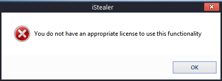

# iStealer - iStealer 6.3 Legends.exe
## Informations
| Label | Value |
| :--- | ---: |
| Executable Name | iStealer 6.3 Legends.exe |
| Product Name | iStealer |
| Version Number | 6, 1, 0, 0 |
| Description | iStealer |
| Company Name | Kizar Labs |
| Copyright | Kizar Labs 2010 |
| Trademarks |  |
| Last Edition | 26/05/2010 21:34:30 |
| Size | 1712128 |
| SHA1 🔎 | [951F04364F97007021B17664A8DDEA32B52AD126](https://www.virustotal.com/gui/search/951F04364F97007021B17664A8DDEA32B52AD126) |
| Language | Langue neutre |
## Static Analysis
<details>
<summary>Manalyze</summary>
<p>

```

* Manalyze 0.9 *

-------------------------------------------------------------------------------
C:/Users/aTest/Desktop/net6.0/Malwares/iStealer_6.3_Legends/iStealer 6.3 Legends.exe
-------------------------------------------------------------------------------

Summary:
--------
Architecture:     IMAGE_FILE_MACHINE_I386
Subsystem:        IMAGE_SUBSYSTEM_WINDOWS_GUI
Compilation Date: 2010-May-08 20:56:56
Comments:         
CompanyName:      Kizar Labs
FileDescription:  iStealer
FileVersion:      6, 1, 0, 0
InternalName:     iStealer
LegalCopyright:   Kizar Labs 2010
LegalTrademarks:  
OriginalFilename: 
PrivateBuild:     
ProductName:      iStealer
ProductVersion:   6, 1, 0, 0
SpecialBuild:     

DOS Header:
-----------
e_magic:    MZ
e_cblp:     0x0090
e_cp:       0x0003
e_crlc:     0x0000
e_cparhdr:  0x0004
e_minalloc: 0x0000
e_maxalloc: 0xFFFF
e_ss:       0x0000
e_sp:       0x00B8
e_csum:     0x0000
e_ip:       0x0000
e_cs:       0x0000
e_ovno:     0x0000
e_oemid:    0x0000
e_oeminfo:  0x0000
e_lfanew:   0x000000B8

PE Header:
----------
Signature:            PE
Machine:              IMAGE_FILE_MACHINE_I386
NumberofSections:     7
TimeDateStamp:        2010-May-08 20:56:56
PointerToSymbolTable: 0x00000000
NumberOfSymbols:      0
SizeOfOptionalHeader: 0x00E0
Characteristics:      IMAGE_FILE_32BIT_MACHINE
                      IMAGE_FILE_EXECUTABLE_IMAGE
                      IMAGE_FILE_LINE_NUMS_STRIPPED
                      IMAGE_FILE_LOCAL_SYMS_STRIPPED
                      IMAGE_FILE_RELOCS_STRIPPED

Image Optional Header:
----------------------
Magic:                   PE32
LinkerVersion:           6.1
SizeOfCode:              0x00100000
SizeOfInitializedData:   0x00074000
SizeOfUninitializedData: 0x00000000
AddressOfEntryPoint:     0x00110000 (Section: IAT_INLI)
BaseOfCode:              0x00001000
BaseOfData:              0x0001A000
ImageBase:               0x00400000
SectionAlignment:        0x00001000
FileAlignment:           0x00001000
OperatingSystemVersion:  4.0
ImageVersion:            1.1
SubsystemVersion:        4.0
Win32VersionValue:       0
SizeOfImage:             0x001B0000
SizeOfHeaders:           0x00001000
Checksum:                0x00071A8F
Subsystem:               IMAGE_SUBSYSTEM_WINDOWS_GUI
SizeofStackReserve:      0x00100000
SizeofStackCommit:       0x00001000
SizeofHeapReserve:       0x00100000
SizeofHeapCommit:        0x00001000
LoaderFlags:             0x00000000
NumberOfRvaAndSizes:     16

Sections:
---------
.text\x00\x12:
    VirtualSize:          0x00019000
    VirtualAddress:       0x00001000
    SizeOfRawData:        0x000185AC
    PointerToRawData:     0x00001000
    PointerToRelocations: 0x00000000
    PointerToLineNumbers: 0x00000000
    NumberOfLineNumbers:  0
    NumberOfRelocations:  0
    Characteristics:      IMAGE_SCN_CNT_CODE
                          IMAGE_SCN_MEM_EXECUTE
                          IMAGE_SCN_MEM_READ
                          IMAGE_SCN_MEM_WRITE
    Entropy:              6.49669

.data:
    VirtualSize:          0x00002000
    VirtualAddress:       0x0001A000
    SizeOfRawData:        0x00001D6C
    PointerToRawData:     0x0001A000
    PointerToRelocations: 0x00000000
    PointerToLineNumbers: 0x00000000
    NumberOfLineNumbers:  0
    NumberOfRelocations:  0
    Characteristics:      IMAGE_SCN_CNT_INITIALIZED_DATA
                          IMAGE_SCN_MEM_READ
                          IMAGE_SCN_MEM_WRITE
    Entropy:              0

.rsrc:
    VirtualSize:          0x00072000
    VirtualAddress:       0x0001C000
    SizeOfRawData:        0x00071F74
    PointerToRawData:     0x0001C000
    PointerToRelocations: 0x00000000
    PointerToLineNumbers: 0x00000000
    NumberOfLineNumbers:  0
    NumberOfRelocations:  0
    Characteristics:      IMAGE_SCN_CNT_INITIALIZED_DATA
                          IMAGE_SCN_MEM_READ
    Entropy:              6.59663

.vmp0\x00\x12:
    VirtualSize:          0x00013000
    VirtualAddress:       0x0008E000
    SizeOfRawData:        0x000122DC
    PointerToRawData:     0x0008E000
    PointerToRelocations: 0x00000000
    PointerToLineNumbers: 0x00000000
    NumberOfLineNumbers:  0
    NumberOfRelocations:  0
    Characteristics:      IMAGE_SCN_CNT_CODE
                          IMAGE_SCN_MEM_EXECUTE
                          IMAGE_SCN_MEM_WRITE
    Entropy:              6.73179

.tls:
    VirtualSize:          0x00001000
    VirtualAddress:       0x000A1000
    SizeOfRawData:        0x00000018
    PointerToRawData:     0x000A1000
    PointerToRelocations: 0x00000000
    PointerToLineNumbers: 0x00000000
    NumberOfLineNumbers:  0
    NumberOfRelocations:  0
    Characteristics:      IMAGE_SCN_MEM_READ
                          IMAGE_SCN_MEM_WRITE
    Entropy:              0

.vmp1:
    VirtualSize:          0x0006E000
    VirtualAddress:       0x000A2000
    SizeOfRawData:        0x00060000
    PointerToRawData:     0x000A2000
    PointerToRelocations: 0x00000000
    PointerToLineNumbers: 0x00000000
    NumberOfLineNumbers:  0
    NumberOfRelocations:  0
    Characteristics:      IMAGE_SCN_CNT_CODE
                          IMAGE_SCN_MEM_EXECUTE
                          IMAGE_SCN_MEM_READ
                          IMAGE_SCN_MEM_WRITE
    Entropy:              7.9606

IAT_INLI:
    VirtualSize:          0x000A0000
    VirtualAddress:       0x00110000
    SizeOfRawData:        0x000A0000
    PointerToRawData:     0x00102000
    PointerToRelocations: 0x00000000
    PointerToLineNumbers: 0x00000000
    NumberOfLineNumbers:  0
    NumberOfRelocations:  0
    Characteristics:      IMAGE_SCN_CNT_CODE
                          IMAGE_SCN_CNT_INITIALIZED_DATA
                          IMAGE_SCN_CNT_UNINITIALIZED_DATA
                          IMAGE_SCN_MEM_EXECUTE
                          IMAGE_SCN_MEM_READ
                          IMAGE_SCN_MEM_WRITE
    Entropy:              0.140131


Imports:
--------
MSVBVM60.DLL:      __vbaEnd
kernel32.dll:      GetModuleHandleA
                   LoadLibraryA
                   LocalAlloc
                   LocalFree
                   GetModuleFileNameA
                   ExitProcess
kernel32.dll (#2): GetModuleHandleA
                   LoadLibraryA
                   LocalAlloc
                   LocalFree
                   GetModuleFileNameA
                   ExitProcess

Resources:
----------
1:
    Type:              CUSTOM
    Language:          UNKNOWN
    Codepage:          Unicode (UTF 16LE)
    Size:              348160
    TimeDateStamp:     2010-May-08 20:56:56
    Entropy:           6.52526
    Detected Filetype: PE Executable

3:
    Type:              CUSTOM
    Language:          UNKNOWN
    Codepage:          Unicode (UTF 16LE)
    Size:              34308
    TimeDateStamp:     2010-May-08 20:56:56
    Entropy:           7.89254
    Detected Filetype: PE Executable

4:
    Type:          CUSTOM
    Language:      UNKNOWN
    Codepage:      Unicode (UTF 16LE)
    Size:          59748
    TimeDateStamp: 2010-May-08 20:56:56
    Entropy:       4.41428

1 (#2):
    Type:          RT_ICON
    Language:      UNKNOWN
    Codepage:      UNKNOWN
    Size:          3752
    TimeDateStamp: 1980-Jan-01 00:00:00
    Entropy:       6.09032

2:
    Type:          RT_ICON
    Language:      UNKNOWN
    Codepage:      UNKNOWN
    Size:          2216
    TimeDateStamp: 1980-Jan-01 00:00:00
    Entropy:       6.16798

3 (#2):
    Type:          RT_ICON
    Language:      UNKNOWN
    Codepage:      UNKNOWN
    Size:          1384
    TimeDateStamp: 1980-Jan-01 00:00:00
    Entropy:       5.99416

4 (#2):
    Type:          RT_ICON
    Language:      UNKNOWN
    Codepage:      UNKNOWN
    Size:          9640
    TimeDateStamp: 1980-Jan-01 00:00:00
    Entropy:       5.63585

5:
    Type:          RT_ICON
    Language:      UNKNOWN
    Codepage:      UNKNOWN
    Size:          4264
    TimeDateStamp: 1980-Jan-01 00:00:00
    Entropy:       5.55882

6:
    Type:          RT_ICON
    Language:      UNKNOWN
    Codepage:      UNKNOWN
    Size:          1128
    TimeDateStamp: 1980-Jan-01 00:00:00
    Entropy:       5.8849

1 (#3):
    Type:              RT_GROUP_ICON
    Language:          UNKNOWN
    Codepage:          Unicode (UTF 16LE)
    Size:              90
    TimeDateStamp:     2010-May-08 20:56:56
    Entropy:           2.69913
    Detected Filetype: Icon file

1 (#4):
    Type:          RT_VERSION
    Language:      UNKNOWN
    Codepage:      Unicode (UTF 16LE)
    Size:          812
    TimeDateStamp: 2010-May-08 20:56:56
    Entropy:       3.21648

1 (#5):
    Type:          RT_MANIFEST
    Language:      UNKNOWN
    Codepage:      Unicode (UTF 16LE)
    Size:          572
    TimeDateStamp: 2010-May-08 20:56:56
    Entropy:       4.94049


Version Info:
-------------
Resource LangID: UNKNOWN
VS_VERSION_INFO:
    Signature:           0xFEEF04BD
    StructVersion:       0x00010000
    FileVersion:         6.1.0.0
    ProductVersion:      6.1.0.0
    FileFlags:           (EMPTY)
    FileOs:              VOS_DOS_WINDOWS32
                         VOS_NT_WINDOWS32
                         VOS__WINDOWS32
    FileType:            VFT_APP
    Language:            UNKNOWN
    Comments:            
    CompanyName:         Kizar Labs
    FileDescription:     iStealer
    FileVersion (#2):    6, 1, 0, 0
    InternalName:        iStealer
    LegalCopyright:      Kizar Labs 2010
    LegalTrademarks:     
    OriginalFilename:    
    PrivateBuild:        
    ProductName:         iStealer
    ProductVersion (#2): 6, 1, 0, 0
    SpecialBuild:        


RICH Header:
------------
XOR Key:          0x91A515F9
Unmarked objects: 0
14 (7299):        1
9 (8041):         8
13 (8169):        1

Matching compiler(s):
    Microsoft Visual Basic 5.0
    Microsoft Visual C++ 6.0 - 8.0
    Microsoft Visual C++ 8.0
    Microsoft Visual Basic v5.0 - v6.0
    Microsoft Visual C++
    Microsoft Visual C++ v6.0

[ SUSPICIOUS ] Strings found in the binary may indicate undesirable behavior:
    Looks for VMWare presence:
        VMWare
    Contains another PE executable:
        This program cannot be run in DOS mode.
    Miscellaneous malware strings:
        Virus
    Contains domain names:
        adobe.com
        altervista.org
        aluigi.altervista.org
        cyber-sec.org
        hackhound.org
        http://iptc.org
        http://ns.adobe.com
        http://ns.adobe.com/photoshop/1.0/
        http://ns.adobe.com/xap/1.0/
        http://ns.adobe.com/xap/1.0/rights/
        http://purl.org
        http://www.something.com
        http://www.something.com/index.php
        http://www.w3.org
        http://www.w3.org/1999/02/22-rdf-syntax-ns#
        nirsoft.net
        ns.adobe.com
        reteam.org
        securityxploded.com
        something.com
        switchonthecode.com
        un4seen.com
        www.cyber-sec.org
        www.hackhound.org
        www.nirsoft.net
        www.reteam.org
        www.something.com
        www.switchonthecode.com
        www.un4seen.com
        www.w3.org

Cryptographic algorithms detected in the binary:
    Uses constants related to MD5

[ SUSPICIOUS ] This PE is packed with VMProtect
    Unusual section name found: .text\x00\x12
    Section .text\x00\x12 is both writable and executable.
    Unusual section name found: .vmp0\x00\x12
    Section .vmp0\x00\x12 is both writable and executable.
    Unusual section name found: .vmp1
    Section .vmp1 is both writable and executable.
    Unusual section name found: IAT_INLI
    Section IAT_INLI is both writable and executable.
    The PE only has 8 import(s).

The PE contains common functions which appear in legitimate applications.
    [!] The program may be hiding some of its imports:
        LoadLibraryA
        GetProcAddress

[ MALICIOUS ] The PE is possibly a dropper.
    Resource 1 detected as a PE Executable.
    Resource 3 detected as a PE Executable.

The following exploit mitigation techniques have been detected
    Stack Canary: disabled
    SafeSEH: disabled
    ASLR: disabled
    DEP: disabled
    CFG: disabled


```

</p>
</details>

## Screenshots
### iStealer
 
