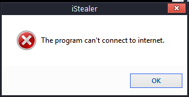

# iStealer - iStealer 4.0.4.exe
## Informations
| Label | Value |
| :--- | ---: |
| Executable Name | iStealer 4.0.4.exe |
| Product Name | iStealer |
| Version Number | 4, 0, 0, 0 |
| Description | iStealer |
| Company Name | Kizar Labs |
| Copyright | Kizar Labs 2009 |
| Trademarks |  |
| Last Edition | 23/03/2009 13:52:36 |
| Size | 141468 |
| SHA1 🔎 | [C185625210436F6BF55827BE282C756C052661F7](https://www.virustotal.com/gui/search/C185625210436F6BF55827BE282C756C052661F7) |
| Language | Langue neutre |
## Static Analysis
<details>
<summary>Manalyze</summary>
<p>

```

* Manalyze 0.9 *

-------------------------------------------------------------------------------
C:/Users/aTest/Desktop/net6.0/Malwares/Istealer Cracked/iStealer 4.0.4.exe
-------------------------------------------------------------------------------

Summary:
--------
Architecture:     IMAGE_FILE_MACHINE_I386
Subsystem:        IMAGE_SUBSYSTEM_WINDOWS_GUI
Compilation Date: 2009-Mar-23 13:48:54

DOS Header:
-----------
e_magic:    MZ
e_cblp:     0x0090
e_cp:       0x0003
e_crlc:     0x0000
e_cparhdr:  0x0004
e_minalloc: 0x0000
e_maxalloc: 0xFFFF
e_ss:       0x0000
e_sp:       0x00B8
e_csum:     0x0000
e_ip:       0x0000
e_cs:       0x0000
e_ovno:     0x0000
e_oemid:    0x0000
e_oeminfo:  0x0000
e_lfanew:   0x000000B0

PE Header:
----------
Signature:            PE
Machine:              IMAGE_FILE_MACHINE_I386
NumberofSections:     2
TimeDateStamp:        2009-Mar-23 13:48:54
PointerToSymbolTable: 0x00000000
NumberOfSymbols:      0
SizeOfOptionalHeader: 0x00E0
Characteristics:      IMAGE_FILE_32BIT_MACHINE
                      IMAGE_FILE_EXECUTABLE_IMAGE
                      IMAGE_FILE_LINE_NUMS_STRIPPED
                      IMAGE_FILE_LOCAL_SYMS_STRIPPED
                      IMAGE_FILE_RELOCS_STRIPPED

Image Optional Header:
----------------------
Magic:                   PE32
LinkerVersion:           5.0
SizeOfCode:              0x00000000
SizeOfInitializedData:   0x00000000
SizeOfUninitializedData: 0x00000000
AddressOfEntryPoint:     0x00001000 (Section: .ASPack)
BaseOfCode:              0x00001000
BaseOfData:              0x0003C000
ImageBase:               0x00400000
SectionAlignment:        0x00001000
FileAlignment:           0x00000200
OperatingSystemVersion:  4.0
ImageVersion:            0.0
SubsystemVersion:        4.0
Win32VersionValue:       0
SizeOfImage:             0x0006191A
SizeOfHeaders:           0x00000200
Checksum:                0x00000000
Subsystem:               IMAGE_SUBSYSTEM_WINDOWS_GUI
SizeofStackReserve:      0x00100000
SizeofStackCommit:       0x00001000
SizeofHeapReserve:       0x00100000
SizeofHeapCommit:        0x00001000
LoaderFlags:             0x00000000
NumberOfRvaAndSizes:     16

Sections:
---------
.ASPack:
    VirtualSize:          0x0003B000
    VirtualAddress:       0x00001000
    SizeOfRawData:        0x00000200
    PointerToRawData:     0x00000200
    PointerToRelocations: 0x00000000
    PointerToLineNumbers: 0x00000000
    NumberOfLineNumbers:  0
    NumberOfRelocations:  0
    Characteristics:      IMAGE_SCN_CNT_CODE
                          IMAGE_SCN_MEM_EXECUTE
                          IMAGE_SCN_MEM_READ
    Entropy:              0.554923

.ASPack (#2):
    VirtualSize:          0x0002591A
    VirtualAddress:       0x0003C000
    SizeOfRawData:        0x0002249C
    PointerToRawData:     0x00000400
    PointerToRelocations: 0x00000000
    PointerToLineNumbers: 0x00000000
    NumberOfLineNumbers:  0
    NumberOfRelocations:  0
    Characteristics:      IMAGE_SCN_CNT_CODE
                          IMAGE_SCN_MEM_EXECUTE
                          IMAGE_SCN_MEM_READ
                          IMAGE_SCN_MEM_WRITE
    Entropy:              7.68835


Imports:
--------
kernel32.dll: LoadLibraryA
              GetProcAddress
              VirtualAlloc
              VirtualProtect
              VirtualFree
              GetModuleHandleA

Resources:
----------
1:
    Type:          CUSTOM
    Language:      UNKNOWN
    Codepage:      Unicode (UTF 16LE)
    Size:          18944
    TimeDateStamp: 2009-Mar-23 13:48:53
    Entropy:       7.88242

3:
    Type:          CUSTOM
    Language:      UNKNOWN
    Codepage:      Unicode (UTF 16LE)
    Size:          34308
    TimeDateStamp: 2009-Mar-23 13:48:53
    Entropy:       7.82996

4:
    Type:          CUSTOM
    Language:      UNKNOWN
    Codepage:      Unicode (UTF 16LE)
    Size:          59748
    TimeDateStamp: 2009-Mar-23 13:48:53
    Entropy:       0

1 (#2):
    Type:          RT_ICON
    Language:      UNKNOWN
    Codepage:      UNKNOWN
    Size:          3752
    TimeDateStamp: 1980-Jan-01 00:00:00
    Entropy:       5.76216

2:
    Type:          RT_ICON
    Language:      UNKNOWN
    Codepage:      UNKNOWN
    Size:          2216
    TimeDateStamp: 1980-Jan-01 00:00:00
    Entropy:       6.02485

3 (#2):
    Type:          RT_ICON
    Language:      UNKNOWN
    Codepage:      UNKNOWN
    Size:          1384
    TimeDateStamp: 1980-Jan-01 00:00:00
    Entropy:       5.51796

4 (#2):
    Type:          RT_ICON
    Language:      UNKNOWN
    Codepage:      UNKNOWN
    Size:          9640
    TimeDateStamp: 1980-Jan-01 00:00:00
    Entropy:       5.35598

5:
    Type:          RT_ICON
    Language:      UNKNOWN
    Codepage:      UNKNOWN
    Size:          4264
    TimeDateStamp: 1980-Jan-01 00:00:00
    Entropy:       5.25129

6:
    Type:          RT_ICON
    Language:      UNKNOWN
    Codepage:      UNKNOWN
    Size:          1128
    TimeDateStamp: 1980-Jan-01 00:00:00
    Entropy:       5.43347

1 (#3):
    Type:              RT_GROUP_ICON
    Language:          UNKNOWN
    Codepage:          Unicode (UTF 16LE)
    Size:              90
    TimeDateStamp:     2009-Mar-23 13:48:53
    Entropy:           2.69913
    Detected Filetype: Icon file

1 (#4):
    Type:          RT_VERSION
    Language:      UNKNOWN
    Codepage:      Unicode (UTF 16LE)
    Size:          812
    TimeDateStamp: 2009-Mar-23 13:48:53
    Entropy:       3.19215

1 (#5):
    Type:          RT_MANIFEST
    Language:      UNKNOWN
    Codepage:      Unicode (UTF 16LE)
    Size:          572
    TimeDateStamp: 2009-Mar-23 13:48:53
    Entropy:       4.94049


RICH Header:
------------
XOR Key:          0x9B930419
Unmarked objects: 0
19 (8078):        8
18 (8444):        1

[ SUSPICIOUS ] PEiD Signature:
    ASPack v2.12

[ SUSPICIOUS ] The PE is packed with Aspack
    Unusual section name found: .ASPack
    Unusual section name found: .ASPack
    Section .ASPack is both writable and executable.
    The PE only has 6 import(s).

[ SUSPICIOUS ] The PE contains functions most legitimate programs don't use.
    [!] The program may be hiding some of its imports:
        LoadLibraryA
        GetProcAddress
    Memory manipulation functions often used by packers:
        VirtualAlloc
        VirtualProtect

[ SUSPICIOUS ] The PE is possibly a dropper.
    Resource 1 is possibly compressed or encrypted.
    Resource 3 is possibly compressed or encrypted.
    Resources amount for 96.7413% of the executable.

The following exploit mitigation techniques have been detected
    Stack Canary: disabled
    SafeSEH: disabled
    ASLR: disabled
    DEP: disabled
    CFG: disabled


```

</p>
</details>

## Screenshots
### iStealer
 
