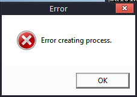

#  - Loader.exe
## Informations
| Label | Value |
| :--- | ---: |
| Executable Name | Loader.exe |
| Product Name |  |
| Version Number |  |
| Description |  |
| Company Name |  |
| Copyright |  |
| Trademarks |  |
| Last Edition | 06/05/2009 23:24:52 |
| Size | 41472 |
| SHA1 🔎 | [D8DED40AF158B57095C531BE3E58576B4EA1ED23](https://www.virustotal.com/gui/search/D8DED40AF158B57095C531BE3E58576B4EA1ED23) |
| MD5 | D41D8CD98F00B204E9800998ECF8427E |
| Language |  |
## Static Analysis
<details>
<summary>Manalyze</summary>
<p>

```

* Manalyze 0.9 *

-------------------------------------------------------------------------------
C:/Users/aTest/Desktop/net6.0/Malwares/Istealer Cracked/Loader.exe
-------------------------------------------------------------------------------

Summary:
--------
Architecture:       IMAGE_FILE_MACHINE_I386
Subsystem:          IMAGE_SUBSYSTEM_WINDOWS_GUI
Compilation Date:   2009-May-06 21:24:51
Detected languages: English - United States

DOS Header:
-----------
e_magic:    MZ
e_cblp:     0x0090
e_cp:       0x0003
e_crlc:     0x0000
e_cparhdr:  0x0004
e_minalloc: 0x0000
e_maxalloc: 0xFFFF
e_ss:       0x0000
e_sp:       0x00B8
e_csum:     0x0000
e_ip:       0x0000
e_cs:       0x0000
e_ovno:     0x0000
e_oemid:    0x0000
e_oeminfo:  0x0000
e_lfanew:   0x000000E0

PE Header:
----------
Signature:            PE
Machine:              IMAGE_FILE_MACHINE_I386
NumberofSections:     5
TimeDateStamp:        2009-May-06 21:24:51
PointerToSymbolTable: 0x00000000
NumberOfSymbols:      0
SizeOfOptionalHeader: 0x00E0
Characteristics:      IMAGE_FILE_32BIT_MACHINE
                      IMAGE_FILE_EXECUTABLE_IMAGE

Image Optional Header:
----------------------
Magic:                   PE32
LinkerVersion:           9.0
SizeOfCode:              0x00006400
SizeOfInitializedData:   0x00003A00
SizeOfUninitializedData: 0x00000000
AddressOfEntryPoint:     0x00001385 (Section: .text)
BaseOfCode:              0x00001000
BaseOfData:              0x00008000
ImageBase:               0x00400000
SectionAlignment:        0x00001000
FileAlignment:           0x00000200
OperatingSystemVersion:  5.0
ImageVersion:            0.0
SubsystemVersion:        5.0
Win32VersionValue:       0
SizeOfImage:             0x0000E000
SizeOfHeaders:           0x00000400
Checksum:                0x00012ECF
Subsystem:               IMAGE_SUBSYSTEM_WINDOWS_GUI
DllCharacteristics:      IMAGE_DLLCHARACTERISTICS_DYNAMIC_BASE
                         IMAGE_DLLCHARACTERISTICS_NX_COMPAT
                         IMAGE_DLLCHARACTERISTICS_TERMINAL_SERVER_AWARE
SizeofStackReserve:      0x00100000
SizeofStackCommit:       0x00001000
SizeofHeapReserve:       0x00100000
SizeofHeapCommit:        0x00001000
LoaderFlags:             0x00000000
NumberOfRvaAndSizes:     16

Sections:
---------
.text:
    VirtualSize:          0x000063F4
    VirtualAddress:       0x00001000
    SizeOfRawData:        0x00006400
    PointerToRawData:     0x00000400
    PointerToRelocations: 0x00000000
    PointerToLineNumbers: 0x00000000
    NumberOfLineNumbers:  0
    NumberOfRelocations:  0
    Characteristics:      IMAGE_SCN_CNT_CODE
                          IMAGE_SCN_MEM_EXECUTE
                          IMAGE_SCN_MEM_READ
    Entropy:              6.62072

.rdata:
    VirtualSize:          0x00001B82
    VirtualAddress:       0x00008000
    SizeOfRawData:        0x00001C00
    PointerToRawData:     0x00006800
    PointerToRelocations: 0x00000000
    PointerToLineNumbers: 0x00000000
    NumberOfLineNumbers:  0
    NumberOfRelocations:  0
    Characteristics:      IMAGE_SCN_CNT_INITIALIZED_DATA
                          IMAGE_SCN_MEM_READ
    Entropy:              5.47176

.data:
    VirtualSize:          0x000017DC
    VirtualAddress:       0x0000A000
    SizeOfRawData:        0x00000E00
    PointerToRawData:     0x00008400
    PointerToRelocations: 0x00000000
    PointerToLineNumbers: 0x00000000
    NumberOfLineNumbers:  0
    NumberOfRelocations:  0
    Characteristics:      IMAGE_SCN_CNT_INITIALIZED_DATA
                          IMAGE_SCN_MEM_READ
                          IMAGE_SCN_MEM_WRITE
    Entropy:              2.29286

.rsrc:
    VirtualSize:          0x000001B4
    VirtualAddress:       0x0000C000
    SizeOfRawData:        0x00000200
    PointerToRawData:     0x00009200
    PointerToRelocations: 0x00000000
    PointerToLineNumbers: 0x00000000
    NumberOfLineNumbers:  0
    NumberOfRelocations:  0
    Characteristics:      IMAGE_SCN_CNT_INITIALIZED_DATA
                          IMAGE_SCN_MEM_READ
    Entropy:              5.09798

.reloc:
    VirtualSize:          0x00000C58
    VirtualAddress:       0x0000D000
    SizeOfRawData:        0x00000E00
    PointerToRawData:     0x00009400
    PointerToRelocations: 0x00000000
    PointerToLineNumbers: 0x00000000
    NumberOfLineNumbers:  0
    NumberOfRelocations:  0
    Characteristics:      IMAGE_SCN_CNT_INITIALIZED_DATA
                          IMAGE_SCN_MEM_DISCARDABLE
                          IMAGE_SCN_MEM_READ
    Entropy:              4.04127


Imports:
--------
KERNEL32.dll: Sleep
              ReadProcessMemory
              CreateProcessA
              CloseHandle
              WriteProcessMemory
              GetCommandLineA
              GetStartupInfoA
              TerminateProcess
              GetCurrentProcess
              UnhandledExceptionFilter
              SetUnhandledExceptionFilter
              IsDebuggerPresent
              GetModuleHandleW
              GetProcAddress
              ExitProcess
              WriteFile
              GetStdHandle
              GetModuleFileNameA
              FreeEnvironmentStringsA
              GetEnvironmentStrings
              FreeEnvironmentStringsW
              WideCharToMultiByte
              GetLastError
              GetEnvironmentStringsW
              SetHandleCount
              GetFileType
              DeleteCriticalSection
              TlsGetValue
              TlsAlloc
              TlsSetValue
              TlsFree
              InterlockedIncrement
              SetLastError
              GetCurrentThreadId
              InterlockedDecrement
              HeapCreate
              VirtualFree
              HeapFree
              QueryPerformanceCounter
              GetTickCount
              GetCurrentProcessId
              GetSystemTimeAsFileTime
              LeaveCriticalSection
              EnterCriticalSection
              LoadLibraryA
              InitializeCriticalSectionAndSpinCount
              GetCPInfo
              GetACP
              GetOEMCP
              IsValidCodePage
              HeapAlloc
              VirtualAlloc
              HeapReAlloc
              RtlUnwind
              HeapSize
              GetLocaleInfoA
              LCMapStringA
              MultiByteToWideChar
              LCMapStringW
              GetStringTypeA
              GetStringTypeW
USER32.dll:   MessageBoxA

Resources:
----------
1:
    Type:          RT_MANIFEST
    Language:      English - United States
    Codepage:      Latin 1 / Western European
    Size:          346
    TimeDateStamp: 1980-Jan-01 00:00:00
    Entropy:       4.79597


Load Configuration:
-------------------
Size:                          72
TimeDateStamp:                 1970-Jan-01 00:00:00
Version:                       0.0
GlobalFlagsClear:              (EMPTY)
GlobalFlagsSet:                (EMPTY)
CriticalSectionDefaultTimeout: 0
DeCommitFreeBlockThreshold:    0x00000000
DeCommitTotalFreeThreshold:    0x00000000
LockPrefixTable:               0x00000000
MaximumAllocationSize:         0x00000000
VirtualMemoryThreshold:        0x00000000
ProcessAffinityMask:           0x00000000
ProcessHeapFlags:              (EMPTY)
CSDVersion:                    0
Reserved1:                     0x0000
EditList:                      0x00000000
SecurityCookie:                0x0040A004
SEHandlerTable:                0x00409300
SEHandlerCount:                3

RICH Header:
------------
XOR Key:                                           0xAAC38F57
Unmarked objects:                                  0
C++ objects (VS2008 build 21022):                  26
ASM objects (VS2008 build 21022):                  16
C objects (VS2008 build 21022):                    73
Imports (VS2012 build 50727 / VS2005 build 50727): 5
Total imports:                                     78
138 (VS2008 build 21022):                          1
Resource objects (VS2008 build 21022):             1

Matching compiler(s):
    Microsoft Visual C++ 6.0 - 8.0

[ SUSPICIOUS ] The PE contains functions most legitimate programs don't use.
    [!] The program may be hiding some of its imports:
        GetProcAddress
        LoadLibraryA
    Possibly launches other programs:
        CreateProcessA
    Manipulates other processes:
        ReadProcessMemory
        WriteProcessMemory

The following exploit mitigation techniques have been detected
    Stack Canary: enabled
    SafeSEH: enabled (3 registered handlers)
    ASLR: enabled
    DEP: enabled
    CFG: disabled


```

</p>
</details>

## Screenshots
### Error
 
