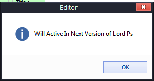

# Lord Password Sender - LPS.exe
## Informations
| Label | Value |
| :--- | ---: |
| Executable Name | LPS.exe |
| Product Name | Lord Password Sender |
| Version Number | 1.00 |
| Description |  |
| Company Name | www.LordHackers.net |
| Copyright | 2006 - 2010 All Right Served LordHackers Company |
| Trademarks |  |
| Last Edition | 27/05/2006 10:42:16 |
| Size | 66560 |
| SHA1 🔎 | [ECAD31A14062BBC90F7BA0B718028F0E427D79C0](https://www.virustotal.com/gui/search/ECAD31A14062BBC90F7BA0B718028F0E427D79C0) |
| MD5 | D41D8CD98F00B204E9800998ECF8427E |
| Language | Anglais (États-Unis) |
## Static Analysis
<details>
<summary>Manalyze</summary>
<p>

```

* Manalyze 0.9 *

-------------------------------------------------------------------------------
C:/Users/aTest/Desktop/net6.0/Malwares/LPS.exe
-------------------------------------------------------------------------------

Summary:
--------
Architecture:       IMAGE_FILE_MACHINE_I386
Subsystem:          IMAGE_SUBSYSTEM_WINDOWS_GUI
Compilation Date:   2006-May-27 06:12:16
Detected languages: English - United States
                    Farsi - Iran
CompanyName:        www.LordHackers.net
LegalCopyright:     2006 - 2010 All Right Served LordHackers Company
ProductName:        Lord Password Sender
FileVersion:        1.00
ProductVersion:     1.00
InternalName:       LPS
OriginalFilename:   LPS.exe

DOS Header:
-----------
e_magic:    MZ
e_cblp:     0x0090
e_cp:       0x0003
e_crlc:     0x0000
e_cparhdr:  0x0004
e_minalloc: 0x0000
e_maxalloc: 0xFFFF
e_ss:       0x0000
e_sp:       0x00B8
e_csum:     0x0000
e_ip:       0x0000
e_cs:       0x0000
e_ovno:     0x0000
e_oemid:    0x0000
e_oeminfo:  0x0000
e_lfanew:   0x000000B8

PE Header:
----------
Signature:            PE
Machine:              IMAGE_FILE_MACHINE_I386
NumberofSections:     3
TimeDateStamp:        2006-May-27 06:12:16
PointerToSymbolTable: 0x00000000
NumberOfSymbols:      0
SizeOfOptionalHeader: 0x00E0
Characteristics:      IMAGE_FILE_32BIT_MACHINE
                      IMAGE_FILE_EXECUTABLE_IMAGE
                      IMAGE_FILE_LINE_NUMS_STRIPPED
                      IMAGE_FILE_LOCAL_SYMS_STRIPPED
                      IMAGE_FILE_RELOCS_STRIPPED

Image Optional Header:
----------------------
Magic:                   PE32
LinkerVersion:           6.0
SizeOfCode:              0x0000E000
SizeOfInitializedData:   0x00003000
SizeOfUninitializedData: 0x00030000
AddressOfEntryPoint:     0x0003E970 (Section: UPX1)
BaseOfCode:              0x00031000
BaseOfData:              0x0003F000
ImageBase:               0x00400000
SectionAlignment:        0x00001000
FileAlignment:           0x00000200
OperatingSystemVersion:  4.0
ImageVersion:            1.0
SubsystemVersion:        4.0
Win32VersionValue:       0
SizeOfImage:             0x00042000
SizeOfHeaders:           0x00001000
Checksum:                0x00000000
Subsystem:               IMAGE_SUBSYSTEM_WINDOWS_GUI
SizeofStackReserve:      0x00100000
SizeofStackCommit:       0x00001000
SizeofHeapReserve:       0x00100000
SizeofHeapCommit:        0x00001000
LoaderFlags:             0x00000000
NumberOfRvaAndSizes:     16

Sections:
---------
UPX0:
    VirtualSize:          0x00030000
    VirtualAddress:       0x00001000
    SizeOfRawData:        0x00000000
    PointerToRawData:     0x00000400
    PointerToRelocations: 0x00000000
    PointerToLineNumbers: 0x00000000
    NumberOfLineNumbers:  0
    NumberOfRelocations:  0
    Characteristics:      IMAGE_SCN_CNT_UNINITIALIZED_DATA
                          IMAGE_SCN_MEM_EXECUTE
                          IMAGE_SCN_MEM_READ
                          IMAGE_SCN_MEM_WRITE

UPX1:
    VirtualSize:          0x0000E000
    VirtualAddress:       0x00031000
    SizeOfRawData:        0x0000DC00
    PointerToRawData:     0x00000400
    PointerToRelocations: 0x00000000
    PointerToLineNumbers: 0x00000000
    NumberOfLineNumbers:  0
    NumberOfRelocations:  0
    Characteristics:      IMAGE_SCN_CNT_INITIALIZED_DATA
                          IMAGE_SCN_MEM_EXECUTE
                          IMAGE_SCN_MEM_READ
                          IMAGE_SCN_MEM_WRITE
    Entropy:              7.86555

.rsrc:
    VirtualSize:          0x00003000
    VirtualAddress:       0x0003F000
    SizeOfRawData:        0x00002400
    PointerToRawData:     0x0000E000
    PointerToRelocations: 0x00000000
    PointerToLineNumbers: 0x00000000
    NumberOfLineNumbers:  0
    NumberOfRelocations:  0
    Characteristics:      IMAGE_SCN_CNT_INITIALIZED_DATA
                          IMAGE_SCN_MEM_READ
                          IMAGE_SCN_MEM_WRITE
    Entropy:              4.40758


Imports:
--------
KERNEL32.DLL: LoadLibraryA
              GetProcAddress
              ExitProcess
MSVBVM60.DLL: #546

Resources:
----------
101:
    Type:          CUSTOM
    Language:      Farsi - Iran
    Codepage:      Unicode (UTF 16LE)
    Size:          2240
    TimeDateStamp: 2006-May-27 06:12:15
    Entropy:       7.68709

102:
    Type:          CUSTOM
    Language:      Farsi - Iran
    Codepage:      Unicode (UTF 16LE)
    Size:          2240
    TimeDateStamp: 2006-May-27 06:12:15
    Entropy:       7.69749

103:
    Type:          CUSTOM
    Language:      Farsi - Iran
    Codepage:      Unicode (UTF 16LE)
    Size:          2240
    TimeDateStamp: 2006-May-27 06:12:15
    Entropy:       7.76695

104:
    Type:          CUSTOM
    Language:      Farsi - Iran
    Codepage:      Unicode (UTF 16LE)
    Size:          768
    TimeDateStamp: 2006-May-27 06:12:15
    Entropy:       7.49133

105:
    Type:          CUSTOM
    Language:      Farsi - Iran
    Codepage:      Unicode (UTF 16LE)
    Size:          2240
    TimeDateStamp: 2006-May-27 06:12:15
    Entropy:       7.7306

106:
    Type:          CUSTOM
    Language:      Farsi - Iran
    Codepage:      Unicode (UTF 16LE)
    Size:          808
    TimeDateStamp: 2006-May-27 06:12:15
    Entropy:       7.505

107:
    Type:          CUSTOM
    Language:      Farsi - Iran
    Codepage:      Unicode (UTF 16LE)
    Size:          2240
    TimeDateStamp: 2006-May-27 06:12:15
    Entropy:       7.75162

108:
    Type:          CUSTOM
    Language:      Farsi - Iran
    Codepage:      Unicode (UTF 16LE)
    Size:          768
    TimeDateStamp: 2006-May-27 06:12:15
    Entropy:       7.19729

109:
    Type:          CUSTOM
    Language:      Farsi - Iran
    Codepage:      Unicode (UTF 16LE)
    Size:          4288
    TimeDateStamp: 2006-May-27 06:12:15
    Entropy:       7.77091

110:
    Type:          CUSTOM
    Language:      Farsi - Iran
    Codepage:      Unicode (UTF 16LE)
    Size:          4288
    TimeDateStamp: 2006-May-27 06:12:15
    Entropy:       7.77313

111:
    Type:          CUSTOM
    Language:      Farsi - Iran
    Codepage:      Unicode (UTF 16LE)
    Size:          768
    TimeDateStamp: 2006-May-27 06:12:15
    Entropy:       7.56589

112:
    Type:          CUSTOM
    Language:      Farsi - Iran
    Codepage:      Unicode (UTF 16LE)
    Size:          2240
    TimeDateStamp: 2006-May-27 06:12:15
    Entropy:       7.79819

101 (#2):
    Type:          EXE
    Language:      Farsi - Iran
    Codepage:      Unicode (UTF 16LE)
    Size:          65536
    TimeDateStamp: 2006-May-27 06:12:15
    Entropy:       0

30001:
    Type:          RT_ICON
    Language:      UNKNOWN
    Codepage:      Unicode (UTF 16LE)
    Size:          3240
    TimeDateStamp: 2006-May-27 06:12:15
    Entropy:       6.69869

30002:
    Type:          RT_ICON
    Language:      UNKNOWN
    Codepage:      Unicode (UTF 16LE)
    Size:          3240
    TimeDateStamp: 2006-May-27 06:12:15
    Entropy:       0.399774

1:
    Type:              RT_GROUP_ICON
    Language:          UNKNOWN
    Codepage:          Unicode (UTF 16LE)
    Size:              36
    TimeDateStamp:     2006-May-27 06:12:15
    Entropy:           2.50844
    Detected Filetype: Icon file

1 (#2):
    Type:          RT_VERSION
    Language:      English - United States
    Codepage:      Unicode (UTF 16LE)
    Size:          692
    TimeDateStamp: 2006-May-27 06:12:15
    Entropy:       3.34267

1 (#3):
    Type:          RT_MANIFEST
    Language:      English - United States
    Codepage:      Unicode (UTF 16LE)
    Size:          524
    TimeDateStamp: 2006-May-27 06:12:15
    Entropy:       5.14442


Version Info:
-------------
Resource LangID: English - United States
VS_VERSION_INFO:
    Signature:           0xFEEF04BD
    StructVersion:       0x00010000
    FileVersion:         1.0.0.0
    ProductVersion:      1.0.0.0
    FileFlags:           (EMPTY)
    FileOs:              VOS_DOS_WINDOWS32
                         VOS_NT_WINDOWS32
                         VOS__WINDOWS32
    FileType:            VFT_APP
    Language:            English - United States
    CompanyName:         www.LordHackers.net
    LegalCopyright:      2006 - 2010 All Right Served LordHackers Company
    ProductName:         Lord Password Sender
    FileVersion (#2):    1.00
    ProductVersion (#2): 1.00
    InternalName:        LPS
    OriginalFilename:    LPS.exe


RICH Header:
------------
XOR Key:          0x8ACD8739
Unmarked objects: 0
14 (7299):        1
9 (8041):         6
13 (8169):        1

[ SUSPICIOUS ] PEiD Signature:
    UPX -> www.upx.sourceforge.net

Interesting strings found in the binary:
    Contains domain names:
        LordHackers.net
        www.LordHackers.net

[ SUSPICIOUS ] The PE is packed with UPX
    Unusual section name found: UPX0
    Section UPX0 is both writable and executable.
    Unusual section name found: UPX1
    Section UPX1 is both writable and executable.
    The PE only has 4 import(s).
    The PE's resources are bigger than it is.

The PE contains common functions which appear in legitimate applications.
    [!] The program may be hiding some of its imports:
        LoadLibraryA
        GetProcAddress

[ SUSPICIOUS ] The PE is possibly a dropper.
    Resource 101 is possibly compressed or encrypted.
    Resource 102 is possibly compressed or encrypted.
    Resource 103 is possibly compressed or encrypted.
    Resource 104 is possibly compressed or encrypted.
    Resource 105 is possibly compressed or encrypted.
    Resource 106 is possibly compressed or encrypted.
    Resource 107 is possibly compressed or encrypted.
    Resource 108 is possibly compressed or encrypted.
    Resource 109 is possibly compressed or encrypted.
    Resource 110 is possibly compressed or encrypted.
    Resource 111 is possibly compressed or encrypted.
    Resource 112 is possibly compressed or encrypted.
    Resources amount for 147.831% of the executable.

The following exploit mitigation techniques have been detected
    Stack Canary: disabled
    SafeSEH: disabled
    ASLR: disabled
    DEP: disabled
    CFG: disabled


```

</p>
</details>

## Screenshots
### Editor
 
### LORD PS (WWW.LORDHACKERS.NET)
_f937f037079d4f5f8159e9fc757fb840.png) 
