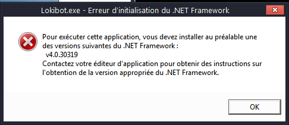

#  - Multi Password Stealer_1.6.exe
## Informations
| Label | Value |
| :--- | ---: |
| Executable Name | Multi Password Stealer_1.6.exe |
| Product Name |  |
| Version Number |  |
| Description |  |
| Company Name |  |
| Copyright |  |
| Trademarks |  |
| Last Edition | 01/01/2008 22:20:00 |
| Size | 1964032 |
| SHA1 🔎 | [C6C8E2DDC9CFF822CCDF762F9AD783F2BE92B41D](https://www.virustotal.com/gui/search/C6C8E2DDC9CFF822CCDF762F9AD783F2BE92B41D) |
| MD5 | D41D8CD98F00B204E9800998ECF8427E |
| Language |  |
## Static Analysis
<details>
<summary>Manalyze</summary>
<p>

```

* Manalyze 0.9 *

-------------------------------------------------------------------------------
C:/Users/aTest/Desktop/net6.0/Malwares/Multi Password Stealer_1.6/Multi Password Stealer_1.6.exe
-------------------------------------------------------------------------------

Summary:
--------
Architecture:       IMAGE_FILE_MACHINE_I386
Subsystem:          IMAGE_SUBSYSTEM_WINDOWS_GUI
Compilation Date:   1992-Jun-19 22:22:17
Detected languages: English - United States
                    German - Germany

DOS Header:
-----------
e_magic:    MZ
e_cblp:     0x0050
e_cp:       0x0002
e_crlc:     0x0000
e_cparhdr:  0x0004
e_minalloc: 0x000F
e_maxalloc: 0xFFFF
e_ss:       0x0000
e_sp:       0x00B8
e_csum:     0x0000
e_ip:       0x0000
e_cs:       0x0000
e_ovno:     0x001A
e_oemid:    0x0000
e_oeminfo:  0x0000
e_lfanew:   0x00000100

PE Header:
----------
Signature:            PE
Machine:              IMAGE_FILE_MACHINE_I386
NumberofSections:     8
TimeDateStamp:        1992-Jun-19 22:22:17
PointerToSymbolTable: 0x00000000
NumberOfSymbols:      0
SizeOfOptionalHeader: 0x00E0
Characteristics:      IMAGE_FILE_32BIT_MACHINE
                      IMAGE_FILE_BYTES_REVERSED_HI
                      IMAGE_FILE_BYTES_REVERSED_LO
                      IMAGE_FILE_EXECUTABLE_IMAGE
                      IMAGE_FILE_LINE_NUMS_STRIPPED
                      IMAGE_FILE_LOCAL_SYMS_STRIPPED

Image Optional Header:
----------------------
Magic:                   PE32
LinkerVersion:           2.0
SizeOfCode:              0x000B2400
SizeOfInitializedData:   0x0012D000
SizeOfUninitializedData: 0x00000000
AddressOfEntryPoint:     0x000B3174 (Section: CODE)
BaseOfCode:              0x00001000
BaseOfData:              0x000B4000
ImageBase:               0x00400000
SectionAlignment:        0x00001000
FileAlignment:           0x00000200
OperatingSystemVersion:  4.0
ImageVersion:            0.0
SubsystemVersion:        4.0
Win32VersionValue:       0
SizeOfImage:             0x001E7000
SizeOfHeaders:           0x00000400
Checksum:                0x00000000
Subsystem:               IMAGE_SUBSYSTEM_WINDOWS_GUI
SizeofStackReserve:      0x00100000
SizeofStackCommit:       0x00004000
SizeofHeapReserve:       0x00100000
SizeofHeapCommit:        0x00001000
LoaderFlags:             0x00000000
NumberOfRvaAndSizes:     16

Sections:
---------
CODE:
    VirtualSize:          0x000B2234
    VirtualAddress:       0x00001000
    SizeOfRawData:        0x000B2400
    PointerToRawData:     0x00000400
    PointerToRelocations: 0x00000000
    PointerToLineNumbers: 0x00000000
    NumberOfLineNumbers:  0
    NumberOfRelocations:  0
    Characteristics:      IMAGE_SCN_CNT_CODE
                          IMAGE_SCN_MEM_EXECUTE
                          IMAGE_SCN_MEM_READ
    Entropy:              6.54737

DATA:
    VirtualSize:          0x00002C68
    VirtualAddress:       0x000B4000
    SizeOfRawData:        0x00002E00
    PointerToRawData:     0x000B2800
    PointerToRelocations: 0x00000000
    PointerToLineNumbers: 0x00000000
    NumberOfLineNumbers:  0
    NumberOfRelocations:  0
    Characteristics:      IMAGE_SCN_CNT_INITIALIZED_DATA
                          IMAGE_SCN_MEM_READ
                          IMAGE_SCN_MEM_WRITE
    Entropy:              5.00418

BSS:
    VirtualSize:          0x000011BD
    VirtualAddress:       0x000B7000
    SizeOfRawData:        0x00000000
    PointerToRawData:     0x000B5600
    PointerToRelocations: 0x00000000
    PointerToLineNumbers: 0x00000000
    NumberOfLineNumbers:  0
    NumberOfRelocations:  0
    Characteristics:      IMAGE_SCN_MEM_READ
                          IMAGE_SCN_MEM_WRITE

.idata:
    VirtualSize:          0x000026F8
    VirtualAddress:       0x000B9000
    SizeOfRawData:        0x00002800
    PointerToRawData:     0x000B5600
    PointerToRelocations: 0x00000000
    PointerToLineNumbers: 0x00000000
    NumberOfLineNumbers:  0
    NumberOfRelocations:  0
    Characteristics:      IMAGE_SCN_CNT_INITIALIZED_DATA
                          IMAGE_SCN_MEM_READ
                          IMAGE_SCN_MEM_WRITE
    Entropy:              4.98534

.tls:
    VirtualSize:          0x00000010
    VirtualAddress:       0x000BC000
    SizeOfRawData:        0x00000000
    PointerToRawData:     0x000B7E00
    PointerToRelocations: 0x00000000
    PointerToLineNumbers: 0x00000000
    NumberOfLineNumbers:  0
    NumberOfRelocations:  0
    Characteristics:      IMAGE_SCN_MEM_READ
                          IMAGE_SCN_MEM_WRITE

.rdata:
    VirtualSize:          0x00000018
    VirtualAddress:       0x000BD000
    SizeOfRawData:        0x00000200
    PointerToRawData:     0x000B7E00
    PointerToRelocations: 0x00000000
    PointerToLineNumbers: 0x00000000
    NumberOfLineNumbers:  0
    NumberOfRelocations:  0
    Characteristics:      IMAGE_SCN_CNT_INITIALIZED_DATA
                          IMAGE_SCN_MEM_READ
                          IMAGE_SCN_MEM_SHARED
    Entropy:              0.200582

.reloc:
    VirtualSize:          0x0000C0B8
    VirtualAddress:       0x000BE000
    SizeOfRawData:        0x0000C200
    PointerToRawData:     0x000B8000
    PointerToRelocations: 0x00000000
    PointerToLineNumbers: 0x00000000
    NumberOfLineNumbers:  0
    NumberOfRelocations:  0
    Characteristics:      IMAGE_SCN_CNT_INITIALIZED_DATA
                          IMAGE_SCN_MEM_READ
                          IMAGE_SCN_MEM_SHARED
    Entropy:              6.63641

.rsrc:
    VirtualSize:          0x0011B600
    VirtualAddress:       0x000CB000
    SizeOfRawData:        0x0011B600
    PointerToRawData:     0x000C4200
    PointerToRelocations: 0x00000000
    PointerToLineNumbers: 0x00000000
    NumberOfLineNumbers:  0
    NumberOfRelocations:  0
    Characteristics:      IMAGE_SCN_CNT_INITIALIZED_DATA
                          IMAGE_SCN_MEM_READ
                          IMAGE_SCN_MEM_SHARED
    Entropy:              7.21767


Imports:
--------
kernel32.dll:      DeleteCriticalSection
                   LeaveCriticalSection
                   EnterCriticalSection
                   InitializeCriticalSection
                   VirtualFree
                   VirtualAlloc
                   LocalFree
                   LocalAlloc
                   GetTickCount
                   QueryPerformanceCounter
                   GetVersion
                   GetCurrentThreadId
                   InterlockedDecrement
                   InterlockedIncrement
                   VirtualQuery
                   WideCharToMultiByte
                   MultiByteToWideChar
                   lstrlenA
                   lstrcpynA
                   LoadLibraryExA
                   GetThreadLocale
                   GetStartupInfoA
                   GetProcAddress
                   GetModuleHandleA
                   GetModuleFileNameA
                   GetLocaleInfoA
                   GetCommandLineA
                   FreeLibrary
                   FindFirstFileA
                   FindClose
                   ExitProcess
                   ExitThread
                   CreateThread
                   WriteFile
                   UnhandledExceptionFilter
                   RtlUnwind
                   RaiseException
                   GetStdHandle
user32.dll:        GetKeyboardType
                   LoadStringA
                   MessageBoxA
                   CharNextA
advapi32.dll:      RegQueryValueExA
                   RegOpenKeyExA
                   RegCloseKey
oleaut32.dll:      SysFreeString
                   SysReAllocStringLen
                   SysAllocStringLen
kernel32.dll (#2): DeleteCriticalSection
                   LeaveCriticalSection
                   EnterCriticalSection
                   InitializeCriticalSection
                   VirtualFree
                   VirtualAlloc
                   LocalFree
                   LocalAlloc
                   GetTickCount
                   QueryPerformanceCounter
                   GetVersion
                   GetCurrentThreadId
                   InterlockedDecrement
                   InterlockedIncrement
                   VirtualQuery
                   WideCharToMultiByte
                   MultiByteToWideChar
                   lstrlenA
                   lstrcpynA
                   LoadLibraryExA
                   GetThreadLocale
                   GetStartupInfoA
                   GetProcAddress
                   GetModuleHandleA
                   GetModuleFileNameA
                   GetLocaleInfoA
                   GetCommandLineA
                   FreeLibrary
                   FindFirstFileA
                   FindClose
                   ExitProcess
                   ExitThread
                   CreateThread
                   WriteFile
                   UnhandledExceptionFilter
                   RtlUnwind
                   RaiseException
                   GetStdHandle
advapi32.dll (#2): RegQueryValueExA
                   RegOpenKeyExA
                   RegCloseKey
kernel32.dll (#3): DeleteCriticalSection
                   LeaveCriticalSection
                   EnterCriticalSection
                   InitializeCriticalSection
                   VirtualFree
                   VirtualAlloc
                   LocalFree
                   LocalAlloc
                   GetTickCount
                   QueryPerformanceCounter
                   GetVersion
                   GetCurrentThreadId
                   InterlockedDecrement
                   InterlockedIncrement
                   VirtualQuery
                   WideCharToMultiByte
                   MultiByteToWideChar
                   lstrlenA
                   lstrcpynA
                   LoadLibraryExA
                   GetThreadLocale
                   GetStartupInfoA
                   GetProcAddress
                   GetModuleHandleA
                   GetModuleFileNameA
                   GetLocaleInfoA
                   GetCommandLineA
                   FreeLibrary
                   FindFirstFileA
                   FindClose
                   ExitProcess
                   ExitThread
                   CreateThread
                   WriteFile
                   UnhandledExceptionFilter
                   RtlUnwind
                   RaiseException
                   GetStdHandle
version.dll:       VerQueryValueA
                   GetFileVersionInfoSizeA
                   GetFileVersionInfoA
gdi32.dll:         UnrealizeObject
                   StretchBlt
                   SetWindowOrgEx
                   SetWinMetaFileBits
                   SetViewportOrgEx
                   SetTextColor
                   SetStretchBltMode
                   SetROP2
                   SetPixel
                   SetMapMode
                   SetEnhMetaFileBits
                   SetDIBColorTable
                   SetBrushOrgEx
                   SetBkMode
                   SetBkColor
                   SelectPalette
                   SelectObject
                   SelectClipRgn
                   SaveDC
                   RoundRect
                   RestoreDC
                   Rectangle
                   RectVisible
                   RealizePalette
                   Polyline
                   PlayEnhMetaFile
                   PatBlt
                   MoveToEx
                   MaskBlt
                   LineTo
                   LPtoDP
                   IntersectClipRect
                   GetWindowOrgEx
                   GetWinMetaFileBits
                   GetTextMetricsA
                   GetTextExtentPointA
                   GetTextExtentPoint32A
                   GetSystemPaletteEntries
                   GetStockObject
                   GetPixel
                   GetPaletteEntries
                   GetObjectA
                   GetEnhMetaFilePaletteEntries
                   GetEnhMetaFileHeader
                   GetEnhMetaFileDescriptionA
                   GetEnhMetaFileBits
                   GetDeviceCaps
                   GetDIBits
                   GetDIBColorTable
                   GetDCOrgEx
                   GetCurrentPositionEx
                   GetCurrentObject
                   GetClipBox
                   GetBrushOrgEx
                   GetBitmapBits
                   GdiFlush
                   ExtCreateRegion
                   ExcludeClipRect
                   Ellipse
                   DeleteObject
                   DeleteEnhMetaFile
                   DeleteDC
                   CreateSolidBrush
                   CreateRectRgn
                   CreatePenIndirect
                   CreatePalette
                   CreateHalftonePalette
                   CreateFontIndirectA
                   CreateEnhMetaFileA
                   CreateDIBitmap
                   CreateDIBSection
                   CreateCompatibleDC
                   CreateCompatibleBitmap
                   CreateBrushIndirect
                   CreateBitmap
                   CopyEnhMetaFileA
                   CombineRgn
                   CloseEnhMetaFile
                   BitBlt
user32.dll (#2):   GetKeyboardType
                   LoadStringA
                   MessageBoxA
                   CharNextA
kernel32.dll (#4): DeleteCriticalSection
                   LeaveCriticalSection
                   EnterCriticalSection
                   InitializeCriticalSection
                   VirtualFree
                   VirtualAlloc
                   LocalFree
                   LocalAlloc
                   GetTickCount
                   QueryPerformanceCounter
                   GetVersion
                   GetCurrentThreadId
                   InterlockedDecrement
                   InterlockedIncrement
                   VirtualQuery
                   WideCharToMultiByte
                   MultiByteToWideChar
                   lstrlenA
                   lstrcpynA
                   LoadLibraryExA
                   GetThreadLocale
                   GetStartupInfoA
                   GetProcAddress
                   GetModuleHandleA
                   GetModuleFileNameA
                   GetLocaleInfoA
                   GetCommandLineA
                   FreeLibrary
                   FindFirstFileA
                   FindClose
                   ExitProcess
                   ExitThread
                   CreateThread
                   WriteFile
                   UnhandledExceptionFilter
                   RtlUnwind
                   RaiseException
                   GetStdHandle
oleaut32.dll (#2): SysFreeString
                   SysReAllocStringLen
                   SysAllocStringLen
ole32.dll:         CreateStreamOnHGlobal
                   IsAccelerator
                   OleDraw
                   OleSetMenuDescriptor
                   CoTaskMemFree
                   ProgIDFromCLSID
                   StringFromCLSID
                   CoCreateInstance
                   CoGetClassObject
                   CoUninitialize
                   CoInitialize
                   IsEqualGUID
oleaut32.dll (#3): SysFreeString
                   SysReAllocStringLen
                   SysAllocStringLen
comctl32.dll:      ImageList_SetIconSize
                   ImageList_GetIconSize
                   ImageList_Write
                   ImageList_Read
                   ImageList_GetDragImage
                   ImageList_DragShowNolock
                   ImageList_SetDragCursorImage
                   ImageList_DragMove
                   ImageList_DragLeave
                   ImageList_DragEnter
                   ImageList_EndDrag
                   ImageList_BeginDrag
                   ImageList_LoadImageA
                   ImageList_Remove
                   ImageList_DrawEx
                   ImageList_Replace
                   ImageList_Draw
                   ImageList_GetBkColor
                   ImageList_SetBkColor
                   ImageList_ReplaceIcon
                   ImageList_Add
                   ImageList_GetImageCount
                   ImageList_Destroy
                   ImageList_Create
                   InitCommonControls
shell32.dll:       ShellExecuteA

Resources:
----------
1:
    Type:          RT_CURSOR
    Language:      UNKNOWN
    Codepage:      UNKNOWN
    Size:          308
    TimeDateStamp: 2007-Aug-31 16:49:04
    Entropy:       2.6633

2:
    Type:          RT_CURSOR
    Language:      UNKNOWN
    Codepage:      UNKNOWN
    Size:          308
    TimeDateStamp: 2007-Aug-31 16:49:04
    Entropy:       2.80231

3:
    Type:          RT_CURSOR
    Language:      UNKNOWN
    Codepage:      UNKNOWN
    Size:          308
    TimeDateStamp: 2007-Aug-31 16:49:04
    Entropy:       3.00046

4:
    Type:          RT_CURSOR
    Language:      UNKNOWN
    Codepage:      UNKNOWN
    Size:          308
    TimeDateStamp: 2007-Aug-31 16:49:04
    Entropy:       2.56318

5:
    Type:          RT_CURSOR
    Language:      UNKNOWN
    Codepage:      UNKNOWN
    Size:          308
    TimeDateStamp: 2007-Aug-31 16:49:04
    Entropy:       2.6949

6:
    Type:          RT_CURSOR
    Language:      UNKNOWN
    Codepage:      UNKNOWN
    Size:          308
    TimeDateStamp: 2007-Aug-31 16:49:04
    Entropy:       2.62527

7:
    Type:          RT_CURSOR
    Language:      UNKNOWN
    Codepage:      UNKNOWN
    Size:          308
    TimeDateStamp: 2007-Aug-31 16:49:04
    Entropy:       2.91604

BBABORT:
    Type:          RT_BITMAP
    Language:      UNKNOWN
    Codepage:      UNKNOWN
    Size:          464
    TimeDateStamp: 2007-Aug-31 16:49:04
    Entropy:       2.92079

BBALL:
    Type:          RT_BITMAP
    Language:      UNKNOWN
    Codepage:      UNKNOWN
    Size:          484
    TimeDateStamp: 2007-Aug-31 16:49:04
    Entropy:       3.16995

BBCANCEL:
    Type:          RT_BITMAP
    Language:      UNKNOWN
    Codepage:      UNKNOWN
    Size:          464
    TimeDateStamp: 2007-Aug-31 16:49:04
    Entropy:       2.92079

BBCLOSE:
    Type:          RT_BITMAP
    Language:      UNKNOWN
    Codepage:      UNKNOWN
    Size:          464
    TimeDateStamp: 2007-Aug-31 16:49:04
    Entropy:       3.68492

BBHELP:
    Type:          RT_BITMAP
    Language:      UNKNOWN
    Codepage:      UNKNOWN
    Size:          464
    TimeDateStamp: 2007-Aug-31 16:49:04
    Entropy:       2.88085

BBIGNORE:
    Type:          RT_BITMAP
    Language:      UNKNOWN
    Codepage:      UNKNOWN
    Size:          464
    TimeDateStamp: 2007-Aug-31 16:49:04
    Entropy:       3.29718

BBNO:
    Type:          RT_BITMAP
    Language:      UNKNOWN
    Codepage:      UNKNOWN
    Size:          464
    TimeDateStamp: 2007-Aug-31 16:49:04
    Entropy:       3.58804

BBOK:
    Type:          RT_BITMAP
    Language:      UNKNOWN
    Codepage:      UNKNOWN
    Size:          464
    TimeDateStamp: 2007-Aug-31 16:49:04
    Entropy:       2.67459

BBRETRY:
    Type:          RT_BITMAP
    Language:      UNKNOWN
    Codepage:      UNKNOWN
    Size:          464
    TimeDateStamp: 2007-Aug-31 16:49:04
    Entropy:       3.53344

BBYES:
    Type:          RT_BITMAP
    Language:      UNKNOWN
    Codepage:      UNKNOWN
    Size:          464
    TimeDateStamp: 2007-Aug-31 16:49:04
    Entropy:       2.67459

CDROM:
    Type:          RT_BITMAP
    Language:      UNKNOWN
    Codepage:      UNKNOWN
    Size:          192
    TimeDateStamp: 2007-Aug-31 16:49:04
    Entropy:       2.78825

CLOSEDFOLDER:
    Type:          RT_BITMAP
    Language:      UNKNOWN
    Codepage:      UNKNOWN
    Size:          224
    TimeDateStamp: 2007-Aug-31 16:49:04
    Entropy:       3.01477

CURRENTFOLDER:
    Type:          RT_BITMAP
    Language:      UNKNOWN
    Codepage:      UNKNOWN
    Size:          224
    TimeDateStamp: 2007-Aug-31 16:49:04
    Entropy:       2.97986

EXECUTABLE:
    Type:          RT_BITMAP
    Language:      UNKNOWN
    Codepage:      UNKNOWN
    Size:          224
    TimeDateStamp: 2007-Aug-31 16:49:04
    Entropy:       2.96393

FLOPPY:
    Type:          RT_BITMAP
    Language:      UNKNOWN
    Codepage:      UNKNOWN
    Size:          192
    TimeDateStamp: 2007-Aug-31 16:49:04
    Entropy:       2.63812

HARD:
    Type:          RT_BITMAP
    Language:      UNKNOWN
    Codepage:      UNKNOWN
    Size:          192
    TimeDateStamp: 2007-Aug-31 16:49:04
    Entropy:       2.62043

KNOWNFILE:
    Type:          RT_BITMAP
    Language:      UNKNOWN
    Codepage:      UNKNOWN
    Size:          224
    TimeDateStamp: 2007-Aug-31 16:49:04
    Entropy:       2.83217

NETWORK:
    Type:          RT_BITMAP
    Language:      UNKNOWN
    Codepage:      UNKNOWN
    Size:          192
    TimeDateStamp: 2007-Aug-31 16:49:04
    Entropy:       2.73457

OPENFOLDER:
    Type:          RT_BITMAP
    Language:      UNKNOWN
    Codepage:      UNKNOWN
    Size:          224
    TimeDateStamp: 2007-Aug-31 16:49:04
    Entropy:       3.0519

PREVIEWGLYPH:
    Type:          RT_BITMAP
    Language:      UNKNOWN
    Codepage:      UNKNOWN
    Size:          232
    TimeDateStamp: 2007-Aug-31 16:49:04
    Entropy:       2.85172

RAM:
    Type:          RT_BITMAP
    Language:      UNKNOWN
    Codepage:      UNKNOWN
    Size:          192
    TimeDateStamp: 2007-Aug-31 16:49:04
    Entropy:       2.73213

SBLEFT:
    Type:          RT_BITMAP
    Language:      UNKNOWN
    Codepage:      UNKNOWN
    Size:          208
    TimeDateStamp: 2007-Aug-31 16:49:04
    Entropy:       3.0184

SBLEFTDIS:
    Type:          RT_BITMAP
    Language:      UNKNOWN
    Codepage:      UNKNOWN
    Size:          208
    TimeDateStamp: 2007-Aug-31 16:49:04
    Entropy:       2.79554

SBLEFTDN:
    Type:          RT_BITMAP
    Language:      UNKNOWN
    Codepage:      UNKNOWN
    Size:          208
    TimeDateStamp: 2007-Aug-31 16:49:04
    Entropy:       2.40721

SBRIGHT:
    Type:          RT_BITMAP
    Language:      UNKNOWN
    Codepage:      UNKNOWN
    Size:          208
    TimeDateStamp: 2007-Aug-31 16:49:04
    Entropy:       3.00455

SBRIGHTDIS:
    Type:          RT_BITMAP
    Language:      UNKNOWN
    Codepage:      UNKNOWN
    Size:          208
    TimeDateStamp: 2007-Aug-31 16:49:04
    Entropy:       2.86813

SBRIGHTDN:
    Type:          RT_BITMAP
    Language:      UNKNOWN
    Codepage:      UNKNOWN
    Size:          208
    TimeDateStamp: 2007-Aug-31 16:49:04
    Entropy:       3.00311

UNKNOWNFILE:
    Type:          RT_BITMAP
    Language:      UNKNOWN
    Codepage:      UNKNOWN
    Size:          224
    TimeDateStamp: 2007-Aug-31 16:49:04
    Entropy:       2.50975

VCLSKINMENU:
    Type:          RT_BITMAP
    Language:      English - United States
    Codepage:      UNKNOWN
    Size:          176
    TimeDateStamp: 2007-Aug-31 16:49:04
    Entropy:       3.0994

1 (#2):
    Type:          RT_ICON
    Language:      German - Germany
    Codepage:      UNKNOWN
    Size:          1640
    TimeDateStamp: 2007-Aug-31 16:49:04
    Entropy:       3.99866

2 (#2):
    Type:          RT_ICON
    Language:      German - Germany
    Codepage:      UNKNOWN
    Size:          744
    TimeDateStamp: 2007-Aug-31 16:49:04
    Entropy:       4.27398

3 (#2):
    Type:          RT_ICON
    Language:      German - Germany
    Codepage:      UNKNOWN
    Size:          296
    TimeDateStamp: 2007-Aug-31 16:49:04
    Entropy:       3.63972

4 (#2):
    Type:          RT_ICON
    Language:      German - Germany
    Codepage:      UNKNOWN
    Size:          3752
    TimeDateStamp: 2007-Aug-31 16:49:04
    Entropy:       5.65814

5 (#2):
    Type:          RT_ICON
    Language:      German - Germany
    Codepage:      UNKNOWN
    Size:          2216
    TimeDateStamp: 2007-Aug-31 16:49:04
    Entropy:       6.24584

6 (#2):
    Type:          RT_ICON
    Language:      German - Germany
    Codepage:      UNKNOWN
    Size:          1384
    TimeDateStamp: 2007-Aug-31 16:49:04
    Entropy:       2.89324

7 (#2):
    Type:          RT_ICON
    Language:      German - Germany
    Codepage:      UNKNOWN
    Size:          9640
    TimeDateStamp: 2007-Aug-31 16:49:04
    Entropy:       5.35465

8:
    Type:          RT_ICON
    Language:      German - Germany
    Codepage:      UNKNOWN
    Size:          4264
    TimeDateStamp: 2007-Aug-31 16:49:04
    Entropy:       5.85347

9:
    Type:          RT_ICON
    Language:      German - Germany
    Codepage:      UNKNOWN
    Size:          1128
    TimeDateStamp: 2007-Aug-31 16:49:04
    Entropy:       5.47986

DLGTEMPLATE:
    Type:          RT_DIALOG
    Language:      UNKNOWN
    Codepage:      UNKNOWN
    Size:          82
    TimeDateStamp: 2007-Aug-31 16:49:04
    Entropy:       2.5627

4073:
    Type:          RT_STRING
    Language:      UNKNOWN
    Codepage:      UNKNOWN
    Size:          576
    TimeDateStamp: 2007-Aug-31 16:49:04
    Entropy:       3.27291

4074:
    Type:          RT_STRING
    Language:      UNKNOWN
    Codepage:      UNKNOWN
    Size:          1476
    TimeDateStamp: 2007-Aug-31 16:49:04
    Entropy:       3.28617

4075:
    Type:          RT_STRING
    Language:      UNKNOWN
    Codepage:      UNKNOWN
    Size:          1404
    TimeDateStamp: 2007-Aug-31 16:49:04
    Entropy:       3.25043

4076:
    Type:          RT_STRING
    Language:      UNKNOWN
    Codepage:      UNKNOWN
    Size:          1084
    TimeDateStamp: 2007-Aug-31 16:49:04
    Entropy:       3.28809

4077:
    Type:          RT_STRING
    Language:      UNKNOWN
    Codepage:      UNKNOWN
    Size:          884
    TimeDateStamp: 2007-Aug-31 16:49:04
    Entropy:       3.3655

4078:
    Type:          RT_STRING
    Language:      UNKNOWN
    Codepage:      UNKNOWN
    Size:          1312
    TimeDateStamp: 2007-Aug-31 16:49:04
    Entropy:       3.30121

4079:
    Type:          RT_STRING
    Language:      UNKNOWN
    Codepage:      UNKNOWN
    Size:          1552
    TimeDateStamp: 2007-Aug-31 16:49:04
    Entropy:       3.35527

4080:
    Type:          RT_STRING
    Language:      UNKNOWN
    Codepage:      UNKNOWN
    Size:          584
    TimeDateStamp: 2007-Aug-31 16:49:04
    Entropy:       3.24876

4081:
    Type:          RT_STRING
    Language:      UNKNOWN
    Codepage:      UNKNOWN
    Size:          500
    TimeDateStamp: 2007-Aug-31 16:49:04
    Entropy:       3.18497

4082:
    Type:          RT_STRING
    Language:      UNKNOWN
    Codepage:      UNKNOWN
    Size:          256
    TimeDateStamp: 2007-Aug-31 16:49:04
    Entropy:       3.09778

4083:
    Type:          RT_STRING
    Language:      UNKNOWN
    Codepage:      UNKNOWN
    Size:          1232
    TimeDateStamp: 2007-Aug-31 16:49:04
    Entropy:       3.25371

4084:
    Type:          RT_STRING
    Language:      UNKNOWN
    Codepage:      UNKNOWN
    Size:          256
    TimeDateStamp: 2007-Aug-31 16:49:04
    Entropy:       3.12999

4085:
    Type:          RT_STRING
    Language:      UNKNOWN
    Codepage:      UNKNOWN
    Size:          312
    TimeDateStamp: 2007-Aug-31 16:49:04
    Entropy:       3.16084

4086:
    Type:          RT_STRING
    Language:      UNKNOWN
    Codepage:      UNKNOWN
    Size:          784
    TimeDateStamp: 2007-Aug-31 16:49:04
    Entropy:       3.25329

4087:
    Type:          RT_STRING
    Language:      UNKNOWN
    Codepage:      UNKNOWN
    Size:          1632
    TimeDateStamp: 2007-Aug-31 16:49:04
    Entropy:       3.21628

4088:
    Type:          RT_STRING
    Language:      UNKNOWN
    Codepage:      UNKNOWN
    Size:          988
    TimeDateStamp: 2007-Aug-31 16:49:04
    Entropy:       3.3524

4089:
    Type:          RT_STRING
    Language:      UNKNOWN
    Codepage:      UNKNOWN
    Size:          1236
    TimeDateStamp: 2007-Aug-31 16:49:04
    Entropy:       3.25882

4090:
    Type:          RT_STRING
    Language:      UNKNOWN
    Codepage:      UNKNOWN
    Size:          1408
    TimeDateStamp: 2007-Aug-31 16:49:04
    Entropy:       3.30255

4091:
    Type:          RT_STRING
    Language:      UNKNOWN
    Codepage:      UNKNOWN
    Size:          232
    TimeDateStamp: 2007-Aug-31 16:49:04
    Entropy:       2.87227

4092:
    Type:          RT_STRING
    Language:      UNKNOWN
    Codepage:      UNKNOWN
    Size:          204
    TimeDateStamp: 2007-Aug-31 16:49:04
    Entropy:       2.90688

4093:
    Type:          RT_STRING
    Language:      UNKNOWN
    Codepage:      UNKNOWN
    Size:          808
    TimeDateStamp: 2007-Aug-31 16:49:04
    Entropy:       3.33418

4094:
    Type:          RT_STRING
    Language:      UNKNOWN
    Codepage:      UNKNOWN
    Size:          1240
    TimeDateStamp: 2007-Aug-31 16:49:04
    Entropy:       3.33914

4095:
    Type:          RT_STRING
    Language:      UNKNOWN
    Codepage:      UNKNOWN
    Size:          828
    TimeDateStamp: 2007-Aug-31 16:49:04
    Entropy:       3.39165

4096:
    Type:          RT_STRING
    Language:      UNKNOWN
    Codepage:      UNKNOWN
    Size:          1020
    TimeDateStamp: 2007-Aug-31 16:49:04
    Entropy:       3.23245

DVCLAL:
    Type:          RT_RCDATA
    Language:      UNKNOWN
    Codepage:      UNKNOWN
    Size:          16
    TimeDateStamp: 2007-Aug-31 16:49:04
    Entropy:       4

INSTALL:
    Type:              RT_RCDATA
    Language:          German - Germany
    Codepage:          UNKNOWN
    Size:              729600
    TimeDateStamp:     2007-Aug-31 16:49:04
    Entropy:           6.79648
    Detected Filetype: PE Executable

PACKAGEINFO:
    Type:          RT_RCDATA
    Language:      UNKNOWN
    Codepage:      UNKNOWN
    Size:          1580
    TimeDateStamp: 2007-Aug-31 16:49:04
    Entropy:       5.34094

TFORM1:
    Type:          RT_RCDATA
    Language:      UNKNOWN
    Codepage:      UNKNOWN
    Size:          54623
    TimeDateStamp: 2007-Aug-31 16:49:04
    Entropy:       7.91687

TFORM2:
    Type:          RT_RCDATA
    Language:      UNKNOWN
    Codepage:      UNKNOWN
    Size:          1070
    TimeDateStamp: 2007-Aug-31 16:49:04
    Entropy:       5.49724

TFORM3:
    Type:          RT_RCDATA
    Language:      UNKNOWN
    Codepage:      UNKNOWN
    Size:          35180
    TimeDateStamp: 2007-Aug-31 16:49:04
    Entropy:       7.05908

TFORM4:
    Type:          RT_RCDATA
    Language:      UNKNOWN
    Codepage:      UNKNOWN
    Size:          2070
    TimeDateStamp: 2007-Aug-31 16:49:04
    Entropy:       5.59233

TFRMREGISTER:
    Type:          RT_RCDATA
    Language:      UNKNOWN
    Codepage:      UNKNOWN
    Size:          11388
    TimeDateStamp: 2007-Aug-31 16:49:04
    Entropy:       4.83536

TFRMUPX:
    Type:          RT_RCDATA
    Language:      UNKNOWN
    Codepage:      UNKNOWN
    Size:          642
    TimeDateStamp: 2007-Aug-31 16:49:04
    Entropy:       5.48018

UPX:
    Type:              RT_RCDATA
    Language:          German - Germany
    Codepage:          UNKNOWN
    Size:              261120
    TimeDateStamp:     2007-Aug-31 16:49:04
    Entropy:           7.99251
    Detected Filetype: PE Executable

32761:
    Type:              RT_GROUP_CURSOR
    Language:          UNKNOWN
    Codepage:          UNKNOWN
    Size:              20
    TimeDateStamp:     2007-Aug-31 16:49:04
    Entropy:           1.83876
    Detected Filetype: Cursor file

32762:
    Type:              RT_GROUP_CURSOR
    Language:          UNKNOWN
    Codepage:          UNKNOWN
    Size:              20
    TimeDateStamp:     2007-Aug-31 16:49:04
    Entropy:           1.91924
    Detected Filetype: Cursor file

32763:
    Type:              RT_GROUP_CURSOR
    Language:          UNKNOWN
    Codepage:          UNKNOWN
    Size:              20
    TimeDateStamp:     2007-Aug-31 16:49:04
    Entropy:           2.01924
    Detected Filetype: Cursor file

32764:
    Type:              RT_GROUP_CURSOR
    Language:          UNKNOWN
    Codepage:          UNKNOWN
    Size:              20
    TimeDateStamp:     2007-Aug-31 16:49:04
    Entropy:           2.01924
    Detected Filetype: Cursor file

32765:
    Type:              RT_GROUP_CURSOR
    Language:          UNKNOWN
    Codepage:          UNKNOWN
    Size:              20
    TimeDateStamp:     2007-Aug-31 16:49:04
    Entropy:           2.01924
    Detected Filetype: Cursor file

32766:
    Type:              RT_GROUP_CURSOR
    Language:          UNKNOWN
    Codepage:          UNKNOWN
    Size:              20
    TimeDateStamp:     2007-Aug-31 16:49:04
    Entropy:           2.01924
    Detected Filetype: Cursor file

32767:
    Type:              RT_GROUP_CURSOR
    Language:          UNKNOWN
    Codepage:          UNKNOWN
    Size:              20
    TimeDateStamp:     2007-Aug-31 16:49:04
    Entropy:           2.01924
    Detected Filetype: Cursor file

MAINICON:
    Type:              RT_GROUP_ICON
    Language:          German - Germany
    Codepage:          UNKNOWN
    Size:              132
    TimeDateStamp:     2007-Aug-31 16:49:04
    Entropy:           2.89097
    Detected Filetype: Icon file


TLS Callbacks:
--------------
StartAddressOfRawData: 0x004BC000
EndAddressOfRawData:   0x004BC010
AddressOfIndex:        0x004B40A0
AddressOfCallbacks:    0x004BD010
SizeOfZeroFill:        0x00000000
Characteristics:       IMAGE_SCN_TYPE_REG
Callbacks:             (EMPTY)

[ SUSPICIOUS ] PEiD Signature:
    UPX V2.00-V2.90 -> Markus Oberhumer &amp; Laszlo Molnar &amp; John Reiser
    UPX v2.0 -> Markus, Laszlo & Reiser (h)
    UPX 2.00-3.0X -> Markus Oberhumer &amp; Laszlo Molnar &amp; John Reiser
    UPX -> www.upx.sourceforge.net
    UPX V2.00-V2.90 -> Markus Oberhumer & Laszlo Molnar & John Reiser
    UPX 2.00-3.0X -> Markus Oberhumer & Laszlo Molnar & John Reiser

[ SUSPICIOUS ] Strings found in the binary may indicate undesirable behavior:
    Looks for VMWare presence:
        ba 58 56 00 00 ed 81 fb 68 58 4d 56 
    Contains another PE executable:
        This program cannot be run in DOS mode.
    Contains domain names:
        Messenger.com
        Stealer.com
        hotmail.com
        http://uploaded.to
        http://upx.sf.net
        mail.gmx.net
        upx.sf.net

Cryptographic algorithms detected in the binary:
    Uses constants related to MD5

[ MALICIOUS ] The PE contains functions mostly used by malware.
    [!] The program may be hiding some of its imports:
        LoadLibraryExA
        GetProcAddress
        LoadLibraryA
    Functions which can be used for anti-debugging purposes:
        FindWindowA
    Code injection capabilities (PowerLoader):
        GetWindowLongA
        FindWindowA
    Can access the registry:
        RegQueryValueExA
        RegOpenKeyExA
        RegCloseKey
    Possibly launches other programs:
        ShellExecuteA
    Can create temporary files:
        GetTempPathA
        CreateFileA
    Uses functions commonly found in keyloggers:
        MapVirtualKeyA
        GetForegroundWindow
        CallNextHookEx
    Can take screenshots:
        CreateCompatibleDC
        BitBlt
        GetDCEx
        GetDC
        FindWindowA
    Reads the contents of the clipboard:
        GetClipboardData

[ MALICIOUS ] The PE header may have been manually modified.
    Resource INSTALL detected as a PE Executable.
    Resource TFORM1 is possibly compressed or encrypted.
    Resource TFORM3 is possibly compressed or encrypted.
    Resource UPX detected as a PE Executable.
    The resource timestamps differ from the PE header:
        2007-Aug-31 16:49:04

The following exploit mitigation techniques have been detected
    Stack Canary: disabled
    SafeSEH: disabled
    ASLR: disabled
    DEP: disabled
    CFG: disabled


```

</p>
</details>

## Screenshots
### Erreur de script
 
### M.M.H v1.6
 
#   - WMICodeCreator.exe
## Informations
| Label | Value |
| :--- | ---: |
| Executable Name | WMICodeCreator.exe |
| Product Name |   |
| Version Number | 1.0.2029.14830 |
| Description |   |
| Company Name |   |
| Copyright |   |
| Trademarks |   |
| Last Edition | 02/10/2020 13:19:15 |
| Size | 301808 |
| SHA1 🔎 | [BCA97089C50BB5C10AEE67D352B629AA616C973E](https://www.virustotal.com/gui/search/BCA97089C50BB5C10AEE67D352B629AA616C973E) |
| MD5 | D41D8CD98F00B204E9800998ECF8427E |
| Language | Langue neutre |
## Static Analysis
<details>
<summary>Manalyze</summary>
<p>

```

* Manalyze 0.9 *

-------------------------------------------------------------------------------
C:/Users/aTest/Desktop/net6.0/Malwares/[corclub]Tools/WMI/WMICodeCreator/WMICodeCreator.exe
-------------------------------------------------------------------------------

Summary:
--------
Architecture:     IMAGE_FILE_MACHINE_I386
Subsystem:        IMAGE_SUBSYSTEM_WINDOWS_GUI
Compilation Date: 2005-Jul-22 16:14:21
Comments:          
CompanyName:       
FileDescription:   
FileVersion:      1.0.2029.14830
InternalName:     WMICodeCreator.exe
LegalCopyright:    
LegalTrademarks:   
OriginalFilename: WMICodeCreator.exe
ProductName:       
ProductVersion:   1.0.2029.14830
Assembly Version: 1.0.2029.14830

DOS Header:
-----------
e_magic:    MZ
e_cblp:     0x0090
e_cp:       0x0003
e_crlc:     0x0000
e_cparhdr:  0x0004
e_minalloc: 0x0000
e_maxalloc: 0xFFFF
e_ss:       0x0000
e_sp:       0x00B8
e_csum:     0x0000
e_ip:       0x0000
e_cs:       0x0000
e_ovno:     0x0000
e_oemid:    0x0000
e_oeminfo:  0x0000
e_lfanew:   0x00000080

PE Header:
----------
Signature:            PE
Machine:              IMAGE_FILE_MACHINE_I386
NumberofSections:     3
TimeDateStamp:        2005-Jul-22 16:14:21
PointerToSymbolTable: 0x00000000
NumberOfSymbols:      0
SizeOfOptionalHeader: 0x00E0
Characteristics:      IMAGE_FILE_32BIT_MACHINE
                      IMAGE_FILE_EXECUTABLE_IMAGE
                      IMAGE_FILE_LINE_NUMS_STRIPPED
                      IMAGE_FILE_LOCAL_SYMS_STRIPPED

Image Optional Header:
----------------------
Magic:                   PE32
LinkerVersion:           6.0
SizeOfCode:              0x00045000
SizeOfInitializedData:   0x00002000
SizeOfUninitializedData: 0x00000000
AddressOfEntryPoint:     0x000464BE (Section: .text)
BaseOfCode:              0x00002000
BaseOfData:              0x00048000
ImageBase:               0x00400000
SectionAlignment:        0x00002000
FileAlignment:           0x00001000
OperatingSystemVersion:  4.0
ImageVersion:            0.0
SubsystemVersion:        4.0
Win32VersionValue:       0
SizeOfImage:             0x0004C000
SizeOfHeaders:           0x00001000
Checksum:                0x0004FF4D
Subsystem:               IMAGE_SUBSYSTEM_WINDOWS_GUI
DllCharacteristics:      IMAGE_DLLCHARACTERISTICS_NO_SEH
SizeofStackReserve:      0x00100000
SizeofStackCommit:       0x00001000
SizeofHeapReserve:       0x00100000
SizeofHeapCommit:        0x00001000
LoaderFlags:             0x00000000
NumberOfRvaAndSizes:     16

Sections:
---------
.text:
    VirtualSize:          0x000444C4
    VirtualAddress:       0x00002000
    SizeOfRawData:        0x00045000
    PointerToRawData:     0x00001000
    PointerToRelocations: 0x00000000
    PointerToLineNumbers: 0x00000000
    NumberOfLineNumbers:  0
    NumberOfRelocations:  0
    Characteristics:      IMAGE_SCN_CNT_CODE
                          IMAGE_SCN_MEM_EXECUTE
                          IMAGE_SCN_MEM_READ
    Entropy:              5.03359

.rsrc:
    VirtualSize:          0x00000380
    VirtualAddress:       0x00048000
    SizeOfRawData:        0x00001000
    PointerToRawData:     0x00046000
    PointerToRelocations: 0x00000000
    PointerToLineNumbers: 0x00000000
    NumberOfLineNumbers:  0
    NumberOfRelocations:  0
    Characteristics:      IMAGE_SCN_CNT_INITIALIZED_DATA
                          IMAGE_SCN_MEM_READ
    Entropy:              0.932262

.reloc:
    VirtualSize:          0x0000000C
    VirtualAddress:       0x0004A000
    SizeOfRawData:        0x00001000
    PointerToRawData:     0x00047000
    PointerToRelocations: 0x00000000
    PointerToLineNumbers: 0x00000000
    NumberOfLineNumbers:  0
    NumberOfRelocations:  0
    Characteristics:      IMAGE_SCN_CNT_INITIALIZED_DATA
                          IMAGE_SCN_MEM_DISCARDABLE
                          IMAGE_SCN_MEM_READ
    Entropy:              0.0164085


Imports:
--------
mscoree.dll: _CorExeMain

Resources:
----------
1:
    Type:          RT_VERSION
    Language:      UNKNOWN
    Codepage:      UNKNOWN
    Size:          804
    TimeDateStamp: 1980-Jan-01 00:00:00
    Entropy:       3.39234


Version Info:
-------------
Resource LangID: UNKNOWN
VS_VERSION_INFO:
    Signature:           0xFEEF04BD
    StructVersion:       0x00010000
    FileVersion:         1.0.2029.14830
    ProductVersion:      1.0.2029.14830
    FileFlags:           (EMPTY)
    FileOs:              VOS_DOS_WINDOWS32
                         VOS_NT_WINDOWS32
                         VOS__WINDOWS32
    FileType:            VFT_APP
    Language:            UNKNOWN
    Comments:             
    CompanyName:          
    FileDescription:      
    FileVersion (#2):    1.0.2029.14830
    InternalName:        WMICodeCreator.exe
    LegalCopyright:       
    LegalTrademarks:      
    OriginalFilename:    WMICodeCreator.exe
    ProductName:          
    ProductVersion (#2): 1.0.2029.14830
    Assembly Version:    1.0.2029.14830


Matching compiler(s):
    Microsoft Visual C# v7.0 / Basic .NET
    Microsoft Visual C++ 8.0

[ SUSPICIOUS ] Strings found in the binary may indicate undesirable behavior:
    Contains references to system / monitoring tools:
        sc.exe
    Accesses the WMI:
        root\CIMV2
    Contains domain names:
        microsoft.com
        msdn.microsoft.com
        www.msdn.microsoft.com

The following exploit mitigation techniques have been detected
    Stack Canary: disabled
    SafeSEH: disabled
    ASLR: disabled
    DEP: disabled
    CFG: disabled

[ SAFE ] The PE's digital signature is valid.
    Program name: WMI Code Creator
    Additional information: http://www.microsoft.com/technet/scriptcenter/default.mspx
    Issued by: Microsoft Code Signing PCA
    Issued to: Microsoft Corporation
    Signing time: 2005-Aug-02 22:54:05 +0100


```

</p>
</details>

## Screenshots
### WMI Code Creator
 
# Confuser - Confuser.exe
## Informations
| Label | Value |
| :--- | ---: |
| Executable Name | Confuser.exe |
| Product Name | Confuser |
| Version Number | 1.8.0.0 |
| Description | Confuser |
| Company Name | Ki |
| Copyright | Make by Ki |
| Trademarks |  |
| Last Edition | 02/10/2020 13:19:15 |
| Size | 798720 |
| SHA1 🔎 | [35BF384A1F393E086C810039669D2A96134A7AE0](https://www.virustotal.com/gui/search/35BF384A1F393E086C810039669D2A96134A7AE0) |
| MD5 | D41D8CD98F00B204E9800998ECF8427E |
| Language | Langue neutre |
## Static Analysis
<details>
<summary>Manalyze</summary>
<p>

```

* Manalyze 0.9 *

-------------------------------------------------------------------------------
C:/Users/aTest/Desktop/net6.0/Malwares/[corclub]Other/Insomnia/bin/Release/Confuser/Confuser.exe
-------------------------------------------------------------------------------

Summary:
--------
Architecture:     IMAGE_FILE_MACHINE_I386
Subsystem:        IMAGE_SUBSYSTEM_WINDOWS_GUI
Compilation Date: 2012-May-31 15:26:42
Debug artifacts:  E:\Source\Public\Confuser\Confuser\obj\Release\Confuser.pdb
Comments:         An obfuscator in .NET
CompanyName:      Ki
FileDescription:  Confuser
FileVersion:      1.8.0.0
InternalName:     Confuser.exe
LegalCopyright:   Make by Ki
OriginalFilename: Confuser.exe
ProductName:      Confuser
ProductVersion:   1.8.0.0
Assembly Version: 1.8.0.0

DOS Header:
-----------
e_magic:    MZ
e_cblp:     0x0090
e_cp:       0x0003
e_crlc:     0x0000
e_cparhdr:  0x0004
e_minalloc: 0x0000
e_maxalloc: 0xFFFF
e_ss:       0x0000
e_sp:       0x00B8
e_csum:     0x0000
e_ip:       0x0000
e_cs:       0x0000
e_ovno:     0x0000
e_oemid:    0x0000
e_oeminfo:  0x0000
e_lfanew:   0x00000080

PE Header:
----------
Signature:            PE
Machine:              IMAGE_FILE_MACHINE_I386
NumberofSections:     3
TimeDateStamp:        2012-May-31 15:26:42
PointerToSymbolTable: 0x00000000
NumberOfSymbols:      0
SizeOfOptionalHeader: 0x00E0
Characteristics:      IMAGE_FILE_32BIT_MACHINE
                      IMAGE_FILE_EXECUTABLE_IMAGE

Image Optional Header:
----------------------
Magic:                   PE32
LinkerVersion:           8.0
SizeOfCode:              0x00076C00
SizeOfInitializedData:   0x0004C200
SizeOfUninitializedData: 0x00000000
AddressOfEntryPoint:     0x00078A1E (Section: .text)
BaseOfCode:              0x00002000
BaseOfData:              0x0007A000
ImageBase:               0x00400000
SectionAlignment:        0x00002000
FileAlignment:           0x00000200
OperatingSystemVersion:  4.0
ImageVersion:            0.0
SubsystemVersion:        4.0
Win32VersionValue:       0
SizeOfImage:             0x000C8000
SizeOfHeaders:           0x00000200
Checksum:                0x000D1DEF
Subsystem:               IMAGE_SUBSYSTEM_WINDOWS_GUI
DllCharacteristics:      IMAGE_DLLCHARACTERISTICS_DYNAMIC_BASE
                         IMAGE_DLLCHARACTERISTICS_NO_SEH
                         IMAGE_DLLCHARACTERISTICS_NX_COMPAT
                         IMAGE_DLLCHARACTERISTICS_TERMINAL_SERVER_AWARE
SizeofStackReserve:      0x00100000
SizeofStackCommit:       0x00001000
SizeofHeapReserve:       0x00100000
SizeofHeapCommit:        0x00001000
LoaderFlags:             0x00000000
NumberOfRvaAndSizes:     16

Sections:
---------
.text:
    VirtualSize:          0x00076A24
    VirtualAddress:       0x00002000
    SizeOfRawData:        0x00076C00
    PointerToRawData:     0x00000200
    PointerToRelocations: 0x00000000
    PointerToLineNumbers: 0x00000000
    NumberOfLineNumbers:  0
    NumberOfRelocations:  0
    Characteristics:      IMAGE_SCN_CNT_CODE
                          IMAGE_SCN_MEM_EXECUTE
                          IMAGE_SCN_MEM_READ
    Entropy:              7.34175

.rsrc:
    VirtualSize:          0x0004BF90
    VirtualAddress:       0x0007A000
    SizeOfRawData:        0x0004C000
    PointerToRawData:     0x00076E00
    PointerToRelocations: 0x00000000
    PointerToLineNumbers: 0x00000000
    NumberOfLineNumbers:  0
    NumberOfRelocations:  0
    Characteristics:      IMAGE_SCN_CNT_INITIALIZED_DATA
                          IMAGE_SCN_MEM_READ
    Entropy:              7.17441

.reloc:
    VirtualSize:          0x0000000C
    VirtualAddress:       0x000C6000
    SizeOfRawData:        0x00000200
    PointerToRawData:     0x000C2E00
    PointerToRelocations: 0x00000000
    PointerToLineNumbers: 0x00000000
    NumberOfLineNumbers:  0
    NumberOfRelocations:  0
    Characteristics:      IMAGE_SCN_CNT_INITIALIZED_DATA
                          IMAGE_SCN_MEM_DISCARDABLE
                          IMAGE_SCN_MEM_READ
    Entropy:              0.10191


Imports:
--------
mscoree.dll: _CorExeMain

Resources:
----------
2:
    Type:          RT_ICON
    Language:      UNKNOWN
    Codepage:      UNKNOWN
    Size:          204840
    TimeDateStamp: 1980-Jan-01 00:00:00
    Entropy:       7.11823

3:
    Type:          RT_ICON
    Language:      UNKNOWN
    Codepage:      UNKNOWN
    Size:          51240
    TimeDateStamp: 1980-Jan-01 00:00:00
    Entropy:       7.19091

4:
    Type:          RT_ICON
    Language:      UNKNOWN
    Codepage:      UNKNOWN
    Size:          12840
    TimeDateStamp: 1980-Jan-01 00:00:00
    Entropy:       7.10597

5:
    Type:          RT_ICON
    Language:      UNKNOWN
    Codepage:      UNKNOWN
    Size:          7336
    TimeDateStamp: 1980-Jan-01 00:00:00
    Entropy:       6.94217

6:
    Type:          RT_ICON
    Language:      UNKNOWN
    Codepage:      UNKNOWN
    Size:          3240
    TimeDateStamp: 1980-Jan-01 00:00:00
    Entropy:       6.82898

7:
    Type:          RT_ICON
    Language:      UNKNOWN
    Codepage:      UNKNOWN
    Size:          872
    TimeDateStamp: 1980-Jan-01 00:00:00
    Entropy:       6.34077

8:
    Type:          RT_ICON
    Language:      UNKNOWN
    Codepage:      UNKNOWN
    Size:          28840
    TimeDateStamp: 1980-Jan-01 00:00:00
    Entropy:       7.1898

32512:
    Type:              RT_GROUP_ICON
    Language:          UNKNOWN
    Codepage:          UNKNOWN
    Size:              104
    TimeDateStamp:     1980-Jan-01 00:00:00
    Entropy:           2.99433
    Detected Filetype: Icon file

1:
    Type:          RT_VERSION
    Language:      UNKNOWN
    Codepage:      UNKNOWN
    Size:          784
    TimeDateStamp: 1980-Jan-01 00:00:00
    Entropy:       3.28428

1 (#2):
    Type:          RT_MANIFEST
    Language:      UNKNOWN
    Codepage:      UNKNOWN
    Size:          490
    TimeDateStamp: 1980-Jan-01 00:00:00
    Entropy:       5.00112


Version Info:
-------------
Resource LangID: UNKNOWN
VS_VERSION_INFO:
    Signature:           0xFEEF04BD
    StructVersion:       0x00010000
    FileVersion:         1.8.0.0
    ProductVersion:      1.8.0.0
    FileFlags:           (EMPTY)
    FileOs:              VOS_DOS_WINDOWS32
                         VOS_NT_WINDOWS32
                         VOS__WINDOWS32
    FileType:            VFT_APP
    Language:            UNKNOWN
    Comments:            An obfuscator in .NET
    CompanyName:         Ki
    FileDescription:     Confuser
    FileVersion (#2):    1.8.0.0
    InternalName:        Confuser.exe
    LegalCopyright:      Make by Ki
    OriginalFilename:    Confuser.exe
    ProductName:         Confuser
    ProductVersion (#2): 1.8.0.0
    Assembly Version:    1.8.0.0


Debug Info:
-----------
IMAGE_DEBUG_TYPE_CODEVIEW:
    Characteristics:  0
    TimeDateStamp:    2012-May-31 15:26:42
    Version:          0.0
    SizeofData:       84
    AddressOfRawData: 0x00078974
    PointerToRawData: 0x00076B74
    Referenced File:  E:\Source\Public\Confuser\Confuser\obj\Release\Confuser.pdb


Matching compiler(s):
    Microsoft Visual C# v7.0 / Basic .NET
    .NET executable -> Microsoft

Interesting strings found in the binary:
    Contains domain names:
        creativecommons.org
        http://creativecommons.org
        http://schemas.microsoft.com
        http://schemas.microsoft.com/winfx/2006/xaml
        http://schemas.microsoft.com/winfx/2006/xaml/presentation
        http://www.oxygen-icons.org
        http://www.oxygen-icons.org/
        icons.org
        inkscape.org
        microsoft.com
        oxygen-icons.org
        schemas.microsoft.com
        www.inkscape.org
        www.oxygen-icons.org

The PE's resources present abnormal characteristics.
    Resource 2 is possibly compressed or encrypted.
    Resource 3 is possibly compressed or encrypted.
    Resource 4 is possibly compressed or encrypted.
    Resource 8 is possibly compressed or encrypted.

The following exploit mitigation techniques have been detected
    Stack Canary: disabled
    SafeSEH: disabled
    ASLR: enabled
    DEP: enabled
    CFG: disabled


```

</p>
</details>

## Screenshots
### Confuser v1.8.0.0 - Untitled.crproj 
 
# Projekt1 - icon changer.exe
## Informations
| Label | Value |
| :--- | ---: |
| Executable Name | icon changer.exe |
| Product Name | Projekt1 |
| Version Number | 1.00 |
| Description |  |
| Company Name |  |
| Copyright |  |
| Trademarks |  |
| Last Edition | 03/06/2006 14:37:00 |
| Size | 40960 |
| SHA1 🔎 | [FDD7FB31009C4E201ED2AC058FE6C22C05319ADF](https://www.virustotal.com/gui/search/FDD7FB31009C4E201ED2AC058FE6C22C05319ADF) |
| MD5 | D41D8CD98F00B204E9800998ECF8427E |
| Language | Allemand (Allemagne) |
## Static Analysis
<details>
<summary>Manalyze</summary>
<p>

```

* Manalyze 0.9 *

-------------------------------------------------------------------------------
C:/Users/aTest/Desktop/net6.0/Malwares/PWstealer_v2.0/icon changer.exe
-------------------------------------------------------------------------------

Summary:
--------
Architecture:       IMAGE_FILE_MACHINE_I386
Subsystem:          IMAGE_SUBSYSTEM_WINDOWS_GUI
Compilation Date:   2006-Jun-03 12:37:27
Detected languages: German - Germany
ProductName:        Projekt1
FileVersion:        1.00
ProductVersion:     1.00
InternalName:       icon changer
OriginalFilename:   icon changer.exe

DOS Header:
-----------
e_magic:    MZ
e_cblp:     0x0090
e_cp:       0x0003
e_crlc:     0x0000
e_cparhdr:  0x0004
e_minalloc: 0x0000
e_maxalloc: 0xFFFF
e_ss:       0x0000
e_sp:       0x00B8
e_csum:     0x0000
e_ip:       0x0000
e_cs:       0x0000
e_ovno:     0x0000
e_oemid:    0x0000
e_oeminfo:  0x0000
e_lfanew:   0x000000B8

PE Header:
----------
Signature:            PE
Machine:              IMAGE_FILE_MACHINE_I386
NumberofSections:     3
TimeDateStamp:        2006-Jun-03 12:37:27
PointerToSymbolTable: 0x00000000
NumberOfSymbols:      0
SizeOfOptionalHeader: 0x00E0
Characteristics:      IMAGE_FILE_32BIT_MACHINE
                      IMAGE_FILE_EXECUTABLE_IMAGE
                      IMAGE_FILE_LINE_NUMS_STRIPPED
                      IMAGE_FILE_LOCAL_SYMS_STRIPPED
                      IMAGE_FILE_RELOCS_STRIPPED

Image Optional Header:
----------------------
Magic:                   PE32
LinkerVersion:           6.0
SizeOfCode:              0x00007000
SizeOfInitializedData:   0x00002000
SizeOfUninitializedData: 0x00000000
AddressOfEntryPoint:     0x000013EC (Section: .text)
BaseOfCode:              0x00001000
BaseOfData:              0x00008000
ImageBase:               0x00400000
SectionAlignment:        0x00001000
FileAlignment:           0x00001000
OperatingSystemVersion:  4.0
ImageVersion:            1.0
SubsystemVersion:        4.0
Win32VersionValue:       0
SizeOfImage:             0x0000A000
SizeOfHeaders:           0x00001000
Checksum:                0x000172AF
Subsystem:               IMAGE_SUBSYSTEM_WINDOWS_GUI
SizeofStackReserve:      0x00100000
SizeofStackCommit:       0x00001000
SizeofHeapReserve:       0x00100000
SizeofHeapCommit:        0x00001000
LoaderFlags:             0x00000000
NumberOfRvaAndSizes:     16

Sections:
---------
.text:
    VirtualSize:          0x00006FC8
    VirtualAddress:       0x00001000
    SizeOfRawData:        0x00007000
    PointerToRawData:     0x00001000
    PointerToRelocations: 0x00000000
    PointerToLineNumbers: 0x00000000
    NumberOfLineNumbers:  0
    NumberOfRelocations:  0
    Characteristics:      IMAGE_SCN_CNT_CODE
                          IMAGE_SCN_MEM_EXECUTE
                          IMAGE_SCN_MEM_READ
    Entropy:              5.9259

.data:
    VirtualSize:          0x00000B14
    VirtualAddress:       0x00008000
    SizeOfRawData:        0x00001000
    PointerToRawData:     0x00008000
    PointerToRelocations: 0x00000000
    PointerToLineNumbers: 0x00000000
    NumberOfLineNumbers:  0
    NumberOfRelocations:  0
    Characteristics:      IMAGE_SCN_CNT_INITIALIZED_DATA
                          IMAGE_SCN_MEM_READ
                          IMAGE_SCN_MEM_WRITE
    Entropy:              0

.rsrc:
    VirtualSize:          0x000005E0
    VirtualAddress:       0x00009000
    SizeOfRawData:        0x00001000
    PointerToRawData:     0x00009000
    PointerToRelocations: 0x00000000
    PointerToLineNumbers: 0x00000000
    NumberOfLineNumbers:  0
    NumberOfRelocations:  0
    Characteristics:      IMAGE_SCN_CNT_INITIALIZED_DATA
                          IMAGE_SCN_MEM_READ
    Entropy:              1.31743


Imports:
--------
MSVBVM60.DLL: _CIcos
              _adj_fptan
              __vbaStrI4
              __vbaFreeVar
              __vbaLateIdCall
              __vbaStrVarMove
              __vbaFreeVarList
              _adj_fdiv_m64
              __vbaFreeObjList
              _adj_fprem1
              __vbaStrCat
              __vbaSetSystemError
              __vbaRecDestruct
              __vbaHresultCheckObj
              _adj_fdiv_m32
              __vbaAryDestruct
              __vbaExitProc
              __vbaOnError
              __vbaObjSet
              #595
              _adj_fdiv_m16i
              _adj_fdivr_m16i
              __vbaBoolVarNull
              _CIsin
              __vbaChkstk
              EVENT_SINK_AddRef
              __vbaGenerateBoundsError
              __vbaStrCmp
              __vbaAryConstruct2
              __vbaVarTstEq
              __vbaI2I4
              DllFunctionCall
              __vbaRedimPreserve
              _adj_fpatan
              __vbaLateIdCallLd
              __vbaRedim
              EVENT_SINK_Release
              _CIsqrt
              __vbaVarAnd
              EVENT_SINK_QueryInterface
              __vbaExceptHandler
              __vbaStrToUnicode
              _adj_fprem
              _adj_fdivr_m64
              #608
              __vbaFPException
              __vbaUbound
              __vbaVarCat
              _CIlog
              __vbaErrorOverflow
              __vbaNew2
              _adj_fdiv_m32i
              _adj_fdivr_m32i
              __vbaFreeStrList
              _adj_fdivr_m32
              _adj_fdiv_r
              #685
              #100
              __vbaVarCmpEq
              __vbaAryLock
              __vbaStrToAnsi
              __vbaVarDup
              _CIatan
              __vbaStrMove
              _allmul
              __vbaLateIdSt
              _CItan
              __vbaAryUnlock
              _CIexp
              __vbaFreeObj
              __vbaFreeStr

Resources:
----------
30001:
    Type:          RT_ICON
    Language:      UNKNOWN
    Codepage:      Unicode (UTF 16LE)
    Size:          744
    TimeDateStamp: 2006-Jun-03 12:37:27
    Entropy:       2.29749

1:
    Type:              RT_GROUP_ICON
    Language:          UNKNOWN
    Codepage:          Unicode (UTF 16LE)
    Size:              20
    TimeDateStamp:     2006-Jun-03 12:37:27
    Entropy:           2.55772
    Detected Filetype: Icon file

1 (#2):
    Type:          RT_VERSION
    Language:      German - Germany
    Codepage:      Unicode (UTF 16LE)
    Size:          500
    TimeDateStamp: 2006-Jun-03 12:37:27
    Entropy:       3.11046


Version Info:
-------------
Resource LangID: German - Germany
VS_VERSION_INFO:
    Signature:           0xFEEF04BD
    StructVersion:       0x00010000
    FileVersion:         1.0.0.0
    ProductVersion:      1.0.0.0
    FileFlags:           (EMPTY)
    FileOs:              VOS_DOS_WINDOWS32
                         VOS_NT_WINDOWS32
                         VOS__WINDOWS32
    FileType:            VFT_APP
    Language:            German - Germany
    ProductName:         Projekt1
    FileVersion (#2):    1.00
    ProductVersion (#2): 1.00
    InternalName:        icon changer
    OriginalFilename:    icon changer.exe


RICH Header:
------------
XOR Key:                  0x88CECC0B
Unmarked objects:         0
14 (7299):                1
9 (8783):                 3
13 (VS98 SP6 build 8804): 1

Matching compiler(s):
    Microsoft Visual Basic 5.0
    Microsoft Visual Basic v5.0/v6.0
    Microsoft Visual Basic v5.0 - v6.0

The following exploit mitigation techniques have been detected
    Stack Canary: disabled
    SafeSEH: disabled
    ASLR: disabled
    DEP: disabled
    CFG: disabled


```

</p>
</details>

## Screenshots
### Icon changer 1.0 by coda
 
# PrivateSteamStealer - 1337 SteamACC Stealer Private.exe
## Informations
| Label | Value |
| :--- | ---: |
| Executable Name | 1337 SteamACC Stealer Private.exe |
| Product Name | PrivateSteamStealer |
| Version Number | 1.00 |
| Description | www.Criminal-VB6erS.dl.am |
| Company Name |  |
| Copyright | by Eddy-K |
| Trademarks |  |
| Last Edition | 03/10/2007 23:34:00 |
| Size | 2711552 |
| SHA1 🔎 | [B6C3995713B0447D5DA26E8FE0BE34BAC1385A6C](https://www.virustotal.com/gui/search/B6C3995713B0447D5DA26E8FE0BE34BAC1385A6C) |
| MD5 | D41D8CD98F00B204E9800998ECF8427E |
| Language | Allemand (Allemagne) |
## Static Analysis
<details>
<summary>Manalyze</summary>
<p>

```

* Manalyze 0.9 *

-------------------------------------------------------------------------------
C:/Users/aTest/Desktop/net6.0/Malwares/1337_SteamACC_Stealer_Private/1337 SteamACC Stealer Private.exe
-------------------------------------------------------------------------------

Summary:
--------
Architecture:       IMAGE_FILE_MACHINE_I386
Subsystem:          IMAGE_SUBSYSTEM_WINDOWS_GUI
Compilation Date:   2007-Oct-03 20:34:49
Detected languages: German - Germany
FileDescription:    www.Criminal-VB6erS.dl.am
LegalCopyright:     by Eddy-K
ProductName:        PrivateSteamStealer
FileVersion:        1.00
ProductVersion:     1.00
InternalName:       1337 SteamACC Stealer Private
OriginalFilename:   1337 SteamACC Stealer Private.exe

DOS Header:
-----------
e_magic:    MZ
e_cblp:     0x0090
e_cp:       0x0003
e_crlc:     0x0000
e_cparhdr:  0x0004
e_minalloc: 0x0000
e_maxalloc: 0xFFFF
e_ss:       0x0000
e_sp:       0x00B8
e_csum:     0x0000
e_ip:       0x0000
e_cs:       0x0000
e_ovno:     0x0000
e_oemid:    0x0000
e_oeminfo:  0x0000
e_lfanew:   0x000000C0

PE Header:
----------
Signature:            PE
Machine:              IMAGE_FILE_MACHINE_I386
NumberofSections:     3
TimeDateStamp:        2007-Oct-03 20:34:49
PointerToSymbolTable: 0x00000000
NumberOfSymbols:      0
SizeOfOptionalHeader: 0x00E0
Characteristics:      IMAGE_FILE_32BIT_MACHINE
                      IMAGE_FILE_EXECUTABLE_IMAGE
                      IMAGE_FILE_LINE_NUMS_STRIPPED
                      IMAGE_FILE_LOCAL_SYMS_STRIPPED
                      IMAGE_FILE_RELOCS_STRIPPED

Image Optional Header:
----------------------
Magic:                   PE32
LinkerVersion:           6.0
SizeOfCode:              0x00004000
SizeOfInitializedData:   0x00291000
SizeOfUninitializedData: 0x00000000
AddressOfEntryPoint:     0x000012FC (Section: .text)
BaseOfCode:              0x00001000
BaseOfData:              0x00005000
ImageBase:               0x00400000
SectionAlignment:        0x00001000
FileAlignment:           0x00001000
OperatingSystemVersion:  4.0
ImageVersion:            1.0
SubsystemVersion:        4.0
Win32VersionValue:       0
SizeOfImage:             0x00296000
SizeOfHeaders:           0x00001000
Checksum:                0x002A56DE
Subsystem:               IMAGE_SUBSYSTEM_WINDOWS_GUI
SizeofStackReserve:      0x00100000
SizeofStackCommit:       0x00001000
SizeofHeapReserve:       0x00100000
SizeofHeapCommit:        0x00001000
LoaderFlags:             0x00000000
NumberOfRvaAndSizes:     16

Sections:
---------
.text:
    VirtualSize:          0x000031C4
    VirtualAddress:       0x00001000
    SizeOfRawData:        0x00004000
    PointerToRawData:     0x00001000
    PointerToRelocations: 0x00000000
    PointerToLineNumbers: 0x00000000
    NumberOfLineNumbers:  0
    NumberOfRelocations:  0
    Characteristics:      IMAGE_SCN_CNT_CODE
                          IMAGE_SCN_MEM_EXECUTE
                          IMAGE_SCN_MEM_READ
    Entropy:              4.65185

.data:
    VirtualSize:          0x00000AB8
    VirtualAddress:       0x00005000
    SizeOfRawData:        0x00001000
    PointerToRawData:     0x00005000
    PointerToRelocations: 0x00000000
    PointerToLineNumbers: 0x00000000
    NumberOfLineNumbers:  0
    NumberOfRelocations:  0
    Characteristics:      IMAGE_SCN_CNT_INITIALIZED_DATA
                          IMAGE_SCN_MEM_READ
                          IMAGE_SCN_MEM_WRITE
    Entropy:              0

.rsrc:
    VirtualSize:          0x0028FCBC
    VirtualAddress:       0x00006000
    SizeOfRawData:        0x00290000
    PointerToRawData:     0x00006000
    PointerToRelocations: 0x00000000
    PointerToLineNumbers: 0x00000000
    NumberOfLineNumbers:  0
    NumberOfRelocations:  0
    Characteristics:      IMAGE_SCN_CNT_INITIALIZED_DATA
                          IMAGE_SCN_MEM_READ
    Entropy:              7.84018


Imports:
--------
MSVBVM60.DLL: __vbaVarTstGt
              _CIcos
              _adj_fptan
              __vbaVarMove
              __vbaAryMove
              __vbaFreeVar
              __vbaFreeVarList
              _adj_fdiv_m64
              __vbaFreeObjList
              _adj_fprem1
              __vbaStrCat
              __vbaSetSystemError
              __vbaHresultCheckObj
              _adj_fdiv_m32
              __vbaAryDestruct
              __vbaObjSet
              #595
              _adj_fdiv_m16i
              _adj_fdivr_m16i
              #598
              __vbaVarTstLt
              _CIsin
              __vbaChkstk
              __vbaFileClose
              EVENT_SINK_AddRef
              __vbaStrCmp
              __vbaPutOwner3
              DllFunctionCall
              _adj_fpatan
              __vbaFixstrConstruct
              EVENT_SINK_Release
              __vbaUI1I2
              _CIsqrt
              EVENT_SINK_QueryInterface
              __vbaExceptHandler
              _adj_fprem
              _adj_fdivr_m64
              __vbaFPException
              __vbaLsetFixstrFree
              _CIlog
              __vbaErrorOverflow
              __vbaFileOpen
              __vbaVar2Vec
              __vbaNew2
              #570
              _adj_fdiv_m32i
              _adj_fdivr_m32i
              __vbaStrCopy
              __vbaFreeStrList
              _adj_fdivr_m32
              _adj_fdiv_r
              #100
              __vbaVarDup
              __vbaVarCopy
              _CIatan
              __vbaStrMove
              __vbaPutFxStr4
              _allmul
              _CItan
              __vbaUI1Var
              _CIexp
              __vbaFreeStr
              __vbaFreeObj

Resources:
----------
101:
    Type:              CUSTOM
    Language:          German - Germany
    Codepage:          Unicode (UTF 16LE)
    Size:              2682880
    TimeDateStamp:     2007-Oct-03 20:34:49
    Entropy:           7.84287
    Detected Filetype: PE Executable

30001:
    Type:          RT_ICON
    Language:      UNKNOWN
    Codepage:      Unicode (UTF 16LE)
    Size:          304
    TimeDateStamp: 2007-Oct-03 20:34:49
    Entropy:       2.57965

30002:
    Type:          RT_ICON
    Language:      UNKNOWN
    Codepage:      Unicode (UTF 16LE)
    Size:          744
    TimeDateStamp: 2007-Oct-03 20:34:49
    Entropy:       1.76987

30003:
    Type:          RT_ICON
    Language:      UNKNOWN
    Codepage:      Unicode (UTF 16LE)
    Size:          296
    TimeDateStamp: 2007-Oct-03 20:34:49
    Entropy:       2.07177

1:
    Type:              RT_GROUP_ICON
    Language:          UNKNOWN
    Codepage:          Unicode (UTF 16LE)
    Size:              48
    TimeDateStamp:     2007-Oct-03 20:34:49
    Entropy:           2.97836
    Detected Filetype: Icon file

1 (#2):
    Type:          RT_VERSION
    Language:      German - Germany
    Codepage:      Unicode (UTF 16LE)
    Size:          732
    TimeDateStamp: 2007-Oct-03 20:34:49
    Entropy:       3.34024

1 (#3):
    Type:          RT_MANIFEST
    Language:      German - Germany
    Codepage:      Unicode (UTF 16LE)
    Size:          640
    TimeDateStamp: 2007-Oct-03 20:34:49
    Entropy:       4.96338


Version Info:
-------------
Resource LangID: German - Germany
VS_VERSION_INFO:
    Signature:           0xFEEF04BD
    StructVersion:       0x00010000
    FileVersion:         1.0.0.0
    ProductVersion:      1.0.0.0
    FileFlags:           (EMPTY)
    FileOs:              VOS_DOS_WINDOWS32
                         VOS_NT_WINDOWS32
                         VOS__WINDOWS32
    FileType:            VFT_APP
    Language:            German - Germany
    FileDescription:     www.Criminal-VB6erS.dl.am
    LegalCopyright:      by Eddy-K
    ProductName:         PrivateSteamStealer
    FileVersion (#2):    1.00
    ProductVersion (#2): 1.00
    InternalName:        1337 SteamACC Stealer Private
    OriginalFilename:    1337 SteamACC Stealer Private.exe


RICH Header:
------------
XOR Key:          0x88AA2A9D
Unmarked objects: 0
14 (7299):        1
9 (8041):         2
13 (8169):        1

Matching compiler(s):
    Microsoft Visual Basic 5.0
    Microsoft Visual Basic v5.0/v6.0
    Microsoft Visual Basic v5.0 - v6.0
    Microsoft Visual Basic v6.0

[ SUSPICIOUS ] Strings found in the binary may indicate undesirable behavior:
    Contains another PE executable:
        This program cannot be run in DOS mode.

[ MALICIOUS ] The PE is possibly a dropper.
    Resource 101 detected as a PE Executable.
    Resources amount for 99.0445% of the executable.

The following exploit mitigation techniques have been detected
    Stack Canary: disabled
    SafeSEH: disabled
    ASLR: disabled
    DEP: disabled
    CFG: disabled


```

</p>
</details>

## Screenshots
### 1337 SteamACC Stealer Private - By Eddy-K
 
# Builder - BKL V2.0.exe
## Informations
| Label | Value |
| :--- | ---: |
| Executable Name | BKL V2.0.exe |
| Product Name | Builder |
| Version Number | 1.0.0.0 |
| Description | Builder |
| Company Name |  |
| Copyright | Copyright ©  2009 |
| Trademarks |  |
| Last Edition | 04/01/2010 15:23:16 |
| Size | 733696 |
| SHA1 🔎 | [B358A126FAEE7DE8E2351FC04BAD32285B52FB5C](https://www.virustotal.com/gui/search/B358A126FAEE7DE8E2351FC04BAD32285B52FB5C) |
| MD5 | D41D8CD98F00B204E9800998ECF8427E |
| Language | Langue neutre |
## Static Analysis
<details>
<summary>Manalyze</summary>
<p>

```

* Manalyze 0.9 *

-------------------------------------------------------------------------------
C:/Users/aTest/Desktop/net6.0/Malwares/BKL V2.0.exe
-------------------------------------------------------------------------------

Summary:
--------
Architecture:     IMAGE_FILE_MACHINE_I386
Subsystem:        IMAGE_SUBSYSTEM_WINDOWS_GUI
Compilation Date: 2009-Dec-07 00:41:50
Debug artifacts:  C:\Users\BRET\Desktop\BKL Source FIXED\Builder\Builder\obj\Release\BKL V2.0.pdb
FileDescription:  Builder
FileVersion:      1.0.0.0
InternalName:     BKL V2.0.exe
LegalCopyright:   Copyright ┬®  2009
OriginalFilename: BKL V2.0.exe
ProductName:      Builder
ProductVersion:   1.0.0.0
Assembly Version: 1.0.0.0

DOS Header:
-----------
e_magic:    MZ
e_cblp:     0x0090
e_cp:       0x0003
e_crlc:     0x0000
e_cparhdr:  0x0004
e_minalloc: 0x0000
e_maxalloc: 0xFFFF
e_ss:       0x0000
e_sp:       0x00B8
e_csum:     0x0000
e_ip:       0x0000
e_cs:       0x0000
e_ovno:     0x0000
e_oemid:    0x0000
e_oeminfo:  0x0000
e_lfanew:   0x00000080

PE Header:
----------
Signature:            PE
Machine:              IMAGE_FILE_MACHINE_I386
NumberofSections:     4
TimeDateStamp:        2009-Dec-07 00:41:50
PointerToSymbolTable: 0x00000000
NumberOfSymbols:      0
SizeOfOptionalHeader: 0x00E0
Characteristics:      IMAGE_FILE_32BIT_MACHINE
                      IMAGE_FILE_EXECUTABLE_IMAGE

Image Optional Header:
----------------------
Magic:                   PE32
LinkerVersion:           8.0
SizeOfCode:              0x000AE800
SizeOfInitializedData:   0x00004600
SizeOfUninitializedData: 0x00000000
AddressOfEntryPoint:     0x000B066E (Section: .text)
BaseOfCode:              0x00002000
BaseOfData:              0x000B2000
ImageBase:               0x00400000
SectionAlignment:        0x00002000
FileAlignment:           0x00000200
OperatingSystemVersion:  4.0
ImageVersion:            0.0
SubsystemVersion:        4.0
Win32VersionValue:       0
SizeOfImage:             0x000BC000
SizeOfHeaders:           0x00000400
Checksum:                0x00000000
Subsystem:               IMAGE_SUBSYSTEM_WINDOWS_GUI
DllCharacteristics:      IMAGE_DLLCHARACTERISTICS_DYNAMIC_BASE
                         IMAGE_DLLCHARACTERISTICS_NO_SEH
                         IMAGE_DLLCHARACTERISTICS_NX_COMPAT
                         IMAGE_DLLCHARACTERISTICS_TERMINAL_SERVER_AWARE
SizeofStackReserve:      0x00100000
SizeofStackCommit:       0x00001000
SizeofHeapReserve:       0x00100000
SizeofHeapCommit:        0x00001000
LoaderFlags:             0x00000000
NumberOfRvaAndSizes:     16

Sections:
---------
.text:
    VirtualSize:          0x000AE674
    VirtualAddress:       0x00002000
    SizeOfRawData:        0x000AE800
    PointerToRawData:     0x00000400
    PointerToRelocations: 0x00000000
    PointerToLineNumbers: 0x00000000
    NumberOfLineNumbers:  0
    NumberOfRelocations:  0
    Characteristics:      IMAGE_SCN_CNT_CODE
                          IMAGE_SCN_MEM_EXECUTE
                          IMAGE_SCN_MEM_READ
    Entropy:              7.68717

.sdata:
    VirtualSize:          0x00000084
    VirtualAddress:       0x000B2000
    SizeOfRawData:        0x00000200
    PointerToRawData:     0x000AEC00
    PointerToRelocations: 0x00000000
    PointerToLineNumbers: 0x00000000
    NumberOfLineNumbers:  0
    NumberOfRelocations:  0
    Characteristics:      IMAGE_SCN_CNT_INITIALIZED_DATA
                          IMAGE_SCN_MEM_READ
                          IMAGE_SCN_MEM_WRITE
    Entropy:              1.95463

.rsrc:
    VirtualSize:          0x00004110
    VirtualAddress:       0x000B4000
    SizeOfRawData:        0x00004200
    PointerToRawData:     0x000AEE00
    PointerToRelocations: 0x00000000
    PointerToLineNumbers: 0x00000000
    NumberOfLineNumbers:  0
    NumberOfRelocations:  0
    Characteristics:      IMAGE_SCN_CNT_INITIALIZED_DATA
                          IMAGE_SCN_MEM_READ
    Entropy:              4.4655

.reloc:
    VirtualSize:          0x0000000C
    VirtualAddress:       0x000BA000
    SizeOfRawData:        0x00000200
    PointerToRawData:     0x000B3000
    PointerToRelocations: 0x00000000
    PointerToLineNumbers: 0x00000000
    NumberOfLineNumbers:  0
    NumberOfRelocations:  0
    Characteristics:      IMAGE_SCN_CNT_INITIALIZED_DATA
                          IMAGE_SCN_MEM_DISCARDABLE
                          IMAGE_SCN_MEM_READ
    Entropy:              0.0815394


Imports:
--------
mscoree.dll: _CorExeMain

Resources:
----------
2:
    Type:          RT_ICON
    Language:      UNKNOWN
    Codepage:      UNKNOWN
    Size:          1128
    TimeDateStamp: 1980-Jan-01 00:00:00
    Entropy:       4.76785

3:
    Type:          RT_ICON
    Language:      UNKNOWN
    Codepage:      UNKNOWN
    Size:          4264
    TimeDateStamp: 1980-Jan-01 00:00:00
    Entropy:       4.68623

4:
    Type:          RT_ICON
    Language:      UNKNOWN
    Codepage:      UNKNOWN
    Size:          9640
    TimeDateStamp: 1980-Jan-01 00:00:00
    Entropy:       4.08539

32512:
    Type:              RT_GROUP_ICON
    Language:          UNKNOWN
    Codepage:          UNKNOWN
    Size:              48
    TimeDateStamp:     1980-Jan-01 00:00:00
    Entropy:           2.49203
    Detected Filetype: Icon file

1:
    Type:          RT_VERSION
    Language:      UNKNOWN
    Codepage:      UNKNOWN
    Size:          680
    TimeDateStamp: 1980-Jan-01 00:00:00
    Entropy:       3.27759

1 (#2):
    Type:          RT_MANIFEST
    Language:      UNKNOWN
    Codepage:      UNKNOWN
    Size:          490
    TimeDateStamp: 1980-Jan-01 00:00:00
    Entropy:       5.00112


Version Info:
-------------
Resource LangID: UNKNOWN
VS_VERSION_INFO:
    Signature:           0xFEEF04BD
    StructVersion:       0x00010000
    FileVersion:         1.0.0.0
    ProductVersion:      1.0.0.0
    FileFlags:           (EMPTY)
    FileOs:              VOS_DOS_WINDOWS32
                         VOS_NT_WINDOWS32
                         VOS__WINDOWS32
    FileType:            VFT_APP
    Language:            UNKNOWN
    FileDescription:     Builder
    FileVersion (#2):    1.0.0.0
    InternalName:        BKL V2.0.exe
    LegalCopyright:      Copyright ┬®  2009
    OriginalFilename:    BKL V2.0.exe
    ProductName:         Builder
    ProductVersion (#2): 1.0.0.0
    Assembly Version:    1.0.0.0


Debug Info:
-----------
IMAGE_DEBUG_TYPE_CODEVIEW:
    Characteristics:  0
    TimeDateStamp:    2009-Dec-07 00:41:50
    Version:          0.0
    SizeofData:       104
    AddressOfRawData: 0x000B201C
    PointerToRawData: 0x000AEC1C
    Referenced File:  C:\Users\BRET\Desktop\BKL Source FIXED\Builder\Builder\obj\Release\BKL V2.0.pdb


Matching compiler(s):
    Microsoft Visual C# v7.0 / Basic .NET
    .NET executable -> Microsoft

[ SUSPICIOUS ] PEiD Signature:
    UPX V1.94 -> Markus Oberhumer & Laszlo Molnar & John Reiser
    UPX V2.00-V2.90 -> Markus Oberhumer &amp; Laszlo Molnar &amp; John Reiser
    UPX v2.0 -> Markus, Laszlo & Reiser (h)
    UPX 2.00-3.0X -> Markus Oberhumer &amp; Laszlo Molnar &amp; John Reiser
    UPX V1.94 -> Markus Oberhumer &amp; Laszlo Molnar &amp; John Reiser
    UPX -> www.upx.sourceforge.net
    UPX V2.00-V2.90 -> Markus Oberhumer & Laszlo Molnar & John Reiser
    UPX 2.00-3.0X -> Markus Oberhumer & Laszlo Molnar & John Reiser

[ SUSPICIOUS ] Strings found in the binary may indicate undesirable behavior:
    Looks for VMWare presence:
        VMware
        VmWare
    May have dropper capabilities:
        CurrentVersion\Run
    Contains another PE executable:
        This program cannot be run in DOS mode.
    Contains domain names:
        HDDFile.com
        gmail.com
        http://w.moz
        sexmek.com
        smtp.gmail.com
        www.sexmek.com
        yXploded.com

Cryptographic algorithms detected in the binary:
    Uses constants related to MD5
    Uses constants related to SHA256

[ SUSPICIOUS ] 
    Unusual section name found: .sdata

The following exploit mitigation techniques have been detected
    Stack Canary: disabled
    SafeSEH: disabled
    ASLR: enabled
    DEP: enabled
    CFG: disabled


```

</p>
</details>

## Screenshots
### BKL Public Edition V2.0
 
# Builder - builder.exe
## Informations
| Label | Value |
| :--- | ---: |
| Executable Name | builder.exe |
| Product Name | Builder |
| Version Number | 1.00 |
| Description |  |
| Company Name | c0d4 |
| Copyright | c0d4 |
| Trademarks |  |
| Last Edition | 05/06/2006 23:15:00 |
| Size | 1433600 |
| SHA1 🔎 | [923824BE6CD5CCE5C1BC849C7DDA60741CB2366F](https://www.virustotal.com/gui/search/923824BE6CD5CCE5C1BC849C7DDA60741CB2366F) |
| MD5 | D41D8CD98F00B204E9800998ECF8427E |
| Language | Allemand (Allemagne) |
## Static Analysis
<details>
<summary>Manalyze</summary>
<p>

```

* Manalyze 0.9 *

-------------------------------------------------------------------------------
C:/Users/aTest/Desktop/net6.0/Malwares/PWstealer_v2.0/builder.exe
-------------------------------------------------------------------------------

Summary:
--------
Architecture:       IMAGE_FILE_MACHINE_I386
Subsystem:          IMAGE_SUBSYSTEM_WINDOWS_GUI
Compilation Date:   2006-Jun-05 21:15:58
Detected languages: German - Germany
CompanyName:        c0d4
LegalCopyright:     c0d4
ProductName:        Builder
FileVersion:        1.00
ProductVersion:     1.00
InternalName:       builder
OriginalFilename:   builder.exe

DOS Header:
-----------
e_magic:    MZ
e_cblp:     0x0090
e_cp:       0x0003
e_crlc:     0x0000
e_cparhdr:  0x0004
e_minalloc: 0x0000
e_maxalloc: 0xFFFF
e_ss:       0x0000
e_sp:       0x00B8
e_csum:     0x0000
e_ip:       0x0000
e_cs:       0x0000
e_ovno:     0x0000
e_oemid:    0x0000
e_oeminfo:  0x0000
e_lfanew:   0x000000B8

PE Header:
----------
Signature:            PE
Machine:              IMAGE_FILE_MACHINE_I386
NumberofSections:     3
TimeDateStamp:        2006-Jun-05 21:15:58
PointerToSymbolTable: 0x00000000
NumberOfSymbols:      0
SizeOfOptionalHeader: 0x00E0
Characteristics:      IMAGE_FILE_32BIT_MACHINE
                      IMAGE_FILE_EXECUTABLE_IMAGE
                      IMAGE_FILE_LINE_NUMS_STRIPPED
                      IMAGE_FILE_LOCAL_SYMS_STRIPPED
                      IMAGE_FILE_RELOCS_STRIPPED

Image Optional Header:
----------------------
Magic:                   PE32
LinkerVersion:           6.0
SizeOfCode:              0x00008000
SizeOfInitializedData:   0x00156000
SizeOfUninitializedData: 0x00000000
AddressOfEntryPoint:     0x0000154C (Section: .text)
BaseOfCode:              0x00001000
BaseOfData:              0x00009000
ImageBase:               0x00400000
SectionAlignment:        0x00001000
FileAlignment:           0x00001000
OperatingSystemVersion:  4.0
ImageVersion:            1.0
SubsystemVersion:        4.0
Win32VersionValue:       0
SizeOfImage:             0x0015F000
SizeOfHeaders:           0x00001000
Checksum:                0x00167090
Subsystem:               IMAGE_SUBSYSTEM_WINDOWS_GUI
SizeofStackReserve:      0x00100000
SizeofStackCommit:       0x00001000
SizeofHeapReserve:       0x00100000
SizeofHeapCommit:        0x00001000
LoaderFlags:             0x00000000
NumberOfRvaAndSizes:     16

Sections:
---------
.text:
    VirtualSize:          0x00007DCC
    VirtualAddress:       0x00001000
    SizeOfRawData:        0x00008000
    PointerToRawData:     0x00001000
    PointerToRelocations: 0x00000000
    PointerToLineNumbers: 0x00000000
    NumberOfLineNumbers:  0
    NumberOfRelocations:  0
    Characteristics:      IMAGE_SCN_CNT_CODE
                          IMAGE_SCN_MEM_EXECUTE
                          IMAGE_SCN_MEM_READ
    Entropy:              5.27561

.data:
    VirtualSize:          0x0000119C
    VirtualAddress:       0x00009000
    SizeOfRawData:        0x00001000
    PointerToRawData:     0x00009000
    PointerToRelocations: 0x00000000
    PointerToLineNumbers: 0x00000000
    NumberOfLineNumbers:  0
    NumberOfRelocations:  0
    Characteristics:      IMAGE_SCN_CNT_INITIALIZED_DATA
                          IMAGE_SCN_MEM_READ
                          IMAGE_SCN_MEM_WRITE
    Entropy:              0

.rsrc:
    VirtualSize:          0x00153670
    VirtualAddress:       0x0000B000
    SizeOfRawData:        0x00154000
    PointerToRawData:     0x0000A000
    PointerToRelocations: 0x00000000
    PointerToLineNumbers: 0x00000000
    NumberOfLineNumbers:  0
    NumberOfRelocations:  0
    Characteristics:      IMAGE_SCN_CNT_INITIALIZED_DATA
                          IMAGE_SCN_MEM_READ
    Entropy:              7.83979


Imports:
--------
MSVBVM60.DLL: __vbaStrI2
              _CIcos
              _adj_fptan
              __vbaAryMove
              __vbaFreeVar
              __vbaFreeVarList
              _adj_fdiv_m64
              __vbaFreeObjList
              _adj_fprem1
              __vbaVarCmpNe
              __vbaStrCat
              __vbaLsetFixstr
              __vbaSetSystemError
              __vbaHresultCheckObj
              _adj_fdiv_m32
              __vbaAryDestruct
              __vbaExitProc
              __vbaObjSet
              __vbaOnError
              #595
              _adj_fdiv_m16i
              _adj_fdivr_m16i
              #598
              #520
              __vbaBoolVarNull
              _CIsin
              __vbaChkstk
              __vbaFileClose
              EVENT_SINK_AddRef
              #529
              __vbaVarTstEq
              __vbaPutOwner3
              DllFunctionCall
              _adj_fpatan
              __vbaFixstrConstruct
              EVENT_SINK_Release
              _CIsqrt
              __vbaVarAnd
              EVENT_SINK_QueryInterface
              __vbaExceptHandler
              _adj_fprem
              _adj_fdivr_m64
              __vbaFPException
              __vbaLsetFixstrFree
              #537
              _CIlog
              __vbaErrorOverflow
              __vbaFileOpen
              __vbaNew2
              __vbaVar2Vec
              #570
              __vbaInStr
              _adj_fdiv_m32i
              _adj_fdivr_m32i
              __vbaStrCopy
              __vbaFreeStrList
              _adj_fdivr_m32
              _adj_fdiv_r
              #685
              #100
              #579
              __vbaVarCmpEq
              __vbaVarDup
              __vbaStrToAnsi
              #617
              _CIatan
              __vbaStrMove
              __vbaPutFxStr3
              __vbaPutFxStr4
              _allmul
              _CItan
              _CIexp
              __vbaFreeObj
              __vbaFreeStr

Resources:
----------
101:
    Type:              CUSTOM
    Language:          German - Germany
    Codepage:          Unicode (UTF 16LE)
    Size:              1388544
    TimeDateStamp:     2006-Jun-05 21:15:58
    Entropy:           7.84776
    Detected Filetype: PE Executable

30001:
    Type:          RT_ICON
    Language:      UNKNOWN
    Codepage:      Unicode (UTF 16LE)
    Size:          744
    TimeDateStamp: 2006-Jun-05 21:15:58
    Entropy:       3.59694

1:
    Type:              RT_GROUP_ICON
    Language:          UNKNOWN
    Codepage:          Unicode (UTF 16LE)
    Size:              20
    TimeDateStamp:     2006-Jun-05 21:15:58
    Entropy:           2.55772
    Detected Filetype: Icon file

1 (#2):
    Type:          RT_VERSION
    Language:      German - Germany
    Codepage:      Unicode (UTF 16LE)
    Size:          564
    TimeDateStamp: 2006-Jun-05 21:15:58
    Entropy:       3.14443


Version Info:
-------------
Resource LangID: German - Germany
VS_VERSION_INFO:
    Signature:           0xFEEF04BD
    StructVersion:       0x00010000
    FileVersion:         1.0.0.0
    ProductVersion:      1.0.0.0
    FileFlags:           (EMPTY)
    FileOs:              VOS_DOS_WINDOWS32
                         VOS_NT_WINDOWS32
                         VOS__WINDOWS32
    FileType:            VFT_APP
    Language:            German - Germany
    CompanyName:         c0d4
    LegalCopyright:      c0d4
    ProductName:         Builder
    FileVersion (#2):    1.00
    ProductVersion (#2): 1.00
    InternalName:        builder
    OriginalFilename:    builder.exe


RICH Header:
------------
XOR Key:                  0x88AA42CF
Unmarked objects:         0
14 (7299):                1
9 (8783):                 2
13 (VS98 SP6 build 8804): 1

Matching compiler(s):
    Microsoft Visual Basic 5.0
    Microsoft Visual Basic v5.0/v6.0
    Microsoft Visual Basic v5.0 - v6.0
    Microsoft Visual Basic v6.0

[ SUSPICIOUS ] PEiD Signature:
    UPX -> www.upx.sourceforge.net

[ SUSPICIOUS ] Strings found in the binary may indicate undesirable behavior:
    Contains references to security software:
        avgemc.exe
        avgnt.exe
        avguard.exe
        firewall.exe
        guard.exe
    Contains another PE executable:
        This program cannot be run in DOS mode.
    Contains domain names:
        funpic.de
        http://www.site.de
        http://www.site.de/server.exe
        www.site.de
        yo.funpic.de
        yourname.yo.funpic.de

Cryptographic algorithms detected in the binary:
    Uses constants related to MD5
    Uses constants related to SHA256

[ MALICIOUS ] The PE is possibly a dropper.
    Resource 101 detected as a PE Executable.
    Resources amount for 96.9498% of the executable.

The following exploit mitigation techniques have been detected
    Stack Canary: disabled
    SafeSEH: disabled
    ASLR: disabled
    DEP: disabled
    CFG: disabled


```

</p>
</details>

## Screenshots
### PWstealer v2.0 - Server builder by c0d4
 
#  - LabStealer.exe
## Informations
| Label | Value |
| :--- | ---: |
| Executable Name | LabStealer.exe |
| Product Name |  |
| Version Number |  |
| Description |  |
| Company Name |  |
| Copyright |  |
| Trademarks |  |
| Last Edition | 05/06/2009 13:11:28 |
| Size | 1331200 |
| SHA1 🔎 | [D9BD5A26C78EC6D21F4B49FD99F027A1F2CDDBBD](https://www.virustotal.com/gui/search/D9BD5A26C78EC6D21F4B49FD99F027A1F2CDDBBD) |
| MD5 | D41D8CD98F00B204E9800998ECF8427E |
| Language |  |
## Static Analysis
<details>
<summary>Manalyze</summary>
<p>

```

* Manalyze 0.9 *

-------------------------------------------------------------------------------
C:/Users/aTest/Desktop/net6.0/Malwares/LabStealer.exe
-------------------------------------------------------------------------------

Summary:
--------
Architecture:       IMAGE_FILE_MACHINE_I386
Subsystem:          IMAGE_SUBSYSTEM_WINDOWS_GUI
Compilation Date:   1992-Jun-19 22:22:17
Detected languages: English - United States
                    French - France

DOS Header:
-----------
e_magic:    MZ
e_cblp:     0x0050
e_cp:       0x0002
e_crlc:     0x0000
e_cparhdr:  0x0004
e_minalloc: 0x000F
e_maxalloc: 0xFFFF
e_ss:       0x0000
e_sp:       0x00B8
e_csum:     0x0000
e_ip:       0x0000
e_cs:       0x0000
e_ovno:     0x001A
e_oemid:    0x0000
e_oeminfo:  0x0000
e_lfanew:   0x00000100

PE Header:
----------
Signature:            PE
Machine:              IMAGE_FILE_MACHINE_I386
NumberofSections:     8
TimeDateStamp:        1992-Jun-19 22:22:17
PointerToSymbolTable: 0x00000000
NumberOfSymbols:      0
SizeOfOptionalHeader: 0x00E0
Characteristics:      IMAGE_FILE_32BIT_MACHINE
                      IMAGE_FILE_BYTES_REVERSED_HI
                      IMAGE_FILE_BYTES_REVERSED_LO
                      IMAGE_FILE_EXECUTABLE_IMAGE
                      IMAGE_FILE_LINE_NUMS_STRIPPED
                      IMAGE_FILE_LOCAL_SYMS_STRIPPED

Image Optional Header:
----------------------
Magic:                   PE32
LinkerVersion:           2.0
SizeOfCode:              0x0009B800
SizeOfInitializedData:   0x000A9400
SizeOfUninitializedData: 0x00000000
AddressOfEntryPoint:     0x0009C5D8 (Section: CODE)
BaseOfCode:              0x00001000
BaseOfData:              0x0009D000
ImageBase:               0x00400000
SectionAlignment:        0x00001000
FileAlignment:           0x00000200
OperatingSystemVersion:  4.0
ImageVersion:            0.0
SubsystemVersion:        4.0
Win32VersionValue:       0
SizeOfImage:             0x0014A000
SizeOfHeaders:           0x00000400
Checksum:                0x00000000
Subsystem:               IMAGE_SUBSYSTEM_WINDOWS_GUI
SizeofStackReserve:      0x00100000
SizeofStackCommit:       0x00004000
SizeofHeapReserve:       0x00100000
SizeofHeapCommit:        0x00001000
LoaderFlags:             0x00000000
NumberOfRvaAndSizes:     16

Sections:
---------
CODE:
    VirtualSize:          0x0009B638
    VirtualAddress:       0x00001000
    SizeOfRawData:        0x0009B800
    PointerToRawData:     0x00000400
    PointerToRelocations: 0x00000000
    PointerToLineNumbers: 0x00000000
    NumberOfLineNumbers:  0
    NumberOfRelocations:  0
    Characteristics:      IMAGE_SCN_CNT_CODE
                          IMAGE_SCN_MEM_EXECUTE
                          IMAGE_SCN_MEM_READ
    Entropy:              6.55009

DATA:
    VirtualSize:          0x00001E28
    VirtualAddress:       0x0009D000
    SizeOfRawData:        0x00002000
    PointerToRawData:     0x0009BC00
    PointerToRelocations: 0x00000000
    PointerToLineNumbers: 0x00000000
    NumberOfLineNumbers:  0
    NumberOfRelocations:  0
    Characteristics:      IMAGE_SCN_CNT_INITIALIZED_DATA
                          IMAGE_SCN_MEM_READ
                          IMAGE_SCN_MEM_WRITE
    Entropy:              4.71062

BSS:
    VirtualSize:          0x00000F5D
    VirtualAddress:       0x0009F000
    SizeOfRawData:        0x00000000
    PointerToRawData:     0x0009DC00
    PointerToRelocations: 0x00000000
    PointerToLineNumbers: 0x00000000
    NumberOfLineNumbers:  0
    NumberOfRelocations:  0
    Characteristics:      IMAGE_SCN_MEM_READ
                          IMAGE_SCN_MEM_WRITE

.idata:
    VirtualSize:          0x0000262A
    VirtualAddress:       0x000A0000
    SizeOfRawData:        0x00002800
    PointerToRawData:     0x0009DC00
    PointerToRelocations: 0x00000000
    PointerToLineNumbers: 0x00000000
    NumberOfLineNumbers:  0
    NumberOfRelocations:  0
    Characteristics:      IMAGE_SCN_CNT_INITIALIZED_DATA
                          IMAGE_SCN_MEM_READ
                          IMAGE_SCN_MEM_WRITE
    Entropy:              4.89909

.tls:
    VirtualSize:          0x00000010
    VirtualAddress:       0x000A3000
    SizeOfRawData:        0x00000000
    PointerToRawData:     0x000A0400
    PointerToRelocations: 0x00000000
    PointerToLineNumbers: 0x00000000
    NumberOfLineNumbers:  0
    NumberOfRelocations:  0
    Characteristics:      IMAGE_SCN_MEM_READ
                          IMAGE_SCN_MEM_WRITE

.rdata:
    VirtualSize:          0x00000018
    VirtualAddress:       0x000A4000
    SizeOfRawData:        0x00000200
    PointerToRawData:     0x000A0400
    PointerToRelocations: 0x00000000
    PointerToLineNumbers: 0x00000000
    NumberOfLineNumbers:  0
    NumberOfRelocations:  0
    Characteristics:      IMAGE_SCN_CNT_INITIALIZED_DATA
                          IMAGE_SCN_MEM_READ
                          IMAGE_SCN_MEM_SHARED
    Entropy:              0.20692

.reloc:
    VirtualSize:          0x00008C7C
    VirtualAddress:       0x000A5000
    SizeOfRawData:        0x00008E00
    PointerToRawData:     0x000A0600
    PointerToRelocations: 0x00000000
    PointerToLineNumbers: 0x00000000
    NumberOfLineNumbers:  0
    NumberOfRelocations:  0
    Characteristics:      IMAGE_SCN_CNT_INITIALIZED_DATA
                          IMAGE_SCN_MEM_READ
                          IMAGE_SCN_MEM_SHARED
    Entropy:              6.65188

.rsrc:
    VirtualSize:          0x0009BC00
    VirtualAddress:       0x000AE000
    SizeOfRawData:        0x0009BC00
    PointerToRawData:     0x000A9400
    PointerToRelocations: 0x00000000
    PointerToLineNumbers: 0x00000000
    NumberOfLineNumbers:  0
    NumberOfRelocations:  0
    Characteristics:      IMAGE_SCN_CNT_INITIALIZED_DATA
                          IMAGE_SCN_MEM_READ
                          IMAGE_SCN_MEM_SHARED
    Entropy:              6.05308


Imports:
--------
kernel32.dll:      DeleteCriticalSection
                   LeaveCriticalSection
                   EnterCriticalSection
                   InitializeCriticalSection
                   VirtualFree
                   VirtualAlloc
                   LocalFree
                   LocalAlloc
                   GetVersion
                   GetCurrentThreadId
                   InterlockedDecrement
                   InterlockedIncrement
                   VirtualQuery
                   WideCharToMultiByte
                   MultiByteToWideChar
                   lstrlenA
                   lstrcpynA
                   LoadLibraryExA
                   GetThreadLocale
                   GetStartupInfoA
                   GetProcAddress
                   GetModuleHandleA
                   GetModuleFileNameA
                   GetLocaleInfoA
                   GetLastError
                   GetCommandLineA
                   FreeLibrary
                   FindFirstFileA
                   FindClose
                   ExitProcess
                   WriteFile
                   UnhandledExceptionFilter
                   SetFilePointer
                   SetEndOfFile
                   RtlUnwind
                   ReadFile
                   RaiseException
                   GetStdHandle
                   GetFileSize
                   GetFileType
                   CreateFileA
                   CloseHandle
user32.dll:        GetKeyboardType
                   LoadStringA
                   MessageBoxA
                   CharNextA
advapi32.dll:      RegQueryValueExA
                   RegOpenKeyExA
                   RegCloseKey
oleaut32.dll:      SysFreeString
                   SysReAllocStringLen
                   SysAllocStringLen
kernel32.dll (#2): DeleteCriticalSection
                   LeaveCriticalSection
                   EnterCriticalSection
                   InitializeCriticalSection
                   VirtualFree
                   VirtualAlloc
                   LocalFree
                   LocalAlloc
                   GetVersion
                   GetCurrentThreadId
                   InterlockedDecrement
                   InterlockedIncrement
                   VirtualQuery
                   WideCharToMultiByte
                   MultiByteToWideChar
                   lstrlenA
                   lstrcpynA
                   LoadLibraryExA
                   GetThreadLocale
                   GetStartupInfoA
                   GetProcAddress
                   GetModuleHandleA
                   GetModuleFileNameA
                   GetLocaleInfoA
                   GetLastError
                   GetCommandLineA
                   FreeLibrary
                   FindFirstFileA
                   FindClose
                   ExitProcess
                   WriteFile
                   UnhandledExceptionFilter
                   SetFilePointer
                   SetEndOfFile
                   RtlUnwind
                   ReadFile
                   RaiseException
                   GetStdHandle
                   GetFileSize
                   GetFileType
                   CreateFileA
                   CloseHandle
advapi32.dll (#2): RegQueryValueExA
                   RegOpenKeyExA
                   RegCloseKey
kernel32.dll (#3): DeleteCriticalSection
                   LeaveCriticalSection
                   EnterCriticalSection
                   InitializeCriticalSection
                   VirtualFree
                   VirtualAlloc
                   LocalFree
                   LocalAlloc
                   GetVersion
                   GetCurrentThreadId
                   InterlockedDecrement
                   InterlockedIncrement
                   VirtualQuery
                   WideCharToMultiByte
                   MultiByteToWideChar
                   lstrlenA
                   lstrcpynA
                   LoadLibraryExA
                   GetThreadLocale
                   GetStartupInfoA
                   GetProcAddress
                   GetModuleHandleA
                   GetModuleFileNameA
                   GetLocaleInfoA
                   GetLastError
                   GetCommandLineA
                   FreeLibrary
                   FindFirstFileA
                   FindClose
                   ExitProcess
                   WriteFile
                   UnhandledExceptionFilter
                   SetFilePointer
                   SetEndOfFile
                   RtlUnwind
                   ReadFile
                   RaiseException
                   GetStdHandle
                   GetFileSize
                   GetFileType
                   CreateFileA
                   CloseHandle
version.dll:       VerQueryValueA
                   GetFileVersionInfoSizeA
                   GetFileVersionInfoA
gdi32.dll:         UnrealizeObject
                   StretchBlt
                   SetWindowOrgEx
                   SetWinMetaFileBits
                   SetViewportOrgEx
                   SetTextColor
                   SetStretchBltMode
                   SetROP2
                   SetPixel
                   SetEnhMetaFileBits
                   SetDIBColorTable
                   SetBrushOrgEx
                   SetBkMode
                   SetBkColor
                   SelectPalette
                   SelectObject
                   SelectClipRgn
                   SaveDC
                   RoundRect
                   RestoreDC
                   Rectangle
                   RectVisible
                   RealizePalette
                   Polyline
                   Polygon
                   PlayEnhMetaFile
                   PatBlt
                   MoveToEx
                   MaskBlt
                   LineTo
                   IntersectClipRect
                   GetWindowOrgEx
                   GetWinMetaFileBits
                   GetViewportOrgEx
                   GetTextMetricsA
                   GetTextExtentPointA
                   GetTextExtentPoint32A
                   GetSystemPaletteEntries
                   GetStockObject
                   GetPixel
                   GetPaletteEntries
                   GetObjectA
                   GetEnhMetaFilePaletteEntries
                   GetEnhMetaFileHeader
                   GetEnhMetaFileBits
                   GetDeviceCaps
                   GetDIBits
                   GetDIBColorTable
                   GetDCOrgEx
                   GetCurrentPositionEx
                   GetCurrentObject
                   GetClipBox
                   GetBrushOrgEx
                   GetBitmapBits
                   GdiFlush
                   ExtCreateRegion
                   ExcludeClipRect
                   DeleteObject
                   DeleteEnhMetaFile
                   DeleteDC
                   CreateSolidBrush
                   CreateRectRgn
                   CreatePenIndirect
                   CreatePen
                   CreatePalette
                   CreateHalftonePalette
                   CreateFontIndirectA
                   CreateDIBitmap
                   CreateDIBSection
                   CreateCompatibleDC
                   CreateCompatibleBitmap
                   CreateBrushIndirect
                   CreateBitmap
                   CopyEnhMetaFileA
                   CombineRgn
                   BitBlt
user32.dll (#2):   GetKeyboardType
                   LoadStringA
                   MessageBoxA
                   CharNextA
kernel32.dll (#4): DeleteCriticalSection
                   LeaveCriticalSection
                   EnterCriticalSection
                   InitializeCriticalSection
                   VirtualFree
                   VirtualAlloc
                   LocalFree
                   LocalAlloc
                   GetVersion
                   GetCurrentThreadId
                   InterlockedDecrement
                   InterlockedIncrement
                   VirtualQuery
                   WideCharToMultiByte
                   MultiByteToWideChar
                   lstrlenA
                   lstrcpynA
                   LoadLibraryExA
                   GetThreadLocale
                   GetStartupInfoA
                   GetProcAddress
                   GetModuleHandleA
                   GetModuleFileNameA
                   GetLocaleInfoA
                   GetLastError
                   GetCommandLineA
                   FreeLibrary
                   FindFirstFileA
                   FindClose
                   ExitProcess
                   WriteFile
                   UnhandledExceptionFilter
                   SetFilePointer
                   SetEndOfFile
                   RtlUnwind
                   ReadFile
                   RaiseException
                   GetStdHandle
                   GetFileSize
                   GetFileType
                   CreateFileA
                   CloseHandle
oleaut32.dll (#2): SysFreeString
                   SysReAllocStringLen
                   SysAllocStringLen
comctl32.dll:      ImageList_SetIconSize
                   ImageList_GetIconSize
                   ImageList_Write
                   ImageList_Read
                   ImageList_GetDragImage
                   ImageList_DragShowNolock
                   ImageList_SetDragCursorImage
                   ImageList_DragMove
                   ImageList_DragLeave
                   ImageList_DragEnter
                   ImageList_EndDrag
                   ImageList_BeginDrag
                   ImageList_LoadImageA
                   ImageList_Remove
                   ImageList_DrawEx
                   ImageList_Draw
                   ImageList_GetBkColor
                   ImageList_SetBkColor
                   ImageList_ReplaceIcon
                   ImageList_Add
                   ImageList_GetImageCount
                   ImageList_Destroy
                   ImageList_Create
shell32.dll:       ShellExecuteA
                   ExtractIconExW
wininet.dll:       InternetOpenA
                   InternetConnectA
comdlg32.dll:      GetSaveFileNameA
                   GetOpenFileNameA
SHELL32.DLL:       #62

Resources:
----------
1:
    Type:          RT_CURSOR
    Language:      UNKNOWN
    Codepage:      UNKNOWN
    Size:          308
    TimeDateStamp: 2009-Jun-05 13:11:26
    Entropy:       2.6633

2:
    Type:          RT_CURSOR
    Language:      UNKNOWN
    Codepage:      UNKNOWN
    Size:          308
    TimeDateStamp: 2009-Jun-05 13:11:26
    Entropy:       2.80231

3:
    Type:          RT_CURSOR
    Language:      UNKNOWN
    Codepage:      UNKNOWN
    Size:          308
    TimeDateStamp: 2009-Jun-05 13:11:26
    Entropy:       3.00046

4:
    Type:          RT_CURSOR
    Language:      UNKNOWN
    Codepage:      UNKNOWN
    Size:          308
    TimeDateStamp: 2009-Jun-05 13:11:26
    Entropy:       2.56318

5:
    Type:          RT_CURSOR
    Language:      UNKNOWN
    Codepage:      UNKNOWN
    Size:          308
    TimeDateStamp: 2009-Jun-05 13:11:26
    Entropy:       2.6949

6:
    Type:          RT_CURSOR
    Language:      UNKNOWN
    Codepage:      UNKNOWN
    Size:          308
    TimeDateStamp: 2009-Jun-05 13:11:26
    Entropy:       2.62527

7:
    Type:          RT_CURSOR
    Language:      UNKNOWN
    Codepage:      UNKNOWN
    Size:          308
    TimeDateStamp: 2009-Jun-05 13:11:26
    Entropy:       2.91604

BBABORT:
    Type:          RT_BITMAP
    Language:      UNKNOWN
    Codepage:      UNKNOWN
    Size:          464
    TimeDateStamp: 2009-Jun-05 13:11:26
    Entropy:       2.92079

BBALL:
    Type:          RT_BITMAP
    Language:      UNKNOWN
    Codepage:      UNKNOWN
    Size:          484
    TimeDateStamp: 2009-Jun-05 13:11:26
    Entropy:       3.16995

BBCANCEL:
    Type:          RT_BITMAP
    Language:      UNKNOWN
    Codepage:      UNKNOWN
    Size:          464
    TimeDateStamp: 2009-Jun-05 13:11:26
    Entropy:       2.92079

BBCLOSE:
    Type:          RT_BITMAP
    Language:      UNKNOWN
    Codepage:      UNKNOWN
    Size:          464
    TimeDateStamp: 2009-Jun-05 13:11:26
    Entropy:       3.68492

BBHELP:
    Type:          RT_BITMAP
    Language:      UNKNOWN
    Codepage:      UNKNOWN
    Size:          464
    TimeDateStamp: 2009-Jun-05 13:11:26
    Entropy:       2.88085

BBIGNORE:
    Type:          RT_BITMAP
    Language:      UNKNOWN
    Codepage:      UNKNOWN
    Size:          464
    TimeDateStamp: 2009-Jun-05 13:11:26
    Entropy:       3.29718

BBNO:
    Type:          RT_BITMAP
    Language:      UNKNOWN
    Codepage:      UNKNOWN
    Size:          464
    TimeDateStamp: 2009-Jun-05 13:11:26
    Entropy:       3.58804

BBOK:
    Type:          RT_BITMAP
    Language:      UNKNOWN
    Codepage:      UNKNOWN
    Size:          464
    TimeDateStamp: 2009-Jun-05 13:11:26
    Entropy:       2.67459

BBRETRY:
    Type:          RT_BITMAP
    Language:      UNKNOWN
    Codepage:      UNKNOWN
    Size:          464
    TimeDateStamp: 2009-Jun-05 13:11:26
    Entropy:       3.53344

BBYES:
    Type:          RT_BITMAP
    Language:      UNKNOWN
    Codepage:      UNKNOWN
    Size:          464
    TimeDateStamp: 2009-Jun-05 13:11:26
    Entropy:       2.67459

CDROM:
    Type:          RT_BITMAP
    Language:      UNKNOWN
    Codepage:      UNKNOWN
    Size:          192
    TimeDateStamp: 2009-Jun-05 13:11:26
    Entropy:       2.78825

CLOSEDFOLDER:
    Type:          RT_BITMAP
    Language:      UNKNOWN
    Codepage:      UNKNOWN
    Size:          224
    TimeDateStamp: 2009-Jun-05 13:11:26
    Entropy:       3.01477

CURRENTFOLDER:
    Type:          RT_BITMAP
    Language:      UNKNOWN
    Codepage:      UNKNOWN
    Size:          224
    TimeDateStamp: 2009-Jun-05 13:11:26
    Entropy:       2.97986

EXECUTABLE:
    Type:          RT_BITMAP
    Language:      UNKNOWN
    Codepage:      UNKNOWN
    Size:          224
    TimeDateStamp: 2009-Jun-05 13:11:26
    Entropy:       2.96393

FLOPPY:
    Type:          RT_BITMAP
    Language:      UNKNOWN
    Codepage:      UNKNOWN
    Size:          192
    TimeDateStamp: 2009-Jun-05 13:11:26
    Entropy:       2.63812

HARD:
    Type:          RT_BITMAP
    Language:      UNKNOWN
    Codepage:      UNKNOWN
    Size:          192
    TimeDateStamp: 2009-Jun-05 13:11:26
    Entropy:       2.62043

KNOWNFILE:
    Type:          RT_BITMAP
    Language:      UNKNOWN
    Codepage:      UNKNOWN
    Size:          224
    TimeDateStamp: 2009-Jun-05 13:11:26
    Entropy:       2.83217

NETWORK:
    Type:          RT_BITMAP
    Language:      UNKNOWN
    Codepage:      UNKNOWN
    Size:          192
    TimeDateStamp: 2009-Jun-05 13:11:26
    Entropy:       2.73457

OPENFOLDER:
    Type:          RT_BITMAP
    Language:      UNKNOWN
    Codepage:      UNKNOWN
    Size:          224
    TimeDateStamp: 2009-Jun-05 13:11:26
    Entropy:       3.0519

PREVIEWGLYPH:
    Type:          RT_BITMAP
    Language:      UNKNOWN
    Codepage:      UNKNOWN
    Size:          232
    TimeDateStamp: 2009-Jun-05 13:11:26
    Entropy:       2.85172

RAM:
    Type:          RT_BITMAP
    Language:      UNKNOWN
    Codepage:      UNKNOWN
    Size:          192
    TimeDateStamp: 2009-Jun-05 13:11:26
    Entropy:       2.73213

SBLEFT:
    Type:          RT_BITMAP
    Language:      UNKNOWN
    Codepage:      UNKNOWN
    Size:          208
    TimeDateStamp: 2009-Jun-05 13:11:26
    Entropy:       3.0184

SBLEFTDIS:
    Type:          RT_BITMAP
    Language:      UNKNOWN
    Codepage:      UNKNOWN
    Size:          208
    TimeDateStamp: 2009-Jun-05 13:11:26
    Entropy:       2.79554

SBLEFTDN:
    Type:          RT_BITMAP
    Language:      UNKNOWN
    Codepage:      UNKNOWN
    Size:          208
    TimeDateStamp: 2009-Jun-05 13:11:26
    Entropy:       2.40721

SBRIGHT:
    Type:          RT_BITMAP
    Language:      UNKNOWN
    Codepage:      UNKNOWN
    Size:          208
    TimeDateStamp: 2009-Jun-05 13:11:26
    Entropy:       3.00455

SBRIGHTDIS:
    Type:          RT_BITMAP
    Language:      UNKNOWN
    Codepage:      UNKNOWN
    Size:          208
    TimeDateStamp: 2009-Jun-05 13:11:26
    Entropy:       2.86813

SBRIGHTDN:
    Type:          RT_BITMAP
    Language:      UNKNOWN
    Codepage:      UNKNOWN
    Size:          208
    TimeDateStamp: 2009-Jun-05 13:11:26
    Entropy:       3.00311

TRACK:
    Type:          RT_BITMAP
    Language:      English - United States
    Codepage:      UNKNOWN
    Size:          136
    TimeDateStamp: 2009-Jun-05 13:11:26
    Entropy:       2.09007

TRACKVERT:
    Type:          RT_BITMAP
    Language:      English - United States
    Codepage:      UNKNOWN
    Size:          168
    TimeDateStamp: 2009-Jun-05 13:11:26
    Entropy:       1.91098

UNKNOWNFILE:
    Type:          RT_BITMAP
    Language:      UNKNOWN
    Codepage:      UNKNOWN
    Size:          224
    TimeDateStamp: 2009-Jun-05 13:11:26
    Entropy:       2.50975

VCLSKINMENU:
    Type:          RT_BITMAP
    Language:      English - United States
    Codepage:      UNKNOWN
    Size:          176
    TimeDateStamp: 2009-Jun-05 13:11:26
    Entropy:       3.0994

1 (#2):
    Type:          RT_ICON
    Language:      French - France
    Codepage:      UNKNOWN
    Size:          67624
    TimeDateStamp: 2009-Jun-05 13:11:26
    Entropy:       5.7787

2 (#2):
    Type:          RT_ICON
    Language:      French - France
    Codepage:      UNKNOWN
    Size:          38056
    TimeDateStamp: 2009-Jun-05 13:11:26
    Entropy:       5.7505

3 (#2):
    Type:          RT_ICON
    Language:      French - France
    Codepage:      UNKNOWN
    Size:          16936
    TimeDateStamp: 2009-Jun-05 13:11:26
    Entropy:       5.76234

4 (#2):
    Type:          RT_ICON
    Language:      French - France
    Codepage:      UNKNOWN
    Size:          9640
    TimeDateStamp: 2009-Jun-05 13:11:26
    Entropy:       5.71954

5 (#2):
    Type:          RT_ICON
    Language:      French - France
    Codepage:      UNKNOWN
    Size:          4264
    TimeDateStamp: 2009-Jun-05 13:11:26
    Entropy:       5.57507

DLGTEMPLATE:
    Type:          RT_DIALOG
    Language:      UNKNOWN
    Codepage:      UNKNOWN
    Size:          82
    TimeDateStamp: 2009-Jun-05 13:11:26
    Entropy:       2.5627

4080:
    Type:          RT_STRING
    Language:      UNKNOWN
    Codepage:      UNKNOWN
    Size:          252
    TimeDateStamp: 2009-Jun-05 13:11:26
    Entropy:       3.05903

4081:
    Type:          RT_STRING
    Language:      UNKNOWN
    Codepage:      UNKNOWN
    Size:          480
    TimeDateStamp: 2009-Jun-05 13:11:26
    Entropy:       3.31387

4082:
    Type:          RT_STRING
    Language:      UNKNOWN
    Codepage:      UNKNOWN
    Size:          408
    TimeDateStamp: 2009-Jun-05 13:11:26
    Entropy:       3.26777

4083:
    Type:          RT_STRING
    Language:      UNKNOWN
    Codepage:      UNKNOWN
    Size:          344
    TimeDateStamp: 2009-Jun-05 13:11:26
    Entropy:       3.17977

4084:
    Type:          RT_STRING
    Language:      UNKNOWN
    Codepage:      UNKNOWN
    Size:          668
    TimeDateStamp: 2009-Jun-05 13:11:26
    Entropy:       3.22294

4085:
    Type:          RT_STRING
    Language:      UNKNOWN
    Codepage:      UNKNOWN
    Size:          224
    TimeDateStamp: 2009-Jun-05 13:11:26
    Entropy:       3.11216

4086:
    Type:          RT_STRING
    Language:      UNKNOWN
    Codepage:      UNKNOWN
    Size:          300
    TimeDateStamp: 2009-Jun-05 13:11:26
    Entropy:       3.15619

4087:
    Type:          RT_STRING
    Language:      UNKNOWN
    Codepage:      UNKNOWN
    Size:          656
    TimeDateStamp: 2009-Jun-05 13:11:26
    Entropy:       3.24946

4088:
    Type:          RT_STRING
    Language:      UNKNOWN
    Codepage:      UNKNOWN
    Size:          1060
    TimeDateStamp: 2009-Jun-05 13:11:26
    Entropy:       3.24739

4089:
    Type:          RT_STRING
    Language:      UNKNOWN
    Codepage:      UNKNOWN
    Size:          896
    TimeDateStamp: 2009-Jun-05 13:11:26
    Entropy:       3.17018

4090:
    Type:          RT_STRING
    Language:      UNKNOWN
    Codepage:      UNKNOWN
    Size:          1060
    TimeDateStamp: 2009-Jun-05 13:11:26
    Entropy:       3.27519

4091:
    Type:          RT_STRING
    Language:      UNKNOWN
    Codepage:      UNKNOWN
    Size:          432
    TimeDateStamp: 2009-Jun-05 13:11:26
    Entropy:       3.12853

4092:
    Type:          RT_STRING
    Language:      UNKNOWN
    Codepage:      UNKNOWN
    Size:          236
    TimeDateStamp: 2009-Jun-05 13:11:26
    Entropy:       3.01544

4093:
    Type:          RT_STRING
    Language:      UNKNOWN
    Codepage:      UNKNOWN
    Size:          484
    TimeDateStamp: 2009-Jun-05 13:11:26
    Entropy:       3.25014

4094:
    Type:          RT_STRING
    Language:      UNKNOWN
    Codepage:      UNKNOWN
    Size:          1012
    TimeDateStamp: 2009-Jun-05 13:11:26
    Entropy:       3.1779

4095:
    Type:          RT_STRING
    Language:      UNKNOWN
    Codepage:      UNKNOWN
    Size:          820
    TimeDateStamp: 2009-Jun-05 13:11:26
    Entropy:       3.27191

4096:
    Type:          RT_STRING
    Language:      UNKNOWN
    Codepage:      UNKNOWN
    Size:          692
    TimeDateStamp: 2009-Jun-05 13:11:26
    Entropy:       3.18591

DVCLAL:
    Type:          RT_RCDATA
    Language:      UNKNOWN
    Codepage:      UNKNOWN
    Size:          16
    TimeDateStamp: 2009-Jun-05 13:11:26
    Entropy:       4

PACKAGEINFO:
    Type:          RT_RCDATA
    Language:      UNKNOWN
    Codepage:      UNKNOWN
    Size:          896
    TimeDateStamp: 2009-Jun-05 13:11:26
    Entropy:       5.28152

TFORM1:
    Type:          RT_RCDATA
    Language:      UNKNOWN
    Codepage:      UNKNOWN
    Size:          329402
    TimeDateStamp: 2009-Jun-05 13:11:26
    Entropy:       6.2742

TFORM2:
    Type:          RT_RCDATA
    Language:      UNKNOWN
    Codepage:      UNKNOWN
    Size:          145158
    TimeDateStamp: 2009-Jun-05 13:11:26
    Entropy:       5.94456

32761:
    Type:              RT_GROUP_CURSOR
    Language:          UNKNOWN
    Codepage:          UNKNOWN
    Size:              20
    TimeDateStamp:     2009-Jun-05 13:11:26
    Entropy:           1.83876
    Detected Filetype: Cursor file

32762:
    Type:              RT_GROUP_CURSOR
    Language:          UNKNOWN
    Codepage:          UNKNOWN
    Size:              20
    TimeDateStamp:     2009-Jun-05 13:11:26
    Entropy:           1.91924
    Detected Filetype: Cursor file

32763:
    Type:              RT_GROUP_CURSOR
    Language:          UNKNOWN
    Codepage:          UNKNOWN
    Size:              20
    TimeDateStamp:     2009-Jun-05 13:11:26
    Entropy:           2.01924
    Detected Filetype: Cursor file

32764:
    Type:              RT_GROUP_CURSOR
    Language:          UNKNOWN
    Codepage:          UNKNOWN
    Size:              20
    TimeDateStamp:     2009-Jun-05 13:11:26
    Entropy:           2.01924
    Detected Filetype: Cursor file

32765:
    Type:              RT_GROUP_CURSOR
    Language:          UNKNOWN
    Codepage:          UNKNOWN
    Size:              20
    TimeDateStamp:     2009-Jun-05 13:11:26
    Entropy:           2.01924
    Detected Filetype: Cursor file

32766:
    Type:              RT_GROUP_CURSOR
    Language:          UNKNOWN
    Codepage:          UNKNOWN
    Size:              20
    TimeDateStamp:     2009-Jun-05 13:11:26
    Entropy:           2.01924
    Detected Filetype: Cursor file

32767:
    Type:              RT_GROUP_CURSOR
    Language:          UNKNOWN
    Codepage:          UNKNOWN
    Size:              20
    TimeDateStamp:     2009-Jun-05 13:11:26
    Entropy:           2.01924
    Detected Filetype: Cursor file

MAINICON:
    Type:              RT_GROUP_ICON
    Language:          French - France
    Codepage:          UNKNOWN
    Size:              76
    TimeDateStamp:     2009-Jun-05 13:11:26
    Entropy:           2.82914
    Detected Filetype: Icon file


TLS Callbacks:
--------------
StartAddressOfRawData: 0x004A3000
EndAddressOfRawData:   0x004A3010
AddressOfIndex:        0x0049D0A0
AddressOfCallbacks:    0x004A4010
SizeOfZeroFill:        0x00000000
Characteristics:       IMAGE_SCN_TYPE_REG
Callbacks:             (EMPTY)

[ MALICIOUS ] The PE contains functions mostly used by malware.
    [!] The program may be hiding some of its imports:
        LoadLibraryExA
        GetProcAddress
        LoadLibraryA
    Functions which can be used for anti-debugging purposes:
        FindWindowA
    Code injection capabilities (PowerLoader):
        GetWindowLongW
        GetWindowLongA
        FindWindowA
    Can access the registry:
        RegQueryValueExA
        RegOpenKeyExA
        RegCloseKey
    Possibly launches other programs:
        ShellExecuteA
    Can create temporary files:
        CreateFileA
        GetTempPathW
        GetTempPathA
        CreateFileW
    Uses functions commonly found in keyloggers:
        MapVirtualKeyA
        GetForegroundWindow
        CallNextHookEx
    Has Internet access capabilities:
        InternetOpenA
        InternetConnectA
    Can take screenshots:
        CreateCompatibleDC
        BitBlt
        GetDCEx
        GetDC
        FindWindowA
    Reads the contents of the clipboard:
        GetClipboardData

[ SUSPICIOUS ] The PE header may have been manually modified.
    The resource timestamps differ from the PE header:
        2009-Jun-05 13:11:26

The following exploit mitigation techniques have been detected
    Stack Canary: disabled
    SafeSEH: disabled
    ASLR: disabled
    DEP: disabled
    CFG: disabled


```

</p>
</details>

## Screenshots
### LabStealer
 
#  - Loader.exe
## Informations
| Label | Value |
| :--- | ---: |
| Executable Name | Loader.exe |
| Product Name |  |
| Version Number |  |
| Description |  |
| Company Name |  |
| Copyright |  |
| Trademarks |  |
| Last Edition | 06/05/2009 23:24:52 |
| Size | 41472 |
| SHA1 🔎 | [D8DED40AF158B57095C531BE3E58576B4EA1ED23](https://www.virustotal.com/gui/search/D8DED40AF158B57095C531BE3E58576B4EA1ED23) |
| MD5 | D41D8CD98F00B204E9800998ECF8427E |
| Language |  |
## Static Analysis
<details>
<summary>Manalyze</summary>
<p>

```

* Manalyze 0.9 *

-------------------------------------------------------------------------------
C:/Users/aTest/Desktop/net6.0/Malwares/Istealer Cracked/Loader.exe
-------------------------------------------------------------------------------

Summary:
--------
Architecture:       IMAGE_FILE_MACHINE_I386
Subsystem:          IMAGE_SUBSYSTEM_WINDOWS_GUI
Compilation Date:   2009-May-06 21:24:51
Detected languages: English - United States

DOS Header:
-----------
e_magic:    MZ
e_cblp:     0x0090
e_cp:       0x0003
e_crlc:     0x0000
e_cparhdr:  0x0004
e_minalloc: 0x0000
e_maxalloc: 0xFFFF
e_ss:       0x0000
e_sp:       0x00B8
e_csum:     0x0000
e_ip:       0x0000
e_cs:       0x0000
e_ovno:     0x0000
e_oemid:    0x0000
e_oeminfo:  0x0000
e_lfanew:   0x000000E0

PE Header:
----------
Signature:            PE
Machine:              IMAGE_FILE_MACHINE_I386
NumberofSections:     5
TimeDateStamp:        2009-May-06 21:24:51
PointerToSymbolTable: 0x00000000
NumberOfSymbols:      0
SizeOfOptionalHeader: 0x00E0
Characteristics:      IMAGE_FILE_32BIT_MACHINE
                      IMAGE_FILE_EXECUTABLE_IMAGE

Image Optional Header:
----------------------
Magic:                   PE32
LinkerVersion:           9.0
SizeOfCode:              0x00006400
SizeOfInitializedData:   0x00003A00
SizeOfUninitializedData: 0x00000000
AddressOfEntryPoint:     0x00001385 (Section: .text)
BaseOfCode:              0x00001000
BaseOfData:              0x00008000
ImageBase:               0x00400000
SectionAlignment:        0x00001000
FileAlignment:           0x00000200
OperatingSystemVersion:  5.0
ImageVersion:            0.0
SubsystemVersion:        5.0
Win32VersionValue:       0
SizeOfImage:             0x0000E000
SizeOfHeaders:           0x00000400
Checksum:                0x00012ECF
Subsystem:               IMAGE_SUBSYSTEM_WINDOWS_GUI
DllCharacteristics:      IMAGE_DLLCHARACTERISTICS_DYNAMIC_BASE
                         IMAGE_DLLCHARACTERISTICS_NX_COMPAT
                         IMAGE_DLLCHARACTERISTICS_TERMINAL_SERVER_AWARE
SizeofStackReserve:      0x00100000
SizeofStackCommit:       0x00001000
SizeofHeapReserve:       0x00100000
SizeofHeapCommit:        0x00001000
LoaderFlags:             0x00000000
NumberOfRvaAndSizes:     16

Sections:
---------
.text:
    VirtualSize:          0x000063F4
    VirtualAddress:       0x00001000
    SizeOfRawData:        0x00006400
    PointerToRawData:     0x00000400
    PointerToRelocations: 0x00000000
    PointerToLineNumbers: 0x00000000
    NumberOfLineNumbers:  0
    NumberOfRelocations:  0
    Characteristics:      IMAGE_SCN_CNT_CODE
                          IMAGE_SCN_MEM_EXECUTE
                          IMAGE_SCN_MEM_READ
    Entropy:              6.62072

.rdata:
    VirtualSize:          0x00001B82
    VirtualAddress:       0x00008000
    SizeOfRawData:        0x00001C00
    PointerToRawData:     0x00006800
    PointerToRelocations: 0x00000000
    PointerToLineNumbers: 0x00000000
    NumberOfLineNumbers:  0
    NumberOfRelocations:  0
    Characteristics:      IMAGE_SCN_CNT_INITIALIZED_DATA
                          IMAGE_SCN_MEM_READ
    Entropy:              5.47176

.data:
    VirtualSize:          0x000017DC
    VirtualAddress:       0x0000A000
    SizeOfRawData:        0x00000E00
    PointerToRawData:     0x00008400
    PointerToRelocations: 0x00000000
    PointerToLineNumbers: 0x00000000
    NumberOfLineNumbers:  0
    NumberOfRelocations:  0
    Characteristics:      IMAGE_SCN_CNT_INITIALIZED_DATA
                          IMAGE_SCN_MEM_READ
                          IMAGE_SCN_MEM_WRITE
    Entropy:              2.29286

.rsrc:
    VirtualSize:          0x000001B4
    VirtualAddress:       0x0000C000
    SizeOfRawData:        0x00000200
    PointerToRawData:     0x00009200
    PointerToRelocations: 0x00000000
    PointerToLineNumbers: 0x00000000
    NumberOfLineNumbers:  0
    NumberOfRelocations:  0
    Characteristics:      IMAGE_SCN_CNT_INITIALIZED_DATA
                          IMAGE_SCN_MEM_READ
    Entropy:              5.09798

.reloc:
    VirtualSize:          0x00000C58
    VirtualAddress:       0x0000D000
    SizeOfRawData:        0x00000E00
    PointerToRawData:     0x00009400
    PointerToRelocations: 0x00000000
    PointerToLineNumbers: 0x00000000
    NumberOfLineNumbers:  0
    NumberOfRelocations:  0
    Characteristics:      IMAGE_SCN_CNT_INITIALIZED_DATA
                          IMAGE_SCN_MEM_DISCARDABLE
                          IMAGE_SCN_MEM_READ
    Entropy:              4.04127


Imports:
--------
KERNEL32.dll: Sleep
              ReadProcessMemory
              CreateProcessA
              CloseHandle
              WriteProcessMemory
              GetCommandLineA
              GetStartupInfoA
              TerminateProcess
              GetCurrentProcess
              UnhandledExceptionFilter
              SetUnhandledExceptionFilter
              IsDebuggerPresent
              GetModuleHandleW
              GetProcAddress
              ExitProcess
              WriteFile
              GetStdHandle
              GetModuleFileNameA
              FreeEnvironmentStringsA
              GetEnvironmentStrings
              FreeEnvironmentStringsW
              WideCharToMultiByte
              GetLastError
              GetEnvironmentStringsW
              SetHandleCount
              GetFileType
              DeleteCriticalSection
              TlsGetValue
              TlsAlloc
              TlsSetValue
              TlsFree
              InterlockedIncrement
              SetLastError
              GetCurrentThreadId
              InterlockedDecrement
              HeapCreate
              VirtualFree
              HeapFree
              QueryPerformanceCounter
              GetTickCount
              GetCurrentProcessId
              GetSystemTimeAsFileTime
              LeaveCriticalSection
              EnterCriticalSection
              LoadLibraryA
              InitializeCriticalSectionAndSpinCount
              GetCPInfo
              GetACP
              GetOEMCP
              IsValidCodePage
              HeapAlloc
              VirtualAlloc
              HeapReAlloc
              RtlUnwind
              HeapSize
              GetLocaleInfoA
              LCMapStringA
              MultiByteToWideChar
              LCMapStringW
              GetStringTypeA
              GetStringTypeW
USER32.dll:   MessageBoxA

Resources:
----------
1:
    Type:          RT_MANIFEST
    Language:      English - United States
    Codepage:      Latin 1 / Western European
    Size:          346
    TimeDateStamp: 1980-Jan-01 00:00:00
    Entropy:       4.79597


Load Configuration:
-------------------
Size:                          72
TimeDateStamp:                 1970-Jan-01 00:00:00
Version:                       0.0
GlobalFlagsClear:              (EMPTY)
GlobalFlagsSet:                (EMPTY)
CriticalSectionDefaultTimeout: 0
DeCommitFreeBlockThreshold:    0x00000000
DeCommitTotalFreeThreshold:    0x00000000
LockPrefixTable:               0x00000000
MaximumAllocationSize:         0x00000000
VirtualMemoryThreshold:        0x00000000
ProcessAffinityMask:           0x00000000
ProcessHeapFlags:              (EMPTY)
CSDVersion:                    0
Reserved1:                     0x0000
EditList:                      0x00000000
SecurityCookie:                0x0040A004
SEHandlerTable:                0x00409300
SEHandlerCount:                3

RICH Header:
------------
XOR Key:                                           0xAAC38F57
Unmarked objects:                                  0
C++ objects (VS2008 build 21022):                  26
ASM objects (VS2008 build 21022):                  16
C objects (VS2008 build 21022):                    73
Imports (VS2012 build 50727 / VS2005 build 50727): 5
Total imports:                                     78
138 (VS2008 build 21022):                          1
Resource objects (VS2008 build 21022):             1

Matching compiler(s):
    Microsoft Visual C++ 6.0 - 8.0

[ SUSPICIOUS ] The PE contains functions most legitimate programs don't use.
    [!] The program may be hiding some of its imports:
        GetProcAddress
        LoadLibraryA
    Possibly launches other programs:
        CreateProcessA
    Manipulates other processes:
        ReadProcessMemory
        WriteProcessMemory

The following exploit mitigation techniques have been detected
    Stack Canary: enabled
    SafeSEH: enabled (3 registered handlers)
    ASLR: enabled
    DEP: enabled
    CFG: disabled


```

</p>
</details>

## Screenshots
### Error
 
#  - iStealer 5.0.1.exe
## Informations
| Label | Value |
| :--- | ---: |
| Executable Name | iStealer 5.0.1.exe |
| Product Name |  |
| Version Number |  |
| Description |  |
| Company Name |  |
| Copyright |  |
| Trademarks |  |
| Last Edition | 06/08/2009 15:06:13 |
| Size | 182272 |
| SHA1 🔎 | [9E639DB695922983551D9F50834B5449DD15FA30](https://www.virustotal.com/gui/search/9E639DB695922983551D9F50834B5449DD15FA30) |
| MD5 | D41D8CD98F00B204E9800998ECF8427E |
| Language |  |
## Static Analysis
<details>
<summary>Manalyze</summary>
<p>

```

* Manalyze 0.9 *

-------------------------------------------------------------------------------
C:/Users/aTest/Desktop/net6.0/Malwares/istealer 5.0/iStealer 5.0.1.exe
-------------------------------------------------------------------------------

Summary:
--------
Architecture:       IMAGE_FILE_MACHINE_I386
Subsystem:          IMAGE_SUBSYSTEM_WINDOWS_GUI
Compilation Date:   2009-Jun-16 14:08:52
Detected languages: Spanish - Spain (International sort)

DOS Header:
-----------
e_magic:    MZ
e_cblp:     0x0090
e_cp:       0x0003
e_crlc:     0x0000
e_cparhdr:  0x0004
e_minalloc: 0x0000
e_maxalloc: 0xFFFF
e_ss:       0x0000
e_sp:       0x00B8
e_csum:     0x0000
e_ip:       0x0000
e_cs:       0x0000
e_ovno:     0x0000
e_oemid:    0x0000
e_oeminfo:  0x0000
e_lfanew:   0x000000E8

PE Header:
----------
Signature:            PE
Machine:              IMAGE_FILE_MACHINE_I386
NumberofSections:     4
TimeDateStamp:        2009-Jun-16 14:08:52
PointerToSymbolTable: 0x00000000
NumberOfSymbols:      0
SizeOfOptionalHeader: 0x00E0
Characteristics:      IMAGE_FILE_32BIT_MACHINE
                      IMAGE_FILE_EXECUTABLE_IMAGE
                      IMAGE_FILE_LINE_NUMS_STRIPPED
                      IMAGE_FILE_LOCAL_SYMS_STRIPPED
                      IMAGE_FILE_RELOCS_STRIPPED

Image Optional Header:
----------------------
Magic:                   PE32
LinkerVersion:           6.0
SizeOfCode:              0x00003800
SizeOfInitializedData:   0x00028C00
SizeOfUninitializedData: 0x00000000
AddressOfEntryPoint:     0x000044D6 (Section: .text)
BaseOfCode:              0x00001000
BaseOfData:              0x00005000
ImageBase:               0x00400000
SectionAlignment:        0x00001000
FileAlignment:           0x00000200
OperatingSystemVersion:  4.0
ImageVersion:            0.0
SubsystemVersion:        4.0
Win32VersionValue:       0
SizeOfImage:             0x0002F000
SizeOfHeaders:           0x00000400
Checksum:                0x00000000
Subsystem:               IMAGE_SUBSYSTEM_WINDOWS_GUI
SizeofStackReserve:      0x00100000
SizeofStackCommit:       0x00001000
SizeofHeapReserve:       0x00100000
SizeofHeapCommit:        0x00001000
LoaderFlags:             0x00000000
NumberOfRvaAndSizes:     16

Sections:
---------
.text:
    VirtualSize:          0x0000366C
    VirtualAddress:       0x00001000
    SizeOfRawData:        0x00003800
    PointerToRawData:     0x00000400
    PointerToRelocations: 0x00000000
    PointerToLineNumbers: 0x00000000
    NumberOfLineNumbers:  0
    NumberOfRelocations:  0
    Characteristics:      IMAGE_SCN_CNT_CODE
                          IMAGE_SCN_MEM_EXECUTE
                          IMAGE_SCN_MEM_READ
    Entropy:              6.06774

.rdata:
    VirtualSize:          0x00000662
    VirtualAddress:       0x00005000
    SizeOfRawData:        0x00000800
    PointerToRawData:     0x00003C00
    PointerToRelocations: 0x00000000
    PointerToLineNumbers: 0x00000000
    NumberOfLineNumbers:  0
    NumberOfRelocations:  0
    Characteristics:      IMAGE_SCN_CNT_INITIALIZED_DATA
                          IMAGE_SCN_MEM_READ
    Entropy:              4.21329

.data:
    VirtualSize:          0x00000C94
    VirtualAddress:       0x00006000
    SizeOfRawData:        0x00000C00
    PointerToRawData:     0x00004400
    PointerToRelocations: 0x00000000
    PointerToLineNumbers: 0x00000000
    NumberOfLineNumbers:  0
    NumberOfRelocations:  0
    Characteristics:      IMAGE_SCN_CNT_INITIALIZED_DATA
                          IMAGE_SCN_MEM_READ
                          IMAGE_SCN_MEM_WRITE
    Entropy:              5.64919

.rsrc:
    VirtualSize:          0x0002773C
    VirtualAddress:       0x00007000
    SizeOfRawData:        0x00027800
    PointerToRawData:     0x00005000
    PointerToRelocations: 0x00000000
    PointerToLineNumbers: 0x00000000
    NumberOfLineNumbers:  0
    NumberOfRelocations:  0
    Characteristics:      IMAGE_SCN_CNT_INITIALIZED_DATA
                          IMAGE_SCN_MEM_READ
    Entropy:              5.88675


Imports:
--------
KERNEL32.dll: FindResourceA
              GetComputerNameA
              GetVolumeInformationA
              GetDriveTypeA
              LoadResource
              GetProcAddress
              LoadLibraryA
              GetModuleHandleA
              GetStartupInfoA
              LockResource
              SizeofResource
              FreeResource
              GetModuleFileNameA
              FreeLibrary
              GetShortPathNameA
USER32.dll:   FindWindowA
ADVAPI32.dll: RegEnumKeyExA
              RegOpenKeyExA
              RegQueryValueExA
              RegCloseKey
              GetUserNameA
SHELL32.dll:  ShellExecuteA
MSVCRT.dll:   _XcptFilter
              strcat
              strcpy
              strlen
              fclose
              fread
              malloc
              ftell
              fseek
              fopen
              memcmp
              sprintf
              exit
              fwrite
              memcpy
              memset
              free
              sscanf
              strncat
              realloc
              _exit
              strncpy
              _acmdln
              __getmainargs
              _initterm
              __setusermatherr
              _adjust_fdiv
              __p__commode
              __p__fmode
              __set_app_type
              _except_handler3
              _controlfp
WININET.dll:  FindNextUrlCacheEntryA
              InternetOpenUrlA
              InternetOpenA
              FindCloseUrlCache
              InternetCloseHandle
              FindFirstUrlCacheEntryA

Resources:
----------
1:
    Type:          RT_ICON
    Language:      UNKNOWN
    Codepage:      Latin 1 / Western European
    Size:          1384
    TimeDateStamp: 1980-Jan-01 00:00:00
    Entropy:       5.45604

1 (#2):
    Type:          RT_RCDATA
    Language:      Spanish - Spain (International sort)
    Codepage:      Latin 1 / Western European
    Size:          167
    TimeDateStamp: 1980-Jan-01 00:00:00
    Entropy:       2.9417

2:
    Type:              RT_RCDATA
    Language:          Spanish - Spain (International sort)
    Codepage:          Latin 1 / Western European
    Size:              159744
    TimeDateStamp:     1980-Jan-01 00:00:00
    Entropy:           5.89875
    Detected Filetype: PE Executable

1 (#3):
    Type:              RT_GROUP_ICON
    Language:          UNKNOWN
    Codepage:          Latin 1 / Western European
    Size:              20
    TimeDateStamp:     1980-Jan-01 00:00:00
    Entropy:           1.91924
    Detected Filetype: Icon file


RICH Header:
------------
XOR Key:                                   0xF2DFF83E
Unmarked objects:                          0
Unmarked objects (#2):                     8
14 (7299):                                 2
Linker (VS98 build 8168):                  2
19 (8034):                                 9
Total imports:                             56
C objects (VS98 build 8168):               13
Resource objects (VS98 cvtres build 1720): 1

Matching compiler(s):
    Microsoft Visual Basic 5.0
    Microsoft Visual Basic v5.0 - v6.0
    Microsoft Visual C++
    Microsoft Visual C++ v6.0
    Microsoft Visual Basic v6.0

[ SUSPICIOUS ] Strings found in the binary may indicate undesirable behavior:
    Looks for VMWare presence:
        VMWare
    Contains another PE executable:
        This program cannot be run in DOS mode.
    Miscellaneous malware strings:
        virus
    Contains domain names:
        freevar.com
        helm.freevar.com
        http://www.something.com
        http://www.something.com/index.php
        something.com
        www.something.com

[ SUSPICIOUS ] The PE is packed or was manually edited.
    The number of imports reported in the RICH header is inconsistent.

[ SUSPICIOUS ] The PE contains functions most legitimate programs don't use.
    [!] The program may be hiding some of its imports:
        GetProcAddress
        LoadLibraryA
    Functions which can be used for anti-debugging purposes:
        FindWindowA
    Can access the registry:
        RegEnumKeyExA
        RegOpenKeyExA
        RegQueryValueExA
        RegCloseKey
    Possibly launches other programs:
        ShellExecuteA
    Has Internet access capabilities:
        InternetOpenUrlA
        InternetOpenA
        InternetCloseHandle
    Enumerates local disk drives:
        GetVolumeInformationA
        GetDriveTypeA

[ MALICIOUS ] The PE is possibly a dropper.
    Resource 2 detected as a PE Executable.
    Resources amount for 88.5023% of the executable.

The following exploit mitigation techniques have been detected
    Stack Canary: disabled
    SafeSEH: disabled
    ASLR: disabled
    DEP: disabled
    CFG: disabled


```

</p>
</details>

## Screenshots
### iS 5.0 MOD
 
#  - builder.exe
## Informations
| Label | Value |
| :--- | ---: |
| Executable Name | builder.exe |
| Product Name |  |
| Version Number |  |
| Description |  |
| Company Name |  |
| Copyright |  |
| Trademarks |  |
| Last Edition | 06/09/2016 11:17:36 |
| Size | 305152 |
| SHA1 🔎 | [78DF19122A1A5EB2CC1B1F9D5DF9480A7F20BC1D](https://www.virustotal.com/gui/search/78DF19122A1A5EB2CC1B1F9D5DF9480A7F20BC1D) |
| MD5 | D41D8CD98F00B204E9800998ECF8427E |
| Language |  |
## Static Analysis
<details>
<summary>Manalyze</summary>
<p>

```

* Manalyze 0.9 *

-------------------------------------------------------------------------------
C:/Users/aTest/Desktop/net6.0/Malwares/STEALER.Azorult/AZORult stealer/builder.exe
-------------------------------------------------------------------------------

Summary:
--------
Architecture:     IMAGE_FILE_MACHINE_I386
Subsystem:        IMAGE_SUBSYSTEM_WINDOWS_GUI
Compilation Date: 2016-Sep-06 09:17:36

DOS Header:
-----------
e_magic:    MZ
e_cblp:     0x0090
e_cp:       0x0003
e_crlc:     0x0000
e_cparhdr:  0x0004
e_minalloc: 0x0000
e_maxalloc: 0xFFFF
e_ss:       0x0000
e_sp:       0x00B8
e_csum:     0x0000
e_ip:       0x0000
e_cs:       0x0000
e_ovno:     0x0000
e_oemid:    0x0000
e_oeminfo:  0x0000
e_lfanew:   0x00000080

PE Header:
----------
Signature:            PE
Machine:              IMAGE_FILE_MACHINE_I386
NumberofSections:     3
TimeDateStamp:        2016-Sep-06 09:17:36
PointerToSymbolTable: 0x00000000
NumberOfSymbols:      0
SizeOfOptionalHeader: 0x00E0
Characteristics:      IMAGE_FILE_32BIT_MACHINE
                      IMAGE_FILE_EXECUTABLE_IMAGE
                      IMAGE_FILE_LINE_NUMS_STRIPPED
                      IMAGE_FILE_LOCAL_SYMS_STRIPPED
                      IMAGE_FILE_RELOCS_STRIPPED

Image Optional Header:
----------------------
Magic:                   PE32
LinkerVersion:           2.0
SizeOfCode:              0x0004B000
SizeOfInitializedData:   0x00001000
SizeOfUninitializedData: 0x00047000
AddressOfEntryPoint:     0x00092060 (Section: UPX1)
BaseOfCode:              0x00048000
BaseOfData:              0x00093000
ImageBase:               0x00400000
SectionAlignment:        0x00001000
FileAlignment:           0x00000200
OperatingSystemVersion:  4.0
ImageVersion:            0.0
SubsystemVersion:        4.0
Win32VersionValue:       0
SizeOfImage:             0x00094000
SizeOfHeaders:           0x00001000
Checksum:                0x00000000
Subsystem:               IMAGE_SUBSYSTEM_WINDOWS_GUI
SizeofStackReserve:      0x00100000
SizeofStackCommit:       0x00001000
SizeofHeapReserve:       0x00100000
SizeofHeapCommit:        0x00001000
LoaderFlags:             0x00000000
NumberOfRvaAndSizes:     16

Sections:
---------
UPX0:
    VirtualSize:          0x00047000
    VirtualAddress:       0x00001000
    SizeOfRawData:        0x00000000
    PointerToRawData:     0x00000200
    PointerToRelocations: 0x00000000
    PointerToLineNumbers: 0x00000000
    NumberOfLineNumbers:  0
    NumberOfRelocations:  0
    Characteristics:      IMAGE_SCN_CNT_UNINITIALIZED_DATA
                          IMAGE_SCN_MEM_EXECUTE
                          IMAGE_SCN_MEM_READ
                          IMAGE_SCN_MEM_WRITE

UPX1:
    VirtualSize:          0x0004B000
    VirtualAddress:       0x00048000
    SizeOfRawData:        0x0004A400
    PointerToRawData:     0x00000200
    PointerToRelocations: 0x00000000
    PointerToLineNumbers: 0x00000000
    NumberOfLineNumbers:  0
    NumberOfRelocations:  0
    Characteristics:      IMAGE_SCN_CNT_INITIALIZED_DATA
                          IMAGE_SCN_MEM_EXECUTE
                          IMAGE_SCN_MEM_READ
                          IMAGE_SCN_MEM_WRITE
    Entropy:              7.94346

UPX2:
    VirtualSize:          0x00001000
    VirtualAddress:       0x00093000
    SizeOfRawData:        0x00000200
    PointerToRawData:     0x0004A600
    PointerToRelocations: 0x00000000
    PointerToLineNumbers: 0x00000000
    NumberOfLineNumbers:  0
    NumberOfRelocations:  0
    Characteristics:      IMAGE_SCN_CNT_INITIALIZED_DATA
                          IMAGE_SCN_MEM_READ
                          IMAGE_SCN_MEM_WRITE
    Entropy:              3.73994


Imports:
--------
KERNEL32.DLL: LoadLibraryA
              GetProcAddress
              VirtualProtect
              VirtualAlloc
              VirtualFree
              ExitProcess
COMCTL32.DLL: InitCommonControlsEx
GDI32.DLL:    GetStockObject
MSVCRT.dll:   memset
OLE32.DLL:    CoInitialize
USER32.DLL:   SetFocus

[ SUSPICIOUS ] PEiD Signature:
    UPX V2.00-V2.90 -> Markus Oberhumer &amp; Laszlo Molnar &amp; John Reiser
    UPX v2.0 -> Markus, Laszlo & Reiser (h)
    UPX 2.00-3.0X -> Markus Oberhumer &amp; Laszlo Molnar &amp; John Reiser
    UPX -> www.upx.sourceforge.net
    UPX V2.00-V2.90 -> Markus Oberhumer & Laszlo Molnar & John Reiser
    UPX 2.00-3.0X -> Markus Oberhumer & Laszlo Molnar & John Reiser

Cryptographic algorithms detected in the binary:
    Uses constants related to MD5

[ SUSPICIOUS ] The PE is packed with UPX
    Unusual section name found: UPX0
    Section UPX0 is both writable and executable.
    Unusual section name found: UPX1
    Section UPX1 is both writable and executable.
    Unusual section name found: UPX2

[ SUSPICIOUS ] The PE contains functions most legitimate programs don't use.
    [!] The program may be hiding some of its imports:
        LoadLibraryA
        GetProcAddress
    Memory manipulation functions often used by packers:
        VirtualProtect
        VirtualAlloc

The following exploit mitigation techniques have been detected
    Stack Canary: disabled
    SafeSEH: disabled
    ASLR: disabled
    DEP: disabled
    CFG: disabled


```

</p>
</details>

## Screenshots
### Enter gate url....
 
#  - SimpleStealer.exe
## Informations
| Label | Value |
| :--- | ---: |
| Executable Name | SimpleStealer.exe |
| Product Name |  |
| Version Number |  |
| Description |  |
| Company Name |  |
| Copyright |  |
| Trademarks |  |
| Last Edition | 07/05/2009 17:08:36 |
| Size | 928954 |
| SHA1 🔎 | [87E7AB17CCF883363E48B1444AA6EE125BD59519](https://www.virustotal.com/gui/search/87E7AB17CCF883363E48B1444AA6EE125BD59519) |
| MD5 | D41D8CD98F00B204E9800998ECF8427E |
| Language |  |
## Static Analysis
<details>
<summary>Manalyze</summary>
<p>

```

* Manalyze 0.9 *

-------------------------------------------------------------------------------
C:/Users/aTest/Desktop/net6.0/Malwares/SimpleStealer.exe
-------------------------------------------------------------------------------

Summary:
--------
Architecture:       IMAGE_FILE_MACHINE_I386
Subsystem:          IMAGE_SUBSYSTEM_WINDOWS_GUI
Compilation Date:   1992-Jun-19 22:22:17
Detected languages: English - United States
                    Russian - Russia

DOS Header:
-----------
e_magic:    MZ
e_cblp:     0x0090
e_cp:       0x0003
e_crlc:     0x0000
e_cparhdr:  0x0004
e_minalloc: 0x0000
e_maxalloc: 0xFFFF
e_ss:       0x0000
e_sp:       0x00B8
e_csum:     0x0000
e_ip:       0x0000
e_cs:       0x0000
e_ovno:     0x0000
e_oemid:    0x0000
e_oeminfo:  0x0000
e_lfanew:   0x000000B0

PE Header:
----------
Signature:            PE
Machine:              IMAGE_FILE_MACHINE_I386
NumberofSections:     2
TimeDateStamp:        1992-Jun-19 22:22:17
PointerToSymbolTable: 0x00000000
NumberOfSymbols:      0
SizeOfOptionalHeader: 0x00E0
Characteristics:      IMAGE_FILE_32BIT_MACHINE
                      IMAGE_FILE_BYTES_REVERSED_HI
                      IMAGE_FILE_BYTES_REVERSED_LO
                      IMAGE_FILE_EXECUTABLE_IMAGE
                      IMAGE_FILE_LINE_NUMS_STRIPPED
                      IMAGE_FILE_LOCAL_SYMS_STRIPPED

Image Optional Header:
----------------------
Magic:                   PE32
LinkerVersion:           5.0
SizeOfCode:              0x00000000
SizeOfInitializedData:   0x00000000
SizeOfUninitializedData: 0x00000000
AddressOfEntryPoint:     0x00001000 (Section: .packed)
BaseOfCode:              0x00001000
BaseOfData:              0x0020E000
ImageBase:               0x00400000
SectionAlignment:        0x00001000
FileAlignment:           0x00000200
OperatingSystemVersion:  4.0
ImageVersion:            0.0
SubsystemVersion:        4.0
Win32VersionValue:       0
SizeOfImage:             0x002F4CE1
SizeOfHeaders:           0x00000200
Checksum:                0x00000000
Subsystem:               IMAGE_SUBSYSTEM_WINDOWS_GUI
SizeofStackReserve:      0x00100000
SizeofStackCommit:       0x00001000
SizeofHeapReserve:       0x00100000
SizeofHeapCommit:        0x00001000
LoaderFlags:             0x00000000
NumberOfRvaAndSizes:     16

Sections:
---------
.packed:
    VirtualSize:          0x0020D000
    VirtualAddress:       0x00001000
    SizeOfRawData:        0x00000200
    PointerToRawData:     0x00000200
    PointerToRelocations: 0x00000000
    PointerToLineNumbers: 0x00000000
    NumberOfLineNumbers:  0
    NumberOfRelocations:  0
    Characteristics:      IMAGE_SCN_CNT_CODE
                          IMAGE_SCN_MEM_EXECUTE
                          IMAGE_SCN_MEM_READ
                          IMAGE_SCN_MEM_WRITE
    Entropy:              6.0615

.RLPack:
    VirtualSize:          0x000E6CE1
    VirtualAddress:       0x0020E000
    SizeOfRawData:        0x000E28BA
    PointerToRawData:     0x00000400
    PointerToRelocations: 0x00000000
    PointerToLineNumbers: 0x00000000
    NumberOfLineNumbers:  0
    NumberOfRelocations:  0
    Characteristics:      IMAGE_SCN_CNT_CODE
                          IMAGE_SCN_MEM_EXECUTE
                          IMAGE_SCN_MEM_READ
                          IMAGE_SCN_MEM_WRITE
    Entropy:              7.92984


Imports:
--------
kernel32.dll: LoadLibraryA
              GetProcAddress
              VirtualAlloc
              VirtualProtect
              VirtualFree
              GetModuleHandleA

Resources:
----------
1:
    Type:          RT_CURSOR
    Language:      English - United States
    Codepage:      UNKNOWN
    Size:          308
    TimeDateStamp: 2009-May-07 17:03:08
    Entropy:       0

2:
    Type:          RT_CURSOR
    Language:      English - United States
    Codepage:      UNKNOWN
    Size:          308
    TimeDateStamp: 2009-May-07 17:03:08
    Entropy:       0

3:
    Type:          RT_CURSOR
    Language:      English - United States
    Codepage:      UNKNOWN
    Size:          308
    TimeDateStamp: 2009-May-07 17:03:08
    Entropy:       0

4:
    Type:          RT_CURSOR
    Language:      English - United States
    Codepage:      UNKNOWN
    Size:          308
    TimeDateStamp: 2009-May-07 17:03:08
    Entropy:       0

5:
    Type:          RT_CURSOR
    Language:      English - United States
    Codepage:      UNKNOWN
    Size:          308
    TimeDateStamp: 2009-May-07 17:03:08
    Entropy:       0

6:
    Type:          RT_CURSOR
    Language:      English - United States
    Codepage:      UNKNOWN
    Size:          308
    TimeDateStamp: 2009-May-07 17:03:08
    Entropy:       0

7:
    Type:          RT_CURSOR
    Language:      English - United States
    Codepage:      UNKNOWN
    Size:          308
    TimeDateStamp: 2009-May-07 17:03:08
    Entropy:       0

BBABORT:
    Type:          RT_BITMAP
    Language:      English - United States
    Codepage:      UNKNOWN
    Size:          464
    TimeDateStamp: 2009-May-07 17:03:08
    Entropy:       0

BBALL:
    Type:          RT_BITMAP
    Language:      English - United States
    Codepage:      UNKNOWN
    Size:          484
    TimeDateStamp: 2009-May-07 17:03:08
    Entropy:       0

BBCANCEL:
    Type:          RT_BITMAP
    Language:      English - United States
    Codepage:      UNKNOWN
    Size:          464
    TimeDateStamp: 2009-May-07 17:03:08
    Entropy:       0

BBCLOSE:
    Type:          RT_BITMAP
    Language:      English - United States
    Codepage:      UNKNOWN
    Size:          464
    TimeDateStamp: 2009-May-07 17:03:08
    Entropy:       0

BBHELP:
    Type:          RT_BITMAP
    Language:      English - United States
    Codepage:      UNKNOWN
    Size:          464
    TimeDateStamp: 2009-May-07 17:03:08
    Entropy:       0

BBIGNORE:
    Type:          RT_BITMAP
    Language:      English - United States
    Codepage:      UNKNOWN
    Size:          464
    TimeDateStamp: 2009-May-07 17:03:08
    Entropy:       0

BBNO:
    Type:          RT_BITMAP
    Language:      English - United States
    Codepage:      UNKNOWN
    Size:          464
    TimeDateStamp: 2009-May-07 17:03:08
    Entropy:       0

BBOK:
    Type:          RT_BITMAP
    Language:      English - United States
    Codepage:      UNKNOWN
    Size:          464
    TimeDateStamp: 2009-May-07 17:03:08
    Entropy:       0

BBRETRY:
    Type:          RT_BITMAP
    Language:      English - United States
    Codepage:      UNKNOWN
    Size:          464
    TimeDateStamp: 2009-May-07 17:03:08
    Entropy:       0

BBYES:
    Type:          RT_BITMAP
    Language:      English - United States
    Codepage:      UNKNOWN
    Size:          464
    TimeDateStamp: 2009-May-07 17:03:08
    Entropy:       0

BS_BACK:
    Type:          RT_BITMAP
    Language:      UNKNOWN
    Codepage:      UNKNOWN
    Size:          1320
    TimeDateStamp: 2009-May-07 17:03:08
    Entropy:       0

BS_BB_DOWN:
    Type:          RT_BITMAP
    Language:      Russian - Russia
    Codepage:      UNKNOWN
    Size:          192
    TimeDateStamp: 2009-May-07 17:03:08
    Entropy:       0

BS_BB_UP:
    Type:          RT_BITMAP
    Language:      Russian - Russia
    Codepage:      UNKNOWN
    Size:          192
    TimeDateStamp: 2009-May-07 17:03:08
    Entropy:       0

BS_BRUSH_BD:
    Type:          RT_BITMAP
    Language:      UNKNOWN
    Codepage:      UNKNOWN
    Size:          488
    TimeDateStamp: 2009-May-07 17:03:08
    Entropy:       0

BS_BRUSH_CLEAR:
    Type:          RT_BITMAP
    Language:      UNKNOWN
    Codepage:      UNKNOWN
    Size:          488
    TimeDateStamp: 2009-May-07 17:03:08
    Entropy:       0

BS_BRUSH_CROSS:
    Type:          RT_BITMAP
    Language:      UNKNOWN
    Codepage:      UNKNOWN
    Size:          488
    TimeDateStamp: 2009-May-07 17:03:08
    Entropy:       0

BS_BRUSH_DCROSS:
    Type:          RT_BITMAP
    Language:      UNKNOWN
    Codepage:      UNKNOWN
    Size:          488
    TimeDateStamp: 2009-May-07 17:03:08
    Entropy:       0

BS_BRUSH_FD:
    Type:          RT_BITMAP
    Language:      UNKNOWN
    Codepage:      UNKNOWN
    Size:          488
    TimeDateStamp: 2009-May-07 17:03:08
    Entropy:       0

BS_BRUSH_H:
    Type:          RT_BITMAP
    Language:      UNKNOWN
    Codepage:      UNKNOWN
    Size:          488
    TimeDateStamp: 2009-May-07 17:03:08
    Entropy:       0

BS_BRUSH_SOLID:
    Type:          RT_BITMAP
    Language:      UNKNOWN
    Codepage:      UNKNOWN
    Size:          488
    TimeDateStamp: 2009-May-07 17:03:08
    Entropy:       0

BS_BRUSH_V:
    Type:          RT_BITMAP
    Language:      UNKNOWN
    Codepage:      UNKNOWN
    Size:          488
    TimeDateStamp: 2009-May-07 17:03:08
    Entropy:       0

BS_CDROM:
    Type:          RT_BITMAP
    Language:      UNKNOWN
    Codepage:      UNKNOWN
    Size:          1320
    TimeDateStamp: 2009-May-07 17:03:08
    Entropy:       0

BS_CLOSEDFOLDER:
    Type:          RT_BITMAP
    Language:      UNKNOWN
    Codepage:      UNKNOWN
    Size:          1304
    TimeDateStamp: 2009-May-07 17:03:08
    Entropy:       0

BS_CURRENTFOLDER:
    Type:          RT_BITMAP
    Language:      UNKNOWN
    Codepage:      UNKNOWN
    Size:          1304
    TimeDateStamp: 2009-May-07 17:03:08
    Entropy:       0

BS_FLOPPY:
    Type:          RT_BITMAP
    Language:      UNKNOWN
    Codepage:      UNKNOWN
    Size:          1320
    TimeDateStamp: 2009-May-07 17:03:08
    Entropy:       0

BS_GRAD_HORZ_IN:
    Type:          RT_BITMAP
    Language:      UNKNOWN
    Codepage:      UNKNOWN
    Size:          1704
    TimeDateStamp: 2009-May-07 17:03:08
    Entropy:       0

BS_GRAD_HORZ_INOUT:
    Type:          RT_BITMAP
    Language:      UNKNOWN
    Codepage:      UNKNOWN
    Size:          1704
    TimeDateStamp: 2009-May-07 17:03:08
    Entropy:       0

BS_GRAD_HORZ_OUT:
    Type:          RT_BITMAP
    Language:      UNKNOWN
    Codepage:      UNKNOWN
    Size:          1704
    TimeDateStamp: 2009-May-07 17:03:08
    Entropy:       0

BS_GRAD_VERT_IN:
    Type:          RT_BITMAP
    Language:      UNKNOWN
    Codepage:      UNKNOWN
    Size:          1704
    TimeDateStamp: 2009-May-07 17:03:08
    Entropy:       0

BS_GRAD_VERT_INOUT:
    Type:          RT_BITMAP
    Language:      UNKNOWN
    Codepage:      UNKNOWN
    Size:          1704
    TimeDateStamp: 2009-May-07 17:03:08
    Entropy:       0

BS_GRAD_VERT_OUT:
    Type:          RT_BITMAP
    Language:      UNKNOWN
    Codepage:      UNKNOWN
    Size:          1704
    TimeDateStamp: 2009-May-07 17:03:08
    Entropy:       0

BS_HARD:
    Type:          RT_BITMAP
    Language:      UNKNOWN
    Codepage:      UNKNOWN
    Size:          1320
    TimeDateStamp: 2009-May-07 17:03:08
    Entropy:       0

BS_HRL:
    Type:          RT_BITMAP
    Language:      UNKNOWN
    Codepage:      UNKNOWN
    Size:          168
    TimeDateStamp: 2009-May-07 17:03:08
    Entropy:       0

BS_HTB:
    Type:          RT_BITMAP
    Language:      UNKNOWN
    Codepage:      UNKNOWN
    Size:          308
    TimeDateStamp: 2009-May-07 17:03:08
    Entropy:       0

BS_LVSTYLE:
    Type:          RT_BITMAP
    Language:      UNKNOWN
    Codepage:      UNKNOWN
    Size:          1320
    TimeDateStamp: 2009-May-07 17:03:08
    Entropy:       0

BS_NETWORK:
    Type:          RT_BITMAP
    Language:      UNKNOWN
    Codepage:      UNKNOWN
    Size:          1320
    TimeDateStamp: 2009-May-07 17:03:08
    Entropy:       0

BS_NEWFOLDER:
    Type:          RT_BITMAP
    Language:      UNKNOWN
    Codepage:      UNKNOWN
    Size:          1320
    TimeDateStamp: 2009-May-07 17:03:08
    Entropy:       0

BS_NEXTMONTH:
    Type:          RT_BITMAP
    Language:      Russian - Russia
    Codepage:      UNKNOWN
    Size:          232
    TimeDateStamp: 2009-May-07 17:03:08
    Entropy:       0

BS_NEXTYEAR:
    Type:          RT_BITMAP
    Language:      Russian - Russia
    Codepage:      UNKNOWN
    Size:          232
    TimeDateStamp: 2009-May-07 17:03:08
    Entropy:       0

BS_OPENFOLDER:
    Type:          RT_BITMAP
    Language:      UNKNOWN
    Codepage:      UNKNOWN
    Size:          1304
    TimeDateStamp: 2009-May-07 17:03:08
    Entropy:       0

BS_PAUSE:
    Type:          RT_BITMAP
    Language:      UNKNOWN
    Codepage:      UNKNOWN
    Size:          232
    TimeDateStamp: 2009-May-07 17:03:08
    Entropy:       0

BS_PEN1:
    Type:          RT_BITMAP
    Language:      UNKNOWN
    Codepage:      UNKNOWN
    Size:          424
    TimeDateStamp: 2009-May-07 17:03:08
    Entropy:       0

BS_PEN2:
    Type:          RT_BITMAP
    Language:      UNKNOWN
    Codepage:      UNKNOWN
    Size:          424
    TimeDateStamp: 2009-May-07 17:03:08
    Entropy:       0

BS_PEN3:
    Type:          RT_BITMAP
    Language:      UNKNOWN
    Codepage:      UNKNOWN
    Size:          424
    TimeDateStamp: 2009-May-07 17:03:08
    Entropy:       0

BS_PEN4:
    Type:          RT_BITMAP
    Language:      UNKNOWN
    Codepage:      UNKNOWN
    Size:          424
    TimeDateStamp: 2009-May-07 17:03:08
    Entropy:       0

BS_PEN6:
    Type:          RT_BITMAP
    Language:      UNKNOWN
    Codepage:      UNKNOWN
    Size:          424
    TimeDateStamp: 2009-May-07 17:03:08
    Entropy:       0

BS_PEN_DASH:
    Type:          RT_BITMAP
    Language:      UNKNOWN
    Codepage:      UNKNOWN
    Size:          464
    TimeDateStamp: 2009-May-07 17:03:08
    Entropy:       0

BS_PEN_DASHDOT:
    Type:          RT_BITMAP
    Language:      UNKNOWN
    Codepage:      UNKNOWN
    Size:          464
    TimeDateStamp: 2009-May-07 17:03:08
    Entropy:       0

BS_PEN_DASHDOTDOT:
    Type:          RT_BITMAP
    Language:      UNKNOWN
    Codepage:      UNKNOWN
    Size:          464
    TimeDateStamp: 2009-May-07 17:03:08
    Entropy:       0

BS_PEN_DOT:
    Type:          RT_BITMAP
    Language:      UNKNOWN
    Codepage:      UNKNOWN
    Size:          464
    TimeDateStamp: 2009-May-07 17:03:08
    Entropy:       0

BS_PEN_SOLID:
    Type:          RT_BITMAP
    Language:      UNKNOWN
    Codepage:      UNKNOWN
    Size:          464
    TimeDateStamp: 2009-May-07 17:03:08
    Entropy:       0

BS_PLAY:
    Type:          RT_BITMAP
    Language:      UNKNOWN
    Codepage:      UNKNOWN
    Size:          232
    TimeDateStamp: 2009-May-07 17:03:08
    Entropy:       0

BS_PRIORMONTH:
    Type:          RT_BITMAP
    Language:      Russian - Russia
    Codepage:      UNKNOWN
    Size:          232
    TimeDateStamp: 2009-May-07 17:03:08
    Entropy:       0

BS_PRIORYEAR:
    Type:          RT_BITMAP
    Language:      Russian - Russia
    Codepage:      UNKNOWN
    Size:          232
    TimeDateStamp: 2009-May-07 17:03:08
    Entropy:       0

BS_RAM:
    Type:          RT_BITMAP
    Language:      UNKNOWN
    Codepage:      UNKNOWN
    Size:          192
    TimeDateStamp: 2009-May-07 17:03:08
    Entropy:       0

BS_SHADOW1:
    Type:          RT_BITMAP
    Language:      UNKNOWN
    Codepage:      UNKNOWN
    Size:          344
    TimeDateStamp: 2009-May-07 17:03:08
    Entropy:       0

BS_SHADOW10:
    Type:          RT_BITMAP
    Language:      UNKNOWN
    Codepage:      UNKNOWN
    Size:          344
    TimeDateStamp: 2009-May-07 17:03:08
    Entropy:       0

BS_SHADOW11:
    Type:          RT_BITMAP
    Language:      UNKNOWN
    Codepage:      UNKNOWN
    Size:          344
    TimeDateStamp: 2009-May-07 17:03:08
    Entropy:       0

BS_SHADOW12:
    Type:          RT_BITMAP
    Language:      UNKNOWN
    Codepage:      UNKNOWN
    Size:          344
    TimeDateStamp: 2009-May-07 17:03:08
    Entropy:       0

BS_SHADOW13:
    Type:          RT_BITMAP
    Language:      UNKNOWN
    Codepage:      UNKNOWN
    Size:          344
    TimeDateStamp: 2009-May-07 17:03:08
    Entropy:       0

BS_SHADOW14:
    Type:          RT_BITMAP
    Language:      UNKNOWN
    Codepage:      UNKNOWN
    Size:          344
    TimeDateStamp: 2009-May-07 17:03:08
    Entropy:       0

BS_SHADOW15:
    Type:          RT_BITMAP
    Language:      UNKNOWN
    Codepage:      UNKNOWN
    Size:          344
    TimeDateStamp: 2009-May-07 17:03:08
    Entropy:       0

BS_SHADOW16:
    Type:          RT_BITMAP
    Language:      UNKNOWN
    Codepage:      UNKNOWN
    Size:          344
    TimeDateStamp: 2009-May-07 17:03:08
    Entropy:       0

BS_SHADOW17:
    Type:          RT_BITMAP
    Language:      UNKNOWN
    Codepage:      UNKNOWN
    Size:          344
    TimeDateStamp: 2009-May-07 17:03:08
    Entropy:       0

BS_SHADOW18:
    Type:          RT_BITMAP
    Language:      UNKNOWN
    Codepage:      UNKNOWN
    Size:          344
    TimeDateStamp: 2009-May-07 17:03:08
    Entropy:       0

BS_SHADOW19:
    Type:          RT_BITMAP
    Language:      UNKNOWN
    Codepage:      UNKNOWN
    Size:          344
    TimeDateStamp: 2009-May-07 17:03:08
    Entropy:       0

BS_SHADOW2:
    Type:          RT_BITMAP
    Language:      UNKNOWN
    Codepage:      UNKNOWN
    Size:          344
    TimeDateStamp: 2009-May-07 17:03:08
    Entropy:       0

BS_SHADOW20:
    Type:          RT_BITMAP
    Language:      UNKNOWN
    Codepage:      UNKNOWN
    Size:          344
    TimeDateStamp: 2009-May-07 17:03:08
    Entropy:       0

BS_SHADOW21:
    Type:          RT_BITMAP
    Language:      UNKNOWN
    Codepage:      UNKNOWN
    Size:          344
    TimeDateStamp: 2009-May-07 17:03:08
    Entropy:       0

BS_SHADOW3:
    Type:          RT_BITMAP
    Language:      UNKNOWN
    Codepage:      UNKNOWN
    Size:          344
    TimeDateStamp: 2009-May-07 17:03:08
    Entropy:       0

BS_SHADOW4:
    Type:          RT_BITMAP
    Language:      UNKNOWN
    Codepage:      UNKNOWN
    Size:          344
    TimeDateStamp: 2009-May-07 17:03:08
    Entropy:       0

BS_SHADOW5:
    Type:          RT_BITMAP
    Language:      UNKNOWN
    Codepage:      UNKNOWN
    Size:          344
    TimeDateStamp: 2009-May-07 17:03:08
    Entropy:       0

BS_SHADOW6:
    Type:          RT_BITMAP
    Language:      UNKNOWN
    Codepage:      UNKNOWN
    Size:          344
    TimeDateStamp: 2009-May-07 17:03:08
    Entropy:       0

BS_SHADOW7:
    Type:          RT_BITMAP
    Language:      UNKNOWN
    Codepage:      UNKNOWN
    Size:          344
    TimeDateStamp: 2009-May-07 17:03:08
    Entropy:       0

BS_SHADOW8:
    Type:          RT_BITMAP
    Language:      UNKNOWN
    Codepage:      UNKNOWN
    Size:          344
    TimeDateStamp: 2009-May-07 17:03:08
    Entropy:       0

BS_SHADOW9:
    Type:          RT_BITMAP
    Language:      UNKNOWN
    Codepage:      UNKNOWN
    Size:          344
    TimeDateStamp: 2009-May-07 17:03:08
    Entropy:       0

BS_STOP:
    Type:          RT_BITMAP
    Language:      UNKNOWN
    Codepage:      UNKNOWN
    Size:          232
    TimeDateStamp: 2009-May-07 17:03:08
    Entropy:       0

BS_STRETCH:
    Type:          RT_BITMAP
    Language:      Russian - Russia
    Codepage:      UNKNOWN
    Size:          1320
    TimeDateStamp: 2009-May-07 17:03:08
    Entropy:       0

BS_UP:
    Type:          RT_BITMAP
    Language:      Russian - Russia
    Codepage:      UNKNOWN
    Size:          1320
    TimeDateStamp: 2009-May-07 17:03:08
    Entropy:       0

BS_VRL:
    Type:          RT_BITMAP
    Language:      UNKNOWN
    Codepage:      UNKNOWN
    Size:          144
    TimeDateStamp: 2009-May-07 17:03:08
    Entropy:       0

BS_VTB:
    Type:          RT_BITMAP
    Language:      UNKNOWN
    Codepage:      UNKNOWN
    Size:          284
    TimeDateStamp: 2009-May-07 17:03:08
    Entropy:       0

PREVIEWGLYPH:
    Type:          RT_BITMAP
    Language:      English - United States
    Codepage:      UNKNOWN
    Size:          232
    TimeDateStamp: 2009-May-07 17:03:08
    Entropy:       0

1 (#2):
    Type:          RT_ICON
    Language:      English - United States
    Codepage:      UNKNOWN
    Size:          3752
    TimeDateStamp: 2009-May-07 17:03:08
    Entropy:       5.64888

DLGTEMPLATE:
    Type:          RT_DIALOG
    Language:      UNKNOWN
    Codepage:      UNKNOWN
    Size:          82
    TimeDateStamp: 2009-May-07 17:03:08
    Entropy:       0

TEXTFILEDLG:
    Type:          RT_DIALOG
    Language:      UNKNOWN
    Codepage:      UNKNOWN
    Size:          82
    TimeDateStamp: 2009-May-07 17:03:08
    Entropy:       0

4073:
    Type:          RT_STRING
    Language:      UNKNOWN
    Codepage:      UNKNOWN
    Size:          120
    TimeDateStamp: 2009-May-07 17:03:08
    Entropy:       0

4074:
    Type:          RT_STRING
    Language:      UNKNOWN
    Codepage:      UNKNOWN
    Size:          964
    TimeDateStamp: 2009-May-07 17:03:08
    Entropy:       0

4075:
    Type:          RT_STRING
    Language:      UNKNOWN
    Codepage:      UNKNOWN
    Size:          996
    TimeDateStamp: 2009-May-07 17:03:08
    Entropy:       0

4076:
    Type:          RT_STRING
    Language:      UNKNOWN
    Codepage:      UNKNOWN
    Size:          756
    TimeDateStamp: 2009-May-07 17:03:08
    Entropy:       0

4077:
    Type:          RT_STRING
    Language:      UNKNOWN
    Codepage:      UNKNOWN
    Size:          652
    TimeDateStamp: 2009-May-07 17:03:08
    Entropy:       0

4078:
    Type:          RT_STRING
    Language:      UNKNOWN
    Codepage:      UNKNOWN
    Size:          428
    TimeDateStamp: 2009-May-07 17:03:08
    Entropy:       0

4079:
    Type:          RT_STRING
    Language:      UNKNOWN
    Codepage:      UNKNOWN
    Size:          216
    TimeDateStamp: 2009-May-07 17:03:08
    Entropy:       0

4080:
    Type:          RT_STRING
    Language:      UNKNOWN
    Codepage:      UNKNOWN
    Size:          292
    TimeDateStamp: 2009-May-07 17:03:08
    Entropy:       0

4081:
    Type:          RT_STRING
    Language:      UNKNOWN
    Codepage:      UNKNOWN
    Size:          1020
    TimeDateStamp: 2009-May-07 17:03:08
    Entropy:       0

4082:
    Type:          RT_STRING
    Language:      UNKNOWN
    Codepage:      UNKNOWN
    Size:          1016
    TimeDateStamp: 2009-May-07 17:03:08
    Entropy:       0

4083:
    Type:          RT_STRING
    Language:      UNKNOWN
    Codepage:      UNKNOWN
    Size:          268
    TimeDateStamp: 2009-May-07 17:03:08
    Entropy:       0

4084:
    Type:          RT_STRING
    Language:      UNKNOWN
    Codepage:      UNKNOWN
    Size:          200
    TimeDateStamp: 2009-May-07 17:03:08
    Entropy:       0

4085:
    Type:          RT_STRING
    Language:      UNKNOWN
    Codepage:      UNKNOWN
    Size:          412
    TimeDateStamp: 2009-May-07 17:03:08
    Entropy:       0

4086:
    Type:          RT_STRING
    Language:      UNKNOWN
    Codepage:      UNKNOWN
    Size:          832
    TimeDateStamp: 2009-May-07 17:03:08
    Entropy:       0

4087:
    Type:          RT_STRING
    Language:      UNKNOWN
    Codepage:      UNKNOWN
    Size:          984
    TimeDateStamp: 2009-May-07 17:03:08
    Entropy:       0

4088:
    Type:          RT_STRING
    Language:      UNKNOWN
    Codepage:      UNKNOWN
    Size:          988
    TimeDateStamp: 2009-May-07 17:03:08
    Entropy:       0

4089:
    Type:          RT_STRING
    Language:      UNKNOWN
    Codepage:      UNKNOWN
    Size:          880
    TimeDateStamp: 2009-May-07 17:03:08
    Entropy:       0

4090:
    Type:          RT_STRING
    Language:      UNKNOWN
    Codepage:      UNKNOWN
    Size:          912
    TimeDateStamp: 2009-May-07 17:03:08
    Entropy:       0

4091:
    Type:          RT_STRING
    Language:      UNKNOWN
    Codepage:      UNKNOWN
    Size:          208
    TimeDateStamp: 2009-May-07 17:03:08
    Entropy:       0

4092:
    Type:          RT_STRING
    Language:      UNKNOWN
    Codepage:      UNKNOWN
    Size:          160
    TimeDateStamp: 2009-May-07 17:03:08
    Entropy:       0

4093:
    Type:          RT_STRING
    Language:      UNKNOWN
    Codepage:      UNKNOWN
    Size:          760
    TimeDateStamp: 2009-May-07 17:03:08
    Entropy:       0

4094:
    Type:          RT_STRING
    Language:      UNKNOWN
    Codepage:      UNKNOWN
    Size:          1024
    TimeDateStamp: 2009-May-07 17:03:08
    Entropy:       0

4095:
    Type:          RT_STRING
    Language:      UNKNOWN
    Codepage:      UNKNOWN
    Size:          784
    TimeDateStamp: 2009-May-07 17:03:08
    Entropy:       0

4096:
    Type:          RT_STRING
    Language:      UNKNOWN
    Codepage:      UNKNOWN
    Size:          756
    TimeDateStamp: 2009-May-07 17:03:08
    Entropy:       0

DVCLAL:
    Type:          RT_RCDATA
    Language:      UNKNOWN
    Codepage:      UNKNOWN
    Size:          16
    TimeDateStamp: 2009-May-07 17:03:08
    Entropy:       0

PACKAGEINFO:
    Type:          RT_RCDATA
    Language:      UNKNOWN
    Codepage:      UNKNOWN
    Size:          1188
    TimeDateStamp: 2009-May-07 17:03:08
    Entropy:       0

STUB:
    Type:          RT_RCDATA
    Language:      English - United States
    Codepage:      UNKNOWN
    Size:          233984
    TimeDateStamp: 2009-May-07 17:03:08
    Entropy:       0

TFORM1:
    Type:          RT_RCDATA
    Language:      UNKNOWN
    Codepage:      UNKNOWN
    Size:          334031
    TimeDateStamp: 2009-May-07 17:03:08
    Entropy:       0

32761:
    Type:          RT_GROUP_CURSOR
    Language:      English - United States
    Codepage:      UNKNOWN
    Size:          20
    TimeDateStamp: 2009-May-07 17:03:08
    Entropy:       0

32762:
    Type:          RT_GROUP_CURSOR
    Language:      English - United States
    Codepage:      UNKNOWN
    Size:          20
    TimeDateStamp: 2009-May-07 17:03:08
    Entropy:       0

32763:
    Type:          RT_GROUP_CURSOR
    Language:      English - United States
    Codepage:      UNKNOWN
    Size:          20
    TimeDateStamp: 2009-May-07 17:03:08
    Entropy:       0

32764:
    Type:          RT_GROUP_CURSOR
    Language:      English - United States
    Codepage:      UNKNOWN
    Size:          20
    TimeDateStamp: 2009-May-07 17:03:08
    Entropy:       0

32765:
    Type:          RT_GROUP_CURSOR
    Language:      English - United States
    Codepage:      UNKNOWN
    Size:          20
    TimeDateStamp: 2009-May-07 17:03:08
    Entropy:       0

32766:
    Type:          RT_GROUP_CURSOR
    Language:      English - United States
    Codepage:      UNKNOWN
    Size:          20
    TimeDateStamp: 2009-May-07 17:03:08
    Entropy:       0

32767:
    Type:          RT_GROUP_CURSOR
    Language:      English - United States
    Codepage:      UNKNOWN
    Size:          20
    TimeDateStamp: 2009-May-07 17:03:08
    Entropy:       0

MAINICON:
    Type:              RT_GROUP_ICON
    Language:          English - United States
    Codepage:          UNKNOWN
    Size:              20
    TimeDateStamp:     2009-May-07 17:03:08
    Entropy:           2.01924
    Detected Filetype: Icon file


TLS Callbacks:
--------------
StartAddressOfRawData: 0x0055A000
EndAddressOfRawData:   0x0055A034
AddressOfIndex:        0x0054B7B8
AddressOfCallbacks:    0x0055B010
SizeOfZeroFill:        0x00000000
Characteristics:       IMAGE_SCN_TYPE_REG
Callbacks:             (EMPTY)

RICH Header:
------------
XOR Key:          0x9B930419
Unmarked objects: 0
19 (8078):        8
18 (8444):        1

Cryptographic algorithms detected in the binary:
    Uses constants related to MD5

[ SUSPICIOUS ] The PE is packed with RLPack
    Unusual section name found: .packed
    Section .packed is both writable and executable.
    Unusual section name found: .RLPack
    Section .RLPack is both writable and executable.
    The PE only has 6 import(s).

[ SUSPICIOUS ] The PE contains functions most legitimate programs don't use.
    [!] The program may be hiding some of its imports:
        LoadLibraryA
        GetProcAddress
    Memory manipulation functions often used by packers:
        VirtualAlloc
        VirtualProtect

[ SUSPICIOUS ] The PE header may have been manually modified.
    The resource timestamps differ from the PE header:
        2009-May-07 17:03:08

The following exploit mitigation techniques have been detected
    Stack Canary: disabled
    SafeSEH: disabled
    ASLR: disabled
    DEP: disabled
    CFG: disabled


```

</p>
</details>

## Screenshots
### SimpleStealer V1.2
 
# PassStealer V3.0 - PassStealer.3.0.exe
## Informations
| Label | Value |
| :--- | ---: |
| Executable Name | PassStealer.3.0.exe |
| Product Name | PassStealer V3.0 |
| Version Number | 3.00 |
| Description |  |
| Company Name | -[UcM]- Un173d Cr45h M4573r5 |
| Copyright | © Un173d Cr45h M4573r5, 2006 |
| Trademarks |  |
| Last Edition | 09/01/2007 20:22:06 |
| Size | 2439168 |
| SHA1 🔎 | [2EEB35B18966C1F75BB91518458DA350AC7A0C19](https://www.virustotal.com/gui/search/2EEB35B18966C1F75BB91518458DA350AC7A0C19) |
| MD5 | D41D8CD98F00B204E9800998ECF8427E |
| Language | Allemand (Allemagne) |
## Static Analysis
<details>
<summary>Manalyze</summary>
<p>

```

* Manalyze 0.9 *

-------------------------------------------------------------------------------
C:/Users/aTest/Desktop/net6.0/Malwares/PassStealer v3.0/PassStealer.3.0.exe
-------------------------------------------------------------------------------

Summary:
--------
Architecture:       IMAGE_FILE_MACHINE_I386
Subsystem:          IMAGE_SUBSYSTEM_WINDOWS_GUI
Compilation Date:   2007-Jan-09 20:20:33
Detected languages: German - Germany
Comments:           Done by d1ng0d0gt0r (MaslG)
CompanyName:        -[UcM]- Un173d Cr45h M4573r5
LegalCopyright:     ┬® Un173d Cr45h M4573r5, 2006
ProductName:        PassStealer V3.0
FileVersion:        3.00
ProductVersion:     3.00
InternalName:       Start
OriginalFilename:   Start.exe

DOS Header:
-----------
e_magic:    MZ
e_cblp:     0x0090
e_cp:       0x0003
e_crlc:     0x0000
e_cparhdr:  0x0004
e_minalloc: 0x0000
e_maxalloc: 0xFFFF
e_ss:       0x0000
e_sp:       0x00B8
e_csum:     0x0000
e_ip:       0x0000
e_cs:       0x0000
e_ovno:     0x0000
e_oemid:    0x0000
e_oeminfo:  0x0000
e_lfanew:   0x000000B8

PE Header:
----------
Signature:            PE
Machine:              IMAGE_FILE_MACHINE_I386
NumberofSections:     3
TimeDateStamp:        2007-Jan-09 20:20:33
PointerToSymbolTable: 0x00000000
NumberOfSymbols:      0
SizeOfOptionalHeader: 0x00E0
Characteristics:      IMAGE_FILE_32BIT_MACHINE
                      IMAGE_FILE_EXECUTABLE_IMAGE
                      IMAGE_FILE_LINE_NUMS_STRIPPED
                      IMAGE_FILE_LOCAL_SYMS_STRIPPED
                      IMAGE_FILE_RELOCS_STRIPPED

Image Optional Header:
----------------------
Magic:                   PE32
LinkerVersion:           6.0
SizeOfCode:              0x00250000
SizeOfInitializedData:   0x00004000
SizeOfUninitializedData: 0x000AE000
AddressOfEntryPoint:     0x002FE460 (Section: UcM2)
BaseOfCode:              0x000AF000
BaseOfData:              0x002FF000
ImageBase:               0x00400000
SectionAlignment:        0x00001000
FileAlignment:           0x00000200
OperatingSystemVersion:  4.0
ImageVersion:            3.0
SubsystemVersion:        4.0
Win32VersionValue:       0
SizeOfImage:             0x00303000
SizeOfHeaders:           0x00001000
Checksum:                0x00000000
Subsystem:               IMAGE_SUBSYSTEM_WINDOWS_GUI
SizeofStackReserve:      0x00100000
SizeofStackCommit:       0x00001000
SizeofHeapReserve:       0x00100000
SizeofHeapCommit:        0x00001000
LoaderFlags:             0x00000000
NumberOfRvaAndSizes:     16

Sections:
---------
UcM1:
    VirtualSize:          0x000AE000
    VirtualAddress:       0x00001000
    SizeOfRawData:        0x00000000
    PointerToRawData:     0x00000400
    PointerToRelocations: 0x00000000
    PointerToLineNumbers: 0x00000000
    NumberOfLineNumbers:  0
    NumberOfRelocations:  0
    Characteristics:      IMAGE_SCN_CNT_UNINITIALIZED_DATA
                          IMAGE_SCN_MEM_EXECUTE
                          IMAGE_SCN_MEM_READ
                          IMAGE_SCN_MEM_WRITE

UcM2:
    VirtualSize:          0x00250000
    VirtualAddress:       0x000AF000
    SizeOfRawData:        0x0024F800
    PointerToRawData:     0x00000400
    PointerToRelocations: 0x00000000
    PointerToLineNumbers: 0x00000000
    NumberOfLineNumbers:  0
    NumberOfRelocations:  0
    Characteristics:      IMAGE_SCN_CNT_INITIALIZED_DATA
                          IMAGE_SCN_MEM_EXECUTE
                          IMAGE_SCN_MEM_READ
                          IMAGE_SCN_MEM_WRITE
    Entropy:              7.80893

.rsrc:
    VirtualSize:          0x00004000
    VirtualAddress:       0x002FF000
    SizeOfRawData:        0x00003C00
    PointerToRawData:     0x0024FC00
    PointerToRelocations: 0x00000000
    PointerToLineNumbers: 0x00000000
    NumberOfLineNumbers:  0
    NumberOfRelocations:  0
    Characteristics:      IMAGE_SCN_CNT_INITIALIZED_DATA
                          IMAGE_SCN_MEM_READ
                          IMAGE_SCN_MEM_WRITE
    Entropy:              7.18306


Imports:
--------
KERNEL32.DLL: LoadLibraryA
              GetProcAddress
              VirtualProtect
              ExitProcess
MSVBVM60.DLL: #619

Resources:
----------
COMDLG32.OCX:
    Type:          CUSTOM
    Language:      German - Germany
    Codepage:      Unicode (UTF 16LE)
    Size:          140488
    TimeDateStamp: 2007-Jan-09 20:20:33
    Entropy:       7.7782

MSINET.OCX:
    Type:          CUSTOM
    Language:      German - Germany
    Codepage:      Unicode (UTF 16LE)
    Size:          115016
    TimeDateStamp: 2007-Jan-09 20:20:33
    Entropy:       7.8283

SEVCMD3.OCX:
    Type:          CUSTOM
    Language:      German - Germany
    Codepage:      Unicode (UTF 16LE)
    Size:          145920
    TimeDateStamp: 2007-Jan-09 20:20:33
    Entropy:       7.75493

SEVXPCTL.OCX:
    Type:          CUSTOM
    Language:      German - Germany
    Codepage:      Unicode (UTF 16LE)
    Size:          245248
    TimeDateStamp: 2007-Jan-09 20:20:33
    Entropy:       7.81736

VBSKPRO2.OCX:
    Type:          CUSTOM
    Language:      German - Germany
    Codepage:      Unicode (UTF 16LE)
    Size:          412672
    TimeDateStamp: 2007-Jan-09 20:20:33
    Entropy:       7.83463

MEW:
    Type:          MEW
    Language:      German - Germany
    Codepage:      Unicode (UTF 16LE)
    Size:          198144
    TimeDateStamp: 2007-Jan-09 20:20:33
    Entropy:       7.73336

TOP:
    Type:          PHP
    Language:      German - Germany
    Codepage:      Unicode (UTF 16LE)
    Size:          34228
    TimeDateStamp: 2007-Jan-09 20:20:33
    Entropy:       7.78099

DSERVER:
    Type:          STUB
    Language:      German - Germany
    Codepage:      Unicode (UTF 16LE)
    Size:          36864
    TimeDateStamp: 2007-Jan-09 20:20:33
    Entropy:       7.7929

SERVER:
    Type:          STUB
    Language:      German - Germany
    Codepage:      Unicode (UTF 16LE)
    Size:          1449984
    TimeDateStamp: 2007-Jan-09 20:20:33
    Entropy:       7.79919

KLICK:
    Type:          WAVE
    Language:      German - Germany
    Codepage:      Unicode (UTF 16LE)
    Size:          640
    TimeDateStamp: 2007-Jan-09 20:20:33
    Entropy:       7.39975

SUCCESS:
    Type:          WAVE
    Language:      German - Germany
    Codepage:      Unicode (UTF 16LE)
    Size:          4956
    TimeDateStamp: 2007-Jan-09 20:20:33
    Entropy:       7.70674

30001:
    Type:          RT_ICON
    Language:      UNKNOWN
    Codepage:      Unicode (UTF 16LE)
    Size:          12840
    TimeDateStamp: 2007-Jan-09 20:20:33
    Entropy:       7.58017

1:
    Type:              RT_GROUP_ICON
    Language:          UNKNOWN
    Codepage:          Unicode (UTF 16LE)
    Size:              20
    TimeDateStamp:     2007-Jan-09 20:20:33
    Entropy:           2.32322
    Detected Filetype: Icon file

1 (#2):
    Type:          RT_VERSION
    Language:      German - Germany
    Codepage:      Unicode (UTF 16LE)
    Size:          752
    TimeDateStamp: 2007-Jan-09 20:20:33
    Entropy:       3.41475


Version Info:
-------------
Resource LangID: German - Germany
VS_VERSION_INFO:
    Signature:           0xFEEF04BD
    StructVersion:       0x00010000
    FileVersion:         3.0.0.0
    ProductVersion:      3.0.0.0
    FileFlags:           (EMPTY)
    FileOs:              VOS_DOS_WINDOWS32
                         VOS_NT_WINDOWS32
                         VOS__WINDOWS32
    FileType:            VFT_APP
    Language:            German - Germany
    Comments:            Done by d1ng0d0gt0r (MaslG)
    CompanyName:         -[UcM]- Un173d Cr45h M4573r5
    LegalCopyright:      ┬® Un173d Cr45h M4573r5, 2006
    ProductName:         PassStealer V3.0
    FileVersion (#2):    3.00
    ProductVersion (#2): 3.00
    InternalName:        Start
    OriginalFilename:    Start.exe


RICH Header:
------------
XOR Key:          0xAD0350F9
Unmarked objects: 0
14 (7299):        1
9 (8041):         10
13 (8169):        1

[ SUSPICIOUS ] PEiD Signature:
    UPX V2.00-V2.90 -> Markus Oberhumer &amp; Laszlo Molnar &amp; John Reiser
    UPX v2.0 -> Markus, Laszlo & Reiser (h)
    UPX -> www.upx.sourceforge.net
    UPX V2.00-V2.90 -> Markus Oberhumer & Laszlo Molnar & John Reiser

Cryptographic algorithms detected in the binary:
    Uses constants related to MD5
    Uses constants related to SHA256

[ SUSPICIOUS ] The PE is possibly packed.
    Unusual section name found: UcM1
    Section UcM1 is both writable and executable.
    Unusual section name found: UcM2
    Section UcM2 is both writable and executable.
    The PE only has 5 import(s).
    The PE's resources are bigger than it is.

The PE contains common functions which appear in legitimate applications.
    [!] The program may be hiding some of its imports:
        LoadLibraryA
        GetProcAddress

[ SUSPICIOUS ] The PE is possibly a dropper.
    Resource COMDLG32.OCX is possibly compressed or encrypted.
    Resource MSINET.OCX is possibly compressed or encrypted.
    Resource SEVCMD3.OCX is possibly compressed or encrypted.
    Resource SEVXPCTL.OCX is possibly compressed or encrypted.
    Resource VBSKPRO2.OCX is possibly compressed or encrypted.
    Resource MEW is possibly compressed or encrypted.
    Resource TOP is possibly compressed or encrypted.
    Resource DSERVER is possibly compressed or encrypted.
    Resource SERVER is possibly compressed or encrypted.
    Resource KLICK is possibly compressed or encrypted.
    Resource SUCCESS is possibly compressed or encrypted.
    Resource 30001 is possibly compressed or encrypted.
    Resources amount for 114.702% of the executable.

The following exploit mitigation techniques have been detected
    Stack Canary: disabled
    SafeSEH: disabled
    ASLR: disabled
    DEP: disabled
    CFG: disabled


```

</p>
</details>

## Screenshots
### frmLoad
 
# iStealer - iStealer 3.0.exe
## Informations
| Label | Value |
| :--- | ---: |
| Executable Name | iStealer 3.0.exe |
| Product Name | iStealer |
| Version Number | 3, 0, 0, 0 |
| Description | iStealer |
| Company Name | Kizar Labs |
| Copyright | Kizar Labs 2009 |
| Trademarks |  |
| Last Edition | 09/01/2009 15:38:52 |
| Size | 362791 |
| SHA1 🔎 | [49F8078DE038D49098806C229C7C79B6F3A15E5C](https://www.virustotal.com/gui/search/49F8078DE038D49098806C229C7C79B6F3A15E5C) |
| MD5 | D41D8CD98F00B204E9800998ECF8427E |
| Language | Langue neutre |
## Static Analysis
<details>
<summary>Manalyze</summary>
<p>

```

* Manalyze 0.9 *

-------------------------------------------------------------------------------
C:/Users/aTest/Desktop/net6.0/Malwares/iStealer 3.0.exe
-------------------------------------------------------------------------------

Summary:
--------
Architecture:     IMAGE_FILE_MACHINE_I386
Subsystem:        IMAGE_SUBSYSTEM_WINDOWS_GUI
Compilation Date: 2009-Jan-09 16:37:09

DOS Header:
-----------
e_magic:    MZ
e_cblp:     0x0090
e_cp:       0x0003
e_crlc:     0x0000
e_cparhdr:  0x0004
e_minalloc: 0x0000
e_maxalloc: 0xFFFF
e_ss:       0x0000
e_sp:       0x00B8
e_csum:     0x0000
e_ip:       0x0000
e_cs:       0x0000
e_ovno:     0x0000
e_oemid:    0x0000
e_oeminfo:  0x0000
e_lfanew:   0x000000B0

PE Header:
----------
Signature:            PE
Machine:              IMAGE_FILE_MACHINE_I386
NumberofSections:     2
TimeDateStamp:        2009-Jan-09 16:37:09
PointerToSymbolTable: 0x00000000
NumberOfSymbols:      0
SizeOfOptionalHeader: 0x00E0
Characteristics:      IMAGE_FILE_32BIT_MACHINE
                      IMAGE_FILE_EXECUTABLE_IMAGE
                      IMAGE_FILE_LINE_NUMS_STRIPPED
                      IMAGE_FILE_LOCAL_SYMS_STRIPPED
                      IMAGE_FILE_RELOCS_STRIPPED

Image Optional Header:
----------------------
Magic:                   PE32
LinkerVersion:           5.0
SizeOfCode:              0x00000000
SizeOfInitializedData:   0x00000000
SizeOfUninitializedData: 0x00000000
AddressOfEntryPoint:     0x00001000 (Section: .ASPack)
BaseOfCode:              0x00001000
BaseOfData:              0x0005A000
ImageBase:               0x00400000
SectionAlignment:        0x00001000
FileAlignment:           0x00000200
OperatingSystemVersion:  4.0
ImageVersion:            0.0
SubsystemVersion:        4.0
Win32VersionValue:       0
SizeOfImage:             0x000B649D
SizeOfHeaders:           0x00000200
Checksum:                0x00000000
Subsystem:               IMAGE_SUBSYSTEM_WINDOWS_GUI
SizeofStackReserve:      0x00100000
SizeofStackCommit:       0x00001000
SizeofHeapReserve:       0x00100000
SizeofHeapCommit:        0x00001000
LoaderFlags:             0x00000000
NumberOfRvaAndSizes:     16

Sections:
---------
.ASPack:
    VirtualSize:          0x00059000
    VirtualAddress:       0x00001000
    SizeOfRawData:        0x00000200
    PointerToRawData:     0x00000200
    PointerToRelocations: 0x00000000
    PointerToLineNumbers: 0x00000000
    NumberOfLineNumbers:  0
    NumberOfRelocations:  0
    Characteristics:      IMAGE_SCN_CNT_CODE
                          IMAGE_SCN_MEM_EXECUTE
                          IMAGE_SCN_MEM_READ
    Entropy:              0.554923

.ASPack (#2):
    VirtualSize:          0x0005C49D
    VirtualAddress:       0x0005A000
    SizeOfRawData:        0x00058527
    PointerToRawData:     0x00000400
    PointerToRelocations: 0x00000000
    PointerToLineNumbers: 0x00000000
    NumberOfLineNumbers:  0
    NumberOfRelocations:  0
    Characteristics:      IMAGE_SCN_CNT_CODE
                          IMAGE_SCN_MEM_EXECUTE
                          IMAGE_SCN_MEM_READ
                          IMAGE_SCN_MEM_WRITE
    Entropy:              7.75562


Imports:
--------
kernel32.dll: LoadLibraryA
              GetProcAddress
              VirtualAlloc
              VirtualProtect
              VirtualFree
              GetModuleHandleA

Resources:
----------
1:
    Type:          CUSTOM
    Language:      UNKNOWN
    Codepage:      Unicode (UTF 16LE)
    Size:          17920
    TimeDateStamp: 2009-Jan-09 16:37:09
    Entropy:       7.87389

2:
    Type:          CUSTOM
    Language:      UNKNOWN
    Codepage:      Unicode (UTF 16LE)
    Size:          261120
    TimeDateStamp: 2009-Jan-09 16:37:09
    Entropy:       7.79453

1 (#2):
    Type:          RT_ICON
    Language:      UNKNOWN
    Codepage:      UNKNOWN
    Size:          3752
    TimeDateStamp: 1980-Jan-01 00:00:00
    Entropy:       5.77237

2 (#2):
    Type:          RT_ICON
    Language:      UNKNOWN
    Codepage:      UNKNOWN
    Size:          2216
    TimeDateStamp: 1980-Jan-01 00:00:00
    Entropy:       5.55266

3:
    Type:          RT_ICON
    Language:      UNKNOWN
    Codepage:      UNKNOWN
    Size:          1384
    TimeDateStamp: 1980-Jan-01 00:00:00
    Entropy:       5.29922

4:
    Type:          RT_ICON
    Language:      UNKNOWN
    Codepage:      UNKNOWN
    Size:          9640
    TimeDateStamp: 1980-Jan-01 00:00:00
    Entropy:       5.37306

5:
    Type:          RT_ICON
    Language:      UNKNOWN
    Codepage:      UNKNOWN
    Size:          4264
    TimeDateStamp: 1980-Jan-01 00:00:00
    Entropy:       5.26318

6:
    Type:          RT_ICON
    Language:      UNKNOWN
    Codepage:      UNKNOWN
    Size:          1128
    TimeDateStamp: 1980-Jan-01 00:00:00
    Entropy:       5.45257

1 (#3):
    Type:              RT_GROUP_ICON
    Language:          UNKNOWN
    Codepage:          Unicode (UTF 16LE)
    Size:              90
    TimeDateStamp:     2009-Jan-09 16:37:09
    Entropy:           2.69913
    Detected Filetype: Icon file

1 (#4):
    Type:          RT_VERSION
    Language:      UNKNOWN
    Codepage:      Unicode (UTF 16LE)
    Size:          812
    TimeDateStamp: 2009-Jan-09 16:37:09
    Entropy:       3.20047

1 (#5):
    Type:          RT_MANIFEST
    Language:      UNKNOWN
    Codepage:      Unicode (UTF 16LE)
    Size:          572
    TimeDateStamp: 2009-Jan-09 16:37:09
    Entropy:       4.94049


RICH Header:
------------
XOR Key:          0x9B930419
Unmarked objects: 0
19 (8078):        8
18 (8444):        1

[ SUSPICIOUS ] PEiD Signature:
    ASPack v2.12

[ SUSPICIOUS ] The PE is packed with Aspack
    Unusual section name found: .ASPack
    Unusual section name found: .ASPack
    Section .ASPack is both writable and executable.
    The PE only has 6 import(s).

[ SUSPICIOUS ] The PE contains functions most legitimate programs don't use.
    [!] The program may be hiding some of its imports:
        LoadLibraryA
        GetProcAddress
    Memory manipulation functions often used by packers:
        VirtualAlloc
        VirtualProtect

[ SUSPICIOUS ] The PE is possibly a dropper.
    Resource 1 is possibly compressed or encrypted.
    Resource 2 is possibly compressed or encrypted.
    Resources amount for 83.491% of the executable.

The following exploit mitigation techniques have been detected
    Stack Canary: disabled
    SafeSEH: disabled
    ASLR: disabled
    DEP: disabled
    CFG: disabled


```

</p>
</details>

## Screenshots
### iStealer 3.0
 
# Dark Screen Stealer - Dark Screen Stealer.exe
## Informations
| Label | Value |
| :--- | ---: |
| Executable Name | Dark Screen Stealer.exe |
| Product Name | Dark Screen Stealer |
| Version Number | 1.0.0.0 |
| Description | Dark Screen Stealer |
| Company Name | Mana5olia |
| Copyright | Copyright © mana5olia 2009 |
| Trademarks |  |
| Last Edition | 10/09/2009 15:56:26 |
| Size | 769536 |
| SHA1 🔎 | [4E99A2ED0012F57C54E11EFD6DA1FB1376A576F5](https://www.virustotal.com/gui/search/4E99A2ED0012F57C54E11EFD6DA1FB1376A576F5) |
| MD5 | D41D8CD98F00B204E9800998ECF8427E |
| Language | Langue neutre |
## Static Analysis
<details>
<summary>Manalyze</summary>
<p>

```

* Manalyze 0.9 *

-------------------------------------------------------------------------------
C:/Users/aTest/Desktop/net6.0/Malwares/Dark Screen Stealer V2/Dark Screen Stealer V2/Dark Screen Stealer.exe
-------------------------------------------------------------------------------

Summary:
--------
Architecture:     IMAGE_FILE_MACHINE_I386
Subsystem:        IMAGE_SUBSYSTEM_WINDOWS_GUI
Compilation Date: 2009-Sep-10 12:56:22
Debug artifacts:  C:\Documents and Settings\Hadi Al Manasrah\My Documents\Visual Studio 2008\Projects\Screen Stealer V 2.0\Dark Screen Stealer\Dark Screen Stealer\obj\Debug\Dark Screen Stealer.pdb
CompanyName:      Mana5olia
FileDescription:  Dark Screen Stealer
FileVersion:      1.0.0.0
InternalName:     Dark Screen Stealer.exe
LegalCopyright:   Copyright ┬® mana5olia 2009
OriginalFilename: Dark Screen Stealer.exe
ProductName:      Dark Screen Stealer
ProductVersion:   1.0.0.0
Assembly Version: 1.0.0.0

DOS Header:
-----------
e_magic:    MZ
e_cblp:     0x0090
e_cp:       0x0003
e_crlc:     0x0000
e_cparhdr:  0x0004
e_minalloc: 0x0000
e_maxalloc: 0xFFFF
e_ss:       0x0000
e_sp:       0x00B8
e_csum:     0x0000
e_ip:       0x0000
e_cs:       0x0000
e_ovno:     0x0000
e_oemid:    0x0000
e_oeminfo:  0x0000
e_lfanew:   0x00000080

PE Header:
----------
Signature:            PE
Machine:              IMAGE_FILE_MACHINE_I386
NumberofSections:     4
TimeDateStamp:        2009-Sep-10 12:56:22
PointerToSymbolTable: 0x00000000
NumberOfSymbols:      0
SizeOfOptionalHeader: 0x00E0
Characteristics:      IMAGE_FILE_32BIT_MACHINE
                      IMAGE_FILE_EXECUTABLE_IMAGE

Image Optional Header:
----------------------
Magic:                   PE32
LinkerVersion:           8.0
SizeOfCode:              0x00063C00
SizeOfInitializedData:   0x00057E00
SizeOfUninitializedData: 0x00000000
AddressOfEntryPoint:     0x00065B2E (Section: .text)
BaseOfCode:              0x00002000
BaseOfData:              0x00066000
ImageBase:               0x00400000
SectionAlignment:        0x00002000
FileAlignment:           0x00000200
OperatingSystemVersion:  4.0
ImageVersion:            0.0
SubsystemVersion:        4.0
Win32VersionValue:       0
SizeOfImage:             0x000C2000
SizeOfHeaders:           0x00000400
Checksum:                0x00000000
Subsystem:               IMAGE_SUBSYSTEM_WINDOWS_GUI
DllCharacteristics:      IMAGE_DLLCHARACTERISTICS_DYNAMIC_BASE
                         IMAGE_DLLCHARACTERISTICS_NO_SEH
                         IMAGE_DLLCHARACTERISTICS_NX_COMPAT
                         IMAGE_DLLCHARACTERISTICS_TERMINAL_SERVER_AWARE
SizeofStackReserve:      0x00100000
SizeofStackCommit:       0x00001000
SizeofHeapReserve:       0x00100000
SizeofHeapCommit:        0x00001000
LoaderFlags:             0x00000000
NumberOfRvaAndSizes:     16

Sections:
---------
.text:
    VirtualSize:          0x00063B34
    VirtualAddress:       0x00002000
    SizeOfRawData:        0x00063C00
    PointerToRawData:     0x00000400
    PointerToRelocations: 0x00000000
    PointerToLineNumbers: 0x00000000
    NumberOfLineNumbers:  0
    NumberOfRelocations:  0
    Characteristics:      IMAGE_SCN_CNT_CODE
                          IMAGE_SCN_MEM_EXECUTE
                          IMAGE_SCN_MEM_READ
    Entropy:              4.78748

.sdata:
    VirtualSize:          0x000000E7
    VirtualAddress:       0x00066000
    SizeOfRawData:        0x00000200
    PointerToRawData:     0x00064000
    PointerToRelocations: 0x00000000
    PointerToLineNumbers: 0x00000000
    NumberOfLineNumbers:  0
    NumberOfRelocations:  0
    Characteristics:      IMAGE_SCN_CNT_INITIALIZED_DATA
                          IMAGE_SCN_MEM_READ
                          IMAGE_SCN_MEM_WRITE
    Entropy:              3.11055

.rsrc:
    VirtualSize:          0x00057908
    VirtualAddress:       0x00068000
    SizeOfRawData:        0x00057A00
    PointerToRawData:     0x00064200
    PointerToRelocations: 0x00000000
    PointerToLineNumbers: 0x00000000
    NumberOfLineNumbers:  0
    NumberOfRelocations:  0
    Characteristics:      IMAGE_SCN_CNT_INITIALIZED_DATA
                          IMAGE_SCN_MEM_READ
    Entropy:              4.18514

.reloc:
    VirtualSize:          0x0000000C
    VirtualAddress:       0x000C0000
    SizeOfRawData:        0x00000200
    PointerToRawData:     0x000BBC00
    PointerToRelocations: 0x00000000
    PointerToLineNumbers: 0x00000000
    NumberOfLineNumbers:  0
    NumberOfRelocations:  0
    Characteristics:      IMAGE_SCN_CNT_INITIALIZED_DATA
                          IMAGE_SCN_MEM_DISCARDABLE
                          IMAGE_SCN_MEM_READ
    Entropy:              0.10191


Imports:
--------
mscoree.dll: _CorExeMain

Resources:
----------
2:
    Type:          RT_ICON
    Language:      UNKNOWN
    Codepage:      UNKNOWN
    Size:          2216
    TimeDateStamp: 1980-Jan-01 00:00:00
    Entropy:       3.69603

3:
    Type:          RT_ICON
    Language:      UNKNOWN
    Codepage:      UNKNOWN
    Size:          1384
    TimeDateStamp: 1980-Jan-01 00:00:00
    Entropy:       3.41888

4:
    Type:          RT_ICON
    Language:      UNKNOWN
    Codepage:      UNKNOWN
    Size:          270376
    TimeDateStamp: 1980-Jan-01 00:00:00
    Entropy:       4.07882

5:
    Type:          RT_ICON
    Language:      UNKNOWN
    Codepage:      UNKNOWN
    Size:          67624
    TimeDateStamp: 1980-Jan-01 00:00:00
    Entropy:       3.96367

6:
    Type:          RT_ICON
    Language:      UNKNOWN
    Codepage:      UNKNOWN
    Size:          9640
    TimeDateStamp: 1980-Jan-01 00:00:00
    Entropy:       4.49987

7:
    Type:          RT_ICON
    Language:      UNKNOWN
    Codepage:      UNKNOWN
    Size:          4264
    TimeDateStamp: 1980-Jan-01 00:00:00
    Entropy:       5.0844

8:
    Type:          RT_ICON
    Language:      UNKNOWN
    Codepage:      UNKNOWN
    Size:          1128
    TimeDateStamp: 1980-Jan-01 00:00:00
    Entropy:       5.11124

32512:
    Type:              RT_GROUP_ICON
    Language:          UNKNOWN
    Codepage:          UNKNOWN
    Size:              104
    TimeDateStamp:     1980-Jan-01 00:00:00
    Entropy:           2.75758
    Detected Filetype: Icon file

1:
    Type:          RT_VERSION
    Language:      UNKNOWN
    Codepage:      UNKNOWN
    Size:          840
    TimeDateStamp: 1980-Jan-01 00:00:00
    Entropy:       3.29604

1 (#2):
    Type:          RT_MANIFEST
    Language:      UNKNOWN
    Codepage:      UNKNOWN
    Size:          490
    TimeDateStamp: 1980-Jan-01 00:00:00
    Entropy:       5.00112


Version Info:
-------------
Resource LangID: UNKNOWN
VS_VERSION_INFO:
    Signature:           0xFEEF04BD
    StructVersion:       0x00010000
    FileVersion:         1.0.0.0
    ProductVersion:      1.0.0.0
    FileFlags:           (EMPTY)
    FileOs:              VOS_DOS_WINDOWS32
                         VOS_NT_WINDOWS32
                         VOS__WINDOWS32
    FileType:            VFT_APP
    Language:            UNKNOWN
    CompanyName:         Mana5olia
    FileDescription:     Dark Screen Stealer
    FileVersion (#2):    1.0.0.0
    InternalName:        Dark Screen Stealer.exe
    LegalCopyright:      Copyright ┬® mana5olia 2009
    OriginalFilename:    Dark Screen Stealer.exe
    ProductName:         Dark Screen Stealer
    ProductVersion (#2): 1.0.0.0
    Assembly Version:    1.0.0.0


Debug Info:
-----------
IMAGE_DEBUG_TYPE_CODEVIEW:
    Characteristics:  0
    TimeDateStamp:    2009-Sep-10 12:56:22
    Version:          0.0
    SizeofData:       203
    AddressOfRawData: 0x0006601C
    PointerToRawData: 0x0006401C
    Referenced File:  C:\Documents and Settings\Hadi Al Manasrah\My Documents\Visual Studio 2008\Projects\Screen Stealer V 2.0\Dark Screen Stealer\Dark Screen Stealer\obj\Debug\Dark Screen Stealer.pdb


Matching compiler(s):
    Microsoft Visual C# v7.0 / Basic .NET

Interesting strings found in the binary:
    Contains domain names:
        adobe.com
        drivehq.com
        ftp.drivehq.com
        http://ns.adobe.com
        http://ns.adobe.com/exif/1.0/
        http://ns.adobe.com/photoshop/1.0/
        http://ns.adobe.com/tiff/1.0/
        http://ns.adobe.com/xap/1.0/
        http://ns.adobe.com/xap/1.0/mm/
        http://purl.org
        http://www.w3.org
        http://www.w3.org/1999/02/22-rdf-syntax-ns#
        ns.adobe.com
        www.w3.org

[ SUSPICIOUS ] 
    Unusual section name found: .sdata

The following exploit mitigation techniques have been detected
    Stack Canary: disabled
    SafeSEH: disabled
    ASLR: enabled
    DEP: enabled
    CFG: disabled


```

</p>
</details>

## Screenshots
### Dark Screen Stealer - by Mana5olia
 
# AuraStealer - AuraStealer.exe
## Informations
| Label | Value |
| :--- | ---: |
| Executable Name | AuraStealer.exe |
| Product Name | AuraStealer |
| Version Number | 1.00 |
| Description |  |
| Company Name |  |
| Copyright |  |
| Trademarks |  |
| Last Edition | 11/05/2009 19:18:22 |
| Size | 167936 |
| SHA1 🔎 | [7308909A3E31602AD744DAD42FEBE314DBB15317](https://www.virustotal.com/gui/search/7308909A3E31602AD744DAD42FEBE314DBB15317) |
| MD5 | D41D8CD98F00B204E9800998ECF8427E |
| Language | Anglais (États-Unis) |
## Static Analysis
<details>
<summary>Manalyze</summary>
<p>

```

* Manalyze 0.9 *

-------------------------------------------------------------------------------
C:/Users/aTest/Desktop/net6.0/Malwares/AuraStealer.exe
-------------------------------------------------------------------------------

Summary:
--------
Architecture:       IMAGE_FILE_MACHINE_I386
Subsystem:          IMAGE_SUBSYSTEM_WINDOWS_GUI
Compilation Date:   2009-May-11 11:18:22
Detected languages: English - United States
ProductName:        AuraStealer
FileVersion:        1.00
ProductVersion:     1.00
InternalName:       AuraStealer
OriginalFilename:   AuraStealer.exe

DOS Header:
-----------
e_magic:    MZ
e_cblp:     0x0090
e_cp:       0x0003
e_crlc:     0x0000
e_cparhdr:  0x0004
e_minalloc: 0x0000
e_maxalloc: 0xFFFF
e_ss:       0x0000
e_sp:       0x00B8
e_csum:     0x0000
e_ip:       0x0000
e_cs:       0x0000
e_ovno:     0x0000
e_oemid:    0x0000
e_oeminfo:  0x0000
e_lfanew:   0x000000B8

PE Header:
----------
Signature:            PE
Machine:              IMAGE_FILE_MACHINE_I386
NumberofSections:     3
TimeDateStamp:        2009-May-11 11:18:22
PointerToSymbolTable: 0x00000000
NumberOfSymbols:      0
SizeOfOptionalHeader: 0x00E0
Characteristics:      IMAGE_FILE_32BIT_MACHINE
                      IMAGE_FILE_EXECUTABLE_IMAGE
                      IMAGE_FILE_LINE_NUMS_STRIPPED
                      IMAGE_FILE_LOCAL_SYMS_STRIPPED
                      IMAGE_FILE_RELOCS_STRIPPED

Image Optional Header:
----------------------
Magic:                   PE32
LinkerVersion:           6.0
SizeOfCode:              0x00012000
SizeOfInitializedData:   0x00016000
SizeOfUninitializedData: 0x00000000
AddressOfEntryPoint:     0x00001284 (Section: .text)
BaseOfCode:              0x00001000
BaseOfData:              0x00013000
ImageBase:               0x00400000
SectionAlignment:        0x00001000
FileAlignment:           0x00001000
OperatingSystemVersion:  4.0
ImageVersion:            1.0
SubsystemVersion:        4.0
Win32VersionValue:       0
SizeOfImage:             0x00029000
SizeOfHeaders:           0x00001000
Checksum:                0x0002B2E4
Subsystem:               IMAGE_SUBSYSTEM_WINDOWS_GUI
SizeofStackReserve:      0x00100000
SizeofStackCommit:       0x00001000
SizeofHeapReserve:       0x00100000
SizeofHeapCommit:        0x00001000
LoaderFlags:             0x00000000
NumberOfRvaAndSizes:     16

Sections:
---------
.text:
    VirtualSize:          0x00011C40
    VirtualAddress:       0x00001000
    SizeOfRawData:        0x00012000
    PointerToRawData:     0x00001000
    PointerToRelocations: 0x00000000
    PointerToLineNumbers: 0x00000000
    NumberOfLineNumbers:  0
    NumberOfRelocations:  0
    Characteristics:      IMAGE_SCN_CNT_CODE
                          IMAGE_SCN_MEM_EXECUTE
                          IMAGE_SCN_MEM_READ
    Entropy:              7.55504

.data:
    VirtualSize:          0x00000A04
    VirtualAddress:       0x00013000
    SizeOfRawData:        0x00001000
    PointerToRawData:     0x00013000
    PointerToRelocations: 0x00000000
    PointerToLineNumbers: 0x00000000
    NumberOfLineNumbers:  0
    NumberOfRelocations:  0
    Characteristics:      IMAGE_SCN_CNT_INITIALIZED_DATA
                          IMAGE_SCN_MEM_READ
                          IMAGE_SCN_MEM_WRITE
    Entropy:              0

.rsrc:
    VirtualSize:          0x00014900
    VirtualAddress:       0x00014000
    SizeOfRawData:        0x00015000
    PointerToRawData:     0x00014000
    PointerToRelocations: 0x00000000
    PointerToLineNumbers: 0x00000000
    NumberOfLineNumbers:  0
    NumberOfRelocations:  0
    Characteristics:      IMAGE_SCN_CNT_INITIALIZED_DATA
                          IMAGE_SCN_MEM_READ
    Entropy:              4.77922


Imports:
--------
MSVBVM60.DLL: _CIcos
              _adj_fptan
              __vbaAryMove
              __vbaFreeVar
              __vbaFreeVarList
              _adj_fdiv_m64
              __vbaFreeObjList
              _adj_fprem1
              __vbaStrCat
              __vbaHresultCheckObj
              _adj_fdiv_m32
              __vbaAryDestruct
              __vbaObjSet
              #595
              __vbaOnError
              _adj_fdiv_m16i
              _adj_fdivr_m16i
              _CIsin
              __vbaChkstk
              __vbaFileClose
              EVENT_SINK_AddRef
              #529
              __vbaPutOwner3
              _adj_fpatan
              __vbaFixstrConstruct
              EVENT_SINK_Release
              _CIsqrt
              EVENT_SINK_QueryInterface
              __vbaExceptHandler
              _adj_fprem
              _adj_fdivr_m64
              __vbaFPException
              __vbaLsetFixstrFree
              _CIlog
              __vbaErrorOverflow
              __vbaFileOpen
              __vbaVar2Vec
              __vbaNew2
              #570
              _adj_fdiv_m32i
              _adj_fdivr_m32i
              __vbaFreeStrList
              _adj_fdivr_m32
              _adj_fdiv_r
              #100
              __vbaVarDup
              _CIatan
              __vbaStrMove
              __vbaPutFxStr4
              _allmul
              _CItan
              _CIexp
              __vbaFreeStr
              __vbaFreeObj

Resources:
----------
101:
    Type:              CUSTOM
    Language:          English - United States
    Codepage:          Unicode (UTF 16LE)
    Size:              81920
    TimeDateStamp:     2009-May-11 11:18:22
    Entropy:           4.88951
    Detected Filetype: PE Executable

30001:
    Type:          RT_ICON
    Language:      UNKNOWN
    Codepage:      Unicode (UTF 16LE)
    Size:          304
    TimeDateStamp: 2009-May-11 11:18:22
    Entropy:       2.57965

30002:
    Type:          RT_ICON
    Language:      UNKNOWN
    Codepage:      Unicode (UTF 16LE)
    Size:          744
    TimeDateStamp: 2009-May-11 11:18:22
    Entropy:       1.76987

30003:
    Type:          RT_ICON
    Language:      UNKNOWN
    Codepage:      Unicode (UTF 16LE)
    Size:          296
    TimeDateStamp: 2009-May-11 11:18:22
    Entropy:       2.07177

1:
    Type:              RT_GROUP_ICON
    Language:          UNKNOWN
    Codepage:          Unicode (UTF 16LE)
    Size:              48
    TimeDateStamp:     2009-May-11 11:18:22
    Entropy:           2.97836
    Detected Filetype: Icon file

1 (#2):
    Type:          RT_VERSION
    Language:      English - United States
    Codepage:      Unicode (UTF 16LE)
    Size:          496
    TimeDateStamp: 2009-May-11 11:18:22
    Entropy:       3.0979


Version Info:
-------------
Resource LangID: English - United States
VS_VERSION_INFO:
    Signature:           0xFEEF04BD
    StructVersion:       0x00010000
    FileVersion:         1.0.0.0
    ProductVersion:      1.0.0.0
    FileFlags:           (EMPTY)
    FileOs:              VOS_DOS_WINDOWS32
                         VOS_NT_WINDOWS32
                         VOS__WINDOWS32
    FileType:            VFT_APP
    Language:            English - United States
    ProductName:         AuraStealer
    FileVersion (#2):    1.00
    ProductVersion (#2): 1.00
    InternalName:        AuraStealer
    OriginalFilename:    AuraStealer.exe


RICH Header:
------------
XOR Key:          0x8897EBCB
Unmarked objects: 0
14 (7299):        1
9 (8041):         1
13 (8169):        1

Matching compiler(s):
    Microsoft Visual Basic 5.0
    Microsoft Visual Basic v5.0/v6.0
    Microsoft Visual Basic v5.0 - v6.0
    Microsoft Visual Basic v6.0

[ SUSPICIOUS ] Strings found in the binary may indicate undesirable behavior:
    Looks for VMWare presence:
        VMWARE
    Looks for Sandboxie presence:
        sbiedll.dll
    Contains another PE executable:
        This program cannot be run in DOS mode.
    Contains domain names:
        WarezShares.com
        adobe.com
        http://ns.adobe.com
        http://ns.adobe.com/exif/1.0/
        http://ns.adobe.com/photoshop/1.0/
        http://ns.adobe.com/tiff/1.0/
        http://ns.adobe.com/xap/1.0/
        http://ns.adobe.com/xap/1.0/mm/
        http://ns.adobe.com/xap/1.0/sType/ResourceEvent#
        http://ns.adobe.com/xap/1.0/sType/ResourceRef#
        http://purl.org
        http://www.iec.ch
        http://www.w3.org
        http://www.w3.org/1999/02/22-rdf-syntax-ns#
        ns.adobe.com
        www.iec.ch
        www.w3.org

[ MALICIOUS ] The PE is possibly a dropper.
    Resource 101 detected as a PE Executable.

The following exploit mitigation techniques have been detected
    Stack Canary: disabled
    SafeSEH: disabled
    ASLR: disabled
    DEP: disabled
    CFG: disabled


```

</p>
</details>

## Screenshots
### AuraStealer 1.0b
 
# Black Stealer [ Legend Edition ] - Black Stealer [ Legend Edition].exe
## Informations
| Label | Value |
| :--- | ---: |
| Executable Name | Black Stealer [ Legend Edition].exe |
| Product Name | Black Stealer [ Legend Edition ] |
| Version Number | 2.2.0.0 |
| Description | Black Stealer [ Legend Edition ] |
| Company Name | Black Stealer - Darkness Software |
| Copyright | Copyright ©  Black.Hacker - 2014 |
| Trademarks |  |
| Last Edition | 12/05/2014 08:23:53 |
| Size | 355328 |
| SHA1 🔎 | [14013EB366E47A1746871467B793383B654BD4E2](https://www.virustotal.com/gui/search/14013EB366E47A1746871467B793383B654BD4E2) |
| MD5 | D41D8CD98F00B204E9800998ECF8427E |
| Language | Langue neutre |
## Static Analysis
<details>
<summary>Manalyze</summary>
<p>

```

* Manalyze 0.9 *

-------------------------------------------------------------------------------
C:/Users/aTest/Desktop/net6.0/Malwares/STEALER.BlackStealer/Black Stealer [ Legend Edition].exe
-------------------------------------------------------------------------------

Summary:
--------
Architecture:     IMAGE_FILE_MACHINE_I386
Subsystem:        IMAGE_SUBSYSTEM_WINDOWS_GUI
Compilation Date: 2014-May-12 14:23:53

DOS Header:
-----------
e_magic:    MZ
e_cblp:     0x0090
e_cp:       0x0003
e_crlc:     0x0000
e_cparhdr:  0x0004
e_minalloc: 0x0000
e_maxalloc: 0xFFFF
e_ss:       0x0000
e_sp:       0x00B8
e_csum:     0x0000
e_ip:       0x0000
e_cs:       0x0000
e_ovno:     0x0000
e_oemid:    0x0000
e_oeminfo:  0x0000
e_lfanew:   0x00000080

PE Header:
----------
Signature:            PE
Machine:              IMAGE_FILE_MACHINE_I386
NumberofSections:     3
TimeDateStamp:        2014-May-12 14:23:53
PointerToSymbolTable: 0x00000000
NumberOfSymbols:      0
SizeOfOptionalHeader: 0x00E0
Characteristics:      IMAGE_FILE_32BIT_MACHINE
                      IMAGE_FILE_EXECUTABLE_IMAGE

Image Optional Header:
----------------------
Magic:                   PE32
LinkerVersion:           8.0
SizeOfCode:              0x0002E600
SizeOfInitializedData:   0x00028400
SizeOfUninitializedData: 0x00000000
AddressOfEntryPoint:     0x00030468 (Section: .text)
BaseOfCode:              0x00002000
BaseOfData:              0x00032000
ImageBase:               0x00400000
SectionAlignment:        0x00002000
FileAlignment:           0x00000200
OperatingSystemVersion:  4.0
ImageVersion:            0.0
SubsystemVersion:        4.0
Win32VersionValue:       0
SizeOfImage:             0x0005E000
SizeOfHeaders:           0x00000200
Checksum:                0x00000000
Subsystem:               IMAGE_SUBSYSTEM_WINDOWS_GUI
DllCharacteristics:      IMAGE_DLLCHARACTERISTICS_DYNAMIC_BASE
                         IMAGE_DLLCHARACTERISTICS_NO_SEH
                         IMAGE_DLLCHARACTERISTICS_NX_COMPAT
                         IMAGE_DLLCHARACTERISTICS_TERMINAL_SERVER_AWARE
SizeofStackReserve:      0x00100000
SizeofStackCommit:       0x00001000
SizeofHeapReserve:       0x00100000
SizeofHeapCommit:        0x00001000
LoaderFlags:             0x00000000
NumberOfRvaAndSizes:     16

Sections:
---------
.text:
    VirtualSize:          0x0002E46E
    VirtualAddress:       0x00002000
    SizeOfRawData:        0x0002E600
    PointerToRawData:     0x00000200
    PointerToRelocations: 0x00000000
    PointerToLineNumbers: 0x00000000
    NumberOfLineNumbers:  0
    NumberOfRelocations:  0
    Characteristics:      IMAGE_SCN_CNT_CODE
                          IMAGE_SCN_MEM_EXECUTE
                          IMAGE_SCN_MEM_READ
    Entropy:              7.51679

.rsrc:
    VirtualSize:          0x000280C4
    VirtualAddress:       0x00032000
    SizeOfRawData:        0x00028200
    PointerToRawData:     0x0002E800
    PointerToRelocations: 0x00000000
    PointerToLineNumbers: 0x00000000
    NumberOfLineNumbers:  0
    NumberOfRelocations:  0
    Characteristics:      IMAGE_SCN_CNT_INITIALIZED_DATA
                          IMAGE_SCN_MEM_READ
    Entropy:              4.31741

.reloc:
    VirtualSize:          0x0000000C
    VirtualAddress:       0x0005C000
    SizeOfRawData:        0x00000200
    PointerToRawData:     0x00056A00
    PointerToRelocations: 0x00000000
    PointerToLineNumbers: 0x00000000
    NumberOfLineNumbers:  0
    NumberOfRelocations:  0
    Characteristics:      IMAGE_SCN_CNT_INITIALIZED_DATA
                          IMAGE_SCN_MEM_DISCARDABLE
                          IMAGE_SCN_MEM_READ
    Entropy:              0.0815394


Imports:
--------
mscoree.dll: _CorExeMain

Resources:
----------
2:
    Type:          RT_ICON
    Language:      UNKNOWN
    Codepage:      UNKNOWN
    Size:          67624
    TimeDateStamp: 1980-Jan-01 00:00:00
    Entropy:       4.08581

3:
    Type:          RT_ICON
    Language:      UNKNOWN
    Codepage:      UNKNOWN
    Size:          38056
    TimeDateStamp: 1980-Jan-01 00:00:00
    Entropy:       4.3575

4:
    Type:          RT_ICON
    Language:      UNKNOWN
    Codepage:      UNKNOWN
    Size:          21640
    TimeDateStamp: 1980-Jan-01 00:00:00
    Entropy:       4.37931

5:
    Type:          RT_ICON
    Language:      UNKNOWN
    Codepage:      UNKNOWN
    Size:          16936
    TimeDateStamp: 1980-Jan-01 00:00:00
    Entropy:       4.32122

6:
    Type:          RT_ICON
    Language:      UNKNOWN
    Codepage:      UNKNOWN
    Size:          9640
    TimeDateStamp: 1980-Jan-01 00:00:00
    Entropy:       4.48714

7:
    Type:          RT_ICON
    Language:      UNKNOWN
    Codepage:      UNKNOWN
    Size:          4264
    TimeDateStamp: 1980-Jan-01 00:00:00
    Entropy:       4.57546

8:
    Type:          RT_ICON
    Language:      UNKNOWN
    Codepage:      UNKNOWN
    Size:          2440
    TimeDateStamp: 1980-Jan-01 00:00:00
    Entropy:       4.71948

9:
    Type:          RT_ICON
    Language:      UNKNOWN
    Codepage:      UNKNOWN
    Size:          1128
    TimeDateStamp: 1980-Jan-01 00:00:00
    Entropy:       4.71869

32512:
    Type:              RT_GROUP_ICON
    Language:          UNKNOWN
    Codepage:          UNKNOWN
    Size:              118
    TimeDateStamp:     1980-Jan-01 00:00:00
    Entropy:           3.0879
    Detected Filetype: Icon file

1:
    Type:          RT_VERSION
    Language:      UNKNOWN
    Codepage:      UNKNOWN
    Size:          1104
    TimeDateStamp: 1980-Jan-01 00:00:00
    Entropy:       3.35926

1 (#2):
    Type:          RT_MANIFEST
    Language:      UNKNOWN
    Codepage:      UNKNOWN
    Size:          490
    TimeDateStamp: 1980-Jan-01 00:00:00
    Entropy:       5.00112


Matching compiler(s):
    Microsoft Visual C# v7.0 / Basic .NET

The following exploit mitigation techniques have been detected
    Stack Canary: disabled
    SafeSEH: disabled
    ASLR: enabled
    DEP: enabled
    CFG: disabled


```

</p>
</details>

## Screenshots
### Black Stealer v2.1 [ Legend Edition ]
 
# Midnight Stealer - Midnight Stealer 1.5.exe
## Informations
| Label | Value |
| :--- | ---: |
| Executable Name | Midnight Stealer 1.5.exe |
| Product Name | Midnight Stealer |
| Version Number | 1.05 |
| Description |  |
| Company Name |  |
| Copyright | Copyright © 2009 Mi4night |
| Trademarks |  |
| Last Edition | 15/04/2009 18:08:43 |
| Size | 442368 |
| SHA1 🔎 | [B660C58CAB9A90ED7658EE761F436F6B342896BA](https://www.virustotal.com/gui/search/B660C58CAB9A90ED7658EE761F436F6B342896BA) |
| MD5 | D41D8CD98F00B204E9800998ECF8427E |
| Language | Anglais (États-Unis) |
## Static Analysis
<details>
<summary>Manalyze</summary>
<p>

```

* Manalyze 0.9 *

-------------------------------------------------------------------------------
C:/Users/aTest/Desktop/net6.0/Malwares/Midnight Stealer 1.5/Midnight Stealer 1.5.exe
-------------------------------------------------------------------------------

Summary:
--------
Architecture:       IMAGE_FILE_MACHINE_I386
Subsystem:          IMAGE_SUBSYSTEM_WINDOWS_GUI
Compilation Date:   2009-Apr-15 16:08:43
Detected languages: English - United States
Comments:           Midnight Stealer
LegalCopyright:     Copyright ┬® 2009 Mi4night
ProductName:        Midnight Stealer
FileVersion:        1.05
ProductVersion:     1.05
InternalName:       Midnight Stealer 1.5
OriginalFilename:   Midnight Stealer 1.5.exe

DOS Header:
-----------
e_magic:    MZ
e_cblp:     0x0090
e_cp:       0x0003
e_crlc:     0x0000
e_cparhdr:  0x0004
e_minalloc: 0x0000
e_maxalloc: 0xFFFF
e_ss:       0x0000
e_sp:       0x00B8
e_csum:     0x0000
e_ip:       0x0000
e_cs:       0x0000
e_ovno:     0x0000
e_oemid:    0x0000
e_oeminfo:  0x0000
e_lfanew:   0x000000C8

PE Header:
----------
Signature:            PE
Machine:              IMAGE_FILE_MACHINE_I386
NumberofSections:     3
TimeDateStamp:        2009-Apr-15 16:08:43
PointerToSymbolTable: 0x00000000
NumberOfSymbols:      0
SizeOfOptionalHeader: 0x00E0
Characteristics:      IMAGE_FILE_32BIT_MACHINE
                      IMAGE_FILE_EXECUTABLE_IMAGE
                      IMAGE_FILE_LINE_NUMS_STRIPPED
                      IMAGE_FILE_LOCAL_SYMS_STRIPPED
                      IMAGE_FILE_RELOCS_STRIPPED

Image Optional Header:
----------------------
Magic:                   PE32
LinkerVersion:           6.5
SizeOfCode:              0x00045000
SizeOfInitializedData:   0x00026000
SizeOfUninitializedData: 0x00000000
AddressOfEntryPoint:     0x00001E70 (Section: .text)
BaseOfCode:              0x00001000
BaseOfData:              0x00046000
ImageBase:               0x00400000
SectionAlignment:        0x00001000
FileAlignment:           0x00001000
OperatingSystemVersion:  4.0
ImageVersion:            1.5
SubsystemVersion:        4.0
Win32VersionValue:       0
SizeOfImage:             0x0006C000
SizeOfHeaders:           0x00001000
Checksum:                0x0007724B
Subsystem:               IMAGE_SUBSYSTEM_WINDOWS_GUI
SizeofStackReserve:      0x00100000
SizeofStackCommit:       0x00001000
SizeofHeapReserve:       0x00100000
SizeofHeapCommit:        0x00001000
LoaderFlags:             0x00000000
NumberOfRvaAndSizes:     16

Sections:
---------
.text:
    VirtualSize:          0x00044CD8
    VirtualAddress:       0x00001000
    SizeOfRawData:        0x00045000
    PointerToRawData:     0x00001000
    PointerToRelocations: 0x00000000
    PointerToLineNumbers: 0x00000000
    NumberOfLineNumbers:  0
    NumberOfRelocations:  0
    Characteristics:      IMAGE_SCN_CNT_CODE
                          IMAGE_SCN_MEM_EXECUTE
                          IMAGE_SCN_MEM_READ
    Entropy:              6.8231

.data:
    VirtualSize:          0x00000F6C
    VirtualAddress:       0x00046000
    SizeOfRawData:        0x00001000
    PointerToRawData:     0x00046000
    PointerToRelocations: 0x00000000
    PointerToLineNumbers: 0x00000000
    NumberOfLineNumbers:  0
    NumberOfRelocations:  0
    Characteristics:      IMAGE_SCN_CNT_INITIALIZED_DATA
                          IMAGE_SCN_MEM_READ
                          IMAGE_SCN_MEM_WRITE
    Entropy:              0

.rsrc:
    VirtualSize:          0x00024104
    VirtualAddress:       0x00047000
    SizeOfRawData:        0x00025000
    PointerToRawData:     0x00047000
    PointerToRelocations: 0x00000000
    PointerToLineNumbers: 0x00000000
    NumberOfLineNumbers:  0
    NumberOfRelocations:  0
    Characteristics:      IMAGE_SCN_CNT_INITIALIZED_DATA
                          IMAGE_SCN_MEM_READ
    Entropy:              6.91439


Imports:
--------
MSVBVM60.DLL: __vbaStrI2
              #690
              #691
              _CIcos
              _adj_fptan
              __vbaStrI4
              __vbaVarMove
              __vbaFreeVar
              __vbaAryMove
              __vbaLateIdCall
              __vbaStrVarMove
              __vbaLenBstr
              __vbaFreeVarList
              __vbaPut3
              __vbaEnd
              _adj_fdiv_m64
              __vbaFreeObjList
              #516
              #517
              _adj_fprem1
              __vbaRecAnsiToUni
              __vbaStrCat
              __vbaLsetFixstr
              __vbaRecDestruct
              __vbaSetSystemError
              __vbaHresultCheckObj
              _adj_fdiv_m32
              __vbaAryVar
              __vbaAryDestruct
              __vbaExitProc
              #593
              #594
              __vbaObjSet
              __vbaOnError
              #595
              _adj_fdiv_m16i
              __vbaObjSetAddref
              _adj_fdivr_m16i
              __vbaStrFixstr
              _CIsin
              #709
              #631
              #525
              __vbaChkstk
              __vbaFileClose
              EVENT_SINK_AddRef
              __vbaGenerateBoundsError
              #529
              __vbaStrCmp
              __vbaAryConstruct2
              __vbaPutOwner3
              __vbaI2I4
              DllFunctionCall
              __vbaCastObjVar
              __vbaRedimPreserve
              _adj_fpatan
              __vbaR4Var
              __vbaFixstrConstruct
              __vbaLateIdCallLd
              __vbaRedim
              __vbaRecUniToAnsi
              EVENT_SINK_Release
              #600
              _CIsqrt
              EVENT_SINK_QueryInterface
              #710
              __vbaStr2Vec
              __vbaExceptHandler
              #711
              __vbaStrToUnicode
              #606
              #713
              _adj_fprem
              _adj_fdivr_m64
              __vbaFPException
              #717
              __vbaUbound
              __vbaStrVarVal
              __vbaVarCat
              #537
              _CIlog
              __vbaErrorOverflow
              __vbaFileOpen
              __vbaInStr
              __vbaVar2Vec
              __vbaNew2
              #570
              _adj_fdiv_m32i
              _adj_fdivr_m32i
              __vbaStrCopy
              #681
              __vbaI4Str
              __vbaFreeStrList
              _adj_fdivr_m32
              _adj_fdiv_r
              #685
              #100
              __vbaI4Var
              #689
              __vbaAryLock
              __vbaStrToAnsi
              #612
              __vbaVarDup
              #616
              __vbaFpI4
              __vbaRecDestructAnsi
              _CIatan
              __vbaAryCopy
              #618
              __vbaStrMove
              __vbaR8IntI4
              #650
              _allmul
              __vbaLateIdSt
              _CItan
              #546
              __vbaAryUnlock
              _CIexp
              __vbaFreeObj
              __vbaFreeStr

Resources:
----------
101:
    Type:              THEFUN
    Language:          English - United States
    Codepage:          Unicode (UTF 16LE)
    Size:              49152
    TimeDateStamp:     2009-Apr-15 16:08:42
    Entropy:           4.4287
    Detected Filetype: PE Executable

100:
    Type:              UPX
    Language:          English - United States
    Codepage:          Unicode (UTF 16LE)
    Size:              94208
    TimeDateStamp:     2009-Apr-15 16:08:42
    Entropy:           7.88458
    Detected Filetype: PE Executable

30001:
    Type:          RT_ICON
    Language:      UNKNOWN
    Codepage:      Unicode (UTF 16LE)
    Size:          3240
    TimeDateStamp: 2009-Apr-15 16:08:42
    Entropy:       6.03521

1:
    Type:              RT_GROUP_ICON
    Language:          UNKNOWN
    Codepage:          Unicode (UTF 16LE)
    Size:              20
    TimeDateStamp:     2009-Apr-15 16:08:42
    Entropy:           2.45772
    Detected Filetype: Icon file

1 (#2):
    Type:          RT_VERSION
    Language:      English - United States
    Codepage:      Unicode (UTF 16LE)
    Size:          696
    TimeDateStamp: 2009-Apr-15 16:08:42
    Entropy:       3.29638


Version Info:
-------------
Resource LangID: English - United States
VS_VERSION_INFO:
    Signature:           0xFEEF04BD
    StructVersion:       0x00010000
    FileVersion:         1.5.0.0
    ProductVersion:      1.5.0.0
    FileFlags:           (EMPTY)
    FileOs:              VOS_DOS_WINDOWS32
                         VOS_NT_WINDOWS32
                         VOS__WINDOWS32
    FileType:            VFT_APP
    Language:            English - United States
    Comments:            Midnight Stealer
    LegalCopyright:      Copyright ┬® 2009 Mi4night
    ProductName:         Midnight Stealer
    FileVersion (#2):    1.05
    ProductVersion (#2): 1.05
    InternalName:        Midnight Stealer 1.5
    OriginalFilename:    Midnight Stealer 1.5.exe


RICH Header:
------------
XOR Key:          0x89A99A19
Unmarked objects: 0
14 (7299):        1
9 (8041):         5
13 (8169):        1

Matching compiler(s):
    Microsoft Visual Basic v5.0/v6.0
    Microsoft Visual Basic v5.0 - v6.0
    Microsoft Visual Basic v6.0

[ SUSPICIOUS ] PEiD Signature:
    UPX -> www.upx.sourceforge.net

[ SUSPICIOUS ] Strings found in the binary may indicate undesirable behavior:
    Looks for VMWare presence:
        VMWARE
        VMWare
        VMware
    Contains another PE executable:
        This program cannot be run in DOS mode.
    Contains domain names:
        adobe.com
        compress.ch
        hackhound.org
        hotmail.com
        http://ns.adobe.com
        http://ns.adobe.com/exif/1.0/
        http://ns.adobe.com/photoshop/1.0/
        http://ns.adobe.com/tiff/1.0/
        http://ns.adobe.com/xap/1.0/
        http://ns.adobe.com/xap/1.0/mm/
        http://ns.adobe.com/xap/1.0/sType/ResourceRef#
        http://purl.org
        http://upx.sf.net
        http://www.hackhound.org
        http://www.iec.ch
        http://www.w3.org
        http://www.w3.org/1999/02/22-rdf-syntax-ns#
        ns.adobe.com
        upx.sf.net
        www.hackhound.org
        www.iec.ch
        www.w3.org

[ MALICIOUS ] The PE is possibly a dropper.
    Resource 101 detected as a PE Executable.
    Resource 100 detected as a PE Executable.

The following exploit mitigation techniques have been detected
    Stack Canary: disabled
    SafeSEH: disabled
    ASLR: disabled
    DEP: disabled
    CFG: disabled


```

</p>
</details>

## Screenshots
### Midnight Stealer
 
#  - Jps1.8.exe
## Informations
| Label | Value |
| :--- | ---: |
| Executable Name | Jps1.8.exe |
| Product Name |  |
| Version Number | 1.8 |
| Description | Arash Veyskarami |
| Company Name | www.jeyjey.blogfa.com |
| Copyright |  |
| Trademarks |  |
| Last Edition | 18/11/2002 17:16:58 |
| Size | 454144 |
| SHA1 🔎 | [0D7F5614B6D1C9445F6E3B7F4E84274D2FF96A81](https://www.virustotal.com/gui/search/0D7F5614B6D1C9445F6E3B7F4E84274D2FF96A81) |
| MD5 | D41D8CD98F00B204E9800998ECF8427E |
| Language | Persan |
## Static Analysis
<details>
<summary>Manalyze</summary>
<p>

```

* Manalyze 0.9 *

-------------------------------------------------------------------------------
C:/Users/aTest/Desktop/net6.0/Malwares/Jps1.8.exe
-------------------------------------------------------------------------------

Summary:
--------
Architecture:       IMAGE_FILE_MACHINE_I386
Subsystem:          IMAGE_SUBSYSTEM_WINDOWS_GUI
Compilation Date:   1992-Jun-19 22:22:17
Detected languages: English - United States
                    Farsi - Iran
CompanyName:        www.jeyjey.blogfa.com
FileDescription:    Arash Veyskarami
FileVersion:        1.8
InternalName:       
LegalCopyright:     
LegalTrademarks:    
OriginalFilename:   
ProductName:        
ProductVersion:     1.8
Comments:           

DOS Header:
-----------
e_magic:    MZ
e_cblp:     0x0050
e_cp:       0x0002
e_crlc:     0x0000
e_cparhdr:  0x0004
e_minalloc: 0x000F
e_maxalloc: 0xFFFF
e_ss:       0x0000
e_sp:       0x00B8
e_csum:     0x0000
e_ip:       0x0000
e_cs:       0x0000
e_ovno:     0x001A
e_oemid:    0x0000
e_oeminfo:  0x0000
e_lfanew:   0x00000100

PE Header:
----------
Signature:            PE
Machine:              IMAGE_FILE_MACHINE_I386
NumberofSections:     3
TimeDateStamp:        1992-Jun-19 22:22:17
PointerToSymbolTable: 0x00000000
NumberOfSymbols:      0
SizeOfOptionalHeader: 0x00E0
Characteristics:      IMAGE_FILE_32BIT_MACHINE
                      IMAGE_FILE_BYTES_REVERSED_HI
                      IMAGE_FILE_BYTES_REVERSED_LO
                      IMAGE_FILE_EXECUTABLE_IMAGE
                      IMAGE_FILE_LINE_NUMS_STRIPPED
                      IMAGE_FILE_LOCAL_SYMS_STRIPPED
                      IMAGE_FILE_RELOCS_STRIPPED

Image Optional Header:
----------------------
Magic:                   PE32
LinkerVersion:           2.0
SizeOfCode:              0x0006E000
SizeOfInitializedData:   0x00002000
SizeOfUninitializedData: 0x0006A000
AddressOfEntryPoint:     0x000D8370 (Section: Sec2)
BaseOfCode:              0x0006B000
BaseOfData:              0x000D9000
ImageBase:               0x00400000
SectionAlignment:        0x00001000
FileAlignment:           0x00000200
OperatingSystemVersion:  4.0
ImageVersion:            0.0
SubsystemVersion:        4.0
Win32VersionValue:       0
SizeOfImage:             0x000DB000
SizeOfHeaders:           0x00001000
Checksum:                0x00000000
Subsystem:               IMAGE_SUBSYSTEM_WINDOWS_GUI
SizeofStackReserve:      0x00100000
SizeofStackCommit:       0x00004000
SizeofHeapReserve:       0x00100000
SizeofHeapCommit:        0x00001000
LoaderFlags:             0x00000000
NumberOfRvaAndSizes:     16

Sections:
---------
Sec1:
    VirtualSize:          0x0006A000
    VirtualAddress:       0x00001000
    SizeOfRawData:        0x00000000
    PointerToRawData:     0x00000400
    PointerToRelocations: 0x00000000
    PointerToLineNumbers: 0x00000000
    NumberOfLineNumbers:  0
    NumberOfRelocations:  0
    Characteristics:      IMAGE_SCN_CNT_UNINITIALIZED_DATA
                          IMAGE_SCN_MEM_EXECUTE
                          IMAGE_SCN_MEM_READ
                          IMAGE_SCN_MEM_WRITE

Sec2:
    VirtualSize:          0x0006E000
    VirtualAddress:       0x0006B000
    SizeOfRawData:        0x0006D600
    PointerToRawData:     0x00000400
    PointerToRelocations: 0x00000000
    PointerToLineNumbers: 0x00000000
    NumberOfLineNumbers:  0
    NumberOfRelocations:  0
    Characteristics:      IMAGE_SCN_CNT_INITIALIZED_DATA
                          IMAGE_SCN_MEM_EXECUTE
                          IMAGE_SCN_MEM_READ
                          IMAGE_SCN_MEM_WRITE
    Entropy:              7.86597

Sec3 :
    VirtualSize:          0x00002000
    VirtualAddress:       0x000D9000
    SizeOfRawData:        0x00001400
    PointerToRawData:     0x0006DA00
    PointerToRelocations: 0x00000000
    PointerToLineNumbers: 0x00000000
    NumberOfLineNumbers:  0
    NumberOfRelocations:  0
    Characteristics:      IMAGE_SCN_CNT_INITIALIZED_DATA
                          IMAGE_SCN_MEM_READ
                          IMAGE_SCN_MEM_WRITE
    Entropy:              3.43922


Imports:
--------
KERNEL32.DLL: LoadLibraryA
              GetProcAddress
              ExitProcess
advapi32.dll: RegCloseKey
comctl32.dll: ImageList_Add
comdlg32.dll: GetOpenFileNameA
gdi32.dll:    SaveDC
oleaut32.dll: VariantCopy
user32.dll:   GetDC
version.dll:  VerQueryValueA
winspool.drv: OpenPrinterA

Resources:
----------
SERVER:
    Type:          EXEFILE
    Language:      Farsi - Iran
    Codepage:      UNKNOWN
    Size:          180736
    TimeDateStamp: 2006-Nov-03 14:04:54
    Entropy:       7.85024

1:
    Type:          RT_CURSOR
    Language:      UNKNOWN
    Codepage:      UNKNOWN
    Size:          308
    TimeDateStamp: 2006-Nov-03 14:04:54
    Entropy:       7.00579

2:
    Type:          RT_CURSOR
    Language:      UNKNOWN
    Codepage:      UNKNOWN
    Size:          308
    TimeDateStamp: 2006-Nov-03 14:04:54
    Entropy:       6.96106

3:
    Type:          RT_CURSOR
    Language:      UNKNOWN
    Codepage:      UNKNOWN
    Size:          308
    TimeDateStamp: 2006-Nov-03 14:04:54
    Entropy:       6.89558

4:
    Type:          RT_CURSOR
    Language:      UNKNOWN
    Codepage:      UNKNOWN
    Size:          308
    TimeDateStamp: 2006-Nov-03 14:04:54
    Entropy:       6.96359

5:
    Type:          RT_CURSOR
    Language:      UNKNOWN
    Codepage:      UNKNOWN
    Size:          308
    TimeDateStamp: 2006-Nov-03 14:04:54
    Entropy:       7.07714

6:
    Type:          RT_CURSOR
    Language:      UNKNOWN
    Codepage:      UNKNOWN
    Size:          308
    TimeDateStamp: 2006-Nov-03 14:04:54
    Entropy:       6.93029

7:
    Type:          RT_CURSOR
    Language:      UNKNOWN
    Codepage:      UNKNOWN
    Size:          308
    TimeDateStamp: 2006-Nov-03 14:04:54
    Entropy:       7.06002

BBABORT:
    Type:          RT_BITMAP
    Language:      UNKNOWN
    Codepage:      UNKNOWN
    Size:          464
    TimeDateStamp: 2006-Nov-03 14:04:54
    Entropy:       7.26325

BBALL:
    Type:          RT_BITMAP
    Language:      UNKNOWN
    Codepage:      UNKNOWN
    Size:          484
    TimeDateStamp: 2006-Nov-03 14:04:54
    Entropy:       7.25344

BBCANCEL:
    Type:          RT_BITMAP
    Language:      UNKNOWN
    Codepage:      UNKNOWN
    Size:          464
    TimeDateStamp: 2006-Nov-03 14:04:54
    Entropy:       7.16848

BBCLOSE:
    Type:          RT_BITMAP
    Language:      UNKNOWN
    Codepage:      UNKNOWN
    Size:          464
    TimeDateStamp: 2006-Nov-03 14:04:54
    Entropy:       7.13368

BBHELP:
    Type:          RT_BITMAP
    Language:      UNKNOWN
    Codepage:      UNKNOWN
    Size:          464
    TimeDateStamp: 2006-Nov-03 14:04:54
    Entropy:       7.29429

BBIGNORE:
    Type:          RT_BITMAP
    Language:      UNKNOWN
    Codepage:      UNKNOWN
    Size:          464
    TimeDateStamp: 2006-Nov-03 14:04:54
    Entropy:       7.22825

BBNO:
    Type:          RT_BITMAP
    Language:      UNKNOWN
    Codepage:      UNKNOWN
    Size:          464
    TimeDateStamp: 2006-Nov-03 14:04:54
    Entropy:       7.184

BBOK:
    Type:          RT_BITMAP
    Language:      UNKNOWN
    Codepage:      UNKNOWN
    Size:          464
    TimeDateStamp: 2006-Nov-03 14:04:54
    Entropy:       7.24113

BBRETRY:
    Type:          RT_BITMAP
    Language:      UNKNOWN
    Codepage:      UNKNOWN
    Size:          464
    TimeDateStamp: 2006-Nov-03 14:04:54
    Entropy:       7.21075

BBYES:
    Type:          RT_BITMAP
    Language:      UNKNOWN
    Codepage:      UNKNOWN
    Size:          464
    TimeDateStamp: 2006-Nov-03 14:04:54
    Entropy:       7.21144

PREVIEWGLYPH:
    Type:          RT_BITMAP
    Language:      UNKNOWN
    Codepage:      UNKNOWN
    Size:          232
    TimeDateStamp: 2006-Nov-03 14:04:54
    Entropy:       6.71569

1 (#2):
    Type:          RT_ICON
    Language:      English - United States
    Codepage:      UNKNOWN
    Size:          744
    TimeDateStamp: 2006-Nov-03 14:04:54
    Entropy:       2.12693

DLGTEMPLATE:
    Type:          RT_DIALOG
    Language:      UNKNOWN
    Codepage:      UNKNOWN
    Size:          82
    TimeDateStamp: 2006-Nov-03 14:04:54
    Entropy:       5.86479

4080:
    Type:          RT_STRING
    Language:      UNKNOWN
    Codepage:      UNKNOWN
    Size:          480
    TimeDateStamp: 2006-Nov-03 14:04:54
    Entropy:       7.28113

4081:
    Type:          RT_STRING
    Language:      UNKNOWN
    Codepage:      UNKNOWN
    Size:          468
    TimeDateStamp: 2006-Nov-03 14:04:54
    Entropy:       7.20481

4082:
    Type:          RT_STRING
    Language:      UNKNOWN
    Codepage:      UNKNOWN
    Size:          384
    TimeDateStamp: 2006-Nov-03 14:04:54
    Entropy:       7.1085

4083:
    Type:          RT_STRING
    Language:      UNKNOWN
    Codepage:      UNKNOWN
    Size:          472
    TimeDateStamp: 2006-Nov-03 14:04:54
    Entropy:       7.20262

4084:
    Type:          RT_STRING
    Language:      UNKNOWN
    Codepage:      UNKNOWN
    Size:          656
    TimeDateStamp: 2006-Nov-03 14:04:54
    Entropy:       7.34576

4085:
    Type:          RT_STRING
    Language:      UNKNOWN
    Codepage:      UNKNOWN
    Size:          232
    TimeDateStamp: 2006-Nov-03 14:04:54
    Entropy:       6.79983

4086:
    Type:          RT_STRING
    Language:      UNKNOWN
    Codepage:      UNKNOWN
    Size:          296
    TimeDateStamp: 2006-Nov-03 14:04:54
    Entropy:       6.9843

4087:
    Type:          RT_STRING
    Language:      UNKNOWN
    Codepage:      UNKNOWN
    Size:          696
    TimeDateStamp: 2006-Nov-03 14:04:54
    Entropy:       7.3796

4088:
    Type:          RT_STRING
    Language:      UNKNOWN
    Codepage:      UNKNOWN
    Size:          1016
    TimeDateStamp: 2006-Nov-03 14:04:54
    Entropy:       7.51657

4089:
    Type:          RT_STRING
    Language:      UNKNOWN
    Codepage:      UNKNOWN
    Size:          864
    TimeDateStamp: 2006-Nov-03 14:04:54
    Entropy:       7.464

4090:
    Type:          RT_STRING
    Language:      UNKNOWN
    Codepage:      UNKNOWN
    Size:          1000
    TimeDateStamp: 2006-Nov-03 14:04:54
    Entropy:       7.43584

4091:
    Type:          RT_STRING
    Language:      UNKNOWN
    Codepage:      UNKNOWN
    Size:          564
    TimeDateStamp: 2006-Nov-03 14:04:54
    Entropy:       7.24614

4092:
    Type:          RT_STRING
    Language:      UNKNOWN
    Codepage:      UNKNOWN
    Size:          236
    TimeDateStamp: 2006-Nov-03 14:04:54
    Entropy:       6.88422

4093:
    Type:          RT_STRING
    Language:      UNKNOWN
    Codepage:      UNKNOWN
    Size:          436
    TimeDateStamp: 2006-Nov-03 14:04:54
    Entropy:       7.23066

4094:
    Type:          RT_STRING
    Language:      UNKNOWN
    Codepage:      UNKNOWN
    Size:          996
    TimeDateStamp: 2006-Nov-03 14:04:54
    Entropy:       7.48741

4095:
    Type:          RT_STRING
    Language:      UNKNOWN
    Codepage:      UNKNOWN
    Size:          856
    TimeDateStamp: 2006-Nov-03 14:04:54
    Entropy:       7.3851

4096:
    Type:          RT_STRING
    Language:      UNKNOWN
    Codepage:      UNKNOWN
    Size:          692
    TimeDateStamp: 2006-Nov-03 14:04:54
    Entropy:       7.36333

DVCLAL:
    Type:          RT_RCDATA
    Language:      UNKNOWN
    Codepage:      UNKNOWN
    Size:          16
    TimeDateStamp: 2006-Nov-03 14:04:54
    Entropy:       4

PACKAGEINFO:
    Type:          RT_RCDATA
    Language:      UNKNOWN
    Codepage:      UNKNOWN
    Size:          800
    TimeDateStamp: 2006-Nov-03 14:04:54
    Entropy:       7.4894

TFORM1:
    Type:          RT_RCDATA
    Language:      UNKNOWN
    Codepage:      UNKNOWN
    Size:          54365
    TimeDateStamp: 2006-Nov-03 14:04:54
    Entropy:       7.69875

TFORM2:
    Type:          RT_RCDATA
    Language:      UNKNOWN
    Codepage:      UNKNOWN
    Size:          27256
    TimeDateStamp: 2006-Nov-03 14:04:54
    Entropy:       7.74784

TFORM3:
    Type:          RT_RCDATA
    Language:      UNKNOWN
    Codepage:      UNKNOWN
    Size:          29601
    TimeDateStamp: 2006-Nov-03 14:04:54
    Entropy:       7.82045

32761:
    Type:          RT_GROUP_CURSOR
    Language:      UNKNOWN
    Codepage:      UNKNOWN
    Size:          20
    TimeDateStamp: 2006-Nov-03 14:04:54
    Entropy:       4.22193

32762:
    Type:          RT_GROUP_CURSOR
    Language:      UNKNOWN
    Codepage:      UNKNOWN
    Size:          20
    TimeDateStamp: 2006-Nov-03 14:04:54
    Entropy:       4.12193

32763:
    Type:          RT_GROUP_CURSOR
    Language:      UNKNOWN
    Codepage:      UNKNOWN
    Size:          20
    TimeDateStamp: 2006-Nov-03 14:04:54
    Entropy:       4.32193

32764:
    Type:          RT_GROUP_CURSOR
    Language:      UNKNOWN
    Codepage:      UNKNOWN
    Size:          20
    TimeDateStamp: 2006-Nov-03 14:04:54
    Entropy:       4.22193

32765:
    Type:          RT_GROUP_CURSOR
    Language:      UNKNOWN
    Codepage:      UNKNOWN
    Size:          20
    TimeDateStamp: 2006-Nov-03 14:04:54
    Entropy:       4.12193

32766:
    Type:          RT_GROUP_CURSOR
    Language:      UNKNOWN
    Codepage:      UNKNOWN
    Size:          20
    TimeDateStamp: 2006-Nov-03 14:04:54
    Entropy:       4.22193

32767:
    Type:          RT_GROUP_CURSOR
    Language:      UNKNOWN
    Codepage:      UNKNOWN
    Size:          20
    TimeDateStamp: 2006-Nov-03 14:04:54
    Entropy:       4.32193

MAINICON:
    Type:              RT_GROUP_ICON
    Language:          English - United States
    Codepage:          UNKNOWN
    Size:              20
    TimeDateStamp:     2006-Nov-03 14:04:54
    Entropy:           2.06096
    Detected Filetype: Icon file

1 (#3):
    Type:          RT_VERSION
    Language:      Farsi - Iran
    Codepage:      UNKNOWN
    Size:          684
    TimeDateStamp: 2006-Nov-03 14:04:54
    Entropy:       3.19647


Version Info:
-------------
Resource LangID: Farsi - Iran
VS_VERSION_INFO:
    Signature:           0xFEEF04BD
    StructVersion:       0x00010000
    FileVersion:         1.0.0.0
    ProductVersion:      1.0.0.0
    FileFlags:           (EMPTY)
    FileOs:              VOS_DOS_WINDOWS32
                         VOS_NT_WINDOWS32
                         VOS__WINDOWS32
    FileType:            VFT_APP
    Language:            Farsi - Iran
    CompanyName:         www.jeyjey.blogfa.com
    FileDescription:     Arash Veyskarami
    FileVersion (#2):    1.8
    InternalName:        
    LegalCopyright:      
    LegalTrademarks:     
    OriginalFilename:    
    ProductName:         
    ProductVersion (#2): 1.8
    Comments:            


[ SUSPICIOUS ] PEiD Signature:
    UPX -> www.upx.sourceforge.net
    UPX Protector v1.0x (2)

Interesting strings found in the binary:
    Contains domain names:
        blogfa.com
        jeyjey.blogfa.com
        www.jeyjey.blogfa.com

[ SUSPICIOUS ] The PE is possibly packed.
    Unusual section name found: Sec1
    Section Sec1 is both writable and executable.
    Unusual section name found: Sec2
    Section Sec2 is both writable and executable.
    Unusual section name found: Sec3 

The PE contains common functions which appear in legitimate applications.
    [!] The program may be hiding some of its imports:
        LoadLibraryA
        GetProcAddress
    Can access the registry:
        RegCloseKey

[ SUSPICIOUS ] The PE header may have been manually modified.
    Resource SERVER is possibly compressed or encrypted.
    Resource 1 is possibly compressed or encrypted.
    Resource 5 is possibly compressed or encrypted.
    Resource 7 is possibly compressed or encrypted.
    Resource BBABORT is possibly compressed or encrypted.
    Resource BBALL is possibly compressed or encrypted.
    Resource BBCANCEL is possibly compressed or encrypted.
    Resource BBCLOSE is possibly compressed or encrypted.
    Resource BBHELP is possibly compressed or encrypted.
    Resource BBIGNORE is possibly compressed or encrypted.
    Resource BBNO is possibly compressed or encrypted.
    Resource BBOK is possibly compressed or encrypted.
    Resource BBRETRY is possibly compressed or encrypted.
    Resource BBYES is possibly compressed or encrypted.
    Resource 4080 is possibly compressed or encrypted.
    Resource 4081 is possibly compressed or encrypted.
    Resource 4082 is possibly compressed or encrypted.
    Resource 4083 is possibly compressed or encrypted.
    Resource 4084 is possibly compressed or encrypted.
    Resource 4087 is possibly compressed or encrypted.
    Resource 4088 is possibly compressed or encrypted.
    Resource 4089 is possibly compressed or encrypted.
    Resource 4090 is possibly compressed or encrypted.
    Resource 4091 is possibly compressed or encrypted.
    Resource 4093 is possibly compressed or encrypted.
    Resource 4094 is possibly compressed or encrypted.
    Resource 4095 is possibly compressed or encrypted.
    Resource 4096 is possibly compressed or encrypted.
    Resource PACKAGEINFO is possibly compressed or encrypted.
    Resource TFORM1 is possibly compressed or encrypted.
    Resource TFORM2 is possibly compressed or encrypted.
    Resource TFORM3 is possibly compressed or encrypted.
    The resource timestamps differ from the PE header:
        2006-Nov-03 14:04:54

The following exploit mitigation techniques have been detected
    Stack Canary: disabled
    SafeSEH: disabled
    ASLR: disabled
    DEP: disabled
    CFG: disabled


```

</p>
</details>

## Screenshots
### JPS 1.8
 
# Microsoft Network - Stub.exe
## Informations
| Label | Value |
| :--- | ---: |
| Executable Name | Stub.exe |
| Product Name | Microsoft Network |
| Version Number | 1.0.0.0 |
| Description | Microsoft Network |
| Company Name | Microsoft Corporation |
| Copyright | Copyright © Microsoft 2009 |
| Trademarks |  |
| Last Edition | 18/12/2009 21:38:58 |
| Size | 336384 |
| SHA1 🔎 | [3C03A66379226B8F11A247C8736785AE331F4533](https://www.virustotal.com/gui/search/3C03A66379226B8F11A247C8736785AE331F4533) |
| MD5 | D41D8CD98F00B204E9800998ECF8427E |
| Language | Langue neutre |
## Static Analysis
<details>
<summary>Manalyze</summary>
<p>

```

* Manalyze 0.9 *

-------------------------------------------------------------------------------
C:/Users/aTest/Desktop/net6.0/Malwares/Stub.exe
-------------------------------------------------------------------------------

Summary:
--------
Architecture:     IMAGE_FILE_MACHINE_I386
Subsystem:        IMAGE_SUBSYSTEM_WINDOWS_GUI
Compilation Date: 2009-Dec-18 20:38:58
Debug artifacts:  C:\Documents and Settings\Xaf Errow\My Documents\\ref logger\sdad\StealerExample Vb.net source\Stealer\obj\Release\Microsoft Network.pdb
Comments:         Microsoft Network
CompanyName:      Microsoft Corporation
FileDescription:  Microsoft Network
FileVersion:      1.0.0.0
InternalName:     Microsoft Network.exe
LegalCopyright:   Copyright ┬® Microsoft 2009
OriginalFilename: Microsoft Network.exe
ProductName:      Microsoft Network
ProductVersion:   1.0.0.0
Assembly Version: 1.0.0.0

DOS Header:
-----------
e_magic:    MZ
e_cblp:     0x0090
e_cp:       0x0003
e_crlc:     0x0000
e_cparhdr:  0x0004
e_minalloc: 0x0000
e_maxalloc: 0xFFFF
e_ss:       0x0000
e_sp:       0x00B8
e_csum:     0x0000
e_ip:       0x0000
e_cs:       0x0000
e_ovno:     0x0000
e_oemid:    0x0000
e_oeminfo:  0x0000
e_lfanew:   0x00000080

PE Header:
----------
Signature:            PE
Machine:              IMAGE_FILE_MACHINE_I386
NumberofSections:     4
TimeDateStamp:        2009-Dec-18 20:38:58
PointerToSymbolTable: 0x00000000
NumberOfSymbols:      0
SizeOfOptionalHeader: 0x00E0
Characteristics:      IMAGE_FILE_32BIT_MACHINE
                      IMAGE_FILE_EXECUTABLE_IMAGE

Image Optional Header:
----------------------
Magic:                   PE32
LinkerVersion:           8.0
SizeOfCode:              0x00050E00
SizeOfInitializedData:   0x00001000
SizeOfUninitializedData: 0x00000000
AddressOfEntryPoint:     0x00052D4E (Section: .text)
BaseOfCode:              0x00002000
BaseOfData:              0x00054000
ImageBase:               0x00400000
SectionAlignment:        0x00002000
FileAlignment:           0x00000200
OperatingSystemVersion:  4.0
ImageVersion:            0.0
SubsystemVersion:        4.0
Win32VersionValue:       0
SizeOfImage:             0x0005A000
SizeOfHeaders:           0x00000400
Checksum:                0x00000000
Subsystem:               IMAGE_SUBSYSTEM_WINDOWS_GUI
DllCharacteristics:      IMAGE_DLLCHARACTERISTICS_DYNAMIC_BASE
                         IMAGE_DLLCHARACTERISTICS_NO_SEH
                         IMAGE_DLLCHARACTERISTICS_NX_COMPAT
                         IMAGE_DLLCHARACTERISTICS_TERMINAL_SERVER_AWARE
SizeofStackReserve:      0x00100000
SizeofStackCommit:       0x00001000
SizeofHeapReserve:       0x00100000
SizeofHeapCommit:        0x00001000
LoaderFlags:             0x00000000
NumberOfRvaAndSizes:     16

Sections:
---------
.text:
    VirtualSize:          0x00050D54
    VirtualAddress:       0x00002000
    SizeOfRawData:        0x00050E00
    PointerToRawData:     0x00000400
    PointerToRelocations: 0x00000000
    PointerToLineNumbers: 0x00000000
    NumberOfLineNumbers:  0
    NumberOfRelocations:  0
    Characteristics:      IMAGE_SCN_CNT_CODE
                          IMAGE_SCN_MEM_EXECUTE
                          IMAGE_SCN_MEM_READ
    Entropy:              7.65847

.sdata:
    VirtualSize:          0x000000BE
    VirtualAddress:       0x00054000
    SizeOfRawData:        0x00000200
    PointerToRawData:     0x00051200
    PointerToRelocations: 0x00000000
    PointerToLineNumbers: 0x00000000
    NumberOfLineNumbers:  0
    NumberOfRelocations:  0
    Characteristics:      IMAGE_SCN_CNT_INITIALIZED_DATA
                          IMAGE_SCN_MEM_READ
                          IMAGE_SCN_MEM_WRITE
    Entropy:              2.67323

.rsrc:
    VirtualSize:          0x00000B18
    VirtualAddress:       0x00056000
    SizeOfRawData:        0x00000C00
    PointerToRawData:     0x00051400
    PointerToRelocations: 0x00000000
    PointerToLineNumbers: 0x00000000
    NumberOfLineNumbers:  0
    NumberOfRelocations:  0
    Characteristics:      IMAGE_SCN_CNT_INITIALIZED_DATA
                          IMAGE_SCN_MEM_READ
    Entropy:              3.83237

.reloc:
    VirtualSize:          0x0000000C
    VirtualAddress:       0x00058000
    SizeOfRawData:        0x00000200
    PointerToRawData:     0x00052000
    PointerToRelocations: 0x00000000
    PointerToLineNumbers: 0x00000000
    NumberOfLineNumbers:  0
    NumberOfRelocations:  0
    Characteristics:      IMAGE_SCN_CNT_INITIALIZED_DATA
                          IMAGE_SCN_MEM_DISCARDABLE
                          IMAGE_SCN_MEM_READ
    Entropy:              0.10191


Imports:
--------
mscoree.dll: _CorExeMain

Resources:
----------
2:
    Type:          RT_ICON
    Language:      UNKNOWN
    Codepage:      UNKNOWN
    Size:          744
    TimeDateStamp: 1980-Jan-01 00:00:00
    Entropy:       2.71419

3:
    Type:          RT_ICON
    Language:      UNKNOWN
    Codepage:      UNKNOWN
    Size:          296
    TimeDateStamp: 1980-Jan-01 00:00:00
    Entropy:       2.53612

32512:
    Type:              RT_GROUP_ICON
    Language:          UNKNOWN
    Codepage:          UNKNOWN
    Size:              34
    TimeDateStamp:     1980-Jan-01 00:00:00
    Entropy:           2.47702
    Detected Filetype: Icon file

1:
    Type:          RT_VERSION
    Language:      UNKNOWN
    Codepage:      UNKNOWN
    Size:          908
    TimeDateStamp: 1980-Jan-01 00:00:00
    Entropy:       3.32079

1 (#2):
    Type:          RT_MANIFEST
    Language:      UNKNOWN
    Codepage:      UNKNOWN
    Size:          490
    TimeDateStamp: 1980-Jan-01 00:00:00
    Entropy:       5.00112


Version Info:
-------------
Resource LangID: UNKNOWN
VS_VERSION_INFO:
    Signature:           0xFEEF04BD
    StructVersion:       0x00010000
    FileVersion:         1.0.0.0
    ProductVersion:      1.0.0.0
    FileFlags:           (EMPTY)
    FileOs:              VOS_DOS_WINDOWS32
                         VOS_NT_WINDOWS32
                         VOS__WINDOWS32
    FileType:            VFT_APP
    Language:            UNKNOWN
    Comments:            Microsoft Network
    CompanyName:         Microsoft Corporation
    FileDescription:     Microsoft Network
    FileVersion (#2):    1.0.0.0
    InternalName:        Microsoft Network.exe
    LegalCopyright:      Copyright ┬® Microsoft 2009
    OriginalFilename:    Microsoft Network.exe
    ProductName:         Microsoft Network
    ProductVersion (#2): 1.0.0.0
    Assembly Version:    1.0.0.0


Debug Info:
-----------
IMAGE_DEBUG_TYPE_CODEVIEW:
    Characteristics:  0
    TimeDateStamp:    2009-Dec-18 20:38:58
    Version:          0.0
    SizeofData:       162
    AddressOfRawData: 0x0005401C
    PointerToRawData: 0x0005121C
    Referenced File:  C:\Documents and Settings\Xaf Errow\My Documents\\ref logger\sdad\StealerExample Vb.net source\Stealer\obj\Release\Microsoft Network.pdb


Matching compiler(s):
    Microsoft Visual C# v7.0 / Basic .NET
    .NET executable -> Microsoft

[ SUSPICIOUS ] PEiD Signature:
    UPX V2.00-V2.90 -> Markus Oberhumer &amp; Laszlo Molnar &amp; John Reiser
    UPX v2.0 -> Markus, Laszlo & Reiser (h)
    UPX -> www.upx.sourceforge.net
    UPX V2.00-V2.90 -> Markus Oberhumer & Laszlo Molnar & John Reiser

[ SUSPICIOUS ] Strings found in the binary may indicate undesirable behavior:
    May have dropper capabilities:
        CurrentVersion\Run
    Contains another PE executable:
        This program cannot be run in DOS mode.
    Contains domain names:
        gmail.com
        smtp.gmail.com

Cryptographic algorithms detected in the binary:
    Uses constants related to MD5

[ SUSPICIOUS ] 
    Unusual section name found: .sdata

The following exploit mitigation techniques have been detected
    Stack Canary: disabled
    SafeSEH: disabled
    ASLR: enabled
    DEP: enabled
    CFG: disabled


```

</p>
</details>

## Screenshots
### Form1
 
# Ref Stealer - Ref Stealer v1.0.exe
## Informations
| Label | Value |
| :--- | ---: |
| Executable Name | Ref Stealer v1.0.exe |
| Product Name | Ref Stealer |
| Version Number | 1.0.0.0 |
| Description | Ref Stealer |
| Company Name | Theref Productions |
| Copyright | Copyright © Theref 2009 |
| Trademarks |  |
| Last Edition | 18/12/2009 22:07:10 |
| Size | 395776 |
| SHA1 🔎 | [83344BED3E795EE466EF3BDC064BA431E47E455E](https://www.virustotal.com/gui/search/83344BED3E795EE466EF3BDC064BA431E47E455E) |
| MD5 | D41D8CD98F00B204E9800998ECF8427E |
| Language | Langue neutre |
## Static Analysis
<details>
<summary>Manalyze</summary>
<p>

```

* Manalyze 0.9 *

-------------------------------------------------------------------------------
C:/Users/aTest/Desktop/net6.0/Malwares/Ref Stealer v1.0.exe
-------------------------------------------------------------------------------

Summary:
--------
Architecture:     IMAGE_FILE_MACHINE_I386
Subsystem:        IMAGE_SUBSYSTEM_WINDOWS_GUI
Compilation Date: 2009-Dec-18 21:07:10
Debug artifacts:  C:\Documents and Settings\Xaf Errow\My Documents\\ref logger\sdad\Builder\Builder\obj\Release\Ref Stealer v1.0.pdb
Comments:         Ref Stealer
CompanyName:      Theref Productions
FileDescription:  Ref Stealer
FileVersion:      1.0.0.0
InternalName:     Ref Stealer v1.0.exe
LegalCopyright:   Copyright ┬® Theref 2009
OriginalFilename: Ref Stealer v1.0.exe
ProductName:      Ref Stealer
ProductVersion:   1.0.0.0
Assembly Version: 1.0.0.0

DOS Header:
-----------
e_magic:    MZ
e_cblp:     0x0090
e_cp:       0x0003
e_crlc:     0x0000
e_cparhdr:  0x0004
e_minalloc: 0x0000
e_maxalloc: 0xFFFF
e_ss:       0x0000
e_sp:       0x00B8
e_csum:     0x0000
e_ip:       0x0000
e_cs:       0x0000
e_ovno:     0x0000
e_oemid:    0x0000
e_oeminfo:  0x0000
e_lfanew:   0x00000080

PE Header:
----------
Signature:            PE
Machine:              IMAGE_FILE_MACHINE_I386
NumberofSections:     4
TimeDateStamp:        2009-Dec-18 21:07:10
PointerToSymbolTable: 0x00000000
NumberOfSymbols:      0
SizeOfOptionalHeader: 0x00E0
Characteristics:      IMAGE_FILE_32BIT_MACHINE
                      IMAGE_FILE_EXECUTABLE_IMAGE

Image Optional Header:
----------------------
Magic:                   PE32
LinkerVersion:           8.0
SizeOfCode:              0x00057C00
SizeOfInitializedData:   0x00008A00
SizeOfUninitializedData: 0x00000000
AddressOfEntryPoint:     0x000599FE (Section: .text)
BaseOfCode:              0x00002000
BaseOfData:              0x0005A000
ImageBase:               0x00400000
SectionAlignment:        0x00002000
FileAlignment:           0x00000200
OperatingSystemVersion:  4.0
ImageVersion:            0.0
SubsystemVersion:        4.0
Win32VersionValue:       0
SizeOfImage:             0x00068000
SizeOfHeaders:           0x00000400
Checksum:                0x00000000
Subsystem:               IMAGE_SUBSYSTEM_WINDOWS_GUI
DllCharacteristics:      IMAGE_DLLCHARACTERISTICS_DYNAMIC_BASE
                         IMAGE_DLLCHARACTERISTICS_NO_SEH
                         IMAGE_DLLCHARACTERISTICS_NX_COMPAT
                         IMAGE_DLLCHARACTERISTICS_TERMINAL_SERVER_AWARE
SizeofStackReserve:      0x00100000
SizeofStackCommit:       0x00001000
SizeofHeapReserve:       0x00100000
SizeofHeapCommit:        0x00001000
LoaderFlags:             0x00000000
NumberOfRvaAndSizes:     16

Sections:
---------
.text:
    VirtualSize:          0x00057A04
    VirtualAddress:       0x00002000
    SizeOfRawData:        0x00057C00
    PointerToRawData:     0x00000400
    PointerToRelocations: 0x00000000
    PointerToLineNumbers: 0x00000000
    NumberOfLineNumbers:  0
    NumberOfRelocations:  0
    Characteristics:      IMAGE_SCN_CNT_CODE
                          IMAGE_SCN_MEM_EXECUTE
                          IMAGE_SCN_MEM_READ
    Entropy:              7.50528

.sdata:
    VirtualSize:          0x000000A8
    VirtualAddress:       0x0005A000
    SizeOfRawData:        0x00000200
    PointerToRawData:     0x00058000
    PointerToRelocations: 0x00000000
    PointerToLineNumbers: 0x00000000
    NumberOfLineNumbers:  0
    NumberOfRelocations:  0
    Characteristics:      IMAGE_SCN_CNT_INITIALIZED_DATA
                          IMAGE_SCN_MEM_READ
                          IMAGE_SCN_MEM_WRITE
    Entropy:              2.42726

.rsrc:
    VirtualSize:          0x00008430
    VirtualAddress:       0x0005C000
    SizeOfRawData:        0x00008600
    PointerToRawData:     0x00058200
    PointerToRelocations: 0x00000000
    PointerToLineNumbers: 0x00000000
    NumberOfLineNumbers:  0
    NumberOfRelocations:  0
    Characteristics:      IMAGE_SCN_CNT_INITIALIZED_DATA
                          IMAGE_SCN_MEM_READ
    Entropy:              4.48516

.reloc:
    VirtualSize:          0x0000000C
    VirtualAddress:       0x00066000
    SizeOfRawData:        0x00000200
    PointerToRawData:     0x00060800
    PointerToRelocations: 0x00000000
    PointerToLineNumbers: 0x00000000
    NumberOfLineNumbers:  0
    NumberOfRelocations:  0
    Characteristics:      IMAGE_SCN_CNT_INITIALIZED_DATA
                          IMAGE_SCN_MEM_DISCARDABLE
                          IMAGE_SCN_MEM_READ
    Entropy:              0.0815394


Imports:
--------
mscoree.dll: _CorExeMain

Resources:
----------
2:
    Type:          RT_ICON
    Language:      UNKNOWN
    Codepage:      UNKNOWN
    Size:          1128
    TimeDateStamp: 1980-Jan-01 00:00:00
    Entropy:       5.07054

3:
    Type:          RT_ICON
    Language:      UNKNOWN
    Codepage:      UNKNOWN
    Size:          4264
    TimeDateStamp: 1980-Jan-01 00:00:00
    Entropy:       4.67665

4:
    Type:          RT_ICON
    Language:      UNKNOWN
    Codepage:      UNKNOWN
    Size:          9640
    TimeDateStamp: 1980-Jan-01 00:00:00
    Entropy:       4.30853

5:
    Type:          RT_ICON
    Language:      UNKNOWN
    Codepage:      UNKNOWN
    Size:          16936
    TimeDateStamp: 1980-Jan-01 00:00:00
    Entropy:       4.34865

32512:
    Type:              RT_GROUP_ICON
    Language:          UNKNOWN
    Codepage:          UNKNOWN
    Size:              62
    TimeDateStamp:     1980-Jan-01 00:00:00
    Entropy:           2.68598
    Detected Filetype: Icon file

1:
    Type:          RT_VERSION
    Language:      UNKNOWN
    Codepage:      UNKNOWN
    Size:          860
    TimeDateStamp: 1980-Jan-01 00:00:00
    Entropy:       3.29871

1 (#2):
    Type:          RT_MANIFEST
    Language:      UNKNOWN
    Codepage:      UNKNOWN
    Size:          490
    TimeDateStamp: 1980-Jan-01 00:00:00
    Entropy:       5.00112


Version Info:
-------------
Resource LangID: UNKNOWN
VS_VERSION_INFO:
    Signature:           0xFEEF04BD
    StructVersion:       0x00010000
    FileVersion:         1.0.0.0
    ProductVersion:      1.0.0.0
    FileFlags:           (EMPTY)
    FileOs:              VOS_DOS_WINDOWS32
                         VOS_NT_WINDOWS32
                         VOS__WINDOWS32
    FileType:            VFT_APP
    Language:            UNKNOWN
    Comments:            Ref Stealer
    CompanyName:         Theref Productions
    FileDescription:     Ref Stealer
    FileVersion (#2):    1.0.0.0
    InternalName:        Ref Stealer v1.0.exe
    LegalCopyright:      Copyright ┬® Theref 2009
    OriginalFilename:    Ref Stealer v1.0.exe
    ProductName:         Ref Stealer
    ProductVersion (#2): 1.0.0.0
    Assembly Version:    1.0.0.0


Debug Info:
-----------
IMAGE_DEBUG_TYPE_CODEVIEW:
    Characteristics:  0
    TimeDateStamp:    2009-Dec-18 21:07:10
    Version:          0.0
    SizeofData:       140
    AddressOfRawData: 0x0005A01C
    PointerToRawData: 0x0005801C
    Referenced File:  C:\Documents and Settings\Xaf Errow\My Documents\\ref logger\sdad\Builder\Builder\obj\Release\Ref Stealer v1.0.pdb


Matching compiler(s):
    Microsoft Visual C# v7.0 / Basic .NET

Interesting strings found in the binary:
    Contains domain names:
        adobe.com
        gmail.com
        http://ns.adobe.com
        http://ns.adobe.com/exif/1.0/
        http://ns.adobe.com/photoshop/1.0/
        http://ns.adobe.com/tiff/1.0/
        http://ns.adobe.com/xap/1.0/
        http://ns.adobe.com/xap/1.0/mm/
        http://ns.adobe.com/xap/1.0/sType/ResourceRef#
        http://purl.org
        http://www.w3.org
        http://www.w3.org/1999/02/22-rdf-syntax-ns#
        ns.adobe.com
        smtp.gmail.com
        www.w3.org

[ SUSPICIOUS ] 
    Unusual section name found: .sdata

The following exploit mitigation techniques have been detected
    Stack Canary: disabled
    SafeSEH: disabled
    ASLR: enabled
    DEP: enabled
    CFG: disabled


```

</p>
</details>

## Screenshots
### Ref Stealer v1.0
 
# Remote Penetration - RemotePenetration.exe
## Informations
| Label | Value |
| :--- | ---: |
| Executable Name | RemotePenetration.exe |
| Product Name | Remote Penetration |
| Version Number | 2.00.0002 |
| Description | The Ultimate PW Recovery Tool |
| Company Name | icyinferno |
| Copyright | Copyright ©2009, IcyInferno Productions  |
| Trademarks |  |
| Last Edition | 19/08/2009 20:02:11 |
| Size | 514180 |
| SHA1 🔎 | [A5BE0D9A5112232560D8658362E587FC13B15123](https://www.virustotal.com/gui/search/A5BE0D9A5112232560D8658362E587FC13B15123) |
| MD5 | D41D8CD98F00B204E9800998ECF8427E |
| Language | Anglais (États-Unis) |
## Static Analysis
<details>
<summary>Manalyze</summary>
<p>

```

* Manalyze 0.9 *

-------------------------------------------------------------------------------
C:/Users/aTest/Desktop/net6.0/Malwares/Remote Penetration v2.2/RemotePenetration.exe
-------------------------------------------------------------------------------

Summary:
--------
Architecture:       IMAGE_FILE_MACHINE_I386
Subsystem:          IMAGE_SUBSYSTEM_WINDOWS_GUI
Compilation Date:   2009-Aug-20 01:01:33
Detected languages: English - United States
Comments:           Remote Penetration v2.2
CompanyName:        icyinferno
FileDescription:    The Ultimate PW Recovery Tool
LegalCopyright:     Copyright ┬®2009, IcyInferno Productions 
ProductName:        Remote Penetration
FileVersion:        2.00.0002
ProductVersion:     2.00.0002
InternalName:       RemotePenetration
OriginalFilename:   RemotePenetration.exe

DOS Header:
-----------
e_magic:    MZ
e_cblp:     0x0090
e_cp:       0x0003
e_crlc:     0x0000
e_cparhdr:  0x0004
e_minalloc: 0x0000
e_maxalloc: 0xFFFF
e_ss:       0x0000
e_sp:       0x00B8
e_csum:     0x0000
e_ip:       0x0000
e_cs:       0x0000
e_ovno:     0x0000
e_oemid:    0x0000
e_oeminfo:  0x0000
e_lfanew:   0x000000B0

PE Header:
----------
Signature:            PE
Machine:              IMAGE_FILE_MACHINE_I386
NumberofSections:     2
TimeDateStamp:        2009-Aug-20 01:01:33
PointerToSymbolTable: 0x00000000
NumberOfSymbols:      0
SizeOfOptionalHeader: 0x00E0
Characteristics:      IMAGE_FILE_32BIT_MACHINE
                      IMAGE_FILE_EXECUTABLE_IMAGE
                      IMAGE_FILE_LINE_NUMS_STRIPPED
                      IMAGE_FILE_LOCAL_SYMS_STRIPPED
                      IMAGE_FILE_RELOCS_STRIPPED

Image Optional Header:
----------------------
Magic:                   PE32
LinkerVersion:           5.0
SizeOfCode:              0x00000000
SizeOfInitializedData:   0x00000000
SizeOfUninitializedData: 0x00000000
AddressOfEntryPoint:     0x00001000 (Section: PEBundle)
BaseOfCode:              0x00001000
BaseOfData:              0x000D3000
ImageBase:               0x00400000
SectionAlignment:        0x00001000
FileAlignment:           0x00000200
OperatingSystemVersion:  4.0
ImageVersion:            0.0
SubsystemVersion:        4.0
Win32VersionValue:       0
SizeOfImage:             0x001539B1
SizeOfHeaders:           0x00000200
Checksum:                0x00000000
Subsystem:               IMAGE_SUBSYSTEM_WINDOWS_GUI
SizeofStackReserve:      0x00100000
SizeofStackCommit:       0x00001000
SizeofHeapReserve:       0x00100000
SizeofHeapCommit:        0x00001000
LoaderFlags:             0x00000000
NumberOfRvaAndSizes:     16

Sections:
---------
PEBundle:
    VirtualSize:          0x000D2000
    VirtualAddress:       0x00001000
    SizeOfRawData:        0x00000200
    PointerToRawData:     0x00000200
    PointerToRelocations: 0x00000000
    PointerToLineNumbers: 0x00000000
    NumberOfLineNumbers:  0
    NumberOfRelocations:  0
    Characteristics:      IMAGE_SCN_CNT_CODE
                          IMAGE_SCN_MEM_EXECUTE
                          IMAGE_SCN_MEM_READ
    Entropy:              0.705687

PEBundle (#2):
    VirtualSize:          0x000809B1
    VirtualAddress:       0x000D3000
    SizeOfRawData:        0x0007D484
    PointerToRawData:     0x00000400
    PointerToRelocations: 0x00000000
    PointerToLineNumbers: 0x00000000
    NumberOfLineNumbers:  0
    NumberOfRelocations:  0
    Characteristics:      IMAGE_SCN_CNT_CODE
                          IMAGE_SCN_MEM_EXECUTE
                          IMAGE_SCN_MEM_READ
                          IMAGE_SCN_MEM_WRITE
    Entropy:              7.85275


Imports:
--------
kernel32.dll: LoadLibraryA
              GetProcAddress
              VirtualAlloc
              VirtualProtect
              VirtualFree
              GetModuleHandleA
MSVBVM60.DLL: #582

Resources:
----------
101:
    Type:          REMOTE
    Language:      English - United States
    Codepage:      Unicode (UTF 16LE)
    Size:          110592
    TimeDateStamp: 2009-Aug-20 01:01:33
    Entropy:       7.81688

102:
    Type:          UPX
    Language:      English - United States
    Codepage:      Unicode (UTF 16LE)
    Size:          271872
    TimeDateStamp: 2009-Aug-20 01:01:33
    Entropy:       0

30001:
    Type:          RT_ICON
    Language:      UNKNOWN
    Codepage:      Unicode (UTF 16LE)
    Size:          3240
    TimeDateStamp: 2009-Aug-20 01:01:33
    Entropy:       2.80694

1:
    Type:              RT_GROUP_ICON
    Language:          UNKNOWN
    Codepage:          Unicode (UTF 16LE)
    Size:              20
    TimeDateStamp:     2009-Aug-20 01:01:33
    Entropy:           2.32322
    Detected Filetype: Icon file

1 (#2):
    Type:          RT_VERSION
    Language:      English - United States
    Codepage:      Unicode (UTF 16LE)
    Size:          900
    TimeDateStamp: 2009-Aug-20 01:01:33
    Entropy:       3.31046


Version Info:
-------------
Resource LangID: English - United States
VS_VERSION_INFO:
    Signature:           0xFEEF04BD
    StructVersion:       0x00010000
    FileVersion:         2.0.0.2
    ProductVersion:      2.0.0.2
    FileFlags:           (EMPTY)
    FileOs:              VOS_DOS_WINDOWS32
                         VOS_NT_WINDOWS32
                         VOS__WINDOWS32
    FileType:            VFT_APP
    Language:            English - United States
    Comments:            Remote Penetration v2.2
    CompanyName:         icyinferno
    FileDescription:     The Ultimate PW Recovery Tool
    LegalCopyright:      Copyright ┬®2009, IcyInferno Productions 
    ProductName:         Remote Penetration
    FileVersion (#2):    2.00.0002
    ProductVersion (#2): 2.00.0002
    InternalName:        RemotePenetration
    OriginalFilename:    RemotePenetration.exe


RICH Header:
------------
XOR Key:          0x9B930419
Unmarked objects: 0
19 (8078):        8
18 (8444):        1

[ SUSPICIOUS ] The PE is packed with PEBundle
    Unusual section name found: PEBundle
    Unusual section name found: PEBundle
    Section PEBundle is both writable and executable.
    The PE only has 7 import(s).

[ SUSPICIOUS ] The PE contains functions most legitimate programs don't use.
    [!] The program may be hiding some of its imports:
        LoadLibraryA
        GetProcAddress
    Memory manipulation functions often used by packers:
        VirtualAlloc
        VirtualProtect

[ SUSPICIOUS ] The PE is possibly a dropper.
    Resource 101 is possibly compressed or encrypted.
    Resources amount for 75.1923% of the executable.

The following exploit mitigation techniques have been detected
    Stack Canary: disabled
    SafeSEH: disabled
    ASLR: disabled
    DEP: disabled
    CFG: disabled


```

</p>
</details>

## Screenshots
### Remote Penetration
 
#  - ProstoClipper_Cracked_[Release].exe
## Informations
| Label | Value |
| :--- | ---: |
| Executable Name | ProstoClipper_Cracked_[Release].exe |
| Product Name |  |
| Version Number |  |
| Description |  |
| Company Name |  |
| Copyright |  |
| Trademarks |  |
| Last Edition | 19/08/2022 03:21:22 |
| Size | 573182 |
| SHA1 🔎 | [6E80A65093F08754164931BEAA70444154209150](https://www.virustotal.com/gui/search/6E80A65093F08754164931BEAA70444154209150) |
| MD5 | D41D8CD98F00B204E9800998ECF8427E |
| Language |  |
## Static Analysis
<details>
<summary>Manalyze</summary>
<p>

```

* Manalyze 0.9 *

-------------------------------------------------------------------------------
C:/Users/aTest/Desktop/net6.0/Malwares/ProstoClipper Stealer Builder/ProstoClipper_Cracked_[Release].exe
-------------------------------------------------------------------------------

Summary:
--------
Architecture:       IMAGE_FILE_MACHINE_I386
Subsystem:          IMAGE_SUBSYSTEM_WINDOWS_GUI
Compilation Date:   2016-Aug-14 19:15:49
Detected languages: English - United States
Debug artifacts:    D:\Projects\WinRAR\sfx\build\sfxrar32\Release\sfxrar.pdb

DOS Header:
-----------
e_magic:    MZ
e_cblp:     0x0090
e_cp:       0x0003
e_crlc:     0x0000
e_cparhdr:  0x0004
e_minalloc: 0x0000
e_maxalloc: 0xFFFF
e_ss:       0x0000
e_sp:       0x00B8
e_csum:     0x0000
e_ip:       0x0000
e_cs:       0x0000
e_ovno:     0x0000
e_oemid:    0x0000
e_oeminfo:  0x0000
e_lfanew:   0x00000108

PE Header:
----------
Signature:            PE
Machine:              IMAGE_FILE_MACHINE_I386
NumberofSections:     6
TimeDateStamp:        2016-Aug-14 19:15:49
PointerToSymbolTable: 0x00000000
NumberOfSymbols:      0
SizeOfOptionalHeader: 0x00E0
Characteristics:      IMAGE_FILE_32BIT_MACHINE
                      IMAGE_FILE_EXECUTABLE_IMAGE

Image Optional Header:
----------------------
Magic:                   PE32
LinkerVersion:           14.0
SizeOfCode:              0x0002E000
SizeOfInitializedData:   0x0002FE00
SizeOfUninitializedData: 0x00000000
AddressOfEntryPoint:     0x0001CAB5 (Section: .text)
BaseOfCode:              0x00001000
BaseOfData:              0x0002F000
ImageBase:               0x00400000
SectionAlignment:        0x00001000
FileAlignment:           0x00000200
OperatingSystemVersion:  5.1
ImageVersion:            0.0
SubsystemVersion:        5.1
Win32VersionValue:       0
SizeOfImage:             0x00061000
SizeOfHeaders:           0x00000400
Checksum:                0x00000000
Subsystem:               IMAGE_SUBSYSTEM_WINDOWS_GUI
DllCharacteristics:      IMAGE_DLLCHARACTERISTICS_DYNAMIC_BASE
                         IMAGE_DLLCHARACTERISTICS_NX_COMPAT
                         IMAGE_DLLCHARACTERISTICS_TERMINAL_SERVER_AWARE
SizeofStackReserve:      0x00100000
SizeofStackCommit:       0x00001000
SizeofHeapReserve:       0x00100000
SizeofHeapCommit:        0x00001000
LoaderFlags:             0x00000000
NumberOfRvaAndSizes:     16

Sections:
---------
.text:
    VirtualSize:          0x0002DFE8
    VirtualAddress:       0x00001000
    SizeOfRawData:        0x0002E000
    PointerToRawData:     0x00000400
    PointerToRelocations: 0x00000000
    PointerToLineNumbers: 0x00000000
    NumberOfLineNumbers:  0
    NumberOfRelocations:  0
    Characteristics:      IMAGE_SCN_CNT_CODE
                          IMAGE_SCN_MEM_EXECUTE
                          IMAGE_SCN_MEM_READ
    Entropy:              6.71025

.rdata:
    VirtualSize:          0x000099D0
    VirtualAddress:       0x0002F000
    SizeOfRawData:        0x00009A00
    PointerToRawData:     0x0002E400
    PointerToRelocations: 0x00000000
    PointerToLineNumbers: 0x00000000
    NumberOfLineNumbers:  0
    NumberOfRelocations:  0
    Characteristics:      IMAGE_SCN_CNT_INITIALIZED_DATA
                          IMAGE_SCN_MEM_READ
    Entropy:              5.15287

.data:
    VirtualSize:          0x0001F8B8
    VirtualAddress:       0x00039000
    SizeOfRawData:        0x00000C00
    PointerToRawData:     0x00037E00
    PointerToRelocations: 0x00000000
    PointerToLineNumbers: 0x00000000
    NumberOfLineNumbers:  0
    NumberOfRelocations:  0
    Characteristics:      IMAGE_SCN_CNT_INITIALIZED_DATA
                          IMAGE_SCN_MEM_READ
                          IMAGE_SCN_MEM_WRITE
    Entropy:              3.29547

.gfids:
    VirtualSize:          0x000000F0
    VirtualAddress:       0x00059000
    SizeOfRawData:        0x00000200
    PointerToRawData:     0x00038A00
    PointerToRelocations: 0x00000000
    PointerToLineNumbers: 0x00000000
    NumberOfLineNumbers:  0
    NumberOfRelocations:  0
    Characteristics:      IMAGE_SCN_CNT_INITIALIZED_DATA
                          IMAGE_SCN_MEM_READ
    Entropy:              2.12367

.rsrc:
    VirtualSize:          0x00004680
    VirtualAddress:       0x0005A000
    SizeOfRawData:        0x00004800
    PointerToRawData:     0x00038C00
    PointerToRelocations: 0x00000000
    PointerToLineNumbers: 0x00000000
    NumberOfLineNumbers:  0
    NumberOfRelocations:  0
    Characteristics:      IMAGE_SCN_CNT_INITIALIZED_DATA
                          IMAGE_SCN_MEM_READ
    Entropy:              4.63811

.reloc:
    VirtualSize:          0x00001F8C
    VirtualAddress:       0x0005F000
    SizeOfRawData:        0x00002000
    PointerToRawData:     0x0003D400
    PointerToRelocations: 0x00000000
    PointerToLineNumbers: 0x00000000
    NumberOfLineNumbers:  0
    NumberOfRelocations:  0
    Characteristics:      IMAGE_SCN_CNT_INITIALIZED_DATA
                          IMAGE_SCN_MEM_DISCARDABLE
                          IMAGE_SCN_MEM_READ
    Entropy:              6.62986


Imports:
--------
KERNEL32.dll:                GetLastError
                             SetLastError
                             GetCurrentProcess
                             DeviceIoControl
                             SetFileTime
                             CloseHandle
                             CreateDirectoryW
                             RemoveDirectoryW
                             CreateFileW
                             DeleteFileW
                             CreateHardLinkW
                             GetShortPathNameW
                             GetLongPathNameW
                             MoveFileW
                             GetFileType
                             GetStdHandle
                             WriteFile
                             ReadFile
                             FlushFileBuffers
                             SetEndOfFile
                             SetFilePointer
                             SetFileAttributesW
                             GetFileAttributesW
                             FindClose
                             FindFirstFileW
                             FindNextFileW
                             GetVersionExW
                             GetCurrentDirectoryW
                             GetFullPathNameW
                             FoldStringW
                             GetModuleFileNameW
                             GetModuleHandleW
                             FindResourceW
                             FreeLibrary
                             GetProcAddress
                             GetCurrentProcessId
                             ExitProcess
                             SetThreadExecutionState
                             Sleep
                             LoadLibraryW
                             GetSystemDirectoryW
                             CompareStringW
                             AllocConsole
                             FreeConsole
                             AttachConsole
                             WriteConsoleW
                             GetProcessAffinityMask
                             CreateThread
                             SetThreadPriority
                             InitializeCriticalSection
                             EnterCriticalSection
                             LeaveCriticalSection
                             DeleteCriticalSection
                             SetEvent
                             ResetEvent
                             ReleaseSemaphore
                             WaitForSingleObject
                             CreateEventW
                             CreateSemaphoreW
                             GetSystemTime
                             SystemTimeToTzSpecificLocalTime
                             TzSpecificLocalTimeToSystemTime
                             SystemTimeToFileTime
                             FileTimeToLocalFileTime
                             LocalFileTimeToFileTime
                             FileTimeToSystemTime
                             GetCPInfo
                             IsDBCSLeadByte
                             MultiByteToWideChar
                             WideCharToMultiByte
                             GlobalAlloc
                             GetTickCount
                             SetCurrentDirectoryW
                             GetExitCodeProcess
                             GetLocalTime
                             MapViewOfFile
                             UnmapViewOfFile
                             CreateFileMappingW
                             OpenFileMappingW
                             GetCommandLineW
                             SetEnvironmentVariableW
                             ExpandEnvironmentStringsW
                             GetTempPathW
                             MoveFileExW
                             GetLocaleInfoW
                             GetTimeFormatW
                             GetDateFormatW
                             GetNumberFormatW
                             RaiseException
                             GetSystemInfo
                             VirtualProtect
                             VirtualQuery
                             LoadLibraryExA
                             IsProcessorFeaturePresent
                             IsDebuggerPresent
                             UnhandledExceptionFilter
                             SetUnhandledExceptionFilter
                             GetStartupInfoW
                             QueryPerformanceCounter
                             GetCurrentThreadId
                             GetSystemTimeAsFileTime
                             InitializeSListHead
                             TerminateProcess
                             RtlUnwind
                             EncodePointer
                             InitializeCriticalSectionAndSpinCount
                             TlsAlloc
                             TlsGetValue
                             TlsSetValue
                             TlsFree
                             LoadLibraryExW
                             QueryPerformanceFrequency
                             GetModuleHandleExW
                             GetModuleFileNameA
                             GetACP
                             HeapFree
                             HeapAlloc
                             HeapReAlloc
                             GetStringTypeW
                             LCMapStringW
                             FindFirstFileExA
                             FindNextFileA
                             IsValidCodePage
                             GetOEMCP
                             GetCommandLineA
                             GetEnvironmentStringsW
                             FreeEnvironmentStringsW
                             GetProcessHeap
                             SetStdHandle
                             HeapSize
                             GetConsoleCP
                             GetConsoleMode
                             SetFilePointerEx
                             DecodePointer
COMCTL32.dll (delay-loaded): InitCommonControlsEx

Resources:
----------
101:
    Type:          RT_BITMAP
    Language:      English - United States
    Codepage:      UNKNOWN
    Size:          2998
    TimeDateStamp: 1980-Jan-01 00:00:00
    Entropy:       4.19099

1:
    Type:          RT_ICON
    Language:      English - United States
    Codepage:      UNKNOWN
    Size:          296
    TimeDateStamp: 1980-Jan-01 00:00:00
    Entropy:       3.38234

2:
    Type:          RT_ICON
    Language:      English - United States
    Codepage:      UNKNOWN
    Size:          1384
    TimeDateStamp: 1980-Jan-01 00:00:00
    Entropy:       3.88998

3:
    Type:          RT_ICON
    Language:      English - United States
    Codepage:      UNKNOWN
    Size:          744
    TimeDateStamp: 1980-Jan-01 00:00:00
    Entropy:       4.12176

4:
    Type:          RT_ICON
    Language:      English - United States
    Codepage:      UNKNOWN
    Size:          2216
    TimeDateStamp: 1980-Jan-01 00:00:00
    Entropy:       4.68705

ASKNEXTVOL:
    Type:          RT_DIALOG
    Language:      English - United States
    Codepage:      UNKNOWN
    Size:          646
    TimeDateStamp: 1980-Jan-01 00:00:00
    Entropy:       3.42597

GETPASSWORD1:
    Type:          RT_DIALOG
    Language:      English - United States
    Codepage:      UNKNOWN
    Size:          314
    TimeDateStamp: 1980-Jan-01 00:00:00
    Entropy:       3.33944

LICENSEDLG:
    Type:          RT_DIALOG
    Language:      English - United States
    Codepage:      UNKNOWN
    Size:          236
    TimeDateStamp: 1980-Jan-01 00:00:00
    Entropy:       3.16133

RENAMEDLG:
    Type:          RT_DIALOG
    Language:      English - United States
    Codepage:      UNKNOWN
    Size:          302
    TimeDateStamp: 1980-Jan-01 00:00:00
    Entropy:       3.08925

REPLACEFILEDLG:
    Type:          RT_DIALOG
    Language:      English - United States
    Codepage:      UNKNOWN
    Size:          824
    TimeDateStamp: 1980-Jan-01 00:00:00
    Entropy:       3.31987

STARTDLG:
    Type:          RT_DIALOG
    Language:      English - United States
    Codepage:      UNKNOWN
    Size:          594
    TimeDateStamp: 1980-Jan-01 00:00:00
    Entropy:       3.51642

7:
    Type:          RT_STRING
    Language:      English - United States
    Codepage:      UNKNOWN
    Size:          482
    TimeDateStamp: 1980-Jan-01 00:00:00
    Entropy:       3.1586

8:
    Type:          RT_STRING
    Language:      English - United States
    Codepage:      UNKNOWN
    Size:          460
    TimeDateStamp: 1980-Jan-01 00:00:00
    Entropy:       3.11685

9:
    Type:          RT_STRING
    Language:      English - United States
    Codepage:      UNKNOWN
    Size:          494
    TimeDateStamp: 1980-Jan-01 00:00:00
    Entropy:       3.15447

10:
    Type:          RT_STRING
    Language:      English - United States
    Codepage:      UNKNOWN
    Size:          326
    TimeDateStamp: 1980-Jan-01 00:00:00
    Entropy:       2.99727

11:
    Type:          RT_STRING
    Language:      English - United States
    Codepage:      UNKNOWN
    Size:          1094
    TimeDateStamp: 1980-Jan-01 00:00:00
    Entropy:       3.2036

12:
    Type:          RT_STRING
    Language:      English - United States
    Codepage:      UNKNOWN
    Size:          358
    TimeDateStamp: 1980-Jan-01 00:00:00
    Entropy:       3.12889

13:
    Type:          RT_STRING
    Language:      English - United States
    Codepage:      UNKNOWN
    Size:          288
    TimeDateStamp: 1980-Jan-01 00:00:00
    Entropy:       2.95673

14:
    Type:          RT_STRING
    Language:      English - United States
    Codepage:      UNKNOWN
    Size:          186
    TimeDateStamp: 1980-Jan-01 00:00:00
    Entropy:       2.77928

15:
    Type:          RT_STRING
    Language:      English - United States
    Codepage:      UNKNOWN
    Size:          188
    TimeDateStamp: 1980-Jan-01 00:00:00
    Entropy:       2.83619

16:
    Type:          RT_STRING
    Language:      English - United States
    Codepage:      UNKNOWN
    Size:          214
    TimeDateStamp: 1980-Jan-01 00:00:00
    Entropy:       2.80514

100:
    Type:              RT_GROUP_ICON
    Language:          English - United States
    Codepage:          UNKNOWN
    Size:              62
    TimeDateStamp:     1980-Jan-01 00:00:00
    Entropy:           2.64576
    Detected Filetype: Icon file

1 (#2):
    Type:          RT_MANIFEST
    Language:      English - United States
    Codepage:      UNKNOWN
    Size:          1875
    TimeDateStamp: 1980-Jan-01 00:00:00
    Entropy:       5.25329


Debug Info:
-----------
IMAGE_DEBUG_TYPE_CODEVIEW:
    Characteristics:  0
    TimeDateStamp:    2016-Aug-14 19:15:49
    Version:          0.0
    SizeofData:       81
    AddressOfRawData: 0x000361DC
    PointerToRawData: 0x000355DC
    Referenced File:  D:\Projects\WinRAR\sfx\build\sfxrar32\Release\sfxrar.pdb

IMAGE_DEBUG_TYPE_VC_FEATURE:
    Characteristics:  0
    TimeDateStamp:    2016-Aug-14 19:15:49
    Version:          0.0
    SizeofData:       20
    AddressOfRawData: 0x00036230
    PointerToRawData: 0x00035630

IMAGE_DEBUG_TYPE_POGO:
    Characteristics:  0
    TimeDateStamp:    2016-Aug-14 19:15:49
    Version:          0.0
    SizeofData:       1056
    AddressOfRawData: 0x00036244
    PointerToRawData: 0x00035644


Load Configuration:
-------------------
Size:                          92
TimeDateStamp:                 1970-Jan-01 00:00:00
Version:                       0.0
GlobalFlagsClear:              (EMPTY)
GlobalFlagsSet:                (EMPTY)
CriticalSectionDefaultTimeout: 0
DeCommitFreeBlockThreshold:    0x00000000
DeCommitTotalFreeThreshold:    0x00000000
LockPrefixTable:               0x00000000
MaximumAllocationSize:         0x00000000
VirtualMemoryThreshold:        0x00000000
ProcessAffinityMask:           0x00000000
ProcessHeapFlags:              (EMPTY)
CSDVersion:                    0
Reserved1:                     0x0000
EditList:                      0x00000000
SecurityCookie:                0x004391B8
SEHandlerTable:                0x00436090
SEHandlerCount:                37

Delayed Imports:
----------------
Attributes:              0x00000001
Name:                    COMCTL32.dll
ModuleHandle:            0x00057E40
DelayImportAddressTable: 0x00039A3C
DelayImportNameTable:    0x00037480
BoundDelayImportTable:   0x00037BE4
UnloadDelayImportTable:  0x00000000
TimeStamp:               1970-Jan-01 00:00:00

RICH Header:
------------
XOR Key:                                    0x723F06DE
Unmarked objects:                           0
241 (40116):                                13
243 (40116):                                139
242 (40116):                                24
ASM objects (23907):                        22
C objects (23907):                          19
C++ objects (23907):                        45
C objects (VS2008 SP1 build 30729):         10
Imports (VS2008 SP1 build 30729):           3
Total imports:                              248
C++ objects (VS2015 UPD2 build 23918):      48
Exports (VS2015 UPD2 build 23918):          1
Resource objects (VS2015 UPD2 build 23918): 1
Linker (VS2015 UPD2 build 23918):           1

Matching compiler(s):
    Microsoft Visual C++ 6.0 - 8.0

Cryptographic algorithms detected in the binary:
    Uses constants related to SHA1
    Uses constants related to SHA256

The PE contains common functions which appear in legitimate applications.
    [!] The program may be hiding some of its imports:
        GetProcAddress
        LoadLibraryW
        LoadLibraryExA
        LoadLibraryExW
    Can create temporary files:
        CreateFileW
        GetTempPathW

The following exploit mitigation techniques have been detected
    Stack Canary: enabled
    SafeSEH: enabled (37 registered handlers)
    ASLR: enabled
    DEP: enabled
    CFG: disabled

[ MALICIOUS ] The file contains overlay data.
    314110 bytes of data starting at offset 0x3f400.
    The file contains a WinRAR compressed archive file after the PE data.


```

</p>
</details>

## Screenshots
### WinRAR self-extracting archive
 
# Black Stealer [ Dark Edition ] - Black Stealer [ Dark Edition ].exe
## Informations
| Label | Value |
| :--- | ---: |
| Executable Name | Black Stealer [ Dark Edition ].exe |
| Product Name | Black Stealer [ Dark Edition ] |
| Version Number | 2.3.0.0 |
| Description | Black Stealer [ Dark Edition ] |
| Company Name | Black Stealer - Darkness Software |
| Copyright | Copyright ©  Black.Hacker - 2014 |
| Trademarks |  |
| Last Edition | 19/08/2022 03:21:22 |
| Size | 414208 |
| SHA1 🔎 | [84083AFF69DBC5E340187D4E5EE8643562C839C5](https://www.virustotal.com/gui/search/84083AFF69DBC5E340187D4E5EE8643562C839C5) |
| MD5 | D41D8CD98F00B204E9800998ECF8427E |
| Language | Langue neutre |
## Static Analysis
<details>
<summary>Manalyze</summary>
<p>

```

* Manalyze 0.9 *

-------------------------------------------------------------------------------
C:/Users/aTest/Desktop/net6.0/Malwares/Black Stealer/Black Stealer Builder.b/Black Stealer [ Dark Edition ].exe
-------------------------------------------------------------------------------

Summary:
--------
Architecture:     IMAGE_FILE_MACHINE_I386
Subsystem:        IMAGE_SUBSYSTEM_WINDOWS_GUI
Compilation Date: 2014-Aug-27 21:49:32
Debug artifacts:  C:\Users\USER\Desktop\Black Stealer\Ϻ┘ä┘Ç┘ÇÏ¿┘Ç┘ÇÏ▒┘å┘Ç┘ÇϺ┘àϼ\WindowsApplication27\obj\x86\Release\Black Stealer [ Dark Edition ].pdb
Comments:         Black Stealer [ Dark Edition ]
CompanyName:      Black Stealer - Darkness Software
FileDescription:  Black Stealer [ Dark Edition ]
FileVersion:      2.3.0.0
InternalName:     Black Stealer [ Dark Edition ].exe
LegalCopyright:   Copyright ┬®  Black.Hacker - 2014
OriginalFilename: Black Stealer [ Dark Edition ].exe
ProductName:      Black Stealer [ Dark Edition ]
ProductVersion:   2.3.0.0
Assembly Version: 2.3.0.0

DOS Header:
-----------
e_magic:    MZ
e_cblp:     0x0090
e_cp:       0x0003
e_crlc:     0x0000
e_cparhdr:  0x0004
e_minalloc: 0x0000
e_maxalloc: 0xFFFF
e_ss:       0x0000
e_sp:       0x00B8
e_csum:     0x0000
e_ip:       0x0000
e_cs:       0x0000
e_ovno:     0x0000
e_oemid:    0x0000
e_oeminfo:  0x0000
e_lfanew:   0x00000080

PE Header:
----------
Signature:            PE
Machine:              IMAGE_FILE_MACHINE_I386
NumberofSections:     4
TimeDateStamp:        2014-Aug-27 21:49:32
PointerToSymbolTable: 0x00000000
NumberOfSymbols:      0
SizeOfOptionalHeader: 0x00E0
Characteristics:      IMAGE_FILE_32BIT_MACHINE
                      IMAGE_FILE_EXECUTABLE_IMAGE

Image Optional Header:
----------------------
Magic:                   PE32
LinkerVersion:           11.0
SizeOfCode:              0x0003C800
SizeOfInitializedData:   0x00028600
SizeOfUninitializedData: 0x00000000
AddressOfEntryPoint:     0x0003E6BE (Section: .text)
BaseOfCode:              0x00002000
BaseOfData:              0x00040000
ImageBase:               0x00400000
SectionAlignment:        0x00002000
FileAlignment:           0x00000200
OperatingSystemVersion:  4.0
ImageVersion:            0.0
SubsystemVersion:        4.0
Win32VersionValue:       0
SizeOfImage:             0x0006E000
SizeOfHeaders:           0x00000400
Checksum:                0x00000000
Subsystem:               IMAGE_SUBSYSTEM_WINDOWS_GUI
DllCharacteristics:      IMAGE_DLLCHARACTERISTICS_DYNAMIC_BASE
                         IMAGE_DLLCHARACTERISTICS_NO_SEH
                         IMAGE_DLLCHARACTERISTICS_NX_COMPAT
                         IMAGE_DLLCHARACTERISTICS_TERMINAL_SERVER_AWARE
SizeofStackReserve:      0x00100000
SizeofStackCommit:       0x00001000
SizeofHeapReserve:       0x00100000
SizeofHeapCommit:        0x00001000
LoaderFlags:             0x00000000
NumberOfRvaAndSizes:     16

Sections:
---------
.text:
    VirtualSize:          0x0003C6C4
    VirtualAddress:       0x00002000
    SizeOfRawData:        0x0003C800
    PointerToRawData:     0x00000400
    PointerToRelocations: 0x00000000
    PointerToLineNumbers: 0x00000000
    NumberOfLineNumbers:  0
    NumberOfRelocations:  0
    Characteristics:      IMAGE_SCN_CNT_CODE
                          IMAGE_SCN_MEM_EXECUTE
                          IMAGE_SCN_MEM_READ
    Entropy:              5.56483

.sdata:
    VirtualSize:          0x00000138
    VirtualAddress:       0x00040000
    SizeOfRawData:        0x00000200
    PointerToRawData:     0x0003CC00
    PointerToRelocations: 0x00000000
    PointerToLineNumbers: 0x00000000
    NumberOfLineNumbers:  0
    NumberOfRelocations:  0
    Characteristics:      IMAGE_SCN_CNT_INITIALIZED_DATA
                          IMAGE_SCN_MEM_READ
                          IMAGE_SCN_MEM_WRITE
    Entropy:              2.75091

.rsrc:
    VirtualSize:          0x000280E8
    VirtualAddress:       0x00042000
    SizeOfRawData:        0x00028200
    PointerToRawData:     0x0003CE00
    PointerToRelocations: 0x00000000
    PointerToLineNumbers: 0x00000000
    NumberOfLineNumbers:  0
    NumberOfRelocations:  0
    Characteristics:      IMAGE_SCN_CNT_INITIALIZED_DATA
                          IMAGE_SCN_MEM_READ
    Entropy:              4.31556

.reloc:
    VirtualSize:          0x0000000C
    VirtualAddress:       0x0006C000
    SizeOfRawData:        0x00000200
    PointerToRawData:     0x00065000
    PointerToRelocations: 0x00000000
    PointerToLineNumbers: 0x00000000
    NumberOfLineNumbers:  0
    NumberOfRelocations:  0
    Characteristics:      IMAGE_SCN_CNT_INITIALIZED_DATA
                          IMAGE_SCN_MEM_DISCARDABLE
                          IMAGE_SCN_MEM_READ
    Entropy:              0.10191


Imports:
--------
mscoree.dll: _CorExeMain

Resources:
----------
2:
    Type:          RT_ICON
    Language:      UNKNOWN
    Codepage:      UNKNOWN
    Size:          67624
    TimeDateStamp: 1980-Jan-01 00:00:00
    Entropy:       4.08581

3:
    Type:          RT_ICON
    Language:      UNKNOWN
    Codepage:      UNKNOWN
    Size:          38056
    TimeDateStamp: 1980-Jan-01 00:00:00
    Entropy:       4.3575

4:
    Type:          RT_ICON
    Language:      UNKNOWN
    Codepage:      UNKNOWN
    Size:          21640
    TimeDateStamp: 1980-Jan-01 00:00:00
    Entropy:       4.37931

5:
    Type:          RT_ICON
    Language:      UNKNOWN
    Codepage:      UNKNOWN
    Size:          16936
    TimeDateStamp: 1980-Jan-01 00:00:00
    Entropy:       4.32122

6:
    Type:          RT_ICON
    Language:      UNKNOWN
    Codepage:      UNKNOWN
    Size:          9640
    TimeDateStamp: 1980-Jan-01 00:00:00
    Entropy:       4.48714

7:
    Type:          RT_ICON
    Language:      UNKNOWN
    Codepage:      UNKNOWN
    Size:          4264
    TimeDateStamp: 1980-Jan-01 00:00:00
    Entropy:       4.57546

8:
    Type:          RT_ICON
    Language:      UNKNOWN
    Codepage:      UNKNOWN
    Size:          2440
    TimeDateStamp: 1980-Jan-01 00:00:00
    Entropy:       4.71948

9:
    Type:          RT_ICON
    Language:      UNKNOWN
    Codepage:      UNKNOWN
    Size:          1128
    TimeDateStamp: 1980-Jan-01 00:00:00
    Entropy:       4.71869

32512:
    Type:              RT_GROUP_ICON
    Language:          UNKNOWN
    Codepage:          UNKNOWN
    Size:              118
    TimeDateStamp:     1980-Jan-01 00:00:00
    Entropy:           3.0879
    Detected Filetype: Icon file

1:
    Type:          RT_VERSION
    Language:      UNKNOWN
    Codepage:      UNKNOWN
    Size:          1084
    TimeDateStamp: 1980-Jan-01 00:00:00
    Entropy:       3.37883

1 (#2):
    Type:          RT_MANIFEST
    Language:      UNKNOWN
    Codepage:      UNKNOWN
    Size:          490
    TimeDateStamp: 1980-Jan-01 00:00:00
    Entropy:       5.00112


Version Info:
-------------
Resource LangID: UNKNOWN
VS_VERSION_INFO:
    Signature:           0xFEEF04BD
    StructVersion:       0x00010000
    FileVersion:         2.3.0.0
    ProductVersion:      2.3.0.0
    FileFlags:           (EMPTY)
    FileOs:              VOS_DOS_WINDOWS32
                         VOS_NT_WINDOWS32
                         VOS__WINDOWS32
    FileType:            VFT_APP
    Language:            UNKNOWN
    Comments:            Black Stealer [ Dark Edition ]
    CompanyName:         Black Stealer - Darkness Software
    FileDescription:     Black Stealer [ Dark Edition ]
    FileVersion (#2):    2.3.0.0
    InternalName:        Black Stealer [ Dark Edition ].exe
    LegalCopyright:      Copyright ┬®  Black.Hacker - 2014
    OriginalFilename:    Black Stealer [ Dark Edition ].exe
    ProductName:         Black Stealer [ Dark Edition ]
    ProductVersion (#2): 2.3.0.0
    Assembly Version:    2.3.0.0


Debug Info:
-----------
IMAGE_DEBUG_TYPE_CODEVIEW:
    Characteristics:  0
    TimeDateStamp:    2014-Aug-27 21:49:32
    Version:          0.0
    SizeofData:       284
    AddressOfRawData: 0x0004001C
    PointerToRawData: 0x0003CC1C
    Referenced File:  C:\Users\USER\Desktop\Black Stealer\Ϻ┘ä┘Ç┘ÇÏ¿┘Ç┘ÇÏ▒┘å┘Ç┘ÇϺ┘àϼ\WindowsApplication27\obj\x86\Release\Black Stealer [ Dark Edition ].pdb


Matching compiler(s):
    Microsoft Visual C# v7.0 / Basic .NET
    Microsoft Visual C++ 8.0

[ SUSPICIOUS ] 
    Unusual section name found: .sdata

The following exploit mitigation techniques have been detected
    Stack Canary: disabled
    SafeSEH: disabled
    ASLR: enabled
    DEP: enabled
    CFG: disabled


```

</p>
</details>

## Screenshots
### Black Stealer v2.3 [ Dark Edition ]
 
# iM&9L6q~r(7G3T^e*w - Lokibot.exe
## Informations
| Label | Value |
| :--- | ---: |
| Executable Name | Lokibot.exe |
| Product Name | iM&9L6q~r(7G3T^e*w |
| Version Number | 10.11.14.18 |
| Description | iM&9L6q~r(7G3T^e*w |
| Company Name | s%6P|5WkMt8@)Zf7Gm |
| Copyright | Copyright © 2005 - 2016 |
| Trademarks |  |
| Last Edition | 21/07/2022 17:01:07 |
| Size | 307712 |
| SHA1 🔎 | [F7721D590770E2076E64F148A4BA1241404996B8](https://www.virustotal.com/gui/search/F7721D590770E2076E64F148A4BA1241404996B8) |
| MD5 | D41D8CD98F00B204E9800998ECF8427E |
| Language | Langue neutre |
## Static Analysis
<details>
<summary>Manalyze</summary>
<p>

```

* Manalyze 0.9 *

-------------------------------------------------------------------------------
C:/Users/aTest/Desktop/net6.0/Malwares/Stealer/Lokibot.exe
-------------------------------------------------------------------------------

Summary:
--------
Architecture:     IMAGE_FILE_MACHINE_I386
Subsystem:        IMAGE_SUBSYSTEM_WINDOWS_GUI
Compilation Date: 2020-May-26 21:23:14
Comments:         N~g87dW_S$w62Y/zt4
CompanyName:      s%6P|5WkMt8@)Zf7Gm
FileDescription:  iM&9L6q~r(7G3T^e*w
FileVersion:      10.11.14.18
InternalName:     RFQ For New Supply #PO_0004571385412_pdf.exe
LegalCopyright:   Copyright ┬® 2005 - 2016
OriginalFilename: RFQ For New Supply #PO_0004571385412_pdf.exe
ProductName:      iM&9L6q~r(7G3T^e*w
ProductVersion:   10.11.14.18
Assembly Version: 0.0.0.0

DOS Header:
-----------
e_magic:    MZ
e_cblp:     0x0090
e_cp:       0x0003
e_crlc:     0x0000
e_cparhdr:  0x0004
e_minalloc: 0x0000
e_maxalloc: 0xFFFF
e_ss:       0x0000
e_sp:       0x00B8
e_csum:     0x0000
e_ip:       0x0000
e_cs:       0x0000
e_ovno:     0x0000
e_oemid:    0x0000
e_oeminfo:  0x0000
e_lfanew:   0x00000080

PE Header:
----------
Signature:            PE
Machine:              IMAGE_FILE_MACHINE_I386
NumberofSections:     3
TimeDateStamp:        2020-May-26 21:23:14
PointerToSymbolTable: 0x00000000
NumberOfSymbols:      0
SizeOfOptionalHeader: 0x00E0
Characteristics:      IMAGE_FILE_32BIT_MACHINE
                      IMAGE_FILE_EXECUTABLE_IMAGE

Image Optional Header:
----------------------
Magic:                   PE32
LinkerVersion:           48.0
SizeOfCode:              0x0004A600
SizeOfInitializedData:   0x00000A00
SizeOfUninitializedData: 0x00000000
AddressOfEntryPoint:     0x0004C52E (Section: .text)
BaseOfCode:              0x00002000
BaseOfData:              0x0004E000
ImageBase:               0x00400000
SectionAlignment:        0x00002000
FileAlignment:           0x00000200
OperatingSystemVersion:  4.0
ImageVersion:            0.0
SubsystemVersion:        6.0
Win32VersionValue:       0
SizeOfImage:             0x00052000
SizeOfHeaders:           0x00000200
Checksum:                0x00000000
Subsystem:               IMAGE_SUBSYSTEM_WINDOWS_GUI
DllCharacteristics:      IMAGE_DLLCHARACTERISTICS_DYNAMIC_BASE
                         IMAGE_DLLCHARACTERISTICS_HIGH_ENTROPY_VA
                         IMAGE_DLLCHARACTERISTICS_NO_SEH
                         IMAGE_DLLCHARACTERISTICS_NX_COMPAT
                         IMAGE_DLLCHARACTERISTICS_TERMINAL_SERVER_AWARE
SizeofStackReserve:      0x00100000
SizeofStackCommit:       0x00001000
SizeofHeapReserve:       0x00100000
SizeofHeapCommit:        0x00001000
LoaderFlags:             0x00000000
NumberOfRvaAndSizes:     16

Sections:
---------
.text:
    VirtualSize:          0x0004A534
    VirtualAddress:       0x00002000
    SizeOfRawData:        0x0004A600
    PointerToRawData:     0x00000200
    PointerToRelocations: 0x00000000
    PointerToLineNumbers: 0x00000000
    NumberOfLineNumbers:  0
    NumberOfRelocations:  0
    Characteristics:      IMAGE_SCN_CNT_CODE
                          IMAGE_SCN_MEM_EXECUTE
                          IMAGE_SCN_MEM_READ
    Entropy:              5.85278

.rsrc:
    VirtualSize:          0x00000686
    VirtualAddress:       0x0004E000
    SizeOfRawData:        0x00000800
    PointerToRawData:     0x0004A800
    PointerToRelocations: 0x00000000
    PointerToLineNumbers: 0x00000000
    NumberOfLineNumbers:  0
    NumberOfRelocations:  0
    Characteristics:      IMAGE_SCN_CNT_INITIALIZED_DATA
                          IMAGE_SCN_MEM_READ
    Entropy:              3.83705

.reloc:
    VirtualSize:          0x0000000C
    VirtualAddress:       0x00050000
    SizeOfRawData:        0x00000200
    PointerToRawData:     0x0004B000
    PointerToRelocations: 0x00000000
    PointerToLineNumbers: 0x00000000
    NumberOfLineNumbers:  0
    NumberOfRelocations:  0
    Characteristics:      IMAGE_SCN_CNT_INITIALIZED_DATA
                          IMAGE_SCN_MEM_DISCARDABLE
                          IMAGE_SCN_MEM_READ
    Entropy:              0.10191


Imports:
--------
mscoree.dll: _CorExeMain

Resources:
----------
1:
    Type:          RT_VERSION
    Language:      UNKNOWN
    Codepage:      Latin 1 / Western European
    Size:          1020
    TimeDateStamp: 1980-Jan-01 00:00:00
    Entropy:       3.67174

1 (#2):
    Type:          RT_MANIFEST
    Language:      UNKNOWN
    Codepage:      Latin 1 / Western European
    Size:          490
    TimeDateStamp: 1980-Jan-01 00:00:00
    Entropy:       5.00112


Version Info:
-------------
Resource LangID: UNKNOWN
VS_VERSION_INFO:
    Signature:           0xFEEF04BD
    StructVersion:       0x00010000
    FileVersion:         10.11.14.18
    ProductVersion:      10.11.14.18
    FileFlags:           (EMPTY)
    FileOs:              VOS_DOS_WINDOWS32
                         VOS_NT_WINDOWS32
                         VOS__WINDOWS32
    FileType:            VFT_APP
    Language:            UNKNOWN
    Comments:            N~g87dW_S$w62Y/zt4
    CompanyName:         s%6P|5WkMt8@)Zf7Gm
    FileDescription:     iM&9L6q~r(7G3T^e*w
    FileVersion (#2):    10.11.14.18
    InternalName:        RFQ For New Supply #PO_0004571385412_pdf.exe
    LegalCopyright:      Copyright ┬® 2005 - 2016
    OriginalFilename:    RFQ For New Supply #PO_0004571385412_pdf.exe
    ProductName:         iM&9L6q~r(7G3T^e*w
    ProductVersion (#2): 10.11.14.18
    Assembly Version:    0.0.0.0


Matching compiler(s):
    Microsoft Visual C# v7.0 / Basic .NET
    .NET executable -> Microsoft

[ SUSPICIOUS ] Strings found in the binary may indicate undesirable behavior:
    Contains references to internet browsers:
        firefox.exe
    Contains domain names:
        Fuckav.ru
        http://www.ibsensoftware.co1

The following exploit mitigation techniques have been detected
    Stack Canary: disabled
    SafeSEH: disabled
    ASLR: enabled
    DEP: enabled
    CFG: disabled


```

</p>
</details>

## Screenshots
### Lokibot.exe - Erreur d'initialisation du .NET Framework
 
# Universal1337V2 - Universal1337 V2.exe
## Informations
| Label | Value |
| :--- | ---: |
| Executable Name | Universal1337 V2.exe |
| Product Name | Universal1337V2 |
| Version Number | 2.00 |
| Description | www.Criminal-VB6erS.dl.am |
| Company Name |  |
| Copyright | by Eddy-K |
| Trademarks |  |
| Last Edition | 21/09/2007 01:32:00 |
| Size | 3002368 |
| SHA1 🔎 | [7F1DFBF4EC2751A3572E9B5719F8587DEEB482FD](https://www.virustotal.com/gui/search/7F1DFBF4EC2751A3572E9B5719F8587DEEB482FD) |
| MD5 | D41D8CD98F00B204E9800998ECF8427E |
| Language | Allemand (Allemagne) |
## Static Analysis
<details>
<summary>Manalyze</summary>
<p>

```

* Manalyze 0.9 *

-------------------------------------------------------------------------------
C:/Users/aTest/Desktop/net6.0/Malwares/Universal1337 V2/Universal1337 V2.exe
-------------------------------------------------------------------------------

Summary:
--------
Architecture:       IMAGE_FILE_MACHINE_I386
Subsystem:          IMAGE_SUBSYSTEM_WINDOWS_GUI
Compilation Date:   2007-Sep-20 22:32:46
Detected languages: German - Germany
FileDescription:    www.Criminal-VB6erS.dl.am
LegalCopyright:     by Eddy-K
ProductName:        Universal1337V2
FileVersion:        2.00
ProductVersion:     2.00
InternalName:       Universal1337 V2
OriginalFilename:   Universal1337 V2.exe

DOS Header:
-----------
e_magic:    MZ
e_cblp:     0x0090
e_cp:       0x0003
e_crlc:     0x0000
e_cparhdr:  0x0004
e_minalloc: 0x0000
e_maxalloc: 0xFFFF
e_ss:       0x0000
e_sp:       0x00B8
e_csum:     0x0000
e_ip:       0x0000
e_cs:       0x0000
e_ovno:     0x0000
e_oemid:    0x0000
e_oeminfo:  0x0000
e_lfanew:   0x000000B8

PE Header:
----------
Signature:            PE
Machine:              IMAGE_FILE_MACHINE_I386
NumberofSections:     3
TimeDateStamp:        2007-Sep-20 22:32:46
PointerToSymbolTable: 0x00000000
NumberOfSymbols:      0
SizeOfOptionalHeader: 0x00E0
Characteristics:      IMAGE_FILE_32BIT_MACHINE
                      IMAGE_FILE_EXECUTABLE_IMAGE
                      IMAGE_FILE_LINE_NUMS_STRIPPED
                      IMAGE_FILE_LOCAL_SYMS_STRIPPED
                      IMAGE_FILE_RELOCS_STRIPPED

Image Optional Header:
----------------------
Magic:                   PE32
LinkerVersion:           6.0
SizeOfCode:              0x0004C000
SizeOfInitializedData:   0x00293000
SizeOfUninitializedData: 0x00000000
AddressOfEntryPoint:     0x00001FC4 (Section: .text)
BaseOfCode:              0x00001000
BaseOfData:              0x0004D000
ImageBase:               0x00400000
SectionAlignment:        0x00001000
FileAlignment:           0x00001000
OperatingSystemVersion:  4.0
ImageVersion:            2.0
SubsystemVersion:        4.0
Win32VersionValue:       0
SizeOfImage:             0x002E0000
SizeOfHeaders:           0x00001000
Checksum:                0x002EB9F8
Subsystem:               IMAGE_SUBSYSTEM_WINDOWS_GUI
SizeofStackReserve:      0x00100000
SizeofStackCommit:       0x00001000
SizeofHeapReserve:       0x00100000
SizeofHeapCommit:        0x00001000
LoaderFlags:             0x00000000
NumberOfRvaAndSizes:     16

Sections:
---------
.text:
    VirtualSize:          0x0004B96C
    VirtualAddress:       0x00001000
    SizeOfRawData:        0x0004C000
    PointerToRawData:     0x00001000
    PointerToRelocations: 0x00000000
    PointerToLineNumbers: 0x00000000
    NumberOfLineNumbers:  0
    NumberOfRelocations:  0
    Characteristics:      IMAGE_SCN_CNT_CODE
                          IMAGE_SCN_MEM_EXECUTE
                          IMAGE_SCN_MEM_READ
    Entropy:              5.93072

.data:
    VirtualSize:          0x000030B8
    VirtualAddress:       0x0004D000
    SizeOfRawData:        0x00001000
    PointerToRawData:     0x0004D000
    PointerToRelocations: 0x00000000
    PointerToLineNumbers: 0x00000000
    NumberOfLineNumbers:  0
    NumberOfRelocations:  0
    Characteristics:      IMAGE_SCN_CNT_INITIALIZED_DATA
                          IMAGE_SCN_MEM_READ
                          IMAGE_SCN_MEM_WRITE
    Entropy:              0

.rsrc:
    VirtualSize:          0x0028EFC8
    VirtualAddress:       0x00051000
    SizeOfRawData:        0x0028F000
    PointerToRawData:     0x0004E000
    PointerToRelocations: 0x00000000
    PointerToLineNumbers: 0x00000000
    NumberOfLineNumbers:  0
    NumberOfRelocations:  0
    Characteristics:      IMAGE_SCN_CNT_INITIALIZED_DATA
                          IMAGE_SCN_MEM_READ
    Entropy:              7.41576


Imports:
--------
MSVBVM60.DLL: __vbaVarTstGt
              __vbaStrI2
              _CIcos
              _adj_fptan
              __vbaVarMove
              __vbaStrI4
              __vbaVarVargNofree
              __vbaAryMove
              __vbaFreeVar
              __vbaLateIdCall
              __vbaLineInputStr
              __vbaLenBstr
              __vbaStrVarMove
              __vbaFreeVarList
              __vbaEnd
              _adj_fdiv_m64
              #620
              #621
              __vbaRaiseEvent
              __vbaFreeObjList
              #516
              #517
              _adj_fprem1
              #518
              #519
              __vbaI2Abs
              __vbaCopyBytes
              __vbaStrCat
              __vbaRecDestruct
              __vbaSetSystemError
              __vbaHresultCheckObj
              _adj_fdiv_m32
              __vbaAryDestruct
              #592
              __vbaForEachCollObj
              __vbaExitProc
              __vbaBoolStr
              __vbaStrBool
              #595
              __vbaObjSet
              __vbaOnError
              _adj_fdiv_m16i
              __vbaObjSetAddref
              _adj_fdivr_m16i
              #598
              #599
              __vbaBoolVar
              __vbaBoolVarNull
              __vbaVarTstLt
              _CIsin
              __vbaErase
              #631
              __vbaNextEachCollObj
              __vbaVargVarMove
              __vbaChkstk
              __vbaFileClose
              EVENT_SINK_AddRef
              __vbaGenerateBoundsError
              #529
              __vbaStrCmp
              __vbaAryConstruct2
              __vbaVarTstEq
              __vbaPutOwner3
              __vbaPrintObj
              __vbaI2I4
              DllFunctionCall
              __vbaVarOr
              __vbaCastObjVar
              __vbaRedimPreserve
              _adj_fpatan
              __vbaFixstrConstruct
              __vbaLateIdCallLd
              __vbaRedim
              EVENT_SINK_Release
              __vbaUI1I2
              _CIsqrt
              __vbaObjIs
              __vbaVarAnd
              EVENT_SINK_QueryInterface
              __vbaUI1I4
              __vbaExceptHandler
              __vbaStrToUnicode
              #712
              __vbaPrintFile
              _adj_fprem
              _adj_fdivr_m64
              #607
              __vbaI2Str
              #608
              __vbaFPException
              __vbaUbound
              __vbaStrVarVal
              __vbaVarCat
              __vbaI2Var
              __vbaLsetFixstrFree
              #537
              _CIlog
              __vbaErrorOverflow
              __vbaFileOpen
              __vbaR8Str
              #648
              __vbaInStr
              __vbaVar2Vec
              __vbaNew2
              #570
              #571
              _adj_fdiv_m32i
              _adj_fdivr_m32i
              #573
              __vbaStrCopy
              __vbaFreeStrList
              _adj_fdivr_m32
              _adj_fdiv_r
              #685
              #100
              __vbaI4Var
              __vbaVarCmpEq
              __vbaAryLock
              __vbaStrToAnsi
              __vbaVarDup
              __vbaFpI2
              #616
              __vbaFpI4
              __vbaVarCopy
              #617
              _CIatan
              #618
              __vbaStrMove
              __vbaCastObj
              #619
              __vbaStrVarCopy
              __vbaPutFxStr4
              _allmul
              __vbaLateIdSt
              _CItan
              __vbaAryUnlock
              __vbaUI1Var
              _CIexp
              #580
              __vbaFreeObj
              __vbaFreeStr
              #581

Resources:
----------
FINISH:
    Type:                   CUSTOM
    Language:               German - Germany
    Codepage:               Unicode (UTF 16LE)
    Size:                   43088
    TimeDateStamp:          2007-Sep-20 22:32:46
    Entropy:                5.59723
    Detected Filetype:      WAV Resource Interchange File Format
    Detected Filetype (#2): Windows animated cursor

KLICK:
    Type:                   CUSTOM
    Language:               German - Germany
    Codepage:               Unicode (UTF 16LE)
    Size:                   3768
    TimeDateStamp:          2007-Sep-20 22:32:46
    Entropy:                6.79405
    Detected Filetype:      WAV Resource Interchange File Format
    Detected Filetype (#2): Windows animated cursor

101:
    Type:              CUSTOM
    Language:          German - Germany
    Codepage:          Unicode (UTF 16LE)
    Size:              1691648
    TimeDateStamp:     2007-Sep-20 22:32:46
    Entropy:           7.46851
    Detected Filetype: PE Executable

102:
    Type:              CUSTOM
    Language:          German - Germany
    Codepage:          Unicode (UTF 16LE)
    Size:              65536
    TimeDateStamp:     2007-Sep-20 22:32:46
    Entropy:           4.88296
    Detected Filetype: PE Executable

BLACK:
    Type:          RT_BITMAP
    Language:      German - Germany
    Codepage:      Unicode (UTF 16LE)
    Size:          425416
    TimeDateStamp: 2007-Sep-20 22:32:46
    Entropy:       5.6366

BLACK-CLOSE:
    Type:          RT_BITMAP
    Language:      German - Germany
    Codepage:      Unicode (UTF 16LE)
    Size:          936
    TimeDateStamp: 2007-Sep-20 22:32:46
    Entropy:       4.02268

BLACK-MINIMIZE:
    Type:          RT_BITMAP
    Language:      German - Germany
    Codepage:      Unicode (UTF 16LE)
    Size:          936
    TimeDateStamp: 2007-Sep-20 22:32:46
    Entropy:       4.0136

BLUE:
    Type:          RT_BITMAP
    Language:      German - Germany
    Codepage:      Unicode (UTF 16LE)
    Size:          425416
    TimeDateStamp: 2007-Sep-20 22:32:46
    Entropy:       6.41435

BLUE-CLOSE:
    Type:          RT_BITMAP
    Language:      German - Germany
    Codepage:      Unicode (UTF 16LE)
    Size:          880
    TimeDateStamp: 2007-Sep-20 22:32:46
    Entropy:       5.24356

BLUE-MINIMIZE:
    Type:          RT_BITMAP
    Language:      German - Germany
    Codepage:      Unicode (UTF 16LE)
    Size:          880
    TimeDateStamp: 2007-Sep-20 22:32:46
    Entropy:       5.21628

30001:
    Type:          RT_ICON
    Language:      UNKNOWN
    Codepage:      Unicode (UTF 16LE)
    Size:          1384
    TimeDateStamp: 2007-Sep-20 22:32:46
    Entropy:       3.63327

30002:
    Type:          RT_ICON
    Language:      UNKNOWN
    Codepage:      Unicode (UTF 16LE)
    Size:          1128
    TimeDateStamp: 2007-Sep-20 22:32:46
    Entropy:       5.23455

30003:
    Type:          RT_ICON
    Language:      UNKNOWN
    Codepage:      Unicode (UTF 16LE)
    Size:          2216
    TimeDateStamp: 2007-Sep-20 22:32:46
    Entropy:       5.58452

30004:
    Type:          RT_ICON
    Language:      UNKNOWN
    Codepage:      Unicode (UTF 16LE)
    Size:          4264
    TimeDateStamp: 2007-Sep-20 22:32:46
    Entropy:       5.18414

30005:
    Type:          RT_ICON
    Language:      UNKNOWN
    Codepage:      Unicode (UTF 16LE)
    Size:          3752
    TimeDateStamp: 2007-Sep-20 22:32:46
    Entropy:       5.36346

30006:
    Type:          RT_ICON
    Language:      UNKNOWN
    Codepage:      Unicode (UTF 16LE)
    Size:          9640
    TimeDateStamp: 2007-Sep-20 22:32:46
    Entropy:       5.06743

1:
    Type:              RT_GROUP_ICON
    Language:          UNKNOWN
    Codepage:          Unicode (UTF 16LE)
    Size:              92
    TimeDateStamp:     2007-Sep-20 22:32:46
    Entropy:           3.05726
    Detected Filetype: Icon file

1 (#2):
    Type:          RT_VERSION
    Language:      German - Germany
    Codepage:      Unicode (UTF 16LE)
    Size:          676
    TimeDateStamp: 2007-Sep-20 22:32:46
    Entropy:       3.34303


Version Info:
-------------
Resource LangID: German - Germany
VS_VERSION_INFO:
    Signature:           0xFEEF04BD
    StructVersion:       0x00010000
    FileVersion:         2.0.0.0
    ProductVersion:      2.0.0.0
    FileFlags:           (EMPTY)
    FileOs:              VOS_DOS_WINDOWS32
                         VOS_NT_WINDOWS32
                         VOS__WINDOWS32
    FileType:            VFT_APP
    Language:            German - Germany
    FileDescription:     www.Criminal-VB6erS.dl.am
    LegalCopyright:      by Eddy-K
    ProductName:         Universal1337V2
    FileVersion (#2):    2.00
    ProductVersion (#2): 2.00
    InternalName:        Universal1337 V2
    OriginalFilename:    Universal1337 V2.exe


RICH Header:
------------
XOR Key:          0xAC72CCFA
Unmarked objects: 0
14 (7299):        1
9 (8041):         13
13 (8169):        1

Matching compiler(s):
    Microsoft Visual Basic 5.0
    Microsoft Visual C++ 6.0 - 8.0
    Microsoft Visual Basic v5.0 - v6.0
    Microsoft Visual C++
    Microsoft Visual C++ v6.0
    Microsoft Visual Basic v6.0

[ SUSPICIOUS ] PEiD Signature:
    UPX -> www.upx.sourceforge.net

[ SUSPICIOUS ] Strings found in the binary may indicate undesirable behavior:
    Tries to detect virtualized environments:
        HARDWARE\DESCRIPTION\System
    Contains another PE executable:
        This program cannot be run in DOS mode.
    Contains domain names:
        bluevaria.de
        criminal-vb6ers.one-crew.net
        exchsrv01.mydom.com
        ganotools.net
        http://criminal-vb6ers.one-crew.net
        http://criminal-vb6ers.one-crew.net/avlist.txt
        http://criminal-vb6ers.one-crew.net/email.txt
        http://criminal-vb6ers.one-crew.net/news.txt
        http://localhost.de
        http://nirsoft.mirrorz.com
        http://nirsoft.mirrorz.com/
        http://schemas.microsoft.com
        http://schemas.microsoft.com/cdo/configuration/sendpassword
        http://schemas.microsoft.com/cdo/configuration/sendusername
        http://schemas.microsoft.com/cdo/configuration/sendusing
        http://schemas.microsoft.com/cdo/configuration/smtpauthenticate
        http://schemas.microsoft.com/cdo/configuration/smtpserver
        http://schemas.microsoft.com/cdo/configuration/smtpserverport
        http://www.itrello.com
        http://www.itrello.com/register.jsp
        http://www.nirsoft.net
        http://www.nirsoft.net/
        http://www.uboot.com
        http://www.uboot.com/register/ger/
        itrello.com
        localhost.de
        mail.bluevaria.de
        microsoft.com
        mirrorz.com
        mydom.com
        mydomain.com
        nirsoft.mirrorz.com
        nirsoft.net
        one-crew.net
        provider.com
        schemas.microsoft.com
        uboot.com
        vb6ers.one-crew.net
        www.ganotools.net
        www.itrello.com
        www.nirsoft.net
        www.uboot.com

Cryptographic algorithms detected in the binary:
    Uses constants related to MD5
    Uses constants related to SHA256
    Uses constants related to AES
    Uses constants related to Blowfish

[ MALICIOUS ] The PE is possibly a dropper.
    Resource 101 detected as a PE Executable.
    Resource 102 detected as a PE Executable.
    Resources amount for 89.318% of the executable.

The following exploit mitigation techniques have been detected
    Stack Canary: disabled
    SafeSEH: disabled
    ASLR: disabled
    DEP: disabled
    CFG: disabled


```

</p>
</details>

## Screenshots
### Universal1337 V2 - The Account Stealer
 
# iStealer - iStealer 4.0.4.exe
## Informations
| Label | Value |
| :--- | ---: |
| Executable Name | iStealer 4.0.4.exe |
| Product Name | iStealer |
| Version Number | 4, 0, 0, 0 |
| Description | iStealer |
| Company Name | Kizar Labs |
| Copyright | Kizar Labs 2009 |
| Trademarks |  |
| Last Edition | 23/03/2009 13:52:36 |
| Size | 141468 |
| SHA1 🔎 | [C185625210436F6BF55827BE282C756C052661F7](https://www.virustotal.com/gui/search/C185625210436F6BF55827BE282C756C052661F7) |
| MD5 | D41D8CD98F00B204E9800998ECF8427E |
| Language | Langue neutre |
## Static Analysis
<details>
<summary>Manalyze</summary>
<p>

```

* Manalyze 0.9 *

-------------------------------------------------------------------------------
C:/Users/aTest/Desktop/net6.0/Malwares/Istealer Cracked/iStealer 4.0.4.exe
-------------------------------------------------------------------------------

Summary:
--------
Architecture:     IMAGE_FILE_MACHINE_I386
Subsystem:        IMAGE_SUBSYSTEM_WINDOWS_GUI
Compilation Date: 2009-Mar-23 13:48:54

DOS Header:
-----------
e_magic:    MZ
e_cblp:     0x0090
e_cp:       0x0003
e_crlc:     0x0000
e_cparhdr:  0x0004
e_minalloc: 0x0000
e_maxalloc: 0xFFFF
e_ss:       0x0000
e_sp:       0x00B8
e_csum:     0x0000
e_ip:       0x0000
e_cs:       0x0000
e_ovno:     0x0000
e_oemid:    0x0000
e_oeminfo:  0x0000
e_lfanew:   0x000000B0

PE Header:
----------
Signature:            PE
Machine:              IMAGE_FILE_MACHINE_I386
NumberofSections:     2
TimeDateStamp:        2009-Mar-23 13:48:54
PointerToSymbolTable: 0x00000000
NumberOfSymbols:      0
SizeOfOptionalHeader: 0x00E0
Characteristics:      IMAGE_FILE_32BIT_MACHINE
                      IMAGE_FILE_EXECUTABLE_IMAGE
                      IMAGE_FILE_LINE_NUMS_STRIPPED
                      IMAGE_FILE_LOCAL_SYMS_STRIPPED
                      IMAGE_FILE_RELOCS_STRIPPED

Image Optional Header:
----------------------
Magic:                   PE32
LinkerVersion:           5.0
SizeOfCode:              0x00000000
SizeOfInitializedData:   0x00000000
SizeOfUninitializedData: 0x00000000
AddressOfEntryPoint:     0x00001000 (Section: .ASPack)
BaseOfCode:              0x00001000
BaseOfData:              0x0003C000
ImageBase:               0x00400000
SectionAlignment:        0x00001000
FileAlignment:           0x00000200
OperatingSystemVersion:  4.0
ImageVersion:            0.0
SubsystemVersion:        4.0
Win32VersionValue:       0
SizeOfImage:             0x0006191A
SizeOfHeaders:           0x00000200
Checksum:                0x00000000
Subsystem:               IMAGE_SUBSYSTEM_WINDOWS_GUI
SizeofStackReserve:      0x00100000
SizeofStackCommit:       0x00001000
SizeofHeapReserve:       0x00100000
SizeofHeapCommit:        0x00001000
LoaderFlags:             0x00000000
NumberOfRvaAndSizes:     16

Sections:
---------
.ASPack:
    VirtualSize:          0x0003B000
    VirtualAddress:       0x00001000
    SizeOfRawData:        0x00000200
    PointerToRawData:     0x00000200
    PointerToRelocations: 0x00000000
    PointerToLineNumbers: 0x00000000
    NumberOfLineNumbers:  0
    NumberOfRelocations:  0
    Characteristics:      IMAGE_SCN_CNT_CODE
                          IMAGE_SCN_MEM_EXECUTE
                          IMAGE_SCN_MEM_READ
    Entropy:              0.554923

.ASPack (#2):
    VirtualSize:          0x0002591A
    VirtualAddress:       0x0003C000
    SizeOfRawData:        0x0002249C
    PointerToRawData:     0x00000400
    PointerToRelocations: 0x00000000
    PointerToLineNumbers: 0x00000000
    NumberOfLineNumbers:  0
    NumberOfRelocations:  0
    Characteristics:      IMAGE_SCN_CNT_CODE
                          IMAGE_SCN_MEM_EXECUTE
                          IMAGE_SCN_MEM_READ
                          IMAGE_SCN_MEM_WRITE
    Entropy:              7.68835


Imports:
--------
kernel32.dll: LoadLibraryA
              GetProcAddress
              VirtualAlloc
              VirtualProtect
              VirtualFree
              GetModuleHandleA

Resources:
----------
1:
    Type:          CUSTOM
    Language:      UNKNOWN
    Codepage:      Unicode (UTF 16LE)
    Size:          18944
    TimeDateStamp: 2009-Mar-23 13:48:53
    Entropy:       7.88242

3:
    Type:          CUSTOM
    Language:      UNKNOWN
    Codepage:      Unicode (UTF 16LE)
    Size:          34308
    TimeDateStamp: 2009-Mar-23 13:48:53
    Entropy:       7.82996

4:
    Type:          CUSTOM
    Language:      UNKNOWN
    Codepage:      Unicode (UTF 16LE)
    Size:          59748
    TimeDateStamp: 2009-Mar-23 13:48:53
    Entropy:       0

1 (#2):
    Type:          RT_ICON
    Language:      UNKNOWN
    Codepage:      UNKNOWN
    Size:          3752
    TimeDateStamp: 1980-Jan-01 00:00:00
    Entropy:       5.76216

2:
    Type:          RT_ICON
    Language:      UNKNOWN
    Codepage:      UNKNOWN
    Size:          2216
    TimeDateStamp: 1980-Jan-01 00:00:00
    Entropy:       6.02485

3 (#2):
    Type:          RT_ICON
    Language:      UNKNOWN
    Codepage:      UNKNOWN
    Size:          1384
    TimeDateStamp: 1980-Jan-01 00:00:00
    Entropy:       5.51796

4 (#2):
    Type:          RT_ICON
    Language:      UNKNOWN
    Codepage:      UNKNOWN
    Size:          9640
    TimeDateStamp: 1980-Jan-01 00:00:00
    Entropy:       5.35598

5:
    Type:          RT_ICON
    Language:      UNKNOWN
    Codepage:      UNKNOWN
    Size:          4264
    TimeDateStamp: 1980-Jan-01 00:00:00
    Entropy:       5.25129

6:
    Type:          RT_ICON
    Language:      UNKNOWN
    Codepage:      UNKNOWN
    Size:          1128
    TimeDateStamp: 1980-Jan-01 00:00:00
    Entropy:       5.43347

1 (#3):
    Type:              RT_GROUP_ICON
    Language:          UNKNOWN
    Codepage:          Unicode (UTF 16LE)
    Size:              90
    TimeDateStamp:     2009-Mar-23 13:48:53
    Entropy:           2.69913
    Detected Filetype: Icon file

1 (#4):
    Type:          RT_VERSION
    Language:      UNKNOWN
    Codepage:      Unicode (UTF 16LE)
    Size:          812
    TimeDateStamp: 2009-Mar-23 13:48:53
    Entropy:       3.19215

1 (#5):
    Type:          RT_MANIFEST
    Language:      UNKNOWN
    Codepage:      Unicode (UTF 16LE)
    Size:          572
    TimeDateStamp: 2009-Mar-23 13:48:53
    Entropy:       4.94049


RICH Header:
------------
XOR Key:          0x9B930419
Unmarked objects: 0
19 (8078):        8
18 (8444):        1

[ SUSPICIOUS ] PEiD Signature:
    ASPack v2.12

[ SUSPICIOUS ] The PE is packed with Aspack
    Unusual section name found: .ASPack
    Unusual section name found: .ASPack
    Section .ASPack is both writable and executable.
    The PE only has 6 import(s).

[ SUSPICIOUS ] The PE contains functions most legitimate programs don't use.
    [!] The program may be hiding some of its imports:
        LoadLibraryA
        GetProcAddress
    Memory manipulation functions often used by packers:
        VirtualAlloc
        VirtualProtect

[ SUSPICIOUS ] The PE is possibly a dropper.
    Resource 1 is possibly compressed or encrypted.
    Resource 3 is possibly compressed or encrypted.
    Resources amount for 96.7413% of the executable.

The following exploit mitigation techniques have been detected
    Stack Canary: disabled
    SafeSEH: disabled
    ASLR: disabled
    DEP: disabled
    CFG: disabled


```

</p>
</details>

## Screenshots
### iStealer
 
# iStealer - iStealer 6.3 Legends.exe
## Informations
| Label | Value |
| :--- | ---: |
| Executable Name | iStealer 6.3 Legends.exe |
| Product Name | iStealer |
| Version Number | 6, 1, 0, 0 |
| Description | iStealer |
| Company Name | Kizar Labs |
| Copyright | Kizar Labs 2010 |
| Trademarks |  |
| Last Edition | 26/05/2010 21:34:30 |
| Size | 1712128 |
| SHA1 🔎 | [951F04364F97007021B17664A8DDEA32B52AD126](https://www.virustotal.com/gui/search/951F04364F97007021B17664A8DDEA32B52AD126) |
| MD5 | D41D8CD98F00B204E9800998ECF8427E |
| Language | Langue neutre |
## Static Analysis
<details>
<summary>Manalyze</summary>
<p>

```

* Manalyze 0.9 *

-------------------------------------------------------------------------------
C:/Users/aTest/Desktop/net6.0/Malwares/iStealer_6.3_Legends/iStealer 6.3 Legends.exe
-------------------------------------------------------------------------------

Summary:
--------
Architecture:     IMAGE_FILE_MACHINE_I386
Subsystem:        IMAGE_SUBSYSTEM_WINDOWS_GUI
Compilation Date: 2010-May-08 20:56:56
Comments:         
CompanyName:      Kizar Labs
FileDescription:  iStealer
FileVersion:      6, 1, 0, 0
InternalName:     iStealer
LegalCopyright:   Kizar Labs 2010
LegalTrademarks:  
OriginalFilename: 
PrivateBuild:     
ProductName:      iStealer
ProductVersion:   6, 1, 0, 0
SpecialBuild:     

DOS Header:
-----------
e_magic:    MZ
e_cblp:     0x0090
e_cp:       0x0003
e_crlc:     0x0000
e_cparhdr:  0x0004
e_minalloc: 0x0000
e_maxalloc: 0xFFFF
e_ss:       0x0000
e_sp:       0x00B8
e_csum:     0x0000
e_ip:       0x0000
e_cs:       0x0000
e_ovno:     0x0000
e_oemid:    0x0000
e_oeminfo:  0x0000
e_lfanew:   0x000000B8

PE Header:
----------
Signature:            PE
Machine:              IMAGE_FILE_MACHINE_I386
NumberofSections:     7
TimeDateStamp:        2010-May-08 20:56:56
PointerToSymbolTable: 0x00000000
NumberOfSymbols:      0
SizeOfOptionalHeader: 0x00E0
Characteristics:      IMAGE_FILE_32BIT_MACHINE
                      IMAGE_FILE_EXECUTABLE_IMAGE
                      IMAGE_FILE_LINE_NUMS_STRIPPED
                      IMAGE_FILE_LOCAL_SYMS_STRIPPED
                      IMAGE_FILE_RELOCS_STRIPPED

Image Optional Header:
----------------------
Magic:                   PE32
LinkerVersion:           6.1
SizeOfCode:              0x00100000
SizeOfInitializedData:   0x00074000
SizeOfUninitializedData: 0x00000000
AddressOfEntryPoint:     0x00110000 (Section: IAT_INLI)
BaseOfCode:              0x00001000
BaseOfData:              0x0001A000
ImageBase:               0x00400000
SectionAlignment:        0x00001000
FileAlignment:           0x00001000
OperatingSystemVersion:  4.0
ImageVersion:            1.1
SubsystemVersion:        4.0
Win32VersionValue:       0
SizeOfImage:             0x001B0000
SizeOfHeaders:           0x00001000
Checksum:                0x00071A8F
Subsystem:               IMAGE_SUBSYSTEM_WINDOWS_GUI
SizeofStackReserve:      0x00100000
SizeofStackCommit:       0x00001000
SizeofHeapReserve:       0x00100000
SizeofHeapCommit:        0x00001000
LoaderFlags:             0x00000000
NumberOfRvaAndSizes:     16

Sections:
---------
.text\x00\x12:
    VirtualSize:          0x00019000
    VirtualAddress:       0x00001000
    SizeOfRawData:        0x000185AC
    PointerToRawData:     0x00001000
    PointerToRelocations: 0x00000000
    PointerToLineNumbers: 0x00000000
    NumberOfLineNumbers:  0
    NumberOfRelocations:  0
    Characteristics:      IMAGE_SCN_CNT_CODE
                          IMAGE_SCN_MEM_EXECUTE
                          IMAGE_SCN_MEM_READ
                          IMAGE_SCN_MEM_WRITE
    Entropy:              6.49669

.data:
    VirtualSize:          0x00002000
    VirtualAddress:       0x0001A000
    SizeOfRawData:        0x00001D6C
    PointerToRawData:     0x0001A000
    PointerToRelocations: 0x00000000
    PointerToLineNumbers: 0x00000000
    NumberOfLineNumbers:  0
    NumberOfRelocations:  0
    Characteristics:      IMAGE_SCN_CNT_INITIALIZED_DATA
                          IMAGE_SCN_MEM_READ
                          IMAGE_SCN_MEM_WRITE
    Entropy:              0

.rsrc:
    VirtualSize:          0x00072000
    VirtualAddress:       0x0001C000
    SizeOfRawData:        0x00071F74
    PointerToRawData:     0x0001C000
    PointerToRelocations: 0x00000000
    PointerToLineNumbers: 0x00000000
    NumberOfLineNumbers:  0
    NumberOfRelocations:  0
    Characteristics:      IMAGE_SCN_CNT_INITIALIZED_DATA
                          IMAGE_SCN_MEM_READ
    Entropy:              6.59663

.vmp0\x00\x12:
    VirtualSize:          0x00013000
    VirtualAddress:       0x0008E000
    SizeOfRawData:        0x000122DC
    PointerToRawData:     0x0008E000
    PointerToRelocations: 0x00000000
    PointerToLineNumbers: 0x00000000
    NumberOfLineNumbers:  0
    NumberOfRelocations:  0
    Characteristics:      IMAGE_SCN_CNT_CODE
                          IMAGE_SCN_MEM_EXECUTE
                          IMAGE_SCN_MEM_WRITE
    Entropy:              6.73179

.tls:
    VirtualSize:          0x00001000
    VirtualAddress:       0x000A1000
    SizeOfRawData:        0x00000018
    PointerToRawData:     0x000A1000
    PointerToRelocations: 0x00000000
    PointerToLineNumbers: 0x00000000
    NumberOfLineNumbers:  0
    NumberOfRelocations:  0
    Characteristics:      IMAGE_SCN_MEM_READ
                          IMAGE_SCN_MEM_WRITE
    Entropy:              0

.vmp1:
    VirtualSize:          0x0006E000
    VirtualAddress:       0x000A2000
    SizeOfRawData:        0x00060000
    PointerToRawData:     0x000A2000
    PointerToRelocations: 0x00000000
    PointerToLineNumbers: 0x00000000
    NumberOfLineNumbers:  0
    NumberOfRelocations:  0
    Characteristics:      IMAGE_SCN_CNT_CODE
                          IMAGE_SCN_MEM_EXECUTE
                          IMAGE_SCN_MEM_READ
                          IMAGE_SCN_MEM_WRITE
    Entropy:              7.9606

IAT_INLI:
    VirtualSize:          0x000A0000
    VirtualAddress:       0x00110000
    SizeOfRawData:        0x000A0000
    PointerToRawData:     0x00102000
    PointerToRelocations: 0x00000000
    PointerToLineNumbers: 0x00000000
    NumberOfLineNumbers:  0
    NumberOfRelocations:  0
    Characteristics:      IMAGE_SCN_CNT_CODE
                          IMAGE_SCN_CNT_INITIALIZED_DATA
                          IMAGE_SCN_CNT_UNINITIALIZED_DATA
                          IMAGE_SCN_MEM_EXECUTE
                          IMAGE_SCN_MEM_READ
                          IMAGE_SCN_MEM_WRITE
    Entropy:              0.140131


Imports:
--------
MSVBVM60.DLL:      __vbaEnd
kernel32.dll:      GetModuleHandleA
                   LoadLibraryA
                   LocalAlloc
                   LocalFree
                   GetModuleFileNameA
                   ExitProcess
kernel32.dll (#2): GetModuleHandleA
                   LoadLibraryA
                   LocalAlloc
                   LocalFree
                   GetModuleFileNameA
                   ExitProcess

Resources:
----------
1:
    Type:              CUSTOM
    Language:          UNKNOWN
    Codepage:          Unicode (UTF 16LE)
    Size:              348160
    TimeDateStamp:     2010-May-08 20:56:56
    Entropy:           6.52526
    Detected Filetype: PE Executable

3:
    Type:              CUSTOM
    Language:          UNKNOWN
    Codepage:          Unicode (UTF 16LE)
    Size:              34308
    TimeDateStamp:     2010-May-08 20:56:56
    Entropy:           7.89254
    Detected Filetype: PE Executable

4:
    Type:          CUSTOM
    Language:      UNKNOWN
    Codepage:      Unicode (UTF 16LE)
    Size:          59748
    TimeDateStamp: 2010-May-08 20:56:56
    Entropy:       4.41428

1 (#2):
    Type:          RT_ICON
    Language:      UNKNOWN
    Codepage:      UNKNOWN
    Size:          3752
    TimeDateStamp: 1980-Jan-01 00:00:00
    Entropy:       6.09032

2:
    Type:          RT_ICON
    Language:      UNKNOWN
    Codepage:      UNKNOWN
    Size:          2216
    TimeDateStamp: 1980-Jan-01 00:00:00
    Entropy:       6.16798

3 (#2):
    Type:          RT_ICON
    Language:      UNKNOWN
    Codepage:      UNKNOWN
    Size:          1384
    TimeDateStamp: 1980-Jan-01 00:00:00
    Entropy:       5.99416

4 (#2):
    Type:          RT_ICON
    Language:      UNKNOWN
    Codepage:      UNKNOWN
    Size:          9640
    TimeDateStamp: 1980-Jan-01 00:00:00
    Entropy:       5.63585

5:
    Type:          RT_ICON
    Language:      UNKNOWN
    Codepage:      UNKNOWN
    Size:          4264
    TimeDateStamp: 1980-Jan-01 00:00:00
    Entropy:       5.55882

6:
    Type:          RT_ICON
    Language:      UNKNOWN
    Codepage:      UNKNOWN
    Size:          1128
    TimeDateStamp: 1980-Jan-01 00:00:00
    Entropy:       5.8849

1 (#3):
    Type:              RT_GROUP_ICON
    Language:          UNKNOWN
    Codepage:          Unicode (UTF 16LE)
    Size:              90
    TimeDateStamp:     2010-May-08 20:56:56
    Entropy:           2.69913
    Detected Filetype: Icon file

1 (#4):
    Type:          RT_VERSION
    Language:      UNKNOWN
    Codepage:      Unicode (UTF 16LE)
    Size:          812
    TimeDateStamp: 2010-May-08 20:56:56
    Entropy:       3.21648

1 (#5):
    Type:          RT_MANIFEST
    Language:      UNKNOWN
    Codepage:      Unicode (UTF 16LE)
    Size:          572
    TimeDateStamp: 2010-May-08 20:56:56
    Entropy:       4.94049


Version Info:
-------------
Resource LangID: UNKNOWN
VS_VERSION_INFO:
    Signature:           0xFEEF04BD
    StructVersion:       0x00010000
    FileVersion:         6.1.0.0
    ProductVersion:      6.1.0.0
    FileFlags:           (EMPTY)
    FileOs:              VOS_DOS_WINDOWS32
                         VOS_NT_WINDOWS32
                         VOS__WINDOWS32
    FileType:            VFT_APP
    Language:            UNKNOWN
    Comments:            
    CompanyName:         Kizar Labs
    FileDescription:     iStealer
    FileVersion (#2):    6, 1, 0, 0
    InternalName:        iStealer
    LegalCopyright:      Kizar Labs 2010
    LegalTrademarks:     
    OriginalFilename:    
    PrivateBuild:        
    ProductName:         iStealer
    ProductVersion (#2): 6, 1, 0, 0
    SpecialBuild:        


RICH Header:
------------
XOR Key:          0x91A515F9
Unmarked objects: 0
14 (7299):        1
9 (8041):         8
13 (8169):        1

Matching compiler(s):
    Microsoft Visual Basic 5.0
    Microsoft Visual C++ 6.0 - 8.0
    Microsoft Visual C++ 8.0
    Microsoft Visual Basic v5.0 - v6.0
    Microsoft Visual C++
    Microsoft Visual C++ v6.0

[ SUSPICIOUS ] Strings found in the binary may indicate undesirable behavior:
    Looks for VMWare presence:
        VMWare
    Contains another PE executable:
        This program cannot be run in DOS mode.
    Miscellaneous malware strings:
        Virus
    Contains domain names:
        adobe.com
        altervista.org
        aluigi.altervista.org
        cyber-sec.org
        hackhound.org
        http://iptc.org
        http://ns.adobe.com
        http://ns.adobe.com/photoshop/1.0/
        http://ns.adobe.com/xap/1.0/
        http://ns.adobe.com/xap/1.0/rights/
        http://purl.org
        http://www.something.com
        http://www.something.com/index.php
        http://www.w3.org
        http://www.w3.org/1999/02/22-rdf-syntax-ns#
        nirsoft.net
        ns.adobe.com
        reteam.org
        securityxploded.com
        something.com
        switchonthecode.com
        un4seen.com
        www.cyber-sec.org
        www.hackhound.org
        www.nirsoft.net
        www.reteam.org
        www.something.com
        www.switchonthecode.com
        www.un4seen.com
        www.w3.org

Cryptographic algorithms detected in the binary:
    Uses constants related to MD5

[ SUSPICIOUS ] This PE is packed with VMProtect
    Unusual section name found: .text\x00\x12
    Section .text\x00\x12 is both writable and executable.
    Unusual section name found: .vmp0\x00\x12
    Section .vmp0\x00\x12 is both writable and executable.
    Unusual section name found: .vmp1
    Section .vmp1 is both writable and executable.
    Unusual section name found: IAT_INLI
    Section IAT_INLI is both writable and executable.
    The PE only has 8 import(s).

The PE contains common functions which appear in legitimate applications.
    [!] The program may be hiding some of its imports:
        LoadLibraryA
        GetProcAddress

[ MALICIOUS ] The PE is possibly a dropper.
    Resource 1 detected as a PE Executable.
    Resource 3 detected as a PE Executable.

The following exploit mitigation techniques have been detected
    Stack Canary: disabled
    SafeSEH: disabled
    ASLR: disabled
    DEP: disabled
    CFG: disabled


```

</p>
</details>

## Screenshots
### iStealer
 
# Lord Password Sender - LPS.exe
## Informations
| Label | Value |
| :--- | ---: |
| Executable Name | LPS.exe |
| Product Name | Lord Password Sender |
| Version Number | 1.00 |
| Description |  |
| Company Name | www.LordHackers.net |
| Copyright | 2006 - 2010 All Right Served LordHackers Company |
| Trademarks |  |
| Last Edition | 27/05/2006 10:42:16 |
| Size | 66560 |
| SHA1 🔎 | [ECAD31A14062BBC90F7BA0B718028F0E427D79C0](https://www.virustotal.com/gui/search/ECAD31A14062BBC90F7BA0B718028F0E427D79C0) |
| MD5 | D41D8CD98F00B204E9800998ECF8427E |
| Language | Anglais (États-Unis) |
## Static Analysis
<details>
<summary>Manalyze</summary>
<p>

```

* Manalyze 0.9 *

-------------------------------------------------------------------------------
C:/Users/aTest/Desktop/net6.0/Malwares/LPS.exe
-------------------------------------------------------------------------------

Summary:
--------
Architecture:       IMAGE_FILE_MACHINE_I386
Subsystem:          IMAGE_SUBSYSTEM_WINDOWS_GUI
Compilation Date:   2006-May-27 06:12:16
Detected languages: English - United States
                    Farsi - Iran
CompanyName:        www.LordHackers.net
LegalCopyright:     2006 - 2010 All Right Served LordHackers Company
ProductName:        Lord Password Sender
FileVersion:        1.00
ProductVersion:     1.00
InternalName:       LPS
OriginalFilename:   LPS.exe

DOS Header:
-----------
e_magic:    MZ
e_cblp:     0x0090
e_cp:       0x0003
e_crlc:     0x0000
e_cparhdr:  0x0004
e_minalloc: 0x0000
e_maxalloc: 0xFFFF
e_ss:       0x0000
e_sp:       0x00B8
e_csum:     0x0000
e_ip:       0x0000
e_cs:       0x0000
e_ovno:     0x0000
e_oemid:    0x0000
e_oeminfo:  0x0000
e_lfanew:   0x000000B8

PE Header:
----------
Signature:            PE
Machine:              IMAGE_FILE_MACHINE_I386
NumberofSections:     3
TimeDateStamp:        2006-May-27 06:12:16
PointerToSymbolTable: 0x00000000
NumberOfSymbols:      0
SizeOfOptionalHeader: 0x00E0
Characteristics:      IMAGE_FILE_32BIT_MACHINE
                      IMAGE_FILE_EXECUTABLE_IMAGE
                      IMAGE_FILE_LINE_NUMS_STRIPPED
                      IMAGE_FILE_LOCAL_SYMS_STRIPPED
                      IMAGE_FILE_RELOCS_STRIPPED

Image Optional Header:
----------------------
Magic:                   PE32
LinkerVersion:           6.0
SizeOfCode:              0x0000E000
SizeOfInitializedData:   0x00003000
SizeOfUninitializedData: 0x00030000
AddressOfEntryPoint:     0x0003E970 (Section: UPX1)
BaseOfCode:              0x00031000
BaseOfData:              0x0003F000
ImageBase:               0x00400000
SectionAlignment:        0x00001000
FileAlignment:           0x00000200
OperatingSystemVersion:  4.0
ImageVersion:            1.0
SubsystemVersion:        4.0
Win32VersionValue:       0
SizeOfImage:             0x00042000
SizeOfHeaders:           0x00001000
Checksum:                0x00000000
Subsystem:               IMAGE_SUBSYSTEM_WINDOWS_GUI
SizeofStackReserve:      0x00100000
SizeofStackCommit:       0x00001000
SizeofHeapReserve:       0x00100000
SizeofHeapCommit:        0x00001000
LoaderFlags:             0x00000000
NumberOfRvaAndSizes:     16

Sections:
---------
UPX0:
    VirtualSize:          0x00030000
    VirtualAddress:       0x00001000
    SizeOfRawData:        0x00000000
    PointerToRawData:     0x00000400
    PointerToRelocations: 0x00000000
    PointerToLineNumbers: 0x00000000
    NumberOfLineNumbers:  0
    NumberOfRelocations:  0
    Characteristics:      IMAGE_SCN_CNT_UNINITIALIZED_DATA
                          IMAGE_SCN_MEM_EXECUTE
                          IMAGE_SCN_MEM_READ
                          IMAGE_SCN_MEM_WRITE

UPX1:
    VirtualSize:          0x0000E000
    VirtualAddress:       0x00031000
    SizeOfRawData:        0x0000DC00
    PointerToRawData:     0x00000400
    PointerToRelocations: 0x00000000
    PointerToLineNumbers: 0x00000000
    NumberOfLineNumbers:  0
    NumberOfRelocations:  0
    Characteristics:      IMAGE_SCN_CNT_INITIALIZED_DATA
                          IMAGE_SCN_MEM_EXECUTE
                          IMAGE_SCN_MEM_READ
                          IMAGE_SCN_MEM_WRITE
    Entropy:              7.86555

.rsrc:
    VirtualSize:          0x00003000
    VirtualAddress:       0x0003F000
    SizeOfRawData:        0x00002400
    PointerToRawData:     0x0000E000
    PointerToRelocations: 0x00000000
    PointerToLineNumbers: 0x00000000
    NumberOfLineNumbers:  0
    NumberOfRelocations:  0
    Characteristics:      IMAGE_SCN_CNT_INITIALIZED_DATA
                          IMAGE_SCN_MEM_READ
                          IMAGE_SCN_MEM_WRITE
    Entropy:              4.40758


Imports:
--------
KERNEL32.DLL: LoadLibraryA
              GetProcAddress
              ExitProcess
MSVBVM60.DLL: #546

Resources:
----------
101:
    Type:          CUSTOM
    Language:      Farsi - Iran
    Codepage:      Unicode (UTF 16LE)
    Size:          2240
    TimeDateStamp: 2006-May-27 06:12:15
    Entropy:       7.68709

102:
    Type:          CUSTOM
    Language:      Farsi - Iran
    Codepage:      Unicode (UTF 16LE)
    Size:          2240
    TimeDateStamp: 2006-May-27 06:12:15
    Entropy:       7.69749

103:
    Type:          CUSTOM
    Language:      Farsi - Iran
    Codepage:      Unicode (UTF 16LE)
    Size:          2240
    TimeDateStamp: 2006-May-27 06:12:15
    Entropy:       7.76695

104:
    Type:          CUSTOM
    Language:      Farsi - Iran
    Codepage:      Unicode (UTF 16LE)
    Size:          768
    TimeDateStamp: 2006-May-27 06:12:15
    Entropy:       7.49133

105:
    Type:          CUSTOM
    Language:      Farsi - Iran
    Codepage:      Unicode (UTF 16LE)
    Size:          2240
    TimeDateStamp: 2006-May-27 06:12:15
    Entropy:       7.7306

106:
    Type:          CUSTOM
    Language:      Farsi - Iran
    Codepage:      Unicode (UTF 16LE)
    Size:          808
    TimeDateStamp: 2006-May-27 06:12:15
    Entropy:       7.505

107:
    Type:          CUSTOM
    Language:      Farsi - Iran
    Codepage:      Unicode (UTF 16LE)
    Size:          2240
    TimeDateStamp: 2006-May-27 06:12:15
    Entropy:       7.75162

108:
    Type:          CUSTOM
    Language:      Farsi - Iran
    Codepage:      Unicode (UTF 16LE)
    Size:          768
    TimeDateStamp: 2006-May-27 06:12:15
    Entropy:       7.19729

109:
    Type:          CUSTOM
    Language:      Farsi - Iran
    Codepage:      Unicode (UTF 16LE)
    Size:          4288
    TimeDateStamp: 2006-May-27 06:12:15
    Entropy:       7.77091

110:
    Type:          CUSTOM
    Language:      Farsi - Iran
    Codepage:      Unicode (UTF 16LE)
    Size:          4288
    TimeDateStamp: 2006-May-27 06:12:15
    Entropy:       7.77313

111:
    Type:          CUSTOM
    Language:      Farsi - Iran
    Codepage:      Unicode (UTF 16LE)
    Size:          768
    TimeDateStamp: 2006-May-27 06:12:15
    Entropy:       7.56589

112:
    Type:          CUSTOM
    Language:      Farsi - Iran
    Codepage:      Unicode (UTF 16LE)
    Size:          2240
    TimeDateStamp: 2006-May-27 06:12:15
    Entropy:       7.79819

101 (#2):
    Type:          EXE
    Language:      Farsi - Iran
    Codepage:      Unicode (UTF 16LE)
    Size:          65536
    TimeDateStamp: 2006-May-27 06:12:15
    Entropy:       0

30001:
    Type:          RT_ICON
    Language:      UNKNOWN
    Codepage:      Unicode (UTF 16LE)
    Size:          3240
    TimeDateStamp: 2006-May-27 06:12:15
    Entropy:       6.69869

30002:
    Type:          RT_ICON
    Language:      UNKNOWN
    Codepage:      Unicode (UTF 16LE)
    Size:          3240
    TimeDateStamp: 2006-May-27 06:12:15
    Entropy:       0.399774

1:
    Type:              RT_GROUP_ICON
    Language:          UNKNOWN
    Codepage:          Unicode (UTF 16LE)
    Size:              36
    TimeDateStamp:     2006-May-27 06:12:15
    Entropy:           2.50844
    Detected Filetype: Icon file

1 (#2):
    Type:          RT_VERSION
    Language:      English - United States
    Codepage:      Unicode (UTF 16LE)
    Size:          692
    TimeDateStamp: 2006-May-27 06:12:15
    Entropy:       3.34267

1 (#3):
    Type:          RT_MANIFEST
    Language:      English - United States
    Codepage:      Unicode (UTF 16LE)
    Size:          524
    TimeDateStamp: 2006-May-27 06:12:15
    Entropy:       5.14442


Version Info:
-------------
Resource LangID: English - United States
VS_VERSION_INFO:
    Signature:           0xFEEF04BD
    StructVersion:       0x00010000
    FileVersion:         1.0.0.0
    ProductVersion:      1.0.0.0
    FileFlags:           (EMPTY)
    FileOs:              VOS_DOS_WINDOWS32
                         VOS_NT_WINDOWS32
                         VOS__WINDOWS32
    FileType:            VFT_APP
    Language:            English - United States
    CompanyName:         www.LordHackers.net
    LegalCopyright:      2006 - 2010 All Right Served LordHackers Company
    ProductName:         Lord Password Sender
    FileVersion (#2):    1.00
    ProductVersion (#2): 1.00
    InternalName:        LPS
    OriginalFilename:    LPS.exe


RICH Header:
------------
XOR Key:          0x8ACD8739
Unmarked objects: 0
14 (7299):        1
9 (8041):         6
13 (8169):        1

[ SUSPICIOUS ] PEiD Signature:
    UPX -> www.upx.sourceforge.net

Interesting strings found in the binary:
    Contains domain names:
        LordHackers.net
        www.LordHackers.net

[ SUSPICIOUS ] The PE is packed with UPX
    Unusual section name found: UPX0
    Section UPX0 is both writable and executable.
    Unusual section name found: UPX1
    Section UPX1 is both writable and executable.
    The PE only has 4 import(s).
    The PE's resources are bigger than it is.

The PE contains common functions which appear in legitimate applications.
    [!] The program may be hiding some of its imports:
        LoadLibraryA
        GetProcAddress

[ SUSPICIOUS ] The PE is possibly a dropper.
    Resource 101 is possibly compressed or encrypted.
    Resource 102 is possibly compressed or encrypted.
    Resource 103 is possibly compressed or encrypted.
    Resource 104 is possibly compressed or encrypted.
    Resource 105 is possibly compressed or encrypted.
    Resource 106 is possibly compressed or encrypted.
    Resource 107 is possibly compressed or encrypted.
    Resource 108 is possibly compressed or encrypted.
    Resource 109 is possibly compressed or encrypted.
    Resource 110 is possibly compressed or encrypted.
    Resource 111 is possibly compressed or encrypted.
    Resource 112 is possibly compressed or encrypted.
    Resources amount for 147.831% of the executable.

The following exploit mitigation techniques have been detected
    Stack Canary: disabled
    SafeSEH: disabled
    ASLR: disabled
    DEP: disabled
    CFG: disabled


```

</p>
</details>

## Screenshots
### Editor
 
### LORD PS (WWW.LORDHACKERS.NET)
_f937f037079d4f5f8159e9fc757fb840.png) 
# Projekt1 - Stub.exe
## Informations
| Label | Value |
| :--- | ---: |
| Executable Name | Stub.exe |
| Product Name | Projekt1 |
| Version Number | 1.00 |
| Description |  |
| Company Name |  |
| Copyright |  |
| Trademarks |  |
| Last Edition | 27/10/2007 15:07:38 |
| Size | 81920 |
| SHA1 🔎 | [A3AFFAF160476E218A74B93FE06BAE1C3B0B0E1B](https://www.virustotal.com/gui/search/A3AFFAF160476E218A74B93FE06BAE1C3B0B0E1B) |
| MD5 | D41D8CD98F00B204E9800998ECF8427E |
| Language | Allemand (Allemagne) |
## Static Analysis
<details>
<summary>Manalyze</summary>
<p>

```

* Manalyze 0.9 *

-------------------------------------------------------------------------------
C:/Users/aTest/Desktop/net6.0/Malwares/FF Stealer_steamcafe/Stub.exe
-------------------------------------------------------------------------------

Summary:
--------
Architecture:       IMAGE_FILE_MACHINE_I386
Subsystem:          IMAGE_SUBSYSTEM_WINDOWS_GUI
Compilation Date:   2007-Oct-27 13:07:38
Detected languages: German - Germany
                    German - Switzerland
ProductName:        Projekt1
FileVersion:        1.00
ProductVersion:     1.00
InternalName:       Stub2
OriginalFilename:   Stub2.exe

DOS Header:
-----------
e_magic:    MZ
e_cblp:     0x0090
e_cp:       0x0003
e_crlc:     0x0000
e_cparhdr:  0x0004
e_minalloc: 0x0000
e_maxalloc: 0xFFFF
e_ss:       0x0000
e_sp:       0x00B8
e_csum:     0x0000
e_ip:       0x0000
e_cs:       0x0000
e_ovno:     0x0000
e_oemid:    0x0000
e_oeminfo:  0x0000
e_lfanew:   0x000000C0

PE Header:
----------
Signature:            PE
Machine:              IMAGE_FILE_MACHINE_I386
NumberofSections:     3
TimeDateStamp:        2007-Oct-27 13:07:38
PointerToSymbolTable: 0x00000000
NumberOfSymbols:      0
SizeOfOptionalHeader: 0x00E0
Characteristics:      IMAGE_FILE_32BIT_MACHINE
                      IMAGE_FILE_EXECUTABLE_IMAGE
                      IMAGE_FILE_LINE_NUMS_STRIPPED
                      IMAGE_FILE_LOCAL_SYMS_STRIPPED
                      IMAGE_FILE_RELOCS_STRIPPED

Image Optional Header:
----------------------
Magic:                   PE32
LinkerVersion:           6.0
SizeOfCode:              0x00006000
SizeOfInitializedData:   0x0000D000
SizeOfUninitializedData: 0x00000000
AddressOfEntryPoint:     0x000015AC (Section: .text)
BaseOfCode:              0x00001000
BaseOfData:              0x00007000
ImageBase:               0x00400000
SectionAlignment:        0x00001000
FileAlignment:           0x00001000
OperatingSystemVersion:  4.0
ImageVersion:            1.0
SubsystemVersion:        4.0
Win32VersionValue:       0
SizeOfImage:             0x00014000
SizeOfHeaders:           0x00001000
Checksum:                0x0001926A
Subsystem:               IMAGE_SUBSYSTEM_WINDOWS_GUI
SizeofStackReserve:      0x00100000
SizeofStackCommit:       0x00001000
SizeofHeapReserve:       0x00100000
SizeofHeapCommit:        0x00001000
LoaderFlags:             0x00000000
NumberOfRvaAndSizes:     16

Sections:
---------
.text:
    VirtualSize:          0x00005F18
    VirtualAddress:       0x00001000
    SizeOfRawData:        0x00006000
    PointerToRawData:     0x00001000
    PointerToRelocations: 0x00000000
    PointerToLineNumbers: 0x00000000
    NumberOfLineNumbers:  0
    NumberOfRelocations:  0
    Characteristics:      IMAGE_SCN_CNT_CODE
                          IMAGE_SCN_MEM_EXECUTE
                          IMAGE_SCN_MEM_READ
    Entropy:              5.58146

.data:
    VirtualSize:          0x00000AC0
    VirtualAddress:       0x00007000
    SizeOfRawData:        0x00001000
    PointerToRawData:     0x00007000
    PointerToRelocations: 0x00000000
    PointerToLineNumbers: 0x00000000
    NumberOfLineNumbers:  0
    NumberOfRelocations:  0
    Characteristics:      IMAGE_SCN_CNT_INITIALIZED_DATA
                          IMAGE_SCN_MEM_READ
                          IMAGE_SCN_MEM_WRITE
    Entropy:              0

.rsrc:
    VirtualSize:          0x0000B9D4
    VirtualAddress:       0x00008000
    SizeOfRawData:        0x0000C000
    PointerToRawData:     0x00008000
    PointerToRelocations: 0x00000000
    PointerToLineNumbers: 0x00000000
    NumberOfLineNumbers:  0
    NumberOfRelocations:  0
    Characteristics:      IMAGE_SCN_CNT_INITIALIZED_DATA
                          IMAGE_SCN_MEM_READ
    Entropy:              5.52431


Imports:
--------
MSVBVM60.DLL: _CIcos
              _adj_fptan
              __vbaStrI4
              __vbaFreeVar
              __vbaAryMove
              __vbaLateIdCall
              __vbaStrVarMove
              __vbaFreeVarList
              __vbaEnd
              _adj_fdiv_m64
              __vbaFreeObjList
              __vbaGetFxStr4
              _adj_fprem1
              __vbaStrCat
              __vbaLsetFixstr
              __vbaSetSystemError
              __vbaHresultCheckObj
              _adj_fdiv_m32
              __vbaAryVar
              #667
              __vbaAryDestruct
              __vbaObjSet
              __vbaOnError
              _adj_fdiv_m16i
              __vbaObjSetAddref
              _adj_fdivr_m16i
              __vbaVarIndexLoad
              #598
              _CIsin
              __vbaChkstk
              __vbaFileClose
              #526
              EVENT_SINK_AddRef
              __vbaGenerateBoundsError
              #529
              __vbaStrCmp
              __vbaPutOwner3
              __vbaGet4
              __vbaI2I4
              DllFunctionCall
              __vbaCastObjVar
              _adj_fpatan
              __vbaFixstrConstruct
              __vbaLateIdCallLd
              EVENT_SINK_Release
              _CIsqrt
              EVENT_SINK_QueryInterface
              __vbaExceptHandler
              #711
              __vbaStrToUnicode
              #712
              __vbaPrintFile
              #606
              _adj_fprem
              _adj_fdivr_m64
              __vbaI2Str
              __vbaFPException
              __vbaUbound
              __vbaStrVarVal
              _CIlog
              __vbaErrorOverflow
              __vbaFileOpen
              __vbaNew2
              #570
              #648
              __vbaVar2Vec
              __vbaInStr
              _adj_fdiv_m32i
              _adj_fdivr_m32i
              __vbaStrCopy
              __vbaFreeStrList
              _adj_fdivr_m32
              _adj_fdiv_r
              #100
              __vbaVarDup
              __vbaStrToAnsi
              #616
              _CIatan
              __vbaStrMove
              __vbaAryCopy
              __vbaCastObj
              _allmul
              __vbaLateIdSt
              _CItan
              _CIexp
              __vbaFreeObj
              __vbaFreeStr

Resources:
----------
101:
    Type:              CUSTOM
    Language:          German - Germany
    Codepage:          Unicode (UTF 16LE)
    Size:              40960
    TimeDateStamp:     2007-Oct-27 13:07:38
    Entropy:           5.65929
    Detected Filetype: PE Executable

102:
    Type:              CUSTOM
    Language:          German - Switzerland
    Codepage:          Unicode (UTF 16LE)
    Size:              4288
    TimeDateStamp:     2007-Oct-27 13:07:38
    Entropy:           5.41335
    Detected Filetype: Icon file

30001:
    Type:          RT_ICON
    Language:      UNKNOWN
    Codepage:      Unicode (UTF 16LE)
    Size:          304
    TimeDateStamp: 2007-Oct-27 13:07:38
    Entropy:       2.57965

30002:
    Type:          RT_ICON
    Language:      UNKNOWN
    Codepage:      Unicode (UTF 16LE)
    Size:          744
    TimeDateStamp: 2007-Oct-27 13:07:38
    Entropy:       1.76987

30003:
    Type:          RT_ICON
    Language:      UNKNOWN
    Codepage:      Unicode (UTF 16LE)
    Size:          296
    TimeDateStamp: 2007-Oct-27 13:07:38
    Entropy:       2.07177

1:
    Type:              RT_GROUP_ICON
    Language:          UNKNOWN
    Codepage:          Unicode (UTF 16LE)
    Size:              48
    TimeDateStamp:     2007-Oct-27 13:07:38
    Entropy:           2.97836
    Detected Filetype: Icon file

1 (#2):
    Type:          RT_VERSION
    Language:      German - Germany
    Codepage:      Unicode (UTF 16LE)
    Size:          468
    TimeDateStamp: 2007-Oct-27 13:07:38
    Entropy:       3.12961


Version Info:
-------------
Resource LangID: German - Germany
VS_VERSION_INFO:
    Signature:           0xFEEF04BD
    StructVersion:       0x00010000
    FileVersion:         1.0.0.0
    ProductVersion:      1.0.0.0
    FileFlags:           (EMPTY)
    FileOs:              VOS_DOS_WINDOWS32
                         VOS_NT_WINDOWS32
                         VOS__WINDOWS32
    FileType:            VFT_APP
    Language:            German - Germany
    ProductName:         Projekt1
    FileVersion (#2):    1.00
    ProductVersion (#2): 1.00
    InternalName:        Stub2
    OriginalFilename:    Stub2.exe


RICH Header:
------------
XOR Key:          0x88AA2A9D
Unmarked objects: 0
14 (7299):        1
9 (8041):         2
13 (8169):        1

Matching compiler(s):
    Microsoft Visual Basic 5.0
    Microsoft Visual Basic v5.0/v6.0
    Microsoft Visual Basic v5.0 - v6.0
    Microsoft Visual C++
    Microsoft Visual C++ v6.0

[ SUSPICIOUS ] Strings found in the binary may indicate undesirable behavior:
    Contains references to internet browsers:
        firefox.exe
        key3.db
    Contains another PE executable:
        This program cannot be run in DOS mode.
    Miscellaneous malware strings:
        cmd.exe

[ MALICIOUS ] The PE is possibly a dropper.
    Resource 101 detected as a PE Executable.

The following exploit mitigation techniques have been detected
    Stack Canary: disabled
    SafeSEH: disabled
    ASLR: disabled
    DEP: disabled
    CFG: disabled


```

</p>
</details>

## Screenshots
### Projekt1
 
