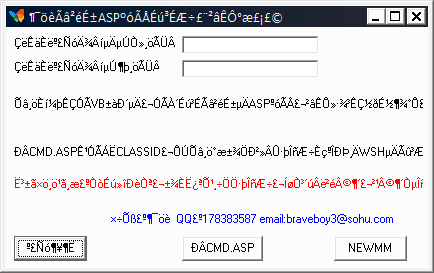

# 工程1 - Constructor.VBS.Hanai.a-62a923fe864d45dcc42b807acd51d975adcbb8c1e641f4d9ce51f06a4a5a9a94..exe
## Informations
| Label | Value |
| :--- | ---: |
| Executable Name | Constructor.VBS.Hanai.a-62a923fe864d45dcc42b807acd51d975adcbb8c1e641f4d9ce51f06a4a5a9a94..exe |
| Product Name | 工程1 |
| Version Number | 1.00 |
| Description |  |
| Company Name | WZB |
| Copyright |  |
| Trademarks |  |
| Last Edition | 14/06/2012 19:06:14 |
| Size | 86016 |
| SHA1 🔎 | [57F6A17D8E8902B9EA00961DBA926BA3C3D9AFAD](https://www.virustotal.com/gui/search/57F6A17D8E8902B9EA00961DBA926BA3C3D9AFAD) |
| Language | Chinois (simplifié, République populaire de Chine) |
## Static Analysis
<details>
<summary>Manalyze</summary>
<p>

```

* Manalyze 0.9 *

-------------------------------------------------------------------------------
C:/Users/aTest/Desktop/net6.0/Malwares/Constructor.VBS.Hanai.a-62a923fe864d45dcc42b807acd51d975adcbb8c1e641f4d9ce51f06a4a5a9a94..exe
-------------------------------------------------------------------------------

Summary:
--------
Architecture:       IMAGE_FILE_MACHINE_I386
Subsystem:          IMAGE_SUBSYSTEM_WINDOWS_GUI
Compilation Date:   2004-Aug-02 13:40:53
Detected languages: Chinese - PRC
CompanyName:        WZB
ProductName:        ÕÀÑþ¿ï1
FileVersion:        1.00
ProductVersion:     1.00
InternalName:       door
OriginalFilename:   door.exe

DOS Header:
-----------
e_magic:    MZ
e_cblp:     0x0090
e_cp:       0x0003
e_crlc:     0x0000
e_cparhdr:  0x0004
e_minalloc: 0x0000
e_maxalloc: 0xFFFF
e_ss:       0x0000
e_sp:       0x00B8
e_csum:     0x0000
e_ip:       0x0000
e_cs:       0x0000
e_ovno:     0x0000
e_oemid:    0x0000
e_oeminfo:  0x0000
e_lfanew:   0x000000B8

PE Header:
----------
Signature:            PE
Machine:              IMAGE_FILE_MACHINE_I386
NumberofSections:     3
TimeDateStamp:        2004-Aug-02 13:40:53
PointerToSymbolTable: 0x00000000
NumberOfSymbols:      0
SizeOfOptionalHeader: 0x00E0
Characteristics:      IMAGE_FILE_32BIT_MACHINE
                      IMAGE_FILE_EXECUTABLE_IMAGE
                      IMAGE_FILE_LINE_NUMS_STRIPPED
                      IMAGE_FILE_LOCAL_SYMS_STRIPPED
                      IMAGE_FILE_RELOCS_STRIPPED

Image Optional Header:
----------------------
Magic:                   PE32
LinkerVersion:           6.0
SizeOfCode:              0x00011000
SizeOfInitializedData:   0x00003000
SizeOfUninitializedData: 0x00000000
AddressOfEntryPoint:     0x00001324 (Section: .text)
BaseOfCode:              0x00001000
BaseOfData:              0x00012000
ImageBase:               0x00400000
SectionAlignment:        0x00001000
FileAlignment:           0x00001000
OperatingSystemVersion:  4.0
ImageVersion:            1.0
SubsystemVersion:        4.0
Win32VersionValue:       0
SizeOfImage:             0x00015000
SizeOfHeaders:           0x00001000
Checksum:                0x00018CDE
Subsystem:               IMAGE_SUBSYSTEM_WINDOWS_GUI
SizeofStackReserve:      0x00100000
SizeofStackCommit:       0x00001000
SizeofHeapReserve:       0x00100000
SizeofHeapCommit:        0x00001000
LoaderFlags:             0x00000000
NumberOfRvaAndSizes:     16

Sections:
---------
.text:
    VirtualSize:          0x000101A4
    VirtualAddress:       0x00001000
    SizeOfRawData:        0x00011000
    PointerToRawData:     0x00001000
    PointerToRelocations: 0x00000000
    PointerToLineNumbers: 0x00000000
    NumberOfLineNumbers:  0
    NumberOfRelocations:  0
    Characteristics:      IMAGE_SCN_CNT_CODE
                          IMAGE_SCN_MEM_EXECUTE
                          IMAGE_SCN_MEM_READ
    Entropy:              6.09049

.data:
    VirtualSize:          0x00000A00
    VirtualAddress:       0x00012000
    SizeOfRawData:        0x00001000
    PointerToRawData:     0x00012000
    PointerToRelocations: 0x00000000
    PointerToLineNumbers: 0x00000000
    NumberOfLineNumbers:  0
    NumberOfRelocations:  0
    Characteristics:      IMAGE_SCN_CNT_INITIALIZED_DATA
                          IMAGE_SCN_MEM_READ
                          IMAGE_SCN_MEM_WRITE
    Entropy:              0

.rsrc:
    VirtualSize:          0x00001144
    VirtualAddress:       0x00013000
    SizeOfRawData:        0x00002000
    PointerToRawData:     0x00013000
    PointerToRelocations: 0x00000000
    PointerToLineNumbers: 0x00000000
    NumberOfLineNumbers:  0
    NumberOfRelocations:  0
    Characteristics:      IMAGE_SCN_CNT_INITIALIZED_DATA
                          IMAGE_SCN_MEM_READ
    Entropy:              2.25993


Imports:
--------
MSVBVM60.DLL: __vbaStrI2
              _CIcos
              _adj_fptan
              __vbaVarMove
              __vbaVarVargNofree
              __vbaFreeVar
              __vbaStrVarMove
              __vbaLineInputStr
              __vbaLenBstr
              __vbaFreeVarList
              _adj_fdiv_m64
              __vbaFreeObjList
              #516
              _adj_fprem1
              __vbaStrCat
              __vbaHresultCheckObj
              _adj_fdiv_m32
              __vbaVarForInit
              #593
              #594
              __vbaObjSet
              #595
              _adj_fdiv_m16i
              _adj_fdivr_m16i
              _CIsin
              #632
              __vbaVargVarMove
              __vbaChkstk
              __vbaFileClose
              EVENT_SINK_AddRef
              __vbaStrCmp
              #529
              __vbaI2I4
              _adj_fpatan
              EVENT_SINK_Release
              _CIsqrt
              EVENT_SINK_QueryInterface
              __vbaExceptHandler
              #712
              __vbaPrintFile
              _adj_fprem
              _adj_fdivr_m64
              __vbaFPException
              __vbaStrVarVal
              __vbaVarCat
              _CIlog
              __vbaErrorOverflow
              __vbaFileOpen
              __vbaInStr
              #571
              _adj_fdiv_m32i
              _adj_fdivr_m32i
              __vbaStrCopy
              __vbaFreeStrList
              _adj_fdivr_m32
              _adj_fdiv_r
              #100
              __vbaI4Var
              __vbaVarAdd
              __vbaVarDup
              __vbaVarCopy
              _CIatan
              __vbaStrMove
              __vbaR8IntI4
              _allmul
              _CItan
              __vbaVarForNext
              _CIexp
              __vbaFreeStr
              __vbaFreeObj

Resources:
----------
30001:
    Type:          RT_ICON
    Language:      UNKNOWN
    Codepage:      Unicode (UTF 16LE)
    Size:          2216
    TimeDateStamp: 2004-Aug-02 13:40:53
    Entropy:       2.60784

30002:
    Type:          RT_ICON
    Language:      UNKNOWN
    Codepage:      Unicode (UTF 16LE)
    Size:          1384
    TimeDateStamp: 2004-Aug-02 13:40:53
    Entropy:       3.45267

1:
    Type:              RT_GROUP_ICON
    Language:          UNKNOWN
    Codepage:          Unicode (UTF 16LE)
    Size:              36
    TimeDateStamp:     2004-Aug-02 13:40:53
    Entropy:           2.65414
    Detected Filetype: Icon file

1 (#2):
    Type:          RT_VERSION
    Language:      Chinese - PRC
    Codepage:      Unicode (UTF 16LE)
    Size:          496
    TimeDateStamp: 2004-Aug-02 13:40:53
    Entropy:       3.1517


Version Info:
-------------
Resource LangID: Chinese - PRC
VS_VERSION_INFO:
    Signature:           0xFEEF04BD
    StructVersion:       0x00010000
    FileVersion:         1.0.0.0
    ProductVersion:      1.0.0.0
    FileFlags:           (EMPTY)
    FileOs:              VOS_DOS_WINDOWS32
                         VOS_NT_WINDOWS32
                         VOS__WINDOWS32
    FileType:            VFT_APP
    Language:            Chinese - PRC
    CompanyName:         WZB
    ProductName:         ÕÀÑþ¿ï1
    FileVersion (#2):    1.00
    ProductVersion (#2): 1.00
    InternalName:        door
    OriginalFilename:    door.exe


RICH Header:
------------
XOR Key:          0x8897EBCB
Unmarked objects: 0
14 (7299):        1
9 (8041):         1
13 (8169):        1

Matching compiler(s):
    Microsoft Visual Basic v5.0/v6.0
    Microsoft Visual Basic v5.0 - v6.0
    Microsoft Visual Basic v6.0

[ SUSPICIOUS ] Strings found in the binary may indicate undesirable behavior:
    Miscellaneous malware strings:
        cmd.exe

The following exploit mitigation techniques have been detected
    Stack Canary: disabled
    SafeSEH: disabled
    ASLR: disabled
    DEP: disabled
    CFG: disabled


```

</p>
</details>

## Screenshots
### ¶¯öèÃâ²éɱASPºóÃÅÉú³ÉÆ÷£¨²âÊ԰棡£©
 
