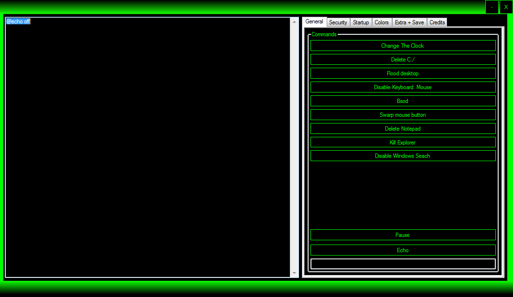

# THs Batch Virus Maker - THs Batch Virus Maker V2.0.exe
## Informations
| Label | Value |
| :--- | ---: |
| Executable Name | THs Batch Virus Maker V2.0.exe |
| Product Name | THs Batch Virus Maker |
| Version Number | 1.0.0.0 |
| Description | THs Batch Virus Maker |
| Company Name | Microsoft |
| Copyright | Copyright © Microsoft 2010 |
| Trademarks |  |
| Last Edition | 17/10/2014 07:54:48 |
| Size | 147456 |
| SHA1 🔎 | [72C62BE3FA5ABABB2D6B5B8D1B9F1A71CCB6375C](https://www.virustotal.com/gui/search/72C62BE3FA5ABABB2D6B5B8D1B9F1A71CCB6375C) |
| Language | Language Neutral |
## Static Analysis
<details>
<summary>Manalyze</summary>
<p>

```

* Manalyze 0.9 *

-------------------------------------------------------------------------------
C:/Users/IEUser/Desktop/net6.0/Malwares/THs Batch Virus Maker V2.0/THs Batch Virus Maker V2.0.exe
-------------------------------------------------------------------------------

Summary:
--------
Architecture:     IMAGE_FILE_MACHINE_I386
Subsystem:        IMAGE_SUBSYSTEM_WINDOWS_GUI
Compilation Date: 2010-Oct-17 09:40:47
Debug artifacts:  C:\Users\Ejer\Documents\Visual Studio 2010\Projects\THs Batch Virus Maker\THs Batch Virus Maker\obj\x86\Debug\THs Batch Virus Maker V2.0.pdb
CompanyName:      Microsoft
FileDescription:  THs Batch Virus Maker
FileVersion:      1.0.0.0
InternalName:     THs Batch Virus Maker V2.0.exe
LegalCopyright:   Copyright © Microsoft 2010
OriginalFilename: THs Batch Virus Maker V2.0.exe
ProductName:      THs Batch Virus Maker
ProductVersion:   1.0.0.0
Assembly Version: 1.0.0.0

DOS Header:
-----------
e_magic:    MZ
e_cblp:     0x0090
e_cp:       0x0003
e_crlc:     0x0000
e_cparhdr:  0x0004
e_minalloc: 0x0000
e_maxalloc: 0xFFFF
e_ss:       0x0000
e_sp:       0x00B8
e_csum:     0x0000
e_ip:       0x0000
e_cs:       0x0000
e_ovno:     0x0000
e_oemid:    0x0000
e_oeminfo:  0x0000
e_lfanew:   0x00000080

PE Header:
----------
Signature:            PE
Machine:              IMAGE_FILE_MACHINE_I386
NumberofSections:     4
TimeDateStamp:        2010-Oct-17 09:40:47
PointerToSymbolTable: 0x00000000
NumberOfSymbols:      0
SizeOfOptionalHeader: 0x00E0
Characteristics:      IMAGE_FILE_32BIT_MACHINE
                      IMAGE_FILE_EXECUTABLE_IMAGE

Image Optional Header:
----------------------
Magic:                   PE32
LinkerVersion:           8.0
SizeOfCode:              0x00020A00
SizeOfInitializedData:   0x00003200
SizeOfUninitializedData: 0x00000000
AddressOfEntryPoint:     0x0002293E (Section: .text)
BaseOfCode:              0x00002000
BaseOfData:              0x00024000
ImageBase:               0x00400000
SectionAlignment:        0x00002000
FileAlignment:           0x00000200
OperatingSystemVersion:  4.0
ImageVersion:            0.0
SubsystemVersion:        4.0
Win32VersionValue:       0
SizeOfImage:             0x0002C000
SizeOfHeaders:           0x00000400
Checksum:                0x00000000
Subsystem:               IMAGE_SUBSYSTEM_WINDOWS_GUI
DllCharacteristics:      IMAGE_DLLCHARACTERISTICS_DYNAMIC_BASE
                         IMAGE_DLLCHARACTERISTICS_NO_SEH
                         IMAGE_DLLCHARACTERISTICS_NX_COMPAT
                         IMAGE_DLLCHARACTERISTICS_TERMINAL_SERVER_AWARE
SizeofStackReserve:      0x00100000
SizeofStackCommit:       0x00001000
SizeofHeapReserve:       0x00100000
SizeofHeapCommit:        0x00001000
LoaderFlags:             0x00000000
NumberOfRvaAndSizes:     16

Sections:
---------
.text:
    VirtualSize:          0x00020944
    VirtualAddress:       0x00002000
    SizeOfRawData:        0x00020A00
    PointerToRawData:     0x00000400
    PointerToRelocations: 0x00000000
    PointerToLineNumbers: 0x00000000
    NumberOfLineNumbers:  0
    NumberOfRelocations:  0
    Characteristics:      IMAGE_SCN_CNT_CODE
                          IMAGE_SCN_MEM_EXECUTE
                          IMAGE_SCN_MEM_READ
    Entropy:              6.34007

.sdata:
    VirtualSize:          0x000000C1
    VirtualAddress:       0x00024000
    SizeOfRawData:        0x00000200
    PointerToRawData:     0x00020E00
    PointerToRelocations: 0x00000000
    PointerToLineNumbers: 0x00000000
    NumberOfLineNumbers:  0
    NumberOfRelocations:  0
    Characteristics:      IMAGE_SCN_CNT_INITIALIZED_DATA
                          IMAGE_SCN_MEM_READ
                          IMAGE_SCN_MEM_WRITE
    Entropy:              2.76007

.rsrc:
    VirtualSize:          0x00002C50
    VirtualAddress:       0x00026000
    SizeOfRawData:        0x00002E00
    PointerToRawData:     0x00021000
    PointerToRelocations: 0x00000000
    PointerToLineNumbers: 0x00000000
    NumberOfLineNumbers:  0
    NumberOfRelocations:  0
    Characteristics:      IMAGE_SCN_CNT_INITIALIZED_DATA
                          IMAGE_SCN_MEM_READ
    Entropy:              3.06453

.reloc:
    VirtualSize:          0x0000000C
    VirtualAddress:       0x0002A000
    SizeOfRawData:        0x00000200
    PointerToRawData:     0x00023E00
    PointerToRelocations: 0x00000000
    PointerToLineNumbers: 0x00000000
    NumberOfLineNumbers:  0
    NumberOfRelocations:  0
    Characteristics:      IMAGE_SCN_CNT_INITIALIZED_DATA
                          IMAGE_SCN_MEM_DISCARDABLE
                          IMAGE_SCN_MEM_READ
    Entropy:              0.10191


Imports:
--------
mscoree.dll: _CorExeMain

Resources:
----------
2:
    Type:          RT_ICON
    Language:      UNKNOWN
    Codepage:      UNKNOWN
    Size:          9640
    TimeDateStamp: 1980-Jan-01 00:00:00
    Entropy:       2.7517

32512:
    Type:              RT_GROUP_ICON
    Language:          UNKNOWN
    Codepage:          UNKNOWN
    Size:              20
    TimeDateStamp:     1980-Jan-01 00:00:00
    Entropy:           2.0815
    Detected Filetype: Icon file

1:
    Type:          RT_VERSION
    Language:      UNKNOWN
    Codepage:      UNKNOWN
    Size:          880
    TimeDateStamp: 1980-Jan-01 00:00:00
    Entropy:       3.35851

1 (#2):
    Type:          RT_MANIFEST
    Language:      UNKNOWN
    Codepage:      UNKNOWN
    Size:          490
    TimeDateStamp: 1980-Jan-01 00:00:00
    Entropy:       5.00112


Version Info:
-------------
Resource LangID: UNKNOWN
VS_VERSION_INFO:
    Signature:           0xFEEF04BD
    StructVersion:       0x00010000
    FileVersion:         1.0.0.0
    ProductVersion:      1.0.0.0
    FileFlags:           (EMPTY)
    FileOs:              VOS_DOS_WINDOWS32
                         VOS_NT_WINDOWS32
                         VOS__WINDOWS32
    FileType:            VFT_APP
    Language:            UNKNOWN
    CompanyName:         Microsoft
    FileDescription:     THs Batch Virus Maker
    FileVersion (#2):    1.0.0.0
    InternalName:        THs Batch Virus Maker V2.0.exe
    LegalCopyright:      Copyright © Microsoft 2010
    OriginalFilename:    THs Batch Virus Maker V2.0.exe
    ProductName:         THs Batch Virus Maker
    ProductVersion (#2): 1.0.0.0
    Assembly Version:    1.0.0.0


Debug Info:
-----------
IMAGE_DEBUG_TYPE_CODEVIEW:
    Characteristics:  0
    TimeDateStamp:    2010-Oct-17 09:40:47
    Version:          0.0
    SizeofData:       165
    AddressOfRawData: 0x0002401C
    PointerToRawData: 0x00020E1C
    Referenced File:  C:\Users\Ejer\Documents\Visual Studio 2010\Projects\THs Batch Virus Maker\THs Batch Virus Maker\obj\x86\Debug\THs Batch Virus Maker V2.0.pdb


Matching compiler(s):
    Microsoft Visual C# v7.0 / Basic .NET
    .NET executable -> Microsoft

[ SUSPICIOUS ] Strings found in the binary may indicate undesirable behavior:
    Contains references to security software:
        MSASCui.exe
    May have dropper capabilities:
        CurrentVersion\Run
    Miscellaneous malware strings:
        Virus
        virus
    Contains domain names:
        gmail.com
        http://thwarez.tk
        thwarez.tk
        www.thwarez.tk

[ SUSPICIOUS ] 
    Unusual section name found: .sdata

The following exploit mitigation techniques have been detected
    Stack Canary: disabled
    SafeSEH: disabled
    ASLR: enabled
    DEP: enabled
    CFG: disabled


```

</p>
</details>

## Screenshots
### Form1
 
