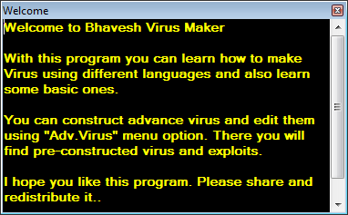

# Bhavesh Virus Maker - Bhavesh Virus Maker.bin.exe
## Informations
| Label | Value |
| :--- | ---: |
| Executable Name | Bhavesh Virus Maker.bin.exe |
| Product Name | Bhavesh Virus Maker |
| Version Number | 1.0.0.1 |
| Description | Bhavesh Virus Maker |
| Company Name | BSoft |
| Copyright | Copyright © Bhavesh Kaul 2016 |
| Trademarks |  |
| Last Edition | 03/11/2022 14:44:10 |
| Size | 730624 |
| SHA1 🔎 | [C212596D8609EAE0EB27B8DA6DDFC1D60D3182E2](https://www.virustotal.com/gui/search/C212596D8609EAE0EB27B8DA6DDFC1D60D3182E2) |
| Language | Language Neutral |
## Static Analysis
<details>
<summary>Manalyze</summary>
<p>

```

* Manalyze 0.9 *

-------------------------------------------------------------------------------
C:/Users/IEUser/Desktop/net6.0/Malwares/Bhavesh Virus Maker.bin.exe
-------------------------------------------------------------------------------

Summary:
--------
Architecture:     IMAGE_FILE_MACHINE_I386
Subsystem:        IMAGE_SUBSYSTEM_WINDOWS_GUI
Compilation Date: 2016-Apr-13 06:47:47
Debug artifacts:  C:\Users\BHAVESH\Documents\Visual Studio 2012\Projects\Bhavesh Virus Maker\Bhavesh Virus Maker\obj\Debug\Bhavesh Virus Maker.pdb
Comments:         A simple and powerful virus maker
CompanyName:      BSoft
FileDescription:  Bhavesh Virus Maker
FileVersion:      1.0.0.1
InternalName:     Bhavesh Virus Maker.exe
LegalCopyright:   Copyright © Bhavesh Kaul 2016
OriginalFilename: Bhavesh Virus Maker.exe
ProductName:      Bhavesh Virus Maker
ProductVersion:   1.0.0.1
Assembly Version: 1.0.0.1

DOS Header:
-----------
e_magic:    MZ
e_cblp:     0x0090
e_cp:       0x0003
e_crlc:     0x0000
e_cparhdr:  0x0004
e_minalloc: 0x0000
e_maxalloc: 0xFFFF
e_ss:       0x0000
e_sp:       0x00B8
e_csum:     0x0000
e_ip:       0x0000
e_cs:       0x0000
e_ovno:     0x0000
e_oemid:    0x0000
e_oeminfo:  0x0000
e_lfanew:   0x00000080

PE Header:
----------
Signature:            PE
Machine:              IMAGE_FILE_MACHINE_I386
NumberofSections:     4
TimeDateStamp:        2016-Apr-13 06:47:47
PointerToSymbolTable: 0x00000000
NumberOfSymbols:      0
SizeOfOptionalHeader: 0x00E0
Characteristics:      IMAGE_FILE_32BIT_MACHINE
                      IMAGE_FILE_EXECUTABLE_IMAGE

Image Optional Header:
----------------------
Magic:                   PE32
LinkerVersion:           11.0
SizeOfCode:              0x000A1000
SizeOfInitializedData:   0x00011200
SizeOfUninitializedData: 0x00000000
AddressOfEntryPoint:     0x000A2EBE (Section: .text)
BaseOfCode:              0x00002000
BaseOfData:              0x000A4000
ImageBase:               0x00400000
SectionAlignment:        0x00002000
FileAlignment:           0x00000200
OperatingSystemVersion:  4.0
ImageVersion:            0.0
SubsystemVersion:        4.0
Win32VersionValue:       0
SizeOfImage:             0x000BA000
SizeOfHeaders:           0x00000400
Checksum:                0x00000000
Subsystem:               IMAGE_SUBSYSTEM_WINDOWS_GUI
DllCharacteristics:      IMAGE_DLLCHARACTERISTICS_DYNAMIC_BASE
                         IMAGE_DLLCHARACTERISTICS_NO_SEH
                         IMAGE_DLLCHARACTERISTICS_NX_COMPAT
                         IMAGE_DLLCHARACTERISTICS_TERMINAL_SERVER_AWARE
SizeofStackReserve:      0x00100000
SizeofStackCommit:       0x00001000
SizeofHeapReserve:       0x00100000
SizeofHeapCommit:        0x00001000
LoaderFlags:             0x00000000
NumberOfRvaAndSizes:     16

Sections:
---------
.text:
    VirtualSize:          0x000A0EC4
    VirtualAddress:       0x00002000
    SizeOfRawData:        0x000A1000
    PointerToRawData:     0x00000400
    PointerToRelocations: 0x00000000
    PointerToLineNumbers: 0x00000000
    NumberOfLineNumbers:  0
    NumberOfRelocations:  0
    Characteristics:      IMAGE_SCN_CNT_CODE
                          IMAGE_SCN_MEM_EXECUTE
                          IMAGE_SCN_MEM_READ
    Entropy:              5.44212

.sdata:
    VirtualSize:          0x00000138
    VirtualAddress:       0x000A4000
    SizeOfRawData:        0x00000200
    PointerToRawData:     0x000A1400
    PointerToRelocations: 0x00000000
    PointerToLineNumbers: 0x00000000
    NumberOfLineNumbers:  0
    NumberOfRelocations:  0
    Characteristics:      IMAGE_SCN_CNT_INITIALIZED_DATA
                          IMAGE_SCN_MEM_READ
                          IMAGE_SCN_MEM_WRITE
    Entropy:              2.61457

.rsrc:
    VirtualSize:          0x00010CC8
    VirtualAddress:       0x000A6000
    SizeOfRawData:        0x00010E00
    PointerToRawData:     0x000A1600
    PointerToRelocations: 0x00000000
    PointerToLineNumbers: 0x00000000
    NumberOfLineNumbers:  0
    NumberOfRelocations:  0
    Characteristics:      IMAGE_SCN_CNT_INITIALIZED_DATA
                          IMAGE_SCN_MEM_READ
    Entropy:              5.23955

.reloc:
    VirtualSize:          0x0000000C
    VirtualAddress:       0x000B8000
    SizeOfRawData:        0x00000200
    PointerToRawData:     0x000B2400
    PointerToRelocations: 0x00000000
    PointerToLineNumbers: 0x00000000
    NumberOfLineNumbers:  0
    NumberOfRelocations:  0
    Characteristics:      IMAGE_SCN_CNT_INITIALIZED_DATA
                          IMAGE_SCN_MEM_DISCARDABLE
                          IMAGE_SCN_MEM_READ
    Entropy:              0.10191


Imports:
--------
mscoree.dll: _CorExeMain

Resources:
----------
2:
    Type:          RT_ICON
    Language:      UNKNOWN
    Codepage:      UNKNOWN
    Size:          67624
    TimeDateStamp: 1980-Jan-01 00:00:00
    Entropy:       5.26809

32512:
    Type:              RT_GROUP_ICON
    Language:          UNKNOWN
    Codepage:          UNKNOWN
    Size:              20
    TimeDateStamp:     1980-Jan-01 00:00:00
    Entropy:           2.16096
    Detected Filetype: Icon file

1:
    Type:          RT_VERSION
    Language:      UNKNOWN
    Codepage:      UNKNOWN
    Size:          928
    TimeDateStamp: 1980-Jan-01 00:00:00
    Entropy:       3.40243


Version Info:
-------------
Resource LangID: UNKNOWN
VS_VERSION_INFO:
    Signature:           0xFEEF04BD
    StructVersion:       0x00010000
    FileVersion:         1.0.0.1
    ProductVersion:      1.0.0.1
    FileFlags:           (EMPTY)
    FileOs:              VOS_DOS_WINDOWS32
                         VOS_NT_WINDOWS32
                         VOS__WINDOWS32
    FileType:            VFT_APP
    Language:            UNKNOWN
    Comments:            A simple and powerful virus maker
    CompanyName:         BSoft
    FileDescription:     Bhavesh Virus Maker
    FileVersion (#2):    1.0.0.1
    InternalName:        Bhavesh Virus Maker.exe
    LegalCopyright:      Copyright © Bhavesh Kaul 2016
    OriginalFilename:    Bhavesh Virus Maker.exe
    ProductName:         Bhavesh Virus Maker
    ProductVersion (#2): 1.0.0.1
    Assembly Version:    1.0.0.1


Debug Info:
-----------
IMAGE_DEBUG_TYPE_CODEVIEW:
    Characteristics:  0
    TimeDateStamp:    2016-Apr-13 06:47:47
    Version:          0.0
    SizeofData:       284
    AddressOfRawData: 0x000A401C
    PointerToRawData: 0x000A141C
    Referenced File:  C:\Users\BHAVESH\Documents\Visual Studio 2012\Projects\Bhavesh Virus Maker\Bhavesh Virus Maker\obj\Debug\Bhavesh Virus Maker.pdb


Matching compiler(s):
    Microsoft Visual C# v7.0 / Basic .NET
    Microsoft Visual C++ 8.0

[ SUSPICIOUS ] Strings found in the binary may indicate undesirable behavior:
    May have dropper capabilities:
        CurrentControlSet\Services
        CurrentVersion\Run
    Miscellaneous malware strings:
        Virus
        cmd.exe
        virus
    Contains domain names:
        facebook.com
        http://www.f2ko.de
        http://www.f2ko.de/en/ob2e.php
        http://www.facebook.com
        http://www.facebook.com/BHKL.ROCKS
        https://sourceforge.net
        sourceforge.net
        www.f2ko.de
        www.facebook.com

[ SUSPICIOUS ] 
    Unusual section name found: .sdata

The following exploit mitigation techniques have been detected
    Stack Canary: disabled
    SafeSEH: disabled
    ASLR: enabled
    DEP: enabled
    CFG: disabled


```

</p>
</details>

## Screenshots
### Welcome
 
### Bhavesh Virus Maker
 
