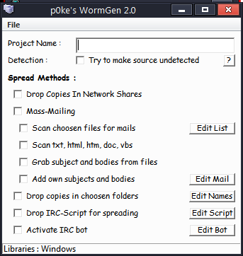
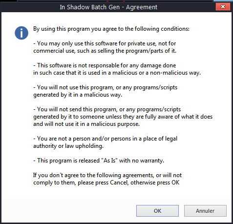
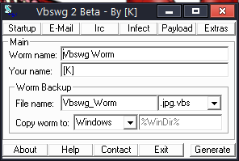
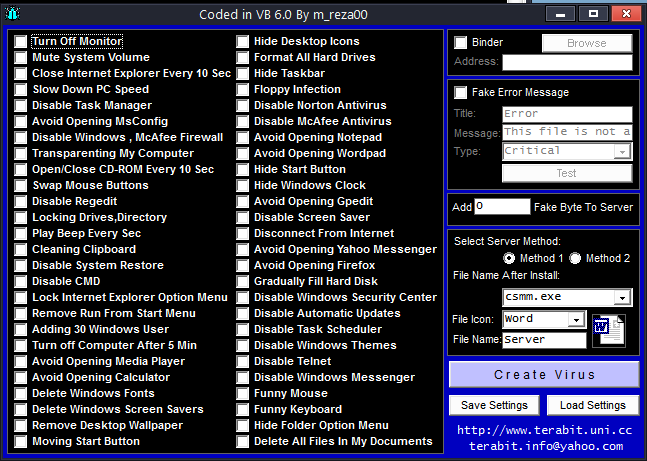
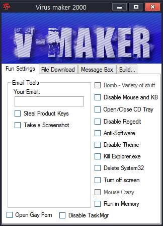

#  - WormGen.exe
## Informations
| Label | Value |
| :--- | ---: |
| Executable Name | WormGen.exe |
| Product Name |  |
| Version Number |  |
| Description |  |
| Company Name |  |
| Copyright |  |
| Trademarks |  |
| Last Edition | 01/03/2004 10:44:14 |
| Size | 695808 |
| SHA1 🔎 | [AC6C6FD30F1D416DC62F044CC960E4446F5063D8](https://www.virustotal.com/gui/search/AC6C6FD30F1D416DC62F044CC960E4446F5063D8) |
| MD5 | D41D8CD98F00B204E9800998ECF8427E |
| Language |  |
## Static Analysis
<details><summary>Manalyze</summary><p>
```
* Manalyze 0.9 *

-------------------------------------------------------------------------------
C:/Users/aTest/Desktop/net6.0/Malwares/WormGen.exe
-------------------------------------------------------------------------------

Summary:
--------
Architecture:       IMAGE_FILE_MACHINE_I386
Subsystem:          IMAGE_SUBSYSTEM_WINDOWS_GUI
Compilation Date:   1992-Jun-19 22:22:17
Detected languages: Swedish - Sweden

DOS Header:
-----------
e_magic:    MZ
e_cblp:     0x0050
e_cp:       0x0002
e_crlc:     0x0000
e_cparhdr:  0x0004
e_minalloc: 0x000F
e_maxalloc: 0xFFFF
e_ss:       0x0000
e_sp:       0x00B8
e_csum:     0x0000
e_ip:       0x0000
e_cs:       0x0000
e_ovno:     0x001A
e_oemid:    0x0000
e_oeminfo:  0x0000
e_lfanew:   0x00000100

PE Header:
----------
Signature:            PE
Machine:              IMAGE_FILE_MACHINE_I386
NumberofSections:     8
TimeDateStamp:        1992-Jun-19 22:22:17
PointerToSymbolTable: 0x00000000
NumberOfSymbols:      0
SizeOfOptionalHeader: 0x00E0
Characteristics:      IMAGE_FILE_32BIT_MACHINE
                      IMAGE_FILE_BYTES_REVERSED_HI
                      IMAGE_FILE_BYTES_REVERSED_LO
                      IMAGE_FILE_EXECUTABLE_IMAGE
                      IMAGE_FILE_LINE_NUMS_STRIPPED
                      IMAGE_FILE_LOCAL_SYMS_STRIPPED

Image Optional Header:
----------------------
Magic:                   PE32
LinkerVersion:           2.0
SizeOfCode:              0x00076E00
SizeOfInitializedData:   0x00032C00
SizeOfUninitializedData: 0x00000000
AddressOfEntryPoint:     0x00077CD8 (Section: CODE)
BaseOfCode:              0x00001000
BaseOfData:              0x00078000
ImageBase:               0x00400000
SectionAlignment:        0x00001000
FileAlignment:           0x00000200
OperatingSystemVersion:  4.0
ImageVersion:            0.0
SubsystemVersion:        4.0
Win32VersionValue:       0
SizeOfImage:             0x000B0000
SizeOfHeaders:           0x00000400
Checksum:                0x00000000
Subsystem:               IMAGE_SUBSYSTEM_WINDOWS_GUI
SizeofStackReserve:      0x00100000
SizeofStackCommit:       0x00004000
SizeofHeapReserve:       0x00100000
SizeofHeapCommit:        0x00001000
LoaderFlags:             0x00000000
NumberOfRvaAndSizes:     16

Sections:
---------
CODE:
    VirtualSize:          0x00076DB0
    VirtualAddress:       0x00001000
    SizeOfRawData:        0x00076E00
    PointerToRawData:     0x00000400
    PointerToRelocations: 0x00000000
    PointerToLineNumbers: 0x00000000
    NumberOfLineNumbers:  0
    NumberOfRelocations:  0
    Characteristics:      IMAGE_SCN_CNT_CODE
                          IMAGE_SCN_MEM_EXECUTE
                          IMAGE_SCN_MEM_READ
    Entropy:              6.52337

DATA:
    VirtualSize:          0x000011B4
    VirtualAddress:       0x00078000
    SizeOfRawData:        0x00001200
    PointerToRawData:     0x00077200
    PointerToRelocations: 0x00000000
    PointerToLineNumbers: 0x00000000
    NumberOfLineNumbers:  0
    NumberOfRelocations:  0
    Characteristics:      IMAGE_SCN_CNT_INITIALIZED_DATA
                          IMAGE_SCN_MEM_READ
                          IMAGE_SCN_MEM_WRITE
    Entropy:              3.99022

BSS:
    VirtualSize:          0x00000CD5
    VirtualAddress:       0x0007A000
    SizeOfRawData:        0x00000000
    PointerToRawData:     0x00078400
    PointerToRelocations: 0x00000000
    PointerToLineNumbers: 0x00000000
    NumberOfLineNumbers:  0
    NumberOfRelocations:  0
    Characteristics:      IMAGE_SCN_MEM_READ
                          IMAGE_SCN_MEM_WRITE

.idata:
    VirtualSize:          0x000022FC
    VirtualAddress:       0x0007B000
    SizeOfRawData:        0x00002400
    PointerToRawData:     0x00078400
    PointerToRelocations: 0x00000000
    PointerToLineNumbers: 0x00000000
    NumberOfLineNumbers:  0
    NumberOfRelocations:  0
    Characteristics:      IMAGE_SCN_CNT_INITIALIZED_DATA
                          IMAGE_SCN_MEM_READ
                          IMAGE_SCN_MEM_WRITE
    Entropy:              4.96995

.tls:
    VirtualSize:          0x00000010
    VirtualAddress:       0x0007E000
    SizeOfRawData:        0x00000000
    PointerToRawData:     0x0007A800
    PointerToRelocations: 0x00000000
    PointerToLineNumbers: 0x00000000
    NumberOfLineNumbers:  0
    NumberOfRelocations:  0
    Characteristics:      IMAGE_SCN_MEM_READ
                          IMAGE_SCN_MEM_WRITE

.rdata:
    VirtualSize:          0x00000018
    VirtualAddress:       0x0007F000
    SizeOfRawData:        0x00000200
    PointerToRawData:     0x0007A800
    PointerToRelocations: 0x00000000
    PointerToLineNumbers: 0x00000000
    NumberOfLineNumbers:  0
    NumberOfRelocations:  0
    Characteristics:      IMAGE_SCN_CNT_INITIALIZED_DATA
                          IMAGE_SCN_MEM_READ
                          IMAGE_SCN_MEM_SHARED
    Entropy:              0.200582

.reloc:
    VirtualSize:          0x000089F0
    VirtualAddress:       0x00080000
    SizeOfRawData:        0x00008A00
    PointerToRawData:     0x0007AA00
    PointerToRelocations: 0x00000000
    PointerToLineNumbers: 0x00000000
    NumberOfLineNumbers:  0
    NumberOfRelocations:  0
    Characteristics:      IMAGE_SCN_CNT_INITIALIZED_DATA
                          IMAGE_SCN_MEM_READ
                          IMAGE_SCN_MEM_SHARED
    Entropy:              6.65404

.rsrc:
    VirtualSize:          0x00026A00
    VirtualAddress:       0x00089000
    SizeOfRawData:        0x00026A00
    PointerToRawData:     0x00083400
    PointerToRelocations: 0x00000000
    PointerToLineNumbers: 0x00000000
    NumberOfLineNumbers:  0
    NumberOfRelocations:  0
    Characteristics:      IMAGE_SCN_CNT_INITIALIZED_DATA
                          IMAGE_SCN_MEM_READ
                          IMAGE_SCN_MEM_SHARED
    Entropy:              5.64404


Imports:
--------
kernel32.dll:      DeleteCriticalSection
                   LeaveCriticalSection
                   EnterCriticalSection
                   InitializeCriticalSection
                   VirtualFree
                   VirtualAlloc
                   LocalFree
                   LocalAlloc
                   GetCurrentThreadId
                   InterlockedDecrement
                   InterlockedIncrement
                   VirtualQuery
                   WideCharToMultiByte
                   MultiByteToWideChar
                   lstrlenA
                   lstrcpynA
                   LoadLibraryExA
                   GetThreadLocale
                   GetStartupInfoA
                   GetProcAddress
                   GetModuleHandleA
                   GetModuleFileNameA
                   GetLocaleInfoA
                   GetLastError
                   GetCommandLineA
                   FreeLibrary
                   FindFirstFileA
                   FindClose
                   ExitProcess
                   WriteFile
                   UnhandledExceptionFilter
                   SetFilePointer
                   SetEndOfFile
                   RtlUnwind
                   ReadFile
                   RaiseException
                   GetStdHandle
                   GetFileSize
                   GetSystemTime
                   GetFileType
                   CreateFileA
                   CloseHandle
user32.dll:        GetKeyboardType
                   LoadStringA
                   MessageBoxA
                   CharNextA
advapi32.dll:      RegQueryValueExA
                   RegOpenKeyExA
                   RegCloseKey
oleaut32.dll:      SysFreeString
                   SysReAllocStringLen
                   SysAllocStringLen
kernel32.dll (#2): DeleteCriticalSection
                   LeaveCriticalSection
                   EnterCriticalSection
                   InitializeCriticalSection
                   VirtualFree
                   VirtualAlloc
                   LocalFree
                   LocalAlloc
                   GetCurrentThreadId
                   InterlockedDecrement
                   InterlockedIncrement
                   VirtualQuery
                   WideCharToMultiByte
                   MultiByteToWideChar
                   lstrlenA
                   lstrcpynA
                   LoadLibraryExA
                   GetThreadLocale
                   GetStartupInfoA
                   GetProcAddress
                   GetModuleHandleA
                   GetModuleFileNameA
                   GetLocaleInfoA
                   GetLastError
                   GetCommandLineA
                   FreeLibrary
                   FindFirstFileA
                   FindClose
                   ExitProcess
                   WriteFile
                   UnhandledExceptionFilter
                   SetFilePointer
                   SetEndOfFile
                   RtlUnwind
                   ReadFile
                   RaiseException
                   GetStdHandle
                   GetFileSize
                   GetSystemTime
                   GetFileType
                   CreateFileA
                   CloseHandle
advapi32.dll (#2): RegQueryValueExA
                   RegOpenKeyExA
                   RegCloseKey
kernel32.dll (#3): DeleteCriticalSection
                   LeaveCriticalSection
                   EnterCriticalSection
                   InitializeCriticalSection
                   VirtualFree
                   VirtualAlloc
                   LocalFree
                   LocalAlloc
                   GetCurrentThreadId
                   InterlockedDecrement
                   InterlockedIncrement
                   VirtualQuery
                   WideCharToMultiByte
                   MultiByteToWideChar
                   lstrlenA
                   lstrcpynA
                   LoadLibraryExA
                   GetThreadLocale
                   GetStartupInfoA
                   GetProcAddress
                   GetModuleHandleA
                   GetModuleFileNameA
                   GetLocaleInfoA
                   GetLastError
                   GetCommandLineA
                   FreeLibrary
                   FindFirstFileA
                   FindClose
                   ExitProcess
                   WriteFile
                   UnhandledExceptionFilter
                   SetFilePointer
                   SetEndOfFile
                   RtlUnwind
                   ReadFile
                   RaiseException
                   GetStdHandle
                   GetFileSize
                   GetSystemTime
                   GetFileType
                   CreateFileA
                   CloseHandle
gdi32.dll:         UnrealizeObject
                   StretchBlt
                   StartPage
                   StartDocA
                   SetWindowOrgEx
                   SetWinMetaFileBits
                   SetViewportOrgEx
                   SetTextColor
                   SetStretchBltMode
                   SetROP2
                   SetPixel
                   SetMapMode
                   SetEnhMetaFileBits
                   SetDIBColorTable
                   SetBrushOrgEx
                   SetBkMode
                   SetBkColor
                   SetAbortProc
                   SelectPalette
                   SelectObject
                   SaveDC
                   RestoreDC
                   Rectangle
                   RectVisible
                   RealizePalette
                   Polyline
                   PlayEnhMetaFile
                   PatBlt
                   MoveToEx
                   MaskBlt
                   LineTo
                   IntersectClipRect
                   GetWindowOrgEx
                   GetWinMetaFileBits
                   GetTextMetricsA
                   GetTextExtentPointA
                   GetTextExtentPoint32A
                   GetSystemPaletteEntries
                   GetStockObject
                   GetPixel
                   GetPaletteEntries
                   GetObjectA
                   GetEnhMetaFilePaletteEntries
                   GetEnhMetaFileHeader
                   GetEnhMetaFileBits
                   GetDeviceCaps
                   GetDIBits
                   GetDIBColorTable
                   GetDCOrgEx
                   GetCurrentPositionEx
                   GetClipBox
                   GetBrushOrgEx
                   GetBitmapBits
                   ExtTextOutA
                   ExcludeClipRect
                   EndPage
                   EndDoc
                   DeleteObject
                   DeleteEnhMetaFile
                   DeleteDC
                   CreateSolidBrush
                   CreatePenIndirect
                   CreatePalette
                   CreateICA
                   CreateHalftonePalette
                   CreateFontIndirectA
                   CreateDIBitmap
                   CreateDIBSection
                   CreateDCA
                   CreateCompatibleDC
                   CreateCompatibleBitmap
                   CreateBrushIndirect
                   CreateBitmap
                   CopyEnhMetaFileA
                   BitBlt
user32.dll (#2):   GetKeyboardType
                   LoadStringA
                   MessageBoxA
                   CharNextA
kernel32.dll (#4): DeleteCriticalSection
                   LeaveCriticalSection
                   EnterCriticalSection
                   InitializeCriticalSection
                   VirtualFree
                   VirtualAlloc
                   LocalFree
                   LocalAlloc
                   GetCurrentThreadId
                   InterlockedDecrement
                   InterlockedIncrement
                   VirtualQuery
                   WideCharToMultiByte
                   MultiByteToWideChar
                   lstrlenA
                   lstrcpynA
                   LoadLibraryExA
                   GetThreadLocale
                   GetStartupInfoA
                   GetProcAddress
                   GetModuleHandleA
                   GetModuleFileNameA
                   GetLocaleInfoA
                   GetLastError
                   GetCommandLineA
                   FreeLibrary
                   FindFirstFileA
                   FindClose
                   ExitProcess
                   WriteFile
                   UnhandledExceptionFilter
                   SetFilePointer
                   SetEndOfFile
                   RtlUnwind
                   ReadFile
                   RaiseException
                   GetStdHandle
                   GetFileSize
                   GetSystemTime
                   GetFileType
                   CreateFileA
                   CloseHandle
oleaut32.dll (#2): SysFreeString
                   SysReAllocStringLen
                   SysAllocStringLen
comctl32.dll:      ImageList_SetIconSize
                   ImageList_GetIconSize
                   ImageList_Write
                   ImageList_Read
                   ImageList_GetDragImage
                   ImageList_DragShowNolock
                   ImageList_SetDragCursorImage
                   ImageList_DragMove
                   ImageList_DragLeave
                   ImageList_DragEnter
                   ImageList_EndDrag
                   ImageList_BeginDrag
                   ImageList_Remove
                   ImageList_DrawEx
                   ImageList_Draw
                   ImageList_GetBkColor
                   ImageList_SetBkColor
                   ImageList_ReplaceIcon
                   ImageList_Add
                   ImageList_GetImageCount
                   ImageList_Destroy
                   ImageList_Create
                   InitCommonControls
winspool.drv:      OpenPrinterA
                   EnumPrintersA
                   DocumentPropertiesA
                   ClosePrinter

Resources:
----------
1:
    Type:          RT_CURSOR
    Language:      UNKNOWN
    Codepage:      UNKNOWN
    Size:          308
    TimeDateStamp: 2004-Mar-01 11:44:12
    Entropy:       2.6633

2:
    Type:          RT_CURSOR
    Language:      UNKNOWN
    Codepage:      UNKNOWN
    Size:          308
    TimeDateStamp: 2004-Mar-01 11:44:12
    Entropy:       2.80231

3:
    Type:          RT_CURSOR
    Language:      UNKNOWN
    Codepage:      UNKNOWN
    Size:          308
    TimeDateStamp: 2004-Mar-01 11:44:12
    Entropy:       3.00046

4:
    Type:          RT_CURSOR
    Language:      UNKNOWN
    Codepage:      UNKNOWN
    Size:          308
    TimeDateStamp: 2004-Mar-01 11:44:12
    Entropy:       2.56318

5:
    Type:          RT_CURSOR
    Language:      UNKNOWN
    Codepage:      UNKNOWN
    Size:          308
    TimeDateStamp: 2004-Mar-01 11:44:12
    Entropy:       2.6949

6:
    Type:          RT_CURSOR
    Language:      UNKNOWN
    Codepage:      UNKNOWN
    Size:          308
    TimeDateStamp: 2004-Mar-01 11:44:12
    Entropy:       2.62527

7:
    Type:          RT_CURSOR
    Language:      UNKNOWN
    Codepage:      UNKNOWN
    Size:          308
    TimeDateStamp: 2004-Mar-01 11:44:12
    Entropy:       2.91604

BBABORT:
    Type:          RT_BITMAP
    Language:      UNKNOWN
    Codepage:      UNKNOWN
    Size:          464
    TimeDateStamp: 2004-Mar-01 11:44:12
    Entropy:       2.92079

BBALL:
    Type:          RT_BITMAP
    Language:      UNKNOWN
    Codepage:      UNKNOWN
    Size:          484
    TimeDateStamp: 2004-Mar-01 11:44:12
    Entropy:       3.16995

BBCANCEL:
    Type:          RT_BITMAP
    Language:      UNKNOWN
    Codepage:      UNKNOWN
    Size:          464
    TimeDateStamp: 2004-Mar-01 11:44:12
    Entropy:       2.92079

BBCLOSE:
    Type:          RT_BITMAP
    Language:      UNKNOWN
    Codepage:      UNKNOWN
    Size:          464
    TimeDateStamp: 2004-Mar-01 11:44:12
    Entropy:       3.68492

BBHELP:
    Type:          RT_BITMAP
    Language:      UNKNOWN
    Codepage:      UNKNOWN
    Size:          464
    TimeDateStamp: 2004-Mar-01 11:44:12
    Entropy:       2.88085

BBIGNORE:
    Type:          RT_BITMAP
    Language:      UNKNOWN
    Codepage:      UNKNOWN
    Size:          464
    TimeDateStamp: 2004-Mar-01 11:44:12
    Entropy:       3.29718

BBNO:
    Type:          RT_BITMAP
    Language:      UNKNOWN
    Codepage:      UNKNOWN
    Size:          464
    TimeDateStamp: 2004-Mar-01 11:44:12
    Entropy:       3.58804

BBOK:
    Type:          RT_BITMAP
    Language:      UNKNOWN
    Codepage:      UNKNOWN
    Size:          464
    TimeDateStamp: 2004-Mar-01 11:44:12
    Entropy:       2.67459

BBRETRY:
    Type:          RT_BITMAP
    Language:      UNKNOWN
    Codepage:      UNKNOWN
    Size:          464
    TimeDateStamp: 2004-Mar-01 11:44:12
    Entropy:       3.53344

BBYES:
    Type:          RT_BITMAP
    Language:      UNKNOWN
    Codepage:      UNKNOWN
    Size:          464
    TimeDateStamp: 2004-Mar-01 11:44:12
    Entropy:       2.67459

PREVIEWGLYPH:
    Type:          RT_BITMAP
    Language:      UNKNOWN
    Codepage:      UNKNOWN
    Size:          232
    TimeDateStamp: 2004-Mar-01 11:44:12
    Entropy:       2.85172

1 (#2):
    Type:          RT_ICON
    Language:      Swedish - Sweden
    Codepage:      UNKNOWN
    Size:          296
    TimeDateStamp: 2004-Mar-01 11:44:12
    Entropy:       3.46239

2 (#2):
    Type:          RT_ICON
    Language:      Swedish - Sweden
    Codepage:      UNKNOWN
    Size:          1384
    TimeDateStamp: 2004-Mar-01 11:44:12
    Entropy:       5.29754

3 (#2):
    Type:          RT_ICON
    Language:      Swedish - Sweden
    Codepage:      UNKNOWN
    Size:          744
    TimeDateStamp: 2004-Mar-01 11:44:12
    Entropy:       3.26604

4 (#2):
    Type:          RT_ICON
    Language:      Swedish - Sweden
    Codepage:      UNKNOWN
    Size:          2216
    TimeDateStamp: 2004-Mar-01 11:44:12
    Entropy:       5.86906

5 (#2):
    Type:          RT_ICON
    Language:      Swedish - Sweden
    Codepage:      UNKNOWN
    Size:          1128
    TimeDateStamp: 2004-Mar-01 11:44:12
    Entropy:       4.53006

6 (#2):
    Type:          RT_ICON
    Language:      Swedish - Sweden
    Codepage:      UNKNOWN
    Size:          4264
    TimeDateStamp: 2004-Mar-01 11:44:12
    Entropy:       4.96639

DLGTEMPLATE:
    Type:          RT_DIALOG
    Language:      UNKNOWN
    Codepage:      UNKNOWN
    Size:          82
    TimeDateStamp: 2004-Mar-01 11:44:12
    Entropy:       2.5627

4083:
    Type:          RT_STRING
    Language:      UNKNOWN
    Codepage:      UNKNOWN
    Size:          200
    TimeDateStamp: 2004-Mar-01 11:44:12
    Entropy:       2.92086

4084:
    Type:          RT_STRING
    Language:      UNKNOWN
    Codepage:      UNKNOWN
    Size:          1040
    TimeDateStamp: 2004-Mar-01 11:44:12
    Entropy:       3.2227

4085:
    Type:          RT_STRING
    Language:      UNKNOWN
    Codepage:      UNKNOWN
    Size:          192
    TimeDateStamp: 2004-Mar-01 11:44:12
    Entropy:       2.99542

4086:
    Type:          RT_STRING
    Language:      UNKNOWN
    Codepage:      UNKNOWN
    Size:          252
    TimeDateStamp: 2004-Mar-01 11:44:12
    Entropy:       3.12805

4087:
    Type:          RT_STRING
    Language:      UNKNOWN
    Codepage:      UNKNOWN
    Size:          288
    TimeDateStamp: 2004-Mar-01 11:44:12
    Entropy:       3.17899

4088:
    Type:          RT_STRING
    Language:      UNKNOWN
    Codepage:      UNKNOWN
    Size:          1076
    TimeDateStamp: 2004-Mar-01 11:44:12
    Entropy:       3.21858

4089:
    Type:          RT_STRING
    Language:      UNKNOWN
    Codepage:      UNKNOWN
    Size:          984
    TimeDateStamp: 2004-Mar-01 11:44:12
    Entropy:       3.1878

4090:
    Type:          RT_STRING
    Language:      UNKNOWN
    Codepage:      UNKNOWN
    Size:          904
    TimeDateStamp: 2004-Mar-01 11:44:12
    Entropy:       3.21146

4091:
    Type:          RT_STRING
    Language:      UNKNOWN
    Codepage:      UNKNOWN
    Size:          976
    TimeDateStamp: 2004-Mar-01 11:44:12
    Entropy:       3.22541

4092:
    Type:          RT_STRING
    Language:      UNKNOWN
    Codepage:      UNKNOWN
    Size:          244
    TimeDateStamp: 2004-Mar-01 11:44:12
    Entropy:       2.94341

4093:
    Type:          RT_STRING
    Language:      UNKNOWN
    Codepage:      UNKNOWN
    Size:          196
    TimeDateStamp: 2004-Mar-01 11:44:12
    Entropy:       2.8794

4094:
    Type:          RT_STRING
    Language:      UNKNOWN
    Codepage:      UNKNOWN
    Size:          736
    TimeDateStamp: 2004-Mar-01 11:44:12
    Entropy:       3.23272

4095:
    Type:          RT_STRING
    Language:      UNKNOWN
    Codepage:      UNKNOWN
    Size:          860
    TimeDateStamp: 2004-Mar-01 11:44:12
    Entropy:       3.24062

4096:
    Type:          RT_STRING
    Language:      UNKNOWN
    Codepage:      UNKNOWN
    Size:          692
    TimeDateStamp: 2004-Mar-01 11:44:12
    Entropy:       3.18591

DVCLAL:
    Type:          RT_RCDATA
    Language:      UNKNOWN
    Codepage:      UNKNOWN
    Size:          16
    TimeDateStamp: 2004-Mar-01 11:44:12
    Entropy:       4

PACKAGEINFO:
    Type:          RT_RCDATA
    Language:      UNKNOWN
    Codepage:      UNKNOWN
    Size:          644
    TimeDateStamp: 2004-Mar-01 11:44:12
    Entropy:       5.25303

TFORM1:
    Type:          RT_RCDATA
    Language:      UNKNOWN
    Codepage:      UNKNOWN
    Size:          3162
    TimeDateStamp: 2004-Mar-01 11:44:12
    Entropy:       5.64761

TFORM2:
    Type:          RT_RCDATA
    Language:      UNKNOWN
    Codepage:      UNKNOWN
    Size:          23180
    TimeDateStamp: 2004-Mar-01 11:44:12
    Entropy:       5.24373

TFORM3:
    Type:          RT_RCDATA
    Language:      UNKNOWN
    Codepage:      UNKNOWN
    Size:          6413
    TimeDateStamp: 2004-Mar-01 11:44:12
    Entropy:       5.51364

TFORM4:
    Type:          RT_RCDATA
    Language:      UNKNOWN
    Codepage:      UNKNOWN
    Size:          8663
    TimeDateStamp: 2004-Mar-01 11:44:12
    Entropy:       5.04219

TFORM5:
    Type:          RT_RCDATA
    Language:      UNKNOWN
    Codepage:      UNKNOWN
    Size:          23177
    TimeDateStamp: 2004-Mar-01 11:44:12
    Entropy:       5.24326

TFORM6:
    Type:          RT_RCDATA
    Language:      UNKNOWN
    Codepage:      UNKNOWN
    Size:          11241
    TimeDateStamp: 2004-Mar-01 11:44:12
    Entropy:       5.51285

TFORM7:
    Type:          RT_RCDATA
    Language:      UNKNOWN
    Codepage:      UNKNOWN
    Size:          33702
    TimeDateStamp: 2004-Mar-01 11:44:12
    Entropy:       5.93011

TFORM8:
    Type:          RT_RCDATA
    Language:      UNKNOWN
    Codepage:      UNKNOWN
    Size:          7299
    TimeDateStamp: 2004-Mar-01 11:44:12
    Entropy:       4.14372

TFORM9:
    Type:          RT_RCDATA
    Language:      UNKNOWN
    Codepage:      UNKNOWN
    Size:          10957
    TimeDateStamp: 2004-Mar-01 11:44:12
    Entropy:       5.7239

32761:
    Type:              RT_GROUP_CURSOR
    Language:          UNKNOWN
    Codepage:          UNKNOWN
    Size:              20
    TimeDateStamp:     2004-Mar-01 11:44:12
    Entropy:           1.83876
    Detected Filetype: Cursor file

32762:
    Type:              RT_GROUP_CURSOR
    Language:          UNKNOWN
    Codepage:          UNKNOWN
    Size:              20
    TimeDateStamp:     2004-Mar-01 11:44:12
    Entropy:           1.91924
    Detected Filetype: Cursor file

32763:
    Type:              RT_GROUP_CURSOR
    Language:          UNKNOWN
    Codepage:          UNKNOWN
    Size:              20
    TimeDateStamp:     2004-Mar-01 11:44:12
    Entropy:           2.01924
    Detected Filetype: Cursor file

32764:
    Type:              RT_GROUP_CURSOR
    Language:          UNKNOWN
    Codepage:          UNKNOWN
    Size:              20
    TimeDateStamp:     2004-Mar-01 11:44:12
    Entropy:           2.01924
    Detected Filetype: Cursor file

32765:
    Type:              RT_GROUP_CURSOR
    Language:          UNKNOWN
    Codepage:          UNKNOWN
    Size:              20
    TimeDateStamp:     2004-Mar-01 11:44:12
    Entropy:           2.01924
    Detected Filetype: Cursor file

32766:
    Type:              RT_GROUP_CURSOR
    Language:          UNKNOWN
    Codepage:          UNKNOWN
    Size:              20
    TimeDateStamp:     2004-Mar-01 11:44:12
    Entropy:           2.01924
    Detected Filetype: Cursor file

32767:
    Type:              RT_GROUP_CURSOR
    Language:          UNKNOWN
    Codepage:          UNKNOWN
    Size:              20
    TimeDateStamp:     2004-Mar-01 11:44:12
    Entropy:           2.01924
    Detected Filetype: Cursor file

MAINICON:
    Type:              RT_GROUP_ICON
    Language:          Swedish - Sweden
    Codepage:          UNKNOWN
    Size:              90
    TimeDateStamp:     2004-Mar-01 11:44:12
    Entropy:           2.66931
    Detected Filetype: Icon file


TLS Callbacks:
--------------
StartAddressOfRawData: 0x0047E000
EndAddressOfRawData:   0x0047E010
AddressOfIndex:        0x0047A70C
AddressOfCallbacks:    0x0047F010
SizeOfZeroFill:        0x00000000
Characteristics:       IMAGE_SCN_TYPE_REG
Callbacks:             (EMPTY)

[ SUSPICIOUS ] Strings found in the binary may indicate undesirable behavior:
    Miscellaneous malware strings:
        virus
    Contains domain names:
        Abuse.com
        Hotmail.com
        hotmail.com
        hotmale.com
        mx1.hotmail.com
        positron.cjb.net
        positronvx.cjb.net
        uk.undernet.org
        undernet.org
        www.positron.cjb.net
        www.positronvx.cjb.net

[ MALICIOUS ] The PE contains functions mostly used by malware.
    [!] The program may be hiding some of its imports:
        LoadLibraryExA
        GetProcAddress
        LoadLibraryA
    Functions which can be used for anti-debugging purposes:
        FindWindowA
    Code injection capabilities (PowerLoader):
        GetWindowLongA
        FindWindowA
    Can access the registry:
        RegQueryValueExA
        RegOpenKeyExA
        RegCloseKey
    Uses functions commonly found in keyloggers:
        MapVirtualKeyA
        GetForegroundWindow
        CallNextHookEx
    Can take screenshots:
        CreateCompatibleDC
        BitBlt
        GetDCEx
        GetDC
        FindWindowA
    Reads the contents of the clipboard:
        GetClipboardData

[ SUSPICIOUS ] The PE header may have been manually modified.
    The resource timestamps differ from the PE header:
        2004-Mar-01 11:44:12

The following exploit mitigation techniques have been detected
    Stack Canary: disabled
    SafeSEH: disabled
    ASLR: disabled
    DEP: disabled
    CFG: disabled


```
</p></details>

## Screenshots
### p0ke's WormGen 2.0
 
# In Shadow Batch Virus Generator - v 5.0.0 - In Shadow Batch Virus Gen - 5.0.0 - MOD.exe
## Informations
| Label | Value |
| :--- | ---: |
| Executable Name | In Shadow Batch Virus Gen - 5.0.0 - MOD.exe |
| Product Name | In Shadow Batch Virus Generator - v 5.0.0 |
| Version Number | 5.0.0.0 |
| Description | In Shadow Batch Gen - 5.0.0 - MOD |
| Company Name | Icy Wind 2009 |
| Copyright | Icy Wind 2009 |
| Trademarks | In Shadow And Icy Wind - 2009 |
| Last Edition | 05/11/2009 20:36:19 |
| Size | 1612288 |
| SHA1 🔎 | [3D0B335D73B48C1DFE4C9A1250313D9067571A78](https://www.virustotal.com/gui/search/3D0B335D73B48C1DFE4C9A1250313D9067571A78) |
| MD5 | D41D8CD98F00B204E9800998ECF8427E |
| Language | Langue neutre |
## Static Analysis
<details><summary>Manalyze</summary><p>
```
* Manalyze 0.9 *

-------------------------------------------------------------------------------
C:/Users/aTest/Desktop/net6.0/Malwares/In Shadow Batch Virus Gen - 5.0.0 - MOD.exe
-------------------------------------------------------------------------------

Summary:
--------
Architecture:     IMAGE_FILE_MACHINE_I386
Subsystem:        IMAGE_SUBSYSTEM_WINDOWS_GUI
Compilation Date: 2009-Nov-05 20:36:19
Debug artifacts:  C:\Users\Max\Documents\Visual Studio 2008\Projects\In Shadow Batch Gen\In Shadow Batch Gen\obj\Release\In Shadow Batch Virus Gen - 5.0.0 - MOD.pdb
Comments:         Batch Virus Generator - Mod By Icy Wind
CompanyName:      Icy Wind 2009
FileDescription:  In Shadow Batch Gen - 5.0.0 - MOD
FileVersion:      5.0.0.0
InternalName:     In Shadow Batch Virus Gen - 5.0.0 - MOD.exe
LegalCopyright:   Icy Wind 2009
LegalTrademarks:  In Shadow And Icy Wind - 2009
OriginalFilename: In Shadow Batch Virus Gen - 5.0.0 - MOD.exe
ProductName:      In Shadow Batch Virus Generator - v 5.0.0
ProductVersion:   5.0.0.0
Assembly Version: 5.0.0.0

DOS Header:
-----------
e_magic:    MZ
e_cblp:     0x0090
e_cp:       0x0003
e_crlc:     0x0000
e_cparhdr:  0x0004
e_minalloc: 0x0000
e_maxalloc: 0xFFFF
e_ss:       0x0000
e_sp:       0x00B8
e_csum:     0x0000
e_ip:       0x0000
e_cs:       0x0000
e_ovno:     0x0000
e_oemid:    0x0000
e_oeminfo:  0x0000
e_lfanew:   0x00000080

PE Header:
----------
Signature:            PE
Machine:              IMAGE_FILE_MACHINE_I386
NumberofSections:     4
TimeDateStamp:        2009-Nov-05 20:36:19
PointerToSymbolTable: 0x00000000
NumberOfSymbols:      0
SizeOfOptionalHeader: 0x00E0
Characteristics:      IMAGE_FILE_32BIT_MACHINE
                      IMAGE_FILE_EXECUTABLE_IMAGE

Image Optional Header:
----------------------
Magic:                   PE32
LinkerVersion:           8.0
SizeOfCode:              0x00187200
SizeOfInitializedData:   0x00002400
SizeOfUninitializedData: 0x00000000
AddressOfEntryPoint:     0x00188FFE (Section: .text)
BaseOfCode:              0x00002000
BaseOfData:              0x0018A000
ImageBase:               0x00400000
SectionAlignment:        0x00002000
FileAlignment:           0x00000200
OperatingSystemVersion:  4.0
ImageVersion:            0.0
SubsystemVersion:        4.0
Win32VersionValue:       0
SizeOfImage:             0x00190000
SizeOfHeaders:           0x00000400
Checksum:                0x00000000
Subsystem:               IMAGE_SUBSYSTEM_WINDOWS_GUI
DllCharacteristics:      IMAGE_DLLCHARACTERISTICS_DYNAMIC_BASE
                         IMAGE_DLLCHARACTERISTICS_NO_SEH
                         IMAGE_DLLCHARACTERISTICS_NX_COMPAT
                         IMAGE_DLLCHARACTERISTICS_TERMINAL_SERVER_AWARE
SizeofStackReserve:      0x00100000
SizeofStackCommit:       0x00001000
SizeofHeapReserve:       0x00100000
SizeofHeapCommit:        0x00001000
LoaderFlags:             0x00000000
NumberOfRvaAndSizes:     16

Sections:
---------
.text:
    VirtualSize:          0x00187004
    VirtualAddress:       0x00002000
    SizeOfRawData:        0x00187200
    PointerToRawData:     0x00000400
    PointerToRelocations: 0x00000000
    PointerToLineNumbers: 0x00000000
    NumberOfLineNumbers:  0
    NumberOfRelocations:  0
    Characteristics:      IMAGE_SCN_CNT_CODE
                          IMAGE_SCN_MEM_EXECUTE
                          IMAGE_SCN_MEM_READ
    Entropy:              6.7246

.sdata:
    VirtualSize:          0x000000C7
    VirtualAddress:       0x0018A000
    SizeOfRawData:        0x00000200
    PointerToRawData:     0x00187600
    PointerToRelocations: 0x00000000
    PointerToLineNumbers: 0x00000000
    NumberOfLineNumbers:  0
    NumberOfRelocations:  0
    Characteristics:      IMAGE_SCN_CNT_INITIALIZED_DATA
                          IMAGE_SCN_MEM_READ
                          IMAGE_SCN_MEM_WRITE
    Entropy:              2.83234

.rsrc:
    VirtualSize:          0x00001FF0
    VirtualAddress:       0x0018C000
    SizeOfRawData:        0x00002000
    PointerToRawData:     0x00187800
    PointerToRelocations: 0x00000000
    PointerToLineNumbers: 0x00000000
    NumberOfLineNumbers:  0
    NumberOfRelocations:  0
    Characteristics:      IMAGE_SCN_CNT_INITIALIZED_DATA
                          IMAGE_SCN_MEM_READ
    Entropy:              4.57725

.reloc:
    VirtualSize:          0x0000000C
    VirtualAddress:       0x0018E000
    SizeOfRawData:        0x00000200
    PointerToRawData:     0x00189800
    PointerToRelocations: 0x00000000
    PointerToLineNumbers: 0x00000000
    NumberOfLineNumbers:  0
    NumberOfRelocations:  0
    Characteristics:      IMAGE_SCN_CNT_INITIALIZED_DATA
                          IMAGE_SCN_MEM_DISCARDABLE
                          IMAGE_SCN_MEM_READ
    Entropy:              0.0815394


Imports:
--------
mscoree.dll: _CorExeMain

Resources:
----------
2:
    Type:          RT_ICON
    Language:      UNKNOWN
    Codepage:      UNKNOWN
    Size:          304
    TimeDateStamp: 1980-Jan-01 00:00:00
    Entropy:       3.90029

3:
    Type:          RT_ICON
    Language:      UNKNOWN
    Codepage:      UNKNOWN
    Size:          744
    TimeDateStamp: 1980-Jan-01 00:00:00
    Entropy:       3.77101

4:
    Type:          RT_ICON
    Language:      UNKNOWN
    Codepage:      UNKNOWN
    Size:          2216
    TimeDateStamp: 1980-Jan-01 00:00:00
    Entropy:       3.37134

5:
    Type:          RT_ICON
    Language:      UNKNOWN
    Codepage:      UNKNOWN
    Size:          176
    TimeDateStamp: 1980-Jan-01 00:00:00
    Entropy:       1.72392

6:
    Type:          RT_ICON
    Language:      UNKNOWN
    Codepage:      UNKNOWN
    Size:          296
    TimeDateStamp: 1980-Jan-01 00:00:00
    Entropy:       3.15711

7:
    Type:          RT_ICON
    Language:      UNKNOWN
    Codepage:      UNKNOWN
    Size:          1384
    TimeDateStamp: 1980-Jan-01 00:00:00
    Entropy:       3.04893

32512:
    Type:              RT_GROUP_ICON
    Language:          UNKNOWN
    Codepage:          UNKNOWN
    Size:              90
    TimeDateStamp:     1980-Jan-01 00:00:00
    Entropy:           2.79849
    Detected Filetype: Icon file

1:
    Type:          RT_VERSION
    Language:      UNKNOWN
    Codepage:      UNKNOWN
    Size:          1176
    TimeDateStamp: 1980-Jan-01 00:00:00
    Entropy:       3.43438

1 (#2):
    Type:          RT_MANIFEST
    Language:      UNKNOWN
    Codepage:      UNKNOWN
    Size:          1235
    TimeDateStamp: 1980-Jan-01 00:00:00
    Entropy:       4.9028


Version Info:
-------------
Resource LangID: UNKNOWN
VS_VERSION_INFO:
    Signature:           0xFEEF04BD
    StructVersion:       0x00010000
    FileVersion:         5.0.0.0
    ProductVersion:      5.0.0.0
    FileFlags:           (EMPTY)
    FileOs:              VOS_DOS_WINDOWS32
                         VOS_NT_WINDOWS32
                         VOS__WINDOWS32
    FileType:            VFT_APP
    Language:            UNKNOWN
    Comments:            Batch Virus Generator - Mod By Icy Wind
    CompanyName:         Icy Wind 2009
    FileDescription:     In Shadow Batch Gen - 5.0.0 - MOD
    FileVersion (#2):    5.0.0.0
    InternalName:        In Shadow Batch Virus Gen - 5.0.0 - MOD.exe
    LegalCopyright:      Icy Wind 2009
    LegalTrademarks:     In Shadow And Icy Wind - 2009
    OriginalFilename:    In Shadow Batch Virus Gen - 5.0.0 - MOD.exe
    ProductName:         In Shadow Batch Virus Generator - v 5.0.0
    ProductVersion (#2): 5.0.0.0
    Assembly Version:    5.0.0.0


Debug Info:
-----------
IMAGE_DEBUG_TYPE_CODEVIEW:
    Characteristics:  0
    TimeDateStamp:    2009-Nov-05 20:36:19
    Version:          0.0
    SizeofData:       171
    AddressOfRawData: 0x0018A01C
    PointerToRawData: 0x0018761C
    Referenced File:  C:\Users\Max\Documents\Visual Studio 2008\Projects\In Shadow Batch Gen\In Shadow Batch Gen\obj\Release\In Shadow Batch Virus Gen - 5.0.0 - MOD.pdb


Matching compiler(s):
    Microsoft Visual C# v7.0 / Basic .NET
    .NET executable -> Microsoft

[ SUSPICIOUS ] PEiD Signature:
    UPX V2.00-V2.90 -> Markus Oberhumer &amp; Laszlo Molnar &amp; John Reiser
    UPX v2.0 -> Markus, Laszlo & Reiser (h)
    UPX 2.00-3.0X -> Markus Oberhumer &amp; Laszlo Molnar &amp; John Reiser
    UPX -> www.upx.sourceforge.net
    UPX V2.00-V2.90 -> Markus Oberhumer & Laszlo Molnar & John Reiser
    UPX 2.00-3.0X -> Markus Oberhumer & Laszlo Molnar & John Reiser

[ SUSPICIOUS ] Strings found in the binary may indicate undesirable behavior:
    Contains references to system / monitoring tools:
        msconfig.exe
        regedit.exe
        rundll32.exe
        schtask
        taskmgr.exe
    Contains references to internet browsers:
        iexplore.exe
    Contains references to security software:
        AVP.EXE
        Anti-Trojan.exe
        Apvxdwin.exe
        Autodown.exe
        Avconsol.exe
        Ave32.exe
        Avgctrl.exe
        Avkserv.exe
        Avnt.exe
        Avp.exe
        Avp32.exe
        Avpcc.exe
        Avpdos32.exe
        Avpm.exe
        Avptc32.exe
        Avpupd.exe
        Avsched32.exe
        Avwin95.exe
        Avwupd32.exe
        Blackd.exe
        Blackice.exe
        Cfiadmin.exe
        Cfiaudit.exe
        Cfinet.exe
        Cfinet32.exe
        Claw95.exe
        Claw95cf.exe
        Cleaner.exe
        Cleaner3.exe
        Dvp95.exe
        Dvp95_0.exe
        Ecengine.exe
        Esafe.exe
        Espwatch.exe
        F-Agnt95.exe
        F-Prot.exe
        F-Prot95.exe
        F-Stopw.exe
        Findviru.exe
        Fp-Win.exe
        Fprot.exe
        Frw.exe
        Iamapp.exe
        Iamserv.exe
        Ibmasn.exe
        Ibmavsp.exe
        Icload95.exe
        Icloadnt.exe
        Icmon.exe
        Icsupp95.exe
        Icsuppnt.exe
        Iface.exe
        Iomon98.exe
        Lockdown2000.exe
        Lookout.exe
        Luall.exe
        MSASCui.exe
        Moolive.exe
        Mpftray.exe
        N32scanw.exe
        Navlu32.exe
        Navnt.exe
        Navwnt.exe
        Nisum.exe
        Nmain.exe
        Normist.exe
        Nupgrade.exe
        Nvc95.exe
        Outpost.exe
        Pavcl.exe
        Pavsched.exe
        Pavw.exe
        Pccwin98.exe
        Pcfwallicon.exe
        Persfw.exe
        Rav7.exe
        Rav7win.exe
        Rescue.exe
        Safeweb.exe
        Scan32.exe
        Scrscan.exe
        Smc.exe
        Tbscan.exe
        Tca.exe
        Vet95.exe
        Vettray.exe
        Vscan40.exe
        Vsecomr.exe
        Vshwin32.exe
        Vsstat.exe
        Webscanx.exe
        Wfindv32.exe
        Zonealarm.exe
        _Avp32.exe
        _Avpcc.exe
        _Avpm.exe
        avnt.exe
        vsched.exe
        wnt.exe
    May have dropper capabilities:
        %temp%
        CurrentControlSet\Services
        CurrentVersion\Run
        Programs\Startup
        Programs\startup
        programs\startup
    Contains another PE executable:
        This program cannot be run in DOS mode.
    Miscellaneous malware strings:
        VIRUS
        Virus
        cmd.exe
        exploit
        virus
    Contains domain names:
        4-DOS.com
        FixKlez.com
        Games.com
        Generator-4-DOS.com
        HackForums.net
        LeetCoders.org
        MyWebSite.com
        Virus-Generator-4-DOS.com
        YourWebSite.com
        adobe.com
        bbc.co.uk
        clubpenguin.com
        comcast.net
        gayporn.com
        google.com
        habbo.co.uk
        hackforums.net
        home.comcast.net
        hotmail.com
        http://ns.adobe.com
        http://ns.adobe.com/exif/1.0/
        http://ns.adobe.com/photoshop/1.0/
        http://ns.adobe.com/tiff/1.0/
        http://ns.adobe.com/xap/1.0/
        http://ns.adobe.com/xap/1.0/mm/
        http://purl.org
        http://throbs.net
        http://www.bbc.co.uk
        http://www.clubpenguin.com
        http://www.gayporn.com
        http://www.google.com
        http://www.habbo.co.uk
        http://www.hackforums.net
        http://www.iec.ch
        http://www.londonlulz.com
        http://www.londonlulz.com/images/thumb/7...x-Caek.jpg
        http://www.rapeboard.com
        http://www.redtube.com
        http://www.runescape.com
        http://www.w3.org
        http://www.w3.org/1999/02/22-rdf-syntax-ns#
        http://www.youareatwat.com
        http://www.youtube.com
        http://www.youtube.com/watch?v
        londonlulz.com
        ns.adobe.com
        rapeboard.com
        redtube.com
        runescape.com
        smouch.net
        tg5.rti.it
        throbs.net
        wikipedia.org
        wowomg.com
        www.MyWebSite.com
        www.YourWebSite.com
        www.bbc.co.uk
        www.clubpenguin.com
        www.gayporn.com
        www.google.com
        www.habbo.co.uk
        www.hackforums.net
        www.hotmail.com
        www.iec.ch
        www.londonlulz.com
        www.mole.net
        www.msn.com
        www.rapeboard.com
        www.redtube.com
        www.runescape.com
        www.smouch.net
        www.w3.org
        www.wikipedia.org
        www.wowomg.com
        www.yahoo.com
        www.youareatwat.com
        www.youtube.com
        yahoo.com
        youareatwat.com
        youtube.com

Cryptographic algorithms detected in the binary:
    Uses constants related to MD5

[ SUSPICIOUS ] 
    Unusual section name found: .sdata

The following exploit mitigation techniques have been detected
    Stack Canary: disabled
    SafeSEH: disabled
    ASLR: enabled
    DEP: enabled
    CFG: disabled


```
</p></details>

## Screenshots
### In Shadow Batch Gen - Agreement
 
# Vbswg 2 - Vbswg.exe
## Informations
| Label | Value |
| :--- | ---: |
| Executable Name | Vbswg.exe |
| Product Name | Vbswg 2 |
| Version Number | 2.00 |
| Description |  |
| Company Name | VIRII ARGENTINA |
| Copyright | [K] |
| Trademarks |  |
| Last Edition | 06/03/2002 09:20:48 |
| Size | 208896 |
| SHA1 🔎 | [919317928BCE431D4EED43DDFD91A8E0ECD2E469](https://www.virustotal.com/gui/search/919317928BCE431D4EED43DDFD91A8E0ECD2E469) |
| MD5 | D41D8CD98F00B204E9800998ECF8427E |
| Language | Espagnol (International) |
## Static Analysis
<details><summary>Manalyze</summary><p>
```
* Manalyze 0.9 *

-------------------------------------------------------------------------------
C:/Users/aTest/Desktop/net6.0/Malwares/Vbswg.exe
-------------------------------------------------------------------------------

Summary:
--------
Architecture:       IMAGE_FILE_MACHINE_I386
Subsystem:          IMAGE_SUBSYSTEM_WINDOWS_GUI
Compilation Date:   2001-Mar-11 18:32:54
Detected languages: Spanish - Spain (International sort)
Comments:           Vbswg 2 Beta Fix
CompanyName:        VIRII ARGENTINA
LegalCopyright:     [K]
ProductName:        Vbswg 2
FileVersion:        2.00
ProductVersion:     2.00
InternalName:       Vbswg
OriginalFilename:   Vbswg.exe

DOS Header:
-----------
e_magic:    MZ
e_cblp:     0x0090
e_cp:       0x0003
e_crlc:     0x0000
e_cparhdr:  0x0004
e_minalloc: 0x0000
e_maxalloc: 0xFFFF
e_ss:       0x0000
e_sp:       0x00B8
e_csum:     0x0000
e_ip:       0x0000
e_cs:       0x0000
e_ovno:     0x0000
e_oemid:    0x0000
e_oeminfo:  0x0000
e_lfanew:   0x000000C0

PE Header:
----------
Signature:            PE
Machine:              IMAGE_FILE_MACHINE_I386
NumberofSections:     3
TimeDateStamp:        2001-Mar-11 18:32:54
PointerToSymbolTable: 0x00000000
NumberOfSymbols:      0
SizeOfOptionalHeader: 0x00E0
Characteristics:      IMAGE_FILE_32BIT_MACHINE
                      IMAGE_FILE_EXECUTABLE_IMAGE
                      IMAGE_FILE_LINE_NUMS_STRIPPED
                      IMAGE_FILE_LOCAL_SYMS_STRIPPED
                      IMAGE_FILE_RELOCS_STRIPPED

Image Optional Header:
----------------------
Magic:                   PE32
LinkerVersion:           6.0
SizeOfCode:              0x0002F000
SizeOfInitializedData:   0x0000A000
SizeOfUninitializedData: 0x00000000
AddressOfEntryPoint:     0x00001AA8 (Section: .text)
BaseOfCode:              0x00001000
BaseOfData:              0x00030000
ImageBase:               0x00400000
SectionAlignment:        0x00001000
FileAlignment:           0x00001000
OperatingSystemVersion:  4.0
ImageVersion:            2.0
SubsystemVersion:        4.0
Win32VersionValue:       0
SizeOfImage:             0x00044000
SizeOfHeaders:           0x00001000
Checksum:                0x00034B28
Subsystem:               IMAGE_SUBSYSTEM_WINDOWS_GUI
SizeofStackReserve:      0x00100000
SizeofStackCommit:       0x00001000
SizeofHeapReserve:       0x00100000
SizeofHeapCommit:        0x00001000
LoaderFlags:             0x00000000
NumberOfRvaAndSizes:     16

Sections:
---------
.text:
    VirtualSize:          0x0002E978
    VirtualAddress:       0x00001000
    SizeOfRawData:        0x0002F000
    PointerToRawData:     0x00001000
    PointerToRelocations: 0x00000000
    PointerToLineNumbers: 0x00000000
    NumberOfLineNumbers:  57295
    NumberOfRelocations:  0
    Characteristics:      IMAGE_SCN_CNT_CODE
                          IMAGE_SCN_MEM_EXECUTE
                          IMAGE_SCN_MEM_READ
    Entropy:              6.22159

.data:
    VirtualSize:          0x000072D0
    VirtualAddress:       0x00030000
    SizeOfRawData:        0x00001000
    PointerToRawData:     0x00030000
    PointerToRelocations: 0x00000000
    PointerToLineNumbers: 0x00000000
    NumberOfLineNumbers:  0
    NumberOfRelocations:  0
    Characteristics:      IMAGE_SCN_CNT_INITIALIZED_DATA
                          IMAGE_SCN_MEM_READ
                          IMAGE_SCN_MEM_WRITE
    Entropy:              0

.rsrc:
    VirtualSize:          0x0000B4EC
    VirtualAddress:       0x00038000
    SizeOfRawData:        0x00002000
    PointerToRawData:     0x00031000
    PointerToRelocations: 0x00000000
    PointerToLineNumbers: 0x00000000
    NumberOfLineNumbers:  0
    NumberOfRelocations:  0
    Characteristics:      IMAGE_SCN_CNT_INITIALIZED_DATA
                          IMAGE_SCN_MEM_READ
                          IMAGE_SCN_MEM_WRITE
    Entropy:              2.17153


Imports:
--------
MSVBVM60.DLL: __vbaVarSub
              _CIcos
              _adj_fptan
              __vbaStrI4
              __vbaVarMove
              __vbaFreeVar
              __vbaStrVarMove
              __vbaLenBstr
              __vbaFreeVarList
              __vbaEnd
              _adj_fdiv_m64
              __vbaFreeObjList
              #516
              _adj_fprem1
              __vbaRecAnsiToUni
              #518
              #519
              __vbaStrCat
              __vbaVarCmpNe
              #553
              __vbaSetSystemError
              __vbaRecDestruct
              __vbaHresultCheckObj
              __vbaLenVar
              _adj_fdiv_m32
              __vbaAryDestruct
              __vbaVarForInit
              #593
              #594
              __vbaOnError
              __vbaObjSet
              #595
              _adj_fdiv_m16i
              __vbaObjSetAddref
              _adj_fdivr_m16i
              #598
              __vbaBoolVarNull
              _CIsin
              #631
              #632
              #525
              __vbaChkstk
              #526
              EVENT_SINK_AddRef
              __vbaGenerateBoundsError
              __vbaStrCmp
              __vbaAryConstruct2
              __vbaVarTstEq
              __vbaObjVar
              DllFunctionCall
              __vbaVarOr
              _adj_fpatan
              __vbaR4Var
              __vbaRecUniToAnsi
              EVENT_SINK_Release
              #600
              _CIsqrt
              __vbaVarAnd
              EVENT_SINK_QueryInterface
              __vbaVarMul
              __vbaExceptHandler
              #712
              _adj_fprem
              _adj_fdivr_m64
              __vbaVarDiv
              #608
              #716
              __vbaFPException
              __vbaInStrVar
              __vbaStrVarVal
              __vbaVarCat
              #537
              #645
              _CIlog
              __vbaErrorOverflow
              __vbaNew2
              _adj_fdiv_m32i
              _adj_fdivr_m32i
              #573
              __vbaStrCopy
              __vbaFreeStrList
              _adj_fdivr_m32
              _adj_fdiv_r
              #685
              #578
              #100
              __vbaVarTstNe
              __vbaVarSetVar
              __vbaI4Var
              __vbaVarCmpEq
              __vbaVarAdd
              __vbaLateMemCall
              __vbaVarDup
              __vbaVarLateMemCallLd
              __vbaFpI4
              __vbaVarCopy
              __vbaRecDestructAnsi
              __vbaLateMemCallLd
              #617
              _CIatan
              __vbaCastObj
              #618
              __vbaStrMove
              __vbaStrVarCopy
              #619
              #542
              _allmul
              #545
              _CItan
              #546
              __vbaFPInt
              __vbaVarForNext
              _CIexp
              __vbaMidStmtBstr
              __vbaFreeObj
              __vbaFreeStr

Resources:
----------
30001:
    Type:          RT_ICON
    Language:      UNKNOWN
    Codepage:      Unicode (UTF 16LE)
    Size:          1384
    TimeDateStamp: 2001-Mar-11 18:32:54
    Entropy:       2.53769

30002:
    Type:          RT_ICON
    Language:      UNKNOWN
    Codepage:      Unicode (UTF 16LE)
    Size:          2216
    TimeDateStamp: 2001-Mar-11 18:32:54
    Entropy:       3.41588

1:
    Type:              RT_GROUP_ICON
    Language:          UNKNOWN
    Codepage:          Unicode (UTF 16LE)
    Size:              36
    TimeDateStamp:     2001-Mar-11 18:32:54
    Entropy:           2.65414
    Detected Filetype: Icon file

1 (#2):
    Type:          RT_VERSION
    Language:      Spanish - Spain (International sort)
    Codepage:      Unicode (UTF 16LE)
    Size:          632
    TimeDateStamp: 2001-Mar-11 18:32:54
    Entropy:       3.312


Version Info:
-------------
Resource LangID: Spanish - Spain (International sort)
VS_VERSION_INFO:
    Signature:           0xFEEF04BD
    StructVersion:       0x00010000
    FileVersion:         2.0.0.0
    ProductVersion:      2.0.0.0
    FileFlags:           (EMPTY)
    FileOs:              VOS_DOS_WINDOWS32
                         VOS_NT_WINDOWS32
                         VOS__WINDOWS32
    FileType:            VFT_APP
    Language:            Spanish - Spain (International sort)
    Comments:            Vbswg 2 Beta Fix
    CompanyName:         VIRII ARGENTINA
    LegalCopyright:      [K]
    ProductName:         Vbswg 2
    FileVersion (#2):    2.00
    ProductVersion (#2): 2.00
    InternalName:        Vbswg
    OriginalFilename:    Vbswg.exe


RICH Header:
------------
XOR Key:          0x5A85BF37
Unmarked objects: 0
14 (7299):        1
9 (8041):         25
13 (8169):        1

Matching compiler(s):
    Microsoft Visual Basic v5.0/v6.0
    Microsoft Visual Basic v5.0 - v6.0
    Microsoft Visual Basic v6.0

[ SUSPICIOUS ] Strings found in the binary may indicate undesirable behavior:
    Contains references to system / monitoring tools:
        RUNDLL32.EXE
    May have dropper capabilities:
        CurrentVersion\Run
    Miscellaneous malware strings:
        VIRUS
    Contains domain names:
        Kvirii.com
        Virii.com
        http://www.Kvirii.com.ar
        http://www.virii.com.ar
        virii.com
        www.Kvirii.com
        www.Virii.com
        www.virii.com

The following exploit mitigation techniques have been detected
    Stack Canary: disabled
    SafeSEH: disabled
    ASLR: disabled
    DEP: disabled
    CFG: disabled


```
</p></details>

## Screenshots
### Vbswg 2 Beta - By [K]
 
# TeraBIT Virus Maker - Client.exe
## Informations
| Label | Value |
| :--- | ---: |
| Executable Name | Client.exe |
| Product Name | TeraBIT Virus Maker |
| Version Number | 2.08 |
| Description |  |
| Company Name | TeraBIT |
| Copyright |  |
| Trademarks |  |
| Last Edition | 16/01/2007 22:43:22 |
| Size | 107008 |
| SHA1 🔎 | [805B5658AF51703C86E028C387FD6381EEF14BA2](https://www.virustotal.com/gui/search/805B5658AF51703C86E028C387FD6381EEF14BA2) |
| MD5 | D41D8CD98F00B204E9800998ECF8427E |
| Language | Anglais (États-Unis) |
## Static Analysis
<details><summary>Manalyze</summary><p>
```
* Manalyze 0.9 *

-------------------------------------------------------------------------------
C:/Users/aTest/Desktop/net6.0/Malwares/Tera Bit/Client.exe
-------------------------------------------------------------------------------

Summary:
--------
Architecture:       IMAGE_FILE_MACHINE_I386
Subsystem:          IMAGE_SUBSYSTEM_WINDOWS_GUI
Compilation Date:   2007-Jan-16 20:13:20
Detected languages: English - United States
                    Farsi - Iran
CompanyName:        TeraBIT
ProductName:        TeraBIT Virus Maker
FileVersion:        2.08
ProductVersion:     2.08
InternalName:       Client
OriginalFilename:   Client.exe

DOS Header:
-----------
e_magic:    MZ
e_cblp:     0x0090
e_cp:       0x0003
e_crlc:     0x0000
e_cparhdr:  0x0004
e_minalloc: 0x0000
e_maxalloc: 0xFFFF
e_ss:       0x0000
e_sp:       0x00B8
e_csum:     0x0000
e_ip:       0x0000
e_cs:       0x0000
e_ovno:     0x0000
e_oemid:    0x0000
e_oeminfo:  0x0000
e_lfanew:   0x000000C8

PE Header:
----------
Signature:            PE
Machine:              IMAGE_FILE_MACHINE_I386
NumberofSections:     5
TimeDateStamp:        2007-Jan-16 20:13:20
PointerToSymbolTable: 0x00000000
NumberOfSymbols:      0
SizeOfOptionalHeader: 0x00E0
Characteristics:      IMAGE_FILE_32BIT_MACHINE
                      IMAGE_FILE_EXECUTABLE_IMAGE
                      IMAGE_FILE_LINE_NUMS_STRIPPED
                      IMAGE_FILE_LOCAL_SYMS_STRIPPED
                      IMAGE_FILE_RELOCS_STRIPPED

Image Optional Header:
----------------------
Magic:                   PE32
LinkerVersion:           6.8
SizeOfCode:              0x0001D000
SizeOfInitializedData:   0x00014000
SizeOfUninitializedData: 0x00000000
AddressOfEntryPoint:     0x00032001 (Section: .aspack)
BaseOfCode:              0x00001000
BaseOfData:              0x0001E000
ImageBase:               0x00400000
SectionAlignment:        0x00001000
FileAlignment:           0x00000200
OperatingSystemVersion:  4.0
ImageVersion:            2.8
SubsystemVersion:        4.0
Win32VersionValue:       0
SizeOfImage:             0x00038000
SizeOfHeaders:           0x00000600
Checksum:                0x0003C466
Subsystem:               IMAGE_SUBSYSTEM_WINDOWS_GUI
SizeofStackReserve:      0x00100000
SizeofStackCommit:       0x00001000
SizeofHeapReserve:       0x00100000
SizeofHeapCommit:        0x00001000
LoaderFlags:             0x00000000
NumberOfRvaAndSizes:     16

Sections:
---------
.text:
    VirtualSize:          0x0001D000
    VirtualAddress:       0x00001000
    SizeOfRawData:        0x00007A00
    PointerToRawData:     0x00000600
    PointerToRelocations: 0x00000000
    PointerToLineNumbers: 0x00000000
    NumberOfLineNumbers:  0
    NumberOfRelocations:  0
    Characteristics:      IMAGE_SCN_CNT_INITIALIZED_DATA
                          IMAGE_SCN_MEM_READ
                          IMAGE_SCN_MEM_WRITE
    Entropy:              7.98251

.data:
    VirtualSize:          0x00001000
    VirtualAddress:       0x0001E000
    SizeOfRawData:        0x00000200
    PointerToRawData:     0x00008000
    PointerToRelocations: 0x00000000
    PointerToLineNumbers: 0x00000000
    NumberOfLineNumbers:  0
    NumberOfRelocations:  0
    Characteristics:      IMAGE_SCN_CNT_INITIALIZED_DATA
                          IMAGE_SCN_MEM_READ
                          IMAGE_SCN_MEM_WRITE
    Entropy:              0.581224

.rsrc:
    VirtualSize:          0x00013000
    VirtualAddress:       0x0001F000
    SizeOfRawData:        0x0000D000
    PointerToRawData:     0x00008200
    PointerToRelocations: 0x00000000
    PointerToLineNumbers: 0x00000000
    NumberOfLineNumbers:  0
    NumberOfRelocations:  0
    Characteristics:      IMAGE_SCN_CNT_INITIALIZED_DATA
                          IMAGE_SCN_MEM_READ
                          IMAGE_SCN_MEM_WRITE
    Entropy:              7.96971

.aspack:
    VirtualSize:          0x00005000
    VirtualAddress:       0x00032000
    SizeOfRawData:        0x00005000
    PointerToRawData:     0x00015200
    PointerToRelocations: 0x00000000
    PointerToLineNumbers: 0x00000000
    NumberOfLineNumbers:  0
    NumberOfRelocations:  0
    Characteristics:      IMAGE_SCN_CNT_INITIALIZED_DATA
                          IMAGE_SCN_MEM_READ
                          IMAGE_SCN_MEM_WRITE
    Entropy:              5.00186

.adata:
    VirtualSize:          0x00001000
    VirtualAddress:       0x00037000
    SizeOfRawData:        0x00000000
    PointerToRawData:     0x0001A200
    PointerToRelocations: 0x00000000
    PointerToLineNumbers: 0x00000000
    NumberOfLineNumbers:  0
    NumberOfRelocations:  0
    Characteristics:      IMAGE_SCN_CNT_INITIALIZED_DATA
                          IMAGE_SCN_MEM_READ
                          IMAGE_SCN_MEM_WRITE


Imports:
--------
kernel32.dll: GetProcAddress
              GetModuleHandleA
              LoadLibraryA
msvbvm60.dll: #690

Resources:
----------
101:
    Type:          SERVER
    Language:      English - United States
    Codepage:      Unicode (UTF 16LE)
    Size:          41160
    TimeDateStamp: 2007-Jan-16 20:13:20
    Entropy:       7.8885

102:
    Type:          SERVER
    Language:      English - United States
    Codepage:      Unicode (UTF 16LE)
    Size:          15252
    TimeDateStamp: 2007-Jan-16 20:13:20
    Entropy:       7.98887

1:
    Type:          RT_ICON
    Language:      Farsi - Iran
    Codepage:      Unicode (UTF 16LE)
    Size:          2216
    TimeDateStamp: 2007-Jan-16 20:13:20
    Entropy:       3.49345

2:
    Type:          RT_ICON
    Language:      Farsi - Iran
    Codepage:      Unicode (UTF 16LE)
    Size:          2216
    TimeDateStamp: 2007-Jan-16 20:13:20
    Entropy:       3.91102

3:
    Type:          RT_ICON
    Language:      Farsi - Iran
    Codepage:      Unicode (UTF 16LE)
    Size:          2216
    TimeDateStamp: 2007-Jan-16 20:13:20
    Entropy:       3.58178

4:
    Type:          RT_ICON
    Language:      Farsi - Iran
    Codepage:      Unicode (UTF 16LE)
    Size:          744
    TimeDateStamp: 2007-Jan-16 20:13:20
    Entropy:       2.15381

5:
    Type:          RT_ICON
    Language:      Farsi - Iran
    Codepage:      Unicode (UTF 16LE)
    Size:          2216
    TimeDateStamp: 2007-Jan-16 20:13:20
    Entropy:       3.6591

6:
    Type:          RT_ICON
    Language:      Farsi - Iran
    Codepage:      Unicode (UTF 16LE)
    Size:          744
    TimeDateStamp: 2007-Jan-16 20:13:20
    Entropy:       3.1567

7:
    Type:          RT_ICON
    Language:      Farsi - Iran
    Codepage:      Unicode (UTF 16LE)
    Size:          744
    TimeDateStamp: 2007-Jan-16 20:13:20
    Entropy:       3.42694

8:
    Type:          RT_ICON
    Language:      Farsi - Iran
    Codepage:      Unicode (UTF 16LE)
    Size:          744
    TimeDateStamp: 2007-Jan-16 20:13:20
    Entropy:       3.18429

9:
    Type:          RT_ICON
    Language:      Farsi - Iran
    Codepage:      Unicode (UTF 16LE)
    Size:          744
    TimeDateStamp: 2007-Jan-16 20:13:20
    Entropy:       3.27355

10:
    Type:          RT_ICON
    Language:      Farsi - Iran
    Codepage:      Unicode (UTF 16LE)
    Size:          744
    TimeDateStamp: 2007-Jan-16 20:13:20
    Entropy:       3.20559

11:
    Type:          RT_ICON
    Language:      Farsi - Iran
    Codepage:      Unicode (UTF 16LE)
    Size:          744
    TimeDateStamp: 2007-Jan-16 20:13:20
    Entropy:       3.60057

12:
    Type:          RT_ICON
    Language:      Farsi - Iran
    Codepage:      Unicode (UTF 16LE)
    Size:          744
    TimeDateStamp: 2007-Jan-16 20:13:20
    Entropy:       3.14514

30001:
    Type:          RT_ICON
    Language:      UNKNOWN
    Codepage:      Unicode (UTF 16LE)
    Size:          744
    TimeDateStamp: 2007-Jan-16 20:13:20
    Entropy:       3.26633

1 (#2):
    Type:              RT_GROUP_ICON
    Language:          UNKNOWN
    Codepage:          Unicode (UTF 16LE)
    Size:              20
    TimeDateStamp:     2007-Jan-16 20:13:20
    Entropy:           2.55772
    Detected Filetype: Icon file

101 (#2):
    Type:              RT_GROUP_ICON
    Language:          English - United States
    Codepage:          Unicode (UTF 16LE)
    Size:              20
    TimeDateStamp:     2007-Jan-16 20:13:20
    Entropy:           1.91924
    Detected Filetype: Icon file

102 (#2):
    Type:              RT_GROUP_ICON
    Language:          English - United States
    Codepage:          Unicode (UTF 16LE)
    Size:              20
    TimeDateStamp:     2007-Jan-16 20:13:20
    Entropy:           2.0815
    Detected Filetype: Icon file

103:
    Type:              RT_GROUP_ICON
    Language:          English - United States
    Codepage:          Unicode (UTF 16LE)
    Size:              20
    TimeDateStamp:     2007-Jan-16 20:13:20
    Entropy:           2.0815
    Detected Filetype: Icon file

104:
    Type:              RT_GROUP_ICON
    Language:          English - United States
    Codepage:          Unicode (UTF 16LE)
    Size:              20
    TimeDateStamp:     2007-Jan-16 20:13:20
    Entropy:           2.32322
    Detected Filetype: Icon file

105:
    Type:              RT_GROUP_ICON
    Language:          English - United States
    Codepage:          Unicode (UTF 16LE)
    Size:              20
    TimeDateStamp:     2007-Jan-16 20:13:20
    Entropy:           2.0815
    Detected Filetype: Icon file

106:
    Type:              RT_GROUP_ICON
    Language:          English - United States
    Codepage:          Unicode (UTF 16LE)
    Size:              20
    TimeDateStamp:     2007-Jan-16 20:13:20
    Entropy:           2.42322
    Detected Filetype: Icon file

107:
    Type:              RT_GROUP_ICON
    Language:          English - United States
    Codepage:          Unicode (UTF 16LE)
    Size:              20
    TimeDateStamp:     2007-Jan-16 20:13:20
    Entropy:           2.42322
    Detected Filetype: Icon file

108:
    Type:              RT_GROUP_ICON
    Language:          English - United States
    Codepage:          Unicode (UTF 16LE)
    Size:              20
    TimeDateStamp:     2007-Jan-16 20:13:20
    Entropy:           2.42322
    Detected Filetype: Icon file

109:
    Type:              RT_GROUP_ICON
    Language:          English - United States
    Codepage:          Unicode (UTF 16LE)
    Size:              20
    TimeDateStamp:     2007-Jan-16 20:13:20
    Entropy:           2.42322
    Detected Filetype: Icon file

110:
    Type:              RT_GROUP_ICON
    Language:          English - United States
    Codepage:          Unicode (UTF 16LE)
    Size:              20
    TimeDateStamp:     2007-Jan-16 20:13:20
    Entropy:           2.42322
    Detected Filetype: Icon file

111:
    Type:              RT_GROUP_ICON
    Language:          English - United States
    Codepage:          Unicode (UTF 16LE)
    Size:              20
    TimeDateStamp:     2007-Jan-16 20:13:20
    Entropy:           2.42322
    Detected Filetype: Icon file

112:
    Type:              RT_GROUP_ICON
    Language:          English - United States
    Codepage:          Unicode (UTF 16LE)
    Size:              20
    TimeDateStamp:     2007-Jan-16 20:13:20
    Entropy:           2.42322
    Detected Filetype: Icon file

1 (#3):
    Type:          RT_VERSION
    Language:      English - United States
    Codepage:      Unicode (UTF 16LE)
    Size:          544
    TimeDateStamp: 2007-Jan-16 20:13:20
    Entropy:       3.21492


Version Info:
-------------
Resource LangID: English - United States
VS_VERSION_INFO:
    Signature:           0xFEEF04BD
    StructVersion:       0x00010000
    FileVersion:         2.8.0.0
    ProductVersion:      2.8.0.0
    FileFlags:           (EMPTY)
    FileOs:              VOS_DOS_WINDOWS32
                         VOS_NT_WINDOWS32
                         VOS__WINDOWS32
    FileType:            VFT_APP
    Language:            English - United States
    CompanyName:         TeraBIT
    ProductName:         TeraBIT Virus Maker
    FileVersion (#2):    2.08
    ProductVersion (#2): 2.08
    InternalName:        Client
    OriginalFilename:    Client.exe


RICH Header:
------------
XOR Key:          0x8917A389
Unmarked objects: 0
14 (7299):        1
9 (8041):         4
13 (8169):        1

[ SUSPICIOUS ] PEiD Signature:
    ASPack v2.12

[ SUSPICIOUS ] Strings found in the binary may indicate undesirable behavior:
    Miscellaneous malware strings:
        Virus

[ SUSPICIOUS ] The PE is packed with Aspack or Armadillo
    Unusual section name found: .aspack
    Unusual section name found: .adata
    The PE only has 4 import(s).

The PE contains common functions which appear in legitimate applications.
    [!] The program may be hiding some of its imports:
        GetProcAddress
        LoadLibraryA

The PE's resources present abnormal characteristics.
    Resource 101 is possibly compressed or encrypted.
    Resource 102 is possibly compressed or encrypted.

The following exploit mitigation techniques have been detected
    Stack Canary: disabled
    SafeSEH: disabled
    ASLR: disabled
    DEP: disabled
    CFG: disabled


```
</p></details>

## Screenshots
### Coded in VB 6.0 By m_reza00
 
#  - Virus-O-Matic.exe
## Informations
| Label | Value |
| :--- | ---: |
| Executable Name | Virus-O-Matic.exe |
| Product Name |  |
| Version Number | 1.0.0.0 |
| Description | VMaker09 |
| Company Name | My BR iz Broak |
| Copyright | Copyright ©  2009 |
| Trademarks |  |
| Last Edition | 16/12/2009 16:57:14 |
| Size | 3744768 |
| SHA1 🔎 | [1E2ACBB003A16CFCB99D23FD422FC90F14F85C77](https://www.virustotal.com/gui/search/1E2ACBB003A16CFCB99D23FD422FC90F14F85C77) |
| MD5 | D41D8CD98F00B204E9800998ECF8427E |
| Language | Langue neutre |
## Static Analysis
<details><summary>Manalyze</summary><p>
```
* Manalyze 0.9 *

-------------------------------------------------------------------------------
C:/Users/aTest/Desktop/net6.0/Malwares/Virus-O-Matic.exe
-------------------------------------------------------------------------------

Summary:
--------
Architecture:     IMAGE_FILE_MACHINE_I386
Subsystem:        IMAGE_SUBSYSTEM_WINDOWS_GUI
Compilation Date: 2009-Dec-16 17:57:13
CompanyName:      My BR iz Broak
FileDescription:  VMaker09
FileVersion:      1.0.0.0
InternalName:     Virus-O-Matic.exe
LegalCopyright:   Copyright ┬®  2009
OriginalFilename: Virus-O-Matic.exe
ProductVersion:   1.0.0.0
Assembly Version: 1.0.0.0

DOS Header:
-----------
e_magic:    MZ
e_cblp:     0x0090
e_cp:       0x0003
e_crlc:     0x0000
e_cparhdr:  0x0004
e_minalloc: 0x0000
e_maxalloc: 0xFFFF
e_ss:       0x0000
e_sp:       0x00B8
e_csum:     0x0000
e_ip:       0x0000
e_cs:       0x0000
e_ovno:     0x0000
e_oemid:    0x0000
e_oeminfo:  0x0000
e_lfanew:   0x00000080

PE Header:
----------
Signature:            PE
Machine:              IMAGE_FILE_MACHINE_I386
NumberofSections:     3
TimeDateStamp:        2009-Dec-16 17:57:13
PointerToSymbolTable: 0x00000000
NumberOfSymbols:      0
SizeOfOptionalHeader: 0x00E0
Characteristics:      IMAGE_FILE_32BIT_MACHINE
                      IMAGE_FILE_EXECUTABLE_IMAGE

Image Optional Header:
----------------------
Magic:                   PE32
LinkerVersion:           8.0
SizeOfCode:              0x00313800
SizeOfInitializedData:   0x0007EA00
SizeOfUninitializedData: 0x00000000
AddressOfEntryPoint:     0x001E40B0 (Section: .text)
BaseOfCode:              0x00082000
BaseOfData:              0x00002000
ImageBase:               0x00400000
SectionAlignment:        0x00002000
FileAlignment:           0x00000200
OperatingSystemVersion:  4.0
ImageVersion:            0.0
SubsystemVersion:        4.0
Win32VersionValue:       0
SizeOfImage:             0x00398000
SizeOfHeaders:           0x00000200
Checksum:                0x0039EE39
Subsystem:               IMAGE_SUBSYSTEM_WINDOWS_GUI
DllCharacteristics:      IMAGE_DLLCHARACTERISTICS_NO_SEH
SizeofStackReserve:      0x00100000
SizeofStackCommit:       0x00001000
SizeofHeapReserve:       0x00100000
SizeofHeapCommit:        0x00001000
LoaderFlags:             0x00000000
NumberOfRvaAndSizes:     16

Sections:
---------
.rsrc:
    VirtualSize:          0x0007E738
    VirtualAddress:       0x00002000
    SizeOfRawData:        0x0007E800
    PointerToRawData:     0x00000200
    PointerToRelocations: 0x00000000
    PointerToLineNumbers: 0x00000000
    NumberOfLineNumbers:  0
    NumberOfRelocations:  0
    Characteristics:      IMAGE_SCN_CNT_INITIALIZED_DATA
                          IMAGE_SCN_MEM_READ
    Entropy:              3.34391

.text:
    VirtualSize:          0x00313650
    VirtualAddress:       0x00082000
    SizeOfRawData:        0x00313800
    PointerToRawData:     0x0007EA00
    PointerToRelocations: 0x00000000
    PointerToLineNumbers: 0x00000000
    NumberOfLineNumbers:  0
    NumberOfRelocations:  0
    Characteristics:      IMAGE_SCN_CNT_CODE
                          IMAGE_SCN_MEM_EXECUTE
                          IMAGE_SCN_MEM_READ
    Entropy:              6.28308

.reloc:
    VirtualSize:          0x0000000C
    VirtualAddress:       0x00396000
    SizeOfRawData:        0x00000200
    PointerToRawData:     0x00392200
    PointerToRelocations: 0x00000000
    PointerToLineNumbers: 0x00000000
    NumberOfLineNumbers:  0
    NumberOfRelocations:  0
    Characteristics:      IMAGE_SCN_CNT_INITIALIZED_DATA
                          IMAGE_SCN_MEM_DISCARDABLE
                          IMAGE_SCN_MEM_READ
    Entropy:              0.122276


Imports:
--------
mscoree.dll: _CorExeMain

Resources:
----------
2:
    Type:          RT_ICON
    Language:      UNKNOWN
    Codepage:      UNKNOWN
    Size:          41064
    TimeDateStamp: 1980-Jan-01 00:00:00
    Entropy:       2.86352

3:
    Type:          RT_ICON
    Language:      UNKNOWN
    Codepage:      UNKNOWN
    Size:          204840
    TimeDateStamp: 1980-Jan-01 00:00:00
    Entropy:       3.28149

4:
    Type:          RT_ICON
    Language:      UNKNOWN
    Codepage:      UNKNOWN
    Size:          270376
    TimeDateStamp: 1980-Jan-01 00:00:00
    Entropy:       3.20234

32512:
    Type:              RT_GROUP_ICON
    Language:          UNKNOWN
    Codepage:          UNKNOWN
    Size:              48
    TimeDateStamp:     1980-Jan-01 00:00:00
    Entropy:           2.27516
    Detected Filetype: Icon file

1:
    Type:          RT_VERSION
    Language:      UNKNOWN
    Codepage:      UNKNOWN
    Size:          716
    TimeDateStamp: 1980-Jan-01 00:00:00
    Entropy:       3.33333

1 (#2):
    Type:          RT_MANIFEST
    Language:      UNKNOWN
    Codepage:      UNKNOWN
    Size:          490
    TimeDateStamp: 1980-Jan-01 00:00:00
    Entropy:       5.00112


Version Info:
-------------
Resource LangID: UNKNOWN
VS_VERSION_INFO:
    Signature:           0xFEEF04BD
    StructVersion:       0x00010000
    FileVersion:         1.0.0.0
    ProductVersion:      1.0.0.0
    FileFlags:           (EMPTY)
    FileOs:              VOS_DOS_WINDOWS32
                         VOS_NT_WINDOWS32
                         VOS__WINDOWS32
    FileType:            VFT_APP
    Language:            UNKNOWN
    CompanyName:         My BR iz Broak
    FileDescription:     VMaker09
    FileVersion (#2):    1.0.0.0
    InternalName:        Virus-O-Matic.exe
    LegalCopyright:      Copyright ┬®  2009
    OriginalFilename:    Virus-O-Matic.exe
    ProductVersion (#2): 1.0.0.0
    Assembly Version:    1.0.0.0


Matching compiler(s):
    Microsoft Visual C# v7.0 / Basic .NET
    .NET executable -> Microsoft

[ SUSPICIOUS ] Strings found in the binary may indicate undesirable behavior:
    May have dropper capabilities:
        CurrentVersion\Run
    Contains another PE executable:
        This program cannot be run in DOS mode.
    Miscellaneous malware strings:
        Virus
    Contains domain names:
        DevComponents.com
        adobe.com
        devcomponents.com
        dpbolvw.net
        gmail.com
        googlemail.com
        hornygreek.com
        http://ns.adobe.com
        http://ns.adobe.com/exif/1.0/
        http://ns.adobe.com/photoshop/1.0/
        http://ns.adobe.com/tiff/1.0/
        http://ns.adobe.com/xap/1.0/
        http://ns.adobe.com/xap/1.0/mm/
        http://ns.adobe.com/xap/1.0/sType/ResourceEvent#
        http://purl.org
        http://www.1227.com
        http://www.1227.com/lets_roll.html
        http://www.devcomponents.com
        http://www.devcomponents.com/dotnetbar/order.html
        http://www.dpbolvw.net
        http://www.dpbolvw.net/click-3616762-10457696
        http://www.hornygreek.com
        http://www.hornygreek.com/
        http://www.iec.ch
        http://www.smouch.net
        http://www.smouch.net/lol/
        http://www.w3.org
        http://www.w3.org/1999/02/22-rdf-syntax-ns#
        ns.adobe.com
        smouch.net
        smtp.gmail.com
        www.1227.com
        www.devcomponents.com
        www.dpbolvw.net
        www.hornygreek.com
        www.iec.ch
        www.smouch.net
        www.w3.org

The following exploit mitigation techniques have been detected
    Stack Canary: disabled
    SafeSEH: disabled
    ASLR: disabled
    DEP: disabled
    CFG: disabled


```
</p></details>

## Screenshots
### Virus maker 2000
 
